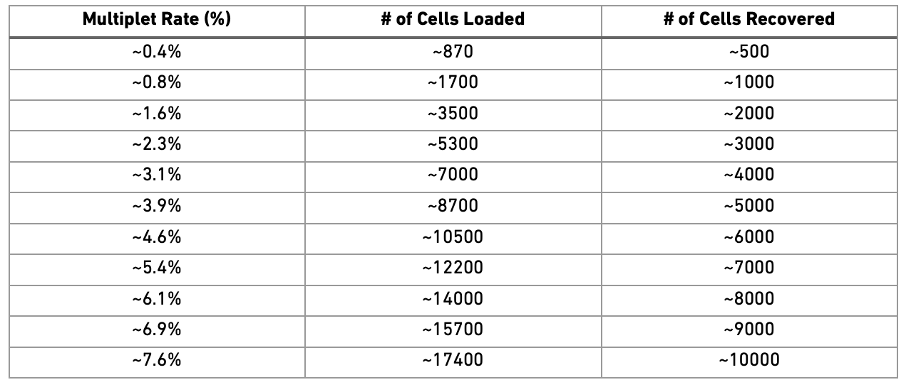

<div>

> **Note**
>
> Code chunks run R commands unless otherwise specified.

</div>

## Get data

In this tutorial, we will run all steps with a set of 8 PBMC 10x
datasets from 4 covid-19 patients and 4 healthy controls, the samples
have been subsampled to 1500 cells per sample. We can start by defining
our paths.

``` {r}
#| label: paths

# download pre-computed annotation
fetch_annotation <- TRUE

# url for source and intermediate data
path_data <- "https://nextcloud.dc.scilifelab.se/public.php/webdav"
curl_upass <- "-u zbC5fr2LbEZ9rSE:scRNAseq2025"

path_covid <- "./data/covid/raw"
if (!dir.exists(path_covid)) dir.create(path_covid, recursive = T)

path_results <- "./data/covid/results"
if (!dir.exists(path_results)) dir.create(path_results, recursive = T)
```

``` {r}
#| label: fetch-data

file_list <- c(
    "normal_pbmc_13.h5", "normal_pbmc_14.h5", "normal_pbmc_19.h5", "normal_pbmc_5.h5",
    "ncov_pbmc_15.h5", "ncov_pbmc_16.h5", "ncov_pbmc_17.h5", "ncov_pbmc_1.h5"
)

sample_names <- c(
  ncov_pbmc_1.h5 = "covid_1", ncov_pbmc_15.h5 = "covid_15",
  ncov_pbmc_17.h5 = "covid_17", ncov_pbmc_16.h5 = "covid_16",
  normal_pbmc_5.h5 = "ctrl_5", normal_pbmc_13.h5 = "ctrl_13",
  normal_pbmc_14.h5 = "ctrl_14", normal_pbmc_19.h5 = "ctrl_19")


for (i in file_list) {
    path_file <- file.path(path_covid, i)
    if (!file.exists(path_file)) {
        download.file(url = file.path(file.path(path_data, "covid/raw"), i),
              destfile = path_file, method = "curl", extra = curl_upass)
    }
}
```

With data in place, now we can start loading libraries we will use in
this tutorial.

``` {r}
#| label: libraries


suppressPackageStartupMessages({
    library(Seurat)
    library(Matrix)
    library(ggplot2)
    library(patchwork)
    library(dplyr)
    if (! "DoubletFinder" %in% installed.packages()){
       remotes::install_github(
        "https://github.com/chris-mcginnis-ucsf/DoubletFinder@3b420df68b8e2a0cc6ebd4c5c1c7ea170464c97f",
          upgrade = FALSE,
          dependencies = FALSE
       ) } 
    library(DoubletFinder)
})
```

We can first load the data individually by reading directly from HDF5
file format (.h5).

We will loop through all file names using `lapply` to create a list of
Seurat objects. We use two functions: `Read10X_h5`, which reads the
.h5-file as a count matrix, and `CreateSeuratObject`, which creates a
Seurat class object using the count matrix. In the latter function, we
define each sample in the `project` slot, so in each object, the sample
id can be found in the metadata slot `orig.ident`.

``` {r}
#| label: read

all_objects = lapply(file_list, function(file_name){
  seurat_object = 
    # Load count matrix
    Seurat::Read10X_h5(
      filename = file.path(path_covid, file_name),
      use.names = T
    ) %>%
      # Create Seurat object, including sample name as the project
      Seurat::CreateSeuratObject(project = sample_names[file_name])
  
  
  return(seurat_object)
})

```

## Collate

We can now merge them objects into a single object. Each analysis
workflow (Seurat, Scater, Scanpy, etc) has its own way of storing data.
We will add dataset labels as **cell.ids** just in case you have
overlapping barcodes between the datasets. After that we add a column
**type** in the metadata to define covid and ctrl samples.

``` {r}
#| label: create-seurat


# Merge datasets into one single seurat object
alldata <- merge(all_objects[[1]], all_objects[-1], 
                 add.cell.ids = TRUE)


# Define sample type per sample
sample_types <- c(
  covid_1 = "Covid", covid_15 = "Covid",
  covid_17 = "Covid", covid_16 = "Covid",
  ctrl_5 = "Ctrl", ctrl_13 = "Ctrl",
  ctrl_14 = "Ctrl", ctrl_19 = "Ctrl")

# Add sample type as metadata
alldata$type = as.character(sample_types[alldata$orig.ident])
```

In Seurat v5, merging creates a single object, but keeps the expression
information split into different layers for integration. If not
proceeding with integration, rejoin the layers after merging.

``` {r}
#| label: join-layers

alldata <- JoinLayers(alldata)
alldata
```

Once you have created the merged object, the individual sample objects
are not needed anymore. It is a good idea to remove them and run garbage
collect to free up some memory.

``` {r}
#| label: gc

# remove all objects that will not be used.
rm(all_objects)
# run garbage collect to free up memory
gc()
```

Here is what the count matrix and the metadata look like for every cell.

``` {r}
#| label: show-object

alldata[["RNA"]]$counts[1:10, 1:4] 
head(alldata@meta.data, 10)
```

## Calculate QC

Having the data in a suitable format, we can start calculating some
quality metrics. We can for example calculate the percentage of
mitochondrial and ribosomal genes per cell and add to the metadata. The
proportion of hemoglobin genes can give an indication of red blood cell
contamination, but in some tissues it can also be the case that some
celltypes have higher content of hemoglobin. This will be helpful to
visualize them across different metadata parameters (i.e. datasetID and
chemistry version). There are several ways of doing this. The QC metrics
are finally added to the metadata table.

Citing from Simple Single Cell workflows (Lun, McCarthy & Marioni, 2017)
about mitochondrial reads: High proportions are indicative of
poor-quality cells (Islam et al. 2014; Ilicic et al. 2016), possibly
because of loss of cytoplasmic RNA from perforated cells. The reasoning
is that mitochondria are larger than individual transcript molecules and
less likely to escape through tears in the cell membrane.

``` {r}
#| label: qc-calc

# Mitochondrial
alldata <- PercentageFeatureSet(alldata, "^MT-", col.name = "percent_mito")

# Ribosomal
alldata <- PercentageFeatureSet(alldata, "^RP[SL]", col.name = "percent_ribo")

# Percentage hemoglobin genes - includes all genes starting with HB except HBP.
alldata <- PercentageFeatureSet(alldata, "^HB[^(P|E|S)]", col.name = "percent_hb")

# Percentage for some platelet markers
alldata <- PercentageFeatureSet(alldata, "PECAM1|PF4", col.name = "percent_plat")
```

<div>

> **Tip**
>
> Alternatively, percentage expression can be calculated manually. Here
> is an example. Do not run this script now.
>
> ``` {r}
> #| eval: false
> # Do not run now!
> counts = GetAssayData(alldata, assay = "RNA", layer = "counts")
> total_counts_per_cell <- colSums(counts)
> mito_genes <- rownames(alldata)[grep("^MT-", rownames(alldata))]
> alldata$percent_mito2 <- colSums(counts[mito_genes, ]) / total_counts_per_cell
> rm(counts)
> ```

</div>

Now you can see that we have additional data in the metadata slot.

``` {r}
#| label: meta
head(alldata@meta.data)
```

## Plot QC

Now we can plot some of the QC variables as violin plots.

``` {r}
#| label: qc-vln
#| fig-height: 8
#| fig-width: 15

feats <- c("nFeature_RNA", "nCount_RNA", "percent_mito", "percent_ribo", "percent_hb", "percent_plat")
VlnPlot(alldata, group.by = "orig.ident", split.by = "type", features = feats, pt.size = 0.1, ncol = 3)
```

<div>

> **Discuss**
>
> Looking at the violin plots, what do you think are appropriate cutoffs
> for filtering these samples?

</div>

As you can see, there is quite some difference in quality for these
samples, with for instance the covid_15 and covid_16 samples having
cells with fewer detected genes and more mitochondrial content. We can
also plot the different QC-measures as scatter plots.

``` {r}
#| label: qc-scatter
#| fig-height: 8
#| fig-width: 15

FeatureScatter(alldata, "nCount_RNA", "nFeature_RNA", group.by = "orig.ident", pt.size = .5)
```

<div>

> **Discuss**
>
> Plot additional QC stats that we have calculated as scatter plots. How
> are the different measures correlated? Can you explain why?

</div>

## Filtering

### Detection-based filtering

A standard approach is to filter cells with low number of reads as well
as genes that are present in at least a given number of cells. Here we
will only consider cells with more than 200 detected genes and genes
that are expressed in more than 3 cells. Please note that those values
are highly dependent on the library preparation method used.

``` {r}
#| label: filt1
selected_c <- WhichCells(alldata, expression = nFeature_RNA > 200)
selected_f <- rownames(alldata)[Matrix::rowSums(alldata[["RNA"]]$counts) > 3]

data.filt <- subset(alldata, features = selected_f, cells = selected_c)
dim(data.filt)
table(data.filt$orig.ident)
```

Extremely high number of detected genes could indicate doublets.
However, depending on the cell type composition in your sample, you may
have cells with higher number of genes (and also higher counts) from one
cell type. In this case, we will run doublet prediction further down, so
we will skip this step now, but the code below is an example of how it
can be run:

``` {r}
#| label: filt2
# skip and run DoubletFinder instead
# data.filt <- subset(data.filt, cells=WhichCells(data.filt, expression = nFeature_RNA < 4100))
```

Additionally, we can also see which genes contribute the most to such
reads. We can for instance plot the percentage of counts per gene.

``` {r}
#| label: top-genes
#| fig-height: 8
#| fig-width: 15

# Compute the proportion of counts of each gene per cell
# Use sparse matrix operations, if your dataset is large, doing matrix devisions the regular way will take a very long time.

C <- data.filt[["RNA"]]$counts
C@x <- C@x / rep.int(colSums(C), diff(C@p)) * 100
most_expressed <- order(Matrix::rowSums(C), decreasing = T)[20:1]
boxplot(as.matrix(t(C[most_expressed, ])),
    cex = 0.1, las = 1, xlab = "Percent counts per cell",
    col = (scales::hue_pal())(20)[20:1], horizontal = TRUE
)
```

As you can see, MALAT1 constitutes up to 30% of the UMIs from a single
cell and the other top genes are mitochondrial and ribosomal genes. It
is quite common that nuclear lincRNAs have correlation with quality and
mitochondrial reads, so high detection of MALAT1 may be a technical
issue. Let us assemble some information about such genes, which are
important for quality control and downstream filtering.

### Mito/Ribo filtering

We also have quite a lot of cells with high proportion of mitochondrial
and low proportion of ribosomal reads. It would be wise to remove those
cells, if we have enough cells left after filtering. Another option
would be to either remove all mitochondrial reads from the dataset and
hope that the remaining genes still have enough biological signal. A
third option would be to just regress out the `percent_mito` variable
during scaling. In this case we had as much as 99.7% mitochondrial reads
in some of the cells, so it is quite unlikely that there is much cell
type signature left in those. Looking at the plots, make reasonable
decisions on where to draw the cutoff. In this case, the bulk of the
cells are below 20% mitochondrial reads and that will be used as a
cutoff. We will also remove cells with less than 5% ribosomal reads.

``` {r}
#| label: filt3

data.filt <- subset(data.filt, percent_mito < 20 & percent_ribo > 5)
dim(data.filt)
table(data.filt$orig.ident)
```

As you can see, a large proportion of sample covid_15 is filtered out.

### Plot filtered QC

Lets plot the same QC stats once more.

``` {r}
#| label: qc-vln2
#| fig-height: 8
#| fig-width: 15

feats <- c("nFeature_RNA", "nCount_RNA", "percent_mito", "percent_ribo", "percent_hb")
VlnPlot(data.filt, group.by = "orig.ident", features = feats, pt.size = 0.1, ncol = 3) + NoLegend()
```

There is still quite a lot of variation in `percent_mito`, so it will
have to be dealt with in the data analysis step. The `percent_ribo`
values are also highly variable, but that is expected since different
cell types have different proportions of ribosomal content, according to
their function.

### Filter genes

As the level of expression of mitochondrial and MALAT1 genes are judged
as mainly technical, it can be wise to remove them from the dataset
before any further analysis. In this case we will also remove the HB
genes.

``` {r}
#| label: filt-genes
dim(data.filt)

# Filter MALAT1
data.filt <- data.filt[!grepl("MALAT1", rownames(data.filt)), ]

# Filter Mitocondrial
data.filt <- data.filt[!grepl("^MT-", rownames(data.filt)), ]

# Filter Ribossomal gene (optional if that is a problem on your data)
# data.filt <- data.filt[ ! grepl("^RP[SL]", rownames(data.filt)), ]

# Filter Hemoglobin gene (optional if that is a problem on your data)
data.filt <- data.filt[!grepl("^HB[^(P|E|S)]", rownames(data.filt)), ]

dim(data.filt)
```

## Sample sex

When working with human or animal samples, you should ideally constrain
your experiments to a single sex to avoid including sex bias in the
conclusions. However this may not always be possible. By looking at
reads from chromosomeY (males) and XIST (X-inactive specific transcript)
expression (mainly female) it is quite easy to determine per sample
which sex it is. It can also be a good way to detect if there has been
any mislabelling leading to the sample metadata sex not agreeing with
the computational predictions.

To get chromosome information for all genes, you should ideally parse
the information from the gtf file that you used in the mapping pipeline
as it has the exact same annotation version/gene naming. However, it may
not always be available, as in this case where we have downloaded public
data. R package biomaRt can be used to fetch annotation information. The
code to run biomaRt is provided. As the biomart instances are quite
often unresponsive, we will download and use a file that was created in
advance.

<div>

> **Tip**
>
> Here is the code to download annotation data from Ensembl using
> biomaRt. We will not run this now and instead use a pre-computed file
> in the step below.
>
> ``` {r}
> #| label: annot
>
> # fetch_annotation is defined at the top of this document
> if (!fetch_annotation) {
>   suppressMessages(library(biomaRt))
>
>   # initialize connection to mart, may take some time if the sites are unresponsive.
>   mart <- useMart("ENSEMBL_MART_ENSEMBL", dataset = "hsapiens_gene_ensembl")
>
>   # fetch chromosome info plus some other annotations
>   genes_table <- try(biomaRt::getBM(attributes = c(
>     "ensembl_gene_id", "external_gene_name",
>     "description", "gene_biotype", "chromosome_name", "start_position"
>   ), mart = mart, useCache = F))
>
>   write.csv(genes_table, file = "data/covid/results/genes_table.csv")
> }
> ```

</div>

Download precomputed data.

``` {r}
#| label: fetch-annot
# fetch_annotation is defined at the top of this document
if (fetch_annotation) {
  genes_file <- file.path(path_results, "genes_table.csv")
  if (!file.exists(genes_file)) download.file(file.path(path_data, "covid/results_seurat_2026/genes_table.csv"), destfile = genes_file,
                                              method = "curl", extra = curl_upass)
}
```

``` {r}
#| label: read-annot
genes.table <- read.csv(genes_file)
genes.table <- genes.table[genes.table$external_gene_name %in% rownames(data.filt), ]
```

Now that we have the chromosome information, we can calculate the
proportion of reads that comes from chromosome Y per cell.But first we
have to remove all genes in the pseudoautosmal regions of chrY that are:
\* chromosome:GRCh38:Y:10001 - 2781479 is shared with X: 10001 - 2781479
(PAR1) \* chromosome:GRCh38:Y:56887903 - 57217415 is shared with X:
155701383 - 156030895 (PAR2)

``` {r}
#| label: par
par1 = c(10001, 2781479)
par2 = c(56887903, 57217415)
p1.gene = genes.table$external_gene_name[genes.table$start_position > par1[1] & genes.table$start_position < par1[2] & genes.table$chromosome_name == "Y"]
p2.gene = genes.table$external_gene_name[genes.table$start_position > par2[1] & genes.table$start_position < par2[2] & genes.table$chromosome_name == "Y"]

chrY.gene <- genes.table$external_gene_name[genes.table$chromosome_name == "Y"]
chrY.gene = setdiff(chrY.gene, c(p1.gene, p2.gene))

data.filt <- PercentageFeatureSet(data.filt, features = chrY.gene, col.name = "pct_chrY")
```

Then plot XIST expression vs chrY proportion. As you can see, the
samples are clearly on either side, even if some cells do not have
detection of either.

``` {r}
#| label: sex-scatter
FeatureScatter(data.filt, feature1 = "XIST", feature2 = "pct_chrY", slot = "counts", shuffle = TRUE)
```

Plot as violins.

``` {r}
#| label: sex-vln
VlnPlot(data.filt, features = c("XIST", "pct_chrY"))
```

<div>

> **Discuss**
>
> Here, we can see clearly that we have three males and five females,
> can you see which samples they are? Do you think this will cause any
> problems for downstream analysis? Discuss with your group: what would
> be the best way to deal with this type of sex bias?

</div>

## Cell cycle state

We here perform cell cycle scoring. To score a gene list, the algorithm
calculates the difference of mean expression of the given list and the
mean expression of reference genes. To build the reference, the function
randomly chooses a bunch of genes matching the distribution of the
expression of the given list. Cell cycle scoring adds three slots in the
metadata, a score for S phase, a score for G2M phase and the predicted
cell cycle phase.

``` {r}
#| label: cc

# Before running CellCycleScoring the data need to be normalized and logtransformed.
data.filt <- NormalizeData(data.filt)
data.filt <- CellCycleScoring(
    object = data.filt,
    g2m.features = cc.genes$g2m.genes,
    s.features = cc.genes$s.genes
)
```

We can now create a violin plot for the cell cycle scores as well.

``` {r}
#| label: cc-vln
#| fig-height: 5
#| fig-width: 15

VlnPlot(data.filt, features = c("S.Score", "G2M.Score"), group.by = "orig.ident", ncol = 3, pt.size = .1)
```

In this case it looks like we only have a few cycling cells in these
datasets.

Seurat does an automatic prediction of cell cycle phase with a default
cutoff of the scores at zero. As you can see this does not fit this data
very well, so be cautious with using these predictions. Instead we
suggest that you look at the scores.

``` {r}
#| label: cc-scatter
#| fig-height: 7
#| fig-width: 7

FeatureScatter(data.filt, "S.Score", "G2M.Score", group.by = "Phase")
```

## Predict doublets

Doublets/Multiples of cells in the same well/droplet is a common issue
in scRNAseq protocols. Especially in droplet-based methods with
overloading of cells. In a typical 10x experiment the proportion of
doublets is linearly dependent on the amount of loaded cells. As
indicated from the Chromium user guide, doublet rates are about as
follows:\
\
Most doublet detectors simulates doublets by merging cell counts and
predicts doublets as cells that have similar embeddings as the simulated
doublets. Most such packages need an assumption about the
number/proportion of expected doublets in the dataset. The data you are
using is subsampled, but the original datasets contained about 5 000
cells per sample, hence we can assume that they loaded about 9 000 cells
and should have a doublet rate at about 4%.

Here, we will use `DoubletFinder` to predict doublet cells. As the
samples were prepared separately, the dataset cannot contain doublets
across samples. We will therefore run the `DoubletFinder` method on each
sample separately.

In order to perform the prediction, the data must first be pre-processed
through variable gene selection, scaling and PCA. We will explore these
methods further in the next exercise (Dimensionality reduction).

For more information on how DoubletFinder works, see the
[repository](https://github.com/chris-mcginnis-ucsf/DoubletFinder). In
short, artificial doublets are produced, and real cells are scored
according to how similar they are to the most similar doublets. The top
X% cells are predicted to be doublets, where X is the expected
percentage of doublets as provided by the user.

In addition to providing the expected number of doublets (`nExp`), the
user must also provide the parameter `pK`, which determines the size of
the neighborhoods considered when evaluating the similarities between
sample data and artificical doublets. It is recommended to use the
function `paramSweep()` to find the optimal `pK` for each sample. As
this function takes quite some time for each sample, we have provided
the result directly in the code.

Finally, we can run doubletFinder. In this case, we are using the first
10 PCs per sample.

<div>

> **Tip**
>
> This step can also take some time. If it is taking too long, you can
> use the following code to download the results:
>
> ``` {r}
> #| label: download-doublets
> #| eval: false
>
> path_file <- "data/covid/results/seurat_covid_qc_doublets.rds"
>
> if (!file.exists(path_file)) download.file(url = file.path(path_data, "covid/results_seurat_2026/seurat_covid_qc_doublets.rds"), destfile = path_file, method = "curl", extra = curl_upass)
>
> df <- readRDS(path_file)
> data.filt = AddMetaData(data.filt, df)
> ```

</div>

``` {r}
#| label: doubletfinder_params

## Can run parameter optimization with paramSweep

## One sample:
# sweep.res <- paramSweep(data.filt)
# sweep.stats <- summarizeSweep(sweep.res, GT = FALSE)
# bcmvn <- find.pK(sweep.stats)
# barplot(bcmvn$BCmetric, names.arg = bcmvn$pK, las=2)

## Multiple samples:
# bcmvn_list = lapply(SplitObject(data.filt, "orig.ident"), function(data.filt){
#   data.filt <- FindVariableFeatures(data.filt, verbose = F)
#   data.filt <- ScaleData(data.filt, vars.to.regress = c("nFeature_RNA", "percent_mito"), verbose = F)
#   data.filt <- RunPCA(data.filt, verbose = F, npcs = 20)
#   
#   sweep.res <- paramSweep(data.filt)
#   sweep.stats <- summarizeSweep(sweep.res, GT = FALSE)
#   bcmvn <- find.pK(sweep.stats)
#   bcmvn
# })
# 
# pK = sapply(bcmvn_list, 
#             function(x){
#               as.numeric(as.character(x$pK[which.max(x$BCmetric)]))
#             })
```

``` {r}
#| label: doubletfinder

# Pre-calculated optimal pK
pK = c(ctrl_13 = 0.04,
  ctrl_14 = 0.03,
  ctrl_19 = 0.17,
  ctrl_5 = 0.01,
  covid_15 = 0.16,
  covid_16 = 0.15,
  covid_17 = 0.03,
  covid_1 = 0.04)

# For each sample (using SplitObject), run pre-processing steps and doubletFinder(). doubletFinder() will produce a Seurat object containing the doublet information in the metadata - save this metadata to the list "df_list".
df_list = lapply(SplitObject(data.filt, "orig.ident"), function(sub.data.filt){
  
  # Pre-process data
  sub.data.filt <- FindVariableFeatures(sub.data.filt, verbose = F)
  sub.data.filt <- ScaleData(sub.data.filt, vars.to.regress = c("nFeature_RNA", "percent_mito"), verbose = F)
  sub.data.filt <- RunPCA(sub.data.filt, verbose = F, npcs = 20)
  

  # define the expected number of doublet cells.
  nExp <- round(ncol(sub.data.filt) * 0.04) # expect 4% doublets
  
  # Run doubletFinder
  sub.data.filt <- doubletFinder(sub.data.filt, pN = 0.25, 
                                 pK = pK[sub.data.filt$orig.ident[1]],
                                 nExp = nExp, PCs = 1:10)
  # Return metadata
  sub.data.filt@meta.data
})


# Combine the results from the different samples into one matrix
df = bind_rows(lapply(df_list, function(x){
  # name of the DF prediction can change, so extract the correct column names.
  y = x[, c(grep("^DF\\.class", colnames(x)),grep("^pANN_", colnames(x))), drop = FALSE]
  colnames(y) = c("DF","pANN")
  y}))

# Add the doubletFinder metadata to the full Seurat object
data.filt = AddMetaData(data.filt, df)

```

In order to visualize the predictions, we will run the same steps as
above (find variable features, scale data, PCA) as well as UMAP on the
whole dataset.

``` {r}
#| label: doublet-norm
data.filt <- FindVariableFeatures(data.filt, verbose = F)
data.filt <- ScaleData(data.filt, vars.to.regress = c("nFeature_RNA", "percent_mito"), verbose = F)
data.filt <- RunPCA(data.filt, verbose = F, npcs = 20)
data.filt <- RunUMAP(data.filt, dims = 1:10, verbose = F)

```

``` {r}
#| label: doublet-plot
#| fig-height: 4
#| fig-width: 10

wrap_plots(
    DimPlot(data.filt, group.by = "orig.ident") + NoAxes(),
    DimPlot(data.filt, group.by = "DF") + NoAxes(),
    ncol = 2
)
```

``` {r}
#| label: doublet-plot-split
#| fig-height: 4
#| fig-width: 10

DimPlot(data.filt, group.by = "DF", split.by = "orig.ident", ncol = 4) & NoAxes()
```

We should expect that two cells have more detected genes than a single
cell, lets check if our predicted doublets also have more detected genes
in general.

``` {r}
#| label: doublet-vln

VlnPlot(data.filt, features = "nFeature_RNA", group.by = "DF", pt.size = .1)
```

``` {r}
#| label: doublet-vln-split

VlnPlot(data.filt, features = "nFeature_RNA", group.by = "orig.ident", split.by = "DF", pt.size = .1)
```

Now, lets remove all predicted doublets from our data.

``` {r}
#| label: doublet-filt

data.filt <- data.filt[, data.filt@meta.data[, "DF"] == "Singlet"]
dim(data.filt)
```

To summarize, lets check how many cells we have removed per sample, we
started with 1500 cells per sample. Looking back at the intitial QC
plots does it make sense that some samples have much fewer cells now?

``` {r}
#| label: view-data
table(alldata$orig.ident)
table(data.filt$orig.ident)
```

<div>

> **Discuss**
>
> Why is it important to predict doublets in the different samples
> separately? In which situations would this be more/less important?

</div>

## Save data

Finally, lets save the QC-filtered data for further analysis. Create
output directory `data/covid/results` and save data to that folder. This
will be used in downstream labs.

``` {r}
#| label: save

saveRDS(data.filt, file.path(path_results, "seurat_covid_qc.rds"))
```

## Session info

```{=html}
<details>
```
```{=html}
<summary>
```
Click here
```{=html}
</summary>
```
``` {r}
#| label: session

sessionInfo()
```

```{=html}
</details>
```
