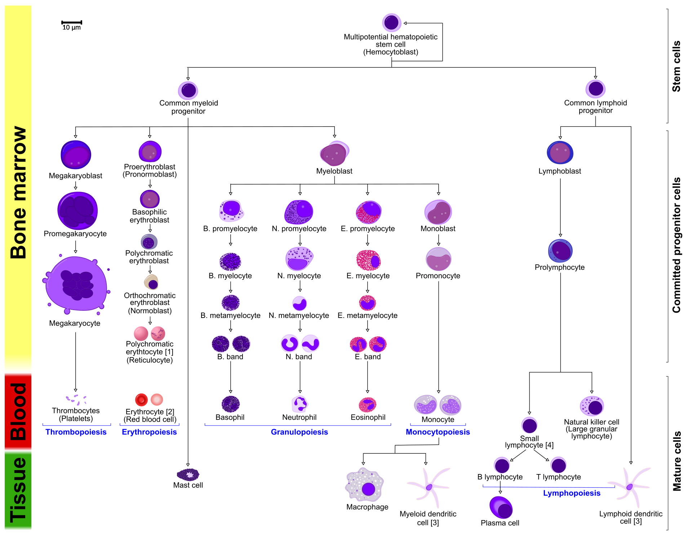

::: {.callout-note}
Code chunks run Python commands unless it starts with `%%bash`, in which case, those chunks run shell commands.
:::

Partly following this PAGA [tutorial](https://scanpy-tutorials.readthedocs.io/en/latest/paga-paul15.html) with some modifications.

## Loading libraries

```{python}
#| label: libraries
import numpy as np
import pandas as pd
import matplotlib.pyplot as pl
from matplotlib import rcParams
import scanpy as sc

import scipy
import numpy as np
import matplotlib.pyplot as plt
import warnings
import cellrank as cr
import scvelo as scv

warnings.simplefilter(action="ignore", category=Warning)

# verbosity: errors (0), warnings (1), info (2), hints (3)
sc.settings.verbosity = 3
sc.settings.set_figure_params(dpi=100, frameon=False, figsize=(5, 5), facecolor='white', color_map = 'viridis_r') 
```

## Preparing data

In order to speed up the computations during the exercises, we will be using a subset of a bone marrow dataset (originally containing about 100K cells). The bone marrow is the source of adult immune cells, and contains virtually all differentiation stages of cell from the immune system which later circulate in the blood to all other organs.



If you have been using the **Seurat**, **Bioconductor** or **Scanpy** toolkits with your own data, you need to reach to the point where can find get:

- A dimensionality reduction where to perform the trajectory (for example: PCA, ICA, MNN, harmony, Diffusion Maps, UMAP)
- The cell clustering information (for example: from Louvain, k-means)
- A KNN/SNN graph (this is useful to inspect and sanity-check your trajectories)


In this case, all the data has been preprocessed with Seurat with standard pipelines. In addition there was some manual filtering done to remove clusters that are disconnected and cells that are hard to cluster, which can be seen in this [script](https://github.com/NBISweden/workshop-scRNAseq/blob/main/scripts/data_processing/slingshot_preprocessing.Rmd) 


The file trajectory_scanpy_filtered.h5ad was converted from the Seurat object using the SeuratDisk package. For more information on how it was done, have a look at the script: [convert_to_h5ad.R](https://github.com/NBISweden/workshop-scRNAseq/blob/main/scripts/data_processing/convert_to_h5ad.R) in the github repo.

You can download the data with the commands:

```{python}
#| label: fetch-data
import os
import subprocess

# download pre-computed data if missing or long compute
fetch_data = True

# url for source and intermediate data
path_data = "https://nextcloud.dc.scilifelab.se/public.php/webdav"
curl_upass = "zbC5fr2LbEZ9rSE:scRNAseq2025"

path_results = "data/trajectory"
if not os.path.exists(path_results):
    os.makedirs(path_results, exist_ok=True)

path_file = "data/trajectory/trajectory_seurat_filtered.h5ad"
if not os.path.exists(path_file):
    file_url = os.path.join(path_data, "trajectory/trajectory_seurat_filtered.h5ad")
    subprocess.call(["curl", "-u", curl_upass, "-o", path_file, file_url ])    

```

## Reading data

We already have pre-computed and subsetted the dataset (with 6688 cells and 3585 genes) following the analysis steps in this course. We then saved the objects, so you can use common tools to open and start to work with them (either in R or Python).

```{python}
#| label: read-data
adata = sc.read_h5ad("data/trajectory/trajectory_seurat_filtered.h5ad")
adata.var
```

```{python}
#| label: check-data
# check what you have in the X matrix, should be lognormalized counts.
print(adata.X[:10,:10])
```

## Explore the data

There is a umap and clusters provided with the object, first plot some information from the previous analysis onto the umap.

```{python}
#| label: plot-umap
sc.pl.umap(adata, color = ['clusters','dataset','batches','Phase'],legend_loc = 'on data', legend_fontsize = 'xx-small', ncols = 2)
```

It is crucial that you performing analysis of a dataset understands what is going on, what are the clusters you see in your data and most importantly How are the clusters related to each other?. Well, let’s explore the data a bit. With the help of this table, write down which cluster numbers in your dataset express these key markers.

|Marker  |Cell Type|
|--------|----------------------------|
|Cd34    |HSC progenitor|
|Ms4a1   |B cell lineage|
|Cd3e    |T cell lineage|
|Ltf     |Granulocyte lineage|
|Cst3    |Monocyte lineage|
|Mcpt8   |Mast Cell lineage|
|Alas2   |RBC lineage|
|Siglech |Dendritic cell lineage|
|C1qc    |Macrophage cell lineage|
|Pf4     |Megakaryocyte cell lineage|

```{python}
#| label: plot-markers
markers = ["Cd34","Alas2","Pf4","Mcpt8","Ltf","Cst3", "Siglech", "C1qc", "Ms4a1", "Cd3e", ]
sc.pl.umap(adata, color = markers, use_raw = False, ncols = 4)
```

## Rerun analysis in Scanpy

Redo clustering and umap using the basic Scanpy pipeline. Use the provided "X_harmony_Phase" dimensionality reduction as the starting point.

```{python}
#| label: process
# first, store the old umap with a new name so it is not overwritten
adata.obsm['X_umap_old'] = adata.obsm['X_umap']

sc.pp.neighbors(adata, n_pcs = 30, n_neighbors = 20, use_rep="X_harmony_Phase")
sc.tl.umap(adata, min_dist=0.4, spread=3)
```

```{python}
#| label: cluster
sc.pl.umap(adata, color = ['clusters'],legend_loc = 'on data', legend_fontsize = 'xx-small', edges = True)

sc.pl.umap(adata, color = markers, use_raw = False, ncols = 4)

# Redo clustering as well
sc.tl.leiden(adata, key_added = "leiden_1.0", resolution = 1.0) # default resolution in 1.0
sc.tl.leiden(adata, key_added = "leiden_1.2", resolution = 1.2) # default resolution in 1.0
sc.tl.leiden(adata, key_added = "leiden_1.4", resolution = 1.4) # default resolution in 1.0

#sc.tl.louvain(adata, key_added = "leiden_1.0") # default resolution in 1.0
sc.pl.umap(adata, color = ['leiden_1.0', 'leiden_1.2', 'leiden_1.4','clusters'],legend_loc = 'on data', legend_fontsize = 'xx-small', ncols =2)
```

```{python}
#| label: annotate
#Rename clusters with really clear markers, the rest are left unlabelled.

annot = pd.DataFrame(adata.obs['leiden_1.4'].astype('string'))
annot[annot['leiden_1.4'] == '9'] = '9_megakaryo' #Pf4
annot[annot['leiden_1.4'] == '16'] = '16_macro'  #C1qc
annot[annot['leiden_1.4'] == '11'] = '11_eryth' #Alas2
annot[annot['leiden_1.4'] == '17'] = '17_dend' #Siglech
annot[annot['leiden_1.4'] == '13'] = '13_mast' #Mcpt8
annot[annot['leiden_1.4'] == '6'] = '6_mono' #Cts3
annot[annot['leiden_1.4'] == '3'] = '3_gran' #Ltf
annot[annot['leiden_1.4'] == '14'] = '14_TC' #Cd3e
annot[annot['leiden_1.4'] == '15'] = '15_BC' #Ms4a1
annot[annot['leiden_1.4'] == '2'] = '2_progen'  # Cd34
annot[annot['leiden_1.4'] == '10'] = '10_progen' 
annot[annot['leiden_1.4'] == '5'] = '5_progen'

adata.obs['annot']=annot['leiden_1.4'].astype('category')

sc.pl.umap(adata, color = 'annot',legend_loc = 'on data', legend_fontsize = 'xx-small', ncols =2)

annot.value_counts()
#type(annot)

# astype('category')
```

```{python}
#| label: plot-annot
# plot onto the Seurat embedding:
sc.pl.embedding(adata, basis='X_umap_old', color = 'annot',legend_loc = 'on data', legend_fontsize = 'xx-small', ncols =2)
```

## Run PAGA

Use the clusters from leiden clustering with leiden_1.4 and run PAGA. PAGA is very good at revealing global topologies of the data that might be distorted in a umap. 
First we create the graph and initialize the positions using the umap.

```{python}
#| label: paga
# use the umap to initialize the graph layout.
sc.tl.draw_graph(adata, init_pos='X_umap')
sc.pl.draw_graph(adata, color='annot', legend_loc='on data', legend_fontsize = 'xx-small')
sc.tl.paga(adata, groups='annot')
sc.pl.paga(adata, color='annot', edge_width_scale = 0.3)
```

As you can see, we have edges between many clusters that we know are are unrelated, so we may need to clean up the data a bit more.

## Filtering graph edges

First, lets explore the graph a bit. We plot the umap with the graph edges on top. The edges signify neighborhood between cells in the KNN-graph.

```{python}
#| label: plot-graph
sc.pl.umap(adata, edges=True, color = 'annot', legend_loc= 'on data', legend_fontsize= 'xx-small')
```

We have many edges in the graph between unrelated clusters, so lets try recalculating the graph with fewer neighbors. You can experiment with calculating different numbers of neighbors to see how it affects the graph and the connection between cells and nodes. Choosing too few neighbors however (<=5) will lead to problems with the downstream analysis for this dataset, as the graph becomes too sparse.

```{python}
#| label: redo-graph
sc.pp.neighbors(adata, n_neighbors=8,  use_rep = 'X_harmony_Phase', n_pcs = 30)
sc.pl.umap(adata, edges=True, color = 'annot', legend_loc= 'on data', legend_fontsize= 'xx-small')
```

### Rerun PAGA again on the data

```{python}
#| label: draw-graph
sc.tl.draw_graph(adata, init_pos='X_umap')
sc.pl.draw_graph(adata, color='annot', legend_loc='on data', legend_fontsize = 'xx-small')
```

```{python}
#| label: paga2
sc.tl.paga(adata, groups='annot')
sc.pl.paga(adata, color='annot', edge_width_scale = 0.3)
```

## Embedding using PAGA-initialization

We can now redraw the graph using another starting position from the paga layout. The following is just as well possible for a UMAP.

```{python}
#| label: draw-graph-paga
sc.tl.draw_graph(adata, init_pos='paga')
sc.pl.draw_graph(adata, color=['annot'], legend_loc='on data', legend_fontsize=  'xx-small')
```


We can now compare the two graphs. On the left, each cell is embedded on our PAGA graph, whereas on the right, each cluster of cells is represented as a node in the graph and each edge represents the connectivity between two clusters.

```{python}
#| label: paga-compare
sc.pl.paga_compare(
    adata, threshold=0.03, title='', right_margin=0.2, size=10, edge_width_scale=0.5,
    legend_fontsize=12, fontsize=12, frameon=False, edges=True)
```

:::{.callout-note title="Discuss"}
Does this graph fit the biological expectations given what you know of hematopoesis. Please have a look at the figure in Section 2 and compare to the paths you now have. 
:::

## Detecting gene changes along trajectories

We can reconstruct gene changes along PAGA paths for a given set of genes. For this we calculate the diffusion pseudotime, which orders cells on a pseudotemporal axis based on their expression profile.

Choose a root cell for diffusion pseudotime. We have 3 progenitor clusters, but cluster 2 seems the most clear based on the Cd34 Marker, so we chose that cluster as starting timepoint for our pseudotime.

```{python}
#| label: pseudotime
adata.uns['iroot'] = np.flatnonzero(adata.obs['annot']  == '2_progen')[0]

sc.tl.dpt(adata)
```

Use the full raw data for visualization.

```{python}
#| label: plot-pt
sc.pl.draw_graph(adata, color=['annot', 'dpt_pseudotime'], legend_loc='on data', legend_fontsize= 'x-small')
```
:::{.callout-note title="Discuss"}
The pseudotime represents the distance of every cell to the starting cluster. Have a look at the pseudotime plot, how well do you think it represents actual developmental time? What does it represent? 
:::

## Using Cellrank to investigate gene expression changes along specific trajectories

Now that we have calculated pseudotime, we are interested in what genes might change during a certain lineages differentiation trajectory. To analyse this, we use cellrank - a python library that computes probablistic cell fate mappings. It basically models the probabilities for each cell to end up in a specific terminal state (in our case, fully differentiated cell types). 

Cellrank can use different metrics to calculate a transition matrix, such as RNA velocity or pseudotime. As we have calculated pseudotime for our dataset above, we will use that for the calculation of our transition matrix.

```{python}
#Set up a cellrank kernel 
pt_kernel = cr.kernels.PseudotimeKernel(adata, time_key='dpt_pseudotime')
pt_kernel.compute_transition_matrix()
```

In order to calculate terminal fates and lineage commitment, cellrank uses estimators like GPCCA. We set up an estimator from our PseudotimeKernel (pt_kernel) and compute macrostates in our dataset (groups of cells with similar transition dynamics).

```{python}
#Set up an estimator to analyse the kernel
pt_est =  cr.estimators.GPCCA(pt_kernel)

#Compute macrostates
pt_est.fit(cluster_key='annot', n_states=[10,15], n_cells=50)
```

Now that we have created an estimator and computed macrostates, we can either automatically compute our initial and terminal cell states using , or we can set them manually. In this case, we will set the initial state manually to '2_progen', but let cellrank predict the terminal states.

```{python}
#Predict initial and terminal states
pt_est.set_initial_states({'5_progen': adata.obs_names[adata.obs['annot'] == '2_progen']}, 
                         cluster_key='annot', n_cells=30)

pt_est.predict_terminal_states(n_states=10, method='top_n', allow_overlap=True)
```

Let's plot the initial and terminal states on our single cell graph to see how well they correspond to what we would expect.

```{python}
# Create figure with 1 row, 2 columns
fig, (ax1, ax2) = plt.subplots(1, 2, figsize=(15, 6))

# First plot: macrostates (left subplot)
scv.pl.scatter(
    adata,
    color='init_states_fwd',
    basis='X_draw_graph_fa',
    legend_loc='right',
    frameon=False,
    size=10,
    linewidth=0,
    ax=ax1,  # Pass the axis
    show=False  # Don't show yet
)

# Second plot: terminal states (right subplot)  
scv.pl.scatter(
    adata,
    color='term_states_fwd', 
    basis='X_draw_graph_fa',
    legend_loc='right',
    frameon=False,
    size=10,
    linewidth=0,
    ax=ax2,  # Pass the axis
    show=False  # Don't show yet
)

# Add titles
ax1.set_title('Macrostates (Forward)')
ax2.set_title('Terminal States (Forward)')

plt.tight_layout()
plt.show()
```

:::{.callout-note title="Discuss"}
Are the initial and terminal states predicted as you expected? What deviates from your expectation? 

The results are influenced by a multitude of parameters, such as the PAGA graph connections (mediated by the n_neighbors parameter in sc.pp.neighbors) and the n_states parameter in pt_est.fit. Feel free to play with these parameters and see how the results change.
:::

Now that we have calculated our initial and terminal states, we will calculate fate probabilities. Cellrank does this by using Markov Chains, which calculates the probability for each cell to end up at a given terminal state. Later on we will be able to use this information to investigate which genes drive differentiation from a progenitor towards a certain fully differentiated cell type.

```{python}
#Compute and plot cell fate probabilities
pt_est.compute_fate_probabilities()
pt_est.plot_fate_probabilities(legend_loc='right', basis='X_draw_graph_fa')
```

Now that we have computed the fate probabilities of every cell, we can compute **driver genes** - Cellrank does this by correlating fate probabilities with gene expression, under the assumption that genes that have a strong correlation with the fate probabilities of a certain lineage might drive differentiatin processes towards the lineages terminal state.

Below we will calculate driver genes for the erythrocyte lineage ('11_eryth') and the megakaryocyte lineage ('9_megakaryo').

```{python}
#Calculate lineage drivers
drivers_ery = pt_est.compute_lineage_drivers(lineages=['11_eryth'], cluster_key='annot')
#Sort
drivers_ery_sort = drivers_ery.sort_values(by='11_eryth_corr', ascending=False)

drivers_mega = pt_est.compute_lineage_drivers(lineages=['9_megakaryo'], cluster_key='annot')
drivers_mega_sort = drivers_mega.sort_values(by='9_megakaryo_corr', ascending=False)

#Get top 10 eruythrocyte driver genes
drivers_ery_sort.head(n=10)
```

Now we plot the top 10 previously calculated driver genes for the erythrocyte and granulocyte lineages. 

```{python}
sc.pl.draw_graph(adata, color=drivers_ery_sort.index.tolist()[1:10], legend_loc='on data', legend_fontsize= 'x-small', use_raw=False, ncols=3)
```

```{python}
#Also plot the lineage drivers for the granulocyte lineage
sc.pl.draw_graph(adata, color=drivers_mega_sort.index.tolist()[1:10], legend_loc='on data', legend_fontsize= 'x-small', use_raw=False, ncols=3)
```

:::{.callout-note title="Discuss"}
Discuss amongst yourselves which genes appear to be good markers for the respective lineages and why!
:::

Now we want to look at the expression trends for some of the genes we just identified as potential drivers over pseudotime. Cellrank uses Generalized additive models (GAMs) to fit smooth expression curves, so we start by creating such models for our data.

```{python}
#Fit GAMs
model = cr.models.GAM(adata, n_knots=6)
```

Now we plot some of the interesting genes of the erythrocyte lineage, Car1, Atpif1, Vamp5. We only plot the genes for their respective lineage, in order to compare their expression at different pseudotime points during the lineages developmental trajectory.

```{python}
cr.pl.gene_trends(adata, 
                  model = model,
                  genes = ['Car1', 'Atpif1', 'Vamp5'],
                  same_plot=True,
                  time_key = 'dpt_pseudotime',
                  lineages = ['11_eryth'],
                  hide_cells=True,
                  ncols=3)

cr.pl.gene_trends(adata, 
                  model = model,
                  genes = ['Cavin2', 'Pbx1', 'Rab27b'],
                  same_plot=True,
                  time_key = 'dpt_pseudotime',
                  lineages = ['9_megakaryo'],
                  hide_cells=True,
                  ncols=3)
```

What would this look like if we were to try and compare the gene expression between the two lineages?

```{python}
#Plot gene trends for erythrocyte and granulocyte lineages
cr.pl.gene_trends(adata, 
                  model = model,
                  genes = ['Cavin2', 'Pbx1', 'Car1'],
                  same_plot=True,
                  time_key = 'dpt_pseudotime',
                  lineages = ['9_megakaryo', '11_eryth'],
                  hide_cells=True,
                  ncols=3)
```

:::{.callout-note title="Discuss"}
 Why do the different lineages in the plots above have different maximum pseudotime values? In how far do you think the gene expression values are comparable across the two lineages?
:::

We can also visualize the expression of several genes over pseudotime in a single trajectory. Let's do this for the 30 top driver genes of the erythrocyte and megakaryocyte lineages. If you have any genes that you are interested in, plot these using the code below.

```{python}
#Plot expression cascades of several genes over pseudotime
cr.pl.heatmap(
    adata,
    model=model,
    lineages='11_eryth',
    cluster_key='annot',
    show_fate_probabilities=True,
    genes=drivers_ery_sort.index.tolist()[1:30],
    time_key='dpt_pseudotime',
    figsize=(12,10),
    show_all_genes=True
)

cr.pl.heatmap(
    adata,
    model=model,
    lineages='9_megakaryo',
    cluster_key='annot',
    show_fate_probabilities=True,
    genes=drivers_mega_sort.index.tolist()[1:30],
    time_key='dpt_pseudotime',
    figsize=(12,10),
    show_all_genes=True
)
```

Now that we have visualized expression trends for several genes associated with the our lineages, we could be interested in identifying **other genes that follow a specific expression pattern** along the trajectory. Let's say we are interested in genes from the erythrocyte lineage that increase with pseudotime (like Car1) and genes whose expression peaks and then falls off again before the maximum pseudotime value is reached (like Vamp5). 

Cellrank provides a way for us to identify genes that have a similar expression along the trajectory, using the .cluster_trends function. You can modify the number of clusters by modifying the resolution parameter until you find the clustering to be appropriate.

```{python}
#Then we cluster trends based on the erythrocyte driver genes
cr.pl.cluster_trends(
    adata,
    model=model,  # use the model from before
    lineage="11_eryth",
    genes=drivers_ery_sort.index.tolist(),
    time_key="dpt_pseudotime",
    n_jobs=8,
    random_state=0,
    clustering_kwargs={"resolution": 0.4, "random_state": 0},
    neighbors_kwargs={"random_state": 0},
    recompute=True
)
```

The results of the clustering trend are saved as an anndata object in adata.uns['lineage_11_eryth_trend']. We will now use this to extract genes that follow a specific trend and plot them.

```{python}
#Save trends as new anndata object
ery_trends = adata.uns['lineage_11_eryth_trend'].copy()

#Add means and dispersions from original data to the object
cols = ["means", "dispersions"]
ery_trends.obs = ery_trends.obs.merge(
    right=adata.var[cols], how="left", left_index=True, right_index=True
)

#Extract genes that follow the expression patterns of the respective clusters
low_genes = list(
    ery_trends[ery_trends.obs["clusters"] == "4"]
    .obs.sort_values("means", ascending=False)
    .index
)

mid_genes = list(
    ery_trends[ery_trends.obs["clusters"] == "6"]
    .obs.sort_values("means", ascending=False)
    .index
)

high_genes = list(
    ery_trends[ery_trends.obs["clusters"] == "1"]
    .obs.sort_values("means", ascending=False)
    .index
)
```

```{python}
#There are a lot of ribosomal genes in our gene lists - these are probably not as interesting as other genes, so we remove them from our lists right now
low_genes_filt = [str(x) for x in low_genes if not x.lower().startswith(('rpl', 'rps'))]
mid_genes_filt = [str(x) for x in mid_genes if not x.lower().startswith(('rpl', 'rps'))]
high_genes_filt = [str(x) for x in high_genes if not x.lower().startswith(('rpl', 'rps'))]
```

```{python}
#Plot the selected genes
cr.pl.gene_trends(
    adata,
    model=model,
    lineages="11_eryth",
    cell_color="annot",
    genes=high_genes_filt[0:3]+mid_genes_filt[0:3]+low_genes_filt[0:3],
    same_plot=True,
    ncols=3,
    time_key="dpt_pseudotime",
    hide_cells=True
    )
```

You can visaulize any number of genes in this manner in order to see which ones are interesting for your specific question. 

:::{.callout-note title="Discuss"}
As you can see, we can manipulate the trajectory quite a bit by selecting different number of neighbors, components etc. to fit with our assumptions on the development of these celltypes.

Please explore further how you can tweak the trajectory. For instance, can you create a PAGA trajectory using the orignial umap from Seurat instead? Hint, you first need to compute the neighbors on the umap.
:::

## Session info

<details>
  <summary>Click here</summary>

```{python}
#| label: session
sc.logging.print_versions()
```

</details>
