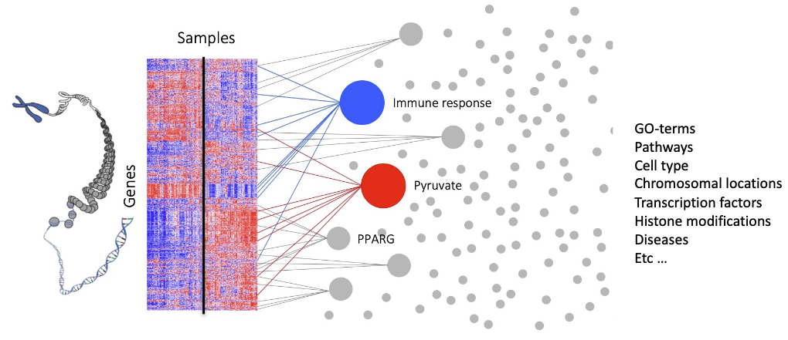
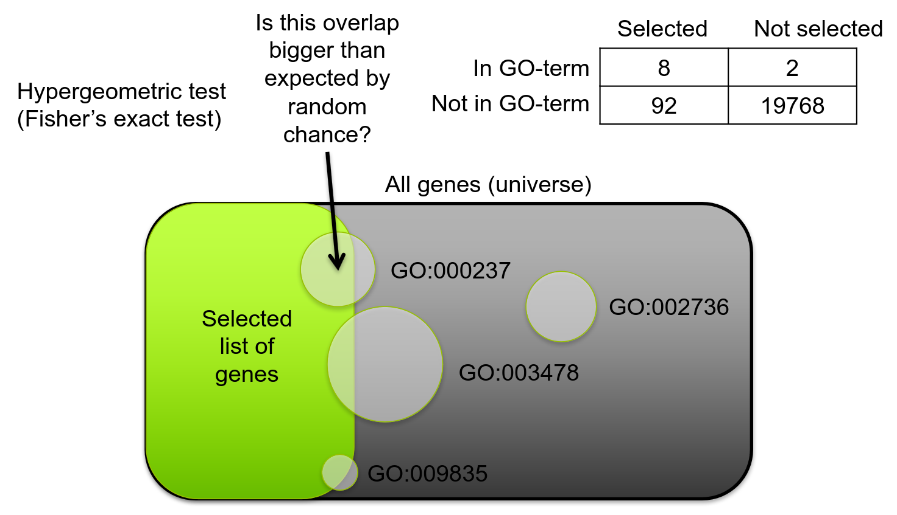
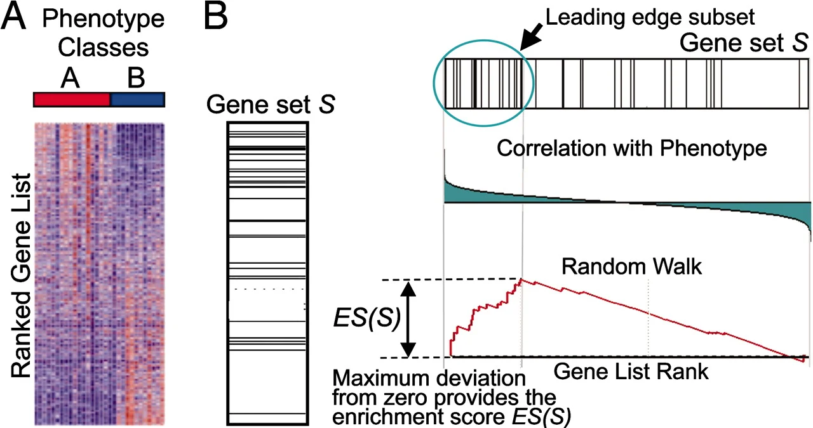
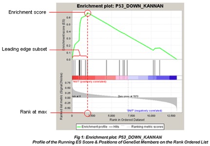
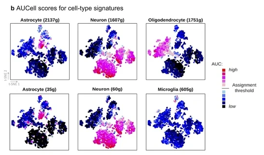
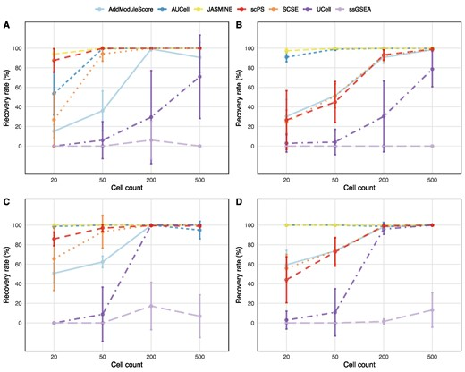

## What is gene set analysis?

. . .

Gene-level data -> Gene set data
(Gene set = a list of genes)

. . .

We focus on transcriptomics and DGE, but in principle applies to any genome-wide data

:::{.notes}
Many different kinds of genome wide analyses such differential gene expression, differential binding (chip-seq), differential methylation etc. could all end up here at functional analysis.
:::

## Why gene set analysis?
 
 
 

### Predict the functional changes of cells based on gene expression

- Make sense of a long list of DEGs
  - What is the function of those genes?
  - What is the biological consequence of over/under expression of genes?
- Connect your results to pathway activity
- Small differences in many genes may have a bigger impact than large differences in one genes
- Less sensitive to false positive DEGs

## Types of gene set analysis
 
 
 

- Gene set testing
  - Find statistically significant enrichment of gene sets in a ranked or non-ranked list of genes
- Activity scoring
  - Predict activity of a gene set in individual samples or cells

## Requirements
 
 
 

::: {.center}

### DE results OR expression data
 
### +

### Gene set(s) (list(s) of genes) 

### + 

### Statistical test (usually)

:::

## Examples of gene sets

- Genes in a pathway
- Genes with shared functions
- Target genes of a transcription factor
- Cell type markers
- Disease-related genes

## Where to get gene sets?

- Databases
  - Gene Ontology
  - KEGG
  - Reactome
  - MSigDB
  - CellMarker
  - PanglaoDB
  - ChEA
  - ...
- Literature / previous studies (e.g. list of DE genes, list of transcription factor targets etc)

Different sources vary in level of curation/confidence, interspecies application, number of gene sets, size of gene sets, biases etc

## Gene set testing

 
 
 

DE analysis -> Ranked/unranked list of genes -> Statistical test of enrichment of gene set X

## Gene set testing: Overrepresentation analysis (ORA)

- "Universe" (background) can be all genes or all genes expressed in your cell population

## Gene set testing: Overrepresentation analysis (ORA)

- Requires arbitrary cut-off
- Omits actual gene-level statistics
- Selection of genes usually considers both p-value and fold-change
- Computationally fast
- Consider size of overlap in small gene sets!

## Gene set testing: Gene set enrichment analysis (GSEA)

[@subramanian2005gene]{.small}

## Gene set testing: Gene set enrichment analysis (GSEA)

::: {.columns}
::: {.column}

:::
::: {.column}

- Enrichment score (ES)
- Normalized enrichment score (NES, corrected for gene set size)
- No need for cut-offs
- Takes gene-level stats into account
  - Genes must be ranked according to one variable (usually either log2(FC) or sign(FC) * -log10(p))
- More sensitive to subtle changes

[[GSEA User Guide](https://www.gsea-msigdb.org/gsea/doc/GSEAUserGuideFrame.html)]{.small}

:::
:::

## Activity scoring

- For each gene set, calculate score for each sample/cell
  - Based on gene expression (not DE)
- Statistical test can then be performed between groups or against a continuous variable

## Activity scoring methods (examples)

- Combined z-score
- Control-corrected z-score
  - AddModuleScore (Seurat), score_genes (scanpy)
- AUCell [@Aibar2017]
- UCell [@ANDREATTA20213796]
- Vision [@DeTomaso2019]
- Pagoda2 [@Lake2018]
- SCSE [@Pont2019]
- JASMINE [@Noureen2022-pv]
- PROGENy (pathway activity) [@Schubert2018]
- ssGSEA [@Barbie2009]
- GSVA [@Hanzelmann2013]
  
## Benchmarking

 

- ssGSEA and GSVA usually under-perform

[@Zhang2020-uj] [@Noureen2022-pv] [@Wang2024-pz]

## Considerations

- Enrichment ≠ function
- Activating vs inhibiting genes
- Bias in curation - highly researched topics will be over-represented
- Gene set names can be misleading
- Specific vs general gene sets
- Multifunctional genes
- Translation between different gene IDs
- Protein-based databases
- Databases change
- Curation is organism-specific
- Critical evaluation is required!

## References

::: {#refs}
:::

## Acknowledgements

Adapted from previous presentations by Leif Wigge, Paulo Czarnewski and Roy Francis.