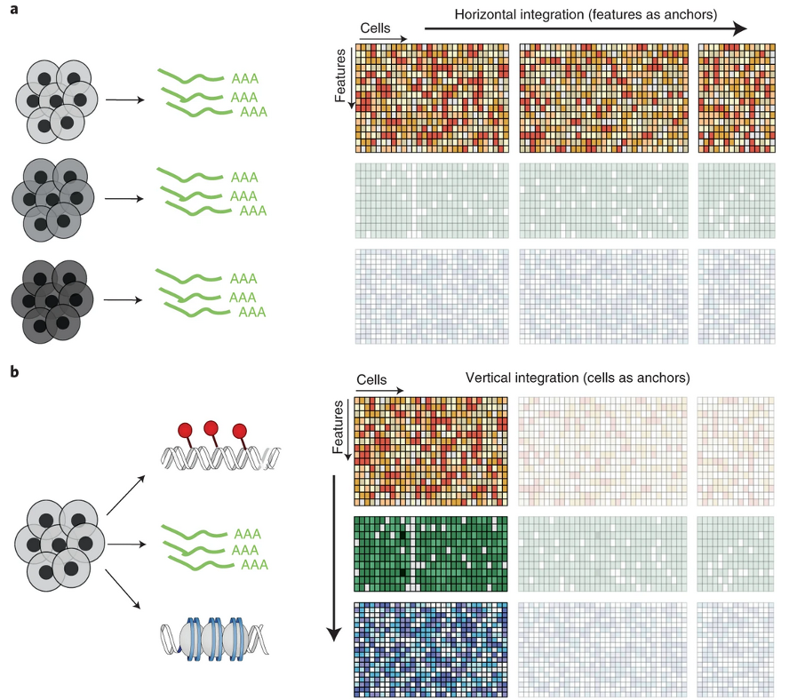
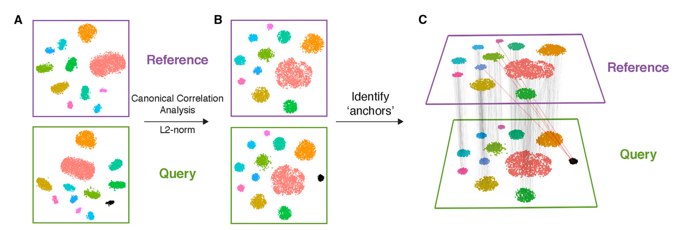
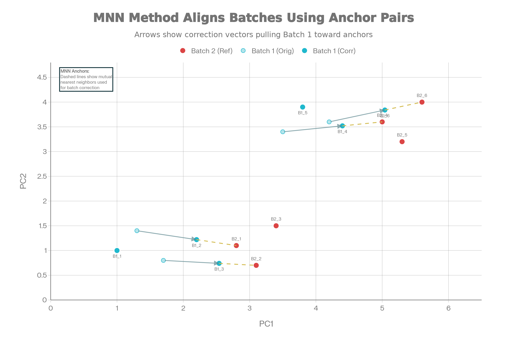
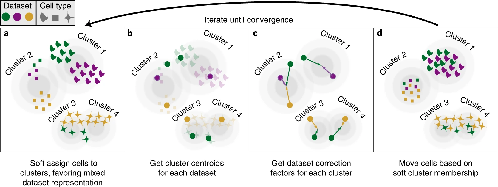
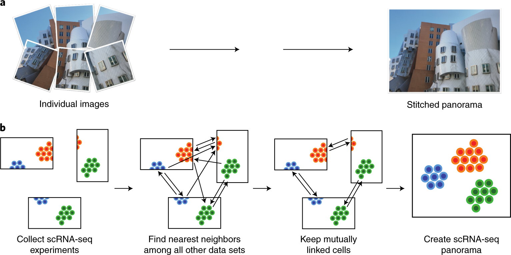
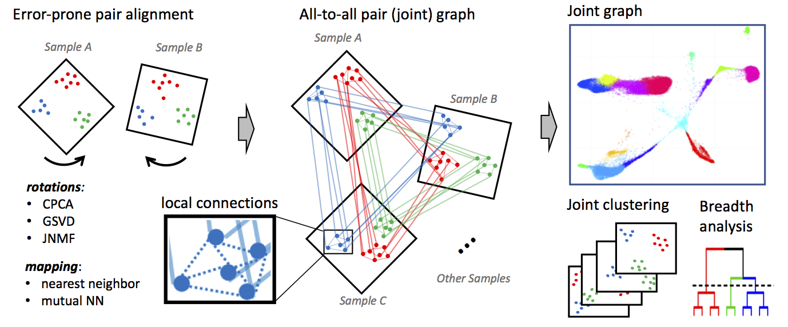
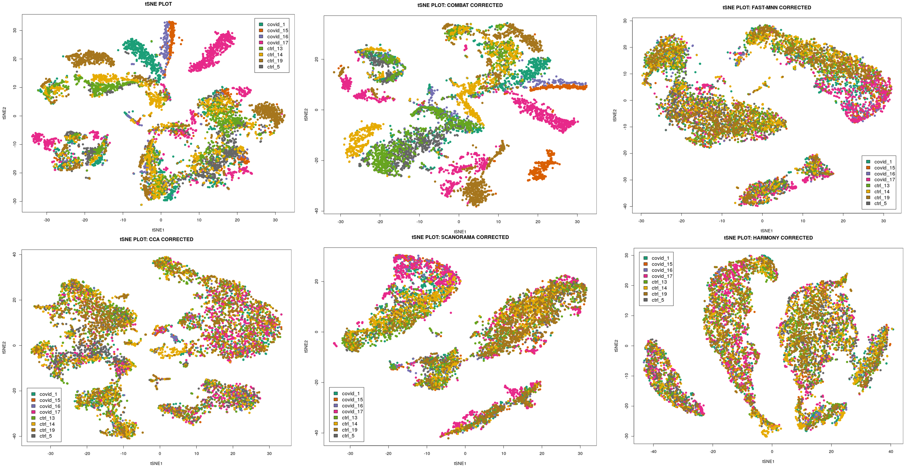

## Integration vs Batch Correction

```{mermaid, echo = FALSE, message=FALSE, warning=FALSE}
%%{init: {'theme':'base', 'themeVariables': { 'fontSize': '14px', 'primaryTextColor':'#333'}}}%%
flowchart LR
  B["Multiple<br/>Datasets?"]
  
  B --> X["Same<br/>Experiment"]
  X --> C["🔗<br/>INTEGRATION"]
  
  B --> Y["Multiple<br/>Experiments"]
  Y --> D["🧹<br/>BATCH<br/>CORRECTION"]
  Y --> C
  
  C --> C1["Align<br/>Biological<br/>Signals"]
  C1 --> C3["Unified<br/>Cell Types"]
  
  D --> D1["Remove<br/>Technical<br/>Noise"]
  D1 --> D3["Clean<br/>Expression"]
  
  C3 --> E["Proceed to<br/>Analysis"]
  D3 --> E

  classDef decision fill:#e1f5fe,color:#000
  classDef action fill:#f3e5f5,color:#000
  classDef result fill:#e8f5e8,color:#000
  
  class B decision
  class X,Y,D,C action
  class C1,D1,E,C3,D3 result

  linkStyle default stroke:#333,stroke-width:3px
```

- Batch correction is a type of integration; [vice versa is not true]{style='color:#ff7043;'}
- In practice, integration = batch correction + dataset merging
- If batch correction is needed, it's done along with the integration of samples
  - Multiple samples integration is almost always performed
  - Batch correction is added to it only when needed

---

## Closer look

::: columns
::: {.column width="50%"}
<figure style="width:100%; text-align:center;">
  
  <figcaption style="font-size:0.9em; color:#666; margin-top:0.5rem;">
    Image adapted from [Argelaguet et al. (2021)](https://www.nature.com/articles/s41587-021-00895-7).
  </figcaption>
</figure>
:::

::: {.column width="50%"}
- **Panel "a"**: Same type of data (scRNAseq)
  - Integration & batch-correction (BC)
  - 3 samples same run: Without BC
  - 3 samples 2 batches: With BC
- **Panel "b"**: Multi-omics Integration
  - Same samples, multiple platforms
  - Example: RNAseq + ATACseq
  - Beyond scope here
  - Good to know and not to confuse

:::
:::

---

## Overview: Why Integration?

::: columns
::: {.column width="50%"}
The Challenge:

- Comparing cells across individuals/conditions
- Multiple scRNA-seq experiments from different batches
- Technical variations overshadow biological signals
- Need unified analysis across samples

Batch Effects Include:

- Multiple seq runs
- Library preparation protocols
- Platform variations
- Sample handling differences
- And (sadly) many more!
:::

::: {.column width="50%"}
```{r, echo=FALSE, message=FALSE, warning=FALSE}
library(ggplot2)
library(gridExtra)

set.seed(42)
uncorrected <- data.frame(
  UMAP1 = c(rnorm(200, mean=-3, sd=1), rnorm(200, mean=3, sd=1)),
  UMAP2 = c(rnorm(200, mean=2, sd=1), rnorm(200, mean=-2, sd=1)),
  Batch = rep(c("Batch A", "Batch B"), each=200),
  CellType = rep(c("TypeX", "TypeX"), each=200)
)

corrected <- data.frame(
  UMAP1 = c(rnorm(200, mean=-0.5, sd=0.8), rnorm(200, mean=0.5, sd=0.8)),
  UMAP2 = c(rnorm(200, mean=-0.5, sd=0.8), rnorm(200, mean=0.5, sd=0.8)),
  Batch = rep(c("Batch A", "Batch B"), each=200),
  CellType = rep(c("TypeX", "TypeX"), each=200)
)

p1 <- ggplot(uncorrected, aes(x=UMAP1, y=UMAP2, color=Batch)) +
  geom_point(size=3, alpha=0.6) +
  ggtitle("Before Integration") +
  theme_minimal() + 
  theme(legend.position="bottom", plot.title=element_text(hjust=0.5, size=14, face="bold"))

p2 <- ggplot(corrected, aes(x=UMAP1, y=UMAP2, color=Batch)) +
  geom_point(size=3, alpha=0.6) +
  ggtitle("After Integration") +
  theme_minimal() + 
  theme(legend.position="bottom", plot.title=element_text(hjust=0.5, size=14, face="bold"))

gridExtra::grid.arrange(p1, p2, ncol=2)
```
:::
:::

:::{.fragment}
**Key challenge**: Distinguish biological variation from batch effects
:::

:::{.fragment}
**Key Assumption**: Batches are uncorrelated (orthogonal) to the variable of interest.
:::

---

## Orthogonal Assumption

::: columns
::: {.column width="50%"}
### ✅ Better Design

Balanced Batches

| **Sample** | **Condition** | **Batch** |
|:---|:---:|:--:|
| Patient A | <span style="color:#1f77b4;font-weight:600">Control</span> | <span style="color:#2ca02c;font-weight:600">1</span> |
| Patient B | <span style="color:#1f77b4;font-weight:600">Control</span> | <span style="color:#9467bd;font-weight:600">2</span> |
| Patient C | <span style="color:#1f77b4;font-weight:600">Control</span> | <span style="color:#d62728;font-weight:600">3</span> |
| Patient D | <span style="color:#ff7f0e;font-weight:600">Treated</span> | <span style="color:#2ca02c;font-weight:600">1</span> |
| Patient E | <span style="color:#ff7f0e;font-weight:600">Treated</span> | <span style="color:#9467bd;font-weight:600">2</span> |
| Patient F | <span style="color:#ff7f0e;font-weight:600">Treated</span> | <span style="color:#d62728;font-weight:600">3</span> |
:::

::: {.column width="50%"}
### ❌ Bad Design

Confounded Batches

| **Sample** | **Condition** | **Batch** |
|:---|:---:|:--:|
| Patient A | <span style="color:#1f77b4;font-weight:600">Control</span> | <span style="color:#2ca02c;font-weight:600">1</span> |
| Patient B | <span style="color:#1f77b4;font-weight:600">Control</span> | <span style="color:#2ca02c;font-weight:600">1</span> |
| Patient C | <span style="color:#1f77b4;font-weight:600">Control</span> | <span style="color:#2ca02c;font-weight:600">1</span> |
| Patient D | <span style="color:#ff7f0e;font-weight:600">Treated</span> | <span style="color:#9467bd;font-weight:600">2</span> |
| Patient E | <span style="color:#ff7f0e;font-weight:600">Treated</span> | <span style="color:#9467bd;font-weight:600">2</span> |
| Patient F | <span style="color:#ff7f0e;font-weight:600">Treated</span> | <span style="color:#9467bd;font-weight:600">2</span> |
:::
:::

---

## Overview of Integration Methods

  | Method     | Algorithm                                   | Language      | Library            | Ref                                                                 |
  |------------|---------------------------------------------|---------------|--------------------|---------------------------------------------------------------------|
  | CCA        | Canonical Correlation Analysis               | R             | Seurat             | [Cell 2019](https://www.sciencedirect.com/science/article/pii/S0092867419305598?via%3Dihub) |
  | MNN        | Mutual Nearest Neighbors correction          | R / Python    | scater / Scanpy    | [Nat. Biotech 2018](https://www.nature.com/articles/nbt.4091)            |
  | Conos      | Graph-based joint kNN alignment               | R             | conos              | [Nat. Methods 2019](https://www.nature.com/articles/s41592-019-0466-z)   |
  | Harmony    | Iterative PC correction (soft-clustering)     | R / Python             | harmony/ harmonypy            | [Nat. Methods 2019](https://www.nature.com/articles/s41592-019-0619-0)   |
  | Scanorama  | Manifold alignment + SVD-based merging        | Python        | scanorama          | [Nat. Biotech 2019](https://www.nature.com/articles/s41587-019-0113-3)   |

[Note: This is not an exhaustive list, just a selection of popular methods that we'll cover in the exercises]{.smaller}

## Classic Batch Correction Methods

  | Method      | Algorithm                                   | Language | Library     | Ref |
  |-------------|---------------------------------------------|----------|-------------|-----|
  | **ComBat**  | Empirical Bayes location/scale adjustment   | R        | sva         | [Bioinformatics 2007](https://doi.org/10.1093/biostatistics/kxj037) |
  | **ComBat-seq** | Negative binomial ComBat for counts      | R        | ComBat_seq  | [NAR Genomics 2020](https://doi.org/10.1093/nargab/lqaa078) |
  | **limma**   | Linear models with empirical Bayes          | R        | limma       | [NAR 2015](https://doi.org/10.1093/nar/gkv007) |
  | **RUVSeq**  | Remove unwanted variation (factor-based)    | R        | RUVSeq      | [BMC Bioinf 2016](https://doi.org/10.1038/s41587-022-01440-w) |
  | **SVA**     | Surrogate variable analysis                 | R        | sva         | [PNAS 2017](https://doi.org/10.1073/pnas.1609615113) |
  | **ZINB-WaVE** | Zero-inflated negative binomial          | R        | zinbwave    | [Genome Biol 2017](https://doi.org/10.1016/j.jspi.2023.106098) |

[Note: These methods were developed for bulk data and usually not perform well on scRNA-seq due to sparsity and zero-inflation. They are included here for context]{.smaller}

---

## AI/Deep Learning Integration Methods

  | Method      | Algorithm                                   | Language | Library     | Ref |
  |-------------|---------------------------------------------|----------|-------------|-----|
  | **scVI**    | Variational autoencoder                     | Python   | scvi-tools  | [Nat Biotech 2022](https://doi.org/10.1038/s41587-021-01206-w) |
  | **scANVI**  | Conditional variational autoencoder         | Python   | scvi-tools  | [Nat Methods 2021](https://doi.org/10.15252/msb.20209620) |
  | **scGen**   | Causal VAE for perturbation modeling        | Python   | scgen       | [Nat Methods 2019](https://doi.org/10.1038/s41592-019-0494-8) |
  | **SAUCIE**  | Self-supervised autoencoder                 | Python   | SAUCIE      | [Nat Methods 2019](https://doi.org/10.1038/s41592-019-0576-7) |
  | **DESC**    | Deep embedded single cell clustering        | Python   | DESC        | [Nat Communs 2020](https://doi.org/10.1038/s41467-020-15851-3) |

[Note: These methods are powerful but often require more computational resources and expertise to use effectively. Watch this space, future might be here!]{.smaller}

---

## CCA: Canonical Correlation Analysis

<figure style="width:100%; text-align:center;">
  
  <figcaption style="font-size:0.9em; color:#666; margin-top:0.5rem;">
    [CCA: finding shared correlated components across batches.](https://crazyhottommy.github.io/single-cell-RNAseq-PCA-CCA-cell-annotation/how-seurat-cca-label-transfer.html)
  </figcaption>
</figure>


- Finds correlated features between batches
- Creates canonical variates capturing shared variation
- Projects cells into aligned latent space
- Linear approach - computationally efficient for large datasets


---

## Mutual Nearest Neighbors (MNN) Integration

- **Core concept**: Identifies pairs of cells that are each other's nearest neighbors across batches in high-dimensional gene expression space
  - Assumes shared cell types exist between batches
  - Doesn't require identical population composition

- **No predefined populations needed**: Works without cell type annotations

- **How it works**: 
  - Computes kNN graphs in PCA space
  - Finds mutual nearest neighbor pairs across batches
  - Applies linear batch-effect corrections using correction vectors

- **Minimal biological artifacts**: Conservative approach, reducing risk of removing biological differences

---

## Visualizing MNN Correction

<figure style="width:100%; text-align:center;">
  
  <figcaption style="font-size:0.9em; color:#666; margin-top:0.5rem;">
    MNN integration example
  </figcaption>
</figure>

---

## Harmony: Iterative PC Correction
<figure style="width:100%; text-align:center;">
  
  <figcaption style="font-size:0.9em; color:#666; margin-top:0.5rem;">
    Image from [Korsunsky et al. (2019)](https://www.nature.com/articles/s41592-019-0619-0).
  </figcaption>
</figure>

Harmony iteratively adjusts cell embeddings so that each cluster contains a balanced mix of batches

---

## Scanorama: Manifold Alignment + SVD

<figure style="width:100%; text-align:center;">
  
  <figcaption style="font-size:0.9em; color:#666; margin-top:0.5rem;">
    Image from [Hie et al. (2019)](https://www.nature.com/articles/s41587-019-0113-3).
  </figcaption>
</figure>

- Builds manifold alignment between pairs of datasets
- Uses Singular Value Decomposition (SVD) for efficient merging
- Iteratively corrects and merges multiple datasets

---

## Conos: Graph-Based Alignment

<figure style="width:100%; text-align:center;">
  
  <figcaption style="font-size:0.9em; color:#666; margin-top:0.5rem;">
    Conos [Barkas et al. (2019)](https://www.nature.com/articles/s41592-019-0466-z).
  </figcaption>
</figure>

- Builds separate k-NN graphs for each sample
- Constructs joint graph by adding cross-sample edges between similar cells
- Preserves per-sample structure while enabling global analysis
- Particularly useful for many-sample studies with distinct biological states

---

## Comparison

<figure style="width:100%; text-align:center;">
  
  <figcaption style="font-size:0.9em; color:#666; margin-top:0.5rem;">
    Credit: Nikolay Oskolov
  </figcaption>
</figure>


## Comparison Matrix

| Aspect | CCA | MNN | Harmony | Scanorama | Conos |
|--------|-----|-----|---------|-----------|-------|
| Speed | <span style="color:#66BB6A;">Fast</span> | <span style="color:#EF5350;">Slow</span> | <span style="color:#66BB6A;">Fast</span> | <span style="color:#FFA726;">Medium</span> | <span style="color:#EF5350;">Slow</span> |
| Scalability | <span style="color:#EF5350;">~10k</span> | <span style="color:#FFA726;">~50k</span> | <span style="color:#66BB6A;">125k+</span> | <span style="color:#FFA726;">~50k</span> | <span style="color:#FFA726;">~30k</span> |
| Batch Correction | <span style="color:#FFA726;">Good</span> | <span style="color:#66BB6A;">Excellent</span> | <span style="color:#FFA726;">Good</span> | <span style="color:#66BB6A;">Excellent</span> | <span style="color:#66BB6A;">Very Good</span> |
| Biology Preservation | <span style="color:#EF5350;">Medium</span> | <span style="color:#66BB6A;">Excellent</span> | <span style="color:#66BB6A;">Excellent</span> | <span style="color:#FFA726;">Good</span> | <span style="color:#66BB6A;">Excellent</span> |
| Rare Type Detection | <span style="color:#EF5350;">Poor</span> | <span style="color:#66BB6A;">Excellent</span> | <span style="color:#FFA726;">Good</span> | <span style="color:#FFA726;">Medium</span> | <span style="color:#FFA726;">Good</span> |
| Learning Curve | <span style="color:#66BB6A;">Low</span> | <span style="color:#FFA726;">Medium</span> | <span style="color:#66BB6A;">Low</span> | <span style="color:#FFA726;">Medium</span> | <span style="color:#EF5350;">High</span> |
| Language | R | R/Python | R/Python | Python | R |
| Graph-Based | No | No | No | No | Yes |

## Benchmark References for Comparison Table

| Claim | Source | Key Finding |
|-------|------------------|--------|-------------|
| **Speed**: Harmony > CCA > Scanorama > MNN > Conos | [Tran et al. (2020)](https://pmc.ncbi.nlm.nih.gov/articles/PMC6964114/) | Harmony 30-200x faster than MNN at 500k cells |
| **Scalability**: Harmony(125k+) > MNN/Scanorama(50k) > CCA(10k) | [Korsunsky et al. (2019)](https://www.nature.com/articles/s41592-019-0619-0) | Harmony scales to 1M+ cells, MNN fails >50k |
| **Batch Correction**: MNN/Scanorama > Conos > Harmony > CCA | [Luecken et al. (2022)](https://doi.org/10.1038/s41592-021-01336-8) | MNN/Scanorama top kBET/LISI scores |
| **Biology Preservation**: MNN/Harmony/Conos > Scanorama > CCA | [Luecken et al. (2022)](https://doi.org/10.1038/s41592-021-01336-8)  | MNN best cell-cycle/trajectory conservation |
| **Rare Type Detection**: MNN superior | Distilled information | MNN being local correction, preserves rare populations |
| **Learning Curve**: CCA/Harmony < MNN/Scanorama < Conos | Personal opinion | Harmony/CCA: simple params; Conos: complex graphs


---

## Best Practices

::: incremental
- **Feature selection:** Use highly variable genes (2000-3000) before integration
- **Batch awareness:** Always specify batch variable during integration
- **QC first:** Remove low-quality cells before integration
- **Metrics matter:** Assess both batch mixing and biological preservation
- **Visualize results:** Check UMAP, violin plots by batch, cell type distribution
- **Validate:** Confirm known biology is preserved in integrated data
- **Don't fix something unbroken:** Make sure there are batch effects before *"fixing"*
:::

## Common Pitfalls

::: {.callout-warning title="Overcorrection"}

- Removing real biological signal
- Check with known marker genes
:::

::: {.callout-warning title="Batch structure ignored"}

- Not specifying batch variable correctly
- Can lead to suboptimal integration
:::

::: {.callout-warning title="Incompatible preprocessing"}

- Different normalization or scaling across batches
- Standardize preprocessing pipeline first
:::

::: {.callout-warning title="Confounded design"}

- Batch perfectly correlated with condition (eg. all controls in batch 1, all treated in batch 2)
- Integration cannot disentangle technical vs biological variation
:::

---

## Q&A {.center}

**Key takeaway**: Integration balances batch removal with biology preservation

Summary slides for revision follow

---

## Summary: Integration goals

::: {.callout-note}
### Q1. What is the main goal of scRNA-seq integration?
A: To align cells so they group by biological signal (for example, cell type) rather than technical or sample-specific differences.
:::

::: {.callout-note}
### Q2. Why can integration be needed even with one sequencing batch?
A: Different samples in the same run can still differ in preparation, dissociation, or depth, making cells cluster by sample instead of cell type.
:::

::: {.callout-note}
### Q3. What pattern in a UMAP suggests batch effect problems?
A: Clusters separate mainly by batch label even though the same cell type exists in all batches.
:::

## Summary: CCA / Seurat anchors

::: {.callout-note}
### Q4. Conceptually, what does CCA do for integration?
A: It finds shared low-dimensional “correlated directions” across datasets where similar cell states align.
:::

::: {.callout-note}
### Q5. What are “anchors” in Seurat’s CCA-based integration?
A: Pairs or small groups of cells from different datasets that represent the same biological state and are used as reference points for alignment.
:::

::: {.callout-note}
### Q6. Simple example
A: Take T cells from patient A and B that look similar, treat them as anchors, and warp both datasets so T cells from A and B overlap in the joint space.
:::

## Summary: Harmony

::: {.callout-note}
### Q7. What is the core idea behind Harmony?
A: Start in PCA space, then iteratively shift cell embeddings so each cluster has similar contributions from each batch, reducing batch-driven structure.
:::

::: {.callout-note}
### Q8. Why is Harmony often practical for large datasets?
A: It operates on PCs, is relatively fast, and fits into a simple PCA → Harmony → UMAP workflow.
:::

::: {.callout-note}
### Q9. Metaphor for Harmony’s adjustment
A: You have groups of similar cells on a map; Harmony gently nudges cells from overrepresented batches so each group has a fair mix of batches.
:::

## Summary: MNN & Scanorama

::: {.callout-note}
### Q10. What is a mutual nearest neighbors (MNN) pair?
A: A pair of cells, one from each dataset, where each is among the nearest neighbors of the other in expression space.
:::

::: {.callout-note}
### Q11. How does MNN-based integration use these pairs?
A: It assumes MNN pairs represent the same cell state and computes local correction vectors to align the datasets around those pairs.
:::

::: {.callout-note}
### Q12. Intuitive example for MNN in lecture
A: If a T cell in dataset A and a T cell in dataset B are each other’s closest match, link them and use that link to locally shift one dataset towards the other.
:::

::: {.callout-note}
### Q13. What is the main idea behind Scanorama?
A: It uses MNN-like matches across many datasets and stitches them together like a panorama to build a unified embedding.
:::

::: {.callout-note}
### Q14. Why is Scanorama useful for many-dataset studies?
A: It can integrate multiple experiments at once by finding shared cell populations and merging them into a common space.
:::

## Summary: Conos

::: {.callout-note}
### Q15. What is Conos’ high-level approach to integration?
A: It builds a graph for each sample, then constructs a joint graph across samples using cross-sample neighbors, and analyzes this global graph for clustering and alignment.
:::

::: {.callout-note}
### Q16. When is Conos particularly attractive?
A: When you have many samples and want to keep per-sample identity while still obtaining joint clustering from the combined graph.
:::

::: {.callout-note}
### Q17. Simple metaphor for Conos
A: Each sample is its own social network; Conos adds edges between similar people across networks and then analyzes the big merged social graph.
:::

## Summary: Over- vs under-integration & choice

::: {.callout-note}
### Q18. How can you spot “over-integration” ?
A: UMAP: If biologically distinct groups are **integrated** (eg. disease and control where separation is expected)
:::

::: {.callout-note}
### Q19. How can you spot "under-integration"?
A: UMAP: If technically distinct groups are **not-integrated** (eg. sequencing run 1 and 2)
:::

::: {.callout-note}
### Q20. Simple rule-of-thumb when choosing an integration method
A: Use anchor/CCA or Harmony for typical multi-sample datasets; consider MNN/Scanorama for more local alignment or many datasets; use Conos for graph-based integration across many samples while preserving sample identity.
:::

---

## Resources & Further reading {.smaller}

- Luecken, M.D., Büttner, M., Chaichoompu, K. et al. Benchmarking atlas-level data integration in single-cell genomics. Nat Methods 19, 41–50 (2022). https://doi.org/10.1038/s41592-021-01336-8
- Korsunsky, I., Millard, N., Fan, J. et al. Fast, sensitive and accurate integration of single-cell data with Harmony. Nat Methods 16, 1289–1296 (2019). https://doi.org/10.1038/s41592-019-0619-0
- Hie, B., Bryson, B. & Berger, B. Efficient integration of heterogeneous single-cell transcriptomes using Scanorama. Nat Biotechnol 37, 685–691 (2019). https://doi.org/10.1038/s41587-019-0113-3
- Argelaguet, R., Velten, B., Arnol,D, S. et al. Multi-omics factor analysis—a framework for unsupervised integration of multi-omics data sets. Mol Syst Biol 14, e8124 (2018). https://doi.org/10.15252/msb.20178124
- Barkas N., Petukhov V., Nikolaeva D., Lozinsky Y., Demharter S., Khodosevich K., & Kharchenko P.V. Joint analysis of heterogeneous single-cell RNA-seq dataset collections. Nature Methods, (2019). https://doi.org/10.1038/s41592-019-0466-z
