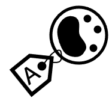

####  Exercises
***

Here we provide short tutorials on the different steps of scRNAseq analysis using either of the 3 commonly used scRNAseq analysis pipelines, [Seurat](https://satijalab.org/seurat/), [Scran](https://bioconductor.org/packages/release/bioc/html/scran.html) and [Scanpy](https://scanpy.readthedocs.io/en/stable/). It is up to you which one you want to try out, if you finish quickly, you may have time to run several of them or run of the additional labs below. In principle we perform the same steps with all 3 pipelines, but there are some small differences as all different methods are not implemented in all the pipelines.

<br/>


#####  MAIN exercises
***

All scripts (Rmarkdown or ipython notebooks) can be found at our github repo in folder [labs/compiled](https://github.com/NBISweden/workshop-scRNAseq/tree/master/labs/compiled)

During this workshop, you will use conda environments to run the exercises. This is because conda environments allow all users to have the same computing environment, i.e. package versions. This enforces reproducibility for you to run this material without the need to re-install or change your local versions. Please me sure you have completed the [**Precourse material**](precourse.md). The environment for this course (2021) is this:

* [environment_scRNAseq2021.yml](https://raw.githubusercontent.com/NBISweden/workshop-scRNAseq/master/labs/environment_scRNAseq2022.yml)

<br/>

| Tutorial |  Seurat |  Scater/Scran |  Scanpy |
| -------- | ---------- | ---------------- | --------------- |
|  Quality Control | [Seurat_qc](labs/compiled/seurat/seurat_01_qc.md) ([.Rmd](https://raw.githubusercontent.com/NBISweden/workshop-scRNAseq/master/labs/compiled/seurat/seurat_01_qc.Rmd)) | [Scater_qc](labs/compiled/scater/scater_01_qc.md) ([.Rmd](https://raw.githubusercontent.com/NBISweden/workshop-scRNAseq/master/labs/compiled/scater/scater_01_qc.Rmd)) | [ScanPY_qc](labs/compiled/scanpy/scanpy_01_qc.html) ([.ipynb](https://raw.githubusercontent.com/NBISweden/workshop-scRNAseq/master/labs/compiled/scanpy/scanpy_01_qc.ipynb)) |
|  Dimensionality reduction | [Seurat_dr](labs/compiled/seurat/seurat_02_dim_reduction.md) ([.Rmd](https://raw.githubusercontent.com/NBISweden/workshop-scRNAseq/master/labs/compiled/seurat/seurat_02_dim_reduction.Rmd)) | [Scater_dr](labs/compiled/scater/scater_02_dim_reduction.md) ([.Rmd](https://raw.githubusercontent.com/NBISweden/workshop-scRNAseq/master/labs/compiled/scater/scater_02_dim_reduction.Rmd)) | [Scanpy_dr](labs/compiled/scanpy/scanpy_02_dim_reduction.html) ([.ipynb](https://raw.githubusercontent.com/NBISweden/workshop-scRNAseq/master/labs/compiled/scanpy/scanpy_02_dim_reduction.ipynb)) |
|  Data integration | [Seurat_integr](labs/compiled/seurat/seurat_03_integration.md) ([.Rmd](https://raw.githubusercontent.com/NBISweden/workshop-scRNAseq/master/labs/compiled/seurat/seurat_03_integration.Rmd)) | [Scater_integr](labs/compiled/scater/scater_03_integration.md) ([.Rmd](https://raw.githubusercontent.com/NBISweden/workshop-scRNAseq/master/labs/compiled/scater/scater_03_integration.Rmd)) | [Scanpy_integr](labs/compiled/scanpy/scanpy_03_integration.html) ([.ipynb](https://raw.githubusercontent.com/NBISweden/workshop-scRNAseq/master/labs/compiled/scanpy/scanpy_03_integration.ipynb)) |
|  Clustering | [Seurat_clust](labs/compiled/seurat/seurat_04_clustering.html) ([.Rmd](https://raw.githubusercontent.com/NBISweden/workshop-scRNAseq/master/labs/compiled/seurat/seurat_04_clustering.Rmd)) | [Scater_clust](labs/compiled/scater/scater_04_clustering.html) ([.Rmd](https://raw.githubusercontent.com/NBISweden/workshop-scRNAseq/master/labs/compiled/scater/scater_04_clustering.Rmd)) | [Scanpy_clust](labs/compiled/scanpy/scanpy_04_clustering.html) ([.ipynb](https://raw.githubusercontent.com/NBISweden/workshop-scRNAseq/master/labs/compiled/scanpy/scanpy_04_clustering.ipynb)) |
|  Differential expression | [Seurat_dge](labs/compiled/seurat/seurat_05_dge.html) ([.Rmd](https://raw.githubusercontent.com/NBISweden/workshop-scRNAseq/master/labs/compiled/seurat/seurat_05_dge.Rmd)) | [Scater_dge](labs/compiled/scater/scater_05_dge.html) ([.Rmd](https://raw.githubusercontent.com/NBISweden/workshop-scRNAseq/master/labs/compiled/scater/scater_05_dge.Rmd)) | [Scanpy_dge](labs/compiled/scanpy/scanpy_05_dge.html) ([.ipynb](https://raw.githubusercontent.com/NBISweden/workshop-scRNAseq/master/labs/compiled/scanpy/scanpy_05_dge.ipynb)) |
|  Celltype prediction | [Seurat_ct](labs/compiled/seurat/seurat_06_celltype.html) ([.Rmd](https://raw.githubusercontent.com/NBISweden/workshop-scRNAseq/master/labs/compiled/seurat/seurat_06_celltype.Rmd)) | [Scater_ct](labs/compiled/scater/scater_06_celltype.html) ([.Rmd](https://raw.githubusercontent.com/NBISweden/workshop-scRNAseq/master/labs/compiled/scater/scater_06_celltype.Rmd)) | [Scanpy_ct](labs/compiled/scanpy/scanpy_06_celltype.html) ([.ipynb](https://raw.githubusercontent.com/NBISweden/workshop-scRNAseq/master/labs/compiled/scanpy/scanpy_06_celltype.ipynb)) |
|  Spatial transcriptomics | [Seurat_ST](labs/compiled/seurat/seurat_07_spatial.html) ([.Rmd](https://raw.githubusercontent.com/NBISweden/workshop-scRNAseq/master/labs/compiled/seurat/seurat_07_spatial.Rmd)) | [Scater_ST](labs/compiled/scater/scater_07_spatial.html) ([.Rmd](https://raw.githubusercontent.com/NBISweden/workshop-scRNAseq/master/labs/compiled/scater/scater_07_spatial.Rmd)) | [Scanpy_ST](labs/compiled/scanpy/scanpy_07_spatial.html) ([.ipynb](https://raw.githubusercontent.com/NBISweden/workshop-scRNAseq/master/labs/compiled/scanpy/scanpy_07_spatial.ipynb)) |
|  Trajectory inference | [Slingshot_ti](https://nbisweden.github.io/workshop-scRNAseq/labs/trajectory/slingshot.html) ([.Rmd](https://nbisweden.github.io/workshop-scRNAseq/labs/trajectory/slingshot.Rmd))  | [Slingshot_ti](https://nbisweden.github.io/workshop-scRNAseq/labs/trajectory/slingshot.html) ([.Rmd](https://nbisweden.github.io/workshop-scRNAseq/labs/trajectory/slingshot.Rmd)) | [PAGA_ti](labs/trajectory/paga_scanpy.html) ([.ipynb](https://raw.githubusercontent.com/NBISweden/workshop-scRNAseq/master/labs/trajectory/paga_scanpy.ipynb))|

<br/>

Above you will find the link to the `.Rmd`/`.ipynb` that you should use as well as the rendered exercise report ("answers"). The easiest way of getting started with the exercises is to download the `.Rmd`/`.ipynb` file and then open it with Rstudio / Jypyter Notebooks. First activate your conda environment, then copy the link of a `.Rmd`/`.ipynb` file and then type:

```
wget <LINK_TO_Exercise1.Rmd_FILE>
rstudio Exercise1.Rmd &
```

Or in python for `.ipynb`:

```
wget <LINK_TO_Exercise1.ipynb_FILE>
jupyter notebook Exercise1.ipynb &
```

We highly recommend you to use the files provided instead of copying and pasting from the rendered report. Keep in mind that the results may vary slightly depending on the parameters used.

Many additional information and explanations can be found in the [Single Cell Glossary](https://nbisweden.github.io/single-cell-pbl/glossary_of_terms_single_cell.html)

<br/>

<br/>

#####  FAQ
***

As you run into problems, we will try to fill in the [FAQ](labs/FAQ) with common questions.

<br/>

<br/>

<div style="text-align: right; font-size: 5px"> Icons are provided from [www.svgrepo.com](www.svgrepo.com) </div>
