Methods for differential gene expression in scRNAseq data - part2
=================================================================
Author: Åsa Björklund


Continuing with DE detection for the mouse embryonic dataset. Since many packages are loaded in this tutorial, many will get problems with maximum DLLs reached. So we suggest you contiune in a new R-session. Or modify your environmental variables to allow for more DLLs as explained in the [FAQ](FAQ).

In this section we will: \* Run Seurat DE \* Compare results of the different methods.

Load data
---------

First read in the data

``` r
# we will read both counts and rpkms as different method are more adopted for different type of data
R <- read.table("data/mouse_embryo/rpkms_Deng2014_preinplantation.txt")
M <- read.table("data/mouse_embryo/Metadata_mouse_embryo.csv",sep=",",header=T)

# select only 8 and 16 stage embryos.
selection <- c(grep("8cell",M$Stage),grep("16cell",M$Stage))

# select those cells only from the data frames
M<-M[selection,]
R <- R[,selection]
```

Seurat DE tests
===============

Seurat has several tests for differential expression (DE) which can be set with the test.use parameter in the FindMarkers() function:

-   "wilcox" : Wilcoxon rank sum test (default)
-   "bimod" : Likelihood-ratio test for single cell gene expression, (McDavid et al., Bioinformatics, 2013)
-   "roc" : Standard AUC classifier
-   "t" : Student's t-test
-   "tobit" : Tobit-test for differential gene expression (Trapnell et al., Nature Biotech, 2014)
-   "poisson" : Likelihood ratio test assuming an underlying poisson distribution. Use only for UMI-based datasets
-   "negbinom" : Likelihood ratio test assuming an underlying negative binomial distribution. Use only for UMI-based datasets
-   "MAST" : GLM-framework that treates cellular detection rate as a covariate (Finak et al, Genome Biology, 2015)
-   "DESeq2" : DE based on a model using the negative binomial distribution (Love et al, Genome Biology, 2014)

``` r
library(Seurat)

data <- CreateSeuratObject(raw.data = R, min.cells = 3, min.genes = 200, 
                           project = "ILC",is.expr=1,meta.data=M)

# Normalize the data
scale.factor <- mean(colSums(R))
data <- NormalizeData(object = data, normalization.method = "LogNormalize",  
                      scale.factor = scale.factor)

# regress out number of detected genes.d
data <- ScaleData(object = data, vars.to.regress = c("nGene"),display.progress = F)

# check that the seurat identity is set to the stages
head(data@ident)
```

    ## X8cell_1.1 X8cell_1.2 X8cell_1.4 X8cell_1.5 X8cell_1.6 X8cell_1.7 
    ##     X8cell     X8cell     X8cell     X8cell     X8cell     X8cell 
    ## Levels: X16cell X8cell

``` r
# run all DE methods
methods <- c("wilcox","bimod","roc","t","tobit")
DE <- list()
for (m in methods){
    outfile <- paste("data/mouse_embryo/DE/seurat_",m,"_8cell_vs_16_cell.tab", sep='')
    if(!file.exists(outfile)){
      DE[[m]]<- FindMarkers(object = data,ident.1 = "X8cell",
                        ident.2 = "X16cell",test.use = m)
      write.table(DE[[m]],file=outfile,sep="\t",quote=F)
    }
}
```

Summary of results.
===================

### Read in all the data

``` r
DE <- list()
files <- c("data/mouse_embryo/DE/sc3_kwtest_8cell_vs_16_cell.tab",
           "data/mouse_embryo/DE/scde_8cell_vs_16_cell.tab",
           "data/mouse_embryo/DE/seurat_wilcox_8cell_vs_16_cell.tab",           
           "data/mouse_embryo/DE/seurat_bimod_8cell_vs_16_cell.tab",
           "data/mouse_embryo/DE/seurat_roc_8cell_vs_16_cell.tab",
           "data/mouse_embryo/DE/seurat_t_8cell_vs_16_cell.tab",
           "data/mouse_embryo/DE/seurat_tobit_8cell_vs_16_cell.tab")

for (i in 1:7){ 
  DE[[i]]<-read.table(files[i],sep="\t",header=T)
}
names(DE)<-c("SC3","SCDE","seurat-wilcox", "seurat-bimod","seurat-roc","seurat-t","seurat-tobit")

# MAST file has gene names as first column, read in separately
DE$MAST <- read.table("data/mouse_embryo/DE/mast_8cell_vs_16_cell.tab", 
                      sep="\t",header=T,row.names=2)

# get top 100 genes for each test
top.100 <- lapply(DE,function(x) rownames(x)[1:100])

# load a function for plotting overlap
source("data/mouse_embryo/DE/overlap_phyper.R")
# plot overlap and calculate significance with phyper test, as background, 
# set number of genes in seurat.
o <- overlap_phyper(top.100,plot=T,bg=nrow(DE$`seurat-bimod`))
```


Rows and columns are the different gene lists, and in the upper triangle the comparison of 2 datasets is shown with number of genes in common and color according to significance of overlap. Last columns show number of unique genes per list.

### Significant DE genes

Now we select significant genes from the different tests. In this case we use a cutoff for adjusted p-value at 0.05.

``` r
# the  p-values from all Seurat functions except wilcox does not 
# seem to be adjusted, so we need to adjust them first.
adjust <- c(4,6,7)
DE[adjust] <- lapply(DE[adjust], function(x) cbind(x,p.adjust(x$p_val)))


# not really a p-value for the ROC test, so skip for now 
# (5th entry in the list)
pval.column <- c(2,8,5,5,5,5,6) # define which column contains the p-value
names(pval.column)<-names(DE)[-5]
sign.genes <- list()
cutP<-0.05
for (n in names(DE)[-5]){
  sg <- which(DE[[n]][,pval.column[n]] < cutP)
  sign.genes[[n]]<-rownames(DE[[n]])[sg]
}

# number of genes per dataset
unlist(lapply(sign.genes,length))
```

    ##           SC3          SCDE seurat-wilcox  seurat-bimod      seurat-t 
    ##            31            41            34           230            46 
    ##  seurat-tobit          MAST 
    ##            32            59

``` r
# check overlap again
o <- overlap_phyper(sign.genes,plot=T,bg=nrow(DE$`seurat-bimod`))
```

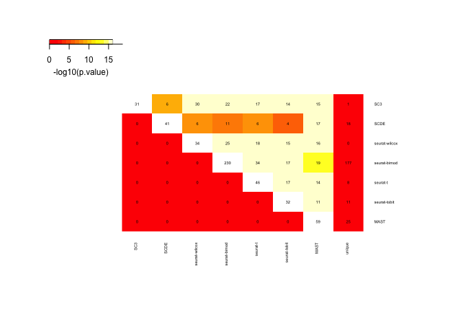

``` r
# list genes found in all 6 methods
t<-table(unlist(sign.genes))
head(sort(t,decreasing=T),n=10)
```

    ## 
    ##  Ly6g6e    Odc1   Socs3   Cox8a Gm15645    Idua   Kank4   Klf17   Tcf20 
    ##       7       7       7       6       6       6       6       6       6 
    ## Gpatch1 
    ##       5

Only 3 genes detected by all 7 methods as DE.

### Plot top DE genes

Plot onto the tSNE created with Seurat. So we first need to find variable genes, run PCA and tSNE for the Seurat object.

``` r
# run a tsne for plotting onto
data <- FindVariableGenes(object = data, mean.function = ExpMean, 
                          dispersion.function = LogVMR, x.low.cutoff = 0.5, 
                          x.high.cutoff = 10, y.cutoff = 0.5)
```


``` r
data <- RunPCA(object = data,do.print=F)
set.seed(1)
data <- RunTSNE(object = data, dims.use = 1:5, do.fast = TRUE,perplexity=10)
# plot first with color by celltype
TSNEPlot(data)
```

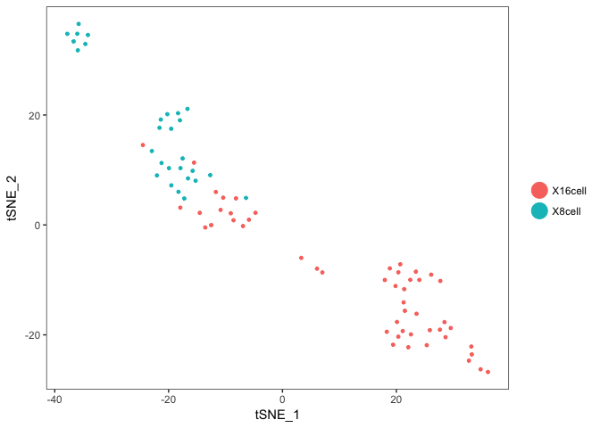

``` r
# plot top 9 genes for each method
for (n in names(sign.genes)){
  print(n)
  p <- FeaturePlot(object = data, features.plot = sign.genes[[n]][1:9],  
                   reduction.use = "tsne",no.axes=T,do.return = T)
}
```

    ## [1] "SC3"

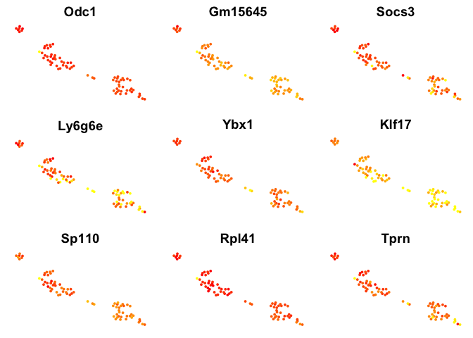

    ## [1] "SCDE"

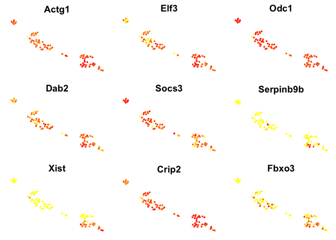

    ## [1] "seurat-wilcox"

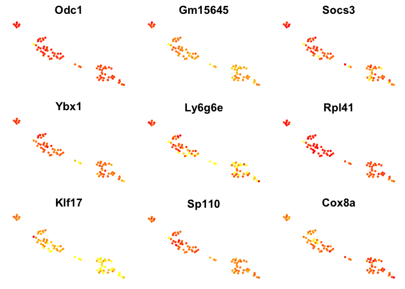

    ## [1] "seurat-bimod"


    ## [1] "seurat-t"

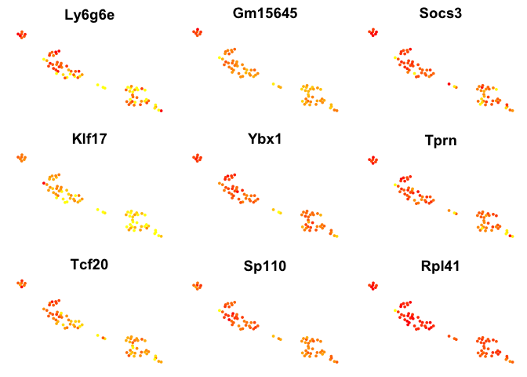

    ## [1] "seurat-tobit"


    ## [1] "MAST"

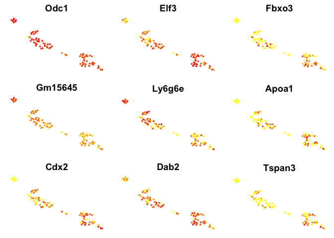

### Violin plots with the top genes

``` r
# plot top 9 genes for each method
for (n in names(sign.genes)){
  print(n)
  p2 <- VlnPlot(object = data, features.plot = sign.genes[[n]][1:9], 
                nCol=3, do.return = T,
                size.x.use = 7, size.y.use = 7, size.title.use = 10)
  print(p2)
}
```

    ## [1] "SC3"


    ## [1] "SCDE"

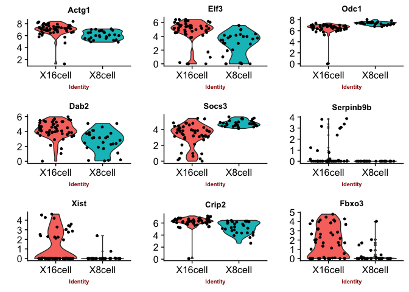

    ## [1] "seurat-wilcox"


    ## [1] "seurat-bimod"


    ## [1] "seurat-t"

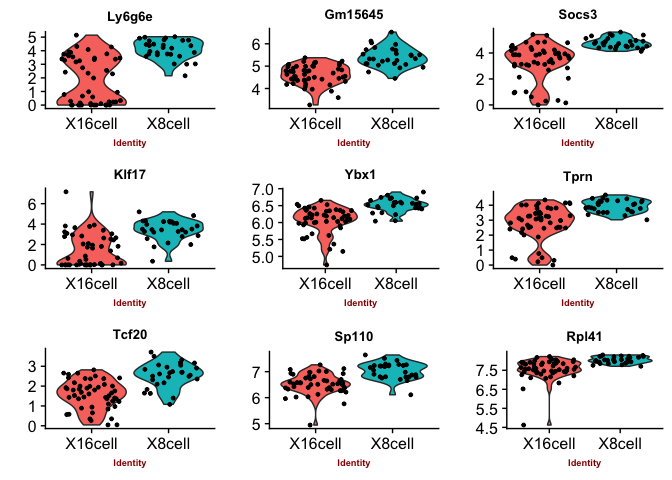

    ## [1] "seurat-tobit"

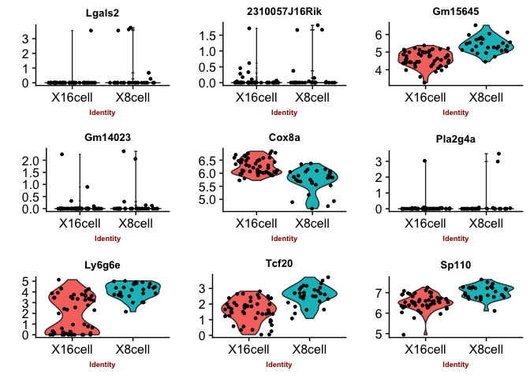

    ## [1] "MAST"

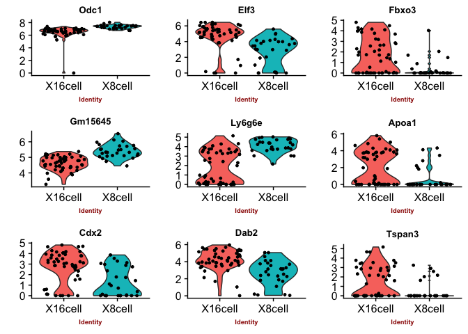

You can judge for yourself which of the methods you feel is performing best, there is no true gold standard for this dataset.

Some methods are more conservative and give fewer genes. Others give more genes, but all of those do not have to be biologically relevant. In general the number of genes is quite low for this small test set, with a higher number of cells, and more distinct celltypes, the number of of significant genes should become higher.

##### Session info

``` r
sessionInfo()
```

    ## R version 3.4.1 (2017-06-30)
    ## Platform: x86_64-apple-darwin15.6.0 (64-bit)
    ## Running under: macOS Sierra 10.12.6
    ## 
    ## Matrix products: default
    ## BLAS: /Library/Frameworks/R.framework/Versions/3.4/Resources/lib/libRblas.0.dylib
    ## LAPACK: /Library/Frameworks/R.framework/Versions/3.4/Resources/lib/libRlapack.dylib
    ## 
    ## locale:
    ## [1] en_US.UTF-8/en_US.UTF-8/en_US.UTF-8/C/en_US.UTF-8/en_US.UTF-8
    ## 
    ## attached base packages:
    ## [1] parallel  stats     graphics  grDevices utils     datasets  methods  
    ## [8] base     
    ## 
    ## other attached packages:
    ## [1] gplots_3.0.1        Seurat_2.2.0        Biobase_2.38.0     
    ## [4] BiocGenerics_0.24.0 Matrix_1.2-12       cowplot_0.9.2      
    ## [7] ggplot2_2.2.1      
    ## 
    ## loaded via a namespace (and not attached):
    ##   [1] diffusionMap_1.1-0   Rtsne_0.13           VGAM_1.0-4          
    ##   [4] colorspace_1.3-2     ggridges_0.4.1       class_7.3-14        
    ##   [7] modeltools_0.2-21    mclust_5.4           rprojroot_1.3-2     
    ##  [10] htmlTable_1.11.2     base64enc_0.1-3      proxy_0.4-21        
    ##  [13] rstudioapi_0.7       DRR_0.0.3            flexmix_2.3-14      
    ##  [16] lubridate_1.7.1      prodlim_1.6.1        mvtnorm_1.0-7       
    ##  [19] ranger_0.9.0         codetools_0.2-15     splines_3.4.1       
    ##  [22] R.methodsS3_1.7.1    mnormt_1.5-5         doParallel_1.0.11   
    ##  [25] robustbase_0.92-8    knitr_1.19           tclust_1.3-1        
    ##  [28] RcppRoll_0.2.2       Formula_1.2-2        caret_6.0-78        
    ##  [31] ica_1.0-1            broom_0.4.3          gridBase_0.4-7      
    ##  [34] ddalpha_1.3.1        cluster_2.0.6        kernlab_0.9-25      
    ##  [37] R.oo_1.21.0          sfsmisc_1.1-1        compiler_3.4.1      
    ##  [40] backports_1.1.2      assertthat_0.2.0     lazyeval_0.2.1      
    ##  [43] lars_1.2             acepack_1.4.1        htmltools_0.3.6     
    ##  [46] tools_3.4.1          bindrcpp_0.2         igraph_1.1.2        
    ##  [49] gtable_0.2.0         glue_1.2.0           reshape2_1.4.3      
    ##  [52] dplyr_0.7.4          Rcpp_0.12.15         NMF_0.20.6          
    ##  [55] trimcluster_0.1-2    gdata_2.18.0         ape_5.0             
    ##  [58] nlme_3.1-131         iterators_1.0.9      fpc_2.1-11          
    ##  [61] psych_1.7.8          timeDate_3042.101    gower_0.1.2         
    ##  [64] stringr_1.2.0        irlba_2.3.2          rngtools_1.2.4      
    ##  [67] gtools_3.5.0         DEoptimR_1.0-8       MASS_7.3-48         
    ##  [70] scales_0.5.0         ipred_0.9-6          RColorBrewer_1.1-2  
    ##  [73] yaml_2.1.16          pbapply_1.3-4        gridExtra_2.3       
    ##  [76] pkgmaker_0.22        segmented_0.5-3.0    rpart_4.1-12        
    ##  [79] latticeExtra_0.6-28  stringi_1.1.6        foreach_1.4.4       
    ##  [82] checkmate_1.8.5      caTools_1.17.1       lava_1.6            
    ##  [85] dtw_1.18-1           SDMTools_1.1-221     rlang_0.1.6         
    ##  [88] pkgconfig_2.0.1      prabclus_2.2-6       bitops_1.0-6        
    ##  [91] evaluate_0.10.1      lattice_0.20-35      ROCR_1.0-7          
    ##  [94] purrr_0.2.4          bindr_0.1            labeling_0.3        
    ##  [97] recipes_0.1.2        htmlwidgets_1.0      tidyselect_0.2.3    
    ## [100] CVST_0.2-1           plyr_1.8.4           magrittr_1.5        
    ## [103] R6_2.2.2             Hmisc_4.1-1          dimRed_0.1.0        
    ## [106] sn_1.5-1             withr_2.1.1          pillar_1.1.0        
    ## [109] foreign_0.8-69       mixtools_1.1.0       survival_2.41-3     
    ## [112] scatterplot3d_0.3-40 nnet_7.3-12          tsne_0.1-3          
    ## [115] tibble_1.4.2         KernSmooth_2.23-15   rmarkdown_1.8       
    ## [118] grid_3.4.1           data.table_1.10.4-3  FNN_1.1             
    ## [121] ModelMetrics_1.1.0   digest_0.6.15        diptest_0.75-7      
    ## [124] xtable_1.8-2         numDeriv_2016.8-1    tidyr_0.8.0         
    ## [127] R.utils_2.6.0        stats4_3.4.1         munsell_0.4.3       
    ## [130] registry_0.5
