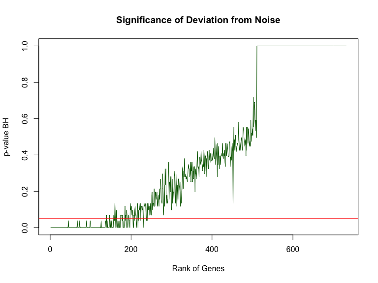

Estimating Batch-Effects in scRNAseq Data
=========================================

### Load packages

First of all we will R packages which we are going to use in this lab:

``` r
suppressMessages(require(gplots))
suppressMessages(require(ggplot2))
suppressMessages(require(matrixStats))
suppressMessages(require(mixOmics))
suppressMessages(require(RColorBrewer))
suppressMessages(require(Rtsne))
```

### Load Expression Values and Metadata

Let start with loading the matrix of raw gene expression counts and filtering away genes with median count across all cells below 1, it is very conservative but speeds up computations for this lab. Those genes are lowly expressed genes which should be excluded from the downstream analysis as they might lead to spurious results:

``` r
D <- read.table("data/ILC/ensembl_countvalues_ILC.csv",sep=",",header=T,row.names=1)
library("matrixStats")
D<-D[rowMedians(as.matrix(D))>=1,]
D[1:5,1:5]
```

    ##                 T74_P1_A9_ILC1 T74_P1_B4_NK T74_P1_B7_ILC2 T74_P1_B9_NK
    ## ENSG00000002587             25           44             41           40
    ## ENSG00000003056              0            0              0            1
    ## ENSG00000003402              2           11              2          657
    ## ENSG00000003756              0            1             48            3
    ## ENSG00000004534              1            1           4102            2
    ##                 T74_P1_D10_ILC2
    ## ENSG00000002587               5
    ## ENSG00000003056               1
    ## ENSG00000003402             924
    ## ENSG00000003756               1
    ## ENSG00000004534             672

``` r
dim(D)
```

    ## [1] 1465  648

For the sake of speed and simplicity of this lab we will select only 50% of most varying genes using coefficient of variation as a criterion:

``` r
D_var<-apply(D,1,function(x) sd(x)/mean(x))
D<-D[D_var>quantile(D_var,0.5),]
D[1:5,1:5]
```

    ##                 T74_P1_A9_ILC1 T74_P1_B4_NK T74_P1_B7_ILC2 T74_P1_B9_NK
    ## ENSG00000003056              0            0              0            1
    ## ENSG00000003402              2           11              2          657
    ## ENSG00000003756              0            1             48            3
    ## ENSG00000004534              1            1           4102            2
    ## ENSG00000004897              0            1              2            2
    ##                 T74_P1_D10_ILC2
    ## ENSG00000003056               1
    ## ENSG00000003402             924
    ## ENSG00000003756               1
    ## ENSG00000004534             672
    ## ENSG00000004897               0

``` r
dim(D)
```

    ## [1] 732 648

The rows of the matrix represent Ensembl gene IDs (you can convert them to gene symbols using biomaRt package) from 732 genes, and the columns are IDs from 648 cells from different individuals sequenced at different plates. To see how many individuals and plates we have let us load the meta-information and have a look:

``` r
M <- read.table("data/ILC/Metadata_ILC.csv",sep=",",header=T,row.names=1)
M$Plate<-matrix(unlist(strsplit(as.character(M$Plate),"_")),byrow=TRUE,ncol=2)[,2]
head(M)
```

    ##                 Plate Donor Celltype
    ## T74_P1_A9_ILC1     P1   T74     ILC1
    ## T74_P1_B4_NK       P1   T74       NK
    ## T74_P1_B7_ILC2     P1   T74     ILC2
    ## T74_P1_B9_NK       P1   T74       NK
    ## T74_P1_D10_ILC2    P1   T74     ILC2
    ## T74_P1_E1_ILC3     P1   T74     ILC3

Thus we have cells from 3 individuals with IDs:

``` r
levels(factor(M$Donor))
```

    ## [1] "T74" "T75" "T86"

that were pooled together and sequenced at 4 plates with IDs:

``` r
levels(factor(M$Plate))
```

    ## [1] "P1" "P2" "P3" "P4"

and finally we have 4 cell-types with the following IDs:

``` r
levels(factor(M$Celltype))
```

    ## [1] "ILC1" "ILC2" "ILC3" "NK"

### Checking for Genome-Wide Batch-Effects

Now let us check potential batch-effects in the data set. As we saw previously the cells were pooled from 3 and sequenced on 4 plates. Thoese are potential batches. We need to check how they affect gene expression genome-wide. One way to see it is to plot PCA and tSNE and color cells by batch:

``` r
library("mixOmics")
pca.ALL<-pca(log10(t(D+1)),ncomp=10,center=TRUE,scale=FALSE)
plotIndiv(pca.ALL,group=factor(M$Plate),ind.names=FALSE,ellipse=FALSE,legend=TRUE,title="PCA PLOT, PLATE EFFECT",cex=1)
```


``` r
plotIndiv(pca.ALL,group=factor(M$Donor),ind.names=FALSE,ellipse=FALSE,legend=TRUE,title="PCA PLOT, DONOR EFFECT",cex=1)
```


``` r
library("Rtsne")
library("RColorBrewer")
set.seed(1)
tsne.out_expr<-Rtsne(t(log10(D+1)),initial_dims=20,verbose=TRUE,perplexity=30)
```

    ## Read the 648 x 20 data matrix successfully!
    ## Using no_dims = 2, perplexity = 30.000000, and theta = 0.500000
    ## Computing input similarities...
    ## Normalizing input...
    ## Building tree...
    ##  - point 0 of 648
    ## Done in 0.11 seconds (sparsity = 0.186466)!
    ## Learning embedding...
    ## Iteration 50: error is 63.763598 (50 iterations in 0.56 seconds)
    ## Iteration 100: error is 60.900159 (50 iterations in 0.42 seconds)
    ## Iteration 150: error is 60.881859 (50 iterations in 0.41 seconds)
    ## Iteration 200: error is 60.881650 (50 iterations in 0.41 seconds)
    ## Iteration 250: error is 60.882372 (50 iterations in 0.40 seconds)
    ## Iteration 300: error is 1.037094 (50 iterations in 0.41 seconds)
    ## Iteration 350: error is 0.970496 (50 iterations in 0.39 seconds)
    ## Iteration 400: error is 0.952345 (50 iterations in 0.40 seconds)
    ## Iteration 450: error is 0.946310 (50 iterations in 0.41 seconds)
    ## Iteration 500: error is 0.942698 (50 iterations in 0.40 seconds)
    ## Iteration 550: error is 0.939747 (50 iterations in 0.41 seconds)
    ## Iteration 600: error is 0.936834 (50 iterations in 0.40 seconds)
    ## Iteration 650: error is 0.934687 (50 iterations in 0.40 seconds)
    ## Iteration 700: error is 0.933839 (50 iterations in 0.40 seconds)
    ## Iteration 750: error is 0.933153 (50 iterations in 0.39 seconds)
    ## Iteration 800: error is 0.932393 (50 iterations in 0.40 seconds)
    ## Iteration 850: error is 0.931666 (50 iterations in 0.40 seconds)
    ## Iteration 900: error is 0.930974 (50 iterations in 0.44 seconds)
    ## Iteration 950: error is 0.930546 (50 iterations in 0.41 seconds)
    ## Iteration 1000: error is 0.929956 (50 iterations in 0.40 seconds)
    ## Fitting performed in 8.26 seconds.

``` r
palette(brewer.pal(length(levels(factor(M$Plate))),'Dark2'))
plot(tsne.out_expr$Y,main="tSNE PLOT, PLATE EFFECT",col=factor(M$Plate),xlab="tSNE1",ylab="tSNE2")
legend("topleft",levels(factor(M$Plate)),cex=1,fill=brewer.pal(length(levels(factor(M$Plate))),'Dark2'),inset=0.02)
```


``` r
palette(brewer.pal(length(levels(factor(M$Donor))),'Dark2'))
plot(tsne.out_expr$Y,main="tSNE PLOT, DONOR EFFECT",col=factor(M$Donor),xlab="tSNE1",ylab="tSNE2")
legend("topleft",levels(factor(M$Donor)),cex=1,fill=brewer.pal(length(levels(factor(M$Donor))),'Dark2'),inset=0.02)
```


We can immediately see that there is a slight plate related and a more pronounced donor related batch-effect. To further quantify it let us display how much of variation in each principal component is explained by the batch variables:

``` r
M$Plate<-factor(M$Plate)
M$Donor<-factor(M$Donor)
M$Celltype<-factor(M$Celltype)

pc_adj_r_squared<-matrix(NA,ncol=dim(pca.ALL$x)[2],nrow=dim(M)[2])
for(i in 1:dim(pca.ALL$x)[2])
{
  print(i)
  for(j in 1:dim(M)[2])
  {
    pc_adj_r_squared[j,i]<-summary(lm(pca.ALL$x[,i]~M[,j]))$adj.r.squared
  }
}
```

    ## [1] 1
    ## [1] 2
    ## [1] 3
    ## [1] 4
    ## [1] 5
    ## [1] 6
    ## [1] 7
    ## [1] 8
    ## [1] 9
    ## [1] 10

``` r
pc_adj_r_squared<-as.data.frame(pc_adj_r_squared)
colnames(pc_adj_r_squared)<-colnames(pca.ALL$x)
rownames(pc_adj_r_squared)<-colnames(M)
pc_adj_r_squared
```

    ##                 PC1        PC2        PC3        PC4        PC5
    ## Plate    0.05180021 0.30492744 0.01855468 0.01573704 0.12226500
    ## Donor    0.44214488 0.02107709 0.03756549 0.05522430 0.08987487
    ## Celltype 0.01117032 0.80817822 0.69380232 0.12293283 0.52031296
    ##                   PC6        PC7          PC8         PC9         PC10
    ## Plate     0.101180017 0.05824515  0.004760321 0.029266531 0.0333732685
    ## Donor     0.266018738 0.05135150  0.039968802 0.114280245 0.0081112259
    ## Celltype -0.002524276 0.02196863 -0.004043204 0.002775554 0.0001119801

``` r
library("gplots")
my_palette <- colorRampPalette(c("red", "yellow", "green"))(n = 299)
heatmap.2(data.matrix(pc_adj_r_squared),cellnote=round(pc_adj_r_squared,3),notecol="black",density.info="none",trace="none",col = my_palette, margins=c(8,10),dendrogram="row",Colv="NA",scale="row",main="ILC scRNAseq",cexRow=1,cexCol=1)
mtext("Adjusted R^2 of Association between PCs and Phenotypes")
```


From the heatmap above it is clear that 44% of PC1 is explained by Donor batch while 31% pf PC2 is explained by Plate batch.

### Checking How Batch-Effects Affect Individual Genes

Now let us check batch-effects in the individual genes and figure out genes that are most influenced by batch. Let us check the effect of e.g. plate on the expression of individual genes. For this purpose we will add a batch variable to the meta information:

``` r
M$batch<-M$Plate
head(M)
```

    ##                 Plate Donor Celltype batch
    ## T74_P1_A9_ILC1     P1   T74     ILC1    P1
    ## T74_P1_B4_NK       P1   T74       NK    P1
    ## T74_P1_B7_ILC2     P1   T74     ILC2    P1
    ## T74_P1_B9_NK       P1   T74       NK    P1
    ## T74_P1_D10_ILC2    P1   T74     ILC2    P1
    ## T74_P1_E1_ILC3     P1   T74     ILC3    P1

Now we will rank all genes by the percentage of variation in their expression explained by the batch factor variable:

``` r
adj_r_squared<-vector()
for(i in 1:dim(D)[1])
{
  adj_r_squared<-append(adj_r_squared,summary(lm(as.numeric(D[i,])~M$batch))$adj.r.squared)
}
adj_r_squared[adj_r_squared<0]<-0
var_expl<-data.frame(genes=rownames(D),var_expl=adj_r_squared)
var_expl<-var_expl[order(-var_expl$var_expl),]
head(var_expl,20)
```

    ##               genes   var_expl
    ## 725 ENSG00000265735 0.18357997
    ## 691 ENSG00000241529 0.17718876
    ## 723 ENSG00000265150 0.15842305
    ## 663 ENSG00000225840 0.14960909
    ## 664 ENSG00000226958 0.09550515
    ## 167 ENSG00000110002 0.07366273
    ## 450 ENSG00000162594 0.07123443
    ## 440 ENSG00000160593 0.06890148
    ## 125 ENSG00000102524 0.06097091
    ## 524 ENSG00000171223 0.05715933
    ## 236 ENSG00000121691 0.05628081
    ## 338 ENSG00000137642 0.05626610
    ## 362 ENSG00000142227 0.05400083
    ## 623 ENSG00000198851 0.05039679
    ## 634 ENSG00000204482 0.05006484
    ## 431 ENSG00000158869 0.04997581
    ## 412 ENSG00000153283 0.04944329
    ## 13  ENSG00000011600 0.04891269
    ## 455 ENSG00000162894 0.04812804
    ## 174 ENSG00000111144 0.04637558

``` r
barplot(var_expl$var_expl[1:7],names=var_expl$genes[1:7],ylab="Variance Explained",main="Top Genes Influenced by Batch",col="darkred",las=1,cex.names=0.7,ylim=c(0,0.2))
```


Thus we conclude that the batch-effect explain not more than 18% of variation in gene expression even for most affected genes.

Let us also check which batch is the most influential:

``` r
my_batches<-levels(M$batch)
my_genes<-as.character(var_expl$genes)
adj_r_squared_per_species<-list()
for(j in 1:length(my_genes))
{
  adj_r_squared_per_batch<-vector()
  for(i in 1:length(my_batches))
  {
    this_batch<-factor(ifelse(as.character(M$batch)==my_batches[i],my_batches[i],paste0("NOT_",my_batches[i])))
    adj_r_squared_per_batch<-append(adj_r_squared_per_batch,summary(lm(as.numeric(D[my_genes[j],])~this_batch))$adj.r.squared)
    adj_r_squared_per_batch[adj_r_squared_per_batch<0]<-0
  }
  adj_r_squared_per_species[[j]]<-adj_r_squared_per_batch
}
batch_matrix<-matrix(unlist(adj_r_squared_per_species),ncol=length(my_batches),byrow=TRUE)
batch_df<-as.data.frame(batch_matrix)
rownames(batch_df)<-my_genes
colnames(batch_df)<-my_batches
batch_df[1:4,1:4]
```

    ##                          P1          P2         P3         P4
    ## ENSG00000265735 0.010155113 0.019367157 0.11950573 0.09399708
    ## ENSG00000241529 0.005861962 0.023031437 0.12626664 0.07920173
    ## ENSG00000265150 0.012757022 0.014221591 0.09385802 0.08905673
    ## ENSG00000225840 0.010478581 0.008844484 0.03033160 0.14929465

``` r
n <- length(my_batches)
library("RColorBrewer")
qual_col_pals = brewer.pal.info[brewer.pal.info$category == 'qual',]
col_vector = unlist(mapply(brewer.pal, qual_col_pals$maxcolors, rownames(qual_col_pals)))
barplot(t(batch_matrix[1:7,]),beside=TRUE,ylab="Variance Explained",names.arg=my_genes[1:7],legend=my_batches,col=col_vector[1:length(my_batches)],cex.names=0.7,xlab="Genes",main="Batch Contribution to Genes")
```


Overall, it seems that P3 and P4 contribute consistently and significantly across genes most influenced by batch.

However, what would be variance explained by chance alone? To elucidate this we will perform a number of shuffling of expression vectors for each gene individually and calculate the shuffled variance explained, i.e. the variance explained by chance for each gene. Further, we will plot the noise zone as three standard deviations beyond the mean of shuffled variance explained.

``` r
N_shuffle_ind<-100
ranked_genes<-as.character(var_expl$genes)
shuffle_stat_ind<-list()
for(i in 1:length(ranked_genes))
{
  adj_r_squared_shuffle_ind<-vector()
  for(j in 1:N_shuffle_ind)
  {
    gene_shuffle<-
      as.numeric(D[ranked_genes[i],][sample(1:dim(D)[2],dim(D)[2])])
    adj_r_squared_shuffle_ind<-
      append(adj_r_squared_shuffle_ind,summary(lm(gene_shuffle~M$batch))$adj.r.squared)
  }
  adj_r_squared_shuffle_ind[adj_r_squared_shuffle_ind<0]<-0
  shuffle_stat_ind[[i]]<-adj_r_squared_shuffle_ind
}
shuffle_matrix_ind<-t(matrix(unlist(shuffle_stat_ind),byrow=TRUE,ncol=N_shuffle_ind))
shuffle_matrix_ind[1:5,1:5]
```

    ##             [,1]        [,2] [,3]         [,4]         [,5]
    ## [1,] 0.000000000 0.001214743    0 0.0025255542 0.0004201006
    ## [2,] 0.004250596 0.005518680    0 0.0000000000 0.0036239172
    ## [3,] 0.000000000 0.002506760    0 0.0001016695 0.0000000000
    ## [4,] 0.006589528 0.000000000    0 0.0000000000 0.0000000000
    ## [5,] 0.000000000 0.002148032    0 0.0031808914 0.0000000000

``` r
library("matrixStats")
noise<-colMeans(shuffle_matrix_ind)+3*colSds(shuffle_matrix_ind)

library("ggplot2")
library("RColorBrewer")
Observed<-data.frame(ranked_genes=ranked_genes,var_expl=var_expl$var_expl)[1:7,]
ByChance<-data.frame(ranked_genes=ranked_genes,var_expl=noise)[1:7,]
ggplot(NULL, aes(ranked_genes,var_expl)) + 
  geom_bar(aes(fill="Observed"),data=Observed,stat='identity') +
  geom_bar(aes(fill="ByChance"),data=ByChance,stat='identity') +
  ggtitle("Observed vs. Resampled Variance Explained by Batch") +
  xlab("Rank of Genes") + ylab("Variance Explained") +
  scale_x_discrete(limits = ranked_genes[1:7], expand = c(0.01,0.01)) +
  scale_y_continuous(expand = c(0.0,0)) + coord_cartesian(ylim=c(0,0.2)) +
  theme(plot.title=element_text(hjust = 0.5)) + 
  scale_fill_manual(name="Legend",values=c(brewer.pal(8,'Dark2')[2],brewer.pal(8,'Dark2')[1]))
```


Above we displayed just a few most influenced by batch genes (observed) together with the shuffled variance explained (by chance). Here we can see that e.g. ENSG00000265735 seems to be strongly influenced by batch effects since the observed variance explained is beyond three standard deviations from the mean of variance explained by chance.

Now let us display the variance explained by batch for all genes in the ordered way (from largest to lowest) by a curve (observed) together with shuffled variance explained (by chance). Again, mean + 3 standard deviations from the mean is the noise zone boundary:

``` r
plot(var_expl$var_expl~seq(1:length(var_expl$var_expl)),xlab="Rank of Genes",ylab="Variance Explained",col="blue",main="Observed vs. Resampled Variance Explained by Batch",type="l",lwd=2,ylim=c(0,0.2))
lines(noise~seq(1:length(var_expl$var_expl)),col="red")
legend("topright",inset=0.02,c("Observed","ByChance"),col=c("blue","red"),lty=c(1,1))
```

 Here we can see that the observed variance explained hits the noie zone for approximately gene \#200 meaning that approximately top 200 genes ordered by their variance explained by batch are significantly influenced by batch, the rest genes are safe to use in the downstream analysis. We can also do a formal statistical test and calculate a p-value of significance of deviation from the noise zone. The p-value represents how many times shuffled variance explained by batch is equal or below the noise zone. We also apply Benjamini-Hochberg correction of th p-values for multiple testing:

``` r
p_res<-vector()
for(i in 1:dim(shuffle_matrix_ind)[2])
{
  p_res<-append(p_res,sum(shuffle_matrix_ind[,i]>=var_expl$var_expl[i])/dim(shuffle_matrix_ind)[1])
}
p_res_BH<-p.adjust(p_res,method="BH")
plot(p_res_BH~seq(1:dim(shuffle_matrix_ind)[2]),type='l',col="darkgreen",xlab="Rank of Genes",ylab="p-value BH",main="Significance of Deviation from Noise")
abline(h=0.05,col="red")
```



Again, we see that the top ca. 200 genes seem to be significanly influenced by the batch-effects. Finally, let us display the genes that are significantly influenced by batch-effects to have a look and memorize them:

``` r
problematic_genes<-data.frame(species=ranked_genes,var_expl_by_batch=var_expl$var_expl,pvalue=p_res,FDR=p_res_BH)
problematic_genes<-problematic_genes[order(problematic_genes$FDR,problematic_genes$pvalue,-problematic_genes$var_expl_by_batch),]
bad_genes<-problematic_genes[problematic_genes$FDR<=0.05,]
good_genes<-problematic_genes[problematic_genes$FDR>0.05,]
```

Thus here are "bad genes" ordered by how strongly they are affected by batch-effects, i.e. the higher in the list the more affected:

``` r
head(bad_genes,50)
```

    ##            species var_expl_by_batch pvalue FDR
    ## 1  ENSG00000265735        0.18357997      0   0
    ## 2  ENSG00000241529        0.17718876      0   0
    ## 3  ENSG00000265150        0.15842305      0   0
    ## 4  ENSG00000225840        0.14960909      0   0
    ## 5  ENSG00000226958        0.09550515      0   0
    ## 6  ENSG00000110002        0.07366273      0   0
    ## 7  ENSG00000162594        0.07123443      0   0
    ## 8  ENSG00000160593        0.06890148      0   0
    ## 9  ENSG00000102524        0.06097091      0   0
    ## 10 ENSG00000171223        0.05715933      0   0
    ## 11 ENSG00000121691        0.05628081      0   0
    ## 12 ENSG00000137642        0.05626610      0   0
    ## 13 ENSG00000142227        0.05400083      0   0
    ## 14 ENSG00000198851        0.05039679      0   0
    ## 15 ENSG00000204482        0.05006484      0   0
    ## 16 ENSG00000158869        0.04997581      0   0
    ## 17 ENSG00000153283        0.04944329      0   0
    ## 18 ENSG00000011600        0.04891269      0   0
    ## 19 ENSG00000162894        0.04812804      0   0
    ## 20 ENSG00000111144        0.04637558      0   0
    ## 21 ENSG00000116824        0.04539576      0   0
    ## 22 ENSG00000186891        0.04490757      0   0
    ## 23 ENSG00000227097        0.04413947      0   0
    ## 24 ENSG00000111716        0.04384558      0   0
    ## 25 ENSG00000104951        0.04216640      0   0
    ## 26 ENSG00000169189        0.04104103      0   0
    ## 27 ENSG00000197956        0.03997682      0   0
    ## 28 ENSG00000125740        0.03996135      0   0
    ## 29 ENSG00000213684        0.03976005      0   0
    ## 30 ENSG00000162819        0.03853060      0   0
    ## 31 ENSG00000167978        0.03706384      0   0
    ## 32 ENSG00000157404        0.03587592      0   0
    ## 33 ENSG00000082074        0.03578115      0   0
    ## 34 ENSG00000198574        0.03538667      0   0
    ## 35 ENSG00000215788        0.03400247      0   0
    ## 36 ENSG00000068308        0.03399790      0   0
    ## 37 ENSG00000177565        0.03387842      0   0
    ## 38 ENSG00000171862        0.03309552      0   0
    ## 39 ENSG00000126524        0.03205431      0   0
    ## 40 ENSG00000210184        0.03184839      0   0
    ## 41 ENSG00000132002        0.03121329      0   0
    ## 42 ENSG00000256618        0.03104326      0   0
    ## 43 ENSG00000144802        0.03002454      0   0
    ## 44 ENSG00000107485        0.02948374      0   0
    ## 46 ENSG00000211459        0.02806870      0   0
    ## 47 ENSG00000197111        0.02794542      0   0
    ## 48 ENSG00000081059        0.02790864      0   0
    ## 49 ENSG00000106546        0.02769868      0   0
    ## 50 ENSG00000117984        0.02712342      0   0
    ## 51 ENSG00000086730        0.02694175      0   0

``` r
dim(bad_genes)[1]
```

    ## [1] 191

And here come genes that are ok to use for the downstream analysis since they are not significantly affected by batch effects:

``` r
head(good_genes,50)
```

    ##                                  species var_expl_by_batch pvalue
    ## 139                      ENSG00000204642       0.015142049   0.02
    ## 147                      ENSG00000087460       0.014483264   0.02
    ## 157                      ENSG00000182934       0.013252137   0.02
    ## 158                      ENSG00000162241       0.012955579   0.02
    ## 161                      ENSG00000196683       0.012797677   0.02
    ## 174                      ENSG00000122034       0.011838786   0.02
    ## 175                      ENSG00000176340       0.011806364   0.02
    ## 176                      ENSG00000180448       0.011702283   0.02
    ## 177                      ENSG00000138757       0.011691008   0.02
    ## 179                      ENSG00000089737       0.011554069   0.02
    ## 187                      ENSG00000104894       0.010967838   0.02
    ## 190                      ENSG00000138279       0.010791880   0.02
    ## 194                      ENSG00000115232       0.010663908   0.02
    ## 202                      ENSG00000235065       0.010137448   0.02
    ## 203                      ENSG00000259865       0.010111696   0.02
    ## 207                      ENSG00000143401       0.009458565   0.02
    ## 211                      ENSG00000113387       0.009247240   0.02
    ## 212                      ENSG00000109920       0.009219669   0.02
    ## 231                      ENSG00000106803       0.008363135   0.02
    ## 237                      ENSG00000185811       0.008119249   0.02
    ## 246                      ENSG00000228847       0.007746706   0.02
    ## 247                      ENSG00000166946       0.007720352   0.02
    ## 250                      ENSG00000196504       0.007550353   0.02
    ## 280                      ENSG00000136758       0.006229844   0.02
    ## 164                      ENSG00000008952       0.012704460   0.03
    ## 189                      ENSG00000124126       0.010809137   0.03
    ## 199                      ENSG00000163930       0.010321998   0.03
    ## 204                      ENSG00000170776       0.009777392   0.03
    ## 209                      ENSG00000165678       0.009332472   0.03
    ## 215                      ENSG00000122122       0.009058323   0.03
    ## 218                      ENSG00000071127       0.008909625   0.03
    ## 221                      ENSG00000168918       0.008864393   0.03
    ## 227                      ENSG00000091317       0.008660734   0.03
    ## 228                      ENSG00000140988       0.008624728   0.03
    ## 243                      ENSG00000055917       0.007853719   0.03
    ## 249                      ENSG00000151883       0.007598844   0.03
    ## 253                      ENSG00000162231       0.007293507   0.03
    ## 300                      ENSG00000135074       0.005076162   0.03
    ## 185                      ENSG00000145287       0.011130601   0.04
    ## 200                      ENSG00000128335       0.010320180   0.04
    ## 201                      ENSG00000132485       0.010174921   0.04
    ## 210                      ENSG00000142347       0.009253929   0.04
    ## 220                      ENSG00000182117       0.008879369   0.04
    ## 225                      ENSG00000136603       0.008721751   0.04
    ## 226                      ENSG00000101745       0.008671942   0.04
    ## 229                      ENSG00000132274       0.008618819   0.04
    ## 233                      ENSG00000184203       0.008252777   0.04
    ## 236                      ENSG00000077809       0.008142696   0.04
    ## 239 ERCC_117.1875:mix1_29.296875:mix2..1       0.007999034   0.04
    ## 244                      ENSG00000010404       0.007842048   0.04
    ##            FDR
    ## 139 0.06809302
    ## 147 0.06809302
    ## 157 0.06809302
    ## 158 0.06809302
    ## 161 0.06809302
    ## 174 0.06809302
    ## 175 0.06809302
    ## 176 0.06809302
    ## 177 0.06809302
    ## 179 0.06809302
    ## 187 0.06809302
    ## 190 0.06809302
    ## 194 0.06809302
    ## 202 0.06809302
    ## 203 0.06809302
    ## 207 0.06809302
    ## 211 0.06809302
    ## 212 0.06809302
    ## 231 0.06809302
    ## 237 0.06809302
    ## 246 0.06809302
    ## 247 0.06809302
    ## 250 0.06809302
    ## 280 0.06809302
    ## 164 0.09589520
    ## 189 0.09589520
    ## 199 0.09589520
    ## 204 0.09589520
    ## 209 0.09589520
    ## 215 0.09589520
    ## 218 0.09589520
    ## 221 0.09589520
    ## 227 0.09589520
    ## 228 0.09589520
    ## 243 0.09589520
    ## 249 0.09589520
    ## 253 0.09589520
    ## 300 0.09589520
    ## 185 0.11665339
    ## 200 0.11665339
    ## 201 0.11665339
    ## 210 0.11665339
    ## 220 0.11665339
    ## 225 0.11665339
    ## 226 0.11665339
    ## 229 0.11665339
    ## 233 0.11665339
    ## 236 0.11665339
    ## 239 0.11665339
    ## 244 0.11665339

``` r
dim(good_genes)[1]
```

    ## [1] 541

Finally here is the details on the system on which this document was compiled:

``` r
sessionInfo()
```

    ## R version 3.4.1 (2017-06-30)
    ## Platform: x86_64-apple-darwin15.6.0 (64-bit)
    ## Running under: macOS Sierra 10.12.6
    ## 
    ## Matrix products: default
    ## BLAS: /Library/Frameworks/R.framework/Versions/3.4/Resources/lib/libRblas.0.dylib
    ## LAPACK: /Library/Frameworks/R.framework/Versions/3.4/Resources/lib/libRlapack.dylib
    ## 
    ## locale:
    ## [1] en_US.UTF-8/en_US.UTF-8/en_US.UTF-8/C/en_US.UTF-8/en_US.UTF-8
    ## 
    ## attached base packages:
    ## [1] stats     graphics  grDevices utils     datasets  methods   base     
    ## 
    ## other attached packages:
    ## [1] Rtsne_0.13         RColorBrewer_1.1-2 mixOmics_6.3.1    
    ## [4] lattice_0.20-35    MASS_7.3-48        matrixStats_0.53.0
    ## [7] ggplot2_2.2.1      gplots_3.0.1      
    ## 
    ## loaded via a namespace (and not attached):
    ##  [1] gtools_3.5.0       purrr_0.2.4        reshape2_1.4.3    
    ##  [4] colorspace_1.3-2   htmltools_0.3.6    yaml_2.1.16       
    ##  [7] rlang_0.1.6        pillar_1.1.0       glue_1.2.0        
    ## [10] bindrcpp_0.2       plyr_1.8.4         bindr_0.1         
    ## [13] stringr_1.2.0      munsell_0.4.3      gtable_0.2.0      
    ## [16] caTools_1.17.1     htmlwidgets_1.0    evaluate_0.10.1   
    ## [19] labeling_0.3       knitr_1.19         httpuv_1.3.5      
    ## [22] crosstalk_1.0.0    parallel_3.4.1     rARPACK_0.11-0    
    ## [25] Rcpp_0.12.15       KernSmooth_2.23-15 xtable_1.8-2      
    ## [28] corpcor_1.6.9      scales_0.5.0       backports_1.1.2   
    ## [31] gdata_2.18.0       jsonlite_1.5       mime_0.5          
    ## [34] RSpectra_0.12-0    gridExtra_2.3      ellipse_0.4.1     
    ## [37] digest_0.6.15      stringi_1.1.6      dplyr_0.7.4       
    ## [40] shiny_1.0.5        grid_3.4.1         rprojroot_1.3-2   
    ## [43] tools_3.4.1        bitops_1.0-6       magrittr_1.5      
    ## [46] rgl_0.99.9         lazyeval_0.2.1     tibble_1.4.2      
    ## [49] tidyr_0.8.0        pkgconfig_2.0.1    Matrix_1.2-12     
    ## [52] assertthat_0.2.0   rmarkdown_1.8      R6_2.2.2          
    ## [55] igraph_1.1.2       compiler_3.4.1
