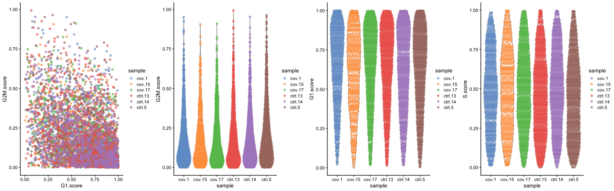
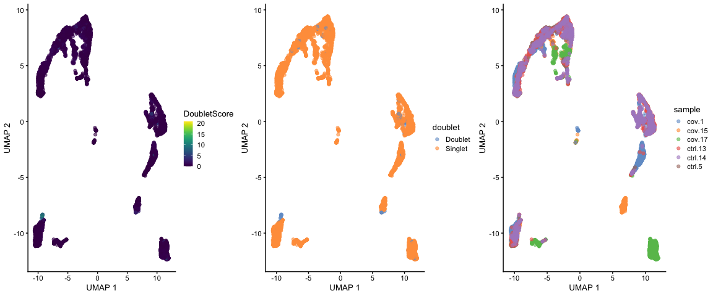

<style>
h1, .h1, h2, .h2, h3, .h3, h4, .h4 { margin-top: 50px }
p.caption {font-size: 0.9em;font-style: italic;color: grey;margin-right: 10%;margin-left: 10%;text-align: justify}
</style>

***
# Get data

In this tutorial, we will run all tutorials with a set of 6 PBMC 10x datasets from 3 covid-19 patients and 3 healthy controls, the samples have been subsampled to 1500 cells per sample. They are part of the github repo and if you have cloned the repo they should be available in folder: `labs/data/covid_data_GSE149689`. Instructions on how to download them can also be found in the Precourse material. 


```bash
mkdir -p data/raw

# first check if the files are there
count=$(ls -l data/raw/*.h5 | grep -v ^d | wc -l )
echo $count

# if not 4 files, fetch the files from github.
if (("$count" <  4)); then
  cd data/raw
  curl  -O https://raw.githubusercontent.com/NBISweden/workshop-scRNAseq/raw/master/labs/data/covid_data_GSE149689/raw/Normal_PBMC_13.h5
  curl  -O https://github.com/NBISweden/workshop-scRNAseq/raw/master/labs/data/covid_data_GSE149689/raw/Normal_PBMC_14.h5
  curl  -O https://github.com/NBISweden/workshop-scRNAseq/raw/master/labs/data/covid_data_GSE149689/raw/nCoV_PBMC_16.h5
  curl  -O https://github.com/NBISweden/workshop-scRNAseq/raw/master/labs/data/covid_data_GSE149689/raw/nCoV_PBMC_17.h5
  cd ../..
fi 
```

With data in place, now we can start loading libraries we will use in this tutorial.


```r
suppressMessages(require(scater))
suppressMessages(require(scran))
suppressMessages(require(cowplot))
suppressMessages(require(org.Hs.eg.db))
```

We can first load the data individually by reading directly from HDF5 file format (.h5). 


```r
cov.15 <- Seurat::Read10X_h5(filename = "data/raw/nCoV_PBMC_15.h5", use.names = T)
cov.1 <- Seurat::Read10X_h5(filename = "data/raw/nCoV_PBMC_1.h5", use.names = T)
cov.17 <- Seurat::Read10X_h5(filename = "data/raw/nCoV_PBMC_17.h5", use.names = T)

ctrl.5 <- Seurat::Read10X_h5(filename = "data/raw/Normal_PBMC_5.h5", use.names = T)
ctrl.13 <- Seurat::Read10X_h5(filename = "data/raw/Normal_PBMC_13.h5", use.names = T)
ctrl.14 <- Seurat::Read10X_h5(filename = "data/raw/Normal_PBMC_14.h5", use.names = T)
```

***
# Create one merged object

We can now load the expression matricies into objects and then merge them into a single merged object. Each analysis workflow (Seurat, Scater, Scranpy, etc) has its own way of storing data. We will add dataset labels as cell.ids just in case you have overlapping barcodes between the datasets. After that we add a column `Chemistry` in the metadata for plotting later on.


```r
sce <- SingleCellExperiment(assays = list(counts = cbind(cov.1, cov.15, cov.17, ctrl.5, 
    ctrl.13, ctrl.14)))
dim(sce)
```

```
## [1] 33538  9000
```

```r
# Adding metadata
sce@colData$sample <- unlist(sapply(c("cov.1", "cov.15", "cov.17", "ctrl.5", "ctrl.13", 
    "ctrl.14"), function(x) rep(x, ncol(get(x)))))
sce@colData$type <- ifelse(grepl("cov", sce@colData$sample), "Covid", "Control")
```

Once you have created the merged Seurat object, the count matrices and individual count matrices and objects are not needed anymore. It is a good idea to remove them and run garbage collect to free up some memory.


```r
# remove all objects that will not be used.
rm(cov.15, cov.1, cov.17, ctrl.5, ctrl.13, ctrl.14, sdata.cov15, sdata.cov1, sdata.cov17, 
    sdata.ctrl5, sdata.ctrl13, sdata.ctrl14)

# run garbage collect to free up memory
gc()
```

```
##            used  (Mb) gc trigger  (Mb) max used  (Mb)
## Ncells  7533819 402.4   11562481 617.6 11562481 617.6
## Vcells 32511794 248.1   89881133 685.8 73645972 561.9
```


 Here it is how the count matrix and the metatada look like for every cell.


```r
head(counts(sce)[, 1:10])

head(sce@colData, 10)
```

```
## 6 x 10 sparse Matrix of class "dgCMatrix"
##                                
## MIR1302-2HG . . . . . . . . . .
## FAM138A     . . . . . . . . . .
## OR4F5       . . . . . . . . . .
## AL627309.1  . . . . . . . . . .
## AL627309.3  . . . . . . . . . .
## AL627309.2  . . . . . . . . . .
## DataFrame with 10 rows and 2 columns
##                         sample        type
##                    <character> <character>
## AGGGTCCCATGACCCG-1       cov.1       Covid
## TACCCACAGCGGGTTA-1       cov.1       Covid
## CCCAACTTCATATGGC-1       cov.1       Covid
## TCAAGTGTCCGAACGC-1       cov.1       Covid
## ATTCCTAGTGACTGTT-1       cov.1       Covid
## GTGTTCCGTGGGCTCT-1       cov.1       Covid
## CCTAAGACAGATTAAG-1       cov.1       Covid
## AATAGAGAGGGTTAGC-1       cov.1       Covid
## GGGTCACTCACCTACC-1       cov.1       Covid
## TCCTCTTGTACAGTCT-1       cov.1       Covid
```


***
# Calculate QC

Having the data in a suitable format, we can start calculating some quality metrics. We can for example calculate the percentage of mitocondrial and ribosomal genes per cell and add to the metadata. This will be helpfull to visualize them across different metadata parameteres (i.e. datasetID and chemistry version). There are several ways of doing this, and here manually calculate the proportion of mitochondrial reads and add to the metadata table.

Citing from "Simple Single Cell" workflows (Lun, McCarthy & Marioni, 2017): "High proportions are indicative of poor-quality cells (Islam et al. 2014; Ilicic et al. 2016), possibly because of loss of cytoplasmic RNA from perforated cells. The reasoning is that mitochondria are larger than individual transcript molecules and less likely to escape through tears in the cell membrane."

 First, let Scran calculate some general qc-stats for genes and cells with the function `perCellQCMetrics`. It can also calculate proportion of counts for specific gene subsets, so first we need to define which genes are mitochondrial, ribosomal and hemoglogin.


```r
# Mitochondrial genes
mito_genes <- rownames(sce)[grep("^MT-", rownames(sce))]

# Ribosomal genes
ribo_genes <- rownames(sce)[grep("^RP[SL]", rownames(sce))]

# Hemoglobin genes - includes all genes starting with HB except HBP.
hb_genes <- rownames(sce)[grep("^HB[^(P)]", rownames(sce))]
```


```r
sce <- addPerCellQC(sce, flatten = T, subsets = list(mt = mito_genes, hb = hb_genes, 
    ribo = ribo_genes))

head(colData(sce))
```

```
## DataFrame with 6 rows and 14 columns
##                         sample        type       sum  detected subsets_mt_sum
##                    <character> <character> <numeric> <integer>      <numeric>
## AGGGTCCCATGACCCG-1       cov.1       Covid      7698      2140            525
## TACCCACAGCGGGTTA-1       cov.1       Covid     13416      3391            952
## CCCAACTTCATATGGC-1       cov.1       Covid     16498      3654           1253
## TCAAGTGTCCGAACGC-1       cov.1       Covid      1425       608            141
## ATTCCTAGTGACTGTT-1       cov.1       Covid      7535      1808            470
## GTGTTCCGTGGGCTCT-1       cov.1       Covid      4378      1345            352
##                    subsets_mt_detected subsets_mt_percent subsets_hb_sum
##                              <integer>          <numeric>      <numeric>
## AGGGTCCCATGACCCG-1                  11            6.81995              2
## TACCCACAGCGGGTTA-1                  11            7.09600              6
## CCCAACTTCATATGGC-1                  12            7.59486              1
## TCAAGTGTCCGAACGC-1                  10            9.89474              1
## ATTCCTAGTGACTGTT-1                  11            6.23756              4
## GTGTTCCGTGGGCTCT-1                  10            8.04020              1
##                    subsets_hb_detected subsets_hb_percent subsets_ribo_sum
##                              <integer>          <numeric>        <numeric>
## AGGGTCCCATGACCCG-1                   1         0.02598077             2564
## TACCCACAGCGGGTTA-1                   2         0.04472272             2264
## CCCAACTTCATATGGC-1                   1         0.00606134             2723
## TCAAGTGTCCGAACGC-1                   1         0.07017544              444
## ATTCCTAGTGACTGTT-1                   3         0.05308560             3397
## GTGTTCCGTGGGCTCT-1                   1         0.02284148             1588
##                    subsets_ribo_detected subsets_ribo_percent     total
##                                <integer>            <numeric> <numeric>
## AGGGTCCCATGACCCG-1                    82              33.3074      7698
## TACCCACAGCGGGTTA-1                    85              16.8754     13416
## CCCAACTTCATATGGC-1                    87              16.5050     16498
## TCAAGTGTCCGAACGC-1                    68              31.1579      1425
## ATTCCTAGTGACTGTT-1                    81              45.0829      7535
## GTGTTCCGTGGGCTCT-1                    79              36.2723      4378
```

 Here is an example on how to calculate proportion mitochondria in another way:


```r
# Way2: Doing it manually
sce@colData$percent_mito <- Matrix::colSums(counts(sce)[mito_genes, ])/sce@colData$total
```


***
# Plot QC

Now we can plot some of the QC-features as violin plots.


```r
# total is total UMIs per cell detected is number of detected genes.  the
# different gene subset percentages are listed as subsets_mt_percent etc.

plot_grid(plotColData(sce, y = "detected", x = "sample", colour_by = "sample"), plotColData(sce, 
    y = "total", x = "sample", colour_by = "sample"), plotColData(sce, y = "subsets_mt_percent", 
    x = "sample", colour_by = "sample"), plotColData(sce, y = "subsets_ribo_percent", 
    x = "sample", colour_by = "sample"), plotColData(sce, y = "subsets_hb_percent", 
    x = "sample", colour_by = "sample"), ncol = 3)
```

<!-- -->

As you can see, there is quite some difference in quality for the 4 datasets, with for instance the covid_15 sample having fewer cells with many detected genes and more mitochondrial content. As the ribosomal proteins are highly expressed they will make up a larger proportion of the transcriptional landscape when fewer of the lowly expressed genes are detected. And we can plot the different QC-measures as scatter plots.


```r
plotColData(sce, x = "total", y = "detected", colour_by = "sample")
```

<!-- -->

###TASK: Plot additional QC stats that we have calculated as scatter plots. How are the different measures correlated? Can you explain why?

***
# Filtering

## Detection-based filtering

In scran, we can use the function `quickPerCellQC` to filter out outliers from distributions of qc stats, such as dected genes, gene subsets etc. But in this case, we will take one setting at a time and run through the steps of filtering cells.

A standard approach is to filter cells with low amount of reads as well as genes that are present in at least a certain amount of cells. Here we will only consider cells with at least 200 detected genes and genes need to be expressed in at least 3 cells. Please note that those values are highly dependent on the library preparation method used.


```r
dim(sce)

selected_c <- colnames(sce)[sce$detected > 200]
selected_f <- rownames(sce)[Matrix::rowSums(counts(sce)) > 3]

sce.filt <- sce[selected_f, selected_c]
dim(sce.filt)
```

```
## [1] 33538  9000
## [1] 18147  7973
```

 Extremely high number of detected genes could indicate doublets. However, depending on the cell type composition in your sample, you may have cells with higher number of genes (and also higher counts) from one cell type. <br>In these datasets, there is also a clear difference between the v2 vs v3 10x chemistry with regards to gene detection, so it may not be fair to apply the same cutoffs to all of them. Also, in the protein assay data there is a lot of cells with few detected genes giving a bimodal distribution. This type of distribution is not seen in the other 2 datasets. Considering that they are all PBMC datasets it makes sense to regard this distribution as low quality libraries. Filter the cells with high gene detection (putative doublets) with cutoffs 4100 for v3 chemistry and 2000 for v2. <br>Here, we will filter the cells with low gene detection (low quality libraries) with less than 1000 genes for v2 and < 500 for v2.


```r
# skip for now and run doublet detection instead...

# high.det.v3 <- sce.filt$nFeatures > 4100 high.det.v2 <- (sce.filt$nFeatures >
# 2000) & (sce.filt$sample_id == 'v2.1k')

# remove these cells sce.filt <- sce.filt[ , (!high.det.v3) & (!high.det.v2)]

# check number of cells ncol(sce.filt)
```

Additionally, we can also see which genes contribute the most to such reads. We can for instance plot the percentage of counts per gene.

In scater, you can also use the function `plotHighestExprs()` to plot the gene contribution, but the function is quite slow. 


```r
# Compute the relative expression of each gene per cell

# Use sparse matrix operations, if your dataset is large, doing matrix devisions
# the regular way will take a very long time.
C = counts(sce)
C@x = C@x/rep.int(colSums(C), diff(C@p))
most_expressed <- order(Matrix::rowSums(C), decreasing = T)[20:1]
boxplot(as.matrix(t(C[most_expressed, ])), cex = 0.1, las = 1, xlab = "% total count per cell", 
    col = (scales::hue_pal())(20)[20:1], horizontal = TRUE)
```

<!-- -->

```r
rm(C)

# also, there is the option of running the function 'plotHighestExprs' in the
# scater package, however, this function takes very long to execute.
```

As you can see, MALAT1 constitutes up to 30% of the UMIs from a single cell and the other top genes are mitochondrial and ribosomal genes. It is quite common that nuclear lincRNAs have correlation with quality and mitochondrial reads, so high detection of MALAT1 may be a technical issue. Let us assemble some information about such genes, which are important for quality control and downstream filtering.

## Mito/Ribo filtering

We also have quite a lot of cells with high proportion of mitochondrial and low proportion ofribosomal reads. It could be wise to remove those cells, if we have enough cells left after filtering. <br>Another option would be to either remove all mitochondrial reads from the dataset and hope that the remaining genes still have enough biological signal. <br>A third option would be to just regress out the `percent_mito` variable during scaling. In this case we had as much as 99.7% mitochondrial reads in some of the cells, so it is quite unlikely that there is much cell type signature left in those. <br>Looking at the plots, make reasonable decisions on where to draw the cutoff. In this case, the bulk of the cells are below 20% mitochondrial reads and that will be used as a cutoff. We will also remove cells with less than 5% ribosomal reads. 


```r
selected_mito <- sce.filt$subsets_mt_percent < 30
selected_ribo <- sce.filt$subsets_ribo_percent > 5

# and subset the object to only keep those cells
sce.filt <- sce.filt[, selected_mito & selected_ribo]
dim(sce.filt)
```

```
## [1] 18147  5896
```

 As you can see, a large proportion of sample covid_15 is filtered out. Also, there is still quite a lot of variation in `percent_mito`, so it will have to be dealt with in the data analysis step. We can also notice that the `percent_ribo` are also highly variable, but that is expected since different cell types have different proportions of ribosomal content, according to their function.

## Plot filtered QC

Lets plot the same QC-stats another time.


```r
plot_grid(plotColData(sce, y = "detected", x = "sample", colour_by = "sample"), plotColData(sce, 
    y = "total", x = "sample", colour_by = "sample"), plotColData(sce, y = "subsets_mt_percent", 
    x = "sample", colour_by = "sample"), plotColData(sce, y = "subsets_ribo_percent", 
    x = "sample", colour_by = "sample"), plotColData(sce, y = "subsets_hb_percent", 
    x = "sample", colour_by = "sample"), ncol = 3)
```

<!-- -->

## Filter genes

As the level of expression of mitochondrial and MALAT1 genes are judged as mainly technical, and hemoglobin genes mainly from RBC contamination, it can be wise to remove them from the dataset bofore any further analysis. 


```r
dim(sce.filt)

# Filter MALAT1
sce.filt <- sce.filt[!grepl("MALAT1", rownames(sce.filt)), ]

# Filter Mitocondrial
sce.filt <- sce.filt[!grepl("^MT-", rownames(sce.filt)), ]

# Filter Ribossomal gene (optional if that is a problem on your data) sce.filt <-
# sce.filt[ ! grepl('^RP[SL]', rownames(sce.filt)), ]

# Filter Hemoglobin gene
sce.filt <- sce.filt[!grepl("^HB[^(P)]", rownames(sce.filt)), ]

dim(sce.filt)
```

```
## [1] 18147  5896
## [1] 18121  5896
```


# Calculate cell-cycle scores

We here perform cell cycle scoring. To score a gene list, the algorithm calculates the difference of mean expression of the given list and the mean expression of reference genes. To build the reference, the function randomly chooses a bunch of genes matching the distribution of the expression of the given list. Cell cycle scoring adds three slots in data, a score for S phase, a score for G2M phase and the predicted cell cycle phase.


```r
hs.pairs <- readRDS(system.file("exdata", "human_cycle_markers.rds", package = "scran"))
anno <- select(org.Hs.eg.db, keys = rownames(sce.filt), keytype = "SYMBOL", column = "ENSEMBL")
```

```
## 'select()' returned 1:many mapping between keys and columns
```

```r
ensembl <- anno$ENSEMBL[match(rownames(sce.filt), anno$SYMBOL)]

# Use only genes related to biological process cell cycle to speed up
# https://www.ebi.ac.uk/QuickGO/term/GO:0007049 = cell cycle (BP,Biological
# Process)
GOs <- na.omit(select(org.Hs.eg.db, keys = na.omit(ensembl), keytype = "ENSEMBL", 
    column = "GO"))
```

```
## 'select()' returned many:many mapping between keys and columns
```

```r
GOs <- GOs[GOs$GO == "GO:0007049", "ENSEMBL"]
hs.pairs <- lapply(hs.pairs, function(x) {
    x[rowSums(apply(x, 2, function(i) i %in% GOs)) >= 1, ]
})
str(hs.pairs)
cc.ensembl <- ensembl[ensembl %in% GOs]  #This is the fastest (less genes), but less accurate too
# cc.ensembl <- ensembl[ ensembl %in% unique(unlist(hs.pairs))]


assignments <- cyclone(sce.filt[ensembl %in% cc.ensembl, ], hs.pairs, gene.names = ensembl[ensembl %in% 
    cc.ensembl])
sce.filt$G1.score <- assignments$scores$G1
sce.filt$G2M.score <- assignments$scores$G2M
sce.filt$S.score <- assignments$scores$S
```

```
## List of 3
##  $ G1 :'data.frame':	6222 obs. of  2 variables:
##   ..$ first : chr [1:6222] "ENSG00000100519" "ENSG00000100519" "ENSG00000100519" "ENSG00000100519" ...
##   ..$ second: chr [1:6222] "ENSG00000065135" "ENSG00000080345" "ENSG00000101266" "ENSG00000124486" ...
##  $ S  :'data.frame':	8053 obs. of  2 variables:
##   ..$ first : chr [1:8053] "ENSG00000255302" "ENSG00000119969" "ENSG00000179051" "ENSG00000127586" ...
##   ..$ second: chr [1:8053] "ENSG00000100519" "ENSG00000100519" "ENSG00000100519" "ENSG00000136856" ...
##  $ G2M:'data.frame':	6310 obs. of  2 variables:
##   ..$ first : chr [1:6310] "ENSG00000100519" "ENSG00000136856" "ENSG00000136856" "ENSG00000136856" ...
##   ..$ second: chr [1:6310] "ENSG00000146457" "ENSG00000007968" "ENSG00000101265" "ENSG00000117676" ...
```

We can now plot a violin plot for the cell cycle scores as well.


```r
plot_grid(plotColData(sce.filt, y = "G2M.score", x = "G1.score", colour_by = "sample"), 
    plotColData(sce.filt, y = "G2M.score", x = "sample", colour_by = "sample"), plotColData(sce.filt, 
        y = "G1.score", x = "sample", colour_by = "sample"), plotColData(sce.filt, 
        y = "S.score", x = "sample", colour_by = "sample"), ncol = 4)
```

```
## Warning: Removed 621 rows containing missing values (geom_point).
```

```
## Warning: Removed 505 rows containing non-finite values (stat_ydensity).
```

```
## Warning: Removed 505 rows containing missing values (position_quasirandom).
```

```
## Warning: Removed 584 rows containing non-finite values (stat_ydensity).
```

```
## Warning: Removed 584 rows containing missing values (position_quasirandom).
```

```
## Warning: Removed 403 rows containing non-finite values (stat_ydensity).
```

```
## Warning: Removed 403 rows containing missing values (position_quasirandom).
```

<!-- -->

Cyclone predicts most cells as G1, but also quite a lot of cells with high S-Phase scores. Compare to results with Seurat and Scanpy and see how different predictors will give clearly different results.

# Predict doublets

Doublets/Mulitples of cells in the same well/droplet is a common issue in scRNAseq protocols. Especially in droplet-based methods whith overloading of cells. In a typical 10x experiment the proportion of doublets is linearly dependent on the amount of loaded cells. As  indicated from the Chromium user guide, doublet rates are about as follows:

Most doublet detectors simulates doublets by merging cell counts and predicts doublets as cells that have similar embeddings as the simulated doublets. Most such packages need an assumption about the number/proportion of expected doublets in the dataset. The data you are using is subsampled, but the orignial datasets contained about 5 000 cells per sample, hence we can assume that they loaded about 9 000 cells and should have a doublet rate at about 4%.
OBS! Ideally doublet prediction should be run on each sample separately, especially if your different samples have different proportions of celltypes. In this case, the data is subsampled so we have very few cells per sample and all samples are sorted PBMCs so it is okay to run them together. 

#DOUBLET_SCATER1:


```r
sce.filt <- logNormCounts(sce.filt)
dec <- modelGeneVar(sce.filt, block = sce.filt$sample)
hvgs = getTopHVGs(dec, n = 2000)

sce.filt <- runPCA(sce.filt, subset_row = hvgs)

sce.filt <- runUMAP(sce.filt, pca = 10)
```


```r
suppressPackageStartupMessages(require(scDblFinder))

# run computeDoubletDensity with 10 principal components.
dbl.dens <- computeDoubletDensity(sce.filt, subset.row = hvgs, dims = 10)
summary(dbl.dens)
```

```
##     Min.  1st Qu.   Median     Mean  3rd Qu.     Max. 
##  0.00000  0.09434  0.21226  0.47023  0.43630 20.82467
```

```r
hist(dbl.dens, n = 100)
```

<!-- -->


```r
# set cutoff at doublet density 2 to predict doublets
colData(sce.filt)$doublet = ifelse(dbl.dens > 2, "Doublet", "Singlet")
table(sce.filt$doublet)
```

```
## 
## Doublet Singlet 
##     170    5726
```

```r
sce.filt$DoubletScore <- dbl.dens
```


```r
plot_grid(plotUMAP(sce.filt, colour_by = "DoubletScore"), plotUMAP(sce.filt, colour_by = "doublet"), 
    plotUMAP(sce.filt, colour_by = "sample"), ncol = 3)
```

<!-- -->

#DOUBLET_ALL2


```r
sce.filt = sce.filt[, sce.filt$DoubletScore < 2]
```

# Save data
Finally, lets save the QC-filtered data for further analysis. Create output directory `results` and save data to that folder.


```r
dir.create("data/results", showWarnings = F)

saveRDS(sce.filt, "data/results/covid_qc.rds")
```

We should expect that two cells have more detected genes than a single cell, lets check if our predicted doublets also have more detected genes in general.

### Session Info
***


```r
sessionInfo()
```

```
## R version 4.0.3 (2020-10-10)
## Platform: x86_64-apple-darwin13.4.0 (64-bit)
## Running under: macOS Catalina 10.15.7
## 
## Matrix products: default
## BLAS/LAPACK: /Users/asbj/miniconda3/envs/scRNAseq2021/lib/libopenblasp-r0.3.12.dylib
## 
## locale:
## [1] en_US.UTF-8/en_US.UTF-8/en_US.UTF-8/C/en_US.UTF-8/en_US.UTF-8
## 
## attached base packages:
## [1] parallel  stats4    stats     graphics  grDevices utils     datasets 
## [8] methods   base     
## 
## other attached packages:
##  [1] scDblFinder_1.4.0           org.Hs.eg.db_3.12.0        
##  [3] AnnotationDbi_1.52.0        cowplot_1.1.0              
##  [5] scran_1.18.0                scater_1.18.0              
##  [7] ggplot2_3.3.2               SingleCellExperiment_1.12.0
##  [9] SummarizedExperiment_1.20.0 Biobase_2.50.0             
## [11] GenomicRanges_1.42.0        GenomeInfoDb_1.26.0        
## [13] IRanges_2.24.0              S4Vectors_0.28.0           
## [15] BiocGenerics_0.36.0         MatrixGenerics_1.2.0       
## [17] matrixStats_0.57.0          RJSONIO_1.3-1.4            
## [19] optparse_1.6.6             
## 
## loaded via a namespace (and not attached):
##   [1] plyr_1.8.6                igraph_1.2.6             
##   [3] lazyeval_0.2.2            splines_4.0.3            
##   [5] BiocParallel_1.24.0       listenv_0.8.0            
##   [7] digest_0.6.27             htmltools_0.5.0          
##   [9] viridis_0.5.1             magrittr_2.0.1           
##  [11] memoise_1.1.0             tensor_1.5               
##  [13] cluster_2.1.0             ROCR_1.0-11              
##  [15] limma_3.46.0              globals_0.14.0           
##  [17] colorspace_2.0-0          blob_1.2.1               
##  [19] ggrepel_0.8.2             xfun_0.19                
##  [21] dplyr_1.0.2               crayon_1.3.4             
##  [23] RCurl_1.98-1.2            jsonlite_1.7.1           
##  [25] spatstat_1.64-1           spatstat.data_1.5-2      
##  [27] survival_3.2-7            zoo_1.8-8                
##  [29] glue_1.4.2                polyclip_1.10-0          
##  [31] gtable_0.3.0              zlibbioc_1.36.0          
##  [33] XVector_0.30.0            leiden_0.3.5             
##  [35] DelayedArray_0.16.0       BiocSingular_1.6.0       
##  [37] future.apply_1.6.0        abind_1.4-5              
##  [39] scales_1.1.1              DBI_1.1.0                
##  [41] edgeR_3.32.0              miniUI_0.1.1.1           
##  [43] Rcpp_1.0.5                viridisLite_0.3.0        
##  [45] xtable_1.8-4              reticulate_1.18          
##  [47] dqrng_0.2.1               bit_4.0.4                
##  [49] rsvd_1.0.3                htmlwidgets_1.5.2        
##  [51] httr_1.4.2                getopt_1.20.3            
##  [53] RColorBrewer_1.1-2        ellipsis_0.3.1           
##  [55] Seurat_3.2.2              ica_1.0-2                
##  [57] farver_2.0.3              pkgconfig_2.0.3          
##  [59] scuttle_1.0.0             uwot_0.1.9               
##  [61] deldir_0.2-3              locfit_1.5-9.4           
##  [63] labeling_0.4.2            tidyselect_1.1.0         
##  [65] rlang_0.4.8               reshape2_1.4.4           
##  [67] later_1.1.0.1             munsell_0.5.0            
##  [69] tools_4.0.3               xgboost_1.2.0.1          
##  [71] generics_0.1.0            RSQLite_2.2.1            
##  [73] ggridges_0.5.2            evaluate_0.14            
##  [75] stringr_1.4.0             fastmap_1.0.1            
##  [77] goftest_1.2-2             yaml_2.2.1               
##  [79] knitr_1.30                bit64_4.0.5              
##  [81] fitdistrplus_1.1-1        purrr_0.3.4              
##  [83] RANN_2.6.1                nlme_3.1-150             
##  [85] pbapply_1.4-3             future_1.20.1            
##  [87] sparseMatrixStats_1.2.0   mime_0.9                 
##  [89] formatR_1.7               hdf5r_1.3.3              
##  [91] compiler_4.0.3            beeswarm_0.2.3           
##  [93] plotly_4.9.2.1            png_0.1-7                
##  [95] spatstat.utils_1.17-0     tibble_3.0.4             
##  [97] statmod_1.4.35            stringi_1.5.3            
##  [99] RSpectra_0.16-0           lattice_0.20-41          
## [101] bluster_1.0.0             Matrix_1.2-18            
## [103] vctrs_0.3.5               pillar_1.4.7             
## [105] lifecycle_0.2.0           lmtest_0.9-38            
## [107] RcppAnnoy_0.0.17          BiocNeighbors_1.8.0      
## [109] data.table_1.13.2         bitops_1.0-6             
## [111] irlba_2.3.3               httpuv_1.5.4             
## [113] patchwork_1.1.0           R6_2.5.0                 
## [115] promises_1.1.1            KernSmooth_2.23-18       
## [117] gridExtra_2.3             vipor_0.4.5              
## [119] parallelly_1.21.0         codetools_0.2-18         
## [121] MASS_7.3-53               withr_2.3.0              
## [123] sctransform_0.3.1         GenomeInfoDbData_1.2.4   
## [125] mgcv_1.8-33               rpart_4.1-15             
## [127] grid_4.0.3                beachmat_2.6.0           
## [129] tidyr_1.1.2               rmarkdown_2.5            
## [131] DelayedMatrixStats_1.12.0 Rtsne_0.15               
## [133] shiny_1.5.0               ggbeeswarm_0.6.0
```


