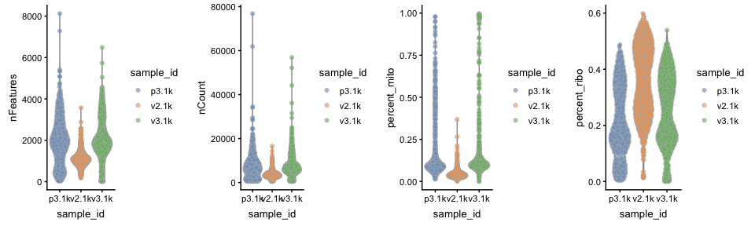
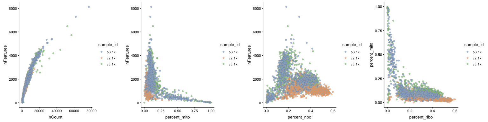
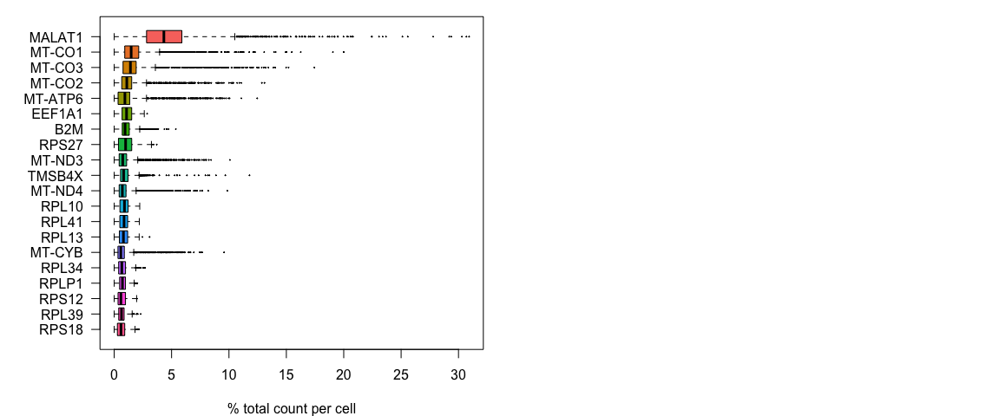
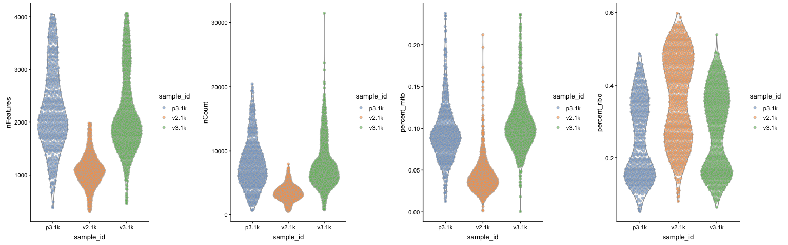
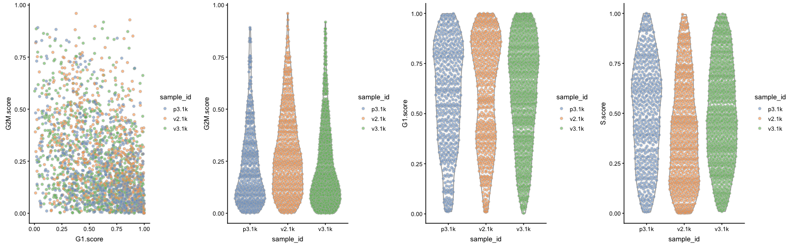

***
# Get data

In this tutorial, we will be using 3 publicly available dataset downloaded from 10X Genomics repository. They can be downloaded using the following bash commands. Simply create a folder called `data` and then use `curl` to pull the data from the 10X database.


```bash
mkdir data
curl -o data/pbmc_1k_v2_filtered_feature_bc_matrix.h5 -O http://cf.10xgenomics.com/samples/cell-exp/3.0.0/pbmc_1k_v2/pbmc_1k_v2_filtered_feature_bc_matrix.h5
curl -o data/pbmc_1k_v3_filtered_feature_bc_matrix.h5 -O http://cf.10xgenomics.com/samples/cell-exp/3.0.0/pbmc_1k_v3/pbmc_1k_v3_filtered_feature_bc_matrix.h5
curl -o data/pbmc_1k_protein_v3_filtered_feature_bc_matrix.h5 -O http://cf.10xgenomics.com/samples/cell-exp/3.0.0/pbmc_1k_protein_v3/pbmc_1k_protein_v3_filtered_feature_bc_matrix.h5
```

With data in place, now we can start loading libraries we will use in this tutorial.


```r
suppressMessages(require(scater))
suppressMessages(require(scran))
suppressMessages(require(cowplot))
suppressMessages(require(org.Hs.eg.db))
```

We can first load the data individually by reading directly from HDF5 file format (.h5). Note that among those , the dataset p3.1k actually has both gene expression and CITE-seq data, so we will use only the `Gene Expression` here.


```r
v3.1k <- Seurat::Read10X_h5("data/pbmc_1k_v3_filtered_feature_bc_matrix.h5", use.names = T)
v2.1k <- Seurat::Read10X_h5("data/pbmc_1k_v2_filtered_feature_bc_matrix.h5", use.names = T)
p3.1k <- Seurat::Read10X_h5("data/pbmc_1k_protein_v3_filtered_feature_bc_matrix.h5", use.names = T)
```

```
## Genome matrix has multiple modalities, returning a list of matrices for this genome
```

```r
p3.1k <- p3.1k$`Gene Expression`
```

***
# Create Object

We can now load the expression matricies into objects and then merge them into a single merged object. Each analysis workflow (Seurat, Scater, Scranpy, etc) has its own way of storing data. We will add dataset labels as cell.ids just in case you have overlapping barcodes between the datasets. After that we add a column `Chemistry` in the metadata for plotting later on.


```r
sce <- SingleCellExperiment( assays = list(counts = cbind(v3.1k,v2.1k,p3.1k)) )
dim(sce)
```

```
## [1] 33538  2931
```

```r
cpm(sce) <- calculateCPM(sce)
sce <- normalize(sce)
```

```
## Warning in .local(object, ...): using library sizes as size factors
```

 Here it is how the count matrix and the metatada look like for every cell.


```r
#Adding metadata
sce@colData$sample_id <- unlist(sapply(c("v3.1k","v2.1k","p3.1k"),function(x) rep(x,ncol(get(x)))))
sce@colData$nCount <- Matrix::colSums(counts(sce))
sce@colData$nFeatures <- Matrix::colSums(counts(sce)>0)
sce@colData$size_factors <- scater::librarySizeFactors(sce)

sce <- calculateQCMetrics(sce)

head(sce@colData,10)
```

```
## DataFrame with 10 rows and 13 columns
##                      sample_id    nCount nFeatures      size_factors
##                    <character> <numeric> <integer>         <numeric>
## AAACCCAAGGAGAGTA-1       v3.1k      8288      2620  1.35511215206541
## AAACGCTTCAGCCCAG-1       v3.1k      5512      1808 0.901228062522265
## AAAGAACAGACGACTG-1       v3.1k      4283      1562 0.700282981092682
## AAAGAACCAATGGCAG-1       v3.1k      2754      1225 0.450287025432931
## AAAGAACGTCTGCAAT-1       v3.1k      6592      1831  1.07781120975087
## AAAGGATAGTAGACAT-1       v3.1k      8845      2048  1.44618327521942
## AAAGGATCACCGGCTA-1       v3.1k      5344      1589 0.873759572953371
## AAAGGATTCAGCTTGA-1       v3.1k     12683      3423  2.07370745953735
## AAAGGATTCCGTTTCG-1       v3.1k     15917      3752  2.60247588373855
## AAAGGGCTCATGCCCT-1       v3.1k      7262      1759  1.18735816219824
##                    is_cell_control total_features_by_counts
##                          <logical>                <integer>
## AAACCCAAGGAGAGTA-1           FALSE                     2620
## AAACGCTTCAGCCCAG-1           FALSE                     1808
## AAAGAACAGACGACTG-1           FALSE                     1562
## AAAGAACCAATGGCAG-1           FALSE                     1225
## AAAGAACGTCTGCAAT-1           FALSE                     1831
## AAAGGATAGTAGACAT-1           FALSE                     2048
## AAAGGATCACCGGCTA-1           FALSE                     1589
## AAAGGATTCAGCTTGA-1           FALSE                     3423
## AAAGGATTCCGTTTCG-1           FALSE                     3752
## AAAGGGCTCATGCCCT-1           FALSE                     1759
##                    log10_total_features_by_counts total_counts
##                                         <numeric>    <numeric>
## AAACCCAAGGAGAGTA-1                3.4184670209466         8288
## AAACGCTTCAGCCCAG-1               3.25743856685981         5512
## AAAGAACAGACGACTG-1               3.19395897801919         4283
## AAAGAACCAATGGCAG-1                3.0884904701824         2754
## AAAGAACGTCTGCAAT-1               3.26292546933183         6592
## AAAGGATAGTAGACAT-1               3.31154195840119         8845
## AAAGGATCACCGGCTA-1               3.20139712432045         5344
## AAAGGATTCAGCTTGA-1               3.53453375600512        12683
## AAAGGATTCCGTTTCG-1               3.57437856441308        15917
## AAAGGGCTCATGCCCT-1               3.24551266781415         7262
##                    log10_total_counts pct_counts_in_top_50_features
##                             <numeric>                     <numeric>
## AAACCCAAGGAGAGTA-1   3.91850213963617              35.2919884169884
## AAACGCTTCAGCCCAG-1   3.74138799247927              39.3142235123367
## AAAGAACAGACGACTG-1   3.63184946215982               39.084753677329
## AAAGAACCAATGGCAG-1    3.4401216031878              36.4197530864198
## AAAGAACGTCTGCAAT-1    3.8190830757437              42.8549757281553
## AAAGGATAGTAGACAT-1   3.94674693503358              46.8739400791408
## AAAGGATCACCGGCTA-1    3.7279477095448              42.0284431137725
## AAAGGATTCAGCTTGA-1   4.10325623335505              31.5382795868485
## AAAGGATTCCGTTTCG-1   4.20188850036597              35.6474209964189
## AAAGGGCTCATGCCCT-1    3.8611160441614              48.5403470118425
##                    pct_counts_in_top_100_features
##                                         <numeric>
## AAACCCAAGGAGAGTA-1               44.5704633204633
## AAACGCTTCAGCCCAG-1               54.4992743105951
## AAAGAACAGACGACTG-1               51.4826056502451
## AAAGAACCAATGGCAG-1               47.2403776325345
## AAAGAACGTCTGCAAT-1               58.1310679611651
## AAAGGATAGTAGACAT-1               64.4205765969474
## AAAGGATCACCGGCTA-1               58.9446107784431
## AAAGGATTCAGCTTGA-1               42.9078293779074
## AAAGGATTCCGTTTCG-1               46.3026952315135
## AAAGGGCTCATGCCCT-1               63.8804736987056
##                    pct_counts_in_top_200_features
##                                         <numeric>
## AAACCCAAGGAGAGTA-1               54.1747104247104
## AAACGCTTCAGCCCAG-1               63.9695210449927
## AAAGAACAGACGACTG-1               61.5923418164838
## AAAGAACCAATGGCAG-1               58.3514887436456
## AAAGAACGTCTGCAAT-1               67.7639563106796
## AAAGGATAGTAGACAT-1               71.8598078010175
## AAAGGATCACCGGCTA-1               67.7956586826347
## AAAGGATTCAGCTTGA-1               54.1906489001025
## AAAGGATTCCGTTTCG-1               56.7255136018094
## AAAGGGCTCATGCCCT-1               72.6383916276508
##                    pct_counts_in_top_500_features
##                                         <numeric>
## AAACCCAAGGAGAGTA-1               67.4107142857143
## AAACGCTTCAGCCCAG-1               75.8345428156749
## AAAGAACAGACGACTG-1               75.2042960541676
## AAAGAACCAATGGCAG-1               73.6746550472041
## AAAGAACGTCTGCAAT-1               78.5345873786408
## AAAGGATAGTAGACAT-1               80.5992085924251
## AAAGGATCACCGGCTA-1               79.6220059880239
## AAAGGATTCAGCTTGA-1               66.8532681542222
## AAAGGATTCCGTTTCG-1               68.4802412514921
## AAAGGGCTCATGCCCT-1               82.3189204076012
```


***
# Calculate QC

Having the data in a suitable format, we can start calculating some quality metrics. We can for example calculate the percentage of mitocondrial and ribossomal genes per cell and add to the metadata. This will be helpfull to visualize them across different metadata parameteres (i.e. datasetID and chemistry version). There are several ways of doing this, and here manually calculate the proportion of mitochondrial reads and add to the metadata table.

Citing from "Simple Single Cell" workflows (Lun, McCarthy & Marioni, 2017): "High proportions are indicative of poor-quality cells (Islam et al. 2014; Ilicic et al. 2016), possibly because of loss of cytoplasmic RNA from perforated cells. The reasoning is that mitochondria are larger than individual transcript molecules and less likely to escape through tears in the cell membrane."


```r
# Way1: Doing it manually
mito_genes <- rownames(sce)[grep("^MT-",rownames(sce))]
sce@colData$percent_mito <- Matrix::colSums(counts(sce)[mito_genes, ]) / sce@colData$nCount

head(mito_genes,10)
```

```
##  [1] "MT-ND1"  "MT-ND2"  "MT-CO1"  "MT-CO2"  "MT-ATP8" "MT-ATP6" "MT-CO3" 
##  [8] "MT-ND3"  "MT-ND4L" "MT-ND4"
```

In the same manner we will calculate the proportion gene expression that comes from ribosomal proteins.


```r
ribo_genes <- rownames(sce)[grep("^RP[SL]",rownames(sce))]
sce@colData$percent_ribo <- Matrix::colSums(counts(sce)[ribo_genes, ]) / sce@colData$nCount

head(ribo_genes,10)
```

```
##  [1] "RPL22"   "RPL11"   "RPS6KA1" "RPS8"    "RPL5"    "RPS27"   "RPS6KC1"
##  [8] "RPS7"    "RPS27A"  "RPL31"
```

***
# Plot QC

Now we can plot some of the QC-features as violin plots.


```r
plot_grid(plotColData(sce,y = "nFeatures",x = "sample_id",colour_by = "sample_id"),
          plotColData(sce,y = "nCount",x = "sample_id",colour_by = "sample_id"),
          plotColData(sce,y = "percent_mito",x = "sample_id",colour_by = "sample_id"),
          plotColData(sce,y = "percent_ribo",x = "sample_id",colour_by = "sample_id"),ncol = 4)
```

<!-- -->

As you can see, the v2 chemistry gives lower gene detection, but higher detection of ribosomal proteins. As the ribosomal proteins are highly expressed they will make up a larger proportion of the transcriptional landscape when fewer of the lowly expressed genes are detected. And we can plot the different QC-measures as scatter plots.


```r
plot_grid(plotColData(sce,x = "nCount"      ,y = "nFeatures",colour_by = "sample_id"),
          plotColData(sce,x = "percent_mito",y = "nFeatures",colour_by = "sample_id"),
          plotColData(sce,x = "percent_ribo",y = "nFeatures",colour_by = "sample_id"),
          plotColData(sce,x = "percent_ribo",y = "percent_mito",colour_by = "sample_id"),ncol = 4)
```

<!-- -->

***
# Filtering

## Detection-based filtering

A standard approach is to filter cells with low amount of reads as well as genes that are present in at least a certain amount of cells. Here we will only consider cells with at least 200 detected genes and genes need to be expressed in at least 3 cells. Please note that those values are highly dependent on the library preparation method used.


```r
dim(sce)

selected_c <-  colnames(sce)[sce$nFeatures > 200]
selected_f <- rownames(sce)[ Matrix::rowSums(counts(sce)) > 3]

sce.filt <- sce[selected_f , selected_c]
dim(sce.filt)
```

```
## [1] 33538  2931
## [1] 16157  2869
```

Additionaly, Extremely high number of detected genes could indicate doublets. However, depending on the cell type composition in your sample, you may have cells with higher number of genes (and also higher counts) from one cell type. In these datasets, there is also a clear difference between the v2 vs v3 10x chemistry with regards to gene detection, so it may not be fair to apply the same cutoffs to all of them. Also, in the protein assay data there is a lot of cells with few detected genes giving a bimodal distribution. This type of distribution is not seen in the other 2 datasets. Considering that they are all PBMC datasets it makes sense to regard this distribution as low quality libraries. Filter the cells with high gene detection (putative doublets) with cutoffs 4100 for v3 chemistry and 2000 for v2. Here, we will filter the cells with low gene detection (low quality libraries) with less than 1000 genes for v2 and < 500 for v2.


```r
high.det.v3 <- sce.filt$nFeatures > 4100
high.det.v2 <- (sce.filt$nFeatures > 2000) & (sce.filt$sample_id == "v2.1k")

# remove these cells
sce.filt <- sce.filt[ , (!high.det.v3) & (!high.det.v2)]

# check number of cells
ncol(sce.filt)
```

```
## [1] 2797
```

Additionally, we can also see which genes contribute the most to such reads. We can for instance plot the percentage of counts per gene.


```r
#Compute the relative expression of each gene per cell
rel_expression <- t( t(counts(sce.filt)) / Matrix::colSums(counts(sce.filt))) * 100
most_expressed <- sort(Matrix::rowSums( rel_expression ),T)[20:1] / ncol(sce.filt)

par(mfrow=c(1,2),mar=c(4,6,1,1))
boxplot( as.matrix(t(rel_expression[names(most_expressed),])),cex=.1, las=1, xlab="% total count per cell",col=scales::hue_pal()(20)[20:1],horizontal=TRUE)
```

<!-- -->

As you can see, MALAT1 constitutes up to 30% of the UMIs from a single cell and the other top genes are mitochondrial and ribosomal genes. Let us assemble some information about such genes, which are important for quality control and downstream filtering.

## Mito/Ribo filtering

We also have quite a lot of cells with high proportion of mitochondrial and ribosomal reads. It could be wise to remove those cells, if we have enough cells left after filtering. Another option would be to either remove all mitochondrial reads from the dataset and hope that the remaining genes still have enough biological signal. A third option would be to just regress out the `percent_mito` variable during scaling. In this case we had as much as 99.7% mitochondrial reads in some of the cells, so it is quite unlikely that there is much cell type signature left in those. Looking at the plots, make reasonable decisions on where to draw the cutoff. In this case, the bulk of the cells are below 25% mitochondrial reads and that will be used as a cutoff.


```r
selected_mito <- sce.filt$percent_mito < 0.25
selected_ribo <- sce.filt$percent_ribo > 0.05

# and subset the object to only keep those cells
sce.filt <- sce.filt[, selected_mito & selected_ribo ]
dim(sce.filt)
```

```
## [1] 16157  2599
```

As you can see, there is still quite a lot of variation in `percent_mito`, so it will have to be dealt with in the data analysis step. We can also notice that the `percent_ribo` are also highly variable, but that is expected since different cell types have different proportions of ribosomal content, according to their function.

## Plot filtered QC

Lets plot the same QC-stats another time.


```r
plot_grid(plotColData(sce.filt,y = "nFeatures",x = "sample_id",colour_by = "sample_id"),
          plotColData(sce.filt,y = "nCount",x = "sample_id",colour_by = "sample_id"),
          plotColData(sce.filt,y = "percent_mito",x = "sample_id",colour_by = "sample_id"),
          plotColData(sce.filt,y = "percent_ribo",x = "sample_id",colour_by = "sample_id"),ncol = 4)
```

<!-- -->

# Calculate cell-cycle scores

We here perform cell cycle scoring. To score a gene list, the algorithm calculates the difference of mean expression of the given list and the mean expression of reference genes. To build the reference, the function randomly chooses a bunch of genes matching the distribution of the expression of the given list. Cell cycle scoring adds three slots in data, a score for S phase, a score for G2M phase and the predicted cell cycle phase.


```r
hs.pairs <- readRDS(system.file("exdata", "human_cycle_markers.rds", package="scran"))
anno <- select(org.Hs.eg.db, keys=rownames(sce.filt), keytype="SYMBOL", column="ENSEMBL")
```

```
## 'select()' returned 1:many mapping between keys and columns
```

```r
ensembl <- anno$ENSEMBL[match(rownames(sce.filt), anno$SYMBOL)]

#Use only genes related to biological process to speed up
#https://www.ebi.ac.uk/QuickGO/term/GO:0007049 = cell cycle (BP,Biological Process)
GOs <- na.omit(select(org.Hs.eg.db, keys=na.omit(ensembl), keytype="ENSEMBL", column="GO"))
```

```
## 'select()' returned many:many mapping between keys and columns
```

```r
GOs <- GOs[GOs$GO == "GO:0007049","ENSEMBL"]
hs.pairs <- lapply(hs.pairs,function(x){ x[rowSums( apply(x, 2, function(i) i %in% GOs)) >= 1,]})
str(hs.pairs)
cc.ensembl <- ensembl[ensembl %in% GOs] #This is the fastest (less genes), but less accurate too
#cc.ensembl <- ensembl[ ensembl %in% unique(unlist(hs.pairs))]


assignments <- cyclone(sce.filt[ensembl %in% cc.ensembl,], hs.pairs, gene.names= ensembl[ ensembl %in% cc.ensembl])
sce.filt$G1.score <- assignments$scores$G1
sce.filt$G2M.score <- assignments$scores$G2M
sce.filt$S.score <- assignments$scores$S
```

```
## List of 3
##  $ G1 :'data.frame':	6491 obs. of  2 variables:
##   ..$ first : chr [1:6491] "ENSG00000100519" "ENSG00000100519" "ENSG00000100519" "ENSG00000100519" ...
##   ..$ second: chr [1:6491] "ENSG00000065135" "ENSG00000080345" "ENSG00000101266" "ENSG00000124486" ...
##  $ S  :'data.frame':	8527 obs. of  2 variables:
##   ..$ first : chr [1:8527] "ENSG00000255302" "ENSG00000119969" "ENSG00000179051" "ENSG00000127586" ...
##   ..$ second: chr [1:8527] "ENSG00000100519" "ENSG00000100519" "ENSG00000100519" "ENSG00000136856" ...
##  $ G2M:'data.frame':	6473 obs. of  2 variables:
##   ..$ first : chr [1:6473] "ENSG00000100519" "ENSG00000136856" "ENSG00000136856" "ENSG00000136856" ...
##   ..$ second: chr [1:6473] "ENSG00000146457" "ENSG00000007968" "ENSG00000101265" "ENSG00000147526" ...
```

We can now plot a violin plot for the cell cycle scores as well.


```r
plot_grid(plotColData(sce.filt,y = "G2M.score",x = "G1.score",colour_by = "sample_id"),
          plotColData(sce.filt,y = "G2M.score",x = "sample_id",colour_by = "sample_id"),
          plotColData(sce.filt,y = "G1.score",x = "sample_id",colour_by = "sample_id"),
          plotColData(sce.filt,y = "S.score",x = "sample_id",colour_by = "sample_id"),ncol = 4)
```

```
## Warning: Removed 376 rows containing missing values (geom_point).
```

```
## Warning: Removed 304 rows containing non-finite values (stat_ydensity).
```

```
## Warning: Removed 304 rows containing missing values (position_quasirandom).
```

```
## Warning: Removed 325 rows containing non-finite values (stat_ydensity).
```

```
## Warning: Removed 325 rows containing missing values (position_quasirandom).
```

```
## Warning: Removed 136 rows containing non-finite values (stat_ydensity).
```

```
## Warning: Removed 136 rows containing missing values (position_quasirandom).
```

<!-- -->

In this case it looks like we only have a few cycling cells in the datasets.

Finally, lets save the QC-filtered data for further analysis.


```r
saveRDS(sce.filt,"data/3pbmc_qc.rds")
```


