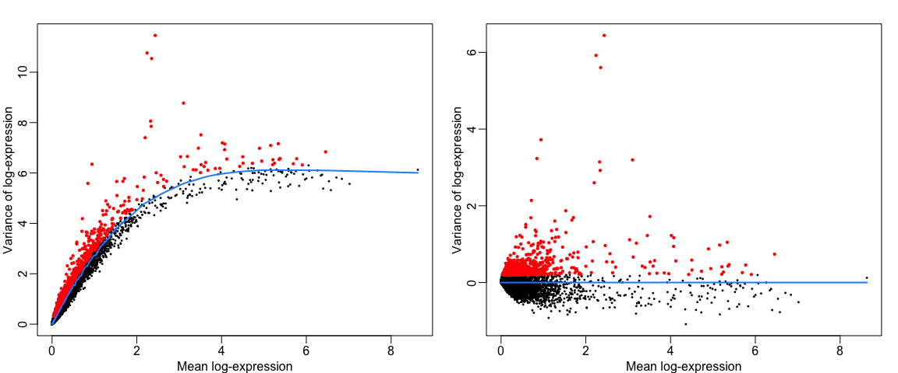
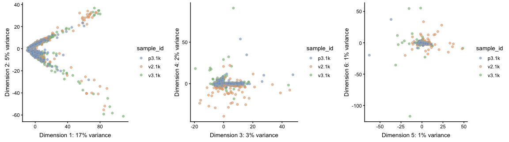
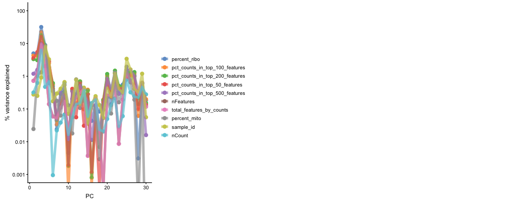
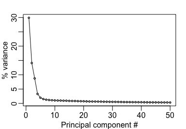
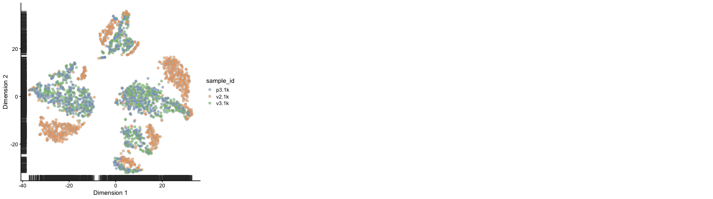
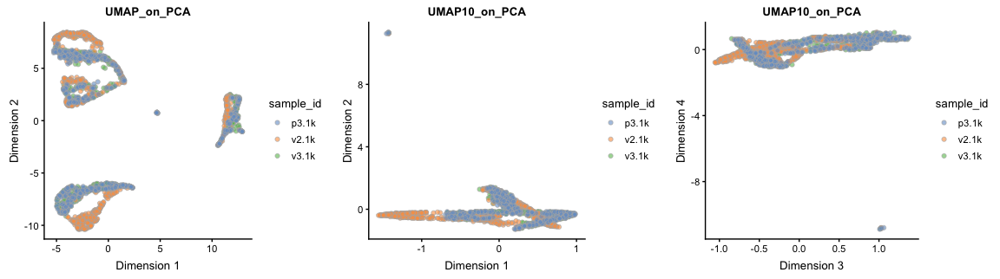
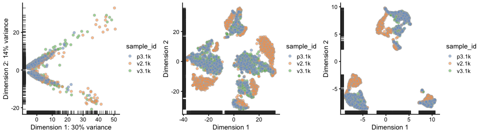
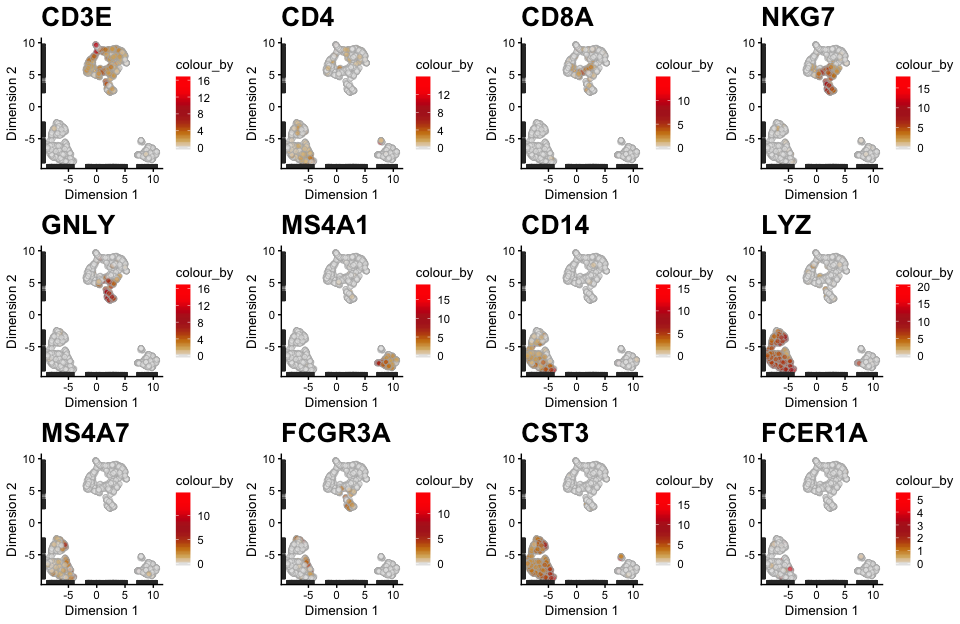

# Load data

First, let's load all necessary libraries and the QC-filtered dataset from the previous step.


```r
suppressMessages(require(scater))
suppressMessages(require(scran))
suppressMessages(require(cowplot))
suppressMessages(require(cowplot))
suppressMessages(require(ggplot2))
suppressMessages(require(rafalib))

sce <- readRDS("data/3pbmc_qc.rds")
```

## Feature selection

Next, we first need to define which features/genes are important in our dataset to distinguish cell types. For this purpose, we need to find genes that are highly variable across cells, which in turn will also provide a good separation of the cell clusters.


```r
sce <- computeSumFactors(sce, sizes=c(20, 40, 60, 80))
```

```
## Warning in FUN(...): encountered negative size factor estimates
```

```r
sce <- normalize(sce)
var.fit <- trendVar(sce, use.spikes=FALSE,method="loess",loess.args=list(span=0.02))
var.out <- decomposeVar(sce, var.fit)

mypar(1,2)
#plot mean over TOTAL variance
plot(var.out$mean, var.out$total, pch=16, cex=0.4, xlab="Mean log-expression",
     ylab="Variance of log-expression")
o <- order(var.out$mean)
lines(var.out$mean[o], var.out$tech[o], col="dodgerblue", lwd=2)
cutoff <- var.out$bio > 0.15
points(var.out$mean[cutoff], var.out$total[cutoff], col="red", pch=16,cex=.6)

#plot mean over BIOLOGICAL variance
plot(var.out$mean, var.out$bio, pch=16, cex=0.4, xlab="Mean log-expression",
     ylab="Variance of log-expression")
lines(c(min(var.out$mean),max(var.out$mean)), c(0,0), col="dodgerblue", lwd=2)
points(var.out$mean[cutoff], var.out$bio[cutoff], col="red", pch=16,cex=.6)
```

<!-- -->

```r
hvg.out <- var.out[which(var.out$FDR <= 0.05 & var.out$bio >= 0.5),]
hvg.out <- hvg.out[order(hvg.out$bio, decreasing=TRUE),]
nrow(hvg.out)
```

```
## [1] 147
```

## Z-score transformation

Now that the data is prepared, we now proceed with PCA. Since each gene has a different expression level, it means that genes with higher expression values will naturally have higher variation that will be captured by PCA. This means that we need to somehow give each gene a similar weight when performing PCA (see below). The common practice is to center and scale each gene before performing PCA. This exact scaling is called Z-score normalization it is very useful for PCA, clustering and plotting heatmaps. Additionally, we can use this function to remove any unwanted sources of variation from the dataset, such as `cell cycle`, `sequencing depth`, `percent mitocondria`, etc. 


```r
norm.exprs <- exprs(sce)[rownames(hvg.out),,drop=FALSE]
```


***
# PCA

Performing PCA has many useful applications and interpretations, which much depends on the data used. In the case of life sciences, we want to segregate samples based on gene expression patterns in the data.


```r
sce <- runPCA(sce, exprs_values = "logcounts", ncomponents = 30, feature_set = rownames(hvg.out), scale_features = T)
```

We can plot the first 6 dimensions like so.


```r
plot_grid(ncol = 3,
  plotReducedDim(sce,use_dimred = "PCA",colour_by = "sample_id",ncomponents = 1:2),
  plotReducedDim(sce,use_dimred = "PCA",colour_by = "sample_id",ncomponents = 3:4),
  plotReducedDim(sce,use_dimred = "PCA",colour_by = "sample_id",ncomponents = 5:6) )
```

```
## Warning: 'add_ticks' is deprecated.
## Use '+ geom_rug(...)' instead.

## Warning: 'add_ticks' is deprecated.
## Use '+ geom_rug(...)' instead.

## Warning: 'add_ticks' is deprecated.
## Use '+ geom_rug(...)' instead.
```

<!-- -->

To identify which genes contribute the most to each PC, one can retreive the loading matrix information:


```r
plot_grid(ncol = 2, 
          plotExplanatoryPCs(sce),
          plotExplanatoryVariables(sce))
```

```
## Warning in getVarianceExplained(dummy, variables = variables, exprs_values
## = "pc_space", : ignoring 'is_cell_control' with fewer than 2 unique levels
```

```
## Warning in FUN(newX[, i], ...): no non-missing arguments to max; returning
## -Inf
```

```
## Warning in getVarianceExplained(object, ...): ignoring 'is_cell_control'
## with fewer than 2 unique levels
```

```
## Warning: Removed 190 rows containing non-finite values (stat_density).
```

<!-- -->

The same list of genes can also be visualized as a heatmap.


We can also plot the amount of variance explained by each PC.


```r
mypar()
plot(attr(sce@reducedDims$PCA,"percentVar")[1:50]*100,type="l",ylab="% variance",xlab="Principal component #")
points(attr(sce@reducedDims$PCA,"percentVar")[1:50]*100,pch=21,bg="grey",cex=.5)
```

<!-- -->

Based on this plot, we can see that the top 7 PCs retain a lot of information, while other PCs contain pregressivelly less. However, it is still advisable to use more PCs since they might contain informaktion about rare cell types (such as platelets and DCs in this dataset)

***
# tSNE

We can now run [BH-tSNE](https://arxiv.org/abs/1301.3342).


```r
sce <- runTSNE(sce, use_dimred = "PCA", n_dimred = 30, 
               perplexity = 30,
               rand_seed = 42)
```

```
## Warning: 'rand.seed=' is deprecated.
## Use 'set.seed' externally instead.
```

```r
#see ?Rtsne and ?runTSNE for more info
```

We can now plot the tSNE colored per dataset. We can start now clearly seeing the effect of batches present in the dataset.


```r
plot_grid(ncol = 3,plotReducedDim(sce,use_dimred = "TSNE",colour_by = "sample_id"))
```

```
## Warning: 'add_ticks' is deprecated.
## Use '+ geom_rug(...)' instead.
```

<!-- -->


***
# UMAP

We can now run [UMAP](https://arxiv.org/abs/1802.03426).


```r
sce <- runUMAP(sce,use_dimred = "PCA", n_dimred = 30,   ncomponents = 2)
#see ?umap and ?runUMAP for more info
```

We can now plot the UMAP colored per dataset. Although less distinct as in the tSNE, we still see quite an effect of the different batches in the data.


```r
plot_grid(ncol = 3,plotReducedDim(sce,use_dimred = "UMAP",colour_by = "sample_id"))
```

```
## Warning: 'add_ticks' is deprecated.
## Use '+ geom_rug(...)' instead.
```

<!-- -->

***


```r
plot_grid(ncol = 3,
  plotReducedDim(sce,use_dimred = "PCA",colour_by = "sample_id"),
  plotReducedDim(sce,use_dimred = "TSNE",colour_by = "sample_id"),
  plotReducedDim(sce,use_dimred = "UMAP",colour_by = "sample_id")
)
```

```
## Warning: 'add_ticks' is deprecated.
## Use '+ geom_rug(...)' instead.

## Warning: 'add_ticks' is deprecated.
## Use '+ geom_rug(...)' instead.

## Warning: 'add_ticks' is deprecated.
## Use '+ geom_rug(...)' instead.
```

<!-- -->

Let's plot some marker genes for different celltypes onto the embedding. Some genes are:

Markers	| Cell Type
--- | ---
CD3E	| T cells
CD3E CD4	| CD4+ T cells
CD3E CD8A	| CD8+ T cells
GNLY, NKG7	| NK cells
MS4A1	| B cells
CD14, LYZ, CST3, MS4A7	| CD14+ Monocytes
FCGR3A, LYZ, CST3, MS4A7	| FCGR3A+  Monocytes
FCER1A, CST3 | DCs


```r
plotlist <- list()
for(i in c("CD3E","CD4","CD8A","NKG7","GNLY","MS4A1","CD14","LYZ","MS4A7","FCGR3A","CST3","FCER1A")){
plotlist[[i]] <-plotReducedDim(sce,use_dimred = "UMAP",colour_by = i,by_exprs_values = "logcounts") + scale_fill_gradientn(colours = colorRampPalette(c("grey90","orange3","firebrick","firebrick","red","red" ))(10)) + ggtitle(label = i)+ theme(plot.title = element_text(size=20)) }
```

```
## Warning: 'add_ticks' is deprecated.
## Use '+ geom_rug(...)' instead.
```

```
## Scale for 'fill' is already present. Adding another scale for 'fill',
## which will replace the existing scale.
```

```
## Warning: 'add_ticks' is deprecated.
## Use '+ geom_rug(...)' instead.
```

```
## Scale for 'fill' is already present. Adding another scale for 'fill',
## which will replace the existing scale.
```

```
## Warning: 'add_ticks' is deprecated.
## Use '+ geom_rug(...)' instead.
```

```
## Scale for 'fill' is already present. Adding another scale for 'fill',
## which will replace the existing scale.
```

```
## Warning: 'add_ticks' is deprecated.
## Use '+ geom_rug(...)' instead.
```

```
## Scale for 'fill' is already present. Adding another scale for 'fill',
## which will replace the existing scale.
```

```
## Warning: 'add_ticks' is deprecated.
## Use '+ geom_rug(...)' instead.
```

```
## Scale for 'fill' is already present. Adding another scale for 'fill',
## which will replace the existing scale.
```

```
## Warning: 'add_ticks' is deprecated.
## Use '+ geom_rug(...)' instead.
```

```
## Scale for 'fill' is already present. Adding another scale for 'fill',
## which will replace the existing scale.
```

```
## Warning: 'add_ticks' is deprecated.
## Use '+ geom_rug(...)' instead.
```

```
## Scale for 'fill' is already present. Adding another scale for 'fill',
## which will replace the existing scale.
```

```
## Warning: 'add_ticks' is deprecated.
## Use '+ geom_rug(...)' instead.
```

```
## Scale for 'fill' is already present. Adding another scale for 'fill',
## which will replace the existing scale.
```

```
## Warning: 'add_ticks' is deprecated.
## Use '+ geom_rug(...)' instead.
```

```
## Scale for 'fill' is already present. Adding another scale for 'fill',
## which will replace the existing scale.
```

```
## Warning: 'add_ticks' is deprecated.
## Use '+ geom_rug(...)' instead.
```

```
## Scale for 'fill' is already present. Adding another scale for 'fill',
## which will replace the existing scale.
```

```
## Warning: 'add_ticks' is deprecated.
## Use '+ geom_rug(...)' instead.
```

```
## Scale for 'fill' is already present. Adding another scale for 'fill',
## which will replace the existing scale.
```

```
## Warning: 'add_ticks' is deprecated.
## Use '+ geom_rug(...)' instead.
```

```
## Scale for 'fill' is already present. Adding another scale for 'fill',
## which will replace the existing scale.
```

```r
plot_grid(ncol=4, plotlist = plotlist)
```

<!-- -->


Here, we can conclude that our dataset contains a batch effect that needs to be corrected before proceeding to clustering and differential gene expression analysis. We can now save the object for use in the next step.


```r
saveRDS(sce,"data/3pbmc_qc_dm.rds")
```


