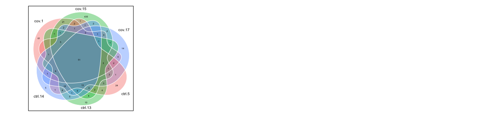
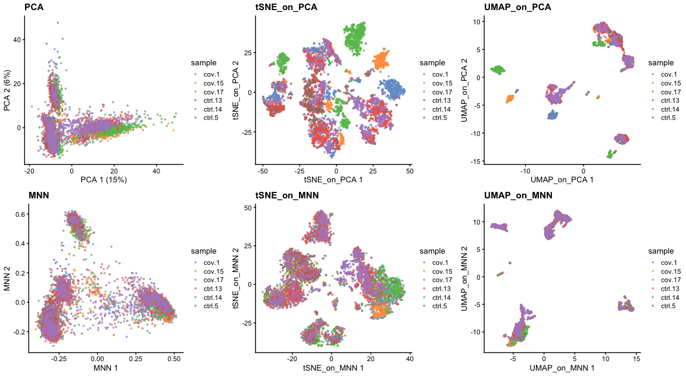
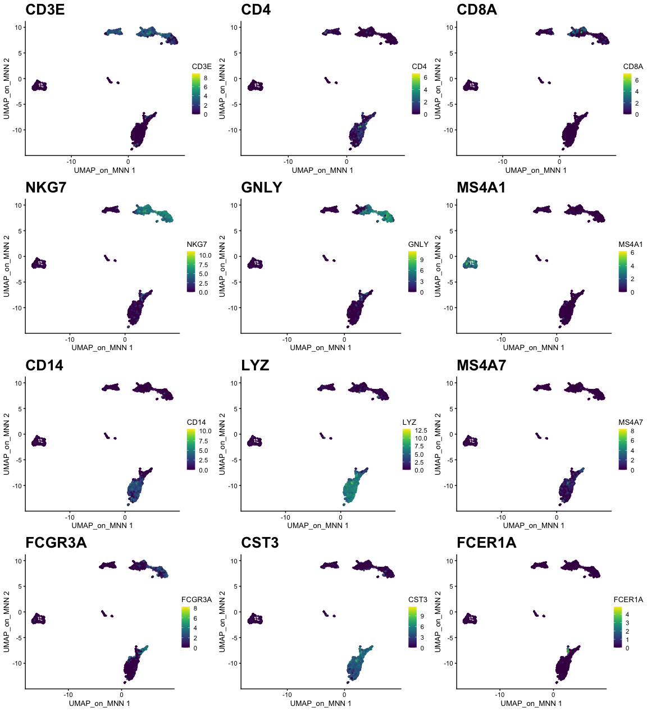
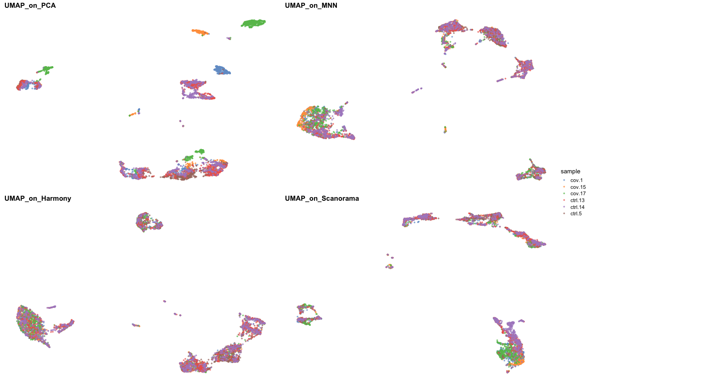

<style>
h1, .h1, h2, .h2, h3, .h3, h4, .h4 { margin-top: 50px }
p.caption {font-size: 0.9em;font-style: italic;color: grey;margin-right: 10%;margin-left: 10%;text-align: justify}
</style>

In this tutorial we will look at different ways of integrating multiple single cell RNA-seq datasets. We will explore two different methods to correct for batch effects across datasets. We will also look at a quantitative measure to assess the quality of the integrated data. Seurat uses the data integration method presented in Comprehensive Integration of Single Cell Data, while Scran and Scanpy use a mutual Nearest neighbour method (MNN). Below you can find a list of the most recent methods for single data integration:

Markdown | Language | Library | Ref
--- | --- | --- | ---
CCA | R | Seurat | [Cell](https://www.sciencedirect.com/science/article/pii/S0092867419305598?via%3Dihub)
MNN | R/Python | Scater/Scanpy | [Nat. Biotech.](https://www.nature.com/articles/nbt.4091)
Conos | R | conos | [Nat. Methods](https://www.nature.com/articles/s41592-019-0466-z?error=cookies_not_supported&code=5680289b-6edb-40ad-9934-415dac4fdb2f)
Scanorama | Python | scanorama | [Nat. Biotech.](https://www.nature.com/articles/s41587-019-0113-3)

Let's first load necessary libraries and the data saved in the previous lab.


```r
suppressPackageStartupMessages({
    library(scater)
    library(scran)
    library(cowplot)
    library(ggplot2)
    library(rafalib)
    # library(venn)
})

sce <- readRDS("data/results/covid_qc_dm.rds")
print(reducedDims(sce))
```

```
## List of length 8
## names(8): PCA UMAP tSNE_on_PCA ... UMAP_on_ScaleData KNN UMAP_on_Graph
```

We split the combined object into a list, with each dataset as an element. We perform standard preprocessing (log-normalization), and identify variable features individually for each dataset based on a variance stabilizing transformation ("vst").


```r
sce.list <- lapply(unique(sce$sample), function(x) {
    x <- sce[, sce$sample == x]
})


mypar(1, 3)
hvgs_per_dataset <- lapply(sce.list, function(x) {
    x <- computeSumFactors(x, sizes = c(20, 40, 60, 80))
    x <- logNormCounts(x)
    var.out <- modelGeneVar(x, method = "loess")
    hvg.out <- var.out[which(var.out$FDR <= 0.05 & var.out$bio >= 0.2), ]
    hvg.out <- hvg.out[order(hvg.out$bio, decreasing = TRUE), ]
    return(rownames(hvg.out))
})
```

```
## Warning in (function (x, sizes, min.mean = NULL, positive = FALSE, scaling =
## NULL) : encountered non-positive size factor estimates

## Warning in (function (x, sizes, min.mean = NULL, positive = FALSE, scaling =
## NULL) : encountered non-positive size factor estimates

## Warning in (function (x, sizes, min.mean = NULL, positive = FALSE, scaling =
## NULL) : encountered non-positive size factor estimates

## Warning in (function (x, sizes, min.mean = NULL, positive = FALSE, scaling =
## NULL) : encountered non-positive size factor estimates
```

```r
names(hvgs_per_dataset) <- unique(sce$sample)

# venn::venn(hvgs_per_dataset,opacity = .4,zcolor = scales::hue_pal()(3),cexsn
# = 1,cexil = 1,lwd=1,col='white',borders = NA)

temp <- unique(unlist(hvgs_per_dataset))
overlap <- sapply(hvgs_per_dataset, function(x) {
    temp %in% x
})
pheatmap::pheatmap(t(overlap * 1), cluster_rows = F, color = c("grey90", "grey20"))
```

<!-- -->

The mutual nearest neighbors (MNN) approach within the scran package utilizes a novel approach to adjust for batch effects. The `fastMNN()` function returns a representation of the data with reduced dimensionality, which can be used in a similar fashion to other lower-dimensional representations such as PCA. In particular, this representation can be used for downstream methods such as clustering. The BNPARAM can be used to specify the specific nearest neighbors method to use from the BiocNeighbors package. Here we make use of the [Annoy library](https://github.com/spotify/annoy) via the `BiocNeighbors::AnnoyParam()` argument. We save the reduced-dimension MNN representation into the reducedDims slot of our sce object.


```r
mnn_out <- batchelor::fastMNN(sce, subset.row = unique(unlist(hvgs_per_dataset)),
    batch = factor(sce$sample), k = 20, d = 50)
```

**NOTE**: `fastMNN()` does not produce a batch-corrected expression matrix.


```r
mnn_out <- t(reducedDim(mnn_out, "corrected"))
colnames(mnn_out) <- unlist(lapply(sce.list, function(x) {
    colnames(x)
}))
mnn_out <- mnn_out[, colnames(sce)]
rownames(mnn_out) <- paste0("dim", 1:50)
reducedDim(sce, "MNN") <- t(mnn_out)
```

We can observe that a new assay slot is now created under the name `MNN`.


```r
reducedDims(sce)
```

```
## List of length 9
## names(9): PCA UMAP tSNE_on_PCA UMAP_on_PCA ... KNN UMAP_on_Graph MNN
```

Thus, the result from `fastMNN()` should solely be treated as a reduced dimensionality representation, suitable for direct plotting, TSNE/UMAP, clustering, and trajectory analysis that relies on such results.


```r
set.seed(42)
sce <- runTSNE(sce, dimred = "MNN", n_dimred = 50, perplexity = 30, name = "tSNE_on_MNN")
sce <- runUMAP(sce, dimred = "MNN", n_dimred = 50, ncomponents = 2, name = "UMAP_on_MNN")
```

We can now plot the un-integrated and the integrated space reduced dimensions.


```r
plot_grid(ncol = 3,
  plotReducedDim(sce,dimred = "PCA",colour_by = "sample", point_size = 0.6)+ ggplot2::ggtitle(label ="PCA"),
  plotReducedDim(sce,dimred = "tSNE_on_PCA",colour_by = "sample", point_size = 0.6)+ ggplot2::ggtitle(label ="tSNE_on_PCA"),
  plotReducedDim(sce,dimred = "UMAP_on_PCA",colour_by = "sample",point_size = 0.6)+ ggplot2::ggtitle(label ="UMAP_on_PCA"),

  plotReducedDim(sce,dimred = "MNN",colour_by = "sample", point_size = 0.6)+ ggplot2::ggtitle(label ="MNN"),
  plotReducedDim(sce,dimred = "tSNE_on_MNN",colour_by = "sample", point_size = 0.6)+ ggplot2::ggtitle(label ="tSNE_on_MNN"),
  plotReducedDim(sce,dimred = "UMAP_on_MNN",colour_by = "sample", point_size = 0.6)+ ggplot2::ggtitle(label ="UMAP_on_MNN")
)
```

<!-- -->

Let's plot some marker genes for different celltypes onto the embedding. Some genes are:

Markers	| Cell Type
--- | ---
CD3E	| T cells
CD3E CD4	| CD4+ T cells
CD3E CD8A	| CD8+ T cells
GNLY, NKG7	| NK cells
MS4A1	| B cells
CD14, LYZ, CST3, MS4A7	| CD14+ Monocytes
FCGR3A, LYZ, CST3, MS4A7	| FCGR3A+  Monocytes
FCER1A, CST3 | DCs


```r
plotlist <- list()
for (i in c("CD3E", "CD4", "CD8A", "NKG7", "GNLY", "MS4A1", "CD14", "LYZ", "MS4A7",
    "FCGR3A", "CST3", "FCER1A")) {
    plotlist[[i]] <- plotReducedDim(sce, dimred = "UMAP_on_MNN", colour_by = i, by_exprs_values = "logcounts",
        point_size = 0.6) + scale_fill_gradientn(colours = colorRampPalette(c("grey90",
        "orange3", "firebrick", "firebrick", "red", "red"))(10)) + ggtitle(label = i) +
        theme(plot.title = element_text(size = 20))
}
plot_grid(ncol = 3, plotlist = plotlist)
```

<!-- -->

#INTEG_R1:

#INTEG_R2:


```r
library(harmony)
```

```
## Loading required package: Rcpp
```

```r
reducedDimNames(sce)

sce <- RunHarmony(sce, group.by.vars = "sample", reduction.save = "harmony", reduction = "PCA",
    dims.use = 1:50)
```

```
## Harmony 1/10
```

```
## Harmony 2/10
```

```
## Harmony 3/10
```

```
## Harmony 4/10
```

```
## Harmony 5/10
```

```
## Harmony converged after 5 iterations
```

```r
# Here we use all PCs computed from Harmony for UMAP calculation
sce <- runUMAP(sce, dimred = "harmony", n_dimred = 50, ncomponents = 2, name = "UMAP_on_Harmony")
```

```
##  [1] "PCA"               "UMAP"              "tSNE_on_PCA"      
##  [4] "UMAP_on_PCA"       "UMAP10_on_PCA"     "UMAP_on_ScaleData"
##  [7] "KNN"               "UMAP_on_Graph"     "MNN"              
## [10] "tSNE_on_MNN"       "UMAP_on_MNN"
```


#INTEG_R3:

#INTEG_R4:


```r
hvgs <- unique(unlist(hvgs_per_dataset))

scelist <- list()
genelist <- list()
for (i in 1:length(sce.list)) {
    scelist[[i]] <- t(as.matrix(logcounts(sce.list[[i]])[hvgs, ]))
    genelist[[i]] <- hvgs
}

lapply(scelist, dim)
```

```
## [[1]]
## [1] 901 444
## 
## [[2]]
## [1] 598 444
## 
## [[3]]
## [1] 1052  444
## 
## [[4]]
## [1] 1062  444
## 
## [[5]]
## [1] 1175  444
## 
## [[6]]
## [1] 1108  444
```

#INTEG_R5:


```r
library(reticulate)
scanorama <- import("scanorama")

integrated.data <- scanorama$integrate(datasets_full = scelist, genes_list = genelist)

intdimred <- do.call(rbind, integrated.data[[1]])
colnames(intdimred) <- paste0("PC_", 1:100)
rownames(intdimred) <- colnames(logcounts(sce))

# Add standard deviations in order to draw Elbow Plots in Seurat
stdevs <- apply(intdimred, MARGIN = 2, FUN = sd)
attr(intdimred, "varExplained") <- stdevs

reducedDim(sce, "Scanorama_PCA") <- intdimred

# Here we use all PCs computed from Scanorama for UMAP calculation
sce <- runUMAP(sce, dimred = "Scanorama_PCA", n_dimred = 50, ncomponents = 2, name = "UMAP_on_Scanorama")
```

#INTEG_R6:


```r
p1 <- plotReducedDim(sce, dimred = "UMAP_on_PCA", colour_by = "sample", point_size = 0.6) +
    ggplot2::ggtitle(label = "UMAP_on_PCA")
p2 <- plotReducedDim(sce, dimred = "UMAP_on_MNN", colour_by = "sample", point_size = 0.6) +
    ggplot2::ggtitle(label = "UMAP_on_MNN")
p3 <- plotReducedDim(sce, dimred = "UMAP_on_Harmony", colour_by = "sample", point_size = 0.6) +
    ggplot2::ggtitle(label = "UMAP_on_Harmony")
p4 <- plotReducedDim(sce, dimred = "UMAP_on_Scanorama", colour_by = "sample", point_size = 0.6) +
    ggplot2::ggtitle(label = "UMAP_on_Scanorama")
leg <- get_legend(p1)

gridExtra::grid.arrange(gridExtra::arrangeGrob(p1 + Seurat::NoLegend() + Seurat::NoAxes(),
    p2 + Seurat::NoLegend() + Seurat::NoAxes(), p3 + Seurat::NoLegend() + Seurat::NoAxes(),
    p4 + Seurat::NoLegend() + Seurat::NoAxes(), nrow = 2), leg, ncol = 2, widths = c(8,
    2))
```

<!-- -->

#INTEG_R7:


Finally, lets save the integrated data for further analysis.


```r
saveRDS(sce, "data/results/covid_qc_dr_int.rds")
```

### Session Info
***


```r
sessionInfo()
```

```
## R version 4.1.3 (2022-03-10)
## Platform: x86_64-apple-darwin13.4.0 (64-bit)
## Running under: macOS Big Sur/Monterey 10.16
## 
## Matrix products: default
## BLAS/LAPACK: /Users/asabjor/miniconda3/envs/scRNAseq2023/lib/libopenblasp-r0.3.21.dylib
## 
## locale:
## [1] C/UTF-8/C/C/C/C
## 
## attached base packages:
## [1] stats4    stats     graphics  grDevices utils     datasets  methods  
## [8] base     
## 
## other attached packages:
##  [1] reticulate_1.27             harmony_1.0                
##  [3] Rcpp_1.0.10                 rafalib_1.0.0              
##  [5] cowplot_1.1.1               scran_1.22.1               
##  [7] scater_1.22.0               ggplot2_3.4.0              
##  [9] scuttle_1.4.0               SingleCellExperiment_1.16.0
## [11] SummarizedExperiment_1.24.0 Biobase_2.54.0             
## [13] GenomicRanges_1.46.1        GenomeInfoDb_1.30.1        
## [15] IRanges_2.28.0              S4Vectors_0.32.4           
## [17] BiocGenerics_0.40.0         MatrixGenerics_1.6.0       
## [19] matrixStats_0.63.0          RJSONIO_1.3-1.7            
## [21] optparse_1.7.3             
## 
## loaded via a namespace (and not attached):
##   [1] utf8_1.2.2                spatstat.explore_3.0-5   
##   [3] tidyselect_1.2.0          htmlwidgets_1.6.1        
##   [5] grid_4.1.3                BiocParallel_1.28.3      
##   [7] Rtsne_0.16                munsell_0.5.0            
##   [9] ScaledMatrix_1.2.0        codetools_0.2-18         
##  [11] ica_1.0-3                 statmod_1.5.0            
##  [13] future_1.30.0             miniUI_0.1.1.1           
##  [15] withr_2.5.0               batchelor_1.10.0         
##  [17] spatstat.random_3.0-1     colorspace_2.1-0         
##  [19] progressr_0.13.0          highr_0.10               
##  [21] knitr_1.41                Seurat_4.3.0             
##  [23] ROCR_1.0-11               tensor_1.5               
##  [25] listenv_0.9.0             labeling_0.4.2           
##  [27] GenomeInfoDbData_1.2.7    polyclip_1.10-4          
##  [29] farver_2.1.1              pheatmap_1.0.12          
##  [31] rprojroot_2.0.3           parallelly_1.34.0        
##  [33] vctrs_0.5.2               generics_0.1.3           
##  [35] xfun_0.36                 R6_2.5.1                 
##  [37] ggbeeswarm_0.7.1          rsvd_1.0.5               
##  [39] locfit_1.5-9.7            bitops_1.0-7             
##  [41] spatstat.utils_3.0-1      cachem_1.0.6             
##  [43] DelayedArray_0.20.0       assertthat_0.2.1         
##  [45] promises_1.2.0.1          scales_1.2.1             
##  [47] beeswarm_0.4.0            gtable_0.3.1             
##  [49] beachmat_2.10.0           globals_0.16.2           
##  [51] goftest_1.2-3             rlang_1.0.6              
##  [53] splines_4.1.3             lazyeval_0.2.2           
##  [55] spatstat.geom_3.0-5       yaml_2.3.7               
##  [57] reshape2_1.4.4            abind_1.4-5              
##  [59] httpuv_1.6.8              tools_4.1.3              
##  [61] ellipsis_0.3.2            jquerylib_0.1.4          
##  [63] RColorBrewer_1.1-3        ggridges_0.5.4           
##  [65] plyr_1.8.8                sparseMatrixStats_1.6.0  
##  [67] zlibbioc_1.40.0           purrr_1.0.1              
##  [69] RCurl_1.98-1.9            deldir_1.0-6             
##  [71] pbapply_1.7-0             viridis_0.6.2            
##  [73] zoo_1.8-11                SeuratObject_4.1.3       
##  [75] ggrepel_0.9.2             cluster_2.1.4            
##  [77] here_1.0.1                magrittr_2.0.3           
##  [79] data.table_1.14.6         scattermore_0.8          
##  [81] ResidualMatrix_1.4.0      lmtest_0.9-40            
##  [83] RANN_2.6.1                fitdistrplus_1.1-8       
##  [85] patchwork_1.1.2           mime_0.12                
##  [87] evaluate_0.20             xtable_1.8-4             
##  [89] gridExtra_2.3             compiler_4.1.3           
##  [91] tibble_3.1.8              KernSmooth_2.23-20       
##  [93] htmltools_0.5.4           later_1.3.0              
##  [95] tidyr_1.2.1               DBI_1.1.3                
##  [97] formatR_1.14              MASS_7.3-58.2            
##  [99] Matrix_1.5-3              getopt_1.20.3            
## [101] cli_3.6.0                 parallel_4.1.3           
## [103] metapod_1.2.0             igraph_1.3.5             
## [105] pkgconfig_2.0.3           sp_1.6-0                 
## [107] plotly_4.10.1             spatstat.sparse_3.0-0    
## [109] vipor_0.4.5               bslib_0.4.2              
## [111] dqrng_0.3.0               XVector_0.34.0           
## [113] stringr_1.5.0             digest_0.6.31            
## [115] sctransform_0.3.5         RcppAnnoy_0.0.20         
## [117] spatstat.data_3.0-0       rmarkdown_2.20           
## [119] leiden_0.4.3              uwot_0.1.14              
## [121] edgeR_3.36.0              DelayedMatrixStats_1.16.0
## [123] shiny_1.7.4               nlme_3.1-161             
## [125] lifecycle_1.0.3           jsonlite_1.8.4           
## [127] BiocNeighbors_1.12.0      viridisLite_0.4.1        
## [129] limma_3.50.3              fansi_1.0.4              
## [131] pillar_1.8.1              lattice_0.20-45          
## [133] fastmap_1.1.0             httr_1.4.4               
## [135] survival_3.5-0            glue_1.6.2               
## [137] png_0.1-8                 bluster_1.4.0            
## [139] stringi_1.7.12            sass_0.4.5               
## [141] BiocSingular_1.10.0       dplyr_1.0.10             
## [143] irlba_2.3.5.1             future.apply_1.10.0
```
