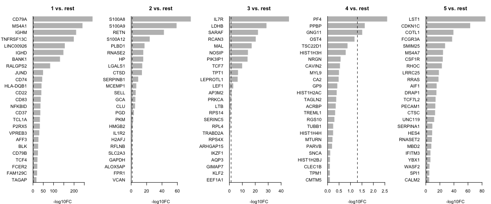
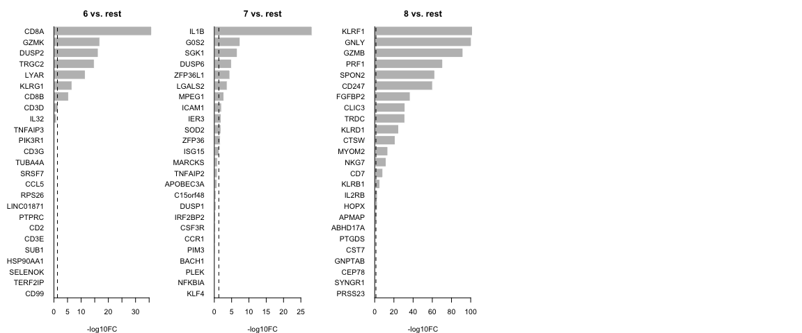
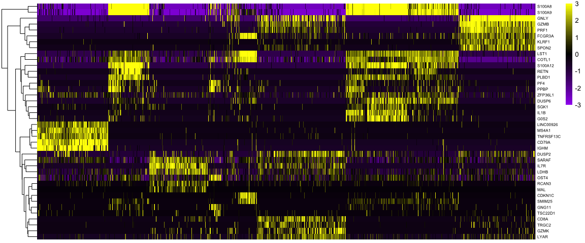
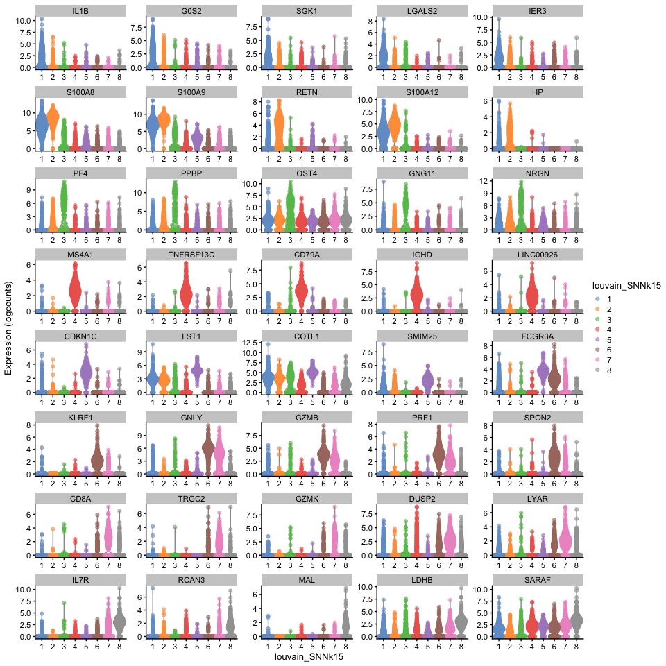
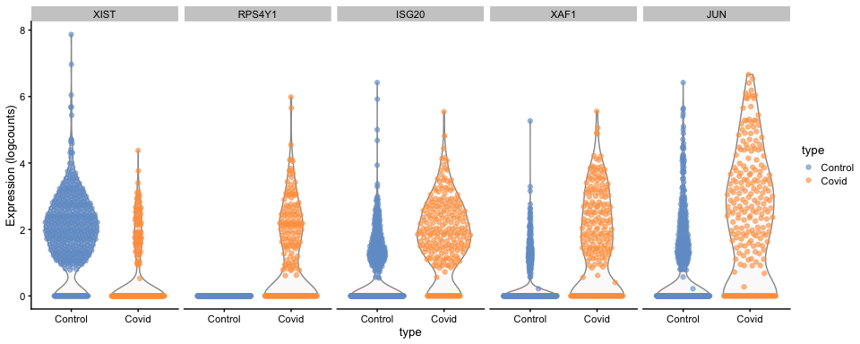
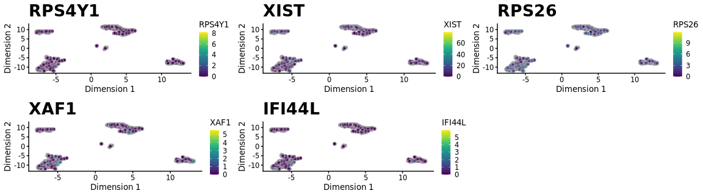
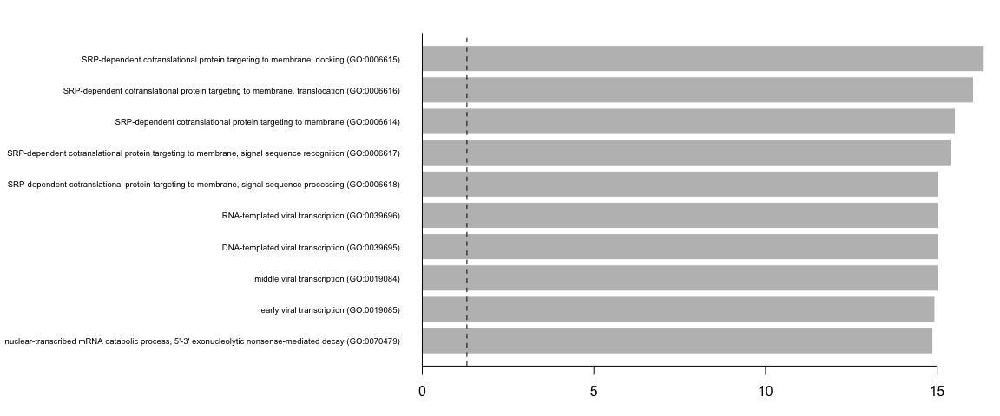

<style>
h1, .h1, h2, .h2, h3, .h3, h4, .h4 { margin-top: 50px }
p.caption {font-size: 0.9em;font-style: italic;color: grey;margin-right: 10%;margin-left: 10%;text-align: justify}
</style>

# Differential gene expression

In this tutorial we will cover about Differetial gene expression, which comprises an extensive range of topics and methods. In single cell, differential expresison can have multiple functionalities such as of identifying marker genes for cell populations, as well as differentially regulated genes across conditions (healthy vs control). We will also exercise on how to account the batch information in your test.

We can first load the data from the clustering session. Moreover, we can already decide which clustering resolution to use. First let's define using the `louvain` clustering to identifying differentially expressed genes.  


```r
suppressPackageStartupMessages({
    library(scater)
    library(scran)
    # library(venn)
    library(cowplot)
    library(ggplot2)
    # library(rafalib)
    library(pheatmap)
    library(igraph)
    library(dplyr)
})

sce <- readRDS("data/results/covid_qc_dr_int_cl.rds")
```

## Cell marker genes
***

Let us first compute a ranking for the highly differential genes in each cluster. There are many different tests and parameters to be chosen that can be used to refine your results. When looking for marker genes, we want genes that are positivelly expressed in a cell type and possibly not expressed in the others.


```r
# Compute differentiall expression
markers_genes <- scran::findMarkers(x = sce, groups = as.character(sce$louvain_SNNk15),
    lfc = 0.5, pval.type = "all", direction = "up")

# List of dataFrames with the results for each cluster
markers_genes
```

```
## List of length 8
## names(8): 1 2 3 4 5 6 7 8
```

```r
# Visualizing the expression of one
markers_genes[["1"]]
```

```
## DataFrame with 18121 rows and 10 columns
##                 p.value          FDR summary.logFC     logFC.2     logFC.3
##               <numeric>    <numeric>     <numeric>   <numeric>   <numeric>
## CD79A      3.12219e-307 5.65771e-303       3.33918     3.50769     3.49569
## MS4A1      2.70271e-242 2.44879e-238       2.34911     2.39361     2.37237
## IGHM       1.34591e-215 8.12973e-212       3.66201     3.82441     3.84624
## TNFRSF13C  6.93770e-201 3.14295e-197       2.05748     2.10440     2.03702
## LINC00926  3.06863e-161 1.11213e-157       1.87617     1.91202     1.91947
## ...                 ...          ...           ...         ...         ...
## AC011043.1            1            1    0.00431686  0.00431686  0.00431686
## AC007325.4            1            1   -0.00900931 -0.00900931 -0.00362024
## AL354822.1            1            1    0.01468456  0.01468456  0.01091020
## AC233755.1            1            1    0.00407473  0.00407473  0.00407473
## AC240274.1            1            1    0.00771093  0.01016628  0.00771093
##                 logFC.4     logFC.5     logFC.6     logFC.7     logFC.8
##               <numeric>   <numeric>   <numeric>   <numeric>   <numeric>
## CD79A           3.33918     3.42574     3.48286     3.45316     3.48489
## MS4A1           2.37006     2.38049     2.34911     2.36439     2.38240
## IGHM            3.66201     3.81737     3.84129     3.81403     3.87463
## TNFRSF13C       2.05748     2.08148     2.06205     2.08998     2.08595
## LINC00926       1.87617     1.91044     1.89659     1.89392     1.91356
## ...                 ...         ...         ...         ...         ...
## AC011043.1  0.002419979  0.00431686  0.00197413  0.00320700  0.00431686
## AC007325.4  0.000964593 -0.01778832 -0.00330748 -0.00525116 -0.00195822
## AL354822.1  0.015844207  0.01290013  0.01070242  0.01376169  0.00073809
## AC233755.1  0.004074732  0.00407473  0.00407473  0.00407473  0.00407473
## AC240274.1 -0.001286558  0.00684239  0.00875890  0.00663751  0.01270911
```

We can now select the top 25 up regulated genes for plotting.


```r
# Colect the top 25 genes for each cluster and put the into a single table
top25 <- lapply(names(markers_genes), function(x) {
    temp <- markers_genes[[x]][1:25, 1:2]
    temp$gene <- rownames(markers_genes[[x]])[1:25]
    temp$cluster <- x
    return(temp)
})
top25 <- as_tibble(do.call(rbind, top25))
top25$p.value[top25$p.value == 0] <- 1e-300
top25
```

<div data-pagedtable="false">
  <script data-pagedtable-source type="application/json">
{"columns":[{"label":["p.value"],"name":[1],"type":["dbl"],"align":["right"]},{"label":["FDR"],"name":[2],"type":["dbl"],"align":["right"]},{"label":["gene"],"name":[3],"type":["chr"],"align":["left"]},{"label":["cluster"],"name":[4],"type":["chr"],"align":["left"]}],"data":[{"1":"3.122185e-307","2":"5.657711e-303","3":"CD79A","4":"1"},{"1":"2.702707e-242","2":"2.448788e-238","3":"MS4A1","4":"1"},{"1":"1.345908e-215","2":"8.129731e-212","3":"IGHM","4":"1"},{"1":"6.937705e-201","2":"3.142954e-197","3":"TNFRSF13C","4":"1"},{"1":"3.068631e-161","2":"1.112133e-157","3":"LINC00926","4":"1"},{"1":"2.294086e-150","2":"6.928523e-147","3":"IGHD","4":"1"},{"1":"1.881203e-135","2":"4.869898e-132","3":"BANK1","4":"1"},{"1":"7.879215e-87","2":"1.784741e-83","3":"RALGPS2","4":"1"},{"1":"1.192159e-50","2":"2.400346e-47","3":"JUND","4":"1"},{"1":"4.989033e-47","2":"9.040627e-44","3":"CD74","4":"1"},{"1":"1.169461e-42","2":"1.854807e-39","3":"CD83","4":"1"},{"1":"1.228281e-42","2":"1.854807e-39","3":"CD22","4":"1"},{"1":"2.202577e-42","2":"3.070223e-39","3":"HLA-DQB1","4":"1"},{"1":"1.161303e-38","2":"1.503141e-35","3":"CD37","4":"1"},{"1":"3.177985e-38","2":"3.839218e-35","3":"TCL1A","4":"1"},{"1":"6.101805e-38","2":"6.910675e-35","3":"NFKBID","4":"1"},{"1":"3.245875e-35","2":"3.459912e-32","3":"P2RX5","4":"1"},{"1":"2.225366e-32","2":"2.240325e-29","3":"VPREB3","4":"1"},{"1":"9.579360e-29","2":"9.136189e-26","3":"AFF3","4":"1"},{"1":"9.872065e-27","2":"8.944585e-24","3":"BLK","4":"1"},{"1":"1.277182e-26","2":"1.102086e-23","3":"CD79B","4":"1"},{"1":"7.480110e-23","2":"6.161231e-20","3":"TCF4","4":"1"},{"1":"8.208510e-23","2":"6.467235e-20","3":"FCER2","4":"1"},{"1":"5.710919e-22","2":"4.311982e-19","3":"FAM129C","4":"1"},{"1":"2.767496e-18","2":"2.005992e-15","3":"TAGAP","4":"1"},{"1":"2.955379e-75","2":"5.355443e-71","3":"S100A8","4":"2"},{"1":"3.650851e-57","2":"3.307853e-53","3":"S100A9","4":"2"},{"1":"7.139129e-44","2":"4.312272e-40","3":"RETN","4":"2"},{"1":"1.794274e-23","2":"8.128509e-20","3":"S100A12","4":"2"},{"1":"4.963256e-18","2":"1.798783e-14","3":"PLBD1","4":"2"},{"1":"8.653529e-17","2":"2.613510e-13","3":"HP","4":"2"},{"1":"1.012706e-16","2":"2.621607e-13","3":"RNASE2","4":"2"},{"1":"1.901714e-15","2":"4.307620e-12","3":"LGALS1","4":"2"},{"1":"5.070354e-15","2":"1.020888e-11","3":"CTSD","4":"2"},{"1":"1.781983e-09","2":"3.229131e-06","3":"SERPINB1","4":"2"},{"1":"6.608339e-07","2":"1.088634e-03","3":"MCEMP1","4":"2"},{"1":"1.017625e-06","2":"1.536699e-03","3":"SELL","4":"2"},{"1":"5.400959e-06","2":"7.528521e-03","3":"CLU","4":"2"},{"1":"1.149309e-05","2":"1.487617e-02","3":"GCA","4":"2"},{"1":"8.388639e-04","2":"1.000000e+00","3":"PGD","4":"2"},{"1":"2.977625e-03","2":"1.000000e+00","3":"PKM","4":"2"},{"1":"4.585771e-03","2":"1.000000e+00","3":"HMGB2","4":"2"},{"1":"4.870894e-03","2":"1.000000e+00","3":"IL1R2","4":"2"},{"1":"1.297006e-02","2":"1.000000e+00","3":"H2AFJ","4":"2"},{"1":"2.017270e-02","2":"1.000000e+00","3":"GAPDH","4":"2"},{"1":"3.223653e-02","2":"1.000000e+00","3":"RFLNB","4":"2"},{"1":"5.232198e-02","2":"1.000000e+00","3":"SLC2A3","4":"2"},{"1":"7.266658e-02","2":"1.000000e+00","3":"ALOX5AP","4":"2"},{"1":"4.270545e-01","2":"1.000000e+00","3":"FOLR3","4":"2"},{"1":"4.796715e-01","2":"1.000000e+00","3":"VCAN","4":"2"},{"1":"1.734100e-49","2":"3.142363e-45","3":"IL7R","4":"3"},{"1":"3.417696e-31","2":"3.096604e-27","3":"LDHB","4":"3"},{"1":"1.126885e-24","2":"6.806763e-21","3":"SARAF","4":"3"},{"1":"1.072718e-21","2":"4.859683e-18","3":"RCAN3","4":"3"},{"1":"1.422665e-18","2":"5.156022e-15","3":"MAL","4":"3"},{"1":"1.605343e-15","2":"4.848405e-12","3":"PIK3IP1","4":"3"},{"1":"9.092721e-15","2":"2.353846e-11","3":"NOSIP","4":"3"},{"1":"2.688518e-11","2":"6.089830e-08","3":"TCF7","4":"3"},{"1":"5.457543e-08","2":"1.098846e-04","3":"TPT1","4":"3"},{"1":"2.345731e-07","2":"4.250700e-04","3":"LEPROTL1","4":"3"},{"1":"4.792701e-04","2":"7.895322e-01","3":"LEF1","4":"3"},{"1":"8.123623e-03","2":"1.000000e+00","3":"LTB","4":"3"},{"1":"8.365469e-03","2":"1.000000e+00","3":"AP3M2","4":"3"},{"1":"9.902992e-03","2":"1.000000e+00","3":"PRKCA","4":"3"},{"1":"2.704744e-02","2":"1.000000e+00","3":"RPS14","4":"3"},{"1":"7.494218e-02","2":"1.000000e+00","3":"SERINC5","4":"3"},{"1":"7.814601e-02","2":"1.000000e+00","3":"RPL4","4":"3"},{"1":"1.105028e-01","2":"1.000000e+00","3":"TRABD2A","4":"3"},{"1":"2.355669e-01","2":"1.000000e+00","3":"RPS4X","4":"3"},{"1":"2.955071e-01","2":"1.000000e+00","3":"ARHGAP15","4":"3"},{"1":"3.786354e-01","2":"1.000000e+00","3":"IKZF1","4":"3"},{"1":"4.204918e-01","2":"1.000000e+00","3":"AQP3","4":"3"},{"1":"5.435168e-01","2":"1.000000e+00","3":"EEF1A1","4":"3"},{"1":"5.563978e-01","2":"1.000000e+00","3":"KLF2","4":"3"},{"1":"5.698125e-01","2":"1.000000e+00","3":"GIMAP7","4":"3"},{"1":"3.926493e-03","2":"1.000000e+00","3":"PF4","4":"4"},{"1":"3.833569e-02","2":"1.000000e+00","3":"GNG11","4":"4"},{"1":"3.848563e-02","2":"1.000000e+00","3":"PPBP","4":"4"},{"1":"5.753501e-02","2":"1.000000e+00","3":"OST4","4":"4"},{"1":"1.552499e-01","2":"1.000000e+00","3":"HIST1H3H","4":"4"},{"1":"1.720818e-01","2":"1.000000e+00","3":"TSC22D1","4":"4"},{"1":"3.135595e-01","2":"1.000000e+00","3":"NRGN","4":"4"},{"1":"3.264173e-01","2":"1.000000e+00","3":"MYL9","4":"4"},{"1":"3.513326e-01","2":"1.000000e+00","3":"CA2","4":"4"},{"1":"3.586869e-01","2":"1.000000e+00","3":"CAVIN2","4":"4"},{"1":"4.251121e-01","2":"1.000000e+00","3":"TAGLN2","4":"4"},{"1":"4.500472e-01","2":"1.000000e+00","3":"GP9","4":"4"},{"1":"4.508626e-01","2":"1.000000e+00","3":"HIST1H2AC","4":"4"},{"1":"5.014030e-01","2":"1.000000e+00","3":"ACRBP","4":"4"},{"1":"5.204015e-01","2":"1.000000e+00","3":"TREML1","4":"4"},{"1":"5.524661e-01","2":"1.000000e+00","3":"RGS10","4":"4"},{"1":"5.720860e-01","2":"1.000000e+00","3":"HIST1H4H","4":"4"},{"1":"6.148278e-01","2":"1.000000e+00","3":"TUBB1","4":"4"},{"1":"6.289752e-01","2":"1.000000e+00","3":"PARVB","4":"4"},{"1":"6.357886e-01","2":"1.000000e+00","3":"MTURN","4":"4"},{"1":"7.529392e-01","2":"1.000000e+00","3":"SNCA","4":"4"},{"1":"7.571006e-01","2":"1.000000e+00","3":"CLEC1B","4":"4"},{"1":"7.843152e-01","2":"1.000000e+00","3":"CMTM5","4":"4"},{"1":"7.920340e-01","2":"1.000000e+00","3":"HIST1H2BJ","4":"4"},{"1":"8.081912e-01","2":"1.000000e+00","3":"TPM1","4":"4"},{"1":"7.004593e-86","2":"1.269302e-81","3":"LST1","4":"5"},{"1":"4.529239e-61","2":"4.103717e-57","3":"CDKN1C","4":"5"},{"1":"2.876829e-41","2":"1.737701e-37","3":"COTL1","4":"5"},{"1":"2.860385e-30","2":"1.295826e-26","3":"FCGR3A","4":"5"},{"1":"7.757169e-27","2":"2.811353e-23","3":"SMIM25","4":"5"},{"1":"8.015890e-25","2":"2.420932e-21","3":"MS4A7","4":"5"},{"1":"6.382331e-24","2":"1.652203e-20","3":"CSF1R","4":"5"},{"1":"5.296549e-22","2":"1.199735e-18","3":"RHOC","4":"5"},{"1":"1.332353e-19","2":"2.682619e-16","3":"LRRC25","4":"5"},{"1":"1.009666e-18","2":"1.829615e-15","3":"RRAS","4":"5"},{"1":"2.701605e-17","2":"4.450526e-14","3":"AIF1","4":"5"},{"1":"1.270159e-14","2":"1.918045e-11","3":"TCF7L2","4":"5"},{"1":"1.312534e-13","2":"1.829571e-10","3":"DRAP1","4":"5"},{"1":"1.512209e-12","2":"1.957339e-09","3":"PECAM1","4":"5"},{"1":"2.504997e-12","2":"3.026203e-09","3":"CTSC","4":"5"},{"1":"1.212826e-11","2":"1.373601e-08","3":"UNC119","4":"5"},{"1":"7.250807e-10","2":"7.728933e-07","3":"RNASET2","4":"5"},{"1":"3.159066e-09","2":"3.180302e-06","3":"HES4","4":"5"},{"1":"2.095205e-08","2":"1.998274e-05","3":"SERPINA1","4":"5"},{"1":"3.814589e-08","2":"3.456208e-05","3":"YBX1","4":"5"},{"1":"5.111215e-08","2":"4.410492e-05","3":"MBD2","4":"5"},{"1":"1.058286e-07","2":"8.716909e-05","3":"IFITM3","4":"5"},{"1":"5.387415e-06","2":"4.244580e-03","3":"SLC25A5","4":"5"},{"1":"7.761760e-06","2":"5.860452e-03","3":"SPI1","4":"5"},{"1":"2.133269e-05","2":"1.546279e-02","3":"NAP1L1","4":"5"},{"1":"4.410967e-36","2":"7.993113e-32","3":"CD8A","4":"6"},{"1":"2.470164e-17","2":"2.238092e-13","3":"DUSP2","4":"6"},{"1":"2.890065e-16","2":"1.741118e-12","3":"TRGC2","4":"6"},{"1":"3.843315e-16","2":"1.741118e-12","3":"GZMK","4":"6"},{"1":"1.288717e-12","2":"4.670570e-09","3":"LYAR","4":"6"},{"1":"2.375390e-08","2":"7.174074e-05","3":"KLRG1","4":"6"},{"1":"1.445249e-05","2":"3.741336e-02","3":"CD8B","4":"6"},{"1":"5.293596e-02","2":"1.000000e+00","3":"CD3D","4":"6"},{"1":"2.247048e-01","2":"1.000000e+00","3":"IL32","4":"6"},{"1":"4.852937e-01","2":"1.000000e+00","3":"TNFAIP3","4":"6"},{"1":"6.552699e-01","2":"1.000000e+00","3":"PIK3R1","4":"6"},{"1":"7.778239e-01","2":"1.000000e+00","3":"CD3G","4":"6"},{"1":"8.115157e-01","2":"1.000000e+00","3":"TUBA4A","4":"6"},{"1":"9.639285e-01","2":"1.000000e+00","3":"SRSF7","4":"6"},{"1":"9.904963e-01","2":"1.000000e+00","3":"CCL5","4":"6"},{"1":"9.997469e-01","2":"1.000000e+00","3":"RPS26","4":"6"},{"1":"9.999380e-01","2":"1.000000e+00","3":"LINC01871","4":"6"},{"1":"9.999763e-01","2":"1.000000e+00","3":"PTPRC","4":"6"},{"1":"9.999994e-01","2":"1.000000e+00","3":"CD2","4":"6"},{"1":"9.999999e-01","2":"1.000000e+00","3":"CD3E","4":"6"},{"1":"9.999999e-01","2":"1.000000e+00","3":"SUB1","4":"6"},{"1":"1.000000e+00","2":"1.000000e+00","3":"HSP90AA1","4":"6"},{"1":"1.000000e+00","2":"1.000000e+00","3":"SELENOK","4":"6"},{"1":"1.000000e+00","2":"1.000000e+00","3":"TERF2IP","4":"6"},{"1":"1.000000e+00","2":"1.000000e+00","3":"A2M-AS1","4":"6"},{"1":"4.323084e-32","2":"7.833860e-28","3":"IL1B","4":"7"},{"1":"4.840673e-09","2":"4.385892e-05","3":"G0S2","4":"7"},{"1":"3.435539e-08","2":"2.075180e-04","3":"SGK1","4":"7"},{"1":"1.422524e-05","2":"5.265739e-02","3":"DUSP6","4":"7"},{"1":"1.452938e-05","2":"5.265739e-02","3":"ZFP36L1","4":"7"},{"1":"8.031331e-05","2":"2.425596e-01","3":"LGALS2","4":"7"},{"1":"1.494160e-03","2":"1.000000e+00","3":"MPEG1","4":"7"},{"1":"1.784628e-03","2":"1.000000e+00","3":"SOD2","4":"7"},{"1":"1.805046e-03","2":"1.000000e+00","3":"ICAM1","4":"7"},{"1":"1.994152e-03","2":"1.000000e+00","3":"IER3","4":"7"},{"1":"1.809062e-02","2":"1.000000e+00","3":"ZFP36","4":"7"},{"1":"2.221649e-02","2":"1.000000e+00","3":"ISG15","4":"7"},{"1":"7.294957e-02","2":"1.000000e+00","3":"TNFAIP2","4":"7"},{"1":"1.349278e-01","2":"1.000000e+00","3":"MARCKS","4":"7"},{"1":"1.604433e-01","2":"1.000000e+00","3":"APOBEC3A","4":"7"},{"1":"2.864112e-01","2":"1.000000e+00","3":"DUSP1","4":"7"},{"1":"2.951303e-01","2":"1.000000e+00","3":"C15orf48","4":"7"},{"1":"3.173326e-01","2":"1.000000e+00","3":"IRF2BP2","4":"7"},{"1":"3.980582e-01","2":"1.000000e+00","3":"CSF3R","4":"7"},{"1":"5.001836e-01","2":"1.000000e+00","3":"CCR1","4":"7"},{"1":"5.576113e-01","2":"1.000000e+00","3":"PLEK","4":"7"},{"1":"6.005934e-01","2":"1.000000e+00","3":"BACH1","4":"7"},{"1":"6.313836e-01","2":"1.000000e+00","3":"NFKBIA","4":"7"},{"1":"6.565548e-01","2":"1.000000e+00","3":"PIM3","4":"7"},{"1":"7.783718e-01","2":"1.000000e+00","3":"MAFB","4":"7"},{"1":"5.902923e-101","2":"9.482680e-97","3":"KLRF1","4":"8"},{"1":"1.046596e-100","2":"9.482680e-97","3":"GNLY","4":"8"},{"1":"1.409333e-91","2":"8.512841e-88","3":"GZMB","4":"8"},{"1":"2.855229e-73","2":"1.293490e-69","3":"PRF1","4":"8"},{"1":"6.948031e-63","2":"2.518105e-59","3":"SPON2","4":"8"},{"1":"2.827045e-59","2":"8.538147e-56","3":"CD247","4":"8"},{"1":"1.319492e-37","2":"3.415787e-34","3":"FGFBP2","4":"8"},{"1":"2.550684e-32","2":"5.777619e-29","3":"CLIC3","4":"8"},{"1":"9.882865e-30","2":"1.989860e-26","3":"TRDC","4":"8"},{"1":"1.186056e-25","2":"2.149253e-22","3":"KLRD1","4":"8"},{"1":"8.746994e-23","2":"1.440948e-19","3":"CTSW","4":"8"},{"1":"1.493945e-14","2":"2.255982e-11","3":"MYOM2","4":"8"},{"1":"7.041499e-13","2":"9.815308e-10","3":"NKG7","4":"8"},{"1":"6.482864e-09","2":"8.391142e-06","3":"CD7","4":"8"},{"1":"1.005631e-05","2":"1.214869e-02","3":"KLRB1","4":"8"},{"1":"8.970703e-04","2":"1.000000e+00","3":"HOPX","4":"8"},{"1":"3.389891e-03","2":"1.000000e+00","3":"IL2RB","4":"8"},{"1":"1.168508e-02","2":"1.000000e+00","3":"APMAP","4":"8"},{"1":"3.580327e-02","2":"1.000000e+00","3":"ABHD17A","4":"8"},{"1":"6.324099e-02","2":"1.000000e+00","3":"PTGDS","4":"8"},{"1":"9.027493e-02","2":"1.000000e+00","3":"CST7","4":"8"},{"1":"1.143631e-01","2":"1.000000e+00","3":"GNPTAB","4":"8"},{"1":"2.849500e-01","2":"1.000000e+00","3":"CEP78","4":"8"},{"1":"4.144427e-01","2":"1.000000e+00","3":"PRSS23","4":"8"},{"1":"5.173988e-01","2":"1.000000e+00","3":"S1PR5","4":"8"}],"options":{"columns":{"min":{},"max":[10]},"rows":{"min":[10],"max":[10]},"pages":{}}}
  </script>
</div>

We can now select the top 25 up regulated genes for plotting.


```r
par(mfrow = c(1, 5), mar = c(4, 6, 3, 1))
for (i in unique(top25$cluster)) {
    barplot(sort(setNames(-log10(top25$p.value), top25$gene)[top25$cluster == i],
        F), horiz = T, las = 1, main = paste0(i, " vs. rest"), border = "white",
        yaxs = "i", xlab = "-log10FC")
    abline(v = c(0, -log10(0.05)), lty = c(1, 2))
}
```

<!-- --><!-- -->

We can visualize them as a heatmap. Here we are selecting the top 5.


```r
as_tibble(top25) %>%
    group_by(cluster) %>%
    top_n(-5, p.value) -> top5

scater::plotHeatmap(sce[, order(sce$louvain_SNNk15)], features = unique(top5$gene),
    center = T, zlim = c(-3, 3), colour_columns_by = "louvain_SNNk15", show_colnames = F,
    cluster_cols = F, fontsize_row = 6, color = colorRampPalette(c("purple", "black",
        "yellow"))(90))
```

<!-- -->

We can also plot a violin plot for each gene.


```r
scater::plotExpression(sce, features = unique(top5$gene), x = "louvain_SNNk15", ncol = 5,
    colour_by = "louvain_SNNk15", scales = "free")
```

<!-- -->


## Differential expression across conditions
***

The second way of computing differential expression is to answer which genes are differentially expressed within a cluster. For example, in our case we have libraries comming from patients and controls and we would like to know which genes are influenced the most in a particular cell type.

For this end, we will first subset our data for the desired cell cluster, then change the cell identities to the variable of comparison (which now in our case is the "type", e.g. Covid/Ctrl).


```r
# Filter cells from that cluster
cell_selection <- sce[, sce$louvain_SNNk15 == 8]

# Compute differentiall expression
DGE_cell_selection <- findMarkers(x = cell_selection, groups = cell_selection@colData$type,
    lfc = 0.25, pval.type = "all", direction = "any")
top5_cell_selection <- lapply(names(DGE_cell_selection), function(x) {
    temp <- DGE_cell_selection[[x]][1:5, 1:2]
    temp$gene <- rownames(DGE_cell_selection[[x]])[1:5]
    temp$cluster <- x
    return(temp)
})
top5_cell_selection <- as_tibble(do.call(rbind, top5_cell_selection))
top5_cell_selection
```

<div data-pagedtable="false">
  <script data-pagedtable-source type="application/json">
{"columns":[{"label":["p.value"],"name":[1],"type":["dbl"],"align":["right"]},{"label":["FDR"],"name":[2],"type":["dbl"],"align":["right"]},{"label":["gene"],"name":[3],"type":["chr"],"align":["left"]},{"label":["cluster"],"name":[4],"type":["chr"],"align":["left"]}],"data":[{"1":"1.812789e-33","2":"3.284955e-29","3":"XIST","4":"Control"},{"1":"8.876658e-25","2":"8.042696e-21","3":"ISG20","4":"Control"},{"1":"3.256445e-23","2":"1.967001e-19","3":"RPS4Y1","4":"Control"},{"1":"1.827281e-22","2":"8.278040e-19","3":"XAF1","4":"Control"},{"1":"8.751360e-21","2":"3.171668e-17","3":"JUN","4":"Control"},{"1":"1.812789e-33","2":"3.284955e-29","3":"XIST","4":"Covid"},{"1":"8.876658e-25","2":"8.042696e-21","3":"ISG20","4":"Covid"},{"1":"3.256445e-23","2":"1.967001e-19","3":"RPS4Y1","4":"Covid"},{"1":"1.827281e-22","2":"8.278040e-19","3":"XAF1","4":"Covid"},{"1":"8.751360e-21","2":"3.171668e-17","3":"JUN","4":"Covid"}],"options":{"columns":{"min":{},"max":[10]},"rows":{"min":[10],"max":[10]},"pages":{}}}
  </script>
</div>

We can now plot the expression across the "type".


```r
scater::plotExpression(cell_selection, features = unique(top5_cell_selection$gene),
    x = "type", ncol = 5, colour_by = "type")
```

<!-- -->

#DGE_ALL6.2:


```r
plotlist <- list()
for (i in unique(top5_cell_selection$gene)) {
    plotlist[[i]] <- plotReducedDim(sce, dimred = "UMAP_on_MNN", colour_by = i, by_exprs_values = "logcounts") +
        ggtitle(label = i) + theme(plot.title = element_text(size = 20))
}
plot_grid(ncol = 3, plotlist = plotlist)
```

<!-- -->


## Gene Set Analysis
***

Hypergeometric enrichment test

Having a defined list of differentially expressed genes, you can now look for their combined function using hypergeometric test:


```r
# Load additional packages
library(enrichR)

# Check available databases to perform enrichment (then choose one)
enrichR::listEnrichrDbs()
```

<div data-pagedtable="false">
  <script data-pagedtable-source type="application/json">
{"columns":[{"label":["geneCoverage"],"name":[1],"type":["dbl"],"align":["right"]},{"label":["genesPerTerm"],"name":[2],"type":["dbl"],"align":["right"]},{"label":["libraryName"],"name":[3],"type":["chr"],"align":["left"]},{"label":["link"],"name":[4],"type":["chr"],"align":["left"]},{"label":["numTerms"],"name":[5],"type":["dbl"],"align":["right"]},{"label":["appyter"],"name":[6],"type":["chr"],"align":["left"]},{"label":["categoryId"],"name":[7],"type":["dbl"],"align":["right"]}],"data":[{"1":"13362","2":"275","3":"Genome_Browser_PWMs","4":"http://hgdownload.cse.ucsc.edu/goldenPath/hg18/database/","5":"615","6":"ea115789fcbf12797fd692cec6df0ab4dbc79c6a","7":"1"},{"1":"27884","2":"1284","3":"TRANSFAC_and_JASPAR_PWMs","4":"http://jaspar.genereg.net/html/DOWNLOAD/","5":"326","6":"7d42eb43a64a4e3b20d721fc7148f685b53b6b30","7":"1"},{"1":"6002","2":"77","3":"Transcription_Factor_PPIs","4":"","5":"290","6":"849f222220618e2599d925b6b51868cf1dab3763","7":"1"},{"1":"47172","2":"1370","3":"ChEA_2013","4":"http://amp.pharm.mssm.edu/lib/cheadownload.jsp","5":"353","6":"7ebe772afb55b63b41b79dd8d06ea0fdd9fa2630","7":"7"},{"1":"47107","2":"509","3":"Drug_Perturbations_from_GEO_2014","4":"http://www.ncbi.nlm.nih.gov/geo/","5":"701","6":"ad270a6876534b7cb063e004289dcd4d3164f342","7":"7"},{"1":"21493","2":"3713","3":"ENCODE_TF_ChIP-seq_2014","4":"http://genome.ucsc.edu/ENCODE/downloads.html","5":"498","6":"497787ebc418d308045efb63b8586f10c526af51","7":"7"},{"1":"1295","2":"18","3":"BioCarta_2013","4":"https://cgap.nci.nih.gov/Pathways/BioCarta_Pathways","5":"249","6":"4a293326037a5229aedb1ad7b2867283573d8bcd","7":"7"},{"1":"3185","2":"73","3":"Reactome_2013","4":"http://www.reactome.org/download/index.html","5":"78","6":"b343994a1b68483b0122b08650201c9b313d5c66","7":"7"},{"1":"2854","2":"34","3":"WikiPathways_2013","4":"http://www.wikipathways.org/index.php/Download_Pathways","5":"199","6":"5c307674c8b97e098f8399c92f451c0ff21cbf68","7":"7"},{"1":"15057","2":"300","3":"Disease_Signatures_from_GEO_up_2014","4":"http://www.ncbi.nlm.nih.gov/geo/","5":"142","6":"248c4ed8ea28352795190214713c86a39fd7afab","7":"7"},{"1":"4128","2":"48","3":"KEGG_2013","4":"http://www.kegg.jp/kegg/download/","5":"200","6":"eb26f55d3904cb0ea471998b6a932a9bf65d8e50","7":"7"},{"1":"34061","2":"641","3":"TF-LOF_Expression_from_GEO","4":"http://www.ncbi.nlm.nih.gov/geo/","5":"269","6":"","7":"1"},{"1":"7504","2":"155","3":"TargetScan_microRNA","4":"http://www.targetscan.org/cgi-bin/targetscan/data_download.cgi?db=vert_61","5":"222","6":"f4029bf6a62c91ab29401348e51df23b8c44c90f","7":"7"},{"1":"16399","2":"247","3":"PPI_Hub_Proteins","4":"http://amp.pharm.mssm.edu/X2K","5":"385","6":"69c0cfe07d86f230a7ef01b365abcc7f6e52f138","7":"2"},{"1":"12753","2":"57","3":"GO_Molecular_Function_2015","4":"http://www.geneontology.org/GO.downloads.annotations.shtml","5":"1136","6":"f531ac2b6acdf7587a54b79b465a5f4aab8f00f9","7":"7"},{"1":"23726","2":"127","3":"GeneSigDB","4":"https://pubmed.ncbi.nlm.nih.gov/22110038/","5":"2139","6":"6d655e0aa3408a7accb3311fbda9b108681a8486","7":"4"},{"1":"32740","2":"85","3":"Chromosome_Location","4":"http://software.broadinstitute.org/gsea/msigdb/index.jsp","5":"386","6":"8dab0f96078977223646ff63eb6187e0813f1433","7":"7"},{"1":"13373","2":"258","3":"Human_Gene_Atlas","4":"http://biogps.org/downloads/","5":"84","6":"0741451470203d7c40a06274442f25f74b345c9c","7":"5"},{"1":"19270","2":"388","3":"Mouse_Gene_Atlas","4":"http://biogps.org/downloads/","5":"96","6":"31191bfadded5f96983f93b2a113cf2110ff5ddb","7":"5"},{"1":"13236","2":"82","3":"GO_Cellular_Component_2015","4":"http://www.geneontology.org/GO.downloads.annotations.shtml","5":"641","6":"e1d004d5797cbd2363ef54b1c3b361adb68795c6","7":"7"},{"1":"14264","2":"58","3":"GO_Biological_Process_2015","4":"http://www.geneontology.org/GO.downloads.annotations.shtml","5":"5192","6":"bf120b6e11242b1a64c80910d8e89f87e618e235","7":"7"},{"1":"3096","2":"31","3":"Human_Phenotype_Ontology","4":"http://www.human-phenotype-ontology.org/","5":"1779","6":"17a138b0b70aa0e143fe63c14f82afb70bc3ed0a","7":"3"},{"1":"22288","2":"4368","3":"Epigenomics_Roadmap_HM_ChIP-seq","4":"http://www.roadmapepigenomics.org/","5":"383","6":"e1bc8a398e9b21f9675fb11bef18087eda21b1bf","7":"1"},{"1":"4533","2":"37","3":"KEA_2013","4":"http://amp.pharm.mssm.edu/lib/keacommandline.jsp","5":"474","6":"462045609440fa1e628a75716b81a1baa5bd9145","7":"7"},{"1":"10231","2":"158","3":"NURSA_Human_Endogenous_Complexome","4":"https://www.nursa.org/nursa/index.jsf","5":"1796","6":"7d3566b12ebc23dd23d9ca9bb97650f826377b16","7":"2"},{"1":"2741","2":"5","3":"CORUM","4":"http://mips.helmholtz-muenchen.de/genre/proj/corum/","5":"1658","6":"d047f6ead7831b00566d5da7a3b027ed9196e104","7":"2"},{"1":"5655","2":"342","3":"SILAC_Phosphoproteomics","4":"http://amp.pharm.mssm.edu/lib/keacommandline.jsp","5":"84","6":"54dcd9438b33301deb219866e162b0f9da7e63a0","7":"2"},{"1":"10406","2":"715","3":"MGI_Mammalian_Phenotype_Level_3","4":"http://www.informatics.jax.org/","5":"71","6":"c3bfc90796cfca8f60cba830642a728e23a53565","7":"7"},{"1":"10493","2":"200","3":"MGI_Mammalian_Phenotype_Level_4","4":"http://www.informatics.jax.org/","5":"476","6":"0b09a9a1aa0af4fc7ea22d34a9ae644d45864bd6","7":"7"},{"1":"11251","2":"100","3":"Old_CMAP_up","4":"http://www.broadinstitute.org/cmap/","5":"6100","6":"9041f90cccbc18479138330228b336265e09021c","7":"7"},{"1":"8695","2":"100","3":"Old_CMAP_down","4":"http://www.broadinstitute.org/cmap/","5":"6100","6":"ebc0d905b3b3142f936d400c5f2a4ff926c81c37","7":"7"},{"1":"1759","2":"25","3":"OMIM_Disease","4":"http://www.omim.org/downloads","5":"90","6":"cb2b92578a91e023d0498a334923ee84add34eca","7":"4"},{"1":"2178","2":"89","3":"OMIM_Expanded","4":"http://www.omim.org/downloads","5":"187","6":"27eca242904d8e12a38cf8881395bc50d57a03e1","7":"4"},{"1":"851","2":"15","3":"VirusMINT","4":"http://mint.bio.uniroma2.it/download.html","5":"85","6":"5abad1fc36216222b0420cadcd9be805a0dda63e","7":"4"},{"1":"10061","2":"106","3":"MSigDB_Computational","4":"http://www.broadinstitute.org/gsea/msigdb/collections.jsp","5":"858","6":"e4cdcc7e259788fdf9b25586cce3403255637064","7":"4"},{"1":"11250","2":"166","3":"MSigDB_Oncogenic_Signatures","4":"http://www.broadinstitute.org/gsea/msigdb/collections.jsp","5":"189","6":"c76f5319c33c4833c71db86a30d7e33cd63ff8cf","7":"4"},{"1":"15406","2":"300","3":"Disease_Signatures_from_GEO_down_2014","4":"http://www.ncbi.nlm.nih.gov/geo/","5":"142","6":"aabdf7017ae55ae75a004270924bcd336653b986","7":"7"},{"1":"17711","2":"300","3":"Virus_Perturbations_from_GEO_up","4":"http://www.ncbi.nlm.nih.gov/geo/","5":"323","6":"45268b7fc680d05dd9a29743c2f2b2840a7620bf","7":"4"},{"1":"17576","2":"300","3":"Virus_Perturbations_from_GEO_down","4":"http://www.ncbi.nlm.nih.gov/geo/","5":"323","6":"5f531580ccd168ee4acc18b02c6bdf8200e19d08","7":"4"},{"1":"15797","2":"176","3":"Cancer_Cell_Line_Encyclopedia","4":"https://portals.broadinstitute.org/ccle/home\\n","5":"967","6":"eb38dbc3fb20adafa9d6f9f0b0e36f378e75284f","7":"5"},{"1":"12232","2":"343","3":"NCI-60_Cancer_Cell_Lines","4":"http://biogps.org/downloads/","5":"93","6":"75c81676d8d6d99d262c9660edc024b78cfb07c9","7":"5"},{"1":"13572","2":"301","3":"Tissue_Protein_Expression_from_ProteomicsDB","4":"https://www.proteomicsdb.org/","5":"207","6":"","7":"7"},{"1":"6454","2":"301","3":"Tissue_Protein_Expression_from_Human_Proteome_Map","4":"http://www.humanproteomemap.org/index.php","5":"30","6":"49351dc989f9e6ca97c55f8aca7778aa3bfb84b9","7":"5"},{"1":"3723","2":"47","3":"HMDB_Metabolites","4":"http://www.hmdb.ca/downloads","5":"3906","6":"1905132115d22e4119bce543bdacaab074edb363","7":"6"},{"1":"7588","2":"35","3":"Pfam_InterPro_Domains","4":"ftp://ftp.ebi.ac.uk/pub/databases/interpro/","5":"311","6":"e2b4912cfb799b70d87977808c54501544e4cdc9","7":"6"},{"1":"7682","2":"78","3":"GO_Biological_Process_2013","4":"http://www.geneontology.org/GO.downloads.annotations.shtml","5":"941","6":"5216d1ade194ffa5a6c00f105e2b1899f64f45fe","7":"7"},{"1":"7324","2":"172","3":"GO_Cellular_Component_2013","4":"http://www.geneontology.org/GO.downloads.annotations.shtml","5":"205","6":"fd1332a42395e0bc1dba82868b39be7983a48cc5","7":"7"},{"1":"8469","2":"122","3":"GO_Molecular_Function_2013","4":"http://www.geneontology.org/GO.downloads.annotations.shtml","5":"402","6":"7e3e99e5aae02437f80b0697b197113ce3209ab0","7":"7"},{"1":"13121","2":"305","3":"Allen_Brain_Atlas_up","4":"http://www.brain-map.org/","5":"2192","6":"3804715a63a308570e47aa1a7877f01147ca6202","7":"5"},{"1":"26382","2":"1811","3":"ENCODE_TF_ChIP-seq_2015","4":"http://genome.ucsc.edu/ENCODE/downloads.html","5":"816","6":"56b6adb4dc8a2f540357ef992d6cd93dfa2907e5","7":"1"},{"1":"29065","2":"2123","3":"ENCODE_Histone_Modifications_2015","4":"http://genome.ucsc.edu/ENCODE/downloads.html","5":"412","6":"55b56cd8cf2ff04b26a09b9f92904008b82f3a6f","7":"1"},{"1":"280","2":"9","3":"Phosphatase_Substrates_from_DEPOD","4":"http://www.koehn.embl.de/depod/","5":"59","6":"d40701e21092b999f4720d1d2b644dd0257b6259","7":"2"},{"1":"13877","2":"304","3":"Allen_Brain_Atlas_down","4":"http://www.brain-map.org/","5":"2192","6":"ea67371adec290599ddf484ced2658cfae259304","7":"5"},{"1":"15852","2":"912","3":"ENCODE_Histone_Modifications_2013","4":"http://genome.ucsc.edu/ENCODE/downloads.html","5":"109","6":"c209ae527bc8e98e4ccd27a668d36cd2c80b35b4","7":"7"},{"1":"4320","2":"129","3":"Achilles_fitness_increase","4":"http://www.broadinstitute.org/achilles","5":"216","6":"98366496a75f163164106e72439fb2bf2f77de4e","7":"4"},{"1":"4271","2":"128","3":"Achilles_fitness_decrease","4":"http://www.broadinstitute.org/achilles","5":"216","6":"83a710c1ff67fd6b8af0d80fa6148c40dbd9bc64","7":"4"},{"1":"10496","2":"201","3":"MGI_Mammalian_Phenotype_2013","4":"http://www.informatics.jax.org/","5":"476","6":"a4c6e217a81a4a58ff5a1c9fc102b70beab298e9","7":"7"},{"1":"1678","2":"21","3":"BioCarta_2015","4":"https://cgap.nci.nih.gov/Pathways/BioCarta_Pathways","5":"239","6":"70e4eb538daa7688691acfe5d9c3c19022be832b","7":"7"},{"1":"756","2":"12","3":"HumanCyc_2015","4":"http://humancyc.org/","5":"125","6":"711f0c02b23f5e02a01207174943cfeee9d3ea9c","7":"7"},{"1":"3800","2":"48","3":"KEGG_2015","4":"http://www.kegg.jp/kegg/download/","5":"179","6":"e80d25c56de53c704791ddfdc6ab5eec28ae7243","7":"7"},{"1":"2541","2":"39","3":"NCI-Nature_2015","4":"http://pid.nci.nih.gov/","5":"209","6":"47edfc012bcbb368a10b717d8dca103f7814b5a4","7":"7"},{"1":"1918","2":"39","3":"Panther_2015","4":"http://www.pantherdb.org/","5":"104","6":"ab824aeeff0712bab61f372e43aebb870d1677a9","7":"7"},{"1":"5863","2":"51","3":"WikiPathways_2015","4":"http://www.wikipathways.org/index.php/Download_Pathways","5":"404","6":"1f7eea2f339f37856522c1f1c70ec74c7b25325f","7":"7"},{"1":"6768","2":"47","3":"Reactome_2015","4":"http://www.reactome.org/download/index.html","5":"1389","6":"36e541bee015eddb8d53827579549e30fe7a3286","7":"7"},{"1":"25651","2":"807","3":"ESCAPE","4":"http://www.maayanlab.net/ESCAPE/","5":"315","6":"a7acc741440264717ff77751a7e5fed723307835","7":"5"},{"1":"19129","2":"1594","3":"HomoloGene","4":"http://www.ncbi.nlm.nih.gov/homologene","5":"12","6":"663b665b75a804ef98add689f838b68e612f0d2a","7":"6"},{"1":"23939","2":"293","3":"Disease_Perturbations_from_GEO_down","4":"http://www.ncbi.nlm.nih.gov/geo/","5":"839","6":"0f412e0802d76efa0374504c2c9f5e0624ff7f09","7":"8"},{"1":"23561","2":"307","3":"Disease_Perturbations_from_GEO_up","4":"http://www.ncbi.nlm.nih.gov/geo/","5":"839","6":"9ddc3902fb01fb9eaf1a2a7c2ff3acacbb48d37e","7":"8"},{"1":"23877","2":"302","3":"Drug_Perturbations_from_GEO_down","4":"http://www.ncbi.nlm.nih.gov/geo/","5":"906","6":"068623a05ecef3e4a5e0b4f8db64bb8faa3c897f","7":"8"},{"1":"15886","2":"9","3":"Genes_Associated_with_NIH_Grants","4":"https://grants.nih.gov/grants/oer.htm\\n","5":"32876","6":"76fc5ec6735130e287e62bae6770a3c5ee068645","7":"6"},{"1":"24350","2":"299","3":"Drug_Perturbations_from_GEO_up","4":"http://www.ncbi.nlm.nih.gov/geo/","5":"906","6":"c9c2155b5ac81ac496854fa61ba566dcae06cc80","7":"8"},{"1":"3102","2":"25","3":"KEA_2015","4":"http://amp.pharm.mssm.edu/Enrichr","5":"428","6":"18a081774e6e0aaf60b1a4be7fd20afcf9e08399","7":"2"},{"1":"31132","2":"298","3":"Gene_Perturbations_from_GEO_up","4":"http://www.ncbi.nlm.nih.gov/geo/","5":"2460","6":"53dedc29ce3100930d68e506f941ef59de05dc6b","7":"8"},{"1":"30832","2":"302","3":"Gene_Perturbations_from_GEO_down","4":"http://www.ncbi.nlm.nih.gov/geo/","5":"2460","6":"499882af09c62dd6da545c15cb51c1dc5e234f78","7":"8"},{"1":"48230","2":"1429","3":"ChEA_2015","4":"http://amp.pharm.mssm.edu/Enrichr","5":"395","6":"712eb7b6edab04658df153605ec6079fa89fb5c7","7":"7"},{"1":"5613","2":"36","3":"dbGaP","4":"http://www.ncbi.nlm.nih.gov/gap","5":"345","6":"010f1267055b1a1cb036e560ea525911c007a666","7":"4"},{"1":"9559","2":"73","3":"LINCS_L1000_Chem_Pert_up","4":"https://clue.io/","5":"33132","6":"5e678b3debe8d8ea95187d0cd35c914017af5eb3","7":"7"},{"1":"9448","2":"63","3":"LINCS_L1000_Chem_Pert_down","4":"https://clue.io/","5":"33132","6":"fedbf5e221f45ee60ebd944f92569b5eda7f2330","7":"7"},{"1":"16725","2":"1443","3":"GTEx_Tissue_Expression_Down","4":"http://www.gtexportal.org/","5":"2918","6":"74b818bd299a9c42c1750ffe43616aa9f7929f02","7":"5"},{"1":"19249","2":"1443","3":"GTEx_Tissue_Expression_Up","4":"http://www.gtexportal.org/","5":"2918","6":"103738763d89cae894bec9f145ac28167a90e611","7":"5"},{"1":"15090","2":"282","3":"Ligand_Perturbations_from_GEO_down","4":"http://www.ncbi.nlm.nih.gov/geo/","5":"261","6":"1eb3c0426140340527155fd0ef67029db2a72191","7":"8"},{"1":"16129","2":"292","3":"Aging_Perturbations_from_GEO_down","4":"http://www.ncbi.nlm.nih.gov/geo/","5":"286","6":"cd95fe1b505ba6f28cd722cfba50fdea979d3b4c","7":"8"},{"1":"15309","2":"308","3":"Aging_Perturbations_from_GEO_up","4":"http://www.ncbi.nlm.nih.gov/geo/","5":"286","6":"74c4f0a0447777005b2a5c00c9882a56dfc62d7c","7":"8"},{"1":"15103","2":"318","3":"Ligand_Perturbations_from_GEO_up","4":"http://www.ncbi.nlm.nih.gov/geo/","5":"261","6":"31baa39da2931ddd5f7aedf2d0bbba77d2ba7b46","7":"8"},{"1":"15022","2":"290","3":"MCF7_Perturbations_from_GEO_down","4":"http://www.ncbi.nlm.nih.gov/geo/","5":"401","6":"555f68aef0a29a67b614a0d7e20b6303df9069c6","7":"8"},{"1":"15676","2":"310","3":"MCF7_Perturbations_from_GEO_up","4":"http://www.ncbi.nlm.nih.gov/geo/","5":"401","6":"1bc2ba607f1ff0dda44e2a15f32a2c04767da18c","7":"8"},{"1":"15854","2":"279","3":"Microbe_Perturbations_from_GEO_down","4":"http://www.ncbi.nlm.nih.gov/geo/","5":"312","6":"9e613dba78ef7e60676b13493a9dc49ccd3c8b3f","7":"8"},{"1":"15015","2":"321","3":"Microbe_Perturbations_from_GEO_up","4":"http://www.ncbi.nlm.nih.gov/geo/","5":"312","6":"d0c3e2a68e8c611c669098df2c87b530cec3e132","7":"8"},{"1":"3788","2":"159","3":"LINCS_L1000_Ligand_Perturbations_down","4":"https://clue.io/","5":"96","6":"957846cb05ef31fc8514120516b73cc65af7980e","7":"7"},{"1":"3357","2":"153","3":"LINCS_L1000_Ligand_Perturbations_up","4":"https://clue.io/","5":"96","6":"3bd494146c98d8189898a947f5ef5710f1b7c4b2","7":"7"},{"1":"12668","2":"300","3":"L1000_Kinase_and_GPCR_Perturbations_down","4":"https://clue.io/","5":"3644","6":"1ccc5bce553e0c2279f8e3f4ddcfbabcf566623b","7":"7"},{"1":"12638","2":"300","3":"L1000_Kinase_and_GPCR_Perturbations_up","4":"https://clue.io/","5":"3644","6":"b54a0d4ba525eac4055c7314ca9d9312adcb220c","7":"7"},{"1":"8973","2":"64","3":"Reactome_2016","4":"http://www.reactome.org/download/index.html","5":"1530","6":"1f54638e8f45075fb79489f0e0ef906594cb0678","7":"7"},{"1":"7010","2":"87","3":"KEGG_2016","4":"http://www.kegg.jp/kegg/download/","5":"293","6":"43f56da7540195ba3c94eb6e34c522a699b36da9","7":"7"},{"1":"5966","2":"51","3":"WikiPathways_2016","4":"http://www.wikipathways.org/index.php/Download_Pathways","5":"437","6":"340be98b444cad50bb974df69018fd598e23e5e1","7":"7"},{"1":"15562","2":"887","3":"ENCODE_and_ChEA_Consensus_TFs_from_ChIP-X","4":"","5":"104","6":"5426f7747965c23ef32cff46fabf906e2cd76bfa","7":"1"},{"1":"17850","2":"300","3":"Kinase_Perturbations_from_GEO_down","4":"http://www.ncbi.nlm.nih.gov/geo/","5":"285","6":"bb9682d78b8fc43be842455e076166fcd02cefc3","7":"2"},{"1":"17660","2":"300","3":"Kinase_Perturbations_from_GEO_up","4":"http://www.ncbi.nlm.nih.gov/geo/","5":"285","6":"78618915009cac3a0663d6f99d359e39a31b6660","7":"2"},{"1":"1348","2":"19","3":"BioCarta_2016","4":"http://cgap.nci.nih.gov/Pathways/BioCarta_Pathways","5":"237","6":"13d9ab18921d5314a5b2b366f6142b78ab0ff6aa","7":"2"},{"1":"934","2":"13","3":"HumanCyc_2016","4":"http://humancyc.org/","5":"152","6":"d6a502ef9b4c789ed5e73ca5a8de372796e5c72a","7":"2"},{"1":"2541","2":"39","3":"NCI-Nature_2016","4":"http://pid.nci.nih.gov/","5":"209","6":"3c1e1f7d1a651d9aaa198e73704030716fc09431","7":"2"},{"1":"2041","2":"42","3":"Panther_2016","4":"http://www.pantherdb.org/pathway/","5":"112","6":"ca5f6abf7f75d9baae03396e84d07300bf1fd051","7":"2"},{"1":"5209","2":"300","3":"DrugMatrix","4":"https://ntp.niehs.nih.gov/drugmatrix/","5":"7876","6":"255c3db820d612f34310f22a6985dad50e9fe1fe","7":"4"},{"1":"49238","2":"1550","3":"ChEA_2016","4":"http://amp.pharm.mssm.edu/Enrichr","5":"645","6":"af271913344aa08e6a755af1d433ef15768d749a","7":"7"},{"1":"2243","2":"19","3":"huMAP","4":"http://proteincomplexes.org/","5":"995","6":"249247d2f686d3eb4b9e4eb976c51159fac80a89","7":"2"},{"1":"19586","2":"545","3":"Jensen_TISSUES","4":"http://tissues.jensenlab.org/","5":"1842","6":"e8879ab9534794721614d78fe2883e9e564d7759","7":"3"},{"1":"22440","2":"505","3":"RNA-Seq_Disease_Gene_and_Drug_Signatures_from_GEO","4":"http://www.ncbi.nlm.nih.gov/geo/","5":"1302","6":"f0752e4d7f5198f86446678966b260c530d19d78","7":"8"},{"1":"8184","2":"24","3":"MGI_Mammalian_Phenotype_2017","4":"http://www.informatics.jax.org/","5":"5231","6":"0705e59bff98deda6e9cbe00cfcdd871c85e7d04","7":"7"},{"1":"18329","2":"161","3":"Jensen_COMPARTMENTS","4":"http://compartments.jensenlab.org/","5":"2283","6":"56ec68c32d4e83edc2ee83bea0e9f6a3829b2279","7":"3"},{"1":"15755","2":"28","3":"Jensen_DISEASES","4":"http://diseases.jensenlab.org/","5":"1811","6":"3045dff8181367c1421627bb8e4c5a32c6d67f98","7":"3"},{"1":"10271","2":"22","3":"BioPlex_2017","4":"http://bioplex.hms.harvard.edu/","5":"3915","6":"b8620b1a9d0d271d1a2747d8cfc63589dba39991","7":"2"},{"1":"10427","2":"38","3":"GO_Cellular_Component_2017","4":"http://www.geneontology.org/","5":"636","6":"8fed21d22dfcc3015c05b31d942fdfc851cc8e04","7":"7"},{"1":"10601","2":"25","3":"GO_Molecular_Function_2017","4":"http://www.geneontology.org/","5":"972","6":"b4018906e0a8b4e81a1b1afc51e0a2e7655403eb","7":"7"},{"1":"13822","2":"21","3":"GO_Biological_Process_2017","4":"http://www.geneontology.org/","5":"3166","6":"d9da4dba4a3eb84d4a28a3835c06dfbbe5811f92","7":"7"},{"1":"8002","2":"143","3":"GO_Cellular_Component_2017b","4":"http://www.geneontology.org/","5":"816","6":"ecf39c41fa5bc7deb625a2b5761a708676e9db7c","7":"7"},{"1":"10089","2":"45","3":"GO_Molecular_Function_2017b","4":"http://www.geneontology.org/","5":"3271","6":"8d8340361dd36a458f1f0a401f1a3141de1f3200","7":"7"},{"1":"13247","2":"49","3":"GO_Biological_Process_2017b","4":"http://www.geneontology.org/","5":"10125","6":"6404c38bffc2b3732de4e3fbe417b5043009fe34","7":"7"},{"1":"21809","2":"2316","3":"ARCHS4_Tissues","4":"http://amp.pharm.mssm.edu/archs4","5":"108","6":"4126374338235650ab158ba2c61cd2e2383b70df","7":"5"},{"1":"23601","2":"2395","3":"ARCHS4_Cell-lines","4":"http://amp.pharm.mssm.edu/archs4","5":"125","6":"5496ef9c9ae9429184d0b9485c23ba468ee522a8","7":"5"},{"1":"20883","2":"299","3":"ARCHS4_IDG_Coexp","4":"http://amp.pharm.mssm.edu/archs4","5":"352","6":"ce60be284fdd5a9fc6240a355421a9e12b1ee84a","7":"4"},{"1":"19612","2":"299","3":"ARCHS4_Kinases_Coexp","4":"http://amp.pharm.mssm.edu/archs4","5":"498","6":"6721c5ed97b7772e4a19fdc3f797110df0164b75","7":"2"},{"1":"25983","2":"299","3":"ARCHS4_TFs_Coexp","4":"http://amp.pharm.mssm.edu/archs4","5":"1724","6":"8a468c3ae29fa68724f744cbef018f4f3b61c5ab","7":"1"},{"1":"19500","2":"137","3":"SysMyo_Muscle_Gene_Sets","4":"http://sys-myo.rhcloud.com/","5":"1135","6":"","7":"8"},{"1":"14893","2":"128","3":"miRTarBase_2017","4":"http://mirtarbase.mbc.nctu.edu.tw/","5":"3240","6":"6b7c7fe2a97b19aecbfba12d8644af6875ad99c4","7":"1"},{"1":"17598","2":"1208","3":"TargetScan_microRNA_2017","4":"http://www.targetscan.org/","5":"683","6":"79d13fb03d2fa6403f9be45c90eeda0f6822e269","7":"1"},{"1":"5902","2":"109","3":"Enrichr_Libraries_Most_Popular_Genes","4":"http://amp.pharm.mssm.edu/Enrichr","5":"121","6":"e9b7d8ee237d0a690bd79d970a23a9fa849901ed","7":"6"},{"1":"12486","2":"299","3":"Enrichr_Submissions_TF-Gene_Coocurrence","4":"http://amp.pharm.mssm.edu/Enrichr","5":"1722","6":"be2ca8ef5a8c8e17d7e7bd290e7cbfe0951396c0","7":"1"},{"1":"1073","2":"100","3":"Data_Acquisition_Method_Most_Popular_Genes","4":"http://amp.pharm.mssm.edu/Enrichr","5":"12","6":"17ce5192b9eba7d109b6d228772ea8ab222e01ef","7":"6"},{"1":"19513","2":"117","3":"DSigDB","4":"http://tanlab.ucdenver.edu/DSigDB/DSigDBv1.0/","5":"4026","6":"287476538ab98337dbe727b3985a436feb6d192a","7":"4"},{"1":"14433","2":"36","3":"GO_Biological_Process_2018","4":"http://www.geneontology.org/","5":"5103","6":"b5b77681c46ac58cd050e60bcd4ad5041a9ab0a9","7":"7"},{"1":"8655","2":"61","3":"GO_Cellular_Component_2018","4":"http://www.geneontology.org/","5":"446","6":"e9ebe46188efacbe1056d82987ff1c70218fa7ae","7":"7"},{"1":"11459","2":"39","3":"GO_Molecular_Function_2018","4":"http://www.geneontology.org/","5":"1151","6":"79ff80ae9a69dd00796e52569e41422466fa0bee","7":"7"},{"1":"19741","2":"270","3":"TF_Perturbations_Followed_by_Expression","4":"http://www.ncbi.nlm.nih.gov/geo/","5":"1958","6":"34d08a4878c19584aaf180377f2ea96faa6a6eb1","7":"1"},{"1":"27360","2":"802","3":"Chromosome_Location_hg19","4":"http://hgdownload.cse.ucsc.edu/downloads.html","5":"36","6":"fdab39c467ba6b0fb0288df1176d7dfddd7196d5","7":"6"},{"1":"13072","2":"26","3":"NIH_Funded_PIs_2017_Human_GeneRIF","4":"https://www.ncbi.nlm.nih.gov/pubmed/","5":"5687","6":"859b100fac3ca774ad84450b1fbb65a78fcc6b12","7":"6"},{"1":"13464","2":"45","3":"NIH_Funded_PIs_2017_Human_AutoRIF","4":"https://www.ncbi.nlm.nih.gov/pubmed/","5":"12558","6":"fc5bf033b932cf173633e783fc8c6228114211f8","7":"6"},{"1":"13787","2":"200","3":"Rare_Diseases_AutoRIF_ARCHS4_Predictions","4":"https://amp.pharm.mssm.edu/geneshot/","5":"3725","6":"375ff8cdd64275a916fa24707a67968a910329bb","7":"4"},{"1":"13929","2":"200","3":"Rare_Diseases_GeneRIF_ARCHS4_Predictions","4":"https://www.ncbi.nlm.nih.gov/gene/about-generif","5":"2244","6":"0f7fb7f347534779ecc6c87498e96b5460a8d652","7":"4"},{"1":"16964","2":"200","3":"NIH_Funded_PIs_2017_AutoRIF_ARCHS4_Predictions","4":"https://www.ncbi.nlm.nih.gov/pubmed/","5":"12558","6":"f77de51aaf0979dd6f56381cf67ba399b4640d28","7":"6"},{"1":"17258","2":"200","3":"NIH_Funded_PIs_2017_GeneRIF_ARCHS4_Predictions","4":"https://www.ncbi.nlm.nih.gov/pubmed/","5":"5684","6":"25fa899b715cd6a9137f6656499f89cd25144029","7":"6"},{"1":"10352","2":"58","3":"Rare_Diseases_GeneRIF_Gene_Lists","4":"https://www.ncbi.nlm.nih.gov/gene/about-generif","5":"2244","6":"0fb9ac92dbe52024661c088f71a1134f00567a8b","7":"4"},{"1":"10471","2":"76","3":"Rare_Diseases_AutoRIF_Gene_Lists","4":"https://amp.pharm.mssm.edu/geneshot/","5":"3725","6":"ee3adbac2da389959410260b280e7df1fd3730df","7":"4"},{"1":"12419","2":"491","3":"SubCell_BarCode","4":"http://www.subcellbarcode.org/","5":"104","6":"b50bb9480d8a77103fb75b331fd9dd927246939a","7":"2"},{"1":"19378","2":"37","3":"GWAS_Catalog_2019","4":"https://www.ebi.ac.uk/gwas","5":"1737","6":"fef3864bcb5dd9e60cee27357eff30226116c49b","7":"4"},{"1":"6201","2":"45","3":"WikiPathways_2019_Human","4":"https://www.wikipathways.org/","5":"472","6":"b0c9e9ebb9014f14561e896008087725a2db24b7","7":"7"},{"1":"4558","2":"54","3":"WikiPathways_2019_Mouse","4":"https://www.wikipathways.org/","5":"176","6":"e7750958da20f585c8b6d5bc4451a5a4305514ba","7":"7"},{"1":"3264","2":"22","3":"TRRUST_Transcription_Factors_2019","4":"https://www.grnpedia.org/trrust/","5":"571","6":"5f8cf93e193d2bcefa5a37ccdf0eefac576861b0","7":"1"},{"1":"7802","2":"92","3":"KEGG_2019_Human","4":"https://www.kegg.jp/","5":"308","6":"3477bc578c4ea5d851dcb934fe2a41e9fd789bb4","7":"7"},{"1":"8551","2":"98","3":"KEGG_2019_Mouse","4":"https://www.kegg.jp/","5":"303","6":"187eb44b2d6fa154ebf628eba1f18537f64e797c","7":"7"},{"1":"12444","2":"23","3":"InterPro_Domains_2019","4":"https://www.ebi.ac.uk/interpro/","5":"1071","6":"18dd5ec520fdf589a93d6a7911289c205e1ddf22","7":"6"},{"1":"9000","2":"20","3":"Pfam_Domains_2019","4":"https://pfam.xfam.org/","5":"608","6":"a6325ed264f9ac9e6518796076c46a1d885cca7a","7":"6"},{"1":"7744","2":"363","3":"DepMap_WG_CRISPR_Screens_Broad_CellLines_2019","4":"https://depmap.org/","5":"558","6":"0b08b32b20854ac8a738458728a9ea50c2e04800","7":"4"},{"1":"6204","2":"387","3":"DepMap_WG_CRISPR_Screens_Sanger_CellLines_2019","4":"https://depmap.org/","5":"325","6":"b7c4ead26d0eb64f1697c030d31682b581c8bb56","7":"4"},{"1":"13420","2":"32","3":"MGI_Mammalian_Phenotype_Level_4_2019","4":"http://www.informatics.jax.org/","5":"5261","6":"f1bed632e89ebc054da44236c4815cdce03ef5ee","7":"7"},{"1":"14148","2":"122","3":"UK_Biobank_GWAS_v1","4":"https://www.ukbiobank.ac.uk/tag/gwas/","5":"857","6":"958fb52e6215626673a5acf6e9289a1b84d11b4a","7":"4"},{"1":"9813","2":"49","3":"BioPlanet_2019","4":"https://tripod.nih.gov/bioplanet/","5":"1510","6":"e110851dfc763d30946f2abedcc2cd571ac357a0","7":"2"},{"1":"1397","2":"13","3":"ClinVar_2019","4":"https://www.ncbi.nlm.nih.gov/clinvar/","5":"182","6":"0a95303f8059bec08836ecfe02ce3da951150547","7":"4"},{"1":"9116","2":"22","3":"PheWeb_2019","4":"http://pheweb.sph.umich.edu/","5":"1161","6":"6a7c7321b6b72c5285b722f7902d26a2611117cb","7":"4"},{"1":"17464","2":"63","3":"DisGeNET","4":"https://www.disgenet.org","5":"9828","6":"3c261626478ce9e6bf2c7f0a8014c5e901d43dc0","7":"4"},{"1":"394","2":"73","3":"HMS_LINCS_KinomeScan","4":"http://lincs.hms.harvard.edu/kinomescan/","5":"148","6":"47ba06cdc92469ac79400fc57acd84ba343ba616","7":"2"},{"1":"11851","2":"586","3":"CCLE_Proteomics_2020","4":"https://portals.broadinstitute.org/ccle","5":"378","6":"7094b097ae2301a1d6a5bd856a193b084cca993d","7":"5"},{"1":"8189","2":"421","3":"ProteomicsDB_2020","4":"https://www.proteomicsdb.org/","5":"913","6":"8c87c8346167bac2ba68195a32458aba9b1acfd1","7":"5"},{"1":"18704","2":"100","3":"lncHUB_lncRNA_Co-Expression","4":"https://amp.pharm.mssm.edu/lnchub/","5":"3729","6":"45b597d7efa5693b7e4172b09c0ed2dda3305582","7":"1"},{"1":"5605","2":"39","3":"Virus-Host_PPI_P-HIPSTer_2020","4":"http://phipster.org/","5":"6715","6":"a592eed13e8e9496aedbab63003b965574e46a65","7":"2"},{"1":"5718","2":"31","3":"Elsevier_Pathway_Collection","4":"http://www.transgene.ru/disease-pathways/","5":"1721","6":"9196c760e3bcae9c9de1e3f87ad81f96bde24325","7":"2"},{"1":"14156","2":"40","3":"Table_Mining_of_CRISPR_Studies","4":"","5":"802","6":"ad580f3864fa8ff69eaca11f6d2e7f9b86378d08","7":"6"},{"1":"16979","2":"295","3":"COVID-19_Related_Gene_Sets","4":"https://amp.pharm.mssm.edu/covid19","5":"205","6":"72b0346849570f66a77a6856722601e711596cb4","7":"7"},{"1":"4383","2":"146","3":"MSigDB_Hallmark_2020","4":"https://www.gsea-msigdb.org/gsea/msigdb/collections.jsp","5":"50","6":"6952efda94663d4bd8db09bf6eeb4e67d21ef58c","7":"2"},{"1":"54974","2":"483","3":"Enrichr_Users_Contributed_Lists_2020","4":"https://maayanlab.cloud/Enrichr","5":"1482","6":"8dc362703b38b30ac3b68b6401a9b20a58e7d3ef","7":"6"},{"1":"12118","2":"448","3":"TG_GATES_2020","4":"https://toxico.nibiohn.go.jp/english/","5":"1190","6":"9e32560437b11b4628b00ccf3d584360f7f7daee","7":"4"},{"1":"12361","2":"124","3":"Allen_Brain_Atlas_10x_scRNA_2021","4":"https://portal.brain-map.org/","5":"766","6":"46f8235cb585829331799a71aec3f7c082170219","7":"5"},{"1":"9763","2":"139","3":"Descartes_Cell_Types_and_Tissue_2021","4":"https://descartes.brotmanbaty.org/bbi/human-gene-expression-during-development/","5":"172","6":"","7":"5"},{"1":"8078","2":"102","3":"KEGG_2021_Human","4":"https://www.kegg.jp/","5":"320","6":"","7":"2"},{"1":"7173","2":"43","3":"WikiPathway_2021_Human","4":"https://www.wikipathways.org/","5":"622","6":"","7":"2"},{"1":"5833","2":"100","3":"HuBMAP_ASCT_plus_B_augmented_w_RNAseq_Coexpression","4":"https://hubmapconsortium.github.io/ccf-asct-reporter/","5":"344","6":"","7":"5"},{"1":"14937","2":"33","3":"GO_Biological_Process_2021","4":"http://www.geneontology.org/","5":"6036","6":"","7":"3"},{"1":"11497","2":"80","3":"GO_Cellular_Component_2021","4":"http://www.geneontology.org/","5":"511","6":"","7":"3"},{"1":"11936","2":"34","3":"GO_Molecular_Function_2021","4":"http://www.geneontology.org/","5":"1274","6":"","7":"3"},{"1":"9767","2":"33","3":"MGI_Mammalian_Phenotype_Level_4_2021","4":"http://www.informatics.jax.org/","5":"4601","6":"","7":"3"},{"1":"14167","2":"80","3":"CellMarker_Augmented_2021","4":"http://biocc.hrbmu.edu.cn/CellMarker/","5":"1097","6":"","7":"5"},{"1":"17851","2":"102","3":"Orphanet_Augmented_2021","4":"http://www.orphadata.org/","5":"3774","6":"","7":"4"},{"1":"16853","2":"360","3":"COVID-19_Related_Gene_Sets_2021","4":"https://maayanlab.cloud/covid19/","5":"478","6":"","7":"4"},{"1":"6654","2":"136","3":"PanglaoDB_Augmented_2021","4":"https://panglaodb.se/","5":"178","6":"","7":"5"},{"1":"1683","2":"10","3":"Azimuth_Cell_Types_2021","4":"https://azimuth.hubmapconsortium.org/","5":"341","6":"","7":"5"},{"1":"20414","2":"112","3":"PhenGenI_Association_2021","4":"https://www.ncbi.nlm.nih.gov/gap/phegeni","5":"950","6":"","7":"4"},{"1":"26076","2":"250","3":"RNAseq_Automatic_GEO_Signatures_Human_Down","4":"https://maayanlab.cloud/archs4/","5":"4269","6":"","7":"8"},{"1":"26338","2":"250","3":"RNAseq_Automatic_GEO_Signatures_Human_Up","4":"https://maayanlab.cloud/archs4/","5":"4269","6":"","7":"8"},{"1":"25381","2":"250","3":"RNAseq_Automatic_GEO_Signatures_Mouse_Down","4":"https://maayanlab.cloud/archs4/","5":"4216","6":"","7":"8"},{"1":"25409","2":"250","3":"RNAseq_Automatic_GEO_Signatures_Mouse_Up","4":"https://maayanlab.cloud/archs4/","5":"4216","6":"","7":"8"},{"1":"11980","2":"250","3":"GTEx_Aging_Signatures_2021","4":"https://gtexportal.org/","5":"270","6":"","7":"4"},{"1":"31158","2":"805","3":"HDSigDB_Human_2021","4":"https://www.hdinhd.org/","5":"2564","6":"","7":"4"},{"1":"30006","2":"815","3":"HDSigDB_Mouse_2021","4":"https://www.hdinhd.org/","5":"2579","6":"","7":"4"},{"1":"13370","2":"103","3":"HuBMAP_ASCTplusB_augmented_2022","4":"https://hubmapconsortium.github.io/ccf-asct-reporter/","5":"777","6":"","7":"5"},{"1":"13697","2":"343","3":"FANTOM6_lncRNA_KD_DEGs","4":"https://fantom.gsc.riken.jp/6/","5":"350","6":"","7":"1"},{"1":"2183","2":"18","3":"MAGMA_Drugs_and_Diseases","4":"https://github.com/nybell/drugsets/tree/main/DATA/GENESETS","5":"1395","6":"","7":"4"},{"1":"12765","2":"13","3":"PFOCR_Pathways","4":"https://pfocr.wikipathways.org/","5":"17326","6":"","7":"2"},{"1":"1509","2":"100","3":"Tabula_Sapiens","4":"https://tabula-sapiens-portal.ds.czbiohub.org/","5":"469","6":"","7":"5"},{"1":"18365","2":"1214","3":"ChEA_2022","4":"https://maayanlab.cloud/chea3/","5":"757","6":"","7":"1"},{"1":"13525","2":"175","3":"Diabetes_Perturbations_GEO_2022","4":"https://appyters.maayanlab.cloud/#/Gene_Expression_T2D_Signatures","5":"601","6":"","7":"4"},{"1":"9525","2":"245","3":"LINCS_L1000_Chem_Pert_Consensus_Sigs","4":"https://maayanlab.cloud/sigcom-lincs/#/Download","5":"10850","6":"","7":"4"},{"1":"9440","2":"245","3":"LINCS_L1000_CRISPR_KO_Consensus_Sigs","4":"https://maayanlab.cloud/sigcom-lincs/#/Download","5":"10424","6":"","7":"4"},{"1":"3857","2":"80","3":"Tabula_Muris","4":"https://tabula-muris.ds.czbiohub.org/","5":"106","6":"","7":"5"},{"1":"10489","2":"61","3":"Reactome_2022","4":"https://reactome.org/download-data","5":"1818","6":"","7":"2"},{"1":"1198","2":"23","3":"SynGO_2022","4":"https://www.syngoportal.org/","5":"118","6":"","7":"3"},{"1":"1882","2":"47","3":"GlyGen_Glycosylated_Proteins_2022","4":"https://www.glygen.org/","5":"338","6":"","7":"2"},{"1":"1552","2":"16","3":"IDG_Drug_Targets_2022","4":"https://drugcentral.org/","5":"888","6":"","7":"4"},{"1":"6713","2":"68","3":"KOMP2_Mouse_Phenotypes_2022","4":"https://www.mousephenotype.org/","5":"529","6":"","7":"3"},{"1":"936","2":"15","3":"Metabolomics_Workbench_Metabolites_2022","4":"https://www.metabolomicsworkbench.org/","5":"233","6":"","7":"2"},{"1":"8220","2":"146","3":"Proteomics_Drug_Atlas_2023","4":"https://www.nature.com/articles/s41587-022-01539-0","5":"1748","6":"","7":"4"},{"1":"9021","2":"793","3":"serine_threonine_kinome_atlas_2023","4":"https://kinase-library.phosphosite.org/site","5":"303","6":"","7":"2"}],"options":{"columns":{"min":{},"max":[10]},"rows":{"min":[10],"max":[10]},"pages":{}}}
  </script>
</div>

```r
# Perform enrichment
top_DGE <- DGE_cell_selection$Covid[(DGE_cell_selection$Covid$p.value < 0.01) & (abs(DGE_cell_selection$Covid[,
    grep("logFC.C", colnames(DGE_cell_selection$Covid))]) > 0.25), ]

enrich_results <- enrichr(genes = rownames(top_DGE), databases = "GO_Biological_Process_2017b")[[1]]
```

```
## Uploading data to Enrichr... Done.
##   Querying GO_Biological_Process_2017b... Done.
## Parsing results... Done.
```


Some databases of interest:

* `GO_Biological_Process_2017b`
* `KEGG_2019_Human`
* `KEGG_2019_Mouse`
* `WikiPathways_2019_Human`
* `WikiPathways_2019_Mouse`

You visualize your results using a simple barplot, for example:


```r
par(mfrow = c(1, 1), mar = c(3, 25, 2, 1))
barplot(height = -log10(enrich_results$P.value)[10:1], names.arg = enrich_results$Term[10:1],
    horiz = TRUE, las = 1, border = FALSE, cex.names = 0.6)
abline(v = c(-log10(0.05)), lty = 2)
abline(v = 0, lty = 1)
```

<!-- -->

## Gene Set Enrichment Analysis (GSEA)

Besides the enrichment using hypergeometric test, we can also perform gene set enrichment analysis (GSEA), which scores ranked genes list (usually based on fold changes) and computes permutation test to check if a particular gene set is more present in the Up-regulated genes, amongthe DOWN_regulated genes or not differentially regulated.


```r
# Create a gene rank based on the gene expression fold change
gene_rank <- setNames(DGE_cell_selection$Covid[, grep("logFC.C", colnames(DGE_cell_selection$Covid))],
    casefold(rownames(DGE_cell_selection$Covid), upper = T))
```

 Once our list of genes are sorted, we can proceed with the enrichment itself. We can use the package to get gene set from the Molecular Signature Database (MSigDB) and select KEGG pathways as an example.


```r
library(msigdbr)

# Download gene sets
msigdbgmt <- msigdbr::msigdbr("Homo sapiens")
msigdbgmt <- as.data.frame(msigdbgmt)

# List available gene sets
unique(msigdbgmt$gs_subcat)
```

```
##  [1] "MIR:MIR_Legacy"  "TFT:TFT_Legacy"  "CGP"             "TFT:GTRD"       
##  [5] ""                "VAX"             "CP:BIOCARTA"     "CGN"            
##  [9] "GO:BP"           "GO:CC"           "IMMUNESIGDB"     "GO:MF"          
## [13] "HPO"             "CP:KEGG"         "MIR:MIRDB"       "CM"             
## [17] "CP"              "CP:PID"          "CP:REACTOME"     "CP:WIKIPATHWAYS"
```

```r
# Subset which gene set you want to use.
msigdbgmt_subset <- msigdbgmt[msigdbgmt$gs_subcat == "CP:WIKIPATHWAYS", ]
gmt <- lapply(unique(msigdbgmt_subset$gs_name), function(x) {
    msigdbgmt_subset[msigdbgmt_subset$gs_name == x, "gene_symbol"]
})
names(gmt) <- unique(paste0(msigdbgmt_subset$gs_name, "_", msigdbgmt_subset$gs_exact_source))
```

 Next, we will be using the GSEA. This will result in a table containing information for several pathways. We can then sort and filter those pathways to visualize only the top ones. You can select/filter them by either `p-value` or normalized enrichemnet score (`NES`).


```r
library(fgsea)

# Perform enrichemnt analysis
fgseaRes <- fgsea(pathways = gmt, stats = gene_rank, minSize = 15, maxSize = 500,
    nperm = 10000)
fgseaRes <- fgseaRes[order(fgseaRes$NES, decreasing = T), ]

# Filter the results table to show only the top 10 UP or DOWN regulated
# processes (optional)
top10_UP <- fgseaRes$pathway[1:10]

# Nice summary table (shown as a plot)
dev.off()
plotGseaTable(gmt[top10_UP], gene_rank, fgseaRes, gseaParam = 0.5)
```

<style>
div.blue { background-color:#e6f0ff; border-radius: 5px; padding: 10px;}
</style>
<div class = "blue">
**Your turn**

Which KEGG pathways are upregulated in this cluster?
Which KEGG pathways are dowregulated in this cluster?
Change the pathway source to another gene set (e.g. "CP:WIKIPATHWAYS" or "CP:REACTOME" or "CP:BIOCARTA" or "GO:BP") and check the if you get simmilar results?
</div>

Finally, lets save the integrated data for further analysis.


```r
saveRDS(sce, "data/results/covid_qc_dr_int_cl_dge.rds")
```


### Session Info
***


```r
sessionInfo()
```

```
## R version 4.1.3 (2022-03-10)
## Platform: x86_64-apple-darwin13.4.0 (64-bit)
## Running under: macOS Big Sur/Monterey 10.16
## 
## Matrix products: default
## BLAS/LAPACK: /Users/asabjor/miniconda3/envs/scRNAseq2023/lib/libopenblasp-r0.3.21.dylib
## 
## locale:
## [1] C/UTF-8/C/C/C/C
## 
## attached base packages:
## [1] stats4    stats     graphics  grDevices utils     datasets  methods  
## [8] base     
## 
## other attached packages:
##  [1] fgsea_1.20.0                msigdbr_7.5.1              
##  [3] enrichR_3.1                 dplyr_1.0.10               
##  [5] igraph_1.3.5                pheatmap_1.0.12            
##  [7] cowplot_1.1.1               scran_1.22.1               
##  [9] scater_1.22.0               ggplot2_3.4.0              
## [11] scuttle_1.4.0               SingleCellExperiment_1.16.0
## [13] SummarizedExperiment_1.24.0 Biobase_2.54.0             
## [15] GenomicRanges_1.46.1        GenomeInfoDb_1.30.1        
## [17] IRanges_2.28.0              S4Vectors_0.32.4           
## [19] BiocGenerics_0.40.0         MatrixGenerics_1.6.0       
## [21] matrixStats_0.63.0          RJSONIO_1.3-1.7            
## [23] optparse_1.7.3             
## 
## loaded via a namespace (and not attached):
##  [1] bitops_1.0-7              httr_1.4.4               
##  [3] RColorBrewer_1.1-3        tools_4.1.3              
##  [5] bslib_0.4.2               utf8_1.2.2               
##  [7] R6_2.5.1                  irlba_2.3.5.1            
##  [9] vipor_0.4.5               DBI_1.1.3                
## [11] colorspace_2.1-0          withr_2.5.0              
## [13] tidyselect_1.2.0          gridExtra_2.3            
## [15] curl_4.3.3                compiler_4.1.3           
## [17] cli_3.6.0                 BiocNeighbors_1.12.0     
## [19] formatR_1.14              DelayedArray_0.20.0      
## [21] labeling_0.4.2            sass_0.4.5               
## [23] scales_1.2.1              stringr_1.5.0            
## [25] digest_0.6.31             rmarkdown_2.20           
## [27] XVector_0.34.0            pkgconfig_2.0.3          
## [29] htmltools_0.5.4           sparseMatrixStats_1.6.0  
## [31] highr_0.10                fastmap_1.1.0            
## [33] limma_3.50.3              rlang_1.0.6              
## [35] DelayedMatrixStats_1.16.0 farver_2.1.1             
## [37] jquerylib_0.1.4           generics_0.1.3           
## [39] jsonlite_1.8.4            BiocParallel_1.28.3      
## [41] RCurl_1.98-1.9            magrittr_2.0.3           
## [43] BiocSingular_1.10.0       GenomeInfoDbData_1.2.7   
## [45] Matrix_1.5-3              Rcpp_1.0.10              
## [47] ggbeeswarm_0.7.1          munsell_0.5.0            
## [49] fansi_1.0.4               babelgene_22.9           
## [51] viridis_0.6.2             lifecycle_1.0.3          
## [53] stringi_1.7.12            yaml_2.3.7               
## [55] edgeR_3.36.0              zlibbioc_1.40.0          
## [57] grid_4.1.3                parallel_4.1.3           
## [59] ggrepel_0.9.2             dqrng_0.3.0              
## [61] lattice_0.20-45           beachmat_2.10.0          
## [63] locfit_1.5-9.7            metapod_1.2.0            
## [65] knitr_1.41                pillar_1.8.1             
## [67] rjson_0.2.21              ScaledMatrix_1.2.0       
## [69] fastmatch_1.1-3           glue_1.6.2               
## [71] evaluate_0.20             data.table_1.14.6        
## [73] vctrs_0.5.2               gtable_0.3.1             
## [75] getopt_1.20.3             assertthat_0.2.1         
## [77] cachem_1.0.6              xfun_0.36                
## [79] rsvd_1.0.5                viridisLite_0.4.1        
## [81] tibble_3.1.8              beeswarm_0.4.0           
## [83] cluster_2.1.4             bluster_1.4.0            
## [85] statmod_1.5.0
```
