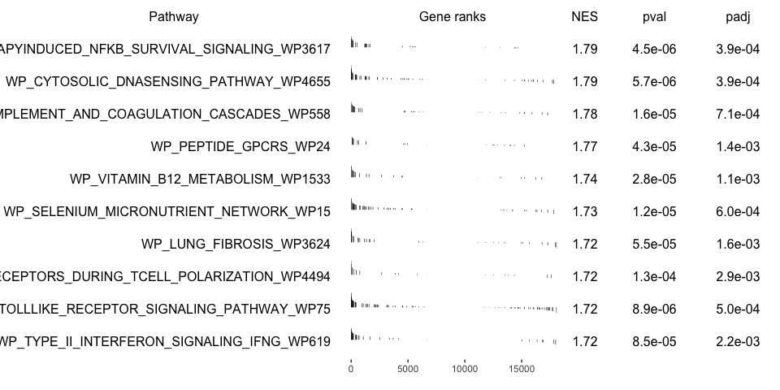

<style>
h1, .h1, h2, .h2, h3, .h3, h4, .h4 { margin-top: 50px }
p.caption {font-size: 0.9em;font-style: italic;color: grey;margin-right: 10%;margin-left: 10%;text-align: justify}
</style>

# Differential gene expression

In this tutorial we will cover about Differetial gene expression, which comprises an extensive range of topics and methods. In single cell, differential expresison can have multiple functionalities such as of identifying marker genes for cell populations, as well as differentially regulated genes across conditions (healthy vs control). We will also exercise on how to account the batch information in your test.

We can first load the data from the clustering session. Moreover, we can already decide which clustering resolution to use. First let's define using the `louvain` clustering to identifying differentially expressed genes.  


```r
suppressPackageStartupMessages({
    library(scater)
    library(scran)
    # library(venn)
    library(cowplot)
    library(ggplot2)
    # library(rafalib)
    library(pheatmap)
    library(igraph)
    library(dplyr)
})

sce <- readRDS("data/results/covid_qc_dr_int_cl.rds")
```

## Cell marker genes
***

Let us first compute a ranking for the highly differential genes in each cluster. There are many different tests and parameters to be chosen that can be used to refine your results. When looking for marker genes, we want genes that are positivelly expressed in a cell type and possibly not expressed in the others.


```r
# Compute differentiall expression
markers_genes <- scran::findMarkers(x = sce, groups = as.character(sce$louvain_SNNk15), 
    lfc = 0.5, pval.type = "all", direction = "up")

# List of dataFrames with the results for each cluster
markers_genes
```

```
## List of length 8
## names(8): 1 2 3 4 5 6 7 8
```

```r
# Visualizing the expression of one
markers_genes[["1"]]
```

```
## DataFrame with 18121 rows and 10 columns
##                p.value         FDR summary.logFC     logFC.2      logFC.3
##              <numeric>   <numeric>     <numeric>   <numeric>    <numeric>
## IL1B       1.86254e-31 3.37511e-27      1.291668    1.291668     1.590823
## G0S2       2.59471e-09 2.35093e-05      0.949985    0.949985     1.537003
## SGK1       5.89422e-09 3.56030e-05      0.779381    0.779381     1.054106
## LGALS2     1.14407e-08 5.18292e-05      0.923349    1.116814     0.923349
## IER3       3.30831e-06 1.19900e-02      0.771017    0.771017     1.344642
## ...                ...         ...           ...         ...          ...
## AC011043.1           1           1   0.001354542 0.001354542  0.000357768
## AC007325.4           1           1   0.001174207 0.001174207  0.005124268
## AL354822.1           1           1   0.000672955 0.000672955  0.001977378
## AC233755.1           1           1   0.000000000 0.000000000  0.000000000
## AC240274.1           1           1  -0.005510999 0.004491855 -0.001546058
##                logFC.4     logFC.5     logFC.6      logFC.7     logFC.8
##              <numeric>   <numeric>   <numeric>    <numeric>   <numeric>
## IL1B           1.66493     1.53237     1.67324      1.68769     1.66480
## G0S2           1.51529     1.14587     1.59695      1.57317     1.60193
## SGK1           1.04657     1.03855     1.19272      1.17071     1.04800
## LGALS2         1.32465     1.18495     1.32189      1.32792     1.30327
## IER3           1.35897     1.32495     1.22819      1.31529     1.35018
## ...                ...         ...         ...          ...         ...
## AC011043.1 -0.00521359  0.00135454  0.00135454 -0.000549486  0.00135454
## AC007325.4  0.00617082 -0.01321509  0.00444814  0.003099959  0.00284852
## AL354822.1 -0.01834500 -0.00188493 -0.01196127 -0.002531039 -0.00985194
## AC233755.1 -0.00660161  0.00000000  0.00000000  0.000000000  0.00000000
## AC240274.1 -0.00551100 -0.00903890  0.00788701  0.004359348  0.00100071
```

We can now select the top 25 up regulated genes for plotting.


```r
# Colect the top 25 genes for each cluster and put the into a single table
top25 <- lapply(names(markers_genes), function(x) {
    temp <- markers_genes[[x]][1:25, 1:2]
    temp$gene <- rownames(markers_genes[[x]])[1:25]
    temp$cluster <- x
    return(temp)
})
top25 <- as_tibble(do.call(rbind, top25))
top25$p.value[top25$p.value == 0] <- 1e-300
top25
```

<div data-pagedtable="false">
  <script data-pagedtable-source type="application/json">
{"columns":[{"label":["p.value"],"name":[1],"type":["dbl"],"align":["right"]},{"label":["FDR"],"name":[2],"type":["dbl"],"align":["right"]},{"label":["gene"],"name":[3],"type":["chr"],"align":["left"]},{"label":["cluster"],"name":[4],"type":["chr"],"align":["left"]}],"data":[{"1":"1.862542e-31","2":"3.375112e-27","3":"IL1B","4":"1"},{"1":"2.594706e-09","2":"2.350934e-05","3":"G0S2","4":"1"},{"1":"5.894219e-09","2":"3.560305e-05","3":"SGK1","4":"1"},{"1":"1.144070e-08","2":"5.182922e-05","3":"LGALS2","4":"1"},{"1":"3.308309e-06","2":"1.198997e-02","3":"IER3","4":"1"},{"1":"7.777865e-04","2":"1.000000e+00","3":"DUSP6","4":"1"},{"1":"2.308007e-03","2":"1.000000e+00","3":"ZFP36L1","4":"1"},{"1":"1.599502e-02","2":"1.000000e+00","3":"IRF2BP2","4":"1"},{"1":"2.096912e-02","2":"1.000000e+00","3":"ICAM1","4":"1"},{"1":"2.253352e-02","2":"1.000000e+00","3":"ZFP36","4":"1"},{"1":"2.788907e-02","2":"1.000000e+00","3":"MPEG1","4":"1"},{"1":"2.804126e-02","2":"1.000000e+00","3":"PIM3","4":"1"},{"1":"4.123621e-02","2":"1.000000e+00","3":"SOD2","4":"1"},{"1":"1.786949e-01","2":"1.000000e+00","3":"CSF3R","4":"1"},{"1":"2.188972e-01","2":"1.000000e+00","3":"MCL1","4":"1"},{"1":"2.247116e-01","2":"1.000000e+00","3":"ISG15","4":"1"},{"1":"2.701944e-01","2":"1.000000e+00","3":"MARCKS","4":"1"},{"1":"2.752741e-01","2":"1.000000e+00","3":"TNFAIP2","4":"1"},{"1":"2.761399e-01","2":"1.000000e+00","3":"APOBEC3A","4":"1"},{"1":"3.873453e-01","2":"1.000000e+00","3":"C15orf48","4":"1"},{"1":"5.590637e-01","2":"1.000000e+00","3":"DUSP1","4":"1"},{"1":"6.653220e-01","2":"1.000000e+00","3":"CCR1","4":"1"},{"1":"7.037365e-01","2":"1.000000e+00","3":"MAFB","4":"1"},{"1":"7.132814e-01","2":"1.000000e+00","3":"KLF4","4":"1"},{"1":"7.245761e-01","2":"1.000000e+00","3":"NFKBIA","4":"1"},{"1":"1.698681e-55","2":"3.078180e-51","3":"S100A8","4":"2"},{"1":"3.032079e-38","2":"2.747215e-34","3":"S100A9","4":"2"},{"1":"2.782689e-36","2":"1.680837e-32","3":"RETN","4":"2"},{"1":"1.868487e-17","2":"8.464713e-14","3":"S100A12","4":"2"},{"1":"1.053800e-11","2":"3.819182e-08","3":"HP","4":"2"},{"1":"2.420985e-08","2":"7.311779e-05","3":"RNASE2","4":"2"},{"1":"3.989812e-08","2":"1.032848e-04","3":"PLBD1","4":"2"},{"1":"4.298210e-06","2":"9.735983e-03","3":"CTSD","4":"2"},{"1":"5.732550e-06","2":"1.154217e-02","3":"LGALS1","4":"2"},{"1":"1.131383e-03","2":"1.000000e+00","3":"SERPINB1","4":"2"},{"1":"1.242701e-02","2":"1.000000e+00","3":"MCEMP1","4":"2"},{"1":"2.269656e-02","2":"1.000000e+00","3":"GCA","4":"2"},{"1":"4.270343e-02","2":"1.000000e+00","3":"SELL","4":"2"},{"1":"1.222997e-01","2":"1.000000e+00","3":"IL1R2","4":"2"},{"1":"3.194980e-01","2":"1.000000e+00","3":"HMGB2","4":"2"},{"1":"3.988791e-01","2":"1.000000e+00","3":"CLU","4":"2"},{"1":"3.990680e-01","2":"1.000000e+00","3":"PGD","4":"2"},{"1":"5.562446e-01","2":"1.000000e+00","3":"SLC2A3","4":"2"},{"1":"5.590351e-01","2":"1.000000e+00","3":"ALOX5AP","4":"2"},{"1":"6.187708e-01","2":"1.000000e+00","3":"RFLNB","4":"2"},{"1":"8.060073e-01","2":"1.000000e+00","3":"H2AFJ","4":"2"},{"1":"8.530660e-01","2":"1.000000e+00","3":"THBS1","4":"2"},{"1":"8.532423e-01","2":"1.000000e+00","3":"VCAN","4":"2"},{"1":"8.752865e-01","2":"1.000000e+00","3":"PKM","4":"2"},{"1":"9.010994e-01","2":"1.000000e+00","3":"GAPDH","4":"2"},{"1":"8.978780e-10","2":"1.627045e-05","3":"PF4","4":"3"},{"1":"1.254426e-05","2":"9.853112e-02","3":"PPBP","4":"3"},{"1":"1.924531e-05","2":"9.853112e-02","3":"OST4","4":"3"},{"1":"2.174960e-05","2":"9.853112e-02","3":"GNG11","4":"3"},{"1":"1.370463e-04","2":"4.966832e-01","3":"NRGN","4":"3"},{"1":"1.743686e-04","2":"5.266221e-01","3":"HIST1H2AC","4":"3"},{"1":"2.448222e-04","2":"6.337748e-01","3":"HIST1H3H","4":"3"},{"1":"7.581353e-04","2":"1.000000e+00","3":"TSC22D1","4":"3"},{"1":"1.086527e-03","2":"1.000000e+00","3":"CA2","4":"3"},{"1":"1.847511e-03","2":"1.000000e+00","3":"GP9","4":"3"},{"1":"1.863797e-03","2":"1.000000e+00","3":"ACRBP","4":"3"},{"1":"1.911550e-03","2":"1.000000e+00","3":"CAVIN2","4":"3"},{"1":"2.030358e-03","2":"1.000000e+00","3":"MYL9","4":"3"},{"1":"2.481964e-03","2":"1.000000e+00","3":"MTURN","4":"3"},{"1":"3.030591e-03","2":"1.000000e+00","3":"TREML1","4":"3"},{"1":"3.524465e-03","2":"1.000000e+00","3":"RGS10","4":"3"},{"1":"3.626422e-03","2":"1.000000e+00","3":"TAGLN2","4":"3"},{"1":"1.115165e-02","2":"1.000000e+00","3":"SNCA","4":"3"},{"1":"1.239680e-02","2":"1.000000e+00","3":"CMTM5","4":"3"},{"1":"1.522324e-02","2":"1.000000e+00","3":"HIST1H4H","4":"3"},{"1":"1.534524e-02","2":"1.000000e+00","3":"CLEC1B","4":"3"},{"1":"1.596371e-02","2":"1.000000e+00","3":"PDLIM1","4":"3"},{"1":"1.904698e-02","2":"1.000000e+00","3":"HIST1H2BJ","4":"3"},{"1":"2.137494e-02","2":"1.000000e+00","3":"RSU1","4":"3"},{"1":"2.431305e-02","2":"1.000000e+00","3":"TUBB1","4":"3"},{"1":"4.782119e-234","2":"8.665678e-230","3":"MS4A1","4":"4"},{"1":"1.808108e-183","2":"1.638236e-179","3":"TNFRSF13C","4":"4"},{"1":"4.694013e-156","2":"2.835340e-152","3":"CD79A","4":"4"},{"1":"2.251164e-141","2":"1.019834e-137","3":"IGHD","4":"4"},{"1":"7.696605e-138","2":"2.789403e-134","3":"LINC00926","4":"4"},{"1":"1.605962e-117","2":"4.850273e-114","3":"IGHM","4":"4"},{"1":"7.711217e-80","2":"1.996214e-76","3":"BANK1","4":"4"},{"1":"3.366749e-60","2":"7.626107e-57","3":"RALGPS2","4":"4"},{"1":"1.355935e-45","2":"2.730099e-42","3":"JUND","4":"4"},{"1":"1.766911e-41","2":"3.201820e-38","3":"CD22","4":"4"},{"1":"4.209336e-38","2":"6.934307e-35","3":"NFKBID","4":"4"},{"1":"4.620416e-36","2":"6.977212e-33","3":"CD74","4":"4"},{"1":"1.242331e-34","2":"1.731714e-31","3":"CD83","4":"4"},{"1":"1.506283e-34","2":"1.949668e-31","3":"HLA-DQB1","4":"4"},{"1":"2.495007e-33","2":"3.014135e-30","3":"VPREB3","4":"4"},{"1":"1.821654e-28","2":"2.063137e-25","3":"TCL1A","4":"4"},{"1":"1.224652e-27","2":"1.305407e-24","3":"CD37","4":"4"},{"1":"3.702319e-23","2":"3.727207e-20","3":"BLK","4":"4"},{"1":"7.318645e-23","2":"6.980061e-20","3":"AFF3","4":"4"},{"1":"1.626448e-22","2":"1.473643e-19","3":"FCER2","4":"4"},{"1":"1.477341e-21","2":"1.274804e-18","3":"CD79B","4":"4"},{"1":"4.696616e-21","2":"3.868517e-18","3":"P2RX5","4":"4"},{"1":"7.968529e-20","2":"6.278161e-17","3":"FAM129C","4":"4"},{"1":"2.063956e-17","2":"1.558372e-14","3":"TAGAP","4":"4"},{"1":"5.920048e-17","2":"4.291088e-14","3":"FCRL1","4":"4"},{"1":"1.455161e-62","2":"2.636898e-58","3":"CDKN1C","4":"5"},{"1":"4.488458e-61","2":"4.066767e-57","3":"LST1","4":"5"},{"1":"4.167856e-31","2":"2.517524e-27","3":"COTL1","4":"5"},{"1":"1.077546e-30","2":"4.881551e-27","3":"SMIM25","4":"5"},{"1":"1.525302e-30","2":"5.527998e-27","3":"FCGR3A","4":"5"},{"1":"4.037702e-22","2":"1.219453e-18","3":"MS4A7","4":"5"},{"1":"3.487563e-21","2":"9.028305e-18","3":"CSF1R","4":"5"},{"1":"2.650730e-20","2":"6.004234e-17","3":"RHOC","4":"5"},{"1":"2.222170e-17","2":"4.474217e-14","3":"LRRC25","4":"5"},{"1":"2.730761e-15","2":"4.948412e-12","3":"DRAP1","4":"5"},{"1":"7.326546e-15","2":"1.206948e-11","3":"TCF7L2","4":"5"},{"1":"6.839873e-14","2":"1.032878e-10","3":"PECAM1","4":"5"},{"1":"9.378538e-14","2":"1.307296e-10","3":"CTSC","4":"5"},{"1":"1.438889e-13","2":"1.862437e-10","3":"RRAS","4":"5"},{"1":"3.182483e-13","2":"3.844651e-10","3":"AIF1","4":"5"},{"1":"8.146044e-11","2":"9.225904e-08","3":"UNC119","4":"5"},{"1":"1.167048e-09","2":"1.244004e-06","3":"HES4","4":"5"},{"1":"2.851270e-08","2":"2.870437e-05","3":"SERPINA1","4":"5"},{"1":"4.383648e-08","2":"4.145319e-05","3":"IFITM3","4":"5"},{"1":"4.575155e-08","2":"4.145319e-05","3":"MBD2","4":"5"},{"1":"1.480878e-07","2":"1.277856e-04","3":"RNASET2","4":"5"},{"1":"2.251265e-06","2":"1.854326e-03","3":"SLC2A6","4":"5"},{"1":"8.862251e-06","2":"6.982298e-03","3":"WASF2","4":"5"},{"1":"1.103039e-05","2":"8.328403e-03","3":"YBX1","4":"5"},{"1":"1.325814e-05","2":"9.610028e-03","3":"HMOX1","4":"5"},{"1":"3.896291e-94","2":"7.060469e-90","3":"KLRF1","4":"6"},{"1":"2.033478e-89","2":"1.842433e-85","3":"GNLY","4":"6"},{"1":"3.947054e-75","2":"2.384152e-71","3":"GZMB","4":"6"},{"1":"1.056959e-60","2":"4.788290e-57","3":"PRF1","4":"6"},{"1":"8.168863e-59","2":"2.960559e-55","3":"SPON2","4":"6"},{"1":"8.828100e-50","2":"2.666233e-46","3":"CD247","4":"6"},{"1":"2.687925e-30","2":"6.958269e-27","3":"FGFBP2","4":"6"},{"1":"1.026160e-28","2":"2.324381e-25","3":"CLIC3","4":"6"},{"1":"5.058638e-22","2":"1.018529e-18","3":"TRDC","4":"6"},{"1":"2.097286e-18","2":"3.800492e-15","3":"KLRD1","4":"6"},{"1":"2.000445e-16","2":"3.295460e-13","3":"CTSW","4":"6"},{"1":"1.235550e-14","2":"1.865783e-11","3":"MYOM2","4":"6"},{"1":"5.652986e-11","2":"7.879828e-08","3":"CD7","4":"6"},{"1":"7.942488e-07","2":"1.028042e-03","3":"NKG7","4":"6"},{"1":"2.018314e-06","2":"2.438258e-03","3":"KLRB1","4":"6"},{"1":"4.476472e-04","2":"5.069884e-01","3":"IL2RB","4":"6"},{"1":"4.144115e-03","2":"1.000000e+00","3":"HOPX","4":"6"},{"1":"1.037948e-02","2":"1.000000e+00","3":"PTGDS","4":"6"},{"1":"1.083161e-02","2":"1.000000e+00","3":"APMAP","4":"6"},{"1":"1.568919e-01","2":"1.000000e+00","3":"GNPTAB","4":"6"},{"1":"1.930770e-01","2":"1.000000e+00","3":"ABHD17A","4":"6"},{"1":"2.370309e-01","2":"1.000000e+00","3":"S1PR5","4":"6"},{"1":"3.052662e-01","2":"1.000000e+00","3":"CEP78","4":"6"},{"1":"4.847516e-01","2":"1.000000e+00","3":"CST7","4":"6"},{"1":"5.825630e-01","2":"1.000000e+00","3":"IGFBP7","4":"6"},{"1":"1.723969e-34","2":"3.124005e-30","3":"CD8A","4":"7"},{"1":"5.072067e-20","2":"4.595547e-16","3":"TRGC2","4":"7"},{"1":"1.177484e-18","2":"7.112397e-15","3":"GZMK","4":"7"},{"1":"1.477949e-16","2":"6.695481e-13","3":"DUSP2","4":"7"},{"1":"4.111298e-15","2":"1.490017e-11","3":"LYAR","4":"7"},{"1":"4.589317e-11","2":"1.386050e-07","3":"KLRG1","4":"7"},{"1":"1.623166e-06","2":"4.201913e-03","3":"CD8B","4":"7"},{"1":"6.026388e-03","2":"1.000000e+00","3":"CD3D","4":"7"},{"1":"3.144157e-02","2":"1.000000e+00","3":"IL32","4":"7"},{"1":"4.865244e-01","2":"1.000000e+00","3":"TNFAIP3","4":"7"},{"1":"5.609750e-01","2":"1.000000e+00","3":"CD3G","4":"7"},{"1":"6.647178e-01","2":"1.000000e+00","3":"PIK3R1","4":"7"},{"1":"8.414490e-01","2":"1.000000e+00","3":"CCL5","4":"7"},{"1":"9.164726e-01","2":"1.000000e+00","3":"SRSF7","4":"7"},{"1":"9.420033e-01","2":"1.000000e+00","3":"TUBA4A","4":"7"},{"1":"9.957868e-01","2":"1.000000e+00","3":"LINC01871","4":"7"},{"1":"9.984233e-01","2":"1.000000e+00","3":"RPS26","4":"7"},{"1":"9.997127e-01","2":"1.000000e+00","3":"CD3E","4":"7"},{"1":"9.999062e-01","2":"1.000000e+00","3":"A2M-AS1","4":"7"},{"1":"9.999244e-01","2":"1.000000e+00","3":"PTPRC","4":"7"},{"1":"9.999544e-01","2":"1.000000e+00","3":"CD99","4":"7"},{"1":"9.999844e-01","2":"1.000000e+00","3":"HSP90AA1","4":"7"},{"1":"9.999958e-01","2":"1.000000e+00","3":"GZMH","4":"7"},{"1":"9.999960e-01","2":"1.000000e+00","3":"CD2","4":"7"},{"1":"9.999971e-01","2":"1.000000e+00","3":"PPP2R5C","4":"7"},{"1":"2.562633e-45","2":"4.643747e-41","3":"IL7R","4":"8"},{"1":"1.452509e-19","2":"1.316046e-15","3":"RCAN3","4":"8"},{"1":"1.453537e-18","2":"8.779846e-15","3":"MAL","4":"8"},{"1":"8.685166e-17","2":"3.934597e-13","3":"LDHB","4":"8"},{"1":"6.330047e-16","2":"2.294136e-12","3":"SARAF","4":"8"},{"1":"4.808422e-15","2":"1.452224e-11","3":"NOSIP","4":"8"},{"1":"4.718195e-13","2":"1.221406e-09","3":"PIK3IP1","4":"8"},{"1":"1.297547e-11","2":"2.939107e-08","3":"TCF7","4":"8"},{"1":"4.450793e-07","2":"8.961423e-04","3":"LEPROTL1","4":"8"},{"1":"1.177051e-05","2":"2.132934e-02","3":"TPT1","4":"8"},{"1":"1.683117e-04","2":"2.772705e-01","3":"LEF1","4":"8"},{"1":"2.833327e-03","2":"1.000000e+00","3":"AP3M2","4":"8"},{"1":"4.898215e-03","2":"1.000000e+00","3":"PRKCA","4":"8"},{"1":"2.298695e-02","2":"1.000000e+00","3":"SERINC5","4":"8"},{"1":"2.784661e-02","2":"1.000000e+00","3":"TRABD2A","4":"8"},{"1":"9.914290e-02","2":"1.000000e+00","3":"LTB","4":"8"},{"1":"1.914405e-01","2":"1.000000e+00","3":"RPS14","4":"8"},{"1":"2.162385e-01","2":"1.000000e+00","3":"RPL4","4":"8"},{"1":"2.522722e-01","2":"1.000000e+00","3":"ARHGAP15","4":"8"},{"1":"3.261177e-01","2":"1.000000e+00","3":"IKZF1","4":"8"},{"1":"4.467357e-01","2":"1.000000e+00","3":"RPS4X","4":"8"},{"1":"7.200424e-01","2":"1.000000e+00","3":"GIMAP7","4":"8"},{"1":"7.563202e-01","2":"1.000000e+00","3":"AQP3","4":"8"},{"1":"7.766444e-01","2":"1.000000e+00","3":"KLF2","4":"8"},{"1":"7.822137e-01","2":"1.000000e+00","3":"CAMK4","4":"8"}],"options":{"columns":{"min":{},"max":[10]},"rows":{"min":[10],"max":[10]},"pages":{}}}
  </script>
</div>

We can now select the top 25 up regulated genes for plotting.


```r
par(mfrow = c(1, 5), mar = c(4, 6, 3, 1))
for (i in unique(top25$cluster)) {
    barplot(sort(setNames(-log10(top25$p.value), top25$gene)[top25$cluster == i], 
        F), horiz = T, las = 1, main = paste0(i, " vs. rest"), border = "white", 
        yaxs = "i", xlab = "-log10FC")
    abline(v = c(0, -log10(0.05)), lty = c(1, 2))
}
```

<!-- --><!-- -->

We can visualize them as a heatmap. Here we are selecting the top 5.


```r
top5 <- as_tibble(top25) %>% group_by(cluster) %>% top_n(-5, p.value)

scater::plotHeatmap(sce[, order(sce$louvain_SNNk15)], features = unique(top5$gene), 
    center = T, zlim = c(-3, 3), colour_columns_by = "louvain_SNNk15", show_colnames = F, 
    cluster_cols = F, fontsize_row = 6, color = colorRampPalette(c("purple", "black", 
        "yellow"))(90))
```

<!-- -->

We can also plot a violin plot for each gene.


```r
scater::plotExpression(sce, features = unique(top5$gene), x = "louvain_SNNk15", ncol = 5, 
    colour_by = "louvain_SNNk15", scales = "free")
```

<!-- -->


## Differential expression across conditions
***

The second way of computing differential expression is to answer which genes are differentially expressed within a cluster. For example, in our case we have libraries comming from patients and controls and we would like to know which genes are influenced the most in a particular cell type.

For this end, we will first subset our data for the desired cell cluster, then change the cell identities to the variable of comparison (which now in our case is the "type", e.g. Covid/Ctrl).


```r
# Filter cells from that cluster
cell_selection <- sce[, sce$louvain_SNNk15 == 6]

# Compute differentiall expression
DGE_cell_selection <- findMarkers(x = cell_selection, groups = cell_selection@colData$type, 
    lfc = 0.25, pval.type = "all", direction = "any")
top5_cell_selection <- lapply(names(DGE_cell_selection), function(x) {
    temp <- DGE_cell_selection[[x]][1:5, 1:2]
    temp$gene <- rownames(DGE_cell_selection[[x]])[1:5]
    temp$cluster <- x
    return(temp)
})
top5_cell_selection <- as_tibble(do.call(rbind, top5_cell_selection))
top5_cell_selection
```

<div data-pagedtable="false">
  <script data-pagedtable-source type="application/json">
{"columns":[{"label":["p.value"],"name":[1],"type":["dbl"],"align":["right"]},{"label":["FDR"],"name":[2],"type":["dbl"],"align":["right"]},{"label":["gene"],"name":[3],"type":["chr"],"align":["left"]},{"label":["cluster"],"name":[4],"type":["chr"],"align":["left"]}],"data":[{"1":"2.165859e-34","2":"3.924753e-30","3":"XIST","4":"Control"},{"1":"8.073662e-23","2":"7.315141e-19","3":"RPS4Y1","4":"Control"},{"1":"2.994708e-22","2":"1.808903e-18","3":"ISG20","4":"Control"},{"1":"4.069103e-22","2":"1.843405e-18","3":"XAF1","4":"Control"},{"1":"9.409315e-20","2":"3.410124e-16","3":"JUN","4":"Control"},{"1":"2.165859e-34","2":"3.924753e-30","3":"XIST","4":"Covid"},{"1":"8.073662e-23","2":"7.315141e-19","3":"RPS4Y1","4":"Covid"},{"1":"2.994708e-22","2":"1.808903e-18","3":"ISG20","4":"Covid"},{"1":"4.069103e-22","2":"1.843405e-18","3":"XAF1","4":"Covid"},{"1":"9.409315e-20","2":"3.410124e-16","3":"JUN","4":"Covid"}],"options":{"columns":{"min":{},"max":[10]},"rows":{"min":[10],"max":[10]},"pages":{}}}
  </script>
</div>

We can now plot the expression across the "type".


```r
scater::plotExpression(cell_selection, features = unique(top5_cell_selection$gene), 
    x = "type", ncol = 5, colour_by = "type")
```

<!-- -->

#DGE_ALL6.2:


```r
plotlist <- list()
for (i in unique(top5_cell_selection$gene)) {
    plotlist[[i]] <- plotReducedDim(sce, dimred = "UMAP_on_MNN", colour_by = i, by_exprs_values = "logcounts") + 
        ggtitle(label = i) + theme(plot.title = element_text(size = 20))
}
plot_grid(ncol = 3, plotlist = plotlist)
```

<!-- -->


## Gene Set Analysis
***

Hypergeometric enrichment test

Having a defined list of differentially expressed genes, you can now look for their combined function using hypergeometric test:


```r
# Load additional packages
library(enrichR)

# Check available databases to perform enrichment (then choose one)
enrichR::listEnrichrDbs()
```

<div data-pagedtable="false">
  <script data-pagedtable-source type="application/json">
{"columns":[{"label":["geneCoverage"],"name":[1],"type":["dbl"],"align":["right"]},{"label":["genesPerTerm"],"name":[2],"type":["dbl"],"align":["right"]},{"label":["libraryName"],"name":[3],"type":["chr"],"align":["left"]},{"label":["link"],"name":[4],"type":["chr"],"align":["left"]},{"label":["numTerms"],"name":[5],"type":["dbl"],"align":["right"]}],"data":[{"1":"13362","2":"275","3":"Genome_Browser_PWMs","4":"http://hgdownload.cse.ucsc.edu/goldenPath/hg18/database/","5":"615"},{"1":"27884","2":"1284","3":"TRANSFAC_and_JASPAR_PWMs","4":"http://jaspar.genereg.net/html/DOWNLOAD/","5":"326"},{"1":"6002","2":"77","3":"Transcription_Factor_PPIs","4":"","5":"290"},{"1":"47172","2":"1370","3":"ChEA_2013","4":"http://amp.pharm.mssm.edu/lib/cheadownload.jsp","5":"353"},{"1":"47107","2":"509","3":"Drug_Perturbations_from_GEO_2014","4":"http://www.ncbi.nlm.nih.gov/geo/","5":"701"},{"1":"21493","2":"3713","3":"ENCODE_TF_ChIP-seq_2014","4":"http://genome.ucsc.edu/ENCODE/downloads.html","5":"498"},{"1":"1295","2":"18","3":"BioCarta_2013","4":"https://cgap.nci.nih.gov/Pathways/BioCarta_Pathways","5":"249"},{"1":"3185","2":"73","3":"Reactome_2013","4":"http://www.reactome.org/download/index.html","5":"78"},{"1":"2854","2":"34","3":"WikiPathways_2013","4":"http://www.wikipathways.org/index.php/Download_Pathways","5":"199"},{"1":"15057","2":"300","3":"Disease_Signatures_from_GEO_up_2014","4":"http://www.ncbi.nlm.nih.gov/geo/","5":"142"},{"1":"4128","2":"48","3":"KEGG_2013","4":"http://www.kegg.jp/kegg/download/","5":"200"},{"1":"34061","2":"641","3":"TF-LOF_Expression_from_GEO","4":"http://www.ncbi.nlm.nih.gov/geo/","5":"269"},{"1":"7504","2":"155","3":"TargetScan_microRNA","4":"http://www.targetscan.org/cgi-bin/targetscan/data_download.cgi?db=vert_61","5":"222"},{"1":"16399","2":"247","3":"PPI_Hub_Proteins","4":"http://amp.pharm.mssm.edu/X2K","5":"385"},{"1":"12753","2":"57","3":"GO_Molecular_Function_2015","4":"http://www.geneontology.org/GO.downloads.annotations.shtml","5":"1136"},{"1":"23726","2":"127","3":"GeneSigDB","4":"http://genesigdb.org/genesigdb/downloadall.jsp","5":"2139"},{"1":"32740","2":"85","3":"Chromosome_Location","4":"http://software.broadinstitute.org/gsea/msigdb/index.jsp","5":"386"},{"1":"13373","2":"258","3":"Human_Gene_Atlas","4":"http://biogps.org/downloads/","5":"84"},{"1":"19270","2":"388","3":"Mouse_Gene_Atlas","4":"http://biogps.org/downloads/","5":"96"},{"1":"13236","2":"82","3":"GO_Cellular_Component_2015","4":"http://www.geneontology.org/GO.downloads.annotations.shtml","5":"641"},{"1":"14264","2":"58","3":"GO_Biological_Process_2015","4":"http://www.geneontology.org/GO.downloads.annotations.shtml","5":"5192"},{"1":"3096","2":"31","3":"Human_Phenotype_Ontology","4":"http://www.human-phenotype-ontology.org/","5":"1779"},{"1":"22288","2":"4368","3":"Epigenomics_Roadmap_HM_ChIP-seq","4":"http://www.roadmapepigenomics.org/","5":"383"},{"1":"4533","2":"37","3":"KEA_2013","4":"http://amp.pharm.mssm.edu/lib/keacommandline.jsp","5":"474"},{"1":"10231","2":"158","3":"NURSA_Human_Endogenous_Complexome","4":"https://www.nursa.org/nursa/index.jsf","5":"1796"},{"1":"2741","2":"5","3":"CORUM","4":"http://mips.helmholtz-muenchen.de/genre/proj/corum/","5":"1658"},{"1":"5655","2":"342","3":"SILAC_Phosphoproteomics","4":"http://amp.pharm.mssm.edu/lib/keacommandline.jsp","5":"84"},{"1":"10406","2":"715","3":"MGI_Mammalian_Phenotype_Level_3","4":"http://www.informatics.jax.org/","5":"71"},{"1":"10493","2":"200","3":"MGI_Mammalian_Phenotype_Level_4","4":"http://www.informatics.jax.org/","5":"476"},{"1":"11251","2":"100","3":"Old_CMAP_up","4":"http://www.broadinstitute.org/cmap/","5":"6100"},{"1":"8695","2":"100","3":"Old_CMAP_down","4":"http://www.broadinstitute.org/cmap/","5":"6100"},{"1":"1759","2":"25","3":"OMIM_Disease","4":"http://www.omim.org/downloads","5":"90"},{"1":"2178","2":"89","3":"OMIM_Expanded","4":"http://www.omim.org/downloads","5":"187"},{"1":"851","2":"15","3":"VirusMINT","4":"http://mint.bio.uniroma2.it/download.html","5":"85"},{"1":"10061","2":"106","3":"MSigDB_Computational","4":"http://www.broadinstitute.org/gsea/msigdb/collections.jsp","5":"858"},{"1":"11250","2":"166","3":"MSigDB_Oncogenic_Signatures","4":"http://www.broadinstitute.org/gsea/msigdb/collections.jsp","5":"189"},{"1":"15406","2":"300","3":"Disease_Signatures_from_GEO_down_2014","4":"http://www.ncbi.nlm.nih.gov/geo/","5":"142"},{"1":"17711","2":"300","3":"Virus_Perturbations_from_GEO_up","4":"http://www.ncbi.nlm.nih.gov/geo/","5":"323"},{"1":"17576","2":"300","3":"Virus_Perturbations_from_GEO_down","4":"http://www.ncbi.nlm.nih.gov/geo/","5":"323"},{"1":"15797","2":"176","3":"Cancer_Cell_Line_Encyclopedia","4":"https://portals.broadinstitute.org/ccle/home\\n","5":"967"},{"1":"12232","2":"343","3":"NCI-60_Cancer_Cell_Lines","4":"http://biogps.org/downloads/","5":"93"},{"1":"13572","2":"301","3":"Tissue_Protein_Expression_from_ProteomicsDB","4":"https://www.proteomicsdb.org/","5":"207"},{"1":"6454","2":"301","3":"Tissue_Protein_Expression_from_Human_Proteome_Map","4":"http://www.humanproteomemap.org/index.php","5":"30"},{"1":"3723","2":"47","3":"HMDB_Metabolites","4":"http://www.hmdb.ca/downloads","5":"3906"},{"1":"7588","2":"35","3":"Pfam_InterPro_Domains","4":"ftp://ftp.ebi.ac.uk/pub/databases/interpro/","5":"311"},{"1":"7682","2":"78","3":"GO_Biological_Process_2013","4":"http://www.geneontology.org/GO.downloads.annotations.shtml","5":"941"},{"1":"7324","2":"172","3":"GO_Cellular_Component_2013","4":"http://www.geneontology.org/GO.downloads.annotations.shtml","5":"205"},{"1":"8469","2":"122","3":"GO_Molecular_Function_2013","4":"http://www.geneontology.org/GO.downloads.annotations.shtml","5":"402"},{"1":"13121","2":"305","3":"Allen_Brain_Atlas_up","4":"http://www.brain-map.org/","5":"2192"},{"1":"26382","2":"1811","3":"ENCODE_TF_ChIP-seq_2015","4":"http://genome.ucsc.edu/ENCODE/downloads.html","5":"816"},{"1":"29065","2":"2123","3":"ENCODE_Histone_Modifications_2015","4":"http://genome.ucsc.edu/ENCODE/downloads.html","5":"412"},{"1":"280","2":"9","3":"Phosphatase_Substrates_from_DEPOD","4":"http://www.koehn.embl.de/depod/","5":"59"},{"1":"13877","2":"304","3":"Allen_Brain_Atlas_down","4":"http://www.brain-map.org/","5":"2192"},{"1":"15852","2":"912","3":"ENCODE_Histone_Modifications_2013","4":"http://genome.ucsc.edu/ENCODE/downloads.html","5":"109"},{"1":"4320","2":"129","3":"Achilles_fitness_increase","4":"http://www.broadinstitute.org/achilles","5":"216"},{"1":"4271","2":"128","3":"Achilles_fitness_decrease","4":"http://www.broadinstitute.org/achilles","5":"216"},{"1":"10496","2":"201","3":"MGI_Mammalian_Phenotype_2013","4":"http://www.informatics.jax.org/","5":"476"},{"1":"1678","2":"21","3":"BioCarta_2015","4":"https://cgap.nci.nih.gov/Pathways/BioCarta_Pathways","5":"239"},{"1":"756","2":"12","3":"HumanCyc_2015","4":"http://humancyc.org/","5":"125"},{"1":"3800","2":"48","3":"KEGG_2015","4":"http://www.kegg.jp/kegg/download/","5":"179"},{"1":"2541","2":"39","3":"NCI-Nature_2015","4":"http://pid.nci.nih.gov/","5":"209"},{"1":"1918","2":"39","3":"Panther_2015","4":"http://www.pantherdb.org/","5":"104"},{"1":"5863","2":"51","3":"WikiPathways_2015","4":"http://www.wikipathways.org/index.php/Download_Pathways","5":"404"},{"1":"6768","2":"47","3":"Reactome_2015","4":"http://www.reactome.org/download/index.html","5":"1389"},{"1":"25651","2":"807","3":"ESCAPE","4":"http://www.maayanlab.net/ESCAPE/","5":"315"},{"1":"19129","2":"1594","3":"HomoloGene","4":"http://www.ncbi.nlm.nih.gov/homologene","5":"12"},{"1":"23939","2":"293","3":"Disease_Perturbations_from_GEO_down","4":"http://www.ncbi.nlm.nih.gov/geo/","5":"839"},{"1":"23561","2":"307","3":"Disease_Perturbations_from_GEO_up","4":"http://www.ncbi.nlm.nih.gov/geo/","5":"839"},{"1":"23877","2":"302","3":"Drug_Perturbations_from_GEO_down","4":"http://www.ncbi.nlm.nih.gov/geo/","5":"906"},{"1":"15886","2":"9","3":"Genes_Associated_with_NIH_Grants","4":"https://grants.nih.gov/grants/oer.htm\\n","5":"32876"},{"1":"24350","2":"299","3":"Drug_Perturbations_from_GEO_up","4":"http://www.ncbi.nlm.nih.gov/geo/","5":"906"},{"1":"3102","2":"25","3":"KEA_2015","4":"http://amp.pharm.mssm.edu/Enrichr","5":"428"},{"1":"31132","2":"298","3":"Gene_Perturbations_from_GEO_up","4":"http://www.ncbi.nlm.nih.gov/geo/","5":"2460"},{"1":"30832","2":"302","3":"Gene_Perturbations_from_GEO_down","4":"http://www.ncbi.nlm.nih.gov/geo/","5":"2460"},{"1":"48230","2":"1429","3":"ChEA_2015","4":"http://amp.pharm.mssm.edu/Enrichr","5":"395"},{"1":"5613","2":"36","3":"dbGaP","4":"http://www.ncbi.nlm.nih.gov/gap","5":"345"},{"1":"9559","2":"73","3":"LINCS_L1000_Chem_Pert_up","4":"https://clue.io/","5":"33132"},{"1":"9448","2":"63","3":"LINCS_L1000_Chem_Pert_down","4":"https://clue.io/","5":"33132"},{"1":"16725","2":"1443","3":"GTEx_Tissue_Sample_Gene_Expression_Profiles_down","4":"http://www.gtexportal.org/","5":"2918"},{"1":"19249","2":"1443","3":"GTEx_Tissue_Sample_Gene_Expression_Profiles_up","4":"http://www.gtexportal.org/","5":"2918"},{"1":"15090","2":"282","3":"Ligand_Perturbations_from_GEO_down","4":"http://www.ncbi.nlm.nih.gov/geo/","5":"261"},{"1":"16129","2":"292","3":"Aging_Perturbations_from_GEO_down","4":"http://www.ncbi.nlm.nih.gov/geo/","5":"286"},{"1":"15309","2":"308","3":"Aging_Perturbations_from_GEO_up","4":"http://www.ncbi.nlm.nih.gov/geo/","5":"286"},{"1":"15103","2":"318","3":"Ligand_Perturbations_from_GEO_up","4":"http://www.ncbi.nlm.nih.gov/geo/","5":"261"},{"1":"15022","2":"290","3":"MCF7_Perturbations_from_GEO_down","4":"http://www.ncbi.nlm.nih.gov/geo/","5":"401"},{"1":"15676","2":"310","3":"MCF7_Perturbations_from_GEO_up","4":"http://www.ncbi.nlm.nih.gov/geo/","5":"401"},{"1":"15854","2":"279","3":"Microbe_Perturbations_from_GEO_down","4":"http://www.ncbi.nlm.nih.gov/geo/","5":"312"},{"1":"15015","2":"321","3":"Microbe_Perturbations_from_GEO_up","4":"http://www.ncbi.nlm.nih.gov/geo/","5":"312"},{"1":"3788","2":"159","3":"LINCS_L1000_Ligand_Perturbations_down","4":"https://clue.io/","5":"96"},{"1":"3357","2":"153","3":"LINCS_L1000_Ligand_Perturbations_up","4":"https://clue.io/","5":"96"},{"1":"12668","2":"300","3":"L1000_Kinase_and_GPCR_Perturbations_down","4":"https://clue.io/","5":"3644"},{"1":"12638","2":"300","3":"L1000_Kinase_and_GPCR_Perturbations_up","4":"https://clue.io/","5":"3644"},{"1":"8973","2":"64","3":"Reactome_2016","4":"http://www.reactome.org/download/index.html","5":"1530"},{"1":"7010","2":"87","3":"KEGG_2016","4":"http://www.kegg.jp/kegg/download/","5":"293"},{"1":"5966","2":"51","3":"WikiPathways_2016","4":"http://www.wikipathways.org/index.php/Download_Pathways","5":"437"},{"1":"15562","2":"887","3":"ENCODE_and_ChEA_Consensus_TFs_from_ChIP-X","4":"","5":"104"},{"1":"17850","2":"300","3":"Kinase_Perturbations_from_GEO_down","4":"http://www.ncbi.nlm.nih.gov/geo/","5":"285"},{"1":"17660","2":"300","3":"Kinase_Perturbations_from_GEO_up","4":"http://www.ncbi.nlm.nih.gov/geo/","5":"285"},{"1":"1348","2":"19","3":"BioCarta_2016","4":"http://cgap.nci.nih.gov/Pathways/BioCarta_Pathways","5":"237"},{"1":"934","2":"13","3":"HumanCyc_2016","4":"http://humancyc.org/","5":"152"},{"1":"2541","2":"39","3":"NCI-Nature_2016","4":"http://pid.nci.nih.gov/","5":"209"},{"1":"2041","2":"42","3":"Panther_2016","4":"http://www.pantherdb.org/pathway/","5":"112"},{"1":"5209","2":"300","3":"DrugMatrix","4":"https://ntp.niehs.nih.gov/drugmatrix/","5":"7876"},{"1":"49238","2":"1550","3":"ChEA_2016","4":"http://amp.pharm.mssm.edu/Enrichr","5":"645"},{"1":"2243","2":"19","3":"huMAP","4":"http://proteincomplexes.org/","5":"995"},{"1":"19586","2":"545","3":"Jensen_TISSUES","4":"http://tissues.jensenlab.org/","5":"1842"},{"1":"22440","2":"505","3":"RNA-Seq_Disease_Gene_and_Drug_Signatures_from_GEO","4":"http://www.ncbi.nlm.nih.gov/geo/","5":"1302"},{"1":"8184","2":"24","3":"MGI_Mammalian_Phenotype_2017","4":"http://www.informatics.jax.org/","5":"5231"},{"1":"18329","2":"161","3":"Jensen_COMPARTMENTS","4":"http://compartments.jensenlab.org/","5":"2283"},{"1":"15755","2":"28","3":"Jensen_DISEASES","4":"http://diseases.jensenlab.org/","5":"1811"},{"1":"10271","2":"22","3":"BioPlex_2017","4":"http://bioplex.hms.harvard.edu/","5":"3915"},{"1":"10427","2":"38","3":"GO_Cellular_Component_2017","4":"http://www.geneontology.org/","5":"636"},{"1":"10601","2":"25","3":"GO_Molecular_Function_2017","4":"http://www.geneontology.org/","5":"972"},{"1":"13822","2":"21","3":"GO_Biological_Process_2017","4":"http://www.geneontology.org/","5":"3166"},{"1":"8002","2":"143","3":"GO_Cellular_Component_2017b","4":"http://www.geneontology.org/","5":"816"},{"1":"10089","2":"45","3":"GO_Molecular_Function_2017b","4":"http://www.geneontology.org/","5":"3271"},{"1":"13247","2":"49","3":"GO_Biological_Process_2017b","4":"http://www.geneontology.org/","5":"10125"},{"1":"21809","2":"2316","3":"ARCHS4_Tissues","4":"http://amp.pharm.mssm.edu/archs4","5":"108"},{"1":"23601","2":"2395","3":"ARCHS4_Cell-lines","4":"http://amp.pharm.mssm.edu/archs4","5":"125"},{"1":"20883","2":"299","3":"ARCHS4_IDG_Coexp","4":"http://amp.pharm.mssm.edu/archs4","5":"352"},{"1":"19612","2":"299","3":"ARCHS4_Kinases_Coexp","4":"http://amp.pharm.mssm.edu/archs4","5":"498"},{"1":"25983","2":"299","3":"ARCHS4_TFs_Coexp","4":"http://amp.pharm.mssm.edu/archs4","5":"1724"},{"1":"19500","2":"137","3":"SysMyo_Muscle_Gene_Sets","4":"http://sys-myo.rhcloud.com/","5":"1135"},{"1":"14893","2":"128","3":"miRTarBase_2017","4":"http://mirtarbase.mbc.nctu.edu.tw/","5":"3240"},{"1":"17598","2":"1208","3":"TargetScan_microRNA_2017","4":"http://www.targetscan.org/","5":"683"},{"1":"5902","2":"109","3":"Enrichr_Libraries_Most_Popular_Genes","4":"http://amp.pharm.mssm.edu/Enrichr","5":"121"},{"1":"12486","2":"299","3":"Enrichr_Submissions_TF-Gene_Coocurrence","4":"http://amp.pharm.mssm.edu/Enrichr","5":"1722"},{"1":"1073","2":"100","3":"Data_Acquisition_Method_Most_Popular_Genes","4":"http://amp.pharm.mssm.edu/Enrichr","5":"12"},{"1":"19513","2":"117","3":"DSigDB","4":"http://tanlab.ucdenver.edu/DSigDB/DSigDBv1.0/","5":"4026"},{"1":"14433","2":"36","3":"GO_Biological_Process_2018","4":"http://www.geneontology.org/","5":"5103"},{"1":"8655","2":"61","3":"GO_Cellular_Component_2018","4":"http://www.geneontology.org/","5":"446"},{"1":"11459","2":"39","3":"GO_Molecular_Function_2018","4":"http://www.geneontology.org/","5":"1151"},{"1":"19741","2":"270","3":"TF_Perturbations_Followed_by_Expression","4":"http://www.ncbi.nlm.nih.gov/geo/","5":"1958"},{"1":"27360","2":"802","3":"Chromosome_Location_hg19","4":"http://hgdownload.cse.ucsc.edu/downloads.html","5":"36"},{"1":"13072","2":"26","3":"NIH_Funded_PIs_2017_Human_GeneRIF","4":"https://www.ncbi.nlm.nih.gov/pubmed/","5":"5687"},{"1":"13464","2":"45","3":"NIH_Funded_PIs_2017_Human_AutoRIF","4":"https://www.ncbi.nlm.nih.gov/pubmed/","5":"12558"},{"1":"13787","2":"200","3":"Rare_Diseases_AutoRIF_ARCHS4_Predictions","4":"https://amp.pharm.mssm.edu/geneshot/","5":"3725"},{"1":"13929","2":"200","3":"Rare_Diseases_GeneRIF_ARCHS4_Predictions","4":"https://www.ncbi.nlm.nih.gov/gene/about-generif","5":"2244"},{"1":"16964","2":"200","3":"NIH_Funded_PIs_2017_AutoRIF_ARCHS4_Predictions","4":"https://www.ncbi.nlm.nih.gov/pubmed/","5":"12558"},{"1":"17258","2":"200","3":"NIH_Funded_PIs_2017_GeneRIF_ARCHS4_Predictions","4":"https://www.ncbi.nlm.nih.gov/pubmed/","5":"5684"},{"1":"10352","2":"58","3":"Rare_Diseases_GeneRIF_Gene_Lists","4":"https://www.ncbi.nlm.nih.gov/gene/about-generif","5":"2244"},{"1":"10471","2":"76","3":"Rare_Diseases_AutoRIF_Gene_Lists","4":"https://amp.pharm.mssm.edu/geneshot/","5":"3725"},{"1":"12419","2":"491","3":"SubCell_BarCode","4":"http://www.subcellbarcode.org/","5":"104"},{"1":"19378","2":"37","3":"GWAS_Catalog_2019","4":"https://www.ebi.ac.uk/gwas","5":"1737"},{"1":"6201","2":"45","3":"WikiPathways_2019_Human","4":"https://www.wikipathways.org/","5":"472"},{"1":"4558","2":"54","3":"WikiPathways_2019_Mouse","4":"https://www.wikipathways.org/","5":"176"},{"1":"3264","2":"22","3":"TRRUST_Transcription_Factors_2019","4":"https://www.grnpedia.org/trrust/","5":"571"},{"1":"7802","2":"92","3":"KEGG_2019_Human","4":"https://www.kegg.jp/","5":"308"},{"1":"8551","2":"98","3":"KEGG_2019_Mouse","4":"https://www.kegg.jp/","5":"303"},{"1":"12444","2":"23","3":"InterPro_Domains_2019","4":"https://www.ebi.ac.uk/interpro/","5":"1071"},{"1":"9000","2":"20","3":"Pfam_Domains_2019","4":"https://pfam.xfam.org/","5":"608"},{"1":"7744","2":"363","3":"DepMap_WG_CRISPR_Screens_Broad_CellLines_2019","4":"https://depmap.org/","5":"558"},{"1":"6204","2":"387","3":"DepMap_WG_CRISPR_Screens_Sanger_CellLines_2019","4":"https://depmap.org/","5":"325"},{"1":"13420","2":"32","3":"MGI_Mammalian_Phenotype_Level_4_2019","4":"http://www.informatics.jax.org/","5":"5261"},{"1":"14148","2":"122","3":"UK_Biobank_GWAS_v1","4":"https://www.ukbiobank.ac.uk/tag/gwas/","5":"857"},{"1":"9813","2":"49","3":"BioPlanet_2019","4":"https://tripod.nih.gov/bioplanet/","5":"1510"},{"1":"1397","2":"13","3":"ClinVar_2019","4":"https://www.ncbi.nlm.nih.gov/clinvar/","5":"182"},{"1":"9116","2":"22","3":"PheWeb_2019","4":"http://pheweb.sph.umich.edu/","5":"1161"},{"1":"17464","2":"63","3":"DisGeNET","4":"https://www.disgenet.org","5":"9828"},{"1":"394","2":"73","3":"HMS_LINCS_KinomeScan","4":"http://lincs.hms.harvard.edu/kinomescan/","5":"148"},{"1":"11851","2":"586","3":"CCLE_Proteomics_2020","4":"https://portals.broadinstitute.org/ccle","5":"378"},{"1":"8189","2":"421","3":"ProteomicsDB_2020","4":"https://www.proteomicsdb.org/","5":"913"},{"1":"18704","2":"100","3":"lncHUB_lncRNA_Co-Expression","4":"https://amp.pharm.mssm.edu/lnchub/","5":"3729"},{"1":"5605","2":"39","3":"Virus-Host_PPI_P-HIPSTer_2020","4":"http://phipster.org/","5":"6715"},{"1":"5718","2":"31","3":"Elsevier_Pathway_Collection","4":"http://www.transgene.ru/disease-pathways/","5":"1721"},{"1":"14156","2":"40","3":"Table_Mining_of_CRISPR_Studies","4":"","5":"802"},{"1":"16979","2":"295","3":"COVID-19_Related_Gene_Sets","4":"https://amp.pharm.mssm.edu/covid19","5":"205"},{"1":"4383","2":"146","3":"MSigDB_Hallmark_2020","4":"https://www.gsea-msigdb.org/gsea/msigdb/collections.jsp","5":"50"},{"1":"54974","2":"483","3":"Enrichr_Users_Contributed_Lists_2020","4":"https://maayanlab.cloud/Enrichr","5":"1482"},{"1":"12118","2":"448","3":"TG_GATES_2020","4":"https://toxico.nibiohn.go.jp/english/","5":"1190"},{"1":"12361","2":"124","3":"Allen_Brain_Atlas_10x_scRNA_2021","4":"https://portal.brain-map.org/","5":"766"}],"options":{"columns":{"min":{},"max":[10]},"rows":{"min":[10],"max":[10]},"pages":{}}}
  </script>
</div>

```r
# Perform enrichment
top_DGE <- DGE_cell_selection$Covid[(DGE_cell_selection$Covid$p.value < 0.01) & (abs(DGE_cell_selection$Covid$summary.logFC) > 
    0.25), ]

enrich_results <- enrichr(genes = rownames(top_DGE), databases = "GO_Biological_Process_2017b")[[1]]
```

```
## Uploading data to Enrichr... Done.
##   Querying GO_Biological_Process_2017b... Done.
## Parsing results... Done.
```


Some databases of interest:

* `GO_Biological_Process_2017b`
* `KEGG_2019_Human`
* `KEGG_2019_Mouse`
* `WikiPathways_2019_Human`
* `WikiPathways_2019_Mouse`

You visualize your results using a simple barplot, for example:


```r
par(mar = c(3, 25, 2, 1))
barplot(height = -log10(enrich_results$P.value)[10:1], names.arg = enrich_results$Term[10:1], 
    horiz = TRUE, las = 1, border = FALSE, cex.names = 0.6)
abline(v = c(-log10(0.05)), lty = 2)
abline(v = 0, lty = 1)
```

<!-- -->

Gene Set Enrichment Analysis (GSEA)

Besides the enrichment using hypergeometric test, we can also perform gene set enrichment analysis (GSEA), which scores ranked genes list (usually based on fold changes) and computes permutation test to check if a particular gene set is more present in the Up-regulated genes, amongthe DOWN_regulated genes or not differentially regulated.


```r
# Create a gene rank based on the gene expression fold change
gene_rank <- setNames(DGE_cell_selection$Covid$summary.logFC, casefold(rownames(DGE_cell_selection$Covid), 
    upper = T))
```

 Once our list of genes are sorted, we can proceed with the enrichment itself. We can use the package to get gene set from the Molecular Signature Database (MSigDB) and select KEGG pathways as an example.


```r
# install.packages('msigdbr')
library(msigdbr)

# Download gene sets
msigdbgmt <- msigdbr::msigdbr("Homo sapiens")
msigdbgmt <- as.data.frame(msigdbgmt)

# List available gene sets
unique(msigdbgmt$gs_subcat)
```

```
##  [1] "MIR:MIR_Legacy"  "TFT:TFT_Legacy"  "CGP"             "TFT:GTRD"       
##  [5] ""                "CP:BIOCARTA"     "CGN"             "GO:MF"          
##  [9] "GO:BP"           "GO:CC"           "HPO"             "CP:KEGG"        
## [13] "MIR:MIRDB"       "CM"              "CP"              "CP:PID"         
## [17] "CP:REACTOME"     "CP:WIKIPATHWAYS"
```

```r
# Subset which gene set you want to use.
msigdbgmt_subset <- msigdbgmt[msigdbgmt$gs_subcat == "CP:WIKIPATHWAYS", ]
gmt <- lapply(unique(msigdbgmt_subset$gs_name), function(x) {
    msigdbgmt_subset[msigdbgmt_subset$gs_name == x, "gene_symbol"]
})
names(gmt) <- unique(paste0(msigdbgmt_subset$gs_name, "_", msigdbgmt_subset$gs_exact_source))
```

 Next, we will be using the GSEA. This will result in a table containing information for several pathways. We can then sort and filter those pathways to visualize only the top ones. You can select/filter them by either `p-value` or normalized enrichemnet score (`NES`).


```r
library(fgsea)

# Perform enrichemnt analysis
fgseaRes <- fgsea(pathways = gmt, stats = gene_rank, minSize = 15, maxSize = 500)
fgseaRes <- fgseaRes[order(fgseaRes$NES, decreasing = T), ]

# Filter the results table to show only the top 10 UP or DOWN regulated processes
# (optional)
top10_UP <- fgseaRes$pathway[1:10]

# Nice summary table (shown as a plot)
plotGseaTable(gmt[top10_UP], gene_rank, fgseaRes, gseaParam = 0.5)
```

<!-- -->

<style>
div.blue { background-color:#e6f0ff; border-radius: 5px; padding: 10px;}
</style>
<div class = "blue">
**Your turn**

Which KEGG pathways are upregulated in this cluster?
Which KEGG pathways are dowregulated in this cluster?
Change the pathway source to another gene set (e.g. "CP:WIKIPATHWAYS" or "CP:REACTOME" or "CP:BIOCARTA" or "GO:BP") and check the if you get simmilar results?
</div>

Finally, lets save the integrated data for further analysis.


```r
saveRDS(sce, "data/results/covid_qc_dr_int_cl_dge.rds")
```


### Session Info
***


```r
sessionInfo()
```

```
## R version 4.0.3 (2020-10-10)
## Platform: x86_64-apple-darwin13.4.0 (64-bit)
## Running under: macOS Catalina 10.15.5
## 
## Matrix products: default
## BLAS/LAPACK: /Users/paulo.czarnewski/.conda/envs/scRNAseq2021/lib/libopenblasp-r0.3.12.dylib
## 
## locale:
## [1] en_US.UTF-8/en_US.UTF-8/en_US.UTF-8/C/en_US.UTF-8/en_US.UTF-8
## 
## attached base packages:
## [1] parallel  stats4    stats     graphics  grDevices utils     datasets 
## [8] methods   base     
## 
## other attached packages:
##  [1] fgsea_1.16.0                msigdbr_7.2.1              
##  [3] enrichR_2.1                 dplyr_1.0.3                
##  [5] igraph_1.2.6                pheatmap_1.0.12            
##  [7] cowplot_1.1.1               scran_1.18.0               
##  [9] scater_1.18.0               ggplot2_3.3.3              
## [11] SingleCellExperiment_1.12.0 SummarizedExperiment_1.20.0
## [13] Biobase_2.50.0              GenomicRanges_1.42.0       
## [15] GenomeInfoDb_1.26.0         IRanges_2.24.0             
## [17] S4Vectors_0.28.0            BiocGenerics_0.36.0        
## [19] MatrixGenerics_1.2.0        matrixStats_0.57.0         
## [21] RJSONIO_1.3-1.4             optparse_1.6.6             
## 
## loaded via a namespace (and not attached):
##  [1] bitops_1.0-6              RColorBrewer_1.1-2       
##  [3] httr_1.4.2                tools_4.0.3              
##  [5] R6_2.5.0                  irlba_2.3.3              
##  [7] vipor_0.4.5               DBI_1.1.1                
##  [9] colorspace_2.0-0          withr_2.4.0              
## [11] tidyselect_1.1.0          gridExtra_2.3            
## [13] curl_4.3                  compiler_4.0.3           
## [15] BiocNeighbors_1.8.0       formatR_1.7              
## [17] DelayedArray_0.16.0       labeling_0.4.2           
## [19] scales_1.1.1              stringr_1.4.0            
## [21] digest_0.6.27             rmarkdown_2.6            
## [23] XVector_0.30.0            pkgconfig_2.0.3          
## [25] htmltools_0.5.1           sparseMatrixStats_1.2.0  
## [27] limma_3.46.0              rlang_0.4.10             
## [29] DelayedMatrixStats_1.12.0 generics_0.1.0           
## [31] farver_2.0.3              jsonlite_1.7.2           
## [33] BiocParallel_1.24.0       RCurl_1.98-1.2           
## [35] magrittr_2.0.1            BiocSingular_1.6.0       
## [37] GenomeInfoDbData_1.2.4    scuttle_1.0.0            
## [39] Matrix_1.3-2              Rcpp_1.0.6               
## [41] ggbeeswarm_0.6.0          munsell_0.5.0            
## [43] viridis_0.5.1             lifecycle_0.2.0          
## [45] stringi_1.5.3             yaml_2.2.1               
## [47] edgeR_3.32.0              zlibbioc_1.36.0          
## [49] grid_4.0.3                dqrng_0.2.1              
## [51] crayon_1.3.4              lattice_0.20-41          
## [53] beachmat_2.6.0            locfit_1.5-9.4           
## [55] knitr_1.30                pillar_1.4.7             
## [57] rjson_0.2.20              fastmatch_1.1-0          
## [59] glue_1.4.2                evaluate_0.14            
## [61] data.table_1.13.6         vctrs_0.3.6              
## [63] gtable_0.3.0              getopt_1.20.3            
## [65] purrr_0.3.4               assertthat_0.2.1         
## [67] xfun_0.20                 rsvd_1.0.3               
## [69] viridisLite_0.3.0         tibble_3.0.5             
## [71] beeswarm_0.2.3            bluster_1.0.0            
## [73] statmod_1.4.35            ellipsis_0.3.1
```


