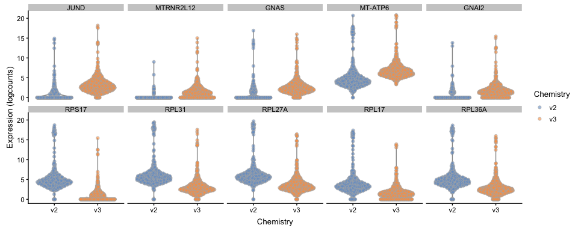

<style>
h1, .h1, h2, .h2, h3, .h3, h4, .h4 { margin-top: 50px }
p.caption {font-size: 0.9em;font-style: italic;color: grey;margin-right: 10%;margin-left: 10%;text-align: justify}
</style>

# Differential gene expression

In this tutorial we will cover about Differetial gene expression, which comprises an extensive range of topics and methods. In single cell, differential expresison can have multiple functionalities such as of identifying marker genes for cell populations, as well as differentially regulated genes across conditions (healthy vs control). We will also exercise on how to account the batch information in your test.

We can first load the data from the clustering session. Moreover, we can already decide which clustering resolution to use. First let's define using the `louvain_2` clustering to identifying differentially expressed genes.  


```r
suppressPackageStartupMessages({
    library(scater)
    library(scran)
    # library(venn)
    library(cowplot)
    library(ggplot2)
    library(rafalib)
    library(pheatmap)
    library(igraph)
    library(dplyr)
})

sce <- readRDS("data/3pbmc_qc_dr_int_cl.rds")
```

## Cell marker genes
***

Let us first compute a ranking for the highly differential genes in each cluster. There are many different tests and parameters to be chosen that can be used to refine your results. When looking for marker genes, we want genes that are positivelly expressed in a cell type and possibly not expressed in the others.


```r
# Compute differentiall expression
markers_genes <- findMarkers(x = sce, clusters = sce$kmeans_5, lfc = 0.5, pval.type = "all", direction = "up")

# List of dataFrames with the results for each cluster
markers_genes
```

```
## DataFrameList of length 5
## names(5): 1 2 3 4 5
```

```r
# Visualizing the expression of one
markers_genes[["1"]]
```

```
## DataFrame with 16157 rows and 6 columns
##                         p.value               FDR               logFC.2              logFC.3               logFC.4              logFC.5
##                       <numeric>         <numeric>             <numeric>            <numeric>             <numeric>            <numeric>
## CDKN1C     7.35183149155511e-06 0.118783541409056     0.979144387210788    0.998949056933944     0.969011598924564    0.991495303801578
## TCF7L2      0.00012879246392497                 1     0.815057815932671     1.03779310507903      1.02556879447223     1.00178886845701
## SMIM25      0.00124542854863882                 1     0.839447625697549      1.5731720846299        1.567609623075      1.5731720846299
## CSF1R       0.00975722085979975                 1     0.718391145224288     1.28866050964937      1.30643924791123      1.3020534882496
## HES4         0.0159258780596399                 1      0.66438917326519    0.726808230474354     0.730094609542395    0.729703856857455
## ...                         ...               ...                   ...                  ...                   ...                  ...
## COL6A2                        1                 1 -0.000772237217109488 -0.00358712990462427    -0.199559233102298   -0.470972301125049
## C21orf58                      1                 1  -0.00365849065946177  -0.0587826143860415   -0.0291564527523501  0.00234371542516463
## BX004987.1                    1                 1   0.00232376715326658  0.00232376715326658 -0.000699738532482444  0.00232376715326658
## AC011043.1                    1                 1  0.000793415321419471 -0.00240030584993707  8.78541764944237e-05  -0.0202713946352216
## AL592183.1                    1                 1  -0.00166339863031148  -0.0122041610684985  -0.00490734614857844 -0.00423474851640378
```

We can now select the top 25 up regulated genes for plotting.


```r
# Colect the top 25 genes for each cluster and put the into a single table
top25 <- lapply(names(markers_genes), function(x) {
    temp <- markers_genes[[x]][1:25, 1:2]
    temp$gene <- rownames(markers_genes[[x]])[1:25]
    temp$cluster <- x
    return(temp)
})
top25 <- as_tibble(do.call(rbind, top25))
top25
```

<div data-pagedtable="false">
  <script data-pagedtable-source type="application/json">
{"columns":[{"label":["p.value"],"name":[1],"type":["dbl"],"align":["right"]},{"label":["FDR"],"name":[2],"type":["dbl"],"align":["right"]},{"label":["gene"],"name":[3],"type":["chr"],"align":["left"]},{"label":["cluster"],"name":[4],"type":["chr"],"align":["left"]}],"data":[{"1":"7.351831e-06","2":"1.187835e-01","3":"CDKN1C","4":"1"},{"1":"1.287925e-04","2":"1.000000e+00","3":"TCF7L2","4":"1"},{"1":"1.245429e-03","2":"1.000000e+00","3":"SMIM25","4":"1"},{"1":"9.757221e-03","2":"1.000000e+00","3":"CSF1R","4":"1"},{"1":"1.592588e-02","2":"1.000000e+00","3":"HES4","4":"1"},{"1":"3.290716e-02","2":"1.000000e+00","3":"MS4A7","4":"1"},{"1":"1.024410e-01","2":"1.000000e+00","3":"CSTB","4":"1"},{"1":"2.740113e-01","2":"1.000000e+00","3":"LST1","4":"1"},{"1":"3.321608e-01","2":"1.000000e+00","3":"COTL1","4":"1"},{"1":"3.792219e-01","2":"1.000000e+00","3":"IFITM3","4":"1"},{"1":"4.151112e-01","2":"1.000000e+00","3":"SIGLEC10","4":"1"},{"1":"4.745602e-01","2":"1.000000e+00","3":"BID","4":"1"},{"1":"5.109939e-01","2":"1.000000e+00","3":"IFI30","4":"1"},{"1":"5.834910e-01","2":"1.000000e+00","3":"ZNF703","4":"1"},{"1":"6.077640e-01","2":"1.000000e+00","3":"NAAA","4":"1"},{"1":"7.462189e-01","2":"1.000000e+00","3":"NAP1L1","4":"1"},{"1":"7.736486e-01","2":"1.000000e+00","3":"WARS","4":"1"},{"1":"7.866991e-01","2":"1.000000e+00","3":"HMOX1","4":"1"},{"1":"8.332037e-01","2":"1.000000e+00","3":"UTRN","4":"1"},{"1":"8.359604e-01","2":"1.000000e+00","3":"SAT1","4":"1"},{"1":"8.623230e-01","2":"1.000000e+00","3":"FCGR3A","4":"1"},{"1":"8.659323e-01","2":"1.000000e+00","3":"CST3","4":"1"},{"1":"8.733445e-01","2":"1.000000e+00","3":"AIF1","4":"1"},{"1":"8.926187e-01","2":"1.000000e+00","3":"LILRB1","4":"1"},{"1":"8.926199e-01","2":"1.000000e+00","3":"LGALS9","4":"1"},{"1":"1.075411e-64","2":"1.737542e-60","3":"S100A8","4":"2"},{"1":"4.645947e-60","2":"3.753228e-56","3":"S100A12","4":"2"},{"1":"1.868166e-59","2":"1.006132e-55","3":"VCAN","4":"2"},{"1":"2.907203e-52","2":"1.174292e-48","3":"S100A9","4":"2"},{"1":"1.634225e-35","2":"5.280833e-32","3":"CD14","4":"2"},{"1":"2.225116e-27","2":"5.991866e-24","3":"LYZ","4":"2"},{"1":"2.532959e-26","2":"5.846432e-23","3":"MNDA","4":"2"},{"1":"6.037899e-24","2":"1.219429e-20","3":"AC020656.1","4":"2"},{"1":"6.900271e-16","2":"1.238752e-12","3":"CSF3R","4":"2"},{"1":"3.912346e-14","2":"6.321177e-11","3":"FOS","4":"2"},{"1":"3.846685e-13","2":"5.650081e-10","3":"METTL9","4":"2"},{"1":"2.480787e-12","2":"3.340173e-09","3":"RGS2","4":"2"},{"1":"4.478698e-12","2":"5.566332e-09","3":"MS4A6A","4":"2"},{"1":"1.169902e-11","2":"1.350150e-08","3":"APLP2","4":"2"},{"1":"3.146273e-11","2":"3.388955e-08","3":"CYP1B1","4":"2"},{"1":"6.793480e-11","2":"6.860141e-08","3":"PLBD1","4":"2"},{"1":"9.584545e-11","2":"9.109264e-08","3":"CD36","4":"2"},{"1":"1.303376e-10","2":"1.169925e-07","3":"FCN1","4":"2"},{"1":"4.531276e-09","2":"3.853254e-06","3":"MCL1","4":"2"},{"1":"4.851371e-09","2":"3.919180e-06","3":"CEBPD","4":"2"},{"1":"7.016572e-09","2":"5.398417e-06","3":"DUSP1","4":"2"},{"1":"3.273335e-07","2":"2.403967e-04","3":"CXCL8","4":"2"},{"1":"8.078546e-07","2":"5.675003e-04","3":"GCA","4":"2"},{"1":"1.015107e-06","2":"6.833785e-04","3":"MEGF9","4":"2"},{"1":"1.799333e-06","2":"1.162873e-03","3":"MGST1","4":"2"},{"1":"3.025241e-90","2":"4.887882e-86","3":"IGHM","4":"3"},{"1":"3.211810e-81","2":"2.594661e-77","3":"CD79A","4":"3"},{"1":"1.556916e-69","2":"8.385033e-66","3":"IGKC","4":"3"},{"1":"4.259316e-62","2":"1.720444e-58","3":"MS4A1","4":"3"},{"1":"4.575856e-50","2":"1.478642e-46","3":"IGHD","4":"3"},{"1":"3.415738e-48","2":"9.198014e-45","3":"CD79B","4":"3"},{"1":"2.316735e-39","2":"5.347356e-36","3":"TCL1A","4":"3"},{"1":"2.054158e-36","2":"4.148630e-33","3":"LINC00926","4":"3"},{"1":"3.716813e-34","2":"6.672506e-31","3":"BANK1","4":"3"},{"1":"2.282622e-32","2":"3.688032e-29","3":"CD37","4":"3"},{"1":"3.435937e-24","2":"5.046767e-21","3":"IGLC2","4":"3"},{"1":"3.035359e-23","2":"4.086858e-20","3":"TNFRSF13C","4":"3"},{"1":"7.275403e-20","2":"9.042206e-17","3":"CD22","4":"3"},{"1":"8.346968e-20","2":"9.632997e-17","3":"VPREB3","4":"3"},{"1":"1.512121e-18","2":"1.628756e-15","3":"CD74","4":"3"},{"1":"3.082315e-16","2":"3.110734e-13","3":"HLA-DQB1","4":"3"},{"1":"3.273039e-16","2":"3.110734e-13","3":"FCER2","4":"3"},{"1":"9.981804e-16","2":"8.959778e-13","3":"RALGPS2","4":"3"},{"1":"4.806237e-15","2":"4.087072e-12","3":"HLA-DQA1","4":"3"},{"1":"8.829617e-15","2":"7.133006e-12","3":"PLPP5","4":"3"},{"1":"2.665647e-14","2":"2.050898e-11","3":"HVCN1","4":"3"},{"1":"1.917469e-12","2":"1.408207e-09","3":"BCL11A","4":"3"},{"1":"2.057983e-12","2":"1.445688e-09","3":"CYB561A3","4":"3"},{"1":"6.395153e-11","2":"4.305270e-08","3":"IL4R","4":"3"},{"1":"6.978578e-11","2":"4.510115e-08","3":"SPIB","4":"3"},{"1":"7.988747e-27","2":"1.290742e-22","3":"TRAC","4":"4"},{"1":"7.289062e-26","2":"5.888469e-22","3":"IL7R","4":"4"},{"1":"7.185396e-20","2":"3.869815e-16","3":"LDHB","4":"4"},{"1":"4.911229e-11","2":"1.818709e-07","3":"CD3D","4":"4"},{"1":"5.628240e-11","2":"1.818709e-07","3":"LEF1","4":"4"},{"1":"8.210154e-11","2":"2.210858e-07","3":"TCF7","4":"4"},{"1":"5.939381e-10","2":"1.370894e-06","3":"NOSIP","4":"4"},{"1":"3.783521e-09","2":"7.641294e-06","3":"CD3G","4":"4"},{"1":"1.460772e-08","2":"2.622410e-05","3":"CD27","4":"4"},{"1":"6.587569e-05","2":"1.064353e-01","3":"RCAN3","4":"4"},{"1":"1.223347e-04","2":"1.796875e-01","3":"PIK3IP1","4":"4"},{"1":"7.620624e-04","2":"1.000000e+00","3":"TRABD2A","4":"4"},{"1":"8.164212e-04","2":"1.000000e+00","3":"BCL11B","4":"4"},{"1":"5.016505e-03","2":"1.000000e+00","3":"MAL","4":"4"},{"1":"1.343835e-02","2":"1.000000e+00","3":"IL32","4":"4"},{"1":"1.550111e-02","2":"1.000000e+00","3":"AQP3","4":"4"},{"1":"2.695051e-02","2":"1.000000e+00","3":"SARAF","4":"4"},{"1":"3.671580e-02","2":"1.000000e+00","3":"CD3E","4":"4"},{"1":"1.787173e-01","2":"1.000000e+00","3":"C12orf57","4":"4"},{"1":"1.987349e-01","2":"1.000000e+00","3":"TRBC2","4":"4"},{"1":"2.287073e-01","2":"1.000000e+00","3":"LEPROTL1","4":"4"},{"1":"2.312084e-01","2":"1.000000e+00","3":"LDLRAP1","4":"4"},{"1":"2.782888e-01","2":"1.000000e+00","3":"IER2","4":"4"},{"1":"2.797388e-01","2":"1.000000e+00","3":"JUNB","4":"4"},{"1":"3.388929e-01","2":"1.000000e+00","3":"HSPA8","4":"4"},{"1":"4.685722e-106","2":"7.570720e-102","3":"NKG7","4":"5"},{"1":"7.717675e-91","2":"6.234724e-87","3":"GNLY","4":"5"},{"1":"1.726833e-53","2":"9.300145e-50","3":"CST7","4":"5"},{"1":"9.579867e-53","2":"3.869548e-49","3":"GZMA","4":"5"},{"1":"2.180588e-47","2":"7.046353e-44","3":"KLRD1","4":"5"},{"1":"1.555459e-43","2":"4.188591e-40","3":"PRF1","4":"5"},{"1":"6.283190e-36","2":"1.450250e-32","3":"CTSW","4":"5"},{"1":"2.775184e-30","2":"5.604831e-27","3":"HOPX","4":"5"},{"1":"9.650667e-30","2":"1.732509e-26","3":"KLRF1","4":"5"},{"1":"3.134805e-29","2":"5.064905e-26","3":"TRDC","4":"5"},{"1":"2.910494e-24","2":"4.274986e-21","3":"FGFBP2","4":"5"},{"1":"3.302961e-22","2":"4.447162e-19","3":"GZMB","4":"5"},{"1":"8.898876e-22","2":"1.105993e-18","3":"CMC1","4":"5"},{"1":"9.964883e-22","2":"1.150019e-18","3":"CCL5","4":"5"},{"1":"6.175770e-21","2":"6.652128e-18","3":"SPON2","4":"5"},{"1":"2.354575e-19","2":"2.377679e-16","3":"GZMH","4":"5"},{"1":"5.726406e-17","2":"5.442444e-14","3":"CCL4","4":"5"},{"1":"1.827417e-16","2":"1.640310e-13","3":"MATK","4":"5"},{"1":"5.048125e-16","2":"4.292766e-13","3":"CLIC3","4":"5"},{"1":"1.337042e-13","2":"1.080129e-10","3":"IL2RB","4":"5"},{"1":"9.686260e-13","2":"7.452424e-10","3":"GZMM","4":"5"},{"1":"1.718491e-12","2":"1.262076e-09","3":"KLRB1","4":"5"},{"1":"1.781592e-11","2":"1.251530e-08","3":"APMAP","4":"5"},{"1":"5.725684e-11","2":"3.854578e-08","3":"ADGRG1","4":"5"},{"1":"1.774749e-09","2":"1.146985e-06","3":"CD247","4":"5"}],"options":{"columns":{"min":{},"max":[10]},"rows":{"min":[10],"max":[10]},"pages":{}}}
  </script>
</div>

We can now select the top 25 up regulated genes for plotting.


```r
mypar(1, 5, mar = c(4, 6, 3, 1))
for (i in unique(top25$cluster)) {
    barplot(sort(setNames(-log10(top25$p.value), top25$gene)[top25$cluster == i], F), horiz = T, las = 1, main = paste0(i, " vs. rest"), border = "white", yaxs = "i", xlab = "-log10FC")
    abline(v = c(0, -log10(0.05)), lty = c(1, 2))
}
```

<!-- -->

We can visualize them as a heatmap. Here we are selecting the top 5.


```r
top5 <- as_tibble(top25) %>% group_by(cluster) %>% top_n(-5, p.value)

scater::plotHeatmap(sce[, order(sce$kmeans_5)], features = unique(top5$gene), center = T, zlim = c(-3, 3), colour_columns_by = "kmeans_5", show_colnames = F, cluster_cols = F, fontsize_row = 6, 
    color = colorRampPalette(c("purple", "black", "yellow"))(90))
```

<!-- -->

We can also plot a violin plot for each gene.


```r
scater::plotExpression(sce, features = unique(top5$gene), x = "kmeans_5", ncol = 5, colour_by = "kmeans_5", scales = "free")
```

<!-- -->


## Differential expression across conditions
***

The second way of computing differential expression is to answer which genes are differentially expressed within a cluster. For example, in our case we have libraries comming from 2 different library preparation methods (batches) and we would like to know which genes are influenced the most in a particular cell type. The same concenpt applies if you have instead two or more biological groups (control vs treated, time#0 vs time#1 vs time#2, etc).

For this end, we will first subset our data for the desired cell cluster, then change the cell identities to the variable of comparison (which now in our case is the "Chemistry").


```r
# Filter cells from that cluster
cell_selection <- sce[, sce$kmeans_5 == 4]
cell_selection$Chemistry <- ifelse(cell_selection$sample_id == "v2.1k", "v2", "v3")

# Compute differentiall expression
DGE_cell_selection <- findMarkers(x = cell_selection, clusters = cell_selection$Chemistry, lfc = 0.5, pval.type = "all", direction = "down")
top5_cell_selection <- lapply(names(DGE_cell_selection), function(x) {
    temp <- DGE_cell_selection[[x]][1:5, 1:2]
    temp$gene <- rownames(DGE_cell_selection[[x]])[1:5]
    temp$cluster <- x
    return(temp)
})
top5_cell_selection <- as_tibble(do.call(rbind, top5_cell_selection))
top5_cell_selection
```

<div data-pagedtable="false">
  <script data-pagedtable-source type="application/json">
{"columns":[{"label":["p.value"],"name":[1],"type":["dbl"],"align":["right"]},{"label":["FDR"],"name":[2],"type":["dbl"],"align":["right"]},{"label":["gene"],"name":[3],"type":["chr"],"align":["left"]},{"label":["cluster"],"name":[4],"type":["chr"],"align":["left"]}],"data":[{"1":"1.552644e-58","2":"2.508606e-54","3":"JUND","4":"v2"},{"1":"2.412045e-21","2":"1.948570e-17","3":"MTRNR2L12","4":"v2"},{"1":"1.576478e-18","2":"8.490383e-15","3":"GNAS","4":"v2"},{"1":"1.350608e-15","2":"5.455442e-12","3":"MT-ATP6","4":"v2"},{"1":"2.580560e-11","2":"8.338821e-08","3":"GNAI2","4":"v2"},{"1":"8.689157e-79","2":"1.403907e-74","3":"RPS17","4":"v3"},{"1":"2.233233e-42","2":"1.804117e-38","3":"RPL31","4":"v3"},{"1":"4.048914e-34","2":"2.180610e-30","3":"RPL27A","4":"v3"},{"1":"5.069481e-29","2":"2.047690e-25","3":"RPL17","4":"v3"},{"1":"2.173913e-26","2":"7.024784e-23","3":"RPL36A","4":"v3"}],"options":{"columns":{"min":{},"max":[10]},"rows":{"min":[10],"max":[10]},"pages":{}}}
  </script>
</div>

We can now plot the expression across the "Chemistry".


```r
scater::plotExpression(cell_selection, features = unique(top5_cell_selection$gene), x = "Chemistry", ncol = 5, colour_by = "Chemistry")
```

<!-- -->

We can clearly see some patterns across them. Those are the genes that impact the most on your batches (see the dimensionality reduction and integration exercises for more details). We can plot those genes using the integrated and non-integrated UMAP for ilustration.


```r
plotlist <- list()
for (i in c("JUND", "RPS17", "GNAS")) {
    plotlist[[i]] <- plotReducedDim(sce, use_dimred = "UMAP_on_PCA", colour_by = i, by_exprs_values = "logcounts", add_ticks = F) + scale_fill_gradientn(colours = colorRampPalette(c("grey90", 
        "orange3", "firebrick", "firebrick", "red", "red"))(10)) + ggtitle(label = i) + theme(plot.title = element_text(size = 20))
}
plot_grid(ncol = 3, plotlist = plotlist)
```

<!-- -->


Finally, lets save the integrated data for further analysis.


```r
saveRDS(sce, "data/3pbmc_qc_dr_int_cl_dge.rds")
```


### Session Info
***


```r
sessionInfo()
```

```
## R version 3.5.1 (2018-07-02)
## Platform: x86_64-apple-darwin15.6.0 (64-bit)
## Running under: macOS High Sierra 10.13.6
## 
## Matrix products: default
## BLAS: /System/Library/Frameworks/Accelerate.framework/Versions/A/Frameworks/vecLib.framework/Versions/A/libBLAS.dylib
## LAPACK: /Library/Frameworks/R.framework/Versions/3.5/Resources/lib/libRlapack.dylib
## 
## locale:
## [1] en_US.UTF-8/en_US.UTF-8/en_US.UTF-8/C/en_US.UTF-8/en_US.UTF-8
## 
## attached base packages:
## [1] parallel  stats4    stats     graphics  grDevices utils     datasets  methods   base     
## 
## other attached packages:
##  [1] venn_1.7                    Seurat_3.0.2                dplyr_0.8.0.1               igraph_1.2.4.1              pheatmap_1.0.12             rafalib_1.0.0              
##  [7] cowplot_0.9.4               scran_1.10.2                scater_1.10.1               ggplot2_3.1.1               SingleCellExperiment_1.4.1  SummarizedExperiment_1.12.0
## [13] DelayedArray_0.8.0          BiocParallel_1.16.6         matrixStats_0.54.0          Biobase_2.42.0              GenomicRanges_1.34.0        GenomeInfoDb_1.18.2        
## [19] IRanges_2.16.0              S4Vectors_0.20.1            BiocGenerics_0.28.0        
## 
## loaded via a namespace (and not attached):
##   [1] Rtsne_0.15               ggbeeswarm_0.6.0         colorspace_1.4-1         ggridges_0.5.1           dynamicTreeCut_1.63-1    XVector_0.22.0           BiocNeighbors_1.0.0     
##   [8] rstudioapi_0.10          listenv_0.7.0            npsurv_0.4-0             ggrepel_0.8.0            codetools_0.2-16         splines_3.5.1            R.methodsS3_1.7.1       
##  [15] lsei_1.2-0               knitr_1.26               jsonlite_1.6             ica_1.0-2                cluster_2.0.9            png_0.1-7                R.oo_1.22.0             
##  [22] sctransform_0.2.0        HDF5Array_1.10.1         httr_1.4.0               compiler_3.5.1           assertthat_0.2.1         Matrix_1.2-17            lazyeval_0.2.2          
##  [29] limma_3.38.3             formatR_1.6              htmltools_0.4.0          tools_3.5.1              rsvd_1.0.0               gtable_0.3.0             glue_1.3.1              
##  [36] GenomeInfoDbData_1.2.0   RANN_2.6.1               reshape2_1.4.3           Rcpp_1.0.3               gdata_2.18.0             ape_5.3                  nlme_3.1-139            
##  [43] DelayedMatrixStats_1.4.0 gbRd_0.4-11              lmtest_0.9-37            xfun_0.11                stringr_1.4.0            globals_0.12.4           irlba_2.3.3             
##  [50] gtools_3.8.1             statmod_1.4.30           future_1.12.0            edgeR_3.24.3             zlibbioc_1.28.0          MASS_7.3-51.4            zoo_1.8-5               
##  [57] scales_1.0.0             rhdf5_2.26.2             RColorBrewer_1.1-2       yaml_2.2.0               reticulate_1.12          pbapply_1.4-0            gridExtra_2.3           
##  [64] stringi_1.4.3            caTools_1.17.1.2         bibtex_0.4.2             Rdpack_0.11-0            SDMTools_1.1-221.1       rlang_0.4.1              pkgconfig_2.0.2         
##  [71] bitops_1.0-6             evaluate_0.14            lattice_0.20-38          ROCR_1.0-7               purrr_0.3.2              Rhdf5lib_1.4.3           htmlwidgets_1.3         
##  [78] labeling_0.3             tidyselect_0.2.5         plyr_1.8.4               magrittr_1.5             R6_2.4.1                 gplots_3.0.1.1           pillar_1.3.1            
##  [85] withr_2.1.2              fitdistrplus_1.0-14      survival_2.44-1.1        RCurl_1.95-4.12          tsne_0.1-3               tibble_2.1.1             future.apply_1.2.0      
##  [92] crayon_1.3.4             KernSmooth_2.23-15       plotly_4.9.0             rmarkdown_1.17           viridis_0.5.1            locfit_1.5-9.1           grid_3.5.1              
##  [99] data.table_1.12.2        metap_1.1                digest_0.6.22            tidyr_0.8.3              R.utils_2.8.0            munsell_0.5.0            beeswarm_0.2.3          
## [106] viridisLite_0.3.0        vipor_0.4.5
```


