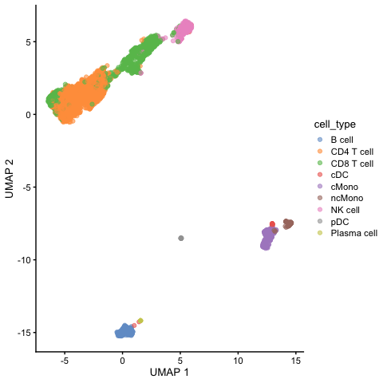
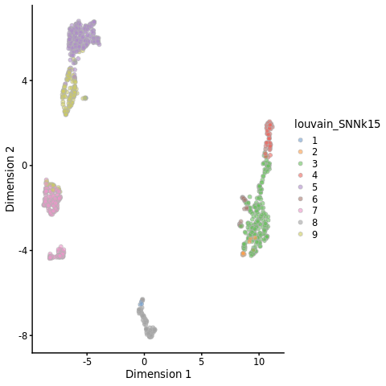
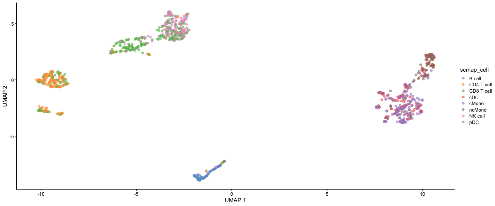
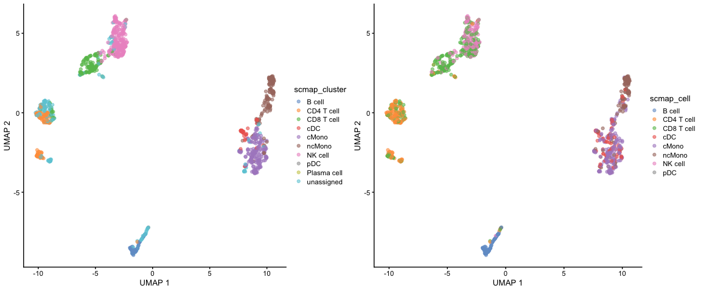
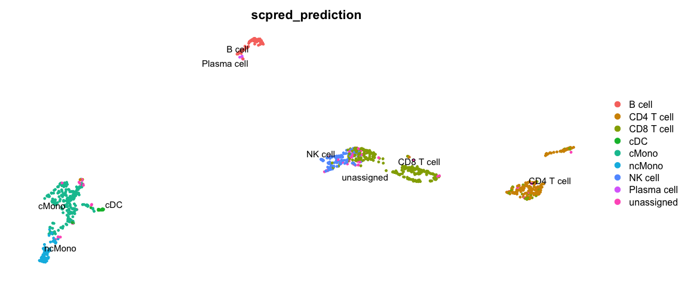
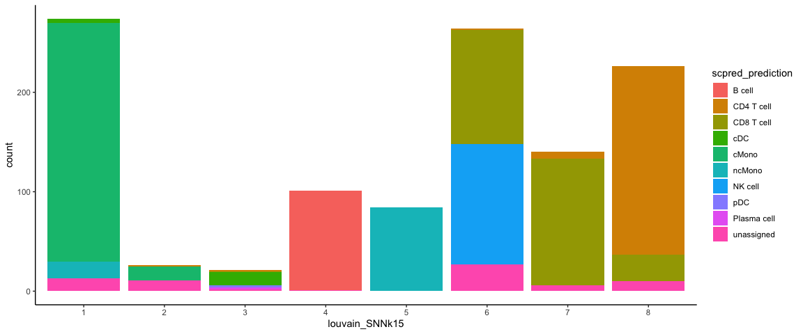
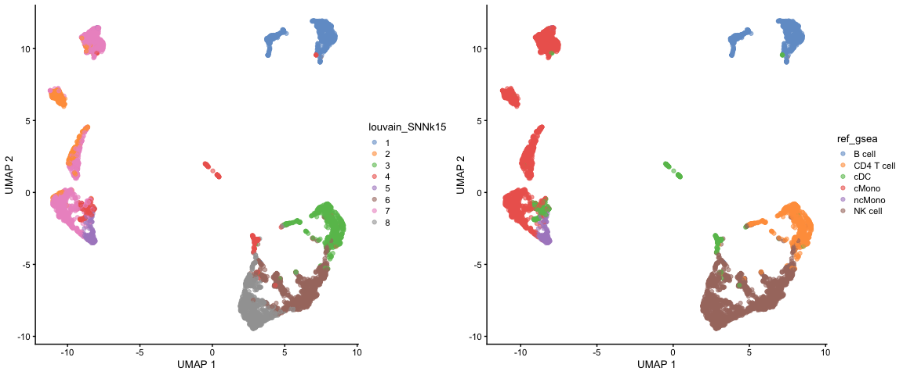
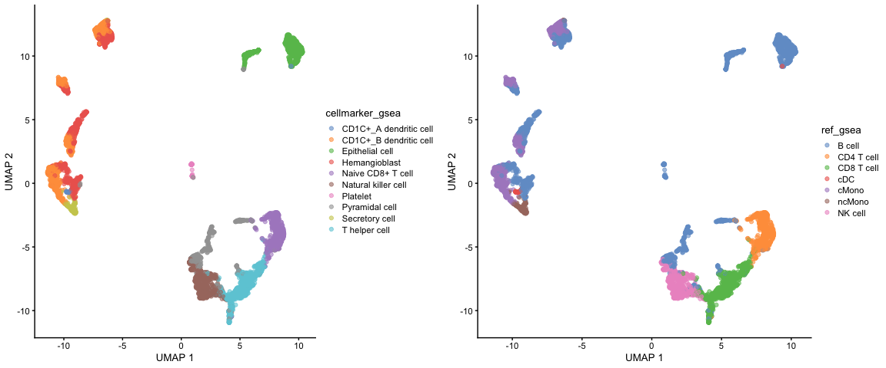

<style>
h1, .h1, h2, .h2, h3, .h3, h4, .h4 { margin-top: 50px }
p.caption {font-size: 0.9em;font-style: italic;color: grey;margin-right: 10%;margin-left: 10%;text-align: justify}
</style>

## Celltype prediction
***

 Celltype prediction can either be performed on indiviudal cells where each cell gets a predicted celltype label, or on the level of clusters. All methods are based on similarity to other datasets, single cell or sorted bulk RNAseq, or uses know marker genes for each celltype.

We will select one sample from the Covid data, `ctrl_13` and predict celltype by cell on that sample.

Some methods will predict a celltype to each cell based on what it is most similar to even if the celltype of that cell is not included in the reference. Other methods include an uncertainty so that cells with low similarity scores will be unclassified.
There are multiple different methods to predict celltypes, here we will just cover a few of those. 

Here we will use a reference PBMC dataset from the `scPred` package which is provided as a Seurat object with counts. And we will test classification based on the `scPred` and `scMap` methods. Finally we will use gene set enrichment predict celltype based on the DEGs of each cluster.

# Load and process data
## Covid-19 data
First, lets load required libraries and the saved object from the clustering step. Subset for one patient.


```r
suppressPackageStartupMessages({
    library(scater)
    library(scran)
    library(dplyr)
    library(cowplot)
    library(ggplot2)
    library(pheatmap)
    library(rafalib)
    library(scPred)
    library(scmap)
})
```


```r
# load the data and select 'ctrl_13` sample
alldata <- readRDS("data/results/covid_qc_dr_int_cl.rds")
ctrl.sce <- alldata[, alldata@colData$sample == "ctrl.13"]

# remove all old dimensionality reductions as they will mess up the analysis
# further down
reducedDims(ctrl.sce) <- NULL
```

## Reference data
Then, load the reference dataset with annotated labels. Also, run all steps of the normal analysis pipeline with normalizaiton, variable gene selection, scaling and dimensionality reduction.


```r
reference <- scPred::pbmc_1

reference
```

```
## An object of class Seurat 
## 32838 features across 3500 samples within 1 assay 
## Active assay: RNA (32838 features, 0 variable features)
```

Convert to a SCE object.


```r
ref.sce = Seurat::as.SingleCellExperiment(reference)
```


## Rerun analysis pipeline
Run normalization, feature selection and dimensionality reduction


```r
# Normalize
ref.sce <- computeSumFactors(ref.sce)
ref.sce <- logNormCounts(ref.sce)

# Variable genes
var.out <- modelGeneVar(ref.sce, method = "loess")
hvg.ref <- getTopHVGs(var.out, n = 1000)

# Dim reduction
ref.sce <- runPCA(ref.sce, exprs_values = "logcounts", scale = T, ncomponents = 30,
    subset_row = hvg.ref)
ref.sce <- runUMAP(ref.sce, dimred = "PCA")
```


```r
plotReducedDim(ref.sce, dimred = "UMAP", colour_by = "cell_type")
```

<!-- -->


Run all steps of the analysis for the ctrl sample as well. Use the clustering from the integration lab with resolution 0.3.


```r
# Normalize
ctrl.sce <- computeSumFactors(ctrl.sce)
ctrl.sce <- logNormCounts(ctrl.sce)

# Variable genes
var.out <- modelGeneVar(ctrl.sce, method = "loess")
hvg.ctrl <- getTopHVGs(var.out, n = 1000)

# Dim reduction
ctrl.sce <- runPCA(ctrl.sce, exprs_values = "logcounts", scale = T, ncomponents = 30,
    subset_row = hvg.ctrl)
ctrl.sce <- runUMAP(ctrl.sce, dimred = "PCA")
```


```r
plotReducedDim(ctrl.sce, dimred = "UMAP", colour_by = "louvain_SNNk15")
```

<!-- -->

# scMap
The scMap package is one method for projecting cells from a scRNA-seq experiment on to the cell-types or individual cells identified in a different experiment. It can be run on different levels, either projecting by cluster or by single cell, here we will try out both.

## scMap cluster
For scmap cell type labels must be stored in the `cell_type1` column of the `colData` slots, and gene ids that are consistent across both datasets must be stored in the `feature_symbol` column of the `rowData` slots.
Then we can select variable features in both datasets.


```r
# add in slot cell_type1
ref.sce@colData$cell_type1 = ref.sce@colData$cell_type
# create a rowData slot with feature_symbol
rd = data.frame(feature_symbol = rownames(ref.sce))
rownames(rd) = rownames(ref.sce)
rowData(ref.sce) = rd


# same for the ctrl dataset create a rowData slot with feature_symbol
rd = data.frame(feature_symbol = rownames(ctrl.sce))
rownames(rd) = rownames(ctrl.sce)
rowData(ctrl.sce) = rd


# select features
counts(ctrl.sce) <- as.matrix(counts(ctrl.sce))
logcounts(ctrl.sce) <- as.matrix(logcounts(ctrl.sce))
ctrl.sce <- selectFeatures(ctrl.sce, suppress_plot = TRUE)

counts(ref.sce) <- as.matrix(counts(ref.sce))
logcounts(ref.sce) <- as.matrix(logcounts(ref.sce))
ref.sce <- selectFeatures(ref.sce, suppress_plot = TRUE)
```

Then we need to index the reference dataset by cluster, default is the clusters in `cell_type1`.


```r
ref.sce <- indexCluster(ref.sce)
```

Now we project the Covid-19 dataset onto that index.


```r
project_cluster <- scmapCluster(projection = ctrl.sce, index_list = list(ref = metadata(ref.sce)$scmap_cluster_index))

# projected labels
table(project_cluster$scmap_cluster_labs)
```

```
## 
##      B cell  CD4 T cell  CD8 T cell     NK cell Plasma cell         cDC 
##          66         108         133         256           3          38 
##       cMono      ncMono         pDC  unassigned 
##         217         144           2         208
```

Then add the predictions to metadata and plot umap.


```r
# add in predictions
ctrl.sce@colData$scmap_cluster <- project_cluster$scmap_cluster_labs

plotReducedDim(ctrl.sce, dimred = "UMAP", colour_by = "scmap_cluster")
```

<!-- -->

## scMap cell
We can instead index the refernce data based on each single cell and project our data onto the closest neighbor in that dataset.


```r
ref.sce <- indexCell(ref.sce)
```


Again we need to index the reference dataset.


```r
project_cell <- scmapCell(projection = ctrl.sce, index_list = list(ref = metadata(ref.sce)$scmap_cell_index))
```

We now get a table with index for the 5 nearest neigbors in the reference dataset for each cell in our dataset.
We will select the celltype of the closest neighbor and assign it to the data.


```r
cell_type_pred <- colData(ref.sce)$cell_type1[project_cell$ref[[1]][1, ]]

table(cell_type_pred)
```

```
## cell_type_pred
##      B cell  CD4 T cell  CD8 T cell     NK cell Plasma cell         cDC 
##          98         172         316         161           2          36 
##       cMono      ncMono         pDC 
##         209         179           2
```


Then add the predictions to metadata and plot umap.


```r
# add in predictions
ctrl.sce@colData$scmap_cell <- cell_type_pred

plotReducedDim(ctrl.sce, dimred = "UMAP", colour_by = "scmap_cell")
```

<!-- -->

Plot both:


```r
cowplot::plot_grid(ncol = 2, plotReducedDim(ctrl.sce, dimred = "UMAP", colour_by = "scmap_cluster"),
    plotReducedDim(ctrl.sce, dimred = "UMAP", colour_by = "scmap_cell"))
```

<!-- -->


# scPred
scPred will train a classifier based on all principal components. First, `getFeatureSpace` will create a scPred object stored in the `@misc` slot where it extracts the PCs that best separates the different celltypes. Then `trainModel` will do the actual training for each celltype.

scPred works with Seurat objects, so we will convert both objects to seurat objects. You may see a lot of warnings about renaming things, but as long as you do not see an Error, you should be fine.


```r
suppressPackageStartupMessages(library(Seurat))

reference <- Seurat::as.Seurat(ref.sce)
ctrl <- Seurat::as.Seurat(ctrl.sce)
```

The loadings matrix is lost when converted to Seurat object, and scPred needs that information. So we need to rerun PCA with Seurat and the same hvgs.


```r
VariableFeatures(reference) = hvg.ref
reference <- reference %>%
    ScaleData(verbose = F) %>%
    RunPCA(verbose = F)

VariableFeatures(ctrl) = hvg.ctrl
ctrl <- ctrl %>%
    ScaleData(verbose = F) %>%
    RunPCA(verbose = F)
```


```r
reference <- getFeatureSpace(reference, "cell_type")
```

```
## ●  Extracting feature space for each cell type...
## DONE!
```

```r
reference <- trainModel(reference)
```

```
## ●  Training models for each cell type...
## DONE!
```


We can then print how well the training worked for the different celltypes by printing the number of PCs used for each, the ROC value and Sensitivity/Specificity. Which celltypes do you think are harder to classify based on this dataset?


```r
get_scpred(reference)
```

```
## 'scPred' object
## ✔  Prediction variable = cell_type 
## ✔  Discriminant features per cell type
## ✔  Training model(s)
## Summary
## 
## |Cell type   |    n| Features|Method    |   ROC|  Sens|  Spec|
## |:-----------|----:|--------:|:---------|-----:|-----:|-----:|
## |B cell      |  280|       50|svmRadial | 1.000| 1.000| 1.000|
## |CD4 T cell  | 1620|       50|svmRadial | 0.994| 0.972| 0.963|
## |CD8 T cell  |  945|       50|svmRadial | 0.973| 0.859| 0.971|
## |NK cell     |  312|       50|svmRadial | 0.998| 0.926| 0.995|
## |Plasma cell |    6|       50|svmRadial | 1.000| 1.000| 1.000|
## |cDC         |   26|       50|svmRadial | 0.994| 0.727| 0.999|
## |cMono       |  212|       50|svmRadial | 1.000| 0.957| 0.997|
## |ncMono      |   79|       50|svmRadial | 1.000| 0.962| 0.999|
## |pDC         |   20|       50|svmRadial | 1.000| 0.950| 1.000|
```

You can optimize parameters for each dataset by chaning parameters and testing different types of models, see more at: https://powellgenomicslab.github.io/scPred/articles/introduction.html. But for now, we will continue with this model.

 Now, lets predict celltypes on our data, where scPred will align the two datasets with Harmony and then perform classification.


```r
ctrl <- scPredict(ctrl, reference)
```

```
## ●  Matching reference with new dataset...
## 	 ─ 1000 features present in reference loadings
## 	 ─ 937 features shared between reference and new dataset
## 	 ─ 93.7% of features in the reference are present in new dataset
## ●  Aligning new data to reference...
## ●  Classifying cells...
## DONE!
```


```r
DimPlot(ctrl, group.by = "scpred_prediction", label = T, repel = T) + NoAxes()
```

<!-- -->

Now plot how many	cells of each celltypes	can be found in	each cluster.


```r
ggplot(ctrl@meta.data, aes(x = louvain_SNNk15, fill = scpred_prediction)) + geom_bar() +
    theme_classic()
```

<!-- -->

Add the predictions into the SCE object


```r
ctrl.sce@colData$scpred_prediction = ctrl$scpred_prediction
```

# Compare results

Now we will compare the output of the two methods using the convenient function in scPred `crossTab` that prints the overlap between two metadata slots.


```r
crossTab(ctrl, "scmap_cell", "scpred_prediction")
```

<div data-pagedtable="false">
  <script data-pagedtable-source type="application/json">
{"columns":[{"label":[""],"name":["_rn_"],"type":[""],"align":["left"]},{"label":["B cell"],"name":[1],"type":["int"],"align":["right"]},{"label":["CD4 T cell"],"name":[2],"type":["int"],"align":["right"]},{"label":["CD8 T cell"],"name":[3],"type":["int"],"align":["right"]},{"label":["NK cell"],"name":[4],"type":["int"],"align":["right"]},{"label":["Plasma cell"],"name":[5],"type":["int"],"align":["right"]},{"label":["cDC"],"name":[6],"type":["int"],"align":["right"]},{"label":["cMono"],"name":[7],"type":["int"],"align":["right"]},{"label":["ncMono"],"name":[8],"type":["int"],"align":["right"]},{"label":["pDC"],"name":[9],"type":["int"],"align":["right"]}],"data":[{"1":"98","2":"2","3":"2","4":"1","5":"0","6":"2","7":"0","8":"0","9":"0","_rn_":"B cell"},{"1":"0","2":"132","3":"67","4":"1","5":"1","6":"0","7":"2","8":"1","9":"0","_rn_":"CD4 T cell"},{"1":"0","2":"26","3":"191","4":"62","5":"0","6":"0","7":"2","8":"0","9":"0","_rn_":"CD8 T cell"},{"1":"0","2":"2","3":"34","4":"83","5":"0","6":"0","7":"0","8":"0","9":"0","_rn_":"NK cell"},{"1":"0","2":"2","3":"0","4":"0","5":"0","6":"0","7":"0","8":"0","9":"0","_rn_":"Plasma cell"},{"1":"0","2":"0","3":"0","4":"0","5":"0","6":"8","7":"9","8":"4","9":"0","_rn_":"cDC"},{"1":"0","2":"0","3":"1","4":"0","5":"0","6":"23","7":"169","8":"77","9":"0","_rn_":"cMono"},{"1":"0","2":"0","3":"0","4":"0","5":"0","6":"2","7":"9","8":"93","9":"0","_rn_":"ncMono"},{"1":"0","2":"0","3":"0","4":"0","5":"0","6":"0","7":"1","8":"0","9":"1","_rn_":"pDC"},{"1":"0","2":"8","3":"21","4":"14","5":"1","6":"1","7":"17","8":"4","9":"1","_rn_":"unassigned"}],"options":{"columns":{"min":{},"max":[10]},"rows":{"min":[10],"max":[10]},"pages":{}}}
  </script>
</div>


# GSEA with celltype markers

Another option, where celltype can be classified on cluster level is to use gene set enrichment among the DEGs with known markers for different celltypes. Similar to how we did functional enrichment for the DEGs in the Differential expression exercise. 
There are some resources for celltype gene sets that can be used. Such as [CellMarker](http://bio-bigdata.hrbmu.edu.cn/CellMarker/), [PanglaoDB](https://panglaodb.se/) or celltype gene sets at [MSigDB](https://www.gsea-msigdb.org/gsea/msigdb/index.jsp).
We can also look at overlap between DEGs in a reference dataset and the dataset you are analysing. 

## DEG overlap
First, lets extract top DEGs for our Covid-19 dataset and the reference dataset.
When we run differential expression for our dataset, we want to report as many genes as possible, hence we set the cutoffs quite lenient.


```r
# run differential expression in our dataset, using clustering at resolution
# 0.3
DGE_list <- scran::findMarkers(x = alldata, groups = as.character(alldata@colData$louvain_SNNk15),
    pval.type = "all", min.prop = 0)
```


```r
# Compute differential gene expression in reference dataset (that has cell
# annotation)
ref_DGE <- scran::findMarkers(x = ref.sce, groups = as.character(ref.sce@colData$cell_type),
    pval.type = "all", direction = "up")


# Identify the top cell marker genes in reference dataset select top 50 with
# hihgest foldchange among top 100 signifcant genes.
ref_list <- lapply(ref_DGE, function(x) {
    x$logFC <- rowSums(as.matrix(x[, grep("logFC", colnames(x))]))
    x %>%
        as.data.frame() %>%
        filter(p.value < 0.01) %>%
        top_n(-100, p.value) %>%
        top_n(50, logFC) %>%
        rownames()
})

unlist(lapply(ref_list, length))
```

```
##      B cell  CD4 T cell  CD8 T cell     NK cell Plasma cell         cDC 
##          50          50          19          50          24          17 
##       cMono      ncMono         pDC 
##          50          50          50
```


Now we can run GSEA for the DEGs from our dataset and check for enrichment of top DEGs in the reference dataset.


```r
suppressPackageStartupMessages(library(fgsea))

# run fgsea for each of the clusters in the list
res <- lapply(DGE_list, function(x) {
    x$logFC <- rowSums(as.matrix(x[, grep("logFC", colnames(x))]))
    gene_rank <- setNames(x$logFC, rownames(x))
    fgseaRes <- fgsea(pathways = ref_list, stats = gene_rank, nperm = 10000)
    return(fgseaRes)
})
names(res) <- names(DGE_list)

# You can filter and resort the table based on ES, NES or pvalue
res <- lapply(res, function(x) {
    x[x$pval < 0.1, ]
})
res <- lapply(res, function(x) {
    x[x$size > 2, ]
})
res <- lapply(res, function(x) {
    x[order(x$NES, decreasing = T), ]
})
res
```

```
## $`1`
##       pathway         pval         padj         ES       NES nMoreExtreme size
## 1:     B cell 0.0002169668 0.0004881753  0.9672527  2.042041            0   47
## 2: CD4 T cell 0.0002163098 0.0004881753  0.8542992  1.823455            0   50
## 3:        cDC 0.0004344049 0.0007819288  0.9500906  1.696892            1   17
## 4: CD8 T cell 0.0033345684 0.0042873022 -0.8973228 -1.591213           17   17
## 5:      cMono 0.0007417022 0.0011125533 -0.8086694 -1.680696            3   47
## 6:     ncMono 0.0001859082 0.0004881753 -0.9058765 -1.892952            0   49
## 7:    NK cell 0.0001859082 0.0004881753 -0.9117658 -1.905259            0   49
##                                                leadingEdge
## 1:          MS4A1,CD37,TNFRSF13C,CXCR4,BANK1,LINC00926,...
## 2:                   RPS29,RPS6,RPL32,RPL13,RPL3,RPL21,...
## 3: HLA-DRA,HLA-DQB1,HLA-DPB1,HLA-DRB1,HLA-DPA1,HLA-DMA,...
## 4:                        CCL5,IL32,GZMH,CD3D,CD2,LYAR,...
## 5:                S100A6,S100A9,LYZ,S100A8,TYROBP,FCN1,...
## 6:                S100A4,FCER1G,S100A11,AIF1,LST1,PSAP,...
## 7:                     ITGB2,HCST,NKG7,GNLY,MYO1F,CST7,...
## 
## $`2`
##       pathway         pval         padj         ES       NES nMoreExtreme size
## 1:      cMono 0.0001845700 0.0004959224  0.9359402  1.948468            0   47
## 2:     ncMono 0.0053064959 0.0079597438  0.7955734  1.667260           28   49
## 3:        cDC 0.0444754687 0.0571827455 -0.7983227 -1.446584          222   17
## 4: CD8 T cell 0.0009972078 0.0017949741 -0.8957203 -1.623071            4   17
## 5:    NK cell 0.0002204100 0.0004959224 -0.8054298 -1.761874            0   49
## 6:     B cell 0.0002181501 0.0004959224 -0.8611150 -1.870904            0   47
## 7: CD4 T cell 0.0002194426 0.0004959224 -0.9370363 -2.061490            0   50
##                                                 leadingEdge
## 1:                  S100A8,S100A9,LYZ,S100A12,VCAN,RETN,...
## 2:            S100A11,S100A4,AIF1,FCER1G,SERPINA1,COTL1,...
## 3: HLA-DPB1,HLA-DPA1,HLA-DRB1,HLA-DRA,HLA-DQB1,HLA-DRB5,...
## 4:                         IL32,CCL5,GZMH,CD3D,CD2,LYAR,...
## 5:                       GNLY,B2M,GZMA,CTSW,IFITM1,NKG7,...
## 6:                    RPL23A,RPS5,CXCR4,CD37,CD52,RPS23,...
## 7:                   RPL14,RPL3,RPL5,EEF1A1,RPS4X,RPS3A,...
## 
## $`3`
##       pathway         pval         padj         ES       NES nMoreExtreme size
## 1: CD4 T cell 0.0002169197 0.0004880694  0.9809496  2.112369            0   50
## 2:     B cell 0.0407940663 0.0524495138  0.6714008  1.429107          186   47
## 3:    NK cell 0.0050055617 0.0075083426 -0.7504431 -1.583230           26   49
## 4:        cDC 0.0009298866 0.0016737958 -0.9156212 -1.636462            4   17
## 5:        pDC 0.0001845700 0.0004880694 -0.8095853 -1.697782            0   47
## 6:      cMono 0.0001845700 0.0004880694 -0.9185473 -1.926286            0   47
## 7:     ncMono 0.0001853912 0.0004880694 -0.9453999 -1.994535            0   49
##                                                leadingEdge
## 1:                   IL7R,LDHB,PIK3IP1,RPL3,RPS12,RPS6,...
## 2:               RPS5,RPL13A,RPL23A,RPL18A,RPS23,CXCR4,...
## 3:                   NKG7,GNLY,ITGB2,MYO1F,CST7,FGFBP2,...
## 4: HLA-DRA,HLA-DRB1,HLA-DPA1,HLA-DPB1,HLA-DQB1,HLA-DMA,...
## 5:                     PLEK,NPC2,PLAC8,CTSB,PTPRE,IRF8,...
## 6:                S100A9,S100A8,LYZ,TYROBP,FCN1,S100A6,...
## 7:                FCER1G,PSAP,AIF1,LST1,S100A11,IFITM3,...
## 
## $`4`
##       pathway         pval         padj         ES       NES nMoreExtreme size
## 1:        cDC 0.0117647059 0.0176470588  0.7990095  1.704221           11   17
## 2:    NK cell 0.0030458985 0.0054826174 -0.7495393 -1.388931           28   49
## 3:     ncMono 0.0027308056 0.0054826174 -0.7509000 -1.391452           25   49
## 4:      cMono 0.0027359781 0.0054826174 -0.7533638 -1.392394           25   47
## 5:     B cell 0.0003156898 0.0014206040 -0.7968162 -1.472704            2   47
## 6: CD4 T cell 0.0001049648 0.0009446835 -0.9064450 -1.681877            0   50
##                                      leadingEdge
## 1: HLA-DRB5,FCER1A,HLA-DRA,CLEC10A,CD1C,ENHO,...
## 2:       ITGB2,IFITM1,JAK1,HCST,CST7,ABHD17A,...
## 3:     S100A4,IFITM2,CEBPB,SAT1,S100A11,MT2A,...
## 4:      JUND,S100A6,NFKBIA,TSPO,TYROBP,APLP2,...
## 5:         CD52,RPL13A,CXCR4,RPL12,FAU,RPS11,...
## 6:        RPL34,RPS29,RPS14,RPL36,RPL9,RPL38,...
## 
## $`5`
##       pathway         pval        padj         ES       NES nMoreExtreme size
## 1:     ncMono 0.0001134559 0.001021103  0.9737910  1.779872            0   49
## 2:        cDC 0.0046004206 0.008280757  0.9055059  1.496500           34   17
## 3:     B cell 0.0262941660 0.039441249 -0.5867949 -1.452085           31   47
## 4: CD8 T cell 0.0004177109 0.001879699 -0.9258370 -1.875580            0   17
## 5:    NK cell 0.0008417508 0.001934652 -0.8310518 -2.079213            0   49
## 6: CD4 T cell 0.0008598452 0.001934652 -0.8647484 -2.170255            0   50
##                                               leadingEdge
## 1:               LST1,AIF1,COTL1,FCGR3A,FCER1G,CDKN1C,...
## 2: HLA-DPA1,HLA-DRA,HLA-DPB1,HLA-DRB1,HLA-DRB5,MTMR14,...
## 3:          CXCR4,RPL13A,MS4A1,TNFRSF13C,BANK1,RPL23A,...
## 4:                       CCL5,IL32,GZMH,CD3D,CD2,LYAR,...
## 5:                    NKG7,GNLY,CST7,GZMA,CTSW,FGFBP2,...
## 6:                   LDHB,RPS3,IL7R,RPL31,MGAT4A,RPL3,...
## 
## $`6`
##        pathway         pval        padj         ES       NES nMoreExtreme size
## 1:     NK cell 0.0001875469 0.000385439  0.9272680  1.974302            0   49
## 2:  CD4 T cell 0.0001876525 0.000385439  0.8981510  1.915806            0   50
## 3:  CD8 T cell 0.0001940617 0.000385439  0.9678166  1.729238            0   17
## 4: Plasma cell 0.0228484387 0.029376564  0.8050308  1.521478          119   24
## 5:         cDC 0.0096927201 0.014539080 -0.8712712 -1.582136           46   17
## 6:      ncMono 0.0002141328 0.000385439 -0.9146099 -1.976859            0   49
## 7:       cMono 0.0002132196 0.000385439 -0.9287691 -1.997417            0   47
##                                             leadingEdge
## 1:                    NKG7,GNLY,CST7,GZMA,CTSW,GZMM,...
## 2:                 IL7R,RPS3,RPS29,RPL3,RPS4X,RPL14,...
## 3:                    CCL5,IL32,GZMH,CD3D,CD8A,LYAR,...
## 4:             RPL36AL,FKBP11,PPIB,PEBP1,ISG20,SUB1,...
## 5: HLA-DRA,HLA-DRB5,HLA-DMA,HLA-DQB1,BASP1,HLA-DRB1,...
## 6:             FCER1G,AIF1,LST1,COTL1,SERPINA1,PSAP,...
## 7:            S100A9,S100A8,LYZ,TYROBP,FCN1,S100A12,...
## 
## $`7`
##       pathway         pval         padj         ES       NES nMoreExtreme size
## 1:      cMono 0.0001213445 0.0005460502  0.9479883  1.773391            0   47
## 2:     ncMono 0.0001205982 0.0005460502  0.9007727  1.692821            0   49
## 3:        cDC 0.0072227730 0.0092864224  0.8977069  1.496696           50   17
## 4: CD8 T cell 0.0003400204 0.0008907363 -0.9229550 -1.815733            0   17
## 5:    NK cell 0.0005847953 0.0008907363 -0.8013863 -1.925196            0   49
## 6:     B cell 0.0005678592 0.0008907363 -0.8724891 -2.080632            0   47
## 7: CD4 T cell 0.0005938242 0.0008907363 -0.9038701 -2.180628            0   50
##                                                leadingEdge
## 1:                  S100A8,S100A9,LYZ,FCN1,TYROBP,VCAN,...
## 2:                  AIF1,S100A11,PSAP,FCER1G,FTH1,MAFB,...
## 3: HLA-DRA,HLA-DRB1,HLA-DRB5,HLA-DMA,HLA-DQB1,HLA-DPA1,...
## 4:                        CCL5,IL32,GZMH,CD3D,CD2,CD8A,...
## 5:                     NKG7,GNLY,CST7,GZMA,CTSW,FGFBP2,...
## 6:                CXCR4,RPS5,RPL23A,CD52,RPL13A,RPL18A,...
## 7:                   RPL3,RPS4X,RPS3,RPS29,RPS27A,IL7R,...
## 
## $`8`
##       pathway         pval         padj         ES       NES nMoreExtreme size
## 1:    NK cell 0.0002537427 0.0007429421  0.9810204  2.117057            0   49
## 2: CD8 T cell 0.0132936053 0.0170917783  0.8738854  1.610488           57   17
## 3:        cDC 0.0037240646 0.0055860968 -0.8895640 -1.571429           20   17
## 4: CD4 T cell 0.0018118926 0.0032614067 -0.7922873 -1.666068           10   50
## 5:     B cell 0.0003301965 0.0007429421 -0.8348486 -1.739903            1   47
## 6:     ncMono 0.0001649893 0.0007429421 -0.8616776 -1.806970            0   49
## 7:      cMono 0.0001650982 0.0007429421 -0.8975535 -1.870586            0   47
##                                                leadingEdge
## 1:                     GNLY,NKG7,FGFBP2,PRF1,CTSW,CST7,...
## 2:                   CCL5,GZMH,IL32,LYAR,LINC01871,CD2,...
## 3: HLA-DRA,HLA-DRB1,HLA-DPA1,HLA-DQB1,HLA-DRB5,HLA-DMA,...
## 4:                 RPS13,RPS28,TMEM123,RPL22,IL7R,TPT1,...
## 5:                  CD37,RPS11,RPL18A,CD52,RPL12,RPS23,...
## 6:                  COTL1,AIF1,FTH1,LST1,SAT1,SERPINA1,...
## 7:                  S100A9,S100A8,LYZ,FCN1,TKT,S100A12,...
```

Selecing top significant overlap per cluster, we can now rename the clusters according to the predicted labels. OBS! Be aware that if you have some clusters that have bad p-values for all the gene sets, the cluster label will not be very reliable. Also, the gene sets you are using may not cover all the celltypes you have in your dataset and hence predictions may just be the most similar celltype.
Also, some of the clusters have very similar p-values to multiple celltypes, for instance the ncMono and cMono celltypes are equally good for some clusters.


```r
new.cluster.ids <- unlist(lapply(res, function(x) {
    as.data.frame(x)[1, 1]
}))

alldata@colData$ref_gsea <- new.cluster.ids[as.character(alldata@colData$louvain_SNNk15)]

cowplot::plot_grid(ncol = 2, plotReducedDim(alldata, dimred = "UMAP", colour_by = "louvain_SNNk15"),
    plotReducedDim(alldata, dimred = "UMAP", colour_by = "ref_gsea"))
```

<!-- -->

Compare to results with the other celltype prediction methods in the ctrl_13 sample.


```r
ctrl.sce@colData$ref_gsea = alldata@colData$ref_gsea[alldata@colData$sample == "ctrl.13"]

cowplot::plot_grid(ncol = 3, plotReducedDim(ctrl.sce, dimred = "UMAP", colour_by = "ref_gsea"),
    plotReducedDim(ctrl.sce, dimred = "UMAP", colour_by = "scmap_cell"), plotReducedDim(ctrl.sce,
        dimred = "UMAP", colour_by = "scpred_prediction"))
```

<!-- -->

## With annotated gene sets
First download celltype gene sets from CellMarker.


```r
# Download gene marker list
if (!dir.exists("data/CellMarker_list/")) {
    dir.create("data/CellMarker_list")
    download.file(url = "http://bio-bigdata.hrbmu.edu.cn/CellMarker/download/Human_cell_markers.txt",
        destfile = "./data/CellMarker_list/Human_cell_markers.txt")
    download.file(url = "http://bio-bigdata.hrbmu.edu.cn/CellMarker/download/Mouse_cell_markers.txt",
        destfile = "./data/CellMarker_list/Mouse_cell_markers.txt")

}
```

Read in the gene lists and do some filering.


```r
# Load the human marker table
markers <- read.delim("data/CellMarker_list/Human_cell_markers.txt")
markers <- markers[markers$speciesType == "Human", ]
markers <- markers[markers$cancerType == "Normal", ]

# Filter by tissue (to reduce computational time and have tissue-specific
# classification) sort(unique(markers$tissueType))
# grep('blood',unique(markers$tissueType),value = T) markers <- markers [
# markers$tissueType %in% c('Blood','Venous blood', 'Serum','Plasma',
# 'Spleen','Bone marrow','Lymph node'), ]


# remove strange characters etc.
celltype_list <- lapply(unique(markers$cellName), function(x) {
    x <- paste(markers$geneSymbol[markers$cellName == x], sep = ",")
    x <- gsub("[[]|[]]| |-", ",", x)
    x <- unlist(strsplit(x, split = ","))
    x <- unique(x[!x %in% c("", "NA", "family")])
    x <- casefold(x, upper = T)
})
names(celltype_list) <- unique(markers$cellName)
# celltype_list <- lapply(celltype_list , function(x) {x[1:min(length(x),50)]}
# )
celltype_list <- celltype_list[unlist(lapply(celltype_list, length)) < 100]
celltype_list <- celltype_list[unlist(lapply(celltype_list, length)) > 5]
```


```r
# run fgsea for each of the clusters in the list
res <- lapply(DGE_list, function(x) {
    x$logFC <- rowSums(as.matrix(x[, grep("logFC", colnames(x))]))
    gene_rank <- setNames(x$logFC, rownames(x))
    fgseaRes <- fgsea(pathways = celltype_list, stats = gene_rank, nperm = 10000)
    return(fgseaRes)
})
names(res) <- names(DGE_list)


# You can filter and resort the table based on ES, NES or pvalue
res <- lapply(res, function(x) {
    x[x$pval < 0.01, ]
})
res <- lapply(res, function(x) {
    x[x$size > 5, ]
})
res <- lapply(res, function(x) {
    x[order(x$NES, decreasing = T), ]
})

# show top 3 for each cluster.
lapply(res, head, 3)
```

```
## $`1`
##                        pathway        pval       padj         ES       NES
## 1:              Pyramidal cell 0.007815478 0.06996714 -0.9657494 -1.474498
## 2: CD4+CD25+ regulatory T cell 0.003431186 0.04962022 -0.9771011 -1.491830
## 3:      Lake et al.Science.Ex4 0.007377980 0.06935301 -0.9475320 -1.504449
##    nMoreExtreme size              leadingEdge
## 1:           40    6                CD3E,NRGN
## 2:           17    6 CD3E,CD3D,PTPRC,CD3G,CD4
## 3:           38    8                    ANXA1
## 
## $`2`
##                            pathway         pval       padj        ES      NES
## 1:                      Neutrophil 0.0001765225 0.01697364 0.9028052 2.011634
## 2:          CD1C+_B dendritic cell 0.0001805706 0.01697364 0.9212447 1.942226
## 3: Monocyte derived dendritic cell 0.0034630271 0.13020982 0.9214351 1.629643
##    nMoreExtreme size                                 leadingEdge
## 1:            0   80 S100A8,S100A9,S100A12,MNDA,CD14,S100A11,...
## 2:            0   53     S100A8,S100A9,LYZ,S100A12,VCAN,RETN,...
## 3:           16   17     S100A8,S100A9,CD14,CST3,ITGAM,SIRPA,...
## 
## $`3`
##              pathway         pval        padj        ES      NES nMoreExtreme
## 1: Naive CD8+ T cell 0.0002194426 0.006875869 0.8588520 2.030724            0
## 2: Naive CD4+ T cell 0.0002167317 0.006875869 0.9295049 1.882496            0
## 3:       CD4+ T cell 0.0004383081 0.011771704 0.9200352 1.769902            1
##    size                           leadingEdge
## 1:   91 LDHB,PIK3IP1,TCF7,NPM1,NOSIP,RPS8,...
## 2:   34   IL7R,RPS5,TCF7,EEF1B2,NOSIP,MAL,...
## 3:   25       IL7R,LTB,CD3E,CD3D,CD3G,CD2,...
## 
## $`4`
##                     pathway        pval       padj         ES       NES
## 1:            Megakaryocyte 0.005787037 0.10193964  0.7608755  1.761208
## 2:    CD4+ cytotoxic T cell 0.006852818 0.10193964 -0.6821671 -1.312055
## 3: Regulatory T (Treg) cell 0.003392618 0.09271233 -0.7084333 -1.353823
##    nMoreExtreme size                            leadingEdge
## 1:            4   26      PPBP,PF4,GP9,ITGA2B,CD9,GP1BA,...
## 2:           66   86 ZEB2,EFHD2,AHNAK,LITAF,FCGR3A,CST7,...
## 3:           32   75      CD52,REL,CD3E,ISG20,IL7R,SELL,...
## 
## $`5`
##             pathway         pval       padj        ES      NES nMoreExtreme
## 1: Mesenchymal cell 0.0002208724 0.04152402 0.8267157 1.533677            1
## 2:     Stromal cell 0.0014072945 0.06614284 0.8482436 1.521959           11
## 3:    Hemangioblast 0.0004581552 0.04306659 0.9919477 1.479427            2
##    size                           leadingEdge
## 1:   59   COTL1,S100A4,CTSC,HES4,ZEB2,VIM,...
## 2:   38 PECAM1,TIMP1,VIM,CD44,TIMP2,ICAM3,...
## 3:    7                           PECAM1,CD34
## 
## $`6`
##                  pathway         pval        padj        ES      NES
## 1: CD4+ cytotoxic T cell 0.0001852195 0.008105195 0.8634167 1.973017
## 2:   Natural killer cell 0.0001862197 0.008105195 0.7727909 1.760261
## 3:           CD8+ T cell 0.0001958864 0.008105195 0.9479566 1.734168
##    nMoreExtreme size                       leadingEdge
## 1:            0   86 CCL5,NKG7,GZMH,GNLY,CST7,GZMA,...
## 2:            0   84 NKG7,CD3D,GNLY,CD3E,GZMA,CD3G,...
## 3:            0   19 NKG7,CD3D,CD3E,CD3G,CD8A,GZMK,...
## 
## $`7`
##                   pathway         pval       padj        ES      NES
## 1:             Neutrophil 0.0001130838 0.01121986 0.9085393 1.783779
## 2: CD1C+_B dendritic cell 0.0001193602 0.01121986 0.9154253 1.734576
## 3:           Stromal cell 0.0003757044 0.02237296 0.8950923 1.639266
##    nMoreExtreme size                                 leadingEdge
## 1:            0   80 S100A8,S100A9,CD14,S100A11,S100A12,MNDA,...
## 2:            0   53        S100A8,S100A9,LYZ,FCN1,VCAN,CD14,...
## 3:            2   38         VIM,CD44,ICAM1,TIMP2,BST1,TIMP1,...
## 
## $`8`
##                              pathway         pval       padj        ES      NES
## 1:             CD4+ cytotoxic T cell 0.0002631579 0.01220185 0.9422830 2.201490
## 2: Effector CD8+ memory T (Tem) cell 0.0002606203 0.01220185 0.8938724 2.064410
## 3:               Natural killer cell 0.0002610966 0.01220185 0.8406574 1.959841
##    nMoreExtreme size                           leadingEdge
## 1:            0   86   GNLY,NKG7,GZMB,CCL5,FGFBP2,PRF1,...
## 2:            0   79 GNLY,GZMB,FGFBP2,KLRD1,GZMH,SPON2,...
## 3:            0   84   GNLY,NKG7,GZMB,GZMA,CD247,KLRD1,...
```

#CT_GSEA8:


```r
new.cluster.ids <- unlist(lapply(res, function(x) {
    as.data.frame(x)[1, 1]
}))
alldata@colData$cellmarker_gsea <- new.cluster.ids[as.character(alldata@colData$louvain_SNNk15)]

cowplot::plot_grid(ncol = 2, plotReducedDim(alldata, dimred = "UMAP", colour_by = "cellmarker_gsea"),
    plotReducedDim(alldata, dimred = "UMAP", colour_by = "ref_gsea"))
```

<!-- -->


Do you think that the methods overlap well? Where do you see the most inconsistencies?

In this case we do not have any ground truth, and we cannot say wich method performs best. You should keep in mind, that any celltype classification method is just a prediction, and you still need to use your common sense and knowledge of the biological system to judge if the results make sense.

# Save data
Finally, lets save the data with predictions.


```r
saveRDS(ctrl.sce, "data/results/ctrl13_qc_dr_int_cl_celltype.rds")
```


### Session Info
***


```r
sessionInfo()
```

```
## R version 4.1.3 (2022-03-10)
## Platform: x86_64-apple-darwin13.4.0 (64-bit)
## Running under: macOS Big Sur/Monterey 10.16
## 
## Matrix products: default
## BLAS/LAPACK: /Users/asabjor/miniconda3/envs/scRNAseq2023/lib/libopenblasp-r0.3.21.dylib
## 
## locale:
## [1] C/UTF-8/C/C/C/C
## 
## attached base packages:
## [1] stats4    stats     graphics  grDevices utils     datasets  methods  
## [8] base     
## 
## other attached packages:
##  [1] fgsea_1.20.0                caret_6.0-93               
##  [3] lattice_0.20-45             SeuratObject_4.1.3         
##  [5] Seurat_4.3.0                scmap_1.16.0               
##  [7] scPred_1.9.2                rafalib_1.0.0              
##  [9] pheatmap_1.0.12             cowplot_1.1.1              
## [11] dplyr_1.0.10                scran_1.22.1               
## [13] scater_1.22.0               ggplot2_3.4.0              
## [15] scuttle_1.4.0               SingleCellExperiment_1.16.0
## [17] SummarizedExperiment_1.24.0 Biobase_2.54.0             
## [19] GenomicRanges_1.46.1        GenomeInfoDb_1.30.1        
## [21] IRanges_2.28.0              S4Vectors_0.32.4           
## [23] BiocGenerics_0.40.0         MatrixGenerics_1.6.0       
## [25] matrixStats_0.63.0          RJSONIO_1.3-1.7            
## [27] optparse_1.7.3             
## 
## loaded via a namespace (and not attached):
##   [1] utf8_1.2.2                spatstat.explore_3.0-5   
##   [3] reticulate_1.27           tidyselect_1.2.0         
##   [5] htmlwidgets_1.6.1         grid_4.1.3               
##   [7] BiocParallel_1.28.3       Rtsne_0.16               
##   [9] pROC_1.18.0               munsell_0.5.0            
##  [11] ScaledMatrix_1.2.0        codetools_0.2-18         
##  [13] ica_1.0-3                 statmod_1.5.0            
##  [15] future_1.30.0             miniUI_0.1.1.1           
##  [17] withr_2.5.0               spatstat.random_3.0-1    
##  [19] colorspace_2.1-0          progressr_0.13.0         
##  [21] highr_0.10                knitr_1.41               
##  [23] ROCR_1.0-11               tensor_1.5               
##  [25] listenv_0.9.0             labeling_0.4.2           
##  [27] GenomeInfoDbData_1.2.7    harmony_1.0              
##  [29] polyclip_1.10-4           farver_2.1.1             
##  [31] parallelly_1.34.0         vctrs_0.5.2              
##  [33] generics_0.1.3            ipred_0.9-13             
##  [35] xfun_0.36                 timechange_0.2.0         
##  [37] randomForest_4.7-1.1      R6_2.5.1                 
##  [39] ggbeeswarm_0.7.1          rsvd_1.0.5               
##  [41] locfit_1.5-9.7            spatstat.utils_3.0-1     
##  [43] bitops_1.0-7              cachem_1.0.6             
##  [45] DelayedArray_0.20.0       assertthat_0.2.1         
##  [47] promises_1.2.0.1          scales_1.2.1             
##  [49] nnet_7.3-18               rgeos_0.6-1              
##  [51] beeswarm_0.4.0            gtable_0.3.1             
##  [53] beachmat_2.10.0           globals_0.16.2           
##  [55] goftest_1.2-3             timeDate_4022.108        
##  [57] rlang_1.0.6               splines_4.1.3            
##  [59] lazyeval_0.2.2            ModelMetrics_1.2.2.2     
##  [61] spatstat.geom_3.0-5       abind_1.4-5              
##  [63] yaml_2.3.7                reshape2_1.4.4           
##  [65] httpuv_1.6.8              tools_4.1.3              
##  [67] lava_1.7.1                ellipsis_0.3.2           
##  [69] jquerylib_0.1.4           RColorBrewer_1.1-3       
##  [71] proxy_0.4-27              ggridges_0.5.4           
##  [73] Rcpp_1.0.10               plyr_1.8.8               
##  [75] sparseMatrixStats_1.6.0   zlibbioc_1.40.0          
##  [77] purrr_1.0.1               RCurl_1.98-1.9           
##  [79] deldir_1.0-6              rpart_4.1.19             
##  [81] pbapply_1.7-0             viridis_0.6.2            
##  [83] zoo_1.8-11                ggrepel_0.9.2            
##  [85] cluster_2.1.4             magrittr_2.0.3           
##  [87] data.table_1.14.6         scattermore_0.8          
##  [89] lmtest_0.9-40             RANN_2.6.1               
##  [91] fitdistrplus_1.1-8        patchwork_1.1.2          
##  [93] mime_0.12                 evaluate_0.20            
##  [95] xtable_1.8-4              gridExtra_2.3            
##  [97] compiler_4.1.3            tibble_3.1.8             
##  [99] crayon_1.5.2              KernSmooth_2.23-20       
## [101] htmltools_0.5.4           later_1.3.0              
## [103] tidyr_1.2.1               lubridate_1.9.1          
## [105] DBI_1.1.3                 formatR_1.14             
## [107] MASS_7.3-58.2             Matrix_1.5-3             
## [109] getopt_1.20.3             cli_3.6.0                
## [111] parallel_4.1.3            metapod_1.2.0            
## [113] gower_1.0.1               igraph_1.3.5             
## [115] pkgconfig_2.0.3           sp_1.6-0                 
## [117] spatstat.sparse_3.0-0     plotly_4.10.1            
## [119] recipes_1.0.4             foreach_1.5.2            
## [121] vipor_0.4.5               bslib_0.4.2              
## [123] hardhat_1.2.0             dqrng_0.3.0              
## [125] XVector_0.34.0            prodlim_2019.11.13       
## [127] stringr_1.5.0             digest_0.6.31            
## [129] sctransform_0.3.5         RcppAnnoy_0.0.20         
## [131] spatstat.data_3.0-0       fastmatch_1.1-3          
## [133] rmarkdown_2.20            leiden_0.4.3             
## [135] uwot_0.1.14               edgeR_3.36.0             
## [137] DelayedMatrixStats_1.16.0 googleVis_0.7.0          
## [139] kernlab_0.9-31            shiny_1.7.4              
## [141] lifecycle_1.0.3           nlme_3.1-161             
## [143] jsonlite_1.8.4            BiocNeighbors_1.12.0     
## [145] viridisLite_0.4.1         limma_3.50.3             
## [147] fansi_1.0.4               pillar_1.8.1             
## [149] fastmap_1.1.0             httr_1.4.4               
## [151] survival_3.5-0            glue_1.6.2               
## [153] FNN_1.1.3.1               png_0.1-8                
## [155] iterators_1.0.14          bluster_1.4.0            
## [157] class_7.3-21              stringi_1.7.12           
## [159] sass_0.4.5                BiocSingular_1.10.0      
## [161] irlba_2.3.5.1             e1071_1.7-12             
## [163] future.apply_1.10.0
```
