<style>
h1, .h1, h2, .h2, h3, .h3, h4, .h4 { margin-top: 50px }
p.caption {font-size: 0.9em;font-style: italic;color: grey;margin-right: 10%;margin-left: 10%;text-align: justify}
</style>

# Spatial transcriptomics
***


Spatial transcriptomic data with the Visium platform is in many ways similar to scRNAseq data. It contains UMI counts for 5-20 cells instead of single cells, but is still quite sparse in the same way as scRNAseq data is, but with the additional information about spatial location in the tissue. 

Here we will first run quality control in a similar manner to scRNAseq data, then QC filtering, dimensionality reduction, integration and clustering. Then we will use scRNAseq data from mouse cortex to run LabelTransfer to predict celltypes in the Visium spots. 

We will use two **Visium** spatial transcriptomics dataset of the mouse brain (Sagittal), which are publicly available from the [10x genomics website](https://support.10xgenomics.com/spatial-gene-expression/datasets/). Note, that these dataset have already been filtered for spots that does not overlap with the tissue.

### Load packages


```r
webpath <- "https://cf.10xgenomics.com/samples/spatial-exp/1.1.0/V1_Mouse_Brain_Sagittal_Posterior/"
PATH <- "./data/visium/Posterior"
if (!dir.exists(PATH)) {
    dir.create(PATH, recursive = T)
}
file_list <- c("V1_Mouse_Brain_Sagittal_Posterior_filtered_feature_bc_matrix.tar.gz",
    "V1_Mouse_Brain_Sagittal_Posterior_spatial.tar.gz")
for (i in file_list) {
    download.file(url = paste0(webpath, i), destfile = paste0("./data/raw/", i))
    system(paste0("tar xvzf ./data/raw/", i))
}

webpath <- "https://cf.10xgenomics.com/samples/spatial-exp/1.1.0/V1_Mouse_Brain_Sagittal_Anterior/"
PATH <- "./data/visium/Anterior"
if (!dir.exists(PATH)) {
    dir.create(PATH, recursive = T)
}
file_list <- c("V1_Mouse_Brain_Sagittal_Anterior_filtered_feature_bc_matrix.tar.gz",
    "V1_Mouse_Brain_Sagittal_Anterior_spatial.tar.gz")
for (i in file_list) {
    download.file(url = paste0(webpath, i), destfile = paste0("./data/raw/", i))
    system(paste0("tar xvzf ./data/raw/", i))
}
```


```r
# BiocManager::install('DropletUtils',update = F)
devtools::install_github("RachelQueen1/Spaniel", ref = "Development", upgrade = F,
    dependencies = F)
```

```
## ── R CMD build ──────────────────────────────────────────────────────────────────────────────────────────────────────────────────────────────────────────────────────────────
##   
   checking for file ‘/private/var/folders/f_/vj_w4xx933z1rr95yf4rhphr0000gp/T/Rtmph6h3eR/remotes18342fd17b60/RachelQueen1-Spaniel-bb1bb99/DESCRIPTION’ ...
  
✔  checking for file ‘/private/var/folders/f_/vj_w4xx933z1rr95yf4rhphr0000gp/T/Rtmph6h3eR/remotes18342fd17b60/RachelQueen1-Spaniel-bb1bb99/DESCRIPTION’
## 
  
─  preparing ‘Spaniel’:
##    checking DESCRIPTION meta-information ...
  
✔  checking DESCRIPTION meta-information
## 
  
─  checking for LF line-endings in source and make files and shell scripts
## 
  
─  checking for empty or unneeded directories
## 
  
   Omitted ‘LazyData’ from DESCRIPTION
## 
  
─  building ‘Spaniel_1.2.0.tar.gz’
## 
  
   
## 
```

```r
library(Spaniel)
library(biomaRt)

suppressPackageStartupMessages(require(Matrix))
suppressPackageStartupMessages(require(dplyr))
suppressPackageStartupMessages(require(scran))
suppressPackageStartupMessages(require(SingleR))
suppressPackageStartupMessages(require(scater))
suppressPackageStartupMessages(require(ggplot2))
suppressPackageStartupMessages(require(patchwork))
suppressPackageStartupMessages(require(cowplot))
```


### Load ST data

We can first load and merge the objects into one SCE object.


```r
sce.a <- Spaniel::createVisiumSCE(tenXDir = "data/visium/Anterior", resolution = "Low")
sce.p <- Spaniel::createVisiumSCE(tenXDir = "data/visium/Posterior", resolution = "Low")

sce <- cbind(sce.a, sce.p)
sce$Sample <- sub(".*[/]", "", sub("/filtered_feature_bc_matrix", "", sce$Sample))

lll <- list(sce.a, sce.p)
lll <- lapply(lll, function(x) x@metadata)
names(lll) <- c("Anterior", "Posterior")
sce@metadata <- lll
```

We can further convert the gene ensembl IDs to gene names.


```r
mart <- biomaRt::useMart(biomart = "ENSEMBL_MART_ENSEMBL", dataset = "mmusculus_gene_ensembl")
annot <- biomaRt::getBM(attributes = c("ensembl_gene_id", "external_gene_name", "gene_biotype"),
    mart = mart, useCache = F)

gene_names <- as.character(annot[match(rownames(sce), annot[, "ensembl_gene_id"]),
    "external_gene_name"])
gene_names[is.na(gene_names)] <- ""

sce <- sce[gene_names != "", ]
rownames(sce) <- gene_names[gene_names != ""]
dim(sce)
```

```
## [1] 32160  6050
```


# Quality control
***

Similar to scRNAseq we use statistics on number of counts, number of features and percent mitochondria for quality control. 

Now the counts and feature counts are calculated on the Spatial assay, so they are named  "nCount_Spatial" and "nFeature_Spatial".


```r
# Mitochondrial genes
mito_genes <- rownames(sce)[grep("^mt-", rownames(sce))]

# Ribosomal genes
ribo_genes <- rownames(sce)[grep("^Rp[sl]", rownames(sce))]

# Hemoglobin genes - includes all genes starting with HB except HBP.
hb_genes <- rownames(sce)[grep("^Hb[^(p)]", rownames(sce))]

sce <- addPerCellQC(sce, flatten = T, subsets = list(mt = mito_genes, hb = hb_genes,
    ribo = ribo_genes))

head(colData(sce))
```

```
## DataFrame with 6 rows and 24 columns
##        Sample            Barcode   Section    Spot_Y    Spot_X   Image_Y
##   <character>        <character> <integer> <integer> <integer> <integer>
## 1    Anterior AAACAAGTATCTCCCA-1         1        50       102      7474
## 2    Anterior AAACACCAATAACTGC-1         1        59        19      8552
## 3    Anterior AAACAGAGCGACTCCT-1         1        14        94      3163
## 4    Anterior AAACAGCTTTCAGAAG-1         1        43         9      6636
## 5    Anterior AAACAGGGTCTATATT-1         1        47        13      7115
## 6    Anterior AAACATGGTGAGAGGA-1         1        62         0      8912
##     Image_X   pixel_x   pixel_y       sum  detected     total       sum
##   <integer> <numeric> <numeric> <numeric> <integer> <numeric> <numeric>
## 1      8500   438.898   214.079     13991      4462     13991     13960
## 2      2788   143.959   158.417     39797      8126     39797     39743
## 3      7950   410.499   436.678     29951      6526     29951     29905
## 4      2100   108.434   257.349     42333      8190     42333     42263
## 5      2375   122.633   232.616     35700      8090     35700     35660
## 6      1480    76.420   139.828     22148      6518     22148     22098
##    detected subsets_mt_sum subsets_mt_detected subsets_mt_percent
##   <integer>      <numeric>           <integer>          <numeric>
## 1      4458           1521                  12           10.89542
## 2      8117           3977                  12           10.00679
## 3      6520           4265                  12           14.26183
## 4      8182           2870                  12            6.79081
## 5      8083           1831                  13            5.13460
## 6      6511           2390                  12           10.81546
##   subsets_hb_sum subsets_hb_detected subsets_hb_percent subsets_ribo_sum
##        <numeric>           <integer>          <numeric>        <numeric>
## 1             60                   4           0.429799              826
## 2            831                   6           2.090934             2199
## 3            111                   5           0.371175             1663
## 4            117                   5           0.276838             3129
## 5             73                   5           0.204711             2653
## 6            134                   5           0.606390             1478
##   subsets_ribo_detected subsets_ribo_percent     total
##               <integer>            <numeric> <numeric>
## 1                    85              5.91691     13960
## 2                    89              5.53305     39743
## 3                    88              5.56094     29905
## 4                    88              7.40364     42263
## 5                    90              7.43971     35660
## 6                    84              6.68839     22098
```

```r
plot_grid(plotColData(sce, y = "detected", x = "Sample", colour_by = "Sample"), plotColData(sce,
    y = "total", x = "Sample", colour_by = "Sample"), plotColData(sce, y = "subsets_mt_percent",
    x = "Sample", colour_by = "Sample"), plotColData(sce, y = "subsets_ribo_percent",
    x = "Sample", colour_by = "Sample"), plotColData(sce, y = "subsets_hb_percent",
    x = "Sample", colour_by = "Sample"), ncol = 3)
```

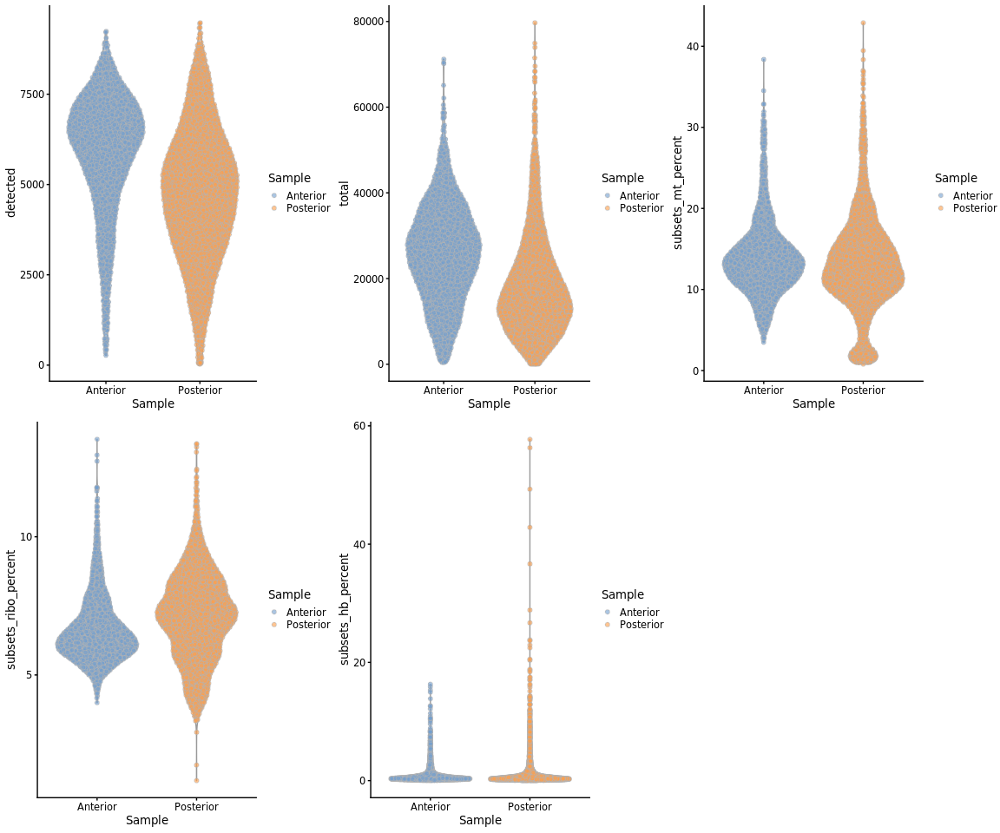<!-- -->

We can also plot the same data onto the tissue section.


```r
samples <- c("Anterior", "Posterior")
to_plot <- c("detected", "total", "subsets_mt_percent", "subsets_ribo_percent", "subsets_hb_percent")

plist <- list()
n = 1
for (j in to_plot) {
    for (i in samples) {
        temp <- sce[, sce$Sample == i]
        temp@metadata <- temp@metadata[[i]]
        plist[[n]] <- spanielPlot(object = temp, plotType = "Cluster", clusterRes = j,
            customTitle = j, techType = "Visium", ptSizeMax = 1, ptSizeMin = 0.1)
        n <- n + 1
    }
}

plot_grid(ncol = 2, plotlist = plist)
```

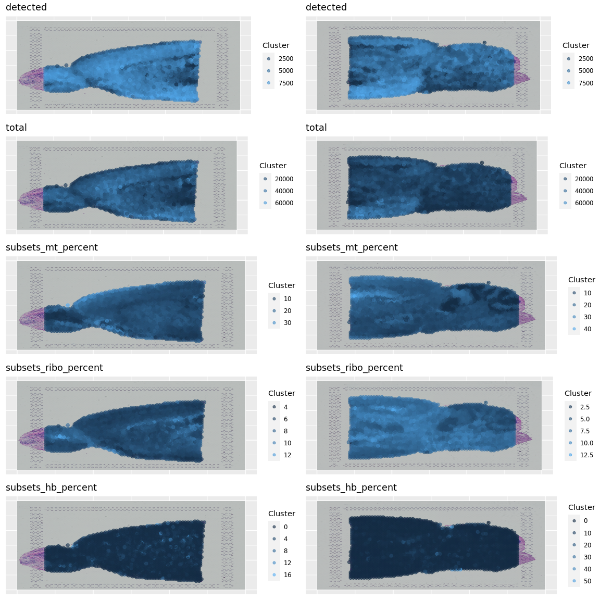<!-- -->


As you can see, the spots with low number of counts/features and high mitochondrial content is mainly towards the edges of the tissue. It is quite likely that these regions are damaged tissue. You may also see regions within a tissue with low quality if you have tears or folds in your section. 

But remember, for some tissue types, the amount of genes expressed and proportion mitochondria may also be a biological features, so bear in mind what tissue you are working on and what these features mean.

### Filter

Select all spots with less than 25% mitocondrial reads, less than 20% hb-reads and 1000 detected genes. You must judge for yourself based on your knowledge of the tissue what are appropriate filtering criteria for your dataset.


```r
sce <- sce[, sce$detected > 500 & sce$subsets_mt_percent < 25 & sce$subsets_hb_percent <
    20]
dim(sce)
```

```
## [1] 32160  5804
```

And replot onto tissue section:


```r
samples <- c("Anterior", "Posterior")
to_plot <- c("detected", "total", "subsets_mt_percent", "subsets_mt_percent", "subsets_hb_percent")

plist <- list()
n = 1
for (j in to_plot) {
    for (i in samples) {
        temp <- sce[, sce$Sample == i]
        temp@metadata <- temp@metadata[[i]]
        plist[[n]] <- spanielPlot(object = temp, plotType = "Cluster", clusterRes = j,
            customTitle = j, techType = "Visium", ptSizeMax = 1, ptSizeMin = 0.1)
        n <- n + 1
    }
}

plot_grid(ncol = 2, plotlist = plist)
```

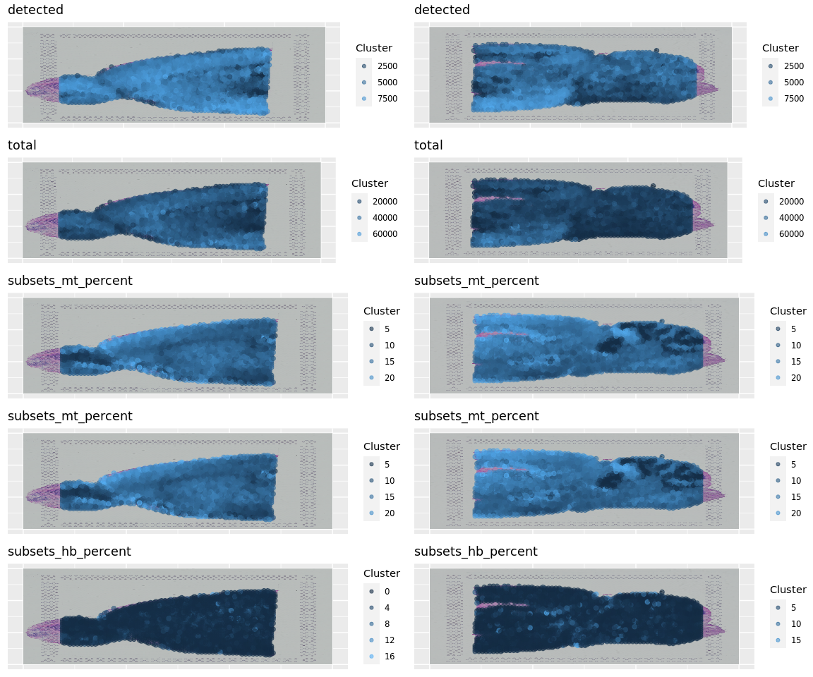<!-- -->

### Top expressed genes
As for scRNAseq data, we will look at what the top expressed genes are.


```r
C = counts(sce)
C@x = C@x/rep.int(colSums(C), diff(C@p))
most_expressed <- order(Matrix::rowSums(C), decreasing = T)[20:1]
boxplot(as.matrix(t(C[most_expressed, ])), cex = 0.1, las = 1, xlab = "% total count per cell",
    col = (scales::hue_pal())(20)[20:1], horizontal = TRUE)
```

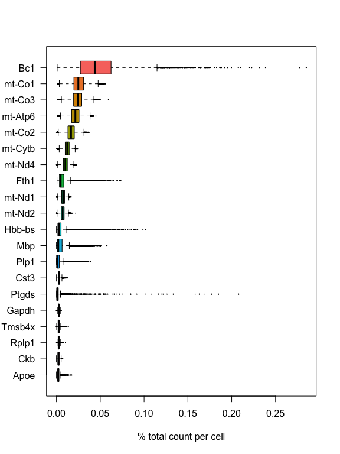<!-- -->

```r
rm(C)
```

As you can see, the mitochondrial genes are among the top expressed. Also the lncRNA gene Bc1 (brain cytoplasmic RNA 1). Also one hemoglobin gene.

### Filter genes
We will remove the Bc1 gene, hemoglobin genes (blood contamination) and the mitochondrial genes.


```r
dim(sce)
```

```
## [1] 32160  5804
```

```r
# Filter Bl1
sce <- sce[!grepl("Bc1", rownames(sce)), ]

# Filter Mitocondrial
sce <- sce[!grepl("^mt-", rownames(sce)), ]

# Filter Hemoglobin gene (optional if that is a problem on your data)
sce <- sce[!grepl("^Hb.*-", rownames(sce)), ]

dim(sce)
```

```
## [1] 32138  5804
```

# Analysis
***


```r
sce <- computeSumFactors(sce, sizes = c(20, 40, 60, 80))
sce <- logNormCounts(sce)
```


Now we can plot gene expression of individual genes, the gene Hpca is a strong hippocampal marker and Ttr is a marker of the choroid plexus.


```r
samples <- c("Anterior", "Posterior")
to_plot <- c("Hpca", "Ttr")

plist <- list()
n = 1
for (j in to_plot) {
    for (i in samples) {
        temp <- sce[, sce$Sample == i]
        temp@metadata <- temp@metadata[[i]]
        plist[[n]] <- spanielPlot(object = temp, plotType = "Gene", gene = j, customTitle = j,
            techType = "Visium", ptSizeMax = 1, ptSizeMin = 0.1)
        n <- n + 1
    }
}

plot_grid(ncol = 2, plotlist = plist)
```

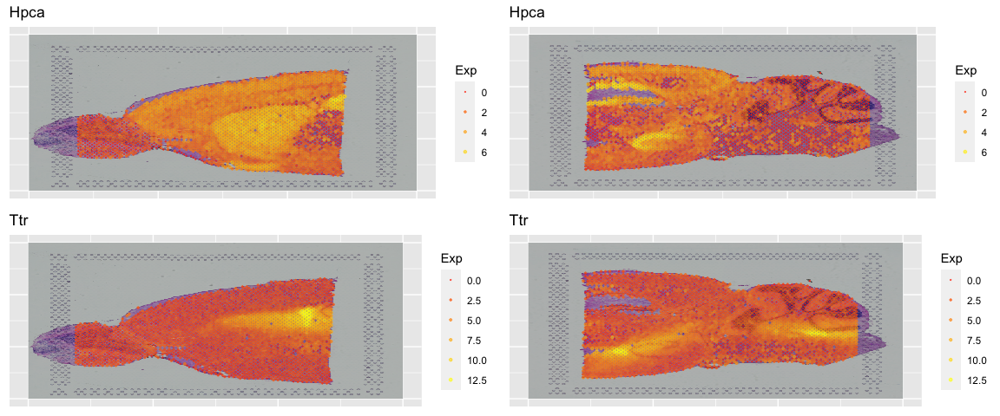<!-- -->


### Dimensionality reduction and clustering
We can then now run dimensionality reduction and clustering using the same workflow as we use for scRNA-seq analysis. 

But make sure you run it on the `SCT` assay.


```r
var.out <- modelGeneVar(sce, method = "loess")
hvgs = getTopHVGs(var.out, n = 2000)
sce <- runPCA(sce, exprs_values = "logcounts", subset_row = hvgs, ncomponents = 50,
    ntop = 100, scale = T)
g <- buildSNNGraph(sce, k = 5, use.dimred = "PCA")
sce$louvain_SNNk5 <- factor(igraph::cluster_louvain(g)$membership)
sce <- runUMAP(sce, dimred = "PCA", n_dimred = 50, ncomponents = 2, min_dist = 0.1,
    spread = 0.3, metric = "correlation", name = "UMAP_on_PCA")
```

We can then plot clusters onto umap or onto the tissue section.


```r
samples <- c("Anterior", "Posterior")
to_plot <- c("louvain_SNNk5")

plist <- list()
n = 1
for (j in to_plot) {
    for (i in samples) {
        temp <- sce[, sce$Sample == i]
        temp@metadata <- temp@metadata[[i]]
        plist[[n]] <- spanielPlot(object = temp, plotType = "Cluster", clusterRes = j,
            customTitle = j, techType = "Visium", ptSizeMax = 1, ptSizeMin = 0.1)
        n <- n + 1
    }
}

plist[[3]] <- plotReducedDim(sce, dimred = "UMAP_on_PCA", colour_by = "louvain_SNNk5")
plist[[4]] <- plotReducedDim(sce, dimred = "UMAP_on_PCA", colour_by = "Sample")

plot_grid(ncol = 2, plotlist = plist)
```

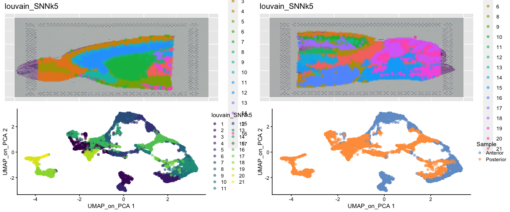<!-- -->


### Integration

Quite often there are strong batch effects between different ST sections, so it may be a good idea to integrate the data across sections.

We will do a similar integration as in the Data Integration lab.


```r
mnn_out <- batchelor::fastMNN(sce, subset.row = hvgs, batch = factor(sce$Sample),
    k = 20, d = 50)

reducedDim(sce, "MNN") <- reducedDim(mnn_out, "corrected")
rm(mnn_out)
gc()
```

```
##             used   (Mb) gc trigger   (Mb)  max used   (Mb)
## Ncells  10371358  553.9   18424822  984.0  18424822  984.0
## Vcells 192933277 1472.0  380768835 2905.1 380768808 2905.1
```


Then we run dimensionality reduction and clustering as before.


```r
g <- buildSNNGraph(sce, k = 5, use.dimred = "MNN")
sce$louvain_SNNk5 <- factor(igraph::cluster_louvain(g)$membership)
sce <- runUMAP(sce, dimred = "MNN", n_dimred = 50, ncomponents = 2, min_dist = 0.1,
    spread = 0.3, metric = "correlation", name = "UMAP_on_MNN")
```


```r
samples <- c("Anterior", "Posterior")
to_plot <- c("louvain_SNNk5")

plist <- list()
n = 1
for (j in to_plot) {
    for (i in samples) {
        temp <- sce[, sce$Sample == i]
        temp@metadata <- temp@metadata[[i]]
        plist[[n]] <- spanielPlot(object = temp, plotType = "Cluster", clusterRes = j,
            customTitle = j, techType = "Visium", ptSizeMax = 1, ptSizeMin = 0.1)
        n <- n + 1
    }
}

plist[[3]] <- plotReducedDim(sce, dimred = "UMAP_on_MNN", colour_by = "louvain_SNNk5")
plist[[4]] <- plotReducedDim(sce, dimred = "UMAP_on_MNN", colour_by = "Sample")

plot_grid(ncol = 2, plotlist = plist)
```

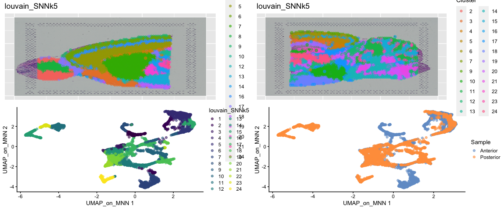<!-- -->

Do you see any differences between the integrated and non-integrated clusering? Judge for yourself, which of the clusterings do you think looks best? 
As a reference, you can compare to brain regions in the [Allen brain atlas](https://mouse.brain-map.org/experiment/thumbnails/100042147?image_type=atlas). 

### Identification of Spatially Variable Features

 There are two main workflows to identify molecular features that correlate with spatial location within a tissue. The first is to perform differential expression based on spatially distinct clusters, the other is to find features that are have spatial patterning without taking clusters or spatial annotation into account. 

First, we will do differential expression between clusters just as we did for the scRNAseq data before.


```r
# differential expression between cluster 4 and cluster 6
cell_selection <- sce[, sce$louvain_SNNk5 %in% c(4, 6)]
cell_selection$louvain_SNNk5 <- factor(cell_selection$louvain_SNNk5)

markers_genes <- scran::findMarkers(x = cell_selection, groups = cell_selection$louvain_SNNk5,
    lfc = 0.25, pval.type = "all", direction = "up")

# List of dataFrames with the results for each cluster
top5_cell_selection <- lapply(names(markers_genes), function(x) {
    temp <- markers_genes[[x]][1:5, 1:2]
    temp$gene <- rownames(markers_genes[[x]])[1:5]
    temp$cluster <- x
    return(temp)
})
top5_cell_selection <- as_tibble(do.call(rbind, top5_cell_selection))
top5_cell_selection
```

<div data-pagedtable="false">
  <script data-pagedtable-source type="application/json">
{"columns":[{"label":["p.value"],"name":[1],"type":["dbl"],"align":["right"]},{"label":["FDR"],"name":[2],"type":["dbl"],"align":["right"]},{"label":["gene"],"name":[3],"type":["chr"],"align":["left"]},{"label":["cluster"],"name":[4],"type":["chr"],"align":["left"]}],"data":[{"1":"5.631389e-148","2":"1.809816e-143","3":"Gng4","4":"4"},{"1":"4.542969e-122","2":"7.300097e-118","3":"Gpsm1","4":"4"},{"1":"1.839952e-107","2":"1.971079e-103","3":"Meis2","4":"4"},{"1":"3.266579e-106","2":"2.624533e-102","3":"Pcbp3","4":"4"},{"1":"3.836416e-101","2":"2.465895e-97","3":"Synpr","4":"4"},{"1":"8.250240e-148","2":"2.651462e-143","3":"Ptgds","4":"6"},{"1":"6.982348e-100","2":"1.121994e-95","3":"Atp1a2","4":"6"},{"1":"4.154188e-82","2":"4.450244e-78","3":"Id3","4":"6"},{"1":"1.743920e-76","2":"1.401153e-72","3":"Apoe","4":"6"},{"1":"5.867018e-75","2":"3.771085e-71","3":"Igf2","4":"6"}],"options":{"columns":{"min":{},"max":[10]},"rows":{"min":[10],"max":[10]},"pages":{}}}
  </script>
</div>

```r
# plot top markers
samples <- c("Anterior", "Posterior")
to_plot <- top5_cell_selection$gene[1:5]

plist <- list()
n = 1
for (j in to_plot) {
    for (i in samples) {
        temp <- sce[, sce$Sample == i]
        temp@metadata <- temp@metadata[[i]]
        plist[[n]] <- spanielPlot(object = temp, plotType = "Gene", gene = j, customTitle = j,
            techType = "Visium", ptSizeMax = 1, ptSizeMin = 0.1)
        n <- n + 1
    }
}
plot_grid(ncol = 2, plotlist = plist)
```

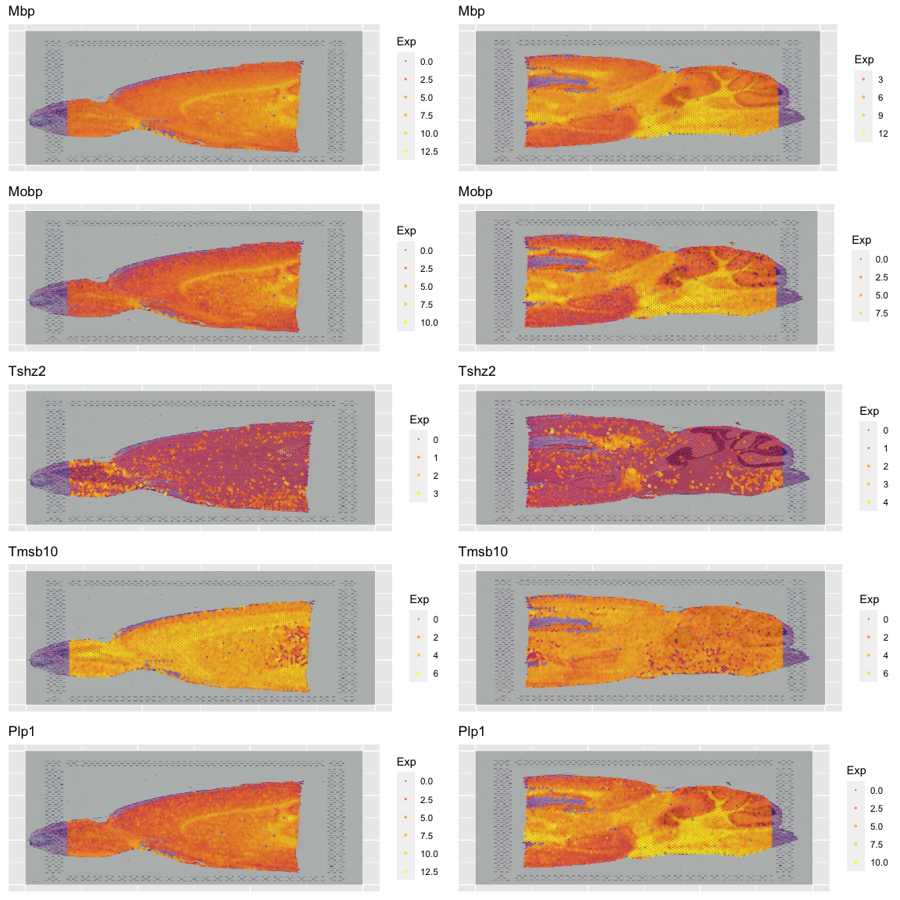<!-- -->


# Single cell data

We can use a scRNA-seq dataset as a referenced to predict the proportion of different celltypes in the Visium spots. 

Keep in mind that it is important to have a reference that contains all the celltypes you expect to find in your spots. Ideally it should be a scRNAseq reference from the exact same tissue. 

We will use a reference scRNA-seq dataset of ~14,000 adult mouse cortical cell taxonomy from the Allen Institute, generated with the SMART-Seq2 protocol.


First dowload the seurat data from: https://www.dropbox.com/s/cuowvm4vrf65pvq/allen_cortex.rds?dl=1 to folder `data/spatial/` with command:


```r
webpath <- "https://www.dropbox.com/s/cuowvm4vrf65pvq/allen_cortex.rds?dl=1"
PATH <- "./data/spatial/allen_cortex.rds"
if (!file.exists(PATH)) {
    dir.create("./data/spatial/", recursive = T)
    options(timeout = 10000)
    download.file(url = webpath, destfile = PATH)
    options(timeout = 60)
}
```

For speed, and for a more fair comparison of the celltypes, we will subsample all celltypes to a maximum of 200 cells per class (`subclass`).


```r
allen_reference <- readRDS("data/spatial/allen_cortex.rds")
allen_reference_sce <- Seurat::as.SingleCellExperiment(allen_reference)

# check number of cells per subclass
allen_reference_sce$subclass <- sub("/", "_", sub(" ", "_", allen_reference_sce$subclass))
table(allen_reference_sce$subclass)
```

```
## 
##      Astro         CR       Endo    L2_3_IT         L4      L5_IT      L5_PT 
##        368          7         94        982       1401        880        544 
##      L6_CT      L6_IT        L6b      Lamp5 Macrophage      Meis2         NP 
##        960       1872        358       1122         51         45        362 
##      Oligo       Peri      Pvalb        SMC   Serpinf1       Sncg        Sst 
##         91         32       1337         55         27        125       1741 
##       VLMC        Vip 
##         67       1728
```

```r
# select 20 cells per subclass, fist set subclass ass active.ident
subset_cells <- lapply(unique(allen_reference_sce$subclass), function(x) {
    if (sum(allen_reference_sce$subclass == x) > 20) {
        temp <- sample(colnames(allen_reference_sce)[allen_reference_sce$subclass ==
            x], size = 20)
    } else {
        temp <- colnames(allen_reference_sce)[allen_reference_sce$subclass == x]
    }
})
allen_reference_sce <- allen_reference_sce[, unlist(subset_cells)]

# check again number of cells per subclass
table(allen_reference_sce$subclass)
```

```
## 
##      Astro         CR       Endo    L2_3_IT         L4      L5_IT      L5_PT 
##         20          7         20         20         20         20         20 
##      L6_CT      L6_IT        L6b      Lamp5 Macrophage      Meis2         NP 
##         20         20         20         20         20         20         20 
##      Oligo       Peri      Pvalb        SMC   Serpinf1       Sncg        Sst 
##         20         20         20         20         20         20         20 
##       VLMC        Vip 
##         20         20
```

Then run normalization and dimensionality reduction.


```r
allen_reference_sce <- computeSumFactors(allen_reference_sce, sizes = c(20, 40, 60,
    80))
allen_reference_sce <- logNormCounts(allen_reference_sce)
allen.var.out <- modelGeneVar(allen_reference_sce, method = "loess")
allen.hvgs = getTopHVGs(allen.var.out, n = 2000)
```


# Subset ST for cortex
Since the scRNAseq dataset was generated from the mouse cortex, we will subset the visium dataset in order to select mainly the spots part of the cortex. Note that the integration can also be performed on the whole brain slice, but it would give rise to false positive cell type assignments and and therefore it should be interpreted with more care.


# Integrate with scRNAseq

Here, will use SingleR for prediciting which cell types are present in the dataset.

We can first select the anterior part as an example (to speed up predictions).


```r
sce.anterior <- sce[, sce$Sample == "Anterior"]
sce.anterior@metadata <- sce.anterior@metadata[["Anterior"]]
```

Next, we select the highly variable genes that are present in both datasets.


```r
# Find common highly variable genes
common_hvgs <- allen.hvgs[allen.hvgs %in% hvgs]

# Predict cell classes
pred.grun <- SingleR(test = sce.anterior[common_hvgs, ], ref = allen_reference_sce[common_hvgs,
    ], labels = allen_reference_sce$subclass)

# Transfer the classes to the SCE object
sce.anterior$cell_prediction <- pred.grun$labels
sce.anterior@colData <- cbind(sce.anterior@colData, as.data.frame.matrix(table(list(1:ncol(sce.anterior),
    sce.anterior$cell_prediction))))
```

Then we can plot the predicted cell populations back to tissue.


```r
# Plot cell predictions
spanielPlot(object = sce.anterior, plotType = "Cluster", clusterRes = "cell_prediction",
    customTitle = "cell_prediction", techType = "Visium", ptSizeMax = 1, ptSizeMin = 0.1)
```

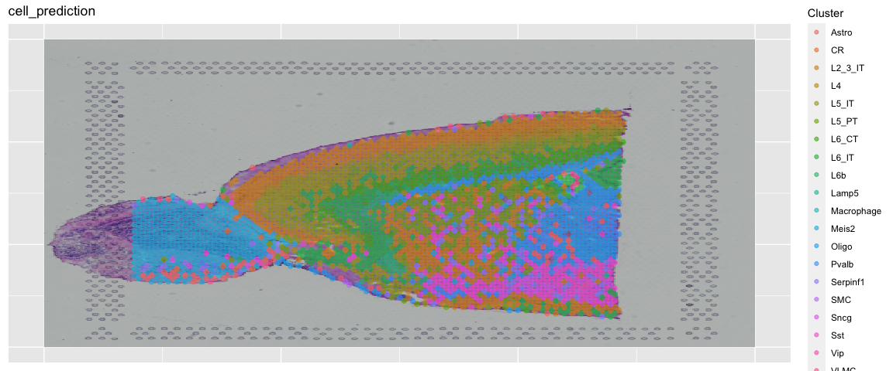<!-- -->

```r
plist <- list()
n = 1
for (i in c("L2_3_IT", "L4", "L5_IT", "L6_IT")) {
    plist[[n]] <- spanielPlot(object = sce.anterior, plotType = "Cluster", clusterRes = i,
        customTitle = i, techType = "Visium", ptSize = 0.3, ptSizeMax = 1, ptSizeMin = 0.1)
    n <- n + 1
}
plot_grid(ncol = 2, plotlist = plist)
```

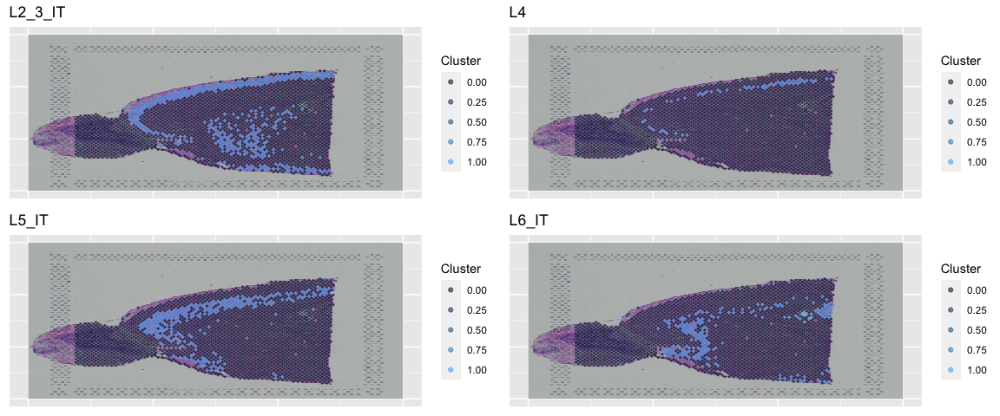<!-- -->


Keep in mind, that the scores are "just" prediction scores, and do not correspond to proportion of cells that are of a certain celltype or similar. It mainly tell you that gene expression in a certain spot is hihgly similar/dissimilar to gene expression of a celltype.

If we look at the scores, we see that some spots got really clear predictions by celltype, while others did not have high scores for any of the celltypes.


We can also plot the gene expression and add filters together, too:


```r
spanielPlot(object = sce.anterior, plotType = "Gene", gene = "Wfs1", showFilter = sce.anterior$L4,
    customTitle = "", techType = "Visium", ptSize = 0, ptSizeMin = -0.3, ptSizeMax = 1)
```

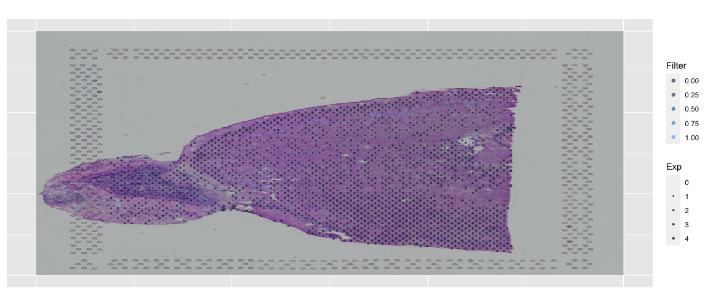<!-- -->


### Session info


```r
sessionInfo()
```

```
## R version 4.1.3 (2022-03-10)
## Platform: x86_64-apple-darwin13.4.0 (64-bit)
## Running under: macOS Big Sur/Monterey 10.16
## 
## Matrix products: default
## BLAS/LAPACK: /Users/asabjor/miniconda3/envs/scRNAseq2023/lib/libopenblasp-r0.3.21.dylib
## 
## locale:
## [1] C/UTF-8/C/C/C/C
## 
## attached base packages:
## [1] stats4    stats     graphics  grDevices utils     datasets  methods  
## [8] base     
## 
## other attached packages:
##  [1] cowplot_1.1.1               patchwork_1.1.2            
##  [3] scater_1.22.0               ggplot2_3.4.0              
##  [5] SingleR_1.8.1               scran_1.22.1               
##  [7] scuttle_1.4.0               SingleCellExperiment_1.16.0
##  [9] SummarizedExperiment_1.24.0 Biobase_2.54.0             
## [11] GenomicRanges_1.46.1        GenomeInfoDb_1.30.1        
## [13] IRanges_2.28.0              S4Vectors_0.32.4           
## [15] BiocGenerics_0.40.0         MatrixGenerics_1.6.0       
## [17] matrixStats_0.63.0          dplyr_1.0.10               
## [19] Matrix_1.5-3                biomaRt_2.50.0             
## [21] Spaniel_1.2.0               RJSONIO_1.3-1.7            
## [23] optparse_1.7.3             
## 
## loaded via a namespace (and not attached):
##   [1] rappdirs_0.3.3            scattermore_0.8          
##   [3] R.methodsS3_1.8.2         SeuratObject_4.1.3       
##   [5] tidyr_1.2.1               bit64_4.0.5              
##   [7] knitr_1.41                irlba_2.3.5.1            
##   [9] DelayedArray_0.20.0       R.utils_2.12.2           
##  [11] data.table_1.14.6         KEGGREST_1.34.0          
##  [13] RCurl_1.98-1.9            generics_0.1.3           
##  [15] ScaledMatrix_1.2.0        callr_3.7.3              
##  [17] usethis_2.1.6             RSQLite_2.2.20           
##  [19] RANN_2.6.1                future_1.30.0            
##  [21] bit_4.0.5                 spatstat.data_3.0-0      
##  [23] xml2_1.3.3                httpuv_1.6.8             
##  [25] assertthat_0.2.1          viridis_0.6.2            
##  [27] xfun_0.36                 hms_1.1.2                
##  [29] jquerylib_0.1.4           evaluate_0.20            
##  [31] promises_1.2.0.1          fansi_1.0.4              
##  [33] progress_1.2.2            dbplyr_2.3.0             
##  [35] igraph_1.3.5              DBI_1.1.3                
##  [37] htmlwidgets_1.6.1         spatstat.geom_3.0-5      
##  [39] purrr_1.0.1               ellipsis_0.3.2           
##  [41] deldir_1.0-6              sparseMatrixStats_1.6.0  
##  [43] vctrs_0.5.2               remotes_2.4.2            
##  [45] ROCR_1.0-11               abind_1.4-5              
##  [47] batchelor_1.10.0          cachem_1.0.6             
##  [49] withr_2.5.0               progressr_0.13.0         
##  [51] sctransform_0.3.5         prettyunits_1.1.1        
##  [53] getopt_1.20.3             goftest_1.2-3            
##  [55] cluster_2.1.4             lazyeval_0.2.2           
##  [57] crayon_1.5.2              spatstat.explore_3.0-5   
##  [59] labeling_0.4.2            edgeR_3.36.0             
##  [61] pkgconfig_2.0.3           nlme_3.1-161             
##  [63] vipor_0.4.5               pkgload_1.3.2            
##  [65] devtools_2.4.5            rlang_1.0.6              
##  [67] globals_0.16.2            lifecycle_1.0.3          
##  [69] miniUI_0.1.1.1            filelock_1.0.2           
##  [71] BiocFileCache_2.2.0       rsvd_1.0.5               
##  [73] rprojroot_2.0.3           polyclip_1.10-4          
##  [75] lmtest_0.9-40             Rhdf5lib_1.16.0          
##  [77] zoo_1.8-11                beeswarm_0.4.0           
##  [79] ggridges_0.5.4            processx_3.8.0           
##  [81] png_0.1-8                 viridisLite_0.4.1        
##  [83] bitops_1.0-7              R.oo_1.25.0              
##  [85] KernSmooth_2.23-20        rhdf5filters_1.6.0       
##  [87] Biostrings_2.62.0         blob_1.2.3               
##  [89] DelayedMatrixStats_1.16.0 stringr_1.5.0            
##  [91] parallelly_1.34.0         spatstat.random_3.0-1    
##  [93] beachmat_2.10.0           scales_1.2.1             
##  [95] memoise_2.0.1             magrittr_2.0.3           
##  [97] plyr_1.8.8                ica_1.0-3                
##  [99] zlibbioc_1.40.0           compiler_4.1.3           
## [101] dqrng_0.3.0               RColorBrewer_1.1-3       
## [103] fitdistrplus_1.1-8        cli_3.6.0                
## [105] XVector_0.34.0            urlchecker_1.0.1         
## [107] listenv_0.9.0             pbapply_1.7-0            
## [109] ps_1.7.2                  formatR_1.14             
## [111] MASS_7.3-58.2             tidyselect_1.2.0         
## [113] stringi_1.7.12            highr_0.10               
## [115] yaml_2.3.7                BiocSingular_1.10.0      
## [117] locfit_1.5-9.7            ggrepel_0.9.2            
## [119] grid_4.1.3                sass_0.4.5               
## [121] tools_4.1.3               future.apply_1.10.0      
## [123] parallel_4.1.3            bluster_1.4.0            
## [125] metapod_1.2.0             gridExtra_2.3            
## [127] farver_2.1.1              Rtsne_0.16               
## [129] DropletUtils_1.14.2       digest_0.6.31            
## [131] shiny_1.7.4               Rcpp_1.0.10              
## [133] later_1.3.0               RcppAnnoy_0.0.20         
## [135] httr_1.4.4                AnnotationDbi_1.56.2     
## [137] colorspace_2.1-0          XML_3.99-0.13            
## [139] fs_1.6.0                  tensor_1.5               
## [141] reticulate_1.27           splines_4.1.3            
## [143] uwot_0.1.14               statmod_1.5.0            
## [145] spatstat.utils_3.0-1      sp_1.6-0                 
## [147] plotly_4.10.1             sessioninfo_1.2.2        
## [149] xtable_1.8-4              jsonlite_1.8.4           
## [151] R6_2.5.1                  profvis_0.3.7            
## [153] pillar_1.8.1              htmltools_0.5.4          
## [155] mime_0.12                 glue_1.6.2               
## [157] fastmap_1.1.0             BiocParallel_1.28.3      
## [159] BiocNeighbors_1.12.0      codetools_0.2-18         
## [161] pkgbuild_1.4.0            utf8_1.2.2               
## [163] ResidualMatrix_1.4.0      lattice_0.20-45          
## [165] bslib_0.4.2               spatstat.sparse_3.0-0    
## [167] tibble_3.1.8              curl_4.3.3               
## [169] ggbeeswarm_0.7.1          leiden_0.4.3             
## [171] survival_3.5-0            limma_3.50.3             
## [173] rmarkdown_2.20            desc_1.4.2               
## [175] munsell_0.5.0             rhdf5_2.38.1             
## [177] GenomeInfoDbData_1.2.7    HDF5Array_1.22.1         
## [179] reshape2_1.4.4            gtable_0.3.1             
## [181] Seurat_4.3.0
```
