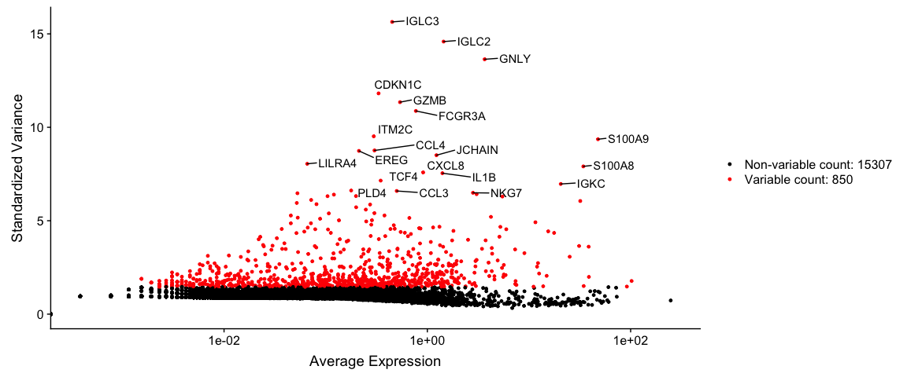
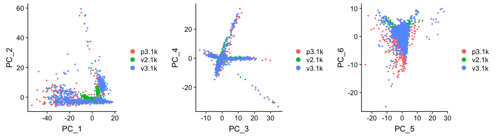
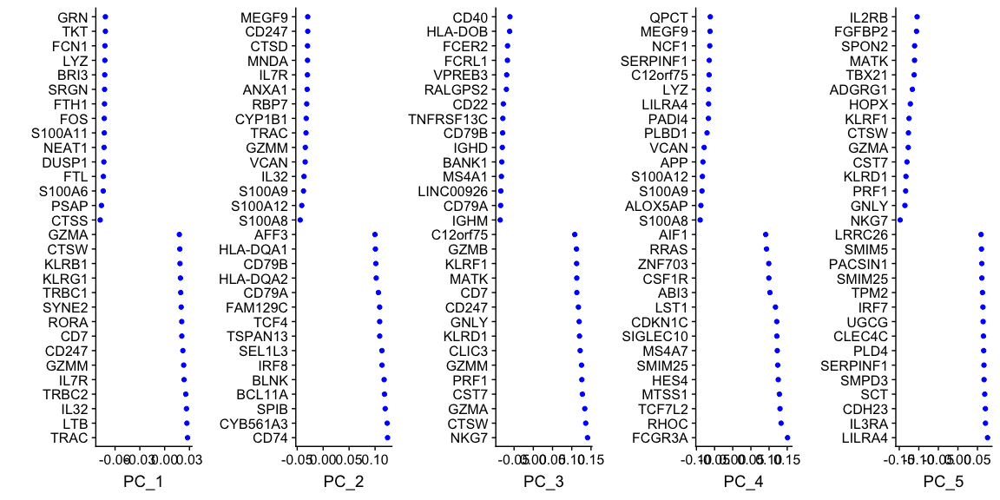
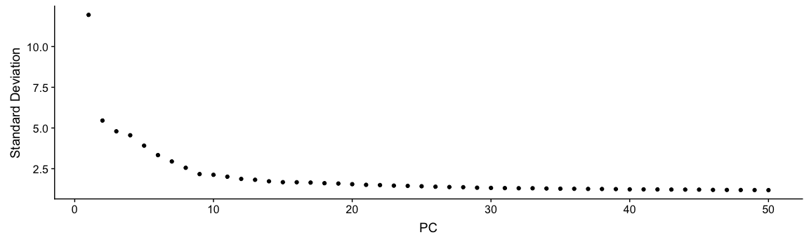
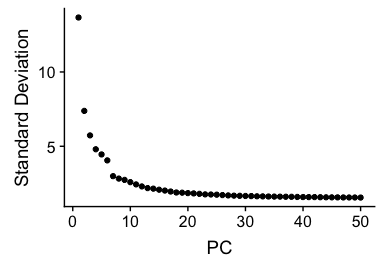
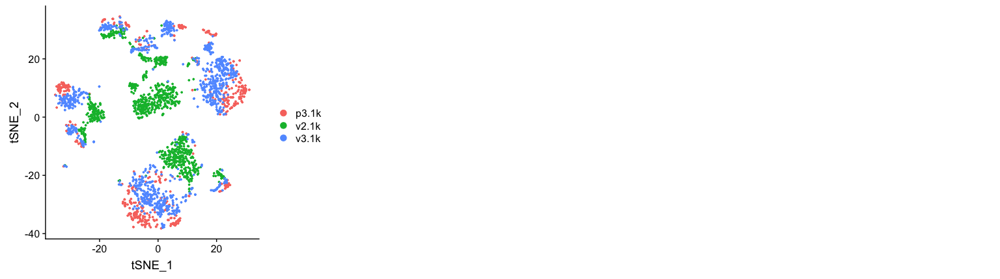
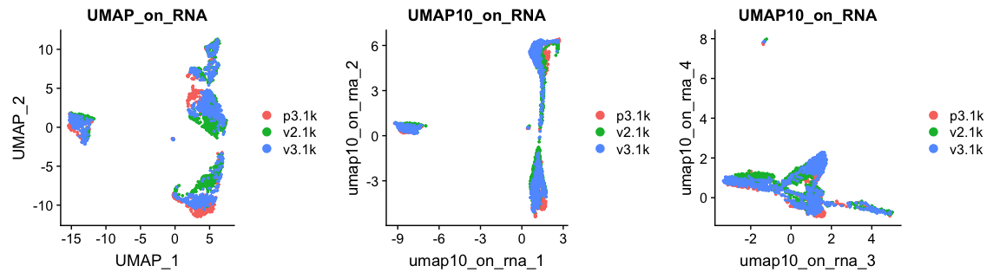
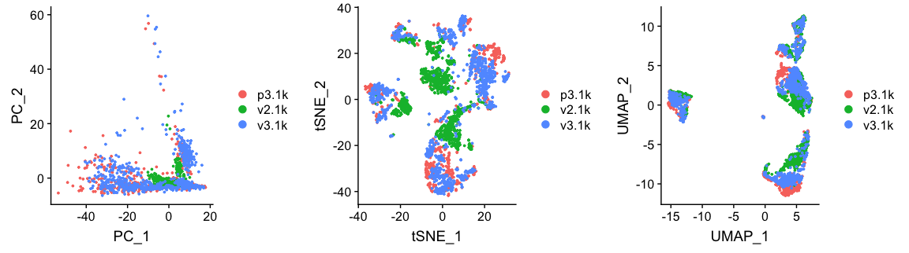
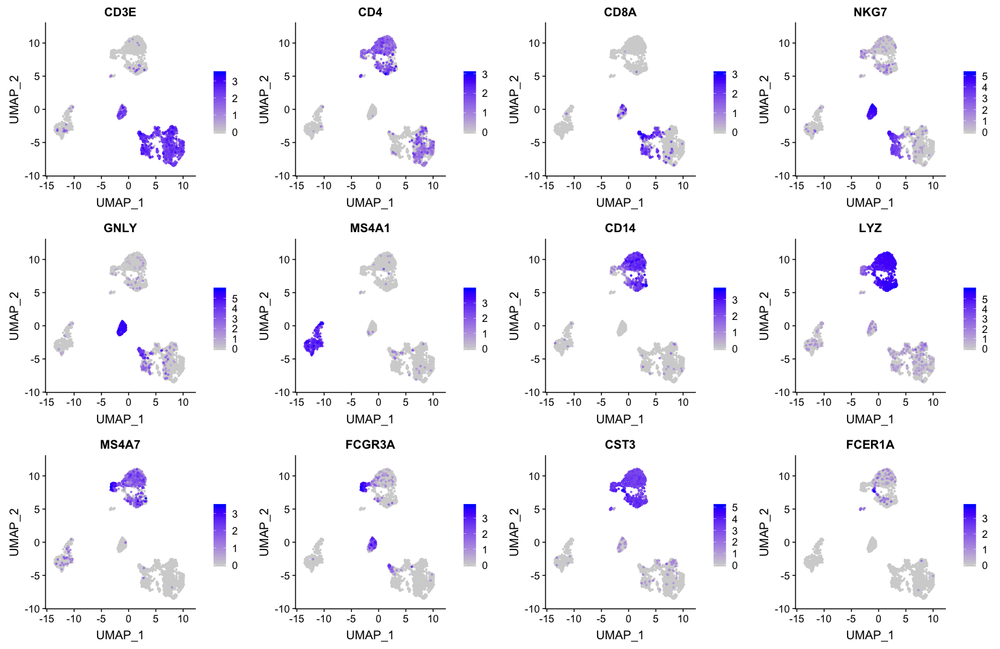

# Load data

First, let's load all necessary libraries and the QC-filtered dataset from the previous step.


```r
suppressMessages(require(Seurat))
```

```
## Warning: package 'Seurat' was built under R version 3.5.2
```

```r
suppressMessages(require(cowplot))
```

```
## Warning: package 'cowplot' was built under R version 3.5.2
```

```
## Warning: package 'ggplot2' was built under R version 3.5.2
```

```r
suppressMessages(require(ggplot2))

alldata <- readRDS("data/3pbmc_qc.rds")
```

## Feature selection

Next, we first need to define which features/genes are important in our dataset to distinguish cell types. For this purpose, we need to find genes that are highly variable across cells, which in turn will also provide a good separation of the cell clusters.


```r
alldata <- FindVariableFeatures(alldata, selection.method = "vst", nfeatures = 2000,verbose = FALSE,assay = "RNA")
top10 <- head(VariableFeatures(alldata), 10)

LabelPoints(plot = VariableFeaturePlot(alldata), points = top10, repel = TRUE)
```

```
## Warning: Using `as.character()` on a quosure is deprecated as of rlang 0.3.0.
## Please use `as_label()` or `as_name()` instead.
## This warning is displayed once per session.
```

```
## When using repel, set xnudge and ynudge to 0 for optimal results
```

```
## Warning: Transformation introduced infinite values in continuous x-axis
```

<!-- -->

## Z-score transformation

Now that the data is prepared, we now proceed with PCA. Since each gene has a different expression level, it means that genes with higher expression values will naturally have higher variation that will be captured by PCA. This means that we need to somehow give each gene a similar weight when performing PCA (see below). The common practice is to center and scale each gene before performing PCA. This exact scaling is called Z-score normalization it is very useful for PCA, clustering and plotting heatmaps. Additionally, we can use this function to remove any unwanted sources of variation from the dataset, such as `cell cycle`, `sequencing depth`, `percent mitocondria`, etc. 


```r
alldata <- ScaleData(alldata, vars.to.regress = "percent_mito", assay = "RNA")
```

```
## Regressing out percent_mito
```

```
## Centering and scaling data matrix
```


***
# PCA

Performing PCA has many useful applications and interpretations, which much depends on the data used. In the case of life sciences, we want to segregate samples based on gene expression patterns in the data.


```r
alldata <- RunPCA(alldata, npcs = 50, reduction.name = "PCA_on_RNA", assay = "RNA")
```

```
## PC_ 1 
## Positive:  LTB, CD3E, TRBC2, TRAC, CD3D, IL32, IL7R, ETS1, CD3G, CD69 
## 	   ISG20, TCF7, CD27, CD7, CD247, SPOCK2, CD2, FCMR, GZMM, TRBC1 
## 	   BCL11B, ARL4C, NOSIP, RORA, CTSW, CD6, SYNE2, CCR7, IKZF3, KLRB1 
## Negative:  FCN1, LYZ, CST3, S100A9, CTSS, FGL2, MNDA, VCAN, AIF1, S100A8 
## 	   PSAP, TYMP, KLF4, SERPINA1, NCF2, GRN, CD68, FTH1, MPEG1, FTL 
## 	   LST1, CLEC7A, MS4A6A, TNFAIP2, CD14, CYBB, CSTA, CPVL, LGALS1, TYROBP 
## PC_ 2 
## Positive:  IL32, CD3E, CTSW, GZMM, CD7, CD247, GZMA, NKG7, CD3D, S100A4 
## 	   KLRB1, CST7, PRF1, CCL5, TRAC, ANXA1, IL7R, CD3G, KLRG1, RORA 
## 	   TRBC1, SAMD3, GNLY, MATK, KLRD1, CD2, ARL4C, ITGB2, IL2RB, ID2 
## Negative:  CD79A, MS4A1, IGHM, HLA-DQA1, BANK1, CD79B, IGHD, HLA-DQB1, LINC00926, HLA-DRB1 
## 	   CD74, HLA-DRA, IGKC, HLA-DPA1, HLA-DPB1, CD22, TCL1A, HLA-DQA2, TNFRSF13C, SPIB 
## 	   HLA-DRB5, FCER2, VPREB3, BCL11A, HVCN1, RALGPS2, FAM129C, FCRL1, MEF2C, HLA-DMB 
## PC_ 3 
## Positive:  IL7R, LEF1, MAL, CD3D, TCF7, TRABD2A, TRAC, CCR7, NOSIP, RCAN3 
## 	   CD3G, TPT1, CD27, LTB, PASK, NELL2, BCL11B, CAMK4, CD5, CD6 
## 	   VIM, TSHZ2, TRAT1, S100A12, JUNB, RGCC, FHIT, CD40LG, LINC01550, AC013264.1 
## Negative:  GZMB, GNLY, NKG7, KLRD1, KLRF1, PRF1, CLIC3, SPON2, CST7, FGFBP2 
## 	   GZMA, TRDC, ADGRG1, HOPX, CCL4, MATK, TBX21, FCGR3A, IL2RB, CTSW 
## 	   TTC38, GZMH, CMC1, RHOC, CD160, MYOM2, S1PR5, APOBEC3G, C12orf75, SH2D1B 
## PC_ 4 
## Positive:  GNLY, KLRF1, KLRD1, FGFBP2, PRF1, ADGRG1, SPON2, NKG7, CST7, TRDC 
## 	   CCL4, MYOM2, RPS17, TBX21, TTC38, GZMA, CD160, S1PR5, HOPX, FGR 
## 	   LINC00926, LAT2, CD79A, GZMH, CD79B, MS4A1, IGHD, MATK, IL2RB, SH2D1B 
## Negative:  LILRA4, SERPINF1, SMPD3, IL3RA, TPM2, CLEC4C, SCT, DNASE1L3, GAS6, TNFRSF21 
## 	   PTCRA, AL096865.1, PLD4, DERL3, PACSIN1, LRRC26, PPP1R14B, SMIM5, ITM2C, AC119428.2 
## 	   MAP1A, UGCG, NRP1, RHEX, SCAMP5, P3H2, CIB2, PPM1J, SHD, ZFAT 
## PC_ 5 
## Positive:  S100A12, S100A8, AC020656.1, ALOX5AP, VCAN, PLBD1, RNASE6, NCF1, MS4A6A, LILRA4 
## 	   CD36, CYP1B1, QPCT, SERPINF1, METTL9, ITGAM, MCEMP1, S100A9, GZMB, MGST1 
## 	   SMPD3, SCT, PADI4, CLEC4C, CRISPLD2, CD14, MNDA, RBP7, DNASE1L3, DERL3 
## Negative:  CDKN1C, HES4, TCF7L2, FCGR3A, SIGLEC10, ZNF703, MTSS1, NEURL1, CSF1R, CKB 
## 	   RRAS, RHOC, MS4A7, NR4A1, SECTM1, CTSL, AC064805.1, CAMK1, SMIM25, LINC02345 
## 	   MS4A4A, LYPD2, C3AR1, BATF3, WARS, HMOX1, C1QA, IFITM3, IFI30, SPRED1
```

We can plot the first 6 dimensions like so.


```r
plot_grid(ncol = 3,
  DimPlot(alldata, reduction = "PCA_on_RNA", group.by = "orig.ident",dims = 1:2),
  DimPlot(alldata, reduction = "PCA_on_RNA", group.by = "orig.ident",dims = 3:4),
  DimPlot(alldata, reduction = "PCA_on_RNA", group.by = "orig.ident",dims = 5:6) )
```

<!-- -->

To identify which genes contribute the most to each PC, one can retreive the loading matrix information:


```r
VizDimLoadings(alldata, dims = 1:4, reduction = "PCA_on_RNA",ncol = 4,balanced = T)
```

<!-- -->

The same list of genes can also be visualized as a heatmap.


```r
DimHeatmap(alldata, dims = 1:3, cells = 100, balanced = TRUE,reduction = "PCA_on_RNA", ncol = 5)
```

<!-- -->

We can also plot the amount of variance explained by each PC.


```r
ElbowPlot(alldata, reduction = "PCA_on_RNA",ndims = 50)
```

<!-- -->

Based on this plot, we can see that the top 7 PCs retain a lot of information, while other PCs contain pregressivelly less. However, it is still advisable to use more PCs since they might contain informaktion about rare cell types (such as platelets and DCs in this dataset)

***
# tSNE

We can now run [BH-tSNE](https://arxiv.org/abs/1301.3342).


```r
alldata <- RunTSNE(alldata, reduction = "PCA_on_RNA", dims = 1:30, reduction.name = "TSNE_on_RNA",
                   perplexity=30,
                   max_iter=1000,
                   theta=0.5,
                   eta=200,
                   num_threads=0 )
#see ?Rtsne and ?RunTSNE for more info
```

We can now plot the tSNE colored per dataset. We can start now clearly seeing the effect of batches present in the dataset.


```r
plot_grid(ncol = 3,DimPlot(alldata, reduction = "TSNE_on_RNA", group.by = "orig.ident"))
```

<!-- -->


***
# UMAP

We can now run [UMAP](https://arxiv.org/abs/1802.03426).


```r
alldata <- RunUMAP(alldata, reduction = "PCA_on_RNA", dims = 1:30,reduction.name = "UMAP_on_RNA",
                   n.components=2,
                   n.neighbors=30,
                   n.epochs=200,
                   min.dist=0.3,
                   learning.rate=1,
                   spread=1 )
#see ?RunUMAP for more info
```

We can now plot the UMAP colored per dataset. Although less distinct as in the tSNE, we still see quite an effect of the different batches in the data.


```r
plot_grid(ncol = 3,DimPlot(alldata, reduction = "UMAP_on_RNA", group.by = "orig.ident"))
```

<!-- -->

***


```r
plot_grid(ncol = 3,
  DimPlot(alldata, reduction = "PCA_on_RNA", group.by = "orig.ident"),
  DimPlot(alldata, reduction = "TSNE_on_RNA", group.by = "orig.ident"),
  DimPlot(alldata, reduction = "UMAP_on_RNA", group.by = "orig.ident")
)
```

<!-- -->

Let's plot some marker genes for different celltypes onto the embedding. Some genes are:

Markers	| Cell Type
--- | ---
CD3E	| T cells
CD3E CD4	| CD4+ T cells
CD3E CD8A	| CD8+ T cells
GNLY, NKG7	| NK cells
MS4A1	| B cells
CD14, LYZ, CST3, MS4A7	| CD14+ Monocytes
FCGR3A, LYZ, CST3, MS4A7	| FCGR3A+  Monocytes
FCER1A, CST3 | DCs


```r
FeaturePlot(alldata, reduction = "UMAP_on_RNA",dims = 1:2,features = c("CD3E","CD4","CD8A","NKG7","GNLY","MS4A1","CD14","LYZ","MS4A7","FCGR3A","CST3","FCER1A"),ncol = 4,order = T)
```

<!-- -->


Here, we can conclude that our dataset contains a batch effect that needs to be corrected before proceeding to clustering and differential gene expression analysis. We can now save the object for use in the next step.


```r
saveRDS(alldata,"data/3pbmc_qc_dm.rds")
```


