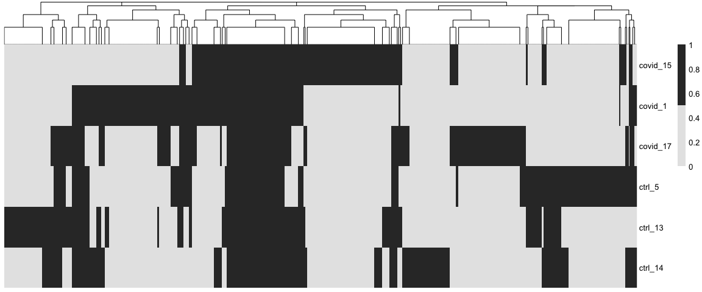
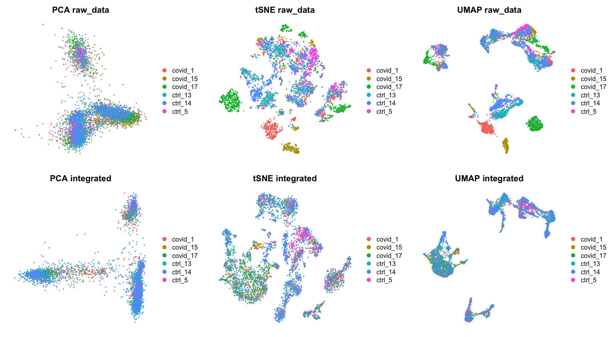
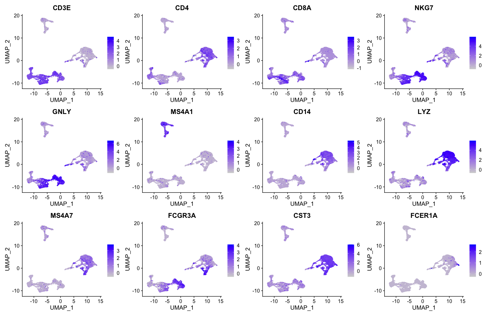
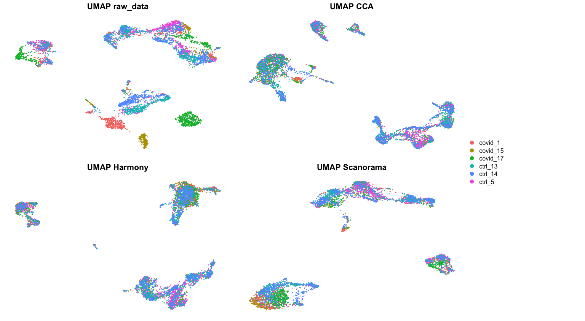

<style>
h1, .h1, h2, .h2, h3, .h3, h4, .h4 { margin-top: 50px }
p.caption {font-size: 0.9em;font-style: italic;color: grey;margin-right: 10%;margin-left: 10%;text-align: justify}
</style>

In this tutorial we will look at different ways of integrating multiple single cell RNA-seq datasets. We will explore two different methods to correct for batch effects across datasets. We will also look at a quantitative measure to assess the quality of the integrated data. Seurat uses the data integration method presented in Comprehensive Integration of Single Cell Data, while Scran and Scanpy use a mutual Nearest neighbour method (MNN). Below you can find a list of the most recent methods for single data integration:

Markdown | Language | Library | Ref
--- | --- | --- | ---
CCA | R | Seurat | [Cell](https://www.sciencedirect.com/science/article/pii/S0092867419305598?via%3Dihub)
MNN | R/Python | Scater/Scanpy | [Nat. Biotech.](https://www.nature.com/articles/nbt.4091)
Conos | R | conos | [Nat. Methods](https://www.nature.com/articles/s41592-019-0466-z?error=cookies_not_supported&code=5680289b-6edb-40ad-9934-415dac4fdb2f)
Scanorama | Python | scanorama | [Nat. Biotech.](https://www.nature.com/articles/s41587-019-0113-3)

Let's first load necessary libraries and the data saved in the previous lab.


```r
suppressPackageStartupMessages({
    library(Seurat)
    library(cowplot)
    library(ggplot2)
})

alldata <- readRDS("data/results/covid_qc_dr.rds")
print(names(alldata@reductions))
```

```
## [1] "pca"               "umap"              "tsne"             
## [4] "UMAP10_on_PCA"     "UMAP_on_ScaleData" "UMAP_on_Graph"
```

We split the combined object into a list, with each dataset as an element. We perform standard preprocessing (log-normalization), and identify variable features individually for each dataset based on a variance stabilizing transformation ("vst").


```r
alldata.list <- SplitObject(alldata, split.by = "orig.ident")
```

```
## Warning: Keys should be one or more alphanumeric characters followed by an
## underscore, setting key from umap10_on_pca_ to umap10onpca_
```

```
## Warning: Keys should be one or more alphanumeric characters followed by an
## underscore, setting key from umap_on_scaledata_ to umaponscaledata_
```

```
## Warning: Keys should be one or more alphanumeric characters followed by an
## underscore, setting key from umap_on_graph_ to umapongraph_
```

```
## Warning: Keys should be one or more alphanumeric characters followed by an
## underscore, setting key from umap10_on_pca_ to umap10onpca_
```

```
## Warning: Keys should be one or more alphanumeric characters followed by an
## underscore, setting key from umap_on_scaledata_ to umaponscaledata_
```

```
## Warning: Keys should be one or more alphanumeric characters followed by an
## underscore, setting key from umap_on_graph_ to umapongraph_
```

```
## Warning: Keys should be one or more alphanumeric characters followed by an
## underscore, setting key from umap10_on_pca_ to umap10onpca_
```

```
## Warning: Keys should be one or more alphanumeric characters followed by an
## underscore, setting key from umap_on_scaledata_ to umaponscaledata_
```

```
## Warning: Keys should be one or more alphanumeric characters followed by an
## underscore, setting key from umap_on_graph_ to umapongraph_
```

```
## Warning: Keys should be one or more alphanumeric characters followed by an
## underscore, setting key from umap10_on_pca_ to umap10onpca_
```

```
## Warning: Keys should be one or more alphanumeric characters followed by an
## underscore, setting key from umap_on_scaledata_ to umaponscaledata_
```

```
## Warning: Keys should be one or more alphanumeric characters followed by an
## underscore, setting key from umap_on_graph_ to umapongraph_
```

```
## Warning: Keys should be one or more alphanumeric characters followed by an
## underscore, setting key from umap10_on_pca_ to umap10onpca_
```

```
## Warning: Keys should be one or more alphanumeric characters followed by an
## underscore, setting key from umap_on_scaledata_ to umaponscaledata_
```

```
## Warning: Keys should be one or more alphanumeric characters followed by an
## underscore, setting key from umap_on_graph_ to umapongraph_
```

```
## Warning: Keys should be one or more alphanumeric characters followed by an
## underscore, setting key from umap10_on_pca_ to umap10onpca_
```

```
## Warning: Keys should be one or more alphanumeric characters followed by an
## underscore, setting key from umap_on_scaledata_ to umaponscaledata_
```

```
## Warning: Keys should be one or more alphanumeric characters followed by an
## underscore, setting key from umap_on_graph_ to umapongraph_
```

```r
for (i in 1:length(alldata.list)) {
    alldata.list[[i]] <- NormalizeData(alldata.list[[i]], verbose = FALSE)
    alldata.list[[i]] <- FindVariableFeatures(alldata.list[[i]], selection.method = "vst",
        nfeatures = 2000, verbose = FALSE)
}

hvgs_per_dataset <- lapply(alldata.list, function(x) {
    x@assays$RNA@var.features
})
# venn::venn(hvgs_per_dataset,opacity = .4,zcolor = scales::hue_pal()(3),cexsn
# = 1,cexil = 1,lwd=1,col='white',frame=F,borders = NA)

temp <- unique(unlist(hvgs_per_dataset))
overlap <- sapply(hvgs_per_dataset, function(x) {
    temp %in% x
})
pheatmap::pheatmap(t(overlap * 1), cluster_rows = F, color = c("grey90", "grey20"))
```

<!-- -->

We identify anchors using the FindIntegrationAnchors function, which takes a list of Seurat objects as input.


```r
alldata.anchors <- FindIntegrationAnchors(object.list = alldata.list, dims = 1:30,
    reduction = "cca")
```

```
## Computing 2000 integration features
```

```
## Scaling features for provided objects
```

```
## Finding all pairwise anchors
```

```
## Running CCA
```

```
## Merging objects
```

```
## Finding neighborhoods
```

```
## Finding anchors
```

```
## 	Found 2041 anchors
```

```
## Filtering anchors
```

```
## 	Retained 1712 anchors
```

```
## Running CCA
```

```
## Merging objects
```

```
## Finding neighborhoods
```

```
## Finding anchors
```

```
## 	Found 2111 anchors
```

```
## Filtering anchors
```

```
## 	Retained 1644 anchors
```

```
## Running CCA
```

```
## Merging objects
```

```
## Finding neighborhoods
```

```
## Finding anchors
```

```
## 	Found 2682 anchors
```

```
## Filtering anchors
```

```
## 	Retained 2167 anchors
```

```
## Running CCA
```

```
## Merging objects
```

```
## Finding neighborhoods
```

```
## Finding anchors
```

```
## 	Found 1814 anchors
```

```
## Filtering anchors
```

```
## 	Retained 1425 anchors
```

```
## Running CCA
```

```
## Merging objects
```

```
## Finding neighborhoods
```

```
## Finding anchors
```

```
## 	Found 2297 anchors
```

```
## Filtering anchors
```

```
## 	Retained 1863 anchors
```

```
## Running CCA
```

```
## Merging objects
```

```
## Finding neighborhoods
```

```
## Finding anchors
```

```
## 	Found 2505 anchors
```

```
## Filtering anchors
```

```
## 	Retained 2025 anchors
```

```
## Running CCA
```

```
## Merging objects
```

```
## Finding neighborhoods
```

```
## Finding anchors
```

```
## 	Found 2151 anchors
```

```
## Filtering anchors
```

```
## 	Retained 1612 anchors
```

```
## Running CCA
```

```
## Merging objects
```

```
## Finding neighborhoods
```

```
## Finding anchors
```

```
## 	Found 2653 anchors
```

```
## Filtering anchors
```

```
## 	Retained 2226 anchors
```

```
## Running CCA
```

```
## Merging objects
```

```
## Finding neighborhoods
```

```
## Finding anchors
```

```
## 	Found 2916 anchors
```

```
## Filtering anchors
```

```
## 	Retained 2161 anchors
```

```
## Running CCA
```

```
## Merging objects
```

```
## Finding neighborhoods
```

```
## Finding anchors
```

```
## 	Found 2934 anchors
```

```
## Filtering anchors
```

```
## 	Retained 2485 anchors
```

```
## Running CCA
```

```
## Merging objects
```

```
## Finding neighborhoods
```

```
## Finding anchors
```

```
## 	Found 2057 anchors
```

```
## Filtering anchors
```

```
## 	Retained 1621 anchors
```

```
## Running CCA
```

```
## Merging objects
```

```
## Finding neighborhoods
```

```
## Finding anchors
```

```
## 	Found 2546 anchors
```

```
## Filtering anchors
```

```
## 	Retained 2186 anchors
```

```
## Running CCA
```

```
## Merging objects
```

```
## Finding neighborhoods
```

```
## Finding anchors
```

```
## 	Found 2738 anchors
```

```
## Filtering anchors
```

```
## 	Retained 2092 anchors
```

```
## Running CCA
```

```
## Merging objects
```

```
## Finding neighborhoods
```

```
## Finding anchors
```

```
## 	Found 2750 anchors
```

```
## Filtering anchors
```

```
## 	Retained 2283 anchors
```

```
## Running CCA
```

```
## Merging objects
```

```
## Finding neighborhoods
```

```
## Finding anchors
```

```
## 	Found 3043 anchors
```

```
## Filtering anchors
```

```
## 	Retained 2765 anchors
```

We then pass these anchors to the IntegrateData function, which returns a Seurat object.


```r
alldata.int <- IntegrateData(anchorset = alldata.anchors, dims = 1:30, new.assay.name = "CCA")
```

```
## Merging dataset 1 into 2
```

```
## Extracting anchors for merged samples
```

```
## Finding integration vectors
```

```
## Finding integration vector weights
```

```
## Integrating data
```

```
## Merging dataset 6 into 5
```

```
## Extracting anchors for merged samples
```

```
## Finding integration vectors
```

```
## Finding integration vector weights
```

```
## Integrating data
```

```
## Merging dataset 2 1 into 5 6
```

```
## Extracting anchors for merged samples
```

```
## Finding integration vectors
```

```
## Finding integration vector weights
```

```
## Integrating data
```

```
## Merging dataset 3 into 5 6 2 1
```

```
## Extracting anchors for merged samples
```

```
## Finding integration vectors
```

```
## Finding integration vector weights
```

```
## Integrating data
```

```
## Merging dataset 4 into 5 6 2 1 3
```

```
## Extracting anchors for merged samples
```

```
## Finding integration vectors
```

```
## Finding integration vector weights
```

```
## Integrating data
```

We can observe that a new assay slot is now created under the name `CCA`.


```r
names(alldata.int@assays)

# by default, Seurat now sets the integrated assay as the default assay, so any
# operation you now perform will be on the ingegrated data.

alldata.int@active.assay
```

```
## [1] "RNA" "CCA"
## [1] "CCA"
```

After running IntegrateData, the Seurat object will contain a new Assay with the integrated (or ‘batch-corrected’) expression matrix. Note that the original (uncorrected values) are still stored in the object in the “RNA” assay, so you can switch back and forth. We can then use this new integrated matrix for downstream analysis and visualization. Here we scale the integrated data, run PCA, and visualize the results with UMAP and TSNE. The integrated datasets cluster by cell type, instead of by technology.


```r
# Run Dimensionality reduction on integrated space
alldata.int <- ScaleData(alldata.int, verbose = FALSE)
alldata.int <- RunPCA(alldata.int, npcs = 30, verbose = FALSE)
alldata.int <- RunUMAP(alldata.int, dims = 1:30)
```

```
## Warning: The default method for RunUMAP has changed from calling Python UMAP via reticulate to the R-native UWOT using the cosine metric
## To use Python UMAP via reticulate, set umap.method to 'umap-learn' and metric to 'correlation'
## This message will be shown once per session
```

```
## 08:47:25 UMAP embedding parameters a = 0.9922 b = 1.112
```

```
## 08:47:25 Read 5532 rows and found 30 numeric columns
```

```
## 08:47:25 Using Annoy for neighbor search, n_neighbors = 30
```

```
## 08:47:25 Building Annoy index with metric = cosine, n_trees = 50
```

```
## 0%   10   20   30   40   50   60   70   80   90   100%
```

```
## [----|----|----|----|----|----|----|----|----|----|
```

```
## **************************************************|
## 08:47:26 Writing NN index file to temp file /var/folders/f_/vj_w4xx933z1rr95yf4rhphr0000gp/T//RtmpS9VPsy/file17a876667960c
## 08:47:26 Searching Annoy index using 1 thread, search_k = 3000
## 08:47:27 Annoy recall = 100%
## 08:47:27 Commencing smooth kNN distance calibration using 1 thread with target n_neighbors = 30
## 08:47:27 Initializing from normalized Laplacian + noise (using irlba)
## 08:47:28 Commencing optimization for 500 epochs, with 248064 positive edges
## 08:47:37 Optimization finished
```

```r
alldata.int <- RunTSNE(alldata.int, dims = 1:30)
```

We can now plot the un-integrated and the integrated space reduced dimensions.


```r
plot_grid(ncol = 3,
  DimPlot(alldata, reduction = "pca", group.by = "orig.ident")+NoAxes()+ggtitle("PCA raw_data"),
  DimPlot(alldata, reduction = "tsne", group.by = "orig.ident")+NoAxes()+ggtitle("tSNE raw_data"),
  DimPlot(alldata, reduction = "umap", group.by = "orig.ident")+NoAxes()+ggtitle("UMAP raw_data"),
  
  DimPlot(alldata.int, reduction = "pca", group.by = "orig.ident")+NoAxes()+ggtitle("PCA integrated"),
  DimPlot(alldata.int, reduction = "tsne", group.by = "orig.ident")+NoAxes()+ggtitle("tSNE integrated"),
  DimPlot(alldata.int, reduction = "umap", group.by = "orig.ident")+NoAxes()+ggtitle("UMAP integrated")
)
```

<!-- -->

Let's plot some marker genes for different celltypes onto the embedding. Some genes are:

Markers	| Cell Type
--- | ---
CD3E	| T cells
CD3E CD4	| CD4+ T cells
CD3E CD8A	| CD8+ T cells
GNLY, NKG7	| NK cells
MS4A1	| B cells
CD14, LYZ, CST3, MS4A7	| CD14+ Monocytes
FCGR3A, LYZ, CST3, MS4A7	| FCGR3A+  Monocytes
FCER1A, CST3 | DCs


```r
myfeatures <- c("CD3E", "CD4", "CD8A", "NKG7", "GNLY", "MS4A1", "CD14", "LYZ", "MS4A7",
    "FCGR3A", "CST3", "FCER1A")
plot_list <- list()
for (i in myfeatures) {
    plot_list[[i]] <- FeaturePlot(alldata, reduction = "umap", dims = 1:2, features = i,
        ncol = 3, order = T) + NoLegend() + NoAxes() + NoGrid()
}
plot_grid(ncol = 3, plotlist = plot_list)
```

<!-- -->


```r
library(harmony)
```

```
## Loading required package: Rcpp
```

```r
alldata.harmony <- RunHarmony(alldata, group.by.vars = "orig.ident", reduction = "pca",
    dims.use = 1:50, assay.use = "RNA")
```

```
## Harmony 1/10
```

```
## Harmony 2/10
```

```
## Harmony 3/10
```

```
## Harmony 4/10
```

```
## Harmony 5/10
```

```
## Harmony 6/10
```

```
## Harmony 7/10
```

```
## Harmony 8/10
```

```
## Harmony 9/10
```

```
## Harmony 10/10
```

```
## Warning: Invalid name supplied, making object name syntactically valid. New
## object name is Seurat..ProjectDim.RNA.harmony; see ?make.names for more details
## on syntax validity
```

```r
# Here we use all PCs computed from Harmony for UMAP calculation
alldata.int[["harmony"]] <- alldata.harmony[["harmony"]]
alldata.int <- RunUMAP(alldata.int, dims = 1:50, reduction = "harmony", reduction.name = "umap_harmony")
```

```
## 08:48:01 UMAP embedding parameters a = 0.9922 b = 1.112
```

```
## 08:48:01 Read 5532 rows and found 50 numeric columns
```

```
## 08:48:01 Using Annoy for neighbor search, n_neighbors = 30
```

```
## 08:48:01 Building Annoy index with metric = cosine, n_trees = 50
```

```
## 0%   10   20   30   40   50   60   70   80   90   100%
```

```
## [----|----|----|----|----|----|----|----|----|----|
```

```
## **************************************************|
## 08:48:01 Writing NN index file to temp file /var/folders/f_/vj_w4xx933z1rr95yf4rhphr0000gp/T//RtmpS9VPsy/file17a87257af62b
## 08:48:01 Searching Annoy index using 1 thread, search_k = 3000
## 08:48:02 Annoy recall = 100%
## 08:48:02 Commencing smooth kNN distance calibration using 1 thread with target n_neighbors = 30
## 08:48:03 Initializing from normalized Laplacian + noise (using irlba)
## 08:48:03 Commencing optimization for 500 epochs, with 252750 positive edges
## 08:48:12 Optimization finished
```

```
## Warning: Cannot add objects with duplicate keys (offending key: UMAP_), setting
## key to 'umap_harmony_'
```


```r
hvgs <- unique(unlist(hvgs_per_dataset))

assaylist <- list()
genelist <- list()
for (i in 1:length(alldata.list)) {
    assaylist[[i]] <- t(as.matrix(GetAssayData(alldata.list[[i]], "data")[hvgs, ]))
    genelist[[i]] <- hvgs
}

lapply(assaylist, dim)
```

```
## [[1]]
## [1]  535 5203
## 
## [[2]]
## [1]  851 5203
## 
## [[3]]
## [1]  946 5203
## 
## [[4]]
## [1] 1026 5203
## 
## [[5]]
## [1] 1139 5203
## 
## [[6]]
## [1] 1035 5203
```


```r
library(reticulate)
scanorama <- import("scanorama")

integrated.data <- scanorama$integrate(datasets_full = assaylist, genes_list = genelist)

intdimred <- do.call(rbind, integrated.data[[1]])
colnames(intdimred) <- paste0("PC_", 1:100)
rownames(intdimred) <- colnames(alldata.int)

# Add standard deviations in order to draw Elbow Plots in Seurat
stdevs <- apply(intdimred, MARGIN = 2, FUN = sd)

alldata.int[["scanorama"]] <- CreateDimReducObject(embeddings = intdimred, stdev = stdevs,
    key = "PC_", assay = "RNA")
```

```
## Warning: Cannot add objects with duplicate keys (offending key: PC_), setting
## key to 'scanorama_'
```

```r
# Here we use all PCs computed from Scanorama for UMAP calculation
alldata.int <- RunUMAP(alldata.int, dims = 1:100, reduction = "scanorama", reduction.name = "umap_scanorama")
```

```
## 08:48:28 UMAP embedding parameters a = 0.9922 b = 1.112
```

```
## 08:48:28 Read 5532 rows and found 100 numeric columns
```

```
## 08:48:28 Using Annoy for neighbor search, n_neighbors = 30
```

```
## 08:48:28 Building Annoy index with metric = cosine, n_trees = 50
```

```
## 0%   10   20   30   40   50   60   70   80   90   100%
```

```
## [----|----|----|----|----|----|----|----|----|----|
```

```
## **************************************************|
## 08:48:29 Writing NN index file to temp file /var/folders/f_/vj_w4xx933z1rr95yf4rhphr0000gp/T//RtmpS9VPsy/file17a87c9ca06b
## 08:48:29 Searching Annoy index using 1 thread, search_k = 3000
## 08:48:30 Annoy recall = 100%
## 08:48:30 Commencing smooth kNN distance calibration using 1 thread with target n_neighbors = 30
## 08:48:30 Initializing from normalized Laplacian + noise (using irlba)
## 08:48:31 Commencing optimization for 500 epochs, with 259970 positive edges
## 08:48:40 Optimization finished
```

```
## Warning: Cannot add objects with duplicate keys (offending key: UMAP_), setting
## key to 'umap_scanorama_'
```


```r
p1 <- DimPlot(alldata, reduction = "umap", group.by = "orig.ident") + ggtitle("UMAP raw_data")
p2 <- DimPlot(alldata.int, reduction = "umap", group.by = "orig.ident") + ggtitle("UMAP CCA")
p3 <- DimPlot(alldata.int, reduction = "umap_harmony", group.by = "orig.ident") +
    ggtitle("UMAP Harmony")
p4 <- DimPlot(alldata.int, reduction = "umap_scanorama", group.by = "orig.ident") +
    ggtitle("UMAP Scanorama")
leg <- get_legend(p1)

gridExtra::grid.arrange(gridExtra::arrangeGrob(p1 + NoLegend() + NoAxes(), p2 + NoLegend() +
    NoAxes(), p3 + NoLegend() + NoAxes(), p4 + NoLegend() + NoAxes(), nrow = 2),
    leg, ncol = 2, widths = c(8, 2))
```

<!-- -->


Finally, lets save the integrated data for further analysis.


```r
saveRDS(alldata.int, "data/results/covid_qc_dr_int.rds")
```


### Session Info
***


```r
sessionInfo()
```

```
## R version 4.1.3 (2022-03-10)
## Platform: x86_64-apple-darwin13.4.0 (64-bit)
## Running under: macOS Big Sur/Monterey 10.16
## 
## Matrix products: default
## BLAS/LAPACK: /Users/asabjor/miniconda3/envs/scRNAseq2023/lib/libopenblasp-r0.3.21.dylib
## 
## locale:
## [1] C/UTF-8/C/C/C/C
## 
## attached base packages:
## [1] stats     graphics  grDevices utils     datasets  methods   base     
## 
## other attached packages:
## [1] reticulate_1.27    harmony_1.0        Rcpp_1.0.10        ggplot2_3.4.0     
## [5] cowplot_1.1.1      SeuratObject_4.1.3 Seurat_4.3.0       RJSONIO_1.3-1.7   
## [9] optparse_1.7.3    
## 
## loaded via a namespace (and not attached):
##   [1] Rtsne_0.16             colorspace_2.1-0       deldir_1.0-6          
##   [4] ellipsis_0.3.2         ggridges_0.5.4         rprojroot_2.0.3       
##   [7] spatstat.data_3.0-0    farver_2.1.1           leiden_0.4.3          
##  [10] listenv_0.9.0          getopt_1.20.3          ggrepel_0.9.2         
##  [13] fansi_1.0.4            codetools_0.2-18       splines_4.1.3         
##  [16] cachem_1.0.6           knitr_1.41             polyclip_1.10-4       
##  [19] jsonlite_1.8.4         ica_1.0-3              cluster_2.1.4         
##  [22] png_0.1-8              pheatmap_1.0.12        uwot_0.1.14           
##  [25] shiny_1.7.4            sctransform_0.3.5      spatstat.sparse_3.0-0 
##  [28] compiler_4.1.3         httr_1.4.4             assertthat_0.2.1      
##  [31] Matrix_1.5-3           fastmap_1.1.0          lazyeval_0.2.2        
##  [34] cli_3.6.0              later_1.3.0            formatR_1.14          
##  [37] htmltools_0.5.4        tools_4.1.3            igraph_1.3.5          
##  [40] gtable_0.3.1           glue_1.6.2             RANN_2.6.1            
##  [43] reshape2_1.4.4         dplyr_1.0.10           scattermore_0.8       
##  [46] jquerylib_0.1.4        vctrs_0.5.2            nlme_3.1-161          
##  [49] spatstat.explore_3.0-5 progressr_0.13.0       lmtest_0.9-40         
##  [52] spatstat.random_3.0-1  xfun_0.36              stringr_1.5.0         
##  [55] globals_0.16.2         mime_0.12              miniUI_0.1.1.1        
##  [58] lifecycle_1.0.3        irlba_2.3.5.1          goftest_1.2-3         
##  [61] future_1.30.0          MASS_7.3-58.2          zoo_1.8-11            
##  [64] scales_1.2.1           promises_1.2.0.1       spatstat.utils_3.0-1  
##  [67] parallel_4.1.3         RColorBrewer_1.1-3     yaml_2.3.7            
##  [70] pbapply_1.7-0          gridExtra_2.3          sass_0.4.5            
##  [73] stringi_1.7.12         highr_0.10             rlang_1.0.6           
##  [76] pkgconfig_2.0.3        matrixStats_0.63.0     evaluate_0.20         
##  [79] lattice_0.20-45        tensor_1.5             ROCR_1.0-11           
##  [82] purrr_1.0.1            labeling_0.4.2         patchwork_1.1.2       
##  [85] htmlwidgets_1.6.1      tidyselect_1.2.0       here_1.0.1            
##  [88] parallelly_1.34.0      RcppAnnoy_0.0.20       plyr_1.8.8            
##  [91] magrittr_2.0.3         R6_2.5.1               generics_0.1.3        
##  [94] DBI_1.1.3              withr_2.5.0            pillar_1.8.1          
##  [97] fitdistrplus_1.1-8     survival_3.5-0         abind_1.4-5           
## [100] sp_1.6-0               tibble_3.1.8           future.apply_1.10.0   
## [103] KernSmooth_2.23-20     utf8_1.2.2             spatstat.geom_3.0-5   
## [106] plotly_4.10.1          rmarkdown_2.20         grid_4.1.3            
## [109] data.table_1.14.6      digest_0.6.31          xtable_1.8-4          
## [112] tidyr_1.2.1            httpuv_1.6.8           munsell_0.5.0         
## [115] viridisLite_0.4.1      bslib_0.4.2
```


