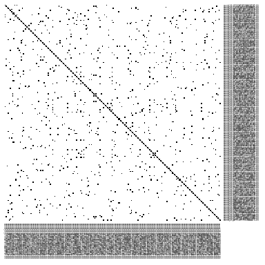
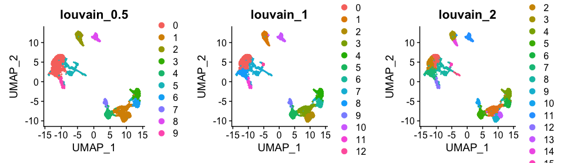
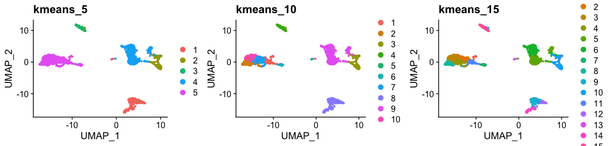
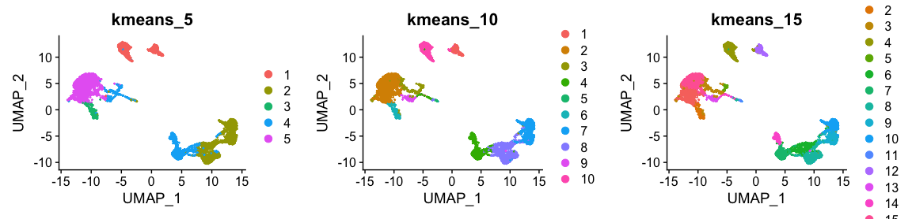
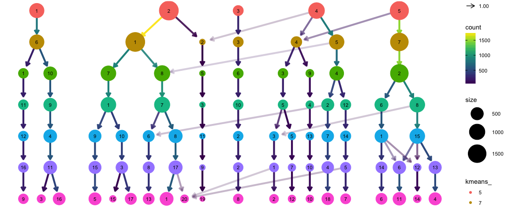
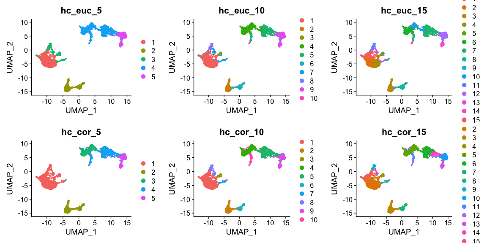

<style>
h1, .h1, h2, .h2, h3, .h3, h4, .h4 { margin-top: 50px }
p.caption {font-size: 0.9em;font-style: italic;color: grey;margin-right: 10%;margin-left: 10%;text-align: justify}
</style>

# Clustering


In this tutorial we will continue the analysis of the integrated dataset. We will use the integrated PCA to perform the clustering. First we will construct a $k$-nearest neighbour graph in order to perform a clustering on the graph. We will also show how to perform hierarchical clustering and k-means clustering on PCA space.

Let's first load all necessary libraries and also the integrated dataset from the previous step.


```r
if (!require(clustree)) {
    install.packages("clustree", dependencies = FALSE)
}
```

```
## Loading required package: clustree
```

```
## Loading required package: ggraph
```

```r
suppressPackageStartupMessages({
    library(Seurat)
    library(cowplot)
    library(ggplot2)
    library(pheatmap)
    library(rafalib)
    library(clustree)
})

alldata <- readRDS("data/results/covid_qc_dr_int.rds")
```

## Graph clustering
***

The procedure of clustering on a Graph can be generalized as 3 main steps:

1) Build a kNN graph from the data

2) Prune spurious connections from kNN graph (optional step). This is a SNN graph.

3) Find groups of cells that maximizes the connections within the group compared other groups.

### Building kNN / SNN graph


The first step into graph clustering is to construct a k-nn graph, in case you don't have one. For this, we will use the PCA space. Thus, as done for dimensionality reduction, we will use ony the top *N* PCA dimensions for this purpose (the same used for computing UMAP / tSNE).

As we can see above, the **Seurat** function `FindNeighbors` already computes both the KNN and SNN graphs, in which we can control the minimal percentage of shared neighbours to be kept. See `?FindNeighbors` for additional options.


```r
# check that CCA is still the active assay
alldata@active.assay


alldata <- FindNeighbors(alldata, dims = 1:30, k.param = 60, prune.SNN = 1/15)
```

```
## Computing nearest neighbor graph
```

```
## Computing SNN
```

```r
# check the names for graphs in the object.
names(alldata@graphs)
```

```
## [1] "CCA"
## [1] "CCA_nn"  "CCA_snn"
```

We can take a look at the kNN graph. It is a matrix where every connection between cells is represented as $1$s. This is called a **unweighted** graph (default in Seurat). Some cell connections can however have more importance than others, in that case the scale of the graph from $0$ to a maximum distance. Usually, the smaller the distance, the closer two points are, and stronger is their connection. This is called a **weighted** graph. Both weighted and unweighted graphs are suitable for clustering, but clustering on unweighted graphs is faster for large datasets (> 100k cells).


```r
pheatmap(alldata@graphs$CCA_nn[1:200, 1:200], col = c("white", "black"), border_color = "grey90",
    legend = F, cluster_rows = F, cluster_cols = F, fontsize = 2)
```

<!-- -->

### Clustering on a graph


Once the graph is built, we can now perform graph clustering. The clustering is done respective to a resolution which can be interpreted as how coarse you want your cluster to be. Higher resolution means higher number of clusters.

In **Seurat**, the function `FindClusters` will do a graph-based clustering using "Louvain" algorithim by default (`algorithm = 1`). TO use the leiden algorithm, you need to set it to `algorithm = 4`. See `?FindClusters` for additional options.


```r
# Clustering with louvain (algorithm 1)
for (res in c(0.1, 0.25, 0.5, 1, 1.5, 2)) {
    alldata <- FindClusters(alldata, graph.name = "CCA_snn", resolution = res, algorithm = 1)
}

# each time you run clustering, the data is stored in meta data columns:
# seurat_clusters - lastest results only CCA_snn_res.XX - for each different
# resolution you test.

plot_grid(ncol = 3, DimPlot(alldata, reduction = "umap", group.by = "CCA_snn_res.0.5") +
    ggtitle("louvain_0.5"), DimPlot(alldata, reduction = "umap", group.by = "CCA_snn_res.1") +
    ggtitle("louvain_1"), DimPlot(alldata, reduction = "umap", group.by = "CCA_snn_res.2") +
    ggtitle("louvain_2"))
```

<!-- -->

We can now use the `clustree` package to visualize how cells are distributed between clusters depending on resolution.


```r
# install.packages('clustree')
suppressPackageStartupMessages(library(clustree))

clustree(alldata@meta.data, prefix = "CCA_snn_res.")
```

<!-- -->


## K-means clustering
***

K-means is a generic clustering algorithm that has been used in many application areas. In R, it can be applied via the kmeans function. Typically, it is applied to a reduced dimension representation of the expression data (most often PCA, because of the interpretability of the low-dimensional distances). We need to define the number of clusters in advance. Since the results depend on the initialization of the cluster centers, it is typically recommended to run K-means with multiple starting configurations (via the nstart argument).


```r
for (k in c(5, 7, 10, 12, 15, 17, 20)) {
    alldata@meta.data[, paste0("kmeans_", k)] <- kmeans(x = alldata@reductions[["pca"]]@cell.embeddings,
        centers = k, nstart = 100)$cluster
}

plot_grid(ncol = 3, DimPlot(alldata, reduction = "umap", group.by = "kmeans_5") +
    ggtitle("kmeans_5"), DimPlot(alldata, reduction = "umap", group.by = "kmeans_10") +
    ggtitle("kmeans_10"), DimPlot(alldata, reduction = "umap", group.by = "kmeans_15") +
    ggtitle("kmeans_15"))
```

<!-- -->


```r
clustree(alldata@meta.data, prefix = "kmeans_")
```

<!-- -->

## Hierarchical clustering
***

### Defining distance between cells

The base R `stats` package already contains a function `dist` that calculates distances between all pairs of samples. Since we want to compute distances between samples, rather than among genes, we need to transpose the data before applying it to the `dist` function. This can be done by simply adding the transpose function `t()` to the data. The distance methods available  in `dist` are: "euclidean", "maximum", "manhattan", "canberra", "binary" or "minkowski".


```r
d <- dist(alldata@reductions[["pca"]]@cell.embeddings, method = "euclidean")
```

As you might have realized, correlation is not a method implemented in the `dist` function. However, we can create our own distances and transform them to a distance object. We can first compute sample correlations using the `cor` function.
As you already know, correlation range from -1 to 1, where 1 indicates that two samples are closest, -1 indicates that two samples are the furthest and 0 is somewhat in between. This, however, creates a problem in defining distances because a distance of 0 indicates that two samples are closest, 1 indicates that two samples are the furthest and distance of -1 is not meaningful. We thus need to transform the correlations to a positive scale (a.k.a. **adjacency**):

\[adj = \frac{1- cor}{2}\]

Once we transformed the correlations to a 0-1 scale, we can simply convert it to a distance object using `as.dist` function. The transformation does not need to have a maximum of 1, but it is more intuitive to have it at 1, rather than at any other number.


```r
# Compute sample correlations
sample_cor <- cor(Matrix::t(alldata@reductions[["pca"]]@cell.embeddings))

# Transform the scale from correlations
sample_cor <- (1 - sample_cor)/2

# Convert it to a distance object
d2 <- as.dist(sample_cor)
```

### Defining distance between cells

After having calculated the distances between samples calculated, we can now proceed with the hierarchical clustering per-se. We will use the function `hclust` for this purpose, in which we can simply run it with the distance objects created above. The methods available are: "ward.D", "ward.D2", "single", "complete", "average", "mcquitty", "median" or "centroid". It is possible to plot the dendrogram for all cells, but this is very time consuming and we will omit for this tutorial.


```r
# euclidean
h_euclidean <- hclust(d, method = "ward.D2")

# correlation
h_correlation <- hclust(d2, method = "ward.D2")
```

 Once your dendrogram is created, the next step is to define which samples belong to a particular cluster. After identifying the dendrogram, we can now literally cut the tree at a fixed threshold (with `cutree`) at different levels to define the clusters. We can either define the number of clusters or decide on a height. We can simply try different clustering levels.


```r
#euclidean distance
alldata$hc_euclidean_5 <- cutree(h_euclidean,k = 5)
alldata$hc_euclidean_10 <- cutree(h_euclidean,k = 10)
alldata$hc_euclidean_15 <- cutree(h_euclidean,k = 15)

#correlation distance
alldata$hc_corelation_5 <- cutree(h_correlation,k = 5)
alldata$hc_corelation_10 <- cutree(h_correlation,k = 10)
alldata$hc_corelation_15 <- cutree(h_correlation,k = 15)


plot_grid(ncol = 3,
  DimPlot(alldata, reduction = "umap", group.by = "hc_euclidean_5")+ggtitle("hc_euc_5"),
  DimPlot(alldata, reduction = "umap", group.by = "hc_euclidean_10")+ggtitle("hc_euc_10"),
  DimPlot(alldata, reduction = "umap", group.by = "hc_euclidean_15")+ggtitle("hc_euc_15"),

  DimPlot(alldata, reduction = "umap", group.by = "hc_corelation_5")+ggtitle("hc_cor_5"),
  DimPlot(alldata, reduction = "umap", group.by = "hc_corelation_10")+ggtitle("hc_cor_10"),
  DimPlot(alldata, reduction = "umap", group.by = "hc_corelation_15")+ggtitle("hc_cor_15")
)
```

<!-- -->


Finally, lets save the integrated data for further analysis.


```r
saveRDS(alldata, "data/results/covid_qc_dr_int_cl.rds")
```


<style>
div.blue { background-color:#e6f0ff; border-radius: 5px; padding: 10px;}
</style>
<div class = "blue">
**Your turn**

By now you should know how to plot different features onto your data. Take the QC metrics that were calculated in the first exercise, that should be stored in your data object, and plot it as violin plots per cluster using the clustering method of your choice. For example, plot number of UMIS, detected genes, percent mitochondrial reads.

Then, check carefully if there is any bias in how your data is separated due to quality metrics. Could it be explained biologically, or could you have technical bias there?
</div>


### Session Info
***


```r
sessionInfo()
```

```
## R version 4.0.5 (2021-03-31)
## Platform: x86_64-apple-darwin13.4.0 (64-bit)
## Running under: macOS Big Sur 10.16
## 
## Matrix products: default
## BLAS/LAPACK: /Users/paulo.czarnewski/miniconda3/envs/scRNAseq2022/lib/libopenblasp-r0.3.18.dylib
## 
## locale:
## [1] en_US.UTF-8/en_US.UTF-8/en_US.UTF-8/C/en_US.UTF-8/en_US.UTF-8
## 
## attached base packages:
##  [1] parallel  stats4    grid      stats     graphics  grDevices utils    
##  [8] datasets  methods   base     
## 
## other attached packages:
##  [1] rafalib_1.0.0               pheatmap_1.0.12            
##  [3] clustree_0.4.4              ggraph_2.0.5               
##  [5] reticulate_1.22             harmony_1.0                
##  [7] Rcpp_1.0.7                  scran_1.18.5               
##  [9] SingleCellExperiment_1.12.0 SummarizedExperiment_1.20.0
## [11] Biobase_2.50.0              GenomicRanges_1.42.0       
## [13] GenomeInfoDb_1.26.4         IRanges_2.24.1             
## [15] S4Vectors_0.28.1            BiocGenerics_0.36.0        
## [17] MatrixGenerics_1.2.1        matrixStats_0.61.0         
## [19] ggplot2_3.3.5               cowplot_1.1.1              
## [21] KernSmooth_2.23-20          fields_13.3                
## [23] viridis_0.6.2               viridisLite_0.4.0          
## [25] spam_2.7-0                  dotCall64_1.0-1            
## [27] DoubletFinder_2.0.3         Matrix_1.4-0               
## [29] SeuratObject_4.0.4          Seurat_4.0.6               
## [31] RJSONIO_1.3-1.6             optparse_1.7.1             
## 
## loaded via a namespace (and not attached):
##   [1] utf8_1.2.2                tidyselect_1.1.1         
##   [3] htmlwidgets_1.5.4         BiocParallel_1.24.1      
##   [5] Rtsne_0.15                munsell_0.5.0            
##   [7] codetools_0.2-18          ica_1.0-2                
##   [9] statmod_1.4.36            future_1.23.0            
##  [11] miniUI_0.1.1.1            withr_2.4.3              
##  [13] colorspace_2.0-2          highr_0.9                
##  [15] knitr_1.37                ROCR_1.0-11              
##  [17] tensor_1.5                listenv_0.8.0            
##  [19] labeling_0.4.2            GenomeInfoDbData_1.2.4   
##  [21] polyclip_1.10-0           bit64_4.0.5              
##  [23] farver_2.1.0              rprojroot_2.0.2          
##  [25] parallelly_1.30.0         vctrs_0.3.8              
##  [27] generics_0.1.1            xfun_0.29                
##  [29] R6_2.5.1                  graphlayouts_0.7.2       
##  [31] rsvd_1.0.5                locfit_1.5-9.4           
##  [33] hdf5r_1.3.5               bitops_1.0-7             
##  [35] spatstat.utils_2.3-0      DelayedArray_0.16.3      
##  [37] assertthat_0.2.1          promises_1.2.0.1         
##  [39] scales_1.1.1              gtable_0.3.0             
##  [41] beachmat_2.6.4            globals_0.14.0           
##  [43] processx_3.5.2            goftest_1.2-3            
##  [45] tidygraph_1.2.0           rlang_0.4.12             
##  [47] splines_4.0.5             lazyeval_0.2.2           
##  [49] checkmate_2.0.0           spatstat.geom_2.3-1      
##  [51] yaml_2.2.1                reshape2_1.4.4           
##  [53] abind_1.4-5               backports_1.4.1          
##  [55] httpuv_1.6.4              tools_4.0.5              
##  [57] ellipsis_0.3.2            spatstat.core_2.3-2      
##  [59] jquerylib_0.1.4           RColorBrewer_1.1-2       
##  [61] ggridges_0.5.3            plyr_1.8.6               
##  [63] sparseMatrixStats_1.2.1   zlibbioc_1.36.0          
##  [65] purrr_0.3.4               RCurl_1.98-1.5           
##  [67] ps_1.6.0                  prettyunits_1.1.1        
##  [69] rpart_4.1-15              deldir_1.0-6             
##  [71] pbapply_1.5-0             zoo_1.8-9                
##  [73] ggrepel_0.9.1             cluster_2.1.2            
##  [75] here_1.0.1                magrittr_2.0.1           
##  [77] data.table_1.14.2         RSpectra_0.16-0          
##  [79] scattermore_0.7           lmtest_0.9-39            
##  [81] RANN_2.6.1                fitdistrplus_1.1-6       
##  [83] patchwork_1.1.1           mime_0.12                
##  [85] evaluate_0.14             xtable_1.8-4             
##  [87] gridExtra_2.3             compiler_4.0.5           
##  [89] tibble_3.1.6              maps_3.4.0               
##  [91] crayon_1.4.2              htmltools_0.5.2          
##  [93] mgcv_1.8-38               later_1.2.0              
##  [95] tidyr_1.1.4               DBI_1.1.2                
##  [97] tweenr_1.0.2              formatR_1.11             
##  [99] MASS_7.3-54               getopt_1.20.3            
## [101] cli_3.1.0                 igraph_1.2.10            
## [103] pkgconfig_2.0.3           scuttle_1.0.4            
## [105] plotly_4.10.0             spatstat.sparse_2.1-0    
## [107] bslib_0.3.1               dqrng_0.3.0              
## [109] XVector_0.30.0            stringr_1.4.0            
## [111] callr_3.7.0               digest_0.6.29            
## [113] sctransform_0.3.2         RcppAnnoy_0.0.19         
## [115] spatstat.data_2.1-2       rmarkdown_2.11           
## [117] leiden_0.3.9              edgeR_3.32.1             
## [119] uwot_0.1.11               DelayedMatrixStats_1.12.3
## [121] curl_4.3.2                shiny_1.7.1              
## [123] lifecycle_1.0.1           nlme_3.1-153             
## [125] jsonlite_1.7.2            BiocNeighbors_1.8.2      
## [127] limma_3.46.0              fansi_0.5.0              
## [129] pillar_1.6.4              lattice_0.20-45          
## [131] fastmap_1.1.0             httr_1.4.2               
## [133] pkgbuild_1.3.1            survival_3.2-13          
## [135] glue_1.6.0                remotes_2.4.2            
## [137] png_0.1-7                 bluster_1.0.0            
## [139] bit_4.0.4                 ggforce_0.3.3            
## [141] stringi_1.7.6             sass_0.4.0               
## [143] BiocSingular_1.6.0        dplyr_1.0.7              
## [145] irlba_2.3.5               future.apply_1.8.1
```
