<style>
h1, .h1, h2, .h2, h3, .h3, h4, .h4 { margin-top: 50px }
p.caption {font-size: 0.9em;font-style: italic;color: grey;margin-right: 10%;margin-left: 10%;text-align: justify}
</style>

# Differential gene expression

In this tutorial we will cover about Differetial gene expression, which comprises an extensive range of topics and methods. In single cell, differential expresison can have multiple functionalities such as of identifying marker genes for cell populations, as well as differentially regulated genes across conditions (healthy vs control). We will also exercise on how to account the batch information in your test.

We can first load the data from the clustering session. Moreover, we can already decide which clustering resolution to use. First let's define using the `louvain` clustering to identifying differentially expressed genes.  


```r
suppressPackageStartupMessages({
    library(Seurat)
    library(dplyr)
    library(cowplot)
    library(ggplot2)
    library(pheatmap)
    library(enrichR)
    library(rafalib)
    library(Matrix)
    library(edgeR)
    library(MAST)
})

alldata <- readRDS("data/results/covid_qc_dr_int_cl.rds")
```


```r
# Set the identity as louvain with resolution 0.5
sel.clust = "CCA_snn_res.0.5"

alldata <- SetIdent(alldata, value = sel.clust)
table(alldata@active.ident)
```

```
## 
##    0    1    2    3    4    5    6    7    8    9 
## 1536 1014  568  442  427  418  407  268  242  210
```

```r
# plot this clustering
plot_grid(ncol = 3, DimPlot(alldata, label = T) + NoAxes(), DimPlot(alldata, group.by = "orig.ident") +
    NoAxes(), DimPlot(alldata, group.by = "type") + NoAxes())
```

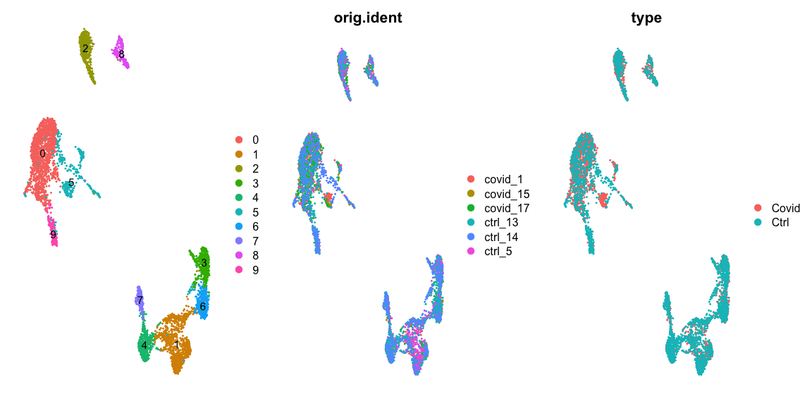<!-- -->

## Cell marker genes
***

Let us first compute a ranking for the highly differential genes in each cluster. There are many different tests and parameters to be chosen that can be used to refine your results. When looking for marker genes, we want genes that are positivelly expressed in a cell type and possibly not expressed in the others.


```r
# Compute differentiall expression
markers_genes <- FindAllMarkers(alldata, log2FC.threshold = 0.2, test.use = "wilcox",
    min.pct = 0.1, min.diff.pct = 0.2, only.pos = TRUE, max.cells.per.ident = 50,
    assay = "RNA")
```

We can now select the top 25 up regulated genes for plotting.


```r
markers_genes %>%
    group_by(cluster) %>%
    top_n(-25, p_val_adj) -> top25
top25
```

<div data-pagedtable="false">
  <script data-pagedtable-source type="application/json">
{"columns":[{"label":["p_val"],"name":[1],"type":["dbl"],"align":["right"]},{"label":["avg_log2FC"],"name":[2],"type":["dbl"],"align":["right"]},{"label":["pct.1"],"name":[3],"type":["dbl"],"align":["right"]},{"label":["pct.2"],"name":[4],"type":["dbl"],"align":["right"]},{"label":["p_val_adj"],"name":[5],"type":["dbl"],"align":["right"]},{"label":["cluster"],"name":[6],"type":["fct"],"align":["left"]},{"label":["gene"],"name":[7],"type":["chr"],"align":["left"]}],"data":[{"1":"7.612595e-20","2":"2.7792332","3":"0.966","4":"0.092","5":"1.379478e-15","6":"0","7":"MNDA"},{"1":"2.715601e-18","2":"1.7283856","3":"0.923","4":"0.108","5":"4.920941e-14","6":"0","7":"CD68"},{"1":"3.348607e-18","2":"3.9440548","3":"1.000","4":"0.244","5":"6.068010e-14","6":"0","7":"LYZ"},{"1":"6.313487e-18","2":"5.3039852","3":"0.991","4":"0.240","5":"1.144067e-13","6":"0","7":"S100A8"},{"1":"9.941116e-18","2":"2.4589067","3":"0.964","4":"0.157","5":"1.801430e-13","6":"0","7":"GRN"},{"1":"1.953105e-17","2":"3.0907327","3":"0.990","4":"0.117","5":"3.539221e-13","6":"0","7":"FCN1"},{"1":"2.060698e-17","2":"1.5544861","3":"0.822","4":"0.078","5":"3.734191e-13","6":"0","7":"RAB31"},{"1":"2.343330e-17","2":"2.5237332","3":"0.998","4":"0.562","5":"4.246348e-13","6":"0","7":"CTSS"},{"1":"3.844688e-17","2":"1.6162802","3":"0.843","4":"0.076","5":"6.966958e-13","6":"0","7":"CFP"},{"1":"4.085713e-17","2":"3.9136517","3":"0.938","4":"0.048","5":"7.403720e-13","6":"0","7":"S100A12"},{"1":"5.359845e-17","2":"2.2608226","3":"0.990","4":"0.194","5":"9.712575e-13","6":"0","7":"CST3"},{"1":"6.625090e-17","2":"1.8537891","3":"0.997","4":"0.360","5":"1.200533e-12","6":"0","7":"TYROBP"},{"1":"6.945318e-17","2":"1.5162024","3":"0.818","4":"0.065","5":"1.258561e-12","6":"0","7":"TIMP2"},{"1":"1.119763e-16","2":"2.1052605","3":"0.922","4":"0.072","5":"2.029123e-12","6":"0","7":"CSF3R"},{"1":"1.165081e-16","2":"2.3362126","3":"0.950","4":"0.064","5":"2.111243e-12","6":"0","7":"CSTA"},{"1":"1.503950e-16","2":"3.2853598","3":"0.985","4":"0.103","5":"2.725308e-12","6":"0","7":"AC020656.1"},{"1":"1.810041e-16","2":"4.4739360","3":"0.995","4":"0.329","5":"3.279975e-12","6":"0","7":"S100A9"},{"1":"2.002263e-16","2":"1.9702926","3":"0.976","4":"0.410","5":"3.628300e-12","6":"0","7":"TKT"},{"1":"2.243109e-16","2":"3.4005796","3":"0.964","4":"0.054","5":"4.064738e-12","6":"0","7":"VCAN"},{"1":"2.391315e-16","2":"2.3864180","3":"0.979","4":"0.282","5":"4.333303e-12","6":"0","7":"TYMP"},{"1":"2.477842e-16","2":"2.1956138","3":"0.991","4":"0.163","5":"4.490098e-12","6":"0","7":"AIF1"},{"1":"2.649258e-16","2":"2.3882831","3":"0.930","4":"0.046","5":"4.800721e-12","6":"0","7":"MS4A6A"},{"1":"3.362848e-16","2":"2.0359884","3":"0.968","4":"0.097","5":"6.093816e-12","6":"0","7":"SERPINA1"},{"1":"3.634932e-16","2":"1.7288074","3":"0.851","4":"0.105","5":"6.586861e-12","6":"0","7":"BLVRB"},{"1":"4.166304e-16","2":"1.6101689","3":"0.820","4":"0.064","5":"7.549759e-12","6":"0","7":"CLEC7A"},{"1":"6.148570e-17","2":"2.1067418","3":"0.938","4":"0.187","5":"1.114182e-12","6":"1","7":"CD3D"},{"1":"1.497220e-16","2":"1.7256011","3":"0.983","4":"0.328","5":"2.713113e-12","6":"1","7":"IL32"},{"1":"1.661789e-15","2":"1.6899779","3":"0.954","4":"0.275","5":"3.011328e-11","6":"1","7":"CD3E"},{"1":"2.190329e-15","2":"1.9266127","3":"0.988","4":"0.392","5":"3.969096e-11","6":"1","7":"CCL5"},{"1":"9.161114e-15","2":"1.8794981","3":"0.854","4":"0.165","5":"1.660085e-10","6":"1","7":"CD3G"},{"1":"1.017404e-13","2":"1.9531030","3":"0.834","4":"0.193","5":"1.843638e-09","6":"1","7":"GZMH"},{"1":"2.198612e-13","2":"1.3135849","3":"0.890","4":"0.261","5":"3.984106e-09","6":"1","7":"GZMM"},{"1":"4.316628e-12","2":"1.2178850","3":"0.956","4":"0.299","5":"7.822161e-08","6":"1","7":"CST7"},{"1":"1.921215e-11","2":"1.6102457","3":"0.740","4":"0.169","5":"3.481434e-07","6":"1","7":"TRAC"},{"1":"2.527679e-11","2":"0.8830142","3":"0.843","4":"0.261","5":"4.580406e-07","6":"1","7":"CTSW"},{"1":"2.763993e-11","2":"1.2202569","3":"0.718","4":"0.243","5":"5.008631e-07","6":"1","7":"SPOCK2"},{"1":"1.398729e-10","2":"1.0806810","3":"0.907","4":"0.616","5":"2.534637e-06","6":"1","7":"PPP2R5C"},{"1":"1.698512e-10","2":"1.3456753","3":"0.909","4":"0.232","5":"3.077874e-06","6":"1","7":"GZMA"},{"1":"1.787113e-10","2":"1.3397386","3":"0.984","4":"0.395","5":"3.238428e-06","6":"1","7":"NKG7"},{"1":"4.712430e-10","2":"1.5208558","3":"0.622","4":"0.076","5":"8.539394e-06","6":"1","7":"KLRG1"},{"1":"1.259765e-09","2":"2.1925020","3":"0.559","4":"0.071","5":"2.282820e-05","6":"1","7":"CD8A"},{"1":"1.634915e-09","2":"1.0432130","3":"0.545","4":"0.140","5":"2.962629e-05","6":"1","7":"CD6"},{"1":"2.209935e-09","2":"0.7205316","3":"0.654","4":"0.199","5":"4.004623e-05","6":"1","7":"FGFBP2"},{"1":"3.545063e-09","2":"1.1724015","3":"0.821","4":"0.318","5":"6.424009e-05","6":"1","7":"SYNE2"},{"1":"7.612971e-09","2":"1.4690256","3":"0.770","4":"0.331","5":"1.379547e-04","6":"1","7":"DUSP2"},{"1":"1.019857e-08","2":"1.1358761","3":"0.922","4":"0.470","5":"1.848083e-04","6":"1","7":"ARL4C"},{"1":"1.051511e-08","2":"0.9692853","3":"0.679","4":"0.236","5":"1.905443e-04","6":"1","7":"LCK"},{"1":"1.245509e-08","2":"1.2907572","3":"0.545","4":"0.222","5":"2.256987e-04","6":"1","7":"TRBC1"},{"1":"1.496267e-08","2":"1.8210303","3":"0.469","4":"0.040","5":"2.711385e-04","6":"1","7":"CD8B"},{"1":"2.774110e-08","2":"0.7557258","3":"0.593","4":"0.250","5":"5.026965e-04","6":"1","7":"SKAP1"},{"1":"7.720341e-19","2":"3.5525670","3":"0.954","4":"0.028","5":"1.399003e-14","6":"2","7":"IGHD"},{"1":"1.053865e-17","2":"2.5613845","3":"0.887","4":"0.061","5":"1.909708e-13","6":"2","7":"LINC00926"},{"1":"1.145717e-17","2":"4.2500339","3":"0.993","4":"0.063","5":"2.076153e-13","6":"2","7":"IGHM"},{"1":"8.814770e-17","2":"3.2650169","3":"0.975","4":"0.073","5":"1.597325e-12","6":"2","7":"CD79A"},{"1":"9.568356e-17","2":"2.4938971","3":"0.910","4":"0.065","5":"1.733882e-12","6":"2","7":"MS4A1"},{"1":"1.323577e-15","2":"2.4503568","3":"0.900","4":"0.067","5":"2.398454e-11","6":"2","7":"TNFRSF13C"},{"1":"6.322549e-15","2":"2.1346178","3":"0.842","4":"0.067","5":"1.145709e-10","6":"2","7":"BANK1"},{"1":"7.156067e-15","2":"2.6058616","3":"0.755","4":"0.009","5":"1.296751e-10","6":"2","7":"TCL1A"},{"1":"1.610116e-14","2":"1.8708933","3":"0.991","4":"0.620","5":"2.917691e-10","6":"2","7":"HLA-DRA"},{"1":"4.307670e-14","2":"1.5756730","3":"0.974","4":"0.671","5":"7.805929e-10","6":"2","7":"HLA-DPB1"},{"1":"7.322925e-14","2":"1.8609423","3":"0.653","4":"0.028","5":"1.326987e-09","6":"2","7":"FCER2"},{"1":"1.688206e-13","2":"2.4705901","3":"0.882","4":"0.141","5":"3.059197e-09","6":"2","7":"CD79B"},{"1":"1.744661e-13","2":"1.9496605","3":"0.975","4":"0.528","5":"3.161500e-09","6":"2","7":"HLA-DQB1"},{"1":"5.367370e-13","2":"1.6626903","3":"0.968","4":"0.640","5":"9.726211e-09","6":"2","7":"CXCR4"},{"1":"7.260192e-13","2":"1.4989109","3":"0.991","4":"0.710","5":"1.315619e-08","6":"2","7":"HLA-DRB1"},{"1":"3.774935e-12","2":"1.2426490","3":"0.970","4":"0.687","5":"6.840560e-08","6":"2","7":"HLA-DPA1"},{"1":"8.116644e-12","2":"1.7312572","3":"0.651","4":"0.050","5":"1.470817e-07","6":"2","7":"CD22"},{"1":"1.104838e-11","2":"1.2514285","3":"0.762","4":"0.392","5":"2.002077e-07","6":"2","7":"SNX2"},{"1":"1.601046e-11","2":"1.6633351","3":"0.592","4":"0.022","5":"2.901256e-07","6":"2","7":"FCRL1"},{"1":"2.970120e-11","2":"1.4019469","3":"0.782","4":"0.302","5":"5.382155e-07","6":"2","7":"HLA-DMB"},{"1":"4.034059e-11","2":"1.3976433","3":"0.884","4":"0.309","5":"7.310119e-07","6":"2","7":"HLA-DQA1"},{"1":"4.818497e-11","2":"1.7706955","3":"0.694","4":"0.045","5":"8.731599e-07","6":"2","7":"AFF3"},{"1":"9.457728e-11","2":"1.8593765","3":"0.836","4":"0.342","5":"1.713835e-06","6":"2","7":"YBX3"},{"1":"1.025006e-10","2":"2.3631398","3":"0.882","4":"0.288","5":"1.857414e-06","6":"2","7":"CD83"},{"1":"1.837198e-10","2":"1.6585122","3":"0.607","4":"0.028","5":"3.329187e-06","6":"2","7":"FAM129C"},{"1":"3.200527e-15","2":"1.6515346","3":"0.864","4":"0.269","5":"5.799676e-11","6":"3","7":"HOPX"},{"1":"6.290299e-15","2":"2.0490214","3":"0.968","4":"0.315","5":"1.139865e-10","6":"3","7":"CTSW"},{"1":"3.087141e-14","2":"2.1000560","3":"0.991","4":"0.370","5":"5.594208e-10","6":"3","7":"CST7"},{"1":"3.353468e-13","2":"2.2367943","3":"1.000","4":"0.460","5":"6.076819e-09","6":"3","7":"NKG7"},{"1":"6.055926e-13","2":"2.1746938","3":"0.860","4":"0.106","5":"1.097394e-08","6":"3","7":"TRDC"},{"1":"1.423893e-12","2":"2.4904010","3":"0.950","4":"0.224","5":"2.580237e-08","6":"3","7":"FGFBP2"},{"1":"1.948460e-12","2":"1.8723998","3":"0.921","4":"0.221","5":"3.530805e-08","6":"3","7":"KLRD1"},{"1":"2.230479e-12","2":"2.4606833","3":"0.968","4":"0.300","5":"4.041851e-08","6":"3","7":"GNLY"},{"1":"7.534903e-12","2":"1.4757431","3":"0.876","4":"0.250","5":"1.365400e-07","6":"3","7":"FCGR3A"},{"1":"8.860843e-12","2":"2.0304286","3":"0.975","4":"0.253","5":"1.605673e-07","6":"3","7":"GZMH"},{"1":"1.054676e-11","2":"1.9004520","3":"0.919","4":"0.261","5":"1.911178e-07","6":"3","7":"PRF1"},{"1":"1.310712e-11","2":"1.4752003","3":"0.914","4":"0.407","5":"2.375141e-07","6":"3","7":"IL32"},{"1":"2.384292e-11","2":"1.9260312","3":"0.995","4":"0.459","5":"4.320575e-07","6":"3","7":"CCL5"},{"1":"2.630318e-11","2":"2.0906902","3":"0.989","4":"0.247","5":"4.766399e-07","6":"3","7":"GZMB"},{"1":"2.970120e-11","2":"1.9182526","3":"0.753","4":"0.106","5":"5.382155e-07","6":"3","7":"KLRF1"},{"1":"3.428707e-11","2":"1.7620501","3":"0.948","4":"0.329","5":"6.213160e-07","6":"3","7":"CD247"},{"1":"9.422443e-11","2":"1.7530873","3":"0.946","4":"0.305","5":"1.707441e-06","6":"3","7":"GZMA"},{"1":"1.674092e-10","2":"1.3501443","3":"0.896","4":"0.331","5":"3.033621e-06","6":"3","7":"GZMM"},{"1":"1.948057e-10","2":"1.1850612","3":"0.792","4":"0.477","5":"3.530075e-06","6":"3","7":"ARPC5L"},{"1":"4.198005e-10","2":"1.0812544","3":"0.934","4":"0.687","5":"7.607205e-06","6":"3","7":"CD99"},{"1":"7.231328e-10","2":"1.2227677","3":"0.975","4":"0.720","5":"1.310389e-05","6":"3","7":"HCST"},{"1":"8.468126e-10","2":"1.4498521","3":"0.672","4":"0.171","5":"1.534509e-05","6":"3","7":"SPON2"},{"1":"9.328769e-10","2":"0.8904316","3":"0.647","4":"0.288","5":"1.690466e-05","6":"3","7":"LCK"},{"1":"2.366363e-09","2":"1.2501188","3":"0.873","4":"0.565","5":"4.288087e-05","6":"3","7":"ABHD17A"},{"1":"2.519847e-09","2":"1.2960160","3":"0.787","4":"0.301","5":"4.566215e-05","6":"3","7":"C12orf75"},{"1":"9.786412e-16","2":"2.6553710","3":"0.965","4":"0.251","5":"1.773396e-11","6":"4","7":"GZMB"},{"1":"3.932468e-15","2":"2.6917936","3":"0.974","4":"0.259","5":"7.126025e-11","6":"4","7":"PRF1"},{"1":"1.682225e-14","2":"2.6813280","3":"0.939","4":"0.305","5":"3.048361e-10","6":"4","7":"GNLY"},{"1":"1.778721e-14","2":"2.1314168","3":"0.988","4":"0.316","5":"3.223221e-10","6":"4","7":"CTSW"},{"1":"3.510590e-14","2":"2.1841753","3":"0.965","4":"0.329","5":"6.361541e-10","6":"4","7":"CD247"},{"1":"9.668979e-14","2":"1.9331028","3":"0.927","4":"0.223","5":"1.752116e-09","6":"4","7":"KLRD1"},{"1":"9.672529e-14","2":"1.4531814","3":"0.724","4":"0.191","5":"1.752759e-09","6":"4","7":"MATK"},{"1":"2.798719e-13","2":"2.8577696","3":"0.864","4":"0.156","5":"5.071559e-09","6":"4","7":"SPON2"},{"1":"3.076231e-13","2":"2.4342621","3":"0.965","4":"0.312","5":"5.574439e-09","6":"4","7":"CD7"},{"1":"6.568750e-13","2":"2.1037720","3":"0.998","4":"0.462","5":"1.190323e-08","6":"4","7":"NKG7"},{"1":"1.248953e-12","2":"1.7201270","3":"0.867","4":"0.271","5":"2.263228e-08","6":"4","7":"HOPX"},{"1":"1.497951e-12","2":"2.0722475","3":"0.827","4":"0.101","5":"2.714436e-08","6":"4","7":"KLRF1"},{"1":"3.346995e-12","2":"1.9578366","3":"0.735","4":"0.109","5":"6.065089e-08","6":"4","7":"IL2RB"},{"1":"1.510264e-11","2":"2.0507088","3":"0.852","4":"0.234","5":"2.736749e-07","6":"4","7":"FGFBP2"},{"1":"3.947885e-11","2":"1.7627351","3":"0.972","4":"0.373","5":"7.153963e-07","6":"4","7":"CST7"},{"1":"1.348636e-10","2":"2.1085828","3":"0.850","4":"0.157","5":"2.443864e-06","6":"4","7":"KLRB1"},{"1":"2.196924e-10","2":"1.5471333","3":"0.674","4":"0.140","5":"3.981046e-06","6":"4","7":"S1PR5"},{"1":"4.125608e-10","2":"1.5895668","3":"0.963","4":"0.519","5":"7.476015e-06","6":"4","7":"ARL4C"},{"1":"1.188345e-09","2":"2.2656914","3":"0.799","4":"0.117","5":"2.153399e-05","6":"4","7":"CLIC3"},{"1":"1.345020e-09","2":"1.7203173","3":"0.913","4":"0.331","5":"2.437310e-05","6":"4","7":"GZMM"},{"1":"3.266353e-09","2":"1.8351319","3":"0.932","4":"0.308","5":"5.918958e-05","6":"4","7":"GZMA"},{"1":"6.474528e-09","2":"1.1799577","3":"0.902","4":"0.666","5":"1.173249e-04","6":"4","7":"JAK1"},{"1":"8.226560e-09","2":"1.5079722","3":"0.778","4":"0.307","5":"1.490735e-04","6":"4","7":"APMAP"},{"1":"9.230202e-09","2":"1.5306423","3":"0.918","4":"0.563","5":"1.672605e-04","6":"4","7":"ABHD17A"},{"1":"1.891603e-08","2":"1.0174408","3":"0.899","4":"0.566","5":"3.427774e-04","6":"4","7":"EVL"},{"1":"3.621887e-08","2":"0.3609943","3":"0.256","4":"0.683","5":"6.563222e-04","6":"5","7":"ATP5MC3"},{"1":"9.903999e-08","2":"0.4491269","3":"0.177","4":"0.480","5":"1.794704e-03","6":"5","7":"C1QBP"},{"1":"6.214106e-07","2":"0.7527923","3":"0.189","4":"0.450","5":"1.126058e-02","6":"5","7":"TUBB"},{"1":"6.452773e-07","2":"0.2546930","3":"0.328","4":"0.797","5":"1.169307e-02","6":"5","7":"GPSM3"},{"1":"6.930162e-07","2":"0.2531062","3":"0.184","4":"0.563","5":"1.255815e-02","6":"5","7":"RPL22L1"},{"1":"1.258514e-06","2":"0.3142830","3":"0.148","4":"0.395","5":"2.280553e-02","6":"5","7":"DSTN"},{"1":"1.258514e-06","2":"0.2554923","3":"0.158","4":"0.459","5":"2.280553e-02","6":"5","7":"PTBP1"},{"1":"2.234289e-06","2":"0.3959795","3":"0.194","4":"0.538","5":"4.048755e-02","6":"5","7":"AURKAIP1"},{"1":"2.802195e-06","2":"0.3076944","3":"0.194","4":"0.498","5":"5.077858e-02","6":"5","7":"CHMP2A"},{"1":"3.599227e-06","2":"0.3548759","3":"0.191","4":"0.472","5":"6.522159e-02","6":"5","7":"DBNL"},{"1":"6.884264e-06","2":"0.3034772","3":"0.144","4":"0.382","5":"1.247498e-01","6":"5","7":"PSMB7"},{"1":"6.915900e-06","2":"0.3084525","3":"0.230","4":"0.566","5":"1.253230e-01","6":"5","7":"SELENOW"},{"1":"8.549650e-06","2":"0.6406939","3":"0.263","4":"0.618","5":"1.549282e-01","6":"5","7":"ATP5MD"},{"1":"1.072894e-05","2":"0.3145228","3":"0.167","4":"0.444","5":"1.944191e-01","6":"5","7":"ANAPC11"},{"1":"1.092073e-05","2":"0.2809731","3":"0.213","4":"0.578","5":"1.978946e-01","6":"5","7":"ISCU"},{"1":"1.155974e-05","2":"0.3428466","3":"0.227","4":"0.699","5":"2.094741e-01","6":"5","7":"RAN"},{"1":"1.193490e-05","2":"0.2708190","3":"0.129","4":"0.384","5":"2.162723e-01","6":"5","7":"ETFB"},{"1":"1.409549e-05","2":"0.5168806","3":"0.211","4":"0.505","5":"2.554245e-01","6":"5","7":"BCAP31"},{"1":"1.596028e-05","2":"0.3879343","3":"0.254","4":"0.656","5":"2.892163e-01","6":"5","7":"SNX3"},{"1":"2.128851e-05","2":"0.4303650","3":"0.196","4":"0.565","5":"3.857692e-01","6":"5","7":"AP2M1"},{"1":"2.389055e-05","2":"0.5004289","3":"0.189","4":"0.519","5":"4.329206e-01","6":"5","7":"CBX3"},{"1":"3.065881e-05","2":"0.4122898","3":"0.227","4":"0.536","5":"5.555682e-01","6":"5","7":"CDC37"},{"1":"3.595782e-05","2":"0.4360851","3":"0.191","4":"0.475","5":"6.515917e-01","6":"5","7":"PRDX1"},{"1":"3.882619e-05","2":"0.2808583","3":"0.148","4":"0.382","5":"7.035693e-01","6":"5","7":"VCP"},{"1":"4.050289e-05","2":"0.3250130","3":"0.172","4":"0.454","5":"7.339529e-01","6":"5","7":"ZNHIT1"},{"1":"1.842722e-11","2":"2.0189237","3":"0.968","4":"0.367","5":"3.339196e-07","6":"6","7":"LTB"},{"1":"2.289433e-10","2":"1.5752094","3":"0.907","4":"0.224","5":"4.148682e-06","6":"6","7":"TRAC"},{"1":"6.745377e-10","2":"2.1852144","3":"0.951","4":"0.202","5":"1.222330e-05","6":"6","7":"IL7R"},{"1":"9.486660e-10","2":"1.1681124","3":"0.641","4":"0.118","5":"1.719078e-05","6":"6","7":"RCAN3"},{"1":"5.559467e-09","2":"0.4644089","3":"0.683","4":"0.358","5":"1.007431e-04","6":"6","7":"CLEC2D"},{"1":"6.485831e-09","2":"0.8614633","3":"0.789","4":"0.294","5":"1.175297e-04","6":"6","7":"SPOCK2"},{"1":"9.351149e-09","2":"0.8583397","3":"0.899","4":"0.279","5":"1.694522e-04","6":"6","7":"CD3D"},{"1":"1.026963e-08","2":"1.1918940","3":"0.742","4":"0.279","5":"1.860960e-04","6":"6","7":"ARHGAP15"},{"1":"1.458019e-08","2":"0.7619375","3":"0.826","4":"0.249","5":"2.642076e-04","6":"6","7":"CD3G"},{"1":"5.358920e-08","2":"1.5717224","3":"0.961","4":"0.534","5":"9.710899e-04","6":"6","7":"LDHB"},{"1":"6.071266e-08","2":"0.5050471","3":"0.651","4":"0.360","5":"1.100174e-03","6":"6","7":"SAMSN1"},{"1":"1.068022e-07","2":"0.7701273","3":"0.548","4":"0.193","5":"1.935363e-03","6":"6","7":"GPR183"},{"1":"3.521560e-07","2":"1.0938712","3":"0.983","4":"0.405","5":"6.381420e-03","6":"6","7":"IL32"},{"1":"3.721454e-07","2":"0.8066677","3":"0.518","4":"0.117","5":"6.743648e-03","6":"6","7":"FLT3LG"},{"1":"6.506023e-07","2":"0.7720329","3":"0.658","4":"0.319","5":"1.178956e-02","6":"6","7":"DNAJB1"},{"1":"8.045181e-07","2":"0.9499600","3":"0.592","4":"0.248","5":"1.457867e-02","6":"6","7":"TOB1"},{"1":"1.042241e-06","2":"1.1614134","3":"0.518","4":"0.036","5":"1.888644e-02","6":"6","7":"MAL"},{"1":"1.044069e-06","2":"0.5946809","3":"0.649","4":"0.313","5":"1.891958e-02","6":"6","7":"AC016831.5"},{"1":"1.132567e-06","2":"0.7084487","3":"0.393","4":"0.052","5":"2.052324e-02","6":"6","7":"INPP4B"},{"1":"1.184902e-06","2":"0.7552859","3":"0.420","4":"0.070","5":"2.147161e-02","6":"6","7":"TNFRSF25"},{"1":"1.826746e-06","2":"1.3589924","3":"0.617","4":"0.137","5":"3.310246e-02","6":"6","7":"GATA3"},{"1":"1.941090e-06","2":"1.2470607","3":"0.882","4":"0.467","5":"3.517449e-02","6":"6","7":"LEPROTL1"},{"1":"2.024080e-06","2":"0.9653575","3":"0.870","4":"0.396","5":"3.667836e-02","6":"6","7":"PIK3IP1"},{"1":"2.166761e-06","2":"0.8516701","3":"0.459","4":"0.055","5":"3.926387e-02","6":"6","7":"TRAT1"},{"1":"3.753896e-06","2":"0.7713124","3":"0.604","4":"0.259","5":"6.802436e-02","6":"6","7":"ARID5B"},{"1":"8.670248e-14","2":"1.6550670","3":"0.903","4":"0.407","5":"1.571136e-09","6":"7","7":"PIK3IP1"},{"1":"8.712721e-11","2":"1.9002197","3":"0.948","4":"0.222","5":"1.578832e-06","6":"7","7":"IL7R"},{"1":"1.489012e-10","2":"1.9814601","3":"0.776","4":"0.119","5":"2.698239e-06","6":"7","7":"CCR7"},{"1":"1.142086e-09","2":"1.2207660","3":"0.463","4":"0.075","5":"2.069575e-05","6":"7","7":"CAMK4"},{"1":"2.284116e-09","2":"0.8816373","3":"0.910","4":"0.373","5":"4.139046e-05","6":"7","7":"CD3E"},{"1":"4.653912e-09","2":"1.3785293","3":"0.806","4":"0.374","5":"8.433355e-05","6":"7","7":"GIMAP7"},{"1":"5.957173e-09","2":"1.3219544","3":"0.854","4":"0.479","5":"1.079499e-04","6":"7","7":"LEPROTL1"},{"1":"7.087578e-09","2":"1.6855609","3":"0.940","4":"0.384","5":"1.284340e-04","6":"7","7":"LTB"},{"1":"7.710607e-09","2":"1.2325861","3":"0.545","4":"0.151","5":"1.397239e-04","6":"7","7":"PDE3B"},{"1":"6.239675e-08","2":"1.6908292","3":"0.451","4":"0.016","5":"1.130692e-03","6":"7","7":"TSHZ2"},{"1":"1.033997e-07","2":"1.0342414","3":"0.713","4":"0.252","5":"1.873706e-03","6":"7","7":"TRAC"},{"1":"1.751946e-07","2":"1.2193067","3":"0.500","4":"0.190","5":"3.174701e-03","6":"7","7":"BCL2"},{"1":"2.530748e-07","2":"0.9286495","3":"0.701","4":"0.396","5":"4.585968e-03","6":"7","7":"MGAT4A"},{"1":"2.777123e-07","2":"1.4240010","3":"0.851","4":"0.551","5":"5.032425e-03","6":"7","7":"LDHB"},{"1":"6.039513e-07","2":"1.1045617","3":"0.478","4":"0.140","5":"1.094420e-02","6":"7","7":"BCL11B"},{"1":"6.490197e-07","2":"1.3585087","3":"0.515","4":"0.049","5":"1.176089e-02","6":"7","7":"MAL"},{"1":"6.679096e-07","2":"1.1839882","3":"0.500","4":"0.121","5":"1.210319e-02","6":"7","7":"SERINC5"},{"1":"7.906452e-07","2":"1.7764233","3":"0.765","4":"0.205","5":"1.432728e-02","6":"7","7":"TCF7"},{"1":"9.854219e-07","2":"1.4091792","3":"0.504","4":"0.045","5":"1.785683e-02","6":"7","7":"TRABD2A"},{"1":"1.136507e-06","2":"1.0344253","3":"0.549","4":"0.133","5":"2.059464e-02","6":"7","7":"TXK"},{"1":"1.367357e-06","2":"0.9318912","3":"0.735","4":"0.409","5":"2.477788e-02","6":"7","7":"TRBC2"},{"1":"1.560449e-06","2":"0.7508476","3":"0.672","4":"0.458","5":"2.827690e-02","6":"7","7":"SEPT6"},{"1":"2.078128e-06","2":"1.5473965","3":"0.545","4":"0.055","5":"3.765775e-02","6":"7","7":"LEF1"},{"1":"2.490054e-06","2":"0.6822357","3":"0.694","4":"0.271","5":"4.512227e-02","6":"7","7":"CD3G"},{"1":"5.821715e-06","2":"0.9709729","3":"0.769","4":"0.502","5":"1.054953e-01","6":"7","7":"C12orf57"},{"1":"4.450513e-19","2":"2.6324829","3":"0.992","4":"0.128","5":"8.064774e-15","6":"8","7":"CD79A"},{"1":"1.690742e-18","2":"2.1571845","3":"0.938","4":"0.111","5":"3.063794e-14","6":"8","7":"BANK1"},{"1":"2.161056e-17","2":"2.3975162","3":"0.926","4":"0.117","5":"3.916049e-13","6":"8","7":"MS4A1"},{"1":"2.287799e-16","2":"1.4261015","3":"0.831","4":"0.189","5":"4.145720e-12","6":"8","7":"CD79B"},{"1":"4.511428e-16","2":"1.5268706","3":"0.826","4":"0.113","5":"8.175159e-12","6":"8","7":"RALGPS2"},{"1":"1.662467e-15","2":"1.8835029","3":"0.905","4":"0.119","5":"3.012556e-11","6":"8","7":"TNFRSF13C"},{"1":"5.114016e-15","2":"1.3928361","3":"0.822","4":"0.115","5":"9.267109e-11","6":"8","7":"LINC00926"},{"1":"1.002616e-14","2":"1.5350923","3":"0.988","4":"0.689","5":"1.816841e-10","6":"8","7":"HLA-DPB1"},{"1":"4.496485e-14","2":"1.6388808","3":"0.992","4":"0.643","5":"8.148081e-10","6":"8","7":"HLA-DRA"},{"1":"1.975308e-13","2":"1.7065806","3":"0.946","4":"0.342","5":"3.579455e-09","6":"8","7":"HLA-DQA1"},{"1":"3.715734e-13","2":"1.5330950","3":"0.979","4":"0.555","5":"6.733282e-09","6":"8","7":"HLA-DQB1"},{"1":"8.390111e-13","2":"1.4553392","3":"0.711","4":"0.058","5":"1.520372e-08","6":"8","7":"BLK"},{"1":"3.152464e-12","2":"1.0411102","3":"0.579","4":"0.082","5":"5.712579e-08","6":"8","7":"GNG7"},{"1":"1.067082e-11","2":"1.4169438","3":"0.661","4":"0.045","5":"1.933659e-07","6":"8","7":"SPIB"},{"1":"1.508499e-11","2":"1.3218700","3":"0.996","4":"0.703","5":"2.733551e-07","6":"8","7":"HLA-DPA1"},{"1":"1.852460e-11","2":"1.3743727","3":"0.653","4":"0.092","5":"3.356843e-07","6":"8","7":"P2RX5"},{"1":"5.651220e-11","2":"1.7714243","3":"0.570","4":"0.140","5":"1.024058e-06","6":"8","7":"IGHM"},{"1":"1.346877e-10","2":"1.2671312","3":"0.636","4":"0.136","5":"2.440675e-06","6":"8","7":"TCF4"},{"1":"1.700151e-10","2":"0.6403668","3":"0.723","4":"0.173","5":"3.080843e-06","6":"8","7":"PDLIM1"},{"1":"4.579356e-10","2":"1.2929693","3":"0.508","4":"0.039","5":"8.298251e-06","6":"8","7":"COBLL1"},{"1":"4.579356e-10","2":"0.9603662","3":"0.521","4":"0.036","5":"8.298251e-06","6":"8","7":"FCRLA"},{"1":"4.579356e-10","2":"0.8526185","3":"0.380","4":"0.033","5":"8.298251e-06","6":"8","7":"FCRL2"},{"1":"8.913160e-10","2":"0.9137444","3":"0.554","4":"0.092","5":"1.615154e-05","6":"8","7":"CD22"},{"1":"9.108346e-10","2":"0.8677731","3":"0.810","4":"0.331","5":"1.650523e-05","6":"8","7":"HLA-DMB"},{"1":"9.494983e-10","2":"1.1490850","3":"0.616","4":"0.142","5":"1.720586e-05","6":"8","7":"CCDC50"},{"1":"3.624623e-17","2":"1.6301213","3":"0.862","4":"0.103","5":"6.568180e-13","6":"9","7":"TCF7L2"},{"1":"3.961541e-17","2":"3.2583254","3":"0.914","4":"0.037","5":"7.178709e-13","6":"9","7":"CDKN1C"},{"1":"1.618006e-15","2":"1.9007676","3":"0.881","4":"0.110","5":"2.931989e-11","6":"9","7":"CSF1R"},{"1":"1.880032e-15","2":"2.5735504","3":"0.981","4":"0.273","5":"3.406806e-11","6":"9","7":"FCGR3A"},{"1":"2.206869e-15","2":"3.0685753","3":"0.995","4":"0.386","5":"3.999068e-11","6":"9","7":"LST1"},{"1":"3.870136e-14","2":"1.6889573","3":"0.986","4":"0.478","5":"7.013073e-10","6":"9","7":"NPC2"},{"1":"5.091105e-14","2":"2.1466024","3":"0.952","4":"0.152","5":"9.225591e-10","6":"9","7":"SMIM25"},{"1":"5.253067e-14","2":"2.3871120","3":"1.000","4":"0.369","5":"9.519083e-10","6":"9","7":"AIF1"},{"1":"5.782789e-14","2":"1.8541504","3":"0.943","4":"0.275","5":"1.047899e-09","6":"9","7":"WARS"},{"1":"8.960694e-14","2":"1.5812777","3":"0.862","4":"0.171","5":"1.623767e-09","6":"9","7":"HMOX1"},{"1":"1.431287e-13","2":"1.9957234","3":"1.000","4":"0.611","5":"2.593636e-09","6":"9","7":"PSAP"},{"1":"1.472377e-13","2":"2.2000927","3":"0.986","4":"0.313","5":"2.668095e-09","6":"9","7":"SERPINA1"},{"1":"1.760848e-13","2":"2.2680980","3":"0.910","4":"0.152","5":"3.190833e-09","6":"9","7":"MS4A7"},{"1":"2.750716e-13","2":"2.0075974","3":"0.995","4":"0.462","5":"4.984573e-09","6":"9","7":"FCER1G"},{"1":"9.780026e-13","2":"1.7055537","3":"0.905","4":"0.180","5":"1.772238e-08","6":"9","7":"RRAS"},{"1":"1.066909e-12","2":"1.4093823","3":"0.967","4":"0.714","5":"1.933345e-08","6":"9","7":"NAP1L1"},{"1":"1.274281e-12","2":"1.0654716","3":"0.933","4":"0.396","5":"2.309125e-08","6":"9","7":"TCIRG1"},{"1":"2.378917e-12","2":"1.1440282","3":"0.962","4":"0.629","5":"4.310835e-08","6":"9","7":"PRELID1"},{"1":"2.545314e-12","2":"1.6386766","3":"0.967","4":"0.245","5":"4.612363e-08","6":"9","7":"LILRB2"},{"1":"2.786533e-12","2":"1.9428189","3":"0.976","4":"0.360","5":"5.049477e-08","6":"9","7":"SPI1"},{"1":"3.084370e-12","2":"2.4109731","3":"1.000","4":"0.643","5":"5.589187e-08","6":"9","7":"COTL1"},{"1":"3.629448e-12","2":"1.6063926","3":"0.938","4":"0.226","5":"6.576922e-08","6":"9","7":"PILRA"},{"1":"4.062425e-12","2":"2.0208344","3":"0.952","4":"0.218","5":"7.361520e-08","6":"9","7":"LRRC25"},{"1":"5.337363e-12","2":"0.9653051","3":"0.614","4":"0.055","5":"9.671835e-08","6":"9","7":"CDH23"},{"1":"5.412940e-12","2":"1.4376007","3":"0.800","4":"0.153","5":"9.808788e-08","6":"9","7":"SLC2A6"}],"options":{"columns":{"min":{},"max":[10]},"rows":{"min":[10],"max":[10]},"pages":{}}}
  </script>
</div>

We can now select the top 25 up regulated genes for plotting.


```r
mypar(2, 5, mar = c(4, 6, 3, 1))
for (i in unique(top25$cluster)) {
    barplot(sort(setNames(top25$avg_log2FC, top25$gene)[top25$cluster == i], F),
        horiz = T, las = 1, main = paste0(i, " vs. rest"), border = "white", yaxs = "i")
    abline(v = c(0, 0.25), lty = c(1, 2))
}
```

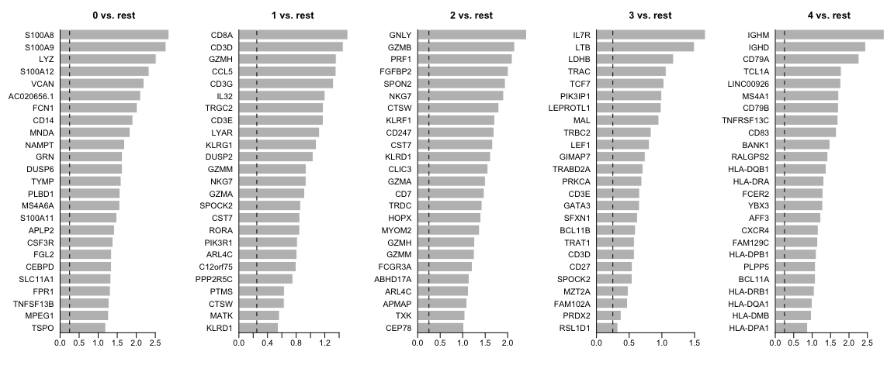<!-- -->

We can visualize them as a heatmap. Here we are selecting the top 5.


```r
markers_genes %>%
    group_by(cluster) %>%
    top_n(-5, p_val_adj) -> top5

# create a scale.data slot for the selected genes
alldata <- ScaleData(alldata, features = as.character(unique(top5$gene)), assay = "RNA")
DoHeatmap(alldata, features = as.character(unique(top5$gene)), group.by = sel.clust,
    assay = "RNA")
```

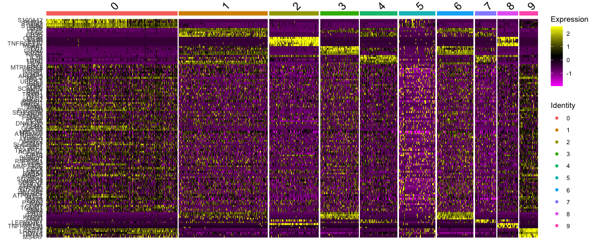<!-- -->

Another way is by representing the overal group expression and detection rates in a dot-plot.


```r
DotPlot(alldata, features = rev(as.character(unique(top5$gene))), group.by = sel.clust,
    assay = "RNA") + coord_flip()
```

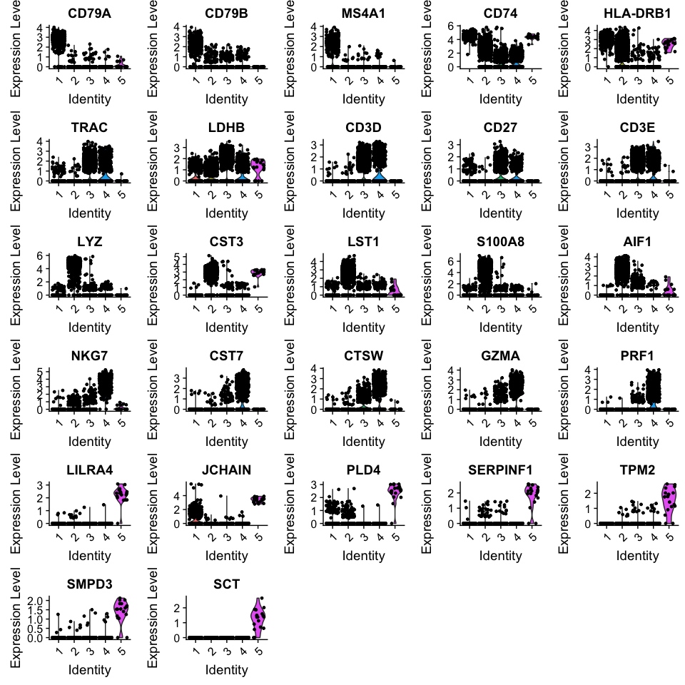<!-- -->

We can also plot a violin plot for each gene.


```r
# take top 3 genes per cluster/
top5 %>%
    group_by(cluster) %>%
    top_n(-3, p_val) -> top3


# set pt.size to zero if you do not want all the points to hide the violin
# shapes, or to a small value like 0.1
VlnPlot(alldata, features = as.character(unique(top3$gene)), ncol = 5, group.by = sel.clust,
    assay = "RNA", pt.size = 0)
```

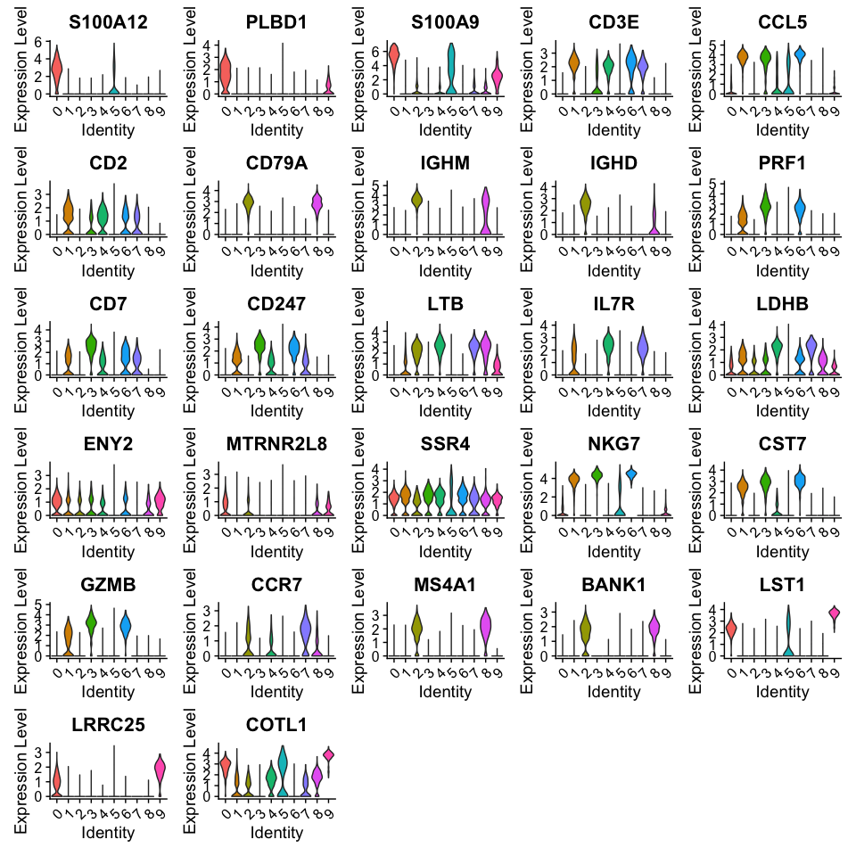<!-- -->

<style>
div.blue { background-color:#e6f0ff; border-radius: 5px; padding: 10px;}
</style>
<div class = "blue">
**Your turn**

Take a screen shot of those results and re-run the same code above with another test: "wilcox" (Wilcoxon Rank Sum test), "bimod" (Likelihood-ratio test), "roc" (Identifies 'markers' of gene expression using ROC analysis),"t" (Student's t-test),"negbinom" (negative binomial generalized linear model),"poisson" (poisson generalized linear model), "LR" (logistic regression), "MAST" (hurdle model), "DESeq2" (negative binomial distribution).
</div>

## Differential expression across conditions
***

The second way of computing differential expression is to answer which genes are differentially expressed within a cluster. For example, in our case we have libraries comming from patients and controls and we would like to know which genes are influenced the most in a particular cell type.

For this end, we will first subset our data for the desired cell cluster, then change the cell identities to the variable of comparison (which now in our case is the "type", e.g. Covid/Ctrl).


```r
# select all cells in cluster 1
cell_selection <- subset(alldata, cells = colnames(alldata)[alldata@meta.data[, sel.clust] ==
    2])
cell_selection <- SetIdent(cell_selection, value = "type")
# Compute differentiall expression
DGE_cell_selection <- FindAllMarkers(cell_selection, log2FC.threshold = 0.2, test.use = "wilcox",
    min.pct = 0.1, min.diff.pct = 0.2, only.pos = TRUE, max.cells.per.ident = 50,
    assay = "RNA")
```

We can now plot the expression across the "type".


```r
DGE_cell_selection %>%
    group_by(cluster) %>%
    top_n(-5, p_val) -> top5_cell_selection

VlnPlot(cell_selection, features = as.character(unique(top5_cell_selection$gene)),
    ncol = 5, group.by = "type", assay = "RNA", pt.size = 0.1)
```

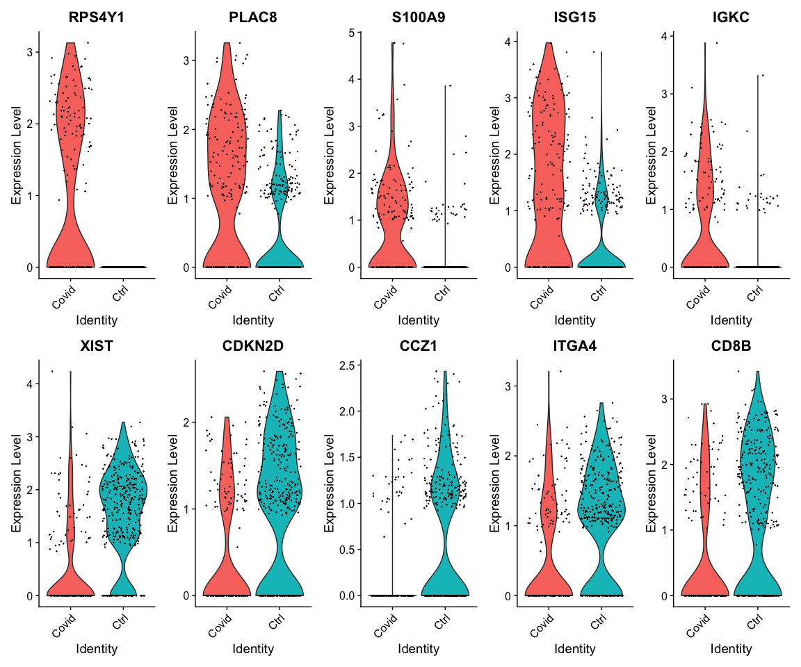<!-- -->

We can also plot these genes across all clusters, but split by "type", to check if the genes are also up/downregulated in other celltypes.


```r
VlnPlot(alldata, features = as.character(unique(top5_cell_selection$gene)), ncol = 5,
    split.by = "type", assay = "RNA", pt.size = 0)
```

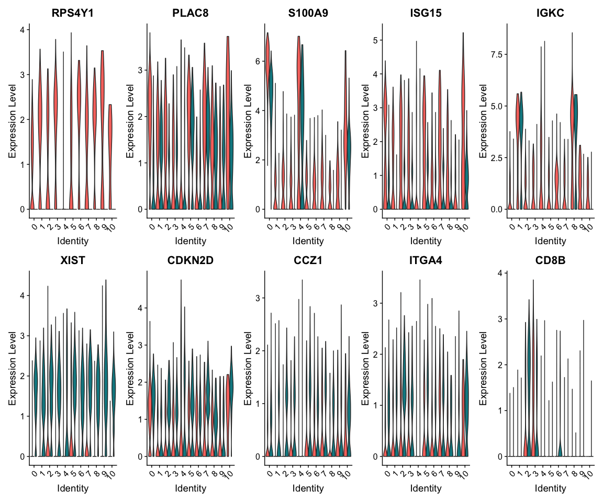<!-- -->

As you can see, we hwve many sex chromosome related genes among the top DE genes. And if you remember from the QC lab, we have inbalanced sex distribution among our subjects, so this may not be related to covid at all. 

### Remove sex chromosome genes

To remove some of the bias due to inbalanced sex in the subjects we can remove the sex chromosome related genes.


```r
gene.info = read.csv("data/results/genes.table.csv")  #was created in the QC exercise

auto.genes = gene.info$external_gene_name[!(gene.info$chromosome_name %in% c("X",
    "Y"))]

cell_selection@active.assay = "RNA"
keep.genes = intersect(rownames(cell_selection), auto.genes)
cell_selection = cell_selection[keep.genes, ]

# then renormalize the data
cell_selection = NormalizeData(cell_selection)
```

Rerun differential expression:


```r
# Compute differentiall expression
DGE_cell_selection <- FindMarkers(cell_selection, ident.1 = "Covid", ident.2 = "Ctrl",
    logfc.threshold = 0.2, test.use = "wilcox", min.pct = 0.1, min.diff.pct = 0.2,
    assay = "RNA")

# Define as Covid or Ctrl in the df and add a gene column
DGE_cell_selection$direction = ifelse(DGE_cell_selection$avg_log2FC > 0, "Covid",
    "Ctrl")
DGE_cell_selection$gene = rownames(DGE_cell_selection)


DGE_cell_selection %>%
    group_by(direction) %>%
    top_n(-5, p_val) %>%
    arrange(direction) -> top5_cell_selection

VlnPlot(cell_selection, features = as.character(unique(top5_cell_selection$gene)),
    ncol = 5, group.by = "type", assay = "RNA", pt.size = 0.1)
```

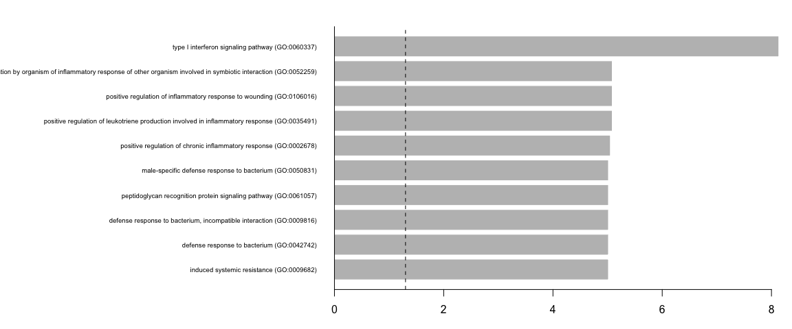<!-- -->

We can also plot these genes across all clusters, but split by "type", to check if the genes are also up/downregulated in other celltypes/clusters.


```r
VlnPlot(alldata, features = as.character(unique(top5_cell_selection$gene)), ncol = 5,
    split.by = "type", assay = "RNA", pt.size = 0)
```

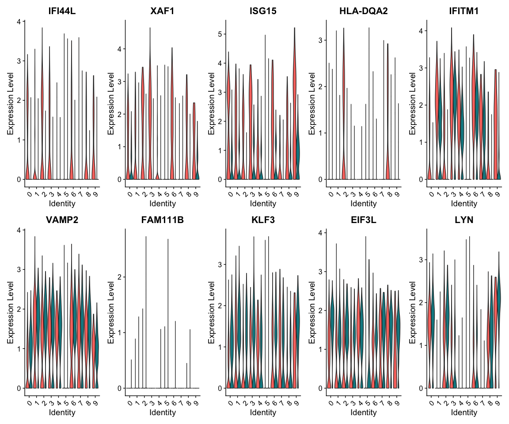<!-- -->


## Patient Batch effects

When we are testing for Covid vs Control we are running a DGE test for 3 vs 3 individuals. That will be very sensitive to sample differences unless we find a way to control for it. So first, lets check how the top DGEs are expressed across the individuals:


```r
VlnPlot(cell_selection, group.by = "orig.ident", features = as.character(unique(top5_cell_selection$gene)),
    ncol = 5, assay = "RNA", pt.size = 0)
```

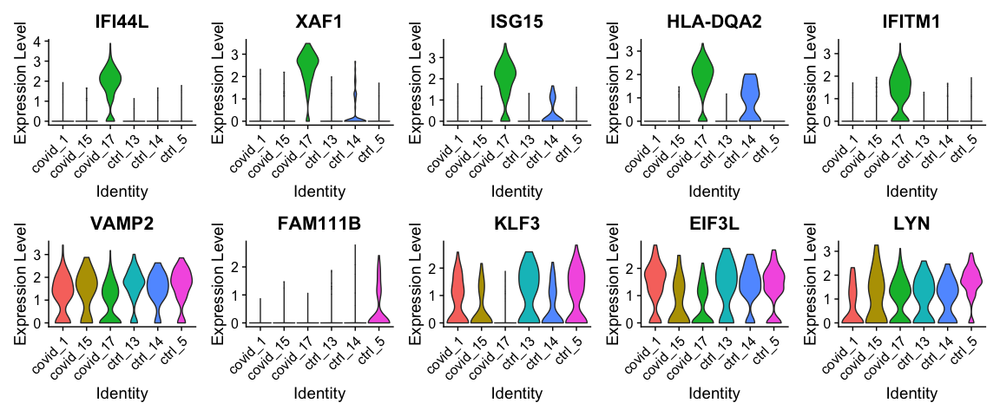<!-- -->

As you can see, many of the genes detected as DGE in Covid are unique to one or 2 patients.

We can examine more genes with a DotPlot:


```r
DGE_cell_selection %>%
    group_by(direction) %>%
    top_n(-20, p_val) -> top20_cell_selection
DotPlot(cell_selection, features = rev(as.character(unique(top20_cell_selection$gene))),
    group.by = "orig.ident", assay = "RNA") + coord_flip()
```

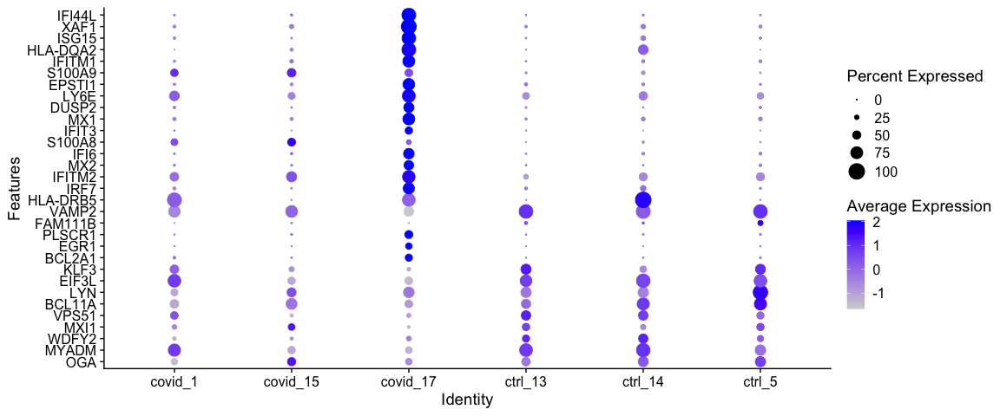<!-- -->

As you can see, most of the DGEs are driven by the `covid_17` patient.

But it is also the sample with the highest number of cells:


```r
table(cell_selection$orig.ident)
```

```
## 
##  covid_1 covid_15 covid_17  ctrl_13  ctrl_14   ctrl_5 
##       90       38      170       66       63      141
```

## Subsample

So one obvious thing to consider is an equal amount of cells per individual so that the DGE results are not dominated by a single sample.

So we will use the `downsample` option in the Seurat function `WhichCells` to select 30 cells per cluster:


```r
cell_selection <- SetIdent(cell_selection, value = "orig.ident")
sub_data <- subset(cell_selection, cells = WhichCells(cell_selection, downsample = 30))

table(sub_data$orig.ident)
```

```
## 
##  covid_1 covid_15 covid_17  ctrl_13  ctrl_14   ctrl_5 
##       30       30       30       30       30       30
```

And now we run DGE analysis again:


```r
sub_data <- SetIdent(sub_data, value = "type")

# Compute differentiall expression
DGE_sub <- FindMarkers(sub_data, ident.1 = "Covid", ident.2 = "Ctrl", logfc.threshold = 0.2,
    test.use = "wilcox", min.pct = 0.1, min.diff.pct = 0.2, assay = "RNA")

# Define as Covid or Ctrl in the df and add a gene column
DGE_sub$direction = ifelse(DGE_sub$avg_log2FC > 0, "Covid", "Ctrl")
DGE_sub$gene = rownames(DGE_sub)


DGE_sub %>%
    group_by(direction) %>%
    top_n(-5, p_val) %>%
    arrange(direction) -> top5_sub

VlnPlot(sub_data, features = as.character(unique(top5_sub$gene)), ncol = 5, group.by = "type",
    assay = "RNA", pt.size = 0.1)
```

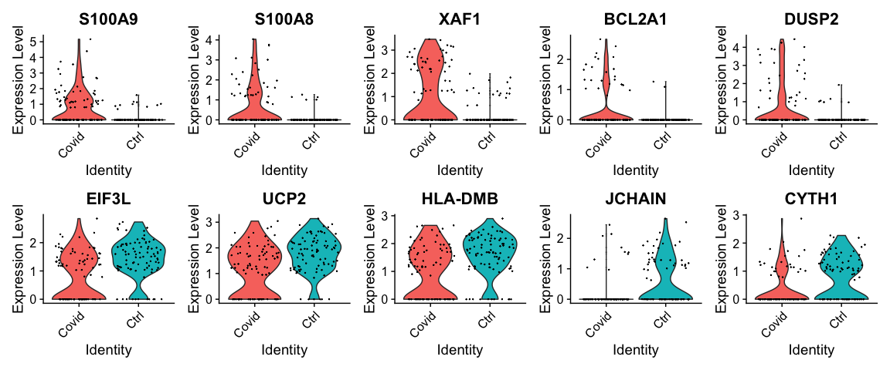<!-- -->

Plot as dotplot, but in the full dataset:


```r
DGE_sub %>%
    group_by(direction) %>%
    top_n(-20, p_val) -> top20_sub
DotPlot(cell_selection, features = rev(as.character(unique(top20_sub$gene))), group.by = "orig.ident",
    assay = "RNA") + coord_flip()
```

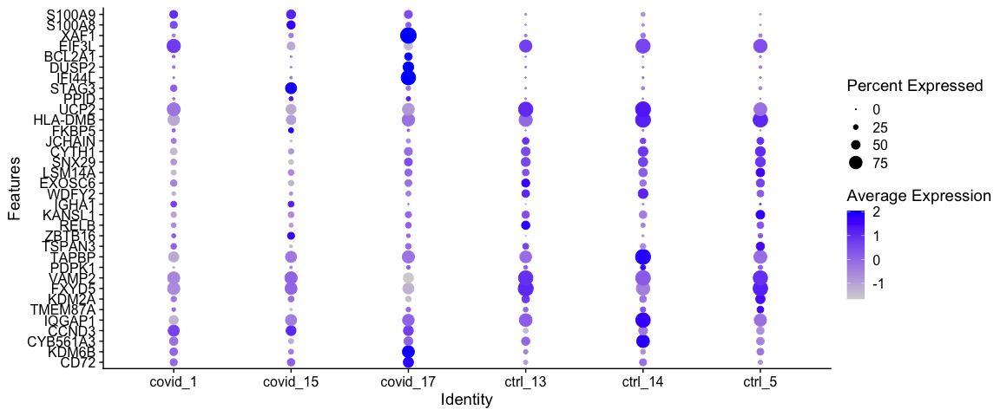<!-- -->

It looks much better now. But if we look per patient you can see that we still have some genes that are dominated by a single patient.


Why do you think this is?

## Pseudobulk

One option is to treat the samples as pseudobulks and do differential expression for the 3 patients vs 3 controls. You do lose some information about cell variability within each patient, but instead you gain the advantage of mainly looking for effects that are seen in multiple patients.

However, having only 3 patients is probably too low, with many more patients it will work better to run pseudobulk analysis.

For a fair comparison we should have equal number of cells per sample when we create the pseudobulk, so we will use the subsampled object.


```r
# get the count matrix for all cells
DGE_DATA <- sub_data@assays$RNA@counts

# Compute pseudobulk
mm <- Matrix::sparse.model.matrix(~0 + sub_data$orig.ident)
pseudobulk <- DGE_DATA %*% mm
```

Then run edgeR:


```r
# define the groups
bulk.labels = c("Covid", "Covid", "Covid", "Ctrl", "Ctrl", "Ctrl")

dge.list <- DGEList(counts = pseudobulk, group = factor(bulk.labels))
keep <- filterByExpr(dge.list)
dge.list <- dge.list[keep, , keep.lib.sizes = FALSE]

dge.list <- calcNormFactors(dge.list)
design = model.matrix(~bulk.labels)

dge.list <- estimateDisp(dge.list, design)

fit <- glmQLFit(dge.list, design)
qlf <- glmQLFTest(fit, coef = 2)
topTags(qlf)
```

```
## Coefficient:  bulk.labelsCtrl 
##             logFC    logCPM        F       PValue         FDR
## S100A8  -4.552584  7.373352 51.79349 1.381039e-06 0.002285620
## S100A9  -3.029166  7.336543 36.72730 1.202005e-05 0.009946595
## JCHAIN   1.974193  6.973561 21.20913 2.440677e-04 0.134644040
## IFITM2  -1.421524  8.072767 17.70558 5.761012e-04 0.221733433
## CD69    -2.093496 10.885793 17.12660 6.698895e-04 0.221733433
## PHACTR1 -1.361440  8.055688 14.79029 1.268061e-03 0.349773550
## ZNF331  -1.754357  8.148455 14.08789 1.551784e-03 0.366886064
## TRIM22  -1.522696  7.694248 13.47184 1.860209e-03 0.384830837
## CCND3   -1.123951  7.896499 11.93334 2.979824e-03 0.469219331
## AUTS2    1.652672  6.566773 11.73182 3.176139e-03 0.469219331
```

As you can see, we have very few significant genes, actually only 2 with FDR < 0.1. Since we only have 3 vs 3 samples, we should not expect too many genes with this method.

Again as dotplot including all genes with FDR < 1:


```r
res.edgeR <- topTags(qlf, 100)$table
res.edgeR$dir = ifelse(res.edgeR$logFC > 0, "Covid", "Ctrl")
res.edgeR$gene = rownames(res.edgeR)

res.edgeR %>%
    group_by(dir) %>%
    top_n(-10, PValue) %>%
    arrange(dir) -> top.edgeR


DotPlot(cell_selection, features = as.character(unique(top.edgeR$gene)), group.by = "orig.ident",
    assay = "RNA") + coord_flip() + ggtitle("EdgeR pseudobulk") + RotatedAxis()
```

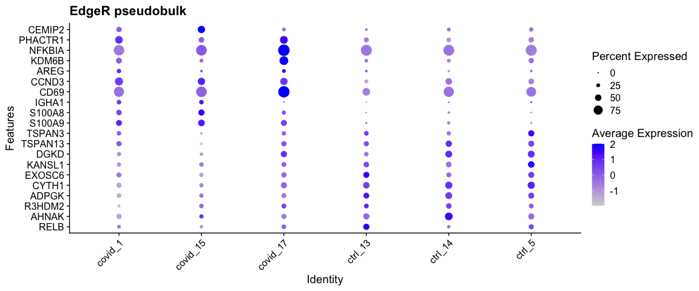<!-- -->

As you can see, even if we get few genes detected the seem to make sense across all the patients.

## MAST random effect

MAST has the option to add a random effect for the patient when running DGE analysis. It is quite slow, even with this small dataset, so it may not be practical for a larger dataset unless you have access to a compute cluster.

We will run MAST with and without patient info as random effect and compare the results

First, filter genes in part to speed up the process but also to avoid too many warnings in the model fitting step of MAST. We will keep genes that are expressed with at least 2 reads in 2 covid patients or 2 controls.


```r
# select genes that are expressed in at least 2 patients or 2 ctrls with > 2
# reads.
nPatient = sapply(unique(cell_selection$orig.ident), function(x) rowSums(cell_selection@assays$RNA@counts[,
    cell_selection$orig.ident == x] > 2))
nCovid = rowSums(nPatient[, 1:3] > 2)
nCtrl = rowSums(nPatient[, 4:6] > 2)

sel = nCovid >= 2 | nCtrl >= 2
cell_selection_sub = cell_selection[sel, ]
```

Set up the MAST object.


```r
# create the feature data
fData <- data.frame(primerid = rownames(cell_selection_sub))
m = cell_selection_sub@meta.data
m$wellKey = rownames(m)

# make sure type and orig.ident are factors
m$orig.ident = factor(m$orig.ident)
m$type = factor(m$type)

sca <- MAST::FromMatrix(exprsArray = as.matrix(x = cell_selection_sub@assays$RNA@data),
    check_sanity = FALSE, cData = m, fData = fData)
```

First, run the regular MAST analysis without random effects


```r
# takes a while to run, so save a file to tmpdir in case you have to rerun the
# code
tmpdir = "tmp_dge"
dir.create(tmpdir, showWarnings = F)

tmpfile1 = file.path(tmpdir, "mast_bayesglm_cl1.Rds")
if (file.exists(tmpfile1)) {
    fcHurdle1 = readRDS(tmpfile1)
} else {
    zlmCond <- suppressMessages(MAST::zlm(~type, sca, method = "bayesglm", ebayes = T))
    summaryCond <- suppressMessages(MAST::summary(zlmCond, doLRT = "typeCtrl"))
    summaryDt <- summaryCond$datatable
    fcHurdle <- merge(summaryDt[summaryDt$contrast == "typeCtrl" & summaryDt$component ==
        "logFC", c(1, 7, 5, 6, 8)], summaryDt[summaryDt$contrast == "typeCtrl" &
        summaryDt$component == "H", c(1, 4)], by = "primerid")
    fcHurdle1 <- stats::na.omit(as.data.frame(fcHurdle))
    saveRDS(fcHurdle1, tmpfile1)
}
```

Then run MAST with glmer and random effect.


```r
library(lme4)

tmpfile2 = file.path(tmpdir, "mast_glme_cl1.Rds")
if (file.exists(tmpfile2)) {
    fcHurdle2 = readRDS(tmpfile2)
} else {
    zlmCond <- suppressMessages(MAST::zlm(~type + (1 | orig.ident), sca, method = "glmer",
        ebayes = F, strictConvergence = FALSE))

    summaryCond <- suppressMessages(MAST::summary(zlmCond, doLRT = "typeCtrl"))
    summaryDt <- summaryCond$datatable
    fcHurdle <- merge(summaryDt[summaryDt$contrast == "typeCtrl" & summaryDt$component ==
        "logFC", c(1, 7, 5, 6, 8)], summaryDt[summaryDt$contrast == "typeCtrl" &
        summaryDt$component == "H", c(1, 4)], by = "primerid")
    fcHurdle2 <- stats::na.omit(as.data.frame(fcHurdle))
    saveRDS(fcHurdle2, tmpfile2)
}
```

Top genes with normal MAST:


```r
top1 = head(fcHurdle1[order(fcHurdle1$`Pr(>Chisq)`), ], 10)
top1
```

<div data-pagedtable="false">
  <script data-pagedtable-source type="application/json">
{"columns":[{"label":[""],"name":["_rn_"],"type":[""],"align":["left"]},{"label":["primerid"],"name":[1],"type":["chr"],"align":["left"]},{"label":["coef"],"name":[2],"type":["dbl"],"align":["right"]},{"label":["ci.hi"],"name":[3],"type":["dbl"],"align":["right"]},{"label":["ci.lo"],"name":[4],"type":["dbl"],"align":["right"]},{"label":["z"],"name":[5],"type":["dbl"],"align":["right"]},{"label":["Pr(>Chisq)"],"name":[6],"type":["dbl"],"align":["right"]}],"data":[{"1":"HLA-DRB5","2":"-0.7406402","3":"-0.5640832","4":"-0.9171972","5":"-8.221866","6":"3.819543e-49","_rn_":"360"},{"1":"RPS26","2":"1.2208094","3":"1.3796746","4":"1.0619441","5":"15.061459","6":"2.337040e-47","_rn_":"725"},{"1":"CD74","2":"0.5032801","3":"0.5641755","4":"0.4423848","5":"16.198467","6":"1.546815e-46","_rn_":"143"},{"1":"CD69","2":"-1.2916399","3":"-1.1034718","4":"-1.4798079","5":"-13.453758","6":"3.538794e-41","_rn_":"141"},{"1":"ISG20","2":"-0.8247663","3":"-0.6761398","4":"-0.9733928","5":"-10.876339","6":"1.782392e-30","_rn_":"413"},{"1":"NFKBIA","2":"-0.7099924","3":"-0.5620428","4":"-0.8579421","5":"-9.405628","6":"7.053280e-29","_rn_":"509"},{"1":"LY6E","2":"-0.7371532","3":"-0.6002973","4":"-0.8740092","5":"-10.557040","6":"7.747658e-27","_rn_":"450"},{"1":"EEF1A1","2":"0.4461025","3":"0.5219416","4":"0.3702635","5":"11.528953","6":"4.995412e-26","_rn_":"245"},{"1":"RPL4","2":"0.6157417","3":"0.7326869","4":"0.4987964","5":"10.319628","6":"8.303768e-25","_rn_":"697"},{"1":"S100A9","2":"-0.5975859","3":"-0.4849252","4":"-0.7102467","5":"-10.396226","6":"1.628847e-23","_rn_":"748"}],"options":{"columns":{"min":{},"max":[10]},"rows":{"min":[10],"max":[10]},"pages":{}}}
  </script>
</div>

```r
fcHurdle1$pval = fcHurdle1$`Pr(>Chisq)`
fcHurdle1$dir = ifelse(fcHurdle1$z > 0, "up", "down")
fcHurdle1 %>%
    group_by(dir) %>%
    top_n(-10, pval) %>%
    arrange(z) -> mastN

mastN = mastN$primerid
```

Top genes with random effect:


```r
top2 = head(fcHurdle2[order(fcHurdle2$`Pr(>Chisq)`), ], 10)
top2
```

<div data-pagedtable="false">
  <script data-pagedtable-source type="application/json">
{"columns":[{"label":[""],"name":["_rn_"],"type":[""],"align":["left"]},{"label":["primerid"],"name":[1],"type":["chr"],"align":["left"]},{"label":["coef"],"name":[2],"type":["dbl"],"align":["right"]},{"label":["ci.hi"],"name":[3],"type":["dbl"],"align":["right"]},{"label":["ci.lo"],"name":[4],"type":["dbl"],"align":["right"]},{"label":["z"],"name":[5],"type":["dbl"],"align":["right"]},{"label":["Pr(>Chisq)"],"name":[6],"type":["dbl"],"align":["right"]}],"data":[{"1":"S100A9","2":"-0.6006822","3":"-0.4870483","4":"-0.71431614","5":"-10.360597","6":"6.597484e-05","_rn_":"748"},{"1":"HLA-DRA","2":"0.3691584","3":"0.4711753","4":"0.26714156","5":"7.092329","6":"8.680994e-05","_rn_":"358"},{"1":"PHACTR1","2":"-0.4715026","3":"-0.3362243","4":"-0.60678096","5":"-6.831310","6":"1.030175e-04","_rn_":"558"},{"1":"S100A8","2":"-0.5114126","3":"-0.3447293","4":"-0.67809590","5":"-6.013502","6":"1.084166e-04","_rn_":"747"},{"1":"HLA-DPB1","2":"0.3685256","3":"0.4850387","4":"0.25201252","5":"6.199278","6":"1.653246e-04","_rn_":"355"},{"1":"JCHAIN","2":"0.2767576","3":"0.3923875","4":"0.16112774","5":"4.691131","6":"2.768782e-04","_rn_":"419"},{"1":"SF1","2":"0.4997901","3":"0.7566941","4":"0.24288612","5":"3.812983","6":"3.087159e-04","_rn_":"766"},{"1":"PCBP2","2":"0.2685980","3":"0.3927232","4":"0.14447277","5":"4.241220","6":"5.035413e-04","_rn_":"545"},{"1":"HLA-DPA1","2":"0.2977653","3":"0.4227184","4":"0.17281234","5":"4.670631","6":"8.035828e-04","_rn_":"354"},{"1":"EIF3D","2":"0.2178981","3":"0.3451755","4":"0.09062072","5":"3.355446","6":"8.218620e-04","_rn_":"254"}],"options":{"columns":{"min":{},"max":[10]},"rows":{"min":[10],"max":[10]},"pages":{}}}
  </script>
</div>

```r
fcHurdle2$pval = fcHurdle2$`Pr(>Chisq)`
fcHurdle2$dir = ifelse(fcHurdle2$z > 0, "up", "down")
fcHurdle2 %>%
    group_by(dir) %>%
    top_n(-10, pval) %>%
    arrange(z) -> mastR

mastR = mastR$primerid
```

As you can see, we have lower significance for the genes with the random effect added.

Dotplot for top10 genes in each direction:


```r
p1 = DotPlot(cell_selection, features = mastN, group.by = "orig.ident", assay = "RNA") +
    coord_flip() + RotatedAxis() + ggtitle("Regular MAST")

p2 = DotPlot(cell_selection, features = mastR, group.by = "orig.ident", assay = "RNA") +
    coord_flip() + RotatedAxis() + ggtitle("With random effect")


p1 + p2
```

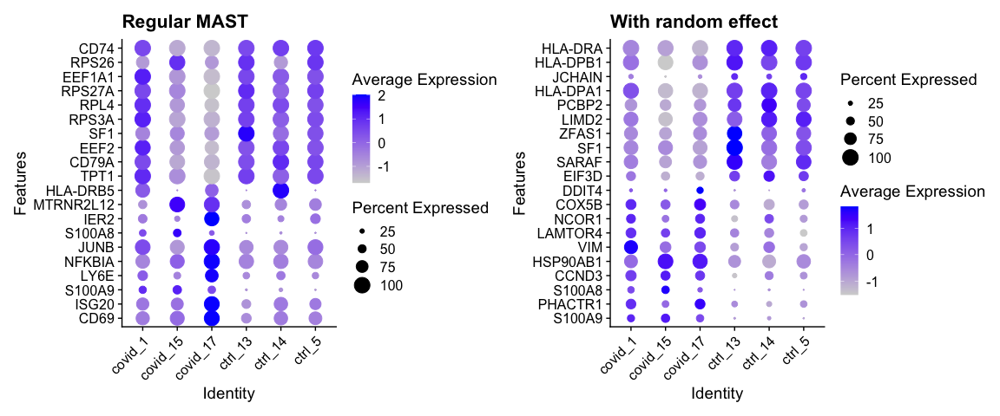<!-- -->


## Gene Set Analysis
***

Hypergeometric enrichment test

Having a defined list of differentially expressed genes, you can now look for their combined function using hypergeometric test:


```r
# Load additional packages
library(enrichR)

# Check available databases to perform enrichment (then choose one)
enrichR::listEnrichrDbs()
```

<div data-pagedtable="false">
  <script data-pagedtable-source type="application/json">
{"columns":[{"label":["geneCoverage"],"name":[1],"type":["dbl"],"align":["right"]},{"label":["genesPerTerm"],"name":[2],"type":["dbl"],"align":["right"]},{"label":["libraryName"],"name":[3],"type":["chr"],"align":["left"]},{"label":["link"],"name":[4],"type":["chr"],"align":["left"]},{"label":["numTerms"],"name":[5],"type":["dbl"],"align":["right"]},{"label":["appyter"],"name":[6],"type":["chr"],"align":["left"]},{"label":["categoryId"],"name":[7],"type":["dbl"],"align":["right"]}],"data":[{"1":"13362","2":"275","3":"Genome_Browser_PWMs","4":"http://hgdownload.cse.ucsc.edu/goldenPath/hg18/database/","5":"615","6":"ea115789fcbf12797fd692cec6df0ab4dbc79c6a","7":"1"},{"1":"27884","2":"1284","3":"TRANSFAC_and_JASPAR_PWMs","4":"http://jaspar.genereg.net/html/DOWNLOAD/","5":"326","6":"7d42eb43a64a4e3b20d721fc7148f685b53b6b30","7":"1"},{"1":"6002","2":"77","3":"Transcription_Factor_PPIs","4":"","5":"290","6":"849f222220618e2599d925b6b51868cf1dab3763","7":"1"},{"1":"47172","2":"1370","3":"ChEA_2013","4":"http://amp.pharm.mssm.edu/lib/cheadownload.jsp","5":"353","6":"7ebe772afb55b63b41b79dd8d06ea0fdd9fa2630","7":"7"},{"1":"47107","2":"509","3":"Drug_Perturbations_from_GEO_2014","4":"http://www.ncbi.nlm.nih.gov/geo/","5":"701","6":"ad270a6876534b7cb063e004289dcd4d3164f342","7":"7"},{"1":"21493","2":"3713","3":"ENCODE_TF_ChIP-seq_2014","4":"http://genome.ucsc.edu/ENCODE/downloads.html","5":"498","6":"497787ebc418d308045efb63b8586f10c526af51","7":"7"},{"1":"1295","2":"18","3":"BioCarta_2013","4":"https://cgap.nci.nih.gov/Pathways/BioCarta_Pathways","5":"249","6":"4a293326037a5229aedb1ad7b2867283573d8bcd","7":"7"},{"1":"3185","2":"73","3":"Reactome_2013","4":"http://www.reactome.org/download/index.html","5":"78","6":"b343994a1b68483b0122b08650201c9b313d5c66","7":"7"},{"1":"2854","2":"34","3":"WikiPathways_2013","4":"http://www.wikipathways.org/index.php/Download_Pathways","5":"199","6":"5c307674c8b97e098f8399c92f451c0ff21cbf68","7":"7"},{"1":"15057","2":"300","3":"Disease_Signatures_from_GEO_up_2014","4":"http://www.ncbi.nlm.nih.gov/geo/","5":"142","6":"248c4ed8ea28352795190214713c86a39fd7afab","7":"7"},{"1":"4128","2":"48","3":"KEGG_2013","4":"http://www.kegg.jp/kegg/download/","5":"200","6":"eb26f55d3904cb0ea471998b6a932a9bf65d8e50","7":"7"},{"1":"34061","2":"641","3":"TF-LOF_Expression_from_GEO","4":"http://www.ncbi.nlm.nih.gov/geo/","5":"269","6":"","7":"1"},{"1":"7504","2":"155","3":"TargetScan_microRNA","4":"http://www.targetscan.org/cgi-bin/targetscan/data_download.cgi?db=vert_61","5":"222","6":"f4029bf6a62c91ab29401348e51df23b8c44c90f","7":"7"},{"1":"16399","2":"247","3":"PPI_Hub_Proteins","4":"http://amp.pharm.mssm.edu/X2K","5":"385","6":"69c0cfe07d86f230a7ef01b365abcc7f6e52f138","7":"2"},{"1":"12753","2":"57","3":"GO_Molecular_Function_2015","4":"http://www.geneontology.org/GO.downloads.annotations.shtml","5":"1136","6":"f531ac2b6acdf7587a54b79b465a5f4aab8f00f9","7":"7"},{"1":"23726","2":"127","3":"GeneSigDB","4":"https://pubmed.ncbi.nlm.nih.gov/22110038/","5":"2139","6":"6d655e0aa3408a7accb3311fbda9b108681a8486","7":"4"},{"1":"32740","2":"85","3":"Chromosome_Location","4":"http://software.broadinstitute.org/gsea/msigdb/index.jsp","5":"386","6":"8dab0f96078977223646ff63eb6187e0813f1433","7":"7"},{"1":"13373","2":"258","3":"Human_Gene_Atlas","4":"http://biogps.org/downloads/","5":"84","6":"0741451470203d7c40a06274442f25f74b345c9c","7":"5"},{"1":"19270","2":"388","3":"Mouse_Gene_Atlas","4":"http://biogps.org/downloads/","5":"96","6":"31191bfadded5f96983f93b2a113cf2110ff5ddb","7":"5"},{"1":"13236","2":"82","3":"GO_Cellular_Component_2015","4":"http://www.geneontology.org/GO.downloads.annotations.shtml","5":"641","6":"e1d004d5797cbd2363ef54b1c3b361adb68795c6","7":"7"},{"1":"14264","2":"58","3":"GO_Biological_Process_2015","4":"http://www.geneontology.org/GO.downloads.annotations.shtml","5":"5192","6":"bf120b6e11242b1a64c80910d8e89f87e618e235","7":"7"},{"1":"3096","2":"31","3":"Human_Phenotype_Ontology","4":"http://www.human-phenotype-ontology.org/","5":"1779","6":"17a138b0b70aa0e143fe63c14f82afb70bc3ed0a","7":"3"},{"1":"22288","2":"4368","3":"Epigenomics_Roadmap_HM_ChIP-seq","4":"http://www.roadmapepigenomics.org/","5":"383","6":"e1bc8a398e9b21f9675fb11bef18087eda21b1bf","7":"1"},{"1":"4533","2":"37","3":"KEA_2013","4":"http://amp.pharm.mssm.edu/lib/keacommandline.jsp","5":"474","6":"462045609440fa1e628a75716b81a1baa5bd9145","7":"7"},{"1":"10231","2":"158","3":"NURSA_Human_Endogenous_Complexome","4":"https://www.nursa.org/nursa/index.jsf","5":"1796","6":"7d3566b12ebc23dd23d9ca9bb97650f826377b16","7":"2"},{"1":"2741","2":"5","3":"CORUM","4":"http://mips.helmholtz-muenchen.de/genre/proj/corum/","5":"1658","6":"d047f6ead7831b00566d5da7a3b027ed9196e104","7":"2"},{"1":"5655","2":"342","3":"SILAC_Phosphoproteomics","4":"http://amp.pharm.mssm.edu/lib/keacommandline.jsp","5":"84","6":"54dcd9438b33301deb219866e162b0f9da7e63a0","7":"2"},{"1":"10406","2":"715","3":"MGI_Mammalian_Phenotype_Level_3","4":"http://www.informatics.jax.org/","5":"71","6":"c3bfc90796cfca8f60cba830642a728e23a53565","7":"7"},{"1":"10493","2":"200","3":"MGI_Mammalian_Phenotype_Level_4","4":"http://www.informatics.jax.org/","5":"476","6":"0b09a9a1aa0af4fc7ea22d34a9ae644d45864bd6","7":"7"},{"1":"11251","2":"100","3":"Old_CMAP_up","4":"http://www.broadinstitute.org/cmap/","5":"6100","6":"9041f90cccbc18479138330228b336265e09021c","7":"7"},{"1":"8695","2":"100","3":"Old_CMAP_down","4":"http://www.broadinstitute.org/cmap/","5":"6100","6":"ebc0d905b3b3142f936d400c5f2a4ff926c81c37","7":"7"},{"1":"1759","2":"25","3":"OMIM_Disease","4":"http://www.omim.org/downloads","5":"90","6":"cb2b92578a91e023d0498a334923ee84add34eca","7":"4"},{"1":"2178","2":"89","3":"OMIM_Expanded","4":"http://www.omim.org/downloads","5":"187","6":"27eca242904d8e12a38cf8881395bc50d57a03e1","7":"4"},{"1":"851","2":"15","3":"VirusMINT","4":"http://mint.bio.uniroma2.it/download.html","5":"85","6":"5abad1fc36216222b0420cadcd9be805a0dda63e","7":"4"},{"1":"10061","2":"106","3":"MSigDB_Computational","4":"http://www.broadinstitute.org/gsea/msigdb/collections.jsp","5":"858","6":"e4cdcc7e259788fdf9b25586cce3403255637064","7":"4"},{"1":"11250","2":"166","3":"MSigDB_Oncogenic_Signatures","4":"http://www.broadinstitute.org/gsea/msigdb/collections.jsp","5":"189","6":"c76f5319c33c4833c71db86a30d7e33cd63ff8cf","7":"4"},{"1":"15406","2":"300","3":"Disease_Signatures_from_GEO_down_2014","4":"http://www.ncbi.nlm.nih.gov/geo/","5":"142","6":"aabdf7017ae55ae75a004270924bcd336653b986","7":"7"},{"1":"17711","2":"300","3":"Virus_Perturbations_from_GEO_up","4":"http://www.ncbi.nlm.nih.gov/geo/","5":"323","6":"45268b7fc680d05dd9a29743c2f2b2840a7620bf","7":"4"},{"1":"17576","2":"300","3":"Virus_Perturbations_from_GEO_down","4":"http://www.ncbi.nlm.nih.gov/geo/","5":"323","6":"5f531580ccd168ee4acc18b02c6bdf8200e19d08","7":"4"},{"1":"15797","2":"176","3":"Cancer_Cell_Line_Encyclopedia","4":"https://portals.broadinstitute.org/ccle/home\\n","5":"967","6":"eb38dbc3fb20adafa9d6f9f0b0e36f378e75284f","7":"5"},{"1":"12232","2":"343","3":"NCI-60_Cancer_Cell_Lines","4":"http://biogps.org/downloads/","5":"93","6":"75c81676d8d6d99d262c9660edc024b78cfb07c9","7":"5"},{"1":"13572","2":"301","3":"Tissue_Protein_Expression_from_ProteomicsDB","4":"https://www.proteomicsdb.org/","5":"207","6":"","7":"7"},{"1":"6454","2":"301","3":"Tissue_Protein_Expression_from_Human_Proteome_Map","4":"http://www.humanproteomemap.org/index.php","5":"30","6":"49351dc989f9e6ca97c55f8aca7778aa3bfb84b9","7":"5"},{"1":"3723","2":"47","3":"HMDB_Metabolites","4":"http://www.hmdb.ca/downloads","5":"3906","6":"1905132115d22e4119bce543bdacaab074edb363","7":"6"},{"1":"7588","2":"35","3":"Pfam_InterPro_Domains","4":"ftp://ftp.ebi.ac.uk/pub/databases/interpro/","5":"311","6":"e2b4912cfb799b70d87977808c54501544e4cdc9","7":"6"},{"1":"7682","2":"78","3":"GO_Biological_Process_2013","4":"http://www.geneontology.org/GO.downloads.annotations.shtml","5":"941","6":"5216d1ade194ffa5a6c00f105e2b1899f64f45fe","7":"7"},{"1":"7324","2":"172","3":"GO_Cellular_Component_2013","4":"http://www.geneontology.org/GO.downloads.annotations.shtml","5":"205","6":"fd1332a42395e0bc1dba82868b39be7983a48cc5","7":"7"},{"1":"8469","2":"122","3":"GO_Molecular_Function_2013","4":"http://www.geneontology.org/GO.downloads.annotations.shtml","5":"402","6":"7e3e99e5aae02437f80b0697b197113ce3209ab0","7":"7"},{"1":"13121","2":"305","3":"Allen_Brain_Atlas_up","4":"http://www.brain-map.org/","5":"2192","6":"3804715a63a308570e47aa1a7877f01147ca6202","7":"5"},{"1":"26382","2":"1811","3":"ENCODE_TF_ChIP-seq_2015","4":"http://genome.ucsc.edu/ENCODE/downloads.html","5":"816","6":"56b6adb4dc8a2f540357ef992d6cd93dfa2907e5","7":"1"},{"1":"29065","2":"2123","3":"ENCODE_Histone_Modifications_2015","4":"http://genome.ucsc.edu/ENCODE/downloads.html","5":"412","6":"55b56cd8cf2ff04b26a09b9f92904008b82f3a6f","7":"1"},{"1":"280","2":"9","3":"Phosphatase_Substrates_from_DEPOD","4":"http://www.koehn.embl.de/depod/","5":"59","6":"d40701e21092b999f4720d1d2b644dd0257b6259","7":"2"},{"1":"13877","2":"304","3":"Allen_Brain_Atlas_down","4":"http://www.brain-map.org/","5":"2192","6":"ea67371adec290599ddf484ced2658cfae259304","7":"5"},{"1":"15852","2":"912","3":"ENCODE_Histone_Modifications_2013","4":"http://genome.ucsc.edu/ENCODE/downloads.html","5":"109","6":"c209ae527bc8e98e4ccd27a668d36cd2c80b35b4","7":"7"},{"1":"4320","2":"129","3":"Achilles_fitness_increase","4":"http://www.broadinstitute.org/achilles","5":"216","6":"98366496a75f163164106e72439fb2bf2f77de4e","7":"4"},{"1":"4271","2":"128","3":"Achilles_fitness_decrease","4":"http://www.broadinstitute.org/achilles","5":"216","6":"83a710c1ff67fd6b8af0d80fa6148c40dbd9bc64","7":"4"},{"1":"10496","2":"201","3":"MGI_Mammalian_Phenotype_2013","4":"http://www.informatics.jax.org/","5":"476","6":"a4c6e217a81a4a58ff5a1c9fc102b70beab298e9","7":"7"},{"1":"1678","2":"21","3":"BioCarta_2015","4":"https://cgap.nci.nih.gov/Pathways/BioCarta_Pathways","5":"239","6":"70e4eb538daa7688691acfe5d9c3c19022be832b","7":"7"},{"1":"756","2":"12","3":"HumanCyc_2015","4":"http://humancyc.org/","5":"125","6":"711f0c02b23f5e02a01207174943cfeee9d3ea9c","7":"7"},{"1":"3800","2":"48","3":"KEGG_2015","4":"http://www.kegg.jp/kegg/download/","5":"179","6":"e80d25c56de53c704791ddfdc6ab5eec28ae7243","7":"7"},{"1":"2541","2":"39","3":"NCI-Nature_2015","4":"http://pid.nci.nih.gov/","5":"209","6":"47edfc012bcbb368a10b717d8dca103f7814b5a4","7":"7"},{"1":"1918","2":"39","3":"Panther_2015","4":"http://www.pantherdb.org/","5":"104","6":"ab824aeeff0712bab61f372e43aebb870d1677a9","7":"7"},{"1":"5863","2":"51","3":"WikiPathways_2015","4":"http://www.wikipathways.org/index.php/Download_Pathways","5":"404","6":"1f7eea2f339f37856522c1f1c70ec74c7b25325f","7":"7"},{"1":"6768","2":"47","3":"Reactome_2015","4":"http://www.reactome.org/download/index.html","5":"1389","6":"36e541bee015eddb8d53827579549e30fe7a3286","7":"7"},{"1":"25651","2":"807","3":"ESCAPE","4":"http://www.maayanlab.net/ESCAPE/","5":"315","6":"a7acc741440264717ff77751a7e5fed723307835","7":"5"},{"1":"19129","2":"1594","3":"HomoloGene","4":"http://www.ncbi.nlm.nih.gov/homologene","5":"12","6":"663b665b75a804ef98add689f838b68e612f0d2a","7":"6"},{"1":"23939","2":"293","3":"Disease_Perturbations_from_GEO_down","4":"http://www.ncbi.nlm.nih.gov/geo/","5":"839","6":"0f412e0802d76efa0374504c2c9f5e0624ff7f09","7":"8"},{"1":"23561","2":"307","3":"Disease_Perturbations_from_GEO_up","4":"http://www.ncbi.nlm.nih.gov/geo/","5":"839","6":"9ddc3902fb01fb9eaf1a2a7c2ff3acacbb48d37e","7":"8"},{"1":"23877","2":"302","3":"Drug_Perturbations_from_GEO_down","4":"http://www.ncbi.nlm.nih.gov/geo/","5":"906","6":"068623a05ecef3e4a5e0b4f8db64bb8faa3c897f","7":"8"},{"1":"15886","2":"9","3":"Genes_Associated_with_NIH_Grants","4":"https://grants.nih.gov/grants/oer.htm\\n","5":"32876","6":"76fc5ec6735130e287e62bae6770a3c5ee068645","7":"6"},{"1":"24350","2":"299","3":"Drug_Perturbations_from_GEO_up","4":"http://www.ncbi.nlm.nih.gov/geo/","5":"906","6":"c9c2155b5ac81ac496854fa61ba566dcae06cc80","7":"8"},{"1":"3102","2":"25","3":"KEA_2015","4":"http://amp.pharm.mssm.edu/Enrichr","5":"428","6":"18a081774e6e0aaf60b1a4be7fd20afcf9e08399","7":"2"},{"1":"31132","2":"298","3":"Gene_Perturbations_from_GEO_up","4":"http://www.ncbi.nlm.nih.gov/geo/","5":"2460","6":"53dedc29ce3100930d68e506f941ef59de05dc6b","7":"8"},{"1":"30832","2":"302","3":"Gene_Perturbations_from_GEO_down","4":"http://www.ncbi.nlm.nih.gov/geo/","5":"2460","6":"499882af09c62dd6da545c15cb51c1dc5e234f78","7":"8"},{"1":"48230","2":"1429","3":"ChEA_2015","4":"http://amp.pharm.mssm.edu/Enrichr","5":"395","6":"712eb7b6edab04658df153605ec6079fa89fb5c7","7":"7"},{"1":"5613","2":"36","3":"dbGaP","4":"http://www.ncbi.nlm.nih.gov/gap","5":"345","6":"010f1267055b1a1cb036e560ea525911c007a666","7":"4"},{"1":"9559","2":"73","3":"LINCS_L1000_Chem_Pert_up","4":"https://clue.io/","5":"33132","6":"5e678b3debe8d8ea95187d0cd35c914017af5eb3","7":"7"},{"1":"9448","2":"63","3":"LINCS_L1000_Chem_Pert_down","4":"https://clue.io/","5":"33132","6":"fedbf5e221f45ee60ebd944f92569b5eda7f2330","7":"7"},{"1":"16725","2":"1443","3":"GTEx_Tissue_Expression_Down","4":"http://www.gtexportal.org/","5":"2918","6":"74b818bd299a9c42c1750ffe43616aa9f7929f02","7":"5"},{"1":"19249","2":"1443","3":"GTEx_Tissue_Expression_Up","4":"http://www.gtexportal.org/","5":"2918","6":"103738763d89cae894bec9f145ac28167a90e611","7":"5"},{"1":"15090","2":"282","3":"Ligand_Perturbations_from_GEO_down","4":"http://www.ncbi.nlm.nih.gov/geo/","5":"261","6":"1eb3c0426140340527155fd0ef67029db2a72191","7":"8"},{"1":"16129","2":"292","3":"Aging_Perturbations_from_GEO_down","4":"http://www.ncbi.nlm.nih.gov/geo/","5":"286","6":"cd95fe1b505ba6f28cd722cfba50fdea979d3b4c","7":"8"},{"1":"15309","2":"308","3":"Aging_Perturbations_from_GEO_up","4":"http://www.ncbi.nlm.nih.gov/geo/","5":"286","6":"74c4f0a0447777005b2a5c00c9882a56dfc62d7c","7":"8"},{"1":"15103","2":"318","3":"Ligand_Perturbations_from_GEO_up","4":"http://www.ncbi.nlm.nih.gov/geo/","5":"261","6":"31baa39da2931ddd5f7aedf2d0bbba77d2ba7b46","7":"8"},{"1":"15022","2":"290","3":"MCF7_Perturbations_from_GEO_down","4":"http://www.ncbi.nlm.nih.gov/geo/","5":"401","6":"555f68aef0a29a67b614a0d7e20b6303df9069c6","7":"8"},{"1":"15676","2":"310","3":"MCF7_Perturbations_from_GEO_up","4":"http://www.ncbi.nlm.nih.gov/geo/","5":"401","6":"1bc2ba607f1ff0dda44e2a15f32a2c04767da18c","7":"8"},{"1":"15854","2":"279","3":"Microbe_Perturbations_from_GEO_down","4":"http://www.ncbi.nlm.nih.gov/geo/","5":"312","6":"9e613dba78ef7e60676b13493a9dc49ccd3c8b3f","7":"8"},{"1":"15015","2":"321","3":"Microbe_Perturbations_from_GEO_up","4":"http://www.ncbi.nlm.nih.gov/geo/","5":"312","6":"d0c3e2a68e8c611c669098df2c87b530cec3e132","7":"8"},{"1":"3788","2":"159","3":"LINCS_L1000_Ligand_Perturbations_down","4":"https://clue.io/","5":"96","6":"957846cb05ef31fc8514120516b73cc65af7980e","7":"7"},{"1":"3357","2":"153","3":"LINCS_L1000_Ligand_Perturbations_up","4":"https://clue.io/","5":"96","6":"3bd494146c98d8189898a947f5ef5710f1b7c4b2","7":"7"},{"1":"12668","2":"300","3":"L1000_Kinase_and_GPCR_Perturbations_down","4":"https://clue.io/","5":"3644","6":"1ccc5bce553e0c2279f8e3f4ddcfbabcf566623b","7":"7"},{"1":"12638","2":"300","3":"L1000_Kinase_and_GPCR_Perturbations_up","4":"https://clue.io/","5":"3644","6":"b54a0d4ba525eac4055c7314ca9d9312adcb220c","7":"7"},{"1":"8973","2":"64","3":"Reactome_2016","4":"http://www.reactome.org/download/index.html","5":"1530","6":"1f54638e8f45075fb79489f0e0ef906594cb0678","7":"7"},{"1":"7010","2":"87","3":"KEGG_2016","4":"http://www.kegg.jp/kegg/download/","5":"293","6":"43f56da7540195ba3c94eb6e34c522a699b36da9","7":"7"},{"1":"5966","2":"51","3":"WikiPathways_2016","4":"http://www.wikipathways.org/index.php/Download_Pathways","5":"437","6":"340be98b444cad50bb974df69018fd598e23e5e1","7":"7"},{"1":"15562","2":"887","3":"ENCODE_and_ChEA_Consensus_TFs_from_ChIP-X","4":"","5":"104","6":"5426f7747965c23ef32cff46fabf906e2cd76bfa","7":"1"},{"1":"17850","2":"300","3":"Kinase_Perturbations_from_GEO_down","4":"http://www.ncbi.nlm.nih.gov/geo/","5":"285","6":"bb9682d78b8fc43be842455e076166fcd02cefc3","7":"2"},{"1":"17660","2":"300","3":"Kinase_Perturbations_from_GEO_up","4":"http://www.ncbi.nlm.nih.gov/geo/","5":"285","6":"78618915009cac3a0663d6f99d359e39a31b6660","7":"2"},{"1":"1348","2":"19","3":"BioCarta_2016","4":"http://cgap.nci.nih.gov/Pathways/BioCarta_Pathways","5":"237","6":"13d9ab18921d5314a5b2b366f6142b78ab0ff6aa","7":"2"},{"1":"934","2":"13","3":"HumanCyc_2016","4":"http://humancyc.org/","5":"152","6":"d6a502ef9b4c789ed5e73ca5a8de372796e5c72a","7":"2"},{"1":"2541","2":"39","3":"NCI-Nature_2016","4":"http://pid.nci.nih.gov/","5":"209","6":"3c1e1f7d1a651d9aaa198e73704030716fc09431","7":"2"},{"1":"2041","2":"42","3":"Panther_2016","4":"http://www.pantherdb.org/pathway/","5":"112","6":"ca5f6abf7f75d9baae03396e84d07300bf1fd051","7":"2"},{"1":"5209","2":"300","3":"DrugMatrix","4":"https://ntp.niehs.nih.gov/drugmatrix/","5":"7876","6":"255c3db820d612f34310f22a6985dad50e9fe1fe","7":"4"},{"1":"49238","2":"1550","3":"ChEA_2016","4":"http://amp.pharm.mssm.edu/Enrichr","5":"645","6":"af271913344aa08e6a755af1d433ef15768d749a","7":"7"},{"1":"2243","2":"19","3":"huMAP","4":"http://proteincomplexes.org/","5":"995","6":"249247d2f686d3eb4b9e4eb976c51159fac80a89","7":"2"},{"1":"19586","2":"545","3":"Jensen_TISSUES","4":"http://tissues.jensenlab.org/","5":"1842","6":"e8879ab9534794721614d78fe2883e9e564d7759","7":"3"},{"1":"22440","2":"505","3":"RNA-Seq_Disease_Gene_and_Drug_Signatures_from_GEO","4":"http://www.ncbi.nlm.nih.gov/geo/","5":"1302","6":"f0752e4d7f5198f86446678966b260c530d19d78","7":"8"},{"1":"8184","2":"24","3":"MGI_Mammalian_Phenotype_2017","4":"http://www.informatics.jax.org/","5":"5231","6":"0705e59bff98deda6e9cbe00cfcdd871c85e7d04","7":"7"},{"1":"18329","2":"161","3":"Jensen_COMPARTMENTS","4":"http://compartments.jensenlab.org/","5":"2283","6":"56ec68c32d4e83edc2ee83bea0e9f6a3829b2279","7":"3"},{"1":"15755","2":"28","3":"Jensen_DISEASES","4":"http://diseases.jensenlab.org/","5":"1811","6":"3045dff8181367c1421627bb8e4c5a32c6d67f98","7":"3"},{"1":"10271","2":"22","3":"BioPlex_2017","4":"http://bioplex.hms.harvard.edu/","5":"3915","6":"b8620b1a9d0d271d1a2747d8cfc63589dba39991","7":"2"},{"1":"10427","2":"38","3":"GO_Cellular_Component_2017","4":"http://www.geneontology.org/","5":"636","6":"8fed21d22dfcc3015c05b31d942fdfc851cc8e04","7":"7"},{"1":"10601","2":"25","3":"GO_Molecular_Function_2017","4":"http://www.geneontology.org/","5":"972","6":"b4018906e0a8b4e81a1b1afc51e0a2e7655403eb","7":"7"},{"1":"13822","2":"21","3":"GO_Biological_Process_2017","4":"http://www.geneontology.org/","5":"3166","6":"d9da4dba4a3eb84d4a28a3835c06dfbbe5811f92","7":"7"},{"1":"8002","2":"143","3":"GO_Cellular_Component_2017b","4":"http://www.geneontology.org/","5":"816","6":"ecf39c41fa5bc7deb625a2b5761a708676e9db7c","7":"7"},{"1":"10089","2":"45","3":"GO_Molecular_Function_2017b","4":"http://www.geneontology.org/","5":"3271","6":"8d8340361dd36a458f1f0a401f1a3141de1f3200","7":"7"},{"1":"13247","2":"49","3":"GO_Biological_Process_2017b","4":"http://www.geneontology.org/","5":"10125","6":"6404c38bffc2b3732de4e3fbe417b5043009fe34","7":"7"},{"1":"21809","2":"2316","3":"ARCHS4_Tissues","4":"http://amp.pharm.mssm.edu/archs4","5":"108","6":"4126374338235650ab158ba2c61cd2e2383b70df","7":"5"},{"1":"23601","2":"2395","3":"ARCHS4_Cell-lines","4":"http://amp.pharm.mssm.edu/archs4","5":"125","6":"5496ef9c9ae9429184d0b9485c23ba468ee522a8","7":"5"},{"1":"20883","2":"299","3":"ARCHS4_IDG_Coexp","4":"http://amp.pharm.mssm.edu/archs4","5":"352","6":"ce60be284fdd5a9fc6240a355421a9e12b1ee84a","7":"4"},{"1":"19612","2":"299","3":"ARCHS4_Kinases_Coexp","4":"http://amp.pharm.mssm.edu/archs4","5":"498","6":"6721c5ed97b7772e4a19fdc3f797110df0164b75","7":"2"},{"1":"25983","2":"299","3":"ARCHS4_TFs_Coexp","4":"http://amp.pharm.mssm.edu/archs4","5":"1724","6":"8a468c3ae29fa68724f744cbef018f4f3b61c5ab","7":"1"},{"1":"19500","2":"137","3":"SysMyo_Muscle_Gene_Sets","4":"http://sys-myo.rhcloud.com/","5":"1135","6":"","7":"8"},{"1":"14893","2":"128","3":"miRTarBase_2017","4":"http://mirtarbase.mbc.nctu.edu.tw/","5":"3240","6":"6b7c7fe2a97b19aecbfba12d8644af6875ad99c4","7":"1"},{"1":"17598","2":"1208","3":"TargetScan_microRNA_2017","4":"http://www.targetscan.org/","5":"683","6":"79d13fb03d2fa6403f9be45c90eeda0f6822e269","7":"1"},{"1":"5902","2":"109","3":"Enrichr_Libraries_Most_Popular_Genes","4":"http://amp.pharm.mssm.edu/Enrichr","5":"121","6":"e9b7d8ee237d0a690bd79d970a23a9fa849901ed","7":"6"},{"1":"12486","2":"299","3":"Enrichr_Submissions_TF-Gene_Coocurrence","4":"http://amp.pharm.mssm.edu/Enrichr","5":"1722","6":"be2ca8ef5a8c8e17d7e7bd290e7cbfe0951396c0","7":"1"},{"1":"1073","2":"100","3":"Data_Acquisition_Method_Most_Popular_Genes","4":"http://amp.pharm.mssm.edu/Enrichr","5":"12","6":"17ce5192b9eba7d109b6d228772ea8ab222e01ef","7":"6"},{"1":"19513","2":"117","3":"DSigDB","4":"http://tanlab.ucdenver.edu/DSigDB/DSigDBv1.0/","5":"4026","6":"287476538ab98337dbe727b3985a436feb6d192a","7":"4"},{"1":"14433","2":"36","3":"GO_Biological_Process_2018","4":"http://www.geneontology.org/","5":"5103","6":"b5b77681c46ac58cd050e60bcd4ad5041a9ab0a9","7":"7"},{"1":"8655","2":"61","3":"GO_Cellular_Component_2018","4":"http://www.geneontology.org/","5":"446","6":"e9ebe46188efacbe1056d82987ff1c70218fa7ae","7":"7"},{"1":"11459","2":"39","3":"GO_Molecular_Function_2018","4":"http://www.geneontology.org/","5":"1151","6":"79ff80ae9a69dd00796e52569e41422466fa0bee","7":"7"},{"1":"19741","2":"270","3":"TF_Perturbations_Followed_by_Expression","4":"http://www.ncbi.nlm.nih.gov/geo/","5":"1958","6":"34d08a4878c19584aaf180377f2ea96faa6a6eb1","7":"1"},{"1":"27360","2":"802","3":"Chromosome_Location_hg19","4":"http://hgdownload.cse.ucsc.edu/downloads.html","5":"36","6":"fdab39c467ba6b0fb0288df1176d7dfddd7196d5","7":"6"},{"1":"13072","2":"26","3":"NIH_Funded_PIs_2017_Human_GeneRIF","4":"https://www.ncbi.nlm.nih.gov/pubmed/","5":"5687","6":"859b100fac3ca774ad84450b1fbb65a78fcc6b12","7":"6"},{"1":"13464","2":"45","3":"NIH_Funded_PIs_2017_Human_AutoRIF","4":"https://www.ncbi.nlm.nih.gov/pubmed/","5":"12558","6":"fc5bf033b932cf173633e783fc8c6228114211f8","7":"6"},{"1":"13787","2":"200","3":"Rare_Diseases_AutoRIF_ARCHS4_Predictions","4":"https://amp.pharm.mssm.edu/geneshot/","5":"3725","6":"375ff8cdd64275a916fa24707a67968a910329bb","7":"4"},{"1":"13929","2":"200","3":"Rare_Diseases_GeneRIF_ARCHS4_Predictions","4":"https://www.ncbi.nlm.nih.gov/gene/about-generif","5":"2244","6":"0f7fb7f347534779ecc6c87498e96b5460a8d652","7":"4"},{"1":"16964","2":"200","3":"NIH_Funded_PIs_2017_AutoRIF_ARCHS4_Predictions","4":"https://www.ncbi.nlm.nih.gov/pubmed/","5":"12558","6":"f77de51aaf0979dd6f56381cf67ba399b4640d28","7":"6"},{"1":"17258","2":"200","3":"NIH_Funded_PIs_2017_GeneRIF_ARCHS4_Predictions","4":"https://www.ncbi.nlm.nih.gov/pubmed/","5":"5684","6":"25fa899b715cd6a9137f6656499f89cd25144029","7":"6"},{"1":"10352","2":"58","3":"Rare_Diseases_GeneRIF_Gene_Lists","4":"https://www.ncbi.nlm.nih.gov/gene/about-generif","5":"2244","6":"0fb9ac92dbe52024661c088f71a1134f00567a8b","7":"4"},{"1":"10471","2":"76","3":"Rare_Diseases_AutoRIF_Gene_Lists","4":"https://amp.pharm.mssm.edu/geneshot/","5":"3725","6":"ee3adbac2da389959410260b280e7df1fd3730df","7":"4"},{"1":"12419","2":"491","3":"SubCell_BarCode","4":"http://www.subcellbarcode.org/","5":"104","6":"b50bb9480d8a77103fb75b331fd9dd927246939a","7":"2"},{"1":"19378","2":"37","3":"GWAS_Catalog_2019","4":"https://www.ebi.ac.uk/gwas","5":"1737","6":"fef3864bcb5dd9e60cee27357eff30226116c49b","7":"4"},{"1":"6201","2":"45","3":"WikiPathways_2019_Human","4":"https://www.wikipathways.org/","5":"472","6":"b0c9e9ebb9014f14561e896008087725a2db24b7","7":"7"},{"1":"4558","2":"54","3":"WikiPathways_2019_Mouse","4":"https://www.wikipathways.org/","5":"176","6":"e7750958da20f585c8b6d5bc4451a5a4305514ba","7":"7"},{"1":"3264","2":"22","3":"TRRUST_Transcription_Factors_2019","4":"https://www.grnpedia.org/trrust/","5":"571","6":"5f8cf93e193d2bcefa5a37ccdf0eefac576861b0","7":"1"},{"1":"7802","2":"92","3":"KEGG_2019_Human","4":"https://www.kegg.jp/","5":"308","6":"3477bc578c4ea5d851dcb934fe2a41e9fd789bb4","7":"7"},{"1":"8551","2":"98","3":"KEGG_2019_Mouse","4":"https://www.kegg.jp/","5":"303","6":"187eb44b2d6fa154ebf628eba1f18537f64e797c","7":"7"},{"1":"12444","2":"23","3":"InterPro_Domains_2019","4":"https://www.ebi.ac.uk/interpro/","5":"1071","6":"18dd5ec520fdf589a93d6a7911289c205e1ddf22","7":"6"},{"1":"9000","2":"20","3":"Pfam_Domains_2019","4":"https://pfam.xfam.org/","5":"608","6":"a6325ed264f9ac9e6518796076c46a1d885cca7a","7":"6"},{"1":"7744","2":"363","3":"DepMap_WG_CRISPR_Screens_Broad_CellLines_2019","4":"https://depmap.org/","5":"558","6":"0b08b32b20854ac8a738458728a9ea50c2e04800","7":"4"},{"1":"6204","2":"387","3":"DepMap_WG_CRISPR_Screens_Sanger_CellLines_2019","4":"https://depmap.org/","5":"325","6":"b7c4ead26d0eb64f1697c030d31682b581c8bb56","7":"4"},{"1":"13420","2":"32","3":"MGI_Mammalian_Phenotype_Level_4_2019","4":"http://www.informatics.jax.org/","5":"5261","6":"f1bed632e89ebc054da44236c4815cdce03ef5ee","7":"7"},{"1":"14148","2":"122","3":"UK_Biobank_GWAS_v1","4":"https://www.ukbiobank.ac.uk/tag/gwas/","5":"857","6":"958fb52e6215626673a5acf6e9289a1b84d11b4a","7":"4"},{"1":"9813","2":"49","3":"BioPlanet_2019","4":"https://tripod.nih.gov/bioplanet/","5":"1510","6":"e110851dfc763d30946f2abedcc2cd571ac357a0","7":"2"},{"1":"1397","2":"13","3":"ClinVar_2019","4":"https://www.ncbi.nlm.nih.gov/clinvar/","5":"182","6":"0a95303f8059bec08836ecfe02ce3da951150547","7":"4"},{"1":"9116","2":"22","3":"PheWeb_2019","4":"http://pheweb.sph.umich.edu/","5":"1161","6":"6a7c7321b6b72c5285b722f7902d26a2611117cb","7":"4"},{"1":"17464","2":"63","3":"DisGeNET","4":"https://www.disgenet.org","5":"9828","6":"3c261626478ce9e6bf2c7f0a8014c5e901d43dc0","7":"4"},{"1":"394","2":"73","3":"HMS_LINCS_KinomeScan","4":"http://lincs.hms.harvard.edu/kinomescan/","5":"148","6":"47ba06cdc92469ac79400fc57acd84ba343ba616","7":"2"},{"1":"11851","2":"586","3":"CCLE_Proteomics_2020","4":"https://portals.broadinstitute.org/ccle","5":"378","6":"7094b097ae2301a1d6a5bd856a193b084cca993d","7":"5"},{"1":"8189","2":"421","3":"ProteomicsDB_2020","4":"https://www.proteomicsdb.org/","5":"913","6":"8c87c8346167bac2ba68195a32458aba9b1acfd1","7":"5"},{"1":"18704","2":"100","3":"lncHUB_lncRNA_Co-Expression","4":"https://amp.pharm.mssm.edu/lnchub/","5":"3729","6":"45b597d7efa5693b7e4172b09c0ed2dda3305582","7":"1"},{"1":"5605","2":"39","3":"Virus-Host_PPI_P-HIPSTer_2020","4":"http://phipster.org/","5":"6715","6":"a592eed13e8e9496aedbab63003b965574e46a65","7":"2"},{"1":"5718","2":"31","3":"Elsevier_Pathway_Collection","4":"http://www.transgene.ru/disease-pathways/","5":"1721","6":"9196c760e3bcae9c9de1e3f87ad81f96bde24325","7":"2"},{"1":"14156","2":"40","3":"Table_Mining_of_CRISPR_Studies","4":"","5":"802","6":"ad580f3864fa8ff69eaca11f6d2e7f9b86378d08","7":"6"},{"1":"16979","2":"295","3":"COVID-19_Related_Gene_Sets","4":"https://amp.pharm.mssm.edu/covid19","5":"205","6":"72b0346849570f66a77a6856722601e711596cb4","7":"7"},{"1":"4383","2":"146","3":"MSigDB_Hallmark_2020","4":"https://www.gsea-msigdb.org/gsea/msigdb/collections.jsp","5":"50","6":"6952efda94663d4bd8db09bf6eeb4e67d21ef58c","7":"2"},{"1":"54974","2":"483","3":"Enrichr_Users_Contributed_Lists_2020","4":"https://maayanlab.cloud/Enrichr","5":"1482","6":"8dc362703b38b30ac3b68b6401a9b20a58e7d3ef","7":"6"},{"1":"12118","2":"448","3":"TG_GATES_2020","4":"https://toxico.nibiohn.go.jp/english/","5":"1190","6":"9e32560437b11b4628b00ccf3d584360f7f7daee","7":"4"},{"1":"12361","2":"124","3":"Allen_Brain_Atlas_10x_scRNA_2021","4":"https://portal.brain-map.org/","5":"766","6":"46f8235cb585829331799a71aec3f7c082170219","7":"5"},{"1":"9763","2":"139","3":"Descartes_Cell_Types_and_Tissue_2021","4":"https://descartes.brotmanbaty.org/bbi/human-gene-expression-during-development/","5":"172","6":"","7":"5"},{"1":"8078","2":"102","3":"KEGG_2021_Human","4":"https://www.kegg.jp/","5":"320","6":"","7":"2"},{"1":"7173","2":"43","3":"WikiPathway_2021_Human","4":"https://www.wikipathways.org/","5":"622","6":"","7":"2"},{"1":"5833","2":"100","3":"HuBMAP_ASCT_plus_B_augmented_w_RNAseq_Coexpression","4":"https://hubmapconsortium.github.io/ccf-asct-reporter/","5":"344","6":"","7":"5"},{"1":"14937","2":"33","3":"GO_Biological_Process_2021","4":"http://www.geneontology.org/","5":"6036","6":"","7":"3"},{"1":"11497","2":"80","3":"GO_Cellular_Component_2021","4":"http://www.geneontology.org/","5":"511","6":"","7":"3"},{"1":"11936","2":"34","3":"GO_Molecular_Function_2021","4":"http://www.geneontology.org/","5":"1274","6":"","7":"3"},{"1":"9767","2":"33","3":"MGI_Mammalian_Phenotype_Level_4_2021","4":"http://www.informatics.jax.org/","5":"4601","6":"","7":"3"},{"1":"14167","2":"80","3":"CellMarker_Augmented_2021","4":"http://biocc.hrbmu.edu.cn/CellMarker/","5":"1097","6":"","7":"5"},{"1":"17851","2":"102","3":"Orphanet_Augmented_2021","4":"http://www.orphadata.org/","5":"3774","6":"","7":"4"},{"1":"16853","2":"360","3":"COVID-19_Related_Gene_Sets_2021","4":"https://maayanlab.cloud/covid19/","5":"478","6":"","7":"4"},{"1":"6654","2":"136","3":"PanglaoDB_Augmented_2021","4":"https://panglaodb.se/","5":"178","6":"","7":"5"},{"1":"1683","2":"10","3":"Azimuth_Cell_Types_2021","4":"https://azimuth.hubmapconsortium.org/","5":"341","6":"","7":"5"},{"1":"20414","2":"112","3":"PhenGenI_Association_2021","4":"https://www.ncbi.nlm.nih.gov/gap/phegeni","5":"950","6":"","7":"4"},{"1":"26076","2":"250","3":"RNAseq_Automatic_GEO_Signatures_Human_Down","4":"https://maayanlab.cloud/archs4/","5":"4269","6":"","7":"8"},{"1":"26338","2":"250","3":"RNAseq_Automatic_GEO_Signatures_Human_Up","4":"https://maayanlab.cloud/archs4/","5":"4269","6":"","7":"8"},{"1":"25381","2":"250","3":"RNAseq_Automatic_GEO_Signatures_Mouse_Down","4":"https://maayanlab.cloud/archs4/","5":"4216","6":"","7":"8"},{"1":"25409","2":"250","3":"RNAseq_Automatic_GEO_Signatures_Mouse_Up","4":"https://maayanlab.cloud/archs4/","5":"4216","6":"","7":"8"},{"1":"11980","2":"250","3":"GTEx_Aging_Signatures_2021","4":"https://gtexportal.org/","5":"270","6":"","7":"4"},{"1":"31158","2":"805","3":"HDSigDB_Human_2021","4":"https://www.hdinhd.org/","5":"2564","6":"","7":"4"},{"1":"30006","2":"815","3":"HDSigDB_Mouse_2021","4":"https://www.hdinhd.org/","5":"2579","6":"","7":"4"},{"1":"13370","2":"103","3":"HuBMAP_ASCTplusB_augmented_2022","4":"https://hubmapconsortium.github.io/ccf-asct-reporter/","5":"777","6":"","7":"5"},{"1":"13697","2":"343","3":"FANTOM6_lncRNA_KD_DEGs","4":"https://fantom.gsc.riken.jp/6/","5":"350","6":"","7":"1"},{"1":"2183","2":"18","3":"MAGMA_Drugs_and_Diseases","4":"https://github.com/nybell/drugsets/tree/main/DATA/GENESETS","5":"1395","6":"","7":"4"},{"1":"12765","2":"13","3":"PFOCR_Pathways","4":"https://pfocr.wikipathways.org/","5":"17326","6":"","7":"2"},{"1":"1509","2":"100","3":"Tabula_Sapiens","4":"https://tabula-sapiens-portal.ds.czbiohub.org/","5":"469","6":"","7":"5"},{"1":"18365","2":"1214","3":"ChEA_2022","4":"https://maayanlab.cloud/chea3/","5":"757","6":"","7":"1"},{"1":"13525","2":"175","3":"Diabetes_Perturbations_GEO_2022","4":"https://appyters.maayanlab.cloud/#/Gene_Expression_T2D_Signatures","5":"601","6":"","7":"4"},{"1":"9525","2":"245","3":"LINCS_L1000_Chem_Pert_Consensus_Sigs","4":"https://maayanlab.cloud/sigcom-lincs/#/Download","5":"10850","6":"","7":"4"},{"1":"9440","2":"245","3":"LINCS_L1000_CRISPR_KO_Consensus_Sigs","4":"https://maayanlab.cloud/sigcom-lincs/#/Download","5":"10424","6":"","7":"4"},{"1":"3857","2":"80","3":"Tabula_Muris","4":"https://tabula-muris.ds.czbiohub.org/","5":"106","6":"","7":"5"},{"1":"10489","2":"61","3":"Reactome_2022","4":"https://reactome.org/download-data","5":"1818","6":"","7":"2"},{"1":"1198","2":"23","3":"SynGO_2022","4":"https://www.syngoportal.org/","5":"118","6":"","7":"3"},{"1":"1882","2":"47","3":"GlyGen_Glycosylated_Proteins_2022","4":"https://www.glygen.org/","5":"338","6":"","7":"2"},{"1":"1552","2":"16","3":"IDG_Drug_Targets_2022","4":"https://drugcentral.org/","5":"888","6":"","7":"4"},{"1":"6713","2":"68","3":"KOMP2_Mouse_Phenotypes_2022","4":"https://www.mousephenotype.org/","5":"529","6":"","7":"3"},{"1":"936","2":"15","3":"Metabolomics_Workbench_Metabolites_2022","4":"https://www.metabolomicsworkbench.org/","5":"233","6":"","7":"2"},{"1":"8220","2":"146","3":"Proteomics_Drug_Atlas_2023","4":"https://www.nature.com/articles/s41587-022-01539-0","5":"1748","6":"","7":"4"},{"1":"9021","2":"793","3":"serine_threonine_kinome_atlas_2023","4":"https://kinase-library.phosphosite.org/site","5":"303","6":"","7":"2"}],"options":{"columns":{"min":{},"max":[10]},"rows":{"min":[10],"max":[10]},"pages":{}}}
  </script>
</div>

```r
# Perform enrichment
enrich_results <- enrichr(genes = DGE_cell_selection$gene[DGE_cell_selection$avg_log2FC >
    0], databases = "GO_Biological_Process_2017b")[[1]]
```

```
## Uploading data to Enrichr... Done.
##   Querying GO_Biological_Process_2017b... Done.
## Parsing results... Done.
```


Some databases of interest:

* `GO_Biological_Process_2017b`
* `KEGG_2019_Human`
* `KEGG_2019_Mouse`
* `WikiPathways_2019_Human`
* `WikiPathways_2019_Mouse`

You visualize your results using a simple barplot, for example:


```r
par(mfrow = c(1, 1), mar = c(3, 25, 2, 1))
barplot(height = -log10(enrich_results$P.value)[10:1], names.arg = enrich_results$Term[10:1],
    horiz = TRUE, las = 1, border = FALSE, cex.names = 0.6)
abline(v = c(-log10(0.05)), lty = 2)
abline(v = 0, lty = 1)
```

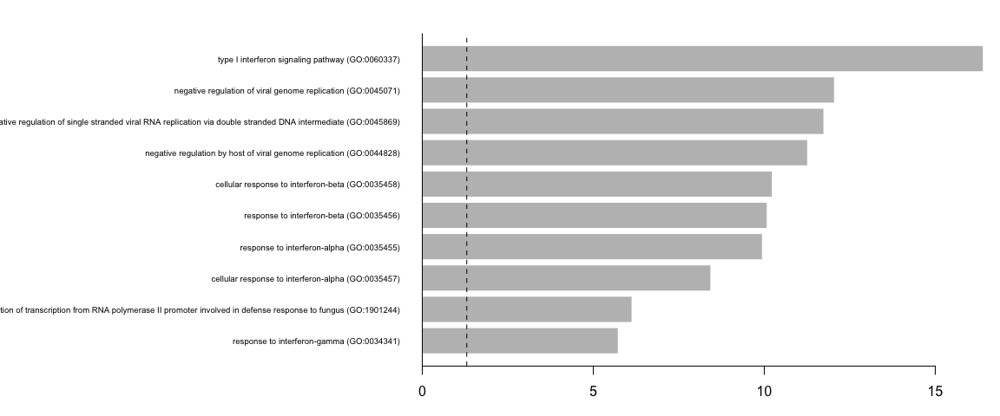<!-- -->

## Gene Set Enrichment Analysis (GSEA)

Besides the enrichment using hypergeometric test, we can also perform gene set enrichment analysis (GSEA), which scores ranked genes list (usually based on fold changes) and computes permutation test to check if a particular gene set is more present in the Up-regulated genes, amongthe DOWN_regulated genes or not differentially regulated.


```r
cell_selection = SetIdent(cell_selection, value = "type")

DGE_cell_selection2 <- FindMarkers(cell_selection, ident.1 = "Covid", log2FC.threshold = -Inf,
    test.use = "wilcox", min.pct = 0.1, min.diff.pct = 0, only.pos = FALSE, max.cells.per.ident = 50,
    assay = "RNA")

# Create a gene rank based on the gene expression fold change
gene_rank <- setNames(DGE_cell_selection2$avg_log2FC, casefold(rownames(DGE_cell_selection2),
    upper = T))
```

 Once our list of genes are sorted, we can proceed with the enrichment itself. We can use the package to get gene set from the Molecular Signature Database (MSigDB) and select KEGG pathways as an example.


```r
library(msigdbr)

# Download gene sets
msigdbgmt <- msigdbr::msigdbr("Homo sapiens")
msigdbgmt <- as.data.frame(msigdbgmt)

# List available gene sets
unique(msigdbgmt$gs_subcat)
```

```
##  [1] "MIR:MIR_Legacy"  "TFT:TFT_Legacy"  "CGP"             "TFT:GTRD"       
##  [5] ""                "VAX"             "CP:BIOCARTA"     "CGN"            
##  [9] "GO:BP"           "GO:CC"           "IMMUNESIGDB"     "GO:MF"          
## [13] "HPO"             "CP:KEGG"         "MIR:MIRDB"       "CM"             
## [17] "CP"              "CP:PID"          "CP:REACTOME"     "CP:WIKIPATHWAYS"
```

```r
# Subset which gene set you want to use.
msigdbgmt_subset <- msigdbgmt[msigdbgmt$gs_subcat == "CP:WIKIPATHWAYS", ]
gmt <- lapply(unique(msigdbgmt_subset$gs_name), function(x) {
    msigdbgmt_subset[msigdbgmt_subset$gs_name == x, "gene_symbol"]
})
names(gmt) <- unique(paste0(msigdbgmt_subset$gs_name, "_", msigdbgmt_subset$gs_exact_source))
```

 Next, we will be using the GSEA. This will result in a table containing information for several pathways. We can then sort and filter those pathways to visualize only the top ones. You can select/filter them by either `p-value` or normalized enrichemnet score (`NES`).


```r
library(fgsea)

# Perform enrichemnt analysis
fgseaRes <- fgsea(pathways = gmt, stats = gene_rank, minSize = 15, maxSize = 500)
fgseaRes <- fgseaRes[order(fgseaRes$pval, decreasing = T), ]

# Filter the results table to show only the top 10 UP or DOWN regulated
# processes (optional)
top10_UP <- fgseaRes$pathway[1:10]

# Nice summary table (shown as a plot)
dev.off()
plotGseaTable(gmt[top10_UP], gene_rank, fgseaRes, gseaParam = 0.5)
```

<style>
div.blue { background-color:#e6f0ff; border-radius: 5px; padding: 10px;}
</style>
<div class = "blue">
**Your turn**

Which KEGG pathways are upregulated in this cluster?
Which KEGG pathways are dowregulated in this cluster?
Change the pathway source to another gene set (e.g. "CP:WIKIPATHWAYS" or "CP:REACTOME" or "CP:BIOCARTA" or "GO:BP") and check the if you get simmilar results?
</div>

Finally, lets save the integrated data for further analysis.


```r
# saveRDS(alldata, 'data/3pbmc_qc_dr_int_cl_dge.rds') save the list of DGE
# results to a file.
write.csv(markers_genes, file = "data/3pbmc_qc_dr_int_cl_dge.csv")
```


### Session Info
***


```r
sessionInfo()
```

```
## R version 4.1.3 (2022-03-10)
## Platform: x86_64-apple-darwin13.4.0 (64-bit)
## Running under: macOS Big Sur/Monterey 10.16
## 
## Matrix products: default
## BLAS/LAPACK: /Users/asabjor/miniconda3/envs/scRNAseq2023/lib/libopenblasp-r0.3.21.dylib
## 
## locale:
## [1] C/UTF-8/C/C/C/C
## 
## attached base packages:
## [1] stats4    stats     graphics  grDevices utils     datasets  methods  
## [8] base     
## 
## other attached packages:
##  [1] fgsea_1.20.0                msigdbr_7.5.1              
##  [3] lme4_1.1-31                 MAST_1.20.0                
##  [5] SingleCellExperiment_1.16.0 SummarizedExperiment_1.24.0
##  [7] Biobase_2.54.0              GenomicRanges_1.46.1       
##  [9] GenomeInfoDb_1.30.1         IRanges_2.28.0             
## [11] S4Vectors_0.32.4            BiocGenerics_0.40.0        
## [13] MatrixGenerics_1.6.0        matrixStats_0.63.0         
## [15] edgeR_3.36.0                limma_3.50.3               
## [17] Matrix_1.5-3                rafalib_1.0.0              
## [19] enrichR_3.1                 pheatmap_1.0.12            
## [21] ggplot2_3.4.0               cowplot_1.1.1              
## [23] dplyr_1.0.10                SeuratObject_4.1.3         
## [25] Seurat_4.3.0                RJSONIO_1.3-1.7            
## [27] optparse_1.7.3             
## 
## loaded via a namespace (and not attached):
##   [1] fastmatch_1.1-3        plyr_1.8.8             igraph_1.3.5          
##   [4] lazyeval_0.2.2         sp_1.6-0               splines_4.1.3         
##   [7] BiocParallel_1.28.3    listenv_0.9.0          scattermore_0.8       
##  [10] digest_0.6.31          htmltools_0.5.4        fansi_1.0.4           
##  [13] magrittr_2.0.3         tensor_1.5             cluster_2.1.4         
##  [16] ROCR_1.0-11            globals_0.16.2         spatstat.sparse_3.0-0 
##  [19] prettyunits_1.1.1      colorspace_2.1-0       ggrepel_0.9.2         
##  [22] xfun_0.36              crayon_1.5.2           RCurl_1.98-1.9        
##  [25] jsonlite_1.8.4         progressr_0.13.0       spatstat.data_3.0-0   
##  [28] survival_3.5-0         zoo_1.8-11             glue_1.6.2            
##  [31] polyclip_1.10-4        gtable_0.3.1           zlibbioc_1.40.0       
##  [34] XVector_0.34.0         leiden_0.4.3           DelayedArray_0.20.0   
##  [37] future.apply_1.10.0    abind_1.4-5            scales_1.2.1          
##  [40] DBI_1.1.3              spatstat.random_3.0-1  miniUI_0.1.1.1        
##  [43] Rcpp_1.0.10            progress_1.2.2         viridisLite_0.4.1     
##  [46] xtable_1.8-4           reticulate_1.27        htmlwidgets_1.6.1     
##  [49] httr_1.4.4             getopt_1.20.3          RColorBrewer_1.1-3    
##  [52] ellipsis_0.3.2         ica_1.0-3              farver_2.1.1          
##  [55] pkgconfig_2.0.3        sass_0.4.5             uwot_0.1.14           
##  [58] deldir_1.0-6           locfit_1.5-9.7         utf8_1.2.2            
##  [61] labeling_0.4.2         tidyselect_1.2.0       rlang_1.0.6           
##  [64] reshape2_1.4.4         later_1.3.0            munsell_0.5.0         
##  [67] tools_4.1.3            cachem_1.0.6           cli_3.6.0             
##  [70] generics_0.1.3         ggridges_0.5.4         evaluate_0.20         
##  [73] stringr_1.5.0          fastmap_1.1.0          yaml_2.3.7            
##  [76] goftest_1.2-3          babelgene_22.9         knitr_1.41            
##  [79] fitdistrplus_1.1-8     purrr_1.0.1            RANN_2.6.1            
##  [82] pbapply_1.7-0          future_1.30.0          nlme_3.1-161          
##  [85] mime_0.12              formatR_1.14           compiler_4.1.3        
##  [88] plotly_4.10.1          curl_4.3.3             png_0.1-8             
##  [91] spatstat.utils_3.0-1   tibble_3.1.8           bslib_0.4.2           
##  [94] stringi_1.7.12         highr_0.10             lattice_0.20-45       
##  [97] nloptr_2.0.3           vctrs_0.5.2            pillar_1.8.1          
## [100] lifecycle_1.0.3        spatstat.geom_3.0-5    lmtest_0.9-40         
## [103] jquerylib_0.1.4        RcppAnnoy_0.0.20       data.table_1.14.6     
## [106] bitops_1.0-7           irlba_2.3.5.1          httpuv_1.6.8          
## [109] patchwork_1.1.2        R6_2.5.1               promises_1.2.0.1      
## [112] KernSmooth_2.23-20     gridExtra_2.3          parallelly_1.34.0     
## [115] codetools_0.2-18       boot_1.3-28.1          MASS_7.3-58.2         
## [118] assertthat_0.2.1       rjson_0.2.21           withr_2.5.0           
## [121] sctransform_0.3.5      GenomeInfoDbData_1.2.7 hms_1.1.2             
## [124] parallel_4.1.3         grid_4.1.3             minqa_1.2.5           
## [127] tidyr_1.2.1            rmarkdown_2.20         Rtsne_0.16            
## [130] spatstat.explore_3.0-5 shiny_1.7.4
```
