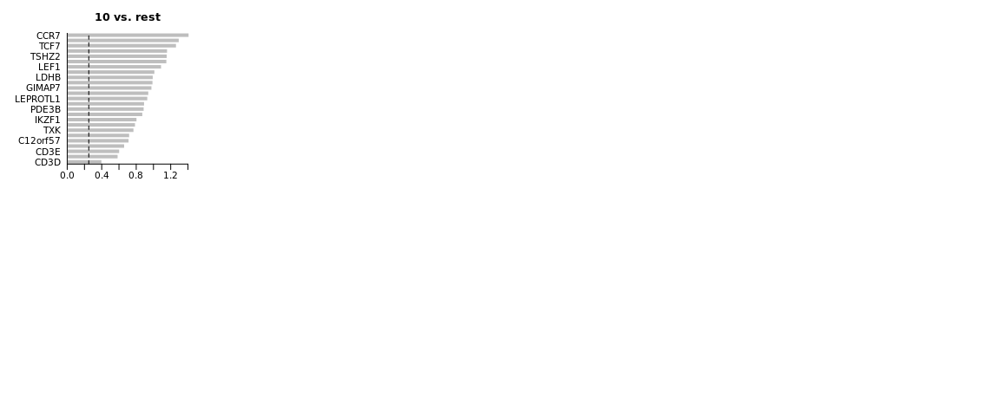

<style>
h1, .h1, h2, .h2, h3, .h3, h4, .h4 { margin-top: 50px }
p.caption {font-size: 0.9em;font-style: italic;color: grey;margin-right: 10%;margin-left: 10%;text-align: justify}
</style>

# Differential gene expression

In this tutorial we will cover about Differetial gene expression, which comprises an extensive range of topics and methods. In single cell, differential expresison can have multiple functionalities such as of identifying marker genes for cell populations, as well as differentially regulated genes across conditions (healthy vs control). We will also exercise on how to account the batch information in your test.

We can first load the data from the clustering session. Moreover, we can already decide which clustering resolution to use. First let's define using the `louvain` clustering to identifying differentially expressed genes.  


```r
suppressPackageStartupMessages({
    library(Seurat)
    library(venn)
    library(dplyr)
    library(cowplot)
    library(ggplot2)
    library(pheatmap)
    library(enrichR)
    library(rafalib)
})

alldata <- readRDS("data/results/covid_qc_dr_int_cl.rds")
```


```r
# Set the identity as louvain with resolution 0.5
sel.clust = "CCA_snn_res.0.5"

alldata <- SetIdent(alldata, value = sel.clust)
table(alldata@active.ident)
```

```
## 
##    0    1    2    3    4    5    6    7    8    9   10 
## 1453  570  528  494  487  470  446  400  240  230  214
```

```r
# plot this clustering
plot_grid(ncol = 3, DimPlot(alldata, label = T) + NoAxes(), DimPlot(alldata, group.by = "orig.ident") + 
    NoAxes(), DimPlot(alldata, group.by = "type") + NoAxes())
```

<!-- -->

## Cell marker genes
***

Let us first compute a ranking for the highly differential genes in each cluster. There are many different tests and parameters to be chosen that can be used to refine your results. When looking for marker genes, we want genes that are positivelly expressed in a cell type and possibly not expressed in the others.


```r
# Compute differentiall expression
markers_genes <- FindAllMarkers(alldata, logfc.threshold = 0.2, test.use = "wilcox", 
    min.pct = 0.1, min.diff.pct = 0.2, only.pos = TRUE, max.cells.per.ident = 50, 
    assay = "RNA")
```

We can now select the top 25 up regulated genes for plotting.


```r
top25 <- markers_genes %>% group_by(cluster) %>% top_n(-25, p_val_adj)
top25
```

<div data-pagedtable="false">
  <script data-pagedtable-source type="application/json">
{"columns":[{"label":["p_val"],"name":[1],"type":["dbl"],"align":["right"]},{"label":["avg_logFC"],"name":[2],"type":["dbl"],"align":["right"]},{"label":["pct.1"],"name":[3],"type":["dbl"],"align":["right"]},{"label":["pct.2"],"name":[4],"type":["dbl"],"align":["right"]},{"label":["p_val_adj"],"name":[5],"type":["dbl"],"align":["right"]},{"label":["cluster"],"name":[6],"type":["fct"],"align":["left"]},{"label":["gene"],"name":[7],"type":["chr"],"align":["left"]}],"data":[{"1":"2.264061e-18","2":"2.1968625","3":"0.964","4":"0.072","5":"4.102704e-14","6":"0","7":"VCAN"},{"1":"9.762285e-18","2":"2.0240455","3":"0.994","4":"0.135","5":"1.769024e-13","6":"0","7":"FCN1"},{"1":"9.967076e-18","2":"1.9095912","3":"0.939","4":"0.058","5":"1.806134e-13","6":"0","7":"CD14"},{"1":"1.105185e-17","2":"2.5175223","3":"1.000","4":"0.260","5":"2.002706e-13","6":"0","7":"LYZ"},{"1":"2.277970e-17","2":"1.4242183","3":"0.972","4":"0.336","5":"4.127910e-13","6":"0","7":"APLP2"},{"1":"2.570420e-17","2":"2.7792763","3":"0.997","4":"0.343","5":"4.657858e-13","6":"0","7":"S100A9"},{"1":"3.653861e-17","2":"1.2712956","3":"0.884","4":"0.097","5":"6.621161e-13","6":"0","7":"MPEG1"},{"1":"1.199814e-16","2":"2.1078711","3":"0.985","4":"0.122","5":"2.174182e-12","6":"0","7":"AC020656.1"},{"1":"1.341305e-16","2":"2.8514451","3":"0.993","4":"0.257","5":"2.430579e-12","6":"0","7":"S100A8"},{"1":"1.725826e-16","2":"1.8378729","3":"0.966","4":"0.111","5":"3.127369e-12","6":"0","7":"MNDA"},{"1":"1.950524e-16","2":"1.5284227","3":"0.953","4":"0.082","5":"3.534545e-12","6":"0","7":"CSTA"},{"1":"2.330584e-16","2":"1.6027846","3":"0.981","4":"0.296","5":"4.223251e-12","6":"0","7":"TYMP"},{"1":"2.966946e-16","2":"2.3278595","3":"0.939","4":"0.069","5":"5.376403e-12","6":"0","7":"S100A12"},{"1":"4.761294e-16","2":"1.2961285","3":"0.913","4":"0.098","5":"8.627942e-12","6":"0","7":"NCF2"},{"1":"1.452707e-15","2":"1.4875312","3":"0.991","4":"0.460","5":"2.632450e-11","6":"0","7":"S100A11"},{"1":"1.760667e-15","2":"1.5669569","3":"0.856","4":"0.066","5":"3.190504e-11","6":"0","7":"PLBD1"},{"1":"2.296797e-15","2":"1.1932695","3":"0.986","4":"0.563","5":"4.162025e-11","6":"0","7":"TSPO"},{"1":"2.750892e-15","2":"1.2829396","3":"0.886","4":"0.085","5":"4.984892e-11","6":"0","7":"TNFSF13B"},{"1":"3.189175e-15","2":"1.3177844","3":"0.988","4":"0.452","5":"5.779104e-11","6":"0","7":"BRI3"},{"1":"5.604382e-15","2":"1.6328886","3":"0.967","4":"0.174","5":"1.015570e-10","6":"0","7":"GRN"},{"1":"8.434822e-15","2":"1.3847420","3":"0.926","4":"0.087","5":"1.528474e-10","6":"0","7":"CSF3R"},{"1":"9.009607e-15","2":"1.6344483","3":"0.828","4":"0.103","5":"1.632631e-10","6":"0","7":"DUSP6"},{"1":"1.045712e-14","2":"1.3524789","3":"0.971","4":"0.115","5":"1.894934e-10","6":"0","7":"SERPINA1"},{"1":"1.062740e-14","2":"1.5659711","3":"0.932","4":"0.063","5":"1.925790e-10","6":"0","7":"MS4A6A"},{"1":"1.332778e-14","2":"1.4143576","3":"0.953","4":"0.159","5":"2.415127e-10","6":"0","7":"CYBB"},{"1":"6.632718e-20","2":"2.9546474","3":"0.991","4":"0.062","5":"1.201915e-15","6":"1","7":"IGHM"},{"1":"1.259346e-19","2":"2.4500520","3":"0.949","4":"0.027","5":"2.282062e-15","6":"1","7":"IGHD"},{"1":"2.031693e-19","2":"2.2719182","3":"0.974","4":"0.070","5":"3.681631e-15","6":"1","7":"CD79A"},{"1":"4.901163e-18","2":"1.7015453","3":"0.895","4":"0.066","5":"8.881397e-14","6":"1","7":"TNFRSF13C"},{"1":"5.950247e-18","2":"1.7214800","3":"0.905","4":"0.064","5":"1.078244e-13","6":"1","7":"MS4A1"},{"1":"1.542726e-16","2":"1.7750628","3":"0.882","4":"0.060","5":"2.795574e-12","6":"1","7":"LINC00926"},{"1":"2.117471e-16","2":"1.3787907","3":"0.975","4":"0.527","5":"3.837070e-12","6":"1","7":"HLA-DQB1"},{"1":"3.158027e-16","2":"1.3178841","3":"0.991","4":"0.620","5":"5.722661e-12","6":"1","7":"HLA-DRA"},{"1":"2.013052e-15","2":"1.1125101","3":"0.974","4":"0.670","5":"3.647851e-11","6":"1","7":"HLA-DPB1"},{"1":"4.746887e-15","2":"1.4810717","3":"0.835","4":"0.066","5":"8.601835e-11","6":"1","7":"BANK1"},{"1":"5.536396e-15","2":"1.7127405","3":"0.877","4":"0.140","5":"1.003250e-10","6":"1","7":"CD79B"},{"1":"2.159618e-14","2":"1.2923838","3":"0.649","4":"0.027","5":"3.913443e-10","6":"1","7":"FCER2"},{"1":"6.382826e-14","2":"1.7904662","3":"0.746","4":"0.009","5":"1.156632e-09","6":"1","7":"TCL1A"},{"1":"1.258235e-13","2":"1.6587946","3":"0.884","4":"0.287","5":"2.280047e-09","6":"1","7":"CD83"},{"1":"1.612459e-13","2":"0.8754042","3":"0.970","4":"0.686","5":"2.921937e-09","6":"1","7":"HLA-DPA1"},{"1":"3.952225e-13","2":"1.0558478","3":"0.989","4":"0.710","5":"7.161827e-09","6":"1","7":"HLA-DRB1"},{"1":"3.152451e-12","2":"1.2856359","3":"0.833","4":"0.343","5":"5.712557e-08","6":"1","7":"YBX3"},{"1":"9.162173e-12","2":"0.9991398","3":"0.879","4":"0.307","5":"1.660277e-07","6":"1","7":"HLA-DQA1"},{"1":"2.805533e-11","2":"1.1491683","3":"0.604","4":"0.027","5":"5.083907e-07","6":"1","7":"FAM129C"},{"1":"4.016798e-11","2":"1.4255652","3":"0.737","4":"0.075","5":"7.278839e-07","6":"1","7":"RALGPS2"},{"1":"6.668123e-11","2":"0.9795466","3":"0.775","4":"0.301","5":"1.208331e-06","6":"1","7":"HLA-DMB"},{"1":"1.813058e-10","2":"1.0872552","3":"0.609","4":"0.118","5":"3.285442e-06","6":"1","7":"BCL11A"},{"1":"1.900234e-10","2":"1.0896237","3":"0.616","4":"0.100","5":"3.443414e-06","6":"1","7":"PLPP5"},{"1":"2.155888e-10","2":"1.2337406","3":"0.693","4":"0.043","5":"3.906685e-06","6":"1","7":"AFF3"},{"1":"9.414773e-10","2":"1.1632938","3":"0.970","4":"0.636","5":"1.706051e-05","6":"1","7":"CXCR4"},{"1":"5.579159e-13","2":"1.5253322","3":"0.968","4":"0.240","5":"1.010999e-08","6":"2","7":"GZMH"},{"1":"1.097302e-12","2":"1.0670733","3":"0.981","4":"0.389","5":"1.988420e-08","6":"2","7":"IL32"},{"1":"1.809237e-12","2":"0.9943339","3":"0.962","4":"0.338","5":"3.278518e-08","6":"2","7":"CD3E"},{"1":"2.019917e-12","2":"1.2876157","3":"0.936","4":"0.259","5":"3.660292e-08","6":"2","7":"CD3D"},{"1":"9.777072e-12","2":"1.1477086","3":"0.992","4":"0.447","5":"1.771703e-07","6":"2","7":"CCL5"},{"1":"9.896427e-12","2":"1.2327414","3":"0.888","4":"0.228","5":"1.793331e-07","6":"2","7":"CD3G"},{"1":"5.036586e-11","2":"0.9836642","3":"0.996","4":"0.451","5":"9.126797e-07","6":"2","7":"NKG7"},{"1":"3.293126e-10","2":"1.1064856","3":"0.625","4":"0.105","5":"5.967473e-06","6":"2","7":"TRGC2"},{"1":"7.228979e-10","2":"0.7619289","3":"0.786","4":"0.322","5":"1.309963e-05","6":"2","7":"RORA"},{"1":"1.884627e-09","2":"0.6004599","3":"0.845","4":"0.316","5":"3.415133e-05","6":"2","7":"CTSW"},{"1":"2.059592e-09","2":"1.1121139","3":"0.841","4":"0.256","5":"3.732187e-05","6":"2","7":"CD2"},{"1":"2.096349e-09","2":"0.9207878","3":"0.633","4":"0.128","5":"3.798794e-05","6":"2","7":"KLRG1"},{"1":"2.149664e-09","2":"0.7946822","3":"0.786","4":"0.290","5":"3.895405e-05","6":"2","7":"C12orf75"},{"1":"2.291164e-09","2":"0.8760118","3":"0.869","4":"0.219","5":"4.151819e-05","6":"2","7":"FGFBP2"},{"1":"1.543643e-08","2":"0.7343672","3":"0.958","4":"0.360","5":"2.797236e-04","6":"2","7":"CST7"},{"1":"1.557798e-08","2":"0.6618832","3":"0.911","4":"0.642","5":"2.822887e-04","6":"2","7":"PPP2R5C"},{"1":"1.696508e-08","2":"1.0767140","3":"0.794","4":"0.218","5":"3.074242e-04","6":"2","7":"TRAC"},{"1":"2.152922e-08","2":"0.6045237","3":"0.854","4":"0.299","5":"3.901311e-04","6":"2","7":"GNLY"},{"1":"2.896412e-08","2":"0.7469886","3":"0.900","4":"0.319","5":"5.248589e-04","6":"2","7":"GZMM"},{"1":"2.966297e-08","2":"0.8895785","3":"0.922","4":"0.295","5":"5.375226e-04","6":"2","7":"GZMA"},{"1":"3.394815e-08","2":"0.8321106","3":"0.750","4":"0.298","5":"6.151745e-04","6":"2","7":"LYAR"},{"1":"7.038447e-08","2":"0.6850951","3":"0.542","4":"0.189","5":"1.275437e-03","6":"2","7":"RASGRP1"},{"1":"9.344067e-08","2":"0.6909694","3":"0.712","4":"0.289","5":"1.693238e-03","6":"2","7":"SPOCK2"},{"1":"9.456621e-08","2":"0.7360925","3":"0.936","4":"0.681","5":"1.713634e-03","6":"2","7":"CD99"},{"1":"3.140963e-07","2":"0.6295586","3":"0.754","4":"0.270","5":"5.691739e-03","6":"2","7":"HOPX"},{"1":"3.406299e-12","2":"0.8367268","3":"0.887","4":"0.324","5":"6.172555e-08","6":"3","7":"GZMM"},{"1":"8.141653e-11","2":"0.9069120","3":"0.990","4":"0.393","5":"1.475349e-06","6":"3","7":"IL32"},{"1":"2.429799e-10","2":"0.8792892","3":"0.621","4":"0.132","5":"4.403038e-06","6":"3","7":"KLRG1"},{"1":"3.229743e-10","2":"1.0508113","3":"0.994","4":"0.451","5":"5.852618e-06","6":"3","7":"CCL5"},{"1":"3.898589e-10","2":"1.3563572","3":"0.907","4":"0.362","5":"7.064633e-06","6":"3","7":"DUSP2"},{"1":"9.773136e-10","2":"1.0391534","3":"0.935","4":"0.264","5":"1.770990e-05","6":"3","7":"CD3D"},{"1":"3.542038e-09","2":"0.7098801","3":"0.955","4":"0.364","5":"6.418528e-05","6":"3","7":"CST7"},{"1":"3.249490e-08","2":"1.9861391","3":"0.668","4":"0.057","5":"5.888401e-04","6":"3","7":"GZMK"},{"1":"3.689060e-08","2":"1.0331137","3":"0.824","4":"0.294","5":"6.684946e-04","6":"3","7":"LYAR"},{"1":"5.783016e-08","2":"0.8504352","3":"0.955","4":"0.510","5":"1.047940e-03","6":"3","7":"ARL4C"},{"1":"1.276014e-07","2":"0.5178335","3":"0.960","4":"0.720","5":"2.312266e-03","6":"3","7":"HCST"},{"1":"1.404813e-07","2":"0.9957068","3":"0.510","4":"0.179","5":"2.545662e-03","6":"3","7":"KLRB1"},{"1":"2.427527e-07","2":"1.0737229","3":"0.358","4":"0.062","5":"4.398922e-03","6":"3","7":"TRGC1"},{"1":"2.460831e-07","2":"0.6469451","3":"0.895","4":"0.302","5":"4.459272e-03","6":"3","7":"GZMA"},{"1":"3.305627e-07","2":"0.5545573","3":"0.970","4":"0.457","5":"5.990127e-03","6":"3","7":"NKG7"},{"1":"4.549469e-07","2":"0.6312803","3":"0.905","4":"0.645","5":"8.244093e-03","6":"3","7":"PPP2R5C"},{"1":"5.008060e-07","2":"0.6470071","3":"0.816","4":"0.369","5":"9.075105e-03","6":"3","7":"SYNE2"},{"1":"5.223979e-07","2":"0.7640427","3":"0.885","4":"0.580","5":"9.466373e-03","6":"3","7":"TNFAIP3"},{"1":"6.855633e-07","2":"1.0212602","3":"0.526","4":"0.124","5":"1.242309e-02","6":"3","7":"CD8A"},{"1":"7.577931e-07","2":"0.8301521","3":"0.543","4":"0.116","5":"1.373197e-02","6":"3","7":"TRGC2"},{"1":"8.947621e-07","2":"0.4840647","3":"0.852","4":"0.319","5":"1.621398e-02","6":"3","7":"CTSW"},{"1":"1.119659e-06","2":"0.7720389","3":"0.729","4":"0.290","5":"2.028933e-02","6":"3","7":"SPOCK2"},{"1":"1.243941e-06","2":"0.7990935","3":"0.911","4":"0.671","5":"2.254146e-02","6":"3","7":"SRSF7"},{"1":"1.364234e-06","2":"0.8530355","3":"0.567","4":"0.207","5":"2.472128e-02","6":"3","7":"CREM"},{"1":"1.639147e-06","2":"0.6179682","3":"0.634","4":"0.316","5":"2.970299e-02","6":"3","7":"DNAJB1"},{"1":"5.788557e-07","2":"1.7031780","3":"0.329","4":"0.095","5":"1.048944e-02","6":"4","7":"CAVIN2"},{"1":"1.014726e-05","2":"2.9346726","3":"0.415","4":"0.166","5":"1.838785e-01","6":"4","7":"PF4"},{"1":"1.187751e-05","2":"3.4673259","3":"0.460","4":"0.217","5":"2.152324e-01","6":"4","7":"PPBP"},{"1":"1.758138e-04","2":"1.6527355","3":"0.281","4":"0.063","5":"1.000000e+00","6":"4","7":"TUBB1"},{"1":"5.748728e-04","2":"0.2206525","3":"0.263","4":"0.540","5":"1.000000e+00","6":"4","7":"CCDC85B"},{"1":"7.083805e-04","2":"1.8112156","3":"0.318","4":"0.098","5":"1.000000e+00","6":"4","7":"GNG11"},{"1":"8.891322e-04","2":"0.2424618","3":"0.279","4":"0.575","5":"1.000000e+00","6":"4","7":"ATP5F1B"},{"1":"9.057599e-04","2":"0.2758717","3":"0.242","4":"0.497","5":"1.000000e+00","6":"4","7":"SRP9"},{"1":"1.316011e-03","2":"0.2641326","3":"0.312","4":"0.627","5":"1.000000e+00","6":"4","7":"ATP5PF"},{"1":"1.360416e-03","2":"0.2027542","3":"0.248","4":"0.515","5":"1.000000e+00","6":"4","7":"REEP5"},{"1":"1.931587e-03","2":"0.2429400","3":"0.230","4":"0.453","5":"1.000000e+00","6":"4","7":"ZNHIT1"},{"1":"2.462708e-03","2":"0.3619990","3":"0.741","4":"0.966","5":"1.000000e+00","6":"4","7":"PFN1"},{"1":"2.940986e-03","2":"0.3244647","3":"0.189","4":"0.398","5":"1.000000e+00","6":"4","7":"DGUOK"},{"1":"2.984584e-03","2":"0.9957718","3":"0.589","4":"0.819","5":"1.000000e+00","6":"4","7":"TAGLN2"},{"1":"3.340825e-03","2":"0.2104564","3":"0.277","4":"0.509","5":"1.000000e+00","6":"4","7":"ANP32A"},{"1":"3.414415e-03","2":"0.2000608","3":"0.308","4":"0.654","5":"1.000000e+00","6":"4","7":"HMGN1"},{"1":"3.430808e-03","2":"0.5184054","3":"0.657","4":"0.434","5":"1.000000e+00","6":"4","7":"LYZ"},{"1":"4.288344e-03","2":"0.3667829","3":"0.337","4":"0.661","5":"1.000000e+00","6":"4","7":"VAPA"},{"1":"4.730486e-03","2":"0.3799976","3":"0.698","4":"0.497","5":"1.000000e+00","6":"4","7":"S100A9"},{"1":"4.998608e-03","2":"0.2687009","3":"0.261","4":"0.562","5":"1.000000e+00","6":"4","7":"AP2M1"},{"1":"5.473369e-03","2":"0.7439992","3":"0.626","4":"0.395","5":"1.000000e+00","6":"4","7":"CST3"},{"1":"5.560227e-03","2":"0.2996928","3":"0.244","4":"0.470","5":"1.000000e+00","6":"4","7":"PSMA4"},{"1":"6.200492e-03","2":"0.4099942","3":"0.269","4":"0.559","5":"1.000000e+00","6":"4","7":"UBE2B"},{"1":"7.067864e-03","2":"0.8122933","3":"0.326","4":"0.563","5":"1.000000e+00","6":"4","7":"DAD1"},{"1":"7.562844e-03","2":"0.2184738","3":"0.236","4":"0.443","5":"1.000000e+00","6":"4","7":"ANAPC11"},{"1":"8.038807e-03","2":"0.2696405","3":"0.232","4":"0.458","5":"1.000000e+00","6":"4","7":"TRAM1"},{"1":"9.211721e-03","2":"0.2122962","3":"0.333","4":"0.685","5":"1.000000e+00","6":"4","7":"LDHA"},{"1":"3.100183e-16","2":"1.8545044","3":"0.966","4":"0.243","5":"5.617842e-12","6":"5","7":"GZMB"},{"1":"8.207734e-16","2":"1.6952898","3":"0.951","4":"0.306","5":"1.487323e-11","6":"5","7":"CD7"},{"1":"1.452335e-15","2":"1.9045672","3":"0.968","4":"0.251","5":"2.631777e-11","6":"5","7":"PRF1"},{"1":"1.466732e-14","2":"1.9325918","3":"0.940","4":"0.297","5":"2.657866e-10","6":"5","7":"GNLY"},{"1":"2.136052e-14","2":"1.4882014","3":"0.998","4":"0.457","5":"3.870739e-10","6":"5","7":"NKG7"},{"1":"2.578867e-14","2":"1.4742971","3":"0.974","4":"0.310","5":"4.673165e-10","6":"5","7":"CTSW"},{"1":"5.003132e-14","2":"1.5491977","3":"0.955","4":"0.323","5":"9.066175e-10","6":"5","7":"CD247"},{"1":"8.923780e-14","2":"1.4530523","3":"0.823","4":"0.152","5":"1.617078e-09","6":"5","7":"KLRB1"},{"1":"1.692789e-13","2":"1.2679314","3":"0.970","4":"0.365","5":"3.067503e-09","6":"5","7":"CST7"},{"1":"5.232850e-13","2":"1.4642570","3":"0.809","4":"0.096","5":"9.482448e-09","6":"5","7":"KLRF1"},{"1":"1.950027e-12","2":"2.0027579","3":"0.849","4":"0.151","5":"3.533643e-08","6":"5","7":"SPON2"},{"1":"6.611810e-12","2":"1.1333340","3":"0.955","4":"0.512","5":"1.198126e-07","6":"5","7":"ARL4C"},{"1":"2.221508e-11","2":"1.5786749","3":"0.770","4":"0.112","5":"4.025594e-07","6":"5","7":"CLIC3"},{"1":"8.013632e-11","2":"1.0883862","3":"0.906","4":"0.560","5":"1.452150e-06","6":"5","7":"ABHD17A"},{"1":"8.160525e-11","2":"1.1990940","3":"0.894","4":"0.326","5":"1.478769e-06","6":"5","7":"GZMM"},{"1":"2.407976e-10","2":"1.0814176","3":"0.770","4":"0.302","5":"4.363493e-06","6":"5","7":"APMAP"},{"1":"4.753182e-10","2":"1.3465358","3":"0.911","4":"0.218","5":"8.613240e-06","6":"5","7":"KLRD1"},{"1":"6.429242e-10","2":"1.3414577","3":"0.702","4":"0.107","5":"1.165043e-05","6":"5","7":"IL2RB"},{"1":"1.047058e-09","2":"1.4859041","3":"0.853","4":"0.228","5":"1.897374e-05","6":"5","7":"FGFBP2"},{"1":"4.823185e-09","2":"0.8130539","3":"0.687","4":"0.376","5":"8.740094e-05","6":"5","7":"GNG2"},{"1":"5.349874e-09","2":"0.8963001","3":"0.872","4":"0.497","5":"9.694507e-05","6":"5","7":"IFITM1"},{"1":"1.219111e-08","2":"0.8803044","3":"0.917","4":"0.461","5":"2.209150e-04","6":"5","7":"CCL5"},{"1":"1.485854e-08","2":"1.2122174","3":"0.851","4":"0.266","5":"2.692516e-04","6":"5","7":"HOPX"},{"1":"1.517607e-08","2":"1.2697434","3":"0.915","4":"0.303","5":"2.750055e-04","6":"5","7":"GZMA"},{"1":"1.905370e-08","2":"0.7367984","3":"0.938","4":"0.723","5":"3.452721e-04","6":"5","7":"HCST"},{"1":"2.450182e-15","2":"1.5210500","3":"0.942","4":"0.196","5":"4.439975e-11","6":"6","7":"IL7R"},{"1":"4.059484e-14","2":"1.3971864","3":"0.953","4":"0.362","5":"7.356192e-10","6":"6","7":"LTB"},{"1":"3.933882e-12","2":"1.0868861","3":"0.951","4":"0.529","5":"7.128587e-08","6":"6","7":"LDHB"},{"1":"4.459400e-10","2":"1.0875209","3":"0.895","4":"0.219","5":"8.080878e-06","6":"6","7":"TRAC"},{"1":"5.227433e-09","2":"0.7849225","3":"0.724","4":"0.276","5":"9.472631e-05","6":"6","7":"ARHGAP15"},{"1":"1.040907e-08","2":"0.5252957","3":"0.643","4":"0.319","5":"1.886227e-04","6":"6","7":"DNAJB1"},{"1":"4.964851e-08","2":"0.8061657","3":"0.509","4":"0.033","5":"8.996806e-04","6":"6","7":"MAL"},{"1":"7.892952e-08","2":"0.7092041","3":"0.870","4":"0.390","5":"1.430282e-03","6":"6","7":"PIK3IP1"},{"1":"8.818015e-08","2":"0.7581299","3":"0.538","4":"0.089","5":"1.597913e-03","6":"6","7":"AP3M2"},{"1":"1.272724e-07","2":"0.3571725","3":"0.424","4":"0.145","5":"2.306303e-03","6":"6","7":"TMEM238"},{"1":"1.284030e-07","2":"0.4652377","3":"0.969","4":"0.768","5":"2.326790e-03","6":"6","7":"NOP53"},{"1":"1.480158e-07","2":"0.5842081","3":"0.908","4":"0.630","5":"2.682193e-03","6":"6","7":"GSTK1"},{"1":"1.884955e-07","2":"0.4736231","3":"0.735","4":"0.343","5":"3.415727e-03","6":"6","7":"RHOH"},{"1":"2.782156e-07","2":"0.5994103","3":"0.892","4":"0.274","5":"5.041545e-03","6":"6","7":"CD3D"},{"1":"4.244012e-07","2":"0.8223105","3":"0.643","4":"0.113","5":"7.690574e-03","6":"6","7":"RCAN3"},{"1":"7.178520e-07","2":"0.4605724","3":"0.374","4":"0.052","5":"1.300820e-02","6":"6","7":"LEF1"},{"1":"8.258497e-07","2":"0.3464468","3":"0.323","4":"0.082","5":"1.496522e-02","6":"6","7":"STMN3"},{"1":"1.011890e-06","2":"0.6046417","3":"0.939","4":"0.350","5":"1.833646e-02","6":"6","7":"CD3E"},{"1":"1.230970e-06","2":"0.8632720","3":"0.874","4":"0.465","5":"2.230640e-02","6":"6","7":"LEPROTL1"},{"1":"1.333707e-06","2":"0.4555411","3":"0.883","4":"0.636","5":"2.416810e-02","6":"6","7":"HSPA8"},{"1":"1.761939e-06","2":"0.4745846","3":"0.399","4":"0.067","5":"3.192809e-02","6":"6","7":"CAMK4"},{"1":"2.496439e-06","2":"0.8203127","3":"0.825","4":"0.388","5":"4.523797e-02","6":"6","7":"TRBC2"},{"1":"3.091088e-06","2":"0.4503584","3":"0.904","4":"0.670","5":"5.601361e-02","6":"6","7":"ANKRD12"},{"1":"3.171910e-06","2":"0.5560835","3":"0.545","4":"0.213","5":"5.747818e-02","6":"6","7":"CREM"},{"1":"6.416221e-06","2":"0.3784179","3":"0.480","4":"0.249","5":"1.162683e-01","6":"6","7":"CLDND1"},{"1":"1.788628e-15","2":"1.2937478","3":"0.925","4":"0.226","5":"3.241172e-11","6":"7","7":"KLRD1"},{"1":"5.115958e-14","2":"1.5367303","3":"1.000","4":"0.464","5":"9.270628e-10","6":"7","7":"NKG7"},{"1":"1.605699e-13","2":"1.4160104","3":"0.973","4":"0.319","5":"2.909687e-09","6":"7","7":"CTSW"},{"1":"2.037327e-13","2":"1.4174204","3":"0.985","4":"0.252","5":"3.691840e-09","6":"7","7":"GZMB"},{"1":"2.140332e-13","2":"1.6638469","3":"0.948","4":"0.229","5":"3.878495e-09","6":"7","7":"FGFBP2"},{"1":"4.234943e-13","2":"1.4455702","3":"0.990","4":"0.372","5":"7.674141e-09","6":"7","7":"CST7"},{"1":"4.437793e-13","2":"1.4115415","3":"0.978","4":"0.257","5":"8.041725e-09","6":"7","7":"GZMH"},{"1":"4.899899e-13","2":"1.4982866","3":"0.870","4":"0.110","5":"8.879106e-09","6":"7","7":"TRDC"},{"1":"3.997884e-12","2":"1.6367250","3":"0.968","4":"0.304","5":"7.244566e-08","6":"7","7":"GNLY"},{"1":"5.455390e-12","2":"1.2943272","3":"0.752","4":"0.110","5":"9.885712e-08","6":"7","7":"KLRF1"},{"1":"2.623015e-11","2":"1.3238741","3":"0.995","4":"0.461","5":"4.753165e-07","6":"7","7":"CCL5"},{"1":"1.348636e-10","2":"1.1278096","3":"0.868","4":"0.273","5":"2.443864e-06","6":"7","7":"HOPX"},{"1":"1.394466e-10","2":"1.1648072","3":"0.935","4":"0.333","5":"2.526912e-06","6":"7","7":"CD247"},{"1":"1.558465e-10","2":"1.2124903","3":"0.950","4":"0.308","5":"2.824095e-06","6":"7","7":"GZMA"},{"1":"1.314685e-09","2":"0.8006374","3":"0.925","4":"0.627","5":"2.382341e-05","6":"7","7":"CD81"},{"1":"2.704358e-09","2":"1.4602930","3":"0.565","4":"0.024","5":"4.900567e-05","6":"7","7":"KLRC2"},{"1":"4.653912e-09","2":"0.8873264","3":"0.833","4":"0.364","5":"8.433355e-05","6":"7","7":"CD3E"},{"1":"9.485057e-09","2":"0.8375395","3":"0.797","4":"0.477","5":"1.718787e-04","6":"7","7":"ARPC5L"},{"1":"9.755128e-09","2":"1.2819539","3":"0.920","4":"0.265","5":"1.767727e-04","6":"7","7":"PRF1"},{"1":"1.377584e-08","2":"0.8972526","3":"0.902","4":"0.333","5":"2.496321e-04","6":"7","7":"GZMM"},{"1":"1.514066e-08","2":"0.9157601","3":"0.560","4":"0.090","5":"2.743639e-04","6":"7","7":"PRSS23"},{"1":"1.834468e-08","2":"0.9300430","3":"0.807","4":"0.300","5":"3.324239e-04","6":"7","7":"C12orf75"},{"1":"2.204933e-08","2":"0.6559764","3":"0.615","4":"0.232","5":"3.995559e-04","6":"7","7":"ZAP70"},{"1":"3.621308e-08","2":"0.6907563","3":"0.887","4":"0.651","5":"6.562172e-04","6":"7","7":"PPP2R5C"},{"1":"5.405182e-08","2":"0.6228679","3":"0.642","4":"0.286","5":"9.794730e-04","6":"7","7":"SKAP1"},{"1":"1.352415e-14","2":"1.8275177","3":"0.996","4":"0.126","5":"2.450711e-10","6":"8","7":"CD79A"},{"1":"1.983652e-13","2":"1.4982500","3":"0.950","4":"0.109","5":"3.594577e-09","6":"8","7":"BANK1"},{"1":"5.532203e-13","2":"1.2353348","3":"0.958","4":"0.339","5":"1.002491e-08","6":"8","7":"HLA-DQA1"},{"1":"6.426344e-13","2":"1.3113849","3":"0.917","4":"0.117","5":"1.164518e-08","6":"8","7":"TNFRSF13C"},{"1":"2.663000e-12","2":"1.0799191","3":"0.838","4":"0.111","5":"4.825622e-08","6":"8","7":"RALGPS2"},{"1":"5.046036e-12","2":"1.0777216","3":"0.979","4":"0.555","5":"9.143922e-08","6":"8","7":"HLA-DQB1"},{"1":"6.294161e-12","2":"1.6874483","3":"0.938","4":"0.115","5":"1.140565e-07","6":"8","7":"MS4A1"},{"1":"6.624514e-12","2":"1.1629396","3":"0.992","4":"0.643","5":"1.200428e-07","6":"8","7":"HLA-DRA"},{"1":"2.209840e-11","2":"0.4572927","3":"0.733","4":"0.172","5":"4.004452e-07","6":"8","7":"PDLIM1"},{"1":"7.788312e-11","2":"0.9765627","3":"0.838","4":"0.113","5":"1.411320e-06","6":"8","7":"LINC00926"},{"1":"1.472211e-10","2":"1.0191014","3":"0.725","4":"0.056","5":"2.667793e-06","6":"8","7":"BLK"},{"1":"1.641726e-10","2":"1.0942861","3":"0.988","4":"0.689","5":"2.974972e-06","6":"8","7":"HLA-DPB1"},{"1":"1.445552e-09","2":"0.9817753","3":"0.667","4":"0.090","5":"2.619485e-05","6":"8","7":"P2RX5"},{"1":"2.273296e-09","2":"0.9528166","3":"0.996","4":"0.703","5":"4.119441e-05","6":"8","7":"HLA-DPA1"},{"1":"2.535444e-09","2":"0.9540520","3":"0.708","4":"0.250","5":"4.594478e-05","6":"8","7":"NFKBID"},{"1":"2.914040e-09","2":"0.8156574","3":"0.571","4":"0.041","5":"5.280532e-05","6":"8","7":"POU2AF1"},{"1":"3.463759e-09","2":"1.5732144","3":"0.496","4":"0.117","5":"6.276677e-05","6":"8","7":"IGLC2"},{"1":"3.567641e-09","2":"0.9916143","3":"0.842","4":"0.188","5":"6.464922e-05","6":"8","7":"CD79B"},{"1":"4.317287e-09","2":"0.8827215","3":"0.592","4":"0.008","5":"7.823357e-05","6":"8","7":"TNFRSF13B"},{"1":"6.935648e-09","2":"2.0548170","3":"0.592","4":"0.101","5":"1.256809e-04","6":"8","7":"IGHA1"},{"1":"9.280014e-09","2":"0.9637311","3":"0.662","4":"0.044","5":"1.681631e-04","6":"8","7":"SPIB"},{"1":"1.077541e-08","2":"0.7183632","3":"0.583","4":"0.080","5":"1.952612e-04","6":"8","7":"GNG7"},{"1":"1.201636e-08","2":"0.8466217","3":"0.508","4":"0.038","5":"2.177485e-04","6":"8","7":"COBLL1"},{"1":"2.633930e-08","2":"0.6913822","3":"0.458","4":"0.034","5":"4.772944e-04","6":"8","7":"CD24"},{"1":"3.480275e-08","2":"1.0185126","3":"0.596","4":"0.042","5":"6.306606e-04","6":"8","7":"IGHG3"},{"1":"4.652445e-12","2":"1.2998180","3":"0.957","4":"0.226","5":"8.430695e-08","6":"9","7":"IL7R"},{"1":"1.782005e-11","2":"1.2612341","3":"0.770","4":"0.207","5":"3.229172e-07","6":"9","7":"TCF7"},{"1":"2.166879e-11","2":"1.1510983","3":"0.961","4":"0.386","5":"3.926601e-07","6":"9","7":"LTB"},{"1":"1.355913e-10","2":"1.1657666","3":"0.922","4":"0.408","5":"2.457050e-06","6":"9","7":"PIK3IP1"},{"1":"1.397886e-09","2":"0.9338887","3":"0.865","4":"0.482","5":"2.533109e-05","6":"9","7":"LEPROTL1"},{"1":"3.729753e-09","2":"1.4180838","3":"0.817","4":"0.121","5":"6.758685e-05","6":"9","7":"CCR7"},{"1":"1.496267e-08","2":"1.1586813","3":"0.474","4":"0.018","5":"2.711385e-04","6":"9","7":"TSHZ2"},{"1":"2.432037e-08","2":"0.9136369","3":"0.717","4":"0.343","5":"4.407093e-04","6":"9","7":"NOSIP"},{"1":"3.193017e-08","2":"0.9924448","3":"0.857","4":"0.550","5":"5.786065e-04","6":"9","7":"LDHB"},{"1":"7.761819e-08","2":"0.7712629","3":"0.561","4":"0.135","5":"1.406519e-03","6":"9","7":"TXK"},{"1":"8.184801e-08","2":"1.0912644","3":"0.543","4":"0.058","5":"1.483168e-03","6":"9","7":"LEF1"},{"1":"2.678043e-07","2":"0.6759743","3":"0.474","4":"0.138","5":"4.852882e-03","6":"9","7":"LINC00861"},{"1":"3.668673e-07","2":"0.9560924","3":"0.522","4":"0.052","5":"6.648002e-03","6":"9","7":"MAL"},{"1":"8.016387e-07","2":"0.6026519","3":"0.917","4":"0.375","5":"1.452650e-02","6":"9","7":"CD3E"},{"1":"1.101092e-06","2":"0.7404944","3":"0.461","4":"0.131","5":"1.995289e-02","6":"9","7":"ZNF101"},{"1":"1.421353e-06","2":"0.9871686","3":"0.574","4":"0.138","5":"2.575634e-02","6":"9","7":"RCAN3"},{"1":"2.395422e-06","2":"0.8490851","3":"0.383","4":"0.125","5":"4.340744e-02","6":"9","7":"SESN3"},{"1":"2.466590e-06","2":"0.6642858","3":"0.709","4":"0.396","5":"4.469708e-02","6":"9","7":"MGAT4A"},{"1":"2.506121e-06","2":"0.5841426","3":"0.400","4":"0.129","5":"4.541342e-02","6":"9","7":"LINC01089"},{"1":"2.839753e-06","2":"0.9823237","3":"0.809","4":"0.378","5":"5.145917e-02","6":"9","7":"GIMAP7"},{"1":"6.465876e-06","2":"1.0165611","3":"0.517","4":"0.048","5":"1.171681e-01","6":"9","7":"TRABD2A"},{"1":"6.798814e-06","2":"0.6657616","3":"0.322","4":"0.046","5":"1.232013e-01","6":"9","7":"CD28"},{"1":"1.585378e-05","2":"0.8901376","3":"0.478","4":"0.077","5":"2.872863e-01","6":"9","7":"CAMK4"},{"1":"1.594045e-05","2":"0.7048511","3":"0.313","4":"0.084","5":"2.888569e-01","6":"9","7":"PDK1"},{"1":"2.060038e-05","2":"0.8055690","3":"0.839","4":"0.581","5":"3.732995e-01","6":"9","7":"IKZF1"},{"1":"5.166080e-17","2":"1.3178755","3":"0.888","4":"0.109","5":"9.361454e-13","6":"10","7":"CSF1R"},{"1":"6.945318e-17","2":"2.2297259","3":"0.897","4":"0.038","5":"1.258561e-12","6":"10","7":"CDKN1C"},{"1":"1.108485e-16","2":"1.7777411","3":"0.972","4":"0.274","5":"2.008685e-12","6":"10","7":"FCGR3A"},{"1":"1.455822e-16","2":"2.1009023","3":"1.000","4":"0.385","5":"2.638095e-12","6":"10","7":"LST1"},{"1":"2.181689e-16","2":"1.6577065","3":"1.000","4":"0.369","5":"3.953438e-12","6":"10","7":"AIF1"},{"1":"2.447357e-16","2":"1.5591660","3":"0.916","4":"0.151","5":"4.434856e-12","6":"10","7":"MS4A7"},{"1":"2.805819e-16","2":"1.4893676","3":"0.953","4":"0.154","5":"5.084425e-12","6":"10","7":"SMIM25"},{"1":"4.191106e-16","2":"1.3564071","3":"1.000","4":"0.611","5":"7.594704e-12","6":"10","7":"PSAP"},{"1":"3.630726e-15","2":"1.2375511","3":"0.995","4":"0.386","5":"6.579239e-11","6":"10","7":"IFITM3"},{"1":"4.131939e-15","2":"1.6233437","3":"1.000","4":"0.643","5":"7.487488e-11","6":"10","7":"COTL1"},{"1":"5.536343e-15","2":"1.4029471","3":"1.000","4":"0.463","5":"1.003241e-10","6":"10","7":"FCER1G"},{"1":"6.901903e-15","2":"1.1599635","3":"0.986","4":"0.477","5":"1.250694e-10","6":"10","7":"NPC2"},{"1":"6.901903e-15","2":"1.0393688","3":"0.977","4":"0.463","5":"1.250694e-10","6":"10","7":"TNFRSF1B"},{"1":"7.118034e-15","2":"1.2638419","3":"0.949","4":"0.275","5":"1.289859e-10","6":"10","7":"WARS"},{"1":"7.452729e-15","2":"1.3742824","3":"0.944","4":"0.219","5":"1.350509e-10","6":"10","7":"LRRC25"},{"1":"3.873999e-14","2":"1.5171259","3":"0.991","4":"0.313","5":"7.020073e-10","6":"10","7":"SERPINA1"},{"1":"6.989373e-14","2":"1.1144101","3":"0.850","4":"0.106","5":"1.266544e-09","6":"10","7":"TCF7L2"},{"1":"1.724717e-13","2":"0.8752379","3":"0.939","4":"0.483","5":"3.125360e-09","6":"10","7":"MBD2"},{"1":"1.732963e-13","2":"1.0398181","3":"0.995","4":"0.584","5":"3.140301e-09","6":"10","7":"S100A11"},{"1":"5.861820e-13","2":"1.0900789","3":"0.743","4":"0.067","5":"1.062220e-08","6":"10","7":"HES4"},{"1":"6.018498e-13","2":"1.3420078","3":"0.986","4":"0.360","5":"1.090612e-08","6":"10","7":"SPI1"},{"1":"7.544469e-13","2":"1.0877313","3":"0.860","4":"0.172","5":"1.367133e-08","6":"10","7":"HMOX1"},{"1":"1.042063e-12","2":"0.8282628","3":"0.855","4":"0.238","5":"1.888323e-08","6":"10","7":"ITGAX"},{"1":"1.087646e-12","2":"1.3813686","3":"0.897","4":"0.293","5":"1.970923e-08","6":"10","7":"RHOC"},{"1":"1.099772e-12","2":"1.1880551","3":"0.907","4":"0.181","5":"1.992897e-08","6":"10","7":"RRAS"}],"options":{"columns":{"min":{},"max":[10]},"rows":{"min":[10],"max":[10]},"pages":{}}}
  </script>
</div>

We can now select the top 25 up regulated genes for plotting.


```r
mypar(2, 5, mar = c(4, 6, 3, 1))
for (i in unique(top25$cluster)) {
    barplot(sort(setNames(top25$avg_logFC, top25$gene)[top25$cluster == i], F), horiz = T, 
        las = 1, main = paste0(i, " vs. rest"), border = "white", yaxs = "i")
    abline(v = c(0, 0.25), lty = c(1, 2))
}
```

<!-- --><!-- -->

We can visualize them as a heatmap. Here we are selecting the top 5.


```r
top5 <- markers_genes %>% group_by(cluster) %>% top_n(-5, p_val_adj)

# create a scale.data slot for the selected genes
alldata <- ScaleData(alldata, features = as.character(unique(top5$gene)), assay = "RNA")
DoHeatmap(alldata, features = as.character(unique(top5$gene)), group.by = sel.clust, 
    assay = "RNA")
```

<!-- -->

Another way is by representing the overal group expression and detection rates in a dot-plot.


```r
DotPlot(alldata, features = rev(as.character(unique(top5$gene))), group.by = sel.clust, 
    assay = "RNA") + coord_flip()
```

<!-- -->

We can also plot a violin plot for each gene.


```r
# take top 3 genes per cluster/
top3 <- top5 %>% group_by(cluster) %>% top_n(-3, p_val)


# set pt.size to zero if you do not want all the points to hide the violin
# shapes, or to a small value like 0.1
VlnPlot(alldata, features = as.character(unique(top3$gene)), ncol = 5, group.by = sel.clust, 
    assay = "RNA", pt.size = 0)
```

<!-- -->

<style>
div.blue { background-color:#e6f0ff; border-radius: 5px; padding: 10px;}
</style>
<div class = "blue">
**Your turn**

Take a screen shot of those results and re-run the same code above with another test: "wilcox" (Wilcoxon Rank Sum test), "bimod" (Likelihood-ratio test), "roc" (Identifies 'markers' of gene expression using ROC analysis),"t" (Student's t-test),"negbinom" (negative binomial generalized linear model),"poisson" (poisson generalized linear model), "LR" (logistic regression), "MAST" (hurdle model), "DESeq2" (negative binomial distribution).
</div>

## Differential expression across conditions
***

The second way of computing differential expression is to answer which genes are differentially expressed within a cluster. For example, in our case we have libraries comming from patients and controls and we would like to know which genes are influenced the most in a particular cell type.

For this end, we will first subset our data for the desired cell cluster, then change the cell identities to the variable of comparison (which now in our case is the "type", e.g. Covid/Ctrl).


```r
# select all cells in cluster 1
cell_selection <- subset(alldata, cells = colnames(alldata)[alldata@meta.data[, sel.clust] == 
    2])
cell_selection <- SetIdent(cell_selection, value = "type")
# Compute differentiall expression
DGE_cell_selection <- FindAllMarkers(cell_selection, logfc.threshold = 0.2, test.use = "wilcox", 
    min.pct = 0.1, min.diff.pct = 0.2, only.pos = TRUE, max.cells.per.ident = 50, 
    assay = "RNA")
```

We can now plot the expression across the "type".


```r
top5_cell_selection <- DGE_cell_selection %>% group_by(cluster) %>% top_n(-5, p_val)

VlnPlot(cell_selection, features = as.character(unique(top5_cell_selection$gene)), 
    ncol = 5, group.by = "type", assay = "RNA", pt.size = 0.1)
```

<!-- -->

We can also plot these genes across all clusters, but split by "type", to check if the genes are also up/downregulated in other celltypes.


```r
VlnPlot(alldata, features = as.character(unique(top5_cell_selection$gene)), ncol = 5, 
    split.by = "type", assay = "RNA", pt.size = 0)
```

<!-- -->

## Gene Set Analysis
***

Hypergeometric enrichment test

Having a defined list of differentially expressed genes, you can now look for their combined function using hypergeometric test:


```r
# Load additional packages
library(enrichR)

# Check available databases to perform enrichment (then choose one)
enrichR::listEnrichrDbs()
```

<div data-pagedtable="false">
  <script data-pagedtable-source type="application/json">
{"columns":[{"label":["geneCoverage"],"name":[1],"type":["dbl"],"align":["right"]},{"label":["genesPerTerm"],"name":[2],"type":["dbl"],"align":["right"]},{"label":["libraryName"],"name":[3],"type":["chr"],"align":["left"]},{"label":["link"],"name":[4],"type":["chr"],"align":["left"]},{"label":["numTerms"],"name":[5],"type":["dbl"],"align":["right"]}],"data":[{"1":"13362","2":"275","3":"Genome_Browser_PWMs","4":"http://hgdownload.cse.ucsc.edu/goldenPath/hg18/database/","5":"615"},{"1":"27884","2":"1284","3":"TRANSFAC_and_JASPAR_PWMs","4":"http://jaspar.genereg.net/html/DOWNLOAD/","5":"326"},{"1":"6002","2":"77","3":"Transcription_Factor_PPIs","4":"","5":"290"},{"1":"47172","2":"1370","3":"ChEA_2013","4":"http://amp.pharm.mssm.edu/lib/cheadownload.jsp","5":"353"},{"1":"47107","2":"509","3":"Drug_Perturbations_from_GEO_2014","4":"http://www.ncbi.nlm.nih.gov/geo/","5":"701"},{"1":"21493","2":"3713","3":"ENCODE_TF_ChIP-seq_2014","4":"http://genome.ucsc.edu/ENCODE/downloads.html","5":"498"},{"1":"1295","2":"18","3":"BioCarta_2013","4":"https://cgap.nci.nih.gov/Pathways/BioCarta_Pathways","5":"249"},{"1":"3185","2":"73","3":"Reactome_2013","4":"http://www.reactome.org/download/index.html","5":"78"},{"1":"2854","2":"34","3":"WikiPathways_2013","4":"http://www.wikipathways.org/index.php/Download_Pathways","5":"199"},{"1":"15057","2":"300","3":"Disease_Signatures_from_GEO_up_2014","4":"http://www.ncbi.nlm.nih.gov/geo/","5":"142"},{"1":"4128","2":"48","3":"KEGG_2013","4":"http://www.kegg.jp/kegg/download/","5":"200"},{"1":"34061","2":"641","3":"TF-LOF_Expression_from_GEO","4":"http://www.ncbi.nlm.nih.gov/geo/","5":"269"},{"1":"7504","2":"155","3":"TargetScan_microRNA","4":"http://www.targetscan.org/cgi-bin/targetscan/data_download.cgi?db=vert_61","5":"222"},{"1":"16399","2":"247","3":"PPI_Hub_Proteins","4":"http://amp.pharm.mssm.edu/X2K","5":"385"},{"1":"12753","2":"57","3":"GO_Molecular_Function_2015","4":"http://www.geneontology.org/GO.downloads.annotations.shtml","5":"1136"},{"1":"23726","2":"127","3":"GeneSigDB","4":"http://genesigdb.org/genesigdb/downloadall.jsp","5":"2139"},{"1":"32740","2":"85","3":"Chromosome_Location","4":"http://software.broadinstitute.org/gsea/msigdb/index.jsp","5":"386"},{"1":"13373","2":"258","3":"Human_Gene_Atlas","4":"http://biogps.org/downloads/","5":"84"},{"1":"19270","2":"388","3":"Mouse_Gene_Atlas","4":"http://biogps.org/downloads/","5":"96"},{"1":"13236","2":"82","3":"GO_Cellular_Component_2015","4":"http://www.geneontology.org/GO.downloads.annotations.shtml","5":"641"},{"1":"14264","2":"58","3":"GO_Biological_Process_2015","4":"http://www.geneontology.org/GO.downloads.annotations.shtml","5":"5192"},{"1":"3096","2":"31","3":"Human_Phenotype_Ontology","4":"http://www.human-phenotype-ontology.org/","5":"1779"},{"1":"22288","2":"4368","3":"Epigenomics_Roadmap_HM_ChIP-seq","4":"http://www.roadmapepigenomics.org/","5":"383"},{"1":"4533","2":"37","3":"KEA_2013","4":"http://amp.pharm.mssm.edu/lib/keacommandline.jsp","5":"474"},{"1":"10231","2":"158","3":"NURSA_Human_Endogenous_Complexome","4":"https://www.nursa.org/nursa/index.jsf","5":"1796"},{"1":"2741","2":"5","3":"CORUM","4":"http://mips.helmholtz-muenchen.de/genre/proj/corum/","5":"1658"},{"1":"5655","2":"342","3":"SILAC_Phosphoproteomics","4":"http://amp.pharm.mssm.edu/lib/keacommandline.jsp","5":"84"},{"1":"10406","2":"715","3":"MGI_Mammalian_Phenotype_Level_3","4":"http://www.informatics.jax.org/","5":"71"},{"1":"10493","2":"200","3":"MGI_Mammalian_Phenotype_Level_4","4":"http://www.informatics.jax.org/","5":"476"},{"1":"11251","2":"100","3":"Old_CMAP_up","4":"http://www.broadinstitute.org/cmap/","5":"6100"},{"1":"8695","2":"100","3":"Old_CMAP_down","4":"http://www.broadinstitute.org/cmap/","5":"6100"},{"1":"1759","2":"25","3":"OMIM_Disease","4":"http://www.omim.org/downloads","5":"90"},{"1":"2178","2":"89","3":"OMIM_Expanded","4":"http://www.omim.org/downloads","5":"187"},{"1":"851","2":"15","3":"VirusMINT","4":"http://mint.bio.uniroma2.it/download.html","5":"85"},{"1":"10061","2":"106","3":"MSigDB_Computational","4":"http://www.broadinstitute.org/gsea/msigdb/collections.jsp","5":"858"},{"1":"11250","2":"166","3":"MSigDB_Oncogenic_Signatures","4":"http://www.broadinstitute.org/gsea/msigdb/collections.jsp","5":"189"},{"1":"15406","2":"300","3":"Disease_Signatures_from_GEO_down_2014","4":"http://www.ncbi.nlm.nih.gov/geo/","5":"142"},{"1":"17711","2":"300","3":"Virus_Perturbations_from_GEO_up","4":"http://www.ncbi.nlm.nih.gov/geo/","5":"323"},{"1":"17576","2":"300","3":"Virus_Perturbations_from_GEO_down","4":"http://www.ncbi.nlm.nih.gov/geo/","5":"323"},{"1":"15797","2":"176","3":"Cancer_Cell_Line_Encyclopedia","4":"https://portals.broadinstitute.org/ccle/home\\n","5":"967"},{"1":"12232","2":"343","3":"NCI-60_Cancer_Cell_Lines","4":"http://biogps.org/downloads/","5":"93"},{"1":"13572","2":"301","3":"Tissue_Protein_Expression_from_ProteomicsDB","4":"https://www.proteomicsdb.org/","5":"207"},{"1":"6454","2":"301","3":"Tissue_Protein_Expression_from_Human_Proteome_Map","4":"http://www.humanproteomemap.org/index.php","5":"30"},{"1":"3723","2":"47","3":"HMDB_Metabolites","4":"http://www.hmdb.ca/downloads","5":"3906"},{"1":"7588","2":"35","3":"Pfam_InterPro_Domains","4":"ftp://ftp.ebi.ac.uk/pub/databases/interpro/","5":"311"},{"1":"7682","2":"78","3":"GO_Biological_Process_2013","4":"http://www.geneontology.org/GO.downloads.annotations.shtml","5":"941"},{"1":"7324","2":"172","3":"GO_Cellular_Component_2013","4":"http://www.geneontology.org/GO.downloads.annotations.shtml","5":"205"},{"1":"8469","2":"122","3":"GO_Molecular_Function_2013","4":"http://www.geneontology.org/GO.downloads.annotations.shtml","5":"402"},{"1":"13121","2":"305","3":"Allen_Brain_Atlas_up","4":"http://www.brain-map.org/","5":"2192"},{"1":"26382","2":"1811","3":"ENCODE_TF_ChIP-seq_2015","4":"http://genome.ucsc.edu/ENCODE/downloads.html","5":"816"},{"1":"29065","2":"2123","3":"ENCODE_Histone_Modifications_2015","4":"http://genome.ucsc.edu/ENCODE/downloads.html","5":"412"},{"1":"280","2":"9","3":"Phosphatase_Substrates_from_DEPOD","4":"http://www.koehn.embl.de/depod/","5":"59"},{"1":"13877","2":"304","3":"Allen_Brain_Atlas_down","4":"http://www.brain-map.org/","5":"2192"},{"1":"15852","2":"912","3":"ENCODE_Histone_Modifications_2013","4":"http://genome.ucsc.edu/ENCODE/downloads.html","5":"109"},{"1":"4320","2":"129","3":"Achilles_fitness_increase","4":"http://www.broadinstitute.org/achilles","5":"216"},{"1":"4271","2":"128","3":"Achilles_fitness_decrease","4":"http://www.broadinstitute.org/achilles","5":"216"},{"1":"10496","2":"201","3":"MGI_Mammalian_Phenotype_2013","4":"http://www.informatics.jax.org/","5":"476"},{"1":"1678","2":"21","3":"BioCarta_2015","4":"https://cgap.nci.nih.gov/Pathways/BioCarta_Pathways","5":"239"},{"1":"756","2":"12","3":"HumanCyc_2015","4":"http://humancyc.org/","5":"125"},{"1":"3800","2":"48","3":"KEGG_2015","4":"http://www.kegg.jp/kegg/download/","5":"179"},{"1":"2541","2":"39","3":"NCI-Nature_2015","4":"http://pid.nci.nih.gov/","5":"209"},{"1":"1918","2":"39","3":"Panther_2015","4":"http://www.pantherdb.org/","5":"104"},{"1":"5863","2":"51","3":"WikiPathways_2015","4":"http://www.wikipathways.org/index.php/Download_Pathways","5":"404"},{"1":"6768","2":"47","3":"Reactome_2015","4":"http://www.reactome.org/download/index.html","5":"1389"},{"1":"25651","2":"807","3":"ESCAPE","4":"http://www.maayanlab.net/ESCAPE/","5":"315"},{"1":"19129","2":"1594","3":"HomoloGene","4":"http://www.ncbi.nlm.nih.gov/homologene","5":"12"},{"1":"23939","2":"293","3":"Disease_Perturbations_from_GEO_down","4":"http://www.ncbi.nlm.nih.gov/geo/","5":"839"},{"1":"23561","2":"307","3":"Disease_Perturbations_from_GEO_up","4":"http://www.ncbi.nlm.nih.gov/geo/","5":"839"},{"1":"23877","2":"302","3":"Drug_Perturbations_from_GEO_down","4":"http://www.ncbi.nlm.nih.gov/geo/","5":"906"},{"1":"15886","2":"9","3":"Genes_Associated_with_NIH_Grants","4":"https://grants.nih.gov/grants/oer.htm\\n","5":"32876"},{"1":"24350","2":"299","3":"Drug_Perturbations_from_GEO_up","4":"http://www.ncbi.nlm.nih.gov/geo/","5":"906"},{"1":"3102","2":"25","3":"KEA_2015","4":"http://amp.pharm.mssm.edu/Enrichr","5":"428"},{"1":"31132","2":"298","3":"Gene_Perturbations_from_GEO_up","4":"http://www.ncbi.nlm.nih.gov/geo/","5":"2460"},{"1":"30832","2":"302","3":"Gene_Perturbations_from_GEO_down","4":"http://www.ncbi.nlm.nih.gov/geo/","5":"2460"},{"1":"48230","2":"1429","3":"ChEA_2015","4":"http://amp.pharm.mssm.edu/Enrichr","5":"395"},{"1":"5613","2":"36","3":"dbGaP","4":"http://www.ncbi.nlm.nih.gov/gap","5":"345"},{"1":"9559","2":"73","3":"LINCS_L1000_Chem_Pert_up","4":"https://clue.io/","5":"33132"},{"1":"9448","2":"63","3":"LINCS_L1000_Chem_Pert_down","4":"https://clue.io/","5":"33132"},{"1":"16725","2":"1443","3":"GTEx_Tissue_Sample_Gene_Expression_Profiles_down","4":"http://www.gtexportal.org/","5":"2918"},{"1":"19249","2":"1443","3":"GTEx_Tissue_Sample_Gene_Expression_Profiles_up","4":"http://www.gtexportal.org/","5":"2918"},{"1":"15090","2":"282","3":"Ligand_Perturbations_from_GEO_down","4":"http://www.ncbi.nlm.nih.gov/geo/","5":"261"},{"1":"16129","2":"292","3":"Aging_Perturbations_from_GEO_down","4":"http://www.ncbi.nlm.nih.gov/geo/","5":"286"},{"1":"15309","2":"308","3":"Aging_Perturbations_from_GEO_up","4":"http://www.ncbi.nlm.nih.gov/geo/","5":"286"},{"1":"15103","2":"318","3":"Ligand_Perturbations_from_GEO_up","4":"http://www.ncbi.nlm.nih.gov/geo/","5":"261"},{"1":"15022","2":"290","3":"MCF7_Perturbations_from_GEO_down","4":"http://www.ncbi.nlm.nih.gov/geo/","5":"401"},{"1":"15676","2":"310","3":"MCF7_Perturbations_from_GEO_up","4":"http://www.ncbi.nlm.nih.gov/geo/","5":"401"},{"1":"15854","2":"279","3":"Microbe_Perturbations_from_GEO_down","4":"http://www.ncbi.nlm.nih.gov/geo/","5":"312"},{"1":"15015","2":"321","3":"Microbe_Perturbations_from_GEO_up","4":"http://www.ncbi.nlm.nih.gov/geo/","5":"312"},{"1":"3788","2":"159","3":"LINCS_L1000_Ligand_Perturbations_down","4":"https://clue.io/","5":"96"},{"1":"3357","2":"153","3":"LINCS_L1000_Ligand_Perturbations_up","4":"https://clue.io/","5":"96"},{"1":"12668","2":"300","3":"L1000_Kinase_and_GPCR_Perturbations_down","4":"https://clue.io/","5":"3644"},{"1":"12638","2":"300","3":"L1000_Kinase_and_GPCR_Perturbations_up","4":"https://clue.io/","5":"3644"},{"1":"8973","2":"64","3":"Reactome_2016","4":"http://www.reactome.org/download/index.html","5":"1530"},{"1":"7010","2":"87","3":"KEGG_2016","4":"http://www.kegg.jp/kegg/download/","5":"293"},{"1":"5966","2":"51","3":"WikiPathways_2016","4":"http://www.wikipathways.org/index.php/Download_Pathways","5":"437"},{"1":"15562","2":"887","3":"ENCODE_and_ChEA_Consensus_TFs_from_ChIP-X","4":"","5":"104"},{"1":"17850","2":"300","3":"Kinase_Perturbations_from_GEO_down","4":"http://www.ncbi.nlm.nih.gov/geo/","5":"285"},{"1":"17660","2":"300","3":"Kinase_Perturbations_from_GEO_up","4":"http://www.ncbi.nlm.nih.gov/geo/","5":"285"},{"1":"1348","2":"19","3":"BioCarta_2016","4":"http://cgap.nci.nih.gov/Pathways/BioCarta_Pathways","5":"237"},{"1":"934","2":"13","3":"HumanCyc_2016","4":"http://humancyc.org/","5":"152"},{"1":"2541","2":"39","3":"NCI-Nature_2016","4":"http://pid.nci.nih.gov/","5":"209"},{"1":"2041","2":"42","3":"Panther_2016","4":"http://www.pantherdb.org/pathway/","5":"112"},{"1":"5209","2":"300","3":"DrugMatrix","4":"https://ntp.niehs.nih.gov/drugmatrix/","5":"7876"},{"1":"49238","2":"1550","3":"ChEA_2016","4":"http://amp.pharm.mssm.edu/Enrichr","5":"645"},{"1":"2243","2":"19","3":"huMAP","4":"http://proteincomplexes.org/","5":"995"},{"1":"19586","2":"545","3":"Jensen_TISSUES","4":"http://tissues.jensenlab.org/","5":"1842"},{"1":"22440","2":"505","3":"RNA-Seq_Disease_Gene_and_Drug_Signatures_from_GEO","4":"http://www.ncbi.nlm.nih.gov/geo/","5":"1302"},{"1":"8184","2":"24","3":"MGI_Mammalian_Phenotype_2017","4":"http://www.informatics.jax.org/","5":"5231"},{"1":"18329","2":"161","3":"Jensen_COMPARTMENTS","4":"http://compartments.jensenlab.org/","5":"2283"},{"1":"15755","2":"28","3":"Jensen_DISEASES","4":"http://diseases.jensenlab.org/","5":"1811"},{"1":"10271","2":"22","3":"BioPlex_2017","4":"http://bioplex.hms.harvard.edu/","5":"3915"},{"1":"10427","2":"38","3":"GO_Cellular_Component_2017","4":"http://www.geneontology.org/","5":"636"},{"1":"10601","2":"25","3":"GO_Molecular_Function_2017","4":"http://www.geneontology.org/","5":"972"},{"1":"13822","2":"21","3":"GO_Biological_Process_2017","4":"http://www.geneontology.org/","5":"3166"},{"1":"8002","2":"143","3":"GO_Cellular_Component_2017b","4":"http://www.geneontology.org/","5":"816"},{"1":"10089","2":"45","3":"GO_Molecular_Function_2017b","4":"http://www.geneontology.org/","5":"3271"},{"1":"13247","2":"49","3":"GO_Biological_Process_2017b","4":"http://www.geneontology.org/","5":"10125"},{"1":"21809","2":"2316","3":"ARCHS4_Tissues","4":"http://amp.pharm.mssm.edu/archs4","5":"108"},{"1":"23601","2":"2395","3":"ARCHS4_Cell-lines","4":"http://amp.pharm.mssm.edu/archs4","5":"125"},{"1":"20883","2":"299","3":"ARCHS4_IDG_Coexp","4":"http://amp.pharm.mssm.edu/archs4","5":"352"},{"1":"19612","2":"299","3":"ARCHS4_Kinases_Coexp","4":"http://amp.pharm.mssm.edu/archs4","5":"498"},{"1":"25983","2":"299","3":"ARCHS4_TFs_Coexp","4":"http://amp.pharm.mssm.edu/archs4","5":"1724"},{"1":"19500","2":"137","3":"SysMyo_Muscle_Gene_Sets","4":"http://sys-myo.rhcloud.com/","5":"1135"},{"1":"14893","2":"128","3":"miRTarBase_2017","4":"http://mirtarbase.mbc.nctu.edu.tw/","5":"3240"},{"1":"17598","2":"1208","3":"TargetScan_microRNA_2017","4":"http://www.targetscan.org/","5":"683"},{"1":"5902","2":"109","3":"Enrichr_Libraries_Most_Popular_Genes","4":"http://amp.pharm.mssm.edu/Enrichr","5":"121"},{"1":"12486","2":"299","3":"Enrichr_Submissions_TF-Gene_Coocurrence","4":"http://amp.pharm.mssm.edu/Enrichr","5":"1722"},{"1":"1073","2":"100","3":"Data_Acquisition_Method_Most_Popular_Genes","4":"http://amp.pharm.mssm.edu/Enrichr","5":"12"},{"1":"19513","2":"117","3":"DSigDB","4":"http://tanlab.ucdenver.edu/DSigDB/DSigDBv1.0/","5":"4026"},{"1":"14433","2":"36","3":"GO_Biological_Process_2018","4":"http://www.geneontology.org/","5":"5103"},{"1":"8655","2":"61","3":"GO_Cellular_Component_2018","4":"http://www.geneontology.org/","5":"446"},{"1":"11459","2":"39","3":"GO_Molecular_Function_2018","4":"http://www.geneontology.org/","5":"1151"},{"1":"19741","2":"270","3":"TF_Perturbations_Followed_by_Expression","4":"http://www.ncbi.nlm.nih.gov/geo/","5":"1958"},{"1":"27360","2":"802","3":"Chromosome_Location_hg19","4":"http://hgdownload.cse.ucsc.edu/downloads.html","5":"36"},{"1":"13072","2":"26","3":"NIH_Funded_PIs_2017_Human_GeneRIF","4":"https://www.ncbi.nlm.nih.gov/pubmed/","5":"5687"},{"1":"13464","2":"45","3":"NIH_Funded_PIs_2017_Human_AutoRIF","4":"https://www.ncbi.nlm.nih.gov/pubmed/","5":"12558"},{"1":"13787","2":"200","3":"Rare_Diseases_AutoRIF_ARCHS4_Predictions","4":"https://amp.pharm.mssm.edu/geneshot/","5":"3725"},{"1":"13929","2":"200","3":"Rare_Diseases_GeneRIF_ARCHS4_Predictions","4":"https://www.ncbi.nlm.nih.gov/gene/about-generif","5":"2244"},{"1":"16964","2":"200","3":"NIH_Funded_PIs_2017_AutoRIF_ARCHS4_Predictions","4":"https://www.ncbi.nlm.nih.gov/pubmed/","5":"12558"},{"1":"17258","2":"200","3":"NIH_Funded_PIs_2017_GeneRIF_ARCHS4_Predictions","4":"https://www.ncbi.nlm.nih.gov/pubmed/","5":"5684"},{"1":"10352","2":"58","3":"Rare_Diseases_GeneRIF_Gene_Lists","4":"https://www.ncbi.nlm.nih.gov/gene/about-generif","5":"2244"},{"1":"10471","2":"76","3":"Rare_Diseases_AutoRIF_Gene_Lists","4":"https://amp.pharm.mssm.edu/geneshot/","5":"3725"},{"1":"12419","2":"491","3":"SubCell_BarCode","4":"http://www.subcellbarcode.org/","5":"104"},{"1":"19378","2":"37","3":"GWAS_Catalog_2019","4":"https://www.ebi.ac.uk/gwas","5":"1737"},{"1":"6201","2":"45","3":"WikiPathways_2019_Human","4":"https://www.wikipathways.org/","5":"472"},{"1":"4558","2":"54","3":"WikiPathways_2019_Mouse","4":"https://www.wikipathways.org/","5":"176"},{"1":"3264","2":"22","3":"TRRUST_Transcription_Factors_2019","4":"https://www.grnpedia.org/trrust/","5":"571"},{"1":"7802","2":"92","3":"KEGG_2019_Human","4":"https://www.kegg.jp/","5":"308"},{"1":"8551","2":"98","3":"KEGG_2019_Mouse","4":"https://www.kegg.jp/","5":"303"},{"1":"12444","2":"23","3":"InterPro_Domains_2019","4":"https://www.ebi.ac.uk/interpro/","5":"1071"},{"1":"9000","2":"20","3":"Pfam_Domains_2019","4":"https://pfam.xfam.org/","5":"608"},{"1":"7744","2":"363","3":"DepMap_WG_CRISPR_Screens_Broad_CellLines_2019","4":"https://depmap.org/","5":"558"},{"1":"6204","2":"387","3":"DepMap_WG_CRISPR_Screens_Sanger_CellLines_2019","4":"https://depmap.org/","5":"325"},{"1":"13420","2":"32","3":"MGI_Mammalian_Phenotype_Level_4_2019","4":"http://www.informatics.jax.org/","5":"5261"},{"1":"14148","2":"122","3":"UK_Biobank_GWAS_v1","4":"https://www.ukbiobank.ac.uk/tag/gwas/","5":"857"},{"1":"9813","2":"49","3":"BioPlanet_2019","4":"https://tripod.nih.gov/bioplanet/","5":"1510"},{"1":"1397","2":"13","3":"ClinVar_2019","4":"https://www.ncbi.nlm.nih.gov/clinvar/","5":"182"},{"1":"9116","2":"22","3":"PheWeb_2019","4":"http://pheweb.sph.umich.edu/","5":"1161"},{"1":"17464","2":"63","3":"DisGeNET","4":"https://www.disgenet.org","5":"9828"},{"1":"394","2":"73","3":"HMS_LINCS_KinomeScan","4":"http://lincs.hms.harvard.edu/kinomescan/","5":"148"},{"1":"11851","2":"586","3":"CCLE_Proteomics_2020","4":"https://portals.broadinstitute.org/ccle","5":"378"},{"1":"8189","2":"421","3":"ProteomicsDB_2020","4":"https://www.proteomicsdb.org/","5":"913"},{"1":"18704","2":"100","3":"lncHUB_lncRNA_Co-Expression","4":"https://amp.pharm.mssm.edu/lnchub/","5":"3729"},{"1":"5605","2":"39","3":"Virus-Host_PPI_P-HIPSTer_2020","4":"http://phipster.org/","5":"6715"},{"1":"5718","2":"31","3":"Elsevier_Pathway_Collection","4":"http://www.transgene.ru/disease-pathways/","5":"1721"},{"1":"14156","2":"40","3":"Table_Mining_of_CRISPR_Studies","4":"","5":"802"},{"1":"16979","2":"295","3":"COVID-19_Related_Gene_Sets","4":"https://amp.pharm.mssm.edu/covid19","5":"205"},{"1":"4383","2":"146","3":"MSigDB_Hallmark_2020","4":"https://www.gsea-msigdb.org/gsea/msigdb/collections.jsp","5":"50"},{"1":"54974","2":"483","3":"Enrichr_Users_Contributed_Lists_2020","4":"https://maayanlab.cloud/Enrichr","5":"1482"},{"1":"12118","2":"448","3":"TG_GATES_2020","4":"https://toxico.nibiohn.go.jp/english/","5":"1190"},{"1":"12361","2":"124","3":"Allen_Brain_Atlas_10x_scRNA_2021","4":"https://portal.brain-map.org/","5":"766"}],"options":{"columns":{"min":{},"max":[10]},"rows":{"min":[10],"max":[10]},"pages":{}}}
  </script>
</div>

```r
# Perform enrichment
enrich_results <- enrichr(genes = DGE_cell_selection$gene[DGE_cell_selection$cluster == 
    "Covid"], databases = "GO_Biological_Process_2017b")[[1]]
```

```
## Uploading data to Enrichr... Done.
##   Querying GO_Biological_Process_2017b... Done.
## Parsing results... Done.
```


Some databases of interest:

* `GO_Biological_Process_2017b`
* `KEGG_2019_Human`
* `KEGG_2019_Mouse`
* `WikiPathways_2019_Human`
* `WikiPathways_2019_Mouse`

You visualize your results using a simple barplot, for example:


```r
par(mfrow = c(1, 1), mar = c(3, 25, 2, 1))
barplot(height = -log10(enrich_results$P.value)[10:1], names.arg = enrich_results$Term[10:1], 
    horiz = TRUE, las = 1, border = FALSE, cex.names = 0.6)
abline(v = c(-log10(0.05)), lty = 2)
abline(v = 0, lty = 1)
```

<!-- -->

Gene Set Enrichment Analysis (GSEA)

Besides the enrichment using hypergeometric test, we can also perform gene set enrichment analysis (GSEA), which scores ranked genes list (usually based on fold changes) and computes permutation test to check if a particular gene set is more present in the Up-regulated genes, amongthe DOWN_regulated genes or not differentially regulated.


```r
DGE_cell_selection <- FindMarkers(cell_selection, ident.1 = "Covid", logfc.threshold = -Inf, 
    test.use = "wilcox", min.pct = 0.1, min.diff.pct = 0, only.pos = FALSE, max.cells.per.ident = 50, 
    assay = "RNA")

# Create a gene rank based on the gene expression fold change
gene_rank <- setNames(DGE_cell_selection$avg_logFC, casefold(rownames(DGE_cell_selection), 
    upper = T))
```

 Once our list of genes are sorted, we can proceed with the enrichment itself. We can use the package to get gene set from the Molecular Signature Database (MSigDB) and select KEGG pathways as an example.


```r
# install.packages('msigdbr')
library(msigdbr)

# Download gene sets
msigdbgmt <- msigdbr::msigdbr("Homo sapiens")
msigdbgmt <- as.data.frame(msigdbgmt)

# List available gene sets
unique(msigdbgmt$gs_subcat)
```

```
##  [1] "MIR:MIR_Legacy"  "TFT:TFT_Legacy"  "CGP"             "TFT:GTRD"       
##  [5] ""                "CP:BIOCARTA"     "CGN"             "GO:MF"          
##  [9] "GO:BP"           "GO:CC"           "HPO"             "CP:KEGG"        
## [13] "MIR:MIRDB"       "CM"              "CP"              "CP:PID"         
## [17] "CP:REACTOME"     "CP:WIKIPATHWAYS"
```

```r
# Subset which gene set you want to use.
msigdbgmt_subset <- msigdbgmt[msigdbgmt$gs_subcat == "CP:WIKIPATHWAYS", ]
gmt <- lapply(unique(msigdbgmt_subset$gs_name), function(x) {
    msigdbgmt_subset[msigdbgmt_subset$gs_name == x, "gene_symbol"]
})
names(gmt) <- unique(paste0(msigdbgmt_subset$gs_name, "_", msigdbgmt_subset$gs_exact_source))
```

 Next, we will be using the GSEA. This will result in a table containing information for several pathways. We can then sort and filter those pathways to visualize only the top ones. You can select/filter them by either `p-value` or normalized enrichemnet score (`NES`).


```r
library(fgsea)

# Perform enrichemnt analysis
fgseaRes <- fgsea(pathways = gmt, stats = gene_rank, minSize = 15, maxSize = 500, 
    nperm = 10000)
fgseaRes <- fgseaRes[order(fgseaRes$RES, decreasing = T), ]

# Filter the results table to show only the top 10 UP or DOWN regulated processes
# (optional)
top10_UP <- fgseaRes$pathway[1:10]

# Nice summary table (shown as a plot)
dev.off()
plotGseaTable(gmt[top10_UP], gene_rank, fgseaRes, gseaParam = 0.5)
```

<style>
div.blue { background-color:#e6f0ff; border-radius: 5px; padding: 10px;}
</style>
<div class = "blue">
**Your turn**

Which KEGG pathways are upregulated in this cluster?
Which KEGG pathways are dowregulated in this cluster?
Change the pathway source to another gene set (e.g. "CP:WIKIPATHWAYS" or "CP:REACTOME" or "CP:BIOCARTA" or "GO:BP") and check the if you get simmilar results?
</div>

Finally, lets save the integrated data for further analysis.


```r
saveRDS(alldata, "data/3pbmc_qc_dr_int_cl_dge.rds")
write.csv(markers_genes)
```

```
## "","p_val","avg_logFC","pct.1","pct.2","p_val_adj","cluster","gene"
## "VCAN",2.26406050074545e-18,2.19686246834267,0.964,0.072,4.10270403340083e-14,"0","VCAN"
## "FCN1",9.76228453901092e-18,2.02404548581854,0.994,0.135,1.76902358131417e-13,"0","FCN1"
## "CD14",9.96707632855414e-18,1.90959124343176,0.939,0.058,1.8061339014973e-13,"0","CD14"
## "LYZ",1.10518526809416e-17,2.51752231699128,1,0.26,2.00270622431342e-13,"0","LYZ"
## "APLP2",2.27797041995035e-17,1.42421829154358,0.972,0.336,4.12791019799203e-13,"0","APLP2"
## "S100A9",2.57041990836472e-17,2.77927631368357,0.997,0.343,4.6578579159477e-13,"0","S100A9"
## "MPEG1",3.65386053599734e-17,1.27129564857088,0.884,0.097,6.62116067728078e-13,"0","MPEG1"
## "AC020656.1",1.19981360229422e-16,2.10787107628474,0.985,0.122,2.17418222871735e-12,"0","AC020656.1"
## "S100A8",1.34130508577447e-16,2.8514451433658,0.993,0.257,2.43057894593192e-12,"0","S100A8"
## "MNDA",1.72582559901868e-16,1.83787286513408,0.966,0.111,3.12736856798175e-12,"0","MNDA"
## "CSTA",1.95052415941971e-16,1.52842274057699,0.953,0.082,3.53454482928446e-12,"0","CSTA"
## "TYMP",2.33058390521209e-16,1.60278457009931,0.981,0.296,4.22325109463483e-12,"0","TYMP"
## "S100A12",2.96694584422187e-16,2.32785948742408,0.939,0.069,5.37640256431445e-12,"0","S100A12"
## "NCF2",4.76129446813577e-16,1.29612848623007,0.913,0.098,8.62794170570882e-12,"0","NCF2"
## "S100A11",1.45270665495142e-15,1.48753121077731,0.991,0.46,2.63244972943746e-11,"0","S100A11"
## "PLBD1",1.7606666199921e-15,1.56695692268896,0.856,0.066,3.19050398208769e-11,"0","PLBD1"
## "TSPO",2.29679670794202e-15,1.1932694569082,0.986,0.563,4.16202531446173e-11,"0","TSPO"
## "TNFSF13B",2.7508922871735e-15,1.28293955643987,0.886,0.085,4.9848919135871e-11,"0","TNFSF13B"
## "BRI3",3.18917499088416e-15,1.31778444541193,0.988,0.452,5.77910400098119e-11,"0","BRI3"
## "GRN",5.60438207582128e-15,1.63288864506976,0.967,0.174,1.01557007595957e-10,"0","GRN"
## "CSF3R",8.43482246596123e-15,1.38474196303786,0.926,0.087,1.52847417905684e-10,"0","CSF3R"
## "DUSP6",9.00960709980655e-15,1.63444829183343,0.828,0.103,1.63263090255594e-10,"0","DUSP6"
## "SERPINA1",1.04571152790341e-14,1.35247892492229,0.971,0.115,1.89493385971377e-10,"0","SERPINA1"
## "MS4A6A",1.06273950651256e-14,1.56597113708651,0.932,0.063,1.92579025975142e-10,"0","MS4A6A"
## "CYBB",1.33277817727406e-14,1.41435759146114,0.953,0.159,2.41512733503832e-10,"0","CYBB"
## "CFP",1.85094570039818e-14,1.09123390164341,0.855,0.089,3.35409870369153e-10,"0","CFP"
## "IGSF6",2.15961777805468e-14,1.15146027588538,0.782,0.071,3.91344337561288e-10,"0","IGSF6"
## "TALDO1",2.21894474063566e-14,1.16470313175123,0.957,0.353,4.02094976450588e-10,"0","TALDO1"
## "CTSS",3.93304535224592e-14,1.67034752638023,0.998,0.57,7.12707148280483e-10,"0","CTSS"
## "NAMPT",4.06179589121295e-14,1.69262915955195,0.943,0.242,7.36038033446699e-10,"0","NAMPT"
## "TKT",5.33889287865753e-14,1.31633400735535,0.979,0.42,9.6746077854153e-10,"0","TKT"
## "AIF1",7.38214607324845e-14,1.45756262888725,0.992,0.18,1.33771868993335e-09,"0","AIF1"
## "LILRA5",1.26075588622411e-13,0.981857624374599,0.766,0.075,2.28461574142671e-09,"0","LILRA5"
## "FGL2",1.27635506727916e-13,1.34945590284596,0.917,0.138,2.31288301741656e-09,"0","FGL2"
## "TIMP2",1.59612347621965e-13,0.991012230366151,0.818,0.08,2.89233535125763e-09,"0","TIMP2"
## "MEGF9",1.59668377892485e-13,0.767342234766623,0.628,0.078,2.89335067578972e-09,"0","MEGF9"
## "CD68",2.09471521369e-13,1.16673787964521,0.93,0.123,3.79583343872765e-09,"0","CD68"
## "PSAP",3.64280188853163e-13,1.30139521348585,0.989,0.496,6.60112130220817e-09,"0","PSAP"
## "CST3",5.53220338988947e-13,1.50952969020384,0.993,0.209,1.00249057628187e-08,"0","CST3"
## "JAML",6.09671021271544e-13,1.01880112794344,0.811,0.09,1.10478485764616e-08,"0","JAML"
## "FPR1",6.40050801978462e-13,1.31800589123087,0.85,0.057,1.15983605826517e-08,"0","FPR1"
## "RAB31",6.76431746394473e-13,1.01446130957975,0.819,0.093,1.22576196764142e-08,"0","RAB31"
## "FCER1G",7.13721100956891e-13,1.13475675472394,0.991,0.303,1.29333400704398e-08,"0","FCER1G"
## "LST1",9.35226522254815e-13,0.992499999042059,0.985,0.204,1.69472398097795e-08,"0","LST1"
## "UBE2D1",9.8563452243397e-13,0.872026984859939,0.788,0.149,1.7860683181026e-08,"0","UBE2D1"
## "SPI1",1.03717525573569e-12,1.20202197356621,0.939,0.186,1.87946528091864e-08,"0","SPI1"
## "CTSB",1.05360513507215e-12,1.13289771241236,0.889,0.192,1.90923786526424e-08,"0","CTSB"
## "RBP7",1.10394867708909e-12,1.04059736083562,0.638,0.043,2.00046539775314e-08,"0","RBP7"
## "ASGR1",1.10394867708909e-12,0.784750848237077,0.646,0.043,2.00046539775314e-08,"0","ASGR1"
## "RNF130",1.12888905201196e-12,1.0598372295634,0.894,0.158,2.04565985115087e-08,"0","RNF130"
## "CDA",1.15335669019375e-12,0.960390039230327,0.714,0.057,2.08999765830009e-08,"0","CDA"
## "FGR",1.22420736249568e-12,0.973521836003486,0.896,0.225,2.21838616157842e-08,"0","FGR"
## "LGALS3",1.27512972502316e-12,1.23290078220769,0.933,0.219,2.31066257471447e-08,"0","LGALS3"
## "SLC11A1",1.34403438779001e-12,1.33177605473012,0.867,0.091,2.43552471411428e-08,"0","SLC11A1"
## "BLVRB",2.5673776338676e-12,1.14936311534965,0.857,0.121,4.65234501033147e-08,"0","BLVRB"
## "PGD",2.67551109860973e-12,1.00639280756178,0.81,0.107,4.8482936617907e-08,"0","PGD"
## "SERPINB1",3.14149155680362e-12,1.00853762954684,0.953,0.439,5.69269685008384e-08,"0","SERPINB1"
## "TNFAIP2",3.7513050260394e-12,1.27160540582053,0.816,0.077,6.79773983768599e-08,"0","TNFAIP2"
## "CD36",3.85202720981527e-12,1.20717009398401,0.82,0.045,6.98025850690626e-08,"0","CD36"
## "HRH2",4.53541941843352e-12,0.778183207646944,0.659,0.058,8.21863352814337e-08,"0","HRH2"
## "LILRB2",4.65855775444404e-12,0.918124680218272,0.805,0.084,8.44177250682804e-08,"0","LILRB2"
## "TYROBP",4.96887760121222e-12,1.25145335210414,0.998,0.373,9.00410310115667e-08,"0","TYROBP"
## "CPVL",5.87678709670566e-12,1.22564862689916,0.814,0.077,1.06493258979403e-07,"0","CPVL"
## "MAFB",5.89748340279199e-12,1.65675960568268,0.862,0.091,1.06868296741994e-07,"0","MAFB"
## "GRINA",6.62933381907215e-12,0.876720386774319,0.808,0.145,1.20130158135407e-07,"0","GRINA"
## "CAPG",1.03045721139354e-11,0.99572703469472,0.831,0.152,1.86729151276624e-07,"0","CAPG"
## "CFD",1.05310635885806e-11,1.11074989455259,0.861,0.1,1.90833403288669e-07,"0","CFD"
## "CTSD",1.05366979499318e-11,1.11966207746136,0.961,0.504,1.90935503550715e-07,"0","CTSD"
## "ETS2",1.06835651831121e-11,0.779726256896484,0.618,0.071,1.93596884683174e-07,"0","ETS2"
## "PLAUR",1.32690409236053e-11,1.25565856670382,0.811,0.076,2.40448290576651e-07,"0","PLAUR"
## "BST1",1.74523368500797e-11,0.905880645055962,0.69,0.04,3.16253796060294e-07,"0","BST1"
## "CEBPD",2.17866270906266e-11,1.34922768818408,0.928,0.173,3.94795469509245e-07,"0","CEBPD"
## "PPT1",2.18123710697478e-11,0.753496435954294,0.78,0.169,3.952619761549e-07,"0","PPT1"
## "LMO2",2.18280955822297e-11,0.657591441412943,0.689,0.089,3.95546920045584e-07,"0","LMO2"
## "SAMHD1",2.22291673586115e-11,0.75497187000681,0.913,0.382,4.02814741705399e-07,"0","SAMHD1"
## "MSRB1",2.54764800089297e-11,0.68222734089781,0.575,0.071,4.61659294241815e-07,"0","MSRB1"
## "IFNGR2",2.6204824193748e-11,1.06186772735606,0.869,0.189,4.74857619214908e-07,"0","IFNGR2"
## "MGST1",2.78752939994278e-11,0.846474850819825,0.615,0.021,5.05128202563631e-07,"0","MGST1"
## "KLF4",2.80090869079361e-11,1.01701871285778,0.694,0.071,5.0755266385871e-07,"0","KLF4"
## "TREM1",3.32320730514606e-11,0.661121161601491,0.534,0.027,6.02198395765518e-07,"0","TREM1"
## "C19orf38",3.47036628468789e-11,0.824162702827995,0.745,0.083,6.28865074448293e-07,"0","C19orf38"
## "CLEC12A",4.42959780538249e-11,1.06419120820972,0.804,0.081,8.0268741831336e-07,"0","CLEC12A"
## "CKAP4",4.79259415504836e-11,0.994836472218289,0.708,0.062,8.68465986836313e-07,"0","CKAP4"
## "LILRB3",5.17214909874477e-11,1.00010813318648,0.787,0.067,9.37245138183539e-07,"0","LILRB3"
## "ALDH2",5.23852795787768e-11,1.0622592503822,0.75,0.059,9.49273651247015e-07,"0","ALDH2"
## "CTSZ",5.82663122267771e-11,0.87786253556825,0.893,0.281,1.05584384386143e-06,"0","CTSZ"
## "DMXL2",5.85536689407213e-11,0.815557830779377,0.669,0.056,1.06105103487481e-06,"0","DMXL2"
## "H2AFY",6.967964728804e-11,0.892589653249442,0.909,0.346,1.26266488850657e-06,"0","H2AFY"
## "G0S2",7.79358676414208e-11,1.77820891109977,0.519,0.07,1.41227585753019e-06,"0","G0S2"
## "ANXA5",8.71272132944640e-11,0.827801209160256,0.894,0.321,1.57883223210898e-06,"0","ANXA5"
## "SRGN",1.01369970760715e-10,0.911308847130419,0.999,0.75,1.83692524015492e-06,"0","SRGN"
## "C5AR1",1.04827454440368e-10,0.997383778126674,0.709,0.07,1.89957830191391e-06,"0","C5AR1"
## "ASAH1",1.17011179037415e-10,0.859676227662968,0.937,0.344,2.120359575337e-06,"0","ASAH1"
## "OSCAR",1.19214896844412e-10,0.721528984972368,0.649,0.052,2.1602931457176e-06,"0","OSCAR"
## "LCP1",1.21865880643689e-10,0.744068118182669,0.983,0.66,2.20833162314429e-06,"0","LCP1"
## "PECAM1",1.28697258331492e-10,0.61569243994279,0.756,0.138,2.33212301822496e-06,"0","PECAM1"
## "HCK",1.30551175515055e-10,0.922551135127919,0.785,0.101,2.36571785150831e-06,"0","HCK"
## "SAT1",1.38187514995238e-10,1.14969909959567,0.995,0.705,2.50409595922871e-06,"0","SAT1"
## "RAB32",1.44161474634059e-10,0.593021237636727,0.763,0.086,2.61235008184379e-06,"0","RAB32"
## "COTL1",1.49772505210135e-10,0.915735991320755,0.986,0.539,2.71402756691285e-06,"0","COTL1"
## "STX11",1.51083480768222e-10,0.771988330679562,0.769,0.148,2.73778375500095e-06,"0","STX11"
## "LAMP2",1.52731286489308e-10,0.544877417909177,0.683,0.156,2.76764364247275e-06,"0","LAMP2"
## "MCEMP1",1.60916943894757e-10,0.704557946310237,0.46,0.015,2.9159759403169e-06,"0","MCEMP1"
## "IER3",1.63143041752822e-10,1.14726341159473,0.685,0.089,2.95631505960289e-06,"0","IER3"
## "FCGR1A",1.83719818514527e-10,0.804288972210052,0.595,0.031,3.32918683130174e-06,"0","FCGR1A"
## "SIRPA",1.83719818514527e-10,0.627139819930761,0.554,0.022,3.32918683130174e-06,"0","SIRPA"
## "HNMT",1.83719818514527e-10,0.580537588836701,0.513,0.032,3.32918683130174e-06,"0","HNMT"
## "ZFAND5",1.98289685301324e-10,0.576114158179904,0.767,0.286,3.59320738734529e-06,"0","ZFAND5"
## "ZNF385A",2.12565312043264e-10,0.680474177815138,0.612,0.065,3.85189601953599e-06,"0","ZNF385A"
## "CD300E",2.15588819165655e-10,0.989198010291442,0.666,0.061,3.90668499210084e-06,"0","CD300E"
## "CDC42EP3",2.2613989810572e-10,0.849379142034725,0.73,0.19,4.09788109357376e-06,"0","CDC42EP3"
## "BCL6",2.49573120556812e-10,0.796708743860568,0.648,0.076,4.52251451760998e-06,"0","BCL6"
## "CD163",2.77391622629693e-10,0.588826884381105,0.516,0.019,5.02661359367267e-06,"0","CD163"
## "CD93",2.89431291797992e-10,0.937455495103526,0.679,0.032,5.24478443867141e-06,"0","CD93"
## "TIMP1",3.2409745174614e-10,0.670284233651298,0.893,0.309,5.87296992309181e-06,"0","TIMP1"
## "NLRP3",3.45261895225896e-10,0.814428920206573,0.62,0.04,6.25649080338845e-06,"0","NLRP3"
## "SGK1",3.75694801243691e-10,1.08880009725034,0.633,0.071,6.80796549333692e-06,"0","SGK1"
## "PYCARD",3.96256460071879e-10,1.11463843445827,0.932,0.276,7.18056331296252e-06,"0","PYCARD"
## "CLEC7A",3.98290252324348e-10,1.08139505095623,0.825,0.078,7.2174176623695e-06,"0","CLEC7A"
## "PTAFR",4.0358674843271e-10,0.844316822375,0.617,0.033,7.31339546834915e-06,"0","PTAFR"
## "FCGR2A",4.08153078242197e-10,0.85379486234293,0.758,0.092,7.39614193082684e-06,"0","FCGR2A"
## "LRRK2",4.15721881383492e-10,0.66190583222118,0.584,0.077,7.53329621255026e-06,"0","LRRK2"
## "CKLF",4.19858925943916e-10,0.416772662085534,0.73,0.302,7.60826359702971e-06,"0","CKLF"
## "PILRA",4.45284234178596e-10,0.782380526555578,0.747,0.078,8.06899560755033e-06,"0","PILRA"
## "AQP9",4.57935581005576e-10,0.717245081753588,0.46,0.023,8.29825066340205e-06,"0","AQP9"
## "SOD2",5.38760658648487e-10,1.11307586915982,0.835,0.223,9.76288189536923e-06,"0","SOD2"
## "TCIRG1",5.53701663823181e-10,0.44687936158214,0.766,0.291,1.00336278501399e-05,"0","TCIRG1"
## "CEBPB",6.05337633117599e-10,1.04441389982919,0.946,0.444,1.0969323249724e-05,"0","CEBPB"
## "RILPL2",7.10005919321381e-10,0.701335554435053,0.825,0.244,1.28660172640228e-05,"0","RILPL2"
## "PPIF",7.3982951875414e-10,0.82184708116487,0.666,0.138,1.34064507093438e-05,"0","PPIF"
## "ACSL1",8.30770920625754e-10,0.894331749170469,0.629,0.048,1.50543998526593e-05,"0","ACSL1"
## "CD302",8.92725792302355e-10,0.892439696633826,0.712,0.054,1.6177084082311e-05,"0","CD302"
## "C1orf162",9.10425918176914e-10,0.838151631544237,0.911,0.314,1.64978280632839e-05,"0","C1orf162"
## "VNN2",9.2955503720324e-10,0.67823230835921,0.524,0.07,1.68444668291599e-05,"0","VNN2"
## "IL1B",9.34949665909289e-10,1.87208505030574,0.541,0.035,1.69422228959422e-05,"0","IL1B"
## "GLIPR2",9.68140720430714e-10,0.62819279588473,0.806,0.298,1.7543677994925e-05,"0","GLIPR2"
## "AHR",1.02977677388207e-09,0.831492025044937,0.637,0.069,1.86605849195169e-05,"0","AHR"
## "SLC43A2",1.02977677388207e-09,0.706734467404282,0.641,0.093,1.86605849195169e-05,"0","SLC43A2"
## "DPYSL2",1.06808865169869e-09,0.566232254803856,0.568,0.072,1.9354834457432e-05,"0","DPYSL2"
## "FCGRT",1.07581922033039e-09,1.10731635981861,0.861,0.166,1.94949200916069e-05,"0","FCGRT"
## "ANXA2",1.22682294709217e-09,0.950372483407797,0.92,0.407,2.22312586242573e-05,"0","ANXA2"
## "ANPEP",1.37467120817878e-09,0.789134690101121,0.586,0.034,2.49104169634076e-05,"0","ANPEP"
## "SLC25A37",1.4167342809466e-09,0.860819629441301,0.796,0.18,2.56726419050333e-05,"0","SLC25A37"
## "ZNF106",1.59429236521769e-09,0.612564428791438,0.761,0.25,2.88901719501098e-05,"0","ZNF106"
## "MPP1",1.63491482680545e-09,0.33082884652358,0.542,0.085,2.96262915765416e-05,"0","MPP1"
## "RBM47",1.64039006219113e-09,0.701312307690948,0.609,0.043,2.97255083169654e-05,"0","RBM47"
## "WARS",1.65059354509173e-09,0.785059280833333,0.74,0.145,2.99104056306073e-05,"0","WARS"
## "RNF144B",1.7289667533687e-09,0.625309013084604,0.51,0.054,3.13306065377942e-05,"0","RNF144B"
## "PTPRE",1.85063878320646e-09,0.914467045006083,0.863,0.273,3.35354253904843e-05,"0","PTPRE"
## "CTSA",1.94210983159491e-09,0.582059757992638,0.799,0.217,3.51929722583314e-05,"0","CTSA"
## "AP1S2",2.19811053711025e-09,0.974717983502719,0.862,0.233,3.98319610429748e-05,"0","AP1S2"
## "CPPED1",2.36262782269931e-09,0.682864866705104,0.71,0.098,4.28131787751342e-05,"0","CPPED1"
## "FBXL5",2.70236120900933e-09,0.536746155448221,0.681,0.205,4.8969487468458e-05,"0","FBXL5"
## "LRP1",2.73483649768093e-09,0.813283588982948,0.692,0.047,4.95579721744762e-05,"0","LRP1"
## "NCF1",2.75414513902002e-09,1.08838745635014,0.927,0.312,4.99078640641817e-05,"0","NCF1"
## "VSIR",2.76729418204099e-09,0.963898769830261,0.953,0.365,5.01461378727648e-05,"0","VSIR"
## "STXBP2",3.21692604441841e-09,0.865487005107635,0.891,0.301,5.82939168509061e-05,"0","STXBP2"
## "ARPC1B",3.23775364224905e-09,0.700273576116479,0.975,0.611,5.86713337511951e-05,"0","ARPC1B"
## "PLSCR1",3.48461178953661e-09,0.746374985960531,0.71,0.146,6.31446502381929e-05,"0","PLSCR1"
## "SDCBP",3.76611337254893e-09,0.732555070796926,0.907,0.391,6.82457404239592e-05,"0","SDCBP"
## "IFI30",3.95967908401857e-09,1.04294115781132,0.777,0.095,7.17533446815005e-05,"0","IFI30"
## "AOAH",3.96129547070207e-09,0.446531072731591,0.662,0.18,7.17826352245921e-05,"0","AOAH"
## "KIAA0930",3.97237039728571e-09,0.556162129538952,0.61,0.107,7.19833239692144e-05,"0","KIAA0930"
## "CHMP2A",4.06198690298048e-09,0.426843844340252,0.792,0.364,7.36072646689092e-05,"0","CHMP2A"
## "CREG1",4.34403348819942e-09,0.684780901704867,0.648,0.069,7.87182308396617e-05,"0","CREG1"
## "SYK",4.34841505829713e-09,0.655738669624309,0.695,0.135,7.87976292714022e-05,"0","SYK"
## "LRRC25",4.39082825753663e-09,0.62204640812655,0.705,0.083,7.95661988548213e-05,"0","LRRC25"
## "UPP1",4.47246935412464e-09,0.501111775023042,0.766,0.297,8.10456171660926e-05,"0","UPP1"
## "EMILIN2",5.19348771308039e-09,0.714888799988973,0.669,0.063,9.41111908487297e-05,"0","EMILIN2"
## "RAC1",5.59412396523877e-09,0.854975551458959,0.972,0.583,0.000101371120374092,"0","RAC1"
## "NAIP",5.66388352467104e-09,0.596666671018422,0.611,0.1,0.000102635233350564,"0","NAIP"
## "RNASE2",5.68376120633302e-09,0.850004847793518,0.466,0.014,0.000102995436819961,"0","RNASE2"
## "BLVRA",5.7803123043825e-09,0.63836942258157,0.666,0.139,0.000104745039267715,"0","BLVRA"
## "GM2A",6.41203769400972e-09,0.543232130602911,0.51,0.043,0.00011619253505315,"0","GM2A"
## "ADAP2",6.41203769400972e-09,0.500792962895801,0.509,0.05,0.00011619253505315,"0","ADAP2"
## "LY96",6.65497893701126e-09,0.822521634726089,0.637,0.072,0.000120594873317581,"0","LY96"
## "SULT1A1",6.70354228303745e-09,0.737664984735293,0.636,0.083,0.000121474889710922,"0","SULT1A1"
## "H2AFJ",6.83627526491101e-09,0.405302272314125,0.718,0.254,0.000123880144075452,"0","H2AFJ"
## "QSOX1",7.22866505398852e-09,0.549282259822524,0.518,0.064,0.000130990639443326,"0","QSOX1"
## "ARRB2",7.38988794034889e-09,0.624421453763696,0.875,0.356,0.000133912159367062,"0","ARRB2"
## "CCDC88A",8.07789050679075e-09,0.702924805864593,0.655,0.107,0.000146379453873555,"0","CCDC88A"
## "CLU",8.50278478617893e-09,0.514086149015898,0.531,0.091,0.000154078963110348,"0","CLU"
## "PLXDC2",8.87997379659382e-09,0.738742060677755,0.674,0.05,0.000160914005168077,"0","PLXDC2"
## "RASSF2",8.92796321150794e-09,0.664548525227491,0.67,0.104,0.000161783621355735,"0","RASSF2"
## "S100A10",1.00355965216927e-08,0.831325056644129,0.977,0.751,0.000181855044569593,"0","S100A10"
## "TLR2",1.08549034228658e-08,0.707728736161526,0.574,0.04,0.000196701704925752,"0","TLR2"
## "AGTRAP",1.08985351561176e-08,0.800824314331304,0.851,0.242,0.000197492355564008,"0","AGTRAP"
## "CCR1",1.19480474195149e-08,1.00523572208963,0.63,0.036,0.000216510567289029,"0","CCR1"
## "RAB20",1.20152993846793e-08,0.453572865479981,0.416,0.028,0.000217729240149774,"0","RAB20"
## "MYD88",1.32597237815439e-08,0.440570529336092,0.595,0.14,0.000240279454645356,"0","MYD88"
## "LILRA2",1.32904718910918e-08,0.580618649320167,0.569,0.059,0.000240836641138474,"0","LILRA2"
## "SLC7A7",1.41469583991862e-08,0.883908090905144,0.769,0.089,0.000256357033151653,"0","SLC7A7"
## "EVI2B",1.41682097641383e-08,0.804345643959224,0.944,0.472,0.00025674212913595,"0","EVI2B"
## "APOBEC3A",1.51406617832222e-08,1.29188945369642,0.529,0.051,0.000274363932173769,"0","APOBEC3A"
## "RETN",1.53641967761736e-08,1.62387208283073,0.524,0.039,0.000278414609781041,"0","RETN"
## "MXD1",1.53992173830866e-08,0.784957320645334,0.646,0.112,0.000279049218198912,"0","MXD1"
## "METTL9",1.72324270996598e-08,0.704663389372156,0.84,0.384,0.000312268811472935,"0","METTL9"
## "CREB5",1.75620544792067e-08,0.597966541115504,0.496,0.017,0.000318241989217704,"0","CREB5"
## "TGFBI",1.78189246395893e-08,0.941738648369973,0.69,0.058,0.000322896733393998,"0","TGFBI"
## "LGALS9",1.82368138814267e-08,0.536788269475818,0.692,0.188,0.000330469304345334,"0","LGALS9"
## "PLXNB2",1.83408846264094e-08,0.514254520011523,0.537,0.061,0.000332355170315166,"0","PLXNB2"
## "TBXAS1",2.04603252301041e-08,0.541552642973673,0.652,0.114,0.000370761553494716,"0","TBXAS1"
## "AC245128.3",2.13823081158284e-08,0.626323099329718,0.492,0.025,0.000387468805366927,"0","AC245128.3"
## "CYP1B1",2.1956285108441e-08,0.773584546690508,0.463,0.018,0.00039786984245006,"0","CYP1B1"
## "GNB2",2.20177327188801e-08,0.617381609309634,0.891,0.42,0.000398983334598826,"0","GNB2"
## "GCA",2.35198242867124e-08,0.968815422306509,0.728,0.098,0.000426202735899516,"0","GCA"
## "GNA15",2.43025578986603e-08,0.42464441575901,0.449,0.045,0.000440386651681623,"0","GNA15"
## "NAPRT",2.49929023341233e-08,0.457280590402881,0.579,0.106,0.000452896383196648,"0","NAPRT"
## "SHTN1",2.55652036644696e-08,0.503642886036535,0.449,0.024,0.000463267055603853,"0","SHTN1"
## "LACTB",2.63406764075766e-08,0.647472727547412,0.69,0.118,0.000477319397181695,"0","LACTB"
## "CLEC4A",3.00930797347615e-08,0.58433901928066,0.531,0.048,0.000545316697873614,"0","CLEC4A"
## "IFITM3",3.14378004920422e-08,1.27811285503644,0.833,0.259,0.000569684382716297,"0","IFITM3"
## "SNX10",3.14378004920422e-08,0.691271426408531,0.763,0.177,0.000569684382716297,"0","SNX10"
## "LGALS1",3.36831537989241e-08,1.02678477990799,0.984,0.6,0.000610372429990303,"0","LGALS1"
## "LTBR",3.43765866262904e-08,0.383860796115174,0.407,0.032,0.000622938126255008,"0","LTBR"
## "SLC31A2",3.45893935630946e-08,0.516248754506244,0.536,0.074,0.000626794400756837,"0","SLC31A2"
## "EVI2A",3.58764619719739e-08,0.633578966173302,0.661,0.133,0.000650117367394139,"0","EVI2A"
## "TLE3",3.81700283703085e-08,0.665148613776222,0.666,0.127,0.000691679084098361,"0","TLE3"
## "C4orf48",3.93129346148323e-08,0.677121447205577,0.816,0.252,0.000712389688155377,"0","C4orf48"
## "CLEC4E",4.01926257830727e-08,0.794018391143802,0.553,0.021,0.00072833057181506,"0","CLEC4E"
## "KCTD12",4.40192761985503e-08,0.940333832480895,0.747,0.054,0.000797673303993929,"0","KCTD12"
## "ADA2",4.4902321485887e-08,0.807957185216199,0.733,0.135,0.000813674967645759,"0","ADA2"
## "NUP214",4.64822603868671e-08,0.885080163654273,0.822,0.17,0.000842305040470419,"0","NUP214"
## "SKAP2",4.68665047667727e-08,0.529470903670952,0.67,0.191,0.000849267932878688,"0","SKAP2"
## "ADGRE2",5.11884178301379e-08,0.587543783301507,0.546,0.057,0.00092758531949993,"0","ADGRE2"
## "QPCT",5.62494432510864e-08,0.553879785502188,0.479,0.017,0.00101929616115294,"0","QPCT"
## "SNX18",5.74618469315778e-08,0.420821760192712,0.503,0.104,0.00104126612824712,"0","SNX18"
## "MCL1",5.97021815973913e-08,0.936233209582588,0.976,0.561,0.00108186323272633,"0","MCL1"
## "NPC2",6.04314686159603e-08,0.882333376266342,0.917,0.347,0.00109507864278982,"0","NPC2"
## "LAP3",6.31448333269228e-08,0.793356496049146,0.727,0.203,0.00114424752471717,"0","LAP3"
## "CDKN1A",6.53864164652671e-08,0.553262895846349,0.518,0.082,0.00118486725276711,"0","CDKN1A"
## "CD33",6.56095970900021e-08,0.677034660091818,0.606,0.043,0.00118891150886793,"0","CD33"
## "CTNNB1",6.67488622550111e-08,0.552730278856664,0.771,0.304,0.00120955613292306,"0","CTNNB1"
## "DOK3",6.82657941897762e-08,0.543562489264345,0.518,0.053,0.00123704445651294,"0","DOK3"
## "PCBP1",6.93707320935127e-08,0.558715206836225,0.928,0.593,0.00125706703626654,"0","PCBP1"
## "TMEM170B",7.47749258680161e-08,0.542045315846533,0.501,0.033,0.00135499643165432,"0","TMEM170B"
## "PGLS",7.71663086842262e-08,0.594191440377807,0.867,0.386,0.00139833067966686,"0","PGLS"
## "NFAM1",7.77888271636172e-08,0.533254320217558,0.477,0.029,0.00140961133703191,"0","NFAM1"
## "DYSF",7.77888271636172e-08,0.504988169330849,0.408,0.02,0.00140961133703191,"0","DYSF"
## "SQOR",7.82805652424662e-08,0.602674781759813,0.677,0.16,0.00141852212275873,"0","SQOR"
## "BACH1",8.19398583211089e-08,0.715125007709832,0.78,0.224,0.00148483217263681,"0","BACH1"
## "QKI",8.21326310484308e-08,0.631651705121,0.8,0.273,0.00148832540722861,"0","QKI"
## "C15orf39",8.24060911225248e-08,0.579458414863423,0.593,0.078,0.00149328077723127,"0","C15orf39"
## "BASP1",9.31327640559041e-08,0.465664327524511,0.528,0.13,0.00168765881745704,"0","BASP1"
## "MARCKS",9.72440270942135e-08,1.32352469545461,0.798,0.191,0.00176215901497424,"0","MARCKS"
## "SECTM1",9.84485730750937e-08,0.511316501727516,0.486,0.054,0.00178398659269377,"0","SECTM1"
## "SLC15A3",9.85614307977435e-08,0.555617280254102,0.549,0.051,0.00178603168748591,"0","SLC15A3"
## "FKBP1A",1.00514069817314e-07,0.521262850421002,0.88,0.426,0.00182141545915955,"0","FKBP1A"
## "DSE",1.06067807749266e-07,0.650306905127022,0.515,0.044,0.00192205474422444,"0","DSE"
## "IRAK3",1.14608372468172e-07,0.867888700165481,0.712,0.068,0.00207681831749574,"0","IRAK3"
## "PSTPIP2",1.15417693971713e-07,0.380981432173946,0.462,0.091,0.00209148403246141,"0","PSTPIP2"
## "LYN",1.16364567064167e-07,0.658149769781414,0.891,0.315,0.00210864231976977,"0","LYN"
## "CORO1C",1.23192955073153e-07,0.498376351087391,0.516,0.069,0.0022323795388806,"0","CORO1C"
## "PLEK",1.2920133415231e-07,0.964135707634274,0.915,0.389,0.00234125737617401,"0","PLEK"
## "ITGB2",1.41076445274164e-07,0.484306133620096,0.985,0.731,0.00255644626481313,"0","ITGB2"
## "PLK3",1.46749047584696e-07,0.545450025167212,0.603,0.164,0.00265923949128227,"0","PLK3"
## "BCL2A1",1.63235269088434e-07,0.995682958034285,0.691,0.171,0.00295798631115152,"0","BCL2A1"
## "GLIPR1",1.68013133007158e-07,0.744698965723726,0.822,0.286,0.00304456598322271,"0","GLIPR1"
## "ENTPD1",1.78705673095415e-07,0.485712067004137,0.495,0.06,0.00323832550216202,"0","ENTPD1"
## "AC096667.1",1.81123866270576e-07,0.446447602475398,0.426,0.031,0.00328214558068911,"0","AC096667.1"
## "NINJ1",1.87744906982894e-07,0.74992258277354,0.791,0.232,0.00340212545943702,"0","NINJ1"
## "ETV6",1.8870209924156e-07,0.350003680753589,0.53,0.16,0.00341947074035632,"0","ETV6"
## "PFKFB3",2.05709982703968e-07,0.62067966580589,0.518,0.065,0.0037276705965786,"0","PFKFB3"
## "PIM3",2.18136617764451e-07,0.600933977324675,0.833,0.355,0.00395285365050961,"0","PIM3"
## "RTN3",2.1825755082841e-07,0.623566682115908,0.751,0.172,0.00395504507856161,"0","RTN3"
## "GSTO1",2.53423954365485e-07,0.717419655484869,0.876,0.3,0.00459229547705696,"0","GSTO1"
## "RXRA",2.54548081067464e-07,0.772327395949552,0.699,0.097,0.00461266577702351,"0","RXRA"
## "GNAI2",2.57762238831447e-07,0.530088936401965,0.968,0.74,0.00467090952986466,"0","GNAI2"
## "ATP6V0B",2.74300843477267e-07,0.826119247929209,0.956,0.45,0.00497060558465155,"0","ATP6V0B"
## "KDM6B",2.77702306835219e-07,0.362533470298287,0.614,0.228,0.005032243502161,"0","KDM6B"
## "EAF1",2.92545616379734e-07,0.520760975938739,0.54,0.113,0.00530121911441716,"0","EAF1"
## "AP2S1",2.95925254358538e-07,0.735647366573317,0.912,0.378,0.00536246153423106,"0","AP2S1"
## "UBE2J1",2.95925254358538e-07,0.531759734995862,0.767,0.279,0.00536246153423106,"0","UBE2J1"
## "IL17RA",3.02299802625685e-07,0.838521137645102,0.751,0.106,0.00547797472338003,"0","IL17RA"
## "NRIP1",3.07993261482932e-07,0.542570085358951,0.565,0.112,0.00558114589133221,"0","NRIP1"
## "CTSH",3.0986210048333e-07,0.845409472692909,0.797,0.173,0.00561501112285842,"0","CTSH"
## "ACTN1",3.11198570958859e-07,0.404531664198627,0.552,0.077,0.00563922930434549,"0","ACTN1"
## "ITGAM",3.17139857079857e-07,0.654922748345938,0.727,0.171,0.00574689135014409,"0","ITGAM"
## "LGALS2",3.19779082977127e-07,1.19687955015636,0.593,0.033,0.00579471676262851,"0","LGALS2"
## "RNASE6",3.75644687696491e-07,0.522406084831198,0.54,0.062,0.00680705738574812,"0","RNASE6"
## "SCPEP1",3.78658311170934e-07,0.734989657536598,0.769,0.179,0.0068616672567285,"0","SCPEP1"
## "SMARCD3",3.81130019167374e-07,0.400177204777251,0.401,0.027,0.00690645707733199,"0","SMARCD3"
## "GAS7",3.88066763631579e-07,0.781884295480328,0.712,0.099,0.00703215782376785,"0","GAS7"
## "HSBP1",3.89286928371782e-07,0.62654968803199,0.765,0.218,0.00705426842902506,"0","HSBP1"
## "CXCL8",4.06436973336492e-07,1.68602072012625,0.431,0.055,0.00736504439383057,"0","CXCL8"
## "LYST",4.23465085907085e-07,0.405514366893069,0.777,0.346,0.00767361082172228,"0","LYST"
## "ZNF467",4.23990951052846e-07,0.539274979188647,0.502,0.033,0.00768314002402863,"0","ZNF467"
## "NCF4",4.30950602867596e-07,0.563470555903632,0.575,0.098,0.00780925587456371,"0","NCF4"
## "KCNE3",4.37512759379556e-07,0.495677111530595,0.436,0.029,0.00792816871271694,"0","KCNE3"
## "ICAM1",4.3874801367011e-07,0.834178865068919,0.61,0.078,0.00795055275571607,"0","ICAM1"
## "NACC2",4.50984137491435e-07,0.455326232268386,0.487,0.07,0.00817228355548229,"0","NACC2"
## "TRIM25",4.51946331061001e-07,0.392255995409954,0.473,0.089,0.0081897194651564,"0","TRIM25"
## "PLEKHO2",4.95674279156013e-07,0.555227533617583,0.522,0.066,0.00898211361258611,"0","PLEKHO2"
## "CAMKK2",5.03027124221555e-07,0.475726360238906,0.5,0.073,0.0091153545180188,"0","CAMKK2"
## "CRTAP",5.25218036869512e-07,0.54794294252711,0.614,0.129,0.00951747604611243,"0","CRTAP"
## "PRELID1",5.31242802871166e-07,0.617775804419274,0.928,0.54,0.0096266508308284,"0","PRELID1"
## "ATP6AP2",5.60010315304595e-07,0.391672657030145,0.805,0.436,0.0101479469236346,"0","ATP6AP2"
## "TRIB1",5.80651325056615e-07,0.702145064773441,0.511,0.029,0.0105219826613509,"0","TRIB1"
## "PKM",5.9247344791766e-07,0.681824786473826,0.891,0.471,0.0107362113497159,"0","PKM"
## "ID1",6.09002285016576e-07,0.718953533746652,0.397,0.019,0.0110357304067854,"0","ID1"
## "SMCO4",6.12276222779865e-07,0.512657317343191,0.491,0.039,0.0110950574329939,"0","SMCO4"
## "FERMT3",6.38771576278528e-07,0.370126207672541,0.801,0.337,0.0115751797337432,"0","FERMT3"
## "VMP1",6.50644656857144e-07,0.842879949478274,0.807,0.251,0.0117903318269083,"0","VMP1"
## "LIMS1",6.54971821627442e-07,0.312435709433273,0.692,0.225,0.0118687443797109,"0","LIMS1"
## "GLUL",6.89522219185947e-07,0.792845420908888,0.768,0.184,0.0124948321338685,"0","GLUL"
## "SLC6A6",7.2213224077959e-07,0.35962508078853,0.489,0.12,0.013085758335167,"0","SLC6A6"
## "MAPK14",7.28542335078826e-07,0.302422066555533,0.421,0.121,0.0132019156539634,"0","MAPK14"
## "RHOQ",7.67115555719429e-07,0.379590215115085,0.609,0.189,0.0139009009851918,"0","RHOQ"
## "TNFRSF1B",7.68152491387096e-07,0.633273315887712,0.861,0.348,0.0139196912964256,"0","TNFRSF1B"
## "APOBR",7.86880821001498e-07,0.369710631601483,0.444,0.077,0.0142590673573682,"0","APOBR"
## "MIDN",7.89445873190676e-07,0.684970371057783,0.861,0.353,0.0143055486680882,"0","MIDN"
## "RGS19",8.07757911720907e-07,0.362789591634706,0.705,0.295,0.0146373811182946,"0","RGS19"
## "TMEM205",8.10668952595709e-07,0.41318959646831,0.558,0.133,0.0146901320899868,"0","TMEM205"
## "IMPA2",8.23750481769072e-07,0.483311197740946,0.483,0.041,0.0149271824801374,"0","IMPA2"
## "SIGLEC1",8.25849688076695e-07,0.408248101352652,0.266,0.011,0.0149652221976378,"0","SIGLEC1"
## "APP",8.4028576409427e-07,0.279362373997011,0.423,0.093,0.0152268183311523,"0","APP"
## "JARID2",8.5534297299018e-07,0.391457401275999,0.63,0.215,0.015499670013555,"0","JARID2"
## "ZYX",8.62253906541421e-07,0.578596126627658,0.774,0.232,0.0156249030404371,"0","ZYX"
## "RGS2",8.71299798619797e-07,0.844428611148603,0.751,0.234,0.0157888236507893,"0","RGS2"
## "STAT2",8.8171722677209e-07,0.398470263293801,0.551,0.164,0.015977597866337,"0","STAT2"
## "GNS",8.85501764331791e-07,0.63148490696797,0.637,0.093,0.0160461774714564,"0","GNS"
## "CLIC1",8.87307490652669e-07,0.596302197040933,0.972,0.729,0.016078899038117,"0","CLIC1"
## "FKBP5",9.15146800822054e-07,0.36238983929774,0.511,0.162,0.0165833751776964,"0","FKBP5"
## "GNG5",9.87904880621113e-07,0.671472722089709,0.942,0.554,0.0179018243417352,"0","GNG5"
## "SMIM25",1.00695144717998e-06,0.418199527773923,0.513,0.068,0.0182469671743485,"0","SMIM25"
## "COMT",1.01055162512242e-06,0.503036922858889,0.703,0.211,0.0183122059988433,"0","COMT"
## "VASP",1.08327989256923e-06,0.603278090732879,0.884,0.376,0.0196301149332469,"0","VASP"
## "GPX4",1.11409176900199e-06,0.265745265176921,0.878,0.613,0.0201884569460851,"0","GPX4"
## "ALOX5",1.13049435101854e-06,0.547144427369889,0.628,0.114,0.020485688134807,"0","ALOX5"
## "MGST2",1.13256687256144e-06,0.415374634766302,0.443,0.037,0.0205232442976859,"0","MGST2"
## "ODF3B",1.2356080056037e-06,0.581229385223246,0.586,0.108,0.0223904526695446,"0","ODF3B"
## "NADK",1.26253114406041e-06,0.409374942853804,0.548,0.137,0.0228783268615187,"0","NADK"
## "RNF19B",1.29663836415833e-06,0.520928371050069,0.54,0.09,0.023496383796913,"0","RNF19B"
## "RASSF4",1.29663836415833e-06,0.430487774575461,0.48,0.057,0.023496383796913,"0","RASSF4"
## "ENO1",1.40682227999636e-06,0.498253080718603,0.908,0.626,0.0254930265358141,"0","ENO1"
## "CTNNA1",1.42135286210661e-06,0.389033700342974,0.514,0.095,0.0257563352142339,"0","CTNNA1"
## "JDP2",1.48344809143344e-06,0.549939877767013,0.529,0.052,0.0268815628648653,"0","JDP2"
## "MARCH1",1.50733231427133e-06,0.546764097865847,0.677,0.166,0.0273143688669108,"0","MARCH1"
## "FES",1.52358217553068e-06,0.531835437534706,0.551,0.074,0.0276088326027914,"0","FES"
## "NPL",1.56641073961108e-06,0.377069941006397,0.378,0.044,0.0283849290124923,"0","NPL"
## "GRB2",1.62013558323642e-06,0.57100608677036,0.894,0.473,0.0293584769038272,"0","GRB2"
## "CNPY3",1.69243728422435e-06,0.605178794623006,0.835,0.33,0.0306686560274295,"0","CNPY3"
## "OGFRL1",1.72898709295398e-06,0.569878195112578,0.651,0.15,0.031330975111419,"0","OGFRL1"
## "LTA4H",1.74710744213948e-06,0.791319785169774,0.723,0.203,0.0316593339590096,"0","LTA4H"
## "CLTC",1.74990857466643e-06,0.382591139161312,0.595,0.199,0.0317100932815304,"0","CLTC"
## "GLRX",1.75895036882093e-06,0.788746405198782,0.858,0.289,0.031873939633404,"0","GLRX"
## "IL13RA1",1.76515934465433e-06,0.442424960432926,0.418,0.035,0.0319864524844811,"0","IL13RA1"
## "GLT1D1",1.76515934465433e-06,0.382495643975588,0.384,0.015,0.0319864524844811,"0","GLT1D1"
## "F5",1.76515934465433e-06,0.371359930135028,0.302,0.016,0.0319864524844811,"0","F5"
## "MARCO",1.76515934465433e-06,0.36753433406323,0.328,0.022,0.0319864524844811,"0","MARCO"
## "ADAM9",1.76515934465433e-06,0.286100110391115,0.309,0.029,0.0319864524844811,"0","ADAM9"
## "NQO2",1.77390082478706e-06,0.410846847202003,0.503,0.104,0.0321448568459664,"0","NQO2"
## "CARD16",1.81643588078799e-06,0.706402327105935,0.859,0.368,0.0329156345957592,"0","CARD16"
## "ADPGK",1.86046743564355e-06,0.296782275325068,0.659,0.284,0.0337135304012968,"0","ADPGK"
## "IMPDH1",1.93300114640913e-06,0.402050148611005,0.581,0.164,0.0350279137740798,"0","IMPDH1"
## "NOP10",1.95483300667326e-06,0.768838772882322,0.89,0.398,0.0354235289139262,"0","NOP10"
## "CSGALNACT2",1.98437408240523e-06,0.469750727156834,0.661,0.196,0.0359588427472652,"0","CSGALNACT2"
## "GBP1",1.99069214634592e-06,0.587905996474457,0.465,0.128,0.0360733323839343,"0","GBP1"
## "TMEM176B",2.04239492866788e-06,0.900552768519943,0.543,0.071,0.0370102385023907,"0","TMEM176B"
## "PLXNC1",2.07191154150233e-06,0.445433393740297,0.478,0.069,0.0375451090435637,"0","PLXNC1"
## "IL1RN",2.07980638624167e-06,0.524910749725316,0.371,0.017,0.0376881715250853,"0","IL1RN"
## "SERP1",2.20301407752218e-06,0.502602825113456,0.959,0.689,0.0399208180987794,"0","SERP1"
## "TNFRSF1A",2.32704589124698e-06,0.473676833817333,0.561,0.094,0.0421683985952865,"0","TNFRSF1A"
## "SPTLC2",2.41850259122339e-06,0.391589680306829,0.513,0.117,0.0438256854555591,"0","SPTLC2"
## "COL4A3BP",2.46162871791367e-06,0.268030601418546,0.548,0.201,0.0446071739973136,"0","COL4A3BP"
## "CASP1",2.50827474734288e-06,0.589172315714605,0.799,0.275,0.0454524466966004,"0","CASP1"
## "CRISPLD2",2.62771896394207e-06,0.464206713492304,0.387,0.013,0.0476168953455943,"0","CRISPLD2"
## "MEFV",2.7424313285461e-06,0.501314203020695,0.431,0.024,0.0496955981045838,"0","MEFV"
## "RALB",3.00004438781969e-06,0.237900695841544,0.403,0.101,0.0543638043516806,"0","RALB"
## "CD4",3.00895624923396e-06,0.510973618418046,0.522,0.12,0.0545252961923686,"0","CD4"
## "PRAM1",3.28037561695518e-06,0.728848067784654,0.628,0.057,0.0594436865548448,"0","PRAM1"
## "CR1",3.31274901910886e-06,0.573573504531417,0.459,0.051,0.0600303249752716,"0","CR1"
## "SIRPB1",3.31274901910886e-06,0.477024001142309,0.429,0.037,0.0600303249752716,"0","SIRPB1"
## "CD86",3.32135717948861e-06,0.45839491722204,0.505,0.061,0.0601863134495131,"0","CD86"
## "LAMTOR4",3.63906756098323e-06,0.525344464306847,0.948,0.611,0.065943543272577,"0","LAMTOR4"
## "PGK1",3.66233423802917e-06,0.410884018675245,0.886,0.563,0.0663651587273266,"0","PGK1"
## "ASAP1",3.66459474587769e-06,0.37953368663671,0.52,0.131,0.0664061213900496,"0","ASAP1"
## "EREG",3.72299836291281e-06,0.680242289812817,0.251,0.013,0.0674644533343431,"0","EREG"
## "CLEC4D",3.72299836291281e-06,0.360947061194623,0.259,0.008,0.0674644533343431,"0","CLEC4D"
## "HOMER3",3.72299836291281e-06,0.348993996376821,0.318,0.02,0.0674644533343431,"0","HOMER3"
## "MIR22HG",3.73216916009725e-06,0.524410346907913,0.566,0.096,0.0676306373501223,"0","MIR22HG"
## "HMOX1",4.09823669394113e-06,0.526426936451098,0.555,0.071,0.0742641471309073,"0","HMOX1"
## "STAB1",4.14977482845856e-06,0.421789718215274,0.418,0.018,0.0751980696664975,"0","STAB1"
## "STAT6",4.19492351887332e-06,0.205152894595296,0.549,0.208,0.0760162090855035,"0","STAT6"
## "TMEM219",4.25187356452228e-06,0.356054809130206,0.789,0.392,0.0770482008627082,"0","TMEM219"
## "CARD19",4.40849487267116e-06,0.386534412018561,0.606,0.165,0.0798863355876741,"0","CARD19"
## "STMP1",4.4734297151539e-06,0.240208526396217,0.738,0.36,0.0810630198683039,"0","STMP1"
## "MAPK6",4.58166165866076e-06,0.386119647863803,0.451,0.086,0.0830242909165916,"0","MAPK6"
## "DOCK5",4.64499767040032e-06,0.262418150856729,0.398,0.087,0.0841720027853242,"0","DOCK5"
## "MAP2K3",4.70537451947442e-06,0.499684035546217,0.734,0.266,0.085266091667396,"0","MAP2K3"
## "NCOA4",4.70537451947442e-06,0.378759602333447,0.711,0.218,0.085266091667396,"0","NCOA4"
## "PTPN12",4.77826651593177e-06,0.313701456694239,0.613,0.194,0.0865869675351996,"0","PTPN12"
## "TMEM167A",4.79857358596558e-06,0.626992317642224,0.743,0.241,0.0869549519512823,"0","TMEM167A"
## "CSTB",4.84025786368065e-06,0.610977700232417,0.883,0.422,0.0877103127477571,"0","CSTB"
## "HEXB",4.84754262462211e-06,0.492433935050979,0.555,0.115,0.0878423199007772,"0","HEXB"
## "GNAQ",5.0571891984389e-06,0.601829583920786,0.634,0.112,0.0916413254649114,"0","GNAQ"
## "ITGA5",5.26124808035052e-06,0.274313364259741,0.421,0.107,0.0953390764640317,"0","ITGA5"
## "CUX1",5.29587560545787e-06,0.394283198118323,0.615,0.196,0.0959665618465021,"0","CUX1"
## "EMP3",5.29634073688884e-06,0.411131415179459,0.984,0.782,0.0959749904931627,"0","EMP3"
## "ZBTB43",5.38861881216874e-06,0.61987546133693,0.683,0.226,0.0976471614953097,"0","ZBTB43"
## "GNB1",5.50224952881852e-06,0.253456940047961,0.765,0.42,0.0997062637117204,"0","GNB1"
## "CHP1",5.90786056602753e-06,0.511035354024595,0.643,0.162,0.107056341316985,"0","CHP1"
## "MSRB2",5.93472666358164e-06,0.456670950489649,0.434,0.062,0.107543181870763,"0","MSRB2"
## "MX2",5.95455869247381e-06,0.570665284322631,0.549,0.179,0.107902558066318,"0","MX2"
## "ALDOA",6.13113159536829e-06,0.236086498810816,0.46,0.148,0.111102235639669,"0","ALDOA"
## "PARP9",6.38151649080881e-06,0.225249734946853,0.447,0.157,0.115639460329946,"0","PARP9"
## "TMEM176A",6.45035749899479e-06,0.698662062015743,0.443,0.051,0.116886928239285,"0","TMEM176A"
## "FYB1",6.5774621196774e-06,0.476548668552834,0.937,0.573,0.119190191070674,"0","FYB1"
## "EIF4G2",6.60828285260274e-06,0.30031416102636,0.861,0.549,0.119748693572014,"0","EIF4G2"
## "MAPKAPK3",6.69045955438583e-06,0.362050940994081,0.564,0.145,0.121237817585026,"0","MAPKAPK3"
## "KLF10",7.16278562456845e-06,0.881252954845045,0.724,0.124,0.129796838302805,"0","KLF10"
## "GAA",7.31089848658797e-06,0.470128701686123,0.537,0.082,0.132480791475461,"0","GAA"
## "ABRACL",7.31093430901581e-06,0.271853310522337,0.68,0.307,0.132481440613676,"0","ABRACL"
## "PADI4",7.75182569435383e-06,0.419515329451586,0.291,0.022,0.140470833407386,"0","PADI4"
## "SERPING1",7.75182569435383e-06,0.339659031534387,0.231,0.009,0.140470833407386,"0","SERPING1"
## "GPBAR1",7.75182569435383e-06,0.295799447803596,0.319,0.04,0.140470833407386,"0","GPBAR1"
## "PYGL",7.93365358446753e-06,0.652608731334751,0.549,0.035,0.143765736604136,"0","PYGL"
## "AGFG1",8.01822848125997e-06,0.703930251430086,0.682,0.154,0.145298318308912,"0","AGFG1"
## "C9orf72",8.17074437293017e-06,0.449451558805974,0.536,0.117,0.148062058781868,"0","C9orf72"
## "PLCB2",8.17074437293017e-06,0.292521507960541,0.446,0.117,0.148062058781868,"0","PLCB2"
## "UBE2R2",8.25842668278381e-06,0.452624617578876,0.725,0.306,0.149650949918725,"0","UBE2R2"
## "MFSD1",8.4177800694905e-06,0.442730087394861,0.543,0.101,0.152538592639237,"0","MFSD1"
## "PTP4A2",8.50086760360545e-06,0.330377255278459,0.95,0.708,0.154044221844934,"0","PTP4A2"
## "TXN",8.67461067761767e-06,0.505476073946977,0.86,0.458,0.15719262008911,"0","TXN"
## "CMTM6",8.76074803146937e-06,0.410150342799324,0.794,0.38,0.158753515078257,"0","CMTM6"
## "FCGR1B",9.82696926263813e-06,0.483440216348018,0.357,0.017,0.178074510008265,"0","FCGR1B"
## "LDLR",9.94455018356554e-06,0.46339800644746,0.455,0.099,0.180205193876391,"0","LDLR"
## "IRS2",9.96186463364532e-06,0.49257173988322,0.51,0.135,0.180518949026287,"0","IRS2"
## "FNDC3B",1.01454118212462e-05,0.335099589256469,0.459,0.102,0.183845007612802,"0","FNDC3B"
## "PIK3AP1",1.0348886494551e-05,0.316078594538868,0.513,0.132,0.187532172167759,"0","PIK3AP1"
## "ZFYVE16",1.06116756246611e-05,0.283789006720909,0.407,0.101,0.192294173994484,"0","ZFYVE16"
## "UQCRC1",1.06899371727878e-05,0.336343201774186,0.639,0.23,0.193712351508089,"0","UQCRC1"
## "CD1D",1.08413889870383e-05,0.524127017287116,0.474,0.029,0.19645680983412,"0","CD1D"
## "DHRS4L2",1.10921043895137e-05,0.232388271314882,0.388,0.112,0.201000023642378,"0","DHRS4L2"
## "TET2",1.1483119078069e-05,0.41945400865243,0.588,0.166,0.208085600813687,"0","TET2"
## "FOSB",1.14845738547996e-05,0.520160548998091,0.452,0.165,0.208111962822823,"0","FOSB"
## "ZEB2",1.15174069840614e-05,0.553872301513364,0.95,0.568,0.208706931958177,"0","ZEB2"
## "NOD2",1.17879462506708e-05,0.266992320194416,0.265,0.02,0.213609374008406,"0","NOD2"
## "CARS2",1.22098947199706e-05,0.340378604472256,0.52,0.159,0.221255502220587,"0","CARS2"
## "NAGA",1.28720335091366e-05,0.389936635579414,0.437,0.059,0.233254119219064,"0","NAGA"
## "PPM1F",1.28848387564447e-05,0.430129652411075,0.467,0.068,0.233486163105534,"0","PPM1F"
## "GAB2",1.29033929075923e-05,0.313388065606762,0.337,0.03,0.233822382878479,"0","GAB2"
## "YTHDF3",1.29389414588953e-05,0.255908100900621,0.409,0.122,0.234466558176642,"0","YTHDF3"
## "STX10",1.3119806217684e-05,0.40437168391086,0.668,0.229,0.237744008470652,"0","STX10"
## "ASGR2",1.34982030103985e-05,0.502298459073351,0.394,0.013,0.244600936751431,"0","ASGR2"
## "HIF1A",1.3965300759973e-05,0.743755773000794,0.819,0.289,0.253065215071471,"0","HIF1A"
## "CXCL16",1.41191134735996e-05,0.316069354165621,0.359,0.063,0.255852455255098,"0","CXCL16"
## "SERPINB8",1.45436800734619e-05,0.233953985328252,0.315,0.061,0.263546026611203,"0","SERPINB8"
## "GPCPD1",1.48014423205713e-05,0.668921969986521,0.747,0.213,0.268216936291073,"0","GPCPD1"
## "LY86",1.51596610179169e-05,0.672248355355123,0.717,0.148,0.274708217305672,"0","LY86"
## "ASPH",1.52625311968056e-05,0.468613641198173,0.398,0.05,0.276572327817314,"0","ASPH"
## "MNT",1.53685198301415e-05,0.250765296325355,0.434,0.133,0.278492947841994,"0","MNT"
## "FOLR3",1.59404479567909e-05,0.47047913528881,0.297,0.009,0.288856857425008,"0","FOLR3"
## "HLX",1.59404479567909e-05,0.385072155741135,0.305,0.013,0.288856857425008,"0","HLX"
## "LIMK2",1.59404479567909e-05,0.382544889007245,0.341,0.044,0.288856857425008,"0","LIMK2"
## "CYFIP1",1.59404479567909e-05,0.351551401308832,0.374,0.024,0.288856857425008,"0","CYFIP1"
## "CYP27A1",1.59404479567909e-05,0.332692133967917,0.217,0.006,0.288856857425008,"0","CYP27A1"
## "EPB41L3",1.59404479567909e-05,0.246073633118982,0.268,0.029,0.288856857425008,"0","EPB41L3"
## "RNF149",1.60542793157236e-05,0.578770751857497,0.779,0.279,0.290919595480226,"0","RNF149"
## "TSEN34",1.66110777153471e-05,0.30511936219818,0.44,0.114,0.301009339279805,"0","TSEN34"
## "AGTPBP1",1.69261307318764e-05,0.359301720052612,0.546,0.153,0.306718414992333,"0","AGTPBP1"
## "LAMTOR1",1.71338627148335e-05,0.404448201668999,0.875,0.515,0.310482726255497,"0","LAMTOR1"
## "PTGS2",1.74531838752106e-05,0.71264780512218,0.292,0.014,0.316269145002691,"0","PTGS2"
## "DUSP3",1.74531838752106e-05,0.32673619325725,0.355,0.03,0.316269145002691,"0","DUSP3"
## "NMI",1.78787825093956e-05,0.324305217046308,0.531,0.202,0.323981417852758,"0","NMI"
## "SSFA2",1.82628780899727e-05,0.277015463163137,0.383,0.072,0.330941613868396,"0","SSFA2"
## "AGPAT2",1.88487141868483e-05,0.338861537338235,0.486,0.118,0.341557549779877,"0","AGPAT2"
## "FAM200B",1.94838323765322e-05,0.405712140947495,0.577,0.167,0.353066526495141,"0","FAM200B"
## "SPECC1",1.96563829234019e-05,0.275854933838504,0.344,0.053,0.356193314954965,"0","SPECC1"
## "SEMA4A",1.99908721235625e-05,0.426116965335,0.425,0.036,0.362254593751076,"0","SEMA4A"
## "LILRA6",1.99908721235625e-05,0.32405740655514,0.298,0.017,0.362254593751076,"0","LILRA6"
## "CD44",2.05584690912097e-05,0.668840858259948,0.966,0.663,0.372540018401811,"0","CD44"
## "CPD",2.05694309760897e-05,0.405965666068695,0.499,0.114,0.372738658717721,"0","CPD"
## "TIMM8B",2.07297932184559e-05,0.299589633006438,0.565,0.198,0.375644582911639,"0","TIMM8B"
## "SH3BP2",2.18661311374263e-05,0.634196898390288,0.731,0.191,0.396236162341302,"0","SH3BP2"
## "TWF2",2.25832756519404e-05,0.315861254656883,0.666,0.25,0.409231538088812,"0","TWF2"
## "RNF24",2.26615998734364e-05,0.35974781766195,0.368,0.047,0.410650851306542,"0","RNF24"
## "B4GALT5",2.28141679840848e-05,0.408337989083722,0.475,0.108,0.413415538039602,"0","B4GALT5"
## "STAT1",2.44912348796915e-05,0.614384035684044,0.708,0.257,0.44380566725489,"0","STAT1"
## "ARID3A",2.45498720121391e-05,0.353023059749835,0.46,0.098,0.444868230731973,"0","ARID3A"
## "ATOX1",2.46481620836936e-05,0.477501146016245,0.699,0.214,0.446649345118611,"0","ATOX1"
## "CSF2RA",2.4680289869829e-05,0.530025820102693,0.48,0.031,0.447231532731171,"0","CSF2RA"
## "SHKBP1",2.49244929611945e-05,0.427311418724747,0.717,0.276,0.451656736949806,"0","SHKBP1"
## "RAB27A",2.5010100596213e-05,0.241097443492215,0.568,0.222,0.453208032903975,"0","RAB27A"
## "BST2",2.50726611942366e-05,0.42929143129452,0.815,0.418,0.454341693500761,"0","BST2"
## "CNIH4",2.54821947162847e-05,0.306014502130717,0.557,0.182,0.461762850453794,"0","CNIH4"
## "MS4A7",2.55263307174006e-05,0.366710314389081,0.459,0.081,0.462562638930016,"0","MS4A7"
## "PICALM",2.61988626095577e-05,0.431754072090344,0.65,0.207,0.474749589347795,"0","PICALM"
## "GBP2",2.64864825862518e-05,0.421521357514839,0.656,0.262,0.47996155094547,"0","GBP2"
## "PLEC",2.67999098417604e-05,0.455980098808682,0.612,0.171,0.48564116624254,"0","PLEC"
## "RAB3D",2.74599767587993e-05,0.452239686234036,0.447,0.036,0.497602238846202,"0","RAB3D"
## "GALK1",2.75623881718222e-05,0.26211690996163,0.364,0.057,0.499458036061591,"0","GALK1"
## "VEGFA",2.85887365404861e-05,0.36551498916807,0.269,0.009,0.518056494850148,"0","VEGFA"
## "FAM214B",2.86402624174621e-05,0.316232700097414,0.363,0.057,0.51899019526683,"0","FAM214B"
## "MYO1F",2.89263476230649e-05,0.511309381333067,0.924,0.515,0.524174345277559,"0","MYO1F"
## "ATP5PD",2.91328095822576e-05,0.340812818620449,0.823,0.456,0.527915642440091,"0","ATP5PD"
## "STX3",2.91940797649334e-05,0.299964879722895,0.347,0.041,0.529025919420357,"0","STX3"
## "FUCA2",2.91940797649334e-05,0.203797183773707,0.332,0.066,0.529025919420357,"0","FUCA2"
## "ARPC5",3.01588302942645e-05,0.615415221162089,0.92,0.481,0.546508163762367,"0","ARPC5"
## "FAR1",3.08194267147207e-05,0.305251216331849,0.516,0.156,0.558478831497454,"0","FAR1"
## "NCSTN",3.08194267147207e-05,0.240563619573731,0.431,0.132,0.558478831497454,"0","NCSTN"
## "PTX3",3.23872985920377e-05,0.522083479113148,0.242,0.011,0.586890237786315,"0","PTX3"
## "FFAR2",3.23872985920377e-05,0.428147141872087,0.266,0.016,0.586890237786315,"0","FFAR2"
## "LINC00937",3.23872985920377e-05,0.400652209425728,0.332,0.018,0.586890237786315,"0","LINC00937"
## "MARC1",3.23872985920377e-05,0.380233944632118,0.308,0.01,0.586890237786315,"0","MARC1"
## "ST14",3.23872985920377e-05,0.265202194582201,0.255,0.019,0.586890237786315,"0","ST14"
## "RAB7A",3.26401499336086e-05,0.280685104161147,0.721,0.381,0.591472156946922,"0","RAB7A"
## "PLP2",3.37126069460338e-05,0.593296575286933,0.855,0.379,0.610906150469078,"0","PLP2"
## "HP",3.44856396112154e-05,0.729111568574441,0.277,0.01,0.624914275394833,"0","HP"
## "NLRP12",3.49082577611353e-05,0.325056656007732,0.293,0.012,0.632572538889533,"0","NLRP12"
## "BCKDK",3.5898347007365e-05,0.369429319930478,0.435,0.063,0.650513946120461,"0","BCKDK"
## "RELT",3.5988059948311e-05,0.448314975496561,0.555,0.12,0.652139634323343,"0","RELT"
## "AGPAT3",3.88261858272306e-05,0.225967356304681,0.424,0.122,0.703569313375246,"0","AGPAT3"
## "F13A1",3.88861095832385e-05,0.273708004159536,0.392,0.045,0.704655191757864,"0","F13A1"
## "LAMTOR2",3.89707188344754e-05,0.384924462724596,0.708,0.237,0.706188395999528,"0","LAMTOR2"
## "ATP2B1-AS1",4.01011304170774e-05,0.638805012877457,0.555,0.173,0.726672584287859,"0","ATP2B1-AS1"
## "WDFY3",4.0680017735126e-05,0.301522462124987,0.292,0.016,0.737162601378219,"0","WDFY3"
## "HSD17B11",4.10999394360239e-05,0.333856941053159,0.672,0.297,0.74477200252019,"0","HSD17B11"
## "LILRB4",4.12653328169763e-05,0.476774377387714,0.453,0.03,0.747769095976428,"0","LILRB4"
## "METTL7A",4.19923452953945e-05,0.286077131674058,0.378,0.076,0.760943289097843,"0","METTL7A"
## "ELF4",4.19923452953945e-05,0.250833569265462,0.349,0.064,0.760943289097843,"0","ELF4"
## "TM9SF2",4.33189500746575e-05,0.384984640675715,0.614,0.206,0.784982694302869,"0","TM9SF2"
## "MAP3K1",4.35734770529366e-05,0.409113034830674,0.646,0.241,0.789594977676264,"0","MAP3K1"
## "ANXA1",4.46096922489722e-05,0.527151834389529,0.963,0.639,0.808372233243625,"0","ANXA1"
## "PRDX3",4.51277268394301e-05,0.429664832006157,0.546,0.103,0.817759538057313,"0","PRDX3"
## "TMEM91",4.67649855190425e-05,0.335589447084022,0.396,0.049,0.847428302590569,"0","TMEM91"
## "TRIOBP",4.67649855190425e-05,0.315383694561473,0.456,0.109,0.847428302590569,"0","TRIOBP"
## "FGD4",4.87477853864137e-05,0.331996105911724,0.328,0.028,0.883358618987203,"0","FGD4"
## "DRAM1",4.87477853864137e-05,0.256607039293309,0.282,0.049,0.883358618987203,"0","DRAM1"
## "TNFSF10",5.09068782485875e-05,0.826808141776926,0.659,0.15,0.922483540742654,"0","TNFSF10"
## "TLR4",5.13107010440044e-05,0.622514706766375,0.497,0.029,0.929801213618403,"0","TLR4"
## "SLC24A4",5.23734259533759e-05,0.409360115949876,0.374,0.033,0.949058851701124,"0","SLC24A4"
## "BLOC1S1",5.37857428197092e-05,0.519582395620199,0.871,0.484,0.974651445635951,"0","BLOC1S1"
## "ABCA1",5.47226908076943e-05,0.284806761164503,0.255,0.044,0.991629880126229,"0","ABCA1"
## "RHOA",5.60181559869742e-05,0.388474649690461,0.961,0.748,1,"0","RHOA"
## "SLC38A10",5.69209234306119e-05,0.268877241645884,0.491,0.161,1,"0","SLC38A10"
## "PLIN3",6.00368399537807e-05,0.539834805678887,0.639,0.126,1,"0","PLIN3"
## "ATP6AP1",6.00438640355576e-05,0.420503694188166,0.633,0.19,1,"0","ATP6AP1"
## "MICU1",6.07074598646653e-05,0.247836163809524,0.391,0.109,1,"0","MICU1"
## "VAMP3",6.26709109094335e-05,0.313409107457881,0.515,0.162,1,"0","VAMP3"
## "GSR",6.39939329793059e-05,0.268392274664581,0.385,0.101,1,"0","GSR"
## "RHOU",6.5047562222275e-05,0.516433970404712,0.436,0.037,1,"0","RHOU"
## "ADM",6.5047562222275e-05,0.397370842761697,0.273,0.013,1,"0","ADM"
## "PHLDA2",6.5047562222275e-05,0.375570884956146,0.255,0.01,1,"0","PHLDA2"
## "B3GNT5",6.5047562222275e-05,0.30503322058813,0.242,0.012,1,"0","B3GNT5"
## "IFI6",6.55982431355612e-05,0.882510005866661,0.649,0.353,1,"0","IFI6"
## "BID",6.55982431355612e-05,0.483157255427095,0.724,0.215,1,"0","BID"
## "CD300C",6.56068310601883e-05,0.265439272393485,0.268,0.026,1,"0","CD300C"
## "RTN4",6.57974618694142e-05,0.507813442888681,0.851,0.399,1,"0","RTN4"
## "TPP1",6.59795072890655e-05,0.651118666889486,0.782,0.218,1,"0","TPP1"
## "DPYD",6.8291796603716e-05,0.462449862466513,0.533,0.093,1,"0","DPYD"
## "CAP1",6.83923136839681e-05,0.41057412385918,0.93,0.588,1,"0","CAP1"
## "FBP1",6.92419027474754e-05,0.455308331557217,0.449,0.058,1,"0","FBP1"
## "HK3",6.98485440992049e-05,0.437137280310885,0.405,0.036,1,"0","HK3"
## "PGAM1",7.10512637903994e-05,0.45119471222311,0.853,0.463,1,"0","PGAM1"
## "PRNP",7.15073689725985e-05,0.295623190496316,0.626,0.258,1,"0","PRNP"
## "DENND5A",7.34784367995585e-05,0.379942288281785,0.423,0.063,1,"0","DENND5A"
## "HK2",7.34784367995585e-05,0.270260027745818,0.257,0.013,1,"0","HK2"
## "EIF4E3",7.43085579209909e-05,0.282704043698862,0.453,0.134,1,"0","EIF4E3"
## "PTEN",7.67151203208828e-05,0.383785533521657,0.679,0.279,1,"0","PTEN"
## "PHC2",7.68691478747116e-05,0.31989826236749,0.529,0.178,1,"0","PHC2"
## "ZFP36L1",7.90767642555493e-05,0.802437070515011,0.786,0.4,1,"0","ZFP36L1"
## "ITGAX",7.98871471757323e-05,0.484376405057847,0.614,0.136,1,"0","ITGAX"
## "DIAPH2",7.99733565414622e-05,0.281685299821783,0.396,0.107,1,"0","DIAPH2"
## "IL6R",8.09832425628824e-05,0.476823582701429,0.499,0.051,1,"0","IL6R"
## "MBOAT7",8.23463254877309e-05,0.593371705616691,0.586,0.071,1,"0","MBOAT7"
## "SULF2",8.41998427229396e-05,0.441182159207937,0.454,0.075,1,"0","SULF2"
## "MAP3K20",8.41998427229396e-05,0.326248541303198,0.355,0.047,1,"0","MAP3K20"
## "RAB34",8.70443665851044e-05,0.294791975971539,0.353,0.048,1,"0","RAB34"
## "SERTAD2",9.00129337986686e-05,0.40719435011619,0.517,0.112,1,"0","SERTAD2"
## "TLR8",9.09326090308504e-05,0.289955104250834,0.256,0.012,1,"0","TLR8"
## "SH2B3",9.44011225466997e-05,0.439100471863303,0.544,0.125,1,"0","SH2B3"
## "MTMR11",9.49845049371302e-05,0.282391520347486,0.29,0.027,1,"0","MTMR11"
## "ATP6V0D1",9.73084716741386e-05,0.646289820266169,0.84,0.312,1,"0","ATP6V0D1"
## "CEP170",9.9012853333921e-05,0.304599600026816,0.404,0.088,1,"0","CEP170"
## "P2RX4",9.90685716485435e-05,0.313021888535761,0.43,0.111,1,"0","P2RX4"
## "LILRA1",9.9206473801954e-05,0.328463866778242,0.353,0.037,1,"0","LILRA1"
## "RBPJ",0.000100330607979294,0.558752582321772,0.697,0.207,1,"0","RBPJ"
## "NCKAP1L",0.000101628468343282,0.378812629841272,0.75,0.338,1,"0","NCKAP1L"
## "RAB5IF",0.000102396315402474,0.40959059726016,0.785,0.351,1,"0","RAB5IF"
## "PDLIM7",0.000103120356712503,0.330685167631057,0.35,0.037,1,"0","PDLIM7"
## "CEACAM4",0.000103605166035078,0.309986359567512,0.285,0.018,1,"0","CEACAM4"
## "HCLS1",0.000104941137184218,0.214079738344131,0.84,0.541,1,"0","HCLS1"
## "MAP3K2",0.000105059050062944,0.27542428521092,0.666,0.306,1,"0","MAP3K2"
## "FAM198B",0.000108187470376542,0.393600695423625,0.317,0.013,1,"0","FAM198B"
## "LTB4R",0.000108187470376542,0.36607980972723,0.418,0.079,1,"0","LTB4R"
## "PARP14",0.000108349783629627,0.200213396466745,0.578,0.294,1,"0","PARP14"
## "ATF4",0.000109221525882568,0.397173728552309,0.817,0.445,1,"0","ATF4"
## "CMPK2",0.000112960521517743,0.214281585352757,0.257,0.048,1,"0","CMPK2"
## "SCARB2",0.00011464078593774,0.202932340644413,0.42,0.128,1,"0","SCARB2"
## "TXNDC17",0.00011658609632147,0.355751381717519,0.634,0.216,1,"0","TXNDC17"
## "ATP5MPL",0.000119274170875316,0.502516393797908,0.945,0.635,1,"0","ATP5MPL"
## "AZIN1",0.000119773433685215,0.315780180658574,0.478,0.155,1,"0","AZIN1"
## "NDUFB1",0.000122050137723776,0.42261030519403,0.764,0.336,1,"0","NDUFB1"
## "GSN",0.000122635258243844,0.376071454079384,0.502,0.097,1,"0","GSN"
## "ATP2B1",0.000122777966199585,0.26318390683307,0.732,0.415,1,"0","ATP2B1"
## "KCNQ1",0.000123732834135648,0.23950470183851,0.321,0.052,1,"0","KCNQ1"
## "IL1RAP",0.00012576898232655,0.237263045058443,0.251,0.034,1,"0","IL1RAP"
## "LPCAT2",0.000128529768920004,0.404411115116963,0.414,0.037,1,"0","LPCAT2"
## "STAC3",0.000129208146895081,0.266103380930476,0.292,0.023,1,"0","STAC3"
## "RIN2",0.000129208146895081,0.261596266876679,0.233,0.013,1,"0","RIN2"
## "ATP6V1F",0.000131219720205214,0.415461685967931,0.848,0.5,1,"0","ATP6V1F"
## "NANS",0.00013489062316575,0.228930113486841,0.412,0.129,1,"0","NANS"
## "PLD3",0.000136097487699483,0.342044896270009,0.522,0.147,1,"0","PLD3"
## "AL445524.1",0.000136706231254401,0.28227169417611,0.253,0.022,1,"0","AL445524.1"
## "PRRG4",0.000137955262878496,0.249254258392706,0.257,0.019,1,"0","PRRG4"
## "THEMIS2",0.000138176629806814,0.761516449477114,0.855,0.235,1,"0","THEMIS2"
## "AL034397.3",0.000138654196911173,0.355878736943195,0.427,0.039,1,"0","AL034397.3"
## "PTTG1IP",0.000139945907807553,0.343850524254494,0.534,0.137,1,"0","PTTG1IP"
## "SLC8A1",0.000143420020291756,0.386716124380799,0.381,0.038,1,"0","SLC8A1"
## "ETHE1",0.000145733798099541,0.221721510173475,0.485,0.188,1,"0","ETHE1"
## "CAPZA1",0.000147424951230408,0.225725252400304,0.698,0.371,1,"0","CAPZA1"
## "ALDH3B1",0.00014793724594114,0.425032064076371,0.412,0.042,1,"0","ALDH3B1"
## "RAP2B",0.000149765254932151,0.379213598634073,0.648,0.247,1,"0","RAP2B"
## "KLF11",0.000153561436789761,0.267578152279194,0.34,0.092,1,"0","KLF11"
## "JAK2",0.000155258886274874,0.23457530924077,0.36,0.078,1,"0","JAK2"
## "RRP12",0.000155827792786955,0.392856911658276,0.373,0.06,1,"0","RRP12"
## "MARCKSL1",0.000156185411817292,0.300772065590241,0.464,0.188,1,"0","MARCKSL1"
## "TPD52L2",0.000166601848124388,0.363828391253376,0.518,0.124,1,"0","TPD52L2"
## "PNP",0.000168764484571114,0.287962080836028,0.41,0.094,1,"0","PNP"
## "RUNX1",0.000170003026032931,0.398195673953544,0.54,0.155,1,"0","RUNX1"
## "SLC36A4",0.000170602145278839,0.205653799103595,0.315,0.071,1,"0","SLC36A4"
## "CD63",0.000171012915129814,0.534776731952376,0.926,0.563,1,"0","CD63"
## "RP2",0.000172329257755968,0.33385389831526,0.392,0.065,1,"0","RP2"
## "PAK1",0.000177007038331757,0.482919586752278,0.504,0.066,1,"0","PAK1"
## "RNH1",0.00017730819958524,0.350237425505069,0.788,0.407,1,"0","RNH1"
## "COLGALT1",0.000185898616488325,0.288225564105486,0.418,0.093,1,"0","COLGALT1"
## "TPM4",0.000187187407322315,0.262996988654731,0.711,0.299,1,"0","TPM4"
## "MOB1A",0.000187630360821218,0.346424519641504,0.827,0.455,1,"0","MOB1A"
## "TOM1",0.000191179629629391,0.391481200077277,0.536,0.143,1,"0","TOM1"
## "ARHGEF40",0.000194093370998179,0.31508773186151,0.29,0.019,1,"0","ARHGEF40"
## "KDM1B",0.000194093370998179,0.288416584821607,0.361,0.057,1,"0","KDM1B"
## "ARF3",0.000197532622083227,0.225935740898322,0.495,0.152,1,"0","ARF3"
## "ANP32A",0.000199948104734348,0.276851654202671,0.747,0.396,1,"0","ANP32A"
## "OS9",0.000201110893328063,0.278444455398133,0.684,0.335,1,"0","OS9"
## "MFSD14B",0.000202576942481064,0.258005067800482,0.359,0.089,1,"0","MFSD14B"
## "MYADM",0.000206401909059002,0.271896270935312,0.791,0.404,1,"0","MYADM"
## "PLEKHB2",0.000211748975434986,0.363754820573054,0.621,0.19,1,"0","PLEKHB2"
## "RHOG",0.000212132729567046,0.51650120479389,0.909,0.51,1,"0","RHOG"
## "PLIN2",0.000212503142303835,0.379959091459892,0.573,0.225,1,"0","PLIN2"
## "RFLNB",0.000213030581871117,0.629638263155692,0.564,0.126,1,"0","RFLNB"
## "RIPK2",0.0002178023718434,0.393077122608108,0.51,0.159,1,"0","RIPK2"
## "SIGLEC9",0.000220599515611481,0.211429098902162,0.231,0.02,1,"0","SIGLEC9"
## "SLC30A1",0.000224345478811373,0.298476525023575,0.358,0.055,1,"0","SLC30A1"
## "SLC2A3",0.000225312664024107,0.665305183730122,0.747,0.324,1,"0","SLC2A3"
## "DDX60L",0.000234759311066809,0.238835197353661,0.396,0.125,1,"0","DDX60L"
## "SLA",0.00023761528524266,0.412668514105198,0.661,0.305,1,"0","SLA"
## "CDV3",0.000241467100006246,0.23486465326638,0.829,0.526,1,"0","CDV3"
## "FLOT1",0.000242954663878798,0.217983035733813,0.492,0.187,1,"0","FLOT1"
## "FLII",0.00024726473473901,0.314502342418392,0.54,0.165,1,"0","FLII"
## "C3orf58",0.000253976368838716,0.224012573880022,0.256,0.044,1,"0","C3orf58"
## "CAPZA2",0.000265825655988941,0.334841946616541,0.776,0.357,1,"0","CAPZA2"
## "CMIP",0.000266054650318733,0.263510102860029,0.591,0.228,1,"0","CMIP"
## "PPP1R18",0.000276547656376238,0.241030556873531,0.754,0.365,1,"0","PPP1R18"
## "DAPK1",0.000278610968521179,0.219196993924341,0.258,0.028,1,"0","DAPK1"
## "RHOT1",0.000282838738587498,0.234758587832622,0.333,0.079,1,"0","RHOT1"
## "RAB1A",0.000290409814923674,0.309784026346223,0.682,0.29,1,"0","RAB1A"
## "RCOR1",0.000300371169017089,0.284274766263774,0.432,0.108,1,"0","RCOR1"
## "BNIP3L",0.000301043036906759,0.331359453695703,0.723,0.312,1,"0","BNIP3L"
## "IL18",0.000303585508863233,0.300184728261556,0.3,0.027,1,"0","IL18"
## "PHACTR1",0.000305844525298417,0.416323622083849,0.483,0.117,1,"0","PHACTR1"
## "COX6B1",0.000306902290536689,0.342185189154905,0.963,0.716,1,"0","COX6B1"
## "E2F3",0.000310352115884633,0.288352232702533,0.366,0.059,1,"0","E2F3"
## "NFIL3",0.000311058677244432,0.507916907974449,0.525,0.114,1,"0","NFIL3"
## "FOXO3",0.000312415423630236,0.405053931667197,0.52,0.125,1,"0","FOXO3"
## "CAMK1",0.000312988216916085,0.287727537266741,0.338,0.057,1,"0","CAMK1"
## "USP3",0.000322667643070304,0.413021583441379,0.775,0.366,1,"0","USP3"
## "EIF4EBP1",0.000326529953288828,0.397373410672954,0.513,0.115,1,"0","EIF4EBP1"
## "CSF2RB",0.000334326734531572,0.438502130509202,0.402,0.031,1,"0","CSF2RB"
## "SH3TC1",0.000334788162312961,0.203210413081453,0.294,0.057,1,"0","SH3TC1"
## "PLEKHO1",0.000337019737207603,0.420371544658261,0.711,0.29,1,"0","PLEKHO1"
## "ZDHHC7",0.00035544242867318,0.373552068007729,0.494,0.106,1,"0","ZDHHC7"
## "LRRFIP1",0.00035778955647369,0.476064187179271,0.961,0.717,1,"0","LRRFIP1"
## "UNC93B1",0.00036002596555125,0.420418643495362,0.566,0.135,1,"0","UNC93B1"
## "GNB4",0.000362104169107826,0.33268726683427,0.434,0.076,1,"0","GNB4"
## "SORT1",0.000362202394108409,0.320708070154842,0.345,0.035,1,"0","SORT1"
## "MTF1",0.000362202394108409,0.229342443398246,0.35,0.095,1,"0","MTF1"
## "PRKACA",0.000363141163925352,0.397007118063482,0.529,0.107,1,"0","PRKACA"
## "SPG21",0.000363397878349438,0.358733335494953,0.597,0.204,1,"0","SPG21"
## "SLC16A3",0.000366056134648807,0.469042444960869,0.539,0.104,1,"0","SLC16A3"
## "SYNGR2",0.000370897951901281,0.26059513066856,0.627,0.263,1,"0","SYNGR2"
## "SLC2A6",0.000375462989607251,0.293810036777335,0.397,0.101,1,"0","SLC2A6"
## "C15orf48",0.000375494213348172,0.793253631281903,0.257,0.016,1,"0","C15orf48"
## "MAFG",0.000387076914099294,0.404352882378241,0.459,0.086,1,"0","MAFG"
## "IFI27",0.000392786473541541,1.55491813529477,0.27,0.045,1,"0","IFI27"
## "SLC12A6",0.000402058232253256,0.232358061717204,0.382,0.103,1,"0","SLC12A6"
## "OSBPL11",0.000402058232253256,0.20781680495586,0.321,0.078,1,"0","OSBPL11"
## "ARL8B",0.000404505332200412,0.236881817450711,0.462,0.153,1,"0","ARL8B"
## "PDXK",0.000411587930081688,0.454157541394278,0.63,0.169,1,"0","PDXK"
## "IRF2BP2",0.000418599697620676,0.722471296442313,0.842,0.364,1,"0","IRF2BP2"
## "NAGK",0.000420085076559934,0.38223445367069,0.536,0.158,1,"0","NAGK"
## "NFE2",0.000425981117781377,0.305857428303728,0.308,0.021,1,"0","NFE2"
## "MTRNR2L8",0.00042681718987512,0.327229818076732,0.603,0.219,1,"0","MTRNR2L8"
## "PLAGL2",0.000430946324131401,0.336737396002095,0.393,0.081,1,"0","PLAGL2"
## "EGR1",0.000446146180192916,0.765777239440157,0.351,0.042,1,"0","EGR1"
## "IRF5",0.000448640471681233,0.280210471526429,0.35,0.05,1,"0","IRF5"
## "IFI35",0.000451814812842605,0.299928563840463,0.494,0.183,1,"0","IFI35"
## "RARA",0.000453038897494344,0.4056843672256,0.567,0.16,1,"0","RARA"
## "CCPG1",0.000456369864278829,0.200706034109869,0.462,0.187,1,"0","CCPG1"
## "ATP6V1B2",0.000460799712206455,0.610405668791362,0.625,0.107,1,"0","ATP6V1B2"
## "GLB1",0.000461845243116618,0.297518714744232,0.387,0.072,1,"0","GLB1"
## "RNF181",0.000464244055494061,0.226515533313539,0.657,0.312,1,"0","RNF181"
## "CALM2",0.000491415579597148,0.244743026478838,0.877,0.66,1,"0","CALM2"
## "ATP1A1",0.000496427334150183,0.294644834094936,0.706,0.352,1,"0","ATP1A1"
## "SOCS3",0.000506817106436703,0.425400936914093,0.48,0.147,1,"0","SOCS3"
## "EHBP1L1",0.00051438123194876,0.5480964605975,0.723,0.215,1,"0","EHBP1L1"
## "AC007952.4",0.000517917252815009,0.32177906494926,0.48,0.172,1,"0","AC007952.4"
## "CPEB4",0.000524517427512545,0.327123259616336,0.502,0.144,1,"0","CPEB4"
## "KLF7",0.000537625286654621,0.204892676171896,0.329,0.089,1,"0","KLF7"
## "C20orf27",0.000538796969558622,0.536458134570517,0.652,0.165,1,"0","C20orf27"
## "FAM45A",0.000542862209108493,0.309244260233028,0.522,0.165,1,"0","FAM45A"
## "ENY2",0.000554104379800355,0.269135530516452,0.772,0.405,1,"0","ENY2"
## "PRDX5",0.000563223304806564,0.227550791425984,0.8,0.49,1,"0","PRDX5"
## "SAP30",0.000569992674149767,0.287162540360493,0.36,0.092,1,"0","SAP30"
## "CAST",0.000573688852808349,0.392086448781065,0.932,0.639,1,"0","CAST"
## "RNF135",0.000577621874211804,0.229617834674913,0.339,0.082,1,"0","RNF135"
## "AGO4",0.000581279679677979,0.240285006495151,0.37,0.095,1,"0","AGO4"
## "VAMP8",0.000581951044035485,0.412070943368787,0.9,0.571,1,"0","VAMP8"
## "HSPA6",0.000582781786277318,0.212233245615232,0.253,0.041,1,"0","HSPA6"
## "LCP2",0.000587137149773165,0.40270771658816,0.638,0.239,1,"0","LCP2"
## "LARP1",0.000588407709891347,0.222278255192536,0.482,0.178,1,"0","LARP1"
## "GABARAP",0.000589251162624235,0.211091681275892,0.327,0.072,1,"0","GABARAP"
## "KIF13A",0.000598268830969313,0.376064976377578,0.383,0.029,1,"0","KIF13A"
## "PAK2",0.000601870990692425,0.245382872868301,0.741,0.412,1,"0","PAK2"
## "GDI2",0.000607856943953872,0.441338628756875,0.822,0.381,1,"0","GDI2"
## "SNN",0.000612548718470926,0.39569217613461,0.544,0.137,1,"0","SNN"
## "DENND3",0.000616568435426876,0.353611343949874,0.617,0.207,1,"0","DENND3"
## "NPTN",0.000632056121911286,0.220264243596209,0.492,0.157,1,"0","NPTN"
## "NFKBIZ",0.000634284906986206,0.490929763838243,0.658,0.325,1,"0","NFKBIZ"
## "FOS",0.000652712398884884,0.849520099484372,0.902,0.378,1,"0","FOS"
## "ROGDI",0.000653303846169581,0.302371769575806,0.341,0.055,1,"0","ROGDI"
## "PARVG",0.000677792659698788,0.346401721333804,0.639,0.229,1,"0","PARVG"
## "ACER3",0.000682087717278875,0.289537483106931,0.374,0.073,1,"0","ACER3"
## "SAT2",0.000704734349504977,0.442155910897737,0.719,0.291,1,"0","SAT2"
## "SLC43A3",0.000706961578568682,0.241271458520202,0.275,0.032,1,"0","SLC43A3"
## "ATP5PB",0.000711578392113067,0.224514922024321,0.773,0.449,1,"0","ATP5PB"
## "RIT1",0.000726765574508544,0.321419678608876,0.512,0.144,1,"0","RIT1"
## "VAMP5",0.000740926891964359,0.583614186879221,0.739,0.334,1,"0","VAMP5"
## "PRCP",0.000764051609391141,0.320748862407109,0.434,0.108,1,"0","PRCP"
## "SOAT1",0.000765296560905541,0.246065851466098,0.353,0.07,1,"0","SOAT1"
## "MTX1",0.000774625904479593,0.200604963472273,0.39,0.122,1,"0","MTX1"
## "ZMIZ1",0.000793127000534502,0.3187745969529,0.39,0.064,1,"0","ZMIZ1"
## "RBMS1",0.000809752632335737,0.347145831662889,0.685,0.283,1,"0","RBMS1"
## "FAM49A",0.000825820130390945,0.411742402836725,0.518,0.122,1,"0","FAM49A"
## "ARHGAP26",0.000825820130390945,0.344095096110249,0.531,0.153,1,"0","ARHGAP26"
## "RPN1",0.000826068706116672,0.29577200495419,0.563,0.197,1,"0","RPN1"
## "PSTPIP1",0.000829191033110572,0.259291937859778,0.597,0.246,1,"0","PSTPIP1"
## "OAS3",0.000842389489415842,0.317202320596285,0.328,0.071,1,"0","OAS3"
## "MTPN",0.00084522019650018,0.346898879720396,0.87,0.514,1,"0","MTPN"
## "ATP11A",0.000857094398318969,0.357295889308382,0.474,0.095,1,"0","ATP11A"
## "TPI1",0.000859069746149363,0.297529160126036,0.874,0.552,1,"0","TPI1"
## "SCIMP",0.000888452065313823,0.304442772290015,0.359,0.07,1,"0","SCIMP"
## "IQGAP1",0.000898821160629993,0.477674749768556,0.921,0.593,1,"0","IQGAP1"
## "MAP3K11",0.000938382538195496,0.281179005539027,0.463,0.138,1,"0","MAP3K11"
## "LAIR1",0.000940127339455981,0.250680562439224,0.443,0.147,1,"0","LAIR1"
## "KDELR1",0.000941248251757,0.280288479091039,0.584,0.224,1,"0","KDELR1"
## "TFEC",0.000946916758073522,0.392464418204402,0.384,0.024,1,"0","TFEC"
## "TNNT1",0.000953362814751277,0.359676172804146,0.233,0.009,1,"0","TNNT1"
## "LRMDA",0.000953362814751277,0.262068745162338,0.257,0.013,1,"0","LRMDA"
## "NECTIN2",0.000953362814751277,0.229200972178181,0.231,0.011,1,"0","NECTIN2"
## "ELOB",0.000955864077243236,0.407233573361716,0.965,0.739,1,"0","ELOB"
## "OAS2",0.000972531993664471,0.313799531531571,0.387,0.099,1,"0","OAS2"
## "LEPROT",0.000977204890150089,0.272565147989384,0.582,0.194,1,"0","LEPROT"
## "RAB10",0.00100484036338933,0.412695611738657,0.54,0.148,1,"0","RAB10"
## "DICER1",0.00100484036338933,0.277598670118339,0.578,0.228,1,"0","DICER1"
## "VMA21",0.00100845078382967,0.306382439534997,0.572,0.18,1,"0","VMA21"
## "SPAG9",0.00101000521586873,0.228488914907978,0.553,0.243,1,"0","SPAG9"
## "AMPD2",0.00104713545248159,0.264778764788406,0.357,0.08,1,"0","AMPD2"
## "FAM129B",0.00107173694943071,0.297376929606525,0.308,0.015,1,"0","FAM129B"
## "CCNY",0.00107737612003976,0.350268890661394,0.659,0.27,1,"0","CCNY"
## "ATP6V1A",0.00111654144145259,0.359412326684713,0.454,0.078,1,"0","ATP6V1A"
## "AZI2",0.00111867079842466,0.234106573782445,0.399,0.118,1,"0","AZI2"
## "SP1",0.00112521328518369,0.212546610037597,0.357,0.095,1,"0","SP1"
## "CTSL",0.00112711811709672,0.423832094575265,0.313,0.047,1,"0","CTSL"
## "ADAP1",0.00112794745743575,0.240422206335239,0.403,0.113,1,"0","ADAP1"
## "SSR3",0.00114497231555753,0.212359349342435,0.632,0.305,1,"0","SSR3"
## "ZFHX3",0.00115431497595986,0.312831171505449,0.311,0.035,1,"0","ZFHX3"
## "GPAT3",0.00120312498306871,0.297384636069914,0.247,0.014,1,"0","GPAT3"
## "GPR35",0.00120312498306871,0.264452407239665,0.275,0.03,1,"0","GPR35"
## "PSMB3",0.00120442220815665,0.497793743811789,0.889,0.488,1,"0","PSMB3"
## "SNX27",0.00121691654790131,0.341232934897742,0.471,0.103,1,"0","SNX27"
## "LASP1",0.00121948481646863,0.220767172201219,0.557,0.22,1,"0","LASP1"
## "CITED4",0.00123592695552065,0.303027200521969,0.367,0.063,1,"0","CITED4"
## "GSTP1",0.00128591800658403,0.588712980106427,0.939,0.655,1,"0","GSTP1"
## "FGD2",0.00129326586148984,0.22546134497142,0.403,0.105,1,"0","FGD2"
## "INPPL1",0.00129526078090604,0.221465034637379,0.359,0.08,1,"0","INPPL1"
## "LRRFIP2",0.00132262294858816,0.221339367062527,0.43,0.153,1,"0","LRRFIP2"
## "AHNAK",0.00132664649278574,0.358406985357314,0.869,0.606,1,"0","AHNAK"
## "IFI44L",0.00135240391881772,0.503621273287129,0.401,0.142,1,"0","IFI44L"
## "RAB11FIP1",0.0013583862479852,0.467027027324041,0.799,0.374,1,"0","RAB11FIP1"
## "NCOR2",0.00136076824626602,0.202887362794979,0.464,0.168,1,"0","NCOR2"
## "UBXN11",0.00137413398039437,0.293904048703709,0.432,0.102,1,"0","UBXN11"
## "HPSE",0.00138631291354177,0.256359961259257,0.308,0.028,1,"0","HPSE"
## "ADAM15",0.0014355071084181,0.265605196410032,0.355,0.068,1,"0","ADAM15"
## "OAS1",0.00145035058646206,0.35385342524129,0.445,0.123,1,"0","OAS1"
## "FPR2",0.00146718269117962,0.315643584650587,0.264,0.012,1,"0","FPR2"
## "DUSP1",0.00147063250795796,0.637207171049761,0.949,0.644,1,"0","DUSP1"
## "ACTR2",0.00147179818970484,0.47714407900071,0.93,0.597,1,"0","ACTR2"
## "YWHAG",0.00148630603579182,0.226086195769474,0.33,0.08,1,"0","YWHAG"
## "SRGAP2",0.00149715172037423,0.279817096575645,0.35,0.069,1,"0","SRGAP2"
## "MGAT1",0.00150638039535683,0.555002610681678,0.737,0.249,1,"0","MGAT1"
## "TMEM30A",0.00151236584484515,0.219008087883918,0.443,0.158,1,"0","TMEM30A"
## "CD300LF",0.00151602176117253,0.40452897374269,0.414,0.047,1,"0","CD300LF"
## "AC005280.2",0.00153830150694953,0.274573697396138,0.227,0.011,1,"0","AC005280.2"
## "SELL",0.00154482252607626,0.767665694845811,0.827,0.309,1,"0","SELL"
## "PRKAG2",0.00155768187030693,0.216733142646192,0.502,0.182,1,"0","PRKAG2"
## "RNASET2",0.00158767876037927,0.322992293203767,0.863,0.514,1,"0","RNASET2"
## "EHD1",0.00159797076962211,0.276007091504263,0.518,0.237,1,"0","EHD1"
## "GRK3",0.00162942462606402,0.30264455356158,0.418,0.093,1,"0","GRK3"
## "TRIM8",0.00166797359666451,0.281745963014406,0.626,0.246,1,"0","TRIM8"
## "KCNK6",0.00168072742444481,0.289636638770571,0.326,0.06,1,"0","KCNK6"
## "HADHA",0.00171983502328939,0.265054444719066,0.687,0.359,1,"0","HADHA"
## "TMEM127",0.00176939248130941,0.339841222202925,0.459,0.105,1,"0","TMEM127"
## "CAT",0.00179614930832415,0.405208019710788,0.566,0.163,1,"0","CAT"
## "NAAA",0.00179715964727926,0.236954784645428,0.507,0.198,1,"0","NAAA"
## "CD300LB",0.00182346989838934,0.242415920166132,0.212,0.011,1,"0","CD300LB"
## "HACD4",0.00182847809980983,0.350551073959129,0.619,0.192,1,"0","HACD4"
## "HM13",0.00184772754534207,0.337965623800642,0.678,0.278,1,"0","HM13"
## "PRKCD",0.00187850709861466,0.390592692050652,0.489,0.1,1,"0","PRKCD"
## "SSR1",0.0018822683336146,0.249545746646544,0.601,0.245,1,"0","SSR1"
## "RASGRP4",0.0018823159009903,0.332887128767616,0.364,0.033,1,"0","RASGRP4"
## "ARL5B",0.00190114874487755,0.256783616876508,0.361,0.103,1,"0","ARL5B"
## "COX5A",0.00193843585914782,0.223113089719292,0.802,0.498,1,"0","COX5A"
## "TET3",0.00196468996922429,0.322788470786865,0.374,0.062,1,"0","TET3"
## "HIPK3",0.00203046197286833,0.291379941731992,0.454,0.123,1,"0","HIPK3"
## "ADAM17",0.00204861979744265,0.385401846460007,0.605,0.205,1,"0","ADAM17"
## "NDUFB3",0.0020796697136475,0.291714920520171,0.63,0.274,1,"0","NDUFB3"
## "NBPF19",0.00209542839049149,0.223236868608291,0.453,0.162,1,"0","NBPF19"
## "FKBP15",0.00211210423736723,0.312838107406221,0.394,0.074,1,"0","FKBP15"
## "FAM120A",0.00211288009826682,0.489224123588887,0.681,0.222,1,"0","FAM120A"
## "ATP6V0A1",0.00216196929254341,0.35413428805208,0.381,0.054,1,"0","ATP6V0A1"
## "CYSTM1",0.00217821357585482,0.250854198365531,0.33,0.076,1,"0","CYSTM1"
## "NFIC",0.00217887976656162,0.283614786841974,0.445,0.129,1,"0","NFIC"
## "CANX",0.0021841026588918,0.237269259790934,0.679,0.389,1,"0","CANX"
## "ZFP36",0.00218686275275704,0.352209665316725,0.9,0.651,1,"0","ZFP36"
## "POLE4",0.00222362681075293,0.383303806520437,0.69,0.294,1,"0","POLE4"
## "CD82",0.00240802920956942,0.262471793842421,0.419,0.145,1,"0","CD82"
## "HEBP1",0.00242354213763544,0.438714688223673,0.502,0.088,1,"0","HEBP1"
## "PELI1",0.00246196192440185,0.270981993116215,0.462,0.174,1,"0","PELI1"
## "GLTP",0.00247664910905613,0.244951723739694,0.635,0.308,1,"0","GLTP"
## "NABP1",0.00256211586776742,0.453227706491423,0.361,0.085,1,"0","NABP1"
## "SETD7",0.00256496661432154,0.218048410241007,0.319,0.07,1,"0","SETD7"
## "LAT2",0.00258660602296931,0.299177910211481,0.564,0.18,1,"0","LAT2"
## "EIF4EBP2",0.00258686852005003,0.233504765528198,0.496,0.18,1,"0","EIF4EBP2"
## "P2RY13",0.00258714175223643,0.434606735590848,0.399,0.038,1,"0","P2RY13"
## "JPT1",0.00269199534462973,0.205765349029984,0.654,0.302,1,"0","JPT1"
## "IFI44",0.00270798485435572,0.349930081007826,0.425,0.131,1,"0","IFI44"
## "MTHFR",0.00272637704330771,0.37219951208526,0.451,0.101,1,"0","MTHFR"
## "ZBTB7A",0.00275829464776057,0.244961932500781,0.794,0.474,1,"0","ZBTB7A"
## "NOTCH2",0.00283275238977759,0.407623553560804,0.508,0.12,1,"0","NOTCH2"
## "ALDH1A1",0.00287950515754262,0.370922408507007,0.248,0.009,1,"0","ALDH1A1"
## "KYNU",0.00288562568389889,0.265770410936803,0.344,0.073,1,"0","KYNU"
## "USP15",0.00300253211617836,0.21453481442989,0.831,0.528,1,"0","USP15"
## "IFI27L2",0.00311712738012413,0.26234215543971,0.617,0.285,1,"0","IFI27L2"
## "NBEAL2",0.00313463080725504,0.241592656773011,0.491,0.166,1,"0","NBEAL2"
## "ATG3",0.00315538519953047,0.347192567861706,0.67,0.252,1,"0","ATG3"
## "ABHD5",0.00317507387046401,0.307904715614803,0.398,0.093,1,"0","ABHD5"
## "ETF1",0.00320646719333598,0.211248109674764,0.604,0.285,1,"0","ETF1"
## "CLTA",0.00320855405064918,0.386632846543634,0.752,0.35,1,"0","CLTA"
## "ISG15",0.00325757605353886,0.70859404404147,0.63,0.391,1,"0","ISG15"
## "BICD2",0.00326910984141395,0.214903697936189,0.355,0.09,1,"0","BICD2"
## "TTYH3",0.00340305781599441,0.378205538999814,0.44,0.055,1,"0","TTYH3"
## "ACAP2",0.00341675900536133,0.407606425429954,0.733,0.322,1,"0","ACAP2"
## "ARHGAP27",0.00346017830677428,0.326342575523808,0.462,0.125,1,"0","ARHGAP27"
## "TCN2",0.00346244582563732,0.26216509540826,0.251,0.018,1,"0","TCN2"
## "RPS6KA4",0.0034756150062782,0.279273682352563,0.403,0.082,1,"0","RPS6KA4"
## "TTC7A",0.00370365559955026,0.24142206113481,0.345,0.081,1,"0","TTC7A"
## "ZBTB7B",0.0038311469552991,0.236871171434875,0.342,0.074,1,"0","ZBTB7B"
## "SBF2",0.00385334877215517,0.229952421573483,0.367,0.094,1,"0","SBF2"
## "MT2A",0.00390780412789719,0.650245504456128,0.807,0.419,1,"0","MT2A"
## "DYNLL1",0.0039695685145044,0.220404225129911,0.666,0.296,1,"0","DYNLL1"
## "C16orf72",0.00400399825473459,0.316379296953687,0.671,0.291,1,"0","C16orf72"
## "HOTAIRM1",0.00416883670978372,0.318131832771789,0.602,0.185,1,"0","HOTAIRM1"
## "COX8A",0.00423113858060954,0.36049839669461,0.932,0.665,1,"0","COX8A"
## "PPP1R9B",0.00429160437951613,0.259908447483728,0.474,0.128,1,"0","PPP1R9B"
## "ATP5F1B",0.00436397761566984,0.237434220808861,0.775,0.468,1,"0","ATP5F1B"
## "MCTP1",0.00437739894848192,0.227921993515164,0.268,0.028,1,"0","MCTP1"
## "NRG1",0.00438239897547288,0.31087947338535,0.253,0.008,1,"0","NRG1"
## "CD55",0.004402746984528,0.280104675601909,0.736,0.413,1,"0","CD55"
## "MYO1G",0.00450286869678316,0.242220354953815,0.802,0.477,1,"0","MYO1G"
## "MED13L",0.00458056030418165,0.376338868385231,0.658,0.248,1,"0","MED13L"
## "CSNK1A1",0.00461954423408522,0.213891972976473,0.749,0.444,1,"0","CSNK1A1"
## "NDUFB5",0.00463276387944476,0.213014920631337,0.597,0.263,1,"0","NDUFB5"
## "FNIP2",0.00468159110847716,0.272324536493269,0.318,0.065,1,"0","FNIP2"
## "NDUFS6",0.00472328418479184,0.219424917492218,0.765,0.423,1,"0","NDUFS6"
## "SRA1",0.0047888505306263,0.303869832572432,0.552,0.196,1,"0","SRA1"
## "ANO6",0.00493571979208424,0.200795734075036,0.334,0.071,1,"0","ANO6"
## "CEBPA",0.00521697212555921,0.436364601339105,0.461,0.056,1,"0","CEBPA"
## "EPSTI1",0.00529032592072639,0.388759127554462,0.471,0.193,1,"0","EPSTI1"
## "EVI5",0.00532901019528238,0.251583847476287,0.32,0.057,1,"0","EVI5"
## "OAF",0.0053398893470078,0.31247173403006,0.29,0.016,1,"0","OAF"
## "MX1",0.00539686373079466,0.379756947585499,0.445,0.199,1,"0","MX1"
## "WAS",0.00548469518700989,0.330941925203393,0.761,0.375,1,"0","WAS"
## "RNPEP",0.00548925937804553,0.350859231828711,0.535,0.136,1,"0","RNPEP"
## "PTGER2",0.00557235946639628,0.300250236821541,0.5,0.172,1,"0","PTGER2"
## "ARHGEF2",0.00563478179898001,0.315780282656915,0.523,0.169,1,"0","ARHGEF2"
## "AKR1A1",0.00569917510355174,0.254987195561201,0.55,0.22,1,"0","AKR1A1"
## "PQLC1",0.00570751899895492,0.324024431542474,0.557,0.185,1,"0","PQLC1"
## "NUMB",0.0057796751594291,0.457176821643116,0.639,0.181,1,"0","NUMB"
## "POU2F2",0.00584645499479508,0.420787840053259,0.74,0.3,1,"0","POU2F2"
## "FOSL2",0.00599030518878981,0.223575229361254,0.582,0.235,1,"0","FOSL2"
## "AP5B1",0.00599280330078255,0.317957822808691,0.33,0.045,1,"0","AP5B1"
## "ARL8A",0.00605098824339623,0.215320862511014,0.571,0.255,1,"0","ARL8A"
## "ITPK1",0.00605965186162978,0.219032772683977,0.392,0.104,1,"0","ITPK1"
## "SLC16A6",0.00607641614900081,0.252394728308248,0.273,0.05,1,"0","SLC16A6"
## "ARAP1",0.00610033560551307,0.334603198536681,0.526,0.139,1,"0","ARAP1"
## "ZNF524",0.0061801857722183,0.264368840585807,0.416,0.122,1,"0","ZNF524"
## "XRN2",0.00620551346419773,0.259687310399569,0.705,0.353,1,"0","XRN2"
## "ULK1",0.00641464714843827,0.285680498534658,0.398,0.102,1,"0","ULK1"
## "NAPA",0.00641710433187798,0.227413320063877,0.638,0.292,1,"0","NAPA"
## "LILRB1",0.00658185122016177,0.363925262816215,0.502,0.134,1,"0","LILRB1"
## "CES1",0.00667470816803729,0.322826894130207,0.284,0.058,1,"0","CES1"
## "MSN",0.00671194589719732,0.305340766018915,0.921,0.604,1,"0","MSN"
## "PIM1",0.00693604641335895,0.270458018693658,0.574,0.269,1,"0","PIM1"
## "IL10RA",0.00728150237836704,0.347799940765155,0.758,0.384,1,"0","IL10RA"
## "EIF4E2",0.00783951285658259,0.281303128252105,0.602,0.242,1,"0","EIF4E2"
## "MID1IP1",0.00784475553890531,0.331210232133328,0.424,0.115,1,"0","MID1IP1"
## "PTBP3",0.00789130541060274,0.247535197358298,0.635,0.296,1,"0","PTBP3"
## "CCL3",0.00802478188390539,0.831989122622034,0.306,0.102,1,"0","CCL3"
## "ZDHHC20",0.00804454777801222,0.363361483368154,0.519,0.152,1,"0","ZDHHC20"
## "EFHD2",0.00808902605510725,0.23005627752681,0.952,0.599,1,"0","EFHD2"
## "MAML3",0.00808944888493191,0.219881035517023,0.236,0.023,1,"0","MAML3"
## "ABHD2",0.00813716252228826,0.282615670607245,0.462,0.124,1,"0","ABHD2"
## "CHMP4B",0.00813940489902892,0.269416393312946,0.61,0.276,1,"0","CHMP4B"
## "TMEM33",0.00822073462977531,0.206329019223037,0.401,0.125,1,"0","TMEM33"
## "RPS6KA1",0.00833004760660919,0.200369104537919,0.497,0.207,1,"0","RPS6KA1"
## "SEC11A",0.00840456144670499,0.333833382093286,0.836,0.502,1,"0","SEC11A"
## "FUT4",0.00874245888657066,0.229694980179686,0.24,0.029,1,"0","FUT4"
## "ARRDC3",0.00899880099395513,0.252494187636224,0.397,0.156,1,"0","ARRDC3"
## "IFNGR1",0.00917296205146715,0.221709773251718,0.645,0.286,1,"0","IFNGR1"
## "ATG16L2",0.00937072264359103,0.285490724185265,0.486,0.154,1,"0","ATG16L2"
## "PPP4C",0.0094145268040109,0.258998950082701,0.718,0.356,1,"0","PPP4C"
## "PPP1R15B",0.00956010756571721,0.214950432283049,0.467,0.171,1,"0","PPP1R15B"
## "NUDT16",0.0097050002798548,0.382551091664084,0.458,0.079,1,"0","NUDT16"
## "SOX4",0.00995079640794206,0.213503166872133,0.31,0.076,1,"0","SOX4"
## "IGHM",6.63271777631739e-20,2.95464737885318,0.991,0.062,1.20191478824647e-15,"1","IGHM"
## "IGHD",1.25934637105797e-19,2.45005201473628,0.949,0.027,2.28206155899415e-15,"1","IGHD"
## "CD79A",2.03169330109548e-19,2.27191818137349,0.974,0.07,3.68163143091511e-15,"1","CD79A"
## "TNFRSF13C",4.90116254637793e-18,1.70154529175307,0.895,0.066,8.88139665029146e-14,"1","TNFRSF13C"
## "MS4A1",5.95024714108416e-18,1.72148000878813,0.905,0.064,1.07824428443586e-13,"1","MS4A1"
## "LINC00926",1.54272584490993e-16,1.77506280823485,0.882,0.06,2.79557350356129e-12,"1","LINC00926"
## "HLA-DQB1",2.11747137604197e-16,1.37879074344714,0.975,0.527,3.83706988052564e-12,"1","HLA-DQB1"
## "HLA-DRA",3.15802703091242e-16,1.31788408040112,0.991,0.62,5.7226607827164e-12,"1","HLA-DRA"
## "HLA-DPB1",2.01305195872342e-15,1.11251005364961,0.974,0.67,3.64785145440271e-11,"1","HLA-DPB1"
## "BANK1",4.74688735378873e-15,1.48107173114616,0.835,0.066,8.60183457380056e-11,"1","BANK1"
## "CD79B",5.53639598065832e-15,1.71274048798043,0.877,0.14,1.00325031565509e-10,"1","CD79B"
## "FCER2",2.15961777805468e-14,1.2923838290946,0.649,0.027,3.91344337561288e-10,"1","FCER2"
## "TCL1A",6.38282589759077e-14,1.79046621999884,0.746,0.009,1.15663188090242e-09,"1","TCL1A"
## "CD83",1.25823483044285e-13,1.65879462614142,0.884,0.287,2.28004733624548e-09,"1","CD83"
## "HLA-DPA1",1.61245906503038e-13,0.875404155403587,0.97,0.686,2.92193707174156e-09,"1","HLA-DPA1"
## "HLA-DRB1",3.9522249828557e-13,1.05584780568556,0.989,0.71,7.16182689143281e-09,"1","HLA-DRB1"
## "YBX3",3.15245139313215e-12,1.28563591700594,0.833,0.343,5.71255716949477e-08,"1","YBX3"
## "HLA-DQA1",9.16217255025266e-12,0.999139769874785,0.879,0.307,1.66027728783129e-07,"1","HLA-DQA1"
## "FAM129C",2.80553343944982e-11,1.14916827736266,0.604,0.027,5.08390714562703e-07,"1","FAM129C"
## "RALGPS2",4.01679762115494e-11,1.42556523301104,0.737,0.075,7.27883896929487e-07,"1","RALGPS2"
## "HLA-DMB",6.66812338209897e-11,0.979546639328015,0.775,0.301,1.20833063807015e-06,"1","HLA-DMB"
## "BCL11A",1.81305765778271e-10,1.087255192977,0.609,0.118,3.28544178166805e-06,"1","BCL11A"
## "PLPP5",1.90023388894477e-10,1.08962368365385,0.616,0.1,3.44341383015682e-06,"1","PLPP5"
## "AFF3",2.15588819165655e-10,1.2337405798429,0.693,0.043,3.90668499210084e-06,"1","AFF3"
## "CXCR4",9.41477335079719e-10,1.16329384855979,0.97,0.636,1.70605107889796e-05,"1","CXCR4"
## "MEF2C",9.59088321841536e-10,1.1164029687833,0.686,0.197,1.73796394800905e-05,"1","MEF2C"
## "PAX5",1.12215689168097e-09,1.02496205077014,0.528,0.025,2.03346050341508e-05,"1","PAX5"
## "FOXP1",1.22682294709217e-09,1.04110991361524,0.886,0.492,2.22312586242573e-05,"1","FOXP1"
## "CD40",1.90061828394679e-09,1.08498788036344,0.619,0.085,3.44411039233997e-05,"1","CD40"
## "STRBP",2.10820896735745e-09,0.898387346494992,0.496,0.059,3.82028546974844e-05,"1","STRBP"
## "HLA-DOB",2.70435774249524e-09,0.751775864852204,0.426,0.031,4.90056666517563e-05,"1","HLA-DOB"
## "NFKBID",3.23384193934178e-09,1.46389204069877,0.761,0.213,5.86004497828123e-05,"1","NFKBID"
## "TAGAP",3.57010143399802e-09,0.979051777904285,0.798,0.368,6.46938080854781e-05,"1","TAGAP"
## "IGKC",3.570752828788e-09,1.88422811767968,0.767,0.259,6.47056120104674e-05,"1","IGKC"
## "RCSD1",3.60477472037982e-09,0.843048362905679,0.74,0.414,6.53221227080027e-05,"1","RCSD1"
## "CD22",5.75625301133619e-09,1.20368711449077,0.649,0.049,0.000104309060818423,"1","CD22"
## "HLA-DMA",7.13513227495799e-09,0.824451089881431,0.832,0.39,0.000129295731954514,"1","HLA-DMA"
## "SNX2",8.23437532101157e-09,0.855761414117727,0.758,0.392,0.000149215115192051,"1","SNX2"
## "TMEM243",1.4086153145337e-08,0.715521231729138,0.705,0.378,0.000255255181146652,"1","TMEM243"
## "HVCN1",1.58921734224332e-08,0.836586303296693,0.546,0.142,0.000287982074587911,"1","HVCN1"
## "LTB",1.75891261669092e-08,0.85152807837598,0.904,0.353,0.000318732555270562,"1","LTB"
## "FCRL1",2.1956285108441e-08,1.1481632359125,0.593,0.022,0.00039786984245006,"1","FCRL1"
## "BACH2",2.63392995236153e-08,0.933788086913445,0.491,0.047,0.000477294446667434,"1","BACH2"
## "CYB561A3",3.53693556737126e-08,0.6316223484045,0.495,0.209,0.000640928094163345,"1","CYB561A3"
## "TCF4",4.28650568421457e-08,1.09417669096842,0.625,0.103,0.000776757695036522,"1","TCF4"
## "VPREB3",4.72119454805766e-08,1.21715568780055,0.581,0.025,0.000855527664053528,"1","VPREB3"
## "EZR",6.70960114921787e-08,0.82094816334631,0.851,0.56,0.00121584682424977,"1","EZR"
## "ZCCHC7",9.94388027940826e-08,0.885568365456789,0.575,0.164,0.00180193054543157,"1","ZCCHC7"
## "BLK",1.10591805064523e-07,0.812529727417966,0.477,0.04,0.00200403409957422,"1","BLK"
## "IRF8",1.23886533434634e-07,1.02368413153876,0.679,0.217,0.002244947872369,"1","IRF8"
## "ADAM28",1.30639659422972e-07,0.900449021244534,0.451,0.061,0.00236732126840368,"1","ADAM28"
## "PWP1",1.54512931132988e-07,0.411565676340023,0.428,0.224,0.00279992882506088,"1","PWP1"
## "TAF1D",1.56517320643752e-07,0.819838085224974,0.837,0.524,0.00283625036738543,"1","TAF1D"
## "TSPAN13",1.73433623114878e-07,0.721636973423798,0.398,0.017,0.00314279068446471,"1","TSPAN13"
## "TPD52",1.73433623114878e-07,0.617123335017574,0.435,0.098,0.00314279068446471,"1","TPD52"
## "SWAP70",3.00847852517965e-07,0.870658678198335,0.577,0.149,0.00545166393547804,"1","SWAP70"
## "P2RX5",3.2084136316222e-07,1.04664069554845,0.567,0.063,0.00581396634186258,"1","P2RX5"
## "GNG7",3.50652344286281e-07,0.881337976872913,0.521,0.054,0.0063541711308117,"1","GNG7"
## "BCL7A",4.56945171379891e-07,0.775371674834609,0.379,0.027,0.00828030345057501,"1","BCL7A"
## "SPIB",6.07585865091229e-07,0.748221617076412,0.358,0.038,0.0110100634613182,"1","SPIB"
## "EAF2",9.20423865390748e-07,0.971645453056382,0.507,0.116,0.0166790008647457,"1","EAF2"
## "PRDM2",9.2061598392996e-07,0.683198606079049,0.693,0.414,0.0166824822447948,"1","PRDM2"
## "C16orf74",1.02942528437807e-06,0.626810690726782,0.375,0.053,0.0186542155782151,"1","C16orf74"
## "SYPL1",1.1404957866559e-06,0.65017362945261,0.556,0.254,0.0206669241499916,"1","SYPL1"
## "ORAI2",1.28782343607722e-06,0.783182212115002,0.563,0.23,0.0233366484851553,"1","ORAI2"
## "SNX9",1.38875172669605e-06,0.779809585276178,0.493,0.146,0.0251655700394591,"1","SNX9"
## "TCP11L2",1.4193996919044e-06,0.612823328391839,0.447,0.159,0.0257209418169996,"1","TCP11L2"
## "CD69",1.62601813277369e-06,1.53579482213256,0.849,0.443,0.0294650745839921,"1","CD69"
## "FCMR",2.56136168541639e-06,0.704353608924396,0.519,0.151,0.0464144351014305,"1","FCMR"
## "NCK2",2.56934709755973e-06,0.639733313717263,0.572,0.228,0.0465591387548799,"1","NCK2"
## "CAMK2D",2.71133620836481e-06,0.598668486600095,0.423,0.142,0.0491321234317788,"1","CAMK2D"
## "COBLL1",2.85212258710408e-06,0.607667757365925,0.312,0.029,0.051683313400913,"1","COBLL1"
## "SNHG7",3.4453162294471e-06,0.790681204557402,0.737,0.394,0.0624325753938108,"1","SNHG7"
## "CHD7",3.53106611421636e-06,0.619698249025051,0.46,0.121,0.0639864490557148,"1","CHD7"
## "CXXC5",3.68451088854154e-06,0.70645260877398,0.511,0.212,0.0667670218112612,"1","CXXC5"
## "ADK",4.61393896994651e-06,0.629348005494393,0.412,0.153,0.0836091880744008,"1","ADK"
## "GRASP",4.89806203682188e-06,0.560439743453398,0.421,0.177,0.0887577821692493,"1","GRASP"
## "PDLIM1",5.23124604228964e-06,0.40478190321359,0.589,0.151,0.0947954095323306,"1","PDLIM1"
## "ICOSLG",5.91245252284918e-06,0.640914680960393,0.339,0.061,0.10713955216655,"1","ICOSLG"
## "CD551",6.37911270220037e-06,0.546723000657186,0.728,0.471,0.115595901276573,"1","CD55"
## "IGLC2",7.16119794557007e-06,1.50895898100887,0.463,0.095,0.129768067971675,"1","IGLC2"
## "RUBCNL",7.75182569435383e-06,0.542974456877225,0.318,0.031,0.140470833407386,"1","RUBCNL"
## "CDCA7L",8.0081942071424e-06,0.677641876069733,0.388,0.031,0.145116487227627,"1","CDCA7L"
## "PLEKHG1",1.02857301230291e-05,0.432257623641144,0.223,0.016,0.186387715559411,"1","PLEKHG1"
## "SNHG8",1.39224973562488e-05,0.563331693035938,0.744,0.516,0.252289574592585,"1","SNHG8"
## "PHACTR11",1.49335272151647e-05,0.763332059457042,0.491,0.181,0.270610446665999,"1","PHACTR1"
## "RAB30",1.59404479567909e-05,0.606465419012803,0.347,0.041,0.288856857425008,"1","RAB30"
## "TCOF1",2.00291451635892e-05,0.903802015521815,0.602,0.236,0.3629481395094,"1","TCOF1"
## "CD72",2.67912177548304e-05,0.814060116613496,0.4,0.029,0.485483656935281,"1","CD72"
## "HIP1R",2.70674062586366e-05,0.559014439687393,0.353,0.073,0.490488468812754,"1","HIP1R"
## "P2RY10",3.18222375420557e-05,0.546121997612003,0.4,0.108,0.57665076649959,"1","P2RY10"
## "EBF1",3.21063716511888e-05,0.545883170232005,0.279,0.019,0.581799560691192,"1","EBF1"
## "SNX22",3.23872985920377e-05,0.45986706565899,0.219,0.014,0.586890237786315,"1","SNX22"
## "EIF1B",4.14095716569713e-05,0.566177781859372,0.805,0.568,0.750382847995977,"1","EIF1B"
## "JUN",5.32813806903675e-05,0.848111702530055,0.872,0.53,0.965511899490149,"1","JUN"
## "TSTD1",5.51327762475764e-05,0.705059057150294,0.614,0.3,0.999061038382332,"1","TSTD1"
## "TMEM156",5.68227158230417e-05,0.621658439065653,0.388,0.08,1,"1","TMEM156"
## "FCGR2B",5.71715570907921e-05,0.427894606961052,0.27,0.058,1,"1","FCGR2B"
## "CD24",5.84607087333806e-05,0.607089067883737,0.305,0.024,1,"1","CD24"
## "REL",6.44944143948743e-05,0.581450273374216,0.84,0.638,1,"1","REL"
## "MDM4",6.77978608830412e-05,0.619708170323545,0.761,0.516,1,"1","MDM4"
## "CD19",6.98485440992049e-05,0.569427376256475,0.311,0.024,1,"1","CD19"
## "ITPR1",7.61585879904957e-05,0.491189116019263,0.319,0.086,1,"1","ITPR1"
## "MKNK2",8.43452192605758e-05,0.594287065281218,0.546,0.332,1,"1","MKNK2"
## "FAM30A",9.12567929369569e-05,0.72613043833615,0.339,0.023,1,"1","FAM30A"
## "SMAP2",9.98344539837063e-05,0.679462673134654,0.796,0.558,1,"1","SMAP2"
## "CCR7",0.000101613862579922,0.902189853532797,0.516,0.108,1,"1","CCR7"
## "TSPAN3",0.000121790097449167,0.432036112920855,0.335,0.123,1,"1","TSPAN3"
## "HERPUD1",0.000122420451984594,0.769736759244654,0.807,0.606,1,"1","HERPUD1"
## "RHOH",0.000125785499095815,0.699186664170343,0.704,0.337,1,"1","RHOH"
## "MYO1C",0.000129208146895081,0.722344191840663,0.261,0.045,1,"1","MYO1C"
## "ABCG1",0.000133501581577001,0.477661851940885,0.293,0.075,1,"1","ABCG1"
## "BIRC3",0.000163560266518183,0.79740001807632,0.661,0.322,1,"1","BIRC3"
## "MARCH11",0.000172459523574421,0.625571078328289,0.551,0.271,1,"1","MARCH1"
## "AC025164.1",0.000175618136021302,0.541014852574837,0.326,0.095,1,"1","AC025164.1"
## "IL4R",0.000192800747107738,0.828605431108892,0.535,0.258,1,"1","IL4R"
## "PMAIP1",0.000195003787588236,0.577053983654296,0.579,0.282,1,"1","PMAIP1"
## "POU2AF1",0.000202576942481064,0.541915636322169,0.319,0.034,1,"1","POU2AF1"
## "POU2F21",0.000204714629780016,0.504478679785866,0.654,0.388,1,"1","POU2F2"
## "CAMK1D",0.000219681500784011,0.495997305543044,0.372,0.132,1,"1","CAMK1D"
## "IGLC3",0.000223488623100976,1.57148862296165,0.361,0.061,1,"1","IGLC3"
## "MZB1",0.000253376177324328,0.456469533097459,0.302,0.031,1,"1","MZB1"
## "LINC02397",0.000253976368838716,0.55213998839009,0.26,0.01,1,"1","LINC02397"
## "PCDH9",0.000266858413007555,0.502038476714809,0.216,0.008,1,"1","PCDH9"
## "PAWR",0.000266858413007555,0.431920341315993,0.237,0.019,1,"1","PAWR"
## "INTS6",0.000288491463958353,0.491413219162377,0.491,0.263,1,"1","INTS6"
## "RBM38",0.000289749817277465,0.537809516500794,0.756,0.488,1,"1","RBM38"
## "TLE1",0.000362536672441867,0.63628422355847,0.389,0.088,1,"1","TLE1"
## "LY9",0.000413154477297178,0.65285689366616,0.395,0.127,1,"1","LY9"
## "BLNK",0.000471160145595804,0.534671798710599,0.279,0.022,1,"1","BLNK"
## "USP6NL",0.000518609164623516,0.463296624264706,0.284,0.068,1,"1","USP6NL"
## "PKIG",0.000629745488838564,0.624674747707355,0.414,0.037,1,"1","PKIG"
## "NCOA3",0.00067229151845179,0.543253705043227,0.496,0.268,1,"1","NCOA3"
## "CHPT1",0.000707310691100216,0.715156785682466,0.525,0.219,1,"1","CHPT1"
## "FAM3C",0.000708380547116487,0.489010248691332,0.321,0.097,1,"1","FAM3C"
## "IFT57",0.000764343109922124,0.722059984287018,0.493,0.164,1,"1","IFT57"
## "TMEM123",0.000846633640403418,0.592102132211601,0.74,0.501,1,"1","TMEM123"
## "FADS3",0.000919585256922761,0.558567476451312,0.296,0.043,1,"1","FADS3"
## "MICAL3",0.000953362814751277,0.492993005840884,0.284,0.043,1,"1","MICAL3"
## "PIM2",0.000981940987621908,0.505821608170748,0.393,0.137,1,"1","PIM2"
## "ZBTB10",0.00108235662246596,0.485915820553928,0.312,0.108,1,"1","ZBTB10"
## "GNB5",0.00108589734907051,0.439838551655988,0.328,0.108,1,"1","GNB5"
## "ADAM19",0.00127316097779451,0.504340452916558,0.314,0.088,1,"1","ADAM19"
## "NCF11",0.00141807041019527,0.287041474258792,0.786,0.437,1,"1","NCF1"
## "PPP1R15A",0.00145971409791551,0.632361496459795,0.756,0.546,1,"1","PPP1R15A"
## "FOS1",0.0016942083008735,0.610987206361312,0.735,0.491,1,"1","FOS"
## "COL19A1",0.00182346989838934,0.512382698756331,0.253,0.006,1,"1","COL19A1"
## "FCRLA",0.00199990502261239,0.590659559041768,0.316,0.027,1,"1","FCRLA"
## "MTSS1",0.00217843143066907,0.498013434696207,0.467,0.217,1,"1","MTSS1"
## "FCRL2",0.00255323556459954,0.59036578778882,0.282,0.021,1,"1","FCRL2"
## "NUP88",0.00256215599171522,0.59113350836303,0.396,0.124,1,"1","NUP88"
## "STX7",0.0025694183294846,0.581991208295045,0.482,0.225,1,"1","STX7"
## "HLA-DOA",0.00288562568389889,0.495461865721447,0.261,0.031,1,"1","HLA-DOA"
## "IKZF3",0.00295586559888518,0.448279160897378,0.465,0.203,1,"1","IKZF3"
## "DRAM2",0.00330413975995418,0.447235178650156,0.444,0.243,1,"1","DRAM2"
## "ISG20",0.00341382470874007,0.855163085673142,0.795,0.455,1,"1","ISG20"
## "MACROD2",0.00346244582563732,0.448129777166949,0.212,0.005,1,"1","MACROD2"
## "LYN1",0.00384987763095487,0.332166229361349,0.674,0.443,1,"1","LYN"
## "HLA-DQA2",0.00430262915493122,0.909351237839607,0.34,0.083,1,"1","HLA-DQA2"
## "PPM1K",0.00459838331475549,0.601007290854837,0.491,0.203,1,"1","PPM1K"
## "SNX29",0.00471202196583572,0.707451192798183,0.463,0.153,1,"1","SNX29"
## "HLA-DRB5",0.00480390420881855,0.399522639461076,0.504,0.292,1,"1","HLA-DRB5"
## "E2F5",0.0048514320456331,0.437030940368735,0.239,0.02,1,"1","E2F5"
## "UVRAG",0.00489137562347462,0.467461478238177,0.432,0.23,1,"1","UVRAG"
## "TRA2A",0.00534125038648676,0.460059676381165,0.663,0.442,1,"1","TRA2A"
## "EBLN3P",0.00597378399218861,0.510011060465763,0.5,0.243,1,"1","EBLN3P"
## "FCRL5",0.00653556966225464,0.470572480705138,0.216,0.015,1,"1","FCRL5"
## "CIITA",0.00662523598565288,0.504633814486796,0.33,0.11,1,"1","CIITA"
## "PDE4B",0.00694698232281552,0.51207090465835,0.523,0.273,1,"1","PDE4B"
## "SEL1L3",0.00809705684346163,0.521735139678645,0.381,0.124,1,"1","SEL1L3"
## "TP53INP1",0.00825574935616115,0.615598624935758,0.365,0.122,1,"1","TP53INP1"
## "TAPT1",0.00831419887649027,0.66994236810306,0.395,0.093,1,"1","TAPT1"
## "TSPAN33",0.00831729625753797,0.448841871632552,0.346,0.112,1,"1","TSPAN33"
## "GUCD1",0.00855038371669019,0.449195067144679,0.363,0.155,1,"1","GUCD1"
## "JCHAIN",0.00929179306024464,0.285063860030963,0.289,0.054,1,"1","JCHAIN"
## "GZMH",5.57915867087867e-13,1.52533218513289,0.968,0.24,1.01099934274992e-08,"2","GZMH"
## "IL32",1.09730170909853e-12,1.06707328987884,0.981,0.389,1.98842042705745e-08,"2","IL32"
## "CD3E",1.80923687876236e-12,0.994333878725972,0.962,0.338,3.27851814800527e-08,"2","CD3E"
## "CD3D",2.01991724323438e-12,1.28761567796005,0.936,0.259,3.66029203646501e-08,"2","CD3D"
## "CCL5",9.77707198126751e-12,1.14770862075059,0.992,0.447,1.77170321372549e-07,"2","CCL5"
## "CD3G",9.89642676943571e-12,1.2327414472008,0.888,0.228,1.79333149488945e-07,"2","CD3G"
## "NKG7",5.03658595953028e-11,0.983664157227168,0.996,0.451,9.12679741726483e-07,"2","NKG7"
## "TRGC2",3.29312584149202e-10,1.10648557495109,0.625,0.105,5.96747333736769e-06,"2","TRGC2"
## "RORA",7.22897891208907e-10,0.761928897765666,0.786,0.322,1.30996326865966e-05,"2","RORA"
## "CTSW",1.88462735669218e-09,0.600459887747183,0.845,0.316,3.4151332330619e-05,"2","CTSW"
## "CD2",2.05959232434935e-09,1.11211389490971,0.841,0.256,3.73218725095346e-05,"2","CD2"
## "KLRG1",2.09634915248976e-09,0.920787816115193,0.633,0.128,3.79879429922669e-05,"2","KLRG1"
## "C12orf75",2.14966360937354e-09,0.794682157125927,0.786,0.29,3.89540542654579e-05,"2","C12orf75"
## "FGFBP2",2.29116430231989e-09,0.876011812093568,0.869,0.219,4.15181883223387e-05,"2","FGFBP2"
## "CST7",1.5436432881004e-08,0.734367216636185,0.958,0.36,0.000279723600236674,"2","CST7"
## "PPP2R5C",1.55779844367798e-08,0.661883226258691,0.911,0.642,0.000282288655978887,"2","PPP2R5C"
## "TRAC",1.6965080764551e-08,1.07671401626572,0.794,0.218,0.000307424228534429,"2","TRAC"
## "GNLY",2.15292238816132e-08,0.604523679276399,0.854,0.299,0.000390131065958713,"2","GNLY"
## "GZMM",2.89641222055601e-08,0.74698856967959,0.9,0.319,0.000524858858486955,"2","GZMM"
## "GZMA",2.96629662318858e-08,0.889578507450343,0.922,0.295,0.000537522611088002,"2","GZMA"
## "LYAR",3.39481515856577e-08,0.832110635784763,0.75,0.298,0.000615174454883704,"2","LYAR"
## "RASGRP1",7.03844688905725e-08,0.685095118225195,0.542,0.189,0.00127543696076606,"2","RASGRP1"
## "SPOCK2",9.34406661957539e-08,0.690969442541903,0.712,0.289,0.00169323831213326,"2","SPOCK2"
## "CD99",9.45662127076606e-08,0.7360925234708,0.936,0.681,0.00171363434047552,"2","CD99"
## "HOPX",3.14096284617497e-07,0.629558567651076,0.754,0.27,0.00569173877355367,"2","HOPX"
## "CCL4",3.30219947057726e-07,0.817017838792186,0.727,0.241,0.00598391566063306,"2","CCL4"
## "PRF1",3.78956158885645e-07,0.367190034971156,0.807,0.26,0.00686706455516678,"2","PRF1"
## "MIAT",1.58929743057638e-06,0.530766359219331,0.335,0.078,0.0287996587394745,"2","MIAT"
## "TRBC2",2.3789672228075e-06,1.03806728479816,0.797,0.384,0.0431092650444946,"2","TRBC2"
## "GZMB",2.97765352857686e-06,0.554321863688272,0.837,0.248,0.0539580595913413,"2","GZMB"
## "SKAP1",3.01170080813257e-06,0.567254631719723,0.616,0.28,0.0545750303441704,"2","SKAP1"
## "STAT4",3.24379956830216e-06,0.500336518989088,0.568,0.237,0.0587808919772034,"2","STAT4"
## "LCK",3.2643087862591e-06,0.609527339025723,0.689,0.277,0.0591525395158011,"2","LCK"
## "LINC01871",3.28457786568204e-06,0.748138049066554,0.491,0.111,0.0595198355040243,"2","LINC01871"
## "ITGB1",4.1571533133868e-06,0.716974974899952,0.733,0.482,0.0753317751918822,"2","ITGB1"
## "CD6",5.14398680617258e-06,0.76710032395959,0.585,0.174,0.0932141849146533,"2","CD6"
## "SYTL3",6.89316287276026e-06,0.700376828911865,0.65,0.236,0.124911004417289,"2","SYTL3"
## "SAMD3",1.01472582476765e-05,0.76269414905581,0.619,0.175,0.183878466706146,"2","SAMD3"
## "ARL4C",1.32307568686783e-05,0.524580324825007,0.9,0.513,0.239754545217319,"2","ARL4C"
## "CD8A",1.8507114933321e-05,1.35987315561214,0.587,0.115,0.335367429706709,"2","CD8A"
## "CCDC88C",1.98130483221168e-05,0.438642329036877,0.581,0.344,0.359032248645078,"2","CCDC88C"
## "TSEN54",2.08765402633626e-05,0.47115194662016,0.417,0.171,0.378303786112394,"2","TSEN54"
## "A2M-AS1",2.27714238146773e-05,0.604317375159052,0.354,0.066,0.412640970945768,"2","A2M-AS1"
## "RUNX3",2.56383926028134e-05,0.500499932279365,0.797,0.504,0.464593312355582,"2","RUNX3"
## "AKNA",2.62571916329785e-05,0.637098022290101,0.75,0.501,0.475806569581204,"2","AKNA"
## "LAIR2",2.86659389022532e-05,0.580875876732593,0.358,0.095,0.51945547884773,"2","LAIR2"
## "ADGRG1",2.97861676752332e-05,0.415997842502446,0.375,0.114,0.539755144442901,"2","ADGRG1"
## "LAT",3.14499108966953e-05,0.461895246035121,0.527,0.233,0.569903835359015,"2","LAT"
## "OPTN",3.56319718005785e-05,0.548101527400588,0.576,0.268,0.645686960998284,"2","OPTN"
## "SYNE2",3.94235675845906e-05,0.764466614100874,0.828,0.365,0.714394468200366,"2","SYNE2"
## "MYBL1",4.74219823574956e-05,0.549082150700317,0.428,0.14,0.859333742300178,"2","MYBL1"
## "HCST",6.02840705150359e-05,0.658798206505305,0.947,0.72,1,"2","HCST"
## "MAF",6.503197365929e-05,0.560753822494564,0.343,0.101,1,"2","MAF"
## "IL7R",6.9766155330874e-05,0.464414018621349,0.519,0.229,1,"2","IL7R"
## "PATL2",7.14680795601835e-05,0.712305746138975,0.436,0.113,1,"2","PATL2"
## "ITK",8.57808633336414e-05,0.455431457366607,0.388,0.147,1,"2","ITK"
## "CD320",9.34802207119846e-05,0.566005826539814,0.383,0.111,1,"2","CD320"
## "S1PR5",9.7271613068469e-05,0.390961694228862,0.426,0.154,1,"2","S1PR5"
## "SYNE1",0.000103831985879555,0.648791547858782,0.697,0.318,1,"2","SYNE1"
## "FCRL6",0.00011464078593774,0.501637637926645,0.377,0.097,1,"2","FCRL6"
## "C1orf21",0.00013188089254572,0.516498511389717,0.422,0.12,1,"2","C1orf21"
## "CD8B",0.000140176492182453,1.1755240418646,0.513,0.077,1,"2","CD8B"
## "ZBTB38",0.000142038723084309,0.439271413271133,0.417,0.197,1,"2","ZBTB38"
## "HSPA8",0.000152904932132101,0.465218518273397,0.841,0.636,1,"2","HSPA8"
## "FKBP11",0.000199426898981142,0.458736381068138,0.521,0.244,1,"2","FKBP11"
## "IFITM1",0.000201993775161606,0.501365901090612,0.801,0.5,1,"2","IFITM1"
## "ETS1",0.000207197167655592,0.475803242585059,0.638,0.364,1,"2","ETS1"
## "IL2RG",0.000207198428052972,0.524319939150515,0.756,0.473,1,"2","IL2RG"
## "RARRES3",0.000216583758413146,0.495827111819936,0.754,0.516,1,"2","RARRES3"
## "DDIT4",0.00021828754246957,0.355318229994057,0.61,0.404,1,"2","DDIT4"
## "TBX21",0.000266858413007555,0.388492766232715,0.314,0.101,1,"2","TBX21"
## "SLC38A1",0.000277471588646898,0.354115969724107,0.525,0.293,1,"2","SLC38A1"
## "FYN",0.00031122788256985,0.454749057612789,0.744,0.508,1,"2","FYN"
## "ZAP70",0.000396137207496694,0.298177037824698,0.483,0.236,1,"2","ZAP70"
## "DUSP2",0.00046254186137259,0.207506871059617,0.659,0.384,1,"2","DUSP2"
## "ABHD17A",0.000543649227425742,0.440752100849693,0.788,0.568,1,"2","ABHD17A"
## "TRBC1",0.000548787249386732,0.887428212688405,0.491,0.257,1,"2","TRBC1"
## "PAXX",0.000585930786574213,0.531604005673808,0.682,0.449,1,"2","PAXX"
## "GIMAP7",0.000601870990692425,0.560066702145971,0.67,0.367,1,"2","GIMAP7"
## "PRDM1",0.000602913527362378,0.445279905039813,0.417,0.197,1,"2","PRDM1"
## "APOBEC3G",0.000618060695388783,0.682682441498851,0.619,0.28,1,"2","APOBEC3G"
## "MATK",0.000652845493181411,0.440160415448492,0.511,0.201,1,"2","MATK"
## "CD81",0.000699620756663817,0.507662684095837,0.875,0.625,1,"2","CD81"
## "PLEKHF1",0.000821894310083667,0.404298667306137,0.32,0.094,1,"2","PLEKHF1"
## "PRKCH",0.000887646471444443,0.424390020693862,0.517,0.228,1,"2","PRKCH"
## "CLEC2D",0.000904958671977643,0.494570288141431,0.672,0.35,1,"2","CLEC2D"
## "PTPN4",0.000946312202513451,0.42605633636524,0.473,0.23,1,"2","PTPN4"
## "PROK2",0.00108497665443351,0.457518103885255,0.25,0.045,1,"2","PROK2"
## "STK17A",0.00115266558267936,0.350645289051078,0.695,0.485,1,"2","STK17A"
## "RNF125",0.00131255816547183,0.499596265631795,0.581,0.296,1,"2","RNF125"
## "C12orf57",0.00140840805235241,0.480062483026894,0.739,0.491,1,"2","C12orf57"
## "TGFBR3",0.00179378142787856,0.489193292850796,0.379,0.102,1,"2","TGFBR3"
## "CD5",0.00219517039541295,0.474822104149602,0.36,0.093,1,"2","CD5"
## "CHST12",0.00376589288285983,0.573874556271758,0.562,0.237,1,"2","CHST12"
## "PTMS",0.00389453827657176,0.65951103595219,0.403,0.141,1,"2","PTMS"
## "CXCR41",0.00510992873330694,0.302282859318063,0.886,0.648,1,"2","CXCR4"
## "DSTN",0.00578656244928823,0.47288576277592,0.595,0.352,1,"2","DSTN"
## "ITM2A",0.00605729685357971,0.397499518783121,0.438,0.194,1,"2","ITM2A"
## "BIN1",0.00831921800780736,0.431640023460532,0.534,0.315,1,"2","BIN1"
## "GZMM1",3.40629939183622e-12,0.836726815051058,0.887,0.324,6.17255512794641e-08,"3","GZMM"
## "IL321",8.14165278463787e-11,0.906911998568376,0.99,0.393,1.47534890110423e-06,"3","IL32"
## "KLRG11",2.42979851764793e-10,0.879289221571418,0.621,0.132,4.40303789382981e-06,"3","KLRG1"
## "CCL51",3.22974335115394e-10,1.05081127121015,0.994,0.451,5.85261792662605e-06,"3","CCL5"
## "DUSP21",3.89858879588688e-10,1.35635720941363,0.907,0.362,7.06463275702661e-06,"3","DUSP2"
## "CD3D1",9.77313557635138e-10,1.03915343302829,0.935,0.264,1.77098989779063e-05,"3","CD3D"
## "CST71",3.54203849132517e-09,0.709880108143847,0.955,0.364,6.41852795013035e-05,"3","CST7"
## "GZMK",3.2494899517844e-08,1.98613905322765,0.668,0.057,0.000588840074162852,"3","GZMK"
## "LYAR1",3.68906010570623e-08,1.03311372829409,0.824,0.294,0.000668494581755026,"3","LYAR"
## "ARL4C1",5.78301574452361e-08,0.850435217630307,0.955,0.51,0.00104794028306512,"3","ARL4C"
## "HCST1",1.27601444755556e-07,0.517833493466564,0.96,0.72,0.00231226578041542,"3","HCST"
## "KLRB1",1.40481338604491e-07,0.995706817986811,0.51,0.179,0.00254566233685198,"3","KLRB1"
## "TRGC1",2.427527407339e-07,1.07372289359958,0.358,0.062,0.004398922414839,"3","TRGC1"
## "GZMA1",2.460830871174e-07,0.646945095348153,0.895,0.302,0.0044592716216544,"3","GZMA"
## "NKG71",3.30562716521785e-07,0.554557346510314,0.97,0.457,0.00599012698609126,"3","NKG7"
## "PPP2R5C1",4.54946895266545e-07,0.631280324203576,0.905,0.645,0.00824409268912507,"3","PPP2R5C"
## "SYNE21",5.00805971018524e-07,0.647007093973493,0.816,0.369,0.00907510500082668,"3","SYNE2"
## "TNFAIP3",5.22397925465894e-07,0.764042727667818,0.885,0.58,0.00946637280736746,"3","TNFAIP3"
## "CD8A1",6.85563253991514e-07,1.02126021202267,0.526,0.124,0.0124230917255802,"3","CD8A"
## "TRGC21",7.57793141627415e-07,0.830152149373667,0.543,0.116,0.0137319695194304,"3","TRGC2"
## "CTSW1",8.94762061501592e-07,0.484064694109237,0.852,0.319,0.0162139833164703,"3","CTSW"
## "SPOCK21",1.11965864660257e-06,0.772038887374332,0.729,0.29,0.0202893343350851,"3","SPOCK2"
## "SRSF7",1.24394106272349e-06,0.799093503374463,0.911,0.671,0.0225414559976124,"3","SRSF7"
## "CREM",1.3642339063324e-06,0.85303552452836,0.567,0.207,0.0247212826166494,"3","CREM"
## "DNAJB1",1.63914745720484e-06,0.61796815931907,0.634,0.316,0.0297029910720089,"3","DNAJB1"
## "CD3G1",2.33060600345072e-06,0.877803198846464,0.824,0.239,0.0422329113885305,"3","CD3G"
## "RORA1",2.37212535533437e-06,0.682046317000682,0.779,0.326,0.0429852835640142,"3","RORA"
## "ITM2A1",2.46778910668383e-06,0.429603710724675,0.484,0.192,0.0447188064022176,"3","ITM2A"
## "LAG3",2.72004283539908e-06,0.459611245802805,0.346,0.072,0.0492898962202667,"3","LAG3"
## "SYTL31",4.52489723548856e-06,0.614801521270027,0.617,0.242,0.0819956628042883,"3","SYTL3"
## "CD3E1",8.17490615379039e-06,0.948365687798242,0.941,0.344,0.148137474412836,"3","CD3E"
## "MATK1",1.40954946623173e-05,0.541614738077523,0.599,0.195,0.255424458775852,"3","MATK"
## "CD7",1.43134608183837e-05,0.464064613909029,0.761,0.322,0.259374223489932,"3","CD7"
## "PYHIN1",1.91286742004983e-05,0.274682230696134,0.407,0.193,0.346630705187229,"3","PYHIN1"
## "GZMH1",2.72377793258984e-05,0.527675152822989,0.692,0.272,0.493575799164604,"3","GZMH"
## "PIK3R1",2.78803809880027e-05,0.912504573144615,0.824,0.497,0.505220383883596,"3","PIK3R1"
## "PRKCH1",3.42254453781865e-05,0.418955510509053,0.538,0.228,0.620199295698118,"3","PRKCH"
## "CD811",3.88278529224566e-05,0.416831385779641,0.862,0.628,0.703599522807835,"3","CD81"
## "CD991",3.9630965589812e-05,0.445854237870342,0.933,0.683,0.718152727452983,"3","CD99"
## "TRDC",4.13774228883963e-05,0.935849003391982,0.393,0.143,0.74980028016063,"3","TRDC"
## "SH2D1A",4.21089069368584e-05,0.404401793400158,0.358,0.109,0.763055502602812,"3","SH2D1A"
## "SELENOK",4.35186335205211e-05,0.550440163273864,0.804,0.587,0.788601158025362,"3","SELENOK"
## "SKAP11",4.63336858816116e-05,0.339689377406697,0.567,0.287,0.839612721860685,"3","SKAP1"
## "A2M-AS11",4.79585868053176e-05,0.47137670525542,0.31,0.072,0.86905755149916,"3","A2M-AS1"
## "CCSER2",4.80485183947763e-05,0.390739333764344,0.439,0.221,0.870687201831741,"3","CCSER2"
## "RUNX31",5.02109933933028e-05,0.561611308929302,0.806,0.505,0.90987341128004,"3","RUNX3"
## "TRBC11",5.30257536156585e-05,0.632404058250349,0.607,0.247,0.960879681269347,"3","TRBC1"
## "LCK1",5.36276857713095e-05,0.499548025201046,0.666,0.282,0.9717872938619,"3","LCK"
## "CCL41",5.53937900795973e-05,0.636501915611865,0.577,0.259,1,"3","CCL4"
## "PTMS1",5.5500357708238e-05,0.422093109883724,0.381,0.145,1,"3","PTMS"
## "SLC38A11",6.41527647851806e-05,0.455971867180239,0.567,0.29,1,"3","SLC38A1"
## "ABHD17A1",7.66492774702917e-05,0.272287128671214,0.8,0.569,1,"3","ABHD17A"
## "HOPX1",0.000111278447600576,0.332858880203589,0.636,0.284,1,"3","HOPX"
## "LAT1",0.000140758429970763,0.299370224791418,0.49,0.239,1,"3","LAT"
## "KLRD1",0.000144579854456764,0.458266964038857,0.642,0.241,1,"3","KLRD1"
## "RNF19A",0.00014677849897533,0.435534427648839,0.577,0.359,1,"3","RNF19A"
## "C12orf751",0.000174322575923649,0.555488115771369,0.713,0.3,1,"3","C12orf75"
## "PARP8",0.000192015998050083,0.441045701080637,0.52,0.308,1,"3","PARP8"
## "GATA3",0.000201341348146484,0.370521020127707,0.381,0.151,1,"3","GATA3"
## "OPTN1",0.000207252826056511,0.297832059142824,0.506,0.277,1,"3","OPTN"
## "EML4",0.000221503030241898,0.534264764942716,0.709,0.465,1,"3","EML4"
## "ATG2A",0.000225781337626028,0.615630379283765,0.567,0.282,1,"3","ATG2A"
## "TSEN541",0.000256281329638039,0.337859386292677,0.395,0.175,1,"3","TSEN54"
## "FKBP111",0.000265835000193574,0.471844616945244,0.536,0.244,1,"3","FKBP11"
## "CD8B1",0.000285683958870103,0.877681145481269,0.419,0.089,1,"3","CD8B"
## "RNF1251",0.000286953411391206,0.624208922799775,0.664,0.29,1,"3","RNF125"
## "IL7R1",0.00029465705454721,0.791993962731262,0.638,0.219,1,"3","IL7R"
## "AC016831.7",0.000360025785708997,0.385673953800007,0.383,0.171,1,"3","AC016831.7"
## "ZNF331",0.000377951078813897,0.722020684327086,0.573,0.227,1,"3","ZNF331"
## "STK17A1",0.000418121060598789,0.465131691601885,0.753,0.481,1,"3","STK17A"
## "MRPL10",0.00048080002211975,0.419564929430018,0.478,0.25,1,"3","MRPL10"
## "CNOT6L",0.000538787588643323,0.433670224782041,0.593,0.371,1,"3","CNOT6L"
## "NR4A2",0.000595798623200988,0.680842584284233,0.589,0.287,1,"3","NR4A2"
## "SYNE11",0.000620573098825819,0.376538216774049,0.615,0.328,1,"3","SYNE1"
## "MYBL11",0.000673045258946957,0.325905859614166,0.374,0.147,1,"3","MYBL1"
## "TRBC21",0.000733573866515936,0.629163343396065,0.773,0.389,1,"3","TRBC2"
## "CCNH",0.00075914802132997,0.457261173070531,0.52,0.305,1,"3","CCNH"
## "AC016831.5",0.000785469071912801,0.396599888804939,0.526,0.317,1,"3","AC016831.5"
## "RASGRP11",0.000904198280241782,0.358098463006706,0.415,0.204,1,"3","RASGRP1"
## "BICDL1",0.00117076839882274,0.580570102090019,0.36,0.068,1,"3","BICDL1"
## "CXCR42",0.00122094693694648,0.753533785824535,0.945,0.644,1,"3","CXCR4"
## "CEMIP2",0.00124693834846599,0.413354082351103,0.504,0.303,1,"3","CEMIP2"
## "TRAC1",0.00128480746461303,0.69885631617866,0.664,0.235,1,"3","TRAC"
## "COL6A2",0.00129255641587996,0.505842924704226,0.253,0.05,1,"3","COL6A2"
## "SAMD31",0.0015254103385889,0.43507776660963,0.484,0.192,1,"3","SAMD3"
## "ZAP701",0.00154554274658908,0.26364968411947,0.502,0.236,1,"3","ZAP70"
## "CD247",0.00167678739757927,0.238679447151176,0.713,0.344,1,"3","CD247"
## "LINC018711",0.00183874598329226,0.531540942381848,0.441,0.118,1,"3","LINC01871"
## "PAXX1",0.00185145826683008,0.387344165584245,0.684,0.45,1,"3","PAXX"
## "CLEC2D1",0.00185242058312992,0.406508865116795,0.636,0.356,1,"3","CLEC2D"
## "PTPN7",0.00207863804018984,0.472940895563904,0.617,0.365,1,"3","PTPN7"
## "AKNA1",0.00208582581147249,0.520598790727173,0.757,0.502,1,"3","AKNA"
## "CMC1",0.00212841583796656,0.797642092257212,0.597,0.266,1,"3","CMC1"
## "TENT5C",0.00220244980084256,0.509217947566689,0.474,0.153,1,"3","TENT5C"
## "CD21",0.00255362012416616,0.505125058094849,0.65,0.279,1,"3","CD2"
## "SH2D2A",0.00267362602861105,0.394346256705982,0.397,0.132,1,"3","SH2D2A"
## "CD96",0.00399169991063713,0.36933812993931,0.413,0.172,1,"3","CD96"
## "IL2RG1",0.00422477987050693,0.305162435811552,0.733,0.477,1,"3","IL2RG"
## "FYN1",0.00434378830634864,0.558133094491222,0.769,0.507,1,"3","FYN"
## "P2RY8",0.00467039849583603,0.400358760811947,0.455,0.231,1,"3","P2RY8"
## "C12orf571",0.00488488257061434,0.491688952601804,0.779,0.488,1,"3","C12orf57"
## "LEPROTL1",0.00655984686538806,0.504652324145175,0.745,0.474,1,"3","LEPROTL1"
## "CD51",0.00763003488185074,0.45664068748443,0.328,0.098,1,"3","CD5"
## "AC058791.1",0.00814527921485366,0.482337257007929,0.577,0.272,1,"3","AC058791.1"
## "CAVIN2",5.78855745373034e-07,1.70317801547822,0.329,0.095,0.0104894449619047,"4","CAVIN2"
## "PF4",1.01472582476765e-05,2.93467262099512,0.415,0.166,0.183878466706146,"4","PF4"
## "PPBP",1.18775103725785e-05,3.46732590079855,0.46,0.217,0.215232365461495,"4","PPBP"
## "TUBB1",0.000175813758762862,1.65273548183669,0.281,0.063,1,"4","TUBB1"
## "CCDC85B",0.000574872813508023,0.220652509947128,0.263,0.54,1,"4","CCDC85B"
## "GNG11",0.000708380547116487,1.81121564917715,0.318,0.098,1,"4","GNG11"
## "ATP5F1B1",0.000889132222963817,0.242461827257781,0.279,0.575,1,"4","ATP5F1B"
## "SRP9",0.000905759908628003,0.275871691786178,0.242,0.497,1,"4","SRP9"
## "ATP5PF",0.00131601068591366,0.264132636338987,0.312,0.627,1,"4","ATP5PF"
## "REEP5",0.00136041568347172,0.202754180548125,0.248,0.515,1,"4","REEP5"
## "ZNHIT1",0.00193158670193052,0.242939982218164,0.23,0.453,1,"4","ZNHIT1"
## "PFN1",0.00246270768091519,0.361999049086605,0.741,0.966,1,"4","PFN1"
## "DGUOK",0.00294098630650034,0.324464663102104,0.189,0.398,1,"4","DGUOK"
## "TAGLN2",0.00298458408373571,0.995771814855156,0.589,0.819,1,"4","TAGLN2"
## "ANP32A1",0.00334082546007684,0.210456429763383,0.277,0.509,1,"4","ANP32A"
## "HMGN1",0.00341441514969496,0.200060829729866,0.308,0.654,1,"4","HMGN1"
## "LYZ1",0.0034308076870856,0.518405444285924,0.657,0.434,1,"4","LYZ"
## "VAPA",0.0042883435720422,0.366782897163222,0.337,0.661,1,"4","VAPA"
## "S100A91",0.00473048585171817,0.379997574291988,0.698,0.497,1,"4","S100A9"
## "AP2M1",0.00499860778805952,0.268700865411699,0.261,0.562,1,"4","AP2M1"
## "CST31",0.00547336937259712,0.743999204121615,0.626,0.395,1,"4","CST3"
## "PSMA4",0.00556022661109422,0.299692845486155,0.244,0.47,1,"4","PSMA4"
## "UBE2B",0.00620049223575436,0.409994237748056,0.269,0.559,1,"4","UBE2B"
## "DAD1",0.00706786448606049,0.812293330952128,0.326,0.563,1,"4","DAD1"
## "ANAPC11",0.00756284395554026,0.218473782854339,0.236,0.443,1,"4","ANAPC11"
## "TRAM1",0.00803880731591216,0.269640521543699,0.232,0.458,1,"4","TRAM1"
## "LDHA",0.00921172149138156,0.212296182312535,0.333,0.685,1,"4","LDHA"
## "GZMB1",3.10018311338049e-16,1.85450442737869,0.966,0.243,5.61784181975679e-12,"5","GZMB"
## "CD71",8.20773378070223e-16,1.69528979264422,0.951,0.306,1.48732343840105e-11,"5","CD7"
## "PRF11",1.45233546935921e-15,1.90456723816156,0.968,0.251,2.63177710402582e-11,"5","PRF1"
## "GNLY1",1.46673231293674e-14,1.9325918417853,0.94,0.297,2.65786562427267e-10,"5","GNLY"
## "NKG72",2.1360516595522e-14,1.48820138385386,0.998,0.457,3.87073921227454e-10,"5","NKG7"
## "CTSW2",2.57886689774391e-14,1.47429713799917,0.974,0.31,4.67316470540174e-10,"5","CTSW"
## "CD2471",5.00313185129944e-14,1.5491977339543,0.955,0.323,9.06617522773971e-10,"5","CD247"
## "KLRB11",8.92377985029992e-14,1.45305233390388,0.823,0.152,1.61707814667285e-09,"5","KLRB1"
## "CST72",1.69278910276232e-13,1.2679314223334,0.97,0.365,3.0675031331156e-09,"5","CST7"
## "KLRF1",5.23285041884508e-13,1.46425696009254,0.809,0.096,9.48244824398917e-09,"5","KLRF1"
## "SPON2",1.95002650264771e-12,2.0027578862198,0.849,0.151,3.53364302544791e-08,"5","SPON2"
## "ARL4C2",6.61180997968057e-12,1.1333339559149,0.955,0.512,1.19812608641792e-07,"5","ARL4C"
## "CLIC3",2.22150791498711e-11,1.57867492141169,0.77,0.112,4.02559449274815e-07,"5","CLIC3"
## "ABHD17A2",8.013631840402e-11,1.08838615627207,0.906,0.56,1.45215022579925e-06,"5","ABHD17A"
## "GZMM2",8.16052489082416e-11,1.19909398214035,0.894,0.326,1.47876871546625e-06,"5","GZMM"
## "APMAP",2.40797573859898e-10,1.08141762151701,0.77,0.302,4.36349283591522e-06,"5","APMAP"
## "KLRD11",4.75318162432826e-10,1.34653579876433,0.911,0.218,8.61324042144524e-06,"5","KLRD1"
## "IL2RB",6.42924247800713e-10,1.3414577158419,0.702,0.107,1.16504302943967e-05,"5","IL2RB"
## "FGFBP21",1.0470580266396e-09,1.48590409016387,0.853,0.228,1.89737385007362e-05,"5","FGFBP2"
## "GNG2",4.82318526843512e-09,0.813053945720658,0.687,0.376,8.74009402493128e-05,"5","GNG2"
## "IFITM11",5.34987413477226e-09,0.896300144816817,0.872,0.497,9.6945069196208e-05,"5","IFITM1"
## "CCL52",1.21911065390822e-08,0.880304356750131,0.917,0.461,0.000220915041594709,"5","CCL5"
## "HOPX2",1.48585376810569e-08,1.21221737981439,0.851,0.266,0.000269251561318431,"5","HOPX"
## "GZMA2",1.51760664954659e-08,1.26974340495006,0.915,0.303,0.000275005500964337,"5","GZMA"
## "HCST2",1.90537017084863e-08,0.736798357782452,0.938,0.723,0.000345272128659479,"5","HCST"
## "S1PR51",4.15710967936825e-08,1.08244416534206,0.662,0.136,0.00075330984499832,"5","S1PR5"
## "CEMIP21",5.17645261163425e-08,0.655546542794447,0.549,0.3,0.000938024977754243,"5","CEMIP2"
## "FCGR3A",8.9731888204324e-08,1.06333510331727,0.832,0.251,0.00162603154615056,"5","FCGR3A"
## "RUNX32",9.22002362587044e-08,0.807437288331111,0.838,0.503,0.00167076048124398,"5","RUNX3"
## "CEP78",1.01321936252584e-07,0.891486759582898,0.551,0.147,0.00183605480683307,"5","CEP78"
## "MYOM2",1.05206202517801e-07,1.37112621800131,0.496,0.065,0.00190644159582507,"5","MYOM2"
## "HSH2D",4.15043569867618e-07,0.749084117569616,0.564,0.242,0.00752100452957111,"5","HSH2D"
## "TRDC1",4.98321309458121e-07,0.853445277572353,0.64,0.121,0.00903008044869062,"5","TRDC"
## "EFHD21",5.32008756776773e-07,0.782607242026699,0.943,0.668,0.0096405306815519,"5","EFHD2"
## "PRKCH2",5.64223866570709e-07,0.774508192863038,0.611,0.223,0.0102243006861278,"5","PRKCH"
## "MATK2",8.63204654709671e-07,1.03711573159643,0.711,0.186,0.0156421315479939,"5","MATK"
## "SYNE12",9.29314232509388e-07,0.813957826623981,0.674,0.324,0.0168401032073026,"5","SYNE1"
## "EVL",9.38078515400385e-07,0.721915619905345,0.883,0.562,0.0169989207775704,"5","EVL"
## "SYNE22",9.51924352144253e-07,0.773236902968395,0.781,0.375,0.017249821185206,"5","SYNE2"
## "TXK",9.61229214830489e-07,0.995451483602938,0.609,0.11,0.0174184346019433,"5","TXK"
## "NCR3",1.34669586661661e-06,0.819616731803668,0.494,0.121,0.0244034757989596,"5","NCR3"
## "FYN2",1.69755808359062e-06,0.599244245906462,0.728,0.512,0.0307614500327456,"5","FYN"
## "SAMD32",1.70440281555732e-06,0.668723638054417,0.557,0.186,0.0308854834207141,"5","SAMD3"
## "TMIGD2",1.76515934465433e-06,0.773431419626499,0.336,0.02,0.0319864524844811,"5","TMIGD2"
## "ADGRG11",2.1333430837405e-06,0.95777378642653,0.515,0.104,0.0386583100204617,"5","ADGRG1"
## "TTC38",2.86846426852231e-06,0.873554228630955,0.532,0.116,0.0519794410098929,"5","TTC38"
## "RBM381",3.08638639161757e-06,0.574849329046896,0.728,0.496,0.0559284078025019,"5","RBM38"
## "AKNA2",3.11498487878148e-06,0.635009728962423,0.738,0.505,0.0564466409883992,"5","AKNA"
## "PYHIN11",3.53106611421636e-06,0.72627031180431,0.553,0.18,0.0639864490557148,"5","PYHIN1"
## "B3GNT7",3.72299836291281e-06,0.728827615562307,0.289,0.017,0.0674644533343431,"5","B3GNT7"
## "GK5",8.26626656026431e-06,0.797347037243874,0.455,0.141,0.14979301633855,"5","GK5"
## "TGFBR31",1.01454118212462e-05,0.525708792092926,0.34,0.109,0.183845007612802,"5","TGFBR3"
## "MAP3K8",1.09861983218015e-05,0.747221886029824,0.694,0.485,0.199080899789364,"5","MAP3K8"
## "CMC11",1.20886864917966e-05,0.909934266387391,0.651,0.262,0.219059087917845,"5","CMC1"
## "C1orf211",1.24323763822302e-05,0.591220394332468,0.438,0.122,0.225287092422393,"5","C1orf21"
## "GZMH2",1.41875148271046e-05,0.684733480583093,0.766,0.267,0.257091956181963,"5","GZMH"
## "JAK1",2.12769533678701e-05,0.808820724907416,0.881,0.665,0.385559671979174,"5","JAK1"
## "CD160",3.23872985920377e-05,0.818118886757474,0.398,0.058,0.586890237786315,"5","CD160"
## "ZAP702",3.67270207189343e-05,0.803701715226087,0.615,0.227,0.665530342447809,"5","ZAP70"
## "STAT41",4.21039037797305e-05,0.671253819846247,0.594,0.239,0.762964840392497,"5","STAT4"
## "MCTP2",4.35219577609234e-05,0.701842035013488,0.417,0.147,0.788661396585693,"5","MCTP2"
## "IL2RG2",4.54980696809712e-05,0.732631642330155,0.809,0.471,0.82447052068888,"5","IL2RG"
## "SYTL32",5.12801432598679e-05,0.63624137722738,0.568,0.248,0.929247476012066,"5","SYTL3"
## "ARHGAP9",5.66872873531288e-05,0.69469188027338,0.549,0.328,1,"5","ARHGAP9"
## "LAIR21",5.74795952904631e-05,0.957124105676438,0.447,0.089,1,"5","LAIR2"
## "IGFBP7",6.05874452782009e-05,1.13125748871833,0.626,0.176,1,"5","IGFBP7"
## "GNPTAB",6.24615822376573e-05,0.855812190553491,0.615,0.3,1,"5","GNPTAB"
## "AKR1C3",7.30072244403095e-05,0.670461016633058,0.306,0.032,1,"5","AKR1C3"
## "PTPN71",8.05041197548923e-05,0.59195117298581,0.604,0.367,1,"5","PTPN7"
## "C12orf752",0.000120131955562949,0.459019922543875,0.63,0.31,1,"5","C12orf75"
## "MAFF",0.000123216455046891,0.694221606466877,0.368,0.144,1,"5","MAFF"
## "ETS11",0.000128168686969517,0.50419714104618,0.645,0.366,1,"5","ETS1"
## "TRBC12",0.000129145034200554,0.299019104113829,0.515,0.257,1,"5","TRBC1"
## "KIR2DL1",0.000129208146895081,0.552927653082945,0.228,0.021,1,"5","KIR2DL1"
## "CHST2",0.000136130177101707,0.896650919257061,0.43,0.091,1,"5","CHST2"
## "DDIT41",0.000138145867563905,0.610964798476497,0.664,0.402,1,"5","DDIT4"
## "METRNL",0.000159528649871891,0.797230615715285,0.745,0.465,1,"5","METRNL"
## "PRSS23",0.000170142818102397,0.794366713720301,0.46,0.092,1,"5","PRSS23"
## "YES1",0.000183173248627145,0.501569807605249,0.281,0.068,1,"5","YES1"
## "SH2D2A1",0.000239502678856412,0.795788888039609,0.481,0.125,1,"5","SH2D2A"
## "KLRC1",0.000253976368838716,1.04532398050693,0.391,0.027,1,"5","KLRC1"
## "SORL1",0.000284635950899763,0.604101912968732,0.64,0.426,1,"5","SORL1"
## "PTGDR",0.000287994602972464,0.558490663388464,0.334,0.055,1,"5","PTGDR"
## "CD812",0.000320333602007397,0.656001684567185,0.866,0.629,1,"5","CD81"
## "TNFRSF18",0.000359948095430303,0.563641901114674,0.251,0.046,1,"5","TNFRSF18"
## "ITGB7",0.0003789775021869,0.599930273165457,0.509,0.249,1,"5","ITGB7"
## "RNF1252",0.000390946943708671,0.694541393584952,0.619,0.296,1,"5","RNF125"
## "YPEL1",0.000407283926456081,0.560612359108602,0.311,0.072,1,"5","YPEL1"
## "CHST121",0.000451996256672334,0.786184015247115,0.617,0.236,1,"5","CHST12"
## "CCL42",0.000496475021787578,1.11978696884703,0.672,0.252,1,"5","CCL4"
## "RORA2",0.000528279185729546,0.408982983556547,0.649,0.34,1,"5","RORA"
## "FCRL61",0.000957968694763992,0.579905042227572,0.385,0.1,1,"5","FCRL6"
## "PTPN41",0.00103680819513106,0.625615350656782,0.551,0.226,1,"5","PTPN4"
## "TFDP2",0.00107496988678499,0.699580127108876,0.464,0.179,1,"5","TFDP2"
## "AREG",0.00108484953404232,1.1021106858794,0.374,0.119,1,"5","AREG"
## "TSEN542",0.00119935643920783,0.53104422792203,0.438,0.172,1,"5","TSEN54"
## "PLAC8",0.0012167088622637,0.426515016317161,0.834,0.591,1,"5","PLAC8"
## "ATM",0.00130264719146988,0.59938788679283,0.685,0.463,1,"5","ATM"
## "LLGL2",0.00166045079305891,0.611988801313539,0.411,0.139,1,"5","LLGL2"
## "MMP23B",0.00182346989838934,0.459740277489732,0.247,0.035,1,"5","MMP23B"
## "PTGDS",0.00185217260071364,1.86879484368579,0.266,0.044,1,"5","PTGDS"
## "FKBP112",0.00195345467486046,0.568756832793789,0.543,0.245,1,"5","FKBP11"
## "SKAP12",0.00216468821219553,0.586795148139399,0.632,0.282,1,"5","SKAP1"
## "ZBTB16",0.00257208132633077,0.566934632056516,0.357,0.084,1,"5","ZBTB16"
## "TBX211",0.00343821926773956,0.589212137768912,0.364,0.099,1,"5","TBX21"
## "SH2D1B",0.00346244582563732,0.575656364305458,0.281,0.023,1,"5","SH2D1B"
## "RAMP1",0.00346244582563732,0.513701790189009,0.219,0.01,1,"5","RAMP1"
## "XCL2",0.00355116038152928,0.751836494056306,0.347,0.068,1,"5","XCL2"
## "IL18RAP",0.00468159110847716,0.588094127778216,0.289,0.028,1,"5","IL18RAP"
## "SUN2",0.00528040357426029,0.597123634893178,0.696,0.492,1,"5","SUN2"
## "ITGAL",0.00539164845026102,0.613541795381308,0.626,0.405,1,"5","ITGAL"
## "CD38",0.00590297406496291,0.757895090202831,0.366,0.067,1,"5","CD38"
## "LPCAT1",0.00651342722375077,0.561985472429293,0.426,0.195,1,"5","LPCAT1"
## "NCAM1",0.00715332963580715,0.582438106963168,0.283,0.024,1,"5","NCAM1"
## "AC245297.3",0.00813915207148883,0.579181227178943,0.626,0.41,1,"5","AC245297.3"
## "IL7R2",2.45018203425309e-15,1.52105001502114,0.942,0.196,4.43997486427002e-11,"6","IL7R"
## "LTB1",4.05948430104872e-14,1.39718641248119,0.953,0.362,7.35619150193039e-10,"6","LTB"
## "LDHB",3.93388191779542e-12,1.08688608682508,0.951,0.529,7.12858742323708e-08,"6","LDHB"
## "TRAC2",4.45939967842287e-10,1.08752087447991,0.895,0.219,8.08087815727009e-06,"6","TRAC"
## "ARHGAP15",5.2274326651954e-09,0.784922523535874,0.724,0.276,9.47263073260059e-05,"6","ARHGAP15"
## "DNAJB11",1.04090693941438e-08,0.525295688614871,0.643,0.319,0.000188622746491279,"6","DNAJB1"
## "MAL",4.96485060151752e-08,0.806165747003561,0.509,0.033,0.000899680577500989,"6","MAL"
## "PIK3IP1",7.89295158394626e-08,0.709204103332079,0.87,0.39,0.0014302817565269,"6","PIK3IP1"
## "AP3M2",8.81801527898606e-08,0.758129896706434,0.538,0.089,0.00159791254870506,"6","AP3M2"
## "TMEM238",1.27272415241029e-07,0.357172538342368,0.424,0.145,0.00230630343658268,"6","TMEM238"
## "NOP53",1.28402968366718e-07,0.465237667972191,0.969,0.768,0.00232679018977331,"6","NOP53"
## "GSTK1",1.48015754433416e-07,0.58420807857757,0.908,0.63,0.00268219348608792,"6","GSTK1"
## "RHOH1",1.88495510823051e-07,0.473623106201664,0.735,0.343,0.0034157271516245,"6","RHOH"
## "CD3D2",2.78215605373371e-07,0.599410254797041,0.892,0.274,0.00504154498497086,"6","CD3D"
## "RCAN3",4.24401183417942e-07,0.822310454245195,0.643,0.113,0.00769057384471653,"6","RCAN3"
## "LEF1",7.17851956791436e-07,0.460572403832012,0.374,0.052,0.0130081953090176,"6","LEF1"
## "STMN3",8.25849688076695e-07,0.346446819203048,0.323,0.082,0.0149652221976378,"6","STMN3"
## "CD3E2",1.01189000893012e-06,0.604641662052786,0.939,0.35,0.0183364588518227,"6","CD3E"
## "LEPROTL11",1.23096967162045e-06,0.863271990765516,0.874,0.465,0.0223064014194342,"6","LEPROTL1"
## "HSPA81",1.33370667133134e-06,0.455541111751261,0.883,0.636,0.0241680985911952,"6","HSPA8"
## "CAMK4",1.76193861115831e-06,0.474584615675496,0.399,0.067,0.0319280895727997,"6","CAMK4"
## "TRBC22",2.49643908494491e-06,0.820312702905693,0.825,0.388,0.0452379726582867,"6","TRBC2"
## "ANKRD12",3.09108839926549e-06,0.450358371456046,0.904,0.67,0.05601361288309,"6","ANKRD12"
## "CREM1",3.17190974493508e-06,0.556083468714883,0.545,0.213,0.0574781764879687,"6","CREM"
## "CLDND1",6.41622107538156e-06,0.378417904419422,0.48,0.249,0.116268342106989,"6","CLDND1"
## "CD23",7.16735508755529e-06,0.5569282096149,0.776,0.272,0.129879641541589,"6","CD2"
## "ETS12",8.39124704168767e-06,0.248635311187939,0.688,0.364,0.152057787642422,"6","ETS1"
## "CD3G2",8.55948684348048e-06,0.529075139942357,0.818,0.245,0.15510646109071,"6","CD3G"
## "CD28",1.07649013708876e-05,0.528279967010601,0.345,0.032,0.195070777741854,"6","CD28"
## "AQP3",1.35614372725887e-05,0.714606190945888,0.442,0.036,0.24574680481658,"6","AQP3"
## "NCK21",1.38821301599791e-05,0.361175800949503,0.534,0.239,0.25155808062898,"6","NCK2"
## "PRDX2",1.43579027863843e-05,0.416084787994149,0.652,0.282,0.260179556392069,"6","PRDX2"
## "RHBDD2",1.46723904214832e-05,0.360689519662903,0.435,0.174,0.265878386827697,"6","RHBDD2"
## "SNHG81",1.58567808169933e-05,0.375299216019262,0.774,0.519,0.287340725184735,"6","SNHG8"
## "C12orf572",1.73013864408497e-05,0.483782085019587,0.834,0.486,0.313518423694637,"6","C12orf57"
## "GATA31",2.01611054707368e-05,0.877830140448696,0.578,0.136,0.365339392235222,"6","GATA3"
## "TCF7",2.12993438393769e-05,0.676145148289501,0.679,0.191,0.385965409713349,"6","TCF7"
## "NSD3",2.20331130540263e-05,0.283534744608846,0.749,0.527,0.399262041652011,"6","NSD3"
## "CXCR43",2.53871952147985e-05,0.249072502020681,0.917,0.649,0.460041364487364,"6","CXCR4"
## "TRAT1",2.68471183511751e-05,0.560569478787541,0.439,0.054,0.486496631641645,"6","TRAT1"
## "SRSF71",2.72915713005466e-05,0.222266513295168,0.901,0.674,0.494550563537204,"6","SRSF7"
## "RORA3",2.78803809880027e-05,0.621568503353035,0.814,0.327,0.505220383883596,"6","RORA"
## "CRIP2",3.35838863366976e-05,0.457106245069011,0.267,0.032,0.608573604307297,"6","CRIP2"
## "ARID5B",4.92704603553438e-05,0.561902083625008,0.601,0.255,0.892830012099186,"6","ARID5B"
## "PBXIP1",5.90497737371408e-05,0.473394097477868,0.567,0.252,1,"6","PBXIP1"
## "RGCC",6.32033735530731e-05,0.351707791048,0.46,0.225,1,"6","RGCC"
## "NOSIP",6.5766445094626e-05,0.779987903266554,0.709,0.328,1,"6","NOSIP"
## "EML41",9.47753222910547e-05,0.511573202820873,0.744,0.464,1,"6","EML4"
## "IL322",0.000107145706016558,0.744025267603683,0.978,0.399,1,"6","IL32"
## "USP36",0.000131283785787123,0.338325121367371,0.435,0.23,1,"6","USP36"
## "CASK",0.000150369688234513,0.299519247644359,0.318,0.109,1,"6","CASK"
## "TOB1",0.000153926475761753,0.656306180767346,0.583,0.246,1,"6","TOB1"
## "SPOCK22",0.000203208585496832,0.567477876740747,0.762,0.291,1,"6","SPOCK2"
## "CCND2",0.000211857496125487,0.226455053776324,0.361,0.142,1,"6","CCND2"
## "PIK3R11",0.000219153887994612,0.379256774412648,0.783,0.503,1,"6","PIK3R1"
## "NSMCE3",0.00025031506818679,0.407210567422327,0.608,0.292,1,"6","NSMCE3"
## "FXYD7",0.000253976368838716,0.378085210351859,0.251,0.03,1,"6","FXYD7"
## "PRKCA",0.000255109457946889,0.440499171522707,0.392,0.106,1,"6","PRKCA"
## "SFXN1",0.000257884219221689,0.570403061947718,0.509,0.144,1,"6","SFXN1"
## "OXNAD1",0.000266858413007555,0.303823888250833,0.294,0.077,1,"6","OXNAD1"
## "FLT3LG",0.000272568541877464,0.564710696636398,0.504,0.115,1,"6","FLT3LG"
## "MTERF4",0.000287491849686054,0.34930193855938,0.547,0.285,1,"6","MTERF4"
## "GCC2",0.000301467150836766,0.287417729408873,0.733,0.501,1,"6","GCC2"
## "PDE3B",0.000303370148594418,0.433189782019924,0.433,0.147,1,"6","PDE3B"
## "ZNF3311",0.000367120948286867,0.326022113610542,0.536,0.234,1,"6","ZNF331"
## "BCAS2",0.000415923876512318,0.320299564146701,0.587,0.32,1,"6","BCAS2"
## "ITPKB",0.000426785693270642,0.391135743426779,0.345,0.122,1,"6","ITPKB"
## "PLP21",0.000433539276828958,0.370520298915927,0.735,0.484,1,"6","PLP2"
## "CD52",0.000490217261360955,0.588476441289521,0.453,0.089,1,"6","CD5"
## "EVL1",0.000544493434905886,0.411360143415858,0.91,0.562,1,"6","EVL"
## "SKAP13",0.000545175542805905,0.273790223823355,0.623,0.285,1,"6","SKAP1"
## "BIRC31",0.000552513580935267,0.358527849232007,0.632,0.332,1,"6","BIRC3"
## "RASGRP12",0.000607781334771986,0.312863013943857,0.484,0.2,1,"6","RASGRP1"
## "CD27",0.000616477050606564,0.442044647716513,0.334,0.07,1,"6","CD27"
## "SERINC5",0.000620374919079534,0.406396490241869,0.37,0.119,1,"6","SERINC5"
## "SNRPN",0.000666386671892488,0.206494502395477,0.547,0.311,1,"6","SNRPN"
## "RNF1253",0.000670384612740587,0.316192837785777,0.608,0.298,1,"6","RNF125"
## "OCIAD2",0.000800868051909328,0.431321551224749,0.612,0.233,1,"6","OCIAD2"
## "ATF7IP2",0.000851217207869134,0.383241195491888,0.478,0.221,1,"6","ATF7IP2"
## "TNFAIP8",0.000948346716573901,0.295142736023648,0.554,0.338,1,"6","TNFAIP8"
## "LINC02273",0.000976815071957761,0.368277093537712,0.238,0.017,1,"6","LINC02273"
## "CCR71",0.000981940987621908,0.287015154126423,0.37,0.131,1,"6","CCR7"
## "TRADD",0.00104388711982653,0.398736360212534,0.48,0.203,1,"6","TRADD"
## "INPP4B",0.00104429660351122,0.529785735803819,0.401,0.049,1,"6","INPP4B"
## "SVIP",0.00114917669440253,0.290700595838292,0.489,0.213,1,"6","SVIP"
## "S1PR1",0.00122812246879658,0.296152045949542,0.323,0.097,1,"6","S1PR1"
## "NOP58",0.00124693834846599,0.314159226586606,0.511,0.281,1,"6","NOP58"
## "MZT2A",0.00130264719146988,0.481131184646189,0.74,0.411,1,"6","MZT2A"
## "AC016831.51",0.00142195787054525,0.437414363485541,0.65,0.308,1,"6","AC016831.5"
## "ODF2L",0.0014918123378814,0.312660069378338,0.475,0.22,1,"6","ODF2L"
## "SAMSN1",0.00167900787568933,0.320715427873708,0.623,0.361,1,"6","SAMSN1"
## "BCL2",0.00187850709861466,0.325355295642803,0.442,0.182,1,"6","BCL2"
## "SH3YL1",0.00191218041624988,0.405295368364859,0.35,0.071,1,"6","SH3YL1"
## "SESN3",0.00211252569223414,0.341604746045548,0.325,0.12,1,"6","SESN3"
## "CD40LG",0.00215175279881455,0.375807179710374,0.247,0.027,1,"6","CD40LG"
## "CDKN1B",0.00228218285533677,0.381753125242794,0.574,0.285,1,"6","CDKN1B"
## "TRABD2A",0.00240413257118673,0.385570335980134,0.285,0.048,1,"6","TRABD2A"
## "TNFRSF4",0.00247925327459534,0.565190202182648,0.314,0.023,1,"6","TNFRSF4"
## "LINC00513",0.00258814841823733,0.4474149603276,0.446,0.154,1,"6","LINC00513"
## "PEBP1",0.0031429523900717,0.357775333059371,0.758,0.456,1,"6","PEBP1"
## "ATP6V0E2",0.00315838331753992,0.247306428018964,0.361,0.134,1,"6","ATP6V0E2"
## "TESPA1",0.00361344507501999,0.372462675825808,0.307,0.049,1,"6","TESPA1"
## "LCK2",0.00362375419054884,0.411252941208764,0.688,0.284,1,"6","LCK"
## "PASK",0.00388547317522534,0.562657339850458,0.283,0.04,1,"6","PASK"
## "CDC42SE2",0.0039060529486261,0.28877391771357,0.812,0.598,1,"6","CDC42SE2"
## "TNFAIP31",0.00424988346806383,0.213120099376794,0.85,0.586,1,"6","TNFAIP3"
## "LAT3",0.00448290336505478,0.321855653775672,0.531,0.238,1,"6","LAT"
## "CLEC2D2",0.00468998703402491,0.307915942407213,0.673,0.355,1,"6","CLEC2D"
## "SMDT1",0.00484994028711779,0.309342775131892,0.841,0.637,1,"6","SMDT1"
## "TTC39C",0.00547399829635569,0.528481025821844,0.565,0.251,1,"6","TTC39C"
## "SEPT1",0.00581100219439309,0.23156694111671,0.5,0.26,1,"6","SEPT1"
## "P2RY81",0.00613389702102265,0.307818182109538,0.457,0.233,1,"6","P2RY8"
## "FOXP11",0.00691762070777369,0.346988784087801,0.789,0.51,1,"6","FOXP1"
## "CRYBG1",0.00719217212241974,0.405496785444432,0.484,0.24,1,"6","CRYBG1"
## "DDX24",0.00741437737863397,0.324600456382894,0.863,0.625,1,"6","DDX24"
## "NAP1L4",0.00784590482113928,0.237395456407293,0.529,0.322,1,"6","NAP1L4"
## "ITK1",0.00815882605334331,0.419990787892099,0.471,0.143,1,"6","ITK"
## "ACAP1",0.00986355249846516,0.349374155288561,0.767,0.468,1,"6","ACAP1"
## "KLRD12",1.78862774047535e-15,1.29374783427449,0.925,0.226,3.24117232851538e-11,"7","KLRD1"
## "NKG73",5.11595843419373e-14,1.53673029201751,1,0.464,9.27062827860246e-10,"7","NKG7"
## "CTSW3",1.60569917268107e-13,1.41601041074073,0.973,0.319,2.90968747081536e-09,"7","CTSW"
## "GZMB2",2.03732662642304e-13,1.41742035029626,0.985,0.252,3.6918395797412e-09,"7","GZMB"
## "FGFBP22",2.1403315617043e-13,1.66384691221678,0.948,0.229,3.87849482296437e-09,"7","FGFBP2"
## "CST73",4.2349431878703e-13,1.44557023044908,0.99,0.372,7.67414055073977e-09,"7","CST7"
## "GZMH3",4.43779315826892e-13,1.41154149082371,0.978,0.257,8.0417249820991e-09,"7","GZMH"
## "TRDC2",4.89989854889206e-13,1.49828656253602,0.87,0.11,8.8791061604473e-09,"7","TRDC"
## "GNLY2",3.99788434603022e-12,1.6367250142895,0.968,0.304,7.24456622344137e-08,"7","GNLY"
## "KLRF11",5.45538968355433e-12,1.29432723628113,0.752,0.11,9.88571164556879e-08,"7","KLRF1"
## "CCL53",2.62301484096857e-11,1.32387409735658,0.995,0.461,4.75316519331914e-07,"7","CCL5"
## "HOPX3",1.34863634386696e-10,1.12780956222501,0.868,0.273,2.44386391872132e-06,"7","HOPX"
## "CD2472",1.39446598149275e-10,1.16480715081477,0.935,0.333,2.52691180506301e-06,"7","CD247"
## "GZMA3",1.55846521123062e-10,1.21249031256052,0.95,0.308,2.82409480927101e-06,"7","GZMA"
## "CD813",1.31468518262627e-09,0.800637432772894,0.925,0.627,2.38234101943707e-05,"7","CD81"
## "KLRC2",2.70435774249524e-09,1.46029302465233,0.565,0.024,4.90056666517563e-05,"7","KLRC2"
## "CD3E3",4.6539124425962e-09,0.887326380628986,0.833,0.364,8.43335473722858e-05,"7","CD3E"
## "ARPC5L",9.485057283849e-09,0.837539526128558,0.797,0.477,0.000171878723040628,"7","ARPC5L"
## "PRF12",9.75512796993019e-09,1.28195385106286,0.92,0.265,0.000176772673943105,"7","PRF1"
## "GZMM3",1.37758435067713e-08,0.897252619825837,0.902,0.333,0.000249632060186202,"7","GZMM"
## "PRSS231",1.51406617832222e-08,0.915760085774807,0.56,0.09,0.000274363932173769,"7","PRSS23"
## "C12orf753",1.83446795992927e-08,0.930043022858099,0.807,0.3,0.000332423939018783,"7","C12orf75"
## "ZAP703",2.20493272040914e-08,0.655976408304358,0.615,0.232,0.00039955585826534,"7","ZAP70"
## "PPP2R5C2",3.62130767531592e-08,0.690756299582927,0.887,0.651,0.000656217163843999,"7","PPP2R5C"
## "SKAP14",5.40518198337629e-08,0.622867888374647,0.642,0.286,0.000979473027207617,"7","SKAP1"
## "S1PR52",6.00113563598307e-08,0.838431870282315,0.637,0.145,0.00108746578859649,"7","S1PR5"
## "SYNGR1",9.27867877538907e-08,1.0601150747343,0.66,0.168,0.00168138938088825,"7","SYNGR1"
## "RARRES31",9.47213726329036e-08,0.724726493366513,0.792,0.519,0.00171644599348085,"7","RARRES3"
## "HCST3",9.850176976296e-08,0.833242959162898,0.975,0.723,0.0017849505698746,"7","HCST"
## "CEP781",1.0271358938789e-07,0.874049103532955,0.625,0.147,0.00186127295329795,"7","CEP78"
## "TFDP21",1.07521441241116e-07,0.670590623108408,0.535,0.178,0.00194839603673027,"7","TFDP2"
## "AKNA3",1.24530137536946e-07,0.485782335786486,0.723,0.509,0.002256610622307,"7","AKNA"
## "PYHIN12",1.46664020640698e-07,0.807585961666749,0.595,0.182,0.00265769871803009,"7","PYHIN1"
## "FCGR3A1",1.81670140315554e-07,0.992792301768356,0.873,0.256,0.00329204461265815,"7","FCGR3A"
## "SYNE13",2.66250583051234e-07,0.75708226223974,0.715,0.326,0.00482472681547141,"7","SYNE1"
## "IL323",3.84628726995873e-07,1.04508310206685,0.935,0.408,0.00696985716189222,"7","IL32"
## "CD992",5.76924231157575e-07,0.750130126309878,0.938,0.687,0.0104544439928064,"7","CD99"
## "ARL4C3",6.37617811279946e-07,0.748580495198894,0.96,0.518,0.0115542723582039,"7","ARL4C"
## "TRBC13",8.62253906541421e-07,0.911757189885476,0.855,0.234,0.0156249030404371,"7","TRBC1"
## "SYNE23",1.51157020107163e-06,0.775590863563106,0.843,0.375,0.027391163613619,"7","SYNE2"
## "RORA4",1.61772276951951e-06,0.637374217790626,0.757,0.336,0.0293147543064631,"7","RORA"
## "CMC12",2.05383833693794e-06,0.985573926227791,0.68,0.265,0.0372176045036524,"7","CMC1"
## "HDDC2",3.03048907118785e-06,0.603628744932749,0.52,0.237,0.0549154924589951,"7","HDDC2"
## "ADGRG12",5.67666863966021e-06,0.737568256194417,0.52,0.11,0.102866912419283,"7","ADGRG1"
## "C1orf212",5.69194204245257e-06,0.579302786159466,0.46,0.125,0.103143681751283,"7","C1orf21"
## "APMAP1",1.27764366000076e-05,0.75742651857413,0.723,0.312,0.231521807628739,"7","APMAP"
## "ABHD17A3",1.5963688427343e-05,0.839677896277071,0.875,0.567,0.289277997991883,"7","ABHD17A"
## "PLEKHF11",1.65277795836686e-05,0.636213880874879,0.395,0.094,0.299499893835659,"7","PLEKHF1"
## "LCK3",2.06978925407896e-05,0.637754422298199,0.657,0.29,0.375066510731648,"7","LCK"
## "TTC381",2.31167953892417e-05,0.678063786613504,0.485,0.125,0.418899449248449,"7","TTC38"
## "EVL2",2.39281518025603e-05,0.616047402716948,0.877,0.567,0.433602038814194,"7","EVL"
## "CHST122",3.27271170028127e-05,0.752961904984627,0.65,0.238,0.593048087207969,"7","CHST12"
## "PCSK7",4.46329226092715e-05,0.591075322148112,0.79,0.565,0.808793190602609,"7","PCSK7"
## "SYTL33",5.42953631711019e-05,0.604256304097709,0.593,0.25,0.983886276023537,"7","SYTL3"
## "LINC018712",5.7960074406638e-05,0.540378752400272,0.402,0.127,1,"7","LINC01871"
## "LLGL21",5.98915390386121e-05,0.593621622232817,0.438,0.141,1,"7","LLGL2"
## "DGKZ",6.9206495422322e-05,0.537105205139912,0.613,0.388,1,"7","DGKZ"
## "RUNX33",8.23824092408487e-05,0.623058402049737,0.818,0.51,1,"7","RUNX3"
## "PTMS2",0.000108971166209935,0.753372708133245,0.505,0.139,1,"7","PTMS"
## "GIMAP71",0.000115398030886076,0.621941440821912,0.713,0.372,1,"7","GIMAP7"
## "MYOM21",0.000117301546764794,0.868074138719029,0.412,0.077,1,"7","MYOM2"
## "SPON21",0.000172710379135883,0.882639709011137,0.65,0.176,1,"7","SPON2"
## "IL2RG3",0.000176916828530338,0.565928368363415,0.76,0.48,1,"7","IL2RG"
## "EFHD22",0.000237872937387691,0.772863683188157,0.94,0.672,1,"7","EFHD2"
## "TSEN543",0.000238703312256844,0.453746588341206,0.412,0.178,1,"7","TSEN54"
## "CD1601",0.000292760275588978,0.47482082913999,0.288,0.071,1,"7","CD160"
## "CCL43",0.000299057077969817,0.517320651969994,0.682,0.257,1,"7","CCL4"
## "LITAF",0.000308461657998019,0.547034985994959,0.91,0.697,1,"7","LITAF"
## "F2R",0.000314956970087347,0.677258582220665,0.458,0.111,1,"7","F2R"
## "CCL4L2",0.000362536672441867,0.40781535182026,0.29,0.089,1,"7","CCL4L2"
## "PAXX2",0.0003775486520999,0.553062744188675,0.7,0.453,1,"7","PAXX"
## "IFITM12",0.000430443758197586,0.652985231069122,0.873,0.502,1,"7","IFITM1"
## "SUN21",0.000742814476271722,0.654683992935466,0.74,0.491,1,"7","SUN2"
## "CD631",0.000753161373831732,0.39900538931714,0.873,0.642,1,"7","CD63"
## "PRDM11",0.000843538754769814,0.543417469129081,0.468,0.198,1,"7","PRDM1"
## "CD25",0.000899236458297198,0.422767094056958,0.583,0.291,1,"7","CD2"
## "CD961",0.00101916265430776,0.411862981163322,0.39,0.178,1,"7","CD96"
## "TGFBR32",0.0010264917575412,0.438437349838566,0.32,0.113,1,"7","TGFBR3"
## "XIST",0.00103959909844391,0.384983721746917,0.725,0.519,1,"7","XIST"
## "MYBL12",0.00109525093585911,0.574356056559367,0.442,0.146,1,"7","MYBL1"
## "PRKCH3",0.00120277415121226,0.719561827239459,0.568,0.232,1,"7","PRKCH"
## "MATK3",0.00121955877084719,0.68360198471128,0.615,0.201,1,"7","MATK"
## "CTSC",0.0012546250311211,0.502719162535109,0.695,0.467,1,"7","CTSC"
## "CLIC31",0.00153053014866034,0.888345259779748,0.578,0.136,1,"7","CLIC3"
## "ETS13",0.00167441946623578,0.432426362629729,0.605,0.373,1,"7","ETS1"
## "FCRL62",0.00167838924346836,0.685156626503235,0.442,0.099,1,"7","FCRL6"
## "LAG31",0.00184147537925919,0.573579452117549,0.35,0.076,1,"7","LAG3"
## "KIR3DX1",0.00184147537925919,0.509627099209457,0.245,0.027,1,"7","KIR3DX1"
## "CLEC2B",0.00201421633237663,0.534763646862899,0.782,0.55,1,"7","CLEC2B"
## "TXK1",0.00211355320626733,0.788755189568043,0.512,0.125,1,"7","TXK"
## "PITPNC1",0.00218588789656891,0.460595209703625,0.495,0.261,1,"7","PITPNC1"
## "KIR3DL2",0.00226774793116097,0.713744804760088,0.352,0.037,1,"7","KIR3DL2"
## "ITGAL1",0.00238184679955474,0.647085061361935,0.672,0.404,1,"7","ITGAL"
## "MXRA7",0.0024561692421024,0.491966357420038,0.342,0.118,1,"7","MXRA7"
## "FKBP113",0.00247959593469847,0.482156963736515,0.49,0.253,1,"7","FKBP11"
## "KIR2DL3",0.00249410190554009,0.550716636033999,0.248,0.03,1,"7","KIR2DL3"
## "SSBP3",0.00366450320817772,0.483602719228645,0.44,0.216,1,"7","SSBP3"
## "CYFIP2",0.00368400749038574,0.506399811489847,0.527,0.322,1,"7","CYFIP2"
## "GK51",0.00487624377900856,0.536096908814053,0.38,0.151,1,"7","GK5"
## "ID2",0.00504727940243255,0.336812458603212,0.755,0.544,1,"7","ID2"
## "DSTN1",0.00534638110672278,0.590963462090102,0.613,0.357,1,"7","DSTN"
## "PTPN42",0.00544503765228161,0.582115418294404,0.542,0.231,1,"7","PTPN4"
## "STAT42",0.00775452761098405,0.552394300605904,0.56,0.246,1,"7","STAT4"
## "TRG-AS1",0.00802478188390539,0.621405474094634,0.402,0.109,1,"7","TRG-AS1"
## "RASSF1",0.00810685513096462,0.441831740739058,0.488,0.276,1,"7","RASSF1"
## "SH2D2A2",0.00867166799152162,0.424577281441671,0.365,0.139,1,"7","SH2D2A"
## "CD73",0.0089036145531846,0.502936609817906,0.68,0.336,1,"7","CD7"
## "LYAR2",0.00913977955768531,0.469625685266944,0.57,0.323,1,"7","LYAR"
## "KLRB12",0.00958274784116464,0.491579146523288,0.485,0.187,1,"7","KLRB1"
## "APOBEC3G1",0.00979649093603747,0.56107646648245,0.56,0.293,1,"7","APOBEC3G"
## "CD79A1",1.35241507936416e-14,1.82751766095111,0.996,0.126,2.4507113653158e-10,"8","CD79A"
## "BANK11",1.98365249333717e-13,1.49824997275147,0.95,0.109,3.59457668317629e-09,"8","BANK1"
## "HLA-DQA11",5.53220338988947e-13,1.23533476491891,0.958,0.339,1.00249057628187e-08,"8","HLA-DQA1"
## "TNFRSF13C1",6.42634370929486e-13,1.3113849359868,0.917,0.117,1.16451774356132e-08,"8","TNFRSF13C"
## "RALGPS21",2.66300001228998e-12,1.07991910874079,0.838,0.111,4.82562232227066e-08,"8","RALGPS2"
## "HLA-DQB11",5.04603598558896e-12,1.07772161494233,0.979,0.555,9.14392180948575e-08,"8","HLA-DQB1"
## "MS4A11",6.29416117366107e-12,1.68744830693719,0.938,0.115,1.14056494627912e-07,"8","MS4A1"
## "HLA-DRA1",6.62451419802135e-12,1.16293959029224,0.992,0.643,1.20042821782345e-07,"8","HLA-DRA"
## "PDLIM11",2.20984034282439e-11,0.457292683428047,0.733,0.172,4.00445168523208e-07,"8","PDLIM1"
## "LINC009261",7.78831175030135e-11,0.976562655931113,0.838,0.113,1.41131997227211e-06,"8","LINC00926"
## "BLK1",1.47221072500734e-10,1.01910140225926,0.725,0.056,2.6677930547858e-06,"8","BLK"
## "HLA-DPB11",1.64172629636829e-10,1.09428607519671,0.988,0.689,2.97497222164898e-06,"8","HLA-DPB1"
## "P2RX51",1.44555224879088e-09,0.981775320762332,0.667,0.09,2.61948523003396e-05,"8","P2RX5"
## "HLA-DPA11",2.27329649737789e-09,0.952816641853588,0.996,0.703,4.11944058289847e-05,"8","HLA-DPA1"
## "NFKBID1",2.53544377250458e-09,0.954051961327864,0.708,0.25,4.59447766015556e-05,"8","NFKBID"
## "POU2AF11",2.91404011046929e-09,0.815657350261636,0.571,0.041,5.2805320841814e-05,"8","POU2AF1"
## "IGLC21",3.46375871974818e-09,1.57321438925537,0.496,0.117,6.27667717605567e-05,"8","IGLC2"
## "CD79B1",3.56764058506627e-09,0.991614293174994,0.842,0.188,6.46492150419858e-05,"8","CD79B"
## "TNFRSF13B",4.31728740518952e-09,0.882721517224262,0.592,0.008,7.82335650694393e-05,"8","TNFRSF13B"
## "IGHA1",6.93564799566343e-09,2.05481699907128,0.592,0.101,0.000125680877329417,"8","IGHA1"
## "SPIB1",9.2800135449643e-09,0.963731148257521,0.662,0.044,0.000168163125448298,"8","SPIB"
## "GNG71",1.07754071148521e-08,0.718363162067471,0.583,0.08,0.000195261152328235,"8","GNG7"
## "COBLL11",1.20163640783977e-08,0.846621681915297,0.508,0.038,0.000217748533464645,"8","COBLL1"
## "CD241",2.63392995236153e-08,0.691382166595405,0.458,0.034,0.000477294446667434,"8","CD24"
## "IGHG3",3.48027465650621e-08,1.01851262385764,0.596,0.042,0.000630660570505491,"8","IGHG3"
## "GPR183",3.95503479361817e-08,0.923081514833599,0.7,0.194,0.000716691854951548,"8","GPR183"
## "CD221",6.1810823084754e-08,0.619318519748397,0.554,0.091,0.00112007392511883,"8","CD22"
## "CD191",1.33633312446548e-07,0.525791722361523,0.425,0.037,0.0024215692548439,"8","CD19"
## "CCDC50",1.75194556853572e-07,0.803670675420018,0.625,0.14,0.00317470056474357,"8","CCDC50"
## "FCMR1",2.44283845732841e-07,0.444903510505037,0.546,0.173,0.00442666756852481,"8","FCMR"
## "IGHG1",2.49869956312365e-07,1.07157361879394,0.525,0.026,0.00452789347833637,"8","IGHG1"
## "HLA-DRB11",2.50982041525916e-07,0.811965762556635,0.988,0.728,0.00454804557449112,"8","HLA-DRB1"
## "EZR1",2.92912574509593e-07,0.934637878237109,0.933,0.574,0.00530786876268833,"8","EZR"
## "LINC01781",3.81130019167374e-07,0.917608532990681,0.3,0.007,0.00690645707733199,"8","LINC01781"
## "HERPUD11",3.96759578402794e-07,0.881827004033311,0.9,0.615,0.00718968032023702,"8","HERPUD1"
## "HLA-DMA1",4.88973093986781e-07,0.589235417671447,0.825,0.418,0.00886068143613445,"8","HLA-DMA"
## "FCRL21",7.3633791537904e-07,0.573215593979825,0.383,0.033,0.0133431793645836,"8","FCRL2"
## "OSBPL10",9.81660520093348e-07,0.630365558492929,0.446,0.033,0.0177886702846116,"8","OSBPL10"
## "IGLC31",9.85421867368378e-07,1.82038100094151,0.371,0.08,0.0178568296585824,"8","IGLC3"
## "EAF21",1.41749579477261e-06,0.749224593917658,0.525,0.14,0.0256864412970744,"8","EAF2"
## "SWAP701",1.69232987884993e-06,0.772977891879093,0.688,0.17,0.0306667097346395,"8","SWAP70"
## "SEL1L31",1.6951297497719e-06,0.805139912117739,0.658,0.128,0.0307174461956167,"8","SEL1L3"
## "PNOC",1.72225047173136e-06,0.432284346792851,0.383,0.032,0.031208900798244,"8","PNOC"
## "DENND5B",1.76515934465433e-06,0.440693407518045,0.3,0.018,0.0319864524844811,"8","DENND5B"
## "EBF11",1.76515934465433e-06,0.432967273689462,0.354,0.032,0.0319864524844811,"8","EBF1"
## "IRF81",1.7798452761348e-06,0.671976088197235,0.692,0.246,0.0322525762488388,"8","IRF8"
## "TPD521",2.31646568239403e-06,0.455247579675928,0.508,0.115,0.0419766746306622,"8","TPD52"
## "VPREB31",3.74962044904532e-06,0.729984146121009,0.471,0.064,0.0679468721571502,"8","VPREB3"
## "FCGR2B1",3.84943053496056e-06,0.567747114737646,0.467,0.063,0.0697555307240204,"8","FCGR2B"
## "CD401",3.93917845655228e-06,0.664595827046436,0.554,0.121,0.0713818528111838,"8","CD40"
## "TCF41",5.13099497219729e-06,0.868308635689313,0.637,0.135,0.092978759891187,"8","TCF4"
## "MEF2C1",5.90786056602753e-06,0.656110854527312,0.7,0.227,0.107056341316985,"8","MEF2C"
## "LTB2",6.86583935196743e-06,1.08269994385249,0.887,0.388,0.124415874897002,"8","LTB"
## "FCRLA1",7.23194821931525e-06,0.685959185023026,0.529,0.035,0.131050133682212,"8","FCRLA"
## "IGHM1",9.54122240914809e-06,1.24029099492256,0.571,0.139,0.172896491276173,"8","IGHM"
## "CD831",1.44905281471649e-05,0.954206315248213,0.808,0.328,0.262582860554776,"8","CD83"
## "SINHCAF",1.51645290129613e-05,0.414036268211751,0.479,0.202,0.274796430243872,"8","SINHCAF"
## "BASP11",1.58638634732837e-05,0.667572671979993,0.65,0.216,0.287469069999375,"8","BASP1"
## "LINC01857",1.59404479567909e-05,0.710702651688143,0.338,0.018,0.288856857425008,"8","LINC01857"
## "PARP1",1.72623853006712e-05,0.407436975296175,0.554,0.236,0.312811684033463,"8","PARP1"
## "ACP5",1.94254613738747e-05,0.472003255030848,0.412,0.087,0.352008785555984,"8","ACP5"
## "TOR3A",2.18203230892818e-05,0.505984749867373,0.504,0.179,0.395406074700876,"8","TOR3A"
## "FAM129C1",2.27270730530723e-05,0.46722741222533,0.421,0.071,0.411837290794723,"8","FAM129C"
## "CXCR5",2.2877530797509e-05,0.472460269252092,0.321,0.027,0.414563735581661,"8","CXCR5"
## "HLA-DMB1",2.95740759658081e-05,0.621600420949411,0.821,0.328,0.535911830576409,"8","HLA-DMB"
## "PRDM21",2.9634039687987e-05,0.628221787402908,0.804,0.426,0.536998433186013,"8","PRDM2"
## "BCL11A1",3.16838507661166e-05,0.589534362053068,0.571,0.15,0.5741430597328,"8","BCL11A"
## "IGHA2",3.23872985920377e-05,0.877841535031956,0.262,0.007,0.586890237786315,"8","IGHA2"
## "TRAF4",3.23872985920377e-05,0.550276295641356,0.438,0.078,0.586890237786315,"8","TRAF4"
## "SNX21",3.92452692811136e-05,0.639322733306602,0.804,0.413,0.711163524643059,"8","SNX2"
## "SEMA4B",3.95490696676187e-05,0.365169988262228,0.325,0.054,0.716668691446919,"8","SEMA4B"
## "ARHGAP24",4.33390030447375e-05,0.610911301751445,0.504,0.081,0.785346074173688,"8","ARHGAP24"
## "LY861",4.50062619407255e-05,0.457382931238412,0.629,0.282,0.815558472627886,"8","LY86"
## "IGHG2",4.58857901730111e-05,0.625834810427646,0.404,0.013,0.831496403725133,"8","IGHG2"
## "BCAS4",4.88044913919457e-05,0.501094592345685,0.504,0.096,0.884386188513447,"8","BCAS4"
## "KDM4B",5.04205479917576e-05,0.305276402460252,0.367,0.155,0.91367075015864,"8","KDM4B"
## "CBFA2T3",5.59018099409111e-05,0.321387287279409,0.283,0.067,1,"8","CBFA2T3"
## "JCHAIN1",5.87155021731547e-05,1.09385273231955,0.458,0.061,1,"8","JCHAIN"
## "SMARCB1",6.1454553660444e-05,0.623478195564624,0.642,0.259,1,"8","SMARCB1"
## "SYPL11",6.59795072890655e-05,0.59391340669675,0.683,0.267,1,"8","SYPL1"
## "IFT571",7.18287807545058e-05,0.516387560285664,0.562,0.182,1,"8","IFT57"
## "CLECL1",8.4012554979161e-05,0.647904360059552,0.433,0.025,1,"8","CLECL1"
## "ADAM281",8.55633991664647e-05,0.660709143219401,0.517,0.083,1,"8","ADAM28"
## "IGHG4",8.80963855951681e-05,0.654797489015539,0.396,0.036,1,"8","IGHG4"
## "TMEM1561",8.98540603167692e-05,0.512463199973398,0.45,0.096,1,"8","TMEM156"
## "SYNGR21",9.29233285783676e-05,0.432231479928067,0.7,0.343,1,"8","SYNGR2"
## "MKNK21",9.51857268114157e-05,0.582128370315907,0.7,0.338,1,"8","MKNK2"
## "ZFAS1",9.74666897926387e-05,0.485280912186142,0.942,0.733,1,"8","ZFAS1"
## "FCRL11",9.9012853333921e-05,0.267442166734756,0.358,0.068,1,"8","FCRL1"
## "IKZF31",0.000100959898267048,0.404372922257569,0.6,0.213,1,"8","IKZF3"
## "HSP90AB1",0.000122155247069298,0.556412087588036,0.979,0.772,1,"8","HSP90AB1"
## "NOL7",0.000129861178397026,0.232898319447948,0.688,0.454,1,"8","NOL7"
## "NCOA31",0.000136399880678894,0.570060715769653,0.683,0.274,1,"8","NCOA3"
## "GRASP1",0.000140576815066828,0.567632443478311,0.571,0.185,1,"8","GRASP"
## "ARHGAP25",0.000141881397198824,0.521844153880415,0.55,0.196,1,"8","ARHGAP25"
## "PIM21",0.000148057819112422,0.529291761038579,0.5,0.148,1,"8","PIM2"
## "PMAIP11",0.000154128314245134,0.610745584148311,0.633,0.298,1,"8","PMAIP1"
## "DDIT3",0.000157074151163486,0.304581073913212,0.5,0.296,1,"8","DDIT3"
## "SMC6",0.000159695555065787,0.469199659594187,0.354,0.101,1,"8","SMC6"
## "ODC1",0.000169111510559882,0.562093756605916,0.779,0.345,1,"8","ODC1"
## "GAPT",0.000170602145278839,0.348256115564369,0.362,0.089,1,"8","GAPT"
## "PKIG1",0.000175863327890351,0.397293264153149,0.417,0.061,1,"8","PKIG"
## "ITM2C",0.000178993069158902,0.418250192419506,0.346,0.062,1,"8","ITM2C"
## "RIC3",0.000183423104819318,0.485456542744198,0.462,0.083,1,"8","RIC3"
## "AFF31",0.000187157845634828,0.506673160222477,0.504,0.092,1,"8","AFF3"
## "CXXC51",0.000190971013726394,0.646223798934231,0.65,0.225,1,"8","CXXC5"
## "PAX51",0.000208148140283302,0.50904912867188,0.429,0.061,1,"8","PAX5"
## "SP110",0.0003039601850708,0.442217490804156,0.825,0.489,1,"8","SP110"
## "AIM2",0.000304131755912983,0.510356505173425,0.35,0.039,1,"8","AIM2"
## "LY91",0.000347945703145912,0.613591277450108,0.5,0.139,1,"8","LY9"
## "TAGAP1",0.000359022590830376,0.494343871909528,0.742,0.398,1,"8","TAGAP"
## "RHOH2",0.000385226024751296,0.386680485751199,0.738,0.358,1,"8","RHOH"
## "STRBP1",0.000396367465530155,0.435260454964717,0.433,0.089,1,"8","STRBP"
## "PTPN1",0.000427152108490012,0.425239753157571,0.721,0.399,1,"8","PTPN1"
## "SMDT11",0.000478875752817075,0.27768644542274,0.858,0.644,1,"8","SMDT1"
## "CYB561A31",0.000496475021787578,0.42633601694885,0.496,0.226,1,"8","CYB561A3"
## "MZB11",0.000498285862425117,0.379337067994772,0.271,0.05,1,"8","MZB1"
## "CD821",0.000506364521141159,0.615820448095148,0.579,0.2,1,"8","CD82"
## "SNX3",0.000532200216450219,0.474959896423759,0.875,0.615,1,"8","SNX3"
## "TSPAN31",0.000542494227034405,0.462622258696738,0.454,0.13,1,"8","TSPAN3"
## "HLA-DOB1",0.000557289463452681,0.461444055592232,0.388,0.058,1,"8","HLA-DOB"
## "TCOF11",0.000597321727860927,0.617744612338554,0.6,0.259,1,"8","TCOF1"
## "SNHG71",0.000601101855927903,0.376677997508566,0.738,0.416,1,"8","SNHG7"
## "RPL22L1",0.000749637540853342,0.289714140255903,0.729,0.524,1,"8","RPL22L1"
## "ITSN2",0.000777850974320174,0.290226827268389,0.646,0.404,1,"8","ITSN2"
## "ISG201",0.000796367168379827,0.622345178656498,0.829,0.475,1,"8","ISG20"
## "BOD1L1",0.000887243979440468,0.223868714436968,0.754,0.544,1,"8","BOD1L1"
## "TAF1D1",0.000893327719801409,0.427361793027981,0.825,0.544,1,"8","TAF1D"
## "WDFY4",0.000913008862575355,0.376660397900669,0.354,0.079,1,"8","WDFY4"
## "CPNE5",0.000938760285080805,0.535491443656343,0.362,0.023,1,"8","CPNE5"
## "FAM102A",0.000957968694763992,0.254504746663452,0.317,0.089,1,"8","FAM102A"
## "SPINT2",0.000986324676647886,0.365315256329983,0.512,0.215,1,"8","SPINT2"
## "DAPP1",0.00102774196878803,0.508322158860789,0.512,0.187,1,"8","DAPP1"
## "GEN1",0.0010621397030636,0.412047877491795,0.233,0.023,1,"8","GEN1"
## "TMEM2431",0.00106458467849071,0.44388737365974,0.767,0.396,1,"8","TMEM243"
## "CNR2",0.00110734080216058,0.279929843137382,0.229,0.022,1,"8","CNR2"
## "PPP1R14A",0.00117076839882274,0.408536071042367,0.283,0.033,1,"8","PPP1R14A"
## "MIR29B2CHG",0.00130875726816078,0.462016373612517,0.417,0.106,1,"8","MIR29B2CHG"
## "SMIM14",0.00133016282671453,0.380819915479213,0.392,0.174,1,"8","SMIM14"
## "CD271",0.00139385920058611,0.327794094636726,0.333,0.08,1,"8","CD27"
## "USP6NL1",0.0014049011962841,0.346130932020953,0.329,0.08,1,"8","USP6NL"
## "SHISA8",0.00141804714058482,0.349979141426973,0.225,0.002,1,"8","SHISA8"
## "JUN1",0.00142465450694943,0.302828434257513,0.842,0.552,1,"8","JUN"
## "SNHG82",0.00149124747727999,0.381554773854577,0.804,0.528,1,"8","SNHG8"
## "TCF3",0.00153111643636998,0.349862024177481,0.375,0.102,1,"8","TCF3"
## "PWP11",0.00162065951256929,0.314427033385311,0.5,0.234,1,"8","PWP1"
## "PRKD3",0.00162942462606402,0.282828101996356,0.446,0.224,1,"8","PRKD3"
## "HSH2D1",0.00163302440371871,0.283584777429132,0.567,0.256,1,"8","HSH2D"
## "PARP15",0.00164002735363048,0.265348048547918,0.312,0.11,1,"8","PARP15"
## "GGA2",0.00165075888927509,0.407267557311583,0.504,0.228,1,"8","GGA2"
## "TSTD11",0.00172215037554524,0.317511682532855,0.642,0.319,1,"8","TSTD1"
## "BLNK1",0.00182346989838934,0.392514331314723,0.308,0.036,1,"8","BLNK"
## "TLR10",0.00182346989838934,0.316711089170013,0.233,0.01,1,"8","TLR10"
## "ORAI21",0.00204031643630467,0.532060557595441,0.629,0.247,1,"8","ORAI2"
## "RASGRP3",0.00207318189501545,0.337704641020261,0.292,0.033,1,"8","RASGRP3"
## "RAB301",0.0020935089372632,0.224042309461452,0.271,0.064,1,"8","RAB30"
## "SNX91",0.00213758217491694,0.305327582566167,0.392,0.173,1,"8","SNX9"
## "PPM1K1",0.0021432500460954,0.389961997880951,0.546,0.219,1,"8","PPM1K"
## "IGHD1",0.00228189503215214,0.47598546608943,0.383,0.11,1,"8","IGHD"
## "BIRC32",0.00231485046283678,0.349081152258404,0.621,0.345,1,"8","BIRC3"
## "PIP4P1",0.00236204991967687,0.288855062845392,0.442,0.215,1,"8","PIP4P1"
## "UVRAG1",0.00240802920956942,0.392963310259598,0.521,0.238,1,"8","UVRAG"
## "CTSH1",0.00275619994542097,0.237391026170854,0.596,0.325,1,"8","CTSH"
## "NFKB2",0.00288874187922881,0.42401480193539,0.646,0.336,1,"8","NFKB2"
## "TRAF3",0.00317507387046401,0.260113397429086,0.371,0.157,1,"8","TRAF3"
## "PPIG",0.00342721576260003,0.231215438869698,0.762,0.532,1,"8","PPIG"
## "ZBTB32",0.00346244582563732,0.399753037125965,0.212,0.007,1,"8","ZBTB32"
## "BACE2",0.00346244582563732,0.284230846860405,0.221,0.009,1,"8","BACE2"
## "KAT2A",0.00357881117861477,0.249437947979618,0.25,0.049,1,"8","KAT2A"
## "SMAP21",0.00377469432740872,0.407083890543601,0.808,0.573,1,"8","SMAP2"
## "KRT10",0.00394100655412773,0.214484764911915,0.833,0.587,1,"8","KRT10"
## "AP1S3",0.0043579612179797,0.317707412595297,0.242,0.027,1,"8","AP1S3"
## "TLE11",0.00447634026772175,0.375662205667843,0.383,0.107,1,"8","TLE1"
## "MARCH12",0.00466200271496434,0.384342699329292,0.579,0.287,1,"8","MARCH1"
## "RNASEH2B",0.00470522923155586,0.312894868868117,0.533,0.295,1,"8","RNASEH2B"
## "ZBTB20",0.00486335790051039,0.38803174420785,0.625,0.295,1,"8","ZBTB20"
## "BCL21",0.00543001925506465,0.341217955023359,0.462,0.191,1,"8","BCL2"
## "CHPT11",0.0056774460248822,0.35918955307328,0.542,0.237,1,"8","CHPT1"
## "CHD71",0.00634531414312513,0.280334410916956,0.438,0.143,1,"8","CHD7"
## "RUBCNL1",0.00688993415633244,0.301830234252266,0.267,0.051,1,"8","RUBCNL"
## "FCRL3",0.00692515149904174,0.3207292130448,0.271,0.049,1,"8","FCRL3"
## "PEBP11",0.0072759856998735,0.379345876869627,0.804,0.466,1,"8","PEBP1"
## "ACADM",0.00742754786237207,0.283255166161043,0.317,0.095,1,"8","ACADM"
## "P2RY101",0.00753283694757022,0.238482316038914,0.333,0.129,1,"8","P2RY10"
## "SEPT6",0.00762157136843499,0.219199936391189,0.683,0.457,1,"8","SEPT6"
## "FCRL51",0.00808944888493191,0.597466559758642,0.262,0.025,1,"8","FCRL5"
## "PLD4",0.00829279677271195,0.300763957401687,0.258,0.056,1,"8","PLD4"
## "FAM30A1",0.00837620216801041,0.612830219342884,0.346,0.042,1,"8","FAM30A"
## "TRAF5",0.0090510222407284,0.338407241234744,0.383,0.122,1,"8","TRAF5"
## "KIF20B",0.00920701803446896,0.275498579770178,0.354,0.14,1,"8","KIF20B"
## "IGKC1",0.0097666334724481,2.02790980285895,0.725,0.293,1,"8","IGKC"
## "IL7R3",4.65244450647437e-12,1.29981795122724,0.957,0.226,8.43069469018221e-08,"9","IL7R"
## "TCF71",1.78200522266894e-11,1.26123412392361,0.77,0.207,3.22917166399839e-07,"9","TCF7"
## "LTB3",2.1668785851113e-11,1.151098285282,0.961,0.386,3.92660068408019e-07,"9","LTB"
## "PIK3IP11",1.35591284802845e-10,1.16576662363136,0.922,0.408,2.45704967191235e-06,"9","PIK3IP1"
## "LEPROTL12",1.39788564052649e-09,0.933888688898948,0.865,0.482,2.53310856919806e-05,"9","LEPROTL1"
## "CCR72",3.72975250382197e-09,1.41808375713297,0.817,0.121,6.75868451217579e-05,"9","CCR7"
## "TSHZ2",1.49626681636315e-08,1.15868134324835,0.474,0.018,0.000271138509793166,"9","TSHZ2"
## "NOSIP1",2.43203656783247e-08,0.913636871719426,0.717,0.343,0.000440709346456921,"9","NOSIP"
## "LDHB1",3.19301652958279e-08,0.992444759167324,0.857,0.55,0.000578606525325697,"9","LDHB"
## "TXK2",7.76181854518752e-08,0.771262867395427,0.561,0.135,0.00140651913857343,"9","TXK"
## "LEF11",8.18480110254418e-08,1.0912644027787,0.543,0.058,0.00148316780779203,"9","LEF1"
## "LINC00861",2.67804333904276e-07,0.675974283279516,0.474,0.138,0.00485288233467938,"9","LINC00861"
## "MAL1",3.66867261348271e-07,0.956092380209396,0.522,0.052,0.00664800164289202,"9","MAL"
## "CD3E4",8.01638716104681e-07,0.602651906255429,0.917,0.375,0.0145264951745329,"9","CD3E"
## "ZNF101",1.10109231501852e-06,0.740494381652269,0.461,0.131,0.0199528938404506,"9","ZNF101"
## "RCAN31",1.42135286210661e-06,0.987168617672535,0.574,0.138,0.0257563352142339,"9","RCAN3"
## "SESN31",2.39542175410469e-06,0.849085095870598,0.383,0.125,0.0434074376061311,"9","SESN3"
## "MGAT4A",2.46659038293959e-06,0.664285779070768,0.709,0.396,0.0446970843292484,"9","MGAT4A"
## "LINC01089",2.50612101444506e-06,0.584142638629935,0.4,0.129,0.045413418902759,"9","LINC01089"
## "GIMAP72",2.8397530571472e-06,0.982323715889786,0.809,0.378,0.0514591651485644,"9","GIMAP7"
## "TRABD2A1",6.46587606118836e-06,1.01656105200519,0.517,0.048,0.117168140104794,"9","TRABD2A"
## "CD281",6.79881391700215e-06,0.665761577298385,0.322,0.046,0.123201306989996,"9","CD28"
## "CAMK41",1.58537786703319e-05,0.890137591188155,0.478,0.077,0.287286323285084,"9","CAMK4"
## "PDK1",1.59404479567909e-05,0.704851121090123,0.313,0.084,0.288856857425008,"9","PDK1"
## "IKZF1",2.06003813141877e-05,0.805569000526035,0.839,0.581,0.373299509794395,"9","IKZF1"
## "C6orf48",2.97769441014068e-05,0.57419128752248,0.596,0.392,0.539588004061593,"9","C6orf48"
## "C12orf573",3.31253833954518e-05,0.714419542943968,0.787,0.503,0.600265072508982,"9","C12orf57"
## "BEX2",5.68227158230417e-05,0.443469874551659,0.313,0.086,1,"9","BEX2"
## "PRKCA1",6.95809175124791e-05,0.920824230974449,0.513,0.112,1,"9","PRKCA"
## "TRBC23",8.6615770249493e-05,0.649451518471743,0.739,0.41,1,"9","TRBC2"
## "FLT3LG1",0.000120955475383515,0.610036679245297,0.404,0.135,1,"9","FLT3LG"
## "AAK1",0.000122611105391838,0.869929154147,0.817,0.519,1,"9","AAK1"
## "PDE3B1",0.000126775002640484,0.889175583681492,0.565,0.153,1,"9","PDE3B"
## "SATB1",0.000131063274730696,0.898239194571696,0.587,0.212,1,"9","SATB1"
## "FOXP12",0.000157254638356021,0.705546991150801,0.787,0.521,1,"9","FOXP1"
## "CD3D3",0.00019009908106304,0.402520145800875,0.765,0.305,1,"9","CD3D"
## "FYB11",0.00019524947319323,0.467399615933517,0.891,0.659,1,"9","FYB1"
## "CHRM3-AS2",0.000253976368838716,0.535618424242709,0.278,0.02,1,"9","CHRM3-AS2"
## "TRAC3",0.000371037942149955,0.725135874146847,0.709,0.254,1,"9","TRAC"
## "MLLT3",0.0004596954504424,0.584124601103392,0.313,0.075,1,"9","MLLT3"
## "SERINC51",0.000501568407184088,0.866326209069559,0.53,0.122,1,"9","SERINC5"
## "DGKA",0.000532762007311634,0.790052117001643,0.461,0.141,1,"9","DGKA"
## "GABPB1-AS1",0.00053684877415351,0.663774430730352,0.465,0.25,1,"9","GABPB1-AS1"
## "OXNAD11",0.000582781786277318,0.566715817762769,0.348,0.084,1,"9","OXNAD1"
## "CD272",0.00058628703527502,0.615076040621024,0.43,0.076,1,"9","CD27"
## "CLEC2D3",0.000841163768476784,0.66115699162335,0.674,0.368,1,"9","CLEC2D"
## "PSIP1",0.000858812112723012,0.505774296281081,0.622,0.368,1,"9","PSIP1"
## "FAM102A1",0.000886402700516076,0.73231808740382,0.357,0.087,1,"9","FAM102A"
## "BCL11B",0.00110785006877338,0.824699460917922,0.504,0.14,1,"9","BCL11B"
## "CD61",0.0012737746993593,0.540731291984598,0.461,0.203,1,"9","CD6"
## "ATM1",0.00130814775311948,0.839887899089637,0.757,0.47,1,"9","ATM"
## "ARMH1",0.00219691979998652,0.580428940009126,0.33,0.121,1,"9","ARMH1"
## "CHMP7",0.00273484305047881,0.608479257818705,0.352,0.104,1,"9","CHMP7"
## "CD3G3",0.00305504623441376,0.479373324007058,0.704,0.273,1,"9","CD3G"
## "NCK22",0.00371111707431435,0.497971723437617,0.513,0.252,1,"9","NCK2"
## "SEPT61",0.00406957614521702,0.538938653586189,0.683,0.458,1,"9","SEPT6"
## "IL6ST",0.0042682901849228,0.745896065961135,0.426,0.189,1,"9","IL6ST"
## "APBA2",0.00507097775951126,0.505541299754022,0.348,0.1,1,"9","APBA2"
## "RHOH3",0.00596290150940814,0.419870616444453,0.635,0.363,1,"9","RHOH"
## "EVL3",0.00646055574862599,0.411552988309998,0.804,0.58,1,"9","EVL"
## "ITK2",0.00703860921448185,0.773074639983325,0.483,0.156,1,"9","ITK"
## "SFI1",0.00717866262113044,0.532109430954848,0.348,0.147,1,"9","SFI1"
## "TRAT11",0.00817698700475971,0.487172983423619,0.296,0.076,1,"9","TRAT1"
## "AQP31",0.00956264921360773,0.544416000610404,0.287,0.059,1,"9","AQP3"
## "CSF1R",5.16608000218239e-17,1.31787548393813,0.888,0.109,9.36145357195472e-13,"10","CSF1R"
## "CDKN1C",6.94531790484584e-17,2.22972593002646,0.897,0.038,1.25856105753711e-12,"10","CDKN1C"
## "FCGR3A2",1.1084848267785e-16,1.77774105442433,0.972,0.274,2.00868535460532e-12,"10","FCGR3A"
## "LST11",1.45582197728e-16,2.10090231921938,1,0.385,2.6380950050291e-12,"10","LST1"
## "AIF11",2.18168851774563e-16,1.65770650737174,1,0.369,3.95343776300686e-12,"10","AIF1"
## "MS4A71",2.44735721800646e-16,1.55916599630662,0.916,0.151,4.4348560147495e-12,"10","MS4A7"
## "SMIM251",2.80581905600879e-16,1.48936757366845,0.953,0.154,5.08442471139352e-12,"10","SMIM25"
## "PSAP1",4.19110643084775e-16,1.35640705992679,1,0.611,7.5947039633392e-12,"10","PSAP"
## "IFITM31",3.63072616270368e-15,1.23755112339622,0.995,0.386,6.57923887943533e-11,"10","IFITM3"
## "COTL11",4.13193947300001e-15,1.62334365025409,1,0.643,7.48748751902331e-11,"10","COTL1"
## "FCER1G1",5.53634340884806e-15,1.40294714827949,1,0.463,1.00324078911736e-10,"10","FCER1G"
## "NPC21",6.9019027563382e-15,1.15996353061488,0.986,0.477,1.25069379847605e-10,"10","NPC2"
## "TNFRSF1B1",6.9019027563382e-15,1.03936877823258,0.977,0.463,1.25069379847605e-10,"10","TNFRSF1B"
## "WARS1",7.11803427046137e-15,1.26384187139419,0.949,0.275,1.2898589901503e-10,"10","WARS"
## "LRRC251",7.45272850440896e-15,1.37428236622791,0.944,0.219,1.35050893228395e-10,"10","LRRC25"
## "SERPINA11",3.87399876975457e-14,1.51712586821204,0.991,0.313,7.02007317067226e-10,"10","SERPINA1"
## "TCF7L2",6.98937262805229e-14,1.11441007206531,0.85,0.106,1.26654421392936e-09,"10","TCF7L2"
## "MBD2",1.72471711893392e-13,0.875237922913783,0.939,0.483,3.12535989122016e-09,"10","MBD2"
## "S100A111",1.732962546173e-13,1.03981807869824,0.995,0.584,3.14030142992009e-09,"10","S100A11"
## "HES4",5.86182042338148e-13,1.09007894408705,0.743,0.067,1.06222047892096e-08,"10","HES4"
## "SPI11",6.0184977409161e-13,1.34200781764265,0.986,0.36,1.09061197563141e-08,"10","SPI1"
## "HMOX11",7.54446875494531e-13,1.08773134301834,0.86,0.172,1.36713318308364e-08,"10","HMOX1"
## "ITGAX1",1.0420631016364e-12,0.828262756662127,0.855,0.238,1.88832254647533e-08,"10","ITGAX"
## "RHOC",1.08764559720993e-12,1.38136861631613,0.897,0.293,1.97092258670411e-08,"10","RHOC"
## "RRAS",1.09977209165754e-12,1.1880550842355,0.907,0.181,1.99289700729263e-08,"10","RRAS"
## "BID1",1.19220367142694e-12,0.944052286705127,0.902,0.326,2.16039227299277e-08,"10","BID"
## "CST32",1.21170324579901e-12,1.34521917011887,1,0.392,2.19572745171238e-08,"10","CST3"
## "CTSS1",1.27337648322379e-12,1.10445206977316,1,0.67,2.30748552524982e-08,"10","CTSS"
## "CTSC1",1.94210364856166e-12,0.983523009017719,0.953,0.465,3.51928602155859e-08,"10","CTSC"
## "CFD1",2.12547330618123e-12,1.33953843508473,0.986,0.272,3.851570178131e-08,"10","CFD"
## "PILRA1",2.34742540193642e-12,1.12126250302255,0.944,0.226,4.25376957084898e-08,"10","PILRA"
## "SAT11",2.45998673674178e-12,1.0931978969497,1,0.773,4.45774196564977e-08,"10","SAT1"
## "CD681",2.67428277833056e-12,1.17749289061757,0.963,0.31,4.84606782261281e-08,"10","CD68"
## "SLC7A71",3.49012547693629e-12,0.881153719923433,0.916,0.241,6.32445637675624e-08,"10","SLC7A7"
## "SLC31A21",1.0428436811713e-11,0.983506394452497,0.813,0.171,1.88973703465052e-07,"10","SLC31A2"
## "CTSL1",1.0832849992938e-11,0.815078669377728,0.678,0.094,1.9630207472203e-07,"10","CTSL"
## "RNASET21",1.46352414468142e-11,0.978429839144136,0.977,0.59,2.6520521025772e-07,"10","RNASET2"
## "LILRA51",1.65538645104461e-11,0.834175882006143,0.907,0.23,2.99972578793793e-07,"10","LILRA5"
## "SIGLEC10",1.67452434579087e-11,0.794686081309386,0.738,0.084,3.03440556700763e-07,"10","SIGLEC10"
## "PECAM11",2.22224045683397e-11,1.23625170976948,0.925,0.275,4.02692193182884e-07,"10","PECAM1"
## "LGALS91",2.67599532436627e-11,0.753712466030463,0.874,0.298,4.84917112728412e-07,"10","LGALS9"
## "TYROBP1",3.10958717562793e-11,0.911191786029679,1,0.518,5.63488292095538e-07,"10","TYROBP"
## "LILRB21",3.24351096308674e-11,1.16103909873011,0.977,0.245,5.87756621620948e-07,"10","LILRB2"
## "TBXAS11",3.74032463987375e-11,0.749867930179186,0.864,0.231,6.77784227991523e-07,"10","TBXAS1"
## "LMO21",4.46828241237754e-11,1.0464827985392,0.911,0.219,8.09697455946934e-07,"10","LMO2"
## "VASP1",4.6941625336378e-11,0.873698698684789,0.949,0.491,8.50629192720506e-07,"10","VASP"
## "IFI301",4.92265126905884e-11,0.97222614529567,0.916,0.248,8.92033636466152e-07,"10","IFI30"
## "HLA-DPA12",5.08442377553272e-11,0.877080144174478,0.991,0.704,9.21348432364283e-07,"10","HLA-DPA1"
## "VSIR1",5.42023706269318e-11,1.18067955617725,0.981,0.501,9.8220115813063e-07,"10","VSIR"
## "CAMK11",7.79921010051826e-11,0.800766185053406,0.743,0.106,1.41329486231491e-06,"10","CAMK1"
## "CXCL161",7.99092204376595e-11,0.80764870129377,0.743,0.117,1.44803498355083e-06,"10","CXCL16"
## "SPN",8.19008785766494e-11,0.823435321182817,0.841,0.285,1.48412582068746e-06,"10","SPN"
## "HSBP11",8.71272132944640e-11,0.761127853025453,0.893,0.34,1.57883223210898e-06,"10","HSBP1"
## "MT2A1",1.2368688776096e-10,0.906041077322738,0.935,0.504,2.24133009311635e-06,"10","MT2A"
## "FKBP1A1",1.30029973485595e-10,0.810271601895383,0.972,0.528,2.35627314953247e-06,"10","FKBP1A"
## "NAP1L1",1.93383299391277e-10,0.942398238870729,0.958,0.712,3.50429876826932e-06,"10","NAP1L1"
## "LFNG",2.19692398655174e-10,0.721017376718988,0.771,0.164,3.98104595603041e-06,"10","LFNG"
## "CLEC12A1",2.44823810210253e-10,0.811541109273939,0.86,0.247,4.43645226481999e-06,"10","CLEC12A"
## "GBP4",2.67494642524211e-10,0.43187439561744,0.664,0.241,4.84727041718123e-06,"10","GBP4"
## "MAFB1",2.80733799491405e-10,0.490549845353291,0.902,0.269,5.08717718058375e-06,"10","MAFB"
## "ANXA51",4.05320142128914e-10,0.736930422188696,0.944,0.452,7.34480629551805e-06,"10","ANXA5"
## "C19orf381",4.40824609963475e-10,0.829241824622273,0.911,0.231,7.98818275714813e-06,"10","C19orf38"
## "CKB",4.57935581005576e-10,0.836967570609751,0.509,0.012,8.29825066340205e-06,"10","CKB"
## "SLC2A61",4.95783835757309e-10,0.999853115940637,0.799,0.153,8.98409888775819e-06,"10","SLC2A6"
## "PRELID11",5.11155205334994e-10,0.8141162766585,0.972,0.628,9.26264347587543e-06,"10","PRELID1"
## "CEBPB1",5.18397682330808e-10,1.16617161519358,0.981,0.56,9.39388440151658e-06,"10","CEBPB"
## "TUBA1B",7.47179009689798e-10,0.600212351312013,0.911,0.612,1.35396308345888e-05,"10","TUBA1B"
## "TMEM176B1",8.63184178509268e-10,1.00056227806759,0.836,0.169,1.56417604987665e-05,"10","TMEM176B"
## "BLVRA1",8.69155117306955e-10,0.466603773242712,0.72,0.26,1.57499598807193e-05,"10","BLVRA"
## "FCGRT1",9.27869831379714e-10,0.740002382007027,0.935,0.325,1.68139292144318e-05,"10","FCGRT"
## "LYN2",9.51083835073134e-10,1.00196230877757,0.958,0.447,1.72345901753603e-05,"10","LYN"
## "CLEC7A1",1.11417895528946e-09,0.751512403510238,0.897,0.249,2.01900368488003e-05,"10","CLEC7A"
## "ASAH11",1.59414414341181e-09,0.988028987724932,0.972,0.481,2.88874860227654e-05,"10","ASAH1"
## "ARPC1B1",1.82772614746728e-09,0.475092721208624,0.986,0.696,3.31202255182546e-05,"10","ARPC1B"
## "STX111",2.63314360323321e-09,0.723209859051245,0.86,0.289,4.77151952341891e-05,"10","STX11"
## "PGK11",2.64034174942543e-09,0.639582149124887,0.949,0.636,4.78456328413381e-05,"10","PGK1"
## "ADGRE1",2.70207039972344e-09,0.710369942570755,0.645,0.054,4.89642177133885e-05,"10","ADGRE1"
## "IL3RA",2.70435774249524e-09,0.502354460281327,0.453,0.022,4.90056666517563e-05,"10","IL3RA"
## "CSTB1",2.80579830544543e-09,0.870706143322719,0.958,0.526,5.08438710929766e-05,"10","CSTB"
## "HCK1",3.03740294326282e-09,0.812943018646156,0.911,0.255,5.50407787348655e-05,"10","HCK"
## "FGR1",3.46316245873862e-09,0.742567867329201,0.911,0.381,6.27559669148025e-05,"10","FGR"
## "NFKBIZ1",3.85907847139462e-09,0.558294303068492,0.893,0.393,6.99303609801419e-05,"10","NFKBIZ"
## "HOTAIRM11",4.35998507156227e-09,0.840440861801272,0.836,0.273,7.90072894817799e-05,"10","HOTAIRM1"
## "ZNF703",5.40133503722987e-09,0.543408774662399,0.509,0.039,9.78775922096424e-05,"10","ZNF703"
## "MRPS35",5.4336300165045e-09,0.423522734368745,0.65,0.2,9.84628095290781e-05,"10","MRPS35"
## "RNH11",6.41856178106551e-09,0.699965647406861,0.902,0.491,0.000116310758034688,"10","RNH1"
## "GCH1",8.46216186157706e-09,0.35068212934741,0.584,0.203,0.000153342835093638,"10","GCH1"
## "CDH23",8.87997379659382e-09,0.649887297056002,0.598,0.055,0.000160914005168077,"10","CDH23"
## "ADGRE21",9.17254267253209e-09,0.575337141480914,0.72,0.164,0.000166215645768954,"10","ADGRE2"
## "MTSS11",9.52217560920331e-09,0.744806232308136,0.85,0.218,0.000172551344214373,"10","MTSS1"
## "RGS191",9.8502214241275e-09,0.702773435273804,0.902,0.383,0.000178495862426615,"10","RGS19"
## "GNG51",1.03892628142182e-08,0.557391735945368,0.953,0.643,0.000188263831456448,"10","GNG5"
## "TUBA1A",1.11126376081173e-08,0.72579833097293,0.944,0.627,0.000201372106096694,"10","TUBA1A"
## "TIMP11",1.36014456190068e-08,1.04043687416404,0.963,0.442,0.000246471796062023,"10","TIMP1"
## "CTSZ1",1.37478743126826e-08,0.778908657121975,0.935,0.422,0.000249125230420121,"10","CTSZ"
## "TCIRG11",1.40306747780095e-08,0.721452571187678,0.935,0.395,0.000254249857652309,"10","TCIRG1"
## "SYNGR22",1.52906950245811e-08,0.523217048123793,0.827,0.34,0.000277082684540435,"10","SYNGR2"
## "SECTM11",1.70131035302229e-08,0.72166301447002,0.757,0.144,0.000308294449071168,"10","SECTM1"
## "SEPT9",1.77198634027885e-08,0.499257093776216,0.921,0.556,0.000321101644721931,"10","SEPT9"
## "CALM21",1.83063164384789e-08,0.669370547923186,0.995,0.706,0.000331728760181676,"10","CALM2"
## "SH3BP21",1.84681482200221e-08,0.73383479299532,0.869,0.312,0.00033466131389502,"10","SH3BP2"
## "C5AR11",2.10012782770637e-08,0.691602199103586,0.841,0.214,0.000380564163658671,"10","C5AR1"
## "MYO1G1",2.1176378295033e-08,0.559123619236553,0.925,0.548,0.000383737151084292,"10","MYO1G"
## "TSPAN14",2.15292238816132e-08,0.51003124479134,0.785,0.311,0.000390131065958713,"10","TSPAN14"
## "NAAA1",2.1698092792954e-08,0.870188497091754,0.836,0.256,0.00039319113950112,"10","NAAA"
## "ZEB21",2.3638481110436e-08,0.474815811294425,1,0.655,0.000428352916202211,"10","ZEB2"
## "POU2F22",2.38824818786766e-08,0.77579349253246,0.916,0.396,0.000432774454123499,"10","POU2F2"
## "CDKN2D",2.46170944740398e-08,0.577256472704321,0.949,0.609,0.000446086368964075,"10","CDKN2D"
## "ATP1B3",2.63257754476408e-08,0.591421029811206,0.846,0.353,0.000477049376886698,"10","ATP1B3"
## "MFSD12",2.65225991998453e-08,0.503872241125287,0.636,0.16,0.000480616020100397,"10","MFSD12"
## "SNN1",2.6768247910888e-08,0.531316832737468,0.729,0.224,0.000485067420393202,"10","SNN"
## "TYMP1",2.70922474961471e-08,0.919841988072977,0.995,0.455,0.000490938616877682,"10","TYMP"
## "AP2A1",2.72915936543548e-08,0.713052085285171,0.836,0.232,0.000494550968610563,"10","AP2A1"
## "NOTCH21",2.76167211600569e-08,0.424552629963483,0.654,0.205,0.000500442604141391,"10","NOTCH2"
## "PTP4A21",2.88106909582964e-08,0.700000333688324,0.981,0.763,0.000522078530855289,"10","PTP4A2"
## "CFP1",3.14135435182924e-08,0.924139536407371,0.93,0.264,0.000569244822094976,"10","CFP"
## "P2RX1",3.23054425159813e-08,0.583803189776698,0.64,0.105,0.000585406923832098,"10","P2RX1"
## "LGALS31",3.50458644156916e-08,0.697199572206492,0.939,0.385,0.000635066109076748,"10","LGALS3"
## "MCOLN1",3.72711037229064e-08,0.42667505864595,0.565,0.128,0.000675389670562788,"10","MCOLN1"
## "NINJ11",3.77673377081015e-08,0.686686333540412,0.907,0.358,0.000684381926608508,"10","NINJ1"
## "PDLIM5",4.04998731140057e-08,0.43083395336926,0.617,0.165,0.000733898200698898,"10","PDLIM5"
## "FGL21",4.70023747971221e-08,0.677899717634689,0.925,0.319,0.00085173003369865,"10","FGL2"
## "CD41",4.863915657087e-08,0.543174020974046,0.734,0.205,0.000881390156220735,"10","CD4"
## "TKT1",4.89128194206086e-08,0.775627803411928,0.981,0.55,0.000886349200720849,"10","TKT"
## "FCGR2A1",5.6536607671113e-08,0.531260753666984,0.799,0.246,0.00102449986760824,"10","FCGR2A"
## "MIR22HG1",5.79625501165179e-08,0.307302041499358,0.593,0.204,0.00105033937066142,"10","MIR22HG"
## "CHCHD10",6.62400365899977e-08,0.669595431075877,0.893,0.403,0.00120033570304735,"10","CHCHD10"
## "BATF3",7.04599338063549e-08,0.577242871770108,0.491,0.028,0.00127680446050496,"10","BATF3"
## "ZNF706",7.45094248961529e-08,0.511398057177063,0.893,0.424,0.00135018528854319,"10","ZNF706"
## "CD300E1",7.7454631481699e-08,0.396575958994133,0.654,0.203,0.00140355537707987,"10","CD300E"
## "FAM110A",7.99658871425925e-08,0.847314254008107,0.706,0.129,0.00144906184091092,"10","FAM110A"
## "RNPEP1",8.48440707454037e-08,0.387631273625194,0.682,0.223,0.00153745940597746,"10","RNPEP"
## "SH3BP1",8.91119798474606e-08,0.445896323961861,0.766,0.273,0.00161479818681583,"10","SH3BP1"
## "YIF1A",9.90399942946302e-08,0.240356942017787,0.505,0.157,0.00179470373661299,"10","YIF1A"
## "C20orf271",1.10638130741272e-07,0.820305147559855,0.855,0.27,0.00200487356716259,"10","C20orf27"
## "CSK",1.13053255839772e-07,0.637302624173716,0.949,0.457,0.0020486380490725,"10","CSK"
## "GSTP11",1.16093079058621e-07,0.701784937141434,0.972,0.72,0.00210372268562127,"10","GSTP1"
## "HSPA61",1.18557369161732e-07,0.374545807966761,0.453,0.083,0.00214837808657974,"10","HSPA6"
## "MOB1A1",1.18765304909479e-07,0.268060970455086,0.902,0.538,0.00215214609026466,"10","MOB1A"
## "WASF2",1.3284287841079e-07,0.637763138737394,0.958,0.58,0.00240724579968193,"10","WASF2"
## "JPT11",1.63473603071154e-07,0.659230277998217,0.869,0.375,0.00296230516125238,"10","JPT1"
## "SEC14L1",2.07755404103206e-07,0.59350442765429,0.818,0.296,0.00376473567775419,"10","SEC14L1"
## "ZNF1061",2.23332654252303e-07,0.481446263262487,0.86,0.365,0.00404701102770598,"10","ZNF106"
## "DOCK51",2.50442769209443e-07,0.401874973213009,0.598,0.151,0.00453827342084432,"10","DOCK5"
## "PKN1",2.54366229635157e-07,0.641153937464493,0.869,0.473,0.00460937044721868,"10","PKN1"
## "ANXA21",2.54507531296174e-07,0.56633685070191,0.963,0.525,0.00461193097461797,"10","ANXA2"
## "MYD881",2.54582320154629e-07,0.45801078156412,0.715,0.241,0.00461328622352203,"10","MYD88"
## "ARID3A1",2.65714288748447e-07,0.563761798987062,0.664,0.174,0.00481500862641061,"10","ARID3A"
## "ZDHHC18",2.7735900034741e-07,0.34842832779902,0.537,0.141,0.00502602244529541,"10","ZDHHC18"
## "BRI31",2.80261099410503e-07,0.771696679889511,0.986,0.577,0.00507861138241772,"10","BRI3"
## "MARCKS1",2.85047282584249e-07,0.490580835560315,0.822,0.332,0.00516534180770918,"10","MARCKS"
## "TRIM81",3.12668862270822e-07,0.626818818932744,0.874,0.325,0.00566587245320957,"10","TRIM8"
## "SLC25A5",3.36666632550809e-07,0.631108935293413,0.963,0.653,0.00610073604845321,"10","SLC25A5"
## "NEURL1",3.41843719093201e-07,0.497519751886287,0.477,0.014,0.0061945500336879,"10","NEURL1"
## "C1orf1621",3.67456391141814e-07,0.540916046945524,0.902,0.454,0.00665867726388082,"10","C1orf162"
## "ZBTB7A1",3.69580999450413e-07,0.566240523433189,0.916,0.544,0.00669717729104094,"10","ZBTB7A"
## "MARCKSL11",3.71713042560484e-07,0.665324473296372,0.682,0.243,0.00673581204423854,"10","MARCKSL1"
## "RHOB",3.72683989497956e-07,0.548935748397674,0.645,0.14,0.00675340657369245,"10","RHOB"
## "MAPKAPK31",3.7785585550149e-07,0.888626887855085,0.86,0.23,0.00684712595754249,"10","MAPKAPK3"
## "ACAA1",3.78956158885645e-07,0.544918661991868,0.818,0.317,0.00686706455516678,"10","ACAA1"
## "UNC119",3.82064364990399e-07,0.939762395831793,0.804,0.217,0.00692338835799103,"10","UNC119"
## "DRAP1",3.86101722248312e-07,0.778453389823103,0.958,0.624,0.00699654930886166,"10","DRAP1"
## "LILRB11",3.99903250548798e-07,0.678828587393699,0.734,0.21,0.00724664680319476,"10","LILRB1"
## "PTPN6",4.06965379938339e-07,0.746495294005233,0.916,0.425,0.00737461964986265,"10","PTPN6"
## "TMC6",4.17164688137626e-07,0.475534404811126,0.818,0.392,0.00755944131374192,"10","TMC6"
## "LY6E",4.34357208341565e-07,0.576615421555307,0.967,0.669,0.00787098697235749,"10","LY6E"
## "LYL1",4.47910410212663e-07,0.428428117841228,0.678,0.185,0.00811658454346366,"10","LYL1"
## "TNFAIP21",4.88867350156227e-07,0.462454827378357,0.738,0.252,0.00885876525218098,"10","TNFAIP2"
## "ADA",5.03027124221555e-07,0.314112314689446,0.486,0.109,0.0091153545180188,"10","ADA"
## "PHF19",5.04517451329162e-07,0.442029009558695,0.556,0.112,0.00914236073553574,"10","PHF19"
## "LILRA21",5.1505277292148e-07,0.610839107330327,0.724,0.172,0.00933327129811014,"10","LILRA2"
## "TENT5A",5.24358278408324e-07,0.640343399643055,0.743,0.207,0.00950189636303725,"10","TENT5A"
## "ST3GAL5",5.33974227890351e-07,0.52071726069563,0.696,0.199,0.00967614698360104,"10","ST3GAL5"
## "CMTM61",5.61757988244407e-07,0.593644664964777,0.902,0.472,0.0101796165049769,"10","CMTM6"
## "RNF1301",5.74981846471585e-07,0.619626272989667,0.949,0.327,0.0104192460399116,"10","RNF130"
## "MGAT11",6.34587900601719e-07,0.469564644742152,0.864,0.357,0.0114993673468037,"10","MGAT1"
## "TESC",7.12573498521865e-07,0.637492291088031,0.71,0.219,0.0129125443667147,"10","TESC"
## "RHOG1",7.18099602208171e-07,0.689769194267102,0.967,0.601,0.0130126828916143,"10","RHOG"
## "ZDHHC1",8.25849688076695e-07,0.407576636470635,0.416,0.041,0.0149652221976378,"10","ZDHHC1"
## "LYST1",9.14231693856503e-07,0.645491089056776,0.902,0.442,0.0165667925243737,"10","LYST"
## "LAP31",9.20264121044143e-07,0.336152755048365,0.715,0.326,0.0166761061374409,"10","LAP3"
## "CAP11",1.02265420120236e-06,0.459204977284326,0.949,0.667,0.0185315167799879,"10","CAP1"
## "KLF111",1.06408078880739e-06,0.383340570363774,0.589,0.14,0.0192822079739787,"10","KLF11"
## "CYBB1",1.06968139945865e-06,0.651652389430843,0.939,0.344,0.0193836966395901,"10","CYBB"
## "PLD41",1.07942295886628e-06,0.483410439400926,0.393,0.051,0.0195602234376158,"10","PLD4"
## "H2AFY1",1.08776107633253e-06,0.477224119683649,0.925,0.477,0.0197113184642217,"10","H2AFY"
## "MSN1",1.14528129274881e-06,0.463112250548044,0.963,0.676,0.0207536423059012,"10","MSN"
## "CTBP2",1.18994070564311e-06,0.249807717336183,0.528,0.17,0.0215629155269587,"10","CTBP2"
## "TUBB",1.22823300759417e-06,0.553411708147101,0.841,0.411,0.0222568103306139,"10","TUBB"
## "TPI11",1.26826415719332e-06,0.495793863042855,0.953,0.624,0.0229822147925002,"10","TPI1"
## "SSNA1",1.40417343180932e-06,0.229446819216835,0.748,0.383,0.0254450267578166,"10","SSNA1"
## "AP1S21",1.41219567492774e-06,0.444814675103069,0.911,0.378,0.0255903978253656,"10","AP1S2"
## "GLUL1",1.45144957336237e-06,0.259101486427042,0.734,0.321,0.0263017177188996,"10","GLUL"
## "SH3BGRL",1.46152518350017e-06,0.467699081537487,0.888,0.647,0.0264842978502065,"10","SH3BGRL"
## "ADA21",1.54157048795813e-06,0.354758467222176,0.692,0.276,0.0279347988122893,"10","ADA2"
## "BTK",1.56180076983121e-06,0.414210288020828,0.654,0.178,0.0283013917501113,"10","BTK"
## "KLF3",1.66241708835663e-06,0.475188937845163,0.874,0.534,0.0301246600581106,"10","KLF3"
## "RIN3",1.87355420688629e-06,0.425789791244874,0.752,0.306,0.0339506757829865,"10","RIN3"
## "SULT1A11",2.14040195469898e-06,0.466909137304851,0.645,0.211,0.0387862238211003,"10","SULT1A1"
## "ATG31",2.22886526767117e-06,0.534252288494199,0.827,0.343,0.0403892675154693,"10","ATG3"
## "GPBAR11",2.30760552608354e-06,0.57677653140634,0.556,0.095,0.0418161197381598,"10","GPBAR1"
## "NOP101",2.36943969913711e-06,0.522900291795729,0.939,0.511,0.0429366167880636,"10","NOP10"
## "ARRB21",2.51511580032473e-06,0.580084775143675,0.916,0.475,0.0455764134176845,"10","ARRB2"
## "CARD161",2.64955041470044e-06,0.466457862223125,0.911,0.48,0.0480125030647866,"10","CARD16"
## "IFNGR21",2.65882718147828e-06,0.368619302156262,0.883,0.347,0.0481806073555678,"10","IFNGR2"
## "AL139246.5",2.68683628409404e-06,0.337662859524861,0.514,0.123,0.0486881603040681,"10","AL139246.5"
## "EHBP1L11",2.75243751479557e-06,0.531411044670275,0.808,0.33,0.0498769202056105,"10","EHBP1L1"
## "TMPO",2.91145576649186e-06,0.380180518735604,0.692,0.284,0.052758489944599,"10","TMPO"
## "CPPED11",2.96562662378502e-06,0.652581521075048,0.794,0.237,0.0537401200496083,"10","CPPED1"
## "STXBP21",3.07909456147396e-06,0.809056710218431,0.921,0.437,0.0557962725484697,"10","STXBP2"
## "PYCARD1",3.07909456147396e-06,0.720248155862764,0.958,0.428,0.0557962725484697,"10","PYCARD"
## "CAPZB",3.08485821684746e-06,0.530795738987261,0.949,0.681,0.0559007157474928,"10","CAPZB"
## "PRDX4",3.23013021557586e-06,0.236519577687383,0.397,0.12,0.0585331896364501,"10","PRDX4"
## "ARRB1",3.26000091738882e-06,0.476693748179014,0.603,0.111,0.0590744766240028,"10","ARRB1"
## "PLXNB21",3.28037561695518e-06,0.687386977320835,0.752,0.163,0.0594436865548448,"10","PLXNB2"
## "WDR1",3.40235315285878e-06,0.341215483072043,0.832,0.437,0.061654041482954,"10","WDR1"
## "NPL1",3.46445793356876e-06,0.26444315470904,0.444,0.119,0.0627794422141994,"10","NPL"
## "PSME2",3.55553606028429e-06,0.591032649605529,0.967,0.659,0.0644298689484116,"10","PSME2"
## "JDP21",3.6094796161675e-06,0.520134780118988,0.645,0.159,0.0654073801245712,"10","JDP2"
## "ERP44",3.64099634234119e-06,0.338367206978879,0.752,0.345,0.0659784947195647,"10","ERP44"
## "TPPP3",3.7804689018465e-06,0.411275895959674,0.341,0.032,0.0685058769703605,"10","TPPP3"
## "SLC11A11",3.89171810693496e-06,0.397671045043128,0.832,0.273,0.0705218238157685,"10","SLC11A1"
## "MS4A4A",3.91970113542103e-06,0.344200449339695,0.393,0.053,0.0710289042749645,"10","MS4A4A"
## "MSRA",3.93010504162332e-06,0.239096094017628,0.425,0.126,0.0712174334592563,"10","MSRA"
## "GDI21",4.05081338016937e-06,0.55921804465805,0.907,0.48,0.0734047892620492,"10","GDI2"
## "BCL2A11",4.25779020344655e-06,0.448337636278147,0.808,0.287,0.077155416276655,"10","BCL2A1"
## "PTPRJ",4.60487818549552e-06,0.33431335100353,0.664,0.241,0.0834449975993643,"10","PTPRJ"
## "CKS1B",4.67693589845159e-06,0.248917691251172,0.36,0.064,0.0847507554158412,"10","CKS1B"
## "CAPNS1",4.79161831020294e-06,0.516560664794017,0.902,0.542,0.0868289153991876,"10","CAPNS1"
## "KIAA09301",4.86006498608302e-06,0.509894416539353,0.748,0.218,0.0880692376128104,"10","KIAA0930"
## "PFKL",4.89635627558084e-06,0.482898552574327,0.678,0.233,0.0887268720698004,"10","PFKL"
## "NCF21",4.93443887427792e-06,0.517414991744965,0.874,0.289,0.0894169668407901,"10","NCF2"
## "UCHL3",5.01931883622771e-06,0.251062764708496,0.43,0.134,0.0909550766312823,"10","UCHL3"
## "INSIG1",5.14398680617258e-06,0.475311443575968,0.65,0.199,0.0932141849146533,"10","INSIG1"
## "PPARGC1B",5.47672328659417e-06,0.370049078403697,0.388,0.037,0.0992437026763729,"10","PPARGC1B"
## "UCP2",5.53072955067054e-06,0.327214775950238,0.939,0.603,0.100222350187701,"10","UCP2"
## "MKRN1",5.6297579944723e-06,0.442265410592445,0.855,0.395,0.102016844617833,"10","MKRN1"
## "SIDT2",5.89669191801374e-06,0.534122615756029,0.589,0.128,0.106853954246327,"10","SIDT2"
## "YPEL2",6.48520387247502e-06,0.597531849613768,0.72,0.202,0.11751837937312,"10","YPEL2"
## "VAMP51",6.59594200518499e-06,0.732531463591629,0.893,0.422,0.119525065075957,"10","VAMP5"
## "PLEKHO11",6.65226962415445e-06,0.581100835534282,0.85,0.383,0.120545777859303,"10","PLEKHO1"
## "H2AFZ",6.84845593914228e-06,0.421227566091102,0.939,0.603,0.124100870073197,"10","H2AFZ"
## "GNB21",6.90154934162281e-06,0.600091777022831,0.935,0.528,0.125062975619547,"10","GNB2"
## "AGPAT31",7.00242060437469e-06,0.364940074169967,0.617,0.185,0.126890863771874,"10","AGPAT3"
## "PLAUR1",7.33824280611112e-06,0.231103204049795,0.706,0.251,0.13297629788954,"10","PLAUR"
## "ATP6V0B1",7.42975625569842e-06,0.48160709273321,0.977,0.567,0.134634613109511,"10","ATP6V0B"
## "UBE2R21",7.48317380466127e-06,0.456501776502164,0.85,0.399,0.135602592514267,"10","UBE2R2"
## "IL10RA1",7.72201497992895e-06,0.434407745290559,0.888,0.466,0.139930633451292,"10","IL10RA"
## "TAGLN",7.75182569435383e-06,0.436156356009383,0.444,0.04,0.140470833407386,"10","TAGLN"
## "SOX41",7.7720502103026e-06,0.513407704057724,0.514,0.123,0.140837321860893,"10","SOX4"
## "CHST21",8.23031154352116e-06,0.295040560843639,0.472,0.105,0.149141475480147,"10","CHST2"
## "FCN11",8.38545904301491e-06,0.659641557394091,0.949,0.337,0.151952903318473,"10","FCN1"
## "C9orf721",8.44450803527337e-06,0.450298220165652,0.654,0.21,0.153022930107189,"10","C9orf72"
## "LTA4H1",8.46871374255468e-06,0.60600741300968,0.813,0.32,0.153461561728833,"10","LTA4H"
## "SH2B31",8.545793181665e-06,0.53183674638392,0.682,0.217,0.154858318244952,"10","SH2B3"
## "ARHGEF21",8.60856731685752e-06,0.218490744529388,0.575,0.25,0.155995848348775,"10","ARHGEF2"
## "COX5B",8.8534123691716e-06,0.309792308618952,0.967,0.765,0.160432685541759,"10","COX5B"
## "PRDX1",9.40578618165666e-06,0.450606534135797,0.841,0.439,0.1704422513978,"10","PRDX1"
## "CTNNA11",9.58860793601898e-06,0.321566168100713,0.547,0.191,0.1737551644086,"10","CTNNA1"
## "LAMTOR41",9.75421690910116e-06,0.413812014754128,0.977,0.688,0.176756164609822,"10","LAMTOR4"
## "ATP1A11",1.03049839034306e-05,0.264681884194986,0.794,0.431,0.186736613314066,"10","ATP1A1"
## "IGSF61",1.03103733785368e-05,0.513478041509644,0.692,0.24,0.186834275992465,"10","IGSF6"
## "SDHB",1.05489645383395e-05,0.249350396630966,0.738,0.327,0.19115778639925,"10","SDHB"
## "ABRACL1",1.0802764271971e-05,0.337749006495133,0.752,0.391,0.195756891372386,"10","ABRACL"
## "PPP1CA",1.11284103336837e-05,0.468194565074294,0.939,0.644,0.201657923656682,"10","PPP1CA"
## "MYOF",1.1815141285421e-05,0.372698696968336,0.364,0.065,0.214102175233113,"10","MYOF"
## "THEMIS21",1.18189649269443e-05,0.439995762816865,0.822,0.381,0.214171463441157,"10","THEMIS2"
## "RXRA1",1.24072567841515e-05,0.688482520683913,0.822,0.232,0.224831900185609,"10","RXRA"
## "CEBPA1",1.2893070640507e-05,0.510269079834566,0.603,0.144,0.233635333076627,"10","CEBPA"
## "PRKACA1",1.33492157311032e-05,0.444979495505229,0.654,0.2,0.24190113826332,"10","PRKACA"
## "FGD21",1.35785898587732e-05,0.382716742865994,0.556,0.168,0.246057626830828,"10","FGD2"
## "COL4A3BP1",1.48014423205713e-05,0.341034033199158,0.664,0.277,0.268216936291073,"10","COL4A3BP"
## "PSMA41",1.50631677077181e-05,0.262397988531844,0.827,0.435,0.27295966203156,"10","PSMA4"
## "KDM1B1",1.51533302580716e-05,0.410474190937912,0.551,0.12,0.274593497606515,"10","KDM1B"
## "SMS",1.54115176270949e-05,0.276453016599951,0.664,0.268,0.279272110920587,"10","SMS"
## "LSP1",1.54138952396219e-05,0.42466399555339,0.925,0.719,0.279315195637189,"10","LSP1"
## "CRIP1",1.55357781600024e-05,0.330004356785845,0.841,0.536,0.281523836037404,"10","CRIP1"
## "DUSP61",1.56784824758607e-05,0.378456432643552,0.771,0.274,0.284109780945071,"10","DUSP6"
## "LYPD2",1.59404479567909e-05,1.57290414109814,0.36,0.003,0.288856857425008,"10","LYPD2"
## "KNDC1",1.59404479567909e-05,0.386189305201921,0.336,0.008,0.288856857425008,"10","KNDC1"
## "ABCC3",1.59404479567909e-05,0.332135876088637,0.374,0.029,0.288856857425008,"10","ABCC3"
## "MXD3",1.59404479567909e-05,0.22817822754575,0.341,0.056,0.288856857425008,"10","MXD3"
## "PCGF5",1.69356821778743e-05,0.38573477965815,0.738,0.353,0.306891496745261,"10","PCGF5"
## "TMBIM4",1.70536811032967e-05,0.391020777977398,0.874,0.493,0.309029755272839,"10","TMBIM4"
## "CALHM6",1.72956441006281e-05,0.465131975973471,0.575,0.118,0.313414366747481,"10","CALHM6"
## "SASH3",1.73189920990254e-05,0.28552709507104,0.673,0.341,0.313837455826439,"10","SASH3"
## "HLA-DRA2",1.76814573497545e-05,0.424914249411361,0.977,0.646,0.320405688634901,"10","HLA-DRA"
## "PLEKHO21",1.77323902334758e-05,0.355507878800223,0.579,0.17,0.321328643420816,"10","PLEKHO2"
## "TWF21",1.780288129609e-05,0.294264934572275,0.78,0.342,0.322606011966448,"10","TWF2"
## "SEC11A1",1.78413525296469e-05,0.557439227804242,0.925,0.576,0.323303149189731,"10","SEC11A"
## "ADGRE5",1.83838783464215e-05,0.523148178963193,0.916,0.584,0.333134259515505,"10","ADGRE5"
## "GUSB",1.86535632234091e-05,0.340393568746694,0.65,0.24,0.338021219171397,"10","GUSB"
## "ZYX1",1.90125127201531e-05,0.355172936505329,0.771,0.359,0.344525743001894,"10","ZYX"
## "MAP3K12",1.90405999701616e-05,0.535421340850862,0.799,0.329,0.345034712059298,"10","MAP3K1"
## "TBCB",1.98764787570161e-05,0.354403268791354,0.799,0.433,0.360181671555889,"10","TBCB"
## "BRK1",2.04412682730856e-05,0.284128596932123,0.916,0.617,0.370416222376585,"10","BRK1"
## "MAP3K111",2.10386867516361e-05,0.24250025486816,0.519,0.212,0.381242042626398,"10","MAP3K11"
## "NAGA1",2.10524599718107e-05,0.386505894802938,0.551,0.143,0.381491627149181,"10","NAGA"
## "IER5",2.12598345758574e-05,0.719457432757799,0.925,0.444,0.385249462349111,"10","IER5"
## "FAM32A",2.18246739393862e-05,0.289443126218432,0.687,0.349,0.395484916455618,"10","FAM32A"
## "CUX11",2.20663960538587e-05,0.566252773671193,0.776,0.287,0.399865162891974,"10","CUX1"
## "WDR11",2.21774347575916e-05,0.407666125894168,0.621,0.215,0.401877295242317,"10","WDR11"
## "GRK31",2.3363901586672e-05,0.460510354673229,0.612,0.161,0.423377260652083,"10","GRK3"
## "RTN41",2.3836071740259e-05,0.402434492012093,0.897,0.503,0.431933456005234,"10","RTN4"
## "ZNF787",2.43154213843042e-05,0.25822958131025,0.551,0.192,0.440619750904977,"10","ZNF787"
## "SLC30A11",2.43839759276644e-05,0.384964407665404,0.486,0.121,0.441862027785207,"10","SLC30A1"
## "PAG1",2.45064826513243e-05,0.481856645672896,0.79,0.292,0.444081972124647,"10","PAG1"
## "PHTF2",2.66534187773357e-05,0.402609122508875,0.579,0.161,0.482986601664099,"10","PHTF2"
## "COX7B",2.67121650609353e-05,0.375994764955524,0.93,0.621,0.484051143069209,"10","COX7B"
## "FAM45A1",2.67797588596012e-05,0.381696024453073,0.664,0.242,0.485276010294833,"10","FAM45A"
## "TMEM176A1",2.72377793258984e-05,0.438629144840083,0.621,0.135,0.493575799164604,"10","TMEM176A"
## "HLA-DRB12",2.77267883796899e-05,0.410869109910041,0.981,0.729,0.502437132228361,"10","HLA-DRB1"
## "ASAP11",3.00387194139315e-05,0.245079775791118,0.495,0.222,0.544331634499853,"10","ASAP1"
## "PGAM11",3.16979161037336e-05,0.274418806745816,0.883,0.552,0.574397937715756,"10","PGAM1"
## "TMEM189",3.17352295002109e-05,0.200636120436965,0.388,0.13,0.575074093773321,"10","TMEM189"
## "ICAM4",3.23872985920377e-05,0.362416504040501,0.369,0.031,0.586890237786315,"10","ICAM4"
## "MSR1",3.23872985920377e-05,0.268741686939635,0.266,0.015,0.586890237786315,"10","MSR1"
## "PRR13",3.24883776083954e-05,0.333557815004261,0.953,0.658,0.588721890641734,"10","PRR13"
## "RALB1",3.28364964495791e-05,0.364765108851821,0.598,0.164,0.595030152162823,"10","RALB"
## "NRBP1",3.3912455679125e-05,0.201289495518654,0.65,0.303,0.614527609361425,"10","NRBP1"
## "DMXL21",3.45687507268375e-05,0.381620447103661,0.621,0.2,0.626420331921022,"10","DMXL2"
## "ALDH3B11",3.46318395251598e-05,0.40813917089607,0.519,0.124,0.62756356403542,"10","ALDH3B1"
## "ACOT9",3.46318395251598e-05,0.262119552423578,0.458,0.16,0.62756356403542,"10","ACOT9"
## "IMPDH11",3.56319718005785e-05,0.545388900158354,0.79,0.253,0.645686960998284,"10","IMPDH1"
## "ENO11",3.71717676437024e-05,0.284522212648643,0.944,0.69,0.673589601471532,"10","ENO1"
## "KRAS",3.86122135148241e-05,0.243482693990333,0.692,0.341,0.699691921102127,"10","KRAS"
## "PSMF1",3.87633623477388e-05,0.213493270276133,0.607,0.311,0.702430889103375,"10","PSMF1"
## "ATP5MF",3.94272006364188e-05,0.251913799969092,0.907,0.568,0.714460302732545,"10","ATP5MF"
## "LACTB1",3.95159186303859e-05,0.201336825595169,0.603,0.255,0.716067961501223,"10","LACTB"
## "DUSP7",3.95727089883056e-05,0.272336878493785,0.327,0.058,0.717097059577085,"10","DUSP7"
## "PLXNC11",3.99392008909408e-05,0.308267736948965,0.505,0.163,0.723738259344739,"10","PLXNC1"
## "CD861",4.14291051459608e-05,0.656133558827844,0.678,0.157,0.750736814349955,"10","CD86"
## "RAB321",4.28724444483331e-05,0.314157042673212,0.799,0.242,0.776891565848244,"10","RAB32"
## "PTGES3",4.51449746143192e-05,0.405979125694556,0.911,0.595,0.818072084986079,"10","PTGES3"
## "SNX181",4.6638993738188e-05,0.541965943338301,0.696,0.189,0.845145205529705,"10","SNX18"
## "TIAM1",4.67649855190425e-05,0.202903574373935,0.336,0.08,0.847428302590569,"10","TIAM1"
## "CPVL1",4.69062111442449e-05,0.638933659112142,0.813,0.249,0.849987452144862,"10","CPVL"
## "SIVA1",4.71629616610726e-05,0.263918887634528,0.818,0.429,0.854640028260297,"10","SIVA1"
## "HCLS11",4.81403518227821e-05,0.416889124871118,0.925,0.607,0.872351315380635,"10","HCLS1"
## "TIMP21",5.27290717287969e-05,0.443238205993545,0.776,0.254,0.955503508797529,"10","TIMP2"
## "CASP11",5.29821759135904e-05,0.643530576693843,0.864,0.394,0.960090009730172,"10","CASP1"
## "ATP5F1A",5.4840547534934e-05,0.241010958583839,0.855,0.542,0.99376556188054,"10","ATP5F1A"
## "RILPL21",5.76413243125226e-05,0.392968486898922,0.869,0.378,1,"10","RILPL2"
## "GSTO11",5.80516132803571e-05,0.383752519839085,0.883,0.434,1,"10","GSTO1"
## "ARPC51",5.92235208792694e-05,0.482434083032137,0.967,0.582,1,"10","ARPC5"
## "LPCAT21",5.96431466348472e-05,0.404649934955181,0.523,0.12,1,"10","LPCAT2"
## "LYPLA1",6.02413485090646e-05,0.292717963530618,0.687,0.303,1,"10","LYPLA1"
## "CYTH4",6.05388404354739e-05,0.325038120619281,0.762,0.345,1,"10","CYTH4"
## "MYO1F1",6.08137172198689e-05,0.407002941668475,0.949,0.61,1,"10","MYO1F"
## "FAM89B",6.19120106772841e-05,0.413199121950156,0.766,0.348,1,"10","FAM89B"
## "UBE2J11",6.46571450145202e-05,0.263818325767733,0.776,0.392,1,"10","UBE2J1"
## "CAPZA21",6.54513733167717e-05,0.284433864766408,0.86,0.451,1,"10","CAPZA2"
## "NDUFS7",6.56838040383344e-05,0.301321381327891,0.794,0.421,1,"10","NDUFS7"
## "STAT11",6.58740909909053e-05,0.217420828018453,0.71,0.362,1,"10","STAT1"
## "BLOC1S11",6.5918283065362e-05,0.480659277823333,0.916,0.573,1,"10","BLOC1S1"
## "PNPLA6",6.77212846832511e-05,0.32017139085368,0.584,0.186,1,"10","PNPLA6"
## "HM131",6.90367278672906e-05,0.359595887580647,0.785,0.367,1,"10","HM13"
## "MLX",6.9206495422322e-05,0.298636529073077,0.659,0.239,1,"10","MLX"
## "MPC1",6.93176258672696e-05,0.381481668447951,0.678,0.268,1,"10","MPC1"
## "CHST15",7.0907111012792e-05,0.378570827847733,0.463,0.102,1,"10","CHST15"
## "KYNU1",7.48645104209846e-05,0.37413407421279,0.537,0.128,1,"10","KYNU"
## "OAS11",7.49071922596956e-05,0.551876252466232,0.678,0.188,1,"10","OAS1"
## "BFAR",7.50188318394794e-05,0.229681477118223,0.631,0.313,1,"10","BFAR"
## "OAZ2",7.51608255506121e-05,0.483352220216421,0.706,0.239,1,"10","OAZ2"
## "PLEC1",7.52736606301971e-05,0.237438100572255,0.64,0.272,1,"10","PLEC"
## "HRH21",7.81087594764642e-05,0.456729523107624,0.687,0.197,1,"10","HRH2"
## "CAT1",7.8306215842925e-05,0.387770746102603,0.673,0.253,1,"10","CAT"
## "SFT2D2",7.90402283037646e-05,0.294506831859752,0.696,0.31,1,"10","SFT2D2"
## "TBC1D8",7.97342755154709e-05,0.298208561357022,0.327,0.03,1,"10","TBC1D8"
## "NPTN1",7.9983123551258e-05,0.230905909212906,0.593,0.231,1,"10","NPTN"
## "NDUFA13",8.02832017091865e-05,0.232303916542174,0.78,0.438,1,"10","NDUFA13"
## "VAV1",8.22288041409877e-05,0.211096621682891,0.425,0.157,1,"10","VAV1"
## "MAP2K31",8.69159844254027e-05,0.375615982964305,0.804,0.373,1,"10","MAP2K3"
## "HK31",8.95600900563277e-05,0.380753299741532,0.542,0.117,1,"10","HK3"
## "LINC02432",9.09326090308504e-05,0.274542596482444,0.308,0.02,1,"10","LINC02432"
## "REEP51",9.26556702092683e-05,0.344523680557496,0.864,0.476,1,"10","REEP5"
## "MCRIP2",9.27031037913848e-05,0.356414717486159,0.528,0.138,1,"10","MCRIP2"
## "PPM1N",9.9012853333921e-05,0.456212136047091,0.397,0.037,1,"10","PPM1N"
## "C5AR2",0.000102176179187817,0.42184081794775,0.393,0.046,1,"10","C5AR2"
## "GPR137B",0.000103120356712503,0.246860799118552,0.336,0.058,1,"10","GPR137B"
## "HLA-DPB12",0.000106607955479437,0.421429333071304,0.963,0.691,1,"10","HLA-DPB1"
## "ITGA4",0.000109918638878165,0.275767931115784,0.748,0.396,1,"10","ITGA4"
## "PITPNM1",0.000110549511973305,0.299499019913647,0.458,0.131,1,"10","PITPNM1"
## "MIIP",0.000117801449965562,0.226587658348895,0.449,0.172,1,"10","MIIP"
## "MINOS1",0.000118810366524093,0.279417570128054,0.771,0.44,1,"10","MINOS1"
## "METRNL1",0.000119125756338893,0.207575254265605,0.855,0.474,1,"10","METRNL"
## "SCRN1",0.000121214210680985,0.298912484304685,0.341,0.051,1,"10","SCRN1"
## "FAM214B1",0.000123001443368073,0.270045398769289,0.463,0.124,1,"10","FAM214B"
## "EPB41L31",0.000123216455046891,0.332814906406596,0.397,0.08,1,"10","EPB41L3"
## "BST21",0.000127772230595389,0.308866682552468,0.879,0.508,1,"10","BST2"
## "RHOQ1",0.00012784449214226,0.484295468334297,0.766,0.281,1,"10","RHOQ"
## "ACTR21",0.000127972391923455,0.286864805917101,0.949,0.674,1,"10","ACTR2"
## "C1QA",0.000129208146895081,0.8314773777294,0.234,0.009,1,"10","C1QA"
## "SPATA6",0.000129208146895081,0.218349792063714,0.276,0.032,1,"10","SPATA6"
## "ZNF296",0.000129208146895081,0.212420011571361,0.29,0.044,1,"10","ZNF296"
## "ATP5MC3",0.000130643787682489,0.243639850129943,0.925,0.64,1,"10","ATP5MC3"
## "HAGH",0.000140083943905582,0.280457824499306,0.575,0.21,1,"10","HAGH"
## "SMCO41",0.000141506377205393,0.324098059050749,0.463,0.146,1,"10","SMCO4"
## "ADAP21",0.000141881397198824,0.510928203364061,0.561,0.154,1,"10","ADAP2"
## "FZD1",0.000142272037061603,0.29465685646633,0.322,0.041,1,"10","FZD1"
## "UBE2L6",0.000142272558405901,0.287050472769312,0.762,0.426,1,"10","UBE2L6"
## "RNF13",0.000143106206059145,0.385664605579059,0.696,0.284,1,"10","RNF13"
## "MT1E",0.00014793724594114,0.347743181139849,0.327,0.097,1,"10","MT1E"
## "SCIMP1",0.000149393363403402,0.468619772904441,0.537,0.13,1,"10","SCIMP"
## "SLC6A61",0.000153406034834408,0.400580844166291,0.636,0.2,1,"10","SLC6A6"
## "ACAP21",0.000168920703620806,0.202010659369135,0.79,0.416,1,"10","ACAP2"
## "APH1B",0.000173193638564074,0.347207602309232,0.514,0.106,1,"10","APH1B"
## "SLC43A21",0.00017559158585187,0.257938460276239,0.565,0.224,1,"10","SLC43A2"
## "GRINA1",0.000175777232517772,0.39932881304732,0.822,0.299,1,"10","GRINA"
## "FLII1",0.000183308698761156,0.343614532939827,0.64,0.248,1,"10","FLII"
## "FAM49A1",0.000184506223239862,0.556356961879348,0.724,0.206,1,"10","FAM49A"
## "GBP11",0.000187287485466217,0.32940384786442,0.477,0.206,1,"10","GBP1"
## "NDUFB51",0.000189924045021179,0.332831561762237,0.762,0.334,1,"10","NDUFB5"
## "PSMB10",0.000195233992139232,0.382865811549304,0.822,0.432,1,"10","PSMB10"
## "DPEP2",0.000197214955888014,0.433767551236588,0.551,0.141,1,"10","DPEP2"
## "WASHC4",0.000198932282319608,0.25326456835409,0.579,0.244,1,"10","WASHC4"
## "LRP11",0.000199220302970526,0.255561094953609,0.547,0.203,1,"10","LRP1"
## "GRK2",0.000207071993942233,0.489638687324093,0.869,0.533,1,"10","GRK2"
## "CORO1B",0.000209101252947994,0.484259187078369,0.668,0.251,1,"10","CORO1B"
## "AP3S1",0.000210291985665224,0.276750116496296,0.678,0.325,1,"10","AP3S1"
## "PLCB21",0.000211427151489798,0.241705027977822,0.514,0.191,1,"10","PLCB2"
## "EIF4EBP11",0.000215096166521512,0.346358540501815,0.598,0.204,1,"10","EIF4EBP1"
## "PGLS1",0.000215143913831336,0.541889968070856,0.925,0.495,1,"10","PGLS"
## "NRIP11",0.000217690826686633,0.371137451330268,0.598,0.216,1,"10","NRIP1"
## "SFMBT2",0.000220599515611481,0.270942375926709,0.393,0.086,1,"10","SFMBT2"
## "TIAM2",0.000220599515611481,0.213889675447059,0.22,0.013,1,"10","TIAM2"
## "OGFRL11",0.000238061971676998,0.2849967784337,0.664,0.266,1,"10","OGFRL1"
## "ZNF385A1",0.000239064003502355,0.346239414306527,0.561,0.194,1,"10","ZNF385A"
## "SNX101",0.000246545696765635,0.507526903074479,0.78,0.313,1,"10","SNX10"
## "IRAK31",0.000246688274676504,0.373761960399961,0.673,0.22,1,"10","IRAK3"
## "CCDC12",0.000251609513831869,0.209730534885801,0.864,0.551,1,"10","CCDC12"
## "VMO1",0.000253976368838716,0.469087099893469,0.271,0.003,1,"10","VMO1"
## "CYP4F22",0.000253976368838716,0.289997175900706,0.229,0.005,1,"10","CYP4F22"
## "PTGES",0.000253976368838716,0.288392478711364,0.243,0.011,1,"10","PTGES"
## "DEDD2",0.000254068697619547,0.40416002670201,0.654,0.241,1,"10","DEDD2"
## "AMPD21",0.000254650127934927,0.472552792805265,0.575,0.136,1,"10","AMPD2"
## "CD441",0.000255755993702873,0.21948810793102,0.972,0.733,1,"10","CD44"
## "RARA1",0.000264790542520045,0.354550357777783,0.687,0.25,1,"10","RARA"
## "PIK3AP11",0.000270677406648958,0.362689013429956,0.584,0.218,1,"10","PIK3AP1"
## "ANKRD13D",0.000271775124151387,0.316395631742754,0.757,0.394,1,"10","ANKRD13D"
## "SAMHD11",0.000272916784185179,0.459807634934284,0.944,0.505,1,"10","SAMHD1"
## "SUPT4H1",0.000275234944513978,0.283278147979213,0.827,0.429,1,"10","SUPT4H1"
## "GBP21",0.000276418825667688,0.590594289969849,0.822,0.347,1,"10","GBP2"
## "PDK4",0.000277390388985638,0.386960784714302,0.397,0.058,1,"10","PDK4"
## "NR4A1",0.000277390388985638,0.290432963958051,0.397,0.075,1,"10","NR4A1"
## "MTPN1",0.000279293911785732,0.45055697400996,0.93,0.594,1,"10","MTPN"
## "TPMT",0.000283399947035052,0.258489076002956,0.458,0.155,1,"10","TPMT"
## "OGFR",0.000290849874103233,0.265012020609355,0.706,0.341,1,"10","OGFR"
## "CD300LF1",0.000296983102904579,0.63003125840345,0.654,0.123,1,"10","CD300LF"
## "MEF2C2",0.000300027893546096,0.207389710780863,0.579,0.234,1,"10","MEF2C"
## "MTHFR1",0.000301896558757172,0.212216326447147,0.491,0.181,1,"10","MTHFR"
## "TMEM9B",0.000302844161446266,0.259686112108523,0.682,0.33,1,"10","TMEM9B"
## "PLEKHB21",0.000306177423585705,0.235385890209835,0.664,0.289,1,"10","PLEKHB2"
## "PLAGL21",0.000311058677244432,0.400126304411569,0.533,0.148,1,"10","PLAGL2"
## "ATP5F1C",0.000314082810818487,0.229116731135455,0.841,0.51,1,"10","ATP5F1C"
## "HIGD2A",0.000329314887584397,0.505111310822847,0.967,0.662,1,"10","HIGD2A"
## "DAPK11",0.000348243033747477,0.298132882056065,0.341,0.078,1,"10","DAPK1"
## "TNNI2",0.000348243033747477,0.272562117054692,0.308,0.06,1,"10","TNNI2"
## "ARL6IP5",0.000358883902728663,0.344747922752189,0.935,0.634,1,"10","ARL6IP5"
## "SELPLG",0.000359687476974669,0.297777433210752,0.71,0.305,1,"10","SELPLG"
## "SIRPB11",0.00036002596555125,0.286098001541346,0.444,0.127,1,"10","SIRPB1"
## "SLIRP",0.000368173269222704,0.224122302181338,0.65,0.319,1,"10","SLIRP"
## "VAMP81",0.000375904167521227,0.328192786949314,0.907,0.647,1,"10","VAMP8"
## "TGFBI1",0.000378709713273763,0.318264811767398,0.668,0.206,1,"10","TGFBI"
## "BCAP31",0.000386507982099142,0.240670894979294,0.818,0.468,1,"10","BCAP31"
## "PIK3CG",0.000387231450667717,0.349446657406053,0.5,0.13,1,"10","PIK3CG"
## "MPEG11",0.000396020772378211,0.384335414407789,0.776,0.285,1,"10","MPEG1"
## "LSM4",0.000396020772378211,0.28294671646548,0.748,0.371,1,"10","LSM4"
## "SGPP1",0.000408487215999558,0.224978598641287,0.28,0.049,1,"10","SGPP1"
## "EVI2B1",0.000409108609603956,0.452942143882202,0.935,0.582,1,"10","EVI2B"
## "TMEM179B",0.000426727874124003,0.275580167142336,0.678,0.283,1,"10","TMEM179B"
## "PSEN1",0.000426800139071214,0.268938360206734,0.551,0.216,1,"10","PSEN1"
## "CTSB1",0.000454046958525795,0.316777002558088,0.86,0.356,1,"10","CTSB"
## "ARAP11",0.00046254186137259,0.484390719323801,0.701,0.223,1,"10","ARAP1"
## "ARL6IP4",0.000473104662278288,0.318419340688111,0.935,0.724,1,"10","ARL6IP4"
## "ZFAND51",0.000477697010393291,0.475542213832597,0.836,0.396,1,"10","ZFAND5"
## "COX5A1",0.000487796927204466,0.366301808693288,0.916,0.564,1,"10","COX5A"
## "TNFRSF8",0.00049432473814738,0.251841132554064,0.248,0.011,1,"10","TNFRSF8"
## "ADAMTSL4",0.000498285862425117,0.242528310068134,0.346,0.082,1,"10","ADAMTSL4"
## "CCDC88A1",0.000508658756121431,0.29327130151902,0.636,0.235,1,"10","CCDC88A"
## "RAC11",0.000512596426240119,0.240508041171348,0.967,0.674,1,"10","RAC1"
## "DENND31",0.000528306363079504,0.290257163473904,0.668,0.301,1,"10","DENND3"
## "KIAA2013",0.00053684877415351,0.210651916803851,0.495,0.211,1,"10","KIAA2013"
## "HK1",0.000543423065877699,0.321836016325586,0.603,0.226,1,"10","HK1"
## "TOB11",0.000544480409994751,0.201454777370075,0.593,0.26,1,"10","TOB1"
## "CDA1",0.000554482375730557,0.251173610948476,0.607,0.215,1,"10","CDA"
## "FLNA",0.000555296746111882,0.300694490396801,0.977,0.698,1,"10","FLNA"
## "TTYH31",0.000559555649607254,0.435004156679205,0.556,0.14,1,"10","TTYH3"
## "EVI51",0.000561043696994304,0.328464782449386,0.453,0.113,1,"10","EVI5"
## "FBP11",0.000584876308338631,0.398636809672045,0.519,0.147,1,"10","FBP1"
## "CNPY31",0.000592829242223007,0.373112686719777,0.864,0.446,1,"10","CNPY3"
## "GRAMD1A",0.000595595190295651,0.207003450089567,0.467,0.192,1,"10","GRAMD1A"
## "MCTP11",0.000607298923952114,0.229242370081029,0.341,0.081,1,"10","MCTP1"
## "FGD41",0.000628840468706511,0.24497521384831,0.313,0.099,1,"10","FGD4"
## "CACUL1",0.000636663225887619,0.454178117855199,0.654,0.248,1,"10","CACUL1"
## "CNIH41",0.000649672459055863,0.427214802524665,0.743,0.262,1,"10","CNIH4"
## "VAMP31",0.000686067292830046,0.246331546569528,0.57,0.242,1,"10","VAMP3"
## "SESTD1",0.000708380547116487,0.244782580521983,0.453,0.129,1,"10","SESTD1"
## "MIS18BP1",0.000718250523351546,0.435943814042681,0.813,0.368,1,"10","MIS18BP1"
## "RMND5A",0.00073573415998328,0.222143161929667,0.416,0.147,1,"10","RMND5A"
## "PRKCD1",0.000746443517918424,0.200071252251416,0.472,0.191,1,"10","PRKCD"
## "OLIG1",0.000749115789481384,0.203404233374473,0.252,0.039,1,"10","OLIG1"
## "VDAC1",0.000755436528029395,0.224308375254181,0.645,0.344,1,"10","VDAC1"
## "NCKAP1L1",0.000800739571421816,0.392607301949209,0.85,0.43,1,"10","NCKAP1L"
## "WAC-AS1",0.000843538754769814,0.28026827309427,0.505,0.176,1,"10","WAC-AS1"
## "CYC1",0.000921569115325477,0.374844249223799,0.757,0.358,1,"10","CYC1"
## "APOBEC3A1",0.000927101690146349,0.594020367882326,0.495,0.164,1,"10","APOBEC3A"
## "PMVK",0.000946916758073522,0.212370902671287,0.425,0.142,1,"10","PMVK"
## "SERTAD3",0.000949828610948976,0.262587835457867,0.556,0.204,1,"10","SERTAD3"
## "SLC44A2",0.000969420863760495,0.222356885386387,0.528,0.205,1,"10","SLC44A2"
## "UBAC1",0.000974528404298578,0.301951480176811,0.551,0.208,1,"10","UBAC1"
## "IDH3G",0.000983703002459712,0.231612977456114,0.673,0.334,1,"10","IDH3G"
## "SNAP29",0.000988324428976601,0.293138935687485,0.621,0.221,1,"10","SNAP29"
## "LSM6",0.000990178597181227,0.259097514665856,0.636,0.314,1,"10","LSM6"
## "ACAA2",0.000991837280305591,0.200134174471864,0.519,0.206,1,"10","ACAA2"
## "NAGK1",0.00100647639017393,0.339477404048626,0.593,0.244,1,"10","NAGK"
## "STK24",0.00100955829101889,0.257827126079884,0.696,0.325,1,"10","STK24"
## "CCNG2",0.00101916265430776,0.326840309000804,0.467,0.101,1,"10","CCNG2"
## "RAB24",0.001045260439041,0.213680807488832,0.304,0.064,1,"10","RAB24"
## "MICAL1",0.0010515316218055,0.216862117289162,0.444,0.173,1,"10","MICAL1"
## "CBL",0.0010520030399197,0.233988780955122,0.453,0.15,1,"10","CBL"
## "MVP",0.00105856672396379,0.347153784779806,0.752,0.307,1,"10","MVP"
## "PLXDC21",0.0010622942809934,0.205216160342195,0.528,0.201,1,"10","PLXDC2"
## "RNF1491",0.00106643410717936,0.263382744709691,0.766,0.396,1,"10","RNF149"
## "LILRA11",0.00107655619265123,0.451834923812269,0.523,0.104,1,"10","LILRA1"
## "EMILIN21",0.00108030167412282,0.289159256325903,0.589,0.207,1,"10","EMILIN2"
## "SPOPL",0.00108958861058714,0.232980324094771,0.463,0.168,1,"10","SPOPL"
## "RAB101",0.00112277441247014,0.330895803995048,0.64,0.235,1,"10","RAB10"
## "PSMB31",0.00113293424608122,0.294333242223473,0.916,0.58,1,"10","PSMB3"
## "TSPO1",0.00114900965645097,0.416303568640244,0.977,0.662,1,"10","TSPO"
## "GRB21",0.0011585519438803,0.358506120810028,0.907,0.571,1,"10","GRB2"
## "EIF4E21",0.00117068267280296,0.317280407840953,0.701,0.322,1,"10","EIF4E2"
## "AP1M1",0.00129016679379411,0.216231773408101,0.509,0.175,1,"10","AP1M1"
## "RENBP",0.00130651323865171,0.20298007142473,0.318,0.082,1,"10","RENBP"
## "SLC8B1",0.00132945237099625,0.273153240972679,0.397,0.105,1,"10","SLC8B1"
## "VPS35",0.00133647969053819,0.360023635582767,0.626,0.263,1,"10","VPS35"
## "CALHM2",0.00133867758928792,0.288920118291597,0.369,0.074,1,"10","CALHM2"
## "COPE",0.0013537886746887,0.212369244154307,0.888,0.577,1,"10","COPE"
## "LRRFIP11",0.00135952942945386,0.411131423312519,0.981,0.773,1,"10","LRRFIP1"
## "TAF10",0.00136509203635966,0.321921400636171,0.879,0.518,1,"10","TAF10"
## "RELT1",0.00137724873092837,0.606565112880927,0.715,0.215,1,"10","RELT"
## "PSMB9",0.00137751178347289,0.352365098308596,0.944,0.648,1,"10","PSMB9"
## "ENY21",0.00139454165428385,0.248856189455453,0.836,0.488,1,"10","ENY2"
## "UNC93B11",0.00140968184240536,0.507066807045436,0.72,0.229,1,"10","UNC93B1"
## "CCT5",0.00145566170904156,0.3084210105593,0.678,0.289,1,"10","CCT5"
## "PQLC3",0.00146117331595325,0.341209052021011,0.617,0.21,1,"10","PQLC3"
## "ANKRD13A",0.00153520133232379,0.281580909859357,0.579,0.243,1,"10","ANKRD13A"
## "SLC8A11",0.00156901681052933,0.407079489471232,0.533,0.112,1,"10","SLC8A1"
## "FNIP21",0.00159290738510459,0.206059129526435,0.355,0.122,1,"10","FNIP2"
## "DOCK2",0.00159763518994861,0.318882443603506,0.766,0.376,1,"10","DOCK2"
## "SCPEP11",0.00160934185075385,0.310031639213985,0.71,0.319,1,"10","SCPEP1"
## "ATP6V0D11",0.00161450336322692,0.32679925177791,0.86,0.434,1,"10","ATP6V0D1"
## "RAP2B1",0.00163503455767606,0.211889589859552,0.673,0.339,1,"10","RAP2B"
## "CHMP4B1",0.00165854281038296,0.333446811900334,0.743,0.349,1,"10","CHMP4B"
## "SNAPC3",0.0017065075843926,0.217459833375873,0.28,0.055,1,"10","SNAPC3"
## "METTL7A1",0.00172700284389277,0.28920351717368,0.495,0.141,1,"10","METTL7A"
## "HTATIP2",0.00173677487672117,0.229470527182688,0.519,0.234,1,"10","HTATIP2"
## "ZDHHC71",0.00179818633569888,0.272293913420924,0.533,0.195,1,"10","ZDHHC7"
## "AGO1",0.00180072090410301,0.282874981848229,0.444,0.142,1,"10","AGO1"
## "CEACAM3",0.00182346989838934,0.23585435062303,0.248,0.013,1,"10","CEACAM3"
## "HLA-DQA12",0.00185226096434696,0.316762268975235,0.715,0.352,1,"10","HLA-DQA1"
## "RAB5C",0.00185560598135682,0.2526923126598,0.883,0.565,1,"10","RAB5C"
## "PSMB8",0.00185572087821177,0.23122102083067,0.897,0.594,1,"10","PSMB8"
## "CHST7",0.00189966855479039,0.262273578221581,0.318,0.047,1,"10","CHST7"
## "NANS1",0.00194396051665136,0.309791853123167,0.547,0.19,1,"10","NANS"
## "CAMKK21",0.00195345467486046,0.257407817747155,0.533,0.171,1,"10","CAMKK2"
## "RNF144B1",0.00198289765346264,0.26850712829351,0.453,0.162,1,"10","RNF144B"
## "RIOK3",0.00198505696349891,0.288411837481868,0.827,0.447,1,"10","RIOK3"
## "STX12",0.00202190072239985,0.236274530885201,0.547,0.24,1,"10","STX12"
## "TMEM14C",0.00203765534860785,0.235155047544834,0.495,0.206,1,"10","TMEM14C"
## "CARD9",0.00207318189501545,0.234690619273139,0.318,0.062,1,"10","CARD9"
## "SLC1A5",0.00211210423736723,0.252772388562906,0.327,0.076,1,"10","SLC1A5"
## "VMP11",0.0022809724566093,0.262925503754372,0.776,0.381,1,"10","VMP1"
## "SLC16A31",0.00232810260188154,0.283434102380084,0.575,0.204,1,"10","SLC16A3"
## "RUFY3",0.00238801733894568,0.201622004629168,0.407,0.146,1,"10","RUFY3"
## "SRI",0.00240172994016475,0.333655273347595,0.785,0.397,1,"10","SRI"
## "SERP11",0.00249766990310528,0.302465292942268,0.977,0.751,1,"10","SERP1"
## "VDAC2",0.00251856291707755,0.288696525924851,0.86,0.502,1,"10","VDAC2"
## "AP2S11",0.00256900204540252,0.373928604126087,0.925,0.502,1,"10","AP2S1"
## "AAMP",0.00261457068041891,0.217601627904451,0.467,0.166,1,"10","AAMP"
## "TADA3",0.00265374941393224,0.262455555675254,0.65,0.271,1,"10","TADA3"
## "MTMR14",0.00265554353270855,0.263907993984419,0.612,0.279,1,"10","MTMR14"
## "PLEK1",0.00265917211511711,0.290127259549563,0.911,0.512,1,"10","PLEK"
## "C4orf481",0.00276563624606116,0.223946653122155,0.748,0.386,1,"10","C4orf48"
## "NUDT161",0.00277916687700654,0.309215772137977,0.495,0.166,1,"10","NUDT16"
## "PPT11",0.0027993636501165,0.272939275347218,0.729,0.313,1,"10","PPT1"
## "ALDOA1",0.00280407229815452,0.285986219508683,0.533,0.218,1,"10","ALDOA"
## "HIC1",0.00283862198166909,0.230267401960012,0.29,0.057,1,"10","HIC1"
## "INSR",0.00287950515754262,0.22406494139338,0.29,0.065,1,"10","INSR"
## "COX8A1",0.00290195355428173,0.297196147336162,0.953,0.727,1,"10","COX8A"
## "SNX30",0.00290913397778703,0.244164986127957,0.393,0.099,1,"10","SNX30"
## "PTGIR",0.00293560320541929,0.216258759251946,0.271,0.065,1,"10","PTGIR"
## "FMNL1",0.00297970196375171,0.390111990181474,0.953,0.705,1,"10","FMNL1"
## "EPN1",0.00301944281319724,0.306496588443221,0.654,0.263,1,"10","EPN1"
## "TSEN341",0.00307836623758657,0.258744302262382,0.481,0.189,1,"10","TSEN34"
## "CCSAP",0.00312141571495016,0.221209280060958,0.313,0.065,1,"10","CCSAP"
## "C15orf391",0.00313216404498186,0.465587842128037,0.659,0.195,1,"10","C15orf39"
## "CD300C1",0.00313869266297992,0.268997690222683,0.35,0.08,1,"10","CD300C"
## "PSTPIP21",0.00315838331753992,0.247037133045604,0.509,0.176,1,"10","PSTPIP2"
## "SNAP23",0.00316032708946329,0.243451645093248,0.617,0.272,1,"10","SNAP23"
## "SNX17",0.00322043473008607,0.321335660607532,0.785,0.343,1,"10","SNX17"
## "LCP11",0.00322780687849889,0.271427827266625,0.972,0.736,1,"10","LCP1"
## "ABI3",0.00324890217334898,0.513162351891958,0.631,0.156,1,"10","ABI3"
## "ATP5F1B2",0.00335759489079663,0.482455355967578,0.902,0.535,1,"10","ATP5F1B"
## "RBM471",0.00341807282606839,0.224814597278188,0.444,0.181,1,"10","RBM47"
## "SH2D3C",0.0034674149594559,0.226485393210983,0.364,0.076,1,"10","SH2D3C"
## "PTP4A3",0.00354495795042081,0.383430307703225,0.383,0.033,1,"10","PTP4A3"
## "SHKBP11",0.00362278188837775,0.297250834250985,0.776,0.376,1,"10","SHKBP1"
## "SNX5",0.00369622167271099,0.242312172529705,0.654,0.264,1,"10","SNX5"
## "MED13L1",0.0037565505037738,0.257384728859635,0.701,0.341,1,"10","MED13L"
## "ANP32B",0.00379427981035404,0.236287942110279,0.925,0.681,1,"10","ANP32B"
## "MMP24OS",0.003827248186695,0.33838424333065,0.79,0.399,1,"10","MMP24OS"
## "GNS1",0.00384505666633511,0.422008547879419,0.682,0.218,1,"10","GNS"
## "RAB7A1",0.0039371566946589,0.247668139225013,0.794,0.457,1,"10","RAB7A"
## "QKI1",0.00393771632148043,0.207799106146552,0.752,0.398,1,"10","QKI"
## "SLC15A31",0.00396080469077745,0.233004385762599,0.449,0.171,1,"10","SLC15A3"
## "CCM2",0.00407005912833905,0.264240752390361,0.598,0.31,1,"10","CCM2"
## "GNB41",0.00412789688774851,0.282042045391976,0.458,0.158,1,"10","GNB4"
## "DBP",0.00415563329089364,0.345622103056339,0.425,0.098,1,"10","DBP"
## "WAS1",0.0042201906300502,0.256530043204437,0.808,0.463,1,"10","WAS"
## "CTSH2",0.00432058591290106,0.366945830242501,0.785,0.319,1,"10","CTSH"
## "TBC1D1",0.00432518260627328,0.266784995862166,0.593,0.236,1,"10","TBC1D1"
## "GFOD1",0.00441374022208195,0.207963252700702,0.35,0.083,1,"10","GFOD1"
## "C11orf21",0.00446497670763428,0.243669190028324,0.551,0.169,1,"10","C11orf21"
## "UTRN",0.00450286869678316,0.220220030744552,0.808,0.48,1,"10","UTRN"
## "LGALS11",0.00456604237974368,0.32263762265378,0.986,0.689,1,"10","LGALS1"
## "PRCP1",0.00462863864795061,0.225503756992784,0.453,0.183,1,"10","PRCP"
## "IFNAR2",0.00491001473417968,0.315559940155354,0.57,0.195,1,"10","IFNAR2"
## "TNF",0.00499279700178237,0.213334683559061,0.341,0.098,1,"10","TNF"
## "PPCDC",0.00507458483426893,0.296714788725703,0.388,0.08,1,"10","PPCDC"
## "TOR2A",0.00520869784072613,0.32473292058015,0.514,0.156,1,"10","TOR2A"
## "ANXA4",0.00530535674384646,0.276195668407306,0.57,0.237,1,"10","ANXA4"
## "NRROS",0.00532901286732756,0.216717648093062,0.435,0.155,1,"10","NRROS"
## "C3AR1",0.00532979797415695,0.303847620668096,0.332,0.074,1,"10","C3AR1"
## "GLTP1",0.00548469518700989,0.225210922545994,0.706,0.382,1,"10","GLTP"
## "RAB8A",0.00564689976926561,0.282358710325635,0.799,0.404,1,"10","RAB8A"
## "NAPRT1",0.00569498441923063,0.342361953427582,0.556,0.217,1,"10","NAPRT"
## "LEPROT1",0.00605964420040277,0.282256887245817,0.645,0.282,1,"10","LEPROT"
## "LASP11",0.00615680864889694,0.261265723504886,0.654,0.295,1,"10","LASP1"
## "ARRDC1",0.00633582441692724,0.216541491988826,0.486,0.213,1,"10","ARRDC1"
## "SORT11",0.00634531414312513,0.292350606896815,0.43,0.104,1,"10","SORT1"
## "SLC25A3",0.00639533330802423,0.282068410700222,0.967,0.703,1,"10","SLC25A3"
## "VPS29",0.00639578279285766,0.350530688846806,0.748,0.39,1,"10","VPS29"
## "EIF6",0.00652619139286634,0.22945491667941,0.664,0.344,1,"10","EIF6"
## "WDR83OS",0.00654761059059186,0.212507533897361,0.902,0.598,1,"10","WDR83OS"
## "AHCY",0.00690792484233785,0.229296859864433,0.388,0.112,1,"10","AHCY"
## "QDPR",0.00691621207271894,0.213644767751107,0.346,0.09,1,"10","QDPR"
## "RER1",0.00702730910288442,0.203300450677819,0.696,0.362,1,"10","RER1"
## "DENND5A1",0.00705385981173828,0.260165035679616,0.444,0.146,1,"10","DENND5A"
## "ITPK11",0.00710723403044292,0.244808092050266,0.458,0.169,1,"10","ITPK1"
## "SLC24A41",0.00717866262113044,0.372955291627724,0.453,0.109,1,"10","SLC24A4"
## "HHEX",0.00724354380458947,0.318263169544316,0.561,0.182,1,"10","HHEX"
## "DOK2",0.00733946972163285,0.267147921724305,0.724,0.401,1,"10","DOK2"
## "MGST3",0.00744929713436336,0.21305737859053,0.734,0.387,1,"10","MGST3"
## "NDUFB31",0.00755138605262385,0.212733934581093,0.706,0.354,1,"10","NDUFB3"
## "PSMD8",0.00759213794858808,0.237816298655808,0.846,0.548,1,"10","PSMD8"
## "LILRB31",0.0077795306388086,0.414145651003857,0.724,0.237,1,"10","LILRB3"
## "ATP6AP21",0.00792903378249923,0.206804657717207,0.846,0.52,1,"10","ATP6AP2"
## "ATP5PB1",0.00807963997926728,0.271344258262155,0.874,0.52,1,"10","ATP5PB"
## "DNASE2",0.0081442783136426,0.231396860382858,0.467,0.172,1,"10","DNASE2"
## "STK10",0.0084099621885453,0.258820401605839,0.757,0.45,1,"10","STK10"
## "EPS8",0.00866972148526648,0.227049423862691,0.252,0.024,1,"10","EPS8"
## "HMG20B",0.00876729951292812,0.229616616108709,0.472,0.17,1,"10","HMG20B"
## "GRK6",0.00881825659863364,0.305294295980946,0.743,0.385,1,"10","GRK6"
## "SYTL1",0.00886204033523607,0.269924450468293,0.678,0.304,1,"10","SYTL1"
## "CDC42EP4",0.00908810264666517,0.219037818296307,0.285,0.039,1,"10","CDC42EP4"
## "ERGIC3",0.00910642932539527,0.214604990802886,0.636,0.322,1,"10","ERGIC3"
## "COMMD9",0.00924987321545043,0.212544074043454,0.565,0.269,1,"10","COMMD9"
## "PPM1F1",0.00929134990344027,0.504105760462786,0.636,0.154,1,"10","PPM1F"
## "ATP11A1",0.00956010756571721,0.202681048700515,0.472,0.183,1,"10","ATP11A"
## "NBPF14",0.00973212858358882,0.248899998962017,0.5,0.187,1,"10","NBPF14"
## "ARHGAP271",0.00979649093603747,0.284060599653754,0.547,0.2,1,"10","ARHGAP27"
```


### Session Info
***


```r
sessionInfo()
```

```
## R version 4.0.3 (2020-10-10)
## Platform: x86_64-apple-darwin13.4.0 (64-bit)
## Running under: macOS Catalina 10.15.5
## 
## Matrix products: default
## BLAS/LAPACK: /Users/paulo.czarnewski/.conda/envs/scRNAseq2021/lib/libopenblasp-r0.3.12.dylib
## 
## locale:
## [1] en_US.UTF-8/en_US.UTF-8/en_US.UTF-8/C/en_US.UTF-8/en_US.UTF-8
## 
## attached base packages:
## [1] stats     graphics  grDevices utils     datasets  methods   base     
## 
## other attached packages:
##  [1] fgsea_1.16.0    msigdbr_7.2.1   rafalib_1.0.0   enrichR_2.1    
##  [5] pheatmap_1.0.12 ggplot2_3.3.3   cowplot_1.1.1   dplyr_1.0.3    
##  [9] venn_1.9        Seurat_3.2.3    RJSONIO_1.3-1.4 optparse_1.6.6 
## 
## loaded via a namespace (and not attached):
##   [1] Rtsne_0.15            colorspace_2.0-0      rjson_0.2.20         
##   [4] deldir_0.2-9          ellipsis_0.3.1        ggridges_0.5.3       
##   [7] spatstat.data_1.7-0   farver_2.0.3          leiden_0.3.6         
##  [10] listenv_0.8.0         getopt_1.20.3         ggrepel_0.9.1        
##  [13] codetools_0.2-18      splines_4.0.3         knitr_1.30           
##  [16] polyclip_1.10-0       jsonlite_1.7.2        ica_1.0-2            
##  [19] cluster_2.1.0         png_0.1-7             uwot_0.1.10          
##  [22] shiny_1.5.0           sctransform_0.3.2     compiler_4.0.3       
##  [25] httr_1.4.2            assertthat_0.2.1      Matrix_1.3-2         
##  [28] fastmap_1.0.1         lazyeval_0.2.2        limma_3.46.0         
##  [31] later_1.1.0.1         formatR_1.7           admisc_0.11          
##  [34] htmltools_0.5.1       tools_4.0.3           rsvd_1.0.3           
##  [37] igraph_1.2.6          gtable_0.3.0          glue_1.4.2           
##  [40] RANN_2.6.1            reshape2_1.4.4        fastmatch_1.1-0      
##  [43] Rcpp_1.0.6            spatstat_1.64-1       scattermore_0.7      
##  [46] vctrs_0.3.6           nlme_3.1-151          lmtest_0.9-38        
##  [49] xfun_0.20             stringr_1.4.0         globals_0.14.0       
##  [52] mime_0.9              miniUI_0.1.1.1        lifecycle_0.2.0      
##  [55] irlba_2.3.3           goftest_1.2-2         future_1.21.0        
##  [58] MASS_7.3-53           zoo_1.8-8             scales_1.1.1         
##  [61] promises_1.1.1        spatstat.utils_1.20-2 parallel_4.0.3       
##  [64] RColorBrewer_1.1-2    curl_4.3              yaml_2.2.1           
##  [67] reticulate_1.18       pbapply_1.4-3         gridExtra_2.3        
##  [70] rpart_4.1-15          stringi_1.5.3         BiocParallel_1.24.0  
##  [73] rlang_0.4.10          pkgconfig_2.0.3       matrixStats_0.57.0   
##  [76] evaluate_0.14         lattice_0.20-41       ROCR_1.0-11          
##  [79] purrr_0.3.4           tensor_1.5            labeling_0.4.2       
##  [82] patchwork_1.1.1       htmlwidgets_1.5.3     tidyselect_1.1.0     
##  [85] parallelly_1.23.0     RcppAnnoy_0.0.18      plyr_1.8.6           
##  [88] magrittr_2.0.1        R6_2.5.0              generics_0.1.0       
##  [91] DBI_1.1.1             pillar_1.4.7          withr_2.4.0          
##  [94] mgcv_1.8-33           fitdistrplus_1.1-3    survival_3.2-7       
##  [97] abind_1.4-5           tibble_3.0.5          future.apply_1.7.0   
## [100] crayon_1.3.4          KernSmooth_2.23-18    plotly_4.9.3         
## [103] rmarkdown_2.6         grid_4.0.3            data.table_1.13.6    
## [106] digest_0.6.27         xtable_1.8-4          tidyr_1.1.2          
## [109] httpuv_1.5.5          munsell_0.5.0         viridisLite_0.3.0
```
