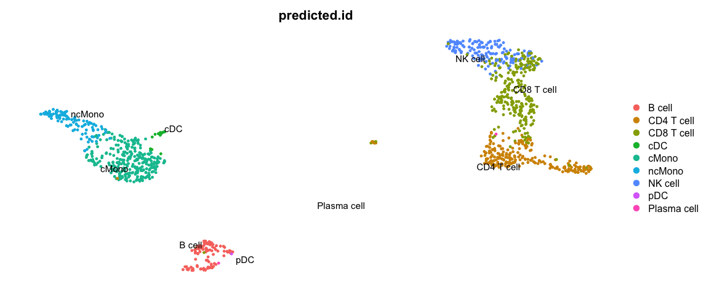

<style>
h1, .h1, h2, .h2, h3, .h3, h4, .h4 { margin-top: 50px }
p.caption {font-size: 0.9em;font-style: italic;color: grey;margin-right: 10%;margin-left: 10%;text-align: justify}
</style>

## Celltype prediction
***

 Celltype prediction can either be performed on indiviudal cells where each cell gets a predicted celltype label, or on the level of clusters. All methods are based on similarity to other datasets, single cell or sorted bulk RNAseq, or uses known marker genes for each celltype.

We will select one sample from the Covid data, `ctrl_13` and predict celltype by cell on that sample.

Some methods will predict a celltype to each cell based on what it is most similar to even if the celltype of that cell is not included in the reference. Other methods include an uncertainty so that cells with low similarity scores will be unclassified.
There are multiple different methods to predict celltypes, here we will just cover a few of those. 

Here we will use a reference PBMC dataset from the `scPred` package which is already a Seurat object with counts. And we will test classification based on label transfer using the function `TransferData` in the Seurat package and the `scPred` method. Finally we will use gene set enrichment predict celltype based on the DEGs of each cluster. 

# Load and process data
## Covid-19 data
First, lets load required libraries and the saved object from the clustering step. Subset for one patient.


```r
suppressPackageStartupMessages({
    library(Seurat)
    library(dplyr)
    library(cowplot)
    library(ggplot2)
    library(pheatmap)
    library(rafalib)
    library(scPred)
})
```


```r
# load the data and select 'ctrl_13` sample
alldata <- readRDS("data/results/covid_qc_dr_int_cl.rds")
ctrl = alldata[, alldata$orig.ident == "ctrl_13"]

# set active assay to RNA and remove the CCA assay
ctrl@active.assay = "RNA"
ctrl[["CCA"]] = NULL
ctrl
```

```
## An object of class Seurat 
## 18121 features across 1139 samples within 1 assay 
## Active assay: RNA (18121 features, 0 variable features)
##  6 dimensional reductions calculated: umap, tsne, harmony, umap_harmony, scanorama, umap_scanorama
```


## Reference data
Then, load the reference dataset with annotated labels. Also, run all steps of the normal analysis pipeline with normalizaiton, variable gene selection, scaling and dimensionality reduction.


```r
reference <- scPred::pbmc_1

reference
```

```
## An object of class Seurat 
## 32838 features across 3500 samples within 1 assay 
## Active assay: RNA (32838 features, 0 variable features)
```


## Rerun analysis pipeline
Here, we will run all the steps that we did in previous labs in one go using the `magittr` package with the pipe-operator `%>%`.


```r
reference <- reference %>%
    NormalizeData() %>%
    FindVariableFeatures() %>%
    ScaleData() %>%
    RunPCA(verbose = F) %>%
    RunUMAP(dims = 1:30)
```


```r
DimPlot(reference, group.by = "cell_type", label = TRUE, repel = TRUE) + NoAxes()
```

<!-- -->


Run all steps of the analysis for the ctrl sample as well. Use the clustering from the integration lab with resolution 0.5.


```r
# Set the identity as louvain with resolution 0.3
ctrl <- SetIdent(ctrl, value = "CCA_snn_res.0.5")

ctrl <- ctrl %>%
    NormalizeData() %>%
    FindVariableFeatures() %>%
    ScaleData() %>%
    RunPCA(verbose = F) %>%
    RunUMAP(dims = 1:30)
```


```r
DimPlot(ctrl, label = TRUE, repel = TRUE) + NoAxes()
```

<!-- -->


# Seurat label transfer
First we will run label transfer using a similar method as in the integration exercise. But, instad of CCA the default for the 'FindTransferAnchors` function is to use "pcaproject", e.g. the query dataset is projected onto the PCA of the reference dataset. Then, the labels of the reference data are predicted.


```r
transfer.anchors <- FindTransferAnchors(reference = reference, query = ctrl, dims = 1:30)
predictions <- TransferData(anchorset = transfer.anchors, refdata = reference$cell_type,
    dims = 1:30)
ctrl <- AddMetaData(object = ctrl, metadata = predictions)
```


```r
DimPlot(ctrl, group.by = "predicted.id", label = T, repel = T) + NoAxes()
```

<!-- -->

Now plot how many cells of each celltypes can be found in each cluster.


```r
ggplot(ctrl@meta.data, aes(x = CCA_snn_res.0.5, fill = predicted.id)) + geom_bar() +
    theme_classic()
```

<!-- -->

# scPred
scPred will train a classifier based on all principal components. First, `getFeatureSpace` will create a scPred object stored in the `@misc` slot where it extracts the PCs that best separates the different celltypes. Then `trainModel` will do the actual training for each celltype.


```r
reference <- getFeatureSpace(reference, "cell_type")
```

```
## ●  Extracting feature space for each cell type...
## DONE!
```

```r
reference <- trainModel(reference)
```

```
## ●  Training models for each cell type...
## DONE!
```

We can then print how well the training worked for the different celltypes by printing the number of PCs used for each, the ROC value and Sensitivity/Specificity. Which celltypes do you think are harder to classify based on this dataset?


```r
get_scpred(reference)
```

```
## 'scPred' object
## ✔  Prediction variable = cell_type 
## ✔  Discriminant features per cell type
## ✔  Training model(s)
## Summary
## 
## |Cell type   |    n| Features|Method    |   ROC|  Sens|  Spec|
## |:-----------|----:|--------:|:---------|-----:|-----:|-----:|
## |B cell      |  280|       50|svmRadial | 1.000| 0.964| 1.000|
## |CD4 T cell  | 1620|       50|svmRadial | 0.997| 0.972| 0.975|
## |CD8 T cell  |  945|       50|svmRadial | 0.985| 0.899| 0.978|
## |NK cell     |  312|       50|svmRadial | 0.999| 0.933| 0.996|
## |Plasma cell |    6|       50|svmRadial | 1.000| 0.800| 1.000|
## |cDC         |   26|       50|svmRadial | 0.995| 0.547| 1.000|
## |cMono       |  212|       50|svmRadial | 0.994| 0.958| 0.970|
## |ncMono      |   79|       50|svmRadial | 0.998| 0.570| 1.000|
## |pDC         |   20|       50|svmRadial | 1.000| 0.700| 1.000|
```

You can optimize parameters for each dataset by chaning parameters and testing different types of models, see more at: https://powellgenomicslab.github.io/scPred/articles/introduction.html. But for now, we will continue with this model.

 Now, lets predict celltypes on our data, where scPred will align the two datasets with Harmony and then perform classification.


```r
ctrl <- scPredict(ctrl, reference)
```

```
## ●  Matching reference with new dataset...
## 	 ─ 2000 features present in reference loadings
## 	 ─ 1774 features shared between reference and new dataset
## 	 ─ 88.7% of features in the reference are present in new dataset
## ●  Aligning new data to reference...
## ●  Classifying cells...
## DONE!
```


```r
DimPlot(ctrl, group.by = "scpred_prediction", label = T, repel = T) + NoAxes()
```

<!-- -->

Now plot how many	cells of each celltypes	can be found in	each cluster.


```r
ggplot(ctrl@meta.data, aes(x = CCA_snn_res.0.5, fill = scpred_prediction)) + geom_bar() +
    theme_classic()
```

<!-- -->

# Compare results

Now we will compare the output of the two methods using the convenient function in scPred `crossTab` that prints the overlap between two metadata slots.


```r
crossTab(ctrl, "predicted.id", "scpred_prediction")
```

<div data-pagedtable="false">
  <script data-pagedtable-source type="application/json">
{"columns":[{"label":[""],"name":["_rn_"],"type":[""],"align":["left"]},{"label":["B cell"],"name":[1],"type":["int"],"align":["right"]},{"label":["CD4 T cell"],"name":[2],"type":["int"],"align":["right"]},{"label":["CD8 T cell"],"name":[3],"type":["int"],"align":["right"]},{"label":["NK cell"],"name":[4],"type":["int"],"align":["right"]},{"label":["Plasma cell"],"name":[5],"type":["int"],"align":["right"]},{"label":["cDC"],"name":[6],"type":["int"],"align":["right"]},{"label":["cMono"],"name":[7],"type":["int"],"align":["right"]},{"label":["ncMono"],"name":[8],"type":["int"],"align":["right"]},{"label":["pDC"],"name":[9],"type":["int"],"align":["right"]}],"data":[{"1":"103","2":"1","3":"2","4":"0","5":"0","6":"0","7":"2","8":"0","9":"0","_rn_":"B cell"},{"1":"0","2":"200","3":"1","4":"0","5":"0","6":"0","7":"0","8":"0","9":"0","_rn_":"CD4 T cell"},{"1":"0","2":"6","3":"224","4":"5","5":"0","6":"0","7":"1","8":"0","9":"0","_rn_":"CD8 T cell"},{"1":"0","2":"0","3":"13","4":"153","5":"0","6":"0","7":"0","8":"0","9":"0","_rn_":"NK cell"},{"1":"0","2":"1","3":"0","4":"0","5":"2","6":"0","7":"0","8":"0","9":"0","_rn_":"Plasma cell"},{"1":"0","2":"0","3":"0","4":"0","5":"0","6":"16","7":"7","8":"0","9":"0","_rn_":"cDC"},{"1":"0","2":"6","3":"2","4":"0","5":"0","6":"0","7":"198","8":"3","9":"0","_rn_":"cMono"},{"1":"0","2":"0","3":"0","4":"0","5":"0","6":"0","7":"8","8":"101","9":"0","_rn_":"ncMono"},{"1":"0","2":"0","3":"0","4":"0","5":"0","6":"1","7":"0","8":"0","9":"1","_rn_":"pDC"},{"1":"0","2":"11","3":"12","4":"0","5":"0","6":"0","7":"57","8":"2","9":"0","_rn_":"unassigned"}],"options":{"columns":{"min":{},"max":[10]},"rows":{"min":[10],"max":[10]},"pages":{}}}
  </script>
</div>


# GSEA with celltype markers

Another option, where celltype can be classified on cluster level is to use gene set enrichment among the DEGs with known markers for different celltypes. Similar to how we did functional enrichment for the DEGs in the Differential expression exercise. 
There are some resources for celltype gene sets that can be used. Such as [CellMarker](http://bio-bigdata.hrbmu.edu.cn/CellMarker/), [PanglaoDB](https://panglaodb.se/) or celltype gene sets at [MSigDB](https://www.gsea-msigdb.org/gsea/msigdb/index.jsp).
We can also look at overlap between DEGs in a reference dataset and the dataset you are analysing. 

## DEG overlap
First, lets extract top DEGs for our Covid-19 dataset and the reference dataset.
When we run differential expression for our dataset, we want to report as many genes as possible, hence we set the cutoffs quite lenient.


```r
# run differential expression in our dataset, using clustering at resolution
# 0.5
alldata <- SetIdent(alldata, value = "CCA_snn_res.0.5")
DGE_table <- FindAllMarkers(alldata, logfc.threshold = 0, test.use = "wilcox", min.pct = 0.1,
    min.diff.pct = 0, only.pos = TRUE, max.cells.per.ident = 20, return.thresh = 1,
    assay = "RNA")

# split into a list
DGE_list <- split(DGE_table, DGE_table$cluster)

unlist(lapply(DGE_list, nrow))
```

```
##    0    1    2    3    4    5    6    7    8    9 
## 3209 3327 2526 3856 4097 2561 2051 2278 2474 3372
```


```r
# Compute differential gene expression in reference dataset (that has cell
# annotation)
reference <- SetIdent(reference, value = "cell_type")
reference_markers <- FindAllMarkers(reference, min.pct = 0.1, min.diff.pct = 0.2,
    only.pos = T, max.cells.per.ident = 20, return.thresh = 1)

# Identify the top cell marker genes in reference dataset select top 50 with
# hihgest foldchange among top 100 signifcant genes.
reference_markers <- reference_markers[order(reference_markers$avg_log2FC, decreasing = T),
    ]
reference_markers %>%
    group_by(cluster) %>%
    top_n(-100, p_val) %>%
    top_n(50, avg_log2FC) -> top50_cell_selection

# Transform the markers into a list
ref_list = split(top50_cell_selection$gene, top50_cell_selection$cluster)

unlist(lapply(ref_list, length))
```

```
##  CD8 T cell  CD4 T cell       cMono      B cell     NK cell         pDC 
##          30          15          50          50          50          50 
##      ncMono         cDC Plasma cell 
##          50          50          50
```

Now we can run GSEA for the DEGs from our dataset and check for enrichment of top DEGs in the reference dataset.


```r
suppressPackageStartupMessages(library(fgsea))

# run fgsea for each of the clusters in the list
res <- lapply(DGE_list, function(x) {
    gene_rank <- setNames(x$avg_log2FC, x$gene)
    fgseaRes <- fgsea(pathways = ref_list, stats = gene_rank, nperm = 10000)
    return(fgseaRes)
})
names(res) <- names(DGE_list)

# You can filter and resort the table based on ES, NES or pvalue
res <- lapply(res, function(x) {
    x[x$pval < 0.1, ]
})
res <- lapply(res, function(x) {
    x[x$size > 2, ]
})
res <- lapply(res, function(x) {
    x[order(x$NES, decreasing = T), ]
})
res
```

```
## $`0`
##    pathway         pval        padj        ES      NES nMoreExtreme size
## 1:   cMono 0.0001000000 0.000300000 0.9616809 2.080351            0   48
## 2:  ncMono 0.0001000000 0.000300000 0.8428153 1.819526            0   46
## 3:     cDC 0.0001000000 0.000300000 0.8174771 1.758258            0   43
## 4:     pDC 0.0005017058 0.001128838 0.7631139 1.571282            4   21
## 5:  B cell 0.0075926301 0.013666734 0.7393174 1.477004           74   15
## 6: NK cell 0.0131836440 0.019775466 0.7608831 1.471516          127   11
##                                     leadingEdge
## 1:      S100A8,S100A9,LYZ,S100A12,VCAN,FCN1,...
## 2:     CTSS,TYMP,CST3,S100A11,AIF1,SERPINA1,...
## 3:              LYZ,GRN,TYMP,CST3,AIF1,SPI1,...
## 4:         GRN,MS4A6A,CST3,MPEG1,CTSB,TGFBI,...
## 5: NCF1,LY86,MARCH1,HLA-DRB5,POU2F2,HLA-DMA,...
## 6:       TYROBP,FCER1G,SRGN,CCL3,CD63,MYO1F,...
## 
## $`1`
##        pathway         pval        padj        ES      NES nMoreExtreme size
## 1:  CD8 T cell 0.0001001703 0.000350596 0.9467530 2.204425            0   29
## 2:     NK cell 0.0001000600 0.000350596 0.8345247 1.956035            0   32
## 3:  CD4 T cell 0.0017722641 0.004135283 0.8726808 1.703495           15    7
## 4: Plasma cell 0.0769307823 0.107703095 0.5590523 1.301700          767   29
##                                   leadingEdge
## 1:          CD8A,CD3D,GZMH,CCL5,CD3G,CD8B,...
## 2:          CCL5,GZMA,NKG7,GZMM,CCL4,CST7,...
## 3:           CD3D,CD3G,CD3E,IL7R,PIK3IP1,TCF7
## 4: FKBP11,PRDM1,PEBP1,SEC11C,PPIB,SELENOS,...
## 
## $`2`
##        pathway        pval         padj        ES      NES nMoreExtreme size
## 1:      B cell 0.000099990 0.0004076641 0.8998039 2.018292            0   46
## 2:         cDC 0.000101916 0.0004076641 0.8777914 1.799185            0   14
## 3:         pDC 0.000906527 0.0024174053 0.7749671 1.627823            8   18
## 4: Plasma cell 0.083207588 0.1268480057 0.7157360 1.363095          771    8
## 5:      ncMono 0.095136004 0.1268480057 0.8406659 1.340278          709    3
##                                             leadingEdge
## 1:      CD79A,TCL1A,LINC00926,MS4A1,CD79B,TNFRSF13C,...
## 2: CD74,HLA-DQB1,HLA-DRA,HLA-DPB1,HLA-DRB1,HLA-DQA1,...
## 3:               CD74,TCF4,BCL11A,IRF8,SPIB,HERPUD1,...
## 4:                PLPP5,ISG20,HERPUD1,MZB1,ITM2C,JCHAIN
## 5:                                  HLA-DPA1,POU2F2,LYN
## 
## $`3`
##        pathway         pval         padj        ES      NES nMoreExtreme size
## 1:     NK cell 0.0001000000 0.0004010829 0.9205306 2.404476            0   46
## 2:  CD8 T cell 0.0001002707 0.0004010829 0.9157705 2.289569            0   27
## 3:      ncMono 0.0036917947 0.0098447858 0.8806070 1.670385           30    5
## 4:         pDC 0.0214437367 0.0428874735 0.7089555 1.551564          201   10
## 5:  CD4 T cell 0.0619528620 0.0826038159 0.8394443 1.406616          459    3
## 6: Plasma cell 0.0578984273 0.0826038159 0.5257300 1.333195          577   32
##                                   leadingEdge
## 1:        FGFBP2,GNLY,NKG7,CST7,GZMB,CTSW,...
## 2:        FGFBP2,GNLY,NKG7,CST7,GZMB,CTSW,...
## 3:                         FCGR3A,IFITM2,RHOC
## 4:  GZMB,C12orf75,HSP90B1,ALOX5AP,PLAC8,RRBP1
## 5:                                  CD3E,CD3D
## 6: PRDM1,FKBP11,HSP90B1,PPIB,SPCS2,SDF2L1,...
## 
## $`4`
##        pathway         pval         padj        ES      NES nMoreExtreme size
## 1:     NK cell 0.0000999900 0.0004016871 0.9410924 2.443852            0   50
## 2:  CD8 T cell 0.0001004218 0.0004016871 0.9198649 2.248316            0   24
## 3:         pDC 0.0010474495 0.0027931986 0.8037434 1.772557            9   11
## 4:      ncMono 0.0145348837 0.0290697674 0.7908936 1.596434          129    7
## 5: Plasma cell 0.0250250250 0.0400400400 0.5722198 1.427330          249   30
##                                   leadingEdge
## 1:         SPON2,PRF1,GNLY,GZMB,CD7,CLIC3,...
## 2:        PRF1,GNLY,GZMB,CTSW,NKG7,FGFBP2,...
## 3:  GZMB,PLAC8,C12orf75,RRBP1,ALOX5AP,HSP90B1
## 4:                    FCGR3A,IFITM2,RHOC,HES4
## 5: CD38,FKBP11,HSP90B1,SDF2L1,PPIB,SLAMF7,...
## 
## $`5`
##    pathway       pval      padj        ES      NES nMoreExtreme size
## 1:  B cell 0.04433664 0.1995149 0.8159191 1.452789          392    6
## 2:  ncMono 0.02560256 0.1995149 0.6431105 1.352329          255   35
##                                 leadingEdge
## 1:                PDLIM1,HLA-DRB5,STX7,NCF1
## 2: TIMP1,OAZ1,FKBP1A,CST3,IFITM3,FCER1G,...
## 
## $`6`
##       pathway         pval         padj        ES      NES nMoreExtreme size
## 1: CD4 T cell 0.0001019992 0.0006119951 0.9304714 1.825471            0   13
## 2: CD8 T cell 0.0019687192 0.0059061577 0.8881160 1.599237           17    7
##                          leadingEdge
## 1: IL7R,LTB,LDHB,RCAN3,NOSIP,MAL,...
## 2:      IL32,CD3D,CD3E,CD2,CD3G,CD8B
## 
## $`7`
##       pathway         pval         padj        ES      NES nMoreExtreme size
## 1: CD4 T cell 0.0001017087 0.0006102522 0.9200530 1.960829            0   14
## 2: CD8 T cell 0.0649223621 0.1322878971 0.7994723 1.380640          530    4
##                             leadingEdge
## 1: IL7R,TCF7,TSHZ2,LTB,PIK3IP1,LEF1,...
## 2:                   CD3E,CD3G,CD3D,CD2
## 
## $`8`
##        pathway         pval         padj        ES      NES nMoreExtreme size
## 1:      B cell 0.0001000000 0.0004572706 0.9148896 1.946438            0   45
## 2:         cDC 0.0001016157 0.0004572706 0.9015016 1.782282            0   14
## 3:         pDC 0.0010088781 0.0030266344 0.8143767 1.628762            9   16
## 4:      ncMono 0.0078582845 0.0141489469 0.9496775 1.496109           58    3
## 5: Plasma cell 0.0078605261 0.0141489469 0.7412305 1.489765           77   17
##                                             leadingEdge
## 1:        CD79A,MS4A1,BANK1,TNFRSF13C,CD74,HLA-DQA1,...
## 2: CD74,HLA-DQA1,HLA-DRA,HLA-DPB1,HLA-DQB1,HLA-DPA1,...
## 3:             CD74,JCHAIN,SPIB,HERPUD1,TCF4,CCDC50,...
## 4:                                      HLA-DPA1,POU2F2
## 5:                JCHAIN,HERPUD1,ISG20,ITM2C,MZB1,PEBP1
## 
## $`9`
##    pathway        pval         padj        ES      NES nMoreExtreme size
## 1:  ncMono 0.000100000 0.0002666667 0.9590709 2.044199            0   49
## 2:   cMono 0.000100000 0.0002666667 0.8939097 1.865879            0   33
## 3:     cDC 0.000100000 0.0002666667 0.8407202 1.765455            0   37
## 4: NK cell 0.009272615 0.0185452298 0.7946399 1.517067           89   11
## 5:  B cell 0.034281105 0.0548497681 0.6968376 1.382516          339   16
## 6:     pDC 0.052131744 0.0695089917 0.6869740 1.353692          515   15
##                                               leadingEdge
## 1:                CDKN1C,LST1,FCGR3A,COTL1,AIF1,MS4A7,...
## 2:               LST1,COTL1,AIF1,SERPINA1,FCER1G,PSAP,...
## 3:                   LST1,COTL1,AIF1,FCER1G,SPI1,CST3,...
## 4:             FCGR3A,RHOC,FCER1G,TYROBP,IFITM2,MYO1F,...
## 5: HLA-DPA1,POU2F2,HLA-DRB5,HLA-DPB1,HLA-DRA,HLA-DRB1,...
## 6:                    CST3,NPC2,PLD4,MPEG1,TGFBI,CTSB,...
```

Selecing top significant overlap per cluster, we can now rename the clusters according to the predicted labels. OBS! Be aware that if you have some clusters that have non-significant p-values for all the gene sets, the cluster label will not be very reliable. Also, the gene sets you are using may not cover all the celltypes you have in your dataset and hence predictions may just be the most similar celltype.
Also, some of the clusters have very similar p-values to multiple celltypes, for instance the ncMono and cMono celltypes are equally good for some clusters.


```r
new.cluster.ids <- unlist(lapply(res, function(x) {
    as.data.frame(x)[1, 1]
}))

alldata$ref_gsea <- new.cluster.ids[as.character(alldata@active.ident)]

cowplot::plot_grid(ncol = 2, DimPlot(alldata, label = T, group.by = "CCA_snn_res.0.5") +
    NoAxes(), DimPlot(alldata, label = T, group.by = "ref_gsea") + NoAxes())
```

<!-- -->

Compare to results with the other celltype prediction methods in the ctrl_13 sample.


```r
ctrl$ref_gsea = alldata$ref_gsea[alldata$orig.ident == "ctrl_13"]

cowplot::plot_grid(ncol = 3, DimPlot(ctrl, label = T, group.by = "ref_gsea") + NoAxes() +
    ggtitle("GSEA"), DimPlot(ctrl, label = T, group.by = "predicted.id") + NoAxes() +
    ggtitle("LabelTransfer"), DimPlot(ctrl, label = T, group.by = "scpred_prediction") +
    NoAxes() + ggtitle("scPred"))
```

<!-- -->

## With annotated gene sets
First download celltype gene sets from CellMarker.


```r
# Download gene marker list
if (!dir.exists("data/CellMarker_list/")) {
    dir.create("data/CellMarker_list")
    download.file(url = "http://xteam.xbio.top/CellMarker/download/Human_cell_markers.txt",
        destfile = "./data/CellMarker_list/Human_cell_markers.txt")
    download.file(url = "http://xteam.xbio.top/CellMarker/download/Mouse_cell_markers.txt",
        destfile = "./data/CellMarker_list/Mouse_cell_markers.txt")
}
```

Read in the gene lists and do some filtering.


```r
# Load the human marker table
markers <- read.delim("data/CellMarker_list/Human_cell_markers.txt")
markers <- markers[markers$speciesType == "Human", ]
markers <- markers[markers$cancerType == "Normal", ]

# Filter by tissue (to reduce computational time and have tissue-specific
# classification)
sort(unique(markers$tissueType))
```

```
##   [1] "Abdominal adipose tissue"       "Adipose tissue"                
##   [3] "Adrenal gland"                  "Adventitia"                    
##   [5] "Airway epithelium"              "Alveolus"                      
##   [7] "Amniotic fluid"                 "Amniotic membrane"             
##   [9] "Antecubital vein"               "Anterior cruciate ligament"    
##  [11] "Artery"                         "Ascites"                       
##  [13] "Bladder"                        "Blood"                         
##  [15] "Blood vessel"                   "Bone"                          
##  [17] "Bone marrow"                    "Brain"                         
##  [19] "Breast"                         "Bronchoalveolar system"        
##  [21] "Brown adipose tissue"           "Cartilage"                     
##  [23] "Chorionic villus"               "Colon"                         
##  [25] "Colorectum"                     "Cornea"                        
##  [27] "Corneal endothelium"            "Corneal epithelium"            
##  [29] "Corpus luteum"                  "Decidua"                       
##  [31] "Deciduous tooth"                "Dental pulp"                   
##  [33] "Dermis"                         "Dorsolateral prefrontal cortex"
##  [35] "Duodenum"                       "Embryo"                        
##  [37] "Embryoid body"                  "Embryonic brain"               
##  [39] "Embryonic prefrontal cortex"    "Embryonic stem cell"           
##  [41] "Endometrium"                    "Endometrium stroma"            
##  [43] "Epithelium"                     "Esophagus"                     
##  [45] "Eye"                            "Fat pad"                       
##  [47] "Fetal brain"                    "Fetal gonad"                   
##  [49] "Fetal kidney"                   "Fetal liver"                   
##  [51] "Fetal pancreas"                 "Foreskin"                      
##  [53] "Gastric corpus"                 "Gastric epithelium"            
##  [55] "Gastric gland"                  "Gastrointestinal tract"        
##  [57] "Germ"                           "Gingiva"                       
##  [59] "Gonad"                          "Gut"                           
##  [61] "Hair follicle"                  "Heart"                         
##  [63] "Hippocampus"                    "Inferior colliculus"           
##  [65] "Intervertebral disc"            "Intestinal crypt"              
##  [67] "Intestine"                      "Jejunum"                       
##  [69] "Kidney"                         "Lacrimal gland"                
##  [71] "Large intestine"                "Laryngeal squamous epithelium" 
##  [73] "Ligament"                       "Limbal epithelium"             
##  [75] "Liver"                          "Lung"                          
##  [77] "Lymph"                          "Lymph node"                    
##  [79] "Lymphoid tissue"                "Mammary epithelium"            
##  [81] "Meniscus"                       "Midbrain"                      
##  [83] "Molar"                          "Muscle"                        
##  [85] "Myocardium"                     "Myometrium"                    
##  [87] "Nasal concha"                   "Nasal epithelium"              
##  [89] "Nerve"                          "Nucleus pulposus"              
##  [91] "Optic nerve"                    "Oral mucosa"                   
##  [93] "Osteoarthritic cartilage"       "Ovarian cortex"                
##  [95] "Ovarian follicle"               "Ovary"                         
##  [97] "Oviduct"                        "Pancreas"                      
##  [99] "Pancreatic acinar tissue"       "Pancreatic islet"              
## [101] "Periodontal ligament"           "Periosteum"                    
## [103] "Peripheral blood"               "Placenta"                      
## [105] "Plasma"                         "Pluripotent stem cell"         
## [107] "Premolar"                       "Primitive streak"              
## [109] "Prostate"                       "Pyloric gland"                 
## [111] "Rectum"                         "Renal glomerulus"              
## [113] "Retina"                         "Retinal pigment epithelium"    
## [115] "Salivary gland"                 "Scalp"                         
## [117] "Sclerocorneal tissue"           "Seminal plasma"                
## [119] "Serum"                          "Sinonasal mucosa"              
## [121] "Skeletal muscle"                "Skin"                          
## [123] "Small intestinal crypt"         "Small intestine"               
## [125] "Spinal cord"                    "Spleen"                        
## [127] "Splenic red pulp"               "Sputum"                        
## [129] "Stomach"                        "Subcutaneous adipose tissue"   
## [131] "Submandibular gland"            "Sympathetic ganglion"          
## [133] "Synovial fluid"                 "Synovium"                      
## [135] "Tendon"                         "Testis"                        
## [137] "Thymus"                         "Thyroid"                       
## [139] "Tonsil"                         "Tooth"                         
## [141] "Umbilical cord"                 "Umbilical cord blood"          
## [143] "Umbilical vein"                 "Undefined"                     
## [145] "Urine"                          "Uterus"                        
## [147] "Vagina"                         "Venous blood"                  
## [149] "Visceral adipose tissue"        "Vocal fold"                    
## [151] "Whartons jelly"                 "White adipose tissue"
```

```r
grep("blood", unique(markers$tissueType), value = T)
```

```
## [1] "Peripheral blood"     "Umbilical cord blood" "Venous blood"
```

```r
markers <- markers[markers$tissueType %in% c("Blood", "Venous blood", "Serum", "Plasma",
    "Spleen", "Bone marrow", "Lymph node"), ]

# remove strange characters etc.
celltype_list <- lapply(unique(markers$cellName), function(x) {
    x <- paste(markers$geneSymbol[markers$cellName == x], sep = ",")
    x <- gsub("[[]|[]]| |-", ",", x)
    x <- unlist(strsplit(x, split = ","))
    x <- unique(x[!x %in% c("", "NA", "family")])
    x <- casefold(x, upper = T)
})
names(celltype_list) <- unique(markers$cellName)
# celltype_list <- lapply(celltype_list , function(x) {x[1:min(length(x),50)]}
# )
celltype_list <- celltype_list[unlist(lapply(celltype_list, length)) < 100]
celltype_list <- celltype_list[unlist(lapply(celltype_list, length)) > 5]
```


```r
# run fgsea for each of the clusters in the list
res <- lapply(DGE_list, function(x) {
    gene_rank <- setNames(x$avg_log2FC, x$gene)
    fgseaRes <- fgsea(pathways = celltype_list, stats = gene_rank, nperm = 10000)
    return(fgseaRes)
})
names(res) <- names(DGE_list)

# You can filter and resort the table based on ES, NES or pvalue
res <- lapply(res, function(x) {
    x[x$pval < 0.01, ]
})
res <- lapply(res, function(x) {
    x[x$size > 5, ]
})
res <- lapply(res, function(x) {
    x[order(x$NES, decreasing = T), ]
})

# show top 3 for each cluster.
lapply(res, head, 3)
```

```
## $`0`
##                     pathway         pval        padj        ES      NES
## 1:               Neutrophil 0.0001011122 0.001769464 0.8536217 1.710360
## 2:   CD1C+_B dendritic cell 0.0000999900 0.001769464 0.7848090 1.703959
## 3: Mesenchymal stromal cell 0.0025223332 0.022070415 0.8486335 1.597874
##    nMoreExtreme size                             leadingEdge
## 1:            0   15 CD14,CSF3R,JAML,C5AR1,FCGR2A,FCGR1A,...
## 2:            0   49 S100A8,S100A9,LYZ,S100A12,VCAN,FCN1,...
## 3:           23    9              CD14,VIM,ANPEP,CD44,PECAM1
## 
## $`1`
##                     pathway         pval         padj        ES      NES
## 1:                   T cell 0.0001103875 0.0009846154 0.9653614 1.886212
## 2:             Myeloid cell 0.0001025326 0.0009846154 0.8446049 1.826966
## 3: Mesenchymal stromal cell 0.0023917995 0.0085041762 0.8806531 1.666315
##    nMoreExtreme size                        leadingEdge
## 1:            0    7    CD8A,CD3D,CD3G,CD3E,CD2,CD5,...
## 2:            0   14 CD3D,CD3G,CD3E,CD81,PTPRC,CD84,...
## 3:           20    6               CD81,B2M,PTPRC,ITGB1
## 
## $`2`
##    pathway         pval        padj       ES      NES nMoreExtreme size
## 1:  B cell 0.0001034661 0.002793585 0.904135 1.799886            0   11
##                             leadingEdge
## 1: CD79A,MS4A1,FCER2,PAX5,CD24,CD19,...
## 
## $`3`
##                pathway         pval        padj        ES      NES nMoreExtreme
## 1: Natural killer cell 0.0002180074 0.007630259 0.8783637 1.850136            1
## 2:        Myeloid cell 0.0006163961 0.010786932 0.7829894 1.805936            5
## 3:            Platelet 0.0010719263 0.012505806 0.8247617 1.778775            9
##    size                          leadingEdge
## 1:    8  KLRD1,FCGR3A,CD3E,CD2,NCR1,CD3D,...
## 2:   14 FCGR3A,CD3E,CD81,ZAP70,IL2RB,SPN,...
## 3:    9     CCL5,CD63,SPN,BSG,CD226,CD47,...
## 
## $`4`
##                        pathway         pval        padj        ES      NES
## 1:      CD1C+_A dendritic cell 0.0003346347 0.005502882 0.9071010 1.837834
## 2:         Natural killer cell 0.0004461796 0.005502882 0.8988555 1.821129
## 3: AXL+SIGLEC6+ dendritic cell 0.0003019324 0.005502882 0.7424172 1.807450
##    nMoreExtreme size                                leadingEdge
## 1:            2    7                    AREG,LPCAT1,ADAM8,NR4A2
## 2:            3    7              KLRD1,FCGR3A,KLRC1,NCAM1,NCR1
## 3:            2   23 PTGDS,CTSW,BHLHE40,TSEN54,CX3CR1,PLAC8,...
## 
## $`5`
## Empty data.table (0 rows and 8 cols): pathway,pval,padj,ES,NES,nMoreExtreme...
## 
## $`6`
##    pathway        pval        padj        ES      NES nMoreExtreme size
## 1:  T cell 0.000224341 0.006281548 0.9543946 1.680394            1    6
##               leadingEdge
## 1: CD3D,CD3E,CD2,CD5,CD3G
## 
## $`7`
## Empty data.table (0 rows and 8 cols): pathway,pval,padj,ES,NES,nMoreExtreme...
## 
## $`8`
##    pathway        pval      padj        ES      NES nMoreExtreme size
## 1:  B cell 0.001018745 0.0295436 0.8258259 1.612312            9   13
##                                   leadingEdge
## 1: CD79A,MS4A1,POU2AF1,CD24,FCGR2B,POU2F2,...
## 
## $`9`
##         pathway         pval        padj        ES      NES nMoreExtreme size
## 1: Myeloid cell 0.0001003009 0.003711133 0.8090077 1.640188            0   21
## 2:       B cell 0.0055236651 0.052259887 0.8666978 1.560994           50    7
## 3:   Neutrophil 0.0056497175 0.052259887 0.8320532 1.550656           53    9
##                               leadingEdge
## 1: FCGR3A,CSF1R,PECAM1,CD68,ITGAX,SPN,...
## 2:                LMO2,POU2F2,CD86,FCGR2A
## 3:       FCGR3A,PECAM1,ITGAX,C5AR1,FCGR2A
```


#CT_GSEA8:


```r
new.cluster.ids <- unlist(lapply(res, function(x) {
    as.data.frame(x)[1, 1]
}))
alldata$cellmarker_gsea <- new.cluster.ids[as.character(alldata@active.ident)]

cowplot::plot_grid(ncol = 2, DimPlot(alldata, label = T, group.by = "ref_gsea") +
    NoAxes(), DimPlot(alldata, label = T, group.by = "cellmarker_gsea") + NoAxes())
```

<!-- -->

Do you think that the methods overlap well? Where do you see the most inconsistencies?

In this case we do not have any ground truth, and we cannot say which method performs best. You should keep in mind, that any celltype classification method is just a prediction, and you still need to use your common sense and knowledge of the biological system to judge if the results make sense.

# Save data
Finally, lets save the data with predictions.


```r
saveRDS(ctrl, "data/results/ctrl13_qc_dr_int_cl_celltype.rds")
```


### Session Info
***


```r
sessionInfo()
```

```
## R version 4.1.3 (2022-03-10)
## Platform: x86_64-apple-darwin13.4.0 (64-bit)
## Running under: macOS Big Sur/Monterey 10.16
## 
## Matrix products: default
## BLAS/LAPACK: /Users/asabjor/miniconda3/envs/scRNAseq2023/lib/libopenblasp-r0.3.21.dylib
## 
## locale:
## [1] C/UTF-8/C/C/C/C
## 
## attached base packages:
## [1] stats     graphics  grDevices utils     datasets  methods   base     
## 
## other attached packages:
##  [1] fgsea_1.20.0       caret_6.0-93       lattice_0.20-45    scPred_1.9.2      
##  [5] rafalib_1.0.0      pheatmap_1.0.12    ggplot2_3.4.0      cowplot_1.1.1     
##  [9] dplyr_1.0.10       SeuratObject_4.1.3 Seurat_4.3.0       RJSONIO_1.3-1.7   
## [13] optparse_1.7.3    
## 
## loaded via a namespace (and not attached):
##   [1] fastmatch_1.1-3        plyr_1.8.8             igraph_1.3.5          
##   [4] lazyeval_0.2.2         sp_1.6-0               splines_4.1.3         
##   [7] BiocParallel_1.28.3    listenv_0.9.0          scattermore_0.8       
##  [10] digest_0.6.31          foreach_1.5.2          htmltools_0.5.4       
##  [13] fansi_1.0.4            magrittr_2.0.3         tensor_1.5            
##  [16] cluster_2.1.4          ROCR_1.0-11            limma_3.50.3          
##  [19] recipes_1.0.4          globals_0.16.2         gower_1.0.1           
##  [22] matrixStats_0.63.0     hardhat_1.2.0          timechange_0.2.0      
##  [25] spatstat.sparse_3.0-0  colorspace_2.1-0       ggrepel_0.9.2         
##  [28] xfun_0.36              crayon_1.5.2           jsonlite_1.8.4        
##  [31] progressr_0.13.0       spatstat.data_3.0-0    survival_3.5-0        
##  [34] zoo_1.8-11             iterators_1.0.14       glue_1.6.2            
##  [37] polyclip_1.10-4        gtable_0.3.1           ipred_0.9-13          
##  [40] leiden_0.4.3           kernlab_0.9-31         future.apply_1.10.0   
##  [43] abind_1.4-5            scales_1.2.1           DBI_1.1.3             
##  [46] spatstat.random_3.0-1  miniUI_0.1.1.1         Rcpp_1.0.10           
##  [49] viridisLite_0.4.1      xtable_1.8-4           reticulate_1.27       
##  [52] stats4_4.1.3           lava_1.7.1             prodlim_2019.11.13    
##  [55] htmlwidgets_1.6.1      httr_1.4.4             getopt_1.20.3         
##  [58] RColorBrewer_1.1-3     ellipsis_0.3.2         ica_1.0-3             
##  [61] farver_2.1.1           pkgconfig_2.0.3        nnet_7.3-18           
##  [64] sass_0.4.5             uwot_0.1.14            deldir_1.0-6          
##  [67] utf8_1.2.2             labeling_0.4.2         tidyselect_1.2.0      
##  [70] rlang_1.0.6            reshape2_1.4.4         later_1.3.0           
##  [73] munsell_0.5.0          tools_4.1.3            cachem_1.0.6          
##  [76] cli_3.6.0              generics_0.1.3         ggridges_0.5.4        
##  [79] evaluate_0.20          stringr_1.5.0          fastmap_1.1.0         
##  [82] yaml_2.3.7             goftest_1.2-3          ModelMetrics_1.2.2.2  
##  [85] knitr_1.41             fitdistrplus_1.1-8     purrr_1.0.1           
##  [88] RANN_2.6.1             pbapply_1.7-0          future_1.30.0         
##  [91] nlme_3.1-161           mime_0.12              formatR_1.14          
##  [94] compiler_4.1.3         beeswarm_0.4.0         plotly_4.10.1         
##  [97] png_0.1-8              spatstat.utils_3.0-1   tibble_3.1.8          
## [100] bslib_0.4.2            stringi_1.7.12         highr_0.10            
## [103] rgeos_0.6-1            Matrix_1.5-3           vctrs_0.5.2           
## [106] pillar_1.8.1           lifecycle_1.0.3        spatstat.geom_3.0-5   
## [109] lmtest_0.9-40          jquerylib_0.1.4        RcppAnnoy_0.0.20      
## [112] data.table_1.14.6      irlba_2.3.5.1          httpuv_1.6.8          
## [115] patchwork_1.1.2        R6_2.5.1               promises_1.2.0.1      
## [118] KernSmooth_2.23-20     gridExtra_2.3          vipor_0.4.5           
## [121] parallelly_1.34.0      codetools_0.2-18       MASS_7.3-58.2         
## [124] assertthat_0.2.1       withr_2.5.0            sctransform_0.3.5     
## [127] harmony_1.0            parallel_4.1.3         grid_4.1.3            
## [130] rpart_4.1.19           timeDate_4022.108      tidyr_1.2.1           
## [133] class_7.3-21           rmarkdown_2.20         Rtsne_0.16            
## [136] pROC_1.18.0            spatstat.explore_3.0-5 shiny_1.7.4           
## [139] lubridate_1.9.1        ggbeeswarm_0.7.1
```

