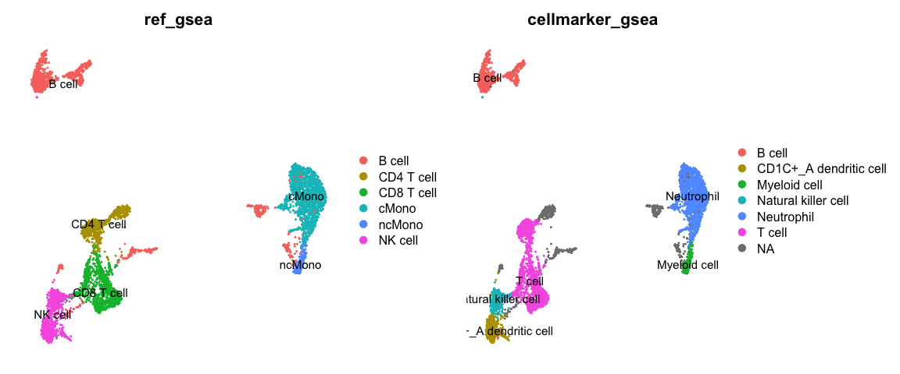

<style>
h1, .h1, h2, .h2, h3, .h3, h4, .h4 { margin-top: 50px }
p.caption {font-size: 0.9em;font-style: italic;color: grey;margin-right: 10%;margin-left: 10%;text-align: justify}
</style>

## Celltype prediction
***

 Celltype prediction can either be performed on indiviudal cells where each cell gets a predicted celltype label, or on the level of clusters. All methods are based on similarity to other datasets, single cell or sorted bulk RNAseq, or uses know marker genes for each celltype.

We will select one sample from the Covid data, `ctrl_13` and predict celltype by cell on that sample.

Some methods will predict a celltype to each cell based on what it is most similar to even if the celltype of that cell is not included in the reference. Other methods include an uncertainty so that cells with low similarity scores will be unclassified.
There are multiple different methods to predict celltypes, here we will just cover a few of those. 

Here we will use a reference PBMC dataset from the `scPred` package which is already a Seurat object with counts. And we will test classification based on label transfer using the function `TransferData` in the Seurat package and the `scPred` method. Finally we will use gene set enrichment predict celltype based on the DEGs of each cluster. 

# Load and process data
## Covid-19 data
First, lets load required libraries and the saved object from the clustering step. Subset for one patient.


```r
suppressPackageStartupMessages({
    library(Seurat)
    library(venn)
    library(dplyr)
    library(cowplot)
    library(ggplot2)
    library(pheatmap)
    library(rafalib)
    library(scPred)
})
```


```r
# load the data and select 'ctrl_13` sample
alldata <- readRDS("data/results/covid_qc_dr_int_cl.rds")
ctrl = alldata[, alldata$orig.ident == "ctrl_13"]

# set active assay to RNA and remove the CCA assay
ctrl@active.assay = "RNA"
ctrl[["CCA"]] = NULL
ctrl
```

```
## An object of class Seurat 
## 18121 features across 1129 samples within 1 assay 
## Active assay: RNA (18121 features, 0 variable features)
##  6 dimensional reductions calculated: umap, tsne, harmony, umap_harmony, scanorama, umap_scanorama
```


## Reference data
Then, load the reference dataset with annotated labels. Also, run all steps of the normal analysis pipeline with normalizaiton, variable gene selection, scaling and dimensionality reduction.


```r
reference <- scPred::pbmc_1

reference
```

```
## An object of class Seurat 
## 32838 features across 3500 samples within 1 assay 
## Active assay: RNA (32838 features, 0 variable features)
```


## Rerun analysis pipeline
Here, we will run all the steps that we did in previous labs in one go using the `magittr` package with the pipe-operator `%>%`.


```r
reference <- reference %>% NormalizeData() %>% FindVariableFeatures() %>% ScaleData() %>% 
    RunPCA(verbose = F) %>% RunUMAP(dims = 1:30)
```


```r
DimPlot(reference, group.by = "cell_type", label = TRUE, repel = TRUE) + NoAxes()
```

<!-- -->


Run all steps of the analysis for the ctrl sample as well. Use the clustering from the integration lab with resolution 0.3.


```r
# Set the identity as louvain with resolution 0.3
ctrl <- SetIdent(ctrl, value = "CCA_snn_res.0.5")

ctrl <- ctrl %>% NormalizeData() %>% FindVariableFeatures() %>% ScaleData() %>% RunPCA(verbose = F) %>% 
    RunUMAP(dims = 1:30)
```


```r
DimPlot(ctrl, label = TRUE, repel = TRUE) + NoAxes()
```

<!-- -->


# Seurat label transfer
First we will run label transfer using a similar method as in the integration exercise. But, instad of CCA the default for the 'FindTransferAnchors` function is to use "pcaproject", e.g. the query datset is projected onto the PCA of the reference dataset. Then, the labels of the reference data are predicted.


```r
transfer.anchors <- FindTransferAnchors(reference = reference, query = ctrl, dims = 1:30)
predictions <- TransferData(anchorset = transfer.anchors, refdata = reference$cell_type, 
    dims = 1:30)
ctrl <- AddMetaData(object = ctrl, metadata = predictions)
```


```r
DimPlot(ctrl, group.by = "predicted.id", label = T, repel = T) + NoAxes()
```

<!-- -->

Now plot how many cells of each celltypes can be found in each cluster.


```r
ggplot(ctrl@meta.data, aes(x = CCA_snn_res.0.5, fill = predicted.id)) + geom_bar() + 
    theme_classic()
```

<!-- -->

# scPred
scPred will train a classifier based on all principal components. First, `getFeatureSpace` will create a scPred object stored in the `@misc` slot where it extracts the PCs that best separates the different celltypes. Then `trainModel` will do the actual training for each celltype.


```r
reference <- getFeatureSpace(reference, "cell_type")
```

```
## ●  Extracting feature space for each cell type...
## DONE!
```

```r
reference <- trainModel(reference)
```

```
## ●  Training models for each cell type...
## maximum number of iterations reached 0.0001152143 -0.0001143203DONE!
```

We can then print how well the training worked for the different celltypes by printing the number of PCs used for each, the ROC value and Sensitivity/Specificity. Which celltypes do you think are harder to classify based on this dataset?


```r
get_scpred(reference)
```

```
## 'scPred' object
## ✔  Prediction variable = cell_type 
## ✔  Discriminant features per cell type
## ✔  Training model(s)
## Summary
## 
## |Cell type   |    n| Features|Method    |   ROC|  Sens|  Spec|
## |:-----------|----:|--------:|:---------|-----:|-----:|-----:|
## |B cell      |  280|       50|svmRadial | 1.000| 0.964| 1.000|
## |CD4 T cell  | 1620|       50|svmRadial | 0.997| 0.972| 0.975|
## |CD8 T cell  |  945|       50|svmRadial | 0.985| 0.899| 0.978|
## |cDC         |   26|       50|svmRadial | 0.995| 0.547| 1.000|
## |cMono       |  212|       50|svmRadial | 0.994| 0.958| 0.970|
## |ncMono      |   79|       50|svmRadial | 0.998| 0.570| 1.000|
## |NK cell     |  312|       50|svmRadial | 0.999| 0.933| 0.996|
## |pDC         |   20|       50|svmRadial | 1.000| 0.700| 1.000|
## |Plasma cell |    6|       50|svmRadial | 1.000| 0.800| 1.000|
```

You can optimize parameters for each dataset by chaning parameters and testing different types of models, see more at: https://powellgenomicslab.github.io/scPred/articles/introduction.html. But for now, we will continue with this model.

 Now, lets predict celltypes on our data, where scPred will align the two datasets with Harmony and then perform classification.


```r
ctrl <- scPredict(ctrl, reference)
```

```
## ●  Matching reference with new dataset...
## 	 ─ 2000 features present in reference loadings
## 	 ─ 1774 features shared between reference and new dataset
## 	 ─ 88.7% of features in the reference are present in new dataset
## ●  Aligning new data to reference...
## ●  Classifying cells...
## DONE!
```


```r
DimPlot(ctrl, group.by = "scpred_prediction", label = T, repel = T) + NoAxes()
```

<!-- -->

Now plot how many	cells of each celltypes	can be found in	each cluster.


```r
ggplot(ctrl@meta.data, aes(x = CCA_snn_res.0.5, fill = scpred_prediction)) + geom_bar() + 
    theme_classic()
```

<!-- -->

# Compare results

Now we will compare the output of the two methods using the convenient function in scPred `crossTab` that prints the overlap between two metadata slots.


```r
crossTab(ctrl, "predicted.id", "scpred_prediction")
```

<div data-pagedtable="false">
  <script data-pagedtable-source type="application/json">
{"columns":[{"label":[""],"name":["_rn_"],"type":[""],"align":["left"]},{"label":["B cell"],"name":[1],"type":["int"],"align":["right"]},{"label":["CD4 T cell"],"name":[2],"type":["int"],"align":["right"]},{"label":["CD8 T cell"],"name":[3],"type":["int"],"align":["right"]},{"label":["cDC"],"name":[4],"type":["int"],"align":["right"]},{"label":["cMono"],"name":[5],"type":["int"],"align":["right"]},{"label":["ncMono"],"name":[6],"type":["int"],"align":["right"]},{"label":["NK cell"],"name":[7],"type":["int"],"align":["right"]},{"label":["pDC"],"name":[8],"type":["int"],"align":["right"]},{"label":["Plasma cell"],"name":[9],"type":["int"],"align":["right"]}],"data":[{"1":"102","2":"1","3":"1","4":"0","5":"1","6":"0","7":"1","8":"0","9":"0","_rn_":"B cell"},{"1":"0","2":"198","3":"1","4":"0","5":"0","6":"0","7":"0","8":"0","9":"0","_rn_":"CD4 T cell"},{"1":"0","2":"8","3":"219","4":"0","5":"1","6":"0","7":"9","8":"0","9":"0","_rn_":"CD8 T cell"},{"1":"0","2":"0","3":"0","4":"12","5":"8","6":"0","7":"0","8":"0","9":"0","_rn_":"cDC"},{"1":"0","2":"4","3":"2","4":"0","5":"197","6":"5","7":"0","8":"0","9":"0","_rn_":"cMono"},{"1":"0","2":"0","3":"0","4":"0","5":"9","6":"100","7":"0","8":"0","9":"0","_rn_":"ncMono"},{"1":"0","2":"0","3":"14","4":"0","5":"0","6":"0","7":"153","8":"0","9":"0","_rn_":"NK cell"},{"1":"0","2":"0","3":"0","4":"0","5":"0","6":"0","7":"0","8":"1","9":"0","_rn_":"pDC"},{"1":"0","2":"1","3":"0","4":"0","5":"0","6":"0","7":"0","8":"0","9":"2","_rn_":"Plasma cell"},{"1":"0","2":"10","3":"11","4":"0","5":"53","6":"3","7":"2","8":"0","9":"0","_rn_":"unassigned"}],"options":{"columns":{"min":{},"max":[10]},"rows":{"min":[10],"max":[10]},"pages":{}}}
  </script>
</div>


# GSEA with celltype markers

Another option, where celltype can be classified on cluster level is to use gene set enrichment among the DEGs with known markers for different celltypes. Similar to how we did functional enrichment for the DEGs in the Differential expression exercise. 
There are some resources for celltype gene sets that can be used. Such as [CellMarker](http://bio-bigdata.hrbmu.edu.cn/CellMarker/), [PanglaoDB](https://panglaodb.se/) or celltype gene sets at [MSigDB](https://www.gsea-msigdb.org/gsea/msigdb/index.jsp).
We can also look at overlap between DEGs in a reference dataset and the dataset you are analysing. 

## DEG overlap
First, lets extract top DEGs for our Covid-19 dataset and the reference dataset.
When we run differential expression for our dataset, we want to report as many genes as possible, hence we set the cutoffs quite lenient.


```r
# run differential expression in our dataset, using clustering at resolution 0.3
alldata <- SetIdent(alldata, value = "CCA_snn_res.0.5")
DGE_table <- FindAllMarkers(alldata, logfc.threshold = 0, test.use = "wilcox", min.pct = 0, 
    min.diff.pct = 0, only.pos = TRUE, max.cells.per.ident = 20, return.thresh = 1, 
    assay = "RNA")
# split into a list
DGE_list <- split(DGE_table, DGE_table$cluster)

unlist(lapply(DGE_list, nrow))
```

```
##    0    1    2    3    4    5    6    7    8    9   10 
## 3922 4291 4414 5390 4406 4299 6233 3513 5984 3870 3995
```


```r
# Compute differential gene expression in reference dataset (that has cell
# annotation)
reference <- SetIdent(reference, value = "cell_type")
reference_markers <- FindAllMarkers(reference, min.pct = 0.1, min.diff.pct = 0.2, 
    only.pos = T, max.cells.per.ident = 20, return.thresh = 1)

# Identify the top cell marker genes in reference dataset select top 50 with
# hihgest foldchange among top 100 signifcant genes.
reference_markers <- reference_markers[order(reference_markers$avg_logFC, decreasing = T), 
    ]
top50_cell_selection <- reference_markers %>% group_by(cluster) %>% top_n(-100, p_val) %>% 
    top_n(50, avg_logFC)

# Transform the markers into a list
ref_list = split(top50_cell_selection$gene, top50_cell_selection$cluster)

unlist(lapply(ref_list, length))
```

```
##  CD8 T cell  CD4 T cell       cMono      B cell     NK cell         pDC 
##          30          14          50          50          50          50 
##      ncMono         cDC Plasma cell 
##          50          50          50
```

Now we can run GSEA for the DEGs from our dataset and check for enrichment of top DEGs in the reference dataset.


```r
suppressPackageStartupMessages(library(fgsea))

# run fgsea for each of the clusters in the list
res <- lapply(DGE_list, function(x) {
    gene_rank <- setNames(x$avg_logFC, x$gene)
    fgseaRes <- fgsea(pathways = ref_list, stats = gene_rank, nperm = 10000)
    return(fgseaRes)
})
names(res) <- names(DGE_list)

# You can filter and resort the table based on ES, NES or pvalue
res <- lapply(res, function(x) {
    x[x$pval < 0.1, ]
})
res <- lapply(res, function(x) {
    x[x$size > 2, ]
})
res <- lapply(res, function(x) {
    x[order(x$NES, decreasing = T), ]
})
res
```

```
## $`0`
##    pathway        pval        padj        ES      NES nMoreExtreme size
## 1:   cMono 0.000099990 0.000299970 0.9451977 1.858503            0   47
## 2:     cDC 0.000099990 0.000299970 0.8869006 1.726524            0   38
## 3:  ncMono 0.000099990 0.000299970 0.8451528 1.657208            0   44
## 4:     pDC 0.002704869 0.006085955 0.7792686 1.459023           26   19
## 5: NK cell 0.015232059 0.027417706 0.8000666 1.431117          148   11
## 6:  B cell 0.087910955 0.131866433 0.7307972 1.295434          852   10
##                                 leadingEdge
## 1: S100A8,S100A9,S100A12,LYZ,VCAN,CXCL8,...
## 2:        LYZ,GRN,TYMP,AIF1,CST3,PYCARD,...
## 3: CTSS,TYMP,S100A11,AIF1,BRI3,SERPINA1,...
## 4:     GRN,MS4A6A,MPEG1,CST3,CTSB,PTPRE,...
## 5:  TYROBP,FCER1G,SRGN,CCL3,MYO1F,ITGB2,...
## 6:          NCF1,LY86,MARCH1,POU2F2,PHACTR1
## 
## $`1`
##        pathway         pval         padj        ES      NES nMoreExtreme size
## 1:      B cell 0.0000999900 0.0004060501 0.9153536 1.809956            0   47
## 2:         cDC 0.0001015125 0.0004060501 0.9108870 1.684984            0   14
## 3:         pDC 0.0010031096 0.0026749590 0.8207894 1.560534            9   21
## 4: Plasma cell 0.0400987045 0.0626189241 0.7715602 1.398351          389   11
## 5:      ncMono 0.0469641930 0.0626189241 0.9069496 1.387841          361    3
##                                             leadingEdge
## 1:      CD79A,TCL1A,LINC00926,MS4A1,CD79B,TNFRSF13C,...
## 2: CD74,HLA-DQB1,HLA-DRA,HLA-DPB1,HLA-DRB1,HLA-DQA1,...
## 3:               CD74,TCF4,BCL11A,IRF8,HERPUD1,SPIB,...
## 4:            PLPP5,ISG20,HERPUD1,MZB1,ITM2C,JCHAIN,...
## 5:                                  HLA-DPA1,POU2F2,LYN
## 
## $`2`
##    pathway         pval         padj        ES      NES nMoreExtreme size
## 1:  ncMono 0.0000999900 0.0002999700 0.9483921 1.859287            0   49
## 2:     cDC 0.0000999900 0.0002999700 0.9007148 1.761403            0   46
## 3:   cMono 0.0000999900 0.0002999700 0.9001496 1.758833            0   45
## 4:  B cell 0.0002003807 0.0004508566 0.8258768 1.539693            1   19
## 5: NK cell 0.0027176648 0.0040764972 0.8015804 1.472019           26   15
## 6:     pDC 0.0017020425 0.0030636764 0.7772597 1.457474           16   21
##                                                 leadingEdge
## 1:                 LST1,CDKN1C,AIF1,CST3,COTL1,SERPINA1,...
## 2:                     LST1,AIF1,CST3,COTL1,SPI1,FCER1G,...
## 3:                   LST1,AIF1,CST3,COTL1,SERPINA1,PSAP,...
## 4: HLA-DPA1,HLA-DRB5,HLA-DRA,HLA-DRB1,HLA-DQA1,HLA-DPB1,...
## 5:                  FCER1G,FCGR3A,TYROBP,RHOC,ID2,MYO1F,...
## 6:                      CST3,NPC2,GRN,CTSB,MPEG1,MS4A6A,...
## 
## $`3`
##        pathway         pval         padj        ES      NES nMoreExtreme size
## 1:  CD8 T cell 0.0001000901 0.0003503153 0.9574085 2.082249            0   29
## 2:     NK cell 0.0001000200 0.0003503153 0.8795430 1.922108            0   31
## 3:  CD4 T cell 0.0009296920 0.0021692814 0.9351423 1.644960            7    5
## 4:         pDC 0.0632870864 0.0886019210 0.7407086 1.412742          592    8
## 5: Plasma cell 0.0277249525 0.0485186668 0.6277592 1.365301          276   29
##                                     leadingEdge
## 1:            GZMH,CD8A,CD3D,CD3G,CD8B,CCL5,...
## 2:          CCL5,NKG7,GZMA,FGFBP2,CCL4,GZMM,...
## 3:                               CD3G,CD3E,IL7R
## 4: C12orf75,GZMB,SELENOS,HSP90B1,SEC61G,HERPUD1
## 5:   PRDM1,FKBP11,PPIB,SEC11C,PEBP1,SELENOS,...
## 
## $`4`
##        pathway         pval         padj        ES      NES nMoreExtreme size
## 1:  CD8 T cell 0.0001001201 0.0003003604 0.9640539 1.957793            0   25
## 2:     NK cell 0.0001000400 0.0003003604 0.8770224 1.791523            0   27
## 3:  CD4 T cell 0.0031273590 0.0062547180 0.8887922 1.588744           28    7
## 4:         pDC 0.0796942088 0.0908181636 0.7217700 1.334936          760    9
## 5: Plasma cell 0.0908181636 0.0908181636 0.6047160 1.239956          907   29
##                                 leadingEdge
## 1:       DUSP2,CCL5,CD3D,CD8A,LYAR,CD3E,...
## 2:       CCL5,KLRB1,GZMM,CMC1,CST7,CCL4,...
## 3:              CD3E,CD3G,IL7R,PIK3IP1,TCF7
## 4:   C12orf75,SEC61B,SELENOS,SEC61G,ALOX5AP
## 5: FKBP11,PEBP1,PRDM1,SEC11C,PPIB,LMAN1,...
## 
## $`5`
##    pathway        pval        padj        ES      NES nMoreExtreme size
## 1:  B cell 0.003732117 0.008397263 0.8619621 1.594168           35   10
## 2:   cMono 0.000199980 0.000899910 0.7703718 1.584634            1   47
## 3:  ncMono 0.000199980 0.000899910 0.7640973 1.563821            1   42
## 4:     cDC 0.000799920 0.002399760 0.7377778 1.502164            7   37
## 5:     pDC 0.022019818 0.039635672 0.7018465 1.393476          219   24
##                                   leadingEdge
## 1:           PDLIM1,JCHAIN,HLA-DRB5,NCF1,STX7
## 2:     CST3,FCER1G,COTL1,STXBP2,AP1S2,LYZ,...
## 3:   OAZ1,TIMP1,CST3,FKBP1A,IFITM3,FCER1G,...
## 4: GAPDH,CST3,FCER1G,COTL1,HLA-DRB5,AP2S1,...
## 5:         JCHAIN,PTCRA,CST3,TXN,CTSB,APP,...
## 
## $`6`
##        pathway         pval         padj        ES      NES nMoreExtreme size
## 1:     NK cell 0.0000999900 0.0004008016 0.9468133 2.160625            0   50
## 2:  CD8 T cell 0.0001002004 0.0004008016 0.9386276 2.031548            0   23
## 3:         pDC 0.0022708505 0.0060556014 0.8220481 1.644849           21   11
## 4:      ncMono 0.0275049116 0.0440078585 0.7975788 1.492474          251    7
## 5: Plasma cell 0.0087078371 0.0174156741 0.6579423 1.447163           86   28
##                                  leadingEdge
## 1:        SPON2,GNLY,PRF1,GZMB,CD7,CLIC3,...
## 2:       GNLY,PRF1,GZMB,NKG7,CTSW,FGFBP2,...
## 3: GZMB,C12orf75,RRBP1,PLAC8,ALOX5AP,HSP90B1
## 4:                   FCGR3A,IFITM2,RHOC,HES4
## 5:  CD38,FKBP11,SLAMF7,PRDM1,SDF2L1,PPIB,...
## 
## $`7`
##       pathway         pval         padj        ES      NES nMoreExtreme size
## 1: CD4 T cell 0.0001016054 0.0006096322 0.9310931 1.657181            0   13
## 2: CD8 T cell 0.0027813436 0.0083440308 0.9121015 1.532235           25    7
##                          leadingEdge
## 1: IL7R,LTB,LDHB,RCAN3,MAL,NOSIP,...
## 2:      IL32,CD3E,CD3D,CD2,CD3G,CD8B
## 
## $`8`
##        pathway         pval         padj        ES      NES nMoreExtreme size
## 1:     NK cell 0.0000999900 0.0004005207 0.9394306 2.163897            0   46
## 2:  CD8 T cell 0.0001001302 0.0004005207 0.9421152 2.094757            0   27
## 3:         pDC 0.0079224434 0.0137339056 0.7943146 1.592538           75   10
## 4:      ncMono 0.0085836910 0.0137339056 0.8856996 1.578975           73    5
## 5: Plasma cell 0.0028019614 0.0074718970 0.6634102 1.492563           27   32
##                                      leadingEdge
## 1:           FGFBP2,GNLY,NKG7,CST7,GZMB,CTSW,...
## 2:           FGFBP2,GNLY,NKG7,CST7,GZMB,CTSW,...
## 3: GZMB,C12orf75,HSP90B1,ALOX5AP,RRBP1,PLAC8,...
## 4:                     FCGR3A,IFITM2,RHOC,TYROBP
## 5:    PRDM1,FKBP11,HSP90B1,PPIB,SPCS2,SDF2L1,...
## 
## $`9`
##        pathway         pval         padj        ES      NES nMoreExtreme size
## 1:      B cell 0.0000999900 0.0008999100 0.9200172 1.770168            0   45
## 2:         cDC 0.0002035623 0.0009160305 0.9131639 1.646925            1   13
## 3:         pDC 0.0004016871 0.0012050613 0.8567065 1.582147            3   19
## 4: Plasma cell 0.0185259766 0.0238191128 0.7646385 1.400989          183   17
##                                             leadingEdge
## 1:        CD79A,MS4A1,BANK1,CD74,TNFRSF13C,HLA-DQA1,...
## 2: CD74,HLA-DQA1,HLA-DRA,HLA-DPB1,HLA-DQB1,HLA-DPA1,...
## 3:             CD74,JCHAIN,SPIB,HERPUD1,TCF4,CCDC50,...
## 4:            JCHAIN,HERPUD1,ISG20,ITM2C,PEBP1,MZB1,...
## 
## $`10`
##       pathway         pval         padj        ES      NES nMoreExtreme size
## 1: CD4 T cell 0.0001017708 0.0006106249 0.9590658 1.875998            0   13
## 2: CD8 T cell 0.0628612717 0.1257225434 0.8352294 1.383635          521    4
##                             leadingEdge
## 1: IL7R,TCF7,PIK3IP1,TSHZ2,LTB,LEF1,...
## 2:                   CD3E,CD3G,CD3D,CD2
```

Selecing top significant overlap per cluster, we can now rename the clusters according to the predicted labels. OBS! Be aware that if you have some clusters that have bad p-values for all the gene sets, the cluster label will not be very reliable. Also, the gene sets you are using may not cover all the celltypes you have in your dataset and hence predictions may just be the most similar celltype.
Also, some of the clusters have very similar p-values to multiple celltypes, for instance the ncMono and cMono celltypes are equally good for some clusters.


```r
new.cluster.ids <- unlist(lapply(res, function(x) {
    as.data.frame(x)[1, 1]
}))

alldata$ref_gsea <- new.cluster.ids[as.character(alldata@active.ident)]

cowplot::plot_grid(ncol = 2, DimPlot(alldata, label = T, group.by = "CCA_snn_res.0.5") + 
    NoAxes(), DimPlot(alldata, label = T, group.by = "ref_gsea") + NoAxes())
```

<!-- -->

Compare to results with the other celltype prediction methods in the ctrl_13 sample.


```r
ctrl$ref_gsea = alldata$ref_gsea[alldata$orig.ident == "ctrl_13"]

cowplot::plot_grid(ncol = 3, DimPlot(ctrl, label = T, group.by = "ref_gsea") + NoAxes() + 
    ggtitle("GSEA"), DimPlot(ctrl, label = T, group.by = "predicted.id") + NoAxes() + 
    ggtitle("LabelTransfer"), DimPlot(ctrl, label = T, group.by = "scpred_prediction") + 
    NoAxes() + ggtitle("scPred"))
```

<!-- -->

## With annotated gene sets
First download celltype gene sets from CellMarker.


```r
# Download gene marker list
if (!dir.exists("data/CellMarker_list/")) {
    dir.create("data/CellMarker_list")
    download.file(url = "http://bio-bigdata.hrbmu.edu.cn/CellMarker/download/Human_cell_markers.txt", 
        destfile = "./data/CellMarker_list/Human_cell_markers.txt")
    download.file(url = "http://bio-bigdata.hrbmu.edu.cn/CellMarker/download/Mouse_cell_markers.txt", 
        destfile = "./data/CellMarker_list/Mouse_cell_markers.txt")
    
}
```

Read in the gene lists and do some filering.


```r
# Load the human marker table
markers <- read.delim("data/CellMarker_list/Human_cell_markers.txt")
markers <- markers[markers$speciesType == "Human", ]
markers <- markers[markers$cancerType == "Normal", ]

# Filter by tissue (to reduce computational time and have tissue-specific
# classification) sort(unique(markers$tissueType))
# grep('blood',unique(markers$tissueType),value = T) markers <- markers [
# markers$tissueType %in% c('Blood','Venous blood', 'Serum','Plasma',
# 'Spleen','Bone marrow','Lymph node'), ]


# remove strange characters etc.
celltype_list <- lapply(unique(markers$cellName), function(x) {
    x <- paste(markers$geneSymbol[markers$cellName == x], sep = ",")
    x <- gsub("[[]|[]]| |-", ",", x)
    x <- unlist(strsplit(x, split = ","))
    x <- unique(x[!x %in% c("", "NA", "family")])
    x <- casefold(x, upper = T)
})
names(celltype_list) <- unique(markers$cellName)
# celltype_list <- lapply(celltype_list , function(x) {x[1:min(length(x),50)]} )
celltype_list <- celltype_list[unlist(lapply(celltype_list, length)) < 100]
celltype_list <- celltype_list[unlist(lapply(celltype_list, length)) > 5]
```


```r
# run fgsea for each of the clusters in the list
res <- lapply(DGE_list, function(x) {
    gene_rank <- setNames(x$avg_logFC, x$gene)
    fgseaRes <- fgsea(pathways = celltype_list, stats = gene_rank, nperm = 10000)
    return(fgseaRes)
})
names(res) <- names(DGE_list)

# You can filter and resort the table based on ES, NES or pvalue
res <- lapply(res, function(x) {
    x[x$pval < 0.01, ]
})
res <- lapply(res, function(x) {
    x[x$size > 5, ]
})
res <- lapply(res, function(x) {
    x[order(x$NES, decreasing = T), ]
})

# show top 3 for each cluster.
lapply(res, head, 3)
```

```
## $`0`
##        pathway         pval       padj        ES      NES nMoreExtreme size
## 1:  Neutrophil 0.0000999900 0.00583325 0.8470002 1.678976            0   57
## 2:  Fibroblast 0.0004107620 0.01429452 0.9266300 1.642182            3   10
## 3: Acinar cell 0.0001005733 0.00583325 0.8668328 1.602430            0   16
##                                  leadingEdge
## 1: S100A8,S100A9,S100A12,CXCL8,G0S2,MNDA,...
## 2:        CD14,CD36,VIM,CKAP4,LRP1,ITGAM,...
## 3:   LYZ,SOD2,SGK1,SLC25A37,MGST1,LGALS2,...
## 
## $`1`
##              pathway         pval       padj        ES      NES nMoreExtreme
## 1: Follicular B cell 0.0003065291 0.02411672 0.9176533 1.675120            2
## 2:      Myeloid cell 0.0015527950 0.04496620 0.9401136 1.591527           13
## 3:       Interneuron 0.0031055901 0.04496620 0.9236490 1.563654           27
##    size                         leadingEdge
## 1:   12 MS4A1,CD69,FCER2,CD22,CD40,PAX5,...
## 2:    6         CD69,FCER2,CD40,CD24,FCGR2B
## 3:    6                         CXCR4,MEF2C
## 
## $`2`
##                              pathway         pval       padj        ES      NES
## 1:             CD4+ cytotoxic T cell 0.0008015229 0.04622115 0.8068118 1.513453
## 2: Effector CD8+ memory T (Tem) cell 0.0006003602 0.04622115 0.7865066 1.498123
## 3:                     M1 macrophage 0.0035250277 0.10163830 0.8053851 1.484552
##    nMoreExtreme size                               leadingEdge
## 1:            7   19     FCGR3A,FGR,GSTP1,LILRB1,ZEB2,GLUL,...
## 2:            5   25   FCGR3A,FGR,EMP3,LILRB1,RGS19,LGALS1,...
## 3:           34   15 CD68,FCGR3A,CLEC7A,FCGR2A,CD86,CXCL10,...
## 
## $`3`
##                         pathway         pval         padj        ES      NES
## 1:        CD4+ cytotoxic T cell 0.0000999900 0.0009601821 0.8532067 1.946855
## 2: Megakaryocyte erythroid cell 0.0001000600 0.0009601821 0.8801439 1.912067
## 3:                  CD8+ T cell 0.0001053297 0.0009601821 0.9866196 1.910684
##    nMoreExtreme size                          leadingEdge
## 1:            0   69 GZMH,CCL5,NKG7,KLRG1,GZMA,FGFBP2,...
## 2:            0   29    CD8A,CD3D,CD3G,CD2,CD3E,KLRG1,...
## 3:            0    9     CD8A,CD3D,CD3G,CD8B,CD2,CD3E,...
## 
## $`4`
##                         pathway         pval       padj        ES      NES
## 1:                  CD8+ T cell 0.0001012146 0.00159179 0.9421955 1.836160
## 2: Megakaryocyte erythroid cell 0.0001000000 0.00159179 0.8569599 1.775215
## 3:     Mesenchymal stromal cell 0.0001016363 0.00159179 0.9006737 1.743440
##    nMoreExtreme size                         leadingEdge
## 1:            0   14   GZMK,CD3D,CD8A,CD3E,CD3G,CD8B,...
## 2:            0   33 CD3D,CD8A,KLRB1,CD3E,KLRG1,CD3G,...
## 3:            0   13    CD3D,CD3E,CD3G,CD99,CD81,B2M,...
## 
## $`5`
##                   pathway         pval       padj        ES      NES
## 1:          Megakaryocyte 0.0003017805 0.05009556 0.8740820 1.690245
## 2: Circulating fetal cell 0.0093285495 0.38713480 0.8260075 1.549162
## 3:               Platelet 0.0012002400 0.09884875 0.7744597 1.543985
##    nMoreExtreme size                         leadingEdge
## 1:            2   16 PPBP,PF4,GP9,ITGA2B,CD9,RASGRP2,...
## 2:           90   11                   PF4,CD9,ACTB,CD68
## 3:           11   25 GP9,ITGA2B,CD9,CD151,GP1BA,CD63,...
## 
## $`6`
##                              pathway      pval       padj        ES      NES
## 1:             CD4+ cytotoxic T cell 9.999e-05 0.00242825 0.8879605 2.068226
## 2: Effector CD8+ memory T (Tem) cell 9.999e-05 0.00242825 0.8593461 1.988895
## 3:               Natural killer cell 9.999e-05 0.00242825 0.8320127 1.897030
##    nMoreExtreme size                            leadingEdge
## 1:            0   73    SPON2,GNLY,PRF1,GZMB,PTGDS,NKG7,...
## 2:            0   64 SPON2,GNLY,GZMB,FGFBP2,KLRF1,KLRD1,...
## 3:            0   48     GNLY,GZMB,CD7,CD247,NKG7,KLRB1,...
## 
## $`7`
##             pathway         pval        padj        ES      NES nMoreExtreme
## 1:      CD4+ T cell 0.0001013993 0.005002366 0.9475734 1.694719            0
## 2: Cytotoxic T cell 0.0003315650 0.010041387 0.9693218 1.604213            2
## 3:      CD8+ T cell 0.0006106249 0.010041387 0.8906415 1.584631            5
##    size                     leadingEdge
## 1:   13  IL7R,LTB,CD3E,CD3D,CD5,CD2,...
## 2:    6         IL7R,CD3E,CD3D,CD5,CD3G
## 3:   12 IL7R,CD3E,CD3D,CD5,CD2,CD3G,...
## 
## $`8`
##                              pathway       pval        padj        ES      NES
## 1:             CD4+ cytotoxic T cell 0.00009999 0.002725817 0.9026508 2.142751
## 2: Effector CD8+ memory T (Tem) cell 0.00009999 0.002725817 0.8720495 2.056852
## 3:               Natural killer cell 0.00010001 0.002725817 0.8790243 2.035480
##    nMoreExtreme size                           leadingEdge
## 1:            0   78   FGFBP2,GNLY,NKG7,CST7,GZMB,CTSW,...
## 2:            0   68 FGFBP2,GNLY,GZMB,GZMH,KLRF1,KLRD1,...
## 3:            0   47   GNLY,NKG7,GZMB,KLRF1,KLRD1,GZMA,...
## 
## $`9`
##              pathway        pval      padj        ES      NES nMoreExtreme size
## 1:            Neuron 0.002813966 0.1350703 0.8954251 1.559082           26    9
## 2: Follicular B cell 0.002038736 0.1350703 0.8595337 1.536653           19   12
## 3:     Memory B cell 0.007818357 0.1352793 0.8895284 1.509060           72    7
##                           leadingEdge
## 1:                CD24,PAX5,PNOC,BCL2
## 2: MS4A1,CD40,CD24,CD22,PAX5,CD69,...
## 3:          SPIB,CD19,PAX5,CD27,TLR10
## 
## $`10`
##              pathway        pval        padj        ES      NES nMoreExtreme
## 1: Naive CD8+ T cell 0.000099990 0.006550655 0.8277330 1.815669            0
## 2: Naive CD4+ T cell 0.000100010 0.006550655 0.8470933 1.777500            0
## 3:      Naive T cell 0.000426212 0.018611259 0.9008852 1.661523            3
##    size                             leadingEdge
## 1:   78 CCR7,TCF7,PIK3IP1,LEF1,TRABD2A,LDHB,...
## 2:   32    CCR7,IL7R,TCF7,TSHZ2,TRABD2A,MAL,...
## 3:    8           CCR7,IL7R,CD3E,CD27,CD3G,CD3D
```


#CT_GSEA8:


```r
new.cluster.ids <- unlist(lapply(res, function(x) {
    as.data.frame(x)[1, 1]
}))
alldata$cellmarker_gsea <- new.cluster.ids[as.character(alldata@active.ident)]

cowplot::plot_grid(ncol = 2, DimPlot(alldata, label = T, group.by = "ref_gsea") + 
    NoAxes(), DimPlot(alldata, label = T, group.by = "cellmarker_gsea") + NoAxes())
```

<!-- -->

Do you think that the methods overlap well? Where do you see the most inconsistencies?

In this case we do not have any ground truth, and we cannot say wich method performs best. You should keep in mind, that any celltype classification method is just a prediction, and you still need to use your common sense and knowledge of the biological system to judge if the results make sense.

# Save data
Finally, lets save the data with predictions.


```r
saveRDS(ctrl, "data/results/ctrl13_qc_dr_int_cl_celltype.rds")
```


### Session Info
***


```r
sessionInfo()
```

```
## R version 3.6.1 (2019-07-05)
## Platform: x86_64-conda_cos6-linux-gnu (64-bit)
## Running under: Ubuntu 20.04 LTS
## 
## Matrix products: default
## BLAS/LAPACK: /home/czarnewski/miniconda3/envs/scRNAseq2021/lib/libopenblasp-r0.3.10.so
## 
## locale:
##  [1] LC_CTYPE=C.UTF-8       LC_NUMERIC=C           LC_TIME=C.UTF-8       
##  [4] LC_COLLATE=C.UTF-8     LC_MONETARY=C.UTF-8    LC_MESSAGES=C.UTF-8   
##  [7] LC_PAPER=C.UTF-8       LC_NAME=C              LC_ADDRESS=C          
## [10] LC_TELEPHONE=C         LC_MEASUREMENT=C.UTF-8 LC_IDENTIFICATION=C   
## 
## attached base packages:
## [1] stats     graphics  grDevices utils     datasets  methods   base     
## 
## other attached packages:
##  [1] fgsea_1.12.0    Rcpp_1.0.6      caret_6.0-86    lattice_0.20-41
##  [5] scPred_1.9.0    rafalib_1.0.0   pheatmap_1.0.12 ggplot2_3.3.3  
##  [9] cowplot_1.1.1   dplyr_1.0.3     venn_1.9        Seurat_3.2.3   
## [13] RJSONIO_1.3-1.4 optparse_1.6.6 
## 
## loaded via a namespace (and not attached):
##   [1] fastmatch_1.1-0       plyr_1.8.6            igraph_1.2.6         
##   [4] lazyeval_0.2.2        splines_3.6.1         BiocParallel_1.20.0  
##   [7] listenv_0.8.0         scattermore_0.7       digest_0.6.27        
##  [10] foreach_1.5.1         htmltools_0.5.1       fansi_0.4.2          
##  [13] magrittr_2.0.1        tensor_1.5            cluster_2.1.0        
##  [16] ROCR_1.0-11           limma_3.42.0          recipes_0.1.15       
##  [19] globals_0.14.0        gower_0.2.2           matrixStats_0.57.0   
##  [22] colorspace_2.0-0      ggrepel_0.9.1         xfun_0.20            
##  [25] crayon_1.3.4          jsonlite_1.7.2        spatstat_1.64-1      
##  [28] spatstat.data_1.7-0   survival_3.2-7        zoo_1.8-8            
##  [31] iterators_1.0.13      glue_1.4.2            polyclip_1.10-0      
##  [34] gtable_0.3.0          ipred_0.9-9           leiden_0.3.6         
##  [37] kernlab_0.9-29        future.apply_1.7.0    abind_1.4-5          
##  [40] scales_1.1.1          DBI_1.1.1             miniUI_0.1.1.1       
##  [43] viridisLite_0.3.0     xtable_1.8-4          reticulate_1.18      
##  [46] rsvd_1.0.3            stats4_3.6.1          lava_1.6.8.1         
##  [49] prodlim_2019.11.13    htmlwidgets_1.5.3     httr_1.4.2           
##  [52] getopt_1.20.3         RColorBrewer_1.1-2    ellipsis_0.3.1       
##  [55] ica_1.0-2             pkgconfig_2.0.3       farver_2.0.3         
##  [58] nnet_7.3-14           uwot_0.1.10           deldir_0.2-3         
##  [61] tidyselect_1.1.0      labeling_0.4.2        rlang_0.4.10         
##  [64] reshape2_1.4.4        later_1.1.0.1         munsell_0.5.0        
##  [67] tools_3.6.1           cli_2.2.0             generics_0.1.0       
##  [70] ggridges_0.5.3        evaluate_0.14         stringr_1.4.0        
##  [73] fastmap_1.0.1         yaml_2.2.1            goftest_1.2-2        
##  [76] ModelMetrics_1.2.2.2  knitr_1.30            fitdistrplus_1.1-3   
##  [79] admisc_0.11           purrr_0.3.4           RANN_2.6.1           
##  [82] pbapply_1.4-3         future_1.21.0         nlme_3.1-150         
##  [85] mime_0.9              formatR_1.7           compiler_3.6.1       
##  [88] beeswarm_0.2.3        plotly_4.9.3          png_0.1-7            
##  [91] spatstat.utils_1.20-2 tibble_3.0.5          stringi_1.5.3        
##  [94] highr_0.8             RSpectra_0.16-0       Matrix_1.3-2         
##  [97] vctrs_0.3.6           pillar_1.4.7          lifecycle_0.2.0      
## [100] lmtest_0.9-38         RcppAnnoy_0.0.18      data.table_1.13.6    
## [103] irlba_2.3.3           httpuv_1.5.5          patchwork_1.1.1      
## [106] R6_2.5.0              promises_1.1.1        KernSmooth_2.23-18   
## [109] gridExtra_2.3         vipor_0.4.5           parallelly_1.23.0    
## [112] codetools_0.2-18      MASS_7.3-53           assertthat_0.2.1     
## [115] withr_2.4.0           sctransform_0.3.2     harmony_1.0          
## [118] mgcv_1.8-33           parallel_3.6.1        grid_3.6.1           
## [121] rpart_4.1-15          timeDate_3043.102     tidyr_1.1.2          
## [124] class_7.3-17          rmarkdown_2.6         Rtsne_0.15           
## [127] pROC_1.17.0.1         shiny_1.5.0           lubridate_1.7.9.2    
## [130] ggbeeswarm_0.6.0
```

