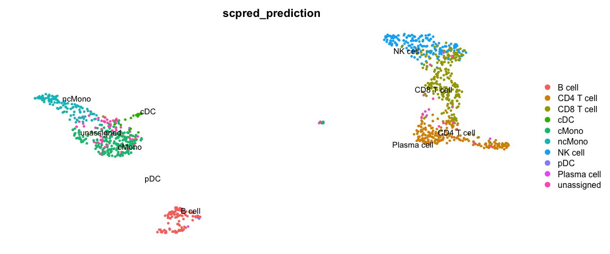

<style>
h1, .h1, h2, .h2, h3, .h3, h4, .h4 { margin-top: 50px }
p.caption {font-size: 0.9em;font-style: italic;color: grey;margin-right: 10%;margin-left: 10%;text-align: justify}
</style>

## Celltype prediction
***

 Celltype prediction can either be performed on indiviudal cells where each cell gets a predicted celltype label, or on the level of clusters. All methods are based on similarity to other datasets, single cell or sorted bulk RNAseq, or uses know marker genes for each celltype. 
 
We will select one sample from the Covid data, `ctrl_13` and predict celltype by cell on that sample.

Some methods will predict a celltype to each cell based on what it is most similar to even if the celltype of that cell is not included in the reference. Other methods include an uncertainty so that cells with low similarity scores will be unclassified. 

Here we will use a reference PBMC dataset from the `scPred` package which is already a Seurat object with counts. And test classification based on label transfer using the function `TransferData` in the Seurat package, the `scPred` method and `singleR` method.


```r
suppressPackageStartupMessages({
    library(Seurat)
    library(venn)
    library(dplyr)
    library(cowplot)
    library(ggplot2)
    library(pheatmap)
    library(rafalib)
    library(scPred)
})
```


```r
# load the data and select 'ctrl_13` sample
alldata <- readRDS("data/results/covid_qc_dr_int_cl.rds")
ctrl = alldata[, alldata$orig.ident == "ctrl_13"]

# set active assay to RNA and remove the CCA assay
ctrl@active.assay = "RNA"
ctrl[["CCA"]] = NULL
ctrl
```

```
## An object of class Seurat 
## 18121 features across 1129 samples within 1 assay 
## Active assay: RNA (18121 features, 0 variable features)
##  2 dimensional reductions calculated: umap, tsne
```


```r
reference <- scPred::pbmc_1

reference
```

```
## An object of class Seurat 
## 32838 features across 3500 samples within 1 assay 
## Active assay: RNA (32838 features, 0 variable features)
```

Here, we will run all the steps that we did in previous labs in one go using the `magittr` package with the pipe-operator `%>%`.


```r
reference <- reference %>% NormalizeData() %>% FindVariableFeatures() %>% ScaleData() %>% 
    RunPCA(verbose = F) %>% RunUMAP(dims = 1:30)
```


```r
DimPlot(reference, group.by = "cell_type", label = TRUE, repel = TRUE) + NoAxes()
```

<!-- -->


Run all steps of the analysis for the ctrl sample as well. Use the clustering from the integration lab with resolution 0.3.


```r
# Set the identity as louvain with resolution 0.3
ctrl <- SetIdent(ctrl, value = "CCA_snn_res.0.3")

ctrl <- ctrl %>% NormalizeData() %>% FindVariableFeatures() %>% ScaleData() %>% RunPCA(verbose = F) %>% 
    RunUMAP(dims = 1:30)
```


```r
DimPlot(ctrl, label = TRUE, repel = TRUE) + NoAxes()
```

<!-- -->


## Seurat label transfer
First we will run label transfer using a similar method as in the integration exercise. But, instad of CCA the default for the 'FindTransferAnchors` function is to use "pcaproject", e.g. the query datset is projected onto the PCA of the reference dataset. Then, the labels of the reference data are predicted.


```r
transfer.anchors <- FindTransferAnchors(reference = reference, query = ctrl, dims = 1:30)
predictions <- TransferData(anchorset = transfer.anchors, refdata = reference$cell_type, 
    dims = 1:30)
ctrl <- AddMetaData(object = ctrl, metadata = predictions)
```


```r
DimPlot(ctrl, group.by = "predicted.id", label = T, repel = T) + NoAxes()
```

<!-- -->

Now plot how many cells of each celltypes can be found in each cluster.


```r
ggplot(ctrl@meta.data, aes(x = CCA_snn_res.0.3, fill = predicted.id)) + geom_bar() + 
    theme_classic()
```

<!-- -->

## scPred
scPred will train a classifier based on all principal components. First, `getFeatureSpace` will create a scPred object stored in the `@misc` slot where it extracts the PCs that best separates the different celltypes. Then `trainModel` will do the actual training for each celltype.


```r
reference <- getFeatureSpace(reference, "cell_type")
```

```
## ●  Extracting feature space for each cell type...
## DONE!
```

```r
reference <- trainModel(reference)
```

```
## ●  Training models for each cell type...
## maximum number of iterations reached 0.000116588 -0.0001156614DONE!
```

We can then print how well the training worked for the different celltypes by printing the number of PCs used for each, the ROC value and Sensitivity/Specificity. Which celltypes do you think are harder to classify based on this dataset?


```r
get_scpred(reference)
```

```
## 'scPred' object
## ✔  Prediction variable = cell_type 
## ✔  Discriminant features per cell type
## ✔  Training model(s)
## Summary
## 
## |Cell type   |    n| Features|Method    |   ROC|  Sens|  Spec|
## |:-----------|----:|--------:|:---------|-----:|-----:|-----:|
## |B cell      |  280|       50|svmRadial | 1.000| 0.964| 1.000|
## |CD4 T cell  | 1620|       50|svmRadial | 0.997| 0.971| 0.975|
## |CD8 T cell  |  945|       50|svmRadial | 0.985| 0.902| 0.978|
## |cDC         |   26|       50|svmRadial | 0.995| 0.547| 1.000|
## |cMono       |  212|       50|svmRadial | 0.994| 0.958| 0.970|
## |ncMono      |   79|       50|svmRadial | 0.998| 0.582| 1.000|
## |NK cell     |  312|       50|svmRadial | 0.999| 0.936| 0.996|
## |pDC         |   20|       50|svmRadial | 1.000| 0.700| 1.000|
## |Plasma cell |    6|       50|svmRadial | 1.000| 0.800| 1.000|
```

You can optimize parameters for each dataset by chaning parameters and testing different types of models, see more at: https://powellgenomicslab.github.io/scPred/articles/introduction.html. But for now, we will continue with this model.

 Now, lets predict celltypes on our data, where scPred will align the two datasets with Harmony and then perform classification.


```r
ctrl <- scPredict(ctrl, reference)
```

```
## ●  Matching reference with new dataset...
## 	 ─ 2000 features present in reference loadings
## 	 ─ 1774 features shared between reference and new dataset
## 	 ─ 88.7% of features in the reference are present in new dataset
## ●  Aligning new data to reference...
## ●  Classifying cells...
## DONE!
```


```r
DimPlot(ctrl, group.by = "scpred_prediction", label = T, repel = T) + NoAxes()
```

<!-- -->

Now plot how many	cells of each celltypes	can be found in	each cluster.


```r
ggplot(ctrl@meta.data, aes(x = CCA_snn_res.0.3, fill = scpred_prediction)) + geom_bar() + 
    theme_classic()
```

<!-- -->

## Compare results

Now we will compare the output of the two methods using the convenient function in scPred `crossTab` that prints the overlap between two metadata slots.


```r
crossTab(ctrl, "predicted.id", "scpred_prediction")
```

<div data-pagedtable="false">
  <script data-pagedtable-source type="application/json">
{"columns":[{"label":[""],"name":["_rn_"],"type":[""],"align":["left"]},{"label":["B cell"],"name":[1],"type":["int"],"align":["right"]},{"label":["CD4 T cell"],"name":[2],"type":["int"],"align":["right"]},{"label":["CD8 T cell"],"name":[3],"type":["int"],"align":["right"]},{"label":["cDC"],"name":[4],"type":["int"],"align":["right"]},{"label":["cMono"],"name":[5],"type":["int"],"align":["right"]},{"label":["ncMono"],"name":[6],"type":["int"],"align":["right"]},{"label":["NK cell"],"name":[7],"type":["int"],"align":["right"]},{"label":["pDC"],"name":[8],"type":["int"],"align":["right"]},{"label":["Plasma cell"],"name":[9],"type":["int"],"align":["right"]}],"data":[{"1":"102","2":"1","3":"2","4":"0","5":"1","6":"0","7":"0","8":"0","9":"0","_rn_":"B cell"},{"1":"0","2":"198","3":"1","4":"0","5":"0","6":"0","7":"0","8":"0","9":"0","_rn_":"CD4 T cell"},{"1":"0","2":"7","3":"221","4":"0","5":"1","6":"0","7":"8","8":"0","9":"0","_rn_":"CD8 T cell"},{"1":"0","2":"0","3":"0","4":"11","5":"8","6":"0","7":"0","8":"0","9":"0","_rn_":"cDC"},{"1":"0","2":"4","3":"2","4":"0","5":"198","6":"4","7":"0","8":"0","9":"0","_rn_":"cMono"},{"1":"0","2":"0","3":"0","4":"0","5":"10","6":"99","7":"0","8":"0","9":"0","_rn_":"ncMono"},{"1":"0","2":"0","3":"17","4":"0","5":"0","6":"0","7":"150","8":"0","9":"0","_rn_":"NK cell"},{"1":"0","2":"0","3":"0","4":"0","5":"0","6":"0","7":"0","8":"1","9":"0","_rn_":"pDC"},{"1":"0","2":"1","3":"0","4":"0","5":"0","6":"0","7":"0","8":"0","9":"2","_rn_":"Plasma cell"},{"1":"0","2":"11","3":"11","4":"0","5":"54","6":"3","7":"1","8":"0","9":"0","_rn_":"unassigned"}],"options":{"columns":{"min":{},"max":[10]},"rows":{"min":[10],"max":[10]},"pages":{}}}
  </script>
</div>

Do you think that the methods overlap well? Where do you see the most inconsistencies? 

In this case we do not have any ground truth, and we cannot say wich method performs best. You should keep in mind, that any celltype classification method is just a prediction, and you still need to use your common sense and knowledge of the biological system to judge if the results make sense.

Finally, lets save the data with predictions.


```r
saveRDS(ctrl, "data/results/ctrl13_qc_dr_int_cl_celltype.rds")
```


### Session Info
***


```r
sessionInfo()
```

```
## R version 4.0.3 (2020-10-10)
## Platform: x86_64-apple-darwin13.4.0 (64-bit)
## Running under: macOS Catalina 10.15.7
## 
## Matrix products: default
## BLAS/LAPACK: /Users/asbj/miniconda3/envs/scRNAseq2021/lib/libopenblasp-r0.3.12.dylib
## 
## locale:
## [1] en_US.UTF-8/en_US.UTF-8/en_US.UTF-8/C/en_US.UTF-8/en_US.UTF-8
## 
## attached base packages:
## [1] stats     graphics  grDevices utils     datasets  methods   base     
## 
## other attached packages:
##  [1] caret_6.0-86    lattice_0.20-41 scPred_1.9.0    rafalib_1.0.0  
##  [5] pheatmap_1.0.12 ggplot2_3.3.2   cowplot_1.1.0   dplyr_1.0.2    
##  [9] venn_1.9        Seurat_3.2.2    RJSONIO_1.3-1.4 optparse_1.6.6 
## 
## loaded via a namespace (and not attached):
##   [1] plyr_1.8.6            igraph_1.2.6          lazyeval_0.2.2       
##   [4] splines_4.0.3         listenv_0.8.0         digest_0.6.27        
##   [7] foreach_1.5.1         htmltools_0.5.0       fansi_0.4.1          
##  [10] magrittr_2.0.1        tensor_1.5            cluster_2.1.0        
##  [13] ROCR_1.0-11           recipes_0.1.15        globals_0.14.0       
##  [16] gower_0.2.2           matrixStats_0.57.0    colorspace_2.0-0     
##  [19] ggrepel_0.8.2         xfun_0.19             crayon_1.3.4         
##  [22] jsonlite_1.7.1        spatstat_1.64-1       spatstat.data_1.5-2  
##  [25] survival_3.2-7        zoo_1.8-8             iterators_1.0.13     
##  [28] glue_1.4.2            polyclip_1.10-0       gtable_0.3.0         
##  [31] ipred_0.9-9           leiden_0.3.5          kernlab_0.9-29       
##  [34] future.apply_1.6.0    abind_1.4-5           scales_1.1.1         
##  [37] miniUI_0.1.1.1        Rcpp_1.0.5            viridisLite_0.3.0    
##  [40] xtable_1.8-4          reticulate_1.18       rsvd_1.0.3           
##  [43] stats4_4.0.3          lava_1.6.8.1          prodlim_2019.11.13   
##  [46] htmlwidgets_1.5.2     httr_1.4.2            getopt_1.20.3        
##  [49] RColorBrewer_1.1-2    ellipsis_0.3.1        ica_1.0-2            
##  [52] pkgconfig_2.0.3       farver_2.0.3          nnet_7.3-14          
##  [55] uwot_0.1.9            deldir_0.2-3          tidyselect_1.1.0     
##  [58] labeling_0.4.2        rlang_0.4.8           reshape2_1.4.4       
##  [61] later_1.1.0.1         munsell_0.5.0         tools_4.0.3          
##  [64] cli_2.2.0             generics_0.1.0        ggridges_0.5.2       
##  [67] evaluate_0.14         stringr_1.4.0         fastmap_1.0.1        
##  [70] yaml_2.2.1            goftest_1.2-2         ModelMetrics_1.2.2.2 
##  [73] knitr_1.30            fitdistrplus_1.1-1    admisc_0.11          
##  [76] purrr_0.3.4           RANN_2.6.1            pbapply_1.4-3        
##  [79] future_1.20.1         nlme_3.1-150          mime_0.9             
##  [82] formatR_1.7           compiler_4.0.3        beeswarm_0.2.3       
##  [85] plotly_4.9.2.1        png_0.1-7             spatstat.utils_1.17-0
##  [88] tibble_3.0.4          stringi_1.5.3         highr_0.8            
##  [91] RSpectra_0.16-0       Matrix_1.2-18         vctrs_0.3.5          
##  [94] pillar_1.4.7          lifecycle_0.2.0       lmtest_0.9-38        
##  [97] RcppAnnoy_0.0.17      data.table_1.13.2     irlba_2.3.3          
## [100] httpuv_1.5.4          patchwork_1.1.0       R6_2.5.0             
## [103] promises_1.1.1        KernSmooth_2.23-18    gridExtra_2.3        
## [106] vipor_0.4.5           parallelly_1.21.0     codetools_0.2-18     
## [109] MASS_7.3-53           assertthat_0.2.1      withr_2.3.0          
## [112] sctransform_0.3.1     harmony_1.0           mgcv_1.8-33          
## [115] parallel_4.0.3        grid_4.0.3            rpart_4.1-15         
## [118] timeDate_3043.102     tidyr_1.1.2           class_7.3-17         
## [121] rmarkdown_2.5         Rtsne_0.15            pROC_1.16.2          
## [124] shiny_1.5.0           lubridate_1.7.9.2     ggbeeswarm_0.6.0
```


