<style>
h1, .h1, h2, .h2, h3, .h3, h4, .h4 { margin-top: 50px }
p.caption {font-size: 0.9em;font-style: italic;color: grey;margin-right: 10%;margin-left: 10%;text-align: justify}
</style>

# Spatial transcriptomics
***

This tutorial is adapted from the Seurat vignette: https://satijalab.org/seurat/v3.2/spatial_vignette.html

Spatial transcriptomic data with the Visium platform is in many ways similar to scRNAseq data. It contains UMI counts for 5-20 cells instead of single cells, but is still quite sparse in the same way as scRNAseq data is, but with the additional information about spatial location in the tissue. 

Here we will first run quality control in a similar manner to scRNAseq data, then QC filtering, dimensionality reduction, integration and clustering. Then we will use scRNAseq data from mouse cortex to run LabelTransfer to predict celltypes in the Visium spots. 

We will use two **Visium** spatial transcriptomics dataset of the mouse brain (Sagittal), which are publicly available from the [10x genomics website](https://support.10xgenomics.com/spatial-gene-expression/datasets/). Note, that these dataset have already been filtered for spots that does not overlap with the tissue.

### Load packages


```r
devtools::install_github("satijalab/seurat-data")

suppressPackageStartupMessages(require(Matrix))
suppressPackageStartupMessages(require(dplyr))
suppressPackageStartupMessages(require(SeuratData))
suppressPackageStartupMessages(require(Seurat))
suppressPackageStartupMessages(require(ggplot2))
suppressPackageStartupMessages(require(patchwork))
suppressPackageStartupMessages(require(dplyr))
```


### Load ST data

The package `SeuratData` has some seurat objects for different datasets. Among those are spatial transcriptomics data from mouse brain and kidney. Here we will download and process sections from the mouse brain. 


```r
outdir = "data/spatial/"
dir.create(outdir, showWarnings = F)

# to list available datasets in SeuratData you can run AvailableData()

# first we dowload the dataset
InstallData("stxBrain")

## Check again that it works, did not work at first...


# now we can list what datasets we have downloaded
InstalledData()
```

<div data-pagedtable="false">
  <script data-pagedtable-source type="application/json">
{"columns":[{"label":[""],"name":["_rn_"],"type":[""],"align":["left"]},{"label":["Dataset"],"name":[1],"type":["chr"],"align":["left"]},{"label":["Version"],"name":[2],"type":["pckg_vrs"],"align":["right"]},{"label":["Summary"],"name":[3],"type":["chr"],"align":["left"]},{"label":["seurat"],"name":[4],"type":["chr"],"align":["left"]},{"label":["species"],"name":[5],"type":["chr"],"align":["left"]},{"label":["system"],"name":[6],"type":["chr"],"align":["left"]},{"label":["ncells"],"name":[7],"type":["dbl"],"align":["right"]},{"label":["tech"],"name":[8],"type":["chr"],"align":["left"]},{"label":["default.dataset"],"name":[9],"type":["chr"],"align":["left"]},{"label":["disk.datasets"],"name":[10],"type":["chr"],"align":["left"]},{"label":["other.datasets"],"name":[11],"type":["chr"],"align":["left"]},{"label":["notes"],"name":[12],"type":["chr"],"align":["left"]},{"label":["Installed"],"name":[13],"type":["lgl"],"align":["right"]},{"label":["InstalledVersion"],"name":[14],"type":["pckg_vrs"],"align":["right"]}],"data":[{"1":"stxBrain","2":"<pckg_vrs>","3":"10X Genomics Visium Mouse Brain Dataset","4":"NA","5":"mouse","6":"brain","7":"12167","8":"visium","9":"__NA__","10":"NA","11":"posterior1, posterior2, anterior1, anterior2","12":"One sample split across four datasets as paired anterior/posterior slices","13":"TRUE","14":"<pckg_vrs>","_rn_":"stxBrain.SeuratData"}],"options":{"columns":{"min":{},"max":[10]},"rows":{"min":[10],"max":[10]},"pages":{}}}
  </script>
</div>

```r
# now we will load the seurat object for one section
brain1 <- LoadData("stxBrain", type = "anterior1")
brain2 <- LoadData("stxBrain", type = "posterior1")
```

Merge into one seurat object


```r
brain <- merge(brain1, brain2)

brain
```

```
## An object of class Seurat 
## 31053 features across 6049 samples within 1 assay 
## Active assay: Spatial (31053 features, 0 variable features)
```

As you can see, now we do not have the assay "RNA", but instead an assay called "Spatial". 


##Quality control
***

Similar to scRNAseq we use statistics on number of counts, number of features and percent mitochondria for quality control. 

Now the counts and feature counts are calculated on the Spatial assay, so they are named  "nCount_Spatial" and "nFeature_Spatial".


```r
brain <- PercentageFeatureSet(brain, "^mt-", col.name = "percent_mito")
brain <- PercentageFeatureSet(brain, "^Hb.*-", col.name = "percent_hb")


VlnPlot(brain, features = c("nCount_Spatial", "nFeature_Spatial", "percent_mito",
    "percent_hb"), pt.size = 0.1, ncol = 2) + NoLegend()
```

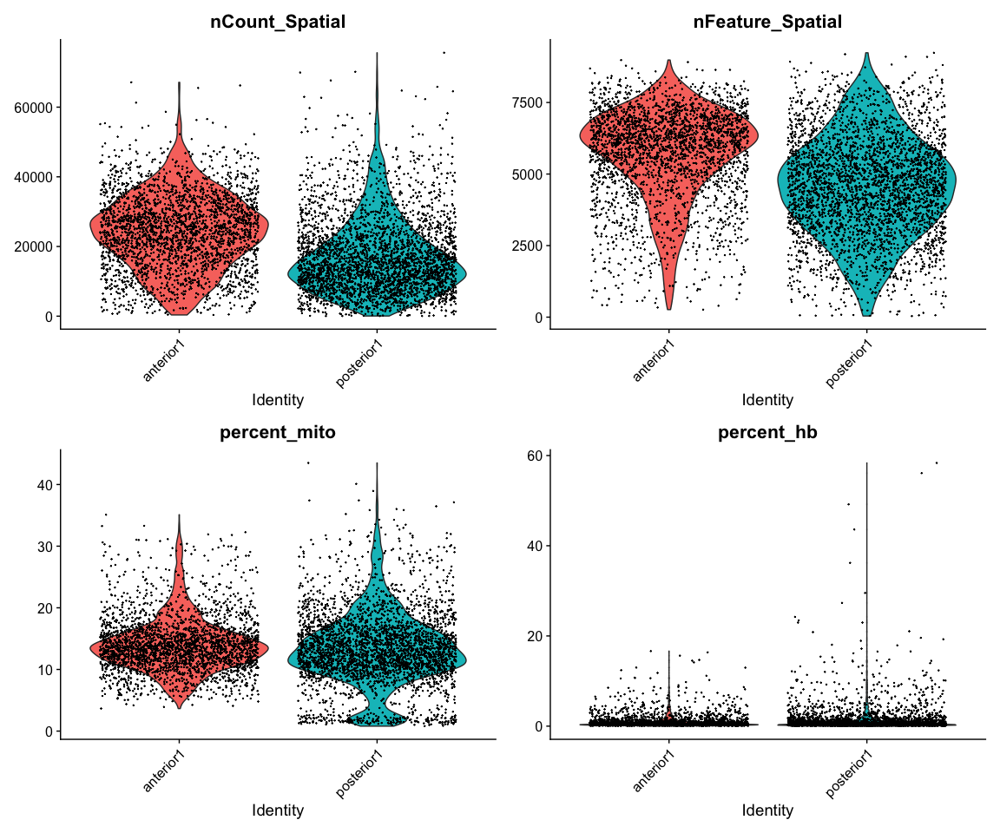<!-- -->

We can also plot the same data onto the tissue section.


```r
SpatialFeaturePlot(brain, features = c("nCount_Spatial", "nFeature_Spatial", "percent_mito",
    "percent_hb"))
```

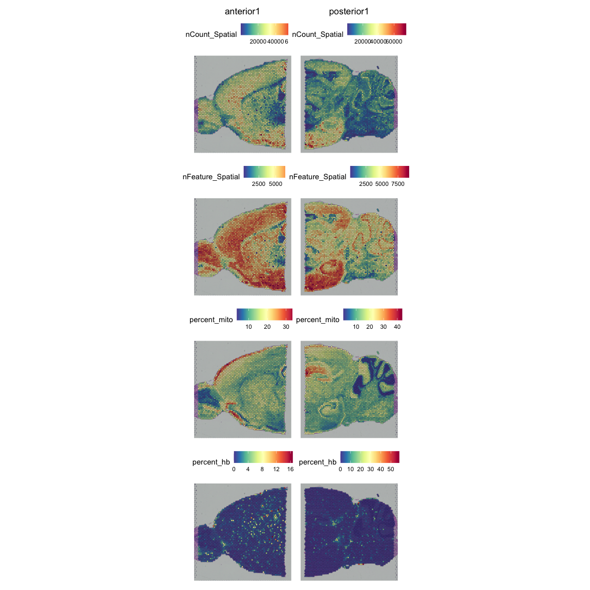<!-- -->


As you can see, the spots with low number of counts/features and high mitochondrial content is mainly towards the edges of the tissue. It is quite likely that these regions are damaged tissue. You may also see regions within a tissue with low quality if you have tears or folds in your section. 

But remember, for some tissue types, the amount of genes expressed and proportion mitochondria may also be a biological features, so bear in mind what tissue you are working on and what these features mean.

### Filter

Select all spots with less than 25% mitocondrial reads, less than 20% hb-reads and 1000 detected genes. You must judge for yourself based on your knowledge of the tissue what are appropriate filtering criteria for your dataset.


```r
brain = brain[, brain$nFeature_Spatial > 500 & brain$percent_mito < 25 & brain$percent_hb <
    20]
```

And replot onto tissue section:


```r
SpatialFeaturePlot(brain, features = c("nCount_Spatial", "nFeature_Spatial", "percent_mito"))
```

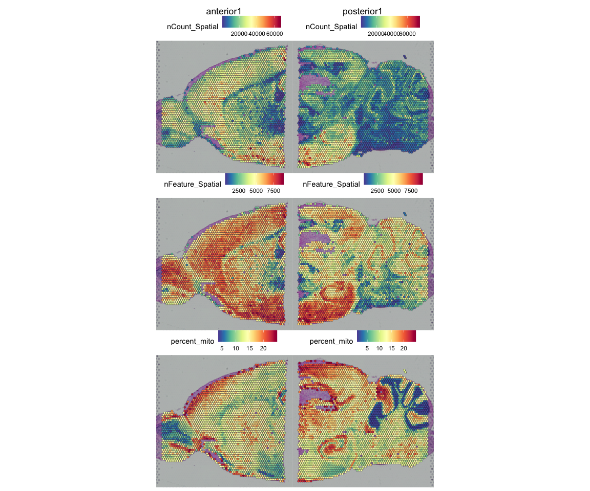<!-- -->

### Top expressed genes
As for scRNAseq data, we will look at what the top expressed genes are.


```r
C = brain@assays$Spatial@counts
C@x = C@x/rep.int(colSums(C), diff(C@p))
most_expressed <- order(Matrix::rowSums(C), decreasing = T)[20:1]
boxplot(as.matrix(t(C[most_expressed, ])), cex = 0.1, las = 1, xlab = "% total count per cell",
    col = (scales::hue_pal())(20)[20:1], horizontal = TRUE)
```

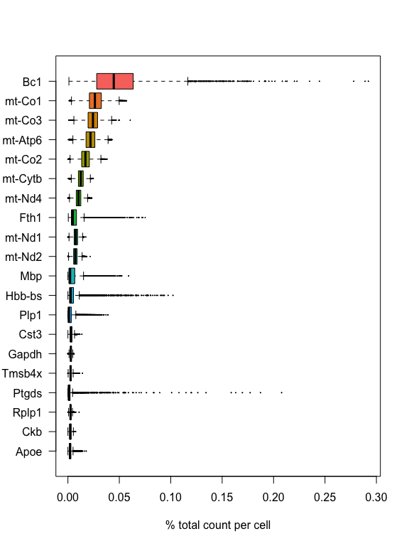<!-- -->

As you can see, the mitochondrial genes are among the top expressed. Also the lncRNA gene Bc1 (brain cytoplasmic RNA 1). Also one hemoglobin gene.

### Filter genes
We will remove the Bc1 gene, hemoglobin genes (blood contamination) and the mitochondrial genes.


```r
dim(brain)
```

```
## [1] 31053  5789
```

```r
# Filter Bl1
brain <- brain[!grepl("Bc1", rownames(brain)), ]

# Filter Mitocondrial
brain <- brain[!grepl("^mt-", rownames(brain)), ]

# Filter Hemoglobin gene (optional if that is a problem on your data)
brain <- brain[!grepl("^Hb.*-", rownames(brain)), ]

dim(brain)
```

```
## [1] 31031  5789
```

## Analysis
***

For ST data, the Seurat team recommends to use SCTranform for normalization, so we will do that. `SCTransform` will select variable genes and normalize in one step.


```r
brain <- SCTransform(brain, assay = "Spatial", verbose = TRUE, method = "poisson")
```

```
## 
  |                                                                            
  |                                                                      |   0%
  |                                                                            
  |==================                                                    |  25%
  |                                                                            
  |===================================                                   |  50%
  |                                                                            
  |====================================================                  |  75%
  |                                                                            
  |======================================================================| 100%
## 
  |                                                                            
  |                                                                      |   0%
  |                                                                            
  |==                                                                    |   3%
  |                                                                            
  |====                                                                  |   5%
  |                                                                            
  |======                                                                |   8%
  |                                                                            
  |=======                                                               |  11%
  |                                                                            
  |=========                                                             |  13%
  |                                                                            
  |===========                                                           |  16%
  |                                                                            
  |=============                                                         |  18%
  |                                                                            
  |===============                                                       |  21%
  |                                                                            
  |=================                                                     |  24%
  |                                                                            
  |==================                                                    |  26%
  |                                                                            
  |====================                                                  |  29%
  |                                                                            
  |======================                                                |  32%
  |                                                                            
  |========================                                              |  34%
  |                                                                            
  |==========================                                            |  37%
  |                                                                            
  |============================                                          |  39%
  |                                                                            
  |=============================                                         |  42%
  |                                                                            
  |===============================                                       |  45%
  |                                                                            
  |=================================                                     |  47%
  |                                                                            
  |===================================                                   |  50%
  |                                                                            
  |=====================================                                 |  53%
  |                                                                            
  |=======================================                               |  55%
  |                                                                            
  |=========================================                             |  58%
  |                                                                            
  |==========================================                            |  61%
  |                                                                            
  |============================================                          |  63%
  |                                                                            
  |==============================================                        |  66%
  |                                                                            
  |================================================                      |  68%
  |                                                                            
  |==================================================                    |  71%
  |                                                                            
  |====================================================                  |  74%
  |                                                                            
  |=====================================================                 |  76%
  |                                                                            
  |=======================================================               |  79%
  |                                                                            
  |=========================================================             |  82%
  |                                                                            
  |===========================================================           |  84%
  |                                                                            
  |=============================================================         |  87%
  |                                                                            
  |===============================================================       |  89%
  |                                                                            
  |================================================================      |  92%
  |                                                                            
  |==================================================================    |  95%
  |                                                                            
  |====================================================================  |  97%
  |                                                                            
  |======================================================================| 100%
## 
  |                                                                            
  |                                                                      |   0%
  |                                                                            
  |==                                                                    |   3%
  |                                                                            
  |====                                                                  |   5%
  |                                                                            
  |======                                                                |   8%
  |                                                                            
  |=======                                                               |  11%
  |                                                                            
  |=========                                                             |  13%
  |                                                                            
  |===========                                                           |  16%
  |                                                                            
  |=============                                                         |  18%
  |                                                                            
  |===============                                                       |  21%
  |                                                                            
  |=================                                                     |  24%
  |                                                                            
  |==================                                                    |  26%
  |                                                                            
  |====================                                                  |  29%
  |                                                                            
  |======================                                                |  32%
  |                                                                            
  |========================                                              |  34%
  |                                                                            
  |==========================                                            |  37%
  |                                                                            
  |============================                                          |  39%
  |                                                                            
  |=============================                                         |  42%
  |                                                                            
  |===============================                                       |  45%
  |                                                                            
  |=================================                                     |  47%
  |                                                                            
  |===================================                                   |  50%
  |                                                                            
  |=====================================                                 |  53%
  |                                                                            
  |=======================================                               |  55%
  |                                                                            
  |=========================================                             |  58%
  |                                                                            
  |==========================================                            |  61%
  |                                                                            
  |============================================                          |  63%
  |                                                                            
  |==============================================                        |  66%
  |                                                                            
  |================================================                      |  68%
  |                                                                            
  |==================================================                    |  71%
  |                                                                            
  |====================================================                  |  74%
  |                                                                            
  |=====================================================                 |  76%
  |                                                                            
  |=======================================================               |  79%
  |                                                                            
  |=========================================================             |  82%
  |                                                                            
  |===========================================================           |  84%
  |                                                                            
  |=============================================================         |  87%
  |                                                                            
  |===============================================================       |  89%
  |                                                                            
  |================================================================      |  92%
  |                                                                            
  |==================================================================    |  95%
  |                                                                            
  |====================================================================  |  97%
  |                                                                            
  |======================================================================| 100%
```


Now we can plot gene expression of individual genes, the gene Hpca is a strong hippocampal marker and Ttr is a marker of the choroid plexus.


```r
SpatialFeaturePlot(brain, features = c("Hpca", "Ttr"))
```

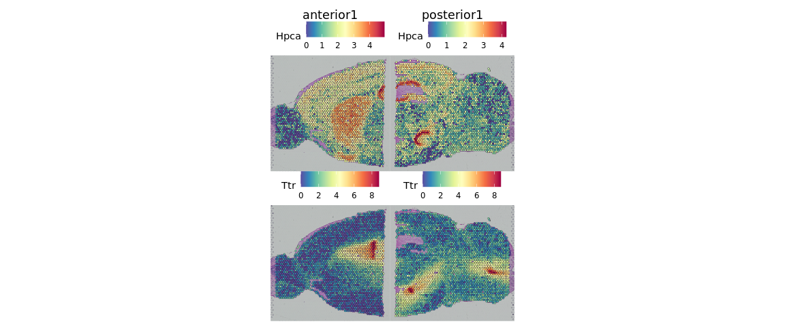<!-- -->

If you want to see the tissue better you can modify point size and transparancy of the points.


```r
SpatialFeaturePlot(brain, features = "Ttr", pt.size.factor = 1, alpha = c(0.1, 1))
```

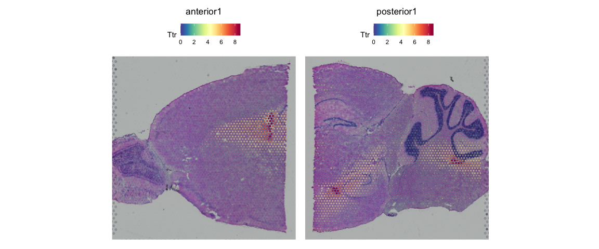<!-- -->


### Dimensionality reduction and clustering
We can then now run dimensionality reduction and clustering using the same workflow as we use for scRNA-seq analysis. 

But make sure you run it on the `SCT` assay.


```r
brain <- RunPCA(brain, assay = "SCT", verbose = FALSE)
brain <- FindNeighbors(brain, reduction = "pca", dims = 1:30)
brain <- FindClusters(brain, verbose = FALSE)
brain <- RunUMAP(brain, reduction = "pca", dims = 1:30)
```

We can then plot clusters onto umap or onto the tissue section.


```r
DimPlot(brain, reduction = "umap", group.by = c("ident", "orig.ident"))
```

<!-- -->

```r
SpatialDimPlot(brain)
```

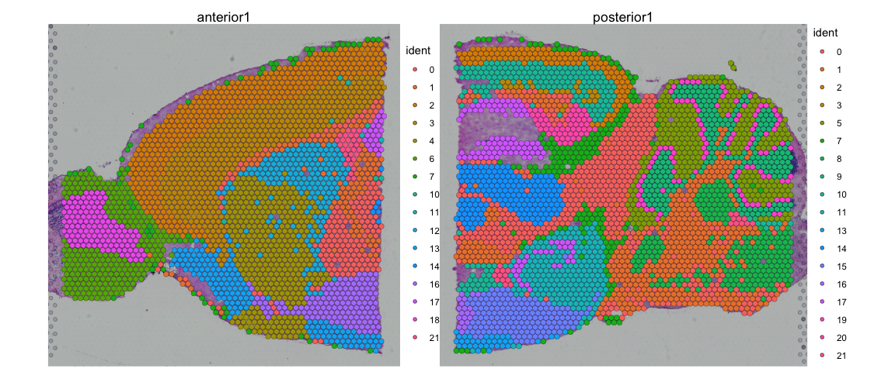<!-- -->

We can also plot each cluster separately


```r
SpatialDimPlot(brain, cells.highlight = CellsByIdentities(brain), facet.highlight = TRUE,
    ncol = 5)
```

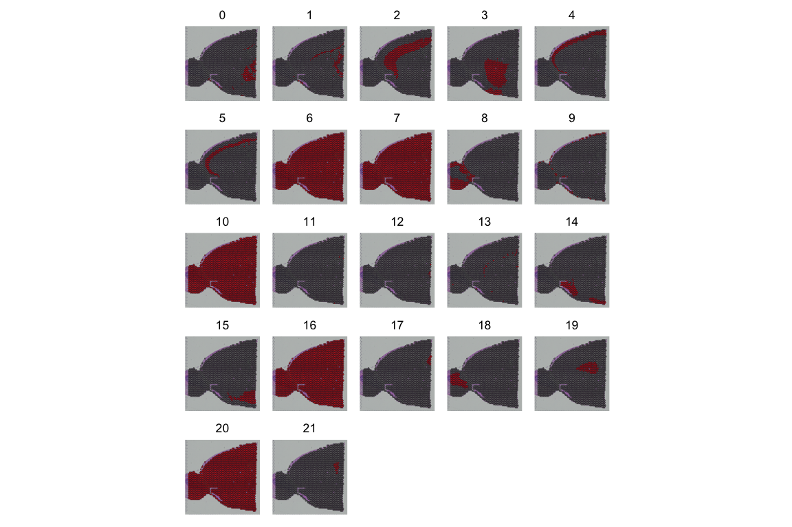<!-- -->

## Integration

Quite often there are strong batch effects between different ST sections, so it may be a good idea to integrate the data across sections.

We will do a similar integration as in the Data Integration lab, but this time we will use the SCT assay for integration. Therefore we need to run `PrepSCTIntegration` which will compute the sctransform residuals for all genes in both the datasets. 


```r
# create a list of the original data that we loaded to start with
st.list = list(anterior1 = brain1, posterior1 = brain2)

# run SCT on both datasets
st.list = lapply(st.list, SCTransform, assay = "Spatial", method = "poisson")
```

```
## 
  |                                                                            
  |                                                                      |   0%
  |                                                                            
  |==================                                                    |  25%
  |                                                                            
  |===================================                                   |  50%
  |                                                                            
  |====================================================                  |  75%
  |                                                                            
  |======================================================================| 100%
## 
  |                                                                            
  |                                                                      |   0%
  |                                                                            
  |==                                                                    |   3%
  |                                                                            
  |====                                                                  |   6%
  |                                                                            
  |======                                                                |   8%
  |                                                                            
  |========                                                              |  11%
  |                                                                            
  |==========                                                            |  14%
  |                                                                            
  |============                                                          |  17%
  |                                                                            
  |==============                                                        |  19%
  |                                                                            
  |================                                                      |  22%
  |                                                                            
  |==================                                                    |  25%
  |                                                                            
  |===================                                                   |  28%
  |                                                                            
  |=====================                                                 |  31%
  |                                                                            
  |=======================                                               |  33%
  |                                                                            
  |=========================                                             |  36%
  |                                                                            
  |===========================                                           |  39%
  |                                                                            
  |=============================                                         |  42%
  |                                                                            
  |===============================                                       |  44%
  |                                                                            
  |=================================                                     |  47%
  |                                                                            
  |===================================                                   |  50%
  |                                                                            
  |=====================================                                 |  53%
  |                                                                            
  |=======================================                               |  56%
  |                                                                            
  |=========================================                             |  58%
  |                                                                            
  |===========================================                           |  61%
  |                                                                            
  |=============================================                         |  64%
  |                                                                            
  |===============================================                       |  67%
  |                                                                            
  |=================================================                     |  69%
  |                                                                            
  |===================================================                   |  72%
  |                                                                            
  |====================================================                  |  75%
  |                                                                            
  |======================================================                |  78%
  |                                                                            
  |========================================================              |  81%
  |                                                                            
  |==========================================================            |  83%
  |                                                                            
  |============================================================          |  86%
  |                                                                            
  |==============================================================        |  89%
  |                                                                            
  |================================================================      |  92%
  |                                                                            
  |==================================================================    |  94%
  |                                                                            
  |====================================================================  |  97%
  |                                                                            
  |======================================================================| 100%
## 
  |                                                                            
  |                                                                      |   0%
  |                                                                            
  |==                                                                    |   3%
  |                                                                            
  |====                                                                  |   6%
  |                                                                            
  |======                                                                |   8%
  |                                                                            
  |========                                                              |  11%
  |                                                                            
  |==========                                                            |  14%
  |                                                                            
  |============                                                          |  17%
  |                                                                            
  |==============                                                        |  19%
  |                                                                            
  |================                                                      |  22%
  |                                                                            
  |==================                                                    |  25%
  |                                                                            
  |===================                                                   |  28%
  |                                                                            
  |=====================                                                 |  31%
  |                                                                            
  |=======================                                               |  33%
  |                                                                            
  |=========================                                             |  36%
  |                                                                            
  |===========================                                           |  39%
  |                                                                            
  |=============================                                         |  42%
  |                                                                            
  |===============================                                       |  44%
  |                                                                            
  |=================================                                     |  47%
  |                                                                            
  |===================================                                   |  50%
  |                                                                            
  |=====================================                                 |  53%
  |                                                                            
  |=======================================                               |  56%
  |                                                                            
  |=========================================                             |  58%
  |                                                                            
  |===========================================                           |  61%
  |                                                                            
  |=============================================                         |  64%
  |                                                                            
  |===============================================                       |  67%
  |                                                                            
  |=================================================                     |  69%
  |                                                                            
  |===================================================                   |  72%
  |                                                                            
  |====================================================                  |  75%
  |                                                                            
  |======================================================                |  78%
  |                                                                            
  |========================================================              |  81%
  |                                                                            
  |==========================================================            |  83%
  |                                                                            
  |============================================================          |  86%
  |                                                                            
  |==============================================================        |  89%
  |                                                                            
  |================================================================      |  92%
  |                                                                            
  |==================================================================    |  94%
  |                                                                            
  |====================================================================  |  97%
  |                                                                            
  |======================================================================| 100%
## 
  |                                                                            
  |                                                                      |   0%
  |                                                                            
  |==================                                                    |  25%
  |                                                                            
  |===================================                                   |  50%
  |                                                                            
  |====================================================                  |  75%
  |                                                                            
  |======================================================================| 100%
## 
  |                                                                            
  |                                                                      |   0%
  |                                                                            
  |==                                                                    |   3%
  |                                                                            
  |====                                                                  |   6%
  |                                                                            
  |======                                                                |   8%
  |                                                                            
  |========                                                              |  11%
  |                                                                            
  |==========                                                            |  14%
  |                                                                            
  |============                                                          |  17%
  |                                                                            
  |==============                                                        |  19%
  |                                                                            
  |================                                                      |  22%
  |                                                                            
  |==================                                                    |  25%
  |                                                                            
  |===================                                                   |  28%
  |                                                                            
  |=====================                                                 |  31%
  |                                                                            
  |=======================                                               |  33%
  |                                                                            
  |=========================                                             |  36%
  |                                                                            
  |===========================                                           |  39%
  |                                                                            
  |=============================                                         |  42%
  |                                                                            
  |===============================                                       |  44%
  |                                                                            
  |=================================                                     |  47%
  |                                                                            
  |===================================                                   |  50%
  |                                                                            
  |=====================================                                 |  53%
  |                                                                            
  |=======================================                               |  56%
  |                                                                            
  |=========================================                             |  58%
  |                                                                            
  |===========================================                           |  61%
  |                                                                            
  |=============================================                         |  64%
  |                                                                            
  |===============================================                       |  67%
  |                                                                            
  |=================================================                     |  69%
  |                                                                            
  |===================================================                   |  72%
  |                                                                            
  |====================================================                  |  75%
  |                                                                            
  |======================================================                |  78%
  |                                                                            
  |========================================================              |  81%
  |                                                                            
  |==========================================================            |  83%
  |                                                                            
  |============================================================          |  86%
  |                                                                            
  |==============================================================        |  89%
  |                                                                            
  |================================================================      |  92%
  |                                                                            
  |==================================================================    |  94%
  |                                                                            
  |====================================================================  |  97%
  |                                                                            
  |======================================================================| 100%
## 
  |                                                                            
  |                                                                      |   0%
  |                                                                            
  |==                                                                    |   3%
  |                                                                            
  |====                                                                  |   6%
  |                                                                            
  |======                                                                |   8%
  |                                                                            
  |========                                                              |  11%
  |                                                                            
  |==========                                                            |  14%
  |                                                                            
  |============                                                          |  17%
  |                                                                            
  |==============                                                        |  19%
  |                                                                            
  |================                                                      |  22%
  |                                                                            
  |==================                                                    |  25%
  |                                                                            
  |===================                                                   |  28%
  |                                                                            
  |=====================                                                 |  31%
  |                                                                            
  |=======================                                               |  33%
  |                                                                            
  |=========================                                             |  36%
  |                                                                            
  |===========================                                           |  39%
  |                                                                            
  |=============================                                         |  42%
  |                                                                            
  |===============================                                       |  44%
  |                                                                            
  |=================================                                     |  47%
  |                                                                            
  |===================================                                   |  50%
  |                                                                            
  |=====================================                                 |  53%
  |                                                                            
  |=======================================                               |  56%
  |                                                                            
  |=========================================                             |  58%
  |                                                                            
  |===========================================                           |  61%
  |                                                                            
  |=============================================                         |  64%
  |                                                                            
  |===============================================                       |  67%
  |                                                                            
  |=================================================                     |  69%
  |                                                                            
  |===================================================                   |  72%
  |                                                                            
  |====================================================                  |  75%
  |                                                                            
  |======================================================                |  78%
  |                                                                            
  |========================================================              |  81%
  |                                                                            
  |==========================================================            |  83%
  |                                                                            
  |============================================================          |  86%
  |                                                                            
  |==============================================================        |  89%
  |                                                                            
  |================================================================      |  92%
  |                                                                            
  |==================================================================    |  94%
  |                                                                            
  |====================================================================  |  97%
  |                                                                            
  |======================================================================| 100%
```

```r
# need to set maxSize for PrepSCTIntegration to work
options(future.globals.maxSize = 2000 * 1024^2)  # set allowed size to 2K MiB


st.features = SelectIntegrationFeatures(st.list, nfeatures = 3000, verbose = FALSE)
st.list <- PrepSCTIntegration(object.list = st.list, anchor.features = st.features,
    verbose = FALSE)
```

Now we can perform the actual integraion.


```r
int.anchors <- FindIntegrationAnchors(object.list = st.list, normalization.method = "SCT",
    verbose = FALSE, anchor.features = st.features)
brain.integrated <- IntegrateData(anchorset = int.anchors, normalization.method = "SCT",
    verbose = FALSE)

rm(int.anchors, st.list)
gc()
```

```
##             used (Mb) gc trigger   (Mb)   max used   (Mb)
## Ncells   3108272  166    4977345  265.9    4977345  265.9
## Vcells 589549134 4498 1176297363 8974.5 1175644264 8969.5
```

Then we run dimensionality reduction and clustering as before.


```r
brain.integrated <- RunPCA(brain.integrated, verbose = FALSE)
brain.integrated <- FindNeighbors(brain.integrated, dims = 1:30)
brain.integrated <- FindClusters(brain.integrated, verbose = FALSE)
brain.integrated <- RunUMAP(brain.integrated, dims = 1:30)
```


```r
DimPlot(brain.integrated, reduction = "umap", group.by = c("ident", "orig.ident"))
```

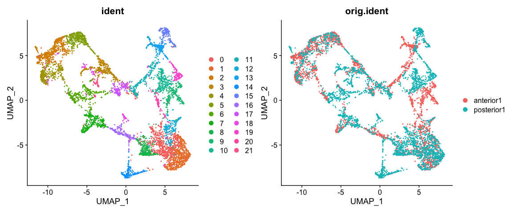<!-- -->

```r
SpatialDimPlot(brain.integrated)
```

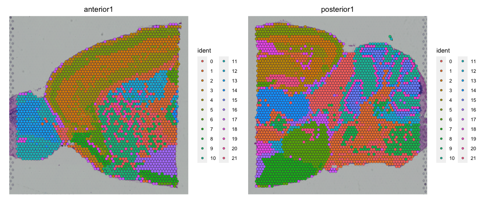<!-- -->

Do you see any differences between the integrated and non-integrated clusering? Judge for yourself, which of the clusterings do you think looks best? 
As a reference, you can compare to brain regions in the [Allen brain atlas](https://mouse.brain-map.org/experiment/thumbnails/100042147?image_type=atlas). 

## Identification of Spatially Variable Features

 There are two main workflows to identify molecular features that correlate with spatial location within a tissue. The first is to perform differential expression based on spatially distinct clusters, the other is to find features that are have spatial patterning without taking clusters or spatial annotation into account. 

First, we will do differential expression between clusters just as we did for the scRNAseq data before.


```r
# differential expression between cluster 1 and cluster 6
de_markers <- FindMarkers(brain.integrated, ident.1 = 5, ident.2 = 6)

# plot top markers
SpatialFeaturePlot(object = brain.integrated, features = rownames(de_markers)[1:3],
    alpha = c(0.1, 1), ncol = 3)
```

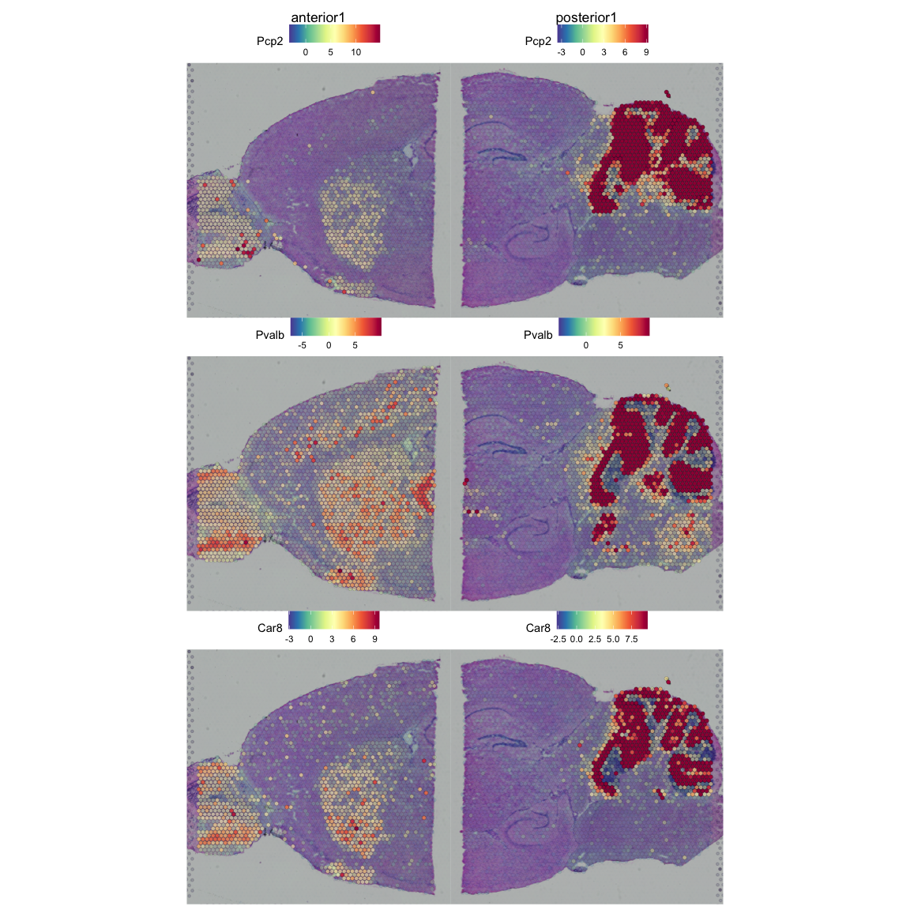<!-- -->


In `FindSpatiallyVariables` the default method in Seurat (method = 'markvariogram), is inspired by the Trendsceek, which models spatial transcriptomics data as a mark point process and computes a 'variogram', which identifies genes whose expression level is dependent on their spatial location. More specifically, this process calculates gamma(r) values measuring the dependence between two spots a certain "r" distance apart. By default, we use an r-value of '5' in these analyes, and only compute these values for variable genes (where variation is calculated independently of spatial location) to save time.


**OBS!** Takes a long time to run, so skip this step for now!


```r
# brain <- FindSpatiallyVariableFeatures(brain, assay = 'SCT', features =
# VariableFeatures(brain)[1:1000], selection.method = 'markvariogram')

# We would get top features from SpatiallyVariableFeatures top.features <-
# head(SpatiallyVariableFeatures(brain, selection.method = 'markvariogram'), 6)
```


## Single cell data

We can also perform data integration between one scRNA-seq dataset and one spatial transcriptomics dataset. Such task is particularly useful because it allows us to transfer cell type labels to the Visium dataset, which were dentified from the scRNA-seq dataset. 

We will use a reference scRNA-seq dataset of ~14,000 adult mouse cortical cell taxonomy from the Allen Institute, generated with the SMART-Seq2 protocol.


First dowload the seurat data from: https://www.dropbox.com/s/cuowvm4vrf65pvq/allen_cortex.rds?dl=1 to folder `data/spatial/` with command:


```bash

FILE="./data/spatial/allen_cortex.rds"

if [ -e $FILE ]
then
   echo "File $FILE is downloaded."
else
   echo "Downloading $FILE"
   mkdir -p data/spatial
   wget  -O data/spatial/allen_cortex.rds https://www.dropbox.com/s/cuowvm4vrf65pvq/allen_cortex.rds?dl=1
fi

```

```
## File ./data/spatial/allen_cortex.rds is downloaded.
```

For speed, and for a more fair comparison of the celltypes, we will subsample all celltypes to a maximum of 200 cells per class (`subclass`).


```r
allen_reference <- readRDS("data/spatial/allen_cortex.rds")

# check number of cells per subclass
table(allen_reference$subclass)
```

```
## 
##      Astro         CR       Endo    L2/3 IT         L4      L5 IT      L5 PT 
##        368          7         94        982       1401        880        544 
##      L6 CT      L6 IT        L6b      Lamp5 Macrophage      Meis2         NP 
##        960       1872        358       1122         51         45        362 
##      Oligo       Peri      Pvalb   Serpinf1        SMC       Sncg        Sst 
##         91         32       1337         27         55        125       1741 
##        Vip       VLMC 
##       1728         67
```

```r
# select 200 cells per subclass, fist set subclass ass active.ident
Idents(allen_reference) <- allen_reference$subclass
allen_reference <- subset(allen_reference, cells = WhichCells(allen_reference, downsample = 200))

# check again number of cells per subclass
table(allen_reference$subclass)
```

```
## 
##      Astro         CR       Endo    L2/3 IT         L4      L5 IT      L5 PT 
##        200          7         94        200        200        200        200 
##      L6 CT      L6 IT        L6b      Lamp5 Macrophage      Meis2         NP 
##        200        200        200        200         51         45        200 
##      Oligo       Peri      Pvalb   Serpinf1        SMC       Sncg        Sst 
##         91         32        200         27         55        125        200 
##        Vip       VLMC 
##        200         67
```

Then run normalization and dimensionality reduction.


```r
# First run SCTransform and PCA
allen_reference <- SCTransform(allen_reference, ncells = 3000, verbose = FALSE, method = "poisson") %>%
    RunPCA(verbose = FALSE) %>%
    RunUMAP(dims = 1:30)

# the annotation is stored in the 'subclass' column of object metadata
DimPlot(allen_reference, label = TRUE)
```

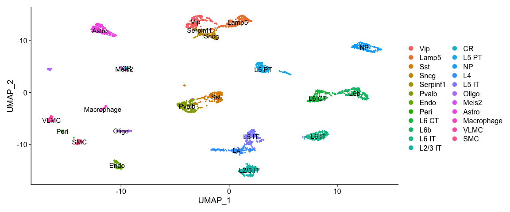<!-- -->

### Subset ST for cortex
Since the scRNAseq dataset was generated from the mouse cortex, we will subset the visium dataset in order to select mainly the spots part of the cortex. Note that the integration can also be performed on the whole brain slice, but it would give rise to false positive cell type assignments and and therefore it should be interpreted with more care.


```r
# subset for the anterior dataset
cortex <- subset(brain.integrated, orig.ident == "anterior1")

# there seems to be an error in the subsetting, so the posterior1 image is not
# removed, do it manually
cortex@images$posterior1 = NULL

# subset for a specific region
cortex <- subset(cortex, anterior1_imagerow > 400 | anterior1_imagecol < 150, invert = TRUE)
cortex <- subset(cortex, anterior1_imagerow > 275 & anterior1_imagecol > 370, invert = TRUE)
cortex <- subset(cortex, anterior1_imagerow > 250 & anterior1_imagecol > 440, invert = TRUE)

# also subset for FC clusters
cortex <- subset(cortex, idents = c(1, 2, 3, 4, 5))

p1 <- SpatialDimPlot(cortex, crop = TRUE, label = TRUE)
p2 <- SpatialDimPlot(cortex, crop = FALSE, label = TRUE, pt.size.factor = 1, label.size = 3)
p1 + p2
```

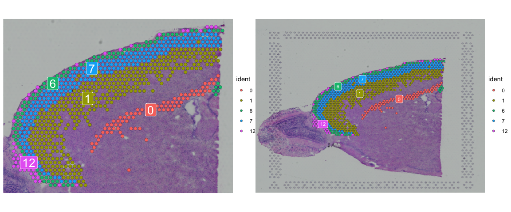<!-- -->

```r
# After subsetting, we renormalize cortex
cortex <- SCTransform(cortex, assay = "Spatial", verbose = FALSE, method = "poisson") %>%
    RunPCA(verbose = FALSE)
```


### Integrate with scRNAseq

Instead of the functions `FindIntegrationAnchors` and `IntegrateData` in Seurat, we will instead use `FindTransferAnchors` and `TransferData` which will create a new assay that contains the predictions scores (e.g. closeness of each spot to each celltype in the aligned spaces).


```r
anchors <- FindTransferAnchors(reference = allen_reference, query = cortex, normalization.method = "SCT")
predictions.assay <- TransferData(anchorset = anchors, refdata = allen_reference$subclass,
    prediction.assay = TRUE, weight.reduction = cortex[["pca"]], dims = 1:30)
cortex[["predictions"]] <- predictions.assay
```


```r
DefaultAssay(cortex) <- "predictions"
SpatialFeaturePlot(cortex, features = c("L2/3 IT", "L4"), pt.size.factor = 1.6, ncol = 2,
    crop = TRUE)
```

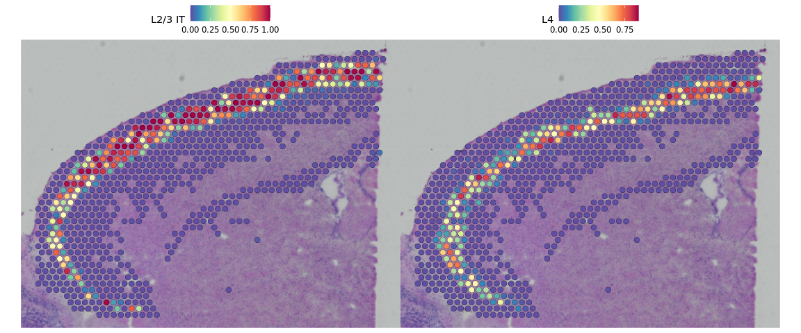<!-- -->

Based on these prediction scores, we can also predict cell types whose location is spatially restricted. We use the same methods based on marked point processes to define spatially variable features, but use the cell type prediction scores as the "marks" rather than gene expression.


```r
cortex <- FindSpatiallyVariableFeatures(cortex, assay = "predictions", selection.method = "markvariogram",
    features = rownames(cortex), r.metric = 5, slot = "data")
top.clusters <- head(SpatiallyVariableFeatures(cortex), 4)
SpatialPlot(object = cortex, features = top.clusters, ncol = 2)
```

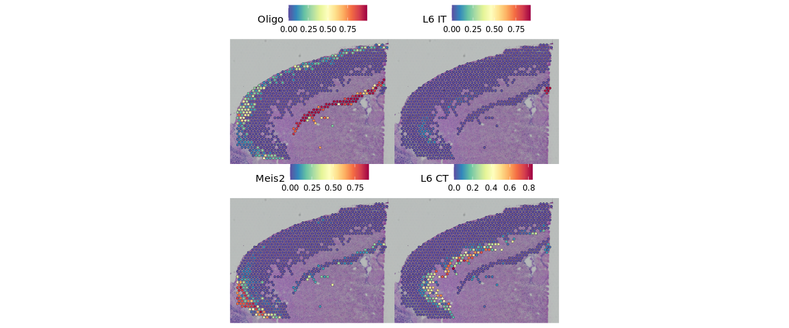<!-- -->


We can also visualize the scores per cluster in ST data


```r
VlnPlot(cortex, group.by = "seurat_clusters", features = top.clusters, pt.size = 0,
    ncol = 2)
```

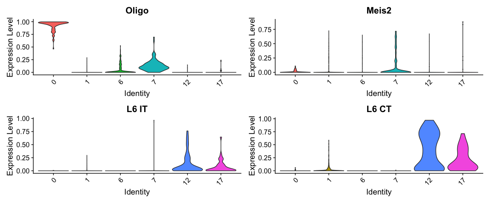<!-- -->


Keep in mind, that the scores are "just" prediction scores, and do not correspond to proportion of cells that are of a certain celltype or similar. It mainly tells you that gene expression in a certain spot is hihgly similar/dissimilar to gene expression of a celltype.

If we look at the scores, we see that some spots got really clear predictions by celltype, while others did not have high scores for any of the celltypes.

<style>
div.blue { background-color:#e6f0ff; border-radius: 5px; padding: 10px;}
</style>
<div class = "blue">
**Your turn:**

Subset for another region that does not contain cortex cells and check what you get from the label transfer. 

Suggested region is the right end of the posterial section that you can select like this:

</div>


```r
# subset for the anterior dataset
subregion <- subset(brain.integrated, orig.ident == "posterior1")

# there seems to be an error in the subsetting, so the posterior1 image is not
# removed, do it manually
subregion@images$anterior1 = NULL

# subset for a specific region
subregion <- subset(subregion, posterior1_imagecol > 400, invert = FALSE)

# SpatialDimPlot(subregion ,cells.highlight = WhichCells(subregion, expression
# = posterior1_imagecol > 50))


p1 <- SpatialDimPlot(subregion, crop = TRUE, label = TRUE)
p2 <- SpatialDimPlot(subregion, crop = FALSE, label = TRUE, pt.size.factor = 1, label.size = 3)
p1 + p2
```

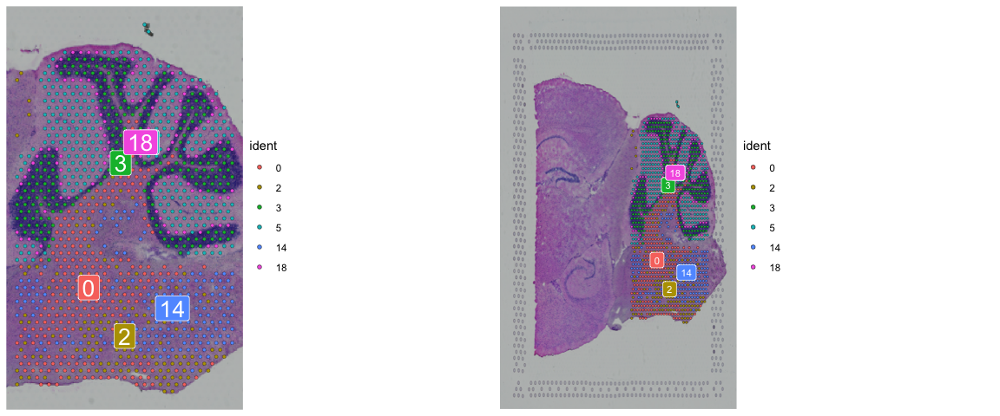<!-- -->

```r
# After subsetting, we renormalize cortex
subregion <- SCTransform(subregion, assay = "Spatial", verbose = FALSE, method = "poisson") %>%
    RunPCA(verbose = FALSE)
```


### Session info


```r
sessionInfo()
```

```
## R version 4.0.5 (2021-03-31)
## Platform: x86_64-apple-darwin13.4.0 (64-bit)
## Running under: macOS Catalina 10.15.7
## 
## Matrix products: default
## BLAS/LAPACK: /Users/asbj/miniconda3/envs/scRNAseq2022/lib/libopenblasp-r0.3.18.dylib
## 
## locale:
## [1] en_US.UTF-8/en_US.UTF-8/en_US.UTF-8/C/en_US.UTF-8/en_US.UTF-8
## 
## attached base packages:
## [1] stats     graphics  grDevices utils     datasets  methods   base     
## 
## other attached packages:
##  [1] patchwork_1.1.1           ggplot2_3.3.5            
##  [3] SeuratObject_4.0.4        Seurat_4.0.6             
##  [5] stxBrain.SeuratData_0.1.1 SeuratData_0.2.1         
##  [7] dplyr_1.0.7               Matrix_1.4-0             
##  [9] RJSONIO_1.3-1.6           optparse_1.7.1           
## 
## loaded via a namespace (and not attached):
##   [1] plyr_1.8.6            igraph_1.2.11         lazyeval_0.2.2       
##   [4] splines_4.0.5         listenv_0.8.0         scattermore_0.7      
##   [7] usethis_2.1.5         digest_0.6.29         htmltools_0.5.2      
##  [10] fansi_1.0.0           magrittr_2.0.1        memoise_2.0.1        
##  [13] tensor_1.5            cluster_2.1.2         ROCR_1.0-11          
##  [16] limma_3.46.0          remotes_2.4.2         globals_0.14.0       
##  [19] matrixStats_0.61.0    spatstat.sparse_2.1-0 prettyunits_1.1.1    
##  [22] colorspace_2.0-2      rappdirs_0.3.3        ggrepel_0.9.1        
##  [25] xfun_0.29             callr_3.7.0           crayon_1.4.2         
##  [28] jsonlite_1.7.2        spatstat.data_2.1-2   survival_3.2-13      
##  [31] zoo_1.8-9             glue_1.6.0            polyclip_1.10-0      
##  [34] gtable_0.3.0          leiden_0.3.9          pkgbuild_1.3.1       
##  [37] future.apply_1.8.1    abind_1.4-5           scales_1.1.1         
##  [40] DBI_1.1.2             miniUI_0.1.1.1        Rcpp_1.0.7           
##  [43] viridisLite_0.4.0     xtable_1.8-4          reticulate_1.22      
##  [46] spatstat.core_2.3-2   htmlwidgets_1.5.4     httr_1.4.2           
##  [49] getopt_1.20.3         RColorBrewer_1.1-2    ellipsis_0.3.2       
##  [52] ica_1.0-2             farver_2.1.0          pkgconfig_2.0.3      
##  [55] uwot_0.1.11           sass_0.4.0            deldir_1.0-6         
##  [58] utf8_1.2.2            labeling_0.4.2        tidyselect_1.1.1     
##  [61] rlang_0.4.12          reshape2_1.4.4        later_1.2.0          
##  [64] munsell_0.5.0         tools_4.0.5           cachem_1.0.6         
##  [67] cli_3.1.0             generics_0.1.1        devtools_2.4.3       
##  [70] ggridges_0.5.3        evaluate_0.14         stringr_1.4.0        
##  [73] fastmap_1.1.0         yaml_2.2.1            goftest_1.2-3        
##  [76] processx_3.5.2        knitr_1.37            fs_1.5.2             
##  [79] fitdistrplus_1.1-6    purrr_0.3.4           RANN_2.6.1           
##  [82] pbapply_1.5-0         future_1.23.0         nlme_3.1-153         
##  [85] mime_0.12             formatR_1.11          compiler_4.0.5       
##  [88] plotly_4.10.0         curl_4.3.2            png_0.1-7            
##  [91] testthat_3.1.1        spatstat.utils_2.3-0  tibble_3.1.6         
##  [94] bslib_0.3.1           stringi_1.7.6         highr_0.9            
##  [97] ps_1.6.0              RSpectra_0.16-0       desc_1.4.0           
## [100] lattice_0.20-45       vctrs_0.3.8           pillar_1.6.4         
## [103] lifecycle_1.0.1       spatstat.geom_2.3-1   lmtest_0.9-39        
## [106] jquerylib_0.1.4       RcppAnnoy_0.0.19      data.table_1.14.2    
## [109] cowplot_1.1.1         irlba_2.3.5           httpuv_1.6.5         
## [112] R6_2.5.1              promises_1.2.0.1      KernSmooth_2.23-20   
## [115] gridExtra_2.3         parallelly_1.30.0     sessioninfo_1.2.2    
## [118] codetools_0.2-18      MASS_7.3-54           assertthat_0.2.1     
## [121] pkgload_1.2.4         rprojroot_2.0.2       withr_2.4.3          
## [124] sctransform_0.3.2     mgcv_1.8-38           parallel_4.0.5       
## [127] grid_4.0.5            rpart_4.1-15          tidyr_1.1.4          
## [130] rmarkdown_2.11        Rtsne_0.15            shiny_1.7.1
```
