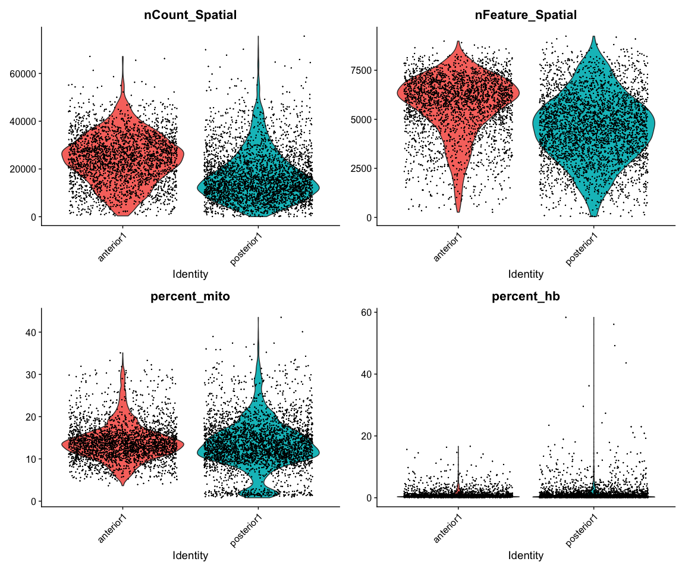
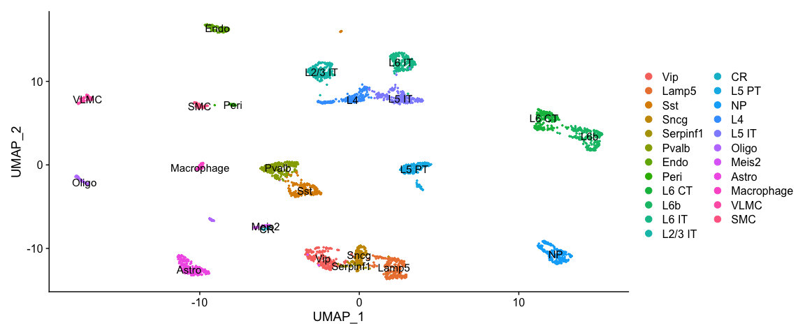

<style>
h1, .h1, h2, .h2, h3, .h3, h4, .h4 { margin-top: 50px }
p.caption {font-size: 0.9em;font-style: italic;color: grey;margin-right: 10%;margin-left: 10%;text-align: justify}
</style>

# Spatial transcriptomics
***

This tutorial is adapted from the Seurat vignette: https://satijalab.org/seurat/v3.2/spatial_vignette.html

Spatial transcriptomic data with the Visium platform is in many ways similar to scRNAseq data. It contains UMI counts for 5-20 cells instead of single cells, but is still quite sparse in the same way as scRNAseq data is, but with the additional information about spatial location in the tissue. 

Here we will first run quality control in a similar manner to scRNAseq data, then QC filtering, dimensionality reduction, integration and clustering. Then we will use scRNAseq data from mouse cortex to run LabelTransfer to predict celltypes in the Visium spots. 

We will use two **Visium** spatial transcriptomics dataset of the mouse brain (Sagittal), which are publicly available from the [10x genomics website](https://support.10xgenomics.com/spatial-gene-expression/datasets/). Note, that these dataset have already been filtered for spots that does not overlap with the tissue.

### Load packages


```r
devtools::install_github("satijalab/seurat-data")
```

```
## 
##   
   checking for file ‘/tmp/RtmpcVJCPY/remotes118eae37e56/satijalab-seurat-data-c633765/DESCRIPTION’ ...
  
✔  checking for file ‘/tmp/RtmpcVJCPY/remotes118eae37e56/satijalab-seurat-data-c633765/DESCRIPTION’ (561ms)
## 
  
─  preparing ‘SeuratData’:
## 
  
   checking DESCRIPTION meta-information ...
  
✔  checking DESCRIPTION meta-information
## 
  
─  checking for LF line-endings in source and make files and shell scripts (385ms)
## 
  
─  checking for empty or unneeded directories
## 
  
─  building ‘SeuratData_0.2.1.tar.gz’
## 
  
   
## 
```

```r
suppressPackageStartupMessages(require(Matrix))
suppressPackageStartupMessages(require(dplyr))
suppressPackageStartupMessages(require(SeuratData))
suppressPackageStartupMessages(require(Seurat))
suppressPackageStartupMessages(require(ggplot2))
suppressPackageStartupMessages(require(patchwork))
suppressPackageStartupMessages(require(dplyr))
```


### Load ST data

The package `SeuratData` has some seurat objects for different datasets. Among those are spatial transcriptomics data from mouse brain and kidney. Here we will download and process sections from the mouse brain. 


```r
outdir = "data/spatial/"
dir.create(outdir, showWarnings = F)

# to list available datasets in SeuratData you can run AvailableData()

# first we dowload the dataset
InstallData("stxBrain")

## Check again that it works, did not work at first...


# now we can list what datasets we have downloaded
InstalledData()
```

<div data-pagedtable="false">
  <script data-pagedtable-source type="application/json">
{"columns":[{"label":[""],"name":["_rn_"],"type":[""],"align":["left"]},{"label":["Dataset"],"name":[1],"type":["chr"],"align":["left"]},{"label":["Version"],"name":[2],"type":["pckg_vrs"],"align":["right"]},{"label":["Summary"],"name":[3],"type":["chr"],"align":["left"]},{"label":["seurat"],"name":[4],"type":["chr"],"align":["left"]},{"label":["species"],"name":[5],"type":["chr"],"align":["left"]},{"label":["system"],"name":[6],"type":["chr"],"align":["left"]},{"label":["ncells"],"name":[7],"type":["dbl"],"align":["right"]},{"label":["tech"],"name":[8],"type":["chr"],"align":["left"]},{"label":["default.dataset"],"name":[9],"type":["chr"],"align":["left"]},{"label":["disk.datasets"],"name":[10],"type":["chr"],"align":["left"]},{"label":["other.datasets"],"name":[11],"type":["chr"],"align":["left"]},{"label":["notes"],"name":[12],"type":["chr"],"align":["left"]},{"label":["Installed"],"name":[13],"type":["lgl"],"align":["right"]},{"label":["InstalledVersion"],"name":[14],"type":["pckg_vrs"],"align":["right"]}],"data":[{"1":"stxBrain","2":"<pckg_vrs>","3":"10X Genomics Visium Mouse Brain Dataset","4":"NA","5":"mouse","6":"brain","7":"12167","8":"visium","9":"__NA__","10":"NA","11":"posterior1, posterior2, anterior1, anterior2","12":"One sample split across four datasets as paired anterior/posterior slices","13":"TRUE","14":"<pckg_vrs>","_rn_":"stxBrain.SeuratData"}],"options":{"columns":{"min":{},"max":[10]},"rows":{"min":[10],"max":[10]},"pages":{}}}
  </script>
</div>

```r
# now we will load the seurat object for one section
brain1 <- LoadData("stxBrain", type = "anterior1")
brain2 <- LoadData("stxBrain", type = "posterior1")
```

Merge into one seurat object


```r
brain <- merge(brain1, brain2)

brain
```

```
## An object of class Seurat 
## 31053 features across 6049 samples within 1 assay 
## Active assay: Spatial (31053 features, 0 variable features)
```

As you can see, now we do not have the assay "RNA", but instead an assay called "Spatial". 


##Quality control
***

Similar to scRNAseq we use statistics on number of counts, number of features and percent mitochondria for quality control. 

Now the counts and feature counts are calculated on the Spatial assay, so they are named  "nCount_Spatial" and "nFeature_Spatial".


```r
brain <- PercentageFeatureSet(brain, "^mt-", col.name = "percent_mito")
brain <- PercentageFeatureSet(brain, "^Hb.*-", col.name = "percent_hb")


VlnPlot(brain, features = c("nCount_Spatial", "nFeature_Spatial", "percent_mito", 
    "percent_hb"), pt.size = 0.1, ncol = 2) + NoLegend()
```

<!-- -->

We can also plot the same data onto the tissue section.


```r
SpatialFeaturePlot(brain, features = c("nCount_Spatial", "nFeature_Spatial", "percent_mito", 
    "percent_hb"))
```

<!-- -->


As you can see, the spots with low number of counts/features and high mitochondrial content is mainly towards the edges of the tissue. It is quite likely that these regions are damaged tissue. You may also see regions within a tissue with low quality if you have tears or folds in your section. 

But remember, for some tissue types, the amount of genes expressed and proportion mitochondria may also be a biological features, so bear in mind what tissue you are working on and what these features mean.

### Filter

Select all spots with less than 25% mitocondrial reads, less than 20% hb-reads and 1000 detected genes. You must judge for yourself based on your knowledge of the tissue what are appropriate filtering criteria for your dataset.


```r
brain = brain[, brain$nFeature_Spatial > 500 & brain$percent_mito < 25 & brain$percent_hb < 
    20]
```

And replot onto tissue section:


```r
SpatialFeaturePlot(brain, features = c("nCount_Spatial", "nFeature_Spatial", "percent_mito"))
```

<!-- -->

### Top expressed genes
As for scRNAseq data, we will look at what the top expressed genes are.


```r
C = brain@assays$Spatial@counts
C@x = C@x/rep.int(colSums(C), diff(C@p))
most_expressed <- order(Matrix::rowSums(C), decreasing = T)[20:1]
boxplot(as.matrix(t(C[most_expressed, ])), cex = 0.1, las = 1, xlab = "% total count per cell", 
    col = (scales::hue_pal())(20)[20:1], horizontal = TRUE)
```

<!-- -->

As you can see, the mitochondrial genes are among the top expressed. Also the lncRNA gene Bc1 (brain cytoplasmic RNA 1). Also one hemoglobin gene.

### Filter genes
We will remove the Bc1 gene, hemoglobin genes (blood contamination) and the mitochondrial genes.


```r
dim(brain)
```

```
## [1] 31053  5789
```

```r
# Filter Bl1
brain <- brain[!grepl("Bc1", rownames(brain)), ]

# Filter Mitocondrial
brain <- brain[!grepl("^mt-", rownames(brain)), ]

# Filter Hemoglobin gene (optional if that is a problem on your data)
brain <- brain[!grepl("^Hb.*-", rownames(brain)), ]

dim(brain)
```

```
## [1] 31031  5789
```

## Analysis
***

For ST data, the Seurat team recommends to use SCTranform for normalization, so we will do that. `SCTransform` will select variable genes and normalize in one step.


```r
brain <- SCTransform(brain, assay = "Spatial", verbose = TRUE, method = "poisson")
```

```
## 
  |                                                                            
  |                                                                      |   0%
  |                                                                            
  |==================                                                    |  25%
  |                                                                            
  |===================================                                   |  50%
  |                                                                            
  |====================================================                  |  75%
  |                                                                            
  |======================================================================| 100%
## 
  |                                                                            
  |                                                                      |   0%
  |                                                                            
  |==                                                                    |   3%
  |                                                                            
  |====                                                                  |   5%
  |                                                                            
  |======                                                                |   8%
  |                                                                            
  |=======                                                               |  11%
  |                                                                            
  |=========                                                             |  13%
  |                                                                            
  |===========                                                           |  16%
  |                                                                            
  |=============                                                         |  18%
  |                                                                            
  |===============                                                       |  21%
  |                                                                            
  |=================                                                     |  24%
  |                                                                            
  |==================                                                    |  26%
  |                                                                            
  |====================                                                  |  29%
  |                                                                            
  |======================                                                |  32%
  |                                                                            
  |========================                                              |  34%
  |                                                                            
  |==========================                                            |  37%
  |                                                                            
  |============================                                          |  39%
  |                                                                            
  |=============================                                         |  42%
  |                                                                            
  |===============================                                       |  45%
  |                                                                            
  |=================================                                     |  47%
  |                                                                            
  |===================================                                   |  50%
  |                                                                            
  |=====================================                                 |  53%
  |                                                                            
  |=======================================                               |  55%
  |                                                                            
  |=========================================                             |  58%
  |                                                                            
  |==========================================                            |  61%
  |                                                                            
  |============================================                          |  63%
  |                                                                            
  |==============================================                        |  66%
  |                                                                            
  |================================================                      |  68%
  |                                                                            
  |==================================================                    |  71%
  |                                                                            
  |====================================================                  |  74%
  |                                                                            
  |=====================================================                 |  76%
  |                                                                            
  |=======================================================               |  79%
  |                                                                            
  |=========================================================             |  82%
  |                                                                            
  |===========================================================           |  84%
  |                                                                            
  |=============================================================         |  87%
  |                                                                            
  |===============================================================       |  89%
  |                                                                            
  |================================================================      |  92%
  |                                                                            
  |==================================================================    |  95%
  |                                                                            
  |====================================================================  |  97%
  |                                                                            
  |======================================================================| 100%
## 
  |                                                                            
  |                                                                      |   0%
  |                                                                            
  |==                                                                    |   3%
  |                                                                            
  |====                                                                  |   5%
  |                                                                            
  |======                                                                |   8%
  |                                                                            
  |=======                                                               |  11%
  |                                                                            
  |=========                                                             |  13%
  |                                                                            
  |===========                                                           |  16%
  |                                                                            
  |=============                                                         |  18%
  |                                                                            
  |===============                                                       |  21%
  |                                                                            
  |=================                                                     |  24%
  |                                                                            
  |==================                                                    |  26%
  |                                                                            
  |====================                                                  |  29%
  |                                                                            
  |======================                                                |  32%
  |                                                                            
  |========================                                              |  34%
  |                                                                            
  |==========================                                            |  37%
  |                                                                            
  |============================                                          |  39%
  |                                                                            
  |=============================                                         |  42%
  |                                                                            
  |===============================                                       |  45%
  |                                                                            
  |=================================                                     |  47%
  |                                                                            
  |===================================                                   |  50%
  |                                                                            
  |=====================================                                 |  53%
  |                                                                            
  |=======================================                               |  55%
  |                                                                            
  |=========================================                             |  58%
  |                                                                            
  |==========================================                            |  61%
  |                                                                            
  |============================================                          |  63%
  |                                                                            
  |==============================================                        |  66%
  |                                                                            
  |================================================                      |  68%
  |                                                                            
  |==================================================                    |  71%
  |                                                                            
  |====================================================                  |  74%
  |                                                                            
  |=====================================================                 |  76%
  |                                                                            
  |=======================================================               |  79%
  |                                                                            
  |=========================================================             |  82%
  |                                                                            
  |===========================================================           |  84%
  |                                                                            
  |=============================================================         |  87%
  |                                                                            
  |===============================================================       |  89%
  |                                                                            
  |================================================================      |  92%
  |                                                                            
  |==================================================================    |  95%
  |                                                                            
  |====================================================================  |  97%
  |                                                                            
  |======================================================================| 100%
```


Now we can plot gene expression of individual genes, the gene Hpca is a strong hippocampal marker and Ttr is a marker of the choroid plexus.


```r
SpatialFeaturePlot(brain, features = c("Hpca", "Ttr"))
```

<!-- -->

If you want to see the tissue better you can modify point size and transparancy of the points.


```r
SpatialFeaturePlot(brain, features = "Ttr", pt.size.factor = 1, alpha = c(0.1, 1))
```

<!-- -->


### Dimensionality reduction and clustering
We can then now run dimensionality reduction and clustering using the same workflow as we use for scRNA-seq analysis. 

But make sure you run it on the `SCT` assay.


```r
brain <- RunPCA(brain, assay = "SCT", verbose = FALSE)
brain <- FindNeighbors(brain, reduction = "pca", dims = 1:30)
brain <- FindClusters(brain, verbose = FALSE)
brain <- RunUMAP(brain, reduction = "pca", dims = 1:30)
```

We can then plot clusters onto umap or onto the tissue section.


```r
DimPlot(brain, reduction = "umap", group.by = c("ident", "orig.ident"))
```

<!-- -->

```r
SpatialDimPlot(brain)
```

<!-- -->

We can also plot each cluster separately


```r
SpatialDimPlot(brain, cells.highlight = CellsByIdentities(brain), facet.highlight = TRUE, 
    ncol = 5)
```

<!-- -->

## Integration

Quite often there are strong batch effects between different ST sections, so it may be a good idea to integrate the data across sections.

We will do a similar integration as in the Data Integration lab, but this time we will use the SCT assay for integration. Therefore we need to run `PrepSCTIntegration` which will compute the sctransform residuals for all genes in both the datasets. 


```r
# create a list of the original data that we loaded to start with
st.list = list(anterior1 = brain1, posterior1 = brain2)

# run SCT on both datasets
st.list = lapply(st.list, SCTransform, assay = "Spatial", method = "poisson")
```

```
## 
  |                                                                            
  |                                                                      |   0%
  |                                                                            
  |==================                                                    |  25%
  |                                                                            
  |===================================                                   |  50%
  |                                                                            
  |====================================================                  |  75%
  |                                                                            
  |======================================================================| 100%
## 
  |                                                                            
  |                                                                      |   0%
  |                                                                            
  |==                                                                    |   3%
  |                                                                            
  |====                                                                  |   6%
  |                                                                            
  |======                                                                |   8%
  |                                                                            
  |========                                                              |  11%
  |                                                                            
  |==========                                                            |  14%
  |                                                                            
  |============                                                          |  17%
  |                                                                            
  |==============                                                        |  19%
  |                                                                            
  |================                                                      |  22%
  |                                                                            
  |==================                                                    |  25%
  |                                                                            
  |===================                                                   |  28%
  |                                                                            
  |=====================                                                 |  31%
  |                                                                            
  |=======================                                               |  33%
  |                                                                            
  |=========================                                             |  36%
  |                                                                            
  |===========================                                           |  39%
  |                                                                            
  |=============================                                         |  42%
  |                                                                            
  |===============================                                       |  44%
  |                                                                            
  |=================================                                     |  47%
  |                                                                            
  |===================================                                   |  50%
  |                                                                            
  |=====================================                                 |  53%
  |                                                                            
  |=======================================                               |  56%
  |                                                                            
  |=========================================                             |  58%
  |                                                                            
  |===========================================                           |  61%
  |                                                                            
  |=============================================                         |  64%
  |                                                                            
  |===============================================                       |  67%
  |                                                                            
  |=================================================                     |  69%
  |                                                                            
  |===================================================                   |  72%
  |                                                                            
  |====================================================                  |  75%
  |                                                                            
  |======================================================                |  78%
  |                                                                            
  |========================================================              |  81%
  |                                                                            
  |==========================================================            |  83%
  |                                                                            
  |============================================================          |  86%
  |                                                                            
  |==============================================================        |  89%
  |                                                                            
  |================================================================      |  92%
  |                                                                            
  |==================================================================    |  94%
  |                                                                            
  |====================================================================  |  97%
  |                                                                            
  |======================================================================| 100%
## 
  |                                                                            
  |                                                                      |   0%
  |                                                                            
  |==                                                                    |   3%
  |                                                                            
  |====                                                                  |   6%
  |                                                                            
  |======                                                                |   8%
  |                                                                            
  |========                                                              |  11%
  |                                                                            
  |==========                                                            |  14%
  |                                                                            
  |============                                                          |  17%
  |                                                                            
  |==============                                                        |  19%
  |                                                                            
  |================                                                      |  22%
  |                                                                            
  |==================                                                    |  25%
  |                                                                            
  |===================                                                   |  28%
  |                                                                            
  |=====================                                                 |  31%
  |                                                                            
  |=======================                                               |  33%
  |                                                                            
  |=========================                                             |  36%
  |                                                                            
  |===========================                                           |  39%
  |                                                                            
  |=============================                                         |  42%
  |                                                                            
  |===============================                                       |  44%
  |                                                                            
  |=================================                                     |  47%
  |                                                                            
  |===================================                                   |  50%
  |                                                                            
  |=====================================                                 |  53%
  |                                                                            
  |=======================================                               |  56%
  |                                                                            
  |=========================================                             |  58%
  |                                                                            
  |===========================================                           |  61%
  |                                                                            
  |=============================================                         |  64%
  |                                                                            
  |===============================================                       |  67%
  |                                                                            
  |=================================================                     |  69%
  |                                                                            
  |===================================================                   |  72%
  |                                                                            
  |====================================================                  |  75%
  |                                                                            
  |======================================================                |  78%
  |                                                                            
  |========================================================              |  81%
  |                                                                            
  |==========================================================            |  83%
  |                                                                            
  |============================================================          |  86%
  |                                                                            
  |==============================================================        |  89%
  |                                                                            
  |================================================================      |  92%
  |                                                                            
  |==================================================================    |  94%
  |                                                                            
  |====================================================================  |  97%
  |                                                                            
  |======================================================================| 100%
## 
  |                                                                            
  |                                                                      |   0%
  |                                                                            
  |==================                                                    |  25%
  |                                                                            
  |===================================                                   |  50%
  |                                                                            
  |====================================================                  |  75%
  |                                                                            
  |======================================================================| 100%
## 
  |                                                                            
  |                                                                      |   0%
  |                                                                            
  |==                                                                    |   3%
  |                                                                            
  |====                                                                  |   6%
  |                                                                            
  |======                                                                |   8%
  |                                                                            
  |========                                                              |  11%
  |                                                                            
  |==========                                                            |  14%
  |                                                                            
  |============                                                          |  17%
  |                                                                            
  |==============                                                        |  19%
  |                                                                            
  |================                                                      |  22%
  |                                                                            
  |==================                                                    |  25%
  |                                                                            
  |===================                                                   |  28%
  |                                                                            
  |=====================                                                 |  31%
  |                                                                            
  |=======================                                               |  33%
  |                                                                            
  |=========================                                             |  36%
  |                                                                            
  |===========================                                           |  39%
  |                                                                            
  |=============================                                         |  42%
  |                                                                            
  |===============================                                       |  44%
  |                                                                            
  |=================================                                     |  47%
  |                                                                            
  |===================================                                   |  50%
  |                                                                            
  |=====================================                                 |  53%
  |                                                                            
  |=======================================                               |  56%
  |                                                                            
  |=========================================                             |  58%
  |                                                                            
  |===========================================                           |  61%
  |                                                                            
  |=============================================                         |  64%
  |                                                                            
  |===============================================                       |  67%
  |                                                                            
  |=================================================                     |  69%
  |                                                                            
  |===================================================                   |  72%
  |                                                                            
  |====================================================                  |  75%
  |                                                                            
  |======================================================                |  78%
  |                                                                            
  |========================================================              |  81%
  |                                                                            
  |==========================================================            |  83%
  |                                                                            
  |============================================================          |  86%
  |                                                                            
  |==============================================================        |  89%
  |                                                                            
  |================================================================      |  92%
  |                                                                            
  |==================================================================    |  94%
  |                                                                            
  |====================================================================  |  97%
  |                                                                            
  |======================================================================| 100%
## 
  |                                                                            
  |                                                                      |   0%
  |                                                                            
  |==                                                                    |   3%
  |                                                                            
  |====                                                                  |   6%
  |                                                                            
  |======                                                                |   8%
  |                                                                            
  |========                                                              |  11%
  |                                                                            
  |==========                                                            |  14%
  |                                                                            
  |============                                                          |  17%
  |                                                                            
  |==============                                                        |  19%
  |                                                                            
  |================                                                      |  22%
  |                                                                            
  |==================                                                    |  25%
  |                                                                            
  |===================                                                   |  28%
  |                                                                            
  |=====================                                                 |  31%
  |                                                                            
  |=======================                                               |  33%
  |                                                                            
  |=========================                                             |  36%
  |                                                                            
  |===========================                                           |  39%
  |                                                                            
  |=============================                                         |  42%
  |                                                                            
  |===============================                                       |  44%
  |                                                                            
  |=================================                                     |  47%
  |                                                                            
  |===================================                                   |  50%
  |                                                                            
  |=====================================                                 |  53%
  |                                                                            
  |=======================================                               |  56%
  |                                                                            
  |=========================================                             |  58%
  |                                                                            
  |===========================================                           |  61%
  |                                                                            
  |=============================================                         |  64%
  |                                                                            
  |===============================================                       |  67%
  |                                                                            
  |=================================================                     |  69%
  |                                                                            
  |===================================================                   |  72%
  |                                                                            
  |====================================================                  |  75%
  |                                                                            
  |======================================================                |  78%
  |                                                                            
  |========================================================              |  81%
  |                                                                            
  |==========================================================            |  83%
  |                                                                            
  |============================================================          |  86%
  |                                                                            
  |==============================================================        |  89%
  |                                                                            
  |================================================================      |  92%
  |                                                                            
  |==================================================================    |  94%
  |                                                                            
  |====================================================================  |  97%
  |                                                                            
  |======================================================================| 100%
```

```r
# need to set maxSize for PrepSCTIntegration to work
options(future.globals.maxSize = 2000 * 1024^2)  # set allowed size to 2K MiB


st.features = SelectIntegrationFeatures(st.list, nfeatures = 3000, verbose = FALSE)
st.list <- PrepSCTIntegration(object.list = st.list, anchor.features = st.features, 
    verbose = FALSE)
```

Now we can perform the actual integraion.


```r
int.anchors <- FindIntegrationAnchors(object.list = st.list, normalization.method = "SCT", 
    verbose = FALSE, anchor.features = st.features)
brain.integrated <- IntegrateData(anchorset = int.anchors, normalization.method = "SCT", 
    verbose = FALSE)

rm(int.anchors, st.list)
gc()
```

```
##             used   (Mb) gc trigger   (Mb)   max used   (Mb)
## Ncells   2857164  152.6    4702831  251.2    4702831  251.2
## Vcells 575106704 4387.8 1278197190 9751.9 1065002088 8125.4
```

Then we run dimensionality reduction and clustering as before.


```r
brain.integrated <- RunPCA(brain.integrated, verbose = FALSE)
brain.integrated <- FindNeighbors(brain.integrated, dims = 1:30)
brain.integrated <- FindClusters(brain.integrated, verbose = FALSE)
brain.integrated <- RunUMAP(brain.integrated, dims = 1:30)
```


```r
DimPlot(brain.integrated, reduction = "umap", group.by = c("ident", "orig.ident"))
```

<!-- -->

```r
SpatialDimPlot(brain.integrated)
```

<!-- -->

Do you see any differences between the integrated and non-integrated clusering? Judge for yourself, which of the clusterings do you think looks best? 
As a reference, you can compare to brain regions in the [Allen brain atlas](https://mouse.brain-map.org/experiment/thumbnails/100042147?image_type=atlas). 

## Identification of Spatially Variable Features

 There are two main workflows to identify molecular features that correlate with spatial location within a tissue. The first is to perform differential expression based on spatially distinct clusters, the other is to find features that are have spatial patterning without taking clusters or spatial annotation into account. 

First, we will do differential expression between clusters just as we did for the scRNAseq data before.


```r
# differential expression between cluster 1 and cluster 6
de_markers <- FindMarkers(brain.integrated, ident.1 = 5, ident.2 = 6)

# plot top markers
SpatialFeaturePlot(object = brain.integrated, features = rownames(de_markers)[1:3], 
    alpha = c(0.1, 1), ncol = 3)
```

<!-- -->


In `FindSpatiallyVariables` the default method in Seurat (method = 'markvariogram), is inspired by the Trendsceek, which models spatial transcriptomics data as a mark point process and computes a 'variogram', which identifies genes whose expression level is dependent on their spatial location. More specifically, this process calculates gamma(r) values measuring the dependence between two spots a certain "r" distance apart. By default, we use an r-value of '5' in these analyes, and only compute these values for variable genes (where variation is calculated independently of spatial location) to save time.


**OBS!** Takes a long time to run, so skip this step for now!


```r
# brain <- FindSpatiallyVariableFeatures(brain, assay = 'SCT', features =
# VariableFeatures(brain)[1:1000], selection.method = 'markvariogram')

# We would get top features from SpatiallyVariableFeatures top.features <-
# head(SpatiallyVariableFeatures(brain, selection.method = 'markvariogram'), 6)
```


## Single cell data

We can also perform data integration between one scRNA-seq dataset and one spatial transcriptomics dataset. Such task is particularly useful because it allows us to transfer cell type labels to the Visium dataset, which were dentified from the scRNA-seq dataset. 

We will use a reference scRNA-seq dataset of ~14,000 adult mouse cortical cell taxonomy from the Allen Institute, generated with the SMART-Seq2 protocol.


First dowload the seurat data from: https://www.dropbox.com/s/cuowvm4vrf65pvq/allen_cortex.rds?dl=1 to folder `data/spatial/` with command:


```bash

FILE="./data/spatial/allen_cortex.rds"

if [ -e $FILE ]
then
   echo "File $FILE is downloaded."
else
   echo "Downloading $FILE"
   mkdir -p data/spatial
   wget  -O data/spatial/allen_cortex.rds https://www.dropbox.com/s/cuowvm4vrf65pvq/allen_cortex.rds?dl=1
fi

```

```
## Downloading ./data/spatial/allen_cortex.rds
## --2021-01-22 11:19:48--  https://www.dropbox.com/s/cuowvm4vrf65pvq/allen_cortex.rds?dl=1
## Resolving www.dropbox.com (www.dropbox.com)... 162.125.70.18, 2620:100:6026:18::a27d:4612
## Connecting to www.dropbox.com (www.dropbox.com)|162.125.70.18|:443... connected.
## HTTP request sent, awaiting response... 301 Moved Permanently
## Location: /s/dl/cuowvm4vrf65pvq/allen_cortex.rds [following]
## --2021-01-22 11:19:49--  https://www.dropbox.com/s/dl/cuowvm4vrf65pvq/allen_cortex.rds
## Reusing existing connection to www.dropbox.com:443.
## HTTP request sent, awaiting response... 302 Found
## Location: https://uc353ad888192c727d173353a5d9.dl.dropboxusercontent.com/cd/0/get/BHf6w5sZkjMQvjMCwztU5VlX9cEbsr4P40ZZ61CzXGuGf-w-aioz8A5ObGykigG-7kwYibJhMXl_KCBBdvv_isLy-O5DIE3tXEbHA3Z7_PZ4TtnsZVJsvkRGRjJtwgF4sz8/file?dl=1# [following]
## --2021-01-22 11:19:49--  https://uc353ad888192c727d173353a5d9.dl.dropboxusercontent.com/cd/0/get/BHf6w5sZkjMQvjMCwztU5VlX9cEbsr4P40ZZ61CzXGuGf-w-aioz8A5ObGykigG-7kwYibJhMXl_KCBBdvv_isLy-O5DIE3tXEbHA3Z7_PZ4TtnsZVJsvkRGRjJtwgF4sz8/file?dl=1
## Resolving uc353ad888192c727d173353a5d9.dl.dropboxusercontent.com (uc353ad888192c727d173353a5d9.dl.dropboxusercontent.com)... 162.125.70.15, 2620:100:6026:15::a27d:460f
## Connecting to uc353ad888192c727d173353a5d9.dl.dropboxusercontent.com (uc353ad888192c727d173353a5d9.dl.dropboxusercontent.com)|162.125.70.15|:443... connected.
## HTTP request sent, awaiting response... 200 OK
## Length: 1038315197 (990M) [application/binary]
## Saving to: ‘data/spatial/allen_cortex.rds’
## 
##      0K .......... .......... .......... .......... ..........  0% 3.11M 5m18s
##     50K .......... .......... .......... .......... ..........  0% 2.62M 5m48s
##    100K .......... .......... .......... .......... ..........  0% 2.13M 6m28s
##    150K .......... .......... .......... .......... ..........  0% 1.85M 7m4s
##    200K .......... .......... .......... .......... ..........  0% 3.81M 6m32s
##    250K .......... .......... .......... .......... ..........  0% 2.55M 6m31s
##    300K .......... .......... .......... .......... ..........  0% 1.38M 7m18s
##    350K .......... .......... .......... .......... ..........  0% 2.84M 7m7s
##    400K .......... .......... .......... .......... ..........  0% 2.21M 7m9s
##    450K .......... .......... .......... .......... ..........  0% 3.02M 6m59s
##    500K .......... .......... .......... .......... ..........  0% 3.19M 6m49s
##    550K .......... .......... .......... .......... ..........  0% 2.13M 6m54s
##    600K .......... .......... .......... .......... ..........  0% 2.02M 7m0s
##    650K .......... .......... .......... .......... ..........  0% 6.35M 6m41s
##    700K .......... .......... .......... .......... ..........  0% 2.48M 6m41s
##    750K .......... .......... .......... .......... ..........  0% 8.24M 6m23s
##    800K .......... .......... .......... .......... ..........  0% 4.55M 6m13s
##    850K .......... .......... .......... .......... ..........  0% 6.93M 6m1s
##    900K .......... .......... .......... .......... ..........  0% 5.37M 5m51s
##    950K .......... .......... .......... .......... ..........  0% 5.82M 5m42s
##   1000K .......... .......... .......... .......... ..........  0% 8.08M 5m32s
##   1050K .......... .......... .......... .......... ..........  0% 4.37M 5m27s
##   1100K .......... .......... .......... .......... ..........  0% 1.85M 5m36s
##   1150K .......... .......... .......... .......... ..........  0% 3.11M 5m35s
##   1200K .......... .......... .......... .......... ..........  0% 8.38M 5m26s
##   1250K .......... .......... .......... .......... ..........  0% 6.04M 5m20s
##   1300K .......... .......... .......... .......... ..........  0% 3.94M 5m18s
##   1350K .......... .......... .......... .......... ..........  0% 3.28M 5m17s
##   1400K .......... .......... .......... .......... ..........  0% 7.88M 5m10s
##   1450K .......... .......... .......... .......... ..........  0% 6.40M 5m5s
##   1500K .......... .......... .......... .......... ..........  0% 2.90M 5m6s
##   1550K .......... .......... .......... .......... ..........  0% 3.58M 5m5s
##   1600K .......... .......... .......... .......... ..........  0% 3.46M 5m5s
##   1650K .......... .......... .......... .......... ..........  0% 7.83M 4m59s
##   1700K .......... .......... .......... .......... ..........  0% 3.55M 4m59s
##   1750K .......... .......... .......... .......... ..........  0% 3.48M 4m58s
##   1800K .......... .......... .......... .......... ..........  0% 9.40M 4m53s
##   1850K .......... .......... .......... .......... ..........  0% 5.17M 4m50s
##   1900K .......... .......... .......... .......... ..........  0% 6.84M 4m47s
##   1950K .......... .......... .......... .......... ..........  0% 4.18M 4m45s
##   2000K .......... .......... .......... .......... ..........  0% 3.23M 4m46s
##   2050K .......... .......... .......... .......... ..........  0% 7.04M 4m42s
##   2100K .......... .......... .......... .......... ..........  0% 3.71M 4m42s
##   2150K .......... .......... .......... .......... ..........  0% 2.81M 4m44s
##   2200K .......... .......... .......... .......... ..........  0% 8.61M 4m40s
##   2250K .......... .......... .......... .......... ..........  0% 4.40M 4m39s
##   2300K .......... .......... .......... .......... ..........  0% 5.51M 4m37s
##   2350K .......... .......... .......... .......... ..........  0% 4.55M 4m35s
##   2400K .......... .......... .......... .......... ..........  0% 4.41M 4m34s
##   2450K .......... .......... .......... .......... ..........  0% 4.22M 4m33s
##   2500K .......... .......... .......... .......... ..........  0%  779K 4m53s
##   2550K .......... .......... .......... .......... ..........  0% 4.08M 4m52s
##   2600K .......... .......... .......... .......... ..........  0% 5.42M 4m50s
##   2650K .......... .......... .......... .......... ..........  0% 2.04M 4m54s
##   2700K .......... .......... .......... .......... ..........  0% 5.72M 4m52s
##   2750K .......... .......... .......... .......... ..........  0% 4.11M 4m51s
##   2800K .......... .......... .......... .......... ..........  0% 3.23M 4m51s
##   2850K .......... .......... .......... .......... ..........  0% 7.11M 4m48s
##   2900K .......... .......... .......... .......... ..........  0% 5.11M 4m47s
##   2950K .......... .......... .......... .......... ..........  0% 3.25M 4m47s
##   3000K .......... .......... .......... .......... ..........  0% 3.25M 4m47s
##   3050K .......... .......... .......... .......... ..........  0% 3.62M 4m47s
##   3100K .......... .......... .......... .......... ..........  0% 3.07M 4m48s
##   3150K .......... .......... .......... .......... ..........  0% 3.88M 4m47s
##   3200K .......... .......... .......... .......... ..........  0% 3.72M 4m47s
##   3250K .......... .......... .......... .......... ..........  0% 2.54M 4m48s
##   3300K .......... .......... .......... .......... ..........  0% 1.67M 4m53s
##   3350K .......... .......... .......... .......... ..........  0% 2.93M 4m53s
##   3400K .......... .......... .......... .......... ..........  0% 7.08M 4m51s
##   3450K .......... .......... .......... .......... ..........  0% 2.80M 4m52s
##   3500K .......... .......... .......... .......... ..........  0% 4.53M 4m51s
##   3550K .......... .......... .......... .......... ..........  0% 4.64M 4m50s
##   3600K .......... .......... .......... .......... ..........  0% 4.82M 4m49s
##   3650K .......... .......... .......... .......... ..........  0% 4.38M 4m48s
##   3700K .......... .......... .......... .......... ..........  0% 4.32M 4m47s
##   3750K .......... .......... .......... .......... ..........  0% 2.77M 4m48s
##   3800K .......... .......... .......... .......... ..........  0% 5.32M 4m47s
##   3850K .......... .......... .......... .......... ..........  0% 5.29M 4m45s
##   3900K .......... .......... .......... .......... ..........  0% 3.65M 4m45s
##   3950K .......... .......... .......... .......... ..........  0% 4.03M 4m45s
##   4000K .......... .......... .......... .......... ..........  0% 5.71M 4m43s
##   4050K .......... .......... .......... .......... ..........  0% 5.20M 4m42s
##   4100K .......... .......... .......... .......... ..........  0% 3.49M 4m42s
##   4150K .......... .......... .......... .......... ..........  0% 2.76M 4m43s
##   4200K .......... .......... .......... .......... ..........  0% 2.87M 4m44s
##   4250K .......... .......... .......... .......... ..........  0% 5.29M 4m42s
##   4300K .......... .......... .......... .......... ..........  0% 3.52M 4m42s
##   4350K .......... .......... .......... .......... ..........  0% 4.19M 4m42s
##   4400K .......... .......... .......... .......... ..........  0% 7.15M 4m40s
##   4450K .......... .......... .......... .......... ..........  0% 3.03M 4m41s
##   4500K .......... .......... .......... .......... ..........  0% 5.92M 4m39s
##   4550K .......... .......... .......... .......... ..........  0% 2.58M 4m40s
##   4600K .......... .......... .......... .......... ..........  0% 3.46M 4m41s
##   4650K .......... .......... .......... .......... ..........  0% 5.71M 4m39s
##   4700K .......... .......... .......... .......... ..........  0% 5.74M 4m38s
##   4750K .......... .......... .......... .......... ..........  0% 3.55M 4m38s
##   4800K .......... .......... .......... .......... ..........  0% 5.59M 4m37s
##   4850K .......... .......... .......... .......... ..........  0% 7.14M 4m36s
##   4900K .......... .......... .......... .......... ..........  0% 5.32M 4m35s
##   4950K .......... .......... .......... .......... ..........  0% 3.55M 4m35s
##   5000K .......... .......... .......... .......... ..........  0% 1.55M 4m38s
##   5050K .......... .......... .......... .......... ..........  0% 3.36M 4m38s
##   5100K .......... .......... .......... .......... ..........  0% 4.15M 4m38s
##   5150K .......... .......... .......... .......... ..........  0% 5.73M 4m37s
##   5200K .......... .......... .......... .......... ..........  0% 3.25M 4m37s
##   5250K .......... .......... .......... .......... ..........  0% 9.23M 4m36s
##   5300K .......... .......... .......... .......... ..........  0% 4.82M 4m35s
##   5350K .......... .......... .......... .......... ..........  0% 2.22M 4m37s
##   5400K .......... .......... .......... .......... ..........  0%  378K 4m58s
##   5450K .......... .......... .......... .......... ..........  0% 9.88M 4m57s
##   5500K .......... .......... .......... .......... ..........  0% 3.42M 4m57s
##   5550K .......... .......... .......... .......... ..........  0% 5.87M 4m55s
##   5600K .......... .......... .......... .......... ..........  0% 5.78M 4m54s
##   5650K .......... .......... .......... .......... ..........  0% 7.18M 4m53s
##   5700K .......... .......... .......... .......... ..........  0% 4.06M 4m52s
##   5750K .......... .......... .......... .......... ..........  0% 3.73M 4m52s
##   5800K .......... .......... .......... .......... ..........  0% 3.44M 4m52s
##   5850K .......... .......... .......... .......... ..........  0% 4.99M 4m51s
##   5900K .......... .......... .......... .......... ..........  0% 4.88M 4m50s
##   5950K .......... .......... .......... .......... ..........  0% 3.45M 4m50s
##   6000K .......... .......... .......... .......... ..........  0% 3.06M 4m51s
##   6050K .......... .......... .......... .......... ..........  0% 6.04M 4m50s
##   6100K .......... .......... .......... .......... ..........  0% 4.57M 4m49s
##   6150K .......... .......... .......... .......... ..........  0% 4.41M 4m48s
##   6200K .......... .......... .......... .......... ..........  0% 3.66M 4m48s
##   6250K .......... .......... .......... .......... ..........  0% 2.66M 4m49s
##   6300K .......... .......... .......... .......... ..........  0% 5.13M 4m48s
##   6350K .......... .......... .......... .......... ..........  0% 3.62M 4m48s
##   6400K .......... .......... .......... .......... ..........  0% 4.77M 4m47s
##   6450K .......... .......... .......... .......... ..........  0% 5.53M 4m46s
##   6500K .......... .......... .......... .......... ..........  0% 5.64M 4m46s
##   6550K .......... .......... .......... .......... ..........  0% 4.28M 4m45s
##   6600K .......... .......... .......... .......... ..........  0% 4.72M 4m45s
##   6650K .......... .......... .......... .......... ..........  0% 4.21M 4m44s
##   6700K .......... .......... .......... .......... ..........  0% 2.76M 4m45s
##   6750K .......... .......... .......... .......... ..........  0% 4.00M 4m44s
##   6800K .......... .......... .......... .......... ..........  0% 3.56M 4m44s
##   6850K .......... .......... .......... .......... ..........  0% 4.06M 4m44s
##   6900K .......... .......... .......... .......... ..........  0% 4.83M 4m43s
##   6950K .......... .......... .......... .......... ..........  0% 4.68M 4m43s
##   7000K .......... .......... .......... .......... ..........  0% 5.92M 4m42s
##   7050K .......... .......... .......... .......... ..........  0% 4.05M 4m42s
##   7100K .......... .......... .......... .......... ..........  0% 2.33M 4m43s
##   7150K .......... .......... .......... .......... ..........  0% 5.26M 4m42s
##   7200K .......... .......... .......... .......... ..........  0% 3.32M 4m42s
##   7250K .......... .......... .......... .......... ..........  0% 3.69M 4m42s
##   7300K .......... .......... .......... .......... ..........  0% 6.04M 4m41s
##   7350K .......... .......... .......... .......... ..........  0% 3.79M 4m41s
##   7400K .......... .......... .......... .......... ..........  0% 4.78M 4m41s
##   7450K .......... .......... .......... .......... ..........  0% 8.18M 4m39s
##   7500K .......... .......... .......... .......... ..........  0% 3.73M 4m39s
##   7550K .......... .......... .......... .......... ..........  0% 3.02M 4m40s
##   7600K .......... .......... .......... .......... ..........  0% 4.51M 4m39s
##   7650K .......... .......... .......... .......... ..........  0% 3.19M 4m39s
##   7700K .......... .......... .......... .......... ..........  0% 8.03M 4m38s
##   7750K .......... .......... .......... .......... ..........  0% 2.86M 4m39s
##   7800K .......... .......... .......... .......... ..........  0% 5.38M 4m38s
##   7850K .......... .......... .......... .......... ..........  0% 6.27M 4m37s
##   7900K .......... .......... .......... .......... ..........  0% 3.87M 4m37s
##   7950K .......... .......... .......... .......... ..........  0% 1.90M 4m39s
##   8000K .......... .......... .......... .......... ..........  0% 11.3M 4m37s
##   8050K .......... .......... .......... .......... ..........  0% 3.08M 4m38s
##   8100K .......... .......... .......... .......... ..........  0% 5.18M 4m37s
##   8150K .......... .......... .......... .......... ..........  0% 3.65M 4m37s
##   8200K .......... .......... .......... .......... ..........  0% 6.14M 4m36s
##   8250K .......... .......... .......... .......... ..........  0% 7.88M 4m35s
##   8300K .......... .......... .......... .......... ..........  0% 5.55M 4m35s
##   8350K .......... .......... .......... .......... ..........  0% 4.89M 4m34s
##   8400K .......... .......... .......... .......... ..........  0% 2.81M 4m35s
##   8450K .......... .......... .......... .......... ..........  0% 4.11M 4m35s
##   8500K .......... .......... .......... .......... ..........  0% 6.91M 4m34s
##   8550K .......... .......... .......... .......... ..........  0% 1.89M 4m35s
##   8600K .......... .......... .......... .......... ..........  0% 8.26M 4m34s
##   8650K .......... .......... .......... .......... ..........  0% 4.97M 4m34s
##   8700K .......... .......... .......... .......... ..........  0% 5.92M 4m33s
##   8750K .......... .......... .......... .......... ..........  0%  998K 4m37s
##   8800K .......... .......... .......... .......... ..........  0% 3.15M 4m38s
##   8850K .......... .......... .......... .......... ..........  0% 8.16M 4m37s
##   8900K .......... .......... .......... .......... ..........  0% 4.49M 4m36s
##   8950K .......... .......... .......... .......... ..........  0% 3.51M 4m36s
##   9000K .......... .......... .......... .......... ..........  0% 4.64M 4m36s
##   9050K .......... .......... .......... .......... ..........  0% 3.56M 4m36s
##   9100K .......... .......... .......... .......... ..........  0% 2.81M 4m36s
##   9150K .......... .......... .......... .......... ..........  0% 3.59M 4m36s
##   9200K .......... .......... .......... .......... ..........  0% 2.35M 4m37s
##   9250K .......... .......... .......... .......... ..........  0% 7.03M 4m36s
##   9300K .......... .......... .......... .......... ..........  0% 5.03M 4m36s
##   9350K .......... .......... .......... .......... ..........  0% 3.40M 4m36s
##   9400K .......... .......... .......... .......... ..........  0% 4.22M 4m36s
##   9450K .......... .......... .......... .......... ..........  0% 3.44M 4m36s
##   9500K .......... .......... .......... .......... ..........  0% 2.71M 4m36s
##   9550K .......... .......... .......... .......... ..........  0% 5.56M 4m36s
##   9600K .......... .......... .......... .......... ..........  0% 3.07M 4m36s
##   9650K .......... .......... .......... .......... ..........  0% 2.86M 4m36s
##   9700K .......... .......... .......... .......... ..........  0% 4.35M 4m36s
##   9750K .......... .......... .......... .......... ..........  0% 3.77M 4m36s
##   9800K .......... .......... .......... .......... ..........  0% 3.26M 4m36s
##   9850K .......... .......... .......... .......... ..........  0% 4.25M 4m36s
##   9900K .......... .......... .......... .......... ..........  0% 3.50M 4m36s
##   9950K .......... .......... .......... .......... ..........  0% 5.82M 4m35s
##  10000K .......... .......... .......... .......... ..........  0% 3.72M 4m35s
##  10050K .......... .......... .......... .......... ..........  0% 5.38M 4m35s
##  10100K .......... .......... .......... .......... ..........  1% 4.07M 4m34s
##  10150K .......... .......... .......... .......... ..........  1% 3.63M 4m34s
##  10200K .......... .......... .......... .......... ..........  1% 6.91M 4m34s
##  10250K .......... .......... .......... .......... ..........  1% 4.41M 4m33s
##  10300K .......... .......... .......... .......... ..........  1% 4.49M 4m33s
##  10350K .......... .......... .......... .......... ..........  1% 2.85M 4m33s
##  10400K .......... .......... .......... .......... ..........  1% 1.14M 4m36s
##  10450K .......... .......... .......... .......... ..........  1% 6.65M 4m36s
##  10500K .......... .......... .......... .......... ..........  1% 1.84M 4m37s
##  10550K .......... .......... .......... .......... ..........  1% 3.05M 4m37s
##  10600K .......... .......... .......... .......... ..........  1% 4.45M 4m37s
##  10650K .......... .......... .......... .......... ..........  1% 2.91M 4m37s
##  10700K .......... .......... .......... .......... ..........  1% 5.28M 4m37s
##  10750K .......... .......... .......... .......... ..........  1% 4.49M 4m36s
##  10800K .......... .......... .......... .......... ..........  1%  864K 4m40s
##  10850K .......... .......... .......... .......... ..........  1% 72.0M 4m39s
##  10900K .......... .......... .......... .......... ..........  1% 77.8M 4m38s
##  10950K .......... .......... .......... .......... ..........  1% 60.3M 4m37s
##  11000K .......... .......... .......... .......... ..........  1% 11.2M 4m36s
##  11050K .......... .......... .......... .......... ..........  1% 2.88M 4m36s
##  11100K .......... .......... .......... .......... ..........  1% 4.97M 4m36s
##  11150K .......... .......... .......... .......... ..........  1% 6.11M 4m35s
##  11200K .......... .......... .......... .......... ..........  1% 4.95M 4m35s
##  11250K .......... .......... .......... .......... ..........  1% 5.10M 4m34s
##  11300K .......... .......... .......... .......... ..........  1% 5.63M 4m34s
##  11350K .......... .......... .......... .......... ..........  1% 1.21M 4m36s
##  11400K .......... .......... .......... .......... ..........  1% 2.79M 4m37s
##  11450K .......... .......... .......... .......... ..........  1% 4.70M 4m36s
##  11500K .......... .......... .......... .......... ..........  1% 5.02M 4m36s
##  11550K .......... .......... .......... .......... ..........  1% 4.34M 4m36s
##  11600K .......... .......... .......... .......... ..........  1% 4.86M 4m35s
##  11650K .......... .......... .......... .......... ..........  1% 3.83M 4m35s
##  11700K .......... .......... .......... .......... ..........  1% 3.28M 4m35s
##  11750K .......... .......... .......... .......... ..........  1% 2.71M 4m36s
##  11800K .......... .......... .......... .......... ..........  1% 3.21M 4m36s
##  11850K .......... .......... .......... .......... ..........  1% 6.34M 4m35s
##  11900K .......... .......... .......... .......... ..........  1% 4.56M 4m35s
##  11950K .......... .......... .......... .......... ..........  1% 5.19M 4m35s
##  12000K .......... .......... .......... .......... ..........  1% 5.49M 4m34s
##  12050K .......... .......... .......... .......... ..........  1% 5.27M 4m34s
##  12100K .......... .......... .......... .......... ..........  1% 4.11M 4m34s
##  12150K .......... .......... .......... .......... ..........  1% 2.50M 4m34s
##  12200K .......... .......... .......... .......... ..........  1% 6.56M 4m34s
##  12250K .......... .......... .......... .......... ..........  1% 2.90M 4m34s
##  12300K .......... .......... .......... .......... ..........  1% 6.42M 4m33s
##  12350K .......... .......... .......... .......... ..........  1% 5.39M 4m33s
##  12400K .......... .......... .......... .......... ..........  1% 6.41M 4m33s
##  12450K .......... .......... .......... .......... ..........  1% 5.19M 4m32s
##  12500K .......... .......... .......... .......... ..........  1% 1013K 4m35s
##  12550K .......... .......... .......... .......... ..........  1% 4.38M 4m35s
##  12600K .......... .......... .......... .......... ..........  1% 2.62M 4m35s
##  12650K .......... .......... .......... .......... ..........  1% 7.29M 4m35s
##  12700K .......... .......... .......... .......... ..........  1% 4.07M 4m34s
##  12750K .......... .......... .......... .......... ..........  1% 4.78M 4m34s
##  12800K .......... .......... .......... .......... ..........  1% 4.15M 4m34s
##  12850K .......... .......... .......... .......... ..........  1% 3.04M 4m34s
##  12900K .......... .......... .......... .......... ..........  1% 2.18M 4m35s
##  12950K .......... .......... .......... .......... ..........  1% 2.94M 4m35s
##  13000K .......... .......... .......... .......... ..........  1% 4.91M 4m35s
##  13050K .......... .......... .......... .......... ..........  1% 5.14M 4m34s
##  13100K .......... .......... .......... .......... ..........  1% 4.47M 4m34s
##  13150K .......... .......... .......... .......... ..........  1% 3.39M 4m34s
##  13200K .......... .......... .......... .......... ..........  1% 6.66M 4m34s
##  13250K .......... .......... .......... .......... ..........  1% 3.90M 4m34s
##  13300K .......... .......... .......... .......... ..........  1% 3.25M 4m34s
##  13350K .......... .......... .......... .......... ..........  1% 2.36M 4m34s
##  13400K .......... .......... .......... .......... ..........  1% 6.45M 4m34s
##  13450K .......... .......... .......... .......... ..........  1% 5.80M 4m33s
##  13500K .......... .......... .......... .......... ..........  1% 5.37M 4m33s
##  13550K .......... .......... .......... .......... ..........  1% 6.00M 4m33s
##  13600K .......... .......... .......... .......... ..........  1% 3.51M 4m33s
##  13650K .......... .......... .......... .......... ..........  1% 6.87M 4m32s
##  13700K .......... .......... .......... .......... ..........  1% 2.87M 4m32s
##  13750K .......... .......... .......... .......... ..........  1% 4.09M 4m32s
##  13800K .......... .......... .......... .......... ..........  1% 5.87M 4m32s
##  13850K .......... .......... .......... .......... ..........  1% 3.61M 4m32s
##  13900K .......... .......... .......... .......... ..........  1% 4.58M 4m32s
##  13950K .......... .......... .......... .......... ..........  1% 4.81M 4m31s
##  14000K .......... .......... .......... .......... ..........  1% 8.40M 4m31s
##  14050K .......... .......... .......... .......... ..........  1% 5.58M 4m30s
##  14100K .......... .......... .......... .......... ..........  1% 3.00M 4m31s
##  14150K .......... .......... .......... .......... ..........  1% 3.08M 4m31s
##  14200K .......... .......... .......... .......... ..........  1% 4.07M 4m31s
##  14250K .......... .......... .......... .......... ..........  1% 2.88M 4m31s
##  14300K .......... .......... .......... .......... ..........  1% 5.62M 4m30s
##  14350K .......... .......... .......... .......... ..........  1% 5.57M 4m30s
##  14400K .......... .......... .......... .......... ..........  1% 5.62M 4m30s
##  14450K .......... .......... .......... .......... ..........  1% 4.90M 4m29s
##  14500K .......... .......... .......... .......... ..........  1% 8.12M 4m29s
##  14550K .......... .......... .......... .......... ..........  1% 3.20M 4m29s
##  14600K .......... .......... .......... .......... ..........  1% 5.14M 4m29s
##  14650K .......... .......... .......... .......... ..........  1% 2.82M 4m29s
##  14700K .......... .......... .......... .......... ..........  1% 5.05M 4m29s
##  14750K .......... .......... .......... .......... ..........  1% 3.84M 4m29s
##  14800K .......... .......... .......... .......... ..........  1% 5.60M 4m28s
##  14850K .......... .......... .......... .......... ..........  1% 5.22M 4m28s
##  14900K .......... .......... .......... .......... ..........  1% 4.73M 4m28s
##  14950K .......... .......... .......... .......... ..........  1% 4.87M 4m28s
##  15000K .......... .......... .......... .......... ..........  1% 5.01M 4m27s
##  15050K .......... .......... .......... .......... ..........  1% 2.96M 4m28s
##  15100K .......... .......... .......... .......... ..........  1% 3.12M 4m28s
##  15150K .......... .......... .......... .......... ..........  1% 6.85M 4m27s
##  15200K .......... .......... .......... .......... ..........  1% 3.31M 4m27s
##  15250K .......... .......... .......... .......... ..........  1% 7.18M 4m27s
##  15300K .......... .......... .......... .......... ..........  1% 3.84M 4m27s
##  15350K .......... .......... .......... .......... ..........  1% 5.82M 4m27s
##  15400K .......... .......... .......... .......... ..........  1% 2.77M 4m27s
##  15450K .......... .......... .......... .......... ..........  1% 6.54M 4m26s
##  15500K .......... .......... .......... .......... ..........  1% 2.70M 4m27s
##  15550K .......... .......... .......... .......... ..........  1% 3.89M 4m27s
##  15600K .......... .......... .......... .......... ..........  1% 2.54M 4m27s
##  15650K .......... .......... .......... .......... ..........  1% 11.6M 4m26s
##  15700K .......... .......... .......... .......... ..........  1% 3.38M 4m26s
##  15750K .......... .......... .......... .......... ..........  1% 1.44M 4m28s
##  15800K .......... .......... .......... .......... ..........  1% 4.84M 4m28s
##  15850K .......... .......... .......... .......... ..........  1% 2.65M 4m28s
##  15900K .......... .......... .......... .......... ..........  1% 5.45M 4m28s
##  15950K .......... .......... .......... .......... ..........  1% 2.75M 4m28s
##  16000K .......... .......... .......... .......... ..........  1% 5.18M 4m28s
##  16050K .......... .......... .......... .......... ..........  1% 3.43M 4m28s
##  16100K .......... .......... .......... .......... ..........  1% 3.90M 4m27s
##  16150K .......... .......... .......... .......... ..........  1% 3.07M 4m28s
##  16200K .......... .......... .......... .......... ..........  1% 2.72M 4m28s
##  16250K .......... .......... .......... .......... ..........  1% 5.47M 4m28s
##  16300K .......... .......... .......... .......... ..........  1% 3.52M 4m28s
##  16350K .......... .......... .......... .......... ..........  1% 4.31M 4m27s
##  16400K .......... .......... .......... .......... ..........  1% 2.06M 4m28s
##  16450K .......... .......... .......... .......... ..........  1% 1.85M 4m29s
##  16500K .......... .......... .......... .......... ..........  1% 2.16M 4m29s
##  16550K .......... .......... .......... .......... ..........  1% 2.35M 4m30s
##  16600K .......... .......... .......... .......... ..........  1% 5.54M 4m30s
##  16650K .......... .......... .......... .......... ..........  1% 5.30M 4m29s
##  16700K .......... .......... .......... .......... ..........  1% 4.76M 4m29s
##  16750K .......... .......... .......... .......... ..........  1% 6.20M 4m29s
##  16800K .......... .......... .......... .......... ..........  1% 4.91M 4m28s
##  16850K .......... .......... .......... .......... ..........  1% 4.06M 4m28s
##  16900K .......... .......... .......... .......... ..........  1% 3.67M 4m28s
##  16950K .......... .......... .......... .......... ..........  1% 3.27M 4m28s
##  17000K .......... .......... .......... .......... ..........  1% 3.28M 4m28s
##  17050K .......... .......... .......... .......... ..........  1% 5.67M 4m28s
##  17100K .......... .......... .......... .......... ..........  1% 6.62M 4m28s
##  17150K .......... .......... .......... .......... ..........  1% 5.85M 4m28s
##  17200K .......... .......... .......... .......... ..........  1% 5.92M 4m27s
##  17250K .......... .......... .......... .......... ..........  1% 5.35M 4m27s
##  17300K .......... .......... .......... .......... ..........  1% 3.46M 4m27s
##  17350K .......... .......... .......... .......... ..........  1% 3.96M 4m27s
##  17400K .......... .......... .......... .......... ..........  1% 1.76M 4m28s
##  17450K .......... .......... .......... .......... ..........  1% 4.28M 4m28s
##  17500K .......... .......... .......... .......... ..........  1% 6.18M 4m27s
##  17550K .......... .......... .......... .......... ..........  1% 4.18M 4m27s
##  17600K .......... .......... .......... .......... ..........  1% 5.85M 4m27s
##  17650K .......... .......... .......... .......... ..........  1% 7.38M 4m26s
##  17700K .......... .......... .......... .......... ..........  1% 3.16M 4m27s
##  17750K .......... .......... .......... .......... ..........  1% 1.96M 4m27s
##  17800K .......... .......... .......... .......... ..........  1% 5.13M 4m27s
##  17850K .......... .......... .......... .......... ..........  1% 3.36M 4m27s
##  17900K .......... .......... .......... .......... ..........  1% 5.06M 4m27s
##  17950K .......... .......... .......... .......... ..........  1% 4.21M 4m27s
##  18000K .......... .......... .......... .......... ..........  1% 8.26M 4m26s
##  18050K .......... .......... .......... .......... ..........  1% 6.65M 4m26s
##  18100K .......... .......... .......... .......... ..........  1% 4.67M 4m26s
##  18150K .......... .......... .......... .......... ..........  1% 2.98M 4m26s
##  18200K .......... .......... .......... .......... ..........  1% 3.77M 4m26s
##  18250K .......... .......... .......... .......... ..........  1% 4.12M 4m26s
##  18300K .......... .......... .......... .......... ..........  1% 2.58M 4m26s
##  18350K .......... .......... .......... .......... ..........  1% 6.60M 4m26s
##  18400K .......... .......... .......... .......... ..........  1% 4.70M 4m26s
##  18450K .......... .......... .......... .......... ..........  1% 6.58M 4m25s
##  18500K .......... .......... .......... .......... ..........  1% 2.97M 4m25s
##  18550K .......... .......... .......... .......... ..........  1% 5.28M 4m25s
##  18600K .......... .......... .......... .......... ..........  1% 4.19M 4m25s
##  18650K .......... .......... .......... .......... ..........  1% 3.12M 4m25s
##  18700K .......... .......... .......... .......... ..........  1% 9.59M 4m25s
##  18750K .......... .......... .......... .......... ..........  1% 3.17M 4m25s
##  18800K .......... .......... .......... .......... ..........  1% 4.12M 4m25s
##  18850K .......... .......... .......... .......... ..........  1% 5.94M 4m24s
##  18900K .......... .......... .......... .......... ..........  1% 5.16M 4m24s
##  18950K .......... .......... .......... .......... ..........  1% 2.55M 4m24s
##  19000K .......... .......... .......... .......... ..........  1% 6.04M 4m24s
##  19050K .......... .......... .......... .......... ..........  1% 3.99M 4m24s
##  19100K .......... .......... .......... .......... ..........  1% 2.03M 4m25s
##  19150K .......... .......... .......... .......... ..........  1% 4.65M 4m25s
##  19200K .......... .......... .......... .......... ..........  1% 5.44M 4m24s
##  19250K .......... .......... .......... .......... ..........  1% 6.38M 4m24s
##  19300K .......... .......... .......... .......... ..........  1% 4.10M 4m24s
##  19350K .......... .......... .......... .......... ..........  1% 4.37M 4m24s
##  19400K .......... .......... .......... .......... ..........  1% 5.98M 4m23s
##  19450K .......... .......... .......... .......... ..........  1% 3.79M 4m23s
##  19500K .......... .......... .......... .......... ..........  1% 4.34M 4m23s
##  19550K .......... .......... .......... .......... ..........  1% 3.90M 4m23s
##  19600K .......... .......... .......... .......... ..........  1% 6.25M 4m23s
##  19650K .......... .......... .......... .......... ..........  1% 3.02M 4m23s
##  19700K .......... .......... .......... .......... ..........  1% 5.88M 4m23s
##  19750K .......... .......... .......... .......... ..........  1% 3.33M 4m23s
##  19800K .......... .......... .......... .......... ..........  1% 8.18M 4m23s
##  19850K .......... .......... .......... .......... ..........  1% 5.45M 4m22s
##  19900K .......... .......... .......... .......... ..........  1% 4.08M 4m22s
##  19950K .......... .......... .......... .......... ..........  1% 4.09M 4m22s
##  20000K .......... .......... .......... .......... ..........  1% 3.52M 4m22s
##  20050K .......... .......... .......... .......... ..........  1% 4.66M 4m22s
##  20100K .......... .......... .......... .......... ..........  1% 3.28M 4m22s
##  20150K .......... .......... .......... .......... ..........  1% 4.94M 4m22s
##  20200K .......... .......... .......... .......... ..........  1% 5.72M 4m22s
##  20250K .......... .......... .......... .......... ..........  2% 4.22M 4m22s
##  20300K .......... .......... .......... .......... ..........  2% 5.21M 4m21s
##  20350K .......... .......... .......... .......... ..........  2% 3.94M 4m21s
##  20400K .......... .......... .......... .......... ..........  2% 2.32M 4m22s
##  20450K .......... .......... .......... .......... ..........  2% 10.3M 4m21s
##  20500K .......... .......... .......... .......... ..........  2% 2.03M 4m22s
##  20550K .......... .......... .......... .......... ..........  2% 1.81M 4m23s
##  20600K .......... .......... .......... .......... ..........  2% 6.15M 4m22s
##  20650K .......... .......... .......... .......... ..........  2% 4.67M 4m22s
##  20700K .......... .......... .......... .......... ..........  2% 3.85M 4m22s
##  20750K .......... .......... .......... .......... ..........  2% 2.76M 4m22s
##  20800K .......... .......... .......... .......... ..........  2% 5.33M 4m22s
##  20850K .......... .......... .......... .......... ..........  2% 3.50M 4m22s
##  20900K .......... .......... .......... .......... ..........  2% 4.24M 4m22s
##  20950K .......... .......... .......... .......... ..........  2% 3.04M 4m22s
##  21000K .......... .......... .......... .......... ..........  2% 6.13M 4m22s
##  21050K .......... .......... .......... .......... ..........  2% 4.37M 4m22s
##  21100K .......... .......... .......... .......... ..........  2% 5.19M 4m22s
##  21150K .......... .......... .......... .......... ..........  2% 1.91M 4m22s
##  21200K .......... .......... .......... .......... ..........  2% 5.26M 4m22s
##  21250K .......... .......... .......... .......... ..........  2% 2.28M 4m22s
##  21300K .......... .......... .......... .......... ..........  2% 5.82M 4m22s
##  21350K .......... .......... .......... .......... ..........  2% 3.27M 4m22s
##  21400K .......... .......... .......... .......... ..........  2% 5.99M 4m22s
##  21450K .......... .......... .......... .......... ..........  2% 3.81M 4m22s
##  21500K .......... .......... .......... .......... ..........  2% 2.22M 4m22s
##  21550K .......... .......... .......... .......... ..........  2% 5.05M 4m22s
##  21600K .......... .......... .......... .......... ..........  2% 3.11M 4m22s
##  21650K .......... .......... .......... .......... ..........  2% 4.29M 4m22s
##  21700K .......... .......... .......... .......... ..........  2% 4.14M 4m22s
##  21750K .......... .......... .......... .......... ..........  2% 4.08M 4m22s
##  21800K .......... .......... .......... .......... ..........  2% 5.03M 4m22s
##  21850K .......... .......... .......... .......... ..........  2% 3.95M 4m22s
##  21900K .......... .......... .......... .......... ..........  2% 2.17M 4m22s
##  21950K .......... .......... .......... .......... ..........  2% 4.93M 4m22s
##  22000K .......... .......... .......... .......... ..........  2% 3.57M 4m22s
##  22050K .......... .......... .......... .......... ..........  2% 4.59M 4m22s
##  22100K .......... .......... .......... .......... ..........  2% 3.16M 4m22s
##  22150K .......... .......... .......... .......... ..........  2% 4.33M 4m22s
##  22200K .......... .......... .......... .......... ..........  2% 5.30M 4m22s
##  22250K .......... .......... .......... .......... ..........  2% 3.40M 4m22s
##  22300K .......... .......... .......... .......... ..........  2% 2.81M 4m22s
##  22350K .......... .......... .......... .......... ..........  2% 4.85M 4m22s
##  22400K .......... .......... .......... .......... ..........  2% 3.26M 4m22s
##  22450K .......... .......... .......... .......... ..........  2% 3.57M 4m22s
##  22500K .......... .......... .......... .......... ..........  2% 4.42M 4m22s
##  22550K .......... .......... .......... .......... ..........  2% 5.59M 4m21s
##  22600K .......... .......... .......... .......... ..........  2% 4.57M 4m21s
##  22650K .......... .......... .......... .......... ..........  2% 3.42M 4m21s
##  22700K .......... .......... .......... .......... ..........  2% 2.05M 4m22s
##  22750K .......... .......... .......... .......... ..........  2% 2.78M 4m22s
##  22800K .......... .......... .......... .......... ..........  2% 5.79M 4m22s
##  22850K .......... .......... .......... .......... ..........  2% 4.78M 4m22s
##  22900K .......... .......... .......... .......... ..........  2% 4.95M 4m21s
##  22950K .......... .......... .......... .......... ..........  2% 5.16M 4m21s
##  23000K .......... .......... .......... .......... ..........  2% 4.32M 4m21s
##  23050K .......... .......... .......... .......... ..........  2% 3.37M 4m21s
##  23100K .......... .......... .......... .......... ..........  2% 3.29M 4m21s
##  23150K .......... .......... .......... .......... ..........  2% 6.52M 4m21s
##  23200K .......... .......... .......... .......... ..........  2% 1.55M 4m22s
##  23250K .......... .......... .......... .......... ..........  2% 2.65M 4m22s
##  23300K .......... .......... .......... .......... ..........  2% 6.89M 4m22s
##  23350K .......... .......... .......... .......... ..........  2% 3.20M 4m22s
##  23400K .......... .......... .......... .......... ..........  2% 2.98M 4m22s
##  23450K .......... .......... .......... .......... ..........  2% 4.77M 4m22s
##  23500K .......... .......... .......... .......... ..........  2% 6.75M 4m22s
##  23550K .......... .......... .......... .......... ..........  2% 2.97M 4m22s
##  23600K .......... .......... .......... .......... ..........  2% 5.54M 4m21s
##  23650K .......... .......... .......... .......... ..........  2% 6.36M 4m21s
##  23700K .......... .......... .......... .......... ..........  2% 4.58M 4m21s
##  23750K .......... .......... .......... .......... ..........  2% 4.49M 4m21s
##  23800K .......... .......... .......... .......... ..........  2% 4.75M 4m21s
##  23850K .......... .......... .......... .......... ..........  2% 3.08M 4m21s
##  23900K .......... .......... .......... .......... ..........  2% 3.53M 4m21s
##  23950K .......... .......... .......... .......... ..........  2% 8.50M 4m21s
##  24000K .......... .......... .......... .......... ..........  2% 3.05M 4m21s
##  24050K .......... .......... .......... .......... ..........  2% 1.47M 4m22s
##  24100K .......... .......... .......... .......... ..........  2% 8.12M 4m21s
##  24150K .......... .......... .......... .......... ..........  2% 3.12M 4m21s
##  24200K .......... .......... .......... .......... ..........  2% 4.51M 4m21s
##  24250K .......... .......... .......... .......... ..........  2% 2.80M 4m21s
##  24300K .......... .......... .......... .......... ..........  2% 2.24M 4m22s
##  24350K .......... .......... .......... .......... ..........  2% 2.69M 4m22s
##  24400K .......... .......... .......... .......... ..........  2% 5.90M 4m22s
##  24450K .......... .......... .......... .......... ..........  2% 4.87M 4m22s
##  24500K .......... .......... .......... .......... ..........  2% 3.36M 4m22s
##  24550K .......... .......... .......... .......... ..........  2% 1015K 4m23s
##  24600K .......... .......... .......... .......... ..........  2% 6.03M 4m23s
##  24650K .......... .......... .......... .......... ..........  2% 6.32M 4m23s
##  24700K .......... .......... .......... .......... ..........  2% 6.13M 4m22s
##  24750K .......... .......... .......... .......... ..........  2% 4.45M 4m22s
##  24800K .......... .......... .......... .......... ..........  2% 4.11M 4m22s
##  24850K .......... .......... .......... .......... ..........  2% 2.95M 4m22s
##  24900K .......... .......... .......... .......... ..........  2% 3.12M 4m22s
##  24950K .......... .......... .......... .......... ..........  2% 5.70M 4m22s
##  25000K .......... .......... .......... .......... ..........  2% 3.58M 4m22s
##  25050K .......... .......... .......... .......... ..........  2% 4.74M 4m22s
##  25100K .......... .......... .......... .......... ..........  2% 7.51M 4m22s
##  25150K .......... .......... .......... .......... ..........  2% 5.89M 4m22s
##  25200K .......... .......... .......... .......... ..........  2% 5.21M 4m21s
##  25250K .......... .......... .......... .......... ..........  2% 6.22M 4m21s
##  25300K .......... .......... .......... .......... ..........  2% 5.15M 4m21s
##  25350K .......... .......... .......... .......... ..........  2% 1.73M 4m22s
##  25400K .......... .......... .......... .......... ..........  2% 7.56M 4m21s
##  25450K .......... .......... .......... .......... ..........  2% 3.19M 4m21s
##  25500K .......... .......... .......... .......... ..........  2% 5.85M 4m21s
##  25550K .......... .......... .......... .......... ..........  2% 5.58M 4m21s
##  25600K .......... .......... .......... .......... ..........  2% 5.63M 4m21s
##  25650K .......... .......... .......... .......... ..........  2% 5.56M 4m21s
##  25700K .......... .......... .......... .......... ..........  2% 5.69M 4m20s
##  25750K .......... .......... .......... .......... ..........  2% 3.36M 4m20s
##  25800K .......... .......... .......... .......... ..........  2% 4.97M 4m20s
##  25850K .......... .......... .......... .......... ..........  2% 2.52M 4m21s
##  25900K .......... .......... .......... .......... ..........  2% 3.52M 4m21s
##  25950K .......... .......... .......... .......... ..........  2% 6.12M 4m20s
##  26000K .......... .......... .......... .......... ..........  2% 4.87M 4m20s
##  26050K .......... .......... .......... .......... ..........  2% 4.92M 4m20s
##  26100K .......... .......... .......... .......... ..........  2% 6.09M 4m20s
##  26150K .......... .......... .......... .......... ..........  2% 3.50M 4m20s
##  26200K .......... .......... .......... .......... ..........  2% 7.05M 4m20s
##  26250K .......... .......... .......... .......... ..........  2% 3.85M 4m20s
##  26300K .......... .......... .......... .......... ..........  2% 2.65M 4m20s
##  26350K .......... .......... .......... .......... ..........  2% 6.53M 4m20s
##  26400K .......... .......... .......... .......... ..........  2% 3.63M 4m20s
##  26450K .......... .......... .......... .......... ..........  2% 3.56M 4m20s
##  26500K .......... .......... .......... .......... ..........  2% 5.89M 4m19s
##  26550K .......... .......... .......... .......... ..........  2% 3.92M 4m19s
##  26600K .......... .......... .......... .......... ..........  2% 6.40M 4m19s
##  26650K .......... .......... .......... .......... ..........  2% 4.66M 4m19s
##  26700K .......... .......... .......... .......... ..........  2% 5.20M 4m19s
##  26750K .......... .......... .......... .......... ..........  2% 2.78M 4m19s
##  26800K .......... .......... .......... .......... ..........  2% 5.97M 4m19s
##  26850K .......... .......... .......... .......... ..........  2% 3.67M 4m19s
##  26900K .......... .......... .......... .......... ..........  2% 5.24M 4m19s
##  26950K .......... .......... .......... .......... ..........  2% 1.43M 4m19s
##  27000K .......... .......... .......... .......... ..........  2% 30.3M 4m19s
##  27050K .......... .......... .......... .......... ..........  2% 25.1M 4m19s
##  27100K .......... .......... .......... .......... ..........  2% 5.82M 4m18s
##  27150K .......... .......... .......... .......... ..........  2% 4.94M 4m18s
##  27200K .......... .......... .......... .......... ..........  2% 3.19M 4m18s
##  27250K .......... .......... .......... .......... ..........  2% 2.73M 4m18s
##  27300K .......... .......... .......... .......... ..........  2% 5.51M 4m18s
##  27350K .......... .......... .......... .......... ..........  2% 4.16M 4m18s
##  27400K .......... .......... .......... .......... ..........  2% 4.50M 4m18s
##  27450K .......... .......... .......... .......... ..........  2% 6.13M 4m18s
##  27500K .......... .......... .......... .......... ..........  2% 5.09M 4m18s
##  27550K .......... .......... .......... .......... ..........  2% 2.48M 4m18s
##  27600K .......... .......... .......... .......... ..........  2% 3.09M 4m18s
##  27650K .......... .......... .......... .......... ..........  2% 2.19M 4m18s
##  27700K .......... .......... .......... .......... ..........  2% 3.99M 4m18s
##  27750K .......... .......... .......... .......... ..........  2% 2.94M 4m18s
##  27800K .......... .......... .......... .......... ..........  2% 6.38M 4m18s
##  27850K .......... .......... .......... .......... ..........  2% 4.45M 4m18s
##  27900K .......... .......... .......... .......... ..........  2% 3.92M 4m18s
##  27950K .......... .......... .......... .......... ..........  2% 1.54M 4m19s
##  28000K .......... .......... .......... .......... ..........  2% 5.85M 4m19s
##  28050K .......... .......... .......... .......... ..........  2% 4.16M 4m19s
##  28100K .......... .......... .......... .......... ..........  2% 6.11M 4m18s
##  28150K .......... .......... .......... .......... ..........  2% 4.63M 4m18s
##  28200K .......... .......... .......... .......... ..........  2% 6.38M 4m18s
##  28250K .......... .......... .......... .......... ..........  2% 5.57M 4m18s
##  28300K .......... .......... .......... .......... ..........  2% 1.90M 4m18s
##  28350K .......... .......... .......... .......... ..........  2% 1.23M 4m19s
##  28400K .......... .......... .......... .......... ..........  2% 4.90M 4m19s
##  28450K .......... .......... .......... .......... ..........  2% 5.80M 4m19s
##  28500K .......... .......... .......... .......... ..........  2% 6.60M 4m19s
##  28550K .......... .......... .......... .......... ..........  2% 4.06M 4m19s
##  28600K .......... .......... .......... .......... ..........  2% 5.08M 4m19s
##  28650K .......... .......... .......... .......... ..........  2% 2.19M 4m19s
##  28700K .......... .......... .......... .......... ..........  2% 4.88M 4m19s
##  28750K .......... .......... .......... .......... ..........  2% 3.05M 4m19s
##  28800K .......... .......... .......... .......... ..........  2% 4.16M 4m19s
##  28850K .......... .......... .......... .......... ..........  2% 5.51M 4m19s
##  28900K .......... .......... .......... .......... ..........  2% 5.30M 4m18s
##  28950K .......... .......... .......... .......... ..........  2% 4.83M 4m18s
##  29000K .......... .......... .......... .......... ..........  2% 4.37M 4m18s
##  29050K .......... .......... .......... .......... ..........  2% 8.42M 4m18s
##  29100K .......... .......... .......... .......... ..........  2% 2.02M 4m18s
##  29150K .......... .......... .......... .......... ..........  2% 4.96M 4m18s
##  29200K .......... .......... .......... .......... ..........  2% 3.18M 4m18s
##  29250K .......... .......... .......... .......... ..........  2% 5.51M 4m18s
##  29300K .......... .......... .......... .......... ..........  2% 7.18M 4m18s
##  29350K .......... .......... .......... .......... ..........  2% 3.80M 4m18s
##  29400K .......... .......... .......... .......... ..........  2% 7.46M 4m18s
##  29450K .......... .......... .......... .......... ..........  2% 5.76M 4m17s
##  29500K .......... .......... .......... .......... ..........  2% 6.00M 4m17s
##  29550K .......... .......... .......... .......... ..........  2% 2.57M 4m17s
##  29600K .......... .......... .......... .......... ..........  2% 7.93M 4m17s
##  29650K .......... .......... .......... .......... ..........  2% 4.66M 4m17s
##  29700K .......... .......... .......... .......... ..........  2% 3.09M 4m17s
##  29750K .......... .......... .......... .......... ..........  2% 5.33M 4m17s
##  29800K .......... .......... .......... .......... ..........  2% 5.50M 4m17s
##  29850K .......... .......... .......... .......... ..........  2% 4.71M 4m17s
##  29900K .......... .......... .......... .......... ..........  2% 12.9M 4m17s
##  29950K .......... .......... .......... .......... ..........  2% 4.37M 4m16s
##  30000K .......... .......... .......... .......... ..........  2% 3.95M 4m16s
##  30050K .......... .......... .......... .......... ..........  2% 3.52M 4m16s
##  30100K .......... .......... .......... .......... ..........  2% 6.00M 4m16s
##  30150K .......... .......... .......... .......... ..........  2% 1.56M 4m17s
##  30200K .......... .......... .......... .......... ..........  2% 5.07M 4m17s
##  30250K .......... .......... .......... .......... ..........  2% 3.32M 4m17s
##  30300K .......... .......... .......... .......... ..........  2% 1.16M 4m18s
##  30350K .......... .......... .......... .......... ..........  2% 3.20M 4m18s
##  30400K .......... .......... .......... .......... ..........  3% 5.52M 4m18s
##  30450K .......... .......... .......... .......... ..........  3% 5.70M 4m17s
##  30500K .......... .......... .......... .......... ..........  3% 6.36M 4m17s
##  30550K .......... .......... .......... .......... ..........  3% 3.25M 4m17s
##  30600K .......... .......... .......... .......... ..........  3% 4.79M 4m17s
##  30650K .......... .......... .......... .......... ..........  3% 7.25M 4m17s
##  30700K .......... .......... .......... .......... ..........  3% 5.69M 4m17s
##  30750K .......... .......... .......... .......... ..........  3% 2.55M 4m17s
##  30800K .......... .......... .......... .......... ..........  3% 4.26M 4m17s
##  30850K .......... .......... .......... .......... ..........  3% 3.54M 4m17s
##  30900K .......... .......... .......... .......... ..........  3% 6.85M 4m17s
##  30950K .......... .......... .......... .......... ..........  3% 4.98M 4m17s
##  31000K .......... .......... .......... .......... ..........  3% 4.43M 4m17s
##  31050K .......... .......... .......... .......... ..........  3% 6.26M 4m16s
##  31100K .......... .......... .......... .......... ..........  3% 4.31M 4m16s
##  31150K .......... .......... .......... .......... ..........  3% 5.21M 4m16s
##  31200K .......... .......... .......... .......... ..........  3% 2.47M 4m16s
##  31250K .......... .......... .......... .......... ..........  3% 6.88M 4m16s
##  31300K .......... .......... .......... .......... ..........  3% 2.74M 4m16s
##  31350K .......... .......... .......... .......... ..........  3% 4.00M 4m16s
##  31400K .......... .......... .......... .......... ..........  3% 2.89M 4m16s
##  31450K .......... .......... .......... .......... ..........  3% 4.33M 4m16s
##  31500K .......... .......... .......... .......... ..........  3% 5.06M 4m16s
##  31550K .......... .......... .......... .......... ..........  3% 3.28M 4m16s
##  31600K .......... .......... .......... .......... ..........  3% 4.21M 4m16s
##  31650K .......... .......... .......... .......... ..........  3% 4.57M 4m16s
##  31700K .......... .......... .......... .......... ..........  3% 3.17M 4m16s
##  31750K .......... .......... .......... .......... ..........  3% 3.51M 4m16s
##  31800K .......... .......... .......... .......... ..........  3% 6.50M 4m16s
##  31850K .......... .......... .......... .......... ..........  3% 2.20M 4m16s
##  31900K .......... .......... .......... .......... ..........  3% 2.46M 4m16s
##  31950K .......... .......... .......... .......... ..........  3% 2.75M 4m17s
##  32000K .......... .......... .......... .......... ..........  3% 4.96M 4m16s
##  32050K .......... .......... .......... .......... ..........  3% 3.17M 4m17s
##  32100K .......... .......... .......... .......... ..........  3% 3.75M 4m16s
##  32150K .......... .......... .......... .......... ..........  3% 4.14M 4m16s
##  32200K .......... .......... .......... .......... ..........  3% 5.40M 4m16s
##  32250K .......... .......... .......... .......... ..........  3% 5.49M 4m16s
##  32300K .......... .......... .......... .......... ..........  3% 3.43M 4m16s
##  32350K .......... .......... .......... .......... ..........  3% 1.11M 4m17s
##  32400K .......... .......... .......... .......... ..........  3% 5.50M 4m17s
##  32450K .......... .......... .......... .......... ..........  3% 5.60M 4m17s
##  32500K .......... .......... .......... .......... ..........  3% 4.50M 4m17s
##  32550K .......... .......... .......... .......... ..........  3% 4.40M 4m17s
##  32600K .......... .......... .......... .......... ..........  3% 3.70M 4m17s
##  32650K .......... .......... .......... .......... ..........  3% 4.93M 4m17s
##  32700K .......... .......... .......... .......... ..........  3% 2.81M 4m17s
##  32750K .......... .......... .......... .......... ..........  3% 5.18M 4m17s
##  32800K .......... .......... .......... .......... ..........  3% 3.65M 4m17s
##  32850K .......... .......... .......... .......... ..........  3% 6.61M 4m16s
##  32900K .......... .......... .......... .......... ..........  3% 3.93M 4m16s
##  32950K .......... .......... .......... .......... ..........  3% 3.55M 4m16s
##  33000K .......... .......... .......... .......... ..........  3% 5.68M 4m16s
##  33050K .......... .......... .......... .......... ..........  3% 4.33M 4m16s
##  33100K .......... .......... .......... .......... ..........  3% 2.41M 4m16s
##  33150K .......... .......... .......... .......... ..........  3% 6.64M 4m16s
##  33200K .......... .......... .......... .......... ..........  3% 2.73M 4m16s
##  33250K .......... .......... .......... .......... ..........  3% 6.14M 4m16s
##  33300K .......... .......... .......... .......... ..........  3% 5.35M 4m16s
##  33350K .......... .......... .......... .......... ..........  3% 3.78M 4m16s
##  33400K .......... .......... .......... .......... ..........  3% 4.63M 4m16s
##  33450K .......... .......... .......... .......... ..........  3% 4.00M 4m16s
##  33500K .......... .......... .......... .......... ..........  3% 4.19M 4m16s
##  33550K .......... .......... .......... .......... ..........  3% 2.92M 4m16s
##  33600K .......... .......... .......... .......... ..........  3% 5.63M 4m16s
##  33650K .......... .......... .......... .......... ..........  3% 3.48M 4m16s
##  33700K .......... .......... .......... .......... ..........  3% 5.11M 4m16s
##  33750K .......... .......... .......... .......... ..........  3% 3.97M 4m16s
##  33800K .......... .......... .......... .......... ..........  3% 7.02M 4m15s
##  33850K .......... .......... .......... .......... ..........  3% 6.38M 4m15s
##  33900K .......... .......... .......... .......... ..........  3% 4.24M 4m15s
##  33950K .......... .......... .......... .......... ..........  3% 3.76M 4m15s
##  34000K .......... .......... .......... .......... ..........  3% 5.10M 4m15s
##  34050K .......... .......... .......... .......... ..........  3% 3.90M 4m15s
##  34100K .......... .......... .......... .......... ..........  3% 3.23M 4m15s
##  34150K .......... .......... .......... .......... ..........  3% 4.08M 4m15s
##  34200K .......... .......... .......... .......... ..........  3% 5.32M 4m15s
##  34250K .......... .......... .......... .......... ..........  3% 6.70M 4m15s
##  34300K .......... .......... .......... .......... ..........  3% 5.29M 4m15s
##  34350K .......... .......... .......... .......... ..........  3% 7.02M 4m14s
##  34400K .......... .......... .......... .......... ..........  3% 5.62M 4m14s
##  34450K .......... .......... .......... .......... ..........  3% 3.40M 4m14s
##  34500K .......... .......... .......... .......... ..........  3% 2.71M 4m14s
##  34550K .......... .......... .......... .......... ..........  3% 2.89M 4m15s
##  34600K .......... .......... .......... .......... ..........  3% 4.76M 4m14s
##  34650K .......... .......... .......... .......... ..........  3% 5.30M 4m14s
##  34700K .......... .......... .......... .......... ..........  3% 6.30M 4m14s
##  34750K .......... .......... .......... .......... ..........  3% 6.25M 4m14s
##  34800K .......... .......... .......... .......... ..........  3% 6.13M 4m14s
##  34850K .......... .......... .......... .......... ..........  3% 3.30M 4m14s
##  34900K .......... .......... .......... .......... ..........  3% 4.51M 4m14s
##  34950K .......... .......... .......... .......... ..........  3% 3.18M 4m14s
##  35000K .......... .......... .......... .......... ..........  3% 5.86M 4m14s
##  35050K .......... .......... .......... .......... ..........  3% 3.44M 4m14s
##  35100K .......... .......... .......... .......... ..........  3% 5.17M 4m14s
##  35150K .......... .......... .......... .......... ..........  3% 4.11M 4m14s
##  35200K .......... .......... .......... .......... ..........  3% 6.58M 4m13s
##  35250K .......... .......... .......... .......... ..........  3% 6.56M 4m13s
##  35300K .......... .......... .......... .......... ..........  3% 4.50M 4m13s
##  35350K .......... .......... .......... .......... ..........  3% 2.28M 4m13s
##  35400K .......... .......... .......... .......... ..........  3% 4.52M 4m13s
##  35450K .......... .......... .......... .......... ..........  3% 5.54M 4m13s
##  35500K .......... .......... .......... .......... ..........  3% 3.58M 4m13s
##  35550K .......... .......... .......... .......... ..........  3% 5.46M 4m13s
##  35600K .......... .......... .......... .......... ..........  3% 1.60M 4m14s
##  35650K .......... .......... .......... .......... ..........  3% 68.0M 4m13s
##  35700K .......... .......... .......... .......... ..........  3% 3.28M 4m13s
##  35750K .......... .......... .......... .......... ..........  3% 2.07M 4m14s
##  35800K .......... .......... .......... .......... ..........  3% 5.65M 4m13s
##  35850K .......... .......... .......... .......... ..........  3% 3.52M 4m13s
##  35900K .......... .......... .......... .......... ..........  3% 5.73M 4m13s
##  35950K .......... .......... .......... .......... ..........  3% 4.32M 4m13s
##  36000K .......... .......... .......... .......... ..........  3% 5.91M 4m13s
##  36050K .......... .......... .......... .......... ..........  3% 4.13M 4m13s
##  36100K .......... .......... .......... .......... ..........  3% 6.28M 4m13s
##  36150K .......... .......... .......... .......... ..........  3% 1.08M 4m14s
##  36200K .......... .......... .......... .......... ..........  3% 3.22M 4m14s
##  36250K .......... .......... .......... .......... ..........  3% 6.69M 4m14s
##  36300K .......... .......... .......... .......... ..........  3% 5.17M 4m14s
##  36350K .......... .......... .......... .......... ..........  3% 4.89M 4m13s
##  36400K .......... .......... .......... .......... ..........  3% 5.59M 4m13s
##  36450K .......... .......... .......... .......... ..........  3% 2.64M 4m13s
##  36500K .......... .......... .......... .......... ..........  3% 3.69M 4m13s
##  36550K .......... .......... .......... .......... ..........  3% 2.62M 4m14s
##  36600K .......... .......... .......... .......... ..........  3% 2.77M 4m14s
##  36650K .......... .......... .......... .......... ..........  3% 4.79M 4m14s
##  36700K .......... .......... .......... .......... ..........  3% 4.93M 4m14s
##  36750K .......... .......... .......... .......... ..........  3% 9.78M 4m13s
##  36800K .......... .......... .......... .......... ..........  3% 4.07M 4m13s
##  36850K .......... .......... .......... .......... ..........  3% 3.57M 4m13s
##  36900K .......... .......... .......... .......... ..........  3% 1.55M 4m14s
##  36950K .......... .......... .......... .......... ..........  3% 3.77M 4m14s
##  37000K .......... .......... .......... .......... ..........  3% 6.23M 4m14s
##  37050K .......... .......... .......... .......... ..........  3% 5.75M 4m13s
##  37100K .......... .......... .......... .......... ..........  3% 4.97M 4m13s
##  37150K .......... .......... .......... .......... ..........  3% 8.09M 4m13s
##  37200K .......... .......... .......... .......... ..........  3% 3.52M 4m13s
##  37250K .......... .......... .......... .......... ..........  3% 9.24M 4m13s
##  37300K .......... .......... .......... .......... ..........  3% 3.39M 4m13s
##  37350K .......... .......... .......... .......... ..........  3% 2.76M 4m13s
##  37400K .......... .......... .......... .......... ..........  3% 6.66M 4m13s
##  37450K .......... .......... .......... .......... ..........  3% 3.16M 4m13s
##  37500K .......... .......... .......... .......... ..........  3% 7.09M 4m13s
##  37550K .......... .......... .......... .......... ..........  3% 5.86M 4m13s
##  37600K .......... .......... .......... .......... ..........  3% 5.44M 4m13s
##  37650K .......... .......... .......... .......... ..........  3% 5.48M 4m12s
##  37700K .......... .......... .......... .......... ..........  3% 7.20M 4m12s
##  37750K .......... .......... .......... .......... ..........  3% 3.39M 4m12s
##  37800K .......... .......... .......... .......... ..........  3% 2.35M 4m12s
##  37850K .......... .......... .......... .......... ..........  3% 4.29M 4m12s
##  37900K .......... .......... .......... .......... ..........  3% 3.13M 4m13s
##  37950K .......... .......... .......... .......... ..........  3% 4.57M 4m12s
##  38000K .......... .......... .......... .......... ..........  3% 5.98M 4m12s
##  38050K .......... .......... .......... .......... ..........  3% 4.23M 4m12s
##  38100K .......... .......... .......... .......... ..........  3% 6.49M 4m12s
##  38150K .......... .......... .......... .......... ..........  3% 3.34M 4m12s
##  38200K .......... .......... .......... .......... ..........  3% 4.64M 4m12s
##  38250K .......... .......... .......... .......... ..........  3% 3.49M 4m12s
##  38300K .......... .......... .......... .......... ..........  3% 4.91M 4m12s
##  38350K .......... .......... .......... .......... ..........  3% 3.66M 4m12s
##  38400K .......... .......... .......... .......... ..........  3% 5.89M 4m12s
##  38450K .......... .......... .......... .......... ..........  3% 5.06M 4m12s
##  38500K .......... .......... .......... .......... ..........  3% 5.31M 4m12s
##  38550K .......... .......... .......... .......... ..........  3% 4.72M 4m12s
##  38600K .......... .......... .......... .......... ..........  3% 4.68M 4m11s
##  38650K .......... .......... .......... .......... ..........  3% 6.14M 4m11s
##  38700K .......... .......... .......... .......... ..........  3% 2.81M 4m11s
##  38750K .......... .......... .......... .......... ..........  3% 4.96M 4m11s
##  38800K .......... .......... .......... .......... ..........  3% 5.99M 4m11s
##  38850K .......... .......... .......... .......... ..........  3% 3.25M 4m11s
##  38900K .......... .......... .......... .......... ..........  3% 4.78M 4m11s
##  38950K .......... .......... .......... .......... ..........  3% 5.07M 4m11s
##  39000K .......... .......... .......... .......... ..........  3% 7.81M 4m11s
##  39050K .......... .......... .......... .......... ..........  3% 5.27M 4m11s
##  39100K .......... .......... .......... .......... ..........  3% 6.48M 4m11s
##  39150K .......... .......... .......... .......... ..........  3% 3.60M 4m11s
##  39200K .......... .......... .......... .......... ..........  3% 3.54M 4m11s
##  39250K .......... .......... .......... .......... ..........  3% 1.47M 4m11s
##  39300K .......... .......... .......... .......... ..........  3% 1.64M 4m12s
##  39350K .......... .......... .......... .......... ..........  3%  766K 4m13s
##  39400K .......... .......... .......... .......... ..........  3% 1.50M 4m13s
##  39450K .......... .......... .......... .......... ..........  3% 1.25M 4m14s
##  39500K .......... .......... .......... .......... ..........  3% 2.79M 4m14s
##  39550K .......... .......... .......... .......... ..........  3% 2.84M 4m14s
##  39600K .......... .......... .......... .......... ..........  3% 3.24M 4m14s
##  39650K .......... .......... .......... .......... ..........  3% 4.47M 4m14s
##  39700K .......... .......... .......... .......... ..........  3% 3.57M 4m14s
##  39750K .......... .......... .......... .......... ..........  3% 2.42M 4m14s
##  39800K .......... .......... .......... .......... ..........  3% 2.81M 4m14s
##  39850K .......... .......... .......... .......... ..........  3% 2.30M 4m15s
##  39900K .......... .......... .......... .......... ..........  3% 4.53M 4m15s
##  39950K .......... .......... .......... .......... ..........  3% 4.30M 4m14s
##  40000K .......... .......... .......... .......... ..........  3% 2.67M 4m15s
##  40050K .......... .......... .......... .......... ..........  3% 1.48M 4m15s
##  40100K .......... .......... .......... .......... ..........  3% 3.29M 4m15s
##  40150K .......... .......... .......... .......... ..........  3% 2.35M 4m15s
##  40200K .......... .......... .......... .......... ..........  3% 4.38M 4m15s
##  40250K .......... .......... .......... .......... ..........  3% 4.90M 4m15s
##  40300K .......... .......... .......... .......... ..........  3% 4.06M 4m15s
##  40350K .......... .......... .......... .......... ..........  3% 4.86M 4m15s
##  40400K .......... .......... .......... .......... ..........  3% 3.35M 4m15s
##  40450K .......... .......... .......... .......... ..........  3% 2.77M 4m15s
##  40500K .......... .......... .......... .......... ..........  3% 4.61M 4m15s
##  40550K .......... .......... .......... .......... ..........  4% 2.70M 4m15s
##  40600K .......... .......... .......... .......... ..........  4% 4.20M 4m15s
##  40650K .......... .......... .......... .......... ..........  4% 5.60M 4m15s
##  40700K .......... .......... .......... .......... ..........  4% 5.61M 4m15s
##  40750K .......... .......... .......... .......... ..........  4% 4.62M 4m15s
##  40800K .......... .......... .......... .......... ..........  4% 3.01M 4m15s
##  40850K .......... .......... .......... .......... ..........  4% 2.18M 4m15s
##  40900K .......... .......... .......... .......... ..........  4% 3.37M 4m15s
##  40950K .......... .......... .......... .......... ..........  4% 2.88M 4m15s
##  41000K .......... .......... .......... .......... ..........  4% 6.08M 4m15s
##  41050K .......... .......... .......... .......... ..........  4% 5.53M 4m15s
##  41100K .......... .......... .......... .......... ..........  4% 4.79M 4m15s
##  41150K .......... .......... .......... .......... ..........  4% 3.83M 4m15s
##  41200K .......... .......... .......... .......... ..........  4% 4.12M 4m15s
##  41250K .......... .......... .......... .......... ..........  4% 2.80M 4m15s
##  41300K .......... .......... .......... .......... ..........  4% 6.00M 4m15s
##  41350K .......... .......... .......... .......... ..........  4% 2.24M 4m15s
##  41400K .......... .......... .......... .......... ..........  4% 3.71M 4m15s
##  41450K .......... .......... .......... .......... ..........  4% 5.58M 4m15s
##  41500K .......... .......... .......... .......... ..........  4% 5.14M 4m15s
##  41550K .......... .......... .......... .......... ..........  4% 4.09M 4m15s
##  41600K .......... .......... .......... .......... ..........  4% 5.65M 4m15s
##  41650K .......... .......... .......... .......... ..........  4% 2.25M 4m15s
##  41700K .......... .......... .......... .......... ..........  4% 3.50M 4m15s
##  41750K .......... .......... .......... .......... ..........  4% 4.82M 4m15s
##  41800K .......... .......... .......... .......... ..........  4% 5.93M 4m14s
##  41850K .......... .......... .......... .......... ..........  4% 3.88M 4m14s
##  41900K .......... .......... .......... .......... ..........  4% 7.42M 4m14s
##  41950K .......... .......... .......... .......... ..........  4% 4.60M 4m14s
##  42000K .......... .......... .......... .......... ..........  4% 3.98M 4m14s
##  42050K .......... .......... .......... .......... ..........  4% 5.45M 4m14s
##  42100K .......... .......... .......... .......... ..........  4% 3.04M 4m14s
##  42150K .......... .......... .......... .......... ..........  4% 1.37M 4m15s
##  42200K .......... .......... .......... .......... ..........  4% 4.61M 4m15s
##  42250K .......... .......... .......... .......... ..........  4% 4.73M 4m15s
##  42300K .......... .......... .......... .......... ..........  4% 4.77M 4m14s
##  42350K .......... .......... .......... .......... ..........  4% 4.30M 4m14s
##  42400K .......... .......... .......... .......... ..........  4% 5.53M 4m14s
##  42450K .......... .......... .......... .......... ..........  4% 3.29M 4m14s
##  42500K .......... .......... .......... .......... ..........  4% 5.07M 4m14s
##  42550K .......... .......... .......... .......... ..........  4% 3.33M 4m14s
##  42600K .......... .......... .......... .......... ..........  4% 5.43M 4m14s
##  42650K .......... .......... .......... .......... ..........  4% 5.76M 4m14s
##  42700K .......... .......... .......... .......... ..........  4% 4.33M 4m14s
##  42750K .......... .......... .......... .......... ..........  4% 5.93M 4m14s
##  42800K .......... .......... .......... .......... ..........  4% 6.44M 4m14s
##  42850K .......... .......... .......... .......... ..........  4% 4.62M 4m14s
##  42900K .......... .......... .......... .......... ..........  4% 3.13M 4m14s
##  42950K .......... .......... .......... .......... ..........  4% 3.20M 4m14s
##  43000K .......... .......... .......... .......... ..........  4% 3.81M 4m14s
##  43050K .......... .......... .......... .......... ..........  4% 4.56M 4m14s
##  43100K .......... .......... .......... .......... ..........  4% 4.36M 4m14s
##  43150K .......... .......... .......... .......... ..........  4% 8.94M 4m13s
##  43200K .......... .......... .......... .......... ..........  4% 4.49M 4m13s
##  43250K .......... .......... .......... .......... ..........  4% 4.18M 4m13s
##  43300K .......... .......... .......... .......... ..........  4% 3.34M 4m13s
##  43350K .......... .......... .......... .......... ..........  4% 2.49M 4m13s
##  43400K .......... .......... .......... .......... ..........  4% 5.09M 4m13s
##  43450K .......... .......... .......... .......... ..........  4% 3.43M 4m13s
##  43500K .......... .......... .......... .......... ..........  4% 5.08M 4m13s
##  43550K .......... .......... .......... .......... ..........  4% 7.86M 4m13s
##  43600K .......... .......... .......... .......... ..........  4% 5.87M 4m13s
##  43650K .......... .......... .......... .......... ..........  4% 5.39M 4m13s
##  43700K .......... .......... .......... .......... ..........  4% 4.26M 4m13s
##  43750K .......... .......... .......... .......... ..........  4% 3.17M 4m13s
##  43800K .......... .......... .......... .......... ..........  4% 3.48M 4m13s
##  43850K .......... .......... .......... .......... ..........  4% 4.87M 4m13s
##  43900K .......... .......... .......... .......... ..........  4% 3.54M 4m13s
##  43950K .......... .......... .......... .......... ..........  4% 3.86M 4m13s
##  44000K .......... .......... .......... .......... ..........  4% 4.31M 4m13s
##  44050K .......... .......... .......... .......... ..........  4% 1.83M 4m13s
##  44100K .......... .......... .......... .......... ..........  4% 2.24M 4m13s
##  44150K .......... .......... .......... .......... ..........  4% 3.88M 4m13s
##  44200K .......... .......... .......... .......... ..........  4% 3.04M 4m13s
##  44250K .......... .......... .......... .......... ..........  4% 5.40M 4m13s
##  44300K .......... .......... .......... .......... ..........  4% 5.31M 4m13s
##  44350K .......... .......... .......... .......... ..........  4% 3.91M 4m13s
##  44400K .......... .......... .......... .......... ..........  4% 5.66M 4m13s
##  44450K .......... .......... .......... .......... ..........  4% 3.89M 4m13s
##  44500K .......... .......... .......... .......... ..........  4% 3.77M 4m13s
##  44550K .......... .......... .......... .......... ..........  4% 2.65M 4m13s
##  44600K .......... .......... .......... .......... ..........  4% 2.37M 4m13s
##  44650K .......... .......... .......... .......... ..........  4% 7.13M 4m13s
##  44700K .......... .......... .......... .......... ..........  4% 3.97M 4m13s
##  44750K .......... .......... .......... .......... ..........  4% 4.81M 4m13s
##  44800K .......... .......... .......... .......... ..........  4% 5.77M 4m13s
##  44850K .......... .......... .......... .......... ..........  4% 4.38M 4m13s
##  44900K .......... .......... .......... .......... ..........  4% 2.27M 4m13s
##  44950K .......... .......... .......... .......... ..........  4% 3.17M 4m13s
##  45000K .......... .......... .......... .......... ..........  4% 3.59M 4m13s
##  45050K .......... .......... .......... .......... ..........  4% 4.57M 4m13s
##  45100K .......... .......... .......... .......... ..........  4% 6.36M 4m13s
##  45150K .......... .......... .......... .......... ..........  4% 4.67M 4m13s
##  45200K .......... .......... .......... .......... ..........  4% 6.29M 4m13s
##  45250K .......... .......... .......... .......... ..........  4% 6.24M 4m12s
##  45300K .......... .......... .......... .......... ..........  4% 3.37M 4m12s
##  45350K .......... .......... .......... .......... ..........  4% 1.94M 4m13s
##  45400K .......... .......... .......... .......... ..........  4% 14.5M 4m12s
##  45450K .......... .......... .......... .......... ..........  4% 2.24M 4m13s
##  45500K .......... .......... .......... .......... ..........  4% 10.1M 4m12s
##  45550K .......... .......... .......... .......... ..........  4% 5.66M 4m12s
##  45600K .......... .......... .......... .......... ..........  4% 4.53M 4m12s
##  45650K .......... .......... .......... .......... ..........  4% 6.44M 4m12s
##  45700K .......... .......... .......... .......... ..........  4% 6.22M 4m12s
##  45750K .......... .......... .......... .......... ..........  4% 5.24M 4m12s
##  45800K .......... .......... .......... .......... ..........  4% 3.63M 4m12s
##  45850K .......... .......... .......... .......... ..........  4% 3.22M 4m12s
##  45900K .......... .......... .......... .......... ..........  4% 6.72M 4m12s
##  45950K .......... .......... .......... .......... ..........  4% 2.86M 4m12s
##  46000K .......... .......... .......... .......... ..........  4% 5.82M 4m12s
##  46050K .......... .......... .......... .......... ..........  4% 5.13M 4m12s
##  46100K .......... .......... .......... .......... ..........  4% 6.55M 4m12s
##  46150K .......... .......... .......... .......... ..........  4% 4.77M 4m11s
##  46200K .......... .......... .......... .......... ..........  4% 5.57M 4m11s
##  46250K .......... .......... .......... .......... ..........  4% 3.14M 4m11s
##  46300K .......... .......... .......... .......... ..........  4% 2.90M 4m11s
##  46350K .......... .......... .......... .......... ..........  4% 6.95M 4m11s
##  46400K .......... .......... .......... .......... ..........  4% 3.06M 4m11s
##  46450K .......... .......... .......... .......... ..........  4% 4.94M 4m11s
##  46500K .......... .......... .......... .......... ..........  4% 6.19M 4m11s
##  46550K .......... .......... .......... .......... ..........  4% 3.91M 4m11s
##  46600K .......... .......... .......... .......... ..........  4% 5.74M 4m11s
##  46650K .......... .......... .......... .......... ..........  4% 6.15M 4m11s
##  46700K .......... .......... .......... .......... ..........  4% 4.84M 4m11s
##  46750K .......... .......... .......... .......... ..........  4% 2.37M 4m11s
##  46800K .......... .......... .......... .......... ..........  4% 5.36M 4m11s
##  46850K .......... .......... .......... .......... ..........  4% 3.43M 4m11s
##  46900K .......... .......... .......... .......... ..........  4% 4.88M 4m11s
##  46950K .......... .......... .......... .......... ..........  4% 4.30M 4m11s
##  47000K .......... .......... .......... .......... ..........  4% 3.79M 4m11s
##  47050K .......... .......... .......... .......... ..........  4% 5.52M 4m11s
##  47100K .......... .......... .......... .......... ..........  4% 6.17M 4m11s
##  47150K .......... .......... .......... .......... ..........  4% 3.15M 4m11s
##  47200K .......... .......... .......... .......... ..........  4% 2.68M 4m11s
##  47250K .......... .......... .......... .......... ..........  4% 8.32M 4m11s
##  47300K .......... .......... .......... .......... ..........  4% 3.53M 4m11s
##  47350K .......... .......... .......... .......... ..........  4% 6.65M 4m10s
##  47400K .......... .......... .......... .......... ..........  4% 4.97M 4m10s
##  47450K .......... .......... .......... .......... ..........  4% 5.46M 4m10s
##  47500K .......... .......... .......... .......... ..........  4% 5.36M 4m10s
##  47550K .......... .......... .......... .......... ..........  4% 5.20M 4m10s
##  47600K .......... .......... .......... .......... ..........  4% 4.65M 4m10s
##  47650K .......... .......... .......... .......... ..........  4% 3.55M 4m10s
##  47700K .......... .......... .......... .......... ..........  4% 3.64M 4m10s
##  47750K .......... .......... .......... .......... ..........  4% 5.31M 4m10s
##  47800K .......... .......... .......... .......... ..........  4% 3.96M 4m10s
##  47850K .......... .......... .......... .......... ..........  4% 3.95M 4m10s
##  47900K .......... .......... .......... .......... ..........  4% 7.36M 4m10s
##  47950K .......... .......... .......... .......... ..........  4% 6.61M 4m10s
##  48000K .......... .......... .......... .......... ..........  4% 4.44M 4m10s
##  48050K .......... .......... .......... .......... ..........  4% 1.48M 4m10s
##  48100K .......... .......... .......... .......... ..........  4% 9.40M 4m10s
##  48150K .......... .......... .......... .......... ..........  4% 3.94M 4m10s
##  48200K .......... .......... .......... .......... ..........  4% 3.61M 4m10s
##  48250K .......... .......... .......... .......... ..........  4% 3.39M 4m10s
##  48300K .......... .......... .......... .......... ..........  4% 2.30M 4m10s
##  48350K .......... .......... .......... .......... ..........  4% 2.48M 4m10s
##  48400K .......... .......... .......... .......... ..........  4% 3.80M 4m10s
##  48450K .......... .......... .......... .......... ..........  4% 2.07M 4m10s
##  48500K .......... .......... .......... .......... ..........  4% 5.10M 4m10s
##  48550K .......... .......... .......... .......... ..........  4% 1.62M 4m11s
##  48600K .......... .......... .......... .......... ..........  4% 4.66M 4m10s
##  48650K .......... .......... .......... .......... ..........  4% 6.14M 4m10s
##  48700K .......... .......... .......... .......... ..........  4% 2.94M 4m10s
##  48750K .......... .......... .......... .......... ..........  4% 3.42M 4m10s
##  48800K .......... .......... .......... .......... ..........  4% 5.24M 4m10s
##  48850K .......... .......... .......... .......... ..........  4% 2.90M 4m10s
##  48900K .......... .......... .......... .......... ..........  4% 4.61M 4m10s
##  48950K .......... .......... .......... .......... ..........  4% 3.38M 4m10s
##  49000K .......... .......... .......... .......... ..........  4% 3.31M 4m10s
##  49050K .......... .......... .......... .......... ..........  4% 7.02M 4m10s
##  49100K .......... .......... .......... .......... ..........  4% 2.29M 4m10s
##  49150K .......... .......... .......... .......... ..........  4% 3.89M 4m10s
##  49200K .......... .......... .......... .......... ..........  4% 2.30M 4m11s
##  49250K .......... .......... .......... .......... ..........  4% 1.43M 4m11s
##  49300K .......... .......... .......... .......... ..........  4% 2.50M 4m11s
##  49350K .......... .......... .......... .......... ..........  4% 2.33M 4m11s
##  49400K .......... .......... .......... .......... ..........  4% 1.94M 4m11s
##  49450K .......... .......... .......... .......... ..........  4% 4.06M 4m11s
##  49500K .......... .......... .......... .......... ..........  4% 2.73M 4m11s
##  49550K .......... .......... .......... .......... ..........  4% 4.84M 4m11s
##  49600K .......... .......... .......... .......... ..........  4% 2.07M 4m12s
##  49650K .......... .......... .......... .......... ..........  4% 3.52M 4m12s
##  49700K .......... .......... .......... .......... ..........  4% 5.05M 4m11s
##  49750K .......... .......... .......... .......... ..........  4% 3.18M 4m12s
##  49800K .......... .......... .......... .......... ..........  4% 5.24M 4m11s
##  49850K .......... .......... .......... .......... ..........  4% 4.82M 4m11s
##  49900K .......... .......... .......... .......... ..........  4% 7.69M 4m11s
##  49950K .......... .......... .......... .......... ..........  4% 4.97M 4m11s
##  50000K .......... .......... .......... .......... ..........  4% 7.03M 4m11s
##  50050K .......... .......... .......... .......... ..........  4% 3.81M 4m11s
##  50100K .......... .......... .......... .......... ..........  4% 2.78M 4m11s
##  50150K .......... .......... .......... .......... ..........  4% 3.34M 4m11s
##  50200K .......... .......... .......... .......... ..........  4% 3.83M 4m11s
##  50250K .......... .......... .......... .......... ..........  4% 5.73M 4m11s
##  50300K .......... .......... .......... .......... ..........  4% 5.75M 4m11s
##  50350K .......... .......... .......... .......... ..........  4% 5.72M 4m11s
##  50400K .......... .......... .......... .......... ..........  4% 3.62M 4m11s
##  50450K .......... .......... .......... .......... ..........  4% 3.56M 4m11s
##  50500K .......... .......... .......... .......... ..........  4% 4.81M 4m11s
##  50550K .......... .......... .......... .......... ..........  4% 2.02M 4m11s
##  50600K .......... .......... .......... .......... ..........  4% 2.88M 4m11s
##  50650K .......... .......... .......... .......... ..........  5% 2.61M 4m11s
##  50700K .......... .......... .......... .......... ..........  5% 8.36M 4m11s
##  50750K .......... .......... .......... .......... ..........  5% 4.41M 4m11s
##  50800K .......... .......... .......... .......... ..........  5% 6.75M 4m11s
##  50850K .......... .......... .......... .......... ..........  5% 3.64M 4m11s
##  50900K .......... .......... .......... .......... ..........  5% 5.64M 4m11s
##  50950K .......... .......... .......... .......... ..........  5% 2.20M 4m11s
##  51000K .......... .......... .......... .......... ..........  5% 3.41M 4m11s
##  51050K .......... .......... .......... .......... ..........  5% 5.20M 4m11s
##  51100K .......... .......... .......... .......... ..........  5% 5.19M 4m11s
##  51150K .......... .......... .......... .......... ..........  5% 5.54M 4m11s
##  51200K .......... .......... .......... .......... ..........  5% 6.07M 4m10s
##  51250K .......... .......... .......... .......... ..........  5% 5.60M 4m10s
##  51300K .......... .......... .......... .......... ..........  5% 4.17M 4m10s
##  51350K .......... .......... .......... .......... ..........  5% 2.16M 4m10s
##  51400K .......... .......... .......... .......... ..........  5% 7.34M 4m10s
##  51450K .......... .......... .......... .......... ..........  5% 5.90M 4m10s
##  51500K .......... .......... .......... .......... ..........  5% 3.34M 4m10s
##  51550K .......... .......... .......... .......... ..........  5% 8.10M 4m10s
##  51600K .......... .......... .......... .......... ..........  5% 5.60M 4m10s
##  51650K .......... .......... .......... .......... ..........  5% 3.24M 4m10s
##  51700K .......... .......... .......... .......... ..........  5% 5.69M 4m10s
##  51750K .......... .......... .......... .......... ..........  5% 4.51M 4m10s
##  51800K .......... .......... .......... .......... ..........  5% 2.84M 4m10s
##  51850K .......... .......... .......... .......... ..........  5% 3.73M 4m10s
##  51900K .......... .......... .......... .......... ..........  5% 1.51M 4m10s
##  51950K .......... .......... .......... .......... ..........  5% 7.86M 4m10s
##  52000K .......... .......... .......... .......... ..........  5% 4.05M 4m10s
##  52050K .......... .......... .......... .......... ..........  5% 5.98M 4m10s
##  52100K .......... .......... .......... .......... ..........  5% 3.99M 4m10s
##  52150K .......... .......... .......... .......... ..........  5% 2.76M 4m10s
##  52200K .......... .......... .......... .......... ..........  5% 2.77M 4m10s
##  52250K .......... .......... .......... .......... ..........  5% 3.34M 4m10s
##  52300K .......... .......... .......... .......... ..........  5% 5.11M 4m10s
##  52350K .......... .......... .......... .......... ..........  5% 6.39M 4m10s
##  52400K .......... .......... .......... .......... ..........  5% 5.18M 4m10s
##  52450K .......... .......... .......... .......... ..........  5% 4.93M 4m10s
##  52500K .......... .......... .......... .......... ..........  5% 5.01M 4m10s
##  52550K .......... .......... .......... .......... ..........  5% 3.44M 4m10s
##  52600K .......... .......... .......... .......... ..........  5% 4.47M 4m10s
##  52650K .......... .......... .......... .......... ..........  5% 5.73M 4m10s
##  52700K .......... .......... .......... .......... ..........  5% 4.64M 4m10s
##  52750K .......... .......... .......... .......... ..........  5% 3.91M 4m10s
##  52800K .......... .......... .......... .......... ..........  5% 3.71M 4m10s
##  52850K .......... .......... .......... .......... ..........  5% 5.29M 4m9s
##  52900K .......... .......... .......... .......... ..........  5% 6.63M 4m9s
##  52950K .......... .......... .......... .......... ..........  5% 4.08M 4m9s
##  53000K .......... .......... .......... .......... ..........  5% 3.57M 4m9s
##  53050K .......... .......... .......... .......... ..........  5% 2.95M 4m9s
##  53100K .......... .......... .......... .......... ..........  5% 3.35M 4m9s
##  53150K .......... .......... .......... .......... ..........  5% 10.7M 4m9s
##  53200K .......... .......... .......... .......... ..........  5% 3.36M 4m9s
##  53250K .......... .......... .......... .......... ..........  5% 5.14M 4m9s
##  53300K .......... .......... .......... .......... ..........  5% 5.43M 4m9s
##  53350K .......... .......... .......... .......... ..........  5% 6.25M 4m9s
##  53400K .......... .......... .......... .......... ..........  5% 5.64M 4m9s
##  53450K .......... .......... .......... .......... ..........  5% 2.93M 4m9s
##  53500K .......... .......... .......... .......... ..........  5% 4.06M 4m9s
##  53550K .......... .......... .......... .......... ..........  5% 2.45M 4m9s
##  53600K .......... .......... .......... .......... ..........  5% 3.05M 4m9s
##  53650K .......... .......... .......... .......... ..........  5% 4.70M 4m9s
##  53700K .......... .......... .......... .......... ..........  5% 11.2M 4m9s
##  53750K .......... .......... .......... .......... ..........  5% 3.38M 4m9s
##  53800K .......... .......... .......... .......... ..........  5% 5.73M 4m9s
##  53850K .......... .......... .......... .......... ..........  5% 5.18M 4m9s
##  53900K .......... .......... .......... .......... ..........  5% 5.40M 4m9s
##  53950K .......... .......... .......... .......... ..........  5% 2.14M 4m9s
##  54000K .......... .......... .......... .......... ..........  5% 5.16M 4m9s
##  54050K .......... .......... .......... .......... ..........  5% 2.25M 4m9s
##  54100K .......... .......... .......... .......... ..........  5% 10.7M 4m9s
##  54150K .......... .......... .......... .......... ..........  5% 3.57M 4m9s
##  54200K .......... .......... .......... .......... ..........  5% 5.33M 4m9s
##  54250K .......... .......... .......... .......... ..........  5% 5.84M 4m8s
##  54300K .......... .......... .......... .......... ..........  5% 4.62M 4m8s
##  54350K .......... .......... .......... .......... ..........  5% 2.70M 4m9s
##  54400K .......... .......... .......... .......... ..........  5% 7.80M 4m8s
##  54450K .......... .......... .......... .......... ..........  5% 3.30M 4m8s
##  54500K .......... .......... .......... .......... ..........  5% 3.84M 4m8s
##  54550K .......... .......... .......... .......... ..........  5% 4.22M 4m8s
##  54600K .......... .......... .......... .......... ..........  5% 7.36M 4m8s
##  54650K .......... .......... .......... .......... ..........  5% 3.41M 4m8s
##  54700K .......... .......... .......... .......... ..........  5% 4.69M 4m8s
##  54750K .......... .......... .......... .......... ..........  5% 4.04M 4m8s
##  54800K .......... .......... .......... .......... ..........  5% 2.50M 4m8s
##  54850K .......... .......... .......... .......... ..........  5% 7.07M 4m8s
##  54900K .......... .......... .......... .......... ..........  5% 2.87M 4m8s
##  54950K .......... .......... .......... .......... ..........  5% 2.77M 4m8s
##  55000K .......... .......... .......... .......... ..........  5% 8.17M 4m8s
##  55050K .......... .......... .......... .......... ..........  5% 4.35M 4m8s
##  55100K .......... .......... .......... .......... ..........  5% 7.66M 4m8s
##  55150K .......... .......... .......... .......... ..........  5% 3.74M 4m8s
##  55200K .......... .......... .......... .......... ..........  5% 6.52M 4m8s
##  55250K .......... .......... .......... .......... ..........  5% 2.73M 4m8s
##  55300K .......... .......... .......... .......... ..........  5% 3.01M 4m8s
##  55350K .......... .......... .......... .......... ..........  5% 4.06M 4m8s
##  55400K .......... .......... .......... .......... ..........  5% 4.58M 4m8s
##  55450K .......... .......... .......... .......... ..........  5% 4.40M 4m8s
##  55500K .......... .......... .......... .......... ..........  5% 5.32M 4m8s
##  55550K .......... .......... .......... .......... ..........  5% 5.24M 4m8s
##  55600K .......... .......... .......... .......... ..........  5% 5.62M 4m8s
##  55650K .......... .......... .......... .......... ..........  5% 2.31M 4m8s
##  55700K .......... .......... .......... .......... ..........  5% 8.82M 4m8s
##  55750K .......... .......... .......... .......... ..........  5% 2.35M 4m8s
##  55800K .......... .......... .......... .......... ..........  5% 4.96M 4m8s
##  55850K .......... .......... .......... .......... ..........  5% 4.89M 4m8s
##  55900K .......... .......... .......... .......... ..........  5% 6.47M 4m7s
##  55950K .......... .......... .......... .......... ..........  5% 5.49M 4m7s
##  56000K .......... .......... .......... .......... ..........  5% 6.70M 4m7s
##  56050K .......... .......... .......... .......... ..........  5% 3.96M 4m7s
##  56100K .......... .......... .......... .......... ..........  5% 2.63M 4m7s
##  56150K .......... .......... .......... .......... ..........  5% 3.04M 4m7s
##  56200K .......... .......... .......... .......... ..........  5% 2.81M 4m7s
##  56250K .......... .......... .......... .......... ..........  5% 7.78M 4m7s
##  56300K .......... .......... .......... .......... ..........  5% 5.07M 4m7s
##  56350K .......... .......... .......... .......... ..........  5% 5.77M 4m7s
##  56400K .......... .......... .......... .......... ..........  5% 4.61M 4m7s
##  56450K .......... .......... .......... .......... ..........  5% 3.39M 4m7s
##  56500K .......... .......... .......... .......... ..........  5% 3.96M 4m7s
##  56550K .......... .......... .......... .......... ..........  5% 2.60M 4m7s
##  56600K .......... .......... .......... .......... ..........  5% 3.26M 4m7s
##  56650K .......... .......... .......... .......... ..........  5% 4.69M 4m7s
##  56700K .......... .......... .......... .......... ..........  5% 4.82M 4m7s
##  56750K .......... .......... .......... .......... ..........  5% 4.50M 4m7s
##  56800K .......... .......... .......... .......... ..........  5% 7.28M 4m7s
##  56850K .......... .......... .......... .......... ..........  5% 6.31M 4m7s
##  56900K .......... .......... .......... .......... ..........  5% 4.95M 4m7s
##  56950K .......... .......... .......... .......... ..........  5% 2.79M 4m7s
##  57000K .......... .......... .......... .......... ..........  5% 4.37M 4m7s
##  57050K .......... .......... .......... .......... ..........  5% 3.12M 4m7s
##  57100K .......... .......... .......... .......... ..........  5% 5.88M 4m7s
##  57150K .......... .......... .......... .......... ..........  5% 4.84M 4m7s
##  57200K .......... .......... .......... .......... ..........  5% 5.55M 4m7s
##  57250K .......... .......... .......... .......... ..........  5% 5.50M 4m7s
##  57300K .......... .......... .......... .......... ..........  5% 5.33M 4m6s
##  57350K .......... .......... .......... .......... ..........  5% 4.21M 4m6s
##  57400K .......... .......... .......... .......... ..........  5% 4.12M 4m6s
##  57450K .......... .......... .......... .......... ..........  5% 3.50M 4m6s
##  57500K .......... .......... .......... .......... ..........  5% 6.69M 4m6s
##  57550K .......... .......... .......... .......... ..........  5% 6.95M 4m6s
##  57600K .......... .......... .......... .......... ..........  5% 2.72M 4m6s
##  57650K .......... .......... .......... .......... ..........  5% 6.27M 4m6s
##  57700K .......... .......... .......... .......... ..........  5% 5.29M 4m6s
##  57750K .......... .......... .......... .......... ..........  5% 5.40M 4m6s
##  57800K .......... .......... .......... .......... ..........  5% 5.74M 4m6s
##  57850K .......... .......... .......... .......... ..........  5% 4.96M 4m6s
##  57900K .......... .......... .......... .......... ..........  5% 8.07M 4m6s
##  57950K .......... .......... .......... .......... ..........  5% 2.72M 4m6s
##  58000K .......... .......... .......... .......... ..........  5% 3.29M 4m6s
##  58050K .......... .......... .......... .......... ..........  5% 4.06M 4m6s
##  58100K .......... .......... .......... .......... ..........  5% 4.96M 4m6s
##  58150K .......... .......... .......... .......... ..........  5% 5.85M 4m6s
##  58200K .......... .......... .......... .......... ..........  5% 5.90M 4m6s
##  58250K .......... .......... .......... .......... ..........  5% 6.37M 4m5s
##  58300K .......... .......... .......... .......... ..........  5% 6.24M 4m5s
##  58350K .......... .......... .......... .......... ..........  5% 3.19M 4m5s
##  58400K .......... .......... .......... .......... ..........  5% 5.12M 4m5s
##  58450K .......... .......... .......... .......... ..........  5% 3.54M 4m5s
##  58500K .......... .......... .......... .......... ..........  5% 8.14M 4m5s
##  58550K .......... .......... .......... .......... ..........  5% 3.06M 4m5s
##  58600K .......... .......... .......... .......... ..........  5% 4.72M 4m5s
##  58650K .......... .......... .......... .......... ..........  5% 7.74M 4m5s
##  58700K .......... .......... .......... .......... ..........  5% 5.38M 4m5s
##  58750K .......... .......... .......... .......... ..........  5% 8.04M 4m5s
##  58800K .......... .......... .......... .......... ..........  5% 5.94M 4m5s
##  58850K .......... .......... .......... .......... ..........  5% 4.27M 4m5s
##  58900K .......... .......... .......... .......... ..........  5% 9.24M 4m5s
##  58950K .......... .......... .......... .......... ..........  5% 1.99M 4m5s
##  59000K .......... .......... .......... .......... ..........  5% 3.10M 4m5s
##  59050K .......... .......... .......... .......... ..........  5% 5.36M 4m5s
##  59100K .......... .......... .......... .......... ..........  5% 4.81M 4m5s
##  59150K .......... .......... .......... .......... ..........  5% 6.53M 4m5s
##  59200K .......... .......... .......... .......... ..........  5% 6.79M 4m4s
##  59250K .......... .......... .......... .......... ..........  5% 1.52M 4m5s
##  59300K .......... .......... .......... .......... ..........  5% 2.58M 4m5s
##  59350K .......... .......... .......... .......... ..........  5% 4.29M 4m5s
##  59400K .......... .......... .......... .......... ..........  5% 3.10M 4m5s
##  59450K .......... .......... .......... .......... ..........  5% 2.08M 4m5s
##  59500K .......... .......... .......... .......... ..........  5% 19.6M 4m5s
##  59550K .......... .......... .......... .......... ..........  5% 6.67M 4m5s
##  59600K .......... .......... .......... .......... ..........  5% 3.08M 4m5s
##  59650K .......... .......... .......... .......... ..........  5% 3.05M 4m5s
##  59700K .......... .......... .......... .......... ..........  5% 5.33M 4m5s
##  59750K .......... .......... .......... .......... ..........  5% 2.57M 4m5s
##  59800K .......... .......... .......... .......... ..........  5% 7.00M 4m5s
##  59850K .......... .......... .......... .......... ..........  5% 4.33M 4m5s
##  59900K .......... .......... .......... .......... ..........  5% 5.51M 4m5s
##  59950K .......... .......... .......... .......... ..........  5% 4.25M 4m5s
##  60000K .......... .......... .......... .......... ..........  5% 1.14M 4m5s
##  60050K .......... .......... .......... .......... ..........  5% 4.25M 4m5s
##  60100K .......... .......... .......... .......... ..........  5% 5.33M 4m5s
##  60150K .......... .......... .......... .......... ..........  5% 2.81M 4m5s
##  60200K .......... .......... .......... .......... ..........  5% 5.74M 4m5s
##  60250K .......... .......... .......... .......... ..........  5% 4.35M 4m5s
##  60300K .......... .......... .......... .......... ..........  5% 5.84M 4m5s
##  60350K .......... .......... .......... .......... ..........  5% 3.55M 4m5s
##  60400K .......... .......... .......... .......... ..........  5% 1.42M 4m5s
##  60450K .......... .......... .......... .......... ..........  5% 3.96M 4m5s
##  60500K .......... .......... .......... .......... ..........  5% 5.07M 4m5s
##  60550K .......... .......... .......... .......... ..........  5% 4.44M 4m5s
##  60600K .......... .......... .......... .......... ..........  5% 4.94M 4m5s
##  60650K .......... .......... .......... .......... ..........  5% 5.69M 4m5s
##  60700K .......... .......... .......... .......... ..........  5% 1.71M 4m5s
##  60750K .......... .......... .......... .......... ..........  5% 4.89M 4m5s
##  60800K .......... .......... .......... .......... ..........  6% 6.26M 4m5s
##  60850K .......... .......... .......... .......... ..........  6% 3.81M 4m5s
##  60900K .......... .......... .......... .......... ..........  6% 8.37M 4m5s
##  60950K .......... .......... .......... .......... ..........  6% 3.31M 4m5s
##  61000K .......... .......... .......... .......... ..........  6% 4.51M 4m5s
##  61050K .......... .......... .......... .......... ..........  6% 6.70M 4m5s
##  61100K .......... .......... .......... .......... ..........  6% 5.80M 4m5s
##  61150K .......... .......... .......... .......... ..........  6% 4.93M 4m5s
##  61200K .......... .......... .......... .......... ..........  6% 4.93M 4m4s
##  61250K .......... .......... .......... .......... ..........  6% 2.77M 4m5s
##  61300K .......... .......... .......... .......... ..........  6% 5.34M 4m4s
##  61350K .......... .......... .......... .......... ..........  6% 2.98M 4m4s
##  61400K .......... .......... .......... .......... ..........  6% 5.45M 4m4s
##  61450K .......... .......... .......... .......... ..........  6% 3.57M 4m4s
##  61500K .......... .......... .......... .......... ..........  6% 3.53M 4m4s
##  61550K .......... .......... .......... .......... ..........  6% 13.1M 4m4s
##  61600K .......... .......... .......... .......... ..........  6% 2.71M 4m4s
##  61650K .......... .......... .......... .......... ..........  6% 2.92M 4m4s
##  61700K .......... .......... .......... .......... ..........  6% 4.38M 4m4s
##  61750K .......... .......... .......... .......... ..........  6% 2.58M 4m4s
##  61800K .......... .......... .......... .......... ..........  6% 5.80M 4m4s
##  61850K .......... .......... .......... .......... ..........  6% 3.65M 4m4s
##  61900K .......... .......... .......... .......... ..........  6% 7.68M 4m4s
##  61950K .......... .......... .......... .......... ..........  6% 5.37M 4m4s
##  62000K .......... .......... .......... .......... ..........  6% 4.42M 4m4s
##  62050K .......... .......... .......... .......... ..........  6% 1.85M 4m4s
##  62100K .......... .......... .......... .......... ..........  6% 9.69M 4m4s
##  62150K .......... .......... .......... .......... ..........  6% 3.10M 4m4s
##  62200K .......... .......... .......... .......... ..........  6% 3.96M 4m4s
##  62250K .......... .......... .......... .......... ..........  6% 7.04M 4m4s
##  62300K .......... .......... .......... .......... ..........  6% 4.22M 4m4s
##  62350K .......... .......... .......... .......... ..........  6% 5.12M 4m4s
##  62400K .......... .......... .......... .......... ..........  6% 7.14M 4m4s
##  62450K .......... .......... .......... .......... ..........  6% 2.85M 4m4s
##  62500K .......... .......... .......... .......... ..........  6% 3.50M 4m4s
##  62550K .......... .......... .......... .......... ..........  6% 2.25M 4m4s
##  62600K .......... .......... .......... .......... ..........  6% 3.07M 4m4s
##  62650K .......... .......... .......... .......... ..........  6% 4.54M 4m4s
##  62700K .......... .......... .......... .......... ..........  6% 6.83M 4m4s
##  62750K .......... .......... .......... .......... ..........  6% 4.89M 4m4s
##  62800K .......... .......... .......... .......... ..........  6% 5.37M 4m4s
##  62850K .......... .......... .......... .......... ..........  6% 2.54M 4m4s
##  62900K .......... .......... .......... .......... ..........  6% 4.05M 4m4s
##  62950K .......... .......... .......... .......... ..........  6% 2.66M 4m4s
##  63000K .......... .......... .......... .......... ..........  6% 8.02M 4m4s
##  63050K .......... .......... .......... .......... ..........  6% 4.28M 4m4s
##  63100K .......... .......... .......... .......... ..........  6% 5.24M 4m4s
##  63150K .......... .......... .......... .......... ..........  6% 5.13M 4m4s
##  63200K .......... .......... .......... .......... ..........  6% 4.41M 4m4s
##  63250K .......... .......... .......... .......... ..........  6% 4.82M 4m4s
##  63300K .......... .......... .......... .......... ..........  6% 2.27M 4m4s
##  63350K .......... .......... .......... .......... ..........  6% 2.34M 4m4s
##  63400K .......... .......... .......... .......... ..........  6% 5.21M 4m4s
##  63450K .......... .......... .......... .......... ..........  6% 4.81M 4m4s
##  63500K .......... .......... .......... .......... ..........  6% 3.97M 4m4s
##  63550K .......... .......... .......... .......... ..........  6% 5.22M 4m4s
##  63600K .......... .......... .......... .......... ..........  6% 5.82M 4m4s
##  63650K .......... .......... .......... .......... ..........  6% 3.17M 4m4s
##  63700K .......... .......... .......... .......... ..........  6% 2.74M 4m4s
##  63750K .......... .......... .......... .......... ..........  6% 3.76M 4m4s
##  63800K .......... .......... .......... .......... ..........  6% 2.70M 4m4s
##  63850K .......... .......... .......... .......... ..........  6% 5.32M 4m4s
##  63900K .......... .......... .......... .......... ..........  6% 4.81M 4m4s
##  63950K .......... .......... .......... .......... ..........  6% 5.66M 4m3s
##  64000K .......... .......... .......... .......... ..........  6% 3.40M 4m4s
##  64050K .......... .......... .......... .......... ..........  6% 6.64M 4m3s
##  64100K .......... .......... .......... .......... ..........  6% 2.12M 4m4s
##  64150K .......... .......... .......... .......... ..........  6% 4.89M 4m3s
##  64200K .......... .......... .......... .......... ..........  6% 4.43M 4m3s
##  64250K .......... .......... .......... .......... ..........  6% 4.20M 4m3s
##  64300K .......... .......... .......... .......... ..........  6% 5.34M 4m3s
##  64350K .......... .......... .......... .......... ..........  6% 6.22M 4m3s
##  64400K .......... .......... .......... .......... ..........  6% 4.92M 4m3s
##  64450K .......... .......... .......... .......... ..........  6%  613K 4m4s
##  64500K .......... .......... .......... .......... ..........  6% 4.81M 4m4s
##  64550K .......... .......... .......... .......... ..........  6% 4.22M 4m4s
##  64600K .......... .......... .......... .......... ..........  6% 3.00M 4m4s
##  64650K .......... .......... .......... .......... ..........  6% 7.13M 4m4s
##  64700K .......... .......... .......... .......... ..........  6% 4.96M 4m4s
##  64750K .......... .......... .......... .......... ..........  6% 3.61M 4m4s
##  64800K .......... .......... .......... .......... ..........  6% 5.94M 4m4s
##  64850K .......... .......... .......... .......... ..........  6% 3.80M 4m4s
##  64900K .......... .......... .......... .......... ..........  6% 5.27M 4m4s
##  64950K .......... .......... .......... .......... ..........  6% 5.39M 4m4s
##  65000K .......... .......... .......... .......... ..........  6% 6.71M 4m4s
##  65050K .......... .......... .......... .......... ..........  6% 5.34M 4m4s
##  65100K .......... .......... .......... .......... ..........  6% 2.66M 4m4s
##  65150K .......... .......... .......... .......... ..........  6% 2.75M 4m4s
##  65200K .......... .......... .......... .......... ..........  6% 6.29M 4m4s
##  65250K .......... .......... .......... .......... ..........  6% 4.90M 4m4s
##  65300K .......... .......... .......... .......... ..........  6% 1.52M 4m4s
##  65350K .......... .......... .......... .......... ..........  6% 1.26M 4m4s
##  65400K .......... .......... .......... .......... ..........  6% 3.54M 4m4s
##  65450K .......... .......... .......... .......... ..........  6% 3.94M 4m4s
##  65500K .......... .......... .......... .......... ..........  6% 7.81M 4m4s
##  65550K .......... .......... .......... .......... ..........  6% 2.69M 4m4s
##  65600K .......... .......... .......... .......... ..........  6% 5.77M 4m4s
##  65650K .......... .......... .......... .......... ..........  6% 6.48M 4m4s
##  65700K .......... .......... .......... .......... ..........  6% 6.40M 4m4s
##  65750K .......... .......... .......... .......... ..........  6% 3.78M 4m4s
##  65800K .......... .......... .......... .......... ..........  6% 2.77M 4m4s
##  65850K .......... .......... .......... .......... ..........  6% 3.35M 4m4s
##  65900K .......... .......... .......... .......... ..........  6% 6.97M 4m4s
##  65950K .......... .......... .......... .......... ..........  6% 5.53M 4m4s
##  66000K .......... .......... .......... .......... ..........  6% 3.71M 4m4s
##  66050K .......... .......... .......... .......... ..........  6% 6.59M 4m4s
##  66100K .......... .......... .......... .......... ..........  6% 5.08M 4m4s
##  66150K .......... .......... .......... .......... ..........  6% 5.48M 4m4s
##  66200K .......... .......... .......... .......... ..........  6% 5.17M 4m4s
##  66250K .......... .......... .......... .......... ..........  6% 3.45M 4m4s
##  66300K .......... .......... .......... .......... ..........  6% 8.04M 4m3s
##  66350K .......... .......... .......... .......... ..........  6% 2.30M 4m4s
##  66400K .......... .......... .......... .......... ..........  6% 7.55M 4m3s
##  66450K .......... .......... .......... .......... ..........  6% 4.53M 4m3s
##  66500K .......... .......... .......... .......... ..........  6% 3.73M 4m3s
##  66550K .......... .......... .......... .......... ..........  6% 4.59M 4m3s
##  66600K .......... .......... .......... .......... ..........  6% 6.39M 4m3s
##  66650K .......... .......... .......... .......... ..........  6% 6.62M 4m3s
##  66700K .......... .......... .......... .......... ..........  6% 6.00M 4m3s
##  66750K .......... .......... .......... .......... ..........  6% 5.77M 4m3s
##  66800K .......... .......... .......... .......... ..........  6% 3.40M 4m3s
##  66850K .......... .......... .......... .......... ..........  6% 2.26M 4m3s
##  66900K .......... .......... .......... .......... ..........  6% 7.85M 4m3s
##  66950K .......... .......... .......... .......... ..........  6% 2.58M 4m3s
##  67000K .......... .......... .......... .......... ..........  6% 6.94M 4m3s
##  67050K .......... .......... .......... .......... ..........  6% 5.94M 4m3s
##  67100K .......... .......... .......... .......... ..........  6% 5.94M 4m3s
##  67150K .......... .......... .......... .......... ..........  6% 6.83M 4m3s
##  67200K .......... .......... .......... .......... ..........  6% 7.03M 4m3s
##  67250K .......... .......... .......... .......... ..........  6% 5.09M 4m3s
##  67300K .......... .......... .......... .......... ..........  6% 2.53M 4m3s
##  67350K .......... .......... .......... .......... ..........  6% 3.42M 4m3s
##  67400K .......... .......... .......... .......... ..........  6% 4.15M 4m3s
##  67450K .......... .......... .......... .......... ..........  6% 4.80M 4m3s
##  67500K .......... .......... .......... .......... ..........  6% 4.83M 4m3s
##  67550K .......... .......... .......... .......... ..........  6% 6.35M 4m2s
##  67600K .......... .......... .......... .......... ..........  6% 5.24M 4m2s
##  67650K .......... .......... .......... .......... ..........  6% 6.06M 4m2s
##  67700K .......... .......... .......... .......... ..........  6% 2.89M 4m2s
##  67750K .......... .......... .......... .......... ..........  6% 2.16M 4m2s
##  67800K .......... .......... .......... .......... ..........  6% 5.70M 4m2s
##  67850K .......... .......... .......... .......... ..........  6% 2.94M 4m2s
##  67900K .......... .......... .......... .......... ..........  6% 6.07M 4m2s
##  67950K .......... .......... .......... .......... ..........  6% 2.16M 4m2s
##  68000K .......... .......... .......... .......... ..........  6% 4.10M 4m2s
##  68050K .......... .......... .......... .......... ..........  6% 2.09M 4m3s
##  68100K .......... .......... .......... .......... ..........  6% 3.91M 4m3s
##  68150K .......... .......... .......... .......... ..........  6% 2.71M 4m3s
##  68200K .......... .......... .......... .......... ..........  6% 5.18M 4m3s
##  68250K .......... .......... .......... .......... ..........  6% 5.31M 4m3s
##  68300K .......... .......... .......... .......... ..........  6% 5.40M 4m2s
##  68350K .......... .......... .......... .......... ..........  6% 2.89M 4m2s
##  68400K .......... .......... .......... .......... ..........  6% 1.39M 4m3s
##  68450K .......... .......... .......... .......... ..........  6% 7.80M 4m3s
##  68500K .......... .......... .......... .......... ..........  6% 2.77M 4m3s
##  68550K .......... .......... .......... .......... ..........  6% 3.93M 4m3s
##  68600K .......... .......... .......... .......... ..........  6% 3.61M 4m3s
##  68650K .......... .......... .......... .......... ..........  6% 5.56M 4m3s
##  68700K .......... .......... .......... .......... ..........  6% 5.47M 4m3s
##  68750K .......... .......... .......... .......... ..........  6% 4.40M 4m3s
##  68800K .......... .......... .......... .......... ..........  6% 2.75M 4m3s
##  68850K .......... .......... .......... .......... ..........  6% 4.69M 4m3s
##  68900K .......... .......... .......... .......... ..........  6% 3.41M 4m3s
##  68950K .......... .......... .......... .......... ..........  6% 4.51M 4m3s
##  69000K .......... .......... .......... .......... ..........  6% 4.73M 4m2s
##  69050K .......... .......... .......... .......... ..........  6% 5.63M 4m2s
##  69100K .......... .......... .......... .......... ..........  6% 4.62M 4m2s
##  69150K .......... .......... .......... .......... ..........  6% 7.23M 4m2s
##  69200K .......... .......... .......... .......... ..........  6% 3.56M 4m2s
##  69250K .......... .......... .......... .......... ..........  6% 2.49M 4m2s
##  69300K .......... .......... .......... .......... ..........  6% 5.49M 4m2s
##  69350K .......... .......... .......... .......... ..........  6% 3.09M 4m2s
##  69400K .......... .......... .......... .......... ..........  6% 4.71M 4m2s
##  69450K .......... .......... .......... .......... ..........  6% 5.76M 4m2s
##  69500K .......... .......... .......... .......... ..........  6% 4.50M 4m2s
##  69550K .......... .......... .......... .......... ..........  6% 4.79M 4m2s
##  69600K .......... .......... .......... .......... ..........  6% 3.72M 4m2s
##  69650K .......... .......... .......... .......... ..........  6% 3.91M 4m2s
##  69700K .......... .......... .......... .......... ..........  6% 3.14M 4m2s
##  69750K .......... .......... .......... .......... ..........  6% 2.52M 4m2s
##  69800K .......... .......... .......... .......... ..........  6% 8.83M 4m2s
##  69850K .......... .......... .......... .......... ..........  6% 4.17M 4m2s
##  69900K .......... .......... .......... .......... ..........  6% 5.02M 4m2s
##  69950K .......... .......... .......... .......... ..........  6% 7.81M 4m2s
##  70000K .......... .......... .......... .......... ..........  6% 4.80M 4m2s
##  70050K .......... .......... .......... .......... ..........  6% 3.39M 4m2s
##  70100K .......... .......... .......... .......... ..........  6% 1.76M 4m2s
##  70150K .......... .......... .......... .......... ..........  6% 9.90M 4m2s
##  70200K .......... .......... .......... .......... ..........  6% 3.49M 4m2s
##  70250K .......... .......... .......... .......... ..........  6% 3.81M 4m2s
##  70300K .......... .......... .......... .......... ..........  6% 6.14M 4m2s
##  70350K .......... .......... .......... .......... ..........  6% 4.11M 4m2s
##  70400K .......... .......... .......... .......... ..........  6% 4.14M 4m2s
##  70450K .......... .......... .......... .......... ..........  6% 6.54M 4m2s
##  70500K .......... .......... .......... .......... ..........  6% 3.78M 4m2s
##  70550K .......... .......... .......... .......... ..........  6% 2.49M 4m2s
##  70600K .......... .......... .......... .......... ..........  6% 2.91M 4m2s
##  70650K .......... .......... .......... .......... ..........  6% 4.45M 4m2s
##  70700K .......... .......... .......... .......... ..........  6% 6.62M 4m2s
##  70750K .......... .......... .......... .......... ..........  6% 4.51M 4m2s
##  70800K .......... .......... .......... .......... ..........  6% 6.85M 4m2s
##  70850K .......... .......... .......... .......... ..........  6% 5.24M 4m1s
##  70900K .......... .......... .......... .......... ..........  6% 4.31M 4m1s
##  70950K .......... .......... .......... .......... ..........  7% 2.22M 4m2s
##  71000K .......... .......... .......... .......... ..........  7% 1.27M 4m2s
##  71050K .......... .......... .......... .......... ..........  7% 7.90M 4m2s
##  71100K .......... .......... .......... .......... ..........  7% 3.68M 4m2s
##  71150K .......... .......... .......... .......... ..........  7% 5.72M 4m2s
##  71200K .......... .......... .......... .......... ..........  7% 3.96M 4m2s
##  71250K .......... .......... .......... .......... ..........  7% 10.3M 4m2s
##  71300K .......... .......... .......... .......... ..........  7% 2.07M 4m2s
##  71350K .......... .......... .......... .......... ..........  7% 2.73M 4m2s
##  71400K .......... .......... .......... .......... ..........  7% 4.14M 4m2s
##  71450K .......... .......... .......... .......... ..........  7% 2.33M 4m2s
##  71500K .......... .......... .......... .......... ..........  7% 6.83M 4m2s
##  71550K .......... .......... .......... .......... ..........  7% 6.52M 4m2s
##  71600K .......... .......... .......... .......... ..........  7% 4.57M 4m2s
##  71650K .......... .......... .......... .......... ..........  7% 2.17M 4m2s
##  71700K .......... .......... .......... .......... ..........  7% 1.40M 4m2s
##  71750K .......... .......... .......... .......... ..........  7% 4.49M 4m2s
##  71800K .......... .......... .......... .......... ..........  7% 4.40M 4m2s
##  71850K .......... .......... .......... .......... ..........  7% 6.78M 4m2s
##  71900K .......... .......... .......... .......... ..........  7% 5.07M 4m2s
##  71950K .......... .......... .......... .......... ..........  7% 3.55M 4m2s
##  72000K .......... .......... .......... .......... ..........  7% 2.68M 4m2s
##  72050K .......... .......... .......... .......... ..........  7% 4.62M 4m2s
##  72100K .......... .......... .......... .......... ..........  7% 3.01M 4m2s
##  72150K .......... .......... .......... .......... ..........  7% 6.46M 4m2s
##  72200K .......... .......... .......... .......... ..........  7% 4.81M 4m2s
##  72250K .......... .......... .......... .......... ..........  7% 2.45M 4m2s
##  72300K .......... .......... .......... .......... ..........  7% 2.30M 4m2s
##  72350K .......... .......... .......... .......... ..........  7% 2.15M 4m2s
##  72400K .......... .......... .......... .......... ..........  7% 4.21M 4m2s
##  72450K .......... .......... .......... .......... ..........  7% 5.73M 4m2s
##  72500K .......... .......... .......... .......... ..........  7% 6.85M 4m2s
##  72550K .......... .......... .......... .......... ..........  7% 4.24M 4m2s
##  72600K .......... .......... .......... .......... ..........  7% 6.86M 4m2s
##  72650K .......... .......... .......... .......... ..........  7% 4.36M 4m2s
##  72700K .......... .......... .......... .......... ..........  7% 4.80M 4m2s
##  72750K .......... .......... .......... .......... ..........  7% 4.15M 4m2s
##  72800K .......... .......... .......... .......... ..........  7% 2.56M 4m2s
##  72850K .......... .......... .......... .......... ..........  7% 8.07M 4m2s
##  72900K .......... .......... .......... .......... ..........  7% 3.55M 4m2s
##  72950K .......... .......... .......... .......... ..........  7% 4.10M 4m2s
##  73000K .......... .......... .......... .......... ..........  7% 6.64M 4m1s
##  73050K .......... .......... .......... .......... ..........  7% 6.37M 4m1s
##  73100K .......... .......... .......... .......... ..........  7% 6.04M 4m1s
##  73150K .......... .......... .......... .......... ..........  7% 3.61M 4m1s
##  73200K .......... .......... .......... .......... ..........  7% 5.96M 4m1s
##  73250K .......... .......... .......... .......... ..........  7% 2.40M 4m1s
##  73300K .......... .......... .......... .......... ..........  7% 8.09M 4m1s
##  73350K .......... .......... .......... .......... ..........  7% 2.93M 4m1s
##  73400K .......... .......... .......... .......... ..........  7% 6.45M 4m1s
##  73450K .......... .......... .......... .......... ..........  7% 4.61M 4m1s
##  73500K .......... .......... .......... .......... ..........  7% 6.21M 4m1s
##  73550K .......... .......... .......... .......... ..........  7% 5.21M 4m1s
##  73600K .......... .......... .......... .......... ..........  7% 3.65M 4m1s
##  73650K .......... .......... .......... .......... ..........  7% 2.64M 4m1s
##  73700K .......... .......... .......... .......... ..........  7% 3.61M 4m1s
##  73750K .......... .......... .......... .......... ..........  7% 7.02M 4m1s
##  73800K .......... .......... .......... .......... ..........  7% 2.97M 4m1s
##  73850K .......... .......... .......... .......... ..........  7% 4.78M 4m1s
##  73900K .......... .......... .......... .......... ..........  7% 4.73M 4m1s
##  73950K .......... .......... .......... .......... ..........  7% 4.38M 4m1s
##  74000K .......... .......... .......... .......... ..........  7% 5.43M 4m1s
##  74050K .......... .......... .......... .......... ..........  7% 5.35M 4m1s
##  74100K .......... .......... .......... .......... ..........  7% 3.49M 4m1s
##  74150K .......... .......... .......... .......... ..........  7% 3.20M 4m1s
##  74200K .......... .......... .......... .......... ..........  7% 6.18M 4m1s
##  74250K .......... .......... .......... .......... ..........  7% 2.89M 4m1s
##  74300K .......... .......... .......... .......... ..........  7% 6.02M 4m1s
##  74350K .......... .......... .......... .......... ..........  7% 3.84M 4m1s
##  74400K .......... .......... .......... .......... ..........  7% 5.05M 4m1s
##  74450K .......... .......... .......... .......... ..........  7% 7.22M 4m0s
##  74500K .......... .......... .......... .......... ..........  7% 4.28M 4m0s
##  74550K .......... .......... .......... .......... ..........  7% 2.75M 4m1s
##  74600K .......... .......... .......... .......... ..........  7% 2.47M 4m1s
##  74650K .......... .......... .......... .......... ..........  7% 3.66M 4m1s
##  74700K .......... .......... .......... .......... ..........  7% 5.11M 4m1s
##  74750K .......... .......... .......... .......... ..........  7% 4.19M 4m0s
##  74800K .......... .......... .......... .......... ..........  7% 5.15M 4m0s
##  74850K .......... .......... .......... .......... ..........  7% 80.5K 4m8s
##  74900K .......... .......... .......... .......... ..........  7% 27.0M 4m8s
##  74950K .......... .......... .......... .......... ..........  7% 26.1M 4m8s
##  75000K .......... .......... .......... .......... ..........  7% 26.8M 4m8s
##  75050K .......... .......... .......... .......... ..........  7% 30.9M 4m7s
##  75100K .......... .......... .......... .......... ..........  7% 28.1M 4m7s
##  75150K .......... .......... .......... .......... ..........  7% 25.7M 4m7s
##  75200K .......... .......... .......... .......... ..........  7% 31.0M 4m7s
##  75250K .......... .......... .......... .......... ..........  7% 27.9M 4m7s
##  75300K .......... .......... .......... .......... ..........  7% 30.1M 4m7s
##  75350K .......... .......... .......... .......... ..........  7% 20.0M 4m7s
##  75400K .......... .......... .......... .......... ..........  7% 29.6M 4m6s
##  75450K .......... .......... .......... .......... ..........  7% 30.6M 4m6s
##  75500K .......... .......... .......... .......... ..........  7% 27.9M 4m6s
##  75550K .......... .......... .......... .......... ..........  7% 14.8M 4m6s
##  75600K .......... .......... .......... .......... ..........  7% 4.86M 4m6s
##  75650K .......... .......... .......... .......... ..........  7% 4.71M 4m6s
##  75700K .......... .......... .......... .......... ..........  7% 2.64M 4m6s
##  75750K .......... .......... .......... .......... ..........  7% 6.24M 4m6s
##  75800K .......... .......... .......... .......... ..........  7% 5.59M 4m6s
##  75850K .......... .......... .......... .......... ..........  7% 4.82M 4m6s
##  75900K .......... .......... .......... .......... ..........  7% 3.00M 4m6s
##  75950K .......... .......... .......... .......... ..........  7% 4.27M 4m6s
##  76000K .......... .......... .......... .......... ..........  7% 4.00M 4m6s
##  76050K .......... .......... .......... .......... ..........  7% 3.38M 4m6s
##  76100K .......... .......... .......... .......... ..........  7% 4.38M 4m6s
##  76150K .......... .......... .......... .......... ..........  7% 3.28M 4m6s
##  76200K .......... .......... .......... .......... ..........  7% 4.89M 4m6s
##  76250K .......... .......... .......... .......... ..........  7% 4.42M 4m6s
##  76300K .......... .......... .......... .......... ..........  7% 9.35M 4m5s
##  76350K .......... .......... .......... .......... ..........  7% 3.33M 4m5s
##  76400K .......... .......... .......... .......... ..........  7% 8.21M 4m5s
##  76450K .......... .......... .......... .......... ..........  7% 3.42M 4m5s
##  76500K .......... .......... .......... .......... ..........  7% 2.32M 4m5s
##  76550K .......... .......... .......... .......... ..........  7% 2.95M 4m5s
##  76600K .......... .......... .......... .......... ..........  7% 4.74M 4m5s
##  76650K .......... .......... .......... .......... ..........  7% 6.38M 4m5s
##  76700K .......... .......... .......... .......... ..........  7% 6.63M 4m5s
##  76750K .......... .......... .......... .......... ..........  7% 3.75M 4m5s
##  76800K .......... .......... .......... .......... ..........  7% 8.65M 4m5s
##  76850K .......... .......... .......... .......... ..........  7% 4.83M 4m5s
##  76900K .......... .......... .......... .......... ..........  7% 2.17M 4m5s
##  76950K .......... .......... .......... .......... ..........  7% 8.52M 4m5s
##  77000K .......... .......... .......... .......... ..........  7% 2.83M 4m5s
##  77050K .......... .......... .......... .......... ..........  7% 5.42M 4m5s
##  77100K .......... .......... .......... .......... ..........  7% 5.36M 4m5s
##  77150K .......... .......... .......... .......... ..........  7% 4.71M 4m5s
##  77200K .......... .......... .......... .......... ..........  7% 6.19M 4m5s
##  77250K .......... .......... .......... .......... ..........  7% 5.83M 4m5s
##  77300K .......... .......... .......... .......... ..........  7% 3.80M 4m5s
##  77350K .......... .......... .......... .......... ..........  7% 5.88M 4m5s
##  77400K .......... .......... .......... .......... ..........  7% 3.31M 4m5s
##  77450K .......... .......... .......... .......... ..........  7% 4.90M 4m5s
##  77500K .......... .......... .......... .......... ..........  7% 5.36M 4m5s
##  77550K .......... .......... .......... .......... ..........  7% 2.98M 4m5s
##  77600K .......... .......... .......... .......... ..........  7% 5.12M 4m5s
##  77650K .......... .......... .......... .......... ..........  7% 5.29M 4m4s
##  77700K .......... .......... .......... .......... ..........  7% 4.59M 4m4s
##  77750K .......... .......... .......... .......... ..........  7% 6.94M 4m4s
##  77800K .......... .......... .......... .......... ..........  7% 2.49M 4m4s
##  77850K .......... .......... .......... .......... ..........  7%  984K 4m5s
##  77900K .......... .......... .......... .......... ..........  7% 1.19M 4m5s
##  77950K .......... .......... .......... .......... ..........  7%  877K 4m6s
##  78000K .......... .......... .......... .......... ..........  7% 1.64M 4m6s
##  78050K .......... .......... .......... .......... ..........  7% 2.05M 4m6s
##  78100K .......... .......... .......... .......... ..........  7% 1.13M 4m6s
##  78150K .......... .......... .......... .......... ..........  7% 1.79M 4m7s
##  78200K .......... .......... .......... .......... ..........  7% 2.20M 4m7s
##  78250K .......... .......... .......... .......... ..........  7% 5.53M 4m7s
##  78300K .......... .......... .......... .......... ..........  7% 2.24M 4m7s
##  78350K .......... .......... .......... .......... ..........  7% 2.60M 4m7s
##  78400K .......... .......... .......... .......... ..........  7% 3.89M 4m7s
##  78450K .......... .......... .......... .......... ..........  7% 3.86M 4m7s
##  78500K .......... .......... .......... .......... ..........  7% 4.14M 4m7s
##  78550K .......... .......... .......... .......... ..........  7%  275K 4m9s
##  78600K .......... .......... .......... .......... ..........  7% 29.5M 4m8s
##  78650K .......... .......... .......... .......... ..........  7% 30.3M 4m8s
##  78700K .......... .......... .......... .......... ..........  7% 27.7M 4m8s
##  78750K .......... .......... .......... .......... ..........  7% 25.9M 4m8s
##  78800K .......... .......... .......... .......... ..........  7% 29.8M 4m8s
##  78850K .......... .......... .......... .......... ..........  7% 26.2M 4m8s
##  78900K .......... .......... .......... .......... ..........  7% 30.3M 4m8s
##  78950K .......... .......... .......... .......... ..........  7% 23.9M 4m7s
##  79000K .......... .......... .......... .......... ..........  7% 30.3M 4m7s
##  79050K .......... .......... .......... .......... ..........  7% 31.2M 4m7s
##  79100K .......... .......... .......... .......... ..........  7% 41.5M 4m7s
##  79150K .......... .......... .......... .......... ..........  7% 44.8M 4m7s
##  79200K .......... .......... .......... .......... ..........  7% 48.9M 4m7s
##  79250K .......... .......... .......... .......... ..........  7% 52.8M 4m6s
##  79300K .......... .......... .......... .......... ..........  7% 3.60M 4m6s
##  79350K .......... .......... .......... .......... ..........  7% 7.54M 4m6s
##  79400K .......... .......... .......... .......... ..........  7% 2.07M 4m6s
##  79450K .......... .......... .......... .......... ..........  7% 7.48M 4m6s
##  79500K .......... .......... .......... .......... ..........  7% 2.51M 4m6s
##  79550K .......... .......... .......... .......... ..........  7% 5.18M 4m6s
##  79600K .......... .......... .......... .......... ..........  7% 5.31M 4m6s
##  79650K .......... .......... .......... .......... ..........  7% 3.02M 4m6s
##  79700K .......... .......... .......... .......... ..........  7% 6.03M 4m6s
##  79750K .......... .......... .......... .......... ..........  7% 2.66M 4m6s
##  79800K .......... .......... .......... .......... ..........  7% 5.19M 4m6s
##  79850K .......... .......... .......... .......... ..........  7% 4.77M 4m6s
##  79900K .......... .......... .......... .......... ..........  7% 6.29M 4m6s
##  79950K .......... .......... .......... .......... ..........  7% 2.87M 4m6s
##  80000K .......... .......... .......... .......... ..........  7% 6.62M 4m6s
##  80050K .......... .......... .......... .......... ..........  7% 4.31M 4m6s
##  80100K .......... .......... .......... .......... ..........  7% 4.96M 4m6s
##  80150K .......... .......... .......... .......... ..........  7% 4.91M 4m6s
##  80200K .......... .......... .......... .......... ..........  7% 4.57M 4m6s
##  80250K .......... .......... .......... .......... ..........  7% 2.51M 4m6s
##  80300K .......... .......... .......... .......... ..........  7% 5.41M 4m6s
##  80350K .......... .......... .......... .......... ..........  7% 3.04M 4m6s
##  80400K .......... .......... .......... .......... ..........  7% 5.22M 4m6s
##  80450K .......... .......... .......... .......... ..........  7% 4.03M 4m6s
##  80500K .......... .......... .......... .......... ..........  7% 7.59M 4m6s
##  80550K .......... .......... .......... .......... ..........  7% 3.44M 4m6s
##  80600K .......... .......... .......... .......... ..........  7% 3.84M 4m6s
##  80650K .......... .......... .......... .......... ..........  7% 4.94M 4m6s
##  80700K .......... .......... .......... .......... ..........  7% 3.12M 4m6s
##  80750K .......... .......... .......... .......... ..........  7% 8.68M 4m6s
##  80800K .......... .......... .......... .......... ..........  7% 3.22M 4m6s
##  80850K .......... .......... .......... .......... ..........  7% 4.58M 4m6s
##  80900K .......... .......... .......... .......... ..........  7% 8.81M 4m5s
##  80950K .......... .......... .......... .......... ..........  7% 3.56M 4m5s
##  81000K .......... .......... .......... .......... ..........  7% 6.90M 4m5s
##  81050K .......... .......... .......... .......... ..........  7% 4.74M 4m5s
##  81100K .......... .......... .......... .......... ..........  8% 5.40M 4m5s
##  81150K .......... .......... .......... .......... ..........  8% 8.55M 4m5s
##  81200K .......... .......... .......... .......... ..........  8% 2.82M 4m5s
##  81250K .......... .......... .......... .......... ..........  8% 4.26M 4m5s
##  81300K .......... .......... .......... .......... ..........  8% 3.36M 4m5s
##  81350K .......... .......... .......... .......... ..........  8% 4.37M 4m5s
##  81400K .......... .......... .......... .......... ..........  8% 6.27M 4m5s
##  81450K .......... .......... .......... .......... ..........  8% 11.5M 4m5s
##  81500K .......... .......... .......... .......... ..........  8% 1.71M 4m5s
##  81550K .......... .......... .......... .......... ..........  8% 3.78M 4m5s
##  81600K .......... .......... .......... .......... ..........  8% 3.08M 4m5s
##  81650K .......... .......... .......... .......... ..........  8% 8.80M 4m5s
##  81700K .......... .......... .......... .......... ..........  8% 3.51M 4m5s
##  81750K .......... .......... .......... .......... ..........  8% 5.44M 4m5s
##  81800K .......... .......... .......... .......... ..........  8% 6.62M 4m5s
##  81850K .......... .......... .......... .......... ..........  8% 5.93M 4m5s
##  81900K .......... .......... .......... .......... ..........  8% 4.70M 4m5s
##  81950K .......... .......... .......... .......... ..........  8% 6.55M 4m5s
##  82000K .......... .......... .......... .......... ..........  8% 4.86M 4m5s
##  82050K .......... .......... .......... .......... ..........  8% 3.10M 4m5s
##  82100K .......... .......... .......... .......... ..........  8% 4.61M 4m5s
##  82150K .......... .......... .......... .......... ..........  8% 1.28M 4m5s
##  82200K .......... .......... .......... .......... ..........  8% 7.65M 4m5s
##  82250K .......... .......... .......... .......... ..........  8% 5.04M 4m5s
##  82300K .......... .......... .......... .......... ..........  8% 1.14M 4m5s
##  82350K .......... .......... .......... .......... ..........  8% 5.53M 4m5s
##  82400K .......... .......... .......... .......... ..........  8% 4.74M 4m5s
##  82450K .......... .......... .......... .......... ..........  8% 3.73M 4m5s
##  82500K .......... .......... .......... .......... ..........  8% 4.75M 4m5s
##  82550K .......... .......... .......... .......... ..........  8% 3.88M 4m5s
##  82600K .......... .......... .......... .......... ..........  8% 6.36M 4m5s
##  82650K .......... .......... .......... .......... ..........  8% 4.52M 4m5s
##  82700K .......... .......... .......... .......... ..........  8% 6.11M 4m5s
##  82750K .......... .......... .......... .......... ..........  8% 4.05M 4m5s
##  82800K .......... .......... .......... .......... ..........  8% 3.55M 4m5s
##  82850K .......... .......... .......... .......... ..........  8% 6.38M 4m5s
##  82900K .......... .......... .......... .......... ..........  8% 3.88M 4m5s
##  82950K .......... .......... .......... .......... ..........  8% 3.00M 4m5s
##  83000K .......... .......... .......... .......... ..........  8% 6.67M 4m5s
##  83050K .......... .......... .......... .......... ..........  8% 3.65M 4m5s
##  83100K .......... .......... .......... .......... ..........  8% 6.96M 4m4s
##  83150K .......... .......... .......... .......... ..........  8% 5.41M 4m4s
##  83200K .......... .......... .......... .......... ..........  8% 4.57M 4m4s
##  83250K .......... .......... .......... .......... ..........  8% 2.48M 4m4s
##  83300K .......... .......... .......... .......... ..........  8% 2.46M 4m4s
##  83350K .......... .......... .......... .......... ..........  8% 4.03M 4m4s
##  83400K .......... .......... .......... .......... ..........  8% 4.76M 4m4s
##  83450K .......... .......... .......... .......... ..........  8% 4.98M 4m4s
##  83500K .......... .......... .......... .......... ..........  8% 5.68M 4m4s
##  83550K .......... .......... .......... .......... ..........  8% 4.14M 4m4s
##  83600K .......... .......... .......... .......... ..........  8% 1.97M 4m4s
##  83650K .......... .......... .......... .......... ..........  8% 5.04M 4m4s
##  83700K .......... .......... .......... .......... ..........  8% 3.11M 4m4s
##  83750K .......... .......... .......... .......... ..........  8% 3.37M 4m4s
##  83800K .......... .......... .......... .......... ..........  8% 5.03M 4m4s
##  83850K .......... .......... .......... .......... ..........  8% 5.84M 4m4s
##  83900K .......... .......... .......... .......... ..........  8% 5.83M 4m4s
##  83950K .......... .......... .......... .......... ..........  8% 3.73M 4m4s
##  84000K .......... .......... .......... .......... ..........  8% 5.93M 4m4s
##  84050K .......... .......... .......... .......... ..........  8%  221K 4m6s
##  84100K .......... .......... .......... .......... ..........  8% 26.5M 4m6s
##  84150K .......... .......... .......... .......... ..........  8% 24.9M 4m6s
##  84200K .......... .......... .......... .......... ..........  8% 28.5M 4m6s
##  84250K .......... .......... .......... .......... ..........  8% 29.8M 4m6s
##  84300K .......... .......... .......... .......... ..........  8% 30.7M 4m6s
##  84350K .......... .......... .......... .......... ..........  8% 25.3M 4m6s
##  84400K .......... .......... .......... .......... ..........  8% 29.7M 4m5s
##  84450K .......... .......... .......... .......... ..........  8% 27.9M 4m5s
##  84500K .......... .......... .......... .......... ..........  8% 30.4M 4m5s
##  84550K .......... .......... .......... .......... ..........  8% 23.2M 4m5s
##  84600K .......... .......... .......... .......... ..........  8% 19.9M 4m5s
##  84650K .......... .......... .......... .......... ..........  8% 17.5M 4m5s
##  84700K .......... .......... .......... .......... ..........  8% 23.9M 4m5s
##  84750K .......... .......... .......... .......... ..........  8% 6.28M 4m5s
##  84800K .......... .......... .......... .......... ..........  8% 5.96M 4m4s
##  84850K .......... .......... .......... .......... ..........  8% 5.13M 4m4s
##  84900K .......... .......... .......... .......... ..........  8% 6.70M 4m4s
##  84950K .......... .......... .......... .......... ..........  8% 3.77M 4m4s
##  85000K .......... .......... .......... .......... ..........  8% 5.74M 4m4s
##  85050K .......... .......... .......... .......... ..........  8% 2.00M 4m4s
##  85100K .......... .......... .......... .......... ..........  8% 13.4M 4m4s
##  85150K .......... .......... .......... .......... ..........  8% 2.17M 4m4s
##  85200K .......... .......... .......... .......... ..........  8% 5.19M 4m4s
##  85250K .......... .......... .......... .......... ..........  8% 5.81M 4m4s
##  85300K .......... .......... .......... .......... ..........  8% 4.46M 4m4s
##  85350K .......... .......... .......... .......... ..........  8% 5.43M 4m4s
##  85400K .......... .......... .......... .......... ..........  8% 4.48M 4m4s
##  85450K .......... .......... .......... .......... ..........  8% 3.82M 4m4s
##  85500K .......... .......... .......... .......... ..........  8% 3.65M 4m4s
##  85550K .......... .......... .......... .......... ..........  8% 5.66M 4m4s
##  85600K .......... .......... .......... .......... ..........  8% 3.67M 4m4s
##  85650K .......... .......... .......... .......... ..........  8% 4.31M 4m4s
##  85700K .......... .......... .......... .......... ..........  8% 5.77M 4m4s
##  85750K .......... .......... .......... .......... ..........  8% 5.18M 4m4s
##  85800K .......... .......... .......... .......... ..........  8% 5.03M 4m4s
##  85850K .......... .......... .......... .......... ..........  8% 5.52M 4m4s
##  85900K .......... .......... .......... .......... ..........  8% 5.15M 4m4s
##  85950K .......... .......... .......... .......... ..........  8% 2.64M 4m4s
##  86000K .......... .......... .......... .......... ..........  8% 1.36M 4m4s
##  86050K .......... .......... .......... .......... ..........  8% 7.64M 4m4s
##  86100K .......... .......... .......... .......... ..........  8% 5.61M 4m4s
##  86150K .......... .......... .......... .......... ..........  8% 5.18M 4m4s
##  86200K .......... .......... .......... .......... ..........  8% 3.72M 4m4s
##  86250K .......... .......... .......... .......... ..........  8% 9.25M 4m4s
##  86300K .......... .......... .......... .......... ..........  8% 4.34M 4m4s
##  86350K .......... .......... .......... .......... ..........  8% 2.81M 4m4s
##  86400K .......... .......... .......... .......... ..........  8% 5.40M 4m4s
##  86450K .......... .......... .......... .......... ..........  8% 3.78M 4m4s
##  86500K .......... .......... .......... .......... ..........  8% 4.06M 4m4s
##  86550K .......... .......... .......... .......... ..........  8% 3.73M 4m4s
##  86600K .......... .......... .......... .......... ..........  8% 3.94M 4m4s
##  86650K .......... .......... .......... .......... ..........  8% 8.13M 4m3s
##  86700K .......... .......... .......... .......... ..........  8% 3.68M 4m3s
##  86750K .......... .......... .......... .......... ..........  8% 4.92M 4m3s
##  86800K .......... .......... .......... .......... ..........  8% 2.98M 4m3s
##  86850K .......... .......... .......... .......... ..........  8% 4.92M 4m3s
##  86900K .......... .......... .......... .......... ..........  8% 3.68M 4m3s
##  86950K .......... .......... .......... .......... ..........  8% 3.88M 4m3s
##  87000K .......... .......... .......... .......... ..........  8% 6.08M 4m3s
##  87050K .......... .......... .......... .......... ..........  8% 5.31M 4m3s
##  87100K .......... .......... .......... .......... ..........  8% 4.59M 4m3s
##  87150K .......... .......... .......... .......... ..........  8% 8.26M 4m3s
##  87200K .......... .......... .......... .......... ..........  8% 2.96M 4m3s
##  87250K .......... .......... .......... .......... ..........  8% 3.81M 4m3s
##  87300K .......... .......... .......... .......... ..........  8% 6.75M 4m3s
##  87350K .......... .......... .......... .......... ..........  8% 2.63M 4m3s
##  87400K .......... .......... .......... .......... ..........  8% 2.46M 4m3s
##  87450K .......... .......... .......... .......... ..........  8% 5.84M 4m3s
##  87500K .......... .......... .......... .......... ..........  8% 6.93M 4m3s
##  87550K .......... .......... .......... .......... ..........  8% 5.48M 4m3s
##  87600K .......... .......... .......... .......... ..........  8% 5.27M 4m3s
##  87650K .......... .......... .......... .......... ..........  8% 3.94M 4m3s
##  87700K .......... .......... .......... .......... ..........  8% 3.44M 4m3s
##  87750K .......... .......... .......... .......... ..........  8% 2.52M 4m3s
##  87800K .......... .......... .......... .......... ..........  8% 3.57M 4m3s
##  87850K .......... .......... .......... .......... ..........  8% 7.17M 4m3s
##  87900K .......... .......... .......... .......... ..........  8% 4.35M 4m3s
##  87950K .......... .......... .......... .......... ..........  8% 6.74M 4m3s
##  88000K .......... .......... .......... .......... ..........  8% 6.61M 4m3s
##  88050K .......... .......... .......... .......... ..........  8% 4.22M 4m3s
##  88100K .......... .......... .......... .......... ..........  8% 2.40M 4m3s
##  88150K .......... .......... .......... .......... ..........  8% 4.89M 4m3s
##  88200K .......... .......... .......... .......... ..........  8% 3.45M 4m3s
##  88250K .......... .......... .......... .......... ..........  8% 5.25M 4m3s
##  88300K .......... .......... .......... .......... ..........  8% 4.87M 4m2s
##  88350K .......... .......... .......... .......... ..........  8% 8.61M 4m2s
##  88400K .......... .......... .......... .......... ..........  8% 4.13M 4m2s
##  88450K .......... .......... .......... .......... ..........  8% 6.97M 4m2s
##  88500K .......... .......... .......... .......... ..........  8% 6.36M 4m2s
##  88550K .......... .......... .......... .......... ..........  8% 2.90M 4m2s
##  88600K .......... .......... .......... .......... ..........  8% 3.69M 4m2s
##  88650K .......... .......... .......... .......... ..........  8% 5.26M 4m2s
##  88700K .......... .......... .......... .......... ..........  8% 3.45M 4m2s
##  88750K .......... .......... .......... .......... ..........  8% 5.04M 4m2s
##  88800K .......... .......... .......... .......... ..........  8% 5.54M 4m2s
##  88850K .......... .......... .......... .......... ..........  8% 5.81M 4m2s
##  88900K .......... .......... .......... .......... ..........  8% 5.36M 4m2s
##  88950K .......... .......... .......... .......... ..........  8% 2.41M 4m2s
##  89000K .......... .......... .......... .......... ..........  8% 2.81M 4m2s
##  89050K .......... .......... .......... .......... ..........  8% 6.10M 4m2s
##  89100K .......... .......... .......... .......... ..........  8% 2.87M 4m2s
##  89150K .......... .......... .......... .......... ..........  8% 4.61M 4m2s
##  89200K .......... .......... .......... .......... ..........  8% 6.00M 4m2s
##  89250K .......... .......... .......... .......... ..........  8% 5.52M 4m2s
##  89300K .......... .......... .......... .......... ..........  8% 6.14M 4m2s
##  89350K .......... .......... .......... .......... ..........  8% 4.09M 4m2s
##  89400K .......... .......... .......... .......... ..........  8% 4.29M 4m2s
##  89450K .......... .......... .......... .......... ..........  8% 5.30M 4m2s
##  89500K .......... .......... .......... .......... ..........  8% 3.11M 4m2s
##  89550K .......... .......... .......... .......... ..........  8% 7.84M 4m2s
##  89600K .......... .......... .......... .......... ..........  8%  210K 4m4s
##  89650K .......... .......... .......... .......... ..........  8% 29.0M 4m4s
##  89700K .......... .......... .......... .......... ..........  8% 23.4M 4m4s
##  89750K .......... .......... .......... .......... ..........  8% 20.8M 4m4s
##  89800K .......... .......... .......... .......... ..........  8% 29.6M 4m3s
##  89850K .......... .......... .......... .......... ..........  8% 26.2M 4m3s
##  89900K .......... .......... .......... .......... ..........  8% 43.6M 4m3s
##  89950K .......... .......... .......... .......... ..........  8% 40.4M 4m3s
##  90000K .......... .......... .......... .......... ..........  8% 53.9M 4m3s
##  90050K .......... .......... .......... .......... ..........  8% 54.2M 4m3s
##  90100K .......... .......... .......... .......... ..........  8% 39.6M 4m3s
##  90150K .......... .......... .......... .......... ..........  8% 46.4M 4m2s
##  90200K .......... .......... .......... .......... ..........  8% 42.3M 4m2s
##  90250K .......... .......... .......... .......... ..........  8% 54.2M 4m2s
##  90300K .......... .......... .......... .......... ..........  8% 25.4M 4m2s
##  90350K .......... .......... .......... .......... ..........  8% 5.54M 4m2s
##  90400K .......... .......... .......... .......... ..........  8% 3.11M 4m2s
##  90450K .......... .......... .......... .......... ..........  8% 3.15M 4m2s
##  90500K .......... .......... .......... .......... ..........  8% 5.53M 4m2s
##  90550K .......... .......... .......... .......... ..........  8% 3.11M 4m2s
##  90600K .......... .......... .......... .......... ..........  8% 4.27M 4m2s
##  90650K .......... .......... .......... .......... ..........  8% 5.88M 4m2s
##  90700K .......... .......... .......... .......... ..........  8% 4.06M 4m2s
##  90750K .......... .......... .......... .......... ..........  8% 6.31M 4m2s
##  90800K .......... .......... .......... .......... ..........  8% 6.45M 4m2s
##  90850K .......... .......... .......... .......... ..........  8% 3.73M 4m2s
##  90900K .......... .......... .......... .......... ..........  8% 2.74M 4m2s
##  90950K .......... .......... .......... .......... ..........  8% 4.38M 4m2s
##  91000K .......... .......... .......... .......... ..........  8% 3.96M 4m2s
##  91050K .......... .......... .......... .......... ..........  8% 5.12M 4m2s
##  91100K .......... .......... .......... .......... ..........  8% 5.56M 4m2s
##  91150K .......... .......... .......... .......... ..........  8% 6.06M 4m2s
##  91200K .......... .......... .......... .......... ..........  8% 6.34M 4m1s
##  91250K .......... .......... .......... .......... ..........  9% 4.33M 4m1s
##  91300K .......... .......... .......... .......... ..........  9% 3.20M 4m1s
##  91350K .......... .......... .......... .......... ..........  9% 1.98M 4m2s
##  91400K .......... .......... .......... .......... ..........  9% 4.23M 4m2s
##  91450K .......... .......... .......... .......... ..........  9% 2.64M 4m2s
##  91500K .......... .......... .......... .......... ..........  9% 7.54M 4m1s
##  91550K .......... .......... .......... .......... ..........  9% 5.59M 4m1s
##  91600K .......... .......... .......... .......... ..........  9% 5.59M 4m1s
##  91650K .......... .......... .......... .......... ..........  9% 3.07M 4m1s
##  91700K .......... .......... .......... .......... ..........  9% 4.34M 4m1s
##  91750K .......... .......... .......... .......... ..........  9% 2.62M 4m1s
##  91800K .......... .......... .......... .......... ..........  9% 5.95M 4m1s
##  91850K .......... .......... .......... .......... ..........  9% 3.58M 4m1s
##  91900K .......... .......... .......... .......... ..........  9% 4.51M 4m1s
##  91950K .......... .......... .......... .......... ..........  9% 5.41M 4m1s
##  92000K .......... .......... .......... .......... ..........  9% 3.96M 4m1s
##  92050K .......... .......... .......... .......... ..........  9% 5.97M 4m1s
##  92100K .......... .......... .......... .......... ..........  9% 4.32M 4m1s
##  92150K .......... .......... .......... .......... ..........  9% 4.00M 4m1s
##  92200K .......... .......... .......... .......... ..........  9% 2.19M 4m1s
##  92250K .......... .......... .......... .......... ..........  9% 3.53M 4m1s
##  92300K .......... .......... .......... .......... ..........  9% 4.56M 4m1s
##  92350K .......... .......... .......... .......... ..........  9% 3.84M 4m1s
##  92400K .......... .......... .......... .......... ..........  9% 6.76M 4m1s
##  92450K .......... .......... .......... .......... ..........  9% 5.31M 4m1s
##  92500K .......... .......... .......... .......... ..........  9% 5.32M 4m1s
##  92550K .......... .......... .......... .......... ..........  9% 1.87M 4m1s
##  92600K .......... .......... .......... .......... ..........  9% 4.90M 4m1s
##  92650K .......... .......... .......... .......... ..........  9% 3.31M 4m1s
##  92700K .......... .......... .......... .......... ..........  9% 4.94M 4m1s
##  92750K .......... .......... .......... .......... ..........  9% 5.13M 4m1s
##  92800K .......... .......... .......... .......... ..........  9% 5.45M 4m1s
##  92850K .......... .......... .......... .......... ..........  9% 4.72M 4m1s
##  92900K .......... .......... .......... .......... ..........  9% 3.70M 4m1s
##  92950K .......... .......... .......... .......... ..........  9% 3.52M 4m1s
##  93000K .......... .......... .......... .......... ..........  9% 2.71M 4m1s
##  93050K .......... .......... .......... .......... ..........  9% 4.81M 4m1s
##  93100K .......... .......... .......... .......... ..........  9% 2.69M 4m1s
##  93150K .......... .......... .......... .......... ..........  9% 4.73M 4m1s
##  93200K .......... .......... .......... .......... ..........  9% 6.83M 4m1s
##  93250K .......... .......... .......... .......... ..........  9% 6.44M 4m1s
##  93300K .......... .......... .......... .......... ..........  9% 6.21M 4m1s
##  93350K .......... .......... .......... .......... ..........  9% 2.97M 4m1s
##  93400K .......... .......... .......... .......... ..........  9%  957K 4m1s
##  93450K .......... .......... .......... .......... ..........  9% 2.14M 4m1s
##  93500K .......... .......... .......... .......... ..........  9% 5.61M 4m1s
##  93550K .......... .......... .......... .......... ..........  9% 4.82M 4m1s
##  93600K .......... .......... .......... .......... ..........  9% 3.49M 4m1s
##  93650K .......... .......... .......... .......... ..........  9% 3.32M 4m1s
##  93700K .......... .......... .......... .......... ..........  9% 5.69M 4m1s
##  93750K .......... .......... .......... .......... ..........  9% 3.32M 4m1s
##  93800K .......... .......... .......... .......... ..........  9% 6.63M 4m1s
##  93850K .......... .......... .......... .......... ..........  9% 6.30M 4m1s
##  93900K .......... .......... .......... .......... ..........  9% 5.60M 4m1s
##  93950K .......... .......... .......... .......... ..........  9% 7.42M 4m1s
##  94000K .......... .......... .......... .......... ..........  9% 4.71M 4m1s
##  94050K .......... .......... .......... .......... ..........  9% 3.22M 4m1s
##  94100K .......... .......... .......... .......... ..........  9% 1.67M 4m1s
##  94150K .......... .......... .......... .......... ..........  9% 1.19M 4m1s
##  94200K .......... .......... .......... .......... ..........  9%  852K 4m1s
##  94250K .......... .......... .......... .......... ..........  9% 4.59M 4m1s
##  94300K .......... .......... .......... .......... ..........  9% 3.49M 4m1s
##  94350K .......... .......... .......... .......... ..........  9% 5.10M 4m1s
##  94400K .......... .......... .......... .......... ..........  9% 7.81M 4m1s
##  94450K .......... .......... .......... .......... ..........  9% 4.96M 4m1s
##  94500K .......... .......... .......... .......... ..........  9% 4.94M 4m1s
##  94550K .......... .......... .......... .......... ..........  9% 4.09M 4m1s
##  94600K .......... .......... .......... .......... ..........  9% 1.90M 4m1s
##  94650K .......... .......... .......... .......... ..........  9% 6.96M 4m1s
##  94700K .......... .......... .......... .......... ..........  9%  252K 4m3s
##  94750K .......... .......... .......... .......... ..........  9% 24.2M 4m3s
##  94800K .......... .......... .......... .......... ..........  9% 20.4M 4m3s
##  94850K .......... .......... .......... .......... ..........  9% 24.5M 4m3s
##  94900K .......... .......... .......... .......... ..........  9% 28.5M 4m3s
##  94950K .......... .......... .......... .......... ..........  9% 21.6M 4m2s
##  95000K .......... .......... .......... .......... ..........  9% 30.0M 4m2s
##  95050K .......... .......... .......... .......... ..........  9% 30.2M 4m2s
##  95100K .......... .......... .......... .......... ..........  9% 27.9M 4m2s
##  95150K .......... .......... .......... .......... ..........  9% 22.1M 4m2s
##  95200K .......... .......... .......... .......... ..........  9% 12.9M 4m2s
##  95250K .......... .......... .......... .......... ..........  9% 25.2M 4m2s
##  95300K .......... .......... .......... .......... ..........  9% 22.3M 4m2s
##  95350K .......... .......... .......... .......... ..........  9% 16.0M 4m1s
##  95400K .......... .......... .......... .......... ..........  9% 8.92M 4m1s
##  95450K .......... .......... .......... .......... ..........  9% 5.79M 4m1s
##  95500K .......... .......... .......... .......... ..........  9% 6.74M 4m1s
##  95550K .......... .......... .......... .......... ..........  9% 6.54M 4m1s
##  95600K .......... .......... .......... .......... ..........  9% 5.13M 4m1s
##  95650K .......... .......... .......... .......... ..........  9% 2.80M 4m1s
##  95700K .......... .......... .......... .......... ..........  9% 9.53M 4m1s
##  95750K .......... .......... .......... .......... ..........  9% 2.64M 4m1s
##  95800K .......... .......... .......... .......... ..........  9% 2.99M 4m1s
##  95850K .......... .......... .......... .......... ..........  9% 4.98M 4m1s
##  95900K .......... .......... .......... .......... ..........  9% 5.11M 4m1s
##  95950K .......... .......... .......... .......... ..........  9% 6.63M 4m1s
##  96000K .......... .......... .......... .......... ..........  9% 5.39M 4m1s
##  96050K .......... .......... .......... .......... ..........  9% 8.95M 4m1s
##  96100K .......... .......... .......... .......... ..........  9% 5.58M 4m1s
##  96150K .......... .......... .......... .......... ..........  9% 2.69M 4m1s
##  96200K .......... .......... .......... .......... ..........  9% 2.59M 4m1s
##  96250K .......... .......... .......... .......... ..........  9% 5.96M 4m1s
##  96300K .......... .......... .......... .......... ..........  9% 3.63M 4m1s
##  96350K .......... .......... .......... .......... ..........  9% 4.55M 4m1s
##  96400K .......... .......... .......... .......... ..........  9% 6.25M 4m1s
##  96450K .......... .......... .......... .......... ..........  9% 5.39M 4m1s
##  96500K .......... .......... .......... .......... ..........  9% 6.62M 4m1s
##  96550K .......... .......... .......... .......... ..........  9% 4.74M 4m1s
##  96600K .......... .......... .......... .......... ..........  9% 4.95M 4m0s
##  96650K .......... .......... .......... .......... ..........  9% 2.29M 4m1s
##  96700K .......... .......... .......... .......... ..........  9% 3.97M 4m1s
##  96750K .......... .......... .......... .......... ..........  9% 3.96M 4m0s
##  96800K .......... .......... .......... .......... ..........  9% 4.49M 4m0s
##  96850K .......... .......... .......... .......... ..........  9% 5.34M 4m0s
##  96900K .......... .......... .......... .......... ..........  9% 3.08M 4m0s
##  96950K .......... .......... .......... .......... ..........  9% 4.54M 4m0s
##  97000K .......... .......... .......... .......... ..........  9% 4.32M 4m0s
##  97050K .......... .......... .......... .......... ..........  9% 2.42M 4m0s
##  97100K .......... .......... .......... .......... ..........  9% 2.76M 4m0s
##  97150K .......... .......... .......... .......... ..........  9% 4.00M 4m0s
##  97200K .......... .......... .......... .......... ..........  9% 3.26M 4m0s
##  97250K .......... .......... .......... .......... ..........  9% 5.05M 4m0s
##  97300K .......... .......... .......... .......... ..........  9% 5.29M 4m0s
##  97350K .......... .......... .......... .......... ..........  9% 3.33M 4m0s
##  97400K .......... .......... .......... .......... ..........  9% 2.45M 4m0s
##  97450K .......... .......... .......... .......... ..........  9% 1.75M 4m0s
##  97500K .......... .......... .......... .......... ..........  9% 2.81M 4m1s
##  97550K .......... .......... .......... .......... ..........  9% 4.43M 4m0s
##  97600K .......... .......... .......... .......... ..........  9% 2.22M 4m1s
##  97650K .......... .......... .......... .......... ..........  9% 1.62M 4m1s
##  97700K .......... .......... .......... .......... ..........  9% 6.05M 4m1s
##  97750K .......... .......... .......... .......... ..........  9% 1.92M 4m1s
##  97800K .......... .......... .......... .......... ..........  9% 3.56M 4m1s
##  97850K .......... .......... .......... .......... ..........  9% 4.39M 4m1s
##  97900K .......... .......... .......... .......... ..........  9% 6.29M 4m1s
##  97950K .......... .......... .......... .......... ..........  9% 3.89M 4m1s
##  98000K .......... .......... .......... .......... ..........  9% 2.27M 4m1s
##  98050K .......... .......... .......... .......... ..........  9% 6.41M 4m1s
##  98100K .......... .......... .......... .......... ..........  9% 2.31M 4m1s
##  98150K .......... .......... .......... .......... ..........  9% 3.51M 4m1s
##  98200K .......... .......... .......... .......... ..........  9% 5.80M 4m1s
##  98250K .......... .......... .......... .......... ..........  9% 5.07M 4m1s
##  98300K .......... .......... .......... .......... ..........  9% 5.43M 4m1s
##  98350K .......... .......... .......... .......... ..........  9% 3.91M 4m1s
##  98400K .......... .......... .......... .......... ..........  9% 2.37M 4m1s
##  98450K .......... .......... .......... .......... ..........  9% 5.67M 4m1s
##  98500K .......... .......... .......... .......... ..........  9% 3.73M 4m0s
##  98550K .......... .......... .......... .......... ..........  9% 2.76M 4m1s
##  98600K .......... .......... .......... .......... ..........  9% 5.85M 4m0s
##  98650K .......... .......... .......... .......... ..........  9% 5.25M 4m0s
##  98700K .......... .......... .......... .......... ..........  9% 5.86M 4m0s
##  98750K .......... .......... .......... .......... ..........  9% 4.07M 4m0s
##  98800K .......... .......... .......... .......... ..........  9% 4.71M 4m0s
##  98850K .......... .......... .......... .......... ..........  9% 2.90M 4m0s
##  98900K .......... .......... .......... .......... ..........  9% 4.48M 4m0s
##  98950K .......... .......... .......... .......... ..........  9% 3.26M 4m0s
##  99000K .......... .......... .......... .......... ..........  9% 4.30M 4m0s
##  99050K .......... .......... .......... .......... ..........  9% 1.70M 4m0s
##  99100K .......... .......... .......... .......... ..........  9% 4.61M 4m0s
##  99150K .......... .......... .......... .......... ..........  9% 2.23M 4m0s
##  99200K .......... .......... .......... .......... ..........  9% 3.67M 4m0s
##  99250K .......... .......... .......... .......... ..........  9% 3.98M 4m0s
##  99300K .......... .......... .......... .......... ..........  9% 3.94M 4m0s
##  99350K .......... .......... .......... .......... ..........  9% 3.10M 4m0s
##  99400K .......... .......... .......... .......... ..........  9% 4.03M 4m0s
##  99450K .......... .......... .......... .......... ..........  9% 2.94M 4m0s
##  99500K .......... .......... .......... .......... ..........  9% 2.64M 4m0s
##  99550K .......... .......... .......... .......... ..........  9%  245K 4m2s
##  99600K .......... .......... .......... .......... ..........  9% 23.8M 4m2s
##  99650K .......... .......... .......... .......... ..........  9% 29.6M 4m2s
##  99700K .......... .......... .......... .......... ..........  9% 28.2M 4m2s
##  99750K .......... .......... .......... .......... ..........  9% 25.9M 4m2s
##  99800K .......... .......... .......... .......... ..........  9% 26.8M 4m2s
##  99850K .......... .......... .......... .......... ..........  9% 29.8M 4m1s
##  99900K .......... .......... .......... .......... ..........  9% 30.9M 4m1s
##  99950K .......... .......... .......... .......... ..........  9% 25.2M 4m1s
## 100000K .......... .......... .......... .......... ..........  9% 25.3M 4m1s
## 100050K .......... .......... .......... .......... ..........  9% 29.6M 4m1s
## 100100K .......... .......... .......... .......... ..........  9% 27.9M 4m1s
## 100150K .......... .......... .......... .......... ..........  9% 26.4M 4m1s
## 100200K .......... .......... .......... .......... ..........  9% 33.2M 4m1s
## 100250K .......... .......... .......... .......... ..........  9% 10.5M 4m1s
## 100300K .......... .......... .......... .......... ..........  9% 3.59M 4m1s
## 100350K .......... .......... .......... .......... ..........  9% 4.05M 4m0s
## 100400K .......... .......... .......... .......... ..........  9% 7.82M 4m0s
## 100450K .......... .......... .......... .......... ..........  9% 4.85M 4m0s
## 100500K .......... .......... .......... .......... ..........  9% 4.45M 4m0s
## 100550K .......... .......... .......... .......... ..........  9% 2.47M 4m0s
## 100600K .......... .......... .......... .......... ..........  9% 4.72M 4m0s
## 100650K .......... .......... .......... .......... ..........  9% 5.45M 4m0s
## 100700K .......... .......... .......... .......... ..........  9% 3.14M 4m0s
## 100750K .......... .......... .......... .......... ..........  9% 3.54M 4m0s
## 100800K .......... .......... .......... .......... ..........  9% 4.44M 4m0s
## 100850K .......... .......... .......... .......... ..........  9% 6.35M 4m0s
## 100900K .......... .......... .......... .......... ..........  9% 4.86M 4m0s
## 100950K .......... .......... .......... .......... ..........  9% 1.98M 4m0s
## 101000K .......... .......... .......... .......... ..........  9% 4.56M 4m0s
## 101050K .......... .......... .......... .......... ..........  9% 5.54M 4m0s
## 101100K .......... .......... .......... .......... ..........  9% 3.90M 4m0s
## 101150K .......... .......... .......... .......... ..........  9% 6.32M 4m0s
## 101200K .......... .......... .......... .......... ..........  9% 5.14M 4m0s
## 101250K .......... .......... .......... .......... ..........  9% 1.80M 4m0s
## 101300K .......... .......... .......... .......... ..........  9% 2.44M 4m0s
## 101350K .......... .......... .......... .......... .......... 10% 3.38M 4m0s
## 101400K .......... .......... .......... .......... .......... 10% 7.27M 4m0s
## 101450K .......... .......... .......... .......... .......... 10% 3.63M 4m0s
## 101500K .......... .......... .......... .......... .......... 10% 4.74M 4m0s
## 101550K .......... .......... .......... .......... .......... 10% 3.69M 4m0s
## 101600K .......... .......... .......... .......... .......... 10% 7.82M 4m0s
## 101650K .......... .......... .......... .......... .......... 10% 3.60M 4m0s
## 101700K .......... .......... .......... .......... .......... 10% 7.25M 4m0s
## 101750K .......... .......... .......... .......... .......... 10% 2.99M 4m0s
## 101800K .......... .......... .......... .......... .......... 10% 3.17M 4m0s
## 101850K .......... .......... .......... .......... .......... 10% 5.16M 4m0s
## 101900K .......... .......... .......... .......... .......... 10% 3.56M 4m0s
## 101950K .......... .......... .......... .......... .......... 10% 5.00M 4m0s
## 102000K .......... .......... .......... .......... .......... 10% 5.24M 4m0s
## 102050K .......... .......... .......... .......... .......... 10% 7.32M 4m0s
## 102100K .......... .......... .......... .......... .......... 10% 6.21M 4m0s
## 102150K .......... .......... .......... .......... .......... 10% 2.82M 4m0s
## 102200K .......... .......... .......... .......... .......... 10% 4.42M 4m0s
## 102250K .......... .......... .......... .......... .......... 10% 3.73M 4m0s
## 102300K .......... .......... .......... .......... .......... 10% 5.75M 4m0s
## 102350K .......... .......... .......... .......... .......... 10% 3.23M 4m0s
## 102400K .......... .......... .......... .......... .......... 10% 1.72M 4m0s
## 102450K .......... .......... .......... .......... .......... 10% 56.4M 4m0s
## 102500K .......... .......... .......... .......... .......... 10% 4.08M 4m0s
## 102550K .......... .......... .......... .......... .......... 10% 4.87M 4m0s
## 102600K .......... .......... .......... .......... .......... 10% 3.52M 4m0s
## 102650K .......... .......... .......... .......... .......... 10% 3.31M 4m0s
## 102700K .......... .......... .......... .......... .......... 10% 6.92M 3m59s
## 102750K .......... .......... .......... .......... .......... 10% 2.87M 3m59s
## 102800K .......... .......... .......... .......... .......... 10% 5.26M 3m59s
## 102850K .......... .......... .......... .......... .......... 10% 5.13M 3m59s
## 102900K .......... .......... .......... .......... .......... 10% 10.1M 3m59s
## 102950K .......... .......... .......... .......... .......... 10% 3.21M 3m59s
## 103000K .......... .......... .......... .......... .......... 10% 3.99M 3m59s
## 103050K .......... .......... .......... .......... .......... 10% 4.27M 3m59s
## 103100K .......... .......... .......... .......... .......... 10% 2.95M 3m59s
## 103150K .......... .......... .......... .......... .......... 10% 7.79M 3m59s
## 103200K .......... .......... .......... .......... .......... 10% 6.18M 3m59s
## 103250K .......... .......... .......... .......... .......... 10% 3.87M 3m59s
## 103300K .......... .......... .......... .......... .......... 10% 3.96M 3m59s
## 103350K .......... .......... .......... .......... .......... 10% 4.32M 3m59s
## 103400K .......... .......... .......... .......... .......... 10% 5.96M 3m59s
## 103450K .......... .......... .......... .......... .......... 10% 3.56M 3m59s
## 103500K .......... .......... .......... .......... .......... 10% 5.22M 3m59s
## 103550K .......... .......... .......... .......... .......... 10% 2.20M 3m59s
## 103600K .......... .......... .......... .......... .......... 10% 8.30M 3m59s
## 103650K .......... .......... .......... .......... .......... 10% 2.89M 3m59s
## 103700K .......... .......... .......... .......... .......... 10% 7.82M 3m59s
## 103750K .......... .......... .......... .......... .......... 10% 3.20M 3m59s
## 103800K .......... .......... .......... .......... .......... 10% 6.25M 3m59s
## 103850K .......... .......... .......... .......... .......... 10% 8.44M 3m59s
## 103900K .......... .......... .......... .......... .......... 10% 4.23M 3m59s
## 103950K .......... .......... .......... .......... .......... 10% 4.25M 3m59s
## 104000K .......... .......... .......... .......... .......... 10% 2.38M 3m59s
## 104050K .......... .......... .......... .......... .......... 10% 8.40M 3m59s
## 104100K .......... .......... .......... .......... .......... 10% 6.49M 3m59s
## 104150K .......... .......... .......... .......... .......... 10% 2.93M 3m59s
## 104200K .......... .......... .......... .......... .......... 10% 4.30M 3m59s
## 104250K .......... .......... .......... .......... .......... 10% 5.58M 3m59s
## 104300K .......... .......... .......... .......... .......... 10% 6.15M 3m59s
## 104350K .......... .......... .......... .......... .......... 10% 4.28M 3m58s
## 104400K .......... .......... .......... .......... .......... 10% 2.74M 3m59s
## 104450K .......... .......... .......... .......... .......... 10% 4.98M 3m58s
## 104500K .......... .......... .......... .......... .......... 10% 4.87M 3m58s
## 104550K .......... .......... .......... .......... .......... 10% 2.60M 3m58s
## 104600K .......... .......... .......... .......... .......... 10% 7.64M 3m58s
## 104650K .......... .......... .......... .......... .......... 10% 5.32M 3m58s
## 104700K .......... .......... .......... .......... .......... 10% 6.75M 3m58s
## 104750K .......... .......... .......... .......... .......... 10% 4.02M 3m58s
## 104800K .......... .......... .......... .......... .......... 10% 9.53M 3m58s
## 104850K .......... .......... .......... .......... .......... 10% 3.28M 3m58s
## 104900K .......... .......... .......... .......... .......... 10% 4.70M 3m58s
## 104950K .......... .......... .......... .......... .......... 10% 2.74M 3m58s
## 105000K .......... .......... .......... .......... .......... 10% 2.66M 3m58s
## 105050K .......... .......... .......... .......... .......... 10%  253K 4m0s
## 105100K .......... .......... .......... .......... .......... 10% 29.1M 4m0s
## 105150K .......... .......... .......... .......... .......... 10% 26.3M 4m0s
## 105200K .......... .......... .......... .......... .......... 10% 27.3M 3m59s
## 105250K .......... .......... .......... .......... .......... 10% 30.9M 3m59s
## 105300K .......... .......... .......... .......... .......... 10% 30.4M 3m59s
## 105350K .......... .......... .......... .......... .......... 10% 23.0M 3m59s
## 105400K .......... .......... .......... .......... .......... 10% 30.2M 3m59s
## 105450K .......... .......... .......... .......... .......... 10% 23.0M 3m59s
## 105500K .......... .......... .......... .......... .......... 10% 30.4M 3m59s
## 105550K .......... .......... .......... .......... .......... 10% 26.8M 3m59s
## 105600K .......... .......... .......... .......... .......... 10% 21.0M 3m59s
## 105650K .......... .......... .......... .......... .......... 10% 27.5M 3m58s
## 105700K .......... .......... .......... .......... .......... 10% 28.2M 3m58s
## 105750K .......... .......... .......... .......... .......... 10% 20.5M 3m58s
## 105800K .......... .......... .......... .......... .......... 10% 4.47M 3m58s
## 105850K .......... .......... .......... .......... .......... 10% 5.73M 3m58s
## 105900K .......... .......... .......... .......... .......... 10% 7.22M 3m58s
## 105950K .......... .......... .......... .......... .......... 10% 4.35M 3m58s
## 106000K .......... .......... .......... .......... .......... 10% 2.10M 3m58s
## 106050K .......... .......... .......... .......... .......... 10% 5.64M 3m58s
## 106100K .......... .......... .......... .......... .......... 10% 3.19M 3m58s
## 106150K .......... .......... .......... .......... .......... 10% 3.12M 3m58s
## 106200K .......... .......... .......... .......... .......... 10% 6.39M 3m58s
## 106250K .......... .......... .......... .......... .......... 10% 5.15M 3m58s
## 106300K .......... .......... .......... .......... .......... 10% 5.26M 3m58s
## 106350K .......... .......... .......... .......... .......... 10% 1.16M 3m58s
## 106400K .......... .......... .......... .......... .......... 10% 11.0M 3m58s
## 106450K .......... .......... .......... .......... .......... 10% 3.05M 3m58s
## 106500K .......... .......... .......... .......... .......... 10% 4.45M 3m58s
## 106550K .......... .......... .......... .......... .......... 10% 4.10M 3m58s
## 106600K .......... .......... .......... .......... .......... 10% 6.39M 3m58s
## 106650K .......... .......... .......... .......... .......... 10% 4.97M 3m58s
## 106700K .......... .......... .......... .......... .......... 10% 5.98M 3m58s
## 106750K .......... .......... .......... .......... .......... 10% 7.20M 3m58s
## 106800K .......... .......... .......... .......... .......... 10% 2.23M 3m58s
## 106850K .......... .......... .......... .......... .......... 10% 11.7M 3m58s
## 106900K .......... .......... .......... .......... .......... 10% 5.29M 3m58s
## 106950K .......... .......... .......... .......... .......... 10% 3.42M 3m58s
## 107000K .......... .......... .......... .......... .......... 10% 4.04M 3m58s
## 107050K .......... .......... .......... .......... .......... 10% 8.10M 3m58s
## 107100K .......... .......... .......... .......... .......... 10% 4.39M 3m58s
## 107150K .......... .......... .......... .......... .......... 10% 7.77M 3m58s
## 107200K .......... .......... .......... .......... .......... 10% 5.01M 3m58s
## 107250K .......... .......... .......... .......... .......... 10% 3.69M 3m57s
## 107300K .......... .......... .......... .......... .......... 10% 1.04M 3m58s
## 107350K .......... .......... .......... .......... .......... 10% 4.43M 3m58s
## 107400K .......... .......... .......... .......... .......... 10% 6.15M 3m58s
## 107450K .......... .......... .......... .......... .......... 10% 5.11M 3m58s
## 107500K .......... .......... .......... .......... .......... 10% 7.74M 3m58s
## 107550K .......... .......... .......... .......... .......... 10% 3.42M 3m58s
## 107600K .......... .......... .......... .......... .......... 10% 5.32M 3m58s
## 107650K .......... .......... .......... .......... .......... 10% 2.86M 3m58s
## 107700K .......... .......... .......... .......... .......... 10% 6.29M 3m57s
## 107750K .......... .......... .......... .......... .......... 10% 2.98M 3m57s
## 107800K .......... .......... .......... .......... .......... 10% 6.81M 3m57s
## 107850K .......... .......... .......... .......... .......... 10% 5.75M 3m57s
## 107900K .......... .......... .......... .......... .......... 10% 6.40M 3m57s
## 107950K .......... .......... .......... .......... .......... 10% 5.49M 3m57s
## 108000K .......... .......... .......... .......... .......... 10% 1.89M 3m57s
## 108050K .......... .......... .......... .......... .......... 10% 3.43M 3m57s
## 108100K .......... .......... .......... .......... .......... 10% 4.84M 3m57s
## 108150K .......... .......... .......... .......... .......... 10% 2.47M 3m57s
## 108200K .......... .......... .......... .......... .......... 10% 8.14M 3m57s
## 108250K .......... .......... .......... .......... .......... 10% 5.99M 3m57s
## 108300K .......... .......... .......... .......... .......... 10% 5.66M 3m57s
## 108350K .......... .......... .......... .......... .......... 10% 7.53M 3m57s
## 108400K .......... .......... .......... .......... .......... 10% 4.65M 3m57s
## 108450K .......... .......... .......... .......... .......... 10% 6.62M 3m57s
## 108500K .......... .......... .......... .......... .......... 10% 2.19M 3m57s
## 108550K .......... .......... .......... .......... .......... 10% 6.69M 3m57s
## 108600K .......... .......... .......... .......... .......... 10% 4.08M 3m57s
## 108650K .......... .......... .......... .......... .......... 10% 3.53M 3m57s
## 108700K .......... .......... .......... .......... .......... 10% 4.93M 3m57s
## 108750K .......... .......... .......... .......... .......... 10% 4.13M 3m57s
## 108800K .......... .......... .......... .......... .......... 10% 6.69M 3m57s
## 108850K .......... .......... .......... .......... .......... 10% 5.79M 3m57s
## 108900K .......... .......... .......... .......... .......... 10% 3.53M 3m57s
## 108950K .......... .......... .......... .......... .......... 10% 5.51M 3m57s
## 109000K .......... .......... .......... .......... .......... 10% 2.43M 3m57s
## 109050K .......... .......... .......... .......... .......... 10% 3.29M 3m57s
## 109100K .......... .......... .......... .......... .......... 10% 8.44M 3m57s
## 109150K .......... .......... .......... .......... .......... 10% 4.30M 3m57s
## 109200K .......... .......... .......... .......... .......... 10% 4.65M 3m57s
## 109250K .......... .......... .......... .......... .......... 10% 5.94M 3m57s
## 109300K .......... .......... .......... .......... .......... 10% 4.63M 3m57s
## 109350K .......... .......... .......... .......... .......... 10% 4.27M 3m57s
## 109400K .......... .......... .......... .......... .......... 10% 3.77M 3m57s
## 109450K .......... .......... .......... .......... .......... 10% 2.18M 3m57s
## 109500K .......... .......... .......... .......... .......... 10% 6.38M 3m57s
## 109550K .......... .......... .......... .......... .......... 10% 1.71M 3m57s
## 109600K .......... .......... .......... .......... .......... 10% 3.98M 3m57s
## 109650K .......... .......... .......... .......... .......... 10% 6.55M 3m57s
## 109700K .......... .......... .......... .......... .......... 10% 3.93M 3m57s
## 109750K .......... .......... .......... .......... .......... 10% 1.79M 3m57s
## 109800K .......... .......... .......... .......... .......... 10% 7.67M 3m57s
## 109850K .......... .......... .......... .......... .......... 10% 3.36M 3m57s
## 109900K .......... .......... .......... .......... .......... 10% 6.49M 3m57s
## 109950K .......... .......... .......... .......... .......... 10% 4.81M 3m57s
## 110000K .......... .......... .......... .......... .......... 10% 5.60M 3m56s
## 110050K .......... .......... .......... .......... .......... 10% 5.66M 3m56s
## 110100K .......... .......... .......... .......... .......... 10% 5.44M 3m56s
## 110150K .......... .......... .......... .......... .......... 10% 4.47M 3m56s
## 110200K .......... .......... .......... .......... .......... 10% 2.50M 3m56s
## 110250K .......... .......... .......... .......... .......... 10% 5.68M 3m56s
## 110300K .......... .......... .......... .......... .......... 10% 7.39M 3m56s
## 110350K .......... .......... .......... .......... .......... 10% 4.06M 3m56s
## 110400K .......... .......... .......... .......... .......... 10% 4.69M 3m56s
## 110450K .......... .......... .......... .......... .......... 10% 6.32M 3m56s
## 110500K .......... .......... .......... .......... .......... 10%  412K 3m57s
## 110550K .......... .......... .......... .......... .......... 10%  552K 3m58s
## 110600K .......... .......... .......... .......... .......... 10% 29.3M 3m58s
## 110650K .......... .......... .......... .......... .......... 10% 29.7M 3m57s
## 110700K .......... .......... .......... .......... .......... 10% 25.6M 3m57s
## 110750K .......... .......... .......... .......... .......... 10% 26.5M 3m57s
## 110800K .......... .......... .......... .......... .......... 10% 30.9M 3m57s
## 110850K .......... .......... .......... .......... .......... 10% 27.7M 3m57s
## 110900K .......... .......... .......... .......... .......... 10% 26.2M 3m57s
## 110950K .......... .......... .......... .......... .......... 10% 24.0M 3m57s
## 111000K .......... .......... .......... .......... .......... 10% 30.9M 3m57s
## 111050K .......... .......... .......... .......... .......... 10% 30.8M 3m57s
## 111100K .......... .......... .......... .......... .......... 10% 27.8M 3m56s
## 111150K .......... .......... .......... .......... .......... 10% 21.6M 3m56s
## 111200K .......... .......... .......... .......... .......... 10% 27.9M 3m56s
## 111250K .......... .......... .......... .......... .......... 10% 30.3M 3m56s
## 111300K .......... .......... .......... .......... .......... 10% 3.75M 3m56s
## 111350K .......... .......... .......... .......... .......... 10% 3.40M 3m56s
## 111400K .......... .......... .......... .......... .......... 10% 5.35M 3m56s
## 111450K .......... .......... .......... .......... .......... 10% 3.01M 3m56s
## 111500K .......... .......... .......... .......... .......... 11% 7.28M 3m56s
## 111550K .......... .......... .......... .......... .......... 11% 5.29M 3m56s
## 111600K .......... .......... .......... .......... .......... 11% 6.10M 3m56s
## 111650K .......... .......... .......... .......... .......... 11% 6.61M 3m56s
## 111700K .......... .......... .......... .......... .......... 11% 5.27M 3m56s
## 111750K .......... .......... .......... .......... .......... 11% 3.71M 3m56s
## 111800K .......... .......... .......... .......... .......... 11% 3.34M 3m56s
## 111850K .......... .......... .......... .......... .......... 11% 3.24M 3m56s
## 111900K .......... .......... .......... .......... .......... 11% 3.08M 3m56s
## 111950K .......... .......... .......... .......... .......... 11% 5.52M 3m56s
## 112000K .......... .......... .......... .......... .......... 11% 5.38M 3m56s
## 112050K .......... .......... .......... .......... .......... 11% 5.99M 3m56s
## 112100K .......... .......... .......... .......... .......... 11% 4.36M 3m56s
## 112150K .......... .......... .......... .......... .......... 11% 3.74M 3m56s
## 112200K .......... .......... .......... .......... .......... 11% 2.88M 3m56s
## 112250K .......... .......... .......... .......... .......... 11% 2.46M 3m56s
## 112300K .......... .......... .......... .......... .......... 11% 6.10M 3m56s
## 112350K .......... .......... .......... .......... .......... 11% 4.24M 3m56s
## 112400K .......... .......... .......... .......... .......... 11% 5.51M 3m56s
## 112450K .......... .......... .......... .......... .......... 11% 5.32M 3m56s
## 112500K .......... .......... .......... .......... .......... 11% 6.12M 3m55s
## 112550K .......... .......... .......... .......... .......... 11% 4.41M 3m55s
## 112600K .......... .......... .......... .......... .......... 11% 4.79M 3m55s
## 112650K .......... .......... .......... .......... .......... 11% 6.14M 3m55s
## 112700K .......... .......... .......... .......... .......... 11% 3.17M 3m55s
## 112750K .......... .......... .......... .......... .......... 11% 3.61M 3m55s
## 112800K .......... .......... .......... .......... .......... 11% 3.75M 3m55s
## 112850K .......... .......... .......... .......... .......... 11% 6.84M 3m55s
## 112900K .......... .......... .......... .......... .......... 11% 5.32M 3m55s
## 112950K .......... .......... .......... .......... .......... 11% 5.90M 3m55s
## 113000K .......... .......... .......... .......... .......... 11% 4.39M 3m55s
## 113050K .......... .......... .......... .......... .......... 11% 5.84M 3m55s
## 113100K .......... .......... .......... .......... .......... 11% 6.43M 3m55s
## 113150K .......... .......... .......... .......... .......... 11% 3.52M 3m55s
## 113200K .......... .......... .......... .......... .......... 11% 2.89M 3m55s
## 113250K .......... .......... .......... .......... .......... 11% 4.51M 3m55s
## 113300K .......... .......... .......... .......... .......... 11% 4.52M 3m55s
## 113350K .......... .......... .......... .......... .......... 11% 3.39M 3m55s
## 113400K .......... .......... .......... .......... .......... 11% 6.88M 3m55s
## 113450K .......... .......... .......... .......... .......... 11% 4.70M 3m55s
## 113500K .......... .......... .......... .......... .......... 11% 3.41M 3m55s
## 113550K .......... .......... .......... .......... .......... 11% 5.23M 3m55s
## 113600K .......... .......... .......... .......... .......... 11% 3.97M 3m55s
## 113650K .......... .......... .......... .......... .......... 11% 3.03M 3m55s
## 113700K .......... .......... .......... .......... .......... 11% 1.83M 3m55s
## 113750K .......... .......... .......... .......... .......... 11% 3.65M 3m55s
## 113800K .......... .......... .......... .......... .......... 11% 4.29M 3m55s
## 113850K .......... .......... .......... .......... .......... 11% 5.29M 3m55s
## 113900K .......... .......... .......... .......... .......... 11% 5.12M 3m55s
## 113950K .......... .......... .......... .......... .......... 11% 4.50M 3m55s
## 114000K .......... .......... .......... .......... .......... 11% 2.88M 3m55s
## 114050K .......... .......... .......... .......... .......... 11% 5.46M 3m55s
## 114100K .......... .......... .......... .......... .......... 11% 1.06M 3m55s
## 114150K .......... .......... .......... .......... .......... 11% 24.2M 3m55s
## 114200K .......... .......... .......... .......... .......... 11% 25.3M 3m55s
## 114250K .......... .......... .......... .......... .......... 11% 29.3M 3m55s
## 114300K .......... .......... .......... .......... .......... 11% 25.9M 3m55s
## 114350K .......... .......... .......... .......... .......... 11% 10.3M 3m55s
## 114400K .......... .......... .......... .......... .......... 11% 3.89M 3m55s
## 114450K .......... .......... .......... .......... .......... 11% 3.08M 3m55s
## 114500K .......... .......... .......... .......... .......... 11% 4.19M 3m55s
## 114550K .......... .......... .......... .......... .......... 11% 2.56M 3m55s
## 114600K .......... .......... .......... .......... .......... 11% 4.51M 3m55s
## 114650K .......... .......... .......... .......... .......... 11% 6.91M 3m54s
## 114700K .......... .......... .......... .......... .......... 11% 5.34M 3m54s
## 114750K .......... .......... .......... .......... .......... 11% 3.24M 3m54s
## 114800K .......... .......... .......... .......... .......... 11% 10.0M 3m54s
## 114850K .......... .......... .......... .......... .......... 11% 2.35M 3m54s
## 114900K .......... .......... .......... .......... .......... 11% 4.30M 3m54s
## 114950K .......... .......... .......... .......... .......... 11% 2.95M 3m54s
## 115000K .......... .......... .......... .......... .......... 11% 3.61M 3m54s
## 115050K .......... .......... .......... .......... .......... 11% 2.95M 3m54s
## 115100K .......... .......... .......... .......... .......... 11% 7.20M 3m54s
## 115150K .......... .......... .......... .......... .......... 11% 3.59M 3m54s
## 115200K .......... .......... .......... .......... .......... 11% 4.01M 3m54s
## 115250K .......... .......... .......... .......... .......... 11% 5.48M 3m54s
## 115300K .......... .......... .......... .......... .......... 11% 2.09M 3m54s
## 115350K .......... .......... .......... .......... .......... 11% 3.74M 3m54s
## 115400K .......... .......... .......... .......... .......... 11% 4.49M 3m54s
## 115450K .......... .......... .......... .......... .......... 11% 4.64M 3m54s
## 115500K .......... .......... .......... .......... .......... 11% 4.98M 3m54s
## 115550K .......... .......... .......... .......... .......... 11% 6.21M 3m54s
## 115600K .......... .......... .......... .......... .......... 11% 4.68M 3m54s
## 115650K .......... .......... .......... .......... .......... 11% 6.14M 3m54s
## 115700K .......... .......... .......... .......... .......... 11% 3.03M 3m54s
## 115750K .......... .......... .......... .......... .......... 11% 3.26M 3m54s
## 115800K .......... .......... .......... .......... .......... 11% 2.81M 3m54s
## 115850K .......... .......... .......... .......... .......... 11% 6.08M 3m54s
## 115900K .......... .......... .......... .......... .......... 11% 5.87M 3m54s
## 115950K .......... .......... .......... .......... .......... 11% 3.47M 3m54s
## 116000K .......... .......... .......... .......... .......... 11% 5.92M 3m54s
## 116050K .......... .......... .......... .......... .......... 11% 4.02M 3m54s
## 116100K .......... .......... .......... .......... .......... 11%  175K 3m56s
## 116150K .......... .......... .......... .......... .......... 11% 21.7M 3m56s
## 116200K .......... .......... .......... .......... .......... 11% 28.6M 3m56s
## 116250K .......... .......... .......... .......... .......... 11% 27.3M 3m56s
## 116300K .......... .......... .......... .......... .......... 11% 30.8M 3m56s
## 116350K .......... .......... .......... .......... .......... 11% 26.2M 3m56s
## 116400K .......... .......... .......... .......... .......... 11% 28.0M 3m55s
## 116450K .......... .......... .......... .......... .......... 11% 25.4M 3m55s
## 116500K .......... .......... .......... .......... .......... 11% 20.2M 3m55s
## 116550K .......... .......... .......... .......... .......... 11% 16.9M 3m55s
## 116600K .......... .......... .......... .......... .......... 11% 22.0M 3m55s
## 116650K .......... .......... .......... .......... .......... 11% 18.9M 3m55s
## 116700K .......... .......... .......... .......... .......... 11% 20.5M 3m55s
## 116750K .......... .......... .......... .......... .......... 11% 19.1M 3m55s
## 116800K .......... .......... .......... .......... .......... 11% 20.1M 3m55s
## 116850K .......... .......... .......... .......... .......... 11% 11.0M 3m55s
## 116900K .......... .......... .......... .......... .......... 11% 3.19M 3m55s
## 116950K .......... .......... .......... .......... .......... 11% 6.12M 3m55s
## 117000K .......... .......... .......... .......... .......... 11% 2.41M 3m55s
## 117050K .......... .......... .......... .......... .......... 11% 4.95M 3m55s
## 117100K .......... .......... .......... .......... .......... 11% 4.79M 3m54s
## 117150K .......... .......... .......... .......... .......... 11% 5.69M 3m54s
## 117200K .......... .......... .......... .......... .......... 11% 5.00M 3m54s
## 117250K .......... .......... .......... .......... .......... 11% 4.03M 3m54s
## 117300K .......... .......... .......... .......... .......... 11% 1.51M 3m55s
## 117350K .......... .......... .......... .......... .......... 11%  937K 3m55s
## 117400K .......... .......... .......... .......... .......... 11% 3.25M 3m55s
## 117450K .......... .......... .......... .......... .......... 11% 2.50M 3m55s
## 117500K .......... .......... .......... .......... .......... 11% 5.57M 3m55s
## 117550K .......... .......... .......... .......... .......... 11% 3.02M 3m55s
## 117600K .......... .......... .......... .......... .......... 11% 6.00M 3m55s
## 117650K .......... .......... .......... .......... .......... 11% 3.77M 3m55s
## 117700K .......... .......... .......... .......... .......... 11% 4.82M 3m55s
## 117750K .......... .......... .......... .......... .......... 11% 3.86M 3m55s
## 117800K .......... .......... .......... .......... .......... 11% 3.52M 3m55s
## 117850K .......... .......... .......... .......... .......... 11% 2.99M 3m55s
## 117900K .......... .......... .......... .......... .......... 11% 3.26M 3m55s
## 117950K .......... .......... .......... .......... .......... 11% 2.81M 3m55s
## 118000K .......... .......... .......... .......... .......... 11% 4.04M 3m55s
## 118050K .......... .......... .......... .......... .......... 11% 5.22M 3m55s
## 118100K .......... .......... .......... .......... .......... 11% 5.05M 3m55s
## 118150K .......... .......... .......... .......... .......... 11% 4.11M 3m55s
## 118200K .......... .......... .......... .......... .......... 11% 3.95M 3m55s
## 118250K .......... .......... .......... .......... .......... 11% 3.74M 3m55s
## 118300K .......... .......... .......... .......... .......... 11% 4.13M 3m55s
## 118350K .......... .......... .......... .......... .......... 11% 1.69M 3m55s
## 118400K .......... .......... .......... .......... .......... 11% 6.91M 3m55s
## 118450K .......... .......... .......... .......... .......... 11% 5.94M 3m55s
## 118500K .......... .......... .......... .......... .......... 11% 6.78M 3m54s
## 118550K .......... .......... .......... .......... .......... 11% 4.02M 3m54s
## 118600K .......... .......... .......... .......... .......... 11% 5.17M 3m54s
## 118650K .......... .......... .......... .......... .......... 11% 4.65M 3m54s
## 118700K .......... .......... .......... .......... .......... 11% 3.58M 3m54s
## 118750K .......... .......... .......... .......... .......... 11% 5.09M 3m54s
## 118800K .......... .......... .......... .......... .......... 11% 6.82M 3m54s
## 118850K .......... .......... .......... .......... .......... 11% 2.58M 3m54s
## 118900K .......... .......... .......... .......... .......... 11% 6.87M 3m54s
## 118950K .......... .......... .......... .......... .......... 11% 1.39M 3m54s
## 119000K .......... .......... .......... .......... .......... 11% 4.87M 3m54s
## 119050K .......... .......... .......... .......... .......... 11% 2.97M 3m54s
## 119100K .......... .......... .......... .......... .......... 11% 7.84M 3m54s
## 119150K .......... .......... .......... .......... .......... 11% 3.23M 3m54s
## 119200K .......... .......... .......... .......... .......... 11% 5.14M 3m54s
## 119250K .......... .......... .......... .......... .......... 11% 4.77M 3m54s
## 119300K .......... .......... .......... .......... .......... 11% 4.48M 3m54s
## 119350K .......... .......... .......... .......... .......... 11% 4.91M 3m54s
## 119400K .......... .......... .......... .......... .......... 11% 5.48M 3m54s
## 119450K .......... .......... .......... .......... .......... 11% 4.85M 3m54s
## 119500K .......... .......... .......... .......... .......... 11% 2.63M 3m54s
## 119550K .......... .......... .......... .......... .......... 11% 7.40M 3m54s
## 119600K .......... .......... .......... .......... .......... 11% 5.57M 3m54s
## 119650K .......... .......... .......... .......... .......... 11% 3.33M 3m54s
## 119700K .......... .......... .......... .......... .......... 11% 3.66M 3m54s
## 119750K .......... .......... .......... .......... .......... 11% 1.66M 3m54s
## 119800K .......... .......... .......... .......... .......... 11% 3.28M 3m54s
## 119850K .......... .......... .......... .......... .......... 11% 2.58M 3m54s
## 119900K .......... .......... .......... .......... .......... 11% 4.77M 3m54s
## 119950K .......... .......... .......... .......... .......... 11% 3.91M 3m54s
## 120000K .......... .......... .......... .......... .......... 11% 3.77M 3m54s
## 120050K .......... .......... .......... .......... .......... 11% 8.47M 3m54s
## 120100K .......... .......... .......... .......... .......... 11% 1.84M 3m54s
## 120150K .......... .......... .......... .......... .......... 11% 3.72M 3m54s
## 120200K .......... .......... .......... .......... .......... 11% 3.65M 3m54s
## 120250K .......... .......... .......... .......... .......... 11% 3.57M 3m54s
## 120300K .......... .......... .......... .......... .......... 11% 3.92M 3m54s
## 120350K .......... .......... .......... .......... .......... 11% 4.71M 3m54s
## 120400K .......... .......... .......... .......... .......... 11% 2.38M 3m54s
## 120450K .......... .......... .......... .......... .......... 11% 1.33M 3m54s
## 120500K .......... .......... .......... .......... .......... 11%  202K 3m56s
## 120550K .......... .......... .......... .......... .......... 11% 24.2M 3m56s
## 120600K .......... .......... .......... .......... .......... 11% 25.8M 3m56s
## 120650K .......... .......... .......... .......... .......... 11% 30.3M 3m56s
## 120700K .......... .......... .......... .......... .......... 11% 31.7M 3m56s
## 120750K .......... .......... .......... .......... .......... 11% 25.1M 3m55s
## 120800K .......... .......... .......... .......... .......... 11% 28.4M 3m55s
## 120850K .......... .......... .......... .......... .......... 11% 30.6M 3m55s
## 120900K .......... .......... .......... .......... .......... 11% 28.4M 3m55s
## 120950K .......... .......... .......... .......... .......... 11% 25.9M 3m55s
## 121000K .......... .......... .......... .......... .......... 11% 27.5M 3m55s
## 121050K .......... .......... .......... .......... .......... 11% 27.4M 3m55s
## 121100K .......... .......... .......... .......... .......... 11% 19.5M 3m55s
## 121150K .......... .......... .......... .......... .......... 11% 8.04M 3m55s
## 121200K .......... .......... .......... .......... .......... 11% 6.83M 3m55s
## 121250K .......... .......... .......... .......... .......... 11% 3.89M 3m55s
## 121300K .......... .......... .......... .......... .......... 11% 4.71M 3m55s
## 121350K .......... .......... .......... .......... .......... 11% 2.53M 3m55s
## 121400K .......... .......... .......... .......... .......... 11% 6.61M 3m55s
## 121450K .......... .......... .......... .......... .......... 11% 3.52M 3m55s
## 121500K .......... .......... .......... .......... .......... 11% 4.26M 3m55s
## 121550K .......... .......... .......... .......... .......... 11% 5.11M 3m55s
## 121600K .......... .......... .......... .......... .......... 11% 6.37M 3m54s
## 121650K .......... .......... .......... .......... .......... 12% 3.95M 3m54s
## 121700K .......... .......... .......... .......... .......... 12% 10.2M 3m54s
## 121750K .......... .......... .......... .......... .......... 12% 4.22M 3m54s
## 121800K .......... .......... .......... .......... .......... 12% 5.23M 3m54s
## 121850K .......... .......... .......... .......... .......... 12% 2.18M 3m54s
## 121900K .......... .......... .......... .......... .......... 12% 3.00M 3m54s
## 121950K .......... .......... .......... .......... .......... 12% 3.85M 3m54s
## 122000K .......... .......... .......... .......... .......... 12% 4.02M 3m54s
## 122050K .......... .......... .......... .......... .......... 12% 6.47M 3m54s
## 122100K .......... .......... .......... .......... .......... 12% 7.17M 3m54s
## 122150K .......... .......... .......... .......... .......... 12% 4.31M 3m54s
## 122200K .......... .......... .......... .......... .......... 12% 4.30M 3m54s
## 122250K .......... .......... .......... .......... .......... 12% 3.50M 3m54s
## 122300K .......... .......... .......... .......... .......... 12% 6.29M 3m54s
## 122350K .......... .......... .......... .......... .......... 12% 3.16M 3m54s
## 122400K .......... .......... .......... .......... .......... 12% 4.03M 3m54s
## 122450K .......... .......... .......... .......... .......... 12% 5.09M 3m54s
## 122500K .......... .......... .......... .......... .......... 12% 6.44M 3m54s
## 122550K .......... .......... .......... .......... .......... 12% 4.40M 3m54s
## 122600K .......... .......... .......... .......... .......... 12% 3.49M 3m54s
## 122650K .......... .......... .......... .......... .......... 12% 3.06M 3m54s
## 122700K .......... .......... .......... .......... .......... 12% 4.62M 3m54s
## 122750K .......... .......... .......... .......... .......... 12% 2.82M 3m54s
## 122800K .......... .......... .......... .......... .......... 12% 9.15M 3m54s
## 122850K .......... .......... .......... .......... .......... 12% 4.35M 3m54s
## 122900K .......... .......... .......... .......... .......... 12% 4.11M 3m54s
## 122950K .......... .......... .......... .......... .......... 12% 5.02M 3m54s
## 123000K .......... .......... .......... .......... .......... 12% 5.87M 3m54s
## 123050K .......... .......... .......... .......... .......... 12% 7.31M 3m54s
## 123100K .......... .......... .......... .......... .......... 12% 4.27M 3m54s
## 123150K .......... .......... .......... .......... .......... 12% 2.59M 3m54s
## 123200K .......... .......... .......... .......... .......... 12% 5.16M 3m54s
## 123250K .......... .......... .......... .......... .......... 12% 3.80M 3m54s
## 123300K .......... .......... .......... .......... .......... 12% 4.41M 3m54s
## 123350K .......... .......... .......... .......... .......... 12% 3.13M 3m54s
## 123400K .......... .......... .......... .......... .......... 12% 6.81M 3m54s
## 123450K .......... .......... .......... .......... .......... 12% 5.86M 3m54s
## 123500K .......... .......... .......... .......... .......... 12% 6.36M 3m53s
## 123550K .......... .......... .......... .......... .......... 12% 4.45M 3m53s
## 123600K .......... .......... .......... .......... .......... 12% 3.28M 3m53s
## 123650K .......... .......... .......... .......... .......... 12% 4.16M 3m53s
## 123700K .......... .......... .......... .......... .......... 12% 6.63M 3m53s
## 123750K .......... .......... .......... .......... .......... 12% 2.56M 3m53s
## 123800K .......... .......... .......... .......... .......... 12% 6.66M 3m53s
## 123850K .......... .......... .......... .......... .......... 12% 5.16M 3m53s
## 123900K .......... .......... .......... .......... .......... 12% 4.92M 3m53s
## 123950K .......... .......... .......... .......... .......... 12% 6.86M 3m53s
## 124000K .......... .......... .......... .......... .......... 12% 4.58M 3m53s
## 124050K .......... .......... .......... .......... .......... 12% 2.40M 3m53s
## 124100K .......... .......... .......... .......... .......... 12% 8.57M 3m53s
## 124150K .......... .......... .......... .......... .......... 12% 2.82M 3m53s
## 124200K .......... .......... .......... .......... .......... 12% 8.81M 3m53s
## 124250K .......... .......... .......... .......... .......... 12% 3.86M 3m53s
## 124300K .......... .......... .......... .......... .......... 12% 5.40M 3m53s
## 124350K .......... .......... .......... .......... .......... 12% 5.29M 3m53s
## 124400K .......... .......... .......... .......... .......... 12% 7.37M 3m53s
## 124450K .......... .......... .......... .......... .......... 12% 4.04M 3m53s
## 124500K .......... .......... .......... .......... .......... 12% 4.13M 3m53s
## 124550K .......... .......... .......... .......... .......... 12% 1.93M 3m53s
## 124600K .......... .......... .......... .......... .......... 12% 3.67M 3m53s
## 124650K .......... .......... .......... .......... .......... 12% 3.85M 3m53s
## 124700K .......... .......... .......... .......... .......... 12% 6.19M 3m53s
## 124750K .......... .......... .......... .......... .......... 12% 4.88M 3m53s
## 124800K .......... .......... .......... .......... .......... 12% 1.01M 3m53s
## 124850K .......... .......... .......... .......... .......... 12% 5.91M 3m53s
## 124900K .......... .......... .......... .......... .......... 12% 3.04M 3m53s
## 124950K .......... .......... .......... .......... .......... 12% 3.36M 3m53s
## 125000K .......... .......... .......... .......... .......... 12% 5.01M 3m53s
## 125050K .......... .......... .......... .......... .......... 12% 4.27M 3m53s
## 125100K .......... .......... .......... .......... .......... 12% 6.84M 3m53s
## 125150K .......... .......... .......... .......... .......... 12% 4.14M 3m53s
## 125200K .......... .......... .......... .......... .......... 12% 2.33M 3m53s
## 125250K .......... .......... .......... .......... .......... 12% 9.50M 3m53s
## 125300K .......... .......... .......... .......... .......... 12% 4.69M 3m53s
## 125350K .......... .......... .......... .......... .......... 12% 2.39M 3m53s
## 125400K .......... .......... .......... .......... .......... 12% 6.44M 3m53s
## 125450K .......... .......... .......... .......... .......... 12% 5.30M 3m53s
## 125500K .......... .......... .......... .......... .......... 12% 5.01M 3m53s
## 125550K .......... .......... .......... .......... .......... 12% 5.99M 3m53s
## 125600K .......... .......... .......... .......... .......... 12% 4.94M 3m53s
## 125650K .......... .......... .......... .......... .......... 12% 2.18M 3m53s
## 125700K .......... .......... .......... .......... .......... 12% 11.2M 3m53s
## 125750K .......... .......... .......... .......... .......... 12% 3.48M 3m53s
## 125800K .......... .......... .......... .......... .......... 12% 2.54M 3m53s
## 125850K .......... .......... .......... .......... .......... 12% 5.48M 3m53s
## 125900K .......... .......... .......... .......... .......... 12%  232K 3m54s
## 125950K .......... .......... .......... .......... .......... 12% 17.8M 3m54s
## 126000K .......... .......... .......... .......... .......... 12% 29.6M 3m54s
## 126050K .......... .......... .......... .......... .......... 12% 31.2M 3m54s
## 126100K .......... .......... .......... .......... .......... 12% 30.4M 3m54s
## 126150K .......... .......... .......... .......... .......... 12% 20.3M 3m54s
## 126200K .......... .......... .......... .......... .......... 12% 30.0M 3m53s
## 126250K .......... .......... .......... .......... .......... 12% 27.0M 3m53s
## 126300K .......... .......... .......... .......... .......... 12% 30.9M 3m53s
## 126350K .......... .......... .......... .......... .......... 12% 23.7M 3m53s
## 126400K .......... .......... .......... .......... .......... 12% 26.3M 3m53s
## 126450K .......... .......... .......... .......... .......... 12% 30.0M 3m53s
## 126500K .......... .......... .......... .......... .......... 12% 23.4M 3m53s
## 126550K .......... .......... .......... .......... .......... 12% 21.4M 3m53s
## 126600K .......... .......... .......... .......... .......... 12% 6.26M 3m53s
## 126650K .......... .......... .......... .......... .......... 12% 3.09M 3m53s
## 126700K .......... .......... .......... .......... .......... 12% 7.90M 3m53s
## 126750K .......... .......... .......... .......... .......... 12% 2.48M 3m53s
## 126800K .......... .......... .......... .......... .......... 12% 4.63M 3m53s
## 126850K .......... .......... .......... .......... .......... 12% 6.11M 3m53s
## 126900K .......... .......... .......... .......... .......... 12% 5.79M 3m53s
## 126950K .......... .......... .......... .......... .......... 12% 4.72M 3m53s
## 127000K .......... .......... .......... .......... .......... 12% 3.51M 3m53s
## 127050K .......... .......... .......... .......... .......... 12% 2.35M 3m53s
## 127100K .......... .......... .......... .......... .......... 12% 9.06M 3m53s
## 127150K .......... .......... .......... .......... .......... 12% 5.01M 3m53s
## 127200K .......... .......... .......... .......... .......... 12% 3.98M 3m53s
## 127250K .......... .......... .......... .......... .......... 12% 5.38M 3m52s
## 127300K .......... .......... .......... .......... .......... 12% 5.83M 3m52s
## 127350K .......... .......... .......... .......... .......... 12% 4.12M 3m52s
## 127400K .......... .......... .......... .......... .......... 12% 4.24M 3m52s
## 127450K .......... .......... .......... .......... .......... 12% 8.19M 3m52s
## 127500K .......... .......... .......... .......... .......... 12% 5.07M 3m52s
## 127550K .......... .......... .......... .......... .......... 12% 2.32M 3m52s
## 127600K .......... .......... .......... .......... .......... 12% 5.92M 3m52s
## 127650K .......... .......... .......... .......... .......... 12% 3.98M 3m52s
## 127700K .......... .......... .......... .......... .......... 12% 4.24M 3m52s
## 127750K .......... .......... .......... .......... .......... 12% 4.38M 3m52s
## 127800K .......... .......... .......... .......... .......... 12% 5.85M 3m52s
## 127850K .......... .......... .......... .......... .......... 12% 5.59M 3m52s
## 127900K .......... .......... .......... .......... .......... 12% 4.88M 3m52s
## 127950K .......... .......... .......... .......... .......... 12% 3.99M 3m52s
## 128000K .......... .......... .......... .......... .......... 12% 2.63M 3m52s
## 128050K .......... .......... .......... .......... .......... 12% 5.27M 3m52s
## 128100K .......... .......... .......... .......... .......... 12% 8.54M 3m52s
## 128150K .......... .......... .......... .......... .......... 12% 3.21M 3m52s
## 128200K .......... .......... .......... .......... .......... 12% 3.47M 3m52s
## 128250K .......... .......... .......... .......... .......... 12% 7.01M 3m52s
## 128300K .......... .......... .......... .......... .......... 12% 6.79M 3m52s
## 128350K .......... .......... .......... .......... .......... 12% 4.63M 3m52s
## 128400K .......... .......... .......... .......... .......... 12% 4.83M 3m52s
## 128450K .......... .......... .......... .......... .......... 12% 3.82M 3m52s
## 128500K .......... .......... .......... .......... .......... 12% 2.58M 3m52s
## 128550K .......... .......... .......... .......... .......... 12% 4.45M 3m52s
## 128600K .......... .......... .......... .......... .......... 12% 4.30M 3m52s
## 128650K .......... .......... .......... .......... .......... 12% 7.13M 3m52s
## 128700K .......... .......... .......... .......... .......... 12% 6.13M 3m52s
## 128750K .......... .......... .......... .......... .......... 12% 1.49M 3m52s
## 128800K .......... .......... .......... .......... .......... 12% 3.88M 3m52s
## 128850K .......... .......... .......... .......... .......... 12% 3.32M 3m52s
## 128900K .......... .......... .......... .......... .......... 12% 6.42M 3m52s
## 128950K .......... .......... .......... .......... .......... 12% 3.41M 3m52s
## 129000K .......... .......... .......... .......... .......... 12% 7.09M 3m52s
## 129050K .......... .......... .......... .......... .......... 12% 6.00M 3m52s
## 129100K .......... .......... .......... .......... .......... 12% 5.55M 3m52s
## 129150K .......... .......... .......... .......... .......... 12% 5.80M 3m52s
## 129200K .......... .......... .......... .......... .......... 12% 3.62M 3m52s
## 129250K .......... .......... .......... .......... .......... 12% 5.66M 3m51s
## 129300K .......... .......... .......... .......... .......... 12% 4.00M 3m51s
## 129350K .......... .......... .......... .......... .......... 12% 2.95M 3m51s
## 129400K .......... .......... .......... .......... .......... 12% 5.24M 3m51s
## 129450K .......... .......... .......... .......... .......... 12% 3.25M 3m51s
## 129500K .......... .......... .......... .......... .......... 12% 6.35M 3m51s
## 129550K .......... .......... .......... .......... .......... 12% 5.00M 3m51s
## 129600K .......... .......... .......... .......... .......... 12% 6.29M 3m51s
## 129650K .......... .......... .......... .......... .......... 12% 4.66M 3m51s
## 129700K .......... .......... .......... .......... .......... 12% 6.25M 3m51s
## 129750K .......... .......... .......... .......... .......... 12% 2.58M 3m51s
## 129800K .......... .......... .......... .......... .......... 12% 3.45M 3m51s
## 129850K .......... .......... .......... .......... .......... 12% 2.91M 3m51s
## 129900K .......... .......... .......... .......... .......... 12% 7.82M 3m51s
## 129950K .......... .......... .......... .......... .......... 12% 5.29M 3m51s
## 130000K .......... .......... .......... .......... .......... 12% 7.14M 3m51s
## 130050K .......... .......... .......... .......... .......... 12% 5.24M 3m51s
## 130100K .......... .......... .......... .......... .......... 12% 4.12M 3m51s
## 130150K .......... .......... .......... .......... .......... 12% 3.09M 3m51s
## 130200K .......... .......... .......... .......... .......... 12% 4.26M 3m51s
## 130250K .......... .......... .......... .......... .......... 12% 4.02M 3m51s
## 130300K .......... .......... .......... .......... .......... 12% 6.12M 3m51s
## 130350K .......... .......... .......... .......... .......... 12% 5.99M 3m51s
## 130400K .......... .......... .......... .......... .......... 12% 3.67M 3m51s
## 130450K .......... .......... .......... .......... .......... 12% 6.14M 3m51s
## 130500K .......... .......... .......... .......... .......... 12% 5.87M 3m51s
## 130550K .......... .......... .......... .......... .......... 12% 3.77M 3m51s
## 130600K .......... .......... .......... .......... .......... 12% 6.52M 3m51s
## 130650K .......... .......... .......... .......... .......... 12% 3.38M 3m51s
## 130700K .......... .......... .......... .......... .......... 12% 2.82M 3m51s
## 130750K .......... .......... .......... .......... .......... 12% 5.37M 3m51s
## 130800K .......... .......... .......... .......... .......... 12% 2.53M 3m51s
## 130850K .......... .......... .......... .......... .......... 12% 5.38M 3m51s
## 130900K .......... .......... .......... .......... .......... 12% 5.40M 3m51s
## 130950K .......... .......... .......... .......... .......... 12% 4.37M 3m51s
## 131000K .......... .......... .......... .......... .......... 12% 6.38M 3m51s
## 131050K .......... .......... .......... .......... .......... 12% 4.15M 3m51s
## 131100K .......... .......... .......... .......... .......... 12% 7.79M 3m51s
## 131150K .......... .......... .......... .......... .......... 12% 2.70M 3m51s
## 131200K .......... .......... .......... .......... .......... 12% 4.73M 3m50s
## 131250K .......... .......... .......... .......... .......... 12% 5.79M 3m50s
## 131300K .......... .......... .......... .......... .......... 12% 4.10M 3m50s
## 131350K .......... .......... .......... .......... .......... 12% 4.00M 3m50s
## 131400K .......... .......... .......... .......... .......... 12% 5.50M 3m50s
## 131450K .......... .......... .......... .......... .......... 12% 6.38M 3m50s
## 131500K .......... .......... .......... .......... .......... 12% 6.12M 3m50s
## 131550K .......... .......... .......... .......... .......... 12%  216K 3m52s
## 131600K .......... .......... .......... .......... .......... 12% 23.0M 3m52s
## 131650K .......... .......... .......... .......... .......... 12% 22.1M 3m52s
## 131700K .......... .......... .......... .......... .......... 12% 29.5M 3m51s
## 131750K .......... .......... .......... .......... .......... 12% 20.7M 3m51s
## 131800K .......... .......... .......... .......... .......... 13% 30.3M 3m51s
## 131850K .......... .......... .......... .......... .......... 13% 22.7M 3m51s
## 131900K .......... .......... .......... .......... .......... 13% 27.6M 3m51s
## 131950K .......... .......... .......... .......... .......... 13% 22.9M 3m51s
## 132000K .......... .......... .......... .......... .......... 13% 21.3M 3m51s
## 132050K .......... .......... .......... .......... .......... 13% 30.2M 3m51s
## 132100K .......... .......... .......... .......... .......... 13% 28.2M 3m51s
## 132150K .......... .......... .......... .......... .......... 13% 22.7M 3m51s
## 132200K .......... .......... .......... .......... .......... 13% 30.5M 3m51s
## 132250K .......... .......... .......... .......... .......... 13% 4.45M 3m51s
## 132300K .......... .......... .......... .......... .......... 13% 2.94M 3m51s
## 132350K .......... .......... .......... .......... .......... 13% 7.04M 3m51s
## 132400K .......... .......... .......... .......... .......... 13% 4.19M 3m50s
## 132450K .......... .......... .......... .......... .......... 13% 4.85M 3m50s
## 132500K .......... .......... .......... .......... .......... 13% 4.94M 3m50s
## 132550K .......... .......... .......... .......... .......... 13% 1.99M 3m50s
## 132600K .......... .......... .......... .......... .......... 13% 8.59M 3m50s
## 132650K .......... .......... .......... .......... .......... 13% 2.84M 3m50s
## 132700K .......... .......... .......... .......... .......... 13% 3.44M 3m50s
## 132750K .......... .......... .......... .......... .......... 13% 1.21M 3m51s
## 132800K .......... .......... .......... .......... .......... 13% 5.02M 3m51s
## 132850K .......... .......... .......... .......... .......... 13% 2.52M 3m51s
## 132900K .......... .......... .......... .......... .......... 13% 6.46M 3m51s
## 132950K .......... .......... .......... .......... .......... 13% 3.07M 3m51s
## 133000K .......... .......... .......... .......... .......... 13% 4.84M 3m51s
## 133050K .......... .......... .......... .......... .......... 13% 6.42M 3m50s
## 133100K .......... .......... .......... .......... .......... 13% 6.18M 3m50s
## 133150K .......... .......... .......... .......... .......... 13% 6.80M 3m50s
## 133200K .......... .......... .......... .......... .......... 13% 4.64M 3m50s
## 133250K .......... .......... .......... .......... .......... 13% 3.34M 3m50s
## 133300K .......... .......... .......... .......... .......... 13% 3.02M 3m50s
## 133350K .......... .......... .......... .......... .......... 13% 4.39M 3m50s
## 133400K .......... .......... .......... .......... .......... 13% 2.76M 3m50s
## 133450K .......... .......... .......... .......... .......... 13% 5.25M 3m50s
## 133500K .......... .......... .......... .......... .......... 13% 4.98M 3m50s
## 133550K .......... .......... .......... .......... .......... 13% 5.57M 3m50s
## 133600K .......... .......... .......... .......... .......... 13% 4.97M 3m50s
## 133650K .......... .......... .......... .......... .......... 13% 4.65M 3m50s
## 133700K .......... .......... .......... .......... .......... 13% 3.99M 3m50s
## 133750K .......... .......... .......... .......... .......... 13% 3.09M 3m50s
## 133800K .......... .......... .......... .......... .......... 13% 4.61M 3m50s
## 133850K .......... .......... .......... .......... .......... 13% 4.11M 3m50s
## 133900K .......... .......... .......... .......... .......... 13% 4.10M 3m50s
## 133950K .......... .......... .......... .......... .......... 13% 4.05M 3m50s
## 134000K .......... .......... .......... .......... .......... 13% 6.46M 3m50s
## 134050K .......... .......... .......... .......... .......... 13% 5.24M 3m50s
## 134100K .......... .......... .......... .......... .......... 13% 4.31M 3m50s
## 134150K .......... .......... .......... .......... .......... 13% 2.51M 3m50s
## 134200K .......... .......... .......... .......... .......... 13% 4.59M 3m50s
## 134250K .......... .......... .......... .......... .......... 13% 7.19M 3m50s
## 134300K .......... .......... .......... .......... .......... 13% 3.67M 3m50s
## 134350K .......... .......... .......... .......... .......... 13% 4.99M 3m50s
## 134400K .......... .......... .......... .......... .......... 13% 5.79M 3m50s
## 134450K .......... .......... .......... .......... .......... 13% 6.71M 3m50s
## 134500K .......... .......... .......... .......... .......... 13% 6.04M 3m50s
## 134550K .......... .......... .......... .......... .......... 13% 4.59M 3m50s
## 134600K .......... .......... .......... .......... .......... 13% 5.45M 3m50s
## 134650K .......... .......... .......... .......... .......... 13% 1.94M 3m50s
## 134700K .......... .......... .......... .......... .......... 13% 4.84M 3m50s
## 134750K .......... .......... .......... .......... .......... 13% 3.54M 3m50s
## 134800K .......... .......... .......... .......... .......... 13% 4.99M 3m50s
## 134850K .......... .......... .......... .......... .......... 13% 6.38M 3m50s
## 134900K .......... .......... .......... .......... .......... 13% 5.96M 3m50s
## 134950K .......... .......... .......... .......... .......... 13% 3.75M 3m50s
## 135000K .......... .......... .......... .......... .......... 13% 8.18M 3m49s
## 135050K .......... .......... .......... .......... .......... 13% 3.36M 3m49s
## 135100K .......... .......... .......... .......... .......... 13% 2.46M 3m49s
## 135150K .......... .......... .......... .......... .......... 13% 8.15M 3m49s
## 135200K .......... .......... .......... .......... .......... 13% 3.41M 3m49s
## 135250K .......... .......... .......... .......... .......... 13% 8.33M 3m49s
## 135300K .......... .......... .......... .......... .......... 13% 5.19M 3m49s
## 135350K .......... .......... .......... .......... .......... 13% 4.41M 3m49s
## 135400K .......... .......... .......... .......... .......... 13% 5.65M 3m49s
## 135450K .......... .......... .......... .......... .......... 13% 7.64M 3m49s
## 135500K .......... .......... .......... .......... .......... 13% 4.71M 3m49s
## 135550K .......... .......... .......... .......... .......... 13% 6.83M 3m49s
## 135600K .......... .......... .......... .......... .......... 13% 3.42M 3m49s
## 135650K .......... .......... .......... .......... .......... 13% 3.83M 3m49s
## 135700K .......... .......... .......... .......... .......... 13% 6.50M 3m49s
## 135750K .......... .......... .......... .......... .......... 13% 1.81M 3m49s
## 135800K .......... .......... .......... .......... .......... 13% 20.3M 3m49s
## 135850K .......... .......... .......... .......... .......... 13% 18.9M 3m49s
## 135900K .......... .......... .......... .......... .......... 13% 4.88M 3m49s
## 135950K .......... .......... .......... .......... .......... 13% 4.53M 3m49s
## 136000K .......... .......... .......... .......... .......... 13% 4.62M 3m49s
## 136050K .......... .......... .......... .......... .......... 13% 3.60M 3m49s
## 136100K .......... .......... .......... .......... .......... 13% 3.41M 3m49s
## 136150K .......... .......... .......... .......... .......... 13% 2.09M 3m49s
## 136200K .......... .......... .......... .......... .......... 13% 5.36M 3m49s
## 136250K .......... .......... .......... .......... .......... 13% 6.63M 3m49s
## 136300K .......... .......... .......... .......... .......... 13% 1.97M 3m49s
## 136350K .......... .......... .......... .......... .......... 13% 4.78M 3m49s
## 136400K .......... .......... .......... .......... .......... 13% 5.00M 3m49s
## 136450K .......... .......... .......... .......... .......... 13% 3.22M 3m49s
## 136500K .......... .......... .......... .......... .......... 13% 6.82M 3m49s
## 136550K .......... .......... .......... .......... .......... 13% 2.75M 3m49s
## 136600K .......... .......... .......... .......... .......... 13% 5.00M 3m49s
## 136650K .......... .......... .......... .......... .......... 13% 3.26M 3m49s
## 136700K .......... .......... .......... .......... .......... 13% 4.96M 3m49s
## 136750K .......... .......... .......... .......... .......... 13% 4.54M 3m49s
## 136800K .......... .......... .......... .......... .......... 13% 5.51M 3m49s
## 136850K .......... .......... .......... .......... .......... 13% 2.82M 3m49s
## 136900K .......... .......... .......... .......... .......... 13%  226K 3m50s
## 136950K .......... .......... .......... .......... .......... 13% 55.1M 3m50s
## 137000K .......... .......... .......... .......... .......... 13% 58.1M 3m50s
## 137050K .......... .......... .......... .......... .......... 13% 73.2M 3m50s
## 137100K .......... .......... .......... .......... .......... 13% 76.8M 3m50s
## 137150K .......... .......... .......... .......... .......... 13% 61.7M 3m50s
## 137200K .......... .......... .......... .......... .......... 13% 70.6M 3m49s
## 137250K .......... .......... .......... .......... .......... 13% 69.1M 3m49s
## 137300K .......... .......... .......... .......... .......... 13% 77.7M 3m49s
## 137350K .......... .......... .......... .......... .......... 13% 64.7M 3m49s
## 137400K .......... .......... .......... .......... .......... 13% 69.2M 3m49s
## 137450K .......... .......... .......... .......... .......... 13% 77.5M 3m49s
## 137500K .......... .......... .......... .......... .......... 13% 67.2M 3m49s
## 137550K .......... .......... .......... .......... .......... 13% 5.34M 3m49s
## 137600K .......... .......... .......... .......... .......... 13% 7.51M 3m49s
## 137650K .......... .......... .......... .......... .......... 13% 4.01M 3m49s
## 137700K .......... .......... .......... .......... .......... 13% 3.76M 3m49s
## 137750K .......... .......... .......... .......... .......... 13% 4.47M 3m49s
## 137800K .......... .......... .......... .......... .......... 13% 5.39M 3m49s
## 137850K .......... .......... .......... .......... .......... 13% 4.26M 3m49s
## 137900K .......... .......... .......... .......... .......... 13% 3.26M 3m49s
## 137950K .......... .......... .......... .......... .......... 13% 5.86M 3m49s
## 138000K .......... .......... .......... .......... .......... 13% 3.78M 3m49s
## 138050K .......... .......... .......... .......... .......... 13% 3.94M 3m49s
## 138100K .......... .......... .......... .......... .......... 13% 6.98M 3m49s
## 138150K .......... .......... .......... .......... .......... 13% 3.90M 3m49s
## 138200K .......... .......... .......... .......... .......... 13% 5.34M 3m48s
## 138250K .......... .......... .......... .......... .......... 13% 3.68M 3m48s
## 138300K .......... .......... .......... .......... .......... 13% 3.80M 3m48s
## 138350K .......... .......... .......... .......... .......... 13% 4.35M 3m48s
## 138400K .......... .......... .......... .......... .......... 13% 7.49M 3m48s
## 138450K .......... .......... .......... .......... .......... 13% 3.25M 3m48s
## 138500K .......... .......... .......... .......... .......... 13% 4.02M 3m48s
## 138550K .......... .......... .......... .......... .......... 13% 4.55M 3m48s
## 138600K .......... .......... .......... .......... .......... 13% 6.07M 3m48s
## 138650K .......... .......... .......... .......... .......... 13% 6.31M 3m48s
## 138700K .......... .......... .......... .......... .......... 13% 7.95M 3m48s
## 138750K .......... .......... .......... .......... .......... 13% 4.49M 3m48s
## 138800K .......... .......... .......... .......... .......... 13% 7.88M 3m48s
## 138850K .......... .......... .......... .......... .......... 13% 2.38M 3m48s
## 138900K .......... .......... .......... .......... .......... 13% 8.42M 3m48s
## 138950K .......... .......... .......... .......... .......... 13% 3.60M 3m48s
## 139000K .......... .......... .......... .......... .......... 13% 4.10M 3m48s
## 139050K .......... .......... .......... .......... .......... 13% 4.07M 3m48s
## 139100K .......... .......... .......... .......... .......... 13% 6.90M 3m48s
## 139150K .......... .......... .......... .......... .......... 13% 4.38M 3m48s
## 139200K .......... .......... .......... .......... .......... 13% 8.35M 3m48s
## 139250K .......... .......... .......... .......... .......... 13% 5.64M 3m48s
## 139300K .......... .......... .......... .......... .......... 13% 3.50M 3m48s
## 139350K .......... .......... .......... .......... .......... 13% 3.87M 3m48s
## 139400K .......... .......... .......... .......... .......... 13% 5.24M 3m48s
## 139450K .......... .......... .......... .......... .......... 13% 3.53M 3m48s
## 139500K .......... .......... .......... .......... .......... 13% 4.69M 3m48s
## 139550K .......... .......... .......... .......... .......... 13% 3.63M 3m48s
## 139600K .......... .......... .......... .......... .......... 13% 4.11M 3m48s
## 139650K .......... .......... .......... .......... .......... 13% 5.80M 3m48s
## 139700K .......... .......... .......... .......... .......... 13% 6.18M 3m48s
## 139750K .......... .......... .......... .......... .......... 13% 1.64M 3m48s
## 139800K .......... .......... .......... .......... .......... 13% 3.15M 3m48s
## 139850K .......... .......... .......... .......... .......... 13% 4.19M 3m48s
## 139900K .......... .......... .......... .......... .......... 13% 5.14M 3m48s
## 139950K .......... .......... .......... .......... .......... 13% 4.11M 3m48s
## 140000K .......... .......... .......... .......... .......... 13% 8.59M 3m48s
## 140050K .......... .......... .......... .......... .......... 13% 4.11M 3m48s
## 140100K .......... .......... .......... .......... .......... 13% 3.15M 3m48s
## 140150K .......... .......... .......... .......... .......... 13% 2.56M 3m48s
## 140200K .......... .......... .......... .......... .......... 13% 3.20M 3m48s
## 140250K .......... .......... .......... .......... .......... 13% 2.32M 3m48s
## 140300K .......... .......... .......... .......... .......... 13% 5.60M 3m48s
## 140350K .......... .......... .......... .......... .......... 13% 3.55M 3m48s
## 140400K .......... .......... .......... .......... .......... 13% 5.94M 3m48s
## 140450K .......... .......... .......... .......... .......... 13% 4.18M 3m48s
## 140500K .......... .......... .......... .......... .......... 13% 2.32M 3m48s
## 140550K .......... .......... .......... .......... .......... 13% 4.97M 3m48s
## 140600K .......... .......... .......... .......... .......... 13% 3.44M 3m48s
## 140650K .......... .......... .......... .......... .......... 13% 1.17M 3m48s
## 140700K .......... .......... .......... .......... .......... 13% 3.88M 3m48s
## 140750K .......... .......... .......... .......... .......... 13% 2.03M 3m48s
## 140800K .......... .......... .......... .......... .......... 13% 1.43M 3m48s
## 140850K .......... .......... .......... .......... .......... 13% 4.15M 3m48s
## 140900K .......... .......... .......... .......... .......... 13% 6.62M 3m48s
## 140950K .......... .......... .......... .......... .......... 13% 2.90M 3m48s
## 141000K .......... .......... .......... .......... .......... 13% 5.36M 3m48s
## 141050K .......... .......... .......... .......... .......... 13% 2.09M 3m48s
## 141100K .......... .......... .......... .......... .......... 13% 4.60M 3m48s
## 141150K .......... .......... .......... .......... .......... 13% 3.91M 3m48s
## 141200K .......... .......... .......... .......... .......... 13% 5.05M 3m48s
## 141250K .......... .......... .......... .......... .......... 13% 5.41M 3m48s
## 141300K .......... .......... .......... .......... .......... 13% 5.78M 3m48s
## 141350K .......... .......... .......... .......... .......... 13% 4.66M 3m48s
## 141400K .......... .......... .......... .......... .......... 13% 4.62M 3m48s
## 141450K .......... .......... .......... .......... .......... 13% 5.41M 3m48s
## 141500K .......... .......... .......... .......... .......... 13% 4.57M 3m48s
## 141550K .......... .......... .......... .......... .......... 13% 2.96M 3m48s
## 141600K .......... .......... .......... .......... .......... 13% 7.07M 3m47s
## 141650K .......... .......... .......... .......... .......... 13% 2.76M 3m48s
## 141700K .......... .......... .......... .......... .......... 13% 4.48M 3m47s
## 141750K .......... .......... .......... .......... .......... 13% 5.90M 3m47s
## 141800K .......... .......... .......... .......... .......... 13% 5.82M 3m47s
## 141850K .......... .......... .......... .......... .......... 13% 5.18M 3m47s
## 141900K .......... .......... .......... .......... .......... 13% 4.86M 3m47s
## 141950K .......... .......... .......... .......... .......... 14% 2.68M 3m47s
## 142000K .......... .......... .......... .......... .......... 14% 7.90M 3m47s
## 142050K .......... .......... .......... .......... .......... 14% 5.41M 3m47s
## 142100K .......... .......... .......... .......... .......... 14% 3.31M 3m47s
## 142150K .......... .......... .......... .......... .......... 14% 4.64M 3m47s
## 142200K .......... .......... .......... .......... .......... 14%  233K 3m48s
## 142250K .......... .......... .......... .......... .......... 14% 55.6M 3m48s
## 142300K .......... .......... .......... .......... .......... 14% 45.6M 3m48s
## 142350K .......... .......... .......... .......... .......... 14% 48.2M 3m48s
## 142400K .......... .......... .......... .......... .......... 14% 60.3M 3m48s
## 142450K .......... .......... .......... .......... .......... 14% 59.7M 3m48s
## 142500K .......... .......... .......... .......... .......... 14% 57.5M 3m48s
## 142550K .......... .......... .......... .......... .......... 14% 50.5M 3m48s
## 142600K .......... .......... .......... .......... .......... 14% 64.1M 3m48s
## 142650K .......... .......... .......... .......... .......... 14% 70.9M 3m48s
## 142700K .......... .......... .......... .......... .......... 14% 50.6M 3m48s
## 142750K .......... .......... .......... .......... .......... 14% 24.2M 3m47s
## 142800K .......... .......... .......... .......... .......... 14% 38.6M 3m47s
## 142850K .......... .......... .......... .......... .......... 14% 67.7M 3m47s
## 142900K .......... .......... .......... .......... .......... 14% 17.1M 3m47s
## 142950K .......... .......... .......... .......... .......... 14% 4.57M 3m47s
## 143000K .......... .......... .......... .......... .......... 14% 3.24M 3m47s
## 143050K .......... .......... .......... .......... .......... 14% 3.56M 3m47s
## 143100K .......... .......... .......... .......... .......... 14% 3.96M 3m47s
## 143150K .......... .......... .......... .......... .......... 14% 6.47M 3m47s
## 143200K .......... .......... .......... .......... .......... 14% 2.88M 3m47s
## 143250K .......... .......... .......... .......... .......... 14% 4.72M 3m47s
## 143300K .......... .......... .......... .......... .......... 14% 5.77M 3m47s
## 143350K .......... .......... .......... .......... .......... 14% 5.27M 3m47s
## 143400K .......... .......... .......... .......... .......... 14% 6.88M 3m47s
## 143450K .......... .......... .......... .......... .......... 14% 2.23M 3m47s
## 143500K .......... .......... .......... .......... .......... 14% 4.44M 3m47s
## 143550K .......... .......... .......... .......... .......... 14% 5.22M 3m47s
## 143600K .......... .......... .......... .......... .......... 14% 3.20M 3m47s
## 143650K .......... .......... .......... .......... .......... 14% 8.48M 3m47s
## 143700K .......... .......... .......... .......... .......... 14% 3.82M 3m47s
## 143750K .......... .......... .......... .......... .......... 14% 5.61M 3m47s
## 143800K .......... .......... .......... .......... .......... 14% 5.80M 3m47s
## 143850K .......... .......... .......... .......... .......... 14% 6.53M 3m47s
## 143900K .......... .......... .......... .......... .......... 14% 4.32M 3m47s
## 143950K .......... .......... .......... .......... .......... 14% 5.00M 3m47s
## 144000K .......... .......... .......... .......... .......... 14% 3.38M 3m47s
## 144050K .......... .......... .......... .......... .......... 14% 4.98M 3m47s
## 144100K .......... .......... .......... .......... .......... 14% 3.54M 3m47s
## 144150K .......... .......... .......... .......... .......... 14% 6.54M 3m47s
## 144200K .......... .......... .......... .......... .......... 14% 4.61M 3m47s
## 144250K .......... .......... .......... .......... .......... 14% 6.19M 3m47s
## 144300K .......... .......... .......... .......... .......... 14% 1.69M 3m47s
## 144350K .......... .......... .......... .......... .......... 14% 5.19M 3m47s
## 144400K .......... .......... .......... .......... .......... 14% 4.00M 3m47s
## 144450K .......... .......... .......... .......... .......... 14% 2.01M 3m47s
## 144500K .......... .......... .......... .......... .......... 14% 3.31M 3m47s
## 144550K .......... .......... .......... .......... .......... 14% 3.57M 3m47s
## 144600K .......... .......... .......... .......... .......... 14% 5.83M 3m47s
## 144650K .......... .......... .......... .......... .......... 14% 6.09M 3m47s
## 144700K .......... .......... .......... .......... .......... 14% 3.88M 3m47s
## 144750K .......... .......... .......... .......... .......... 14% 1.90M 3m47s
## 144800K .......... .......... .......... .......... .......... 14% 4.95M 3m47s
## 144850K .......... .......... .......... .......... .......... 14% 3.45M 3m47s
## 144900K .......... .......... .......... .......... .......... 14% 5.24M 3m47s
## 144950K .......... .......... .......... .......... .......... 14% 3.88M 3m47s
## 145000K .......... .......... .......... .......... .......... 14% 6.66M 3m46s
## 145050K .......... .......... .......... .......... .......... 14% 1.55M 3m47s
## 145100K .......... .......... .......... .......... .......... 14% 2.78M 3m47s
## 145150K .......... .......... .......... .......... .......... 14% 6.66M 3m47s
## 145200K .......... .......... .......... .......... .......... 14% 3.36M 3m47s
## 145250K .......... .......... .......... .......... .......... 14% 5.12M 3m46s
## 145300K .......... .......... .......... .......... .......... 14% 5.07M 3m46s
## 145350K .......... .......... .......... .......... .......... 14% 5.10M 3m46s
## 145400K .......... .......... .......... .......... .......... 14% 5.67M 3m46s
## 145450K .......... .......... .......... .......... .......... 14% 4.64M 3m46s
## 145500K .......... .......... .......... .......... .......... 14% 5.26M 3m46s
## 145550K .......... .......... .......... .......... .......... 14% 1.85M 3m46s
## 145600K .......... .......... .......... .......... .......... 14% 8.20M 3m46s
## 145650K .......... .......... .......... .......... .......... 14% 3.54M 3m46s
## 145700K .......... .......... .......... .......... .......... 14% 6.97M 3m46s
## 145750K .......... .......... .......... .......... .......... 14% 4.56M 3m46s
## 145800K .......... .......... .......... .......... .......... 14% 5.56M 3m46s
## 145850K .......... .......... .......... .......... .......... 14% 6.25M 3m46s
## 145900K .......... .......... .......... .......... .......... 14% 4.58M 3m46s
## 145950K .......... .......... .......... .......... .......... 14% 5.46M 3m46s
## 146000K .......... .......... .......... .......... .......... 14% 4.23M 3m46s
## 146050K .......... .......... .......... .......... .......... 14% 3.06M 3m46s
## 146100K .......... .......... .......... .......... .......... 14% 6.00M 3m46s
## 146150K .......... .......... .......... .......... .......... 14% 2.95M 3m46s
## 146200K .......... .......... .......... .......... .......... 14% 7.09M 3m46s
## 146250K .......... .......... .......... .......... .......... 14% 8.79M 3m46s
## 146300K .......... .......... .......... .......... .......... 14% 5.15M 3m46s
## 146350K .......... .......... .......... .......... .......... 14% 6.56M 3m46s
## 146400K .......... .......... .......... .......... .......... 14% 6.14M 3m46s
## 146450K .......... .......... .......... .......... .......... 14% 8.43M 3m46s
## 146500K .......... .......... .......... .......... .......... 14% 5.02M 3m46s
## 146550K .......... .......... .......... .......... .......... 14% 2.47M 3m46s
## 146600K .......... .......... .......... .......... .......... 14% 5.12M 3m46s
## 146650K .......... .......... .......... .......... .......... 14% 3.19M 3m46s
## 146700K .......... .......... .......... .......... .......... 14% 4.18M 3m46s
## 146750K .......... .......... .......... .......... .......... 14% 3.85M 3m46s
## 146800K .......... .......... .......... .......... .......... 14% 5.89M 3m46s
## 146850K .......... .......... .......... .......... .......... 14% 7.86M 3m46s
## 146900K .......... .......... .......... .......... .......... 14% 7.01M 3m46s
## 146950K .......... .......... .......... .......... .......... 14% 2.99M 3m46s
## 147000K .......... .......... .......... .......... .......... 14% 3.16M 3m46s
## 147050K .......... .......... .......... .......... .......... 14% 5.57M 3m46s
## 147100K .......... .......... .......... .......... .......... 14% 4.17M 3m45s
## 147150K .......... .......... .......... .......... .......... 14% 4.56M 3m45s
## 147200K .......... .......... .......... .......... .......... 14% 4.94M 3m45s
## 147250K .......... .......... .......... .......... .......... 14% 6.97M 3m45s
## 147300K .......... .......... .......... .......... .......... 14% 4.30M 3m45s
## 147350K .......... .......... .......... .......... .......... 14% 3.42M 3m45s
## 147400K .......... .......... .......... .......... .......... 14% 6.56M 3m45s
## 147450K .......... .......... .......... .......... .......... 14% 4.59M 3m45s
## 147500K .......... .......... .......... .......... .......... 14% 2.79M 3m45s
## 147550K .......... .......... .......... .......... .......... 14% 8.17M 3m45s
## 147600K .......... .......... .......... .......... .......... 14% 2.95M 3m45s
## 147650K .......... .......... .......... .......... .......... 14% 7.35M 3m45s
## 147700K .......... .......... .......... .......... .......... 14% 6.05M 3m45s
## 147750K .......... .......... .......... .......... .......... 14% 5.47M 3m45s
## 147800K .......... .......... .......... .......... .......... 14% 6.33M 3m45s
## 147850K .......... .......... .......... .......... .......... 14% 5.43M 3m45s
## 147900K .......... .......... .......... .......... .......... 14%  232K 3m46s
## 147950K .......... .......... .......... .......... .......... 14% 30.7M 3m46s
## 148000K .......... .......... .......... .......... .......... 14% 44.9M 3m46s
## 148050K .......... .......... .......... .......... .......... 14% 47.5M 3m46s
## 148100K .......... .......... .......... .......... .......... 14% 40.9M 3m46s
## 148150K .......... .......... .......... .......... .......... 14% 36.6M 3m46s
## 148200K .......... .......... .......... .......... .......... 14% 39.2M 3m46s
## 148250K .......... .......... .......... .......... .......... 14% 44.8M 3m46s
## 148300K .......... .......... .......... .......... .......... 14% 43.9M 3m46s
## 148350K .......... .......... .......... .......... .......... 14% 36.5M 3m45s
## 148400K .......... .......... .......... .......... .......... 14% 45.3M 3m45s
## 148450K .......... .......... .......... .......... .......... 14% 38.0M 3m45s
## 148500K .......... .......... .......... .......... .......... 14% 41.6M 3m45s
## 148550K .......... .......... .......... .......... .......... 14% 35.8M 3m45s
## 148600K .......... .......... .......... .......... .......... 14% 40.5M 3m45s
## 148650K .......... .......... .......... .......... .......... 14% 44.4M 3m45s
## 148700K .......... .......... .......... .......... .......... 14% 40.1M 3m45s
## 148750K .......... .......... .......... .......... .......... 14% 42.7M 3m45s
## 148800K .......... .......... .......... .......... .......... 14% 41.2M 3m45s
## 148850K .......... .......... .......... .......... .......... 14% 42.1M 3m45s
## 148900K .......... .......... .......... .......... .......... 14% 48.1M 3m45s
## 148950K .......... .......... .......... .......... .......... 14% 32.9M 3m44s
## 149000K .......... .......... .......... .......... .......... 14% 49.9M 3m44s
## 149050K .......... .......... .......... .......... .......... 14% 64.9M 3m44s
## 149100K .......... .......... .......... .......... .......... 14% 6.65M 3m44s
## 149150K .......... .......... .......... .......... .......... 14% 2.94M 3m44s
## 149200K .......... .......... .......... .......... .......... 14% 4.48M 3m44s
## 149250K .......... .......... .......... .......... .......... 14% 7.28M 3m44s
## 149300K .......... .......... .......... .......... .......... 14% 5.14M 3m44s
## 149350K .......... .......... .......... .......... .......... 14% 3.87M 3m44s
## 149400K .......... .......... .......... .......... .......... 14% 1.36M 3m44s
## 149450K .......... .......... .......... .......... .......... 14% 5.29M 3m44s
## 149500K .......... .......... .......... .......... .......... 14% 3.53M 3m44s
## 149550K .......... .......... .......... .......... .......... 14% 6.42M 3m44s
## 149600K .......... .......... .......... .......... .......... 14% 3.57M 3m44s
## 149650K .......... .......... .......... .......... .......... 14% 9.70M 3m44s
## 149700K .......... .......... .......... .......... .......... 14% 6.40M 3m44s
## 149750K .......... .......... .......... .......... .......... 14% 5.05M 3m44s
## 149800K .......... .......... .......... .......... .......... 14% 2.73M 3m44s
## 149850K .......... .......... .......... .......... .......... 14% 7.23M 3m44s
## 149900K .......... .......... .......... .......... .......... 14% 4.51M 3m44s
## 149950K .......... .......... .......... .......... .......... 14% 4.59M 3m44s
## 150000K .......... .......... .......... .......... .......... 14% 4.04M 3m44s
## 150050K .......... .......... .......... .......... .......... 14% 5.26M 3m44s
## 150100K .......... .......... .......... .......... .......... 14% 7.54M 3m44s
## 150150K .......... .......... .......... .......... .......... 14% 2.78M 3m44s
## 150200K .......... .......... .......... .......... .......... 14% 4.90M 3m44s
## 150250K .......... .......... .......... .......... .......... 14% 4.68M 3m44s
## 150300K .......... .......... .......... .......... .......... 14% 5.14M 3m44s
## 150350K .......... .......... .......... .......... .......... 14% 2.99M 3m44s
## 150400K .......... .......... .......... .......... .......... 14% 11.4M 3m44s
## 150450K .......... .......... .......... .......... .......... 14% 3.09M 3m44s
## 150500K .......... .......... .......... .......... .......... 14% 4.78M 3m44s
## 150550K .......... .......... .......... .......... .......... 14% 3.15M 3m44s
## 150600K .......... .......... .......... .......... .......... 14% 8.74M 3m44s
## 150650K .......... .......... .......... .......... .......... 14% 6.57M 3m44s
## 150700K .......... .......... .......... .......... .......... 14% 5.31M 3m44s
## 150750K .......... .......... .......... .......... .......... 14% 3.59M 3m44s
## 150800K .......... .......... .......... .......... .......... 14% 4.70M 3m44s
## 150850K .......... .......... .......... .......... .......... 14% 4.08M 3m44s
## 150900K .......... .......... .......... .......... .......... 14% 7.55M 3m43s
## 150950K .......... .......... .......... .......... .......... 14% 2.71M 3m43s
## 151000K .......... .......... .......... .......... .......... 14% 4.84M 3m43s
## 151050K .......... .......... .......... .......... .......... 14% 8.24M 3m43s
## 151100K .......... .......... .......... .......... .......... 14% 4.76M 3m43s
## 151150K .......... .......... .......... .......... .......... 14% 6.97M 3m43s
## 151200K .......... .......... .......... .......... .......... 14% 4.61M 3m43s
## 151250K .......... .......... .......... .......... .......... 14% 5.80M 3m43s
## 151300K .......... .......... .......... .......... .......... 14% 2.16M 3m43s
## 151350K .......... .......... .......... .......... .......... 14% 5.16M 3m43s
## 151400K .......... .......... .......... .......... .......... 14% 8.23M 3m43s
## 151450K .......... .......... .......... .......... .......... 14% 2.77M 3m43s
## 151500K .......... .......... .......... .......... .......... 14% 3.76M 3m43s
## 151550K .......... .......... .......... .......... .......... 14% 7.13M 3m43s
## 151600K .......... .......... .......... .......... .......... 14% 5.27M 3m43s
## 151650K .......... .......... .......... .......... .......... 14% 3.18M 3m43s
## 151700K .......... .......... .......... .......... .......... 14% 4.11M 3m43s
## 151750K .......... .......... .......... .......... .......... 14% 3.27M 3m43s
## 151800K .......... .......... .......... .......... .......... 14% 5.88M 3m43s
## 151850K .......... .......... .......... .......... .......... 14% 2.77M 3m43s
## 151900K .......... .......... .......... .......... .......... 14% 6.24M 3m43s
## 151950K .......... .......... .......... .......... .......... 14% 3.45M 3m43s
## 152000K .......... .......... .......... .......... .......... 14% 5.27M 3m43s
## 152050K .......... .......... .......... .......... .......... 15% 6.72M 3m43s
## 152100K .......... .......... .......... .......... .......... 15% 4.49M 3m43s
## 152150K .......... .......... .......... .......... .......... 15% 2.45M 3m43s
## 152200K .......... .......... .......... .......... .......... 15% 5.81M 3m43s
## 152250K .......... .......... .......... .......... .......... 15% 8.41M 3m43s
## 152300K .......... .......... .......... .......... .......... 15% 3.39M 3m43s
## 152350K .......... .......... .......... .......... .......... 15% 6.29M 3m43s
## 152400K .......... .......... .......... .......... .......... 15% 5.21M 3m43s
## 152450K .......... .......... .......... .......... .......... 15% 4.85M 3m43s
## 152500K .......... .......... .......... .......... .......... 15% 4.62M 3m43s
## 152550K .......... .......... .......... .......... .......... 15% 4.28M 3m43s
## 152600K .......... .......... .......... .......... .......... 15% 5.19M 3m43s
## 152650K .......... .......... .......... .......... .......... 15% 3.34M 3m43s
## 152700K .......... .......... .......... .......... .......... 15% 3.61M 3m43s
## 152750K .......... .......... .......... .......... .......... 15% 6.20M 3m43s
## 152800K .......... .......... .......... .......... .......... 15% 3.10M 3m43s
## 152850K .......... .......... .......... .......... .......... 15% 6.55M 3m43s
## 152900K .......... .......... .......... .......... .......... 15% 5.97M 3m43s
## 152950K .......... .......... .......... .......... .......... 15% 4.43M 3m43s
## 153000K .......... .......... .......... .......... .......... 15% 2.82M 3m43s
## 153050K .......... .......... .......... .......... .......... 15% 4.47M 3m43s
## 153100K .......... .......... .......... .......... .......... 15% 3.03M 3m43s
## 153150K .......... .......... .......... .......... .......... 15% 7.26M 3m42s
## 153200K .......... .......... .......... .......... .......... 15% 2.77M 3m42s
## 153250K .......... .......... .......... .......... .......... 15% 5.45M 3m42s
## 153300K .......... .......... .......... .......... .......... 15% 6.70M 3m42s
## 153350K .......... .......... .......... .......... .......... 15% 3.32M 3m42s
## 153400K .......... .......... .......... .......... .......... 15% 6.00M 3m42s
## 153450K .......... .......... .......... .......... .......... 15% 5.68M 3m42s
## 153500K .......... .......... .......... .......... .......... 15% 3.49M 3m42s
## 153550K .......... .......... .......... .......... .......... 15% 2.59M 3m42s
## 153600K .......... .......... .......... .......... .......... 15% 11.1M 3m42s
## 153650K .......... .......... .......... .......... .......... 15% 3.61M 3m42s
## 153700K .......... .......... .......... .......... .......... 15% 6.07M 3m42s
## 153750K .......... .......... .......... .......... .......... 15% 4.44M 3m42s
## 153800K .......... .......... .......... .......... .......... 15% 5.83M 3m42s
## 153850K .......... .......... .......... .......... .......... 15% 2.44M 3m42s
## 153900K .......... .......... .......... .......... .......... 15%  194K 3m44s
## 153950K .......... .......... .......... .......... .......... 15% 20.6M 3m43s
## 154000K .......... .......... .......... .......... .......... 15% 27.5M 3m43s
## 154050K .......... .......... .......... .......... .......... 15% 29.0M 3m43s
## 154100K .......... .......... .......... .......... .......... 15% 25.5M 3m43s
## 154150K .......... .......... .......... .......... .......... 15% 25.1M 3m43s
## 154200K .......... .......... .......... .......... .......... 15% 27.1M 3m43s
## 154250K .......... .......... .......... .......... .......... 15% 27.6M 3m43s
## 154300K .......... .......... .......... .......... .......... 15% 29.2M 3m43s
## 154350K .......... .......... .......... .......... .......... 15% 23.3M 3m43s
## 154400K .......... .......... .......... .......... .......... 15% 24.9M 3m43s
## 154450K .......... .......... .......... .......... .......... 15% 28.1M 3m43s
## 154500K .......... .......... .......... .......... .......... 15% 26.7M 3m43s
## 154550K .......... .......... .......... .......... .......... 15% 25.1M 3m43s
## 154600K .......... .......... .......... .......... .......... 15% 26.0M 3m43s
## 154650K .......... .......... .......... .......... .......... 15% 29.0M 3m42s
## 154700K .......... .......... .......... .......... .......... 15% 31.4M 3m42s
## 154750K .......... .......... .......... .......... .......... 15% 25.2M 3m42s
## 154800K .......... .......... .......... .......... .......... 15% 55.6M 3m42s
## 154850K .......... .......... .......... .......... .......... 15% 65.6M 3m42s
## 154900K .......... .......... .......... .......... .......... 15% 75.7M 3m42s
## 154950K .......... .......... .......... .......... .......... 15% 63.0M 3m42s
## 155000K .......... .......... .......... .......... .......... 15% 69.3M 3m42s
## 155050K .......... .......... .......... .......... .......... 15% 76.1M 3m42s
## 155100K .......... .......... .......... .......... .......... 15% 18.7M 3m42s
## 155150K .......... .......... .......... .......... .......... 15% 4.49M 3m42s
## 155200K .......... .......... .......... .......... .......... 15% 9.02M 3m42s
## 155250K .......... .......... .......... .......... .......... 15% 2.95M 3m42s
## 155300K .......... .......... .......... .......... .......... 15% 3.52M 3m42s
## 155350K .......... .......... .......... .......... .......... 15% 4.72M 3m42s
## 155400K .......... .......... .......... .......... .......... 15% 5.39M 3m42s
## 155450K .......... .......... .......... .......... .......... 15% 3.73M 3m42s
## 155500K .......... .......... .......... .......... .......... 15% 5.36M 3m42s
## 155550K .......... .......... .......... .......... .......... 15% 5.94M 3m42s
## 155600K .......... .......... .......... .......... .......... 15% 5.08M 3m41s
## 155650K .......... .......... .......... .......... .......... 15% 8.82M 3m41s
## 155700K .......... .......... .......... .......... .......... 15% 4.14M 3m41s
## 155750K .......... .......... .......... .......... .......... 15% 4.03M 3m41s
## 155800K .......... .......... .......... .......... .......... 15% 3.20M 3m41s
## 155850K .......... .......... .......... .......... .......... 15% 5.23M 3m41s
## 155900K .......... .......... .......... .......... .......... 15% 3.48M 3m41s
## 155950K .......... .......... .......... .......... .......... 15% 3.65M 3m41s
## 156000K .......... .......... .......... .......... .......... 15% 6.03M 3m41s
## 156050K .......... .......... .......... .......... .......... 15% 4.91M 3m41s
## 156100K .......... .......... .......... .......... .......... 15% 6.17M 3m41s
## 156150K .......... .......... .......... .......... .......... 15% 3.57M 3m41s
## 156200K .......... .......... .......... .......... .......... 15% 4.46M 3m41s
## 156250K .......... .......... .......... .......... .......... 15% 3.17M 3m41s
## 156300K .......... .......... .......... .......... .......... 15% 6.45M 3m41s
## 156350K .......... .......... .......... .......... .......... 15% 4.19M 3m41s
## 156400K .......... .......... .......... .......... .......... 15% 5.97M 3m41s
## 156450K .......... .......... .......... .......... .......... 15% 5.08M 3m41s
## 156500K .......... .......... .......... .......... .......... 15% 6.67M 3m41s
## 156550K .......... .......... .......... .......... .......... 15% 3.71M 3m41s
## 156600K .......... .......... .......... .......... .......... 15% 5.02M 3m41s
## 156650K .......... .......... .......... .......... .......... 15% 7.25M 3m41s
## 156700K .......... .......... .......... .......... .......... 15% 2.43M 3m41s
## 156750K .......... .......... .......... .......... .......... 15% 4.98M 3m41s
## 156800K .......... .......... .......... .......... .......... 15% 5.92M 3m41s
## 156850K .......... .......... .......... .......... .......... 15% 3.74M 3m41s
## 156900K .......... .......... .......... .......... .......... 15% 5.51M 3m41s
## 156950K .......... .......... .......... .......... .......... 15% 5.04M 3m41s
## 157000K .......... .......... .......... .......... .......... 15% 4.89M 3m41s
## 157050K .......... .......... .......... .......... .......... 15% 7.04M 3m41s
## 157100K .......... .......... .......... .......... .......... 15% 5.24M 3m41s
## 157150K .......... .......... .......... .......... .......... 15% 4.69M 3m41s
## 157200K .......... .......... .......... .......... .......... 15% 2.00M 3m41s
## 157250K .......... .......... .......... .......... .......... 15% 7.31M 3m41s
## 157300K .......... .......... .......... .......... .......... 15% 2.86M 3m41s
## 157350K .......... .......... .......... .......... .......... 15% 3.24M 3m41s
## 157400K .......... .......... .......... .......... .......... 15% 5.13M 3m41s
## 157450K .......... .......... .......... .......... .......... 15% 6.90M 3m41s
## 157500K .......... .......... .......... .......... .......... 15% 6.19M 3m41s
## 157550K .......... .......... .......... .......... .......... 15% 4.22M 3m41s
## 157600K .......... .......... .......... .......... .......... 15% 4.49M 3m41s
## 157650K .......... .......... .......... .......... .......... 15% 2.69M 3m41s
## 157700K .......... .......... .......... .......... .......... 15% 3.74M 3m41s
## 157750K .......... .......... .......... .......... .......... 15% 5.53M 3m40s
## 157800K .......... .......... .......... .......... .......... 15% 4.48M 3m40s
## 157850K .......... .......... .......... .......... .......... 15% 5.28M 3m40s
## 157900K .......... .......... .......... .......... .......... 15% 4.36M 3m40s
## 157950K .......... .......... .......... .......... .......... 15% 2.99M 3m40s
## 158000K .......... .......... .......... .......... .......... 15%  644K 3m41s
## 158050K .......... .......... .......... .......... .......... 15% 7.43M 3m41s
## 158100K .......... .......... .......... .......... .......... 15% 3.38M 3m41s
## 158150K .......... .......... .......... .......... .......... 15% 1.32M 3m41s
## 158200K .......... .......... .......... .......... .......... 15% 6.44M 3m41s
## 158250K .......... .......... .......... .......... .......... 15%  849K 3m41s
## 158300K .......... .......... .......... .......... .......... 15% 5.40M 3m41s
## 158350K .......... .......... .......... .......... .......... 15% 2.25M 3m41s
## 158400K .......... .......... .......... .......... .......... 15% 7.35M 3m41s
## 158450K .......... .......... .......... .......... .......... 15% 2.72M 3m41s
## 158500K .......... .......... .......... .......... .......... 15% 8.27M 3m41s
## 158550K .......... .......... .......... .......... .......... 15% 3.49M 3m41s
## 158600K .......... .......... .......... .......... .......... 15% 1.98M 3m41s
## 158650K .......... .......... .......... .......... .......... 15% 3.94M 3m41s
## 158700K .......... .......... .......... .......... .......... 15% 2.28M 3m41s
## 158750K .......... .......... .......... .......... .......... 15% 3.51M 3m41s
## 158800K .......... .......... .......... .......... .......... 15% 5.01M 3m41s
## 158850K .......... .......... .......... .......... .......... 15% 1.52M 3m41s
## 158900K .......... .......... .......... .......... .......... 15% 7.01M 3m41s
## 158950K .......... .......... .......... .......... .......... 15% 2.74M 3m41s
## 159000K .......... .......... .......... .......... .......... 15% 2.25M 3m41s
## 159050K .......... .......... .......... .......... .......... 15% 5.42M 3m41s
## 159100K .......... .......... .......... .......... .......... 15% 2.75M 3m41s
## 159150K .......... .......... .......... .......... .......... 15%  414K 3m42s
## 159200K .......... .......... .......... .......... .......... 15%  755K 3m42s
## 159250K .......... .......... .......... .......... .......... 15% 17.0M 3m42s
## 159300K .......... .......... .......... .......... .......... 15% 17.0M 3m42s
## 159350K .......... .......... .......... .......... .......... 15% 16.2M 3m42s
## 159400K .......... .......... .......... .......... .......... 15% 19.0M 3m42s
## 159450K .......... .......... .......... .......... .......... 15% 21.8M 3m42s
## 159500K .......... .......... .......... .......... .......... 15% 27.8M 3m41s
## 159550K .......... .......... .......... .......... .......... 15% 24.7M 3m41s
## 159600K .......... .......... .......... .......... .......... 15% 27.9M 3m41s
## 159650K .......... .......... .......... .......... .......... 15% 25.8M 3m41s
## 159700K .......... .......... .......... .......... .......... 15% 23.2M 3m41s
## 159750K .......... .......... .......... .......... .......... 15% 23.1M 3m41s
## 159800K .......... .......... .......... .......... .......... 15% 21.3M 3m41s
## 159850K .......... .......... .......... .......... .......... 15% 22.5M 3m41s
## 159900K .......... .......... .......... .......... .......... 15% 62.6M 3m41s
## 159950K .......... .......... .......... .......... .......... 15% 66.5M 3m41s
## 160000K .......... .......... .......... .......... .......... 15% 63.8M 3m41s
## 160050K .......... .......... .......... .......... .......... 15% 67.2M 3m41s
## 160100K .......... .......... .......... .......... .......... 15% 69.3M 3m41s
## 160150K .......... .......... .......... .......... .......... 15% 4.34M 3m41s
## 160200K .......... .......... .......... .......... .......... 15% 6.54M 3m41s
## 160250K .......... .......... .......... .......... .......... 15% 5.92M 3m40s
## 160300K .......... .......... .......... .......... .......... 15% 6.41M 3m40s
## 160350K .......... .......... .......... .......... .......... 15% 3.96M 3m40s
## 160400K .......... .......... .......... .......... .......... 15% 2.83M 3m40s
## 160450K .......... .......... .......... .......... .......... 15% 5.45M 3m40s
## 160500K .......... .......... .......... .......... .......... 15% 4.53M 3m40s
## 160550K .......... .......... .......... .......... .......... 15% 4.32M 3m40s
## 160600K .......... .......... .......... .......... .......... 15% 6.50M 3m40s
## 160650K .......... .......... .......... .......... .......... 15% 5.40M 3m40s
## 160700K .......... .......... .......... .......... .......... 15% 5.65M 3m40s
## 160750K .......... .......... .......... .......... .......... 15% 6.12M 3m40s
## 160800K .......... .......... .......... .......... .......... 15% 5.05M 3m40s
## 160850K .......... .......... .......... .......... .......... 15% 3.77M 3m40s
## 160900K .......... .......... .......... .......... .......... 15% 3.28M 3m40s
## 160950K .......... .......... .......... .......... .......... 15% 4.54M 3m40s
## 161000K .......... .......... .......... .......... .......... 15% 2.69M 3m40s
## 161050K .......... .......... .......... .......... .......... 15% 5.36M 3m40s
## 161100K .......... .......... .......... .......... .......... 15% 6.62M 3m40s
## 161150K .......... .......... .......... .......... .......... 15% 6.18M 3m40s
## 161200K .......... .......... .......... .......... .......... 15% 5.88M 3m40s
## 161250K .......... .......... .......... .......... .......... 15% 6.36M 3m40s
## 161300K .......... .......... .......... .......... .......... 15% 2.05M 3m40s
## 161350K .......... .......... .......... .......... .......... 15% 3.65M 3m40s
## 161400K .......... .......... .......... .......... .......... 15% 2.92M 3m40s
## 161450K .......... .......... .......... .......... .......... 15% 5.81M 3m40s
## 161500K .......... .......... .......... .......... .......... 15% 4.83M 3m40s
## 161550K .......... .......... .......... .......... .......... 15% 6.06M 3m40s
## 161600K .......... .......... .......... .......... .......... 15% 5.21M 3m40s
## 161650K .......... .......... .......... .......... .......... 15% 6.27M 3m40s
## 161700K .......... .......... .......... .......... .......... 15% 5.15M 3m40s
## 161750K .......... .......... .......... .......... .......... 15% 4.55M 3m40s
## 161800K .......... .......... .......... .......... .......... 15% 3.37M 3m40s
## 161850K .......... .......... .......... .......... .......... 15% 5.11M 3m40s
## 161900K .......... .......... .......... .......... .......... 15% 5.24M 3m40s
## 161950K .......... .......... .......... .......... .......... 15% 2.33M 3m40s
## 162000K .......... .......... .......... .......... .......... 15% 3.30M 3m40s
## 162050K .......... .......... .......... .......... .......... 15% 4.94M 3m40s
## 162100K .......... .......... .......... .......... .......... 15% 5.18M 3m40s
## 162150K .......... .......... .......... .......... .......... 15% 3.23M 3m40s
## 162200K .......... .......... .......... .......... .......... 16% 3.73M 3m40s
## 162250K .......... .......... .......... .......... .......... 16% 6.36M 3m40s
## 162300K .......... .......... .......... .......... .......... 16% 4.48M 3m40s
## 162350K .......... .......... .......... .......... .......... 16% 3.24M 3m40s
## 162400K .......... .......... .......... .......... .......... 16% 5.20M 3m40s
## 162450K .......... .......... .......... .......... .......... 16% 3.78M 3m40s
## 162500K .......... .......... .......... .......... .......... 16% 7.55M 3m39s
## 162550K .......... .......... .......... .......... .......... 16% 2.45M 3m40s
## 162600K .......... .......... .......... .......... .......... 16% 3.38M 3m40s
## 162650K .......... .......... .......... .......... .......... 16% 9.05M 3m39s
## 162700K .......... .......... .......... .......... .......... 16% 4.43M 3m39s
## 162750K .......... .......... .......... .......... .......... 16% 3.41M 3m39s
## 162800K .......... .......... .......... .......... .......... 16% 4.46M 3m39s
## 162850K .......... .......... .......... .......... .......... 16% 9.90M 3m39s
## 162900K .......... .......... .......... .......... .......... 16% 3.72M 3m39s
## 162950K .......... .......... .......... .......... .......... 16% 4.14M 3m39s
## 163000K .......... .......... .......... .......... .......... 16% 7.03M 3m39s
## 163050K .......... .......... .......... .......... .......... 16% 5.37M 3m39s
## 163100K .......... .......... .......... .......... .......... 16% 2.38M 3m39s
## 163150K .......... .......... .......... .......... .......... 16% 5.66M 3m39s
## 163200K .......... .......... .......... .......... .......... 16% 3.54M 3m39s
## 163250K .......... .......... .......... .......... .......... 16% 3.47M 3m39s
## 163300K .......... .......... .......... .......... .......... 16% 4.03M 3m39s
## 163350K .......... .......... .......... .......... .......... 16% 4.37M 3m39s
## 163400K .......... .......... .......... .......... .......... 16% 6.26M 3m39s
## 163450K .......... .......... .......... .......... .......... 16% 4.71M 3m39s
## 163500K .......... .......... .......... .......... .......... 16% 5.48M 3m39s
## 163550K .......... .......... .......... .......... .......... 16% 4.20M 3m39s
## 163600K .......... .......... .......... .......... .......... 16% 4.40M 3m39s
## 163650K .......... .......... .......... .......... .......... 16% 3.07M 3m39s
## 163700K .......... .......... .......... .......... .......... 16% 5.63M 3m39s
## 163750K .......... .......... .......... .......... .......... 16% 4.96M 3m39s
## 163800K .......... .......... .......... .......... .......... 16% 5.39M 3m39s
## 163850K .......... .......... .......... .......... .......... 16% 6.04M 3m39s
## 163900K .......... .......... .......... .......... .......... 16% 5.42M 3m39s
## 163950K .......... .......... .......... .......... .......... 16% 4.36M 3m39s
## 164000K .......... .......... .......... .......... .......... 16% 3.00M 3m39s
## 164050K .......... .......... .......... .......... .......... 16% 3.27M 3m39s
## 164100K .......... .......... .......... .......... .......... 16% 6.65M 3m39s
## 164150K .......... .......... .......... .......... .......... 16% 2.92M 3m39s
## 164200K .......... .......... .......... .......... .......... 16% 5.80M 3m39s
## 164250K .......... .......... .......... .......... .......... 16% 5.14M 3m39s
## 164300K .......... .......... .......... .......... .......... 16% 6.48M 3m39s
## 164350K .......... .......... .......... .......... .......... 16% 6.80M 3m39s
## 164400K .......... .......... .......... .......... .......... 16% 4.88M 3m39s
## 164450K .......... .......... .......... .......... .......... 16% 6.32M 3m39s
## 164500K .......... .......... .......... .......... .......... 16% 4.93M 3m39s
## 164550K .......... .......... .......... .......... .......... 16% 2.39M 3m39s
## 164600K .......... .......... .......... .......... .......... 16% 3.97M 3m39s
## 164650K .......... .......... .......... .......... .......... 16% 4.40M 3m39s
## 164700K .......... .......... .......... .......... .......... 16% 7.02M 3m39s
## 164750K .......... .......... .......... .......... .......... 16% 5.41M 3m38s
## 164800K .......... .......... .......... .......... .......... 16% 8.75M 3m38s
## 164850K .......... .......... .......... .......... .......... 16% 6.29M 3m38s
## 164900K .......... .......... .......... .......... .......... 16% 6.27M 3m38s
## 164950K .......... .......... .......... .......... .......... 16% 2.73M 3m38s
## 165000K .......... .......... .......... .......... .......... 16% 3.50M 3m38s
## 165050K .......... .......... .......... .......... .......... 16% 4.81M 3m38s
## 165100K .......... .......... .......... .......... .......... 16% 3.47M 3m38s
## 165150K .......... .......... .......... .......... .......... 16% 4.58M 3m38s
## 165200K .......... .......... .......... .......... .......... 16% 4.41M 3m38s
## 165250K .......... .......... .......... .......... .......... 16% 5.55M 3m38s
## 165300K .......... .......... .......... .......... .......... 16% 58.7K 3m43s
## 165350K .......... .......... .......... .......... .......... 16%  330K 3m43s
## 165400K .......... .......... .......... .......... .......... 16% 17.9M 3m43s
## 165450K .......... .......... .......... .......... .......... 16% 18.4M 3m43s
## 165500K .......... .......... .......... .......... .......... 16% 16.5M 3m43s
## 165550K .......... .......... .......... .......... .......... 16% 17.7M 3m43s
## 165600K .......... .......... .......... .......... .......... 16% 18.7M 3m43s
## 165650K .......... .......... .......... .......... .......... 16% 31.7M 3m43s
## 165700K .......... .......... .......... .......... .......... 16% 41.2M 3m43s
## 165750K .......... .......... .......... .......... .......... 16% 38.9M 3m43s
## 165800K .......... .......... .......... .......... .......... 16% 41.8M 3m43s
## 165850K .......... .......... .......... .......... .......... 16% 44.9M 3m43s
## 165900K .......... .......... .......... .......... .......... 16% 47.3M 3m42s
## 165950K .......... .......... .......... .......... .......... 16% 29.7M 3m42s
## 166000K .......... .......... .......... .......... .......... 16% 32.3M 3m42s
## 166050K .......... .......... .......... .......... .......... 16% 30.0M 3m42s
## 166100K .......... .......... .......... .......... .......... 16% 32.8M 3m42s
## 166150K .......... .......... .......... .......... .......... 16% 26.5M 3m42s
## 166200K .......... .......... .......... .......... .......... 16% 31.5M 3m42s
## 166250K .......... .......... .......... .......... .......... 16% 33.6M 3m42s
## 166300K .......... .......... .......... .......... .......... 16% 28.3M 3m42s
## 166350K .......... .......... .......... .......... .......... 16% 29.5M 3m42s
## 166400K .......... .......... .......... .......... .......... 16% 32.5M 3m42s
## 166450K .......... .......... .......... .......... .......... 16% 30.4M 3m42s
## 166500K .......... .......... .......... .......... .......... 16% 32.4M 3m42s
## 166550K .......... .......... .......... .......... .......... 16% 25.2M 3m42s
## 166600K .......... .......... .......... .......... .......... 16% 33.3M 3m41s
## 166650K .......... .......... .......... .......... .......... 16% 28.1M 3m41s
## 166700K .......... .......... .......... .......... .......... 16% 32.5M 3m41s
## 166750K .......... .......... .......... .......... .......... 16% 28.6M 3m41s
## 166800K .......... .......... .......... .......... .......... 16% 31.3M 3m41s
## 166850K .......... .......... .......... .......... .......... 16% 29.4M 3m41s
## 166900K .......... .......... .......... .......... .......... 16% 31.9M 3m41s
## 166950K .......... .......... .......... .......... .......... 16% 28.8M 3m41s
## 167000K .......... .......... .......... .......... .......... 16% 36.4M 3m41s
## 167050K .......... .......... .......... .......... .......... 16% 31.5M 3m41s
## 167100K .......... .......... .......... .......... .......... 16% 40.2M 3m41s
## 167150K .......... .......... .......... .......... .......... 16% 44.7M 3m41s
## 167200K .......... .......... .......... .......... .......... 16% 50.0M 3m41s
## 167250K .......... .......... .......... .......... .......... 16% 55.5M 3m41s
## 167300K .......... .......... .......... .......... .......... 16% 56.3M 3m40s
## 167350K .......... .......... .......... .......... .......... 16% 31.9M 3m40s
## 167400K .......... .......... .......... .......... .......... 16% 34.3M 3m40s
## 167450K .......... .......... .......... .......... .......... 16% 57.7M 3m40s
## 167500K .......... .......... .......... .......... .......... 16% 62.9M 3m40s
## 167550K .......... .......... .......... .......... .......... 16% 45.3M 3m40s
## 167600K .......... .......... .......... .......... .......... 16% 39.2M 3m40s
## 167650K .......... .......... .......... .......... .......... 16% 44.1M 3m40s
## 167700K .......... .......... .......... .......... .......... 16% 47.4M 3m40s
## 167750K .......... .......... .......... .......... .......... 16% 50.1M 3m40s
## 167800K .......... .......... .......... .......... .......... 16% 75.4M 3m40s
## 167850K .......... .......... .......... .......... .......... 16% 60.2M 3m40s
## 167900K .......... .......... .......... .......... .......... 16% 52.2M 3m40s
## 167950K .......... .......... .......... .......... .......... 16% 46.2M 3m40s
## 168000K .......... .......... .......... .......... .......... 16% 46.2M 3m39s
## 168050K .......... .......... .......... .......... .......... 16% 48.7M 3m39s
## 168100K .......... .......... .......... .......... .......... 16% 33.6M 3m39s
## 168150K .......... .......... .......... .......... .......... 16% 41.5M 3m39s
## 168200K .......... .......... .......... .......... .......... 16% 74.9M 3m39s
## 168250K .......... .......... .......... .......... .......... 16% 4.00M 3m39s
## 168300K .......... .......... .......... .......... .......... 16% 4.98M 3m39s
## 168350K .......... .......... .......... .......... .......... 16% 5.02M 3m39s
## 168400K .......... .......... .......... .......... .......... 16% 4.91M 3m39s
## 168450K .......... .......... .......... .......... .......... 16% 5.21M 3m39s
## 168500K .......... .......... .......... .......... .......... 16% 4.16M 3m39s
## 168550K .......... .......... .......... .......... .......... 16% 4.29M 3m39s
## 168600K .......... .......... .......... .......... .......... 16% 2.92M 3m39s
## 168650K .......... .......... .......... .......... .......... 16% 7.01M 3m39s
## 168700K .......... .......... .......... .......... .......... 16% 2.50M 3m39s
## 168750K .......... .......... .......... .......... .......... 16% 3.89M 3m39s
## 168800K .......... .......... .......... .......... .......... 16% 5.92M 3m39s
## 168850K .......... .......... .......... .......... .......... 16% 6.51M 3m39s
## 168900K .......... .......... .......... .......... .......... 16% 6.01M 3m39s
## 168950K .......... .......... .......... .......... .......... 16% 3.97M 3m39s
## 169000K .......... .......... .......... .......... .......... 16% 3.31M 3m39s
## 169050K .......... .......... .......... .......... .......... 16% 4.93M 3m39s
## 169100K .......... .......... .......... .......... .......... 16% 2.32M 3m39s
## 169150K .......... .......... .......... .......... .......... 16% 3.09M 3m39s
## 169200K .......... .......... .......... .......... .......... 16% 9.56M 3m39s
## 169250K .......... .......... .......... .......... .......... 16% 3.79M 3m39s
## 169300K .......... .......... .......... .......... .......... 16% 5.56M 3m39s
## 169350K .......... .......... .......... .......... .......... 16% 7.11M 3m39s
## 169400K .......... .......... .......... .......... .......... 16% 4.39M 3m39s
## 169450K .......... .......... .......... .......... .......... 16%  386K 3m39s
## 169500K .......... .......... .......... .......... .......... 16%  445K 3m40s
## 169550K .......... .......... .......... .......... .......... 16% 25.0M 3m40s
## 169600K .......... .......... .......... .......... .......... 16% 29.4M 3m40s
## 169650K .......... .......... .......... .......... .......... 16% 26.7M 3m39s
## 169700K .......... .......... .......... .......... .......... 16% 29.8M 3m39s
## 169750K .......... .......... .......... .......... .......... 16% 23.1M 3m39s
## 169800K .......... .......... .......... .......... .......... 16% 28.1M 3m39s
## 169850K .......... .......... .......... .......... .......... 16% 29.7M 3m39s
## 169900K .......... .......... .......... .......... .......... 16% 27.1M 3m39s
## 169950K .......... .......... .......... .......... .......... 16% 25.1M 3m39s
## 170000K .......... .......... .......... .......... .......... 16% 36.6M 3m39s
## 170050K .......... .......... .......... .......... .......... 16% 49.9M 3m39s
## 170100K .......... .......... .......... .......... .......... 16% 43.4M 3m39s
## 170150K .......... .......... .......... .......... .......... 16% 40.4M 3m39s
## 170200K .......... .......... .......... .......... .......... 16% 47.5M 3m39s
## 170250K .......... .......... .......... .......... .......... 16% 53.4M 3m39s
## 170300K .......... .......... .......... .......... .......... 16% 49.4M 3m39s
## 170350K .......... .......... .......... .......... .......... 16% 44.5M 3m38s
## 170400K .......... .......... .......... .......... .......... 16% 49.0M 3m38s
## 170450K .......... .......... .......... .......... .......... 16% 48.5M 3m38s
## 170500K .......... .......... .......... .......... .......... 16% 5.82M 3m38s
## 170550K .......... .......... .......... .......... .......... 16% 4.27M 3m38s
## 170600K .......... .......... .......... .......... .......... 16% 5.09M 3m38s
## 170650K .......... .......... .......... .......... .......... 16% 3.39M 3m38s
## 170700K .......... .......... .......... .......... .......... 16% 4.25M 3m38s
## 170750K .......... .......... .......... .......... .......... 16% 3.40M 3m38s
## 170800K .......... .......... .......... .......... .......... 16% 3.59M 3m38s
## 170850K .......... .......... .......... .......... .......... 16% 4.70M 3m38s
## 170900K .......... .......... .......... .......... .......... 16% 6.62M 3m38s
## 170950K .......... .......... .......... .......... .......... 16% 6.88M 3m38s
## 171000K .......... .......... .......... .......... .......... 16% 4.07M 3m38s
## 171050K .......... .......... .......... .......... .......... 16% 5.34M 3m38s
## 171100K .......... .......... .......... .......... .......... 16% 5.51M 3m38s
## 171150K .......... .......... .......... .......... .......... 16% 3.50M 3m38s
## 171200K .......... .......... .......... .......... .......... 16% 1.40M 3m38s
## 171250K .......... .......... .......... .......... .......... 16% 5.46M 3m38s
## 171300K .......... .......... .......... .......... .......... 16% 4.85M 3m38s
## 171350K .......... .......... .......... .......... .......... 16% 5.24M 3m38s
## 171400K .......... .......... .......... .......... .......... 16% 7.43M 3m38s
## 171450K .......... .......... .......... .......... .......... 16% 5.14M 3m38s
## 171500K .......... .......... .......... .......... .......... 16% 4.35M 3m38s
## 171550K .......... .......... .......... .......... .......... 16% 2.55M 3m38s
## 171600K .......... .......... .......... .......... .......... 16% 2.42M 3m38s
## 171650K .......... .......... .......... .......... .......... 16% 28.9M 3m38s
## 171700K .......... .......... .......... .......... .......... 16% 5.45M 3m38s
## 171750K .......... .......... .......... .......... .......... 16% 4.27M 3m38s
## 171800K .......... .......... .......... .......... .......... 16% 4.26M 3m38s
## 171850K .......... .......... .......... .......... .......... 16% 6.85M 3m38s
## 171900K .......... .......... .......... .......... .......... 16% 6.17M 3m38s
## 171950K .......... .......... .......... .......... .......... 16% 2.66M 3m38s
## 172000K .......... .......... .......... .......... .......... 16% 6.69M 3m38s
## 172050K .......... .......... .......... .......... .......... 16% 4.23M 3m38s
## 172100K .......... .......... .......... .......... .......... 16% 6.14M 3m38s
## 172150K .......... .......... .......... .......... .......... 16% 2.47M 3m38s
## 172200K .......... .......... .......... .......... .......... 16% 5.21M 3m38s
## 172250K .......... .......... .......... .......... .......... 16% 5.68M 3m38s
## 172300K .......... .......... .......... .......... .......... 16% 6.54M 3m38s
## 172350K .......... .......... .......... .......... .......... 17% 6.51M 3m38s
## 172400K .......... .......... .......... .......... .......... 17% 4.32M 3m38s
## 172450K .......... .......... .......... .......... .......... 17% 3.53M 3m38s
## 172500K .......... .......... .......... .......... .......... 17% 1.23M 3m38s
## 172550K .......... .......... .......... .......... .......... 17% 4.35M 3m38s
## 172600K .......... .......... .......... .......... .......... 17% 5.55M 3m38s
## 172650K .......... .......... .......... .......... .......... 17% 3.31M 3m38s
## 172700K .......... .......... .......... .......... .......... 17% 9.08M 3m38s
## 172750K .......... .......... .......... .......... .......... 17% 3.39M 3m38s
## 172800K .......... .......... .......... .......... .......... 17% 4.07M 3m38s
## 172850K .......... .......... .......... .......... .......... 17% 3.26M 3m38s
## 172900K .......... .......... .......... .......... .......... 17% 3.36M 3m38s
## 172950K .......... .......... .......... .......... .......... 17% 3.22M 3m37s
## 173000K .......... .......... .......... .......... .......... 17% 5.79M 3m37s
## 173050K .......... .......... .......... .......... .......... 17% 5.66M 3m37s
## 173100K .......... .......... .......... .......... .......... 17% 7.03M 3m37s
## 173150K .......... .......... .......... .......... .......... 17% 4.88M 3m37s
## 173200K .......... .......... .......... .......... .......... 17% 1.18M 3m37s
## 173250K .......... .......... .......... .......... .......... 17% 9.13M 3m37s
## 173300K .......... .......... .......... .......... .......... 17% 3.54M 3m37s
## 173350K .......... .......... .......... .......... .......... 17% 3.77M 3m37s
## 173400K .......... .......... .......... .......... .......... 17% 7.77M 3m37s
## 173450K .......... .......... .......... .......... .......... 17% 3.81M 3m37s
## 173500K .......... .......... .......... .......... .......... 17% 6.99M 3m37s
## 173550K .......... .......... .......... .......... .......... 17% 3.26M 3m37s
## 173600K .......... .......... .......... .......... .......... 17% 4.08M 3m37s
## 173650K .......... .......... .......... .......... .......... 17% 3.34M 3m37s
## 173700K .......... .......... .......... .......... .......... 17% 2.90M 3m37s
## 173750K .......... .......... .......... .......... .......... 17% 2.94M 3m37s
## 173800K .......... .......... .......... .......... .......... 17% 4.91M 3m37s
## 173850K .......... .......... .......... .......... .......... 17% 5.93M 3m37s
## 173900K .......... .......... .......... .......... .......... 17% 4.90M 3m37s
## 173950K .......... .......... .......... .......... .......... 17% 3.54M 3m37s
## 174000K .......... .......... .......... .......... .......... 17% 5.99M 3m37s
## 174050K .......... .......... .......... .......... .......... 17% 2.76M 3m37s
## 174100K .......... .......... .......... .......... .......... 17% 5.96M 3m37s
## 174150K .......... .......... .......... .......... .......... 17% 2.62M 3m37s
## 174200K .......... .......... .......... .......... .......... 17% 5.48M 3m37s
## 174250K .......... .......... .......... .......... .......... 17% 5.72M 3m37s
## 174300K .......... .......... .......... .......... .......... 17% 6.28M 3m37s
## 174350K .......... .......... .......... .......... .......... 17% 5.63M 3m37s
## 174400K .......... .......... .......... .......... .......... 17% 3.18M 3m37s
## 174450K .......... .......... .......... .......... .......... 17% 2.13M 3m37s
## 174500K .......... .......... .......... .......... .......... 17% 4.24M 3m37s
## 174550K .......... .......... .......... .......... .......... 17% 3.51M 3m37s
## 174600K .......... .......... .......... .......... .......... 17% 4.86M 3m37s
## 174650K .......... .......... .......... .......... .......... 17% 5.92M 3m37s
## 174700K .......... .......... .......... .......... .......... 17% 6.21M 3m37s
## 174750K .......... .......... .......... .......... .......... 17% 4.94M 3m37s
## 174800K .......... .......... .......... .......... .......... 17% 5.82M 3m37s
## 174850K .......... .......... .......... .......... .......... 17% 3.98M 3m37s
## 174900K .......... .......... .......... .......... .......... 17% 6.64M 3m37s
## 174950K .......... .......... .......... .......... .......... 17% 2.25M 3m37s
## 175000K .......... .......... .......... .......... .......... 17% 6.02M 3m37s
## 175050K .......... .......... .......... .......... .......... 17%  316K 3m37s
## 175100K .......... .......... .......... .......... .......... 17%  401K 3m38s
## 175150K .......... .......... .......... .......... .......... 17% 17.6M 3m38s
## 175200K .......... .......... .......... .......... .......... 17% 24.2M 3m38s
## 175250K .......... .......... .......... .......... .......... 17% 29.4M 3m38s
## 175300K .......... .......... .......... .......... .......... 17% 29.1M 3m38s
## 175350K .......... .......... .......... .......... .......... 17% 22.9M 3m38s
## 175400K .......... .......... .......... .......... .......... 17% 29.4M 3m38s
## 175450K .......... .......... .......... .......... .......... 17% 27.3M 3m38s
## 175500K .......... .......... .......... .......... .......... 17% 29.2M 3m37s
## 175550K .......... .......... .......... .......... .......... 17% 17.5M 3m37s
## 175600K .......... .......... .......... .......... .......... 17% 32.3M 3m37s
## 175650K .......... .......... .......... .......... .......... 17% 64.5M 3m37s
## 175700K .......... .......... .......... .......... .......... 17% 56.7M 3m37s
## 175750K .......... .......... .......... .......... .......... 17% 54.3M 3m37s
## 175800K .......... .......... .......... .......... .......... 17% 74.7M 3m37s
## 175850K .......... .......... .......... .......... .......... 17% 67.2M 3m37s
## 175900K .......... .......... .......... .......... .......... 17% 72.1M 3m37s
## 175950K .......... .......... .......... .......... .......... 17% 57.4M 3m37s
## 176000K .......... .......... .......... .......... .......... 17% 67.6M 3m37s
## 176050K .......... .......... .......... .......... .......... 17% 77.1M 3m37s
## 176100K .......... .......... .......... .......... .......... 17% 64.5M 3m37s
## 176150K .......... .......... .......... .......... .......... 17% 64.4M 3m37s
## 176200K .......... .......... .......... .......... .......... 17% 77.5M 3m36s
## 176250K .......... .......... .......... .......... .......... 17% 9.48M 3m36s
## 176300K .......... .......... .......... .......... .......... 17% 4.80M 3m36s
## 176350K .......... .......... .......... .......... .......... 17% 5.37M 3m36s
## 176400K .......... .......... .......... .......... .......... 17% 6.74M 3m36s
## 176450K .......... .......... .......... .......... .......... 17% 8.05M 3m36s
## 176500K .......... .......... .......... .......... .......... 17% 4.10M 3m36s
## 176550K .......... .......... .......... .......... .......... 17% 2.52M 3m36s
## 176600K .......... .......... .......... .......... .......... 17% 2.89M 3m36s
## 176650K .......... .......... .......... .......... .......... 17% 7.22M 3m36s
## 176700K .......... .......... .......... .......... .......... 17% 2.92M 3m36s
## 176750K .......... .......... .......... .......... .......... 17% 9.22M 3m36s
## 176800K .......... .......... .......... .......... .......... 17% 5.40M 3m36s
## 176850K .......... .......... .......... .......... .......... 17% 6.27M 3m36s
## 176900K .......... .......... .......... .......... .......... 17% 6.50M 3m36s
## 176950K .......... .......... .......... .......... .......... 17% 4.55M 3m36s
## 177000K .......... .......... .......... .......... .......... 17% 6.96M 3m36s
## 177050K .......... .......... .......... .......... .......... 17% 3.37M 3m36s
## 177100K .......... .......... .......... .......... .......... 17% 3.31M 3m36s
## 177150K .......... .......... .......... .......... .......... 17% 4.28M 3m36s
## 177200K .......... .......... .......... .......... .......... 17% 4.44M 3m36s
## 177250K .......... .......... .......... .......... .......... 17% 3.76M 3m36s
## 177300K .......... .......... .......... .......... .......... 17% 6.16M 3m36s
## 177350K .......... .......... .......... .......... .......... 17% 3.92M 3m36s
## 177400K .......... .......... .......... .......... .......... 17%  992K 3m36s
## 177450K .......... .......... .......... .......... .......... 17% 6.87M 3m36s
## 177500K .......... .......... .......... .......... .......... 17% 3.28M 3m36s
## 177550K .......... .......... .......... .......... .......... 17% 3.77M 3m36s
## 177600K .......... .......... .......... .......... .......... 17% 6.53M 3m36s
## 177650K .......... .......... .......... .......... .......... 17% 4.73M 3m36s
## 177700K .......... .......... .......... .......... .......... 17% 7.10M 3m36s
## 177750K .......... .......... .......... .......... .......... 17% 2.77M 3m36s
## 177800K .......... .......... .......... .......... .......... 17% 2.43M 3m36s
## 177850K .......... .......... .......... .......... .......... 17% 6.19M 3m36s
## 177900K .......... .......... .......... .......... .......... 17% 3.92M 3m36s
## 177950K .......... .......... .......... .......... .......... 17% 3.46M 3m36s
## 178000K .......... .......... .......... .......... .......... 17% 5.16M 3m36s
## 178050K .......... .......... .......... .......... .......... 17% 6.19M 3m36s
## 178100K .......... .......... .......... .......... .......... 17% 5.15M 3m36s
## 178150K .......... .......... .......... .......... .......... 17% 5.41M 3m36s
## 178200K .......... .......... .......... .......... .......... 17% 2.90M 3m36s
## 178250K .......... .......... .......... .......... .......... 17% 10.9M 3m36s
## 178300K .......... .......... .......... .......... .......... 17% 2.78M 3m36s
## 178350K .......... .......... .......... .......... .......... 17% 3.80M 3m36s
## 178400K .......... .......... .......... .......... .......... 17% 3.49M 3m36s
## 178450K .......... .......... .......... .......... .......... 17% 5.82M 3m36s
## 178500K .......... .......... .......... .......... .......... 17% 4.32M 3m36s
## 178550K .......... .......... .......... .......... .......... 17% 4.81M 3m36s
## 178600K .......... .......... .......... .......... .......... 17% 3.69M 3m36s
## 178650K .......... .......... .......... .......... .......... 17% 3.60M 3m36s
## 178700K .......... .......... .......... .......... .......... 17% 2.78M 3m36s
## 178750K .......... .......... .......... .......... .......... 17% 2.65M 3m36s
## 178800K .......... .......... .......... .......... .......... 17% 4.82M 3m36s
## 178850K .......... .......... .......... .......... .......... 17% 4.40M 3m36s
## 178900K .......... .......... .......... .......... .......... 17% 4.68M 3m36s
## 178950K .......... .......... .......... .......... .......... 17% 5.52M 3m36s
## 179000K .......... .......... .......... .......... .......... 17% 4.74M 3m36s
## 179050K .......... .......... .......... .......... .......... 17% 3.73M 3m36s
## 179100K .......... .......... .......... .......... .......... 17% 2.42M 3m36s
## 179150K .......... .......... .......... .......... .......... 17% 6.06M 3m35s
## 179200K .......... .......... .......... .......... .......... 17% 3.62M 3m35s
## 179250K .......... .......... .......... .......... .......... 17% 5.18M 3m35s
## 179300K .......... .......... .......... .......... .......... 17% 5.60M 3m35s
## 179350K .......... .......... .......... .......... .......... 17% 4.63M 3m35s
## 179400K .......... .......... .......... .......... .......... 17% 6.69M 3m35s
## 179450K .......... .......... .......... .......... .......... 17% 5.69M 3m35s
## 179500K .......... .......... .......... .......... .......... 17% 3.76M 3m35s
## 179550K .......... .......... .......... .......... .......... 17% 2.64M 3m35s
## 179600K .......... .......... .......... .......... .......... 17% 4.50M 3m35s
## 179650K .......... .......... .......... .......... .......... 17% 1.76M 3m35s
## 179700K .......... .......... .......... .......... .......... 17% 2.80M 3m35s
## 179750K .......... .......... .......... .......... .......... 17% 1.83M 3m35s
## 179800K .......... .......... .......... .......... .......... 17% 2.22M 3m35s
## 179850K .......... .......... .......... .......... .......... 17% 7.37M 3m35s
## 179900K .......... .......... .......... .......... .......... 17% 3.36M 3m35s
## 179950K .......... .......... .......... .......... .......... 17% 7.98M 3m35s
## 180000K .......... .......... .......... .......... .......... 17% 5.01M 3m35s
## 180050K .......... .......... .......... .......... .......... 17% 2.78M 3m35s
## 180100K .......... .......... .......... .......... .......... 17% 6.75M 3m35s
## 180150K .......... .......... .......... .......... .......... 17% 3.07M 3m35s
## 180200K .......... .......... .......... .......... .......... 17% 6.15M 3m35s
## 180250K .......... .......... .......... .......... .......... 17% 2.94M 3m35s
## 180300K .......... .......... .......... .......... .......... 17% 7.64M 3m35s
## 180350K .......... .......... .......... .......... .......... 17% 2.66M 3m35s
## 180400K .......... .......... .......... .......... .......... 17% 3.18M 3m35s
## 180450K .......... .......... .......... .......... .......... 17% 5.21M 3m35s
## 180500K .......... .......... .......... .......... .......... 17% 4.18M 3m35s
## 180550K .......... .......... .......... .......... .......... 17% 6.03M 3m35s
## 180600K .......... .......... .......... .......... .......... 17% 4.16M 3m35s
## 180650K .......... .......... .......... .......... .......... 17%  202K 3m36s
## 180700K .......... .......... .......... .......... .......... 17% 20.4M 3m36s
## 180750K .......... .......... .......... .......... .......... 17% 19.1M 3m36s
## 180800K .......... .......... .......... .......... .......... 17% 20.6M 3m36s
## 180850K .......... .......... .......... .......... .......... 17% 20.3M 3m36s
## 180900K .......... .......... .......... .......... .......... 17% 22.0M 3m36s
## 180950K .......... .......... .......... .......... .......... 17% 24.1M 3m36s
## 181000K .......... .......... .......... .......... .......... 17% 26.1M 3m36s
## 181050K .......... .......... .......... .......... .......... 17% 25.3M 3m36s
## 181100K .......... .......... .......... .......... .......... 17% 26.5M 3m36s
## 181150K .......... .......... .......... .......... .......... 17% 23.1M 3m36s
## 181200K .......... .......... .......... .......... .......... 17% 27.6M 3m36s
## 181250K .......... .......... .......... .......... .......... 17% 27.5M 3m35s
## 181300K .......... .......... .......... .......... .......... 17% 29.0M 3m35s
## 181350K .......... .......... .......... .......... .......... 17% 26.1M 3m35s
## 181400K .......... .......... .......... .......... .......... 17% 28.2M 3m35s
## 181450K .......... .......... .......... .......... .......... 17% 17.3M 3m35s
## 181500K .......... .......... .......... .......... .......... 17% 5.24M 3m35s
## 181550K .......... .......... .......... .......... .......... 17% 3.53M 3m35s
## 181600K .......... .......... .......... .......... .......... 17% 2.54M 3m35s
## 181650K .......... .......... .......... .......... .......... 17% 6.73M 3m35s
## 181700K .......... .......... .......... .......... .......... 17% 6.84M 3m35s
## 181750K .......... .......... .......... .......... .......... 17% 2.78M 3m35s
## 181800K .......... .......... .......... .......... .......... 17% 4.73M 3m35s
## 181850K .......... .......... .......... .......... .......... 17% 2.75M 3m35s
## 181900K .......... .......... .......... .......... .......... 17% 1.60M 3m35s
## 181950K .......... .......... .......... .......... .......... 17% 2.79M 3m35s
## 182000K .......... .......... .......... .......... .......... 17% 2.92M 3m35s
## 182050K .......... .......... .......... .......... .......... 17% 8.84M 3m35s
## 182100K .......... .......... .......... .......... .......... 17% 4.02M 3m35s
## 182150K .......... .......... .......... .......... .......... 17% 4.15M 3m35s
## 182200K .......... .......... .......... .......... .......... 17% 5.43M 3m35s
## 182250K .......... .......... .......... .......... .......... 17% 6.92M 3m35s
## 182300K .......... .......... .......... .......... .......... 17% 3.94M 3m35s
## 182350K .......... .......... .......... .......... .......... 17% 3.35M 3m35s
## 182400K .......... .......... .......... .......... .......... 17% 3.98M 3m35s
## 182450K .......... .......... .......... .......... .......... 17% 5.52M 3m35s
## 182500K .......... .......... .......... .......... .......... 18% 3.68M 3m35s
## 182550K .......... .......... .......... .......... .......... 18% 4.18M 3m35s
## 182600K .......... .......... .......... .......... .......... 18% 6.29M 3m35s
## 182650K .......... .......... .......... .......... .......... 18% 6.99M 3m35s
## 182700K .......... .......... .......... .......... .......... 18% 5.47M 3m35s
## 182750K .......... .......... .......... .......... .......... 18% 6.85M 3m35s
## 182800K .......... .......... .......... .......... .......... 18% 3.20M 3m35s
## 182850K .......... .......... .......... .......... .......... 18% 2.46M 3m35s
## 182900K .......... .......... .......... .......... .......... 18% 7.09M 3m35s
## 182950K .......... .......... .......... .......... .......... 18% 2.64M 3m35s
## 183000K .......... .......... .......... .......... .......... 18% 1.35M 3m35s
## 183050K .......... .......... .......... .......... .......... 18% 2.69M 3m35s
## 183100K .......... .......... .......... .......... .......... 18% 5.56M 3m35s
## 183150K .......... .......... .......... .......... .......... 18% 3.05M 3m35s
## 183200K .......... .......... .......... .......... .......... 18% 4.68M 3m35s
## 183250K .......... .......... .......... .......... .......... 18% 2.31M 3m35s
## 183300K .......... .......... .......... .......... .......... 18% 7.07M 3m35s
## 183350K .......... .......... .......... .......... .......... 18% 4.71M 3m35s
## 183400K .......... .......... .......... .......... .......... 18% 6.12M 3m35s
## 183450K .......... .......... .......... .......... .......... 18% 5.50M 3m35s
## 183500K .......... .......... .......... .......... .......... 18% 3.66M 3m35s
## 183550K .......... .......... .......... .......... .......... 18% 2.15M 3m35s
## 183600K .......... .......... .......... .......... .......... 18% 4.13M 3m35s
## 183650K .......... .......... .......... .......... .......... 18%  891K 3m35s
## 183700K .......... .......... .......... .......... .......... 18% 2.62M 3m35s
## 183750K .......... .......... .......... .......... .......... 18% 2.54M 3m35s
## 183800K .......... .......... .......... .......... .......... 18%  502K 3m35s
## 183850K .......... .......... .......... .......... .......... 18% 6.47M 3m35s
## 183900K .......... .......... .......... .......... .......... 18% 2.54M 3m35s
## 183950K .......... .......... .......... .......... .......... 18% 3.42M 3m35s
## 184000K .......... .......... .......... .......... .......... 18% 8.75M 3m35s
## 184050K .......... .......... .......... .......... .......... 18% 4.27M 3m35s
## 184100K .......... .......... .......... .......... .......... 18% 2.77M 3m35s
## 184150K .......... .......... .......... .......... .......... 18% 2.02M 3m35s
## 184200K .......... .......... .......... .......... .......... 18% 3.96M 3m35s
## 184250K .......... .......... .......... .......... .......... 18%  916K 3m35s
## 184300K .......... .......... .......... .......... .......... 18% 3.14M 3m35s
## 184350K .......... .......... .......... .......... .......... 18% 2.20M 3m35s
## 184400K .......... .......... .......... .......... .......... 18% 4.67M 3m35s
## 184450K .......... .......... .......... .......... .......... 18% 1.38M 3m35s
## 184500K .......... .......... .......... .......... .......... 18% 5.06M 3m35s
## 184550K .......... .......... .......... .......... .......... 18% 3.58M 3m35s
## 184600K .......... .......... .......... .......... .......... 18%  186K 3m37s
## 184650K .......... .......... .......... .......... .......... 18% 26.0M 3m37s
## 184700K .......... .......... .......... .......... .......... 18% 27.9M 3m36s
## 184750K .......... .......... .......... .......... .......... 18% 24.0M 3m36s
## 184800K .......... .......... .......... .......... .......... 18% 29.8M 3m36s
## 184850K .......... .......... .......... .......... .......... 18% 29.5M 3m36s
## 184900K .......... .......... .......... .......... .......... 18% 26.6M 3m36s
## 184950K .......... .......... .......... .......... .......... 18% 24.9M 3m36s
## 185000K .......... .......... .......... .......... .......... 18% 24.2M 3m36s
## 185050K .......... .......... .......... .......... .......... 18% 29.2M 3m36s
## 185100K .......... .......... .......... .......... .......... 18% 28.9M 3m36s
## 185150K .......... .......... .......... .......... .......... 18% 24.2M 3m36s
## 185200K .......... .......... .......... .......... .......... 18% 29.4M 3m36s
## 185250K .......... .......... .......... .......... .......... 18% 27.5M 3m36s
## 185300K .......... .......... .......... .......... .......... 18% 31.3M 3m36s
## 185350K .......... .......... .......... .......... .......... 18% 23.2M 3m36s
## 185400K .......... .......... .......... .......... .......... 18% 25.4M 3m36s
## 185450K .......... .......... .......... .......... .......... 18% 30.3M 3m36s
## 185500K .......... .......... .......... .......... .......... 18% 28.1M 3m35s
## 185550K .......... .......... .......... .......... .......... 18% 25.8M 3m35s
## 185600K .......... .......... .......... .......... .......... 18% 22.8M 3m35s
## 185650K .......... .......... .......... .......... .......... 18% 27.3M 3m35s
## 185700K .......... .......... .......... .......... .......... 18% 30.1M 3m35s
## 185750K .......... .......... .......... .......... .......... 18% 21.0M 3m35s
## 185800K .......... .......... .......... .......... .......... 18% 26.0M 3m35s
## 185850K .......... .......... .......... .......... .......... 18% 4.10M 3m35s
## 185900K .......... .......... .......... .......... .......... 18% 4.92M 3m35s
## 185950K .......... .......... .......... .......... .......... 18% 2.63M 3m35s
## 186000K .......... .......... .......... .......... .......... 18% 4.05M 3m35s
## 186050K .......... .......... .......... .......... .......... 18% 4.08M 3m35s
## 186100K .......... .......... .......... .......... .......... 18% 7.35M 3m35s
## 186150K .......... .......... .......... .......... .......... 18% 3.71M 3m35s
## 186200K .......... .......... .......... .......... .......... 18% 4.88M 3m35s
## 186250K .......... .......... .......... .......... .......... 18% 3.97M 3m35s
## 186300K .......... .......... .......... .......... .......... 18% 5.19M 3m35s
## 186350K .......... .......... .......... .......... .......... 18% 2.53M 3m35s
## 186400K .......... .......... .......... .......... .......... 18% 5.75M 3m35s
## 186450K .......... .......... .......... .......... .......... 18% 3.08M 3m35s
## 186500K .......... .......... .......... .......... .......... 18% 8.50M 3m35s
## 186550K .......... .......... .......... .......... .......... 18% 2.98M 3m35s
## 186600K .......... .......... .......... .......... .......... 18% 6.36M 3m35s
## 186650K .......... .......... .......... .......... .......... 18% 3.87M 3m35s
## 186700K .......... .......... .......... .......... .......... 18% 3.28M 3m35s
## 186750K .......... .......... .......... .......... .......... 18% 4.90M 3m35s
## 186800K .......... .......... .......... .......... .......... 18% 3.93M 3m35s
## 186850K .......... .......... .......... .......... .......... 18% 2.97M 3m35s
## 186900K .......... .......... .......... .......... .......... 18% 4.83M 3m35s
## 186950K .......... .......... .......... .......... .......... 18% 6.23M 3m35s
## 187000K .......... .......... .......... .......... .......... 18% 3.56M 3m35s
## 187050K .......... .......... .......... .......... .......... 18% 5.65M 3m35s
## 187100K .......... .......... .......... .......... .......... 18% 5.59M 3m35s
## 187150K .......... .......... .......... .......... .......... 18% 3.01M 3m35s
## 187200K .......... .......... .......... .......... .......... 18% 3.14M 3m35s
## 187250K .......... .......... .......... .......... .......... 18% 5.56M 3m35s
## 187300K .......... .......... .......... .......... .......... 18% 3.36M 3m35s
## 187350K .......... .......... .......... .......... .......... 18% 3.83M 3m35s
## 187400K .......... .......... .......... .......... .......... 18% 4.60M 3m35s
## 187450K .......... .......... .......... .......... .......... 18% 5.19M 3m34s
## 187500K .......... .......... .......... .......... .......... 18% 5.07M 3m34s
## 187550K .......... .......... .......... .......... .......... 18% 4.95M 3m34s
## 187600K .......... .......... .......... .......... .......... 18% 4.02M 3m34s
## 187650K .......... .......... .......... .......... .......... 18% 3.39M 3m34s
## 187700K .......... .......... .......... .......... .......... 18% 6.79M 3m34s
## 187750K .......... .......... .......... .......... .......... 18% 2.70M 3m34s
## 187800K .......... .......... .......... .......... .......... 18% 4.39M 3m34s
## 187850K .......... .......... .......... .......... .......... 18% 6.62M 3m34s
## 187900K .......... .......... .......... .......... .......... 18% 5.14M 3m34s
## 187950K .......... .......... .......... .......... .......... 18% 6.43M 3m34s
## 188000K .......... .......... .......... .......... .......... 18% 6.48M 3m34s
## 188050K .......... .......... .......... .......... .......... 18% 2.74M 3m34s
## 188100K .......... .......... .......... .......... .......... 18% 3.08M 3m34s
## 188150K .......... .......... .......... .......... .......... 18%  970K 3m34s
## 188200K .......... .......... .......... .......... .......... 18% 6.18M 3m34s
## 188250K .......... .......... .......... .......... .......... 18% 6.84M 3m34s
## 188300K .......... .......... .......... .......... .......... 18% 4.17M 3m34s
## 188350K .......... .......... .......... .......... .......... 18% 6.02M 3m34s
## 188400K .......... .......... .......... .......... .......... 18% 3.45M 3m34s
## 188450K .......... .......... .......... .......... .......... 18% 1.91M 3m34s
## 188500K .......... .......... .......... .......... .......... 18% 1.41M 3m34s
## 188550K .......... .......... .......... .......... .......... 18%  863K 3m35s
## 188600K .......... .......... .......... .......... .......... 18% 1.36M 3m35s
## 188650K .......... .......... .......... .......... .......... 18% 1.36M 3m35s
## 188700K .......... .......... .......... .......... .......... 18% 1.37M 3m35s
## 188750K .......... .......... .......... .......... .......... 18% 7.47M 3m35s
## 188800K .......... .......... .......... .......... .......... 18% 4.40M 3m35s
## 188850K .......... .......... .......... .......... .......... 18% 7.62M 3m35s
## 188900K .......... .......... .......... .......... .......... 18% 4.15M 3m35s
## 188950K .......... .......... .......... .......... .......... 18% 3.11M 3m35s
## 189000K .......... .......... .......... .......... .......... 18% 3.16M 3m35s
## 189050K .......... .......... .......... .......... .......... 18% 2.60M 3m35s
## 189100K .......... .......... .......... .......... .......... 18% 6.17M 3m35s
## 189150K .......... .......... .......... .......... .......... 18% 2.98M 3m35s
## 189200K .......... .......... .......... .......... .......... 18% 4.72M 3m35s
## 189250K .......... .......... .......... .......... .......... 18% 5.59M 3m35s
## 189300K .......... .......... .......... .......... .......... 18% 4.04M 3m35s
## 189350K .......... .......... .......... .......... .......... 18% 2.42M 3m35s
## 189400K .......... .......... .......... .......... .......... 18% 2.44M 3m35s
## 189450K .......... .......... .......... .......... .......... 18% 3.65M 3m35s
## 189500K .......... .......... .......... .......... .......... 18%  180K 3m36s
## 189550K .......... .......... .......... .......... .......... 18% 21.8M 3m36s
## 189600K .......... .......... .......... .......... .......... 18% 24.7M 3m36s
## 189650K .......... .......... .......... .......... .......... 18% 29.1M 3m36s
## 189700K .......... .......... .......... .......... .......... 18% 24.3M 3m36s
## 189750K .......... .......... .......... .......... .......... 18% 22.2M 3m35s
## 189800K .......... .......... .......... .......... .......... 18% 29.1M 3m35s
## 189850K .......... .......... .......... .......... .......... 18% 26.8M 3m35s
## 189900K .......... .......... .......... .......... .......... 18% 29.3M 3m35s
## 189950K .......... .......... .......... .......... .......... 18% 16.0M 3m35s
## 190000K .......... .......... .......... .......... .......... 18% 17.3M 3m35s
## 190050K .......... .......... .......... .......... .......... 18% 20.6M 3m35s
## 190100K .......... .......... .......... .......... .......... 18% 25.8M 3m35s
## 190150K .......... .......... .......... .......... .......... 18% 22.4M 3m35s
## 190200K .......... .......... .......... .......... .......... 18% 29.2M 3m35s
## 190250K .......... .......... .......... .......... .......... 18% 23.5M 3m35s
## 190300K .......... .......... .......... .......... .......... 18% 27.6M 3m35s
## 190350K .......... .......... .......... .......... .......... 18% 23.1M 3m35s
## 190400K .......... .......... .......... .......... .......... 18% 26.7M 3m35s
## 190450K .......... .......... .......... .......... .......... 18% 28.5M 3m35s
## 190500K .......... .......... .......... .......... .......... 18% 24.4M 3m35s
## 190550K .......... .......... .......... .......... .......... 18% 26.0M 3m34s
## 190600K .......... .......... .......... .......... .......... 18% 58.7M 3m34s
## 190650K .......... .......... .......... .......... .......... 18% 67.5M 3m34s
## 190700K .......... .......... .......... .......... .......... 18% 7.27M 3m34s
## 190750K .......... .......... .......... .......... .......... 18% 4.59M 3m34s
## 190800K .......... .......... .......... .......... .......... 18% 7.80M 3m34s
## 190850K .......... .......... .......... .......... .......... 18% 5.63M 3m34s
## 190900K .......... .......... .......... .......... .......... 18% 5.19M 3m34s
## 190950K .......... .......... .......... .......... .......... 18% 3.05M 3m34s
## 191000K .......... .......... .......... .......... .......... 18% 2.18M 3m34s
## 191050K .......... .......... .......... .......... .......... 18% 6.33M 3m34s
## 191100K .......... .......... .......... .......... .......... 18% 3.23M 3m34s
## 191150K .......... .......... .......... .......... .......... 18% 4.14M 3m34s
## 191200K .......... .......... .......... .......... .......... 18% 5.27M 3m34s
## 191250K .......... .......... .......... .......... .......... 18% 4.85M 3m34s
## 191300K .......... .......... .......... .......... .......... 18% 6.13M 3m34s
## 191350K .......... .......... .......... .......... .......... 18%  961K 3m34s
## 191400K .......... .......... .......... .......... .......... 18% 3.14M 3m34s
## 191450K .......... .......... .......... .......... .......... 18% 6.92M 3m34s
## 191500K .......... .......... .......... .......... .......... 18% 5.07M 3m34s
## 191550K .......... .......... .......... .......... .......... 18% 5.42M 3m34s
## 191600K .......... .......... .......... .......... .......... 18% 5.29M 3m34s
## 191650K .......... .......... .......... .......... .......... 18% 7.02M 3m34s
## 191700K .......... .......... .......... .......... .......... 18% 2.78M 3m34s
## 191750K .......... .......... .......... .......... .......... 18% 2.03M 3m34s
## 191800K .......... .......... .......... .......... .......... 18% 3.82M 3m34s
## 191850K .......... .......... .......... .......... .......... 18% 4.18M 3m34s
## 191900K .......... .......... .......... .......... .......... 18% 5.29M 3m34s
## 191950K .......... .......... .......... .......... .......... 18% 6.41M 3m34s
## 192000K .......... .......... .......... .......... .......... 18% 5.66M 3m34s
## 192050K .......... .......... .......... .......... .......... 18% 5.10M 3m34s
## 192100K .......... .......... .......... .......... .......... 18% 3.38M 3m34s
## 192150K .......... .......... .......... .......... .......... 18% 2.79M 3m34s
## 192200K .......... .......... .......... .......... .......... 18% 3.81M 3m34s
## 192250K .......... .......... .......... .......... .......... 18% 3.64M 3m34s
## 192300K .......... .......... .......... .......... .......... 18% 4.23M 3m34s
## 192350K .......... .......... .......... .......... .......... 18% 5.21M 3m34s
## 192400K .......... .......... .......... .......... .......... 18% 5.50M 3m34s
## 192450K .......... .......... .......... .......... .......... 18% 6.98M 3m34s
## 192500K .......... .......... .......... .......... .......... 18% 3.79M 3m34s
## 192550K .......... .......... .......... .......... .......... 18% 3.36M 3m34s
## 192600K .......... .......... .......... .......... .......... 18% 3.15M 3m34s
## 192650K .......... .......... .......... .......... .......... 19% 5.52M 3m34s
## 192700K .......... .......... .......... .......... .......... 19% 3.51M 3m34s
## 192750K .......... .......... .......... .......... .......... 19% 4.86M 3m34s
## 192800K .......... .......... .......... .......... .......... 19% 6.91M 3m34s
## 192850K .......... .......... .......... .......... .......... 19% 5.28M 3m34s
## 192900K .......... .......... .......... .......... .......... 19% 5.27M 3m34s
## 192950K .......... .......... .......... .......... .......... 19% 4.39M 3m34s
## 193000K .......... .......... .......... .......... .......... 19% 2.59M 3m34s
## 193050K .......... .......... .......... .......... .......... 19% 3.75M 3m34s
## 193100K .......... .......... .......... .......... .......... 19% 4.78M 3m34s
## 193150K .......... .......... .......... .......... .......... 19% 3.88M 3m34s
## 193200K .......... .......... .......... .......... .......... 19% 4.91M 3m34s
## 193250K .......... .......... .......... .......... .......... 19% 4.67M 3m33s
## 193300K .......... .......... .......... .......... .......... 19% 6.73M 3m33s
## 193350K .......... .......... .......... .......... .......... 19% 4.49M 3m33s
## 193400K .......... .......... .......... .......... .......... 19% 3.19M 3m33s
## 193450K .......... .......... .......... .......... .......... 19% 5.43M 3m33s
## 193500K .......... .......... .......... .......... .......... 19% 1.80M 3m33s
## 193550K .......... .......... .......... .......... .......... 19% 5.05M 3m33s
## 193600K .......... .......... .......... .......... .......... 19% 4.65M 3m33s
## 193650K .......... .......... .......... .......... .......... 19% 5.63M 3m33s
## 193700K .......... .......... .......... .......... .......... 19% 6.35M 3m33s
## 193750K .......... .......... .......... .......... .......... 19% 4.78M 3m33s
## 193800K .......... .......... .......... .......... .......... 19% 6.13M 3m33s
## 193850K .......... .......... .......... .......... .......... 19% 3.75M 3m33s
## 193900K .......... .......... .......... .......... .......... 19% 3.15M 3m33s
## 193950K .......... .......... .......... .......... .......... 19% 4.53M 3m33s
## 194000K .......... .......... .......... .......... .......... 19% 6.79M 3m33s
## 194050K .......... .......... .......... .......... .......... 19% 4.02M 3m33s
## 194100K .......... .......... .......... .......... .......... 19% 3.53M 3m33s
## 194150K .......... .......... .......... .......... .......... 19% 5.74M 3m33s
## 194200K .......... .......... .......... .......... .......... 19% 6.73M 3m33s
## 194250K .......... .......... .......... .......... .......... 19% 5.61M 3m33s
## 194300K .......... .......... .......... .......... .......... 19% 6.27M 3m33s
## 194350K .......... .......... .......... .......... .......... 19% 3.96M 3m33s
## 194400K .......... .......... .......... .......... .......... 19% 1.70M 3m33s
## 194450K .......... .......... .......... .......... .......... 19% 2.64M 3m33s
## 194500K .......... .......... .......... .......... .......... 19% 6.49M 3m33s
## 194550K .......... .......... .......... .......... .......... 19% 4.11M 3m33s
## 194600K .......... .......... .......... .......... .......... 19% 5.06M 3m33s
## 194650K .......... .......... .......... .......... .......... 19% 5.10M 3m33s
## 194700K .......... .......... .......... .......... .......... 19% 2.98M 3m33s
## 194750K .......... .......... .......... .......... .......... 19% 2.67M 3m33s
## 194800K .......... .......... .......... .......... .......... 19% 8.54M 3m33s
## 194850K .......... .......... .......... .......... .......... 19% 2.35M 3m33s
## 194900K .......... .......... .......... .......... .......... 19% 7.70M 3m33s
## 194950K .......... .......... .......... .......... .......... 19% 4.46M 3m33s
## 195000K .......... .......... .......... .......... .......... 19%  196K 3m34s
## 195050K .......... .......... .......... .......... .......... 19% 29.4M 3m34s
## 195100K .......... .......... .......... .......... .......... 19% 25.9M 3m34s
## 195150K .......... .......... .......... .......... .......... 19% 24.4M 3m34s
## 195200K .......... .......... .......... .......... .......... 19% 30.2M 3m34s
## 195250K .......... .......... .......... .......... .......... 19% 26.7M 3m34s
## 195300K .......... .......... .......... .......... .......... 19% 29.2M 3m34s
## 195350K .......... .......... .......... .......... .......... 19% 22.8M 3m33s
## 195400K .......... .......... .......... .......... .......... 19% 28.0M 3m33s
## 195450K .......... .......... .......... .......... .......... 19% 30.8M 3m33s
## 195500K .......... .......... .......... .......... .......... 19% 26.8M 3m33s
## 195550K .......... .......... .......... .......... .......... 19% 25.3M 3m33s
## 195600K .......... .......... .......... .......... .......... 19% 30.6M 3m33s
## 195650K .......... .......... .......... .......... .......... 19% 27.8M 3m33s
## 195700K .......... .......... .......... .......... .......... 19% 75.7M 3m33s
## 195750K .......... .......... .......... .......... .......... 19% 47.8M 3m33s
## 195800K .......... .......... .......... .......... .......... 19% 74.5M 3m33s
## 195850K .......... .......... .......... .......... .......... 19% 75.5M 3m33s
## 195900K .......... .......... .......... .......... .......... 19% 69.6M 3m33s
## 195950K .......... .......... .......... .......... .......... 19% 67.1M 3m33s
## 196000K .......... .......... .......... .......... .......... 19% 1.82M 3m33s
## 196050K .......... .......... .......... .......... .......... 19%  882K 3m33s
## 196100K .......... .......... .......... .......... .......... 19% 2.63M 3m33s
## 196150K .......... .......... .......... .......... .......... 19% 2.14M 3m33s
## 196200K .......... .......... .......... .......... .......... 19% 6.07M 3m33s
## 196250K .......... .......... .......... .......... .......... 19% 6.45M 3m33s
## 196300K .......... .......... .......... .......... .......... 19% 7.80M 3m33s
## 196350K .......... .......... .......... .......... .......... 19% 4.23M 3m33s
## 196400K .......... .......... .......... .......... .......... 19% 5.34M 3m33s
## 196450K .......... .......... .......... .......... .......... 19% 3.81M 3m33s
## 196500K .......... .......... .......... .......... .......... 19% 3.62M 3m33s
## 196550K .......... .......... .......... .......... .......... 19% 2.73M 3m33s
## 196600K .......... .......... .......... .......... .......... 19% 4.68M 3m33s
## 196650K .......... .......... .......... .......... .......... 19% 4.60M 3m33s
## 196700K .......... .......... .......... .......... .......... 19% 6.24M 3m33s
## 196750K .......... .......... .......... .......... .......... 19% 5.29M 3m33s
## 196800K .......... .......... .......... .......... .......... 19% 6.78M 3m33s
## 196850K .......... .......... .......... .......... .......... 19% 5.68M 3m33s
## 196900K .......... .......... .......... .......... .......... 19% 4.45M 3m33s
## 196950K .......... .......... .......... .......... .......... 19% 2.99M 3m33s
## 197000K .......... .......... .......... .......... .......... 19% 4.69M 3m33s
## 197050K .......... .......... .......... .......... .......... 19% 3.13M 3m33s
## 197100K .......... .......... .......... .......... .......... 19% 6.72M 3m33s
## 197150K .......... .......... .......... .......... .......... 19% 4.95M 3m33s
## 197200K .......... .......... .......... .......... .......... 19% 5.74M 3m32s
## 197250K .......... .......... .......... .......... .......... 19% 6.57M 3m32s
## 197300K .......... .......... .......... .......... .......... 19% 4.38M 3m32s
## 197350K .......... .......... .......... .......... .......... 19% 3.06M 3m32s
## 197400K .......... .......... .......... .......... .......... 19% 2.39M 3m32s
## 197450K .......... .......... .......... .......... .......... 19% 6.04M 3m32s
## 197500K .......... .......... .......... .......... .......... 19% 3.79M 3m32s
## 197550K .......... .......... .......... .......... .......... 19% 3.82M 3m32s
## 197600K .......... .......... .......... .......... .......... 19% 5.86M 3m32s
## 197650K .......... .......... .......... .......... .......... 19% 7.11M 3m32s
## 197700K .......... .......... .......... .......... .......... 19% 4.46M 3m32s
## 197750K .......... .......... .......... .......... .......... 19% 3.86M 3m32s
## 197800K .......... .......... .......... .......... .......... 19% 3.58M 3m32s
## 197850K .......... .......... .......... .......... .......... 19% 3.74M 3m32s
## 197900K .......... .......... .......... .......... .......... 19% 4.51M 3m32s
## 197950K .......... .......... .......... .......... .......... 19% 2.85M 3m32s
## 198000K .......... .......... .......... .......... .......... 19% 6.76M 3m32s
## 198050K .......... .......... .......... .......... .......... 19% 5.15M 3m32s
## 198100K .......... .......... .......... .......... .......... 19% 5.18M 3m32s
## 198150K .......... .......... .......... .......... .......... 19% 3.90M 3m32s
## 198200K .......... .......... .......... .......... .......... 19% 4.33M 3m32s
## 198250K .......... .......... .......... .......... .......... 19% 4.38M 3m32s
## 198300K .......... .......... .......... .......... .......... 19% 3.60M 3m32s
## 198350K .......... .......... .......... .......... .......... 19% 2.51M 3m32s
## 198400K .......... .......... .......... .......... .......... 19% 7.77M 3m32s
## 198450K .......... .......... .......... .......... .......... 19% 3.91M 3m32s
## 198500K .......... .......... .......... .......... .......... 19% 5.64M 3m32s
## 198550K .......... .......... .......... .......... .......... 19% 4.73M 3m32s
## 198600K .......... .......... .......... .......... .......... 19% 4.62M 3m32s
## 198650K .......... .......... .......... .......... .......... 19% 4.36M 3m32s
## 198700K .......... .......... .......... .......... .......... 19% 2.73M 3m32s
## 198750K .......... .......... .......... .......... .......... 19% 2.16M 3m32s
## 198800K .......... .......... .......... .......... .......... 19% 6.31M 3m32s
## 198850K .......... .......... .......... .......... .......... 19% 4.82M 3m32s
## 198900K .......... .......... .......... .......... .......... 19% 5.56M 3m32s
## 198950K .......... .......... .......... .......... .......... 19% 3.56M 3m32s
## 199000K .......... .......... .......... .......... .......... 19% 5.16M 3m32s
## 199050K .......... .......... .......... .......... .......... 19% 4.08M 3m32s
## 199100K .......... .......... .......... .......... .......... 19% 2.21M 3m32s
## 199150K .......... .......... .......... .......... .......... 19% 9.64M 3m32s
## 199200K .......... .......... .......... .......... .......... 19% 3.17M 3m32s
## 199250K .......... .......... .......... .......... .......... 19% 6.11M 3m32s
## 199300K .......... .......... .......... .......... .......... 19% 1.64M 3m32s
## 199350K .......... .......... .......... .......... .......... 19%  743K 3m32s
## 199400K .......... .......... .......... .......... .......... 19% 2.70M 3m32s
## 199450K .......... .......... .......... .......... .......... 19% 5.06M 3m32s
## 199500K .......... .......... .......... .......... .......... 19% 6.79M 3m32s
## 199550K .......... .......... .......... .......... .......... 19% 4.26M 3m32s
## 199600K .......... .......... .......... .......... .......... 19% 6.37M 3m32s
## 199650K .......... .......... .......... .......... .......... 19% 3.46M 3m32s
## 199700K .......... .......... .......... .......... .......... 19% 4.06M 3m32s
## 199750K .......... .......... .......... .......... .......... 19% 2.11M 3m32s
## 199800K .......... .......... .......... .......... .......... 19% 7.22M 3m32s
## 199850K .......... .......... .......... .......... .......... 19% 3.98M 3m32s
## 199900K .......... .......... .......... .......... .......... 19% 7.59M 3m32s
## 199950K .......... .......... .......... .......... .......... 19% 4.39M 3m32s
## 200000K .......... .......... .......... .......... .......... 19% 4.77M 3m32s
## 200050K .......... .......... .......... .......... .......... 19%  313K 3m32s
## 200100K .......... .......... .......... .......... .......... 19%  465K 3m33s
## 200150K .......... .......... .......... .......... .......... 19% 14.6M 3m33s
## 200200K .......... .......... .......... .......... .......... 19% 17.7M 3m33s
## 200250K .......... .......... .......... .......... .......... 19% 26.0M 3m33s
## 200300K .......... .......... .......... .......... .......... 19% 26.7M 3m33s
## 200350K .......... .......... .......... .......... .......... 19% 26.6M 3m32s
## 200400K .......... .......... .......... .......... .......... 19% 30.1M 3m32s
## 200450K .......... .......... .......... .......... .......... 19% 27.0M 3m32s
## 200500K .......... .......... .......... .......... .......... 19% 26.0M 3m32s
## 200550K .......... .......... .......... .......... .......... 19% 22.1M 3m32s
## 200600K .......... .......... .......... .......... .......... 19% 29.4M 3m32s
## 200650K .......... .......... .......... .......... .......... 19% 25.4M 3m32s
## 200700K .......... .......... .......... .......... .......... 19% 25.9M 3m32s
## 200750K .......... .......... .......... .......... .......... 19% 24.1M 3m32s
## 200800K .......... .......... .......... .......... .......... 19% 28.4M 3m32s
## 200850K .......... .......... .......... .......... .......... 19% 56.2M 3m32s
## 200900K .......... .......... .......... .......... .......... 19% 55.3M 3m32s
## 200950K .......... .......... .......... .......... .......... 19% 34.1M 3m32s
## 201000K .......... .......... .......... .......... .......... 19% 43.6M 3m32s
## 201050K .......... .......... .......... .......... .......... 19% 49.2M 3m32s
## 201100K .......... .......... .......... .......... .......... 19% 39.0M 3m32s
## 201150K .......... .......... .......... .......... .......... 19% 48.0M 3m32s
## 201200K .......... .......... .......... .......... .......... 19% 40.6M 3m31s
## 201250K .......... .......... .......... .......... .......... 19% 7.51M 3m31s
## 201300K .......... .......... .......... .......... .......... 19% 1.97M 3m31s
## 201350K .......... .......... .......... .......... .......... 19% 3.90M 3m31s
## 201400K .......... .......... .......... .......... .......... 19% 3.88M 3m31s
## 201450K .......... .......... .......... .......... .......... 19% 2.96M 3m31s
## 201500K .......... .......... .......... .......... .......... 19% 4.62M 3m31s
## 201550K .......... .......... .......... .......... .......... 19% 4.46M 3m31s
## 201600K .......... .......... .......... .......... .......... 19% 5.04M 3m31s
## 201650K .......... .......... .......... .......... .......... 19% 3.02M 3m31s
## 201700K .......... .......... .......... .......... .......... 19% 3.08M 3m31s
## 201750K .......... .......... .......... .......... .......... 19% 4.53M 3m31s
## 201800K .......... .......... .......... .......... .......... 19% 3.66M 3m31s
## 201850K .......... .......... .......... .......... .......... 19% 4.61M 3m31s
## 201900K .......... .......... .......... .......... .......... 19% 7.25M 3m31s
## 201950K .......... .......... .......... .......... .......... 19% 5.24M 3m31s
## 202000K .......... .......... .......... .......... .......... 19% 7.26M 3m31s
## 202050K .......... .......... .......... .......... .......... 19% 4.14M 3m31s
## 202100K .......... .......... .......... .......... .......... 19% 3.76M 3m31s
## 202150K .......... .......... .......... .......... .......... 19% 2.10M 3m31s
## 202200K .......... .......... .......... .......... .......... 19% 5.36M 3m31s
## 202250K .......... .......... .......... .......... .......... 19% 3.69M 3m31s
## 202300K .......... .......... .......... .......... .......... 19% 4.27M 3m31s
## 202350K .......... .......... .......... .......... .......... 19% 6.51M 3m31s
## 202400K .......... .......... .......... .......... .......... 19% 4.42M 3m31s
## 202450K .......... .......... .......... .......... .......... 19% 5.94M 3m31s
## 202500K .......... .......... .......... .......... .......... 19% 3.77M 3m31s
## 202550K .......... .......... .......... .......... .......... 19% 3.61M 3m31s
## 202600K .......... .......... .......... .......... .......... 19% 3.30M 3m31s
## 202650K .......... .......... .......... .......... .......... 19% 5.73M 3m31s
## 202700K .......... .......... .......... .......... .......... 19% 4.43M 3m31s
## 202750K .......... .......... .......... .......... .......... 20% 6.05M 3m31s
## 202800K .......... .......... .......... .......... .......... 20% 5.63M 3m31s
## 202850K .......... .......... .......... .......... .......... 20% 4.12M 3m31s
## 202900K .......... .......... .......... .......... .......... 20% 6.66M 3m31s
## 202950K .......... .......... .......... .......... .......... 20% 5.13M 3m31s
## 203000K .......... .......... .......... .......... .......... 20% 3.52M 3m31s
## 203050K .......... .......... .......... .......... .......... 20% 3.18M 3m31s
## 203100K .......... .......... .......... .......... .......... 20% 2.06M 3m31s
## 203150K .......... .......... .......... .......... .......... 20% 4.55M 3m31s
## 203200K .......... .......... .......... .......... .......... 20% 4.53M 3m31s
## 203250K .......... .......... .......... .......... .......... 20%  825K 3m31s
## 203300K .......... .......... .......... .......... .......... 20% 10.2M 3m31s
## 203350K .......... .......... .......... .......... .......... 20% 3.36M 3m31s
## 203400K .......... .......... .......... .......... .......... 20% 4.06M 3m31s
## 203450K .......... .......... .......... .......... .......... 20% 5.22M 3m31s
## 203500K .......... .......... .......... .......... .......... 20% 5.26M 3m31s
## 203550K .......... .......... .......... .......... .......... 20% 5.36M 3m31s
## 203600K .......... .......... .......... .......... .......... 20% 5.95M 3m31s
## 203650K .......... .......... .......... .......... .......... 20% 3.90M 3m31s
## 203700K .......... .......... .......... .......... .......... 20% 5.03M 3m31s
## 203750K .......... .......... .......... .......... .......... 20% 2.46M 3m31s
## 203800K .......... .......... .......... .......... .......... 20% 2.83M 3m31s
## 203850K .......... .......... .......... .......... .......... 20% 4.33M 3m31s
## 203900K .......... .......... .......... .......... .......... 20% 5.02M 3m31s
## 203950K .......... .......... .......... .......... .......... 20% 6.13M 3m31s
## 204000K .......... .......... .......... .......... .......... 20% 5.54M 3m31s
## 204050K .......... .......... .......... .......... .......... 20% 5.01M 3m31s
## 204100K .......... .......... .......... .......... .......... 20% 5.55M 3m31s
## 204150K .......... .......... .......... .......... .......... 20% 2.26M 3m31s
## 204200K .......... .......... .......... .......... .......... 20% 4.55M 3m31s
## 204250K .......... .......... .......... .......... .......... 20% 3.34M 3m31s
## 204300K .......... .......... .......... .......... .......... 20% 5.12M 3m31s
## 204350K .......... .......... .......... .......... .......... 20% 4.69M 3m31s
## 204400K .......... .......... .......... .......... .......... 20% 7.85M 3m30s
## 204450K .......... .......... .......... .......... .......... 20% 7.39M 3m30s
## 204500K .......... .......... .......... .......... .......... 20% 5.64M 3m30s
## 204550K .......... .......... .......... .......... .......... 20% 2.49M 3m30s
## 204600K .......... .......... .......... .......... .......... 20% 3.48M 3m30s
## 204650K .......... .......... .......... .......... .......... 20% 6.38M 3m30s
## 204700K .......... .......... .......... .......... .......... 20% 5.93M 3m30s
## 204750K .......... .......... .......... .......... .......... 20% 3.55M 3m30s
## 204800K .......... .......... .......... .......... .......... 20% 4.28M 3m30s
## 204850K .......... .......... .......... .......... .......... 20% 6.55M 3m30s
## 204900K .......... .......... .......... .......... .......... 20% 5.92M 3m30s
## 204950K .......... .......... .......... .......... .......... 20% 3.03M 3m30s
## 205000K .......... .......... .......... .......... .......... 20% 5.32M 3m30s
## 205050K .......... .......... .......... .......... .......... 20% 2.74M 3m30s
## 205100K .......... .......... .......... .......... .......... 20% 4.55M 3m30s
## 205150K .......... .......... .......... .......... .......... 20% 3.06M 3m30s
## 205200K .......... .......... .......... .......... .......... 20% 4.89M 3m30s
## 205250K .......... .......... .......... .......... .......... 20% 3.58M 3m30s
## 205300K .......... .......... .......... .......... .......... 20% 10.9M 3m30s
## 205350K .......... .......... .......... .......... .......... 20% 4.10M 3m30s
## 205400K .......... .......... .......... .......... .......... 20% 5.21M 3m30s
## 205450K .......... .......... .......... .......... .......... 20% 4.67M 3m30s
## 205500K .......... .......... .......... .......... .......... 20% 2.33M 3m30s
## 205550K .......... .......... .......... .......... .......... 20% 8.69M 3m30s
## 205600K .......... .......... .......... .......... .......... 20%  416K 3m30s
## 205650K .......... .......... .......... .......... .......... 20%  239K 3m31s
## 205700K .......... .......... .......... .......... .......... 20% 64.1M 3m31s
## 205750K .......... .......... .......... .......... .......... 20% 61.5M 3m31s
## 205800K .......... .......... .......... .......... .......... 20% 60.1M 3m31s
## 205850K .......... .......... .......... .......... .......... 20% 72.9M 3m31s
## 205900K .......... .......... .......... .......... .......... 20% 75.1M 3m31s
## 205950K .......... .......... .......... .......... .......... 20% 60.0M 3m31s
## 206000K .......... .......... .......... .......... .......... 20% 66.2M 3m31s
## 206050K .......... .......... .......... .......... .......... 20% 63.0M 3m31s
## 206100K .......... .......... .......... .......... .......... 20% 70.3M 3m31s
## 206150K .......... .......... .......... .......... .......... 20% 61.3M 3m31s
## 206200K .......... .......... .......... .......... .......... 20% 65.7M 3m31s
## 206250K .......... .......... .......... .......... .......... 20% 70.8M 3m30s
## 206300K .......... .......... .......... .......... .......... 20% 67.0M 3m30s
## 206350K .......... .......... .......... .......... .......... 20% 51.6M 3m30s
## 206400K .......... .......... .......... .......... .......... 20% 75.2M 3m30s
## 206450K .......... .......... .......... .......... .......... 20% 68.7M 3m30s
## 206500K .......... .......... .......... .......... .......... 20% 77.4M 3m30s
## 206550K .......... .......... .......... .......... .......... 20% 59.4M 3m30s
## 206600K .......... .......... .......... .......... .......... 20% 75.7M 3m30s
## 206650K .......... .......... .......... .......... .......... 20% 68.5M 3m30s
## 206700K .......... .......... .......... .......... .......... 20% 63.9M 3m30s
## 206750K .......... .......... .......... .......... .......... 20% 66.2M 3m30s
## 206800K .......... .......... .......... .......... .......... 20% 75.1M 3m30s
## 206850K .......... .......... .......... .......... .......... 20% 65.6M 3m30s
## 206900K .......... .......... .......... .......... .......... 20% 3.80M 3m30s
## 206950K .......... .......... .......... .......... .......... 20% 2.21M 3m30s
## 207000K .......... .......... .......... .......... .......... 20% 6.22M 3m30s
## 207050K .......... .......... .......... .......... .......... 20% 2.87M 3m30s
## 207100K .......... .......... .......... .......... .......... 20% 5.19M 3m30s
## 207150K .......... .......... .......... .......... .......... 20% 3.44M 3m30s
## 207200K .......... .......... .......... .......... .......... 20% 2.08M 3m30s
## 207250K .......... .......... .......... .......... .......... 20% 3.74M 3m30s
## 207300K .......... .......... .......... .......... .......... 20% 8.77M 3m30s
## 207350K .......... .......... .......... .......... .......... 20% 2.80M 3m30s
## 207400K .......... .......... .......... .......... .......... 20% 1.96M 3m30s
## 207450K .......... .......... .......... .......... .......... 20% 1.17M 3m30s
## 207500K .......... .......... .......... .......... .......... 20%  406K 3m30s
## 207550K .......... .......... .......... .......... .......... 20% 3.00M 3m30s
## 207600K .......... .......... .......... .......... .......... 20% 2.47M 3m30s
## 207650K .......... .......... .......... .......... .......... 20% 7.13M 3m30s
## 207700K .......... .......... .......... .......... .......... 20% 3.55M 3m30s
## 207750K .......... .......... .......... .......... .......... 20% 3.72M 3m30s
## 207800K .......... .......... .......... .......... .......... 20% 2.09M 3m30s
## 207850K .......... .......... .......... .......... .......... 20% 2.21M 3m30s
## 207900K .......... .......... .......... .......... .......... 20% 3.22M 3m30s
## 207950K .......... .......... .......... .......... .......... 20% 5.28M 3m30s
## 208000K .......... .......... .......... .......... .......... 20% 2.99M 3m30s
## 208050K .......... .......... .......... .......... .......... 20% 4.21M 3m30s
## 208100K .......... .......... .......... .......... .......... 20% 3.70M 3m30s
## 208150K .......... .......... .......... .......... .......... 20% 4.87M 3m30s
## 208200K .......... .......... .......... .......... .......... 20% 5.40M 3m30s
## 208250K .......... .......... .......... .......... .......... 20% 4.37M 3m30s
## 208300K .......... .......... .......... .......... .......... 20% 4.21M 3m30s
## 208350K .......... .......... .......... .......... .......... 20% 2.98M 3m30s
## 208400K .......... .......... .......... .......... .......... 20% 4.94M 3m30s
## 208450K .......... .......... .......... .......... .......... 20% 3.96M 3m30s
## 208500K .......... .......... .......... .......... .......... 20% 5.06M 3m30s
## 208550K .......... .......... .......... .......... .......... 20% 3.80M 3m30s
## 208600K .......... .......... .......... .......... .......... 20% 5.54M 3m30s
## 208650K .......... .......... .......... .......... .......... 20% 7.40M 3m30s
## 208700K .......... .......... .......... .......... .......... 20% 5.38M 3m30s
## 208750K .......... .......... .......... .......... .......... 20% 3.57M 3m30s
## 208800K .......... .......... .......... .......... .......... 20% 4.15M 3m30s
## 208850K .......... .......... .......... .......... .......... 20% 5.61M 3m30s
## 208900K .......... .......... .......... .......... .......... 20% 7.39M 3m30s
## 208950K .......... .......... .......... .......... .......... 20% 2.55M 3m30s
## 209000K .......... .......... .......... .......... .......... 20% 3.97M 3m30s
## 209050K .......... .......... .......... .......... .......... 20% 4.98M 3m30s
## 209100K .......... .......... .......... .......... .......... 20% 4.75M 3m30s
## 209150K .......... .......... .......... .......... .......... 20% 4.89M 3m30s
## 209200K .......... .......... .......... .......... .......... 20% 6.95M 3m30s
## 209250K .......... .......... .......... .......... .......... 20% 2.81M 3m30s
## 209300K .......... .......... .......... .......... .......... 20% 5.39M 3m30s
## 209350K .......... .......... .......... .......... .......... 20% 2.40M 3m30s
## 209400K .......... .......... .......... .......... .......... 20% 4.86M 3m30s
## 209450K .......... .......... .......... .......... .......... 20% 4.99M 3m30s
## 209500K .......... .......... .......... .......... .......... 20% 3.91M 3m30s
## 209550K .......... .......... .......... .......... .......... 20% 5.94M 3m30s
## 209600K .......... .......... .......... .......... .......... 20% 3.48M 3m30s
## 209650K .......... .......... .......... .......... .......... 20% 9.97M 3m29s
## 209700K .......... .......... .......... .......... .......... 20% 2.47M 3m30s
## 209750K .......... .......... .......... .......... .......... 20% 4.79M 3m29s
## 209800K .......... .......... .......... .......... .......... 20% 3.48M 3m29s
## 209850K .......... .......... .......... .......... .......... 20% 4.77M 3m29s
## 209900K .......... .......... .......... .......... .......... 20% 4.82M 3m29s
## 209950K .......... .......... .......... .......... .......... 20% 4.76M 3m29s
## 210000K .......... .......... .......... .......... .......... 20% 5.24M 3m29s
## 210050K .......... .......... .......... .......... .......... 20% 7.72M 3m29s
## 210100K .......... .......... .......... .......... .......... 20% 2.95M 3m29s
## 210150K .......... .......... .......... .......... .......... 20% 3.13M 3m29s
## 210200K .......... .......... .......... .......... .......... 20% 4.74M 3m29s
## 210250K .......... .......... .......... .......... .......... 20% 2.61M 3m29s
## 210300K .......... .......... .......... .......... .......... 20% 5.45M 3m29s
## 210350K .......... .......... .......... .......... .......... 20%  148K 3m31s
## 210400K .......... .......... .......... .......... .......... 20% 55.9M 3m30s
## 210450K .......... .......... .......... .......... .......... 20% 69.7M 3m30s
## 210500K .......... .......... .......... .......... .......... 20% 71.2M 3m30s
## 210550K .......... .......... .......... .......... .......... 20% 56.8M 3m30s
## 210600K .......... .......... .......... .......... .......... 20% 74.6M 3m30s
## 210650K .......... .......... .......... .......... .......... 20% 66.4M 3m30s
## 210700K .......... .......... .......... .......... .......... 20% 72.6M 3m30s
## 210750K .......... .......... .......... .......... .......... 20% 64.7M 3m30s
## 210800K .......... .......... .......... .......... .......... 20% 67.7M 3m30s
## 210850K .......... .......... .......... .......... .......... 20% 54.7M 3m30s
## 210900K .......... .......... .......... .......... .......... 20% 66.3M 3m30s
## 210950K .......... .......... .......... .......... .......... 20% 51.4M 3m30s
## 211000K .......... .......... .......... .......... .......... 20% 51.3M 3m30s
## 211050K .......... .......... .......... .......... .......... 20% 60.7M 3m30s
## 211100K .......... .......... .......... .......... .......... 20% 69.2M 3m30s
## 211150K .......... .......... .......... .......... .......... 20% 57.5M 3m30s
## 211200K .......... .......... .......... .......... .......... 20% 61.8M 3m30s
## 211250K .......... .......... .......... .......... .......... 20% 66.5M 3m29s
## 211300K .......... .......... .......... .......... .......... 20% 58.8M 3m29s
## 211350K .......... .......... .......... .......... .......... 20% 66.7M 3m29s
## 211400K .......... .......... .......... .......... .......... 20% 72.0M 3m29s
## 211450K .......... .......... .......... .......... .......... 20% 66.9M 3m29s
## 211500K .......... .......... .......... .......... .......... 20% 78.9M 3m29s
## 211550K .......... .......... .......... .......... .......... 20% 58.6M 3m29s
## 211600K .......... .......... .......... .......... .......... 20% 74.5M 3m29s
## 211650K .......... .......... .......... .......... .......... 20% 80.5M 3m29s
## 211700K .......... .......... .......... .......... .......... 20% 69.5M 3m29s
## 211750K .......... .......... .......... .......... .......... 20% 72.0M 3m29s
## 211800K .......... .......... .......... .......... .......... 20% 64.8M 3m29s
## 211850K .......... .......... .......... .......... .......... 20% 4.37M 3m29s
## 211900K .......... .......... .......... .......... .......... 20% 8.57M 3m29s
## 211950K .......... .......... .......... .......... .......... 20% 2.91M 3m29s
## 212000K .......... .......... .......... .......... .......... 20% 7.77M 3m29s
## 212050K .......... .......... .......... .......... .......... 20% 5.27M 3m29s
## 212100K .......... .......... .......... .......... .......... 20% 5.87M 3m29s
## 212150K .......... .......... .......... .......... .......... 20% 6.03M 3m29s
## 212200K .......... .......... .......... .......... .......... 20% 5.74M 3m29s
## 212250K .......... .......... .......... .......... .......... 20% 5.45M 3m29s
## 212300K .......... .......... .......... .......... .......... 20% 3.83M 3m29s
## 212350K .......... .......... .......... .......... .......... 20% 2.44M 3m29s
## 212400K .......... .......... .......... .......... .......... 20% 4.98M 3m29s
## 212450K .......... .......... .......... .......... .......... 20% 3.84M 3m29s
## 212500K .......... .......... .......... .......... .......... 20% 4.06M 3m28s
## 212550K .......... .......... .......... .......... .......... 20% 6.03M 3m28s
## 212600K .......... .......... .......... .......... .......... 20% 6.54M 3m28s
## 212650K .......... .......... .......... .......... .......... 20% 5.90M 3m28s
## 212700K .......... .......... .......... .......... .......... 20% 6.12M 3m28s
## 212750K .......... .......... .......... .......... .......... 20% 2.55M 3m28s
## 212800K .......... .......... .......... .......... .......... 20% 5.09M 3m28s
## 212850K .......... .......... .......... .......... .......... 20% 4.24M 3m28s
## 212900K .......... .......... .......... .......... .......... 21% 3.26M 3m28s
## 212950K .......... .......... .......... .......... .......... 21% 7.92M 3m28s
## 213000K .......... .......... .......... .......... .......... 21% 4.25M 3m28s
## 213050K .......... .......... .......... .......... .......... 21% 6.72M 3m28s
## 213100K .......... .......... .......... .......... .......... 21% 7.31M 3m28s
## 213150K .......... .......... .......... .......... .......... 21% 2.99M 3m28s
## 213200K .......... .......... .......... .......... .......... 21% 5.30M 3m28s
## 213250K .......... .......... .......... .......... .......... 21% 3.18M 3m28s
## 213300K .......... .......... .......... .......... .......... 21% 4.31M 3m28s
## 213350K .......... .......... .......... .......... .......... 21% 2.77M 3m28s
## 213400K .......... .......... .......... .......... .......... 21% 7.52M 3m28s
## 213450K .......... .......... .......... .......... .......... 21% 4.03M 3m28s
## 213500K .......... .......... .......... .......... .......... 21% 6.74M 3m28s
## 213550K .......... .......... .......... .......... .......... 21% 3.56M 3m28s
## 213600K .......... .......... .......... .......... .......... 21% 6.19M 3m28s
## 213650K .......... .......... .......... .......... .......... 21% 4.23M 3m28s
## 213700K .......... .......... .......... .......... .......... 21% 5.78M 3m28s
## 213750K .......... .......... .......... .......... .......... 21% 2.98M 3m28s
## 213800K .......... .......... .......... .......... .......... 21% 5.21M 3m28s
## 213850K .......... .......... .......... .......... .......... 21% 3.55M 3m28s
## 213900K .......... .......... .......... .......... .......... 21% 4.74M 3m28s
## 213950K .......... .......... .......... .......... .......... 21% 3.66M 3m28s
## 214000K .......... .......... .......... .......... .......... 21% 4.99M 3m28s
## 214050K .......... .......... .......... .......... .......... 21% 4.68M 3m28s
## 214100K .......... .......... .......... .......... .......... 21% 4.60M 3m28s
## 214150K .......... .......... .......... .......... .......... 21% 2.46M 3m28s
## 214200K .......... .......... .......... .......... .......... 21% 7.46M 3m28s
## 214250K .......... .......... .......... .......... .......... 21% 4.56M 3m28s
## 214300K .......... .......... .......... .......... .......... 21% 2.83M 3m28s
## 214350K .......... .......... .......... .......... .......... 21% 4.39M 3m28s
## 214400K .......... .......... .......... .......... .......... 21% 5.74M 3m28s
## 214450K .......... .......... .......... .......... .......... 21% 5.83M 3m28s
## 214500K .......... .......... .......... .......... .......... 21% 5.05M 3m28s
## 214550K .......... .......... .......... .......... .......... 21% 3.82M 3m28s
## 214600K .......... .......... .......... .......... .......... 21% 2.60M 3m28s
## 214650K .......... .......... .......... .......... .......... 21% 4.90M 3m28s
## 214700K .......... .......... .......... .......... .......... 21% 7.81M 3m28s
## 214750K .......... .......... .......... .......... .......... 21% 2.71M 3m28s
## 214800K .......... .......... .......... .......... .......... 21% 6.04M 3m28s
## 214850K .......... .......... .......... .......... .......... 21% 5.26M 3m28s
## 214900K .......... .......... .......... .......... .......... 21% 6.84M 3m28s
## 214950K .......... .......... .......... .......... .......... 21% 5.47M 3m27s
## 215000K .......... .......... .......... .......... .......... 21% 5.99M 3m27s
## 215050K .......... .......... .......... .......... .......... 21% 3.49M 3m27s
## 215100K .......... .......... .......... .......... .......... 21% 2.90M 3m27s
## 215150K .......... .......... .......... .......... .......... 21% 1.62M 3m28s
## 215200K .......... .......... .......... .......... .......... 21% 5.76M 3m27s
## 215250K .......... .......... .......... .......... .......... 21% 5.05M 3m27s
## 215300K .......... .......... .......... .......... .......... 21% 6.58M 3m27s
## 215350K .......... .......... .......... .......... .......... 21% 7.74M 3m27s
## 215400K .......... .......... .......... .......... .......... 21% 4.12M 3m27s
## 215450K .......... .......... .......... .......... .......... 21% 8.18M 3m27s
## 215500K .......... .......... .......... .......... .......... 21% 2.25M 3m27s
## 215550K .......... .......... .......... .......... .......... 21% 2.62M 3m27s
## 215600K .......... .......... .......... .......... .......... 21% 8.91M 3m27s
## 215650K .......... .......... .......... .......... .......... 21% 3.85M 3m27s
## 215700K .......... .......... .......... .......... .......... 21% 4.04M 3m27s
## 215750K .......... .......... .......... .......... .......... 21% 4.10M 3m27s
## 215800K .......... .......... .......... .......... .......... 21% 6.57M 3m27s
## 215850K .......... .......... .......... .......... .......... 21% 5.65M 3m27s
## 215900K .......... .......... .......... .......... .......... 21% 2.65M 3m27s
## 215950K .......... .......... .......... .......... .......... 21% 3.76M 3m27s
## 216000K .......... .......... .......... .......... .......... 21% 3.60M 3m27s
## 216050K .......... .......... .......... .......... .......... 21% 7.18M 3m27s
## 216100K .......... .......... .......... .......... .......... 21% 4.05M 3m27s
## 216150K .......... .......... .......... .......... .......... 21% 6.22M 3m27s
## 216200K .......... .......... .......... .......... .......... 21% 5.22M 3m27s
## 216250K .......... .......... .......... .......... .......... 21% 6.47M 3m27s
## 216300K .......... .......... .......... .......... .......... 21%  304K 3m28s
## 216350K .......... .......... .......... .......... .......... 21%  492K 3m28s
## 216400K .......... .......... .......... .......... .......... 21% 29.5M 3m28s
## 216450K .......... .......... .......... .......... .......... 21% 22.6M 3m28s
## 216500K .......... .......... .......... .......... .......... 21% 28.9M 3m28s
## 216550K .......... .......... .......... .......... .......... 21% 20.9M 3m28s
## 216600K .......... .......... .......... .......... .......... 21% 28.9M 3m28s
## 216650K .......... .......... .......... .......... .......... 21% 30.3M 3m28s
## 216700K .......... .......... .......... .......... .......... 21% 27.0M 3m28s
## 216750K .......... .......... .......... .......... .......... 21% 25.2M 3m27s
## 216800K .......... .......... .......... .......... .......... 21% 26.6M 3m27s
## 216850K .......... .......... .......... .......... .......... 21% 22.8M 3m27s
## 216900K .......... .......... .......... .......... .......... 21% 24.1M 3m27s
## 216950K .......... .......... .......... .......... .......... 21% 42.5M 3m27s
## 217000K .......... .......... .......... .......... .......... 21% 72.5M 3m27s
## 217050K .......... .......... .......... .......... .......... 21% 54.3M 3m27s
## 217100K .......... .......... .......... .......... .......... 21% 74.9M 3m27s
## 217150K .......... .......... .......... .......... .......... 21% 60.9M 3m27s
## 217200K .......... .......... .......... .......... .......... 21% 68.0M 3m27s
## 217250K .......... .......... .......... .......... .......... 21% 74.7M 3m27s
## 217300K .......... .......... .......... .......... .......... 21% 72.0M 3m27s
## 217350K .......... .......... .......... .......... .......... 21% 59.9M 3m27s
## 217400K .......... .......... .......... .......... .......... 21% 59.3M 3m27s
## 217450K .......... .......... .......... .......... .......... 21% 66.4M 3m27s
## 217500K .......... .......... .......... .......... .......... 21% 74.5M 3m27s
## 217550K .......... .......... .......... .......... .......... 21% 68.7M 3m27s
## 217600K .......... .......... .......... .......... .......... 21% 9.50M 3m27s
## 217650K .......... .......... .......... .......... .......... 21% 4.94M 3m26s
## 217700K .......... .......... .......... .......... .......... 21% 3.54M 3m26s
## 217750K .......... .......... .......... .......... .......... 21% 2.78M 3m26s
## 217800K .......... .......... .......... .......... .......... 21% 5.53M 3m26s
## 217850K .......... .......... .......... .......... .......... 21% 3.68M 3m26s
## 217900K .......... .......... .......... .......... .......... 21% 3.53M 3m26s
## 217950K .......... .......... .......... .......... .......... 21% 6.48M 3m26s
## 218000K .......... .......... .......... .......... .......... 21% 5.00M 3m26s
## 218050K .......... .......... .......... .......... .......... 21% 6.09M 3m26s
## 218100K .......... .......... .......... .......... .......... 21% 4.32M 3m26s
## 218150K .......... .......... .......... .......... .......... 21% 3.24M 3m26s
## 218200K .......... .......... .......... .......... .......... 21% 2.88M 3m26s
## 218250K .......... .......... .......... .......... .......... 21% 7.44M 3m26s
## 218300K .......... .......... .......... .......... .......... 21% 2.49M 3m26s
## 218350K .......... .......... .......... .......... .......... 21% 3.14M 3m26s
## 218400K .......... .......... .......... .......... .......... 21% 7.75M 3m26s
## 218450K .......... .......... .......... .......... .......... 21% 2.97M 3m26s
## 218500K .......... .......... .......... .......... .......... 21% 6.67M 3m26s
## 218550K .......... .......... .......... .......... .......... 21% 2.89M 3m26s
## 218600K .......... .......... .......... .......... .......... 21% 3.47M 3m26s
## 218650K .......... .......... .......... .......... .......... 21% 6.05M 3m26s
## 218700K .......... .......... .......... .......... .......... 21% 3.68M 3m26s
## 218750K .......... .......... .......... .......... .......... 21% 6.20M 3m26s
## 218800K .......... .......... .......... .......... .......... 21% 5.03M 3m26s
## 218850K .......... .......... .......... .......... .......... 21% 5.30M 3m26s
## 218900K .......... .......... .......... .......... .......... 21% 5.59M 3m26s
## 218950K .......... .......... .......... .......... .......... 21% 3.44M 3m26s
## 219000K .......... .......... .......... .......... .......... 21% 3.83M 3m26s
## 219050K .......... .......... .......... .......... .......... 21% 2.50M 3m26s
## 219100K .......... .......... .......... .......... .......... 21% 5.65M 3m26s
## 219150K .......... .......... .......... .......... .......... 21% 3.43M 3m26s
## 219200K .......... .......... .......... .......... .......... 21% 3.11M 3m26s
## 219250K .......... .......... .......... .......... .......... 21% 6.62M 3m26s
## 219300K .......... .......... .......... .......... .......... 21% 5.57M 3m26s
## 219350K .......... .......... .......... .......... .......... 21% 3.83M 3m26s
## 219400K .......... .......... .......... .......... .......... 21% 4.50M 3m26s
## 219450K .......... .......... .......... .......... .......... 21% 3.04M 3m26s
## 219500K .......... .......... .......... .......... .......... 21% 4.06M 3m26s
## 219550K .......... .......... .......... .......... .......... 21% 5.62M 3m26s
## 219600K .......... .......... .......... .......... .......... 21% 4.16M 3m26s
## 219650K .......... .......... .......... .......... .......... 21% 3.97M 3m26s
## 219700K .......... .......... .......... .......... .......... 21% 4.26M 3m26s
## 219750K .......... .......... .......... .......... .......... 21% 4.78M 3m26s
## 219800K .......... .......... .......... .......... .......... 21% 5.79M 3m26s
## 219850K .......... .......... .......... .......... .......... 21% 4.19M 3m26s
## 219900K .......... .......... .......... .......... .......... 21% 5.53M 3m26s
## 219950K .......... .......... .......... .......... .......... 21% 3.15M 3m26s
## 220000K .......... .......... .......... .......... .......... 21% 1.38M 3m26s
## 220050K .......... .......... .......... .......... .......... 21% 4.76M 3m26s
## 220100K .......... .......... .......... .......... .......... 21% 6.53M 3m26s
## 220150K .......... .......... .......... .......... .......... 21% 2.25M 3m26s
## 220200K .......... .......... .......... .......... .......... 21% 5.45M 3m26s
## 220250K .......... .......... .......... .......... .......... 21% 3.21M 3m26s
## 220300K .......... .......... .......... .......... .......... 21% 4.61M 3m26s
## 220350K .......... .......... .......... .......... .......... 21% 3.26M 3m26s
## 220400K .......... .......... .......... .......... .......... 21% 5.31M 3m26s
## 220450K .......... .......... .......... .......... .......... 21% 4.78M 3m26s
## 220500K .......... .......... .......... .......... .......... 21% 4.44M 3m26s
## 220550K .......... .......... .......... .......... .......... 21% 4.15M 3m26s
## 220600K .......... .......... .......... .......... .......... 21% 3.71M 3m26s
## 220650K .......... .......... .......... .......... .......... 21% 2.91M 3m26s
## 220700K .......... .......... .......... .......... .......... 21% 4.08M 3m26s
## 220750K .......... .......... .......... .......... .......... 21% 1.54M 3m26s
## 220800K .......... .......... .......... .......... .......... 21% 2.89M 3m26s
## 220850K .......... .......... .......... .......... .......... 21% 5.84M 3m26s
## 220900K .......... .......... .......... .......... .......... 21% 3.24M 3m26s
## 220950K .......... .......... .......... .......... .......... 21% 2.11M 3m26s
## 221000K .......... .......... .......... .......... .......... 21% 5.29M 3m26s
## 221050K .......... .......... .......... .......... .......... 21% 3.29M 3m26s
## 221100K .......... .......... .......... .......... .......... 21% 4.64M 3m26s
## 221150K .......... .......... .......... .......... .......... 21% 1.76M 3m26s
## 221200K .......... .......... .......... .......... .......... 21% 6.19M 3m26s
## 221250K .......... .......... .......... .......... .......... 21% 4.30M 3m26s
## 221300K .......... .......... .......... .......... .......... 21% 2.23M 3m26s
## 221350K .......... .......... .......... .......... .......... 21% 5.44M 3m26s
## 221400K .......... .......... .......... .......... .......... 21% 2.46M 3m26s
## 221450K .......... .......... .......... .......... .......... 21% 3.41M 3m26s
## 221500K .......... .......... .......... .......... .......... 21% 5.45M 3m26s
## 221550K .......... .......... .......... .......... .......... 21% 4.62M 3m25s
## 221600K .......... .......... .......... .......... .......... 21% 3.57M 3m25s
## 221650K .......... .......... .......... .......... .......... 21% 4.10M 3m25s
## 221700K .......... .......... .......... .......... .......... 21%  331K 3m26s
## 221750K .......... .......... .......... .......... .......... 21%  548K 3m26s
## 221800K .......... .......... .......... .......... .......... 21% 24.0M 3m26s
## 221850K .......... .......... .......... .......... .......... 21% 29.4M 3m26s
## 221900K .......... .......... .......... .......... .......... 21% 30.0M 3m26s
## 221950K .......... .......... .......... .......... .......... 21% 23.6M 3m26s
## 222000K .......... .......... .......... .......... .......... 21% 29.9M 3m26s
## 222050K .......... .......... .......... .......... .......... 21% 24.8M 3m26s
## 222100K .......... .......... .......... .......... .......... 21% 23.9M 3m26s
## 222150K .......... .......... .......... .......... .......... 21% 23.7M 3m26s
## 222200K .......... .......... .......... .......... .......... 21% 22.4M 3m26s
## 222250K .......... .......... .......... .......... .......... 21% 30.8M 3m26s
## 222300K .......... .......... .......... .......... .......... 21% 27.8M 3m26s
## 222350K .......... .......... .......... .......... .......... 21% 27.1M 3m26s
## 222400K .......... .......... .......... .......... .......... 21% 31.3M 3m26s
## 222450K .......... .......... .......... .......... .......... 21% 27.5M 3m25s
## 222500K .......... .......... .......... .......... .......... 21% 30.4M 3m25s
## 222550K .......... .......... .......... .......... .......... 21% 24.5M 3m25s
## 222600K .......... .......... .......... .......... .......... 21% 27.1M 3m25s
## 222650K .......... .......... .......... .......... .......... 21% 29.6M 3m25s
## 222700K .......... .......... .......... .......... .......... 21% 26.8M 3m25s
## 222750K .......... .......... .......... .......... .......... 21% 26.9M 3m25s
## 222800K .......... .......... .......... .......... .......... 21% 6.42M 3m25s
## 222850K .......... .......... .......... .......... .......... 21% 2.07M 3m25s
## 222900K .......... .......... .......... .......... .......... 21% 3.51M 3m25s
## 222950K .......... .......... .......... .......... .......... 21% 2.65M 3m25s
## 223000K .......... .......... .......... .......... .......... 21% 9.14M 3m25s
## 223050K .......... .......... .......... .......... .......... 22% 3.32M 3m25s
## 223100K .......... .......... .......... .......... .......... 22% 5.30M 3m25s
## 223150K .......... .......... .......... .......... .......... 22% 3.83M 3m25s
## 223200K .......... .......... .......... .......... .......... 22% 1.15M 3m25s
## 223250K .......... .......... .......... .......... .......... 22% 6.54M 3m25s
## 223300K .......... .......... .......... .......... .......... 22% 3.55M 3m25s
## 223350K .......... .......... .......... .......... .......... 22% 5.14M 3m25s
## 223400K .......... .......... .......... .......... .......... 22% 6.76M 3m25s
## 223450K .......... .......... .......... .......... .......... 22% 4.15M 3m25s
## 223500K .......... .......... .......... .......... .......... 22% 3.06M 3m25s
## 223550K .......... .......... .......... .......... .......... 22% 2.99M 3m25s
## 223600K .......... .......... .......... .......... .......... 22% 2.75M 3m25s
## 223650K .......... .......... .......... .......... .......... 22% 4.04M 3m25s
## 223700K .......... .......... .......... .......... .......... 22% 4.10M 3m25s
## 223750K .......... .......... .......... .......... .......... 22% 3.53M 3m25s
## 223800K .......... .......... .......... .......... .......... 22% 5.98M 3m25s
## 223850K .......... .......... .......... .......... .......... 22% 4.91M 3m25s
## 223900K .......... .......... .......... .......... .......... 22% 5.74M 3m25s
## 223950K .......... .......... .......... .......... .......... 22% 5.73M 3m25s
## 224000K .......... .......... .......... .......... .......... 22% 4.03M 3m25s
## 224050K .......... .......... .......... .......... .......... 22% 2.57M 3m25s
## 224100K .......... .......... .......... .......... .......... 22% 4.96M 3m25s
## 224150K .......... .......... .......... .......... .......... 22% 1.90M 3m25s
## 224200K .......... .......... .......... .......... .......... 22% 4.94M 3m25s
## 224250K .......... .......... .......... .......... .......... 22% 6.71M 3m25s
## 224300K .......... .......... .......... .......... .......... 22% 5.40M 3m25s
## 224350K .......... .......... .......... .......... .......... 22% 4.75M 3m25s
## 224400K .......... .......... .......... .......... .......... 22% 8.99M 3m25s
## 224450K .......... .......... .......... .......... .......... 22% 1.75M 3m25s
## 224500K .......... .......... .......... .......... .......... 22% 11.7M 3m25s
## 224550K .......... .......... .......... .......... .......... 22% 1.58M 3m25s
## 224600K .......... .......... .......... .......... .......... 22% 4.13M 3m25s
## 224650K .......... .......... .......... .......... .......... 22% 5.45M 3m25s
## 224700K .......... .......... .......... .......... .......... 22% 6.60M 3m25s
## 224750K .......... .......... .......... .......... .......... 22% 4.70M 3m25s
## 224800K .......... .......... .......... .......... .......... 22% 3.91M 3m25s
## 224850K .......... .......... .......... .......... .......... 22% 3.82M 3m25s
## 224900K .......... .......... .......... .......... .......... 22% 4.28M 3m25s
## 224950K .......... .......... .......... .......... .......... 22% 3.85M 3m25s
## 225000K .......... .......... .......... .......... .......... 22% 4.62M 3m25s
## 225050K .......... .......... .......... .......... .......... 22% 5.66M 3m25s
## 225100K .......... .......... .......... .......... .......... 22% 5.41M 3m25s
## 225150K .......... .......... .......... .......... .......... 22% 6.04M 3m25s
## 225200K .......... .......... .......... .......... .......... 22% 4.79M 3m24s
## 225250K .......... .......... .......... .......... .......... 22% 4.82M 3m24s
## 225300K .......... .......... .......... .......... .......... 22% 2.06M 3m24s
## 225350K .......... .......... .......... .......... .......... 22% 2.63M 3m25s
## 225400K .......... .......... .......... .......... .......... 22% 4.59M 3m24s
## 225450K .......... .......... .......... .......... .......... 22% 6.78M 3m24s
## 225500K .......... .......... .......... .......... .......... 22% 5.38M 3m24s
## 225550K .......... .......... .......... .......... .......... 22% 7.12M 3m24s
## 225600K .......... .......... .......... .......... .......... 22% 5.33M 3m24s
## 225650K .......... .......... .......... .......... .......... 22% 4.50M 3m24s
## 225700K .......... .......... .......... .......... .......... 22% 3.69M 3m24s
## 225750K .......... .......... .......... .......... .......... 22% 2.87M 3m24s
## 225800K .......... .......... .......... .......... .......... 22% 9.25M 3m24s
## 225850K .......... .......... .......... .......... .......... 22% 3.39M 3m24s
## 225900K .......... .......... .......... .......... .......... 22% 8.28M 3m24s
## 225950K .......... .......... .......... .......... .......... 22% 3.96M 3m24s
## 226000K .......... .......... .......... .......... .......... 22% 7.12M 3m24s
## 226050K .......... .......... .......... .......... .......... 22% 5.89M 3m24s
## 226100K .......... .......... .......... .......... .......... 22% 6.59M 3m24s
## 226150K .......... .......... .......... .......... .......... 22% 3.55M 3m24s
## 226200K .......... .......... .......... .......... .......... 22% 2.98M 3m24s
## 226250K .......... .......... .......... .......... .......... 22% 5.42M 3m24s
## 226300K .......... .......... .......... .......... .......... 22% 8.12M 3m24s
## 226350K .......... .......... .......... .......... .......... 22% 2.61M 3m24s
## 226400K .......... .......... .......... .......... .......... 22% 7.63M 3m24s
## 226450K .......... .......... .......... .......... .......... 22% 5.89M 3m24s
## 226500K .......... .......... .......... .......... .......... 22% 4.82M 3m24s
## 226550K .......... .......... .......... .......... .......... 22% 6.27M 3m24s
## 226600K .......... .......... .......... .......... .......... 22% 6.01M 3m24s
## 226650K .......... .......... .......... .......... .......... 22% 4.58M 3m24s
## 226700K .......... .......... .......... .......... .......... 22% 2.95M 3m24s
## 226750K .......... .......... .......... .......... .......... 22% 3.86M 3m24s
## 226800K .......... .......... .......... .......... .......... 22% 5.68M 3m24s
## 226850K .......... .......... .......... .......... .......... 22% 4.98M 3m24s
## 226900K .......... .......... .......... .......... .......... 22% 5.29M 3m24s
## 226950K .......... .......... .......... .......... .......... 22% 3.57M 3m24s
## 227000K .......... .......... .......... .......... .......... 22% 5.83M 3m24s
## 227050K .......... .......... .......... .......... .......... 22% 7.55M 3m24s
## 227100K .......... .......... .......... .......... .......... 22% 4.69M 3m24s
## 227150K .......... .......... .......... .......... .......... 22% 5.93M 3m24s
## 227200K .......... .......... .......... .......... .......... 22% 3.01M 3m24s
## 227250K .......... .......... .......... .......... .......... 22% 3.94M 3m24s
## 227300K .......... .......... .......... .......... .......... 22% 6.08M 3m24s
## 227350K .......... .......... .......... .......... .......... 22% 2.74M 3m24s
## 227400K .......... .......... .......... .......... .......... 22%  240K 3m24s
## 227450K .......... .......... .......... .......... .......... 22% 25.2M 3m24s
## 227500K .......... .......... .......... .......... .......... 22% 28.4M 3m24s
## 227550K .......... .......... .......... .......... .......... 22% 24.4M 3m24s
## 227600K .......... .......... .......... .......... .......... 22% 29.6M 3m24s
## 227650K .......... .......... .......... .......... .......... 22% 30.2M 3m24s
## 227700K .......... .......... .......... .......... .......... 22% 26.7M 3m24s
## 227750K .......... .......... .......... .......... .......... 22% 25.2M 3m24s
## 227800K .......... .......... .......... .......... .......... 22% 27.5M 3m24s
## 227850K .......... .......... .......... .......... .......... 22% 27.4M 3m24s
## 227900K .......... .......... .......... .......... .......... 22% 27.4M 3m24s
## 227950K .......... .......... .......... .......... .......... 22% 41.9M 3m24s
## 228000K .......... .......... .......... .......... .......... 22% 54.7M 3m24s
## 228050K .......... .......... .......... .......... .......... 22% 55.8M 3m24s
## 228100K .......... .......... .......... .......... .......... 22% 40.1M 3m24s
## 228150K .......... .......... .......... .......... .......... 22% 46.2M 3m24s
## 228200K .......... .......... .......... .......... .......... 22% 49.2M 3m23s
## 228250K .......... .......... .......... .......... .......... 22% 51.0M 3m23s
## 228300K .......... .......... .......... .......... .......... 22% 56.1M 3m23s
## 228350K .......... .......... .......... .......... .......... 22% 17.6M 3m23s
## 228400K .......... .......... .......... .......... .......... 22% 6.13M 3m23s
## 228450K .......... .......... .......... .......... .......... 22% 5.31M 3m23s
## 228500K .......... .......... .......... .......... .......... 22% 2.49M 3m23s
## 228550K .......... .......... .......... .......... .......... 22% 4.15M 3m23s
## 228600K .......... .......... .......... .......... .......... 22% 3.41M 3m23s
## 228650K .......... .......... .......... .......... .......... 22% 4.24M 3m23s
## 228700K .......... .......... .......... .......... .......... 22% 5.84M 3m23s
## 228750K .......... .......... .......... .......... .......... 22% 5.14M 3m23s
## 228800K .......... .......... .......... .......... .......... 22% 6.23M 3m23s
## 228850K .......... .......... .......... .......... .......... 22% 5.82M 3m23s
## 228900K .......... .......... .......... .......... .......... 22% 4.82M 3m23s
## 228950K .......... .......... .......... .......... .......... 22% 2.28M 3m23s
## 229000K .......... .......... .......... .......... .......... 22% 5.69M 3m23s
## 229050K .......... .......... .......... .......... .......... 22% 3.23M 3m23s
## 229100K .......... .......... .......... .......... .......... 22% 5.17M 3m23s
## 229150K .......... .......... .......... .......... .......... 22% 5.10M 3m23s
## 229200K .......... .......... .......... .......... .......... 22% 5.42M 3m23s
## 229250K .......... .......... .......... .......... .......... 22% 4.52M 3m23s
## 229300K .......... .......... .......... .......... .......... 22% 5.30M 3m23s
## 229350K .......... .......... .......... .......... .......... 22% 3.84M 3m23s
## 229400K .......... .......... .......... .......... .......... 22% 2.72M 3m23s
## 229450K .......... .......... .......... .......... .......... 22% 7.72M 3m23s
## 229500K .......... .......... .......... .......... .......... 22% 7.77M 3m23s
## 229550K .......... .......... .......... .......... .......... 22% 3.03M 3m23s
## 229600K .......... .......... .......... .......... .......... 22% 4.42M 3m23s
## 229650K .......... .......... .......... .......... .......... 22% 6.30M 3m23s
## 229700K .......... .......... .......... .......... .......... 22% 3.58M 3m23s
## 229750K .......... .......... .......... .......... .......... 22% 8.45M 3m23s
## 229800K .......... .......... .......... .......... .......... 22% 2.03M 3m23s
## 229850K .......... .......... .......... .......... .......... 22% 2.49M 3m23s
## 229900K .......... .......... .......... .......... .......... 22% 3.63M 3m23s
## 229950K .......... .......... .......... .......... .......... 22% 7.70M 3m23s
## 230000K .......... .......... .......... .......... .......... 22% 3.94M 3m23s
## 230050K .......... .......... .......... .......... .......... 22% 3.01M 3m23s
## 230100K .......... .......... .......... .......... .......... 22% 7.83M 3m23s
## 230150K .......... .......... .......... .......... .......... 22% 2.70M 3m23s
## 230200K .......... .......... .......... .......... .......... 22% 5.02M 3m23s
## 230250K .......... .......... .......... .......... .......... 22% 3.57M 3m23s
## 230300K .......... .......... .......... .......... .......... 22% 1.77M 3m23s
## 230350K .......... .......... .......... .......... .......... 22% 5.45M 3m23s
## 230400K .......... .......... .......... .......... .......... 22% 5.22M 3m23s
## 230450K .......... .......... .......... .......... .......... 22% 3.77M 3m23s
## 230500K .......... .......... .......... .......... .......... 22% 4.00M 3m23s
## 230550K .......... .......... .......... .......... .......... 22% 3.08M 3m23s
## 230600K .......... .......... .......... .......... .......... 22% 2.94M 3m23s
## 230650K .......... .......... .......... .......... .......... 22% 6.36M 3m23s
## 230700K .......... .......... .......... .......... .......... 22% 3.48M 3m23s
## 230750K .......... .......... .......... .......... .......... 22% 6.35M 3m23s
## 230800K .......... .......... .......... .......... .......... 22% 5.83M 3m23s
## 230850K .......... .......... .......... .......... .......... 22% 6.40M 3m22s
## 230900K .......... .......... .......... .......... .......... 22% 3.89M 3m22s
## 230950K .......... .......... .......... .......... .......... 22% 4.67M 3m22s
## 231000K .......... .......... .......... .......... .......... 22% 4.76M 3m22s
## 231050K .......... .......... .......... .......... .......... 22% 1.93M 3m22s
## 231100K .......... .......... .......... .......... .......... 22% 5.45M 3m22s
## 231150K .......... .......... .......... .......... .......... 22% 4.11M 3m22s
## 231200K .......... .......... .......... .......... .......... 22% 4.38M 3m22s
## 231250K .......... .......... .......... .......... .......... 22% 4.45M 3m22s
## 231300K .......... .......... .......... .......... .......... 22% 3.85M 3m22s
## 231350K .......... .......... .......... .......... .......... 22% 4.41M 3m22s
## 231400K .......... .......... .......... .......... .......... 22% 5.00M 3m22s
## 231450K .......... .......... .......... .......... .......... 22% 4.01M 3m22s
## 231500K .......... .......... .......... .......... .......... 22% 3.33M 3m22s
## 231550K .......... .......... .......... .......... .......... 22% 7.29M 3m22s
## 231600K .......... .......... .......... .......... .......... 22% 3.34M 3m22s
## 231650K .......... .......... .......... .......... .......... 22% 5.26M 3m22s
## 231700K .......... .......... .......... .......... .......... 22% 1.47M 3m22s
## 231750K .......... .......... .......... .......... .......... 22% 2.79M 3m22s
## 231800K .......... .......... .......... .......... .......... 22% 94.7K 3m24s
## 231850K .......... .......... .......... .......... .......... 22% 21.4M 3m24s
## 231900K .......... .......... .......... .......... .......... 22% 4.90M 3m24s
## 231950K .......... .......... .......... .......... .......... 22% 3.13M 3m24s
## 232000K .......... .......... .......... .......... .......... 22% 3.20M 3m24s
## 232050K .......... .......... .......... .......... .......... 22% 7.99M 3m24s
## 232100K .......... .......... .......... .......... .......... 22% 5.60M 3m24s
## 232150K .......... .......... .......... .......... .......... 22% 3.28M 3m24s
## 232200K .......... .......... .......... .......... .......... 22% 2.81M 3m24s
## 232250K .......... .......... .......... .......... .......... 22% 3.36M 3m24s
## 232300K .......... .......... .......... .......... .......... 22% 6.21M 3m24s
## 232350K .......... .......... .......... .......... .......... 22%  989K 3m24s
## 232400K .......... .......... .......... .......... .......... 22% 5.02M 3m24s
## 232450K .......... .......... .......... .......... .......... 22%  123K 3m25s
## 232500K .......... .......... .......... .......... .......... 22% 3.59M 3m25s
## 232550K .......... .......... .......... .......... .......... 22% 2.22M 3m25s
## 232600K .......... .......... .......... .......... .......... 22% 5.53M 3m25s
## 232650K .......... .......... .......... .......... .......... 22% 2.38M 3m25s
## 232700K .......... .......... .......... .......... .......... 22% 5.50M 3m25s
## 232750K .......... .......... .......... .......... .......... 22% 4.48M 3m25s
## 232800K .......... .......... .......... .......... .......... 22% 4.67M 3m25s
## 232850K .......... .......... .......... .......... .......... 22% 5.26M 3m25s
## 232900K .......... .......... .......... .......... .......... 22% 4.58M 3m25s
## 232950K .......... .......... .......... .......... .......... 22% 2.16M 3m25s
## 233000K .......... .......... .......... .......... .......... 22% 6.19M 3m25s
## 233050K .......... .......... .......... .......... .......... 22% 3.22M 3m25s
## 233100K .......... .......... .......... .......... .......... 22% 4.98M 3m25s
## 233150K .......... .......... .......... .......... .......... 22% 4.83M 3m25s
## 233200K .......... .......... .......... .......... .......... 23% 5.26M 3m25s
## 233250K .......... .......... .......... .......... .......... 23% 5.12M 3m25s
## 233300K .......... .......... .......... .......... .......... 23% 5.20M 3m25s
## 233350K .......... .......... .......... .......... .......... 23% 1.96M 3m25s
## 233400K .......... .......... .......... .......... .......... 23% 3.07M 3m25s
## 233450K .......... .......... .......... .......... .......... 23% 3.56M 3m25s
## 233500K .......... .......... .......... .......... .......... 23% 4.43M 3m25s
## 233550K .......... .......... .......... .......... .......... 23% 4.45M 3m25s
## 233600K .......... .......... .......... .......... .......... 23% 5.01M 3m25s
## 233650K .......... .......... .......... .......... .......... 23% 5.15M 3m25s
## 233700K .......... .......... .......... .......... .......... 23% 4.88M 3m25s
## 233750K .......... .......... .......... .......... .......... 23% 2.73M 3m25s
## 233800K .......... .......... .......... .......... .......... 23% 2.99M 3m25s
## 233850K .......... .......... .......... .......... .......... 23% 7.08M 3m25s
## 233900K .......... .......... .......... .......... .......... 23% 1.85M 3m25s
## 233950K .......... .......... .......... .......... .......... 23% 5.83M 3m25s
## 234000K .......... .......... .......... .......... .......... 23% 7.57M 3m25s
## 234050K .......... .......... .......... .......... .......... 23% 5.72M 3m25s
## 234100K .......... .......... .......... .......... .......... 23% 4.93M 3m25s
## 234150K .......... .......... .......... .......... .......... 23% 2.94M 3m25s
## 234200K .......... .......... .......... .......... .......... 23% 2.31M 3m25s
## 234250K .......... .......... .......... .......... .......... 23% 3.17M 3m25s
## 234300K .......... .......... .......... .......... .......... 23% 10.5M 3m25s
## 234350K .......... .......... .......... .......... .......... 23% 3.93M 3m25s
## 234400K .......... .......... .......... .......... .......... 23% 5.89M 3m25s
## 234450K .......... .......... .......... .......... .......... 23% 5.26M 3m25s
## 234500K .......... .......... .......... .......... .......... 23% 6.70M 3m25s
## 234550K .......... .......... .......... .......... .......... 23% 5.34M 3m25s
## 234600K .......... .......... .......... .......... .......... 23% 4.14M 3m25s
## 234650K .......... .......... .......... .......... .......... 23% 4.54M 3m25s
## 234700K .......... .......... .......... .......... .......... 23%  235K 3m25s
## 234750K .......... .......... .......... .......... .......... 23% 24.5M 3m25s
## 234800K .......... .......... .......... .......... .......... 23% 26.1M 3m25s
## 234850K .......... .......... .......... .......... .......... 23% 30.2M 3m25s
## 234900K .......... .......... .......... .......... .......... 23% 26.8M 3m25s
## 234950K .......... .......... .......... .......... .......... 23% 21.1M 3m25s
## 235000K .......... .......... .......... .......... .......... 23% 29.3M 3m25s
## 235050K .......... .......... .......... .......... .......... 23% 26.6M 3m25s
## 235100K .......... .......... .......... .......... .......... 23% 29.1M 3m25s
## 235150K .......... .......... .......... .......... .......... 23% 22.3M 3m25s
## 235200K .......... .......... .......... .......... .......... 23% 27.0M 3m25s
## 235250K .......... .......... .......... .......... .......... 23% 31.0M 3m25s
## 235300K .......... .......... .......... .......... .......... 23% 27.7M 3m25s
## 235350K .......... .......... .......... .......... .......... 23% 23.4M 3m25s
## 235400K .......... .......... .......... .......... .......... 23% 27.1M 3m24s
## 235450K .......... .......... .......... .......... .......... 23% 24.5M 3m24s
## 235500K .......... .......... .......... .......... .......... 23% 26.6M 3m24s
## 235550K .......... .......... .......... .......... .......... 23% 22.5M 3m24s
## 235600K .......... .......... .......... .......... .......... 23% 29.6M 3m24s
## 235650K .......... .......... .......... .......... .......... 23% 30.2M 3m24s
## 235700K .......... .......... .......... .......... .......... 23% 25.6M 3m24s
## 235750K .......... .......... .......... .......... .......... 23% 27.3M 3m24s
## 235800K .......... .......... .......... .......... .......... 23% 28.0M 3m24s
## 235850K .......... .......... .......... .......... .......... 23% 5.14M 3m24s
## 235900K .......... .......... .......... .......... .......... 23% 3.56M 3m24s
## 235950K .......... .......... .......... .......... .......... 23% 3.24M 3m24s
## 236000K .......... .......... .......... .......... .......... 23% 1.74M 3m24s
## 236050K .......... .......... .......... .......... .......... 23% 2.85M 3m24s
## 236100K .......... .......... .......... .......... .......... 23% 1.73M 3m24s
## 236150K .......... .......... .......... .......... .......... 23% 3.92M 3m24s
## 236200K .......... .......... .......... .......... .......... 23% 5.57M 3m24s
## 236250K .......... .......... .......... .......... .......... 23% 5.65M 3m24s
## 236300K .......... .......... .......... .......... .......... 23% 2.23M 3m24s
## 236350K .......... .......... .......... .......... .......... 23% 2.42M 3m24s
## 236400K .......... .......... .......... .......... .......... 23% 5.45M 3m24s
## 236450K .......... .......... .......... .......... .......... 23% 5.96M 3m24s
## 236500K .......... .......... .......... .......... .......... 23% 4.70M 3m24s
## 236550K .......... .......... .......... .......... .......... 23% 3.87M 3m24s
## 236600K .......... .......... .......... .......... .......... 23% 5.42M 3m24s
## 236650K .......... .......... .......... .......... .......... 23% 4.51M 3m24s
## 236700K .......... .......... .......... .......... .......... 23% 3.02M 3m24s
## 236750K .......... .......... .......... .......... .......... 23% 4.44M 3m24s
## 236800K .......... .......... .......... .......... .......... 23% 6.66M 3m24s
## 236850K .......... .......... .......... .......... .......... 23% 3.42M 3m24s
## 236900K .......... .......... .......... .......... .......... 23% 5.24M 3m24s
## 236950K .......... .......... .......... .......... .......... 23% 4.83M 3m24s
## 237000K .......... .......... .......... .......... .......... 23% 6.64M 3m24s
## 237050K .......... .......... .......... .......... .......... 23% 5.93M 3m24s
## 237100K .......... .......... .......... .......... .......... 23% 6.55M 3m24s
## 237150K .......... .......... .......... .......... .......... 23% 4.20M 3m24s
## 237200K .......... .......... .......... .......... .......... 23% 2.58M 3m24s
## 237250K .......... .......... .......... .......... .......... 23% 5.52M 3m24s
## 237300K .......... .......... .......... .......... .......... 23% 3.42M 3m24s
## 237350K .......... .......... .......... .......... .......... 23% 4.95M 3m24s
## 237400K .......... .......... .......... .......... .......... 23% 5.21M 3m24s
## 237450K .......... .......... .......... .......... .......... 23% 4.96M 3m24s
## 237500K .......... .......... .......... .......... .......... 23% 4.80M 3m24s
## 237550K .......... .......... .......... .......... .......... 23% 5.50M 3m24s
## 237600K .......... .......... .......... .......... .......... 23% 4.50M 3m24s
## 237650K .......... .......... .......... .......... .......... 23% 2.08M 3m24s
## 237700K .......... .......... .......... .......... .......... 23% 7.44M 3m24s
## 237750K .......... .......... .......... .......... .......... 23% 2.23M 3m24s
## 237800K .......... .......... .......... .......... .......... 23% 4.01M 3m24s
## 237850K .......... .......... .......... .......... .......... 23% 4.75M 3m23s
## 237900K .......... .......... .......... .......... .......... 23% 5.01M 3m23s
## 237950K .......... .......... .......... .......... .......... 23% 5.35M 3m23s
## 238000K .......... .......... .......... .......... .......... 23% 3.70M 3m23s
## 238050K .......... .......... .......... .......... .......... 23% 2.75M 3m23s
## 238100K .......... .......... .......... .......... .......... 23% 7.83M 3m23s
## 238150K .......... .......... .......... .......... .......... 23% 2.17M 3m23s
## 238200K .......... .......... .......... .......... .......... 23% 4.19M 3m23s
## 238250K .......... .......... .......... .......... .......... 23% 4.50M 3m23s
## 238300K .......... .......... .......... .......... .......... 23% 5.44M 3m23s
## 238350K .......... .......... .......... .......... .......... 23% 4.95M 3m23s
## 238400K .......... .......... .......... .......... .......... 23% 4.48M 3m23s
## 238450K .......... .......... .......... .......... .......... 23% 2.30M 3m23s
## 238500K .......... .......... .......... .......... .......... 23% 7.41M 3m23s
## 238550K .......... .......... .......... .......... .......... 23% 2.02M 3m23s
## 238600K .......... .......... .......... .......... .......... 23% 6.92M 3m23s
## 238650K .......... .......... .......... .......... .......... 23% 3.41M 3m23s
## 238700K .......... .......... .......... .......... .......... 23% 8.66M 3m23s
## 238750K .......... .......... .......... .......... .......... 23% 5.57M 3m23s
## 238800K .......... .......... .......... .......... .......... 23% 3.66M 3m23s
## 238850K .......... .......... .......... .......... .......... 23% 5.56M 3m23s
## 238900K .......... .......... .......... .......... .......... 23% 2.72M 3m23s
## 238950K .......... .......... .......... .......... .......... 23% 5.65M 3m23s
## 239000K .......... .......... .......... .......... .......... 23% 3.60M 3m23s
## 239050K .......... .......... .......... .......... .......... 23% 3.63M 3m23s
## 239100K .......... .......... .......... .......... .......... 23% 7.44M 3m23s
## 239150K .......... .......... .......... .......... .......... 23% 4.55M 3m23s
## 239200K .......... .......... .......... .......... .......... 23% 3.33M 3m23s
## 239250K .......... .......... .......... .......... .......... 23% 4.65M 3m23s
## 239300K .......... .......... .......... .......... .......... 23% 3.52M 3m23s
## 239350K .......... .......... .......... .......... .......... 23% 3.33M 3m23s
## 239400K .......... .......... .......... .......... .......... 23% 2.60M 3m23s
## 239450K .......... .......... .......... .......... .......... 23% 5.13M 3m23s
## 239500K .......... .......... .......... .......... .......... 23% 5.87M 3m23s
## 239550K .......... .......... .......... .......... .......... 23% 4.97M 3m23s
## 239600K .......... .......... .......... .......... .......... 23% 6.24M 3m23s
## 239650K .......... .......... .......... .......... .......... 23% 4.51M 3m23s
## 239700K .......... .......... .......... .......... .......... 23% 3.89M 3m23s
## 239750K .......... .......... .......... .......... .......... 23% 2.82M 3m23s
## 239800K .......... .......... .......... .......... .......... 23% 5.86M 3m23s
## 239850K .......... .......... .......... .......... .......... 23% 3.29M 3m23s
## 239900K .......... .......... .......... .......... .......... 23% 5.64M 3m23s
## 239950K .......... .......... .......... .......... .......... 23% 5.23M 3m23s
## 240000K .......... .......... .......... .......... .......... 23% 5.27M 3m23s
## 240050K .......... .......... .......... .......... .......... 23% 5.11M 3m23s
## 240100K .......... .......... .......... .......... .......... 23% 4.59M 3m23s
## 240150K .......... .......... .......... .......... .......... 23% 2.89M 3m23s
## 240200K .......... .......... .......... .......... .......... 23% 1.27M 3m23s
## 240250K .......... .......... .......... .......... .......... 23% 5.64M 3m23s
## 240300K .......... .......... .......... .......... .......... 23%  271K 3m23s
## 240350K .......... .......... .......... .......... .......... 23% 25.2M 3m23s
## 240400K .......... .......... .......... .......... .......... 23% 30.3M 3m23s
## 240450K .......... .......... .......... .......... .......... 23% 26.9M 3m23s
## 240500K .......... .......... .......... .......... .......... 23% 29.5M 3m23s
## 240550K .......... .......... .......... .......... .......... 23% 18.4M 3m23s
## 240600K .......... .......... .......... .......... .......... 23% 25.8M 3m23s
## 240650K .......... .......... .......... .......... .......... 23% 24.9M 3m23s
## 240700K .......... .......... .......... .......... .......... 23% 25.7M 3m23s
## 240750K .......... .......... .......... .......... .......... 23% 26.9M 3m23s
## 240800K .......... .......... .......... .......... .......... 23% 26.2M 3m23s
## 240850K .......... .......... .......... .......... .......... 23% 29.0M 3m23s
## 240900K .......... .......... .......... .......... .......... 23% 30.9M 3m23s
## 240950K .......... .......... .......... .......... .......... 23% 23.0M 3m23s
## 241000K .......... .......... .......... .......... .......... 23% 61.1M 3m23s
## 241050K .......... .......... .......... .......... .......... 23% 55.5M 3m23s
## 241100K .......... .......... .......... .......... .......... 23% 74.9M 3m22s
## 241150K .......... .......... .......... .......... .......... 23% 54.8M 3m22s
## 241200K .......... .......... .......... .......... .......... 23% 13.3M 3m22s
## 241250K .......... .......... .......... .......... .......... 23% 5.80M 3m22s
## 241300K .......... .......... .......... .......... .......... 23% 5.22M 3m22s
## 241350K .......... .......... .......... .......... .......... 23% 2.87M 3m22s
## 241400K .......... .......... .......... .......... .......... 23% 4.69M 3m22s
## 241450K .......... .......... .......... .......... .......... 23% 2.75M 3m22s
## 241500K .......... .......... .......... .......... .......... 23% 6.59M 3m22s
## 241550K .......... .......... .......... .......... .......... 23% 3.68M 3m22s
## 241600K .......... .......... .......... .......... .......... 23% 5.92M 3m22s
## 241650K .......... .......... .......... .......... .......... 23% 3.39M 3m22s
## 241700K .......... .......... .......... .......... .......... 23% 5.00M 3m22s
## 241750K .......... .......... .......... .......... .......... 23% 7.59M 3m22s
## 241800K .......... .......... .......... .......... .......... 23% 5.36M 3m22s
## 241850K .......... .......... .......... .......... .......... 23% 3.03M 3m22s
## 241900K .......... .......... .......... .......... .......... 23% 3.36M 3m22s
## 241950K .......... .......... .......... .......... .......... 23% 2.69M 3m22s
## 242000K .......... .......... .......... .......... .......... 23% 6.25M 3m22s
## 242050K .......... .......... .......... .......... .......... 23% 7.20M 3m22s
## 242100K .......... .......... .......... .......... .......... 23% 6.25M 3m22s
## 242150K .......... .......... .......... .......... .......... 23% 1.98M 3m22s
## 242200K .......... .......... .......... .......... .......... 23%  381K 3m22s
## 242250K .......... .......... .......... .......... .......... 23% 3.70M 3m22s
## 242300K .......... .......... .......... .......... .......... 23% 3.22M 3m22s
## 242350K .......... .......... .......... .......... .......... 23% 3.54M 3m22s
## 242400K .......... .......... .......... .......... .......... 23% 6.08M 3m22s
## 242450K .......... .......... .......... .......... .......... 23% 6.12M 3m22s
## 242500K .......... .......... .......... .......... .......... 23% 6.31M 3m22s
## 242550K .......... .......... .......... .......... .......... 23% 3.61M 3m22s
## 242600K .......... .......... .......... .......... .......... 23% 4.72M 3m22s
## 242650K .......... .......... .......... .......... .......... 23% 2.67M 3m22s
## 242700K .......... .......... .......... .......... .......... 23% 5.70M 3m22s
## 242750K .......... .......... .......... .......... .......... 23% 4.44M 3m22s
## 242800K .......... .......... .......... .......... .......... 23% 7.07M 3m22s
## 242850K .......... .......... .......... .......... .......... 23% 5.95M 3m22s
## 242900K .......... .......... .......... .......... .......... 23% 2.19M 3m22s
## 242950K .......... .......... .......... .......... .......... 23% 2.30M 3m22s
## 243000K .......... .......... .......... .......... .......... 23% 3.42M 3m22s
## 243050K .......... .......... .......... .......... .......... 23% 3.90M 3m22s
## 243100K .......... .......... .......... .......... .......... 23% 5.56M 3m22s
## 243150K .......... .......... .......... .......... .......... 23% 5.28M 3m22s
## 243200K .......... .......... .......... .......... .......... 23% 3.76M 3m22s
## 243250K .......... .......... .......... .......... .......... 23% 5.62M 3m22s
## 243300K .......... .......... .......... .......... .......... 23% 4.61M 3m22s
## 243350K .......... .......... .......... .......... .......... 24% 2.37M 3m22s
## 243400K .......... .......... .......... .......... .......... 24% 2.60M 3m22s
## 243450K .......... .......... .......... .......... .......... 24% 3.49M 3m22s
## 243500K .......... .......... .......... .......... .......... 24% 4.86M 3m22s
## 243550K .......... .......... .......... .......... .......... 24% 3.33M 3m22s
## 243600K .......... .......... .......... .......... .......... 24% 4.03M 3m22s
## 243650K .......... .......... .......... .......... .......... 24% 7.09M 3m22s
## 243700K .......... .......... .......... .......... .......... 24% 4.54M 3m22s
## 243750K .......... .......... .......... .......... .......... 24% 4.82M 3m22s
## 243800K .......... .......... .......... .......... .......... 24% 2.34M 3m22s
## 243850K .......... .......... .......... .......... .......... 24% 6.34M 3m22s
## 243900K .......... .......... .......... .......... .......... 24% 2.77M 3m22s
## 243950K .......... .......... .......... .......... .......... 24% 3.22M 3m22s
## 244000K .......... .......... .......... .......... .......... 24% 3.18M 3m22s
## 244050K .......... .......... .......... .......... .......... 24% 5.26M 3m22s
## 244100K .......... .......... .......... .......... .......... 24% 6.10M 3m22s
## 244150K .......... .......... .......... .......... .......... 24% 5.28M 3m22s
## 244200K .......... .......... .......... .......... .......... 24% 3.56M 3m22s
## 244250K .......... .......... .......... .......... .......... 24% 2.03M 3m22s
## 244300K .......... .......... .......... .......... .......... 24% 5.80M 3m22s
## 244350K .......... .......... .......... .......... .......... 24% 2.89M 3m22s
## 244400K .......... .......... .......... .......... .......... 24% 5.49M 3m22s
## 244450K .......... .......... .......... .......... .......... 24% 4.46M 3m22s
## 244500K .......... .......... .......... .......... .......... 24% 4.00M 3m22s
## 244550K .......... .......... .......... .......... .......... 24% 4.64M 3m22s
## 244600K .......... .......... .......... .......... .......... 24% 5.33M 3m22s
## 244650K .......... .......... .......... .......... .......... 24% 2.30M 3m22s
## 244700K .......... .......... .......... .......... .......... 24% 5.07M 3m22s
## 244750K .......... .......... .......... .......... .......... 24% 1.81M 3m22s
## 244800K .......... .......... .......... .......... .......... 24% 3.33M 3m22s
## 244850K .......... .......... .......... .......... .......... 24% 4.86M 3m22s
## 244900K .......... .......... .......... .......... .......... 24% 6.70M 3m22s
## 244950K .......... .......... .......... .......... .......... 24% 2.32M 3m22s
## 245000K .......... .......... .......... .......... .......... 24% 3.38M 3m22s
## 245050K .......... .......... .......... .......... .......... 24% 4.07M 3m22s
## 245100K .......... .......... .......... .......... .......... 24% 3.31M 3m22s
## 245150K .......... .......... .......... .......... .......... 24% 6.53M 3m22s
## 245200K .......... .......... .......... .......... .......... 24% 5.40M 3m22s
## 245250K .......... .......... .......... .......... .......... 24% 5.11M 3m22s
## 245300K .......... .......... .......... .......... .......... 24%  324K 3m22s
## 245350K .......... .......... .......... .......... .......... 24%  468K 3m22s
## 245400K .......... .......... .......... .......... .......... 24% 29.4M 3m22s
## 245450K .......... .......... .......... .......... .......... 24% 29.5M 3m22s
## 245500K .......... .......... .......... .......... .......... 24% 25.0M 3m22s
## 245550K .......... .......... .......... .......... .......... 24% 22.4M 3m22s
## 245600K .......... .......... .......... .......... .......... 24% 25.3M 3m22s
## 245650K .......... .......... .......... .......... .......... 24% 28.8M 3m22s
## 245700K .......... .......... .......... .......... .......... 24% 30.5M 3m22s
## 245750K .......... .......... .......... .......... .......... 24% 20.7M 3m22s
## 245800K .......... .......... .......... .......... .......... 24% 28.2M 3m22s
## 245850K .......... .......... .......... .......... .......... 24% 26.2M 3m22s
## 245900K .......... .......... .......... .......... .......... 24% 29.4M 3m22s
## 245950K .......... .......... .......... .......... .......... 24% 23.6M 3m22s
## 246000K .......... .......... .......... .......... .......... 24% 26.9M 3m22s
## 246050K .......... .......... .......... .......... .......... 24% 31.0M 3m22s
## 246100K .......... .......... .......... .......... .......... 24% 29.9M 3m22s
## 246150K .......... .......... .......... .......... .......... 24% 24.7M 3m21s
## 246200K .......... .......... .......... .......... .......... 24% 24.8M 3m21s
## 246250K .......... .......... .......... .......... .......... 24% 23.0M 3m21s
## 246300K .......... .......... .......... .......... .......... 24% 30.8M 3m21s
## 246350K .......... .......... .......... .......... .......... 24% 70.6M 3m21s
## 246400K .......... .......... .......... .......... .......... 24% 50.8M 3m21s
## 246450K .......... .......... .......... .......... .......... 24% 75.8M 3m21s
## 246500K .......... .......... .......... .......... .......... 24% 16.2M 3m21s
## 246550K .......... .......... .......... .......... .......... 24% 4.25M 3m21s
## 246600K .......... .......... .......... .......... .......... 24% 5.88M 3m21s
## 246650K .......... .......... .......... .......... .......... 24% 4.04M 3m21s
## 246700K .......... .......... .......... .......... .......... 24% 3.66M 3m21s
## 246750K .......... .......... .......... .......... .......... 24% 3.60M 3m21s
## 246800K .......... .......... .......... .......... .......... 24% 2.41M 3m21s
## 246850K .......... .......... .......... .......... .......... 24% 3.38M 3m21s
## 246900K .......... .......... .......... .......... .......... 24% 6.19M 3m21s
## 246950K .......... .......... .......... .......... .......... 24% 3.01M 3m21s
## 247000K .......... .......... .......... .......... .......... 24% 4.82M 3m21s
## 247050K .......... .......... .......... .......... .......... 24% 5.24M 3m21s
## 247100K .......... .......... .......... .......... .......... 24% 2.01M 3m21s
## 247150K .......... .......... .......... .......... .......... 24% 2.72M 3m21s
## 247200K .......... .......... .......... .......... .......... 24% 9.61M 3m21s
## 247250K .......... .......... .......... .......... .......... 24% 4.07M 3m21s
## 247300K .......... .......... .......... .......... .......... 24% 5.35M 3m21s
## 247350K .......... .......... .......... .......... .......... 24% 5.16M 3m21s
## 247400K .......... .......... .......... .......... .......... 24% 5.96M 3m21s
## 247450K .......... .......... .......... .......... .......... 24% 4.93M 3m21s
## 247500K .......... .......... .......... .......... .......... 24% 6.18M 3m21s
## 247550K .......... .......... .......... .......... .......... 24% 2.93M 3m21s
## 247600K .......... .......... .......... .......... .......... 24% 6.61M 3m21s
## 247650K .......... .......... .......... .......... .......... 24% 5.91M 3m21s
## 247700K .......... .......... .......... .......... .......... 24% 3.66M 3m21s
## 247750K .......... .......... .......... .......... .......... 24% 1.15M 3m21s
## 247800K .......... .......... .......... .......... .......... 24% 1.55M 3m21s
## 247850K .......... .......... .......... .......... .......... 24% 6.77M 3m21s
## 247900K .......... .......... .......... .......... .......... 24% 3.26M 3m21s
## 247950K .......... .......... .......... .......... .......... 24% 3.87M 3m21s
## 248000K .......... .......... .......... .......... .......... 24% 5.41M 3m21s
## 248050K .......... .......... .......... .......... .......... 24% 4.65M 3m21s
## 248100K .......... .......... .......... .......... .......... 24% 6.54M 3m21s
## 248150K .......... .......... .......... .......... .......... 24% 2.95M 3m21s
## 248200K .......... .......... .......... .......... .......... 24% 10.4M 3m21s
## 248250K .......... .......... .......... .......... .......... 24% 1.66M 3m21s
## 248300K .......... .......... .......... .......... .......... 24% 3.69M 3m21s
## 248350K .......... .......... .......... .......... .......... 24% 6.44M 3m21s
## 248400K .......... .......... .......... .......... .......... 24% 5.59M 3m21s
## 248450K .......... .......... .......... .......... .......... 24% 5.18M 3m21s
## 248500K .......... .......... .......... .......... .......... 24% 6.01M 3m21s
## 248550K .......... .......... .......... .......... .......... 24% 4.54M 3m21s
## 248600K .......... .......... .......... .......... .......... 24% 4.15M 3m21s
## 248650K .......... .......... .......... .......... .......... 24% 4.62M 3m21s
## 248700K .......... .......... .......... .......... .......... 24% 2.33M 3m21s
## 248750K .......... .......... .......... .......... .......... 24% 3.10M 3m21s
## 248800K .......... .......... .......... .......... .......... 24% 8.79M 3m21s
## 248850K .......... .......... .......... .......... .......... 24% 4.35M 3m21s
## 248900K .......... .......... .......... .......... .......... 24% 6.59M 3m20s
## 248950K .......... .......... .......... .......... .......... 24% 3.44M 3m20s
## 249000K .......... .......... .......... .......... .......... 24% 7.91M 3m20s
## 249050K .......... .......... .......... .......... .......... 24% 3.80M 3m20s
## 249100K .......... .......... .......... .......... .......... 24% 3.18M 3m20s
## 249150K .......... .......... .......... .......... .......... 24% 4.95M 3m20s
## 249200K .......... .......... .......... .......... .......... 24% 5.11M 3m20s
## 249250K .......... .......... .......... .......... .......... 24% 3.72M 3m20s
## 249300K .......... .......... .......... .......... .......... 24% 4.71M 3m20s
## 249350K .......... .......... .......... .......... .......... 24% 3.95M 3m20s
## 249400K .......... .......... .......... .......... .......... 24% 4.35M 3m20s
## 249450K .......... .......... .......... .......... .......... 24% 3.92M 3m20s
## 249500K .......... .......... .......... .......... .......... 24% 7.48M 3m20s
## 249550K .......... .......... .......... .......... .......... 24% 4.43M 3m20s
## 249600K .......... .......... .......... .......... .......... 24% 2.48M 3m20s
## 249650K .......... .......... .......... .......... .......... 24% 7.52M 3m20s
## 249700K .......... .......... .......... .......... .......... 24% 3.40M 3m20s
## 249750K .......... .......... .......... .......... .......... 24% 4.49M 3m20s
## 249800K .......... .......... .......... .......... .......... 24% 4.32M 3m20s
## 249850K .......... .......... .......... .......... .......... 24% 5.82M 3m20s
## 249900K .......... .......... .......... .......... .......... 24% 7.22M 3m20s
## 249950K .......... .......... .......... .......... .......... 24% 3.82M 3m20s
## 250000K .......... .......... .......... .......... .......... 24% 4.79M 3m20s
## 250050K .......... .......... .......... .......... .......... 24% 2.32M 3m20s
## 250100K .......... .......... .......... .......... .......... 24% 9.13M 3m20s
## 250150K .......... .......... .......... .......... .......... 24% 2.84M 3m20s
## 250200K .......... .......... .......... .......... .......... 24% 6.03M 3m20s
## 250250K .......... .......... .......... .......... .......... 24%  800K 3m20s
## 250300K .......... .......... .......... .......... .......... 24% 56.9M 3m20s
## 250350K .......... .......... .......... .......... .......... 24% 48.3M 3m20s
## 250400K .......... .......... .......... .......... .......... 24% 50.3M 3m20s
## 250450K .......... .......... .......... .......... .......... 24% 57.1M 3m20s
## 250500K .......... .......... .......... .......... .......... 24% 57.2M 3m20s
## 250550K .......... .......... .......... .......... .......... 24% 7.75M 3m20s
## 250600K .......... .......... .......... .......... .......... 24% 3.94M 3m20s
## 250650K .......... .......... .......... .......... .......... 24% 3.86M 3m20s
## 250700K .......... .......... .......... .......... .......... 24% 6.78M 3m20s
## 250750K .......... .......... .......... .......... .......... 24% 3.29M 3m20s
## 250800K .......... .......... .......... .......... .......... 24% 5.57M 3m20s
## 250850K .......... .......... .......... .......... .......... 24% 5.98M 3m20s
## 250900K .......... .......... .......... .......... .......... 24% 3.27M 3m20s
## 250950K .......... .......... .......... .......... .......... 24%  254K 3m20s
## 251000K .......... .......... .......... .......... .......... 24% 27.4M 3m20s
## 251050K .......... .......... .......... .......... .......... 24% 26.2M 3m20s
## 251100K .......... .......... .......... .......... .......... 24% 29.6M 3m20s
## 251150K .......... .......... .......... .......... .......... 24% 24.3M 3m20s
## 251200K .......... .......... .......... .......... .......... 24% 26.7M 3m20s
## 251250K .......... .......... .......... .......... .......... 24% 27.4M 3m20s
## 251300K .......... .......... .......... .......... .......... 24% 26.7M 3m20s
## 251350K .......... .......... .......... .......... .......... 24% 24.8M 3m20s
## 251400K .......... .......... .......... .......... .......... 24% 30.8M 3m20s
## 251450K .......... .......... .......... .......... .......... 24% 24.9M 3m20s
## 251500K .......... .......... .......... .......... .......... 24% 30.5M 3m20s
## 251550K .......... .......... .......... .......... .......... 24% 24.3M 3m20s
## 251600K .......... .......... .......... .......... .......... 24% 30.3M 3m20s
## 251650K .......... .......... .......... .......... .......... 24% 42.2M 3m20s
## 251700K .......... .......... .......... .......... .......... 24% 69.4M 3m20s
## 251750K .......... .......... .......... .......... .......... 24% 65.5M 3m20s
## 251800K .......... .......... .......... .......... .......... 24% 61.6M 3m19s
## 251850K .......... .......... .......... .......... .......... 24% 70.3M 3m19s
## 251900K .......... .......... .......... .......... .......... 24% 71.1M 3m19s
## 251950K .......... .......... .......... .......... .......... 24% 58.0M 3m19s
## 252000K .......... .......... .......... .......... .......... 24% 1.89M 3m19s
## 252050K .......... .......... .......... .......... .......... 24% 7.77M 3m19s
## 252100K .......... .......... .......... .......... .......... 24% 1.62M 3m19s
## 252150K .......... .......... .......... .......... .......... 24% 4.63M 3m19s
## 252200K .......... .......... .......... .......... .......... 24% 2.99M 3m19s
## 252250K .......... .......... .......... .......... .......... 24% 6.02M 3m19s
## 252300K .......... .......... .......... .......... .......... 24% 2.71M 3m19s
## 252350K .......... .......... .......... .......... .......... 24% 2.37M 3m19s
## 252400K .......... .......... .......... .......... .......... 24% 3.99M 3m19s
## 252450K .......... .......... .......... .......... .......... 24% 5.11M 3m19s
## 252500K .......... .......... .......... .......... .......... 24% 4.62M 3m19s
## 252550K .......... .......... .......... .......... .......... 24% 2.86M 3m19s
## 252600K .......... .......... .......... .......... .......... 24% 3.08M 3m19s
## 252650K .......... .......... .......... .......... .......... 24% 5.82M 3m19s
## 252700K .......... .......... .......... .......... .......... 24% 2.49M 3m19s
## 252750K .......... .......... .......... .......... .......... 24% 4.24M 3m19s
## 252800K .......... .......... .......... .......... .......... 24% 5.07M 3m19s
## 252850K .......... .......... .......... .......... .......... 24% 5.51M 3m19s
## 252900K .......... .......... .......... .......... .......... 24% 3.78M 3m19s
## 252950K .......... .......... .......... .......... .......... 24% 2.91M 3m19s
## 253000K .......... .......... .......... .......... .......... 24% 3.83M 3m19s
## 253050K .......... .......... .......... .......... .......... 24% 4.67M 3m19s
## 253100K .......... .......... .......... .......... .......... 24% 2.79M 3m19s
## 253150K .......... .......... .......... .......... .......... 24% 3.72M 3m19s
## 253200K .......... .......... .......... .......... .......... 24% 5.87M 3m19s
## 253250K .......... .......... .......... .......... .......... 24% 4.53M 3m19s
## 253300K .......... .......... .......... .......... .......... 24% 6.86M 3m19s
## 253350K .......... .......... .......... .......... .......... 24% 2.79M 3m19s
## 253400K .......... .......... .......... .......... .......... 24% 4.91M 3m19s
## 253450K .......... .......... .......... .......... .......... 25% 3.65M 3m19s
## 253500K .......... .......... .......... .......... .......... 25% 6.61M 3m19s
## 253550K .......... .......... .......... .......... .......... 25% 2.88M 3m19s
## 253600K .......... .......... .......... .......... .......... 25% 5.82M 3m19s
## 253650K .......... .......... .......... .......... .......... 25% 5.83M 3m19s
## 253700K .......... .......... .......... .......... .......... 25% 5.29M 3m19s
## 253750K .......... .......... .......... .......... .......... 25% 3.81M 3m19s
## 253800K .......... .......... .......... .......... .......... 25% 4.77M 3m19s
## 253850K .......... .......... .......... .......... .......... 25% 3.11M 3m19s
## 253900K .......... .......... .......... .......... .......... 25% 3.23M 3m19s
## 253950K .......... .......... .......... .......... .......... 25% 3.90M 3m19s
## 254000K .......... .......... .......... .......... .......... 25% 5.02M 3m19s
## 254050K .......... .......... .......... .......... .......... 25% 5.68M 3m19s
## 254100K .......... .......... .......... .......... .......... 25% 6.77M 3m19s
## 254150K .......... .......... .......... .......... .......... 25% 4.47M 3m19s
## 254200K .......... .......... .......... .......... .......... 25% 6.28M 3m19s
## 254250K .......... .......... .......... .......... .......... 25% 3.42M 3m19s
## 254300K .......... .......... .......... .......... .......... 25% 3.06M 3m19s
## 254350K .......... .......... .......... .......... .......... 25% 3.91M 3m19s
## 254400K .......... .......... .......... .......... .......... 25% 4.88M 3m19s
## 254450K .......... .......... .......... .......... .......... 25% 2.37M 3m19s
## 254500K .......... .......... .......... .......... .......... 25% 2.91M 3m19s
## 254550K .......... .......... .......... .......... .......... 25% 3.21M 3m19s
## 254600K .......... .......... .......... .......... .......... 25% 3.99M 3m19s
## 254650K .......... .......... .......... .......... .......... 25% 5.26M 3m19s
## 254700K .......... .......... .......... .......... .......... 25% 3.54M 3m19s
## 254750K .......... .......... .......... .......... .......... 25% 3.89M 3m19s
## 254800K .......... .......... .......... .......... .......... 25% 3.79M 3m19s
## 254850K .......... .......... .......... .......... .......... 25% 5.13M 3m19s
## 254900K .......... .......... .......... .......... .......... 25% 4.71M 3m18s
## 254950K .......... .......... .......... .......... .......... 25% 3.16M 3m18s
## 255000K .......... .......... .......... .......... .......... 25% 5.15M 3m18s
## 255050K .......... .......... .......... .......... .......... 25% 6.22M 3m18s
## 255100K .......... .......... .......... .......... .......... 25% 2.23M 3m18s
## 255150K .......... .......... .......... .......... .......... 25% 1.74M 3m18s
## 255200K .......... .......... .......... .......... .......... 25% 3.25M 3m18s
## 255250K .......... .......... .......... .......... .......... 25% 6.03M 3m18s
## 255300K .......... .......... .......... .......... .......... 25% 5.53M 3m18s
## 255350K .......... .......... .......... .......... .......... 25% 3.80M 3m18s
## 255400K .......... .......... .......... .......... .......... 25% 5.61M 3m18s
## 255450K .......... .......... .......... .......... .......... 25% 3.07M 3m18s
## 255500K .......... .......... .......... .......... .......... 25% 4.01M 3m18s
## 255550K .......... .......... .......... .......... .......... 25% 2.81M 3m18s
## 255600K .......... .......... .......... .......... .......... 25% 6.85M 3m18s
## 255650K .......... .......... .......... .......... .......... 25% 3.75M 3m18s
## 255700K .......... .......... .......... .......... .......... 25% 5.39M 3m18s
## 255750K .......... .......... .......... .......... .......... 25% 3.04M 3m18s
## 255800K .......... .......... .......... .......... .......... 25% 1.57M 3m18s
## 255850K .......... .......... .......... .......... .......... 25% 2.23M 3m18s
## 255900K .......... .......... .......... .......... .......... 25% 1.88M 3m18s
## 255950K .......... .......... .......... .......... .......... 25% 2.44M 3m18s
## 256000K .......... .......... .......... .......... .......... 25% 4.11M 3m18s
## 256050K .......... .......... .......... .......... .......... 25% 4.11M 3m18s
## 256100K .......... .......... .......... .......... .......... 25% 3.82M 3m18s
## 256150K .......... .......... .......... .......... .......... 25% 4.31M 3m18s
## 256200K .......... .......... .......... .......... .......... 25% 3.38M 3m18s
## 256250K .......... .......... .......... .......... .......... 25% 2.53M 3m18s
## 256300K .......... .......... .......... .......... .......... 25% 14.7M 3m18s
## 256350K .......... .......... .......... .......... .......... 25% 3.83M 3m18s
## 256400K .......... .......... .......... .......... .......... 25% 5.81M 3m18s
## 256450K .......... .......... .......... .......... .......... 25% 3.79M 3m18s
## 256500K .......... .......... .......... .......... .......... 25% 5.90M 3m18s
## 256550K .......... .......... .......... .......... .......... 25% 2.54M 3m18s
## 256600K .......... .......... .......... .......... .......... 25% 2.44M 3m18s
## 256650K .......... .......... .......... .......... .......... 25% 5.65M 3m18s
## 256700K .......... .......... .......... .......... .......... 25% 4.56M 3m18s
## 256750K .......... .......... .......... .......... .......... 25% 3.84M 3m18s
## 256800K .......... .......... .......... .......... .......... 25% 8.01M 3m18s
## 256850K .......... .......... .......... .......... .......... 25% 2.15M 3m18s
## 256900K .......... .......... .......... .......... .......... 25% 3.71M 3m18s
## 256950K .......... .......... .......... .......... .......... 25% 3.84M 3m18s
## 257000K .......... .......... .......... .......... .......... 25% 3.40M 3m18s
## 257050K .......... .......... .......... .......... .......... 25% 3.73M 3m18s
## 257100K .......... .......... .......... .......... .......... 25% 7.70M 3m18s
## 257150K .......... .......... .......... .......... .......... 25% 4.05M 3m18s
## 257200K .......... .......... .......... .......... .......... 25% 8.51M 3m18s
## 257250K .......... .......... .......... .......... .......... 25% 4.60M 3m18s
## 257300K .......... .......... .......... .......... .......... 25% 5.38M 3m18s
## 257350K .......... .......... .......... .......... .......... 25% 2.16M 3m18s
## 257400K .......... .......... .......... .......... .......... 25% 6.83M 3m18s
## 257450K .......... .......... .......... .......... .......... 25% 3.72M 3m18s
## 257500K .......... .......... .......... .......... .......... 25% 6.82M 3m18s
## 257550K .......... .......... .......... .......... .......... 25% 3.44M 3m18s
## 257600K .......... .......... .......... .......... .......... 25% 9.63M 3m18s
## 257650K .......... .......... .......... .......... .......... 25% 5.05M 3m18s
## 257700K .......... .......... .......... .......... .......... 25% 6.82M 3m18s
## 257750K .......... .......... .......... .......... .......... 25% 3.31M 3m18s
## 257800K .......... .......... .......... .......... .......... 25% 4.07M 3m18s
## 257850K .......... .......... .......... .......... .......... 25% 4.09M 3m18s
## 257900K .......... .......... .......... .......... .......... 25% 9.45M 3m18s
## 257950K .......... .......... .......... .......... .......... 25% 2.88M 3m18s
## 258000K .......... .......... .......... .......... .......... 25% 9.04M 3m18s
## 258050K .......... .......... .......... .......... .......... 25% 3.16M 3m18s
## 258100K .......... .......... .......... .......... .......... 25% 6.48M 3m18s
## 258150K .......... .......... .......... .......... .......... 25% 5.31M 3m18s
## 258200K .......... .......... .......... .......... .......... 25% 7.21M 3m18s
## 258250K .......... .......... .......... .......... .......... 25% 4.79M 3m18s
## 258300K .......... .......... .......... .......... .......... 25% 3.81M 3m18s
## 258350K .......... .......... .......... .......... .......... 25% 3.34M 3m18s
## 258400K .......... .......... .......... .......... .......... 25% 6.36M 3m17s
## 258450K .......... .......... .......... .......... .......... 25% 5.12M 3m17s
## 258500K .......... .......... .......... .......... .......... 25% 4.12M 3m17s
## 258550K .......... .......... .......... .......... .......... 25% 2.24M 3m17s
## 258600K .......... .......... .......... .......... .......... 25% 9.28M 3m17s
## 258650K .......... .......... .......... .......... .......... 25% 5.37M 3m17s
## 258700K .......... .......... .......... .......... .......... 25% 4.69M 3m17s
## 258750K .......... .......... .......... .......... .......... 25% 4.40M 3m17s
## 258800K .......... .......... .......... .......... .......... 25% 2.71M 3m17s
## 258850K .......... .......... .......... .......... .......... 25% 6.42M 3m17s
## 258900K .......... .......... .......... .......... .......... 25% 2.98M 3m17s
## 258950K .......... .......... .......... .......... .......... 25% 6.58M 3m17s
## 259000K .......... .......... .......... .......... .......... 25% 3.60M 3m17s
## 259050K .......... .......... .......... .......... .......... 25% 6.28M 3m17s
## 259100K .......... .......... .......... .......... .......... 25% 5.34M 3m17s
## 259150K .......... .......... .......... .......... .......... 25% 5.34M 3m17s
## 259200K .......... .......... .......... .......... .......... 25% 2.51M 3m17s
## 259250K .......... .......... .......... .......... .......... 25% 5.11M 3m17s
## 259300K .......... .......... .......... .......... .......... 25% 5.37M 3m17s
## 259350K .......... .......... .......... .......... .......... 25% 3.13M 3m17s
## 259400K .......... .......... .......... .......... .......... 25% 6.54M 3m17s
## 259450K .......... .......... .......... .......... .......... 25% 7.22M 3m17s
## 259500K .......... .......... .......... .......... .......... 25% 1.62M 3m17s
## 259550K .......... .......... .......... .......... .......... 25% 8.67M 3m17s
## 259600K .......... .......... .......... .......... .......... 25% 3.05M 3m17s
## 259650K .......... .......... .......... .......... .......... 25% 9.19M 3m17s
## 259700K .......... .......... .......... .......... .......... 25% 3.06M 3m17s
## 259750K .......... .......... .......... .......... .......... 25% 2.96M 3m17s
## 259800K .......... .......... .......... .......... .......... 25% 7.44M 3m17s
## 259850K .......... .......... .......... .......... .......... 25% 5.79M 3m17s
## 259900K .......... .......... .......... .......... .......... 25% 4.41M 3m17s
## 259950K .......... .......... .......... .......... .......... 25% 6.20M 3m17s
## 260000K .......... .......... .......... .......... .......... 25% 3.47M 3m17s
## 260050K .......... .......... .......... .......... .......... 25% 4.95M 3m17s
## 260100K .......... .......... .......... .......... .......... 25% 3.13M 3m17s
## 260150K .......... .......... .......... .......... .......... 25%  835K 3m17s
## 260200K .......... .......... .......... .......... .......... 25% 1.17M 3m17s
## 260250K .......... .......... .......... .......... .......... 25% 5.43M 3m17s
## 260300K .......... .......... .......... .......... .......... 25% 2.71M 3m17s
## 260350K .......... .......... .......... .......... .......... 25% 4.86M 3m17s
## 260400K .......... .......... .......... .......... .......... 25% 3.28M 3m17s
## 260450K .......... .......... .......... .......... .......... 25% 5.09M 3m17s
## 260500K .......... .......... .......... .......... .......... 25% 6.14M 3m17s
## 260550K .......... .......... .......... .......... .......... 25% 1.24M 3m17s
## 260600K .......... .......... .......... .......... .......... 25% 1.25M 3m17s
## 260650K .......... .......... .......... .......... .......... 25% 1.21M 3m17s
## 260700K .......... .......... .......... .......... .......... 25% 1009K 3m17s
## 260750K .......... .......... .......... .......... .......... 25% 1.53M 3m17s
## 260800K .......... .......... .......... .......... .......... 25% 1.77M 3m17s
## 260850K .......... .......... .......... .......... .......... 25% 4.17M 3m17s
## 260900K .......... .......... .......... .......... .......... 25% 2.15M 3m17s
## 260950K .......... .......... .......... .......... .......... 25% 2.68M 3m17s
## 261000K .......... .......... .......... .......... .......... 25% 3.23M 3m17s
## 261050K .......... .......... .......... .......... .......... 25% 2.86M 3m17s
## 261100K .......... .......... .......... .......... .......... 25% 4.89M 3m17s
## 261150K .......... .......... .......... .......... .......... 25% 2.92M 3m17s
## 261200K .......... .......... .......... .......... .......... 25% 2.34M 3m17s
## 261250K .......... .......... .......... .......... .......... 25% 4.41M 3m17s
## 261300K .......... .......... .......... .......... .......... 25% 3.22M 3m17s
## 261350K .......... .......... .......... .......... .......... 25% 3.18M 3m17s
## 261400K .......... .......... .......... .......... .......... 25% 3.15M 3m17s
## 261450K .......... .......... .......... .......... .......... 25% 2.84M 3m17s
## 261500K .......... .......... .......... .......... .......... 25% 4.16M 3m17s
## 261550K .......... .......... .......... .......... .......... 25% 2.35M 3m17s
## 261600K .......... .......... .......... .......... .......... 25% 2.47M 3m17s
## 261650K .......... .......... .......... .......... .......... 25% 4.14M 3m17s
## 261700K .......... .......... .......... .......... .......... 25% 3.50M 3m17s
## 261750K .......... .......... .......... .......... .......... 25% 2.61M 3m17s
## 261800K .......... .......... .......... .......... .......... 25% 2.37M 3m17s
## 261850K .......... .......... .......... .......... .......... 25% 3.20M 3m17s
## 261900K .......... .......... .......... .......... .......... 25% 4.45M 3m17s
## 261950K .......... .......... .......... .......... .......... 25% 3.97M 3m17s
## 262000K .......... .......... .......... .......... .......... 25% 5.13M 3m17s
## 262050K .......... .......... .......... .......... .......... 25% 3.72M 3m17s
## 262100K .......... .......... .......... .......... .......... 25% 5.07M 3m17s
## 262150K .......... .......... .......... .......... .......... 25% 2.17M 3m17s
## 262200K .......... .......... .......... .......... .......... 25% 5.72M 3m17s
## 262250K .......... .......... .......... .......... .......... 25% 3.34M 3m17s
## 262300K .......... .......... .......... .......... .......... 25% 6.25M 3m17s
## 262350K .......... .......... .......... .......... .......... 25% 4.68M 3m17s
## 262400K .......... .......... .......... .......... .......... 25% 4.86M 3m17s
## 262450K .......... .......... .......... .......... .......... 25% 4.41M 3m17s
## 262500K .......... .......... .......... .......... .......... 25% 4.88M 3m17s
## 262550K .......... .......... .......... .......... .......... 25% 2.68M 3m17s
## 262600K .......... .......... .......... .......... .......... 25% 3.12M 3m17s
## 262650K .......... .......... .......... .......... .......... 25% 3.09M 3m17s
## 262700K .......... .......... .......... .......... .......... 25% 6.80M 3m17s
## 262750K .......... .......... .......... .......... .......... 25% 3.92M 3m17s
## 262800K .......... .......... .......... .......... .......... 25% 3.90M 3m17s
## 262850K .......... .......... .......... .......... .......... 25% 4.40M 3m17s
## 262900K .......... .......... .......... .......... .......... 25% 4.58M 3m17s
## 262950K .......... .......... .......... .......... .......... 25% 2.98M 3m17s
## 263000K .......... .......... .......... .......... .......... 25% 2.56M 3m17s
## 263050K .......... .......... .......... .......... .......... 25% 1.91M 3m17s
## 263100K .......... .......... .......... .......... .......... 25% 4.71M 3m17s
## 263150K .......... .......... .......... .......... .......... 25% 3.77M 3m17s
## 263200K .......... .......... .......... .......... .......... 25% 5.50M 3m17s
## 263250K .......... .......... .......... .......... .......... 25% 5.53M 3m17s
## 263300K .......... .......... .......... .......... .......... 25% 4.91M 3m17s
## 263350K .......... .......... .......... .......... .......... 25% 2.24M 3m17s
## 263400K .......... .......... .......... .......... .......... 25% 4.62M 3m17s
## 263450K .......... .......... .......... .......... .......... 25% 3.79M 3m17s
## 263500K .......... .......... .......... .......... .......... 25% 4.14M 3m17s
## 263550K .......... .......... .......... .......... .......... 25% 3.95M 3m17s
## 263600K .......... .......... .......... .......... .......... 26% 7.65M 3m17s
## 263650K .......... .......... .......... .......... .......... 26% 4.80M 3m17s
## 263700K .......... .......... .......... .......... .......... 26% 4.00M 3m17s
## 263750K .......... .......... .......... .......... .......... 26% 4.89M 3m17s
## 263800K .......... .......... .......... .......... .......... 26% 3.19M 3m17s
## 263850K .......... .......... .......... .......... .......... 26% 4.93M 3m17s
## 263900K .......... .......... .......... .......... .......... 26% 4.72M 3m17s
## 263950K .......... .......... .......... .......... .......... 26% 5.76M 3m17s
## 264000K .......... .......... .......... .......... .......... 26% 5.37M 3m17s
## 264050K .......... .......... .......... .......... .......... 26% 3.54M 3m17s
## 264100K .......... .......... .......... .......... .......... 26% 8.82M 3m17s
## 264150K .......... .......... .......... .......... .......... 26% 3.84M 3m17s
## 264200K .......... .......... .......... .......... .......... 26% 4.67M 3m17s
## 264250K .......... .......... .......... .......... .......... 26% 2.76M 3m17s
## 264300K .......... .......... .......... .......... .......... 26% 4.56M 3m16s
## 264350K .......... .......... .......... .......... .......... 26% 4.03M 3m16s
## 264400K .......... .......... .......... .......... .......... 26% 9.36M 3m16s
## 264450K .......... .......... .......... .......... .......... 26% 3.91M 3m16s
## 264500K .......... .......... .......... .......... .......... 26% 6.93M 3m16s
## 264550K .......... .......... .......... .......... .......... 26% 2.62M 3m16s
## 264600K .......... .......... .......... .......... .......... 26% 7.65M 3m16s
## 264650K .......... .......... .......... .......... .......... 26% 4.81M 3m16s
## 264700K .......... .......... .......... .......... .......... 26% 2.35M 3m16s
## 264750K .......... .......... .......... .......... .......... 26% 7.16M 3m16s
## 264800K .......... .......... .......... .......... .......... 26% 5.92M 3m16s
## 264850K .......... .......... .......... .......... .......... 26% 3.45M 3m16s
## 264900K .......... .......... .......... .......... .......... 26% 3.67M 3m16s
## 264950K .......... .......... .......... .......... .......... 26% 4.05M 3m16s
## 265000K .......... .......... .......... .......... .......... 26% 5.61M 3m16s
## 265050K .......... .......... .......... .......... .......... 26% 5.25M 3m16s
## 265100K .......... .......... .......... .......... .......... 26% 4.48M 3m16s
## 265150K .......... .......... .......... .......... .......... 26% 5.00M 3m16s
## 265200K .......... .......... .......... .......... .......... 26% 3.21M 3m16s
## 265250K .......... .......... .......... .......... .......... 26% 2.99M 3m16s
## 265300K .......... .......... .......... .......... .......... 26% 5.50M 3m16s
## 265350K .......... .......... .......... .......... .......... 26% 4.36M 3m16s
## 265400K .......... .......... .......... .......... .......... 26% 6.20M 3m16s
## 265450K .......... .......... .......... .......... .......... 26% 4.31M 3m16s
## 265500K .......... .......... .......... .......... .......... 26% 6.58M 3m16s
## 265550K .......... .......... .......... .......... .......... 26% 4.95M 3m16s
## 265600K .......... .......... .......... .......... .......... 26% 3.71M 3m16s
## 265650K .......... .......... .......... .......... .......... 26% 3.90M 3m16s
## 265700K .......... .......... .......... .......... .......... 26% 7.21M 3m16s
## 265750K .......... .......... .......... .......... .......... 26% 2.90M 3m16s
## 265800K .......... .......... .......... .......... .......... 26% 4.38M 3m16s
## 265850K .......... .......... .......... .......... .......... 26% 1.51M 3m16s
## 265900K .......... .......... .......... .......... .......... 26% 5.80M 3m16s
## 265950K .......... .......... .......... .......... .......... 26% 3.50M 3m16s
## 266000K .......... .......... .......... .......... .......... 26% 3.08M 3m16s
## 266050K .......... .......... .......... .......... .......... 26% 7.13M 3m16s
## 266100K .......... .......... .......... .......... .......... 26% 3.99M 3m16s
## 266150K .......... .......... .......... .......... .......... 26% 3.29M 3m16s
## 266200K .......... .......... .......... .......... .......... 26% 7.12M 3m16s
## 266250K .......... .......... .......... .......... .......... 26% 4.85M 3m16s
## 266300K .......... .......... .......... .......... .......... 26% 4.39M 3m16s
## 266350K .......... .......... .......... .......... .......... 26% 2.93M 3m16s
## 266400K .......... .......... .......... .......... .......... 26% 2.40M 3m16s
## 266450K .......... .......... .......... .......... .......... 26% 4.82M 3m16s
## 266500K .......... .......... .......... .......... .......... 26% 2.57M 3m16s
## 266550K .......... .......... .......... .......... .......... 26% 4.11M 3m16s
## 266600K .......... .......... .......... .......... .......... 26% 3.99M 3m16s
## 266650K .......... .......... .......... .......... .......... 26% 4.53M 3m16s
## 266700K .......... .......... .......... .......... .......... 26% 3.08M 3m16s
## 266750K .......... .......... .......... .......... .......... 26% 4.70M 3m16s
## 266800K .......... .......... .......... .......... .......... 26% 3.19M 3m16s
## 266850K .......... .......... .......... .......... .......... 26% 5.63M 3m16s
## 266900K .......... .......... .......... .......... .......... 26% 3.46M 3m16s
## 266950K .......... .......... .......... .......... .......... 26% 2.52M 3m16s
## 267000K .......... .......... .......... .......... .......... 26% 9.79M 3m16s
## 267050K .......... .......... .......... .......... .......... 26% 1.91M 3m16s
## 267100K .......... .......... .......... .......... .......... 26% 1.00M 3m16s
## 267150K .......... .......... .......... .......... .......... 26% 6.06M 3m16s
## 267200K .......... .......... .......... .......... .......... 26% 4.80M 3m16s
## 267250K .......... .......... .......... .......... .......... 26% 5.00M 3m16s
## 267300K .......... .......... .......... .......... .......... 26% 3.11M 3m16s
## 267350K .......... .......... .......... .......... .......... 26% 3.29M 3m16s
## 267400K .......... .......... .......... .......... .......... 26% 2.44M 3m16s
## 267450K .......... .......... .......... .......... .......... 26% 5.71M 3m16s
## 267500K .......... .......... .......... .......... .......... 26% 2.85M 3m16s
## 267550K .......... .......... .......... .......... .......... 26% 4.58M 3m16s
## 267600K .......... .......... .......... .......... .......... 26% 4.00M 3m16s
## 267650K .......... .......... .......... .......... .......... 26% 3.64M 3m16s
## 267700K .......... .......... .......... .......... .......... 26% 1.29M 3m16s
## 267750K .......... .......... .......... .......... .......... 26% 2.74M 3m16s
## 267800K .......... .......... .......... .......... .......... 26% 3.21M 3m16s
## 267850K .......... .......... .......... .......... .......... 26% 4.83M 3m16s
## 267900K .......... .......... .......... .......... .......... 26% 5.83M 3m16s
## 267950K .......... .......... .......... .......... .......... 26% 4.33M 3m16s
## 268000K .......... .......... .......... .......... .......... 26% 5.12M 3m16s
## 268050K .......... .......... .......... .......... .......... 26% 4.27M 3m16s
## 268100K .......... .......... .......... .......... .......... 26% 2.22M 3m16s
## 268150K .......... .......... .......... .......... .......... 26% 5.00M 3m16s
## 268200K .......... .......... .......... .......... .......... 26% 3.69M 3m16s
## 268250K .......... .......... .......... .......... .......... 26% 5.75M 3m15s
## 268300K .......... .......... .......... .......... .......... 26% 5.78M 3m15s
## 268350K .......... .......... .......... .......... .......... 26% 4.24M 3m15s
## 268400K .......... .......... .......... .......... .......... 26% 4.97M 3m15s
## 268450K .......... .......... .......... .......... .......... 26% 7.45M 3m15s
## 268500K .......... .......... .......... .......... .......... 26% 7.04M 3m15s
## 268550K .......... .......... .......... .......... .......... 26% 1.80M 3m15s
## 268600K .......... .......... .......... .......... .......... 26% 7.13M 3m15s
## 268650K .......... .......... .......... .......... .......... 26% 3.89M 3m15s
## 268700K .......... .......... .......... .......... .......... 26% 4.60M 3m15s
## 268750K .......... .......... .......... .......... .......... 26% 6.36M 3m15s
## 268800K .......... .......... .......... .......... .......... 26% 6.04M 3m15s
## 268850K .......... .......... .......... .......... .......... 26% 6.41M 3m15s
## 268900K .......... .......... .......... .......... .......... 26% 6.38M 3m15s
## 268950K .......... .......... .......... .......... .......... 26% 3.73M 3m15s
## 269000K .......... .......... .......... .......... .......... 26% 4.97M 3m15s
## 269050K .......... .......... .......... .......... .......... 26% 2.15M 3m15s
## 269100K .......... .......... .......... .......... .......... 26% 9.93M 3m15s
## 269150K .......... .......... .......... .......... .......... 26% 3.03M 3m15s
## 269200K .......... .......... .......... .......... .......... 26% 7.40M 3m15s
## 269250K .......... .......... .......... .......... .......... 26% 4.58M 3m15s
## 269300K .......... .......... .......... .......... .......... 26% 4.68M 3m15s
## 269350K .......... .......... .......... .......... .......... 26% 4.65M 3m15s
## 269400K .......... .......... .......... .......... .......... 26% 6.29M 3m15s
## 269450K .......... .......... .......... .......... .......... 26% 2.74M 3m15s
## 269500K .......... .......... .......... .......... .......... 26% 4.00M 3m15s
## 269550K .......... .......... .......... .......... .......... 26% 6.80M 3m15s
## 269600K .......... .......... .......... .......... .......... 26% 5.19M 3m15s
## 269650K .......... .......... .......... .......... .......... 26% 1.45M 3m15s
## 269700K .......... .......... .......... .......... .......... 26% 8.83M 3m15s
## 269750K .......... .......... .......... .......... .......... 26% 3.80M 3m15s
## 269800K .......... .......... .......... .......... .......... 26% 4.22M 3m15s
## 269850K .......... .......... .......... .......... .......... 26% 2.58M 3m15s
## 269900K .......... .......... .......... .......... .......... 26% 1.09M 3m15s
## 269950K .......... .......... .......... .......... .......... 26% 2.99M 3m15s
## 270000K .......... .......... .......... .......... .......... 26% 4.38M 3m15s
## 270050K .......... .......... .......... .......... .......... 26% 4.22M 3m15s
## 270100K .......... .......... .......... .......... .......... 26% 3.44M 3m15s
## 270150K .......... .......... .......... .......... .......... 26% 3.19M 3m15s
## 270200K .......... .......... .......... .......... .......... 26% 5.00M 3m15s
## 270250K .......... .......... .......... .......... .......... 26% 3.71M 3m15s
## 270300K .......... .......... .......... .......... .......... 26% 5.27M 3m15s
## 270350K .......... .......... .......... .......... .......... 26% 5.01M 3m15s
## 270400K .......... .......... .......... .......... .......... 26% 5.92M 3m15s
## 270450K .......... .......... .......... .......... .......... 26% 4.22M 3m15s
## 270500K .......... .......... .......... .......... .......... 26% 4.03M 3m15s
## 270550K .......... .......... .......... .......... .......... 26% 1.78M 3m15s
## 270600K .......... .......... .......... .......... .......... 26% 3.03M 3m15s
## 270650K .......... .......... .......... .......... .......... 26% 6.29M 3m15s
## 270700K .......... .......... .......... .......... .......... 26% 4.18M 3m15s
## 270750K .......... .......... .......... .......... .......... 26% 4.70M 3m15s
## 270800K .......... .......... .......... .......... .......... 26% 5.66M 3m15s
## 270850K .......... .......... .......... .......... .......... 26% 1.05M 3m15s
## 270900K .......... .......... .......... .......... .......... 26% 10.2M 3m15s
## 270950K .......... .......... .......... .......... .......... 26% 2.21M 3m15s
## 271000K .......... .......... .......... .......... .......... 26% 4.19M 3m15s
## 271050K .......... .......... .......... .......... .......... 26% 4.81M 3m15s
## 271100K .......... .......... .......... .......... .......... 26% 5.56M 3m15s
## 271150K .......... .......... .......... .......... .......... 26% 6.38M 3m15s
## 271200K .......... .......... .......... .......... .......... 26% 4.12M 3m15s
## 271250K .......... .......... .......... .......... .......... 26% 2.31M 3m15s
## 271300K .......... .......... .......... .......... .......... 26% 4.80M 3m15s
## 271350K .......... .......... .......... .......... .......... 26% 2.79M 3m15s
## 271400K .......... .......... .......... .......... .......... 26% 6.21M 3m15s
## 271450K .......... .......... .......... .......... .......... 26% 5.91M 3m15s
## 271500K .......... .......... .......... .......... .......... 26% 4.09M 3m15s
## 271550K .......... .......... .......... .......... .......... 26% 5.96M 3m15s
## 271600K .......... .......... .......... .......... .......... 26% 5.12M 3m15s
## 271650K .......... .......... .......... .......... .......... 26% 3.18M 3m15s
## 271700K .......... .......... .......... .......... .......... 26% 2.97M 3m15s
## 271750K .......... .......... .......... .......... .......... 26% 2.86M 3m15s
## 271800K .......... .......... .......... .......... .......... 26% 4.99M 3m15s
## 271850K .......... .......... .......... .......... .......... 26% 5.38M 3m15s
## 271900K .......... .......... .......... .......... .......... 26% 3.69M 3m14s
## 271950K .......... .......... .......... .......... .......... 26% 6.33M 3m14s
## 272000K .......... .......... .......... .......... .......... 26% 9.58M 3m14s
## 272050K .......... .......... .......... .......... .......... 26% 6.02M 3m14s
## 272100K .......... .......... .......... .......... .......... 26% 2.65M 3m14s
## 272150K .......... .......... .......... .......... .......... 26% 2.06M 3m14s
## 272200K .......... .......... .......... .......... .......... 26% 3.94M 3m14s
## 272250K .......... .......... .......... .......... .......... 26% 4.09M 3m14s
## 272300K .......... .......... .......... .......... .......... 26% 6.38M 3m14s
## 272350K .......... .......... .......... .......... .......... 26% 5.50M 3m14s
## 272400K .......... .......... .......... .......... .......... 26% 6.23M 3m14s
## 272450K .......... .......... .......... .......... .......... 26% 4.51M 3m14s
## 272500K .......... .......... .......... .......... .......... 26% 6.40M 3m14s
## 272550K .......... .......... .......... .......... .......... 26% 2.11M 3m14s
## 272600K .......... .......... .......... .......... .......... 26% 5.06M 3m14s
## 272650K .......... .......... .......... .......... .......... 26% 3.55M 3m14s
## 272700K .......... .......... .......... .......... .......... 26% 5.87M 3m14s
## 272750K .......... .......... .......... .......... .......... 26% 4.97M 3m14s
## 272800K .......... .......... .......... .......... .......... 26% 3.88M 3m14s
## 272850K .......... .......... .......... .......... .......... 26% 6.20M 3m14s
## 272900K .......... .......... .......... .......... .......... 26% 5.67M 3m14s
## 272950K .......... .......... .......... .......... .......... 26% 3.43M 3m14s
## 273000K .......... .......... .......... .......... .......... 26% 2.51M 3m14s
## 273050K .......... .......... .......... .......... .......... 26% 9.88M 3m14s
## 273100K .......... .......... .......... .......... .......... 26% 2.66M 3m14s
## 273150K .......... .......... .......... .......... .......... 26% 5.18M 3m14s
## 273200K .......... .......... .......... .......... .......... 26% 4.45M 3m14s
## 273250K .......... .......... .......... .......... .......... 26% 5.33M 3m14s
## 273300K .......... .......... .......... .......... .......... 26% 5.66M 3m14s
## 273350K .......... .......... .......... .......... .......... 26% 1.98M 3m14s
## 273400K .......... .......... .......... .......... .......... 26% 3.38M 3m14s
## 273450K .......... .......... .......... .......... .......... 26% 6.56M 3m14s
## 273500K .......... .......... .......... .......... .......... 26% 2.98M 3m14s
## 273550K .......... .......... .......... .......... .......... 26% 5.82M 3m14s
## 273600K .......... .......... .......... .......... .......... 26% 3.87M 3m14s
## 273650K .......... .......... .......... .......... .......... 26% 7.02M 3m14s
## 273700K .......... .......... .......... .......... .......... 26% 5.17M 3m14s
## 273750K .......... .......... .......... .......... .......... 27% 4.05M 3m14s
## 273800K .......... .......... .......... .......... .......... 27% 2.86M 3m14s
## 273850K .......... .......... .......... .......... .......... 27% 3.22M 3m14s
## 273900K .......... .......... .......... .......... .......... 27% 2.46M 3m14s
## 273950K .......... .......... .......... .......... .......... 27% 5.21M 3m14s
## 274000K .......... .......... .......... .......... .......... 27% 4.59M 3m14s
## 274050K .......... .......... .......... .......... .......... 27% 6.20M 3m14s
## 274100K .......... .......... .......... .......... .......... 27% 5.63M 3m14s
## 274150K .......... .......... .......... .......... .......... 27% 2.36M 3m14s
## 274200K .......... .......... .......... .......... .......... 27% 4.20M 3m14s
## 274250K .......... .......... .......... .......... .......... 27% 3.36M 3m14s
## 274300K .......... .......... .......... .......... .......... 27% 2.47M 3m14s
## 274350K .......... .......... .......... .......... .......... 27% 6.96M 3m14s
## 274400K .......... .......... .......... .......... .......... 27% 4.18M 3m14s
## 274450K .......... .......... .......... .......... .......... 27% 4.52M 3m14s
## 274500K .......... .......... .......... .......... .......... 27% 5.45M 3m14s
## 274550K .......... .......... .......... .......... .......... 27% 6.09M 3m14s
## 274600K .......... .......... .......... .......... .......... 27% 2.67M 3m14s
## 274650K .......... .......... .......... .......... .......... 27% 2.93M 3m14s
## 274700K .......... .......... .......... .......... .......... 27% 5.71M 3m14s
## 274750K .......... .......... .......... .......... .......... 27% 2.79M 3m14s
## 274800K .......... .......... .......... .......... .......... 27% 4.98M 3m14s
## 274850K .......... .......... .......... .......... .......... 27% 6.36M 3m14s
## 274900K .......... .......... .......... .......... .......... 27%  952K 3m14s
## 274950K .......... .......... .......... .......... .......... 27% 3.70M 3m14s
## 275000K .......... .......... .......... .......... .......... 27% 2.46M 3m14s
## 275050K .......... .......... .......... .......... .......... 27% 8.42M 3m14s
## 275100K .......... .......... .......... .......... .......... 27% 5.06M 3m14s
## 275150K .......... .......... .......... .......... .......... 27% 5.18M 3m14s
## 275200K .......... .......... .......... .......... .......... 27% 5.16M 3m14s
## 275250K .......... .......... .......... .......... .......... 27% 5.52M 3m14s
## 275300K .......... .......... .......... .......... .......... 27% 6.38M 3m13s
## 275350K .......... .......... .......... .......... .......... 27% 2.21M 3m13s
## 275400K .......... .......... .......... .......... .......... 27% 8.21M 3m13s
## 275450K .......... .......... .......... .......... .......... 27% 3.70M 3m13s
## 275500K .......... .......... .......... .......... .......... 27% 7.66M 3m13s
## 275550K .......... .......... .......... .......... .......... 27% 4.00M 3m13s
## 275600K .......... .......... .......... .......... .......... 27% 6.19M 3m13s
## 275650K .......... .......... .......... .......... .......... 27% 5.34M 3m13s
## 275700K .......... .......... .......... .......... .......... 27% 6.74M 3m13s
## 275750K .......... .......... .......... .......... .......... 27% 4.15M 3m13s
## 275800K .......... .......... .......... .......... .......... 27% 2.36M 3m13s
## 275850K .......... .......... .......... .......... .......... 27% 4.27M 3m13s
## 275900K .......... .......... .......... .......... .......... 27% 5.75M 3m13s
## 275950K .......... .......... .......... .......... .......... 27% 3.12M 3m13s
## 276000K .......... .......... .......... .......... .......... 27% 8.28M 3m13s
## 276050K .......... .......... .......... .......... .......... 27% 7.44M 3m13s
## 276100K .......... .......... .......... .......... .......... 27% 6.31M 3m13s
## 276150K .......... .......... .......... .......... .......... 27% 3.56M 3m13s
## 276200K .......... .......... .......... .......... .......... 27% 5.08M 3m13s
## 276250K .......... .......... .......... .......... .......... 27% 5.42M 3m13s
## 276300K .......... .......... .......... .......... .......... 27% 6.35M 3m13s
## 276350K .......... .......... .......... .......... .......... 27% 2.52M 3m13s
## 276400K .......... .......... .......... .......... .......... 27% 5.07M 3m13s
## 276450K .......... .......... .......... .......... .......... 27% 4.30M 3m13s
## 276500K .......... .......... .......... .......... .......... 27% 5.19M 3m13s
## 276550K .......... .......... .......... .......... .......... 27% 5.01M 3m13s
## 276600K .......... .......... .......... .......... .......... 27% 4.22M 3m13s
## 276650K .......... .......... .......... .......... .......... 27% 6.21M 3m13s
## 276700K .......... .......... .......... .......... .......... 27% 5.04M 3m13s
## 276750K .......... .......... .......... .......... .......... 27% 5.30M 3m13s
## 276800K .......... .......... .......... .......... .......... 27% 2.80M 3m13s
## 276850K .......... .......... .......... .......... .......... 27% 7.02M 3m13s
## 276900K .......... .......... .......... .......... .......... 27% 5.18M 3m13s
## 276950K .......... .......... .......... .......... .......... 27% 2.87M 3m13s
## 277000K .......... .......... .......... .......... .......... 27% 6.03M 3m13s
## 277050K .......... .......... .......... .......... .......... 27% 4.49M 3m13s
## 277100K .......... .......... .......... .......... .......... 27% 2.69M 3m13s
## 277150K .......... .......... .......... .......... .......... 27% 27.5M 3m13s
## 277200K .......... .......... .......... .......... .......... 27% 5.40M 3m13s
## 277250K .......... .......... .......... .......... .......... 27% 5.07M 3m13s
## 277300K .......... .......... .......... .......... .......... 27% 3.21M 3m13s
## 277350K .......... .......... .......... .......... .......... 27% 2.31M 3m13s
## 277400K .......... .......... .......... .......... .......... 27% 6.54M 3m13s
## 277450K .......... .......... .......... .......... .......... 27% 6.36M 3m13s
## 277500K .......... .......... .......... .......... .......... 27% 5.05M 3m13s
## 277550K .......... .......... .......... .......... .......... 27% 4.27M 3m13s
## 277600K .......... .......... .......... .......... .......... 27% 4.13M 3m13s
## 277650K .......... .......... .......... .......... .......... 27% 4.66M 3m13s
## 277700K .......... .......... .......... .......... .......... 27% 2.61M 3m13s
## 277750K .......... .......... .......... .......... .......... 27% 3.00M 3m13s
## 277800K .......... .......... .......... .......... .......... 27% 4.11M 3m13s
## 277850K .......... .......... .......... .......... .......... 27% 3.14M 3m13s
## 277900K .......... .......... .......... .......... .......... 27% 8.60M 3m13s
## 277950K .......... .......... .......... .......... .......... 27% 5.04M 3m13s
## 278000K .......... .......... .......... .......... .......... 27% 5.57M 3m12s
## 278050K .......... .......... .......... .......... .......... 27% 6.02M 3m12s
## 278100K .......... .......... .......... .......... .......... 27% 4.46M 3m12s
## 278150K .......... .......... .......... .......... .......... 27% 2.14M 3m12s
## 278200K .......... .......... .......... .......... .......... 27% 2.69M 3m12s
## 278250K .......... .......... .......... .......... .......... 27% 9.39M 3m12s
## 278300K .......... .......... .......... .......... .......... 27% 4.09M 3m12s
## 278350K .......... .......... .......... .......... .......... 27% 4.81M 3m12s
## 278400K .......... .......... .......... .......... .......... 27% 4.35M 3m12s
## 278450K .......... .......... .......... .......... .......... 27% 7.75M 3m12s
## 278500K .......... .......... .......... .......... .......... 27% 3.40M 3m12s
## 278550K .......... .......... .......... .......... .......... 27% 2.21M 3m12s
## 278600K .......... .......... .......... .......... .......... 27% 6.94M 3m12s
## 278650K .......... .......... .......... .......... .......... 27% 3.34M 3m12s
## 278700K .......... .......... .......... .......... .......... 27% 8.71M 3m12s
## 278750K .......... .......... .......... .......... .......... 27% 3.34M 3m12s
## 278800K .......... .......... .......... .......... .......... 27% 6.20M 3m12s
## 278850K .......... .......... .......... .......... .......... 27% 7.08M 3m12s
## 278900K .......... .......... .......... .......... .......... 27% 5.28M 3m12s
## 278950K .......... .......... .......... .......... .......... 27% 2.02M 3m12s
## 279000K .......... .......... .......... .......... .......... 27% 4.36M 3m12s
## 279050K .......... .......... .......... .......... .......... 27% 7.14M 3m12s
## 279100K .......... .......... .......... .......... .......... 27% 3.43M 3m12s
## 279150K .......... .......... .......... .......... .......... 27% 4.14M 3m12s
## 279200K .......... .......... .......... .......... .......... 27% 2.58M 3m12s
## 279250K .......... .......... .......... .......... .......... 27% 3.84M 3m12s
## 279300K .......... .......... .......... .......... .......... 27% 7.09M 3m12s
## 279350K .......... .......... .......... .......... .......... 27% 2.98M 3m12s
## 279400K .......... .......... .......... .......... .......... 27% 3.41M 3m12s
## 279450K .......... .......... .......... .......... .......... 27% 6.63M 3m12s
## 279500K .......... .......... .......... .......... .......... 27% 3.43M 3m12s
## 279550K .......... .......... .......... .......... .......... 27% 5.23M 3m12s
## 279600K .......... .......... .......... .......... .......... 27% 6.39M 3m12s
## 279650K .......... .......... .......... .......... .......... 27% 3.94M 3m12s
## 279700K .......... .......... .......... .......... .......... 27% 6.31M 3m12s
## 279750K .......... .......... .......... .......... .......... 27% 4.04M 3m12s
## 279800K .......... .......... .......... .......... .......... 27% 2.53M 3m12s
## 279850K .......... .......... .......... .......... .......... 27% 3.51M 3m12s
## 279900K .......... .......... .......... .......... .......... 27% 7.37M 3m12s
## 279950K .......... .......... .......... .......... .......... 27% 3.43M 3m12s
## 280000K .......... .......... .......... .......... .......... 27% 1.74M 3m12s
## 280050K .......... .......... .......... .......... .......... 27% 4.41M 3m12s
## 280100K .......... .......... .......... .......... .......... 27% 5.09M 3m12s
## 280150K .......... .......... .......... .......... .......... 27% 2.81M 3m12s
## 280200K .......... .......... .......... .......... .......... 27% 3.01M 3m12s
## 280250K .......... .......... .......... .......... .......... 27% 5.27M 3m12s
## 280300K .......... .......... .......... .......... .......... 27% 3.49M 3m12s
## 280350K .......... .......... .......... .......... .......... 27% 4.22M 3m12s
## 280400K .......... .......... .......... .......... .......... 27% 6.06M 3m12s
## 280450K .......... .......... .......... .......... .......... 27% 5.88M 3m12s
## 280500K .......... .......... .......... .......... .......... 27% 2.44M 3m12s
## 280550K .......... .......... .......... .......... .......... 27% 3.74M 3m12s
## 280600K .......... .......... .......... .......... .......... 27% 3.61M 3m12s
## 280650K .......... .......... .......... .......... .......... 27% 4.71M 3m12s
## 280700K .......... .......... .......... .......... .......... 27% 6.53M 3m12s
## 280750K .......... .......... .......... .......... .......... 27% 3.30M 3m12s
## 280800K .......... .......... .......... .......... .......... 27% 2.04M 3m12s
## 280850K .......... .......... .......... .......... .......... 27% 2.06M 3m12s
## 280900K .......... .......... .......... .......... .......... 27% 7.09M 3m12s
## 280950K .......... .......... .......... .......... .......... 27% 1.21M 3m12s
## 281000K .......... .......... .......... .......... .......... 27% 30.7M 3m12s
## 281050K .......... .......... .......... .......... .......... 27% 20.7M 3m12s
## 281100K .......... .......... .......... .......... .......... 27% 4.58M 3m12s
## 281150K .......... .......... .......... .......... .......... 27% 4.15M 3m12s
## 281200K .......... .......... .......... .......... .......... 27% 3.18M 3m12s
## 281250K .......... .......... .......... .......... .......... 27% 3.91M 3m12s
## 281300K .......... .......... .......... .......... .......... 27% 3.73M 3m12s
## 281350K .......... .......... .......... .......... .......... 27% 2.93M 3m12s
## 281400K .......... .......... .......... .......... .......... 27% 2.54M 3m12s
## 281450K .......... .......... .......... .......... .......... 27% 6.84M 3m12s
## 281500K .......... .......... .......... .......... .......... 27% 5.38M 3m12s
## 281550K .......... .......... .......... .......... .......... 27% 5.23M 3m12s
## 281600K .......... .......... .......... .......... .......... 27% 5.92M 3m11s
## 281650K .......... .......... .......... .......... .......... 27% 4.83M 3m11s
## 281700K .......... .......... .......... .......... .......... 27% 4.19M 3m11s
## 281750K .......... .......... .......... .......... .......... 27% 2.70M 3m11s
## 281800K .......... .......... .......... .......... .......... 27% 3.04M 3m11s
## 281850K .......... .......... .......... .......... .......... 27% 1.36M 3m11s
## 281900K .......... .......... .......... .......... .......... 27% 3.38M 3m11s
## 281950K .......... .......... .......... .......... .......... 27% 5.42M 3m11s
## 282000K .......... .......... .......... .......... .......... 27% 5.25M 3m11s
## 282050K .......... .......... .......... .......... .......... 27% 5.16M 3m11s
## 282100K .......... .......... .......... .......... .......... 27% 2.23M 3m11s
## 282150K .......... .......... .......... .......... .......... 27% 2.99M 3m11s
## 282200K .......... .......... .......... .......... .......... 27% 4.24M 3m11s
## 282250K .......... .......... .......... .......... .......... 27% 5.14M 3m11s
## 282300K .......... .......... .......... .......... .......... 27% 5.09M 3m11s
## 282350K .......... .......... .......... .......... .......... 27% 4.88M 3m11s
## 282400K .......... .......... .......... .......... .......... 27% 4.37M 3m11s
## 282450K .......... .......... .......... .......... .......... 27% 1.18M 3m11s
## 282500K .......... .......... .......... .......... .......... 27% 26.8M 3m11s
## 282550K .......... .......... .......... .......... .......... 27% 2.25M 3m11s
## 282600K .......... .......... .......... .......... .......... 27% 7.32M 3m11s
## 282650K .......... .......... .......... .......... .......... 27% 4.59M 3m11s
## 282700K .......... .......... .......... .......... .......... 27% 6.11M 3m11s
## 282750K .......... .......... .......... .......... .......... 27% 4.08M 3m11s
## 282800K .......... .......... .......... .......... .......... 27% 6.19M 3m11s
## 282850K .......... .......... .......... .......... .......... 27% 2.61M 3m11s
## 282900K .......... .......... .......... .......... .......... 27% 5.86M 3m11s
## 282950K .......... .......... .......... .......... .......... 27% 1.84M 3m11s
## 283000K .......... .......... .......... .......... .......... 27% 3.02M 3m11s
## 283050K .......... .......... .......... .......... .......... 27% 7.43M 3m11s
## 283100K .......... .......... .......... .......... .......... 27% 6.44M 3m11s
## 283150K .......... .......... .......... .......... .......... 27% 4.50M 3m11s
## 283200K .......... .......... .......... .......... .......... 27% 4.60M 3m11s
## 283250K .......... .......... .......... .......... .......... 27% 3.30M 3m11s
## 283300K .......... .......... .......... .......... .......... 27% 4.67M 3m11s
## 283350K .......... .......... .......... .......... .......... 27% 2.95M 3m11s
## 283400K .......... .......... .......... .......... .......... 27% 5.67M 3m11s
## 283450K .......... .......... .......... .......... .......... 27% 6.77M 3m11s
## 283500K .......... .......... .......... .......... .......... 27% 3.86M 3m11s
## 283550K .......... .......... .......... .......... .......... 27% 5.94M 3m11s
## 283600K .......... .......... .......... .......... .......... 27% 7.57M 3m11s
## 283650K .......... .......... .......... .......... .......... 27% 2.56M 3m11s
## 283700K .......... .......... .......... .......... .......... 27% 5.98M 3m11s
## 283750K .......... .......... .......... .......... .......... 27% 2.66M 3m11s
## 283800K .......... .......... .......... .......... .......... 27% 3.48M 3m11s
## 283850K .......... .......... .......... .......... .......... 27% 6.09M 3m11s
## 283900K .......... .......... .......... .......... .......... 28% 6.39M 3m11s
## 283950K .......... .......... .......... .......... .......... 28% 6.30M 3m11s
## 284000K .......... .......... .......... .......... .......... 28% 4.99M 3m11s
## 284050K .......... .......... .......... .......... .......... 28% 5.40M 3m11s
## 284100K .......... .......... .......... .......... .......... 28% 3.27M 3m11s
## 284150K .......... .......... .......... .......... .......... 28% 2.73M 3m11s
## 284200K .......... .......... .......... .......... .......... 28% 5.18M 3m11s
## 284250K .......... .......... .......... .......... .......... 28% 2.40M 3m11s
## 284300K .......... .......... .......... .......... .......... 28% 20.1M 3m11s
## 284350K .......... .......... .......... .......... .......... 28% 4.03M 3m11s
## 284400K .......... .......... .......... .......... .......... 28% 5.70M 3m11s
## 284450K .......... .......... .......... .......... .......... 28% 8.27M 3m11s
## 284500K .......... .......... .......... .......... .......... 28% 4.31M 3m11s
## 284550K .......... .......... .......... .......... .......... 28% 4.26M 3m11s
## 284600K .......... .......... .......... .......... .......... 28% 2.37M 3m11s
## 284650K .......... .......... .......... .......... .......... 28% 6.10M 3m11s
## 284700K .......... .......... .......... .......... .......... 28% 3.60M 3m11s
## 284750K .......... .......... .......... .......... .......... 28% 5.14M 3m11s
## 284800K .......... .......... .......... .......... .......... 28% 3.66M 3m11s
## 284850K .......... .......... .......... .......... .......... 28% 6.20M 3m11s
## 284900K .......... .......... .......... .......... .......... 28% 5.43M 3m11s
## 284950K .......... .......... .......... .......... .......... 28% 3.87M 3m11s
## 285000K .......... .......... .......... .......... .......... 28% 7.36M 3m10s
## 285050K .......... .......... .......... .......... .......... 28% 2.32M 3m10s
## 285100K .......... .......... .......... .......... .......... 28% 6.53M 3m10s
## 285150K .......... .......... .......... .......... .......... 28% 3.22M 3m10s
## 285200K .......... .......... .......... .......... .......... 28% 3.13M 3m10s
## 285250K .......... .......... .......... .......... .......... 28% 5.63M 3m10s
## 285300K .......... .......... .......... .......... .......... 28% 5.54M 3m10s
## 285350K .......... .......... .......... .......... .......... 28% 4.61M 3m10s
## 285400K .......... .......... .......... .......... .......... 28% 6.39M 3m10s
## 285450K .......... .......... .......... .......... .......... 28% 5.12M 3m10s
## 285500K .......... .......... .......... .......... .......... 28% 2.74M 3m10s
## 285550K .......... .......... .......... .......... .......... 28% 1.56M 3m10s
## 285600K .......... .......... .......... .......... .......... 28% 4.92M 3m10s
## 285650K .......... .......... .......... .......... .......... 28% 5.40M 3m10s
## 285700K .......... .......... .......... .......... .......... 28% 5.03M 3m10s
## 285750K .......... .......... .......... .......... .......... 28% 4.53M 3m10s
## 285800K .......... .......... .......... .......... .......... 28% 5.75M 3m10s
## 285850K .......... .......... .......... .......... .......... 28% 2.70M 3m10s
## 285900K .......... .......... .......... .......... .......... 28% 8.94M 3m10s
## 285950K .......... .......... .......... .......... .......... 28% 3.84M 3m10s
## 286000K .......... .......... .......... .......... .......... 28% 3.53M 3m10s
## 286050K .......... .......... .......... .......... .......... 28% 7.34M 3m10s
## 286100K .......... .......... .......... .......... .......... 28% 6.11M 3m10s
## 286150K .......... .......... .......... .......... .......... 28% 3.41M 3m10s
## 286200K .......... .......... .......... .......... .......... 28% 6.23M 3m10s
## 286250K .......... .......... .......... .......... .......... 28% 3.94M 3m10s
## 286300K .......... .......... .......... .......... .......... 28% 6.46M 3m10s
## 286350K .......... .......... .......... .......... .......... 28% 2.16M 3m10s
## 286400K .......... .......... .......... .......... .......... 28% 14.2M 3m10s
## 286450K .......... .......... .......... .......... .......... 28% 2.11M 3m10s
## 286500K .......... .......... .......... .......... .......... 28% 4.46M 3m10s
## 286550K .......... .......... .......... .......... .......... 28% 3.76M 3m10s
## 286600K .......... .......... .......... .......... .......... 28% 7.24M 3m10s
## 286650K .......... .......... .......... .......... .......... 28% 6.87M 3m10s
## 286700K .......... .......... .......... .......... .......... 28% 3.79M 3m10s
## 286750K .......... .......... .......... .......... .......... 28% 2.23M 3m10s
## 286800K .......... .......... .......... .......... .......... 28% 7.07M 3m10s
## 286850K .......... .......... .......... .......... .......... 28% 2.77M 3m10s
## 286900K .......... .......... .......... .......... .......... 28% 6.82M 3m10s
## 286950K .......... .......... .......... .......... .......... 28% 5.06M 3m10s
## 287000K .......... .......... .......... .......... .......... 28% 6.33M 3m10s
## 287050K .......... .......... .......... .......... .......... 28% 5.49M 3m10s
## 287100K .......... .......... .......... .......... .......... 28% 4.01M 3m10s
## 287150K .......... .......... .......... .......... .......... 28% 2.88M 3m10s
## 287200K .......... .......... .......... .......... .......... 28% 3.31M 3m10s
## 287250K .......... .......... .......... .......... .......... 28% 1.72M 3m10s
## 287300K .......... .......... .......... .......... .......... 28% 4.62M 3m10s
## 287350K .......... .......... .......... .......... .......... 28% 3.97M 3m10s
## 287400K .......... .......... .......... .......... .......... 28% 4.62M 3m10s
## 287450K .......... .......... .......... .......... .......... 28% 5.91M 3m10s
## 287500K .......... .......... .......... .......... .......... 28% 6.92M 3m10s
## 287550K .......... .......... .......... .......... .......... 28% 2.27M 3m10s
## 287600K .......... .......... .......... .......... .......... 28% 5.29M 3m10s
## 287650K .......... .......... .......... .......... .......... 28% 6.90M 3m10s
## 287700K .......... .......... .......... .......... .......... 28% 2.80M 3m10s
## 287750K .......... .......... .......... .......... .......... 28% 5.19M 3m10s
## 287800K .......... .......... .......... .......... .......... 28% 5.58M 3m10s
## 287850K .......... .......... .......... .......... .......... 28% 4.07M 3m10s
## 287900K .......... .......... .......... .......... .......... 28% 4.70M 3m10s
## 287950K .......... .......... .......... .......... .......... 28% 5.11M 3m10s
## 288000K .......... .......... .......... .......... .......... 28% 3.85M 3m10s
## 288050K .......... .......... .......... .......... .......... 28% 3.06M 3m10s
## 288100K .......... .......... .......... .......... .......... 28% 2.81M 3m10s
## 288150K .......... .......... .......... .......... .......... 28% 4.35M 3m10s
## 288200K .......... .......... .......... .......... .......... 28% 6.65M 3m9s
## 288250K .......... .......... .......... .......... .......... 28% 4.18M 3m9s
## 288300K .......... .......... .......... .......... .......... 28% 6.97M 3m9s
## 288350K .......... .......... .......... .......... .......... 28% 4.13M 3m9s
## 288400K .......... .......... .......... .......... .......... 28% 5.46M 3m9s
## 288450K .......... .......... .......... .......... .......... 28% 2.25M 3m9s
## 288500K .......... .......... .......... .......... .......... 28% 5.89M 3m9s
## 288550K .......... .......... .......... .......... .......... 28% 2.95M 3m9s
## 288600K .......... .......... .......... .......... .......... 28% 4.66M 3m9s
## 288650K .......... .......... .......... .......... .......... 28% 6.13M 3m9s
## 288700K .......... .......... .......... .......... .......... 28% 5.23M 3m9s
## 288750K .......... .......... .......... .......... .......... 28% 7.11M 3m9s
## 288800K .......... .......... .......... .......... .......... 28% 4.43M 3m9s
## 288850K .......... .......... .......... .......... .......... 28% 4.82M 3m9s
## 288900K .......... .......... .......... .......... .......... 28% 2.12M 3m9s
## 288950K .......... .......... .......... .......... .......... 28% 5.38M 3m9s
## 289000K .......... .......... .......... .......... .......... 28% 2.26M 3m9s
## 289050K .......... .......... .......... .......... .......... 28% 5.94M 3m9s
## 289100K .......... .......... .......... .......... .......... 28% 5.26M 3m9s
## 289150K .......... .......... .......... .......... .......... 28% 3.93M 3m9s
## 289200K .......... .......... .......... .......... .......... 28% 7.88M 3m9s
## 289250K .......... .......... .......... .......... .......... 28% 4.33M 3m9s
## 289300K .......... .......... .......... .......... .......... 28% 1.69M 3m9s
## 289350K .......... .......... .......... .......... .......... 28% 1.56M 3m9s
## 289400K .......... .......... .......... .......... .......... 28% 4.40M 3m9s
## 289450K .......... .......... .......... .......... .......... 28% 6.12M 3m9s
## 289500K .......... .......... .......... .......... .......... 28% 6.39M 3m9s
## 289550K .......... .......... .......... .......... .......... 28% 4.62M 3m9s
## 289600K .......... .......... .......... .......... .......... 28% 6.83M 3m9s
## 289650K .......... .......... .......... .......... .......... 28% 2.34M 3m9s
## 289700K .......... .......... .......... .......... .......... 28% 9.44M 3m9s
## 289750K .......... .......... .......... .......... .......... 28% 4.63M 3m9s
## 289800K .......... .......... .......... .......... .......... 28% 3.03M 3m9s
## 289850K .......... .......... .......... .......... .......... 28% 4.37M 3m9s
## 289900K .......... .......... .......... .......... .......... 28% 5.24M 3m9s
## 289950K .......... .......... .......... .......... .......... 28% 5.33M 3m9s
## 290000K .......... .......... .......... .......... .......... 28% 8.91M 3m9s
## 290050K .......... .......... .......... .......... .......... 28% 3.21M 3m9s
## 290100K .......... .......... .......... .......... .......... 28% 4.02M 3m9s
## 290150K .......... .......... .......... .......... .......... 28% 3.46M 3m9s
## 290200K .......... .......... .......... .......... .......... 28% 5.65M 3m9s
## 290250K .......... .......... .......... .......... .......... 28% 4.00M 3m9s
## 290300K .......... .......... .......... .......... .......... 28% 3.90M 3m9s
## 290350K .......... .......... .......... .......... .......... 28% 9.40M 3m9s
## 290400K .......... .......... .......... .......... .......... 28% 5.04M 3m9s
## 290450K .......... .......... .......... .......... .......... 28% 6.69M 3m9s
## 290500K .......... .......... .......... .......... .......... 28% 3.54M 3m9s
## 290550K .......... .......... .......... .......... .......... 28% 2.52M 3m9s
## 290600K .......... .......... .......... .......... .......... 28% 4.68M 3m9s
## 290650K .......... .......... .......... .......... .......... 28% 2.40M 3m9s
## 290700K .......... .......... .......... .......... .......... 28% 6.60M 3m9s
## 290750K .......... .......... .......... .......... .......... 28% 5.05M 3m9s
## 290800K .......... .......... .......... .......... .......... 28% 4.86M 3m9s
## 290850K .......... .......... .......... .......... .......... 28% 7.24M 3m9s
## 290900K .......... .......... .......... .......... .......... 28% 6.21M 3m9s
## 290950K .......... .......... .......... .......... .......... 28% 2.21M 3m9s
## 291000K .......... .......... .......... .......... .......... 28% 3.11M 3m9s
## 291050K .......... .......... .......... .......... .......... 28% 6.14M 3m9s
## 291100K .......... .......... .......... .......... .......... 28% 6.41M 3m9s
## 291150K .......... .......... .......... .......... .......... 28% 3.32M 3m9s
## 291200K .......... .......... .......... .......... .......... 28% 5.27M 3m9s
## 291250K .......... .......... .......... .......... .......... 28% 7.23M 3m9s
## 291300K .......... .......... .......... .......... .......... 28% 5.32M 3m8s
## 291350K .......... .......... .......... .......... .......... 28% 4.11M 3m8s
## 291400K .......... .......... .......... .......... .......... 28% 4.75M 3m8s
## 291450K .......... .......... .......... .......... .......... 28% 1.89M 3m8s
## 291500K .......... .......... .......... .......... .......... 28% 9.66M 3m8s
## 291550K .......... .......... .......... .......... .......... 28% 2.41M 3m8s
## 291600K .......... .......... .......... .......... .......... 28% 6.33M 3m8s
## 291650K .......... .......... .......... .......... .......... 28% 6.63M 3m8s
## 291700K .......... .......... .......... .......... .......... 28% 4.42M 3m8s
## 291750K .......... .......... .......... .......... .......... 28% 6.35M 3m8s
## 291800K .......... .......... .......... .......... .......... 28% 4.93M 3m8s
## 291850K .......... .......... .......... .......... .......... 28% 5.36M 3m8s
## 291900K .......... .......... .......... .......... .......... 28% 2.52M 3m8s
## 291950K .......... .......... .......... .......... .......... 28% 4.12M 3m8s
## 292000K .......... .......... .......... .......... .......... 28% 3.64M 3m8s
## 292050K .......... .......... .......... .......... .......... 28% 4.54M 3m8s
## 292100K .......... .......... .......... .......... .......... 28% 5.58M 3m8s
## 292150K .......... .......... .......... .......... .......... 28% 4.20M 3m8s
## 292200K .......... .......... .......... .......... .......... 28% 8.27M 3m8s
## 292250K .......... .......... .......... .......... .......... 28% 6.08M 3m8s
## 292300K .......... .......... .......... .......... .......... 28% 5.76M 3m8s
## 292350K .......... .......... .......... .......... .......... 28% 5.21M 3m8s
## 292400K .......... .......... .......... .......... .......... 28% 4.59M 3m8s
## 292450K .......... .......... .......... .......... .......... 28% 2.55M 3m8s
## 292500K .......... .......... .......... .......... .......... 28% 6.56M 3m8s
## 292550K .......... .......... .......... .......... .......... 28% 3.73M 3m8s
## 292600K .......... .......... .......... .......... .......... 28% 5.80M 3m8s
## 292650K .......... .......... .......... .......... .......... 28% 7.21M 3m8s
## 292700K .......... .......... .......... .......... .......... 28% 4.90M 3m8s
## 292750K .......... .......... .......... .......... .......... 28% 7.47M 3m8s
## 292800K .......... .......... .......... .......... .......... 28% 6.73M 3m8s
## 292850K .......... .......... .......... .......... .......... 28% 5.79M 3m8s
## 292900K .......... .......... .......... .......... .......... 28% 2.68M 3m8s
## 292950K .......... .......... .......... .......... .......... 28% 4.64M 3m8s
## 293000K .......... .......... .......... .......... .......... 28% 6.39M 3m8s
## 293050K .......... .......... .......... .......... .......... 28% 2.70M 3m8s
## 293100K .......... .......... .......... .......... .......... 28% 8.27M 3m8s
## 293150K .......... .......... .......... .......... .......... 28% 6.99M 3m8s
## 293200K .......... .......... .......... .......... .......... 28% 6.18M 3m8s
## 293250K .......... .......... .......... .......... .......... 28% 7.19M 3m8s
## 293300K .......... .......... .......... .......... .......... 28% 6.11M 3m8s
## 293350K .......... .......... .......... .......... .......... 28% 1.07M 3m8s
## 293400K .......... .......... .......... .......... .......... 28% 4.21M 3m8s
## 293450K .......... .......... .......... .......... .......... 28% 9.13M 3m8s
## 293500K .......... .......... .......... .......... .......... 28% 3.76M 3m8s
## 293550K .......... .......... .......... .......... .......... 28% 7.42M 3m8s
## 293600K .......... .......... .......... .......... .......... 28% 6.91M 3m8s
## 293650K .......... .......... .......... .......... .......... 28% 5.89M 3m8s
## 293700K .......... .......... .......... .......... .......... 28% 5.28M 3m8s
## 293750K .......... .......... .......... .......... .......... 28% 1.83M 3m8s
## 293800K .......... .......... .......... .......... .......... 28% 1.43M 3m8s
## 293850K .......... .......... .......... .......... .......... 28% 1.10M 3m8s
## 293900K .......... .......... .......... .......... .......... 28% 1.81M 3m8s
## 293950K .......... .......... .......... .......... .......... 28% 5.48M 3m8s
## 294000K .......... .......... .......... .......... .......... 28% 7.03M 3m8s
## 294050K .......... .......... .......... .......... .......... 29% 3.15M 3m8s
## 294100K .......... .......... .......... .......... .......... 29% 4.72M 3m8s
## 294150K .......... .......... .......... .......... .......... 29% 5.09M 3m8s
## 294200K .......... .......... .......... .......... .......... 29% 7.50M 3m8s
## 294250K .......... .......... .......... .......... .......... 29% 5.17M 3m8s
## 294300K .......... .......... .......... .......... .......... 29% 4.04M 3m8s
## 294350K .......... .......... .......... .......... .......... 29% 4.62M 3m8s
## 294400K .......... .......... .......... .......... .......... 29% 1.97M 3m8s
## 294450K .......... .......... .......... .......... .......... 29% 2.10M 3m8s
## 294500K .......... .......... .......... .......... .......... 29% 5.37M 3m8s
## 294550K .......... .......... .......... .......... .......... 29% 5.12M 3m8s
## 294600K .......... .......... .......... .......... .......... 29% 5.00M 3m8s
## 294650K .......... .......... .......... .......... .......... 29% 6.48M 3m8s
## 294700K .......... .......... .......... .......... .......... 29% 5.87M 3m7s
## 294750K .......... .......... .......... .......... .......... 29% 4.65M 3m7s
## 294800K .......... .......... .......... .......... .......... 29% 3.10M 3m7s
## 294850K .......... .......... .......... .......... .......... 29%  843K 3m8s
## 294900K .......... .......... .......... .......... .......... 29% 4.21M 3m8s
## 294950K .......... .......... .......... .......... .......... 29% 2.89M 3m8s
## 295000K .......... .......... .......... .......... .......... 29% 3.35M 3m8s
## 295050K .......... .......... .......... .......... .......... 29% 6.01M 3m8s
## 295100K .......... .......... .......... .......... .......... 29% 3.07M 3m8s
## 295150K .......... .......... .......... .......... .......... 29% 4.38M 3m7s
## 295200K .......... .......... .......... .......... .......... 29% 5.85M 3m7s
## 295250K .......... .......... .......... .......... .......... 29% 5.92M 3m7s
## 295300K .......... .......... .......... .......... .......... 29% 5.47M 3m7s
## 295350K .......... .......... .......... .......... .......... 29% 2.56M 3m7s
## 295400K .......... .......... .......... .......... .......... 29% 1.79M 3m7s
## 295450K .......... .......... .......... .......... .......... 29% 5.55M 3m7s
## 295500K .......... .......... .......... .......... .......... 29% 4.28M 3m7s
## 295550K .......... .......... .......... .......... .......... 29% 5.04M 3m7s
## 295600K .......... .......... .......... .......... .......... 29% 6.35M 3m7s
## 295650K .......... .......... .......... .......... .......... 29% 5.52M 3m7s
## 295700K .......... .......... .......... .......... .......... 29% 6.12M 3m7s
## 295750K .......... .......... .......... .......... .......... 29% 4.15M 3m7s
## 295800K .......... .......... .......... .......... .......... 29% 2.95M 3m7s
## 295850K .......... .......... .......... .......... .......... 29% 3.39M 3m7s
## 295900K .......... .......... .......... .......... .......... 29% 5.51M 3m7s
## 295950K .......... .......... .......... .......... .......... 29% 3.25M 3m7s
## 296000K .......... .......... .......... .......... .......... 29% 5.35M 3m7s
## 296050K .......... .......... .......... .......... .......... 29% 3.67M 3m7s
## 296100K .......... .......... .......... .......... .......... 29% 7.29M 3m7s
## 296150K .......... .......... .......... .......... .......... 29% 3.83M 3m7s
## 296200K .......... .......... .......... .......... .......... 29% 4.69M 3m7s
## 296250K .......... .......... .......... .......... .......... 29% 3.39M 3m7s
## 296300K .......... .......... .......... .......... .......... 29% 3.51M 3m7s
## 296350K .......... .......... .......... .......... .......... 29% 5.01M 3m7s
## 296400K .......... .......... .......... .......... .......... 29% 3.55M 3m7s
## 296450K .......... .......... .......... .......... .......... 29% 4.99M 3m7s
## 296500K .......... .......... .......... .......... .......... 29% 3.72M 3m7s
## 296550K .......... .......... .......... .......... .......... 29% 4.11M 3m7s
## 296600K .......... .......... .......... .......... .......... 29% 4.99M 3m7s
## 296650K .......... .......... .......... .......... .......... 29% 5.68M 3m7s
## 296700K .......... .......... .......... .......... .......... 29% 2.19M 3m7s
## 296750K .......... .......... .......... .......... .......... 29% 6.20M 3m7s
## 296800K .......... .......... .......... .......... .......... 29% 2.80M 3m7s
## 296850K .......... .......... .......... .......... .......... 29% 5.09M 3m7s
## 296900K .......... .......... .......... .......... .......... 29% 6.35M 3m7s
## 296950K .......... .......... .......... .......... .......... 29% 4.58M 3m7s
## 297000K .......... .......... .......... .......... .......... 29% 4.98M 3m7s
## 297050K .......... .......... .......... .......... .......... 29% 6.43M 3m7s
## 297100K .......... .......... .......... .......... .......... 29% 4.67M 3m7s
## 297150K .......... .......... .......... .......... .......... 29% 3.10M 3m7s
## 297200K .......... .......... .......... .......... .......... 29% 4.44M 3m7s
## 297250K .......... .......... .......... .......... .......... 29% 5.45M 3m7s
## 297300K .......... .......... .......... .......... .......... 29% 5.27M 3m7s
## 297350K .......... .......... .......... .......... .......... 29% 3.95M 3m7s
## 297400K .......... .......... .......... .......... .......... 29% 4.20M 3m7s
## 297450K .......... .......... .......... .......... .......... 29% 7.52M 3m7s
## 297500K .......... .......... .......... .......... .......... 29% 3.96M 3m7s
## 297550K .......... .......... .......... .......... .......... 29% 3.62M 3m7s
## 297600K .......... .......... .......... .......... .......... 29% 2.92M 3m7s
## 297650K .......... .......... .......... .......... .......... 29% 4.65M 3m7s
## 297700K .......... .......... .......... .......... .......... 29% 5.59M 3m7s
## 297750K .......... .......... .......... .......... .......... 29% 2.99M 3m7s
## 297800K .......... .......... .......... .......... .......... 29% 4.65M 3m7s
## 297850K .......... .......... .......... .......... .......... 29% 4.83M 3m7s
## 297900K .......... .......... .......... .......... .......... 29% 3.30M 3m7s
## 297950K .......... .......... .......... .......... .......... 29% 3.83M 3m7s
## 298000K .......... .......... .......... .......... .......... 29% 2.68M 3m7s
## 298050K .......... .......... .......... .......... .......... 29% 4.73M 3m7s
## 298100K .......... .......... .......... .......... .......... 29% 6.03M 3m7s
## 298150K .......... .......... .......... .......... .......... 29% 2.79M 3m7s
## 298200K .......... .......... .......... .......... .......... 29% 4.37M 3m7s
## 298250K .......... .......... .......... .......... .......... 29% 4.51M 3m6s
## 298300K .......... .......... .......... .......... .......... 29% 5.09M 3m6s
## 298350K .......... .......... .......... .......... .......... 29% 4.91M 3m6s
## 298400K .......... .......... .......... .......... .......... 29% 4.29M 3m6s
## 298450K .......... .......... .......... .......... .......... 29% 2.52M 3m6s
## 298500K .......... .......... .......... .......... .......... 29% 5.70M 3m6s
## 298550K .......... .......... .......... .......... .......... 29% 2.19M 3m6s
## 298600K .......... .......... .......... .......... .......... 29% 4.95M 3m6s
## 298650K .......... .......... .......... .......... .......... 29% 4.64M 3m6s
## 298700K .......... .......... .......... .......... .......... 29% 5.26M 3m6s
## 298750K .......... .......... .......... .......... .......... 29% 4.39M 3m6s
## 298800K .......... .......... .......... .......... .......... 29% 4.31M 3m6s
## 298850K .......... .......... .......... .......... .......... 29% 2.85M 3m6s
## 298900K .......... .......... .......... .......... .......... 29% 8.93M 3m6s
## 298950K .......... .......... .......... .......... .......... 29% 2.34M 3m6s
## 299000K .......... .......... .......... .......... .......... 29% 5.21M 3m6s
## 299050K .......... .......... .......... .......... .......... 29% 5.86M 3m6s
## 299100K .......... .......... .......... .......... .......... 29% 5.08M 3m6s
## 299150K .......... .......... .......... .......... .......... 29% 3.79M 3m6s
## 299200K .......... .......... .......... .......... .......... 29% 4.45M 3m6s
## 299250K .......... .......... .......... .......... .......... 29% 3.53M 3m6s
## 299300K .......... .......... .......... .......... .......... 29% 3.67M 3m6s
## 299350K .......... .......... .......... .......... .......... 29% 8.41M 3m6s
## 299400K .......... .......... .......... .......... .......... 29% 3.29M 3m6s
## 299450K .......... .......... .......... .......... .......... 29% 9.04M 3m6s
## 299500K .......... .......... .......... .......... .......... 29% 3.18M 3m6s
## 299550K .......... .......... .......... .......... .......... 29% 7.24M 3m6s
## 299600K .......... .......... .......... .......... .......... 29% 2.97M 3m6s
## 299650K .......... .......... .......... .......... .......... 29% 1.54M 3m6s
## 299700K .......... .......... .......... .......... .......... 29% 4.86M 3m6s
## 299750K .......... .......... .......... .......... .......... 29% 2.55M 3m6s
## 299800K .......... .......... .......... .......... .......... 29% 7.27M 3m6s
## 299850K .......... .......... .......... .......... .......... 29% 1.62M 3m6s
## 299900K .......... .......... .......... .......... .......... 29% 26.8M 3m6s
## 299950K .......... .......... .......... .......... .......... 29% 24.8M 3m6s
## 300000K .......... .......... .......... .......... .......... 29% 11.0M 3m6s
## 300050K .......... .......... .......... .......... .......... 29% 4.62M 3m6s
## 300100K .......... .......... .......... .......... .......... 29% 2.45M 3m6s
## 300150K .......... .......... .......... .......... .......... 29% 2.71M 3m6s
## 300200K .......... .......... .......... .......... .......... 29% 2.50M 3m6s
## 300250K .......... .......... .......... .......... .......... 29% 5.55M 3m6s
## 300300K .......... .......... .......... .......... .......... 29% 4.93M 3m6s
## 300350K .......... .......... .......... .......... .......... 29% 5.36M 3m6s
## 300400K .......... .......... .......... .......... .......... 29% 6.31M 3m6s
## 300450K .......... .......... .......... .......... .......... 29% 3.44M 3m6s
## 300500K .......... .......... .......... .......... .......... 29% 2.51M 3m6s
## 300550K .......... .......... .......... .......... .......... 29% 3.90M 3m6s
## 300600K .......... .......... .......... .......... .......... 29% 4.39M 3m6s
## 300650K .......... .......... .......... .......... .......... 29% 5.34M 3m6s
## 300700K .......... .......... .......... .......... .......... 29% 5.23M 3m6s
## 300750K .......... .......... .......... .......... .......... 29% 6.00M 3m6s
## 300800K .......... .......... .......... .......... .......... 29% 2.77M 3m6s
## 300850K .......... .......... .......... .......... .......... 29% 1.12M 3m6s
## 300900K .......... .......... .......... .......... .......... 29% 1.17M 3m6s
## 300950K .......... .......... .......... .......... .......... 29%  959K 3m6s
## 301000K .......... .......... .......... .......... .......... 29% 1.02M 3m6s
## 301050K .......... .......... .......... .......... .......... 29% 3.52M 3m6s
## 301100K .......... .......... .......... .......... .......... 29% 4.39M 3m6s
## 301150K .......... .......... .......... .......... .......... 29% 2.51M 3m6s
## 301200K .......... .......... .......... .......... .......... 29% 4.27M 3m6s
## 301250K .......... .......... .......... .......... .......... 29% 4.40M 3m6s
## 301300K .......... .......... .......... .......... .......... 29% 2.82M 3m6s
## 301350K .......... .......... .......... .......... .......... 29% 3.35M 3m6s
## 301400K .......... .......... .......... .......... .......... 29% 4.80M 3m6s
## 301450K .......... .......... .......... .......... .......... 29% 5.35M 3m6s
## 301500K .......... .......... .......... .......... .......... 29% 2.89M 3m6s
## 301550K .......... .......... .......... .......... .......... 29% 2.29M 3m6s
## 301600K .......... .......... .......... .......... .......... 29% 1.96M 3m6s
## 301650K .......... .......... .......... .......... .......... 29%  731K 3m6s
## 301700K .......... .......... .......... .......... .......... 29%  937K 3m6s
## 301750K .......... .......... .......... .......... .......... 29%  574K 3m6s
## 301800K .......... .......... .......... .......... .......... 29% 4.54M 3m6s
## 301850K .......... .......... .......... .......... .......... 29% 5.24M 3m6s
## 301900K .......... .......... .......... .......... .......... 29% 5.54M 3m6s
## 301950K .......... .......... .......... .......... .......... 29% 4.77M 3m6s
## 302000K .......... .......... .......... .......... .......... 29% 4.22M 3m6s
## 302050K .......... .......... .......... .......... .......... 29% 4.47M 3m6s
## 302100K .......... .......... .......... .......... .......... 29% 2.74M 3m6s
## 302150K .......... .......... .......... .......... .......... 29% 3.33M 3m6s
## 302200K .......... .......... .......... .......... .......... 29% 7.97M 3m6s
## 302250K .......... .......... .......... .......... .......... 29% 4.84M 3m6s
## 302300K .......... .......... .......... .......... .......... 29% 2.70M 3m6s
## 302350K .......... .......... .......... .......... .......... 29% 2.69M 3m6s
## 302400K .......... .......... .......... .......... .......... 29% 6.21M 3m6s
## 302450K .......... .......... .......... .......... .......... 29% 2.49M 3m6s
## 302500K .......... .......... .......... .......... .......... 29% 8.37M 3m6s
## 302550K .......... .......... .......... .......... .......... 29% 2.61M 3m6s
## 302600K .......... .......... .......... .......... .......... 29% 4.05M 3m6s
## 302650K .......... .......... .......... .......... .......... 29% 4.79M 3m6s
## 302700K .......... .......... .......... .......... .......... 29% 4.47M 3m6s
## 302750K .......... .......... .......... .......... .......... 29% 4.79M 3m6s
## 302800K .......... .......... .......... .......... .......... 29% 6.48M 3m6s
## 302850K .......... .......... .......... .......... .......... 29% 5.52M 3m6s
## 302900K .......... .......... .......... .......... .......... 29% 2.31M 3m6s
## 302950K .......... .......... .......... .......... .......... 29% 4.84M 3m6s
## 303000K .......... .......... .......... .......... .......... 29% 3.96M 3m6s
## 303050K .......... .......... .......... .......... .......... 29% 4.45M 3m6s
## 303100K .......... .......... .......... .......... .......... 29% 4.95M 3m6s
## 303150K .......... .......... .......... .......... .......... 29% 6.71M 3m6s
## 303200K .......... .......... .......... .......... .......... 29% 5.28M 3m6s
## 303250K .......... .......... .......... .......... .......... 29% 6.42M 3m6s
## 303300K .......... .......... .......... .......... .......... 29% 5.34M 3m6s
## 303350K .......... .......... .......... .......... .......... 29% 4.29M 3m6s
## 303400K .......... .......... .......... .......... .......... 29% 1.61M 3m6s
## 303450K .......... .......... .......... .......... .......... 29% 11.7M 3m6s
## 303500K .......... .......... .......... .......... .......... 29% 8.33M 3m6s
## 303550K .......... .......... .......... .......... .......... 29% 4.35M 3m6s
## 303600K .......... .......... .......... .......... .......... 29% 8.40M 3m6s
## 303650K .......... .......... .......... .......... .......... 29% 4.30M 3m6s
## 303700K .......... .......... .......... .......... .......... 29% 6.10M 3m6s
## 303750K .......... .......... .......... .......... .......... 29% 4.85M 3m6s
## 303800K .......... .......... .......... .......... .......... 29% 4.82M 3m6s
## 303850K .......... .......... .......... .......... .......... 29% 2.67M 3m6s
## 303900K .......... .......... .......... .......... .......... 29% 8.23M 3m6s
## 303950K .......... .......... .......... .......... .......... 29% 2.99M 3m6s
## 304000K .......... .......... .......... .......... .......... 29% 4.38M 3m6s
## 304050K .......... .......... .......... .......... .......... 29% 4.95M 3m6s
## 304100K .......... .......... .......... .......... .......... 29% 5.66M 3m5s
## 304150K .......... .......... .......... .......... .......... 30% 5.43M 3m5s
## 304200K .......... .......... .......... .......... .......... 30% 6.16M 3m5s
## 304250K .......... .......... .......... .......... .......... 30% 4.15M 3m5s
## 304300K .......... .......... .......... .......... .......... 30% 2.46M 3m5s
## 304350K .......... .......... .......... .......... .......... 30% 6.03M 3m5s
## 304400K .......... .......... .......... .......... .......... 30% 5.85M 3m5s
## 304450K .......... .......... .......... .......... .......... 30% 3.75M 3m5s
## 304500K .......... .......... .......... .......... .......... 30% 6.21M 3m5s
## 304550K .......... .......... .......... .......... .......... 30% 1.33M 3m5s
## 304600K .......... .......... .......... .......... .......... 30% 4.74M 3m5s
## 304650K .......... .......... .......... .......... .......... 30% 2.18M 3m5s
## 304700K .......... .......... .......... .......... .......... 30% 4.45M 3m5s
## 304750K .......... .......... .......... .......... .......... 30% 3.37M 3m5s
## 304800K .......... .......... .......... .......... .......... 30% 4.75M 3m5s
## 304850K .......... .......... .......... .......... .......... 30% 5.81M 3m5s
## 304900K .......... .......... .......... .......... .......... 30% 6.52M 3m5s
## 304950K .......... .......... .......... .......... .......... 30% 4.55M 3m5s
## 305000K .......... .......... .......... .......... .......... 30% 3.24M 3m5s
## 305050K .......... .......... .......... .......... .......... 30% 4.65M 3m5s
## 305100K .......... .......... .......... .......... .......... 30% 2.64M 3m5s
## 305150K .......... .......... .......... .......... .......... 30% 2.48M 3m5s
## 305200K .......... .......... .......... .......... .......... 30% 19.0M 3m5s
## 305250K .......... .......... .......... .......... .......... 30% 4.87M 3m5s
## 305300K .......... .......... .......... .......... .......... 30% 1.83M 3m5s
## 305350K .......... .......... .......... .......... .......... 30% 2.90M 3m5s
## 305400K .......... .......... .......... .......... .......... 30% 3.41M 3m5s
## 305450K .......... .......... .......... .......... .......... 30% 3.85M 3m5s
## 305500K .......... .......... .......... .......... .......... 30% 3.13M 3m5s
## 305550K .......... .......... .......... .......... .......... 30% 4.88M 3m5s
## 305600K .......... .......... .......... .......... .......... 30% 6.81M 3m5s
## 305650K .......... .......... .......... .......... .......... 30% 4.97M 3m5s
## 305700K .......... .......... .......... .......... .......... 30% 5.91M 3m5s
## 305750K .......... .......... .......... .......... .......... 30% 6.06M 3m5s
## 305800K .......... .......... .......... .......... .......... 30% 3.62M 3m5s
## 305850K .......... .......... .......... .......... .......... 30% 2.29M 3m5s
## 305900K .......... .......... .......... .......... .......... 30% 6.55M 3m5s
## 305950K .......... .......... .......... .......... .......... 30% 6.14M 3m5s
## 306000K .......... .......... .......... .......... .......... 30% 3.49M 3m5s
## 306050K .......... .......... .......... .......... .......... 30% 6.05M 3m5s
## 306100K .......... .......... .......... .......... .......... 30% 6.02M 3m5s
## 306150K .......... .......... .......... .......... .......... 30% 4.39M 3m5s
## 306200K .......... .......... .......... .......... .......... 30% 7.06M 3m5s
## 306250K .......... .......... .......... .......... .......... 30% 6.22M 3m5s
## 306300K .......... .......... .......... .......... .......... 30% 4.16M 3m5s
## 306350K .......... .......... .......... .......... .......... 30% 2.99M 3m5s
## 306400K .......... .......... .......... .......... .......... 30% 6.10M 3m5s
## 306450K .......... .......... .......... .......... .......... 30% 5.71M 3m5s
## 306500K .......... .......... .......... .......... .......... 30% 3.02M 3m5s
## 306550K .......... .......... .......... .......... .......... 30% 2.65M 3m5s
## 306600K .......... .......... .......... .......... .......... 30% 4.95M 3m5s
## 306650K .......... .......... .......... .......... .......... 30% 4.48M 3m5s
## 306700K .......... .......... .......... .......... .......... 30% 7.45M 3m5s
## 306750K .......... .......... .......... .......... .......... 30% 6.04M 3m5s
## 306800K .......... .......... .......... .......... .......... 30% 2.31M 3m5s
## 306850K .......... .......... .......... .......... .......... 30% 5.57M 3m5s
## 306900K .......... .......... .......... .......... .......... 30% 3.10M 3m5s
## 306950K .......... .......... .......... .......... .......... 30% 5.46M 3m5s
## 307000K .......... .......... .......... .......... .......... 30% 6.52M 3m5s
## 307050K .......... .......... .......... .......... .......... 30% 6.17M 3m5s
## 307100K .......... .......... .......... .......... .......... 30% 5.95M 3m5s
## 307150K .......... .......... .......... .......... .......... 30% 5.45M 3m5s
## 307200K .......... .......... .......... .......... .......... 30% 6.39M 3m5s
## 307250K .......... .......... .......... .......... .......... 30% 3.76M 3m4s
## 307300K .......... .......... .......... .......... .......... 30% 2.77M 3m4s
## 307350K .......... .......... .......... .......... .......... 30% 4.70M 3m4s
## 307400K .......... .......... .......... .......... .......... 30% 3.77M 3m4s
## 307450K .......... .......... .......... .......... .......... 30% 5.61M 3m4s
## 307500K .......... .......... .......... .......... .......... 30% 6.76M 3m4s
## 307550K .......... .......... .......... .......... .......... 30% 4.62M 3m4s
## 307600K .......... .......... .......... .......... .......... 30% 7.87M 3m4s
## 307650K .......... .......... .......... .......... .......... 30% 5.28M 3m4s
## 307700K .......... .......... .......... .......... .......... 30% 4.10M 3m4s
## 307750K .......... .......... .......... .......... .......... 30% 1.69M 3m4s
## 307800K .......... .......... .......... .......... .......... 30% 3.36M 3m4s
## 307850K .......... .......... .......... .......... .......... 30% 9.14M 3m4s
## 307900K .......... .......... .......... .......... .......... 30% 4.81M 3m4s
## 307950K .......... .......... .......... .......... .......... 30% 4.86M 3m4s
## 308000K .......... .......... .......... .......... .......... 30% 4.99M 3m4s
## 308050K .......... .......... .......... .......... .......... 30% 5.53M 3m4s
## 308100K .......... .......... .......... .......... .......... 30% 6.50M 3m4s
## 308150K .......... .......... .......... .......... .......... 30% 4.28M 3m4s
## 308200K .......... .......... .......... .......... .......... 30% 2.55M 3m4s
## 308250K .......... .......... .......... .......... .......... 30% 7.08M 3m4s
## 308300K .......... .......... .......... .......... .......... 30% 3.11M 3m4s
## 308350K .......... .......... .......... .......... .......... 30% 4.99M 3m4s
## 308400K .......... .......... .......... .......... .......... 30% 4.99M 3m4s
## 308450K .......... .......... .......... .......... .......... 30% 6.08M 3m4s
## 308500K .......... .......... .......... .......... .......... 30% 5.60M 3m4s
## 308550K .......... .......... .......... .......... .......... 30% 3.55M 3m4s
## 308600K .......... .......... .......... .......... .......... 30% 4.60M 3m4s
## 308650K .......... .......... .......... .......... .......... 30% 2.65M 3m4s
## 308700K .......... .......... .......... .......... .......... 30% 4.46M 3m4s
## 308750K .......... .......... .......... .......... .......... 30% 4.58M 3m4s
## 308800K .......... .......... .......... .......... .......... 30% 4.81M 3m4s
## 308850K .......... .......... .......... .......... .......... 30% 6.20M 3m4s
## 308900K .......... .......... .......... .......... .......... 30% 6.89M 3m4s
## 308950K .......... .......... .......... .......... .......... 30% 5.19M 3m4s
## 309000K .......... .......... .......... .......... .......... 30% 4.31M 3m4s
## 309050K .......... .......... .......... .......... .......... 30% 5.86M 3m4s
## 309100K .......... .......... .......... .......... .......... 30% 6.07M 3m4s
## 309150K .......... .......... .......... .......... .......... 30% 2.79M 3m4s
## 309200K .......... .......... .......... .......... .......... 30% 6.81M 3m4s
## 309250K .......... .......... .......... .......... .......... 30% 2.29M 3m4s
## 309300K .......... .......... .......... .......... .......... 30% 20.4M 3m4s
## 309350K .......... .......... .......... .......... .......... 30% 48.6K 3m6s
## 309400K .......... .......... .......... .......... .......... 30%  303K 3m6s
## 309450K .......... .......... .......... .......... .......... 30% 30.3M 3m6s
## 309500K .......... .......... .......... .......... .......... 30% 26.2M 3m6s
## 309550K .......... .......... .......... .......... .......... 30% 26.5M 3m6s
## 309600K .......... .......... .......... .......... .......... 30% 26.8M 3m6s
## 309650K .......... .......... .......... .......... .......... 30% 29.6M 3m6s
## 309700K .......... .......... .......... .......... .......... 30% 29.9M 3m6s
## 309750K .......... .......... .......... .......... .......... 30% 19.1M 3m6s
## 309800K .......... .......... .......... .......... .......... 30% 27.4M 3m6s
## 309850K .......... .......... .......... .......... .......... 30% 25.4M 3m6s
## 309900K .......... .......... .......... .......... .......... 30% 26.8M 3m6s
## 309950K .......... .......... .......... .......... .......... 30% 25.2M 3m6s
## 310000K .......... .......... .......... .......... .......... 30% 26.5M 3m6s
## 310050K .......... .......... .......... .......... .......... 30% 28.4M 3m6s
## 310100K .......... .......... .......... .......... .......... 30% 72.8M 3m6s
## 310150K .......... .......... .......... .......... .......... 30% 53.7M 3m6s
## 310200K .......... .......... .......... .......... .......... 30% 44.8M 3m6s
## 310250K .......... .......... .......... .......... .......... 30% 58.7M 3m6s
## 310300K .......... .......... .......... .......... .......... 30% 59.8M 3m6s
## 310350K .......... .......... .......... .......... .......... 30% 57.0M 3m6s
## 310400K .......... .......... .......... .......... .......... 30% 53.0M 3m6s
## 310450K .......... .......... .......... .......... .......... 30% 52.1M 3m6s
## 310500K .......... .......... .......... .......... .......... 30% 55.9M 3m6s
## 310550K .......... .......... .......... .......... .......... 30% 46.9M 3m5s
## 310600K .......... .......... .......... .......... .......... 30% 60.9M 3m5s
## 310650K .......... .......... .......... .......... .......... 30% 42.6M 3m5s
## 310700K .......... .......... .......... .......... .......... 30% 63.1M 3m5s
## 310750K .......... .......... .......... .......... .......... 30% 47.5M 3m5s
## 310800K .......... .......... .......... .......... .......... 30% 62.6M 3m5s
## 310850K .......... .......... .......... .......... .......... 30% 59.3M 3m5s
## 310900K .......... .......... .......... .......... .......... 30% 54.6M 3m5s
## 310950K .......... .......... .......... .......... .......... 30% 49.3M 3m5s
## 311000K .......... .......... .......... .......... .......... 30% 51.1M 3m5s
## 311050K .......... .......... .......... .......... .......... 30% 60.8M 3m5s
## 311100K .......... .......... .......... .......... .......... 30% 52.6M 3m5s
## 311150K .......... .......... .......... .......... .......... 30% 43.5M 3m5s
## 311200K .......... .......... .......... .......... .......... 30% 54.8M 3m5s
## 311250K .......... .......... .......... .......... .......... 30% 52.8M 3m5s
## 311300K .......... .......... .......... .......... .......... 30% 38.1M 3m5s
## 311350K .......... .......... .......... .......... .......... 30% 47.4M 3m5s
## 311400K .......... .......... .......... .......... .......... 30% 48.2M 3m5s
## 311450K .......... .......... .......... .......... .......... 30% 54.5M 3m5s
## 311500K .......... .......... .......... .......... .......... 30% 54.7M 3m5s
## 311550K .......... .......... .......... .......... .......... 30% 42.0M 3m5s
## 311600K .......... .......... .......... .......... .......... 30% 53.9M 3m5s
## 311650K .......... .......... .......... .......... .......... 30% 44.1M 3m5s
## 311700K .......... .......... .......... .......... .......... 30% 54.0M 3m5s
## 311750K .......... .......... .......... .......... .......... 30% 38.8M 3m5s
## 311800K .......... .......... .......... .......... .......... 30% 48.5M 3m4s
## 311850K .......... .......... .......... .......... .......... 30% 53.9M 3m4s
## 311900K .......... .......... .......... .......... .......... 30% 47.0M 3m4s
## 311950K .......... .......... .......... .......... .......... 30% 41.5M 3m4s
## 312000K .......... .......... .......... .......... .......... 30% 45.3M 3m4s
## 312050K .......... .......... .......... .......... .......... 30% 40.4M 3m4s
## 312100K .......... .......... .......... .......... .......... 30% 45.8M 3m4s
## 312150K .......... .......... .......... .......... .......... 30% 35.8M 3m4s
## 312200K .......... .......... .......... .......... .......... 30% 46.5M 3m4s
## 312250K .......... .......... .......... .......... .......... 30% 49.0M 3m4s
## 312300K .......... .......... .......... .......... .......... 30% 42.5M 3m4s
## 312350K .......... .......... .......... .......... .......... 30% 44.7M 3m4s
## 312400K .......... .......... .......... .......... .......... 30% 48.6M 3m4s
## 312450K .......... .......... .......... .......... .......... 30% 38.8M 3m4s
## 312500K .......... .......... .......... .......... .......... 30% 44.8M 3m4s
## 312550K .......... .......... .......... .......... .......... 30% 36.0M 3m4s
## 312600K .......... .......... .......... .......... .......... 30% 47.5M 3m4s
## 312650K .......... .......... .......... .......... .......... 30% 47.1M 3m4s
## 312700K .......... .......... .......... .......... .......... 30% 43.1M 3m4s
## 312750K .......... .......... .......... .......... .......... 30% 43.3M 3m4s
## 312800K .......... .......... .......... .......... .......... 30% 43.6M 3m4s
## 312850K .......... .......... .......... .......... .......... 30% 43.9M 3m4s
## 312900K .......... .......... .......... .......... .......... 30% 46.2M 3m4s
## 312950K .......... .......... .......... .......... .......... 30% 29.3M 3m4s
## 313000K .......... .......... .......... .......... .......... 30% 66.6M 3m4s
## 313050K .......... .......... .......... .......... .......... 30% 64.5M 3m3s
## 313100K .......... .......... .......... .......... .......... 30% 70.5M 3m3s
## 313150K .......... .......... .......... .......... .......... 30% 55.4M 3m3s
## 313200K .......... .......... .......... .......... .......... 30% 67.8M 3m3s
## 313250K .......... .......... .......... .......... .......... 30% 59.7M 3m3s
## 313300K .......... .......... .......... .......... .......... 30% 77.5M 3m3s
## 313350K .......... .......... .......... .......... .......... 30% 55.7M 3m3s
## 313400K .......... .......... .......... .......... .......... 30% 75.7M 3m3s
## 313450K .......... .......... .......... .......... .......... 30% 64.5M 3m3s
## 313500K .......... .......... .......... .......... .......... 30% 77.0M 3m3s
## 313550K .......... .......... .......... .......... .......... 30% 67.9M 3m3s
## 313600K .......... .......... .......... .......... .......... 30% 67.5M 3m3s
## 313650K .......... .......... .......... .......... .......... 30% 11.1M 3m3s
## 313700K .......... .......... .......... .......... .......... 30% 2.36M 3m3s
## 313750K .......... .......... .......... .......... .......... 30% 2.77M 3m3s
## 313800K .......... .......... .......... .......... .......... 30% 4.28M 3m3s
## 313850K .......... .......... .......... .......... .......... 30% 4.16M 3m3s
## 313900K .......... .......... .......... .......... .......... 30% 5.48M 3m3s
## 313950K .......... .......... .......... .......... .......... 30%  362K 3m3s
## 314000K .......... .......... .......... .......... .......... 30% 60.9K 3m5s
## 314050K .......... .......... .......... .......... .......... 30% 23.8M 3m5s
## 314100K .......... .......... .......... .......... .......... 30% 26.1M 3m5s
## 314150K .......... .......... .......... .......... .......... 30% 22.1M 3m5s
## 314200K .......... .......... .......... .......... .......... 30% 32.7M 3m5s
## 314250K .......... .......... .......... .......... .......... 30% 72.1M 3m5s
## 314300K .......... .......... .......... .......... .......... 31% 72.1M 3m5s
## 314350K .......... .......... .......... .......... .......... 31% 51.3M 3m5s
## 314400K .......... .......... .......... .......... .......... 31% 64.6M 3m5s
## 314450K .......... .......... .......... .......... .......... 31% 69.5M 3m5s
## 314500K .......... .......... .......... .......... .......... 31% 62.5M 3m5s
## 314550K .......... .......... .......... .......... .......... 31% 60.5M 3m5s
## 314600K .......... .......... .......... .......... .......... 31% 62.4M 3m5s
## 314650K .......... .......... .......... .......... .......... 31% 68.7M 3m4s
## 314700K .......... .......... .......... .......... .......... 31% 58.8M 3m4s
## 314750K .......... .......... .......... .......... .......... 31% 54.7M 3m4s
## 314800K .......... .......... .......... .......... .......... 31% 64.9M 3m4s
## 314850K .......... .......... .......... .......... .......... 31% 60.1M 3m4s
## 314900K .......... .......... .......... .......... .......... 31% 57.6M 3m4s
## 314950K .......... .......... .......... .......... .......... 31% 52.7M 3m4s
## 315000K .......... .......... .......... .......... .......... 31% 49.8M 3m4s
## 315050K .......... .......... .......... .......... .......... 31% 51.3M 3m4s
## 315100K .......... .......... .......... .......... .......... 31% 57.3M 3m4s
## 315150K .......... .......... .......... .......... .......... 31% 54.9M 3m4s
## 315200K .......... .......... .......... .......... .......... 31% 58.6M 3m4s
## 315250K .......... .......... .......... .......... .......... 31% 55.9M 3m4s
## 315300K .......... .......... .......... .......... .......... 31% 66.7M 3m4s
## 315350K .......... .......... .......... .......... .......... 31% 49.0M 3m4s
## 315400K .......... .......... .......... .......... .......... 31% 49.9M 3m4s
## 315450K .......... .......... .......... .......... .......... 31% 60.3M 3m4s
## 315500K .......... .......... .......... .......... .......... 31% 53.9M 3m4s
## 315550K .......... .......... .......... .......... .......... 31% 52.8M 3m4s
## 315600K .......... .......... .......... .......... .......... 31% 54.0M 3m4s
## 315650K .......... .......... .......... .......... .......... 31% 52.4M 3m4s
## 315700K .......... .......... .......... .......... .......... 31% 55.8M 3m4s
## 315750K .......... .......... .......... .......... .......... 31% 43.8M 3m4s
## 315800K .......... .......... .......... .......... .......... 31% 55.8M 3m4s
## 315850K .......... .......... .......... .......... .......... 31% 55.8M 3m3s
## 315900K .......... .......... .......... .......... .......... 31% 51.9M 3m3s
## 315950K .......... .......... .......... .......... .......... 31% 51.6M 3m3s
## 316000K .......... .......... .......... .......... .......... 31% 55.5M 3m3s
## 316050K .......... .......... .......... .......... .......... 31% 61.1M 3m3s
## 316100K .......... .......... .......... .......... .......... 31% 60.5M 3m3s
## 316150K .......... .......... .......... .......... .......... 31% 42.5M 3m3s
## 316200K .......... .......... .......... .......... .......... 31% 55.2M 3m3s
## 316250K .......... .......... .......... .......... .......... 31% 50.9M 3m3s
## 316300K .......... .......... .......... .......... .......... 31% 69.2M 3m3s
## 316350K .......... .......... .......... .......... .......... 31% 66.6M 3m3s
## 316400K .......... .......... .......... .......... .......... 31% 64.2M 3m3s
## 316450K .......... .......... .......... .......... .......... 31% 73.2M 3m3s
## 316500K .......... .......... .......... .......... .......... 31% 75.7M 3m3s
## 316550K .......... .......... .......... .......... .......... 31% 59.2M 3m3s
## 316600K .......... .......... .......... .......... .......... 31% 77.8M 3m3s
## 316650K .......... .......... .......... .......... .......... 31% 67.3M 3m3s
## 316700K .......... .......... .......... .......... .......... 31% 75.0M 3m3s
## 316750K .......... .......... .......... .......... .......... 31% 69.1M 3m3s
## 316800K .......... .......... .......... .......... .......... 31% 69.1M 3m3s
## 316850K .......... .......... .......... .......... .......... 31% 4.69M 3m3s
## 316900K .......... .......... .......... .......... .......... 31% 3.43M 3m3s
## 316950K .......... .......... .......... .......... .......... 31% 3.50M 3m3s
## 317000K .......... .......... .......... .......... .......... 31% 1.58M 3m3s
## 317050K .......... .......... .......... .......... .......... 31% 3.22M 3m3s
## 317100K .......... .......... .......... .......... .......... 31% 5.21M 3m3s
## 317150K .......... .......... .......... .......... .......... 31% 5.17M 3m3s
## 317200K .......... .......... .......... .......... .......... 31% 7.20M 3m3s
## 317250K .......... .......... .......... .......... .......... 31% 1.92M 3m3s
## 317300K .......... .......... .......... .......... .......... 31% 3.40M 3m3s
## 317350K .......... .......... .......... .......... .......... 31% 2.72M 3m3s
## 317400K .......... .......... .......... .......... .......... 31% 7.42M 3m3s
## 317450K .......... .......... .......... .......... .......... 31% 3.12M 3m3s
## 317500K .......... .......... .......... .......... .......... 31% 3.70M 3m3s
## 317550K .......... .......... .......... .......... .......... 31% 6.61M 3m3s
## 317600K .......... .......... .......... .......... .......... 31% 5.38M 3m3s
## 317650K .......... .......... .......... .......... .......... 31% 4.41M 3m3s
## 317700K .......... .......... .......... .......... .......... 31% 3.12M 3m3s
## 317750K .......... .......... .......... .......... .......... 31% 2.68M 3m3s
## 317800K .......... .......... .......... .......... .......... 31% 5.36M 3m2s
## 317850K .......... .......... .......... .......... .......... 31%  956K 3m3s
## 317900K .......... .......... .......... .......... .......... 31% 3.17M 3m3s
## 317950K .......... .......... .......... .......... .......... 31%  208K 3m3s
## 318000K .......... .......... .......... .......... .......... 31% 26.5M 3m3s
## 318050K .......... .......... .......... .......... .......... 31% 26.3M 3m3s
## 318100K .......... .......... .......... .......... .......... 31% 29.2M 3m3s
## 318150K .......... .......... .......... .......... .......... 31% 25.3M 3m3s
## 318200K .......... .......... .......... .......... .......... 31% 25.3M 3m3s
## 318250K .......... .......... .......... .......... .......... 31% 29.5M 3m3s
## 318300K .......... .......... .......... .......... .......... 31% 27.6M 3m3s
## 318350K .......... .......... .......... .......... .......... 31% 27.1M 3m3s
## 318400K .......... .......... .......... .......... .......... 31% 30.5M 3m3s
## 318450K .......... .......... .......... .......... .......... 31% 24.7M 3m3s
## 318500K .......... .......... .......... .......... .......... 31% 30.4M 3m3s
## 318550K .......... .......... .......... .......... .......... 31% 24.4M 3m3s
## 318600K .......... .......... .......... .......... .......... 31% 30.7M 3m3s
## 318650K .......... .......... .......... .......... .......... 31% 30.8M 3m3s
## 318700K .......... .......... .......... .......... .......... 31% 28.2M 3m2s
## 318750K .......... .......... .......... .......... .......... 31% 27.3M 3m2s
## 318800K .......... .......... .......... .......... .......... 31% 30.6M 3m2s
## 318850K .......... .......... .......... .......... .......... 31% 9.70M 3m2s
## 318900K .......... .......... .......... .......... .......... 31% 8.25M 3m2s
## 318950K .......... .......... .......... .......... .......... 31% 3.12M 3m2s
## 319000K .......... .......... .......... .......... .......... 31% 3.49M 3m2s
## 319050K .......... .......... .......... .......... .......... 31% 2.24M 3m2s
## 319100K .......... .......... .......... .......... .......... 31% 4.65M 3m2s
## 319150K .......... .......... .......... .......... .......... 31% 3.77M 3m2s
## 319200K .......... .......... .......... .......... .......... 31% 3.35M 3m2s
## 319250K .......... .......... .......... .......... .......... 31% 6.37M 3m2s
## 319300K .......... .......... .......... .......... .......... 31% 3.95M 3m2s
## 319350K .......... .......... .......... .......... .......... 31% 2.90M 3m2s
## 319400K .......... .......... .......... .......... .......... 31% 1.55M 3m2s
## 319450K .......... .......... .......... .......... .......... 31% 2.73M 3m2s
## 319500K .......... .......... .......... .......... .......... 31% 5.88M 3m2s
## 319550K .......... .......... .......... .......... .......... 31% 2.61M 3m2s
## 319600K .......... .......... .......... .......... .......... 31% 5.76M 3m2s
## 319650K .......... .......... .......... .......... .......... 31% 3.08M 3m2s
## 319700K .......... .......... .......... .......... .......... 31% 1.76M 3m2s
## 319750K .......... .......... .......... .......... .......... 31% 2.25M 3m2s
## 319800K .......... .......... .......... .......... .......... 31% 4.11M 3m2s
## 319850K .......... .......... .......... .......... .......... 31% 8.64M 3m2s
## 319900K .......... .......... .......... .......... .......... 31% 2.94M 3m2s
## 319950K .......... .......... .......... .......... .......... 31% 4.96M 3m2s
## 320000K .......... .......... .......... .......... .......... 31% 4.09M 3m2s
## 320050K .......... .......... .......... .......... .......... 31% 1.70M 3m2s
## 320100K .......... .......... .......... .......... .......... 31% 2.22M 3m2s
## 320150K .......... .......... .......... .......... .......... 31% 4.70M 3m2s
## 320200K .......... .......... .......... .......... .......... 31% 3.52M 3m2s
## 320250K .......... .......... .......... .......... .......... 31% 2.35M 3m2s
## 320300K .......... .......... .......... .......... .......... 31% 2.19M 3m2s
## 320350K .......... .......... .......... .......... .......... 31% 4.26M 3m2s
## 320400K .......... .......... .......... .......... .......... 31% 2.84M 3m2s
## 320450K .......... .......... .......... .......... .......... 31% 3.24M 3m2s
## 320500K .......... .......... .......... .......... .......... 31% 3.10M 3m2s
## 320550K .......... .......... .......... .......... .......... 31% 2.16M 3m2s
## 320600K .......... .......... .......... .......... .......... 31% 2.06M 3m2s
## 320650K .......... .......... .......... .......... .......... 31% 1.70M 3m2s
## 320700K .......... .......... .......... .......... .......... 31% 3.64M 3m2s
## 320750K .......... .......... .......... .......... .......... 31% 5.96M 3m2s
## 320800K .......... .......... .......... .......... .......... 31% 4.23M 3m2s
## 320850K .......... .......... .......... .......... .......... 31% 5.37M 3m2s
## 320900K .......... .......... .......... .......... .......... 31% 3.71M 3m2s
## 320950K .......... .......... .......... .......... .......... 31% 2.30M 3m2s
## 321000K .......... .......... .......... .......... .......... 31% 5.64M 3m2s
## 321050K .......... .......... .......... .......... .......... 31% 2.58M 3m2s
## 321100K .......... .......... .......... .......... .......... 31% 3.39M 3m2s
## 321150K .......... .......... .......... .......... .......... 31% 5.31M 3m2s
## 321200K .......... .......... .......... .......... .......... 31% 5.52M 3m2s
## 321250K .......... .......... .......... .......... .......... 31% 4.65M 3m2s
## 321300K .......... .......... .......... .......... .......... 31% 5.23M 3m2s
## 321350K .......... .......... .......... .......... .......... 31%  931K 3m2s
## 321400K .......... .......... .......... .......... .......... 31% 1.83M 3m2s
## 321450K .......... .......... .......... .......... .......... 31% 5.13M 3m2s
## 321500K .......... .......... .......... .......... .......... 31% 2.78M 3m2s
## 321550K .......... .......... .......... .......... .......... 31% 2.84M 3m2s
## 321600K .......... .......... .......... .......... .......... 31% 8.31M 3m2s
## 321650K .......... .......... .......... .......... .......... 31% 1.97M 3m2s
## 321700K .......... .......... .......... .......... .......... 31% 5.25M 3m2s
## 321750K .......... .......... .......... .......... .......... 31% 4.39M 3m2s
## 321800K .......... .......... .......... .......... .......... 31% 4.88M 3m2s
## 321850K .......... .......... .......... .......... .......... 31% 4.93M 3m2s
## 321900K .......... .......... .......... .......... .......... 31% 6.24M 3m2s
## 321950K .......... .......... .......... .......... .......... 31% 2.20M 3m2s
## 322000K .......... .......... .......... .......... .......... 31% 5.31M 3m2s
## 322050K .......... .......... .......... .......... .......... 31% 6.03M 3m2s
## 322100K .......... .......... .......... .......... .......... 31% 3.43M 3m2s
## 322150K .......... .......... .......... .......... .......... 31% 3.31M 3m2s
## 322200K .......... .......... .......... .......... .......... 31% 4.68M 3m2s
## 322250K .......... .......... .......... .......... .......... 31%  668K 3m2s
## 322300K .......... .......... .......... .......... .......... 31% 8.67M 3m2s
## 322350K .......... .......... .......... .......... .......... 31%  205K 3m2s
## 322400K .......... .......... .......... .......... .......... 31% 22.0M 3m2s
## 322450K .......... .......... .......... .......... .......... 31% 24.4M 3m2s
## 322500K .......... .......... .......... .......... .......... 31% 30.3M 3m2s
## 322550K .......... .......... .......... .......... .......... 31% 20.8M 3m2s
## 322600K .......... .......... .......... .......... .......... 31% 29.5M 3m2s
## 322650K .......... .......... .......... .......... .......... 31% 26.8M 3m2s
## 322700K .......... .......... .......... .......... .......... 31% 27.1M 3m2s
## 322750K .......... .......... .......... .......... .......... 31% 26.9M 3m2s
## 322800K .......... .......... .......... .......... .......... 31% 28.1M 3m2s
## 322850K .......... .......... .......... .......... .......... 31% 29.8M 3m2s
## 322900K .......... .......... .......... .......... .......... 31% 30.7M 3m2s
## 322950K .......... .......... .......... .......... .......... 31% 24.0M 3m2s
## 323000K .......... .......... .......... .......... .......... 31% 31.6M 3m2s
## 323050K .......... .......... .......... .......... .......... 31% 54.1M 3m2s
## 323100K .......... .......... .......... .......... .......... 31% 81.1M 3m2s
## 323150K .......... .......... .......... .......... .......... 31% 73.2M 3m2s
## 323200K .......... .......... .......... .......... .......... 31% 68.1M 3m2s
## 323250K .......... .......... .......... .......... .......... 31% 81.4M 3m2s
## 323300K .......... .......... .......... .......... .......... 31% 4.40M 3m2s
## 323350K .......... .......... .......... .......... .......... 31% 2.64M 3m2s
## 323400K .......... .......... .......... .......... .......... 31% 4.30M 3m2s
## 323450K .......... .......... .......... .......... .......... 31% 2.88M 3m2s
## 323500K .......... .......... .......... .......... .......... 31% 1.92M 3m2s
## 323550K .......... .......... .......... .......... .......... 31% 4.48M 3m2s
## 323600K .......... .......... .......... .......... .......... 31% 3.75M 3m2s
## 323650K .......... .......... .......... .......... .......... 31% 6.04M 3m2s
## 323700K .......... .......... .......... .......... .......... 31% 2.79M 3m2s
## 323750K .......... .......... .......... .......... .......... 31% 2.30M 3m2s
## 323800K .......... .......... .......... .......... .......... 31% 7.30M 3m2s
## 323850K .......... .......... .......... .......... .......... 31% 4.21M 3m2s
## 323900K .......... .......... .......... .......... .......... 31% 3.98M 3m2s
## 323950K .......... .......... .......... .......... .......... 31% 3.50M 3m2s
## 324000K .......... .......... .......... .......... .......... 31% 3.26M 3m2s
## 324050K .......... .......... .......... .......... .......... 31% 2.89M 3m2s
## 324100K .......... .......... .......... .......... .......... 31% 4.63M 3m2s
## 324150K .......... .......... .......... .......... .......... 31% 3.72M 3m1s
## 324200K .......... .......... .......... .......... .......... 31% 5.10M 3m1s
## 324250K .......... .......... .......... .......... .......... 31% 4.94M 3m1s
## 324300K .......... .......... .......... .......... .......... 31% 4.16M 3m1s
## 324350K .......... .......... .......... .......... .......... 31% 2.09M 3m1s
## 324400K .......... .......... .......... .......... .......... 31% 6.28M 3m1s
## 324450K .......... .......... .......... .......... .......... 32% 2.90M 3m1s
## 324500K .......... .......... .......... .......... .......... 32% 3.19M 3m1s
## 324550K .......... .......... .......... .......... .......... 32% 3.21M 3m1s
## 324600K .......... .......... .......... .......... .......... 32% 3.74M 3m1s
## 324650K .......... .......... .......... .......... .......... 32% 5.19M 3m1s
## 324700K .......... .......... .......... .......... .......... 32% 2.64M 3m1s
## 324750K .......... .......... .......... .......... .......... 32% 3.15M 3m1s
## 324800K .......... .......... .......... .......... .......... 32% 2.74M 3m1s
## 324850K .......... .......... .......... .......... .......... 32% 8.77M 3m1s
## 324900K .......... .......... .......... .......... .......... 32% 4.67M 3m1s
## 324950K .......... .......... .......... .......... .......... 32% 2.99M 3m1s
## 325000K .......... .......... .......... .......... .......... 32% 1.65M 3m1s
## 325050K .......... .......... .......... .......... .......... 32% 6.01M 3m1s
## 325100K .......... .......... .......... .......... .......... 32% 4.62M 3m1s
## 325150K .......... .......... .......... .......... .......... 32% 3.59M 3m1s
## 325200K .......... .......... .......... .......... .......... 32% 3.98M 3m1s
## 325250K .......... .......... .......... .......... .......... 32% 3.05M 3m1s
## 325300K .......... .......... .......... .......... .......... 32% 2.07M 3m1s
## 325350K .......... .......... .......... .......... .......... 32% 2.78M 3m1s
## 325400K .......... .......... .......... .......... .......... 32% 2.29M 3m1s
## 325450K .......... .......... .......... .......... .......... 32% 2.37M 3m1s
## 325500K .......... .......... .......... .......... .......... 32% 2.46M 3m1s
## 325550K .......... .......... .......... .......... .......... 32% 3.38M 3m1s
## 325600K .......... .......... .......... .......... .......... 32% 4.10M 3m1s
## 325650K .......... .......... .......... .......... .......... 32% 1.70M 3m1s
## 325700K .......... .......... .......... .......... .......... 32% 1.95M 3m1s
## 325750K .......... .......... .......... .......... .......... 32%  318K 3m2s
## 325800K .......... .......... .......... .......... .......... 32% 4.72M 3m2s
## 325850K .......... .......... .......... .......... .......... 32% 2.79M 3m2s
## 325900K .......... .......... .......... .......... .......... 32% 2.91M 3m2s
## 325950K .......... .......... .......... .......... .......... 32% 4.44M 3m2s
## 326000K .......... .......... .......... .......... .......... 32% 1.62M 3m2s
## 326050K .......... .......... .......... .......... .......... 32% 2.76M 3m2s
## 326100K .......... .......... .......... .......... .......... 32% 2.07M 3m2s
## 326150K .......... .......... .......... .......... .......... 32% 4.57M 3m2s
## 326200K .......... .......... .......... .......... .......... 32% 3.58M 3m2s
## 326250K .......... .......... .......... .......... .......... 32%  256K 3m2s
## 326300K .......... .......... .......... .......... .......... 32%  456K 3m2s
## 326350K .......... .......... .......... .......... .......... 32% 26.8M 3m2s
## 326400K .......... .......... .......... .......... .......... 32% 26.4M 3m2s
## 326450K .......... .......... .......... .......... .......... 32% 26.3M 3m2s
## 326500K .......... .......... .......... .......... .......... 32% 26.4M 3m2s
## 326550K .......... .......... .......... .......... .......... 32% 24.9M 3m2s
## 326600K .......... .......... .......... .......... .......... 32% 29.0M 3m2s
## 326650K .......... .......... .......... .......... .......... 32% 24.6M 3m2s
## 326700K .......... .......... .......... .......... .......... 32% 29.2M 3m2s
## 326750K .......... .......... .......... .......... .......... 32% 24.1M 3m2s
## 326800K .......... .......... .......... .......... .......... 32% 30.2M 3m2s
## 326850K .......... .......... .......... .......... .......... 32% 26.2M 3m2s
## 326900K .......... .......... .......... .......... .......... 32% 30.9M 3m2s
## 326950K .......... .......... .......... .......... .......... 32% 63.9M 3m2s
## 327000K .......... .......... .......... .......... .......... 32% 67.8M 3m2s
## 327050K .......... .......... .......... .......... .......... 32% 76.7M 3m1s
## 327100K .......... .......... .......... .......... .......... 32% 75.3M 3m1s
## 327150K .......... .......... .......... .......... .......... 32% 61.1M 3m1s
## 327200K .......... .......... .......... .......... .......... 32% 72.1M 3m1s
## 327250K .......... .......... .......... .......... .......... 32% 77.7M 3m1s
## 327300K .......... .......... .......... .......... .......... 32% 5.63M 3m1s
## 327350K .......... .......... .......... .......... .......... 32% 5.39M 3m1s
## 327400K .......... .......... .......... .......... .......... 32% 4.83M 3m1s
## 327450K .......... .......... .......... .......... .......... 32% 3.09M 3m1s
## 327500K .......... .......... .......... .......... .......... 32% 3.50M 3m1s
## 327550K .......... .......... .......... .......... .......... 32% 6.83M 3m1s
## 327600K .......... .......... .......... .......... .......... 32% 3.63M 3m1s
## 327650K .......... .......... .......... .......... .......... 32% 5.25M 3m1s
## 327700K .......... .......... .......... .......... .......... 32% 4.84M 3m1s
## 327750K .......... .......... .......... .......... .......... 32% 4.92M 3m1s
## 327800K .......... .......... .......... .......... .......... 32% 3.39M 3m1s
## 327850K .......... .......... .......... .......... .......... 32% 5.76M 3m1s
## 327900K .......... .......... .......... .......... .......... 32% 3.41M 3m1s
## 327950K .......... .......... .......... .......... .......... 32% 3.09M 3m1s
## 328000K .......... .......... .......... .......... .......... 32% 4.79M 3m1s
## 328050K .......... .......... .......... .......... .......... 32% 4.15M 3m1s
## 328100K .......... .......... .......... .......... .......... 32% 1.90M 3m1s
## 328150K .......... .......... .......... .......... .......... 32%  173K 3m2s
## 328200K .......... .......... .......... .......... .......... 32% 3.94M 3m2s
## 328250K .......... .......... .......... .......... .......... 32% 5.54M 3m2s
## 328300K .......... .......... .......... .......... .......... 32% 6.68M 3m2s
## 328350K .......... .......... .......... .......... .......... 32% 4.50M 3m2s
## 328400K .......... .......... .......... .......... .......... 32% 3.36M 3m2s
## 328450K .......... .......... .......... .......... .......... 32% 3.15M 3m2s
## 328500K .......... .......... .......... .......... .......... 32% 5.50M 3m2s
## 328550K .......... .......... .......... .......... .......... 32% 2.66M 3m2s
## 328600K .......... .......... .......... .......... .......... 32% 4.95M 3m2s
## 328650K .......... .......... .......... .......... .......... 32% 6.49M 3m1s
## 328700K .......... .......... .......... .......... .......... 32% 6.09M 3m1s
## 328750K .......... .......... .......... .......... .......... 32% 5.61M 3m1s
## 328800K .......... .......... .......... .......... .......... 32% 5.85M 3m1s
## 328850K .......... .......... .......... .......... .......... 32% 5.30M 3m1s
## 328900K .......... .......... .......... .......... .......... 32% 3.58M 3m1s
## 328950K .......... .......... .......... .......... .......... 32% 2.98M 3m1s
## 329000K .......... .......... .......... .......... .......... 32% 2.21M 3m1s
## 329050K .......... .......... .......... .......... .......... 32% 7.71M 3m1s
## 329100K .......... .......... .......... .......... .......... 32% 3.58M 3m1s
## 329150K .......... .......... .......... .......... .......... 32% 9.61M 3m1s
## 329200K .......... .......... .......... .......... .......... 32% 3.23M 3m1s
## 329250K .......... .......... .......... .......... .......... 32% 8.21M 3m1s
## 329300K .......... .......... .......... .......... .......... 32% 3.70M 3m1s
## 329350K .......... .......... .......... .......... .......... 32% 3.16M 3m1s
## 329400K .......... .......... .......... .......... .......... 32% 6.53M 3m1s
## 329450K .......... .......... .......... .......... .......... 32% 2.97M 3m1s
## 329500K .......... .......... .......... .......... .......... 32% 8.64M 3m1s
## 329550K .......... .......... .......... .......... .......... 32% 3.68M 3m1s
## 329600K .......... .......... .......... .......... .......... 32% 5.67M 3m1s
## 329650K .......... .......... .......... .......... .......... 32% 6.66M 3m1s
## 329700K .......... .......... .......... .......... .......... 32% 3.27M 3m1s
## 329750K .......... .......... .......... .......... .......... 32% 3.71M 3m1s
## 329800K .......... .......... .......... .......... .......... 32% 2.86M 3m1s
## 329850K .......... .......... .......... .......... .......... 32% 5.36M 3m1s
## 329900K .......... .......... .......... .......... .......... 32% 3.59M 3m1s
## 329950K .......... .......... .......... .......... .......... 32% 3.70M 3m1s
## 330000K .......... .......... .......... .......... .......... 32% 5.76M 3m1s
## 330050K .......... .......... .......... .......... .......... 32% 6.78M 3m1s
## 330100K .......... .......... .......... .......... .......... 32% 6.06M 3m1s
## 330150K .......... .......... .......... .......... .......... 32% 3.45M 3m1s
## 330200K .......... .......... .......... .......... .......... 32% 2.60M 3m1s
## 330250K .......... .......... .......... .......... .......... 32% 5.37M 3m1s
## 330300K .......... .......... .......... .......... .......... 32% 5.26M 3m1s
## 330350K .......... .......... .......... .......... .......... 32% 3.45M 3m1s
## 330400K .......... .......... .......... .......... .......... 32% 5.12M 3m1s
## 330450K .......... .......... .......... .......... .......... 32% 5.72M 3m1s
## 330500K .......... .......... .......... .......... .......... 32% 7.00M 3m1s
## 330550K .......... .......... .......... .......... .......... 32% 4.04M 3m1s
## 330600K .......... .......... .......... .......... .......... 32% 3.10M 3m1s
## 330650K .......... .......... .......... .......... .......... 32%  327K 3m1s
## 330700K .......... .......... .......... .......... .......... 32%  478K 3m1s
## 330750K .......... .......... .......... .......... .......... 32% 22.4M 3m1s
## 330800K .......... .......... .......... .......... .......... 32% 29.5M 3m1s
## 330850K .......... .......... .......... .......... .......... 32% 26.8M 3m1s
## 330900K .......... .......... .......... .......... .......... 32% 30.1M 3m1s
## 330950K .......... .......... .......... .......... .......... 32% 24.4M 3m1s
## 331000K .......... .......... .......... .......... .......... 32% 24.7M 3m1s
## 331050K .......... .......... .......... .......... .......... 32% 28.2M 3m1s
## 331100K .......... .......... .......... .......... .......... 32% 24.7M 3m1s
## 331150K .......... .......... .......... .......... .......... 32% 25.3M 3m1s
## 331200K .......... .......... .......... .......... .......... 32% 30.3M 3m1s
## 331250K .......... .......... .......... .......... .......... 32% 28.1M 3m1s
## 331300K .......... .......... .......... .......... .......... 32% 30.5M 3m1s
## 331350K .......... .......... .......... .......... .......... 32% 20.6M 3m1s
## 331400K .......... .......... .......... .......... .......... 32% 29.4M 3m1s
## 331450K .......... .......... .......... .......... .......... 32% 30.5M 3m1s
## 331500K .......... .......... .......... .......... .......... 32% 26.7M 3m1s
## 331550K .......... .......... .......... .......... .......... 32% 27.4M 3m1s
## 331600K .......... .......... .......... .......... .......... 32% 34.5M 3m1s
## 331650K .......... .......... .......... .......... .......... 32% 68.6M 3m1s
## 331700K .......... .......... .......... .......... .......... 32% 77.2M 3m1s
## 331750K .......... .......... .......... .......... .......... 32% 56.0M 3m0s
## 331800K .......... .......... .......... .......... .......... 32% 16.2M 3m0s
## 331850K .......... .......... .......... .......... .......... 32% 3.88M 3m0s
## 331900K .......... .......... .......... .......... .......... 32% 2.32M 3m0s
## 331950K .......... .......... .......... .......... .......... 32% 4.79M 3m0s
## 332000K .......... .......... .......... .......... .......... 32% 8.07M 3m0s
## 332050K .......... .......... .......... .......... .......... 32% 3.00M 3m0s
## 332100K .......... .......... .......... .......... .......... 32% 4.44M 3m0s
## 332150K .......... .......... .......... .......... .......... 32% 3.50M 3m0s
## 332200K .......... .......... .......... .......... .......... 32% 5.30M 3m0s
## 332250K .......... .......... .......... .......... .......... 32% 5.37M 3m0s
## 332300K .......... .......... .......... .......... .......... 32% 6.82M 3m0s
## 332350K .......... .......... .......... .......... .......... 32% 3.48M 3m0s
## 332400K .......... .......... .......... .......... .......... 32% 3.66M 3m0s
## 332450K .......... .......... .......... .......... .......... 32% 6.28M 3m0s
## 332500K .......... .......... .......... .......... .......... 32% 3.00M 3m0s
## 332550K .......... .......... .......... .......... .......... 32% 4.04M 3m0s
## 332600K .......... .......... .......... .......... .......... 32% 5.77M 3m0s
## 332650K .......... .......... .......... .......... .......... 32% 7.80M 3m0s
## 332700K .......... .......... .......... .......... .......... 32% 6.67M 3m0s
## 332750K .......... .......... .......... .......... .......... 32% 3.50M 3m0s
## 332800K .......... .......... .......... .......... .......... 32% 10.1M 3m0s
## 332850K .......... .......... .......... .......... .......... 32% 2.56M 3m0s
## 332900K .......... .......... .......... .......... .......... 32% 4.41M 3m0s
## 332950K .......... .......... .......... .......... .......... 32% 3.42M 3m0s
## 333000K .......... .......... .......... .......... .......... 32% 4.66M 3m0s
## 333050K .......... .......... .......... .......... .......... 32% 6.81M 3m0s
## 333100K .......... .......... .......... .......... .......... 32% 5.84M 3m0s
## 333150K .......... .......... .......... .......... .......... 32% 4.34M 3m0s
## 333200K .......... .......... .......... .......... .......... 32% 5.39M 3m0s
## 333250K .......... .......... .......... .......... .......... 32% 4.08M 3m0s
## 333300K .......... .......... .......... .......... .......... 32% 1.40M 3m0s
## 333350K .......... .......... .......... .......... .......... 32% 2.84M 3m0s
## 333400K .......... .......... .......... .......... .......... 32% 6.76M 3m0s
## 333450K .......... .......... .......... .......... .......... 32% 6.20M 3m0s
## 333500K .......... .......... .......... .......... .......... 32% 7.73M 3m0s
## 333550K .......... .......... .......... .......... .......... 32% 3.40M 3m0s
## 333600K .......... .......... .......... .......... .......... 32% 3.95M 3m0s
## 333650K .......... .......... .......... .......... .......... 32% 2.59M 3m0s
## 333700K .......... .......... .......... .......... .......... 32% 6.20M 3m0s
## 333750K .......... .......... .......... .......... .......... 32% 2.81M 3m0s
## 333800K .......... .......... .......... .......... .......... 32% 7.37M 3m0s
## 333850K .......... .......... .......... .......... .......... 32% 4.66M 3m0s
## 333900K .......... .......... .......... .......... .......... 32% 6.77M 3m0s
## 333950K .......... .......... .......... .......... .......... 32% 6.38M 3m0s
## 334000K .......... .......... .......... .......... .......... 32% 5.17M 3m0s
## 334050K .......... .......... .......... .......... .......... 32% 6.53M 3m0s
## 334100K .......... .......... .......... .......... .......... 32% 6.08M 3m0s
## 334150K .......... .......... .......... .......... .......... 32% 3.07M 3m0s
## 334200K .......... .......... .......... .......... .......... 32% 3.57M 3m0s
## 334250K .......... .......... .......... .......... .......... 32% 7.07M 3m0s
## 334300K .......... .......... .......... .......... .......... 32% 3.10M 3m0s
## 334350K .......... .......... .......... .......... .......... 32% 6.18M 3m0s
## 334400K .......... .......... .......... .......... .......... 32% 4.43M 3m0s
## 334450K .......... .......... .......... .......... .......... 32% 5.60M 3m0s
## 334500K .......... .......... .......... .......... .......... 32% 6.18M 3m0s
## 334550K .......... .......... .......... .......... .......... 32% 3.72M 3m0s
## 334600K .......... .......... .......... .......... .......... 33% 2.17M 3m0s
## 334650K .......... .......... .......... .......... .......... 33% 5.54M 2m59s
## 334700K .......... .......... .......... .......... .......... 33% 3.24M 2m59s
## 334750K .......... .......... .......... .......... .......... 33% 6.83M 2m59s
## 334800K .......... .......... .......... .......... .......... 33% 2.87M 2m59s
## 334850K .......... .......... .......... .......... .......... 33% 6.32M 2m59s
## 334900K .......... .......... .......... .......... .......... 33% 5.07M 2m59s
## 334950K .......... .......... .......... .......... .......... 33% 4.27M 2m59s
## 335000K .......... .......... .......... .......... .......... 33% 2.96M 2m59s
## 335050K .......... .......... .......... .......... .......... 33% 4.07M 2m59s
## 335100K .......... .......... .......... .......... .......... 33% 4.33M 2m59s
## 335150K .......... .......... .......... .......... .......... 33% 2.92M 2m59s
## 335200K .......... .......... .......... .......... .......... 33% 1.46M 2m59s
## 335250K .......... .......... .......... .......... .......... 33% 1.10M 2m59s
## 335300K .......... .......... .......... .......... .......... 33% 1.11M 2m59s
## 335350K .......... .......... .......... .......... .......... 33%  645K 3m0s
## 335400K .......... .......... .......... .......... .......... 33% 3.49M 3m0s
## 335450K .......... .......... .......... .......... .......... 33% 6.57M 3m0s
## 335500K .......... .......... .......... .......... .......... 33% 4.56M 3m0s
## 335550K .......... .......... .......... .......... .......... 33% 3.76M 3m0s
## 335600K .......... .......... .......... .......... .......... 33% 4.96M 3m0s
## 335650K .......... .......... .......... .......... .......... 33% 3.63M 2m59s
## 335700K .......... .......... .......... .......... .......... 33% 4.15M 2m59s
## 335750K .......... .......... .......... .......... .......... 33% 3.94M 2m59s
## 335800K .......... .......... .......... .......... .......... 33% 4.50M 2m59s
## 335850K .......... .......... .......... .......... .......... 33%  191K 3m0s
## 335900K .......... .......... .......... .......... .......... 33% 24.6M 3m0s
## 335950K .......... .......... .......... .......... .......... 33% 26.6M 3m0s
## 336000K .......... .......... .......... .......... .......... 33% 29.6M 3m0s
## 336050K .......... .......... .......... .......... .......... 33% 27.0M 3m0s
## 336100K .......... .......... .......... .......... .......... 33% 29.8M 3m0s
## 336150K .......... .......... .......... .......... .......... 33% 21.4M 3m0s
## 336200K .......... .......... .......... .......... .......... 33% 29.3M 3m0s
## 336250K .......... .......... .......... .......... .......... 33% 29.4M 3m0s
## 336300K .......... .......... .......... .......... .......... 33% 24.0M 3m0s
## 336350K .......... .......... .......... .......... .......... 33% 25.8M 3m0s
## 336400K .......... .......... .......... .......... .......... 33% 29.4M 3m0s
## 336450K .......... .......... .......... .......... .......... 33% 24.5M 2m59s
## 336500K .......... .......... .......... .......... .......... 33% 29.9M 2m59s
## 336550K .......... .......... .......... .......... .......... 33% 19.4M 2m59s
## 336600K .......... .......... .......... .......... .......... 33% 30.7M 2m59s
## 336650K .......... .......... .......... .......... .......... 33% 59.3M 2m59s
## 336700K .......... .......... .......... .......... .......... 33% 68.5M 2m59s
## 336750K .......... .......... .......... .......... .......... 33% 67.5M 2m59s
## 336800K .......... .......... .......... .......... .......... 33% 65.6M 2m59s
## 336850K .......... .......... .......... .......... .......... 33% 68.6M 2m59s
## 336900K .......... .......... .......... .......... .......... 33% 66.4M 2m59s
## 336950K .......... .......... .......... .......... .......... 33% 53.2M 2m59s
## 337000K .......... .......... .......... .......... .......... 33% 76.4M 2m59s
## 337050K .......... .......... .......... .......... .......... 33% 67.0M 2m59s
## 337100K .......... .......... .......... .......... .......... 33% 8.02M 2m59s
## 337150K .......... .......... .......... .......... .......... 33% 5.88M 2m59s
## 337200K .......... .......... .......... .......... .......... 33% 5.07M 2m59s
## 337250K .......... .......... .......... .......... .......... 33% 6.64M 2m59s
## 337300K .......... .......... .......... .......... .......... 33% 6.16M 2m59s
## 337350K .......... .......... .......... .......... .......... 33% 4.18M 2m59s
## 337400K .......... .......... .......... .......... .......... 33% 4.26M 2m59s
## 337450K .......... .......... .......... .......... .......... 33% 8.13M 2m59s
## 337500K .......... .......... .......... .......... .......... 33% 1.45M 2m59s
## 337550K .......... .......... .......... .......... .......... 33% 3.04M 2m59s
## 337600K .......... .......... .......... .......... .......... 33% 3.51M 2m59s
## 337650K .......... .......... .......... .......... .......... 33% 6.65M 2m59s
## 337700K .......... .......... .......... .......... .......... 33% 7.33M 2m59s
## 337750K .......... .......... .......... .......... .......... 33% 2.37M 2m59s
## 337800K .......... .......... .......... .......... .......... 33% 5.12M 2m59s
## 337850K .......... .......... .......... .......... .......... 33% 2.80M 2m59s
## 337900K .......... .......... .......... .......... .......... 33% 2.49M 2m59s
## 337950K .......... .......... .......... .......... .......... 33% 5.99M 2m59s
## 338000K .......... .......... .......... .......... .......... 33% 4.79M 2m59s
## 338050K .......... .......... .......... .......... .......... 33% 6.50M 2m59s
## 338100K .......... .......... .......... .......... .......... 33% 5.30M 2m59s
## 338150K .......... .......... .......... .......... .......... 33% 3.93M 2m59s
## 338200K .......... .......... .......... .......... .......... 33% 6.38M 2m59s
## 338250K .......... .......... .......... .......... .......... 33% 4.97M 2m59s
## 338300K .......... .......... .......... .......... .......... 33% 2.87M 2m59s
## 338350K .......... .......... .......... .......... .......... 33% 1.09M 2m59s
## 338400K .......... .......... .......... .......... .......... 33% 4.44M 2m59s
## 338450K .......... .......... .......... .......... .......... 33% 6.54M 2m59s
## 338500K .......... .......... .......... .......... .......... 33% 4.08M 2m59s
## 338550K .......... .......... .......... .......... .......... 33% 3.64M 2m59s
## 338600K .......... .......... .......... .......... .......... 33% 3.60M 2m59s
## 338650K .......... .......... .......... .......... .......... 33% 7.90M 2m59s
## 338700K .......... .......... .......... .......... .......... 33% 2.57M 2m59s
## 338750K .......... .......... .......... .......... .......... 33% 5.33M 2m59s
## 338800K .......... .......... .......... .......... .......... 33% 7.06M 2m59s
## 338850K .......... .......... .......... .......... .......... 33% 5.23M 2m59s
## 338900K .......... .......... .......... .......... .......... 33% 3.39M 2m58s
## 338950K .......... .......... .......... .......... .......... 33% 4.17M 2m58s
## 339000K .......... .......... .......... .......... .......... 33% 5.21M 2m58s
## 339050K .......... .......... .......... .......... .......... 33% 3.10M 2m58s
## 339100K .......... .......... .......... .......... .......... 33% 5.05M 2m58s
## 339150K .......... .......... .......... .......... .......... 33% 4.23M 2m58s
## 339200K .......... .......... .......... .......... .......... 33% 3.27M 2m58s
## 339250K .......... .......... .......... .......... .......... 33% 5.39M 2m58s
## 339300K .......... .......... .......... .......... .......... 33% 5.26M 2m58s
## 339350K .......... .......... .......... .......... .......... 33% 4.12M 2m58s
## 339400K .......... .......... .......... .......... .......... 33% 4.33M 2m58s
## 339450K .......... .......... .......... .......... .......... 33% 3.95M 2m58s
## 339500K .......... .......... .......... .......... .......... 33% 3.88M 2m58s
## 339550K .......... .......... .......... .......... .......... 33% 6.79M 2m58s
## 339600K .......... .......... .......... .......... .......... 33% 3.56M 2m58s
## 339650K .......... .......... .......... .......... .......... 33% 2.81M 2m58s
## 339700K .......... .......... .......... .......... .......... 33% 4.89M 2m58s
## 339750K .......... .......... .......... .......... .......... 33% 3.89M 2m58s
## 339800K .......... .......... .......... .......... .......... 33% 3.42M 2m58s
## 339850K .......... .......... .......... .......... .......... 33% 3.99M 2m58s
## 339900K .......... .......... .......... .......... .......... 33% 3.74M 2m58s
## 339950K .......... .......... .......... .......... .......... 33% 5.16M 2m58s
## 340000K .......... .......... .......... .......... .......... 33% 3.65M 2m58s
## 340050K .......... .......... .......... .......... .......... 33% 5.19M 2m58s
## 340100K .......... .......... .......... .......... .......... 33% 4.46M 2m58s
## 340150K .......... .......... .......... .......... .......... 33% 3.66M 2m58s
## 340200K .......... .......... .......... .......... .......... 33% 5.16M 2m58s
## 340250K .......... .......... .......... .......... .......... 33% 3.53M 2m58s
## 340300K .......... .......... .......... .......... .......... 33% 2.55M 2m58s
## 340350K .......... .......... .......... .......... .......... 33% 4.51M 2m58s
## 340400K .......... .......... .......... .......... .......... 33% 3.09M 2m58s
## 340450K .......... .......... .......... .......... .......... 33% 5.60M 2m58s
## 340500K .......... .......... .......... .......... .......... 33% 4.50M 2m58s
## 340550K .......... .......... .......... .......... .......... 33% 2.87M 2m58s
## 340600K .......... .......... .......... .......... .......... 33% 5.09M 2m58s
## 340650K .......... .......... .......... .......... .......... 33% 4.59M 2m58s
## 340700K .......... .......... .......... .......... .......... 33% 3.26M 2m58s
## 340750K .......... .......... .......... .......... .......... 33% 3.68M 2m58s
## 340800K .......... .......... .......... .......... .......... 33% 7.80M 2m58s
## 340850K .......... .......... .......... .......... .......... 33% 5.43M 2m58s
## 340900K .......... .......... .......... .......... .......... 33% 4.29M 2m58s
## 340950K .......... .......... .......... .......... .......... 33% 5.57M 2m58s
## 341000K .......... .......... .......... .......... .......... 33% 3.50M 2m58s
## 341050K .......... .......... .......... .......... .......... 33% 7.21M 2m58s
## 341100K .......... .......... .......... .......... .......... 33% 1.11M 2m58s
## 341150K .......... .......... .......... .......... .......... 33% 11.9M 2m58s
## 341200K .......... .......... .......... .......... .......... 33% 3.57M 2m58s
## 341250K .......... .......... .......... .......... .......... 33% 4.52M 2m58s
## 341300K .......... .......... .......... .......... .......... 33% 5.38M 2m58s
## 341350K .......... .......... .......... .......... .......... 33% 3.69M 2m58s
## 341400K .......... .......... .......... .......... .......... 33% 5.31M 2m58s
## 341450K .......... .......... .......... .......... .......... 33% 7.06M 2m58s
## 341500K .......... .......... .......... .......... .......... 33% 4.39M 2m58s
## 341550K .......... .......... .......... .......... .......... 33%  195K 2m58s
## 341600K .......... .......... .......... .......... .......... 33% 28.3M 2m58s
## 341650K .......... .......... .......... .......... .......... 33% 30.4M 2m58s
## 341700K .......... .......... .......... .......... .......... 33% 16.9M 2m58s
## 341750K .......... .......... .......... .......... .......... 33% 23.1M 2m58s
## 341800K .......... .......... .......... .......... .......... 33% 26.3M 2m58s
## 341850K .......... .......... .......... .......... .......... 33% 20.9M 2m58s
## 341900K .......... .......... .......... .......... .......... 33% 20.1M 2m58s
## 341950K .......... .......... .......... .......... .......... 33% 17.7M 2m58s
## 342000K .......... .......... .......... .......... .......... 33% 18.4M 2m58s
## 342050K .......... .......... .......... .......... .......... 33% 18.3M 2m58s
## 342100K .......... .......... .......... .......... .......... 33% 20.7M 2m58s
## 342150K .......... .......... .......... .......... .......... 33% 29.8M 2m58s
## 342200K .......... .......... .......... .......... .......... 33% 61.9M 2m58s
## 342250K .......... .......... .......... .......... .......... 33% 76.1M 2m58s
## 342300K .......... .......... .......... .......... .......... 33% 46.8M 2m58s
## 342350K .......... .......... .......... .......... .......... 33% 67.5M 2m58s
## 342400K .......... .......... .......... .......... .......... 33% 75.2M 2m58s
## 342450K .......... .......... .......... .......... .......... 33% 67.8M 2m58s
## 342500K .......... .......... .......... .......... .......... 33% 77.2M 2m57s
## 342550K .......... .......... .......... .......... .......... 33% 60.2M 2m57s
## 342600K .......... .......... .......... .......... .......... 33% 69.6M 2m57s
## 342650K .......... .......... .......... .......... .......... 33% 75.4M 2m57s
## 342700K .......... .......... .......... .......... .......... 33% 7.97M 2m57s
## 342750K .......... .......... .......... .......... .......... 33% 5.65M 2m57s
## 342800K .......... .......... .......... .......... .......... 33% 5.01M 2m57s
## 342850K .......... .......... .......... .......... .......... 33% 2.63M 2m57s
## 342900K .......... .......... .......... .......... .......... 33%  959K 2m57s
## 342950K .......... .......... .......... .......... .......... 33% 3.60M 2m57s
## 343000K .......... .......... .......... .......... .......... 33% 5.00M 2m57s
## 343050K .......... .......... .......... .......... .......... 33% 2.58M 2m57s
## 343100K .......... .......... .......... .......... .......... 33% 7.17M 2m57s
## 343150K .......... .......... .......... .......... .......... 33% 4.79M 2m57s
## 343200K .......... .......... .......... .......... .......... 33% 3.25M 2m57s
## 343250K .......... .......... .......... .......... .......... 33% 8.88M 2m57s
## 343300K .......... .......... .......... .......... .......... 33% 3.75M 2m57s
## 343350K .......... .......... .......... .......... .......... 33% 4.84M 2m57s
## 343400K .......... .......... .......... .......... .......... 33% 4.91M 2m57s
## 343450K .......... .......... .......... .......... .......... 33% 1.38M 2m57s
## 343500K .......... .......... .......... .......... .......... 33% 9.93M 2m57s
## 343550K .......... .......... .......... .......... .......... 33% 2.91M 2m57s
## 343600K .......... .......... .......... .......... .......... 33% 3.39M 2m57s
## 343650K .......... .......... .......... .......... .......... 33% 8.31M 2m57s
## 343700K .......... .......... .......... .......... .......... 33% 4.57M 2m57s
## 343750K .......... .......... .......... .......... .......... 33% 3.67M 2m57s
## 343800K .......... .......... .......... .......... .......... 33% 3.31M 2m57s
## 343850K .......... .......... .......... .......... .......... 33% 2.37M 2m57s
## 343900K .......... .......... .......... .......... .......... 33% 5.14M 2m57s
## 343950K .......... .......... .......... .......... .......... 33% 2.44M 2m57s
## 344000K .......... .......... .......... .......... .......... 33% 5.26M 2m57s
## 344050K .......... .......... .......... .......... .......... 33% 2.87M 2m57s
## 344100K .......... .......... .......... .......... .......... 33% 5.50M 2m57s
## 344150K .......... .......... .......... .......... .......... 33% 2.16M 2m57s
## 344200K .......... .......... .......... .......... .......... 33% 2.17M 2m57s
## 344250K .......... .......... .......... .......... .......... 33% 3.34M 2m57s
## 344300K .......... .......... .......... .......... .......... 33% 4.42M 2m57s
## 344350K .......... .......... .......... .......... .......... 33% 3.57M 2m57s
## 344400K .......... .......... .......... .......... .......... 33% 4.81M 2m57s
## 344450K .......... .......... .......... .......... .......... 33% 4.38M 2m57s
## 344500K .......... .......... .......... .......... .......... 33% 3.54M 2m57s
## 344550K .......... .......... .......... .......... .......... 33% 2.02M 2m57s
## 344600K .......... .......... .......... .......... .......... 33% 2.93M 2m57s
## 344650K .......... .......... .......... .......... .......... 33% 6.56M 2m57s
## 344700K .......... .......... .......... .......... .......... 33% 3.70M 2m57s
## 344750K .......... .......... .......... .......... .......... 34% 5.38M 2m57s
## 344800K .......... .......... .......... .......... .......... 34% 1.36M 2m57s
## 344850K .......... .......... .......... .......... .......... 34% 2.51M 2m57s
## 344900K .......... .......... .......... .......... .......... 34% 4.91M 2m57s
## 344950K .......... .......... .......... .......... .......... 34% 2.85M 2m57s
## 345000K .......... .......... .......... .......... .......... 34% 3.98M 2m57s
## 345050K .......... .......... .......... .......... .......... 34% 5.85M 2m57s
## 345100K .......... .......... .......... .......... .......... 34% 5.81M 2m57s
## 345150K .......... .......... .......... .......... .......... 34% 5.88M 2m57s
## 345200K .......... .......... .......... .......... .......... 34% 3.94M 2m57s
## 345250K .......... .......... .......... .......... .......... 34% 4.09M 2m57s
## 345300K .......... .......... .......... .......... .......... 34% 2.28M 2m57s
## 345350K .......... .......... .......... .......... .......... 34% 3.32M 2m57s
## 345400K .......... .......... .......... .......... .......... 34% 5.58M 2m57s
## 345450K .......... .......... .......... .......... .......... 34% 5.81M 2m57s
## 345500K .......... .......... .......... .......... .......... 34% 5.48M 2m57s
## 345550K .......... .......... .......... .......... .......... 34% 6.14M 2m57s
## 345600K .......... .......... .......... .......... .......... 34% 4.00M 2m57s
## 345650K .......... .......... .......... .......... .......... 34% 5.72M 2m57s
## 345700K .......... .......... .......... .......... .......... 34% 3.00M 2m57s
## 345750K .......... .......... .......... .......... .......... 34% 3.74M 2m57s
## 345800K .......... .......... .......... .......... .......... 34% 1.69M 2m57s
## 345850K .......... .......... .......... .......... .......... 34% 4.01M 2m57s
## 345900K .......... .......... .......... .......... .......... 34% 4.73M 2m57s
## 345950K .......... .......... .......... .......... .......... 34% 5.83M 2m57s
## 346000K .......... .......... .......... .......... .......... 34% 3.75M 2m57s
## 346050K .......... .......... .......... .......... .......... 34% 2.20M 2m57s
## 346100K .......... .......... .......... .......... .......... 34% 6.23M 2m57s
## 346150K .......... .......... .......... .......... .......... 34% 3.30M 2m57s
## 346200K .......... .......... .......... .......... .......... 34% 6.52M 2m57s
## 346250K .......... .......... .......... .......... .......... 34% 5.44M 2m57s
## 346300K .......... .......... .......... .......... .......... 34% 4.94M 2m56s
## 346350K .......... .......... .......... .......... .......... 34% 4.51M 2m56s
## 346400K .......... .......... .......... .......... .......... 34% 6.55M 2m56s
## 346450K .......... .......... .......... .......... .......... 34% 4.72M 2m56s
## 346500K .......... .......... .......... .......... .......... 34% 3.88M 2m56s
## 346550K .......... .......... .......... .......... .......... 34%  246K 2m57s
## 346600K .......... .......... .......... .......... .......... 34% 27.3M 2m57s
## 346650K .......... .......... .......... .......... .......... 34% 26.1M 2m57s
## 346700K .......... .......... .......... .......... .......... 34% 29.5M 2m57s
## 346750K .......... .......... .......... .......... .......... 34% 26.6M 2m57s
## 346800K .......... .......... .......... .......... .......... 34% 26.5M 2m57s
## 346850K .......... .......... .......... .......... .......... 34% 29.6M 2m57s
## 346900K .......... .......... .......... .......... .......... 34% 30.1M 2m57s
## 346950K .......... .......... .......... .......... .......... 34% 23.2M 2m56s
## 347000K .......... .......... .......... .......... .......... 34% 30.5M 2m56s
## 347050K .......... .......... .......... .......... .......... 34% 26.1M 2m56s
## 347100K .......... .......... .......... .......... .......... 34% 29.0M 2m56s
## 347150K .......... .......... .......... .......... .......... 34% 27.4M 2m56s
## 347200K .......... .......... .......... .......... .......... 34% 27.8M 2m56s
## 347250K .......... .......... .......... .......... .......... 34% 27.5M 2m56s
## 347300K .......... .......... .......... .......... .......... 34% 27.0M 2m56s
## 347350K .......... .......... .......... .......... .......... 34% 26.5M 2m56s
## 347400K .......... .......... .......... .......... .......... 34% 31.1M 2m56s
## 347450K .......... .......... .......... .......... .......... 34% 51.4M 2m56s
## 347500K .......... .......... .......... .......... .......... 34% 75.1M 2m56s
## 347550K .......... .......... .......... .......... .......... 34% 59.8M 2m56s
## 347600K .......... .......... .......... .......... .......... 34% 5.63M 2m56s
## 347650K .......... .......... .......... .......... .......... 34% 7.20M 2m56s
## 347700K .......... .......... .......... .......... .......... 34% 4.91M 2m56s
## 347750K .......... .......... .......... .......... .......... 34% 5.22M 2m56s
## 347800K .......... .......... .......... .......... .......... 34% 3.89M 2m56s
## 347850K .......... .......... .......... .......... .......... 34% 1.61M 2m56s
## 347900K .......... .......... .......... .......... .......... 34% 8.80M 2m56s
## 347950K .......... .......... .......... .......... .......... 34% 5.79M 2m56s
## 348000K .......... .......... .......... .......... .......... 34% 3.38M 2m56s
## 348050K .......... .......... .......... .......... .......... 34% 7.89M 2m56s
## 348100K .......... .......... .......... .......... .......... 34% 3.82M 2m56s
## 348150K .......... .......... .......... .......... .......... 34% 4.39M 2m56s
## 348200K .......... .......... .......... .......... .......... 34% 9.06M 2m56s
## 348250K .......... .......... .......... .......... .......... 34% 6.71M 2m56s
## 348300K .......... .......... .......... .......... .......... 34% 6.11M 2m56s
## 348350K .......... .......... .......... .......... .......... 34% 4.12M 2m56s
## 348400K .......... .......... .......... .......... .......... 34% 2.63M 2m56s
## 348450K .......... .......... .......... .......... .......... 34% 5.46M 2m56s
## 348500K .......... .......... .......... .......... .......... 34% 3.17M 2m56s
## 348550K .......... .......... .......... .......... .......... 34% 4.40M 2m56s
## 348600K .......... .......... .......... .......... .......... 34% 4.40M 2m56s
## 348650K .......... .......... .......... .......... .......... 34% 7.89M 2m56s
## 348700K .......... .......... .......... .......... .......... 34% 6.97M 2m56s
## 348750K .......... .......... .......... .......... .......... 34% 2.86M 2m56s
## 348800K .......... .......... .......... .......... .......... 34% 4.57M 2m56s
## 348850K .......... .......... .......... .......... .......... 34% 3.22M 2m56s
## 348900K .......... .......... .......... .......... .......... 34% 8.88M 2m56s
## 348950K .......... .......... .......... .......... .......... 34% 2.62M 2m56s
## 349000K .......... .......... .......... .......... .......... 34% 4.85M 2m56s
## 349050K .......... .......... .......... .......... .......... 34% 3.10M 2m56s
## 349100K .......... .......... .......... .......... .......... 34% 2.68M 2m56s
## 349150K .......... .......... .......... .......... .......... 34% 6.15M 2m56s
## 349200K .......... .......... .......... .......... .......... 34% 2.90M 2m56s
## 349250K .......... .......... .......... .......... .......... 34% 4.85M 2m55s
## 349300K .......... .......... .......... .......... .......... 34% 6.84M 2m55s
## 349350K .......... .......... .......... .......... .......... 34%  323K 2m56s
## 349400K .......... .......... .......... .......... .......... 34% 3.08M 2m56s
## 349450K .......... .......... .......... .......... .......... 34% 8.82M 2m56s
## 349500K .......... .......... .......... .......... .......... 34% 1.87M 2m56s
## 349550K .......... .......... .......... .......... .......... 34% 2.50M 2m56s
## 349600K .......... .......... .......... .......... .......... 34% 4.39M 2m56s
## 349650K .......... .......... .......... .......... .......... 34% 5.15M 2m56s
## 349700K .......... .......... .......... .......... .......... 34% 2.20M 2m56s
## 349750K .......... .......... .......... .......... .......... 34% 1.82M 2m56s
## 349800K .......... .......... .......... .......... .......... 34% 4.77M 2m56s
## 349850K .......... .......... .......... .......... .......... 34% 4.64M 2m56s
## 349900K .......... .......... .......... .......... .......... 34% 3.12M 2m56s
## 349950K .......... .......... .......... .......... .......... 34% 6.85M 2m56s
## 350000K .......... .......... .......... .......... .......... 34% 4.33M 2m56s
## 350050K .......... .......... .......... .......... .......... 34% 3.53M 2m56s
## 350100K .......... .......... .......... .......... .......... 34% 5.71M 2m56s
## 350150K .......... .......... .......... .......... .......... 34% 1.47M 2m56s
## 350200K .......... .......... .......... .......... .......... 34% 3.63M 2m56s
## 350250K .......... .......... .......... .......... .......... 34% 4.03M 2m56s
## 350300K .......... .......... .......... .......... .......... 34% 5.16M 2m56s
## 350350K .......... .......... .......... .......... .......... 34% 3.55M 2m56s
## 350400K .......... .......... .......... .......... .......... 34% 6.60M 2m55s
## 350450K .......... .......... .......... .......... .......... 34% 1.63M 2m56s
## 350500K .......... .......... .......... .......... .......... 34% 2.03M 2m56s
## 350550K .......... .......... .......... .......... .......... 34% 3.01M 2m56s
## 350600K .......... .......... .......... .......... .......... 34% 4.21M 2m55s
## 350650K .......... .......... .......... .......... .......... 34% 1.30M 2m56s
## 350700K .......... .......... .......... .......... .......... 34% 7.52M 2m56s
## 350750K .......... .......... .......... .......... .......... 34% 2.57M 2m56s
## 350800K .......... .......... .......... .......... .......... 34% 5.35M 2m55s
## 350850K .......... .......... .......... .......... .......... 34% 3.03M 2m55s
## 350900K .......... .......... .......... .......... .......... 34% 4.81M 2m55s
## 350950K .......... .......... .......... .......... .......... 34% 3.02M 2m55s
## 351000K .......... .......... .......... .......... .......... 34% 4.04M 2m55s
## 351050K .......... .......... .......... .......... .......... 34% 5.10M 2m55s
## 351100K .......... .......... .......... .......... .......... 34% 2.13M 2m55s
## 351150K .......... .......... .......... .......... .......... 34% 2.91M 2m55s
## 351200K .......... .......... .......... .......... .......... 34%  220K 2m56s
## 351250K .......... .......... .......... .......... .......... 34% 29.6M 2m56s
## 351300K .......... .......... .......... .......... .......... 34% 26.3M 2m56s
## 351350K .......... .......... .......... .......... .......... 34% 23.7M 2m56s
## 351400K .......... .......... .......... .......... .......... 34% 25.5M 2m56s
## 351450K .......... .......... .......... .......... .......... 34% 30.0M 2m56s
## 351500K .......... .......... .......... .......... .......... 34% 26.7M 2m56s
## 351550K .......... .......... .......... .......... .......... 34% 23.4M 2m56s
## 351600K .......... .......... .......... .......... .......... 34% 28.6M 2m56s
## 351650K .......... .......... .......... .......... .......... 34% 27.5M 2m55s
## 351700K .......... .......... .......... .......... .......... 34% 31.3M 2m55s
## 351750K .......... .......... .......... .......... .......... 34% 25.2M 2m55s
## 351800K .......... .......... .......... .......... .......... 34% 28.2M 2m55s
## 351850K .......... .......... .......... .......... .......... 34% 26.0M 2m55s
## 351900K .......... .......... .......... .......... .......... 34% 27.8M 2m55s
## 351950K .......... .......... .......... .......... .......... 34% 25.6M 2m55s
## 352000K .......... .......... .......... .......... .......... 34% 30.9M 2m55s
## 352050K .......... .......... .......... .......... .......... 34% 26.2M 2m55s
## 352100K .......... .......... .......... .......... .......... 34% 30.5M 2m55s
## 352150K .......... .......... .......... .......... .......... 34% 3.66M 2m55s
## 352200K .......... .......... .......... .......... .......... 34% 7.00M 2m55s
## 352250K .......... .......... .......... .......... .......... 34% 2.30M 2m55s
## 352300K .......... .......... .......... .......... .......... 34% 5.49M 2m55s
## 352350K .......... .......... .......... .......... .......... 34% 3.12M 2m55s
## 352400K .......... .......... .......... .......... .......... 34% 4.19M 2m55s
## 352450K .......... .......... .......... .......... .......... 34% 6.54M 2m55s
## 352500K .......... .......... .......... .......... .......... 34% 6.11M 2m55s
## 352550K .......... .......... .......... .......... .......... 34% 4.05M 2m55s
## 352600K .......... .......... .......... .......... .......... 34% 5.36M 2m55s
## 352650K .......... .......... .......... .......... .......... 34% 2.89M 2m55s
## 352700K .......... .......... .......... .......... .......... 34% 3.24M 2m55s
## 352750K .......... .......... .......... .......... .......... 34% 2.49M 2m55s
## 352800K .......... .......... .......... .......... .......... 34% 7.35M 2m55s
## 352850K .......... .......... .......... .......... .......... 34% 4.76M 2m55s
## 352900K .......... .......... .......... .......... .......... 34% 5.83M 2m55s
## 352950K .......... .......... .......... .......... .......... 34% 4.46M 2m55s
## 353000K .......... .......... .......... .......... .......... 34% 6.71M 2m55s
## 353050K .......... .......... .......... .......... .......... 34% 3.76M 2m55s
## 353100K .......... .......... .......... .......... .......... 34% 3.19M 2m55s
## 353150K .......... .......... .......... .......... .......... 34% 4.50M 2m55s
## 353200K .......... .......... .......... .......... .......... 34% 6.18M 2m55s
## 353250K .......... .......... .......... .......... .......... 34% 3.68M 2m55s
## 353300K .......... .......... .......... .......... .......... 34% 7.58M 2m55s
## 353350K .......... .......... .......... .......... .......... 34% 4.18M 2m55s
## 353400K .......... .......... .......... .......... .......... 34% 3.47M 2m55s
## 353450K .......... .......... .......... .......... .......... 34% 10.5M 2m55s
## 353500K .......... .......... .......... .......... .......... 34% 2.42M 2m55s
## 353550K .......... .......... .......... .......... .......... 34% 3.89M 2m55s
## 353600K .......... .......... .......... .......... .......... 34% 2.66M 2m55s
## 353650K .......... .......... .......... .......... .......... 34% 3.94M 2m55s
## 353700K .......... .......... .......... .......... .......... 34% 4.70M 2m55s
## 353750K .......... .......... .......... .......... .......... 34% 4.26M 2m55s
## 353800K .......... .......... .......... .......... .......... 34% 3.86M 2m55s
## 353850K .......... .......... .......... .......... .......... 34% 9.26M 2m55s
## 353900K .......... .......... .......... .......... .......... 34% 7.75M 2m55s
## 353950K .......... .......... .......... .......... .......... 34% 3.49M 2m55s
## 354000K .......... .......... .......... .......... .......... 34% 2.43M 2m55s
## 354050K .......... .......... .......... .......... .......... 34% 5.36M 2m55s
## 354100K .......... .......... .......... .......... .......... 34% 3.78M 2m55s
## 354150K .......... .......... .......... .......... .......... 34% 3.85M 2m55s
## 354200K .......... .......... .......... .......... .......... 34% 4.70M 2m55s
## 354250K .......... .......... .......... .......... .......... 34% 5.33M 2m54s
## 354300K .......... .......... .......... .......... .......... 34% 6.45M 2m54s
## 354350K .......... .......... .......... .......... .......... 34% 4.29M 2m54s
## 354400K .......... .......... .......... .......... .......... 34% 3.42M 2m54s
## 354450K .......... .......... .......... .......... .......... 34% 4.02M 2m54s
## 354500K .......... .......... .......... .......... .......... 34% 5.46M 2m54s
## 354550K .......... .......... .......... .......... .......... 34% 2.73M 2m54s
## 354600K .......... .......... .......... .......... .......... 34% 5.99M 2m54s
## 354650K .......... .......... .......... .......... .......... 34% 5.38M 2m54s
## 354700K .......... .......... .......... .......... .......... 34% 4.85M 2m54s
## 354750K .......... .......... .......... .......... .......... 34% 7.51M 2m54s
## 354800K .......... .......... .......... .......... .......... 34% 3.65M 2m54s
## 354850K .......... .......... .......... .......... .......... 35% 7.00M 2m54s
## 354900K .......... .......... .......... .......... .......... 35% 1.67M 2m54s
## 354950K .......... .......... .......... .......... .......... 35% 6.00M 2m54s
## 355000K .......... .......... .......... .......... .......... 35% 3.85M 2m54s
## 355050K .......... .......... .......... .......... .......... 35% 4.49M 2m54s
## 355100K .......... .......... .......... .......... .......... 35% 5.73M 2m54s
## 355150K .......... .......... .......... .......... .......... 35% 7.79M 2m54s
## 355200K .......... .......... .......... .......... .......... 35% 6.55M 2m54s
## 355250K .......... .......... .......... .......... .......... 35% 6.08M 2m54s
## 355300K .......... .......... .......... .......... .......... 35% 7.28M 2m54s
## 355350K .......... .......... .......... .......... .......... 35% 2.38M 2m54s
## 355400K .......... .......... .......... .......... .......... 35% 5.25M 2m54s
## 355450K .......... .......... .......... .......... .......... 35% 4.46M 2m54s
## 355500K .......... .......... .......... .......... .......... 35% 3.68M 2m54s
## 355550K .......... .......... .......... .......... .......... 35% 5.85M 2m54s
## 355600K .......... .......... .......... .......... .......... 35% 6.18M 2m54s
## 355650K .......... .......... .......... .......... .......... 35% 8.44M 2m54s
## 355700K .......... .......... .......... .......... .......... 35% 6.32M 2m54s
## 355750K .......... .......... .......... .......... .......... 35% 4.33M 2m54s
## 355800K .......... .......... .......... .......... .......... 35% 6.98M 2m54s
## 355850K .......... .......... .......... .......... .......... 35% 5.48M 2m54s
## 355900K .......... .......... .......... .......... .......... 35% 2.32M 2m54s
## 355950K .......... .......... .......... .......... .......... 35% 3.56M 2m54s
## 356000K .......... .......... .......... .......... .......... 35% 2.91M 2m54s
## 356050K .......... .......... .......... .......... .......... 35% 4.82M 2m54s
## 356100K .......... .......... .......... .......... .......... 35% 8.12M 2m54s
## 356150K .......... .......... .......... .......... .......... 35% 4.05M 2m54s
## 356200K .......... .......... .......... .......... .......... 35% 3.46M 2m54s
## 356250K .......... .......... .......... .......... .......... 35% 8.19M 2m54s
## 356300K .......... .......... .......... .......... .......... 35% 1.63M 2m54s
## 356350K .......... .......... .......... .......... .......... 35% 1.77M 2m54s
## 356400K .......... .......... .......... .......... .......... 35% 5.57M 2m54s
## 356450K .......... .......... .......... .......... .......... 35% 5.37M 2m54s
## 356500K .......... .......... .......... .......... .......... 35% 4.08M 2m54s
## 356550K .......... .......... .......... .......... .......... 35% 3.94M 2m54s
## 356600K .......... .......... .......... .......... .......... 35% 9.08M 2m54s
## 356650K .......... .......... .......... .......... .......... 35% 2.00M 2m54s
## 356700K .......... .......... .......... .......... .......... 35% 6.94M 2m54s
## 356750K .......... .......... .......... .......... .......... 35% 3.40M 2m54s
## 356800K .......... .......... .......... .......... .......... 35% 4.37M 2m54s
## 356850K .......... .......... .......... .......... .......... 35% 6.40M 2m54s
## 356900K .......... .......... .......... .......... .......... 35%  216K 2m54s
## 356950K .......... .......... .......... .......... .......... 35% 23.1M 2m54s
## 357000K .......... .......... .......... .......... .......... 35% 29.1M 2m54s
## 357050K .......... .......... .......... .......... .......... 35% 26.3M 2m54s
## 357100K .......... .......... .......... .......... .......... 35% 22.7M 2m54s
## 357150K .......... .......... .......... .......... .......... 35% 23.3M 2m54s
## 357200K .......... .......... .......... .......... .......... 35% 29.1M 2m54s
## 357250K .......... .......... .......... .......... .......... 35% 24.6M 2m54s
## 357300K .......... .......... .......... .......... .......... 35% 22.6M 2m54s
## 357350K .......... .......... .......... .......... .......... 35% 22.5M 2m54s
## 357400K .......... .......... .......... .......... .......... 35% 25.4M 2m54s
## 357450K .......... .......... .......... .......... .......... 35% 28.0M 2m54s
## 357500K .......... .......... .......... .......... .......... 35% 29.2M 2m54s
## 357550K .......... .......... .......... .......... .......... 35% 24.7M 2m54s
## 357600K .......... .......... .......... .......... .......... 35% 30.7M 2m54s
## 357650K .......... .......... .......... .......... .......... 35% 30.3M 2m54s
## 357700K .......... .......... .......... .......... .......... 35% 28.2M 2m53s
## 357750K .......... .......... .......... .......... .......... 35% 24.0M 2m53s
## 357800K .......... .......... .......... .......... .......... 35% 23.9M 2m53s
## 357850K .......... .......... .......... .......... .......... 35% 30.4M 2m53s
## 357900K .......... .......... .......... .......... .......... 35% 30.8M 2m53s
## 357950K .......... .......... .......... .......... .......... 35% 25.1M 2m53s
## 358000K .......... .......... .......... .......... .......... 35% 28.9M 2m53s
## 358050K .......... .......... .......... .......... .......... 35% 52.6M 2m53s
## 358100K .......... .......... .......... .......... .......... 35% 4.36M 2m53s
## 358150K .......... .......... .......... .......... .......... 35% 3.17M 2m53s
## 358200K .......... .......... .......... .......... .......... 35% 5.74M 2m53s
## 358250K .......... .......... .......... .......... .......... 35% 3.97M 2m53s
## 358300K .......... .......... .......... .......... .......... 35% 6.98M 2m53s
## 358350K .......... .......... .......... .......... .......... 35% 3.45M 2m53s
## 358400K .......... .......... .......... .......... .......... 35% 2.48M 2m53s
## 358450K .......... .......... .......... .......... .......... 35% 9.68M 2m53s
## 358500K .......... .......... .......... .......... .......... 35% 5.16M 2m53s
## 358550K .......... .......... .......... .......... .......... 35% 3.84M 2m53s
## 358600K .......... .......... .......... .......... .......... 35% 2.68M 2m53s
## 358650K .......... .......... .......... .......... .......... 35% 9.38M 2m53s
## 358700K .......... .......... .......... .......... .......... 35% 4.11M 2m53s
## 358750K .......... .......... .......... .......... .......... 35% 5.29M 2m53s
## 358800K .......... .......... .......... .......... .......... 35% 3.90M 2m53s
## 358850K .......... .......... .......... .......... .......... 35% 2.44M 2m53s
## 358900K .......... .......... .......... .......... .......... 35% 6.95M 2m53s
## 358950K .......... .......... .......... .......... .......... 35% 2.30M 2m53s
## 359000K .......... .......... .......... .......... .......... 35% 3.95M 2m53s
## 359050K .......... .......... .......... .......... .......... 35% 5.95M 2m53s
## 359100K .......... .......... .......... .......... .......... 35% 4.88M 2m53s
## 359150K .......... .......... .......... .......... .......... 35% 4.71M 2m53s
## 359200K .......... .......... .......... .......... .......... 35% 3.94M 2m53s
## 359250K .......... .......... .......... .......... .......... 35% 2.39M 2m53s
## 359300K .......... .......... .......... .......... .......... 35% 9.30M 2m53s
## 359350K .......... .......... .......... .......... .......... 35% 2.07M 2m53s
## 359400K .......... .......... .......... .......... .......... 35% 4.76M 2m53s
## 359450K .......... .......... .......... .......... .......... 35% 6.76M 2m53s
## 359500K .......... .......... .......... .......... .......... 35% 5.01M 2m53s
## 359550K .......... .......... .......... .......... .......... 35% 6.45M 2m53s
## 359600K .......... .......... .......... .......... .......... 35% 4.62M 2m53s
## 359650K .......... .......... .......... .......... .......... 35% 3.19M 2m53s
## 359700K .......... .......... .......... .......... .......... 35% 2.46M 2m53s
## 359750K .......... .......... .......... .......... .......... 35% 3.31M 2m53s
## 359800K .......... .......... .......... .......... .......... 35% 3.32M 2m53s
## 359850K .......... .......... .......... .......... .......... 35% 6.85M 2m53s
## 359900K .......... .......... .......... .......... .......... 35% 5.60M 2m53s
## 359950K .......... .......... .......... .......... .......... 35% 4.17M 2m53s
## 360000K .......... .......... .......... .......... .......... 35% 5.57M 2m53s
## 360050K .......... .......... .......... .......... .......... 35% 2.86M 2m53s
## 360100K .......... .......... .......... .......... .......... 35% 2.89M 2m53s
## 360150K .......... .......... .......... .......... .......... 35% 2.65M 2m53s
## 360200K .......... .......... .......... .......... .......... 35% 5.94M 2m53s
## 360250K .......... .......... .......... .......... .......... 35% 5.73M 2m53s
## 360300K .......... .......... .......... .......... .......... 35% 3.80M 2m53s
## 360350K .......... .......... .......... .......... .......... 35% 4.74M 2m53s
## 360400K .......... .......... .......... .......... .......... 35% 4.78M 2m53s
## 360450K .......... .......... .......... .......... .......... 35% 2.90M 2m53s
## 360500K .......... .......... .......... .......... .......... 35% 1.34M 2m53s
## 360550K .......... .......... .......... .......... .......... 35% 5.24M 2m53s
## 360600K .......... .......... .......... .......... .......... 35% 3.62M 2m53s
## 360650K .......... .......... .......... .......... .......... 35% 8.60M 2m53s
## 360700K .......... .......... .......... .......... .......... 35% 4.59M 2m52s
## 360750K .......... .......... .......... .......... .......... 35% 7.22M 2m52s
## 360800K .......... .......... .......... .......... .......... 35% 4.13M 2m52s
## 360850K .......... .......... .......... .......... .......... 35% 2.29M 2m52s
## 360900K .......... .......... .......... .......... .......... 35% 5.64M 2m52s
## 360950K .......... .......... .......... .......... .......... 35%  924K 2m52s
## 361000K .......... .......... .......... .......... .......... 35% 4.59M 2m52s
## 361050K .......... .......... .......... .......... .......... 35% 6.98M 2m52s
## 361100K .......... .......... .......... .......... .......... 35% 3.83M 2m52s
## 361150K .......... .......... .......... .......... .......... 35% 3.47M 2m52s
## 361200K .......... .......... .......... .......... .......... 35% 6.90M 2m52s
## 361250K .......... .......... .......... .......... .......... 35% 3.48M 2m52s
## 361300K .......... .......... .......... .......... .......... 35% 3.76M 2m52s
## 361350K .......... .......... .......... .......... .......... 35% 2.56M 2m52s
## 361400K .......... .......... .......... .......... .......... 35% 5.11M 2m52s
## 361450K .......... .......... .......... .......... .......... 35% 7.80M 2m52s
## 361500K .......... .......... .......... .......... .......... 35% 5.53M 2m52s
## 361550K .......... .......... .......... .......... .......... 35% 2.48M 2m52s
## 361600K .......... .......... .......... .......... .......... 35% 5.20M 2m52s
## 361650K .......... .......... .......... .......... .......... 35% 1.50M 2m52s
## 361700K .......... .......... .......... .......... .......... 35% 6.63M 2m52s
## 361750K .......... .......... .......... .......... .......... 35% 2.17M 2m52s
## 361800K .......... .......... .......... .......... .......... 35% 7.86M 2m52s
## 361850K .......... .......... .......... .......... .......... 35% 2.42M 2m52s
## 361900K .......... .......... .......... .......... .......... 35% 2.58M 2m52s
## 361950K .......... .......... .......... .......... .......... 35% 2.52M 2m52s
## 362000K .......... .......... .......... .......... .......... 35% 1.66M 2m52s
## 362050K .......... .......... .......... .......... .......... 35%  407K 2m52s
## 362100K .......... .......... .......... .......... .......... 35%  705K 2m53s
## 362150K .......... .......... .......... .......... .......... 35% 23.0M 2m53s
## 362200K .......... .......... .......... .......... .......... 35% 30.8M 2m52s
## 362250K .......... .......... .......... .......... .......... 35% 30.4M 2m52s
## 362300K .......... .......... .......... .......... .......... 35% 27.5M 2m52s
## 362350K .......... .......... .......... .......... .......... 35% 27.1M 2m52s
## 362400K .......... .......... .......... .......... .......... 35% 26.4M 2m52s
## 362450K .......... .......... .......... .......... .......... 35% 31.4M 2m52s
## 362500K .......... .......... .......... .......... .......... 35% 27.5M 2m52s
## 362550K .......... .......... .......... .......... .......... 35% 13.2M 2m52s
## 362600K .......... .......... .......... .......... .......... 35% 2.72M 2m52s
## 362650K .......... .......... .......... .......... .......... 35% 2.75M 2m52s
## 362700K .......... .......... .......... .......... .......... 35% 1.67M 2m52s
## 362750K .......... .......... .......... .......... .......... 35% 2.09M 2m52s
## 362800K .......... .......... .......... .......... .......... 35% 6.49M 2m52s
## 362850K .......... .......... .......... .......... .......... 35% 3.52M 2m52s
## 362900K .......... .......... .......... .......... .......... 35% 3.10M 2m52s
## 362950K .......... .......... .......... .......... .......... 35% 2.90M 2m52s
## 363000K .......... .......... .......... .......... .......... 35% 2.80M 2m52s
## 363050K .......... .......... .......... .......... .......... 35% 4.95M 2m52s
## 363100K .......... .......... .......... .......... .......... 35% 4.69M 2m52s
## 363150K .......... .......... .......... .......... .......... 35% 4.87M 2m52s
## 363200K .......... .......... .......... .......... .......... 35% 4.99M 2m52s
## 363250K .......... .......... .......... .......... .......... 35% 3.70M 2m52s
## 363300K .......... .......... .......... .......... .......... 35% 5.57M 2m52s
## 363350K .......... .......... .......... .......... .......... 35% 2.01M 2m52s
## 363400K .......... .......... .......... .......... .......... 35% 3.16M 2m52s
## 363450K .......... .......... .......... .......... .......... 35% 7.45M 2m52s
## 363500K .......... .......... .......... .......... .......... 35% 4.82M 2m52s
## 363550K .......... .......... .......... .......... .......... 35% 5.71M 2m52s
## 363600K .......... .......... .......... .......... .......... 35% 5.47M 2m52s
## 363650K .......... .......... .......... .......... .......... 35% 3.10M 2m52s
## 363700K .......... .......... .......... .......... .......... 35% 1.39M 2m52s
## 363750K .......... .......... .......... .......... .......... 35% 2.51M 2m52s
## 363800K .......... .......... .......... .......... .......... 35% 3.18M 2m52s
## 363850K .......... .......... .......... .......... .......... 35% 8.64M 2m52s
## 363900K .......... .......... .......... .......... .......... 35% 5.74M 2m52s
## 363950K .......... .......... .......... .......... .......... 35% 4.05M 2m52s
## 364000K .......... .......... .......... .......... .......... 35% 3.51M 2m52s
## 364050K .......... .......... .......... .......... .......... 35% 4.10M 2m52s
## 364100K .......... .......... .......... .......... .......... 35% 2.94M 2m52s
## 364150K .......... .......... .......... .......... .......... 35% 2.84M 2m52s
## 364200K .......... .......... .......... .......... .......... 35% 5.43M 2m52s
## 364250K .......... .......... .......... .......... .......... 35% 6.14M 2m52s
## 364300K .......... .......... .......... .......... .......... 35% 6.54M 2m52s
## 364350K .......... .......... .......... .......... .......... 35% 5.59M 2m52s
## 364400K .......... .......... .......... .......... .......... 35% 3.64M 2m52s
## 364450K .......... .......... .......... .......... .......... 35% 4.29M 2m52s
## 364500K .......... .......... .......... .......... .......... 35% 2.60M 2m52s
## 364550K .......... .......... .......... .......... .......... 35% 6.76M 2m52s
## 364600K .......... .......... .......... .......... .......... 35% 7.72M 2m52s
## 364650K .......... .......... .......... .......... .......... 35% 3.52M 2m52s
## 364700K .......... .......... .......... .......... .......... 35% 7.27M 2m52s
## 364750K .......... .......... .......... .......... .......... 35% 3.73M 2m52s
## 364800K .......... .......... .......... .......... .......... 35% 6.98M 2m52s
## 364850K .......... .......... .......... .......... .......... 35% 4.31M 2m52s
## 364900K .......... .......... .......... .......... .......... 35% 5.79M 2m52s
## 364950K .......... .......... .......... .......... .......... 35% 3.01M 2m52s
## 365000K .......... .......... .......... .......... .......... 36% 3.01M 2m52s
## 365050K .......... .......... .......... .......... .......... 36% 8.51M 2m52s
## 365100K .......... .......... .......... .......... .......... 36% 3.00M 2m52s
## 365150K .......... .......... .......... .......... .......... 36% 3.53M 2m52s
## 365200K .......... .......... .......... .......... .......... 36% 5.06M 2m52s
## 365250K .......... .......... .......... .......... .......... 36% 5.55M 2m52s
## 365300K .......... .......... .......... .......... .......... 36% 4.93M 2m51s
## 365350K .......... .......... .......... .......... .......... 36% 3.35M 2m51s
## 365400K .......... .......... .......... .......... .......... 36% 2.07M 2m51s
## 365450K .......... .......... .......... .......... .......... 36% 2.62M 2m51s
## 365500K .......... .......... .......... .......... .......... 36% 5.41M 2m51s
## 365550K .......... .......... .......... .......... .......... 36% 5.55M 2m51s
## 365600K .......... .......... .......... .......... .......... 36% 5.54M 2m51s
## 365650K .......... .......... .......... .......... .......... 36% 5.60M 2m51s
## 365700K .......... .......... .......... .......... .......... 36% 5.14M 2m51s
## 365750K .......... .......... .......... .......... .......... 36% 4.00M 2m51s
## 365800K .......... .......... .......... .......... .......... 36% 4.42M 2m51s
## 365850K .......... .......... .......... .......... .......... 36% 3.83M 2m51s
## 365900K .......... .......... .......... .......... .......... 36% 4.24M 2m51s
## 365950K .......... .......... .......... .......... .......... 36% 4.21M 2m51s
## 366000K .......... .......... .......... .......... .......... 36% 4.56M 2m51s
## 366050K .......... .......... .......... .......... .......... 36% 7.10M 2m51s
## 366100K .......... .......... .......... .......... .......... 36% 5.39M 2m51s
## 366150K .......... .......... .......... .......... .......... 36% 5.00M 2m51s
## 366200K .......... .......... .......... .......... .......... 36% 7.10M 2m51s
## 366250K .......... .......... .......... .......... .......... 36% 3.33M 2m51s
## 366300K .......... .......... .......... .......... .......... 36% 2.44M 2m51s
## 366350K .......... .......... .......... .......... .......... 36% 6.16M 2m51s
## 366400K .......... .......... .......... .......... .......... 36% 2.89M 2m51s
## 366450K .......... .......... .......... .......... .......... 36% 5.64M 2m51s
## 366500K .......... .......... .......... .......... .......... 36% 5.32M 2m51s
## 366550K .......... .......... .......... .......... .......... 36% 4.63M 2m51s
## 366600K .......... .......... .......... .......... .......... 36% 6.45M 2m51s
## 366650K .......... .......... .......... .......... .......... 36% 6.15M 2m51s
## 366700K .......... .......... .......... .......... .......... 36% 3.59M 2m51s
## 366750K .......... .......... .......... .......... .......... 36% 2.05M 2m51s
## 366800K .......... .......... .......... .......... .......... 36% 6.54M 2m51s
## 366850K .......... .......... .......... .......... .......... 36% 3.56M 2m51s
## 366900K .......... .......... .......... .......... .......... 36% 5.06M 2m51s
## 366950K .......... .......... .......... .......... .......... 36% 4.73M 2m51s
## 367000K .......... .......... .......... .......... .......... 36% 4.01M 2m51s
## 367050K .......... .......... .......... .......... .......... 36% 6.67M 2m51s
## 367100K .......... .......... .......... .......... .......... 36% 6.39M 2m51s
## 367150K .......... .......... .......... .......... .......... 36% 2.55M 2m51s
## 367200K .......... .......... .......... .......... .......... 36%  426K 2m51s
## 367250K .......... .......... .......... .......... .......... 36%  702K 2m51s
## 367300K .......... .......... .......... .......... .......... 36% 42.2M 2m51s
## 367350K .......... .......... .......... .......... .......... 36% 41.4M 2m51s
## 367400K .......... .......... .......... .......... .......... 36% 44.7M 2m51s
## 367450K .......... .......... .......... .......... .......... 36% 49.4M 2m51s
## 367500K .......... .......... .......... .......... .......... 36% 42.5M 2m51s
## 367550K .......... .......... .......... .......... .......... 36% 38.9M 2m51s
## 367600K .......... .......... .......... .......... .......... 36% 45.9M 2m51s
## 367650K .......... .......... .......... .......... .......... 36% 43.2M 2m51s
## 367700K .......... .......... .......... .......... .......... 36% 49.7M 2m51s
## 367750K .......... .......... .......... .......... .......... 36% 42.5M 2m51s
## 367800K .......... .......... .......... .......... .......... 36% 44.9M 2m51s
## 367850K .......... .......... .......... .......... .......... 36% 3.76M 2m51s
## 367900K .......... .......... .......... .......... .......... 36% 6.50M 2m51s
## 367950K .......... .......... .......... .......... .......... 36% 4.58M 2m51s
## 368000K .......... .......... .......... .......... .......... 36% 3.21M 2m51s
## 368050K .......... .......... .......... .......... .......... 36% 5.14M 2m51s
## 368100K .......... .......... .......... .......... .......... 36% 6.22M 2m51s
## 368150K .......... .......... .......... .......... .......... 36% 4.85M 2m51s
## 368200K .......... .......... .......... .......... .......... 36% 8.75M 2m51s
## 368250K .......... .......... .......... .......... .......... 36% 1.64M 2m51s
## 368300K .......... .......... .......... .......... .......... 36% 4.52M 2m51s
## 368350K .......... .......... .......... .......... .......... 36% 5.98M 2m51s
## 368400K .......... .......... .......... .......... .......... 36% 3.39M 2m51s
## 368450K .......... .......... .......... .......... .......... 36% 4.64M 2m51s
## 368500K .......... .......... .......... .......... .......... 36% 4.11M 2m51s
## 368550K .......... .......... .......... .......... .......... 36% 4.54M 2m51s
## 368600K .......... .......... .......... .......... .......... 36% 5.30M 2m51s
## 368650K .......... .......... .......... .......... .......... 36% 3.05M 2m51s
## 368700K .......... .......... .......... .......... .......... 36% 2.47M 2m51s
## 368750K .......... .......... .......... .......... .......... 36% 7.36M 2m50s
## 368800K .......... .......... .......... .......... .......... 36% 5.16M 2m50s
## 368850K .......... .......... .......... .......... .......... 36% 4.00M 2m50s
## 368900K .......... .......... .......... .......... .......... 36% 7.03M 2m50s
## 368950K .......... .......... .......... .......... .......... 36% 4.85M 2m50s
## 369000K .......... .......... .......... .......... .......... 36% 6.35M 2m50s
## 369050K .......... .......... .......... .......... .......... 36% 5.81M 2m50s
## 369100K .......... .......... .......... .......... .......... 36% 7.34M 2m50s
## 369150K .......... .......... .......... .......... .......... 36% 4.23M 2m50s
## 369200K .......... .......... .......... .......... .......... 36% 2.54M 2m50s
## 369250K .......... .......... .......... .......... .......... 36% 6.29M 2m50s
## 369300K .......... .......... .......... .......... .......... 36% 6.20M 2m50s
## 369350K .......... .......... .......... .......... .......... 36% 2.42M 2m50s
## 369400K .......... .......... .......... .......... .......... 36% 7.58M 2m50s
## 369450K .......... .......... .......... .......... .......... 36% 6.08M 2m50s
## 369500K .......... .......... .......... .......... .......... 36% 6.22M 2m50s
## 369550K .......... .......... .......... .......... .......... 36% 6.29M 2m50s
## 369600K .......... .......... .......... .......... .......... 36% 5.25M 2m50s
## 369650K .......... .......... .......... .......... .......... 36% 5.41M 2m50s
## 369700K .......... .......... .......... .......... .......... 36% 5.37M 2m50s
## 369750K .......... .......... .......... .......... .......... 36% 2.60M 2m50s
## 369800K .......... .......... .......... .......... .......... 36% 3.71M 2m50s
## 369850K .......... .......... .......... .......... .......... 36% 5.77M 2m50s
## 369900K .......... .......... .......... .......... .......... 36% 1.75M 2m50s
## 369950K .......... .......... .......... .......... .......... 36% 7.24M 2m50s
## 370000K .......... .......... .......... .......... .......... 36% 4.38M 2m50s
## 370050K .......... .......... .......... .......... .......... 36% 5.81M 2m50s
## 370100K .......... .......... .......... .......... .......... 36% 3.47M 2m50s
## 370150K .......... .......... .......... .......... .......... 36% 2.95M 2m50s
## 370200K .......... .......... .......... .......... .......... 36% 3.01M 2m50s
## 370250K .......... .......... .......... .......... .......... 36% 8.34M 2m50s
## 370300K .......... .......... .......... .......... .......... 36% 5.50M 2m50s
## 370350K .......... .......... .......... .......... .......... 36% 6.79M 2m50s
## 370400K .......... .......... .......... .......... .......... 36% 6.68M 2m50s
## 370450K .......... .......... .......... .......... .......... 36% 5.51M 2m50s
## 370500K .......... .......... .......... .......... .......... 36% 5.98M 2m50s
## 370550K .......... .......... .......... .......... .......... 36% 3.90M 2m50s
## 370600K .......... .......... .......... .......... .......... 36% 2.28M 2m50s
## 370650K .......... .......... .......... .......... .......... 36% 6.09M 2m50s
## 370700K .......... .......... .......... .......... .......... 36% 3.66M 2m50s
## 370750K .......... .......... .......... .......... .......... 36% 4.00M 2m50s
## 370800K .......... .......... .......... .......... .......... 36% 6.30M 2m50s
## 370850K .......... .......... .......... .......... .......... 36% 5.99M 2m50s
## 370900K .......... .......... .......... .......... .......... 36% 4.60M 2m50s
## 370950K .......... .......... .......... .......... .......... 36% 5.58M 2m50s
## 371000K .......... .......... .......... .......... .......... 36% 5.37M 2m50s
## 371050K .......... .......... .......... .......... .......... 36% 2.19M 2m50s
## 371100K .......... .......... .......... .......... .......... 36% 5.40M 2m50s
## 371150K .......... .......... .......... .......... .......... 36% 2.15M 2m50s
## 371200K .......... .......... .......... .......... .......... 36% 4.60M 2m50s
## 371250K .......... .......... .......... .......... .......... 36% 7.47M 2m50s
## 371300K .......... .......... .......... .......... .......... 36% 6.43M 2m50s
## 371350K .......... .......... .......... .......... .......... 36% 3.63M 2m50s
## 371400K .......... .......... .......... .......... .......... 36% 2.77M 2m50s
## 371450K .......... .......... .......... .......... .......... 36% 3.32M 2m50s
## 371500K .......... .......... .......... .......... .......... 36% 4.39M 2m50s
## 371550K .......... .......... .......... .......... .......... 36% 3.91M 2m50s
## 371600K .......... .......... .......... .......... .......... 36% 6.25M 2m50s
## 371650K .......... .......... .......... .......... .......... 36% 5.34M 2m50s
## 371700K .......... .......... .......... .......... .......... 36% 5.78M 2m49s
## 371750K .......... .......... .......... .......... .......... 36% 4.03M 2m49s
## 371800K .......... .......... .......... .......... .......... 36% 6.33M 2m49s
## 371850K .......... .......... .......... .......... .......... 36% 4.32M 2m49s
## 371900K .......... .......... .......... .......... .......... 36% 5.58M 2m49s
## 371950K .......... .......... .......... .......... .......... 36% 2.94M 2m49s
## 372000K .......... .......... .......... .......... .......... 36% 6.82M 2m49s
## 372050K .......... .......... .......... .......... .......... 36% 2.71M 2m49s
## 372100K .......... .......... .......... .......... .......... 36% 1.99M 2m49s
## 372150K .......... .......... .......... .......... .......... 36% 3.22M 2m49s
## 372200K .......... .......... .......... .......... .......... 36% 4.51M 2m49s
## 372250K .......... .......... .......... .......... .......... 36% 3.45M 2m49s
## 372300K .......... .......... .......... .......... .......... 36% 4.21M 2m49s
## 372350K .......... .......... .......... .......... .......... 36% 6.51M 2m49s
## 372400K .......... .......... .......... .......... .......... 36% 2.09M 2m49s
## 372450K .......... .......... .......... .......... .......... 36% 5.17M 2m49s
## 372500K .......... .......... .......... .......... .......... 36% 5.33M 2m49s
## 372550K .......... .......... .......... .......... .......... 36% 1.93M 2m49s
## 372600K .......... .......... .......... .......... .......... 36% 4.05M 2m49s
## 372650K .......... .......... .......... .......... .......... 36% 3.80M 2m49s
## 372700K .......... .......... .......... .......... .......... 36% 4.23M 2m49s
## 372750K .......... .......... .......... .......... .......... 36% 3.52M 2m49s
## 372800K .......... .......... .......... .......... .......... 36% 4.08M 2m49s
## 372850K .......... .......... .......... .......... .......... 36%  241K 2m50s
## 372900K .......... .......... .......... .......... .......... 36% 26.0M 2m49s
## 372950K .......... .......... .......... .......... .......... 36% 25.3M 2m49s
## 373000K .......... .......... .......... .......... .......... 36% 26.3M 2m49s
## 373050K .......... .......... .......... .......... .......... 36% 17.6M 2m49s
## 373100K .......... .......... .......... .......... .......... 36% 20.4M 2m49s
## 373150K .......... .......... .......... .......... .......... 36% 16.3M 2m49s
## 373200K .......... .......... .......... .......... .......... 36% 18.5M 2m49s
## 373250K .......... .......... .......... .......... .......... 36% 29.2M 2m49s
## 373300K .......... .......... .......... .......... .......... 36% 19.4M 2m49s
## 373350K .......... .......... .......... .......... .......... 36% 26.3M 2m49s
## 373400K .......... .......... .......... .......... .......... 36% 27.5M 2m49s
## 373450K .......... .......... .......... .......... .......... 36% 31.7M 2m49s
## 373500K .......... .......... .......... .......... .......... 36% 28.2M 2m49s
## 373550K .......... .......... .......... .......... .......... 36% 24.4M 2m49s
## 373600K .......... .......... .......... .......... .......... 36% 30.5M 2m49s
## 373650K .......... .......... .......... .......... .......... 36% 31.2M 2m49s
## 373700K .......... .......... .......... .......... .......... 36% 27.5M 2m49s
## 373750K .......... .......... .......... .......... .......... 36% 22.5M 2m49s
## 373800K .......... .......... .......... .......... .......... 36% 10.1M 2m49s
## 373850K .......... .......... .......... .......... .......... 36% 2.37M 2m49s
## 373900K .......... .......... .......... .......... .......... 36% 4.28M 2m49s
## 373950K .......... .......... .......... .......... .......... 36% 3.42M 2m49s
## 374000K .......... .......... .......... .......... .......... 36% 5.66M 2m49s
## 374050K .......... .......... .......... .......... .......... 36% 3.48M 2m49s
## 374100K .......... .......... .......... .......... .......... 36% 8.44M 2m49s
## 374150K .......... .......... .......... .......... .......... 36% 3.72M 2m49s
## 374200K .......... .......... .......... .......... .......... 36% 4.14M 2m49s
## 374250K .......... .......... .......... .......... .......... 36% 2.31M 2m49s
## 374300K .......... .......... .......... .......... .......... 36% 3.85M 2m49s
## 374350K .......... .......... .......... .......... .......... 36% 1.03M 2m49s
## 374400K .......... .......... .......... .......... .......... 36% 1.03M 2m49s
## 374450K .......... .......... .......... .......... .......... 36% 1.32M 2m49s
## 374500K .......... .......... .......... .......... .......... 36%  728K 2m49s
## 374550K .......... .......... .......... .......... .......... 36% 2.85M 2m49s
## 374600K .......... .......... .......... .......... .......... 36% 5.48M 2m49s
## 374650K .......... .......... .......... .......... .......... 36% 3.57M 2m49s
## 374700K .......... .......... .......... .......... .......... 36% 5.74M 2m49s
## 374750K .......... .......... .......... .......... .......... 36% 4.62M 2m49s
## 374800K .......... .......... .......... .......... .......... 36% 4.81M 2m49s
## 374850K .......... .......... .......... .......... .......... 36% 3.43M 2m49s
## 374900K .......... .......... .......... .......... .......... 36% 2.33M 2m49s
## 374950K .......... .......... .......... .......... .......... 36% 2.65M 2m49s
## 375000K .......... .......... .......... .......... .......... 36% 8.38M 2m49s
## 375050K .......... .......... .......... .......... .......... 36% 4.23M 2m49s
## 375100K .......... .......... .......... .......... .......... 36% 1.81M 2m49s
## 375150K .......... .......... .......... .......... .......... 37% 1.51M 2m49s
## 375200K .......... .......... .......... .......... .......... 37% 6.73M 2m49s
## 375250K .......... .......... .......... .......... .......... 37% 3.79M 2m49s
## 375300K .......... .......... .......... .......... .......... 37% 2.12M 2m49s
## 375350K .......... .......... .......... .......... .......... 37% 2.69M 2m49s
## 375400K .......... .......... .......... .......... .......... 37% 5.75M 2m49s
## 375450K .......... .......... .......... .......... .......... 37% 5.35M 2m49s
## 375500K .......... .......... .......... .......... .......... 37% 2.69M 2m49s
## 375550K .......... .......... .......... .......... .......... 37% 6.50M 2m49s
## 375600K .......... .......... .......... .......... .......... 37% 4.58M 2m49s
## 375650K .......... .......... .......... .......... .......... 37% 4.39M 2m49s
## 375700K .......... .......... .......... .......... .......... 37% 4.46M 2m49s
## 375750K .......... .......... .......... .......... .......... 37% 5.97M 2m49s
## 375800K .......... .......... .......... .......... .......... 37% 3.84M 2m49s
## 375850K .......... .......... .......... .......... .......... 37% 4.85M 2m49s
## 375900K .......... .......... .......... .......... .......... 37% 3.99M 2m49s
## 375950K .......... .......... .......... .......... .......... 37% 5.40M 2m49s
## 376000K .......... .......... .......... .......... .......... 37% 1.05M 2m49s
## 376050K .......... .......... .......... .......... .......... 37% 6.46M 2m49s
## 376100K .......... .......... .......... .......... .......... 37% 4.93M 2m49s
## 376150K .......... .......... .......... .......... .......... 37% 4.16M 2m49s
## 376200K .......... .......... .......... .......... .......... 37% 4.95M 2m49s
## 376250K .......... .......... .......... .......... .......... 37% 5.14M 2m49s
## 376300K .......... .......... .......... .......... .......... 37% 4.73M 2m49s
## 376350K .......... .......... .......... .......... .......... 37% 3.00M 2m49s
## 376400K .......... .......... .......... .......... .......... 37% 5.90M 2m49s
## 376450K .......... .......... .......... .......... .......... 37% 4.01M 2m49s
## 376500K .......... .......... .......... .......... .......... 37% 2.81M 2m48s
## 376550K .......... .......... .......... .......... .......... 37% 3.96M 2m48s
## 376600K .......... .......... .......... .......... .......... 37% 4.25M 2m48s
## 376650K .......... .......... .......... .......... .......... 37% 4.01M 2m48s
## 376700K .......... .......... .......... .......... .......... 37% 2.74M 2m48s
## 376750K .......... .......... .......... .......... .......... 37% 4.80M 2m48s
## 376800K .......... .......... .......... .......... .......... 37% 1.87M 2m48s
## 376850K .......... .......... .......... .......... .......... 37% 4.92M 2m48s
## 376900K .......... .......... .......... .......... .......... 37% 5.18M 2m48s
## 376950K .......... .......... .......... .......... .......... 37% 3.14M 2m48s
## 377000K .......... .......... .......... .......... .......... 37% 3.74M 2m48s
## 377050K .......... .......... .......... .......... .......... 37% 12.5M 2m48s
## 377100K .......... .......... .......... .......... .......... 37% 2.19M 2m48s
## 377150K .......... .......... .......... .......... .......... 37% 2.84M 2m48s
## 377200K .......... .......... .......... .......... .......... 37% 3.53M 2m48s
## 377250K .......... .......... .......... .......... .......... 37% 5.93M 2m48s
## 377300K .......... .......... .......... .......... .......... 37% 4.73M 2m48s
## 377350K .......... .......... .......... .......... .......... 37% 3.33M 2m48s
## 377400K .......... .......... .......... .......... .......... 37%  236K 2m49s
## 377450K .......... .......... .......... .......... .......... 37% 30.0M 2m49s
## 377500K .......... .......... .......... .......... .......... 37% 26.1M 2m49s
## 377550K .......... .......... .......... .......... .......... 37% 26.6M 2m49s
## 377600K .......... .......... .......... .......... .......... 37% 29.6M 2m48s
## 377650K .......... .......... .......... .......... .......... 37% 26.7M 2m48s
## 377700K .......... .......... .......... .......... .......... 37% 30.4M 2m48s
## 377750K .......... .......... .......... .......... .......... 37% 21.9M 2m48s
## 377800K .......... .......... .......... .......... .......... 37% 51.9M 2m48s
## 377850K .......... .......... .......... .......... .......... 37% 47.9M 2m48s
## 377900K .......... .......... .......... .......... .......... 37% 44.4M 2m48s
## 377950K .......... .......... .......... .......... .......... 37% 46.1M 2m48s
## 378000K .......... .......... .......... .......... .......... 37% 52.3M 2m48s
## 378050K .......... .......... .......... .......... .......... 37% 46.7M 2m48s
## 378100K .......... .......... .......... .......... .......... 37% 51.9M 2m48s
## 378150K .......... .......... .......... .......... .......... 37% 40.7M 2m48s
## 378200K .......... .......... .......... .......... .......... 37% 52.6M 2m48s
## 378250K .......... .......... .......... .......... .......... 37% 52.6M 2m48s
## 378300K .......... .......... .......... .......... .......... 37% 47.3M 2m48s
## 378350K .......... .......... .......... .......... .......... 37% 5.36M 2m48s
## 378400K .......... .......... .......... .......... .......... 37% 4.73M 2m48s
## 378450K .......... .......... .......... .......... .......... 37% 3.23M 2m48s
## 378500K .......... .......... .......... .......... .......... 37% 3.60M 2m48s
## 378550K .......... .......... .......... .......... .......... 37% 4.81M 2m48s
## 378600K .......... .......... .......... .......... .......... 37% 5.36M 2m48s
## 378650K .......... .......... .......... .......... .......... 37% 3.36M 2m48s
## 378700K .......... .......... .......... .......... .......... 37% 3.80M 2m48s
## 378750K .......... .......... .......... .......... .......... 37% 3.63M 2m48s
## 378800K .......... .......... .......... .......... .......... 37% 4.59M 2m48s
## 378850K .......... .......... .......... .......... .......... 37% 3.59M 2m48s
## 378900K .......... .......... .......... .......... .......... 37% 3.69M 2m48s
## 378950K .......... .......... .......... .......... .......... 37% 4.11M 2m48s
## 379000K .......... .......... .......... .......... .......... 37% 5.90M 2m48s
## 379050K .......... .......... .......... .......... .......... 37% 4.32M 2m48s
## 379100K .......... .......... .......... .......... .......... 37% 3.88M 2m48s
## 379150K .......... .......... .......... .......... .......... 37% 2.28M 2m48s
## 379200K .......... .......... .......... .......... .......... 37% 5.95M 2m48s
## 379250K .......... .......... .......... .......... .......... 37% 2.30M 2m48s
## 379300K .......... .......... .......... .......... .......... 37% 3.44M 2m48s
## 379350K .......... .......... .......... .......... .......... 37% 3.82M 2m48s
## 379400K .......... .......... .......... .......... .......... 37% 4.17M 2m48s
## 379450K .......... .......... .......... .......... .......... 37% 2.25M 2m48s
## 379500K .......... .......... .......... .......... .......... 37% 4.68M 2m48s
## 379550K .......... .......... .......... .......... .......... 37% 3.81M 2m48s
## 379600K .......... .......... .......... .......... .......... 37% 3.53M 2m48s
## 379650K .......... .......... .......... .......... .......... 37% 3.35M 2m48s
## 379700K .......... .......... .......... .......... .......... 37% 6.12M 2m48s
## 379750K .......... .......... .......... .......... .......... 37% 3.30M 2m48s
## 379800K .......... .......... .......... .......... .......... 37% 3.97M 2m48s
## 379850K .......... .......... .......... .......... .......... 37% 4.56M 2m48s
## 379900K .......... .......... .......... .......... .......... 37% 2.89M 2m48s
## 379950K .......... .......... .......... .......... .......... 37% 3.95M 2m48s
## 380000K .......... .......... .......... .......... .......... 37% 2.83M 2m48s
## 380050K .......... .......... .......... .......... .......... 37% 4.47M 2m48s
## 380100K .......... .......... .......... .......... .......... 37% 4.83M 2m48s
## 380150K .......... .......... .......... .......... .......... 37% 3.83M 2m47s
## 380200K .......... .......... .......... .......... .......... 37% 4.21M 2m47s
## 380250K .......... .......... .......... .......... .......... 37% 6.48M 2m47s
## 380300K .......... .......... .......... .......... .......... 37% 2.23M 2m47s
## 380350K .......... .......... .......... .......... .......... 37% 4.41M 2m47s
## 380400K .......... .......... .......... .......... .......... 37% 3.85M 2m47s
## 380450K .......... .......... .......... .......... .......... 37% 4.01M 2m47s
## 380500K .......... .......... .......... .......... .......... 37% 6.99M 2m47s
## 380550K .......... .......... .......... .......... .......... 37% 3.81M 2m47s
## 380600K .......... .......... .......... .......... .......... 37% 6.35M 2m47s
## 380650K .......... .......... .......... .......... .......... 37% 3.22M 2m47s
## 380700K .......... .......... .......... .......... .......... 37% 2.35M 2m47s
## 380750K .......... .......... .......... .......... .......... 37% 6.54M 2m47s
## 380800K .......... .......... .......... .......... .......... 37% 2.17M 2m47s
## 380850K .......... .......... .......... .......... .......... 37% 8.59M 2m47s
## 380900K .......... .......... .......... .......... .......... 37% 4.47M 2m47s
## 380950K .......... .......... .......... .......... .......... 37% 4.90M 2m47s
## 381000K .......... .......... .......... .......... .......... 37% 3.39M 2m47s
## 381050K .......... .......... .......... .......... .......... 37% 4.69M 2m47s
## 381100K .......... .......... .......... .......... .......... 37% 2.41M 2m47s
## 381150K .......... .......... .......... .......... .......... 37% 5.03M 2m47s
## 381200K .......... .......... .......... .......... .......... 37% 2.86M 2m47s
## 381250K .......... .......... .......... .......... .......... 37% 6.75M 2m47s
## 381300K .......... .......... .......... .......... .......... 37% 4.96M 2m47s
## 381350K .......... .......... .......... .......... .......... 37% 4.60M 2m47s
## 381400K .......... .......... .......... .......... .......... 37% 5.37M 2m47s
## 381450K .......... .......... .......... .......... .......... 37% 4.57M 2m47s
## 381500K .......... .......... .......... .......... .......... 37% 6.51M 2m47s
## 381550K .......... .......... .......... .......... .......... 37% 1.62M 2m47s
## 381600K .......... .......... .......... .......... .......... 37% 3.75M 2m47s
## 381650K .......... .......... .......... .......... .......... 37% 7.22M 2m47s
## 381700K .......... .......... .......... .......... .......... 37% 5.67M 2m47s
## 381750K .......... .......... .......... .......... .......... 37% 4.43M 2m47s
## 381800K .......... .......... .......... .......... .......... 37% 4.54M 2m47s
## 381850K .......... .......... .......... .......... .......... 37% 7.27M 2m47s
## 381900K .......... .......... .......... .......... .......... 37% 5.19M 2m47s
## 381950K .......... .......... .......... .......... .......... 37% 2.46M 2m47s
## 382000K .......... .......... .......... .......... .......... 37% 13.9M 2m47s
## 382050K .......... .......... .......... .......... .......... 37% 2.89M 2m47s
## 382100K .......... .......... .......... .......... .......... 37% 1.60M 2m47s
## 382150K .......... .......... .......... .......... .......... 37% 4.23M 2m47s
## 382200K .......... .......... .......... .......... .......... 37% 4.39M 2m47s
## 382250K .......... .......... .......... .......... .......... 37% 6.11M 2m47s
## 382300K .......... .......... .......... .......... .......... 37% 2.81M 2m47s
## 382350K .......... .......... .......... .......... .......... 37% 3.10M 2m47s
## 382400K .......... .......... .......... .......... .......... 37% 6.61M 2m47s
## 382450K .......... .......... .......... .......... .......... 37% 3.93M 2m47s
## 382500K .......... .......... .......... .......... .......... 37% 4.75M 2m47s
## 382550K .......... .......... .......... .......... .......... 37% 4.81M 2m47s
## 382600K .......... .......... .......... .......... .......... 37% 5.84M 2m47s
## 382650K .......... .......... .......... .......... .......... 37% 7.31M 2m47s
## 382700K .......... .......... .......... .......... .......... 37% 5.42M 2m47s
## 382750K .......... .......... .......... .......... .......... 37% 4.73M 2m47s
## 382800K .......... .......... .......... .......... .......... 37% 3.07M 2m47s
## 382850K .......... .......... .......... .......... .......... 37%  395K 2m47s
## 382900K .......... .......... .......... .......... .......... 37%  569K 2m47s
## 382950K .......... .......... .......... .......... .......... 37% 20.4M 2m47s
## 383000K .......... .......... .......... .......... .......... 37% 26.0M 2m47s
## 383050K .......... .......... .......... .......... .......... 37% 29.1M 2m47s
## 383100K .......... .......... .......... .......... .......... 37% 26.1M 2m47s
## 383150K .......... .......... .......... .......... .......... 37% 18.1M 2m47s
## 383200K .......... .......... .......... .......... .......... 37% 18.2M 2m47s
## 383250K .......... .......... .......... .......... .......... 37% 16.1M 2m47s
## 383300K .......... .......... .......... .......... .......... 37% 29.1M 2m47s
## 383350K .......... .......... .......... .......... .......... 37% 23.2M 2m47s
## 383400K .......... .......... .......... .......... .......... 37% 29.8M 2m47s
## 383450K .......... .......... .......... .......... .......... 37% 25.3M 2m47s
## 383500K .......... .......... .......... .......... .......... 37% 20.8M 2m47s
## 383550K .......... .......... .......... .......... .......... 37% 26.5M 2m47s
## 383600K .......... .......... .......... .......... .......... 37% 26.9M 2m47s
## 383650K .......... .......... .......... .......... .......... 37% 17.1M 2m47s
## 383700K .......... .......... .......... .......... .......... 37% 78.7M 2m46s
## 383750K .......... .......... .......... .......... .......... 37% 54.7M 2m46s
## 383800K .......... .......... .......... .......... .......... 37% 75.2M 2m46s
## 383850K .......... .......... .......... .......... .......... 37% 5.74M 2m46s
## 383900K .......... .......... .......... .......... .......... 37% 6.87M 2m46s
## 383950K .......... .......... .......... .......... .......... 37% 4.44M 2m46s
## 384000K .......... .......... .......... .......... .......... 37% 6.78M 2m46s
## 384050K .......... .......... .......... .......... .......... 37% 1.77M 2m46s
## 384100K .......... .......... .......... .......... .......... 37% 5.98M 2m46s
## 384150K .......... .......... .......... .......... .......... 37% 2.62M 2m46s
## 384200K .......... .......... .......... .......... .......... 37% 5.77M 2m46s
## 384250K .......... .......... .......... .......... .......... 37% 5.52M 2m46s
## 384300K .......... .......... .......... .......... .......... 37% 7.35M 2m46s
## 384350K .......... .......... .......... .......... .......... 37% 4.67M 2m46s
## 384400K .......... .......... .......... .......... .......... 37% 5.90M 2m46s
## 384450K .......... .......... .......... .......... .......... 37% 4.07M 2m46s
## 384500K .......... .......... .......... .......... .......... 37% 7.42M 2m46s
## 384550K .......... .......... .......... .......... .......... 37% 2.25M 2m46s
## 384600K .......... .......... .......... .......... .......... 37% 4.73M 2m46s
## 384650K .......... .......... .......... .......... .......... 37% 2.90M 2m46s
## 384700K .......... .......... .......... .......... .......... 37% 6.00M 2m46s
## 384750K .......... .......... .......... .......... .......... 37% 4.00M 2m46s
## 384800K .......... .......... .......... .......... .......... 37% 6.90M 2m46s
## 384850K .......... .......... .......... .......... .......... 37% 5.03M 2m46s
## 384900K .......... .......... .......... .......... .......... 37% 3.35M 2m46s
## 384950K .......... .......... .......... .......... .......... 37% 1010K 2m46s
## 385000K .......... .......... .......... .......... .......... 37% 4.97M 2m46s
## 385050K .......... .......... .......... .......... .......... 37% 8.27M 2m46s
## 385100K .......... .......... .......... .......... .......... 37% 5.33M 2m46s
## 385150K .......... .......... .......... .......... .......... 37% 6.03M 2m46s
## 385200K .......... .......... .......... .......... .......... 37% 5.83M 2m46s
## 385250K .......... .......... .......... .......... .......... 37% 4.65M 2m46s
## 385300K .......... .......... .......... .......... .......... 38% 2.83M 2m46s
## 385350K .......... .......... .......... .......... .......... 38% 4.85M 2m46s
## 385400K .......... .......... .......... .......... .......... 38% 5.44M 2m46s
## 385450K .......... .......... .......... .......... .......... 38% 4.12M 2m46s
## 385500K .......... .......... .......... .......... .......... 38% 3.52M 2m46s
## 385550K .......... .......... .......... .......... .......... 38% 6.31M 2m46s
## 385600K .......... .......... .......... .......... .......... 38% 3.44M 2m46s
## 385650K .......... .......... .......... .......... .......... 38% 7.76M 2m46s
## 385700K .......... .......... .......... .......... .......... 38% 4.30M 2m46s
## 385750K .......... .......... .......... .......... .......... 38% 2.17M 2m46s
## 385800K .......... .......... .......... .......... .......... 38% 5.74M 2m46s
## 385850K .......... .......... .......... .......... .......... 38% 3.60M 2m46s
## 385900K .......... .......... .......... .......... .......... 38% 4.46M 2m46s
## 385950K .......... .......... .......... .......... .......... 38% 5.71M 2m46s
## 386000K .......... .......... .......... .......... .......... 38% 6.56M 2m46s
## 386050K .......... .......... .......... .......... .......... 38% 6.56M 2m46s
## 386100K .......... .......... .......... .......... .......... 38% 6.51M 2m46s
## 386150K .......... .......... .......... .......... .......... 38% 2.91M 2m46s
## 386200K .......... .......... .......... .......... .......... 38% 2.31M 2m46s
## 386250K .......... .......... .......... .......... .......... 38% 6.89M 2m46s
## 386300K .......... .......... .......... .......... .......... 38% 4.29M 2m46s
## 386350K .......... .......... .......... .......... .......... 38% 4.04M 2m46s
## 386400K .......... .......... .......... .......... .......... 38% 4.94M 2m46s
## 386450K .......... .......... .......... .......... .......... 38% 8.08M 2m46s
## 386500K .......... .......... .......... .......... .......... 38% 5.60M 2m46s
## 386550K .......... .......... .......... .......... .......... 38% 4.50M 2m46s
## 386600K .......... .......... .......... .......... .......... 38% 4.49M 2m46s
## 386650K .......... .......... .......... .......... .......... 38% 7.02M 2m46s
## 386700K .......... .......... .......... .......... .......... 38% 2.38M 2m46s
## 386750K .......... .......... .......... .......... .......... 38% 3.89M 2m45s
## 386800K .......... .......... .......... .......... .......... 38% 3.45M 2m45s
## 386850K .......... .......... .......... .......... .......... 38% 5.58M 2m45s
## 386900K .......... .......... .......... .......... .......... 38% 5.62M 2m45s
## 386950K .......... .......... .......... .......... .......... 38% 5.40M 2m45s
## 387000K .......... .......... .......... .......... .......... 38% 5.10M 2m45s
## 387050K .......... .......... .......... .......... .......... 38% 6.47M 2m45s
## 387100K .......... .......... .......... .......... .......... 38% 2.97M 2m45s
## 387150K .......... .......... .......... .......... .......... 38%  980K 2m45s
## 387200K .......... .......... .......... .......... .......... 38% 5.51M 2m45s
## 387250K .......... .......... .......... .......... .......... 38% 6.60M 2m45s
## 387300K .......... .......... .......... .......... .......... 38% 3.80M 2m45s
## 387350K .......... .......... .......... .......... .......... 38% 1.36M 2m45s
## 387400K .......... .......... .......... .......... .......... 38% 4.24M 2m45s
## 387450K .......... .......... .......... .......... .......... 38% 2.36M 2m45s
## 387500K .......... .......... .......... .......... .......... 38% 5.05M 2m45s
## 387550K .......... .......... .......... .......... .......... 38% 6.07M 2m45s
## 387600K .......... .......... .......... .......... .......... 38% 4.98M 2m45s
## 387650K .......... .......... .......... .......... .......... 38% 5.04M 2m45s
## 387700K .......... .......... .......... .......... .......... 38% 1.49M 2m45s
## 387750K .......... .......... .......... .......... .......... 38% 4.82M 2m45s
## 387800K .......... .......... .......... .......... .......... 38% 1.71M 2m45s
## 387850K .......... .......... .......... .......... .......... 38% 3.09M 2m45s
## 387900K .......... .......... .......... .......... .......... 38% 6.06M 2m45s
## 387950K .......... .......... .......... .......... .......... 38% 6.53M 2m45s
## 388000K .......... .......... .......... .......... .......... 38% 4.61M 2m45s
## 388050K .......... .......... .......... .......... .......... 38% 8.58M 2m45s
## 388100K .......... .......... .......... .......... .......... 38% 2.87M 2m45s
## 388150K .......... .......... .......... .......... .......... 38% 2.08M 2m45s
## 388200K .......... .......... .......... .......... .......... 38% 5.62M 2m45s
## 388250K .......... .......... .......... .......... .......... 38%  195K 2m46s
## 388300K .......... .......... .......... .......... .......... 38% 27.7M 2m46s
## 388350K .......... .......... .......... .......... .......... 38% 23.1M 2m46s
## 388400K .......... .......... .......... .......... .......... 38% 30.1M 2m45s
## 388450K .......... .......... .......... .......... .......... 38% 26.9M 2m45s
## 388500K .......... .......... .......... .......... .......... 38% 26.8M 2m45s
## 388550K .......... .......... .......... .......... .......... 38% 25.1M 2m45s
## 388600K .......... .......... .......... .......... .......... 38% 26.5M 2m45s
## 388650K .......... .......... .......... .......... .......... 38% 30.1M 2m45s
## 388700K .......... .......... .......... .......... .......... 38% 23.4M 2m45s
## 388750K .......... .......... .......... .......... .......... 38% 25.5M 2m45s
## 388800K .......... .......... .......... .......... .......... 38% 29.0M 2m45s
## 388850K .......... .......... .......... .......... .......... 38% 26.5M 2m45s
## 388900K .......... .......... .......... .......... .......... 38% 30.3M 2m45s
## 388950K .......... .......... .......... .......... .......... 38% 21.5M 2m45s
## 389000K .......... .......... .......... .......... .......... 38% 29.5M 2m45s
## 389050K .......... .......... .......... .......... .......... 38% 52.3M 2m45s
## 389100K .......... .......... .......... .......... .......... 38% 46.5M 2m45s
## 389150K .......... .......... .......... .......... .......... 38% 47.7M 2m45s
## 389200K .......... .......... .......... .......... .......... 38% 45.1M 2m45s
## 389250K .......... .......... .......... .......... .......... 38% 49.2M 2m45s
## 389300K .......... .......... .......... .......... .......... 38% 56.0M 2m45s
## 389350K .......... .......... .......... .......... .......... 38% 41.9M 2m45s
## 389400K .......... .......... .......... .......... .......... 38% 56.2M 2m45s
## 389450K .......... .......... .......... .......... .......... 38% 55.0M 2m45s
## 389500K .......... .......... .......... .......... .......... 38% 6.06M 2m45s
## 389550K .......... .......... .......... .......... .......... 38% 11.2M 2m45s
## 389600K .......... .......... .......... .......... .......... 38% 5.55M 2m45s
## 389650K .......... .......... .......... .......... .......... 38% 2.62M 2m45s
## 389700K .......... .......... .......... .......... .......... 38% 3.39M 2m45s
## 389750K .......... .......... .......... .......... .......... 38% 6.59M 2m45s
## 389800K .......... .......... .......... .......... .......... 38% 4.28M 2m45s
## 389850K .......... .......... .......... .......... .......... 38% 2.45M 2m45s
## 389900K .......... .......... .......... .......... .......... 38% 3.46M 2m45s
## 389950K .......... .......... .......... .......... .......... 38% 5.52M 2m45s
## 390000K .......... .......... .......... .......... .......... 38% 4.52M 2m45s
## 390050K .......... .......... .......... .......... .......... 38% 5.82M 2m45s
## 390100K .......... .......... .......... .......... .......... 38% 4.43M 2m45s
## 390150K .......... .......... .......... .......... .......... 38% 5.83M 2m45s
## 390200K .......... .......... .......... .......... .......... 38% 5.03M 2m45s
## 390250K .......... .......... .......... .......... .......... 38% 3.51M 2m45s
## 390300K .......... .......... .......... .......... .......... 38% 3.93M 2m45s
## 390350K .......... .......... .......... .......... .......... 38% 5.81M 2m44s
## 390400K .......... .......... .......... .......... .......... 38% 3.73M 2m44s
## 390450K .......... .......... .......... .......... .......... 38% 5.67M 2m44s
## 390500K .......... .......... .......... .......... .......... 38% 5.28M 2m44s
## 390550K .......... .......... .......... .......... .......... 38% 3.58M 2m44s
## 390600K .......... .......... .......... .......... .......... 38% 4.51M 2m44s
## 390650K .......... .......... .......... .......... .......... 38% 4.14M 2m44s
## 390700K .......... .......... .......... .......... .......... 38% 4.17M 2m44s
## 390750K .......... .......... .......... .......... .......... 38% 3.83M 2m44s
## 390800K .......... .......... .......... .......... .......... 38% 5.07M 2m44s
## 390850K .......... .......... .......... .......... .......... 38% 3.40M 2m44s
## 390900K .......... .......... .......... .......... .......... 38% 5.41M 2m44s
## 390950K .......... .......... .......... .......... .......... 38% 2.56M 2m44s
## 391000K .......... .......... .......... .......... .......... 38% 4.43M 2m44s
## 391050K .......... .......... .......... .......... .......... 38% 6.24M 2m44s
## 391100K .......... .......... .......... .......... .......... 38% 2.89M 2m44s
## 391150K .......... .......... .......... .......... .......... 38% 3.22M 2m44s
## 391200K .......... .......... .......... .......... .......... 38% 4.36M 2m44s
## 391250K .......... .......... .......... .......... .......... 38% 3.02M 2m44s
## 391300K .......... .......... .......... .......... .......... 38% 4.16M 2m44s
## 391350K .......... .......... .......... .......... .......... 38% 3.03M 2m44s
## 391400K .......... .......... .......... .......... .......... 38% 1.82M 2m44s
## 391450K .......... .......... .......... .......... .......... 38% 2.64M 2m44s
## 391500K .......... .......... .......... .......... .......... 38% 4.63M 2m44s
## 391550K .......... .......... .......... .......... .......... 38% 3.39M 2m44s
## 391600K .......... .......... .......... .......... .......... 38% 4.20M 2m44s
## 391650K .......... .......... .......... .......... .......... 38% 4.77M 2m44s
## 391700K .......... .......... .......... .......... .......... 38% 3.77M 2m44s
## 391750K .......... .......... .......... .......... .......... 38% 3.74M 2m44s
## 391800K .......... .......... .......... .......... .......... 38% 5.44M 2m44s
## 391850K .......... .......... .......... .......... .......... 38% 2.21M 2m44s
## 391900K .......... .......... .......... .......... .......... 38% 2.43M 2m44s
## 391950K .......... .......... .......... .......... .......... 38% 1.94M 2m44s
## 392000K .......... .......... .......... .......... .......... 38% 28.3M 2m44s
## 392050K .......... .......... .......... .......... .......... 38% 2.14M 2m44s
## 392100K .......... .......... .......... .......... .......... 38% 4.41M 2m44s
## 392150K .......... .......... .......... .......... .......... 38% 2.25M 2m44s
## 392200K .......... .......... .......... .......... .......... 38% 5.20M 2m44s
## 392250K .......... .......... .......... .......... .......... 38% 3.56M 2m44s
## 392300K .......... .......... .......... .......... .......... 38% 4.27M 2m44s
## 392350K .......... .......... .......... .......... .......... 38% 5.20M 2m44s
## 392400K .......... .......... .......... .......... .......... 38% 4.48M 2m44s
## 392450K .......... .......... .......... .......... .......... 38% 5.24M 2m44s
## 392500K .......... .......... .......... .......... .......... 38% 3.24M 2m44s
## 392550K .......... .......... .......... .......... .......... 38% 2.39M 2m44s
## 392600K .......... .......... .......... .......... .......... 38% 5.36M 2m44s
## 392650K .......... .......... .......... .......... .......... 38% 3.68M 2m44s
## 392700K .......... .......... .......... .......... .......... 38% 5.27M 2m44s
## 392750K .......... .......... .......... .......... .......... 38% 5.08M 2m44s
## 392800K .......... .......... .......... .......... .......... 38% 4.93M 2m44s
## 392850K .......... .......... .......... .......... .......... 38% 4.06M 2m44s
## 392900K .......... .......... .......... .......... .......... 38% 5.30M 2m44s
## 392950K .......... .......... .......... .......... .......... 38% 1.68M 2m44s
## 393000K .......... .......... .......... .......... .......... 38% 6.73M 2m44s
## 393050K .......... .......... .......... .......... .......... 38% 3.33M 2m44s
## 393100K .......... .......... .......... .......... .......... 38% 8.60M 2m44s
## 393150K .......... .......... .......... .......... .......... 38% 2.81M 2m44s
## 393200K .......... .......... .......... .......... .......... 38% 6.44M 2m44s
## 393250K .......... .......... .......... .......... .......... 38% 3.25M 2m44s
## 393300K .......... .......... .......... .......... .......... 38% 4.50M 2m44s
## 393350K .......... .......... .......... .......... .......... 38% 2.22M 2m44s
## 393400K .......... .......... .......... .......... .......... 38% 6.09M 2m44s
## 393450K .......... .......... .......... .......... .......... 38% 3.50M 2m44s
## 393500K .......... .......... .......... .......... .......... 38% 3.14M 2m44s
## 393550K .......... .......... .......... .......... .......... 38% 3.52M 2m44s
## 393600K .......... .......... .......... .......... .......... 38% 5.48M 2m44s
## 393650K .......... .......... .......... .......... .......... 38%  119K 2m44s
## 393700K .......... .......... .......... .......... .......... 38% 28.8M 2m44s
## 393750K .......... .......... .......... .......... .......... 38% 22.4M 2m44s
## 393800K .......... .......... .......... .......... .......... 38% 28.6M 2m44s
## 393850K .......... .......... .......... .......... .......... 38% 29.3M 2m44s
## 393900K .......... .......... .......... .......... .......... 38% 25.6M 2m44s
## 393950K .......... .......... .......... .......... .......... 38% 24.9M 2m44s
## 394000K .......... .......... .......... .......... .......... 38% 28.9M 2m44s
## 394050K .......... .......... .......... .......... .......... 38% 24.4M 2m44s
## 394100K .......... .......... .......... .......... .......... 38% 27.6M 2m44s
## 394150K .......... .......... .......... .......... .......... 38% 22.8M 2m44s
## 394200K .......... .......... .......... .......... .......... 38% 23.5M 2m44s
## 394250K .......... .......... .......... .......... .......... 38% 28.8M 2m44s
## 394300K .......... .......... .......... .......... .......... 38% 25.2M 2m44s
## 394350K .......... .......... .......... .......... .......... 38% 24.8M 2m44s
## 394400K .......... .......... .......... .......... .......... 38% 22.9M 2m44s
## 394450K .......... .......... .......... .......... .......... 38% 27.9M 2m44s
## 394500K .......... .......... .......... .......... .......... 38% 27.1M 2m44s
## 394550K .......... .......... .......... .......... .......... 38% 21.7M 2m44s
## 394600K .......... .......... .......... .......... .......... 38% 23.1M 2m44s
## 394650K .......... .......... .......... .......... .......... 38% 24.6M 2m44s
## 394700K .......... .......... .......... .......... .......... 38% 51.9M 2m44s
## 394750K .......... .......... .......... .......... .......... 38% 44.2M 2m44s
## 394800K .......... .......... .......... .......... .......... 38% 47.9M 2m44s
## 394850K .......... .......... .......... .......... .......... 38% 54.9M 2m44s
## 394900K .......... .......... .......... .......... .......... 38% 56.2M 2m43s
## 394950K .......... .......... .......... .......... .......... 38% 38.7M 2m43s
## 395000K .......... .......... .......... .......... .......... 38% 55.8M 2m43s
## 395050K .......... .......... .......... .......... .......... 38% 49.5M 2m43s
## 395100K .......... .......... .......... .......... .......... 38% 55.0M 2m43s
## 395150K .......... .......... .......... .......... .......... 38% 49.1M 2m43s
## 395200K .......... .......... .......... .......... .......... 38% 49.7M 2m43s
## 395250K .......... .......... .......... .......... .......... 38% 38.8M 2m43s
## 395300K .......... .......... .......... .......... .......... 38% 46.6M 2m43s
## 395350K .......... .......... .......... .......... .......... 38% 7.01M 2m43s
## 395400K .......... .......... .......... .......... .......... 38% 3.22M 2m43s
## 395450K .......... .......... .......... .......... .......... 39% 4.70M 2m43s
## 395500K .......... .......... .......... .......... .......... 39% 4.87M 2m43s
## 395550K .......... .......... .......... .......... .......... 39% 2.55M 2m43s
## 395600K .......... .......... .......... .......... .......... 39% 3.09M 2m43s
## 395650K .......... .......... .......... .......... .......... 39% 2.94M 2m43s
## 395700K .......... .......... .......... .......... .......... 39% 3.19M 2m43s
## 395750K .......... .......... .......... .......... .......... 39% 3.99M 2m43s
## 395800K .......... .......... .......... .......... .......... 39% 4.78M 2m43s
## 395850K .......... .......... .......... .......... .......... 39% 6.45M 2m43s
## 395900K .......... .......... .......... .......... .......... 39% 5.06M 2m43s
## 395950K .......... .......... .......... .......... .......... 39% 4.91M 2m43s
## 396000K .......... .......... .......... .......... .......... 39% 4.87M 2m43s
## 396050K .......... .......... .......... .......... .......... 39% 1.84M 2m43s
## 396100K .......... .......... .......... .......... .......... 39% 2.80M 2m43s
## 396150K .......... .......... .......... .......... .......... 39% 2.91M 2m43s
## 396200K .......... .......... .......... .......... .......... 39% 6.62M 2m43s
## 396250K .......... .......... .......... .......... .......... 39% 4.45M 2m43s
## 396300K .......... .......... .......... .......... .......... 39% 5.99M 2m43s
## 396350K .......... .......... .......... .......... .......... 39% 3.92M 2m43s
## 396400K .......... .......... .......... .......... .......... 39% 2.34M 2m43s
## 396450K .......... .......... .......... .......... .......... 39% 3.28M 2m43s
## 396500K .......... .......... .......... .......... .......... 39% 3.68M 2m43s
## 396550K .......... .......... .......... .......... .......... 39% 3.69M 2m43s
## 396600K .......... .......... .......... .......... .......... 39% 5.03M 2m43s
## 396650K .......... .......... .......... .......... .......... 39% 7.13M 2m43s
## 396700K .......... .......... .......... .......... .......... 39% 5.47M 2m43s
## 396750K .......... .......... .......... .......... .......... 39% 3.75M 2m43s
## 396800K .......... .......... .......... .......... .......... 39% 2.73M 2m43s
## 396850K .......... .......... .......... .......... .......... 39% 2.93M 2m43s
## 396900K .......... .......... .......... .......... .......... 39% 4.72M 2m43s
## 396950K .......... .......... .......... .......... .......... 39% 3.34M 2m43s
## 397000K .......... .......... .......... .......... .......... 39% 6.40M 2m43s
## 397050K .......... .......... .......... .......... .......... 39% 6.86M 2m43s
## 397100K .......... .......... .......... .......... .......... 39% 4.89M 2m43s
## 397150K .......... .......... .......... .......... .......... 39% 1.72M 2m43s
## 397200K .......... .......... .......... .......... .......... 39% 3.10M 2m43s
## 397250K .......... .......... .......... .......... .......... 39% 8.00M 2m43s
## 397300K .......... .......... .......... .......... .......... 39% 2.72M 2m43s
## 397350K .......... .......... .......... .......... .......... 39% 4.59M 2m43s
## 397400K .......... .......... .......... .......... .......... 39% 5.95M 2m43s
## 397450K .......... .......... .......... .......... .......... 39% 5.40M 2m43s
## 397500K .......... .......... .......... .......... .......... 39% 4.74M 2m43s
## 397550K .......... .......... .......... .......... .......... 39% 3.24M 2m43s
## 397600K .......... .......... .......... .......... .......... 39% 2.42M 2m43s
## 397650K .......... .......... .......... .......... .......... 39% 8.62M 2m43s
## 397700K .......... .......... .......... .......... .......... 39% 2.66M 2m43s
## 397750K .......... .......... .......... .......... .......... 39% 4.07M 2m43s
## 397800K .......... .......... .......... .......... .......... 39% 2.80M 2m43s
## 397850K .......... .......... .......... .......... .......... 39% 4.47M 2m43s
## 397900K .......... .......... .......... .......... .......... 39% 5.79M 2m43s
## 397950K .......... .......... .......... .......... .......... 39% 2.27M 2m43s
## 398000K .......... .......... .......... .......... .......... 39% 2.02M 2m43s
## 398050K .......... .......... .......... .......... .......... 39% 4.14M 2m43s
## 398100K .......... .......... .......... .......... .......... 39% 3.45M 2m43s
## 398150K .......... .......... .......... .......... .......... 39% 5.82M 2m42s
## 398200K .......... .......... .......... .......... .......... 39% 4.87M 2m42s
## 398250K .......... .......... .......... .......... .......... 39% 5.16M 2m42s
## 398300K .......... .......... .......... .......... .......... 39% 10.3M 2m42s
## 398350K .......... .......... .......... .......... .......... 39% 1.92M 2m42s
## 398400K .......... .......... .......... .......... .......... 39% 3.31M 2m42s
## 398450K .......... .......... .......... .......... .......... 39% 3.36M 2m42s
## 398500K .......... .......... .......... .......... .......... 39% 4.05M 2m42s
## 398550K .......... .......... .......... .......... .......... 39% 5.08M 2m42s
## 398600K .......... .......... .......... .......... .......... 39% 4.50M 2m42s
## 398650K .......... .......... .......... .......... .......... 39% 3.98M 2m42s
## 398700K .......... .......... .......... .......... .......... 39% 1.70M 2m42s
## 398750K .......... .......... .......... .......... .......... 39% 2.52M 2m42s
## 398800K .......... .......... .......... .......... .......... 39% 5.46M 2m42s
## 398850K .......... .......... .......... .......... .......... 39% 2.83M 2m42s
## 398900K .......... .......... .......... .......... .......... 39% 1.97M 2m42s
## 398950K .......... .......... .......... .......... .......... 39% 2.94M 2m42s
## 399000K .......... .......... .......... .......... .......... 39% 2.49M 2m42s
## 399050K .......... .......... .......... .......... .......... 39% 10.6M 2m42s
## 399100K .......... .......... .......... .......... .......... 39% 2.87M 2m42s
## 399150K .......... .......... .......... .......... .......... 39% 2.58M 2m42s
## 399200K .......... .......... .......... .......... .......... 39% 3.25M 2m42s
## 399250K .......... .......... .......... .......... .......... 39% 3.97M 2m42s
## 399300K .......... .......... .......... .......... .......... 39% 1.13M 2m42s
## 399350K .......... .......... .......... .......... .......... 39% 2.76M 2m42s
## 399400K .......... .......... .......... .......... .......... 39% 4.13M 2m42s
## 399450K .......... .......... .......... .......... .......... 39% 2.97M 2m42s
## 399500K .......... .......... .......... .......... .......... 39% 3.76M 2m42s
## 399550K .......... .......... .......... .......... .......... 39% 1.90M 2m42s
## 399600K .......... .......... .......... .......... .......... 39% 2.46M 2m42s
## 399650K .......... .......... .......... .......... .......... 39% 3.29M 2m42s
## 399700K .......... .......... .......... .......... .......... 39% 3.14M 2m42s
## 399750K .......... .......... .......... .......... .......... 39% 4.14M 2m42s
## 399800K .......... .......... .......... .......... .......... 39% 3.76M 2m42s
## 399850K .......... .......... .......... .......... .......... 39% 1.64M 2m42s
## 399900K .......... .......... .......... .......... .......... 39% 2.08M 2m42s
## 399950K .......... .......... .......... .......... .......... 39% 2.24M 2m42s
## 400000K .......... .......... .......... .......... .......... 39% 3.45M 2m42s
## 400050K .......... .......... .......... .......... .......... 39% 3.65M 2m42s
## 400100K .......... .......... .......... .......... .......... 39% 4.01M 2m42s
## 400150K .......... .......... .......... .......... .......... 39% 4.38M 2m42s
## 400200K .......... .......... .......... .......... .......... 39% 3.09M 2m42s
## 400250K .......... .......... .......... .......... .......... 39% 2.06M 2m42s
## 400300K .......... .......... .......... .......... .......... 39% 6.57M 2m42s
## 400350K .......... .......... .......... .......... .......... 39% 2.36M 2m42s
## 400400K .......... .......... .......... .......... .......... 39% 4.04M 2m42s
## 400450K .......... .......... .......... .......... .......... 39% 1.93M 2m42s
## 400500K .......... .......... .......... .......... .......... 39% 5.06M 2m42s
## 400550K .......... .......... .......... .......... .......... 39% 1.69M 2m42s
## 400600K .......... .......... .......... .......... .......... 39% 4.84M 2m42s
## 400650K .......... .......... .......... .......... .......... 39% 4.01M 2m42s
## 400700K .......... .......... .......... .......... .......... 39% 4.99M 2m42s
## 400750K .......... .......... .......... .......... .......... 39% 2.86M 2m42s
## 400800K .......... .......... .......... .......... .......... 39% 3.58M 2m42s
## 400850K .......... .......... .......... .......... .......... 39% 3.22M 2m42s
## 400900K .......... .......... .......... .......... .......... 39% 2.98M 2m42s
## 400950K .......... .......... .......... .......... .......... 39% 5.11M 2m42s
## 401000K .......... .......... .......... .......... .......... 39% 4.03M 2m42s
## 401050K .......... .......... .......... .......... .......... 39% 4.58M 2m42s
## 401100K .......... .......... .......... .......... .......... 39% 5.04M 2m42s
## 401150K .......... .......... .......... .......... .......... 39% 2.38M 2m42s
## 401200K .......... .......... .......... .......... .......... 39% 1.73M 2m42s
## 401250K .......... .......... .......... .......... .......... 39% 3.13M 2m42s
## 401300K .......... .......... .......... .......... .......... 39% 2.53M 2m42s
## 401350K .......... .......... .......... .......... .......... 39% 5.30M 2m42s
## 401400K .......... .......... .......... .......... .......... 39% 3.59M 2m42s
## 401450K .......... .......... .......... .......... .......... 39% 3.53M 2m42s
## 401500K .......... .......... .......... .......... .......... 39% 1.97M 2m42s
## 401550K .......... .......... .......... .......... .......... 39% 4.72M 2m42s
## 401600K .......... .......... .......... .......... .......... 39% 2.90M 2m42s
## 401650K .......... .......... .......... .......... .......... 39% 4.09M 2m42s
## 401700K .......... .......... .......... .......... .......... 39% 3.95M 2m42s
## 401750K .......... .......... .......... .......... .......... 39% 2.04M 2m42s
## 401800K .......... .......... .......... .......... .......... 39% 3.29M 2m42s
## 401850K .......... .......... .......... .......... .......... 39% 2.82M 2m42s
## 401900K .......... .......... .......... .......... .......... 39% 1.45M 2m42s
## 401950K .......... .......... .......... .......... .......... 39% 4.15M 2m42s
## 402000K .......... .......... .......... .......... .......... 39% 5.89M 2m42s
## 402050K .......... .......... .......... .......... .......... 39% 3.78M 2m42s
## 402100K .......... .......... .......... .......... .......... 39% 5.17M 2m42s
## 402150K .......... .......... .......... .......... .......... 39% 2.30M 2m42s
## 402200K .......... .......... .......... .......... .......... 39% 4.14M 2m42s
## 402250K .......... .......... .......... .......... .......... 39% 2.84M 2m42s
## 402300K .......... .......... .......... .......... .......... 39% 4.16M 2m42s
## 402350K .......... .......... .......... .......... .......... 39% 4.27M 2m42s
## 402400K .......... .......... .......... .......... .......... 39% 4.11M 2m42s
## 402450K .......... .......... .......... .......... .......... 39% 3.65M 2m42s
## 402500K .......... .......... .......... .......... .......... 39% 2.41M 2m42s
## 402550K .......... .......... .......... .......... .......... 39% 3.19M 2m42s
## 402600K .......... .......... .......... .......... .......... 39% 3.66M 2m42s
## 402650K .......... .......... .......... .......... .......... 39% 4.09M 2m42s
## 402700K .......... .......... .......... .......... .......... 39% 5.06M 2m42s
## 402750K .......... .......... .......... .......... .......... 39% 5.30M 2m42s
## 402800K .......... .......... .......... .......... .......... 39% 6.15M 2m42s
## 402850K .......... .......... .......... .......... .......... 39% 3.61M 2m42s
## 402900K .......... .......... .......... .......... .......... 39% 7.70M 2m42s
## 402950K .......... .......... .......... .......... .......... 39% 71.4K 2m43s
## 403000K .......... .......... .......... .......... .......... 39% 81.6K 2m43s
## 403050K .......... .......... .......... .......... .......... 39% 29.2M 2m43s
## 403100K .......... .......... .......... .......... .......... 39% 26.8M 2m43s
## 403150K .......... .......... .......... .......... .......... 39% 26.3M 2m43s
## 403200K .......... .......... .......... .......... .......... 39% 29.2M 2m43s
## 403250K .......... .......... .......... .......... .......... 39% 26.7M 2m43s
## 403300K .......... .......... .......... .......... .......... 39% 27.5M 2m43s
## 403350K .......... .......... .......... .......... .......... 39% 22.9M 2m43s
## 403400K .......... .......... .......... .......... .......... 39% 25.9M 2m43s
## 403450K .......... .......... .......... .......... .......... 39% 27.5M 2m43s
## 403500K .......... .......... .......... .......... .......... 39% 25.2M 2m43s
## 403550K .......... .......... .......... .......... .......... 39% 25.3M 2m43s
## 403600K .......... .......... .......... .......... .......... 39% 29.3M 2m43s
## 403650K .......... .......... .......... .......... .......... 39% 24.9M 2m43s
## 403700K .......... .......... .......... .......... .......... 39% 38.6M 2m43s
## 403750K .......... .......... .......... .......... .......... 39% 39.1M 2m43s
## 403800K .......... .......... .......... .......... .......... 39% 42.0M 2m43s
## 403850K .......... .......... .......... .......... .......... 39% 41.7M 2m43s
## 403900K .......... .......... .......... .......... .......... 39% 36.1M 2m43s
## 403950K .......... .......... .......... .......... .......... 39% 37.9M 2m43s
## 404000K .......... .......... .......... .......... .......... 39% 39.1M 2m43s
## 404050K .......... .......... .......... .......... .......... 39% 46.7M 2m43s
## 404100K .......... .......... .......... .......... .......... 39% 27.5M 2m43s
## 404150K .......... .......... .......... .......... .......... 39% 37.1M 2m43s
## 404200K .......... .......... .......... .......... .......... 39% 45.9M 2m43s
## 404250K .......... .......... .......... .......... .......... 39% 34.2M 2m43s
## 404300K .......... .......... .......... .......... .......... 39% 42.6M 2m43s
## 404350K .......... .......... .......... .......... .......... 39% 40.5M 2m43s
## 404400K .......... .......... .......... .......... .......... 39% 43.8M 2m43s
## 404450K .......... .......... .......... .......... .......... 39% 45.1M 2m43s
## 404500K .......... .......... .......... .......... .......... 39% 45.9M 2m43s
## 404550K .......... .......... .......... .......... .......... 39% 25.7M 2m43s
## 404600K .......... .......... .......... .......... .......... 39% 47.6M 2m42s
## 404650K .......... .......... .......... .......... .......... 39% 43.1M 2m42s
## 404700K .......... .......... .......... .......... .......... 39% 38.7M 2m42s
## 404750K .......... .......... .......... .......... .......... 39% 38.7M 2m42s
## 404800K .......... .......... .......... .......... .......... 39% 35.6M 2m42s
## 404850K .......... .......... .......... .......... .......... 39% 37.1M 2m42s
## 404900K .......... .......... .......... .......... .......... 39% 33.6M 2m42s
## 404950K .......... .......... .......... .......... .......... 39% 49.2M 2m42s
## 405000K .......... .......... .......... .......... .......... 39% 67.8M 2m42s
## 405050K .......... .......... .......... .......... .......... 39% 62.2M 2m42s
## 405100K .......... .......... .......... .......... .......... 39% 54.8M 2m42s
## 405150K .......... .......... .......... .......... .......... 39% 52.3M 2m42s
## 405200K .......... .......... .......... .......... .......... 39% 63.3M 2m42s
## 405250K .......... .......... .......... .......... .......... 39% 51.9M 2m42s
## 405300K .......... .......... .......... .......... .......... 39% 39.1M 2m42s
## 405350K .......... .......... .......... .......... .......... 39% 39.5M 2m42s
## 405400K .......... .......... .......... .......... .......... 39% 44.9M 2m42s
## 405450K .......... .......... .......... .......... .......... 39% 48.7M 2m42s
## 405500K .......... .......... .......... .......... .......... 39% 50.6M 2m42s
## 405550K .......... .......... .......... .......... .......... 40% 39.8M 2m42s
## 405600K .......... .......... .......... .......... .......... 40% 43.4M 2m42s
## 405650K .......... .......... .......... .......... .......... 40% 46.7M 2m42s
## 405700K .......... .......... .......... .......... .......... 40% 39.7M 2m42s
## 405750K .......... .......... .......... .......... .......... 40% 44.6M 2m42s
## 405800K .......... .......... .......... .......... .......... 40% 41.6M 2m42s
## 405850K .......... .......... .......... .......... .......... 40% 47.5M 2m42s
## 405900K .......... .......... .......... .......... .......... 40% 47.5M 2m42s
## 405950K .......... .......... .......... .......... .......... 40% 34.6M 2m42s
## 406000K .......... .......... .......... .......... .......... 40% 46.7M 2m42s
## 406050K .......... .......... .......... .......... .......... 40% 47.3M 2m42s
## 406100K .......... .......... .......... .......... .......... 40% 49.5M 2m42s
## 406150K .......... .......... .......... .......... .......... 40% 42.3M 2m41s
## 406200K .......... .......... .......... .......... .......... 40% 47.4M 2m41s
## 406250K .......... .......... .......... .......... .......... 40% 48.6M 2m41s
## 406300K .......... .......... .......... .......... .......... 40% 39.6M 2m41s
## 406350K .......... .......... .......... .......... .......... 40% 37.6M 2m41s
## 406400K .......... .......... .......... .......... .......... 40% 45.1M 2m41s
## 406450K .......... .......... .......... .......... .......... 40% 48.1M 2m41s
## 406500K .......... .......... .......... .......... .......... 40% 42.0M 2m41s
## 406550K .......... .......... .......... .......... .......... 40% 35.5M 2m41s
## 406600K .......... .......... .......... .......... .......... 40% 45.7M 2m41s
## 406650K .......... .......... .......... .......... .......... 40% 45.7M 2m41s
## 406700K .......... .......... .......... .......... .......... 40% 42.1M 2m41s
## 406750K .......... .......... .......... .......... .......... 40% 40.1M 2m41s
## 406800K .......... .......... .......... .......... .......... 40% 42.3M 2m41s
## 406850K .......... .......... .......... .......... .......... 40% 36.7M 2m41s
## 406900K .......... .......... .......... .......... .......... 40% 99.8K 2m42s
## 406950K .......... .......... .......... .......... .......... 40% 1.56M 2m42s
## 407000K .......... .......... .......... .......... .......... 40% 17.6M 2m42s
## 407050K .......... .......... .......... .......... .......... 40% 15.2M 2m42s
## 407100K .......... .......... .......... .......... .......... 40% 16.2M 2m42s
## 407150K .......... .......... .......... .......... .......... 40% 13.0M 2m42s
## 407200K .......... .......... .......... .......... .......... 40% 24.5M 2m42s
## 407250K .......... .......... .......... .......... .......... 40% 28.8M 2m42s
## 407300K .......... .......... .......... .......... .......... 40% 29.6M 2m42s
## 407350K .......... .......... .......... .......... .......... 40% 22.7M 2m42s
## 407400K .......... .......... .......... .......... .......... 40% 29.3M 2m42s
## 407450K .......... .......... .......... .......... .......... 40% 26.6M 2m41s
## 407500K .......... .......... .......... .......... .......... 40% 41.3M 2m41s
## 407550K .......... .......... .......... .......... .......... 40% 60.4M 2m41s
## 407600K .......... .......... .......... .......... .......... 40% 64.9M 2m41s
## 407650K .......... .......... .......... .......... .......... 40% 56.2M 2m41s
## 407700K .......... .......... .......... .......... .......... 40% 71.4M 2m41s
## 407750K .......... .......... .......... .......... .......... 40% 52.5M 2m41s
## 407800K .......... .......... .......... .......... .......... 40% 69.0M 2m41s
## 407850K .......... .......... .......... .......... .......... 40% 61.7M 2m41s
## 407900K .......... .......... .......... .......... .......... 40% 63.8M 2m41s
## 407950K .......... .......... .......... .......... .......... 40% 51.7M 2m41s
## 408000K .......... .......... .......... .......... .......... 40% 58.8M 2m41s
## 408050K .......... .......... .......... .......... .......... 40% 66.2M 2m41s
## 408100K .......... .......... .......... .......... .......... 40% 59.0M 2m41s
## 408150K .......... .......... .......... .......... .......... 40% 49.6M 2m41s
## 408200K .......... .......... .......... .......... .......... 40% 62.6M 2m41s
## 408250K .......... .......... .......... .......... .......... 40% 52.9M 2m41s
## 408300K .......... .......... .......... .......... .......... 40% 66.1M 2m41s
## 408350K .......... .......... .......... .......... .......... 40% 54.9M 2m41s
## 408400K .......... .......... .......... .......... .......... 40% 57.6M 2m41s
## 408450K .......... .......... .......... .......... .......... 40% 51.9M 2m41s
## 408500K .......... .......... .......... .......... .......... 40% 56.0M 2m41s
## 408550K .......... .......... .......... .......... .......... 40% 47.3M 2m41s
## 408600K .......... .......... .......... .......... .......... 40% 59.2M 2m41s
## 408650K .......... .......... .......... .......... .......... 40% 58.9M 2m41s
## 408700K .......... .......... .......... .......... .......... 40% 60.1M 2m41s
## 408750K .......... .......... .......... .......... .......... 40% 48.6M 2m41s
## 408800K .......... .......... .......... .......... .......... 40% 59.3M 2m41s
## 408850K .......... .......... .......... .......... .......... 40% 58.5M 2m41s
## 408900K .......... .......... .......... .......... .......... 40% 51.6M 2m41s
## 408950K .......... .......... .......... .......... .......... 40% 48.2M 2m41s
## 409000K .......... .......... .......... .......... .......... 40% 51.3M 2m41s
## 409050K .......... .......... .......... .......... .......... 40% 56.3M 2m40s
## 409100K .......... .......... .......... .......... .......... 40% 57.9M 2m40s
## 409150K .......... .......... .......... .......... .......... 40% 48.2M 2m40s
## 409200K .......... .......... .......... .......... .......... 40% 57.5M 2m40s
## 409250K .......... .......... .......... .......... .......... 40% 48.6M 2m40s
## 409300K .......... .......... .......... .......... .......... 40% 57.2M 2m40s
## 409350K .......... .......... .......... .......... .......... 40% 47.3M 2m40s
## 409400K .......... .......... .......... .......... .......... 40% 53.0M 2m40s
## 409450K .......... .......... .......... .......... .......... 40% 56.6M 2m40s
## 409500K .......... .......... .......... .......... .......... 40% 52.0M 2m40s
## 409550K .......... .......... .......... .......... .......... 40% 51.4M 2m40s
## 409600K .......... .......... .......... .......... .......... 40% 53.2M 2m40s
## 409650K .......... .......... .......... .......... .......... 40% 53.1M 2m40s
## 409700K .......... .......... .......... .......... .......... 40% 72.7M 2m40s
## 409750K .......... .......... .......... .......... .......... 40% 50.7M 2m40s
## 409800K .......... .......... .......... .......... .......... 40% 69.4M 2m40s
## 409850K .......... .......... .......... .......... .......... 40% 69.7M 2m40s
## 409900K .......... .......... .......... .......... .......... 40% 69.1M 2m40s
## 409950K .......... .......... .......... .......... .......... 40% 65.3M 2m40s
## 410000K .......... .......... .......... .......... .......... 40% 61.1M 2m40s
## 410050K .......... .......... .......... .......... .......... 40% 67.9M 2m40s
## 410100K .......... .......... .......... .......... .......... 40% 76.9M 2m40s
## 410150K .......... .......... .......... .......... .......... 40% 52.7M 2m40s
## 410200K .......... .......... .......... .......... .......... 40% 76.0M 2m40s
## 410250K .......... .......... .......... .......... .......... 40% 75.5M 2m40s
## 410300K .......... .......... .......... .......... .......... 40% 70.0M 2m40s
## 410350K .......... .......... .......... .......... .......... 40% 66.7M 2m40s
## 410400K .......... .......... .......... .......... .......... 40% 41.5M 2m40s
## 410450K .......... .......... .......... .......... .......... 40% 5.96M 2m40s
## 410500K .......... .......... .......... .......... .......... 40% 5.24M 2m40s
## 410550K .......... .......... .......... .......... .......... 40% 1.27M 2m40s
## 410600K .......... .......... .......... .......... .......... 40% 2.82M 2m40s
## 410650K .......... .......... .......... .......... .......... 40% 1.61M 2m40s
## 410700K .......... .......... .......... .......... .......... 40% 3.56M 2m40s
## 410750K .......... .......... .......... .......... .......... 40% 2.57M 2m40s
## 410800K .......... .......... .......... .......... .......... 40% 3.52M 2m40s
## 410850K .......... .......... .......... .......... .......... 40% 4.40M 2m40s
## 410900K .......... .......... .......... .......... .......... 40% 3.14M 2m40s
## 410950K .......... .......... .......... .......... .......... 40% 5.08M 2m40s
## 411000K .......... .......... .......... .......... .......... 40% 5.83M 2m40s
## 411050K .......... .......... .......... .......... .......... 40% 4.81M 2m40s
## 411100K .......... .......... .......... .......... .......... 40% 3.26M 2m39s
## 411150K .......... .......... .......... .......... .......... 40% 2.43M 2m39s
## 411200K .......... .......... .......... .......... .......... 40% 4.05M 2m39s
## 411250K .......... .......... .......... .......... .......... 40% 3.89M 2m39s
## 411300K .......... .......... .......... .......... .......... 40% 3.08M 2m39s
## 411350K .......... .......... .......... .......... .......... 40% 1.43M 2m39s
## 411400K .......... .......... .......... .......... .......... 40% 4.48M 2m39s
## 411450K .......... .......... .......... .......... .......... 40% 2.43M 2m39s
## 411500K .......... .......... .......... .......... .......... 40% 3.04M 2m39s
## 411550K .......... .......... .......... .......... .......... 40% 4.24M 2m39s
## 411600K .......... .......... .......... .......... .......... 40% 2.85M 2m39s
## 411650K .......... .......... .......... .......... .......... 40% 5.02M 2m39s
## 411700K .......... .......... .......... .......... .......... 40% 4.89M 2m39s
## 411750K .......... .......... .......... .......... .......... 40% 4.90M 2m39s
## 411800K .......... .......... .......... .......... .......... 40% 3.27M 2m39s
## 411850K .......... .......... .......... .......... .......... 40% 3.08M 2m39s
## 411900K .......... .......... .......... .......... .......... 40% 1.62M 2m39s
## 411950K .......... .......... .......... .......... .......... 40% 4.59M 2m39s
## 412000K .......... .......... .......... .......... .......... 40% 4.54M 2m39s
## 412050K .......... .......... .......... .......... .......... 40% 6.90M 2m39s
## 412100K .......... .......... .......... .......... .......... 40% 8.33M 2m39s
## 412150K .......... .......... .......... .......... .......... 40% 2.37M 2m39s
## 412200K .......... .......... .......... .......... .......... 40% 9.07M 2m39s
## 412250K .......... .......... .......... .......... .......... 40% 1.82M 2m39s
## 412300K .......... .......... .......... .......... .......... 40% 1.37M 2m39s
## 412350K .......... .......... .......... .......... .......... 40% 6.47M 2m39s
## 412400K .......... .......... .......... .......... .......... 40% 6.09M 2m39s
## 412450K .......... .......... .......... .......... .......... 40% 2.37M 2m39s
## 412500K .......... .......... .......... .......... .......... 40% 8.80M 2m39s
## 412550K .......... .......... .......... .......... .......... 40% 1.40M 2m39s
## 412600K .......... .......... .......... .......... .......... 40% 5.00M 2m39s
## 412650K .......... .......... .......... .......... .......... 40% 7.04M 2m39s
## 412700K .......... .......... .......... .......... .......... 40% 4.61M 2m39s
## 412750K .......... .......... .......... .......... .......... 40% 5.46M 2m39s
## 412800K .......... .......... .......... .......... .......... 40% 4.32M 2m39s
## 412850K .......... .......... .......... .......... .......... 40% 7.82M 2m39s
## 412900K .......... .......... .......... .......... .......... 40%  203K 2m39s
## 412950K .......... .......... .......... .......... .......... 40% 24.2M 2m39s
## 413000K .......... .......... .......... .......... .......... 40% 29.5M 2m39s
## 413050K .......... .......... .......... .......... .......... 40% 29.9M 2m39s
## 413100K .......... .......... .......... .......... .......... 40% 26.7M 2m39s
## 413150K .......... .......... .......... .......... .......... 40% 25.0M 2m39s
## 413200K .......... .......... .......... .......... .......... 40% 28.6M 2m39s
## 413250K .......... .......... .......... .......... .......... 40% 25.9M 2m39s
## 413300K .......... .......... .......... .......... .......... 40% 24.6M 2m39s
## 413350K .......... .......... .......... .......... .......... 40% 23.5M 2m39s
## 413400K .......... .......... .......... .......... .......... 40% 31.0M 2m39s
## 413450K .......... .......... .......... .......... .......... 40% 32.1M 2m39s
## 413500K .......... .......... .......... .......... .......... 40% 67.1M 2m39s
## 413550K .......... .......... .......... .......... .......... 40% 56.1M 2m39s
## 413600K .......... .......... .......... .......... .......... 40% 65.5M 2m39s
## 413650K .......... .......... .......... .......... .......... 40% 60.8M 2m39s
## 413700K .......... .......... .......... .......... .......... 40% 71.6M 2m39s
## 413750K .......... .......... .......... .......... .......... 40% 61.2M 2m39s
## 413800K .......... .......... .......... .......... .......... 40% 21.3M 2m39s
## 413850K .......... .......... .......... .......... .......... 40% 4.10M 2m39s
## 413900K .......... .......... .......... .......... .......... 40% 2.91M 2m39s
## 413950K .......... .......... .......... .......... .......... 40% 2.80M 2m39s
## 414000K .......... .......... .......... .......... .......... 40% 2.95M 2m39s
## 414050K .......... .......... .......... .......... .......... 40% 3.98M 2m39s
## 414100K .......... .......... .......... .......... .......... 40% 3.29M 2m39s
## 414150K .......... .......... .......... .......... .......... 40% 3.11M 2m39s
## 414200K .......... .......... .......... .......... .......... 40% 6.84M 2m39s
## 414250K .......... .......... .......... .......... .......... 40% 4.46M 2m39s
## 414300K .......... .......... .......... .......... .......... 40% 4.63M 2m39s
## 414350K .......... .......... .......... .......... .......... 40% 2.43M 2m39s
## 414400K .......... .......... .......... .......... .......... 40% 2.73M 2m39s
## 414450K .......... .......... .......... .......... .......... 40% 2.44M 2m39s
## 414500K .......... .......... .......... .......... .......... 40% 5.84M 2m39s
## 414550K .......... .......... .......... .......... .......... 40% 4.74M 2m39s
## 414600K .......... .......... .......... .......... .......... 40% 5.13M 2m39s
## 414650K .......... .......... .......... .......... .......... 40% 4.08M 2m39s
## 414700K .......... .......... .......... .......... .......... 40% 6.17M 2m39s
## 414750K .......... .......... .......... .......... .......... 40% 2.17M 2m39s
## 414800K .......... .......... .......... .......... .......... 40% 3.21M 2m39s
## 414850K .......... .......... .......... .......... .......... 40% 2.99M 2m39s
## 414900K .......... .......... .......... .......... .......... 40% 6.08M 2m39s
## 414950K .......... .......... .......... .......... .......... 40% 5.46M 2m39s
## 415000K .......... .......... .......... .......... .......... 40% 3.92M 2m39s
## 415050K .......... .......... .......... .......... .......... 40% 3.89M 2m39s
## 415100K .......... .......... .......... .......... .......... 40% 4.61M 2m39s
## 415150K .......... .......... .......... .......... .......... 40% 1.99M 2m39s
## 415200K .......... .......... .......... .......... .......... 40% 7.18M 2m39s
## 415250K .......... .......... .......... .......... .......... 40% 2.64M 2m39s
## 415300K .......... .......... .......... .......... .......... 40% 3.71M 2m39s
## 415350K .......... .......... .......... .......... .......... 40% 3.78M 2m38s
## 415400K .......... .......... .......... .......... .......... 40% 6.22M 2m38s
## 415450K .......... .......... .......... .......... .......... 40% 5.94M 2m38s
## 415500K .......... .......... .......... .......... .......... 40% 3.20M 2m38s
## 415550K .......... .......... .......... .......... .......... 40% 2.25M 2m38s
## 415600K .......... .......... .......... .......... .......... 40% 4.72M 2m38s
## 415650K .......... .......... .......... .......... .......... 40% 3.08M 2m38s
## 415700K .......... .......... .......... .......... .......... 41% 4.48M 2m38s
## 415750K .......... .......... .......... .......... .......... 41% 6.46M 2m38s
## 415800K .......... .......... .......... .......... .......... 41% 4.39M 2m38s
## 415850K .......... .......... .......... .......... .......... 41% 5.88M 2m38s
## 415900K .......... .......... .......... .......... .......... 41% 2.97M 2m38s
## 415950K .......... .......... .......... .......... .......... 41% 2.25M 2m38s
## 416000K .......... .......... .......... .......... .......... 41% 1.39M 2m38s
## 416050K .......... .......... .......... .......... .......... 41% 5.67M 2m38s
## 416100K .......... .......... .......... .......... .......... 41% 6.17M 2m38s
## 416150K .......... .......... .......... .......... .......... 41% 4.00M 2m38s
## 416200K .......... .......... .......... .......... .......... 41% 3.29M 2m38s
## 416250K .......... .......... .......... .......... .......... 41% 3.77M 2m38s
## 416300K .......... .......... .......... .......... .......... 41% 3.22M 2m38s
## 416350K .......... .......... .......... .......... .......... 41% 2.02M 2m38s
## 416400K .......... .......... .......... .......... .......... 41% 3.70M 2m38s
## 416450K .......... .......... .......... .......... .......... 41% 4.13M 2m38s
## 416500K .......... .......... .......... .......... .......... 41% 1.27M 2m38s
## 416550K .......... .......... .......... .......... .......... 41% 5.42M 2m38s
## 416600K .......... .......... .......... .......... .......... 41% 5.55M 2m38s
## 416650K .......... .......... .......... .......... .......... 41% 2.09M 2m38s
## 416700K .......... .......... .......... .......... .......... 41% 5.19M 2m38s
## 416750K .......... .......... .......... .......... .......... 41% 4.00M 2m38s
## 416800K .......... .......... .......... .......... .......... 41% 5.47M 2m38s
## 416850K .......... .......... .......... .......... .......... 41% 3.25M 2m38s
## 416900K .......... .......... .......... .......... .......... 41% 2.83M 2m38s
## 416950K .......... .......... .......... .......... .......... 41% 2.70M 2m38s
## 417000K .......... .......... .......... .......... .......... 41% 4.00M 2m38s
## 417050K .......... .......... .......... .......... .......... 41% 5.35M 2m38s
## 417100K .......... .......... .......... .......... .......... 41% 5.62M 2m38s
## 417150K .......... .......... .......... .......... .......... 41% 2.50M 2m38s
## 417200K .......... .......... .......... .......... .......... 41% 2.28M 2m38s
## 417250K .......... .......... .......... .......... .......... 41% 2.48M 2m38s
## 417300K .......... .......... .......... .......... .......... 41% 3.74M 2m38s
## 417350K .......... .......... .......... .......... .......... 41% 3.30M 2m38s
## 417400K .......... .......... .......... .......... .......... 41% 3.43M 2m38s
## 417450K .......... .......... .......... .......... .......... 41% 3.15M 2m38s
## 417500K .......... .......... .......... .......... .......... 41% 4.73M 2m38s
## 417550K .......... .......... .......... .......... .......... 41% 2.50M 2m38s
## 417600K .......... .......... .......... .......... .......... 41% 3.05M 2m38s
## 417650K .......... .......... .......... .......... .......... 41% 2.12M 2m38s
## 417700K .......... .......... .......... .......... .......... 41%  251K 2m38s
## 417750K .......... .......... .......... .......... .......... 41% 22.5M 2m38s
## 417800K .......... .......... .......... .......... .......... 41% 40.9M 2m38s
## 417850K .......... .......... .......... .......... .......... 41% 50.1M 2m38s
## 417900K .......... .......... .......... .......... .......... 41% 44.8M 2m38s
## 417950K .......... .......... .......... .......... .......... 41% 41.3M 2m38s
## 418000K .......... .......... .......... .......... .......... 41% 47.6M 2m38s
## 418050K .......... .......... .......... .......... .......... 41% 35.3M 2m38s
## 418100K .......... .......... .......... .......... .......... 41% 44.6M 2m38s
## 418150K .......... .......... .......... .......... .......... 41% 39.6M 2m38s
## 418200K .......... .......... .......... .......... .......... 41% 50.1M 2m38s
## 418250K .......... .......... .......... .......... .......... 41% 49.3M 2m38s
## 418300K .......... .......... .......... .......... .......... 41% 44.9M 2m38s
## 418350K .......... .......... .......... .......... .......... 41% 24.3M 2m38s
## 418400K .......... .......... .......... .......... .......... 41% 4.00M 2m38s
## 418450K .......... .......... .......... .......... .......... 41% 3.33M 2m38s
## 418500K .......... .......... .......... .......... .......... 41% 3.19M 2m38s
## 418550K .......... .......... .......... .......... .......... 41% 2.62M 2m38s
## 418600K .......... .......... .......... .......... .......... 41% 4.40M 2m38s
## 418650K .......... .......... .......... .......... .......... 41% 2.86M 2m38s
## 418700K .......... .......... .......... .......... .......... 41% 3.94M 2m38s
## 418750K .......... .......... .......... .......... .......... 41% 1.99M 2m38s
## 418800K .......... .......... .......... .......... .......... 41% 4.11M 2m38s
## 418850K .......... .......... .......... .......... .......... 41% 2.71M 2m38s
## 418900K .......... .......... .......... .......... .......... 41% 2.94M 2m38s
## 418950K .......... .......... .......... .......... .......... 41% 2.54M 2m38s
## 419000K .......... .......... .......... .......... .......... 41% 3.93M 2m38s
## 419050K .......... .......... .......... .......... .......... 41% 2.44M 2m38s
## 419100K .......... .......... .......... .......... .......... 41% 3.88M 2m38s
## 419150K .......... .......... .......... .......... .......... 41% 2.23M 2m38s
## 419200K .......... .......... .......... .......... .......... 41% 2.70M 2m38s
## 419250K .......... .......... .......... .......... .......... 41% 2.40M 2m38s
## 419300K .......... .......... .......... .......... .......... 41% 6.91M 2m38s
## 419350K .......... .......... .......... .......... .......... 41% 4.37M 2m38s
## 419400K .......... .......... .......... .......... .......... 41% 4.47M 2m38s
## 419450K .......... .......... .......... .......... .......... 41% 4.06M 2m38s
## 419500K .......... .......... .......... .......... .......... 41% 3.48M 2m38s
## 419550K .......... .......... .......... .......... .......... 41% 2.14M 2m38s
## 419600K .......... .......... .......... .......... .......... 41% 11.6M 2m38s
## 419650K .......... .......... .......... .......... .......... 41% 4.12M 2m38s
## 419700K .......... .......... .......... .......... .......... 41% 3.97M 2m38s
## 419750K .......... .......... .......... .......... .......... 41% 3.98M 2m38s
## 419800K .......... .......... .......... .......... .......... 41% 2.21M 2m38s
## 419850K .......... .......... .......... .......... .......... 41% 2.97M 2m38s
## 419900K .......... .......... .......... .......... .......... 41% 7.55M 2m38s
## 419950K .......... .......... .......... .......... .......... 41% 2.17M 2m38s
## 420000K .......... .......... .......... .......... .......... 41% 5.05M 2m37s
## 420050K .......... .......... .......... .......... .......... 41% 3.57M 2m37s
## 420100K .......... .......... .......... .......... .......... 41% 5.21M 2m37s
## 420150K .......... .......... .......... .......... .......... 41% 4.34M 2m37s
## 420200K .......... .......... .......... .......... .......... 41% 7.84M 2m37s
## 420250K .......... .......... .......... .......... .......... 41% 3.37M 2m37s
## 420300K .......... .......... .......... .......... .......... 41% 4.02M 2m37s
## 420350K .......... .......... .......... .......... .......... 41% 2.34M 2m37s
## 420400K .......... .......... .......... .......... .......... 41% 5.08M 2m37s
## 420450K .......... .......... .......... .......... .......... 41% 3.14M 2m37s
## 420500K .......... .......... .......... .......... .......... 41% 4.86M 2m37s
## 420550K .......... .......... .......... .......... .......... 41% 2.60M 2m37s
## 420600K .......... .......... .......... .......... .......... 41% 10.7M 2m37s
## 420650K .......... .......... .......... .......... .......... 41% 4.62M 2m37s
## 420700K .......... .......... .......... .......... .......... 41% 3.79M 2m37s
## 420750K .......... .......... .......... .......... .......... 41% 1.80M 2m37s
## 420800K .......... .......... .......... .......... .......... 41% 3.81M 2m37s
## 420850K .......... .......... .......... .......... .......... 41% 7.62M 2m37s
## 420900K .......... .......... .......... .......... .......... 41% 3.30M 2m37s
## 420950K .......... .......... .......... .......... .......... 41% 5.68M 2m37s
## 421000K .......... .......... .......... .......... .......... 41% 5.89M 2m37s
## 421050K .......... .......... .......... .......... .......... 41% 5.72M 2m37s
## 421100K .......... .......... .......... .......... .......... 41% 3.43M 2m37s
## 421150K .......... .......... .......... .......... .......... 41% 2.31M 2m37s
## 421200K .......... .......... .......... .......... .......... 41% 7.80M 2m37s
## 421250K .......... .......... .......... .......... .......... 41% 3.04M 2m37s
## 421300K .......... .......... .......... .......... .......... 41% 7.40M 2m37s
## 421350K .......... .......... .......... .......... .......... 41% 4.68M 2m37s
## 421400K .......... .......... .......... .......... .......... 41% 3.67M 2m37s
## 421450K .......... .......... .......... .......... .......... 41% 5.62M 2m37s
## 421500K .......... .......... .......... .......... .......... 41% 4.58M 2m37s
## 421550K .......... .......... .......... .......... .......... 41% 2.66M 2m37s
## 421600K .......... .......... .......... .......... .......... 41% 3.07M 2m37s
## 421650K .......... .......... .......... .......... .......... 41% 5.29M 2m37s
## 421700K .......... .......... .......... .......... .......... 41% 3.42M 2m37s
## 421750K .......... .......... .......... .......... .......... 41% 6.38M 2m37s
## 421800K .......... .......... .......... .......... .......... 41% 3.49M 2m37s
## 421850K .......... .......... .......... .......... .......... 41% 6.53M 2m37s
## 421900K .......... .......... .......... .......... .......... 41% 5.33M 2m37s
## 421950K .......... .......... .......... .......... .......... 41% 3.02M 2m37s
## 422000K .......... .......... .......... .......... .......... 41% 1.04M 2m37s
## 422050K .......... .......... .......... .......... .......... 41% 5.04M 2m37s
## 422100K .......... .......... .......... .......... .......... 41% 5.18M 2m37s
## 422150K .......... .......... .......... .......... .......... 41% 6.49M 2m37s
## 422200K .......... .......... .......... .......... .......... 41% 4.36M 2m37s
## 422250K .......... .......... .......... .......... .......... 41% 5.31M 2m37s
## 422300K .......... .......... .......... .......... .......... 41% 4.42M 2m37s
## 422350K .......... .......... .......... .......... .......... 41% 2.05M 2m37s
## 422400K .......... .......... .......... .......... .......... 41% 5.82M 2m37s
## 422450K .......... .......... .......... .......... .......... 41% 3.45M 2m37s
## 422500K .......... .......... .......... .......... .......... 41% 6.76M 2m37s
## 422550K .......... .......... .......... .......... .......... 41% 4.90M 2m37s
## 422600K .......... .......... .......... .......... .......... 41% 7.08M 2m37s
## 422650K .......... .......... .......... .......... .......... 41% 2.12M 2m37s
## 422700K .......... .......... .......... .......... .......... 41% 28.2M 2m37s
## 422750K .......... .......... .......... .......... .......... 41% 19.2M 2m37s
## 422800K .......... .......... .......... .......... .......... 41%  227K 2m37s
## 422850K .......... .......... .......... .......... .......... 41% 29.1M 2m37s
## 422900K .......... .......... .......... .......... .......... 41% 22.5M 2m37s
## 422950K .......... .......... .......... .......... .......... 41% 24.7M 2m37s
## 423000K .......... .......... .......... .......... .......... 41% 26.8M 2m37s
## 423050K .......... .......... .......... .......... .......... 41% 29.5M 2m37s
## 423100K .......... .......... .......... .......... .......... 41% 26.1M 2m37s
## 423150K .......... .......... .......... .......... .......... 41% 21.4M 2m37s
## 423200K .......... .......... .......... .......... .......... 41% 28.6M 2m37s
## 423250K .......... .......... .......... .......... .......... 41% 31.1M 2m37s
## 423300K .......... .......... .......... .......... .......... 41% 24.4M 2m37s
## 423350K .......... .......... .......... .......... .......... 41% 26.0M 2m37s
## 423400K .......... .......... .......... .......... .......... 41% 27.5M 2m37s
## 423450K .......... .......... .......... .......... .......... 41% 31.4M 2m37s
## 423500K .......... .......... .......... .......... .......... 41% 30.8M 2m37s
## 423550K .......... .......... .......... .......... .......... 41% 25.0M 2m37s
## 423600K .......... .......... .......... .......... .......... 41% 29.2M 2m37s
## 423650K .......... .......... .......... .......... .......... 41% 25.6M 2m36s
## 423700K .......... .......... .......... .......... .......... 41% 2.31M 2m36s
## 423750K .......... .......... .......... .......... .......... 41% 3.65M 2m36s
## 423800K .......... .......... .......... .......... .......... 41% 6.13M 2m36s
## 423850K .......... .......... .......... .......... .......... 41% 5.94M 2m36s
## 423900K .......... .......... .......... .......... .......... 41% 5.57M 2m36s
## 423950K .......... .......... .......... .......... .......... 41% 2.65M 2m36s
## 424000K .......... .......... .......... .......... .......... 41% 5.72M 2m36s
## 424050K .......... .......... .......... .......... .......... 41% 3.50M 2m36s
## 424100K .......... .......... .......... .......... .......... 41% 4.37M 2m36s
## 424150K .......... .......... .......... .......... .......... 41% 3.27M 2m36s
## 424200K .......... .......... .......... .......... .......... 41% 6.55M 2m36s
## 424250K .......... .......... .......... .......... .......... 41% 4.48M 2m36s
## 424300K .......... .......... .......... .......... .......... 41% 6.89M 2m36s
## 424350K .......... .......... .......... .......... .......... 41% 4.51M 2m36s
## 424400K .......... .......... .......... .......... .......... 41% 2.72M 2m36s
## 424450K .......... .......... .......... .......... .......... 41% 5.55M 2m36s
## 424500K .......... .......... .......... .......... .......... 41% 6.02M 2m36s
## 424550K .......... .......... .......... .......... .......... 41% 3.28M 2m36s
## 424600K .......... .......... .......... .......... .......... 41% 4.38M 2m36s
## 424650K .......... .......... .......... .......... .......... 41% 6.12M 2m36s
## 424700K .......... .......... .......... .......... .......... 41% 5.46M 2m36s
## 424750K .......... .......... .......... .......... .......... 41% 4.57M 2m36s
## 424800K .......... .......... .......... .......... .......... 41% 5.65M 2m36s
## 424850K .......... .......... .......... .......... .......... 41% 3.49M 2m36s
## 424900K .......... .......... .......... .......... .......... 41% 2.64M 2m36s
## 424950K .......... .......... .......... .......... .......... 41% 3.06M 2m36s
## 425000K .......... .......... .......... .......... .......... 41% 5.43M 2m36s
## 425050K .......... .......... .......... .......... .......... 41% 4.20M 2m36s
## 425100K .......... .......... .......... .......... .......... 41% 5.53M 2m36s
## 425150K .......... .......... .......... .......... .......... 41% 5.02M 2m36s
## 425200K .......... .......... .......... .......... .......... 41% 4.47M 2m36s
## 425250K .......... .......... .......... .......... .......... 41% 3.67M 2m36s
## 425300K .......... .......... .......... .......... .......... 41% 3.05M 2m36s
## 425350K .......... .......... .......... .......... .......... 41% 4.75M 2m36s
## 425400K .......... .......... .......... .......... .......... 41% 3.44M 2m36s
## 425450K .......... .......... .......... .......... .......... 41% 4.46M 2m36s
## 425500K .......... .......... .......... .......... .......... 41% 6.25M 2m36s
## 425550K .......... .......... .......... .......... .......... 41% 3.44M 2m36s
## 425600K .......... .......... .......... .......... .......... 41% 6.02M 2m36s
## 425650K .......... .......... .......... .......... .......... 41% 3.65M 2m36s
## 425700K .......... .......... .......... .......... .......... 41% 1.68M 2m36s
## 425750K .......... .......... .......... .......... .......... 41% 3.03M 2m36s
## 425800K .......... .......... .......... .......... .......... 41% 3.56M 2m36s
## 425850K .......... .......... .......... .......... .......... 42% 5.75M 2m36s
## 425900K .......... .......... .......... .......... .......... 42% 5.88M 2m36s
## 425950K .......... .......... .......... .......... .......... 42% 5.81M 2m36s
## 426000K .......... .......... .......... .......... .......... 42% 4.36M 2m36s
## 426050K .......... .......... .......... .......... .......... 42% 5.76M 2m36s
## 426100K .......... .......... .......... .......... .......... 42% 2.19M 2m36s
## 426150K .......... .......... .......... .......... .......... 42% 2.10M 2m36s
## 426200K .......... .......... .......... .......... .......... 42% 6.93M 2m36s
## 426250K .......... .......... .......... .......... .......... 42% 5.04M 2m36s
## 426300K .......... .......... .......... .......... .......... 42% 7.59M 2m36s
## 426350K .......... .......... .......... .......... .......... 42% 5.74M 2m36s
## 426400K .......... .......... .......... .......... .......... 42% 3.18M 2m36s
## 426450K .......... .......... .......... .......... .......... 42% 1.51M 2m36s
## 426500K .......... .......... .......... .......... .......... 42% 4.10M 2m36s
## 426550K .......... .......... .......... .......... .......... 42% 2.93M 2m36s
## 426600K .......... .......... .......... .......... .......... 42% 5.24M 2m36s
## 426650K .......... .......... .......... .......... .......... 42% 3.54M 2m36s
## 426700K .......... .......... .......... .......... .......... 42% 3.74M 2m36s
## 426750K .......... .......... .......... .......... .......... 42% 8.93M 2m36s
## 426800K .......... .......... .......... .......... .......... 42% 2.49M 2m36s
## 426850K .......... .......... .......... .......... .......... 42% 3.86M 2m36s
## 426900K .......... .......... .......... .......... .......... 42% 4.54M 2m36s
## 426950K .......... .......... .......... .......... .......... 42% 3.11M 2m36s
## 427000K .......... .......... .......... .......... .......... 42% 6.44M 2m36s
## 427050K .......... .......... .......... .......... .......... 42% 5.34M 2m35s
## 427100K .......... .......... .......... .......... .......... 42% 6.74M 2m35s
## 427150K .......... .......... .......... .......... .......... 42% 6.22M 2m35s
## 427200K .......... .......... .......... .......... .......... 42% 6.86M 2m35s
## 427250K .......... .......... .......... .......... .......... 42% 3.56M 2m35s
## 427300K .......... .......... .......... .......... .......... 42% 3.91M 2m35s
## 427350K .......... .......... .......... .......... .......... 42% 2.71M 2m35s
## 427400K .......... .......... .......... .......... .......... 42% 2.84M 2m35s
## 427450K .......... .......... .......... .......... .......... 42% 4.37M 2m35s
## 427500K .......... .......... .......... .......... .......... 42% 4.36M 2m35s
## 427550K .......... .......... .......... .......... .......... 42% 5.53M 2m35s
## 427600K .......... .......... .......... .......... .......... 42% 4.81M 2m35s
## 427650K .......... .......... .......... .......... .......... 42% 3.89M 2m35s
## 427700K .......... .......... .......... .......... .......... 42% 3.37M 2m35s
## 427750K .......... .......... .......... .......... .......... 42% 2.65M 2m35s
## 427800K .......... .......... .......... .......... .......... 42%  964K 2m35s
## 427850K .......... .......... .......... .......... .......... 42% 5.32M 2m35s
## 427900K .......... .......... .......... .......... .......... 42% 4.82M 2m35s
## 427950K .......... .......... .......... .......... .......... 42%  235K 2m36s
## 428000K .......... .......... .......... .......... .......... 42% 23.1M 2m36s
## 428050K .......... .......... .......... .......... .......... 42% 24.2M 2m35s
## 428100K .......... .......... .......... .......... .......... 42% 29.3M 2m35s
## 428150K .......... .......... .......... .......... .......... 42% 23.8M 2m35s
## 428200K .......... .......... .......... .......... .......... 42% 28.1M 2m35s
## 428250K .......... .......... .......... .......... .......... 42% 26.8M 2m35s
## 428300K .......... .......... .......... .......... .......... 42% 29.5M 2m35s
## 428350K .......... .......... .......... .......... .......... 42% 25.4M 2m35s
## 428400K .......... .......... .......... .......... .......... 42% 27.4M 2m35s
## 428450K .......... .......... .......... .......... .......... 42% 25.6M 2m35s
## 428500K .......... .......... .......... .......... .......... 42% 26.6M 2m35s
## 428550K .......... .......... .......... .......... .......... 42% 24.5M 2m35s
## 428600K .......... .......... .......... .......... .......... 42% 31.2M 2m35s
## 428650K .......... .......... .......... .......... .......... 42% 23.4M 2m35s
## 428700K .......... .......... .......... .......... .......... 42% 29.8M 2m35s
## 428750K .......... .......... .......... .......... .......... 42% 46.9M 2m35s
## 428800K .......... .......... .......... .......... .......... 42% 67.3M 2m35s
## 428850K .......... .......... .......... .......... .......... 42% 75.3M 2m35s
## 428900K .......... .......... .......... .......... .......... 42% 69.9M 2m35s
## 428950K .......... .......... .......... .......... .......... 42% 2.88M 2m35s
## 429000K .......... .......... .......... .......... .......... 42% 8.38M 2m35s
## 429050K .......... .......... .......... .......... .......... 42% 4.82M 2m35s
## 429100K .......... .......... .......... .......... .......... 42% 2.96M 2m35s
## 429150K .......... .......... .......... .......... .......... 42% 4.53M 2m35s
## 429200K .......... .......... .......... .......... .......... 42% 4.91M 2m35s
## 429250K .......... .......... .......... .......... .......... 42% 2.63M 2m35s
## 429300K .......... .......... .......... .......... .......... 42% 1.83M 2m35s
## 429350K .......... .......... .......... .......... .......... 42% 8.57M 2m35s
## 429400K .......... .......... .......... .......... .......... 42% 3.56M 2m35s
## 429450K .......... .......... .......... .......... .......... 42% 4.88M 2m35s
## 429500K .......... .......... .......... .......... .......... 42% 6.35M 2m35s
## 429550K .......... .......... .......... .......... .......... 42% 3.76M 2m35s
## 429600K .......... .......... .......... .......... .......... 42% 2.04M 2m35s
## 429650K .......... .......... .......... .......... .......... 42% 4.51M 2m35s
## 429700K .......... .......... .......... .......... .......... 42% 3.84M 2m35s
## 429750K .......... .......... .......... .......... .......... 42% 5.60M 2m35s
## 429800K .......... .......... .......... .......... .......... 42% 5.04M 2m35s
## 429850K .......... .......... .......... .......... .......... 42% 3.44M 2m35s
## 429900K .......... .......... .......... .......... .......... 42% 5.99M 2m35s
## 429950K .......... .......... .......... .......... .......... 42% 1.96M 2m35s
## 430000K .......... .......... .......... .......... .......... 42% 1.84M 2m35s
## 430050K .......... .......... .......... .......... .......... 42% 2.63M 2m35s
## 430100K .......... .......... .......... .......... .......... 42% 4.99M 2m35s
## 430150K .......... .......... .......... .......... .......... 42% 5.36M 2m35s
## 430200K .......... .......... .......... .......... .......... 42% 3.98M 2m35s
## 430250K .......... .......... .......... .......... .......... 42% 2.92M 2m35s
## 430300K .......... .......... .......... .......... .......... 42% 2.17M 2m35s
## 430350K .......... .......... .......... .......... .......... 42% 1.91M 2m35s
## 430400K .......... .......... .......... .......... .......... 42% 3.82M 2m35s
## 430450K .......... .......... .......... .......... .......... 42% 4.38M 2m35s
## 430500K .......... .......... .......... .......... .......... 42% 4.70M 2m35s
## 430550K .......... .......... .......... .......... .......... 42% 3.03M 2m35s
## 430600K .......... .......... .......... .......... .......... 42% 3.21M 2m35s
## 430650K .......... .......... .......... .......... .......... 42% 3.65M 2m35s
## 430700K .......... .......... .......... .......... .......... 42% 4.45M 2m35s
## 430750K .......... .......... .......... .......... .......... 42% 2.93M 2m35s
## 430800K .......... .......... .......... .......... .......... 42% 4.07M 2m35s
## 430850K .......... .......... .......... .......... .......... 42% 5.66M 2m35s
## 430900K .......... .......... .......... .......... .......... 42% 3.72M 2m35s
## 430950K .......... .......... .......... .......... .......... 42% 7.13M 2m34s
## 431000K .......... .......... .......... .......... .......... 42% 2.84M 2m34s
## 431050K .......... .......... .......... .......... .......... 42% 3.47M 2m34s
## 431100K .......... .......... .......... .......... .......... 42% 4.08M 2m34s
## 431150K .......... .......... .......... .......... .......... 42% 2.25M 2m34s
## 431200K .......... .......... .......... .......... .......... 42% 3.48M 2m34s
## 431250K .......... .......... .......... .......... .......... 42% 3.40M 2m34s
## 431300K .......... .......... .......... .......... .......... 42% 3.44M 2m34s
## 431350K .......... .......... .......... .......... .......... 42% 4.37M 2m34s
## 431400K .......... .......... .......... .......... .......... 42% 1.16M 2m34s
## 431450K .......... .......... .......... .......... .......... 42% 6.97M 2m34s
## 431500K .......... .......... .......... .......... .......... 42% 5.01M 2m34s
## 431550K .......... .......... .......... .......... .......... 42% 3.02M 2m34s
## 431600K .......... .......... .......... .......... .......... 42% 4.80M 2m34s
## 431650K .......... .......... .......... .......... .......... 42% 2.69M 2m34s
## 431700K .......... .......... .......... .......... .......... 42% 2.95M 2m34s
## 431750K .......... .......... .......... .......... .......... 42% 2.22M 2m34s
## 431800K .......... .......... .......... .......... .......... 42% 3.62M 2m34s
## 431850K .......... .......... .......... .......... .......... 42% 5.13M 2m34s
## 431900K .......... .......... .......... .......... .......... 42% 4.28M 2m34s
## 431950K .......... .......... .......... .......... .......... 42% 4.27M 2m34s
## 432000K .......... .......... .......... .......... .......... 42% 1.86M 2m34s
## 432050K .......... .......... .......... .......... .......... 42% 4.51M 2m34s
## 432100K .......... .......... .......... .......... .......... 42% 1.90M 2m34s
## 432150K .......... .......... .......... .......... .......... 42% 5.44M 2m34s
## 432200K .......... .......... .......... .......... .......... 42% 3.53M 2m34s
## 432250K .......... .......... .......... .......... .......... 42% 5.50M 2m34s
## 432300K .......... .......... .......... .......... .......... 42% 5.29M 2m34s
## 432350K .......... .......... .......... .......... .......... 42% 2.46M 2m34s
## 432400K .......... .......... .......... .......... .......... 42% 3.62M 2m34s
## 432450K .......... .......... .......... .......... .......... 42% 2.34M 2m34s
## 432500K .......... .......... .......... .......... .......... 42% 3.81M 2m34s
## 432550K .......... .......... .......... .......... .......... 42% 3.82M 2m34s
## 432600K .......... .......... .......... .......... .......... 42% 4.89M 2m34s
## 432650K .......... .......... .......... .......... .......... 42% 5.32M 2m34s
## 432700K .......... .......... .......... .......... .......... 42% 2.40M 2m34s
## 432750K .......... .......... .......... .......... .......... 42% 2.81M 2m34s
## 432800K .......... .......... .......... .......... .......... 42%  242K 2m34s
## 432850K .......... .......... .......... .......... .......... 42% 67.0M 2m34s
## 432900K .......... .......... .......... .......... .......... 42% 64.3M 2m34s
## 432950K .......... .......... .......... .......... .......... 42% 66.1M 2m34s
## 433000K .......... .......... .......... .......... .......... 42% 67.2M 2m34s
## 433050K .......... .......... .......... .......... .......... 42% 74.0M 2m34s
## 433100K .......... .......... .......... .......... .......... 42% 75.9M 2m34s
## 433150K .......... .......... .......... .......... .......... 42% 54.2M 2m34s
## 433200K .......... .......... .......... .......... .......... 42% 77.4M 2m34s
## 433250K .......... .......... .......... .......... .......... 42% 68.1M 2m34s
## 433300K .......... .......... .......... .......... .......... 42% 75.5M 2m34s
## 433350K .......... .......... .......... .......... .......... 42% 68.9M 2m34s
## 433400K .......... .......... .......... .......... .......... 42% 68.2M 2m34s
## 433450K .......... .......... .......... .......... .......... 42% 72.4M 2m34s
## 433500K .......... .......... .......... .......... .......... 42% 70.0M 2m34s
## 433550K .......... .......... .......... .......... .......... 42% 3.92M 2m34s
## 433600K .......... .......... .......... .......... .......... 42% 2.74M 2m34s
## 433650K .......... .......... .......... .......... .......... 42% 5.43M 2m34s
## 433700K .......... .......... .......... .......... .......... 42% 3.57M 2m34s
## 433750K .......... .......... .......... .......... .......... 42% 3.36M 2m34s
## 433800K .......... .......... .......... .......... .......... 42% 2.49M 2m34s
## 433850K .......... .......... .......... .......... .......... 42% 5.23M 2m34s
## 433900K .......... .......... .......... .......... .......... 42% 3.14M 2m34s
## 433950K .......... .......... .......... .......... .......... 42% 1.42M 2m34s
## 434000K .......... .......... .......... .......... .......... 42% 2.31M 2m34s
## 434050K .......... .......... .......... .......... .......... 42% 2.35M 2m34s
## 434100K .......... .......... .......... .......... .......... 42% 3.52M 2m34s
## 434150K .......... .......... .......... .......... .......... 42% 2.31M 2m34s
## 434200K .......... .......... .......... .......... .......... 42% 3.07M 2m34s
## 434250K .......... .......... .......... .......... .......... 42% 4.18M 2m34s
## 434300K .......... .......... .......... .......... .......... 42% 2.85M 2m34s
## 434350K .......... .......... .......... .......... .......... 42% 1.53M 2m34s
## 434400K .......... .......... .......... .......... .......... 42% 2.63M 2m34s
## 434450K .......... .......... .......... .......... .......... 42% 2.93M 2m34s
## 434500K .......... .......... .......... .......... .......... 42% 1.54M 2m34s
## 434550K .......... .......... .......... .......... .......... 42% 1.21M 2m34s
## 434600K .......... .......... .......... .......... .......... 42% 2.53M 2m34s
## 434650K .......... .......... .......... .......... .......... 42% 2.99M 2m34s
## 434700K .......... .......... .......... .......... .......... 42% 3.76M 2m34s
## 434750K .......... .......... .......... .......... .......... 42% 2.65M 2m34s
## 434800K .......... .......... .......... .......... .......... 42% 2.18M 2m34s
## 434850K .......... .......... .......... .......... .......... 42% 3.91M 2m34s
## 434900K .......... .......... .......... .......... .......... 42% 3.04M 2m34s
## 434950K .......... .......... .......... .......... .......... 42% 4.28M 2m34s
## 435000K .......... .......... .......... .......... .......... 42% 3.55M 2m34s
## 435050K .......... .......... .......... .......... .......... 42% 4.51M 2m34s
## 435100K .......... .......... .......... .......... .......... 42% 3.52M 2m34s
## 435150K .......... .......... .......... .......... .......... 42% 2.35M 2m34s
## 435200K .......... .......... .......... .......... .......... 42% 4.55M 2m34s
## 435250K .......... .......... .......... .......... .......... 42% 3.37M 2m34s
## 435300K .......... .......... .......... .......... .......... 42% 4.01M 2m34s
## 435350K .......... .......... .......... .......... .......... 42% 2.82M 2m34s
## 435400K .......... .......... .......... .......... .......... 42% 3.69M 2m34s
## 435450K .......... .......... .......... .......... .......... 42% 3.13M 2m34s
## 435500K .......... .......... .......... .......... .......... 42% 2.14M 2m34s
## 435550K .......... .......... .......... .......... .......... 42% 2.26M 2m34s
## 435600K .......... .......... .......... .......... .......... 42% 4.58M 2m34s
## 435650K .......... .......... .......... .......... .......... 42% 4.49M 2m34s
## 435700K .......... .......... .......... .......... .......... 42% 3.30M 2m34s
## 435750K .......... .......... .......... .......... .......... 42% 2.17M 2m34s
## 435800K .......... .......... .......... .......... .......... 42% 2.07M 2m34s
## 435850K .......... .......... .......... .......... .......... 42% 5.74M 2m34s
## 435900K .......... .......... .......... .......... .......... 42% 3.66M 2m34s
## 435950K .......... .......... .......... .......... .......... 42% 2.83M 2m34s
## 436000K .......... .......... .......... .......... .......... 43% 3.49M 2m34s
## 436050K .......... .......... .......... .......... .......... 43% 3.85M 2m34s
## 436100K .......... .......... .......... .......... .......... 43% 2.84M 2m33s
## 436150K .......... .......... .......... .......... .......... 43% 2.95M 2m33s
## 436200K .......... .......... .......... .......... .......... 43% 4.46M 2m33s
## 436250K .......... .......... .......... .......... .......... 43% 3.52M 2m33s
## 436300K .......... .......... .......... .......... .......... 43% 4.17M 2m33s
## 436350K .......... .......... .......... .......... .......... 43% 3.76M 2m33s
## 436400K .......... .......... .......... .......... .......... 43% 4.22M 2m33s
## 436450K .......... .......... .......... .......... .......... 43% 3.42M 2m33s
## 436500K .......... .......... .......... .......... .......... 43% 3.45M 2m33s
## 436550K .......... .......... .......... .......... .......... 43% 2.60M 2m33s
## 436600K .......... .......... .......... .......... .......... 43% 3.11M 2m33s
## 436650K .......... .......... .......... .......... .......... 43% 2.83M 2m33s
## 436700K .......... .......... .......... .......... .......... 43% 4.15M 2m33s
## 436750K .......... .......... .......... .......... .......... 43% 3.02M 2m33s
## 436800K .......... .......... .......... .......... .......... 43% 4.36M 2m33s
## 436850K .......... .......... .......... .......... .......... 43% 2.43M 2m33s
## 436900K .......... .......... .......... .......... .......... 43% 7.92M 2m33s
## 436950K .......... .......... .......... .......... .......... 43% 4.33M 2m33s
## 437000K .......... .......... .......... .......... .......... 43% 3.54M 2m33s
## 437050K .......... .......... .......... .......... .......... 43% 3.63M 2m33s
## 437100K .......... .......... .......... .......... .......... 43% 5.50M 2m33s
## 437150K .......... .......... .......... .......... .......... 43%  233K 2m33s
## 437200K .......... .......... .......... .......... .......... 43% 30.1M 2m33s
## 437250K .......... .......... .......... .......... .......... 43% 24.5M 2m33s
## 437300K .......... .......... .......... .......... .......... 43% 29.6M 2m33s
## 437350K .......... .......... .......... .......... .......... 43% 23.4M 2m33s
## 437400K .......... .......... .......... .......... .......... 43% 29.5M 2m33s
## 437450K .......... .......... .......... .......... .......... 43% 31.4M 2m33s
## 437500K .......... .......... .......... .......... .......... 43% 27.5M 2m33s
## 437550K .......... .......... .......... .......... .......... 43% 22.6M 2m33s
## 437600K .......... .......... .......... .......... .......... 43% 27.6M 2m33s
## 437650K .......... .......... .......... .......... .......... 43% 30.6M 2m33s
## 437700K .......... .......... .......... .......... .......... 43% 31.2M 2m33s
## 437750K .......... .......... .......... .......... .......... 43% 24.7M 2m33s
## 437800K .......... .......... .......... .......... .......... 43% 34.9M 2m33s
## 437850K .......... .......... .......... .......... .......... 43% 76.7M 2m33s
## 437900K .......... .......... .......... .......... .......... 43% 79.8M 2m33s
## 437950K .......... .......... .......... .......... .......... 43% 1.73M 2m33s
## 438000K .......... .......... .......... .......... .......... 43% 2.98M 2m33s
## 438050K .......... .......... .......... .......... .......... 43% 4.18M 2m33s
## 438100K .......... .......... .......... .......... .......... 43% 6.35M 2m33s
## 438150K .......... .......... .......... .......... .......... 43% 4.85M 2m33s
## 438200K .......... .......... .......... .......... .......... 43% 5.60M 2m33s
## 438250K .......... .......... .......... .......... .......... 43% 2.95M 2m33s
## 438300K .......... .......... .......... .......... .......... 43% 2.92M 2m33s
## 438350K .......... .......... .......... .......... .......... 43% 3.89M 2m33s
## 438400K .......... .......... .......... .......... .......... 43% 2.90M 2m33s
## 438450K .......... .......... .......... .......... .......... 43% 7.99M 2m33s
## 438500K .......... .......... .......... .......... .......... 43% 4.58M 2m33s
## 438550K .......... .......... .......... .......... .......... 43% 4.01M 2m33s
## 438600K .......... .......... .......... .......... .......... 43% 6.81M 2m33s
## 438650K .......... .......... .......... .......... .......... 43% 3.48M 2m33s
## 438700K .......... .......... .......... .......... .......... 43% 1.95M 2m33s
## 438750K .......... .......... .......... .......... .......... 43% 5.20M 2m33s
## 438800K .......... .......... .......... .......... .......... 43% 2.81M 2m33s
## 438850K .......... .......... .......... .......... .......... 43% 3.39M 2m33s
## 438900K .......... .......... .......... .......... .......... 43% 5.22M 2m33s
## 438950K .......... .......... .......... .......... .......... 43% 5.36M 2m33s
## 439000K .......... .......... .......... .......... .......... 43% 6.93M 2m33s
## 439050K .......... .......... .......... .......... .......... 43% 3.74M 2m33s
## 439100K .......... .......... .......... .......... .......... 43% 3.53M 2m33s
## 439150K .......... .......... .......... .......... .......... 43% 4.68M 2m33s
## 439200K .......... .......... .......... .......... .......... 43% 3.95M 2m33s
## 439250K .......... .......... .......... .......... .......... 43% 2.34M 2m33s
## 439300K .......... .......... .......... .......... .......... 43% 4.95M 2m33s
## 439350K .......... .......... .......... .......... .......... 43% 5.93M 2m33s
## 439400K .......... .......... .......... .......... .......... 43% 5.71M 2m33s
## 439450K .......... .......... .......... .......... .......... 43% 5.72M 2m33s
## 439500K .......... .......... .......... .......... .......... 43% 3.18M 2m33s
## 439550K .......... .......... .......... .......... .......... 43% 2.50M 2m33s
## 439600K .......... .......... .......... .......... .......... 43% 7.87M 2m33s
## 439650K .......... .......... .......... .......... .......... 43% 5.84M 2m33s
## 439700K .......... .......... .......... .......... .......... 43% 2.56M 2m33s
## 439750K .......... .......... .......... .......... .......... 43% 7.76M 2m33s
## 439800K .......... .......... .......... .......... .......... 43% 5.45M 2m33s
## 439850K .......... .......... .......... .......... .......... 43% 4.50M 2m33s
## 439900K .......... .......... .......... .......... .......... 43% 4.80M 2m32s
## 439950K .......... .......... .......... .......... .......... 43% 3.46M 2m32s
## 440000K .......... .......... .......... .......... .......... 43% 2.79M 2m32s
## 440050K .......... .......... .......... .......... .......... 43% 3.47M 2m32s
## 440100K .......... .......... .......... .......... .......... 43% 2.59M 2m32s
## 440150K .......... .......... .......... .......... .......... 43% 6.69M 2m32s
## 440200K .......... .......... .......... .......... .......... 43% 2.46M 2m32s
## 440250K .......... .......... .......... .......... .......... 43% 4.88M 2m32s
## 440300K .......... .......... .......... .......... .......... 43% 1.69M 2m32s
## 440350K .......... .......... .......... .......... .......... 43% 7.07M 2m32s
## 440400K .......... .......... .......... .......... .......... 43% 5.85M 2m32s
## 440450K .......... .......... .......... .......... .......... 43% 3.38M 2m32s
## 440500K .......... .......... .......... .......... .......... 43% 4.25M 2m32s
## 440550K .......... .......... .......... .......... .......... 43% 3.97M 2m32s
## 440600K .......... .......... .......... .......... .......... 43% 5.95M 2m32s
## 440650K .......... .......... .......... .......... .......... 43% 5.26M 2m32s
## 440700K .......... .......... .......... .......... .......... 43% 3.83M 2m32s
## 440750K .......... .......... .......... .......... .......... 43% 1.49M 2m32s
## 440800K .......... .......... .......... .......... .......... 43% 3.34M 2m32s
## 440850K .......... .......... .......... .......... .......... 43% 9.23M 2m32s
## 440900K .......... .......... .......... .......... .......... 43% 3.04M 2m32s
## 440950K .......... .......... .......... .......... .......... 43% 6.57M 2m32s
## 441000K .......... .......... .......... .......... .......... 43% 3.78M 2m32s
## 441050K .......... .......... .......... .......... .......... 43% 3.73M 2m32s
## 441100K .......... .......... .......... .......... .......... 43% 1.93M 2m32s
## 441150K .......... .......... .......... .......... .......... 43% 2.44M 2m32s
## 441200K .......... .......... .......... .......... .......... 43% 5.09M 2m32s
## 441250K .......... .......... .......... .......... .......... 43% 3.13M 2m32s
## 441300K .......... .......... .......... .......... .......... 43% 5.61M 2m32s
## 441350K .......... .......... .......... .......... .......... 43% 4.33M 2m32s
## 441400K .......... .......... .......... .......... .......... 43% 3.62M 2m32s
## 441450K .......... .......... .......... .......... .......... 43% 2.42M 2m32s
## 441500K .......... .......... .......... .......... .......... 43% 3.42M 2m32s
## 441550K .......... .......... .......... .......... .......... 43% 2.09M 2m32s
## 441600K .......... .......... .......... .......... .......... 43% 1.36M 2m32s
## 441650K .......... .......... .......... .......... .......... 43% 1.93M 2m32s
## 441700K .......... .......... .......... .......... .......... 43% 4.20M 2m32s
## 441750K .......... .......... .......... .......... .......... 43% 2.97M 2m32s
## 441800K .......... .......... .......... .......... .......... 43% 5.42M 2m32s
## 441850K .......... .......... .......... .......... .......... 43% 3.03M 2m32s
## 441900K .......... .......... .......... .......... .......... 43% 2.82M 2m32s
## 441950K .......... .......... .......... .......... .......... 43%  193K 2m32s
## 442000K .......... .......... .......... .......... .......... 43% 28.0M 2m32s
## 442050K .......... .......... .......... .......... .......... 43% 30.3M 2m32s
## 442100K .......... .......... .......... .......... .......... 43% 25.1M 2m32s
## 442150K .......... .......... .......... .......... .......... 43% 25.5M 2m32s
## 442200K .......... .......... .......... .......... .......... 43% 23.3M 2m32s
## 442250K .......... .......... .......... .......... .......... 43% 3.76M 2m32s
## 442300K .......... .......... .......... .......... .......... 43% 24.4M 2m32s
## 442350K .......... .......... .......... .......... .......... 43% 21.7M 2m32s
## 442400K .......... .......... .......... .......... .......... 43% 26.3M 2m32s
## 442450K .......... .......... .......... .......... .......... 43% 30.5M 2m32s
## 442500K .......... .......... .......... .......... .......... 43% 28.7M 2m32s
## 442550K .......... .......... .......... .......... .......... 43% 24.8M 2m32s
## 442600K .......... .......... .......... .......... .......... 43% 30.9M 2m32s
## 442650K .......... .......... .......... .......... .......... 43% 27.7M 2m32s
## 442700K .......... .......... .......... .......... .......... 43% 29.7M 2m32s
## 442750K .......... .......... .......... .......... .......... 43% 25.9M 2m32s
## 442800K .......... .......... .......... .......... .......... 43% 23.2M 2m32s
## 442850K .......... .......... .......... .......... .......... 43% 48.5M 2m32s
## 442900K .......... .......... .......... .......... .......... 43% 39.3M 2m32s
## 442950K .......... .......... .......... .......... .......... 43% 39.3M 2m32s
## 443000K .......... .......... .......... .......... .......... 43% 45.9M 2m32s
## 443050K .......... .......... .......... .......... .......... 43% 5.79M 2m32s
## 443100K .......... .......... .......... .......... .......... 43% 4.25M 2m32s
## 443150K .......... .......... .......... .......... .......... 43% 2.07M 2m32s
## 443200K .......... .......... .......... .......... .......... 43% 4.36M 2m32s
## 443250K .......... .......... .......... .......... .......... 43% 4.61M 2m32s
## 443300K .......... .......... .......... .......... .......... 43% 3.71M 2m32s
## 443350K .......... .......... .......... .......... .......... 43% 8.22M 2m32s
## 443400K .......... .......... .......... .......... .......... 43% 3.95M 2m32s
## 443450K .......... .......... .......... .......... .......... 43% 3.30M 2m32s
## 443500K .......... .......... .......... .......... .......... 43% 4.42M 2m32s
## 443550K .......... .......... .......... .......... .......... 43% 2.13M 2m32s
## 443600K .......... .......... .......... .......... .......... 43% 5.80M 2m32s
## 443650K .......... .......... .......... .......... .......... 43% 2.59M 2m32s
## 443700K .......... .......... .......... .......... .......... 43% 4.35M 2m32s
## 443750K .......... .......... .......... .......... .......... 43% 4.76M 2m32s
## 443800K .......... .......... .......... .......... .......... 43% 4.92M 2m32s
## 443850K .......... .......... .......... .......... .......... 43% 3.24M 2m32s
## 443900K .......... .......... .......... .......... .......... 43% 8.28M 2m32s
## 443950K .......... .......... .......... .......... .......... 43% 2.40M 2m32s
## 444000K .......... .......... .......... .......... .......... 43% 5.18M 2m32s
## 444050K .......... .......... .......... .......... .......... 43% 2.56M 2m31s
## 444100K .......... .......... .......... .......... .......... 43% 7.10M 2m31s
## 444150K .......... .......... .......... .......... .......... 43% 5.37M 2m31s
## 444200K .......... .......... .......... .......... .......... 43% 4.87M 2m31s
## 444250K .......... .......... .......... .......... .......... 43% 6.29M 2m31s
## 444300K .......... .......... .......... .......... .......... 43% 3.81M 2m31s
## 444350K .......... .......... .......... .......... .......... 43% 1.97M 2m31s
## 444400K .......... .......... .......... .......... .......... 43% 6.42M 2m31s
## 444450K .......... .......... .......... .......... .......... 43% 3.45M 2m31s
## 444500K .......... .......... .......... .......... .......... 43% 5.92M 2m31s
## 444550K .......... .......... .......... .......... .......... 43% 3.43M 2m31s
## 444600K .......... .......... .......... .......... .......... 43% 3.87M 2m31s
## 444650K .......... .......... .......... .......... .......... 43% 4.14M 2m31s
## 444700K .......... .......... .......... .......... .......... 43% 2.07M 2m31s
## 444750K .......... .......... .......... .......... .......... 43% 2.70M 2m31s
## 444800K .......... .......... .......... .......... .......... 43% 3.13M 2m31s
## 444850K .......... .......... .......... .......... .......... 43% 5.81M 2m31s
## 444900K .......... .......... .......... .......... .......... 43% 5.11M 2m31s
## 444950K .......... .......... .......... .......... .......... 43% 3.62M 2m31s
## 445000K .......... .......... .......... .......... .......... 43% 4.15M 2m31s
## 445050K .......... .......... .......... .......... .......... 43% 4.78M 2m31s
## 445100K .......... .......... .......... .......... .......... 43% 3.28M 2m31s
## 445150K .......... .......... .......... .......... .......... 43% 3.29M 2m31s
## 445200K .......... .......... .......... .......... .......... 43% 1.12M 2m31s
## 445250K .......... .......... .......... .......... .......... 43% 3.86M 2m31s
## 445300K .......... .......... .......... .......... .......... 43% 3.75M 2m31s
## 445350K .......... .......... .......... .......... .......... 43% 2.43M 2m31s
## 445400K .......... .......... .......... .......... .......... 43% 4.01M 2m31s
## 445450K .......... .......... .......... .......... .......... 43% 2.04M 2m31s
## 445500K .......... .......... .......... .......... .......... 43% 6.51M 2m31s
## 445550K .......... .......... .......... .......... .......... 43% 3.63M 2m31s
## 445600K .......... .......... .......... .......... .......... 43% 5.01M 2m31s
## 445650K .......... .......... .......... .......... .......... 43% 3.99M 2m31s
## 445700K .......... .......... .......... .......... .......... 43% 3.94M 2m31s
## 445750K .......... .......... .......... .......... .......... 43% 2.64M 2m31s
## 445800K .......... .......... .......... .......... .......... 43% 4.92M 2m31s
## 445850K .......... .......... .......... .......... .......... 43% 1.35M 2m31s
## 445900K .......... .......... .......... .......... .......... 43% 5.11M 2m31s
## 445950K .......... .......... .......... .......... .......... 43% 5.78M 2m31s
## 446000K .......... .......... .......... .......... .......... 43% 4.53M 2m31s
## 446050K .......... .......... .......... .......... .......... 43% 4.65M 2m31s
## 446100K .......... .......... .......... .......... .......... 43% 2.88M 2m31s
## 446150K .......... .......... .......... .......... .......... 44%  424K 2m31s
## 446200K .......... .......... .......... .......... .......... 44% 6.07M 2m31s
## 446250K .......... .......... .......... .......... .......... 44% 4.66M 2m31s
## 446300K .......... .......... .......... .......... .......... 44% 3.76M 2m31s
## 446350K .......... .......... .......... .......... .......... 44% 4.52M 2m31s
## 446400K .......... .......... .......... .......... .......... 44% 3.32M 2m31s
## 446450K .......... .......... .......... .......... .......... 44% 6.92M 2m31s
## 446500K .......... .......... .......... .......... .......... 44% 2.11M 2m31s
## 446550K .......... .......... .......... .......... .......... 44% 4.34M 2m31s
## 446600K .......... .......... .......... .......... .......... 44%  234K 2m31s
## 446650K .......... .......... .......... .......... .......... 44% 24.1M 2m31s
## 446700K .......... .......... .......... .......... .......... 44% 29.8M 2m31s
## 446750K .......... .......... .......... .......... .......... 44% 23.7M 2m31s
## 446800K .......... .......... .......... .......... .......... 44% 25.4M 2m31s
## 446850K .......... .......... .......... .......... .......... 44% 28.6M 2m31s
## 446900K .......... .......... .......... .......... .......... 44% 26.6M 2m31s
## 446950K .......... .......... .......... .......... .......... 44% 25.7M 2m31s
## 447000K .......... .......... .......... .......... .......... 44% 27.6M 2m31s
## 447050K .......... .......... .......... .......... .......... 44% 29.8M 2m31s
## 447100K .......... .......... .......... .......... .......... 44% 30.9M 2m31s
## 447150K .......... .......... .......... .......... .......... 44% 24.5M 2m31s
## 447200K .......... .......... .......... .......... .......... 44% 27.1M 2m31s
## 447250K .......... .......... .......... .......... .......... 44% 28.2M 2m31s
## 447300K .......... .......... .......... .......... .......... 44% 27.2M 2m31s
## 447350K .......... .......... .......... .......... .......... 44% 23.8M 2m31s
## 447400K .......... .......... .......... .......... .......... 44% 27.6M 2m31s
## 447450K .......... .......... .......... .......... .......... 44% 52.2M 2m31s
## 447500K .......... .......... .......... .......... .......... 44% 11.6M 2m31s
## 447550K .......... .......... .......... .......... .......... 44% 4.08M 2m31s
## 447600K .......... .......... .......... .......... .......... 44% 3.28M 2m31s
## 447650K .......... .......... .......... .......... .......... 44% 5.39M 2m31s
## 447700K .......... .......... .......... .......... .......... 44% 2.23M 2m31s
## 447750K .......... .......... .......... .......... .......... 44% 3.10M 2m31s
## 447800K .......... .......... .......... .......... .......... 44% 5.07M 2m31s
## 447850K .......... .......... .......... .......... .......... 44% 5.49M 2m31s
## 447900K .......... .......... .......... .......... .......... 44% 4.70M 2m31s
## 447950K .......... .......... .......... .......... .......... 44% 4.62M 2m31s
## 448000K .......... .......... .......... .......... .......... 44% 3.72M 2m31s
## 448050K .......... .......... .......... .......... .......... 44% 3.82M 2m31s
## 448100K .......... .......... .......... .......... .......... 44% 2.83M 2m31s
## 448150K .......... .......... .......... .......... .......... 44% 2.91M 2m31s
## 448200K .......... .......... .......... .......... .......... 44% 4.09M 2m31s
## 448250K .......... .......... .......... .......... .......... 44% 5.68M 2m31s
## 448300K .......... .......... .......... .......... .......... 44% 6.00M 2m31s
## 448350K .......... .......... .......... .......... .......... 44% 5.52M 2m30s
## 448400K .......... .......... .......... .......... .......... 44% 4.20M 2m30s
## 448450K .......... .......... .......... .......... .......... 44% 4.61M 2m30s
## 448500K .......... .......... .......... .......... .......... 44% 2.67M 2m30s
## 448550K .......... .......... .......... .......... .......... 44% 1.50M 2m30s
## 448600K .......... .......... .......... .......... .......... 44% 10.1M 2m30s
## 448650K .......... .......... .......... .......... .......... 44% 3.56M 2m30s
## 448700K .......... .......... .......... .......... .......... 44% 3.29M 2m30s
## 448750K .......... .......... .......... .......... .......... 44% 5.03M 2m30s
## 448800K .......... .......... .......... .......... .......... 44% 2.80M 2m30s
## 448850K .......... .......... .......... .......... .......... 44% 2.66M 2m30s
## 448900K .......... .......... .......... .......... .......... 44% 7.15M 2m30s
## 448950K .......... .......... .......... .......... .......... 44% 2.62M 2m30s
## 449000K .......... .......... .......... .......... .......... 44% 5.19M 2m30s
## 449050K .......... .......... .......... .......... .......... 44% 4.37M 2m30s
## 449100K .......... .......... .......... .......... .......... 44% 5.17M 2m30s
## 449150K .......... .......... .......... .......... .......... 44% 6.79M 2m30s
## 449200K .......... .......... .......... .......... .......... 44% 3.68M 2m30s
## 449250K .......... .......... .......... .......... .......... 44% 2.44M 2m30s
## 449300K .......... .......... .......... .......... .......... 44% 4.70M 2m30s
## 449350K .......... .......... .......... .......... .......... 44% 2.59M 2m30s
## 449400K .......... .......... .......... .......... .......... 44% 5.14M 2m30s
## 449450K .......... .......... .......... .......... .......... 44% 4.17M 2m30s
## 449500K .......... .......... .......... .......... .......... 44% 5.47M 2m30s
## 449550K .......... .......... .......... .......... .......... 44% 1002K 2m30s
## 449600K .......... .......... .......... .......... .......... 44% 5.82M 2m30s
## 449650K .......... .......... .......... .......... .......... 44% 3.48M 2m30s
## 449700K .......... .......... .......... .......... .......... 44% 4.98M 2m30s
## 449750K .......... .......... .......... .......... .......... 44% 3.82M 2m30s
## 449800K .......... .......... .......... .......... .......... 44% 4.82M 2m30s
## 449850K .......... .......... .......... .......... .......... 44% 6.40M 2m30s
## 449900K .......... .......... .......... .......... .......... 44% 4.12M 2m30s
## 449950K .......... .......... .......... .......... .......... 44% 2.21M 2m30s
## 450000K .......... .......... .......... .......... .......... 44% 4.34M 2m30s
## 450050K .......... .......... .......... .......... .......... 44% 3.97M 2m30s
## 450100K .......... .......... .......... .......... .......... 44% 3.95M 2m30s
## 450150K .......... .......... .......... .......... .......... 44% 4.13M 2m30s
## 450200K .......... .......... .......... .......... .......... 44% 5.94M 2m30s
## 450250K .......... .......... .......... .......... .......... 44% 5.35M 2m30s
## 450300K .......... .......... .......... .......... .......... 44% 3.92M 2m30s
## 450350K .......... .......... .......... .......... .......... 44% 3.17M 2m30s
## 450400K .......... .......... .......... .......... .......... 44% 2.87M 2m30s
## 450450K .......... .......... .......... .......... .......... 44% 3.68M 2m30s
## 450500K .......... .......... .......... .......... .......... 44% 4.39M 2m30s
## 450550K .......... .......... .......... .......... .......... 44% 4.08M 2m30s
## 450600K .......... .......... .......... .......... .......... 44% 4.34M 2m30s
## 450650K .......... .......... .......... .......... .......... 44% 2.37M 2m30s
## 450700K .......... .......... .......... .......... .......... 44% 3.53M 2m30s
## 450750K .......... .......... .......... .......... .......... 44% 2.63M 2m30s
## 450800K .......... .......... .......... .......... .......... 44% 2.92M 2m30s
## 450850K .......... .......... .......... .......... .......... 44% 4.92M 2m30s
## 450900K .......... .......... .......... .......... .......... 44% 4.56M 2m30s
## 450950K .......... .......... .......... .......... .......... 44% 3.29M 2m30s
## 451000K .......... .......... .......... .......... .......... 44% 3.54M 2m30s
## 451050K .......... .......... .......... .......... .......... 44% 1.61M 2m30s
## 451100K .......... .......... .......... .......... .......... 44% 6.31M 2m30s
## 451150K .......... .......... .......... .......... .......... 44% 3.41M 2m30s
## 451200K .......... .......... .......... .......... .......... 44% 4.90M 2m30s
## 451250K .......... .......... .......... .......... .......... 44% 3.89M 2m30s
## 451300K .......... .......... .......... .......... .......... 44% 7.86M 2m30s
## 451350K .......... .......... .......... .......... .......... 44% 3.69M 2m30s
## 451400K .......... .......... .......... .......... .......... 44% 6.57M 2m30s
## 451450K .......... .......... .......... .......... .......... 44% 2.62M 2m30s
## 451500K .......... .......... .......... .......... .......... 44% 3.49M 2m30s
## 451550K .......... .......... .......... .......... .......... 44% 4.91M 2m30s
## 451600K .......... .......... .......... .......... .......... 44% 3.62M 2m30s
## 451650K .......... .......... .......... .......... .......... 44% 4.52M 2m30s
## 451700K .......... .......... .......... .......... .......... 44%  256K 2m30s
## 451750K .......... .......... .......... .......... .......... 44% 20.4M 2m30s
## 451800K .......... .......... .......... .......... .......... 44% 29.2M 2m30s
## 451850K .......... .......... .......... .......... .......... 44% 30.6M 2m30s
## 451900K .......... .......... .......... .......... .......... 44% 27.9M 2m30s
## 451950K .......... .......... .......... .......... .......... 44% 27.3M 2m30s
## 452000K .......... .......... .......... .......... .......... 44% 24.5M 2m30s
## 452050K .......... .......... .......... .......... .......... 44% 29.6M 2m30s
## 452100K .......... .......... .......... .......... .......... 44% 31.1M 2m30s
## 452150K .......... .......... .......... .......... .......... 44% 20.4M 2m30s
## 452200K .......... .......... .......... .......... .......... 44% 29.5M 2m30s
## 452250K .......... .......... .......... .......... .......... 44% 24.8M 2m30s
## 452300K .......... .......... .......... .......... .......... 44% 28.2M 2m30s
## 452350K .......... .......... .......... .......... .......... 44% 27.0M 2m29s
## 452400K .......... .......... .......... .......... .......... 44% 27.4M 2m29s
## 452450K .......... .......... .......... .......... .......... 44% 8.03M 2m29s
## 452500K .......... .......... .......... .......... .......... 44% 5.70M 2m29s
## 452550K .......... .......... .......... .......... .......... 44% 2.40M 2m29s
## 452600K .......... .......... .......... .......... .......... 44% 2.72M 2m29s
## 452650K .......... .......... .......... .......... .......... 44%  938K 2m29s
## 452700K .......... .......... .......... .......... .......... 44% 2.29M 2m29s
## 452750K .......... .......... .......... .......... .......... 44% 2.92M 2m29s
## 452800K .......... .......... .......... .......... .......... 44% 5.46M 2m29s
## 452850K .......... .......... .......... .......... .......... 44% 4.47M 2m29s
## 452900K .......... .......... .......... .......... .......... 44% 3.12M 2m29s
## 452950K .......... .......... .......... .......... .......... 44% 3.83M 2m29s
## 453000K .......... .......... .......... .......... .......... 44% 5.60M 2m29s
## 453050K .......... .......... .......... .......... .......... 44% 4.91M 2m29s
## 453100K .......... .......... .......... .......... .......... 44% 4.41M 2m29s
## 453150K .......... .......... .......... .......... .......... 44% 2.72M 2m29s
## 453200K .......... .......... .......... .......... .......... 44% 2.22M 2m29s
## 453250K .......... .......... .......... .......... .......... 44% 3.03M 2m29s
## 453300K .......... .......... .......... .......... .......... 44% 5.97M 2m29s
## 453350K .......... .......... .......... .......... .......... 44% 3.41M 2m29s
## 453400K .......... .......... .......... .......... .......... 44% 6.48M 2m29s
## 453450K .......... .......... .......... .......... .......... 44% 4.05M 2m29s
## 453500K .......... .......... .......... .......... .......... 44% 4.05M 2m29s
## 453550K .......... .......... .......... .......... .......... 44% 1.73M 2m29s
## 453600K .......... .......... .......... .......... .......... 44% 5.38M 2m29s
## 453650K .......... .......... .......... .......... .......... 44% 3.94M 2m29s
## 453700K .......... .......... .......... .......... .......... 44% 3.66M 2m29s
## 453750K .......... .......... .......... .......... .......... 44% 4.21M 2m29s
## 453800K .......... .......... .......... .......... .......... 44% 4.72M 2m29s
## 453850K .......... .......... .......... .......... .......... 44% 4.47M 2m29s
## 453900K .......... .......... .......... .......... .......... 44% 4.59M 2m29s
## 453950K .......... .......... .......... .......... .......... 44% 1.11M 2m29s
## 454000K .......... .......... .......... .......... .......... 44% 4.14M 2m29s
## 454050K .......... .......... .......... .......... .......... 44% 3.62M 2m29s
## 454100K .......... .......... .......... .......... .......... 44% 5.01M 2m29s
## 454150K .......... .......... .......... .......... .......... 44% 4.59M 2m29s
## 454200K .......... .......... .......... .......... .......... 44% 4.69M 2m29s
## 454250K .......... .......... .......... .......... .......... 44%  896K 2m29s
## 454300K .......... .......... .......... .......... .......... 44%  972K 2m29s
## 454350K .......... .......... .......... .......... .......... 44%  951K 2m29s
## 454400K .......... .......... .......... .......... .......... 44% 1.17M 2m29s
## 454450K .......... .......... .......... .......... .......... 44% 1.82M 2m29s
## 454500K .......... .......... .......... .......... .......... 44% 5.21M 2m29s
## 454550K .......... .......... .......... .......... .......... 44% 2.78M 2m29s
## 454600K .......... .......... .......... .......... .......... 44% 3.49M 2m29s
## 454650K .......... .......... .......... .......... .......... 44% 3.63M 2m29s
## 454700K .......... .......... .......... .......... .......... 44% 4.61M 2m29s
## 454750K .......... .......... .......... .......... .......... 44% 2.81M 2m29s
## 454800K .......... .......... .......... .......... .......... 44% 2.27M 2m29s
## 454850K .......... .......... .......... .......... .......... 44% 2.19M 2m29s
## 454900K .......... .......... .......... .......... .......... 44% 3.98M 2m29s
## 454950K .......... .......... .......... .......... .......... 44% 2.97M 2m29s
## 455000K .......... .......... .......... .......... .......... 44% 3.97M 2m29s
## 455050K .......... .......... .......... .......... .......... 44% 3.61M 2m29s
## 455100K .......... .......... .......... .......... .......... 44%  966K 2m29s
## 455150K .......... .......... .......... .......... .......... 44% 1.40M 2m29s
## 455200K .......... .......... .......... .......... .......... 44% 4.93M 2m29s
## 455250K .......... .......... .......... .......... .......... 44% 1.84M 2m29s
## 455300K .......... .......... .......... .......... .......... 44% 4.50M 2m29s
## 455350K .......... .......... .......... .......... .......... 44% 2.19M 2m29s
## 455400K .......... .......... .......... .......... .......... 44% 5.65M 2m29s
## 455450K .......... .......... .......... .......... .......... 44% 5.15M 2m29s
## 455500K .......... .......... .......... .......... .......... 44% 6.39M 2m29s
## 455550K .......... .......... .......... .......... .......... 44%  309K 2m29s
## 455600K .......... .......... .......... .......... .......... 44% 24.3M 2m29s
## 455650K .......... .......... .......... .......... .......... 44% 27.8M 2m29s
## 455700K .......... .......... .......... .......... .......... 44% 31.2M 2m29s
## 455750K .......... .......... .......... .......... .......... 44% 23.9M 2m29s
## 455800K .......... .......... .......... .......... .......... 44% 30.8M 2m29s
## 455850K .......... .......... .......... .......... .......... 44% 27.7M 2m29s
## 455900K .......... .......... .......... .......... .......... 44% 24.3M 2m29s
## 455950K .......... .......... .......... .......... .......... 44% 25.1M 2m29s
## 456000K .......... .......... .......... .......... .......... 44% 17.7M 2m29s
## 456050K .......... .......... .......... .......... .......... 44% 26.6M 2m29s
## 456100K .......... .......... .......... .......... .......... 44% 30.6M 2m29s
## 456150K .......... .......... .......... .......... .......... 44% 4.96M 2m29s
## 456200K .......... .......... .......... .......... .......... 44% 5.11M 2m29s
## 456250K .......... .......... .......... .......... .......... 45% 5.16M 2m29s
## 456300K .......... .......... .......... .......... .......... 45% 1.16M 2m29s
## 456350K .......... .......... .......... .......... .......... 45% 4.93M 2m29s
## 456400K .......... .......... .......... .......... .......... 45% 3.03M 2m29s
## 456450K .......... .......... .......... .......... .......... 45% 4.56M 2m29s
## 456500K .......... .......... .......... .......... .......... 45% 4.54M 2m29s
## 456550K .......... .......... .......... .......... .......... 45% 3.92M 2m29s
## 456600K .......... .......... .......... .......... .......... 45% 5.73M 2m29s
## 456650K .......... .......... .......... .......... .......... 45% 1.45M 2m29s
## 456700K .......... .......... .......... .......... .......... 45% 5.93M 2m29s
## 456750K .......... .......... .......... .......... .......... 45% 3.37M 2m29s
## 456800K .......... .......... .......... .......... .......... 45% 5.51M 2m29s
## 456850K .......... .......... .......... .......... .......... 45% 4.96M 2m29s
## 456900K .......... .......... .......... .......... .......... 45% 6.43M 2m29s
## 456950K .......... .......... .......... .......... .......... 45% 3.47M 2m29s
## 457000K .......... .......... .......... .......... .......... 45% 7.04M 2m29s
## 457050K .......... .......... .......... .......... .......... 45% 3.50M 2m29s
## 457100K .......... .......... .......... .......... .......... 45% 2.48M 2m29s
## 457150K .......... .......... .......... .......... .......... 45% 3.07M 2m29s
## 457200K .......... .......... .......... .......... .......... 45% 7.30M 2m29s
## 457250K .......... .......... .......... .......... .......... 45% 3.79M 2m29s
## 457300K .......... .......... .......... .......... .......... 45% 5.74M 2m29s
## 457350K .......... .......... .......... .......... .......... 45% 3.76M 2m29s
## 457400K .......... .......... .......... .......... .......... 45% 6.66M 2m29s
## 457450K .......... .......... .......... .......... .......... 45% 3.77M 2m29s
## 457500K .......... .......... .......... .......... .......... 45% 2.50M 2m29s
## 457550K .......... .......... .......... .......... .......... 45% 4.31M 2m28s
## 457600K .......... .......... .......... .......... .......... 45% 3.58M 2m28s
## 457650K .......... .......... .......... .......... .......... 45% 6.92M 2m28s
## 457700K .......... .......... .......... .......... .......... 45% 4.43M 2m28s
## 457750K .......... .......... .......... .......... .......... 45% 4.78M 2m28s
## 457800K .......... .......... .......... .......... .......... 45% 2.39M 2m28s
## 457850K .......... .......... .......... .......... .......... 45% 11.0M 2m28s
## 457900K .......... .......... .......... .......... .......... 45% 1.31M 2m28s
## 457950K .......... .......... .......... .......... .......... 45% 2.72M 2m28s
## 458000K .......... .......... .......... .......... .......... 45% 6.00M 2m28s
## 458050K .......... .......... .......... .......... .......... 45% 5.62M 2m28s
## 458100K .......... .......... .......... .......... .......... 45% 5.77M 2m28s
## 458150K .......... .......... .......... .......... .......... 45% 4.63M 2m28s
## 458200K .......... .......... .......... .......... .......... 45% 4.22M 2m28s
## 458250K .......... .......... .......... .......... .......... 45% 4.25M 2m28s
## 458300K .......... .......... .......... .......... .......... 45% 2.44M 2m28s
## 458350K .......... .......... .......... .......... .......... 45% 1.29M 2m28s
## 458400K .......... .......... .......... .......... .......... 45% 69.5M 2m28s
## 458450K .......... .......... .......... .......... .......... 45% 4.94M 2m28s
## 458500K .......... .......... .......... .......... .......... 45% 5.07M 2m28s
## 458550K .......... .......... .......... .......... .......... 45% 1.13M 2m28s
## 458600K .......... .......... .......... .......... .......... 45% 4.71M 2m28s
## 458650K .......... .......... .......... .......... .......... 45% 4.06M 2m28s
## 458700K .......... .......... .......... .......... .......... 45% 4.39M 2m28s
## 458750K .......... .......... .......... .......... .......... 45% 4.73M 2m28s
## 458800K .......... .......... .......... .......... .......... 45% 5.66M 2m28s
## 458850K .......... .......... .......... .......... .......... 45% 5.47M 2m28s
## 458900K .......... .......... .......... .......... .......... 45% 3.86M 2m28s
## 458950K .......... .......... .......... .......... .......... 45% 2.11M 2m28s
## 459000K .......... .......... .......... .......... .......... 45% 3.56M 2m28s
## 459050K .......... .......... .......... .......... .......... 45% 3.96M 2m28s
## 459100K .......... .......... .......... .......... .......... 45% 5.23M 2m28s
## 459150K .......... .......... .......... .......... .......... 45% 6.28M 2m28s
## 459200K .......... .......... .......... .......... .......... 45% 5.91M 2m28s
## 459250K .......... .......... .......... .......... .......... 45% 5.27M 2m28s
## 459300K .......... .......... .......... .......... .......... 45% 5.22M 2m28s
## 459350K .......... .......... .......... .......... .......... 45% 2.99M 2m28s
## 459400K .......... .......... .......... .......... .......... 45% 2.35M 2m28s
## 459450K .......... .......... .......... .......... .......... 45% 8.96M 2m28s
## 459500K .......... .......... .......... .......... .......... 45% 2.60M 2m28s
## 459550K .......... .......... .......... .......... .......... 45% 9.09M 2m28s
## 459600K .......... .......... .......... .......... .......... 45% 5.76M 2m28s
## 459650K .......... .......... .......... .......... .......... 45% 5.82M 2m28s
## 459700K .......... .......... .......... .......... .......... 45% 4.75M 2m28s
## 459750K .......... .......... .......... .......... .......... 45% 4.89M 2m28s
## 459800K .......... .......... .......... .......... .......... 45% 5.27M 2m28s
## 459850K .......... .......... .......... .......... .......... 45% 2.02M 2m28s
## 459900K .......... .......... .......... .......... .......... 45% 4.25M 2m28s
## 459950K .......... .......... .......... .......... .......... 45% 3.31M 2m28s
## 460000K .......... .......... .......... .......... .......... 45% 6.92M 2m28s
## 460050K .......... .......... .......... .......... .......... 45% 3.29M 2m28s
## 460100K .......... .......... .......... .......... .......... 45% 4.91M 2m28s
## 460150K .......... .......... .......... .......... .......... 45% 2.03M 2m28s
## 460200K .......... .......... .......... .......... .......... 45% 2.77M 2m28s
## 460250K .......... .......... .......... .......... .......... 45% 4.02M 2m28s
## 460300K .......... .......... .......... .......... .......... 45% 3.51M 2m28s
## 460350K .......... .......... .......... .......... .......... 45% 4.46M 2m28s
## 460400K .......... .......... .......... .......... .......... 45% 4.47M 2m28s
## 460450K .......... .......... .......... .......... .......... 45% 5.12M 2m28s
## 460500K .......... .......... .......... .......... .......... 45% 6.23M 2m28s
## 460550K .......... .......... .......... .......... .......... 45% 1.87M 2m28s
## 460600K .......... .......... .......... .......... .......... 45%  359K 2m28s
## 460650K .......... .......... .......... .......... .......... 45%  562K 2m28s
## 460700K .......... .......... .......... .......... .......... 45% 29.5M 2m28s
## 460750K .......... .......... .......... .......... .......... 45% 24.0M 2m28s
## 460800K .......... .......... .......... .......... .......... 45% 23.6M 2m28s
## 460850K .......... .......... .......... .......... .......... 45% 26.6M 2m28s
## 460900K .......... .......... .......... .......... .......... 45% 25.6M 2m28s
## 460950K .......... .......... .......... .......... .......... 45% 25.1M 2m28s
## 461000K .......... .......... .......... .......... .......... 45% 30.5M 2m28s
## 461050K .......... .......... .......... .......... .......... 45% 24.3M 2m28s
## 461100K .......... .......... .......... .......... .......... 45% 27.8M 2m28s
## 461150K .......... .......... .......... .......... .......... 45% 24.4M 2m28s
## 461200K .......... .......... .......... .......... .......... 45% 31.3M 2m28s
## 461250K .......... .......... .......... .......... .......... 45% 76.5M 2m28s
## 461300K .......... .......... .......... .......... .......... 45% 59.9M 2m28s
## 461350K .......... .......... .......... .......... .......... 45% 58.5M 2m28s
## 461400K .......... .......... .......... .......... .......... 45% 56.2M 2m27s
## 461450K .......... .......... .......... .......... .......... 45% 66.5M 2m27s
## 461500K .......... .......... .......... .......... .......... 45% 5.50M 2m27s
## 461550K .......... .......... .......... .......... .......... 45% 5.82M 2m27s
## 461600K .......... .......... .......... .......... .......... 45% 5.97M 2m27s
## 461650K .......... .......... .......... .......... .......... 45% 2.73M 2m27s
## 461700K .......... .......... .......... .......... .......... 45% 5.37M 2m27s
## 461750K .......... .......... .......... .......... .......... 45% 3.13M 2m27s
## 461800K .......... .......... .......... .......... .......... 45% 3.68M 2m27s
## 461850K .......... .......... .......... .......... .......... 45% 3.27M 2m27s
## 461900K .......... .......... .......... .......... .......... 45% 3.22M 2m27s
## 461950K .......... .......... .......... .......... .......... 45% 6.60M 2m27s
## 462000K .......... .......... .......... .......... .......... 45% 4.79M 2m27s
## 462050K .......... .......... .......... .......... .......... 45% 5.27M 2m27s
## 462100K .......... .......... .......... .......... .......... 45% 5.41M 2m27s
## 462150K .......... .......... .......... .......... .......... 45% 2.18M 2m27s
## 462200K .......... .......... .......... .......... .......... 45% 3.68M 2m27s
## 462250K .......... .......... .......... .......... .......... 45% 3.55M 2m27s
## 462300K .......... .......... .......... .......... .......... 45% 3.79M 2m27s
## 462350K .......... .......... .......... .......... .......... 45% 1.57M 2m27s
## 462400K .......... .......... .......... .......... .......... 45% 1.81M 2m27s
## 462450K .......... .......... .......... .......... .......... 45% 5.72M 2m27s
## 462500K .......... .......... .......... .......... .......... 45% 5.27M 2m27s
## 462550K .......... .......... .......... .......... .......... 45% 2.74M 2m27s
## 462600K .......... .......... .......... .......... .......... 45% 3.54M 2m27s
## 462650K .......... .......... .......... .......... .......... 45% 7.24M 2m27s
## 462700K .......... .......... .......... .......... .......... 45% 4.63M 2m27s
## 462750K .......... .......... .......... .......... .......... 45% 6.24M 2m27s
## 462800K .......... .......... .......... .......... .......... 45% 3.56M 2m27s
## 462850K .......... .......... .......... .......... .......... 45% 2.65M 2m27s
## 462900K .......... .......... .......... .......... .......... 45% 6.90M 2m27s
## 462950K .......... .......... .......... .......... .......... 45% 2.65M 2m27s
## 463000K .......... .......... .......... .......... .......... 45% 4.47M 2m27s
## 463050K .......... .......... .......... .......... .......... 45% 4.37M 2m27s
## 463100K .......... .......... .......... .......... .......... 45% 5.57M 2m27s
## 463150K .......... .......... .......... .......... .......... 45% 4.85M 2m27s
## 463200K .......... .......... .......... .......... .......... 45% 4.62M 2m27s
## 463250K .......... .......... .......... .......... .......... 45% 3.14M 2m27s
## 463300K .......... .......... .......... .......... .......... 45% 3.47M 2m27s
## 463350K .......... .......... .......... .......... .......... 45% 2.46M 2m27s
## 463400K .......... .......... .......... .......... .......... 45% 3.85M 2m27s
## 463450K .......... .......... .......... .......... .......... 45% 3.43M 2m27s
## 463500K .......... .......... .......... .......... .......... 45% 6.00M 2m27s
## 463550K .......... .......... .......... .......... .......... 45% 4.85M 2m27s
## 463600K .......... .......... .......... .......... .......... 45% 3.88M 2m27s
## 463650K .......... .......... .......... .......... .......... 45% 2.53M 2m27s
## 463700K .......... .......... .......... .......... .......... 45% 6.09M 2m27s
## 463750K .......... .......... .......... .......... .......... 45% 3.08M 2m27s
## 463800K .......... .......... .......... .......... .......... 45% 1.10M 2m27s
## 463850K .......... .......... .......... .......... .......... 45% 4.24M 2m27s
## 463900K .......... .......... .......... .......... .......... 45% 2.33M 2m27s
## 463950K .......... .......... .......... .......... .......... 45% 6.38M 2m27s
## 464000K .......... .......... .......... .......... .......... 45% 2.65M 2m27s
## 464050K .......... .......... .......... .......... .......... 45% 5.67M 2m27s
## 464100K .......... .......... .......... .......... .......... 45% 4.87M 2m27s
## 464150K .......... .......... .......... .......... .......... 45% 3.92M 2m27s
## 464200K .......... .......... .......... .......... .......... 45% 3.13M 2m27s
## 464250K .......... .......... .......... .......... .......... 45% 5.90M 2m27s
## 464300K .......... .......... .......... .......... .......... 45% 2.09M 2m27s
## 464350K .......... .......... .......... .......... .......... 45% 5.24M 2m27s
## 464400K .......... .......... .......... .......... .......... 45% 3.70M 2m27s
## 464450K .......... .......... .......... .......... .......... 45% 3.63M 2m27s
## 464500K .......... .......... .......... .......... .......... 45% 4.13M 2m27s
## 464550K .......... .......... .......... .......... .......... 45% 4.25M 2m27s
## 464600K .......... .......... .......... .......... .......... 45% 4.38M 2m27s
## 464650K .......... .......... .......... .......... .......... 45% 4.65M 2m27s
## 464700K .......... .......... .......... .......... .......... 45% 2.54M 2m27s
## 464750K .......... .......... .......... .......... .......... 45% 5.69M 2m27s
## 464800K .......... .......... .......... .......... .......... 45% 4.91M 2m27s
## 464850K .......... .......... .......... .......... .......... 45% 4.45M 2m27s
## 464900K .......... .......... .......... .......... .......... 45% 5.72M 2m27s
## 464950K .......... .......... .......... .......... .......... 45% 5.62M 2m27s
## 465000K .......... .......... .......... .......... .......... 45% 5.33M 2m27s
## 465050K .......... .......... .......... .......... .......... 45% 6.07M 2m26s
## 465100K .......... .......... .......... .......... .......... 45% 3.07M 2m26s
## 465150K .......... .......... .......... .......... .......... 45% 2.88M 2m26s
## 465200K .......... .......... .......... .......... .......... 45% 9.29M 2m26s
## 465250K .......... .......... .......... .......... .......... 45% 2.70M 2m26s
## 465300K .......... .......... .......... .......... .......... 45% 4.11M 2m26s
## 465350K .......... .......... .......... .......... .......... 45% 2.90M 2m26s
## 465400K .......... .......... .......... .......... .......... 45% 5.32M 2m26s
## 465450K .......... .......... .......... .......... .......... 45% 4.29M 2m26s
## 465500K .......... .......... .......... .......... .......... 45% 1.40M 2m26s
## 465550K .......... .......... .......... .......... .......... 45% 9.81M 2m26s
## 465600K .......... .......... .......... .......... .......... 45% 3.94M 2m26s
## 465650K .......... .......... .......... .......... .......... 45% 3.92M 2m26s
## 465700K .......... .......... .......... .......... .......... 45%  418K 2m26s
## 465750K .......... .......... .......... .......... .......... 45%  670K 2m27s
## 465800K .......... .......... .......... .......... .......... 45% 29.0M 2m26s
## 465850K .......... .......... .......... .......... .......... 45% 30.3M 2m26s
## 465900K .......... .......... .......... .......... .......... 45% 24.7M 2m26s
## 465950K .......... .......... .......... .......... .......... 45% 22.6M 2m26s
## 466000K .......... .......... .......... .......... .......... 45% 30.8M 2m26s
## 466050K .......... .......... .......... .......... .......... 45% 26.7M 2m26s
## 466100K .......... .......... .......... .......... .......... 45% 30.7M 2m26s
## 466150K .......... .......... .......... .......... .......... 45% 23.7M 2m26s
## 466200K .......... .......... .......... .......... .......... 45% 31.2M 2m26s
## 466250K .......... .......... .......... .......... .......... 45% 30.9M 2m26s
## 466300K .......... .......... .......... .......... .......... 45% 28.3M 2m26s
## 466350K .......... .......... .......... .......... .......... 45% 26.2M 2m26s
## 466400K .......... .......... .......... .......... .......... 46% 8.34M 2m26s
## 466450K .......... .......... .......... .......... .......... 46% 8.97M 2m26s
## 466500K .......... .......... .......... .......... .......... 46% 4.09M 2m26s
## 466550K .......... .......... .......... .......... .......... 46% 2.79M 2m26s
## 466600K .......... .......... .......... .......... .......... 46% 7.31M 2m26s
## 466650K .......... .......... .......... .......... .......... 46% 2.77M 2m26s
## 466700K .......... .......... .......... .......... .......... 46% 3.91M 2m26s
## 466750K .......... .......... .......... .......... .......... 46% 2.33M 2m26s
## 466800K .......... .......... .......... .......... .......... 46% 6.32M 2m26s
## 466850K .......... .......... .......... .......... .......... 46% 5.76M 2m26s
## 466900K .......... .......... .......... .......... .......... 46% 4.43M 2m26s
## 466950K .......... .......... .......... .......... .......... 46% 3.35M 2m26s
## 467000K .......... .......... .......... .......... .......... 46% 4.22M 2m26s
## 467050K .......... .......... .......... .......... .......... 46% 1.87M 2m26s
## 467100K .......... .......... .......... .......... .......... 46% 3.19M 2m26s
## 467150K .......... .......... .......... .......... .......... 46% 3.81M 2m26s
## 467200K .......... .......... .......... .......... .......... 46% 6.99M 2m26s
## 467250K .......... .......... .......... .......... .......... 46% 5.07M 2m26s
## 467300K .......... .......... .......... .......... .......... 46% 2.66M 2m26s
## 467350K .......... .......... .......... .......... .......... 46% 3.87M 2m26s
## 467400K .......... .......... .......... .......... .......... 46%  833K 2m26s
## 467450K .......... .......... .......... .......... .......... 46% 4.66M 2m26s
## 467500K .......... .......... .......... .......... .......... 46% 5.95M 2m26s
## 467550K .......... .......... .......... .......... .......... 46% 6.13M 2m26s
## 467600K .......... .......... .......... .......... .......... 46% 4.42M 2m26s
## 467650K .......... .......... .......... .......... .......... 46% 3.20M 2m26s
## 467700K .......... .......... .......... .......... .......... 46% 2.65M 2m26s
## 467750K .......... .......... .......... .......... .......... 46% 2.76M 2m26s
## 467800K .......... .......... .......... .......... .......... 46% 3.49M 2m26s
## 467850K .......... .......... .......... .......... .......... 46% 6.54M 2m26s
## 467900K .......... .......... .......... .......... .......... 46% 4.81M 2m26s
## 467950K .......... .......... .......... .......... .......... 46% 5.68M 2m26s
## 468000K .......... .......... .......... .......... .......... 46% 2.57M 2m26s
## 468050K .......... .......... .......... .......... .......... 46% 2.13M 2m26s
## 468100K .......... .......... .......... .......... .......... 46%  945K 2m26s
## 468150K .......... .......... .......... .......... .......... 46% 3.49M 2m26s
## 468200K .......... .......... .......... .......... .......... 46% 4.75M 2m26s
## 468250K .......... .......... .......... .......... .......... 46% 2.16M 2m26s
## 468300K .......... .......... .......... .......... .......... 46% 3.96M 2m26s
## 468350K .......... .......... .......... .......... .......... 46% 3.61M 2m26s
## 468400K .......... .......... .......... .......... .......... 46% 5.62M 2m26s
## 468450K .......... .......... .......... .......... .......... 46% 5.88M 2m26s
## 468500K .......... .......... .......... .......... .......... 46% 2.23M 2m26s
## 468550K .......... .......... .......... .......... .......... 46% 4.44M 2m26s
## 468600K .......... .......... .......... .......... .......... 46% 1.81M 2m26s
## 468650K .......... .......... .......... .......... .......... 46% 2.82M 2m26s
## 468700K .......... .......... .......... .......... .......... 46% 4.37M 2m26s
## 468750K .......... .......... .......... .......... .......... 46% 5.17M 2m26s
## 468800K .......... .......... .......... .......... .......... 46% 3.32M 2m26s
## 468850K .......... .......... .......... .......... .......... 46% 6.04M 2m26s
## 468900K .......... .......... .......... .......... .......... 46% 4.50M 2m26s
## 468950K .......... .......... .......... .......... .......... 46% 3.16M 2m26s
## 469000K .......... .......... .......... .......... .......... 46% 4.56M 2m26s
## 469050K .......... .......... .......... .......... .......... 46% 6.56M 2m26s
## 469100K .......... .......... .......... .......... .......... 46% 3.00M 2m26s
## 469150K .......... .......... .......... .......... .......... 46% 3.10M 2m26s
## 469200K .......... .......... .......... .......... .......... 46% 4.51M 2m26s
## 469250K .......... .......... .......... .......... .......... 46% 4.62M 2m25s
## 469300K .......... .......... .......... .......... .......... 46% 9.98M 2m25s
## 469350K .......... .......... .......... .......... .......... 46% 1.89M 2m25s
## 469400K .......... .......... .......... .......... .......... 46% 3.34M 2m25s
## 469450K .......... .......... .......... .......... .......... 46% 1.96M 2m25s
## 469500K .......... .......... .......... .......... .......... 46% 5.37M 2m25s
## 469550K .......... .......... .......... .......... .......... 46% 3.33M 2m25s
## 469600K .......... .......... .......... .......... .......... 46% 4.06M 2m25s
## 469650K .......... .......... .......... .......... .......... 46% 4.07M 2m25s
## 469700K .......... .......... .......... .......... .......... 46% 3.31M 2m25s
## 469750K .......... .......... .......... .......... .......... 46% 2.14M 2m25s
## 469800K .......... .......... .......... .......... .......... 46% 3.51M 2m25s
## 469850K .......... .......... .......... .......... .......... 46% 1.35M 2m25s
## 469900K .......... .......... .......... .......... .......... 46% 18.1M 2m25s
## 469950K .......... .......... .......... .......... .......... 46% 3.45M 2m25s
## 470000K .......... .......... .......... .......... .......... 46% 2.01M 2m25s
## 470050K .......... .......... .......... .......... .......... 46% 1.72M 2m25s
## 470100K .......... .......... .......... .......... .......... 46% 3.43M 2m25s
## 470150K .......... .......... .......... .......... .......... 46% 2.95M 2m25s
## 470200K .......... .......... .......... .......... .......... 46%  431K 2m25s
## 470250K .......... .......... .......... .......... .......... 46% 30.2M 2m25s
## 470300K .......... .......... .......... .......... .......... 46% 26.6M 2m25s
## 470350K .......... .......... .......... .......... .......... 46% 26.7M 2m25s
## 470400K .......... .......... .......... .......... .......... 46% 31.1M 2m25s
## 470450K .......... .......... .......... .......... .......... 46% 2.99M 2m25s
## 470500K .......... .......... .......... .......... .......... 46% 4.97M 2m25s
## 470550K .......... .......... .......... .......... .......... 46% 1.68M 2m25s
## 470600K .......... .......... .......... .......... .......... 46% 3.32M 2m25s
## 470650K .......... .......... .......... .......... .......... 46% 5.25M 2m25s
## 470700K .......... .......... .......... .......... .......... 46% 3.21M 2m25s
## 470750K .......... .......... .......... .......... .......... 46% 2.84M 2m25s
## 470800K .......... .......... .......... .......... .......... 46% 4.19M 2m25s
## 470850K .......... .......... .......... .......... .......... 46% 2.20M 2m25s
## 470900K .......... .......... .......... .......... .......... 46% 6.46M 2m25s
## 470950K .......... .......... .......... .......... .......... 46% 2.77M 2m25s
## 471000K .......... .......... .......... .......... .......... 46% 4.25M 2m25s
## 471050K .......... .......... .......... .......... .......... 46% 6.72M 2m25s
## 471100K .......... .......... .......... .......... .......... 46% 4.18M 2m25s
## 471150K .......... .......... .......... .......... .......... 46% 4.49M 2m25s
## 471200K .......... .......... .......... .......... .......... 46% 3.24M 2m25s
## 471250K .......... .......... .......... .......... .......... 46% 5.11M 2m25s
## 471300K .......... .......... .......... .......... .......... 46% 3.66M 2m25s
## 471350K .......... .......... .......... .......... .......... 46% 3.45M 2m25s
## 471400K .......... .......... .......... .......... .......... 46% 3.10M 2m25s
## 471450K .......... .......... .......... .......... .......... 46% 5.66M 2m25s
## 471500K .......... .......... .......... .......... .......... 46% 5.17M 2m25s
## 471550K .......... .......... .......... .......... .......... 46% 4.83M 2m25s
## 471600K .......... .......... .......... .......... .......... 46% 2.65M 2m25s
## 471650K .......... .......... .......... .......... .......... 46% 4.69M 2m25s
## 471700K .......... .......... .......... .......... .......... 46% 3.54M 2m25s
## 471750K .......... .......... .......... .......... .......... 46% 5.75M 2m25s
## 471800K .......... .......... .......... .......... .......... 46% 5.09M 2m25s
## 471850K .......... .......... .......... .......... .......... 46% 4.54M 2m25s
## 471900K .......... .......... .......... .......... .......... 46% 5.28M 2m25s
## 471950K .......... .......... .......... .......... .......... 46% 4.56M 2m25s
## 472000K .......... .......... .......... .......... .......... 46% 6.84M 2m25s
## 472050K .......... .......... .......... .......... .......... 46% 2.62M 2m25s
## 472100K .......... .......... .......... .......... .......... 46% 6.44M 2m25s
## 472150K .......... .......... .......... .......... .......... 46% 2.71M 2m25s
## 472200K .......... .......... .......... .......... .......... 46% 3.72M 2m25s
## 472250K .......... .......... .......... .......... .......... 46% 5.76M 2m25s
## 472300K .......... .......... .......... .......... .......... 46% 3.25M 2m25s
## 472350K .......... .......... .......... .......... .......... 46% 5.87M 2m25s
## 472400K .......... .......... .......... .......... .......... 46% 3.74M 2m25s
## 472450K .......... .......... .......... .......... .......... 46% 8.36M 2m25s
## 472500K .......... .......... .......... .......... .......... 46% 2.83M 2m25s
## 472550K .......... .......... .......... .......... .......... 46% 4.42M 2m25s
## 472600K .......... .......... .......... .......... .......... 46% 4.24M 2m25s
## 472650K .......... .......... .......... .......... .......... 46% 4.97M 2m25s
## 472700K .......... .......... .......... .......... .......... 46% 3.23M 2m25s
## 472750K .......... .......... .......... .......... .......... 46% 3.04M 2m25s
## 472800K .......... .......... .......... .......... .......... 46% 4.13M 2m25s
## 472850K .......... .......... .......... .......... .......... 46% 3.37M 2m25s
## 472900K .......... .......... .......... .......... .......... 46% 2.67M 2m25s
## 472950K .......... .......... .......... .......... .......... 46% 1.96M 2m25s
## 473000K .......... .......... .......... .......... .......... 46% 5.64M 2m25s
## 473050K .......... .......... .......... .......... .......... 46% 5.02M 2m25s
## 473100K .......... .......... .......... .......... .......... 46% 3.76M 2m25s
## 473150K .......... .......... .......... .......... .......... 46% 3.49M 2m25s
## 473200K .......... .......... .......... .......... .......... 46% 3.47M 2m25s
## 473250K .......... .......... .......... .......... .......... 46% 3.17M 2m25s
## 473300K .......... .......... .......... .......... .......... 46% 2.52M 2m25s
## 473350K .......... .......... .......... .......... .......... 46% 3.26M 2m25s
## 473400K .......... .......... .......... .......... .......... 46% 4.35M 2m25s
## 473450K .......... .......... .......... .......... .......... 46% 4.24M 2m24s
## 473500K .......... .......... .......... .......... .......... 46% 5.22M 2m24s
## 473550K .......... .......... .......... .......... .......... 46% 2.29M 2m24s
## 473600K .......... .......... .......... .......... .......... 46% 2.71M 2m24s
## 473650K .......... .......... .......... .......... .......... 46% 3.08M 2m24s
## 473700K .......... .......... .......... .......... .......... 46% 6.22M 2m24s
## 473750K .......... .......... .......... .......... .......... 46% 3.89M 2m24s
## 473800K .......... .......... .......... .......... .......... 46% 6.11M 2m24s
## 473850K .......... .......... .......... .......... .......... 46% 4.94M 2m24s
## 473900K .......... .......... .......... .......... .......... 46% 5.07M 2m24s
## 473950K .......... .......... .......... .......... .......... 46% 5.45M 2m24s
## 474000K .......... .......... .......... .......... .......... 46% 3.04M 2m24s
## 474050K .......... .......... .......... .......... .......... 46% 5.01M 2m24s
## 474100K .......... .......... .......... .......... .......... 46% 6.79M 2m24s
## 474150K .......... .......... .......... .......... .......... 46% 3.37M 2m24s
## 474200K .......... .......... .......... .......... .......... 46% 5.43M 2m24s
## 474250K .......... .......... .......... .......... .......... 46% 5.72M 2m24s
## 474300K .......... .......... .......... .......... .......... 46% 5.91M 2m24s
## 474350K .......... .......... .......... .......... .......... 46% 3.26M 2m24s
## 474400K .......... .......... .......... .......... .......... 46% 5.82M 2m24s
## 474450K .......... .......... .......... .......... .......... 46% 2.31M 2m24s
## 474500K .......... .......... .......... .......... .......... 46% 3.98M 2m24s
## 474550K .......... .......... .......... .......... .......... 46% 2.64M 2m24s
## 474600K .......... .......... .......... .......... .......... 46% 3.66M 2m24s
## 474650K .......... .......... .......... .......... .......... 46% 5.78M 2m24s
## 474700K .......... .......... .......... .......... .......... 46% 5.09M 2m24s
## 474750K .......... .......... .......... .......... .......... 46% 4.49M 2m24s
## 474800K .......... .......... .......... .......... .......... 46% 3.54M 2m24s
## 474850K .......... .......... .......... .......... .......... 46% 5.50M 2m24s
## 474900K .......... .......... .......... .......... .......... 46% 3.10M 2m24s
## 474950K .......... .......... .......... .......... .......... 46% 4.24M 2m24s
## 475000K .......... .......... .......... .......... .......... 46% 3.41M 2m24s
## 475050K .......... .......... .......... .......... .......... 46% 3.73M 2m24s
## 475100K .......... .......... .......... .......... .......... 46% 4.02M 2m24s
## 475150K .......... .......... .......... .......... .......... 46% 4.90M 2m24s
## 475200K .......... .......... .......... .......... .......... 46% 3.65M 2m24s
## 475250K .......... .......... .......... .......... .......... 46% 4.89M 2m24s
## 475300K .......... .......... .......... .......... .......... 46%  256K 2m24s
## 475350K .......... .......... .......... .......... .......... 46% 22.5M 2m24s
## 475400K .......... .......... .......... .......... .......... 46% 27.1M 2m24s
## 475450K .......... .......... .......... .......... .......... 46% 26.3M 2m24s
## 475500K .......... .......... .......... .......... .......... 46% 30.2M 2m24s
## 475550K .......... .......... .......... .......... .......... 46% 23.2M 2m24s
## 475600K .......... .......... .......... .......... .......... 46% 29.6M 2m24s
## 475650K .......... .......... .......... .......... .......... 46% 29.9M 2m24s
## 475700K .......... .......... .......... .......... .......... 46% 19.1M 2m24s
## 475750K .......... .......... .......... .......... .......... 46% 17.6M 2m24s
## 475800K .......... .......... .......... .......... .......... 46% 18.8M 2m24s
## 475850K .......... .......... .......... .......... .......... 46% 21.1M 2m24s
## 475900K .......... .......... .......... .......... .......... 46% 20.5M 2m24s
## 475950K .......... .......... .......... .......... .......... 46% 16.4M 2m24s
## 476000K .......... .......... .......... .......... .......... 46% 19.7M 2m24s
## 476050K .......... .......... .......... .......... .......... 46% 31.0M 2m24s
## 476100K .......... .......... .......... .......... .......... 46% 25.8M 2m24s
## 476150K .......... .......... .......... .......... .......... 46% 23.5M 2m24s
## 476200K .......... .......... .......... .......... .......... 46% 27.2M 2m24s
## 476250K .......... .......... .......... .......... .......... 46% 4.55M 2m24s
## 476300K .......... .......... .......... .......... .......... 46% 5.09M 2m24s
## 476350K .......... .......... .......... .......... .......... 46% 6.17M 2m24s
## 476400K .......... .......... .......... .......... .......... 46% 4.70M 2m24s
## 476450K .......... .......... .......... .......... .......... 46% 8.14M 2m24s
## 476500K .......... .......... .......... .......... .......... 46% 6.07M 2m24s
## 476550K .......... .......... .......... .......... .......... 47% 3.75M 2m24s
## 476600K .......... .......... .......... .......... .......... 47% 4.13M 2m24s
## 476650K .......... .......... .......... .......... .......... 47% 3.27M 2m24s
## 476700K .......... .......... .......... .......... .......... 47% 5.34M 2m24s
## 476750K .......... .......... .......... .......... .......... 47% 3.40M 2m24s
## 476800K .......... .......... .......... .......... .......... 47% 6.39M 2m23s
## 476850K .......... .......... .......... .......... .......... 47% 6.19M 2m23s
## 476900K .......... .......... .......... .......... .......... 47% 8.39M 2m23s
## 476950K .......... .......... .......... .......... .......... 47% 4.29M 2m23s
## 477000K .......... .......... .......... .......... .......... 47% 4.40M 2m23s
## 477050K .......... .......... .......... .......... .......... 47% 5.48M 2m23s
## 477100K .......... .......... .......... .......... .......... 47% 1.34M 2m23s
## 477150K .......... .......... .......... .......... .......... 47% 4.15M 2m23s
## 477200K .......... .......... .......... .......... .......... 47% 4.63M 2m23s
## 477250K .......... .......... .......... .......... .......... 47% 7.16M 2m23s
## 477300K .......... .......... .......... .......... .......... 47% 6.72M 2m23s
## 477350K .......... .......... .......... .......... .......... 47% 5.13M 2m23s
## 477400K .......... .......... .......... .......... .......... 47% 5.63M 2m23s
## 477450K .......... .......... .......... .......... .......... 47% 5.29M 2m23s
## 477500K .......... .......... .......... .......... .......... 47% 2.64M 2m23s
## 477550K .......... .......... .......... .......... .......... 47% 6.39M 2m23s
## 477600K .......... .......... .......... .......... .......... 47% 4.43M 2m23s
## 477650K .......... .......... .......... .......... .......... 47% 4.18M 2m23s
## 477700K .......... .......... .......... .......... .......... 47% 5.94M 2m23s
## 477750K .......... .......... .......... .......... .......... 47% 4.50M 2m23s
## 477800K .......... .......... .......... .......... .......... 47% 7.75M 2m23s
## 477850K .......... .......... .......... .......... .......... 47% 6.01M 2m23s
## 477900K .......... .......... .......... .......... .......... 47% 5.43M 2m23s
## 477950K .......... .......... .......... .......... .......... 47% 7.50M 2m23s
## 478000K .......... .......... .......... .......... .......... 47% 6.93M 2m23s
## 478050K .......... .......... .......... .......... .......... 47% 2.61M 2m23s
## 478100K .......... .......... .......... .......... .......... 47% 2.65M 2m23s
## 478150K .......... .......... .......... .......... .......... 47% 3.02M 2m23s
## 478200K .......... .......... .......... .......... .......... 47% 8.17M 2m23s
## 478250K .......... .......... .......... .......... .......... 47% 5.05M 2m23s
## 478300K .......... .......... .......... .......... .......... 47% 5.78M 2m23s
## 478350K .......... .......... .......... .......... .......... 47% 6.96M 2m23s
## 478400K .......... .......... .......... .......... .......... 47% 5.24M 2m23s
## 478450K .......... .......... .......... .......... .......... 47% 5.97M 2m23s
## 478500K .......... .......... .......... .......... .......... 47% 3.68M 2m23s
## 478550K .......... .......... .......... .......... .......... 47% 2.52M 2m23s
## 478600K .......... .......... .......... .......... .......... 47% 3.97M 2m23s
## 478650K .......... .......... .......... .......... .......... 47% 4.40M 2m23s
## 478700K .......... .......... .......... .......... .......... 47% 5.03M 2m23s
## 478750K .......... .......... .......... .......... .......... 47% 7.32M 2m23s
## 478800K .......... .......... .......... .......... .......... 47% 4.57M 2m23s
## 478850K .......... .......... .......... .......... .......... 47% 7.50M 2m23s
## 478900K .......... .......... .......... .......... .......... 47% 4.47M 2m23s
## 478950K .......... .......... .......... .......... .......... 47% 2.09M 2m23s
## 479000K .......... .......... .......... .......... .......... 47% 11.1M 2m23s
## 479050K .......... .......... .......... .......... .......... 47% 2.36M 2m23s
## 479100K .......... .......... .......... .......... .......... 47% 8.27M 2m23s
## 479150K .......... .......... .......... .......... .......... 47% 2.96M 2m23s
## 479200K .......... .......... .......... .......... .......... 47% 10.1M 2m23s
## 479250K .......... .......... .......... .......... .......... 47% 3.82M 2m23s
## 479300K .......... .......... .......... .......... .......... 47% 6.86M 2m23s
## 479350K .......... .......... .......... .......... .......... 47% 4.17M 2m23s
## 479400K .......... .......... .......... .......... .......... 47% 2.33M 2m23s
## 479450K .......... .......... .......... .......... .......... 47% 9.07M 2m23s
## 479500K .......... .......... .......... .......... .......... 47% 6.24M 2m23s
## 479550K .......... .......... .......... .......... .......... 47% 2.80M 2m23s
## 479600K .......... .......... .......... .......... .......... 47% 5.15M 2m23s
## 479650K .......... .......... .......... .......... .......... 47% 6.08M 2m23s
## 479700K .......... .......... .......... .......... .......... 47% 3.56M 2m23s
## 479750K .......... .......... .......... .......... .......... 47% 3.90M 2m23s
## 479800K .......... .......... .......... .......... .......... 47% 2.06M 2m23s
## 479850K .......... .......... .......... .......... .......... 47% 1.40M 2m23s
## 479900K .......... .......... .......... .......... .......... 47% 11.8M 2m23s
## 479950K .......... .......... .......... .......... .......... 47% 5.67M 2m23s
## 480000K .......... .......... .......... .......... .......... 47% 7.27M 2m22s
## 480050K .......... .......... .......... .......... .......... 47% 6.66M 2m22s
## 480100K .......... .......... .......... .......... .......... 47% 4.39M 2m22s
## 480150K .......... .......... .......... .......... .......... 47% 3.74M 2m22s
## 480200K .......... .......... .......... .......... .......... 47% 2.75M 2m22s
## 480250K .......... .......... .......... .......... .......... 47% 5.08M 2m22s
## 480300K .......... .......... .......... .......... .......... 47% 6.09M 2m22s
## 480350K .......... .......... .......... .......... .......... 47% 2.97M 2m22s
## 480400K .......... .......... .......... .......... .......... 47% 4.48M 2m22s
## 480450K .......... .......... .......... .......... .......... 47% 5.71M 2m22s
## 480500K .......... .......... .......... .......... .......... 47% 4.84M 2m22s
## 480550K .......... .......... .......... .......... .......... 47% 4.45M 2m22s
## 480600K .......... .......... .......... .......... .......... 47% 2.67M 2m22s
## 480650K .......... .......... .......... .......... .......... 47% 1.95M 2m22s
## 480700K .......... .......... .......... .......... .......... 47% 2.68M 2m22s
## 480750K .......... .......... .......... .......... .......... 47% 3.81M 2m22s
## 480800K .......... .......... .......... .......... .......... 47% 5.33M 2m22s
## 480850K .......... .......... .......... .......... .......... 47% 4.64M 2m22s
## 480900K .......... .......... .......... .......... .......... 47% 2.96M 2m22s
## 480950K .......... .......... .......... .......... .......... 47% 2.38M 2m22s
## 481000K .......... .......... .......... .......... .......... 47% 3.72M 2m22s
## 481050K .......... .......... .......... .......... .......... 47% 3.22M 2m22s
## 481100K .......... .......... .......... .......... .......... 47%  199K 2m22s
## 481150K .......... .......... .......... .......... .......... 47% 26.4M 2m22s
## 481200K .......... .......... .......... .......... .......... 47% 25.3M 2m22s
## 481250K .......... .......... .......... .......... .......... 47% 26.7M 2m22s
## 481300K .......... .......... .......... .......... .......... 47% 24.0M 2m22s
## 481350K .......... .......... .......... .......... .......... 47% 20.3M 2m22s
## 481400K .......... .......... .......... .......... .......... 47% 28.2M 2m22s
## 481450K .......... .......... .......... .......... .......... 47% 25.9M 2m22s
## 481500K .......... .......... .......... .......... .......... 47% 27.8M 2m22s
## 481550K .......... .......... .......... .......... .......... 47% 25.3M 2m22s
## 481600K .......... .......... .......... .......... .......... 47% 26.8M 2m22s
## 481650K .......... .......... .......... .......... .......... 47% 21.3M 2m22s
## 481700K .......... .......... .......... .......... .......... 47% 40.7M 2m22s
## 481750K .......... .......... .......... .......... .......... 47% 64.1M 2m22s
## 481800K .......... .......... .......... .......... .......... 47% 70.2M 2m22s
## 481850K .......... .......... .......... .......... .......... 47% 67.0M 2m22s
## 481900K .......... .......... .......... .......... .......... 47% 77.6M 2m22s
## 481950K .......... .......... .......... .......... .......... 47% 61.3M 2m22s
## 482000K .......... .......... .......... .......... .......... 47% 74.9M 2m22s
## 482050K .......... .......... .......... .......... .......... 47% 75.6M 2m22s
## 482100K .......... .......... .......... .......... .......... 47% 69.9M 2m22s
## 482150K .......... .......... .......... .......... .......... 47% 8.39M 2m22s
## 482200K .......... .......... .......... .......... .......... 47% 2.51M 2m22s
## 482250K .......... .......... .......... .......... .......... 47% 8.67M 2m22s
## 482300K .......... .......... .......... .......... .......... 47% 4.56M 2m22s
## 482350K .......... .......... .......... .......... .......... 47% 6.49M 2m22s
## 482400K .......... .......... .......... .......... .......... 47% 4.13M 2m22s
## 482450K .......... .......... .......... .......... .......... 47% 5.50M 2m22s
## 482500K .......... .......... .......... .......... .......... 47% 4.04M 2m22s
## 482550K .......... .......... .......... .......... .......... 47% 2.07M 2m22s
## 482600K .......... .......... .......... .......... .......... 47% 4.09M 2m22s
## 482650K .......... .......... .......... .......... .......... 47% 2.63M 2m22s
## 482700K .......... .......... .......... .......... .......... 47% 5.35M 2m22s
## 482750K .......... .......... .......... .......... .......... 47% 2.85M 2m22s
## 482800K .......... .......... .......... .......... .......... 47% 4.14M 2m22s
## 482850K .......... .......... .......... .......... .......... 47% 4.35M 2m22s
## 482900K .......... .......... .......... .......... .......... 47% 2.20M 2m22s
## 482950K .......... .......... .......... .......... .......... 47% 2.82M 2m22s
## 483000K .......... .......... .......... .......... .......... 47% 6.05M 2m22s
## 483050K .......... .......... .......... .......... .......... 47% 2.81M 2m22s
## 483100K .......... .......... .......... .......... .......... 47% 9.03M 2m22s
## 483150K .......... .......... .......... .......... .......... 47% 3.91M 2m22s
## 483200K .......... .......... .......... .......... .......... 47% 5.54M 2m22s
## 483250K .......... .......... .......... .......... .......... 47% 5.06M 2m22s
## 483300K .......... .......... .......... .......... .......... 47% 2.45M 2m22s
## 483350K .......... .......... .......... .......... .......... 47% 3.74M 2m22s
## 483400K .......... .......... .......... .......... .......... 47% 2.06M 2m22s
## 483450K .......... .......... .......... .......... .......... 47% 5.80M 2m22s
## 483500K .......... .......... .......... .......... .......... 47% 4.27M 2m22s
## 483550K .......... .......... .......... .......... .......... 47% 5.73M 2m22s
## 483600K .......... .......... .......... .......... .......... 47% 2.81M 2m22s
## 483650K .......... .......... .......... .......... .......... 47% 2.45M 2m22s
## 483700K .......... .......... .......... .......... .......... 47% 6.48M 2m21s
## 483750K .......... .......... .......... .......... .......... 47% 2.73M 2m21s
## 483800K .......... .......... .......... .......... .......... 47% 5.19M 2m21s
## 483850K .......... .......... .......... .......... .......... 47% 4.98M 2m21s
## 483900K .......... .......... .......... .......... .......... 47% 6.76M 2m21s
## 483950K .......... .......... .......... .......... .......... 47% 4.23M 2m21s
## 484000K .......... .......... .......... .......... .......... 47% 2.98M 2m21s
## 484050K .......... .......... .......... .......... .......... 47% 1.70M 2m21s
## 484100K .......... .......... .......... .......... .......... 47% 3.11M 2m21s
## 484150K .......... .......... .......... .......... .......... 47% 4.22M 2m21s
## 484200K .......... .......... .......... .......... .......... 47% 4.37M 2m21s
## 484250K .......... .......... .......... .......... .......... 47% 4.82M 2m21s
## 484300K .......... .......... .......... .......... .......... 47% 8.18M 2m21s
## 484350K .......... .......... .......... .......... .......... 47% 4.11M 2m21s
## 484400K .......... .......... .......... .......... .......... 47% 1.28M 2m21s
## 484450K .......... .......... .......... .......... .......... 47% 3.38M 2m21s
## 484500K .......... .......... .......... .......... .......... 47% 5.68M 2m21s
## 484550K .......... .......... .......... .......... .......... 47% 4.41M 2m21s
## 484600K .......... .......... .......... .......... .......... 47% 4.51M 2m21s
## 484650K .......... .......... .......... .......... .......... 47% 3.57M 2m21s
## 484700K .......... .......... .......... .......... .......... 47% 3.61M 2m21s
## 484750K .......... .......... .......... .......... .......... 47% 2.46M 2m21s
## 484800K .......... .......... .......... .......... .......... 47% 5.40M 2m21s
## 484850K .......... .......... .......... .......... .......... 47% 7.12M 2m21s
## 484900K .......... .......... .......... .......... .......... 47% 3.47M 2m21s
## 484950K .......... .......... .......... .......... .......... 47% 3.47M 2m21s
## 485000K .......... .......... .......... .......... .......... 47% 6.28M 2m21s
## 485050K .......... .......... .......... .......... .......... 47% 6.86M 2m21s
## 485100K .......... .......... .......... .......... .......... 47% 1.03M 2m21s
## 485150K .......... .......... .......... .......... .......... 47% 4.20M 2m21s
## 485200K .......... .......... .......... .......... .......... 47% 3.83M 2m21s
## 485250K .......... .......... .......... .......... .......... 47% 2.10M 2m21s
## 485300K .......... .......... .......... .......... .......... 47% 3.95M 2m21s
## 485350K .......... .......... .......... .......... .......... 47% 3.26M 2m21s
## 485400K .......... .......... .......... .......... .......... 47% 2.81M 2m21s
## 485450K .......... .......... .......... .......... .......... 47% 3.65M 2m21s
## 485500K .......... .......... .......... .......... .......... 47% 4.10M 2m21s
## 485550K .......... .......... .......... .......... .......... 47% 2.19M 2m21s
## 485600K .......... .......... .......... .......... .......... 47% 2.58M 2m21s
## 485650K .......... .......... .......... .......... .......... 47% 9.66M 2m21s
## 485700K .......... .......... .......... .......... .......... 47% 5.26M 2m21s
## 485750K .......... .......... .......... .......... .......... 47% 5.89M 2m21s
## 485800K .......... .......... .......... .......... .......... 47% 2.54M 2m21s
## 485850K .......... .......... .......... .......... .......... 47% 5.99M 2m21s
## 485900K .......... .......... .......... .......... .......... 47% 3.07M 2m21s
## 485950K .......... .......... .......... .......... .......... 47% 3.44M 2m21s
## 486000K .......... .......... .......... .......... .......... 47% 4.92M 2m21s
## 486050K .......... .......... .......... .......... .......... 47% 1.83M 2m21s
## 486100K .......... .......... .......... .......... .......... 47% 25.2M 2m21s
## 486150K .......... .......... .......... .......... .......... 47% 6.57M 2m21s
## 486200K .......... .......... .......... .......... .......... 47% 2.40M 2m21s
## 486250K .......... .......... .......... .......... .......... 47% 4.31M 2m21s
## 486300K .......... .......... .......... .......... .......... 47% 3.28M 2m21s
## 486350K .......... .......... .......... .......... .......... 47% 4.32M 2m21s
## 486400K .......... .......... .......... .......... .......... 47% 4.59M 2m21s
## 486450K .......... .......... .......... .......... .......... 47% 5.03M 2m21s
## 486500K .......... .......... .......... .......... .......... 47% 5.17M 2m21s
## 486550K .......... .......... .......... .......... .......... 47% 3.40M 2m21s
## 486600K .......... .......... .......... .......... .......... 47% 3.99M 2m21s
## 486650K .......... .......... .......... .......... .......... 47% 2.06M 2m21s
## 486700K .......... .......... .......... .......... .......... 48% 3.68M 2m21s
## 486750K .......... .......... .......... .......... .......... 48% 5.56M 2m21s
## 486800K .......... .......... .......... .......... .......... 48% 6.06M 2m21s
## 486850K .......... .......... .......... .......... .......... 48% 4.14M 2m21s
## 486900K .......... .......... .......... .......... .......... 48% 6.54M 2m21s
## 486950K .......... .......... .......... .......... .......... 48% 3.25M 2m21s
## 487000K .......... .......... .......... .......... .......... 48% 7.70M 2m21s
## 487050K .......... .......... .......... .......... .......... 48% 2.65M 2m21s
## 487100K .......... .......... .......... .......... .......... 48% 4.21M 2m21s
## 487150K .......... .......... .......... .......... .......... 48% 3.42M 2m21s
## 487200K .......... .......... .......... .......... .......... 48% 4.49M 2m21s
## 487250K .......... .......... .......... .......... .......... 48% 5.60M 2m21s
## 487300K .......... .......... .......... .......... .......... 48% 5.90M 2m21s
## 487350K .......... .......... .......... .......... .......... 48% 3.14M 2m21s
## 487400K .......... .......... .......... .......... .......... 48% 3.71M 2m21s
## 487450K .......... .......... .......... .......... .......... 48% 2.60M 2m21s
## 487500K .......... .......... .......... .......... .......... 48% 1.79M 2m21s
## 487550K .......... .......... .......... .......... .......... 48% 4.26M 2m20s
## 487600K .......... .......... .......... .......... .......... 48% 5.32M 2m20s
## 487650K .......... .......... .......... .......... .......... 48% 2.73M 2m20s
## 487700K .......... .......... .......... .......... .......... 48% 4.09M 2m20s
## 487750K .......... .......... .......... .......... .......... 48% 2.45M 2m20s
## 487800K .......... .......... .......... .......... .......... 48% 3.23M 2m20s
## 487850K .......... .......... .......... .......... .......... 48% 3.12M 2m20s
## 487900K .......... .......... .......... .......... .......... 48% 6.50M 2m20s
## 487950K .......... .......... .......... .......... .......... 48% 3.80M 2m20s
## 488000K .......... .......... .......... .......... .......... 48% 6.27M 2m20s
## 488050K .......... .......... .......... .......... .......... 48% 4.39M 2m20s
## 488100K .......... .......... .......... .......... .......... 48% 7.41M 2m20s
## 488150K .......... .......... .......... .......... .......... 48% 3.57M 2m20s
## 488200K .......... .......... .......... .......... .......... 48% 5.34M 2m20s
## 488250K .......... .......... .......... .......... .......... 48% 3.46M 2m20s
## 488300K .......... .......... .......... .......... .......... 48% 5.41M 2m20s
## 488350K .......... .......... .......... .......... .......... 48% 2.82M 2m20s
## 488400K .......... .......... .......... .......... .......... 48% 6.13M 2m20s
## 488450K .......... .......... .......... .......... .......... 48% 4.60M 2m20s
## 488500K .......... .......... .......... .......... .......... 48% 6.01M 2m20s
## 488550K .......... .......... .......... .......... .......... 48% 4.49M 2m20s
## 488600K .......... .......... .......... .......... .......... 48% 1.59M 2m20s
## 488650K .......... .......... .......... .......... .......... 48% 1.89M 2m20s
## 488700K .......... .......... .......... .......... .......... 48% 2.99M 2m20s
## 488750K .......... .......... .......... .......... .......... 48% 1.40M 2m20s
## 488800K .......... .......... .......... .......... .......... 48% 5.89M 2m20s
## 488850K .......... .......... .......... .......... .......... 48% 2.87M 2m20s
## 488900K .......... .......... .......... .......... .......... 48% 3.77M 2m20s
## 488950K .......... .......... .......... .......... .......... 48% 3.36M 2m20s
## 489000K .......... .......... .......... .......... .......... 48% 5.11M 2m20s
## 489050K .......... .......... .......... .......... .......... 48% 4.62M 2m20s
## 489100K .......... .......... .......... .......... .......... 48% 6.84M 2m20s
## 489150K .......... .......... .......... .......... .......... 48% 4.39M 2m20s
## 489200K .......... .......... .......... .......... .......... 48% 3.47M 2m20s
## 489250K .......... .......... .......... .......... .......... 48% 5.63M 2m20s
## 489300K .......... .......... .......... .......... .......... 48% 2.12M 2m20s
## 489350K .......... .......... .......... .......... .......... 48% 2.11M 2m20s
## 489400K .......... .......... .......... .......... .......... 48% 6.76M 2m20s
## 489450K .......... .......... .......... .......... .......... 48% 4.55M 2m20s
## 489500K .......... .......... .......... .......... .......... 48% 5.94M 2m20s
## 489550K .......... .......... .......... .......... .......... 48% 6.09M 2m20s
## 489600K .......... .......... .......... .......... .......... 48% 4.69M 2m20s
## 489650K .......... .......... .......... .......... .......... 48% 2.86M 2m20s
## 489700K .......... .......... .......... .......... .......... 48% 3.52M 2m20s
## 489750K .......... .......... .......... .......... .......... 48% 2.27M 2m20s
## 489800K .......... .......... .......... .......... .......... 48% 4.93M 2m20s
## 489850K .......... .......... .......... .......... .......... 48% 4.95M 2m20s
## 489900K .......... .......... .......... .......... .......... 48% 5.60M 2m20s
## 489950K .......... .......... .......... .......... .......... 48% 4.54M 2m20s
## 490000K .......... .......... .......... .......... .......... 48% 6.11M 2m20s
## 490050K .......... .......... .......... .......... .......... 48% 1.97M 2m20s
## 490100K .......... .......... .......... .......... .......... 48% 3.63M 2m20s
## 490150K .......... .......... .......... .......... .......... 48% 2.87M 2m20s
## 490200K .......... .......... .......... .......... .......... 48% 5.52M 2m20s
## 490250K .......... .......... .......... .......... .......... 48% 5.00M 2m20s
## 490300K .......... .......... .......... .......... .......... 48% 6.75M 2m20s
## 490350K .......... .......... .......... .......... .......... 48% 5.99M 2m20s
## 490400K .......... .......... .......... .......... .......... 48% 3.49M 2m20s
## 490450K .......... .......... .......... .......... .......... 48% 6.65M 2m20s
## 490500K .......... .......... .......... .......... .......... 48% 2.31M 2m20s
## 490550K .......... .......... .......... .......... .......... 48% 6.29M 2m20s
## 490600K .......... .......... .......... .......... .......... 48% 3.08M 2m20s
## 490650K .......... .......... .......... .......... .......... 48% 7.75M 2m20s
## 490700K .......... .......... .......... .......... .......... 48% 3.47M 2m20s
## 490750K .......... .......... .......... .......... .......... 48% 2.94M 2m20s
## 490800K .......... .......... .......... .......... .......... 48% 4.94M 2m20s
## 490850K .......... .......... .......... .......... .......... 48% 4.36M 2m20s
## 490900K .......... .......... .......... .......... .......... 48% 2.35M 2m20s
## 490950K .......... .......... .......... .......... .......... 48% 5.78M 2m20s
## 491000K .......... .......... .......... .......... .......... 48% 5.72M 2m20s
## 491050K .......... .......... .......... .......... .......... 48% 2.68M 2m20s
## 491100K .......... .......... .......... .......... .......... 48% 9.00M 2m20s
## 491150K .......... .......... .......... .......... .......... 48% 4.19M 2m20s
## 491200K .......... .......... .......... .......... .......... 48% 5.43M 2m19s
## 491250K .......... .......... .......... .......... .......... 48% 4.98M 2m19s
## 491300K .......... .......... .......... .......... .......... 48% 3.79M 2m19s
## 491350K .......... .......... .......... .......... .......... 48% 1.86M 2m19s
## 491400K .......... .......... .......... .......... .......... 48% 2.35M 2m19s
## 491450K .......... .......... .......... .......... .......... 48% 7.51M 2m19s
## 491500K .......... .......... .......... .......... .......... 48% 5.03M 2m19s
## 491550K .......... .......... .......... .......... .......... 48% 5.38M 2m19s
## 491600K .......... .......... .......... .......... .......... 48% 1.32M 2m19s
## 491650K .......... .......... .......... .......... .......... 48% 1.06M 2m19s
## 491700K .......... .......... .......... .......... .......... 48%  755K 2m19s
## 491750K .......... .......... .......... .......... .......... 48%  936K 2m20s
## 491800K .......... .......... .......... .......... .......... 48% 3.25M 2m19s
## 491850K .......... .......... .......... .......... .......... 48% 7.11M 2m19s
## 491900K .......... .......... .......... .......... .......... 48% 2.71M 2m19s
## 491950K .......... .......... .......... .......... .......... 48% 3.58M 2m19s
## 492000K .......... .......... .......... .......... .......... 48% 4.63M 2m19s
## 492050K .......... .......... .......... .......... .......... 48% 1.05M 2m19s
## 492100K .......... .......... .......... .......... .......... 48% 1.20M 2m19s
## 492150K .......... .......... .......... .......... .......... 48% 4.17M 2m19s
## 492200K .......... .......... .......... .......... .......... 48% 2.42M 2m19s
## 492250K .......... .......... .......... .......... .......... 48% 5.48M 2m19s
## 492300K .......... .......... .......... .......... .......... 48% 3.84M 2m19s
## 492350K .......... .......... .......... .......... .......... 48% 5.22M 2m19s
## 492400K .......... .......... .......... .......... .......... 48% 3.53M 2m19s
## 492450K .......... .......... .......... .......... .......... 48% 1.41M 2m19s
## 492500K .......... .......... .......... .......... .......... 48% 2.80M 2m19s
## 492550K .......... .......... .......... .......... .......... 48% 3.31M 2m19s
## 492600K .......... .......... .......... .......... .......... 48% 6.46M 2m19s
## 492650K .......... .......... .......... .......... .......... 48% 5.81M 2m19s
## 492700K .......... .......... .......... .......... .......... 48% 4.87M 2m19s
## 492750K .......... .......... .......... .......... .......... 48% 1.00M 2m19s
## 492800K .......... .......... .......... .......... .......... 48% 4.79M 2m19s
## 492850K .......... .......... .......... .......... .......... 48% 3.97M 2m19s
## 492900K .......... .......... .......... .......... .......... 48% 8.55M 2m19s
## 492950K .......... .......... .......... .......... .......... 48% 3.60M 2m19s
## 493000K .......... .......... .......... .......... .......... 48% 5.31M 2m19s
## 493050K .......... .......... .......... .......... .......... 48% 4.84M 2m19s
## 493100K .......... .......... .......... .......... .......... 48% 4.46M 2m19s
## 493150K .......... .......... .......... .......... .......... 48% 2.57M 2m19s
## 493200K .......... .......... .......... .......... .......... 48% 5.20M 2m19s
## 493250K .......... .......... .......... .......... .......... 48% 4.62M 2m19s
## 493300K .......... .......... .......... .......... .......... 48% 4.26M 2m19s
## 493350K .......... .......... .......... .......... .......... 48% 3.98M 2m19s
## 493400K .......... .......... .......... .......... .......... 48% 3.39M 2m19s
## 493450K .......... .......... .......... .......... .......... 48% 5.77M 2m19s
## 493500K .......... .......... .......... .......... .......... 48% 3.66M 2m19s
## 493550K .......... .......... .......... .......... .......... 48% 2.82M 2m19s
## 493600K .......... .......... .......... .......... .......... 48% 9.28M 2m19s
## 493650K .......... .......... .......... .......... .......... 48% 1.75M 2m19s
## 493700K .......... .......... .......... .......... .......... 48% 3.68M 2m19s
## 493750K .......... .......... .......... .......... .......... 48% 3.97M 2m19s
## 493800K .......... .......... .......... .......... .......... 48% 5.29M 2m19s
## 493850K .......... .......... .......... .......... .......... 48% 3.05M 2m19s
## 493900K .......... .......... .......... .......... .......... 48% 9.33M 2m19s
## 493950K .......... .......... .......... .......... .......... 48% 2.27M 2m19s
## 494000K .......... .......... .......... .......... .......... 48% 6.69M 2m19s
## 494050K .......... .......... .......... .......... .......... 48% 4.13M 2m19s
## 494100K .......... .......... .......... .......... .......... 48% 5.21M 2m19s
## 494150K .......... .......... .......... .......... .......... 48% 4.41M 2m19s
## 494200K .......... .......... .......... .......... .......... 48% 6.08M 2m19s
## 494250K .......... .......... .......... .......... .......... 48% 5.70M 2m19s
## 494300K .......... .......... .......... .......... .......... 48% 3.89M 2m19s
## 494350K .......... .......... .......... .......... .......... 48% 4.92M 2m19s
## 494400K .......... .......... .......... .......... .......... 48% 2.59M 2m19s
## 494450K .......... .......... .......... .......... .......... 48% 6.39M 2m19s
## 494500K .......... .......... .......... .......... .......... 48% 5.95M 2m19s
## 494550K .......... .......... .......... .......... .......... 48% 2.50M 2m19s
## 494600K .......... .......... .......... .......... .......... 48% 3.70M 2m19s
## 494650K .......... .......... .......... .......... .......... 48% 6.54M 2m19s
## 494700K .......... .......... .......... .......... .......... 48% 2.85M 2m19s
## 494750K .......... .......... .......... .......... .......... 48% 6.67M 2m19s
## 494800K .......... .......... .......... .......... .......... 48% 7.51M 2m19s
## 494850K .......... .......... .......... .......... .......... 48% 2.28M 2m19s
## 494900K .......... .......... .......... .......... .......... 48% 2.63M 2m19s
## 494950K .......... .......... .......... .......... .......... 48% 3.54M 2m19s
## 495000K .......... .......... .......... .......... .......... 48% 3.60M 2m19s
## 495050K .......... .......... .......... .......... .......... 48% 5.33M 2m19s
## 495100K .......... .......... .......... .......... .......... 48% 4.55M 2m19s
## 495150K .......... .......... .......... .......... .......... 48% 2.37M 2m19s
## 495200K .......... .......... .......... .......... .......... 48% 3.13M 2m19s
## 495250K .......... .......... .......... .......... .......... 48% 4.66M 2m19s
## 495300K .......... .......... .......... .......... .......... 48% 2.96M 2m19s
## 495350K .......... .......... .......... .......... .......... 48% 5.29M 2m19s
## 495400K .......... .......... .......... .......... .......... 48% 5.53M 2m19s
## 495450K .......... .......... .......... .......... .......... 48% 6.76M 2m19s
## 495500K .......... .......... .......... .......... .......... 48% 3.80M 2m19s
## 495550K .......... .......... .......... .......... .......... 48% 5.39M 2m19s
## 495600K .......... .......... .......... .......... .......... 48% 4.05M 2m19s
## 495650K .......... .......... .......... .......... .......... 48% 2.91M 2m19s
## 495700K .......... .......... .......... .......... .......... 48% 1.29M 2m19s
## 495750K .......... .......... .......... .......... .......... 48% 4.08M 2m19s
## 495800K .......... .......... .......... .......... .......... 48% 4.78M 2m18s
## 495850K .......... .......... .......... .......... .......... 48% 3.15M 2m18s
## 495900K .......... .......... .......... .......... .......... 48% 4.04M 2m18s
## 495950K .......... .......... .......... .......... .......... 48% 3.05M 2m18s
## 496000K .......... .......... .......... .......... .......... 48% 4.29M 2m18s
## 496050K .......... .......... .......... .......... .......... 48% 3.87M 2m18s
## 496100K .......... .......... .......... .......... .......... 48% 7.56M 2m18s
## 496150K .......... .......... .......... .......... .......... 48% 4.34M 2m18s
## 496200K .......... .......... .......... .......... .......... 48% 4.59M 2m18s
## 496250K .......... .......... .......... .......... .......... 48% 4.92M 2m18s
## 496300K .......... .......... .......... .......... .......... 48% 3.69M 2m18s
## 496350K .......... .......... .......... .......... .......... 48% 1.96M 2m18s
## 496400K .......... .......... .......... .......... .......... 48% 5.38M 2m18s
## 496450K .......... .......... .......... .......... .......... 48% 3.99M 2m18s
## 496500K .......... .......... .......... .......... .......... 48% 3.96M 2m18s
## 496550K .......... .......... .......... .......... .......... 48% 3.92M 2m18s
## 496600K .......... .......... .......... .......... .......... 48% 6.01M 2m18s
## 496650K .......... .......... .......... .......... .......... 48% 5.58M 2m18s
## 496700K .......... .......... .......... .......... .......... 48% 6.14M 2m18s
## 496750K .......... .......... .......... .......... .......... 48% 2.59M 2m18s
## 496800K .......... .......... .......... .......... .......... 48% 3.96M 2m18s
## 496850K .......... .......... .......... .......... .......... 49% 1.51M 2m18s
## 496900K .......... .......... .......... .......... .......... 49% 5.76M 2m18s
## 496950K .......... .......... .......... .......... .......... 49% 3.53M 2m18s
## 497000K .......... .......... .......... .......... .......... 49% 2.52M 2m18s
## 497050K .......... .......... .......... .......... .......... 49% 3.38M 2m18s
## 497100K .......... .......... .......... .......... .......... 49% 3.43M 2m18s
## 497150K .......... .......... .......... .......... .......... 49% 4.10M 2m18s
## 497200K .......... .......... .......... .......... .......... 49% 3.42M 2m18s
## 497250K .......... .......... .......... .......... .......... 49% 3.84M 2m18s
## 497300K .......... .......... .......... .......... .......... 49% 6.02M 2m18s
## 497350K .......... .......... .......... .......... .......... 49% 3.63M 2m18s
## 497400K .......... .......... .......... .......... .......... 49% 6.61M 2m18s
## 497450K .......... .......... .......... .......... .......... 49% 4.06M 2m18s
## 497500K .......... .......... .......... .......... .......... 49% 2.48M 2m18s
## 497550K .......... .......... .......... .......... .......... 49% 6.40M 2m18s
## 497600K .......... .......... .......... .......... .......... 49% 2.34M 2m18s
## 497650K .......... .......... .......... .......... .......... 49% 6.58M 2m18s
## 497700K .......... .......... .......... .......... .......... 49% 6.09M 2m18s
## 497750K .......... .......... .......... .......... .......... 49% 4.96M 2m18s
## 497800K .......... .......... .......... .......... .......... 49% 5.00M 2m18s
## 497850K .......... .......... .......... .......... .......... 49% 6.40M 2m18s
## 497900K .......... .......... .......... .......... .......... 49% 5.10M 2m18s
## 497950K .......... .......... .......... .......... .......... 49% 2.18M 2m18s
## 498000K .......... .......... .......... .......... .......... 49% 5.89M 2m18s
## 498050K .......... .......... .......... .......... .......... 49% 3.04M 2m18s
## 498100K .......... .......... .......... .......... .......... 49% 6.06M 2m18s
## 498150K .......... .......... .......... .......... .......... 49% 3.80M 2m18s
## 498200K .......... .......... .......... .......... .......... 49% 3.73M 2m18s
## 498250K .......... .......... .......... .......... .......... 49% 6.66M 2m18s
## 498300K .......... .......... .......... .......... .......... 49% 3.87M 2m18s
## 498350K .......... .......... .......... .......... .......... 49% 1.61M 2m18s
## 498400K .......... .......... .......... .......... .......... 49% 8.21M 2m18s
## 498450K .......... .......... .......... .......... .......... 49% 3.74M 2m18s
## 498500K .......... .......... .......... .......... .......... 49% 3.19M 2m18s
## 498550K .......... .......... .......... .......... .......... 49% 4.58M 2m18s
## 498600K .......... .......... .......... .......... .......... 49% 5.07M 2m18s
## 498650K .......... .......... .......... .......... .......... 49% 5.10M 2m18s
## 498700K .......... .......... .......... .......... .......... 49% 5.11M 2m18s
## 498750K .......... .......... .......... .......... .......... 49% 3.62M 2m18s
## 498800K .......... .......... .......... .......... .......... 49% 2.83M 2m18s
## 498850K .......... .......... .......... .......... .......... 49% 2.20M 2m18s
## 498900K .......... .......... .......... .......... .......... 49% 6.09M 2m18s
## 498950K .......... .......... .......... .......... .......... 49% 3.45M 2m18s
## 499000K .......... .......... .......... .......... .......... 49% 4.40M 2m18s
## 499050K .......... .......... .......... .......... .......... 49% 5.71M 2m18s
## 499100K .......... .......... .......... .......... .......... 49% 2.56M 2m18s
## 499150K .......... .......... .......... .......... .......... 49% 4.81M 2m18s
## 499200K .......... .......... .......... .......... .......... 49% 5.28M 2m18s
## 499250K .......... .......... .......... .......... .......... 49% 7.52M 2m18s
## 499300K .......... .......... .......... .......... .......... 49% 2.71M 2m18s
## 499350K .......... .......... .......... .......... .......... 49% 4.27M 2m17s
## 499400K .......... .......... .......... .......... .......... 49% 5.06M 2m17s
## 499450K .......... .......... .......... .......... .......... 49% 7.93M 2m17s
## 499500K .......... .......... .......... .......... .......... 49% 5.33M 2m17s
## 499550K .......... .......... .......... .......... .......... 49% 5.22M 2m17s
## 499600K .......... .......... .......... .......... .......... 49% 2.42M 2m17s
## 499650K .......... .......... .......... .......... .......... 49% 1.55M 2m17s
## 499700K .......... .......... .......... .......... .......... 49% 4.81M 2m17s
## 499750K .......... .......... .......... .......... .......... 49% 5.15M 2m17s
## 499800K .......... .......... .......... .......... .......... 49% 6.73M 2m17s
## 499850K .......... .......... .......... .......... .......... 49% 5.75M 2m17s
## 499900K .......... .......... .......... .......... .......... 49% 5.19M 2m17s
## 499950K .......... .......... .......... .......... .......... 49% 2.65M 2m17s
## 500000K .......... .......... .......... .......... .......... 49% 2.17M 2m17s
## 500050K .......... .......... .......... .......... .......... 49% 3.69M 2m17s
## 500100K .......... .......... .......... .......... .......... 49% 4.59M 2m17s
## 500150K .......... .......... .......... .......... .......... 49% 7.93M 2m17s
## 500200K .......... .......... .......... .......... .......... 49% 5.03M 2m17s
## 500250K .......... .......... .......... .......... .......... 49% 4.85M 2m17s
## 500300K .......... .......... .......... .......... .......... 49% 4.09M 2m17s
## 500350K .......... .......... .......... .......... .......... 49% 3.24M 2m17s
## 500400K .......... .......... .......... .......... .......... 49% 2.46M 2m17s
## 500450K .......... .......... .......... .......... .......... 49% 2.96M 2m17s
## 500500K .......... .......... .......... .......... .......... 49% 3.78M 2m17s
## 500550K .......... .......... .......... .......... .......... 49% 4.32M 2m17s
## 500600K .......... .......... .......... .......... .......... 49% 3.70M 2m17s
## 500650K .......... .......... .......... .......... .......... 49% 2.60M 2m17s
## 500700K .......... .......... .......... .......... .......... 49% 7.00M 2m17s
## 500750K .......... .......... .......... .......... .......... 49% 2.14M 2m17s
## 500800K .......... .......... .......... .......... .......... 49% 11.7M 2m17s
## 500850K .......... .......... .......... .......... .......... 49% 2.91M 2m17s
## 500900K .......... .......... .......... .......... .......... 49% 4.51M 2m17s
## 500950K .......... .......... .......... .......... .......... 49% 4.57M 2m17s
## 501000K .......... .......... .......... .......... .......... 49% 1.00M 2m17s
## 501050K .......... .......... .......... .......... .......... 49% 30.8M 2m17s
## 501100K .......... .......... .......... .......... .......... 49% 20.9M 2m17s
## 501150K .......... .......... .......... .......... .......... 49% 27.4M 2m17s
## 501200K .......... .......... .......... .......... .......... 49% 5.26M 2m17s
## 501250K .......... .......... .......... .......... .......... 49% 3.24M 2m17s
## 501300K .......... .......... .......... .......... .......... 49% 5.21M 2m17s
## 501350K .......... .......... .......... .......... .......... 49% 3.16M 2m17s
## 501400K .......... .......... .......... .......... .......... 49% 7.56M 2m17s
## 501450K .......... .......... .......... .......... .......... 49% 5.81M 2m17s
## 501500K .......... .......... .......... .......... .......... 49% 4.95M 2m17s
## 501550K .......... .......... .......... .......... .......... 49% 3.01M 2m17s
## 501600K .......... .......... .......... .......... .......... 49% 3.43M 2m17s
## 501650K .......... .......... .......... .......... .......... 49% 4.77M 2m17s
## 501700K .......... .......... .......... .......... .......... 49% 3.31M 2m17s
## 501750K .......... .......... .......... .......... .......... 49% 3.07M 2m17s
## 501800K .......... .......... .......... .......... .......... 49% 5.35M 2m17s
## 501850K .......... .......... .......... .......... .......... 49% 5.66M 2m17s
## 501900K .......... .......... .......... .......... .......... 49% 5.57M 2m17s
## 501950K .......... .......... .......... .......... .......... 49% 3.69M 2m17s
## 502000K .......... .......... .......... .......... .......... 49% 2.40M 2m17s
## 502050K .......... .......... .......... .......... .......... 49% 6.48M 2m17s
## 502100K .......... .......... .......... .......... .......... 49% 2.90M 2m17s
## 502150K .......... .......... .......... .......... .......... 49% 2.79M 2m17s
## 502200K .......... .......... .......... .......... .......... 49% 6.86M 2m17s
## 502250K .......... .......... .......... .......... .......... 49% 6.30M 2m17s
## 502300K .......... .......... .......... .......... .......... 49% 1.35M 2m17s
## 502350K .......... .......... .......... .......... .......... 49% 2.89M 2m17s
## 502400K .......... .......... .......... .......... .......... 49% 2.78M 2m17s
## 502450K .......... .......... .......... .......... .......... 49% 6.09M 2m17s
## 502500K .......... .......... .......... .......... .......... 49% 4.92M 2m17s
## 502550K .......... .......... .......... .......... .......... 49% 6.02M 2m17s
## 502600K .......... .......... .......... .......... .......... 49% 4.12M 2m17s
## 502650K .......... .......... .......... .......... .......... 49% 5.52M 2m17s
## 502700K .......... .......... .......... .......... .......... 49% 3.01M 2m17s
## 502750K .......... .......... .......... .......... .......... 49% 3.10M 2m17s
## 502800K .......... .......... .......... .......... .......... 49% 4.88M 2m17s
## 502850K .......... .......... .......... .......... .......... 49% 3.44M 2m17s
## 502900K .......... .......... .......... .......... .......... 49% 5.13M 2m17s
## 502950K .......... .......... .......... .......... .......... 49% 3.52M 2m16s
## 503000K .......... .......... .......... .......... .......... 49% 3.26M 2m16s
## 503050K .......... .......... .......... .......... .......... 49% 6.08M 2m16s
## 503100K .......... .......... .......... .......... .......... 49% 5.30M 2m16s
## 503150K .......... .......... .......... .......... .......... 49% 1.11M 2m16s
## 503200K .......... .......... .......... .......... .......... 49% 2.57M 2m16s
## 503250K .......... .......... .......... .......... .......... 49% 5.00M 2m16s
## 503300K .......... .......... .......... .......... .......... 49% 5.16M 2m16s
## 503350K .......... .......... .......... .......... .......... 49% 2.99M 2m16s
## 503400K .......... .......... .......... .......... .......... 49% 1.89M 2m16s
## 503450K .......... .......... .......... .......... .......... 49% 5.80M 2m16s
## 503500K .......... .......... .......... .......... .......... 49% 2.79M 2m16s
## 503550K .......... .......... .......... .......... .......... 49% 5.16M 2m16s
## 503600K .......... .......... .......... .......... .......... 49% 5.59M 2m16s
## 503650K .......... .......... .......... .......... .......... 49% 6.46M 2m16s
## 503700K .......... .......... .......... .......... .......... 49% 5.81M 2m16s
## 503750K .......... .......... .......... .......... .......... 49% 3.36M 2m16s
## 503800K .......... .......... .......... .......... .......... 49% 4.42M 2m16s
## 503850K .......... .......... .......... .......... .......... 49% 3.25M 2m16s
## 503900K .......... .......... .......... .......... .......... 49% 1.46M 2m16s
## 503950K .......... .......... .......... .......... .......... 49% 6.28M 2m16s
## 504000K .......... .......... .......... .......... .......... 49% 4.89M 2m16s
## 504050K .......... .......... .......... .......... .......... 49% 5.61M 2m16s
## 504100K .......... .......... .......... .......... .......... 49% 2.48M 2m16s
## 504150K .......... .......... .......... .......... .......... 49% 2.27M 2m16s
## 504200K .......... .......... .......... .......... .......... 49% 7.63M 2m16s
## 504250K .......... .......... .......... .......... .......... 49% 2.43M 2m16s
## 504300K .......... .......... .......... .......... .......... 49% 8.12M 2m16s
## 504350K .......... .......... .......... .......... .......... 49% 2.04M 2m16s
## 504400K .......... .......... .......... .......... .......... 49% 6.88M 2m16s
## 504450K .......... .......... .......... .......... .......... 49% 4.76M 2m16s
## 504500K .......... .......... .......... .......... .......... 49% 2.07M 2m16s
## 504550K .......... .......... .......... .......... .......... 49% 2.21M 2m16s
## 504600K .......... .......... .......... .......... .......... 49% 3.28M 2m16s
## 504650K .......... .......... .......... .......... .......... 49% 2.94M 2m16s
## 504700K .......... .......... .......... .......... .......... 49% 4.08M 2m16s
## 504750K .......... .......... .......... .......... .......... 49% 5.37M 2m16s
## 504800K .......... .......... .......... .......... .......... 49% 4.23M 2m16s
## 504850K .......... .......... .......... .......... .......... 49% 2.11M 2m16s
## 504900K .......... .......... .......... .......... .......... 49% 4.87M 2m16s
## 504950K .......... .......... .......... .......... .......... 49% 1.18M 2m16s
## 505000K .......... .......... .......... .......... .......... 49% 1.58M 2m16s
## 505050K .......... .......... .......... .......... .......... 49% 2.30M 2m16s
## 505100K .......... .......... .......... .......... .......... 49% 4.86M 2m16s
## 505150K .......... .......... .......... .......... .......... 49% 2.75M 2m16s
## 505200K .......... .......... .......... .......... .......... 49% 5.36M 2m16s
## 505250K .......... .......... .......... .......... .......... 49% 4.58M 2m16s
## 505300K .......... .......... .......... .......... .......... 49% 6.11M 2m16s
## 505350K .......... .......... .......... .......... .......... 49% 3.44M 2m16s
## 505400K .......... .......... .......... .......... .......... 49% 5.30M 2m16s
## 505450K .......... .......... .......... .......... .......... 49% 2.75M 2m16s
## 505500K .......... .......... .......... .......... .......... 49% 6.65M 2m16s
## 505550K .......... .......... .......... .......... .......... 49% 2.19M 2m16s
## 505600K .......... .......... .......... .......... .......... 49% 4.91M 2m16s
## 505650K .......... .......... .......... .......... .......... 49% 4.10M 2m16s
## 505700K .......... .......... .......... .......... .......... 49% 6.45M 2m16s
## 505750K .......... .......... .......... .......... .......... 49% 3.49M 2m16s
## 505800K .......... .......... .......... .......... .......... 49% 3.62M 2m16s
## 505850K .......... .......... .......... .......... .......... 49% 2.32M 2m16s
## 505900K .......... .......... .......... .......... .......... 49% 14.5M 2m16s
## 505950K .......... .......... .......... .......... .......... 49% 2.61M 2m16s
## 506000K .......... .......... .......... .......... .......... 49% 4.15M 2m16s
## 506050K .......... .......... .......... .......... .......... 49% 8.08M 2m16s
## 506100K .......... .......... .......... .......... .......... 49% 4.88M 2m16s
## 506150K .......... .......... .......... .......... .......... 49% 6.05M 2m16s
## 506200K .......... .......... .......... .......... .......... 49% 4.68M 2m16s
## 506250K .......... .......... .......... .......... .......... 49% 4.27M 2m16s
## 506300K .......... .......... .......... .......... .......... 49% 2.59M 2m16s
## 506350K .......... .......... .......... .......... .......... 49% 4.23M 2m16s
## 506400K .......... .......... .......... .......... .......... 49% 3.95M 2m16s
## 506450K .......... .......... .......... .......... .......... 49% 5.70M 2m16s
## 506500K .......... .......... .......... .......... .......... 49% 5.28M 2m16s
## 506550K .......... .......... .......... .......... .......... 49% 3.49M 2m16s
## 506600K .......... .......... .......... .......... .......... 49% 5.21M 2m16s
## 506650K .......... .......... .......... .......... .......... 49% 4.99M 2m16s
## 506700K .......... .......... .......... .......... .......... 49% 6.70M 2m16s
## 506750K .......... .......... .......... .......... .......... 49% 4.25M 2m16s
## 506800K .......... .......... .......... .......... .......... 49% 3.10M 2m16s
## 506850K .......... .......... .......... .......... .......... 49% 5.71M 2m15s
## 506900K .......... .......... .......... .......... .......... 49% 3.16M 2m15s
## 506950K .......... .......... .......... .......... .......... 50% 3.72M 2m15s
## 507000K .......... .......... .......... .......... .......... 50% 5.36M 2m15s
## 507050K .......... .......... .......... .......... .......... 50% 5.49M 2m15s
## 507100K .......... .......... .......... .......... .......... 50% 2.39M 2m15s
## 507150K .......... .......... .......... .......... .......... 50% 1.02M 2m15s
## 507200K .......... .......... .......... .......... .......... 50% 29.8M 2m15s
## 507250K .......... .......... .......... .......... .......... 50% 3.81M 2m15s
## 507300K .......... .......... .......... .......... .......... 50% 5.44M 2m15s
## 507350K .......... .......... .......... .......... .......... 50% 2.37M 2m15s
## 507400K .......... .......... .......... .......... .......... 50% 4.14M 2m15s
## 507450K .......... .......... .......... .......... .......... 50% 1.88M 2m15s
## 507500K .......... .......... .......... .......... .......... 50% 2.80M 2m15s
## 507550K .......... .......... .......... .......... .......... 50% 3.68M 2m15s
## 507600K .......... .......... .......... .......... .......... 50% 4.60M 2m15s
## 507650K .......... .......... .......... .......... .......... 50% 3.90M 2m15s
## 507700K .......... .......... .......... .......... .......... 50% 8.09M 2m15s
## 507750K .......... .......... .......... .......... .......... 50% 3.34M 2m15s
## 507800K .......... .......... .......... .......... .......... 50% 2.59M 2m15s
## 507850K .......... .......... .......... .......... .......... 50% 6.63M 2m15s
## 507900K .......... .......... .......... .......... .......... 50% 2.47M 2m15s
## 507950K .......... .......... .......... .......... .......... 50% 3.35M 2m15s
## 508000K .......... .......... .......... .......... .......... 50% 8.02M 2m15s
## 508050K .......... .......... .......... .......... .......... 50% 6.38M 2m15s
## 508100K .......... .......... .......... .......... .......... 50% 4.57M 2m15s
## 508150K .......... .......... .......... .......... .......... 50% 2.90M 2m15s
## 508200K .......... .......... .......... .......... .......... 50% 3.73M 2m15s
## 508250K .......... .......... .......... .......... .......... 50% 3.33M 2m15s
## 508300K .......... .......... .......... .......... .......... 50% 2.69M 2m15s
## 508350K .......... .......... .......... .......... .......... 50% 6.72M 2m15s
## 508400K .......... .......... .......... .......... .......... 50% 4.42M 2m15s
## 508450K .......... .......... .......... .......... .......... 50% 5.78M 2m15s
## 508500K .......... .......... .......... .......... .......... 50% 5.30M 2m15s
## 508550K .......... .......... .......... .......... .......... 50% 3.96M 2m15s
## 508600K .......... .......... .......... .......... .......... 50% 5.09M 2m15s
## 508650K .......... .......... .......... .......... .......... 50% 3.46M 2m15s
## 508700K .......... .......... .......... .......... .......... 50% 1.31M 2m15s
## 508750K .......... .......... .......... .......... .......... 50% 4.09M 2m15s
## 508800K .......... .......... .......... .......... .......... 50% 6.99M 2m15s
## 508850K .......... .......... .......... .......... .......... 50% 5.85M 2m15s
## 508900K .......... .......... .......... .......... .......... 50% 3.70M 2m15s
## 508950K .......... .......... .......... .......... .......... 50% 4.22M 2m15s
## 509000K .......... .......... .......... .......... .......... 50% 1.40M 2m15s
## 509050K .......... .......... .......... .......... .......... 50% 1.75M 2m15s
## 509100K .......... .......... .......... .......... .......... 50% 4.79M 2m15s
## 509150K .......... .......... .......... .......... .......... 50% 4.12M 2m15s
## 509200K .......... .......... .......... .......... .......... 50% 2.72M 2m15s
## 509250K .......... .......... .......... .......... .......... 50% 4.92M 2m15s
## 509300K .......... .......... .......... .......... .......... 50% 2.25M 2m15s
## 509350K .......... .......... .......... .......... .......... 50% 1.22M 2m15s
## 509400K .......... .......... .......... .......... .......... 50% 6.99M 2m15s
## 509450K .......... .......... .......... .......... .......... 50% 3.98M 2m15s
## 509500K .......... .......... .......... .......... .......... 50% 3.72M 2m15s
## 509550K .......... .......... .......... .......... .......... 50% 2.52M 2m15s
## 509600K .......... .......... .......... .......... .......... 50% 5.54M 2m15s
## 509650K .......... .......... .......... .......... .......... 50% 3.28M 2m15s
## 509700K .......... .......... .......... .......... .......... 50% 5.53M 2m15s
## 509750K .......... .......... .......... .......... .......... 50% 3.70M 2m15s
## 509800K .......... .......... .......... .......... .......... 50% 3.20M 2m15s
## 509850K .......... .......... .......... .......... .......... 50% 3.31M 2m15s
## 509900K .......... .......... .......... .......... .......... 50% 3.29M 2m15s
## 509950K .......... .......... .......... .......... .......... 50% 2.99M 2m15s
## 510000K .......... .......... .......... .......... .......... 50% 6.46M 2m15s
## 510050K .......... .......... .......... .......... .......... 50% 3.41M 2m15s
## 510100K .......... .......... .......... .......... .......... 50% 4.99M 2m15s
## 510150K .......... .......... .......... .......... .......... 50% 3.17M 2m15s
## 510200K .......... .......... .......... .......... .......... 50% 3.51M 2m15s
## 510250K .......... .......... .......... .......... .......... 50% 5.05M 2m15s
## 510300K .......... .......... .......... .......... .......... 50% 1.39M 2m15s
## 510350K .......... .......... .......... .......... .......... 50% 3.32M 2m15s
## 510400K .......... .......... .......... .......... .......... 50% 7.46M 2m15s
## 510450K .......... .......... .......... .......... .......... 50% 6.10M 2m15s
## 510500K .......... .......... .......... .......... .......... 50% 4.77M 2m15s
## 510550K .......... .......... .......... .......... .......... 50% 1.40M 2m15s
## 510600K .......... .......... .......... .......... .......... 50% 3.51M 2m15s
## 510650K .......... .......... .......... .......... .......... 50% 4.44M 2m15s
## 510700K .......... .......... .......... .......... .......... 50% 2.39M 2m15s
## 510750K .......... .......... .......... .......... .......... 50% 10.6M 2m15s
## 510800K .......... .......... .......... .......... .......... 50% 4.84M 2m15s
## 510850K .......... .......... .......... .......... .......... 50% 6.41M 2m15s
## 510900K .......... .......... .......... .......... .......... 50% 4.69M 2m15s
## 510950K .......... .......... .......... .......... .......... 50% 4.88M 2m14s
## 511000K .......... .......... .......... .......... .......... 50% 3.78M 2m14s
## 511050K .......... .......... .......... .......... .......... 50%  901K 2m14s
## 511100K .......... .......... .......... .......... .......... 50% 2.21M 2m14s
## 511150K .......... .......... .......... .......... .......... 50% 3.21M 2m14s
## 511200K .......... .......... .......... .......... .......... 50% 1.61M 2m14s
## 511250K .......... .......... .......... .......... .......... 50% 4.60M 2m14s
## 511300K .......... .......... .......... .......... .......... 50% 3.54M 2m14s
## 511350K .......... .......... .......... .......... .......... 50% 2.73M 2m14s
## 511400K .......... .......... .......... .......... .......... 50% 6.07M 2m14s
## 511450K .......... .......... .......... .......... .......... 50% 4.86M 2m14s
## 511500K .......... .......... .......... .......... .......... 50% 3.88M 2m14s
## 511550K .......... .......... .......... .......... .......... 50% 4.00M 2m14s
## 511600K .......... .......... .......... .......... .......... 50% 3.07M 2m14s
## 511650K .......... .......... .......... .......... .......... 50% 3.27M 2m14s
## 511700K .......... .......... .......... .......... .......... 50% 3.18M 2m14s
## 511750K .......... .......... .......... .......... .......... 50% 4.81M 2m14s
## 511800K .......... .......... .......... .......... .......... 50% 6.28M 2m14s
## 511850K .......... .......... .......... .......... .......... 50% 1.49M 2m14s
## 511900K .......... .......... .......... .......... .......... 50% 1.54M 2m14s
## 511950K .......... .......... .......... .......... .......... 50% 1.98M 2m14s
## 512000K .......... .......... .......... .......... .......... 50% 4.28M 2m14s
## 512050K .......... .......... .......... .......... .......... 50% 6.90M 2m14s
## 512100K .......... .......... .......... .......... .......... 50% 3.80M 2m14s
## 512150K .......... .......... .......... .......... .......... 50% 1.80M 2m14s
## 512200K .......... .......... .......... .......... .......... 50% 4.24M 2m14s
## 512250K .......... .......... .......... .......... .......... 50% 3.70M 2m14s
## 512300K .......... .......... .......... .......... .......... 50% 3.38M 2m14s
## 512350K .......... .......... .......... .......... .......... 50% 3.80M 2m14s
## 512400K .......... .......... .......... .......... .......... 50% 6.22M 2m14s
## 512450K .......... .......... .......... .......... .......... 50% 5.35M 2m14s
## 512500K .......... .......... .......... .......... .......... 50% 4.52M 2m14s
## 512550K .......... .......... .......... .......... .......... 50% 1.61M 2m14s
## 512600K .......... .......... .......... .......... .......... 50% 1.41M 2m14s
## 512650K .......... .......... .......... .......... .......... 50% 3.94M 2m14s
## 512700K .......... .......... .......... .......... .......... 50% 5.55M 2m14s
## 512750K .......... .......... .......... .......... .......... 50% 4.73M 2m14s
## 512800K .......... .......... .......... .......... .......... 50% 2.77M 2m14s
## 512850K .......... .......... .......... .......... .......... 50% 2.47M 2m14s
## 512900K .......... .......... .......... .......... .......... 50% 9.05M 2m14s
## 512950K .......... .......... .......... .......... .......... 50% 2.05M 2m14s
## 513000K .......... .......... .......... .......... .......... 50% 5.61M 2m14s
## 513050K .......... .......... .......... .......... .......... 50% 3.10M 2m14s
## 513100K .......... .......... .......... .......... .......... 50% 1.46M 2m14s
## 513150K .......... .......... .......... .......... .......... 50% 18.1M 2m14s
## 513200K .......... .......... .......... .......... .......... 50% 29.8M 2m14s
## 513250K .......... .......... .......... .......... .......... 50% 1.37M 2m14s
## 513300K .......... .......... .......... .......... .......... 50% 3.73M 2m14s
## 513350K .......... .......... .......... .......... .......... 50% 3.73M 2m14s
## 513400K .......... .......... .......... .......... .......... 50% 8.04M 2m14s
## 513450K .......... .......... .......... .......... .......... 50% 3.73M 2m14s
## 513500K .......... .......... .......... .......... .......... 50% 4.80M 2m14s
## 513550K .......... .......... .......... .......... .......... 50% 1.91M 2m14s
## 513600K .......... .......... .......... .......... .......... 50% 4.28M 2m14s
## 513650K .......... .......... .......... .......... .......... 50% 3.16M 2m14s
## 513700K .......... .......... .......... .......... .......... 50% 3.91M 2m14s
## 513750K .......... .......... .......... .......... .......... 50% 2.44M 2m14s
## 513800K .......... .......... .......... .......... .......... 50% 8.39M 2m14s
## 513850K .......... .......... .......... .......... .......... 50% 2.55M 2m14s
## 513900K .......... .......... .......... .......... .......... 50% 2.42M 2m14s
## 513950K .......... .......... .......... .......... .......... 50% 6.02M 2m14s
## 514000K .......... .......... .......... .......... .......... 50% 3.63M 2m14s
## 514050K .......... .......... .......... .......... .......... 50% 6.53M 2m14s
## 514100K .......... .......... .......... .......... .......... 50% 5.02M 2m14s
## 514150K .......... .......... .......... .......... .......... 50% 3.40M 2m14s
## 514200K .......... .......... .......... .......... .......... 50% 3.19M 2m14s
## 514250K .......... .......... .......... .......... .......... 50% 1.32M 2m14s
## 514300K .......... .......... .......... .......... .......... 50% 3.98M 2m14s
## 514350K .......... .......... .......... .......... .......... 50% 6.30M 2m14s
## 514400K .......... .......... .......... .......... .......... 50% 2.91M 2m14s
## 514450K .......... .......... .......... .......... .......... 50% 5.48M 2m14s
## 514500K .......... .......... .......... .......... .......... 50% 3.51M 2m14s
## 514550K .......... .......... .......... .......... .......... 50% 1.44M 2m14s
## 514600K .......... .......... .......... .......... .......... 50% 2.00M 2m14s
## 514650K .......... .......... .......... .......... .......... 50% 4.94M 2m14s
## 514700K .......... .......... .......... .......... .......... 50% 4.91M 2m14s
## 514750K .......... .......... .......... .......... .......... 50% 4.11M 2m14s
## 514800K .......... .......... .......... .......... .......... 50% 5.73M 2m14s
## 514850K .......... .......... .......... .......... .......... 50% 5.20M 2m14s
## 514900K .......... .......... .......... .......... .......... 50% 4.41M 2m14s
## 514950K .......... .......... .......... .......... .......... 50% 1.85M 2m14s
## 515000K .......... .......... .......... .......... .......... 50% 3.30M 2m14s
## 515050K .......... .......... .......... .......... .......... 50% 2.61M 2m14s
## 515100K .......... .......... .......... .......... .......... 50% 4.89M 2m14s
## 515150K .......... .......... .......... .......... .......... 50% 2.95M 2m14s
## 515200K .......... .......... .......... .......... .......... 50% 2.72M 2m14s
## 515250K .......... .......... .......... .......... .......... 50% 2.29M 2m14s
## 515300K .......... .......... .......... .......... .......... 50% 4.86M 2m14s
## 515350K .......... .......... .......... .......... .......... 50% 2.35M 2m14s
## 515400K .......... .......... .......... .......... .......... 50% 4.97M 2m14s
## 515450K .......... .......... .......... .......... .......... 50% 3.89M 2m13s
## 515500K .......... .......... .......... .......... .......... 50% 7.31M 2m13s
## 515550K .......... .......... .......... .......... .......... 50% 3.27M 2m13s
## 515600K .......... .......... .......... .......... .......... 50% 2.28M 2m13s
## 515650K .......... .......... .......... .......... .......... 50% 4.78M 2m13s
## 515700K .......... .......... .......... .......... .......... 50% 3.20M 2m13s
## 515750K .......... .......... .......... .......... .......... 50% 2.65M 2m13s
## 515800K .......... .......... .......... .......... .......... 50% 3.73M 2m13s
## 515850K .......... .......... .......... .......... .......... 50% 5.85M 2m13s
## 515900K .......... .......... .......... .......... .......... 50% 5.55M 2m13s
## 515950K .......... .......... .......... .......... .......... 50% 1.79M 2m13s
## 516000K .......... .......... .......... .......... .......... 50% 6.91M 2m13s
## 516050K .......... .......... .......... .......... .......... 50% 2.32M 2m13s
## 516100K .......... .......... .......... .......... .......... 50% 6.00M 2m13s
## 516150K .......... .......... .......... .......... .......... 50% 2.32M 2m13s
## 516200K .......... .......... .......... .......... .......... 50% 8.43M 2m13s
## 516250K .......... .......... .......... .......... .......... 50% 5.43M 2m13s
## 516300K .......... .......... .......... .......... .......... 50% 2.96M 2m13s
## 516350K .......... .......... .......... .......... .......... 50% 2.61M 2m13s
## 516400K .......... .......... .......... .......... .......... 50% 4.12M 2m13s
## 516450K .......... .......... .......... .......... .......... 50% 3.59M 2m13s
## 516500K .......... .......... .......... .......... .......... 50% 4.32M 2m13s
## 516550K .......... .......... .......... .......... .......... 50% 2.79M 2m13s
## 516600K .......... .......... .......... .......... .......... 50% 4.69M 2m13s
## 516650K .......... .......... .......... .......... .......... 50% 3.41M 2m13s
## 516700K .......... .......... .......... .......... .......... 50% 2.49M 2m13s
## 516750K .......... .......... .......... .......... .......... 50% 6.07M 2m13s
## 516800K .......... .......... .......... .......... .......... 50% 2.12M 2m13s
## 516850K .......... .......... .......... .......... .......... 50% 5.14M 2m13s
## 516900K .......... .......... .......... .......... .......... 50% 4.56M 2m13s
## 516950K .......... .......... .......... .......... .......... 50% 4.70M 2m13s
## 517000K .......... .......... .......... .......... .......... 50% 4.91M 2m13s
## 517050K .......... .......... .......... .......... .......... 50% 3.50M 2m13s
## 517100K .......... .......... .......... .......... .......... 51% 2.27M 2m13s
## 517150K .......... .......... .......... .......... .......... 51% 1000K 2m13s
## 517200K .......... .......... .......... .......... .......... 51% 15.3M 2m13s
## 517250K .......... .......... .......... .......... .......... 51% 3.92M 2m13s
## 517300K .......... .......... .......... .......... .......... 51% 4.32M 2m13s
## 517350K .......... .......... .......... .......... .......... 51% 1.98M 2m13s
## 517400K .......... .......... .......... .......... .......... 51% 5.71M 2m13s
## 517450K .......... .......... .......... .......... .......... 51% 2.60M 2m13s
## 517500K .......... .......... .......... .......... .......... 51% 3.50M 2m13s
## 517550K .......... .......... .......... .......... .......... 51% 3.60M 2m13s
## 517600K .......... .......... .......... .......... .......... 51% 3.78M 2m13s
## 517650K .......... .......... .......... .......... .......... 51% 2.35M 2m13s
## 517700K .......... .......... .......... .......... .......... 51% 3.20M 2m13s
## 517750K .......... .......... .......... .......... .......... 51% 2.07M 2m13s
## 517800K .......... .......... .......... .......... .......... 51% 3.31M 2m13s
## 517850K .......... .......... .......... .......... .......... 51% 5.09M 2m13s
## 517900K .......... .......... .......... .......... .......... 51% 4.49M 2m13s
## 517950K .......... .......... .......... .......... .......... 51% 4.80M 2m13s
## 518000K .......... .......... .......... .......... .......... 51% 2.45M 2m13s
## 518050K .......... .......... .......... .......... .......... 51% 2.91M 2m13s
## 518100K .......... .......... .......... .......... .......... 51% 7.15M 2m13s
## 518150K .......... .......... .......... .......... .......... 51% 2.59M 2m13s
## 518200K .......... .......... .......... .......... .......... 51% 4.80M 2m13s
## 518250K .......... .......... .......... .......... .......... 51% 4.45M 2m13s
## 518300K .......... .......... .......... .......... .......... 51% 3.97M 2m13s
## 518350K .......... .......... .......... .......... .......... 51% 8.07M 2m13s
## 518400K .......... .......... .......... .......... .......... 51% 2.84M 2m13s
## 518450K .......... .......... .......... .......... .......... 51% 3.20M 2m13s
## 518500K .......... .......... .......... .......... .......... 51% 3.70M 2m13s
## 518550K .......... .......... .......... .......... .......... 51% 1.60M 2m13s
## 518600K .......... .......... .......... .......... .......... 51% 5.10M 2m13s
## 518650K .......... .......... .......... .......... .......... 51% 5.00M 2m13s
## 518700K .......... .......... .......... .......... .......... 51% 3.80M 2m13s
## 518750K .......... .......... .......... .......... .......... 51% 7.48M 2m13s
## 518800K .......... .......... .......... .......... .......... 51% 2.58M 2m13s
## 518850K .......... .......... .......... .......... .......... 51% 3.96M 2m13s
## 518900K .......... .......... .......... .......... .......... 51% 2.79M 2m13s
## 518950K .......... .......... .......... .......... .......... 51% 3.63M 2m13s
## 519000K .......... .......... .......... .......... .......... 51% 4.80M 2m13s
## 519050K .......... .......... .......... .......... .......... 51% 4.59M 2m13s
## 519100K .......... .......... .......... .......... .......... 51% 3.74M 2m13s
## 519150K .......... .......... .......... .......... .......... 51% 3.99M 2m13s
## 519200K .......... .......... .......... .......... .......... 51% 3.63M 2m13s
## 519250K .......... .......... .......... .......... .......... 51% 2.37M 2m13s
## 519300K .......... .......... .......... .......... .......... 51% 4.97M 2m13s
## 519350K .......... .......... .......... .......... .......... 51% 1.76M 2m13s
## 519400K .......... .......... .......... .......... .......... 51% 5.33M 2m13s
## 519450K .......... .......... .......... .......... .......... 51% 3.68M 2m12s
## 519500K .......... .......... .......... .......... .......... 51% 2.17M 2m12s
## 519550K .......... .......... .......... .......... .......... 51% 11.1M 2m12s
## 519600K .......... .......... .......... .......... .......... 51% 2.75M 2m12s
## 519650K .......... .......... .......... .......... .......... 51% 6.38M 2m12s
## 519700K .......... .......... .......... .......... .......... 51% 5.22M 2m12s
## 519750K .......... .......... .......... .......... .......... 51% 4.07M 2m12s
## 519800K .......... .......... .......... .......... .......... 51% 4.77M 2m12s
## 519850K .......... .......... .......... .......... .......... 51% 6.17M 2m12s
## 519900K .......... .......... .......... .......... .......... 51% 5.81M 2m12s
## 519950K .......... .......... .......... .......... .......... 51% 2.12M 2m12s
## 520000K .......... .......... .......... .......... .......... 51% 4.34M 2m12s
## 520050K .......... .......... .......... .......... .......... 51% 4.01M 2m12s
## 520100K .......... .......... .......... .......... .......... 51% 6.85M 2m12s
## 520150K .......... .......... .......... .......... .......... 51% 5.14M 2m12s
## 520200K .......... .......... .......... .......... .......... 51% 3.66M 2m12s
## 520250K .......... .......... .......... .......... .......... 51% 6.10M 2m12s
## 520300K .......... .......... .......... .......... .......... 51% 5.44M 2m12s
## 520350K .......... .......... .......... .......... .......... 51% 5.10M 2m12s
## 520400K .......... .......... .......... .......... .......... 51% 2.40M 2m12s
## 520450K .......... .......... .......... .......... .......... 51% 4.57M 2m12s
## 520500K .......... .......... .......... .......... .......... 51% 3.84M 2m12s
## 520550K .......... .......... .......... .......... .......... 51% 4.46M 2m12s
## 520600K .......... .......... .......... .......... .......... 51% 4.53M 2m12s
## 520650K .......... .......... .......... .......... .......... 51% 6.13M 2m12s
## 520700K .......... .......... .......... .......... .......... 51% 5.35M 2m12s
## 520750K .......... .......... .......... .......... .......... 51% 5.17M 2m12s
## 520800K .......... .......... .......... .......... .......... 51% 5.01M 2m12s
## 520850K .......... .......... .......... .......... .......... 51% 4.17M 2m12s
## 520900K .......... .......... .......... .......... .......... 51% 1.92M 2m12s
## 520950K .......... .......... .......... .......... .......... 51% 2.67M 2m12s
## 521000K .......... .......... .......... .......... .......... 51% 5.58M 2m12s
## 521050K .......... .......... .......... .......... .......... 51% 5.02M 2m12s
## 521100K .......... .......... .......... .......... .......... 51% 3.31M 2m12s
## 521150K .......... .......... .......... .......... .......... 51% 4.15M 2m12s
## 521200K .......... .......... .......... .......... .......... 51% 6.33M 2m12s
## 521250K .......... .......... .......... .......... .......... 51% 2.85M 2m12s
## 521300K .......... .......... .......... .......... .......... 51% 4.66M 2m12s
## 521350K .......... .......... .......... .......... .......... 51% 3.15M 2m12s
## 521400K .......... .......... .......... .......... .......... 51% 4.34M 2m12s
## 521450K .......... .......... .......... .......... .......... 51% 7.44M 2m12s
## 521500K .......... .......... .......... .......... .......... 51% 4.56M 2m12s
## 521550K .......... .......... .......... .......... .......... 51% 4.05M 2m12s
## 521600K .......... .......... .......... .......... .......... 51% 5.49M 2m12s
## 521650K .......... .......... .......... .......... .......... 51% 4.50M 2m12s
## 521700K .......... .......... .......... .......... .......... 51% 2.32M 2m12s
## 521750K .......... .......... .......... .......... .......... 51% 2.03M 2m12s
## 521800K .......... .......... .......... .......... .......... 51% 5.26M 2m12s
## 521850K .......... .......... .......... .......... .......... 51% 4.96M 2m12s
## 521900K .......... .......... .......... .......... .......... 51% 5.30M 2m12s
## 521950K .......... .......... .......... .......... .......... 51% 5.53M 2m12s
## 522000K .......... .......... .......... .......... .......... 51% 4.62M 2m12s
## 522050K .......... .......... .......... .......... .......... 51% 4.42M 2m12s
## 522100K .......... .......... .......... .......... .......... 51% 3.50M 2m12s
## 522150K .......... .......... .......... .......... .......... 51% 3.22M 2m12s
## 522200K .......... .......... .......... .......... .......... 51% 3.69M 2m12s
## 522250K .......... .......... .......... .......... .......... 51% 4.41M 2m12s
## 522300K .......... .......... .......... .......... .......... 51% 5.16M 2m12s
## 522350K .......... .......... .......... .......... .......... 51% 5.37M 2m12s
## 522400K .......... .......... .......... .......... .......... 51% 4.27M 2m12s
## 522450K .......... .......... .......... .......... .......... 51% 3.42M 2m12s
## 522500K .......... .......... .......... .......... .......... 51% 3.00M 2m12s
## 522550K .......... .......... .......... .......... .......... 51% 3.49M 2m12s
## 522600K .......... .......... .......... .......... .......... 51% 2.95M 2m12s
## 522650K .......... .......... .......... .......... .......... 51% 5.06M 2m12s
## 522700K .......... .......... .......... .......... .......... 51% 5.42M 2m12s
## 522750K .......... .......... .......... .......... .......... 51% 5.47M 2m12s
## 522800K .......... .......... .......... .......... .......... 51% 4.81M 2m12s
## 522850K .......... .......... .......... .......... .......... 51% 3.31M 2m11s
## 522900K .......... .......... .......... .......... .......... 51% 3.20M 2m11s
## 522950K .......... .......... .......... .......... .......... 51% 4.02M 2m11s
## 523000K .......... .......... .......... .......... .......... 51% 1.22M 2m11s
## 523050K .......... .......... .......... .......... .......... 51% 27.4M 2m11s
## 523100K .......... .......... .......... .......... .......... 51% 4.86M 2m11s
## 523150K .......... .......... .......... .......... .......... 51% 4.05M 2m11s
## 523200K .......... .......... .......... .......... .......... 51% 4.03M 2m11s
## 523250K .......... .......... .......... .......... .......... 51% 11.3M 2m11s
## 523300K .......... .......... .......... .......... .......... 51% 3.76M 2m11s
## 523350K .......... .......... .......... .......... .......... 51% 2.60M 2m11s
## 523400K .......... .......... .......... .......... .......... 51% 4.45M 2m11s
## 523450K .......... .......... .......... .......... .......... 51% 6.59M 2m11s
## 523500K .......... .......... .......... .......... .......... 51% 6.99M 2m11s
## 523550K .......... .......... .......... .......... .......... 51% 4.88M 2m11s
## 523600K .......... .......... .......... .......... .......... 51% 6.14M 2m11s
## 523650K .......... .......... .......... .......... .......... 51% 6.16M 2m11s
## 523700K .......... .......... .......... .......... .......... 51% 5.60M 2m11s
## 523750K .......... .......... .......... .......... .......... 51% 1.85M 2m11s
## 523800K .......... .......... .......... .......... .......... 51% 12.2M 2m11s
## 523850K .......... .......... .......... .......... .......... 51% 2.47M 2m11s
## 523900K .......... .......... .......... .......... .......... 51% 9.26M 2m11s
## 523950K .......... .......... .......... .......... .......... 51% 4.22M 2m11s
## 524000K .......... .......... .......... .......... .......... 51% 6.72M 2m11s
## 524050K .......... .......... .......... .......... .......... 51% 4.90M 2m11s
## 524100K .......... .......... .......... .......... .......... 51% 7.19M 2m11s
## 524150K .......... .......... .......... .......... .......... 51% 2.78M 2m11s
## 524200K .......... .......... .......... .......... .......... 51% 2.42M 2m11s
## 524250K .......... .......... .......... .......... .......... 51% 4.66M 2m11s
## 524300K .......... .......... .......... .......... .......... 51% 3.79M 2m11s
## 524350K .......... .......... .......... .......... .......... 51% 4.62M 2m11s
## 524400K .......... .......... .......... .......... .......... 51% 5.95M 2m11s
## 524450K .......... .......... .......... .......... .......... 51% 5.43M 2m11s
## 524500K .......... .......... .......... .......... .......... 51% 5.44M 2m11s
## 524550K .......... .......... .......... .......... .......... 51% 1.16M 2m11s
## 524600K .......... .......... .......... .......... .......... 51% 10.6M 2m11s
## 524650K .......... .......... .......... .......... .......... 51% 2.55M 2m11s
## 524700K .......... .......... .......... .......... .......... 51% 3.84M 2m11s
## 524750K .......... .......... .......... .......... .......... 51% 6.01M 2m11s
## 524800K .......... .......... .......... .......... .......... 51% 5.01M 2m11s
## 524850K .......... .......... .......... .......... .......... 51% 8.36M 2m11s
## 524900K .......... .......... .......... .......... .......... 51% 3.91M 2m11s
## 524950K .......... .......... .......... .......... .......... 51% 4.55M 2m11s
## 525000K .......... .......... .......... .......... .......... 51% 2.05M 2m11s
## 525050K .......... .......... .......... .......... .......... 51% 1.91M 2m11s
## 525100K .......... .......... .......... .......... .......... 51% 3.59M 2m11s
## 525150K .......... .......... .......... .......... .......... 51% 7.22M 2m11s
## 525200K .......... .......... .......... .......... .......... 51% 4.92M 2m11s
## 525250K .......... .......... .......... .......... .......... 51% 3.93M 2m11s
## 525300K .......... .......... .......... .......... .......... 51% 1.91M 2m11s
## 525350K .......... .......... .......... .......... .......... 51% 1.61M 2m11s
## 525400K .......... .......... .......... .......... .......... 51% 5.12M 2m11s
## 525450K .......... .......... .......... .......... .......... 51% 5.09M 2m11s
## 525500K .......... .......... .......... .......... .......... 51% 4.80M 2m11s
## 525550K .......... .......... .......... .......... .......... 51% 5.73M 2m11s
## 525600K .......... .......... .......... .......... .......... 51% 4.87M 2m11s
## 525650K .......... .......... .......... .......... .......... 51% 4.90M 2m11s
## 525700K .......... .......... .......... .......... .......... 51% 2.75M 2m11s
## 525750K .......... .......... .......... .......... .......... 51% 3.40M 2m11s
## 525800K .......... .......... .......... .......... .......... 51% 3.74M 2m11s
## 525850K .......... .......... .......... .......... .......... 51% 5.21M 2m11s
## 525900K .......... .......... .......... .......... .......... 51% 6.29M 2m11s
## 525950K .......... .......... .......... .......... .......... 51% 4.40M 2m11s
## 526000K .......... .......... .......... .......... .......... 51% 4.99M 2m11s
## 526050K .......... .......... .......... .......... .......... 51% 5.23M 2m11s
## 526100K .......... .......... .......... .......... .......... 51% 5.58M 2m11s
## 526150K .......... .......... .......... .......... .......... 51% 2.23M 2m11s
## 526200K .......... .......... .......... .......... .......... 51% 4.48M 2m11s
## 526250K .......... .......... .......... .......... .......... 51% 2.93M 2m11s
## 526300K .......... .......... .......... .......... .......... 51% 5.23M 2m11s
## 526350K .......... .......... .......... .......... .......... 51% 4.68M 2m11s
## 526400K .......... .......... .......... .......... .......... 51% 6.88M 2m10s
## 526450K .......... .......... .......... .......... .......... 51% 3.69M 2m10s
## 526500K .......... .......... .......... .......... .......... 51% 5.93M 2m10s
## 526550K .......... .......... .......... .......... .......... 51% 3.21M 2m10s
## 526600K .......... .......... .......... .......... .......... 51% 3.29M 2m10s
## 526650K .......... .......... .......... .......... .......... 51% 6.02M 2m10s
## 526700K .......... .......... .......... .......... .......... 51% 2.96M 2m10s
## 526750K .......... .......... .......... .......... .......... 51% 8.32M 2m10s
## 526800K .......... .......... .......... .......... .......... 51% 4.08M 2m10s
## 526850K .......... .......... .......... .......... .......... 51% 6.68M 2m10s
## 526900K .......... .......... .......... .......... .......... 51% 4.21M 2m10s
## 526950K .......... .......... .......... .......... .......... 51% 3.47M 2m10s
## 527000K .......... .......... .......... .......... .......... 51% 4.06M 2m10s
## 527050K .......... .......... .......... .......... .......... 51% 3.29M 2m10s
## 527100K .......... .......... .......... .......... .......... 51% 5.73M 2m10s
## 527150K .......... .......... .......... .......... .......... 51% 2.85M 2m10s
## 527200K .......... .......... .......... .......... .......... 51% 5.76M 2m10s
## 527250K .......... .......... .......... .......... .......... 52% 3.98M 2m10s
## 527300K .......... .......... .......... .......... .......... 52% 6.45M 2m10s
## 527350K .......... .......... .......... .......... .......... 52% 4.03M 2m10s
## 527400K .......... .......... .......... .......... .......... 52% 4.44M 2m10s
## 527450K .......... .......... .......... .......... .......... 52% 2.86M 2m10s
## 527500K .......... .......... .......... .......... .......... 52% 5.87M 2m10s
## 527550K .......... .......... .......... .......... .......... 52% 5.97M 2m10s
## 527600K .......... .......... .......... .......... .......... 52% 3.63M 2m10s
## 527650K .......... .......... .......... .......... .......... 52% 6.30M 2m10s
## 527700K .......... .......... .......... .......... .......... 52% 4.43M 2m10s
## 527750K .......... .......... .......... .......... .......... 52% 3.88M 2m10s
## 527800K .......... .......... .......... .......... .......... 52% 6.03M 2m10s
## 527850K .......... .......... .......... .......... .......... 52% 6.73M 2m10s
## 527900K .......... .......... .......... .......... .......... 52% 2.85M 2m10s
## 527950K .......... .......... .......... .......... .......... 52% 4.39M 2m10s
## 528000K .......... .......... .......... .......... .......... 52% 4.39M 2m10s
## 528050K .......... .......... .......... .......... .......... 52% 3.26M 2m10s
## 528100K .......... .......... .......... .......... .......... 52% 10.4M 2m10s
## 528150K .......... .......... .......... .......... .......... 52% 2.83M 2m10s
## 528200K .......... .......... .......... .......... .......... 52% 3.91M 2m10s
## 528250K .......... .......... .......... .......... .......... 52% 5.94M 2m10s
## 528300K .......... .......... .......... .......... .......... 52% 4.26M 2m10s
## 528350K .......... .......... .......... .......... .......... 52% 3.64M 2m10s
## 528400K .......... .......... .......... .......... .......... 52% 4.00M 2m10s
## 528450K .......... .......... .......... .......... .......... 52% 5.58M 2m10s
## 528500K .......... .......... .......... .......... .......... 52% 3.74M 2m10s
## 528550K .......... .......... .......... .......... .......... 52% 3.03M 2m10s
## 528600K .......... .......... .......... .......... .......... 52% 1.41M 2m10s
## 528650K .......... .......... .......... .......... .......... 52% 7.95M 2m10s
## 528700K .......... .......... .......... .......... .......... 52% 2.34M 2m10s
## 528750K .......... .......... .......... .......... .......... 52% 5.16M 2m10s
## 528800K .......... .......... .......... .......... .......... 52% 3.39M 2m10s
## 528850K .......... .......... .......... .......... .......... 52% 5.38M 2m10s
## 528900K .......... .......... .......... .......... .......... 52% 2.65M 2m10s
## 528950K .......... .......... .......... .......... .......... 52% 4.81M 2m10s
## 529000K .......... .......... .......... .......... .......... 52% 1016K 2m10s
## 529050K .......... .......... .......... .......... .......... 52% 11.6M 2m10s
## 529100K .......... .......... .......... .......... .......... 52% 3.32M 2m10s
## 529150K .......... .......... .......... .......... .......... 52% 2.97M 2m10s
## 529200K .......... .......... .......... .......... .......... 52% 9.87M 2m10s
## 529250K .......... .......... .......... .......... .......... 52% 4.67M 2m10s
## 529300K .......... .......... .......... .......... .......... 52% 5.74M 2m10s
## 529350K .......... .......... .......... .......... .......... 52% 3.72M 2m10s
## 529400K .......... .......... .......... .......... .......... 52% 2.36M 2m10s
## 529450K .......... .......... .......... .......... .......... 52% 9.29M 2m10s
## 529500K .......... .......... .......... .......... .......... 52% 2.59M 2m10s
## 529550K .......... .......... .......... .......... .......... 52% 7.55M 2m10s
## 529600K .......... .......... .......... .......... .......... 52% 5.52M 2m10s
## 529650K .......... .......... .......... .......... .......... 52% 3.79M 2m10s
## 529700K .......... .......... .......... .......... .......... 52% 3.27M 2m10s
## 529750K .......... .......... .......... .......... .......... 52% 2.92M 2m10s
## 529800K .......... .......... .......... .......... .......... 52% 3.45M 2m10s
## 529850K .......... .......... .......... .......... .......... 52% 3.62M 2m10s
## 529900K .......... .......... .......... .......... .......... 52% 5.38M 2m10s
## 529950K .......... .......... .......... .......... .......... 52% 4.18M 2m9s
## 530000K .......... .......... .......... .......... .......... 52% 2.94M 2m9s
## 530050K .......... .......... .......... .......... .......... 52% 3.65M 2m9s
## 530100K .......... .......... .......... .......... .......... 52% 5.55M 2m9s
## 530150K .......... .......... .......... .......... .......... 52% 3.09M 2m9s
## 530200K .......... .......... .......... .......... .......... 52% 2.23M 2m9s
## 530250K .......... .......... .......... .......... .......... 52% 4.59M 2m9s
## 530300K .......... .......... .......... .......... .......... 52% 3.79M 2m9s
## 530350K .......... .......... .......... .......... .......... 52% 3.91M 2m9s
## 530400K .......... .......... .......... .......... .......... 52% 4.84M 2m9s
## 530450K .......... .......... .......... .......... .......... 52% 5.65M 2m9s
## 530500K .......... .......... .......... .......... .......... 52% 4.37M 2m9s
## 530550K .......... .......... .......... .......... .......... 52% 3.57M 2m9s
## 530600K .......... .......... .......... .......... .......... 52% 2.85M 2m9s
## 530650K .......... .......... .......... .......... .......... 52% 4.63M 2m9s
## 530700K .......... .......... .......... .......... .......... 52% 3.65M 2m9s
## 530750K .......... .......... .......... .......... .......... 52% 1.60M 2m9s
## 530800K .......... .......... .......... .......... .......... 52% 27.3M 2m9s
## 530850K .......... .......... .......... .......... .......... 52% 12.5M 2m9s
## 530900K .......... .......... .......... .......... .......... 52% 4.64M 2m9s
## 530950K .......... .......... .......... .......... .......... 52% 3.62M 2m9s
## 531000K .......... .......... .......... .......... .......... 52% 3.42M 2m9s
## 531050K .......... .......... .......... .......... .......... 52% 3.07M 2m9s
## 531100K .......... .......... .......... .......... .......... 52% 2.94M 2m9s
## 531150K .......... .......... .......... .......... .......... 52% 3.60M 2m9s
## 531200K .......... .......... .......... .......... .......... 52% 3.11M 2m9s
## 531250K .......... .......... .......... .......... .......... 52% 3.44M 2m9s
## 531300K .......... .......... .......... .......... .......... 52% 4.06M 2m9s
## 531350K .......... .......... .......... .......... .......... 52% 2.29M 2m9s
## 531400K .......... .......... .......... .......... .......... 52% 3.89M 2m9s
## 531450K .......... .......... .......... .......... .......... 52% 3.46M 2m9s
## 531500K .......... .......... .......... .......... .......... 52% 4.75M 2m9s
## 531550K .......... .......... .......... .......... .......... 52% 3.63M 2m9s
## 531600K .......... .......... .......... .......... .......... 52% 4.58M 2m9s
## 531650K .......... .......... .......... .......... .......... 52% 6.00M 2m9s
## 531700K .......... .......... .......... .......... .......... 52% 3.85M 2m9s
## 531750K .......... .......... .......... .......... .......... 52% 1.87M 2m9s
## 531800K .......... .......... .......... .......... .......... 52% 5.63M 2m9s
## 531850K .......... .......... .......... .......... .......... 52% 2.75M 2m9s
## 531900K .......... .......... .......... .......... .......... 52% 2.06M 2m9s
## 531950K .......... .......... .......... .......... .......... 52% 4.48M 2m9s
## 532000K .......... .......... .......... .......... .......... 52% 4.42M 2m9s
## 532050K .......... .......... .......... .......... .......... 52% 3.66M 2m9s
## 532100K .......... .......... .......... .......... .......... 52% 3.81M 2m9s
## 532150K .......... .......... .......... .......... .......... 52% 4.64M 2m9s
## 532200K .......... .......... .......... .......... .......... 52% 2.93M 2m9s
## 532250K .......... .......... .......... .......... .......... 52% 4.44M 2m9s
## 532300K .......... .......... .......... .......... .......... 52% 2.73M 2m9s
## 532350K .......... .......... .......... .......... .......... 52% 4.08M 2m9s
## 532400K .......... .......... .......... .......... .......... 52% 3.74M 2m9s
## 532450K .......... .......... .......... .......... .......... 52% 2.71M 2m9s
## 532500K .......... .......... .......... .......... .......... 52% 3.87M 2m9s
## 532550K .......... .......... .......... .......... .......... 52% 3.56M 2m9s
## 532600K .......... .......... .......... .......... .......... 52% 4.02M 2m9s
## 532650K .......... .......... .......... .......... .......... 52% 5.35M 2m9s
## 532700K .......... .......... .......... .......... .......... 52%  861K 2m9s
## 532750K .......... .......... .......... .......... .......... 52% 3.55M 2m9s
## 532800K .......... .......... .......... .......... .......... 52% 3.54M 2m9s
## 532850K .......... .......... .......... .......... .......... 52% 4.80M 2m9s
## 532900K .......... .......... .......... .......... .......... 52% 4.71M 2m9s
## 532950K .......... .......... .......... .......... .......... 52% 3.23M 2m9s
## 533000K .......... .......... .......... .......... .......... 52% 6.01M 2m9s
## 533050K .......... .......... .......... .......... .......... 52% 4.64M 2m9s
## 533100K .......... .......... .......... .......... .......... 52% 2.55M 2m9s
## 533150K .......... .......... .......... .......... .......... 52% 5.16M 2m9s
## 533200K .......... .......... .......... .......... .......... 52% 3.49M 2m9s
## 533250K .......... .......... .......... .......... .......... 52% 4.70M 2m9s
## 533300K .......... .......... .......... .......... .......... 52% 6.71M 2m9s
## 533350K .......... .......... .......... .......... .......... 52% 3.68M 2m9s
## 533400K .......... .......... .......... .......... .......... 52% 3.83M 2m9s
## 533450K .......... .......... .......... .......... .......... 52% 2.86M 2m9s
## 533500K .......... .......... .......... .......... .......... 52% 2.53M 2m9s
## 533550K .......... .......... .......... .......... .......... 52% 5.22M 2m9s
## 533600K .......... .......... .......... .......... .......... 52% 3.03M 2m9s
## 533650K .......... .......... .......... .......... .......... 52% 5.62M 2m9s
## 533700K .......... .......... .......... .......... .......... 52% 5.45M 2m9s
## 533750K .......... .......... .......... .......... .......... 52% 2.96M 2m9s
## 533800K .......... .......... .......... .......... .......... 52% 6.44M 2m8s
## 533850K .......... .......... .......... .......... .......... 52% 3.95M 2m8s
## 533900K .......... .......... .......... .......... .......... 52% 2.23M 2m8s
## 533950K .......... .......... .......... .......... .......... 52% 5.79M 2m8s
## 534000K .......... .......... .......... .......... .......... 52% 2.94M 2m8s
## 534050K .......... .......... .......... .......... .......... 52% 6.85M 2m8s
## 534100K .......... .......... .......... .......... .......... 52% 5.24M 2m8s
## 534150K .......... .......... .......... .......... .......... 52% 4.21M 2m8s
## 534200K .......... .......... .......... .......... .......... 52% 3.93M 2m8s
## 534250K .......... .......... .......... .......... .......... 52% 7.02M 2m8s
## 534300K .......... .......... .......... .......... .......... 52% 4.40M 2m8s
## 534350K .......... .......... .......... .......... .......... 52% 3.16M 2m8s
## 534400K .......... .......... .......... .......... .......... 52% 5.15M 2m8s
## 534450K .......... .......... .......... .......... .......... 52% 5.77M 2m8s
## 534500K .......... .......... .......... .......... .......... 52% 3.62M 2m8s
## 534550K .......... .......... .......... .......... .......... 52% 3.89M 2m8s
## 534600K .......... .......... .......... .......... .......... 52% 8.28M 2m8s
## 534650K .......... .......... .......... .......... .......... 52% 4.30M 2m8s
## 534700K .......... .......... .......... .......... .......... 52% 5.46M 2m8s
## 534750K .......... .......... .......... .......... .......... 52% 3.92M 2m8s
## 534800K .......... .......... .......... .......... .......... 52% 8.23M 2m8s
## 534850K .......... .......... .......... .......... .......... 52% 2.70M 2m8s
## 534900K .......... .......... .......... .......... .......... 52% 6.56M 2m8s
## 534950K .......... .......... .......... .......... .......... 52% 2.92M 2m8s
## 535000K .......... .......... .......... .......... .......... 52% 5.50M 2m8s
## 535050K .......... .......... .......... .......... .......... 52% 3.38M 2m8s
## 535100K .......... .......... .......... .......... .......... 52% 5.38M 2m8s
## 535150K .......... .......... .......... .......... .......... 52% 3.75M 2m8s
## 535200K .......... .......... .......... .......... .......... 52% 5.12M 2m8s
## 535250K .......... .......... .......... .......... .......... 52% 3.82M 2m8s
## 535300K .......... .......... .......... .......... .......... 52% 3.64M 2m8s
## 535350K .......... .......... .......... .......... .......... 52% 6.68M 2m8s
## 535400K .......... .......... .......... .......... .......... 52%  985K 2m8s
## 535450K .......... .......... .......... .......... .......... 52% 3.17M 2m8s
## 535500K .......... .......... .......... .......... .......... 52% 2.97M 2m8s
## 535550K .......... .......... .......... .......... .......... 52% 3.67M 2m8s
## 535600K .......... .......... .......... .......... .......... 52% 2.44M 2m8s
## 535650K .......... .......... .......... .......... .......... 52% 4.37M 2m8s
## 535700K .......... .......... .......... .......... .......... 52% 5.50M 2m8s
## 535750K .......... .......... .......... .......... .......... 52% 4.27M 2m8s
## 535800K .......... .......... .......... .......... .......... 52% 5.36M 2m8s
## 535850K .......... .......... .......... .......... .......... 52% 1.66M 2m8s
## 535900K .......... .......... .......... .......... .......... 52% 8.43M 2m8s
## 535950K .......... .......... .......... .......... .......... 52% 7.90M 2m8s
## 536000K .......... .......... .......... .......... .......... 52% 2.63M 2m8s
## 536050K .......... .......... .......... .......... .......... 52% 6.31M 2m8s
## 536100K .......... .......... .......... .......... .......... 52% 5.26M 2m8s
## 536150K .......... .......... .......... .......... .......... 52% 3.77M 2m8s
## 536200K .......... .......... .......... .......... .......... 52% 7.28M 2m8s
## 536250K .......... .......... .......... .......... .......... 52% 4.20M 2m8s
## 536300K .......... .......... .......... .......... .......... 52% 4.65M 2m8s
## 536350K .......... .......... .......... .......... .......... 52% 2.57M 2m8s
## 536400K .......... .......... .......... .......... .......... 52% 4.51M 2m8s
## 536450K .......... .......... .......... .......... .......... 52% 3.51M 2m8s
## 536500K .......... .......... .......... .......... .......... 52% 7.87M 2m8s
## 536550K .......... .......... .......... .......... .......... 52% 1.62M 2m8s
## 536600K .......... .......... .......... .......... .......... 52% 8.88M 2m8s
## 536650K .......... .......... .......... .......... .......... 52% 3.81M 2m8s
## 536700K .......... .......... .......... .......... .......... 52% 1.71M 2m8s
## 536750K .......... .......... .......... .......... .......... 52% 2.79M 2m8s
## 536800K .......... .......... .......... .......... .......... 52% 1.57M 2m8s
## 536850K .......... .......... .......... .......... .......... 52% 4.15M 2m8s
## 536900K .......... .......... .......... .......... .......... 52% 2.42M 2m8s
## 536950K .......... .......... .......... .......... .......... 52% 2.72M 2m8s
## 537000K .......... .......... .......... .......... .......... 52% 7.13M 2m8s
## 537050K .......... .......... .......... .......... .......... 52% 5.63M 2m8s
## 537100K .......... .......... .......... .......... .......... 52% 3.16M 2m8s
## 537150K .......... .......... .......... .......... .......... 52% 4.51M 2m8s
## 537200K .......... .......... .......... .......... .......... 52% 4.40M 2m8s
## 537250K .......... .......... .......... .......... .......... 52% 5.99M 2m8s
## 537300K .......... .......... .......... .......... .......... 52% 4.28M 2m8s
## 537350K .......... .......... .......... .......... .......... 52% 2.75M 2m8s
## 537400K .......... .......... .......... .......... .......... 53% 2.86M 2m8s
## 537450K .......... .......... .......... .......... .......... 53% 5.49M 2m8s
## 537500K .......... .......... .......... .......... .......... 53% 3.63M 2m8s
## 537550K .......... .......... .......... .......... .......... 53% 4.26M 2m7s
## 537600K .......... .......... .......... .......... .......... 53% 1.70M 2m7s
## 537650K .......... .......... .......... .......... .......... 53% 1.95M 2m7s
## 537700K .......... .......... .......... .......... .......... 53% 2.98M 2m7s
## 537750K .......... .......... .......... .......... .......... 53% 2.87M 2m7s
## 537800K .......... .......... .......... .......... .......... 53% 5.24M 2m7s
## 537850K .......... .......... .......... .......... .......... 53% 3.88M 2m7s
## 537900K .......... .......... .......... .......... .......... 53% 7.20M 2m7s
## 537950K .......... .......... .......... .......... .......... 53% 5.04M 2m7s
## 538000K .......... .......... .......... .......... .......... 53% 5.67M 2m7s
## 538050K .......... .......... .......... .......... .......... 53% 3.02M 2m7s
## 538100K .......... .......... .......... .......... .......... 53% 3.65M 2m7s
## 538150K .......... .......... .......... .......... .......... 53% 3.43M 2m7s
## 538200K .......... .......... .......... .......... .......... 53% 3.60M 2m7s
## 538250K .......... .......... .......... .......... .......... 53% 4.03M 2m7s
## 538300K .......... .......... .......... .......... .......... 53% 6.05M 2m7s
## 538350K .......... .......... .......... .......... .......... 53% 5.52M 2m7s
## 538400K .......... .......... .......... .......... .......... 53% 4.77M 2m7s
## 538450K .......... .......... .......... .......... .......... 53% 3.89M 2m7s
## 538500K .......... .......... .......... .......... .......... 53% 3.70M 2m7s
## 538550K .......... .......... .......... .......... .......... 53% 3.08M 2m7s
## 538600K .......... .......... .......... .......... .......... 53% 5.00M 2m7s
## 538650K .......... .......... .......... .......... .......... 53% 1.82M 2m7s
## 538700K .......... .......... .......... .......... .......... 53% 5.56M 2m7s
## 538750K .......... .......... .......... .......... .......... 53% 6.78M 2m7s
## 538800K .......... .......... .......... .......... .......... 53% 4.07M 2m7s
## 538850K .......... .......... .......... .......... .......... 53% 2.06M 2m7s
## 538900K .......... .......... .......... .......... .......... 53% 5.07M 2m7s
## 538950K .......... .......... .......... .......... .......... 53% 2.90M 2m7s
## 539000K .......... .......... .......... .......... .......... 53% 3.30M 2m7s
## 539050K .......... .......... .......... .......... .......... 53% 6.23M 2m7s
## 539100K .......... .......... .......... .......... .......... 53% 5.19M 2m7s
## 539150K .......... .......... .......... .......... .......... 53% 6.37M 2m7s
## 539200K .......... .......... .......... .......... .......... 53% 4.69M 2m7s
## 539250K .......... .......... .......... .......... .......... 53% 6.80M 2m7s
## 539300K .......... .......... .......... .......... .......... 53% 5.23M 2m7s
## 539350K .......... .......... .......... .......... .......... 53% 2.36M 2m7s
## 539400K .......... .......... .......... .......... .......... 53% 7.63M 2m7s
## 539450K .......... .......... .......... .......... .......... 53% 3.85M 2m7s
## 539500K .......... .......... .......... .......... .......... 53% 7.32M 2m7s
## 539550K .......... .......... .......... .......... .......... 53% 5.14M 2m7s
## 539600K .......... .......... .......... .......... .......... 53% 5.26M 2m7s
## 539650K .......... .......... .......... .......... .......... 53% 7.11M 2m7s
## 539700K .......... .......... .......... .......... .......... 53% 5.20M 2m7s
## 539750K .......... .......... .......... .......... .......... 53% 4.26M 2m7s
## 539800K .......... .......... .......... .......... .......... 53% 1.56M 2m7s
## 539850K .......... .......... .......... .......... .......... 53% 1.84M 2m7s
## 539900K .......... .......... .......... .......... .......... 53% 1.13M 2m7s
## 539950K .......... .......... .......... .......... .......... 53% 2.09M 2m7s
## 540000K .......... .......... .......... .......... .......... 53% 3.70M 2m7s
## 540050K .......... .......... .......... .......... .......... 53% 2.68M 2m7s
## 540100K .......... .......... .......... .......... .......... 53% 3.13M 2m7s
## 540150K .......... .......... .......... .......... .......... 53% 3.66M 2m7s
## 540200K .......... .......... .......... .......... .......... 53% 2.38M 2m7s
## 540250K .......... .......... .......... .......... .......... 53% 1.81M 2m7s
## 540300K .......... .......... .......... .......... .......... 53% 9.80M 2m7s
## 540350K .......... .......... .......... .......... .......... 53% 2.28M 2m7s
## 540400K .......... .......... .......... .......... .......... 53% 5.81M 2m7s
## 540450K .......... .......... .......... .......... .......... 53% 4.61M 2m7s
## 540500K .......... .......... .......... .......... .......... 53% 4.46M 2m7s
## 540550K .......... .......... .......... .......... .......... 53% 4.55M 2m7s
## 540600K .......... .......... .......... .......... .......... 53%  982K 2m7s
## 540650K .......... .......... .......... .......... .......... 53% 1.78M 2m7s
## 540700K .......... .......... .......... .......... .......... 53% 4.62M 2m7s
## 540750K .......... .......... .......... .......... .......... 53% 3.85M 2m7s
## 540800K .......... .......... .......... .......... .......... 53% 3.72M 2m7s
## 540850K .......... .......... .......... .......... .......... 53% 3.59M 2m7s
## 540900K .......... .......... .......... .......... .......... 53% 1.34M 2m7s
## 540950K .......... .......... .......... .......... .......... 53% 6.51M 2m7s
## 541000K .......... .......... .......... .......... .......... 53% 3.94M 2m7s
## 541050K .......... .......... .......... .......... .......... 53% 4.76M 2m7s
## 541100K .......... .......... .......... .......... .......... 53% 4.49M 2m7s
## 541150K .......... .......... .......... .......... .......... 53% 4.26M 2m7s
## 541200K .......... .......... .......... .......... .......... 53% 3.48M 2m7s
## 541250K .......... .......... .......... .......... .......... 53% 3.89M 2m7s
## 541300K .......... .......... .......... .......... .......... 53% 5.07M 2m7s
## 541350K .......... .......... .......... .......... .......... 53% 3.09M 2m7s
## 541400K .......... .......... .......... .......... .......... 53% 4.40M 2m7s
## 541450K .......... .......... .......... .......... .......... 53% 6.27M 2m7s
## 541500K .......... .......... .......... .......... .......... 53% 6.43M 2m7s
## 541550K .......... .......... .......... .......... .......... 53% 5.10M 2m6s
## 541600K .......... .......... .......... .......... .......... 53% 4.99M 2m6s
## 541650K .......... .......... .......... .......... .......... 53% 5.55M 2m6s
## 541700K .......... .......... .......... .......... .......... 53% 2.08M 2m6s
## 541750K .......... .......... .......... .......... .......... 53% 3.94M 2m6s
## 541800K .......... .......... .......... .......... .......... 53% 4.16M 2m6s
## 541850K .......... .......... .......... .......... .......... 53% 4.53M 2m6s
## 541900K .......... .......... .......... .......... .......... 53% 4.58M 2m6s
## 541950K .......... .......... .......... .......... .......... 53% 3.31M 2m6s
## 542000K .......... .......... .......... .......... .......... 53% 8.10M 2m6s
## 542050K .......... .......... .......... .......... .......... 53% 3.25M 2m6s
## 542100K .......... .......... .......... .......... .......... 53% 2.46M 2m6s
## 542150K .......... .......... .......... .......... .......... 53% 2.30M 2m6s
## 542200K .......... .......... .......... .......... .......... 53% 5.89M 2m6s
## 542250K .......... .......... .......... .......... .......... 53% 5.41M 2m6s
## 542300K .......... .......... .......... .......... .......... 53% 5.48M 2m6s
## 542350K .......... .......... .......... .......... .......... 53% 5.98M 2m6s
## 542400K .......... .......... .......... .......... .......... 53% 6.43M 2m6s
## 542450K .......... .......... .......... .......... .......... 53% 3.34M 2m6s
## 542500K .......... .......... .......... .......... .......... 53% 5.02M 2m6s
## 542550K .......... .......... .......... .......... .......... 53% 2.63M 2m6s
## 542600K .......... .......... .......... .......... .......... 53% 2.96M 2m6s
## 542650K .......... .......... .......... .......... .......... 53% 7.29M 2m6s
## 542700K .......... .......... .......... .......... .......... 53% 4.39M 2m6s
## 542750K .......... .......... .......... .......... .......... 53% 4.85M 2m6s
## 542800K .......... .......... .......... .......... .......... 53% 4.83M 2m6s
## 542850K .......... .......... .......... .......... .......... 53% 4.80M 2m6s
## 542900K .......... .......... .......... .......... .......... 53% 5.14M 2m6s
## 542950K .......... .......... .......... .......... .......... 53% 4.10M 2m6s
## 543000K .......... .......... .......... .......... .......... 53% 2.68M 2m6s
## 543050K .......... .......... .......... .......... .......... 53% 3.34M 2m6s
## 543100K .......... .......... .......... .......... .......... 53% 6.79M 2m6s
## 543150K .......... .......... .......... .......... .......... 53% 3.60M 2m6s
## 543200K .......... .......... .......... .......... .......... 53% 7.36M 2m6s
## 543250K .......... .......... .......... .......... .......... 53% 5.00M 2m6s
## 543300K .......... .......... .......... .......... .......... 53% 6.53M 2m6s
## 543350K .......... .......... .......... .......... .......... 53% 2.80M 2m6s
## 543400K .......... .......... .......... .......... .......... 53% 1.78M 2m6s
## 543450K .......... .......... .......... .......... .......... 53% 2.95M 2m6s
## 543500K .......... .......... .......... .......... .......... 53% 3.48M 2m6s
## 543550K .......... .......... .......... .......... .......... 53% 6.63M 2m6s
## 543600K .......... .......... .......... .......... .......... 53% 4.87M 2m6s
## 543650K .......... .......... .......... .......... .......... 53% 4.78M 2m6s
## 543700K .......... .......... .......... .......... .......... 53% 4.92M 2m6s
## 543750K .......... .......... .......... .......... .......... 53% 3.29M 2m6s
## 543800K .......... .......... .......... .......... .......... 53% 2.74M 2m6s
## 543850K .......... .......... .......... .......... .......... 53% 1.66M 2m6s
## 543900K .......... .......... .......... .......... .......... 53% 7.38M 2m6s
## 543950K .......... .......... .......... .......... .......... 53% 5.00M 2m6s
## 544000K .......... .......... .......... .......... .......... 53% 4.52M 2m6s
## 544050K .......... .......... .......... .......... .......... 53% 3.76M 2m6s
## 544100K .......... .......... .......... .......... .......... 53% 3.95M 2m6s
## 544150K .......... .......... .......... .......... .......... 53% 2.86M 2m6s
## 544200K .......... .......... .......... .......... .......... 53% 5.68M 2m6s
## 544250K .......... .......... .......... .......... .......... 53% 3.02M 2m6s
## 544300K .......... .......... .......... .......... .......... 53% 2.63M 2m6s
## 544350K .......... .......... .......... .......... .......... 53% 3.84M 2m6s
## 544400K .......... .......... .......... .......... .......... 53% 5.36M 2m6s
## 544450K .......... .......... .......... .......... .......... 53% 4.52M 2m6s
## 544500K .......... .......... .......... .......... .......... 53% 2.03M 2m6s
## 544550K .......... .......... .......... .......... .......... 53% 2.20M 2m6s
## 544600K .......... .......... .......... .......... .......... 53% 5.74M 2m6s
## 544650K .......... .......... .......... .......... .......... 53% 4.92M 2m6s
## 544700K .......... .......... .......... .......... .......... 53% 5.58M 2m6s
## 544750K .......... .......... .......... .......... .......... 53% 4.12M 2m6s
## 544800K .......... .......... .......... .......... .......... 53% 3.31M 2m6s
## 544850K .......... .......... .......... .......... .......... 53% 7.81M 2m6s
## 544900K .......... .......... .......... .......... .......... 53% 2.47M 2m6s
## 544950K .......... .......... .......... .......... .......... 53% 5.15M 2m6s
## 545000K .......... .......... .......... .......... .......... 53% 3.24M 2m6s
## 545050K .......... .......... .......... .......... .......... 53% 4.70M 2m6s
## 545100K .......... .......... .......... .......... .......... 53% 4.71M 2m5s
## 545150K .......... .......... .......... .......... .......... 53% 5.55M 2m5s
## 545200K .......... .......... .......... .......... .......... 53% 9.54M 2m5s
## 545250K .......... .......... .......... .......... .......... 53% 5.08M 2m5s
## 545300K .......... .......... .......... .......... .......... 53% 4.10M 2m5s
## 545350K .......... .......... .......... .......... .......... 53% 2.36M 2m5s
## 545400K .......... .......... .......... .......... .......... 53% 8.99M 2m5s
## 545450K .......... .......... .......... .......... .......... 53% 2.27M 2m5s
## 545500K .......... .......... .......... .......... .......... 53% 3.65M 2m5s
## 545550K .......... .......... .......... .......... .......... 53% 4.94M 2m5s
## 545600K .......... .......... .......... .......... .......... 53% 5.33M 2m5s
## 545650K .......... .......... .......... .......... .......... 53% 7.47M 2m5s
## 545700K .......... .......... .......... .......... .......... 53% 4.43M 2m5s
## 545750K .......... .......... .......... .......... .......... 53% 2.48M 2m5s
## 545800K .......... .......... .......... .......... .......... 53% 4.35M 2m5s
## 545850K .......... .......... .......... .......... .......... 53% 6.88M 2m5s
## 545900K .......... .......... .......... .......... .......... 53% 3.09M 2m5s
## 545950K .......... .......... .......... .......... .......... 53% 2.51M 2m5s
## 546000K .......... .......... .......... .......... .......... 53% 29.4M 2m5s
## 546050K .......... .......... .......... .......... .......... 53% 7.13M 2m5s
## 546100K .......... .......... .......... .......... .......... 53% 6.23M 2m5s
## 546150K .......... .......... .......... .......... .......... 53% 3.28M 2m5s
## 546200K .......... .......... .......... .......... .......... 53% 5.51M 2m5s
## 546250K .......... .......... .......... .......... .......... 53% 3.03M 2m5s
## 546300K .......... .......... .......... .......... .......... 53% 5.50M 2m5s
## 546350K .......... .......... .......... .......... .......... 53% 3.04M 2m5s
## 546400K .......... .......... .......... .......... .......... 53% 3.75M 2m5s
## 546450K .......... .......... .......... .......... .......... 53% 6.13M 2m5s
## 546500K .......... .......... .......... .......... .......... 53% 4.99M 2m5s
## 546550K .......... .......... .......... .......... .......... 53% 3.87M 2m5s
## 546600K .......... .......... .......... .......... .......... 53% 4.22M 2m5s
## 546650K .......... .......... .......... .......... .......... 53% 2.40M 2m5s
## 546700K .......... .......... .......... .......... .......... 53% 8.56M 2m5s
## 546750K .......... .......... .......... .......... .......... 53% 4.84M 2m5s
## 546800K .......... .......... .......... .......... .......... 53% 2.51M 2m5s
## 546850K .......... .......... .......... .......... .......... 53% 3.61M 2m5s
## 546900K .......... .......... .......... .......... .......... 53% 7.74M 2m5s
## 546950K .......... .......... .......... .......... .......... 53% 3.45M 2m5s
## 547000K .......... .......... .......... .......... .......... 53% 4.44M 2m5s
## 547050K .......... .......... .......... .......... .......... 53% 3.58M 2m5s
## 547100K .......... .......... .......... .......... .......... 53% 3.27M 2m5s
## 547150K .......... .......... .......... .......... .......... 53% 7.47M 2m5s
## 547200K .......... .......... .......... .......... .......... 53% 3.15M 2m5s
## 547250K .......... .......... .......... .......... .......... 53% 1.67M 2m5s
## 547300K .......... .......... .......... .......... .......... 53% 4.93M 2m5s
## 547350K .......... .......... .......... .......... .......... 53% 3.43M 2m5s
## 547400K .......... .......... .......... .......... .......... 53% 2.38M 2m5s
## 547450K .......... .......... .......... .......... .......... 53% 4.23M 2m5s
## 547500K .......... .......... .......... .......... .......... 54% 3.75M 2m5s
## 547550K .......... .......... .......... .......... .......... 54% 5.07M 2m5s
## 547600K .......... .......... .......... .......... .......... 54% 4.01M 2m5s
## 547650K .......... .......... .......... .......... .......... 54% 8.70M 2m5s
## 547700K .......... .......... .......... .......... .......... 54% 4.49M 2m5s
## 547750K .......... .......... .......... .......... .......... 54% 4.95M 2m5s
## 547800K .......... .......... .......... .......... .......... 54% 2.37M 2m5s
## 547850K .......... .......... .......... .......... .......... 54% 1.85M 2m5s
## 547900K .......... .......... .......... .......... .......... 54% 1.98M 2m5s
## 547950K .......... .......... .......... .......... .......... 54% 5.56M 2m5s
## 548000K .......... .......... .......... .......... .......... 54% 3.24M 2m5s
## 548050K .......... .......... .......... .......... .......... 54% 7.80M 2m5s
## 548100K .......... .......... .......... .......... .......... 54% 4.68M 2m5s
## 548150K .......... .......... .......... .......... .......... 54% 2.04M 2m5s
## 548200K .......... .......... .......... .......... .......... 54% 5.75M 2m5s
## 548250K .......... .......... .......... .......... .......... 54% 3.66M 2m5s
## 548300K .......... .......... .......... .......... .......... 54% 3.61M 2m5s
## 548350K .......... .......... .......... .......... .......... 54% 7.70M 2m5s
## 548400K .......... .......... .......... .......... .......... 54% 4.60M 2m5s
## 548450K .......... .......... .......... .......... .......... 54% 3.42M 2m5s
## 548500K .......... .......... .......... .......... .......... 54% 5.67M 2m5s
## 548550K .......... .......... .......... .......... .......... 54% 1.88M 2m5s
## 548600K .......... .......... .......... .......... .......... 54% 2.16M 2m5s
## 548650K .......... .......... .......... .......... .......... 54% 8.45M 2m5s
## 548700K .......... .......... .......... .......... .......... 54% 1.51M 2m5s
## 548750K .......... .......... .......... .......... .......... 54% 3.61M 2m4s
## 548800K .......... .......... .......... .......... .......... 54% 3.96M 2m4s
## 548850K .......... .......... .......... .......... .......... 54% 1.42M 2m4s
## 548900K .......... .......... .......... .......... .......... 54% 2.25M 2m4s
## 548950K .......... .......... .......... .......... .......... 54% 6.39M 2m4s
## 549000K .......... .......... .......... .......... .......... 54% 4.60M 2m4s
## 549050K .......... .......... .......... .......... .......... 54% 3.84M 2m4s
## 549100K .......... .......... .......... .......... .......... 54% 3.81M 2m4s
## 549150K .......... .......... .......... .......... .......... 54% 2.42M 2m4s
## 549200K .......... .......... .......... .......... .......... 54% 5.96M 2m4s
## 549250K .......... .......... .......... .......... .......... 54% 3.54M 2m4s
## 549300K .......... .......... .......... .......... .......... 54% 5.41M 2m4s
## 549350K .......... .......... .......... .......... .......... 54% 4.64M 2m4s
## 549400K .......... .......... .......... .......... .......... 54% 6.27M 2m4s
## 549450K .......... .......... .......... .......... .......... 54% 4.60M 2m4s
## 549500K .......... .......... .......... .......... .......... 54% 3.57M 2m4s
## 549550K .......... .......... .......... .......... .......... 54% 3.36M 2m4s
## 549600K .......... .......... .......... .......... .......... 54% 1.82M 2m4s
## 549650K .......... .......... .......... .......... .......... 54% 2.59M 2m4s
## 549700K .......... .......... .......... .......... .......... 54% 3.99M 2m4s
## 549750K .......... .......... .......... .......... .......... 54% 5.28M 2m4s
## 549800K .......... .......... .......... .......... .......... 54% 5.17M 2m4s
## 549850K .......... .......... .......... .......... .......... 54% 3.69M 2m4s
## 549900K .......... .......... .......... .......... .......... 54% 2.37M 2m4s
## 549950K .......... .......... .......... .......... .......... 54% 2.75M 2m4s
## 550000K .......... .......... .......... .......... .......... 54% 2.74M 2m4s
## 550050K .......... .......... .......... .......... .......... 54% 3.63M 2m4s
## 550100K .......... .......... .......... .......... .......... 54% 4.87M 2m4s
## 550150K .......... .......... .......... .......... .......... 54% 4.83M 2m4s
## 550200K .......... .......... .......... .......... .......... 54% 3.94M 2m4s
## 550250K .......... .......... .......... .......... .......... 54% 3.57M 2m4s
## 550300K .......... .......... .......... .......... .......... 54% 3.76M 2m4s
## 550350K .......... .......... .......... .......... .......... 54% 2.39M 2m4s
## 550400K .......... .......... .......... .......... .......... 54% 5.59M 2m4s
## 550450K .......... .......... .......... .......... .......... 54% 6.24M 2m4s
## 550500K .......... .......... .......... .......... .......... 54% 4.87M 2m4s
## 550550K .......... .......... .......... .......... .......... 54% 4.90M 2m4s
## 550600K .......... .......... .......... .......... .......... 54% 5.57M 2m4s
## 550650K .......... .......... .......... .......... .......... 54% 2.48M 2m4s
## 550700K .......... .......... .......... .......... .......... 54% 6.76M 2m4s
## 550750K .......... .......... .......... .......... .......... 54% 2.54M 2m4s
## 550800K .......... .......... .......... .......... .......... 54% 2.87M 2m4s
## 550850K .......... .......... .......... .......... .......... 54% 7.46M 2m4s
## 550900K .......... .......... .......... .......... .......... 54% 2.99M 2m4s
## 550950K .......... .......... .......... .......... .......... 54% 4.76M 2m4s
## 551000K .......... .......... .......... .......... .......... 54% 7.28M 2m4s
## 551050K .......... .......... .......... .......... .......... 54% 2.55M 2m4s
## 551100K .......... .......... .......... .......... .......... 54% 3.45M 2m4s
## 551150K .......... .......... .......... .......... .......... 54% 3.65M 2m4s
## 551200K .......... .......... .......... .......... .......... 54% 2.66M 2m4s
## 551250K .......... .......... .......... .......... .......... 54% 4.65M 2m4s
## 551300K .......... .......... .......... .......... .......... 54% 4.81M 2m4s
## 551350K .......... .......... .......... .......... .......... 54% 4.42M 2m4s
## 551400K .......... .......... .......... .......... .......... 54% 6.06M 2m4s
## 551450K .......... .......... .......... .......... .......... 54% 1.18M 2m4s
## 551500K .......... .......... .......... .......... .......... 54% 8.82M 2m4s
## 551550K .......... .......... .......... .......... .......... 54% 3.55M 2m4s
## 551600K .......... .......... .......... .......... .......... 54% 4.02M 2m4s
## 551650K .......... .......... .......... .......... .......... 54% 6.08M 2m4s
## 551700K .......... .......... .......... .......... .......... 54% 4.54M 2m4s
## 551750K .......... .......... .......... .......... .......... 54% 7.06M 2m4s
## 551800K .......... .......... .......... .......... .......... 54% 2.13M 2m4s
## 551850K .......... .......... .......... .......... .......... 54% 3.53M 2m4s
## 551900K .......... .......... .......... .......... .......... 54% 4.30M 2m4s
## 551950K .......... .......... .......... .......... .......... 54% 3.05M 2m4s
## 552000K .......... .......... .......... .......... .......... 54% 3.49M 2m4s
## 552050K .......... .......... .......... .......... .......... 54% 4.24M 2m4s
## 552100K .......... .......... .......... .......... .......... 54% 4.51M 2m4s
## 552150K .......... .......... .......... .......... .......... 54% 3.91M 2m4s
## 552200K .......... .......... .......... .......... .......... 54% 3.98M 2m4s
## 552250K .......... .......... .......... .......... .......... 54% 3.03M 2m4s
## 552300K .......... .......... .......... .......... .......... 54% 4.63M 2m4s
## 552350K .......... .......... .......... .......... .......... 54% 2.05M 2m4s
## 552400K .......... .......... .......... .......... .......... 54% 5.72M 2m4s
## 552450K .......... .......... .......... .......... .......... 54% 4.06M 2m4s
## 552500K .......... .......... .......... .......... .......... 54% 4.26M 2m4s
## 552550K .......... .......... .......... .......... .......... 54% 5.64M 2m3s
## 552600K .......... .......... .......... .......... .......... 54% 3.77M 2m3s
## 552650K .......... .......... .......... .......... .......... 54% 3.48M 2m3s
## 552700K .......... .......... .......... .......... .......... 54% 4.56M 2m3s
## 552750K .......... .......... .......... .......... .......... 54% 3.02M 2m3s
## 552800K .......... .......... .......... .......... .......... 54% 4.80M 2m3s
## 552850K .......... .......... .......... .......... .......... 54% 3.88M 2m3s
## 552900K .......... .......... .......... .......... .......... 54% 3.79M 2m3s
## 552950K .......... .......... .......... .......... .......... 54% 3.89M 2m3s
## 553000K .......... .......... .......... .......... .......... 54% 2.35M 2m3s
## 553050K .......... .......... .......... .......... .......... 54% 3.42M 2m3s
## 553100K .......... .......... .......... .......... .......... 54% 3.28M 2m3s
## 553150K .......... .......... .......... .......... .......... 54% 3.60M 2m3s
## 553200K .......... .......... .......... .......... .......... 54% 4.35M 2m3s
## 553250K .......... .......... .......... .......... .......... 54% 4.53M 2m3s
## 553300K .......... .......... .......... .......... .......... 54% 4.59M 2m3s
## 553350K .......... .......... .......... .......... .......... 54% 3.17M 2m3s
## 553400K .......... .......... .......... .......... .......... 54% 2.80M 2m3s
## 553450K .......... .......... .......... .......... .......... 54% 2.43M 2m3s
## 553500K .......... .......... .......... .......... .......... 54% 4.51M 2m3s
## 553550K .......... .......... .......... .......... .......... 54% 3.66M 2m3s
## 553600K .......... .......... .......... .......... .......... 54% 5.17M 2m3s
## 553650K .......... .......... .......... .......... .......... 54% 5.40M 2m3s
## 553700K .......... .......... .......... .......... .......... 54% 2.07M 2m3s
## 553750K .......... .......... .......... .......... .......... 54% 3.43M 2m3s
## 553800K .......... .......... .......... .......... .......... 54% 2.99M 2m3s
## 553850K .......... .......... .......... .......... .......... 54% 3.46M 2m3s
## 553900K .......... .......... .......... .......... .......... 54% 4.31M 2m3s
## 553950K .......... .......... .......... .......... .......... 54% 3.98M 2m3s
## 554000K .......... .......... .......... .......... .......... 54% 3.72M 2m3s
## 554050K .......... .......... .......... .......... .......... 54% 5.08M 2m3s
## 554100K .......... .......... .......... .......... .......... 54% 3.16M 2m3s
## 554150K .......... .......... .......... .......... .......... 54% 3.23M 2m3s
## 554200K .......... .......... .......... .......... .......... 54% 3.05M 2m3s
## 554250K .......... .......... .......... .......... .......... 54% 6.06M 2m3s
## 554300K .......... .......... .......... .......... .......... 54% 4.17M 2m3s
## 554350K .......... .......... .......... .......... .......... 54% 3.19M 2m3s
## 554400K .......... .......... .......... .......... .......... 54% 3.42M 2m3s
## 554450K .......... .......... .......... .......... .......... 54% 1.73M 2m3s
## 554500K .......... .......... .......... .......... .......... 54% 3.47M 2m3s
## 554550K .......... .......... .......... .......... .......... 54% 2.99M 2m3s
## 554600K .......... .......... .......... .......... .......... 54% 4.94M 2m3s
## 554650K .......... .......... .......... .......... .......... 54% 4.24M 2m3s
## 554700K .......... .......... .......... .......... .......... 54% 3.82M 2m3s
## 554750K .......... .......... .......... .......... .......... 54% 2.29M 2m3s
## 554800K .......... .......... .......... .......... .......... 54% 3.17M 2m3s
## 554850K .......... .......... .......... .......... .......... 54% 2.62M 2m3s
## 554900K .......... .......... .......... .......... .......... 54% 4.38M 2m3s
## 554950K .......... .......... .......... .......... .......... 54% 3.17M 2m3s
## 555000K .......... .......... .......... .......... .......... 54% 4.84M 2m3s
## 555050K .......... .......... .......... .......... .......... 54% 5.21M 2m3s
## 555100K .......... .......... .......... .......... .......... 54% 1.12M 2m3s
## 555150K .......... .......... .......... .......... .......... 54% 1.83M 2m3s
## 555200K .......... .......... .......... .......... .......... 54% 3.95M 2m3s
## 555250K .......... .......... .......... .......... .......... 54% 5.75M 2m3s
## 555300K .......... .......... .......... .......... .......... 54% 1.53M 2m3s
## 555350K .......... .......... .......... .......... .......... 54% 2.80M 2m3s
## 555400K .......... .......... .......... .......... .......... 54% 4.80M 2m3s
## 555450K .......... .......... .......... .......... .......... 54% 2.86M 2m3s
## 555500K .......... .......... .......... .......... .......... 54% 3.53M 2m3s
## 555550K .......... .......... .......... .......... .......... 54% 3.37M 2m3s
## 555600K .......... .......... .......... .......... .......... 54% 6.15M 2m3s
## 555650K .......... .......... .......... .......... .......... 54% 2.89M 2m3s
## 555700K .......... .......... .......... .......... .......... 54% 2.31M 2m3s
## 555750K .......... .......... .......... .......... .......... 54% 2.69M 2m3s
## 555800K .......... .......... .......... .......... .......... 54% 3.40M 2m3s
## 555850K .......... .......... .......... .......... .......... 54% 5.62M 2m3s
## 555900K .......... .......... .......... .......... .......... 54% 5.24M 2m3s
## 555950K .......... .......... .......... .......... .......... 54% 3.13M 2m3s
## 556000K .......... .......... .......... .......... .......... 54% 8.40M 2m3s
## 556050K .......... .......... .......... .......... .......... 54% 4.07M 2m3s
## 556100K .......... .......... .......... .......... .......... 54% 2.44M 2m3s
## 556150K .......... .......... .......... .......... .......... 54% 5.19M 2m3s
## 556200K .......... .......... .......... .......... .......... 54% 2.96M 2m3s
## 556250K .......... .......... .......... .......... .......... 54% 4.58M 2m3s
## 556300K .......... .......... .......... .......... .......... 54% 2.71M 2m3s
## 556350K .......... .......... .......... .......... .......... 54% 3.47M 2m3s
## 556400K .......... .......... .......... .......... .......... 54% 2.89M 2m3s
## 556450K .......... .......... .......... .......... .......... 54% 2.20M 2m3s
## 556500K .......... .......... .......... .......... .......... 54% 3.84M 2m3s
## 556550K .......... .......... .......... .......... .......... 54% 2.94M 2m3s
## 556600K .......... .......... .......... .......... .......... 54% 4.65M 2m2s
## 556650K .......... .......... .......... .......... .......... 54% 3.45M 2m2s
## 556700K .......... .......... .......... .......... .......... 54% 6.94M 2m2s
## 556750K .......... .......... .......... .......... .......... 54% 2.83M 2m2s
## 556800K .......... .......... .......... .......... .......... 54% 1.86M 2m2s
## 556850K .......... .......... .......... .......... .......... 54% 2.82M 2m2s
## 556900K .......... .......... .......... .......... .......... 54% 4.43M 2m2s
## 556950K .......... .......... .......... .......... .......... 54% 4.16M 2m2s
## 557000K .......... .......... .......... .......... .......... 54% 4.14M 2m2s
## 557050K .......... .......... .......... .......... .......... 54% 5.47M 2m2s
## 557100K .......... .......... .......... .......... .......... 54% 4.63M 2m2s
## 557150K .......... .......... .......... .......... .......... 54% 2.26M 2m2s
## 557200K .......... .......... .......... .......... .......... 54% 7.11M 2m2s
## 557250K .......... .......... .......... .......... .......... 54% 4.73M 2m2s
## 557300K .......... .......... .......... .......... .......... 54% 3.56M 2m2s
## 557350K .......... .......... .......... .......... .......... 54% 3.46M 2m2s
## 557400K .......... .......... .......... .......... .......... 54% 3.71M 2m2s
## 557450K .......... .......... .......... .......... .......... 54% 3.54M 2m2s
## 557500K .......... .......... .......... .......... .......... 54% 9.55M 2m2s
## 557550K .......... .......... .......... .......... .......... 54% 2.50M 2m2s
## 557600K .......... .......... .......... .......... .......... 54% 2.10M 2m2s
## 557650K .......... .......... .......... .......... .......... 55% 2.35M 2m2s
## 557700K .......... .......... .......... .......... .......... 55% 3.78M 2m2s
## 557750K .......... .......... .......... .......... .......... 55% 5.81M 2m2s
## 557800K .......... .......... .......... .......... .......... 55% 5.97M 2m2s
## 557850K .......... .......... .......... .......... .......... 55% 6.73M 2m2s
## 557900K .......... .......... .......... .......... .......... 55% 4.58M 2m2s
## 557950K .......... .......... .......... .......... .......... 55% 1.90M 2m2s
## 558000K .......... .......... .......... .......... .......... 55% 5.16M 2m2s
## 558050K .......... .......... .......... .......... .......... 55% 3.41M 2m2s
## 558100K .......... .......... .......... .......... .......... 55% 4.64M 2m2s
## 558150K .......... .......... .......... .......... .......... 55% 4.30M 2m2s
## 558200K .......... .......... .......... .......... .......... 55% 7.26M 2m2s
## 558250K .......... .......... .......... .......... .......... 55% 5.70M 2m2s
## 558300K .......... .......... .......... .......... .......... 55% 4.94M 2m2s
## 558350K .......... .......... .......... .......... .......... 55% 3.10M 2m2s
## 558400K .......... .......... .......... .......... .......... 55% 2.80M 2m2s
## 558450K .......... .......... .......... .......... .......... 55% 5.47M 2m2s
## 558500K .......... .......... .......... .......... .......... 55% 3.33M 2m2s
## 558550K .......... .......... .......... .......... .......... 55% 4.94M 2m2s
## 558600K .......... .......... .......... .......... .......... 55% 1.12M 2m2s
## 558650K .......... .......... .......... .......... .......... 55% 6.28M 2m2s
## 558700K .......... .......... .......... .......... .......... 55% 3.17M 2m2s
## 558750K .......... .......... .......... .......... .......... 55% 2.50M 2m2s
## 558800K .......... .......... .......... .......... .......... 55% 3.96M 2m2s
## 558850K .......... .......... .......... .......... .......... 55% 4.09M 2m2s
## 558900K .......... .......... .......... .......... .......... 55% 5.07M 2m2s
## 558950K .......... .......... .......... .......... .......... 55% 6.40M 2m2s
## 559000K .......... .......... .......... .......... .......... 55% 3.15M 2m2s
## 559050K .......... .......... .......... .......... .......... 55% 2.21M 2m2s
## 559100K .......... .......... .......... .......... .......... 55% 4.24M 2m2s
## 559150K .......... .......... .......... .......... .......... 55% 2.70M 2m2s
## 559200K .......... .......... .......... .......... .......... 55% 4.48M 2m2s
## 559250K .......... .......... .......... .......... .......... 55% 4.84M 2m2s
## 559300K .......... .......... .......... .......... .......... 55% 4.07M 2m2s
## 559350K .......... .......... .......... .......... .......... 55% 5.05M 2m2s
## 559400K .......... .......... .......... .......... .......... 55% 5.96M 2m2s
## 559450K .......... .......... .......... .......... .......... 55% 2.43M 2m2s
## 559500K .......... .......... .......... .......... .......... 55% 9.64M 2m2s
## 559550K .......... .......... .......... .......... .......... 55% 4.35M 2m2s
## 559600K .......... .......... .......... .......... .......... 55% 2.02M 2m2s
## 559650K .......... .......... .......... .......... .......... 55% 4.47M 2m2s
## 559700K .......... .......... .......... .......... .......... 55% 4.35M 2m2s
## 559750K .......... .......... .......... .......... .......... 55% 4.05M 2m2s
## 559800K .......... .......... .......... .......... .......... 55% 4.34M 2m2s
## 559850K .......... .......... .......... .......... .......... 55% 3.04M 2m2s
## 559900K .......... .......... .......... .......... .......... 55% 6.00M 2m2s
## 559950K .......... .......... .......... .......... .......... 55% 2.03M 2m2s
## 560000K .......... .......... .......... .......... .......... 55% 4.16M 2m2s
## 560050K .......... .......... .......... .......... .......... 55% 4.62M 2m2s
## 560100K .......... .......... .......... .......... .......... 55% 6.69M 2m2s
## 560150K .......... .......... .......... .......... .......... 55% 5.09M 2m2s
## 560200K .......... .......... .......... .......... .......... 55% 1.49M 2m2s
## 560250K .......... .......... .......... .......... .......... 55% 10.9M 2m2s
## 560300K .......... .......... .......... .......... .......... 55% 4.70M 2m2s
## 560350K .......... .......... .......... .......... .......... 55% 2.48M 2m1s
## 560400K .......... .......... .......... .......... .......... 55% 3.58M 2m1s
## 560450K .......... .......... .......... .......... .......... 55% 1.59M 2m1s
## 560500K .......... .......... .......... .......... .......... 55% 4.83M 2m1s
## 560550K .......... .......... .......... .......... .......... 55% 3.73M 2m1s
## 560600K .......... .......... .......... .......... .......... 55% 3.90M 2m1s
## 560650K .......... .......... .......... .......... .......... 55% 2.17M 2m1s
## 560700K .......... .......... .......... .......... .......... 55% 27.5M 2m1s
## 560750K .......... .......... .......... .......... .......... 55% 2.45M 2m1s
## 560800K .......... .......... .......... .......... .......... 55% 6.64M 2m1s
## 560850K .......... .......... .......... .......... .......... 55% 3.23M 2m1s
## 560900K .......... .......... .......... .......... .......... 55% 2.42M 2m1s
## 560950K .......... .......... .......... .......... .......... 55% 3.26M 2m1s
## 561000K .......... .......... .......... .......... .......... 55% 3.88M 2m1s
## 561050K .......... .......... .......... .......... .......... 55% 4.93M 2m1s
## 561100K .......... .......... .......... .......... .......... 55% 4.58M 2m1s
## 561150K .......... .......... .......... .......... .......... 55% 3.67M 2m1s
## 561200K .......... .......... .......... .......... .......... 55% 1.09M 2m1s
## 561250K .......... .......... .......... .......... .......... 55% 5.95M 2m1s
## 561300K .......... .......... .......... .......... .......... 55% 3.50M 2m1s
## 561350K .......... .......... .......... .......... .......... 55% 4.27M 2m1s
## 561400K .......... .......... .......... .......... .......... 55% 4.09M 2m1s
## 561450K .......... .......... .......... .......... .......... 55% 5.12M 2m1s
## 561500K .......... .......... .......... .......... .......... 55% 4.70M 2m1s
## 561550K .......... .......... .......... .......... .......... 55% 3.25M 2m1s
## 561600K .......... .......... .......... .......... .......... 55% 1.67M 2m1s
## 561650K .......... .......... .......... .......... .......... 55% 1.02M 2m1s
## 561700K .......... .......... .......... .......... .......... 55% 9.69M 2m1s
## 561750K .......... .......... .......... .......... .......... 55% 2.36M 2m1s
## 561800K .......... .......... .......... .......... .......... 55% 4.68M 2m1s
## 561850K .......... .......... .......... .......... .......... 55% 2.52M 2m1s
## 561900K .......... .......... .......... .......... .......... 55% 6.36M 2m1s
## 561950K .......... .......... .......... .......... .......... 55% 2.46M 2m1s
## 562000K .......... .......... .......... .......... .......... 55% 1.69M 2m1s
## 562050K .......... .......... .......... .......... .......... 55% 3.38M 2m1s
## 562100K .......... .......... .......... .......... .......... 55% 3.78M 2m1s
## 562150K .......... .......... .......... .......... .......... 55% 3.62M 2m1s
## 562200K .......... .......... .......... .......... .......... 55% 4.24M 2m1s
## 562250K .......... .......... .......... .......... .......... 55% 3.48M 2m1s
## 562300K .......... .......... .......... .......... .......... 55% 3.74M 2m1s
## 562350K .......... .......... .......... .......... .......... 55% 3.74M 2m1s
## 562400K .......... .......... .......... .......... .......... 55% 4.49M 2m1s
## 562450K .......... .......... .......... .......... .......... 55% 5.41M 2m1s
## 562500K .......... .......... .......... .......... .......... 55% 3.24M 2m1s
## 562550K .......... .......... .......... .......... .......... 55% 3.70M 2m1s
## 562600K .......... .......... .......... .......... .......... 55% 6.05M 2m1s
## 562650K .......... .......... .......... .......... .......... 55% 2.65M 2m1s
## 562700K .......... .......... .......... .......... .......... 55% 2.36M 2m1s
## 562750K .......... .......... .......... .......... .......... 55% 2.75M 2m1s
## 562800K .......... .......... .......... .......... .......... 55% 8.13M 2m1s
## 562850K .......... .......... .......... .......... .......... 55% 4.94M 2m1s
## 562900K .......... .......... .......... .......... .......... 55% 2.50M 2m1s
## 562950K .......... .......... .......... .......... .......... 55% 7.53M 2m1s
## 563000K .......... .......... .......... .......... .......... 55% 5.01M 2m1s
## 563050K .......... .......... .......... .......... .......... 55% 3.79M 2m1s
## 563100K .......... .......... .......... .......... .......... 55% 2.05M 2m1s
## 563150K .......... .......... .......... .......... .......... 55% 2.76M 2m1s
## 563200K .......... .......... .......... .......... .......... 55% 1.88M 2m1s
## 563250K .......... .......... .......... .......... .......... 55% 3.91M 2m1s
## 563300K .......... .......... .......... .......... .......... 55% 3.28M 2m1s
## 563350K .......... .......... .......... .......... .......... 55% 3.95M 2m1s
## 563400K .......... .......... .......... .......... .......... 55% 5.21M 2m1s
## 563450K .......... .......... .......... .......... .......... 55% 4.07M 2m1s
## 563500K .......... .......... .......... .......... .......... 55% 4.33M 2m1s
## 563550K .......... .......... .......... .......... .......... 55% 3.57M 2m1s
## 563600K .......... .......... .......... .......... .......... 55% 3.66M 2m1s
## 563650K .......... .......... .......... .......... .......... 55% 3.95M 2m1s
## 563700K .......... .......... .......... .......... .......... 55% 5.23M 2m1s
## 563750K .......... .......... .......... .......... .......... 55% 2.69M 2m1s
## 563800K .......... .......... .......... .......... .......... 55% 4.47M 2m1s
## 563850K .......... .......... .......... .......... .......... 55% 6.45M 2m1s
## 563900K .......... .......... .......... .......... .......... 55% 4.96M 2m1s
## 563950K .......... .......... .......... .......... .......... 55% 3.70M 2m1s
## 564000K .......... .......... .......... .......... .......... 55% 1.82M 2m1s
## 564050K .......... .......... .......... .......... .......... 55% 4.40M 2m1s
## 564100K .......... .......... .......... .......... .......... 55% 3.00M 2m1s
## 564150K .......... .......... .......... .......... .......... 55% 4.48M 2m1s
## 564200K .......... .......... .......... .......... .......... 55% 5.58M 2m1s
## 564250K .......... .......... .......... .......... .......... 55% 5.52M 2m1s
## 564300K .......... .......... .......... .......... .......... 55% 5.02M 2m1s
## 564350K .......... .......... .......... .......... .......... 55% 2.83M 2m1s
## 564400K .......... .......... .......... .......... .......... 55% 1.99M 2m1s
## 564450K .......... .......... .......... .......... .......... 55% 6.56M 2m0s
## 564500K .......... .......... .......... .......... .......... 55% 2.99M 2m0s
## 564550K .......... .......... .......... .......... .......... 55% 5.70M 2m0s
## 564600K .......... .......... .......... .......... .......... 55% 6.77M 2m0s
## 564650K .......... .......... .......... .......... .......... 55% 4.60M 2m0s
## 564700K .......... .......... .......... .......... .......... 55% 3.14M 2m0s
## 564750K .......... .......... .......... .......... .......... 55% 2.18M 2m0s
## 564800K .......... .......... .......... .......... .......... 55% 4.21M 2m0s
## 564850K .......... .......... .......... .......... .......... 55% 5.34M 2m0s
## 564900K .......... .......... .......... .......... .......... 55% 2.79M 2m0s
## 564950K .......... .......... .......... .......... .......... 55% 5.10M 2m0s
## 565000K .......... .......... .......... .......... .......... 55% 3.53M 2m0s
## 565050K .......... .......... .......... .......... .......... 55% 9.20M 2m0s
## 565100K .......... .......... .......... .......... .......... 55% 3.72M 2m0s
## 565150K .......... .......... .......... .......... .......... 55% 3.49M 2m0s
## 565200K .......... .......... .......... .......... .......... 55% 5.85M 2m0s
## 565250K .......... .......... .......... .......... .......... 55% 2.82M 2m0s
## 565300K .......... .......... .......... .......... .......... 55% 2.80M 2m0s
## 565350K .......... .......... .......... .......... .......... 55% 6.33M 2m0s
## 565400K .......... .......... .......... .......... .......... 55% 3.91M 2m0s
## 565450K .......... .......... .......... .......... .......... 55% 6.09M 2m0s
## 565500K .......... .......... .......... .......... .......... 55% 2.55M 2m0s
## 565550K .......... .......... .......... .......... .......... 55% 3.92M 2m0s
## 565600K .......... .......... .......... .......... .......... 55% 3.59M 2m0s
## 565650K .......... .......... .......... .......... .......... 55% 3.35M 2m0s
## 565700K .......... .......... .......... .......... .......... 55% 1.40M 2m0s
## 565750K .......... .......... .......... .......... .......... 55% 7.70M 2m0s
## 565800K .......... .......... .......... .......... .......... 55% 5.21M 2m0s
## 565850K .......... .......... .......... .......... .......... 55% 3.41M 2m0s
## 565900K .......... .......... .......... .......... .......... 55% 4.57M 2m0s
## 565950K .......... .......... .......... .......... .......... 55% 2.38M 2m0s
## 566000K .......... .......... .......... .......... .......... 55% 3.89M 2m0s
## 566050K .......... .......... .......... .......... .......... 55% 2.74M 2m0s
## 566100K .......... .......... .......... .......... .......... 55% 4.21M 2m0s
## 566150K .......... .......... .......... .......... .......... 55% 2.98M 2m0s
## 566200K .......... .......... .......... .......... .......... 55% 4.41M 2m0s
## 566250K .......... .......... .......... .......... .......... 55% 3.81M 2m0s
## 566300K .......... .......... .......... .......... .......... 55% 2.77M 2m0s
## 566350K .......... .......... .......... .......... .......... 55% 4.86M 2m0s
## 566400K .......... .......... .......... .......... .......... 55% 2.91M 2m0s
## 566450K .......... .......... .......... .......... .......... 55% 5.00M 2m0s
## 566500K .......... .......... .......... .......... .......... 55% 4.15M 2m0s
## 566550K .......... .......... .......... .......... .......... 55% 3.34M 2m0s
## 566600K .......... .......... .......... .......... .......... 55% 6.36M 2m0s
## 566650K .......... .......... .......... .......... .......... 55% 4.30M 2m0s
## 566700K .......... .......... .......... .......... .......... 55% 3.94M 2m0s
## 566750K .......... .......... .......... .......... .......... 55% 2.76M 2m0s
## 566800K .......... .......... .......... .......... .......... 55% 3.97M 2m0s
## 566850K .......... .......... .......... .......... .......... 55% 7.43M 2m0s
## 566900K .......... .......... .......... .......... .......... 55% 5.08M 2m0s
## 566950K .......... .......... .......... .......... .......... 55% 5.41M 2m0s
## 567000K .......... .......... .......... .......... .......... 55% 4.81M 2m0s
## 567050K .......... .......... .......... .......... .......... 55% 4.71M 2m0s
## 567100K .......... .......... .......... .......... .......... 55% 5.05M 2m0s
## 567150K .......... .......... .......... .......... .......... 55% 5.33M 2m0s
## 567200K .......... .......... .......... .......... .......... 55% 2.54M 2m0s
## 567250K .......... .......... .......... .......... .......... 55% 5.44M 2m0s
## 567300K .......... .......... .......... .......... .......... 55% 4.34M 2m0s
## 567350K .......... .......... .......... .......... .......... 55% 4.02M 2m0s
## 567400K .......... .......... .......... .......... .......... 55% 4.77M 2m0s
## 567450K .......... .......... .......... .......... .......... 55% 6.97M 2m0s
## 567500K .......... .......... .......... .......... .......... 55% 8.66M 2m0s
## 567550K .......... .......... .......... .......... .......... 55% 5.90M 2m0s
## 567600K .......... .......... .......... .......... .......... 55% 3.56M 2m0s
## 567650K .......... .......... .......... .......... .......... 55% 2.20M 2m0s
## 567700K .......... .......... .......... .......... .......... 55% 8.39M 2m0s
## 567750K .......... .......... .......... .......... .......... 55% 2.81M 2m0s
## 567800K .......... .......... .......... .......... .......... 56% 7.01M 2m0s
## 567850K .......... .......... .......... .......... .......... 56% 3.52M 2m0s
## 567900K .......... .......... .......... .......... .......... 56% 6.30M 2m0s
## 567950K .......... .......... .......... .......... .......... 56% 7.29M 1m59s
## 568000K .......... .......... .......... .......... .......... 56% 5.78M 1m59s
## 568050K .......... .......... .......... .......... .......... 56% 3.21M 1m59s
## 568100K .......... .......... .......... .......... .......... 56% 2.10M 1m59s
## 568150K .......... .......... .......... .......... .......... 56% 5.04M 1m59s
## 568200K .......... .......... .......... .......... .......... 56% 3.59M 1m59s
## 568250K .......... .......... .......... .......... .......... 56% 4.57M 1m59s
## 568300K .......... .......... .......... .......... .......... 56% 6.12M 1m59s
## 568350K .......... .......... .......... .......... .......... 56% 4.15M 1m59s
## 568400K .......... .......... .......... .......... .......... 56% 7.34M 1m59s
## 568450K .......... .......... .......... .......... .......... 56% 3.99M 1m59s
## 568500K .......... .......... .......... .......... .......... 56% 5.04M 1m59s
## 568550K .......... .......... .......... .......... .......... 56% 1.97M 1m59s
## 568600K .......... .......... .......... .......... .......... 56% 6.94M 1m59s
## 568650K .......... .......... .......... .......... .......... 56% 3.32M 1m59s
## 568700K .......... .......... .......... .......... .......... 56% 5.92M 1m59s
## 568750K .......... .......... .......... .......... .......... 56% 4.61M 1m59s
## 568800K .......... .......... .......... .......... .......... 56% 6.78M 1m59s
## 568850K .......... .......... .......... .......... .......... 56% 5.33M 1m59s
## 568900K .......... .......... .......... .......... .......... 56% 3.88M 1m59s
## 568950K .......... .......... .......... .......... .......... 56% 3.59M 1m59s
## 569000K .......... .......... .......... .......... .......... 56% 3.11M 1m59s
## 569050K .......... .......... .......... .......... .......... 56% 5.10M 1m59s
## 569100K .......... .......... .......... .......... .......... 56% 3.25M 1m59s
## 569150K .......... .......... .......... .......... .......... 56% 3.28M 1m59s
## 569200K .......... .......... .......... .......... .......... 56% 7.36M 1m59s
## 569250K .......... .......... .......... .......... .......... 56% 4.70M 1m59s
## 569300K .......... .......... .......... .......... .......... 56% 5.29M 1m59s
## 569350K .......... .......... .......... .......... .......... 56% 4.02M 1m59s
## 569400K .......... .......... .......... .......... .......... 56% 2.81M 1m59s
## 569450K .......... .......... .......... .......... .......... 56% 4.72M 1m59s
## 569500K .......... .......... .......... .......... .......... 56% 6.00M 1m59s
## 569550K .......... .......... .......... .......... .......... 56% 2.98M 1m59s
## 569600K .......... .......... .......... .......... .......... 56% 5.24M 1m59s
## 569650K .......... .......... .......... .......... .......... 56% 5.54M 1m59s
## 569700K .......... .......... .......... .......... .......... 56% 4.43M 1m59s
## 569750K .......... .......... .......... .......... .......... 56% 2.52M 1m59s
## 569800K .......... .......... .......... .......... .......... 56% 2.84M 1m59s
## 569850K .......... .......... .......... .......... .......... 56% 1.23M 1m59s
## 569900K .......... .......... .......... .......... .......... 56% 4.30M 1m59s
## 569950K .......... .......... .......... .......... .......... 56% 6.91M 1m59s
## 570000K .......... .......... .......... .......... .......... 56% 5.57M 1m59s
## 570050K .......... .......... .......... .......... .......... 56% 5.74M 1m59s
## 570100K .......... .......... .......... .......... .......... 56% 4.02M 1m59s
## 570150K .......... .......... .......... .......... .......... 56% 2.02M 1m59s
## 570200K .......... .......... .......... .......... .......... 56% 6.07M 1m59s
## 570250K .......... .......... .......... .......... .......... 56% 3.26M 1m59s
## 570300K .......... .......... .......... .......... .......... 56% 5.96M 1m59s
## 570350K .......... .......... .......... .......... .......... 56% 5.18M 1m59s
## 570400K .......... .......... .......... .......... .......... 56% 7.00M 1m59s
## 570450K .......... .......... .......... .......... .......... 56% 4.52M 1m59s
## 570500K .......... .......... .......... .......... .......... 56% 4.65M 1m59s
## 570550K .......... .......... .......... .......... .......... 56% 4.22M 1m59s
## 570600K .......... .......... .......... .......... .......... 56% 2.18M 1m59s
## 570650K .......... .......... .......... .......... .......... 56% 7.14M 1m59s
## 570700K .......... .......... .......... .......... .......... 56% 3.33M 1m59s
## 570750K .......... .......... .......... .......... .......... 56% 5.60M 1m59s
## 570800K .......... .......... .......... .......... .......... 56% 6.00M 1m59s
## 570850K .......... .......... .......... .......... .......... 56% 4.45M 1m59s
## 570900K .......... .......... .......... .......... .......... 56% 6.06M 1m59s
## 570950K .......... .......... .......... .......... .......... 56% 4.09M 1m59s
## 571000K .......... .......... .......... .......... .......... 56% 4.25M 1m59s
## 571050K .......... .......... .......... .......... .......... 56% 1.69M 1m59s
## 571100K .......... .......... .......... .......... .......... 56% 25.5M 1m59s
## 571150K .......... .......... .......... .......... .......... 56% 4.93M 1m59s
## 571200K .......... .......... .......... .......... .......... 56% 5.35M 1m59s
## 571250K .......... .......... .......... .......... .......... 56% 6.72M 1m59s
## 571300K .......... .......... .......... .......... .......... 56% 6.50M 1m59s
## 571350K .......... .......... .......... .......... .......... 56% 3.60M 1m59s
## 571400K .......... .......... .......... .......... .......... 56% 7.55M 1m58s
## 571450K .......... .......... .......... .......... .......... 56% 4.00M 1m58s
## 571500K .......... .......... .......... .......... .......... 56% 2.48M 1m58s
## 571550K .......... .......... .......... .......... .......... 56% 6.14M 1m58s
## 571600K .......... .......... .......... .......... .......... 56% 2.88M 1m58s
## 571650K .......... .......... .......... .......... .......... 56% 4.89M 1m58s
## 571700K .......... .......... .......... .......... .......... 56% 5.01M 1m58s
## 571750K .......... .......... .......... .......... .......... 56% 6.10M 1m58s
## 571800K .......... .......... .......... .......... .......... 56% 6.12M 1m58s
## 571850K .......... .......... .......... .......... .......... 56% 5.25M 1m58s
## 571900K .......... .......... .......... .......... .......... 56% 3.69M 1m58s
## 571950K .......... .......... .......... .......... .......... 56% 4.18M 1m58s
## 572000K .......... .......... .......... .......... .......... 56% 3.61M 1m58s
## 572050K .......... .......... .......... .......... .......... 56% 4.08M 1m58s
## 572100K .......... .......... .......... .......... .......... 56% 3.41M 1m58s
## 572150K .......... .......... .......... .......... .......... 56% 4.09M 1m58s
## 572200K .......... .......... .......... .......... .......... 56% 6.82M 1m58s
## 572250K .......... .......... .......... .......... .......... 56% 5.38M 1m58s
## 572300K .......... .......... .......... .......... .......... 56% 4.14M 1m58s
## 572350K .......... .......... .......... .......... .......... 56% 3.13M 1m58s
## 572400K .......... .......... .......... .......... .......... 56% 2.36M 1m58s
## 572450K .......... .......... .......... .......... .......... 56% 3.98M 1m58s
## 572500K .......... .......... .......... .......... .......... 56% 4.25M 1m58s
## 572550K .......... .......... .......... .......... .......... 56% 3.67M 1m58s
## 572600K .......... .......... .......... .......... .......... 56% 5.93M 1m58s
## 572650K .......... .......... .......... .......... .......... 56% 6.14M 1m58s
## 572700K .......... .......... .......... .......... .......... 56% 6.76M 1m58s
## 572750K .......... .......... .......... .......... .......... 56% 4.95M 1m58s
## 572800K .......... .......... .......... .......... .......... 56% 4.38M 1m58s
## 572850K .......... .......... .......... .......... .......... 56% 2.61M 1m58s
## 572900K .......... .......... .......... .......... .......... 56% 7.52M 1m58s
## 572950K .......... .......... .......... .......... .......... 56% 3.03M 1m58s
## 573000K .......... .......... .......... .......... .......... 56% 1.53M 1m58s
## 573050K .......... .......... .......... .......... .......... 56% 5.42M 1m58s
## 573100K .......... .......... .......... .......... .......... 56% 6.25M 1m58s
## 573150K .......... .......... .......... .......... .......... 56% 5.14M 1m58s
## 573200K .......... .......... .......... .......... .......... 56% 2.13M 1m58s
## 573250K .......... .......... .......... .......... .......... 56% 5.61M 1m58s
## 573300K .......... .......... .......... .......... .......... 56% 3.15M 1m58s
## 573350K .......... .......... .......... .......... .......... 56% 5.10M 1m58s
## 573400K .......... .......... .......... .......... .......... 56% 5.06M 1m58s
## 573450K .......... .......... .......... .......... .......... 56% 5.00M 1m58s
## 573500K .......... .......... .......... .......... .......... 56% 4.18M 1m58s
## 573550K .......... .......... .......... .......... .......... 56% 6.38M 1m58s
## 573600K .......... .......... .......... .......... .......... 56% 2.89M 1m58s
## 573650K .......... .......... .......... .......... .......... 56% 1.95M 1m58s
## 573700K .......... .......... .......... .......... .......... 56% 3.16M 1m58s
## 573750K .......... .......... .......... .......... .......... 56% 1.49M 1m58s
## 573800K .......... .......... .......... .......... .......... 56% 5.45M 1m58s
## 573850K .......... .......... .......... .......... .......... 56% 3.79M 1m58s
## 573900K .......... .......... .......... .......... .......... 56% 1.01M 1m58s
## 573950K .......... .......... .......... .......... .......... 56% 6.21M 1m58s
## 574000K .......... .......... .......... .......... .......... 56% 4.64M 1m58s
## 574050K .......... .......... .......... .......... .......... 56% 4.63M 1m58s
## 574100K .......... .......... .......... .......... .......... 56% 4.49M 1m58s
## 574150K .......... .......... .......... .......... .......... 56% 1.89M 1m58s
## 574200K .......... .......... .......... .......... .......... 56% 2.88M 1m58s
## 574250K .......... .......... .......... .......... .......... 56% 3.31M 1m58s
## 574300K .......... .......... .......... .......... .......... 56% 4.42M 1m58s
## 574350K .......... .......... .......... .......... .......... 56% 5.40M 1m58s
## 574400K .......... .......... .......... .......... .......... 56% 5.95M 1m58s
## 574450K .......... .......... .......... .......... .......... 56% 4.26M 1m58s
## 574500K .......... .......... .......... .......... .......... 56% 3.71M 1m58s
## 574550K .......... .......... .......... .......... .......... 56% 4.19M 1m58s
## 574600K .......... .......... .......... .......... .......... 56% 2.87M 1m58s
## 574650K .......... .......... .......... .......... .......... 56% 5.27M 1m58s
## 574700K .......... .......... .......... .......... .......... 56% 3.07M 1m58s
## 574750K .......... .......... .......... .......... .......... 56% 4.70M 1m58s
## 574800K .......... .......... .......... .......... .......... 56% 6.40M 1m58s
## 574850K .......... .......... .......... .......... .......... 56% 5.25M 1m58s
## 574900K .......... .......... .......... .......... .......... 56% 5.70M 1m58s
## 574950K .......... .......... .......... .......... .......... 56% 3.33M 1m58s
## 575000K .......... .......... .......... .......... .......... 56% 3.09M 1m58s
## 575050K .......... .......... .......... .......... .......... 56% 4.78M 1m58s
## 575100K .......... .......... .......... .......... .......... 56% 5.22M 1m57s
## 575150K .......... .......... .......... .......... .......... 56% 3.63M 1m57s
## 575200K .......... .......... .......... .......... .......... 56% 4.40M 1m57s
## 575250K .......... .......... .......... .......... .......... 56% 3.08M 1m57s
## 575300K .......... .......... .......... .......... .......... 56% 5.49M 1m57s
## 575350K .......... .......... .......... .......... .......... 56% 5.32M 1m57s
## 575400K .......... .......... .......... .......... .......... 56% 4.13M 1m57s
## 575450K .......... .......... .......... .......... .......... 56% 2.65M 1m57s
## 575500K .......... .......... .......... .......... .......... 56% 5.78M 1m57s
## 575550K .......... .......... .......... .......... .......... 56% 7.85M 1m57s
## 575600K .......... .......... .......... .......... .......... 56% 3.41M 1m57s
## 575650K .......... .......... .......... .......... .......... 56% 5.05M 1m57s
## 575700K .......... .......... .......... .......... .......... 56% 3.24M 1m57s
## 575750K .......... .......... .......... .......... .......... 56% 4.10M 1m57s
## 575800K .......... .......... .......... .......... .......... 56% 3.56M 1m57s
## 575850K .......... .......... .......... .......... .......... 56% 3.77M 1m57s
## 575900K .......... .......... .......... .......... .......... 56% 3.03M 1m57s
## 575950K .......... .......... .......... .......... .......... 56% 5.28M 1m57s
## 576000K .......... .......... .......... .......... .......... 56% 3.50M 1m57s
## 576050K .......... .......... .......... .......... .......... 56% 5.92M 1m57s
## 576100K .......... .......... .......... .......... .......... 56% 6.05M 1m57s
## 576150K .......... .......... .......... .......... .......... 56% 3.57M 1m57s
## 576200K .......... .......... .......... .......... .......... 56% 2.43M 1m57s
## 576250K .......... .......... .......... .......... .......... 56% 2.35M 1m57s
## 576300K .......... .......... .......... .......... .......... 56% 4.41M 1m57s
## 576350K .......... .......... .......... .......... .......... 56% 6.48M 1m57s
## 576400K .......... .......... .......... .......... .......... 56%  605K 1m57s
## 576450K .......... .......... .......... .......... .......... 56% 30.1M 1m57s
## 576500K .......... .......... .......... .......... .......... 56% 21.9M 1m57s
## 576550K .......... .......... .......... .......... .......... 56% 25.9M 1m57s
## 576600K .......... .......... .......... .......... .......... 56% 27.7M 1m57s
## 576650K .......... .......... .......... .......... .......... 56% 31.0M 1m57s
## 576700K .......... .......... .......... .......... .......... 56% 30.7M 1m57s
## 576750K .......... .......... .......... .......... .......... 56% 9.53M 1m57s
## 576800K .......... .......... .......... .......... .......... 56% 3.94M 1m57s
## 576850K .......... .......... .......... .......... .......... 56% 4.00M 1m57s
## 576900K .......... .......... .......... .......... .......... 56% 3.32M 1m57s
## 576950K .......... .......... .......... .......... .......... 56% 4.25M 1m57s
## 577000K .......... .......... .......... .......... .......... 56% 5.08M 1m57s
## 577050K .......... .......... .......... .......... .......... 56% 5.70M 1m57s
## 577100K .......... .......... .......... .......... .......... 56% 2.32M 1m57s
## 577150K .......... .......... .......... .......... .......... 56% 9.93M 1m57s
## 577200K .......... .......... .......... .......... .......... 56% 2.40M 1m57s
## 577250K .......... .......... .......... .......... .......... 56% 2.95M 1m57s
## 577300K .......... .......... .......... .......... .......... 56% 5.68M 1m57s
## 577350K .......... .......... .......... .......... .......... 56% 2.99M 1m57s
## 577400K .......... .......... .......... .......... .......... 56% 3.62M 1m57s
## 577450K .......... .......... .......... .......... .......... 56% 3.53M 1m57s
## 577500K .......... .......... .......... .......... .......... 56% 1.88M 1m57s
## 577550K .......... .......... .......... .......... .......... 56% 3.01M 1m57s
## 577600K .......... .......... .......... .......... .......... 56% 4.59M 1m57s
## 577650K .......... .......... .......... .......... .......... 56% 5.44M 1m57s
## 577700K .......... .......... .......... .......... .......... 56% 4.87M 1m57s
## 577750K .......... .......... .......... .......... .......... 56% 1.11M 1m57s
## 577800K .......... .......... .......... .......... .......... 56% 4.14M 1m57s
## 577850K .......... .......... .......... .......... .......... 56% 3.72M 1m57s
## 577900K .......... .......... .......... .......... .......... 56% 4.33M 1m57s
## 577950K .......... .......... .......... .......... .......... 57% 5.60M 1m57s
## 578000K .......... .......... .......... .......... .......... 57% 6.14M 1m57s
## 578050K .......... .......... .......... .......... .......... 57% 2.55M 1m57s
## 578100K .......... .......... .......... .......... .......... 57% 4.80M 1m57s
## 578150K .......... .......... .......... .......... .......... 57% 2.40M 1m57s
## 578200K .......... .......... .......... .......... .......... 57% 4.39M 1m57s
## 578250K .......... .......... .......... .......... .......... 57% 3.99M 1m57s
## 578300K .......... .......... .......... .......... .......... 57% 5.78M 1m57s
## 578350K .......... .......... .......... .......... .......... 57% 4.28M 1m57s
## 578400K .......... .......... .......... .......... .......... 57% 9.47M 1m57s
## 578450K .......... .......... .......... .......... .......... 57% 5.75M 1m57s
## 578500K .......... .......... .......... .......... .......... 57% 3.09M 1m57s
## 578550K .......... .......... .......... .......... .......... 57% 3.13M 1m57s
## 578600K .......... .......... .......... .......... .......... 57% 3.20M 1m57s
## 578650K .......... .......... .......... .......... .......... 57% 6.57M 1m57s
## 578700K .......... .......... .......... .......... .......... 57% 3.77M 1m56s
## 578750K .......... .......... .......... .......... .......... 57% 5.28M 1m56s
## 578800K .......... .......... .......... .......... .......... 57% 5.68M 1m56s
## 578850K .......... .......... .......... .......... .......... 57% 5.48M 1m56s
## 578900K .......... .......... .......... .......... .......... 57% 6.59M 1m56s
## 578950K .......... .......... .......... .......... .......... 57% 4.77M 1m56s
## 579000K .......... .......... .......... .......... .......... 57% 2.17M 1m56s
## 579050K .......... .......... .......... .......... .......... 57% 4.55M 1m56s
## 579100K .......... .......... .......... .......... .......... 57% 3.95M 1m56s
## 579150K .......... .......... .......... .......... .......... 57% 3.81M 1m56s
## 579200K .......... .......... .......... .......... .......... 57% 3.19M 1m56s
## 579250K .......... .......... .......... .......... .......... 57% 8.04M 1m56s
## 579300K .......... .......... .......... .......... .......... 57% 4.71M 1m56s
## 579350K .......... .......... .......... .......... .......... 57% 3.11M 1m56s
## 579400K .......... .......... .......... .......... .......... 57% 4.86M 1m56s
## 579450K .......... .......... .......... .......... .......... 57% 4.35M 1m56s
## 579500K .......... .......... .......... .......... .......... 57% 4.02M 1m56s
## 579550K .......... .......... .......... .......... .......... 57% 5.58M 1m56s
## 579600K .......... .......... .......... .......... .......... 57% 3.23M 1m56s
## 579650K .......... .......... .......... .......... .......... 57% 6.97M 1m56s
## 579700K .......... .......... .......... .......... .......... 57% 6.00M 1m56s
## 579750K .......... .......... .......... .......... .......... 57% 4.01M 1m56s
## 579800K .......... .......... .......... .......... .......... 57% 6.71M 1m56s
## 579850K .......... .......... .......... .......... .......... 57% 3.73M 1m56s
## 579900K .......... .......... .......... .......... .......... 57% 3.23M 1m56s
## 579950K .......... .......... .......... .......... .......... 57% 4.32M 1m56s
## 580000K .......... .......... .......... .......... .......... 57% 6.59M 1m56s
## 580050K .......... .......... .......... .......... .......... 57% 6.57M 1m56s
## 580100K .......... .......... .......... .......... .......... 57% 2.60M 1m56s
## 580150K .......... .......... .......... .......... .......... 57% 4.40M 1m56s
## 580200K .......... .......... .......... .......... .......... 57% 7.03M 1m56s
## 580250K .......... .......... .......... .......... .......... 57% 6.06M 1m56s
## 580300K .......... .......... .......... .......... .......... 57% 4.24M 1m56s
## 580350K .......... .......... .......... .......... .......... 57% 4.56M 1m56s
## 580400K .......... .......... .......... .......... .......... 57% 2.75M 1m56s
## 580450K .......... .......... .......... .......... .......... 57% 3.63M 1m56s
## 580500K .......... .......... .......... .......... .......... 57% 3.91M 1m56s
## 580550K .......... .......... .......... .......... .......... 57% 4.32M 1m56s
## 580600K .......... .......... .......... .......... .......... 57% 3.49M 1m56s
## 580650K .......... .......... .......... .......... .......... 57% 7.35M 1m56s
## 580700K .......... .......... .......... .......... .......... 57% 6.15M 1m56s
## 580750K .......... .......... .......... .......... .......... 57% 3.60M 1m56s
## 580800K .......... .......... .......... .......... .......... 57% 6.31M 1m56s
## 580850K .......... .......... .......... .......... .......... 57% 2.40M 1m56s
## 580900K .......... .......... .......... .......... .......... 57% 3.62M 1m56s
## 580950K .......... .......... .......... .......... .......... 57% 3.47M 1m56s
## 581000K .......... .......... .......... .......... .......... 57% 3.96M 1m56s
## 581050K .......... .......... .......... .......... .......... 57% 7.10M 1m56s
## 581100K .......... .......... .......... .......... .......... 57% 8.30M 1m56s
## 581150K .......... .......... .......... .......... .......... 57% 4.84M 1m56s
## 581200K .......... .......... .......... .......... .......... 57% 5.01M 1m56s
## 581250K .......... .......... .......... .......... .......... 57% 3.28M 1m56s
## 581300K .......... .......... .......... .......... .......... 57% 2.82M 1m56s
## 581350K .......... .......... .......... .......... .......... 57% 3.83M 1m56s
## 581400K .......... .......... .......... .......... .......... 57% 4.85M 1m56s
## 581450K .......... .......... .......... .......... .......... 57% 5.42M 1m56s
## 581500K .......... .......... .......... .......... .......... 57% 5.67M 1m56s
## 581550K .......... .......... .......... .......... .......... 57% 4.93M 1m56s
## 581600K .......... .......... .......... .......... .......... 57% 6.52M 1m56s
## 581650K .......... .......... .......... .......... .......... 57% 7.05M 1m56s
## 581700K .......... .......... .......... .......... .......... 57% 1.66M 1m56s
## 581750K .......... .......... .......... .......... .......... 57% 3.15M 1m56s
## 581800K .......... .......... .......... .......... .......... 57% 3.53M 1m56s
## 581850K .......... .......... .......... .......... .......... 57% 6.17M 1m56s
## 581900K .......... .......... .......... .......... .......... 57% 4.84M 1m56s
## 581950K .......... .......... .......... .......... .......... 57% 6.38M 1m56s
## 582000K .......... .......... .......... .......... .......... 57% 2.06M 1m56s
## 582050K .......... .......... .......... .......... .......... 57% 2.55M 1m56s
## 582100K .......... .......... .......... .......... .......... 57% 3.50M 1m56s
## 582150K .......... .......... .......... .......... .......... 57% 5.08M 1m55s
## 582200K .......... .......... .......... .......... .......... 57% 4.13M 1m55s
## 582250K .......... .......... .......... .......... .......... 57% 5.16M 1m55s
## 582300K .......... .......... .......... .......... .......... 57% 5.39M 1m55s
## 582350K .......... .......... .......... .......... .......... 57% 6.02M 1m55s
## 582400K .......... .......... .......... .......... .......... 57% 4.80M 1m55s
## 582450K .......... .......... .......... .......... .......... 57% 5.10M 1m55s
## 582500K .......... .......... .......... .......... .......... 57% 4.85M 1m55s
## 582550K .......... .......... .......... .......... .......... 57% 2.89M 1m55s
## 582600K .......... .......... .......... .......... .......... 57% 5.08M 1m55s
## 582650K .......... .......... .......... .......... .......... 57% 2.63M 1m55s
## 582700K .......... .......... .......... .......... .......... 57% 7.27M 1m55s
## 582750K .......... .......... .......... .......... .......... 57% 4.76M 1m55s
## 582800K .......... .......... .......... .......... .......... 57% 4.62M 1m55s
## 582850K .......... .......... .......... .......... .......... 57% 4.50M 1m55s
## 582900K .......... .......... .......... .......... .......... 57% 4.99M 1m55s
## 582950K .......... .......... .......... .......... .......... 57% 1.42M 1m55s
## 583000K .......... .......... .......... .......... .......... 57% 9.84M 1m55s
## 583050K .......... .......... .......... .......... .......... 57% 2.47M 1m55s
## 583100K .......... .......... .......... .......... .......... 57% 4.87M 1m55s
## 583150K .......... .......... .......... .......... .......... 57% 5.37M 1m55s
## 583200K .......... .......... .......... .......... .......... 57% 5.01M 1m55s
## 583250K .......... .......... .......... .......... .......... 57% 4.75M 1m55s
## 583300K .......... .......... .......... .......... .......... 57% 2.49M 1m55s
## 583350K .......... .......... .......... .......... .......... 57% 3.46M 1m55s
## 583400K .......... .......... .......... .......... .......... 57% 5.28M 1m55s
## 583450K .......... .......... .......... .......... .......... 57% 3.51M 1m55s
## 583500K .......... .......... .......... .......... .......... 57% 4.42M 1m55s
## 583550K .......... .......... .......... .......... .......... 57% 4.20M 1m55s
## 583600K .......... .......... .......... .......... .......... 57% 4.45M 1m55s
## 583650K .......... .......... .......... .......... .......... 57% 4.75M 1m55s
## 583700K .......... .......... .......... .......... .......... 57% 4.44M 1m55s
## 583750K .......... .......... .......... .......... .......... 57% 2.28M 1m55s
## 583800K .......... .......... .......... .......... .......... 57% 8.11M 1m55s
## 583850K .......... .......... .......... .......... .......... 57% 4.53M 1m55s
## 583900K .......... .......... .......... .......... .......... 57% 2.54M 1m55s
## 583950K .......... .......... .......... .......... .......... 57% 4.69M 1m55s
## 584000K .......... .......... .......... .......... .......... 57% 7.28M 1m55s
## 584050K .......... .......... .......... .......... .......... 57% 4.67M 1m55s
## 584100K .......... .......... .......... .......... .......... 57% 8.68M 1m55s
## 584150K .......... .......... .......... .......... .......... 57% 2.19M 1m55s
## 584200K .......... .......... .......... .......... .......... 57% 8.14M 1m55s
## 584250K .......... .......... .......... .......... .......... 57% 2.97M 1m55s
## 584300K .......... .......... .......... .......... .......... 57% 3.37M 1m55s
## 584350K .......... .......... .......... .......... .......... 57% 7.21M 1m55s
## 584400K .......... .......... .......... .......... .......... 57% 4.62M 1m55s
## 584450K .......... .......... .......... .......... .......... 57% 6.01M 1m55s
## 584500K .......... .......... .......... .......... .......... 57% 5.89M 1m55s
## 584550K .......... .......... .......... .......... .......... 57% 4.95M 1m55s
## 584600K .......... .......... .......... .......... .......... 57% 3.78M 1m55s
## 584650K .......... .......... .......... .......... .......... 57% 2.51M 1m55s
## 584700K .......... .......... .......... .......... .......... 57% 4.20M 1m55s
## 584750K .......... .......... .......... .......... .......... 57% 8.16M 1m55s
## 584800K .......... .......... .......... .......... .......... 57% 3.55M 1m55s
## 584850K .......... .......... .......... .......... .......... 57% 5.48M 1m55s
## 584900K .......... .......... .......... .......... .......... 57% 6.25M 1m55s
## 584950K .......... .......... .......... .......... .......... 57% 4.70M 1m55s
## 585000K .......... .......... .......... .......... .......... 57% 5.30M 1m55s
## 585050K .......... .......... .......... .......... .......... 57% 3.97M 1m55s
## 585100K .......... .......... .......... .......... .......... 57% 7.51M 1m55s
## 585150K .......... .......... .......... .......... .......... 57% 2.69M 1m55s
## 585200K .......... .......... .......... .......... .......... 57% 4.51M 1m55s
## 585250K .......... .......... .......... .......... .......... 57% 3.85M 1m55s
## 585300K .......... .......... .......... .......... .......... 57% 6.39M 1m55s
## 585350K .......... .......... .......... .......... .......... 57% 4.06M 1m55s
## 585400K .......... .......... .......... .......... .......... 57% 6.19M 1m55s
## 585450K .......... .......... .......... .......... .......... 57% 5.34M 1m55s
## 585500K .......... .......... .......... .......... .......... 57% 7.02M 1m55s
## 585550K .......... .......... .......... .......... .......... 57% 3.77M 1m54s
## 585600K .......... .......... .......... .......... .......... 57% 2.13M 1m54s
## 585650K .......... .......... .......... .......... .......... 57% 7.23M 1m54s
## 585700K .......... .......... .......... .......... .......... 57% 3.20M 1m54s
## 585750K .......... .......... .......... .......... .......... 57% 5.60M 1m54s
## 585800K .......... .......... .......... .......... .......... 57% 5.66M 1m54s
## 585850K .......... .......... .......... .......... .......... 57% 5.06M 1m54s
## 585900K .......... .......... .......... .......... .......... 57% 6.39M 1m54s
## 585950K .......... .......... .......... .......... .......... 57% 6.57M 1m54s
## 586000K .......... .......... .......... .......... .......... 57% 3.63M 1m54s
## 586050K .......... .......... .......... .......... .......... 57% 6.22M 1m54s
## 586100K .......... .......... .......... .......... .......... 57% 1.53M 1m54s
## 586150K .......... .......... .......... .......... .......... 57% 1.32M 1m54s
## 586200K .......... .......... .......... .......... .......... 57% 2.92M 1m54s
## 586250K .......... .......... .......... .......... .......... 57% 3.73M 1m54s
## 586300K .......... .......... .......... .......... .......... 57% 4.82M 1m54s
## 586350K .......... .......... .......... .......... .......... 57% 3.49M 1m54s
## 586400K .......... .......... .......... .......... .......... 57% 6.14M 1m54s
## 586450K .......... .......... .......... .......... .......... 57% 4.45M 1m54s
## 586500K .......... .......... .......... .......... .......... 57% 6.32M 1m54s
## 586550K .......... .......... .......... .......... .......... 57% 3.53M 1m54s
## 586600K .......... .......... .......... .......... .......... 57% 6.11M 1m54s
## 586650K .......... .......... .......... .......... .......... 57% 3.69M 1m54s
## 586700K .......... .......... .......... .......... .......... 57% 3.14M 1m54s
## 586750K .......... .......... .......... .......... .......... 57% 1.19M 1m54s
## 586800K .......... .......... .......... .......... .......... 57% 3.04M 1m54s
## 586850K .......... .......... .......... .......... .......... 57% 3.59M 1m54s
## 586900K .......... .......... .......... .......... .......... 57% 6.72M 1m54s
## 586950K .......... .......... .......... .......... .......... 57% 4.61M 1m54s
## 587000K .......... .......... .......... .......... .......... 57% 3.63M 1m54s
## 587050K .......... .......... .......... .......... .......... 57% 3.90M 1m54s
## 587100K .......... .......... .......... .......... .......... 57% 3.62M 1m54s
## 587150K .......... .......... .......... .......... .......... 57% 5.54M 1m54s
## 587200K .......... .......... .......... .......... .......... 57% 3.85M 1m54s
## 587250K .......... .......... .......... .......... .......... 57% 4.60M 1m54s
## 587300K .......... .......... .......... .......... .......... 57% 6.54M 1m54s
## 587350K .......... .......... .......... .......... .......... 57% 3.03M 1m54s
## 587400K .......... .......... .......... .......... .......... 57% 4.80M 1m54s
## 587450K .......... .......... .......... .......... .......... 57% 3.18M 1m54s
## 587500K .......... .......... .......... .......... .......... 57% 2.28M 1m54s
## 587550K .......... .......... .......... .......... .......... 57% 9.26M 1m54s
## 587600K .......... .......... .......... .......... .......... 57% 5.14M 1m54s
## 587650K .......... .......... .......... .......... .......... 57% 4.93M 1m54s
## 587700K .......... .......... .......... .......... .......... 57% 3.51M 1m54s
## 587750K .......... .......... .......... .......... .......... 57% 6.37M 1m54s
## 587800K .......... .......... .......... .......... .......... 57% 6.26M 1m54s
## 587850K .......... .......... .......... .......... .......... 57% 5.41M 1m54s
## 587900K .......... .......... .......... .......... .......... 57% 4.19M 1m54s
## 587950K .......... .......... .......... .......... .......... 57% 2.20M 1m54s
## 588000K .......... .......... .......... .......... .......... 57% 7.41M 1m54s
## 588050K .......... .......... .......... .......... .......... 57% 2.83M 1m54s
## 588100K .......... .......... .......... .......... .......... 58% 7.38M 1m54s
## 588150K .......... .......... .......... .......... .......... 58% 4.22M 1m54s
## 588200K .......... .......... .......... .......... .......... 58% 7.19M 1m54s
## 588250K .......... .......... .......... .......... .......... 58% 4.85M 1m54s
## 588300K .......... .......... .......... .......... .......... 58% 5.67M 1m54s
## 588350K .......... .......... .......... .......... .......... 58% 3.77M 1m54s
## 588400K .......... .......... .......... .......... .......... 58% 3.11M 1m54s
## 588450K .......... .......... .......... .......... .......... 58% 5.79M 1m54s
## 588500K .......... .......... .......... .......... .......... 58% 3.68M 1m54s
## 588550K .......... .......... .......... .......... .......... 58% 2.92M 1m54s
## 588600K .......... .......... .......... .......... .......... 58% 6.32M 1m54s
## 588650K .......... .......... .......... .......... .......... 58% 5.25M 1m54s
## 588700K .......... .......... .......... .......... .......... 58% 5.32M 1m54s
## 588750K .......... .......... .......... .......... .......... 58% 4.68M 1m54s
## 588800K .......... .......... .......... .......... .......... 58% 3.81M 1m54s
## 588850K .......... .......... .......... .......... .......... 58% 4.10M 1m54s
## 588900K .......... .......... .......... .......... .......... 58% 3.81M 1m54s
## 588950K .......... .......... .......... .......... .......... 58% 4.05M 1m54s
## 589000K .......... .......... .......... .......... .......... 58% 4.31M 1m54s
## 589050K .......... .......... .......... .......... .......... 58% 3.79M 1m54s
## 589100K .......... .......... .......... .......... .......... 58% 5.74M 1m53s
## 589150K .......... .......... .......... .......... .......... 58% 4.69M 1m53s
## 589200K .......... .......... .......... .......... .......... 58% 4.58M 1m53s
## 589250K .......... .......... .......... .......... .......... 58% 4.16M 1m53s
## 589300K .......... .......... .......... .......... .......... 58% 1.58M 1m53s
## 589350K .......... .......... .......... .......... .......... 58% 3.33M 1m53s
## 589400K .......... .......... .......... .......... .......... 58% 3.59M 1m53s
## 589450K .......... .......... .......... .......... .......... 58% 5.98M 1m53s
## 589500K .......... .......... .......... .......... .......... 58% 4.85M 1m53s
## 589550K .......... .......... .......... .......... .......... 58% 8.32M 1m53s
## 589600K .......... .......... .......... .......... .......... 58% 4.65M 1m53s
## 589650K .......... .......... .......... .......... .......... 58% 3.07M 1m53s
## 589700K .......... .......... .......... .......... .......... 58% 3.35M 1m53s
## 589750K .......... .......... .......... .......... .......... 58% 5.33M 1m53s
## 589800K .......... .......... .......... .......... .......... 58% 3.18M 1m53s
## 589850K .......... .......... .......... .......... .......... 58% 9.69M 1m53s
## 589900K .......... .......... .......... .......... .......... 58% 4.38M 1m53s
## 589950K .......... .......... .......... .......... .......... 58% 5.18M 1m53s
## 590000K .......... .......... .......... .......... .......... 58% 6.17M 1m53s
## 590050K .......... .......... .......... .......... .......... 58% 6.09M 1m53s
## 590100K .......... .......... .......... .......... .......... 58% 4.29M 1m53s
## 590150K .......... .......... .......... .......... .......... 58% 2.23M 1m53s
## 590200K .......... .......... .......... .......... .......... 58% 9.20M 1m53s
## 590250K .......... .......... .......... .......... .......... 58% 3.74M 1m53s
## 590300K .......... .......... .......... .......... .......... 58% 1.77M 1m53s
## 590350K .......... .......... .......... .......... .......... 58% 3.42M 1m53s
## 590400K .......... .......... .......... .......... .......... 58% 3.20M 1m53s
## 590450K .......... .......... .......... .......... .......... 58% 4.12M 1m53s
## 590500K .......... .......... .......... .......... .......... 58% 2.19M 1m53s
## 590550K .......... .......... .......... .......... .......... 58% 2.40M 1m53s
## 590600K .......... .......... .......... .......... .......... 58% 3.59M 1m53s
## 590650K .......... .......... .......... .......... .......... 58% 4.52M 1m53s
## 590700K .......... .......... .......... .......... .......... 58% 4.44M 1m53s
## 590750K .......... .......... .......... .......... .......... 58% 5.96M 1m53s
## 590800K .......... .......... .......... .......... .......... 58% 3.84M 1m53s
## 590850K .......... .......... .......... .......... .......... 58% 4.65M 1m53s
## 590900K .......... .......... .......... .......... .......... 58% 2.66M 1m53s
## 590950K .......... .......... .......... .......... .......... 58% 4.14M 1m53s
## 591000K .......... .......... .......... .......... .......... 58% 4.24M 1m53s
## 591050K .......... .......... .......... .......... .......... 58% 5.15M 1m53s
## 591100K .......... .......... .......... .......... .......... 58% 5.52M 1m53s
## 591150K .......... .......... .......... .......... .......... 58% 8.03M 1m53s
## 591200K .......... .......... .......... .......... .......... 58% 4.71M 1m53s
## 591250K .......... .......... .......... .......... .......... 58% 6.77M 1m53s
## 591300K .......... .......... .......... .......... .......... 58% 4.23M 1m53s
## 591350K .......... .......... .......... .......... .......... 58% 2.31M 1m53s
## 591400K .......... .......... .......... .......... .......... 58% 5.43M 1m53s
## 591450K .......... .......... .......... .......... .......... 58% 3.95M 1m53s
## 591500K .......... .......... .......... .......... .......... 58% 4.64M 1m53s
## 591550K .......... .......... .......... .......... .......... 58% 6.62M 1m53s
## 591600K .......... .......... .......... .......... .......... 58% 5.97M 1m53s
## 591650K .......... .......... .......... .......... .......... 58% 6.89M 1m53s
## 591700K .......... .......... .......... .......... .......... 58% 3.36M 1m53s
## 591750K .......... .......... .......... .......... .......... 58% 4.48M 1m53s
## 591800K .......... .......... .......... .......... .......... 58% 2.42M 1m53s
## 591850K .......... .......... .......... .......... .......... 58% 4.37M 1m53s
## 591900K .......... .......... .......... .......... .......... 58% 3.88M 1m53s
## 591950K .......... .......... .......... .......... .......... 58% 4.94M 1m53s
## 592000K .......... .......... .......... .......... .......... 58% 5.26M 1m53s
## 592050K .......... .......... .......... .......... .......... 58% 6.11M 1m53s
## 592100K .......... .......... .......... .......... .......... 58% 5.73M 1m53s
## 592150K .......... .......... .......... .......... .......... 58% 4.28M 1m53s
## 592200K .......... .......... .......... .......... .......... 58% 2.79M 1m53s
## 592250K .......... .......... .......... .......... .......... 58% 2.93M 1m53s
## 592300K .......... .......... .......... .......... .......... 58% 5.72M 1m53s
## 592350K .......... .......... .......... .......... .......... 58% 3.15M 1m53s
## 592400K .......... .......... .......... .......... .......... 58% 6.18M 1m53s
## 592450K .......... .......... .......... .......... .......... 58% 6.11M 1m53s
## 592500K .......... .......... .......... .......... .......... 58% 6.57M 1m53s
## 592550K .......... .......... .......... .......... .......... 58% 3.35M 1m53s
## 592600K .......... .......... .......... .......... .......... 58% 3.60M 1m53s
## 592650K .......... .......... .......... .......... .......... 58% 10.8M 1m52s
## 592700K .......... .......... .......... .......... .......... 58% 1.88M 1m52s
## 592750K .......... .......... .......... .......... .......... 58% 3.10M 1m52s
## 592800K .......... .......... .......... .......... .......... 58% 6.79M 1m52s
## 592850K .......... .......... .......... .......... .......... 58% 4.64M 1m52s
## 592900K .......... .......... .......... .......... .......... 58% 5.39M 1m52s
## 592950K .......... .......... .......... .......... .......... 58% 2.69M 1m52s
## 593000K .......... .......... .......... .......... .......... 58% 6.09M 1m52s
## 593050K .......... .......... .......... .......... .......... 58% 6.48M 1m52s
## 593100K .......... .......... .......... .......... .......... 58% 2.32M 1m52s
## 593150K .......... .......... .......... .......... .......... 58% 5.52M 1m52s
## 593200K .......... .......... .......... .......... .......... 58% 2.27M 1m52s
## 593250K .......... .......... .......... .......... .......... 58% 27.4M 1m52s
## 593300K .......... .......... .......... .......... .......... 58% 4.80M 1m52s
## 593350K .......... .......... .......... .......... .......... 58% 4.57M 1m52s
## 593400K .......... .......... .......... .......... .......... 58% 7.79M 1m52s
## 593450K .......... .......... .......... .......... .......... 58% 7.54M 1m52s
## 593500K .......... .......... .......... .......... .......... 58% 3.70M 1m52s
## 593550K .......... .......... .......... .......... .......... 58% 4.14M 1m52s
## 593600K .......... .......... .......... .......... .......... 58% 3.46M 1m52s
## 593650K .......... .......... .......... .......... .......... 58% 9.02M 1m52s
## 593700K .......... .......... .......... .......... .......... 58% 4.61M 1m52s
## 593750K .......... .......... .......... .......... .......... 58% 2.68M 1m52s
## 593800K .......... .......... .......... .......... .......... 58% 4.16M 1m52s
## 593850K .......... .......... .......... .......... .......... 58% 7.28M 1m52s
## 593900K .......... .......... .......... .......... .......... 58% 4.71M 1m52s
## 593950K .......... .......... .......... .......... .......... 58% 3.74M 1m52s
## 594000K .......... .......... .......... .......... .......... 58% 2.55M 1m52s
## 594050K .......... .......... .......... .......... .......... 58% 8.53M 1m52s
## 594100K .......... .......... .......... .......... .......... 58% 5.73M 1m52s
## 594150K .......... .......... .......... .......... .......... 58% 2.65M 1m52s
## 594200K .......... .......... .......... .......... .......... 58% 5.38M 1m52s
## 594250K .......... .......... .......... .......... .......... 58% 4.27M 1m52s
## 594300K .......... .......... .......... .......... .......... 58% 4.25M 1m52s
## 594350K .......... .......... .......... .......... .......... 58% 5.53M 1m52s
## 594400K .......... .......... .......... .......... .......... 58% 4.08M 1m52s
## 594450K .......... .......... .......... .......... .......... 58% 2.17M 1m52s
## 594500K .......... .......... .......... .......... .......... 58% 1.15M 1m52s
## 594550K .......... .......... .......... .......... .......... 58% 2.81M 1m52s
## 594600K .......... .......... .......... .......... .......... 58% 6.08M 1m52s
## 594650K .......... .......... .......... .......... .......... 58% 3.61M 1m52s
## 594700K .......... .......... .......... .......... .......... 58% 3.03M 1m52s
## 594750K .......... .......... .......... .......... .......... 58% 4.75M 1m52s
## 594800K .......... .......... .......... .......... .......... 58% 6.40M 1m52s
## 594850K .......... .......... .......... .......... .......... 58% 4.07M 1m52s
## 594900K .......... .......... .......... .......... .......... 58% 3.73M 1m52s
## 594950K .......... .......... .......... .......... .......... 58% 6.70M 1m52s
## 595000K .......... .......... .......... .......... .......... 58% 6.34M 1m52s
## 595050K .......... .......... .......... .......... .......... 58% 4.78M 1m52s
## 595100K .......... .......... .......... .......... .......... 58% 3.72M 1m52s
## 595150K .......... .......... .......... .......... .......... 58% 3.44M 1m52s
## 595200K .......... .......... .......... .......... .......... 58% 3.43M 1m52s
## 595250K .......... .......... .......... .......... .......... 58% 5.61M 1m52s
## 595300K .......... .......... .......... .......... .......... 58% 2.44M 1m52s
## 595350K .......... .......... .......... .......... .......... 58% 6.65M 1m52s
## 595400K .......... .......... .......... .......... .......... 58% 6.04M 1m52s
## 595450K .......... .......... .......... .......... .......... 58% 6.89M 1m52s
## 595500K .......... .......... .......... .......... .......... 58% 3.18M 1m52s
## 595550K .......... .......... .......... .......... .......... 58% 5.92M 1m52s
## 595600K .......... .......... .......... .......... .......... 58% 2.55M 1m52s
## 595650K .......... .......... .......... .......... .......... 58% 5.32M 1m52s
## 595700K .......... .......... .......... .......... .......... 58% 3.82M 1m52s
## 595750K .......... .......... .......... .......... .......... 58% 3.22M 1m52s
## 595800K .......... .......... .......... .......... .......... 58% 5.46M 1m52s
## 595850K .......... .......... .......... .......... .......... 58% 7.67M 1m52s
## 595900K .......... .......... .......... .......... .......... 58% 6.68M 1m52s
## 595950K .......... .......... .......... .......... .......... 58% 5.49M 1m52s
## 596000K .......... .......... .......... .......... .......... 58% 3.99M 1m52s
## 596050K .......... .......... .......... .......... .......... 58% 5.55M 1m52s
## 596100K .......... .......... .......... .......... .......... 58% 2.61M 1m52s
## 596150K .......... .......... .......... .......... .......... 58% 4.88M 1m51s
## 596200K .......... .......... .......... .......... .......... 58% 3.23M 1m51s
## 596250K .......... .......... .......... .......... .......... 58% 4.70M 1m51s
## 596300K .......... .......... .......... .......... .......... 58% 5.05M 1m51s
## 596350K .......... .......... .......... .......... .......... 58% 3.88M 1m51s
## 596400K .......... .......... .......... .......... .......... 58% 7.21M 1m51s
## 596450K .......... .......... .......... .......... .......... 58% 5.89M 1m51s
## 596500K .......... .......... .......... .......... .......... 58% 3.77M 1m51s
## 596550K .......... .......... .......... .......... .......... 58% 3.08M 1m51s
## 596600K .......... .......... .......... .......... .......... 58% 2.30M 1m51s
## 596650K .......... .......... .......... .......... .......... 58% 1.11M 1m51s
## 596700K .......... .......... .......... .......... .......... 58%  844K 1m51s
## 596750K .......... .......... .......... .......... .......... 58% 1.27M 1m51s
## 596800K .......... .......... .......... .......... .......... 58% 1.19M 1m51s
## 596850K .......... .......... .......... .......... .......... 58% 4.09M 1m51s
## 596900K .......... .......... .......... .......... .......... 58% 2.76M 1m51s
## 596950K .......... .......... .......... .......... .......... 58% 2.83M 1m51s
## 597000K .......... .......... .......... .......... .......... 58% 2.74M 1m51s
## 597050K .......... .......... .......... .......... .......... 58% 3.00M 1m51s
## 597100K .......... .......... .......... .......... .......... 58% 2.39M 1m51s
## 597150K .......... .......... .......... .......... .......... 58% 3.81M 1m51s
## 597200K .......... .......... .......... .......... .......... 58% 3.24M 1m51s
## 597250K .......... .......... .......... .......... .......... 58% 2.91M 1m51s
## 597300K .......... .......... .......... .......... .......... 58% 3.79M 1m51s
## 597350K .......... .......... .......... .......... .......... 58% 1.35M 1m51s
## 597400K .......... .......... .......... .......... .......... 58% 6.47M 1m51s
## 597450K .......... .......... .......... .......... .......... 58% 4.01M 1m51s
## 597500K .......... .......... .......... .......... .......... 58% 3.27M 1m51s
## 597550K .......... .......... .......... .......... .......... 58% 4.26M 1m51s
## 597600K .......... .......... .......... .......... .......... 58% 5.26M 1m51s
## 597650K .......... .......... .......... .......... .......... 58% 4.79M 1m51s
## 597700K .......... .......... .......... .......... .......... 58% 3.41M 1m51s
## 597750K .......... .......... .......... .......... .......... 58% 1.41M 1m51s
## 597800K .......... .......... .......... .......... .......... 58% 3.88M 1m51s
## 597850K .......... .......... .......... .......... .......... 58% 2.87M 1m51s
## 597900K .......... .......... .......... .......... .......... 58% 4.17M 1m51s
## 597950K .......... .......... .......... .......... .......... 58% 2.98M 1m51s
## 598000K .......... .......... .......... .......... .......... 58% 12.2M 1m51s
## 598050K .......... .......... .......... .......... .......... 58% 3.23M 1m51s
## 598100K .......... .......... .......... .......... .......... 58% 1.98M 1m51s
## 598150K .......... .......... .......... .......... .......... 58% 4.79M 1m51s
## 598200K .......... .......... .......... .......... .......... 59% 3.46M 1m51s
## 598250K .......... .......... .......... .......... .......... 59% 3.11M 1m51s
## 598300K .......... .......... .......... .......... .......... 59% 5.02M 1m51s
## 598350K .......... .......... .......... .......... .......... 59% 4.85M 1m51s
## 598400K .......... .......... .......... .......... .......... 59% 1.78M 1m51s
## 598450K .......... .......... .......... .......... .......... 59% 2.10M 1m51s
## 598500K .......... .......... .......... .......... .......... 59% 3.42M 1m51s
## 598550K .......... .......... .......... .......... .......... 59% 3.77M 1m51s
## 598600K .......... .......... .......... .......... .......... 59% 7.15M 1m51s
## 598650K .......... .......... .......... .......... .......... 59% 4.75M 1m51s
## 598700K .......... .......... .......... .......... .......... 59% 3.57M 1m51s
## 598750K .......... .......... .......... .......... .......... 59% 2.72M 1m51s
## 598800K .......... .......... .......... .......... .......... 59% 3.03M 1m51s
## 598850K .......... .......... .......... .......... .......... 59% 6.57M 1m51s
## 598900K .......... .......... .......... .......... .......... 59% 1.58M 1m51s
## 598950K .......... .......... .......... .......... .......... 59% 3.10M 1m51s
## 599000K .......... .......... .......... .......... .......... 59% 3.86M 1m51s
## 599050K .......... .......... .......... .......... .......... 59% 5.28M 1m51s
## 599100K .......... .......... .......... .......... .......... 59% 1.23M 1m51s
## 599150K .......... .......... .......... .......... .......... 59% 2.87M 1m51s
## 599200K .......... .......... .......... .......... .......... 59% 5.33M 1m51s
## 599250K .......... .......... .......... .......... .......... 59% 3.87M 1m51s
## 599300K .......... .......... .......... .......... .......... 59% 5.08M 1m51s
## 599350K .......... .......... .......... .......... .......... 59% 3.75M 1m51s
## 599400K .......... .......... .......... .......... .......... 59% 1.85M 1m51s
## 599450K .......... .......... .......... .......... .......... 59% 9.23M 1m51s
## 599500K .......... .......... .......... .......... .......... 59% 5.24M 1m51s
## 599550K .......... .......... .......... .......... .......... 59% 3.21M 1m51s
## 599600K .......... .......... .......... .......... .......... 59% 6.11M 1m51s
## 599650K .......... .......... .......... .......... .......... 59% 4.82M 1m51s
## 599700K .......... .......... .......... .......... .......... 59% 5.20M 1m51s
## 599750K .......... .......... .......... .......... .......... 59% 5.20M 1m51s
## 599800K .......... .......... .......... .......... .......... 59% 2.85M 1m51s
## 599850K .......... .......... .......... .......... .......... 59% 3.81M 1m51s
## 599900K .......... .......... .......... .......... .......... 59% 3.77M 1m51s
## 599950K .......... .......... .......... .......... .......... 59% 6.53M 1m51s
## 600000K .......... .......... .......... .......... .......... 59% 3.42M 1m51s
## 600050K .......... .......... .......... .......... .......... 59% 5.90M 1m51s
## 600100K .......... .......... .......... .......... .......... 59% 3.45M 1m51s
## 600150K .......... .......... .......... .......... .......... 59% 4.99M 1m51s
## 600200K .......... .......... .......... .......... .......... 59% 7.26M 1m51s
## 600250K .......... .......... .......... .......... .......... 59% 4.09M 1m51s
## 600300K .......... .......... .......... .......... .......... 59% 2.48M 1m51s
## 600350K .......... .......... .......... .......... .......... 59% 3.93M 1m51s
## 600400K .......... .......... .......... .......... .......... 59% 2.79M 1m50s
## 600450K .......... .......... .......... .......... .......... 59% 11.6M 1m50s
## 600500K .......... .......... .......... .......... .......... 59% 6.70M 1m50s
## 600550K .......... .......... .......... .......... .......... 59% 4.33M 1m50s
## 600600K .......... .......... .......... .......... .......... 59% 7.05M 1m50s
## 600650K .......... .......... .......... .......... .......... 59% 4.43M 1m50s
## 600700K .......... .......... .......... .......... .......... 59% 4.67M 1m50s
## 600750K .......... .......... .......... .......... .......... 59% 1.72M 1m50s
## 600800K .......... .......... .......... .......... .......... 59% 4.83M 1m50s
## 600850K .......... .......... .......... .......... .......... 59% 3.50M 1m50s
## 600900K .......... .......... .......... .......... .......... 59% 6.76M 1m50s
## 600950K .......... .......... .......... .......... .......... 59% 3.89M 1m50s
## 601000K .......... .......... .......... .......... .......... 59% 5.38M 1m50s
## 601050K .......... .......... .......... .......... .......... 59% 6.80M 1m50s
## 601100K .......... .......... .......... .......... .......... 59% 7.51M 1m50s
## 601150K .......... .......... .......... .......... .......... 59% 4.68M 1m50s
## 601200K .......... .......... .......... .......... .......... 59% 2.43M 1m50s
## 601250K .......... .......... .......... .......... .......... 59% 7.04M 1m50s
## 601300K .......... .......... .......... .......... .......... 59% 6.25M 1m50s
## 601350K .......... .......... .......... .......... .......... 59% 3.06M 1m50s
## 601400K .......... .......... .......... .......... .......... 59% 4.35M 1m50s
## 601450K .......... .......... .......... .......... .......... 59% 8.71M 1m50s
## 601500K .......... .......... .......... .......... .......... 59% 5.51M 1m50s
## 601550K .......... .......... .......... .......... .......... 59% 7.52M 1m50s
## 601600K .......... .......... .......... .......... .......... 59% 5.82M 1m50s
## 601650K .......... .......... .......... .......... .......... 59% 1.29M 1m50s
## 601700K .......... .......... .......... .......... .......... 59% 6.26M 1m50s
## 601750K .......... .......... .......... .......... .......... 59% 2.39M 1m50s
## 601800K .......... .......... .......... .......... .......... 59% 7.02M 1m50s
## 601850K .......... .......... .......... .......... .......... 59% 5.09M 1m50s
## 601900K .......... .......... .......... .......... .......... 59% 9.21M 1m50s
## 601950K .......... .......... .......... .......... .......... 59% 4.17M 1m50s
## 602000K .......... .......... .......... .......... .......... 59% 7.49M 1m50s
## 602050K .......... .......... .......... .......... .......... 59% 5.77M 1m50s
## 602100K .......... .......... .......... .......... .......... 59% 2.33M 1m50s
## 602150K .......... .......... .......... .......... .......... 59% 3.73M 1m50s
## 602200K .......... .......... .......... .......... .......... 59% 4.46M 1m50s
## 602250K .......... .......... .......... .......... .......... 59% 4.34M 1m50s
## 602300K .......... .......... .......... .......... .......... 59% 6.41M 1m50s
## 602350K .......... .......... .......... .......... .......... 59% 3.90M 1m50s
## 602400K .......... .......... .......... .......... .......... 59% 7.39M 1m50s
## 602450K .......... .......... .......... .......... .......... 59% 6.64M 1m50s
## 602500K .......... .......... .......... .......... .......... 59% 4.78M 1m50s
## 602550K .......... .......... .......... .......... .......... 59% 2.30M 1m50s
## 602600K .......... .......... .......... .......... .......... 59% 2.83M 1m50s
## 602650K .......... .......... .......... .......... .......... 59% 8.51M 1m50s
## 602700K .......... .......... .......... .......... .......... 59% 3.80M 1m50s
## 602750K .......... .......... .......... .......... .......... 59% 7.37M 1m50s
## 602800K .......... .......... .......... .......... .......... 59% 7.55M 1m50s
## 602850K .......... .......... .......... .......... .......... 59% 5.84M 1m50s
## 602900K .......... .......... .......... .......... .......... 59% 3.99M 1m50s
## 602950K .......... .......... .......... .......... .......... 59% 2.69M 1m50s
## 603000K .......... .......... .......... .......... .......... 59% 3.34M 1m50s
## 603050K .......... .......... .......... .......... .......... 59% 3.38M 1m50s
## 603100K .......... .......... .......... .......... .......... 59% 4.58M 1m50s
## 603150K .......... .......... .......... .......... .......... 59% 2.46M 1m50s
## 603200K .......... .......... .......... .......... .......... 59% 5.41M 1m50s
## 603250K .......... .......... .......... .......... .......... 59% 5.47M 1m50s
## 603300K .......... .......... .......... .......... .......... 59% 3.40M 1m50s
## 603350K .......... .......... .......... .......... .......... 59% 1.75M 1m50s
## 603400K .......... .......... .......... .......... .......... 59% 17.6M 1m50s
## 603450K .......... .......... .......... .......... .......... 59% 5.14M 1m50s
## 603500K .......... .......... .......... .......... .......... 59% 3.85M 1m50s
## 603550K .......... .......... .......... .......... .......... 59% 5.11M 1m50s
## 603600K .......... .......... .......... .......... .......... 59% 5.29M 1m50s
## 603650K .......... .......... .......... .......... .......... 59% 4.73M 1m50s
## 603700K .......... .......... .......... .......... .......... 59% 5.31M 1m50s
## 603750K .......... .......... .......... .......... .......... 59% 3.73M 1m50s
## 603800K .......... .......... .......... .......... .......... 59% 3.44M 1m50s
## 603850K .......... .......... .......... .......... .......... 59% 3.86M 1m49s
## 603900K .......... .......... .......... .......... .......... 59% 5.91M 1m49s
## 603950K .......... .......... .......... .......... .......... 59% 3.12M 1m49s
## 604000K .......... .......... .......... .......... .......... 59% 4.24M 1m49s
## 604050K .......... .......... .......... .......... .......... 59% 5.67M 1m49s
## 604100K .......... .......... .......... .......... .......... 59% 5.67M 1m49s
## 604150K .......... .......... .......... .......... .......... 59% 5.13M 1m49s
## 604200K .......... .......... .......... .......... .......... 59% 4.45M 1m49s
## 604250K .......... .......... .......... .......... .......... 59% 3.59M 1m49s
## 604300K .......... .......... .......... .......... .......... 59% 3.55M 1m49s
## 604350K .......... .......... .......... .......... .......... 59% 6.27M 1m49s
## 604400K .......... .......... .......... .......... .......... 59% 2.88M 1m49s
## 604450K .......... .......... .......... .......... .......... 59% 5.26M 1m49s
## 604500K .......... .......... .......... .......... .......... 59% 6.02M 1m49s
## 604550K .......... .......... .......... .......... .......... 59% 3.25M 1m49s
## 604600K .......... .......... .......... .......... .......... 59% 8.59M 1m49s
## 604650K .......... .......... .......... .......... .......... 59% 6.69M 1m49s
## 604700K .......... .......... .......... .......... .......... 59% 5.04M 1m49s
## 604750K .......... .......... .......... .......... .......... 59% 2.13M 1m49s
## 604800K .......... .......... .......... .......... .......... 59% 4.19M 1m49s
## 604850K .......... .......... .......... .......... .......... 59% 3.45M 1m49s
## 604900K .......... .......... .......... .......... .......... 59% 3.85M 1m49s
## 604950K .......... .......... .......... .......... .......... 59% 4.86M 1m49s
## 605000K .......... .......... .......... .......... .......... 59% 6.89M 1m49s
## 605050K .......... .......... .......... .......... .......... 59% 5.22M 1m49s
## 605100K .......... .......... .......... .......... .......... 59% 4.41M 1m49s
## 605150K .......... .......... .......... .......... .......... 59% 3.29M 1m49s
## 605200K .......... .......... .......... .......... .......... 59% 3.49M 1m49s
## 605250K .......... .......... .......... .......... .......... 59% 5.61M 1m49s
## 605300K .......... .......... .......... .......... .......... 59% 3.04M 1m49s
## 605350K .......... .......... .......... .......... .......... 59% 3.02M 1m49s
## 605400K .......... .......... .......... .......... .......... 59% 8.02M 1m49s
## 605450K .......... .......... .......... .......... .......... 59% 5.20M 1m49s
## 605500K .......... .......... .......... .......... .......... 59% 5.17M 1m49s
## 605550K .......... .......... .......... .......... .......... 59% 3.66M 1m49s
## 605600K .......... .......... .......... .......... .......... 59% 2.34M 1m49s
## 605650K .......... .......... .......... .......... .......... 59% 4.90M 1m49s
## 605700K .......... .......... .......... .......... .......... 59% 3.53M 1m49s
## 605750K .......... .......... .......... .......... .......... 59% 3.41M 1m49s
## 605800K .......... .......... .......... .......... .......... 59% 4.15M 1m49s
## 605850K .......... .......... .......... .......... .......... 59% 3.18M 1m49s
## 605900K .......... .......... .......... .......... .......... 59% 1.44M 1m49s
## 605950K .......... .......... .......... .......... .......... 59% 7.47M 1m49s
## 606000K .......... .......... .......... .......... .......... 59% 5.39M 1m49s
## 606050K .......... .......... .......... .......... .......... 59% 3.30M 1m49s
## 606100K .......... .......... .......... .......... .......... 59% 5.20M 1m49s
## 606150K .......... .......... .......... .......... .......... 59% 3.15M 1m49s
## 606200K .......... .......... .......... .......... .......... 59% 5.59M 1m49s
## 606250K .......... .......... .......... .......... .......... 59% 3.36M 1m49s
## 606300K .......... .......... .......... .......... .......... 59% 2.01M 1m49s
## 606350K .......... .......... .......... .......... .......... 59% 4.29M 1m49s
## 606400K .......... .......... .......... .......... .......... 59% 3.70M 1m49s
## 606450K .......... .......... .......... .......... .......... 59% 5.49M 1m49s
## 606500K .......... .......... .......... .......... .......... 59% 5.53M 1m49s
## 606550K .......... .......... .......... .......... .......... 59% 2.39M 1m49s
## 606600K .......... .......... .......... .......... .......... 59% 4.61M 1m49s
## 606650K .......... .......... .......... .......... .......... 59% 2.93M 1m49s
## 606700K .......... .......... .......... .......... .......... 59% 2.94M 1m49s
## 606750K .......... .......... .......... .......... .......... 59% 5.00M 1m49s
## 606800K .......... .......... .......... .......... .......... 59% 2.70M 1m49s
## 606850K .......... .......... .......... .......... .......... 59% 4.30M 1m49s
## 606900K .......... .......... .......... .......... .......... 59% 3.40M 1m49s
## 606950K .......... .......... .......... .......... .......... 59% 5.02M 1m49s
## 607000K .......... .......... .......... .......... .......... 59% 3.88M 1m49s
## 607050K .......... .......... .......... .......... .......... 59% 2.16M 1m49s
## 607100K .......... .......... .......... .......... .......... 59% 6.11M 1m49s
## 607150K .......... .......... .......... .......... .......... 59% 1.97M 1m49s
## 607200K .......... .......... .......... .......... .......... 59% 4.67M 1m49s
## 607250K .......... .......... .......... .......... .......... 59% 3.91M 1m49s
## 607300K .......... .......... .......... .......... .......... 59% 4.75M 1m49s
## 607350K .......... .......... .......... .......... .......... 59% 3.60M 1m49s
## 607400K .......... .......... .......... .......... .......... 59% 2.36M 1m49s
## 607450K .......... .......... .......... .......... .......... 59% 4.91M 1m49s
## 607500K .......... .......... .......... .......... .......... 59% 2.97M 1m48s
## 607550K .......... .......... .......... .......... .......... 59% 3.56M 1m48s
## 607600K .......... .......... .......... .......... .......... 59% 5.18M 1m48s
## 607650K .......... .......... .......... .......... .......... 59% 4.66M 1m48s
## 607700K .......... .......... .......... .......... .......... 59% 3.65M 1m48s
## 607750K .......... .......... .......... .......... .......... 59% 5.57M 1m48s
## 607800K .......... .......... .......... .......... .......... 59% 4.22M 1m48s
## 607850K .......... .......... .......... .......... .......... 59% 3.70M 1m48s
## 607900K .......... .......... .......... .......... .......... 59% 4.01M 1m48s
## 607950K .......... .......... .......... .......... .......... 59% 1.56M 1m48s
## 608000K .......... .......... .......... .......... .......... 59% 8.98M 1m48s
## 608050K .......... .......... .......... .......... .......... 59% 5.03M 1m48s
## 608100K .......... .......... .......... .......... .......... 59% 4.45M 1m48s
## 608150K .......... .......... .......... .......... .......... 59% 1.63M 1m48s
## 608200K .......... .......... .......... .......... .......... 59% 5.31M 1m48s
## 608250K .......... .......... .......... .......... .......... 59% 3.05M 1m48s
## 608300K .......... .......... .......... .......... .......... 59% 6.95M 1m48s
## 608350K .......... .......... .......... .......... .......... 60% 4.54M 1m48s
## 608400K .......... .......... .......... .......... .......... 60% 5.69M 1m48s
## 608450K .......... .......... .......... .......... .......... 60% 4.98M 1m48s
## 608500K .......... .......... .......... .......... .......... 60% 6.96M 1m48s
## 608550K .......... .......... .......... .......... .......... 60% 2.08M 1m48s
## 608600K .......... .......... .......... .......... .......... 60% 3.65M 1m48s
## 608650K .......... .......... .......... .......... .......... 60% 2.03M 1m48s
## 608700K .......... .......... .......... .......... .......... 60% 30.2M 1m48s
## 608750K .......... .......... .......... .......... .......... 60% 13.4M 1m48s
## 608800K .......... .......... .......... .......... .......... 60% 4.76M 1m48s
## 608850K .......... .......... .......... .......... .......... 60% 7.14M 1m48s
## 608900K .......... .......... .......... .......... .......... 60% 4.44M 1m48s
## 608950K .......... .......... .......... .......... .......... 60% 1.96M 1m48s
## 609000K .......... .......... .......... .......... .......... 60% 4.58M 1m48s
## 609050K .......... .......... .......... .......... .......... 60% 4.23M 1m48s
## 609100K .......... .......... .......... .......... .......... 60% 6.51M 1m48s
## 609150K .......... .......... .......... .......... .......... 60% 3.12M 1m48s
## 609200K .......... .......... .......... .......... .......... 60% 5.15M 1m48s
## 609250K .......... .......... .......... .......... .......... 60% 7.09M 1m48s
## 609300K .......... .......... .......... .......... .......... 60% 7.23M 1m48s
## 609350K .......... .......... .......... .......... .......... 60% 3.97M 1m48s
## 609400K .......... .......... .......... .......... .......... 60% 8.06M 1m48s
## 609450K .......... .......... .......... .......... .......... 60% 5.12M 1m48s
## 609500K .......... .......... .......... .......... .......... 60% 1.98M 1m48s
## 609550K .......... .......... .......... .......... .......... 60% 5.99M 1m48s
## 609600K .......... .......... .......... .......... .......... 60% 5.99M 1m48s
## 609650K .......... .......... .......... .......... .......... 60% 3.79M 1m48s
## 609700K .......... .......... .......... .......... .......... 60% 9.06M 1m48s
## 609750K .......... .......... .......... .......... .......... 60% 3.00M 1m48s
## 609800K .......... .......... .......... .......... .......... 60% 2.10M 1m48s
## 609850K .......... .......... .......... .......... .......... 60% 5.27M 1m48s
## 609900K .......... .......... .......... .......... .......... 60% 2.22M 1m48s
## 609950K .......... .......... .......... .......... .......... 60% 5.43M 1m48s
## 610000K .......... .......... .......... .......... .......... 60% 2.81M 1m48s
## 610050K .......... .......... .......... .......... .......... 60% 6.93M 1m48s
## 610100K .......... .......... .......... .......... .......... 60% 6.23M 1m48s
## 610150K .......... .......... .......... .......... .......... 60% 1.74M 1m48s
## 610200K .......... .......... .......... .......... .......... 60% 5.37M 1m48s
## 610250K .......... .......... .......... .......... .......... 60% 3.73M 1m48s
## 610300K .......... .......... .......... .......... .......... 60% 1.02M 1m48s
## 610350K .......... .......... .......... .......... .......... 60% 3.81M 1m48s
## 610400K .......... .......... .......... .......... .......... 60% 1007K 1m48s
## 610450K .......... .......... .......... .......... .......... 60% 2.13M 1m48s
## 610500K .......... .......... .......... .......... .......... 60% 6.31M 1m48s
## 610550K .......... .......... .......... .......... .......... 60% 2.33M 1m48s
## 610600K .......... .......... .......... .......... .......... 60% 1.83M 1m48s
## 610650K .......... .......... .......... .......... .......... 60% 3.27M 1m48s
## 610700K .......... .......... .......... .......... .......... 60% 2.60M 1m48s
## 610750K .......... .......... .......... .......... .......... 60% 2.14M 1m48s
## 610800K .......... .......... .......... .......... .......... 60% 1.03M 1m48s
## 610850K .......... .......... .......... .......... .......... 60% 2.40M 1m48s
## 610900K .......... .......... .......... .......... .......... 60% 4.29M 1m48s
## 610950K .......... .......... .......... .......... .......... 60% 2.18M 1m48s
## 611000K .......... .......... .......... .......... .......... 60%  792K 1m48s
## 611050K .......... .......... .......... .......... .......... 60% 5.23M 1m48s
## 611100K .......... .......... .......... .......... .......... 60% 5.75M 1m48s
## 611150K .......... .......... .......... .......... .......... 60% 3.80M 1m48s
## 611200K .......... .......... .......... .......... .......... 60% 5.62M 1m48s
## 611250K .......... .......... .......... .......... .......... 60% 4.05M 1m48s
## 611300K .......... .......... .......... .......... .......... 60% 2.07M 1m48s
## 611350K .......... .......... .......... .......... .......... 60% 1.96M 1m48s
## 611400K .......... .......... .......... .......... .......... 60% 5.35M 1m48s
## 611450K .......... .......... .......... .......... .......... 60% 3.77M 1m48s
## 611500K .......... .......... .......... .......... .......... 60% 3.57M 1m48s
## 611550K .......... .......... .......... .......... .......... 60% 3.15M 1m48s
## 611600K .......... .......... .......... .......... .......... 60% 8.33M 1m48s
## 611650K .......... .......... .......... .......... .......... 60% 3.41M 1m47s
## 611700K .......... .......... .......... .......... .......... 60% 3.95M 1m47s
## 611750K .......... .......... .......... .......... .......... 60% 3.11M 1m47s
## 611800K .......... .......... .......... .......... .......... 60% 3.06M 1m47s
## 611850K .......... .......... .......... .......... .......... 60% 11.8M 1m47s
## 611900K .......... .......... .......... .......... .......... 60% 2.71M 1m47s
## 611950K .......... .......... .......... .......... .......... 60% 5.49M 1m47s
## 612000K .......... .......... .......... .......... .......... 60% 4.37M 1m47s
## 612050K .......... .......... .......... .......... .......... 60% 5.91M 1m47s
## 612100K .......... .......... .......... .......... .......... 60% 4.63M 1m47s
## 612150K .......... .......... .......... .......... .......... 60% 3.14M 1m47s
## 612200K .......... .......... .......... .......... .......... 60% 1.90M 1m47s
## 612250K .......... .......... .......... .......... .......... 60% 24.7M 1m47s
## 612300K .......... .......... .......... .......... .......... 60% 2.73M 1m47s
## 612350K .......... .......... .......... .......... .......... 60% 3.96M 1m47s
## 612400K .......... .......... .......... .......... .......... 60% 4.51M 1m47s
## 612450K .......... .......... .......... .......... .......... 60% 4.28M 1m47s
## 612500K .......... .......... .......... .......... .......... 60% 6.35M 1m47s
## 612550K .......... .......... .......... .......... .......... 60% 4.26M 1m47s
## 612600K .......... .......... .......... .......... .......... 60% 5.92M 1m47s
## 612650K .......... .......... .......... .......... .......... 60% 3.23M 1m47s
## 612700K .......... .......... .......... .......... .......... 60% 5.19M 1m47s
## 612750K .......... .......... .......... .......... .......... 60% 5.03M 1m47s
## 612800K .......... .......... .......... .......... .......... 60% 2.43M 1m47s
## 612850K .......... .......... .......... .......... .......... 60% 2.27M 1m47s
## 612900K .......... .......... .......... .......... .......... 60% 8.21M 1m47s
## 612950K .......... .......... .......... .......... .......... 60% 2.97M 1m47s
## 613000K .......... .......... .......... .......... .......... 60% 4.81M 1m47s
## 613050K .......... .......... .......... .......... .......... 60% 3.90M 1m47s
## 613100K .......... .......... .......... .......... .......... 60% 4.87M 1m47s
## 613150K .......... .......... .......... .......... .......... 60% 3.53M 1m47s
## 613200K .......... .......... .......... .......... .......... 60% 1.94M 1m47s
## 613250K .......... .......... .......... .......... .......... 60% 24.7M 1m47s
## 613300K .......... .......... .......... .......... .......... 60% 13.5M 1m47s
## 613350K .......... .......... .......... .......... .......... 60% 3.87M 1m47s
## 613400K .......... .......... .......... .......... .......... 60% 5.15M 1m47s
## 613450K .......... .......... .......... .......... .......... 60% 9.94M 1m47s
## 613500K .......... .......... .......... .......... .......... 60% 2.40M 1m47s
## 613550K .......... .......... .......... .......... .......... 60% 6.26M 1m47s
## 613600K .......... .......... .......... .......... .......... 60% 3.02M 1m47s
## 613650K .......... .......... .......... .......... .......... 60% 6.09M 1m47s
## 613700K .......... .......... .......... .......... .......... 60% 4.83M 1m47s
## 613750K .......... .......... .......... .......... .......... 60% 4.67M 1m47s
## 613800K .......... .......... .......... .......... .......... 60% 4.21M 1m47s
## 613850K .......... .......... .......... .......... .......... 60% 6.08M 1m47s
## 613900K .......... .......... .......... .......... .......... 60% 5.92M 1m47s
## 613950K .......... .......... .......... .......... .......... 60% 3.22M 1m47s
## 614000K .......... .......... .......... .......... .......... 60% 2.64M 1m47s
## 614050K .......... .......... .......... .......... .......... 60% 3.72M 1m47s
## 614100K .......... .......... .......... .......... .......... 60% 2.33M 1m47s
## 614150K .......... .......... .......... .......... .......... 60% 3.51M 1m47s
## 614200K .......... .......... .......... .......... .......... 60% 8.32M 1m47s
## 614250K .......... .......... .......... .......... .......... 60% 3.28M 1m47s
## 614300K .......... .......... .......... .......... .......... 60% 3.96M 1m47s
## 614350K .......... .......... .......... .......... .......... 60% 4.04M 1m47s
## 614400K .......... .......... .......... .......... .......... 60% 7.13M 1m47s
## 614450K .......... .......... .......... .......... .......... 60% 6.99M 1m47s
## 614500K .......... .......... .......... .......... .......... 60% 2.49M 1m47s
## 614550K .......... .......... .......... .......... .......... 60% 3.77M 1m47s
## 614600K .......... .......... .......... .......... .......... 60% 5.46M 1m47s
## 614650K .......... .......... .......... .......... .......... 60% 8.73M 1m47s
## 614700K .......... .......... .......... .......... .......... 60% 5.90M 1m47s
## 614750K .......... .......... .......... .......... .......... 60% 2.86M 1m47s
## 614800K .......... .......... .......... .......... .......... 60% 4.87M 1m47s
## 614850K .......... .......... .......... .......... .......... 60% 5.10M 1m47s
## 614900K .......... .......... .......... .......... .......... 60% 4.94M 1m47s
## 614950K .......... .......... .......... .......... .......... 60% 3.03M 1m47s
## 615000K .......... .......... .......... .......... .......... 60% 5.52M 1m47s
## 615050K .......... .......... .......... .......... .......... 60% 4.28M 1m47s
## 615100K .......... .......... .......... .......... .......... 60% 4.91M 1m47s
## 615150K .......... .......... .......... .......... .......... 60% 3.59M 1m46s
## 615200K .......... .......... .......... .......... .......... 60% 3.22M 1m46s
## 615250K .......... .......... .......... .......... .......... 60% 3.73M 1m46s
## 615300K .......... .......... .......... .......... .......... 60% 4.84M 1m46s
## 615350K .......... .......... .......... .......... .......... 60% 3.32M 1m46s
## 615400K .......... .......... .......... .......... .......... 60% 3.88M 1m46s
## 615450K .......... .......... .......... .......... .......... 60% 4.09M 1m46s
## 615500K .......... .......... .......... .......... .......... 60% 4.84M 1m46s
## 615550K .......... .......... .......... .......... .......... 60% 4.80M 1m46s
## 615600K .......... .......... .......... .......... .......... 60% 5.68M 1m46s
## 615650K .......... .......... .......... .......... .......... 60% 4.06M 1m46s
## 615700K .......... .......... .......... .......... .......... 60% 5.29M 1m46s
## 615750K .......... .......... .......... .......... .......... 60% 4.22M 1m46s
## 615800K .......... .......... .......... .......... .......... 60% 3.22M 1m46s
## 615850K .......... .......... .......... .......... .......... 60% 5.50M 1m46s
## 615900K .......... .......... .......... .......... .......... 60% 3.99M 1m46s
## 615950K .......... .......... .......... .......... .......... 60% 6.76M 1m46s
## 616000K .......... .......... .......... .......... .......... 60% 5.10M 1m46s
## 616050K .......... .......... .......... .......... .......... 60% 4.88M 1m46s
## 616100K .......... .......... .......... .......... .......... 60% 6.29M 1m46s
## 616150K .......... .......... .......... .......... .......... 60% 2.25M 1m46s
## 616200K .......... .......... .......... .......... .......... 60% 11.0M 1m46s
## 616250K .......... .......... .......... .......... .......... 60% 3.48M 1m46s
## 616300K .......... .......... .......... .......... .......... 60% 4.32M 1m46s
## 616350K .......... .......... .......... .......... .......... 60% 4.74M 1m46s
## 616400K .......... .......... .......... .......... .......... 60% 4.49M 1m46s
## 616450K .......... .......... .......... .......... .......... 60% 5.53M 1m46s
## 616500K .......... .......... .......... .......... .......... 60% 6.13M 1m46s
## 616550K .......... .......... .......... .......... .......... 60% 4.57M 1m46s
## 616600K .......... .......... .......... .......... .......... 60% 2.87M 1m46s
## 616650K .......... .......... .......... .......... .......... 60% 5.30M 1m46s
## 616700K .......... .......... .......... .......... .......... 60% 6.84M 1m46s
## 616750K .......... .......... .......... .......... .......... 60% 2.75M 1m46s
## 616800K .......... .......... .......... .......... .......... 60% 3.10M 1m46s
## 616850K .......... .......... .......... .......... .......... 60% 8.59M 1m46s
## 616900K .......... .......... .......... .......... .......... 60% 4.83M 1m46s
## 616950K .......... .......... .......... .......... .......... 60% 2.98M 1m46s
## 617000K .......... .......... .......... .......... .......... 60% 5.51M 1m46s
## 617050K .......... .......... .......... .......... .......... 60% 3.20M 1m46s
## 617100K .......... .......... .......... .......... .......... 60% 5.45M 1m46s
## 617150K .......... .......... .......... .......... .......... 60% 1.35M 1m46s
## 617200K .......... .......... .......... .......... .......... 60% 2.92M 1m46s
## 617250K .......... .......... .......... .......... .......... 60% 6.69M 1m46s
## 617300K .......... .......... .......... .......... .......... 60% 3.89M 1m46s
## 617350K .......... .......... .......... .......... .......... 60% 2.75M 1m46s
## 617400K .......... .......... .......... .......... .......... 60% 3.38M 1m46s
## 617450K .......... .......... .......... .......... .......... 60% 3.61M 1m46s
## 617500K .......... .......... .......... .......... .......... 60% 5.19M 1m46s
## 617550K .......... .......... .......... .......... .......... 60% 5.04M 1m46s
## 617600K .......... .......... .......... .......... .......... 60% 5.18M 1m46s
## 617650K .......... .......... .......... .......... .......... 60% 4.08M 1m46s
## 617700K .......... .......... .......... .......... .......... 60% 3.37M 1m46s
## 617750K .......... .......... .......... .......... .......... 60% 1.85M 1m46s
## 617800K .......... .......... .......... .......... .......... 60% 8.95M 1m46s
## 617850K .......... .......... .......... .......... .......... 60% 1.93M 1m46s
## 617900K .......... .......... .......... .......... .......... 60% 5.44M 1m46s
## 617950K .......... .......... .......... .......... .......... 60% 5.26M 1m46s
## 618000K .......... .......... .......... .......... .......... 60% 4.98M 1m46s
## 618050K .......... .......... .......... .......... .......... 60% 1.06M 1m46s
## 618100K .......... .......... .......... .......... .......... 60% 4.76M 1m46s
## 618150K .......... .......... .......... .......... .......... 60% 2.53M 1m46s
## 618200K .......... .......... .......... .......... .......... 60% 5.06M 1m46s
## 618250K .......... .......... .......... .......... .......... 60% 6.51M 1m46s
## 618300K .......... .......... .......... .......... .......... 60% 3.31M 1m46s
## 618350K .......... .......... .......... .......... .......... 60% 7.03M 1m46s
## 618400K .......... .......... .......... .......... .......... 60% 4.37M 1m46s
## 618450K .......... .......... .......... .......... .......... 60% 3.88M 1m46s
## 618500K .......... .......... .......... .......... .......... 61% 5.15M 1m46s
## 618550K .......... .......... .......... .......... .......... 61% 5.01M 1m46s
## 618600K .......... .......... .......... .......... .......... 61% 2.92M 1m46s
## 618650K .......... .......... .......... .......... .......... 61% 5.32M 1m46s
## 618700K .......... .......... .......... .......... .......... 61% 4.50M 1m46s
## 618750K .......... .......... .......... .......... .......... 61% 5.28M 1m45s
## 618800K .......... .......... .......... .......... .......... 61% 2.41M 1m45s
## 618850K .......... .......... .......... .......... .......... 61% 39.2M 1m45s
## 618900K .......... .......... .......... .......... .......... 61% 10.2M 1m45s
## 618950K .......... .......... .......... .......... .......... 61% 2.29M 1m45s
## 619000K .......... .......... .......... .......... .......... 61% 2.87M 1m45s
## 619050K .......... .......... .......... .......... .......... 61% 4.36M 1m45s
## 619100K .......... .......... .......... .......... .......... 61% 5.49M 1m45s
## 619150K .......... .......... .......... .......... .......... 61% 3.74M 1m45s
## 619200K .......... .......... .......... .......... .......... 61% 6.39M 1m45s
## 619250K .......... .......... .......... .......... .......... 61% 6.70M 1m45s
## 619300K .......... .......... .......... .......... .......... 61% 4.00M 1m45s
## 619350K .......... .......... .......... .......... .......... 61% 3.42M 1m45s
## 619400K .......... .......... .......... .......... .......... 61% 4.07M 1m45s
## 619450K .......... .......... .......... .......... .......... 61% 2.76M 1m45s
## 619500K .......... .......... .......... .......... .......... 61% 6.18M 1m45s
## 619550K .......... .......... .......... .......... .......... 61% 4.59M 1m45s
## 619600K .......... .......... .......... .......... .......... 61% 6.76M 1m45s
## 619650K .......... .......... .......... .......... .......... 61% 3.94M 1m45s
## 619700K .......... .......... .......... .......... .......... 61% 8.26M 1m45s
## 619750K .......... .......... .......... .......... .......... 61% 2.99M 1m45s
## 619800K .......... .......... .......... .......... .......... 61% 2.73M 1m45s
## 619850K .......... .......... .......... .......... .......... 61% 5.99M 1m45s
## 619900K .......... .......... .......... .......... .......... 61% 3.27M 1m45s
## 619950K .......... .......... .......... .......... .......... 61% 5.41M 1m45s
## 620000K .......... .......... .......... .......... .......... 61% 4.25M 1m45s
## 620050K .......... .......... .......... .......... .......... 61% 6.61M 1m45s
## 620100K .......... .......... .......... .......... .......... 61% 6.75M 1m45s
## 620150K .......... .......... .......... .......... .......... 61% 4.87M 1m45s
## 620200K .......... .......... .......... .......... .......... 61% 4.05M 1m45s
## 620250K .......... .......... .......... .......... .......... 61% 4.06M 1m45s
## 620300K .......... .......... .......... .......... .......... 61% 3.56M 1m45s
## 620350K .......... .......... .......... .......... .......... 61% 5.66M 1m45s
## 620400K .......... .......... .......... .......... .......... 61% 3.35M 1m45s
## 620450K .......... .......... .......... .......... .......... 61% 6.10M 1m45s
## 620500K .......... .......... .......... .......... .......... 61% 4.58M 1m45s
## 620550K .......... .......... .......... .......... .......... 61% 3.71M 1m45s
## 620600K .......... .......... .......... .......... .......... 61% 6.71M 1m45s
## 620650K .......... .......... .......... .......... .......... 61% 4.34M 1m45s
## 620700K .......... .......... .......... .......... .......... 61% 6.81M 1m45s
## 620750K .......... .......... .......... .......... .......... 61% 2.85M 1m45s
## 620800K .......... .......... .......... .......... .......... 61% 6.13M 1m45s
## 620850K .......... .......... .......... .......... .......... 61% 2.29M 1m45s
## 620900K .......... .......... .......... .......... .......... 61% 5.08M 1m45s
## 620950K .......... .......... .......... .......... .......... 61% 3.69M 1m45s
## 621000K .......... .......... .......... .......... .......... 61% 8.52M 1m45s
## 621050K .......... .......... .......... .......... .......... 61% 5.63M 1m45s
## 621100K .......... .......... .......... .......... .......... 61% 6.01M 1m45s
## 621150K .......... .......... .......... .......... .......... 61% 5.06M 1m45s
## 621200K .......... .......... .......... .......... .......... 61% 3.44M 1m45s
## 621250K .......... .......... .......... .......... .......... 61% 1.35M 1m45s
## 621300K .......... .......... .......... .......... .......... 61% 4.42M 1m45s
## 621350K .......... .......... .......... .......... .......... 61% 2.89M 1m45s
## 621400K .......... .......... .......... .......... .......... 61% 8.91M 1m45s
## 621450K .......... .......... .......... .......... .......... 61% 3.06M 1m45s
## 621500K .......... .......... .......... .......... .......... 61% 5.86M 1m45s
## 621550K .......... .......... .......... .......... .......... 61% 3.82M 1m45s
## 621600K .......... .......... .......... .......... .......... 61% 5.93M 1m45s
## 621650K .......... .......... .......... .......... .......... 61% 1.45M 1m45s
## 621700K .......... .......... .......... .......... .......... 61% 4.52M 1m45s
## 621750K .......... .......... .......... .......... .......... 61% 5.42M 1m45s
## 621800K .......... .......... .......... .......... .......... 61% 1.94M 1m45s
## 621850K .......... .......... .......... .......... .......... 61% 7.49M 1m45s
## 621900K .......... .......... .......... .......... .......... 61% 4.56M 1m45s
## 621950K .......... .......... .......... .......... .......... 61% 2.77M 1m45s
## 622000K .......... .......... .......... .......... .......... 61% 3.92M 1m45s
## 622050K .......... .......... .......... .......... .......... 61% 4.64M 1m45s
## 622100K .......... .......... .......... .......... .......... 61% 4.78M 1m45s
## 622150K .......... .......... .......... .......... .......... 61% 3.03M 1m45s
## 622200K .......... .......... .......... .......... .......... 61% 3.94M 1m45s
## 622250K .......... .......... .......... .......... .......... 61% 4.24M 1m45s
## 622300K .......... .......... .......... .......... .......... 61% 4.47M 1m44s
## 622350K .......... .......... .......... .......... .......... 61% 3.78M 1m44s
## 622400K .......... .......... .......... .......... .......... 61% 3.25M 1m44s
## 622450K .......... .......... .......... .......... .......... 61% 4.92M 1m44s
## 622500K .......... .......... .......... .......... .......... 61% 5.08M 1m44s
## 622550K .......... .......... .......... .......... .......... 61% 6.01M 1m44s
## 622600K .......... .......... .......... .......... .......... 61% 6.06M 1m44s
## 622650K .......... .......... .......... .......... .......... 61% 5.97M 1m44s
## 622700K .......... .......... .......... .......... .......... 61% 3.65M 1m44s
## 622750K .......... .......... .......... .......... .......... 61% 2.35M 1m44s
## 622800K .......... .......... .......... .......... .......... 61% 5.20M 1m44s
## 622850K .......... .......... .......... .......... .......... 61% 3.20M 1m44s
## 622900K .......... .......... .......... .......... .......... 61% 3.86M 1m44s
## 622950K .......... .......... .......... .......... .......... 61% 6.63M 1m44s
## 623000K .......... .......... .......... .......... .......... 61% 5.00M 1m44s
## 623050K .......... .......... .......... .......... .......... 61% 5.41M 1m44s
## 623100K .......... .......... .......... .......... .......... 61% 4.80M 1m44s
## 623150K .......... .......... .......... .......... .......... 61% 3.29M 1m44s
## 623200K .......... .......... .......... .......... .......... 61% 3.85M 1m44s
## 623250K .......... .......... .......... .......... .......... 61% 5.66M 1m44s
## 623300K .......... .......... .......... .......... .......... 61% 2.75M 1m44s
## 623350K .......... .......... .......... .......... .......... 61% 4.23M 1m44s
## 623400K .......... .......... .......... .......... .......... 61% 6.03M 1m44s
## 623450K .......... .......... .......... .......... .......... 61% 4.05M 1m44s
## 623500K .......... .......... .......... .......... .......... 61% 4.69M 1m44s
## 623550K .......... .......... .......... .......... .......... 61% 4.98M 1m44s
## 623600K .......... .......... .......... .......... .......... 61% 3.56M 1m44s
## 623650K .......... .......... .......... .......... .......... 61% 5.49M 1m44s
## 623700K .......... .......... .......... .......... .......... 61% 1.44M 1m44s
## 623750K .......... .......... .......... .......... .......... 61% 4.50M 1m44s
## 623800K .......... .......... .......... .......... .......... 61% 4.74M 1m44s
## 623850K .......... .......... .......... .......... .......... 61% 4.27M 1m44s
## 623900K .......... .......... .......... .......... .......... 61% 3.97M 1m44s
## 623950K .......... .......... .......... .......... .......... 61% 7.07M 1m44s
## 624000K .......... .......... .......... .......... .......... 61% 3.26M 1m44s
## 624050K .......... .......... .......... .......... .......... 61% 6.21M 1m44s
## 624100K .......... .......... .......... .......... .......... 61% 2.70M 1m44s
## 624150K .......... .......... .......... .......... .......... 61% 3.59M 1m44s
## 624200K .......... .......... .......... .......... .......... 61% 8.39M 1m44s
## 624250K .......... .......... .......... .......... .......... 61% 4.56M 1m44s
## 624300K .......... .......... .......... .......... .......... 61% 4.57M 1m44s
## 624350K .......... .......... .......... .......... .......... 61% 4.26M 1m44s
## 624400K .......... .......... .......... .......... .......... 61% 3.87M 1m44s
## 624450K .......... .......... .......... .......... .......... 61% 3.37M 1m44s
## 624500K .......... .......... .......... .......... .......... 61% 1.29M 1m44s
## 624550K .......... .......... .......... .......... .......... 61% 3.80M 1m44s
## 624600K .......... .......... .......... .......... .......... 61% 6.14M 1m44s
## 624650K .......... .......... .......... .......... .......... 61% 6.97M 1m44s
## 624700K .......... .......... .......... .......... .......... 61% 4.94M 1m44s
## 624750K .......... .......... .......... .......... .......... 61% 3.13M 1m44s
## 624800K .......... .......... .......... .......... .......... 61% 4.10M 1m44s
## 624850K .......... .......... .......... .......... .......... 61% 4.82M 1m44s
## 624900K .......... .......... .......... .......... .......... 61% 2.69M 1m44s
## 624950K .......... .......... .......... .......... .......... 61% 4.23M 1m44s
## 625000K .......... .......... .......... .......... .......... 61% 6.19M 1m44s
## 625050K .......... .......... .......... .......... .......... 61% 4.68M 1m44s
## 625100K .......... .......... .......... .......... .......... 61% 4.78M 1m44s
## 625150K .......... .......... .......... .......... .......... 61% 1.28M 1m44s
## 625200K .......... .......... .......... .......... .......... 61% 4.42M 1m44s
## 625250K .......... .......... .......... .......... .......... 61% 5.24M 1m44s
## 625300K .......... .......... .......... .......... .......... 61% 5.09M 1m44s
## 625350K .......... .......... .......... .......... .......... 61% 2.62M 1m44s
## 625400K .......... .......... .......... .......... .......... 61% 4.99M 1m44s
## 625450K .......... .......... .......... .......... .......... 61% 3.74M 1m44s
## 625500K .......... .......... .......... .......... .......... 61% 3.86M 1m44s
## 625550K .......... .......... .......... .......... .......... 61% 5.15M 1m44s
## 625600K .......... .......... .......... .......... .......... 61% 4.83M 1m44s
## 625650K .......... .......... .......... .......... .......... 61% 4.16M 1m44s
## 625700K .......... .......... .......... .......... .......... 61% 5.02M 1m44s
## 625750K .......... .......... .......... .......... .......... 61% 2.29M 1m44s
## 625800K .......... .......... .......... .......... .......... 61% 5.18M 1m44s
## 625850K .......... .......... .......... .......... .......... 61% 4.80M 1m44s
## 625900K .......... .......... .......... .......... .......... 61% 4.07M 1m43s
## 625950K .......... .......... .......... .......... .......... 61% 2.48M 1m43s
## 626000K .......... .......... .......... .......... .......... 61% 5.52M 1m43s
## 626050K .......... .......... .......... .......... .......... 61% 3.33M 1m43s
## 626100K .......... .......... .......... .......... .......... 61% 3.15M 1m43s
## 626150K .......... .......... .......... .......... .......... 61% 3.15M 1m43s
## 626200K .......... .......... .......... .......... .......... 61% 5.62M 1m43s
## 626250K .......... .......... .......... .......... .......... 61% 5.79M 1m43s
## 626300K .......... .......... .......... .......... .......... 61% 2.11M 1m43s
## 626350K .......... .......... .......... .......... .......... 61% 5.13M 1m43s
## 626400K .......... .......... .......... .......... .......... 61% 5.88M 1m43s
## 626450K .......... .......... .......... .......... .......... 61% 3.38M 1m43s
## 626500K .......... .......... .......... .......... .......... 61% 3.87M 1m43s
## 626550K .......... .......... .......... .......... .......... 61% 4.16M 1m43s
## 626600K .......... .......... .......... .......... .......... 61% 4.16M 1m43s
## 626650K .......... .......... .......... .......... .......... 61% 5.19M 1m43s
## 626700K .......... .......... .......... .......... .......... 61% 4.30M 1m43s
## 626750K .......... .......... .......... .......... .......... 61% 3.08M 1m43s
## 626800K .......... .......... .......... .......... .......... 61% 5.47M 1m43s
## 626850K .......... .......... .......... .......... .......... 61% 6.65M 1m43s
## 626900K .......... .......... .......... .......... .......... 61% 3.60M 1m43s
## 626950K .......... .......... .......... .......... .......... 61% 4.29M 1m43s
## 627000K .......... .......... .......... .......... .......... 61% 4.78M 1m43s
## 627050K .......... .......... .......... .......... .......... 61% 5.12M 1m43s
## 627100K .......... .......... .......... .......... .......... 61% 4.79M 1m43s
## 627150K .......... .......... .......... .......... .......... 61% 4.18M 1m43s
## 627200K .......... .......... .......... .......... .......... 61% 3.79M 1m43s
## 627250K .......... .......... .......... .......... .......... 61% 4.10M 1m43s
## 627300K .......... .......... .......... .......... .......... 61% 3.25M 1m43s
## 627350K .......... .......... .......... .......... .......... 61% 2.42M 1m43s
## 627400K .......... .......... .......... .......... .......... 61% 3.82M 1m43s
## 627450K .......... .......... .......... .......... .......... 61% 3.91M 1m43s
## 627500K .......... .......... .......... .......... .......... 61% 6.29M 1m43s
## 627550K .......... .......... .......... .......... .......... 61% 3.45M 1m43s
## 627600K .......... .......... .......... .......... .......... 61% 2.37M 1m43s
## 627650K .......... .......... .......... .......... .......... 61% 4.70M 1m43s
## 627700K .......... .......... .......... .......... .......... 61% 3.56M 1m43s
## 627750K .......... .......... .......... .......... .......... 61% 3.16M 1m43s
## 627800K .......... .......... .......... .......... .......... 61% 3.39M 1m43s
## 627850K .......... .......... .......... .......... .......... 61% 5.35M 1m43s
## 627900K .......... .......... .......... .......... .......... 61% 5.29M 1m43s
## 627950K .......... .......... .......... .......... .......... 61% 2.72M 1m43s
## 628000K .......... .......... .......... .......... .......... 61% 4.17M 1m43s
## 628050K .......... .......... .......... .......... .......... 61% 5.21M 1m43s
## 628100K .......... .......... .......... .......... .......... 61% 3.21M 1m43s
## 628150K .......... .......... .......... .......... .......... 61% 4.37M 1m43s
## 628200K .......... .......... .......... .......... .......... 61% 4.24M 1m43s
## 628250K .......... .......... .......... .......... .......... 61% 7.53M 1m43s
## 628300K .......... .......... .......... .......... .......... 61% 5.77M 1m43s
## 628350K .......... .......... .......... .......... .......... 61% 4.68M 1m43s
## 628400K .......... .......... .......... .......... .......... 61% 3.81M 1m43s
## 628450K .......... .......... .......... .......... .......... 61% 2.77M 1m43s
## 628500K .......... .......... .......... .......... .......... 61% 6.99M 1m43s
## 628550K .......... .......... .......... .......... .......... 61% 2.77M 1m43s
## 628600K .......... .......... .......... .......... .......... 61% 6.07M 1m43s
## 628650K .......... .......... .......... .......... .......... 62% 3.74M 1m43s
## 628700K .......... .......... .......... .......... .......... 62% 7.50M 1m43s
## 628750K .......... .......... .......... .......... .......... 62% 4.67M 1m43s
## 628800K .......... .......... .......... .......... .......... 62% 3.32M 1m43s
## 628850K .......... .......... .......... .......... .......... 62% 4.35M 1m43s
## 628900K .......... .......... .......... .......... .......... 62% 3.67M 1m43s
## 628950K .......... .......... .......... .......... .......... 62% 4.65M 1m43s
## 629000K .......... .......... .......... .......... .......... 62% 3.21M 1m43s
## 629050K .......... .......... .......... .......... .......... 62% 7.03M 1m43s
## 629100K .......... .......... .......... .......... .......... 62% 4.35M 1m43s
## 629150K .......... .......... .......... .......... .......... 62% 5.14M 1m43s
## 629200K .......... .......... .......... .......... .......... 62% 4.92M 1m43s
## 629250K .......... .......... .......... .......... .......... 62% 2.74M 1m43s
## 629300K .......... .......... .......... .......... .......... 62% 2.17M 1m43s
## 629350K .......... .......... .......... .......... .......... 62% 4.96M 1m43s
## 629400K .......... .......... .......... .......... .......... 62% 3.95M 1m43s
## 629450K .......... .......... .......... .......... .......... 62% 3.96M 1m43s
## 629500K .......... .......... .......... .......... .......... 62% 4.72M 1m42s
## 629550K .......... .......... .......... .......... .......... 62% 3.62M 1m42s
## 629600K .......... .......... .......... .......... .......... 62% 4.24M 1m42s
## 629650K .......... .......... .......... .......... .......... 62% 5.19M 1m42s
## 629700K .......... .......... .......... .......... .......... 62% 3.30M 1m42s
## 629750K .......... .......... .......... .......... .......... 62% 3.73M 1m42s
## 629800K .......... .......... .......... .......... .......... 62% 5.86M 1m42s
## 629850K .......... .......... .......... .......... .......... 62% 2.45M 1m42s
## 629900K .......... .......... .......... .......... .......... 62% 5.02M 1m42s
## 629950K .......... .......... .......... .......... .......... 62% 3.73M 1m42s
## 630000K .......... .......... .......... .......... .......... 62% 8.49M 1m42s
## 630050K .......... .......... .......... .......... .......... 62% 4.56M 1m42s
## 630100K .......... .......... .......... .......... .......... 62% 3.53M 1m42s
## 630150K .......... .......... .......... .......... .......... 62% 3.31M 1m42s
## 630200K .......... .......... .......... .......... .......... 62% 5.25M 1m42s
## 630250K .......... .......... .......... .......... .......... 62% 2.38M 1m42s
## 630300K .......... .......... .......... .......... .......... 62% 7.80M 1m42s
## 630350K .......... .......... .......... .......... .......... 62% 4.62M 1m42s
## 630400K .......... .......... .......... .......... .......... 62% 5.82M 1m42s
## 630450K .......... .......... .......... .......... .......... 62% 2.93M 1m42s
## 630500K .......... .......... .......... .......... .......... 62% 5.39M 1m42s
## 630550K .......... .......... .......... .......... .......... 62% 2.61M 1m42s
## 630600K .......... .......... .......... .......... .......... 62% 5.17M 1m42s
## 630650K .......... .......... .......... .......... .......... 62% 2.85M 1m42s
## 630700K .......... .......... .......... .......... .......... 62% 5.37M 1m42s
## 630750K .......... .......... .......... .......... .......... 62% 5.10M 1m42s
## 630800K .......... .......... .......... .......... .......... 62% 3.74M 1m42s
## 630850K .......... .......... .......... .......... .......... 62% 7.17M 1m42s
## 630900K .......... .......... .......... .......... .......... 62% 5.72M 1m42s
## 630950K .......... .......... .......... .......... .......... 62% 1.30M 1m42s
## 631000K .......... .......... .......... .......... .......... 62% 6.35M 1m42s
## 631050K .......... .......... .......... .......... .......... 62% 3.09M 1m42s
## 631100K .......... .......... .......... .......... .......... 62% 10.8M 1m42s
## 631150K .......... .......... .......... .......... .......... 62% 2.59M 1m42s
## 631200K .......... .......... .......... .......... .......... 62% 4.76M 1m42s
## 631250K .......... .......... .......... .......... .......... 62% 5.65M 1m42s
## 631300K .......... .......... .......... .......... .......... 62% 8.97M 1m42s
## 631350K .......... .......... .......... .......... .......... 62% 2.48M 1m42s
## 631400K .......... .......... .......... .......... .......... 62% 3.37M 1m42s
## 631450K .......... .......... .......... .......... .......... 62% 8.83M 1m42s
## 631500K .......... .......... .......... .......... .......... 62% 3.25M 1m42s
## 631550K .......... .......... .......... .......... .......... 62% 4.21M 1m42s
## 631600K .......... .......... .......... .......... .......... 62% 5.12M 1m42s
## 631650K .......... .......... .......... .......... .......... 62% 3.66M 1m42s
## 631700K .......... .......... .......... .......... .......... 62% 3.40M 1m42s
## 631750K .......... .......... .......... .......... .......... 62% 2.98M 1m42s
## 631800K .......... .......... .......... .......... .......... 62% 4.80M 1m42s
## 631850K .......... .......... .......... .......... .......... 62% 3.29M 1m42s
## 631900K .......... .......... .......... .......... .......... 62% 4.60M 1m42s
## 631950K .......... .......... .......... .......... .......... 62% 4.30M 1m42s
## 632000K .......... .......... .......... .......... .......... 62% 5.33M 1m42s
## 632050K .......... .......... .......... .......... .......... 62% 6.23M 1m42s
## 632100K .......... .......... .......... .......... .......... 62% 4.43M 1m42s
## 632150K .......... .......... .......... .......... .......... 62% 4.45M 1m42s
## 632200K .......... .......... .......... .......... .......... 62% 3.06M 1m42s
## 632250K .......... .......... .......... .......... .......... 62% 5.78M 1m42s
## 632300K .......... .......... .......... .......... .......... 62% 1.81M 1m42s
## 632350K .......... .......... .......... .......... .......... 62% 22.0M 1m42s
## 632400K .......... .......... .......... .......... .......... 62% 4.07M 1m42s
## 632450K .......... .......... .......... .......... .......... 62% 5.28M 1m42s
## 632500K .......... .......... .......... .......... .......... 62% 5.55M 1m42s
## 632550K .......... .......... .......... .......... .......... 62% 3.21M 1m42s
## 632600K .......... .......... .......... .......... .......... 62% 3.75M 1m42s
## 632650K .......... .......... .......... .......... .......... 62% 4.24M 1m42s
## 632700K .......... .......... .......... .......... .......... 62% 7.50M 1m42s
## 632750K .......... .......... .......... .......... .......... 62% 3.29M 1m42s
## 632800K .......... .......... .......... .......... .......... 62% 3.87M 1m42s
## 632850K .......... .......... .......... .......... .......... 62% 4.60M 1m42s
## 632900K .......... .......... .......... .......... .......... 62% 4.60M 1m42s
## 632950K .......... .......... .......... .......... .......... 62% 5.44M 1m42s
## 633000K .......... .......... .......... .......... .......... 62% 4.26M 1m42s
## 633050K .......... .......... .......... .......... .......... 62% 4.53M 1m41s
## 633100K .......... .......... .......... .......... .......... 62% 2.84M 1m41s
## 633150K .......... .......... .......... .......... .......... 62% 6.30M 1m41s
## 633200K .......... .......... .......... .......... .......... 62% 5.61M 1m41s
## 633250K .......... .......... .......... .......... .......... 62% 3.89M 1m41s
## 633300K .......... .......... .......... .......... .......... 62% 2.72M 1m41s
## 633350K .......... .......... .......... .......... .......... 62% 3.23M 1m41s
## 633400K .......... .......... .......... .......... .......... 62% 1.25M 1m41s
## 633450K .......... .......... .......... .......... .......... 62% 5.69M 1m41s
## 633500K .......... .......... .......... .......... .......... 62% 6.15M 1m41s
## 633550K .......... .......... .......... .......... .......... 62% 2.66M 1m41s
## 633600K .......... .......... .......... .......... .......... 62% 5.95M 1m41s
## 633650K .......... .......... .......... .......... .......... 62% 4.51M 1m41s
## 633700K .......... .......... .......... .......... .......... 62% 5.88M 1m41s
## 633750K .......... .......... .......... .......... .......... 62% 4.79M 1m41s
## 633800K .......... .......... .......... .......... .......... 62% 2.34M 1m41s
## 633850K .......... .......... .......... .......... .......... 62% 2.94M 1m41s
## 633900K .......... .......... .......... .......... .......... 62% 4.16M 1m41s
## 633950K .......... .......... .......... .......... .......... 62% 3.30M 1m41s
## 634000K .......... .......... .......... .......... .......... 62% 4.31M 1m41s
## 634050K .......... .......... .......... .......... .......... 62% 5.47M 1m41s
## 634100K .......... .......... .......... .......... .......... 62% 4.34M 1m41s
## 634150K .......... .......... .......... .......... .......... 62% 2.86M 1m41s
## 634200K .......... .......... .......... .......... .......... 62% 3.03M 1m41s
## 634250K .......... .......... .......... .......... .......... 62% 5.25M 1m41s
## 634300K .......... .......... .......... .......... .......... 62% 4.69M 1m41s
## 634350K .......... .......... .......... .......... .......... 62% 3.81M 1m41s
## 634400K .......... .......... .......... .......... .......... 62% 4.65M 1m41s
## 634450K .......... .......... .......... .......... .......... 62% 6.64M 1m41s
## 634500K .......... .......... .......... .......... .......... 62% 5.04M 1m41s
## 634550K .......... .......... .......... .......... .......... 62% 3.68M 1m41s
## 634600K .......... .......... .......... .......... .......... 62% 3.85M 1m41s
## 634650K .......... .......... .......... .......... .......... 62% 2.14M 1m41s
## 634700K .......... .......... .......... .......... .......... 62% 7.38M 1m41s
## 634750K .......... .......... .......... .......... .......... 62% 5.34M 1m41s
## 634800K .......... .......... .......... .......... .......... 62% 2.87M 1m41s
## 634850K .......... .......... .......... .......... .......... 62% 4.37M 1m41s
## 634900K .......... .......... .......... .......... .......... 62% 5.40M 1m41s
## 634950K .......... .......... .......... .......... .......... 62% 3.22M 1m41s
## 635000K .......... .......... .......... .......... .......... 62% 4.04M 1m41s
## 635050K .......... .......... .......... .......... .......... 62% 4.07M 1m41s
## 635100K .......... .......... .......... .......... .......... 62% 3.79M 1m41s
## 635150K .......... .......... .......... .......... .......... 62% 7.47M 1m41s
## 635200K .......... .......... .......... .......... .......... 62% 2.81M 1m41s
## 635250K .......... .......... .......... .......... .......... 62% 6.90M 1m41s
## 635300K .......... .......... .......... .......... .......... 62% 4.36M 1m41s
## 635350K .......... .......... .......... .......... .......... 62% 4.21M 1m41s
## 635400K .......... .......... .......... .......... .......... 62% 5.32M 1m41s
## 635450K .......... .......... .......... .......... .......... 62% 2.87M 1m41s
## 635500K .......... .......... .......... .......... .......... 62% 4.60M 1m41s
## 635550K .......... .......... .......... .......... .......... 62% 4.22M 1m41s
## 635600K .......... .......... .......... .......... .......... 62% 6.13M 1m41s
## 635650K .......... .......... .......... .......... .......... 62% 2.91M 1m41s
## 635700K .......... .......... .......... .......... .......... 62% 5.89M 1m41s
## 635750K .......... .......... .......... .......... .......... 62% 4.60M 1m41s
## 635800K .......... .......... .......... .......... .......... 62% 5.86M 1m41s
## 635850K .......... .......... .......... .......... .......... 62% 5.43M 1m41s
## 635900K .......... .......... .......... .......... .......... 62% 3.23M 1m41s
## 635950K .......... .......... .......... .......... .......... 62% 2.79M 1m41s
## 636000K .......... .......... .......... .......... .......... 62% 5.28M 1m41s
## 636050K .......... .......... .......... .......... .......... 62% 4.91M 1m41s
## 636100K .......... .......... .......... .......... .......... 62% 3.85M 1m41s
## 636150K .......... .......... .......... .......... .......... 62% 3.70M 1m41s
## 636200K .......... .......... .......... .......... .......... 62% 5.90M 1m41s
## 636250K .......... .......... .......... .......... .......... 62% 4.77M 1m41s
## 636300K .......... .......... .......... .......... .......... 62% 4.51M 1m41s
## 636350K .......... .......... .......... .......... .......... 62% 3.77M 1m41s
## 636400K .......... .......... .......... .......... .......... 62% 3.75M 1m41s
## 636450K .......... .......... .......... .......... .......... 62% 4.12M 1m41s
## 636500K .......... .......... .......... .......... .......... 62% 5.42M 1m41s
## 636550K .......... .......... .......... .......... .......... 62% 2.43M 1m41s
## 636600K .......... .......... .......... .......... .......... 62% 4.77M 1m41s
## 636650K .......... .......... .......... .......... .......... 62% 7.54M 1m40s
## 636700K .......... .......... .......... .......... .......... 62% 4.90M 1m40s
## 636750K .......... .......... .......... .......... .......... 62% 6.37M 1m40s
## 636800K .......... .......... .......... .......... .......... 62% 1.25M 1m40s
## 636850K .......... .......... .......... .......... .......... 62% 6.58M 1m40s
## 636900K .......... .......... .......... .......... .......... 62% 3.44M 1m40s
## 636950K .......... .......... .......... .......... .......... 62% 2.75M 1m40s
## 637000K .......... .......... .......... .......... .......... 62% 3.90M 1m40s
## 637050K .......... .......... .......... .......... .......... 62% 4.08M 1m40s
## 637100K .......... .......... .......... .......... .......... 62% 2.85M 1m40s
## 637150K .......... .......... .......... .......... .......... 62% 1.90M 1m40s
## 637200K .......... .......... .......... .......... .......... 62% 3.10M 1m40s
## 637250K .......... .......... .......... .......... .......... 62% 6.14M 1m40s
## 637300K .......... .......... .......... .......... .......... 62% 1.32M 1m40s
## 637350K .......... .......... .......... .......... .......... 62% 7.33M 1m40s
## 637400K .......... .......... .......... .......... .......... 62% 1.37M 1m40s
## 637450K .......... .......... .......... .......... .......... 62% 2.47M 1m40s
## 637500K .......... .......... .......... .......... .......... 62% 5.01M 1m40s
## 637550K .......... .......... .......... .......... .......... 62% 4.17M 1m40s
## 637600K .......... .......... .......... .......... .......... 62% 6.23M 1m40s
## 637650K .......... .......... .......... .......... .......... 62% 4.64M 1m40s
## 637700K .......... .......... .......... .......... .......... 62% 4.10M 1m40s
## 637750K .......... .......... .......... .......... .......... 62% 2.23M 1m40s
## 637800K .......... .......... .......... .......... .......... 62% 9.30M 1m40s
## 637850K .......... .......... .......... .......... .......... 62% 2.83M 1m40s
## 637900K .......... .......... .......... .......... .......... 62% 6.19M 1m40s
## 637950K .......... .......... .......... .......... .......... 62% 5.30M 1m40s
## 638000K .......... .......... .......... .......... .......... 62% 4.29M 1m40s
## 638050K .......... .......... .......... .......... .......... 62% 5.11M 1m40s
## 638100K .......... .......... .......... .......... .......... 62% 5.89M 1m40s
## 638150K .......... .......... .......... .......... .......... 62% 2.75M 1m40s
## 638200K .......... .......... .......... .......... .......... 62% 2.87M 1m40s
## 638250K .......... .......... .......... .......... .......... 62% 5.21M 1m40s
## 638300K .......... .......... .......... .......... .......... 62% 2.74M 1m40s
## 638350K .......... .......... .......... .......... .......... 62% 3.40M 1m40s
## 638400K .......... .......... .......... .......... .......... 62% 7.70M 1m40s
## 638450K .......... .......... .......... .......... .......... 62% 2.81M 1m40s
## 638500K .......... .......... .......... .......... .......... 62% 6.26M 1m40s
## 638550K .......... .......... .......... .......... .......... 62% 2.30M 1m40s
## 638600K .......... .......... .......... .......... .......... 62% 3.84M 1m40s
## 638650K .......... .......... .......... .......... .......... 62% 4.86M 1m40s
## 638700K .......... .......... .......... .......... .......... 62% 2.75M 1m40s
## 638750K .......... .......... .......... .......... .......... 62% 4.97M 1m40s
## 638800K .......... .......... .......... .......... .......... 63% 2.84M 1m40s
## 638850K .......... .......... .......... .......... .......... 63% 3.68M 1m40s
## 638900K .......... .......... .......... .......... .......... 63% 2.00M 1m40s
## 638950K .......... .......... .......... .......... .......... 63% 3.68M 1m40s
## 639000K .......... .......... .......... .......... .......... 63% 3.66M 1m40s
## 639050K .......... .......... .......... .......... .......... 63% 5.17M 1m40s
## 639100K .......... .......... .......... .......... .......... 63% 4.65M 1m40s
## 639150K .......... .......... .......... .......... .......... 63% 4.92M 1m40s
## 639200K .......... .......... .......... .......... .......... 63% 7.00M 1m40s
## 639250K .......... .......... .......... .......... .......... 63% 4.29M 1m40s
## 639300K .......... .......... .......... .......... .......... 63% 2.37M 1m40s
## 639350K .......... .......... .......... .......... .......... 63% 3.61M 1m40s
## 639400K .......... .......... .......... .......... .......... 63% 4.94M 1m40s
## 639450K .......... .......... .......... .......... .......... 63% 3.44M 1m40s
## 639500K .......... .......... .......... .......... .......... 63% 4.40M 1m40s
## 639550K .......... .......... .......... .......... .......... 63% 4.75M 1m40s
## 639600K .......... .......... .......... .......... .......... 63% 6.09M 1m40s
## 639650K .......... .......... .......... .......... .......... 63% 3.90M 1m40s
## 639700K .......... .......... .......... .......... .......... 63% 3.91M 1m40s
## 639750K .......... .......... .......... .......... .......... 63% 2.12M 1m40s
## 639800K .......... .......... .......... .......... .......... 63% 8.51M 1m40s
## 639850K .......... .......... .......... .......... .......... 63% 5.46M 1m40s
## 639900K .......... .......... .......... .......... .......... 63% 2.70M 1m40s
## 639950K .......... .......... .......... .......... .......... 63% 4.48M 1m40s
## 640000K .......... .......... .......... .......... .......... 63% 6.15M 1m40s
## 640050K .......... .......... .......... .......... .......... 63% 5.95M 1m40s
## 640100K .......... .......... .......... .......... .......... 63% 5.83M 1m40s
## 640150K .......... .......... .......... .......... .......... 63% 5.03M 1m40s
## 640200K .......... .......... .......... .......... .......... 63% 2.99M 1m40s
## 640250K .......... .......... .......... .......... .......... 63% 4.38M 1m40s
## 640300K .......... .......... .......... .......... .......... 63% 6.36M 1m40s
## 640350K .......... .......... .......... .......... .......... 63% 2.40M 1m40s
## 640400K .......... .......... .......... .......... .......... 63% 6.04M 99s
## 640450K .......... .......... .......... .......... .......... 63% 6.83M 99s
## 640500K .......... .......... .......... .......... .......... 63% 5.68M 99s
## 640550K .......... .......... .......... .......... .......... 63% 4.81M 99s
## 640600K .......... .......... .......... .......... .......... 63% 5.51M 99s
## 640650K .......... .......... .......... .......... .......... 63% 5.58M 99s
## 640700K .......... .......... .......... .......... .......... 63% 1.33M 99s
## 640750K .......... .......... .......... .......... .......... 63% 3.53M 99s
## 640800K .......... .......... .......... .......... .......... 63% 2.56M 99s
## 640850K .......... .......... .......... .......... .......... 63% 5.94M 99s
## 640900K .......... .......... .......... .......... .......... 63% 7.78M 99s
## 640950K .......... .......... .......... .......... .......... 63% 4.07M 99s
## 641000K .......... .......... .......... .......... .......... 63% 3.36M 99s
## 641050K .......... .......... .......... .......... .......... 63% 3.26M 99s
## 641100K .......... .......... .......... .......... .......... 63% 7.11M 99s
## 641150K .......... .......... .......... .......... .......... 63% 1.18M 99s
## 641200K .......... .......... .......... .......... .......... 63% 4.70M 99s
## 641250K .......... .......... .......... .......... .......... 63% 5.45M 99s
## 641300K .......... .......... .......... .......... .......... 63% 4.88M 99s
## 641350K .......... .......... .......... .......... .......... 63% 3.15M 99s
## 641400K .......... .......... .......... .......... .......... 63% 3.83M 99s
## 641450K .......... .......... .......... .......... .......... 63% 3.16M 99s
## 641500K .......... .......... .......... .......... .......... 63% 4.69M 99s
## 641550K .......... .......... .......... .......... .......... 63% 4.90M 99s
## 641600K .......... .......... .......... .......... .......... 63% 5.48M 99s
## 641650K .......... .......... .......... .......... .......... 63% 6.31M 99s
## 641700K .......... .......... .......... .......... .......... 63% 3.49M 99s
## 641750K .......... .......... .......... .......... .......... 63% 4.14M 99s
## 641800K .......... .......... .......... .......... .......... 63% 2.06M 99s
## 641850K .......... .......... .......... .......... .......... 63% 3.15M 99s
## 641900K .......... .......... .......... .......... .......... 63% 5.50M 99s
## 641950K .......... .......... .......... .......... .......... 63% 4.73M 99s
## 642000K .......... .......... .......... .......... .......... 63% 6.07M 99s
## 642050K .......... .......... .......... .......... .......... 63% 5.98M 99s
## 642100K .......... .......... .......... .......... .......... 63% 5.26M 99s
## 642150K .......... .......... .......... .......... .......... 63% 4.66M 99s
## 642200K .......... .......... .......... .......... .......... 63% 3.32M 99s
## 642250K .......... .......... .......... .......... .......... 63% 4.38M 99s
## 642300K .......... .......... .......... .......... .......... 63% 5.39M 99s
## 642350K .......... .......... .......... .......... .......... 63% 2.97M 99s
## 642400K .......... .......... .......... .......... .......... 63% 6.65M 99s
## 642450K .......... .......... .......... .......... .......... 63% 5.54M 99s
## 642500K .......... .......... .......... .......... .......... 63% 3.92M 99s
## 642550K .......... .......... .......... .......... .......... 63% 4.04M 99s
## 642600K .......... .......... .......... .......... .......... 63% 3.82M 99s
## 642650K .......... .......... .......... .......... .......... 63% 3.97M 99s
## 642700K .......... .......... .......... .......... .......... 63% 3.90M 99s
## 642750K .......... .......... .......... .......... .......... 63% 4.74M 99s
## 642800K .......... .......... .......... .......... .......... 63% 3.91M 99s
## 642850K .......... .......... .......... .......... .......... 63% 4.15M 99s
## 642900K .......... .......... .......... .......... .......... 63% 6.36M 99s
## 642950K .......... .......... .......... .......... .......... 63% 3.50M 99s
## 643000K .......... .......... .......... .......... .......... 63% 4.50M 99s
## 643050K .......... .......... .......... .......... .......... 63% 4.16M 99s
## 643100K .......... .......... .......... .......... .......... 63% 2.62M 99s
## 643150K .......... .......... .......... .......... .......... 63% 7.31M 99s
## 643200K .......... .......... .......... .......... .......... 63% 5.32M 99s
## 643250K .......... .......... .......... .......... .......... 63% 2.35M 99s
## 643300K .......... .......... .......... .......... .......... 63% 4.16M 99s
## 643350K .......... .......... .......... .......... .......... 63% 3.32M 99s
## 643400K .......... .......... .......... .......... .......... 63% 6.66M 99s
## 643450K .......... .......... .......... .......... .......... 63% 4.25M 99s
## 643500K .......... .......... .......... .......... .......... 63% 3.37M 99s
## 643550K .......... .......... .......... .......... .......... 63% 4.45M 99s
## 643600K .......... .......... .......... .......... .......... 63% 5.73M 99s
## 643650K .......... .......... .......... .......... .......... 63% 2.88M 99s
## 643700K .......... .......... .......... .......... .......... 63% 4.70M 99s
## 643750K .......... .......... .......... .......... .......... 63% 4.47M 99s
## 643800K .......... .......... .......... .......... .......... 63% 5.30M 99s
## 643850K .......... .......... .......... .......... .......... 63% 4.86M 99s
## 643900K .......... .......... .......... .......... .......... 63% 4.43M 99s
## 643950K .......... .......... .......... .......... .......... 63% 3.07M 99s
## 644000K .......... .......... .......... .......... .......... 63% 6.38M 98s
## 644050K .......... .......... .......... .......... .......... 63% 4.82M 98s
## 644100K .......... .......... .......... .......... .......... 63% 2.06M 98s
## 644150K .......... .......... .......... .......... .......... 63% 2.56M 98s
## 644200K .......... .......... .......... .......... .......... 63% 10.1M 98s
## 644250K .......... .......... .......... .......... .......... 63% 4.19M 98s
## 644300K .......... .......... .......... .......... .......... 63% 4.22M 98s
## 644350K .......... .......... .......... .......... .......... 63% 3.53M 98s
## 644400K .......... .......... .......... .......... .......... 63% 4.35M 98s
## 644450K .......... .......... .......... .......... .......... 63% 6.27M 98s
## 644500K .......... .......... .......... .......... .......... 63% 2.65M 98s
## 644550K .......... .......... .......... .......... .......... 63% 3.89M 98s
## 644600K .......... .......... .......... .......... .......... 63% 6.15M 98s
## 644650K .......... .......... .......... .......... .......... 63% 3.96M 98s
## 644700K .......... .......... .......... .......... .......... 63% 6.17M 98s
## 644750K .......... .......... .......... .......... .......... 63% 4.98M 98s
## 644800K .......... .......... .......... .......... .......... 63% 3.12M 98s
## 644850K .......... .......... .......... .......... .......... 63% 5.52M 98s
## 644900K .......... .......... .......... .......... .......... 63% 4.29M 98s
## 644950K .......... .......... .......... .......... .......... 63% 2.45M 98s
## 645000K .......... .......... .......... .......... .......... 63% 4.94M 98s
## 645050K .......... .......... .......... .......... .......... 63% 6.57M 98s
## 645100K .......... .......... .......... .......... .......... 63% 6.32M 98s
## 645150K .......... .......... .......... .......... .......... 63% 4.68M 98s
## 645200K .......... .......... .......... .......... .......... 63% 5.69M 98s
## 645250K .......... .......... .......... .......... .......... 63% 7.81M 98s
## 645300K .......... .......... .......... .......... .......... 63% 2.94M 98s
## 645350K .......... .......... .......... .......... .......... 63% 1.71M 98s
## 645400K .......... .......... .......... .......... .......... 63% 4.57M 98s
## 645450K .......... .......... .......... .......... .......... 63% 4.61M 98s
## 645500K .......... .......... .......... .......... .......... 63% 9.05M 98s
## 645550K .......... .......... .......... .......... .......... 63% 2.41M 98s
## 645600K .......... .......... .......... .......... .......... 63% 9.56M 98s
## 645650K .......... .......... .......... .......... .......... 63% 2.78M 98s
## 645700K .......... .......... .......... .......... .......... 63% 4.85M 98s
## 645750K .......... .......... .......... .......... .......... 63% 4.66M 98s
## 645800K .......... .......... .......... .......... .......... 63% 2.70M 98s
## 645850K .......... .......... .......... .......... .......... 63% 5.52M 98s
## 645900K .......... .......... .......... .......... .......... 63% 4.85M 98s
## 645950K .......... .......... .......... .......... .......... 63% 5.73M 98s
## 646000K .......... .......... .......... .......... .......... 63% 4.84M 98s
## 646050K .......... .......... .......... .......... .......... 63% 6.54M 98s
## 646100K .......... .......... .......... .......... .......... 63% 4.10M 98s
## 646150K .......... .......... .......... .......... .......... 63% 2.74M 98s
## 646200K .......... .......... .......... .......... .......... 63% 6.05M 98s
## 646250K .......... .......... .......... .......... .......... 63% 3.39M 98s
## 646300K .......... .......... .......... .......... .......... 63% 2.59M 98s
## 646350K .......... .......... .......... .......... .......... 63% 8.69M 98s
## 646400K .......... .......... .......... .......... .......... 63% 4.69M 98s
## 646450K .......... .......... .......... .......... .......... 63% 4.41M 98s
## 646500K .......... .......... .......... .......... .......... 63% 4.86M 98s
## 646550K .......... .......... .......... .......... .......... 63% 3.18M 98s
## 646600K .......... .......... .......... .......... .......... 63% 4.43M 98s
## 646650K .......... .......... .......... .......... .......... 63% 6.25M 98s
## 646700K .......... .......... .......... .......... .......... 63% 2.83M 98s
## 646750K .......... .......... .......... .......... .......... 63% 6.92M 98s
## 646800K .......... .......... .......... .......... .......... 63% 3.83M 98s
## 646850K .......... .......... .......... .......... .......... 63% 6.99M 98s
## 646900K .......... .......... .......... .......... .......... 63% 4.09M 98s
## 646950K .......... .......... .......... .......... .......... 63% 2.40M 98s
## 647000K .......... .......... .......... .......... .......... 63% 3.18M 98s
## 647050K .......... .......... .......... .......... .......... 63% 6.35M 98s
## 647100K .......... .......... .......... .......... .......... 63% 2.99M 98s
## 647150K .......... .......... .......... .......... .......... 63% 10.5M 98s
## 647200K .......... .......... .......... .......... .......... 63% 4.31M 98s
## 647250K .......... .......... .......... .......... .......... 63% 3.97M 98s
## 647300K .......... .......... .......... .......... .......... 63% 1.33M 98s
## 647350K .......... .......... .......... .......... .......... 63% 5.69M 98s
## 647400K .......... .......... .......... .......... .......... 63% 5.03M 98s
## 647450K .......... .......... .......... .......... .......... 63% 3.39M 98s
## 647500K .......... .......... .......... .......... .......... 63% 5.63M 98s
## 647550K .......... .......... .......... .......... .......... 63% 4.43M 98s
## 647600K .......... .......... .......... .......... .......... 63% 4.37M 97s
## 647650K .......... .......... .......... .......... .......... 63% 6.28M 97s
## 647700K .......... .......... .......... .......... .......... 63% 2.79M 97s
## 647750K .......... .......... .......... .......... .......... 63% 3.51M 97s
## 647800K .......... .......... .......... .......... .......... 63% 4.57M 97s
## 647850K .......... .......... .......... .......... .......... 63% 4.01M 97s
## 647900K .......... .......... .......... .......... .......... 63% 2.64M 97s
## 647950K .......... .......... .......... .......... .......... 63% 4.90M 97s
## 648000K .......... .......... .......... .......... .......... 63% 4.11M 97s
## 648050K .......... .......... .......... .......... .......... 63% 6.23M 97s
## 648100K .......... .......... .......... .......... .......... 63% 3.36M 97s
## 648150K .......... .......... .......... .......... .......... 63% 2.85M 97s
## 648200K .......... .......... .......... .......... .......... 63% 4.24M 97s
## 648250K .......... .......... .......... .......... .......... 63% 4.64M 97s
## 648300K .......... .......... .......... .......... .......... 63% 3.47M 97s
## 648350K .......... .......... .......... .......... .......... 63% 3.38M 97s
## 648400K .......... .......... .......... .......... .......... 63% 7.26M 97s
## 648450K .......... .......... .......... .......... .......... 63% 4.41M 97s
## 648500K .......... .......... .......... .......... .......... 63% 6.94M 97s
## 648550K .......... .......... .......... .......... .......... 63% 1.23M 97s
## 648600K .......... .......... .......... .......... .......... 63% 5.35M 97s
## 648650K .......... .......... .......... .......... .......... 63% 3.57M 97s
## 648700K .......... .......... .......... .......... .......... 63% 4.95M 97s
## 648750K .......... .......... .......... .......... .......... 63% 5.56M 97s
## 648800K .......... .......... .......... .......... .......... 63% 6.26M 97s
## 648850K .......... .......... .......... .......... .......... 63% 5.77M 97s
## 648900K .......... .......... .......... .......... .......... 64% 3.98M 97s
## 648950K .......... .......... .......... .......... .......... 64% 2.62M 97s
## 649000K .......... .......... .......... .......... .......... 64% 7.25M 97s
## 649050K .......... .......... .......... .......... .......... 64% 2.17M 97s
## 649100K .......... .......... .......... .......... .......... 64% 3.72M 97s
## 649150K .......... .......... .......... .......... .......... 64% 4.37M 97s
## 649200K .......... .......... .......... .......... .......... 64% 6.15M 97s
## 649250K .......... .......... .......... .......... .......... 64% 4.32M 97s
## 649300K .......... .......... .......... .......... .......... 64% 3.97M 97s
## 649350K .......... .......... .......... .......... .......... 64% 2.18M 97s
## 649400K .......... .......... .......... .......... .......... 64% 2.27M 97s
## 649450K .......... .......... .......... .......... .......... 64% 1.34M 97s
## 649500K .......... .......... .......... .......... .......... 64% 3.51M 97s
## 649550K .......... .......... .......... .......... .......... 64% 4.27M 97s
## 649600K .......... .......... .......... .......... .......... 64% 3.73M 97s
## 649650K .......... .......... .......... .......... .......... 64% 4.17M 97s
## 649700K .......... .......... .......... .......... .......... 64% 5.14M 97s
## 649750K .......... .......... .......... .......... .......... 64% 2.82M 97s
## 649800K .......... .......... .......... .......... .......... 64% 2.92M 97s
## 649850K .......... .......... .......... .......... .......... 64% 5.73M 97s
## 649900K .......... .......... .......... .......... .......... 64% 6.07M 97s
## 649950K .......... .......... .......... .......... .......... 64% 4.12M 97s
## 650000K .......... .......... .......... .......... .......... 64% 5.00M 97s
## 650050K .......... .......... .......... .......... .......... 64% 2.91M 97s
## 650100K .......... .......... .......... .......... .......... 64% 5.96M 97s
## 650150K .......... .......... .......... .......... .......... 64% 2.56M 97s
## 650200K .......... .......... .......... .......... .......... 64% 6.26M 97s
## 650250K .......... .......... .......... .......... .......... 64% 1.64M 97s
## 650300K .......... .......... .......... .......... .......... 64% 4.49M 97s
## 650350K .......... .......... .......... .......... .......... 64% 2.35M 97s
## 650400K .......... .......... .......... .......... .......... 64% 4.70M 97s
## 650450K .......... .......... .......... .......... .......... 64% 6.86M 97s
## 650500K .......... .......... .......... .......... .......... 64% 2.64M 97s
## 650550K .......... .......... .......... .......... .......... 64% 4.42M 97s
## 650600K .......... .......... .......... .......... .......... 64% 6.18M 97s
## 650650K .......... .......... .......... .......... .......... 64% 4.50M 97s
## 650700K .......... .......... .......... .......... .......... 64% 7.54M 97s
## 650750K .......... .......... .......... .......... .......... 64% 5.43M 97s
## 650800K .......... .......... .......... .......... .......... 64% 5.59M 97s
## 650850K .......... .......... .......... .......... .......... 64% 2.20M 97s
## 650900K .......... .......... .......... .......... .......... 64% 7.77M 97s
## 650950K .......... .......... .......... .......... .......... 64%  938K 97s
## 651000K .......... .......... .......... .......... .......... 64% 5.26M 97s
## 651050K .......... .......... .......... .......... .......... 64% 4.50M 97s
## 651100K .......... .......... .......... .......... .......... 64% 3.34M 97s
## 651150K .......... .......... .......... .......... .......... 64% 4.26M 97s
## 651200K .......... .......... .......... .......... .......... 64% 2.34M 97s
## 651250K .......... .......... .......... .......... .......... 64% 5.64M 97s
## 651300K .......... .......... .......... .......... .......... 64% 5.53M 97s
## 651350K .......... .......... .......... .......... .......... 64% 4.39M 97s
## 651400K .......... .......... .......... .......... .......... 64% 3.12M 96s
## 651450K .......... .......... .......... .......... .......... 64% 29.3M 96s
## 651500K .......... .......... .......... .......... .......... 64% 5.99M 96s
## 651550K .......... .......... .......... .......... .......... 64% 3.17M 96s
## 651600K .......... .......... .......... .......... .......... 64% 5.06M 96s
## 651650K .......... .......... .......... .......... .......... 64% 6.66M 96s
## 651700K .......... .......... .......... .......... .......... 64% 3.31M 96s
## 651750K .......... .......... .......... .......... .......... 64% 3.38M 96s
## 651800K .......... .......... .......... .......... .......... 64% 7.09M 96s
## 651850K .......... .......... .......... .......... .......... 64% 5.73M 96s
## 651900K .......... .......... .......... .......... .......... 64% 4.79M 96s
## 651950K .......... .......... .......... .......... .......... 64% 7.74M 96s
## 652000K .......... .......... .......... .......... .......... 64% 2.77M 96s
## 652050K .......... .......... .......... .......... .......... 64% 3.05M 96s
## 652100K .......... .......... .......... .......... .......... 64% 4.69M 96s
## 652150K .......... .......... .......... .......... .......... 64% 2.85M 96s
## 652200K .......... .......... .......... .......... .......... 64% 4.62M 96s
## 652250K .......... .......... .......... .......... .......... 64% 6.93M 96s
## 652300K .......... .......... .......... .......... .......... 64% 5.32M 96s
## 652350K .......... .......... .......... .......... .......... 64% 5.53M 96s
## 652400K .......... .......... .......... .......... .......... 64% 5.96M 96s
## 652450K .......... .......... .......... .......... .......... 64% 4.21M 96s
## 652500K .......... .......... .......... .......... .......... 64% 2.69M 96s
## 652550K .......... .......... .......... .......... .......... 64% 4.11M 96s
## 652600K .......... .......... .......... .......... .......... 64% 3.87M 96s
## 652650K .......... .......... .......... .......... .......... 64% 3.34M 96s
## 652700K .......... .......... .......... .......... .......... 64% 6.22M 96s
## 652750K .......... .......... .......... .......... .......... 64% 4.66M 96s
## 652800K .......... .......... .......... .......... .......... 64% 6.63M 96s
## 652850K .......... .......... .......... .......... .......... 64% 3.38M 96s
## 652900K .......... .......... .......... .......... .......... 64% 2.40M 96s
## 652950K .......... .......... .......... .......... .......... 64% 4.02M 96s
## 653000K .......... .......... .......... .......... .......... 64% 3.71M 96s
## 653050K .......... .......... .......... .......... .......... 64% 5.07M 96s
## 653100K .......... .......... .......... .......... .......... 64% 5.31M 96s
## 653150K .......... .......... .......... .......... .......... 64% 4.62M 96s
## 653200K .......... .......... .......... .......... .......... 64% 6.46M 96s
## 653250K .......... .......... .......... .......... .......... 64% 4.78M 96s
## 653300K .......... .......... .......... .......... .......... 64% 1.33M 96s
## 653350K .......... .......... .......... .......... .......... 64% 5.91M 96s
## 653400K .......... .......... .......... .......... .......... 64% 2.90M 96s
## 653450K .......... .......... .......... .......... .......... 64% 3.68M 96s
## 653500K .......... .......... .......... .......... .......... 64% 3.18M 96s
## 653550K .......... .......... .......... .......... .......... 64% 3.73M 96s
## 653600K .......... .......... .......... .......... .......... 64% 5.15M 96s
## 653650K .......... .......... .......... .......... .......... 64% 4.74M 96s
## 653700K .......... .......... .......... .......... .......... 64% 3.51M 96s
## 653750K .......... .......... .......... .......... .......... 64% 4.91M 96s
## 653800K .......... .......... .......... .......... .......... 64% 2.82M 96s
## 653850K .......... .......... .......... .......... .......... 64% 5.49M 96s
## 653900K .......... .......... .......... .......... .......... 64% 5.65M 96s
## 653950K .......... .......... .......... .......... .......... 64% 3.37M 96s
## 654000K .......... .......... .......... .......... .......... 64% 5.94M 96s
## 654050K .......... .......... .......... .......... .......... 64% 5.26M 96s
## 654100K .......... .......... .......... .......... .......... 64% 3.68M 96s
## 654150K .......... .......... .......... .......... .......... 64% 3.76M 96s
## 654200K .......... .......... .......... .......... .......... 64% 5.14M 96s
## 654250K .......... .......... .......... .......... .......... 64% 3.29M 96s
## 654300K .......... .......... .......... .......... .......... 64% 5.41M 96s
## 654350K .......... .......... .......... .......... .......... 64% 1.70M 96s
## 654400K .......... .......... .......... .......... .......... 64% 1.20M 96s
## 654450K .......... .......... .......... .......... .......... 64%  365K 96s
## 654500K .......... .......... .......... .......... .......... 64%  507K 96s
## 654550K .......... .......... .......... .......... .......... 64% 2.46M 96s
## 654600K .......... .......... .......... .......... .......... 64% 4.68M 96s
## 654650K .......... .......... .......... .......... .......... 64% 5.80M 96s
## 654700K .......... .......... .......... .......... .......... 64% 4.86M 96s
## 654750K .......... .......... .......... .......... .......... 64% 2.21M 96s
## 654800K .......... .......... .......... .......... .......... 64% 2.45M 96s
## 654850K .......... .......... .......... .......... .......... 64% 6.50M 96s
## 654900K .......... .......... .......... .......... .......... 64% 3.65M 96s
## 654950K .......... .......... .......... .......... .......... 64% 6.33M 96s
## 655000K .......... .......... .......... .......... .......... 64% 4.23M 96s
## 655050K .......... .......... .......... .......... .......... 64% 6.46M 96s
## 655100K .......... .......... .......... .......... .......... 64% 4.27M 96s
## 655150K .......... .......... .......... .......... .......... 64% 2.43M 96s
## 655200K .......... .......... .......... .......... .......... 64% 5.98M 96s
## 655250K .......... .......... .......... .......... .......... 64% 2.80M 96s
## 655300K .......... .......... .......... .......... .......... 64% 10.2M 96s
## 655350K .......... .......... .......... .......... .......... 64% 3.05M 96s
## 655400K .......... .......... .......... .......... .......... 64% 5.13M 96s
## 655450K .......... .......... .......... .......... .......... 64% 5.05M 95s
## 655500K .......... .......... .......... .......... .......... 64% 3.68M 95s
## 655550K .......... .......... .......... .......... .......... 64% 2.91M 95s
## 655600K .......... .......... .......... .......... .......... 64% 3.75M 95s
## 655650K .......... .......... .......... .......... .......... 64% 6.72M 95s
## 655700K .......... .......... .......... .......... .......... 64% 2.65M 95s
## 655750K .......... .......... .......... .......... .......... 64% 5.43M 95s
## 655800K .......... .......... .......... .......... .......... 64% 3.97M 95s
## 655850K .......... .......... .......... .......... .......... 64% 4.95M 95s
## 655900K .......... .......... .......... .......... .......... 64% 4.90M 95s
## 655950K .......... .......... .......... .......... .......... 64% 4.16M 95s
## 656000K .......... .......... .......... .......... .......... 64% 1.82M 95s
## 656050K .......... .......... .......... .......... .......... 64% 27.4M 95s
## 656100K .......... .......... .......... .......... .......... 64% 3.10M 95s
## 656150K .......... .......... .......... .......... .......... 64% 5.52M 95s
## 656200K .......... .......... .......... .......... .......... 64% 4.97M 95s
## 656250K .......... .......... .......... .......... .......... 64% 5.31M 95s
## 656300K .......... .......... .......... .......... .......... 64% 1.24M 95s
## 656350K .......... .......... .......... .......... .......... 64% 2.89M 95s
## 656400K .......... .......... .......... .......... .......... 64% 11.0M 95s
## 656450K .......... .......... .......... .......... .......... 64% 3.62M 95s
## 656500K .......... .......... .......... .......... .......... 64% 4.71M 95s
## 656550K .......... .......... .......... .......... .......... 64% 5.91M 95s
## 656600K .......... .......... .......... .......... .......... 64% 4.55M 95s
## 656650K .......... .......... .......... .......... .......... 64% 5.82M 95s
## 656700K .......... .......... .......... .......... .......... 64% 5.31M 95s
## 656750K .......... .......... .......... .......... .......... 64% 2.56M 95s
## 656800K .......... .......... .......... .......... .......... 64% 5.00M 95s
## 656850K .......... .......... .......... .......... .......... 64% 3.36M 95s
## 656900K .......... .......... .......... .......... .......... 64% 3.33M 95s
## 656950K .......... .......... .......... .......... .......... 64% 6.83M 95s
## 657000K .......... .......... .......... .......... .......... 64% 5.54M 95s
## 657050K .......... .......... .......... .......... .......... 64% 5.17M 95s
## 657100K .......... .......... .......... .......... .......... 64% 4.00M 95s
## 657150K .......... .......... .......... .......... .......... 64% 3.41M 95s
## 657200K .......... .......... .......... .......... .......... 64% 3.78M 95s
## 657250K .......... .......... .......... .......... .......... 64% 4.23M 95s
## 657300K .......... .......... .......... .......... .......... 64% 7.61M 95s
## 657350K .......... .......... .......... .......... .......... 64% 3.69M 95s
## 657400K .......... .......... .......... .......... .......... 64% 3.54M 95s
## 657450K .......... .......... .......... .......... .......... 64% 6.04M 95s
## 657500K .......... .......... .......... .......... .......... 64% 5.74M 95s
## 657550K .......... .......... .......... .......... .......... 64% 2.85M 95s
## 657600K .......... .......... .......... .......... .......... 64% 3.91M 95s
## 657650K .......... .......... .......... .......... .......... 64% 2.98M 95s
## 657700K .......... .......... .......... .......... .......... 64% 3.50M 95s
## 657750K .......... .......... .......... .......... .......... 64% 3.18M 95s
## 657800K .......... .......... .......... .......... .......... 64% 5.78M 95s
## 657850K .......... .......... .......... .......... .......... 64% 5.07M 95s
## 657900K .......... .......... .......... .......... .......... 64% 5.74M 95s
## 657950K .......... .......... .......... .......... .......... 64% 3.61M 95s
## 658000K .......... .......... .......... .......... .......... 64% 7.48M 95s
## 658050K .......... .......... .......... .......... .......... 64% 2.46M 95s
## 658100K .......... .......... .......... .......... .......... 64% 4.39M 95s
## 658150K .......... .......... .......... .......... .......... 64% 8.29M 95s
## 658200K .......... .......... .......... .......... .......... 64% 3.20M 95s
## 658250K .......... .......... .......... .......... .......... 64% 6.17M 95s
## 658300K .......... .......... .......... .......... .......... 64% 4.34M 95s
## 658350K .......... .......... .......... .......... .......... 64% 5.34M 95s
## 658400K .......... .......... .......... .......... .......... 64% 3.62M 95s
## 658450K .......... .......... .......... .......... .......... 64% 3.47M 95s
## 658500K .......... .......... .......... .......... .......... 64% 4.47M 95s
## 658550K .......... .......... .......... .......... .......... 64% 2.84M 95s
## 658600K .......... .......... .......... .......... .......... 64% 3.89M 95s
## 658650K .......... .......... .......... .......... .......... 64% 3.39M 95s
## 658700K .......... .......... .......... .......... .......... 64% 3.15M 95s
## 658750K .......... .......... .......... .......... .......... 64% 2.77M 95s
## 658800K .......... .......... .......... .......... .......... 64% 3.10M 95s
## 658850K .......... .......... .......... .......... .......... 64% 2.71M 95s
## 658900K .......... .......... .......... .......... .......... 64% 4.81M 95s
## 658950K .......... .......... .......... .......... .......... 64% 2.63M 95s
## 659000K .......... .......... .......... .......... .......... 64% 6.15M 95s
## 659050K .......... .......... .......... .......... .......... 65% 4.87M 95s
## 659100K .......... .......... .......... .......... .......... 65% 4.20M 94s
## 659150K .......... .......... .......... .......... .......... 65% 3.80M 94s
## 659200K .......... .......... .......... .......... .......... 65% 3.35M 94s
## 659250K .......... .......... .......... .......... .......... 65% 3.77M 94s
## 659300K .......... .......... .......... .......... .......... 65% 4.38M 94s
## 659350K .......... .......... .......... .......... .......... 65% 5.43M 94s
## 659400K .......... .......... .......... .......... .......... 65% 3.70M 94s
## 659450K .......... .......... .......... .......... .......... 65% 6.40M 94s
## 659500K .......... .......... .......... .......... .......... 65% 5.97M 94s
## 659550K .......... .......... .......... .......... .......... 65% 4.15M 94s
## 659600K .......... .......... .......... .......... .......... 65% 4.10M 94s
## 659650K .......... .......... .......... .......... .......... 65% 6.82M 94s
## 659700K .......... .......... .......... .......... .......... 65% 3.04M 94s
## 659750K .......... .......... .......... .......... .......... 65% 2.95M 94s
## 659800K .......... .......... .......... .......... .......... 65% 6.84M 94s
## 659850K .......... .......... .......... .......... .......... 65% 2.69M 94s
## 659900K .......... .......... .......... .......... .......... 65% 3.27M 94s
## 659950K .......... .......... .......... .......... .......... 65% 4.18M 94s
## 660000K .......... .......... .......... .......... .......... 65% 4.28M 94s
## 660050K .......... .......... .......... .......... .......... 65% 4.44M 94s
## 660100K .......... .......... .......... .......... .......... 65% 1.79M 94s
## 660150K .......... .......... .......... .......... .......... 65% 5.93M 94s
## 660200K .......... .......... .......... .......... .......... 65% 3.26M 94s
## 660250K .......... .......... .......... .......... .......... 65% 4.47M 94s
## 660300K .......... .......... .......... .......... .......... 65% 2.94M 94s
## 660350K .......... .......... .......... .......... .......... 65% 2.48M 94s
## 660400K .......... .......... .......... .......... .......... 65% 3.70M 94s
## 660450K .......... .......... .......... .......... .......... 65% 3.19M 94s
## 660500K .......... .......... .......... .......... .......... 65% 3.03M 94s
## 660550K .......... .......... .......... .......... .......... 65% 2.61M 94s
## 660600K .......... .......... .......... .......... .......... 65% 4.09M 94s
## 660650K .......... .......... .......... .......... .......... 65% 6.17M 94s
## 660700K .......... .......... .......... .......... .......... 65% 5.90M 94s
## 660750K .......... .......... .......... .......... .......... 65% 4.71M 94s
## 660800K .......... .......... .......... .......... .......... 65% 5.08M 94s
## 660850K .......... .......... .......... .......... .......... 65% 3.23M 94s
## 660900K .......... .......... .......... .......... .......... 65% 4.22M 94s
## 660950K .......... .......... .......... .......... .......... 65% 2.57M 94s
## 661000K .......... .......... .......... .......... .......... 65% 9.14M 94s
## 661050K .......... .......... .......... .......... .......... 65% 3.28M 94s
## 661100K .......... .......... .......... .......... .......... 65% 4.67M 94s
## 661150K .......... .......... .......... .......... .......... 65% 5.58M 94s
## 661200K .......... .......... .......... .......... .......... 65% 3.75M 94s
## 661250K .......... .......... .......... .......... .......... 65% 4.72M 94s
## 661300K .......... .......... .......... .......... .......... 65% 1.24M 94s
## 661350K .......... .......... .......... .......... .......... 65% 2.89M 94s
## 661400K .......... .......... .......... .......... .......... 65% 25.1M 94s
## 661450K .......... .......... .......... .......... .......... 65% 5.54M 94s
## 661500K .......... .......... .......... .......... .......... 65% 5.75M 94s
## 661550K .......... .......... .......... .......... .......... 65% 5.15M 94s
## 661600K .......... .......... .......... .......... .......... 65% 4.55M 94s
## 661650K .......... .......... .......... .......... .......... 65% 3.37M 94s
## 661700K .......... .......... .......... .......... .......... 65% 3.59M 94s
## 661750K .......... .......... .......... .......... .......... 65% 2.91M 94s
## 661800K .......... .......... .......... .......... .......... 65% 5.84M 94s
## 661850K .......... .......... .......... .......... .......... 65% 4.66M 94s
## 661900K .......... .......... .......... .......... .......... 65% 6.72M 94s
## 661950K .......... .......... .......... .......... .......... 65% 3.42M 94s
## 662000K .......... .......... .......... .......... .......... 65% 6.09M 94s
## 662050K .......... .......... .......... .......... .......... 65% 3.71M 94s
## 662100K .......... .......... .......... .......... .......... 65% 4.60M 94s
## 662150K .......... .......... .......... .......... .......... 65% 3.09M 94s
## 662200K .......... .......... .......... .......... .......... 65% 1.48M 94s
## 662250K .......... .......... .......... .......... .......... 65% 5.33M 94s
## 662300K .......... .......... .......... .......... .......... 65% 4.78M 94s
## 662350K .......... .......... .......... .......... .......... 65% 5.75M 94s
## 662400K .......... .......... .......... .......... .......... 65% 4.94M 94s
## 662450K .......... .......... .......... .......... .......... 65% 3.55M 94s
## 662500K .......... .......... .......... .......... .......... 65% 3.99M 94s
## 662550K .......... .......... .......... .......... .......... 65% 5.41M 94s
## 662600K .......... .......... .......... .......... .......... 65% 3.07M 94s
## 662650K .......... .......... .......... .......... .......... 65% 3.01M 94s
## 662700K .......... .......... .......... .......... .......... 65% 6.13M 94s
## 662750K .......... .......... .......... .......... .......... 65% 5.63M 93s
## 662800K .......... .......... .......... .......... .......... 65% 5.74M 93s
## 662850K .......... .......... .......... .......... .......... 65% 4.26M 93s
## 662900K .......... .......... .......... .......... .......... 65% 3.18M 93s
## 662950K .......... .......... .......... .......... .......... 65% 4.13M 93s
## 663000K .......... .......... .......... .......... .......... 65% 4.19M 93s
## 663050K .......... .......... .......... .......... .......... 65% 3.28M 93s
## 663100K .......... .......... .......... .......... .......... 65% 7.23M 93s
## 663150K .......... .......... .......... .......... .......... 65% 5.23M 93s
## 663200K .......... .......... .......... .......... .......... 65% 6.09M 93s
## 663250K .......... .......... .......... .......... .......... 65% 5.65M 93s
## 663300K .......... .......... .......... .......... .......... 65% 6.72M 93s
## 663350K .......... .......... .......... .......... .......... 65% 2.95M 93s
## 663400K .......... .......... .......... .......... .......... 65% 4.26M 93s
## 663450K .......... .......... .......... .......... .......... 65% 3.49M 93s
## 663500K .......... .......... .......... .......... .......... 65% 9.00M 93s
## 663550K .......... .......... .......... .......... .......... 65% 3.50M 93s
## 663600K .......... .......... .......... .......... .......... 65% 3.61M 93s
## 663650K .......... .......... .......... .......... .......... 65% 5.72M 93s
## 663700K .......... .......... .......... .......... .......... 65% 5.63M 93s
## 663750K .......... .......... .......... .......... .......... 65% 3.83M 93s
## 663800K .......... .......... .......... .......... .......... 65% 3.21M 93s
## 663850K .......... .......... .......... .......... .......... 65% 3.70M 93s
## 663900K .......... .......... .......... .......... .......... 65% 5.87M 93s
## 663950K .......... .......... .......... .......... .......... 65% 3.12M 93s
## 664000K .......... .......... .......... .......... .......... 65% 3.62M 93s
## 664050K .......... .......... .......... .......... .......... 65% 6.02M 93s
## 664100K .......... .......... .......... .......... .......... 65% 5.15M 93s
## 664150K .......... .......... .......... .......... .......... 65% 3.92M 93s
## 664200K .......... .......... .......... .......... .......... 65% 4.61M 93s
## 664250K .......... .......... .......... .......... .......... 65% 2.32M 93s
## 664300K .......... .......... .......... .......... .......... 65% 4.66M 93s
## 664350K .......... .......... .......... .......... .......... 65% 7.65M 93s
## 664400K .......... .......... .......... .......... .......... 65% 1.43M 93s
## 664450K .......... .......... .......... .......... .......... 65% 3.75M 93s
## 664500K .......... .......... .......... .......... .......... 65% 6.01M 93s
## 664550K .......... .......... .......... .......... .......... 65% 3.61M 93s
## 664600K .......... .......... .......... .......... .......... 65% 3.47M 93s
## 664650K .......... .......... .......... .......... .......... 65% 4.62M 93s
## 664700K .......... .......... .......... .......... .......... 65% 2.45M 93s
## 664750K .......... .......... .......... .......... .......... 65% 3.37M 93s
## 664800K .......... .......... .......... .......... .......... 65% 5.29M 93s
## 664850K .......... .......... .......... .......... .......... 65% 5.00M 93s
## 664900K .......... .......... .......... .......... .......... 65% 5.49M 93s
## 664950K .......... .......... .......... .......... .......... 65% 3.21M 93s
## 665000K .......... .......... .......... .......... .......... 65% 3.49M 93s
## 665050K .......... .......... .......... .......... .......... 65% 5.20M 93s
## 665100K .......... .......... .......... .......... .......... 65% 2.55M 93s
## 665150K .......... .......... .......... .......... .......... 65% 4.60M 93s
## 665200K .......... .......... .......... .......... .......... 65% 3.53M 93s
## 665250K .......... .......... .......... .......... .......... 65% 6.35M 93s
## 665300K .......... .......... .......... .......... .......... 65% 4.09M 93s
## 665350K .......... .......... .......... .......... .......... 65% 3.82M 93s
## 665400K .......... .......... .......... .......... .......... 65% 3.48M 93s
## 665450K .......... .......... .......... .......... .......... 65% 5.85M 93s
## 665500K .......... .......... .......... .......... .......... 65% 5.48M 93s
## 665550K .......... .......... .......... .......... .......... 65% 3.04M 93s
## 665600K .......... .......... .......... .......... .......... 65% 5.36M 93s
## 665650K .......... .......... .......... .......... .......... 65% 2.23M 93s
## 665700K .......... .......... .......... .......... .......... 65% 25.8M 93s
## 665750K .......... .......... .......... .......... .......... 65% 2.87M 93s
## 665800K .......... .......... .......... .......... .......... 65% 2.52M 93s
## 665850K .......... .......... .......... .......... .......... 65% 2.82M 93s
## 665900K .......... .......... .......... .......... .......... 65% 3.55M 93s
## 665950K .......... .......... .......... .......... .......... 65% 4.76M 93s
## 666000K .......... .......... .......... .......... .......... 65% 3.44M 93s
## 666050K .......... .......... .......... .......... .......... 65% 6.73M 93s
## 666100K .......... .......... .......... .......... .......... 65% 3.81M 93s
## 666150K .......... .......... .......... .......... .......... 65% 3.45M 93s
## 666200K .......... .......... .......... .......... .......... 65% 2.27M 93s
## 666250K .......... .......... .......... .......... .......... 65% 4.17M 93s
## 666300K .......... .......... .......... .......... .......... 65% 3.43M 93s
## 666350K .......... .......... .......... .......... .......... 65% 4.10M 93s
## 666400K .......... .......... .......... .......... .......... 65% 4.06M 92s
## 666450K .......... .......... .......... .......... .......... 65% 5.72M 92s
## 666500K .......... .......... .......... .......... .......... 65% 3.99M 92s
## 666550K .......... .......... .......... .......... .......... 65% 4.46M 92s
## 666600K .......... .......... .......... .......... .......... 65% 2.76M 92s
## 666650K .......... .......... .......... .......... .......... 65% 7.09M 92s
## 666700K .......... .......... .......... .......... .......... 65% 1.71M 92s
## 666750K .......... .......... .......... .......... .......... 65% 4.31M 92s
## 666800K .......... .......... .......... .......... .......... 65% 4.71M 92s
## 666850K .......... .......... .......... .......... .......... 65% 2.42M 92s
## 666900K .......... .......... .......... .......... .......... 65% 26.2M 92s
## 666950K .......... .......... .......... .......... .......... 65% 4.07M 92s
## 667000K .......... .......... .......... .......... .......... 65% 3.00M 92s
## 667050K .......... .......... .......... .......... .......... 65% 4.65M 92s
## 667100K .......... .......... .......... .......... .......... 65% 2.52M 92s
## 667150K .......... .......... .......... .......... .......... 65% 4.71M 92s
## 667200K .......... .......... .......... .......... .......... 65% 2.68M 92s
## 667250K .......... .......... .......... .......... .......... 65% 5.70M 92s
## 667300K .......... .......... .......... .......... .......... 65% 3.71M 92s
## 667350K .......... .......... .......... .......... .......... 65% 2.99M 92s
## 667400K .......... .......... .......... .......... .......... 65% 5.56M 92s
## 667450K .......... .......... .......... .......... .......... 65% 4.70M 92s
## 667500K .......... .......... .......... .......... .......... 65% 2.84M 92s
## 667550K .......... .......... .......... .......... .......... 65% 3.34M 92s
## 667600K .......... .......... .......... .......... .......... 65% 8.02M 92s
## 667650K .......... .......... .......... .......... .......... 65% 5.79M 92s
## 667700K .......... .......... .......... .......... .......... 65% 3.74M 92s
## 667750K .......... .......... .......... .......... .......... 65% 1.69M 92s
## 667800K .......... .......... .......... .......... .......... 65% 6.28M 92s
## 667850K .......... .......... .......... .......... .......... 65% 2.88M 92s
## 667900K .......... .......... .......... .......... .......... 65% 6.68M 92s
## 667950K .......... .......... .......... .......... .......... 65% 5.34M 92s
## 668000K .......... .......... .......... .......... .......... 65% 5.35M 92s
## 668050K .......... .......... .......... .......... .......... 65% 5.32M 92s
## 668100K .......... .......... .......... .......... .......... 65% 4.19M 92s
## 668150K .......... .......... .......... .......... .......... 65% 3.26M 92s
## 668200K .......... .......... .......... .......... .......... 65% 2.42M 92s
## 668250K .......... .......... .......... .......... .......... 65% 1.31M 92s
## 668300K .......... .......... .......... .......... .......... 65% 5.27M 92s
## 668350K .......... .......... .......... .......... .......... 65% 3.57M 92s
## 668400K .......... .......... .......... .......... .......... 65% 3.74M 92s
## 668450K .......... .......... .......... .......... .......... 65% 3.10M 92s
## 668500K .......... .......... .......... .......... .......... 65% 5.53M 92s
## 668550K .......... .......... .......... .......... .......... 65% 3.91M 92s
## 668600K .......... .......... .......... .......... .......... 65% 3.33M 92s
## 668650K .......... .......... .......... .......... .......... 65% 5.50M 92s
## 668700K .......... .......... .......... .......... .......... 65% 4.78M 92s
## 668750K .......... .......... .......... .......... .......... 65% 4.58M 92s
## 668800K .......... .......... .......... .......... .......... 65% 4.82M 92s
## 668850K .......... .......... .......... .......... .......... 65% 3.72M 92s
## 668900K .......... .......... .......... .......... .......... 65% 2.98M 92s
## 668950K .......... .......... .......... .......... .......... 65% 3.28M 92s
## 669000K .......... .......... .......... .......... .......... 65% 3.01M 92s
## 669050K .......... .......... .......... .......... .......... 65% 5.31M 92s
## 669100K .......... .......... .......... .......... .......... 65% 3.73M 92s
## 669150K .......... .......... .......... .......... .......... 65% 4.71M 92s
## 669200K .......... .......... .......... .......... .......... 66% 4.19M 92s
## 669250K .......... .......... .......... .......... .......... 66% 3.64M 92s
## 669300K .......... .......... .......... .......... .......... 66% 3.09M 92s
## 669350K .......... .......... .......... .......... .......... 66% 4.32M 92s
## 669400K .......... .......... .......... .......... .......... 66% 2.52M 92s
## 669450K .......... .......... .......... .......... .......... 66% 4.26M 92s
## 669500K .......... .......... .......... .......... .......... 66% 5.45M 92s
## 669550K .......... .......... .......... .......... .......... 66% 4.06M 92s
## 669600K .......... .......... .......... .......... .......... 66% 5.22M 92s
## 669650K .......... .......... .......... .......... .......... 66% 2.79M 92s
## 669700K .......... .......... .......... .......... .......... 66% 4.05M 92s
## 669750K .......... .......... .......... .......... .......... 66% 3.33M 92s
## 669800K .......... .......... .......... .......... .......... 66% 3.03M 92s
## 669850K .......... .......... .......... .......... .......... 66% 5.25M 92s
## 669900K .......... .......... .......... .......... .......... 66% 5.28M 92s
## 669950K .......... .......... .......... .......... .......... 66% 5.72M 92s
## 670000K .......... .......... .......... .......... .......... 66% 5.51M 92s
## 670050K .......... .......... .......... .......... .......... 66% 4.58M 92s
## 670100K .......... .......... .......... .......... .......... 66% 5.52M 91s
## 670150K .......... .......... .......... .......... .......... 66% 2.57M 91s
## 670200K .......... .......... .......... .......... .......... 66% 4.78M 91s
## 670250K .......... .......... .......... .......... .......... 66% 3.40M 91s
## 670300K .......... .......... .......... .......... .......... 66% 7.78M 91s
## 670350K .......... .......... .......... .......... .......... 66% 3.18M 91s
## 670400K .......... .......... .......... .......... .......... 66% 5.91M 91s
## 670450K .......... .......... .......... .......... .......... 66% 5.61M 91s
## 670500K .......... .......... .......... .......... .......... 66% 5.81M 91s
## 670550K .......... .......... .......... .......... .......... 66% 2.06M 91s
## 670600K .......... .......... .......... .......... .......... 66% 2.60M 91s
## 670650K .......... .......... .......... .......... .......... 66% 3.69M 91s
## 670700K .......... .......... .......... .......... .......... 66% 5.88M 91s
## 670750K .......... .......... .......... .......... .......... 66% 4.57M 91s
## 670800K .......... .......... .......... .......... .......... 66% 5.46M 91s
## 670850K .......... .......... .......... .......... .......... 66% 2.49M 91s
## 670900K .......... .......... .......... .......... .......... 66% 4.44M 91s
## 670950K .......... .......... .......... .......... .......... 66% 2.59M 91s
## 671000K .......... .......... .......... .......... .......... 66% 8.34M 91s
## 671050K .......... .......... .......... .......... .......... 66% 2.70M 91s
## 671100K .......... .......... .......... .......... .......... 66% 6.39M 91s
## 671150K .......... .......... .......... .......... .......... 66% 6.02M 91s
## 671200K .......... .......... .......... .......... .......... 66% 4.83M 91s
## 671250K .......... .......... .......... .......... .......... 66% 6.10M 91s
## 671300K .......... .......... .......... .......... .......... 66% 6.43M 91s
## 671350K .......... .......... .......... .......... .......... 66% 3.68M 91s
## 671400K .......... .......... .......... .......... .......... 66% 2.67M 91s
## 671450K .......... .......... .......... .......... .......... 66% 4.83M 91s
## 671500K .......... .......... .......... .......... .......... 66% 4.04M 91s
## 671550K .......... .......... .......... .......... .......... 66% 4.63M 91s
## 671600K .......... .......... .......... .......... .......... 66% 4.73M 91s
## 671650K .......... .......... .......... .......... .......... 66% 3.31M 91s
## 671700K .......... .......... .......... .......... .......... 66% 4.46M 91s
## 671750K .......... .......... .......... .......... .......... 66% 3.46M 91s
## 671800K .......... .......... .......... .......... .......... 66% 6.85M 91s
## 671850K .......... .......... .......... .......... .......... 66% 3.22M 91s
## 671900K .......... .......... .......... .......... .......... 66% 3.07M 91s
## 671950K .......... .......... .......... .......... .......... 66% 3.19M 91s
## 672000K .......... .......... .......... .......... .......... 66% 5.51M 91s
## 672050K .......... .......... .......... .......... .......... 66% 4.44M 91s
## 672100K .......... .......... .......... .......... .......... 66% 6.11M 91s
## 672150K .......... .......... .......... .......... .......... 66% 3.85M 91s
## 672200K .......... .......... .......... .......... .......... 66% 1.96M 91s
## 672250K .......... .......... .......... .......... .......... 66% 29.6M 91s
## 672300K .......... .......... .......... .......... .......... 66% 2.07M 91s
## 672350K .......... .......... .......... .......... .......... 66% 2.75M 91s
## 672400K .......... .......... .......... .......... .......... 66% 6.62M 91s
## 672450K .......... .......... .......... .......... .......... 66% 4.41M 91s
## 672500K .......... .......... .......... .......... .......... 66% 5.10M 91s
## 672550K .......... .......... .......... .......... .......... 66% 3.11M 91s
## 672600K .......... .......... .......... .......... .......... 66% 3.55M 91s
## 672650K .......... .......... .......... .......... .......... 66% 3.98M 91s
## 672700K .......... .......... .......... .......... .......... 66% 7.35M 91s
## 672750K .......... .......... .......... .......... .......... 66% 2.64M 91s
## 672800K .......... .......... .......... .......... .......... 66% 6.82M 91s
## 672850K .......... .......... .......... .......... .......... 66% 4.12M 91s
## 672900K .......... .......... .......... .......... .......... 66% 2.35M 91s
## 672950K .......... .......... .......... .......... .......... 66% 3.11M 91s
## 673000K .......... .......... .......... .......... .......... 66% 4.20M 91s
## 673050K .......... .......... .......... .......... .......... 66% 1.71M 91s
## 673100K .......... .......... .......... .......... .......... 66% 6.07M 91s
## 673150K .......... .......... .......... .......... .......... 66% 5.99M 91s
## 673200K .......... .......... .......... .......... .......... 66% 4.51M 91s
## 673250K .......... .......... .......... .......... .......... 66% 6.44M 91s
## 673300K .......... .......... .......... .......... .......... 66% 4.27M 91s
## 673350K .......... .......... .......... .......... .......... 66% 4.52M 91s
## 673400K .......... .......... .......... .......... .......... 66% 5.67M 91s
## 673450K .......... .......... .......... .......... .......... 66% 2.70M 91s
## 673500K .......... .......... .......... .......... .......... 66% 4.04M 91s
## 673550K .......... .......... .......... .......... .......... 66% 3.16M 91s
## 673600K .......... .......... .......... .......... .......... 66% 4.75M 91s
## 673650K .......... .......... .......... .......... .......... 66% 7.21M 91s
## 673700K .......... .......... .......... .......... .......... 66% 3.77M 91s
## 673750K .......... .......... .......... .......... .......... 66% 5.23M 90s
## 673800K .......... .......... .......... .......... .......... 66% 3.88M 90s
## 673850K .......... .......... .......... .......... .......... 66% 4.01M 90s
## 673900K .......... .......... .......... .......... .......... 66% 4.75M 90s
## 673950K .......... .......... .......... .......... .......... 66% 5.81M 90s
## 674000K .......... .......... .......... .......... .......... 66% 2.84M 90s
## 674050K .......... .......... .......... .......... .......... 66% 6.29M 90s
## 674100K .......... .......... .......... .......... .......... 66% 5.29M 90s
## 674150K .......... .......... .......... .......... .......... 66% 4.84M 90s
## 674200K .......... .......... .......... .......... .......... 66% 3.20M 90s
## 674250K .......... .......... .......... .......... .......... 66% 1.52M 90s
## 674300K .......... .......... .......... .......... .......... 66% 5.18M 90s
## 674350K .......... .......... .......... .......... .......... 66% 6.35M 90s
## 674400K .......... .......... .......... .......... .......... 66% 3.13M 90s
## 674450K .......... .......... .......... .......... .......... 66% 5.96M 90s
## 674500K .......... .......... .......... .......... .......... 66% 4.59M 90s
## 674550K .......... .......... .......... .......... .......... 66% 5.54M 90s
## 674600K .......... .......... .......... .......... .......... 66% 3.70M 90s
## 674650K .......... .......... .......... .......... .......... 66% 5.33M 90s
## 674700K .......... .......... .......... .......... .......... 66% 4.20M 90s
## 674750K .......... .......... .......... .......... .......... 66% 3.44M 90s
## 674800K .......... .......... .......... .......... .......... 66% 4.73M 90s
## 674850K .......... .......... .......... .......... .......... 66% 2.37M 90s
## 674900K .......... .......... .......... .......... .......... 66% 4.57M 90s
## 674950K .......... .......... .......... .......... .......... 66% 5.06M 90s
## 675000K .......... .......... .......... .......... .......... 66% 4.77M 90s
## 675050K .......... .......... .......... .......... .......... 66% 3.55M 90s
## 675100K .......... .......... .......... .......... .......... 66% 1.70M 90s
## 675150K .......... .......... .......... .......... .......... 66% 2.21M 90s
## 675200K .......... .......... .......... .......... .......... 66% 3.35M 90s
## 675250K .......... .......... .......... .......... .......... 66% 3.69M 90s
## 675300K .......... .......... .......... .......... .......... 66% 3.92M 90s
## 675350K .......... .......... .......... .......... .......... 66% 2.53M 90s
## 675400K .......... .......... .......... .......... .......... 66% 2.38M 90s
## 675450K .......... .......... .......... .......... .......... 66% 8.68M 90s
## 675500K .......... .......... .......... .......... .......... 66% 3.46M 90s
## 675550K .......... .......... .......... .......... .......... 66% 4.37M 90s
## 675600K .......... .......... .......... .......... .......... 66% 3.41M 90s
## 675650K .......... .......... .......... .......... .......... 66% 4.46M 90s
## 675700K .......... .......... .......... .......... .......... 66% 6.47M 90s
## 675750K .......... .......... .......... .......... .......... 66% 2.28M 90s
## 675800K .......... .......... .......... .......... .......... 66% 5.34M 90s
## 675850K .......... .......... .......... .......... .......... 66% 4.98M 90s
## 675900K .......... .......... .......... .......... .......... 66% 2.90M 90s
## 675950K .......... .......... .......... .......... .......... 66% 5.24M 90s
## 676000K .......... .......... .......... .......... .......... 66% 3.07M 90s
## 676050K .......... .......... .......... .......... .......... 66% 11.2M 90s
## 676100K .......... .......... .......... .......... .......... 66% 4.23M 90s
## 676150K .......... .......... .......... .......... .......... 66% 4.03M 90s
## 676200K .......... .......... .......... .......... .......... 66% 1.34M 90s
## 676250K .......... .......... .......... .......... .......... 66% 3.23M 90s
## 676300K .......... .......... .......... .......... .......... 66% 5.42M 90s
## 676350K .......... .......... .......... .......... .......... 66% 3.02M 90s
## 676400K .......... .......... .......... .......... .......... 66% 6.12M 90s
## 676450K .......... .......... .......... .......... .......... 66% 6.71M 90s
## 676500K .......... .......... .......... .......... .......... 66% 2.76M 90s
## 676550K .......... .......... .......... .......... .......... 66% 2.51M 90s
## 676600K .......... .......... .......... .......... .......... 66% 6.92M 90s
## 676650K .......... .......... .......... .......... .......... 66% 5.50M 90s
## 676700K .......... .......... .......... .......... .......... 66% 2.78M 90s
## 676750K .......... .......... .......... .......... .......... 66% 5.98M 90s
## 676800K .......... .......... .......... .......... .......... 66% 5.59M 90s
## 676850K .......... .......... .......... .......... .......... 66% 5.31M 90s
## 676900K .......... .......... .......... .......... .......... 66% 4.84M 90s
## 676950K .......... .......... .......... .......... .......... 66% 4.11M 90s
## 677000K .......... .......... .......... .......... .......... 66% 2.48M 90s
## 677050K .......... .......... .......... .......... .......... 66% 6.20M 90s
## 677100K .......... .......... .......... .......... .......... 66% 5.42M 90s
## 677150K .......... .......... .......... .......... .......... 66% 2.63M 90s
## 677200K .......... .......... .......... .......... .......... 66% 7.89M 90s
## 677250K .......... .......... .......... .......... .......... 66% 2.74M 90s
## 677300K .......... .......... .......... .......... .......... 66% 16.9M 90s
## 677350K .......... .......... .......... .......... .......... 66% 3.01M 90s
## 677400K .......... .......... .......... .......... .......... 66% 2.77M 90s
## 677450K .......... .......... .......... .......... .......... 66% 3.58M 89s
## 677500K .......... .......... .......... .......... .......... 66% 6.90M 89s
## 677550K .......... .......... .......... .......... .......... 66% 2.96M 89s
## 677600K .......... .......... .......... .......... .......... 66% 4.36M 89s
## 677650K .......... .......... .......... .......... .......... 66% 4.04M 89s
## 677700K .......... .......... .......... .......... .......... 66% 4.25M 89s
## 677750K .......... .......... .......... .......... .......... 66% 3.48M 89s
## 677800K .......... .......... .......... .......... .......... 66% 3.07M 89s
## 677850K .......... .......... .......... .......... .......... 66% 3.18M 89s
## 677900K .......... .......... .......... .......... .......... 66% 7.72M 89s
## 677950K .......... .......... .......... .......... .......... 66% 2.92M 89s
## 678000K .......... .......... .......... .......... .......... 66% 3.61M 89s
## 678050K .......... .......... .......... .......... .......... 66% 5.55M 89s
## 678100K .......... .......... .......... .......... .......... 66% 3.90M 89s
## 678150K .......... .......... .......... .......... .......... 66% 3.88M 89s
## 678200K .......... .......... .......... .......... .......... 66% 3.39M 89s
## 678250K .......... .......... .......... .......... .......... 66% 4.76M 89s
## 678300K .......... .......... .......... .......... .......... 66% 5.26M 89s
## 678350K .......... .......... .......... .......... .......... 66% 1005K 89s
## 678400K .......... .......... .......... .......... .......... 66% 4.56M 89s
## 678450K .......... .......... .......... .......... .......... 66% 3.02M 89s
## 678500K .......... .......... .......... .......... .......... 66% 2.68M 89s
## 678550K .......... .......... .......... .......... .......... 66% 4.89M 89s
## 678600K .......... .......... .......... .......... .......... 66% 3.19M 89s
## 678650K .......... .......... .......... .......... .......... 66% 4.90M 89s
## 678700K .......... .......... .......... .......... .......... 66% 4.81M 89s
## 678750K .......... .......... .......... .......... .......... 66% 7.77M 89s
## 678800K .......... .......... .......... .......... .......... 66% 4.26M 89s
## 678850K .......... .......... .......... .......... .......... 66% 3.17M 89s
## 678900K .......... .......... .......... .......... .......... 66% 3.06M 89s
## 678950K .......... .......... .......... .......... .......... 66% 3.52M 89s
## 679000K .......... .......... .......... .......... .......... 66% 3.09M 89s
## 679050K .......... .......... .......... .......... .......... 66% 7.04M 89s
## 679100K .......... .......... .......... .......... .......... 66% 4.52M 89s
## 679150K .......... .......... .......... .......... .......... 66% 5.54M 89s
## 679200K .......... .......... .......... .......... .......... 66% 3.93M 89s
## 679250K .......... .......... .......... .......... .......... 66% 5.55M 89s
## 679300K .......... .......... .......... .......... .......... 66% 3.45M 89s
## 679350K .......... .......... .......... .......... .......... 67% 2.26M 89s
## 679400K .......... .......... .......... .......... .......... 67% 6.35M 89s
## 679450K .......... .......... .......... .......... .......... 67% 3.35M 89s
## 679500K .......... .......... .......... .......... .......... 67% 5.71M 89s
## 679550K .......... .......... .......... .......... .......... 67% 5.79M 89s
## 679600K .......... .......... .......... .......... .......... 67% 5.09M 89s
## 679650K .......... .......... .......... .......... .......... 67% 5.48M 89s
## 679700K .......... .......... .......... .......... .......... 67% 5.64M 89s
## 679750K .......... .......... .......... .......... .......... 67% 2.14M 89s
## 679800K .......... .......... .......... .......... .......... 67% 3.03M 89s
## 679850K .......... .......... .......... .......... .......... 67% 1.97M 89s
## 679900K .......... .......... .......... .......... .......... 67% 10.5M 89s
## 679950K .......... .......... .......... .......... .......... 67% 5.48M 89s
## 680000K .......... .......... .......... .......... .......... 67% 4.50M 89s
## 680050K .......... .......... .......... .......... .......... 67% 3.20M 89s
## 680100K .......... .......... .......... .......... .......... 67% 1.34M 89s
## 680150K .......... .......... .......... .......... .......... 67% 2.93M 89s
## 680200K .......... .......... .......... .......... .......... 67% 4.16M 89s
## 680250K .......... .......... .......... .......... .......... 67% 4.79M 89s
## 680300K .......... .......... .......... .......... .......... 67% 5.18M 89s
## 680350K .......... .......... .......... .......... .......... 67% 4.95M 89s
## 680400K .......... .......... .......... .......... .......... 67% 4.05M 89s
## 680450K .......... .......... .......... .......... .......... 67% 4.96M 89s
## 680500K .......... .......... .......... .......... .......... 67% 2.55M 89s
## 680550K .......... .......... .......... .......... .......... 67% 4.58M 89s
## 680600K .......... .......... .......... .......... .......... 67% 4.21M 89s
## 680650K .......... .......... .......... .......... .......... 67% 2.42M 89s
## 680700K .......... .......... .......... .......... .......... 67% 4.84M 89s
## 680750K .......... .......... .......... .......... .......... 67% 4.70M 89s
## 680800K .......... .......... .......... .......... .......... 67% 4.19M 89s
## 680850K .......... .......... .......... .......... .......... 67% 3.87M 89s
## 680900K .......... .......... .......... .......... .......... 67% 1.83M 89s
## 680950K .......... .......... .......... .......... .......... 67% 2.01M 89s
## 681000K .......... .......... .......... .......... .......... 67% 6.59M 89s
## 681050K .......... .......... .......... .......... .......... 67% 3.41M 89s
## 681100K .......... .......... .......... .......... .......... 67% 3.75M 89s
## 681150K .......... .......... .......... .......... .......... 67% 2.86M 89s
## 681200K .......... .......... .......... .......... .......... 67% 8.26M 89s
## 681250K .......... .......... .......... .......... .......... 67% 3.49M 88s
## 681300K .......... .......... .......... .......... .......... 67% 3.60M 88s
## 681350K .......... .......... .......... .......... .......... 67% 5.94M 88s
## 681400K .......... .......... .......... .......... .......... 67% 3.79M 88s
## 681450K .......... .......... .......... .......... .......... 67% 4.96M 88s
## 681500K .......... .......... .......... .......... .......... 67% 5.06M 88s
## 681550K .......... .......... .......... .......... .......... 67% 4.98M 88s
## 681600K .......... .......... .......... .......... .......... 67% 3.10M 88s
## 681650K .......... .......... .......... .......... .......... 67% 5.60M 88s
## 681700K .......... .......... .......... .......... .......... 67% 3.64M 88s
## 681750K .......... .......... .......... .......... .......... 67% 3.29M 88s
## 681800K .......... .......... .......... .......... .......... 67% 7.39M 88s
## 681850K .......... .......... .......... .......... .......... 67% 4.37M 88s
## 681900K .......... .......... .......... .......... .......... 67% 7.01M 88s
## 681950K .......... .......... .......... .......... .......... 67% 4.27M 88s
## 682000K .......... .......... .......... .......... .......... 67% 6.33M 88s
## 682050K .......... .......... .......... .......... .......... 67% 5.75M 88s
## 682100K .......... .......... .......... .......... .......... 67% 3.09M 88s
## 682150K .......... .......... .......... .......... .......... 67% 3.47M 88s
## 682200K .......... .......... .......... .......... .......... 67% 3.65M 88s
## 682250K .......... .......... .......... .......... .......... 67% 3.10M 88s
## 682300K .......... .......... .......... .......... .......... 67% 5.74M 88s
## 682350K .......... .......... .......... .......... .......... 67% 5.85M 88s
## 682400K .......... .......... .......... .......... .......... 67% 5.78M 88s
## 682450K .......... .......... .......... .......... .......... 67% 4.97M 88s
## 682500K .......... .......... .......... .......... .......... 67% 4.43M 88s
## 682550K .......... .......... .......... .......... .......... 67% 2.65M 88s
## 682600K .......... .......... .......... .......... .......... 67% 4.07M 88s
## 682650K .......... .......... .......... .......... .......... 67% 3.31M 88s
## 682700K .......... .......... .......... .......... .......... 67% 4.56M 88s
## 682750K .......... .......... .......... .......... .......... 67% 1.84M 88s
## 682800K .......... .......... .......... .......... .......... 67% 25.9M 88s
## 682850K .......... .......... .......... .......... .......... 67% 24.7M 88s
## 682900K .......... .......... .......... .......... .......... 67% 5.73M 88s
## 682950K .......... .......... .......... .......... .......... 67% 2.37M 88s
## 683000K .......... .......... .......... .......... .......... 67% 4.07M 88s
## 683050K .......... .......... .......... .......... .......... 67% 4.93M 88s
## 683100K .......... .......... .......... .......... .......... 67% 2.98M 88s
## 683150K .......... .......... .......... .......... .......... 67% 1.85M 88s
## 683200K .......... .......... .......... .......... .......... 67% 5.16M 88s
## 683250K .......... .......... .......... .......... .......... 67% 6.00M 88s
## 683300K .......... .......... .......... .......... .......... 67% 4.13M 88s
## 683350K .......... .......... .......... .......... .......... 67% 2.60M 88s
## 683400K .......... .......... .......... .......... .......... 67% 4.86M 88s
## 683450K .......... .......... .......... .......... .......... 67% 2.37M 88s
## 683500K .......... .......... .......... .......... .......... 67% 5.30M 88s
## 683550K .......... .......... .......... .......... .......... 67% 4.33M 88s
## 683600K .......... .......... .......... .......... .......... 67% 7.96M 88s
## 683650K .......... .......... .......... .......... .......... 67% 3.44M 88s
## 683700K .......... .......... .......... .......... .......... 67% 7.55M 88s
## 683750K .......... .......... .......... .......... .......... 67% 2.92M 88s
## 683800K .......... .......... .......... .......... .......... 67% 3.44M 88s
## 683850K .......... .......... .......... .......... .......... 67% 2.76M 88s
## 683900K .......... .......... .......... .......... .......... 67% 4.68M 88s
## 683950K .......... .......... .......... .......... .......... 67% 5.67M 88s
## 684000K .......... .......... .......... .......... .......... 67% 1.35M 88s
## 684050K .......... .......... .......... .......... .......... 67% 5.70M 88s
## 684100K .......... .......... .......... .......... .......... 67% 2.97M 88s
## 684150K .......... .......... .......... .......... .......... 67% 8.53M 88s
## 684200K .......... .......... .......... .......... .......... 67% 2.66M 88s
## 684250K .......... .......... .......... .......... .......... 67% 6.42M 88s
## 684300K .......... .......... .......... .......... .......... 67% 4.54M 88s
## 684350K .......... .......... .......... .......... .......... 67% 4.05M 88s
## 684400K .......... .......... .......... .......... .......... 67% 5.43M 88s
## 684450K .......... .......... .......... .......... .......... 67% 3.91M 88s
## 684500K .......... .......... .......... .......... .......... 67% 3.93M 88s
## 684550K .......... .......... .......... .......... .......... 67% 2.71M 88s
## 684600K .......... .......... .......... .......... .......... 67% 5.03M 88s
## 684650K .......... .......... .......... .......... .......... 67% 3.99M 88s
## 684700K .......... .......... .......... .......... .......... 67% 4.07M 88s
## 684750K .......... .......... .......... .......... .......... 67% 5.62M 88s
## 684800K .......... .......... .......... .......... .......... 67% 6.03M 88s
## 684850K .......... .......... .......... .......... .......... 67% 6.05M 87s
## 684900K .......... .......... .......... .......... .......... 67% 4.50M 87s
## 684950K .......... .......... .......... .......... .......... 67% 2.82M 87s
## 685000K .......... .......... .......... .......... .......... 67% 5.85M 87s
## 685050K .......... .......... .......... .......... .......... 67% 5.21M 87s
## 685100K .......... .......... .......... .......... .......... 67% 3.23M 87s
## 685150K .......... .......... .......... .......... .......... 67% 4.42M 87s
## 685200K .......... .......... .......... .......... .......... 67% 3.68M 87s
## 685250K .......... .......... .......... .......... .......... 67% 6.54M 87s
## 685300K .......... .......... .......... .......... .......... 67% 4.14M 87s
## 685350K .......... .......... .......... .......... .......... 67% 1.95M 87s
## 685400K .......... .......... .......... .......... .......... 67% 3.50M 87s
## 685450K .......... .......... .......... .......... .......... 67% 5.97M 87s
## 685500K .......... .......... .......... .......... .......... 67% 3.49M 87s
## 685550K .......... .......... .......... .......... .......... 67% 3.50M 87s
## 685600K .......... .......... .......... .......... .......... 67% 3.90M 87s
## 685650K .......... .......... .......... .......... .......... 67% 3.60M 87s
## 685700K .......... .......... .......... .......... .......... 67% 3.84M 87s
## 685750K .......... .......... .......... .......... .......... 67% 1.55M 87s
## 685800K .......... .......... .......... .......... .......... 67% 6.37M 87s
## 685850K .......... .......... .......... .......... .......... 67% 4.03M 87s
## 685900K .......... .......... .......... .......... .......... 67% 4.83M 87s
## 685950K .......... .......... .......... .......... .......... 67% 3.73M 87s
## 686000K .......... .......... .......... .......... .......... 67% 6.79M 87s
## 686050K .......... .......... .......... .......... .......... 67% 5.26M 87s
## 686100K .......... .......... .......... .......... .......... 67% 3.16M 87s
## 686150K .......... .......... .......... .......... .......... 67% 3.06M 87s
## 686200K .......... .......... .......... .......... .......... 67% 5.78M 87s
## 686250K .......... .......... .......... .......... .......... 67% 5.73M 87s
## 686300K .......... .......... .......... .......... .......... 67% 2.48M 87s
## 686350K .......... .......... .......... .......... .......... 67% 6.32M 87s
## 686400K .......... .......... .......... .......... .......... 67% 3.90M 87s
## 686450K .......... .......... .......... .......... .......... 67% 6.88M 87s
## 686500K .......... .......... .......... .......... .......... 67% 5.05M 87s
## 686550K .......... .......... .......... .......... .......... 67% 2.77M 87s
## 686600K .......... .......... .......... .......... .......... 67% 3.60M 87s
## 686650K .......... .......... .......... .......... .......... 67% 6.40M 87s
## 686700K .......... .......... .......... .......... .......... 67% 3.09M 87s
## 686750K .......... .......... .......... .......... .......... 67% 4.77M 87s
## 686800K .......... .......... .......... .......... .......... 67% 5.31M 87s
## 686850K .......... .......... .......... .......... .......... 67% 1.37M 87s
## 686900K .......... .......... .......... .......... .......... 67% 2.49M 87s
## 686950K .......... .......... .......... .......... .......... 67% 1.53M 87s
## 687000K .......... .......... .......... .......... .......... 67% 5.24M 87s
## 687050K .......... .......... .......... .......... .......... 67% 1.98M 87s
## 687100K .......... .......... .......... .......... .......... 67% 3.53M 87s
## 687150K .......... .......... .......... .......... .......... 67% 5.31M 87s
## 687200K .......... .......... .......... .......... .......... 67% 2.83M 87s
## 687250K .......... .......... .......... .......... .......... 67% 6.47M 87s
## 687300K .......... .......... .......... .......... .......... 67% 4.83M 87s
## 687350K .......... .......... .......... .......... .......... 67% 2.26M 87s
## 687400K .......... .......... .......... .......... .......... 67% 6.93M 87s
## 687450K .......... .......... .......... .......... .......... 67% 3.73M 87s
## 687500K .......... .......... .......... .......... .......... 67% 1.39M 87s
## 687550K .......... .......... .......... .......... .......... 67% 4.07M 87s
## 687600K .......... .......... .......... .......... .......... 67% 3.98M 87s
## 687650K .......... .......... .......... .......... .......... 67% 3.85M 87s
## 687700K .......... .......... .......... .......... .......... 67% 1.93M 87s
## 687750K .......... .......... .......... .......... .......... 67% 3.25M 87s
## 687800K .......... .......... .......... .......... .......... 67% 1.52M 87s
## 687850K .......... .......... .......... .......... .......... 67% 6.17M 87s
## 687900K .......... .......... .......... .......... .......... 67% 5.15M 87s
## 687950K .......... .......... .......... .......... .......... 67% 3.99M 87s
## 688000K .......... .......... .......... .......... .......... 67% 3.14M 87s
## 688050K .......... .......... .......... .......... .......... 67% 5.67M 87s
## 688100K .......... .......... .......... .......... .......... 67% 4.11M 87s
## 688150K .......... .......... .......... .......... .......... 67% 3.00M 87s
## 688200K .......... .......... .......... .......... .......... 67% 6.15M 87s
## 688250K .......... .......... .......... .......... .......... 67% 2.59M 87s
## 688300K .......... .......... .......... .......... .......... 67% 5.67M 87s
## 688350K .......... .......... .......... .......... .......... 67% 3.19M 87s
## 688400K .......... .......... .......... .......... .......... 67% 5.11M 87s
## 688450K .......... .......... .......... .......... .......... 67% 5.37M 87s
## 688500K .......... .......... .......... .......... .......... 67% 6.09M 87s
## 688550K .......... .......... .......... .......... .......... 67% 4.05M 87s
## 688600K .......... .......... .......... .......... .......... 67% 3.86M 87s
## 688650K .......... .......... .......... .......... .......... 67% 2.08M 87s
## 688700K .......... .......... .......... .......... .......... 67% 8.92M 86s
## 688750K .......... .......... .......... .......... .......... 67% 4.62M 86s
## 688800K .......... .......... .......... .......... .......... 67% 4.09M 86s
## 688850K .......... .......... .......... .......... .......... 67% 6.07M 86s
## 688900K .......... .......... .......... .......... .......... 67% 5.26M 86s
## 688950K .......... .......... .......... .......... .......... 67% 3.03M 86s
## 689000K .......... .......... .......... .......... .......... 67% 9.09M 86s
## 689050K .......... .......... .......... .......... .......... 67% 3.43M 86s
## 689100K .......... .......... .......... .......... .......... 67% 2.67M 86s
## 689150K .......... .......... .......... .......... .......... 67% 2.95M 86s
## 689200K .......... .......... .......... .......... .......... 67% 2.80M 86s
## 689250K .......... .......... .......... .......... .......... 67% 6.63M 86s
## 689300K .......... .......... .......... .......... .......... 67% 5.99M 86s
## 689350K .......... .......... .......... .......... .......... 67% 3.88M 86s
## 689400K .......... .......... .......... .......... .......... 67% 6.74M 86s
## 689450K .......... .......... .......... .......... .......... 67% 4.37M 86s
## 689500K .......... .......... .......... .......... .......... 68% 2.03M 86s
## 689550K .......... .......... .......... .......... .......... 68% 5.43M 86s
## 689600K .......... .......... .......... .......... .......... 68% 6.00M 86s
## 689650K .......... .......... .......... .......... .......... 68% 2.53M 86s
## 689700K .......... .......... .......... .......... .......... 68% 4.68M 86s
## 689750K .......... .......... .......... .......... .......... 68% 4.74M 86s
## 689800K .......... .......... .......... .......... .......... 68% 6.31M 86s
## 689850K .......... .......... .......... .......... .......... 68% 5.34M 86s
## 689900K .......... .......... .......... .......... .......... 68% 4.17M 86s
## 689950K .......... .......... .......... .......... .......... 68% 2.70M 86s
## 690000K .......... .......... .......... .......... .......... 68% 6.11M 86s
## 690050K .......... .......... .......... .......... .......... 68% 5.33M 86s
## 690100K .......... .......... .......... .......... .......... 68% 3.02M 86s
## 690150K .......... .......... .......... .......... .......... 68% 3.96M 86s
## 690200K .......... .......... .......... .......... .......... 68% 7.46M 86s
## 690250K .......... .......... .......... .......... .......... 68% 3.52M 86s
## 690300K .......... .......... .......... .......... .......... 68% 8.94M 86s
## 690350K .......... .......... .......... .......... .......... 68% 2.04M 86s
## 690400K .......... .......... .......... .......... .......... 68% 4.31M 86s
## 690450K .......... .......... .......... .......... .......... 68% 2.67M 86s
## 690500K .......... .......... .......... .......... .......... 68% 4.54M 86s
## 690550K .......... .......... .......... .......... .......... 68% 4.28M 86s
## 690600K .......... .......... .......... .......... .......... 68% 5.93M 86s
## 690650K .......... .......... .......... .......... .......... 68% 4.26M 86s
## 690700K .......... .......... .......... .......... .......... 68% 9.53M 86s
## 690750K .......... .......... .......... .......... .......... 68% 3.24M 86s
## 690800K .......... .......... .......... .......... .......... 68% 2.63M 86s
## 690850K .......... .......... .......... .......... .......... 68% 5.48M 86s
## 690900K .......... .......... .......... .......... .......... 68% 5.81M 86s
## 690950K .......... .......... .......... .......... .......... 68% 2.98M 86s
## 691000K .......... .......... .......... .......... .......... 68% 4.94M 86s
## 691050K .......... .......... .......... .......... .......... 68% 10.7M 86s
## 691100K .......... .......... .......... .......... .......... 68% 3.78M 86s
## 691150K .......... .......... .......... .......... .......... 68% 8.74M 86s
## 691200K .......... .......... .......... .......... .......... 68% 3.74M 86s
## 691250K .......... .......... .......... .......... .......... 68% 4.75M 86s
## 691300K .......... .......... .......... .......... .......... 68% 3.10M 86s
## 691350K .......... .......... .......... .......... .......... 68% 2.38M 86s
## 691400K .......... .......... .......... .......... .......... 68% 9.12M 86s
## 691450K .......... .......... .......... .......... .......... 68% 3.84M 86s
## 691500K .......... .......... .......... .......... .......... 68% 3.54M 86s
## 691550K .......... .......... .......... .......... .......... 68% 5.61M 86s
## 691600K .......... .......... .......... .......... .......... 68% 7.09M 86s
## 691650K .......... .......... .......... .......... .......... 68% 2.88M 86s
## 691700K .......... .......... .......... .......... .......... 68% 3.61M 86s
## 691750K .......... .......... .......... .......... .......... 68% 4.81M 86s
## 691800K .......... .......... .......... .......... .......... 68% 1.90M 86s
## 691850K .......... .......... .......... .......... .......... 68% 5.12M 86s
## 691900K .......... .......... .......... .......... .......... 68% 7.03M 86s
## 691950K .......... .......... .......... .......... .......... 68% 5.43M 86s
## 692000K .......... .......... .......... .......... .......... 68% 4.85M 86s
## 692050K .......... .......... .......... .......... .......... 68% 4.54M 86s
## 692100K .......... .......... .......... .......... .......... 68% 3.01M 86s
## 692150K .......... .......... .......... .......... .......... 68% 3.57M 86s
## 692200K .......... .......... .......... .......... .......... 68% 2.68M 86s
## 692250K .......... .......... .......... .......... .......... 68% 8.94M 85s
## 692300K .......... .......... .......... .......... .......... 68% 4.84M 85s
## 692350K .......... .......... .......... .......... .......... 68% 6.47M 85s
## 692400K .......... .......... .......... .......... .......... 68% 1.63M 85s
## 692450K .......... .......... .......... .......... .......... 68% 7.69M 85s
## 692500K .......... .......... .......... .......... .......... 68% 3.52M 85s
## 692550K .......... .......... .......... .......... .......... 68% 3.61M 85s
## 692600K .......... .......... .......... .......... .......... 68% 3.11M 85s
## 692650K .......... .......... .......... .......... .......... 68% 4.02M 85s
## 692700K .......... .......... .......... .......... .......... 68% 3.92M 85s
## 692750K .......... .......... .......... .......... .......... 68% 3.83M 85s
## 692800K .......... .......... .......... .......... .......... 68% 3.19M 85s
## 692850K .......... .......... .......... .......... .......... 68% 4.41M 85s
## 692900K .......... .......... .......... .......... .......... 68% 3.55M 85s
## 692950K .......... .......... .......... .......... .......... 68% 3.93M 85s
## 693000K .......... .......... .......... .......... .......... 68% 3.65M 85s
## 693050K .......... .......... .......... .......... .......... 68% 2.62M 85s
## 693100K .......... .......... .......... .......... .......... 68% 8.29M 85s
## 693150K .......... .......... .......... .......... .......... 68% 6.46M 85s
## 693200K .......... .......... .......... .......... .......... 68% 3.93M 85s
## 693250K .......... .......... .......... .......... .......... 68% 4.25M 85s
## 693300K .......... .......... .......... .......... .......... 68% 2.74M 85s
## 693350K .......... .......... .......... .......... .......... 68% 2.11M 85s
## 693400K .......... .......... .......... .......... .......... 68% 3.49M 85s
## 693450K .......... .......... .......... .......... .......... 68% 1.82M 85s
## 693500K .......... .......... .......... .......... .......... 68% 3.06M 85s
## 693550K .......... .......... .......... .......... .......... 68% 3.93M 85s
## 693600K .......... .......... .......... .......... .......... 68% 3.82M 85s
## 693650K .......... .......... .......... .......... .......... 68% 7.86M 85s
## 693700K .......... .......... .......... .......... .......... 68% 2.99M 85s
## 693750K .......... .......... .......... .......... .......... 68% 4.05M 85s
## 693800K .......... .......... .......... .......... .......... 68% 3.07M 85s
## 693850K .......... .......... .......... .......... .......... 68% 10.1M 85s
## 693900K .......... .......... .......... .......... .......... 68% 4.59M 85s
## 693950K .......... .......... .......... .......... .......... 68% 4.26M 85s
## 694000K .......... .......... .......... .......... .......... 68% 2.97M 85s
## 694050K .......... .......... .......... .......... .......... 68% 1.77M 85s
## 694100K .......... .......... .......... .......... .......... 68% 4.44M 85s
## 694150K .......... .......... .......... .......... .......... 68% 3.96M 85s
## 694200K .......... .......... .......... .......... .......... 68% 5.36M 85s
## 694250K .......... .......... .......... .......... .......... 68% 5.63M 85s
## 694300K .......... .......... .......... .......... .......... 68% 4.72M 85s
## 694350K .......... .......... .......... .......... .......... 68% 5.48M 85s
## 694400K .......... .......... .......... .......... .......... 68% 2.85M 85s
## 694450K .......... .......... .......... .......... .......... 68% 6.00M 85s
## 694500K .......... .......... .......... .......... .......... 68% 2.76M 85s
## 694550K .......... .......... .......... .......... .......... 68% 3.23M 85s
## 694600K .......... .......... .......... .......... .......... 68% 6.30M 85s
## 694650K .......... .......... .......... .......... .......... 68% 6.06M 85s
## 694700K .......... .......... .......... .......... .......... 68% 5.11M 85s
## 694750K .......... .......... .......... .......... .......... 68% 4.71M 85s
## 694800K .......... .......... .......... .......... .......... 68% 2.78M 85s
## 694850K .......... .......... .......... .......... .......... 68% 4.41M 85s
## 694900K .......... .......... .......... .......... .......... 68% 3.44M 85s
## 694950K .......... .......... .......... .......... .......... 68% 3.62M 85s
## 695000K .......... .......... .......... .......... .......... 68% 5.16M 85s
## 695050K .......... .......... .......... .......... .......... 68% 4.23M 85s
## 695100K .......... .......... .......... .......... .......... 68% 5.91M 85s
## 695150K .......... .......... .......... .......... .......... 68% 4.09M 85s
## 695200K .......... .......... .......... .......... .......... 68% 3.87M 85s
## 695250K .......... .......... .......... .......... .......... 68% 3.44M 85s
## 695300K .......... .......... .......... .......... .......... 68% 5.23M 85s
## 695350K .......... .......... .......... .......... .......... 68% 2.35M 85s
## 695400K .......... .......... .......... .......... .......... 68% 5.47M 85s
## 695450K .......... .......... .......... .......... .......... 68% 4.95M 85s
## 695500K .......... .......... .......... .......... .......... 68% 5.30M 85s
## 695550K .......... .......... .......... .......... .......... 68% 5.05M 85s
## 695600K .......... .......... .......... .......... .......... 68% 4.48M 85s
## 695650K .......... .......... .......... .......... .......... 68% 2.26M 85s
## 695700K .......... .......... .......... .......... .......... 68% 1.20M 85s
## 695750K .......... .......... .......... .......... .......... 68% 1.93M 85s
## 695800K .......... .......... .......... .......... .......... 68% 2.30M 85s
## 695850K .......... .......... .......... .......... .......... 68% 2.79M 85s
## 695900K .......... .......... .......... .......... .......... 68% 4.52M 85s
## 695950K .......... .......... .......... .......... .......... 68% 2.05M 85s
## 696000K .......... .......... .......... .......... .......... 68% 2.84M 85s
## 696050K .......... .......... .......... .......... .......... 68% 3.24M 85s
## 696100K .......... .......... .......... .......... .......... 68% 4.45M 84s
## 696150K .......... .......... .......... .......... .......... 68% 2.19M 84s
## 696200K .......... .......... .......... .......... .......... 68% 5.05M 84s
## 696250K .......... .......... .......... .......... .......... 68% 5.92M 84s
## 696300K .......... .......... .......... .......... .......... 68% 2.85M 84s
## 696350K .......... .......... .......... .......... .......... 68% 4.80M 84s
## 696400K .......... .......... .......... .......... .......... 68% 5.17M 84s
## 696450K .......... .......... .......... .......... .......... 68% 5.07M 84s
## 696500K .......... .......... .......... .......... .......... 68% 5.77M 84s
## 696550K .......... .......... .......... .......... .......... 68% 3.20M 84s
## 696600K .......... .......... .......... .......... .......... 68% 3.75M 84s
## 696650K .......... .......... .......... .......... .......... 68% 5.08M 84s
## 696700K .......... .......... .......... .......... .......... 68% 5.02M 84s
## 696750K .......... .......... .......... .......... .......... 68% 2.53M 84s
## 696800K .......... .......... .......... .......... .......... 68% 3.06M 84s
## 696850K .......... .......... .......... .......... .......... 68% 5.84M 84s
## 696900K .......... .......... .......... .......... .......... 68% 5.08M 84s
## 696950K .......... .......... .......... .......... .......... 68% 2.99M 84s
## 697000K .......... .......... .......... .......... .......... 68% 3.11M 84s
## 697050K .......... .......... .......... .......... .......... 68% 5.16M 84s
## 697100K .......... .......... .......... .......... .......... 68% 6.14M 84s
## 697150K .......... .......... .......... .......... .......... 68% 2.69M 84s
## 697200K .......... .......... .......... .......... .......... 68% 4.27M 84s
## 697250K .......... .......... .......... .......... .......... 68% 3.62M 84s
## 697300K .......... .......... .......... .......... .......... 68% 3.80M 84s
## 697350K .......... .......... .......... .......... .......... 68% 2.85M 84s
## 697400K .......... .......... .......... .......... .......... 68% 1.79M 84s
## 697450K .......... .......... .......... .......... .......... 68% 2.79M 84s
## 697500K .......... .......... .......... .......... .......... 68% 4.33M 84s
## 697550K .......... .......... .......... .......... .......... 68% 5.81M 84s
## 697600K .......... .......... .......... .......... .......... 68% 4.19M 84s
## 697650K .......... .......... .......... .......... .......... 68% 4.41M 84s
## 697700K .......... .......... .......... .......... .......... 68% 4.10M 84s
## 697750K .......... .......... .......... .......... .......... 68% 3.18M 84s
## 697800K .......... .......... .......... .......... .......... 68% 2.82M 84s
## 697850K .......... .......... .......... .......... .......... 68% 2.75M 84s
## 697900K .......... .......... .......... .......... .......... 68% 4.74M 84s
## 697950K .......... .......... .......... .......... .......... 68% 4.31M 84s
## 698000K .......... .......... .......... .......... .......... 68% 5.86M 84s
## 698050K .......... .......... .......... .......... .......... 68% 4.40M 84s
## 698100K .......... .......... .......... .......... .......... 68% 4.14M 84s
## 698150K .......... .......... .......... .......... .......... 68% 2.37M 84s
## 698200K .......... .......... .......... .......... .......... 68% 4.90M 84s
## 698250K .......... .......... .......... .......... .......... 68% 3.03M 84s
## 698300K .......... .......... .......... .......... .......... 68% 1.94M 84s
## 698350K .......... .......... .......... .......... .......... 68% 24.8M 84s
## 698400K .......... .......... .......... .......... .......... 68% 7.83M 84s
## 698450K .......... .......... .......... .......... .......... 68% 2.06M 84s
## 698500K .......... .......... .......... .......... .......... 68% 27.5M 84s
## 698550K .......... .......... .......... .......... .......... 68% 2.92M 84s
## 698600K .......... .......... .......... .......... .......... 68% 4.86M 84s
## 698650K .......... .......... .......... .......... .......... 68% 6.94M 84s
## 698700K .......... .......... .......... .......... .......... 68% 2.36M 84s
## 698750K .......... .......... .......... .......... .......... 68% 4.46M 84s
## 698800K .......... .......... .......... .......... .......... 68% 5.49M 84s
## 698850K .......... .......... .......... .......... .......... 68% 6.68M 84s
## 698900K .......... .......... .......... .......... .......... 68% 4.15M 84s
## 698950K .......... .......... .......... .......... .......... 68% 2.61M 84s
## 699000K .......... .......... .......... .......... .......... 68% 5.14M 84s
## 699050K .......... .......... .......... .......... .......... 68% 1.91M 84s
## 699100K .......... .......... .......... .......... .......... 68% 2.52M 84s
## 699150K .......... .......... .......... .......... .......... 68% 4.77M 84s
## 699200K .......... .......... .......... .......... .......... 68% 7.14M 84s
## 699250K .......... .......... .......... .......... .......... 68% 7.10M 84s
## 699300K .......... .......... .......... .......... .......... 68% 4.22M 84s
## 699350K .......... .......... .......... .......... .......... 68%  999K 84s
## 699400K .......... .......... .......... .......... .......... 68% 19.8M 84s
## 699450K .......... .......... .......... .......... .......... 68% 3.38M 84s
## 699500K .......... .......... .......... .......... .......... 68% 3.51M 84s
## 699550K .......... .......... .......... .......... .......... 68% 5.58M 84s
## 699600K .......... .......... .......... .......... .......... 69% 3.72M 84s
## 699650K .......... .......... .......... .......... .......... 69% 3.81M 84s
## 699700K .......... .......... .......... .......... .......... 69% 3.15M 84s
## 699750K .......... .......... .......... .......... .......... 69% 4.38M 84s
## 699800K .......... .......... .......... .......... .......... 69% 1.47M 84s
## 699850K .......... .......... .......... .......... .......... 69% 3.98M 84s
## 699900K .......... .......... .......... .......... .......... 69% 4.78M 83s
## 699950K .......... .......... .......... .......... .......... 69% 5.93M 83s
## 700000K .......... .......... .......... .......... .......... 69% 3.66M 83s
## 700050K .......... .......... .......... .......... .......... 69% 4.43M 83s
## 700100K .......... .......... .......... .......... .......... 69% 2.44M 83s
## 700150K .......... .......... .......... .......... .......... 69% 3.74M 83s
## 700200K .......... .......... .......... .......... .......... 69% 5.00M 83s
## 700250K .......... .......... .......... .......... .......... 69% 5.38M 83s
## 700300K .......... .......... .......... .......... .......... 69% 4.94M 83s
## 700350K .......... .......... .......... .......... .......... 69% 5.62M 83s
## 700400K .......... .......... .......... .......... .......... 69% 5.01M 83s
## 700450K .......... .......... .......... .......... .......... 69% 4.04M 83s
## 700500K .......... .......... .......... .......... .......... 69% 3.11M 83s
## 700550K .......... .......... .......... .......... .......... 69% 3.28M 83s
## 700600K .......... .......... .......... .......... .......... 69% 4.87M 83s
## 700650K .......... .......... .......... .......... .......... 69% 5.39M 83s
## 700700K .......... .......... .......... .......... .......... 69% 4.17M 83s
## 700750K .......... .......... .......... .......... .......... 69% 4.82M 83s
## 700800K .......... .......... .......... .......... .......... 69% 4.98M 83s
## 700850K .......... .......... .......... .......... .......... 69% 5.07M 83s
## 700900K .......... .......... .......... .......... .......... 69% 2.22M 83s
## 700950K .......... .......... .......... .......... .......... 69% 2.76M 83s
## 701000K .......... .......... .......... .......... .......... 69% 5.28M 83s
## 701050K .......... .......... .......... .......... .......... 69% 5.08M 83s
## 701100K .......... .......... .......... .......... .......... 69% 5.50M 83s
## 701150K .......... .......... .......... .......... .......... 69% 3.32M 83s
## 701200K .......... .......... .......... .......... .......... 69% 5.59M 83s
## 701250K .......... .......... .......... .......... .......... 69% 4.88M 83s
## 701300K .......... .......... .......... .......... .......... 69% 1.79M 83s
## 701350K .......... .......... .......... .......... .......... 69% 2.68M 83s
## 701400K .......... .......... .......... .......... .......... 69% 3.73M 83s
## 701450K .......... .......... .......... .......... .......... 69% 2.66M 83s
## 701500K .......... .......... .......... .......... .......... 69% 3.60M 83s
## 701550K .......... .......... .......... .......... .......... 69% 2.31M 83s
## 701600K .......... .......... .......... .......... .......... 69% 3.08M 83s
## 701650K .......... .......... .......... .......... .......... 69% 6.08M 83s
## 701700K .......... .......... .......... .......... .......... 69% 3.32M 83s
## 701750K .......... .......... .......... .......... .......... 69% 2.88M 83s
## 701800K .......... .......... .......... .......... .......... 69% 3.60M 83s
## 701850K .......... .......... .......... .......... .......... 69% 4.54M 83s
## 701900K .......... .......... .......... .......... .......... 69% 3.94M 83s
## 701950K .......... .......... .......... .......... .......... 69% 3.20M 83s
## 702000K .......... .......... .......... .......... .......... 69% 3.17M 83s
## 702050K .......... .......... .......... .......... .......... 69% 2.83M 83s
## 702100K .......... .......... .......... .......... .......... 69% 8.40M 83s
## 702150K .......... .......... .......... .......... .......... 69% 3.63M 83s
## 702200K .......... .......... .......... .......... .......... 69% 3.41M 83s
## 702250K .......... .......... .......... .......... .......... 69% 7.66M 83s
## 702300K .......... .......... .......... .......... .......... 69% 3.18M 83s
## 702350K .......... .......... .......... .......... .......... 69% 3.21M 83s
## 702400K .......... .......... .......... .......... .......... 69% 4.61M 83s
## 702450K .......... .......... .......... .......... .......... 69% 3.02M 83s
## 702500K .......... .......... .......... .......... .......... 69% 3.48M 83s
## 702550K .......... .......... .......... .......... .......... 69% 3.77M 83s
## 702600K .......... .......... .......... .......... .......... 69% 2.71M 83s
## 702650K .......... .......... .......... .......... .......... 69% 4.24M 83s
## 702700K .......... .......... .......... .......... .......... 69% 3.51M 83s
## 702750K .......... .......... .......... .......... .......... 69% 4.58M 83s
## 702800K .......... .......... .......... .......... .......... 69% 4.71M 83s
## 702850K .......... .......... .......... .......... .......... 69% 2.34M 83s
## 702900K .......... .......... .......... .......... .......... 69% 4.22M 83s
## 702950K .......... .......... .......... .......... .......... 69% 4.56M 83s
## 703000K .......... .......... .......... .......... .......... 69% 4.24M 83s
## 703050K .......... .......... .......... .......... .......... 69% 1.28M 83s
## 703100K .......... .......... .......... .......... .......... 69% 7.32M 83s
## 703150K .......... .......... .......... .......... .......... 69% 2.73M 83s
## 703200K .......... .......... .......... .......... .......... 69% 3.91M 83s
## 703250K .......... .......... .......... .......... .......... 69% 4.97M 83s
## 703300K .......... .......... .......... .......... .......... 69% 3.49M 83s
## 703350K .......... .......... .......... .......... .......... 69% 2.03M 83s
## 703400K .......... .......... .......... .......... .......... 69% 4.67M 83s
## 703450K .......... .......... .......... .......... .......... 69% 3.38M 83s
## 703500K .......... .......... .......... .......... .......... 69% 3.25M 83s
## 703550K .......... .......... .......... .......... .......... 69% 3.21M 83s
## 703600K .......... .......... .......... .......... .......... 69% 5.47M 83s
## 703650K .......... .......... .......... .......... .......... 69% 3.30M 83s
## 703700K .......... .......... .......... .......... .......... 69% 2.70M 82s
## 703750K .......... .......... .......... .......... .......... 69% 1.67M 82s
## 703800K .......... .......... .......... .......... .......... 69% 2.30M 82s
## 703850K .......... .......... .......... .......... .......... 69% 4.03M 82s
## 703900K .......... .......... .......... .......... .......... 69% 6.36M 82s
## 703950K .......... .......... .......... .......... .......... 69% 3.29M 82s
## 704000K .......... .......... .......... .......... .......... 69% 5.78M 82s
## 704050K .......... .......... .......... .......... .......... 69% 2.08M 82s
## 704100K .......... .......... .......... .......... .......... 69% 6.40M 82s
## 704150K .......... .......... .......... .......... .......... 69% 1.87M 82s
## 704200K .......... .......... .......... .......... .......... 69% 5.87M 82s
## 704250K .......... .......... .......... .......... .......... 69% 5.77M 82s
## 704300K .......... .......... .......... .......... .......... 69% 2.09M 82s
## 704350K .......... .......... .......... .......... .......... 69% 2.39M 82s
## 704400K .......... .......... .......... .......... .......... 69% 2.95M 82s
## 704450K .......... .......... .......... .......... .......... 69% 2.14M 82s
## 704500K .......... .......... .......... .......... .......... 69% 3.86M 82s
## 704550K .......... .......... .......... .......... .......... 69% 5.00M 82s
## 704600K .......... .......... .......... .......... .......... 69% 2.72M 82s
## 704650K .......... .......... .......... .......... .......... 69% 2.42M 82s
## 704700K .......... .......... .......... .......... .......... 69% 2.71M 82s
## 704750K .......... .......... .......... .......... .......... 69% 3.44M 82s
## 704800K .......... .......... .......... .......... .......... 69% 2.01M 82s
## 704850K .......... .......... .......... .......... .......... 69% 3.76M 82s
## 704900K .......... .......... .......... .......... .......... 69% 6.46M 82s
## 704950K .......... .......... .......... .......... .......... 69% 2.63M 82s
## 705000K .......... .......... .......... .......... .......... 69% 2.94M 82s
## 705050K .......... .......... .......... .......... .......... 69% 2.85M 82s
## 705100K .......... .......... .......... .......... .......... 69% 4.11M 82s
## 705150K .......... .......... .......... .......... .......... 69% 7.50M 82s
## 705200K .......... .......... .......... .......... .......... 69% 2.70M 82s
## 705250K .......... .......... .......... .......... .......... 69% 4.64M 82s
## 705300K .......... .......... .......... .......... .......... 69% 3.24M 82s
## 705350K .......... .......... .......... .......... .......... 69% 1.71M 82s
## 705400K .......... .......... .......... .......... .......... 69% 4.62M 82s
## 705450K .......... .......... .......... .......... .......... 69% 1.58M 82s
## 705500K .......... .......... .......... .......... .......... 69% 4.12M 82s
## 705550K .......... .......... .......... .......... .......... 69% 2.30M 82s
## 705600K .......... .......... .......... .......... .......... 69% 4.78M 82s
## 705650K .......... .......... .......... .......... .......... 69% 2.22M 82s
## 705700K .......... .......... .......... .......... .......... 69% 3.87M 82s
## 705750K .......... .......... .......... .......... .......... 69% 2.77M 82s
## 705800K .......... .......... .......... .......... .......... 69% 4.52M 82s
## 705850K .......... .......... .......... .......... .......... 69% 3.87M 82s
## 705900K .......... .......... .......... .......... .......... 69% 6.89M 82s
## 705950K .......... .......... .......... .......... .......... 69% 3.10M 82s
## 706000K .......... .......... .......... .......... .......... 69% 3.16M 82s
## 706050K .......... .......... .......... .......... .......... 69% 5.15M 82s
## 706100K .......... .......... .......... .......... .......... 69% 5.07M 82s
## 706150K .......... .......... .......... .......... .......... 69% 2.65M 82s
## 706200K .......... .......... .......... .......... .......... 69% 4.58M 82s
## 706250K .......... .......... .......... .......... .......... 69% 1.55M 82s
## 706300K .......... .......... .......... .......... .......... 69% 2.18M 82s
## 706350K .......... .......... .......... .......... .......... 69% 2.57M 82s
## 706400K .......... .......... .......... .......... .......... 69% 2.94M 82s
## 706450K .......... .......... .......... .......... .......... 69% 7.15M 82s
## 706500K .......... .......... .......... .......... .......... 69% 4.37M 82s
## 706550K .......... .......... .......... .......... .......... 69% 3.77M 82s
## 706600K .......... .......... .......... .......... .......... 69% 3.45M 82s
## 706650K .......... .......... .......... .......... .......... 69% 2.90M 82s
## 706700K .......... .......... .......... .......... .......... 69% 5.20M 82s
## 706750K .......... .......... .......... .......... .......... 69% 3.96M 82s
## 706800K .......... .......... .......... .......... .......... 69% 3.77M 82s
## 706850K .......... .......... .......... .......... .......... 69% 6.18M 82s
## 706900K .......... .......... .......... .......... .......... 69% 4.46M 82s
## 706950K .......... .......... .......... .......... .......... 69% 4.95M 82s
## 707000K .......... .......... .......... .......... .......... 69% 7.37M 82s
## 707050K .......... .......... .......... .......... .......... 69% 4.61M 82s
## 707100K .......... .......... .......... .......... .......... 69% 1.36M 82s
## 707150K .......... .......... .......... .......... .......... 69% 24.6M 82s
## 707200K .......... .......... .......... .......... .......... 69% 1.63M 82s
## 707250K .......... .......... .......... .......... .......... 69% 5.24M 82s
## 707300K .......... .......... .......... .......... .......... 69% 7.03M 82s
## 707350K .......... .......... .......... .......... .......... 69% 3.39M 82s
## 707400K .......... .......... .......... .......... .......... 69% 7.31M 82s
## 707450K .......... .......... .......... .......... .......... 69% 2.25M 82s
## 707500K .......... .......... .......... .......... .......... 69% 4.90M 82s
## 707550K .......... .......... .......... .......... .......... 69% 5.95M 82s
## 707600K .......... .......... .......... .......... .......... 69% 3.41M 82s
## 707650K .......... .......... .......... .......... .......... 69% 6.99M 81s
## 707700K .......... .......... .......... .......... .......... 69% 3.42M 81s
## 707750K .......... .......... .......... .......... .......... 69% 2.49M 81s
## 707800K .......... .......... .......... .......... .......... 69% 2.43M 81s
## 707850K .......... .......... .......... .......... .......... 69% 3.29M 81s
## 707900K .......... .......... .......... .......... .......... 69% 2.81M 81s
## 707950K .......... .......... .......... .......... .......... 69% 23.4M 81s
## 708000K .......... .......... .......... .......... .......... 69% 3.57M 81s
## 708050K .......... .......... .......... .......... .......... 69% 6.36M 81s
## 708100K .......... .......... .......... .......... .......... 69% 4.99M 81s
## 708150K .......... .......... .......... .......... .......... 69% 4.13M 81s
## 708200K .......... .......... .......... .......... .......... 69% 5.34M 81s
## 708250K .......... .......... .......... .......... .......... 69% 3.28M 81s
## 708300K .......... .......... .......... .......... .......... 69% 2.82M 81s
## 708350K .......... .......... .......... .......... .......... 69% 11.0M 81s
## 708400K .......... .......... .......... .......... .......... 69% 5.11M 81s
## 708450K .......... .......... .......... .......... .......... 69% 3.11M 81s
## 708500K .......... .......... .......... .......... .......... 69% 4.67M 81s
## 708550K .......... .......... .......... .......... .......... 69% 4.02M 81s
## 708600K .......... .......... .......... .......... .......... 69% 4.77M 81s
## 708650K .......... .......... .......... .......... .......... 69% 4.70M 81s
## 708700K .......... .......... .......... .......... .......... 69% 4.06M 81s
## 708750K .......... .......... .......... .......... .......... 69% 2.94M 81s
## 708800K .......... .......... .......... .......... .......... 69% 3.63M 81s
## 708850K .......... .......... .......... .......... .......... 69% 3.17M 81s
## 708900K .......... .......... .......... .......... .......... 69% 6.94M 81s
## 708950K .......... .......... .......... .......... .......... 69% 2.52M 81s
## 709000K .......... .......... .......... .......... .......... 69% 4.79M 81s
## 709050K .......... .......... .......... .......... .......... 69% 4.30M 81s
## 709100K .......... .......... .......... .......... .......... 69% 4.55M 81s
## 709150K .......... .......... .......... .......... .......... 69% 2.82M 81s
## 709200K .......... .......... .......... .......... .......... 69% 4.44M 81s
## 709250K .......... .......... .......... .......... .......... 69% 2.83M 81s
## 709300K .......... .......... .......... .......... .......... 69% 6.98M 81s
## 709350K .......... .......... .......... .......... .......... 69% 3.87M 81s
## 709400K .......... .......... .......... .......... .......... 69% 5.87M 81s
## 709450K .......... .......... .......... .......... .......... 69% 4.95M 81s
## 709500K .......... .......... .......... .......... .......... 69% 5.29M 81s
## 709550K .......... .......... .......... .......... .......... 69% 2.33M 81s
## 709600K .......... .......... .......... .......... .......... 69% 4.03M 81s
## 709650K .......... .......... .......... .......... .......... 69% 5.06M 81s
## 709700K .......... .......... .......... .......... .......... 69% 3.72M 81s
## 709750K .......... .......... .......... .......... .......... 70% 4.02M 81s
## 709800K .......... .......... .......... .......... .......... 70% 5.79M 81s
## 709850K .......... .......... .......... .......... .......... 70% 4.07M 81s
## 709900K .......... .......... .......... .......... .......... 70% 8.75M 81s
## 709950K .......... .......... .......... .......... .......... 70% 2.86M 81s
## 710000K .......... .......... .......... .......... .......... 70% 14.0M 81s
## 710050K .......... .......... .......... .......... .......... 70% 2.24M 81s
## 710100K .......... .......... .......... .......... .......... 70% 2.92M 81s
## 710150K .......... .......... .......... .......... .......... 70% 4.98M 81s
## 710200K .......... .......... .......... .......... .......... 70% 1.37M 81s
## 710250K .......... .......... .......... .......... .......... 70% 4.09M 81s
## 710300K .......... .......... .......... .......... .......... 70% 2.78M 81s
## 710350K .......... .......... .......... .......... .......... 70% 4.09M 81s
## 710400K .......... .......... .......... .......... .......... 70% 6.77M 81s
## 710450K .......... .......... .......... .......... .......... 70% 3.01M 81s
## 710500K .......... .......... .......... .......... .......... 70% 4.36M 81s
## 710550K .......... .......... .......... .......... .......... 70% 4.53M 81s
## 710600K .......... .......... .......... .......... .......... 70% 6.04M 81s
## 710650K .......... .......... .......... .......... .......... 70% 4.07M 81s
## 710700K .......... .......... .......... .......... .......... 70% 6.11M 81s
## 710750K .......... .......... .......... .......... .......... 70% 1.43M 81s
## 710800K .......... .......... .......... .......... .......... 70% 2.72M 81s
## 710850K .......... .......... .......... .......... .......... 70% 4.19M 81s
## 710900K .......... .......... .......... .......... .......... 70% 6.57M 81s
## 710950K .......... .......... .......... .......... .......... 70% 3.20M 81s
## 711000K .......... .......... .......... .......... .......... 70% 3.29M 81s
## 711050K .......... .......... .......... .......... .......... 70% 7.94M 81s
## 711100K .......... .......... .......... .......... .......... 70% 2.40M 81s
## 711150K .......... .......... .......... .......... .......... 70% 12.8M 81s
## 711200K .......... .......... .......... .......... .......... 70% 2.35M 81s
## 711250K .......... .......... .......... .......... .......... 70% 5.10M 81s
## 711300K .......... .......... .......... .......... .......... 70% 3.93M 81s
## 711350K .......... .......... .......... .......... .......... 70% 2.74M 80s
## 711400K .......... .......... .......... .......... .......... 70% 4.59M 80s
## 711450K .......... .......... .......... .......... .......... 70% 2.37M 80s
## 711500K .......... .......... .......... .......... .......... 70% 1.58M 80s
## 711550K .......... .......... .......... .......... .......... 70% 4.56M 80s
## 711600K .......... .......... .......... .......... .......... 70% 4.78M 80s
## 711650K .......... .......... .......... .......... .......... 70% 6.12M 80s
## 711700K .......... .......... .......... .......... .......... 70% 5.64M 80s
## 711750K .......... .......... .......... .......... .......... 70% 3.39M 80s
## 711800K .......... .......... .......... .......... .......... 70% 3.30M 80s
## 711850K .......... .......... .......... .......... .......... 70% 3.98M 80s
## 711900K .......... .......... .......... .......... .......... 70% 4.83M 80s
## 711950K .......... .......... .......... .......... .......... 70% 3.23M 80s
## 712000K .......... .......... .......... .......... .......... 70% 6.11M 80s
## 712050K .......... .......... .......... .......... .......... 70% 6.26M 80s
## 712100K .......... .......... .......... .......... .......... 70% 4.88M 80s
## 712150K .......... .......... .......... .......... .......... 70% 5.70M 80s
## 712200K .......... .......... .......... .......... .......... 70% 5.29M 80s
## 712250K .......... .......... .......... .......... .......... 70% 5.33M 80s
## 712300K .......... .......... .......... .......... .......... 70% 3.91M 80s
## 712350K .......... .......... .......... .......... .......... 70% 3.92M 80s
## 712400K .......... .......... .......... .......... .......... 70% 2.56M 80s
## 712450K .......... .......... .......... .......... .......... 70% 6.99M 80s
## 712500K .......... .......... .......... .......... .......... 70% 2.82M 80s
## 712550K .......... .......... .......... .......... .......... 70% 4.48M 80s
## 712600K .......... .......... .......... .......... .......... 70% 6.65M 80s
## 712650K .......... .......... .......... .......... .......... 70% 3.45M 80s
## 712700K .......... .......... .......... .......... .......... 70% 3.17M 80s
## 712750K .......... .......... .......... .......... .......... 70% 5.90M 80s
## 712800K .......... .......... .......... .......... .......... 70% 5.16M 80s
## 712850K .......... .......... .......... .......... .......... 70% 2.85M 80s
## 712900K .......... .......... .......... .......... .......... 70% 1.46M 80s
## 712950K .......... .......... .......... .......... .......... 70%  735K 80s
## 713000K .......... .......... .......... .......... .......... 70% 1.67M 80s
## 713050K .......... .......... .......... .......... .......... 70% 1013K 80s
## 713100K .......... .......... .......... .......... .......... 70% 1.37M 80s
## 713150K .......... .......... .......... .......... .......... 70% 3.21M 80s
## 713200K .......... .......... .......... .......... .......... 70% 3.58M 80s
## 713250K .......... .......... .......... .......... .......... 70% 3.91M 80s
## 713300K .......... .......... .......... .......... .......... 70% 3.82M 80s
## 713350K .......... .......... .......... .......... .......... 70% 3.83M 80s
## 713400K .......... .......... .......... .......... .......... 70% 5.03M 80s
## 713450K .......... .......... .......... .......... .......... 70% 1.17M 80s
## 713500K .......... .......... .......... .......... .......... 70% 5.61M 80s
## 713550K .......... .......... .......... .......... .......... 70% 4.53M 80s
## 713600K .......... .......... .......... .......... .......... 70% 2.25M 80s
## 713650K .......... .......... .......... .......... .......... 70% 7.63M 80s
## 713700K .......... .......... .......... .......... .......... 70% 4.84M 80s
## 713750K .......... .......... .......... .......... .......... 70% 3.42M 80s
## 713800K .......... .......... .......... .......... .......... 70% 4.71M 80s
## 713850K .......... .......... .......... .......... .......... 70% 4.60M 80s
## 713900K .......... .......... .......... .......... .......... 70% 4.99M 80s
## 713950K .......... .......... .......... .......... .......... 70% 3.13M 80s
## 714000K .......... .......... .......... .......... .......... 70% 4.11M 80s
## 714050K .......... .......... .......... .......... .......... 70% 2.60M 80s
## 714100K .......... .......... .......... .......... .......... 70% 5.49M 80s
## 714150K .......... .......... .......... .......... .......... 70% 2.74M 80s
## 714200K .......... .......... .......... .......... .......... 70% 4.63M 80s
## 714250K .......... .......... .......... .......... .......... 70% 5.62M 80s
## 714300K .......... .......... .......... .......... .......... 70% 4.08M 80s
## 714350K .......... .......... .......... .......... .......... 70% 3.40M 80s
## 714400K .......... .......... .......... .......... .......... 70% 3.32M 80s
## 714450K .......... .......... .......... .......... .......... 70% 3.48M 80s
## 714500K .......... .......... .......... .......... .......... 70% 6.61M 80s
## 714550K .......... .......... .......... .......... .......... 70% 5.34M 80s
## 714600K .......... .......... .......... .......... .......... 70% 3.80M 80s
## 714650K .......... .......... .......... .......... .......... 70% 4.03M 80s
## 714700K .......... .......... .......... .......... .......... 70% 6.28M 80s
## 714750K .......... .......... .......... .......... .......... 70% 3.15M 80s
## 714800K .......... .......... .......... .......... .......... 70% 3.38M 80s
## 714850K .......... .......... .......... .......... .......... 70% 3.27M 80s
## 714900K .......... .......... .......... .......... .......... 70% 3.60M 80s
## 714950K .......... .......... .......... .......... .......... 70% 5.45M 80s
## 715000K .......... .......... .......... .......... .......... 70% 3.10M 80s
## 715050K .......... .......... .......... .......... .......... 70% 4.07M 80s
## 715100K .......... .......... .......... .......... .......... 70% 3.61M 80s
## 715150K .......... .......... .......... .......... .......... 70% 3.25M 80s
## 715200K .......... .......... .......... .......... .......... 70% 5.40M 80s
## 715250K .......... .......... .......... .......... .......... 70% 3.34M 80s
## 715300K .......... .......... .......... .......... .......... 70% 3.28M 79s
## 715350K .......... .......... .......... .......... .......... 70% 6.44M 79s
## 715400K .......... .......... .......... .......... .......... 70% 2.86M 79s
## 715450K .......... .......... .......... .......... .......... 70% 4.35M 79s
## 715500K .......... .......... .......... .......... .......... 70% 5.34M 79s
## 715550K .......... .......... .......... .......... .......... 70% 2.92M 79s
## 715600K .......... .......... .......... .......... .......... 70% 4.68M 79s
## 715650K .......... .......... .......... .......... .......... 70% 2.78M 79s
## 715700K .......... .......... .......... .......... .......... 70% 3.48M 79s
## 715750K .......... .......... .......... .......... .......... 70% 5.14M 79s
## 715800K .......... .......... .......... .......... .......... 70% 3.51M 79s
## 715850K .......... .......... .......... .......... .......... 70% 4.57M 79s
## 715900K .......... .......... .......... .......... .......... 70% 4.83M 79s
## 715950K .......... .......... .......... .......... .......... 70% 3.91M 79s
## 716000K .......... .......... .......... .......... .......... 70% 5.23M 79s
## 716050K .......... .......... .......... .......... .......... 70% 2.28M 79s
## 716100K .......... .......... .......... .......... .......... 70% 4.83M 79s
## 716150K .......... .......... .......... .......... .......... 70% 4.00M 79s
## 716200K .......... .......... .......... .......... .......... 70% 3.60M 79s
## 716250K .......... .......... .......... .......... .......... 70% 4.88M 79s
## 716300K .......... .......... .......... .......... .......... 70% 2.66M 79s
## 716350K .......... .......... .......... .......... .......... 70% 4.03M 79s
## 716400K .......... .......... .......... .......... .......... 70% 3.99M 79s
## 716450K .......... .......... .......... .......... .......... 70% 2.10M 79s
## 716500K .......... .......... .......... .......... .......... 70% 4.87M 79s
## 716550K .......... .......... .......... .......... .......... 70% 3.25M 79s
## 716600K .......... .......... .......... .......... .......... 70% 4.71M 79s
## 716650K .......... .......... .......... .......... .......... 70% 5.39M 79s
## 716700K .......... .......... .......... .......... .......... 70% 5.23M 79s
## 716750K .......... .......... .......... .......... .......... 70% 4.82M 79s
## 716800K .......... .......... .......... .......... .......... 70% 7.68M 79s
## 716850K .......... .......... .......... .......... .......... 70% 3.60M 79s
## 716900K .......... .......... .......... .......... .......... 70% 3.98M 79s
## 716950K .......... .......... .......... .......... .......... 70% 4.45M 79s
## 717000K .......... .......... .......... .......... .......... 70% 4.60M 79s
## 717050K .......... .......... .......... .......... .......... 70% 3.02M 79s
## 717100K .......... .......... .......... .......... .......... 70% 5.67M 79s
## 717150K .......... .......... .......... .......... .......... 70% 4.98M 79s
## 717200K .......... .......... .......... .......... .......... 70% 6.24M 79s
## 717250K .......... .......... .......... .......... .......... 70% 7.54M 79s
## 717300K .......... .......... .......... .......... .......... 70% 3.81M 79s
## 717350K .......... .......... .......... .......... .......... 70% 2.74M 79s
## 717400K .......... .......... .......... .......... .......... 70% 1.18M 79s
## 717450K .......... .......... .......... .......... .......... 70% 5.88M 79s
## 717500K .......... .......... .......... .......... .......... 70% 4.92M 79s
## 717550K .......... .......... .......... .......... .......... 70% 6.24M 79s
## 717600K .......... .......... .......... .......... .......... 70% 6.65M 79s
## 717650K .......... .......... .......... .......... .......... 70% 3.54M 79s
## 717700K .......... .......... .......... .......... .......... 70% 1.98M 79s
## 717750K .......... .......... .......... .......... .......... 70% 4.65M 79s
## 717800K .......... .......... .......... .......... .......... 70% 3.30M 79s
## 717850K .......... .......... .......... .......... .......... 70% 6.22M 79s
## 717900K .......... .......... .......... .......... .......... 70% 5.32M 79s
## 717950K .......... .......... .......... .......... .......... 70% 4.50M 79s
## 718000K .......... .......... .......... .......... .......... 70% 2.60M 79s
## 718050K .......... .......... .......... .......... .......... 70% 24.3M 79s
## 718100K .......... .......... .......... .......... .......... 70% 4.63M 79s
## 718150K .......... .......... .......... .......... .......... 70% 2.47M 79s
## 718200K .......... .......... .......... .......... .......... 70% 2.61M 79s
## 718250K .......... .......... .......... .......... .......... 70% 6.35M 79s
## 718300K .......... .......... .......... .......... .......... 70% 5.60M 79s
## 718350K .......... .......... .......... .......... .......... 70% 5.65M 79s
## 718400K .......... .......... .......... .......... .......... 70% 7.50M 79s
## 718450K .......... .......... .......... .......... .......... 70% 4.80M 79s
## 718500K .......... .......... .......... .......... .......... 70% 6.35M 79s
## 718550K .......... .......... .......... .......... .......... 70% 4.80M 79s
## 718600K .......... .......... .......... .......... .......... 70% 2.69M 79s
## 718650K .......... .......... .......... .......... .......... 70% 5.45M 79s
## 718700K .......... .......... .......... .......... .......... 70% 6.64M 79s
## 718750K .......... .......... .......... .......... .......... 70% 2.56M 79s
## 718800K .......... .......... .......... .......... .......... 70% 5.80M 79s
## 718850K .......... .......... .......... .......... .......... 70% 5.62M 79s
## 718900K .......... .......... .......... .......... .......... 70% 5.61M 79s
## 718950K .......... .......... .......... .......... .......... 70% 4.96M 78s
## 719000K .......... .......... .......... .......... .......... 70% 4.05M 78s
## 719050K .......... .......... .......... .......... .......... 70% 2.35M 78s
## 719100K .......... .......... .......... .......... .......... 70% 5.35M 78s
## 719150K .......... .......... .......... .......... .......... 70% 3.50M 78s
## 719200K .......... .......... .......... .......... .......... 70% 4.10M 78s
## 719250K .......... .......... .......... .......... .......... 70% 5.99M 78s
## 719300K .......... .......... .......... .......... .......... 70% 6.27M 78s
## 719350K .......... .......... .......... .......... .......... 70% 5.11M 78s
## 719400K .......... .......... .......... .......... .......... 70% 5.14M 78s
## 719450K .......... .......... .......... .......... .......... 70% 4.47M 78s
## 719500K .......... .......... .......... .......... .......... 70% 2.46M 78s
## 719550K .......... .......... .......... .......... .......... 70% 8.16M 78s
## 719600K .......... .......... .......... .......... .......... 70% 4.42M 78s
## 719650K .......... .......... .......... .......... .......... 70% 3.05M 78s
## 719700K .......... .......... .......... .......... .......... 70% 5.64M 78s
## 719750K .......... .......... .......... .......... .......... 70% 4.73M 78s
## 719800K .......... .......... .......... .......... .......... 70% 4.81M 78s
## 719850K .......... .......... .......... .......... .......... 70% 5.81M 78s
## 719900K .......... .......... .......... .......... .......... 71% 7.86M 78s
## 719950K .......... .......... .......... .......... .......... 71% 1.79M 78s
## 720000K .......... .......... .......... .......... .......... 71% 10.9M 78s
## 720050K .......... .......... .......... .......... .......... 71% 6.20M 78s
## 720100K .......... .......... .......... .......... .......... 71% 3.73M 78s
## 720150K .......... .......... .......... .......... .......... 71% 3.27M 78s
## 720200K .......... .......... .......... .......... .......... 71% 5.87M 78s
## 720250K .......... .......... .......... .......... .......... 71% 3.88M 78s
## 720300K .......... .......... .......... .......... .......... 71% 9.18M 78s
## 720350K .......... .......... .......... .......... .......... 71% 3.87M 78s
## 720400K .......... .......... .......... .......... .......... 71% 1.90M 78s
## 720450K .......... .......... .......... .......... .......... 71% 5.40M 78s
## 720500K .......... .......... .......... .......... .......... 71% 5.89M 78s
## 720550K .......... .......... .......... .......... .......... 71% 3.04M 78s
## 720600K .......... .......... .......... .......... .......... 71% 5.76M 78s
## 720650K .......... .......... .......... .......... .......... 71% 5.35M 78s
## 720700K .......... .......... .......... .......... .......... 71% 5.52M 78s
## 720750K .......... .......... .......... .......... .......... 71% 5.02M 78s
## 720800K .......... .......... .......... .......... .......... 71% 5.44M 78s
## 720850K .......... .......... .......... .......... .......... 71% 2.54M 78s
## 720900K .......... .......... .......... .......... .......... 71% 8.02M 78s
## 720950K .......... .......... .......... .......... .......... 71% 4.73M 78s
## 721000K .......... .......... .......... .......... .......... 71% 2.75M 78s
## 721050K .......... .......... .......... .......... .......... 71% 5.16M 78s
## 721100K .......... .......... .......... .......... .......... 71% 4.01M 78s
## 721150K .......... .......... .......... .......... .......... 71% 9.08M 78s
## 721200K .......... .......... .......... .......... .......... 71% 3.42M 78s
## 721250K .......... .......... .......... .......... .......... 71% 7.61M 78s
## 721300K .......... .......... .......... .......... .......... 71% 3.41M 78s
## 721350K .......... .......... .......... .......... .......... 71% 4.93M 78s
## 721400K .......... .......... .......... .......... .......... 71% 5.64M 78s
## 721450K .......... .......... .......... .......... .......... 71% 3.04M 78s
## 721500K .......... .......... .......... .......... .......... 71% 4.75M 78s
## 721550K .......... .......... .......... .......... .......... 71% 4.71M 78s
## 721600K .......... .......... .......... .......... .......... 71% 5.38M 78s
## 721650K .......... .......... .......... .......... .......... 71% 4.34M 78s
## 721700K .......... .......... .......... .......... .......... 71% 4.41M 78s
## 721750K .......... .......... .......... .......... .......... 71% 2.09M 78s
## 721800K .......... .......... .......... .......... .......... 71% 9.24M 78s
## 721850K .......... .......... .......... .......... .......... 71% 1.79M 78s
## 721900K .......... .......... .......... .......... .......... 71% 7.04M 78s
## 721950K .......... .......... .......... .......... .......... 71% 4.14M 78s
## 722000K .......... .......... .......... .......... .......... 71% 8.97M 78s
## 722050K .......... .......... .......... .......... .......... 71% 5.22M 78s
## 722100K .......... .......... .......... .......... .......... 71% 4.16M 78s
## 722150K .......... .......... .......... .......... .......... 71% 3.59M 78s
## 722200K .......... .......... .......... .......... .......... 71% 5.16M 78s
## 722250K .......... .......... .......... .......... .......... 71% 4.78M 78s
## 722300K .......... .......... .......... .......... .......... 71% 4.60M 78s
## 722350K .......... .......... .......... .......... .......... 71% 3.03M 78s
## 722400K .......... .......... .......... .......... .......... 71% 4.70M 78s
## 722450K .......... .......... .......... .......... .......... 71% 5.03M 78s
## 722500K .......... .......... .......... .......... .......... 71% 6.44M 77s
## 722550K .......... .......... .......... .......... .......... 71% 3.07M 77s
## 722600K .......... .......... .......... .......... .......... 71% 2.76M 77s
## 722650K .......... .......... .......... .......... .......... 71% 3.95M 77s
## 722700K .......... .......... .......... .......... .......... 71% 7.83M 77s
## 722750K .......... .......... .......... .......... .......... 71% 3.01M 77s
## 722800K .......... .......... .......... .......... .......... 71% 5.26M 77s
## 722850K .......... .......... .......... .......... .......... 71% 5.36M 77s
## 722900K .......... .......... .......... .......... .......... 71% 6.05M 77s
## 722950K .......... .......... .......... .......... .......... 71% 1.80M 77s
## 723000K .......... .......... .......... .......... .......... 71% 5.62M 77s
## 723050K .......... .......... .......... .......... .......... 71% 3.80M 77s
## 723100K .......... .......... .......... .......... .......... 71% 8.87M 77s
## 723150K .......... .......... .......... .......... .......... 71% 2.81M 77s
## 723200K .......... .......... .......... .......... .......... 71% 4.17M 77s
## 723250K .......... .......... .......... .......... .......... 71% 4.81M 77s
## 723300K .......... .......... .......... .......... .......... 71% 2.23M 77s
## 723350K .......... .......... .......... .......... .......... 71% 2.30M 77s
## 723400K .......... .......... .......... .......... .......... 71% 4.84M 77s
## 723450K .......... .......... .......... .......... .......... 71% 3.82M 77s
## 723500K .......... .......... .......... .......... .......... 71% 5.30M 77s
## 723550K .......... .......... .......... .......... .......... 71% 3.47M 77s
## 723600K .......... .......... .......... .......... .......... 71% 4.63M 77s
## 723650K .......... .......... .......... .......... .......... 71% 6.59M 77s
## 723700K .......... .......... .......... .......... .......... 71% 5.37M 77s
## 723750K .......... .......... .......... .......... .......... 71% 3.15M 77s
## 723800K .......... .......... .......... .......... .......... 71% 7.27M 77s
## 723850K .......... .......... .......... .......... .......... 71% 2.61M 77s
## 723900K .......... .......... .......... .......... .......... 71% 3.33M 77s
## 723950K .......... .......... .......... .......... .......... 71% 9.72M 77s
## 724000K .......... .......... .......... .......... .......... 71% 3.62M 77s
## 724050K .......... .......... .......... .......... .......... 71% 4.09M 77s
## 724100K .......... .......... .......... .......... .......... 71% 3.05M 77s
## 724150K .......... .......... .......... .......... .......... 71% 1.28M 77s
## 724200K .......... .......... .......... .......... .......... 71% 4.25M 77s
## 724250K .......... .......... .......... .......... .......... 71% 2.62M 77s
## 724300K .......... .......... .......... .......... .......... 71% 5.75M 77s
## 724350K .......... .......... .......... .......... .......... 71% 3.49M 77s
## 724400K .......... .......... .......... .......... .......... 71% 3.41M 77s
## 724450K .......... .......... .......... .......... .......... 71% 5.65M 77s
## 724500K .......... .......... .......... .......... .......... 71% 2.37M 77s
## 724550K .......... .......... .......... .......... .......... 71% 3.17M 77s
## 724600K .......... .......... .......... .......... .......... 71% 1.83M 77s
## 724650K .......... .......... .......... .......... .......... 71% 4.24M 77s
## 724700K .......... .......... .......... .......... .......... 71% 4.34M 77s
## 724750K .......... .......... .......... .......... .......... 71% 6.54M 77s
## 724800K .......... .......... .......... .......... .......... 71% 4.78M 77s
## 724850K .......... .......... .......... .......... .......... 71% 3.03M 77s
## 724900K .......... .......... .......... .......... .......... 71% 5.03M 77s
## 724950K .......... .......... .......... .......... .......... 71% 3.94M 77s
## 725000K .......... .......... .......... .......... .......... 71% 4.43M 77s
## 725050K .......... .......... .......... .......... .......... 71% 4.04M 77s
## 725100K .......... .......... .......... .......... .......... 71% 7.25M 77s
## 725150K .......... .......... .......... .......... .......... 71% 5.65M 77s
## 725200K .......... .......... .......... .......... .......... 71% 4.84M 77s
## 725250K .......... .......... .......... .......... .......... 71% 6.29M 77s
## 725300K .......... .......... .......... .......... .......... 71% 4.99M 77s
## 725350K .......... .......... .......... .......... .......... 71% 2.79M 77s
## 725400K .......... .......... .......... .......... .......... 71% 6.55M 77s
## 725450K .......... .......... .......... .......... .......... 71% 4.91M 77s
## 725500K .......... .......... .......... .......... .......... 71% 7.53M 77s
## 725550K .......... .......... .......... .......... .......... 71% 2.47M 77s
## 725600K .......... .......... .......... .......... .......... 71% 6.80M 77s
## 725650K .......... .......... .......... .......... .......... 71% 3.37M 77s
## 725700K .......... .......... .......... .......... .......... 71% 6.94M 77s
## 725750K .......... .......... .......... .......... .......... 71% 3.17M 77s
## 725800K .......... .......... .......... .......... .......... 71% 2.13M 77s
## 725850K .......... .......... .......... .......... .......... 71% 3.80M 77s
## 725900K .......... .......... .......... .......... .......... 71% 3.55M 77s
## 725950K .......... .......... .......... .......... .......... 71% 4.95M 77s
## 726000K .......... .......... .......... .......... .......... 71% 5.62M 77s
## 726050K .......... .......... .......... .......... .......... 71% 5.32M 77s
## 726100K .......... .......... .......... .......... .......... 71% 4.69M 77s
## 726150K .......... .......... .......... .......... .......... 71% 3.28M 77s
## 726200K .......... .......... .......... .......... .......... 71% 2.88M 76s
## 726250K .......... .......... .......... .......... .......... 71% 5.24M 76s
## 726300K .......... .......... .......... .......... .......... 71% 6.48M 76s
## 726350K .......... .......... .......... .......... .......... 71% 2.77M 76s
## 726400K .......... .......... .......... .......... .......... 71% 5.61M 76s
## 726450K .......... .......... .......... .......... .......... 71% 4.44M 76s
## 726500K .......... .......... .......... .......... .......... 71% 4.81M 76s
## 726550K .......... .......... .......... .......... .......... 71% 3.33M 76s
## 726600K .......... .......... .......... .......... .......... 71% 5.07M 76s
## 726650K .......... .......... .......... .......... .......... 71% 3.86M 76s
## 726700K .......... .......... .......... .......... .......... 71% 4.56M 76s
## 726750K .......... .......... .......... .......... .......... 71% 6.92M 76s
## 726800K .......... .......... .......... .......... .......... 71% 2.89M 76s
## 726850K .......... .......... .......... .......... .......... 71% 5.47M 76s
## 726900K .......... .......... .......... .......... .......... 71% 4.84M 76s
## 726950K .......... .......... .......... .......... .......... 71% 4.57M 76s
## 727000K .......... .......... .......... .......... .......... 71% 2.94M 76s
## 727050K .......... .......... .......... .......... .......... 71% 6.67M 76s
## 727100K .......... .......... .......... .......... .......... 71% 7.98M 76s
## 727150K .......... .......... .......... .......... .......... 71% 2.63M 76s
## 727200K .......... .......... .......... .......... .......... 71% 5.38M 76s
## 727250K .......... .......... .......... .......... .......... 71% 3.21M 76s
## 727300K .......... .......... .......... .......... .......... 71% 5.24M 76s
## 727350K .......... .......... .......... .......... .......... 71% 4.30M 76s
## 727400K .......... .......... .......... .......... .......... 71% 5.72M 76s
## 727450K .......... .......... .......... .......... .......... 71% 4.39M 76s
## 727500K .......... .......... .......... .......... .......... 71% 4.25M 76s
## 727550K .......... .......... .......... .......... .......... 71% 3.12M 76s
## 727600K .......... .......... .......... .......... .......... 71% 9.54M 76s
## 727650K .......... .......... .......... .......... .......... 71% 3.86M 76s
## 727700K .......... .......... .......... .......... .......... 71% 4.37M 76s
## 727750K .......... .......... .......... .......... .......... 71% 2.63M 76s
## 727800K .......... .......... .......... .......... .......... 71% 3.49M 76s
## 727850K .......... .......... .......... .......... .......... 71% 5.56M 76s
## 727900K .......... .......... .......... .......... .......... 71% 4.62M 76s
## 727950K .......... .......... .......... .......... .......... 71% 4.37M 76s
## 728000K .......... .......... .......... .......... .......... 71% 2.81M 76s
## 728050K .......... .......... .......... .......... .......... 71% 6.41M 76s
## 728100K .......... .......... .......... .......... .......... 71% 3.42M 76s
## 728150K .......... .......... .......... .......... .......... 71% 3.18M 76s
## 728200K .......... .......... .......... .......... .......... 71% 5.44M 76s
## 728250K .......... .......... .......... .......... .......... 71% 4.88M 76s
## 728300K .......... .......... .......... .......... .......... 71% 3.85M 76s
## 728350K .......... .......... .......... .......... .......... 71% 4.40M 76s
## 728400K .......... .......... .......... .......... .......... 71% 1.98M 76s
## 728450K .......... .......... .......... .......... .......... 71% 1.95M 76s
## 728500K .......... .......... .......... .......... .......... 71% 4.46M 76s
## 728550K .......... .......... .......... .......... .......... 71% 4.01M 76s
## 728600K .......... .......... .......... .......... .......... 71% 5.09M 76s
## 728650K .......... .......... .......... .......... .......... 71% 4.07M 76s
## 728700K .......... .......... .......... .......... .......... 71% 3.89M 76s
## 728750K .......... .......... .......... .......... .......... 71% 2.25M 76s
## 728800K .......... .......... .......... .......... .......... 71% 3.58M 76s
## 728850K .......... .......... .......... .......... .......... 71% 2.81M 76s
## 728900K .......... .......... .......... .......... .......... 71% 5.63M 76s
## 728950K .......... .......... .......... .......... .......... 71% 4.31M 76s
## 729000K .......... .......... .......... .......... .......... 71% 4.22M 76s
## 729050K .......... .......... .......... .......... .......... 71% 6.32M 76s
## 729100K .......... .......... .......... .......... .......... 71% 4.57M 76s
## 729150K .......... .......... .......... .......... .......... 71% 2.31M 76s
## 729200K .......... .......... .......... .......... .......... 71% 3.91M 76s
## 729250K .......... .......... .......... .......... .......... 71% 2.01M 76s
## 729300K .......... .......... .......... .......... .......... 71% 7.24M 76s
## 729350K .......... .......... .......... .......... .......... 71% 5.40M 76s
## 729400K .......... .......... .......... .......... .......... 71% 6.15M 76s
## 729450K .......... .......... .......... .......... .......... 71% 3.84M 76s
## 729500K .......... .......... .......... .......... .......... 71% 4.18M 76s
## 729550K .......... .......... .......... .......... .......... 71% 3.81M 76s
## 729600K .......... .......... .......... .......... .......... 71% 6.06M 76s
## 729650K .......... .......... .......... .......... .......... 71% 5.03M 76s
## 729700K .......... .......... .......... .......... .......... 71% 3.17M 76s
## 729750K .......... .......... .......... .......... .......... 71% 3.39M 76s
## 729800K .......... .......... .......... .......... .......... 71% 8.66M 76s
## 729850K .......... .......... .......... .......... .......... 71% 5.71M 75s
## 729900K .......... .......... .......... .......... .......... 71% 1.07M 75s
## 729950K .......... .......... .......... .......... .......... 71% 5.14M 75s
## 730000K .......... .......... .......... .......... .......... 71% 3.94M 75s
## 730050K .......... .......... .......... .......... .......... 72% 8.98M 75s
## 730100K .......... .......... .......... .......... .......... 72% 2.98M 75s
## 730150K .......... .......... .......... .......... .......... 72% 4.70M 75s
## 730200K .......... .......... .......... .......... .......... 72% 3.13M 75s
## 730250K .......... .......... .......... .......... .......... 72% 2.23M 75s
## 730300K .......... .......... .......... .......... .......... 72% 6.44M 75s
## 730350K .......... .......... .......... .......... .......... 72% 5.02M 75s
## 730400K .......... .......... .......... .......... .......... 72% 4.05M 75s
## 730450K .......... .......... .......... .......... .......... 72% 3.48M 75s
## 730500K .......... .......... .......... .......... .......... 72% 6.72M 75s
## 730550K .......... .......... .......... .......... .......... 72% 3.94M 75s
## 730600K .......... .......... .......... .......... .......... 72% 5.34M 75s
## 730650K .......... .......... .......... .......... .......... 72% 3.91M 75s
## 730700K .......... .......... .......... .......... .......... 72% 1.96M 75s
## 730750K .......... .......... .......... .......... .......... 72% 7.42M 75s
## 730800K .......... .......... .......... .......... .......... 72% 4.01M 75s
## 730850K .......... .......... .......... .......... .......... 72% 3.19M 75s
## 730900K .......... .......... .......... .......... .......... 72% 6.37M 75s
## 730950K .......... .......... .......... .......... .......... 72% 3.72M 75s
## 731000K .......... .......... .......... .......... .......... 72% 5.03M 75s
## 731050K .......... .......... .......... .......... .......... 72% 6.05M 75s
## 731100K .......... .......... .......... .......... .......... 72% 2.46M 75s
## 731150K .......... .......... .......... .......... .......... 72% 8.58M 75s
## 731200K .......... .......... .......... .......... .......... 72% 3.22M 75s
## 731250K .......... .......... .......... .......... .......... 72% 2.25M 75s
## 731300K .......... .......... .......... .......... .......... 72% 5.99M 75s
## 731350K .......... .......... .......... .......... .......... 72% 4.08M 75s
## 731400K .......... .......... .......... .......... .......... 72% 5.68M 75s
## 731450K .......... .......... .......... .......... .......... 72% 4.66M 75s
## 731500K .......... .......... .......... .......... .......... 72% 4.99M 75s
## 731550K .......... .......... .......... .......... .......... 72% 4.17M 75s
## 731600K .......... .......... .......... .......... .......... 72% 4.21M 75s
## 731650K .......... .......... .......... .......... .......... 72% 7.12M 75s
## 731700K .......... .......... .......... .......... .......... 72% 3.92M 75s
## 731750K .......... .......... .......... .......... .......... 72% 3.61M 75s
## 731800K .......... .......... .......... .......... .......... 72% 5.80M 75s
## 731850K .......... .......... .......... .......... .......... 72% 5.50M 75s
## 731900K .......... .......... .......... .......... .......... 72% 5.36M 75s
## 731950K .......... .......... .......... .......... .......... 72% 7.16M 75s
## 732000K .......... .......... .......... .......... .......... 72% 3.46M 75s
## 732050K .......... .......... .......... .......... .......... 72% 3.59M 75s
## 732100K .......... .......... .......... .......... .......... 72% 3.46M 75s
## 732150K .......... .......... .......... .......... .......... 72% 2.50M 75s
## 732200K .......... .......... .......... .......... .......... 72% 5.55M 75s
## 732250K .......... .......... .......... .......... .......... 72% 3.04M 75s
## 732300K .......... .......... .......... .......... .......... 72% 9.13M 75s
## 732350K .......... .......... .......... .......... .......... 72% 4.80M 75s
## 732400K .......... .......... .......... .......... .......... 72% 3.53M 75s
## 732450K .......... .......... .......... .......... .......... 72% 3.06M 75s
## 732500K .......... .......... .......... .......... .......... 72% 2.88M 75s
## 732550K .......... .......... .......... .......... .......... 72% 3.26M 75s
## 732600K .......... .......... .......... .......... .......... 72% 3.41M 75s
## 732650K .......... .......... .......... .......... .......... 72% 4.07M 75s
## 732700K .......... .......... .......... .......... .......... 72% 5.25M 75s
## 732750K .......... .......... .......... .......... .......... 72% 4.57M 75s
## 732800K .......... .......... .......... .......... .......... 72% 4.03M 75s
## 732850K .......... .......... .......... .......... .......... 72% 2.33M 75s
## 732900K .......... .......... .......... .......... .......... 72% 4.15M 75s
## 732950K .......... .......... .......... .......... .......... 72% 2.67M 75s
## 733000K .......... .......... .......... .......... .......... 72% 4.51M 75s
## 733050K .......... .......... .......... .......... .......... 72% 3.83M 75s
## 733100K .......... .......... .......... .......... .......... 72% 6.34M 75s
## 733150K .......... .......... .......... .......... .......... 72% 3.24M 75s
## 733200K .......... .......... .......... .......... .......... 72% 4.47M 75s
## 733250K .......... .......... .......... .......... .......... 72% 3.74M 75s
## 733300K .......... .......... .......... .......... .......... 72% 5.70M 75s
## 733350K .......... .......... .......... .......... .......... 72% 2.89M 75s
## 733400K .......... .......... .......... .......... .......... 72% 3.97M 75s
## 733450K .......... .......... .......... .......... .......... 72% 3.26M 75s
## 733500K .......... .......... .......... .......... .......... 72% 9.85M 75s
## 733550K .......... .......... .......... .......... .......... 72% 3.25M 74s
## 733600K .......... .......... .......... .......... .......... 72% 4.64M 74s
## 733650K .......... .......... .......... .......... .......... 72% 1.80M 74s
## 733700K .......... .......... .......... .......... .......... 72% 2.88M 74s
## 733750K .......... .......... .......... .......... .......... 72% 3.30M 74s
## 733800K .......... .......... .......... .......... .......... 72% 2.20M 74s
## 733850K .......... .......... .......... .......... .......... 72% 3.28M 74s
## 733900K .......... .......... .......... .......... .......... 72% 3.09M 74s
## 733950K .......... .......... .......... .......... .......... 72% 4.54M 74s
## 734000K .......... .......... .......... .......... .......... 72% 5.04M 74s
## 734050K .......... .......... .......... .......... .......... 72% 2.84M 74s
## 734100K .......... .......... .......... .......... .......... 72% 5.91M 74s
## 734150K .......... .......... .......... .......... .......... 72% 3.65M 74s
## 734200K .......... .......... .......... .......... .......... 72% 4.29M 74s
## 734250K .......... .......... .......... .......... .......... 72% 5.96M 74s
## 734300K .......... .......... .......... .......... .......... 72% 3.80M 74s
## 734350K .......... .......... .......... .......... .......... 72% 2.78M 74s
## 734400K .......... .......... .......... .......... .......... 72% 3.69M 74s
## 734450K .......... .......... .......... .......... .......... 72% 5.72M 74s
## 734500K .......... .......... .......... .......... .......... 72% 4.40M 74s
## 734550K .......... .......... .......... .......... .......... 72% 3.44M 74s
## 734600K .......... .......... .......... .......... .......... 72% 2.26M 74s
## 734650K .......... .......... .......... .......... .......... 72% 22.6M 74s
## 734700K .......... .......... .......... .......... .......... 72% 14.7M 74s
## 734750K .......... .......... .......... .......... .......... 72% 4.01M 74s
## 734800K .......... .......... .......... .......... .......... 72% 1.88M 74s
## 734850K .......... .......... .......... .......... .......... 72% 7.48M 74s
## 734900K .......... .......... .......... .......... .......... 72% 3.38M 74s
## 734950K .......... .......... .......... .......... .......... 72% 4.07M 74s
## 735000K .......... .......... .......... .......... .......... 72% 5.08M 74s
## 735050K .......... .......... .......... .......... .......... 72% 5.78M 74s
## 735100K .......... .......... .......... .......... .......... 72% 3.62M 74s
## 735150K .......... .......... .......... .......... .......... 72% 5.38M 74s
## 735200K .......... .......... .......... .......... .......... 72% 2.67M 74s
## 735250K .......... .......... .......... .......... .......... 72% 4.74M 74s
## 735300K .......... .......... .......... .......... .......... 72% 3.98M 74s
## 735350K .......... .......... .......... .......... .......... 72% 3.46M 74s
## 735400K .......... .......... .......... .......... .......... 72% 4.31M 74s
## 735450K .......... .......... .......... .......... .......... 72% 5.65M 74s
## 735500K .......... .......... .......... .......... .......... 72% 5.82M 74s
## 735550K .......... .......... .......... .......... .......... 72% 4.45M 74s
## 735600K .......... .......... .......... .......... .......... 72% 3.58M 74s
## 735650K .......... .......... .......... .......... .......... 72% 2.91M 74s
## 735700K .......... .......... .......... .......... .......... 72% 4.39M 74s
## 735750K .......... .......... .......... .......... .......... 72% 3.37M 74s
## 735800K .......... .......... .......... .......... .......... 72% 4.70M 74s
## 735850K .......... .......... .......... .......... .......... 72% 3.51M 74s
## 735900K .......... .......... .......... .......... .......... 72% 7.43M 74s
## 735950K .......... .......... .......... .......... .......... 72% 4.91M 74s
## 736000K .......... .......... .......... .......... .......... 72% 2.89M 74s
## 736050K .......... .......... .......... .......... .......... 72% 2.63M 74s
## 736100K .......... .......... .......... .......... .......... 72% 1.34M 74s
## 736150K .......... .......... .......... .......... .......... 72% 4.05M 74s
## 736200K .......... .......... .......... .......... .......... 72% 6.53M 74s
## 736250K .......... .......... .......... .......... .......... 72% 5.67M 74s
## 736300K .......... .......... .......... .......... .......... 72% 3.33M 74s
## 736350K .......... .......... .......... .......... .......... 72% 3.21M 74s
## 736400K .......... .......... .......... .......... .......... 72% 3.69M 74s
## 736450K .......... .......... .......... .......... .......... 72% 5.68M 74s
## 736500K .......... .......... .......... .......... .......... 72% 3.06M 74s
## 736550K .......... .......... .......... .......... .......... 72% 4.28M 74s
## 736600K .......... .......... .......... .......... .......... 72% 5.67M 74s
## 736650K .......... .......... .......... .......... .......... 72% 5.80M 74s
## 736700K .......... .......... .......... .......... .......... 72% 6.40M 74s
## 736750K .......... .......... .......... .......... .......... 72% 3.74M 74s
## 736800K .......... .......... .......... .......... .......... 72% 3.48M 74s
## 736850K .......... .......... .......... .......... .......... 72% 5.63M 74s
## 736900K .......... .......... .......... .......... .......... 72% 5.15M 74s
## 736950K .......... .......... .......... .......... .......... 72% 1.26M 74s
## 737000K .......... .......... .......... .......... .......... 72% 7.15M 74s
## 737050K .......... .......... .......... .......... .......... 72% 4.20M 74s
## 737100K .......... .......... .......... .......... .......... 72% 6.79M 74s
## 737150K .......... .......... .......... .......... .......... 72% 2.60M 74s
## 737200K .......... .......... .......... .......... .......... 72% 2.65M 74s
## 737250K .......... .......... .......... .......... .......... 72% 3.42M 74s
## 737300K .......... .......... .......... .......... .......... 72% 6.50M 73s
## 737350K .......... .......... .......... .......... .......... 72% 3.67M 73s
## 737400K .......... .......... .......... .......... .......... 72% 5.65M 73s
## 737450K .......... .......... .......... .......... .......... 72% 5.88M 73s
## 737500K .......... .......... .......... .......... .......... 72% 5.38M 73s
## 737550K .......... .......... .......... .......... .......... 72% 4.35M 73s
## 737600K .......... .......... .......... .......... .......... 72% 3.89M 73s
## 737650K .......... .......... .......... .......... .......... 72% 5.00M 73s
## 737700K .......... .......... .......... .......... .......... 72% 3.82M 73s
## 737750K .......... .......... .......... .......... .......... 72% 1.30M 73s
## 737800K .......... .......... .......... .......... .......... 72% 5.12M 73s
## 737850K .......... .......... .......... .......... .......... 72% 4.71M 73s
## 737900K .......... .......... .......... .......... .......... 72% 4.48M 73s
## 737950K .......... .......... .......... .......... .......... 72% 2.39M 73s
## 738000K .......... .......... .......... .......... .......... 72% 8.06M 73s
## 738050K .......... .......... .......... .......... .......... 72% 3.56M 73s
## 738100K .......... .......... .......... .......... .......... 72% 3.09M 73s
## 738150K .......... .......... .......... .......... .......... 72% 3.96M 73s
## 738200K .......... .......... .......... .......... .......... 72% 5.05M 73s
## 738250K .......... .......... .......... .......... .......... 72% 3.65M 73s
## 738300K .......... .......... .......... .......... .......... 72% 6.19M 73s
## 738350K .......... .......... .......... .......... .......... 72% 2.14M 73s
## 738400K .......... .......... .......... .......... .......... 72% 5.27M 73s
## 738450K .......... .......... .......... .......... .......... 72% 2.79M 73s
## 738500K .......... .......... .......... .......... .......... 72% 6.97M 73s
## 738550K .......... .......... .......... .......... .......... 72% 3.97M 73s
## 738600K .......... .......... .......... .......... .......... 72% 5.01M 73s
## 738650K .......... .......... .......... .......... .......... 72% 3.43M 73s
## 738700K .......... .......... .......... .......... .......... 72% 4.82M 73s
## 738750K .......... .......... .......... .......... .......... 72% 3.58M 73s
## 738800K .......... .......... .......... .......... .......... 72% 4.34M 73s
## 738850K .......... .......... .......... .......... .......... 72% 3.65M 73s
## 738900K .......... .......... .......... .......... .......... 72% 3.55M 73s
## 738950K .......... .......... .......... .......... .......... 72% 3.44M 73s
## 739000K .......... .......... .......... .......... .......... 72% 4.39M 73s
## 739050K .......... .......... .......... .......... .......... 72% 4.88M 73s
## 739100K .......... .......... .......... .......... .......... 72% 5.17M 73s
## 739150K .......... .......... .......... .......... .......... 72% 3.92M 73s
## 739200K .......... .......... .......... .......... .......... 72% 3.21M 73s
## 739250K .......... .......... .......... .......... .......... 72% 2.99M 73s
## 739300K .......... .......... .......... .......... .......... 72% 4.20M 73s
## 739350K .......... .......... .......... .......... .......... 72% 2.77M 73s
## 739400K .......... .......... .......... .......... .......... 72% 6.54M 73s
## 739450K .......... .......... .......... .......... .......... 72% 5.44M 73s
## 739500K .......... .......... .......... .......... .......... 72% 5.20M 73s
## 739550K .......... .......... .......... .......... .......... 72% 4.04M 73s
## 739600K .......... .......... .......... .......... .......... 72% 2.70M 73s
## 739650K .......... .......... .......... .......... .......... 72% 4.20M 73s
## 739700K .......... .......... .......... .......... .......... 72% 5.16M 73s
## 739750K .......... .......... .......... .......... .......... 72% 3.57M 73s
## 739800K .......... .......... .......... .......... .......... 72% 4.83M 73s
## 739850K .......... .......... .......... .......... .......... 72% 4.72M 73s
## 739900K .......... .......... .......... .......... .......... 72% 4.85M 73s
## 739950K .......... .......... .......... .......... .......... 72% 5.22M 73s
## 740000K .......... .......... .......... .......... .......... 72% 3.01M 73s
## 740050K .......... .......... .......... .......... .......... 72% 2.79M 73s
## 740100K .......... .......... .......... .......... .......... 72% 26.9M 73s
## 740150K .......... .......... .......... .......... .......... 72% 2.56M 73s
## 740200K .......... .......... .......... .......... .......... 73% 5.26M 73s
## 740250K .......... .......... .......... .......... .......... 73% 6.61M 73s
## 740300K .......... .......... .......... .......... .......... 73% 5.03M 73s
## 740350K .......... .......... .......... .......... .......... 73% 5.98M 73s
## 740400K .......... .......... .......... .......... .......... 73% 5.54M 73s
## 740450K .......... .......... .......... .......... .......... 73% 4.98M 73s
## 740500K .......... .......... .......... .......... .......... 73% 2.85M 73s
## 740550K .......... .......... .......... .......... .......... 73% 4.52M 73s
## 740600K .......... .......... .......... .......... .......... 73% 4.67M 73s
## 740650K .......... .......... .......... .......... .......... 73% 3.32M 73s
## 740700K .......... .......... .......... .......... .......... 73% 4.05M 73s
## 740750K .......... .......... .......... .......... .......... 73% 4.80M 73s
## 740800K .......... .......... .......... .......... .......... 73% 4.87M 73s
## 740850K .......... .......... .......... .......... .......... 73% 6.35M 73s
## 740900K .......... .......... .......... .......... .......... 73% 3.15M 73s
## 740950K .......... .......... .......... .......... .......... 73% 2.09M 72s
## 741000K .......... .......... .......... .......... .......... 73% 8.33M 72s
## 741050K .......... .......... .......... .......... .......... 73% 2.76M 72s
## 741100K .......... .......... .......... .......... .......... 73% 3.66M 72s
## 741150K .......... .......... .......... .......... .......... 73% 5.64M 72s
## 741200K .......... .......... .......... .......... .......... 73% 6.00M 72s
## 741250K .......... .......... .......... .......... .......... 73% 4.41M 72s
## 741300K .......... .......... .......... .......... .......... 73% 4.27M 72s
## 741350K .......... .......... .......... .......... .......... 73% 2.51M 72s
## 741400K .......... .......... .......... .......... .......... 73% 6.61M 72s
## 741450K .......... .......... .......... .......... .......... 73% 2.38M 72s
## 741500K .......... .......... .......... .......... .......... 73% 4.34M 72s
## 741550K .......... .......... .......... .......... .......... 73% 5.75M 72s
## 741600K .......... .......... .......... .......... .......... 73% 5.65M 72s
## 741650K .......... .......... .......... .......... .......... 73% 5.37M 72s
## 741700K .......... .......... .......... .......... .......... 73% 5.07M 72s
## 741750K .......... .......... .......... .......... .......... 73% 4.64M 72s
## 741800K .......... .......... .......... .......... .......... 73% 3.09M 72s
## 741850K .......... .......... .......... .......... .......... 73% 6.21M 72s
## 741900K .......... .......... .......... .......... .......... 73% 4.99M 72s
## 741950K .......... .......... .......... .......... .......... 73% 1.35M 72s
## 742000K .......... .......... .......... .......... .......... 73% 3.69M 72s
## 742050K .......... .......... .......... .......... .......... 73% 7.77M 72s
## 742100K .......... .......... .......... .......... .......... 73% 1.80M 72s
## 742150K .......... .......... .......... .......... .......... 73% 5.66M 72s
## 742200K .......... .......... .......... .......... .......... 73% 6.65M 72s
## 742250K .......... .......... .......... .......... .......... 73% 2.76M 72s
## 742300K .......... .......... .......... .......... .......... 73% 4.75M 72s
## 742350K .......... .......... .......... .......... .......... 73% 4.02M 72s
## 742400K .......... .......... .......... .......... .......... 73% 5.23M 72s
## 742450K .......... .......... .......... .......... .......... 73% 6.73M 72s
## 742500K .......... .......... .......... .......... .......... 73% 5.55M 72s
## 742550K .......... .......... .......... .......... .......... 73% 2.94M 72s
## 742600K .......... .......... .......... .......... .......... 73% 4.79M 72s
## 742650K .......... .......... .......... .......... .......... 73% 9.73M 72s
## 742700K .......... .......... .......... .......... .......... 73% 4.90M 72s
## 742750K .......... .......... .......... .......... .......... 73% 2.72M 72s
## 742800K .......... .......... .......... .......... .......... 73% 4.57M 72s
## 742850K .......... .......... .......... .......... .......... 73% 11.4M 72s
## 742900K .......... .......... .......... .......... .......... 73% 5.27M 72s
## 742950K .......... .......... .......... .......... .......... 73% 5.28M 72s
## 743000K .......... .......... .......... .......... .......... 73% 4.44M 72s
## 743050K .......... .......... .......... .......... .......... 73% 4.24M 72s
## 743100K .......... .......... .......... .......... .......... 73% 3.48M 72s
## 743150K .......... .......... .......... .......... .......... 73% 4.32M 72s
## 743200K .......... .......... .......... .......... .......... 73% 3.58M 72s
## 743250K .......... .......... .......... .......... .......... 73% 4.23M 72s
## 743300K .......... .......... .......... .......... .......... 73% 6.22M 72s
## 743350K .......... .......... .......... .......... .......... 73% 5.04M 72s
## 743400K .......... .......... .......... .......... .......... 73% 4.52M 72s
## 743450K .......... .......... .......... .......... .......... 73% 3.84M 72s
## 743500K .......... .......... .......... .......... .......... 73% 3.29M 72s
## 743550K .......... .......... .......... .......... .......... 73% 4.27M 72s
## 743600K .......... .......... .......... .......... .......... 73% 5.09M 72s
## 743650K .......... .......... .......... .......... .......... 73% 3.76M 72s
## 743700K .......... .......... .......... .......... .......... 73% 5.71M 72s
## 743750K .......... .......... .......... .......... .......... 73% 3.85M 72s
## 743800K .......... .......... .......... .......... .......... 73% 4.90M 72s
## 743850K .......... .......... .......... .......... .......... 73% 7.04M 72s
## 743900K .......... .......... .......... .......... .......... 73% 3.15M 72s
## 743950K .......... .......... .......... .......... .......... 73% 7.02M 72s
## 744000K .......... .......... .......... .......... .......... 73% 2.86M 72s
## 744050K .......... .......... .......... .......... .......... 73% 7.23M 72s
## 744100K .......... .......... .......... .......... .......... 73% 3.06M 72s
## 744150K .......... .......... .......... .......... .......... 73% 6.46M 72s
## 744200K .......... .......... .......... .......... .......... 73% 3.22M 72s
## 744250K .......... .......... .......... .......... .......... 73% 8.25M 72s
## 744300K .......... .......... .......... .......... .......... 73% 4.75M 72s
## 744350K .......... .......... .......... .......... .......... 73% 3.55M 72s
## 744400K .......... .......... .......... .......... .......... 73% 3.41M 72s
## 744450K .......... .......... .......... .......... .......... 73% 5.78M 72s
## 744500K .......... .......... .......... .......... .......... 73% 5.07M 72s
## 744550K .......... .......... .......... .......... .......... 73% 3.77M 71s
## 744600K .......... .......... .......... .......... .......... 73% 2.29M 71s
## 744650K .......... .......... .......... .......... .......... 73% 4.07M 71s
## 744700K .......... .......... .......... .......... .......... 73% 4.28M 71s
## 744750K .......... .......... .......... .......... .......... 73% 3.72M 71s
## 744800K .......... .......... .......... .......... .......... 73% 3.12M 71s
## 744850K .......... .......... .......... .......... .......... 73% 3.91M 71s
## 744900K .......... .......... .......... .......... .......... 73% 5.40M 71s
## 744950K .......... .......... .......... .......... .......... 73% 3.20M 71s
## 745000K .......... .......... .......... .......... .......... 73% 5.20M 71s
## 745050K .......... .......... .......... .......... .......... 73% 4.47M 71s
## 745100K .......... .......... .......... .......... .......... 73% 3.48M 71s
## 745150K .......... .......... .......... .......... .......... 73% 3.00M 71s
## 745200K .......... .......... .......... .......... .......... 73% 3.80M 71s
## 745250K .......... .......... .......... .......... .......... 73% 5.38M 71s
## 745300K .......... .......... .......... .......... .......... 73% 5.14M 71s
## 745350K .......... .......... .......... .......... .......... 73% 6.57M 71s
## 745400K .......... .......... .......... .......... .......... 73% 3.50M 71s
## 745450K .......... .......... .......... .......... .......... 73% 4.24M 71s
## 745500K .......... .......... .......... .......... .......... 73% 3.72M 71s
## 745550K .......... .......... .......... .......... .......... 73% 4.96M 71s
## 745600K .......... .......... .......... .......... .......... 73% 5.38M 71s
## 745650K .......... .......... .......... .......... .......... 73% 4.30M 71s
## 745700K .......... .......... .......... .......... .......... 73% 2.76M 71s
## 745750K .......... .......... .......... .......... .......... 73% 7.19M 71s
## 745800K .......... .......... .......... .......... .......... 73% 5.03M 71s
## 745850K .......... .......... .......... .......... .......... 73% 2.14M 71s
## 745900K .......... .......... .......... .......... .......... 73% 7.60M 71s
## 745950K .......... .......... .......... .......... .......... 73% 3.18M 71s
## 746000K .......... .......... .......... .......... .......... 73% 5.42M 71s
## 746050K .......... .......... .......... .......... .......... 73% 4.37M 71s
## 746100K .......... .......... .......... .......... .......... 73% 1.40M 71s
## 746150K .......... .......... .......... .......... .......... 73% 2.07M 71s
## 746200K .......... .......... .......... .......... .......... 73% 6.15M 71s
## 746250K .......... .......... .......... .......... .......... 73% 6.19M 71s
## 746300K .......... .......... .......... .......... .......... 73% 4.20M 71s
## 746350K .......... .......... .......... .......... .......... 73% 3.25M 71s
## 746400K .......... .......... .......... .......... .......... 73% 4.34M 71s
## 746450K .......... .......... .......... .......... .......... 73% 4.72M 71s
## 746500K .......... .......... .......... .......... .......... 73% 6.44M 71s
## 746550K .......... .......... .......... .......... .......... 73% 5.41M 71s
## 746600K .......... .......... .......... .......... .......... 73% 3.07M 71s
## 746650K .......... .......... .......... .......... .......... 73% 4.47M 71s
## 746700K .......... .......... .......... .......... .......... 73% 6.37M 71s
## 746750K .......... .......... .......... .......... .......... 73% 4.09M 71s
## 746800K .......... .......... .......... .......... .......... 73% 4.51M 71s
## 746850K .......... .......... .......... .......... .......... 73% 5.76M 71s
## 746900K .......... .......... .......... .......... .......... 73% 3.45M 71s
## 746950K .......... .......... .......... .......... .......... 73% 5.09M 71s
## 747000K .......... .......... .......... .......... .......... 73% 5.19M 71s
## 747050K .......... .......... .......... .......... .......... 73% 3.54M 71s
## 747100K .......... .......... .......... .......... .......... 73% 6.22M 71s
## 747150K .......... .......... .......... .......... .......... 73% 3.92M 71s
## 747200K .......... .......... .......... .......... .......... 73% 5.76M 71s
## 747250K .......... .......... .......... .......... .......... 73% 6.07M 71s
## 747300K .......... .......... .......... .......... .......... 73% 4.42M 71s
## 747350K .......... .......... .......... .......... .......... 73% 2.41M 71s
## 747400K .......... .......... .......... .......... .......... 73% 11.6M 71s
## 747450K .......... .......... .......... .......... .......... 73% 3.61M 71s
## 747500K .......... .......... .......... .......... .......... 73% 6.23M 71s
## 747550K .......... .......... .......... .......... .......... 73% 3.36M 71s
## 747600K .......... .......... .......... .......... .......... 73% 4.85M 71s
## 747650K .......... .......... .......... .......... .......... 73% 5.13M 71s
## 747700K .......... .......... .......... .......... .......... 73% 6.76M 71s
## 747750K .......... .......... .......... .......... .......... 73% 3.49M 71s
## 747800K .......... .......... .......... .......... .......... 73% 5.17M 71s
## 747850K .......... .......... .......... .......... .......... 73% 3.63M 71s
## 747900K .......... .......... .......... .......... .......... 73% 4.69M 71s
## 747950K .......... .......... .......... .......... .......... 73% 4.91M 71s
## 748000K .......... .......... .......... .......... .......... 73% 3.35M 71s
## 748050K .......... .......... .......... .......... .......... 73% 7.22M 71s
## 748100K .......... .......... .......... .......... .......... 73% 5.57M 71s
## 748150K .......... .......... .......... .......... .......... 73% 3.92M 70s
## 748200K .......... .......... .......... .......... .......... 73% 3.92M 70s
## 748250K .......... .......... .......... .......... .......... 73% 4.23M 70s
## 748300K .......... .......... .......... .......... .......... 73% 3.28M 70s
## 748350K .......... .......... .......... .......... .......... 73% 5.29M 70s
## 748400K .......... .......... .......... .......... .......... 73% 3.61M 70s
## 748450K .......... .......... .......... .......... .......... 73% 2.24M 70s
## 748500K .......... .......... .......... .......... .......... 73% 5.30M 70s
## 748550K .......... .......... .......... .......... .......... 73% 4.75M 70s
## 748600K .......... .......... .......... .......... .......... 73% 1.38M 70s
## 748650K .......... .......... .......... .......... .......... 73% 4.13M 70s
## 748700K .......... .......... .......... .......... .......... 73% 5.42M 70s
## 748750K .......... .......... .......... .......... .......... 73% 3.10M 70s
## 748800K .......... .......... .......... .......... .......... 73% 8.76M 70s
## 748850K .......... .......... .......... .......... .......... 73% 3.96M 70s
## 748900K .......... .......... .......... .......... .......... 73% 7.23M 70s
## 748950K .......... .......... .......... .......... .......... 73% 3.79M 70s
## 749000K .......... .......... .......... .......... .......... 73% 7.36M 70s
## 749050K .......... .......... .......... .......... .......... 73% 4.26M 70s
## 749100K .......... .......... .......... .......... .......... 73% 2.73M 70s
## 749150K .......... .......... .......... .......... .......... 73% 6.01M 70s
## 749200K .......... .......... .......... .......... .......... 73% 4.78M 70s
## 749250K .......... .......... .......... .......... .......... 73% 3.29M 70s
## 749300K .......... .......... .......... .......... .......... 73% 6.05M 70s
## 749350K .......... .......... .......... .......... .......... 73% 4.48M 70s
## 749400K .......... .......... .......... .......... .......... 73% 5.04M 70s
## 749450K .......... .......... .......... .......... .......... 73% 3.43M 70s
## 749500K .......... .......... .......... .......... .......... 73% 1.30M 70s
## 749550K .......... .......... .......... .......... .......... 73% 2.94M 70s
## 749600K .......... .......... .......... .......... .......... 73% 2.19M 70s
## 749650K .......... .......... .......... .......... .......... 73% 5.28M 70s
## 749700K .......... .......... .......... .......... .......... 73% 5.58M 70s
## 749750K .......... .......... .......... .......... .......... 73% 3.66M 70s
## 749800K .......... .......... .......... .......... .......... 73% 3.22M 70s
## 749850K .......... .......... .......... .......... .......... 73% 3.09M 70s
## 749900K .......... .......... .......... .......... .......... 73% 1.97M 70s
## 749950K .......... .......... .......... .......... .......... 73% 4.81M 70s
## 750000K .......... .......... .......... .......... .......... 73% 4.33M 70s
## 750050K .......... .......... .......... .......... .......... 73% 5.36M 70s
## 750100K .......... .......... .......... .......... .......... 73% 5.18M 70s
## 750150K .......... .......... .......... .......... .......... 73% 1.44M 70s
## 750200K .......... .......... .......... .......... .......... 73% 5.23M 70s
## 750250K .......... .......... .......... .......... .......... 73% 3.31M 70s
## 750300K .......... .......... .......... .......... .......... 74% 7.13M 70s
## 750350K .......... .......... .......... .......... .......... 74% 3.99M 70s
## 750400K .......... .......... .......... .......... .......... 74% 5.85M 70s
## 750450K .......... .......... .......... .......... .......... 74% 5.75M 70s
## 750500K .......... .......... .......... .......... .......... 74% 5.51M 70s
## 750550K .......... .......... .......... .......... .......... 74% 2.85M 70s
## 750600K .......... .......... .......... .......... .......... 74%  916K 70s
## 750650K .......... .......... .......... .......... .......... 74% 4.86M 70s
## 750700K .......... .......... .......... .......... .......... 74% 5.30M 70s
## 750750K .......... .......... .......... .......... .......... 74% 7.23M 70s
## 750800K .......... .......... .......... .......... .......... 74% 4.21M 70s
## 750850K .......... .......... .......... .......... .......... 74% 8.01M 70s
## 750900K .......... .......... .......... .......... .......... 74% 2.74M 70s
## 750950K .......... .......... .......... .......... .......... 74% 4.48M 70s
## 751000K .......... .......... .......... .......... .......... 74% 3.72M 70s
## 751050K .......... .......... .......... .......... .......... 74% 4.28M 70s
## 751100K .......... .......... .......... .......... .......... 74% 6.55M 70s
## 751150K .......... .......... .......... .......... .......... 74% 4.38M 70s
## 751200K .......... .......... .......... .......... .......... 74% 3.02M 70s
## 751250K .......... .......... .......... .......... .......... 74% 27.9M 70s
## 751300K .......... .......... .......... .......... .......... 74% 3.14M 70s
## 751350K .......... .......... .......... .......... .......... 74% 2.74M 70s
## 751400K .......... .......... .......... .......... .......... 74% 2.82M 70s
## 751450K .......... .......... .......... .......... .......... 74% 2.99M 70s
## 751500K .......... .......... .......... .......... .......... 74% 6.73M 70s
## 751550K .......... .......... .......... .......... .......... 74% 4.83M 70s
## 751600K .......... .......... .......... .......... .......... 74% 6.39M 70s
## 751650K .......... .......... .......... .......... .......... 74% 5.40M 70s
## 751700K .......... .......... .......... .......... .......... 74% 3.63M 70s
## 751750K .......... .......... .......... .......... .......... 74% 2.19M 70s
## 751800K .......... .......... .......... .......... .......... 74% 5.85M 70s
## 751850K .......... .......... .......... .......... .......... 74% 3.18M 70s
## 751900K .......... .......... .......... .......... .......... 74% 4.88M 70s
## 751950K .......... .......... .......... .......... .......... 74% 5.59M 69s
## 752000K .......... .......... .......... .......... .......... 74% 6.81M 69s
## 752050K .......... .......... .......... .......... .......... 74% 4.34M 69s
## 752100K .......... .......... .......... .......... .......... 74% 5.84M 69s
## 752150K .......... .......... .......... .......... .......... 74% 2.20M 69s
## 752200K .......... .......... .......... .......... .......... 74% 4.01M 69s
## 752250K .......... .......... .......... .......... .......... 74% 2.79M 69s
## 752300K .......... .......... .......... .......... .......... 74% 3.67M 69s
## 752350K .......... .......... .......... .......... .......... 74% 5.56M 69s
## 752400K .......... .......... .......... .......... .......... 74% 4.95M 69s
## 752450K .......... .......... .......... .......... .......... 74% 5.50M 69s
## 752500K .......... .......... .......... .......... .......... 74% 5.08M 69s
## 752550K .......... .......... .......... .......... .......... 74% 2.78M 69s
## 752600K .......... .......... .......... .......... .......... 74% 3.88M 69s
## 752650K .......... .......... .......... .......... .......... 74% 4.89M 69s
## 752700K .......... .......... .......... .......... .......... 74% 2.95M 69s
## 752750K .......... .......... .......... .......... .......... 74% 4.17M 69s
## 752800K .......... .......... .......... .......... .......... 74% 6.26M 69s
## 752850K .......... .......... .......... .......... .......... 74% 3.13M 69s
## 752900K .......... .......... .......... .......... .......... 74% 5.25M 69s
## 752950K .......... .......... .......... .......... .......... 74% 3.42M 69s
## 753000K .......... .......... .......... .......... .......... 74% 3.75M 69s
## 753050K .......... .......... .......... .......... .......... 74% 5.91M 69s
## 753100K .......... .......... .......... .......... .......... 74% 2.53M 69s
## 753150K .......... .......... .......... .......... .......... 74% 5.61M 69s
## 753200K .......... .......... .......... .......... .......... 74% 5.23M 69s
## 753250K .......... .......... .......... .......... .......... 74% 6.39M 69s
## 753300K .......... .......... .......... .......... .......... 74% 4.36M 69s
## 753350K .......... .......... .......... .......... .......... 74% 4.90M 69s
## 753400K .......... .......... .......... .......... .......... 74% 4.12M 69s
## 753450K .......... .......... .......... .......... .......... 74% 2.87M 69s
## 753500K .......... .......... .......... .......... .......... 74% 5.92M 69s
## 753550K .......... .......... .......... .......... .......... 74% 1.90M 69s
## 753600K .......... .......... .......... .......... .......... 74% 1.26M 69s
## 753650K .......... .......... .......... .......... .......... 74%  681K 69s
## 753700K .......... .......... .......... .......... .......... 74%  813K 69s
## 753750K .......... .......... .......... .......... .......... 74% 2.84M 69s
## 753800K .......... .......... .......... .......... .......... 74% 4.41M 69s
## 753850K .......... .......... .......... .......... .......... 74% 5.18M 69s
## 753900K .......... .......... .......... .......... .......... 74% 3.54M 69s
## 753950K .......... .......... .......... .......... .......... 74% 3.38M 69s
## 754000K .......... .......... .......... .......... .......... 74% 7.07M 69s
## 754050K .......... .......... .......... .......... .......... 74% 4.28M 69s
## 754100K .......... .......... .......... .......... .......... 74% 1.89M 69s
## 754150K .......... .......... .......... .......... .......... 74% 4.25M 69s
## 754200K .......... .......... .......... .......... .......... 74% 2.88M 69s
## 754250K .......... .......... .......... .......... .......... 74% 4.46M 69s
## 754300K .......... .......... .......... .......... .......... 74% 6.77M 69s
## 754350K .......... .......... .......... .......... .......... 74% 3.40M 69s
## 754400K .......... .......... .......... .......... .......... 74% 3.25M 69s
## 754450K .......... .......... .......... .......... .......... 74% 2.68M 69s
## 754500K .......... .......... .......... .......... .......... 74% 8.36M 69s
## 754550K .......... .......... .......... .......... .......... 74% 3.31M 69s
## 754600K .......... .......... .......... .......... .......... 74% 4.31M 69s
## 754650K .......... .......... .......... .......... .......... 74% 2.67M 69s
## 754700K .......... .......... .......... .......... .......... 74% 9.86M 69s
## 754750K .......... .......... .......... .......... .......... 74% 2.14M 69s
## 754800K .......... .......... .......... .......... .......... 74% 11.8M 69s
## 754850K .......... .......... .......... .......... .......... 74% 2.52M 69s
## 754900K .......... .......... .......... .......... .......... 74% 5.38M 69s
## 754950K .......... .......... .......... .......... .......... 74% 2.55M 69s
## 755000K .......... .......... .......... .......... .......... 74% 5.89M 69s
## 755050K .......... .......... .......... .......... .......... 74% 5.60M 69s
## 755100K .......... .......... .......... .......... .......... 74% 3.02M 69s
## 755150K .......... .......... .......... .......... .......... 74% 2.17M 69s
## 755200K .......... .......... .......... .......... .......... 74% 3.82M 69s
## 755250K .......... .......... .......... .......... .......... 74% 3.55M 69s
## 755300K .......... .......... .......... .......... .......... 74% 5.50M 69s
## 755350K .......... .......... .......... .......... .......... 74% 3.54M 69s
## 755400K .......... .......... .......... .......... .......... 74% 4.36M 69s
## 755450K .......... .......... .......... .......... .......... 74% 6.85M 69s
## 755500K .......... .......... .......... .......... .......... 74% 3.58M 69s
## 755550K .......... .......... .......... .......... .......... 74% 4.55M 69s
## 755600K .......... .......... .......... .......... .......... 74% 4.39M 69s
## 755650K .......... .......... .......... .......... .......... 74% 4.09M 69s
## 755700K .......... .......... .......... .......... .......... 74% 4.10M 69s
## 755750K .......... .......... .......... .......... .......... 74% 2.18M 69s
## 755800K .......... .......... .......... .......... .......... 74% 5.30M 69s
## 755850K .......... .......... .......... .......... .......... 74% 4.50M 68s
## 755900K .......... .......... .......... .......... .......... 74% 6.01M 68s
## 755950K .......... .......... .......... .......... .......... 74% 3.35M 68s
## 756000K .......... .......... .......... .......... .......... 74% 4.37M 68s
## 756050K .......... .......... .......... .......... .......... 74% 2.10M 68s
## 756100K .......... .......... .......... .......... .......... 74% 4.74M 68s
## 756150K .......... .......... .......... .......... .......... 74% 9.49M 68s
## 756200K .......... .......... .......... .......... .......... 74% 2.55M 68s
## 756250K .......... .......... .......... .......... .......... 74% 6.72M 68s
## 756300K .......... .......... .......... .......... .......... 74% 4.24M 68s
## 756350K .......... .......... .......... .......... .......... 74% 5.99M 68s
## 756400K .......... .......... .......... .......... .......... 74% 3.39M 68s
## 756450K .......... .......... .......... .......... .......... 74% 6.29M 68s
## 756500K .......... .......... .......... .......... .......... 74% 3.67M 68s
## 756550K .......... .......... .......... .......... .......... 74% 3.98M 68s
## 756600K .......... .......... .......... .......... .......... 74% 3.35M 68s
## 756650K .......... .......... .......... .......... .......... 74% 4.53M 68s
## 756700K .......... .......... .......... .......... .......... 74% 4.41M 68s
## 756750K .......... .......... .......... .......... .......... 74% 4.10M 68s
## 756800K .......... .......... .......... .......... .......... 74% 5.18M 68s
## 756850K .......... .......... .......... .......... .......... 74% 6.15M 68s
## 756900K .......... .......... .......... .......... .......... 74% 2.72M 68s
## 756950K .......... .......... .......... .......... .......... 74% 3.76M 68s
## 757000K .......... .......... .......... .......... .......... 74% 6.67M 68s
## 757050K .......... .......... .......... .......... .......... 74% 2.97M 68s
## 757100K .......... .......... .......... .......... .......... 74% 4.83M 68s
## 757150K .......... .......... .......... .......... .......... 74% 3.57M 68s
## 757200K .......... .......... .......... .......... .......... 74% 3.75M 68s
## 757250K .......... .......... .......... .......... .......... 74% 2.96M 68s
## 757300K .......... .......... .......... .......... .......... 74% 3.84M 68s
## 757350K .......... .......... .......... .......... .......... 74% 3.11M 68s
## 757400K .......... .......... .......... .......... .......... 74% 5.99M 68s
## 757450K .......... .......... .......... .......... .......... 74% 2.94M 68s
## 757500K .......... .......... .......... .......... .......... 74% 5.04M 68s
## 757550K .......... .......... .......... .......... .......... 74% 1.33M 68s
## 757600K .......... .......... .......... .......... .......... 74% 3.09M 68s
## 757650K .......... .......... .......... .......... .......... 74% 5.10M 68s
## 757700K .......... .......... .......... .......... .......... 74% 4.09M 68s
## 757750K .......... .......... .......... .......... .......... 74% 2.82M 68s
## 757800K .......... .......... .......... .......... .......... 74% 3.89M 68s
## 757850K .......... .......... .......... .......... .......... 74% 3.70M 68s
## 757900K .......... .......... .......... .......... .......... 74% 4.05M 68s
## 757950K .......... .......... .......... .......... .......... 74% 2.38M 68s
## 758000K .......... .......... .......... .......... .......... 74% 3.64M 68s
## 758050K .......... .......... .......... .......... .......... 74% 3.82M 68s
## 758100K .......... .......... .......... .......... .......... 74% 3.25M 68s
## 758150K .......... .......... .......... .......... .......... 74% 3.46M 68s
## 758200K .......... .......... .......... .......... .......... 74% 3.49M 68s
## 758250K .......... .......... .......... .......... .......... 74% 4.23M 68s
## 758300K .......... .......... .......... .......... .......... 74% 3.68M 68s
## 758350K .......... .......... .......... .......... .......... 74% 3.35M 68s
## 758400K .......... .......... .......... .......... .......... 74% 4.02M 68s
## 758450K .......... .......... .......... .......... .......... 74% 4.86M 68s
## 758500K .......... .......... .......... .......... .......... 74% 3.28M 68s
## 758550K .......... .......... .......... .......... .......... 74% 3.57M 68s
## 758600K .......... .......... .......... .......... .......... 74% 3.93M 68s
## 758650K .......... .......... .......... .......... .......... 74% 7.64M 68s
## 758700K .......... .......... .......... .......... .......... 74% 5.70M 68s
## 758750K .......... .......... .......... .......... .......... 74% 3.62M 68s
## 758800K .......... .......... .......... .......... .......... 74% 2.42M 68s
## 758850K .......... .......... .......... .......... .......... 74% 5.33M 68s
## 758900K .......... .......... .......... .......... .......... 74% 3.21M 68s
## 758950K .......... .......... .......... .......... .......... 74% 5.55M 68s
## 759000K .......... .......... .......... .......... .......... 74% 4.16M 68s
## 759050K .......... .......... .......... .......... .......... 74% 3.91M 68s
## 759100K .......... .......... .......... .......... .......... 74% 3.46M 68s
## 759150K .......... .......... .......... .......... .......... 74% 5.28M 68s
## 759200K .......... .......... .......... .......... .......... 74% 3.95M 68s
## 759250K .......... .......... .......... .......... .......... 74% 2.76M 68s
## 759300K .......... .......... .......... .......... .......... 74% 3.02M 68s
## 759350K .......... .......... .......... .......... .......... 74% 3.20M 68s
## 759400K .......... .......... .......... .......... .......... 74% 5.28M 68s
## 759450K .......... .......... .......... .......... .......... 74% 5.78M 68s
## 759500K .......... .......... .......... .......... .......... 74% 5.27M 68s
## 759550K .......... .......... .......... .......... .......... 74% 4.10M 68s
## 759600K .......... .......... .......... .......... .......... 74% 3.53M 67s
## 759650K .......... .......... .......... .......... .......... 74% 4.55M 67s
## 759700K .......... .......... .......... .......... .......... 74% 3.79M 67s
## 759750K .......... .......... .......... .......... .......... 74% 3.45M 67s
## 759800K .......... .......... .......... .......... .......... 74% 4.94M 67s
## 759850K .......... .......... .......... .......... .......... 74% 5.09M 67s
## 759900K .......... .......... .......... .......... .......... 74% 8.86M 67s
## 759950K .......... .......... .......... .......... .......... 74% 4.22M 67s
## 760000K .......... .......... .......... .......... .......... 74% 5.61M 67s
## 760050K .......... .......... .......... .......... .......... 74% 6.16M 67s
## 760100K .......... .......... .......... .......... .......... 74% 1.00M 67s
## 760150K .......... .......... .......... .......... .......... 74% 1.79M 67s
## 760200K .......... .......... .......... .......... .......... 74% 4.97M 67s
## 760250K .......... .......... .......... .......... .......... 74% 1.91M 67s
## 760300K .......... .......... .......... .......... .......... 74% 1.10M 67s
## 760350K .......... .......... .......... .......... .......... 74% 1.47M 67s
## 760400K .......... .......... .......... .......... .......... 74% 1.17M 67s
## 760450K .......... .......... .......... .......... .......... 75% 5.64M 67s
## 760500K .......... .......... .......... .......... .......... 75% 3.24M 67s
## 760550K .......... .......... .......... .......... .......... 75% 3.90M 67s
## 760600K .......... .......... .......... .......... .......... 75% 6.29M 67s
## 760650K .......... .......... .......... .......... .......... 75% 5.80M 67s
## 760700K .......... .......... .......... .......... .......... 75% 4.89M 67s
## 760750K .......... .......... .......... .......... .......... 75% 4.67M 67s
## 760800K .......... .......... .......... .......... .......... 75% 3.88M 67s
## 760850K .......... .......... .......... .......... .......... 75% 3.48M 67s
## 760900K .......... .......... .......... .......... .......... 75% 8.20M 67s
## 760950K .......... .......... .......... .......... .......... 75% 2.24M 67s
## 761000K .......... .......... .......... .......... .......... 75% 1.43M 67s
## 761050K .......... .......... .......... .......... .......... 75% 2.79M 67s
## 761100K .......... .......... .......... .......... .......... 75% 3.59M 67s
## 761150K .......... .......... .......... .......... .......... 75% 6.56M 67s
## 761200K .......... .......... .......... .......... .......... 75% 6.69M 67s
## 761250K .......... .......... .......... .......... .......... 75% 6.32M 67s
## 761300K .......... .......... .......... .......... .......... 75% 3.31M 67s
## 761350K .......... .......... .......... .......... .......... 75% 2.99M 67s
## 761400K .......... .......... .......... .......... .......... 75% 7.46M 67s
## 761450K .......... .......... .......... .......... .......... 75% 5.67M 67s
## 761500K .......... .......... .......... .......... .......... 75% 6.01M 67s
## 761550K .......... .......... .......... .......... .......... 75% 4.00M 67s
## 761600K .......... .......... .......... .......... .......... 75% 3.14M 67s
## 761650K .......... .......... .......... .......... .......... 75% 5.46M 67s
## 761700K .......... .......... .......... .......... .......... 75% 7.20M 67s
## 761750K .......... .......... .......... .......... .......... 75% 2.22M 67s
## 761800K .......... .......... .......... .......... .......... 75% 5.79M 67s
## 761850K .......... .......... .......... .......... .......... 75% 4.87M 67s
## 761900K .......... .......... .......... .......... .......... 75% 8.36M 67s
## 761950K .......... .......... .......... .......... .......... 75% 5.11M 67s
## 762000K .......... .......... .......... .......... .......... 75% 7.46M 67s
## 762050K .......... .......... .......... .......... .......... 75% 2.55M 67s
## 762100K .......... .......... .......... .......... .......... 75% 4.57M 67s
## 762150K .......... .......... .......... .......... .......... 75% 4.76M 67s
## 762200K .......... .......... .......... .......... .......... 75% 3.30M 67s
## 762250K .......... .......... .......... .......... .......... 75% 7.79M 67s
## 762300K .......... .......... .......... .......... .......... 75% 3.58M 67s
## 762350K .......... .......... .......... .......... .......... 75% 5.89M 67s
## 762400K .......... .......... .......... .......... .......... 75% 5.19M 67s
## 762450K .......... .......... .......... .......... .......... 75% 7.12M 67s
## 762500K .......... .......... .......... .......... .......... 75% 3.68M 67s
## 762550K .......... .......... .......... .......... .......... 75% 3.28M 67s
## 762600K .......... .......... .......... .......... .......... 75% 3.52M 67s
## 762650K .......... .......... .......... .......... .......... 75% 2.83M 67s
## 762700K .......... .......... .......... .......... .......... 75% 2.29M 67s
## 762750K .......... .......... .......... .......... .......... 75% 4.81M 67s
## 762800K .......... .......... .......... .......... .......... 75% 6.46M 67s
## 762850K .......... .......... .......... .......... .......... 75% 3.68M 67s
## 762900K .......... .......... .......... .......... .......... 75% 3.28M 67s
## 762950K .......... .......... .......... .......... .......... 75% 3.35M 67s
## 763000K .......... .......... .......... .......... .......... 75% 7.20M 67s
## 763050K .......... .......... .......... .......... .......... 75% 3.36M 67s
## 763100K .......... .......... .......... .......... .......... 75% 4.41M 67s
## 763150K .......... .......... .......... .......... .......... 75% 4.85M 67s
## 763200K .......... .......... .......... .......... .......... 75% 5.59M 67s
## 763250K .......... .......... .......... .......... .......... 75% 2.98M 67s
## 763300K .......... .......... .......... .......... .......... 75% 3.13M 67s
## 763350K .......... .......... .......... .......... .......... 75% 2.18M 67s
## 763400K .......... .......... .......... .......... .......... 75% 8.26M 66s
## 763450K .......... .......... .......... .......... .......... 75% 3.89M 66s
## 763500K .......... .......... .......... .......... .......... 75% 3.14M 66s
## 763550K .......... .......... .......... .......... .......... 75% 5.29M 66s
## 763600K .......... .......... .......... .......... .......... 75% 4.89M 66s
## 763650K .......... .......... .......... .......... .......... 75% 5.49M 66s
## 763700K .......... .......... .......... .......... .......... 75% 4.35M 66s
## 763750K .......... .......... .......... .......... .......... 75% 2.10M 66s
## 763800K .......... .......... .......... .......... .......... 75% 4.73M 66s
## 763850K .......... .......... .......... .......... .......... 75% 3.56M 66s
## 763900K .......... .......... .......... .......... .......... 75% 3.49M 66s
## 763950K .......... .......... .......... .......... .......... 75% 2.22M 66s
## 764000K .......... .......... .......... .......... .......... 75% 3.64M 66s
## 764050K .......... .......... .......... .......... .......... 75% 3.25M 66s
## 764100K .......... .......... .......... .......... .......... 75% 7.92M 66s
## 764150K .......... .......... .......... .......... .......... 75% 3.52M 66s
## 764200K .......... .......... .......... .......... .......... 75% 2.47M 66s
## 764250K .......... .......... .......... .......... .......... 75% 3.54M 66s
## 764300K .......... .......... .......... .......... .......... 75% 3.90M 66s
## 764350K .......... .......... .......... .......... .......... 75% 4.29M 66s
## 764400K .......... .......... .......... .......... .......... 75% 5.20M 66s
## 764450K .......... .......... .......... .......... .......... 75% 2.78M 66s
## 764500K .......... .......... .......... .......... .......... 75% 5.31M 66s
## 764550K .......... .......... .......... .......... .......... 75% 3.41M 66s
## 764600K .......... .......... .......... .......... .......... 75% 3.22M 66s
## 764650K .......... .......... .......... .......... .......... 75% 3.73M 66s
## 764700K .......... .......... .......... .......... .......... 75% 3.57M 66s
## 764750K .......... .......... .......... .......... .......... 75% 6.92M 66s
## 764800K .......... .......... .......... .......... .......... 75% 2.87M 66s
## 764850K .......... .......... .......... .......... .......... 75% 2.64M 66s
## 764900K .......... .......... .......... .......... .......... 75% 7.50M 66s
## 764950K .......... .......... .......... .......... .......... 75% 2.09M 66s
## 765000K .......... .......... .......... .......... .......... 75% 2.80M 66s
## 765050K .......... .......... .......... .......... .......... 75% 3.20M 66s
## 765100K .......... .......... .......... .......... .......... 75% 5.35M 66s
## 765150K .......... .......... .......... .......... .......... 75% 5.14M 66s
## 765200K .......... .......... .......... .......... .......... 75% 3.45M 66s
## 765250K .......... .......... .......... .......... .......... 75% 3.89M 66s
## 765300K .......... .......... .......... .......... .......... 75% 5.12M 66s
## 765350K .......... .......... .......... .......... .......... 75%  941K 66s
## 765400K .......... .......... .......... .......... .......... 75% 3.86M 66s
## 765450K .......... .......... .......... .......... .......... 75% 2.96M 66s
## 765500K .......... .......... .......... .......... .......... 75% 4.96M 66s
## 765550K .......... .......... .......... .......... .......... 75% 5.09M 66s
## 765600K .......... .......... .......... .......... .......... 75% 2.77M 66s
## 765650K .......... .......... .......... .......... .......... 75% 8.71M 66s
## 765700K .......... .......... .......... .......... .......... 75% 6.09M 66s
## 765750K .......... .......... .......... .......... .......... 75% 4.09M 66s
## 765800K .......... .......... .......... .......... .......... 75% 7.33M 66s
## 765850K .......... .......... .......... .......... .......... 75% 3.23M 66s
## 765900K .......... .......... .......... .......... .......... 75% 3.41M 66s
## 765950K .......... .......... .......... .......... .......... 75% 3.19M 66s
## 766000K .......... .......... .......... .......... .......... 75% 5.99M 66s
## 766050K .......... .......... .......... .......... .......... 75% 3.15M 66s
## 766100K .......... .......... .......... .......... .......... 75% 4.53M 66s
## 766150K .......... .......... .......... .......... .......... 75% 2.92M 66s
## 766200K .......... .......... .......... .......... .......... 75% 21.1M 66s
## 766250K .......... .......... .......... .......... .......... 75% 4.55M 66s
## 766300K .......... .......... .......... .......... .......... 75% 3.42M 66s
## 766350K .......... .......... .......... .......... .......... 75% 4.17M 66s
## 766400K .......... .......... .......... .......... .......... 75% 4.61M 66s
## 766450K .......... .......... .......... .......... .......... 75% 5.31M 66s
## 766500K .......... .......... .......... .......... .......... 75% 2.90M 66s
## 766550K .......... .......... .......... .......... .......... 75% 4.51M 66s
## 766600K .......... .......... .......... .......... .......... 75% 5.60M 66s
## 766650K .......... .......... .......... .......... .......... 75% 4.83M 66s
## 766700K .......... .......... .......... .......... .......... 75% 4.42M 66s
## 766750K .......... .......... .......... .......... .......... 75% 3.77M 66s
## 766800K .......... .......... .......... .......... .......... 75% 4.94M 66s
## 766850K .......... .......... .......... .......... .......... 75% 3.81M 66s
## 766900K .......... .......... .......... .......... .......... 75% 4.16M 66s
## 766950K .......... .......... .......... .......... .......... 75% 3.00M 66s
## 767000K .......... .......... .......... .......... .......... 75% 5.34M 66s
## 767050K .......... .......... .......... .......... .......... 75% 2.27M 66s
## 767100K .......... .......... .......... .......... .......... 75% 2.84M 66s
## 767150K .......... .......... .......... .......... .......... 75% 2.70M 65s
## 767200K .......... .......... .......... .......... .......... 75% 6.33M 65s
## 767250K .......... .......... .......... .......... .......... 75% 5.48M 65s
## 767300K .......... .......... .......... .......... .......... 75% 3.36M 65s
## 767350K .......... .......... .......... .......... .......... 75% 3.58M 65s
## 767400K .......... .......... .......... .......... .......... 75% 6.63M 65s
## 767450K .......... .......... .......... .......... .......... 75% 5.26M 65s
## 767500K .......... .......... .......... .......... .......... 75% 5.33M 65s
## 767550K .......... .......... .......... .......... .......... 75% 6.28M 65s
## 767600K .......... .......... .......... .......... .......... 75% 2.21M 65s
## 767650K .......... .......... .......... .......... .......... 75% 4.78M 65s
## 767700K .......... .......... .......... .......... .......... 75% 6.58M 65s
## 767750K .......... .......... .......... .......... .......... 75% 3.40M 65s
## 767800K .......... .......... .......... .......... .......... 75% 5.00M 65s
## 767850K .......... .......... .......... .......... .......... 75% 3.88M 65s
## 767900K .......... .......... .......... .......... .......... 75% 9.58M 65s
## 767950K .......... .......... .......... .......... .......... 75% 4.21M 65s
## 768000K .......... .......... .......... .......... .......... 75% 6.28M 65s
## 768050K .......... .......... .......... .......... .......... 75% 3.73M 65s
## 768100K .......... .......... .......... .......... .......... 75% 3.78M 65s
## 768150K .......... .......... .......... .......... .......... 75% 4.12M 65s
## 768200K .......... .......... .......... .......... .......... 75% 5.82M 65s
## 768250K .......... .......... .......... .......... .......... 75% 3.31M 65s
## 768300K .......... .......... .......... .......... .......... 75% 5.88M 65s
## 768350K .......... .......... .......... .......... .......... 75% 4.64M 65s
## 768400K .......... .......... .......... .......... .......... 75% 6.68M 65s
## 768450K .......... .......... .......... .......... .......... 75% 5.95M 65s
## 768500K .......... .......... .......... .......... .......... 75% 3.96M 65s
## 768550K .......... .......... .......... .......... .......... 75% 4.99M 65s
## 768600K .......... .......... .......... .......... .......... 75% 2.94M 65s
## 768650K .......... .......... .......... .......... .......... 75% 4.14M 65s
## 768700K .......... .......... .......... .......... .......... 75% 3.33M 65s
## 768750K .......... .......... .......... .......... .......... 75% 4.43M 65s
## 768800K .......... .......... .......... .......... .......... 75% 6.53M 65s
## 768850K .......... .......... .......... .......... .......... 75% 6.40M 65s
## 768900K .......... .......... .......... .......... .......... 75% 5.90M 65s
## 768950K .......... .......... .......... .......... .......... 75% 3.33M 65s
## 769000K .......... .......... .......... .......... .......... 75% 6.61M 65s
## 769050K .......... .......... .......... .......... .......... 75% 3.63M 65s
## 769100K .......... .......... .......... .......... .......... 75% 1.63M 65s
## 769150K .......... .......... .......... .......... .......... 75% 4.55M 65s
## 769200K .......... .......... .......... .......... .......... 75% 6.11M 65s
## 769250K .......... .......... .......... .......... .......... 75% 5.19M 65s
## 769300K .......... .......... .......... .......... .......... 75% 6.39M 65s
## 769350K .......... .......... .......... .......... .......... 75% 5.21M 65s
## 769400K .......... .......... .......... .......... .......... 75% 3.36M 65s
## 769450K .......... .......... .......... .......... .......... 75% 2.25M 65s
## 769500K .......... .......... .......... .......... .......... 75% 4.41M 65s
## 769550K .......... .......... .......... .......... .......... 75% 3.81M 65s
## 769600K .......... .......... .......... .......... .......... 75% 4.03M 65s
## 769650K .......... .......... .......... .......... .......... 75% 5.59M 65s
## 769700K .......... .......... .......... .......... .......... 75% 5.43M 65s
## 769750K .......... .......... .......... .......... .......... 75% 4.32M 65s
## 769800K .......... .......... .......... .......... .......... 75% 3.58M 65s
## 769850K .......... .......... .......... .......... .......... 75% 2.27M 65s
## 769900K .......... .......... .......... .......... .......... 75% 4.13M 65s
## 769950K .......... .......... .......... .......... .......... 75% 3.36M 65s
## 770000K .......... .......... .......... .......... .......... 75% 5.53M 65s
## 770050K .......... .......... .......... .......... .......... 75% 6.72M 65s
## 770100K .......... .......... .......... .......... .......... 75% 4.50M 65s
## 770150K .......... .......... .......... .......... .......... 75% 4.39M 65s
## 770200K .......... .......... .......... .......... .......... 75% 4.67M 65s
## 770250K .......... .......... .......... .......... .......... 75% 3.06M 65s
## 770300K .......... .......... .......... .......... .......... 75% 3.40M 65s
## 770350K .......... .......... .......... .......... .......... 75% 5.50M 65s
## 770400K .......... .......... .......... .......... .......... 75% 2.42M 65s
## 770450K .......... .......... .......... .......... .......... 75% 7.63M 65s
## 770500K .......... .......... .......... .......... .......... 75% 4.72M 65s
## 770550K .......... .......... .......... .......... .......... 75% 4.82M 65s
## 770600K .......... .......... .......... .......... .......... 76% 7.15M 65s
## 770650K .......... .......... .......... .......... .......... 76% 4.54M 65s
## 770700K .......... .......... .......... .......... .......... 76% 6.72M 65s
## 770750K .......... .......... .......... .......... .......... 76% 1.96M 65s
## 770800K .......... .......... .......... .......... .......... 76%  726K 65s
## 770850K .......... .......... .......... .......... .......... 76% 7.04M 64s
## 770900K .......... .......... .......... .......... .......... 76% 3.99M 64s
## 770950K .......... .......... .......... .......... .......... 76% 3.63M 64s
## 771000K .......... .......... .......... .......... .......... 76% 6.73M 64s
## 771050K .......... .......... .......... .......... .......... 76% 3.04M 64s
## 771100K .......... .......... .......... .......... .......... 76% 7.10M 64s
## 771150K .......... .......... .......... .......... .......... 76% 5.81M 64s
## 771200K .......... .......... .......... .......... .......... 76% 5.31M 64s
## 771250K .......... .......... .......... .......... .......... 76% 6.10M 64s
## 771300K .......... .......... .......... .......... .......... 76% 6.29M 64s
## 771350K .......... .......... .......... .......... .......... 76% 2.10M 64s
## 771400K .......... .......... .......... .......... .......... 76% 3.26M 64s
## 771450K .......... .......... .......... .......... .......... 76% 9.34M 64s
## 771500K .......... .......... .......... .......... .......... 76% 3.60M 64s
## 771550K .......... .......... .......... .......... .......... 76% 7.80M 64s
## 771600K .......... .......... .......... .......... .......... 76% 5.39M 64s
## 771650K .......... .......... .......... .......... .......... 76% 5.38M 64s
## 771700K .......... .......... .......... .......... .......... 76% 6.63M 64s
## 771750K .......... .......... .......... .......... .......... 76% 4.49M 64s
## 771800K .......... .......... .......... .......... .......... 76% 4.59M 64s
## 771850K .......... .......... .......... .......... .......... 76% 1.46M 64s
## 771900K .......... .......... .......... .......... .......... 76% 7.56M 64s
## 771950K .......... .......... .......... .......... .......... 76% 1.15M 64s
## 772000K .......... .......... .......... .......... .......... 76% 4.42M 64s
## 772050K .......... .......... .......... .......... .......... 76% 2.52M 64s
## 772100K .......... .......... .......... .......... .......... 76% 6.00M 64s
## 772150K .......... .......... .......... .......... .......... 76% 4.12M 64s
## 772200K .......... .......... .......... .......... .......... 76% 6.13M 64s
## 772250K .......... .......... .......... .......... .......... 76% 3.04M 64s
## 772300K .......... .......... .......... .......... .......... 76% 6.28M 64s
## 772350K .......... .......... .......... .......... .......... 76% 5.20M 64s
## 772400K .......... .......... .......... .......... .......... 76% 6.24M 64s
## 772450K .......... .......... .......... .......... .......... 76% 5.22M 64s
## 772500K .......... .......... .......... .......... .......... 76% 7.90M 64s
## 772550K .......... .......... .......... .......... .......... 76% 3.25M 64s
## 772600K .......... .......... .......... .......... .......... 76% 2.09M 64s
## 772650K .......... .......... .......... .......... .......... 76% 7.66M 64s
## 772700K .......... .......... .......... .......... .......... 76% 2.23M 64s
## 772750K .......... .......... .......... .......... .......... 76% 4.46M 64s
## 772800K .......... .......... .......... .......... .......... 76% 4.99M 64s
## 772850K .......... .......... .......... .......... .......... 76% 7.93M 64s
## 772900K .......... .......... .......... .......... .......... 76% 5.43M 64s
## 772950K .......... .......... .......... .......... .......... 76% 3.90M 64s
## 773000K .......... .......... .......... .......... .......... 76% 1.09M 64s
## 773050K .......... .......... .......... .......... .......... 76% 2.49M 64s
## 773100K .......... .......... .......... .......... .......... 76% 3.45M 64s
## 773150K .......... .......... .......... .......... .......... 76% 13.4M 64s
## 773200K .......... .......... .......... .......... .......... 76% 3.46M 64s
## 773250K .......... .......... .......... .......... .......... 76% 6.20M 64s
## 773300K .......... .......... .......... .......... .......... 76% 3.95M 64s
## 773350K .......... .......... .......... .......... .......... 76% 3.41M 64s
## 773400K .......... .......... .......... .......... .......... 76% 3.00M 64s
## 773450K .......... .......... .......... .......... .......... 76% 8.57M 64s
## 773500K .......... .......... .......... .......... .......... 76% 5.54M 64s
## 773550K .......... .......... .......... .......... .......... 76% 3.92M 64s
## 773600K .......... .......... .......... .......... .......... 76% 11.0M 64s
## 773650K .......... .......... .......... .......... .......... 76% 4.59M 64s
## 773700K .......... .......... .......... .......... .......... 76% 4.53M 64s
## 773750K .......... .......... .......... .......... .......... 76% 3.74M 64s
## 773800K .......... .......... .......... .......... .......... 76% 3.99M 64s
## 773850K .......... .......... .......... .......... .......... 76% 1.38M 64s
## 773900K .......... .......... .......... .......... .......... 76% 5.67M 64s
## 773950K .......... .......... .......... .......... .......... 76% 3.07M 64s
## 774000K .......... .......... .......... .......... .......... 76% 2.16M 64s
## 774050K .......... .......... .......... .......... .......... 76% 2.85M 64s
## 774100K .......... .......... .......... .......... .......... 76% 7.06M 64s
## 774150K .......... .......... .......... .......... .......... 76% 2.45M 64s
## 774200K .......... .......... .......... .......... .......... 76% 1.72M 64s
## 774250K .......... .......... .......... .......... .......... 76% 4.48M 64s
## 774300K .......... .......... .......... .......... .......... 76% 6.61M 64s
## 774350K .......... .......... .......... .......... .......... 76% 4.40M 64s
## 774400K .......... .......... .......... .......... .......... 76% 3.70M 64s
## 774450K .......... .......... .......... .......... .......... 76% 4.39M 64s
## 774500K .......... .......... .......... .......... .......... 76% 2.78M 64s
## 774550K .......... .......... .......... .......... .......... 76% 3.96M 64s
## 774600K .......... .......... .......... .......... .......... 76% 4.29M 63s
## 774650K .......... .......... .......... .......... .......... 76% 4.60M 63s
## 774700K .......... .......... .......... .......... .......... 76% 5.62M 63s
## 774750K .......... .......... .......... .......... .......... 76% 3.46M 63s
## 774800K .......... .......... .......... .......... .......... 76% 8.00M 63s
## 774850K .......... .......... .......... .......... .......... 76% 3.27M 63s
## 774900K .......... .......... .......... .......... .......... 76% 4.01M 63s
## 774950K .......... .......... .......... .......... .......... 76% 3.16M 63s
## 775000K .......... .......... .......... .......... .......... 76% 5.82M 63s
## 775050K .......... .......... .......... .......... .......... 76% 4.88M 63s
## 775100K .......... .......... .......... .......... .......... 76% 4.09M 63s
## 775150K .......... .......... .......... .......... .......... 76% 6.69M 63s
## 775200K .......... .......... .......... .......... .......... 76% 4.76M 63s
## 775250K .......... .......... .......... .......... .......... 76% 4.65M 63s
## 775300K .......... .......... .......... .......... .......... 76% 2.98M 63s
## 775350K .......... .......... .......... .......... .......... 76% 4.31M 63s
## 775400K .......... .......... .......... .......... .......... 76% 3.58M 63s
## 775450K .......... .......... .......... .......... .......... 76% 3.13M 63s
## 775500K .......... .......... .......... .......... .......... 76% 8.41M 63s
## 775550K .......... .......... .......... .......... .......... 76% 2.95M 63s
## 775600K .......... .......... .......... .......... .......... 76% 6.49M 63s
## 775650K .......... .......... .......... .......... .......... 76% 4.16M 63s
## 775700K .......... .......... .......... .......... .......... 76% 4.40M 63s
## 775750K .......... .......... .......... .......... .......... 76% 3.18M 63s
## 775800K .......... .......... .......... .......... .......... 76% 6.21M 63s
## 775850K .......... .......... .......... .......... .......... 76% 3.43M 63s
## 775900K .......... .......... .......... .......... .......... 76% 4.51M 63s
## 775950K .......... .......... .......... .......... .......... 76% 7.69M 63s
## 776000K .......... .......... .......... .......... .......... 76% 4.32M 63s
## 776050K .......... .......... .......... .......... .......... 76% 5.91M 63s
## 776100K .......... .......... .......... .......... .......... 76% 4.53M 63s
## 776150K .......... .......... .......... .......... .......... 76% 2.64M 63s
## 776200K .......... .......... .......... .......... .......... 76% 3.42M 63s
## 776250K .......... .......... .......... .......... .......... 76% 4.45M 63s
## 776300K .......... .......... .......... .......... .......... 76% 4.08M 63s
## 776350K .......... .......... .......... .......... .......... 76% 4.20M 63s
## 776400K .......... .......... .......... .......... .......... 76% 4.50M 63s
## 776450K .......... .......... .......... .......... .......... 76% 5.71M 63s
## 776500K .......... .......... .......... .......... .......... 76% 4.72M 63s
## 776550K .......... .......... .......... .......... .......... 76% 2.25M 63s
## 776600K .......... .......... .......... .......... .......... 76% 4.16M 63s
## 776650K .......... .......... .......... .......... .......... 76% 6.94M 63s
## 776700K .......... .......... .......... .......... .......... 76% 3.68M 63s
## 776750K .......... .......... .......... .......... .......... 76% 2.85M 63s
## 776800K .......... .......... .......... .......... .......... 76% 6.73M 63s
## 776850K .......... .......... .......... .......... .......... 76% 3.58M 63s
## 776900K .......... .......... .......... .......... .......... 76% 3.97M 63s
## 776950K .......... .......... .......... .......... .......... 76% 1002K 63s
## 777000K .......... .......... .......... .......... .......... 76% 7.78M 63s
## 777050K .......... .......... .......... .......... .......... 76% 4.61M 63s
## 777100K .......... .......... .......... .......... .......... 76% 4.95M 63s
## 777150K .......... .......... .......... .......... .......... 76% 5.85M 63s
## 777200K .......... .......... .......... .......... .......... 76% 3.91M 63s
## 777250K .......... .......... .......... .......... .......... 76% 6.12M 63s
## 777300K .......... .......... .......... .......... .......... 76% 2.32M 63s
## 777350K .......... .......... .......... .......... .......... 76% 3.14M 63s
## 777400K .......... .......... .......... .......... .......... 76% 2.83M 63s
## 777450K .......... .......... .......... .......... .......... 76% 8.24M 63s
## 777500K .......... .......... .......... .......... .......... 76% 5.48M 63s
## 777550K .......... .......... .......... .......... .......... 76% 4.99M 63s
## 777600K .......... .......... .......... .......... .......... 76% 5.52M 63s
## 777650K .......... .......... .......... .......... .......... 76% 5.43M 63s
## 777700K .......... .......... .......... .......... .......... 76% 4.11M 63s
## 777750K .......... .......... .......... .......... .......... 76% 2.74M 63s
## 777800K .......... .......... .......... .......... .......... 76% 4.76M 63s
## 777850K .......... .......... .......... .......... .......... 76% 5.55M 63s
## 777900K .......... .......... .......... .......... .......... 76% 2.75M 63s
## 777950K .......... .......... .......... .......... .......... 76% 4.62M 63s
## 778000K .......... .......... .......... .......... .......... 76% 6.40M 63s
## 778050K .......... .......... .......... .......... .......... 76% 4.56M 63s
## 778100K .......... .......... .......... .......... .......... 76% 5.72M 63s
## 778150K .......... .......... .......... .......... .......... 76% 4.27M 63s
## 778200K .......... .......... .......... .......... .......... 76% 2.39M 63s
## 778250K .......... .......... .......... .......... .......... 76% 4.96M 63s
## 778300K .......... .......... .......... .......... .......... 76% 2.94M 62s
## 778350K .......... .......... .......... .......... .......... 76% 12.5M 62s
## 778400K .......... .......... .......... .......... .......... 76% 2.26M 62s
## 778450K .......... .......... .......... .......... .......... 76% 4.35M 62s
## 778500K .......... .......... .......... .......... .......... 76% 4.69M 62s
## 778550K .......... .......... .......... .......... .......... 76% 3.63M 62s
## 778600K .......... .......... .......... .......... .......... 76% 2.53M 62s
## 778650K .......... .......... .......... .......... .......... 76% 6.31M 62s
## 778700K .......... .......... .......... .......... .......... 76% 3.12M 62s
## 778750K .......... .......... .......... .......... .......... 76% 5.30M 62s
## 778800K .......... .......... .......... .......... .......... 76% 5.66M 62s
## 778850K .......... .......... .......... .......... .......... 76% 5.02M 62s
## 778900K .......... .......... .......... .......... .......... 76% 7.20M 62s
## 778950K .......... .......... .......... .......... .......... 76% 3.90M 62s
## 779000K .......... .......... .......... .......... .......... 76% 4.62M 62s
## 779050K .......... .......... .......... .......... .......... 76% 2.76M 62s
## 779100K .......... .......... .......... .......... .......... 76% 5.62M 62s
## 779150K .......... .......... .......... .......... .......... 76% 2.98M 62s
## 779200K .......... .......... .......... .......... .......... 76% 4.04M 62s
## 779250K .......... .......... .......... .......... .......... 76% 3.91M 62s
## 779300K .......... .......... .......... .......... .......... 76% 5.75M 62s
## 779350K .......... .......... .......... .......... .......... 76% 4.83M 62s
## 779400K .......... .......... .......... .......... .......... 76% 4.51M 62s
## 779450K .......... .......... .......... .......... .......... 76% 2.99M 62s
## 779500K .......... .......... .......... .......... .......... 76% 3.28M 62s
## 779550K .......... .......... .......... .......... .......... 76% 3.11M 62s
## 779600K .......... .......... .......... .......... .......... 76% 5.68M 62s
## 779650K .......... .......... .......... .......... .......... 76% 5.52M 62s
## 779700K .......... .......... .......... .......... .......... 76% 4.89M 62s
## 779750K .......... .......... .......... .......... .......... 76% 4.54M 62s
## 779800K .......... .......... .......... .......... .......... 76% 6.01M 62s
## 779850K .......... .......... .......... .......... .......... 76% 4.36M 62s
## 779900K .......... .......... .......... .......... .......... 76% 4.74M 62s
## 779950K .......... .......... .......... .......... .......... 76% 3.00M 62s
## 780000K .......... .......... .......... .......... .......... 76% 5.87M 62s
## 780050K .......... .......... .......... .......... .......... 76% 3.53M 62s
## 780100K .......... .......... .......... .......... .......... 76% 3.34M 62s
## 780150K .......... .......... .......... .......... .......... 76% 4.17M 62s
## 780200K .......... .......... .......... .......... .......... 76% 5.94M 62s
## 780250K .......... .......... .......... .......... .......... 76% 5.18M 62s
## 780300K .......... .......... .......... .......... .......... 76% 3.81M 62s
## 780350K .......... .......... .......... .......... .......... 76% 1.61M 62s
## 780400K .......... .......... .......... .......... .......... 76% 2.23M 62s
## 780450K .......... .......... .......... .......... .......... 76% 4.36M 62s
## 780500K .......... .......... .......... .......... .......... 76% 5.16M 62s
## 780550K .......... .......... .......... .......... .......... 76% 2.48M 62s
## 780600K .......... .......... .......... .......... .......... 76% 5.12M 62s
## 780650K .......... .......... .......... .......... .......... 76% 2.32M 62s
## 780700K .......... .......... .......... .......... .......... 76% 7.49M 62s
## 780750K .......... .......... .......... .......... .......... 77% 3.32M 62s
## 780800K .......... .......... .......... .......... .......... 77% 3.84M 62s
## 780850K .......... .......... .......... .......... .......... 77% 4.99M 62s
## 780900K .......... .......... .......... .......... .......... 77% 6.99M 62s
## 780950K .......... .......... .......... .......... .......... 77% 1.41M 62s
## 781000K .......... .......... .......... .......... .......... 77% 2.72M 62s
## 781050K .......... .......... .......... .......... .......... 77% 6.79M 62s
## 781100K .......... .......... .......... .......... .......... 77% 3.41M 62s
## 781150K .......... .......... .......... .......... .......... 77% 4.37M 62s
## 781200K .......... .......... .......... .......... .......... 77% 4.60M 62s
## 781250K .......... .......... .......... .......... .......... 77% 6.39M 62s
## 781300K .......... .......... .......... .......... .......... 77% 4.77M 62s
## 781350K .......... .......... .......... .......... .......... 77% 2.60M 62s
## 781400K .......... .......... .......... .......... .......... 77% 2.29M 62s
## 781450K .......... .......... .......... .......... .......... 77% 8.19M 62s
## 781500K .......... .......... .......... .......... .......... 77% 2.58M 62s
## 781550K .......... .......... .......... .......... .......... 77% 4.54M 62s
## 781600K .......... .......... .......... .......... .......... 77% 5.16M 62s
## 781650K .......... .......... .......... .......... .......... 77% 5.07M 62s
## 781700K .......... .......... .......... .......... .......... 77% 6.07M 62s
## 781750K .......... .......... .......... .......... .......... 77% 3.82M 62s
## 781800K .......... .......... .......... .......... .......... 77% 5.38M 62s
## 781850K .......... .......... .......... .......... .......... 77% 2.74M 62s
## 781900K .......... .......... .......... .......... .......... 77% 4.93M 62s
## 781950K .......... .......... .......... .......... .......... 77% 2.20M 62s
## 782000K .......... .......... .......... .......... .......... 77% 6.48M 61s
## 782050K .......... .......... .......... .......... .......... 77% 3.64M 61s
## 782100K .......... .......... .......... .......... .......... 77% 6.48M 61s
## 782150K .......... .......... .......... .......... .......... 77% 4.40M 61s
## 782200K .......... .......... .......... .......... .......... 77% 3.65M 61s
## 782250K .......... .......... .......... .......... .......... 77% 2.93M 61s
## 782300K .......... .......... .......... .......... .......... 77% 7.79M 61s
## 782350K .......... .......... .......... .......... .......... 77% 5.79M 61s
## 782400K .......... .......... .......... .......... .......... 77% 3.12M 61s
## 782450K .......... .......... .......... .......... .......... 77% 3.93M 61s
## 782500K .......... .......... .......... .......... .......... 77% 2.47M 61s
## 782550K .......... .......... .......... .......... .......... 77% 23.2M 61s
## 782600K .......... .......... .......... .......... .......... 77% 6.51M 61s
## 782650K .......... .......... .......... .......... .......... 77% 5.32M 61s
## 782700K .......... .......... .......... .......... .......... 77% 3.16M 61s
## 782750K .......... .......... .......... .......... .......... 77% 6.19M 61s
## 782800K .......... .......... .......... .......... .......... 77% 4.69M 61s
## 782850K .......... .......... .......... .......... .......... 77% 2.69M 61s
## 782900K .......... .......... .......... .......... .......... 77% 4.31M 61s
## 782950K .......... .......... .......... .......... .......... 77% 4.32M 61s
## 783000K .......... .......... .......... .......... .......... 77% 7.60M 61s
## 783050K .......... .......... .......... .......... .......... 77% 5.36M 61s
## 783100K .......... .......... .......... .......... .......... 77% 4.79M 61s
## 783150K .......... .......... .......... .......... .......... 77% 2.95M 61s
## 783200K .......... .......... .......... .......... .......... 77% 3.97M 61s
## 783250K .......... .......... .......... .......... .......... 77% 5.34M 61s
## 783300K .......... .......... .......... .......... .......... 77% 4.20M 61s
## 783350K .......... .......... .......... .......... .......... 77% 3.33M 61s
## 783400K .......... .......... .......... .......... .......... 77% 5.09M 61s
## 783450K .......... .......... .......... .......... .......... 77% 4.44M 61s
## 783500K .......... .......... .......... .......... .......... 77% 11.1M 61s
## 783550K .......... .......... .......... .......... .......... 77% 3.56M 61s
## 783600K .......... .......... .......... .......... .......... 77% 3.14M 61s
## 783650K .......... .......... .......... .......... .......... 77% 2.48M 61s
## 783700K .......... .......... .......... .......... .......... 77% 3.99M 61s
## 783750K .......... .......... .......... .......... .......... 77% 4.10M 61s
## 783800K .......... .......... .......... .......... .......... 77% 4.90M 61s
## 783850K .......... .......... .......... .......... .......... 77% 5.97M 61s
## 783900K .......... .......... .......... .......... .......... 77% 5.78M 61s
## 783950K .......... .......... .......... .......... .......... 77% 3.69M 61s
## 784000K .......... .......... .......... .......... .......... 77% 6.47M 61s
## 784050K .......... .......... .......... .......... .......... 77% 2.18M 61s
## 784100K .......... .......... .......... .......... .......... 77% 4.68M 61s
## 784150K .......... .......... .......... .......... .......... 77% 3.00M 61s
## 784200K .......... .......... .......... .......... .......... 77% 6.57M 61s
## 784250K .......... .......... .......... .......... .......... 77% 6.83M 61s
## 784300K .......... .......... .......... .......... .......... 77% 4.74M 61s
## 784350K .......... .......... .......... .......... .......... 77% 4.34M 61s
## 784400K .......... .......... .......... .......... .......... 77% 4.50M 61s
## 784450K .......... .......... .......... .......... .......... 77% 3.51M 61s
## 784500K .......... .......... .......... .......... .......... 77% 3.80M 61s
## 784550K .......... .......... .......... .......... .......... 77% 4.71M 61s
## 784600K .......... .......... .......... .......... .......... 77% 3.34M 61s
## 784650K .......... .......... .......... .......... .......... 77% 5.65M 61s
## 784700K .......... .......... .......... .......... .......... 77% 5.93M 61s
## 784750K .......... .......... .......... .......... .......... 77% 4.16M 61s
## 784800K .......... .......... .......... .......... .......... 77% 4.99M 61s
## 784850K .......... .......... .......... .......... .......... 77% 6.21M 61s
## 784900K .......... .......... .......... .......... .......... 77% 4.12M 61s
## 784950K .......... .......... .......... .......... .......... 77% 2.52M 61s
## 785000K .......... .......... .......... .......... .......... 77% 6.21M 61s
## 785050K .......... .......... .......... .......... .......... 77% 3.46M 61s
## 785100K .......... .......... .......... .......... .......... 77% 5.27M 61s
## 785150K .......... .......... .......... .......... .......... 77% 1.28M 61s
## 785200K .......... .......... .......... .......... .......... 77% 4.01M 61s
## 785250K .......... .......... .......... .......... .......... 77% 2.70M 61s
## 785300K .......... .......... .......... .......... .......... 77% 3.65M 61s
## 785350K .......... .......... .......... .......... .......... 77% 3.20M 61s
## 785400K .......... .......... .......... .......... .......... 77% 5.09M 61s
## 785450K .......... .......... .......... .......... .......... 77% 4.40M 61s
## 785500K .......... .......... .......... .......... .......... 77% 3.82M 61s
## 785550K .......... .......... .......... .......... .......... 77% 4.93M 61s
## 785600K .......... .......... .......... .......... .......... 77% 6.89M 61s
## 785650K .......... .......... .......... .......... .......... 77% 3.35M 60s
## 785700K .......... .......... .......... .......... .......... 77% 4.77M 60s
## 785750K .......... .......... .......... .......... .......... 77% 4.28M 60s
## 785800K .......... .......... .......... .......... .......... 77% 3.51M 60s
## 785850K .......... .......... .......... .......... .......... 77% 4.98M 60s
## 785900K .......... .......... .......... .......... .......... 77% 5.15M 60s
## 785950K .......... .......... .......... .......... .......... 77% 5.34M 60s
## 786000K .......... .......... .......... .......... .......... 77% 1.55M 60s
## 786050K .......... .......... .......... .......... .......... 77% 2.85M 60s
## 786100K .......... .......... .......... .......... .......... 77% 5.42M 60s
## 786150K .......... .......... .......... .......... .......... 77% 3.09M 60s
## 786200K .......... .......... .......... .......... .......... 77% 5.95M 60s
## 786250K .......... .......... .......... .......... .......... 77% 5.18M 60s
## 786300K .......... .......... .......... .......... .......... 77% 5.07M 60s
## 786350K .......... .......... .......... .......... .......... 77% 4.94M 60s
## 786400K .......... .......... .......... .......... .......... 77% 2.71M 60s
## 786450K .......... .......... .......... .......... .......... 77% 4.82M 60s
## 786500K .......... .......... .......... .......... .......... 77% 3.27M 60s
## 786550K .......... .......... .......... .......... .......... 77% 4.27M 60s
## 786600K .......... .......... .......... .......... .......... 77% 3.17M 60s
## 786650K .......... .......... .......... .......... .......... 77% 4.78M 60s
## 786700K .......... .......... .......... .......... .......... 77% 6.69M 60s
## 786750K .......... .......... .......... .......... .......... 77% 4.19M 60s
## 786800K .......... .......... .......... .......... .......... 77% 11.1M 60s
## 786850K .......... .......... .......... .......... .......... 77% 1.42M 60s
## 786900K .......... .......... .......... .......... .......... 77% 3.96M 60s
## 786950K .......... .......... .......... .......... .......... 77% 3.13M 60s
## 787000K .......... .......... .......... .......... .......... 77% 3.86M 60s
## 787050K .......... .......... .......... .......... .......... 77% 5.21M 60s
## 787100K .......... .......... .......... .......... .......... 77% 6.08M 60s
## 787150K .......... .......... .......... .......... .......... 77% 4.95M 60s
## 787200K .......... .......... .......... .......... .......... 77% 6.42M 60s
## 787250K .......... .......... .......... .......... .......... 77% 5.82M 60s
## 787300K .......... .......... .......... .......... .......... 77% 3.63M 60s
## 787350K .......... .......... .......... .......... .......... 77% 3.21M 60s
## 787400K .......... .......... .......... .......... .......... 77% 5.19M 60s
## 787450K .......... .......... .......... .......... .......... 77% 3.89M 60s
## 787500K .......... .......... .......... .......... .......... 77% 5.31M 60s
## 787550K .......... .......... .......... .......... .......... 77% 4.26M 60s
## 787600K .......... .......... .......... .......... .......... 77% 7.18M 60s
## 787650K .......... .......... .......... .......... .......... 77% 6.25M 60s
## 787700K .......... .......... .......... .......... .......... 77% 3.36M 60s
## 787750K .......... .......... .......... .......... .......... 77% 2.73M 60s
## 787800K .......... .......... .......... .......... .......... 77% 3.46M 60s
## 787850K .......... .......... .......... .......... .......... 77% 3.30M 60s
## 787900K .......... .......... .......... .......... .......... 77% 4.98M 60s
## 787950K .......... .......... .......... .......... .......... 77% 5.22M 60s
## 788000K .......... .......... .......... .......... .......... 77% 5.05M 60s
## 788050K .......... .......... .......... .......... .......... 77% 6.40M 60s
## 788100K .......... .......... .......... .......... .......... 77% 5.73M 60s
## 788150K .......... .......... .......... .......... .......... 77% 4.61M 60s
## 788200K .......... .......... .......... .......... .......... 77% 3.34M 60s
## 788250K .......... .......... .......... .......... .......... 77% 4.51M 60s
## 788300K .......... .......... .......... .......... .......... 77% 6.25M 60s
## 788350K .......... .......... .......... .......... .......... 77% 3.33M 60s
## 788400K .......... .......... .......... .......... .......... 77% 6.82M 60s
## 788450K .......... .......... .......... .......... .......... 77% 4.86M 60s
## 788500K .......... .......... .......... .......... .......... 77% 4.61M 60s
## 788550K .......... .......... .......... .......... .......... 77% 4.30M 60s
## 788600K .......... .......... .......... .......... .......... 77% 5.57M 60s
## 788650K .......... .......... .......... .......... .......... 77% 5.82M 60s
## 788700K .......... .......... .......... .......... .......... 77% 3.29M 60s
## 788750K .......... .......... .......... .......... .......... 77% 4.28M 60s
## 788800K .......... .......... .......... .......... .......... 77% 6.39M 60s
## 788850K .......... .......... .......... .......... .......... 77% 3.46M 60s
## 788900K .......... .......... .......... .......... .......... 77% 4.08M 60s
## 788950K .......... .......... .......... .......... .......... 77% 3.94M 60s
## 789000K .......... .......... .......... .......... .......... 77% 4.46M 60s
## 789050K .......... .......... .......... .......... .......... 77% 4.69M 60s
## 789100K .......... .......... .......... .......... .......... 77% 4.84M 60s
## 789150K .......... .......... .......... .......... .......... 77% 1.68M 60s
## 789200K .......... .......... .......... .......... .......... 77% 5.20M 60s
## 789250K .......... .......... .......... .......... .......... 77% 4.39M 60s
## 789300K .......... .......... .......... .......... .......... 77% 1.69M 60s
## 789350K .......... .......... .......... .......... .......... 77% 5.42M 59s
## 789400K .......... .......... .......... .......... .......... 77% 3.48M 59s
## 789450K .......... .......... .......... .......... .......... 77% 4.15M 59s
## 789500K .......... .......... .......... .......... .......... 77% 4.22M 59s
## 789550K .......... .......... .......... .......... .......... 77% 4.80M 59s
## 789600K .......... .......... .......... .......... .......... 77% 3.51M 59s
## 789650K .......... .......... .......... .......... .......... 77% 3.29M 59s
## 789700K .......... .......... .......... .......... .......... 77% 5.78M 59s
## 789750K .......... .......... .......... .......... .......... 77% 4.32M 59s
## 789800K .......... .......... .......... .......... .......... 77% 6.81M 59s
## 789850K .......... .......... .......... .......... .......... 77% 3.73M 59s
## 789900K .......... .......... .......... .......... .......... 77% 3.63M 59s
## 789950K .......... .......... .......... .......... .......... 77% 3.35M 59s
## 790000K .......... .......... .......... .......... .......... 77% 6.62M 59s
## 790050K .......... .......... .......... .......... .......... 77% 2.88M 59s
## 790100K .......... .......... .......... .......... .......... 77% 4.78M 59s
## 790150K .......... .......... .......... .......... .......... 77% 4.67M 59s
## 790200K .......... .......... .......... .......... .......... 77% 5.16M 59s
## 790250K .......... .......... .......... .......... .......... 77% 3.85M 59s
## 790300K .......... .......... .......... .......... .......... 77% 5.48M 59s
## 790350K .......... .......... .......... .......... .......... 77% 3.09M 59s
## 790400K .......... .......... .......... .......... .......... 77% 3.83M 59s
## 790450K .......... .......... .......... .......... .......... 77% 4.34M 59s
## 790500K .......... .......... .......... .......... .......... 77% 6.52M 59s
## 790550K .......... .......... .......... .......... .......... 77% 4.30M 59s
## 790600K .......... .......... .......... .......... .......... 77% 5.15M 59s
## 790650K .......... .......... .......... .......... .......... 77% 8.84M 59s
## 790700K .......... .......... .......... .......... .......... 77% 4.80M 59s
## 790750K .......... .......... .......... .......... .......... 77% 5.70M 59s
## 790800K .......... .......... .......... .......... .......... 77% 5.50M 59s
## 790850K .......... .......... .......... .......... .......... 77% 3.98M 59s
## 790900K .......... .......... .......... .......... .......... 78% 3.33M 59s
## 790950K .......... .......... .......... .......... .......... 78% 2.45M 59s
## 791000K .......... .......... .......... .......... .......... 78% 5.56M 59s
## 791050K .......... .......... .......... .......... .......... 78% 4.55M 59s
## 791100K .......... .......... .......... .......... .......... 78% 5.79M 59s
## 791150K .......... .......... .......... .......... .......... 78% 5.96M 59s
## 791200K .......... .......... .......... .......... .......... 78% 5.46M 59s
## 791250K .......... .......... .......... .......... .......... 78% 5.14M 59s
## 791300K .......... .......... .......... .......... .......... 78% 4.10M 59s
## 791350K .......... .......... .......... .......... .......... 78% 2.83M 59s
## 791400K .......... .......... .......... .......... .......... 78% 3.98M 59s
## 791450K .......... .......... .......... .......... .......... 78% 4.44M 59s
## 791500K .......... .......... .......... .......... .......... 78% 3.62M 59s
## 791550K .......... .......... .......... .......... .......... 78% 3.08M 59s
## 791600K .......... .......... .......... .......... .......... 78% 6.11M 59s
## 791650K .......... .......... .......... .......... .......... 78% 3.23M 59s
## 791700K .......... .......... .......... .......... .......... 78% 3.53M 59s
## 791750K .......... .......... .......... .......... .......... 78% 1.81M 59s
## 791800K .......... .......... .......... .......... .......... 78% 24.8M 59s
## 791850K .......... .......... .......... .......... .......... 78% 3.74M 59s
## 791900K .......... .......... .......... .......... .......... 78% 5.51M 59s
## 791950K .......... .......... .......... .......... .......... 78% 5.53M 59s
## 792000K .......... .......... .......... .......... .......... 78% 4.88M 59s
## 792050K .......... .......... .......... .......... .......... 78% 3.67M 59s
## 792100K .......... .......... .......... .......... .......... 78% 7.17M 59s
## 792150K .......... .......... .......... .......... .......... 78% 1.97M 59s
## 792200K .......... .......... .......... .......... .......... 78% 5.33M 59s
## 792250K .......... .......... .......... .......... .......... 78% 3.52M 59s
## 792300K .......... .......... .......... .......... .......... 78% 3.61M 59s
## 792350K .......... .......... .......... .......... .......... 78% 5.58M 59s
## 792400K .......... .......... .......... .......... .......... 78% 5.98M 59s
## 792450K .......... .......... .......... .......... .......... 78% 5.46M 59s
## 792500K .......... .......... .......... .......... .......... 78% 4.14M 59s
## 792550K .......... .......... .......... .......... .......... 78% 2.45M 59s
## 792600K .......... .......... .......... .......... .......... 78% 5.31M 59s
## 792650K .......... .......... .......... .......... .......... 78% 3.27M 59s
## 792700K .......... .......... .......... .......... .......... 78% 5.78M 59s
## 792750K .......... .......... .......... .......... .......... 78% 2.72M 59s
## 792800K .......... .......... .......... .......... .......... 78% 5.35M 59s
## 792850K .......... .......... .......... .......... .......... 78% 5.82M 59s
## 792900K .......... .......... .......... .......... .......... 78% 6.09M 59s
## 792950K .......... .......... .......... .......... .......... 78% 2.63M 59s
## 793000K .......... .......... .......... .......... .......... 78% 3.70M 58s
## 793050K .......... .......... .......... .......... .......... 78% 6.09M 58s
## 793100K .......... .......... .......... .......... .......... 78% 2.91M 58s
## 793150K .......... .......... .......... .......... .......... 78% 4.40M 58s
## 793200K .......... .......... .......... .......... .......... 78% 5.10M 58s
## 793250K .......... .......... .......... .......... .......... 78% 5.80M 58s
## 793300K .......... .......... .......... .......... .......... 78% 7.27M 58s
## 793350K .......... .......... .......... .......... .......... 78% 3.59M 58s
## 793400K .......... .......... .......... .......... .......... 78% 2.29M 58s
## 793450K .......... .......... .......... .......... .......... 78%  817K 58s
## 793500K .......... .......... .......... .......... .......... 78% 1.20M 58s
## 793550K .......... .......... .......... .......... .......... 78% 1.06M 58s
## 793600K .......... .......... .......... .......... .......... 78% 1.09M 58s
## 793650K .......... .......... .......... .......... .......... 78% 2.47M 58s
## 793700K .......... .......... .......... .......... .......... 78% 6.20M 58s
## 793750K .......... .......... .......... .......... .......... 78% 1.81M 58s
## 793800K .......... .......... .......... .......... .......... 78% 4.37M 58s
## 793850K .......... .......... .......... .......... .......... 78% 3.74M 58s
## 793900K .......... .......... .......... .......... .......... 78% 3.10M 58s
## 793950K .......... .......... .......... .......... .......... 78% 3.70M 58s
## 794000K .......... .......... .......... .......... .......... 78% 4.52M 58s
## 794050K .......... .......... .......... .......... .......... 78% 4.91M 58s
## 794100K .......... .......... .......... .......... .......... 78% 1.02M 58s
## 794150K .......... .......... .......... .......... .......... 78% 2.99M 58s
## 794200K .......... .......... .......... .......... .......... 78% 7.82M 58s
## 794250K .......... .......... .......... .......... .......... 78% 4.01M 58s
## 794300K .......... .......... .......... .......... .......... 78% 2.74M 58s
## 794350K .......... .......... .......... .......... .......... 78% 3.89M 58s
## 794400K .......... .......... .......... .......... .......... 78% 2.85M 58s
## 794450K .......... .......... .......... .......... .......... 78% 7.77M 58s
## 794500K .......... .......... .......... .......... .......... 78% 2.53M 58s
## 794550K .......... .......... .......... .......... .......... 78% 3.25M 58s
## 794600K .......... .......... .......... .......... .......... 78% 2.83M 58s
## 794650K .......... .......... .......... .......... .......... 78% 4.82M 58s
## 794700K .......... .......... .......... .......... .......... 78% 5.56M 58s
## 794750K .......... .......... .......... .......... .......... 78% 3.37M 58s
## 794800K .......... .......... .......... .......... .......... 78% 5.66M 58s
## 794850K .......... .......... .......... .......... .......... 78% 5.14M 58s
## 794900K .......... .......... .......... .......... .......... 78% 4.52M 58s
## 794950K .......... .......... .......... .......... .......... 78% 3.19M 58s
## 795000K .......... .......... .......... .......... .......... 78% 2.73M 58s
## 795050K .......... .......... .......... .......... .......... 78% 6.92M 58s
## 795100K .......... .......... .......... .......... .......... 78% 3.50M 58s
## 795150K .......... .......... .......... .......... .......... 78% 3.05M 58s
## 795200K .......... .......... .......... .......... .......... 78% 8.11M 58s
## 795250K .......... .......... .......... .......... .......... 78% 3.01M 58s
## 795300K .......... .......... .......... .......... .......... 78% 3.08M 58s
## 795350K .......... .......... .......... .......... .......... 78% 2.46M 58s
## 795400K .......... .......... .......... .......... .......... 78% 3.51M 58s
## 795450K .......... .......... .......... .......... .......... 78% 3.31M 58s
## 795500K .......... .......... .......... .......... .......... 78% 3.36M 58s
## 795550K .......... .......... .......... .......... .......... 78% 2.40M 58s
## 795600K .......... .......... .......... .......... .......... 78% 5.32M 58s
## 795650K .......... .......... .......... .......... .......... 78% 3.18M 58s
## 795700K .......... .......... .......... .......... .......... 78% 5.46M 58s
## 795750K .......... .......... .......... .......... .......... 78% 2.02M 58s
## 795800K .......... .......... .......... .......... .......... 78% 4.26M 58s
## 795850K .......... .......... .......... .......... .......... 78% 2.30M 58s
## 795900K .......... .......... .......... .......... .......... 78% 5.86M 58s
## 795950K .......... .......... .......... .......... .......... 78% 4.96M 58s
## 796000K .......... .......... .......... .......... .......... 78% 4.17M 58s
## 796050K .......... .......... .......... .......... .......... 78% 3.33M 58s
## 796100K .......... .......... .......... .......... .......... 78% 5.88M 58s
## 796150K .......... .......... .......... .......... .......... 78% 2.91M 58s
## 796200K .......... .......... .......... .......... .......... 78% 4.77M 58s
## 796250K .......... .......... .......... .......... .......... 78% 3.15M 58s
## 796300K .......... .......... .......... .......... .......... 78% 6.39M 58s
## 796350K .......... .......... .......... .......... .......... 78% 4.44M 58s
## 796400K .......... .......... .......... .......... .......... 78% 4.43M 58s
## 796450K .......... .......... .......... .......... .......... 78% 5.68M 58s
## 796500K .......... .......... .......... .......... .......... 78% 6.19M 58s
## 796550K .......... .......... .......... .......... .......... 78% 2.23M 58s
## 796600K .......... .......... .......... .......... .......... 78% 1.15M 58s
## 796650K .......... .......... .......... .......... .......... 78% 6.67M 58s
## 796700K .......... .......... .......... .......... .......... 78% 4.22M 58s
## 796750K .......... .......... .......... .......... .......... 78% 4.53M 58s
## 796800K .......... .......... .......... .......... .......... 78% 5.70M 58s
## 796850K .......... .......... .......... .......... .......... 78% 2.91M 58s
## 796900K .......... .......... .......... .......... .......... 78% 2.83M 58s
## 796950K .......... .......... .......... .......... .......... 78% 6.34M 58s
## 797000K .......... .......... .......... .......... .......... 78% 3.21M 57s
## 797050K .......... .......... .......... .......... .......... 78% 6.84M 57s
## 797100K .......... .......... .......... .......... .......... 78% 4.78M 57s
## 797150K .......... .......... .......... .......... .......... 78% 5.52M 57s
## 797200K .......... .......... .......... .......... .......... 78% 4.96M 57s
## 797250K .......... .......... .......... .......... .......... 78% 4.71M 57s
## 797300K .......... .......... .......... .......... .......... 78% 3.47M 57s
## 797350K .......... .......... .......... .......... .......... 78% 2.29M 57s
## 797400K .......... .......... .......... .......... .......... 78% 6.25M 57s
## 797450K .......... .......... .......... .......... .......... 78% 2.86M 57s
## 797500K .......... .......... .......... .......... .......... 78% 5.43M 57s
## 797550K .......... .......... .......... .......... .......... 78% 3.98M 57s
## 797600K .......... .......... .......... .......... .......... 78% 5.14M 57s
## 797650K .......... .......... .......... .......... .......... 78% 5.06M 57s
## 797700K .......... .......... .......... .......... .......... 78% 5.28M 57s
## 797750K .......... .......... .......... .......... .......... 78% 3.30M 57s
## 797800K .......... .......... .......... .......... .......... 78% 3.24M 57s
## 797850K .......... .......... .......... .......... .......... 78% 2.42M 57s
## 797900K .......... .......... .......... .......... .......... 78% 4.19M 57s
## 797950K .......... .......... .......... .......... .......... 78% 4.54M 57s
## 798000K .......... .......... .......... .......... .......... 78% 5.60M 57s
## 798050K .......... .......... .......... .......... .......... 78% 5.78M 57s
## 798100K .......... .......... .......... .......... .......... 78% 5.22M 57s
## 798150K .......... .......... .......... .......... .......... 78% 2.20M 57s
## 798200K .......... .......... .......... .......... .......... 78% 5.83M 57s
## 798250K .......... .......... .......... .......... .......... 78% 4.64M 57s
## 798300K .......... .......... .......... .......... .......... 78% 3.16M 57s
## 798350K .......... .......... .......... .......... .......... 78% 2.64M 57s
## 798400K .......... .......... .......... .......... .......... 78% 3.01M 57s
## 798450K .......... .......... .......... .......... .......... 78% 3.24M 57s
## 798500K .......... .......... .......... .......... .......... 78% 4.41M 57s
## 798550K .......... .......... .......... .......... .......... 78% 2.68M 57s
## 798600K .......... .......... .......... .......... .......... 78% 5.51M 57s
## 798650K .......... .......... .......... .......... .......... 78% 3.78M 57s
## 798700K .......... .......... .......... .......... .......... 78% 4.87M 57s
## 798750K .......... .......... .......... .......... .......... 78% 3.53M 57s
## 798800K .......... .......... .......... .......... .......... 78% 7.60M 57s
## 798850K .......... .......... .......... .......... .......... 78% 4.76M 57s
## 798900K .......... .......... .......... .......... .......... 78% 3.96M 57s
## 798950K .......... .......... .......... .......... .......... 78% 3.35M 57s
## 799000K .......... .......... .......... .......... .......... 78% 4.81M 57s
## 799050K .......... .......... .......... .......... .......... 78% 3.03M 57s
## 799100K .......... .......... .......... .......... .......... 78% 3.20M 57s
## 799150K .......... .......... .......... .......... .......... 78% 1.40M 57s
## 799200K .......... .......... .......... .......... .......... 78% 3.29M 57s
## 799250K .......... .......... .......... .......... .......... 78% 2.39M 57s
## 799300K .......... .......... .......... .......... .......... 78% 5.35M 57s
## 799350K .......... .......... .......... .......... .......... 78% 2.98M 57s
## 799400K .......... .......... .......... .......... .......... 78% 3.52M 57s
## 799450K .......... .......... .......... .......... .......... 78% 3.52M 57s
## 799500K .......... .......... .......... .......... .......... 78% 4.28M 57s
## 799550K .......... .......... .......... .......... .......... 78% 3.56M 57s
## 799600K .......... .......... .......... .......... .......... 78% 3.62M 57s
## 799650K .......... .......... .......... .......... .......... 78% 3.49M 57s
## 799700K .......... .......... .......... .......... .......... 78% 6.95M 57s
## 799750K .......... .......... .......... .......... .......... 78% 2.61M 57s
## 799800K .......... .......... .......... .......... .......... 78% 4.62M 57s
## 799850K .......... .......... .......... .......... .......... 78% 3.00M 57s
## 799900K .......... .......... .......... .......... .......... 78% 3.24M 57s
## 799950K .......... .......... .......... .......... .......... 78% 5.01M 57s
## 800000K .......... .......... .......... .......... .......... 78% 1.93M 57s
## 800050K .......... .......... .......... .......... .......... 78% 5.83M 57s
## 800100K .......... .......... .......... .......... .......... 78% 3.26M 57s
## 800150K .......... .......... .......... .......... .......... 78% 3.70M 57s
## 800200K .......... .......... .......... .......... .......... 78% 5.24M 57s
## 800250K .......... .......... .......... .......... .......... 78% 5.75M 57s
## 800300K .......... .......... .......... .......... .......... 78% 5.06M 57s
## 800350K .......... .......... .......... .......... .......... 78% 5.50M 57s
## 800400K .......... .......... .......... .......... .......... 78% 1.32M 57s
## 800450K .......... .......... .......... .......... .......... 78% 3.78M 57s
## 800500K .......... .......... .......... .......... .......... 78% 5.74M 57s
## 800550K .......... .......... .......... .......... .......... 78% 4.92M 57s
## 800600K .......... .......... .......... .......... .......... 78% 5.94M 57s
## 800650K .......... .......... .......... .......... .......... 78% 4.72M 57s
## 800700K .......... .......... .......... .......... .......... 78% 1.78M 57s
## 800750K .......... .......... .......... .......... .......... 78% 4.31M 56s
## 800800K .......... .......... .......... .......... .......... 78% 7.66M 56s
## 800850K .......... .......... .......... .......... .......... 78% 4.62M 56s
## 800900K .......... .......... .......... .......... .......... 78% 4.16M 56s
## 800950K .......... .......... .......... .......... .......... 78% 3.78M 56s
## 801000K .......... .......... .......... .......... .......... 79% 5.56M 56s
## 801050K .......... .......... .......... .......... .......... 79% 7.16M 56s
## 801100K .......... .......... .......... .......... .......... 79% 3.65M 56s
## 801150K .......... .......... .......... .......... .......... 79% 4.12M 56s
## 801200K .......... .......... .......... .......... .......... 79% 3.64M 56s
## 801250K .......... .......... .......... .......... .......... 79% 3.47M 56s
## 801300K .......... .......... .......... .......... .......... 79% 8.59M 56s
## 801350K .......... .......... .......... .......... .......... 79% 2.39M 56s
## 801400K .......... .......... .......... .......... .......... 79% 5.01M 56s
## 801450K .......... .......... .......... .......... .......... 79% 5.96M 56s
## 801500K .......... .......... .......... .......... .......... 79% 4.15M 56s
## 801550K .......... .......... .......... .......... .......... 79% 5.93M 56s
## 801600K .......... .......... .......... .......... .......... 79% 4.43M 56s
## 801650K .......... .......... .......... .......... .......... 79% 4.54M 56s
## 801700K .......... .......... .......... .......... .......... 79% 4.45M 56s
## 801750K .......... .......... .......... .......... .......... 79% 5.10M 56s
## 801800K .......... .......... .......... .......... .......... 79% 2.80M 56s
## 801850K .......... .......... .......... .......... .......... 79% 6.29M 56s
## 801900K .......... .......... .......... .......... .......... 79% 6.90M 56s
## 801950K .......... .......... .......... .......... .......... 79% 4.89M 56s
## 802000K .......... .......... .......... .......... .......... 79% 4.89M 56s
## 802050K .......... .......... .......... .......... .......... 79% 6.39M 56s
## 802100K .......... .......... .......... .......... .......... 79% 4.44M 56s
## 802150K .......... .......... .......... .......... .......... 79% 2.48M 56s
## 802200K .......... .......... .......... .......... .......... 79% 6.62M 56s
## 802250K .......... .......... .......... .......... .......... 79% 5.48M 56s
## 802300K .......... .......... .......... .......... .......... 79% 3.11M 56s
## 802350K .......... .......... .......... .......... .......... 79% 5.03M 56s
## 802400K .......... .......... .......... .......... .......... 79% 6.46M 56s
## 802450K .......... .......... .......... .......... .......... 79% 4.27M 56s
## 802500K .......... .......... .......... .......... .......... 79% 6.59M 56s
## 802550K .......... .......... .......... .......... .......... 79% 2.53M 56s
## 802600K .......... .......... .......... .......... .......... 79% 2.89M 56s
## 802650K .......... .......... .......... .......... .......... 79% 3.33M 56s
## 802700K .......... .......... .......... .......... .......... 79% 4.93M 56s
## 802750K .......... .......... .......... .......... .......... 79% 4.09M 56s
## 802800K .......... .......... .......... .......... .......... 79% 6.05M 56s
## 802850K .......... .......... .......... .......... .......... 79% 5.85M 56s
## 802900K .......... .......... .......... .......... .......... 79% 5.28M 56s
## 802950K .......... .......... .......... .......... .......... 79% 3.55M 56s
## 803000K .......... .......... .......... .......... .......... 79% 5.45M 56s
## 803050K .......... .......... .......... .......... .......... 79% 2.55M 56s
## 803100K .......... .......... .......... .......... .......... 79% 6.52M 56s
## 803150K .......... .......... .......... .......... .......... 79% 3.20M 56s
## 803200K .......... .......... .......... .......... .......... 79% 4.54M 56s
## 803250K .......... .......... .......... .......... .......... 79% 4.03M 56s
## 803300K .......... .......... .......... .......... .......... 79% 6.62M 56s
## 803350K .......... .......... .......... .......... .......... 79% 4.13M 56s
## 803400K .......... .......... .......... .......... .......... 79% 3.81M 56s
## 803450K .......... .......... .......... .......... .......... 79% 3.17M 56s
## 803500K .......... .......... .......... .......... .......... 79% 3.92M 56s
## 803550K .......... .......... .......... .......... .......... 79% 5.34M 56s
## 803600K .......... .......... .......... .......... .......... 79% 3.31M 56s
## 803650K .......... .......... .......... .......... .......... 79% 4.99M 56s
## 803700K .......... .......... .......... .......... .......... 79% 4.49M 56s
## 803750K .......... .......... .......... .......... .......... 79% 1.93M 56s
## 803800K .......... .......... .......... .......... .......... 79% 28.1M 56s
## 803850K .......... .......... .......... .......... .......... 79% 6.55M 56s
## 803900K .......... .......... .......... .......... .......... 79% 2.40M 56s
## 803950K .......... .......... .......... .......... .......... 79% 4.04M 56s
## 804000K .......... .......... .......... .......... .......... 79% 3.35M 56s
## 804050K .......... .......... .......... .......... .......... 79% 4.83M 56s
## 804100K .......... .......... .......... .......... .......... 79% 4.76M 56s
## 804150K .......... .......... .......... .......... .......... 79% 3.98M 56s
## 804200K .......... .......... .......... .......... .......... 79% 3.88M 56s
## 804250K .......... .......... .......... .......... .......... 79% 2.73M 56s
## 804300K .......... .......... .......... .......... .......... 79% 4.45M 56s
## 804350K .......... .......... .......... .......... .......... 79% 3.90M 56s
## 804400K .......... .......... .......... .......... .......... 79% 3.45M 55s
## 804450K .......... .......... .......... .......... .......... 79% 5.04M 55s
## 804500K .......... .......... .......... .......... .......... 79% 3.46M 55s
## 804550K .......... .......... .......... .......... .......... 79% 4.29M 55s
## 804600K .......... .......... .......... .......... .......... 79% 1.24M 55s
## 804650K .......... .......... .......... .......... .......... 79% 4.55M 55s
## 804700K .......... .......... .......... .......... .......... 79% 3.12M 55s
## 804750K .......... .......... .......... .......... .......... 79% 5.32M 55s
## 804800K .......... .......... .......... .......... .......... 79% 2.62M 55s
## 804850K .......... .......... .......... .......... .......... 79% 4.25M 55s
## 804900K .......... .......... .......... .......... .......... 79% 4.20M 55s
## 804950K .......... .......... .......... .......... .......... 79% 5.20M 55s
## 805000K .......... .......... .......... .......... .......... 79% 2.42M 55s
## 805050K .......... .......... .......... .......... .......... 79% 6.80M 55s
## 805100K .......... .......... .......... .......... .......... 79% 4.87M 55s
## 805150K .......... .......... .......... .......... .......... 79% 3.56M 55s
## 805200K .......... .......... .......... .......... .......... 79% 4.09M 55s
## 805250K .......... .......... .......... .......... .......... 79% 4.61M 55s
## 805300K .......... .......... .......... .......... .......... 79% 3.78M 55s
## 805350K .......... .......... .......... .......... .......... 79% 4.69M 55s
## 805400K .......... .......... .......... .......... .......... 79% 3.57M 55s
## 805450K .......... .......... .......... .......... .......... 79% 3.78M 55s
## 805500K .......... .......... .......... .......... .......... 79% 3.53M 55s
## 805550K .......... .......... .......... .......... .......... 79% 2.95M 55s
## 805600K .......... .......... .......... .......... .......... 79% 4.39M 55s
## 805650K .......... .......... .......... .......... .......... 79% 4.89M 55s
## 805700K .......... .......... .......... .......... .......... 79% 4.85M 55s
## 805750K .......... .......... .......... .......... .......... 79% 4.39M 55s
## 805800K .......... .......... .......... .......... .......... 79% 4.05M 55s
## 805850K .......... .......... .......... .......... .......... 79% 3.95M 55s
## 805900K .......... .......... .......... .......... .......... 79% 6.36M 55s
## 805950K .......... .......... .......... .......... .......... 79% 5.66M 55s
## 806000K .......... .......... .......... .......... .......... 79% 2.82M 55s
## 806050K .......... .......... .......... .......... .......... 79% 5.79M 55s
## 806100K .......... .......... .......... .......... .......... 79% 5.10M 55s
## 806150K .......... .......... .......... .......... .......... 79% 3.22M 55s
## 806200K .......... .......... .......... .......... .......... 79% 3.81M 55s
## 806250K .......... .......... .......... .......... .......... 79% 7.48M 55s
## 806300K .......... .......... .......... .......... .......... 79% 1.28M 55s
## 806350K .......... .......... .......... .......... .......... 79% 7.01M 55s
## 806400K .......... .......... .......... .......... .......... 79% 5.28M 55s
## 806450K .......... .......... .......... .......... .......... 79% 5.62M 55s
## 806500K .......... .......... .......... .......... .......... 79% 4.76M 55s
## 806550K .......... .......... .......... .......... .......... 79% 4.65M 55s
## 806600K .......... .......... .......... .......... .......... 79% 4.61M 55s
## 806650K .......... .......... .......... .......... .......... 79% 4.51M 55s
## 806700K .......... .......... .......... .......... .......... 79% 3.50M 55s
## 806750K .......... .......... .......... .......... .......... 79% 6.15M 55s
## 806800K .......... .......... .......... .......... .......... 79% 5.13M 55s
## 806850K .......... .......... .......... .......... .......... 79% 3.50M 55s
## 806900K .......... .......... .......... .......... .......... 79% 4.64M 55s
## 806950K .......... .......... .......... .......... .......... 79% 3.90M 55s
## 807000K .......... .......... .......... .......... .......... 79% 6.53M 55s
## 807050K .......... .......... .......... .......... .......... 79% 5.22M 55s
## 807100K .......... .......... .......... .......... .......... 79% 5.38M 55s
## 807150K .......... .......... .......... .......... .......... 79% 5.60M 55s
## 807200K .......... .......... .......... .......... .......... 79% 3.30M 55s
## 807250K .......... .......... .......... .......... .......... 79% 5.76M 55s
## 807300K .......... .......... .......... .......... .......... 79% 3.30M 55s
## 807350K .......... .......... .......... .......... .......... 79% 4.33M 55s
## 807400K .......... .......... .......... .......... .......... 79% 7.59M 55s
## 807450K .......... .......... .......... .......... .......... 79% 3.74M 55s
## 807500K .......... .......... .......... .......... .......... 79% 4.65M 55s
## 807550K .......... .......... .......... .......... .......... 79% 5.48M 55s
## 807600K .......... .......... .......... .......... .......... 79% 6.52M 55s
## 807650K .......... .......... .......... .......... .......... 79% 4.07M 55s
## 807700K .......... .......... .......... .......... .......... 79% 4.90M 55s
## 807750K .......... .......... .......... .......... .......... 79% 3.67M 55s
## 807800K .......... .......... .......... .......... .......... 79% 3.60M 55s
## 807850K .......... .......... .......... .......... .......... 79% 4.74M 55s
## 807900K .......... .......... .......... .......... .......... 79% 6.21M 55s
## 807950K .......... .......... .......... .......... .......... 79% 3.31M 55s
## 808000K .......... .......... .......... .......... .......... 79% 5.56M 55s
## 808050K .......... .......... .......... .......... .......... 79% 4.13M 55s
## 808100K .......... .......... .......... .......... .......... 79% 2.06M 54s
## 808150K .......... .......... .......... .......... .......... 79% 4.36M 54s
## 808200K .......... .......... .......... .......... .......... 79% 3.24M 54s
## 808250K .......... .......... .......... .......... .......... 79% 5.97M 54s
## 808300K .......... .......... .......... .......... .......... 79% 4.62M 54s
## 808350K .......... .......... .......... .......... .......... 79% 4.81M 54s
## 808400K .......... .......... .......... .......... .......... 79% 7.36M 54s
## 808450K .......... .......... .......... .......... .......... 79% 4.08M 54s
## 808500K .......... .......... .......... .......... .......... 79% 5.68M 54s
## 808550K .......... .......... .......... .......... .......... 79% 2.61M 54s
## 808600K .......... .......... .......... .......... .......... 79% 6.31M 54s
## 808650K .......... .......... .......... .......... .......... 79% 3.19M 54s
## 808700K .......... .......... .......... .......... .......... 79% 8.32M 54s
## 808750K .......... .......... .......... .......... .......... 79% 3.08M 54s
## 808800K .......... .......... .......... .......... .......... 79% 8.90M 54s
## 808850K .......... .......... .......... .......... .......... 79% 1.50M 54s
## 808900K .......... .......... .......... .......... .......... 79% 5.28M 54s
## 808950K .......... .......... .......... .......... .......... 79% 3.36M 54s
## 809000K .......... .......... .......... .......... .......... 79% 6.28M 54s
## 809050K .......... .......... .......... .......... .......... 79% 3.50M 54s
## 809100K .......... .......... .......... .......... .......... 79% 7.42M 54s
## 809150K .......... .......... .......... .......... .......... 79% 4.93M 54s
## 809200K .......... .......... .......... .......... .......... 79% 5.35M 54s
## 809250K .......... .......... .......... .......... .......... 79% 6.24M 54s
## 809300K .......... .......... .......... .......... .......... 79% 4.60M 54s
## 809350K .......... .......... .......... .......... .......... 79% 4.55M 54s
## 809400K .......... .......... .......... .......... .......... 79% 2.50M 54s
## 809450K .......... .......... .......... .......... .......... 79% 3.23M 54s
## 809500K .......... .......... .......... .......... .......... 79% 28.5M 54s
## 809550K .......... .......... .......... .......... .......... 79% 4.37M 54s
## 809600K .......... .......... .......... .......... .......... 79% 4.59M 54s
## 809650K .......... .......... .......... .......... .......... 79% 6.47M 54s
## 809700K .......... .......... .......... .......... .......... 79% 4.48M 54s
## 809750K .......... .......... .......... .......... .......... 79% 3.97M 54s
## 809800K .......... .......... .......... .......... .......... 79% 4.91M 54s
## 809850K .......... .......... .......... .......... .......... 79% 3.42M 54s
## 809900K .......... .......... .......... .......... .......... 79% 2.96M 54s
## 809950K .......... .......... .......... .......... .......... 79% 7.94M 54s
## 810000K .......... .......... .......... .......... .......... 79% 3.72M 54s
## 810050K .......... .......... .......... .......... .......... 79% 3.26M 54s
## 810100K .......... .......... .......... .......... .......... 79% 8.17M 54s
## 810150K .......... .......... .......... .......... .......... 79% 3.63M 54s
## 810200K .......... .......... .......... .......... .......... 79% 6.38M 54s
## 810250K .......... .......... .......... .......... .......... 79% 5.11M 54s
## 810300K .......... .......... .......... .......... .......... 79% 2.27M 54s
## 810350K .......... .......... .......... .......... .......... 79% 7.87M 54s
## 810400K .......... .......... .......... .......... .......... 79% 5.33M 54s
## 810450K .......... .......... .......... .......... .......... 79% 3.56M 54s
## 810500K .......... .......... .......... .......... .......... 79% 4.93M 54s
## 810550K .......... .......... .......... .......... .......... 79% 4.69M 54s
## 810600K .......... .......... .......... .......... .......... 79% 6.29M 54s
## 810650K .......... .......... .......... .......... .......... 79% 4.63M 54s
## 810700K .......... .......... .......... .......... .......... 79% 3.72M 54s
## 810750K .......... .......... .......... .......... .......... 79% 3.01M 54s
## 810800K .......... .......... .......... .......... .......... 79% 3.96M 54s
## 810850K .......... .......... .......... .......... .......... 79% 6.41M 54s
## 810900K .......... .......... .......... .......... .......... 79% 2.95M 54s
## 810950K .......... .......... .......... .......... .......... 79% 5.39M 54s
## 811000K .......... .......... .......... .......... .......... 79% 6.70M 54s
## 811050K .......... .......... .......... .......... .......... 79% 6.21M 54s
## 811100K .......... .......... .......... .......... .......... 79% 6.03M 54s
## 811150K .......... .......... .......... .......... .......... 80% 3.48M 54s
## 811200K .......... .......... .......... .......... .......... 80% 2.77M 54s
## 811250K .......... .......... .......... .......... .......... 80% 6.50M 54s
## 811300K .......... .......... .......... .......... .......... 80% 4.86M 54s
## 811350K .......... .......... .......... .......... .......... 80% 3.01M 54s
## 811400K .......... .......... .......... .......... .......... 80% 8.20M 54s
## 811450K .......... .......... .......... .......... .......... 80% 4.60M 54s
## 811500K .......... .......... .......... .......... .......... 80% 5.12M 54s
## 811550K .......... .......... .......... .......... .......... 80% 4.88M 54s
## 811600K .......... .......... .......... .......... .......... 80% 4.89M 54s
## 811650K .......... .......... .......... .......... .......... 80% 3.60M 54s
## 811700K .......... .......... .......... .......... .......... 80% 4.17M 54s
## 811750K .......... .......... .......... .......... .......... 80% 1.33M 54s
## 811800K .......... .......... .......... .......... .......... 80% 3.52M 53s
## 811850K .......... .......... .......... .......... .......... 80% 6.69M 53s
## 811900K .......... .......... .......... .......... .......... 80% 4.55M 53s
## 811950K .......... .......... .......... .......... .......... 80% 2.54M 53s
## 812000K .......... .......... .......... .......... .......... 80% 5.34M 53s
## 812050K .......... .......... .......... .......... .......... 80% 3.50M 53s
## 812100K .......... .......... .......... .......... .......... 80% 5.65M 53s
## 812150K .......... .......... .......... .......... .......... 80% 2.86M 53s
## 812200K .......... .......... .......... .......... .......... 80% 6.78M 53s
## 812250K .......... .......... .......... .......... .......... 80% 4.48M 53s
## 812300K .......... .......... .......... .......... .......... 80% 6.63M 53s
## 812350K .......... .......... .......... .......... .......... 80% 4.51M 53s
## 812400K .......... .......... .......... .......... .......... 80% 5.59M 53s
## 812450K .......... .......... .......... .......... .......... 80% 4.27M 53s
## 812500K .......... .......... .......... .......... .......... 80% 2.92M 53s
## 812550K .......... .......... .......... .......... .......... 80% 1.82M 53s
## 812600K .......... .......... .......... .......... .......... 80% 2.33M 53s
## 812650K .......... .......... .......... .......... .......... 80% 6.24M 53s
## 812700K .......... .......... .......... .......... .......... 80% 5.72M 53s
## 812750K .......... .......... .......... .......... .......... 80% 3.00M 53s
## 812800K .......... .......... .......... .......... .......... 80% 10.4M 53s
## 812850K .......... .......... .......... .......... .......... 80% 3.88M 53s
## 812900K .......... .......... .......... .......... .......... 80% 4.67M 53s
## 812950K .......... .......... .......... .......... .......... 80% 3.99M 53s
## 813000K .......... .......... .......... .......... .......... 80% 3.95M 53s
## 813050K .......... .......... .......... .......... .......... 80% 1.41M 53s
## 813100K .......... .......... .......... .......... .......... 80% 3.74M 53s
## 813150K .......... .......... .......... .......... .......... 80% 5.48M 53s
## 813200K .......... .......... .......... .......... .......... 80% 2.64M 53s
## 813250K .......... .......... .......... .......... .......... 80% 4.73M 53s
## 813300K .......... .......... .......... .......... .......... 80% 3.42M 53s
## 813350K .......... .......... .......... .......... .......... 80% 3.03M 53s
## 813400K .......... .......... .......... .......... .......... 80% 5.81M 53s
## 813450K .......... .......... .......... .......... .......... 80% 6.41M 53s
## 813500K .......... .......... .......... .......... .......... 80% 4.82M 53s
## 813550K .......... .......... .......... .......... .......... 80% 4.17M 53s
## 813600K .......... .......... .......... .......... .......... 80% 4.46M 53s
## 813650K .......... .......... .......... .......... .......... 80% 2.58M 53s
## 813700K .......... .......... .......... .......... .......... 80% 3.93M 53s
## 813750K .......... .......... .......... .......... .......... 80% 3.20M 53s
## 813800K .......... .......... .......... .......... .......... 80% 2.41M 53s
## 813850K .......... .......... .......... .......... .......... 80% 10.7M 53s
## 813900K .......... .......... .......... .......... .......... 80% 2.27M 53s
## 813950K .......... .......... .......... .......... .......... 80% 3.57M 53s
## 814000K .......... .......... .......... .......... .......... 80% 4.46M 53s
## 814050K .......... .......... .......... .......... .......... 80% 3.53M 53s
## 814100K .......... .......... .......... .......... .......... 80% 3.15M 53s
## 814150K .......... .......... .......... .......... .......... 80% 4.28M 53s
## 814200K .......... .......... .......... .......... .......... 80% 5.11M 53s
## 814250K .......... .......... .......... .......... .......... 80% 3.78M 53s
## 814300K .......... .......... .......... .......... .......... 80% 4.01M 53s
## 814350K .......... .......... .......... .......... .......... 80% 3.23M 53s
## 814400K .......... .......... .......... .......... .......... 80% 5.24M 53s
## 814450K .......... .......... .......... .......... .......... 80% 4.20M 53s
## 814500K .......... .......... .......... .......... .......... 80% 3.44M 53s
## 814550K .......... .......... .......... .......... .......... 80% 3.90M 53s
## 814600K .......... .......... .......... .......... .......... 80% 5.60M 53s
## 814650K .......... .......... .......... .......... .......... 80% 4.44M 53s
## 814700K .......... .......... .......... .......... .......... 80% 3.97M 53s
## 814750K .......... .......... .......... .......... .......... 80% 4.04M 53s
## 814800K .......... .......... .......... .......... .......... 80% 3.06M 53s
## 814850K .......... .......... .......... .......... .......... 80% 6.13M 53s
## 814900K .......... .......... .......... .......... .......... 80% 3.30M 53s
## 814950K .......... .......... .......... .......... .......... 80% 2.52M 53s
## 815000K .......... .......... .......... .......... .......... 80% 13.0M 53s
## 815050K .......... .......... .......... .......... .......... 80% 5.16M 53s
## 815100K .......... .......... .......... .......... .......... 80% 7.37M 53s
## 815150K .......... .......... .......... .......... .......... 80% 5.09M 53s
## 815200K .......... .......... .......... .......... .......... 80% 3.09M 53s
## 815250K .......... .......... .......... .......... .......... 80% 4.78M 53s
## 815300K .......... .......... .......... .......... .......... 80% 4.35M 53s
## 815350K .......... .......... .......... .......... .......... 80% 4.77M 53s
## 815400K .......... .......... .......... .......... .......... 80% 4.45M 53s
## 815450K .......... .......... .......... .......... .......... 80% 5.49M 53s
## 815500K .......... .......... .......... .......... .......... 80% 5.46M 52s
## 815550K .......... .......... .......... .......... .......... 80% 4.31M 52s
## 815600K .......... .......... .......... .......... .......... 80% 6.04M 52s
## 815650K .......... .......... .......... .......... .......... 80% 3.83M 52s
## 815700K .......... .......... .......... .......... .......... 80% 1.50M 52s
## 815750K .......... .......... .......... .......... .......... 80% 7.60M 52s
## 815800K .......... .......... .......... .......... .......... 80% 3.52M 52s
## 815850K .......... .......... .......... .......... .......... 80% 5.92M 52s
## 815900K .......... .......... .......... .......... .......... 80% 3.56M 52s
## 815950K .......... .......... .......... .......... .......... 80% 4.61M 52s
## 816000K .......... .......... .......... .......... .......... 80% 6.60M 52s
## 816050K .......... .......... .......... .......... .......... 80% 2.43M 52s
## 816100K .......... .......... .......... .......... .......... 80% 3.02M 52s
## 816150K .......... .......... .......... .......... .......... 80% 2.95M 52s
## 816200K .......... .......... .......... .......... .......... 80% 2.26M 52s
## 816250K .......... .......... .......... .......... .......... 80% 4.46M 52s
## 816300K .......... .......... .......... .......... .......... 80% 5.27M 52s
## 816350K .......... .......... .......... .......... .......... 80% 5.50M 52s
## 816400K .......... .......... .......... .......... .......... 80% 4.35M 52s
## 816450K .......... .......... .......... .......... .......... 80% 3.59M 52s
## 816500K .......... .......... .......... .......... .......... 80% 3.46M 52s
## 816550K .......... .......... .......... .......... .......... 80% 4.21M 52s
## 816600K .......... .......... .......... .......... .......... 80% 3.42M 52s
## 816650K .......... .......... .......... .......... .......... 80% 5.48M 52s
## 816700K .......... .......... .......... .......... .......... 80% 5.32M 52s
## 816750K .......... .......... .......... .......... .......... 80% 5.14M 52s
## 816800K .......... .......... .......... .......... .......... 80% 5.28M 52s
## 816850K .......... .......... .......... .......... .......... 80% 3.82M 52s
## 816900K .......... .......... .......... .......... .......... 80% 3.43M 52s
## 816950K .......... .......... .......... .......... .......... 80% 4.57M 52s
## 817000K .......... .......... .......... .......... .......... 80% 6.18M 52s
## 817050K .......... .......... .......... .......... .......... 80% 1.25M 52s
## 817100K .......... .......... .......... .......... .......... 80% 4.35M 52s
## 817150K .......... .......... .......... .......... .......... 80% 7.64M 52s
## 817200K .......... .......... .......... .......... .......... 80% 3.76M 52s
## 817250K .......... .......... .......... .......... .......... 80% 4.42M 52s
## 817300K .......... .......... .......... .......... .......... 80% 3.02M 52s
## 817350K .......... .......... .......... .......... .......... 80% 8.16M 52s
## 817400K .......... .......... .......... .......... .......... 80% 2.39M 52s
## 817450K .......... .......... .......... .......... .......... 80% 4.20M 52s
## 817500K .......... .......... .......... .......... .......... 80% 6.60M 52s
## 817550K .......... .......... .......... .......... .......... 80% 4.58M 52s
## 817600K .......... .......... .......... .......... .......... 80% 6.08M 52s
## 817650K .......... .......... .......... .......... .......... 80% 3.86M 52s
## 817700K .......... .......... .......... .......... .......... 80% 6.53M 52s
## 817750K .......... .......... .......... .......... .......... 80% 2.45M 52s
## 817800K .......... .......... .......... .......... .......... 80% 2.88M 52s
## 817850K .......... .......... .......... .......... .......... 80% 4.51M 52s
## 817900K .......... .......... .......... .......... .......... 80% 6.01M 52s
## 817950K .......... .......... .......... .......... .......... 80% 4.01M 52s
## 818000K .......... .......... .......... .......... .......... 80% 6.15M 52s
## 818050K .......... .......... .......... .......... .......... 80% 5.28M 52s
## 818100K .......... .......... .......... .......... .......... 80% 4.41M 52s
## 818150K .......... .......... .......... .......... .......... 80% 2.83M 52s
## 818200K .......... .......... .......... .......... .......... 80% 5.28M 52s
## 818250K .......... .......... .......... .......... .......... 80% 5.89M 52s
## 818300K .......... .......... .......... .......... .......... 80% 3.66M 52s
## 818350K .......... .......... .......... .......... .......... 80% 5.31M 52s
## 818400K .......... .......... .......... .......... .......... 80% 6.83M 52s
## 818450K .......... .......... .......... .......... .......... 80% 4.51M 52s
## 818500K .......... .......... .......... .......... .......... 80% 5.78M 52s
## 818550K .......... .......... .......... .......... .......... 80% 5.04M 52s
## 818600K .......... .......... .......... .......... .......... 80% 4.22M 52s
## 818650K .......... .......... .......... .......... .......... 80% 2.38M 52s
## 818700K .......... .......... .......... .......... .......... 80% 6.12M 52s
## 818750K .......... .......... .......... .......... .......... 80% 3.23M 52s
## 818800K .......... .......... .......... .......... .......... 80% 9.38M 52s
## 818850K .......... .......... .......... .......... .......... 80% 4.36M 52s
## 818900K .......... .......... .......... .......... .......... 80% 8.17M 52s
## 818950K .......... .......... .......... .......... .......... 80% 4.02M 52s
## 819000K .......... .......... .......... .......... .......... 80% 7.76M 52s
## 819050K .......... .......... .......... .......... .......... 80% 3.60M 52s
## 819100K .......... .......... .......... .......... .......... 80% 9.13M 52s
## 819150K .......... .......... .......... .......... .......... 80% 2.65M 52s
## 819200K .......... .......... .......... .......... .......... 80% 4.53M 51s
## 819250K .......... .......... .......... .......... .......... 80% 3.38M 51s
## 819300K .......... .......... .......... .......... .......... 80% 7.28M 51s
## 819350K .......... .......... .......... .......... .......... 80% 4.51M 51s
## 819400K .......... .......... .......... .......... .......... 80% 6.73M 51s
## 819450K .......... .......... .......... .......... .......... 80% 5.24M 51s
## 819500K .......... .......... .......... .......... .......... 80% 6.87M 51s
## 819550K .......... .......... .......... .......... .......... 80% 3.62M 51s
## 819600K .......... .......... .......... .......... .......... 80% 8.68M 51s
## 819650K .......... .......... .......... .......... .......... 80% 1.27M 51s
## 819700K .......... .......... .......... .......... .......... 80% 11.9M 51s
## 819750K .......... .......... .......... .......... .......... 80% 4.15M 51s
## 819800K .......... .......... .......... .......... .......... 80% 7.21M 51s
## 819850K .......... .......... .......... .......... .......... 80% 4.86M 51s
## 819900K .......... .......... .......... .......... .......... 80% 8.08M 51s
## 819950K .......... .......... .......... .......... .......... 80% 6.84M 51s
## 820000K .......... .......... .......... .......... .......... 80% 3.13M 51s
## 820050K .......... .......... .......... .......... .......... 80% 2.11M 51s
## 820100K .......... .......... .......... .......... .......... 80% 3.10M 51s
## 820150K .......... .......... .......... .......... .......... 80% 4.55M 51s
## 820200K .......... .......... .......... .......... .......... 80% 4.40M 51s
## 820250K .......... .......... .......... .......... .......... 80% 9.53M 51s
## 820300K .......... .......... .......... .......... .......... 80% 5.54M 51s
## 820350K .......... .......... .......... .......... .......... 80% 6.25M 51s
## 820400K .......... .......... .......... .......... .......... 80% 3.53M 51s
## 820450K .......... .......... .......... .......... .......... 80% 8.54M 51s
## 820500K .......... .......... .......... .......... .......... 80% 2.52M 51s
## 820550K .......... .......... .......... .......... .......... 80% 5.56M 51s
## 820600K .......... .......... .......... .......... .......... 80% 3.44M 51s
## 820650K .......... .......... .......... .......... .......... 80% 4.57M 51s
## 820700K .......... .......... .......... .......... .......... 80% 6.97M 51s
## 820750K .......... .......... .......... .......... .......... 80% 4.74M 51s
## 820800K .......... .......... .......... .......... .......... 80% 5.75M 51s
## 820850K .......... .......... .......... .......... .......... 80% 2.23M 51s
## 820900K .......... .......... .......... .......... .......... 80% 28.3M 51s
## 820950K .......... .......... .......... .......... .......... 80% 4.62M 51s
## 821000K .......... .......... .......... .......... .......... 80% 5.25M 51s
## 821050K .......... .......... .......... .......... .......... 80% 5.42M 51s
## 821100K .......... .......... .......... .......... .......... 80% 3.57M 51s
## 821150K .......... .......... .......... .......... .......... 80% 6.00M 51s
## 821200K .......... .......... .......... .......... .......... 80% 5.46M 51s
## 821250K .......... .......... .......... .......... .......... 80% 7.92M 51s
## 821300K .......... .......... .......... .......... .......... 81% 3.92M 51s
## 821350K .......... .......... .......... .......... .......... 81% 4.66M 51s
## 821400K .......... .......... .......... .......... .......... 81% 4.57M 51s
## 821450K .......... .......... .......... .......... .......... 81% 6.42M 51s
## 821500K .......... .......... .......... .......... .......... 81% 3.28M 51s
## 821550K .......... .......... .......... .......... .......... 81% 1.40M 51s
## 821600K .......... .......... .......... .......... .......... 81% 7.45M 51s
## 821650K .......... .......... .......... .......... .......... 81% 5.90M 51s
## 821700K .......... .......... .......... .......... .......... 81% 5.71M 51s
## 821750K .......... .......... .......... .......... .......... 81% 4.57M 51s
## 821800K .......... .......... .......... .......... .......... 81% 4.58M 51s
## 821850K .......... .......... .......... .......... .......... 81% 7.53M 51s
## 821900K .......... .......... .......... .......... .......... 81% 2.78M 51s
## 821950K .......... .......... .......... .......... .......... 81% 2.46M 51s
## 822000K .......... .......... .......... .......... .......... 81%  832K 51s
## 822050K .......... .......... .......... .......... .......... 81% 3.63M 51s
## 822100K .......... .......... .......... .......... .......... 81% 8.47M 51s
## 822150K .......... .......... .......... .......... .......... 81% 3.15M 51s
## 822200K .......... .......... .......... .......... .......... 81% 2.81M 51s
## 822250K .......... .......... .......... .......... .......... 81% 5.18M 51s
## 822300K .......... .......... .......... .......... .......... 81% 7.38M 51s
## 822350K .......... .......... .......... .......... .......... 81% 5.80M 51s
## 822400K .......... .......... .......... .......... .......... 81% 7.60M 51s
## 822450K .......... .......... .......... .......... .......... 81% 6.21M 51s
## 822500K .......... .......... .......... .......... .......... 81% 5.09M 51s
## 822550K .......... .......... .......... .......... .......... 81% 3.86M 51s
## 822600K .......... .......... .......... .......... .......... 81% 3.94M 51s
## 822650K .......... .......... .......... .......... .......... 81% 7.27M 51s
## 822700K .......... .......... .......... .......... .......... 81% 4.92M 51s
## 822750K .......... .......... .......... .......... .......... 81% 3.66M 51s
## 822800K .......... .......... .......... .......... .......... 81% 5.14M 51s
## 822850K .......... .......... .......... .......... .......... 81% 7.99M 51s
## 822900K .......... .......... .......... .......... .......... 81% 4.80M 50s
## 822950K .......... .......... .......... .......... .......... 81% 7.56M 50s
## 823000K .......... .......... .......... .......... .......... 81% 3.19M 50s
## 823050K .......... .......... .......... .......... .......... 81% 4.83M 50s
## 823100K .......... .......... .......... .......... .......... 81% 5.25M 50s
## 823150K .......... .......... .......... .......... .......... 81% 3.32M 50s
## 823200K .......... .......... .......... .......... .......... 81% 6.98M 50s
## 823250K .......... .......... .......... .......... .......... 81% 3.64M 50s
## 823300K .......... .......... .......... .......... .......... 81% 5.17M 50s
## 823350K .......... .......... .......... .......... .......... 81% 4.96M 50s
## 823400K .......... .......... .......... .......... .......... 81% 8.11M 50s
## 823450K .......... .......... .......... .......... .......... 81% 5.96M 50s
## 823500K .......... .......... .......... .......... .......... 81% 3.75M 50s
## 823550K .......... .......... .......... .......... .......... 81% 10.6M 50s
## 823600K .......... .......... .......... .......... .......... 81% 1.40M 50s
## 823650K .......... .......... .......... .......... .......... 81% 3.93M 50s
## 823700K .......... .......... .......... .......... .......... 81% 6.84M 50s
## 823750K .......... .......... .......... .......... .......... 81% 3.32M 50s
## 823800K .......... .......... .......... .......... .......... 81% 4.85M 50s
## 823850K .......... .......... .......... .......... .......... 81% 7.46M 50s
## 823900K .......... .......... .......... .......... .......... 81% 4.40M 50s
## 823950K .......... .......... .......... .......... .......... 81% 3.12M 50s
## 824000K .......... .......... .......... .......... .......... 81% 5.33M 50s
## 824050K .......... .......... .......... .......... .......... 81% 5.48M 50s
## 824100K .......... .......... .......... .......... .......... 81% 7.19M 50s
## 824150K .......... .......... .......... .......... .......... 81% 1.99M 50s
## 824200K .......... .......... .......... .......... .......... 81% 7.20M 50s
## 824250K .......... .......... .......... .......... .......... 81% 5.56M 50s
## 824300K .......... .......... .......... .......... .......... 81% 6.36M 50s
## 824350K .......... .......... .......... .......... .......... 81% 4.70M 50s
## 824400K .......... .......... .......... .......... .......... 81% 2.82M 50s
## 824450K .......... .......... .......... .......... .......... 81% 8.44M 50s
## 824500K .......... .......... .......... .......... .......... 81% 4.07M 50s
## 824550K .......... .......... .......... .......... .......... 81% 2.69M 50s
## 824600K .......... .......... .......... .......... .......... 81% 5.33M 50s
## 824650K .......... .......... .......... .......... .......... 81% 5.05M 50s
## 824700K .......... .......... .......... .......... .......... 81% 3.95M 50s
## 824750K .......... .......... .......... .......... .......... 81% 4.31M 50s
## 824800K .......... .......... .......... .......... .......... 81% 6.86M 50s
## 824850K .......... .......... .......... .......... .......... 81% 4.56M 50s
## 824900K .......... .......... .......... .......... .......... 81% 4.36M 50s
## 824950K .......... .......... .......... .......... .......... 81% 3.03M 50s
## 825000K .......... .......... .......... .......... .......... 81% 4.85M 50s
## 825050K .......... .......... .......... .......... .......... 81% 3.63M 50s
## 825100K .......... .......... .......... .......... .......... 81% 4.66M 50s
## 825150K .......... .......... .......... .......... .......... 81% 4.51M 50s
## 825200K .......... .......... .......... .......... .......... 81% 1.75M 50s
## 825250K .......... .......... .......... .......... .......... 81% 2.46M 50s
## 825300K .......... .......... .......... .......... .......... 81% 6.29M 50s
## 825350K .......... .......... .......... .......... .......... 81% 3.36M 50s
## 825400K .......... .......... .......... .......... .......... 81% 3.32M 50s
## 825450K .......... .......... .......... .......... .......... 81% 5.16M 50s
## 825500K .......... .......... .......... .......... .......... 81% 5.62M 50s
## 825550K .......... .......... .......... .......... .......... 81% 5.64M 50s
## 825600K .......... .......... .......... .......... .......... 81% 5.48M 50s
## 825650K .......... .......... .......... .......... .......... 81% 4.68M 50s
## 825700K .......... .......... .......... .......... .......... 81%  919K 50s
## 825750K .......... .......... .......... .......... .......... 81% 3.22M 50s
## 825800K .......... .......... .......... .......... .......... 81% 5.07M 50s
## 825850K .......... .......... .......... .......... .......... 81% 7.77M 50s
## 825900K .......... .......... .......... .......... .......... 81% 4.27M 50s
## 825950K .......... .......... .......... .......... .......... 81% 1.26M 50s
## 826000K .......... .......... .......... .......... .......... 81% 3.44M 50s
## 826050K .......... .......... .......... .......... .......... 81% 8.73M 50s
## 826100K .......... .......... .......... .......... .......... 81% 3.02M 50s
## 826150K .......... .......... .......... .......... .......... 81% 6.04M 50s
## 826200K .......... .......... .......... .......... .......... 81% 5.05M 50s
## 826250K .......... .......... .......... .......... .......... 81% 5.27M 50s
## 826300K .......... .......... .......... .......... .......... 81% 4.39M 50s
## 826350K .......... .......... .......... .......... .......... 81% 8.61M 50s
## 826400K .......... .......... .......... .......... .......... 81% 2.55M 50s
## 826450K .......... .......... .......... .......... .......... 81% 16.0M 50s
## 826500K .......... .......... .......... .......... .......... 81% 3.12M 50s
## 826550K .......... .......... .......... .......... .......... 81% 3.11M 50s
## 826600K .......... .......... .......... .......... .......... 81% 7.58M 49s
## 826650K .......... .......... .......... .......... .......... 81% 6.03M 49s
## 826700K .......... .......... .......... .......... .......... 81% 7.17M 49s
## 826750K .......... .......... .......... .......... .......... 81% 4.22M 49s
## 826800K .......... .......... .......... .......... .......... 81% 2.92M 49s
## 826850K .......... .......... .......... .......... .......... 81% 4.90M 49s
## 826900K .......... .......... .......... .......... .......... 81% 5.24M 49s
## 826950K .......... .......... .......... .......... .......... 81% 3.14M 49s
## 827000K .......... .......... .......... .......... .......... 81% 4.80M 49s
## 827050K .......... .......... .......... .......... .......... 81% 3.23M 49s
## 827100K .......... .......... .......... .......... .......... 81% 5.26M 49s
## 827150K .......... .......... .......... .......... .......... 81% 7.14M 49s
## 827200K .......... .......... .......... .......... .......... 81% 4.09M 49s
## 827250K .......... .......... .......... .......... .......... 81% 2.54M 49s
## 827300K .......... .......... .......... .......... .......... 81% 4.72M 49s
## 827350K .......... .......... .......... .......... .......... 81% 5.21M 49s
## 827400K .......... .......... .......... .......... .......... 81% 3.74M 49s
## 827450K .......... .......... .......... .......... .......... 81% 5.45M 49s
## 827500K .......... .......... .......... .......... .......... 81% 5.75M 49s
## 827550K .......... .......... .......... .......... .......... 81% 3.88M 49s
## 827600K .......... .......... .......... .......... .......... 81% 5.05M 49s
## 827650K .......... .......... .......... .......... .......... 81% 3.49M 49s
## 827700K .......... .......... .......... .......... .......... 81% 2.73M 49s
## 827750K .......... .......... .......... .......... .......... 81% 4.80M 49s
## 827800K .......... .......... .......... .......... .......... 81% 3.27M 49s
## 827850K .......... .......... .......... .......... .......... 81% 9.12M 49s
## 827900K .......... .......... .......... .......... .......... 81% 4.68M 49s
## 827950K .......... .......... .......... .......... .......... 81% 4.94M 49s
## 828000K .......... .......... .......... .......... .......... 81% 6.99M 49s
## 828050K .......... .......... .......... .......... .......... 81% 5.79M 49s
## 828100K .......... .......... .......... .......... .......... 81% 3.93M 49s
## 828150K .......... .......... .......... .......... .......... 81% 2.81M 49s
## 828200K .......... .......... .......... .......... .......... 81% 5.30M 49s
## 828250K .......... .......... .......... .......... .......... 81% 4.01M 49s
## 828300K .......... .......... .......... .......... .......... 81% 3.83M 49s
## 828350K .......... .......... .......... .......... .......... 81% 4.45M 49s
## 828400K .......... .......... .......... .......... .......... 81% 8.30M 49s
## 828450K .......... .......... .......... .......... .......... 81% 3.77M 49s
## 828500K .......... .......... .......... .......... .......... 81% 7.75M 49s
## 828550K .......... .......... .......... .......... .......... 81% 2.56M 49s
## 828600K .......... .......... .......... .......... .......... 81% 5.24M 49s
## 828650K .......... .......... .......... .......... .......... 81% 4.59M 49s
## 828700K .......... .......... .......... .......... .......... 81% 5.30M 49s
## 828750K .......... .......... .......... .......... .......... 81% 4.06M 49s
## 828800K .......... .......... .......... .......... .......... 81% 4.25M 49s
## 828850K .......... .......... .......... .......... .......... 81% 5.01M 49s
## 828900K .......... .......... .......... .......... .......... 81% 3.99M 49s
## 828950K .......... .......... .......... .......... .......... 81% 4.04M 49s
## 829000K .......... .......... .......... .......... .......... 81% 3.64M 49s
## 829050K .......... .......... .......... .......... .......... 81% 5.30M 49s
## 829100K .......... .......... .......... .......... .......... 81% 3.52M 49s
## 829150K .......... .......... .......... .......... .......... 81% 5.76M 49s
## 829200K .......... .......... .......... .......... .......... 81% 1.58M 49s
## 829250K .......... .......... .......... .......... .......... 81% 4.49M 49s
## 829300K .......... .......... .......... .......... .......... 81% 6.74M 49s
## 829350K .......... .......... .......... .......... .......... 81% 3.98M 49s
## 829400K .......... .......... .......... .......... .......... 81% 4.40M 49s
## 829450K .......... .......... .......... .......... .......... 81% 3.31M 49s
## 829500K .......... .......... .......... .......... .......... 81% 4.07M 49s
## 829550K .......... .......... .......... .......... .......... 81% 2.65M 49s
## 829600K .......... .......... .......... .......... .......... 81% 4.33M 49s
## 829650K .......... .......... .......... .......... .......... 81% 5.52M 49s
## 829700K .......... .......... .......... .......... .......... 81% 4.04M 49s
## 829750K .......... .......... .......... .......... .......... 81% 4.61M 49s
## 829800K .......... .......... .......... .......... .......... 81% 1.00M 49s
## 829850K .......... .......... .......... .......... .......... 81% 3.27M 49s
## 829900K .......... .......... .......... .......... .......... 81% 6.76M 49s
## 829950K .......... .......... .......... .......... .......... 81% 4.60M 49s
## 830000K .......... .......... .......... .......... .......... 81% 4.56M 49s
## 830050K .......... .......... .......... .......... .......... 81% 5.60M 49s
## 830100K .......... .......... .......... .......... .......... 81% 3.88M 49s
## 830150K .......... .......... .......... .......... .......... 81% 4.12M 49s
## 830200K .......... .......... .......... .......... .......... 81% 3.27M 49s
## 830250K .......... .......... .......... .......... .......... 81% 7.82M 49s
## 830300K .......... .......... .......... .......... .......... 81% 7.42M 49s
## 830350K .......... .......... .......... .......... .......... 81% 3.06M 48s
## 830400K .......... .......... .......... .......... .......... 81% 3.29M 48s
## 830450K .......... .......... .......... .......... .......... 81% 8.76M 48s
## 830500K .......... .......... .......... .......... .......... 81% 4.13M 48s
## 830550K .......... .......... .......... .......... .......... 81% 2.61M 48s
## 830600K .......... .......... .......... .......... .......... 81% 2.65M 48s
## 830650K .......... .......... .......... .......... .......... 81% 5.70M 48s
## 830700K .......... .......... .......... .......... .......... 81% 3.52M 48s
## 830750K .......... .......... .......... .......... .......... 81% 4.49M 48s
## 830800K .......... .......... .......... .......... .......... 81% 5.02M 48s
## 830850K .......... .......... .......... .......... .......... 81% 5.04M 48s
## 830900K .......... .......... .......... .......... .......... 81% 4.67M 48s
## 830950K .......... .......... .......... .......... .......... 81% 2.97M 48s
## 831000K .......... .......... .......... .......... .......... 81% 4.43M 48s
## 831050K .......... .......... .......... .......... .......... 81% 5.74M 48s
## 831100K .......... .......... .......... .......... .......... 81% 5.56M 48s
## 831150K .......... .......... .......... .......... .......... 81% 4.11M 48s
## 831200K .......... .......... .......... .......... .......... 81% 2.97M 48s
## 831250K .......... .......... .......... .......... .......... 81% 5.86M 48s
## 831300K .......... .......... .......... .......... .......... 81% 6.51M 48s
## 831350K .......... .......... .......... .......... .......... 81% 5.63M 48s
## 831400K .......... .......... .......... .......... .......... 81% 4.47M 48s
## 831450K .......... .......... .......... .......... .......... 82% 2.31M 48s
## 831500K .......... .......... .......... .......... .......... 82% 4.07M 48s
## 831550K .......... .......... .......... .......... .......... 82% 7.08M 48s
## 831600K .......... .......... .......... .......... .......... 82% 5.37M 48s
## 831650K .......... .......... .......... .......... .......... 82% 3.33M 48s
## 831700K .......... .......... .......... .......... .......... 82% 5.64M 48s
## 831750K .......... .......... .......... .......... .......... 82% 4.51M 48s
## 831800K .......... .......... .......... .......... .......... 82% 5.20M 48s
## 831850K .......... .......... .......... .......... .......... 82% 7.41M 48s
## 831900K .......... .......... .......... .......... .......... 82% 3.08M 48s
## 831950K .......... .......... .......... .......... .......... 82% 5.31M 48s
## 832000K .......... .......... .......... .......... .......... 82% 3.27M 48s
## 832050K .......... .......... .......... .......... .......... 82% 5.24M 48s
## 832100K .......... .......... .......... .......... .......... 82% 2.18M 48s
## 832150K .......... .......... .......... .......... .......... 82% 20.5M 48s
## 832200K .......... .......... .......... .......... .......... 82% 4.97M 48s
## 832250K .......... .......... .......... .......... .......... 82% 5.64M 48s
## 832300K .......... .......... .......... .......... .......... 82% 6.59M 48s
## 832350K .......... .......... .......... .......... .......... 82% 5.07M 48s
## 832400K .......... .......... .......... .......... .......... 82% 3.68M 48s
## 832450K .......... .......... .......... .......... .......... 82% 2.85M 48s
## 832500K .......... .......... .......... .......... .......... 82% 4.08M 48s
## 832550K .......... .......... .......... .......... .......... 82% 3.24M 48s
## 832600K .......... .......... .......... .......... .......... 82% 3.47M 48s
## 832650K .......... .......... .......... .......... .......... 82% 3.58M 48s
## 832700K .......... .......... .......... .......... .......... 82% 8.66M 48s
## 832750K .......... .......... .......... .......... .......... 82% 4.72M 48s
## 832800K .......... .......... .......... .......... .......... 82% 4.37M 48s
## 832850K .......... .......... .......... .......... .......... 82% 3.25M 48s
## 832900K .......... .......... .......... .......... .......... 82% 3.72M 48s
## 832950K .......... .......... .......... .......... .......... 82% 1.87M 48s
## 833000K .......... .......... .......... .......... .......... 82% 4.00M 48s
## 833050K .......... .......... .......... .......... .......... 82% 7.19M 48s
## 833100K .......... .......... .......... .......... .......... 82% 4.21M 48s
## 833150K .......... .......... .......... .......... .......... 82% 6.42M 48s
## 833200K .......... .......... .......... .......... .......... 82% 2.58M 48s
## 833250K .......... .......... .......... .......... .......... 82% 3.54M 48s
## 833300K .......... .......... .......... .......... .......... 82% 7.45M 48s
## 833350K .......... .......... .......... .......... .......... 82% 2.91M 48s
## 833400K .......... .......... .......... .......... .......... 82% 5.57M 48s
## 833450K .......... .......... .......... .......... .......... 82% 5.88M 48s
## 833500K .......... .......... .......... .......... .......... 82% 5.48M 48s
## 833550K .......... .......... .......... .......... .......... 82% 6.41M 48s
## 833600K .......... .......... .......... .......... .......... 82% 5.51M 48s
## 833650K .......... .......... .......... .......... .......... 82% 4.37M 48s
## 833700K .......... .......... .......... .......... .......... 82% 6.95M 48s
## 833750K .......... .......... .......... .......... .......... 82% 2.28M 48s
## 833800K .......... .......... .......... .......... .......... 82% 9.35M 48s
## 833850K .......... .......... .......... .......... .......... 82% 4.05M 48s
## 833900K .......... .......... .......... .......... .......... 82% 3.42M 48s
## 833950K .......... .......... .......... .......... .......... 82% 6.36M 48s
## 834000K .......... .......... .......... .......... .......... 82% 5.89M 47s
## 834050K .......... .......... .......... .......... .......... 82% 1.01M 47s
## 834100K .......... .......... .......... .......... .......... 82% 8.47M 47s
## 834150K .......... .......... .......... .......... .......... 82% 4.96M 47s
## 834200K .......... .......... .......... .......... .......... 82% 3.24M 47s
## 834250K .......... .......... .......... .......... .......... 82% 5.68M 47s
## 834300K .......... .......... .......... .......... .......... 82% 5.95M 47s
## 834350K .......... .......... .......... .......... .......... 82% 5.26M 47s
## 834400K .......... .......... .......... .......... .......... 82% 5.24M 47s
## 834450K .......... .......... .......... .......... .......... 82% 6.89M 47s
## 834500K .......... .......... .......... .......... .......... 82% 3.74M 47s
## 834550K .......... .......... .......... .......... .......... 82% 2.25M 47s
## 834600K .......... .......... .......... .......... .......... 82% 4.00M 47s
## 834650K .......... .......... .......... .......... .......... 82% 3.61M 47s
## 834700K .......... .......... .......... .......... .......... 82% 2.81M 47s
## 834750K .......... .......... .......... .......... .......... 82% 6.04M 47s
## 834800K .......... .......... .......... .......... .......... 82% 6.50M 47s
## 834850K .......... .......... .......... .......... .......... 82% 5.08M 47s
## 834900K .......... .......... .......... .......... .......... 82% 4.42M 47s
## 834950K .......... .......... .......... .......... .......... 82% 1.86M 47s
## 835000K .......... .......... .......... .......... .......... 82% 2.65M 47s
## 835050K .......... .......... .......... .......... .......... 82% 4.90M 47s
## 835100K .......... .......... .......... .......... .......... 82% 5.68M 47s
## 835150K .......... .......... .......... .......... .......... 82% 5.04M 47s
## 835200K .......... .......... .......... .......... .......... 82% 5.55M 47s
## 835250K .......... .......... .......... .......... .......... 82% 5.13M 47s
## 835300K .......... .......... .......... .......... .......... 82% 4.35M 47s
## 835350K .......... .......... .......... .......... .......... 82% 2.35M 47s
## 835400K .......... .......... .......... .......... .......... 82% 3.71M 47s
## 835450K .......... .......... .......... .......... .......... 82% 4.09M 47s
## 835500K .......... .......... .......... .......... .......... 82% 5.48M 47s
## 835550K .......... .......... .......... .......... .......... 82% 5.26M 47s
## 835600K .......... .......... .......... .......... .......... 82% 4.96M 47s
## 835650K .......... .......... .......... .......... .......... 82% 6.37M 47s
## 835700K .......... .......... .......... .......... .......... 82% 5.73M 47s
## 835750K .......... .......... .......... .......... .......... 82% 4.07M 47s
## 835800K .......... .......... .......... .......... .......... 82% 3.53M 47s
## 835850K .......... .......... .......... .......... .......... 82% 3.95M 47s
## 835900K .......... .......... .......... .......... .......... 82% 5.22M 47s
## 835950K .......... .......... .......... .......... .......... 82% 2.95M 47s
## 836000K .......... .......... .......... .......... .......... 82% 5.83M 47s
## 836050K .......... .......... .......... .......... .......... 82% 3.33M 47s
## 836100K .......... .......... .......... .......... .......... 82% 3.51M 47s
## 836150K .......... .......... .......... .......... .......... 82% 3.66M 47s
## 836200K .......... .......... .......... .......... .......... 82% 2.97M 47s
## 836250K .......... .......... .......... .......... .......... 82% 5.40M 47s
## 836300K .......... .......... .......... .......... .......... 82% 2.59M 47s
## 836350K .......... .......... .......... .......... .......... 82% 6.04M 47s
## 836400K .......... .......... .......... .......... .......... 82% 4.61M 47s
## 836450K .......... .......... .......... .......... .......... 82% 5.36M 47s
## 836500K .......... .......... .......... .......... .......... 82% 4.19M 47s
## 836550K .......... .......... .......... .......... .......... 82% 4.22M 47s
## 836600K .......... .......... .......... .......... .......... 82% 2.75M 47s
## 836650K .......... .......... .......... .......... .......... 82% 4.05M 47s
## 836700K .......... .......... .......... .......... .......... 82% 4.22M 47s
## 836750K .......... .......... .......... .......... .......... 82% 3.90M 47s
## 836800K .......... .......... .......... .......... .......... 82% 5.35M 47s
## 836850K .......... .......... .......... .......... .......... 82% 5.63M 47s
## 836900K .......... .......... .......... .......... .......... 82% 5.15M 47s
## 836950K .......... .......... .......... .......... .......... 82% 3.72M 47s
## 837000K .......... .......... .......... .......... .......... 82% 5.32M 47s
## 837050K .......... .......... .......... .......... .......... 82% 2.98M 47s
## 837100K .......... .......... .......... .......... .......... 82% 4.08M 47s
## 837150K .......... .......... .......... .......... .......... 82% 4.18M 47s
## 837200K .......... .......... .......... .......... .......... 82% 4.00M 47s
## 837250K .......... .......... .......... .......... .......... 82% 3.74M 47s
## 837300K .......... .......... .......... .......... .......... 82% 4.99M 47s
## 837350K .......... .......... .......... .......... .......... 82% 2.73M 47s
## 837400K .......... .......... .......... .......... .......... 82% 5.69M 47s
## 837450K .......... .......... .......... .......... .......... 82% 4.44M 47s
## 837500K .......... .......... .......... .......... .......... 82% 2.25M 47s
## 837550K .......... .......... .......... .......... .......... 82% 3.06M 47s
## 837600K .......... .......... .......... .......... .......... 82% 4.74M 47s
## 837650K .......... .......... .......... .......... .......... 82% 5.67M 47s
## 837700K .......... .......... .......... .......... .......... 82% 5.07M 47s
## 837750K .......... .......... .......... .......... .......... 82% 3.49M 46s
## 837800K .......... .......... .......... .......... .......... 82% 1.42M 46s
## 837850K .......... .......... .......... .......... .......... 82% 28.2M 46s
## 837900K .......... .......... .......... .......... .......... 82% 26.9M 46s
## 837950K .......... .......... .......... .......... .......... 82% 5.14M 46s
## 838000K .......... .......... .......... .......... .......... 82% 3.01M 46s
## 838050K .......... .......... .......... .......... .......... 82% 5.64M 46s
## 838100K .......... .......... .......... .......... .......... 82% 1.84M 46s
## 838150K .......... .......... .......... .......... .......... 82% 3.77M 46s
## 838200K .......... .......... .......... .......... .......... 82% 2.79M 46s
## 838250K .......... .......... .......... .......... .......... 82% 4.90M 46s
## 838300K .......... .......... .......... .......... .......... 82% 4.41M 46s
## 838350K .......... .......... .......... .......... .......... 82% 2.48M 46s
## 838400K .......... .......... .......... .......... .......... 82% 1.49M 46s
## 838450K .......... .......... .......... .......... .......... 82% 8.33M 46s
## 838500K .......... .......... .......... .......... .......... 82% 3.63M 46s
## 838550K .......... .......... .......... .......... .......... 82% 2.42M 46s
## 838600K .......... .......... .......... .......... .......... 82% 4.02M 46s
## 838650K .......... .......... .......... .......... .......... 82% 3.37M 46s
## 838700K .......... .......... .......... .......... .......... 82% 5.44M 46s
## 838750K .......... .......... .......... .......... .......... 82% 6.41M 46s
## 838800K .......... .......... .......... .......... .......... 82% 5.16M 46s
## 838850K .......... .......... .......... .......... .......... 82% 5.31M 46s
## 838900K .......... .......... .......... .......... .......... 82% 3.31M 46s
## 838950K .......... .......... .......... .......... .......... 82% 3.10M 46s
## 839000K .......... .......... .......... .......... .......... 82% 3.73M 46s
## 839050K .......... .......... .......... .......... .......... 82% 7.67M 46s
## 839100K .......... .......... .......... .......... .......... 82% 7.29M 46s
## 839150K .......... .......... .......... .......... .......... 82% 3.87M 46s
## 839200K .......... .......... .......... .......... .......... 82% 6.61M 46s
## 839250K .......... .......... .......... .......... .......... 82% 4.60M 46s
## 839300K .......... .......... .......... .......... .......... 82% 1.73M 46s
## 839350K .......... .......... .......... .......... .......... 82% 2.43M 46s
## 839400K .......... .......... .......... .......... .......... 82% 3.59M 46s
## 839450K .......... .......... .......... .......... .......... 82% 7.68M 46s
## 839500K .......... .......... .......... .......... .......... 82% 3.70M 46s
## 839550K .......... .......... .......... .......... .......... 82% 4.40M 46s
## 839600K .......... .......... .......... .......... .......... 82% 4.11M 46s
## 839650K .......... .......... .......... .......... .......... 82% 4.40M 46s
## 839700K .......... .......... .......... .......... .......... 82% 5.76M 46s
## 839750K .......... .......... .......... .......... .......... 82% 2.09M 46s
## 839800K .......... .......... .......... .......... .......... 82% 3.06M 46s
## 839850K .......... .......... .......... .......... .......... 82% 5.10M 46s
## 839900K .......... .......... .......... .......... .......... 82% 3.69M 46s
## 839950K .......... .......... .......... .......... .......... 82% 4.78M 46s
## 840000K .......... .......... .......... .......... .......... 82% 4.95M 46s
## 840050K .......... .......... .......... .......... .......... 82% 5.53M 46s
## 840100K .......... .......... .......... .......... .......... 82% 6.97M 46s
## 840150K .......... .......... .......... .......... .......... 82% 2.25M 46s
## 840200K .......... .......... .......... .......... .......... 82% 2.60M 46s
## 840250K .......... .......... .......... .......... .......... 82% 5.76M 46s
## 840300K .......... .......... .......... .......... .......... 82% 3.50M 46s
## 840350K .......... .......... .......... .......... .......... 82% 4.90M 46s
## 840400K .......... .......... .......... .......... .......... 82% 5.13M 46s
## 840450K .......... .......... .......... .......... .......... 82% 5.85M 46s
## 840500K .......... .......... .......... .......... .......... 82% 4.55M 46s
## 840550K .......... .......... .......... .......... .......... 82% 3.51M 46s
## 840600K .......... .......... .......... .......... .......... 82% 4.00M 46s
## 840650K .......... .......... .......... .......... .......... 82% 2.66M 46s
## 840700K .......... .......... .......... .......... .......... 82% 5.23M 46s
## 840750K .......... .......... .......... .......... .......... 82% 3.79M 46s
## 840800K .......... .......... .......... .......... .......... 82% 3.56M 46s
## 840850K .......... .......... .......... .......... .......... 82% 5.43M 46s
## 840900K .......... .......... .......... .......... .......... 82% 3.30M 46s
## 840950K .......... .......... .......... .......... .......... 82% 4.03M 46s
## 841000K .......... .......... .......... .......... .......... 82% 1.83M 46s
## 841050K .......... .......... .......... .......... .......... 82% 4.72M 46s
## 841100K .......... .......... .......... .......... .......... 82% 3.62M 46s
## 841150K .......... .......... .......... .......... .......... 82% 3.76M 46s
## 841200K .......... .......... .......... .......... .......... 82% 5.26M 46s
## 841250K .......... .......... .......... .......... .......... 82% 7.14M 46s
## 841300K .......... .......... .......... .......... .......... 82% 4.46M 46s
## 841350K .......... .......... .......... .......... .......... 82% 3.95M 46s
## 841400K .......... .......... .......... .......... .......... 82% 5.93M 46s
## 841450K .......... .......... .......... .......... .......... 82% 3.20M 46s
## 841500K .......... .......... .......... .......... .......... 82% 5.99M 46s
## 841550K .......... .......... .......... .......... .......... 82% 3.43M 45s
## 841600K .......... .......... .......... .......... .......... 83% 6.24M 45s
## 841650K .......... .......... .......... .......... .......... 83% 3.79M 45s
## 841700K .......... .......... .......... .......... .......... 83% 6.10M 45s
## 841750K .......... .......... .......... .......... .......... 83% 3.98M 45s
## 841800K .......... .......... .......... .......... .......... 83% 4.85M 45s
## 841850K .......... .......... .......... .......... .......... 83% 4.26M 45s
## 841900K .......... .......... .......... .......... .......... 83% 2.92M 45s
## 841950K .......... .......... .......... .......... .......... 83% 4.62M 45s
## 842000K .......... .......... .......... .......... .......... 83% 1.86M 45s
## 842050K .......... .......... .......... .......... .......... 83% 3.79M 45s
## 842100K .......... .......... .......... .......... .......... 83% 3.66M 45s
## 842150K .......... .......... .......... .......... .......... 83% 4.75M 45s
## 842200K .......... .......... .......... .......... .......... 83% 4.29M 45s
## 842250K .......... .......... .......... .......... .......... 83% 2.81M 45s
## 842300K .......... .......... .......... .......... .......... 83% 6.62M 45s
## 842350K .......... .......... .......... .......... .......... 83% 5.51M 45s
## 842400K .......... .......... .......... .......... .......... 83% 3.31M 45s
## 842450K .......... .......... .......... .......... .......... 83% 3.33M 45s
## 842500K .......... .......... .......... .......... .......... 83% 5.00M 45s
## 842550K .......... .......... .......... .......... .......... 83% 4.04M 45s
## 842600K .......... .......... .......... .......... .......... 83% 6.69M 45s
## 842650K .......... .......... .......... .......... .......... 83% 4.82M 45s
## 842700K .......... .......... .......... .......... .......... 83% 2.57M 45s
## 842750K .......... .......... .......... .......... .......... 83% 5.99M 45s
## 842800K .......... .......... .......... .......... .......... 83% 3.67M 45s
## 842850K .......... .......... .......... .......... .......... 83% 5.21M 45s
## 842900K .......... .......... .......... .......... .......... 83% 6.52M 45s
## 842950K .......... .......... .......... .......... .......... 83% 5.11M 45s
## 843000K .......... .......... .......... .......... .......... 83% 4.28M 45s
## 843050K .......... .......... .......... .......... .......... 83% 9.05M 45s
## 843100K .......... .......... .......... .......... .......... 83% 4.66M 45s
## 843150K .......... .......... .......... .......... .......... 83% 2.12M 45s
## 843200K .......... .......... .......... .......... .......... 83% 9.59M 45s
## 843250K .......... .......... .......... .......... .......... 83% 4.67M 45s
## 843300K .......... .......... .......... .......... .......... 83% 3.05M 45s
## 843350K .......... .......... .......... .......... .......... 83% 3.97M 45s
## 843400K .......... .......... .......... .......... .......... 83% 4.52M 45s
## 843450K .......... .......... .......... .......... .......... 83% 5.06M 45s
## 843500K .......... .......... .......... .......... .......... 83% 7.12M 45s
## 843550K .......... .......... .......... .......... .......... 83% 2.90M 45s
## 843600K .......... .......... .......... .......... .......... 83% 4.07M 45s
## 843650K .......... .......... .......... .......... .......... 83% 3.15M 45s
## 843700K .......... .......... .......... .......... .......... 83% 3.09M 45s
## 843750K .......... .......... .......... .......... .......... 83% 3.30M 45s
## 843800K .......... .......... .......... .......... .......... 83% 6.49M 45s
## 843850K .......... .......... .......... .......... .......... 83% 5.98M 45s
## 843900K .......... .......... .......... .......... .......... 83% 6.34M 45s
## 843950K .......... .......... .......... .......... .......... 83% 4.45M 45s
## 844000K .......... .......... .......... .......... .......... 83% 2.76M 45s
## 844050K .......... .......... .......... .......... .......... 83% 3.83M 45s
## 844100K .......... .......... .......... .......... .......... 83% 3.77M 45s
## 844150K .......... .......... .......... .......... .......... 83% 2.77M 45s
## 844200K .......... .......... .......... .......... .......... 83% 3.90M 45s
## 844250K .......... .......... .......... .......... .......... 83% 4.93M 45s
## 844300K .......... .......... .......... .......... .......... 83% 5.26M 45s
## 844350K .......... .......... .......... .......... .......... 83% 3.42M 45s
## 844400K .......... .......... .......... .......... .......... 83% 7.04M 45s
## 844450K .......... .......... .......... .......... .......... 83% 2.85M 45s
## 844500K .......... .......... .......... .......... .......... 83% 6.08M 45s
## 844550K .......... .......... .......... .......... .......... 83% 2.23M 45s
## 844600K .......... .......... .......... .......... .......... 83% 4.75M 45s
## 844650K .......... .......... .......... .......... .......... 83% 3.59M 45s
## 844700K .......... .......... .......... .......... .......... 83% 5.16M 45s
## 844750K .......... .......... .......... .......... .......... 83% 5.61M 45s
## 844800K .......... .......... .......... .......... .......... 83% 5.21M 45s
## 844850K .......... .......... .......... .......... .......... 83% 3.12M 45s
## 844900K .......... .......... .......... .......... .......... 83% 4.29M 45s
## 844950K .......... .......... .......... .......... .......... 83% 3.67M 45s
## 845000K .......... .......... .......... .......... .......... 83% 4.49M 45s
## 845050K .......... .......... .......... .......... .......... 83% 3.97M 45s
## 845100K .......... .......... .......... .......... .......... 83% 6.17M 45s
## 845150K .......... .......... .......... .......... .......... 83% 6.08M 45s
## 845200K .......... .......... .......... .......... .......... 83% 5.57M 45s
## 845250K .......... .......... .......... .......... .......... 83% 3.51M 44s
## 845300K .......... .......... .......... .......... .......... 83% 7.36M 44s
## 845350K .......... .......... .......... .......... .......... 83% 2.98M 44s
## 845400K .......... .......... .......... .......... .......... 83% 3.74M 44s
## 845450K .......... .......... .......... .......... .......... 83% 1.83M 44s
## 845500K .......... .......... .......... .......... .......... 83% 4.41M 44s
## 845550K .......... .......... .......... .......... .......... 83% 6.06M 44s
## 845600K .......... .......... .......... .......... .......... 83% 5.03M 44s
## 845650K .......... .......... .......... .......... .......... 83% 4.40M 44s
## 845700K .......... .......... .......... .......... .......... 83% 4.29M 44s
## 845750K .......... .......... .......... .......... .......... 83% 3.70M 44s
## 845800K .......... .......... .......... .......... .......... 83% 1.18M 44s
## 845850K .......... .......... .......... .......... .......... 83% 11.1M 44s
## 845900K .......... .......... .......... .......... .......... 83% 2.43M 44s
## 845950K .......... .......... .......... .......... .......... 83% 16.9M 44s
## 846000K .......... .......... .......... .......... .......... 83% 3.86M 44s
## 846050K .......... .......... .......... .......... .......... 83% 2.82M 44s
## 846100K .......... .......... .......... .......... .......... 83% 1.21M 44s
## 846150K .......... .......... .......... .......... .......... 83% 3.04M 44s
## 846200K .......... .......... .......... .......... .......... 83% 4.90M 44s
## 846250K .......... .......... .......... .......... .......... 83% 4.35M 44s
## 846300K .......... .......... .......... .......... .......... 83% 5.78M 44s
## 846350K .......... .......... .......... .......... .......... 83% 3.31M 44s
## 846400K .......... .......... .......... .......... .......... 83% 5.09M 44s
## 846450K .......... .......... .......... .......... .......... 83% 3.07M 44s
## 846500K .......... .......... .......... .......... .......... 83% 6.86M 44s
## 846550K .......... .......... .......... .......... .......... 83% 3.06M 44s
## 846600K .......... .......... .......... .......... .......... 83% 4.61M 44s
## 846650K .......... .......... .......... .......... .......... 83% 4.79M 44s
## 846700K .......... .......... .......... .......... .......... 83% 4.92M 44s
## 846750K .......... .......... .......... .......... .......... 83% 3.07M 44s
## 846800K .......... .......... .......... .......... .......... 83% 6.14M 44s
## 846850K .......... .......... .......... .......... .......... 83% 1.21M 44s
## 846900K .......... .......... .......... .......... .......... 83% 1.29M 44s
## 846950K .......... .......... .......... .......... .......... 83%  839K 44s
## 847000K .......... .......... .......... .......... .......... 83%  933K 44s
## 847050K .......... .......... .......... .......... .......... 83% 2.17M 44s
## 847100K .......... .......... .......... .......... .......... 83% 5.04M 44s
## 847150K .......... .......... .......... .......... .......... 83% 4.01M 44s
## 847200K .......... .......... .......... .......... .......... 83% 3.97M 44s
## 847250K .......... .......... .......... .......... .......... 83% 4.90M 44s
## 847300K .......... .......... .......... .......... .......... 83% 3.53M 44s
## 847350K .......... .......... .......... .......... .......... 83% 3.34M 44s
## 847400K .......... .......... .......... .......... .......... 83% 3.34M 44s
## 847450K .......... .......... .......... .......... .......... 83% 3.84M 44s
## 847500K .......... .......... .......... .......... .......... 83% 10.9M 44s
## 847550K .......... .......... .......... .......... .......... 83% 2.93M 44s
## 847600K .......... .......... .......... .......... .......... 83% 5.32M 44s
## 847650K .......... .......... .......... .......... .......... 83% 5.14M 44s
## 847700K .......... .......... .......... .......... .......... 83% 5.20M 44s
## 847750K .......... .......... .......... .......... .......... 83% 4.74M 44s
## 847800K .......... .......... .......... .......... .......... 83% 5.47M 44s
## 847850K .......... .......... .......... .......... .......... 83% 2.53M 44s
## 847900K .......... .......... .......... .......... .......... 83% 9.67M 44s
## 847950K .......... .......... .......... .......... .......... 83% 1.82M 44s
## 848000K .......... .......... .......... .......... .......... 83% 27.9M 44s
## 848050K .......... .......... .......... .......... .......... 83% 8.53M 44s
## 848100K .......... .......... .......... .......... .......... 83% 5.61M 44s
## 848150K .......... .......... .......... .......... .......... 83% 4.50M 44s
## 848200K .......... .......... .......... .......... .......... 83% 5.67M 44s
## 848250K .......... .......... .......... .......... .......... 83% 6.59M 44s
## 848300K .......... .......... .......... .......... .......... 83% 3.71M 44s
## 848350K .......... .......... .......... .......... .......... 83% 3.01M 44s
## 848400K .......... .......... .......... .......... .......... 83% 5.03M 44s
## 848450K .......... .......... .......... .......... .......... 83% 6.78M 44s
## 848500K .......... .......... .......... .......... .......... 83% 2.96M 44s
## 848550K .......... .......... .......... .......... .......... 83% 5.24M 44s
## 848600K .......... .......... .......... .......... .......... 83% 5.59M 44s
## 848650K .......... .......... .......... .......... .......... 83% 4.74M 44s
## 848700K .......... .......... .......... .......... .......... 83% 6.24M 44s
## 848750K .......... .......... .......... .......... .......... 83% 3.62M 44s
## 848800K .......... .......... .......... .......... .......... 83% 6.65M 44s
## 848850K .......... .......... .......... .......... .......... 83% 3.85M 44s
## 848900K .......... .......... .......... .......... .......... 83% 3.31M 44s
## 848950K .......... .......... .......... .......... .......... 83% 2.01M 44s
## 849000K .......... .......... .......... .......... .......... 83% 5.76M 44s
## 849050K .......... .......... .......... .......... .......... 83% 9.13M 44s
## 849100K .......... .......... .......... .......... .......... 83% 4.30M 43s
## 849150K .......... .......... .......... .......... .......... 83% 5.95M 43s
## 849200K .......... .......... .......... .......... .......... 83% 6.18M 43s
## 849250K .......... .......... .......... .......... .......... 83% 4.60M 43s
## 849300K .......... .......... .......... .......... .......... 83% 2.74M 43s
## 849350K .......... .......... .......... .......... .......... 83% 4.89M 43s
## 849400K .......... .......... .......... .......... .......... 83% 4.49M 43s
## 849450K .......... .......... .......... .......... .......... 83% 4.88M 43s
## 849500K .......... .......... .......... .......... .......... 83% 3.63M 43s
## 849550K .......... .......... .......... .......... .......... 83% 6.86M 43s
## 849600K .......... .......... .......... .......... .......... 83% 5.12M 43s
## 849650K .......... .......... .......... .......... .......... 83% 5.88M 43s
## 849700K .......... .......... .......... .......... .......... 83% 4.57M 43s
## 849750K .......... .......... .......... .......... .......... 83% 1.23M 43s
## 849800K .......... .......... .......... .......... .......... 83% 3.81M 43s
## 849850K .......... .......... .......... .......... .......... 83% 5.51M 43s
## 849900K .......... .......... .......... .......... .......... 83% 6.35M 43s
## 849950K .......... .......... .......... .......... .......... 83% 7.15M 43s
## 850000K .......... .......... .......... .......... .......... 83% 3.89M 43s
## 850050K .......... .......... .......... .......... .......... 83% 7.02M 43s
## 850100K .......... .......... .......... .......... .......... 83% 2.30M 43s
## 850150K .......... .......... .......... .......... .......... 83% 3.07M 43s
## 850200K .......... .......... .......... .......... .......... 83% 4.89M 43s
## 850250K .......... .......... .......... .......... .......... 83% 3.83M 43s
## 850300K .......... .......... .......... .......... .......... 83% 4.79M 43s
## 850350K .......... .......... .......... .......... .......... 83% 5.94M 43s
## 850400K .......... .......... .......... .......... .......... 83% 5.16M 43s
## 850450K .......... .......... .......... .......... .......... 83% 5.93M 43s
## 850500K .......... .......... .......... .......... .......... 83% 7.89M 43s
## 850550K .......... .......... .......... .......... .......... 83% 4.04M 43s
## 850600K .......... .......... .......... .......... .......... 83% 2.35M 43s
## 850650K .......... .......... .......... .......... .......... 83% 6.10M 43s
## 850700K .......... .......... .......... .......... .......... 83% 6.89M 43s
## 850750K .......... .......... .......... .......... .......... 83% 3.79M 43s
## 850800K .......... .......... .......... .......... .......... 83% 4.58M 43s
## 850850K .......... .......... .......... .......... .......... 83% 1.73M 43s
## 850900K .......... .......... .......... .......... .......... 83% 5.09M 43s
## 850950K .......... .......... .......... .......... .......... 83% 2.21M 43s
## 851000K .......... .......... .......... .......... .......... 83% 1.82M 43s
## 851050K .......... .......... .......... .......... .......... 83% 3.60M 43s
## 851100K .......... .......... .......... .......... .......... 83% 6.58M 43s
## 851150K .......... .......... .......... .......... .......... 83% 5.54M 43s
## 851200K .......... .......... .......... .......... .......... 83% 5.29M 43s
## 851250K .......... .......... .......... .......... .......... 83% 5.79M 43s
## 851300K .......... .......... .......... .......... .......... 83% 4.60M 43s
## 851350K .......... .......... .......... .......... .......... 83% 2.11M 43s
## 851400K .......... .......... .......... .......... .......... 83% 8.03M 43s
## 851450K .......... .......... .......... .......... .......... 83% 3.51M 43s
## 851500K .......... .......... .......... .......... .......... 83% 6.01M 43s
## 851550K .......... .......... .......... .......... .......... 83% 5.40M 43s
## 851600K .......... .......... .......... .......... .......... 83% 4.55M 43s
## 851650K .......... .......... .......... .......... .......... 83% 6.74M 43s
## 851700K .......... .......... .......... .......... .......... 84% 6.12M 43s
## 851750K .......... .......... .......... .......... .......... 84% 3.42M 43s
## 851800K .......... .......... .......... .......... .......... 84% 2.38M 43s
## 851850K .......... .......... .......... .......... .......... 84% 7.16M 43s
## 851900K .......... .......... .......... .......... .......... 84% 1.26M 43s
## 851950K .......... .......... .......... .......... .......... 84% 4.82M 43s
## 852000K .......... .......... .......... .......... .......... 84% 6.06M 43s
## 852050K .......... .......... .......... .......... .......... 84% 4.15M 43s
## 852100K .......... .......... .......... .......... .......... 84% 8.07M 43s
## 852150K .......... .......... .......... .......... .......... 84% 2.98M 43s
## 852200K .......... .......... .......... .......... .......... 84% 4.65M 43s
## 852250K .......... .......... .......... .......... .......... 84% 7.60M 43s
## 852300K .......... .......... .......... .......... .......... 84% 3.03M 43s
## 852350K .......... .......... .......... .......... .......... 84% 8.12M 43s
## 852400K .......... .......... .......... .......... .......... 84% 7.43M 43s
## 852450K .......... .......... .......... .......... .......... 84% 5.84M 43s
## 852500K .......... .......... .......... .......... .......... 84% 6.11M 43s
## 852550K .......... .......... .......... .......... .......... 84% 3.79M 43s
## 852600K .......... .......... .......... .......... .......... 84% 8.98M 43s
## 852650K .......... .......... .......... .......... .......... 84% 5.07M 43s
## 852700K .......... .......... .......... .......... .......... 84% 2.28M 43s
## 852750K .......... .......... .......... .......... .......... 84% 6.74M 43s
## 852800K .......... .......... .......... .......... .......... 84% 8.55M 42s
## 852850K .......... .......... .......... .......... .......... 84% 2.53M 42s
## 852900K .......... .......... .......... .......... .......... 84% 5.44M 42s
## 852950K .......... .......... .......... .......... .......... 84% 4.58M 42s
## 853000K .......... .......... .......... .......... .......... 84% 5.54M 42s
## 853050K .......... .......... .......... .......... .......... 84% 5.14M 42s
## 853100K .......... .......... .......... .......... .......... 84% 6.39M 42s
## 853150K .......... .......... .......... .......... .......... 84% 1.98M 42s
## 853200K .......... .......... .......... .......... .......... 84% 4.38M 42s
## 853250K .......... .......... .......... .......... .......... 84% 3.88M 42s
## 853300K .......... .......... .......... .......... .......... 84% 4.72M 42s
## 853350K .......... .......... .......... .......... .......... 84% 4.85M 42s
## 853400K .......... .......... .......... .......... .......... 84% 5.07M 42s
## 853450K .......... .......... .......... .......... .......... 84% 7.13M 42s
## 853500K .......... .......... .......... .......... .......... 84% 5.33M 42s
## 853550K .......... .......... .......... .......... .......... 84% 3.70M 42s
## 853600K .......... .......... .......... .......... .......... 84% 5.99M 42s
## 853650K .......... .......... .......... .......... .......... 84% 4.20M 42s
## 853700K .......... .......... .......... .......... .......... 84% 5.03M 42s
## 853750K .......... .......... .......... .......... .......... 84% 2.82M 42s
## 853800K .......... .......... .......... .......... .......... 84% 4.41M 42s
## 853850K .......... .......... .......... .......... .......... 84% 6.54M 42s
## 853900K .......... .......... .......... .......... .......... 84% 3.19M 42s
## 853950K .......... .......... .......... .......... .......... 84% 27.0M 42s
## 854000K .......... .......... .......... .......... .......... 84% 7.35M 42s
## 854050K .......... .......... .......... .......... .......... 84% 1.42M 42s
## 854100K .......... .......... .......... .......... .......... 84% 7.95M 42s
## 854150K .......... .......... .......... .......... .......... 84% 3.31M 42s
## 854200K .......... .......... .......... .......... .......... 84% 8.46M 42s
## 854250K .......... .......... .......... .......... .......... 84% 3.89M 42s
## 854300K .......... .......... .......... .......... .......... 84% 6.02M 42s
## 854350K .......... .......... .......... .......... .......... 84% 3.12M 42s
## 854400K .......... .......... .......... .......... .......... 84% 4.53M 42s
## 854450K .......... .......... .......... .......... .......... 84% 9.98M 42s
## 854500K .......... .......... .......... .......... .......... 84% 2.67M 42s
## 854550K .......... .......... .......... .......... .......... 84% 4.91M 42s
## 854600K .......... .......... .......... .......... .......... 84% 4.67M 42s
## 854650K .......... .......... .......... .......... .......... 84% 3.95M 42s
## 854700K .......... .......... .......... .......... .......... 84% 5.58M 42s
## 854750K .......... .......... .......... .......... .......... 84% 5.01M 42s
## 854800K .......... .......... .......... .......... .......... 84% 6.64M 42s
## 854850K .......... .......... .......... .......... .......... 84% 5.45M 42s
## 854900K .......... .......... .......... .......... .......... 84% 4.45M 42s
## 854950K .......... .......... .......... .......... .......... 84% 2.13M 42s
## 855000K .......... .......... .......... .......... .......... 84% 7.98M 42s
## 855050K .......... .......... .......... .......... .......... 84% 5.95M 42s
## 855100K .......... .......... .......... .......... .......... 84% 2.66M 42s
## 855150K .......... .......... .......... .......... .......... 84% 4.52M 42s
## 855200K .......... .......... .......... .......... .......... 84% 6.26M 42s
## 855250K .......... .......... .......... .......... .......... 84% 4.99M 42s
## 855300K .......... .......... .......... .......... .......... 84% 5.38M 42s
## 855350K .......... .......... .......... .......... .......... 84% 2.27M 42s
## 855400K .......... .......... .......... .......... .......... 84% 3.73M 42s
## 855450K .......... .......... .......... .......... .......... 84% 6.33M 42s
## 855500K .......... .......... .......... .......... .......... 84% 7.12M 42s
## 855550K .......... .......... .......... .......... .......... 84% 3.63M 42s
## 855600K .......... .......... .......... .......... .......... 84% 5.10M 42s
## 855650K .......... .......... .......... .......... .......... 84% 6.49M 42s
## 855700K .......... .......... .......... .......... .......... 84% 6.00M 42s
## 855750K .......... .......... .......... .......... .......... 84% 4.19M 42s
## 855800K .......... .......... .......... .......... .......... 84% 4.71M 42s
## 855850K .......... .......... .......... .......... .......... 84% 6.38M 42s
## 855900K .......... .......... .......... .......... .......... 84% 2.54M 42s
## 855950K .......... .......... .......... .......... .......... 84% 4.84M 42s
## 856000K .......... .......... .......... .......... .......... 84% 3.10M 42s
## 856050K .......... .......... .......... .......... .......... 84% 10.2M 42s
## 856100K .......... .......... .......... .......... .......... 84% 3.04M 42s
## 856150K .......... .......... .......... .......... .......... 84% 5.55M 42s
## 856200K .......... .......... .......... .......... .......... 84% 4.30M 42s
## 856250K .......... .......... .......... .......... .......... 84% 5.60M 42s
## 856300K .......... .......... .......... .......... .......... 84% 2.71M 42s
## 856350K .......... .......... .......... .......... .......... 84% 4.36M 42s
## 856400K .......... .......... .......... .......... .......... 84% 5.71M 42s
## 856450K .......... .......... .......... .......... .......... 84% 3.25M 42s
## 856500K .......... .......... .......... .......... .......... 84% 6.98M 41s
## 856550K .......... .......... .......... .......... .......... 84% 3.74M 41s
## 856600K .......... .......... .......... .......... .......... 84% 5.95M 41s
## 856650K .......... .......... .......... .......... .......... 84% 7.10M 41s
## 856700K .......... .......... .......... .......... .......... 84% 3.64M 41s
## 856750K .......... .......... .......... .......... .......... 84% 3.45M 41s
## 856800K .......... .......... .......... .......... .......... 84% 5.42M 41s
## 856850K .......... .......... .......... .......... .......... 84% 3.59M 41s
## 856900K .......... .......... .......... .......... .......... 84% 4.84M 41s
## 856950K .......... .......... .......... .......... .......... 84% 2.78M 41s
## 857000K .......... .......... .......... .......... .......... 84% 5.91M 41s
## 857050K .......... .......... .......... .......... .......... 84% 5.27M 41s
## 857100K .......... .......... .......... .......... .......... 84% 6.25M 41s
## 857150K .......... .......... .......... .......... .......... 84% 5.84M 41s
## 857200K .......... .......... .......... .......... .......... 84% 4.38M 41s
## 857250K .......... .......... .......... .......... .......... 84% 2.23M 41s
## 857300K .......... .......... .......... .......... .......... 84% 3.02M 41s
## 857350K .......... .......... .......... .......... .......... 84% 3.31M 41s
## 857400K .......... .......... .......... .......... .......... 84% 5.16M 41s
## 857450K .......... .......... .......... .......... .......... 84% 8.10M 41s
## 857500K .......... .......... .......... .......... .......... 84% 5.97M 41s
## 857550K .......... .......... .......... .......... .......... 84% 5.69M 41s
## 857600K .......... .......... .......... .......... .......... 84% 6.25M 41s
## 857650K .......... .......... .......... .......... .......... 84% 4.78M 41s
## 857700K .......... .......... .......... .......... .......... 84% 3.12M 41s
## 857750K .......... .......... .......... .......... .......... 84% 3.97M 41s
## 857800K .......... .......... .......... .......... .......... 84% 4.06M 41s
## 857850K .......... .......... .......... .......... .......... 84% 4.45M 41s
## 857900K .......... .......... .......... .......... .......... 84% 5.87M 41s
## 857950K .......... .......... .......... .......... .......... 84% 5.07M 41s
## 858000K .......... .......... .......... .......... .......... 84% 7.30M 41s
## 858050K .......... .......... .......... .......... .......... 84% 3.62M 41s
## 858100K .......... .......... .......... .......... .......... 84% 5.34M 41s
## 858150K .......... .......... .......... .......... .......... 84% 1.74M 41s
## 858200K .......... .......... .......... .......... .......... 84% 6.14M 41s
## 858250K .......... .......... .......... .......... .......... 84% 3.90M 41s
## 858300K .......... .......... .......... .......... .......... 84% 4.74M 41s
## 858350K .......... .......... .......... .......... .......... 84% 5.16M 41s
## 858400K .......... .......... .......... .......... .......... 84% 7.40M 41s
## 858450K .......... .......... .......... .......... .......... 84% 4.05M 41s
## 858500K .......... .......... .......... .......... .......... 84% 1.50M 41s
## 858550K .......... .......... .......... .......... .......... 84% 3.52M 41s
## 858600K .......... .......... .......... .......... .......... 84% 6.38M 41s
## 858650K .......... .......... .......... .......... .......... 84% 2.94M 41s
## 858700K .......... .......... .......... .......... .......... 84% 4.67M 41s
## 858750K .......... .......... .......... .......... .......... 84% 7.10M 41s
## 858800K .......... .......... .......... .......... .......... 84% 6.92M 41s
## 858850K .......... .......... .......... .......... .......... 84% 5.45M 41s
## 858900K .......... .......... .......... .......... .......... 84% 3.53M 41s
## 858950K .......... .......... .......... .......... .......... 84% 2.37M 41s
## 859000K .......... .......... .......... .......... .......... 84% 7.11M 41s
## 859050K .......... .......... .......... .......... .......... 84% 5.58M 41s
## 859100K .......... .......... .......... .......... .......... 84% 3.76M 41s
## 859150K .......... .......... .......... .......... .......... 84% 3.93M 41s
## 859200K .......... .......... .......... .......... .......... 84% 6.13M 41s
## 859250K .......... .......... .......... .......... .......... 84% 2.44M 41s
## 859300K .......... .......... .......... .......... .......... 84% 5.00M 41s
## 859350K .......... .......... .......... .......... .......... 84% 4.90M 41s
## 859400K .......... .......... .......... .......... .......... 84% 3.15M 41s
## 859450K .......... .......... .......... .......... .......... 84% 5.30M 41s
## 859500K .......... .......... .......... .......... .......... 84% 6.88M 41s
## 859550K .......... .......... .......... .......... .......... 84% 2.58M 41s
## 859600K .......... .......... .......... .......... .......... 84% 5.19M 41s
## 859650K .......... .......... .......... .......... .......... 84% 6.11M 41s
## 859700K .......... .......... .......... .......... .......... 84% 6.22M 41s
## 859750K .......... .......... .......... .......... .......... 84% 4.15M 41s
## 859800K .......... .......... .......... .......... .......... 84% 1.60M 41s
## 859850K .......... .......... .......... .......... .......... 84% 30.2M 41s
## 859900K .......... .......... .......... .......... .......... 84% 18.6M 41s
## 859950K .......... .......... .......... .......... .......... 84% 5.82M 41s
## 860000K .......... .......... .......... .......... .......... 84% 2.83M 41s
## 860050K .......... .......... .......... .......... .......... 84% 4.10M 41s
## 860100K .......... .......... .......... .......... .......... 84% 6.73M 41s
## 860150K .......... .......... .......... .......... .......... 84% 3.81M 41s
## 860200K .......... .......... .......... .......... .......... 84% 6.18M 41s
## 860250K .......... .......... .......... .......... .......... 84% 4.73M 40s
## 860300K .......... .......... .......... .......... .......... 84% 3.08M 40s
## 860350K .......... .......... .......... .......... .......... 84% 3.65M 40s
## 860400K .......... .......... .......... .......... .......... 84% 5.88M 40s
## 860450K .......... .......... .......... .......... .......... 84% 2.75M 40s
## 860500K .......... .......... .......... .......... .......... 84% 3.92M 40s
## 860550K .......... .......... .......... .......... .......... 84% 1.83M 40s
## 860600K .......... .......... .......... .......... .......... 84% 5.93M 40s
## 860650K .......... .......... .......... .......... .......... 84% 3.82M 40s
## 860700K .......... .......... .......... .......... .......... 84% 4.82M 40s
## 860750K .......... .......... .......... .......... .......... 84% 4.97M 40s
## 860800K .......... .......... .......... .......... .......... 84% 5.59M 40s
## 860850K .......... .......... .......... .......... .......... 84% 2.86M 40s
## 860900K .......... .......... .......... .......... .......... 84% 5.32M 40s
## 860950K .......... .......... .......... .......... .......... 84% 5.21M 40s
## 861000K .......... .......... .......... .......... .......... 84% 4.56M 40s
## 861050K .......... .......... .......... .......... .......... 84% 6.20M 40s
## 861100K .......... .......... .......... .......... .......... 84% 4.52M 40s
## 861150K .......... .......... .......... .......... .......... 84% 3.97M 40s
## 861200K .......... .......... .......... .......... .......... 84% 2.97M 40s
## 861250K .......... .......... .......... .......... .......... 84% 3.39M 40s
## 861300K .......... .......... .......... .......... .......... 84% 6.99M 40s
## 861350K .......... .......... .......... .......... .......... 84% 4.05M 40s
## 861400K .......... .......... .......... .......... .......... 84% 6.29M 40s
## 861450K .......... .......... .......... .......... .......... 84% 6.04M 40s
## 861500K .......... .......... .......... .......... .......... 84% 6.87M 40s
## 861550K .......... .......... .......... .......... .......... 84% 3.54M 40s
## 861600K .......... .......... .......... .......... .......... 84% 4.33M 40s
## 861650K .......... .......... .......... .......... .......... 84% 5.56M 40s
## 861700K .......... .......... .......... .......... .......... 84% 2.67M 40s
## 861750K .......... .......... .......... .......... .......... 84% 1.82M 40s
## 861800K .......... .......... .......... .......... .......... 84% 7.36M 40s
## 861850K .......... .......... .......... .......... .......... 85% 5.28M 40s
## 861900K .......... .......... .......... .......... .......... 85% 5.03M 40s
## 861950K .......... .......... .......... .......... .......... 85% 4.66M 40s
## 862000K .......... .......... .......... .......... .......... 85% 3.86M 40s
## 862050K .......... .......... .......... .......... .......... 85% 3.73M 40s
## 862100K .......... .......... .......... .......... .......... 85% 7.08M 40s
## 862150K .......... .......... .......... .......... .......... 85% 3.74M 40s
## 862200K .......... .......... .......... .......... .......... 85% 5.07M 40s
## 862250K .......... .......... .......... .......... .......... 85% 4.42M 40s
## 862300K .......... .......... .......... .......... .......... 85% 6.10M 40s
## 862350K .......... .......... .......... .......... .......... 85% 6.29M 40s
## 862400K .......... .......... .......... .......... .......... 85% 5.01M 40s
## 862450K .......... .......... .......... .......... .......... 85% 4.46M 40s
## 862500K .......... .......... .......... .......... .......... 85% 3.27M 40s
## 862550K .......... .......... .......... .......... .......... 85% 4.11M 40s
## 862600K .......... .......... .......... .......... .......... 85% 5.58M 40s
## 862650K .......... .......... .......... .......... .......... 85% 2.81M 40s
## 862700K .......... .......... .......... .......... .......... 85% 6.92M 40s
## 862750K .......... .......... .......... .......... .......... 85% 1.09M 40s
## 862800K .......... .......... .......... .......... .......... 85% 1.62M 40s
## 862850K .......... .......... .......... .......... .......... 85% 6.90M 40s
## 862900K .......... .......... .......... .......... .......... 85% 2.19M 40s
## 862950K .......... .......... .......... .......... .......... 85% 2.70M 40s
## 863000K .......... .......... .......... .......... .......... 85% 4.85M 40s
## 863050K .......... .......... .......... .......... .......... 85% 5.10M 40s
## 863100K .......... .......... .......... .......... .......... 85% 5.85M 40s
## 863150K .......... .......... .......... .......... .......... 85% 3.24M 40s
## 863200K .......... .......... .......... .......... .......... 85% 4.39M 40s
## 863250K .......... .......... .......... .......... .......... 85% 6.65M 40s
## 863300K .......... .......... .......... .......... .......... 85% 2.72M 40s
## 863350K .......... .......... .......... .......... .......... 85% 4.67M 40s
## 863400K .......... .......... .......... .......... .......... 85% 4.07M 40s
## 863450K .......... .......... .......... .......... .......... 85% 4.21M 40s
## 863500K .......... .......... .......... .......... .......... 85% 5.23M 40s
## 863550K .......... .......... .......... .......... .......... 85% 4.36M 40s
## 863600K .......... .......... .......... .......... .......... 85% 3.36M 40s
## 863650K .......... .......... .......... .......... .......... 85% 5.49M 40s
## 863700K .......... .......... .......... .......... .......... 85% 7.06M 40s
## 863750K .......... .......... .......... .......... .......... 85% 3.11M 40s
## 863800K .......... .......... .......... .......... .......... 85% 5.42M 40s
## 863850K .......... .......... .......... .......... .......... 85% 4.66M 40s
## 863900K .......... .......... .......... .......... .......... 85% 5.66M 40s
## 863950K .......... .......... .......... .......... .......... 85% 6.72M 40s
## 864000K .......... .......... .......... .......... .......... 85% 4.31M 39s
## 864050K .......... .......... .......... .......... .......... 85% 3.90M 39s
## 864100K .......... .......... .......... .......... .......... 85% 3.38M 39s
## 864150K .......... .......... .......... .......... .......... 85% 4.36M 39s
## 864200K .......... .......... .......... .......... .......... 85% 3.02M 39s
## 864250K .......... .......... .......... .......... .......... 85% 1.54M 39s
## 864300K .......... .......... .......... .......... .......... 85% 6.96M 39s
## 864350K .......... .......... .......... .......... .......... 85% 4.67M 39s
## 864400K .......... .......... .......... .......... .......... 85% 3.36M 39s
## 864450K .......... .......... .......... .......... .......... 85% 5.89M 39s
## 864500K .......... .......... .......... .......... .......... 85% 5.07M 39s
## 864550K .......... .......... .......... .......... .......... 85% 2.94M 39s
## 864600K .......... .......... .......... .......... .......... 85% 4.37M 39s
## 864650K .......... .......... .......... .......... .......... 85% 4.61M 39s
## 864700K .......... .......... .......... .......... .......... 85% 1.98M 39s
## 864750K .......... .......... .......... .......... .......... 85% 2.35M 39s
## 864800K .......... .......... .......... .......... .......... 85% 4.14M 39s
## 864850K .......... .......... .......... .......... .......... 85% 4.58M 39s
## 864900K .......... .......... .......... .......... .......... 85% 3.87M 39s
## 864950K .......... .......... .......... .......... .......... 85% 3.48M 39s
## 865000K .......... .......... .......... .......... .......... 85% 4.98M 39s
## 865050K .......... .......... .......... .......... .......... 85% 3.71M 39s
## 865100K .......... .......... .......... .......... .......... 85% 5.48M 39s
## 865150K .......... .......... .......... .......... .......... 85% 2.91M 39s
## 865200K .......... .......... .......... .......... .......... 85% 5.35M 39s
## 865250K .......... .......... .......... .......... .......... 85% 1.70M 39s
## 865300K .......... .......... .......... .......... .......... 85% 19.2M 39s
## 865350K .......... .......... .......... .......... .......... 85% 5.20M 39s
## 865400K .......... .......... .......... .......... .......... 85% 6.23M 39s
## 865450K .......... .......... .......... .......... .......... 85% 4.59M 39s
## 865500K .......... .......... .......... .......... .......... 85% 1.65M 39s
## 865550K .......... .......... .......... .......... .......... 85% 3.12M 39s
## 865600K .......... .......... .......... .......... .......... 85% 5.73M 39s
## 865650K .......... .......... .......... .......... .......... 85% 6.16M 39s
## 865700K .......... .......... .......... .......... .......... 85% 3.65M 39s
## 865750K .......... .......... .......... .......... .......... 85% 3.27M 39s
## 865800K .......... .......... .......... .......... .......... 85% 4.41M 39s
## 865850K .......... .......... .......... .......... .......... 85% 6.68M 39s
## 865900K .......... .......... .......... .......... .......... 85% 5.46M 39s
## 865950K .......... .......... .......... .......... .......... 85% 4.74M 39s
## 866000K .......... .......... .......... .......... .......... 85% 2.95M 39s
## 866050K .......... .......... .......... .......... .......... 85% 4.54M 39s
## 866100K .......... .......... .......... .......... .......... 85% 4.84M 39s
## 866150K .......... .......... .......... .......... .......... 85% 2.60M 39s
## 866200K .......... .......... .......... .......... .......... 85% 4.92M 39s
## 866250K .......... .......... .......... .......... .......... 85% 3.94M 39s
## 866300K .......... .......... .......... .......... .......... 85% 7.81M 39s
## 866350K .......... .......... .......... .......... .......... 85% 3.01M 39s
## 866400K .......... .......... .......... .......... .......... 85% 3.74M 39s
## 866450K .......... .......... .......... .......... .......... 85% 4.85M 39s
## 866500K .......... .......... .......... .......... .......... 85% 5.48M 39s
## 866550K .......... .......... .......... .......... .......... 85% 3.11M 39s
## 866600K .......... .......... .......... .......... .......... 85% 1.97M 39s
## 866650K .......... .......... .......... .......... .......... 85% 2.63M 39s
## 866700K .......... .......... .......... .......... .......... 85% 4.37M 39s
## 866750K .......... .......... .......... .......... .......... 85% 2.97M 39s
## 866800K .......... .......... .......... .......... .......... 85% 5.14M 39s
## 866850K .......... .......... .......... .......... .......... 85% 5.24M 39s
## 866900K .......... .......... .......... .......... .......... 85% 3.12M 39s
## 866950K .......... .......... .......... .......... .......... 85% 4.00M 39s
## 867000K .......... .......... .......... .......... .......... 85% 5.26M 39s
## 867050K .......... .......... .......... .......... .......... 85% 4.32M 39s
## 867100K .......... .......... .......... .......... .......... 85% 4.86M 39s
## 867150K .......... .......... .......... .......... .......... 85% 4.29M 39s
## 867200K .......... .......... .......... .......... .......... 85% 6.59M 39s
## 867250K .......... .......... .......... .......... .......... 85% 3.09M 39s
## 867300K .......... .......... .......... .......... .......... 85% 7.17M 39s
## 867350K .......... .......... .......... .......... .......... 85% 2.67M 39s
## 867400K .......... .......... .......... .......... .......... 85% 4.51M 39s
## 867450K .......... .......... .......... .......... .......... 85% 5.68M 39s
## 867500K .......... .......... .......... .......... .......... 85% 3.45M 39s
## 867550K .......... .......... .......... .......... .......... 85% 4.60M 39s
## 867600K .......... .......... .......... .......... .......... 85% 6.23M 39s
## 867650K .......... .......... .......... .......... .......... 85% 3.36M 39s
## 867700K .......... .......... .......... .......... .......... 85% 3.55M 39s
## 867750K .......... .......... .......... .......... .......... 85% 2.83M 38s
## 867800K .......... .......... .......... .......... .......... 85% 5.85M 38s
## 867850K .......... .......... .......... .......... .......... 85% 6.00M 38s
## 867900K .......... .......... .......... .......... .......... 85% 3.03M 38s
## 867950K .......... .......... .......... .......... .......... 85% 8.29M 38s
## 868000K .......... .......... .......... .......... .......... 85% 4.42M 38s
## 868050K .......... .......... .......... .......... .......... 85% 5.07M 38s
## 868100K .......... .......... .......... .......... .......... 85% 3.83M 38s
## 868150K .......... .......... .......... .......... .......... 85% 3.30M 38s
## 868200K .......... .......... .......... .......... .......... 85% 5.27M 38s
## 868250K .......... .......... .......... .......... .......... 85% 3.38M 38s
## 868300K .......... .......... .......... .......... .......... 85% 6.48M 38s
## 868350K .......... .......... .......... .......... .......... 85% 5.27M 38s
## 868400K .......... .......... .......... .......... .......... 85% 5.10M 38s
## 868450K .......... .......... .......... .......... .......... 85% 4.64M 38s
## 868500K .......... .......... .......... .......... .......... 85% 4.15M 38s
## 868550K .......... .......... .......... .......... .......... 85% 2.43M 38s
## 868600K .......... .......... .......... .......... .......... 85% 5.03M 38s
## 868650K .......... .......... .......... .......... .......... 85% 5.00M 38s
## 868700K .......... .......... .......... .......... .......... 85% 3.57M 38s
## 868750K .......... .......... .......... .......... .......... 85% 7.33M 38s
## 868800K .......... .......... .......... .......... .......... 85% 2.59M 38s
## 868850K .......... .......... .......... .......... .......... 85% 3.65M 38s
## 868900K .......... .......... .......... .......... .......... 85% 4.52M 38s
## 868950K .......... .......... .......... .......... .......... 85% 3.35M 38s
## 869000K .......... .......... .......... .......... .......... 85% 4.05M 38s
## 869050K .......... .......... .......... .......... .......... 85% 5.22M 38s
## 869100K .......... .......... .......... .......... .......... 85% 3.50M 38s
## 869150K .......... .......... .......... .......... .......... 85% 3.85M 38s
## 869200K .......... .......... .......... .......... .......... 85% 5.19M 38s
## 869250K .......... .......... .......... .......... .......... 85% 7.04M 38s
## 869300K .......... .......... .......... .......... .......... 85% 5.61M 38s
## 869350K .......... .......... .......... .......... .......... 85% 3.26M 38s
## 869400K .......... .......... .......... .......... .......... 85% 3.73M 38s
## 869450K .......... .......... .......... .......... .......... 85% 4.82M 38s
## 869500K .......... .......... .......... .......... .......... 85% 6.45M 38s
## 869550K .......... .......... .......... .......... .......... 85% 3.22M 38s
## 869600K .......... .......... .......... .......... .......... 85% 4.88M 38s
## 869650K .......... .......... .......... .......... .......... 85% 4.27M 38s
## 869700K .......... .......... .......... .......... .......... 85% 4.16M 38s
## 869750K .......... .......... .......... .......... .......... 85% 3.90M 38s
## 869800K .......... .......... .......... .......... .......... 85% 1.77M 38s
## 869850K .......... .......... .......... .......... .......... 85% 10.1M 38s
## 869900K .......... .......... .......... .......... .......... 85% 5.11M 38s
## 869950K .......... .......... .......... .......... .......... 85% 5.87M 38s
## 870000K .......... .......... .......... .......... .......... 85% 3.40M 38s
## 870050K .......... .......... .......... .......... .......... 85% 7.28M 38s
## 870100K .......... .......... .......... .......... .......... 85% 6.06M 38s
## 870150K .......... .......... .......... .......... .......... 85% 4.15M 38s
## 870200K .......... .......... .......... .......... .......... 85% 5.85M 38s
## 870250K .......... .......... .......... .......... .......... 85% 4.14M 38s
## 870300K .......... .......... .......... .......... .......... 85% 4.52M 38s
## 870350K .......... .......... .......... .......... .......... 85% 2.82M 38s
## 870400K .......... .......... .......... .......... .......... 85% 6.63M 38s
## 870450K .......... .......... .......... .......... .......... 85% 3.65M 38s
## 870500K .......... .......... .......... .......... .......... 85% 3.89M 38s
## 870550K .......... .......... .......... .......... .......... 85% 6.29M 38s
## 870600K .......... .......... .......... .......... .......... 85% 4.98M 38s
## 870650K .......... .......... .......... .......... .......... 85% 7.04M 38s
## 870700K .......... .......... .......... .......... .......... 85% 4.40M 38s
## 870750K .......... .......... .......... .......... .......... 85% 2.43M 38s
## 870800K .......... .......... .......... .......... .......... 85% 3.90M 38s
## 870850K .......... .......... .......... .......... .......... 85% 6.55M 38s
## 870900K .......... .......... .......... .......... .......... 85% 1.07M 38s
## 870950K .......... .......... .......... .......... .......... 85% 25.1M 38s
## 871000K .......... .......... .......... .......... .......... 85% 13.0M 38s
## 871050K .......... .......... .......... .......... .......... 85% 7.02M 38s
## 871100K .......... .......... .......... .......... .......... 85% 3.25M 38s
## 871150K .......... .......... .......... .......... .......... 85% 2.99M 38s
## 871200K .......... .......... .......... .......... .......... 85% 5.18M 38s
## 871250K .......... .......... .......... .......... .......... 85% 4.79M 38s
## 871300K .......... .......... .......... .......... .......... 85% 3.15M 38s
## 871350K .......... .......... .......... .......... .......... 85% 4.50M 38s
## 871400K .......... .......... .......... .......... .......... 85% 4.74M 38s
## 871450K .......... .......... .......... .......... .......... 85% 4.96M 38s
## 871500K .......... .......... .......... .......... .......... 85% 7.85M 37s
## 871550K .......... .......... .......... .......... .......... 85% 3.37M 37s
## 871600K .......... .......... .......... .......... .......... 85% 2.33M 37s
## 871650K .......... .......... .......... .......... .......... 85% 9.32M 37s
## 871700K .......... .......... .......... .......... .......... 85% 2.99M 37s
## 871750K .......... .......... .......... .......... .......... 85% 1.52M 37s
## 871800K .......... .......... .......... .......... .......... 85% 9.88M 37s
## 871850K .......... .......... .......... .......... .......... 85% 3.20M 37s
## 871900K .......... .......... .......... .......... .......... 85% 7.36M 37s
## 871950K .......... .......... .......... .......... .......... 85% 2.55M 37s
## 872000K .......... .......... .......... .......... .......... 86% 6.34M 37s
## 872050K .......... .......... .......... .......... .......... 86% 3.64M 37s
## 872100K .......... .......... .......... .......... .......... 86% 6.90M 37s
## 872150K .......... .......... .......... .......... .......... 86% 3.88M 37s
## 872200K .......... .......... .......... .......... .......... 86% 3.96M 37s
## 872250K .......... .......... .......... .......... .......... 86% 7.31M 37s
## 872300K .......... .......... .......... .......... .......... 86% 5.44M 37s
## 872350K .......... .......... .......... .......... .......... 86% 4.74M 37s
## 872400K .......... .......... .......... .......... .......... 86% 2.97M 37s
## 872450K .......... .......... .......... .......... .......... 86% 3.78M 37s
## 872500K .......... .......... .......... .......... .......... 86% 4.78M 37s
## 872550K .......... .......... .......... .......... .......... 86% 2.22M 37s
## 872600K .......... .......... .......... .......... .......... 86% 4.73M 37s
## 872650K .......... .......... .......... .......... .......... 86% 4.69M 37s
## 872700K .......... .......... .......... .......... .......... 86% 4.34M 37s
## 872750K .......... .......... .......... .......... .......... 86% 6.03M 37s
## 872800K .......... .......... .......... .......... .......... 86% 3.70M 37s
## 872850K .......... .......... .......... .......... .......... 86% 3.77M 37s
## 872900K .......... .......... .......... .......... .......... 86% 4.76M 37s
## 872950K .......... .......... .......... .......... .......... 86% 2.68M 37s
## 873000K .......... .......... .......... .......... .......... 86% 3.70M 37s
## 873050K .......... .......... .......... .......... .......... 86% 4.00M 37s
## 873100K .......... .......... .......... .......... .......... 86% 4.60M 37s
## 873150K .......... .......... .......... .......... .......... 86% 4.38M 37s
## 873200K .......... .......... .......... .......... .......... 86% 2.52M 37s
## 873250K .......... .......... .......... .......... .......... 86% 5.07M 37s
## 873300K .......... .......... .......... .......... .......... 86% 4.57M 37s
## 873350K .......... .......... .......... .......... .......... 86% 2.50M 37s
## 873400K .......... .......... .......... .......... .......... 86% 7.90M 37s
## 873450K .......... .......... .......... .......... .......... 86% 4.46M 37s
## 873500K .......... .......... .......... .......... .......... 86% 6.83M 37s
## 873550K .......... .......... .......... .......... .......... 86% 5.71M 37s
## 873600K .......... .......... .......... .......... .......... 86% 4.53M 37s
## 873650K .......... .......... .......... .......... .......... 86% 4.39M 37s
## 873700K .......... .......... .......... .......... .......... 86% 3.12M 37s
## 873750K .......... .......... .......... .......... .......... 86% 4.72M 37s
## 873800K .......... .......... .......... .......... .......... 86% 3.22M 37s
## 873850K .......... .......... .......... .......... .......... 86% 4.30M 37s
## 873900K .......... .......... .......... .......... .......... 86% 4.52M 37s
## 873950K .......... .......... .......... .......... .......... 86% 6.50M 37s
## 874000K .......... .......... .......... .......... .......... 86% 5.64M 37s
## 874050K .......... .......... .......... .......... .......... 86% 4.63M 37s
## 874100K .......... .......... .......... .......... .......... 86% 5.86M 37s
## 874150K .......... .......... .......... .......... .......... 86% 2.64M 37s
## 874200K .......... .......... .......... .......... .......... 86% 4.29M 37s
## 874250K .......... .......... .......... .......... .......... 86% 4.12M 37s
## 874300K .......... .......... .......... .......... .......... 86% 4.54M 37s
## 874350K .......... .......... .......... .......... .......... 86% 5.54M 37s
## 874400K .......... .......... .......... .......... .......... 86% 5.51M 37s
## 874450K .......... .......... .......... .......... .......... 86% 6.49M 37s
## 874500K .......... .......... .......... .......... .......... 86% 4.84M 37s
## 874550K .......... .......... .......... .......... .......... 86% 5.28M 37s
## 874600K .......... .......... .......... .......... .......... 86% 3.81M 37s
## 874650K .......... .......... .......... .......... .......... 86% 4.79M 37s
## 874700K .......... .......... .......... .......... .......... 86% 6.64M 37s
## 874750K .......... .......... .......... .......... .......... 86% 3.50M 37s
## 874800K .......... .......... .......... .......... .......... 86% 3.75M 37s
## 874850K .......... .......... .......... .......... .......... 86% 5.18M 37s
## 874900K .......... .......... .......... .......... .......... 86% 6.27M 37s
## 874950K .......... .......... .......... .......... .......... 86% 7.13M 37s
## 875000K .......... .......... .......... .......... .......... 86% 4.40M 37s
## 875050K .......... .......... .......... .......... .......... 86% 3.84M 37s
## 875100K .......... .......... .......... .......... .......... 86% 3.91M 37s
## 875150K .......... .......... .......... .......... .......... 86% 1.41M 37s
## 875200K .......... .......... .......... .......... .......... 86% 6.21M 37s
## 875250K .......... .......... .......... .......... .......... 86% 4.74M 36s
## 875300K .......... .......... .......... .......... .......... 86% 7.39M 36s
## 875350K .......... .......... .......... .......... .......... 86% 4.49M 36s
## 875400K .......... .......... .......... .......... .......... 86% 5.33M 36s
## 875450K .......... .......... .......... .......... .......... 86% 5.82M 36s
## 875500K .......... .......... .......... .......... .......... 86% 3.90M 36s
## 875550K .......... .......... .......... .......... .......... 86% 3.32M 36s
## 875600K .......... .......... .......... .......... .......... 86% 6.51M 36s
## 875650K .......... .......... .......... .......... .......... 86% 3.96M 36s
## 875700K .......... .......... .......... .......... .......... 86% 4.20M 36s
## 875750K .......... .......... .......... .......... .......... 86% 4.19M 36s
## 875800K .......... .......... .......... .......... .......... 86% 5.45M 36s
## 875850K .......... .......... .......... .......... .......... 86% 5.31M 36s
## 875900K .......... .......... .......... .......... .......... 86% 3.38M 36s
## 875950K .......... .......... .......... .......... .......... 86% 3.63M 36s
## 876000K .......... .......... .......... .......... .......... 86% 5.00M 36s
## 876050K .......... .......... .......... .......... .......... 86% 4.23M 36s
## 876100K .......... .......... .......... .......... .......... 86% 3.22M 36s
## 876150K .......... .......... .......... .......... .......... 86% 3.50M 36s
## 876200K .......... .......... .......... .......... .......... 86% 5.75M 36s
## 876250K .......... .......... .......... .......... .......... 86% 5.52M 36s
## 876300K .......... .......... .......... .......... .......... 86% 6.76M 36s
## 876350K .......... .......... .......... .......... .......... 86% 5.09M 36s
## 876400K .......... .......... .......... .......... .......... 86% 3.10M 36s
## 876450K .......... .......... .......... .......... .......... 86% 5.14M 36s
## 876500K .......... .......... .......... .......... .......... 86% 5.47M 36s
## 876550K .......... .......... .......... .......... .......... 86% 5.50M 36s
## 876600K .......... .......... .......... .......... .......... 86% 3.05M 36s
## 876650K .......... .......... .......... .......... .......... 86% 4.99M 36s
## 876700K .......... .......... .......... .......... .......... 86% 8.39M 36s
## 876750K .......... .......... .......... .......... .......... 86% 3.81M 36s
## 876800K .......... .......... .......... .......... .......... 86% 2.08M 36s
## 876850K .......... .......... .......... .......... .......... 86% 8.23M 36s
## 876900K .......... .......... .......... .......... .......... 86% 2.90M 36s
## 876950K .......... .......... .......... .......... .......... 86% 3.54M 36s
## 877000K .......... .......... .......... .......... .......... 86% 5.72M 36s
## 877050K .......... .......... .......... .......... .......... 86% 4.32M 36s
## 877100K .......... .......... .......... .......... .......... 86% 6.01M 36s
## 877150K .......... .......... .......... .......... .......... 86% 7.13M 36s
## 877200K .......... .......... .......... .......... .......... 86% 4.80M 36s
## 877250K .......... .......... .......... .......... .......... 86% 7.64M 36s
## 877300K .......... .......... .......... .......... .......... 86% 4.45M 36s
## 877350K .......... .......... .......... .......... .......... 86% 2.92M 36s
## 877400K .......... .......... .......... .......... .......... 86% 4.56M 36s
## 877450K .......... .......... .......... .......... .......... 86% 5.09M 36s
## 877500K .......... .......... .......... .......... .......... 86% 4.54M 36s
## 877550K .......... .......... .......... .......... .......... 86% 4.18M 36s
## 877600K .......... .......... .......... .......... .......... 86% 2.81M 36s
## 877650K .......... .......... .......... .......... .......... 86% 6.13M 36s
## 877700K .......... .......... .......... .......... .......... 86% 7.95M 36s
## 877750K .......... .......... .......... .......... .......... 86% 2.43M 36s
## 877800K .......... .......... .......... .......... .......... 86% 4.79M 36s
## 877850K .......... .......... .......... .......... .......... 86% 4.80M 36s
## 877900K .......... .......... .......... .......... .......... 86% 3.63M 36s
## 877950K .......... .......... .......... .......... .......... 86% 6.00M 36s
## 878000K .......... .......... .......... .......... .......... 86% 5.50M 36s
## 878050K .......... .......... .......... .......... .......... 86% 4.73M 36s
## 878100K .......... .......... .......... .......... .......... 86% 6.47M 36s
## 878150K .......... .......... .......... .......... .......... 86% 5.13M 36s
## 878200K .......... .......... .......... .......... .......... 86% 7.18M 36s
## 878250K .......... .......... .......... .......... .......... 86% 2.62M 36s
## 878300K .......... .......... .......... .......... .......... 86% 5.77M 36s
## 878350K .......... .......... .......... .......... .......... 86% 7.35M 36s
## 878400K .......... .......... .......... .......... .......... 86% 5.30M 36s
## 878450K .......... .......... .......... .......... .......... 86% 1.60M 36s
## 878500K .......... .......... .......... .......... .......... 86% 4.47M 36s
## 878550K .......... .......... .......... .......... .......... 86% 4.70M 36s
## 878600K .......... .......... .......... .......... .......... 86% 4.26M 36s
## 878650K .......... .......... .......... .......... .......... 86% 7.64M 36s
## 878700K .......... .......... .......... .......... .......... 86% 2.74M 36s
## 878750K .......... .......... .......... .......... .......... 86% 8.52M 36s
## 878800K .......... .......... .......... .......... .......... 86% 5.31M 36s
## 878850K .......... .......... .......... .......... .......... 86% 3.29M 36s
## 878900K .......... .......... .......... .......... .......... 86% 4.11M 36s
## 878950K .......... .......... .......... .......... .......... 86% 4.12M 35s
## 879000K .......... .......... .......... .......... .......... 86% 4.38M 35s
## 879050K .......... .......... .......... .......... .......... 86% 5.98M 35s
## 879100K .......... .......... .......... .......... .......... 86% 4.24M 35s
## 879150K .......... .......... .......... .......... .......... 86% 4.23M 35s
## 879200K .......... .......... .......... .......... .......... 86% 3.11M 35s
## 879250K .......... .......... .......... .......... .......... 86% 7.36M 35s
## 879300K .......... .......... .......... .......... .......... 86% 3.08M 35s
## 879350K .......... .......... .......... .......... .......... 86% 1.43M 35s
## 879400K .......... .......... .......... .......... .......... 86% 8.24M 35s
## 879450K .......... .......... .......... .......... .......... 86% 1.18M 35s
## 879500K .......... .......... .......... .......... .......... 86% 8.20M 35s
## 879550K .......... .......... .......... .......... .......... 86% 3.08M 35s
## 879600K .......... .......... .......... .......... .......... 86% 6.79M 35s
## 879650K .......... .......... .......... .......... .......... 86% 4.80M 35s
## 879700K .......... .......... .......... .......... .......... 86% 5.15M 35s
## 879750K .......... .......... .......... .......... .......... 86% 3.81M 35s
## 879800K .......... .......... .......... .......... .......... 86% 4.23M 35s
## 879850K .......... .......... .......... .......... .......... 86% 4.08M 35s
## 879900K .......... .......... .......... .......... .......... 86% 3.60M 35s
## 879950K .......... .......... .......... .......... .......... 86% 5.90M 35s
## 880000K .......... .......... .......... .......... .......... 86% 3.44M 35s
## 880050K .......... .......... .......... .......... .......... 86% 5.59M 35s
## 880100K .......... .......... .......... .......... .......... 86% 4.27M 35s
## 880150K .......... .......... .......... .......... .......... 86% 4.20M 35s
## 880200K .......... .......... .......... .......... .......... 86% 4.52M 35s
## 880250K .......... .......... .......... .......... .......... 86% 6.24M 35s
## 880300K .......... .......... .......... .......... .......... 86% 2.66M 35s
## 880350K .......... .......... .......... .......... .......... 86% 4.53M 35s
## 880400K .......... .......... .......... .......... .......... 86% 6.37M 35s
## 880450K .......... .......... .......... .......... .......... 86% 3.05M 35s
## 880500K .......... .......... .......... .......... .......... 86% 5.74M 35s
## 880550K .......... .......... .......... .......... .......... 86% 3.43M 35s
## 880600K .......... .......... .......... .......... .......... 86% 6.72M 35s
## 880650K .......... .......... .......... .......... .......... 86% 5.00M 35s
## 880700K .......... .......... .......... .......... .......... 86% 4.88M 35s
## 880750K .......... .......... .......... .......... .......... 86% 3.11M 35s
## 880800K .......... .......... .......... .......... .......... 86% 5.33M 35s
## 880850K .......... .......... .......... .......... .......... 86% 6.21M 35s
## 880900K .......... .......... .......... .......... .......... 86% 3.60M 35s
## 880950K .......... .......... .......... .......... .......... 86% 3.31M 35s
## 881000K .......... .......... .......... .......... .......... 86% 6.08M 35s
## 881050K .......... .......... .......... .......... .......... 86% 5.19M 35s
## 881100K .......... .......... .......... .......... .......... 86% 4.81M 35s
## 881150K .......... .......... .......... .......... .......... 86% 4.35M 35s
## 881200K .......... .......... .......... .......... .......... 86% 3.21M 35s
## 881250K .......... .......... .......... .......... .......... 86% 4.80M 35s
## 881300K .......... .......... .......... .......... .......... 86% 5.31M 35s
## 881350K .......... .......... .......... .......... .......... 86% 6.04M 35s
## 881400K .......... .......... .......... .......... .......... 86% 3.91M 35s
## 881450K .......... .......... .......... .......... .......... 86% 3.95M 35s
## 881500K .......... .......... .......... .......... .......... 86% 6.22M 35s
## 881550K .......... .......... .......... .......... .......... 86% 5.78M 35s
## 881600K .......... .......... .......... .......... .......... 86% 5.31M 35s
## 881650K .......... .......... .......... .......... .......... 86% 3.39M 35s
## 881700K .......... .......... .......... .......... .......... 86% 3.56M 35s
## 881750K .......... .......... .......... .......... .......... 86% 3.14M 35s
## 881800K .......... .......... .......... .......... .......... 86% 5.84M 35s
## 881850K .......... .......... .......... .......... .......... 86% 4.04M 35s
## 881900K .......... .......... .......... .......... .......... 86% 3.20M 35s
## 881950K .......... .......... .......... .......... .......... 86% 5.56M 35s
## 882000K .......... .......... .......... .......... .......... 86% 4.14M 35s
## 882050K .......... .......... .......... .......... .......... 86% 3.71M 35s
## 882100K .......... .......... .......... .......... .......... 86% 3.32M 35s
## 882150K .......... .......... .......... .......... .......... 87% 3.52M 35s
## 882200K .......... .......... .......... .......... .......... 87% 2.61M 35s
## 882250K .......... .......... .......... .......... .......... 87% 8.49M 35s
## 882300K .......... .......... .......... .......... .......... 87% 3.91M 35s
## 882350K .......... .......... .......... .......... .......... 87% 6.61M 35s
## 882400K .......... .......... .......... .......... .......... 87% 4.47M 35s
## 882450K .......... .......... .......... .......... .......... 87% 6.38M 35s
## 882500K .......... .......... .......... .......... .......... 87% 3.67M 35s
## 882550K .......... .......... .......... .......... .......... 87% 3.21M 35s
## 882600K .......... .......... .......... .......... .......... 87% 3.37M 35s
## 882650K .......... .......... .......... .......... .......... 87% 3.04M 35s
## 882700K .......... .......... .......... .......... .......... 87% 7.07M 34s
## 882750K .......... .......... .......... .......... .......... 87% 6.26M 34s
## 882800K .......... .......... .......... .......... .......... 87% 6.02M 34s
## 882850K .......... .......... .......... .......... .......... 87% 4.98M 34s
## 882900K .......... .......... .......... .......... .......... 87% 5.65M 34s
## 882950K .......... .......... .......... .......... .......... 87% 3.34M 34s
## 883000K .......... .......... .......... .......... .......... 87% 3.60M 34s
## 883050K .......... .......... .......... .......... .......... 87% 4.26M 34s
## 883100K .......... .......... .......... .......... .......... 87% 4.14M 34s
## 883150K .......... .......... .......... .......... .......... 87% 3.30M 34s
## 883200K .......... .......... .......... .......... .......... 87% 3.38M 34s
## 883250K .......... .......... .......... .......... .......... 87% 4.45M 34s
## 883300K .......... .......... .......... .......... .......... 87% 7.91M 34s
## 883350K .......... .......... .......... .......... .......... 87% 4.21M 34s
## 883400K .......... .......... .......... .......... .......... 87% 6.66M 34s
## 883450K .......... .......... .......... .......... .......... 87% 3.43M 34s
## 883500K .......... .......... .......... .......... .......... 87% 4.50M 34s
## 883550K .......... .......... .......... .......... .......... 87% 5.23M 34s
## 883600K .......... .......... .......... .......... .......... 87% 4.67M 34s
## 883650K .......... .......... .......... .......... .......... 87% 3.44M 34s
## 883700K .......... .......... .......... .......... .......... 87% 5.52M 34s
## 883750K .......... .......... .......... .......... .......... 87% 4.78M 34s
## 883800K .......... .......... .......... .......... .......... 87% 6.74M 34s
## 883850K .......... .......... .......... .......... .......... 87% 1.93M 34s
## 883900K .......... .......... .......... .......... .......... 87% 2.07M 34s
## 883950K .......... .......... .......... .......... .......... 87% 3.01M 34s
## 884000K .......... .......... .......... .......... .......... 87% 5.79M 34s
## 884050K .......... .......... .......... .......... .......... 87% 5.57M 34s
## 884100K .......... .......... .......... .......... .......... 87% 5.28M 34s
## 884150K .......... .......... .......... .......... .......... 87% 4.67M 34s
## 884200K .......... .......... .......... .......... .......... 87% 4.98M 34s
## 884250K .......... .......... .......... .......... .......... 87% 5.20M 34s
## 884300K .......... .......... .......... .......... .......... 87% 2.93M 34s
## 884350K .......... .......... .......... .......... .......... 87% 4.07M 34s
## 884400K .......... .......... .......... .......... .......... 87% 4.49M 34s
## 884450K .......... .......... .......... .......... .......... 87% 3.90M 34s
## 884500K .......... .......... .......... .......... .......... 87% 3.62M 34s
## 884550K .......... .......... .......... .......... .......... 87% 3.33M 34s
## 884600K .......... .......... .......... .......... .......... 87% 5.28M 34s
## 884650K .......... .......... .......... .......... .......... 87% 4.88M 34s
## 884700K .......... .......... .......... .......... .......... 87% 3.70M 34s
## 884750K .......... .......... .......... .......... .......... 87% 3.76M 34s
## 884800K .......... .......... .......... .......... .......... 87% 4.98M 34s
## 884850K .......... .......... .......... .......... .......... 87% 3.63M 34s
## 884900K .......... .......... .......... .......... .......... 87% 6.68M 34s
## 884950K .......... .......... .......... .......... .......... 87% 4.23M 34s
## 885000K .......... .......... .......... .......... .......... 87% 4.68M 34s
## 885050K .......... .......... .......... .......... .......... 87% 6.82M 34s
## 885100K .......... .......... .......... .......... .......... 87% 6.28M 34s
## 885150K .......... .......... .......... .......... .......... 87% 4.63M 34s
## 885200K .......... .......... .......... .......... .......... 87% 3.02M 34s
## 885250K .......... .......... .......... .......... .......... 87% 3.31M 34s
## 885300K .......... .......... .......... .......... .......... 87% 3.18M 34s
## 885350K .......... .......... .......... .......... .......... 87% 5.21M 34s
## 885400K .......... .......... .......... .......... .......... 87% 4.77M 34s
## 885450K .......... .......... .......... .......... .......... 87% 8.67M 34s
## 885500K .......... .......... .......... .......... .......... 87% 2.18M 34s
## 885550K .......... .......... .......... .......... .......... 87% 3.85M 34s
## 885600K .......... .......... .......... .......... .......... 87% 4.93M 34s
## 885650K .......... .......... .......... .......... .......... 87% 3.44M 34s
## 885700K .......... .......... .......... .......... .......... 87% 5.78M 34s
## 885750K .......... .......... .......... .......... .......... 87% 3.25M 34s
## 885800K .......... .......... .......... .......... .......... 87% 6.36M 34s
## 885850K .......... .......... .......... .......... .......... 87% 5.52M 34s
## 885900K .......... .......... .......... .......... .......... 87% 5.53M 34s
## 885950K .......... .......... .......... .......... .......... 87% 5.73M 34s
## 886000K .......... .......... .......... .......... .......... 87% 5.10M 34s
## 886050K .......... .......... .......... .......... .......... 87% 2.97M 34s
## 886100K .......... .......... .......... .......... .......... 87% 6.56M 34s
## 886150K .......... .......... .......... .......... .......... 87% 3.67M 34s
## 886200K .......... .......... .......... .......... .......... 87% 2.79M 34s
## 886250K .......... .......... .......... .......... .......... 87% 5.16M 34s
## 886300K .......... .......... .......... .......... .......... 87% 4.24M 34s
## 886350K .......... .......... .......... .......... .......... 87% 5.91M 34s
## 886400K .......... .......... .......... .......... .......... 87% 5.47M 34s
## 886450K .......... .......... .......... .......... .......... 87% 5.78M 33s
## 886500K .......... .......... .......... .......... .......... 87% 4.02M 33s
## 886550K .......... .......... .......... .......... .......... 87% 2.63M 33s
## 886600K .......... .......... .......... .......... .......... 87% 4.40M 33s
## 886650K .......... .......... .......... .......... .......... 87% 3.41M 33s
## 886700K .......... .......... .......... .......... .......... 87% 3.74M 33s
## 886750K .......... .......... .......... .......... .......... 87% 7.34M 33s
## 886800K .......... .......... .......... .......... .......... 87% 3.94M 33s
## 886850K .......... .......... .......... .......... .......... 87% 6.14M 33s
## 886900K .......... .......... .......... .......... .......... 87% 2.79M 33s
## 886950K .......... .......... .......... .......... .......... 87% 5.17M 33s
## 887000K .......... .......... .......... .......... .......... 87% 4.54M 33s
## 887050K .......... .......... .......... .......... .......... 87% 3.44M 33s
## 887100K .......... .......... .......... .......... .......... 87% 3.73M 33s
## 887150K .......... .......... .......... .......... .......... 87% 3.86M 33s
## 887200K .......... .......... .......... .......... .......... 87% 7.17M 33s
## 887250K .......... .......... .......... .......... .......... 87% 5.55M 33s
## 887300K .......... .......... .......... .......... .......... 87% 4.94M 33s
## 887350K .......... .......... .......... .......... .......... 87% 4.10M 33s
## 887400K .......... .......... .......... .......... .......... 87% 3.62M 33s
## 887450K .......... .......... .......... .......... .......... 87% 3.84M 33s
## 887500K .......... .......... .......... .......... .......... 87% 5.26M 33s
## 887550K .......... .......... .......... .......... .......... 87% 1007K 33s
## 887600K .......... .......... .......... .......... .......... 87% 3.98M 33s
## 887650K .......... .......... .......... .......... .......... 87% 5.06M 33s
## 887700K .......... .......... .......... .......... .......... 87% 4.00M 33s
## 887750K .......... .......... .......... .......... .......... 87% 3.95M 33s
## 887800K .......... .......... .......... .......... .......... 87% 4.93M 33s
## 887850K .......... .......... .......... .......... .......... 87% 2.59M 33s
## 887900K .......... .......... .......... .......... .......... 87% 4.94M 33s
## 887950K .......... .......... .......... .......... .......... 87% 4.44M 33s
## 888000K .......... .......... .......... .......... .......... 87% 1.25M 33s
## 888050K .......... .......... .......... .......... .......... 87% 2.88M 33s
## 888100K .......... .......... .......... .......... .......... 87% 2.90M 33s
## 888150K .......... .......... .......... .......... .......... 87% 1.74M 33s
## 888200K .......... .......... .......... .......... .......... 87% 28.8M 33s
## 888250K .......... .......... .......... .......... .......... 87% 15.6M 33s
## 888300K .......... .......... .......... .......... .......... 87% 5.00M 33s
## 888350K .......... .......... .......... .......... .......... 87% 4.14M 33s
## 888400K .......... .......... .......... .......... .......... 87% 8.39M 33s
## 888450K .......... .......... .......... .......... .......... 87% 2.67M 33s
## 888500K .......... .......... .......... .......... .......... 87% 5.77M 33s
## 888550K .......... .......... .......... .......... .......... 87% 3.17M 33s
## 888600K .......... .......... .......... .......... .......... 87% 7.20M 33s
## 888650K .......... .......... .......... .......... .......... 87% 5.66M 33s
## 888700K .......... .......... .......... .......... .......... 87% 6.12M 33s
## 888750K .......... .......... .......... .......... .......... 87% 5.55M 33s
## 888800K .......... .......... .......... .......... .......... 87% 5.50M 33s
## 888850K .......... .......... .......... .......... .......... 87% 3.42M 33s
## 888900K .......... .......... .......... .......... .......... 87% 5.22M 33s
## 888950K .......... .......... .......... .......... .......... 87% 3.04M 33s
## 889000K .......... .......... .......... .......... .......... 87% 4.02M 33s
## 889050K .......... .......... .......... .......... .......... 87% 3.57M 33s
## 889100K .......... .......... .......... .......... .......... 87% 5.65M 33s
## 889150K .......... .......... .......... .......... .......... 87% 5.86M 33s
## 889200K .......... .......... .......... .......... .......... 87% 3.29M 33s
## 889250K .......... .......... .......... .......... .......... 87% 8.08M 33s
## 889300K .......... .......... .......... .......... .......... 87% 3.76M 33s
## 889350K .......... .......... .......... .......... .......... 87% 2.05M 33s
## 889400K .......... .......... .......... .......... .......... 87% 7.51M 33s
## 889450K .......... .......... .......... .......... .......... 87% 3.56M 33s
## 889500K .......... .......... .......... .......... .......... 87% 8.72M 33s
## 889550K .......... .......... .......... .......... .......... 87% 3.67M 33s
## 889600K .......... .......... .......... .......... .......... 87% 6.10M 33s
## 889650K .......... .......... .......... .......... .......... 87% 5.22M 33s
## 889700K .......... .......... .......... .......... .......... 87% 5.79M 33s
## 889750K .......... .......... .......... .......... .......... 87% 4.26M 33s
## 889800K .......... .......... .......... .......... .......... 87% 4.29M 33s
## 889850K .......... .......... .......... .......... .......... 87% 4.42M 33s
## 889900K .......... .......... .......... .......... .......... 87% 5.34M 33s
## 889950K .......... .......... .......... .......... .......... 87% 3.22M 33s
## 890000K .......... .......... .......... .......... .......... 87% 5.07M 33s
## 890050K .......... .......... .......... .......... .......... 87% 5.29M 33s
## 890100K .......... .......... .......... .......... .......... 87% 6.04M 33s
## 890150K .......... .......... .......... .......... .......... 87% 3.79M 33s
## 890200K .......... .......... .......... .......... .......... 87% 4.48M 32s
## 890250K .......... .......... .......... .......... .......... 87% 6.90M 32s
## 890300K .......... .......... .......... .......... .......... 87% 3.52M 32s
## 890350K .......... .......... .......... .......... .......... 87% 4.25M 32s
## 890400K .......... .......... .......... .......... .......... 87% 6.62M 32s
## 890450K .......... .......... .......... .......... .......... 87% 3.71M 32s
## 890500K .......... .......... .......... .......... .......... 87% 5.72M 32s
## 890550K .......... .......... .......... .......... .......... 87% 5.00M 32s
## 890600K .......... .......... .......... .......... .......... 87% 4.56M 32s
## 890650K .......... .......... .......... .......... .......... 87% 5.01M 32s
## 890700K .......... .......... .......... .......... .......... 87% 5.11M 32s
## 890750K .......... .......... .......... .......... .......... 87% 4.14M 32s
## 890800K .......... .......... .......... .......... .......... 87% 2.85M 32s
## 890850K .......... .......... .......... .......... .......... 87% 6.23M 32s
## 890900K .......... .......... .......... .......... .......... 87% 7.62M 32s
## 890950K .......... .......... .......... .......... .......... 87% 2.73M 32s
## 891000K .......... .......... .......... .......... .......... 87% 7.30M 32s
## 891050K .......... .......... .......... .......... .......... 87% 6.19M 32s
## 891100K .......... .......... .......... .......... .......... 87% 5.58M 32s
## 891150K .......... .......... .......... .......... .......... 87% 4.61M 32s
## 891200K .......... .......... .......... .......... .......... 87% 3.90M 32s
## 891250K .......... .......... .......... .......... .......... 87% 7.37M 32s
## 891300K .......... .......... .......... .......... .......... 87% 3.76M 32s
## 891350K .......... .......... .......... .......... .......... 87% 3.38M 32s
## 891400K .......... .......... .......... .......... .......... 87% 3.09M 32s
## 891450K .......... .......... .......... .......... .......... 87% 5.61M 32s
## 891500K .......... .......... .......... .......... .......... 87% 4.26M 32s
## 891550K .......... .......... .......... .......... .......... 87% 7.99M 32s
## 891600K .......... .......... .......... .......... .......... 87% 4.26M 32s
## 891650K .......... .......... .......... .......... .......... 87% 2.72M 32s
## 891700K .......... .......... .......... .......... .......... 87% 8.62M 32s
## 891750K .......... .......... .......... .......... .......... 87% 2.35M 32s
## 891800K .......... .......... .......... .......... .......... 87% 5.44M 32s
## 891850K .......... .......... .......... .......... .......... 87% 3.42M 32s
## 891900K .......... .......... .......... .......... .......... 87% 5.83M 32s
## 891950K .......... .......... .......... .......... .......... 87% 4.47M 32s
## 892000K .......... .......... .......... .......... .......... 87% 5.98M 32s
## 892050K .......... .......... .......... .......... .......... 87% 3.44M 32s
## 892100K .......... .......... .......... .......... .......... 87% 5.51M 32s
## 892150K .......... .......... .......... .......... .......... 87%  868K 32s
## 892200K .......... .......... .......... .......... .......... 87% 2.50M 32s
## 892250K .......... .......... .......... .......... .......... 87% 3.81M 32s
## 892300K .......... .......... .......... .......... .......... 88% 3.72M 32s
## 892350K .......... .......... .......... .......... .......... 88% 3.30M 32s
## 892400K .......... .......... .......... .......... .......... 88% 5.23M 32s
## 892450K .......... .......... .......... .......... .......... 88% 5.03M 32s
## 892500K .......... .......... .......... .......... .......... 88% 3.04M 32s
## 892550K .......... .......... .......... .......... .......... 88% 3.97M 32s
## 892600K .......... .......... .......... .......... .......... 88% 4.60M 32s
## 892650K .......... .......... .......... .......... .......... 88% 6.28M 32s
## 892700K .......... .......... .......... .......... .......... 88% 5.17M 32s
## 892750K .......... .......... .......... .......... .......... 88% 3.15M 32s
## 892800K .......... .......... .......... .......... .......... 88% 4.08M 32s
## 892850K .......... .......... .......... .......... .......... 88% 5.14M 32s
## 892900K .......... .......... .......... .......... .......... 88% 1.63M 32s
## 892950K .......... .......... .......... .......... .......... 88% 3.03M 32s
## 893000K .......... .......... .......... .......... .......... 88% 6.43M 32s
## 893050K .......... .......... .......... .......... .......... 88% 5.09M 32s
## 893100K .......... .......... .......... .......... .......... 88% 5.75M 32s
## 893150K .......... .......... .......... .......... .......... 88% 3.89M 32s
## 893200K .......... .......... .......... .......... .......... 88% 2.31M 32s
## 893250K .......... .......... .......... .......... .......... 88% 5.98M 32s
## 893300K .......... .......... .......... .......... .......... 88% 3.20M 32s
## 893350K .......... .......... .......... .......... .......... 88% 3.53M 32s
## 893400K .......... .......... .......... .......... .......... 88% 7.09M 32s
## 893450K .......... .......... .......... .......... .......... 88% 5.29M 32s
## 893500K .......... .......... .......... .......... .......... 88% 6.72M 32s
## 893550K .......... .......... .......... .......... .......... 88% 3.17M 32s
## 893600K .......... .......... .......... .......... .......... 88% 9.53M 32s
## 893650K .......... .......... .......... .......... .......... 88% 2.23M 32s
## 893700K .......... .......... .......... .......... .......... 88% 6.91M 32s
## 893750K .......... .......... .......... .......... .......... 88% 2.96M 32s
## 893800K .......... .......... .......... .......... .......... 88% 5.63M 32s
## 893850K .......... .......... .......... .......... .......... 88% 5.72M 32s
## 893900K .......... .......... .......... .......... .......... 88% 4.91M 32s
## 893950K .......... .......... .......... .......... .......... 88% 8.91M 32s
## 894000K .......... .......... .......... .......... .......... 88% 2.95M 31s
## 894050K .......... .......... .......... .......... .......... 88% 12.8M 31s
## 894100K .......... .......... .......... .......... .......... 88% 3.21M 31s
## 894150K .......... .......... .......... .......... .......... 88% 3.99M 31s
## 894200K .......... .......... .......... .......... .......... 88% 3.33M 31s
## 894250K .......... .......... .......... .......... .......... 88% 5.87M 31s
## 894300K .......... .......... .......... .......... .......... 88% 3.37M 31s
## 894350K .......... .......... .......... .......... .......... 88% 2.79M 31s
## 894400K .......... .......... .......... .......... .......... 88% 9.08M 31s
## 894450K .......... .......... .......... .......... .......... 88% 3.38M 31s
## 894500K .......... .......... .......... .......... .......... 88% 2.49M 31s
## 894550K .......... .......... .......... .......... .......... 88% 2.50M 31s
## 894600K .......... .......... .......... .......... .......... 88% 2.29M 31s
## 894650K .......... .......... .......... .......... .......... 88% 6.72M 31s
## 894700K .......... .......... .......... .......... .......... 88% 4.03M 31s
## 894750K .......... .......... .......... .......... .......... 88% 4.98M 31s
## 894800K .......... .......... .......... .......... .......... 88% 1.90M 31s
## 894850K .......... .......... .......... .......... .......... 88% 3.11M 31s
## 894900K .......... .......... .......... .......... .......... 88% 4.89M 31s
## 894950K .......... .......... .......... .......... .......... 88% 2.27M 31s
## 895000K .......... .......... .......... .......... .......... 88% 5.73M 31s
## 895050K .......... .......... .......... .......... .......... 88% 5.18M 31s
## 895100K .......... .......... .......... .......... .......... 88% 4.07M 31s
## 895150K .......... .......... .......... .......... .......... 88% 4.38M 31s
## 895200K .......... .......... .......... .......... .......... 88% 6.42M 31s
## 895250K .......... .......... .......... .......... .......... 88% 3.64M 31s
## 895300K .......... .......... .......... .......... .......... 88% 4.12M 31s
## 895350K .......... .......... .......... .......... .......... 88% 3.22M 31s
## 895400K .......... .......... .......... .......... .......... 88% 5.68M 31s
## 895450K .......... .......... .......... .......... .......... 88% 6.26M 31s
## 895500K .......... .......... .......... .......... .......... 88% 5.68M 31s
## 895550K .......... .......... .......... .......... .......... 88% 3.56M 31s
## 895600K .......... .......... .......... .......... .......... 88% 3.85M 31s
## 895650K .......... .......... .......... .......... .......... 88% 6.75M 31s
## 895700K .......... .......... .......... .......... .......... 88% 2.42M 31s
## 895750K .......... .......... .......... .......... .......... 88% 4.61M 31s
## 895800K .......... .......... .......... .......... .......... 88% 3.38M 31s
## 895850K .......... .......... .......... .......... .......... 88% 4.40M 31s
## 895900K .......... .......... .......... .......... .......... 88% 6.46M 31s
## 895950K .......... .......... .......... .......... .......... 88% 4.73M 31s
## 896000K .......... .......... .......... .......... .......... 88% 5.38M 31s
## 896050K .......... .......... .......... .......... .......... 88% 7.17M 31s
## 896100K .......... .......... .......... .......... .......... 88% 3.97M 31s
## 896150K .......... .......... .......... .......... .......... 88% 2.62M 31s
## 896200K .......... .......... .......... .......... .......... 88% 8.30M 31s
## 896250K .......... .......... .......... .......... .......... 88% 5.36M 31s
## 896300K .......... .......... .......... .......... .......... 88% 2.24M 31s
## 896350K .......... .......... .......... .......... .......... 88% 3.14M 31s
## 896400K .......... .......... .......... .......... .......... 88% 3.68M 31s
## 896450K .......... .......... .......... .......... .......... 88% 5.01M 31s
## 896500K .......... .......... .......... .......... .......... 88% 5.40M 31s
## 896550K .......... .......... .......... .......... .......... 88% 2.50M 31s
## 896600K .......... .......... .......... .......... .......... 88% 6.12M 31s
## 896650K .......... .......... .......... .......... .......... 88% 4.33M 31s
## 896700K .......... .......... .......... .......... .......... 88% 3.76M 31s
## 896750K .......... .......... .......... .......... .......... 88% 6.20M 31s
## 896800K .......... .......... .......... .......... .......... 88% 3.34M 31s
## 896850K .......... .......... .......... .......... .......... 88% 7.60M 31s
## 896900K .......... .......... .......... .......... .......... 88% 3.69M 31s
## 896950K .......... .......... .......... .......... .......... 88% 2.66M 31s
## 897000K .......... .......... .......... .......... .......... 88% 3.89M 31s
## 897050K .......... .......... .......... .......... .......... 88% 5.86M 31s
## 897100K .......... .......... .......... .......... .......... 88% 3.81M 31s
## 897150K .......... .......... .......... .......... .......... 88% 5.79M 31s
## 897200K .......... .......... .......... .......... .......... 88% 6.12M 31s
## 897250K .......... .......... .......... .......... .......... 88% 6.93M 31s
## 897300K .......... .......... .......... .......... .......... 88% 4.07M 31s
## 897350K .......... .......... .......... .......... .......... 88% 4.88M 31s
## 897400K .......... .......... .......... .......... .......... 88% 2.95M 31s
## 897450K .......... .......... .......... .......... .......... 88% 3.53M 31s
## 897500K .......... .......... .......... .......... .......... 88% 8.75M 31s
## 897550K .......... .......... .......... .......... .......... 88% 4.49M 31s
## 897600K .......... .......... .......... .......... .......... 88% 4.07M 31s
## 897650K .......... .......... .......... .......... .......... 88% 5.35M 31s
## 897700K .......... .......... .......... .......... .......... 88% 4.39M 31s
## 897750K .......... .......... .......... .......... .......... 88% 4.25M 30s
## 897800K .......... .......... .......... .......... .......... 88% 6.63M 30s
## 897850K .......... .......... .......... .......... .......... 88% 4.38M 30s
## 897900K .......... .......... .......... .......... .......... 88% 8.01M 30s
## 897950K .......... .......... .......... .......... .......... 88% 2.28M 30s
## 898000K .......... .......... .......... .......... .......... 88% 7.05M 30s
## 898050K .......... .......... .......... .......... .......... 88% 2.69M 30s
## 898100K .......... .......... .......... .......... .......... 88% 1.35M 30s
## 898150K .......... .......... .......... .......... .......... 88%  979K 30s
## 898200K .......... .......... .......... .......... .......... 88% 1.32M 30s
## 898250K .......... .......... .......... .......... .......... 88% 1.33M 30s
## 898300K .......... .......... .......... .......... .......... 88% 1.35M 30s
## 898350K .......... .......... .......... .......... .......... 88% 4.68M 30s
## 898400K .......... .......... .......... .......... .......... 88% 6.93M 30s
## 898450K .......... .......... .......... .......... .......... 88% 7.07M 30s
## 898500K .......... .......... .......... .......... .......... 88% 3.90M 30s
## 898550K .......... .......... .......... .......... .......... 88% 3.93M 30s
## 898600K .......... .......... .......... .......... .......... 88% 4.08M 30s
## 898650K .......... .......... .......... .......... .......... 88% 5.33M 30s
## 898700K .......... .......... .......... .......... .......... 88% 3.28M 30s
## 898750K .......... .......... .......... .......... .......... 88% 4.18M 30s
## 898800K .......... .......... .......... .......... .......... 88% 3.88M 30s
## 898850K .......... .......... .......... .......... .......... 88% 5.69M 30s
## 898900K .......... .......... .......... .......... .......... 88% 5.09M 30s
## 898950K .......... .......... .......... .......... .......... 88% 4.07M 30s
## 899000K .......... .......... .......... .......... .......... 88% 7.05M 30s
## 899050K .......... .......... .......... .......... .......... 88% 6.66M 30s
## 899100K .......... .......... .......... .......... .......... 88% 5.02M 30s
## 899150K .......... .......... .......... .......... .......... 88% 1.98M 30s
## 899200K .......... .......... .......... .......... .......... 88% 8.95M 30s
## 899250K .......... .......... .......... .......... .......... 88% 4.88M 30s
## 899300K .......... .......... .......... .......... .......... 88% 6.95M 30s
## 899350K .......... .......... .......... .......... .......... 88% 6.02M 30s
## 899400K .......... .......... .......... .......... .......... 88% 5.59M 30s
## 899450K .......... .......... .......... .......... .......... 88% 6.09M 30s
## 899500K .......... .......... .......... .......... .......... 88% 7.06M 30s
## 899550K .......... .......... .......... .......... .......... 88% 4.73M 30s
## 899600K .......... .......... .......... .......... .......... 88% 3.60M 30s
## 899650K .......... .......... .......... .......... .......... 88% 3.62M 30s
## 899700K .......... .......... .......... .......... .......... 88% 5.69M 30s
## 899750K .......... .......... .......... .......... .......... 88% 3.48M 30s
## 899800K .......... .......... .......... .......... .......... 88% 3.97M 30s
## 899850K .......... .......... .......... .......... .......... 88% 4.98M 30s
## 899900K .......... .......... .......... .......... .......... 88% 6.46M 30s
## 899950K .......... .......... .......... .......... .......... 88% 4.28M 30s
## 900000K .......... .......... .......... .......... .......... 88% 4.97M 30s
## 900050K .......... .......... .......... .......... .......... 88% 5.04M 30s
## 900100K .......... .......... .......... .......... .......... 88% 4.93M 30s
## 900150K .......... .......... .......... .......... .......... 88% 3.33M 30s
## 900200K .......... .......... .......... .......... .......... 88% 1.37M 30s
## 900250K .......... .......... .......... .......... .......... 88% 6.53M 30s
## 900300K .......... .......... .......... .......... .......... 88% 4.56M 30s
## 900350K .......... .......... .......... .......... .......... 88% 4.77M 30s
## 900400K .......... .......... .......... .......... .......... 88% 5.33M 30s
## 900450K .......... .......... .......... .......... .......... 88% 4.65M 30s
## 900500K .......... .......... .......... .......... .......... 88% 4.33M 30s
## 900550K .......... .......... .......... .......... .......... 88% 4.78M 30s
## 900600K .......... .......... .......... .......... .......... 88% 5.46M 30s
## 900650K .......... .......... .......... .......... .......... 88% 3.77M 30s
## 900700K .......... .......... .......... .......... .......... 88% 2.49M 30s
## 900750K .......... .......... .......... .......... .......... 88% 3.65M 30s
## 900800K .......... .......... .......... .......... .......... 88% 5.45M 30s
## 900850K .......... .......... .......... .......... .......... 88% 3.69M 30s
## 900900K .......... .......... .......... .......... .......... 88% 3.32M 30s
## 900950K .......... .......... .......... .......... .......... 88% 3.52M 30s
## 901000K .......... .......... .......... .......... .......... 88% 4.95M 30s
## 901050K .......... .......... .......... .......... .......... 88% 3.46M 30s
## 901100K .......... .......... .......... .......... .......... 88% 5.25M 30s
## 901150K .......... .......... .......... .......... .......... 88% 4.35M 30s
## 901200K .......... .......... .......... .......... .......... 88% 6.48M 30s
## 901250K .......... .......... .......... .......... .......... 88% 5.40M 30s
## 901300K .......... .......... .......... .......... .......... 88% 3.73M 30s
## 901350K .......... .......... .......... .......... .......... 88% 9.44M 30s
## 901400K .......... .......... .......... .......... .......... 88% 2.53M 30s
## 901450K .......... .......... .......... .......... .......... 88% 10.2M 30s
## 901500K .......... .......... .......... .......... .......... 88% 5.27M 30s
## 901550K .......... .......... .......... .......... .......... 88% 2.42M 29s
## 901600K .......... .......... .......... .......... .......... 88% 5.09M 29s
## 901650K .......... .......... .......... .......... .......... 88% 5.92M 29s
## 901700K .......... .......... .......... .......... .......... 88% 6.84M 29s
## 901750K .......... .......... .......... .......... .......... 88% 5.85M 29s
## 901800K .......... .......... .......... .......... .......... 88% 4.00M 29s
## 901850K .......... .......... .......... .......... .......... 88% 3.48M 29s
## 901900K .......... .......... .......... .......... .......... 88% 8.88M 29s
## 901950K .......... .......... .......... .......... .......... 88% 2.89M 29s
## 902000K .......... .......... .......... .......... .......... 88% 3.80M 29s
## 902050K .......... .......... .......... .......... .......... 88% 4.18M 29s
## 902100K .......... .......... .......... .......... .......... 88% 7.31M 29s
## 902150K .......... .......... .......... .......... .......... 88% 4.70M 29s
## 902200K .......... .......... .......... .......... .......... 88% 5.60M 29s
## 902250K .......... .......... .......... .......... .......... 88% 6.62M 29s
## 902300K .......... .......... .......... .......... .......... 88% 6.04M 29s
## 902350K .......... .......... .......... .......... .......... 88% 2.70M 29s
## 902400K .......... .......... .......... .......... .......... 89% 6.71M 29s
## 902450K .......... .......... .......... .......... .......... 89% 4.79M 29s
## 902500K .......... .......... .......... .......... .......... 89% 4.14M 29s
## 902550K .......... .......... .......... .......... .......... 89% 4.13M 29s
## 902600K .......... .......... .......... .......... .......... 89% 6.37M 29s
## 902650K .......... .......... .......... .......... .......... 89% 5.89M 29s
## 902700K .......... .......... .......... .......... .......... 89% 5.25M 29s
## 902750K .......... .......... .......... .......... .......... 89% 5.93M 29s
## 902800K .......... .......... .......... .......... .......... 89% 5.43M 29s
## 902850K .......... .......... .......... .......... .......... 89% 3.52M 29s
## 902900K .......... .......... .......... .......... .......... 89% 5.27M 29s
## 902950K .......... .......... .......... .......... .......... 89% 2.04M 29s
## 903000K .......... .......... .......... .......... .......... 89% 19.5M 29s
## 903050K .......... .......... .......... .......... .......... 89% 2.20M 29s
## 903100K .......... .......... .......... .......... .......... 89% 6.15M 29s
## 903150K .......... .......... .......... .......... .......... 89% 4.59M 29s
## 903200K .......... .......... .......... .......... .......... 89% 5.35M 29s
## 903250K .......... .......... .......... .......... .......... 89% 2.13M 29s
## 903300K .......... .......... .......... .......... .......... 89% 8.91M 29s
## 903350K .......... .......... .......... .......... .......... 89% 5.23M 29s
## 903400K .......... .......... .......... .......... .......... 89% 4.16M 29s
## 903450K .......... .......... .......... .......... .......... 89% 4.12M 29s
## 903500K .......... .......... .......... .......... .......... 89% 5.53M 29s
## 903550K .......... .......... .......... .......... .......... 89% 4.22M 29s
## 903600K .......... .......... .......... .......... .......... 89% 6.22M 29s
## 903650K .......... .......... .......... .......... .......... 89% 3.86M 29s
## 903700K .......... .......... .......... .......... .......... 89% 6.38M 29s
## 903750K .......... .......... .......... .......... .......... 89% 2.90M 29s
## 903800K .......... .......... .......... .......... .......... 89% 5.16M 29s
## 903850K .......... .......... .......... .......... .......... 89% 6.18M 29s
## 903900K .......... .......... .......... .......... .......... 89% 3.58M 29s
## 903950K .......... .......... .......... .......... .......... 89% 3.72M 29s
## 904000K .......... .......... .......... .......... .......... 89% 6.03M 29s
## 904050K .......... .......... .......... .......... .......... 89% 6.38M 29s
## 904100K .......... .......... .......... .......... .......... 89% 5.60M 29s
## 904150K .......... .......... .......... .......... .......... 89% 3.32M 29s
## 904200K .......... .......... .......... .......... .......... 89% 4.42M 29s
## 904250K .......... .......... .......... .......... .......... 89% 4.86M 29s
## 904300K .......... .......... .......... .......... .......... 89% 4.72M 29s
## 904350K .......... .......... .......... .......... .......... 89% 2.81M 29s
## 904400K .......... .......... .......... .......... .......... 89% 4.97M 29s
## 904450K .......... .......... .......... .......... .......... 89% 5.37M 29s
## 904500K .......... .......... .......... .......... .......... 89% 6.39M 29s
## 904550K .......... .......... .......... .......... .......... 89% 6.47M 29s
## 904600K .......... .......... .......... .......... .......... 89% 6.74M 29s
## 904650K .......... .......... .......... .......... .......... 89% 4.75M 29s
## 904700K .......... .......... .......... .......... .......... 89% 2.50M 29s
## 904750K .......... .......... .......... .......... .......... 89% 2.37M 29s
## 904800K .......... .......... .......... .......... .......... 89% 3.20M 29s
## 904850K .......... .......... .......... .......... .......... 89% 4.11M 29s
## 904900K .......... .......... .......... .......... .......... 89% 5.93M 29s
## 904950K .......... .......... .......... .......... .......... 89% 5.00M 29s
## 905000K .......... .......... .......... .......... .......... 89% 5.59M 29s
## 905050K .......... .......... .......... .......... .......... 89% 4.73M 29s
## 905100K .......... .......... .......... .......... .......... 89% 3.82M 29s
## 905150K .......... .......... .......... .......... .......... 89% 3.34M 29s
## 905200K .......... .......... .......... .......... .......... 89% 4.90M 29s
## 905250K .......... .......... .......... .......... .......... 89% 3.87M 29s
## 905300K .......... .......... .......... .......... .......... 89% 2.56M 28s
## 905350K .......... .......... .......... .......... .......... 89% 24.5M 28s
## 905400K .......... .......... .......... .......... .......... 89% 4.85M 28s
## 905450K .......... .......... .......... .......... .......... 89% 1.55M 28s
## 905500K .......... .......... .......... .......... .......... 89% 3.85M 28s
## 905550K .......... .......... .......... .......... .......... 89% 6.41M 28s
## 905600K .......... .......... .......... .......... .......... 89% 3.44M 28s
## 905650K .......... .......... .......... .......... .......... 89% 3.62M 28s
## 905700K .......... .......... .......... .......... .......... 89% 5.86M 28s
## 905750K .......... .......... .......... .......... .......... 89% 3.71M 28s
## 905800K .......... .......... .......... .......... .......... 89% 5.51M 28s
## 905850K .......... .......... .......... .......... .......... 89% 4.43M 28s
## 905900K .......... .......... .......... .......... .......... 89% 3.81M 28s
## 905950K .......... .......... .......... .......... .......... 89% 5.37M 28s
## 906000K .......... .......... .......... .......... .......... 89% 3.93M 28s
## 906050K .......... .......... .......... .......... .......... 89% 3.41M 28s
## 906100K .......... .......... .......... .......... .......... 89% 3.77M 28s
## 906150K .......... .......... .......... .......... .......... 89% 4.51M 28s
## 906200K .......... .......... .......... .......... .......... 89% 6.50M 28s
## 906250K .......... .......... .......... .......... .......... 89% 4.47M 28s
## 906300K .......... .......... .......... .......... .......... 89% 1.33M 28s
## 906350K .......... .......... .......... .......... .......... 89% 7.79M 28s
## 906400K .......... .......... .......... .......... .......... 89% 6.77M 28s
## 906450K .......... .......... .......... .......... .......... 89% 3.06M 28s
## 906500K .......... .......... .......... .......... .......... 89% 5.95M 28s
## 906550K .......... .......... .......... .......... .......... 89% 5.21M 28s
## 906600K .......... .......... .......... .......... .......... 89% 6.08M 28s
## 906650K .......... .......... .......... .......... .......... 89% 5.85M 28s
## 906700K .......... .......... .......... .......... .......... 89% 4.13M 28s
## 906750K .......... .......... .......... .......... .......... 89% 4.68M 28s
## 906800K .......... .......... .......... .......... .......... 89% 2.63M 28s
## 906850K .......... .......... .......... .......... .......... 89% 8.14M 28s
## 906900K .......... .......... .......... .......... .......... 89% 3.77M 28s
## 906950K .......... .......... .......... .......... .......... 89% 2.79M 28s
## 907000K .......... .......... .......... .......... .......... 89% 6.54M 28s
## 907050K .......... .......... .......... .......... .......... 89% 5.82M 28s
## 907100K .......... .......... .......... .......... .......... 89% 5.66M 28s
## 907150K .......... .......... .......... .......... .......... 89% 5.73M 28s
## 907200K .......... .......... .......... .......... .......... 89% 3.32M 28s
## 907250K .......... .......... .......... .......... .......... 89% 2.78M 28s
## 907300K .......... .......... .......... .......... .......... 89% 5.38M 28s
## 907350K .......... .......... .......... .......... .......... 89% 3.25M 28s
## 907400K .......... .......... .......... .......... .......... 89% 6.38M 28s
## 907450K .......... .......... .......... .......... .......... 89% 4.97M 28s
## 907500K .......... .......... .......... .......... .......... 89% 5.70M 28s
## 907550K .......... .......... .......... .......... .......... 89% 4.68M 28s
## 907600K .......... .......... .......... .......... .......... 89% 9.55M 28s
## 907650K .......... .......... .......... .......... .......... 89% 3.31M 28s
## 907700K .......... .......... .......... .......... .......... 89% 3.01M 28s
## 907750K .......... .......... .......... .......... .......... 89% 5.58M 28s
## 907800K .......... .......... .......... .......... .......... 89% 5.87M 28s
## 907850K .......... .......... .......... .......... .......... 89% 3.20M 28s
## 907900K .......... .......... .......... .......... .......... 89% 4.92M 28s
## 907950K .......... .......... .......... .......... .......... 89% 2.95M 28s
## 908000K .......... .......... .......... .......... .......... 89% 5.02M 28s
## 908050K .......... .......... .......... .......... .......... 89% 4.21M 28s
## 908100K .......... .......... .......... .......... .......... 89% 8.00M 28s
## 908150K .......... .......... .......... .......... .......... 89% 2.14M 28s
## 908200K .......... .......... .......... .......... .......... 89% 4.58M 28s
## 908250K .......... .......... .......... .......... .......... 89% 4.60M 28s
## 908300K .......... .......... .......... .......... .......... 89% 3.59M 28s
## 908350K .......... .......... .......... .......... .......... 89% 6.81M 28s
## 908400K .......... .......... .......... .......... .......... 89% 4.79M 28s
## 908450K .......... .......... .......... .......... .......... 89% 6.49M 28s
## 908500K .......... .......... .......... .......... .......... 89% 6.64M 28s
## 908550K .......... .......... .......... .......... .......... 89% 2.35M 28s
## 908600K .......... .......... .......... .......... .......... 89% 5.46M 28s
## 908650K .......... .......... .......... .......... .......... 89% 5.68M 28s
## 908700K .......... .......... .......... .......... .......... 89% 6.27M 28s
## 908750K .......... .......... .......... .......... .......... 89% 3.54M 28s
## 908800K .......... .......... .......... .......... .......... 89% 3.95M 28s
## 908850K .......... .......... .......... .......... .......... 89% 4.09M 28s
## 908900K .......... .......... .......... .......... .......... 89% 6.18M 28s
## 908950K .......... .......... .......... .......... .......... 89% 1.98M 28s
## 909000K .......... .......... .......... .......... .......... 89% 1.70M 28s
## 909050K .......... .......... .......... .......... .......... 89% 3.32M 28s
## 909100K .......... .......... .......... .......... .......... 89% 7.24M 27s
## 909150K .......... .......... .......... .......... .......... 89% 5.96M 27s
## 909200K .......... .......... .......... .......... .......... 89% 4.17M 27s
## 909250K .......... .......... .......... .......... .......... 89% 6.41M 27s
## 909300K .......... .......... .......... .......... .......... 89% 5.17M 27s
## 909350K .......... .......... .......... .......... .......... 89% 3.90M 27s
## 909400K .......... .......... .......... .......... .......... 89% 2.68M 27s
## 909450K .......... .......... .......... .......... .......... 89% 6.47M 27s
## 909500K .......... .......... .......... .......... .......... 89% 3.23M 27s
## 909550K .......... .......... .......... .......... .......... 89% 5.93M 27s
## 909600K .......... .......... .......... .......... .......... 89% 4.22M 27s
## 909650K .......... .......... .......... .......... .......... 89% 4.93M 27s
## 909700K .......... .......... .......... .......... .......... 89% 6.78M 27s
## 909750K .......... .......... .......... .......... .......... 89% 4.03M 27s
## 909800K .......... .......... .......... .......... .......... 89% 4.18M 27s
## 909850K .......... .......... .......... .......... .......... 89% 3.45M 27s
## 909900K .......... .......... .......... .......... .......... 89% 3.73M 27s
## 909950K .......... .......... .......... .......... .......... 89% 2.94M 27s
## 910000K .......... .......... .......... .......... .......... 89% 8.84M 27s
## 910050K .......... .......... .......... .......... .......... 89% 4.11M 27s
## 910100K .......... .......... .......... .......... .......... 89% 4.99M 27s
## 910150K .......... .......... .......... .......... .......... 89% 3.87M 27s
## 910200K .......... .......... .......... .......... .......... 89% 6.01M 27s
## 910250K .......... .......... .......... .......... .......... 89% 4.52M 27s
## 910300K .......... .......... .......... .......... .......... 89% 2.60M 27s
## 910350K .......... .......... .......... .......... .......... 89% 6.46M 27s
## 910400K .......... .......... .......... .......... .......... 89% 3.10M 27s
## 910450K .......... .......... .......... .......... .......... 89% 6.55M 27s
## 910500K .......... .......... .......... .......... .......... 89% 4.56M 27s
## 910550K .......... .......... .......... .......... .......... 89% 2.82M 27s
## 910600K .......... .......... .......... .......... .......... 89% 5.39M 27s
## 910650K .......... .......... .......... .......... .......... 89% 3.29M 27s
## 910700K .......... .......... .......... .......... .......... 89% 3.58M 27s
## 910750K .......... .......... .......... .......... .......... 89% 4.11M 27s
## 910800K .......... .......... .......... .......... .......... 89% 4.75M 27s
## 910850K .......... .......... .......... .......... .......... 89% 4.21M 27s
## 910900K .......... .......... .......... .......... .......... 89% 4.38M 27s
## 910950K .......... .......... .......... .......... .......... 89% 4.32M 27s
## 911000K .......... .......... .......... .......... .......... 89% 4.17M 27s
## 911050K .......... .......... .......... .......... .......... 89% 2.74M 27s
## 911100K .......... .......... .......... .......... .......... 89% 15.2M 27s
## 911150K .......... .......... .......... .......... .......... 89% 3.26M 27s
## 911200K .......... .......... .......... .......... .......... 89% 4.74M 27s
## 911250K .......... .......... .......... .......... .......... 89% 6.57M 27s
## 911300K .......... .......... .......... .......... .......... 89% 2.93M 27s
## 911350K .......... .......... .......... .......... .......... 89% 4.45M 27s
## 911400K .......... .......... .......... .......... .......... 89% 4.25M 27s
## 911450K .......... .......... .......... .......... .......... 89% 4.77M 27s
## 911500K .......... .......... .......... .......... .......... 89% 4.83M 27s
## 911550K .......... .......... .......... .......... .......... 89% 3.10M 27s
## 911600K .......... .......... .......... .......... .......... 89% 6.06M 27s
## 911650K .......... .......... .......... .......... .......... 89% 4.38M 27s
## 911700K .......... .......... .......... .......... .......... 89% 5.56M 27s
## 911750K .......... .......... .......... .......... .......... 89% 2.54M 27s
## 911800K .......... .......... .......... .......... .......... 89% 5.03M 27s
## 911850K .......... .......... .......... .......... .......... 89% 4.55M 27s
## 911900K .......... .......... .......... .......... .......... 89% 4.07M 27s
## 911950K .......... .......... .......... .......... .......... 89% 3.85M 27s
## 912000K .......... .......... .......... .......... .......... 89% 7.59M 27s
## 912050K .......... .......... .......... .......... .......... 89% 3.98M 27s
## 912100K .......... .......... .......... .......... .......... 89% 2.58M 27s
## 912150K .......... .......... .......... .......... .......... 89% 4.30M 27s
## 912200K .......... .......... .......... .......... .......... 89% 4.28M 27s
## 912250K .......... .......... .......... .......... .......... 89% 5.72M 27s
## 912300K .......... .......... .......... .......... .......... 89% 5.97M 27s
## 912350K .......... .......... .......... .......... .......... 89% 5.90M 27s
## 912400K .......... .......... .......... .......... .......... 89% 4.70M 27s
## 912450K .......... .......... .......... .......... .......... 89% 6.74M 27s
## 912500K .......... .......... .......... .......... .......... 89% 2.75M 27s
## 912550K .......... .......... .......... .......... .......... 90% 2.83M 27s
## 912600K .......... .......... .......... .......... .......... 90% 6.74M 27s
## 912650K .......... .......... .......... .......... .......... 90% 4.11M 27s
## 912700K .......... .......... .......... .......... .......... 90% 5.40M 27s
## 912750K .......... .......... .......... .......... .......... 90% 5.22M 27s
## 912800K .......... .......... .......... .......... .......... 90% 6.63M 27s
## 912850K .......... .......... .......... .......... .......... 90% 5.71M 26s
## 912900K .......... .......... .......... .......... .......... 90% 6.20M 26s
## 912950K .......... .......... .......... .......... .......... 90% 2.85M 26s
## 913000K .......... .......... .......... .......... .......... 90% 4.74M 26s
## 913050K .......... .......... .......... .......... .......... 90% 6.98M 26s
## 913100K .......... .......... .......... .......... .......... 90% 2.82M 26s
## 913150K .......... .......... .......... .......... .......... 90% 5.27M 26s
## 913200K .......... .......... .......... .......... .......... 90% 3.95M 26s
## 913250K .......... .......... .......... .......... .......... 90% 7.69M 26s
## 913300K .......... .......... .......... .......... .......... 90% 1.22M 26s
## 913350K .......... .......... .......... .......... .......... 90% 3.42M 26s
## 913400K .......... .......... .......... .......... .......... 90% 4.08M 26s
## 913450K .......... .......... .......... .......... .......... 90% 4.26M 26s
## 913500K .......... .......... .......... .......... .......... 90% 6.25M 26s
## 913550K .......... .......... .......... .......... .......... 90% 6.26M 26s
## 913600K .......... .......... .......... .......... .......... 90% 5.05M 26s
## 913650K .......... .......... .......... .......... .......... 90% 8.20M 26s
## 913700K .......... .......... .......... .......... .......... 90% 6.35M 26s
## 913750K .......... .......... .......... .......... .......... 90% 3.69M 26s
## 913800K .......... .......... .......... .......... .......... 90% 5.39M 26s
## 913850K .......... .......... .......... .......... .......... 90% 3.37M 26s
## 913900K .......... .......... .......... .......... .......... 90% 8.27M 26s
## 913950K .......... .......... .......... .......... .......... 90% 6.02M 26s
## 914000K .......... .......... .......... .......... .......... 90% 3.39M 26s
## 914050K .......... .......... .......... .......... .......... 90% 6.63M 26s
## 914100K .......... .......... .......... .......... .......... 90% 3.78M 26s
## 914150K .......... .......... .......... .......... .......... 90% 6.30M 26s
## 914200K .......... .......... .......... .......... .......... 90% 4.87M 26s
## 914250K .......... .......... .......... .......... .......... 90% 3.59M 26s
## 914300K .......... .......... .......... .......... .......... 90% 4.38M 26s
## 914350K .......... .......... .......... .......... .......... 90% 4.58M 26s
## 914400K .......... .......... .......... .......... .......... 90% 6.16M 26s
## 914450K .......... .......... .......... .......... .......... 90% 5.05M 26s
## 914500K .......... .......... .......... .......... .......... 90% 3.99M 26s
## 914550K .......... .......... .......... .......... .......... 90% 3.80M 26s
## 914600K .......... .......... .......... .......... .......... 90% 6.70M 26s
## 914650K .......... .......... .......... .......... .......... 90% 3.86M 26s
## 914700K .......... .......... .......... .......... .......... 90% 7.56M 26s
## 914750K .......... .......... .......... .......... .......... 90% 3.70M 26s
## 914800K .......... .......... .......... .......... .......... 90% 3.25M 26s
## 914850K .......... .......... .......... .......... .......... 90% 9.76M 26s
## 914900K .......... .......... .......... .......... .......... 90% 3.51M 26s
## 914950K .......... .......... .......... .......... .......... 90% 3.26M 26s
## 915000K .......... .......... .......... .......... .......... 90% 5.57M 26s
## 915050K .......... .......... .......... .......... .......... 90% 6.45M 26s
## 915100K .......... .......... .......... .......... .......... 90% 7.03M 26s
## 915150K .......... .......... .......... .......... .......... 90% 5.51M 26s
## 915200K .......... .......... .......... .......... .......... 90% 4.82M 26s
## 915250K .......... .......... .......... .......... .......... 90% 4.06M 26s
## 915300K .......... .......... .......... .......... .......... 90% 2.01M 26s
## 915350K .......... .......... .......... .......... .......... 90% 4.82M 26s
## 915400K .......... .......... .......... .......... .......... 90% 3.83M 26s
## 915450K .......... .......... .......... .......... .......... 90% 5.34M 26s
## 915500K .......... .......... .......... .......... .......... 90% 6.14M 26s
## 915550K .......... .......... .......... .......... .......... 90% 5.17M 26s
## 915600K .......... .......... .......... .......... .......... 90% 6.44M 26s
## 915650K .......... .......... .......... .......... .......... 90% 7.22M 26s
## 915700K .......... .......... .......... .......... .......... 90% 4.24M 26s
## 915750K .......... .......... .......... .......... .......... 90% 2.20M 26s
## 915800K .......... .......... .......... .......... .......... 90% 4.82M 26s
## 915850K .......... .......... .......... .......... .......... 90% 7.70M 26s
## 915900K .......... .......... .......... .......... .......... 90% 2.95M 26s
## 915950K .......... .......... .......... .......... .......... 90% 2.59M 26s
## 916000K .......... .......... .......... .......... .......... 90% 11.0M 26s
## 916050K .......... .......... .......... .......... .......... 90% 6.10M 26s
## 916100K .......... .......... .......... .......... .......... 90% 1.79M 26s
## 916150K .......... .......... .......... .......... .......... 90% 3.94M 26s
## 916200K .......... .......... .......... .......... .......... 90% 6.40M 26s
## 916250K .......... .......... .......... .......... .......... 90% 5.99M 26s
## 916300K .......... .......... .......... .......... .......... 90% 3.70M 26s
## 916350K .......... .......... .......... .......... .......... 90% 5.04M 26s
## 916400K .......... .......... .......... .......... .......... 90% 4.68M 26s
## 916450K .......... .......... .......... .......... .......... 90% 5.41M 26s
## 916500K .......... .......... .......... .......... .......... 90% 4.02M 26s
## 916550K .......... .......... .......... .......... .......... 90% 4.15M 26s
## 916600K .......... .......... .......... .......... .......... 90% 3.21M 25s
## 916650K .......... .......... .......... .......... .......... 90% 4.26M 25s
## 916700K .......... .......... .......... .......... .......... 90% 5.13M 25s
## 916750K .......... .......... .......... .......... .......... 90% 3.28M 25s
## 916800K .......... .......... .......... .......... .......... 90% 5.39M 25s
## 916850K .......... .......... .......... .......... .......... 90% 4.64M 25s
## 916900K .......... .......... .......... .......... .......... 90% 5.62M 25s
## 916950K .......... .......... .......... .......... .......... 90% 4.74M 25s
## 917000K .......... .......... .......... .......... .......... 90% 4.71M 25s
## 917050K .......... .......... .......... .......... .......... 90% 7.76M 25s
## 917100K .......... .......... .......... .......... .......... 90% 1.50M 25s
## 917150K .......... .......... .......... .......... .......... 90% 23.7M 25s
## 917200K .......... .......... .......... .......... .......... 90% 30.9M 25s
## 917250K .......... .......... .......... .......... .......... 90% 6.12M 25s
## 917300K .......... .......... .......... .......... .......... 90% 4.43M 25s
## 917350K .......... .......... .......... .......... .......... 90% 4.65M 25s
## 917400K .......... .......... .......... .......... .......... 90% 5.74M 25s
## 917450K .......... .......... .......... .......... .......... 90% 4.46M 25s
## 917500K .......... .......... .......... .......... .......... 90% 5.01M 25s
## 917550K .......... .......... .......... .......... .......... 90% 3.22M 25s
## 917600K .......... .......... .......... .......... .......... 90% 4.15M 25s
## 917650K .......... .......... .......... .......... .......... 90% 3.98M 25s
## 917700K .......... .......... .......... .......... .......... 90%  766K 25s
## 917750K .......... .......... .......... .......... .......... 90% 3.13M 25s
## 917800K .......... .......... .......... .......... .......... 90% 3.25M 25s
## 917850K .......... .......... .......... .......... .......... 90% 6.44M 25s
## 917900K .......... .......... .......... .......... .......... 90% 3.48M 25s
## 917950K .......... .......... .......... .......... .......... 90% 3.87M 25s
## 918000K .......... .......... .......... .......... .......... 90% 7.68M 25s
## 918050K .......... .......... .......... .......... .......... 90% 5.20M 25s
## 918100K .......... .......... .......... .......... .......... 90% 6.60M 25s
## 918150K .......... .......... .......... .......... .......... 90% 3.06M 25s
## 918200K .......... .......... .......... .......... .......... 90% 4.23M 25s
## 918250K .......... .......... .......... .......... .......... 90% 4.26M 25s
## 918300K .......... .......... .......... .......... .......... 90% 6.88M 25s
## 918350K .......... .......... .......... .......... .......... 90% 2.56M 25s
## 918400K .......... .......... .......... .......... .......... 90% 11.1M 25s
## 918450K .......... .......... .......... .......... .......... 90% 3.66M 25s
## 918500K .......... .......... .......... .......... .......... 90% 8.61M 25s
## 918550K .......... .......... .......... .......... .......... 90% 4.33M 25s
## 918600K .......... .......... .......... .......... .......... 90% 5.28M 25s
## 918650K .......... .......... .......... .......... .......... 90% 6.71M 25s
## 918700K .......... .......... .......... .......... .......... 90% 3.40M 25s
## 918750K .......... .......... .......... .......... .......... 90% 4.36M 25s
## 918800K .......... .......... .......... .......... .......... 90% 5.62M 25s
## 918850K .......... .......... .......... .......... .......... 90% 8.09M 25s
## 918900K .......... .......... .......... .......... .......... 90% 3.07M 25s
## 918950K .......... .......... .......... .......... .......... 90% 4.20M 25s
## 919000K .......... .......... .......... .......... .......... 90% 5.26M 25s
## 919050K .......... .......... .......... .......... .......... 90% 4.41M 25s
## 919100K .......... .......... .......... .......... .......... 90% 14.7M 25s
## 919150K .......... .......... .......... .......... .......... 90% 3.82M 25s
## 919200K .......... .......... .......... .......... .......... 90% 2.40M 25s
## 919250K .......... .......... .......... .......... .......... 90% 8.27M 25s
## 919300K .......... .......... .......... .......... .......... 90% 5.03M 25s
## 919350K .......... .......... .......... .......... .......... 90% 1.38M 25s
## 919400K .......... .......... .......... .......... .......... 90% 4.11M 25s
## 919450K .......... .......... .......... .......... .......... 90% 8.36M 25s
## 919500K .......... .......... .......... .......... .......... 90% 3.97M 25s
## 919550K .......... .......... .......... .......... .......... 90% 3.84M 25s
## 919600K .......... .......... .......... .......... .......... 90% 3.61M 25s
## 919650K .......... .......... .......... .......... .......... 90% 9.05M 25s
## 919700K .......... .......... .......... .......... .......... 90% 2.68M 25s
## 919750K .......... .......... .......... .......... .......... 90% 4.91M 25s
## 919800K .......... .......... .......... .......... .......... 90% 4.90M 25s
## 919850K .......... .......... .......... .......... .......... 90% 5.81M 25s
## 919900K .......... .......... .......... .......... .......... 90% 4.95M 25s
## 919950K .......... .......... .......... .......... .......... 90% 6.63M 25s
## 920000K .......... .......... .......... .......... .......... 90% 4.75M 25s
## 920050K .......... .......... .......... .......... .......... 90% 4.21M 25s
## 920100K .......... .......... .......... .......... .......... 90% 3.60M 25s
## 920150K .......... .......... .......... .......... .......... 90% 5.25M 25s
## 920200K .......... .......... .......... .......... .......... 90% 4.10M 25s
## 920250K .......... .......... .......... .......... .......... 90% 1.54M 25s
## 920300K .......... .......... .......... .......... .......... 90% 5.49M 25s
## 920350K .......... .......... .......... .......... .......... 90% 4.95M 25s
## 920400K .......... .......... .......... .......... .......... 90% 7.26M 24s
## 920450K .......... .......... .......... .......... .......... 90% 2.93M 24s
## 920500K .......... .......... .......... .......... .......... 90% 4.79M 24s
## 920550K .......... .......... .......... .......... .......... 90% 2.64M 24s
## 920600K .......... .......... .......... .......... .......... 90% 5.33M 24s
## 920650K .......... .......... .......... .......... .......... 90% 4.25M 24s
## 920700K .......... .......... .......... .......... .......... 90% 4.22M 24s
## 920750K .......... .......... .......... .......... .......... 90% 4.35M 24s
## 920800K .......... .......... .......... .......... .......... 90% 4.18M 24s
## 920850K .......... .......... .......... .......... .......... 90% 3.69M 24s
## 920900K .......... .......... .......... .......... .......... 90% 4.22M 24s
## 920950K .......... .......... .......... .......... .......... 90% 2.29M 24s
## 921000K .......... .......... .......... .......... .......... 90% 4.89M 24s
## 921050K .......... .......... .......... .......... .......... 90% 5.29M 24s
## 921100K .......... .......... .......... .......... .......... 90% 5.10M 24s
## 921150K .......... .......... .......... .......... .......... 90% 4.68M 24s
## 921200K .......... .......... .......... .......... .......... 90% 3.39M 24s
## 921250K .......... .......... .......... .......... .......... 90% 2.30M 24s
## 921300K .......... .......... .......... .......... .......... 90% 8.02M 24s
## 921350K .......... .......... .......... .......... .......... 90% 3.39M 24s
## 921400K .......... .......... .......... .......... .......... 90% 5.29M 24s
## 921450K .......... .......... .......... .......... .......... 90% 5.02M 24s
## 921500K .......... .......... .......... .......... .......... 90% 5.47M 24s
## 921550K .......... .......... .......... .......... .......... 90% 4.77M 24s
## 921600K .......... .......... .......... .......... .......... 90% 4.89M 24s
## 921650K .......... .......... .......... .......... .......... 90% 4.12M 24s
## 921700K .......... .......... .......... .......... .......... 90% 3.97M 24s
## 921750K .......... .......... .......... .......... .......... 90% 3.91M 24s
## 921800K .......... .......... .......... .......... .......... 90% 4.60M 24s
## 921850K .......... .......... .......... .......... .......... 90% 3.78M 24s
## 921900K .......... .......... .......... .......... .......... 90% 1.50M 24s
## 921950K .......... .......... .......... .......... .......... 90% 5.66M 24s
## 922000K .......... .......... .......... .......... .......... 90% 3.62M 24s
## 922050K .......... .......... .......... .......... .......... 90% 4.90M 24s
## 922100K .......... .......... .......... .......... .......... 90% 3.83M 24s
## 922150K .......... .......... .......... .......... .......... 90% 4.21M 24s
## 922200K .......... .......... .......... .......... .......... 90% 2.98M 24s
## 922250K .......... .......... .......... .......... .......... 90% 5.15M 24s
## 922300K .......... .......... .......... .......... .......... 90% 5.17M 24s
## 922350K .......... .......... .......... .......... .......... 90% 3.89M 24s
## 922400K .......... .......... .......... .......... .......... 90% 5.19M 24s
## 922450K .......... .......... .......... .......... .......... 90% 4.42M 24s
## 922500K .......... .......... .......... .......... .......... 90% 4.13M 24s
## 922550K .......... .......... .......... .......... .......... 90% 3.66M 24s
## 922600K .......... .......... .......... .......... .......... 90% 5.96M 24s
## 922650K .......... .......... .......... .......... .......... 90% 1.19M 24s
## 922700K .......... .......... .......... .......... .......... 91% 31.1M 24s
## 922750K .......... .......... .......... .......... .......... 91% 27.3M 24s
## 922800K .......... .......... .......... .......... .......... 91% 28.7M 24s
## 922850K .......... .......... .......... .......... .......... 91% 4.23M 24s
## 922900K .......... .......... .......... .......... .......... 91% 4.71M 24s
## 922950K .......... .......... .......... .......... .......... 91% 2.14M 24s
## 923000K .......... .......... .......... .......... .......... 91% 5.09M 24s
## 923050K .......... .......... .......... .......... .......... 91% 3.81M 24s
## 923100K .......... .......... .......... .......... .......... 91% 6.00M 24s
## 923150K .......... .......... .......... .......... .......... 91% 5.41M 24s
## 923200K .......... .......... .......... .......... .......... 91% 3.60M 24s
## 923250K .......... .......... .......... .......... .......... 91% 5.52M 24s
## 923300K .......... .......... .......... .......... .......... 91% 5.51M 24s
## 923350K .......... .......... .......... .......... .......... 91% 3.75M 24s
## 923400K .......... .......... .......... .......... .......... 91% 4.07M 24s
## 923450K .......... .......... .......... .......... .......... 91% 3.15M 24s
## 923500K .......... .......... .......... .......... .......... 91% 3.20M 24s
## 923550K .......... .......... .......... .......... .......... 91% 2.92M 24s
## 923600K .......... .......... .......... .......... .......... 91% 4.48M 24s
## 923650K .......... .......... .......... .......... .......... 91% 4.60M 24s
## 923700K .......... .......... .......... .......... .......... 91% 5.43M 24s
## 923750K .......... .......... .......... .......... .......... 91% 4.18M 24s
## 923800K .......... .......... .......... .......... .......... 91% 3.10M 24s
## 923850K .......... .......... .......... .......... .......... 91% 3.09M 24s
## 923900K .......... .......... .......... .......... .......... 91% 8.54M 24s
## 923950K .......... .......... .......... .......... .......... 91% 3.10M 24s
## 924000K .......... .......... .......... .......... .......... 91% 5.99M 24s
## 924050K .......... .......... .......... .......... .......... 91% 4.26M 24s
## 924100K .......... .......... .......... .......... .......... 91% 6.47M 24s
## 924150K .......... .......... .......... .......... .......... 91% 4.09M 23s
## 924200K .......... .......... .......... .......... .......... 91% 4.55M 23s
## 924250K .......... .......... .......... .......... .......... 91% 3.90M 23s
## 924300K .......... .......... .......... .......... .......... 91% 3.96M 23s
## 924350K .......... .......... .......... .......... .......... 91% 4.52M 23s
## 924400K .......... .......... .......... .......... .......... 91% 3.61M 23s
## 924450K .......... .......... .......... .......... .......... 91% 6.12M 23s
## 924500K .......... .......... .......... .......... .......... 91% 4.42M 23s
## 924550K .......... .......... .......... .......... .......... 91% 4.72M 23s
## 924600K .......... .......... .......... .......... .......... 91% 5.05M 23s
## 924650K .......... .......... .......... .......... .......... 91% 3.36M 23s
## 924700K .......... .......... .......... .......... .......... 91% 8.22M 23s
## 924750K .......... .......... .......... .......... .......... 91% 2.87M 23s
## 924800K .......... .......... .......... .......... .......... 91% 6.21M 23s
## 924850K .......... .......... .......... .......... .......... 91% 3.20M 23s
## 924900K .......... .......... .......... .......... .......... 91% 4.77M 23s
## 924950K .......... .......... .......... .......... .......... 91% 4.26M 23s
## 925000K .......... .......... .......... .......... .......... 91% 7.34M 23s
## 925050K .......... .......... .......... .......... .......... 91% 6.53M 23s
## 925100K .......... .......... .......... .......... .......... 91% 6.25M 23s
## 925150K .......... .......... .......... .......... .......... 91% 3.25M 23s
## 925200K .......... .......... .......... .......... .......... 91% 2.20M 23s
## 925250K .......... .......... .......... .......... .......... 91% 10.1M 23s
## 925300K .......... .......... .......... .......... .......... 91% 2.97M 23s
## 925350K .......... .......... .......... .......... .......... 91% 5.27M 23s
## 925400K .......... .......... .......... .......... .......... 91% 5.19M 23s
## 925450K .......... .......... .......... .......... .......... 91% 8.89M 23s
## 925500K .......... .......... .......... .......... .......... 91% 4.01M 23s
## 925550K .......... .......... .......... .......... .......... 91% 5.69M 23s
## 925600K .......... .......... .......... .......... .......... 91% 3.84M 23s
## 925650K .......... .......... .......... .......... .......... 91% 2.69M 23s
## 925700K .......... .......... .......... .......... .......... 91% 4.93M 23s
## 925750K .......... .......... .......... .......... .......... 91% 3.04M 23s
## 925800K .......... .......... .......... .......... .......... 91% 5.61M 23s
## 925850K .......... .......... .......... .......... .......... 91% 5.33M 23s
## 925900K .......... .......... .......... .......... .......... 91% 7.15M 23s
## 925950K .......... .......... .......... .......... .......... 91% 6.39M 23s
## 926000K .......... .......... .......... .......... .......... 91% 3.56M 23s
## 926050K .......... .......... .......... .......... .......... 91% 4.47M 23s
## 926100K .......... .......... .......... .......... .......... 91% 3.65M 23s
## 926150K .......... .......... .......... .......... .......... 91%  958K 23s
## 926200K .......... .......... .......... .......... .......... 91% 5.62M 23s
## 926250K .......... .......... .......... .......... .......... 91% 5.79M 23s
## 926300K .......... .......... .......... .......... .......... 91% 5.44M 23s
## 926350K .......... .......... .......... .......... .......... 91% 4.20M 23s
## 926400K .......... .......... .......... .......... .......... 91% 3.29M 23s
## 926450K .......... .......... .......... .......... .......... 91% 3.44M 23s
## 926500K .......... .......... .......... .......... .......... 91% 4.87M 23s
## 926550K .......... .......... .......... .......... .......... 91% 2.39M 23s
## 926600K .......... .......... .......... .......... .......... 91% 6.58M 23s
## 926650K .......... .......... .......... .......... .......... 91% 4.32M 23s
## 926700K .......... .......... .......... .......... .......... 91% 7.93M 23s
## 926750K .......... .......... .......... .......... .......... 91% 3.49M 23s
## 926800K .......... .......... .......... .......... .......... 91% 4.22M 23s
## 926850K .......... .......... .......... .......... .......... 91% 4.72M 23s
## 926900K .......... .......... .......... .......... .......... 91% 3.02M 23s
## 926950K .......... .......... .......... .......... .......... 91% 2.66M 23s
## 927000K .......... .......... .......... .......... .......... 91% 4.04M 23s
## 927050K .......... .......... .......... .......... .......... 91% 7.48M 23s
## 927100K .......... .......... .......... .......... .......... 91% 4.53M 23s
## 927150K .......... .......... .......... .......... .......... 91% 5.79M 23s
## 927200K .......... .......... .......... .......... .......... 91% 3.93M 23s
## 927250K .......... .......... .......... .......... .......... 91% 2.40M 23s
## 927300K .......... .......... .......... .......... .......... 91% 5.09M 23s
## 927350K .......... .......... .......... .......... .......... 91% 3.06M 23s
## 927400K .......... .......... .......... .......... .......... 91% 1.64M 23s
## 927450K .......... .......... .......... .......... .......... 91% 6.15M 23s
## 927500K .......... .......... .......... .......... .......... 91% 4.28M 23s
## 927550K .......... .......... .......... .......... .......... 91% 3.23M 23s
## 927600K .......... .......... .......... .......... .......... 91% 3.60M 23s
## 927650K .......... .......... .......... .......... .......... 91% 3.47M 23s
## 927700K .......... .......... .......... .......... .......... 91% 3.24M 23s
## 927750K .......... .......... .......... .......... .......... 91% 3.35M 23s
## 927800K .......... .......... .......... .......... .......... 91% 5.94M 23s
## 927850K .......... .......... .......... .......... .......... 91% 4.75M 23s
## 927900K .......... .......... .......... .......... .......... 91% 6.36M 23s
## 927950K .......... .......... .......... .......... .......... 91% 2.65M 22s
## 928000K .......... .......... .......... .......... .......... 91% 3.25M 22s
## 928050K .......... .......... .......... .......... .......... 91% 5.07M 22s
## 928100K .......... .......... .......... .......... .......... 91% 3.41M 22s
## 928150K .......... .......... .......... .......... .......... 91% 3.01M 22s
## 928200K .......... .......... .......... .......... .......... 91% 5.09M 22s
## 928250K .......... .......... .......... .......... .......... 91% 4.73M 22s
## 928300K .......... .......... .......... .......... .......... 91% 3.47M 22s
## 928350K .......... .......... .......... .......... .......... 91% 5.07M 22s
## 928400K .......... .......... .......... .......... .......... 91% 4.96M 22s
## 928450K .......... .......... .......... .......... .......... 91% 3.83M 22s
## 928500K .......... .......... .......... .......... .......... 91% 2.98M 22s
## 928550K .......... .......... .......... .......... .......... 91% 4.20M 22s
## 928600K .......... .......... .......... .......... .......... 91% 5.82M 22s
## 928650K .......... .......... .......... .......... .......... 91% 5.42M 22s
## 928700K .......... .......... .......... .......... .......... 91% 5.49M 22s
## 928750K .......... .......... .......... .......... .......... 91% 5.35M 22s
## 928800K .......... .......... .......... .......... .......... 91% 5.38M 22s
## 928850K .......... .......... .......... .......... .......... 91% 3.84M 22s
## 928900K .......... .......... .......... .......... .......... 91% 3.78M 22s
## 928950K .......... .......... .......... .......... .......... 91% 3.45M 22s
## 929000K .......... .......... .......... .......... .......... 91% 3.00M 22s
## 929050K .......... .......... .......... .......... .......... 91% 5.21M 22s
## 929100K .......... .......... .......... .......... .......... 91% 5.91M 22s
## 929150K .......... .......... .......... .......... .......... 91% 6.48M 22s
## 929200K .......... .......... .......... .......... .......... 91% 5.07M 22s
## 929250K .......... .......... .......... .......... .......... 91% 4.22M 22s
## 929300K .......... .......... .......... .......... .......... 91% 3.53M 22s
## 929350K .......... .......... .......... .......... .......... 91% 3.25M 22s
## 929400K .......... .......... .......... .......... .......... 91% 4.94M 22s
## 929450K .......... .......... .......... .......... .......... 91% 4.00M 22s
## 929500K .......... .......... .......... .......... .......... 91% 3.69M 22s
## 929550K .......... .......... .......... .......... .......... 91% 6.03M 22s
## 929600K .......... .......... .......... .......... .......... 91% 5.61M 22s
## 929650K .......... .......... .......... .......... .......... 91% 8.40M 22s
## 929700K .......... .......... .......... .......... .......... 91% 5.40M 22s
## 929750K .......... .......... .......... .......... .......... 91% 2.06M 22s
## 929800K .......... .......... .......... .......... .......... 91% 6.01M 22s
## 929850K .......... .......... .......... .......... .......... 91% 4.26M 22s
## 929900K .......... .......... .......... .......... .......... 91% 3.45M 22s
## 929950K .......... .......... .......... .......... .......... 91% 4.49M 22s
## 930000K .......... .......... .......... .......... .......... 91% 5.90M 22s
## 930050K .......... .......... .......... .......... .......... 91% 8.97M 22s
## 930100K .......... .......... .......... .......... .......... 91% 4.47M 22s
## 930150K .......... .......... .......... .......... .......... 91% 3.25M 22s
## 930200K .......... .......... .......... .......... .......... 91% 3.39M 22s
## 930250K .......... .......... .......... .......... .......... 91% 1.17M 22s
## 930300K .......... .......... .......... .......... .......... 91% 1.85M 22s
## 930350K .......... .......... .......... .......... .......... 91% 6.31M 22s
## 930400K .......... .......... .......... .......... .......... 91% 4.78M 22s
## 930450K .......... .......... .......... .......... .......... 91% 3.99M 22s
## 930500K .......... .......... .......... .......... .......... 91% 3.64M 22s
## 930550K .......... .......... .......... .......... .......... 91% 4.47M 22s
## 930600K .......... .......... .......... .......... .......... 91% 6.20M 22s
## 930650K .......... .......... .......... .......... .......... 91% 3.61M 22s
## 930700K .......... .......... .......... .......... .......... 91% 5.20M 22s
## 930750K .......... .......... .......... .......... .......... 91% 5.92M 22s
## 930800K .......... .......... .......... .......... .......... 91% 6.25M 22s
## 930850K .......... .......... .......... .......... .......... 91% 5.60M 22s
## 930900K .......... .......... .......... .......... .......... 91% 8.23M 22s
## 930950K .......... .......... .......... .......... .......... 91% 2.17M 22s
## 931000K .......... .......... .......... .......... .......... 91% 4.05M 22s
## 931050K .......... .......... .......... .......... .......... 91% 5.20M 22s
## 931100K .......... .......... .......... .......... .......... 91% 2.60M 22s
## 931150K .......... .......... .......... .......... .......... 91% 5.36M 22s
## 931200K .......... .......... .......... .......... .......... 91% 5.54M 22s
## 931250K .......... .......... .......... .......... .......... 91% 4.19M 22s
## 931300K .......... .......... .......... .......... .......... 91% 8.95M 22s
## 931350K .......... .......... .......... .......... .......... 91% 3.13M 22s
## 931400K .......... .......... .......... .......... .......... 91% 4.52M 22s
## 931450K .......... .......... .......... .......... .......... 91% 4.35M 22s
## 931500K .......... .......... .......... .......... .......... 91% 7.79M 22s
## 931550K .......... .......... .......... .......... .......... 91% 3.14M 22s
## 931600K .......... .......... .......... .......... .......... 91% 7.40M 22s
## 931650K .......... .......... .......... .......... .......... 91% 5.47M 22s
## 931700K .......... .......... .......... .......... .......... 91% 5.53M 22s
## 931750K .......... .......... .......... .......... .......... 91% 4.46M 21s
## 931800K .......... .......... .......... .......... .......... 91% 7.76M 21s
## 931850K .......... .......... .......... .......... .......... 91% 3.58M 21s
## 931900K .......... .......... .......... .......... .......... 91% 2.94M 21s
## 931950K .......... .......... .......... .......... .......... 91% 3.26M 21s
## 932000K .......... .......... .......... .......... .......... 91% 2.73M 21s
## 932050K .......... .......... .......... .......... .......... 91% 8.77M 21s
## 932100K .......... .......... .......... .......... .......... 91% 7.13M 21s
## 932150K .......... .......... .......... .......... .......... 91% 5.70M 21s
## 932200K .......... .......... .......... .......... .......... 91% 3.88M 21s
## 932250K .......... .......... .......... .......... .......... 91% 4.20M 21s
## 932300K .......... .......... .......... .......... .......... 91% 3.57M 21s
## 932350K .......... .......... .......... .......... .......... 91% 2.98M 21s
## 932400K .......... .......... .......... .......... .......... 91% 5.37M 21s
## 932450K .......... .......... .......... .......... .......... 91% 7.14M 21s
## 932500K .......... .......... .......... .......... .......... 91% 3.64M 21s
## 932550K .......... .......... .......... .......... .......... 91% 4.63M 21s
## 932600K .......... .......... .......... .......... .......... 91% 8.39M 21s
## 932650K .......... .......... .......... .......... .......... 91% 4.13M 21s
## 932700K .......... .......... .......... .......... .......... 91% 8.12M 21s
## 932750K .......... .......... .......... .......... .......... 91% 3.30M 21s
## 932800K .......... .......... .......... .......... .......... 91% 8.58M 21s
## 932850K .......... .......... .......... .......... .......... 92% 1.08M 21s
## 932900K .......... .......... .......... .......... .......... 92% 9.79M 21s
## 932950K .......... .......... .......... .......... .......... 92% 3.82M 21s
## 933000K .......... .......... .......... .......... .......... 92% 6.31M 21s
## 933050K .......... .......... .......... .......... .......... 92% 4.13M 21s
## 933100K .......... .......... .......... .......... .......... 92% 8.10M 21s
## 933150K .......... .......... .......... .......... .......... 92% 4.04M 21s
## 933200K .......... .......... .......... .......... .......... 92% 4.21M 21s
## 933250K .......... .......... .......... .......... .......... 92% 4.70M 21s
## 933300K .......... .......... .......... .......... .......... 92% 5.54M 21s
## 933350K .......... .......... .......... .......... .......... 92% 3.28M 21s
## 933400K .......... .......... .......... .......... .......... 92% 6.50M 21s
## 933450K .......... .......... .......... .......... .......... 92% 4.37M 21s
## 933500K .......... .......... .......... .......... .......... 92% 6.17M 21s
## 933550K .......... .......... .......... .......... .......... 92% 5.52M 21s
## 933600K .......... .......... .......... .......... .......... 92% 4.72M 21s
## 933650K .......... .......... .......... .......... .......... 92% 4.52M 21s
## 933700K .......... .......... .......... .......... .......... 92% 1.39M 21s
## 933750K .......... .......... .......... .......... .......... 92% 3.30M 21s
## 933800K .......... .......... .......... .......... .......... 92% 6.97M 21s
## 933850K .......... .......... .......... .......... .......... 92% 4.90M 21s
## 933900K .......... .......... .......... .......... .......... 92% 6.58M 21s
## 933950K .......... .......... .......... .......... .......... 92% 5.88M 21s
## 934000K .......... .......... .......... .......... .......... 92% 3.80M 21s
## 934050K .......... .......... .......... .......... .......... 92% 2.18M 21s
## 934100K .......... .......... .......... .......... .......... 92% 29.9M 21s
## 934150K .......... .......... .......... .......... .......... 92% 5.31M 21s
## 934200K .......... .......... .......... .......... .......... 92% 5.54M 21s
## 934250K .......... .......... .......... .......... .......... 92% 3.55M 21s
## 934300K .......... .......... .......... .......... .......... 92% 5.52M 21s
## 934350K .......... .......... .......... .......... .......... 92% 4.55M 21s
## 934400K .......... .......... .......... .......... .......... 92% 5.91M 21s
## 934450K .......... .......... .......... .......... .......... 92% 9.76M 21s
## 934500K .......... .......... .......... .......... .......... 92% 4.36M 21s
## 934550K .......... .......... .......... .......... .......... 92% 1023K 21s
## 934600K .......... .......... .......... .......... .......... 92% 4.96M 21s
## 934650K .......... .......... .......... .......... .......... 92% 3.00M 21s
## 934700K .......... .......... .......... .......... .......... 92% 5.44M 21s
## 934750K .......... .......... .......... .......... .......... 92% 4.87M 21s
## 934800K .......... .......... .......... .......... .......... 92% 4.15M 21s
## 934850K .......... .......... .......... .......... .......... 92% 2.87M 21s
## 934900K .......... .......... .......... .......... .......... 92% 4.69M 21s
## 934950K .......... .......... .......... .......... .......... 92% 4.14M 21s
## 935000K .......... .......... .......... .......... .......... 92% 3.91M 21s
## 935050K .......... .......... .......... .......... .......... 92% 3.31M 21s
## 935100K .......... .......... .......... .......... .......... 92% 5.11M 21s
## 935150K .......... .......... .......... .......... .......... 92% 4.57M 21s
## 935200K .......... .......... .......... .......... .......... 92% 4.43M 21s
## 935250K .......... .......... .......... .......... .......... 92% 4.13M 21s
## 935300K .......... .......... .......... .......... .......... 92% 2.82M 21s
## 935350K .......... .......... .......... .......... .......... 92% 3.93M 21s
## 935400K .......... .......... .......... .......... .......... 92% 3.43M 21s
## 935450K .......... .......... .......... .......... .......... 92% 4.15M 21s
## 935500K .......... .......... .......... .......... .......... 92% 4.89M 21s
## 935550K .......... .......... .......... .......... .......... 92% 4.70M 20s
## 935600K .......... .......... .......... .......... .......... 92% 7.97M 20s
## 935650K .......... .......... .......... .......... .......... 92% 5.12M 20s
## 935700K .......... .......... .......... .......... .......... 92% 1.95M 20s
## 935750K .......... .......... .......... .......... .......... 92% 3.29M 20s
## 935800K .......... .......... .......... .......... .......... 92% 2.52M 20s
## 935850K .......... .......... .......... .......... .......... 92% 10.5M 20s
## 935900K .......... .......... .......... .......... .......... 92% 5.08M 20s
## 935950K .......... .......... .......... .......... .......... 92% 5.11M 20s
## 936000K .......... .......... .......... .......... .......... 92% 3.89M 20s
## 936050K .......... .......... .......... .......... .......... 92% 3.43M 20s
## 936100K .......... .......... .......... .......... .......... 92% 7.99M 20s
## 936150K .......... .......... .......... .......... .......... 92% 2.81M 20s
## 936200K .......... .......... .......... .......... .......... 92% 5.93M 20s
## 936250K .......... .......... .......... .......... .......... 92% 4.10M 20s
## 936300K .......... .......... .......... .......... .......... 92% 4.25M 20s
## 936350K .......... .......... .......... .......... .......... 92% 4.16M 20s
## 936400K .......... .......... .......... .......... .......... 92% 6.83M 20s
## 936450K .......... .......... .......... .......... .......... 92% 5.48M 20s
## 936500K .......... .......... .......... .......... .......... 92% 4.64M 20s
## 936550K .......... .......... .......... .......... .......... 92% 2.81M 20s
## 936600K .......... .......... .......... .......... .......... 92% 3.76M 20s
## 936650K .......... .......... .......... .......... .......... 92% 5.30M 20s
## 936700K .......... .......... .......... .......... .......... 92% 6.80M 20s
## 936750K .......... .......... .......... .......... .......... 92% 1.97M 20s
## 936800K .......... .......... .......... .......... .......... 92% 5.88M 20s
## 936850K .......... .......... .......... .......... .......... 92% 4.49M 20s
## 936900K .......... .......... .......... .......... .......... 92% 6.62M 20s
## 936950K .......... .......... .......... .......... .......... 92% 2.12M 20s
## 937000K .......... .......... .......... .......... .......... 92% 3.50M 20s
## 937050K .......... .......... .......... .......... .......... 92% 7.81M 20s
## 937100K .......... .......... .......... .......... .......... 92% 3.03M 20s
## 937150K .......... .......... .......... .......... .......... 92% 4.86M 20s
## 937200K .......... .......... .......... .......... .......... 92% 4.21M 20s
## 937250K .......... .......... .......... .......... .......... 92% 3.68M 20s
## 937300K .......... .......... .......... .......... .......... 92% 6.04M 20s
## 937350K .......... .......... .......... .......... .......... 92% 3.16M 20s
## 937400K .......... .......... .......... .......... .......... 92% 3.75M 20s
## 937450K .......... .......... .......... .......... .......... 92% 4.27M 20s
## 937500K .......... .......... .......... .......... .......... 92% 5.03M 20s
## 937550K .......... .......... .......... .......... .......... 92% 3.90M 20s
## 937600K .......... .......... .......... .......... .......... 92% 3.28M 20s
## 937650K .......... .......... .......... .......... .......... 92% 7.24M 20s
## 937700K .......... .......... .......... .......... .......... 92% 5.11M 20s
## 937750K .......... .......... .......... .......... .......... 92% 4.06M 20s
## 937800K .......... .......... .......... .......... .......... 92% 5.08M 20s
## 937850K .......... .......... .......... .......... .......... 92% 2.31M 20s
## 937900K .......... .......... .......... .......... .......... 92% 3.80M 20s
## 937950K .......... .......... .......... .......... .......... 92% 2.93M 20s
## 938000K .......... .......... .......... .......... .......... 92% 5.12M 20s
## 938050K .......... .......... .......... .......... .......... 92% 3.71M 20s
## 938100K .......... .......... .......... .......... .......... 92% 4.34M 20s
## 938150K .......... .......... .......... .......... .......... 92% 4.40M 20s
## 938200K .......... .......... .......... .......... .......... 92% 1.53M 20s
## 938250K .......... .......... .......... .......... .......... 92% 8.22M 20s
## 938300K .......... .......... .......... .......... .......... 92% 2.83M 20s
## 938350K .......... .......... .......... .......... .......... 92% 5.22M 20s
## 938400K .......... .......... .......... .......... .......... 92% 5.90M 20s
## 938450K .......... .......... .......... .......... .......... 92% 5.19M 20s
## 938500K .......... .......... .......... .......... .......... 92% 4.97M 20s
## 938550K .......... .......... .......... .......... .......... 92%  598K 20s
## 938600K .......... .......... .......... .......... .......... 92% 24.0M 20s
## 938650K .......... .......... .......... .......... .......... 92% 4.41M 20s
## 938700K .......... .......... .......... .......... .......... 92% 5.68M 20s
## 938750K .......... .......... .......... .......... .......... 92% 6.39M 20s
## 938800K .......... .......... .......... .......... .......... 92% 4.03M 20s
## 938850K .......... .......... .......... .......... .......... 92% 4.57M 20s
## 938900K .......... .......... .......... .......... .......... 92% 4.06M 20s
## 938950K .......... .......... .......... .......... .......... 92% 4.53M 20s
## 939000K .......... .......... .......... .......... .......... 92% 1.60M 20s
## 939050K .......... .......... .......... .......... .......... 92% 1.95M 20s
## 939100K .......... .......... .......... .......... .......... 92% 4.40M 20s
## 939150K .......... .......... .......... .......... .......... 92% 2.53M 20s
## 939200K .......... .......... .......... .......... .......... 92% 2.43M 20s
## 939250K .......... .......... .......... .......... .......... 92% 10.1M 20s
## 939300K .......... .......... .......... .......... .......... 92% 3.59M 20s
## 939350K .......... .......... .......... .......... .......... 92% 3.91M 20s
## 939400K .......... .......... .......... .......... .......... 92% 5.39M 19s
## 939450K .......... .......... .......... .......... .......... 92% 6.19M 19s
## 939500K .......... .......... .......... .......... .......... 92% 3.66M 19s
## 939550K .......... .......... .......... .......... .......... 92% 2.22M 19s
## 939600K .......... .......... .......... .......... .......... 92% 2.47M 19s
## 939650K .......... .......... .......... .......... .......... 92% 5.21M 19s
## 939700K .......... .......... .......... .......... .......... 92% 4.40M 19s
## 939750K .......... .......... .......... .......... .......... 92% 5.14M 19s
## 939800K .......... .......... .......... .......... .......... 92% 5.39M 19s
## 939850K .......... .......... .......... .......... .......... 92% 4.32M 19s
## 939900K .......... .......... .......... .......... .......... 92% 2.38M 19s
## 939950K .......... .......... .......... .......... .......... 92% 4.05M 19s
## 940000K .......... .......... .......... .......... .......... 92% 4.12M 19s
## 940050K .......... .......... .......... .......... .......... 92% 4.37M 19s
## 940100K .......... .......... .......... .......... .......... 92% 5.36M 19s
## 940150K .......... .......... .......... .......... .......... 92% 4.71M 19s
## 940200K .......... .......... .......... .......... .......... 92% 5.93M 19s
## 940250K .......... .......... .......... .......... .......... 92% 6.13M 19s
## 940300K .......... .......... .......... .......... .......... 92% 4.89M 19s
## 940350K .......... .......... .......... .......... .......... 92% 4.17M 19s
## 940400K .......... .......... .......... .......... .......... 92% 2.44M 19s
## 940450K .......... .......... .......... .......... .......... 92% 1.03M 19s
## 940500K .......... .......... .......... .......... .......... 92% 1.35M 19s
## 940550K .......... .......... .......... .......... .......... 92%  871K 19s
## 940600K .......... .......... .......... .......... .......... 92% 1.52M 19s
## 940650K .......... .......... .......... .......... .......... 92% 1.57M 19s
## 940700K .......... .......... .......... .......... .......... 92% 6.71M 19s
## 940750K .......... .......... .......... .......... .......... 92% 2.28M 19s
## 940800K .......... .......... .......... .......... .......... 92% 4.51M 19s
## 940850K .......... .......... .......... .......... .......... 92% 4.34M 19s
## 940900K .......... .......... .......... .......... .......... 92% 4.37M 19s
## 940950K .......... .......... .......... .......... .......... 92% 2.77M 19s
## 941000K .......... .......... .......... .......... .......... 92% 2.47M 19s
## 941050K .......... .......... .......... .......... .......... 92% 7.11M 19s
## 941100K .......... .......... .......... .......... .......... 92% 4.00M 19s
## 941150K .......... .......... .......... .......... .......... 92% 3.19M 19s
## 941200K .......... .......... .......... .......... .......... 92% 5.17M 19s
## 941250K .......... .......... .......... .......... .......... 92% 5.41M 19s
## 941300K .......... .......... .......... .......... .......... 92% 5.14M 19s
## 941350K .......... .......... .......... .......... .......... 92% 4.07M 19s
## 941400K .......... .......... .......... .......... .......... 92% 4.05M 19s
## 941450K .......... .......... .......... .......... .......... 92% 3.46M 19s
## 941500K .......... .......... .......... .......... .......... 92% 4.09M 19s
## 941550K .......... .......... .......... .......... .......... 92% 5.84M 19s
## 941600K .......... .......... .......... .......... .......... 92% 4.13M 19s
## 941650K .......... .......... .......... .......... .......... 92% 5.03M 19s
## 941700K .......... .......... .......... .......... .......... 92% 5.34M 19s
## 941750K .......... .......... .......... .......... .......... 92% 1.30M 19s
## 941800K .......... .......... .......... .......... .......... 92% 3.75M 19s
## 941850K .......... .......... .......... .......... .......... 92% 5.21M 19s
## 941900K .......... .......... .......... .......... .......... 92% 6.42M 19s
## 941950K .......... .......... .......... .......... .......... 92% 3.33M 19s
## 942000K .......... .......... .......... .......... .......... 92% 5.00M 19s
## 942050K .......... .......... .......... .......... .......... 92% 4.05M 19s
## 942100K .......... .......... .......... .......... .......... 92% 5.46M 19s
## 942150K .......... .......... .......... .......... .......... 92% 4.94M 19s
## 942200K .......... .......... .......... .......... .......... 92% 3.70M 19s
## 942250K .......... .......... .......... .......... .......... 92% 3.38M 19s
## 942300K .......... .......... .......... .......... .......... 92% 4.19M 19s
## 942350K .......... .......... .......... .......... .......... 92% 3.52M 19s
## 942400K .......... .......... .......... .......... .......... 92% 3.44M 19s
## 942450K .......... .......... .......... .......... .......... 92% 6.11M 19s
## 942500K .......... .......... .......... .......... .......... 92% 4.18M 19s
## 942550K .......... .......... .......... .......... .......... 92% 7.90M 19s
## 942600K .......... .......... .......... .......... .......... 92% 4.88M 19s
## 942650K .......... .......... .......... .......... .......... 92% 4.04M 19s
## 942700K .......... .......... .......... .......... .......... 92% 3.47M 19s
## 942750K .......... .......... .......... .......... .......... 92% 4.50M 19s
## 942800K .......... .......... .......... .......... .......... 92% 5.80M 19s
## 942850K .......... .......... .......... .......... .......... 92% 4.52M 19s
## 942900K .......... .......... .......... .......... .......... 92% 3.51M 19s
## 942950K .......... .......... .......... .......... .......... 92% 3.79M 19s
## 943000K .......... .......... .......... .......... .......... 93% 5.27M 19s
## 943050K .......... .......... .......... .......... .......... 93% 5.20M 19s
## 943100K .......... .......... .......... .......... .......... 93% 3.42M 19s
## 943150K .......... .......... .......... .......... .......... 93% 6.13M 19s
## 943200K .......... .......... .......... .......... .......... 93% 3.27M 19s
## 943250K .......... .......... .......... .......... .......... 93% 5.20M 18s
## 943300K .......... .......... .......... .......... .......... 93% 4.72M 18s
## 943350K .......... .......... .......... .......... .......... 93% 3.72M 18s
## 943400K .......... .......... .......... .......... .......... 93% 4.33M 18s
## 943450K .......... .......... .......... .......... .......... 93% 5.91M 18s
## 943500K .......... .......... .......... .......... .......... 93% 5.41M 18s
## 943550K .......... .......... .......... .......... .......... 93% 4.13M 18s
## 943600K .......... .......... .......... .......... .......... 93% 5.08M 18s
## 943650K .......... .......... .......... .......... .......... 93% 2.87M 18s
## 943700K .......... .......... .......... .......... .......... 93% 4.25M 18s
## 943750K .......... .......... .......... .......... .......... 93% 3.04M 18s
## 943800K .......... .......... .......... .......... .......... 93% 3.44M 18s
## 943850K .......... .......... .......... .......... .......... 93% 5.42M 18s
## 943900K .......... .......... .......... .......... .......... 93% 5.18M 18s
## 943950K .......... .......... .......... .......... .......... 93% 5.86M 18s
## 944000K .......... .......... .......... .......... .......... 93% 3.24M 18s
## 944050K .......... .......... .......... .......... .......... 93% 3.37M 18s
## 944100K .......... .......... .......... .......... .......... 93% 4.69M 18s
## 944150K .......... .......... .......... .......... .......... 93% 2.17M 18s
## 944200K .......... .......... .......... .......... .......... 93% 12.0M 18s
## 944250K .......... .......... .......... .......... .......... 93% 3.87M 18s
## 944300K .......... .......... .......... .......... .......... 93% 2.55M 18s
## 944350K .......... .......... .......... .......... .......... 93% 25.0M 18s
## 944400K .......... .......... .......... .......... .......... 93% 6.64M 18s
## 944450K .......... .......... .......... .......... .......... 93% 3.82M 18s
## 944500K .......... .......... .......... .......... .......... 93% 5.56M 18s
## 944550K .......... .......... .......... .......... .......... 93% 3.84M 18s
## 944600K .......... .......... .......... .......... .......... 93% 4.12M 18s
## 944650K .......... .......... .......... .......... .......... 93% 2.66M 18s
## 944700K .......... .......... .......... .......... .......... 93% 5.64M 18s
## 944750K .......... .......... .......... .......... .......... 93% 5.86M 18s
## 944800K .......... .......... .......... .......... .......... 93% 6.59M 18s
## 944850K .......... .......... .......... .......... .......... 93% 5.42M 18s
## 944900K .......... .......... .......... .......... .......... 93% 5.02M 18s
## 944950K .......... .......... .......... .......... .......... 93% 2.43M 18s
## 945000K .......... .......... .......... .......... .......... 93% 4.21M 18s
## 945050K .......... .......... .......... .......... .......... 93% 5.16M 18s
## 945100K .......... .......... .......... .......... .......... 93% 3.70M 18s
## 945150K .......... .......... .......... .......... .......... 93% 2.09M 18s
## 945200K .......... .......... .......... .......... .......... 93% 3.68M 18s
## 945250K .......... .......... .......... .......... .......... 93% 4.22M 18s
## 945300K .......... .......... .......... .......... .......... 93% 5.74M 18s
## 945350K .......... .......... .......... .......... .......... 93% 2.38M 18s
## 945400K .......... .......... .......... .......... .......... 93% 6.08M 18s
## 945450K .......... .......... .......... .......... .......... 93% 3.97M 18s
## 945500K .......... .......... .......... .......... .......... 93% 3.92M 18s
## 945550K .......... .......... .......... .......... .......... 93% 5.95M 18s
## 945600K .......... .......... .......... .......... .......... 93% 5.18M 18s
## 945650K .......... .......... .......... .......... .......... 93% 5.28M 18s
## 945700K .......... .......... .......... .......... .......... 93% 4.46M 18s
## 945750K .......... .......... .......... .......... .......... 93% 5.38M 18s
## 945800K .......... .......... .......... .......... .......... 93% 3.67M 18s
## 945850K .......... .......... .......... .......... .......... 93% 3.62M 18s
## 945900K .......... .......... .......... .......... .......... 93% 3.99M 18s
## 945950K .......... .......... .......... .......... .......... 93% 5.91M 18s
## 946000K .......... .......... .......... .......... .......... 93% 3.38M 18s
## 946050K .......... .......... .......... .......... .......... 93%  991K 18s
## 946100K .......... .......... .......... .......... .......... 93% 2.55M 18s
## 946150K .......... .......... .......... .......... .......... 93% 7.56M 18s
## 946200K .......... .......... .......... .......... .......... 93% 2.69M 18s
## 946250K .......... .......... .......... .......... .......... 93% 3.35M 18s
## 946300K .......... .......... .......... .......... .......... 93% 8.99M 18s
## 946350K .......... .......... .......... .......... .......... 93% 5.16M 18s
## 946400K .......... .......... .......... .......... .......... 93% 3.91M 18s
## 946450K .......... .......... .......... .......... .......... 93% 7.22M 18s
## 946500K .......... .......... .......... .......... .......... 93% 2.74M 18s
## 946550K .......... .......... .......... .......... .......... 93% 3.75M 18s
## 946600K .......... .......... .......... .......... .......... 93% 3.46M 18s
## 946650K .......... .......... .......... .......... .......... 93% 5.52M 18s
## 946700K .......... .......... .......... .......... .......... 93% 5.76M 18s
## 946750K .......... .......... .......... .......... .......... 93% 2.82M 18s
## 946800K .......... .......... .......... .......... .......... 93% 1.96M 18s
## 946850K .......... .......... .......... .......... .......... 93% 1.86M 18s
## 946900K .......... .......... .......... .......... .......... 93% 3.63M 18s
## 946950K .......... .......... .......... .......... .......... 93% 3.84M 18s
## 947000K .......... .......... .......... .......... .......... 93% 5.02M 18s
## 947050K .......... .......... .......... .......... .......... 93% 4.93M 17s
## 947100K .......... .......... .......... .......... .......... 93% 4.72M 17s
## 947150K .......... .......... .......... .......... .......... 93% 6.93M 17s
## 947200K .......... .......... .......... .......... .......... 93% 4.84M 17s
## 947250K .......... .......... .......... .......... .......... 93% 2.42M 17s
## 947300K .......... .......... .......... .......... .......... 93% 5.87M 17s
## 947350K .......... .......... .......... .......... .......... 93% 3.54M 17s
## 947400K .......... .......... .......... .......... .......... 93% 4.66M 17s
## 947450K .......... .......... .......... .......... .......... 93% 4.68M 17s
## 947500K .......... .......... .......... .......... .......... 93% 9.59M 17s
## 947550K .......... .......... .......... .......... .......... 93% 4.51M 17s
## 947600K .......... .......... .......... .......... .......... 93% 6.94M 17s
## 947650K .......... .......... .......... .......... .......... 93% 3.40M 17s
## 947700K .......... .......... .......... .......... .......... 93% 7.48M 17s
## 947750K .......... .......... .......... .......... .......... 93% 2.56M 17s
## 947800K .......... .......... .......... .......... .......... 93% 6.47M 17s
## 947850K .......... .......... .......... .......... .......... 93% 7.65M 17s
## 947900K .......... .......... .......... .......... .......... 93% 2.96M 17s
## 947950K .......... .......... .......... .......... .......... 93% 6.52M 17s
## 948000K .......... .......... .......... .......... .......... 93% 6.81M 17s
## 948050K .......... .......... .......... .......... .......... 93% 7.19M 17s
## 948100K .......... .......... .......... .......... .......... 93% 2.48M 17s
## 948150K .......... .......... .......... .......... .......... 93% 2.26M 17s
## 948200K .......... .......... .......... .......... .......... 93% 5.17M 17s
## 948250K .......... .......... .......... .......... .......... 93% 1.96M 17s
## 948300K .......... .......... .......... .......... .......... 93% 19.8M 17s
## 948350K .......... .......... .......... .......... .......... 93% 4.12M 17s
## 948400K .......... .......... .......... .......... .......... 93% 6.23M 17s
## 948450K .......... .......... .......... .......... .......... 93% 6.76M 17s
## 948500K .......... .......... .......... .......... .......... 93% 7.85M 17s
## 948550K .......... .......... .......... .......... .......... 93% 6.69M 17s
## 948600K .......... .......... .......... .......... .......... 93% 1.48M 17s
## 948650K .......... .......... .......... .......... .......... 93% 7.99M 17s
## 948700K .......... .......... .......... .......... .......... 93% 5.49M 17s
## 948750K .......... .......... .......... .......... .......... 93% 4.04M 17s
## 948800K .......... .......... .......... .......... .......... 93% 3.73M 17s
## 948850K .......... .......... .......... .......... .......... 93% 9.13M 17s
## 948900K .......... .......... .......... .......... .......... 93% 4.97M 17s
## 948950K .......... .......... .......... .......... .......... 93% 7.12M 17s
## 949000K .......... .......... .......... .......... .......... 93% 6.88M 17s
## 949050K .......... .......... .......... .......... .......... 93% 4.88M 17s
## 949100K .......... .......... .......... .......... .......... 93% 2.26M 17s
## 949150K .......... .......... .......... .......... .......... 93% 18.2M 17s
## 949200K .......... .......... .......... .......... .......... 93% 4.27M 17s
## 949250K .......... .......... .......... .......... .......... 93% 3.79M 17s
## 949300K .......... .......... .......... .......... .......... 93% 3.35M 17s
## 949350K .......... .......... .......... .......... .......... 93% 4.54M 17s
## 949400K .......... .......... .......... .......... .......... 93% 4.19M 17s
## 949450K .......... .......... .......... .......... .......... 93% 9.09M 17s
## 949500K .......... .......... .......... .......... .......... 93% 2.96M 17s
## 949550K .......... .......... .......... .......... .......... 93% 3.64M 17s
## 949600K .......... .......... .......... .......... .......... 93% 5.82M 17s
## 949650K .......... .......... .......... .......... .......... 93% 2.61M 17s
## 949700K .......... .......... .......... .......... .......... 93% 6.74M 17s
## 949750K .......... .......... .......... .......... .......... 93% 3.19M 17s
## 949800K .......... .......... .......... .......... .......... 93% 6.09M 17s
## 949850K .......... .......... .......... .......... .......... 93% 3.84M 17s
## 949900K .......... .......... .......... .......... .......... 93% 3.76M 17s
## 949950K .......... .......... .......... .......... .......... 93% 1.71M 17s
## 950000K .......... .......... .......... .......... .......... 93% 28.6M 17s
## 950050K .......... .......... .......... .......... .......... 93% 2.45M 17s
## 950100K .......... .......... .......... .......... .......... 93% 2.11M 17s
## 950150K .......... .......... .......... .......... .......... 93% 4.15M 17s
## 950200K .......... .......... .......... .......... .......... 93% 3.82M 17s
## 950250K .......... .......... .......... .......... .......... 93% 3.31M 17s
## 950300K .......... .......... .......... .......... .......... 93% 4.11M 17s
## 950350K .......... .......... .......... .......... .......... 93% 3.56M 17s
## 950400K .......... .......... .......... .......... .......... 93% 4.11M 17s
## 950450K .......... .......... .......... .......... .......... 93% 5.46M 17s
## 950500K .......... .......... .......... .......... .......... 93% 3.89M 17s
## 950550K .......... .......... .......... .......... .......... 93% 3.84M 17s
## 950600K .......... .......... .......... .......... .......... 93% 3.26M 17s
## 950650K .......... .......... .......... .......... .......... 93% 5.13M 17s
## 950700K .......... .......... .......... .......... .......... 93% 3.67M 17s
## 950750K .......... .......... .......... .......... .......... 93% 6.60M 17s
## 950800K .......... .......... .......... .......... .......... 93% 4.08M 17s
## 950850K .......... .......... .......... .......... .......... 93% 2.90M 16s
## 950900K .......... .......... .......... .......... .......... 93% 5.01M 16s
## 950950K .......... .......... .......... .......... .......... 93% 4.25M 16s
## 951000K .......... .......... .......... .......... .......... 93% 4.49M 16s
## 951050K .......... .......... .......... .......... .......... 93% 7.35M 16s
## 951100K .......... .......... .......... .......... .......... 93% 3.96M 16s
## 951150K .......... .......... .......... .......... .......... 93% 3.68M 16s
## 951200K .......... .......... .......... .......... .......... 93% 3.75M 16s
## 951250K .......... .......... .......... .......... .......... 93% 4.90M 16s
## 951300K .......... .......... .......... .......... .......... 93% 2.79M 16s
## 951350K .......... .......... .......... .......... .......... 93% 3.99M 16s
## 951400K .......... .......... .......... .......... .......... 93% 4.85M 16s
## 951450K .......... .......... .......... .......... .......... 93% 4.72M 16s
## 951500K .......... .......... .......... .......... .......... 93% 3.50M 16s
## 951550K .......... .......... .......... .......... .......... 93% 3.83M 16s
## 951600K .......... .......... .......... .......... .......... 93% 3.58M 16s
## 951650K .......... .......... .......... .......... .......... 93% 6.65M 16s
## 951700K .......... .......... .......... .......... .......... 93% 2.49M 16s
## 951750K .......... .......... .......... .......... .......... 93% 3.88M 16s
## 951800K .......... .......... .......... .......... .......... 93% 5.37M 16s
## 951850K .......... .......... .......... .......... .......... 93% 8.47M 16s
## 951900K .......... .......... .......... .......... .......... 93% 4.48M 16s
## 951950K .......... .......... .......... .......... .......... 93% 5.40M 16s
## 952000K .......... .......... .......... .......... .......... 93% 3.51M 16s
## 952050K .......... .......... .......... .......... .......... 93% 4.73M 16s
## 952100K .......... .......... .......... .......... .......... 93% 3.76M 16s
## 952150K .......... .......... .......... .......... .......... 93% 3.23M 16s
## 952200K .......... .......... .......... .......... .......... 93% 5.09M 16s
## 952250K .......... .......... .......... .......... .......... 93% 6.23M 16s
## 952300K .......... .......... .......... .......... .......... 93% 5.23M 16s
## 952350K .......... .......... .......... .......... .......... 93% 5.30M 16s
## 952400K .......... .......... .......... .......... .......... 93% 6.31M 16s
## 952450K .......... .......... .......... .......... .......... 93% 6.40M 16s
## 952500K .......... .......... .......... .......... .......... 93% 4.65M 16s
## 952550K .......... .......... .......... .......... .......... 93% 3.42M 16s
## 952600K .......... .......... .......... .......... .......... 93% 4.00M 16s
## 952650K .......... .......... .......... .......... .......... 93% 3.67M 16s
## 952700K .......... .......... .......... .......... .......... 93% 4.47M 16s
## 952750K .......... .......... .......... .......... .......... 93% 7.37M 16s
## 952800K .......... .......... .......... .......... .......... 93% 5.00M 16s
## 952850K .......... .......... .......... .......... .......... 93% 6.42M 16s
## 952900K .......... .......... .......... .......... .......... 93% 5.84M 16s
## 952950K .......... .......... .......... .......... .......... 93% 2.66M 16s
## 953000K .......... .......... .......... .......... .......... 93% 4.13M 16s
## 953050K .......... .......... .......... .......... .......... 93% 4.47M 16s
## 953100K .......... .......... .......... .......... .......... 94% 3.78M 16s
## 953150K .......... .......... .......... .......... .......... 94% 7.64M 16s
## 953200K .......... .......... .......... .......... .......... 94% 4.05M 16s
## 953250K .......... .......... .......... .......... .......... 94% 5.89M 16s
## 953300K .......... .......... .......... .......... .......... 94% 7.75M 16s
## 953350K .......... .......... .......... .......... .......... 94% 4.58M 16s
## 953400K .......... .......... .......... .......... .......... 94% 3.65M 16s
## 953450K .......... .......... .......... .......... .......... 94% 9.45M 16s
## 953500K .......... .......... .......... .......... .......... 94% 1.88M 16s
## 953550K .......... .......... .......... .......... .......... 94% 5.09M 16s
## 953600K .......... .......... .......... .......... .......... 94% 2.72M 16s
## 953650K .......... .......... .......... .......... .......... 94% 7.51M 16s
## 953700K .......... .......... .......... .......... .......... 94% 6.96M 16s
## 953750K .......... .......... .......... .......... .......... 94% 4.81M 16s
## 953800K .......... .......... .......... .......... .......... 94% 4.45M 16s
## 953850K .......... .......... .......... .......... .......... 94% 5.66M 16s
## 953900K .......... .......... .......... .......... .......... 94% 2.23M 16s
## 953950K .......... .......... .......... .......... .......... 94% 5.12M 16s
## 954000K .......... .......... .......... .......... .......... 94% 9.01M 16s
## 954050K .......... .......... .......... .......... .......... 94% 2.76M 16s
## 954100K .......... .......... .......... .......... .......... 94% 3.43M 16s
## 954150K .......... .......... .......... .......... .......... 94% 5.58M 16s
## 954200K .......... .......... .......... .......... .......... 94% 5.29M 16s
## 954250K .......... .......... .......... .......... .......... 94% 6.86M 16s
## 954300K .......... .......... .......... .......... .......... 94% 2.34M 16s
## 954350K .......... .......... .......... .......... .......... 94% 1.26M 16s
## 954400K .......... .......... .......... .......... .......... 94% 5.73M 16s
## 954450K .......... .......... .......... .......... .......... 94% 4.56M 16s
## 954500K .......... .......... .......... .......... .......... 94% 6.07M 16s
## 954550K .......... .......... .......... .......... .......... 94% 4.52M 16s
## 954600K .......... .......... .......... .......... .......... 94% 4.98M 16s
## 954650K .......... .......... .......... .......... .......... 94% 6.98M 15s
## 954700K .......... .......... .......... .......... .......... 94% 3.93M 15s
## 954750K .......... .......... .......... .......... .......... 94% 3.46M 15s
## 954800K .......... .......... .......... .......... .......... 94% 6.54M 15s
## 954850K .......... .......... .......... .......... .......... 94% 1.91M 15s
## 954900K .......... .......... .......... .......... .......... 94% 5.96M 15s
## 954950K .......... .......... .......... .......... .......... 94% 3.81M 15s
## 955000K .......... .......... .......... .......... .......... 94% 7.01M 15s
## 955050K .......... .......... .......... .......... .......... 94% 3.80M 15s
## 955100K .......... .......... .......... .......... .......... 94% 3.67M 15s
## 955150K .......... .......... .......... .......... .......... 94% 1.83M 15s
## 955200K .......... .......... .......... .......... .......... 94% 17.3M 15s
## 955250K .......... .......... .......... .......... .......... 94% 4.07M 15s
## 955300K .......... .......... .......... .......... .......... 94% 4.00M 15s
## 955350K .......... .......... .......... .......... .......... 94% 4.18M 15s
## 955400K .......... .......... .......... .......... .......... 94% 3.75M 15s
## 955450K .......... .......... .......... .......... .......... 94% 7.99M 15s
## 955500K .......... .......... .......... .......... .......... 94% 3.74M 15s
## 955550K .......... .......... .......... .......... .......... 94% 9.20M 15s
## 955600K .......... .......... .......... .......... .......... 94% 1.75M 15s
## 955650K .......... .......... .......... .......... .......... 94% 30.6M 15s
## 955700K .......... .......... .......... .......... .......... 94% 5.29M 15s
## 955750K .......... .......... .......... .......... .......... 94% 4.67M 15s
## 955800K .......... .......... .......... .......... .......... 94% 4.47M 15s
## 955850K .......... .......... .......... .......... .......... 94% 8.93M 15s
## 955900K .......... .......... .......... .......... .......... 94% 5.38M 15s
## 955950K .......... .......... .......... .......... .......... 94% 6.23M 15s
## 956000K .......... .......... .......... .......... .......... 94% 3.80M 15s
## 956050K .......... .......... .......... .......... .......... 94% 4.85M 15s
## 956100K .......... .......... .......... .......... .......... 94% 3.70M 15s
## 956150K .......... .......... .......... .......... .......... 94% 2.99M 15s
## 956200K .......... .......... .......... .......... .......... 94% 6.94M 15s
## 956250K .......... .......... .......... .......... .......... 94% 6.12M 15s
## 956300K .......... .......... .......... .......... .......... 94% 5.13M 15s
## 956350K .......... .......... .......... .......... .......... 94% 5.29M 15s
## 956400K .......... .......... .......... .......... .......... 94% 4.90M 15s
## 956450K .......... .......... .......... .......... .......... 94% 5.56M 15s
## 956500K .......... .......... .......... .......... .......... 94% 2.83M 15s
## 956550K .......... .......... .......... .......... .......... 94% 3.45M 15s
## 956600K .......... .......... .......... .......... .......... 94% 3.62M 15s
## 956650K .......... .......... .......... .......... .......... 94% 4.28M 15s
## 956700K .......... .......... .......... .......... .......... 94% 5.59M 15s
## 956750K .......... .......... .......... .......... .......... 94% 4.06M 15s
## 956800K .......... .......... .......... .......... .......... 94% 1.75M 15s
## 956850K .......... .......... .......... .......... .......... 94% 5.63M 15s
## 956900K .......... .......... .......... .......... .......... 94% 3.93M 15s
## 956950K .......... .......... .......... .......... .......... 94% 4.49M 15s
## 957000K .......... .......... .......... .......... .......... 94% 2.51M 15s
## 957050K .......... .......... .......... .......... .......... 94% 4.87M 15s
## 957100K .......... .......... .......... .......... .......... 94% 3.95M 15s
## 957150K .......... .......... .......... .......... .......... 94% 4.77M 15s
## 957200K .......... .......... .......... .......... .......... 94% 4.85M 15s
## 957250K .......... .......... .......... .......... .......... 94% 4.82M 15s
## 957300K .......... .......... .......... .......... .......... 94% 2.56M 15s
## 957350K .......... .......... .......... .......... .......... 94% 4.75M 15s
## 957400K .......... .......... .......... .......... .......... 94% 2.74M 15s
## 957450K .......... .......... .......... .......... .......... 94% 9.80M 15s
## 957500K .......... .......... .......... .......... .......... 94% 5.37M 15s
## 957550K .......... .......... .......... .......... .......... 94% 4.28M 15s
## 957600K .......... .......... .......... .......... .......... 94% 4.58M 15s
## 957650K .......... .......... .......... .......... .......... 94% 2.19M 15s
## 957700K .......... .......... .......... .......... .......... 94% 3.62M 15s
## 957750K .......... .......... .......... .......... .......... 94% 4.21M 15s
## 957800K .......... .......... .......... .......... .......... 94% 3.06M 15s
## 957850K .......... .......... .......... .......... .......... 94% 6.35M 15s
## 957900K .......... .......... .......... .......... .......... 94% 6.23M 15s
## 957950K .......... .......... .......... .......... .......... 94% 3.82M 15s
## 958000K .......... .......... .......... .......... .......... 94% 5.87M 15s
## 958050K .......... .......... .......... .......... .......... 94% 4.83M 15s
## 958100K .......... .......... .......... .......... .......... 94% 5.28M 15s
## 958150K .......... .......... .......... .......... .......... 94% 2.37M 15s
## 958200K .......... .......... .......... .......... .......... 94% 8.49M 15s
## 958250K .......... .......... .......... .......... .......... 94% 3.12M 15s
## 958300K .......... .......... .......... .......... .......... 94% 5.58M 15s
## 958350K .......... .......... .......... .......... .......... 94% 2.45M 15s
## 958400K .......... .......... .......... .......... .......... 94% 4.82M 15s
## 958450K .......... .......... .......... .......... .......... 94% 5.29M 14s
## 958500K .......... .......... .......... .......... .......... 94% 4.24M 14s
## 958550K .......... .......... .......... .......... .......... 94%  958K 14s
## 958600K .......... .......... .......... .......... .......... 94% 4.86M 14s
## 958650K .......... .......... .......... .......... .......... 94% 5.64M 14s
## 958700K .......... .......... .......... .......... .......... 94% 3.37M 14s
## 958750K .......... .......... .......... .......... .......... 94% 9.94M 14s
## 958800K .......... .......... .......... .......... .......... 94% 3.98M 14s
## 958850K .......... .......... .......... .......... .......... 94% 3.20M 14s
## 958900K .......... .......... .......... .......... .......... 94% 4.36M 14s
## 958950K .......... .......... .......... .......... .......... 94% 2.40M 14s
## 959000K .......... .......... .......... .......... .......... 94% 2.93M 14s
## 959050K .......... .......... .......... .......... .......... 94% 8.86M 14s
## 959100K .......... .......... .......... .......... .......... 94% 3.65M 14s
## 959150K .......... .......... .......... .......... .......... 94% 6.19M 14s
## 959200K .......... .......... .......... .......... .......... 94% 4.03M 14s
## 959250K .......... .......... .......... .......... .......... 94% 7.94M 14s
## 959300K .......... .......... .......... .......... .......... 94% 1.34M 14s
## 959350K .......... .......... .......... .......... .......... 94% 3.11M 14s
## 959400K .......... .......... .......... .......... .......... 94% 5.38M 14s
## 959450K .......... .......... .......... .......... .......... 94% 5.88M 14s
## 959500K .......... .......... .......... .......... .......... 94% 4.09M 14s
## 959550K .......... .......... .......... .......... .......... 94% 6.61M 14s
## 959600K .......... .......... .......... .......... .......... 94% 4.24M 14s
## 959650K .......... .......... .......... .......... .......... 94% 2.30M 14s
## 959700K .......... .......... .......... .......... .......... 94% 5.38M 14s
## 959750K .......... .......... .......... .......... .......... 94% 2.73M 14s
## 959800K .......... .......... .......... .......... .......... 94% 7.60M 14s
## 959850K .......... .......... .......... .......... .......... 94% 5.00M 14s
## 959900K .......... .......... .......... .......... .......... 94% 5.42M 14s
## 959950K .......... .......... .......... .......... .......... 94% 3.98M 14s
## 960000K .......... .......... .......... .......... .......... 94% 5.46M 14s
## 960050K .......... .......... .......... .......... .......... 94% 3.11M 14s
## 960100K .......... .......... .......... .......... .......... 94% 3.64M 14s
## 960150K .......... .......... .......... .......... .......... 94% 4.71M 14s
## 960200K .......... .......... .......... .......... .......... 94% 3.60M 14s
## 960250K .......... .......... .......... .......... .......... 94% 5.27M 14s
## 960300K .......... .......... .......... .......... .......... 94% 1.55M 14s
## 960350K .......... .......... .......... .......... .......... 94% 6.02M 14s
## 960400K .......... .......... .......... .......... .......... 94% 5.48M 14s
## 960450K .......... .......... .......... .......... .......... 94% 2.26M 14s
## 960500K .......... .......... .......... .......... .......... 94% 4.54M 14s
## 960550K .......... .......... .......... .......... .......... 94% 2.19M 14s
## 960600K .......... .......... .......... .......... .......... 94% 10.7M 14s
## 960650K .......... .......... .......... .......... .......... 94% 3.33M 14s
## 960700K .......... .......... .......... .......... .......... 94% 5.84M 14s
## 960750K .......... .......... .......... .......... .......... 94% 2.27M 14s
## 960800K .......... .......... .......... .......... .......... 94% 3.03M 14s
## 960850K .......... .......... .......... .......... .......... 94% 5.90M 14s
## 960900K .......... .......... .......... .......... .......... 94% 2.97M 14s
## 960950K .......... .......... .......... .......... .......... 94% 1.94M 14s
## 961000K .......... .......... .......... .......... .......... 94% 25.7M 14s
## 961050K .......... .......... .......... .......... .......... 94% 4.51M 14s
## 961100K .......... .......... .......... .......... .......... 94% 3.73M 14s
## 961150K .......... .......... .......... .......... .......... 94% 6.26M 14s
## 961200K .......... .......... .......... .......... .......... 94% 3.55M 14s
## 961250K .......... .......... .......... .......... .......... 94% 2.67M 14s
## 961300K .......... .......... .......... .......... .......... 94% 3.25M 14s
## 961350K .......... .......... .......... .......... .......... 94% 4.74M 14s
## 961400K .......... .......... .......... .......... .......... 94% 5.39M 14s
## 961450K .......... .......... .......... .......... .......... 94% 6.34M 14s
## 961500K .......... .......... .......... .......... .......... 94% 4.65M 14s
## 961550K .......... .......... .......... .......... .......... 94% 6.79M 14s
## 961600K .......... .......... .......... .......... .......... 94% 2.41M 14s
## 961650K .......... .......... .......... .......... .......... 94% 5.76M 14s
## 961700K .......... .......... .......... .......... .......... 94% 4.99M 14s
## 961750K .......... .......... .......... .......... .......... 94% 6.23M 14s
## 961800K .......... .......... .......... .......... .......... 94% 2.43M 14s
## 961850K .......... .......... .......... .......... .......... 94% 4.95M 14s
## 961900K .......... .......... .......... .......... .......... 94% 6.23M 14s
## 961950K .......... .......... .......... .......... .......... 94% 5.18M 14s
## 962000K .......... .......... .......... .......... .......... 94% 5.91M 14s
## 962050K .......... .......... .......... .......... .......... 94% 2.60M 14s
## 962100K .......... .......... .......... .......... .......... 94% 8.22M 14s
## 962150K .......... .......... .......... .......... .......... 94% 3.26M 14s
## 962200K .......... .......... .......... .......... .......... 94% 3.01M 14s
## 962250K .......... .......... .......... .......... .......... 94% 5.04M 14s
## 962300K .......... .......... .......... .......... .......... 94% 4.92M 13s
## 962350K .......... .......... .......... .......... .......... 94% 6.64M 13s
## 962400K .......... .......... .......... .......... .......... 94% 5.81M 13s
## 962450K .......... .......... .......... .......... .......... 94% 1.42M 13s
## 962500K .......... .......... .......... .......... .......... 94% 5.49M 13s
## 962550K .......... .......... .......... .......... .......... 94% 5.36M 13s
## 962600K .......... .......... .......... .......... .......... 94% 2.96M 13s
## 962650K .......... .......... .......... .......... .......... 94% 7.39M 13s
## 962700K .......... .......... .......... .......... .......... 94% 3.34M 13s
## 962750K .......... .......... .......... .......... .......... 94% 8.20M 13s
## 962800K .......... .......... .......... .......... .......... 94% 6.09M 13s
## 962850K .......... .......... .......... .......... .......... 94% 6.37M 13s
## 962900K .......... .......... .......... .......... .......... 94% 4.37M 13s
## 962950K .......... .......... .......... .......... .......... 94% 3.45M 13s
## 963000K .......... .......... .......... .......... .......... 94% 4.15M 13s
## 963050K .......... .......... .......... .......... .......... 94% 4.87M 13s
## 963100K .......... .......... .......... .......... .......... 94% 3.66M 13s
## 963150K .......... .......... .......... .......... .......... 94% 4.79M 13s
## 963200K .......... .......... .......... .......... .......... 94% 6.57M 13s
## 963250K .......... .......... .......... .......... .......... 95% 5.87M 13s
## 963300K .......... .......... .......... .......... .......... 95% 5.75M 13s
## 963350K .......... .......... .......... .......... .......... 95% 5.18M 13s
## 963400K .......... .......... .......... .......... .......... 95% 1.56M 13s
## 963450K .......... .......... .......... .......... .......... 95% 6.78M 13s
## 963500K .......... .......... .......... .......... .......... 95% 6.49M 13s
## 963550K .......... .......... .......... .......... .......... 95% 3.66M 13s
## 963600K .......... .......... .......... .......... .......... 95% 4.61M 13s
## 963650K .......... .......... .......... .......... .......... 95% 6.09M 13s
## 963700K .......... .......... .......... .......... .......... 95% 8.16M 13s
## 963750K .......... .......... .......... .......... .......... 95% 4.80M 13s
## 963800K .......... .......... .......... .......... .......... 95% 5.17M 13s
## 963850K .......... .......... .......... .......... .......... 95% 5.63M 13s
## 963900K .......... .......... .......... .......... .......... 95% 3.21M 13s
## 963950K .......... .......... .......... .......... .......... 95% 4.69M 13s
## 964000K .......... .......... .......... .......... .......... 95% 5.64M 13s
## 964050K .......... .......... .......... .......... .......... 95% 3.87M 13s
## 964100K .......... .......... .......... .......... .......... 95% 3.69M 13s
## 964150K .......... .......... .......... .......... .......... 95% 5.48M 13s
## 964200K .......... .......... .......... .......... .......... 95% 6.11M 13s
## 964250K .......... .......... .......... .......... .......... 95% 4.51M 13s
## 964300K .......... .......... .......... .......... .......... 95% 3.99M 13s
## 964350K .......... .......... .......... .......... .......... 95% 7.03M 13s
## 964400K .......... .......... .......... .......... .......... 95% 3.50M 13s
## 964450K .......... .......... .......... .......... .......... 95% 4.69M 13s
## 964500K .......... .......... .......... .......... .......... 95% 6.66M 13s
## 964550K .......... .......... .......... .......... .......... 95% 2.29M 13s
## 964600K .......... .......... .......... .......... .......... 95% 5.01M 13s
## 964650K .......... .......... .......... .......... .......... 95% 5.86M 13s
## 964700K .......... .......... .......... .......... .......... 95% 4.20M 13s
## 964750K .......... .......... .......... .......... .......... 95% 4.06M 13s
## 964800K .......... .......... .......... .......... .......... 95% 4.77M 13s
## 964850K .......... .......... .......... .......... .......... 95% 2.48M 13s
## 964900K .......... .......... .......... .......... .......... 95% 4.77M 13s
## 964950K .......... .......... .......... .......... .......... 95% 3.21M 13s
## 965000K .......... .......... .......... .......... .......... 95% 5.02M 13s
## 965050K .......... .......... .......... .......... .......... 95% 5.00M 13s
## 965100K .......... .......... .......... .......... .......... 95% 6.29M 13s
## 965150K .......... .......... .......... .......... .......... 95% 6.48M 13s
## 965200K .......... .......... .......... .......... .......... 95% 3.49M 13s
## 965250K .......... .......... .......... .......... .......... 95% 1.41M 13s
## 965300K .......... .......... .......... .......... .......... 95% 3.46M 13s
## 965350K .......... .......... .......... .......... .......... 95% 4.14M 13s
## 965400K .......... .......... .......... .......... .......... 95% 5.88M 13s
## 965450K .......... .......... .......... .......... .......... 95% 6.75M 13s
## 965500K .......... .......... .......... .......... .......... 95% 6.91M 13s
## 965550K .......... .......... .......... .......... .......... 95% 5.09M 13s
## 965600K .......... .......... .......... .......... .......... 95% 6.24M 13s
## 965650K .......... .......... .......... .......... .......... 95% 3.57M 13s
## 965700K .......... .......... .......... .......... .......... 95% 4.14M 13s
## 965750K .......... .......... .......... .......... .......... 95% 4.59M 13s
## 965800K .......... .......... .......... .......... .......... 95% 3.30M 13s
## 965850K .......... .......... .......... .......... .......... 95% 3.71M 13s
## 965900K .......... .......... .......... .......... .......... 95% 6.60M 13s
## 965950K .......... .......... .......... .......... .......... 95% 5.03M 13s
## 966000K .......... .......... .......... .......... .......... 95% 8.25M 13s
## 966050K .......... .......... .......... .......... .......... 95% 3.11M 13s
## 966100K .......... .......... .......... .......... .......... 95% 8.67M 12s
## 966150K .......... .......... .......... .......... .......... 95% 2.57M 12s
## 966200K .......... .......... .......... .......... .......... 95% 4.15M 12s
## 966250K .......... .......... .......... .......... .......... 95% 3.49M 12s
## 966300K .......... .......... .......... .......... .......... 95% 4.77M 12s
## 966350K .......... .......... .......... .......... .......... 95% 6.34M 12s
## 966400K .......... .......... .......... .......... .......... 95% 4.41M 12s
## 966450K .......... .......... .......... .......... .......... 95% 7.43M 12s
## 966500K .......... .......... .......... .......... .......... 95% 5.68M 12s
## 966550K .......... .......... .......... .......... .......... 95% 3.62M 12s
## 966600K .......... .......... .......... .......... .......... 95% 2.18M 12s
## 966650K .......... .......... .......... .......... .......... 95% 5.92M 12s
## 966700K .......... .......... .......... .......... .......... 95% 4.36M 12s
## 966750K .......... .......... .......... .......... .......... 95% 4.28M 12s
## 966800K .......... .......... .......... .......... .......... 95% 6.56M 12s
## 966850K .......... .......... .......... .......... .......... 95% 5.64M 12s
## 966900K .......... .......... .......... .......... .......... 95% 1005K 12s
## 966950K .......... .......... .......... .......... .......... 95% 4.01M 12s
## 967000K .......... .......... .......... .......... .......... 95% 3.45M 12s
## 967050K .......... .......... .......... .......... .......... 95% 5.28M 12s
## 967100K .......... .......... .......... .......... .......... 95% 3.46M 12s
## 967150K .......... .......... .......... .......... .......... 95% 5.57M 12s
## 967200K .......... .......... .......... .......... .......... 95% 6.17M 12s
## 967250K .......... .......... .......... .......... .......... 95% 4.09M 12s
## 967300K .......... .......... .......... .......... .......... 95% 6.13M 12s
## 967350K .......... .......... .......... .......... .......... 95% 2.23M 12s
## 967400K .......... .......... .......... .......... .......... 95% 5.23M 12s
## 967450K .......... .......... .......... .......... .......... 95% 4.23M 12s
## 967500K .......... .......... .......... .......... .......... 95% 5.30M 12s
## 967550K .......... .......... .......... .......... .......... 95% 6.01M 12s
## 967600K .......... .......... .......... .......... .......... 95% 5.34M 12s
## 967650K .......... .......... .......... .......... .......... 95% 6.67M 12s
## 967700K .......... .......... .......... .......... .......... 95% 6.78M 12s
## 967750K .......... .......... .......... .......... .......... 95% 4.75M 12s
## 967800K .......... .......... .......... .......... .......... 95% 3.18M 12s
## 967850K .......... .......... .......... .......... .......... 95% 4.43M 12s
## 967900K .......... .......... .......... .......... .......... 95% 4.86M 12s
## 967950K .......... .......... .......... .......... .......... 95% 3.73M 12s
## 968000K .......... .......... .......... .......... .......... 95% 6.32M 12s
## 968050K .......... .......... .......... .......... .......... 95% 6.03M 12s
## 968100K .......... .......... .......... .......... .......... 95% 6.47M 12s
## 968150K .......... .......... .......... .......... .......... 95% 5.90M 12s
## 968200K .......... .......... .......... .......... .......... 95% 3.42M 12s
## 968250K .......... .......... .......... .......... .......... 95% 5.52M 12s
## 968300K .......... .......... .......... .......... .......... 95% 3.22M 12s
## 968350K .......... .......... .......... .......... .......... 95% 3.95M 12s
## 968400K .......... .......... .......... .......... .......... 95% 5.21M 12s
## 968450K .......... .......... .......... .......... .......... 95% 4.02M 12s
## 968500K .......... .......... .......... .......... .......... 95% 4.00M 12s
## 968550K .......... .......... .......... .......... .......... 95% 3.68M 12s
## 968600K .......... .......... .......... .......... .......... 95% 6.80M 12s
## 968650K .......... .......... .......... .......... .......... 95% 7.21M 12s
## 968700K .......... .......... .......... .......... .......... 95% 6.03M 12s
## 968750K .......... .......... .......... .......... .......... 95% 4.90M 12s
## 968800K .......... .......... .......... .......... .......... 95% 2.14M 12s
## 968850K .......... .......... .......... .......... .......... 95% 8.02M 12s
## 968900K .......... .......... .......... .......... .......... 95% 1.75M 12s
## 968950K .......... .......... .......... .......... .......... 95% 5.02M 12s
## 969000K .......... .......... .......... .......... .......... 95% 5.28M 12s
## 969050K .......... .......... .......... .......... .......... 95% 7.26M 12s
## 969100K .......... .......... .......... .......... .......... 95% 5.78M 12s
## 969150K .......... .......... .......... .......... .......... 95% 3.99M 12s
## 969200K .......... .......... .......... .......... .......... 95% 4.18M 12s
## 969250K .......... .......... .......... .......... .......... 95% 3.53M 12s
## 969300K .......... .......... .......... .......... .......... 95% 8.51M 12s
## 969350K .......... .......... .......... .......... .......... 95% 3.47M 12s
## 969400K .......... .......... .......... .......... .......... 95% 5.96M 12s
## 969450K .......... .......... .......... .......... .......... 95% 5.21M 12s
## 969500K .......... .......... .......... .......... .......... 95% 5.52M 12s
## 969550K .......... .......... .......... .......... .......... 95% 5.94M 12s
## 969600K .......... .......... .......... .......... .......... 95% 7.95M 12s
## 969650K .......... .......... .......... .......... .......... 95% 4.78M 12s
## 969700K .......... .......... .......... .......... .......... 95% 6.67M 12s
## 969750K .......... .......... .......... .......... .......... 95% 2.58M 12s
## 969800K .......... .......... .......... .......... .......... 95% 7.07M 12s
## 969850K .......... .......... .......... .......... .......... 95% 3.74M 12s
## 969900K .......... .......... .......... .......... .......... 95% 3.98M 11s
## 969950K .......... .......... .......... .......... .......... 95% 4.77M 11s
## 970000K .......... .......... .......... .......... .......... 95% 8.16M 11s
## 970050K .......... .......... .......... .......... .......... 95% 6.34M 11s
## 970100K .......... .......... .......... .......... .......... 95% 7.40M 11s
## 970150K .......... .......... .......... .......... .......... 95% 3.58M 11s
## 970200K .......... .......... .......... .......... .......... 95% 3.72M 11s
## 970250K .......... .......... .......... .......... .......... 95% 3.63M 11s
## 970300K .......... .......... .......... .......... .......... 95% 6.30M 11s
## 970350K .......... .......... .......... .......... .......... 95% 3.55M 11s
## 970400K .......... .......... .......... .......... .......... 95% 4.57M 11s
## 970450K .......... .......... .......... .......... .......... 95% 8.67M 11s
## 970500K .......... .......... .......... .......... .......... 95% 6.38M 11s
## 970550K .......... .......... .......... .......... .......... 95% 4.40M 11s
## 970600K .......... .......... .......... .......... .......... 95% 7.82M 11s
## 970650K .......... .......... .......... .......... .......... 95% 3.88M 11s
## 970700K .......... .......... .......... .......... .......... 95% 7.30M 11s
## 970750K .......... .......... .......... .......... .......... 95% 3.71M 11s
## 970800K .......... .......... .......... .......... .......... 95% 4.54M 11s
## 970850K .......... .......... .......... .......... .......... 95% 7.48M 11s
## 970900K .......... .......... .......... .......... .......... 95% 2.74M 11s
## 970950K .......... .......... .......... .......... .......... 95% 5.24M 11s
## 971000K .......... .......... .......... .......... .......... 95% 5.22M 11s
## 971050K .......... .......... .......... .......... .......... 95% 5.15M 11s
## 971100K .......... .......... .......... .......... .......... 95% 5.63M 11s
## 971150K .......... .......... .......... .......... .......... 95% 8.60M 11s
## 971200K .......... .......... .......... .......... .......... 95% 4.17M 11s
## 971250K .......... .......... .......... .......... .......... 95% 4.52M 11s
## 971300K .......... .......... .......... .......... .......... 95% 4.46M 11s
## 971350K .......... .......... .......... .......... .......... 95% 2.50M 11s
## 971400K .......... .......... .......... .......... .......... 95% 3.53M 11s
## 971450K .......... .......... .......... .......... .......... 95% 1.17M 11s
## 971500K .......... .......... .......... .......... .......... 95% 7.21M 11s
## 971550K .......... .......... .......... .......... .......... 95% 2.95M 11s
## 971600K .......... .......... .......... .......... .......... 95% 7.87M 11s
## 971650K .......... .......... .......... .......... .......... 95% 2.97M 11s
## 971700K .......... .......... .......... .......... .......... 95% 3.97M 11s
## 971750K .......... .......... .......... .......... .......... 95% 5.00M 11s
## 971800K .......... .......... .......... .......... .......... 95% 5.56M 11s
## 971850K .......... .......... .......... .......... .......... 95% 6.26M 11s
## 971900K .......... .......... .......... .......... .......... 95% 5.88M 11s
## 971950K .......... .......... .......... .......... .......... 95% 6.22M 11s
## 972000K .......... .......... .......... .......... .......... 95% 6.79M 11s
## 972050K .......... .......... .......... .......... .......... 95% 1.32M 11s
## 972100K .......... .......... .......... .......... .......... 95% 8.23M 11s
## 972150K .......... .......... .......... .......... .......... 95% 4.66M 11s
## 972200K .......... .......... .......... .......... .......... 95% 1.81M 11s
## 972250K .......... .......... .......... .......... .......... 95% 4.34M 11s
## 972300K .......... .......... .......... .......... .......... 95% 3.20M 11s
## 972350K .......... .......... .......... .......... .......... 95% 4.03M 11s
## 972400K .......... .......... .......... .......... .......... 95% 7.25M 11s
## 972450K .......... .......... .......... .......... .......... 95% 3.37M 11s
## 972500K .......... .......... .......... .......... .......... 95% 4.23M 11s
## 972550K .......... .......... .......... .......... .......... 95% 3.15M 11s
## 972600K .......... .......... .......... .......... .......... 95% 6.43M 11s
## 972650K .......... .......... .......... .......... .......... 95% 6.18M 11s
## 972700K .......... .......... .......... .......... .......... 95% 6.40M 11s
## 972750K .......... .......... .......... .......... .......... 95% 4.88M 11s
## 972800K .......... .......... .......... .......... .......... 95% 4.57M 11s
## 972850K .......... .......... .......... .......... .......... 95% 1.90M 11s
## 972900K .......... .......... .......... .......... .......... 95% 30.1M 11s
## 972950K .......... .......... .......... .......... .......... 95% 13.0M 11s
## 973000K .......... .......... .......... .......... .......... 95% 4.31M 11s
## 973050K .......... .......... .......... .......... .......... 95% 4.06M 11s
## 973100K .......... .......... .......... .......... .......... 95% 2.34M 11s
## 973150K .......... .......... .......... .......... .......... 95% 2.60M 11s
## 973200K .......... .......... .......... .......... .......... 95% 3.16M 11s
## 973250K .......... .......... .......... .......... .......... 95% 3.78M 11s
## 973300K .......... .......... .......... .......... .......... 95% 3.22M 11s
## 973350K .......... .......... .......... .......... .......... 95% 3.98M 11s
## 973400K .......... .......... .......... .......... .......... 96% 6.70M 11s
## 973450K .......... .......... .......... .......... .......... 96% 7.09M 11s
## 973500K .......... .......... .......... .......... .......... 96% 5.89M 11s
## 973550K .......... .......... .......... .......... .......... 96% 5.26M 11s
## 973600K .......... .......... .......... .......... .......... 96% 4.42M 11s
## 973650K .......... .......... .......... .......... .......... 96% 8.47M 11s
## 973700K .......... .......... .......... .......... .......... 96% 3.49M 10s
## 973750K .......... .......... .......... .......... .......... 96% 2.50M 10s
## 973800K .......... .......... .......... .......... .......... 96% 2.75M 10s
## 973850K .......... .......... .......... .......... .......... 96% 5.28M 10s
## 973900K .......... .......... .......... .......... .......... 96% 6.85M 10s
## 973950K .......... .......... .......... .......... .......... 96% 6.14M 10s
## 974000K .......... .......... .......... .......... .......... 96% 4.93M 10s
## 974050K .......... .......... .......... .......... .......... 96% 4.84M 10s
## 974100K .......... .......... .......... .......... .......... 96% 6.62M 10s
## 974150K .......... .......... .......... .......... .......... 96% 2.74M 10s
## 974200K .......... .......... .......... .......... .......... 96% 6.27M 10s
## 974250K .......... .......... .......... .......... .......... 96% 6.18M 10s
## 974300K .......... .......... .......... .......... .......... 96% 4.57M 10s
## 974350K .......... .......... .......... .......... .......... 96% 3.72M 10s
## 974400K .......... .......... .......... .......... .......... 96% 8.38M 10s
## 974450K .......... .......... .......... .......... .......... 96% 4.73M 10s
## 974500K .......... .......... .......... .......... .......... 96% 4.99M 10s
## 974550K .......... .......... .......... .......... .......... 96% 3.78M 10s
## 974600K .......... .......... .......... .......... .......... 96% 3.46M 10s
## 974650K .......... .......... .......... .......... .......... 96% 3.90M 10s
## 974700K .......... .......... .......... .......... .......... 96% 5.31M 10s
## 974750K .......... .......... .......... .......... .......... 96% 3.20M 10s
## 974800K .......... .......... .......... .......... .......... 96% 4.65M 10s
## 974850K .......... .......... .......... .......... .......... 96% 6.23M 10s
## 974900K .......... .......... .......... .......... .......... 96% 5.79M 10s
## 974950K .......... .......... .......... .......... .......... 96% 5.32M 10s
## 975000K .......... .......... .......... .......... .......... 96% 4.79M 10s
## 975050K .......... .......... .......... .......... .......... 96% 5.93M 10s
## 975100K .......... .......... .......... .......... .......... 96% 2.61M 10s
## 975150K .......... .......... .......... .......... .......... 96% 3.38M 10s
## 975200K .......... .......... .......... .......... .......... 96% 3.96M 10s
## 975250K .......... .......... .......... .......... .......... 96% 5.38M 10s
## 975300K .......... .......... .......... .......... .......... 96% 5.26M 10s
## 975350K .......... .......... .......... .......... .......... 96% 4.90M 10s
## 975400K .......... .......... .......... .......... .......... 96% 4.70M 10s
## 975450K .......... .......... .......... .......... .......... 96% 7.12M 10s
## 975500K .......... .......... .......... .......... .......... 96% 3.83M 10s
## 975550K .......... .......... .......... .......... .......... 96% 2.68M 10s
## 975600K .......... .......... .......... .......... .......... 96% 6.70M 10s
## 975650K .......... .......... .......... .......... .......... 96% 5.67M 10s
## 975700K .......... .......... .......... .......... .......... 96% 2.13M 10s
## 975750K .......... .......... .......... .......... .......... 96% 1.98M 10s
## 975800K .......... .......... .......... .......... .......... 96% 6.04M 10s
## 975850K .......... .......... .......... .......... .......... 96% 5.79M 10s
## 975900K .......... .......... .......... .......... .......... 96% 3.02M 10s
## 975950K .......... .......... .......... .......... .......... 96% 5.40M 10s
## 976000K .......... .......... .......... .......... .......... 96% 5.19M 10s
## 976050K .......... .......... .......... .......... .......... 96% 3.11M 10s
## 976100K .......... .......... .......... .......... .......... 96% 8.52M 10s
## 976150K .......... .......... .......... .......... .......... 96% 3.06M 10s
## 976200K .......... .......... .......... .......... .......... 96% 6.58M 10s
## 976250K .......... .......... .......... .......... .......... 96% 5.38M 10s
## 976300K .......... .......... .......... .......... .......... 96% 6.08M 10s
## 976350K .......... .......... .......... .......... .......... 96% 4.49M 10s
## 976400K .......... .......... .......... .......... .......... 96% 2.74M 10s
## 976450K .......... .......... .......... .......... .......... 96% 8.43M 10s
## 976500K .......... .......... .......... .......... .......... 96% 6.78M 10s
## 976550K .......... .......... .......... .......... .......... 96% 2.71M 10s
## 976600K .......... .......... .......... .......... .......... 96% 4.02M 10s
## 976650K .......... .......... .......... .......... .......... 96% 7.84M 10s
## 976700K .......... .......... .......... .......... .......... 96% 4.99M 10s
## 976750K .......... .......... .......... .......... .......... 96% 6.13M 10s
## 976800K .......... .......... .......... .......... .......... 96% 6.78M 10s
## 976850K .......... .......... .......... .......... .......... 96% 3.45M 10s
## 976900K .......... .......... .......... .......... .......... 96% 6.63M 10s
## 976950K .......... .......... .......... .......... .......... 96% 3.07M 10s
## 977000K .......... .......... .......... .......... .......... 96% 5.18M 10s
## 977050K .......... .......... .......... .......... .......... 96% 3.23M 10s
## 977100K .......... .......... .......... .......... .......... 96% 6.77M 10s
## 977150K .......... .......... .......... .......... .......... 96% 4.31M 10s
## 977200K .......... .......... .......... .......... .......... 96% 5.99M 10s
## 977250K .......... .......... .......... .......... .......... 96% 7.10M 10s
## 977300K .......... .......... .......... .......... .......... 96% 4.46M 10s
## 977350K .......... .......... .......... .......... .......... 96% 6.34M 10s
## 977400K .......... .......... .......... .......... .......... 96% 2.49M 10s
## 977450K .......... .......... .......... .......... .......... 96% 7.31M 10s
## 977500K .......... .......... .......... .......... .......... 96% 7.04M 9s
## 977550K .......... .......... .......... .......... .......... 96% 2.98M 9s
## 977600K .......... .......... .......... .......... .......... 96% 5.39M 9s
## 977650K .......... .......... .......... .......... .......... 96% 6.24M 9s
## 977700K .......... .......... .......... .......... .......... 96% 6.04M 9s
## 977750K .......... .......... .......... .......... .......... 96% 4.52M 9s
## 977800K .......... .......... .......... .......... .......... 96% 4.84M 9s
## 977850K .......... .......... .......... .......... .......... 96% 2.33M 9s
## 977900K .......... .......... .......... .......... .......... 96% 6.79M 9s
## 977950K .......... .......... .......... .......... .......... 96% 7.11M 9s
## 978000K .......... .......... .......... .......... .......... 96% 2.20M 9s
## 978050K .......... .......... .......... .......... .......... 96% 7.56M 9s
## 978100K .......... .......... .......... .......... .......... 96% 4.66M 9s
## 978150K .......... .......... .......... .......... .......... 96% 5.56M 9s
## 978200K .......... .......... .......... .......... .......... 96% 5.52M 9s
## 978250K .......... .......... .......... .......... .......... 96% 4.02M 9s
## 978300K .......... .......... .......... .......... .......... 96% 2.03M 9s
## 978350K .......... .......... .......... .......... .......... 96% 2.25M 9s
## 978400K .......... .......... .......... .......... .......... 96% 5.82M 9s
## 978450K .......... .......... .......... .......... .......... 96% 7.52M 9s
## 978500K .......... .......... .......... .......... .......... 96% 4.31M 9s
## 978550K .......... .......... .......... .......... .......... 96% 4.81M 9s
## 978600K .......... .......... .......... .......... .......... 96% 8.28M 9s
## 978650K .......... .......... .......... .......... .......... 96% 2.02M 9s
## 978700K .......... .......... .......... .......... .......... 96% 14.8M 9s
## 978750K .......... .......... .......... .......... .......... 96% 3.64M 9s
## 978800K .......... .......... .......... .......... .......... 96% 5.57M 9s
## 978850K .......... .......... .......... .......... .......... 96% 2.75M 9s
## 978900K .......... .......... .......... .......... .......... 96% 2.34M 9s
## 978950K .......... .......... .......... .......... .......... 96% 22.4M 9s
## 979000K .......... .......... .......... .......... .......... 96% 6.00M 9s
## 979050K .......... .......... .......... .......... .......... 96% 6.67M 9s
## 979100K .......... .......... .......... .......... .......... 96% 5.73M 9s
## 979150K .......... .......... .......... .......... .......... 96% 4.15M 9s
## 979200K .......... .......... .......... .......... .......... 96% 3.05M 9s
## 979250K .......... .......... .......... .......... .......... 96% 3.62M 9s
## 979300K .......... .......... .......... .......... .......... 96% 5.67M 9s
## 979350K .......... .......... .......... .......... .......... 96% 3.60M 9s
## 979400K .......... .......... .......... .......... .......... 96% 6.85M 9s
## 979450K .......... .......... .......... .......... .......... 96% 3.31M 9s
## 979500K .......... .......... .......... .......... .......... 96% 7.05M 9s
## 979550K .......... .......... .......... .......... .......... 96% 5.15M 9s
## 979600K .......... .......... .......... .......... .......... 96% 5.75M 9s
## 979650K .......... .......... .......... .......... .......... 96% 2.80M 9s
## 979700K .......... .......... .......... .......... .......... 96% 5.45M 9s
## 979750K .......... .......... .......... .......... .......... 96% 2.92M 9s
## 979800K .......... .......... .......... .......... .......... 96% 6.60M 9s
## 979850K .......... .......... .......... .......... .......... 96% 6.44M 9s
## 979900K .......... .......... .......... .......... .......... 96% 4.18M 9s
## 979950K .......... .......... .......... .......... .......... 96% 5.44M 9s
## 980000K .......... .......... .......... .......... .......... 96% 8.25M 9s
## 980050K .......... .......... .......... .......... .......... 96% 4.12M 9s
## 980100K .......... .......... .......... .......... .......... 96% 3.86M 9s
## 980150K .......... .......... .......... .......... .......... 96% 3.75M 9s
## 980200K .......... .......... .......... .......... .......... 96% 2.31M 9s
## 980250K .......... .......... .......... .......... .......... 96% 1.92M 9s
## 980300K .......... .......... .......... .......... .......... 96% 5.46M 9s
## 980350K .......... .......... .......... .......... .......... 96% 6.34M 9s
## 980400K .......... .......... .......... .......... .......... 96% 3.32M 9s
## 980450K .......... .......... .......... .......... .......... 96% 4.80M 9s
## 980500K .......... .......... .......... .......... .......... 96% 3.70M 9s
## 980550K .......... .......... .......... .......... .......... 96% 3.93M 9s
## 980600K .......... .......... .......... .......... .......... 96% 4.27M 9s
## 980650K .......... .......... .......... .......... .......... 96% 4.73M 9s
## 980700K .......... .......... .......... .......... .......... 96% 5.99M 9s
## 980750K .......... .......... .......... .......... .......... 96% 5.10M 9s
## 980800K .......... .......... .......... .......... .......... 96% 6.34M 9s
## 980850K .......... .......... .......... .......... .......... 96% 6.26M 9s
## 980900K .......... .......... .......... .......... .......... 96% 4.53M 9s
## 980950K .......... .......... .......... .......... .......... 96% 2.85M 9s
## 981000K .......... .......... .......... .......... .......... 96% 4.46M 9s
## 981050K .......... .......... .......... .......... .......... 96% 5.94M 9s
## 981100K .......... .......... .......... .......... .......... 96% 3.62M 9s
## 981150K .......... .......... .......... .......... .......... 96% 4.39M 9s
## 981200K .......... .......... .......... .......... .......... 96% 6.24M 9s
## 981250K .......... .......... .......... .......... .......... 96% 6.43M 9s
## 981300K .......... .......... .......... .......... .......... 96% 4.27M 9s
## 981350K .......... .......... .......... .......... .......... 96% 4.09M 8s
## 981400K .......... .......... .......... .......... .......... 96% 7.46M 8s
## 981450K .......... .......... .......... .......... .......... 96% 2.66M 8s
## 981500K .......... .......... .......... .......... .......... 96% 5.19M 8s
## 981550K .......... .......... .......... .......... .......... 96% 3.28M 8s
## 981600K .......... .......... .......... .......... .......... 96% 8.33M 8s
## 981650K .......... .......... .......... .......... .......... 96% 4.39M 8s
## 981700K .......... .......... .......... .......... .......... 96% 6.06M 8s
## 981750K .......... .......... .......... .......... .......... 96% 4.65M 8s
## 981800K .......... .......... .......... .......... .......... 96% 4.91M 8s
## 981850K .......... .......... .......... .......... .......... 96% 4.74M 8s
## 981900K .......... .......... .......... .......... .......... 96% 2.29M 8s
## 981950K .......... .......... .......... .......... .......... 96% 8.73M 8s
## 982000K .......... .......... .......... .......... .......... 96% 5.75M 8s
## 982050K .......... .......... .......... .......... .......... 96% 3.43M 8s
## 982100K .......... .......... .......... .......... .......... 96% 5.12M 8s
## 982150K .......... .......... .......... .......... .......... 96% 4.25M 8s
## 982200K .......... .......... .......... .......... .......... 96% 6.39M 8s
## 982250K .......... .......... .......... .......... .......... 96% 5.72M 8s
## 982300K .......... .......... .......... .......... .......... 96% 4.11M 8s
## 982350K .......... .......... .......... .......... .......... 96% 7.06M 8s
## 982400K .......... .......... .......... .......... .......... 96% 2.98M 8s
## 982450K .......... .......... .......... .......... .......... 96% 5.53M 8s
## 982500K .......... .......... .......... .......... .......... 96% 6.30M 8s
## 982550K .......... .......... .......... .......... .......... 96% 3.22M 8s
## 982600K .......... .......... .......... .......... .......... 96% 4.25M 8s
## 982650K .......... .......... .......... .......... .......... 96% 6.40M 8s
## 982700K .......... .......... .......... .......... .......... 96% 3.82M 8s
## 982750K .......... .......... .......... .......... .......... 96% 6.68M 8s
## 982800K .......... .......... .......... .......... .......... 96% 2.37M 8s
## 982850K .......... .......... .......... .......... .......... 96% 11.8M 8s
## 982900K .......... .......... .......... .......... .......... 96% 3.75M 8s
## 982950K .......... .......... .......... .......... .......... 96% 4.77M 8s
## 983000K .......... .......... .......... .......... .......... 96% 3.46M 8s
## 983050K .......... .......... .......... .......... .......... 96% 3.66M 8s
## 983100K .......... .......... .......... .......... .......... 96% 8.26M 8s
## 983150K .......... .......... .......... .......... .......... 96% 3.00M 8s
## 983200K .......... .......... .......... .......... .......... 96% 9.06M 8s
## 983250K .......... .......... .......... .......... .......... 96% 3.95M 8s
## 983300K .......... .......... .......... .......... .......... 96% 2.54M 8s
## 983350K .......... .......... .......... .......... .......... 96% 5.57M 8s
## 983400K .......... .......... .......... .......... .......... 96% 1.31M 8s
## 983450K .......... .......... .......... .......... .......... 96% 4.58M 8s
## 983500K .......... .......... .......... .......... .......... 96% 4.26M 8s
## 983550K .......... .......... .......... .......... .......... 97% 4.51M 8s
## 983600K .......... .......... .......... .......... .......... 97% 6.34M 8s
## 983650K .......... .......... .......... .......... .......... 97% 2.83M 8s
## 983700K .......... .......... .......... .......... .......... 97% 6.82M 8s
## 983750K .......... .......... .......... .......... .......... 97% 2.69M 8s
## 983800K .......... .......... .......... .......... .......... 97% 5.97M 8s
## 983850K .......... .......... .......... .......... .......... 97% 4.21M 8s
## 983900K .......... .......... .......... .......... .......... 97% 4.58M 8s
## 983950K .......... .......... .......... .......... .......... 97% 6.25M 8s
## 984000K .......... .......... .......... .......... .......... 97% 3.52M 8s
## 984050K .......... .......... .......... .......... .......... 97% 3.70M 8s
## 984100K .......... .......... .......... .......... .......... 97% 4.24M 8s
## 984150K .......... .......... .......... .......... .......... 97% 4.36M 8s
## 984200K .......... .......... .......... .......... .......... 97% 1.87M 8s
## 984250K .......... .......... .......... .......... .......... 97% 2.51M 8s
## 984300K .......... .......... .......... .......... .......... 97% 4.83M 8s
## 984350K .......... .......... .......... .......... .......... 97% 3.47M 8s
## 984400K .......... .......... .......... .......... .......... 97% 1.64M 8s
## 984450K .......... .......... .......... .......... .......... 97% 2.48M 8s
## 984500K .......... .......... .......... .......... .......... 97% 3.09M 8s
## 984550K .......... .......... .......... .......... .......... 97% 2.44M 8s
## 984600K .......... .......... .......... .......... .......... 97% 3.08M 8s
## 984650K .......... .......... .......... .......... .......... 97% 12.7M 8s
## 984700K .......... .......... .......... .......... .......... 97% 4.48M 8s
## 984750K .......... .......... .......... .......... .......... 97% 4.11M 8s
## 984800K .......... .......... .......... .......... .......... 97% 2.88M 8s
## 984850K .......... .......... .......... .......... .......... 97% 5.36M 8s
## 984900K .......... .......... .......... .......... .......... 97% 4.21M 8s
## 984950K .......... .......... .......... .......... .......... 97% 3.58M 8s
## 985000K .......... .......... .......... .......... .......... 97% 3.61M 8s
## 985050K .......... .......... .......... .......... .......... 97% 5.97M 8s
## 985100K .......... .......... .......... .......... .......... 97% 6.52M 8s
## 985150K .......... .......... .......... .......... .......... 97% 2.48M 7s
## 985200K .......... .......... .......... .......... .......... 97% 7.27M 7s
## 985250K .......... .......... .......... .......... .......... 97% 3.05M 7s
## 985300K .......... .......... .......... .......... .......... 97% 8.27M 7s
## 985350K .......... .......... .......... .......... .......... 97% 3.23M 7s
## 985400K .......... .......... .......... .......... .......... 97% 4.41M 7s
## 985450K .......... .......... .......... .......... .......... 97% 4.46M 7s
## 985500K .......... .......... .......... .......... .......... 97% 4.22M 7s
## 985550K .......... .......... .......... .......... .......... 97% 3.51M 7s
## 985600K .......... .......... .......... .......... .......... 97% 3.22M 7s
## 985650K .......... .......... .......... .......... .......... 97% 1.43M 7s
## 985700K .......... .......... .......... .......... .......... 97% 4.79M 7s
## 985750K .......... .......... .......... .......... .......... 97% 3.87M 7s
## 985800K .......... .......... .......... .......... .......... 97% 5.44M 7s
## 985850K .......... .......... .......... .......... .......... 97% 4.37M 7s
## 985900K .......... .......... .......... .......... .......... 97% 4.31M 7s
## 985950K .......... .......... .......... .......... .......... 97% 4.83M 7s
## 986000K .......... .......... .......... .......... .......... 97% 4.89M 7s
## 986050K .......... .......... .......... .......... .......... 97% 3.37M 7s
## 986100K .......... .......... .......... .......... .......... 97% 5.48M 7s
## 986150K .......... .......... .......... .......... .......... 97% 4.03M 7s
## 986200K .......... .......... .......... .......... .......... 97% 4.81M 7s
## 986250K .......... .......... .......... .......... .......... 97% 4.05M 7s
## 986300K .......... .......... .......... .......... .......... 97% 4.48M 7s
## 986350K .......... .......... .......... .......... .......... 97% 3.31M 7s
## 986400K .......... .......... .......... .......... .......... 97% 4.48M 7s
## 986450K .......... .......... .......... .......... .......... 97% 8.06M 7s
## 986500K .......... .......... .......... .......... .......... 97% 3.61M 7s
## 986550K .......... .......... .......... .......... .......... 97%  252K 7s
## 986600K .......... .......... .......... .......... .......... 97% 2.96M 7s
## 986650K .......... .......... .......... .......... .......... 97% 6.79M 7s
## 986700K .......... .......... .......... .......... .......... 97% 5.57M 7s
## 986750K .......... .......... .......... .......... .......... 97% 5.88M 7s
## 986800K .......... .......... .......... .......... .......... 97% 4.04M 7s
## 986850K .......... .......... .......... .......... .......... 97% 6.15M 7s
## 986900K .......... .......... .......... .......... .......... 97% 6.05M 7s
## 986950K .......... .......... .......... .......... .......... 97% 2.46M 7s
## 987000K .......... .......... .......... .......... .......... 97% 4.12M 7s
## 987050K .......... .......... .......... .......... .......... 97% 3.21M 7s
## 987100K .......... .......... .......... .......... .......... 97% 4.85M 7s
## 987150K .......... .......... .......... .......... .......... 97% 7.68M 7s
## 987200K .......... .......... .......... .......... .......... 97% 4.68M 7s
## 987250K .......... .......... .......... .......... .......... 97% 5.77M 7s
## 987300K .......... .......... .......... .......... .......... 97% 2.92M 7s
## 987350K .......... .......... .......... .......... .......... 97% 3.54M 7s
## 987400K .......... .......... .......... .......... .......... 97% 4.14M 7s
## 987450K .......... .......... .......... .......... .......... 97% 6.52M 7s
## 987500K .......... .......... .......... .......... .......... 97% 2.62M 7s
## 987550K .......... .......... .......... .......... .......... 97% 6.31M 7s
## 987600K .......... .......... .......... .......... .......... 97% 4.28M 7s
## 987650K .......... .......... .......... .......... .......... 97% 7.06M 7s
## 987700K .......... .......... .......... .......... .......... 97% 4.94M 7s
## 987750K .......... .......... .......... .......... .......... 97% 1.05M 7s
## 987800K .......... .......... .......... .......... .......... 97% 4.02M 7s
## 987850K .......... .......... .......... .......... .......... 97% 7.54M 7s
## 987900K .......... .......... .......... .......... .......... 97% 4.71M 7s
## 987950K .......... .......... .......... .......... .......... 97% 4.98M 7s
## 988000K .......... .......... .......... .......... .......... 97% 5.84M 7s
## 988050K .......... .......... .......... .......... .......... 97% 5.73M 7s
## 988100K .......... .......... .......... .......... .......... 97% 6.67M 7s
## 988150K .......... .......... .......... .......... .......... 97% 2.87M 7s
## 988200K .......... .......... .......... .......... .......... 97% 5.42M 7s
## 988250K .......... .......... .......... .......... .......... 97% 5.50M 7s
## 988300K .......... .......... .......... .......... .......... 97% 5.06M 7s
## 988350K .......... .......... .......... .......... .......... 97% 3.41M 7s
## 988400K .......... .......... .......... .......... .......... 97% 4.77M 7s
## 988450K .......... .......... .......... .......... .......... 97% 5.11M 7s
## 988500K .......... .......... .......... .......... .......... 97% 6.56M 7s
## 988550K .......... .......... .......... .......... .......... 97% 4.12M 7s
## 988600K .......... .......... .......... .......... .......... 97% 4.72M 7s
## 988650K .......... .......... .......... .......... .......... 97% 2.61M 7s
## 988700K .......... .......... .......... .......... .......... 97% 9.72M 7s
## 988750K .......... .......... .......... .......... .......... 97% 4.62M 7s
## 988800K .......... .......... .......... .......... .......... 97% 3.54M 7s
## 988850K .......... .......... .......... .......... .......... 97% 7.96M 7s
## 988900K .......... .......... .......... .......... .......... 97% 5.03M 7s
## 988950K .......... .......... .......... .......... .......... 97% 4.97M 7s
## 989000K .......... .......... .......... .......... .......... 97% 6.26M 6s
## 989050K .......... .......... .......... .......... .......... 97% 6.95M 6s
## 989100K .......... .......... .......... .......... .......... 97% 4.05M 6s
## 989150K .......... .......... .......... .......... .......... 97% 3.20M 6s
## 989200K .......... .......... .......... .......... .......... 97% 4.72M 6s
## 989250K .......... .......... .......... .......... .......... 97% 7.65M 6s
## 989300K .......... .......... .......... .......... .......... 97% 4.77M 6s
## 989350K .......... .......... .......... .......... .......... 97% 3.79M 6s
## 989400K .......... .......... .......... .......... .......... 97% 4.93M 6s
## 989450K .......... .......... .......... .......... .......... 97% 6.56M 6s
## 989500K .......... .......... .......... .......... .......... 97% 5.61M 6s
## 989550K .......... .......... .......... .......... .......... 97% 5.53M 6s
## 989600K .......... .......... .......... .......... .......... 97% 4.05M 6s
## 989650K .......... .......... .......... .......... .......... 97% 1.66M 6s
## 989700K .......... .......... .......... .......... .......... 97% 7.10M 6s
## 989750K .......... .......... .......... .......... .......... 97% 3.01M 6s
## 989800K .......... .......... .......... .......... .......... 97% 3.79M 6s
## 989850K .......... .......... .......... .......... .......... 97% 6.33M 6s
## 989900K .......... .......... .......... .......... .......... 97% 6.93M 6s
## 989950K .......... .......... .......... .......... .......... 97% 5.46M 6s
## 990000K .......... .......... .......... .......... .......... 97% 5.47M 6s
## 990050K .......... .......... .......... .......... .......... 97% 3.61M 6s
## 990100K .......... .......... .......... .......... .......... 97% 3.85M 6s
## 990150K .......... .......... .......... .......... .......... 97% 4.43M 6s
## 990200K .......... .......... .......... .......... .......... 97% 3.29M 6s
## 990250K .......... .......... .......... .......... .......... 97% 8.77M 6s
## 990300K .......... .......... .......... .......... .......... 97% 5.62M 6s
## 990350K .......... .......... .......... .......... .......... 97% 4.13M 6s
## 990400K .......... .......... .......... .......... .......... 97% 4.95M 6s
## 990450K .......... .......... .......... .......... .......... 97% 3.51M 6s
## 990500K .......... .......... .......... .......... .......... 97% 4.78M 6s
## 990550K .......... .......... .......... .......... .......... 97% 3.54M 6s
## 990600K .......... .......... .......... .......... .......... 97% 3.12M 6s
## 990650K .......... .......... .......... .......... .......... 97% 4.26M 6s
## 990700K .......... .......... .......... .......... .......... 97% 4.69M 6s
## 990750K .......... .......... .......... .......... .......... 97% 4.99M 6s
## 990800K .......... .......... .......... .......... .......... 97% 5.65M 6s
## 990850K .......... .......... .......... .......... .......... 97% 5.45M 6s
## 990900K .......... .......... .......... .......... .......... 97% 5.12M 6s
## 990950K .......... .......... .......... .......... .......... 97% 3.64M 6s
## 991000K .......... .......... .......... .......... .......... 97% 4.18M 6s
## 991050K .......... .......... .......... .......... .......... 97% 3.87M 6s
## 991100K .......... .......... .......... .......... .......... 97% 4.36M 6s
## 991150K .......... .......... .......... .......... .......... 97% 4.46M 6s
## 991200K .......... .......... .......... .......... .......... 97% 4.70M 6s
## 991250K .......... .......... .......... .......... .......... 97% 5.03M 6s
## 991300K .......... .......... .......... .......... .......... 97% 5.23M 6s
## 991350K .......... .......... .......... .......... .......... 97% 4.72M 6s
## 991400K .......... .......... .......... .......... .......... 97% 6.41M 6s
## 991450K .......... .......... .......... .......... .......... 97% 5.58M 6s
## 991500K .......... .......... .......... .......... .......... 97% 3.74M 6s
## 991550K .......... .......... .......... .......... .......... 97% 3.06M 6s
## 991600K .......... .......... .......... .......... .......... 97% 6.56M 6s
## 991650K .......... .......... .......... .......... .......... 97% 3.57M 6s
## 991700K .......... .......... .......... .......... .......... 97% 6.29M 6s
## 991750K .......... .......... .......... .......... .......... 97% 4.70M 6s
## 991800K .......... .......... .......... .......... .......... 97% 5.85M 6s
## 991850K .......... .......... .......... .......... .......... 97% 5.82M 6s
## 991900K .......... .......... .......... .......... .......... 97% 6.10M 6s
## 991950K .......... .......... .......... .......... .......... 97% 1.63M 6s
## 992000K .......... .......... .......... .......... .......... 97% 14.4M 6s
## 992050K .......... .......... .......... .......... .......... 97% 5.18M 6s
## 992100K .......... .......... .......... .......... .......... 97% 3.64M 6s
## 992150K .......... .......... .......... .......... .......... 97% 4.39M 6s
## 992200K .......... .......... .......... .......... .......... 97% 4.62M 6s
## 992250K .......... .......... .......... .......... .......... 97% 7.45M 6s
## 992300K .......... .......... .......... .......... .......... 97% 2.96M 6s
## 992350K .......... .......... .......... .......... .......... 97% 1.60M 6s
## 992400K .......... .......... .......... .......... .......... 97% 9.00M 6s
## 992450K .......... .......... .......... .......... .......... 97% 4.54M 6s
## 992500K .......... .......... .......... .......... .......... 97% 3.78M 6s
## 992550K .......... .......... .......... .......... .......... 97% 4.44M 6s
## 992600K .......... .......... .......... .......... .......... 97% 5.48M 6s
## 992650K .......... .......... .......... .......... .......... 97% 4.84M 6s
## 992700K .......... .......... .......... .......... .......... 97% 3.90M 6s
## 992750K .......... .......... .......... .......... .......... 97% 6.83M 6s
## 992800K .......... .......... .......... .......... .......... 97% 3.19M 6s
## 992850K .......... .......... .......... .......... .......... 97% 3.65M 5s
## 992900K .......... .......... .......... .......... .......... 97% 4.53M 5s
## 992950K .......... .......... .......... .......... .......... 97% 3.03M 5s
## 993000K .......... .......... .......... .......... .......... 97% 4.46M 5s
## 993050K .......... .......... .......... .......... .......... 97% 5.64M 5s
## 993100K .......... .......... .......... .......... .......... 97% 6.63M 5s
## 993150K .......... .......... .......... .......... .......... 97% 5.10M 5s
## 993200K .......... .......... .......... .......... .......... 97% 4.88M 5s
## 993250K .......... .......... .......... .......... .......... 97% 3.20M 5s
## 993300K .......... .......... .......... .......... .......... 97% 5.21M 5s
## 993350K .......... .......... .......... .......... .......... 97% 3.57M 5s
## 993400K .......... .......... .......... .......... .......... 97% 3.99M 5s
## 993450K .......... .......... .......... .......... .......... 97% 4.39M 5s
## 993500K .......... .......... .......... .......... .......... 97% 4.21M 5s
## 993550K .......... .......... .......... .......... .......... 97% 3.23M 5s
## 993600K .......... .......... .......... .......... .......... 97% 6.12M 5s
## 993650K .......... .......... .......... .......... .......... 97% 4.35M 5s
## 993700K .......... .......... .......... .......... .......... 98% 2.16M 5s
## 993750K .......... .......... .......... .......... .......... 98% 2.14M 5s
## 993800K .......... .......... .......... .......... .......... 98% 4.33M 5s
## 993850K .......... .......... .......... .......... .......... 98% 4.53M 5s
## 993900K .......... .......... .......... .......... .......... 98% 5.15M 5s
## 993950K .......... .......... .......... .......... .......... 98% 4.68M 5s
## 994000K .......... .......... .......... .......... .......... 98% 3.69M 5s
## 994050K .......... .......... .......... .......... .......... 98% 3.61M 5s
## 994100K .......... .......... .......... .......... .......... 98% 4.50M 5s
## 994150K .......... .......... .......... .......... .......... 98% 4.11M 5s
## 994200K .......... .......... .......... .......... .......... 98% 3.54M 5s
## 994250K .......... .......... .......... .......... .......... 98% 4.04M 5s
## 994300K .......... .......... .......... .......... .......... 98% 5.08M 5s
## 994350K .......... .......... .......... .......... .......... 98% 7.03M 5s
## 994400K .......... .......... .......... .......... .......... 98% 4.84M 5s
## 994450K .......... .......... .......... .......... .......... 98% 3.90M 5s
## 994500K .......... .......... .......... .......... .......... 98% 4.55M 5s
## 994550K .......... .......... .......... .......... .......... 98% 3.54M 5s
## 994600K .......... .......... .......... .......... .......... 98% 2.37M 5s
## 994650K .......... .......... .......... .......... .......... 98% 4.67M 5s
## 994700K .......... .......... .......... .......... .......... 98% 5.27M 5s
## 994750K .......... .......... .......... .......... .......... 98% 6.08M 5s
## 994800K .......... .......... .......... .......... .......... 98% 2.85M 5s
## 994850K .......... .......... .......... .......... .......... 98% 4.29M 5s
## 994900K .......... .......... .......... .......... .......... 98% 2.27M 5s
## 994950K .......... .......... .......... .......... .......... 98% 4.34M 5s
## 995000K .......... .......... .......... .......... .......... 98% 2.71M 5s
## 995050K .......... .......... .......... .......... .......... 98% 6.52M 5s
## 995100K .......... .......... .......... .......... .......... 98% 4.85M 5s
## 995150K .......... .......... .......... .......... .......... 98% 5.39M 5s
## 995200K .......... .......... .......... .......... .......... 98% 6.58M 5s
## 995250K .......... .......... .......... .......... .......... 98% 1.38M 5s
## 995300K .......... .......... .......... .......... .......... 98% 5.04M 5s
## 995350K .......... .......... .......... .......... .......... 98% 4.20M 5s
## 995400K .......... .......... .......... .......... .......... 98% 1.75M 5s
## 995450K .......... .......... .......... .......... .......... 98% 29.1M 5s
## 995500K .......... .......... .......... .......... .......... 98% 24.0M 5s
## 995550K .......... .......... .......... .......... .......... 98% 4.83M 5s
## 995600K .......... .......... .......... .......... .......... 98% 5.04M 5s
## 995650K .......... .......... .......... .......... .......... 98% 9.79M 5s
## 995700K .......... .......... .......... .......... .......... 98% 2.78M 5s
## 995750K .......... .......... .......... .......... .......... 98% 3.08M 5s
## 995800K .......... .......... .......... .......... .......... 98% 6.79M 5s
## 995850K .......... .......... .......... .......... .......... 98% 3.07M 5s
## 995900K .......... .......... .......... .......... .......... 98% 4.10M 5s
## 995950K .......... .......... .......... .......... .......... 98% 5.25M 5s
## 996000K .......... .......... .......... .......... .......... 98% 6.55M 5s
## 996050K .......... .......... .......... .......... .......... 98% 5.47M 5s
## 996100K .......... .......... .......... .......... .......... 98% 4.43M 5s
## 996150K .......... .......... .......... .......... .......... 98% 1.22M 5s
## 996200K .......... .......... .......... .......... .......... 98% 3.48M 5s
## 996250K .......... .......... .......... .......... .......... 98% 4.96M 5s
## 996300K .......... .......... .......... .......... .......... 98% 1.23M 5s
## 996350K .......... .......... .......... .......... .......... 98% 7.35M 5s
## 996400K .......... .......... .......... .......... .......... 98% 2.67M 5s
## 996450K .......... .......... .......... .......... .......... 98% 7.07M 5s
## 996500K .......... .......... .......... .......... .......... 98% 6.97M 5s
## 996550K .......... .......... .......... .......... .......... 98% 3.18M 5s
## 996600K .......... .......... .......... .......... .......... 98% 3.47M 5s
## 996650K .......... .......... .......... .......... .......... 98% 6.43M 5s
## 996700K .......... .......... .......... .......... .......... 98% 5.19M 4s
## 996750K .......... .......... .......... .......... .......... 98% 4.64M 4s
## 996800K .......... .......... .......... .......... .......... 98% 6.96M 4s
## 996850K .......... .......... .......... .......... .......... 98% 3.28M 4s
## 996900K .......... .......... .......... .......... .......... 98% 4.60M 4s
## 996950K .......... .......... .......... .......... .......... 98% 4.75M 4s
## 997000K .......... .......... .......... .......... .......... 98% 2.43M 4s
## 997050K .......... .......... .......... .......... .......... 98% 4.81M 4s
## 997100K .......... .......... .......... .......... .......... 98% 7.66M 4s
## 997150K .......... .......... .......... .......... .......... 98% 3.38M 4s
## 997200K .......... .......... .......... .......... .......... 98% 7.52M 4s
## 997250K .......... .......... .......... .......... .......... 98% 3.47M 4s
## 997300K .......... .......... .......... .......... .......... 98% 3.16M 4s
## 997350K .......... .......... .......... .......... .......... 98% 5.69M 4s
## 997400K .......... .......... .......... .......... .......... 98% 3.14M 4s
## 997450K .......... .......... .......... .......... .......... 98% 4.58M 4s
## 997500K .......... .......... .......... .......... .......... 98% 3.63M 4s
## 997550K .......... .......... .......... .......... .......... 98% 5.17M 4s
## 997600K .......... .......... .......... .......... .......... 98% 5.07M 4s
## 997650K .......... .......... .......... .......... .......... 98% 5.14M 4s
## 997700K .......... .......... .......... .......... .......... 98% 5.01M 4s
## 997750K .......... .......... .......... .......... .......... 98% 2.67M 4s
## 997800K .......... .......... .......... .......... .......... 98% 5.83M 4s
## 997850K .......... .......... .......... .......... .......... 98% 1.82M 4s
## 997900K .......... .......... .......... .......... .......... 98% 4.97M 4s
## 997950K .......... .......... .......... .......... .......... 98% 4.92M 4s
## 998000K .......... .......... .......... .......... .......... 98% 6.14M 4s
## 998050K .......... .......... .......... .......... .......... 98% 6.13M 4s
## 998100K .......... .......... .......... .......... .......... 98% 5.50M 4s
## 998150K .......... .......... .......... .......... .......... 98% 3.12M 4s
## 998200K .......... .......... .......... .......... .......... 98% 3.14M 4s
## 998250K .......... .......... .......... .......... .......... 98% 8.91M 4s
## 998300K .......... .......... .......... .......... .......... 98% 4.61M 4s
## 998350K .......... .......... .......... .......... .......... 98% 3.76M 4s
## 998400K .......... .......... .......... .......... .......... 98% 3.26M 4s
## 998450K .......... .......... .......... .......... .......... 98% 8.47M 4s
## 998500K .......... .......... .......... .......... .......... 98% 5.46M 4s
## 998550K .......... .......... .......... .......... .......... 98% 4.24M 4s
## 998600K .......... .......... .......... .......... .......... 98% 7.80M 4s
## 998650K .......... .......... .......... .......... .......... 98% 2.46M 4s
## 998700K .......... .......... .......... .......... .......... 98% 1.89M 4s
## 998750K .......... .......... .......... .......... .......... 98% 3.35M 4s
## 998800K .......... .......... .......... .......... .......... 98% 3.99M 4s
## 998850K .......... .......... .......... .......... .......... 98% 10.1M 4s
## 998900K .......... .......... .......... .......... .......... 98% 4.87M 4s
## 998950K .......... .......... .......... .......... .......... 98% 3.18M 4s
## 999000K .......... .......... .......... .......... .......... 98% 2.87M 4s
## 999050K .......... .......... .......... .......... .......... 98% 8.50M 4s
## 999100K .......... .......... .......... .......... .......... 98% 4.00M 4s
## 999150K .......... .......... .......... .......... .......... 98% 3.84M 4s
## 999200K .......... .......... .......... .......... .......... 98% 4.24M 4s
## 999250K .......... .......... .......... .......... .......... 98% 6.72M 4s
## 999300K .......... .......... .......... .......... .......... 98% 5.59M 4s
## 999350K .......... .......... .......... .......... .......... 98% 3.99M 4s
## 999400K .......... .......... .......... .......... .......... 98% 5.71M 4s
## 999450K .......... .......... .......... .......... .......... 98% 5.96M 4s
## 999500K .......... .......... .......... .......... .......... 98% 6.37M 4s
## 999550K .......... .......... .......... .......... .......... 98% 3.66M 4s
## 999600K .......... .......... .......... .......... .......... 98% 6.33M 4s
## 999650K .......... .......... .......... .......... .......... 98% 3.36M 4s
## 999700K .......... .......... .......... .......... .......... 98% 4.72M 4s
## 999750K .......... .......... .......... .......... .......... 98% 4.72M 4s
## 999800K .......... .......... .......... .......... .......... 98% 4.55M 4s
## 999850K .......... .......... .......... .......... .......... 98% 4.14M 4s
## 999900K .......... .......... .......... .......... .......... 98% 5.35M 4s
## 999950K .......... .......... .......... .......... .......... 98% 2.48M 4s
## 1000000K .......... .......... .......... .......... .......... 98% 5.55M 4s
## 1000050K .......... .......... .......... .......... .......... 98% 6.42M 4s
## 1000100K .......... .......... .......... .......... .......... 98% 3.95M 4s
## 1000150K .......... .......... .......... .......... .......... 98% 3.18M 4s
## 1000200K .......... .......... .......... .......... .......... 98% 1.29M 4s
## 1000250K .......... .......... .......... .......... .......... 98% 3.63M 4s
## 1000300K .......... .......... .......... .......... .......... 98% 3.83M 4s
## 1000350K .......... .......... .......... .......... .......... 98% 4.94M 4s
## 1000400K .......... .......... .......... .......... .......... 98% 3.26M 4s
## 1000450K .......... .......... .......... .......... .......... 98% 1.18M 4s
## 1000500K .......... .......... .......... .......... .......... 98% 4.22M 3s
## 1000550K .......... .......... .......... .......... .......... 98% 3.24M 3s
## 1000600K .......... .......... .......... .......... .......... 98% 4.86M 3s
## 1000650K .......... .......... .......... .......... .......... 98% 6.08M 3s
## 1000700K .......... .......... .......... .......... .......... 98% 3.37M 3s
## 1000750K .......... .......... .......... .......... .......... 98% 4.61M 3s
## 1000800K .......... .......... .......... .......... .......... 98% 5.39M 3s
## 1000850K .......... .......... .......... .......... .......... 98% 2.06M 3s
## 1000900K .......... .......... .......... .......... .......... 98% 7.39M 3s
## 1000950K .......... .......... .......... .......... .......... 98% 6.80M 3s
## 1001000K .......... .......... .......... .......... .......... 98% 4.17M 3s
## 1001050K .......... .......... .......... .......... .......... 98% 3.35M 3s
## 1001100K .......... .......... .......... .......... .......... 98% 5.49M 3s
## 1001150K .......... .......... .......... .......... .......... 98% 2.96M 3s
## 1001200K .......... .......... .......... .......... .......... 98% 4.08M 3s
## 1001250K .......... .......... .......... .......... .......... 98% 4.27M 3s
## 1001300K .......... .......... .......... .......... .......... 98% 5.55M 3s
## 1001350K .......... .......... .......... .......... .......... 98% 3.04M 3s
## 1001400K .......... .......... .......... .......... .......... 98% 3.80M 3s
## 1001450K .......... .......... .......... .......... .......... 98% 3.74M 3s
## 1001500K .......... .......... .......... .......... .......... 98% 5.67M 3s
## 1001550K .......... .......... .......... .......... .......... 98% 2.29M 3s
## 1001600K .......... .......... .......... .......... .......... 98% 3.70M 3s
## 1001650K .......... .......... .......... .......... .......... 98% 4.49M 3s
## 1001700K .......... .......... .......... .......... .......... 98% 5.14M 3s
## 1001750K .......... .......... .......... .......... .......... 98% 3.57M 3s
## 1001800K .......... .......... .......... .......... .......... 98% 3.74M 3s
## 1001850K .......... .......... .......... .......... .......... 98% 3.56M 3s
## 1001900K .......... .......... .......... .......... .......... 98% 6.52M 3s
## 1001950K .......... .......... .......... .......... .......... 98% 3.05M 3s
## 1002000K .......... .......... .......... .......... .......... 98% 7.30M 3s
## 1002050K .......... .......... .......... .......... .......... 98% 3.38M 3s
## 1002100K .......... .......... .......... .......... .......... 98% 8.42M 3s
## 1002150K .......... .......... .......... .......... .......... 98% 3.44M 3s
## 1002200K .......... .......... .......... .......... .......... 98% 3.75M 3s
## 1002250K .......... .......... .......... .......... .......... 98% 3.87M 3s
## 1002300K .......... .......... .......... .......... .......... 98% 4.10M 3s
## 1002350K .......... .......... .......... .......... .......... 98% 6.38M 3s
## 1002400K .......... .......... .......... .......... .......... 98% 2.99M 3s
## 1002450K .......... .......... .......... .......... .......... 98% 4.90M 3s
## 1002500K .......... .......... .......... .......... .......... 98% 3.23M 3s
## 1002550K .......... .......... .......... .......... .......... 98% 4.25M 3s
## 1002600K .......... .......... .......... .......... .......... 98% 6.01M 3s
## 1002650K .......... .......... .......... .......... .......... 98% 4.57M 3s
## 1002700K .......... .......... .......... .......... .......... 98% 3.27M 3s
## 1002750K .......... .......... .......... .......... .......... 98% 5.19M 3s
## 1002800K .......... .......... .......... .......... .......... 98% 6.56M 3s
## 1002850K .......... .......... .......... .......... .......... 98% 3.74M 3s
## 1002900K .......... .......... .......... .......... .......... 98% 4.76M 3s
## 1002950K .......... .......... .......... .......... .......... 98% 3.51M 3s
## 1003000K .......... .......... .......... .......... .......... 98% 5.08M 3s
## 1003050K .......... .......... .......... .......... .......... 98% 4.40M 3s
## 1003100K .......... .......... .......... .......... .......... 98% 4.28M 3s
## 1003150K .......... .......... .......... .......... .......... 98% 3.54M 3s
## 1003200K .......... .......... .......... .......... .......... 98% 3.85M 3s
## 1003250K .......... .......... .......... .......... .......... 98% 5.25M 3s
## 1003300K .......... .......... .......... .......... .......... 98% 2.98M 3s
## 1003350K .......... .......... .......... .......... .......... 98% 3.06M 3s
## 1003400K .......... .......... .......... .......... .......... 98% 5.32M 3s
## 1003450K .......... .......... .......... .......... .......... 98% 5.43M 3s
## 1003500K .......... .......... .......... .......... .......... 98% 7.17M 3s
## 1003550K .......... .......... .......... .......... .......... 98% 2.41M 3s
## 1003600K .......... .......... .......... .......... .......... 98% 4.43M 3s
## 1003650K .......... .......... .......... .......... .......... 98% 6.21M 3s
## 1003700K .......... .......... .......... .......... .......... 98% 3.12M 3s
## 1003750K .......... .......... .......... .......... .......... 98% 9.99M 3s
## 1003800K .......... .......... .......... .......... .......... 99% 4.02M 3s
## 1003850K .......... .......... .......... .......... .......... 99% 3.27M 3s
## 1003900K .......... .......... .......... .......... .......... 99% 7.73M 3s
## 1003950K .......... .......... .......... .......... .......... 99% 3.21M 3s
## 1004000K .......... .......... .......... .......... .......... 99% 4.16M 3s
## 1004050K .......... .......... .......... .......... .......... 99% 3.58M 3s
## 1004100K .......... .......... .......... .......... .......... 99% 5.05M 3s
## 1004150K .......... .......... .......... .......... .......... 99% 3.88M 3s
## 1004200K .......... .......... .......... .......... .......... 99% 5.88M 3s
## 1004250K .......... .......... .......... .......... .......... 99% 4.29M 3s
## 1004300K .......... .......... .......... .......... .......... 99% 4.63M 3s
## 1004350K .......... .......... .......... .......... .......... 99% 6.22M 2s
## 1004400K .......... .......... .......... .......... .......... 99% 4.32M 2s
## 1004450K .......... .......... .......... .......... .......... 99% 4.76M 2s
## 1004500K .......... .......... .......... .......... .......... 99% 4.39M 2s
## 1004550K .......... .......... .......... .......... .......... 99% 3.10M 2s
## 1004600K .......... .......... .......... .......... .......... 99% 1.69M 2s
## 1004650K .......... .......... .......... .......... .......... 99% 2.58M 2s
## 1004700K .......... .......... .......... .......... .......... 99% 2.90M 2s
## 1004750K .......... .......... .......... .......... .......... 99% 7.22M 2s
## 1004800K .......... .......... .......... .......... .......... 99% 3.37M 2s
## 1004850K .......... .......... .......... .......... .......... 99% 3.91M 2s
## 1004900K .......... .......... .......... .......... .......... 99% 8.80M 2s
## 1004950K .......... .......... .......... .......... .......... 99% 3.19M 2s
## 1005000K .......... .......... .......... .......... .......... 99% 3.18M 2s
## 1005050K .......... .......... .......... .......... .......... 99% 4.26M 2s
## 1005100K .......... .......... .......... .......... .......... 99% 6.29M 2s
## 1005150K .......... .......... .......... .......... .......... 99% 5.18M 2s
## 1005200K .......... .......... .......... .......... .......... 99% 4.31M 2s
## 1005250K .......... .......... .......... .......... .......... 99% 3.49M 2s
## 1005300K .......... .......... .......... .......... .......... 99% 5.29M 2s
## 1005350K .......... .......... .......... .......... .......... 99% 3.62M 2s
## 1005400K .......... .......... .......... .......... .......... 99% 2.62M 2s
## 1005450K .......... .......... .......... .......... .......... 99% 4.44M 2s
## 1005500K .......... .......... .......... .......... .......... 99% 6.17M 2s
## 1005550K .......... .......... .......... .......... .......... 99% 5.52M 2s
## 1005600K .......... .......... .......... .......... .......... 99% 5.47M 2s
## 1005650K .......... .......... .......... .......... .......... 99% 3.96M 2s
## 1005700K .......... .......... .......... .......... .......... 99% 8.01M 2s
## 1005750K .......... .......... .......... .......... .......... 99% 2.48M 2s
## 1005800K .......... .......... .......... .......... .......... 99% 5.32M 2s
## 1005850K .......... .......... .......... .......... .......... 99% 2.72M 2s
## 1005900K .......... .......... .......... .......... .......... 99% 6.12M 2s
## 1005950K .......... .......... .......... .......... .......... 99% 5.84M 2s
## 1006000K .......... .......... .......... .......... .......... 99% 5.39M 2s
## 1006050K .......... .......... .......... .......... .......... 99% 4.83M 2s
## 1006100K .......... .......... .......... .......... .......... 99% 4.29M 2s
## 1006150K .......... .......... .......... .......... .......... 99% 2.31M 2s
## 1006200K .......... .......... .......... .......... .......... 99% 7.02M 2s
## 1006250K .......... .......... .......... .......... .......... 99% 2.45M 2s
## 1006300K .......... .......... .......... .......... .......... 99% 5.57M 2s
## 1006350K .......... .......... .......... .......... .......... 99% 5.43M 2s
## 1006400K .......... .......... .......... .......... .......... 99% 5.32M 2s
## 1006450K .......... .......... .......... .......... .......... 99% 5.30M 2s
## 1006500K .......... .......... .......... .......... .......... 99% 4.39M 2s
## 1006550K .......... .......... .......... .......... .......... 99% 4.32M 2s
## 1006600K .......... .......... .......... .......... .......... 99% 2.41M 2s
## 1006650K .......... .......... .......... .......... .......... 99% 26.7M 2s
## 1006700K .......... .......... .......... .......... .......... 99% 7.63M 2s
## 1006750K .......... .......... .......... .......... .......... 99% 3.52M 2s
## 1006800K .......... .......... .......... .......... .......... 99% 6.17M 2s
## 1006850K .......... .......... .......... .......... .......... 99% 6.61M 2s
## 1006900K .......... .......... .......... .......... .......... 99% 4.61M 2s
## 1006950K .......... .......... .......... .......... .......... 99% 4.41M 2s
## 1007000K .......... .......... .......... .......... .......... 99% 2.16M 2s
## 1007050K .......... .......... .......... .......... .......... 99% 2.97M 2s
## 1007100K .......... .......... .......... .......... .......... 99% 6.55M 2s
## 1007150K .......... .......... .......... .......... .......... 99% 2.58M 2s
## 1007200K .......... .......... .......... .......... .......... 99% 12.3M 2s
## 1007250K .......... .......... .......... .......... .......... 99% 2.70M 2s
## 1007300K .......... .......... .......... .......... .......... 99% 8.52M 2s
## 1007350K .......... .......... .......... .......... .......... 99% 3.98M 2s
## 1007400K .......... .......... .......... .......... .......... 99% 2.51M 2s
## 1007450K .......... .......... .......... .......... .......... 99% 2.84M 2s
## 1007500K .......... .......... .......... .......... .......... 99% 4.74M 2s
## 1007550K .......... .......... .......... .......... .......... 99% 6.35M 2s
## 1007600K .......... .......... .......... .......... .......... 99% 3.35M 2s
## 1007650K .......... .......... .......... .......... .......... 99% 4.79M 2s
## 1007700K .......... .......... .......... .......... .......... 99% 5.80M 2s
## 1007750K .......... .......... .......... .......... .......... 99% 3.08M 2s
## 1007800K .......... .......... .......... .......... .......... 99% 6.90M 2s
## 1007850K .......... .......... .......... .......... .......... 99% 4.22M 2s
## 1007900K .......... .......... .......... .......... .......... 99% 4.71M 2s
## 1007950K .......... .......... .......... .......... .......... 99% 4.02M 2s
## 1008000K .......... .......... .......... .......... .......... 99% 5.80M 2s
## 1008050K .......... .......... .......... .......... .......... 99% 3.52M 2s
## 1008100K .......... .......... .......... .......... .......... 99% 5.33M 2s
## 1008150K .......... .......... .......... .......... .......... 99% 4.55M 2s
## 1008200K .......... .......... .......... .......... .......... 99% 8.86M 1s
## 1008250K .......... .......... .......... .......... .......... 99% 5.00M 1s
## 1008300K .......... .......... .......... .......... .......... 99% 5.19M 1s
## 1008350K .......... .......... .......... .......... .......... 99% 3.58M 1s
## 1008400K .......... .......... .......... .......... .......... 99% 1.86M 1s
## 1008450K .......... .......... .......... .......... .......... 99% 4.67M 1s
## 1008500K .......... .......... .......... .......... .......... 99% 1.68M 1s
## 1008550K .......... .......... .......... .......... .......... 99% 2.48M 1s
## 1008600K .......... .......... .......... .......... .......... 99% 3.23M 1s
## 1008650K .......... .......... .......... .......... .......... 99% 1.60M 1s
## 1008700K .......... .......... .......... .......... .......... 99% 3.13M 1s
## 1008750K .......... .......... .......... .......... .......... 99% 4.91M 1s
## 1008800K .......... .......... .......... .......... .......... 99% 5.97M 1s
## 1008850K .......... .......... .......... .......... .......... 99% 5.41M 1s
## 1008900K .......... .......... .......... .......... .......... 99% 6.28M 1s
## 1008950K .......... .......... .......... .......... .......... 99% 4.57M 1s
## 1009000K .......... .......... .......... .......... .......... 99% 4.93M 1s
## 1009050K .......... .......... .......... .......... .......... 99% 3.54M 1s
## 1009100K .......... .......... .......... .......... .......... 99% 4.62M 1s
## 1009150K .......... .......... .......... .......... .......... 99% 6.10M 1s
## 1009200K .......... .......... .......... .......... .......... 99% 3.49M 1s
## 1009250K .......... .......... .......... .......... .......... 99% 1.55M 1s
## 1009300K .......... .......... .......... .......... .......... 99% 4.53M 1s
## 1009350K .......... .......... .......... .......... .......... 99% 3.82M 1s
## 1009400K .......... .......... .......... .......... .......... 99% 1.58M 1s
## 1009450K .......... .......... .......... .......... .......... 99% 3.37M 1s
## 1009500K .......... .......... .......... .......... .......... 99% 3.76M 1s
## 1009550K .......... .......... .......... .......... .......... 99% 5.07M 1s
## 1009600K .......... .......... .......... .......... .......... 99% 5.57M 1s
## 1009650K .......... .......... .......... .......... .......... 99% 4.27M 1s
## 1009700K .......... .......... .......... .......... .......... 99% 2.11M 1s
## 1009750K .......... .......... .......... .......... .......... 99% 3.15M 1s
## 1009800K .......... .......... .......... .......... .......... 99% 5.07M 1s
## 1009850K .......... .......... .......... .......... .......... 99% 3.47M 1s
## 1009900K .......... .......... .......... .......... .......... 99% 5.19M 1s
## 1009950K .......... .......... .......... .......... .......... 99% 4.47M 1s
## 1010000K .......... .......... .......... .......... .......... 99% 5.00M 1s
## 1010050K .......... .......... .......... .......... .......... 99% 4.43M 1s
## 1010100K .......... .......... .......... .......... .......... 99% 3.53M 1s
## 1010150K .......... .......... .......... .......... .......... 99% 2.30M 1s
## 1010200K .......... .......... .......... .......... .......... 99% 5.19M 1s
## 1010250K .......... .......... .......... .......... .......... 99% 4.38M 1s
## 1010300K .......... .......... .......... .......... .......... 99% 4.13M 1s
## 1010350K .......... .......... .......... .......... .......... 99% 4.85M 1s
## 1010400K .......... .......... .......... .......... .......... 99% 6.29M 1s
## 1010450K .......... .......... .......... .......... .......... 99% 5.59M 1s
## 1010500K .......... .......... .......... .......... .......... 99% 5.37M 1s
## 1010550K .......... .......... .......... .......... .......... 99% 3.22M 1s
## 1010600K .......... .......... .......... .......... .......... 99% 3.04M 1s
## 1010650K .......... .......... .......... .......... .......... 99% 5.86M 1s
## 1010700K .......... .......... .......... .......... .......... 99% 6.17M 1s
## 1010750K .......... .......... .......... .......... .......... 99%  979K 1s
## 1010800K .......... .......... .......... .......... .......... 99% 3.99M 1s
## 1010850K .......... .......... .......... .......... .......... 99% 5.42M 1s
## 1010900K .......... .......... .......... .......... .......... 99% 2.92M 1s
## 1010950K .......... .......... .......... .......... .......... 99% 5.96M 1s
## 1011000K .......... .......... .......... .......... .......... 99% 2.86M 1s
## 1011050K .......... .......... .......... .......... .......... 99% 4.10M 1s
## 1011100K .......... .......... .......... .......... .......... 99% 5.06M 1s
## 1011150K .......... .......... .......... .......... .......... 99% 3.56M 1s
## 1011200K .......... .......... .......... .......... .......... 99% 6.37M 1s
## 1011250K .......... .......... .......... .......... .......... 99% 4.23M 1s
## 1011300K .......... .......... .......... .......... .......... 99% 7.80M 1s
## 1011350K .......... .......... .......... .......... .......... 99% 2.57M 1s
## 1011400K .......... .......... .......... .......... .......... 99% 3.82M 1s
## 1011450K .......... .......... .......... .......... .......... 99% 3.54M 1s
## 1011500K .......... .......... .......... .......... .......... 99% 6.84M 1s
## 1011550K .......... .......... .......... .......... .......... 99% 4.27M 1s
## 1011600K .......... .......... .......... .......... .......... 99% 8.52M 1s
## 1011650K .......... .......... .......... .......... .......... 99% 4.18M 1s
## 1011700K .......... .......... .......... .......... .......... 99% 5.54M 1s
## 1011750K .......... .......... .......... .......... .......... 99% 4.96M 1s
## 1011800K .......... .......... .......... .......... .......... 99% 2.53M 1s
## 1011850K .......... .......... .......... .......... .......... 99% 4.54M 1s
## 1011900K .......... .......... .......... .......... .......... 99% 2.81M 1s
## 1011950K .......... .......... .......... .......... .......... 99% 5.40M 1s
## 1012000K .......... .......... .......... .......... .......... 99% 7.24M 1s
## 1012050K .......... .......... .......... .......... .......... 99% 5.32M 0s
## 1012100K .......... .......... .......... .......... .......... 99% 5.08M 0s
## 1012150K .......... .......... .......... .......... .......... 99% 5.29M 0s
## 1012200K .......... .......... .......... .......... .......... 99% 4.58M 0s
## 1012250K .......... .......... .......... .......... .......... 99% 2.52M 0s
## 1012300K .......... .......... .......... .......... .......... 99% 5.43M 0s
## 1012350K .......... .......... .......... .......... .......... 99% 3.28M 0s
## 1012400K .......... .......... .......... .......... .......... 99% 4.80M 0s
## 1012450K .......... .......... .......... .......... .......... 99% 6.66M 0s
## 1012500K .......... .......... .......... .......... .......... 99% 4.38M 0s
## 1012550K .......... .......... .......... .......... .......... 99% 5.09M 0s
## 1012600K .......... .......... .......... .......... .......... 99% 5.36M 0s
## 1012650K .......... .......... .......... .......... .......... 99% 4.01M 0s
## 1012700K .......... .......... .......... .......... .......... 99% 1.53M 0s
## 1012750K .......... .......... .......... .......... .......... 99% 7.50M 0s
## 1012800K .......... .......... .......... .......... .......... 99% 4.01M 0s
## 1012850K .......... .......... .......... .......... .......... 99% 5.10M 0s
## 1012900K .......... .......... .......... .......... .......... 99% 5.28M 0s
## 1012950K .......... .......... .......... .......... .......... 99% 4.61M 0s
## 1013000K .......... .......... .......... .......... .......... 99% 4.93M 0s
## 1013050K .......... .......... .......... .......... .......... 99% 3.19M 0s
## 1013100K .......... .......... .......... .......... .......... 99% 2.94M 0s
## 1013150K .......... .......... .......... .......... .......... 99% 3.24M 0s
## 1013200K .......... .......... .......... .......... .......... 99% 10.1M 0s
## 1013250K .......... .......... .......... .......... .......... 99% 3.14M 0s
## 1013300K .......... .......... .......... .......... .......... 99% 6.57M 0s
## 1013350K .......... .......... .......... .......... .......... 99% 4.56M 0s
## 1013400K .......... .......... .......... .......... .......... 99% 4.70M 0s
## 1013450K .......... .......... .......... .......... .......... 99% 6.20M 0s
## 1013500K .......... .......... .......... .......... .......... 99% 5.95M 0s
## 1013550K .......... .......... .......... .......... .......... 99% 3.86M 0s
## 1013600K .......... .......... .......... .......... .......... 99% 4.15M 0s
## 1013650K .......... .......... .......... .......... .......... 99% 4.33M 0s
## 1013700K .......... .......... .......... .......... .......... 99% 3.51M 0s
## 1013750K .......... .......... .......... .......... .......... 99% 4.01M 0s
## 1013800K .......... .......... .......... .......... .......... 99% 6.87M 0s
## 1013850K .......... .......... .......... .......... .......... 99% 5.53M 0s
## 1013900K .......... .......... .......... .......... .......... 99% 6.45M 0s
## 1013950K .......... .......... .........                       100% 15.6M=4m24s
## 
## 2021-01-22 11:24:14 (3.75 MB/s) - ‘data/spatial/allen_cortex.rds’ saved [1038315197/1038315197]
```

For speed, and for a more fair comparison of the celltypes, we will subsample all celltypes to a maximum of 200 cells per class (`subclass`).


```r
allen_reference <- readRDS("data/spatial/allen_cortex.rds")

# check number of cells per subclass
table(allen_reference$subclass)
```

```
## 
##      Astro         CR       Endo    L2/3 IT         L4      L5 IT      L5 PT 
##        368          7         94        982       1401        880        544 
##      L6 CT      L6 IT        L6b      Lamp5 Macrophage      Meis2         NP 
##        960       1872        358       1122         51         45        362 
##      Oligo       Peri      Pvalb   Serpinf1        SMC       Sncg        Sst 
##         91         32       1337         27         55        125       1741 
##        Vip       VLMC 
##       1728         67
```

```r
# select 200 cells per subclass, fist set subclass ass active.ident
Idents(allen_reference) <- allen_reference$subclass
allen_reference <- subset(allen_reference, cells = WhichCells(allen_reference, downsample = 200))

# check again number of cells per subclass
table(allen_reference$subclass)
```

```
## 
##      Astro         CR       Endo    L2/3 IT         L4      L5 IT      L5 PT 
##        200          7         94        200        200        200        200 
##      L6 CT      L6 IT        L6b      Lamp5 Macrophage      Meis2         NP 
##        200        200        200        200         51         45        200 
##      Oligo       Peri      Pvalb   Serpinf1        SMC       Sncg        Sst 
##         91         32        200         27         55        125        200 
##        Vip       VLMC 
##        200         67
```

Then run normalization and dimensionality reduction.


```r
# First run SCTransform and PCA
allen_reference <- SCTransform(allen_reference, ncells = 3000, verbose = FALSE, method = "poisson") %>% 
    RunPCA(verbose = FALSE) %>% RunUMAP(dims = 1:30)

# the annotation is stored in the 'subclass' column of object metadata
DimPlot(allen_reference, label = TRUE)
```

<!-- -->

### Subset ST for cortex
Since the scRNAseq dataset was generated from the mouse cortex, we will subset the visium dataset in order to select mainly the spots part of the cortex. Note that the integration can also be performed on the whole brain slice, but it would give rise to false positive cell type assignments and and therefore it should be interpreted with more care.


```r
# subset for the anterior dataset
cortex <- subset(brain.integrated, orig.ident == "anterior1")

# there seems to be an error in the subsetting, so the posterior1 image is not
# removed, do it manually
cortex@images$posterior1 = NULL

# subset for a specific region
cortex <- subset(cortex, anterior1_imagerow > 400 | anterior1_imagecol < 150, invert = TRUE)
cortex <- subset(cortex, anterior1_imagerow > 275 & anterior1_imagecol > 370, invert = TRUE)
cortex <- subset(cortex, anterior1_imagerow > 250 & anterior1_imagecol > 440, invert = TRUE)

# also subset for FC clusters
cortex <- subset(cortex, idents = c(0, 1, 6, 7, 12))

p1 <- SpatialDimPlot(cortex, crop = TRUE, label = TRUE)
p2 <- SpatialDimPlot(cortex, crop = FALSE, label = TRUE, pt.size.factor = 1, label.size = 3)
p1 + p2
```

<!-- -->

```r
# After subsetting, we renormalize cortex
cortex <- SCTransform(cortex, assay = "Spatial", verbose = FALSE, method = "poisson") %>% 
    RunPCA(verbose = FALSE)
```


### Integrate with scRNAseq

Instead of the functions `FindIntegrationAnchors` and `IntegrateData` in Seurat, we will instead use `FindTransferAnchors` and `TransferData` which will create a new assay that contains the predictions scores (e.g. closeness of each spot to each celltype in the aligned spaces).


```r
anchors <- FindTransferAnchors(reference = allen_reference, query = cortex, normalization.method = "SCT")
predictions.assay <- TransferData(anchorset = anchors, refdata = allen_reference$subclass, 
    prediction.assay = TRUE, weight.reduction = cortex[["pca"]])
cortex[["predictions"]] <- predictions.assay
```


```r
DefaultAssay(cortex) <- "predictions"
SpatialFeaturePlot(cortex, features = c("L2/3 IT", "L4"), pt.size.factor = 1.6, ncol = 2, 
    crop = TRUE)
```

<!-- -->

Based on these prediction scores, we can also predict cell types whose location is spatially restricted. We use the same methods based on marked point processes to define spatially variable features, but use the cell type prediction scores as the "marks" rather than gene expression.


```r
cortex <- FindSpatiallyVariableFeatures(cortex, assay = "predictions", selection.method = "markvariogram", 
    features = rownames(cortex), r.metric = 5, slot = "data")
top.clusters <- head(SpatiallyVariableFeatures(cortex), 4)
SpatialPlot(object = cortex, features = top.clusters, ncol = 2)
```

<!-- -->


We can also visualize the scores per cluster in ST data


```r
VlnPlot(cortex, group.by = "seurat_clusters", features = top.clusters, pt.size = 0, 
    ncol = 2)
```

<!-- -->


Keep in mind, that the scores are "just" prediction scores, and do not correspond to proportion of cells that are of a certain celltype or similar. It mainly tells you that gene expression in a certain spot is hihgly similar/dissimilar to gene expression of a celltype.

If we look at the scores, we see that some spots got really clear predictions by celltype, while others did not have high scores for any of the celltypes.

<style>
div.blue { background-color:#e6f0ff; border-radius: 5px; padding: 10px;}
</style>
<div class = "blue">
**Your turn:**

Subset for another region that does not contain cortex cells and check what you get from the label transfer. 

Suggested region is the right end of the posterial section that you can select like this:

</div>


```r
# subset for the anterior dataset
subregion <- subset(brain.integrated, orig.ident == "posterior1")

# there seems to be an error in the subsetting, so the posterior1 image is not
# removed, do it manually
subregion@images$anterior1 = NULL

# subset for a specific region
subregion <- subset(subregion, posterior1_imagecol > 330, invert = FALSE)

# SpatialDimPlot(subregion ,cells.highlight = WhichCells(subregion, expression =
# posterior1_imagecol > 50))


# also subset for FC clusters
subregion <- subset(subregion, idents = c(0, 2, 3, 5))

p1 <- SpatialDimPlot(subregion, crop = TRUE, label = TRUE)
p2 <- SpatialDimPlot(subregion, crop = FALSE, label = TRUE, pt.size.factor = 1, label.size = 3)
p1 + p2
```

<!-- -->

```r
# After subsetting, we renormalize cortex
subregion <- SCTransform(subregion, assay = "Spatial", verbose = FALSE, method = "poisson") %>% 
    RunPCA(verbose = FALSE)
```


### Session info


```r
sessionInfo()
```

```
## R version 3.6.1 (2019-07-05)
## Platform: x86_64-conda_cos6-linux-gnu (64-bit)
## Running under: Ubuntu 20.04 LTS
## 
## Matrix products: default
## BLAS/LAPACK: /home/czarnewski/miniconda3/envs/scRNAseq2021/lib/libopenblasp-r0.3.10.so
## 
## locale:
##  [1] LC_CTYPE=C.UTF-8       LC_NUMERIC=C           LC_TIME=C.UTF-8       
##  [4] LC_COLLATE=C.UTF-8     LC_MONETARY=C.UTF-8    LC_MESSAGES=C.UTF-8   
##  [7] LC_PAPER=C.UTF-8       LC_NAME=C              LC_ADDRESS=C          
## [10] LC_TELEPHONE=C         LC_MEASUREMENT=C.UTF-8 LC_IDENTIFICATION=C   
## 
## attached base packages:
## [1] stats     graphics  grDevices utils     datasets  methods   base     
## 
## other attached packages:
## [1] stxBrain.SeuratData_0.1.1 patchwork_1.1.1          
## [3] ggplot2_3.3.3             Seurat_3.2.3             
## [5] SeuratData_0.2.1          dplyr_1.0.3              
## [7] Matrix_1.3-2              RJSONIO_1.3-1.4          
## [9] optparse_1.6.6           
## 
## loaded via a namespace (and not attached):
##   [1] Rtsne_0.15            colorspace_2.0-0      deldir_0.2-3         
##   [4] ellipsis_0.3.1        ggridges_0.5.3        rprojroot_2.0.2      
##   [7] fs_1.5.0              spatstat.data_1.7-0   farver_2.0.3         
##  [10] leiden_0.3.6          listenv_0.8.0         remotes_2.2.0        
##  [13] getopt_1.20.3         ggrepel_0.9.1         RSpectra_0.16-0      
##  [16] fansi_0.4.2           codetools_0.2-18      splines_3.6.1        
##  [19] knitr_1.30            polyclip_1.10-0       pkgload_1.1.0        
##  [22] jsonlite_1.7.2        ica_1.0-2             cluster_2.1.0        
##  [25] png_0.1-7             uwot_0.1.10           sctransform_0.3.2    
##  [28] shiny_1.5.0           compiler_3.6.1        httr_1.4.2           
##  [31] assertthat_0.2.1      fastmap_1.0.1         lazyeval_0.2.2       
##  [34] limma_3.42.0          cli_2.2.0             later_1.1.0.1        
##  [37] formatR_1.7           htmltools_0.5.1       prettyunits_1.1.1    
##  [40] tools_3.6.1           rsvd_1.0.3            igraph_1.2.6         
##  [43] gtable_0.3.0          glue_1.4.2            reshape2_1.4.4       
##  [46] RANN_2.6.1            rappdirs_0.3.1        spatstat_1.64-1      
##  [49] Rcpp_1.0.6            scattermore_0.7       vctrs_0.3.6          
##  [52] nlme_3.1-150          lmtest_0.9-38         xfun_0.20            
##  [55] stringr_1.4.0         globals_0.14.0        ps_1.5.0             
##  [58] testthat_3.0.1        mime_0.9              miniUI_0.1.1.1       
##  [61] lifecycle_0.2.0       irlba_2.3.3           devtools_2.3.2       
##  [64] goftest_1.2-2         future_1.21.0         MASS_7.3-53          
##  [67] zoo_1.8-8             scales_1.1.1          spatstat.utils_1.20-2
##  [70] promises_1.1.1        parallel_3.6.1        RColorBrewer_1.1-2   
##  [73] yaml_2.2.1            curl_4.3              gridExtra_2.3        
##  [76] memoise_1.1.0         reticulate_1.18       pbapply_1.4-3        
##  [79] rpart_4.1-15          stringi_1.5.3         desc_1.2.0           
##  [82] pkgbuild_1.2.0        rlang_0.4.10          pkgconfig_2.0.3      
##  [85] matrixStats_0.57.0    evaluate_0.14         lattice_0.20-41      
##  [88] tensor_1.5            ROCR_1.0-11           purrr_0.3.4          
##  [91] labeling_0.4.2        htmlwidgets_1.5.3     cowplot_1.1.1        
##  [94] processx_3.4.5        tidyselect_1.1.0      parallelly_1.23.0    
##  [97] RcppAnnoy_0.0.18      plyr_1.8.6            magrittr_2.0.1       
## [100] R6_2.5.0              generics_0.1.0        DBI_1.1.1            
## [103] mgcv_1.8-33           pillar_1.4.7          withr_2.4.0          
## [106] fitdistrplus_1.1-3    abind_1.4-5           survival_3.2-7       
## [109] tibble_3.0.5          future.apply_1.7.0    crayon_1.3.4         
## [112] KernSmooth_2.23-18    plotly_4.9.3          rmarkdown_2.6        
## [115] usethis_2.0.0         grid_3.6.1            data.table_1.13.6    
## [118] callr_3.5.1           digest_0.6.27         xtable_1.8-4         
## [121] tidyr_1.1.2           httpuv_1.5.5          munsell_0.5.0        
## [124] viridisLite_0.3.0     sessioninfo_1.1.1
```
