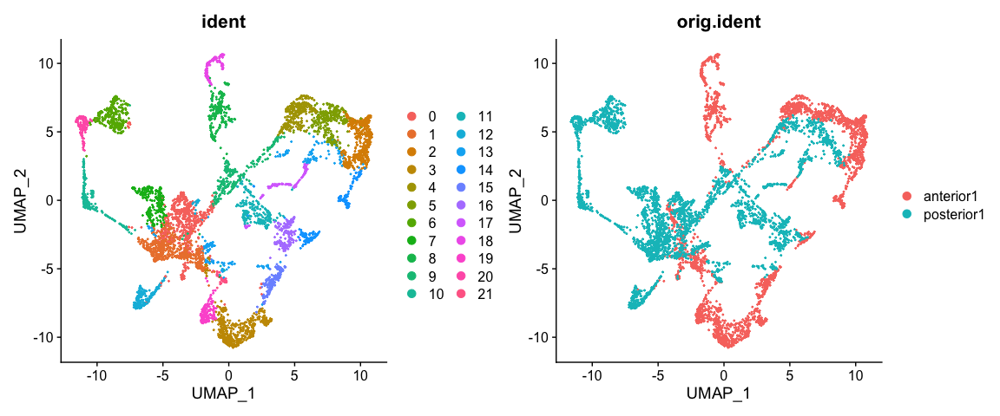
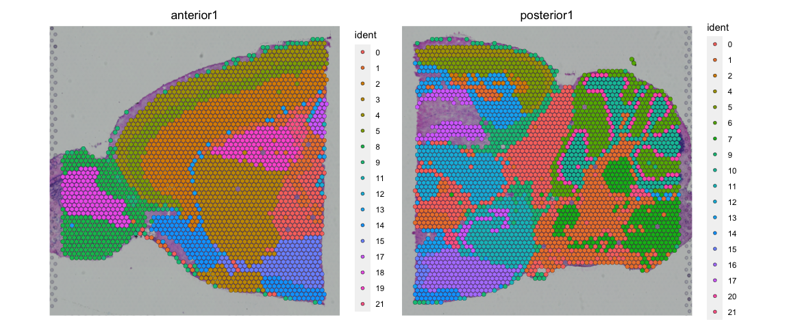
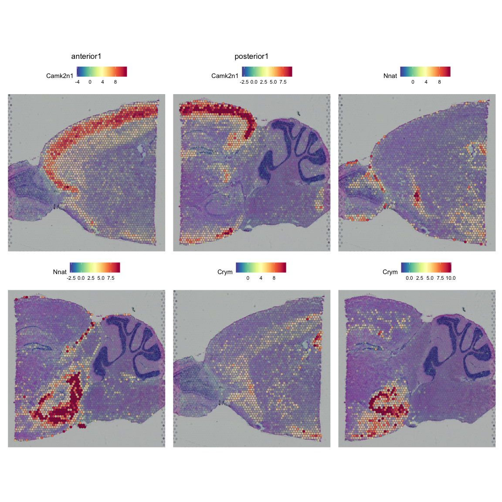
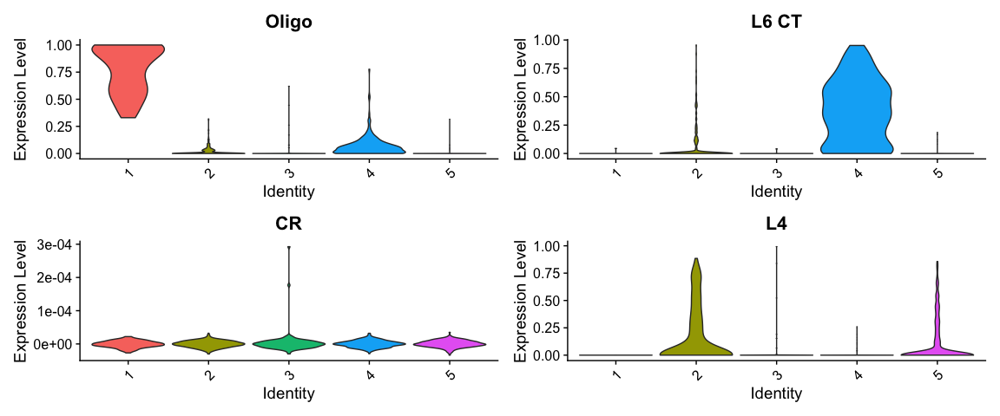

<style>
h1, .h1, h2, .h2, h3, .h3, h4, .h4 { margin-top: 50px }
p.caption {font-size: 0.9em;font-style: italic;color: grey;margin-right: 10%;margin-left: 10%;text-align: justify}
</style>

# Spatial transcriptomics
***

This tutorial is adapted from the Seurat vignette: https://satijalab.org/seurat/v3.2/spatial_vignette.html

Spatial transcriptomic data with the Visium platform is in many ways similar to scRNAseq data. It contains UMI counts for 5-20 cells instead of single cells, but is still quite sparse in the same way as scRNAseq data is, but with the additional information about spatial location in the tissue. 

Here we will first run quality control in a similar manner to scRNAseq data, then QC filtering, dimensionality reduction, integration and clustering. Then we will use scRNAseq data from mouse cortex to run LabelTransfer to predict celltypes in the Visium spots. 

We will use two **Visium** spatial transcriptomics dataset of the mouse brain (Sagittal), which are publicly available from the [10x genomics website](https://support.10xgenomics.com/spatial-gene-expression/datasets/). Note, that these dataset have already been filtered for spots that does not overlap with the tissue.

### Load packages


```r
devtools::install_github("satijalab/seurat-data")
```

```
## 
##   
   checking for file ‘/private/var/folders/1s/j9ck5c_162s487xcprlxtmdh0000gp/T/RtmpLPXWAN/remotesd9e1f6f95c3/satijalab-seurat-data-b59556b/DESCRIPTION’ ...
  
✔  checking for file ‘/private/var/folders/1s/j9ck5c_162s487xcprlxtmdh0000gp/T/RtmpLPXWAN/remotesd9e1f6f95c3/satijalab-seurat-data-b59556b/DESCRIPTION’
## 
  
─  preparing ‘SeuratData’:
## 
  
   checking DESCRIPTION meta-information ...
  
✔  checking DESCRIPTION meta-information
## 
  
─  checking for LF line-endings in source and make files and shell scripts
## 
  
─  checking for empty or unneeded directories
##    Omitted ‘LazyData’ from DESCRIPTION
## 
  
─  building ‘SeuratData_0.2.1.tar.gz’
## 
  
   
## 
```

```r
suppressPackageStartupMessages(require(Matrix))
suppressPackageStartupMessages(require(dplyr))
suppressPackageStartupMessages(require(SeuratData))
suppressPackageStartupMessages(require(Seurat))
suppressPackageStartupMessages(require(ggplot2))
suppressPackageStartupMessages(require(patchwork))
suppressPackageStartupMessages(require(dplyr))
```


### Load ST data

The package `SeuratData` has some seurat objects for different datasets. Among those are spatial transcriptomics data from mouse brain and kidney. Here we will download and process sections from the mouse brain. 


```r
outdir = "data/spatial/"
dir.create(outdir, showWarnings = F)

# to list available datasets in SeuratData you can run AvailableData()

# first we dowload the dataset
if (!("stxBrain.SeuratData" %in% rownames(InstalledData()))) {
    InstallData("stxBrain")
}


# now we can list what datasets we have downloaded
InstalledData()
```

<div data-pagedtable="false">
  <script data-pagedtable-source type="application/json">
{"columns":[{"label":[""],"name":["_rn_"],"type":[""],"align":["left"]},{"label":["Dataset"],"name":[1],"type":["chr"],"align":["left"]},{"label":["Version"],"name":[2],"type":["pckg_vrs"],"align":["right"]},{"label":["Summary"],"name":[3],"type":["chr"],"align":["left"]},{"label":["seurat"],"name":[4],"type":["chr"],"align":["left"]},{"label":["species"],"name":[5],"type":["chr"],"align":["left"]},{"label":["system"],"name":[6],"type":["chr"],"align":["left"]},{"label":["ncells"],"name":[7],"type":["dbl"],"align":["right"]},{"label":["tech"],"name":[8],"type":["chr"],"align":["left"]},{"label":["default.dataset"],"name":[9],"type":["chr"],"align":["left"]},{"label":["disk.datasets"],"name":[10],"type":["chr"],"align":["left"]},{"label":["other.datasets"],"name":[11],"type":["chr"],"align":["left"]},{"label":["notes"],"name":[12],"type":["chr"],"align":["left"]},{"label":["Installed"],"name":[13],"type":["lgl"],"align":["right"]},{"label":["InstalledVersion"],"name":[14],"type":["pckg_vrs"],"align":["right"]}],"data":[{"1":"stxBrain","2":"<pckg_vrs>","3":"10X Genomics Visium Mouse Brain Dataset","4":"NA","5":"mouse","6":"brain","7":"12167","8":"visium","9":"__NA__","10":"NA","11":"posterior1, posterior2, anterior1, anterior2","12":"One sample split across four datasets as paired anterior/posterior slices","13":"TRUE","14":"<pckg_vrs>","_rn_":"stxBrain.SeuratData"}],"options":{"columns":{"min":{},"max":[10]},"rows":{"min":[10],"max":[10]},"pages":{}}}
  </script>
</div>

```r
# now we will load the seurat object for one section
brain1 <- LoadData("stxBrain", type = "anterior1")
brain2 <- LoadData("stxBrain", type = "posterior1")
```

Merge into one seurat object


```r
brain <- merge(brain1, brain2)

brain
```

```
## An object of class Seurat 
## 31053 features across 6049 samples within 1 assay 
## Active assay: Spatial (31053 features, 0 variable features)
```

As you can see, now we do not have the assay "RNA", but instead an assay called "Spatial". 


# Quality control
***

Similar to scRNAseq we use statistics on number of counts, number of features and percent mitochondria for quality control. 

Now the counts and feature counts are calculated on the Spatial assay, so they are named  "nCount_Spatial" and "nFeature_Spatial".


```r
brain <- PercentageFeatureSet(brain, "^mt-", col.name = "percent_mito")
brain <- PercentageFeatureSet(brain, "^Hb.*-", col.name = "percent_hb")


VlnPlot(brain, features = c("nCount_Spatial", "nFeature_Spatial", "percent_mito",
    "percent_hb"), pt.size = 0.1, ncol = 2) + NoLegend()
```

<!-- -->

We can also plot the same data onto the tissue section.


```r
SpatialFeaturePlot(brain, features = c("nCount_Spatial", "nFeature_Spatial", "percent_mito",
    "percent_hb"))
```

<!-- -->


As you can see, the spots with low number of counts/features and high mitochondrial content is mainly towards the edges of the tissue. It is quite likely that these regions are damaged tissue. You may also see regions within a tissue with low quality if you have tears or folds in your section. 

But remember, for some tissue types, the amount of genes expressed and proportion mitochondria may also be a biological features, so bear in mind what tissue you are working on and what these features mean.

### Filter

Select all spots with less than 25% mitocondrial reads, less than 20% hb-reads and 1000 detected genes. You must judge for yourself based on your knowledge of the tissue what are appropriate filtering criteria for your dataset.


```r
brain = brain[, brain$nFeature_Spatial > 500 & brain$percent_mito < 25 & brain$percent_hb <
    20]
```

And replot onto tissue section:


```r
SpatialFeaturePlot(brain, features = c("nCount_Spatial", "nFeature_Spatial", "percent_mito"))
```

<!-- -->

### Top expressed genes
As for scRNAseq data, we will look at what the top expressed genes are.


```r
C = brain@assays$Spatial@counts
C@x = C@x/rep.int(colSums(C), diff(C@p))
most_expressed <- order(Matrix::rowSums(C), decreasing = T)[20:1]
boxplot(as.matrix(t(C[most_expressed, ])), cex = 0.1, las = 1, xlab = "% total count per cell",
    col = (scales::hue_pal())(20)[20:1], horizontal = TRUE)
```

<!-- -->

As you can see, the mitochondrial genes are among the top expressed. Also the lncRNA gene Bc1 (brain cytoplasmic RNA 1). Also one hemoglobin gene.

### Filter genes
We will remove the Bc1 gene, hemoglobin genes (blood contamination) and the mitochondrial genes.


```r
dim(brain)
```

```
## [1] 31053  5789
```

```r
# Filter Bl1
brain <- brain[!grepl("Bc1", rownames(brain)), ]

# Filter Mitocondrial
brain <- brain[!grepl("^mt-", rownames(brain)), ]

# Filter Hemoglobin gene (optional if that is a problem on your data)
brain <- brain[!grepl("^Hb.*-", rownames(brain)), ]

dim(brain)
```

```
## [1] 31031  5789
```

# Analysis
***

For ST data, the Seurat team recommends to use SCTranform for normalization, so we will do that. `SCTransform` will select variable genes and normalize in one step.


```r
brain <- SCTransform(brain, assay = "Spatial", verbose = TRUE, method = "poisson")
```

```
## 
  |                                                                            
  |                                                                      |   0%
  |                                                                            
  |==================                                                    |  25%
  |                                                                            
  |===================================                                   |  50%
  |                                                                            
  |====================================================                  |  75%
  |                                                                            
  |======================================================================| 100%
## 
  |                                                                            
  |                                                                      |   0%
  |                                                                            
  |==                                                                    |   3%
  |                                                                            
  |====                                                                  |   5%
  |                                                                            
  |======                                                                |   8%
  |                                                                            
  |=======                                                               |  11%
  |                                                                            
  |=========                                                             |  13%
  |                                                                            
  |===========                                                           |  16%
  |                                                                            
  |=============                                                         |  18%
  |                                                                            
  |===============                                                       |  21%
  |                                                                            
  |=================                                                     |  24%
  |                                                                            
  |==================                                                    |  26%
  |                                                                            
  |====================                                                  |  29%
  |                                                                            
  |======================                                                |  32%
  |                                                                            
  |========================                                              |  34%
  |                                                                            
  |==========================                                            |  37%
  |                                                                            
  |============================                                          |  39%
  |                                                                            
  |=============================                                         |  42%
  |                                                                            
  |===============================                                       |  45%
  |                                                                            
  |=================================                                     |  47%
  |                                                                            
  |===================================                                   |  50%
  |                                                                            
  |=====================================                                 |  53%
  |                                                                            
  |=======================================                               |  55%
  |                                                                            
  |=========================================                             |  58%
  |                                                                            
  |==========================================                            |  61%
  |                                                                            
  |============================================                          |  63%
  |                                                                            
  |==============================================                        |  66%
  |                                                                            
  |================================================                      |  68%
  |                                                                            
  |==================================================                    |  71%
  |                                                                            
  |====================================================                  |  74%
  |                                                                            
  |=====================================================                 |  76%
  |                                                                            
  |=======================================================               |  79%
  |                                                                            
  |=========================================================             |  82%
  |                                                                            
  |===========================================================           |  84%
  |                                                                            
  |=============================================================         |  87%
  |                                                                            
  |===============================================================       |  89%
  |                                                                            
  |================================================================      |  92%
  |                                                                            
  |==================================================================    |  95%
  |                                                                            
  |====================================================================  |  97%
  |                                                                            
  |======================================================================| 100%
## 
  |                                                                            
  |                                                                      |   0%
  |                                                                            
  |==                                                                    |   3%
  |                                                                            
  |====                                                                  |   5%
  |                                                                            
  |======                                                                |   8%
  |                                                                            
  |=======                                                               |  11%
  |                                                                            
  |=========                                                             |  13%
  |                                                                            
  |===========                                                           |  16%
  |                                                                            
  |=============                                                         |  18%
  |                                                                            
  |===============                                                       |  21%
  |                                                                            
  |=================                                                     |  24%
  |                                                                            
  |==================                                                    |  26%
  |                                                                            
  |====================                                                  |  29%
  |                                                                            
  |======================                                                |  32%
  |                                                                            
  |========================                                              |  34%
  |                                                                            
  |==========================                                            |  37%
  |                                                                            
  |============================                                          |  39%
  |                                                                            
  |=============================                                         |  42%
  |                                                                            
  |===============================                                       |  45%
  |                                                                            
  |=================================                                     |  47%
  |                                                                            
  |===================================                                   |  50%
  |                                                                            
  |=====================================                                 |  53%
  |                                                                            
  |=======================================                               |  55%
  |                                                                            
  |=========================================                             |  58%
  |                                                                            
  |==========================================                            |  61%
  |                                                                            
  |============================================                          |  63%
  |                                                                            
  |==============================================                        |  66%
  |                                                                            
  |================================================                      |  68%
  |                                                                            
  |==================================================                    |  71%
  |                                                                            
  |====================================================                  |  74%
  |                                                                            
  |=====================================================                 |  76%
  |                                                                            
  |=======================================================               |  79%
  |                                                                            
  |=========================================================             |  82%
  |                                                                            
  |===========================================================           |  84%
  |                                                                            
  |=============================================================         |  87%
  |                                                                            
  |===============================================================       |  89%
  |                                                                            
  |================================================================      |  92%
  |                                                                            
  |==================================================================    |  95%
  |                                                                            
  |====================================================================  |  97%
  |                                                                            
  |======================================================================| 100%
```


Now we can plot gene expression of individual genes, the gene Hpca is a strong hippocampal marker and Ttr is a marker of the choroid plexus.


```r
SpatialFeaturePlot(brain, features = c("Hpca", "Ttr"))
```

<!-- -->

If you want to see the tissue better you can modify point size and transparancy of the points.


```r
SpatialFeaturePlot(brain, features = "Ttr", pt.size.factor = 1, alpha = c(0.1, 1))
```

<!-- -->


### Dimensionality reduction and clustering
We can then now run dimensionality reduction and clustering using the same workflow as we use for scRNA-seq analysis. 

But make sure you run it on the `SCT` assay.


```r
brain <- RunPCA(brain, assay = "SCT", verbose = FALSE)
brain <- FindNeighbors(brain, reduction = "pca", dims = 1:30)
brain <- FindClusters(brain, verbose = FALSE)
brain <- RunUMAP(brain, reduction = "pca", dims = 1:30)
```

We can then plot clusters onto umap or onto the tissue section.


```r
DimPlot(brain, reduction = "umap", group.by = c("ident", "orig.ident"))
```

<!-- -->

```r
SpatialDimPlot(brain)
```

<!-- -->

We can also plot each cluster separately


```r
SpatialDimPlot(brain, cells.highlight = CellsByIdentities(brain), facet.highlight = TRUE,
    ncol = 5)
```

<!-- -->

### Integration

Quite often there are strong batch effects between different ST sections, so it may be a good idea to integrate the data across sections.

We will do a similar integration as in the Data Integration lab, but this time we will use the SCT assay for integration. Therefore we need to run `PrepSCTIntegration` which will compute the sctransform residuals for all genes in both the datasets. 


```r
# create a list of the original data that we loaded to start with
st.list = list(anterior1 = brain1, posterior1 = brain2)

# run SCT on both datasets
st.list = lapply(st.list, SCTransform, assay = "Spatial", method = "poisson")
```

```
## 
  |                                                                            
  |                                                                      |   0%
  |                                                                            
  |==================                                                    |  25%
  |                                                                            
  |===================================                                   |  50%
  |                                                                            
  |====================================================                  |  75%
  |                                                                            
  |======================================================================| 100%
## 
  |                                                                            
  |                                                                      |   0%
  |                                                                            
  |==                                                                    |   3%
  |                                                                            
  |====                                                                  |   6%
  |                                                                            
  |======                                                                |   8%
  |                                                                            
  |========                                                              |  11%
  |                                                                            
  |==========                                                            |  14%
  |                                                                            
  |============                                                          |  17%
  |                                                                            
  |==============                                                        |  19%
  |                                                                            
  |================                                                      |  22%
  |                                                                            
  |==================                                                    |  25%
  |                                                                            
  |===================                                                   |  28%
  |                                                                            
  |=====================                                                 |  31%
  |                                                                            
  |=======================                                               |  33%
  |                                                                            
  |=========================                                             |  36%
  |                                                                            
  |===========================                                           |  39%
  |                                                                            
  |=============================                                         |  42%
  |                                                                            
  |===============================                                       |  44%
  |                                                                            
  |=================================                                     |  47%
  |                                                                            
  |===================================                                   |  50%
  |                                                                            
  |=====================================                                 |  53%
  |                                                                            
  |=======================================                               |  56%
  |                                                                            
  |=========================================                             |  58%
  |                                                                            
  |===========================================                           |  61%
  |                                                                            
  |=============================================                         |  64%
  |                                                                            
  |===============================================                       |  67%
  |                                                                            
  |=================================================                     |  69%
  |                                                                            
  |===================================================                   |  72%
  |                                                                            
  |====================================================                  |  75%
  |                                                                            
  |======================================================                |  78%
  |                                                                            
  |========================================================              |  81%
  |                                                                            
  |==========================================================            |  83%
  |                                                                            
  |============================================================          |  86%
  |                                                                            
  |==============================================================        |  89%
  |                                                                            
  |================================================================      |  92%
  |                                                                            
  |==================================================================    |  94%
  |                                                                            
  |====================================================================  |  97%
  |                                                                            
  |======================================================================| 100%
## 
  |                                                                            
  |                                                                      |   0%
  |                                                                            
  |==                                                                    |   3%
  |                                                                            
  |====                                                                  |   6%
  |                                                                            
  |======                                                                |   8%
  |                                                                            
  |========                                                              |  11%
  |                                                                            
  |==========                                                            |  14%
  |                                                                            
  |============                                                          |  17%
  |                                                                            
  |==============                                                        |  19%
  |                                                                            
  |================                                                      |  22%
  |                                                                            
  |==================                                                    |  25%
  |                                                                            
  |===================                                                   |  28%
  |                                                                            
  |=====================                                                 |  31%
  |                                                                            
  |=======================                                               |  33%
  |                                                                            
  |=========================                                             |  36%
  |                                                                            
  |===========================                                           |  39%
  |                                                                            
  |=============================                                         |  42%
  |                                                                            
  |===============================                                       |  44%
  |                                                                            
  |=================================                                     |  47%
  |                                                                            
  |===================================                                   |  50%
  |                                                                            
  |=====================================                                 |  53%
  |                                                                            
  |=======================================                               |  56%
  |                                                                            
  |=========================================                             |  58%
  |                                                                            
  |===========================================                           |  61%
  |                                                                            
  |=============================================                         |  64%
  |                                                                            
  |===============================================                       |  67%
  |                                                                            
  |=================================================                     |  69%
  |                                                                            
  |===================================================                   |  72%
  |                                                                            
  |====================================================                  |  75%
  |                                                                            
  |======================================================                |  78%
  |                                                                            
  |========================================================              |  81%
  |                                                                            
  |==========================================================            |  83%
  |                                                                            
  |============================================================          |  86%
  |                                                                            
  |==============================================================        |  89%
  |                                                                            
  |================================================================      |  92%
  |                                                                            
  |==================================================================    |  94%
  |                                                                            
  |====================================================================  |  97%
  |                                                                            
  |======================================================================| 100%
## 
  |                                                                            
  |                                                                      |   0%
  |                                                                            
  |==================                                                    |  25%
  |                                                                            
  |===================================                                   |  50%
  |                                                                            
  |====================================================                  |  75%
  |                                                                            
  |======================================================================| 100%
## 
  |                                                                            
  |                                                                      |   0%
  |                                                                            
  |==                                                                    |   3%
  |                                                                            
  |====                                                                  |   6%
  |                                                                            
  |======                                                                |   8%
  |                                                                            
  |========                                                              |  11%
  |                                                                            
  |==========                                                            |  14%
  |                                                                            
  |============                                                          |  17%
  |                                                                            
  |==============                                                        |  19%
  |                                                                            
  |================                                                      |  22%
  |                                                                            
  |==================                                                    |  25%
  |                                                                            
  |===================                                                   |  28%
  |                                                                            
  |=====================                                                 |  31%
  |                                                                            
  |=======================                                               |  33%
  |                                                                            
  |=========================                                             |  36%
  |                                                                            
  |===========================                                           |  39%
  |                                                                            
  |=============================                                         |  42%
  |                                                                            
  |===============================                                       |  44%
  |                                                                            
  |=================================                                     |  47%
  |                                                                            
  |===================================                                   |  50%
  |                                                                            
  |=====================================                                 |  53%
  |                                                                            
  |=======================================                               |  56%
  |                                                                            
  |=========================================                             |  58%
  |                                                                            
  |===========================================                           |  61%
  |                                                                            
  |=============================================                         |  64%
  |                                                                            
  |===============================================                       |  67%
  |                                                                            
  |=================================================                     |  69%
  |                                                                            
  |===================================================                   |  72%
  |                                                                            
  |====================================================                  |  75%
  |                                                                            
  |======================================================                |  78%
  |                                                                            
  |========================================================              |  81%
  |                                                                            
  |==========================================================            |  83%
  |                                                                            
  |============================================================          |  86%
  |                                                                            
  |==============================================================        |  89%
  |                                                                            
  |================================================================      |  92%
  |                                                                            
  |==================================================================    |  94%
  |                                                                            
  |====================================================================  |  97%
  |                                                                            
  |======================================================================| 100%
## 
  |                                                                            
  |                                                                      |   0%
  |                                                                            
  |==                                                                    |   3%
  |                                                                            
  |====                                                                  |   6%
  |                                                                            
  |======                                                                |   8%
  |                                                                            
  |========                                                              |  11%
  |                                                                            
  |==========                                                            |  14%
  |                                                                            
  |============                                                          |  17%
  |                                                                            
  |==============                                                        |  19%
  |                                                                            
  |================                                                      |  22%
  |                                                                            
  |==================                                                    |  25%
  |                                                                            
  |===================                                                   |  28%
  |                                                                            
  |=====================                                                 |  31%
  |                                                                            
  |=======================                                               |  33%
  |                                                                            
  |=========================                                             |  36%
  |                                                                            
  |===========================                                           |  39%
  |                                                                            
  |=============================                                         |  42%
  |                                                                            
  |===============================                                       |  44%
  |                                                                            
  |=================================                                     |  47%
  |                                                                            
  |===================================                                   |  50%
  |                                                                            
  |=====================================                                 |  53%
  |                                                                            
  |=======================================                               |  56%
  |                                                                            
  |=========================================                             |  58%
  |                                                                            
  |===========================================                           |  61%
  |                                                                            
  |=============================================                         |  64%
  |                                                                            
  |===============================================                       |  67%
  |                                                                            
  |=================================================                     |  69%
  |                                                                            
  |===================================================                   |  72%
  |                                                                            
  |====================================================                  |  75%
  |                                                                            
  |======================================================                |  78%
  |                                                                            
  |========================================================              |  81%
  |                                                                            
  |==========================================================            |  83%
  |                                                                            
  |============================================================          |  86%
  |                                                                            
  |==============================================================        |  89%
  |                                                                            
  |================================================================      |  92%
  |                                                                            
  |==================================================================    |  94%
  |                                                                            
  |====================================================================  |  97%
  |                                                                            
  |======================================================================| 100%
```

```r
# need to set maxSize for PrepSCTIntegration to work
options(future.globals.maxSize = 2000 * 1024^2)  # set allowed size to 2K MiB


st.features = SelectIntegrationFeatures(st.list, nfeatures = 3000, verbose = FALSE)
st.list <- PrepSCTIntegration(object.list = st.list, anchor.features = st.features,
    verbose = FALSE)
```

Now we can perform the actual integraion.


```r
int.anchors <- FindIntegrationAnchors(object.list = st.list, normalization.method = "SCT",
    verbose = FALSE, anchor.features = st.features)
brain.integrated <- IntegrateData(anchorset = int.anchors, normalization.method = "SCT",
    verbose = FALSE)

rm(int.anchors, st.list)
gc()
```

```
##              used   (Mb) gc trigger    (Mb)   max used    (Mb)
## Ncells    9791218  523.0   15620837   834.3   15620837   834.3
## Vcells 1066227845 8134.7 1877566798 14324.7 1876685675 14318.0
```

Then we run dimensionality reduction and clustering as before.


```r
brain.integrated <- RunPCA(brain.integrated, verbose = FALSE)
brain.integrated <- FindNeighbors(brain.integrated, dims = 1:30)
brain.integrated <- FindClusters(brain.integrated, verbose = FALSE)
brain.integrated <- RunUMAP(brain.integrated, dims = 1:30)
```


```r
DimPlot(brain.integrated, reduction = "umap", group.by = c("ident", "orig.ident"))
```

<!-- -->

```r
SpatialDimPlot(brain.integrated)
```

<!-- -->

Do you see any differences between the integrated and non-integrated clusering? Judge for yourself, which of the clusterings do you think looks best? 
As a reference, you can compare to brain regions in the [Allen brain atlas](https://mouse.brain-map.org/experiment/thumbnails/100042147?image_type=atlas). 

### Identification of Spatially Variable Features

 There are two main workflows to identify molecular features that correlate with spatial location within a tissue. The first is to perform differential expression based on spatially distinct clusters, the other is to find features that are have spatial patterning without taking clusters or spatial annotation into account. 

First, we will do differential expression between clusters just as we did for the scRNAseq data before.


```r
# differential expression between cluster 1 and cluster 6
de_markers <- FindMarkers(brain.integrated, ident.1 = 5, ident.2 = 6)

# plot top markers
SpatialFeaturePlot(object = brain.integrated, features = rownames(de_markers)[1:3],
    alpha = c(0.1, 1), ncol = 3)
```

<!-- -->


In `FindSpatiallyVariables` the default method in Seurat (method = 'markvariogram), is inspired by the Trendsceek, which models spatial transcriptomics data as a mark point process and computes a 'variogram', which identifies genes whose expression level is dependent on their spatial location. More specifically, this process calculates gamma(r) values measuring the dependence between two spots a certain "r" distance apart. By default, we use an r-value of '5' in these analyes, and only compute these values for variable genes (where variation is calculated independently of spatial location) to save time.


**OBS!** Takes a long time to run, so skip this step for now!


```r
# brain <- FindSpatiallyVariableFeatures(brain, assay = 'SCT', features =
# VariableFeatures(brain)[1:1000], selection.method = 'markvariogram')

# We would get top features from SpatiallyVariableFeatures top.features <-
# head(SpatiallyVariableFeatures(brain, selection.method = 'markvariogram'), 6)
```


# Single cell data

We can use a scRNA-seq dataset as a referenced to predict the proportion of different celltypes in the Visium spots. 

Keep in mind that it is important to have a reference that contains all the celltypes you expect to find in your spots. Ideally it should be a scRNAseq reference from the exact same tissue. 

We will use a reference scRNA-seq dataset of ~14,000 adult mouse cortical cell taxonomy from the Allen Institute, generated with the SMART-Seq2 protocol.


First dowload the seurat data from: https://www.dropbox.com/s/cuowvm4vrf65pvq/allen_cortex.rds?dl=1 to folder `data/spatial/` with command:


```bash

FILE="./data/spatial/allen_cortex.rds"

if [ -e $FILE ]
then
   echo "File $FILE is downloaded."
else
   echo "Downloading $FILE"
   mkdir -p data/spatial
   wget  -O data/spatial/allen_cortex.rds https://www.dropbox.com/s/cuowvm4vrf65pvq/allen_cortex.rds?dl=1
fi

```

```
## File ./data/spatial/allen_cortex.rds is downloaded.
```

For speed, and for a more fair comparison of the celltypes, we will subsample all celltypes to a maximum of 200 cells per class (`subclass`).


```r
allen_reference <- readRDS("data/spatial/allen_cortex.rds")

# check number of cells per subclass
table(allen_reference$subclass)
```

```
## 
##      Astro         CR       Endo    L2/3 IT         L4      L5 IT      L5 PT 
##        368          7         94        982       1401        880        544 
##      L6 CT      L6 IT        L6b      Lamp5 Macrophage      Meis2         NP 
##        960       1872        358       1122         51         45        362 
##      Oligo       Peri      Pvalb   Serpinf1        SMC       Sncg        Sst 
##         91         32       1337         27         55        125       1741 
##        Vip       VLMC 
##       1728         67
```

```r
# select 200 cells per subclass, fist set subclass ass active.ident
Idents(allen_reference) <- allen_reference$subclass
allen_reference <- subset(allen_reference, cells = WhichCells(allen_reference, downsample = 200))

# check again number of cells per subclass
table(allen_reference$subclass)
```

```
## 
##      Astro         CR       Endo    L2/3 IT         L4      L5 IT      L5 PT 
##        200          7         94        200        200        200        200 
##      L6 CT      L6 IT        L6b      Lamp5 Macrophage      Meis2         NP 
##        200        200        200        200         51         45        200 
##      Oligo       Peri      Pvalb   Serpinf1        SMC       Sncg        Sst 
##         91         32        200         27         55        125        200 
##        Vip       VLMC 
##        200         67
```

Then run normalization and dimensionality reduction.


```r
# First run SCTransform and PCA
allen_reference <- SCTransform(allen_reference, ncells = 3000, verbose = FALSE, method = "poisson") %>%
    RunPCA(verbose = FALSE) %>%
    RunUMAP(dims = 1:30)

# the annotation is stored in the 'subclass' column of object metadata
DimPlot(allen_reference, label = TRUE)
```

<!-- -->

# Subset ST for cortex
Since the scRNAseq dataset was generated from the mouse cortex, we will subset the visium dataset in order to select mainly the spots part of the cortex. Note that the integration can also be performed on the whole brain slice, but it would give rise to false positive cell type assignments and and therefore it should be interpreted with more care.


```r
# subset for the anterior dataset
cortex <- subset(brain.integrated, orig.ident == "anterior1")

# there seems to be an error in the subsetting, so the posterior1 image is not
# removed, do it manually
cortex@images$posterior1 = NULL

# subset for a specific region
cortex <- subset(cortex, anterior1_imagerow > 400 | anterior1_imagecol < 150, invert = TRUE)
cortex <- subset(cortex, anterior1_imagerow > 275 & anterior1_imagecol > 370, invert = TRUE)
cortex <- subset(cortex, anterior1_imagerow > 250 & anterior1_imagecol > 440, invert = TRUE)

# also subset for FC clusters
cortex <- subset(cortex, idents = c(1, 2, 3, 4, 5))

p1 <- SpatialDimPlot(cortex, crop = TRUE, label = TRUE)
p2 <- SpatialDimPlot(cortex, crop = FALSE, label = TRUE, pt.size.factor = 1, label.size = 3)
p1 + p2
```

<!-- -->


# Deconvolution
Deconvolution is a method to estimate the abundance (or proportion) of different celltypes in a bulkRNAseq dataset using a single cell reference. As the Visium data can be seen as a small bulk, we can both use methods for traditional bulkRNAseq as well as methods especially developed for Visium data.
 Some methods for deconvolution are DWLS, cell2location, Tangram, Stereoscope, RCTD, SCDC and many more. 

Here we will use SCDC for deconvolution of celltypes in the Visium spots. For more information on the tool please check their website: https://meichendong.github.io/SCDC/articles/SCDC.html
First, make sure the packages you need are installed. All dependencies should be in the conda environment.


```r
inst = installed.packages()

if (!("xbioc" %in% rownames(inst))) {
    remotes::install_github("renozao/xbioc", dependencies = FALSE)
}
```

```
##   
   checking for file ‘/private/var/folders/1s/j9ck5c_162s487xcprlxtmdh0000gp/T/RtmpLPXWAN/remotesd9e17aa7247f/renozao-xbioc-1354168/DESCRIPTION’ ...
  
✔  checking for file ‘/private/var/folders/1s/j9ck5c_162s487xcprlxtmdh0000gp/T/RtmpLPXWAN/remotesd9e17aa7247f/renozao-xbioc-1354168/DESCRIPTION’ (367ms)
## 
  
─  preparing ‘xbioc’:
## 
  
   checking DESCRIPTION meta-information ...
  
✔  checking DESCRIPTION meta-information
## 
  
─  checking for LF line-endings in source and make files and shell scripts
## 
  
─  checking for empty or unneeded directories
## ─  looking to see if a ‘data/datalist’ file should be added
## 
  
─  building ‘xbioc_0.1.19.tar.gz’
## 
  
   
## 
```

```r
if (!("SCDC" %in% rownames(inst))) {
    remotes::install_github("meichendong/SCDC", dependencies = FALSE)
}
```

```
##   
   checking for file ‘/private/var/folders/1s/j9ck5c_162s487xcprlxtmdh0000gp/T/RtmpLPXWAN/remotesd9e112077ce4/meichendong-SCDC-2b0b2ab/DESCRIPTION’ ...
  
✔  checking for file ‘/private/var/folders/1s/j9ck5c_162s487xcprlxtmdh0000gp/T/RtmpLPXWAN/remotesd9e112077ce4/meichendong-SCDC-2b0b2ab/DESCRIPTION’
## 
  
─  preparing ‘SCDC’:
## 
  
   checking DESCRIPTION meta-information ...
  
✔  checking DESCRIPTION meta-information
## 
  
─  checking for LF line-endings in source and make files and shell scripts
## 
  
─  checking for empty or unneeded directories
## 
  
   Omitted ‘LazyData’ from DESCRIPTION
## 
  
─  building ‘SCDC_0.0.0.9000.tar.gz’
## 
  
   
## 
```

```r
suppressPackageStartupMessages(require(SCDC))
suppressPackageStartupMessages(require(Biobase))
```


### Select genes for deconvolution
Most deconvolution methods does a prior gene selection and there are different options that are used:

* Use variable genes in the SC data.
* Use variable genes in both SC and ST data
* DE genes between clusters in the SC data.

In this case we will use top DEG genes per cluster, so first we have to run DEG detection on the scRNAseq data.

For SCDC we want to find a we unique markers per cluster, so we select top 20 DEGs per cluster.
Ideally you should run with a larger set of genes, perhaps 100 genes per cluster to get better results. However, for the sake of speed, we are now selecting only top20 genes and it still takes about 10 minutes to run.


```r
allen_reference@active.assay = "RNA"

markers_sc <- FindAllMarkers(allen_reference, only.pos = TRUE, logfc.threshold = 0.1,
    test.use = "wilcox", min.pct = 0.05, min.diff.pct = 0.1, max.cells.per.ident = 200,
    return.thresh = 0.05, assay = "RNA")

# Filter for genes that are also present in the ST data
markers_sc <- markers_sc[markers_sc$gene %in% rownames(cortex), ]


# Select top 20 genes per cluster, select top by first p-value, then absolute
# diff in pct, then quota of pct.
markers_sc$pct.diff <- markers_sc$pct.1 - markers_sc$pct.2
markers_sc$log.pct.diff <- log2((markers_sc$pct.1 * 99 + 1)/(markers_sc$pct.2 * 99 +
    1))
markers_sc %>%
    group_by(cluster) %>%
    top_n(-100, p_val) %>%
    top_n(50, pct.diff) %>%
    top_n(20, log.pct.diff) -> top20
m_feats <- unique(as.character(top20$gene))
```

### Create Expression Sets

For SCDC both the SC and the ST data need to be in the format of an Expression set with the count matrices as `AssayData`. We also subset the matrices for the genes we selected in the previous step.


```r
eset_SC <- ExpressionSet(assayData = as.matrix(allen_reference@assays$RNA@counts[m_feats,
    ]), phenoData = AnnotatedDataFrame(allen_reference@meta.data))
eset_ST <- ExpressionSet(assayData = as.matrix(cortex@assays$Spatial@counts[m_feats,
    ]), phenoData = AnnotatedDataFrame(cortex@meta.data))
```

### Deconvolve
We then run the deconvolution defining the celltype of interest as "subclass" column in the single cell data.


```r
deconvolution_crc <- SCDC::SCDC_prop(bulk.eset = eset_ST, sc.eset = eset_SC, ct.varname = "subclass",
    ct.sub = as.character(unique(eset_SC$subclass)))
```

Now we have a matrix with predicted proportions of each celltypes for each visium spot in `prop.est.mvw`:


```r
head(deconvolution_crc$prop.est.mvw)
```

```
##                            Lamp5 Sncg Serpinf1 Vip Sst       Pvalb        Endo
## AAACAGAGCGACTCCT-1_1 0.006797406    0        0   0   0 0.000000000 0.000000000
## AAACCGGGTAGGTACC-1_1 0.201721755    0        0   0   0 0.000360455 0.002899676
## AAAGGGATGTAGCAAG-1_1 0.000000000    0        0   0   0 0.162334952 0.000000000
## AAATAACCATACGGGA-1_1 0.005390595    0        0   0   0 0.000000000 0.000000000
## AAATCGTGTACCACAA-1_1 0.272123152    0        0   0   0 0.000000000 0.004560075
## AAATGATTCGATCAGC-1_1 0.000000000    0        0   0   0 0.000000000 0.005133105
##                      Peri        L6 CT          L6b      L6 IT CR   L2/3 IT
## AAACAGAGCGACTCCT-1_1    0 0.0000000000 0.0000000000 0.00000000  0 0.1223194
## AAACCGGGTAGGTACC-1_1    0 0.0000000000 0.0000000000 0.27648660  0 0.0000000
## AAAGGGATGTAGCAAG-1_1    0 0.0000000000 0.0000000000 0.02674848  0 0.0000000
## AAATAACCATACGGGA-1_1    0 0.0000000000 0.0000000000 0.49829132  0 0.4827978
## AAATCGTGTACCACAA-1_1    0 0.0000000000 0.3092342251 0.15698769  0 0.0000000
## AAATGATTCGATCAGC-1_1    0 0.0009239876 0.0007522028 0.10424357  0 0.0000000
##                            L5 PT        NP          L4      Oligo        L5 IT
## AAACAGAGCGACTCCT-1_1 0.584690243 0.0000000 0.239770783 0.00000000 2.010815e-05
## AAACCGGGTAGGTACC-1_1 0.003054563 0.0310128 0.397843187 0.00000000 3.210555e-06
## AAAGGGATGTAGCAAG-1_1 0.194414624 0.0000000 0.064653803 0.00000000 4.815953e-01
## AAATAACCATACGGGA-1_1 0.000000000 0.0000000 0.001771256 0.00000000 0.000000e+00
## AAATCGTGTACCACAA-1_1 0.000000000 0.0000000 0.187529309 0.05624842 0.000000e+00
## AAATGATTCGATCAGC-1_1 0.611475752 0.0459624 0.000000000 0.00000000 1.796951e-01
##                      Meis2      Astro  Macrophage VLMC SMC
## AAACAGAGCGACTCCT-1_1     0 0.04093742 0.005464622    0   0
## AAACCGGGTAGGTACC-1_1     0 0.08457383 0.002043925    0   0
## AAAGGGATGTAGCAAG-1_1     0 0.06688284 0.003369983    0   0
## AAATAACCATACGGGA-1_1     0 0.00000000 0.011749003    0   0
## AAATCGTGTACCACAA-1_1     0 0.00000000 0.013317128    0   0
## AAATGATTCGATCAGC-1_1     0 0.04824279 0.003571095    0   0
```

Now we take the deconvolution output and add it to the Seurat object as a new assay.


```r
cortex@assays[["SCDC"]] <- CreateAssayObject(data = t(deconvolution_crc$prop.est.mvw))

# Seems to be a bug in SeuratData package that the key is not set and any
# plotting function etc. will throw an error.
if (length(cortex@assays$SCDC@key) == 0) {
    cortex@assays$SCDC@key = "scdc_"
}
```


```r
DefaultAssay(cortex) <- "SCDC"
SpatialFeaturePlot(cortex, features = c("L2/3 IT", "L4"), pt.size.factor = 1.6, ncol = 2,
    crop = TRUE)
```

<!-- -->


Based on these prediction scores, we can also predict cell types whose location is spatially restricted. We use the same methods based on marked point processes to define spatially variable features, but use the cell type prediction scores as the "marks" rather than gene expression.


```r
cortex <- FindSpatiallyVariableFeatures(cortex, assay = "SCDC", selection.method = "markvariogram",
    features = rownames(cortex), r.metric = 5, slot = "data")
top.clusters <- head(SpatiallyVariableFeatures(cortex), 4)
SpatialPlot(object = cortex, features = top.clusters, ncol = 2)
```

<!-- -->

#ST_R13.7:


```r
VlnPlot(cortex, group.by = "seurat_clusters", features = top.clusters, pt.size = 0,
    ncol = 2)
```

<!-- -->

Keep in mind that the deconvolution results are just predictions, depending on how well your scRNAseq data covers the celltypes that are present in the ST data and on how parameters, gene selection etc. are tuned you may get different results.

<style>
div.blue { background-color:#e6f0ff; border-radius: 5px; padding: 10px;}
</style>
<div class = "blue">
**Your turn:**

Subset for another region that does not contain cortex cells and check what you get from the label transfer. 

Suggested region is the right end of the posterial section that you can select like this:

</div>


```r
# subset for the anterior dataset
subregion <- subset(brain.integrated, orig.ident == "posterior1")

# there seems to be an error in the subsetting, so the posterior1 image is not
# removed, do it manually
subregion@images$anterior1 = NULL

# subset for a specific region
subregion <- subset(subregion, posterior1_imagecol > 400, invert = FALSE)

p1 <- SpatialDimPlot(subregion, crop = TRUE, label = TRUE)
p2 <- SpatialDimPlot(subregion, crop = FALSE, label = TRUE, pt.size.factor = 1, label.size = 3)
p1 + p2
```

<!-- -->


### Session info


```r
sessionInfo()
```

```
## R version 4.1.2 (2021-11-01)
## Platform: x86_64-apple-darwin13.4.0 (64-bit)
## Running under: macOS Catalina 10.15.7
## 
## Matrix products: default
## BLAS/LAPACK: /Users/asbj/miniconda3/envs/scRNAseq2022_tmp/lib/libopenblasp-r0.3.18.dylib
## 
## locale:
## [1] en_US.UTF-8/en_US.UTF-8/en_US.UTF-8/C/en_US.UTF-8/en_US.UTF-8
## 
## attached base packages:
## [1] stats4    stats     graphics  grDevices utils     datasets  methods  
## [8] base     
## 
## other attached packages:
##  [1] SCDC_0.0.0.9000             stxBrain.SeuratData_0.1.1  
##  [3] patchwork_1.1.1             SeuratData_0.2.1           
##  [5] caret_6.0-90                lattice_0.20-45            
##  [7] scPred_1.9.2                fgsea_1.20.0               
##  [9] msigdbr_7.4.1               enrichR_3.0                
## [11] dplyr_1.0.7                 rafalib_1.0.0              
## [13] pheatmap_1.0.12             clustree_0.4.4             
## [15] ggraph_2.0.5                reticulate_1.22            
## [17] harmony_1.0                 Rcpp_1.0.8                 
## [19] scran_1.22.0                scuttle_1.4.0              
## [21] SingleCellExperiment_1.16.0 SummarizedExperiment_1.24.0
## [23] Biobase_2.54.0              GenomicRanges_1.46.0       
## [25] GenomeInfoDb_1.30.0         IRanges_2.28.0             
## [27] S4Vectors_0.32.0            BiocGenerics_0.40.0        
## [29] MatrixGenerics_1.6.0        matrixStats_0.61.0         
## [31] ggplot2_3.3.5               cowplot_1.1.1              
## [33] KernSmooth_2.23-20          fields_13.3                
## [35] viridis_0.6.2               viridisLite_0.4.0          
## [37] spam_2.8-0                  DoubletFinder_2.0.3        
## [39] Matrix_1.4-0                SeuratObject_4.0.4         
## [41] Seurat_4.0.6                RJSONIO_1.3-1.6            
## [43] optparse_1.7.1             
## 
## loaded via a namespace (and not attached):
##   [1] rappdirs_0.3.3            scattermore_0.7          
##   [3] ModelMetrics_1.2.2.2      pkgmaker_0.32.2          
##   [5] tidyr_1.1.4               bit64_4.0.5              
##   [7] knitr_1.37                irlba_2.3.5              
##   [9] DelayedArray_0.20.0       data.table_1.14.2        
##  [11] rpart_4.1-15              KEGGREST_1.34.0          
##  [13] RCurl_1.98-1.5            generics_0.1.1           
##  [15] ScaledMatrix_1.2.0        callr_3.7.0              
##  [17] RSQLite_2.2.8             usethis_2.1.5            
##  [19] RANN_2.6.1                future_1.23.0            
##  [21] bit_4.0.4                 lubridate_1.8.0          
##  [23] spatstat.data_2.1-2       httpuv_1.6.5             
##  [25] assertthat_0.2.1          gower_0.2.2              
##  [27] xfun_0.29                 jquerylib_0.1.4          
##  [29] babelgene_21.4            evaluate_0.14            
##  [31] promises_1.2.0.1          fansi_1.0.0              
##  [33] igraph_1.2.11             DBI_1.1.2                
##  [35] htmlwidgets_1.5.4         spatstat.geom_2.3-1      
##  [37] purrr_0.3.4               ellipsis_0.3.2           
##  [39] RSpectra_0.16-0           backports_1.4.1          
##  [41] deldir_1.0-6              sparseMatrixStats_1.6.0  
##  [43] vctrs_0.3.8               remotes_2.4.2            
##  [45] here_1.0.1                ROCR_1.0-11              
##  [47] abind_1.4-5               cachem_1.0.6             
##  [49] withr_2.4.3               ggforce_0.3.3            
##  [51] fastmatrix_0.3-8196       checkmate_2.0.0          
##  [53] sctransform_0.3.3         prettyunits_1.1.1        
##  [55] getopt_1.20.3             goftest_1.2-3            
##  [57] cluster_2.1.2             dotCall64_1.0-1          
##  [59] lazyeval_0.2.2            crayon_1.4.2             
##  [61] hdf5r_1.3.5               edgeR_3.36.0             
##  [63] recipes_0.1.17            pkgconfig_2.0.3          
##  [65] labeling_0.4.2            tweenr_1.0.2             
##  [67] pkgload_1.2.4             vipor_0.4.5              
##  [69] nlme_3.1-155              devtools_2.4.3           
##  [71] nnet_7.3-17               rlang_0.4.12             
##  [73] globals_0.14.0            lifecycle_1.0.1          
##  [75] miniUI_0.1.1.1            registry_0.5-1           
##  [77] rsvd_1.0.5                rprojroot_2.0.2          
##  [79] polyclip_1.10-0           lmtest_0.9-39            
##  [81] zoo_1.8-9                 beeswarm_0.4.0           
##  [83] ggridges_0.5.3            processx_3.5.2           
##  [85] png_0.1-7                 rjson_0.2.21             
##  [87] bitops_1.0-7              pROC_1.18.0              
##  [89] Biostrings_2.62.0         blob_1.2.2               
##  [91] DelayedMatrixStats_1.16.0 stringr_1.4.0            
##  [93] parallelly_1.30.0         beachmat_2.10.0          
##  [95] scales_1.1.1              memoise_2.0.1            
##  [97] magrittr_2.0.1            plyr_1.8.6               
##  [99] ica_1.0-2                 zlibbioc_1.40.0          
## [101] compiler_4.1.2            dqrng_0.3.0              
## [103] RColorBrewer_1.1-2        fitdistrplus_1.1-6       
## [105] cli_3.1.0                 XVector_0.34.0           
## [107] listenv_0.8.0             pbapply_1.5-0            
## [109] ps_1.6.0                  formatR_1.11             
## [111] MASS_7.3-55               mgcv_1.8-38              
## [113] tidyselect_1.1.1          stringi_1.7.6            
## [115] highr_0.9                 yaml_2.2.1               
## [117] BiocSingular_1.10.0       locfit_1.5-9.4           
## [119] ggrepel_0.9.1             grid_4.1.2               
## [121] sass_0.4.0                fastmatch_1.1-3          
## [123] tools_4.1.2               future.apply_1.8.1       
## [125] parallel_4.1.2            bluster_1.4.0            
## [127] foreach_1.5.1             metapod_1.2.0            
## [129] gridExtra_2.3             prodlim_2019.11.13       
## [131] farver_2.1.0              Rtsne_0.15               
## [133] BiocManager_1.30.16       digest_0.6.29            
## [135] lava_1.6.10               shiny_1.7.1              
## [137] later_1.2.0               RcppAnnoy_0.0.19         
## [139] AnnotationDbi_1.56.1      httr_1.4.2               
## [141] L1pack_0.38.196           kernlab_0.9-29           
## [143] colorspace_2.0-2          fs_1.5.2                 
## [145] tensor_1.5                splines_4.1.2            
## [147] uwot_0.1.11               statmod_1.4.36           
## [149] spatstat.utils_2.3-0      graphlayouts_0.8.0       
## [151] xbioc_0.1.19              sessioninfo_1.2.2        
## [153] plotly_4.10.0             xtable_1.8-4             
## [155] jsonlite_1.7.2            tidygraph_1.2.0          
## [157] timeDate_3043.102         testthat_3.1.1           
## [159] ipred_0.9-12              R6_2.5.1                 
## [161] pillar_1.6.4              htmltools_0.5.2          
## [163] mime_0.12                 nnls_1.4                 
## [165] glue_1.6.0                fastmap_1.1.0            
## [167] BiocParallel_1.28.0       BiocNeighbors_1.12.0     
## [169] class_7.3-20              codetools_0.2-18         
## [171] maps_3.4.0                pkgbuild_1.3.1           
## [173] utf8_1.2.2                bslib_0.3.1              
## [175] spatstat.sparse_2.1-0     tibble_3.1.6             
## [177] ggbeeswarm_0.6.0          curl_4.3.2               
## [179] leiden_0.3.9              survival_3.2-13          
## [181] limma_3.50.0              rmarkdown_2.11           
## [183] desc_1.4.0                munsell_0.5.0            
## [185] GenomeInfoDbData_1.2.7    iterators_1.0.13         
## [187] reshape2_1.4.4            gtable_0.3.0             
## [189] spatstat.core_2.3-2
```
