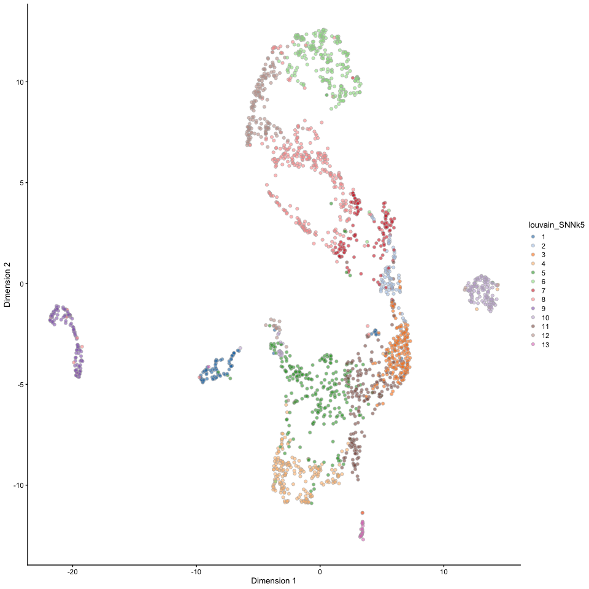
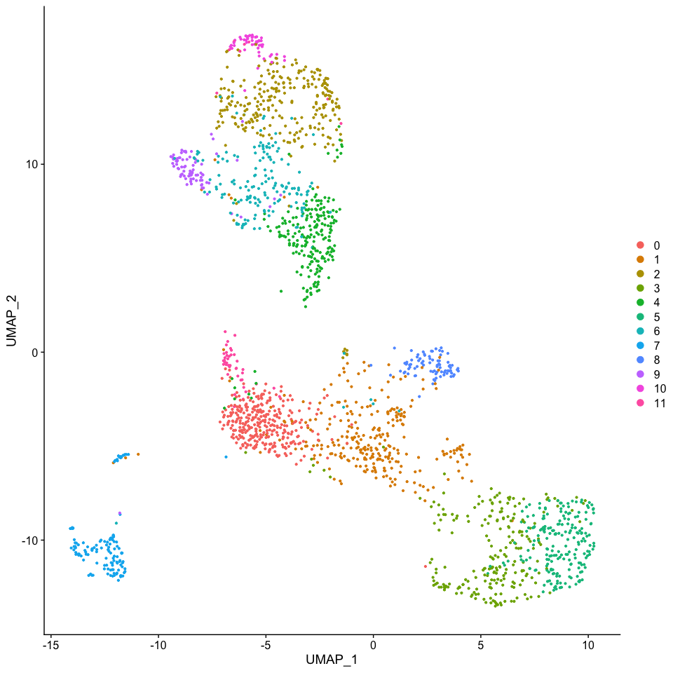
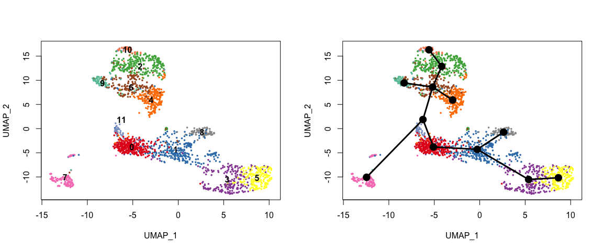
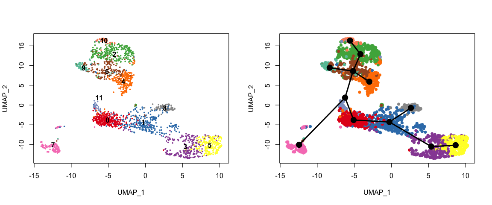
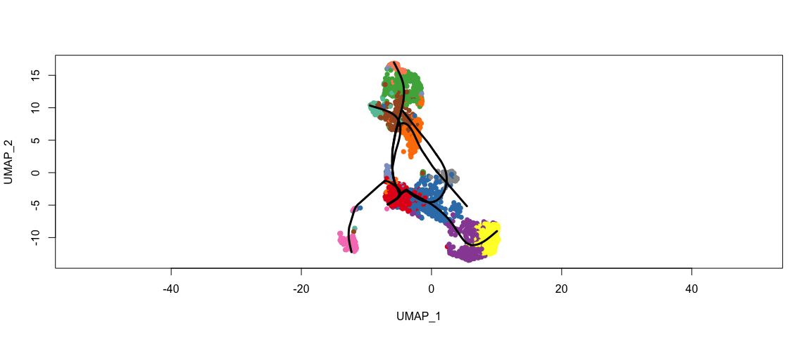
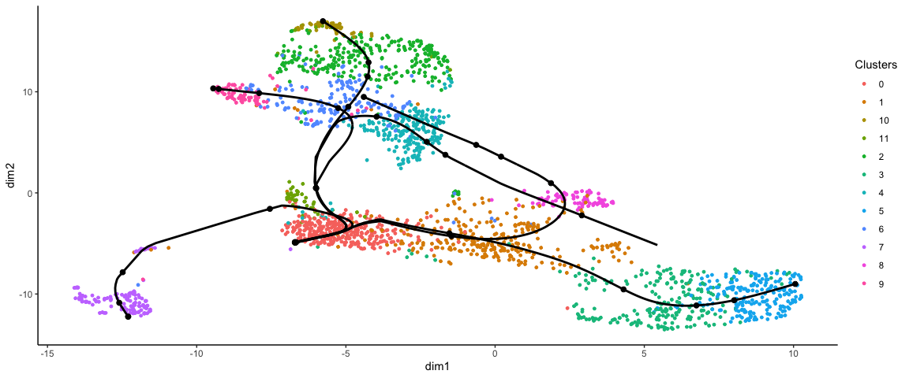
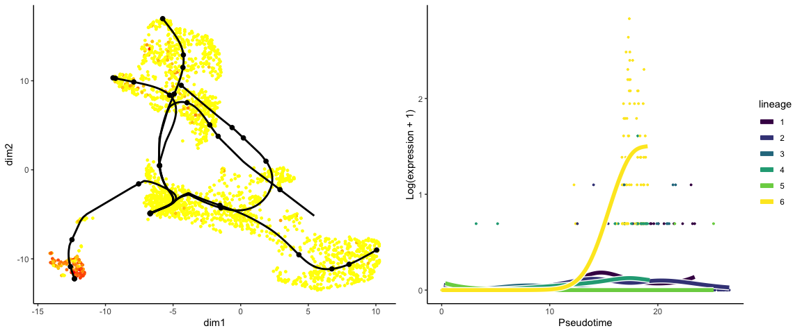

<style>
h1, .h1, h2, .h2, h3, .h3, h4, .h4 { margin-top: 50px }
p.caption {font-size: 0.9em;font-style: italic;color: grey;margin-right: 10%;margin-left: 10%;text-align: justify}
</style>

# Trajectory inference analysis: Slingshot


### Downloading dataset


```bash
#Create data folder
mkdir data

#Download file from NCBI server into data folder
curl ftp://ftp.ncbi.nlm.nih.gov/geo/series/GSE72nnn/GSE72857/suppl/GSE72857%5Fumitab%2Etxt%2Egz -o data/GSE72857_umitab.txt.gz

#Decompress it
gunzip GSE72857_series_matrix.txt.gz
```


### Loading matrix into R and converting it to compressed `.rds` format.


```r
data <- read.delim("data/GSE72857_umitab.txt", header = T, row.names = 1)
comp_matrix <- Matrix::Matrix(as.matrix(data), sparse = T)
saveRDS(comp_matrix, "data/GSE72857_umitab.rds")
```

 

### Loading data

In order to speed up the computations during the exercises, we will be selecting every fith cell of the dataset.


```r
umi_counts <- readRDS("data/GSE72857_umitab.rds")
umi_counts <- umi_counts[, c(T, F, F, F, F)]
dim(umi_counts)
```

```
## [1] 27297  2074
```

```r
# Define a color pallete to use
pal <- c(RColorBrewer::brewer.pal(9, "Set1"), RColorBrewer::brewer.pal(8, "Set2"))
```


### Basic processing with Scran/Scater pipeline
***

If you have been using the `scran/scater` pipeline so far. Below you can find a summary code for data processing until getting:

* A reduction where to perform the trajectory (UMAP)
* The cell clustering information


```r
suppressPackageStartupMessages({
    library(scran)
    library(scater)
    library(igraph)
})

# Data analysis with Scran pipeline
data <- SingleCellExperiment(assays = list(counts = umi_counts))
data <- computeSumFactors(data, sizes = c(20, 40, 60, 80))
data <- logNormCounts(data)
var.fit <- modelGeneVar(data)
top.hvgs <- getTopHVGs(var.fit, n = 2000)
data <- runPCA(data, subset_row = top.hvgs)
g <- buildSNNGraph(data, k = 5, use.dimred = "PCA", assay.type = "RNA")
data$louvain_SNNk5 <- factor(igraph::cluster_louvain(g)$membership)
data <- runUMAP(data, dimred = "PCA", n_dimred = 50, ncomponents = 2, spread = 2, min_dist = 0.1, n_neighbors = 10, metric = "cosine")

# Plot the clusters
plotReducedDim(data, dimred = "UMAP", colour_by = "louvain_SNNk5")
```

<!-- -->

```r
# Save the objects as separate matrices for input in slingshot
dimred <- reducedDim(data, type = "UMAP")
clustering <- data$louvain_SNNk5
counts <- as.matrix(counts(data)[top.hvgs, ])
```

 

### Basic processing with Seurat pipeline
***

If you have been using the `Seurat` pipeline so far. Below you can find a summary code for data processing until getting:

* A matrix where to perform the trajectory (UMAP)
* The cell clustering information


```r
suppressPackageStartupMessages({
    library(Seurat)
    library(cowplot)
})

# Data analysis with Seurat pipeline
data <- CreateSeuratObject(counts = umi_counts)
data <- NormalizeData(data)
data <- FindVariableFeatures(data, nfeatures = 2000)
data <- ScaleData(data)
data <- RunPCA(data)
```

```
## PC_ 1 
## Positive:  Fam132a, Ermap, Cpox, Rhd, Mt2, Sphk1, Add2, Blvrb, Klf1, Epor 
## 	   Pklr, Abcb4, Mns1, Slc38a5, Myh10;mKIAA3005, Car2, Ctse, Hmbs, Mthfd1, Car1 
## 	   Spire1;AK053505, Atp1b2, Tnfaip2, Alad, 2210023G05Rik;Ces2g, Lmna, Gclm, Mt1, Cldn13, Aqp1 
## Negative:  Coro1a, Cd52, Vim, Irf8, Pkm2, Lsp1, Gm2a, Napsa, Tyrobp, AK156292;V00821;AI324046;Ighg1;AK135975;Igh;Ighg;J00476;Igh-A (1g2);Gm16844;AK036494;M34473;abParts;M13680;M12570;V00757;M36767;X73024 
## 	   Cnn2, Lgals1, Limd2, Tmsb10, H2-Aa, Cd74, H2-Eb1, Igfbp4, Id2, Cst3 
## 	   Anxa2, Plbd1, Flt3, H2-DMa, Lcp1, Tmem176b, Prtn3, Ctsg, Lgals3, Fcer1g 
## PC_ 2 
## Positive:  Tmsb4x, Ctsg, Coro1a, Cst3, H2afy, Cd52, Napsa, Emb, Mpo, Tyrobp 
## 	   Lcp1, Hsp90b1, Prtn3, Arhgdib, Gm2a, Dbi, Calr, Irf8, Psap, Anxa2 
## 	   Lyz1;Lyz2, Lgals1, MRPL33;Mrpl33, Pkm2, Ly6c2, Vim, Csde1;mKIAA0885, BC035044, Alas1, 2810417H13Rik 
## Negative:  Car2, Car1, Aqp1, Vamp5, Blvrb, Klf1, Zfpm1, Mfsd2b, Apoe, Atp1b2 
## 	   Mt2, Abcb4, Tspo2, Samd14, Rhd, Sphk1, Gata1, Isg20, Gfi1b, Hemgn 
## 	   Sdsl, Ermap, Fam132a, 1190007F08Rik, Pdzk1ip1, Epor, Lmna, Ctse, Trfr2, Hba-a2 
## PC_ 3 
## Positive:  Cd74, H2-Eb1, H2-Aa, Plbd1, H2-Ab1, Id2, Lgals3, NAAA;Naaa, Ahnak, Lsp1 
## 	   Slamf7, 4930506M07Rik, Myadm, Batf3, Aif1, Crip1, Psap, Ifi30, Ckb, H2-DMb1;H2-DMb2 
## 	   Gpr35, Rnase6, Ctss, Olfm1, Ece1, Irf5, Lilrb3;Pira1;Gm14548;Pira11;Pira2;Pira4;Pira7;Lilra6;Pirb, AK217941, Xcr1, Klf2 
## Negative:  Elane, Hp, Gstm1, Prtn3, Ly6c2, Ctsg, C3, Alas1, Fcgr3, 1100001G20Rik 
## 	   Lbp, Mpo, Gpc1, Nkg7, Trem3, 1190002H23Rik, B4galt6, Lcn2, Igsf6, Pgd 
## 	   Hdc, Cldn15, Emilin1, Prdx5, Dmkn, Igfbp4, Calr, Gsr, Ckap4, Cst7 
## PC_ 4 
## Positive:  Gpr56, Tmem176b, Nrgn, Ifitm1, Cd27, Sox4, Cd34, Spns2, Eef1a1, Aff3 
## 	   AK152437, H2afy, Ifitm3, Mef2c;AK043267, Eltd1, Gata2, Rbpms;Rbpms2, Slc22a3, Serpina3f;Serpina3g, Paics 
## 	   BC035044, Lgals9, Elf1, Apoe, Gas5, Pabpc1;Pabpc2, Mir703, Rpl23, Rps24, Dntt 
## Negative:  1100001G20Rik, C3, Elane, 1190002H23Rik, Fcnb, Pglyrp1, Lcn2, Gstm1, Hp, Gpc1 
## 	   Fcgr3, Mgl2, Ly6c2, B4galt6, Plbd1, Chi3l3, Fam101b, Mt1, Sema4a, Dmkn 
## 	   Id2, Chd7, Lrg1, Dgat2, Nucb2, Cldn15, Lgals3, S100a9, NAAA;Naaa, Gsr 
## PC_ 5 
## Positive:  Rpl22, Cox7b, Rpl23, Eef1a1, Cox7a2, Cox6c, Sub1, Ndufa4, Chi3l3, Dbi 
## 	   1100001G20Rik, S100a9, Nkg7, Lcn2, Gas5, Evi2b;Evi2a, Psmb7, Malat1, Csde1;mKIAA0885, 1810006K21Rik 
## 	   Snrpe, Tmsb4x, Mrpl42, S100a8, Rps24, Mgst2, Agps, Apoe, Bcap31, Slc22a3 
## Negative:  Cd34, Irf8, AK156292;V00821;AI324046;Ighg1;AK135975;Igh;Ighg;J00476;Igh-A (1g2);Gm16844;AK036494;M34473;abParts;M13680;M12570;V00757;M36767;X73024, Igfbp4, Lgals1, Cd27, H2afy, Tmsb10, Csf1r, Serpinf1 
## 	   Emb, Tmem176b, Mpo, Limd2, Prtn3, Pkm2, Plxnb2, Ctsg, Flt3, Bex6 
## 	   Coro1a, Phb2, Calr, Plac8, FKBP12-T1;Fkbp1a, H2afx, Fth1, Il6st, Tifab, Slc29a1;Ent1
```

```r
data <- FindNeighbors(data)
data <- FindClusters(data, resolution = 1)
```

```
## Modularity Optimizer version 1.3.0 by Ludo Waltman and Nees Jan van Eck
## 
## Number of nodes: 2074
## Number of edges: 64612
## 
## Running Louvain algorithm...
## Maximum modularity in 10 random starts: 0.8111
## Number of communities: 12
## Elapsed time: 0 seconds
```

```r
data <- RunUMAP(data, n.neighbors = 10, dims = 1:50, spread = 2, min.dist = 0.3)

# Plot the clusters
DimPlot(data, group.by = "RNA_snn_res.1")
```

<!-- -->

```r
# Save the objects as separate matrices for input in slingshot
dimred <- data@reductions$umap@cell.embeddings
clustering <- data$RNA_snn_res.1
counts <- as.matrix(data@assays$RNA@counts[data@assays$RNA@var.features, ])
```

 
#### Trajectory inference with Slingshot
***

Until up to this point, the steps above have been covered in the previous lectures. From now on, we will start using that clustering and data reduction techniques for trajectory inference. The whole process can be done using a single function named `slingshot`, which is simply a wrapper for the 2 main steps for trajectory inference. The first step of the process is to define the lineages and then fit a curve through the data that defines a trajectory. These steps are break donw below for clarity.


#### Defining cell lineages with Slingshot


```r
suppressPackageStartupMessages({
    library(slingshot)
})

# Run default Slingshot lineage identification
set.seed(1)
lineages <- getLineages(data = dimred, clusterLabels = clustering)

lineages
```

```
## class: SlingshotDataSet 
## 
##  Samples Dimensions
##     2074          2
## 
## lineages: 5 
## Lineage1: 5  3  1  0  11  6  2  10  
## Lineage2: 5  3  1  0  11  6  4  
## Lineage3: 5  3  1  0  11  6  9  
## Lineage4: 5  3  1  0  11  7  
## Lineage5: 5  3  1  8  
## 
## curves: 0
```

```r
# Plot the lineages
par(mfrow = c(1, 2))
plot(dimred[, 1:2], col = pal[clustering], cex = 0.5, pch = 16)
for (i in levels(clustering)) {
    text(mean(dimred[clustering == i, 1]), mean(dimred[clustering == i, 2]), labels = i, font = 2)
}
plot(dimred[, 1:2], col = pal[clustering], cex = 0.5, pch = 16)
lines(lineages, lwd = 3, col = "black")
```

<!-- -->


Here we see one central issue with trajectory analysis: where does the trajectory begin? Without any extra information, this is nearly an impossible task for a TI method. We need prior biological information to be able to define where the trajectory starts and where it should end.


```r
#Run default Slingshot
set.seed(1)
lineages <- getLineages(data = dimred,
                        clusterLabels = clustering,
                        #end.clus = c("11","7","10","9","5"), #define how many branches/lineages to consider
                        start.clus = "0") #define where to start the trajectories

lineages
```

```
## class: SlingshotDataSet 
## 
##  Samples Dimensions
##     2074          2
## 
## lineages: 6 
## Lineage1: 0  11  6  2  10  
## Lineage2: 0  11  6  4  
## Lineage3: 0  1  3  5  
## Lineage4: 0  11  6  9  
## Lineage5: 0  1  8  
## Lineage6: 0  11  7  
## 
## curves: 0
```

```r
#Plot the lineages
par(mfrow=c(1,2))
plot(dimred[,1:2], col = pal[clustering],  cex=.5,pch = 16)
for(i in levels(clustering)){ 
  text( mean(dimred[clustering==i,1]),
        mean(dimred[clustering==i,2]), labels = i,font = 2) }
plot(dimred, col = pal[clustering],  pch = 16)
lines(lineages, lwd = 3, col = 'black')
```

<!-- -->

 

#### Defining Principal Curves

Once the clusters are connected, Slingshot allows you to transform them to a smooth trajectory using principal curves. This is an algorithm that iteratively changes an initial curve to better match the data points. It was developed for linear data. To apply it to single-cell data, slingshot adds two enhancements:

* It will run principal curves for each ‘lineage’, which is a set of clusters that go from a defined start cluster to some end cluster
* Lineages with a same set of clusters will be constrained so that their principal curves remain bundled around the overlapping clusters

Since the function `getCurves()` takes some time to run, we can speed up the convergence of the curve fitting process by reducing the amount of cells to use in each lineage. Ideally you could all cells, but here we had set `approx_points` to 300 to speed up. Feel free to adjust that for your dataset.
 

```r
curves <- getCurves(lineages, approx_points = 300, thresh = 0.01, stretch = 0.8, allow.breaks = FALSE, shrink = 0.99)
curves
```

```
## class: SlingshotDataSet 
## 
##  Samples Dimensions
##     2074          2
## 
## lineages: 6 
## Lineage1: 0  11  6  2  10  
## Lineage2: 0  11  6  4  
## Lineage3: 0  1  3  5  
## Lineage4: 0  11  6  9  
## Lineage5: 0  1  8  
## Lineage6: 0  11  7  
## 
## curves: 6 
## Curve1: Length: 23.409	Samples: 784.19
## Curve2: Length: 30.512	Samples: 693.17
## Curve3: Length: 21.643	Samples: 948.24
## Curve4: Length: 19.246	Samples: 553.65
## Curve5: Length: 25.157	Samples: 719.84
## Curve6: Length: 19.054	Samples: 477.24
```

```r
plot(dimred, col = pal[clustering], asp = 1, pch = 16)
lines(curves, lwd = 3, col = "black")
```

<!-- -->


 

### Finding differentially expressed genes
***

The main way to interpret a trajectory is to find genes that change along the trajectory. There are many ways to define differential expression along a trajectory:

* Expression changes along a particular path (i.e. change with pseudotime)
* Expression differences between branches
* Expression changes at branch points
* Expression changes somewhere along the trajectory
* …

`tradeSeq` is a recently proposed algorithm to find trajectory differentially expressed genes. It works by smoothing the gene expression along the trajectory by fitting a smoother using generalized additive models (GAMs), and testing whether certain coefficients are statstically different between points in the trajectory.


```r
BiocParallel::register(BiocParallel::SerialParam())
```

The fitting of GAMs can take quite a while, so for demonstration purposes we first do a very stringent filtering of the genes. In an ideal experiment, you would use all the genes, or at least those defined as being variable.


```r
library(tradeSeq)

# Removing some genes to speed up the computations for this tutorial
filt_counts <- counts[rowSums(counts > 5) > ncol(counts)/100, ]
dim(filt_counts)
```

```
## [1]  215 2074
```

```r
sce <- fitGAM(counts = as.matrix(filt_counts), sds = curves)

plotGeneCount(curves, filt_counts, clusters = clustering, models = sce)
```

<!-- -->


```r
# Define function to plot
library(dplyr)
plot_differential_expression <- function(feature_id) {
    feature_id <- pseudotime_association %>% filter(pvalue < 0.05) %>% top_n(1, -waldStat) %>% pull(feature_id)
    cowplot::plot_grid(plotGeneCount(curves, filt_counts, gene = feature_id[1], clusters = clustering, models = sce) + ggplot2::theme(legend.position = "none"), 
        plotSmoothers(sce, as.matrix(counts), gene = feature_id[1]))
}
```

 

#### Genes that change with pseudotime


```r
pseudotime_association <- associationTest(sce)
pseudotime_association$fdr <- p.adjust(pseudotime_association$pvalue, method = "fdr")
pseudotime_association <- pseudotime_association[order(pseudotime_association$pvalue), ]
pseudotime_association$feature_id <- rownames(pseudotime_association)
```


```r
feature_id <- pseudotime_association %>% filter(pvalue < 0.05) %>% top_n(1, -waldStat) %>% pull(feature_id)
plot_differential_expression(feature_id)
```

<!-- -->

 

#### Genes that change between two pseudotime points

We can define custom pseudotime values of interest if we’re interested in genes that change between particular point in pseudotime. By default, we can look at differences between start and end:


```r
pseudotime_start_end_association <- startVsEndTest(sce, pseudotimeValues = c(0, 1))
pseudotime_start_end_association$feature_id <- rownames(pseudotime_start_end_association)

feature_id <- pseudotime_start_end_association %>% filter(pvalue < 0.05) %>% top_n(1, waldStat) %>% pull(feature_id)

plot_differential_expression(feature_id)
```

<!-- -->

 

#### Genes that are different between lineages

More interesting are genes that are different between two branches. We may have seen some of these genes already pop up in previous analyses of pseudotime. There are several ways to define “different between branches”, and each have their own functions:

* Different at the end points, using `diffEndTest`
* Different at the branching point, using `earlyDETest`
* Different somewhere in pseudotime the branching point, using `patternTest`
* Note that the last function requires that the pseudotimes between two lineages are aligned.


```r
different_end_association <- diffEndTest(sce)
different_end_association$feature_id <- rownames(different_end_association)
feature_id <- different_end_association %>% filter(pvalue < 0.05) %>% arrange(desc(waldStat)) %>% dplyr::slice(1) %>% pull(feature_id)
plot_differential_expression(feature_id)
```

<!-- -->


```r
branch_point_association <- earlyDETest(sce)
branch_point_association$feature_id <- rownames(branch_point_association)

feature_id <- branch_point_association %>% filter(pvalue < 0.05) %>% arrange(desc(waldStat)) %>% dplyr::slice(1) %>% pull(feature_id)
plot_differential_expression(feature_id)
```

<!-- -->


Check out this [vignette](https://statomics.github.io/tradeSeq/articles/tradeSeq.html) for a more in-depth overview of tradeSeq

 

### References
***

Cannoodt, Robrecht, Wouter Saelens, and Yvan Saeys. 2016. “Computational Methods for Trajectory Inference from Single-Cell Transcriptomics.” *European Journal of Immunology* 46 (11): 2496–2506. [doi](https://doi.org/10.1002/eji.201646347).

Saelens, Wouter, Robrecht Cannoodt, Helena Todorov, and Yvan Saeys. 2019. “A Comparison of Single-Cell Trajectory Inference Methods.” *Nature Biotechnology* 37 (5): 547–54. [doi](https://doi.org/10.1038/s41587-019-0071-9).


