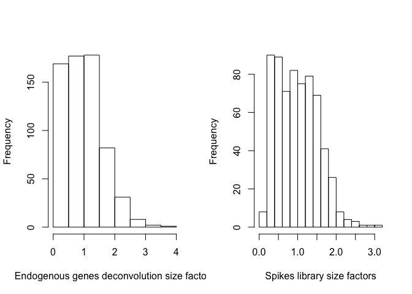

Comparing scRNAseq Normalization Methods
========================================

### Load packages

First of all we will load *scran* and *scater* as well as some other R packages which we are going to use in this lab:

``` r
suppressMessages(require(scran))
suppressMessages(require(scater))
suppressMessages(require(edgeR))
suppressMessages(require(matrixStats))
suppressMessages(require(mixOmics))
suppressMessages(require(RColorBrewer))
suppressMessages(require(Rtsne))
suppressMessages(require(limSolve))
suppressMessages(require(DESeq))
suppressMessages(require(tweeDEseq))
```

### Load Expression Values and Metadata

Let us start with loading the matrix of raw gene expression counts and filtering away lowly expressed genes. Lowly expressed genes should be excluded from the downstream analysis as they might lead to spurious results. To correctly compare expression of different genes one needs to normalize the raw counts by gene length, i.e. the RPKM normalization does. Therefore we will use RPKM normalized data set in order to exclude lowly expressed genes which we define as genes with mean RPKM count across all cells below 1.

``` r
D <- read.table("data/ILC/ensembl_countvalues_ILC.csv",sep=",",header=T,row.names=1)
rpkm <- read.table("data/ILC/ensembl_rpkmvalues_ILC.csv",sep=",",header=T,row.names=1)
D<-D[rowMeans(rpkm)>=1,]
rpkm<-rpkm[rowMeans(rpkm)>=1,]
D[1:4,1:4]
```

    ##                 T74_P1_A9_ILC1 T74_P1_B4_NK T74_P1_B7_ILC2 T74_P1_B9_NK
    ## ENSG00000000003              0            0              0            0
    ## ENSG00000000419              0            0              0            0
    ## ENSG00000000457              0            0              0            0
    ## ENSG00000000460              1            0              1            0

``` r
dim(D)
```

    ## [1] 15454   648

The rows of the matrix represent Ensembl gene IDs (you can convert them to gene symbols using biomaRt package) from 15454 genes, and the columns are IDs from 648 cells from different individuals sequenced at different plates. To see how many individuals and plates we have let us load the meta-information and have a look:

``` r
M <- read.table("data/ILC/Metadata_ILC.csv",sep=",",header=T,row.names=1)
M$Plate<-matrix(unlist(strsplit(as.character(M$Plate),"_")),byrow=TRUE,ncol=2)[,2]
head(M)
```

    ##                 Plate Donor Celltype
    ## T74_P1_A9_ILC1     P1   T74     ILC1
    ## T74_P1_B4_NK       P1   T74       NK
    ## T74_P1_B7_ILC2     P1   T74     ILC2
    ## T74_P1_B9_NK       P1   T74       NK
    ## T74_P1_D10_ILC2    P1   T74     ILC2
    ## T74_P1_E1_ILC3     P1   T74     ILC3

Thus we have cells from 3 individuals with IDs:

``` r
levels(factor(M$Donor))
```

    ## [1] "T74" "T75" "T86"

that were pooled together and sequenced at 4 plates with IDs:

``` r
levels(factor(M$Plate))
```

    ## [1] "P1" "P2" "P3" "P4"

and finally we have 4 cell-types with the following IDs:

``` r
levels(factor(M$Celltype))
```

    ## [1] "ILC1" "ILC2" "ILC3" "NK"

We will color cells on the PCA, MDS and tSNE plots by their cell type, therfore let us add a column of individual colors for each cell type:

``` r
Celltype_Colors<-data.frame(Celltype=levels(factor(M$Celltype)),Color=brewer.pal(length(levels(factor(M$Celltype))),'Dark2'))
M$Celltype_Color<-as.character(Celltype_Colors$Color[match(M$Celltype,Celltype_Colors$Celltype)])
```

Finally, before we start comparing different normalization strategies, let us check how many spikes and how many endogenous genes we have after we have filtered the unnormalized data set:

``` r
print(paste0("There are ",sum(grepl("ERCC_",rownames(D)))," spikes in the scRNAseq data set after filtering"))
```

    ## [1] "There are 71 spikes in the scRNAseq data set after filtering"

``` r
D_ERCC<-D[grepl("ERCC_",rownames(D)),]
D_ERCC[1:5,1:5]
```

    ##                                         T74_P1_A9_ILC1 T74_P1_B4_NK
    ## ERCC_0.11444092:mix1_0.11444092:mix2                 0            1
    ## ERCC_0.22888184:mix1_0.22888184:mix2..2              4            2
    ## ERCC_0.22888184:mix1_0.34332275:mix2..1              0            0
    ## ERCC_0.45776367:mix1_0.11444092:mix2..2              0            0
    ## ERCC_0.45776367:mix1_0.45776367:mix2                 0            0
    ##                                         T74_P1_B7_ILC2 T74_P1_B9_NK
    ## ERCC_0.11444092:mix1_0.11444092:mix2                 1            1
    ## ERCC_0.22888184:mix1_0.22888184:mix2..2              4            4
    ## ERCC_0.22888184:mix1_0.34332275:mix2..1              0            0
    ## ERCC_0.45776367:mix1_0.11444092:mix2..2              0            0
    ## ERCC_0.45776367:mix1_0.45776367:mix2                 0            0
    ##                                         T74_P1_D10_ILC2
    ## ERCC_0.11444092:mix1_0.11444092:mix2                  0
    ## ERCC_0.22888184:mix1_0.22888184:mix2..2               1
    ## ERCC_0.22888184:mix1_0.34332275:mix2..1               0
    ## ERCC_0.45776367:mix1_0.11444092:mix2..2               0
    ## ERCC_0.45776367:mix1_0.45776367:mix2                  0

``` r
print(paste0("There are ",sum(grepl("ERCC_",rownames(D))==FALSE)," endogenous genes in the scRNAseq data set after filtering"))
```

    ## [1] "There are 15383 endogenous genes in the scRNAseq data set after filtering"

This unnormalized and filtered data set we will use later for applying different normalization methods. Note that RPKM normalized data set contains exactly the same genes since we used mean RPKM count above or equalt to 1 as a criterion for filtering.

### Defining Visualization Functions

In this section we will define a few custom functions which will be useful later for comparison of normalization techniques. Since we are going to repeat the same visualization commands such as plotting CV^2 vs. mean expression, PCA, tSNE for data sets normalized by different methods it makes sense to put those commands in separate functions. The functions we define here take a data set (normalized or unnormalized) as *df* and a short custom description of the normalization method as *description*, and produce a bunch of informatice plots. There is no need to go through the code of the functions unless you really want it, the code is not difficult but bulky and boring. Below, *df* is a matrix with samples as columns and features as rows, and *description* is supposed to say something about the normalization used, i.e. "RAW", "RPKM", "DECONVOLUTION" or "SPIKE LIB SIZE" normalization; *layout* and *print* define how many plots we want to combine and if the visualization should be displayed, respectively. First function plots the squared coefficient of variation against mean gene expression for endogenous genes and spikes, fit the spike points and determines endogeneous genes with variation above spikes level:

``` r
cv2_vs_mean_function<-function(df,description,layout,print)
{
if(layout==2){par(mfrow=c(layout,layout))}
df_ERCC<-df[grepl("ERCC_",rownames(df)),]
#PLOT CV^2 VS. MEAN PLOT FOR ENDOGENOUS GENES
mean_expr<-as.numeric(rowMeans(df,na.rm=TRUE))
sd_expr<-rowSds(as.matrix(df),na.rm=TRUE)
cv_squared_expr<-(sd_expr/mean_expr)^2
if(print==TRUE)
{
plot(log10(cv_squared_expr)~log10(mean_expr),pch=20,cex=0.5,xlab=paste0("log10 ( MEAN ",description," COUNT )"),ylab="log10 ( CV² )",main=paste0(description," COUNTS")) 
}
#PLOT CV^2 VS. MEAN PLOT FOR SPIKES
mean_expr_ercc<-as.numeric(rowMeans(df_ERCC,na.rm=TRUE))
sd_expr_ercc<-rowSds(as.matrix(df_ERCC),na.rm=TRUE)
cv_squared_expr_ercc<-(sd_expr_ercc/mean_expr_ercc)^2
mean_expr_ercc_filtered<-mean_expr_ercc
cv_squared_expr_ercc_filtered<-cv_squared_expr_ercc
if(print==TRUE)
{
points(log10(cv_squared_expr_ercc_filtered)~log10(mean_expr_ercc_filtered),col="red",pch=20,cex=1.5)
}
#FIT SPIKES WITH A CURVE
fit_expr_ercc<-loess(log10(cv_squared_expr_ercc_filtered)[is.finite(log10(mean_expr_ercc_filtered))]~log10(mean_expr_ercc_filtered)[is.finite(log10(mean_expr_ercc_filtered))],span=1)
j<-order(log10(mean_expr_ercc_filtered)[is.finite(log10(mean_expr_ercc_filtered))])
if(print==TRUE)
{
lines(fit_expr_ercc$fitted[j]~log10(mean_expr_ercc_filtered)[is.finite(log10(mean_expr_ercc_filtered))][j],col="red",lwd=3)
}
pred_expr<-predict(fit_expr_ercc,log10(mean_expr))
#DETERMINE VARIABLE GENES THAT ARE ABOVE THE SPIKEINS CURVE
filtered_expr<-df[log10(cv_squared_expr)>=pred_expr,]
filtered_expr<-filtered_expr[grepl("NA",rownames(filtered_expr))==FALSE,]
if(print==TRUE)
{
text(3,2.5,paste0(dim(filtered_expr)[1]," variable genes"))
}
if(print==FALSE)
{
return(filtered_expr)
}
}
```

Second function accepts the filtered data set (only endogenous genes above spike level) and makes a PCA plot using *prcomp* R function:

``` r
pca_function<-function(df,description,layout)
{
if(layout==2){par(mfrow=c(layout,layout))}
filtered_expr<-cv2_vs_mean_function(df,description,layout,FALSE)
#PCA PLOT WITH PRCOMP
PC<-prcomp(log10(t(filtered_expr+1)),center=TRUE,scale=FALSE)
plot(PC$x[,1:2],col=M$Celltype_Color,main=paste0("PCA PLOT: ",description," COUNTS"))
legend("topleft",levels(M$Celltype),cex=1,fill=levels(factor(M$Celltype_Color)),inset=0.02)
}
```

Third function accepts the filtered data set (only endogenous genes above spikes level) and makes a tSNE plot using *Rtsne* R function:

``` r
tsne_function<-function(df,description,layout)
{
if(layout==2){par(mfrow=c(layout,layout))}
filtered_expr<-cv2_vs_mean_function(df,description,layout,FALSE)
#TSNE PLOT
library("Rtsne")
set.seed(1)
tsne.out_expr<-Rtsne(t(log10(filtered_expr+1)),initial_dims=20,verbose=TRUE,perplexity=30)
plot(tsne.out_expr$Y,main=paste0("tSNE: ",description," COUNTS"),col=M$Celltype_Color,xlab="tSNE1",ylab="tSNE2")
legend("topright",levels(M$Celltype),cex=1,fill=levels(factor(M$Celltype_Color)),inset=0.02)
}
```

### Deconvolution Normalization

Until now we have been dealing with two data sets: 1) raw counts, 2) RPKM counts. Despite RPKM is satisfactory for scRNAseq data in some situations, it over-corrects the sequencing depth bias by equalizing library sizes between the cells.

Here we will apply a pooling across cell, or deconvolution, normalization method developed in the lab of John Marioni (EBI). For this purpose we need to create a *scran* object and mark spikes inside the object:

``` r
sce_deconv<-SingleCellExperiment(assays = list(counts = as.matrix(D)))
sce_deconv<-calculateQCMetrics(sce_deconv,feature_controls=list(MySpikes=rep(c(FALSE,TRUE),c(dim(D)[1]-dim(D_ERCC)[1],dim(D_ERCC)[1]))))
isSpike(sce_deconv, "MySpikes") <- grep("^ERCC", rownames(sce_deconv))
spikeNames(sce_deconv)
```

    ## [1] "MySpikes"

``` r
table(isSpike(sce_deconv))
```

    ## 
    ## FALSE  TRUE 
    ## 15383    71

Further, the most optimal way to apply the deconvolution method is when the pooling across cells is done for each cell sub-population separately. Therefore we will pre-cluster all the cells with hierarchical clustering and dynamic tree cut. After this we will proceed with normalizing endogenous genes with deconvolution method. Spikes will be normalized separately by traditional library size normalization since spike counts are independent on the total mRNA content. The library size normalization is appropriate for spikes since we do no expect any differentially expressed spikes between the cells.

``` r
clusters <- quickCluster(sce_deconv,get.spikes=FALSE,min.size=199)
sce_deconv <- computeSumFactors(sce_deconv,cluster=clusters)
summary(sizeFactors(sce_deconv))
```

    ##    Min. 1st Qu.  Median    Mean 3rd Qu.    Max. 
    ##  0.1337  0.4879  0.9278  1.0000  1.3920  3.6602

``` r
#Note that we set general.use=FALSE here which means that the spikes size factors will be used only for normalization of spikes but not the endogenous genes
sce_deconv <- computeSpikeFactors(sce_deconv,general.use=FALSE)
summary(sizeFactors(sce_deconv))
```

    ##    Min. 1st Qu.  Median    Mean 3rd Qu.    Max. 
    ##  0.1337  0.4879  0.9278  1.0000  1.3920  3.6602

``` r
head(sizeFactors(sce_deconv))
```

    ## [1] 0.2778825 2.7146975 1.1039999 1.0944683 0.4102707 0.8807657

``` r
head(sizeFactors(sce_deconv, "MySpikes"))
```

    ## [1] 0.6519482 2.7998218 2.5414232 2.3246439 0.9562505 0.7434053

``` r
par(mfrow=c(1,2))
hist(sizeFactors(sce_deconv),xlab="Endogenous genes deconvolution size factors",main="")
hist(sizeFactors(sce_deconv, "MySpikes"),xlab="Spikes library size factors",main="")
```



``` r
sce_deconv<-normalize(sce_deconv)

expr_deconv<-as.data.frame(t(apply(D[grepl("ERCC_",rownames(D))==FALSE,],1,"/", sizeFactors(sce_deconv))))
expr_deconv_ercc<-as.data.frame(t(apply(D_ERCC,1,"/", sizeFactors(sce_deconv, "MySpikes"))))
expr_deconv_merge<-rbind(expr_deconv,expr_deconv_ercc)
```

Here *expr\_deconv\_merge* contains endogenous genes normalized by deconvolution normalization and spikes normalized by library size normalization. We will proceed with detection of highly variable genes by decomposing biological and technical variation, the latter is determined as the variation of spikes. We will also correct for donor batch on this step.

``` r
#Detecting highly variable genes
batch <- M$Donor
design <- model.matrix(~batch)
fit <- trendVar(sce_deconv, design=design)
decomp <- decomposeVar(sce_deconv, fit)
top.hvgs <- order(decomp$bio, decreasing=TRUE)
head(decomp[top.hvgs,])
```

    ##                      mean     total      bio       tech       p.value
    ## ENSG00000170345 11.846330  9.994029 9.526006  0.4680228  0.000000e+00
    ## ENSG00000118503  8.321921 15.258697 9.198115  6.0605826  8.300294e-86
    ## ENSG00000188404  6.926173 20.299787 8.962153 11.3376342  2.055956e-31
    ## ENSG00000090104  7.116057 18.912498 8.144020 10.7684776  2.633423e-29
    ## ENSG00000121966  8.788682 12.729136 8.129279  4.5998572 1.361873e-107
    ## ENSG00000110848  9.915246 10.161072 7.985256  2.1758164 4.125957e-301
    ##                           FDR
    ## ENSG00000170345  0.000000e+00
    ## ENSG00000118503  7.510790e-83
    ## ENSG00000188404  9.883364e-29
    ## ENSG00000090104  1.191469e-26
    ## ENSG00000121966 1.396646e-104
    ## ENSG00000110848 7.933699e-298

``` r
par(mfrow=c(1,1))
barplot(as.numeric(decomp[top.hvgs,]$bio)[1:7],names.arg=rownames(decomp[top.hvgs,])[1:7],las=1,ylim=c(0,10),main="Highly Variable Genes",cex.names=0.7,col="brown",ylab="BIOLOGICAL VARIATION")
```


``` r
plot(decomp$mean, decomp$total, xlab="Mean log-expression", ylab="Variance")
o <- order(decomp$mean)
lines(decomp$mean[o], decomp$tech[o], col="red", lwd=2)
points(fit$mean, fit$var, col="red", pch=16)
```


Further we will rank gene pairs by their par-wise Spearman correlation. To test significance of the correlation the observed Spearman rho is compared with permuted Spearman rho (null hupothesis). Again batch-effects are explicitly taken into account:

``` r
#Detecting correlated genes
null.dist <- correlateNull(design=design)
cor.pairs <- correlatePairs(sce_deconv[top.hvgs[1:200],], null.dist=null.dist, design=design)
head(cor.pairs)
```

    ##             gene1           gene2       rho      p.value          FDR
    ## 1 ENSG00000170345 ENSG00000120129 0.7219792 1.999998e-06 2.392219e-05
    ## 2 ENSG00000120129 ENSG00000157514 0.5902132 1.999998e-06 2.392219e-05
    ## 3 ENSG00000170345 ENSG00000157514 0.5506957 1.999998e-06 2.392219e-05
    ## 4 ENSG00000110002 ENSG00000162594 0.5371064 1.999998e-06 2.392219e-05
    ## 5 ENSG00000162594 ENSG00000104951 0.5365312 1.999998e-06 2.392219e-05
    ## 6 ENSG00000170345 ENSG00000087074 0.5230270 1.999998e-06 2.392219e-05
    ##   limited
    ## 1    TRUE
    ## 2    TRUE
    ## 3    TRUE
    ## 4    TRUE
    ## 5    TRUE
    ## 6    TRUE

``` r
barplot(abs(as.numeric(cor.pairs$rho))[1:4],names.arg=paste(cor.pairs$gene1[1:4],cor.pairs$gene2[1:4],sep="_"),las=1,main="Correlated Gene Pairs",cex.names=0.6,col="darkgreen",ylab="SPEARMAN RHO")
```


Finally we will perform cell cycle phase assignment using a pre-trained classifier. The classifier was trained by looking at the pairs of genes for which the difference in their expression changes its sign from cell phase to cell phase.

``` r
#ASSIGN CELL CYCLE STATUS
hs.pairs <- readRDS(system.file("exdata", "human_cycle_markers.rds", package="scran")) #launch classifier for human data
assigned <- cyclone(sce_deconv, pairs=hs.pairs) #classification
rownames(assigned$scores)<-colnames(sce_deconv)
head(assigned$scores)
```

    ##                    G1     S   G2M
    ## T74_P1_A9_ILC1  0.178 0.672 0.044
    ## T74_P1_B4_NK    0.262 0.927 0.003
    ## T74_P1_B7_ILC2  0.346 0.328 0.380
    ## T74_P1_B9_NK    0.048 0.368 0.849
    ## T74_P1_D10_ILC2 0.383 0.310 0.233
    ## T74_P1_E1_ILC3  0.884 0.183 0.033

``` r
phase <- rep("S", ncol(sce_deconv))
phase[assigned$scores$G1 > 0.5] <- "G1"
phase[assigned$scores$G2M > 0.5] <- "G2M"
phase[assigned$scores$G1 > 0.5 & assigned$scores$G2M > 0.5] <- "unknown"
table(phase)
```

    ## phase
    ##      G1     G2M       S unknown 
    ##     288      22     334       4

``` r
assigned$scores$phase<-phase
color<-ifelse(phase=="G1","blue","red")
color[phase=="S"]<-"green"
color[phase=="unknown"]<-"black"
assigned$scores$color<-color
head(assigned$scores)
```

    ##                    G1     S   G2M phase color
    ## T74_P1_A9_ILC1  0.178 0.672 0.044     S green
    ## T74_P1_B4_NK    0.262 0.927 0.003     S green
    ## T74_P1_B7_ILC2  0.346 0.328 0.380     S green
    ## T74_P1_B9_NK    0.048 0.368 0.849   G2M   red
    ## T74_P1_D10_ILC2 0.383 0.310 0.233     S green
    ## T74_P1_E1_ILC3  0.884 0.183 0.033    G1  blue

``` r
#PCA PLOT
PC<-prcomp(log10(t(expr_deconv_merge+1)),center=TRUE,scale=FALSE)
plot(PC$x[,1:2],col=color,main=paste0("PCA PLOT: DECONVOLUTION COUNTS"))
legend("topright",c("G1","G2M","S","unknown"),cex=1,fill=c("blue","red","green","black"),inset=0.02)
```


``` r
#tSNE PLOT
set.seed(1)
tsne.out_expr<-Rtsne(t(log10(expr_deconv_merge+1)),initial_dims=20,verbose=TRUE,perplexity=30)
```

    ## Read the 648 x 20 data matrix successfully!
    ## Using no_dims = 2, perplexity = 30.000000, and theta = 0.500000
    ## Computing input similarities...
    ## Normalizing input...
    ## Building tree...
    ##  - point 0 of 648
    ## Done in 0.08 seconds (sparsity = 0.178012)!
    ## Learning embedding...
    ## Iteration 50: error is 61.220278 (50 iterations in 0.37 seconds)
    ## Iteration 100: error is 57.419919 (50 iterations in 0.31 seconds)
    ## Iteration 150: error is 57.183010 (50 iterations in 0.39 seconds)
    ## Iteration 200: error is 57.132311 (50 iterations in 0.43 seconds)
    ## Iteration 250: error is 57.127738 (50 iterations in 0.39 seconds)
    ## Iteration 300: error is 0.854626 (50 iterations in 0.39 seconds)
    ## Iteration 350: error is 0.788925 (50 iterations in 0.36 seconds)
    ## Iteration 400: error is 0.771277 (50 iterations in 0.35 seconds)
    ## Iteration 450: error is 0.761128 (50 iterations in 0.36 seconds)
    ## Iteration 500: error is 0.755042 (50 iterations in 0.39 seconds)
    ## Iteration 550: error is 0.751668 (50 iterations in 0.38 seconds)
    ## Iteration 600: error is 0.749012 (50 iterations in 0.37 seconds)
    ## Iteration 650: error is 0.745507 (50 iterations in 0.37 seconds)
    ## Iteration 700: error is 0.744192 (50 iterations in 0.39 seconds)
    ## Iteration 750: error is 0.742922 (50 iterations in 0.41 seconds)
    ## Iteration 800: error is 0.740836 (50 iterations in 0.40 seconds)
    ## Iteration 850: error is 0.738927 (50 iterations in 0.37 seconds)
    ## Iteration 900: error is 0.737000 (50 iterations in 0.39 seconds)
    ## Iteration 950: error is 0.736390 (50 iterations in 0.39 seconds)
    ## Iteration 1000: error is 0.735438 (50 iterations in 0.39 seconds)
    ## Fitting performed in 7.61 seconds.

``` r
plot(tsne.out_expr$Y,main="tSNE: DECONVOLUTION COUNTS",col=color,xlab="tSNE1",ylab="tSNE2")
legend("topright",c("G1","G2M","S","unknown"),cex=1,fill=c("blue","red","green","black"),inset=0.02)
```


We conclude that there are a lot of cycling cells in the data set. However they are spread more or less homogeneously over all clusters.

### Spike Library Size Normalization

As we saw in the previous section we can also normalize both endogenous genes and spikes by spikes library size normalization, i.e. size factors are calculated assuming that there is no differential expression between spikes. This method will preserve library size differences between cells for endogenous genes.

``` r
#sce_spike<-newSCESet(countData=data.frame(D))
sce_spike<-SingleCellExperiment(assays = list(counts = as.matrix(D)))
sce_spike<-calculateQCMetrics(sce_spike,feature_controls=list(MySpikes=rep(c(FALSE,TRUE),c(dim(D)[1]-dim(D_ERCC)[1],dim(D_ERCC)[1]))))
isSpike(sce_spike, "MySpikes") <- grep("^ERCC", rownames(sce_spike))
spikeNames(sce_spike)
```

    ## [1] "MySpikes"

``` r
table(isSpike(sce_spike))
```

    ## 
    ## FALSE  TRUE 
    ## 15383    71

``` r
sce_spike <- computeSpikeFactors(sce_spike,general.use=TRUE)
summary(sizeFactors(sce_spike))
```

    ##    Min. 1st Qu.  Median    Mean 3rd Qu.    Max. 
    ##  0.1466  0.5450  0.9735  1.0000  1.3861  3.1264

``` r
head(sizeFactors(sce_deconv))
```

    ## [1] 0.2778825 2.7146975 1.1039999 1.0944683 0.4102707 0.8807657

``` r
head(sizeFactors(sce_deconv, "MySpikes"))
```

    ## [1] 0.6519482 2.7998218 2.5414232 2.3246439 0.9562505 0.7434053

``` r
sce_spike<-normalize(sce_spike)

#expr_spike<-as.data.frame(t(apply(D,1,"/",sce_spike@phenoData@data$size_factor)))
expr_spike<-as.data.frame(t(apply(D,1,"/", sizeFactors(sce_spike))))
```

### Comparing Normalization Methods

Finally, let us put all main plots for different normalization stratageies together:

``` r
cv2_vs_mean_function(D,"RAW",2,TRUE)
cv2_vs_mean_function(rpkm,"RPKM",1,TRUE)
cv2_vs_mean_function(expr_deconv_merge,"DECONVOLUTION",1,TRUE)
cv2_vs_mean_function(expr_spike,"SPIKE LIB SIZE",1,TRUE)
```


``` r
pca_function(D,"RAW",2)
pca_function(rpkm,"RPKM",1)
pca_function(expr_deconv_merge,"DECONVOLUTION",1)
pca_function(expr_spike,"SPIKE LIB SIZE",1)
```


``` r
tsne_function(D,"RAW",2)
```

    ## Read the 648 x 20 data matrix successfully!
    ## Using no_dims = 2, perplexity = 30.000000, and theta = 0.500000
    ## Computing input similarities...
    ## Normalizing input...
    ## Building tree...
    ##  - point 0 of 648
    ## Done in 0.11 seconds (sparsity = 0.193725)!
    ## Learning embedding...
    ## Iteration 50: error is 58.956671 (50 iterations in 0.43 seconds)
    ## Iteration 100: error is 56.702191 (50 iterations in 0.32 seconds)
    ## Iteration 150: error is 56.523050 (50 iterations in 0.34 seconds)
    ## Iteration 200: error is 56.387105 (50 iterations in 0.36 seconds)
    ## Iteration 250: error is 56.352930 (50 iterations in 0.31 seconds)
    ## Iteration 300: error is 0.783893 (50 iterations in 0.29 seconds)
    ## Iteration 350: error is 0.718196 (50 iterations in 0.29 seconds)
    ## Iteration 400: error is 0.701768 (50 iterations in 0.29 seconds)
    ## Iteration 450: error is 0.693227 (50 iterations in 0.26 seconds)
    ## Iteration 500: error is 0.688012 (50 iterations in 0.26 seconds)
    ## Iteration 550: error is 0.685035 (50 iterations in 0.27 seconds)
    ## Iteration 600: error is 0.683386 (50 iterations in 0.28 seconds)
    ## Iteration 650: error is 0.680620 (50 iterations in 0.31 seconds)
    ## Iteration 700: error is 0.680058 (50 iterations in 0.31 seconds)
    ## Iteration 750: error is 0.678184 (50 iterations in 0.28 seconds)
    ## Iteration 800: error is 0.677852 (50 iterations in 0.31 seconds)
    ## Iteration 850: error is 0.677489 (50 iterations in 0.29 seconds)
    ## Iteration 900: error is 0.675324 (50 iterations in 0.32 seconds)
    ## Iteration 950: error is 0.674129 (50 iterations in 0.34 seconds)
    ## Iteration 1000: error is 0.672279 (50 iterations in 0.29 seconds)
    ## Fitting performed in 6.16 seconds.

``` r
tsne_function(rpkm,"RPKM",1)
```

    ## Read the 648 x 20 data matrix successfully!
    ## Using no_dims = 2, perplexity = 30.000000, and theta = 0.500000
    ## Computing input similarities...
    ## Normalizing input...
    ## Building tree...
    ##  - point 0 of 648
    ## Done in 0.10 seconds (sparsity = 0.176826)!
    ## Learning embedding...
    ## Iteration 50: error is 64.343052 (50 iterations in 0.44 seconds)
    ## Iteration 100: error is 59.576504 (50 iterations in 0.38 seconds)
    ## Iteration 150: error is 59.268450 (50 iterations in 0.31 seconds)
    ## Iteration 200: error is 59.233898 (50 iterations in 0.30 seconds)
    ## Iteration 250: error is 59.217636 (50 iterations in 0.31 seconds)
    ## Iteration 300: error is 1.004399 (50 iterations in 0.31 seconds)
    ## Iteration 350: error is 0.940184 (50 iterations in 0.28 seconds)
    ## Iteration 400: error is 0.926573 (50 iterations in 0.32 seconds)
    ## Iteration 450: error is 0.921399 (50 iterations in 0.28 seconds)
    ## Iteration 500: error is 0.917291 (50 iterations in 0.26 seconds)
    ## Iteration 550: error is 0.914599 (50 iterations in 0.27 seconds)
    ## Iteration 600: error is 0.910241 (50 iterations in 0.26 seconds)
    ## Iteration 650: error is 0.907217 (50 iterations in 0.27 seconds)
    ## Iteration 700: error is 0.906277 (50 iterations in 0.30 seconds)
    ## Iteration 750: error is 0.905477 (50 iterations in 0.26 seconds)
    ## Iteration 800: error is 0.902528 (50 iterations in 0.31 seconds)
    ## Iteration 850: error is 0.901224 (50 iterations in 0.29 seconds)
    ## Iteration 900: error is 0.899529 (50 iterations in 0.34 seconds)
    ## Iteration 950: error is 0.899367 (50 iterations in 0.29 seconds)
    ## Iteration 1000: error is 0.898060 (50 iterations in 0.32 seconds)
    ## Fitting performed in 6.10 seconds.

``` r
tsne_function(expr_deconv_merge,"DECONVOLUTION",1)
```

    ## Read the 648 x 20 data matrix successfully!
    ## Using no_dims = 2, perplexity = 30.000000, and theta = 0.500000
    ## Computing input similarities...
    ## Normalizing input...
    ## Building tree...
    ##  - point 0 of 648
    ## Done in 0.09 seconds (sparsity = 0.182327)!
    ## Learning embedding...
    ## Iteration 50: error is 64.119455 (50 iterations in 0.39 seconds)
    ## Iteration 100: error is 57.634312 (50 iterations in 0.38 seconds)
    ## Iteration 150: error is 57.379517 (50 iterations in 0.39 seconds)
    ## Iteration 200: error is 57.340363 (50 iterations in 0.36 seconds)
    ## Iteration 250: error is 57.323513 (50 iterations in 0.33 seconds)
    ## Iteration 300: error is 0.909240 (50 iterations in 0.32 seconds)
    ## Iteration 350: error is 0.835622 (50 iterations in 0.32 seconds)
    ## Iteration 400: error is 0.817564 (50 iterations in 0.32 seconds)
    ## Iteration 450: error is 0.809780 (50 iterations in 0.39 seconds)
    ## Iteration 500: error is 0.804590 (50 iterations in 0.44 seconds)
    ## Iteration 550: error is 0.802195 (50 iterations in 0.41 seconds)
    ## Iteration 600: error is 0.799863 (50 iterations in 0.41 seconds)
    ## Iteration 650: error is 0.797517 (50 iterations in 0.40 seconds)
    ## Iteration 700: error is 0.795278 (50 iterations in 0.38 seconds)
    ## Iteration 750: error is 0.792830 (50 iterations in 0.41 seconds)
    ## Iteration 800: error is 0.791813 (50 iterations in 0.42 seconds)
    ## Iteration 850: error is 0.790520 (50 iterations in 0.39 seconds)
    ## Iteration 900: error is 0.789488 (50 iterations in 0.38 seconds)
    ## Iteration 950: error is 0.788821 (50 iterations in 0.36 seconds)
    ## Iteration 1000: error is 0.787425 (50 iterations in 0.39 seconds)
    ## Fitting performed in 7.60 seconds.

``` r
tsne_function(expr_spike,"SPIKE LIB SIZE",1)
```

    ## Read the 648 x 20 data matrix successfully!
    ## Using no_dims = 2, perplexity = 30.000000, and theta = 0.500000
    ## Computing input similarities...
    ## Normalizing input...
    ## Building tree...
    ##  - point 0 of 648
    ## Done in 0.13 seconds (sparsity = 0.188414)!
    ## Learning embedding...
    ## Iteration 50: error is 59.963779 (50 iterations in 0.46 seconds)
    ## Iteration 100: error is 56.337134 (50 iterations in 0.43 seconds)
    ## Iteration 150: error is 56.109733 (50 iterations in 0.48 seconds)
    ## Iteration 200: error is 56.072166 (50 iterations in 0.45 seconds)
    ## Iteration 250: error is 56.074278 (50 iterations in 0.43 seconds)
    ## Iteration 300: error is 0.816994 (50 iterations in 0.43 seconds)
    ## Iteration 350: error is 0.752601 (50 iterations in 0.39 seconds)
    ## Iteration 400: error is 0.736847 (50 iterations in 0.41 seconds)
    ## Iteration 450: error is 0.728952 (50 iterations in 0.39 seconds)
    ## Iteration 500: error is 0.721978 (50 iterations in 0.33 seconds)
    ## Iteration 550: error is 0.717752 (50 iterations in 0.38 seconds)
    ## Iteration 600: error is 0.715227 (50 iterations in 0.40 seconds)
    ## Iteration 650: error is 0.713074 (50 iterations in 0.40 seconds)
    ## Iteration 700: error is 0.711826 (50 iterations in 0.39 seconds)
    ## Iteration 750: error is 0.709991 (50 iterations in 0.42 seconds)
    ## Iteration 800: error is 0.708430 (50 iterations in 0.40 seconds)
    ## Iteration 850: error is 0.707560 (50 iterations in 0.39 seconds)
    ## Iteration 900: error is 0.706203 (50 iterations in 0.39 seconds)
    ## Iteration 950: error is 0.705551 (50 iterations in 0.41 seconds)
    ## Iteration 1000: error is 0.704246 (50 iterations in 0.42 seconds)
    ## Fitting performed in 8.21 seconds.


### Compare Size Factors for Deconvolution with TMM, DESEQ and RPKM

Last thing we will do, we will compare scRNAseq specific normalization such as deconvolution with main bulk RNAseq normalization startegies. For this purpose we will plot deconvolution size factors against TMM, DEseq and RPKM size factors:

``` r
#DECONVOLUTION NORMALIZATION
out.facs<-computeSumFactors(as.matrix(D),positive=TRUE)

#DESEQ NORMALIZATION
cds_DESeq<-newCountDataSet(D,condition=rep(1,dim(D)[2]))
cds_DESeq<-estimateSizeFactors(cds_DESeq)
head(sizeFactors(cds_DESeq))
```

    ##  T74_P1_A9_ILC1    T74_P1_B4_NK  T74_P1_B7_ILC2    T74_P1_B9_NK 
    ##       0.5879694       3.0117471       2.7712479       1.7430712 
    ## T74_P1_D10_ILC2  T74_P1_E1_ILC3 
    ##       0.6802755       1.0773749

``` r
head(estimateSizeFactorsForMatrix(D))
```

    ##  T74_P1_A9_ILC1    T74_P1_B4_NK  T74_P1_B7_ILC2    T74_P1_B9_NK 
    ##       0.5879694       3.0117471       2.7712479       1.7430712 
    ## T74_P1_D10_ILC2  T74_P1_E1_ILC3 
    ##       0.6802755       1.0773749

``` r
D[1:6,1:6]
```

    ##                 T74_P1_A9_ILC1 T74_P1_B4_NK T74_P1_B7_ILC2 T74_P1_B9_NK
    ## ENSG00000000003              0            0              0            0
    ## ENSG00000000419              0            0              0            0
    ## ENSG00000000457              0            0              0            0
    ## ENSG00000000460              1            0              1            0
    ## ENSG00000000938              0         7067              1            1
    ## ENSG00000000971              0            0              0            0
    ##                 T74_P1_D10_ILC2 T74_P1_E1_ILC3
    ## ENSG00000000003               0              0
    ## ENSG00000000419               0              0
    ## ENSG00000000457              66              0
    ## ENSG00000000460              40              0
    ## ENSG00000000938               1              0
    ## ENSG00000000971               0              0

``` r
counts(cds_DESeq,normalized=FALSE)[1:6,1:6]
```

    ##                 T74_P1_A9_ILC1 T74_P1_B4_NK T74_P1_B7_ILC2 T74_P1_B9_NK
    ## ENSG00000000003              0            0              0            0
    ## ENSG00000000419              0            0              0            0
    ## ENSG00000000457              0            0              0            0
    ## ENSG00000000460              1            0              1            0
    ## ENSG00000000938              0         7067              1            1
    ## ENSG00000000971              0            0              0            0
    ##                 T74_P1_D10_ILC2 T74_P1_E1_ILC3
    ## ENSG00000000003               0              0
    ## ENSG00000000419               0              0
    ## ENSG00000000457              66              0
    ## ENSG00000000460              40              0
    ## ENSG00000000938               1              0
    ## ENSG00000000971               0              0

``` r
counts(cds_DESeq,normalized=TRUE)[1:6,1:6]
```

    ##                 T74_P1_A9_ILC1 T74_P1_B4_NK T74_P1_B7_ILC2 T74_P1_B9_NK
    ## ENSG00000000003       0.000000        0.000      0.0000000       0.0000
    ## ENSG00000000419       0.000000        0.000      0.0000000       0.0000
    ## ENSG00000000457       0.000000        0.000      0.0000000       0.0000
    ## ENSG00000000460       1.700769        0.000      0.3608483       0.0000
    ## ENSG00000000938       0.000000     2346.479      0.3608483       0.5737
    ## ENSG00000000971       0.000000        0.000      0.0000000       0.0000
    ##                 T74_P1_D10_ILC2 T74_P1_E1_ILC3
    ## ENSG00000000003        0.000000              0
    ## ENSG00000000419        0.000000              0
    ## ENSG00000000457       97.019516              0
    ## ENSG00000000460       58.799707              0
    ## ENSG00000000938        1.469993              0
    ## ENSG00000000971        0.000000              0

``` r
t(apply(D,1,"/",sizeFactors(cds_DESeq)))[1:6,1:6]
```

    ##                 T74_P1_A9_ILC1 T74_P1_B4_NK T74_P1_B7_ILC2 T74_P1_B9_NK
    ## ENSG00000000003       0.000000        0.000      0.0000000       0.0000
    ## ENSG00000000419       0.000000        0.000      0.0000000       0.0000
    ## ENSG00000000457       0.000000        0.000      0.0000000       0.0000
    ## ENSG00000000460       1.700769        0.000      0.3608483       0.0000
    ## ENSG00000000938       0.000000     2346.479      0.3608483       0.5737
    ## ENSG00000000971       0.000000        0.000      0.0000000       0.0000
    ##                 T74_P1_D10_ILC2 T74_P1_E1_ILC3
    ## ENSG00000000003        0.000000              0
    ## ENSG00000000419        0.000000              0
    ## ENSG00000000457       97.019516              0
    ## ENSG00000000460       58.799707              0
    ## ENSG00000000938        1.469993              0
    ## ENSG00000000971        0.000000              0

``` r
t(t(counts(cds_DESeq))/sizeFactors(cds_DESeq))[1:6,1:6]
```

    ##                 T74_P1_A9_ILC1 T74_P1_B4_NK T74_P1_B7_ILC2 T74_P1_B9_NK
    ## ENSG00000000003       0.000000        0.000      0.0000000       0.0000
    ## ENSG00000000419       0.000000        0.000      0.0000000       0.0000
    ## ENSG00000000457       0.000000        0.000      0.0000000       0.0000
    ## ENSG00000000460       1.700769        0.000      0.3608483       0.0000
    ## ENSG00000000938       0.000000     2346.479      0.3608483       0.5737
    ## ENSG00000000971       0.000000        0.000      0.0000000       0.0000
    ##                 T74_P1_D10_ILC2 T74_P1_E1_ILC3
    ## ENSG00000000003        0.000000              0
    ## ENSG00000000419        0.000000              0
    ## ENSG00000000457       97.019516              0
    ## ENSG00000000460       58.799707              0
    ## ENSG00000000938        1.469993              0
    ## ENSG00000000971        0.000000              0

``` r
#TMM NORMALIZATION
cds_TMM<-DGEList(D)
cds_TMM<-calcNormFactors(cds_TMM)
cds_TMM<-estimateCommonDisp(cds_TMM)
cds_TMM<-estimateTagwiseDisp(cds_TMM)
D[1:6,1:6]
```

    ##                 T74_P1_A9_ILC1 T74_P1_B4_NK T74_P1_B7_ILC2 T74_P1_B9_NK
    ## ENSG00000000003              0            0              0            0
    ## ENSG00000000419              0            0              0            0
    ## ENSG00000000457              0            0              0            0
    ## ENSG00000000460              1            0              1            0
    ## ENSG00000000938              0         7067              1            1
    ## ENSG00000000971              0            0              0            0
    ##                 T74_P1_D10_ILC2 T74_P1_E1_ILC3
    ## ENSG00000000003               0              0
    ## ENSG00000000419               0              0
    ## ENSG00000000457              66              0
    ## ENSG00000000460              40              0
    ## ENSG00000000938               1              0
    ## ENSG00000000971               0              0

``` r
round(equalizeLibSizes(cds_TMM)$pseudo.counts)[1:6,1:6]
```

    ##                 T74_P1_A9_ILC1 T74_P1_B4_NK T74_P1_B7_ILC2 T74_P1_B9_NK
    ## ENSG00000000003              0            0              0            0
    ## ENSG00000000419              0            0              0            0
    ## ENSG00000000457              0            0              0            0
    ## ENSG00000000460              2            0              1            0
    ## ENSG00000000938              0         3387              1            1
    ## ENSG00000000971              0            0              0            0
    ##                 T74_P1_D10_ILC2 T74_P1_E1_ILC3
    ## ENSG00000000003               0              0
    ## ENSG00000000419               0              0
    ## ENSG00000000457              67              0
    ## ENSG00000000460              41              0
    ## ENSG00000000938               1              0
    ## ENSG00000000971               0              0

``` r
cpm(cds_TMM,normalized.lib.sizes=TRUE,log=FALSE)[1:6,1:6]
```

    ##                 T74_P1_A9_ILC1 T74_P1_B4_NK T74_P1_B7_ILC2 T74_P1_B9_NK
    ## ENSG00000000003       0.000000        0.000       0.000000     0.000000
    ## ENSG00000000419       0.000000        0.000       0.000000     0.000000
    ## ENSG00000000457       0.000000        0.000       0.000000     0.000000
    ## ENSG00000000460       2.340468        0.000       1.028548     0.000000
    ## ENSG00000000938       0.000000     4589.376       1.028548     1.212469
    ## ENSG00000000971       0.000000        0.000       0.000000     0.000000
    ##                 T74_P1_D10_ILC2 T74_P1_E1_ILC3
    ## ENSG00000000003        0.000000              0
    ## ENSG00000000419        0.000000              0
    ## ENSG00000000457       91.176739              0
    ## ENSG00000000460       55.258630              0
    ## ENSG00000000938        1.381466              0
    ## ENSG00000000971        0.000000              0

``` r
(t(apply(D,1,"/",as.numeric(cds_TMM$samples$norm.factors)*as.numeric(cds_TMM$samples$lib.size)))*1e6)[1:6,1:6]
```

    ##                 T74_P1_A9_ILC1 T74_P1_B4_NK T74_P1_B7_ILC2 T74_P1_B9_NK
    ## ENSG00000000003       0.000000        0.000       0.000000     0.000000
    ## ENSG00000000419       0.000000        0.000       0.000000     0.000000
    ## ENSG00000000457       0.000000        0.000       0.000000     0.000000
    ## ENSG00000000460       2.340468        0.000       1.028548     0.000000
    ## ENSG00000000938       0.000000     4589.376       1.028548     1.212469
    ## ENSG00000000971       0.000000        0.000       0.000000     0.000000
    ##                 T74_P1_D10_ILC2 T74_P1_E1_ILC3
    ## ENSG00000000003        0.000000              0
    ## ENSG00000000419        0.000000              0
    ## ENSG00000000457       91.176739              0
    ## ENSG00000000460       55.258630              0
    ## ENSG00000000938        1.381466              0
    ## ENSG00000000971        0.000000              0

``` r
cds_TMM$counts<-normalizeCounts(cds_TMM$counts)
```

    ## Using edgeR-TMM normalization.

    ## Calculating normalization factors with the TMM method.

    ## Estimating common dispersion.

    ## Estimating tagwise dispersions.

    ## Calculating effective library sizes.

    ## Adjusting counts to effective library sizes using tagwise dispersions.

``` r
cds_TMM$counts[1:6,1:6]
```

    ##                 T74_P1_A9_ILC1 T74_P1_B4_NK T74_P1_B7_ILC2 T74_P1_B9_NK
    ## ENSG00000000003              0            0              0            0
    ## ENSG00000000419              0            0              0            0
    ## ENSG00000000457              0            0              0            0
    ## ENSG00000000460              2            0              1            0
    ## ENSG00000000938              0         3387              1            1
    ## ENSG00000000971              0            0              0            0
    ##                 T74_P1_D10_ILC2 T74_P1_E1_ILC3
    ## ENSG00000000003               0              0
    ## ENSG00000000419               0              0
    ## ENSG00000000457              67              0
    ## ENSG00000000460              41              0
    ## ENSG00000000938               1              0
    ## ENSG00000000971               0              0

``` r
par(mfrow=c(2,2))
plot(log10(sizeFactors(cds_DESeq))~log10(cds_TMM$samples$norm.factors*cds_TMM$samples$lib.size),xlab="TMM",ylab="DESEQ")
abline(a=0,b=1,col="red")


#CENTER SIZE FACTORS AROUND MEDIAN AND PLOT SIZE FACTORS
med_out.facs<-as.numeric(out.facs)/median(as.numeric(out.facs))
med_sizeFactors_DESeq<-as.numeric(sizeFactors(cds_DESeq))/median(as.numeric(sizeFactors(cds_DESeq)))
med_sizeFactors_TMM<-as.numeric(as.numeric(cds_TMM$samples$norm.factors)*as.numeric(cds_TMM$samples$lib.size))/median(as.numeric(as.numeric(cds_TMM$samples$norm.factors)*as.numeric(cds_TMM$samples$lib.size)))
med_sizeFactors_RPKM<-as.numeric(cds_TMM$samples$lib.size)/median(as.numeric(cds_TMM$samples$lib.size))

plot(log10(med_out.facs)~log10(med_sizeFactors_DESeq),xlim=c(-1,1),ylim=c(-1,1),xlab="DESEQ",ylab="DECONVOLUTION")
abline(a=0,b=1,col="red")

plot(log10(med_out.facs)~log10(med_sizeFactors_TMM),xlim=c(-1,1),ylim=c(-1,1),xlab="TMM",ylab="DECONVOLUTION")
abline(a=0,b=1,col="red")

plot(log10(med_out.facs)~log10(med_sizeFactors_RPKM),xlim=c(-1,1),ylim=c(-1,1),xlab="RPKM",ylab="DECONVOLUTION")
abline(a=0,b=1,col="red")
```


Finally here is the details on the system on which this document was compiled:

``` r
sessionInfo()
```

    ## R version 3.4.1 (2017-06-30)
    ## Platform: x86_64-apple-darwin15.6.0 (64-bit)
    ## Running under: macOS Sierra 10.12.6
    ## 
    ## Matrix products: default
    ## BLAS: /Library/Frameworks/R.framework/Versions/3.4/Resources/lib/libRblas.0.dylib
    ## LAPACK: /Library/Frameworks/R.framework/Versions/3.4/Resources/lib/libRlapack.dylib
    ## 
    ## locale:
    ## [1] en_US.UTF-8/en_US.UTF-8/en_US.UTF-8/C/en_US.UTF-8/en_US.UTF-8
    ## 
    ## attached base packages:
    ## [1] parallel  stats4    stats     graphics  grDevices utils     datasets 
    ## [8] methods   base     
    ## 
    ## other attached packages:
    ##  [1] tweeDEseq_1.24.0           DESeq_1.30.0              
    ##  [3] locfit_1.5-9.1             limSolve_1.5.5.3          
    ##  [5] Rtsne_0.13                 RColorBrewer_1.1-2        
    ##  [7] mixOmics_6.3.1             lattice_0.20-35           
    ##  [9] MASS_7.3-48                edgeR_3.20.8              
    ## [11] limma_3.34.8               scater_1.6.2              
    ## [13] ggplot2_2.2.1              scran_1.6.7               
    ## [15] SingleCellExperiment_1.0.0 SummarizedExperiment_1.8.1
    ## [17] DelayedArray_0.4.1         matrixStats_0.53.0        
    ## [19] Biobase_2.38.0             GenomicRanges_1.30.1      
    ## [21] GenomeInfoDb_1.14.0        IRanges_2.12.0            
    ## [23] S4Vectors_0.16.0           BiocGenerics_0.24.0       
    ## [25] BiocParallel_1.12.0       
    ## 
    ## loaded via a namespace (and not attached):
    ##  [1] ggbeeswarm_0.6.0       colorspace_1.3-2       rjson_0.2.15          
    ##  [4] cqn_1.24.0             dynamicTreeCut_1.63-1  rprojroot_1.3-2       
    ##  [7] corpcor_1.6.9          XVector_0.18.0         DT_0.4                
    ## [10] bit64_0.9-7            AnnotationDbi_1.40.0   RSpectra_0.12-0       
    ## [13] splines_3.4.1          tximport_1.6.0         geneplotter_1.56.0    
    ## [16] knitr_1.19             jsonlite_1.5           annotate_1.56.1       
    ## [19] shinydashboard_0.6.1   shiny_1.0.5            compiler_3.4.1        
    ## [22] httr_1.3.1             backports_1.1.2        assertthat_0.2.0      
    ## [25] Matrix_1.2-12          lazyeval_0.2.1         htmltools_0.3.6       
    ## [28] prettyunits_1.0.2      tools_3.4.1            bindrcpp_0.2          
    ## [31] igraph_1.1.2           gtable_0.2.0           glue_1.2.0            
    ## [34] GenomeInfoDbData_1.0.0 reshape2_1.4.3         dplyr_0.7.4           
    ## [37] Rcpp_0.12.15           crosstalk_1.0.0        stringr_1.2.0         
    ## [40] mime_0.5               lpSolve_5.6.13         statmod_1.4.30        
    ## [43] XML_3.98-1.9           zlibbioc_1.24.0        zoo_1.8-1             
    ## [46] scales_0.5.0           rhdf5_2.22.0           yaml_2.1.16           
    ## [49] memoise_1.1.0          gridExtra_2.3          biomaRt_2.34.2        
    ## [52] stringi_1.1.6          RSQLite_2.0            genefilter_1.60.0     
    ## [55] rlang_0.1.6            pkgconfig_2.0.1        bitops_1.0-6          
    ## [58] nor1mix_1.2-3          rgl_0.99.9             evaluate_0.10.1       
    ## [61] purrr_0.2.4            bindr_0.1              htmlwidgets_1.0       
    ## [64] bit_1.1-12             plyr_1.8.4             magrittr_1.5          
    ## [67] R6_2.2.2               DBI_0.7                pillar_1.1.0          
    ## [70] survival_2.41-3        RCurl_1.95-4.10        tibble_1.4.2          
    ## [73] rARPACK_0.11-0         ellipse_0.4.1          rmarkdown_1.8         
    ## [76] viridis_0.5.0          progress_1.1.2         grid_3.4.1            
    ## [79] data.table_1.10.4-3    blob_1.1.0             FNN_1.1               
    ## [82] digest_0.6.15          xtable_1.8-2           tidyr_0.8.0           
    ## [85] httpuv_1.3.5           munsell_0.4.3          beeswarm_0.2.3        
    ## [88] viridisLite_0.3.0      vipor_0.4.5            quadprog_1.5-5
