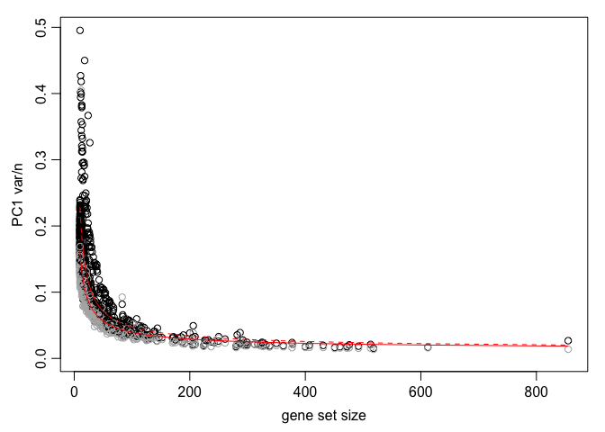
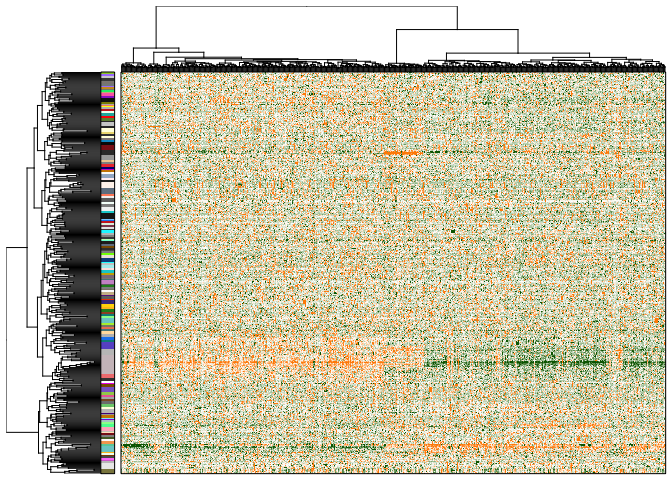
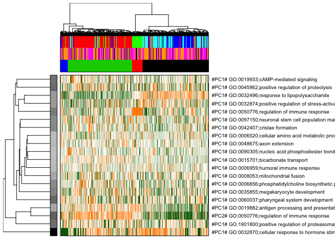
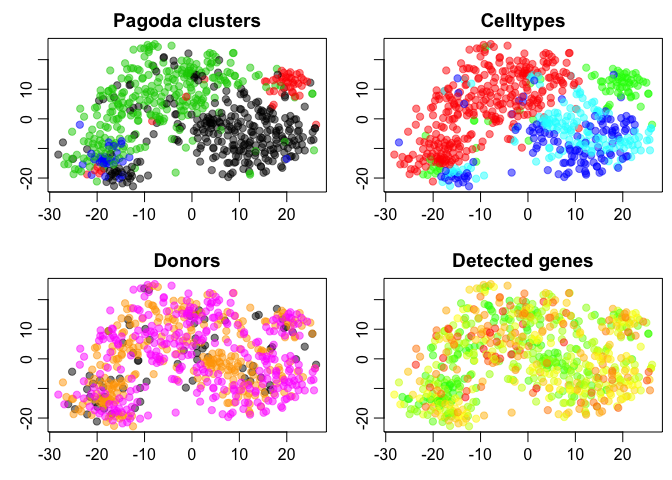

Pagoda pathway wPCA
===================

Clustering of data using Pagoda in the SCDE package, following tutorial at: <http://hms-dbmi.github.io/scde/pagoda.html>

For this exercise you can either run with your own data or with the example data from Pollen paper that they provide with the package. Below is an example with human innate lympoid cells (ILCs) from Bjorklund et al. 2016 where you can get some hints on how to run with your own data.

### Notes on running SCDE

With a large dataset, it may be a good idea to run all the cpu/memory-intensive steps in the SCDE package on Uppmax, or other HPC center, submitted as an Sbatch job calling an R-script. OBS! The SCDE package uses a lot of memory, so even if you request 16 cpus (a full node) on Uppmax you will have issues with memory overflow if you run the program on all 16 cores. Suggested setting would be to use n.cores = 10 when running on a normal node or specify nodes with more memory.

But the memory consumption could of course depend on the dataset, so you should monitor your cpu and memory usage using the `jobstats` command.

Example with ILC data
=====================

If you want to run this example, all data plus some intermediate files for steps that takes long time, is located in the course uppmax folder with subfolder:

`scrnaseq_course/data/ILC/`

Load packages
-------------

``` r
suppressMessages(library(scde))
```

    ## Warning: package 'scde' was built under R version 3.4.2

Read data
---------

``` r
# read in meta data table and create pheno data
M <- read.table("data/ILC/Metadata_ILC.csv", sep=",",header=T)

# read count values, SCDE require counts and not normalized rpkms.
C <- read.table("data/ILC/ensembl_countvalues_ILC.csv",sep=",",header=T)
```

Define some color scales
------------------------

Define color scales based on celltype and donor.

``` r
celltype2cols <- c("blue", "cyan", "red", "green")[as.integer(M$Celltype)]
donor2cols <- c("black", "orange", "magenta")[as.integer(M$Donor)]
```

Get GO-terms
------------

In the [Tutorial for biomaRt](biomart), there is an example on how to fetch go-terms for Ensembl genes. In the file `GO_BP_annotations.Rdata` this was done for all genes in the ILC dataset and selecting for Biological Process entries in GO.

In the tutorial there is an example where they fetch first 100 go-terms in org.Hs.egGO2ALLEGS, plus some selected ones related to neurogenesis. In their example they translate gene symbol to NCBI gene id to then fetch go-terms. There are several different ways of getting go-terms for genes, but if you are working with Ensembl IDs the most straight forward is probably to use biomaRt.

More examples on how to get GO-terms for gene symbols can be found at: <http://hms-dbmi.github.io/scde/genesets.html>

``` r
# load go-term annotations for all genes
load("data/ILC/GO_BP_annotations.Rdata",verbose=TRUE)
```

    ## Loading objects:
    ##   goBP2gene

Filter with SCDE clean.counts and go-terms with clean.gos
---------------------------------------------------------

The clean.counts function will remove genes and cells based on specified cutoffs:

-   min.lib.size - minimum number of genes detected per cell (default 1800)
-   min.reads - minimum number of reads per gene (default 10)
-   min.detected - minimum number of cells a gene must be detected in (default 5)

``` r
cd <- clean.counts(C, min.lib.size = 1000, min.reads = 10, min.detected = 5)
genes <- rownames(cd)

# now filter out all genes that are not included in cd from the go-annotations
go.env <- lapply(goBP2gene, function(x) x[x %in% genes])

# remove GOs with too few or too many genes
go.env <- clean.gos(go.env,min.size=5,max.size=2000) 

# convert to an environment
go.env <- list2env(go.env) 
```

Fit error models
----------------

OBS! it takes a while to run on 1 cpu, around an hour with this dataset.

``` r
# since this step takes a while, save data to a file so that it does not have to be rerun if you execute the code again.
savefile <- "data/ILC/pagoda_knn.Rdata"
if (file.exists(savefile)){
   load(savefile)
}else {
      pdf("data/ILC/pagoda.cell.models.pdf")
      knn <- knn.error.models(cd, k = ncol(cd)/4, n.cores = 1, min.count.threshold = 2, min.nonfailed = 5, max.model.plots = 10)
      dev.off()
      save(knn,file=savefile)
}
```

Normalizing variance and effect of gene detection
-------------------------------------------------

In this case, we know that we have a clear batch effect from the 3 donors, so we can also include batch information in the normalization step.

This step also takes a while to run.

In addition, we add in a step where the number of detected genes per cell, which may be a techincal artefact.

``` r
savefile <- "data/ILC/pagoda_varnorm.Rdata"
if (file.exists(savefile)){
   load(savefile)
}else {
      pdf("data/ILC/pagoda.varnorm.pdf")
      varinfo <- pagoda.varnorm(knn, counts = cd, trim = 3/ncol(cd), max.adj.var = 5, n.cores = 1, plot = TRUE, batch=M$Donor)
      dev.off()
      
      # remove effect of detected genes.
      varinfo <- pagoda.subtract.aspect(varinfo, colSums(cd[, rownames(knn)]>0))
      save(varinfo,file=savefile)
}
```

Control for other aspects of heterogeneity
------------------------------------------

In this example we only remove the aspect of gene detection, but there can be other aspects that you want to remove, an example from there tutorial to remove cell cycle effect.

OBS! This was not run on the ICL dataset

``` r
# get cell cycle signature and view the top genes
cc.pattern <- pagoda.show.pathways(c("GO:0000280", "GO:0007067"), varinfo, go.env, show.cell.dendrogram = TRUE, cell.clustering = hc, showRowLabels = TRUE)
# subtract the pattern
varinfo.cc <- pagoda.subtract.aspect(varinfo, cc.pattern)
```

Run pagoda pathway wPCA
-----------------------

Instead of using the app, that sometimes is very slow, you can also create each plot with different commands, here are some example plots.

Also a step that takes hours to run.

``` r
savefile <- "data/ILC/pagoda_pwpca.Rdata"
if (file.exists(savefile)){
   load(savefile)
}else {
   pwpca <- pagoda.pathway.wPCA(varinfo, go.env, n.components = 2, n.cores = 1)
   save(pwpca,file=savefile)
}
```

Evaluate overdispersion of 'de novo' gene sets
----------------------------------------------

OBS! This takes very long time to run, several hours, so we skip this step in this tutorial and only run the subsequent steps with pwpca.

But it can be run with:

``` r
clpca <- pagoda.gene.clusters(varinfo, trim = 7.1/ncol(varinfo$mat), n.clusters = 50, n.cores = 1, plot = TRUE)
```

Get top aspects
---------------

``` r
df <- pagoda.top.aspects(pwpca, return.table = TRUE, plot = TRUE, z.score = 1.96)
```



``` r
head(df)
```

    ##                                                  name npc  n    score
    ## 1069            GO:0009416;response to light stimulus   1 18 4.241465
    ## 1797 GO:0032870;cellular response to hormone stimulus   1 24 4.177536
    ## 2823                      GO:0051591;response to cAMP   1 27 3.997107
    ## 2889         GO:0060037;pharyngeal system development   1 10 3.097088
    ## 3141             GO:0071850;mitotic cell cycle arrest   1 12 2.978951
    ## 1989            GO:0035994;response to muscle stretch   1 13 2.886317
    ##             z    adj.z sh.z adj.sh.z
    ## 1069 24.45432 24.16538   NA       NA
    ## 1797 25.72343 25.40572   NA       NA
    ## 2823 25.27727 24.98162   NA       NA
    ## 2889 15.26336 14.84385   NA       NA
    ## 3141 15.18589 14.77459   NA       NA
    ## 1989 14.88660 14.47606   NA       NA

Visualize significant aspects of heterogeneity
----------------------------------------------

``` r
# get full info on the top aspects
tam <- pagoda.top.aspects(pwpca, n.cells = NULL, z.score = qnorm(0.01/2, lower.tail = FALSE))

# determine overall cell clustering
hc <- pagoda.cluster.cells(tam, varinfo)

# Next, we will reduce redundant aspects in two steps. First we will combine pathways that are driven by the same sets of genes:
tamr <- pagoda.reduce.loading.redundancy(tam, pwpca)

# In the second step we will combine aspects that show similar patterns (i.e. separate the same sets of cells). Here we will plot the cells using the overall cell clustering determined above:
tamr2 <- pagoda.reduce.redundancy(tamr, distance.threshold = 0.9, plot = TRUE, cell.clustering = hc, labRow = NA, labCol = NA, box = TRUE, margins = c(0.5, 0.5), trim = 0)
```



View top aspects
----------------

``` r
# define colors for clusters, here we split by 4 clusters
col.cols <- rbind(groups = cutree(hc, 4))

# plot top aspects, include also donor/celltype color vectors
pagoda.view.aspects(tamr2, cell.clustering = hc, box = TRUE, labCol = NA, margins = c(0.5, 20), col.cols = rbind(col.cols,donor2cols,celltype2cols),top=20)
```



``` r
# here top 20 aspects are plotted, 
```

Launch the pagoda app
---------------------

The results can be browsed interactively with the pagoda app using commands:

``` r
app <- make.pagoda.app(tamr2, tam, varinfo, go.env, pwpca, col.cols = rbind(col.cols,donor2cols,celltype2cols), cell.clustering = hc, title = "ILCs")
# show app in the browser (port 1468)
show.app(app, "ILCs", browse = TRUE, port = 1468) 
```

Run tSNE based on pagoda distances.
-----------------------------------

Instead of basing tSNE on regular PCA distances, you can also use the distances from the pagoda pwpca object as an input to Rtsne.

``` r
suppressMessages(library(Rtsne))

# recalculate clustering distance,  we'll need to specify return.details=T
cell.clustering <- pagoda.cluster.cells(tam,varinfo,include.aspects=TRUE,verbose=TRUE,return.details=T)
```

    ## clustering cells based on 1005 genes and 587 aspect patterns

``` r
# fix the seed to ensure reproducible results
set.seed(0)
tSNE.pagoda <- Rtsne(cell.clustering$distance,is_distance=T,initial_dims=30,perplexity=30,theta=0.1)
par(mfrow=c(2,2), mar = c(2.5,2.5,2.0,0.5), mgp = c(2,0.65,0), cex = 1.0);
plot(tSNE.pagoda$Y,col=adjustcolor(col.cols,alpha=0.5),cex=1,pch=19,xlab="",ylab="",main="Pagoda clusters")
plot(tSNE.pagoda$Y,col=adjustcolor(celltype2cols,alpha=0.5),cex=1,pch=19,xlab="",ylab="",main="Celltypes")
plot(tSNE.pagoda$Y,col=adjustcolor(donor2cols,alpha=0.5),cex=1,pch=19,xlab="",ylab="",main="Donors")
```



Compare to tSNE based on counts
-------------------------------

Run tsne based on same dataset (cd).

``` r
set.seed(0)
tSNE.counts <- Rtsne(t(log2(cd+1)),initial_dims=30,perplexity=30,theta=0.1)
par(mfrow=c(2,2), mar = c(2.5,2.5,2.0,0.5), mgp = c(2,0.65,0), cex = 1.0);
plot(tSNE.counts$Y,col=adjustcolor(col.cols,alpha=0.5),cex=1,pch=19,xlab="",ylab="",main="Pagoda clusters")
plot(tSNE.counts$Y,col=adjustcolor(celltype2cols,alpha=0.5),cex=1,pch=19,xlab="",ylab="",main="Celltypes")
plot(tSNE.counts$Y,col=adjustcolor(donor2cols,alpha=0.5),cex=1,pch=19,xlab="",ylab="",main="Donors")
```


##### Session info

``` r
sessionInfo()
```

    ## R version 3.4.1 (2017-06-30)
    ## Platform: x86_64-apple-darwin15.6.0 (64-bit)
    ## Running under: macOS Sierra 10.12.6
    ## 
    ## Matrix products: default
    ## BLAS: /Library/Frameworks/R.framework/Versions/3.4/Resources/lib/libRblas.0.dylib
    ## LAPACK: /Library/Frameworks/R.framework/Versions/3.4/Resources/lib/libRlapack.dylib
    ## 
    ## locale:
    ## [1] en_US.UTF-8/en_US.UTF-8/en_US.UTF-8/C/en_US.UTF-8/en_US.UTF-8
    ## 
    ## attached base packages:
    ## [1] stats     graphics  grDevices utils     datasets  methods   base     
    ## 
    ## other attached packages:
    ## [1] Rtsne_0.13      scde_2.6.0      flexmix_2.3-14  lattice_0.20-35
    ## 
    ## loaded via a namespace (and not attached):
    ##  [1] Rcpp_0.12.15              nloptr_1.0.4             
    ##  [3] compiler_3.4.1            RColorBrewer_1.1-2       
    ##  [5] tools_3.4.1               Lmoments_1.2-3           
    ##  [7] lme4_1.1-15               digest_0.6.15            
    ##  [9] evaluate_0.10.1           nlme_3.1-131             
    ## [11] mgcv_1.8-23               Matrix_1.2-12            
    ## [13] yaml_2.1.16               parallel_3.4.1           
    ## [15] SparseM_1.77              RcppArmadillo_0.8.300.1.0
    ## [17] stringr_1.2.0             knitr_1.19               
    ## [19] extRemes_2.0-8            MatrixModels_0.4-1       
    ## [21] locfit_1.5-9.1            stats4_3.4.1             
    ## [23] rprojroot_1.3-2           grid_3.4.1               
    ## [25] nnet_7.3-12               Biobase_2.38.0           
    ## [27] distillery_1.0-4          Rook_1.1-1               
    ## [29] BiocParallel_1.12.0       rmarkdown_1.8            
    ## [31] minqa_1.2.4               limma_3.34.8             
    ## [33] car_2.1-6                 edgeR_3.20.8             
    ## [35] magrittr_1.5              splines_3.4.1            
    ## [37] backports_1.1.2           pcaMethods_1.70.0        
    ## [39] htmltools_0.3.6           modeltools_0.2-21        
    ## [41] MASS_7.3-48               BiocGenerics_0.24.0      
    ## [43] pbkrtest_0.4-7            RMTstat_0.3              
    ## [45] brew_1.0-6                quantreg_5.34            
    ## [47] stringi_1.1.6             rjson_0.2.15             
    ## [49] Cairo_1.5-9
