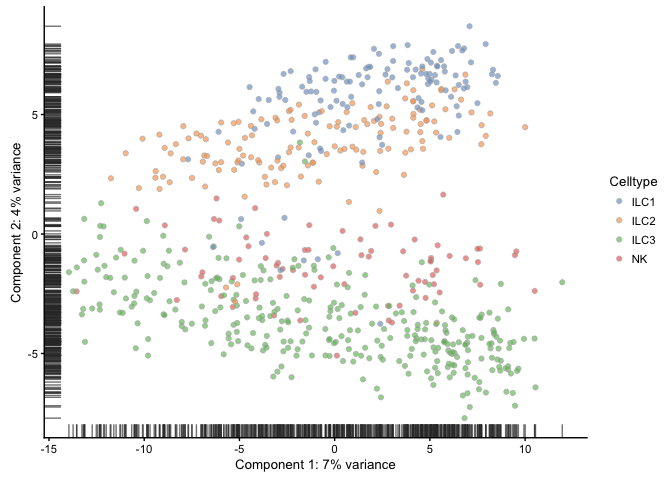
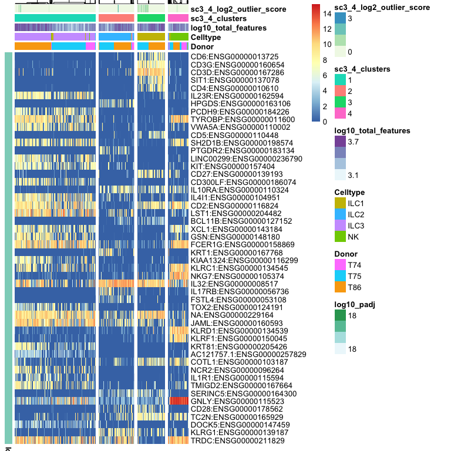

SC3 example with ILC data
=========================

Clustering of data using SC3 package, following tutorial at: <https://bioconductor.org/packages/release/bioc/vignettes/SC3/inst/doc/SC3.html>

Run through steps 1-5 of the manual, step 6 is more detail on the different steps of SC3, go through that as well if you find time.

For this exercise you can either run with your own data or with the example data from Treutlein paper that they provide with the package. Below is an example with human innate lympoid cells (ILCs) from Bjorklund et al. 2016.

If you want to run the package with the ILCs, all data, plus some intermediate files for steps that takes long time, can be found in the course uppmax folder with subfolder:

`scrnaseq_course/data/ILC/`

### Load packages

``` r
suppressMessages(library(scater))
suppressMessages(library(SC3))
```

### Read data and create a scater SingleCellExperiment (SCE) object

``` r
# read in meta data table and create pheno data
M <- read.table("data/ILC/Metadata_ILC.csv", sep=",",header=T)

# read rpkm values
R <- read.table("data/ILC/ensembl_rpkmvalues_ILC.csv",sep=",",header=T)
C <- read.table("data/ILC/ensembl_countvalues_ILC.csv",sep=",",header=T)

# in this case it may be wise to translate ensembl IDs to gene names to make plots with genes more understandable
TR <- read.table("data/ILC/gene_name_translation_biotype.tab",sep="\t")

# find the correct entries in TR and merge ensembl name and gene id.
m <- match(rownames(R),TR$ensembl_gene_id)
newnames <- apply(cbind(as.vector(TR$external_gene_name)[m],
                        rownames(R)),1,paste,collapse=":")
rownames(R)<-newnames
rownames(C)<-newnames

# create the SingleCellExperiement (SCE) object
sce <- SingleCellExperiment(assays = 
                    list(fpkm = as.matrix(R), 
                         counts = as.matrix(C)), colData = M)

# define feature names in feature_symbol column
rowData(sce)$feature_symbol <- rownames(sce)
# remove features with duplicated names
sce <- sce[!duplicated(rowData(sce)$feature_symbol), ]

# add in a logcounts slot
logcounts(sce) <- log2(as.matrix(R)+1)
```

In this example we fill all slots, `fpkm`, `counts` and `logcounts`, to show how it can be done. However, for running SC3 it is only necessary to have the `logcounts` slot, since that is what is used.

### QC with scater

Use scater package to calculate qc-metrics and plot a PCA

``` r
sce <- calculateQCMetrics(sce, exprs_values ="logcounts")
plotPCA(sce, colour_by = "Celltype", exprs_values = "logcounts")
```



### Run SC3

OBS! it takes a while to run (10-30mins depending on data set size and how many cores you use), define number of clusters to test with `ks` parameter, testing more different k's will take longer time. You can get a hint on number of clusters you should set by running the `sc3_estimate_k` function, but it may not always give the biologically relevant clusters.

``` r
# since this step takes a while, save data to a file so that it does not have to be rerun if you execute the code again.
# To be used by SC3, the SCE object must contains "counts", "logcounts", and "feature_symbol"
savefile <- "data/ILC/sc3_cdata_ilc_k3-6.Rdata"
if (file.exists(savefile)){
   load(savefile)
}else {
   sce <- sc3(sce, ks = 3:6, biology = TRUE, n_cores = 1)
   save(sce,file=savefile)
}
```

Now you can explore the data interactively within a shiny app using command:

`sc3_interactive(sce)`

### Plot results

Instead of using the app, that sometimes is very slow, you can also create each plot with different commands, here are some example plots.

``` r
# plot PCA for 4 clusters
plotPCA(
    sce, 
    colour_by = "sc3_4_clusters", 
    size_by = "sc3_4_log2_outlier_score"
)
```


``` r
# plot how many high auc value genes there are per cluster
plotFeatureData(
    sce, 
    aes(
        x = sc3_4_markers_clusts, 
        y = sc3_4_markers_auroc, 
        colour = sc3_4_markers_padj
    )
)
```

    ## Warning: Removed 46039 rows containing missing values (geom_point).


``` r
# plot consensus clusters - 4 clusters
sc3_plot_consensus(
    sce, k = 4, 
    show_pdata = c(
        "Celltype", 
        "log10_total_features",
        "sc3_4_clusters", 
        "sc3_4_log2_outlier_score",
    "Donor" 
    )
)
```


SC3 clearly groups the 4 main celltypes, but within celltypes there is clear separation of the donors.

``` r
# same with 6 clusters 
sc3_plot_consensus(
    sce, k = 6, 
    show_pdata = c(
        "Celltype", 
        "log10_total_features",
        "sc3_6_clusters", 
        "sc3_6_log2_outlier_score",
    "Donor" 
    )
)
```


The next clustering steps clearly separates the ILC3s by donor,

``` r
# plot expression of gene clusters
sc3_plot_expression(sce, k = 4,
    show_pdata = c(
        "Celltype", 
        "log10_total_features",
        "sc3_4_clusters", 
        "sc3_4_log2_outlier_score",
    "Donor" 
    )
)
```

 This plots shows cluster of genes and their expression in the different clusters.

DE genes, these are estimated using the non-parametric Kruskal-Wallis test.

``` r
# plot DE genes
sc3_plot_de_genes(sce, k = 4,
    show_pdata = c(
        "Celltype", 
        "log10_total_features",
        "sc3_4_clusters", 
        "sc3_4_log2_outlier_score",
    "Donor" 
    )
)
```



Marker genes - are estimated from AUC values.

``` r
# plot marker genes
sc3_plot_markers(sce, k = 4,
    show_pdata = c(
        "Celltype", 
        "log10_total_features",
        "sc3_4_clusters", 
        "sc3_4_log2_outlier_score",
    "Donor" 
    )
)
```


In this dataset, it is clear that the main separation of the data is by celltype, however, the donor batch effect becomes clear when splitting into more than 4 clusters.

So it would be sensible to first run batch effect correction on the data, and then run SC3 on batch corrected expression values. These could be provided as `logcounts` when creating the SingleCellExperiment.

``` r
# if you have batch normalized data (norm.data) it is normally done on logged counts or rpkms, so the SCE object should be created as:

sce.norm <- SingleCellExperiment(
  assays = list(
          logcounts = norm.data
        ),
        colData = M
)

# or by just adding it to an existing SCE object
logcounts(sce) <- norm.data
```

##### Session info

``` r
sessionInfo()
```

    ## R version 3.4.1 (2017-06-30)
    ## Platform: x86_64-apple-darwin15.6.0 (64-bit)
    ## Running under: macOS Sierra 10.12.6
    ## 
    ## Matrix products: default
    ## BLAS: /Library/Frameworks/R.framework/Versions/3.4/Resources/lib/libRblas.0.dylib
    ## LAPACK: /Library/Frameworks/R.framework/Versions/3.4/Resources/lib/libRlapack.dylib
    ## 
    ## locale:
    ## [1] en_US.UTF-8/en_US.UTF-8/en_US.UTF-8/C/en_US.UTF-8/en_US.UTF-8
    ## 
    ## attached base packages:
    ## [1] stats4    parallel  stats     graphics  grDevices utils     datasets 
    ## [8] methods   base     
    ## 
    ## other attached packages:
    ##  [1] SC3_1.7.7                  scater_1.6.2              
    ##  [3] SingleCellExperiment_1.0.0 SummarizedExperiment_1.8.1
    ##  [5] DelayedArray_0.4.1         matrixStats_0.53.0        
    ##  [7] GenomicRanges_1.30.1       GenomeInfoDb_1.14.0       
    ##  [9] IRanges_2.12.0             S4Vectors_0.16.0          
    ## [11] ggplot2_2.2.1              Biobase_2.38.0            
    ## [13] BiocGenerics_0.24.0       
    ## 
    ## loaded via a namespace (and not attached):
    ##  [1] bitops_1.0-6           bit64_0.9-7            RColorBrewer_1.1-2    
    ##  [4] doParallel_1.0.11      progress_1.1.2         httr_1.3.1            
    ##  [7] rprojroot_1.3-2        tools_3.4.1            backports_1.1.2       
    ## [10] doRNG_1.6.6            R6_2.2.2               KernSmooth_2.23-15    
    ## [13] vipor_0.4.5            DBI_0.7                lazyeval_0.2.1        
    ## [16] colorspace_1.3-2       gridExtra_2.3          prettyunits_1.0.2     
    ## [19] bit_1.1-12             compiler_3.4.1         pkgmaker_0.22         
    ## [22] labeling_0.3           caTools_1.17.1         scales_0.5.0          
    ## [25] mvtnorm_1.0-7          DEoptimR_1.0-8         robustbase_0.92-8     
    ## [28] stringr_1.2.0          digest_0.6.15          rmarkdown_1.8         
    ## [31] XVector_0.18.0         rrcov_1.4-3            pkgconfig_2.0.1       
    ## [34] htmltools_0.3.6        WriteXLS_4.0.0         limma_3.34.8          
    ## [37] rlang_0.1.6            RSQLite_2.0            shiny_1.0.5           
    ## [40] bindr_0.1              gtools_3.5.0           dplyr_0.7.4           
    ## [43] RCurl_1.95-4.10        magrittr_1.5           GenomeInfoDbData_1.0.0
    ## [46] Matrix_1.2-12          Rcpp_0.12.15           ggbeeswarm_0.6.0      
    ## [49] munsell_0.4.3          viridis_0.5.0          stringi_1.1.6         
    ## [52] yaml_2.1.16            edgeR_3.20.8           zlibbioc_1.24.0       
    ## [55] rhdf5_2.22.0           gplots_3.0.1           plyr_1.8.4            
    ## [58] grid_3.4.1             blob_1.1.0             gdata_2.18.0          
    ## [61] shinydashboard_0.6.1   lattice_0.20-35        cowplot_0.9.2         
    ## [64] locfit_1.5-9.1         knitr_1.19             pillar_1.1.0          
    ## [67] rjson_0.2.15           rngtools_1.2.4         reshape2_1.4.3        
    ## [70] codetools_0.2-15       biomaRt_2.34.2         XML_3.98-1.9          
    ## [73] glue_1.2.0             evaluate_0.10.1        data.table_1.10.4-3   
    ## [76] httpuv_1.3.5           foreach_1.4.4          gtable_0.2.0          
    ## [79] assertthat_0.2.0       mime_0.5               xtable_1.8-2          
    ## [82] e1071_1.6-8            pcaPP_1.9-73           class_7.3-14          
    ## [85] viridisLite_0.3.0      pheatmap_1.0.8         tibble_1.4.2          
    ## [88] iterators_1.0.9        registry_0.5           AnnotationDbi_1.40.0  
    ## [91] beeswarm_0.2.3         memoise_1.1.0          tximport_1.6.0        
    ## [94] bindrcpp_0.2           cluster_2.0.6          ROCR_1.0-7
