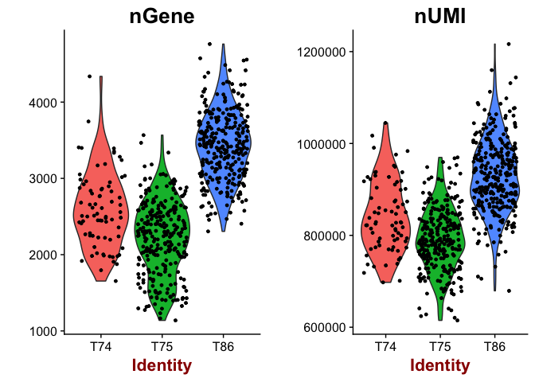
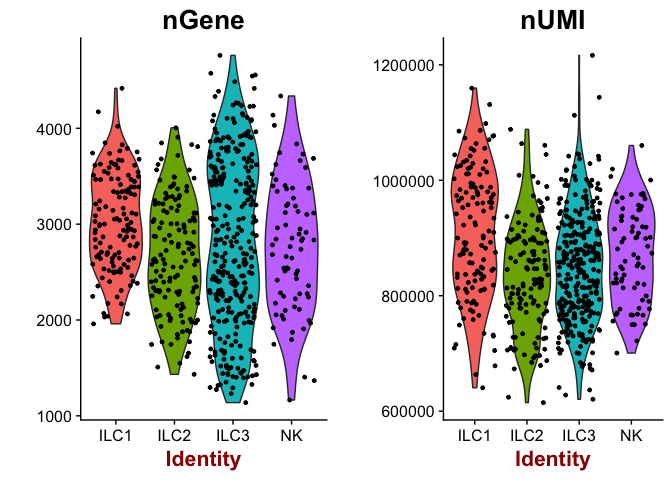
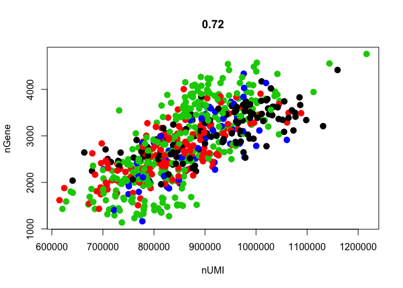
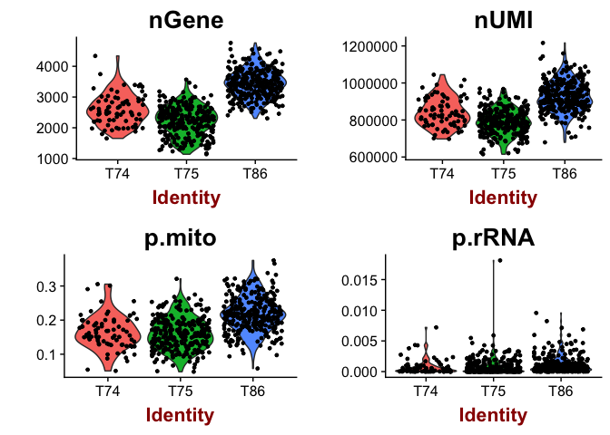
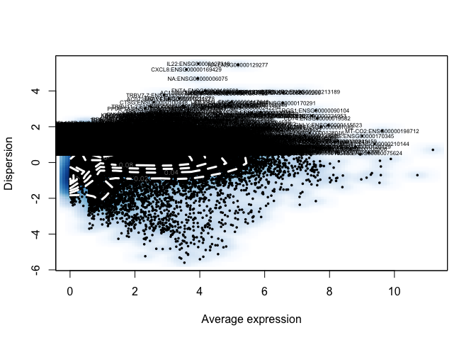
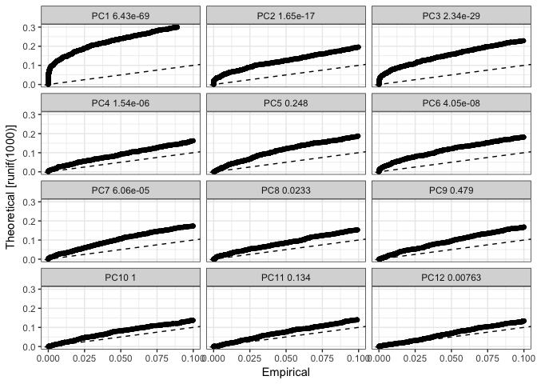
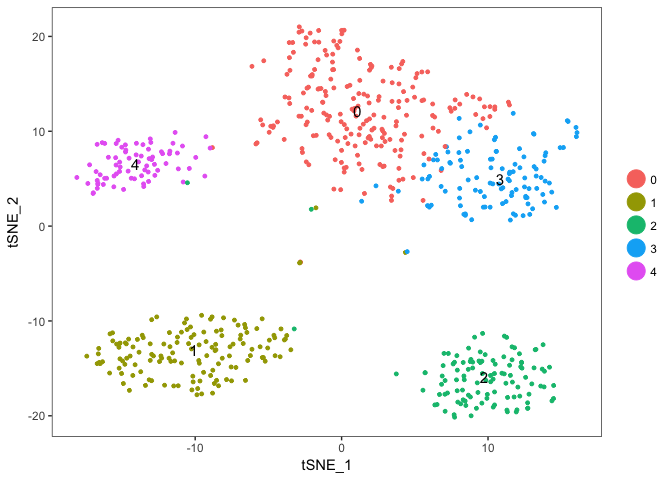
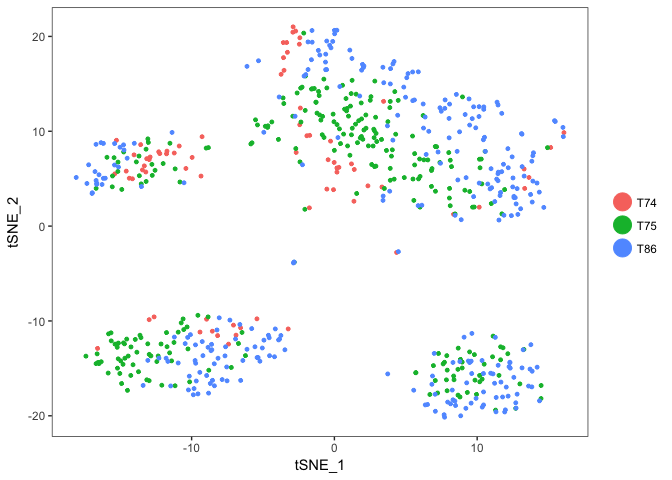
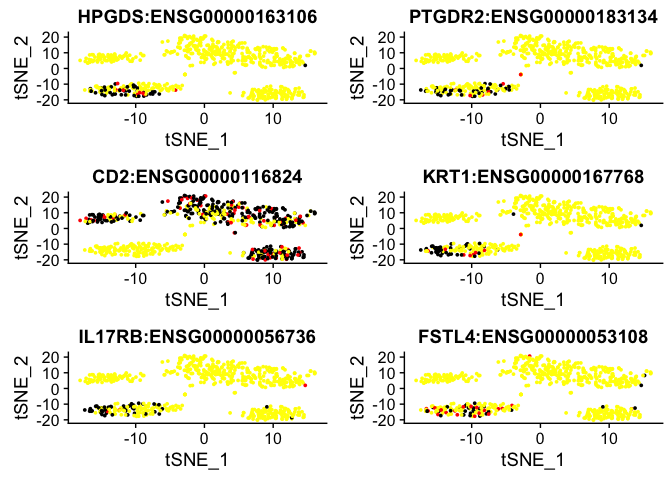
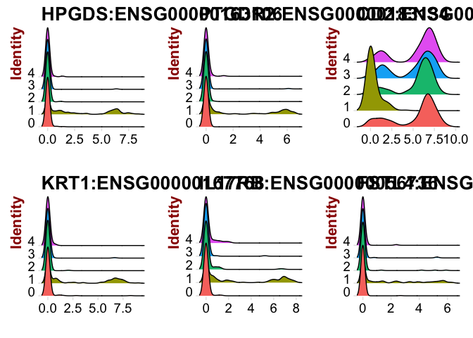

Seurat analysis
===============

Analysis of data using Seurat package, following tutorial at: <http://satijalab.org/seurat/pbmc3k_tutorial.html>

Seurat has specific functions for loading and working with drop-seq data. To follow that tutorial, please use the provided dataset for PBMCs that comes with the tutorial.

It has been downloaded in the course uppmax folder with subfolder:

`scrnaseq_course/data/PBMC_10x/pbmc3k_filtered_gene_bc_matrices.tar.gz`

But you can also run with your own data or with our example data following the example below. But keep in mind that some functions assume that the count data is UMIs, but we run it with RPKMs. This is an example with human innate lympoid cells (ILCs) from Bjorklund et al. 2016.

All data you need is available in the course uppmax folder with subfolder:

`scrnaseq_course/data/ILC/`

### Load packages

``` r
suppressMessages(require(Seurat))
suppressMessages(require(gridExtra))
```

### Load expression values and metadata

Also fetch ensembl annotations with gene symbols (created in the [biomart lab](biomart)) and include those in the gene names.

``` r
R <- read.table("data/ILC/ensembl_rpkmvalues_ILC.csv",sep=",",header=T,row.names=1)
M <- read.table("data/ILC/Metadata_ILC.csv",sep=",",header=T,row.names=1)

# in this case it may be wise to translate ensembl IDs to gene names 
# to make plots with genes more understandable
# the file was created in the biomart exercise.
TR <- read.table("data/ILC/gene_name_translation_biotype.tab",sep="\t")

# find the correct entries in TR and merge ensembl name and gene id.
m <- match(rownames(R),TR$ensembl_gene_id)
newnames <- apply(cbind(as.vector(TR$external_gene_name)[m],rownames(R)),1,paste,collapse=":")
rownames(R)<-newnames

celltype2cols <- c("blue", "cyan", "red", "green")[as.integer(M$Celltype)]
donor2cols <- c("black", "orange", "magenta")[as.integer(M$Donor)]
```

### Create seurat object

Will automatically filter out genes/cells that do not meet the criteria specified to save space.

``` r
# in seurat we will not make use of the spike-ins, so remove them from the expression matrix before creating the Seurat object. 
ercc <- grep("ERCC_",rownames(R))

# when you create a Seurat object, you can specify filtering of 
# genes and cells with the min.cells and min.genes parameters
data <- CreateSeuratObject(raw.data = R[-ercc,], 
                           min.cells = 3, min.genes = 200, 
                           project = "ILC", is.expr=1, meta.data=M)

# plot number of genes and nUMI (rpkms in this case) for each Donor
VlnPlot(object = data, features.plot = c("nGene", "nUMI"), nCol = 2)
```



``` r
# same for celltype
VlnPlot(object = data, features.plot = c("nGene", "nUMI"), nCol = 2, group.by="Celltype")
```



``` r
# scatterplot with detected genes vs RPKMs
GenePlot(object = data, gene1 = "nUMI", gene2 = "nGene")
```


``` r
# the slot data@ident defines the classes of cells, which is automatically set to plate id, To instead plot by celltype, data@ident needs to be changed.
data <- SetAllIdent(object = data, id = "Celltype")
GenePlot(object = data, gene1 = "nUMI", gene2 = "nGene")
```



``` r
# change ident back to Donor
data <- SetAllIdent(object = data, id = "Donor")
```

OBS! Each time you want to change colors in a gene plot, you need to change the identity class value in the seurat object in the slot <data@ident>. Perhaps there is a better way, but I did not find a solution.

In many of the other Seurat plotting functions like TNSEPlot and PCAPlot you can use “group.by” to define which meta data variable the cells should be coloured by.

Data normalization and scaling
------------------------------

Next step is to normalize the data, detect variable genes and to scale it.

The scaling step is done to remove unwanted confounders. It is quite common to regress out the number of detected genes (`nGene`), that quite often will drive the variation in your data due to library quality. We will also run one version of scaling where we include the `Donor` batch information and compare.

``` r
# set scale factor according to mean library size
# Seurat multiplies the  by a scale factor (10,000 by default)
scale.factor <- mean(colSums(R))
data <- NormalizeData(object = data, normalization.method = "LogNormalize", 
    scale.factor = scale.factor)

# look at the plot for suitable cutoffs for your dataset rerun
# you can define the lower/upper bound of mean expression with x.low.cutoff/x.high.cutoff
# and the limit of dispersion with y.cutoff.
data <- FindVariableGenes(object = data, mean.function = ExpMean, 
                          dispersion.function = LogVMR, 
                          x.low.cutoff = 0.5, x.high.cutoff = 10, y.cutoff = 0.5)
```



``` r
length(x = data@var.genes)
```

    ## [1] 5238

``` r
# regress out number of detected genes.
data <- ScaleData(object = data, vars.to.regress = c("nGene"), display.progress=F)

# also with batch info + detected genes.
dataB <- ScaleData(object = data, vars.to.regress = c("nGene","Donor"), display.progress=F)
```

PCA
---

Run PCA based on the variable genes. The pca is stored in the slot `dr`

``` r
data <- RunPCA(object = data, pc.genes = data@var.genes, do.print = TRUE, pcs.print = 1:5,  genes.print = 5)
```

    ## [1] "PC1"
    ## [1] "CD3G:ENSG00000160654"  "CD3D:ENSG00000167286"  "IL32:ENSG00000008517" 
    ## [4] "TRAT1:ENSG00000163519" "SELL:ENSG00000188404" 
    ## [1] ""
    ## [1] "TYROBP:ENSG00000011600"   "FCER1G:ENSG00000158869"  
    ## [3] "LST1:ENSG00000204482"     "IL4I1:ENSG00000104951"   
    ## [5] "TNFSF13B:ENSG00000102524"
    ## [1] ""
    ## [1] ""
    ## [1] "PC2"
    ## [1] "NKG7:ENSG00000105374"  "KLRD1:ENSG00000134539" "KLRF1:ENSG00000150045"
    ## [4] "PRF1:ENSG00000180644"  "GZMA:ENSG00000145649" 
    ## [1] ""
    ## [1] "IL4I1:ENSG00000104951"   "JAML:ENSG00000160593"   
    ## [3] "LTB:ENSG00000227507"     "CD200R1:ENSG00000163606"
    ## [5] "SLAMF1:ENSG00000117090" 
    ## [1] ""
    ## [1] ""
    ## [1] "PC3"
    ## [1] "KRT1:ENSG00000167768"     "RNU2-59P:ENSG00000222414"
    ## [3] "HPGDS:ENSG00000163106"    "RNU2-61P:ENSG00000223001"
    ## [5] "DUSP1:ENSG00000120129"   
    ## [1] ""
    ## [1] "CD3G:ENSG00000160654"       "AC010970.1:ENSG00000225840"
    ## [3] "CD3D:ENSG00000167286"       "CD2:ENSG00000116824"       
    ## [5] "CD27:ENSG00000139193"      
    ## [1] ""
    ## [1] ""
    ## [1] "PC4"
    ## [1] "IGHM:ENSG00000211899"  "BLNK:ENSG00000095585"  "CD19:ENSG00000177455" 
    ## [4] "NA:ENSG00000260655"    "NAPSB:ENSG00000131401"
    ## [1] ""
    ## [1] "NA:ENSG00000265150"     "UBE3B:ENSG00000151148" 
    ## [3] "ZFP36:ENSG00000128016"  "RNU4-2:ENSG00000202538"
    ## [5] "KLF6:ENSG00000067082"  
    ## [1] ""
    ## [1] ""
    ## [1] "PC5"
    ## [1] "RNU5A-1:ENSG00000199568"  "JUNB:ENSG00000171223"    
    ## [3] "NA:ENSG00000208506"       "RNVU1-14:ENSG00000207501"
    ## [5] "RNVU1-6:ENSG00000201558" 
    ## [1] ""
    ## [1] "CDCA7:ENSG00000144354"    "CENPU:ENSG00000151725"   
    ## [3] "CENPW:ENSG00000203760"    "UBE2T:ENSG00000077152"   
    ## [5] "MTCO1P12:ENSG00000237973"
    ## [1] ""
    ## [1] ""

``` r
dataB <- RunPCA(object = dataB, pc.genes = data@var.genes, do.print = TRUE, pcs.print = 1:5,  genes.print = 5)
```

    ## [1] "PC1"
    ## [1] "CD3G:ENSG00000160654"  "CD3D:ENSG00000167286"  "IL32:ENSG00000008517" 
    ## [4] "SELL:ENSG00000188404"  "TRAT1:ENSG00000163519"
    ## [1] ""
    ## [1] "TYROBP:ENSG00000011600"   "LST1:ENSG00000204482"    
    ## [3] "IL4I1:ENSG00000104951"    "FCER1G:ENSG00000158869"  
    ## [5] "TNFSF13B:ENSG00000102524"
    ## [1] ""
    ## [1] ""
    ## [1] "PC2"
    ## [1] "NKG7:ENSG00000105374"  "KLRD1:ENSG00000134539" "KLRF1:ENSG00000150045"
    ## [4] "PRF1:ENSG00000180644"  "GZMK:ENSG00000113088" 
    ## [1] ""
    ## [1] "LTB:ENSG00000227507"    "JAML:ENSG00000160593"  
    ## [3] "IL4I1:ENSG00000104951"  "S100A4:ENSG00000196154"
    ## [5] "SLAMF1:ENSG00000117090"
    ## [1] ""
    ## [1] ""
    ## [1] "PC3"
    ## [1] "KRT1:ENSG00000167768"     "HPGDS:ENSG00000163106"   
    ## [3] "IL17RB:ENSG00000056736"   "DUSP1:ENSG00000120129"   
    ## [5] "RNU2-59P:ENSG00000222414"
    ## [1] ""
    ## [1] "AC010970.1:ENSG00000225840" "CD3G:ENSG00000160654"      
    ## [3] "CD3D:ENSG00000167286"       "CD2:ENSG00000116824"       
    ## [5] "CD27:ENSG00000139193"      
    ## [1] ""
    ## [1] ""
    ## [1] "PC4"
    ## [1] "IGHM:ENSG00000211899"  "BLNK:ENSG00000095585"  "CD19:ENSG00000177455" 
    ## [4] "NA:ENSG00000260655"    "NAPSB:ENSG00000131401"
    ## [1] ""
    ## [1] "ZFP36:ENSG00000128016" "NA:ENSG00000265150"    "KLF6:ENSG00000067082" 
    ## [4] "UBE3B:ENSG00000151148" "XCL2:ENSG00000143185" 
    ## [1] ""
    ## [1] ""
    ## [1] "PC5"
    ## [1] "RNVU1-14:ENSG00000207501" "NA:ENSG00000212456"      
    ## [3] "RNU5A-1:ENSG00000199568"  "NA:ENSG00000199382"      
    ## [5] "RNU5D-1:ENSG00000200169" 
    ## [1] ""
    ## [1] "UBE2T:ENSG00000077152" "CDCA7:ENSG00000144354" "CENPW:ENSG00000203760"
    ## [4] "ZWINT:ENSG00000122952" "BUB1:ENSG00000169679" 
    ## [1] ""
    ## [1] ""

``` r
# plot gene loadings
VizPCA(object = data, pcs.use = 1:4)
```



``` r
# Plot pca for both normalizatinos, 
# since we want to compare them it is a good idea to put multiple 
# plots in the same window, do.return=T was used to return the ggplot2 object
# that is then plotted in one window with grid.arrange
p1 <- PCAPlot(object = data, dim.1 = 1, dim.2 = 2, do.return=T)
p2 <- PCAPlot(object = dataB, dim.1 = 1, dim.2 = 2, do.return=T)

# and with both color by Celltype, here you can use group.by 
p3 <- PCAPlot(object = data, dim.1 = 1, dim.2 = 2, do.return=T,group.by="Celltype")
p4 <- PCAPlot(object = dataB, dim.1 = 1, dim.2 = 2, do.return=T,group.by="Celltype")

# plot together
grid.arrange(p1,p2,p3,p4,ncol=2)
```


``` r
# heatmap with top loading genes
# OBS! margins too large to display well in R-studio, save to pdf instead.
pdf("data/ILC/seurat_pc_loadings_heatmaps.pdf")
PCHeatmap(object = data, pc.use = 1, do.balanced = TRUE, label.columns = FALSE)
PCHeatmap(object = data, pc.use = 1:5, do.balanced = TRUE, label.columns = FALSE)
dev.off()
```

    ## quartz_off_screen 
    ##                 2

As you can see, the batch effect is not as strong in this PCA as it was in PCAs that we did in other labs, so the PCA plot with batch correction does look quite similar.

This is mainly due to the fact that we are only using top variable genes, and it seems that the batch effect is mainly seen among genes that are not highly variable.

Still, if you know you have a clear batch effect, it may be a good idea to remove it with regression. So from now on, we will continue with the `dataB` object.

Determine statistically significant principal components
--------------------------------------------------------

Now we use the `JackStraw` function to check which of the principal components that are significant. If dataset is large, you can instead use `PCElbowPlot()`.

As a default, JackStraw is only run on the first 20 PCs, if you want to include more PCs in your tSNE and clustering, run JackStraw with `num.pc=30` or similar.

``` r
dataB <- JackStraw(object = dataB, num.replicate = 100, do.print = FALSE)
JackStrawPlot(object = dataB, PCs = 1:12)
```

    ## Warning: Removed 51523 rows containing missing values (geom_point).



In this case, only PCs 1,2,3,4,6,7 & 12 are significant, so we will only use those in subsequent steps.

Find clusters
-------------

In this case, we use the PCs as suggested by the JackStrawPlot. FindClusters constructs a KNN-graph based on distances in PCA space using the defined principal components. This graph is split into clusters using modularity optimization techniques.

You can tweak the clustring with the `resolution` parameter to get more/less clusters and also with parameters `k` and `k.scale` for the construction of the graph.

*OBS!* Any function that depends on random start positions, like the KNN graph and tSNE will not give identical results each time you run it. So it is adviced to set the random seed with `set.seed` function before running the function.

``` r
use.pcs <- c(1,2,3,4,6,7,12)
set.seed(1)
dataB <- FindClusters(object = dataB, reduction.type = "pca", dims.use = use.pcs, 
    resolution = 0.6, print.output = 0, save.SNN = TRUE)

PrintFindClustersParams(object = dataB)
```

    ## Parameters used in latest FindClusters calculation run on: 2018-05-09 10:35:02
    ## =============================================================================
    ## Resolution: 0.6
    ## -----------------------------------------------------------------------------
    ## Modularity Function    Algorithm         n.start         n.iter
    ##      1                   1                 100             10
    ## -----------------------------------------------------------------------------
    ## Reduction used          k.param          k.scale          prune.SNN
    ##      pca                 30                25              0.0667
    ## -----------------------------------------------------------------------------
    ## Dims used in calculation
    ## =============================================================================
    ## 1 2 3 4 6 7 12

tSNE
----

For visualization, we use a tSNE with the same PCs as in the clustering.

``` r
set.seed(1)
dataB <- RunTSNE(object = dataB, dims.use = use.pcs, do.fast = TRUE)

# note that you can set do.label=T to help label individual clusters
TSNEPlot(object = dataB,do.label = T)
```



``` r
# compare to celltype identities, colour instead by Celltype with group.by
TSNEPlot(object = dataB, group.by = "Celltype")
```


``` r
# colour instead by Donor 
TSNEPlot(object = dataB, group.by = "Donor")
```



Color now automatically changes to the cluster identities, since the slot `ident` in the seurat object is automatically set to the cluster ids after clusering.

### Cluster markers

Now we can find and plot some of the cluster markers to check if our clustering makes sense. The default method in Seurat is a Wilcoxon rank sum test. All Differential expression tests that are implemented in Seurat are:

-   "wilcox" : Wilcoxon rank sum test (default)
-   "bimod" : Likelihood-ratio test for single cell gene expression, (McDavid et al., Bioinformatics, 2013)
-   "roc" : Standard AUC classifier
-   "t" : Student's t-test
-   "tobit" : Tobit-test for differential gene expression (Trapnell et al., Nature Biotech, 2014)
-   "poisson" : Likelihood ratio test assuming an underlying poisson distribution. Use only for UMI-based datasets
-   "negbinom" : Likelihood ratio test assuming an underlying negative binomial distribution. Use only for UMI-based datasets
-   "MAST : GLM-framework that treates cellular detection rate as a covariate (Finak et al, Genome Biology, 2015)
-   "DESeq2 : DE based on a model using the negative binomial distribution (Love et al, Genome Biology, 2014)

``` r
# find all genes that defines cluster1, we comare cluster1 to all the other clusters. 
cluster1.markers <- FindMarkers(object = dataB, ident.1 = 1, min.pct = 0.25)
print(head(cluster1.markers),5)
```

    ##                               p_val avg_logFC pct.1 pct.2    p_val_adj
    ## HPGDS:ENSG00000163106  3.459607e-73  4.816816 0.627 0.016 7.933224e-69
    ## PTGDR2:ENSG00000183134 8.681668e-60  3.991652 0.514 0.010 1.990793e-55
    ## CD2:ENSG00000116824    2.188169e-59 -5.895333 0.218 0.939 5.017690e-55
    ## KRT1:ENSG00000167768   2.172659e-55  3.736137 0.549 0.032 4.982125e-51
    ## IL17RB:ENSG00000056736 5.994323e-54  4.311458 0.620 0.063 1.374558e-49
    ## FSTL4:ENSG00000053108  4.076135e-50  2.877132 0.500 0.026 9.346985e-46

As you can see, some of the genes are higher in cluster1, and have a positive fold change (avg\_logFC) while others are lower in cluster1 such as CD2.

``` r
# plot top cluster1 markers as violins
VlnPlot(object = dataB, features.plot = rownames(cluster1.markers)[1:6],nCol=3,size.title.use=10)
```


``` r
# or plot them onto tSNE
FeaturePlot(object = dataB, features.plot = rownames(cluster1.markers)[1:6], cols.use = c("yellow", "red","black"), reduction.use = "tsne")
```



``` r
# or as a ridge plot
RidgePlot(object = dataB, features.plot = rownames(cluster1.markers)[1:6])
```

    ## Picking joint bandwidth of 0.189

    ## Picking joint bandwidth of 0.17

    ## Picking joint bandwidth of 0.533

    ## Picking joint bandwidth of 0.211

    ## Picking joint bandwidth of 0.203

    ## Picking joint bandwidth of 0.143



You can also specify specific cells, or clusters that you want to compare:

``` r
# find genes that separates cluster 0 & cluster 3 by specifying both ident.1 and ident.2 
cluster03.markers <- FindMarkers(object = dataB, ident.1 = 0, ident.2 = 3, min.pct = 0.25)
print(x = head(x = cluster03.markers, n = 5))
```

    ##                              p_val avg_logFC pct.1 pct.2    p_val_adj
    ## FOS:ENSG00000170345   1.134530e-27 -1.248376 1.000 1.000 2.601590e-23
    ## NA:ENSG00000202077    1.232850e-23 -2.260724 0.368 0.815 2.827048e-19
    ## NA:ENSG00000212544    5.481711e-23 -2.345253 0.118 0.648 1.257011e-18
    ## MECOM:ENSG00000085276 6.376118e-22 -2.257462 0.212 0.713 1.462108e-17
    ## JUN:ENSG00000177606   1.756492e-20 -1.938894 0.467 0.843 4.027811e-16

You can also run function `FindAllMarkers` wich will run DE detection for all the clusters vs the rest (or any other classification you may have in the `ident` slot).

##### Session info

``` r
sessionInfo()
```

    ## R version 3.4.1 (2017-06-30)
    ## Platform: x86_64-apple-darwin15.6.0 (64-bit)
    ## Running under: macOS Sierra 10.12.6
    ## 
    ## Matrix products: default
    ## BLAS: /Library/Frameworks/R.framework/Versions/3.4/Resources/lib/libRblas.0.dylib
    ## LAPACK: /Library/Frameworks/R.framework/Versions/3.4/Resources/lib/libRlapack.dylib
    ## 
    ## locale:
    ## [1] en_US.UTF-8/en_US.UTF-8/en_US.UTF-8/C/en_US.UTF-8/en_US.UTF-8
    ## 
    ## attached base packages:
    ## [1] parallel  stats     graphics  grDevices utils     datasets  methods  
    ## [8] base     
    ## 
    ## other attached packages:
    ## [1] bindrcpp_0.2        gridExtra_2.3       Seurat_2.2.0       
    ## [4] Biobase_2.38.0      BiocGenerics_0.24.0 Matrix_1.2-12      
    ## [7] cowplot_0.9.2       ggplot2_2.2.1      
    ## 
    ## loaded via a namespace (and not attached):
    ##   [1] diffusionMap_1.1-0   Rtsne_0.13           VGAM_1.0-4          
    ##   [4] colorspace_1.3-2     ggridges_0.4.1       class_7.3-14        
    ##   [7] modeltools_0.2-21    mclust_5.4           rprojroot_1.3-2     
    ##  [10] htmlTable_1.11.2     base64enc_0.1-3      proxy_0.4-21        
    ##  [13] rstudioapi_0.7       DRR_0.0.3            flexmix_2.3-14      
    ##  [16] lubridate_1.7.1      prodlim_1.6.1        mvtnorm_1.0-7       
    ##  [19] ranger_0.9.0         codetools_0.2-15     splines_3.4.1       
    ##  [22] R.methodsS3_1.7.1    mnormt_1.5-5         doParallel_1.0.11   
    ##  [25] robustbase_0.92-8    knitr_1.19           tclust_1.3-1        
    ##  [28] RcppRoll_0.2.2       Formula_1.2-2        caret_6.0-78        
    ##  [31] ica_1.0-1            broom_0.4.3          gridBase_0.4-7      
    ##  [34] ddalpha_1.3.1        cluster_2.0.6        kernlab_0.9-25      
    ##  [37] R.oo_1.21.0          sfsmisc_1.1-1        compiler_3.4.1      
    ##  [40] backports_1.1.2      assertthat_0.2.0     lazyeval_0.2.1      
    ##  [43] lars_1.2             acepack_1.4.1        htmltools_0.3.6     
    ##  [46] tools_3.4.1          igraph_1.1.2         gtable_0.2.0        
    ##  [49] glue_1.2.0           reshape2_1.4.3       dplyr_0.7.4         
    ##  [52] Rcpp_0.12.15         NMF_0.20.6           trimcluster_0.1-2   
    ##  [55] gdata_2.18.0         ape_5.0              nlme_3.1-131        
    ##  [58] iterators_1.0.9      fpc_2.1-11           psych_1.7.8         
    ##  [61] timeDate_3042.101    gower_0.1.2          stringr_1.2.0       
    ##  [64] irlba_2.3.2          rngtools_1.2.4       gtools_3.5.0        
    ##  [67] DEoptimR_1.0-8       MASS_7.3-48          scales_0.5.0        
    ##  [70] ipred_0.9-6          RColorBrewer_1.1-2   yaml_2.1.16         
    ##  [73] pbapply_1.3-4        pkgmaker_0.22        segmented_0.5-3.0   
    ##  [76] rpart_4.1-12         latticeExtra_0.6-28  stringi_1.1.6       
    ##  [79] foreach_1.4.4        checkmate_1.8.5      caTools_1.17.1      
    ##  [82] lava_1.6             dtw_1.18-1           SDMTools_1.1-221    
    ##  [85] rlang_0.1.6          pkgconfig_2.0.1      prabclus_2.2-6      
    ##  [88] bitops_1.0-6         evaluate_0.10.1      lattice_0.20-35     
    ##  [91] ROCR_1.0-7           purrr_0.2.4          bindr_0.1           
    ##  [94] labeling_0.3         recipes_0.1.2        htmlwidgets_1.0     
    ##  [97] tidyselect_0.2.3     CVST_0.2-1           plyr_1.8.4          
    ## [100] magrittr_1.5         R6_2.2.2             gplots_3.0.1        
    ## [103] Hmisc_4.1-1          dimRed_0.1.0         sn_1.5-1            
    ## [106] withr_2.1.1          pillar_1.1.0         foreign_0.8-69      
    ## [109] mixtools_1.1.0       survival_2.41-3      scatterplot3d_0.3-40
    ## [112] nnet_7.3-12          tsne_0.1-3           tibble_1.4.2        
    ## [115] KernSmooth_2.23-15   rmarkdown_1.8        grid_3.4.1          
    ## [118] data.table_1.10.4-3  FNN_1.1              ModelMetrics_1.1.0  
    ## [121] digest_0.6.15        diptest_0.75-7       xtable_1.8-2        
    ## [124] numDeriv_2016.8-1    tidyr_0.8.0          R.utils_2.6.0       
    ## [127] stats4_3.4.1         munsell_0.4.3        registry_0.5
