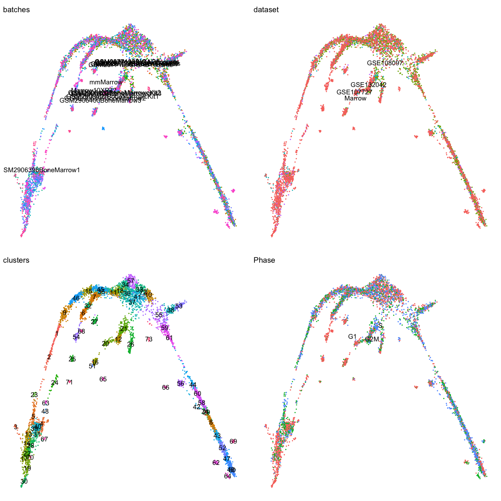
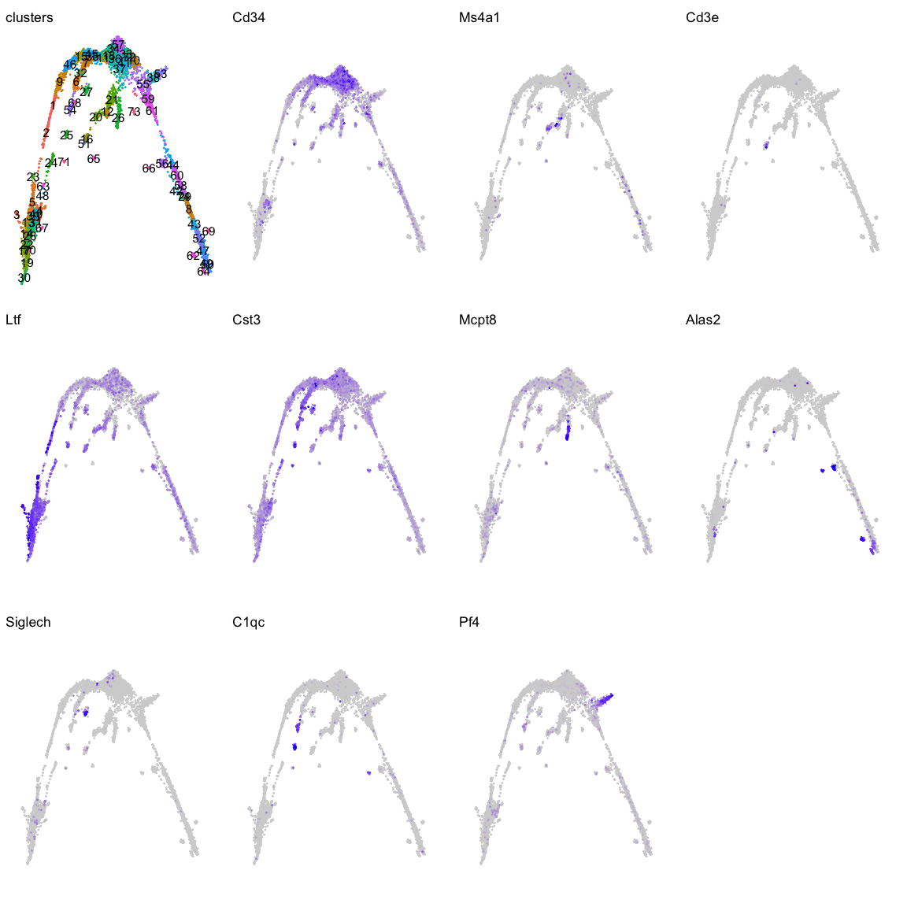
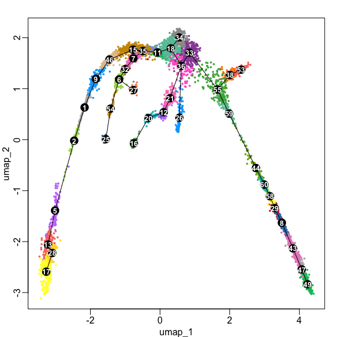
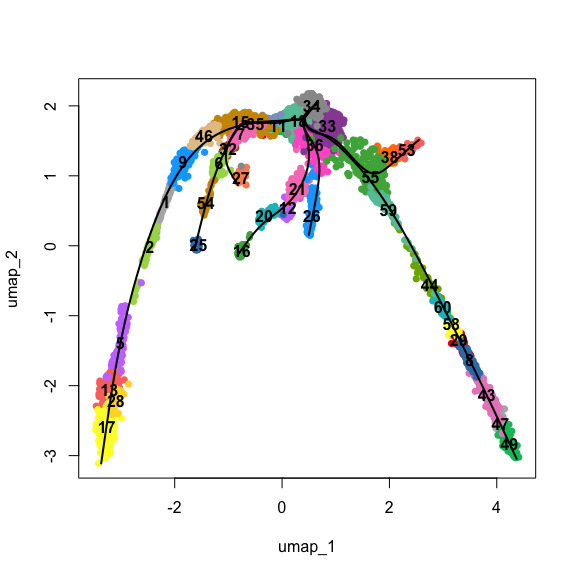
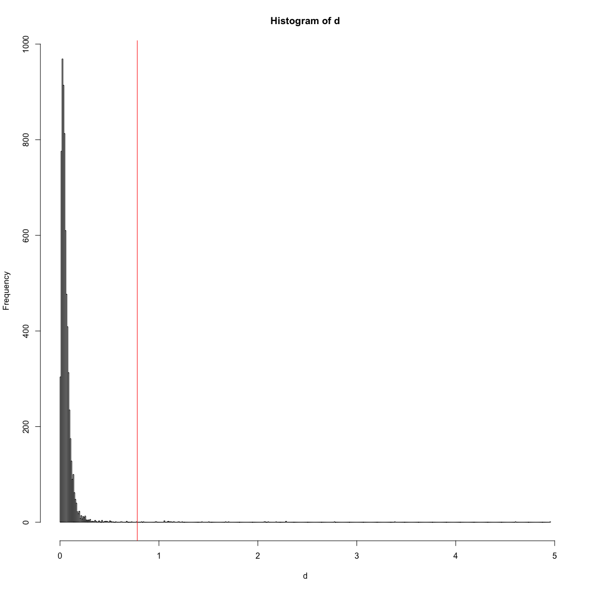
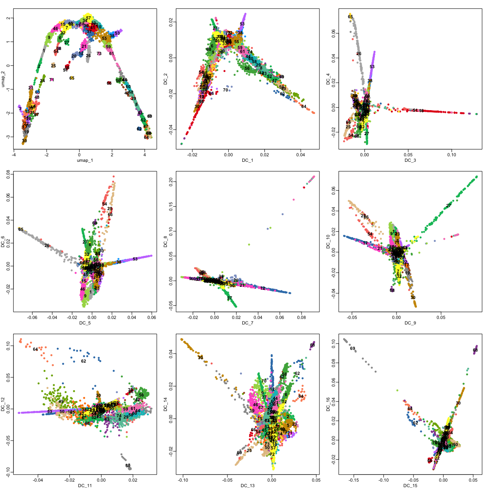
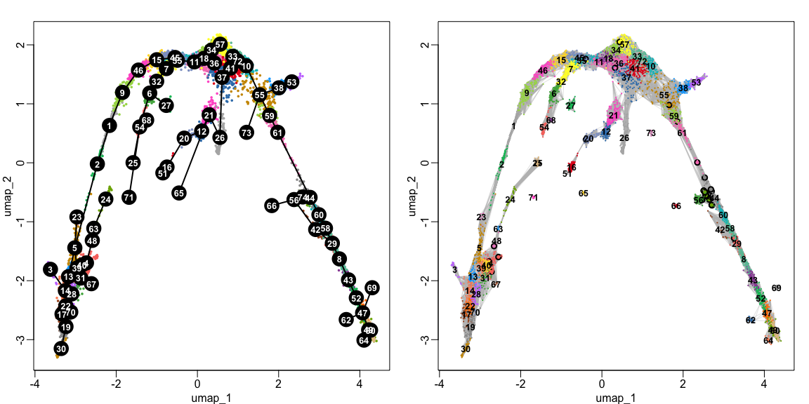
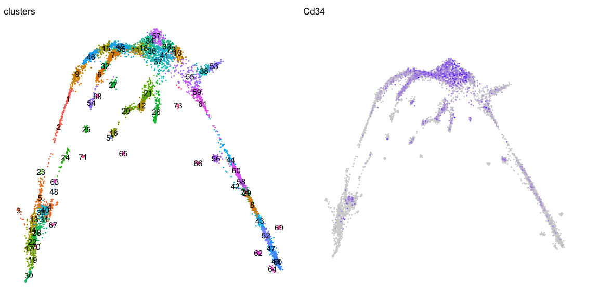
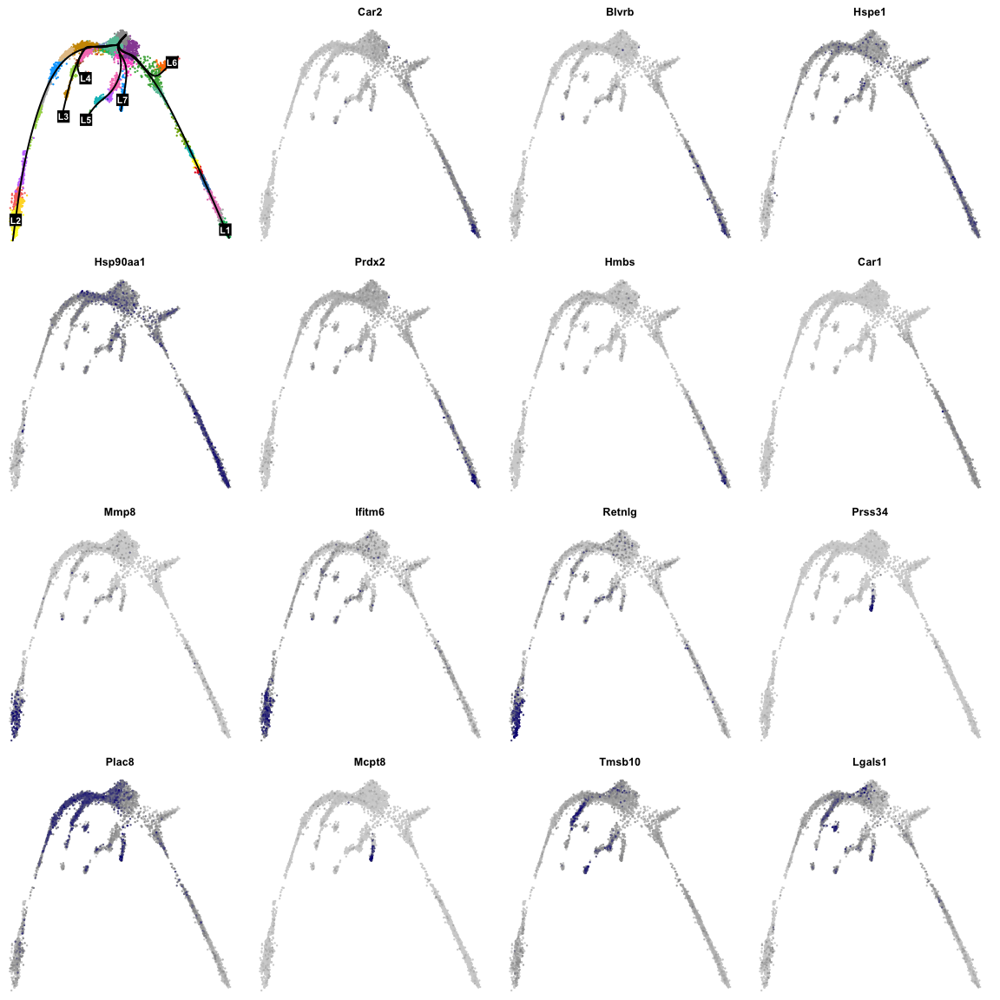

# Trajectory inference analysis: Slingshot


### Loading libraries


```r
suppressPackageStartupMessages({
    library(Seurat)
    library(rafalib)
    library(cowplot)
    library(plotly)
    options(rgl.printRglwidget = TRUE)
    library(Matrix)
    library(sparseMatrixStats)
    library(slingshot)
    library(tradeSeq)
})

# Define some color palette
pal <- c((scales::hue_pal())(8), RColorBrewer::brewer.pal(9, "Set1"), RColorBrewer::brewer.pal(8,
    "Set2"))
set.seed(1)
pal <- rep(sample(pal, length(pal)), 200)
```

Nice function to easily draw a graph:


```r
# Add graph to the base R graphics plot
draw_graph <- function(layout, graph, lwd = 0.2, col = "grey") {
    res <- rep(x = 1:(length(graph@p) - 1), times = (graph@p[-1] - graph@p[-length(graph@p)]))
    segments(x0 = layout[graph@i + 1, 1], x1 = layout[res, 1], y0 = layout[graph@i +
        1, 2], y1 = layout[res, 2], lwd = lwd, col = col)
}
```

### Loading data

In order to speed up the computations during the exercises, we will be using a subset of a bone marrow dataset (originally containing about 100K cells). The bone marrow is the source of adult immune cells, and contains virtually all differentiation stages of cell from the **immune** system which later circulate in the blood to all other organs.


You can download the files we prepared with these commands:


```r
webpath <- "https://github.com/NBISweden/workshop-scRNAseq/blob/master/labs/data/bone_marrow/"
file_list <- c("trajectory_seurat_filtered.rds")
for (i in file_list) {
    download.file(url = paste0(webpath, i, "?raw=true"), destfile = paste0(i))
}
```

If you have been using the `scran/scater` , `Seurat` or `Scanpy` pipelines with your own data, you need to reach to the point where can find get:

* A dimensionality reduction where to perform the trajectory (for example: PCA, ICA, MNN, harmony, Diffusion Maps, UMAP)
* The cell clustering information (for example: from Louvain, k-means)
* A KNN/SNN graph (this is useful to inspect and sanity-check your trajectories)


### Loading the dataset
***

We already have pre-computed and subseted the dataset (with 6688 cells and 3585 genes) following the analysis steps in this course. We then saved the objects, so you can use common tools to open and start to work with them (either in R or Python).


```r
obj <- readRDS("trajectory_seurat_filtered.rds")

# Calculate cluster centroids (for plotting the labels later)
mm <- sparse.model.matrix(~0 + factor(obj$clusters_use))
colnames(mm) <- levels(factor(obj$clusters_use))
centroids2d <- as.matrix(t(t(obj@reductions$umap@cell.embeddings) %*% mm)/Matrix::colSums(mm))
```

Lets visualize which clusters we have in our dataset:


```r
vars <- c("batches", "dataset", "clusters_use", "Phase")
pl <- list()

for (i in vars) {
    pl[[i]] <- DimPlot(obj, group.by = i, label = T) + theme_void() + NoLegend()
}
plot_grid(plotlist = pl)
```

<!-- -->

You can check, for example how many cells are in each cluster:


```r
table(obj$clusters)
```

```
## 
##   1   2   5   6   7   8   9  11  12  13  14  15  16  17  18  19  20  21  22  23 
## 128  71  90 160 147 120 160 130 132  78  90 150 140  76 141  90  98 149  90  10 
##  25  26  27  28  29  32  33  34  35  36  37  38  41  43  44  45  46  47  49  50 
##  56 154  98  76 125 150 150 146 150 148 135 128 145 134 110 149 140 113 132  85 
##  52  53  54  55  57  58  59  60  61 
## 126 129  57 129 147 127 118 120 101
```


### Exploring the data
***

It is crucial that you performing analysis of a dataset understands what is going on, what are the clusters you see in your data and most importantly **How are the clusters related to each other?**. Well, let's explore the data a bit. With the help of this table, write down which cluster numbers in your dataset express these key markers.

| Marker  | Cell Type               |
|---------|-------------------------|
| Cd34    | HSC progenitor          |
| Ms4a1   | B cell lineage          |
| Cd3e    | T cell lineage          |
| Ltf     | Granulocyte lineage     |
| Cst3    | Monocyte lineage        |
| Mcpt8   | Mast Cell lineage       |
| Alas2   | RBC lineage             |
| Siglech | Dendritic cell lineage  |
| C1qc    | Macrophage cell lineage |
| Pf4     | Megakaryocyte cell lineage |


```r
vars <- c("Cd34", "Ms4a1", "Cd3e", "Ltf", "Cst3", "Mcpt8", "Alas2", "Siglech", "C1qc",
    "Pf4")
pl <- list()

pl <- list(DimPlot(obj, group.by = "clusters_use", label = T) + theme_void() + NoLegend())
for (i in vars) {
    pl[[i]] <- FeaturePlot(obj, features = i, order = T) + theme_void() + NoLegend()
}
plot_grid(plotlist = pl)
```

<!-- -->

Another way to better explore your data is look in higher dimensions, to really get a sense for what is right or wrong. As mentioned in the dimensionality reduction exercises, here we ran UMAP with **3** dimensions (**IMPORTANT: the UMAP needs to be computed to results in _exactly_ 3 dimensions**).

Since the steps below are identical to both `Seurat` and `Scran` pipelines, we ill extract the matrices from both, so it is clear what is being used where and to remove long lines of code used to get those matrices. We will use them all. Plot in 3D with `Plotly`:


```r
df <- data.frame(obj@reductions$umap3d@cell.embeddings, variable = factor(obj$clusters_use))
colnames(df)[1:3] <- c("UMAP_1", "UMAP_2", "UMAP_3")
p_State <- plot_ly(df, x = ~UMAP_1, y = ~UMAP_2, z = ~UMAP_3, color = ~variable,
    colors = pal, size = 0.5)
try(htmlwidgets::saveWidget(p_State, selfcontained = T, "umap_3d_clustering_plotly.html"),
    silent = T)
browseURL("umap_3d_clustering_plotly.html")
p_State
```

```{=html}
<div class="plotly html-widget html-fill-item-overflow-hidden html-fill-item" id="htmlwidget-202c941e659048e65652" style="width:1152px;height:1152px;"></div>
<script type="application/json" data-for="htmlwidget-202c941e659048e65652">{"x":{"visdat":{"5d3639b38981":["function () ","plotlyVisDat"]},"cur_data":"5d3639b38981","attrs":{"5d3639b38981":{"x":{},"y":{},"z":{},"color":{},"size":0.5,"colors":["#B3B3B3","#00BE67","#C77CFF","#F8766D","#CD9600","#4DAF4A","#FFFF33","#66C2A5","#A6D854","#00BFC4","#F781BF","#377EB8","#00A9FF","#FC8D62","#FFD92F","#E41A1C","#A65628","#984EA3","#999999","#8DA0CB","#FF61CC","#FF7F00","#E78AC3","#7CAE00","#E5C494","#B3B3B3","#00BE67","#C77CFF","#F8766D","#CD9600","#4DAF4A","#FFFF33","#66C2A5","#A6D854","#00BFC4","#F781BF","#377EB8","#00A9FF","#FC8D62","#FFD92F","#E41A1C","#A65628","#984EA3","#999999","#8DA0CB","#FF61CC","#FF7F00","#E78AC3","#7CAE00","#E5C494","#B3B3B3","#00BE67","#C77CFF","#F8766D","#CD9600","#4DAF4A","#FFFF33","#66C2A5","#A6D854","#00BFC4","#F781BF","#377EB8","#00A9FF","#FC8D62","#FFD92F","#E41A1C","#A65628","#984EA3","#999999","#8DA0CB","#FF61CC","#FF7F00","#E78AC3","#7CAE00","#E5C494","#B3B3B3","#00BE67","#C77CFF","#F8766D","#CD9600","#4DAF4A","#FFFF33","#66C2A5","#A6D854","#00BFC4","#F781BF","#377EB8","#00A9FF","#FC8D62","#FFD92F","#E41A1C","#A65628","#984EA3","#999999","#8DA0CB","#FF61CC","#FF7F00","#E78AC3","#7CAE00","#E5C494","#B3B3B3","#00BE67","#C77CFF","#F8766D","#CD9600","#4DAF4A","#FFFF33","#66C2A5","#A6D854","#00BFC4","#F781BF","#377EB8","#00A9FF","#FC8D62","#FFD92F","#E41A1C","#A65628","#984EA3","#999999","#8DA0CB","#FF61CC","#FF7F00","#E78AC3","#7CAE00","#E5C494","#B3B3B3","#00BE67","#C77CFF","#F8766D","#CD9600","#4DAF4A","#FFFF33","#66C2A5","#A6D854","#00BFC4","#F781BF","#377EB8","#00A9FF","#FC8D62","#FFD92F","#E41A1C","#A65628","#984EA3","#999999","#8DA0CB","#FF61CC","#FF7F00","#E78AC3","#7CAE00","#E5C494","#B3B3B3","#00BE67","#C77CFF","#F8766D","#CD9600","#4DAF4A","#FFFF33","#66C2A5","#A6D854","#00BFC4","#F781BF","#377EB8","#00A9FF","#FC8D62","#FFD92F","#E41A1C","#A65628","#984EA3","#999999","#8DA0CB","#FF61CC","#FF7F00","#E78AC3","#7CAE00","#E5C494","#B3B3B3","#00BE67","#C77CFF","#F8766D","#CD9600","#4DAF4A","#FFFF33","#66C2A5","#A6D854","#00BFC4","#F781BF","#377EB8","#00A9FF","#FC8D62","#FFD92F","#E41A1C","#A65628","#984EA3","#999999","#8DA0CB","#FF61CC","#FF7F00","#E78AC3","#7CAE00","#E5C494","#B3B3B3","#00BE67","#C77CFF","#F8766D","#CD9600","#4DAF4A","#FFFF33","#66C2A5","#A6D854","#00BFC4","#F781BF","#377EB8","#00A9FF","#FC8D62","#FFD92F","#E41A1C","#A65628","#984EA3","#999999","#8DA0CB","#FF61CC","#FF7F00","#E78AC3","#7CAE00","#E5C494","#B3B3B3","#00BE67","#C77CFF","#F8766D","#CD9600","#4DAF4A","#FFFF33","#66C2A5","#A6D854","#00BFC4","#F781BF","#377EB8","#00A9FF","#FC8D62","#FFD92F","#E41A1C","#A65628","#984EA3","#999999","#8DA0CB","#FF61CC","#FF7F00","#E78AC3","#7CAE00","#E5C494","#B3B3B3","#00BE67","#C77CFF","#F8766D","#CD9600","#4DAF4A","#FFFF33","#66C2A5","#A6D854","#00BFC4","#F781BF","#377EB8","#00A9FF","#FC8D62","#FFD92F","#E41A1C","#A65628","#984EA3","#999999","#8DA0CB","#FF61CC","#FF7F00","#E78AC3","#7CAE00","#E5C494","#B3B3B3","#00BE67","#C77CFF","#F8766D","#CD9600","#4DAF4A","#FFFF33","#66C2A5","#A6D854","#00BFC4","#F781BF","#377EB8","#00A9FF","#FC8D62","#FFD92F","#E41A1C","#A65628","#984EA3","#999999","#8DA0CB","#FF61CC","#FF7F00","#E78AC3","#7CAE00","#E5C494","#B3B3B3","#00BE67","#C77CFF","#F8766D","#CD9600","#4DAF4A","#FFFF33","#66C2A5","#A6D854","#00BFC4","#F781BF","#377EB8","#00A9FF","#FC8D62","#FFD92F","#E41A1C","#A65628","#984EA3","#999999","#8DA0CB","#FF61CC","#FF7F00","#E78AC3","#7CAE00","#E5C494","#B3B3B3","#00BE67","#C77CFF","#F8766D","#CD9600","#4DAF4A","#FFFF33","#66C2A5","#A6D854","#00BFC4","#F781BF","#377EB8","#00A9FF","#FC8D62","#FFD92F","#E41A1C","#A65628","#984EA3","#999999","#8DA0CB","#FF61CC","#FF7F00","#E78AC3","#7CAE00","#E5C494","#B3B3B3","#00BE67","#C77CFF","#F8766D","#CD9600","#4DAF4A","#FFFF33","#66C2A5","#A6D854","#00BFC4","#F781BF","#377EB8","#00A9FF","#FC8D62","#FFD92F","#E41A1C","#A65628","#984EA3","#999999","#8DA0CB","#FF61CC","#FF7F00","#E78AC3","#7CAE00","#E5C494","#B3B3B3","#00BE67","#C77CFF","#F8766D","#CD9600","#4DAF4A","#FFFF33","#66C2A5","#A6D854","#00BFC4","#F781BF","#377EB8","#00A9FF","#FC8D62","#FFD92F","#E41A1C","#A65628","#984EA3","#999999","#8DA0CB","#FF61CC","#FF7F00","#E78AC3","#7CAE00","#E5C494","#B3B3B3","#00BE67","#C77CFF","#F8766D","#CD9600","#4DAF4A","#FFFF33","#66C2A5","#A6D854","#00BFC4","#F781BF","#377EB8","#00A9FF","#FC8D62","#FFD92F","#E41A1C","#A65628","#984EA3","#999999","#8DA0CB","#FF61CC","#FF7F00","#E78AC3","#7CAE00","#E5C494","#B3B3B3","#00BE67","#C77CFF","#F8766D","#CD9600","#4DAF4A","#FFFF33","#66C2A5","#A6D854","#00BFC4","#F781BF","#377EB8","#00A9FF","#FC8D62","#FFD92F","#E41A1C","#A65628","#984EA3","#999999","#8DA0CB","#FF61CC","#FF7F00","#E78AC3","#7CAE00","#E5C494","#B3B3B3","#00BE67","#C77CFF","#F8766D","#CD9600","#4DAF4A","#FFFF33","#66C2A5","#A6D854","#00BFC4","#F781BF","#377EB8","#00A9FF","#FC8D62","#FFD92F","#E41A1C","#A65628","#984EA3","#999999","#8DA0CB","#FF61CC","#FF7F00","#E78AC3","#7CAE00","#E5C494","#B3B3B3","#00BE67","#C77CFF","#F8766D","#CD9600","#4DAF4A","#FFFF33","#66C2A5","#A6D854","#00BFC4","#F781BF","#377EB8","#00A9FF","#FC8D62","#FFD92F","#E41A1C","#A65628","#984EA3","#999999","#8DA0CB","#FF61CC","#FF7F00","#E78AC3","#7CAE00","#E5C494","#B3B3B3","#00BE67","#C77CFF","#F8766D","#CD9600","#4DAF4A","#FFFF33","#66C2A5","#A6D854","#00BFC4","#F781BF","#377EB8","#00A9FF","#FC8D62","#FFD92F","#E41A1C","#A65628","#984EA3","#999999","#8DA0CB","#FF61CC","#FF7F00","#E78AC3","#7CAE00","#E5C494","#B3B3B3","#00BE67","#C77CFF","#F8766D","#CD9600","#4DAF4A","#FFFF33","#66C2A5","#A6D854","#00BFC4","#F781BF","#377EB8","#00A9FF","#FC8D62","#FFD92F","#E41A1C","#A65628","#984EA3","#999999","#8DA0CB","#FF61CC","#FF7F00","#E78AC3","#7CAE00","#E5C494","#B3B3B3","#00BE67","#C77CFF","#F8766D","#CD9600","#4DAF4A","#FFFF33","#66C2A5","#A6D854","#00BFC4","#F781BF","#377EB8","#00A9FF","#FC8D62","#FFD92F","#E41A1C","#A65628","#984EA3","#999999","#8DA0CB","#FF61CC","#FF7F00","#E78AC3","#7CAE00","#E5C494","#B3B3B3","#00BE67","#C77CFF","#F8766D","#CD9600","#4DAF4A","#FFFF33","#66C2A5","#A6D854","#00BFC4","#F781BF","#377EB8","#00A9FF","#FC8D62","#FFD92F","#E41A1C","#A65628","#984EA3","#999999","#8DA0CB","#FF61CC","#FF7F00","#E78AC3","#7CAE00","#E5C494","#B3B3B3","#00BE67","#C77CFF","#F8766D","#CD9600","#4DAF4A","#FFFF33","#66C2A5","#A6D854","#00BFC4","#F781BF","#377EB8","#00A9FF","#FC8D62","#FFD92F","#E41A1C","#A65628","#984EA3","#999999","#8DA0CB","#FF61CC","#FF7F00","#E78AC3","#7CAE00","#E5C494","#B3B3B3","#00BE67","#C77CFF","#F8766D","#CD9600","#4DAF4A","#FFFF33","#66C2A5","#A6D854","#00BFC4","#F781BF","#377EB8","#00A9FF","#FC8D62","#FFD92F","#E41A1C","#A65628","#984EA3","#999999","#8DA0CB","#FF61CC","#FF7F00","#E78AC3","#7CAE00","#E5C494","#B3B3B3","#00BE67","#C77CFF","#F8766D","#CD9600","#4DAF4A","#FFFF33","#66C2A5","#A6D854","#00BFC4","#F781BF","#377EB8","#00A9FF","#FC8D62","#FFD92F","#E41A1C","#A65628","#984EA3","#999999","#8DA0CB","#FF61CC","#FF7F00","#E78AC3","#7CAE00","#E5C494","#B3B3B3","#00BE67","#C77CFF","#F8766D","#CD9600","#4DAF4A","#FFFF33","#66C2A5","#A6D854","#00BFC4","#F781BF","#377EB8","#00A9FF","#FC8D62","#FFD92F","#E41A1C","#A65628","#984EA3","#999999","#8DA0CB","#FF61CC","#FF7F00","#E78AC3","#7CAE00","#E5C494","#B3B3B3","#00BE67","#C77CFF","#F8766D","#CD9600","#4DAF4A","#FFFF33","#66C2A5","#A6D854","#00BFC4","#F781BF","#377EB8","#00A9FF","#FC8D62","#FFD92F","#E41A1C","#A65628","#984EA3","#999999","#8DA0CB","#FF61CC","#FF7F00","#E78AC3","#7CAE00","#E5C494","#B3B3B3","#00BE67","#C77CFF","#F8766D","#CD9600","#4DAF4A","#FFFF33","#66C2A5","#A6D854","#00BFC4","#F781BF","#377EB8","#00A9FF","#FC8D62","#FFD92F","#E41A1C","#A65628","#984EA3","#999999","#8DA0CB","#FF61CC","#FF7F00","#E78AC3","#7CAE00","#E5C494","#B3B3B3","#00BE67","#C77CFF","#F8766D","#CD9600","#4DAF4A","#FFFF33","#66C2A5","#A6D854","#00BFC4","#F781BF","#377EB8","#00A9FF","#FC8D62","#FFD92F","#E41A1C","#A65628","#984EA3","#999999","#8DA0CB","#FF61CC","#FF7F00","#E78AC3","#7CAE00","#E5C494","#B3B3B3","#00BE67","#C77CFF","#F8766D","#CD9600","#4DAF4A","#FFFF33","#66C2A5","#A6D854","#00BFC4","#F781BF","#377EB8","#00A9FF","#FC8D62","#FFD92F","#E41A1C","#A65628","#984EA3","#999999","#8DA0CB","#FF61CC","#FF7F00","#E78AC3","#7CAE00","#E5C494","#B3B3B3","#00BE67","#C77CFF","#F8766D","#CD9600","#4DAF4A","#FFFF33","#66C2A5","#A6D854","#00BFC4","#F781BF","#377EB8","#00A9FF","#FC8D62","#FFD92F","#E41A1C","#A65628","#984EA3","#999999","#8DA0CB","#FF61CC","#FF7F00","#E78AC3","#7CAE00","#E5C494","#B3B3B3","#00BE67","#C77CFF","#F8766D","#CD9600","#4DAF4A","#FFFF33","#66C2A5","#A6D854","#00BFC4","#F781BF","#377EB8","#00A9FF","#FC8D62","#FFD92F","#E41A1C","#A65628","#984EA3","#999999","#8DA0CB","#FF61CC","#FF7F00","#E78AC3","#7CAE00","#E5C494","#B3B3B3","#00BE67","#C77CFF","#F8766D","#CD9600","#4DAF4A","#FFFF33","#66C2A5","#A6D854","#00BFC4","#F781BF","#377EB8","#00A9FF","#FC8D62","#FFD92F","#E41A1C","#A65628","#984EA3","#999999","#8DA0CB","#FF61CC","#FF7F00","#E78AC3","#7CAE00","#E5C494","#B3B3B3","#00BE67","#C77CFF","#F8766D","#CD9600","#4DAF4A","#FFFF33","#66C2A5","#A6D854","#00BFC4","#F781BF","#377EB8","#00A9FF","#FC8D62","#FFD92F","#E41A1C","#A65628","#984EA3","#999999","#8DA0CB","#FF61CC","#FF7F00","#E78AC3","#7CAE00","#E5C494","#B3B3B3","#00BE67","#C77CFF","#F8766D","#CD9600","#4DAF4A","#FFFF33","#66C2A5","#A6D854","#00BFC4","#F781BF","#377EB8","#00A9FF","#FC8D62","#FFD92F","#E41A1C","#A65628","#984EA3","#999999","#8DA0CB","#FF61CC","#FF7F00","#E78AC3","#7CAE00","#E5C494","#B3B3B3","#00BE67","#C77CFF","#F8766D","#CD9600","#4DAF4A","#FFFF33","#66C2A5","#A6D854","#00BFC4","#F781BF","#377EB8","#00A9FF","#FC8D62","#FFD92F","#E41A1C","#A65628","#984EA3","#999999","#8DA0CB","#FF61CC","#FF7F00","#E78AC3","#7CAE00","#E5C494","#B3B3B3","#00BE67","#C77CFF","#F8766D","#CD9600","#4DAF4A","#FFFF33","#66C2A5","#A6D854","#00BFC4","#F781BF","#377EB8","#00A9FF","#FC8D62","#FFD92F","#E41A1C","#A65628","#984EA3","#999999","#8DA0CB","#FF61CC","#FF7F00","#E78AC3","#7CAE00","#E5C494","#B3B3B3","#00BE67","#C77CFF","#F8766D","#CD9600","#4DAF4A","#FFFF33","#66C2A5","#A6D854","#00BFC4","#F781BF","#377EB8","#00A9FF","#FC8D62","#FFD92F","#E41A1C","#A65628","#984EA3","#999999","#8DA0CB","#FF61CC","#FF7F00","#E78AC3","#7CAE00","#E5C494","#B3B3B3","#00BE67","#C77CFF","#F8766D","#CD9600","#4DAF4A","#FFFF33","#66C2A5","#A6D854","#00BFC4","#F781BF","#377EB8","#00A9FF","#FC8D62","#FFD92F","#E41A1C","#A65628","#984EA3","#999999","#8DA0CB","#FF61CC","#FF7F00","#E78AC3","#7CAE00","#E5C494","#B3B3B3","#00BE67","#C77CFF","#F8766D","#CD9600","#4DAF4A","#FFFF33","#66C2A5","#A6D854","#00BFC4","#F781BF","#377EB8","#00A9FF","#FC8D62","#FFD92F","#E41A1C","#A65628","#984EA3","#999999","#8DA0CB","#FF61CC","#FF7F00","#E78AC3","#7CAE00","#E5C494","#B3B3B3","#00BE67","#C77CFF","#F8766D","#CD9600","#4DAF4A","#FFFF33","#66C2A5","#A6D854","#00BFC4","#F781BF","#377EB8","#00A9FF","#FC8D62","#FFD92F","#E41A1C","#A65628","#984EA3","#999999","#8DA0CB","#FF61CC","#FF7F00","#E78AC3","#7CAE00","#E5C494","#B3B3B3","#00BE67","#C77CFF","#F8766D","#CD9600","#4DAF4A","#FFFF33","#66C2A5","#A6D854","#00BFC4","#F781BF","#377EB8","#00A9FF","#FC8D62","#FFD92F","#E41A1C","#A65628","#984EA3","#999999","#8DA0CB","#FF61CC","#FF7F00","#E78AC3","#7CAE00","#E5C494","#B3B3B3","#00BE67","#C77CFF","#F8766D","#CD9600","#4DAF4A","#FFFF33","#66C2A5","#A6D854","#00BFC4","#F781BF","#377EB8","#00A9FF","#FC8D62","#FFD92F","#E41A1C","#A65628","#984EA3","#999999","#8DA0CB","#FF61CC","#FF7F00","#E78AC3","#7CAE00","#E5C494","#B3B3B3","#00BE67","#C77CFF","#F8766D","#CD9600","#4DAF4A","#FFFF33","#66C2A5","#A6D854","#00BFC4","#F781BF","#377EB8","#00A9FF","#FC8D62","#FFD92F","#E41A1C","#A65628","#984EA3","#999999","#8DA0CB","#FF61CC","#FF7F00","#E78AC3","#7CAE00","#E5C494","#B3B3B3","#00BE67","#C77CFF","#F8766D","#CD9600","#4DAF4A","#FFFF33","#66C2A5","#A6D854","#00BFC4","#F781BF","#377EB8","#00A9FF","#FC8D62","#FFD92F","#E41A1C","#A65628","#984EA3","#999999","#8DA0CB","#FF61CC","#FF7F00","#E78AC3","#7CAE00","#E5C494","#B3B3B3","#00BE67","#C77CFF","#F8766D","#CD9600","#4DAF4A","#FFFF33","#66C2A5","#A6D854","#00BFC4","#F781BF","#377EB8","#00A9FF","#FC8D62","#FFD92F","#E41A1C","#A65628","#984EA3","#999999","#8DA0CB","#FF61CC","#FF7F00","#E78AC3","#7CAE00","#E5C494","#B3B3B3","#00BE67","#C77CFF","#F8766D","#CD9600","#4DAF4A","#FFFF33","#66C2A5","#A6D854","#00BFC4","#F781BF","#377EB8","#00A9FF","#FC8D62","#FFD92F","#E41A1C","#A65628","#984EA3","#999999","#8DA0CB","#FF61CC","#FF7F00","#E78AC3","#7CAE00","#E5C494","#B3B3B3","#00BE67","#C77CFF","#F8766D","#CD9600","#4DAF4A","#FFFF33","#66C2A5","#A6D854","#00BFC4","#F781BF","#377EB8","#00A9FF","#FC8D62","#FFD92F","#E41A1C","#A65628","#984EA3","#999999","#8DA0CB","#FF61CC","#FF7F00","#E78AC3","#7CAE00","#E5C494","#B3B3B3","#00BE67","#C77CFF","#F8766D","#CD9600","#4DAF4A","#FFFF33","#66C2A5","#A6D854","#00BFC4","#F781BF","#377EB8","#00A9FF","#FC8D62","#FFD92F","#E41A1C","#A65628","#984EA3","#999999","#8DA0CB","#FF61CC","#FF7F00","#E78AC3","#7CAE00","#E5C494","#B3B3B3","#00BE67","#C77CFF","#F8766D","#CD9600","#4DAF4A","#FFFF33","#66C2A5","#A6D854","#00BFC4","#F781BF","#377EB8","#00A9FF","#FC8D62","#FFD92F","#E41A1C","#A65628","#984EA3","#999999","#8DA0CB","#FF61CC","#FF7F00","#E78AC3","#7CAE00","#E5C494","#B3B3B3","#00BE67","#C77CFF","#F8766D","#CD9600","#4DAF4A","#FFFF33","#66C2A5","#A6D854","#00BFC4","#F781BF","#377EB8","#00A9FF","#FC8D62","#FFD92F","#E41A1C","#A65628","#984EA3","#999999","#8DA0CB","#FF61CC","#FF7F00","#E78AC3","#7CAE00","#E5C494","#B3B3B3","#00BE67","#C77CFF","#F8766D","#CD9600","#4DAF4A","#FFFF33","#66C2A5","#A6D854","#00BFC4","#F781BF","#377EB8","#00A9FF","#FC8D62","#FFD92F","#E41A1C","#A65628","#984EA3","#999999","#8DA0CB","#FF61CC","#FF7F00","#E78AC3","#7CAE00","#E5C494","#B3B3B3","#00BE67","#C77CFF","#F8766D","#CD9600","#4DAF4A","#FFFF33","#66C2A5","#A6D854","#00BFC4","#F781BF","#377EB8","#00A9FF","#FC8D62","#FFD92F","#E41A1C","#A65628","#984EA3","#999999","#8DA0CB","#FF61CC","#FF7F00","#E78AC3","#7CAE00","#E5C494","#B3B3B3","#00BE67","#C77CFF","#F8766D","#CD9600","#4DAF4A","#FFFF33","#66C2A5","#A6D854","#00BFC4","#F781BF","#377EB8","#00A9FF","#FC8D62","#FFD92F","#E41A1C","#A65628","#984EA3","#999999","#8DA0CB","#FF61CC","#FF7F00","#E78AC3","#7CAE00","#E5C494","#B3B3B3","#00BE67","#C77CFF","#F8766D","#CD9600","#4DAF4A","#FFFF33","#66C2A5","#A6D854","#00BFC4","#F781BF","#377EB8","#00A9FF","#FC8D62","#FFD92F","#E41A1C","#A65628","#984EA3","#999999","#8DA0CB","#FF61CC","#FF7F00","#E78AC3","#7CAE00","#E5C494","#B3B3B3","#00BE67","#C77CFF","#F8766D","#CD9600","#4DAF4A","#FFFF33","#66C2A5","#A6D854","#00BFC4","#F781BF","#377EB8","#00A9FF","#FC8D62","#FFD92F","#E41A1C","#A65628","#984EA3","#999999","#8DA0CB","#FF61CC","#FF7F00","#E78AC3","#7CAE00","#E5C494","#B3B3B3","#00BE67","#C77CFF","#F8766D","#CD9600","#4DAF4A","#FFFF33","#66C2A5","#A6D854","#00BFC4","#F781BF","#377EB8","#00A9FF","#FC8D62","#FFD92F","#E41A1C","#A65628","#984EA3","#999999","#8DA0CB","#FF61CC","#FF7F00","#E78AC3","#7CAE00","#E5C494","#B3B3B3","#00BE67","#C77CFF","#F8766D","#CD9600","#4DAF4A","#FFFF33","#66C2A5","#A6D854","#00BFC4","#F781BF","#377EB8","#00A9FF","#FC8D62","#FFD92F","#E41A1C","#A65628","#984EA3","#999999","#8DA0CB","#FF61CC","#FF7F00","#E78AC3","#7CAE00","#E5C494","#B3B3B3","#00BE67","#C77CFF","#F8766D","#CD9600","#4DAF4A","#FFFF33","#66C2A5","#A6D854","#00BFC4","#F781BF","#377EB8","#00A9FF","#FC8D62","#FFD92F","#E41A1C","#A65628","#984EA3","#999999","#8DA0CB","#FF61CC","#FF7F00","#E78AC3","#7CAE00","#E5C494","#B3B3B3","#00BE67","#C77CFF","#F8766D","#CD9600","#4DAF4A","#FFFF33","#66C2A5","#A6D854","#00BFC4","#F781BF","#377EB8","#00A9FF","#FC8D62","#FFD92F","#E41A1C","#A65628","#984EA3","#999999","#8DA0CB","#FF61CC","#FF7F00","#E78AC3","#7CAE00","#E5C494","#B3B3B3","#00BE67","#C77CFF","#F8766D","#CD9600","#4DAF4A","#FFFF33","#66C2A5","#A6D854","#00BFC4","#F781BF","#377EB8","#00A9FF","#FC8D62","#FFD92F","#E41A1C","#A65628","#984EA3","#999999","#8DA0CB","#FF61CC","#FF7F00","#E78AC3","#7CAE00","#E5C494","#B3B3B3","#00BE67","#C77CFF","#F8766D","#CD9600","#4DAF4A","#FFFF33","#66C2A5","#A6D854","#00BFC4","#F781BF","#377EB8","#00A9FF","#FC8D62","#FFD92F","#E41A1C","#A65628","#984EA3","#999999","#8DA0CB","#FF61CC","#FF7F00","#E78AC3","#7CAE00","#E5C494","#B3B3B3","#00BE67","#C77CFF","#F8766D","#CD9600","#4DAF4A","#FFFF33","#66C2A5","#A6D854","#00BFC4","#F781BF","#377EB8","#00A9FF","#FC8D62","#FFD92F","#E41A1C","#A65628","#984EA3","#999999","#8DA0CB","#FF61CC","#FF7F00","#E78AC3","#7CAE00","#E5C494","#B3B3B3","#00BE67","#C77CFF","#F8766D","#CD9600","#4DAF4A","#FFFF33","#66C2A5","#A6D854","#00BFC4","#F781BF","#377EB8","#00A9FF","#FC8D62","#FFD92F","#E41A1C","#A65628","#984EA3","#999999","#8DA0CB","#FF61CC","#FF7F00","#E78AC3","#7CAE00","#E5C494","#B3B3B3","#00BE67","#C77CFF","#F8766D","#CD9600","#4DAF4A","#FFFF33","#66C2A5","#A6D854","#00BFC4","#F781BF","#377EB8","#00A9FF","#FC8D62","#FFD92F","#E41A1C","#A65628","#984EA3","#999999","#8DA0CB","#FF61CC","#FF7F00","#E78AC3","#7CAE00","#E5C494","#B3B3B3","#00BE67","#C77CFF","#F8766D","#CD9600","#4DAF4A","#FFFF33","#66C2A5","#A6D854","#00BFC4","#F781BF","#377EB8","#00A9FF","#FC8D62","#FFD92F","#E41A1C","#A65628","#984EA3","#999999","#8DA0CB","#FF61CC","#FF7F00","#E78AC3","#7CAE00","#E5C494","#B3B3B3","#00BE67","#C77CFF","#F8766D","#CD9600","#4DAF4A","#FFFF33","#66C2A5","#A6D854","#00BFC4","#F781BF","#377EB8","#00A9FF","#FC8D62","#FFD92F","#E41A1C","#A65628","#984EA3","#999999","#8DA0CB","#FF61CC","#FF7F00","#E78AC3","#7CAE00","#E5C494","#B3B3B3","#00BE67","#C77CFF","#F8766D","#CD9600","#4DAF4A","#FFFF33","#66C2A5","#A6D854","#00BFC4","#F781BF","#377EB8","#00A9FF","#FC8D62","#FFD92F","#E41A1C","#A65628","#984EA3","#999999","#8DA0CB","#FF61CC","#FF7F00","#E78AC3","#7CAE00","#E5C494","#B3B3B3","#00BE67","#C77CFF","#F8766D","#CD9600","#4DAF4A","#FFFF33","#66C2A5","#A6D854","#00BFC4","#F781BF","#377EB8","#00A9FF","#FC8D62","#FFD92F","#E41A1C","#A65628","#984EA3","#999999","#8DA0CB","#FF61CC","#FF7F00","#E78AC3","#7CAE00","#E5C494","#B3B3B3","#00BE67","#C77CFF","#F8766D","#CD9600","#4DAF4A","#FFFF33","#66C2A5","#A6D854","#00BFC4","#F781BF","#377EB8","#00A9FF","#FC8D62","#FFD92F","#E41A1C","#A65628","#984EA3","#999999","#8DA0CB","#FF61CC","#FF7F00","#E78AC3","#7CAE00","#E5C494","#B3B3B3","#00BE67","#C77CFF","#F8766D","#CD9600","#4DAF4A","#FFFF33","#66C2A5","#A6D854","#00BFC4","#F781BF","#377EB8","#00A9FF","#FC8D62","#FFD92F","#E41A1C","#A65628","#984EA3","#999999","#8DA0CB","#FF61CC","#FF7F00","#E78AC3","#7CAE00","#E5C494","#B3B3B3","#00BE67","#C77CFF","#F8766D","#CD9600","#4DAF4A","#FFFF33","#66C2A5","#A6D854","#00BFC4","#F781BF","#377EB8","#00A9FF","#FC8D62","#FFD92F","#E41A1C","#A65628","#984EA3","#999999","#8DA0CB","#FF61CC","#FF7F00","#E78AC3","#7CAE00","#E5C494","#B3B3B3","#00BE67","#C77CFF","#F8766D","#CD9600","#4DAF4A","#FFFF33","#66C2A5","#A6D854","#00BFC4","#F781BF","#377EB8","#00A9FF","#FC8D62","#FFD92F","#E41A1C","#A65628","#984EA3","#999999","#8DA0CB","#FF61CC","#FF7F00","#E78AC3","#7CAE00","#E5C494","#B3B3B3","#00BE67","#C77CFF","#F8766D","#CD9600","#4DAF4A","#FFFF33","#66C2A5","#A6D854","#00BFC4","#F781BF","#377EB8","#00A9FF","#FC8D62","#FFD92F","#E41A1C","#A65628","#984EA3","#999999","#8DA0CB","#FF61CC","#FF7F00","#E78AC3","#7CAE00","#E5C494","#B3B3B3","#00BE67","#C77CFF","#F8766D","#CD9600","#4DAF4A","#FFFF33","#66C2A5","#A6D854","#00BFC4","#F781BF","#377EB8","#00A9FF","#FC8D62","#FFD92F","#E41A1C","#A65628","#984EA3","#999999","#8DA0CB","#FF61CC","#FF7F00","#E78AC3","#7CAE00","#E5C494","#B3B3B3","#00BE67","#C77CFF","#F8766D","#CD9600","#4DAF4A","#FFFF33","#66C2A5","#A6D854","#00BFC4","#F781BF","#377EB8","#00A9FF","#FC8D62","#FFD92F","#E41A1C","#A65628","#984EA3","#999999","#8DA0CB","#FF61CC","#FF7F00","#E78AC3","#7CAE00","#E5C494","#B3B3B3","#00BE67","#C77CFF","#F8766D","#CD9600","#4DAF4A","#FFFF33","#66C2A5","#A6D854","#00BFC4","#F781BF","#377EB8","#00A9FF","#FC8D62","#FFD92F","#E41A1C","#A65628","#984EA3","#999999","#8DA0CB","#FF61CC","#FF7F00","#E78AC3","#7CAE00","#E5C494","#B3B3B3","#00BE67","#C77CFF","#F8766D","#CD9600","#4DAF4A","#FFFF33","#66C2A5","#A6D854","#00BFC4","#F781BF","#377EB8","#00A9FF","#FC8D62","#FFD92F","#E41A1C","#A65628","#984EA3","#999999","#8DA0CB","#FF61CC","#FF7F00","#E78AC3","#7CAE00","#E5C494","#B3B3B3","#00BE67","#C77CFF","#F8766D","#CD9600","#4DAF4A","#FFFF33","#66C2A5","#A6D854","#00BFC4","#F781BF","#377EB8","#00A9FF","#FC8D62","#FFD92F","#E41A1C","#A65628","#984EA3","#999999","#8DA0CB","#FF61CC","#FF7F00","#E78AC3","#7CAE00","#E5C494","#B3B3B3","#00BE67","#C77CFF","#F8766D","#CD9600","#4DAF4A","#FFFF33","#66C2A5","#A6D854","#00BFC4","#F781BF","#377EB8","#00A9FF","#FC8D62","#FFD92F","#E41A1C","#A65628","#984EA3","#999999","#8DA0CB","#FF61CC","#FF7F00","#E78AC3","#7CAE00","#E5C494","#B3B3B3","#00BE67","#C77CFF","#F8766D","#CD9600","#4DAF4A","#FFFF33","#66C2A5","#A6D854","#00BFC4","#F781BF","#377EB8","#00A9FF","#FC8D62","#FFD92F","#E41A1C","#A65628","#984EA3","#999999","#8DA0CB","#FF61CC","#FF7F00","#E78AC3","#7CAE00","#E5C494","#B3B3B3","#00BE67","#C77CFF","#F8766D","#CD9600","#4DAF4A","#FFFF33","#66C2A5","#A6D854","#00BFC4","#F781BF","#377EB8","#00A9FF","#FC8D62","#FFD92F","#E41A1C","#A65628","#984EA3","#999999","#8DA0CB","#FF61CC","#FF7F00","#E78AC3","#7CAE00","#E5C494","#B3B3B3","#00BE67","#C77CFF","#F8766D","#CD9600","#4DAF4A","#FFFF33","#66C2A5","#A6D854","#00BFC4","#F781BF","#377EB8","#00A9FF","#FC8D62","#FFD92F","#E41A1C","#A65628","#984EA3","#999999","#8DA0CB","#FF61CC","#FF7F00","#E78AC3","#7CAE00","#E5C494","#B3B3B3","#00BE67","#C77CFF","#F8766D","#CD9600","#4DAF4A","#FFFF33","#66C2A5","#A6D854","#00BFC4","#F781BF","#377EB8","#00A9FF","#FC8D62","#FFD92F","#E41A1C","#A65628","#984EA3","#999999","#8DA0CB","#FF61CC","#FF7F00","#E78AC3","#7CAE00","#E5C494","#B3B3B3","#00BE67","#C77CFF","#F8766D","#CD9600","#4DAF4A","#FFFF33","#66C2A5","#A6D854","#00BFC4","#F781BF","#377EB8","#00A9FF","#FC8D62","#FFD92F","#E41A1C","#A65628","#984EA3","#999999","#8DA0CB","#FF61CC","#FF7F00","#E78AC3","#7CAE00","#E5C494","#B3B3B3","#00BE67","#C77CFF","#F8766D","#CD9600","#4DAF4A","#FFFF33","#66C2A5","#A6D854","#00BFC4","#F781BF","#377EB8","#00A9FF","#FC8D62","#FFD92F","#E41A1C","#A65628","#984EA3","#999999","#8DA0CB","#FF61CC","#FF7F00","#E78AC3","#7CAE00","#E5C494","#B3B3B3","#00BE67","#C77CFF","#F8766D","#CD9600","#4DAF4A","#FFFF33","#66C2A5","#A6D854","#00BFC4","#F781BF","#377EB8","#00A9FF","#FC8D62","#FFD92F","#E41A1C","#A65628","#984EA3","#999999","#8DA0CB","#FF61CC","#FF7F00","#E78AC3","#7CAE00","#E5C494","#B3B3B3","#00BE67","#C77CFF","#F8766D","#CD9600","#4DAF4A","#FFFF33","#66C2A5","#A6D854","#00BFC4","#F781BF","#377EB8","#00A9FF","#FC8D62","#FFD92F","#E41A1C","#A65628","#984EA3","#999999","#8DA0CB","#FF61CC","#FF7F00","#E78AC3","#7CAE00","#E5C494","#B3B3B3","#00BE67","#C77CFF","#F8766D","#CD9600","#4DAF4A","#FFFF33","#66C2A5","#A6D854","#00BFC4","#F781BF","#377EB8","#00A9FF","#FC8D62","#FFD92F","#E41A1C","#A65628","#984EA3","#999999","#8DA0CB","#FF61CC","#FF7F00","#E78AC3","#7CAE00","#E5C494","#B3B3B3","#00BE67","#C77CFF","#F8766D","#CD9600","#4DAF4A","#FFFF33","#66C2A5","#A6D854","#00BFC4","#F781BF","#377EB8","#00A9FF","#FC8D62","#FFD92F","#E41A1C","#A65628","#984EA3","#999999","#8DA0CB","#FF61CC","#FF7F00","#E78AC3","#7CAE00","#E5C494","#B3B3B3","#00BE67","#C77CFF","#F8766D","#CD9600","#4DAF4A","#FFFF33","#66C2A5","#A6D854","#00BFC4","#F781BF","#377EB8","#00A9FF","#FC8D62","#FFD92F","#E41A1C","#A65628","#984EA3","#999999","#8DA0CB","#FF61CC","#FF7F00","#E78AC3","#7CAE00","#E5C494","#B3B3B3","#00BE67","#C77CFF","#F8766D","#CD9600","#4DAF4A","#FFFF33","#66C2A5","#A6D854","#00BFC4","#F781BF","#377EB8","#00A9FF","#FC8D62","#FFD92F","#E41A1C","#A65628","#984EA3","#999999","#8DA0CB","#FF61CC","#FF7F00","#E78AC3","#7CAE00","#E5C494","#B3B3B3","#00BE67","#C77CFF","#F8766D","#CD9600","#4DAF4A","#FFFF33","#66C2A5","#A6D854","#00BFC4","#F781BF","#377EB8","#00A9FF","#FC8D62","#FFD92F","#E41A1C","#A65628","#984EA3","#999999","#8DA0CB","#FF61CC","#FF7F00","#E78AC3","#7CAE00","#E5C494","#B3B3B3","#00BE67","#C77CFF","#F8766D","#CD9600","#4DAF4A","#FFFF33","#66C2A5","#A6D854","#00BFC4","#F781BF","#377EB8","#00A9FF","#FC8D62","#FFD92F","#E41A1C","#A65628","#984EA3","#999999","#8DA0CB","#FF61CC","#FF7F00","#E78AC3","#7CAE00","#E5C494","#B3B3B3","#00BE67","#C77CFF","#F8766D","#CD9600","#4DAF4A","#FFFF33","#66C2A5","#A6D854","#00BFC4","#F781BF","#377EB8","#00A9FF","#FC8D62","#FFD92F","#E41A1C","#A65628","#984EA3","#999999","#8DA0CB","#FF61CC","#FF7F00","#E78AC3","#7CAE00","#E5C494","#B3B3B3","#00BE67","#C77CFF","#F8766D","#CD9600","#4DAF4A","#FFFF33","#66C2A5","#A6D854","#00BFC4","#F781BF","#377EB8","#00A9FF","#FC8D62","#FFD92F","#E41A1C","#A65628","#984EA3","#999999","#8DA0CB","#FF61CC","#FF7F00","#E78AC3","#7CAE00","#E5C494","#B3B3B3","#00BE67","#C77CFF","#F8766D","#CD9600","#4DAF4A","#FFFF33","#66C2A5","#A6D854","#00BFC4","#F781BF","#377EB8","#00A9FF","#FC8D62","#FFD92F","#E41A1C","#A65628","#984EA3","#999999","#8DA0CB","#FF61CC","#FF7F00","#E78AC3","#7CAE00","#E5C494","#B3B3B3","#00BE67","#C77CFF","#F8766D","#CD9600","#4DAF4A","#FFFF33","#66C2A5","#A6D854","#00BFC4","#F781BF","#377EB8","#00A9FF","#FC8D62","#FFD92F","#E41A1C","#A65628","#984EA3","#999999","#8DA0CB","#FF61CC","#FF7F00","#E78AC3","#7CAE00","#E5C494","#B3B3B3","#00BE67","#C77CFF","#F8766D","#CD9600","#4DAF4A","#FFFF33","#66C2A5","#A6D854","#00BFC4","#F781BF","#377EB8","#00A9FF","#FC8D62","#FFD92F","#E41A1C","#A65628","#984EA3","#999999","#8DA0CB","#FF61CC","#FF7F00","#E78AC3","#7CAE00","#E5C494","#B3B3B3","#00BE67","#C77CFF","#F8766D","#CD9600","#4DAF4A","#FFFF33","#66C2A5","#A6D854","#00BFC4","#F781BF","#377EB8","#00A9FF","#FC8D62","#FFD92F","#E41A1C","#A65628","#984EA3","#999999","#8DA0CB","#FF61CC","#FF7F00","#E78AC3","#7CAE00","#E5C494","#B3B3B3","#00BE67","#C77CFF","#F8766D","#CD9600","#4DAF4A","#FFFF33","#66C2A5","#A6D854","#00BFC4","#F781BF","#377EB8","#00A9FF","#FC8D62","#FFD92F","#E41A1C","#A65628","#984EA3","#999999","#8DA0CB","#FF61CC","#FF7F00","#E78AC3","#7CAE00","#E5C494","#B3B3B3","#00BE67","#C77CFF","#F8766D","#CD9600","#4DAF4A","#FFFF33","#66C2A5","#A6D854","#00BFC4","#F781BF","#377EB8","#00A9FF","#FC8D62","#FFD92F","#E41A1C","#A65628","#984EA3","#999999","#8DA0CB","#FF61CC","#FF7F00","#E78AC3","#7CAE00","#E5C494","#B3B3B3","#00BE67","#C77CFF","#F8766D","#CD9600","#4DAF4A","#FFFF33","#66C2A5","#A6D854","#00BFC4","#F781BF","#377EB8","#00A9FF","#FC8D62","#FFD92F","#E41A1C","#A65628","#984EA3","#999999","#8DA0CB","#FF61CC","#FF7F00","#E78AC3","#7CAE00","#E5C494","#B3B3B3","#00BE67","#C77CFF","#F8766D","#CD9600","#4DAF4A","#FFFF33","#66C2A5","#A6D854","#00BFC4","#F781BF","#377EB8","#00A9FF","#FC8D62","#FFD92F","#E41A1C","#A65628","#984EA3","#999999","#8DA0CB","#FF61CC","#FF7F00","#E78AC3","#7CAE00","#E5C494","#B3B3B3","#00BE67","#C77CFF","#F8766D","#CD9600","#4DAF4A","#FFFF33","#66C2A5","#A6D854","#00BFC4","#F781BF","#377EB8","#00A9FF","#FC8D62","#FFD92F","#E41A1C","#A65628","#984EA3","#999999","#8DA0CB","#FF61CC","#FF7F00","#E78AC3","#7CAE00","#E5C494","#B3B3B3","#00BE67","#C77CFF","#F8766D","#CD9600","#4DAF4A","#FFFF33","#66C2A5","#A6D854","#00BFC4","#F781BF","#377EB8","#00A9FF","#FC8D62","#FFD92F","#E41A1C","#A65628","#984EA3","#999999","#8DA0CB","#FF61CC","#FF7F00","#E78AC3","#7CAE00","#E5C494","#B3B3B3","#00BE67","#C77CFF","#F8766D","#CD9600","#4DAF4A","#FFFF33","#66C2A5","#A6D854","#00BFC4","#F781BF","#377EB8","#00A9FF","#FC8D62","#FFD92F","#E41A1C","#A65628","#984EA3","#999999","#8DA0CB","#FF61CC","#FF7F00","#E78AC3","#7CAE00","#E5C494","#B3B3B3","#00BE67","#C77CFF","#F8766D","#CD9600","#4DAF4A","#FFFF33","#66C2A5","#A6D854","#00BFC4","#F781BF","#377EB8","#00A9FF","#FC8D62","#FFD92F","#E41A1C","#A65628","#984EA3","#999999","#8DA0CB","#FF61CC","#FF7F00","#E78AC3","#7CAE00","#E5C494","#B3B3B3","#00BE67","#C77CFF","#F8766D","#CD9600","#4DAF4A","#FFFF33","#66C2A5","#A6D854","#00BFC4","#F781BF","#377EB8","#00A9FF","#FC8D62","#FFD92F","#E41A1C","#A65628","#984EA3","#999999","#8DA0CB","#FF61CC","#FF7F00","#E78AC3","#7CAE00","#E5C494","#B3B3B3","#00BE67","#C77CFF","#F8766D","#CD9600","#4DAF4A","#FFFF33","#66C2A5","#A6D854","#00BFC4","#F781BF","#377EB8","#00A9FF","#FC8D62","#FFD92F","#E41A1C","#A65628","#984EA3","#999999","#8DA0CB","#FF61CC","#FF7F00","#E78AC3","#7CAE00","#E5C494","#B3B3B3","#00BE67","#C77CFF","#F8766D","#CD9600","#4DAF4A","#FFFF33","#66C2A5","#A6D854","#00BFC4","#F781BF","#377EB8","#00A9FF","#FC8D62","#FFD92F","#E41A1C","#A65628","#984EA3","#999999","#8DA0CB","#FF61CC","#FF7F00","#E78AC3","#7CAE00","#E5C494","#B3B3B3","#00BE67","#C77CFF","#F8766D","#CD9600","#4DAF4A","#FFFF33","#66C2A5","#A6D854","#00BFC4","#F781BF","#377EB8","#00A9FF","#FC8D62","#FFD92F","#E41A1C","#A65628","#984EA3","#999999","#8DA0CB","#FF61CC","#FF7F00","#E78AC3","#7CAE00","#E5C494","#B3B3B3","#00BE67","#C77CFF","#F8766D","#CD9600","#4DAF4A","#FFFF33","#66C2A5","#A6D854","#00BFC4","#F781BF","#377EB8","#00A9FF","#FC8D62","#FFD92F","#E41A1C","#A65628","#984EA3","#999999","#8DA0CB","#FF61CC","#FF7F00","#E78AC3","#7CAE00","#E5C494","#B3B3B3","#00BE67","#C77CFF","#F8766D","#CD9600","#4DAF4A","#FFFF33","#66C2A5","#A6D854","#00BFC4","#F781BF","#377EB8","#00A9FF","#FC8D62","#FFD92F","#E41A1C","#A65628","#984EA3","#999999","#8DA0CB","#FF61CC","#FF7F00","#E78AC3","#7CAE00","#E5C494","#B3B3B3","#00BE67","#C77CFF","#F8766D","#CD9600","#4DAF4A","#FFFF33","#66C2A5","#A6D854","#00BFC4","#F781BF","#377EB8","#00A9FF","#FC8D62","#FFD92F","#E41A1C","#A65628","#984EA3","#999999","#8DA0CB","#FF61CC","#FF7F00","#E78AC3","#7CAE00","#E5C494","#B3B3B3","#00BE67","#C77CFF","#F8766D","#CD9600","#4DAF4A","#FFFF33","#66C2A5","#A6D854","#00BFC4","#F781BF","#377EB8","#00A9FF","#FC8D62","#FFD92F","#E41A1C","#A65628","#984EA3","#999999","#8DA0CB","#FF61CC","#FF7F00","#E78AC3","#7CAE00","#E5C494","#B3B3B3","#00BE67","#C77CFF","#F8766D","#CD9600","#4DAF4A","#FFFF33","#66C2A5","#A6D854","#00BFC4","#F781BF","#377EB8","#00A9FF","#FC8D62","#FFD92F","#E41A1C","#A65628","#984EA3","#999999","#8DA0CB","#FF61CC","#FF7F00","#E78AC3","#7CAE00","#E5C494","#B3B3B3","#00BE67","#C77CFF","#F8766D","#CD9600","#4DAF4A","#FFFF33","#66C2A5","#A6D854","#00BFC4","#F781BF","#377EB8","#00A9FF","#FC8D62","#FFD92F","#E41A1C","#A65628","#984EA3","#999999","#8DA0CB","#FF61CC","#FF7F00","#E78AC3","#7CAE00","#E5C494","#B3B3B3","#00BE67","#C77CFF","#F8766D","#CD9600","#4DAF4A","#FFFF33","#66C2A5","#A6D854","#00BFC4","#F781BF","#377EB8","#00A9FF","#FC8D62","#FFD92F","#E41A1C","#A65628","#984EA3","#999999","#8DA0CB","#FF61CC","#FF7F00","#E78AC3","#7CAE00","#E5C494","#B3B3B3","#00BE67","#C77CFF","#F8766D","#CD9600","#4DAF4A","#FFFF33","#66C2A5","#A6D854","#00BFC4","#F781BF","#377EB8","#00A9FF","#FC8D62","#FFD92F","#E41A1C","#A65628","#984EA3","#999999","#8DA0CB","#FF61CC","#FF7F00","#E78AC3","#7CAE00","#E5C494","#B3B3B3","#00BE67","#C77CFF","#F8766D","#CD9600","#4DAF4A","#FFFF33","#66C2A5","#A6D854","#00BFC4","#F781BF","#377EB8","#00A9FF","#FC8D62","#FFD92F","#E41A1C","#A65628","#984EA3","#999999","#8DA0CB","#FF61CC","#FF7F00","#E78AC3","#7CAE00","#E5C494","#B3B3B3","#00BE67","#C77CFF","#F8766D","#CD9600","#4DAF4A","#FFFF33","#66C2A5","#A6D854","#00BFC4","#F781BF","#377EB8","#00A9FF","#FC8D62","#FFD92F","#E41A1C","#A65628","#984EA3","#999999","#8DA0CB","#FF61CC","#FF7F00","#E78AC3","#7CAE00","#E5C494","#B3B3B3","#00BE67","#C77CFF","#F8766D","#CD9600","#4DAF4A","#FFFF33","#66C2A5","#A6D854","#00BFC4","#F781BF","#377EB8","#00A9FF","#FC8D62","#FFD92F","#E41A1C","#A65628","#984EA3","#999999","#8DA0CB","#FF61CC","#FF7F00","#E78AC3","#7CAE00","#E5C494","#B3B3B3","#00BE67","#C77CFF","#F8766D","#CD9600","#4DAF4A","#FFFF33","#66C2A5","#A6D854","#00BFC4","#F781BF","#377EB8","#00A9FF","#FC8D62","#FFD92F","#E41A1C","#A65628","#984EA3","#999999","#8DA0CB","#FF61CC","#FF7F00","#E78AC3","#7CAE00","#E5C494","#B3B3B3","#00BE67","#C77CFF","#F8766D","#CD9600","#4DAF4A","#FFFF33","#66C2A5","#A6D854","#00BFC4","#F781BF","#377EB8","#00A9FF","#FC8D62","#FFD92F","#E41A1C","#A65628","#984EA3","#999999","#8DA0CB","#FF61CC","#FF7F00","#E78AC3","#7CAE00","#E5C494","#B3B3B3","#00BE67","#C77CFF","#F8766D","#CD9600","#4DAF4A","#FFFF33","#66C2A5","#A6D854","#00BFC4","#F781BF","#377EB8","#00A9FF","#FC8D62","#FFD92F","#E41A1C","#A65628","#984EA3","#999999","#8DA0CB","#FF61CC","#FF7F00","#E78AC3","#7CAE00","#E5C494","#B3B3B3","#00BE67","#C77CFF","#F8766D","#CD9600","#4DAF4A","#FFFF33","#66C2A5","#A6D854","#00BFC4","#F781BF","#377EB8","#00A9FF","#FC8D62","#FFD92F","#E41A1C","#A65628","#984EA3","#999999","#8DA0CB","#FF61CC","#FF7F00","#E78AC3","#7CAE00","#E5C494","#B3B3B3","#00BE67","#C77CFF","#F8766D","#CD9600","#4DAF4A","#FFFF33","#66C2A5","#A6D854","#00BFC4","#F781BF","#377EB8","#00A9FF","#FC8D62","#FFD92F","#E41A1C","#A65628","#984EA3","#999999","#8DA0CB","#FF61CC","#FF7F00","#E78AC3","#7CAE00","#E5C494","#B3B3B3","#00BE67","#C77CFF","#F8766D","#CD9600","#4DAF4A","#FFFF33","#66C2A5","#A6D854","#00BFC4","#F781BF","#377EB8","#00A9FF","#FC8D62","#FFD92F","#E41A1C","#A65628","#984EA3","#999999","#8DA0CB","#FF61CC","#FF7F00","#E78AC3","#7CAE00","#E5C494","#B3B3B3","#00BE67","#C77CFF","#F8766D","#CD9600","#4DAF4A","#FFFF33","#66C2A5","#A6D854","#00BFC4","#F781BF","#377EB8","#00A9FF","#FC8D62","#FFD92F","#E41A1C","#A65628","#984EA3","#999999","#8DA0CB","#FF61CC","#FF7F00","#E78AC3","#7CAE00","#E5C494","#B3B3B3","#00BE67","#C77CFF","#F8766D","#CD9600","#4DAF4A","#FFFF33","#66C2A5","#A6D854","#00BFC4","#F781BF","#377EB8","#00A9FF","#FC8D62","#FFD92F","#E41A1C","#A65628","#984EA3","#999999","#8DA0CB","#FF61CC","#FF7F00","#E78AC3","#7CAE00","#E5C494","#B3B3B3","#00BE67","#C77CFF","#F8766D","#CD9600","#4DAF4A","#FFFF33","#66C2A5","#A6D854","#00BFC4","#F781BF","#377EB8","#00A9FF","#FC8D62","#FFD92F","#E41A1C","#A65628","#984EA3","#999999","#8DA0CB","#FF61CC","#FF7F00","#E78AC3","#7CAE00","#E5C494","#B3B3B3","#00BE67","#C77CFF","#F8766D","#CD9600","#4DAF4A","#FFFF33","#66C2A5","#A6D854","#00BFC4","#F781BF","#377EB8","#00A9FF","#FC8D62","#FFD92F","#E41A1C","#A65628","#984EA3","#999999","#8DA0CB","#FF61CC","#FF7F00","#E78AC3","#7CAE00","#E5C494","#B3B3B3","#00BE67","#C77CFF","#F8766D","#CD9600","#4DAF4A","#FFFF33","#66C2A5","#A6D854","#00BFC4","#F781BF","#377EB8","#00A9FF","#FC8D62","#FFD92F","#E41A1C","#A65628","#984EA3","#999999","#8DA0CB","#FF61CC","#FF7F00","#E78AC3","#7CAE00","#E5C494","#B3B3B3","#00BE67","#C77CFF","#F8766D","#CD9600","#4DAF4A","#FFFF33","#66C2A5","#A6D854","#00BFC4","#F781BF","#377EB8","#00A9FF","#FC8D62","#FFD92F","#E41A1C","#A65628","#984EA3","#999999","#8DA0CB","#FF61CC","#FF7F00","#E78AC3","#7CAE00","#E5C494","#B3B3B3","#00BE67","#C77CFF","#F8766D","#CD9600","#4DAF4A","#FFFF33","#66C2A5","#A6D854","#00BFC4","#F781BF","#377EB8","#00A9FF","#FC8D62","#FFD92F","#E41A1C","#A65628","#984EA3","#999999","#8DA0CB","#FF61CC","#FF7F00","#E78AC3","#7CAE00","#E5C494","#B3B3B3","#00BE67","#C77CFF","#F8766D","#CD9600","#4DAF4A","#FFFF33","#66C2A5","#A6D854","#00BFC4","#F781BF","#377EB8","#00A9FF","#FC8D62","#FFD92F","#E41A1C","#A65628","#984EA3","#999999","#8DA0CB","#FF61CC","#FF7F00","#E78AC3","#7CAE00","#E5C494","#B3B3B3","#00BE67","#C77CFF","#F8766D","#CD9600","#4DAF4A","#FFFF33","#66C2A5","#A6D854","#00BFC4","#F781BF","#377EB8","#00A9FF","#FC8D62","#FFD92F","#E41A1C","#A65628","#984EA3","#999999","#8DA0CB","#FF61CC","#FF7F00","#E78AC3","#7CAE00","#E5C494","#B3B3B3","#00BE67","#C77CFF","#F8766D","#CD9600","#4DAF4A","#FFFF33","#66C2A5","#A6D854","#00BFC4","#F781BF","#377EB8","#00A9FF","#FC8D62","#FFD92F","#E41A1C","#A65628","#984EA3","#999999","#8DA0CB","#FF61CC","#FF7F00","#E78AC3","#7CAE00","#E5C494","#B3B3B3","#00BE67","#C77CFF","#F8766D","#CD9600","#4DAF4A","#FFFF33","#66C2A5","#A6D854","#00BFC4","#F781BF","#377EB8","#00A9FF","#FC8D62","#FFD92F","#E41A1C","#A65628","#984EA3","#999999","#8DA0CB","#FF61CC","#FF7F00","#E78AC3","#7CAE00","#E5C494","#B3B3B3","#00BE67","#C77CFF","#F8766D","#CD9600","#4DAF4A","#FFFF33","#66C2A5","#A6D854","#00BFC4","#F781BF","#377EB8","#00A9FF","#FC8D62","#FFD92F","#E41A1C","#A65628","#984EA3","#999999","#8DA0CB","#FF61CC","#FF7F00","#E78AC3","#7CAE00","#E5C494","#B3B3B3","#00BE67","#C77CFF","#F8766D","#CD9600","#4DAF4A","#FFFF33","#66C2A5","#A6D854","#00BFC4","#F781BF","#377EB8","#00A9FF","#FC8D62","#FFD92F","#E41A1C","#A65628","#984EA3","#999999","#8DA0CB","#FF61CC","#FF7F00","#E78AC3","#7CAE00","#E5C494","#B3B3B3","#00BE67","#C77CFF","#F8766D","#CD9600","#4DAF4A","#FFFF33","#66C2A5","#A6D854","#00BFC4","#F781BF","#377EB8","#00A9FF","#FC8D62","#FFD92F","#E41A1C","#A65628","#984EA3","#999999","#8DA0CB","#FF61CC","#FF7F00","#E78AC3","#7CAE00","#E5C494","#B3B3B3","#00BE67","#C77CFF","#F8766D","#CD9600","#4DAF4A","#FFFF33","#66C2A5","#A6D854","#00BFC4","#F781BF","#377EB8","#00A9FF","#FC8D62","#FFD92F","#E41A1C","#A65628","#984EA3","#999999","#8DA0CB","#FF61CC","#FF7F00","#E78AC3","#7CAE00","#E5C494","#B3B3B3","#00BE67","#C77CFF","#F8766D","#CD9600","#4DAF4A","#FFFF33","#66C2A5","#A6D854","#00BFC4","#F781BF","#377EB8","#00A9FF","#FC8D62","#FFD92F","#E41A1C","#A65628","#984EA3","#999999","#8DA0CB","#FF61CC","#FF7F00","#E78AC3","#7CAE00","#E5C494","#B3B3B3","#00BE67","#C77CFF","#F8766D","#CD9600","#4DAF4A","#FFFF33","#66C2A5","#A6D854","#00BFC4","#F781BF","#377EB8","#00A9FF","#FC8D62","#FFD92F","#E41A1C","#A65628","#984EA3","#999999","#8DA0CB","#FF61CC","#FF7F00","#E78AC3","#7CAE00","#E5C494","#B3B3B3","#00BE67","#C77CFF","#F8766D","#CD9600","#4DAF4A","#FFFF33","#66C2A5","#A6D854","#00BFC4","#F781BF","#377EB8","#00A9FF","#FC8D62","#FFD92F","#E41A1C","#A65628","#984EA3","#999999","#8DA0CB","#FF61CC","#FF7F00","#E78AC3","#7CAE00","#E5C494","#B3B3B3","#00BE67","#C77CFF","#F8766D","#CD9600","#4DAF4A","#FFFF33","#66C2A5","#A6D854","#00BFC4","#F781BF","#377EB8","#00A9FF","#FC8D62","#FFD92F","#E41A1C","#A65628","#984EA3","#999999","#8DA0CB","#FF61CC","#FF7F00","#E78AC3","#7CAE00","#E5C494","#B3B3B3","#00BE67","#C77CFF","#F8766D","#CD9600","#4DAF4A","#FFFF33","#66C2A5","#A6D854","#00BFC4","#F781BF","#377EB8","#00A9FF","#FC8D62","#FFD92F","#E41A1C","#A65628","#984EA3","#999999","#8DA0CB","#FF61CC","#FF7F00","#E78AC3","#7CAE00","#E5C494","#B3B3B3","#00BE67","#C77CFF","#F8766D","#CD9600","#4DAF4A","#FFFF33","#66C2A5","#A6D854","#00BFC4","#F781BF","#377EB8","#00A9FF","#FC8D62","#FFD92F","#E41A1C","#A65628","#984EA3","#999999","#8DA0CB","#FF61CC","#FF7F00","#E78AC3","#7CAE00","#E5C494","#B3B3B3","#00BE67","#C77CFF","#F8766D","#CD9600","#4DAF4A","#FFFF33","#66C2A5","#A6D854","#00BFC4","#F781BF","#377EB8","#00A9FF","#FC8D62","#FFD92F","#E41A1C","#A65628","#984EA3","#999999","#8DA0CB","#FF61CC","#FF7F00","#E78AC3","#7CAE00","#E5C494","#B3B3B3","#00BE67","#C77CFF","#F8766D","#CD9600","#4DAF4A","#FFFF33","#66C2A5","#A6D854","#00BFC4","#F781BF","#377EB8","#00A9FF","#FC8D62","#FFD92F","#E41A1C","#A65628","#984EA3","#999999","#8DA0CB","#FF61CC","#FF7F00","#E78AC3","#7CAE00","#E5C494","#B3B3B3","#00BE67","#C77CFF","#F8766D","#CD9600","#4DAF4A","#FFFF33","#66C2A5","#A6D854","#00BFC4","#F781BF","#377EB8","#00A9FF","#FC8D62","#FFD92F","#E41A1C","#A65628","#984EA3","#999999","#8DA0CB","#FF61CC","#FF7F00","#E78AC3","#7CAE00","#E5C494","#B3B3B3","#00BE67","#C77CFF","#F8766D","#CD9600","#4DAF4A","#FFFF33","#66C2A5","#A6D854","#00BFC4","#F781BF","#377EB8","#00A9FF","#FC8D62","#FFD92F","#E41A1C","#A65628","#984EA3","#999999","#8DA0CB","#FF61CC","#FF7F00","#E78AC3","#7CAE00","#E5C494","#B3B3B3","#00BE67","#C77CFF","#F8766D","#CD9600","#4DAF4A","#FFFF33","#66C2A5","#A6D854","#00BFC4","#F781BF","#377EB8","#00A9FF","#FC8D62","#FFD92F","#E41A1C","#A65628","#984EA3","#999999","#8DA0CB","#FF61CC","#FF7F00","#E78AC3","#7CAE00","#E5C494","#B3B3B3","#00BE67","#C77CFF","#F8766D","#CD9600","#4DAF4A","#FFFF33","#66C2A5","#A6D854","#00BFC4","#F781BF","#377EB8","#00A9FF","#FC8D62","#FFD92F","#E41A1C","#A65628","#984EA3","#999999","#8DA0CB","#FF61CC","#FF7F00","#E78AC3","#7CAE00","#E5C494","#B3B3B3","#00BE67","#C77CFF","#F8766D","#CD9600","#4DAF4A","#FFFF33","#66C2A5","#A6D854","#00BFC4","#F781BF","#377EB8","#00A9FF","#FC8D62","#FFD92F","#E41A1C","#A65628","#984EA3","#999999","#8DA0CB","#FF61CC","#FF7F00","#E78AC3","#7CAE00","#E5C494","#B3B3B3","#00BE67","#C77CFF","#F8766D","#CD9600","#4DAF4A","#FFFF33","#66C2A5","#A6D854","#00BFC4","#F781BF","#377EB8","#00A9FF","#FC8D62","#FFD92F","#E41A1C","#A65628","#984EA3","#999999","#8DA0CB","#FF61CC","#FF7F00","#E78AC3","#7CAE00","#E5C494","#B3B3B3","#00BE67","#C77CFF","#F8766D","#CD9600","#4DAF4A","#FFFF33","#66C2A5","#A6D854","#00BFC4","#F781BF","#377EB8","#00A9FF","#FC8D62","#FFD92F","#E41A1C","#A65628","#984EA3","#999999","#8DA0CB","#FF61CC","#FF7F00","#E78AC3","#7CAE00","#E5C494","#B3B3B3","#00BE67","#C77CFF","#F8766D","#CD9600","#4DAF4A","#FFFF33","#66C2A5","#A6D854","#00BFC4","#F781BF","#377EB8","#00A9FF","#FC8D62","#FFD92F","#E41A1C","#A65628","#984EA3","#999999","#8DA0CB","#FF61CC","#FF7F00","#E78AC3","#7CAE00","#E5C494","#B3B3B3","#00BE67","#C77CFF","#F8766D","#CD9600","#4DAF4A","#FFFF33","#66C2A5","#A6D854","#00BFC4","#F781BF","#377EB8","#00A9FF","#FC8D62","#FFD92F","#E41A1C","#A65628","#984EA3","#999999","#8DA0CB","#FF61CC","#FF7F00","#E78AC3","#7CAE00","#E5C494","#B3B3B3","#00BE67","#C77CFF","#F8766D","#CD9600","#4DAF4A","#FFFF33","#66C2A5","#A6D854","#00BFC4","#F781BF","#377EB8","#00A9FF","#FC8D62","#FFD92F","#E41A1C","#A65628","#984EA3","#999999","#8DA0CB","#FF61CC","#FF7F00","#E78AC3","#7CAE00","#E5C494","#B3B3B3","#00BE67","#C77CFF","#F8766D","#CD9600","#4DAF4A","#FFFF33","#66C2A5","#A6D854","#00BFC4","#F781BF","#377EB8","#00A9FF","#FC8D62","#FFD92F","#E41A1C","#A65628","#984EA3","#999999","#8DA0CB","#FF61CC","#FF7F00","#E78AC3","#7CAE00","#E5C494","#B3B3B3","#00BE67","#C77CFF","#F8766D","#CD9600","#4DAF4A","#FFFF33","#66C2A5","#A6D854","#00BFC4","#F781BF","#377EB8","#00A9FF","#FC8D62","#FFD92F","#E41A1C","#A65628","#984EA3","#999999","#8DA0CB","#FF61CC","#FF7F00","#E78AC3","#7CAE00","#E5C494","#B3B3B3","#00BE67","#C77CFF","#F8766D","#CD9600","#4DAF4A","#FFFF33","#66C2A5","#A6D854","#00BFC4","#F781BF","#377EB8","#00A9FF","#FC8D62","#FFD92F","#E41A1C","#A65628","#984EA3","#999999","#8DA0CB","#FF61CC","#FF7F00","#E78AC3","#7CAE00","#E5C494","#B3B3B3","#00BE67","#C77CFF","#F8766D","#CD9600","#4DAF4A","#FFFF33","#66C2A5","#A6D854","#00BFC4","#F781BF","#377EB8","#00A9FF","#FC8D62","#FFD92F","#E41A1C","#A65628","#984EA3","#999999","#8DA0CB","#FF61CC","#FF7F00","#E78AC3","#7CAE00","#E5C494","#B3B3B3","#00BE67","#C77CFF","#F8766D","#CD9600","#4DAF4A","#FFFF33","#66C2A5","#A6D854","#00BFC4","#F781BF","#377EB8","#00A9FF","#FC8D62","#FFD92F","#E41A1C","#A65628","#984EA3","#999999","#8DA0CB","#FF61CC","#FF7F00","#E78AC3","#7CAE00","#E5C494","#B3B3B3","#00BE67","#C77CFF","#F8766D","#CD9600","#4DAF4A","#FFFF33","#66C2A5","#A6D854","#00BFC4","#F781BF","#377EB8","#00A9FF","#FC8D62","#FFD92F","#E41A1C","#A65628","#984EA3","#999999","#8DA0CB","#FF61CC","#FF7F00","#E78AC3","#7CAE00","#E5C494","#B3B3B3","#00BE67","#C77CFF","#F8766D","#CD9600","#4DAF4A","#FFFF33","#66C2A5","#A6D854","#00BFC4","#F781BF","#377EB8","#00A9FF","#FC8D62","#FFD92F","#E41A1C","#A65628","#984EA3","#999999","#8DA0CB","#FF61CC","#FF7F00","#E78AC3","#7CAE00","#E5C494","#B3B3B3","#00BE67","#C77CFF","#F8766D","#CD9600","#4DAF4A","#FFFF33","#66C2A5","#A6D854","#00BFC4","#F781BF","#377EB8","#00A9FF","#FC8D62","#FFD92F","#E41A1C","#A65628","#984EA3","#999999","#8DA0CB","#FF61CC","#FF7F00","#E78AC3","#7CAE00","#E5C494","#B3B3B3","#00BE67","#C77CFF","#F8766D","#CD9600","#4DAF4A","#FFFF33","#66C2A5","#A6D854","#00BFC4","#F781BF","#377EB8","#00A9FF","#FC8D62","#FFD92F","#E41A1C","#A65628","#984EA3","#999999","#8DA0CB","#FF61CC","#FF7F00","#E78AC3","#7CAE00","#E5C494","#B3B3B3","#00BE67","#C77CFF","#F8766D","#CD9600","#4DAF4A","#FFFF33","#66C2A5","#A6D854","#00BFC4","#F781BF","#377EB8","#00A9FF","#FC8D62","#FFD92F","#E41A1C","#A65628","#984EA3","#999999","#8DA0CB","#FF61CC","#FF7F00","#E78AC3","#7CAE00","#E5C494","#B3B3B3","#00BE67","#C77CFF","#F8766D","#CD9600","#4DAF4A","#FFFF33","#66C2A5","#A6D854","#00BFC4","#F781BF","#377EB8","#00A9FF","#FC8D62","#FFD92F","#E41A1C","#A65628","#984EA3","#999999","#8DA0CB","#FF61CC","#FF7F00","#E78AC3","#7CAE00","#E5C494","#B3B3B3","#00BE67","#C77CFF","#F8766D","#CD9600","#4DAF4A","#FFFF33","#66C2A5","#A6D854","#00BFC4","#F781BF","#377EB8","#00A9FF","#FC8D62","#FFD92F","#E41A1C","#A65628","#984EA3","#999999","#8DA0CB","#FF61CC","#FF7F00","#E78AC3","#7CAE00","#E5C494","#B3B3B3","#00BE67","#C77CFF","#F8766D","#CD9600","#4DAF4A","#FFFF33","#66C2A5","#A6D854","#00BFC4","#F781BF","#377EB8","#00A9FF","#FC8D62","#FFD92F","#E41A1C","#A65628","#984EA3","#999999","#8DA0CB","#FF61CC","#FF7F00","#E78AC3","#7CAE00","#E5C494","#B3B3B3","#00BE67","#C77CFF","#F8766D","#CD9600","#4DAF4A","#FFFF33","#66C2A5","#A6D854","#00BFC4","#F781BF","#377EB8","#00A9FF","#FC8D62","#FFD92F","#E41A1C","#A65628","#984EA3","#999999","#8DA0CB","#FF61CC","#FF7F00","#E78AC3","#7CAE00","#E5C494","#B3B3B3","#00BE67","#C77CFF","#F8766D","#CD9600","#4DAF4A","#FFFF33","#66C2A5","#A6D854","#00BFC4","#F781BF","#377EB8","#00A9FF","#FC8D62","#FFD92F","#E41A1C","#A65628","#984EA3","#999999","#8DA0CB","#FF61CC","#FF7F00","#E78AC3","#7CAE00","#E5C494","#B3B3B3","#00BE67","#C77CFF","#F8766D","#CD9600","#4DAF4A","#FFFF33","#66C2A5","#A6D854","#00BFC4","#F781BF","#377EB8","#00A9FF","#FC8D62","#FFD92F","#E41A1C","#A65628","#984EA3","#999999","#8DA0CB","#FF61CC","#FF7F00","#E78AC3","#7CAE00","#E5C494","#B3B3B3","#00BE67","#C77CFF","#F8766D","#CD9600","#4DAF4A","#FFFF33","#66C2A5","#A6D854","#00BFC4","#F781BF","#377EB8","#00A9FF","#FC8D62","#FFD92F","#E41A1C","#A65628","#984EA3","#999999","#8DA0CB","#FF61CC","#FF7F00","#E78AC3","#7CAE00","#E5C494","#B3B3B3","#00BE67","#C77CFF","#F8766D","#CD9600","#4DAF4A","#FFFF33","#66C2A5","#A6D854","#00BFC4","#F781BF","#377EB8","#00A9FF","#FC8D62","#FFD92F","#E41A1C","#A65628","#984EA3","#999999","#8DA0CB","#FF61CC","#FF7F00","#E78AC3","#7CAE00","#E5C494","#B3B3B3","#00BE67","#C77CFF","#F8766D","#CD9600","#4DAF4A","#FFFF33","#66C2A5","#A6D854","#00BFC4","#F781BF","#377EB8","#00A9FF","#FC8D62","#FFD92F","#E41A1C","#A65628","#984EA3","#999999","#8DA0CB","#FF61CC","#FF7F00","#E78AC3","#7CAE00","#E5C494","#B3B3B3","#00BE67","#C77CFF","#F8766D","#CD9600","#4DAF4A","#FFFF33","#66C2A5","#A6D854","#00BFC4","#F781BF","#377EB8","#00A9FF","#FC8D62","#FFD92F","#E41A1C","#A65628","#984EA3","#999999","#8DA0CB","#FF61CC","#FF7F00","#E78AC3","#7CAE00","#E5C494","#B3B3B3","#00BE67","#C77CFF","#F8766D","#CD9600","#4DAF4A","#FFFF33","#66C2A5","#A6D854","#00BFC4","#F781BF","#377EB8","#00A9FF","#FC8D62","#FFD92F","#E41A1C","#A65628","#984EA3","#999999","#8DA0CB","#FF61CC","#FF7F00","#E78AC3","#7CAE00","#E5C494","#B3B3B3","#00BE67","#C77CFF","#F8766D","#CD9600","#4DAF4A","#FFFF33","#66C2A5","#A6D854","#00BFC4","#F781BF","#377EB8","#00A9FF","#FC8D62","#FFD92F","#E41A1C","#A65628","#984EA3","#999999","#8DA0CB","#FF61CC","#FF7F00","#E78AC3","#7CAE00","#E5C494","#B3B3B3","#00BE67","#C77CFF","#F8766D","#CD9600","#4DAF4A","#FFFF33","#66C2A5","#A6D854","#00BFC4","#F781BF","#377EB8","#00A9FF","#FC8D62","#FFD92F","#E41A1C","#A65628","#984EA3","#999999","#8DA0CB","#FF61CC","#FF7F00","#E78AC3","#7CAE00","#E5C494","#B3B3B3","#00BE67","#C77CFF","#F8766D","#CD9600","#4DAF4A","#FFFF33","#66C2A5","#A6D854","#00BFC4","#F781BF","#377EB8","#00A9FF","#FC8D62","#FFD92F","#E41A1C","#A65628","#984EA3","#999999","#8DA0CB","#FF61CC","#FF7F00","#E78AC3","#7CAE00","#E5C494","#B3B3B3","#00BE67","#C77CFF","#F8766D","#CD9600","#4DAF4A","#FFFF33","#66C2A5","#A6D854","#00BFC4","#F781BF","#377EB8","#00A9FF","#FC8D62","#FFD92F","#E41A1C","#A65628","#984EA3","#999999","#8DA0CB","#FF61CC","#FF7F00","#E78AC3","#7CAE00","#E5C494","#B3B3B3","#00BE67","#C77CFF","#F8766D","#CD9600","#4DAF4A","#FFFF33","#66C2A5","#A6D854","#00BFC4","#F781BF","#377EB8","#00A9FF","#FC8D62","#FFD92F","#E41A1C","#A65628","#984EA3","#999999","#8DA0CB","#FF61CC","#FF7F00","#E78AC3","#7CAE00","#E5C494","#B3B3B3","#00BE67","#C77CFF","#F8766D","#CD9600","#4DAF4A","#FFFF33","#66C2A5","#A6D854","#00BFC4","#F781BF","#377EB8","#00A9FF","#FC8D62","#FFD92F","#E41A1C","#A65628","#984EA3","#999999","#8DA0CB","#FF61CC","#FF7F00","#E78AC3","#7CAE00","#E5C494","#B3B3B3","#00BE67","#C77CFF","#F8766D","#CD9600","#4DAF4A","#FFFF33","#66C2A5","#A6D854","#00BFC4","#F781BF","#377EB8","#00A9FF","#FC8D62","#FFD92F","#E41A1C","#A65628","#984EA3","#999999","#8DA0CB","#FF61CC","#FF7F00","#E78AC3","#7CAE00","#E5C494","#B3B3B3","#00BE67","#C77CFF","#F8766D","#CD9600","#4DAF4A","#FFFF33","#66C2A5","#A6D854","#00BFC4","#F781BF","#377EB8","#00A9FF","#FC8D62","#FFD92F","#E41A1C","#A65628","#984EA3","#999999","#8DA0CB","#FF61CC","#FF7F00","#E78AC3","#7CAE00","#E5C494","#B3B3B3","#00BE67","#C77CFF","#F8766D","#CD9600","#4DAF4A","#FFFF33","#66C2A5","#A6D854","#00BFC4","#F781BF","#377EB8","#00A9FF","#FC8D62","#FFD92F","#E41A1C","#A65628","#984EA3","#999999","#8DA0CB","#FF61CC","#FF7F00","#E78AC3","#7CAE00","#E5C494","#B3B3B3","#00BE67","#C77CFF","#F8766D","#CD9600","#4DAF4A","#FFFF33","#66C2A5","#A6D854","#00BFC4","#F781BF","#377EB8","#00A9FF","#FC8D62","#FFD92F","#E41A1C","#A65628","#984EA3","#999999","#8DA0CB","#FF61CC","#FF7F00","#E78AC3","#7CAE00","#E5C494","#B3B3B3","#00BE67","#C77CFF","#F8766D","#CD9600","#4DAF4A","#FFFF33","#66C2A5","#A6D854","#00BFC4","#F781BF","#377EB8","#00A9FF","#FC8D62","#FFD92F","#E41A1C","#A65628","#984EA3","#999999","#8DA0CB","#FF61CC","#FF7F00","#E78AC3","#7CAE00","#E5C494","#B3B3B3","#00BE67","#C77CFF","#F8766D","#CD9600","#4DAF4A","#FFFF33","#66C2A5","#A6D854","#00BFC4","#F781BF","#377EB8","#00A9FF","#FC8D62","#FFD92F","#E41A1C","#A65628","#984EA3","#999999","#8DA0CB","#FF61CC","#FF7F00","#E78AC3","#7CAE00","#E5C494","#B3B3B3","#00BE67","#C77CFF","#F8766D","#CD9600","#4DAF4A","#FFFF33","#66C2A5","#A6D854","#00BFC4","#F781BF","#377EB8","#00A9FF","#FC8D62","#FFD92F","#E41A1C","#A65628","#984EA3","#999999","#8DA0CB","#FF61CC","#FF7F00","#E78AC3","#7CAE00","#E5C494","#B3B3B3","#00BE67","#C77CFF","#F8766D","#CD9600","#4DAF4A","#FFFF33","#66C2A5","#A6D854","#00BFC4","#F781BF","#377EB8","#00A9FF","#FC8D62","#FFD92F","#E41A1C","#A65628","#984EA3","#999999","#8DA0CB","#FF61CC","#FF7F00","#E78AC3","#7CAE00","#E5C494","#B3B3B3","#00BE67","#C77CFF","#F8766D","#CD9600","#4DAF4A","#FFFF33","#66C2A5","#A6D854","#00BFC4","#F781BF","#377EB8","#00A9FF","#FC8D62","#FFD92F","#E41A1C","#A65628","#984EA3","#999999","#8DA0CB","#FF61CC","#FF7F00","#E78AC3","#7CAE00","#E5C494"],"alpha_stroke":1,"sizes":[10,100],"spans":[1,20]}},"layout":{"margin":{"b":40,"l":60,"t":25,"r":10},"scene":{"xaxis":{"title":"UMAP_1"},"yaxis":{"title":"UMAP_2"},"zaxis":{"title":"UMAP_3"}},"hovermode":"closest","showlegend":true},"source":"A","config":{"modeBarButtonsToAdd":["hoverclosest","hovercompare"],"showSendToCloud":false},"data":[{"x":[0.895074210372526,0.672202668395597,0.693905673232633,0.706261000838834,0.667096994128782,0.742462477889616,0.703045628276426,0.700718960967619,0.712400696483213,0.672498307433683,0.784958384242613,0.884161911216337,0.880608759131986,0.851852736678678,0.725112996306974,0.840416393485624,0.713852009978849,0.732045970168668,0.786485038009245,0.660041055884916,0.70083793183859,0.762033305373747,0.792598030772764,0.673456690517027,0.746948144641477,0.664975605216581,0.667171976771909,0.714581630435545,0.671902320590574,0.82146998426016,0.688938520160276,0.71206840058859,0.756812474933225,0.783868572917539,0.651733420100767,0.652155122962553,0.668743214812833,0.664036057200987,0.704052350726682,0.931149862018186,0.738216719832975,0.88687994262274,0.954688093867857,0.912685475555021,0.75334676286276,0.678551874366361,0.773426315990049,0.837594709601957,0.654850385394651,0.673549733367521,0.905380866733152,0.745902202334959,0.902226886954862,0.985117635932523,0.689363739696104,0.731902620997984,0.803184590545255,0.941362402644712,0.693298659530241,0.769252083507139,0.834975860324461,0.889551720824796,0.775527975764829,0.707561335769254,0.841009102073271,1.00378044625815,0.805549822059232,0.682120464053709,0.751057706084806,1.03628715058859,0.802193961349088,0.890069983211118,0.988170705047208,0.906151852813322,0.890644989219267,0.922251424995023,0.883549890723783,0.823383114543516,0.870766124930937,0.758758626189787,0.705804071631986,0.725529632773954,0.742512247768003,0.671829066482145,0.713502011504728,0.847578606811125,0.911016068664152,0.693616888728697,0.776116631236631,0.797661624160368,0.79042693158682,0.778615257945615,0.712523958888609,0.712487302032072,0.845536015239317,0.884758613315183,0.909876904693205,0.849527976718504,0.697792015281278,0.700861833301145,0.776568374839384,0.734664581027586,0.941993735042173,0.66862197896536,0.787648461070615,0.735441348758299,0.954599282947141,0.953124246802885,0.670744440761167,0.95249786159094,0.827707371917326,1.01742311498221,0.688783190455991,0.729132971969206,0.822163722720701,0.785450360980589,0.775509200301725,0.736560545173246,0.807790956702787,0.97813411733206,0.92045053025778,0.805742941108305,0.942096255031187,0.780026040282804,0.943531236854154,1.01869603177603,0.968712530341703,0.865783534255583],"y":[-0.138910611928087,0.119171748101134,0.0807085131997058,0.068519232957978,0.136899287044425,0.015659124753792,0.0878893529766986,0.0834127312296817,0.0437769314044902,0.117340060114283,-0.00222477766184117,-0.1278897578126,-0.124033769429307,-0.0839177200799992,0.0490611327582786,-0.0767898539310506,0.0669508782917449,0.0407743995779941,-0.0159850510066559,0.117578329681773,0.0652121996277759,0.00503947578871642,-0.0212934034174493,0.106297778129,0.0137858299309203,0.136395016848464,0.123857142567057,0.0605488216275165,0.110156947910208,-0.0632405260807088,0.0998284538978526,0.0623991733187625,0.020898068487067,-0.0130593663310816,0.141026625573058,0.13294442945661,0.11194184625091,0.116055937647242,0.0914566760653445,-0.181392108858209,0.0377497097248027,-0.10413909500895,-0.215706964791398,-0.169248184025865,0.0167641604089925,0.101530315517802,0.00340880283655618,-0.0677622685438206,0.117016220628638,0.138443017541785,-0.141907414258104,0.0359326490903089,-0.159402390778642,-0.260530894458871,0.11079615557136,0.0447813404494712,-0.0177293306445887,-0.187104245484453,0.0879217779034564,-0.00151480718014743,-0.0887391099935582,-0.0917004699116757,0.013103935099561,0.0618680661314914,-0.0761603543764165,-0.274745380342584,-0.00314639958051945,0.110727111040969,0.0295221378797481,-0.284214829862695,-0.0290356667941621,-0.11842006987391,-0.248264765203576,-0.154458975256067,-0.13952825015841,-0.170361121953111,-0.131828253925424,-0.055741404951196,-0.112190602183919,0.037868151604552,0.0726569166177699,0.0649330822521636,0.0637352524095962,0.110177794634719,0.103545466601271,-0.0896727869516423,-0.164450501859765,0.107423687517066,-0.0286772603398373,-0.0282910669451764,0.00307098233642076,0.00995192134322618,0.0555544739359805,0.0794618224495837,-0.0672916675215771,-0.135957306087594,-0.149942686617952,-0.113259693444352,0.0961207544201801,0.0669156668478439,-0.0166681481754592,0.0752676671141574,-0.1893031055337,0.1210692843193,0.0110774530799875,0.036362517788429,-0.231555258691888,-0.205529277980905,0.126820089458842,-0.221484472811799,-0.0648278946286252,-0.286993866623025,0.106938602566142,0.0595624057346771,-0.0459385717516949,-0.0171758009350112,-0.0219289155906251,0.0175901159414837,-0.0442608090346863,-0.23253034597693,-0.159222414553743,-0.019058752641659,-0.192452972591501,-0.0266411731248906,-0.194197838962655,-0.280143087566476,-0.228002479136567,-0.0975704992419293],"z":[-1.00231531242107,-1.08047857860301,-1.12870469669078,-1.12027302364086,-1.08128777126048,-1.10161712745403,-1.12155881503795,-1.10800686458324,-1.10718110183452,-1.05125859359477,-1.1035466490147,-1.03194358924602,-1.03838554004405,-1.01014104465221,-1.10312965491985,-1.05264595130657,-1.10655739883159,-1.10014608482097,-1.06250599006389,-1.13447049239848,-1.14441314319347,-1.08815196136211,-1.06436148265575,-1.0826372204182,-1.04785028079723,-1.10650959590648,-1.13562682250713,-1.10794702151988,-1.100351124799,-1.07381239513133,-1.08972707370494,-1.114142805135,-1.07267823795055,-1.05495586971019,-1.08627930263255,-1.10528209785198,-1.14607432464336,-1.11447861770366,-1.05952802280162,-1.00261810401653,-1.08986309150432,-1.04792752841686,-0.979038864171251,-1.00599852184032,-1.11543551067088,-1.09694805721019,-1.08166661838268,-1.03672519305919,-1.14498737434123,-1.12128606418346,-1.01057115176891,-1.09302058795665,-1.01935401538585,-0.969753473794206,-1.13988772014354,-1.10577598193859,-1.08905926326488,-0.999377876317247,-1.10911002734874,-1.05873063186382,-1.03070953468059,-0.998731404340013,-1.05669596770976,-1.0766557751057,-1.07365468124126,-0.937233358418688,-1.07881501296733,-1.15101650336955,-1.089329391515,-0.97767785171245,-1.08565404990886,-1.02933910468791,-0.973575502431139,-1.02957823852275,-1.00917020419811,-1.0119231043217,-1.02457919696544,-1.07512715438579,-1.05134037116741,-1.12549999335979,-1.06195679286693,-1.09955838302348,-1.05253127197002,-1.05779090503429,-1.07197025397991,-1.07250919917796,-1.03095307925914,-1.06968310455058,-1.0939510164616,-1.07005456069682,-1.07525375465129,-1.08400431255077,-1.10808303931926,-1.10139754394267,-1.04289105514263,-1.01181092838024,-1.02771618941997,-1.02509346584056,-1.12631633857463,-1.11482074836467,-1.08430233577464,-1.00452557185863,-0.989959627186998,-1.11023369411205,-1.06991317847942,-1.11120358089183,-0.98527017215465,-1.00142768005107,-1.12976565936778,-0.991674810445055,-1.03960779288982,-0.933379977738603,-1.10213282684062,-1.12534692863201,-1.0389018354771,-1.04651990512584,-1.08704236129497,-1.07920971492504,-1.06676283458446,-0.98302236179088,-1.00617876628612,-1.039271503484,-1.03259196857189,-1.10225620845531,-1.02068641761516,-0.937740057503923,-1.00561824420665,-1.05721607784007],"type":"scatter3d","mode":"markers","name":"1","marker":{"color":"rgba(179,179,179,1)","size":[55,55,55,55,55,55,55,55,55,55,55,55,55,55,55,55,55,55,55,55,55,55,55,55,55,55,55,55,55,55,55,55,55,55,55,55,55,55,55,55,55,55,55,55,55,55,55,55,55,55,55,55,55,55,55,55,55,55,55,55,55,55,55,55,55,55,55,55,55,55,55,55,55,55,55,55,55,55,55,55,55,55,55,55,55,55,55,55,55,55,55,55,55,55,55,55,55,55,55,55,55,55,55,55,55,55,55,55,55,55,55,55,55,55,55,55,55,55,55,55,55,55,55,55,55,55,55,55],"sizemode":"area","line":{"color":"rgba(179,179,179,1)"}},"textfont":{"color":"rgba(179,179,179,1)","size":55},"error_y":{"color":"rgba(179,179,179,1)","width":55},"error_x":{"color":"rgba(179,179,179,1)","width":55},"line":{"color":"rgba(179,179,179,1)","width":55},"frame":null},{"x":[-0.185416796001833,-0.252534516844195,-0.159804695043009,-0.096428782436293,-0.269070305618685,-0.142817788514536,-0.242452897819918,-0.150837742480677,-0.235682346615237,-0.278666564020556,-0.220403679403704,-0.227111958655756,-0.152175345215243,-0.27497542718355,-0.200267308148783,-0.310240545067232,-0.203206934723299,-0.254963644537371,-0.270607569012087,-0.172179677280825,-0.334881403240603,-0.170109220537585,-0.319605835470599,-0.330890276226443,-0.249846243056696,-0.151215650829714,-0.253978633078974,-0.283999153170031,-0.165610261949938,-0.231910341176432,-0.172487252149027,-0.2440226159424,-0.188576244506281,-0.22966786542837,-0.291233041080874,-0.0993066511482413,-0.275782921108645,-0.15840276399557,-0.268777467998904,-0.175194420608919,-0.35660190204088,-0.230081342849177,-0.211150430831354,-0.209251203331393,-0.212988578471583,-0.109995239171427,-0.220860310587328,-0.226961218509119,-0.281929292473238,-0.208052822145861,-0.306647219452303,-0.217726790103358,-0.212976985368174,-0.160695128831309,-0.316938676628512,-0.091669388803881,-0.345614203009051,-0.243938618096751,-0.16128452936117,-0.197844975385111,-0.218565367850703,-0.186610319408816,-0.115533546301764,-0.108804129752558,-0.226401575598162,-0.281647004875582,-0.136684261950892,-0.254152246508044,-0.204406493100565,-0.159442745837611,-0.291222938093584,-0.133677058610361,-0.19636913457815,-0.201003291401308,-0.139017515572947,-0.23341322759096,-0.154356264266413,-0.0933407924503501,-0.239805840644282,-0.128189169558924,-0.203116305860918,-0.247344382795733,-0.118687585684698,-0.26573927024309,-0.215236135515612,-0.24457205155794,-0.276531525644701,-0.108482517990511,-0.32101065734331,-0.260045298132342,-0.175412797126215,-0.168701165112894,-0.192005329522532,-0.202972315940302,-0.25595829704706,-0.0793204388946708,-0.175817676577013,-0.265931077989977,-0.156469323429507,-0.154497169646662,-0.161376544031542,-0.0995531610578712,-0.268025197777193,-0.123454943987768,-0.197671049031657,-0.0693026713461097,-0.191732727679652,-0.19008887628023,-0.100446314308089,-0.289191105160158,-0.139098697099131,-0.308489986452502,-0.162196137699526,-0.169120141062182,-0.208096691164416,-0.110394679698389,-0.265776821169298,-0.287267693075579,-0.17413149097864,-0.296022006067675,-0.211148478779238,-0.273855128082674,-0.243092023524683,-0.152613990697306,-0.109940648767393,-0.272902377638262,-0.320871182474535,-0.17844913223688,-0.239992477688235,-0.268572964462679],"y":[0.868173742830176,0.968670452176947,0.911982501088996,1.06951978260221,0.959036672651191,0.988811398088355,0.965100908815284,0.960863078176398,1.03461840206327,0.990486586629767,0.903940284788031,0.982733750879187,0.991967583238501,0.993363643228431,0.97933366352262,0.922979438840766,0.972193861543555,0.945353949605841,1.02049746566953,0.95237722450437,0.93609168583097,0.963036859571357,0.942608321248908,0.92969884926023,1.04615047031583,0.987788880407233,0.984092021524329,0.950470710336585,0.930876517831702,1.03059783035459,0.994479263364692,0.974716985761542,1.01109125667753,0.929436052381415,0.902349913656134,0.95044931226911,1.02100422435941,0.980414653360266,1.02516140991392,1.00387891584577,1.01106061989011,0.969639504491706,1.0204088931674,0.97987499290647,1.01189746910276,1.00583335214796,0.953015471040625,1.02708497101011,0.948910439550299,0.927256906568427,1.02420988136472,0.946061814367194,1.01659097725095,0.930194044649024,0.986588919698615,1.01494696193876,0.958585942327399,1.01918067985715,0.99569770151319,0.930924320756812,0.970362568437476,0.957027400075812,0.985228026449103,0.979304993688483,1.02539911323728,1.05079355293455,0.910713995038886,1.00816544347944,0.959935868322272,0.920388901769538,1.01987769657316,1.02956154400053,1.01465108448209,0.960025573312659,0.897359037935157,0.913240039884467,0.911845946847815,1.00990488582792,0.988756263791938,0.937035227357764,0.982021236955542,0.987542594015021,0.980841839849372,1.01920404487791,0.950450504362006,0.925353849470038,1.01643064075651,1.02128448539915,0.983835959970374,1.01308538967313,1.02555086666288,1.03409173542203,0.951277161180396,0.932472074567694,0.95295175367536,0.950168812810797,0.929313028394599,1.02774491363706,0.993161047040839,0.994593465864081,0.982029462396521,1.01460745388212,0.9898781424159,1.00257703119459,0.894661272107978,0.916260564863105,0.920086348592658,1.01611723953428,1.06821658664884,1.05459227615537,0.945246899663825,0.949547911226172,0.958434844552893,0.967393839895148,0.951770091592688,1.0277056937808,0.934166336595435,1.01024868541898,0.93007817321958,1.02881767803373,1.0091156011218,1.0435257201785,0.987941945135016,1.00851967388334,1.0725043063754,0.972386324941535,0.936348701059241,0.96153398805799,0.961382234632392,0.976483309804816],"z":[-0.483832269704088,-0.337804078852876,-0.529111593758806,-0.392522811686739,-0.479682594334825,-0.38282710293506,-0.380473285710558,-0.458377361094698,-0.243979275023683,-0.258238822018846,-0.426510095393404,-0.332146376168474,-0.493483036553606,-0.222433253919824,-0.357740372216448,-0.255194127356752,-0.461928933655962,-0.334442615306123,-0.255678146874651,-0.514628737961992,-0.259431838786348,-0.454874008691057,-0.277918129956468,-0.244733184373125,-0.262729555165514,-0.422827780043825,-0.262677311694368,-0.34568139890407,-0.421167850291475,-0.297454446351274,-0.471029937064394,-0.302835076844438,-0.373058199679598,-0.409201413190111,-0.309817611968263,-0.462356418168291,-0.257558643614992,-0.363766610419496,-0.24582388976787,-0.416242182051882,-0.276627152955278,-0.327719181573137,-0.354017644917711,-0.439336210286363,-0.378212004697069,-0.424473523890718,-0.298819064891084,-0.276339679753526,-0.305621206557497,-0.329303771054491,-0.275741845166429,-0.358027696406587,-0.326410919224962,-0.473434895074114,-0.220239311253771,-0.412145077979311,-0.253418028151735,-0.28394564965938,-0.420011013543352,-0.431283503567919,-0.377772956883653,-0.430460750853761,-0.438193321025118,-0.453403651511415,-0.269188672101244,-0.254664420878633,-0.430553078448518,-0.317184835469469,-0.394193082844957,-0.420288234746202,-0.261256903207048,-0.462300956046327,-0.379986166751131,-0.513035446202501,-0.491740137135729,-0.431111812388643,-0.457301080023988,-0.430813312327608,-0.38240921477054,-0.45740470269893,-0.308949202096208,-0.383196651732668,-0.464578598534807,-0.300980597531542,-0.497525721585497,-0.457134574448808,-0.294968694245561,-0.417481928860887,-0.222138181125864,-0.296546876227602,-0.376085668599352,-0.399493336474642,-0.552052289044603,-0.438225000893816,-0.381291627681001,-0.440033316409334,-0.489020496403917,-0.344741016423448,-0.430499255454286,-0.480825632607683,-0.466438591277345,-0.477061956917986,-0.267772912776216,-0.446852773225054,-0.421211659705385,-0.450529932772859,-0.460800260102495,-0.424713402783617,-0.416829943454012,-0.278352290189012,-0.45230519751285,-0.301608711278185,-0.488079100644335,-0.399212330376848,-0.428158342635378,-0.448727279698595,-0.331756472384676,-0.352644443309053,-0.410077810084566,-0.257401078736528,-0.410193115269884,-0.252587467229112,-0.39055660346721,-0.38098806122516,-0.41590628007625,-0.398030787503465,-0.258911281621202,-0.452793687379106,-0.404476940428957,-0.36885079721187],"type":"scatter3d","mode":"markers","name":"11","marker":{"color":"rgba(230,130,190,1)","size":[55,55,55,55,55,55,55,55,55,55,55,55,55,55,55,55,55,55,55,55,55,55,55,55,55,55,55,55,55,55,55,55,55,55,55,55,55,55,55,55,55,55,55,55,55,55,55,55,55,55,55,55,55,55,55,55,55,55,55,55,55,55,55,55,55,55,55,55,55,55,55,55,55,55,55,55,55,55,55,55,55,55,55,55,55,55,55,55,55,55,55,55,55,55,55,55,55,55,55,55,55,55,55,55,55,55,55,55,55,55,55,55,55,55,55,55,55,55,55,55,55,55,55,55,55,55,55,55,55,55],"sizemode":"area","line":{"color":"rgba(230,130,190,1)"}},"textfont":{"color":"rgba(230,130,190,1)","size":55},"error_y":{"color":"rgba(230,130,190,1)","width":55},"error_x":{"color":"rgba(230,130,190,1)","width":55},"line":{"color":"rgba(230,130,190,1)","width":55},"frame":null},{"x":[0.479288569894392,0.543688259330351,0.504727683272917,0.357516131606657,0.58712943574484,0.534191332068998,0.563285432067472,0.567902586665708,0.580511532035429,0.347069165912229,0.552407763209898,0.418623707500059,0.492496631351072,0.482179573979932,0.33003487369116,0.464224777427274,0.592457018104154,0.447074434962827,0.572687826362211,0.531025133338529,0.549134931769926,0.431344173160154,0.5944883443981,0.465983442273695,0.572877547946531,0.559004924502927,0.554787121024687,0.373669079747755,0.482514999118406,0.549393675532896,0.548498890605528,0.530422351565916,0.558998367992002,0.535769126620847,0.55836339971121,0.536153993812162,0.557101390567381,0.405315540042478,0.451676062551099,0.532539687362272,0.5396707870632,0.512243769374448,0.515499673095304,0.513993523326475,0.44616418263014,0.55136968871649,0.521881065574247,0.453783056941587,0.568729124274809,0.4147329547077,0.433173201289732,0.528942785468656,0.544414541926939,0.47876083036955,0.488387725558836,0.539139113631803,0.58246167680319,0.555262229648191,0.514265618529875,0.452650062051374,0.499561391082365,0.565545401778776,0.471645615306455,0.568628571239073,0.456932387557584,0.554122946467954,0.474407366719801,0.518988511767942,0.39456089517172,0.430732748714048,0.550164184775907,0.589402280059416,0.554601214137632,0.435205570664961,0.58063986083563,0.538697562423307,0.544918201175291,0.536219737735349,0.582915148940641,0.576227448192198,0.558566234317381,0.53651555558737,0.430155894961912,0.493132881131727,0.521461508479673,0.401656977143842,0.553099355903227,0.539292178359586,0.501822791305143,0.562715790477354,0.573112926688749,0.526722512450773,0.519035957065183,0.456144592967588,0.610882005897123,0.413538179603178,0.541925392356474,0.56980755111273,0.555552265849668,0.502876720634062,0.52639546176489,0.575844965186674,0.530526480880338,0.53018500587042,0.371741137710172,0.509510121551115,0.493884048667509,0.551361820903379,0.562260470595915,0.534365198817808,0.403492472377378,0.586167178359586,0.575789711680967,0.482682935205061,0.508633814063627,0.520988962855894,0.503255210128385,0.496405563560087,0.477116457429487,0.455901793447096,0.449495486226637,0.561702571120817,0.530462584701139,0.354629717078764,0.449131838288862,0.561571083274442,0.38287671586569,0.431405923572141,0.549419484344083,0.509780190196592,0.619268677440244,0.503403327670652],"y":[0.793070459901709,0.81546100431623,0.802442336618323,0.862334871827979,0.835566843091864,0.833763266145606,0.808538163244147,0.817681813775916,0.839105749666114,0.799798751413245,0.836903536855597,0.831497514783759,0.850507164537329,0.828632081090827,0.839724624692817,0.880317712366004,0.852784181177039,0.820985580026526,0.850052798330207,0.845235968171973,0.836710179387946,0.874117875635047,0.810331607400794,0.813240194856543,0.86796447092237,0.83894869142713,0.84852346235456,0.857206428586859,0.843714321195502,0.863088512956519,0.836159253656287,0.835210586130042,0.867581987916846,0.800075138151068,0.866417491971869,0.831630671560187,0.851899290620703,0.833640182554145,0.894328976213355,0.8003029471034,0.810398364602942,0.819850111543555,0.8332619314784,0.809171224176306,0.8459572439784,0.774424696504493,0.839288199483771,0.834342206060309,0.810869181692023,0.852821493684668,0.834589148103614,0.830108964979071,0.806847954332251,0.824419761239905,0.85412933880033,0.834500396787543,0.822921002447028,0.811987901269812,0.814973497926612,0.830260003148932,0.827158117830176,0.807652736246009,0.816589499055762,0.818742836057563,0.819618666707892,0.808750653802771,0.832912052213568,0.851715291082282,0.833025718271155,0.830972278653998,0.905317390500922,0.812518442212958,0.805657589971442,0.891638660966773,0.78441520982923,0.83587458187284,0.857519829809088,0.844652200281043,0.843835914670844,0.811535978853125,0.814631009637732,0.812139237462897,0.843752289354224,0.827013814985175,0.830286765634436,0.858900332986731,0.817119622766394,0.805153394281287,0.849025214254279,0.803216362535376,0.810268545686621,0.816410148679633,0.800567412912268,0.88105120712461,0.786142254411597,0.815876210271735,0.852819824754615,0.838135743677039,0.829680586397071,0.822978699743171,0.818003321229834,0.791452313005347,0.829748595296759,0.810848737298865,0.871104860841651,0.866047108709235,0.861360157071967,0.805014098226447,0.814346576272864,0.813556874334235,0.849369431077857,0.806948686181922,0.82067545705976,0.832375848829169,0.847158337175269,0.855606580316443,0.805414939462561,0.812363350927253,0.821227813302893,0.852604413568396,0.812901640474219,0.812658811151404,0.82545330578031,0.834507787763495,0.83310666137876,0.798647904931922,0.842823410570044,0.83449723774137,0.788266385137458,0.806430602609534,0.81288805061521,0.823627436696906],"z":[0.561219662630812,0.825434118712202,0.880908340418593,0.668828338587538,0.797675460779921,0.749155193770186,0.693674177134291,0.76408377310063,0.755598098242537,0.721278697455183,0.811439663374678,0.720721453631178,0.714856535399214,0.746699124777571,0.69425305744435,0.693601578676954,0.737289756739393,0.726881355250136,0.876703053915755,0.733821422064558,0.821634739840285,0.670292347872511,0.712733596766249,0.745276898348585,0.838807851279036,0.818539172613875,0.813499957525984,0.683376997912184,0.759727448427931,0.783560842478529,0.821463495695845,0.808674961531416,0.817975729906813,0.735482663119093,0.750357002222792,0.750517457926527,0.857147008383528,0.720648855173842,0.669706315005079,0.831424862349287,0.796029895746962,0.713855296576277,0.783362537825361,0.843673676455275,0.681878477537886,0.725408464873091,0.793005734884993,0.671015292608992,0.75453183075215,0.716240674460188,0.708806365931288,0.819792360270277,0.703475445711867,0.72668781896855,0.708697766268507,0.747049302065626,0.786114365065352,0.749283820593611,0.708183378184096,0.699241012537733,0.775005430186049,0.738216668570296,0.636999279463545,0.754499703848616,0.681475013697401,0.728108912909285,0.702749520743147,0.719068497622267,0.680302232706801,0.66891011616017,0.693269103968397,0.800278276407973,0.755850345099226,0.685409099066511,0.777168959582106,0.732423335516707,0.710722774470106,0.800122589075819,0.792355805838362,0.73544368168141,0.731187731230513,0.700077027285353,0.720790595019118,0.711297184431807,0.746971756422774,0.68179777284886,0.650218457186476,0.738262087309614,0.701721400225416,0.748352438414351,0.789097875559584,0.771139830553786,0.696834594214216,0.691360026800886,0.697508603537337,0.677310019934431,0.7552693786266,0.724588960612074,0.73483195921208,0.680936128103987,0.752737730944411,0.722091645205275,0.765856713259474,0.701113671267287,0.788147956335798,0.726897269690291,0.739080816710249,0.721180290186659,0.728082508051649,0.758060723746077,0.75808110853459,0.759559899771467,0.733100623095289,0.762823909724013,0.809188276732222,0.798568338358656,0.883953601324812,0.703161746466414,0.713215202296034,0.72279879471089,0.639647454226271,0.728726834261671,0.767694801295058,0.686193734610335,0.736537903750197,0.752190023863569,0.700226038897291,0.737122744524733,0.715367645228163,0.788743704760329,0.981778890097395,0.69280543943669],"type":"scatter3d","mode":"markers","name":"12","marker":{"color":"rgba(255,103,167,1)","size":[55,55,55,55,55,55,55,55,55,55,55,55,55,55,55,55,55,55,55,55,55,55,55,55,55,55,55,55,55,55,55,55,55,55,55,55,55,55,55,55,55,55,55,55,55,55,55,55,55,55,55,55,55,55,55,55,55,55,55,55,55,55,55,55,55,55,55,55,55,55,55,55,55,55,55,55,55,55,55,55,55,55,55,55,55,55,55,55,55,55,55,55,55,55,55,55,55,55,55,55,55,55,55,55,55,55,55,55,55,55,55,55,55,55,55,55,55,55,55,55,55,55,55,55,55,55,55,55,55,55,55,55],"sizemode":"area","line":{"color":"rgba(255,103,167,1)"}},"textfont":{"color":"rgba(255,103,167,1)","size":55},"error_y":{"color":"rgba(255,103,167,1)","width":55},"error_x":{"color":"rgba(255,103,167,1)","width":55},"line":{"color":"rgba(255,103,167,1)","width":55},"frame":null},{"x":[1.91499718209799,1.90875514527853,1.96070631524618,2.03018661519583,2.0182799913555,2.00257130643423,2.00640126248892,1.96965654870566,2.01031251927908,1.99808617612417,1.95228370210226,2.01865740796621,1.86070235749777,2.03290959378775,1.98104902288016,2.01540251752432,2.00954242726858,1.92986484548147,1.91121347924765,2.03285571118887,1.90239711782034,1.95383854886587,1.96519037267264,1.99973817845877,2.03109570523794,2.0032915689617,1.91206177255209,2.01013799687918,1.97711511632498,2.00396128675039,1.98917897721823,1.9763310768276,1.98447080632742,1.96345504304464,2.02377959271963,1.96041687509115,1.99295099755819,2.02850910207327,2.03392144223745,1.94354113122519,1.94518586179312,1.97892900487478,2.01883455297049,1.96797259828146,1.97262414475973,1.99420138379629,1.99518891355093,2.01298209210928,1.99870630284842,1.95435079118307,1.95001014253195,1.97579821130331,1.94436880132254,1.99459584733542,1.98096676847037,1.96025475045736,1.97694703122671,2.00912090322073,2.03590127011831,1.96013375302847,1.89187475225027,2.00855871221121,2.03116079351004,2.00090690633352,1.964291773048,1.98780580541189,1.95560141583975,2.00466199895437,1.99840398809012,1.99387677690085,1.98812957784231,2.01899834653433,1.96667691251333,2.02392550489004,2.02953692456778,2.02351280232962,2.01229353925284,1.97099872609671,2.07066103002127,2.11210843106802,2.05769892713125,2.09398385068472,2.07673402806814,2.11385222455557,2.05062981626089,2.09128614446219,2.08458515187796,2.11575337430533,2.05592461606558,2.14331217786368,2.05171509763296,2.10269423505362,2.02052279492911,2.10483976384695,2.02730079671438,2.03022094747122,2.06374736806448,2.02039142629202,2.08623381635245,2.11552902242239,2.11612721463736,2.05591650983389,2.05622120877798,2.13534470578726,2.07353206655081,2.05583926221426,2.10821434041556,2.10625263234671,2.10229226132925,2.05489464780386,2.07185312291678,2.02316423436697,2.16692753812369,2.07695933362539,2.07250114461477,2.02631398221548,2.11992045423086,2.09789391538199,2.11657019635733,2.01576586743887,2.08325286885794,2.1813499548107,2.14744349500235,2.11338706990774,2.17260261556204,2.12207361241873,2.16888113996084,2.08041997930105,2.10201545735891,2.12295957585867,2.15131326695975,2.08611866017874,2.07802387258108,2.14238115331228,2.01679321309622,2.08668824216421,2.0477981187969,2.06826921483572,2.11420126935537,2.06864353200491,2.04844470998343,2.03340431233938,2.0353948690563,2.10406585713919,2.03928895970877,2.0543579675823,2.08273454686697,2.0823771574169,2.13610716840323,2.10175868054922,2.11823411962088,2.0867921926647,2.09161182424124,2.1414899446636,2.11490770360525,2.09174724599417,2.13135429402884,2.09234877606924,2.0928523161083,2.07064863225516,2.11143823644217,2.14450236341055,2.07954998990591,2.04944392224844,2.09764429112967,2.15695687314566,2.1055488207012,2.1361405470043],"y":[-1.37258539146243,-1.35985395854769,-1.43978736347018,-1.50548455661593,-1.46845278686343,-1.46384010261355,-1.4664029831296,-1.44918224757967,-1.48384485191165,-1.47483799403964,-1.40353367275057,-1.45674619621096,-1.27712056583224,-1.47081217712222,-1.45065126365481,-1.55176875537692,-1.4665113443738,-1.38489601558505,-1.30098900741396,-1.50486860221682,-1.29272684997378,-1.43172583526431,-1.4228912348157,-1.47626266425906,-1.54908606952487,-1.46854040569125,-1.34665701335726,-1.49000689929781,-1.43005523628054,-1.41669914668856,-1.41032717174349,-1.41216907447634,-1.40445396846591,-1.38038155978976,-1.4644338840848,-1.37811562961398,-1.40975282138644,-1.42614421790896,-1.49728081172762,-1.35327515548525,-1.38319907134829,-1.38955030387698,-1.44921550697146,-1.36687133258639,-1.45092341846285,-1.35702142661868,-1.43894813007174,-1.44051656669436,-1.41133818572817,-1.34910497611819,-1.37944934314547,-1.37967464870272,-1.35072419589816,-1.4473976845151,-1.38116702979861,-1.34560534900485,-1.45087919181643,-1.44202527946291,-1.49030349201022,-1.43616208976565,-1.32893524116335,-1.51855037158785,-1.49640164321719,-1.47465214675723,-1.43836984580813,-1.44798073715029,-1.46660277789889,-1.50303933566866,-1.48556778377352,-1.48670015281497,-1.45156917518435,-1.49533865398226,-1.44693860954104,-1.45828709548769,-1.52808711475192,-1.51317129081545,-1.50738344138918,-1.38630483096896,-1.48775837367831,-1.66517243331728,-1.58174881881533,-1.59795818275271,-1.5441879982358,-1.63051865047274,-1.54333302921114,-1.58193585819064,-1.59557495063601,-1.59591696208773,-1.54550132697878,-1.62971625274478,-1.51293644851504,-1.59733018821536,-1.47277305072604,-1.5629389042264,-1.52041897720156,-1.51111743396578,-1.54374799674807,-1.48764727062045,-1.53808591312228,-1.61487922614871,-1.64500389045535,-1.55268428272067,-1.54548249191103,-1.61700878089724,-1.52815744823275,-1.53222463077364,-1.59263143485842,-1.57500646060763,-1.5815701240903,-1.47890469974337,-1.49648437446414,-1.477153157652,-1.66213676875887,-1.56074330753146,-1.50622913783846,-1.46994945949374,-1.60496208614169,-1.53682873195467,-1.64456508106051,-1.46222672408877,-1.54029843753634,-1.69499144500552,-1.65864143317996,-1.66734156554995,-1.65886626190005,-1.59558353370486,-1.66717157310305,-1.48605380004702,-1.53308258003054,-1.58245394176302,-1.65015706962405,-1.55465898460207,-1.53966412490664,-1.62625322288332,-1.46297404712496,-1.54515538162051,-1.44300267642794,-1.51215574687777,-1.67014572566805,-1.55606577342806,-1.5425817722684,-1.51631138271151,-1.55177495425997,-1.61739120429812,-1.49190745300112,-1.53710696643649,-1.56711420959292,-1.59925470298586,-1.64733121341525,-1.59841868823824,-1.61039266532717,-1.57493112033663,-1.61155555194674,-1.60723516887484,-1.63061711734591,-1.6027053350812,-1.64447996562777,-1.6091795915967,-1.58101043647585,-1.62999722904025,-1.66560492461978,-1.62913129276095,-1.57356688922701,-1.57557914203463,-1.64325723594485,-1.69831178134738,-1.62224647945223,-1.68173143810092],"z":[-0.338825434243425,-0.360660970008119,-0.240346729552492,-0.26526814678882,-0.21071369925712,-0.257224887406572,-0.179277151620134,-0.336651623046144,-0.207319289242967,-0.198082476651415,-0.296589612757906,-0.266522109305605,-0.301134377515062,-0.23151433447574,-0.302961468493684,-0.295650899207338,-0.277596980130419,-0.319430589472994,-0.226617961919054,-0.205021664297327,-0.245747267997011,-0.304036259448274,-0.246697455441698,-0.252002805268511,-0.253566771542772,-0.26536563018535,-0.267091721093401,-0.249075919186815,-0.132694855129465,-0.155335724150881,-0.187716066634401,-0.216021716391786,-0.0750815791842782,-0.154301643168672,-0.181344106590494,-0.246902823245271,-0.084612421488508,-0.156746059453233,-0.207940757071718,-0.206680446660265,-0.26727506498073,-0.199365988170847,-0.199597030675157,-0.18254029730533,-0.199973076379045,-0.177863091027483,-0.181279435550913,-0.205292403495058,-0.1150649932978,-0.185426056182131,-0.24561944583629,-0.128739088570818,-0.0852553544399583,-0.161584287678941,-0.0621438471433961,-0.0851782483813608,-0.174449398910745,-0.144844129478678,-0.191135808622583,-0.320105701482042,-0.350234389102205,-0.272741496360048,-0.180614769255861,-0.294200420176729,-0.31227520087932,-0.302116274630769,-0.294620573317751,-0.268252670562013,-0.301583736932024,-0.284542828595384,-0.269584566151842,-0.26873180249904,-0.275976151025041,-0.263250320946916,-0.238226532733186,-0.246207594668611,-0.239383309876665,-0.320783108269914,-0.110123306309923,-0.190258577263101,-0.284711599147066,-0.0454807055947625,-0.0732323972341859,-0.18287892619346,-0.166771814024194,-0.106689020788416,-0.171158641373857,-0.0200326850471341,-0.167695969140276,0.0107427911999381,-0.16930615881656,-0.0719067452308977,-0.113935485279306,-0.0538818610665643,-0.189165845310434,-0.0892309022900903,-0.170835733210787,-0.170053392445787,-0.0418019590732896,-0.0804322210905397,-0.084328889643892,-0.168783724105104,-0.159744366800531,0.0137987399640238,-0.221075132286295,-0.227337181365236,-0.0445029211995447,-0.0148485934195363,-0.0999449340460145,-0.0405046043751085,-0.0227676143703306,-0.143607139384493,-0.0453450156209314,-0.100765496289476,-0.0506703106520021,-0.129534035718187,-0.0753559766170823,-0.0262819042262876,-0.0330292058942163,-0.0948576329109514,-0.0468536613342607,-0.0515153182504022,-0.0107671243903482,-0.073720991408571,-0.070547625219568,-0.0257571598348462,-0.103575318848833,-0.0510364992377603,-0.0136689429936254,-0.000679388439401372,-0.000336384197815641,-0.0874911991712892,-0.0341764351186597,-0.0108439622280443,-0.0939405111429536,-0.019216846471771,-0.120400190150484,-0.024997375702604,-0.0417161954400384,-0.143031373417124,-0.215055420791849,-0.187691658532366,-0.299878358638033,0.0277389438407241,-0.162019207870706,-0.239565133845552,-0.215480848943933,-0.140011325275644,0.0100219791921532,-0.0754852143881166,-0.110455438291773,-0.183696046268686,-0.137836813723787,-0.0261232217607343,-0.0977483836767518,-0.121484905278429,-0.00555668750975965,-0.119469731843218,0.0190580144691026,-0.273034870421632,-0.175760715996965,0.0015206003728068,-0.156309261715158,-0.26601991037105,-0.11759814599727,-0.0206596625802362,-0.13769543150638,-0.067154794728502],"type":"scatter3d","mode":"markers","name":"13","marker":{"color":"rgba(141,201,70,1)","size":[55,55,55,55,55,55,55,55,55,55,55,55,55,55,55,55,55,55,55,55,55,55,55,55,55,55,55,55,55,55,55,55,55,55,55,55,55,55,55,55,55,55,55,55,55,55,55,55,55,55,55,55,55,55,55,55,55,55,55,55,55,55,55,55,55,55,55,55,55,55,55,55,55,55,55,55,55,55,55,55,55,55,55,55,55,55,55,55,55,55,55,55,55,55,55,55,55,55,55,55,55,55,55,55,55,55,55,55,55,55,55,55,55,55,55,55,55,55,55,55,55,55,55,55,55,55,55,55,55,55,55,55,55,55,55,55,55,55,55,55,55,55,55,55,55,55,55,55,55,55,55,55,55,55,55,55,55,55,55,55,55,55,55,55,55,55,55,55],"sizemode":"area","line":{"color":"rgba(141,201,70,1)"}},"textfont":{"color":"rgba(141,201,70,1)","size":55},"error_y":{"color":"rgba(141,201,70,1)","width":55},"error_x":{"color":"rgba(141,201,70,1)","width":55},"line":{"color":"rgba(141,201,70,1)","width":55},"frame":null},{"x":[0.061545378771383,0.24824564835127,0.0548866868584935,0.132754675355512,0.0490734048753564,0.0665307932167832,0.278956762757856,0.0549512014358823,0.0607902177244012,0.157988897767622,0.0413976528316323,0.0456482910185639,0.113220996466238,0.0991319187551324,0.123544908371526,0.00339979982073944,0.104547186997492,0.0929048278003518,0.194576553311903,0.113718583491403,0.132706365790922,0.0705028616457764,0.0346885800927464,0.0760155462294404,0.0482744232385938,0.11290961435135,0.13004688104685,0.254648379293043,0.166538051572401,0.153242103066999,0.189919925537664,0.115288286712724,0.123416907396871,0.100812725034315,0.108098394480306,0.160747862663824,0.108484841194708,0.13456348260935,0.0665863521962945,0.0261568401574675,0.115330442097742,0.109431519415933,0.156742758360464,0.0380526960461919,0.0412754558592622,0.103301807549555,0.144619620647985,0.101978107598383,0.114832974281866,0.171113199797231,0.216093993988592,0.0924581803947274,0.22327528080042,0.165972984638769,0.0618203648000542,0.1404449560314,0.0309752107232396,0.241498253551084,0.138425476160604,0.0849431448250596,0.0966644801765267,0.185516930428106,0.137178606596548,0.163681230750639,0.286346725431043,0.0415082604258839,0.0939164601832215,0.0856307440071885,0.0631489225297753,0.169260106292326,0.122515804377157,0.0587834559946839,0.157093844619352,0.0798446603685204,0.150520197358686,0.116120903995592,0.0356081940799538,0.170588991847593,0.0270820402174775,0.122534356322843,0.134805984106619,0.0796172090440575,0.0171403635859076,0.0673378103047196,0.0697383203178231,0.100829414334852,0.0196216714202945,0.075019694176275,0.132680273857671,0.151037655082304,0.0786592431932275,0.143808163014013,0.227758131232816,0.0762576379447762,0.178479797449667,0.160078577008802,0.0570798174112622,0.0866230197816674,0.0855904214649979,0.157766989675123,0.0668366917043511,0.0822521888285462,0.0343266308873479,0.122934795227606,0.158925346341688,0.0861785926490609,0.218026421275694,0.0490826063423936,0.0413821928768937,0.0832537107735459,0.0804589309364144,0.15067476710375,0.108777999189455,0.0945509739785973,0.131253442969877,0.136975995507795,0.0839772664576356,0.102783373799879,0.126883871164877,0.000125129484343941,0.114691204634268,0.199107236471731,0.139446384516317,0.0669608705311601,0.193057856765348,0.00513088075514477,0.212745092120725,0.116196043100912,0.177683598604757,0.111795976069528,0.108856774178106,0.0362174094289128,0.0283185236721818,0.143742419090826,0.103739193883497,0.137649930325109,0.185639909711439,0.127230352964956,0.169407359567243,0.147713459339697,0.182640782800275,0.147898040023405,0.0200444993197505,0.121184802857,0.222070864644605,0.0994822897582833,0.0263315357833688,0.0493826225965802,0.0585922293930833,0.234599001017172,-0.0494770936102088,-0.0591524175733741,-0.0152480925798829,0.0399509326189343,0.0808429115086381,-0.0396590016216453,-0.11088684270088,-0.139626064094942,-0.0623645230561908,-0.142315410766047,-0.132074468526285,-0.0246574121892865,-0.127002828511637,-0.141081773433131,0.0429354712932889,0.0222073190480058,-0.134345167073649,-0.142946191820544,-0.136543907913607,0.00903572259541195,-0.106475786063116,0.000673129466134722,-0.122115657421988,-0.107380167338293,-0.00972274526883322,0.0629851662188355,0.089110366311628,0.0456389070123021,-0.0085966738306399,-0.0811227492422279,-0.0625839612812217,-0.126866169962328,-0.0255818746418174,-0.0254160880476649,-0.118860744628352,-0.137678944262904,-0.0688046223849471,-0.0963095060915168,0.0366987765401189,-0.0286657239675935,0.0385255881219689,-0.0524708821803744,0.0373170778721158,-0.0204576689184125,-0.0594495690793212,0.0448122539192025,-0.0670697025388892,-0.219007455501002,-0.128305748793524,-0.0392643406421359,-0.0349058590263541,-0.0385723195404227,-0.124086686167162,0.00666995929624479,-0.0578504546910937,-0.0560727722376998,0.0513200454979722,-0.150867470297259,0.0101838179498498,-0.0600323236912902,-0.11303654381935,0.0614975907474343,-0.127267033550185,-0.0625380135506805,-0.208836459311884,-0.0461285530955012,0.0196790986328904,-0.159416683706683,0.00368943555350941,0.03548382898863,0.03038208862837,-0.141398229393404,-0.091617502960604,-0.0473959862620052,-0.0526990599364455,0.00720961509342831,-0.124231123122614,-0.045928307566088,-0.0729638717502769,-0.115032941791457,-0.0393453955084499,-0.0705875984758552,0.05107026105817,-0.0962970785230811,-0.0255592733055766,-0.0925366363853629,0.0310255952745263,0.0156676836877648,-0.095778540465277,0.0747834362655465,-0.0789350725144561,0.0280451395183389,-0.0256450369388278,-0.00344384949583966,-0.0949967435926612,-0.0259564097404893,-0.0450810498923476,-0.00825499998335201,0.0404947467714135,-0.136224158796709,-0.100032121631544,-0.00562222638562728,-0.102369905206602,-0.0630815818339999,-0.0585998825163062,-0.00812496709566969,0.00145949820126932,-0.046338391247433,0.00447971677477997,-0.0521696626574214,-0.036990188750666,-0.0770893178314384,-0.0449206053644832,-0.014123548510712,-0.0354923128515895,0.0216014713614766,0.0700833269029443,-0.109896846804064,0.00812539389427346,-0.0803575224608596,0.00321851974423569,-0.0516650944382365,0.0349344418018643,-0.0517564087540324,-0.116588764581126,-0.0974955342144187,0.0470714077919308,0.0203489672958438,0.0221365739225928,0.0307955995767896,-0.144514047297877,0.031520924773771,-0.120929070505541,-0.0455345928103145,0.025260052886564,0.0602208741575066,-0.0653467744023021,-0.0678542114228423,0.0530138455897157,0.00593158906396073,-0.0721700868934806,-0.0770071081251319,-0.0557402900785621,0.0113709766983573,-0.0992249406308349,0.0113650143712346,-0.0428801558345969,-0.0227177839160379,-0.0682443983287032],"y":[0.893702471792121,0.680100942193885,0.920935237943549,0.839893901883979,0.769213879644294,0.827319646417517,0.887514377176184,0.837416434823889,0.843539262353797,0.77401276880445,0.844253802835364,0.853725755750556,0.71348437124433,0.765640163957495,0.794449294149298,0.72061636501493,0.763806307851691,0.732078338205237,0.671410167753119,0.697705054819007,0.73579951578321,0.799729848443885,0.779463553964514,0.740121388971228,0.891062760888953,0.972701216279883,0.793137276708503,0.909182811319251,0.718818510114569,0.97813280874433,0.731490159570594,0.810207450925727,0.800380194723029,0.693222010671515,0.854752624570746,0.73372420126142,0.926631892263312,0.695646668016333,0.823783958494086,0.845645988523383,0.788374150335212,0.817649150430579,0.773545647203345,0.827902162610907,0.838383102952857,0.806012893258948,0.73367240482511,0.951145613729377,0.785988534032721,0.681796038686652,0.689625764428992,0.960122728883643,0.659599924623389,0.733126307069678,0.784197176038642,0.771157408296485,0.820104742586035,0.741383934556861,0.704069161950965,0.75616129690351,0.75655272060575,0.655942225992102,0.694309795438666,0.685990655958075,0.935098314821143,0.795675898134131,0.942129517137427,0.886754239141364,0.772309804498572,0.635116184293647,0.813428962766547,0.756509507238288,0.7107854729289,0.732029164373297,0.762219036161322,0.811916494905371,0.790002251207251,0.703420484601874,0.780002916395087,0.688138390123267,0.767530227243323,0.741723859846015,0.832725251256842,0.837934876024146,0.778474355279822,0.722712183534522,0.839019620954413,0.757727706968207,0.70757582241239,0.695227170526404,0.768158102571387,0.699745262205024,0.689799392759223,0.944425190030951,0.686361158429999,0.723213697015662,0.818908238946814,0.898012543260474,0.747894132673163,0.795349979936499,0.828299785196204,0.762481952249427,0.922405207693,0.780627513467688,0.863234842359442,0.731335187494178,0.654828811227698,0.794467592775244,0.777678990899939,0.826613987028022,0.832202578126807,0.818768525659461,0.84024503284635,0.728887999593634,0.789511883794684,0.731838310300727,0.770157361566443,0.715804243623633,0.735249484121222,0.816404784261603,0.699605906545539,0.701508546411414,0.727419639169593,0.878505433141608,0.815628374158759,0.809300923883338,0.878933871328254,0.806799912988562,0.717451835214514,0.785627031862159,0.79997792297544,0.809878135263343,0.821137750684638,0.699045146047492,0.729101324617285,0.6945900564784,0.743584180414099,0.739132547914405,0.826114738523383,0.688513601362128,0.880449796258826,0.713217521249671,0.852418864309211,0.942762160837073,0.74407484584989,0.901813233434577,0.911737883626837,0.888870382844825,0.71107616478147,0.745208824216742,0.836825156747718,0.896356905042548,0.900388145982642,0.868931973516364,0.882349813520331,1.02504601532163,0.924171174108405,0.894482577382941,1.03961863571348,0.962273860513587,0.944483185350318,0.815162504255194,0.958135152398963,0.962858999311347,0.862499321042914,0.844595814287085,0.948925400316138,0.87091662937345,0.921843851148505,0.910619760095496,0.982533240854163,0.854347432195563,0.905253077089209,0.851635063230414,0.781595016061682,0.974373663007636,0.89529612117948,0.956251586019416,0.851735377847571,1.02106669002714,0.907179260789771,0.862814212381263,0.919586206018348,0.83921154791059,0.968412602483649,0.900701129972358,0.925643170415778,0.888182128011603,1.01660957390012,0.94153567606153,0.827853048383612,0.909779692232032,0.842430377542395,0.873732650815863,0.853617275297065,0.842385435640235,0.799204254686255,0.789203310548682,0.95381035858335,0.959111357271094,0.867304647504706,0.99861666017713,0.884097421705146,0.868155623018164,0.976475561200995,0.952869976102729,0.995361888944525,0.813430333673377,0.904584134160895,1.00679358297529,0.934273386537452,0.97123059087934,0.944153690873999,0.872276807367224,0.821937645017524,0.890201950609107,0.868256712495703,0.816109264432807,0.954767787992377,0.938005233346839,1.01902606540861,0.91551485115232,0.977954292833228,0.841905856668372,0.930715942918677,0.973924482404608,0.871199513017554,0.977156782686133,0.883580828248877,0.778239751397986,1.02588930183591,0.965216363012213,0.895044827997107,0.964253509580512,0.994386339723487,0.928853416978736,0.900450075208564,0.894624794065375,0.949216986238379,1.0085201507205,0.891180480062384,0.872559691011328,0.925973260938544,0.837305570184607,0.899239743291754,0.925089026033301,0.983182991086859,0.880363131105323,0.862518752157111,0.961578333913703,0.867371762334723,0.976874256669898,0.926482999860663,0.840721393167395,0.851505005895514,0.900830352842231,0.833699250757117,0.86824294382276,0.887088859617133,0.934124732553382,0.988037968217749,0.901351416646857,1.02466740661802,0.884780908166785,0.87851818853559,0.947637999593634,0.915492022573371,0.922842288553138,0.875458682119269,0.936715210019965,0.974012458860297,0.816208565771003,0.926899040281195,0.962911153375525,0.96494659238996,0.951350772916693,0.944441581308264,0.861385489045996,0.924677336751837,0.899970257818122,0.825405204831977,0.923008108674903,0.919084930955786,1.03025593811216,0.879877651273627,0.950573826372046,1.00358911806287,0.888984942972083,0.844264531671424,0.899690831243415,0.964941824018378,0.913457000791449,0.946601415216346,0.858837688505072,0.920293057500739,0.897121096193213,0.958071911870856,0.892878497182746,0.884230816900153],"z":[-0.80675157884334,-0.872486918961748,-0.743351489102587,-0.767405062710985,-0.888938933408006,-0.8481743631718,-0.828982561623796,-0.818593412434801,-0.828250914609178,-0.883406430279955,-0.843623488938555,-0.871553867852434,-0.98113039115642,-0.694998651540025,-0.785470872914537,-0.873133510148271,-0.850326627289995,-0.849881380593523,-0.941293149983629,-0.953593760525926,-0.976769715344652,-0.8174246249554,-0.954714447056993,-0.945097118413194,-0.866055935418352,-0.771391421353563,-0.90667137483333,-0.75386854985927,-0.935836344754442,-0.795212179219469,-0.822896212136492,-0.834150761162981,-0.828340321576341,-0.95093247274135,-0.728816896474108,-0.92002734521602,-0.818785518204912,-0.994600206410631,-0.809977322613939,-0.906498163735613,-0.839735597169145,-0.821217506921037,-0.937088042294725,-0.843680828606828,-0.885417490994676,-0.842003851926073,-0.817635208165392,-0.80173996070598,-0.884115189110979,-1.01394024471019,-0.972810298001512,-0.730162232911333,-0.939329772984728,-0.924403160607561,-0.881898611581072,-0.837498098408922,-0.819743245637163,-0.814527839219316,-1.03951159099315,-0.935894816910967,-0.816604286229357,-0.988294154202684,-1.03186300376628,-0.912786572968706,-0.769077867066606,-0.878415077721819,-0.728432625329241,-0.807602554356798,-0.872103184258684,-0.920705109631761,-0.755539744889482,-0.890184432065233,-1.04931226352428,-1.02173832038616,-0.820419281518205,-0.875294714963182,-0.826506107842668,-0.962558716332659,-0.928347438370928,-1.04661288837169,-0.88818159679149,-0.941815227067217,-0.869705527817949,-0.85006657222484,-0.871391683614,-1.01357677558635,-0.837084263360246,-0.924963146245226,-0.946096986329302,-1.00170984843944,-0.911044925248369,-0.957503646409258,-0.952480286156877,-0.735705047642931,-0.987480193173631,-0.907480448281511,-0.806812375581011,-0.866379111802324,-0.792197912728533,-0.933318108117327,-0.849808662926897,-0.93972447494243,-0.817490309273943,-0.851023524796709,-0.874695092236742,-0.856379121339067,-0.880920380151018,-0.812228470837816,-0.888066023385271,-0.727222472226366,-0.930420726334795,-0.905664473569139,-0.723288386857256,-0.953060239350542,-0.811160474812731,-0.993942886388048,-0.910511106049761,-0.983870059048876,-0.991927772557482,-0.857898860966905,-1.00308635810588,-0.994166284596666,-0.920671969449266,-0.775857299363359,-0.897741287743791,-0.880342989957079,-0.755192309415087,-0.886359184777483,-0.95324119905208,-0.915753334557756,-0.888367980515703,-0.87627324441646,-0.817067473923906,-1.02310243228649,-1.01548424342845,-0.910192221200212,-0.952654868161424,-0.965188175236925,-0.824051886594042,-1.01466217616771,-0.82416769841884,-0.955200403725847,-0.880506545102342,-0.836059123074754,-0.925134926831468,-0.856903105771288,-0.871795445477709,-0.889252275025591,-0.975729018246874,-0.920178919827684,-0.666422992741808,-0.63742408136104,-0.780986875092729,-0.637155324017748,-0.625279098546251,-0.623057693040117,-0.59029296020244,-0.583781927621111,-0.545029312169298,-0.497862189805254,-0.546684413945421,-0.600624352490648,-0.507428675687059,-0.517899840867265,-0.667841702496752,-0.773983627354845,-0.501479118859514,-0.547850817239031,-0.546292394196733,-0.660298496281847,-0.491863876378282,-0.783407181298479,-0.607540100610002,-0.578678875958666,-0.702694743668779,-0.637367754971727,-0.603247493302568,-0.623847335374101,-0.781203835999712,-0.687661021744951,-0.578944831883653,-0.573002010380968,-0.570386737382158,-0.840845972096666,-0.616944640671953,-0.585039883649095,-0.632998257672533,-0.65169820169185,-0.63165882209514,-0.555148809945329,-0.72590771297191,-0.539297669923052,-0.769977658784136,-0.686076432263597,-0.717276364361986,-0.792827337777361,-0.578478783166155,-0.447562664544328,-0.568908124959215,-0.695761531388506,-0.712449103390917,-0.56954511979793,-0.634770542180284,-0.695790082013353,-0.566768556630358,-0.597091525590166,-0.684531420266374,-0.530645102059587,-0.78371748307918,-0.518520504033312,-0.523005217110857,-0.670416503941759,-0.540808111226305,-0.694727211987718,-0.467869132554277,-0.599612802064165,-0.811987727677568,-0.521079033410295,-0.622486859357103,-0.73603418449138,-0.663354962861284,-0.653208523785814,-0.501069754159197,-0.651068597829088,-0.67460110763286,-0.743094116246446,-0.674538999593004,-0.653677671944841,-0.677290230786546,-0.621205478703722,-0.549927264249071,-0.551166206395372,-0.578726261651262,-0.593946546113237,-0.624589949643358,-0.585423618352159,-0.739268570935472,-0.824659496342882,-0.6118861732838,-0.654898792302355,-0.664671867882952,-0.781178742444261,-0.688956647908434,-0.82477155307506,-0.71030256131862,-0.491648644005998,-0.607467144524797,-0.764626472985491,-0.803475767171129,-0.565613060986742,-0.754781394994005,-0.607624441182359,-0.701789647137865,-0.757953434979662,-0.851262897050127,-0.735130160844072,-0.838550418412431,-0.577665120160326,-0.801775187051042,-0.64817962030147,-0.616764098202928,-0.631372302567705,-0.562998443639025,-0.807904928719744,-0.815918534791216,-0.703223913705095,-0.674994617497667,-0.597086399590715,-0.732053309476122,-0.674938589131578,-0.64820334295009,-0.638357728516802,-0.671832173859819,-0.656243711507067,-0.627217083966478,-0.610730320012316,-0.713430911099657,-0.802326589619859,-0.803112536465868,-0.681347876584276,-0.477181166207536,-0.669845789468035,-0.603766351735338,-0.590925067460283,-0.771142035519823,-0.675424366986498,-0.591902881657823,-0.732982367074236,-0.788665443455919,-0.821486621892198,-0.620783000981554,-0.734819799458727,-0.809950440919145,-0.797678679024919,-0.570537656342729,-0.830182641541704,-0.563464492356523,-0.762843519246324,-0.7612802682278],"type":"scatter3d","mode":"markers","name":"15","marker":{"color":"rgba(202,64,33,1)","size":[55,55,55,55,55,55,55,55,55,55,55,55,55,55,55,55,55,55,55,55,55,55,55,55,55,55,55,55,55,55,55,55,55,55,55,55,55,55,55,55,55,55,55,55,55,55,55,55,55,55,55,55,55,55,55,55,55,55,55,55,55,55,55,55,55,55,55,55,55,55,55,55,55,55,55,55,55,55,55,55,55,55,55,55,55,55,55,55,55,55,55,55,55,55,55,55,55,55,55,55,55,55,55,55,55,55,55,55,55,55,55,55,55,55,55,55,55,55,55,55,55,55,55,55,55,55,55,55,55,55,55,55,55,55,55,55,55,55,55,55,55,55,55,55,55,55,55,55,55,55,55,55,55,55,55,55,55,55,55,55,55,55,55,55,55,55,55,55,55,55,55,55,55,55,55,55,55,55,55,55,55,55,55,55,55,55,55,55,55,55,55,55,55,55,55,55,55,55,55,55,55,55,55,55,55,55,55,55,55,55,55,55,55,55,55,55,55,55,55,55,55,55,55,55,55,55,55,55,55,55,55,55,55,55,55,55,55,55,55,55,55,55,55,55,55,55,55,55,55,55,55,55,55,55,55,55,55,55,55,55,55,55,55,55,55,55,55,55,55,55,55,55,55,55,55,55,55,55,55,55,55,55,55,55,55,55,55,55,55,55,55,55,55,55,55,55,55,55,55],"sizemode":"area","line":{"color":"rgba(202,64,33,1)"}},"textfont":{"color":"rgba(202,64,33,1)","size":55},"error_y":{"color":"rgba(202,64,33,1)","width":55},"error_x":{"color":"rgba(202,64,33,1)","width":55},"line":{"color":"rgba(202,64,33,1)","width":55},"frame":null},{"x":[0.984425506797392,1.05775388261374,1.12032934209402,1.06223388692434,1.03558023950155,0.995027146545011,1.07899697801169,1.05703910371359,1.08231075784262,0.978255531993467,1.08837302705343,1.08289381047781,1.05451508542593,1.07068427583273,1.05530365487631,1.03950782796438,1.01063641091879,1.06383224507864,1.00463076612051,1.08750101110037,0.955445728507597,1.0564640381008,1.07739218255575,1.08380325814779,1.05588074704703,1.06105943700369,1.04038032075461,1.04095729371603,1.13135226747091,1.07583709737356,1.05623098393973,1.07282956620749,1.05948575517233,1.04439815064963,0.997381172385771,1.05695100804861,1.0479236461788,0.973081371989805,1.07964428445395,1.07289775392111,1.04715057393606,1.13450809499319,1.04910346051748,1.05736025353964,1.03366681119497,1.06567677041586,1.08339913865622,1.00501855393942,1.11031337758597,1.022965393272,1.02180095693167,1.08588214894827,1.01547714253958,1.03089459916647,1.07673116704519,1.07468040963705,1.09358736058767,1.10006650468405,0.982755027022917,0.988176129069883,1.06603702088888,1.04882713338431,1.11436959287222,1.00081094285544,0.995047412124235,0.969609461036283,1.11068614503439,1.00147100469168,1.08876677533682,1.04052456399496,1.11803515931662,1.10848780652579,1.05449756166037,1.06025286695059,1.03982921620901,1.06894918462332,1.01608201047476,1.09189327737387,1.10239239713247,1.05097337743338,1.12119337102469,1.07079812070425,1.10125883599814,1.10841544648703,1.04468461057242,0.910111806598264,1.12182661077078,1.03908713838156,1.0497821190029,1.0734191753536,1.08856483480032,1.10593827745016,1.07534321328695,1.06544192811545,1.11645849725302,1.09641881963308,1.08169885655935,1.07475145837362,1.03980692407187,1.11214121362265,1.10396786710318,1.01436933061178,1.09033235093649,1.11531182309683,1.11756440183218,1.05255921861227,1.08630605718191,1.09097655793722,1.12735351106222,1.09974821588095,1.12660785695608,1.06318481942709,1.13758274098929,1.05341299554403,1.02791710874136,1.09658392449911,0.927447996345121,1.04889770528372,1.02448364278372,1.11404331704672,0.960821709838468,1.0548349239498,1.02407833119925,1.03971239110525,1.088062010017,1.11932858010824,1.06648560544546,1.08223494073446,1.05445893785055,1.13763721963461,1.09254988214071,1.02352877637442,1.01168640634115,1.09465654870566,1.03557368299063,1.09071906587179,1.06753488561209,1.11017783662375,1.12386556645926,1.08743008157309],"y":[0.448041552841086,0.412625963031668,0.398343498050589,0.421642834484,0.430672729551215,0.509606624185462,0.412064785301108,0.417318547307868,0.382292146026511,0.479047740041632,0.390726203262229,0.420836592256446,0.45884319597425,0.39467453414144,0.40932422333898,0.428174013435263,0.422223115503211,0.376727545797248,0.486899132072348,0.391518915235419,0.467835361301322,0.424059564411063,0.401262367307563,0.368589097797293,0.440128738223929,0.392794901668448,0.397284412919898,0.383784735738654,0.373263741075415,0.412606502115149,0.412609720765967,0.384163165628333,0.411258066236396,0.413942748844046,0.475873524486441,0.407582843839545,0.392621571361441,0.492489362298865,0.428581023752112,0.417579645454306,0.383619601070304,0.369864041149039,0.391848767339606,0.410383427678962,0.434769833623786,0.374604815780539,0.347929174243827,0.450555915176291,0.366163039743323,0.438829714595694,0.411390001117606,0.40527754479589,0.459890062152762,0.413572007953543,0.396490628063102,0.410318607627768,0.408204192459006,0.380138958036322,0.51006617599668,0.46271275931539,0.399195367633719,0.448383325874228,0.363950843154807,0.475762600242514,0.480971301137824,0.464375669299979,0.368023658334632,0.448794180690665,0.416948670684714,0.442281181156058,0.356811488210578,0.366199726402182,0.411141360341925,0.440418744623084,0.426737124263663,0.431818539440055,0.461491042911429,0.378318900405783,0.390619808971305,0.458183074533362,0.367078328668494,0.41569321805181,0.385228360235114,0.392916942178626,0.390406752168555,0.546462739049811,0.37930291348638,0.404961729585547,0.423868322908301,0.409699404775519,0.366321081458945,0.381934100925345,0.400239491998572,0.435130441724677,0.399667078792472,0.389138067304511,0.386628354131598,0.394743645727057,0.364520693361182,0.322659099637885,0.406283969222922,0.414466256439109,0.414146477519889,0.332801247178931,0.38871630483808,0.415888214647193,0.384627843439002,0.358850682317633,0.379217380821128,0.363234961568732,0.363899255334754,0.421094412147422,0.36155777627172,0.411860579788108,0.443549240171332,0.382109219371695,0.550457382738013,0.416216934263129,0.434566045343299,0.393699282943625,0.485877925693412,0.409141058265586,0.421516711055655,0.400904679834265,0.379308605729956,0.41675340586843,0.399162525474448,0.37821825796308,0.411779904901404,0.374587232410331,0.404481822788138,0.446202242910285,0.485969806253333,0.365386480628867,0.459678048431296,0.391683692275901,0.409429395734687,0.396910006343741,0.360202247440238,0.381217831909079],"z":[0.314091652834669,0.345411747896925,0.334470898115889,0.322727143967406,0.368706375563399,0.360608250105635,0.307700276577727,0.331375807726637,0.359680205786482,0.33697360774304,0.331029266321913,0.338462680781142,0.345605582201735,0.355823785269514,0.322182923758284,0.338672369921461,0.344342410767332,0.35118305703427,0.323191553557173,0.308460891449705,0.351543754542128,0.368623256886259,0.339240104162947,0.355863064730421,0.35890132209088,0.318830102885023,0.339814037287489,0.322540044987456,0.376840353214995,0.338275641405836,0.30790826698567,0.351586312258498,0.373450964892165,0.344545513594404,0.349756568873183,0.343394190275923,0.363658309185759,0.334659606421248,0.367827862704054,0.342775196039931,0.308136224949614,0.36106601377751,0.352024287188307,0.347745955193297,0.35837635418202,0.350750714743391,0.373520225489394,0.327058404886977,0.344742387736098,0.340835929119841,0.310203582251326,0.309616208279387,0.364019990170256,0.33259704729344,0.358989775383726,0.366008222306029,0.342841863835112,0.351611763441817,0.33273234983708,0.320186168158308,0.367670953476683,0.334809750521437,0.35593295117642,0.313599497282759,0.39298215528752,0.314290583336607,0.325625658238188,0.31925231238629,0.336919963562743,0.355598747933165,0.384233981573836,0.343024283850447,0.372593939507262,0.326080978119627,0.329605192148939,0.370090753042952,0.355402022803084,0.341890305483595,0.325414508784071,0.374827325546995,0.376564681732909,0.382229507172362,0.341495901549116,0.358280122483031,0.369556546414152,0.397699773514525,0.350736886465803,0.356161475384489,0.32087954899098,0.36670658012654,0.359520256722227,0.353637457096831,0.33297985812451,0.349384755099074,0.37366458793904,0.355242908203856,0.355592608654753,0.343574226105467,0.358558744395033,0.295379877293364,0.388310492241637,0.358366340601698,0.358578711951033,0.373387545550123,0.339023560488478,0.362786770069853,0.35316127558972,0.31075632592465,0.381464719975249,0.374099225008742,0.359323114359633,0.339540630781904,0.342668533528105,0.350785047018782,0.356806099617735,0.366478860581175,0.389536202156798,0.33298710008885,0.358957410061613,0.349736541712538,0.345383465492979,0.321136504614607,0.353133171999708,0.338046819174544,0.37508612891461,0.37180420776631,0.324748069250838,0.344011754000441,0.344487875902907,0.362540960514799,0.35766601582791,0.343728274309889,0.361035526001707,0.365082293951765,0.399012774431959,0.354675650799528,0.347258150780455,0.333686530792967,0.363338709080473,0.334672451222197],"type":"scatter3d","mode":"markers","name":"16","marker":{"color":"rgba(117,187,138,1)","size":[55,55,55,55,55,55,55,55,55,55,55,55,55,55,55,55,55,55,55,55,55,55,55,55,55,55,55,55,55,55,55,55,55,55,55,55,55,55,55,55,55,55,55,55,55,55,55,55,55,55,55,55,55,55,55,55,55,55,55,55,55,55,55,55,55,55,55,55,55,55,55,55,55,55,55,55,55,55,55,55,55,55,55,55,55,55,55,55,55,55,55,55,55,55,55,55,55,55,55,55,55,55,55,55,55,55,55,55,55,55,55,55,55,55,55,55,55,55,55,55,55,55,55,55,55,55,55,55,55,55,55,55,55,55,55,55,55,55,55,55],"sizemode":"area","line":{"color":"rgba(117,187,138,1)"}},"textfont":{"color":"rgba(117,187,138,1)","size":55},"error_y":{"color":"rgba(117,187,138,1)","width":55},"error_x":{"color":"rgba(117,187,138,1)","width":55},"line":{"color":"rgba(117,187,138,1)","width":55},"frame":null},{"x":[2.2076897241741,2.2165255167156,2.19463082334097,2.18612881681021,2.2304279424816,2.23456641217764,2.26193161984976,2.2270304777294,2.17086359044607,2.26066156407889,2.27128883382376,2.27658482572134,2.2239946939617,2.23193856259878,2.2361583330303,2.25537034055288,2.27921434423025,2.258237085548,2.24810620328482,2.22668810864981,2.23958154698904,2.18991919538077,2.3138498880535,2.22333665868338,2.23385997792776,2.26326151868399,2.18721576711233,2.20831080457266,2.24962063809927,2.27063628217276,2.25011034986075,2.30833765050467,2.25378604909475,2.35757466336783,2.34606667539175,2.34970637342032,2.2428505041271,2.33242150327261,2.26851078054007,2.33250304242666,2.27362843534048,2.28376408597525,2.35967727681692,2.29073091527517,2.26265808126028,2.21659251233633,2.28517910024222,2.23469325086172,2.23953124066885,2.27618762036856,2.24999996205862,2.27936645528372,2.27574153920706,2.28986664792593,2.28945418378409,2.22369595548208,2.25635524770315,2.22502919217642,2.25017496129568,2.23091550847586,2.23423357984121,2.22006841680105,2.23682471295889,2.22398706456717,2.20964714070852,2.30361171742972,2.21059652349051,2.22065325757559,2.25078531285818,2.20709320088919,2.22396608373221,2.24803491612967,2.26069470426138,2.18796058675345,2.23430152913626,2.20400210401114,2.1261090852886,2.17064376851614,2.23070474645193,2.23945113202627,2.23566766759451,2.23592229863699,2.22663184186514,2.22562213918265,2.21091314336355,2.17520638486441,2.16201849957998,2.24555822392996,2.13381978055533,2.15979524632986,2.03141757031973,2.22355481168326,2.14711447736319,2.22879549047049,2.19581910153921,2.15418931027945,2.22086068173941,2.15384741803702,2.22990914365347,2.20504828473623,2.15791388532217,2.25287028333243,2.19136401197012,2.15426679631766,2.11764141103323,2.16260620137747,2.18156953832205,2.18273564359244,2.28456493398245,2.21502896329458,2.27968760510977,2.19537349721487,2.1915456869274,2.31938572904165,2.31056734105642,2.15370007535513,2.1843800165325,2.28747817060049,2.20282979985769,2.30823322316702,2.30549951573904,2.24715825101431,2.32284470578726,2.30254431745108,2.15391465207632,2.27417727490957,2.27615591069754,2.31532450696524,2.2002217390209,2.19020219823416,2.14638920804556,2.20548983594473,2.28589483281668,2.22093697568472,2.26706000348623,2.18201466580923,2.24023219129141,2.23279353162344,2.24019642850454,2.25861044904287,2.18561121007498,2.18870850583609,2.24701472302969,2.22734972020682,2.229827842918,2.21902462026175,2.1895696737438,2.20182486554678,2.20147772809561,2.22800775548514,2.18353839894827,2.22760339757498,2.21865936299856,2.17610212346609,2.20000310918387,2.19975467702444,2.30867024442251,2.27624865552481,2.22445961019095,2.16005416890677,2.22175737401541,2.15080972692068,2.23202653905447,2.21510358830984,2.25845476171072,2.21761103650625,2.15008588811453,2.17683716794546,2.17704411527212,2.14796348592337,2.21940942784842,2.12277742406424,2.19340725919302,2.15491648694571,2.12862630864676,2.20902534505423,2.225437841621,2.16728516599234,2.1156966306835,2.14731641789969,2.1698433973461,2.19434090634878,2.1395482637554,2.22501703282889,2.2010545351177,2.14264555951651,2.19346209546621,2.15450116178091,2.19456859609183,2.1180901147991,2.183126173225,2.21742435475882,2.2110507108837,2.19460841199454,2.18973918935354,2.21485825559195,2.18516679784353,2.19093509694632,2.17563100835379,2.22916766187246,2.2164730646282,2.16742917081412,2.33412285825308,2.22195573827322,2.17218180676993,2.19924732228811,2.22615166684683,2.16065212270315,2.22480531713064,2.13151594182547,2.1736492731243,2.16217537900503,2.21656461736258,2.19498845120962,2.2125303365856,2.20790525456961,2.21230932256277,2.20317717572745,2.18682738324698,2.17506381055411,2.17785855313833,2.12469645520743,2.19487567922171,2.16425224324759,2.24628540059622,2.20034070989187,2.19777413388785,2.20724006673391,2.17485495587881,2.16388388654287,2.16781970044668,2.16567870160635,2.18352290174063,2.11575289746817,2.16479321500357,2.13608213445242,2.14798995038565,2.14798899671133,2.1825649358898,2.14008542081412,2.15253993054922,2.15257187863882,2.17850752851065,2.10267325421866,2.1472923376232,2.13957162877615,2.16419597646292,2.18216701528128,2.1469637968212,2.16478105565603,2.14129158040579,2.13565989514883,2.14469667455252,2.14094778081473,2.12358685514029,2.13900586148794],"y":[-1.70262858814059,-1.76204273647128,-1.75625774806796,-1.84017274326144,-1.78216764873324,-1.83126733249484,-1.75291094726382,-1.76198229736147,-1.73912486976443,-1.82366714423953,-1.80482361263094,-1.77321455425082,-1.75451812690554,-1.78784213012515,-1.75088713115511,-1.78233537620364,-1.69238719886599,-1.78802571243105,-1.7440285438901,-1.80408534950076,-1.72606918758212,-1.72695515102206,-1.83067974990664,-1.73286793178378,-1.7687221521741,-1.77976963466464,-1.74830994552432,-1.72260532325564,-1.7075592035657,-1.80030224269686,-1.73766395992098,-1.86613187736331,-1.74639472907839,-1.85167715495883,-1.7701550478345,-1.81829271262942,-1.76204941219149,-1.77190706676302,-1.78207275813876,-1.80255207961855,-1.76265821403323,-1.75251159614382,-1.83973643726168,-1.83877119964419,-1.82840917056857,-1.74875674194155,-1.77918658202944,-1.71702573245821,-1.78826866096316,-1.7800107950574,-1.77762446349917,-1.76657674259005,-1.82672212070284,-1.85662445968447,-1.74784026092349,-1.75421128219424,-1.77175650543032,-1.77201518958865,-1.74056646770297,-1.75262055343447,-1.6931617016202,-1.70773622936068,-1.71211156791506,-1.72900185531436,-1.71936211532412,-1.6894653791791,-1.8071081394559,-1.83038077300845,-1.8525079244977,-1.83969411796389,-1.83768126910983,-1.83174607700167,-1.85038969463168,-1.78218541091738,-1.78884158080874,-1.77903280204592,-1.55421659892855,-1.64408311790286,-1.6757764572507,-1.70185563510714,-1.69145569747744,-1.69714829868136,-1.68016765064059,-1.69725308364687,-1.6359666342145,-1.58584902232943,-1.60896084255038,-1.67275676673708,-1.60476622527895,-1.58618447727023,-1.4070368761426,-1.67405245250521,-1.55986807292758,-1.69086883014498,-1.65781960433779,-1.58352575248538,-1.68950746005831,-1.58786628192721,-1.67142054981051,-1.66924223846255,-1.59223959392367,-1.68961105293093,-1.64803872054873,-1.6144777292615,-1.52646527236758,-1.5858551020032,-1.64304540103732,-1.6467647308713,-1.7950207943326,-1.67992696708499,-1.61465403980074,-1.65180931037722,-1.65663573688326,-1.86715624278842,-1.85517272895632,-1.56468627399264,-1.61391708797274,-1.78557679599581,-1.66208145564852,-1.75086889213381,-1.85010359233676,-1.73628935760317,-1.86859342998324,-1.79987428134738,-1.57349262183962,-1.7656258100873,-1.78640732711611,-1.83408436721621,-1.59804377502261,-1.6488069052106,-1.58398840373812,-1.64989933914004,-1.78150818294344,-1.69217119163332,-1.75198719447909,-1.6544186825162,-1.70610639995394,-1.67977473682223,-1.71392867511569,-1.71806762164889,-1.64596877044497,-1.66263422912417,-1.73276791518984,-1.67887566036044,-1.65667126125155,-1.69377622550784,-1.63812372630892,-1.65911421722231,-1.68179604953585,-1.67818877643405,-1.67154679244814,-1.70124731010256,-1.68493328040896,-1.62104389613925,-1.67551622337161,-1.65476498550234,-1.82115516609011,-1.77878127044497,-1.72148559039889,-1.62834558433352,-1.77274689620791,-1.55717680400668,-1.72146294063387,-1.68318698352633,-1.7528061622983,-1.64847466892062,-1.60628852790652,-1.68980464881716,-1.63027749007998,-1.65239736980258,-1.74110505527316,-1.59535655921755,-1.69694290107546,-1.72210643237887,-1.62713251060305,-1.68615481799899,-1.60605499690829,-1.62735590881167,-1.62948474830447,-1.64754209464846,-1.6713989729291,-1.69544265216647,-1.58227560466586,-1.68542299217043,-1.67654869502841,-1.6831918711072,-1.66667494720278,-1.66307911819277,-1.64962134307681,-1.58133695071993,-1.71719119495211,-1.7366506809598,-1.67819485610781,-1.69433162158785,-1.64391169494448,-1.67040905898867,-1.66731951183138,-1.63042650169192,-1.66184887832461,-1.74096784538088,-1.70104346221743,-1.65932903236208,-1.7235561365491,-1.71120796150027,-1.64334092086611,-1.70484731143771,-1.72376820987521,-1.66252658313571,-1.73341677135287,-1.56861839240847,-1.65925226157961,-1.6669063324338,-1.72726294940768,-1.68263266032992,-1.67406115478335,-1.73459575122653,-1.64751121944247,-1.66028747505007,-1.60237953609286,-1.65254304355441,-1.63580141013918,-1.59342286533175,-1.68608424609957,-1.63591608947573,-1.72392163223086,-1.73283753341494,-1.63814756816683,-1.71903333610354,-1.64971933311282,-1.64206287807284,-1.66872332042513,-1.63192210143862,-1.65683994239626,-1.61233839935122,-1.63970646804629,-1.61939165538607,-1.65294048732577,-1.63538775390444,-1.64110228961764,-1.62938997691927,-1.6366842741376,-1.60588583892642,-1.66952547973452,-1.6193023676282,-1.60355231708346,-1.592551803053,-1.67628858035861,-1.66610763019381,-1.59249839729128,-1.65590569919405,-1.63948807662783,-1.59889290279208,-1.67455444282351,-1.72710308975039,-1.63093004173098,-1.58175203746615],"z":[0.203554898703352,0.160178855264441,0.160217255556837,0.195731163227812,0.106749281490103,0.0420264352279461,0.0369233751835978,0.211367175185934,-0.0310408023950898,0.171384647691504,0.125645600462214,0.315209001505629,0.164457097852484,0.0943045543673194,0.138656750524298,0.157907918298498,0.24611334522988,0.142018899524466,0.278108030760542,0.00683962760295035,0.210048884356276,-0.00182230377767919,0.146792106533304,0.239914298260466,0.129849389398352,0.244839877093092,0.2289760710838,0.181588068807379,0.156343192065016,-0.0217342747208917,0.172719404304281,0.115211948955313,0.0584416577758944,0.141069561445967,0.151165284419314,0.112677291238562,-0.00341638343606828,0.171562418544546,0.041999729553119,0.181475803458945,0.106055356765047,0.146347500586764,0.134754657948271,0.0509668590667403,0.0641510972919619,-0.0805189831015909,0.133480213785425,0.167248621785895,0.130086817050234,0.112914629483477,0.224548950994269,0.0959253089668906,0.0113008918407118,0.0300252327861941,0.0868716614487326,0.225997641885535,0.109063528681055,0.104896903240935,0.136534497344748,0.238977968895689,0.186036020720259,0.212528556788222,0.192590534889952,0.248118058049933,0.215563282573477,0.243789255821959,0.0900258349421179,0.191725939715163,0.263556957447783,0.155002132261053,0.165528238022581,0.310590386593596,0.344801068508879,0.002542223984257,0.316511333191649,0.0639758000316775,0.293328404629484,0.51639661213185,0.433887422287718,0.492412001097456,0.506104678118483,0.546619862520949,0.418130666220442,0.448548972809569,0.449190736019865,0.412404954636351,0.253400057757155,0.450367003882185,0.223934263193861,0.377286344969527,0.309222758019224,0.332587659561888,0.263114020431296,0.569976955855147,0.343628972971693,0.257036492431418,0.45678973218228,0.443543166125075,0.47138363143231,0.447922736609236,0.358324438536421,0.510629385912672,0.315893084013716,0.223502159321562,0.363911926949278,0.275042399966971,0.228559822047011,0.318874091112868,0.5391227903011,0.412152201140181,0.188909039104239,0.430418104136244,0.211087972128645,0.35844224711682,0.373945385420576,0.181253060901419,0.418255001509444,0.430372387373701,0.263626978004233,0.479489118063704,0.368622660839812,0.414203644001738,0.294584363901869,0.448075145685927,0.282989770376936,0.389523536169783,0.427417069876448,0.41562071462895,0.198108583891646,0.464386850798384,0.206608087027327,0.337546169960753,0.480556190216795,0.241051897609488,0.420595169270293,0.192991569841162,0.510212063992277,0.500459879839674,0.527040511572615,0.551551968062178,0.379178881848112,0.448968798125044,0.584065824949995,0.481273651325957,0.549996823275343,0.247162863815085,0.280786603892103,0.327961355650679,0.28351941725041,0.558127969706312,0.262890860641257,0.435921341383711,0.321655631268278,0.20967486521031,0.409405172074095,0.495112061703459,0.593016118014113,0.578299254381911,0.395737379992262,0.513703316653029,0.363756865465895,0.413629472458617,0.499821335280196,0.604255706274763,0.563934833014265,0.528893858397261,0.136647202277437,0.0665988924148238,0.0817030968310988,0.0387136798518455,0.104825988614813,0.0679168144407427,0.0945091324093497,0.124927401745573,0.0200328582132912,0.161192804777876,0.166646212542311,0.113984286988035,0.128620907867209,0.0752563776614821,0.144834876263396,0.141978241706148,0.0912573414089835,0.108870111608759,0.0854343773963606,0.0173376456069505,0.0420038208531892,0.0119319690557873,0.0773112962188876,0.0542294832112944,0.01462372785236,0.0880980307402766,0.06215014328982,0.127720408344523,0.139572039449469,0.172968343103186,0.148484237694994,0.10474582036759,0.145225532555834,0.0999500604512847,-0.00360079089377759,0.164607241952673,0.0199095939452505,0.0678854474964297,0.0657307582142508,0.0249622214751995,0.102830440008894,0.0416413435878909,0.116019569540278,0.0695820341053164,0.1042863728645,0.0968423562290824,0.0529509132894433,0.131302379274622,-0.0155821440574968,0.112151310050741,0.0652232023122466,0.155208900773779,0.0498889053406871,0.0795607606115496,0.129859514737383,0.0640606546940959,0.1077243091705,0.0902944581749594,0.13266135027434,0.143833697045103,0.139707811379687,0.146279961073653,0.112205893004195,0.160489350760237,0.167396649921194,0.0812974760475314,0.10567145069863,0.0513894988390362,0.0642580093982375,0.135584734583155,0.0712387861850417,0.156886220181242,0.118517108464495,0.0983633848073638,0.123093702101961,0.0562404582443392,0.11427890529658,0.156644582951323,0.117138743603483,0.134766690635935,0.0716328622939742,0.166756645047919,0.147745996916548,0.0978726001622832,0.0315585673953152,0.0726755710485137,0.00829895233537318,0.00630912205006243,0.0482476430180228,0.128821283781782],"type":"scatter3d","mode":"markers","name":"17","marker":{"color":"rgba(141,130,186,1)","size":[55,55,55,55,55,55,55,55,55,55,55,55,55,55,55,55,55,55,55,55,55,55,55,55,55,55,55,55,55,55,55,55,55,55,55,55,55,55,55,55,55,55,55,55,55,55,55,55,55,55,55,55,55,55,55,55,55,55,55,55,55,55,55,55,55,55,55,55,55,55,55,55,55,55,55,55,55,55,55,55,55,55,55,55,55,55,55,55,55,55,55,55,55,55,55,55,55,55,55,55,55,55,55,55,55,55,55,55,55,55,55,55,55,55,55,55,55,55,55,55,55,55,55,55,55,55,55,55,55,55,55,55,55,55,55,55,55,55,55,55,55,55,55,55,55,55,55,55,55,55,55,55,55,55,55,55,55,55,55,55,55,55,55,55,55,55,55,55,55,55,55,55,55,55,55,55,55,55,55,55,55,55,55,55,55,55,55,55,55,55,55,55,55,55,55,55,55,55,55,55,55,55,55,55,55,55,55,55,55,55,55,55,55,55,55,55,55,55,55,55,55,55,55,55,55,55,55,55,55,55,55,55,55,55,55,55,55,55,55,55,55,55,55,55,55,55,55,55,55,55,55,55,55,55,55,55],"sizemode":"area","line":{"color":"rgba(141,130,186,1)"}},"textfont":{"color":"rgba(141,130,186,1)","size":55},"error_y":{"color":"rgba(141,130,186,1)","width":55},"error_x":{"color":"rgba(141,130,186,1)","width":55},"line":{"color":"rgba(141,130,186,1)","width":55},"frame":null},{"x":[-0.177792199644488,-0.0569561689526256,-0.16629041055147,-0.165038355383318,-0.168718182238978,-0.0572310804754909,-0.147035994324129,-0.281730898413103,-0.145037495288294,-0.226082884463709,-0.223572321924609,-0.0962884060472663,-0.159877382907313,-0.0983435369462188,-0.220528312715929,-0.118267454895418,-0.0796335122913535,-0.0865748531550582,-0.196764477285784,-0.0667027390927489,-0.132215642127436,-0.154848702940386,-0.140790858063143,-0.152415507230204,-0.172347032222193,-0.21686645666067,-0.0767775482863601,-0.206764139923495,-0.205708020123881,-0.242593743595522,-0.139095761570376,-0.203873627576273,-0.112354614529055,-0.265589543375414,-0.0819658047885116,-0.178724416288775,-0.19816973129217,-0.152883165273112,-0.177879118117731,-0.218823977503222,-0.173446737918299,-0.241828554067057,-0.166083165201586,0.0486361861794774,-0.190378301534098,-0.137243010792178,-0.217498057279032,-0.211311825308245,-0.155522995385569,-0.0893571011156257,-0.106403172704619,-0.145319723281306,-0.232767113241595,-0.189913310799044,-0.0756649381846603,-0.131404333505076,-0.202548124584597,-0.18256058612768,-0.188642107638758,-0.203827702197474,-0.113489144238871,-0.179707460793894,-0.208223589453142,-0.234132968577784,-0.0827202878326591,-0.137791179809016,-0.18905215779249,-0.212241464051646,-0.278459974321764,-0.187599220070284,-0.197272010836047,0.0944648229151551,-0.174302213582438,-0.225289650949877,-0.221808322462481,-0.198192008528155,-0.228876569065493,-0.131541468891543,-0.107513942512911,-0.214963921102923,-0.171453066858691,-0.0566589839190658,-0.195786976012629,-0.0532536848813708,-0.00511329922754723,-0.101937466058176,-0.273800083193224,-0.165076189431589,-0.0545197694927867,0.00267410628567975,0.0084662588879053,-0.0965790904492553,-0.172851421627444,-0.230572127494257,-0.116414406093996,-0.266806044372958,-0.16187078574602,-0.104474224838656,-0.22607540408079,-0.0866272903412994,-0.259889372381609,-0.121193350049895,-0.117282734009665,-0.19857401469652,-0.190469004902285,-0.191562094482821,-0.278331228289049,-0.121015407833498,-0.1148682318062,-0.0880044780105766,-0.145234548243922,-0.23154261032049,-0.136806421670359,-0.103728049191874,-0.185587786826533,-0.179264404568117,-0.161971234473627,-0.0508525378436263,-0.0851996696919616,-0.0691054470271285,-0.199552231225413,-0.188479670080584,-0.0915959037274535,0.118823736217577,-0.091565617117327,-0.206309013757151,-0.233583428654116,-0.159763672146242,-0.0913318924040015,-0.0500107675224956,-0.282113768848818,-0.189041905793589,-0.0847834057540115,-0.201717518958491,-0.0936826176375564,-0.143974029216212,-0.182209917101305,-0.130915396603983,-0.180790641102236,-0.163723536524218,-0.241697319540423,-0.232386328968447,-0.160316713842791,-0.271828272137087,-0.0451387807161029,-0.0255126941383298,-0.131627329382342,-0.0430609590739425,-0.116011955532473,-0.0848400972217735,-0.147361167463702,0.00579228369589489,-0.194852092060488,-0.0493197485238727,-0.0682281560630019,-0.0998283333510574,-0.0706760443181213,-0.169099800977152,-0.298318543228548,-0.0602190724939521,-0.173577137979906,-0.183397286328715,-0.0946935720175918,-0.0934437073201354,-0.127314329835814,-0.198546492251795,-0.0315600789517577,-0.151023455652636,-0.225675501617831,-0.169100739750307,-0.158443324956339,-0.128673576507014,-0.0919877372116264,-0.087999441418093,-0.212418772968691,-0.145395853313845,-0.0520670681626018,-0.187519305142802,-0.197995536717814,-0.187149592432421,-0.189170145186823,-0.190540604981821,-0.0831694088310416,-0.140220799240511,-0.0489148541719134,-0.11967003414337,-0.0433355837494548,-0.117574878725451,-0.0481593243211921,-0.0287732004553493,-0.111631431373995,-0.184288435372752,-0.0911431468457397,-0.210665561947268,-0.134979896935862,-0.17228195885126,-0.0788488096923049,-0.0919165320128616,-0.0744245953292068,-0.043035515341204,-0.132501237782877,-0.0892228342026885,-0.19195563414995,-0.0712428025335487,-0.1615240506262,-0.174383886846941,-0.167059966120165,-0.0531505911976512,-0.133836322221201,-0.0557390458316024,-0.0708993531197723,-0.0987614027589973,-0.0960903398126777,-0.121393539699953,-0.122391112837237,-0.0998964987129386,-0.175913803967875,-0.0146071303070005,-0.0906319550604041,-0.0457359000474628,-0.0311818949312385,-0.191832952889841,-0.044777826163214,-0.0841298408240493,-0.0136924458101805,-0.0322301785827096,-0.0503088391751464,-0.250302844437998,-0.206769519242686,-0.109997474345606,-0.0971583656400855,-0.0901552892655547,-0.0541857040852721,-0.128363580200117,-0.00583808076497573,-0.156993292960566,0.000154638440120632,-0.127387345525664,-0.170867123398226,-0.114354491922301,-0.149102174434107,-0.0964581451744254,-0.243717648777407,-0.118035890850466,-0.167944364938181,-0.134121590051096,-0.0761429376334365,-0.188043125662249,-0.121586554440897,-0.0929823524684127,-0.1584692976803,-0.163957231435221,-0.177620508465212,0.0325561456948106,-0.158321776184481,-0.0324805292666372,-0.18429615417425,-0.211149968895357,-0.00900625878874618,-0.153431095871371,-0.130601280126017,-0.0960257358283218,-0.162206568512362,-0.203951545748156,-0.134811767134112,-0.226925545129221,-0.248050921353739,0.0136348728656356,-0.227124386224192,-0.0620266429514106,-0.167864405307215,-0.146750622186106,-0.0445631227821525,-0.0205033391148265,-0.0764394334882911,-0.167508595380228,-0.0308494928658422,-0.11045085707609,-0.122880243453425,-0.195799984726351,-0.0577990754872974,-0.075700931939524,-0.0757718167633231,-0.0240093886286433,-0.183701419028681,-0.161847882661265,-0.223423965963763,-0.263581552299898,-0.424291022810381,-0.370441564115923,-0.32569826463167,-0.406880029234331,-0.318770148548525,-0.354407199415606,-0.435720690283221,-0.479611732754153,-0.207968824300211,-0.32544762710039,-0.313666411432665,-0.255102374348086,-0.289660163912218,-0.297024079355639,-0.290196933540743,-0.26218075374071,-0.285572805199068,-0.33043316820566,-0.356843241247576,-0.347198226246279,-0.399911054167193,-0.199863889011782,-0.247327514681261,-0.287970998081606,-0.244218029770296,-0.262954392227572,-0.377817191872042,-0.302765973600786,-0.37160394409601,-0.321858742031496,-0.324823059830111,-0.312130071911257,-0.379778214487475,-0.425106593164843,-0.298969962391299,-0.346746363434237,-0.319962479862612,-0.439678706917208,-0.297271408829134,-0.366659321579378,-0.444789298567217,-0.30729559877817,-0.337676563057345,-0.324921467098635,-0.30852828243677,-0.29568619349901,-0.284440167936724,-0.338820972237032,-0.367598869594973,-0.32787842372362,-0.321235217842501,-0.305511661562365,-0.308684714826983,-0.363422163519305,-0.301057793888491,-0.304080196413439,-0.200917028579157,-0.38430599192087,-0.294242300781649,-0.263926991018694,-0.249980264100474,-0.294938781055849,-0.361866482290667,-0.285081633123797,-0.341625370773714,-0.370139726194781,-0.287273117098254,-0.294386961254519,-0.255192407164019,-0.211132787856501,-0.301955320629519,-0.317610629591387,-0.432721861395281,-0.286904134544771,-0.243329846057337,-0.25653431633417,-0.242702730688494,-0.33129776338045,-0.312475242409151,-0.375303693804186,-0.296737977060717,-0.356818147692126,-0.304663398060244,-0.358670451435488,-0.265560545715731,-0.333349414858263,-0.368106432947558,-0.296183743271273,-0.308634050878924,-0.249944367203158,-0.300232955011767,-0.418658413681429,-0.363114484342974,-0.271200307402056,-0.313046105894488,-0.257755704912585,-0.386196055206698,-0.469120003971499,-0.238873102459353,-0.263052322658938,-0.255208500418108,-0.378376074823778,-0.332911201509875,-0.452538498434466,-0.243257053884905,-0.242930897268694,-0.377381481918734,-0.344165124687594,-0.376898743900698,-0.273129977974337,-0.361470916065615,-0.436509617361468,-0.253184580001276,-0.284145124945086,-0.453953751120013,-0.352473922762316,-0.254786857160967,-0.286562003883761,-0.34333280542795,-0.283011832031649,-0.383224376234453,-0.303076841625613,-0.22087169507448,-0.26845590094034,-0.335295566114825,-0.356947042736452,-0.380257346424502,-0.338798262867373,-0.335024752411288,-0.32917989114229,-0.358336009773653,-0.397185393366259,-0.294193603786867,-0.371786572727602,-0.390236654076021,-0.294301368984621,-0.259253122600954,-0.435247399601382,-0.416907288822573,-0.331136026176852,-0.340721436533373,-0.399431683811587,-0.26409394362871,-0.420199730190676,-0.249525525364321,-0.294530221018236,-0.376136191877764],"y":[1.14931347423734,1.10748055034818,1.01448240333738,1.0344366078967,1.07967855983915,1.11874952369871,1.22688307815732,1.17944660240354,1.06349422985258,1.13124229961576,1.05371525341215,1.13940026813688,1.15971889549436,1.11470630222501,1.07936444336118,1.17446937614622,1.16683306747617,1.18581154400053,1.05752089077177,1.1285128837222,1.11291339451017,1.18468179756345,1.02961792999448,1.08117117935361,1.15928425842466,1.10505631023588,1.18183662944974,1.04252650791349,1.14938225799741,1.14405825191679,1.1209262853259,1.1715182309741,1.18332674556913,1.22806134277524,1.06516912037076,1.01925244384946,1.12848868423643,1.02363362365903,0.987407172262091,1.16730716282072,1.01716449314298,1.09205701404752,1.16243758255186,1.20133116298856,1.07903399521055,1.17642166668119,1.04855444484891,1.15013637596311,0.950039589940924,1.10742619091215,1.11158862167539,1.10806038433256,1.12089982086362,1.15733900123777,1.16361024433317,1.1840960031146,1.06011583858671,1.21582641655149,1.09794297271909,1.07276597076597,1.11056556755247,1.02135934883298,1.06830980831327,1.10071804577054,1.04220166259946,1.20154502445402,1.03203477913084,1.06667950206937,1.19533994251432,1.08590200000944,1.03145422989072,1.2701088433856,1.00368043237867,1.15331807190122,1.09319307857694,1.1283874755496,1.05464365535917,0.95904489809217,1.08821907097043,1.22778811508359,1.02022733741941,1.21293869072141,1.04629638248624,1.14973022991361,1.17087688499631,1.11307539993467,1.19304981285276,1.04416146331968,1.13563659244718,1.16714110428037,1.22719862514677,1.13420596176328,1.00797870212736,1.02638151699247,1.10712590271177,1.13668110424222,1.11436047607603,1.02191057258787,1.11166253143491,1.15568819099607,1.16288783603849,1.08003797584714,1.06132354789915,1.0604056363696,1.08155717903318,1.10861053520383,1.16055550628843,1.10543968731107,1.16146447712125,1.17920281940641,1.06731536441984,1.10277118736448,1.10301139408292,1.14073076301755,1.07557799869718,1.19820740276517,1.08974256569089,1.1000784879321,1.11377480083646,1.10519936138334,1.16316595131101,0.985976124345679,1.10961666160764,1.23185887390317,1.20928671413602,1.11864175850095,1.1805422549838,1.08492341095151,1.12913348728361,1.20092930847349,1.20314672046842,1.19089069420042,1.09393074566068,1.24206652694883,1.19309797340574,1.17177929931821,1.20421435886564,1.20812478119077,1.20496716552915,1.16218617016019,1.25188758426847,1.29416837745847,1.30569222027006,1.34151473098936,1.20102932506742,1.26412239128293,1.28478148037137,1.31816818767728,1.33100762420835,1.38889470153989,1.35730221325101,1.25254466587247,1.28653314167203,1.30157997661771,1.16678574138822,1.26262059265317,1.38652362877073,1.27693321758451,1.30581202560606,1.37414302879514,1.23126092010679,1.23400499874296,1.37363197857084,1.28559258037748,1.30132236534299,1.29518761688413,1.30131878906431,1.35277977043333,1.26616540008726,1.10934796386899,1.13499453121366,1.33678522163572,1.39594628864469,1.32848789745512,1.33198061042966,1.28614022785367,1.37287654930295,1.24963274055662,1.28577985817136,1.28314950519742,1.2775893455142,1.23605861717405,1.28735306316556,1.27637698703947,1.16168692165555,1.37091972881498,1.34653570705595,1.2404570823306,1.21493091636838,1.30199065262022,1.38815774971189,1.26047458702268,1.27572801166715,1.28435196930112,1.24401238018217,1.30564847046079,1.21844997459592,1.17443087154569,1.28247728401365,1.32586457782926,1.2693205123538,1.35329976135435,1.20524241977872,1.22364821487607,1.38414063507261,1.19024279171171,1.33163943344297,1.29830613189878,1.29470005088987,1.28666164928617,1.38567831569852,1.29450335556211,1.31720044666471,1.27116134220304,1.26854171806516,1.3408901935214,1.29217996650876,1.25981452518644,1.33853628688993,1.18813970142545,1.27626493030729,1.1226535087222,1.31595876270475,1.3951019292468,1.29702963882627,1.25605824047269,1.34657111221494,1.30751385742368,1.32026948982419,1.27727260643186,1.19053962284269,1.22996082359495,1.38735404068174,1.29804482513608,1.33310225063505,1.09402015262784,1.27774729782285,1.37783720546903,1.28149237686338,1.34782698208036,1.25315084510984,1.20094027572813,1.27186241203489,1.38063969665708,1.32240274006071,1.35344090515317,1.22025444561185,1.25127317959012,1.25404741817655,1.35525884681882,1.32084848934354,1.29144754463376,1.33458712154569,1.29184570366086,1.15646805816831,1.26838698440732,1.25364246421995,1.26314213329496,1.30910065227689,1.18914392048063,1.35765972191038,1.32597222381772,1.19269492679777,1.30607523971738,1.37342455440702,1.30583312565031,1.25852706485929,1.34902265125455,1.28113939815702,1.31290962749662,1.27491762691679,1.37747290188016,1.22181727939786,1.33490111881437,1.27625408226194,1.33334364944639,1.32038166576566,1.36870100551786,1.16006662899198,1.19439318233671,1.32786610180082,1.31891956382932,1.36990883403959,1.27448835426511,1.34064974838438,1.24241664463224,1.30781056934537,1.0719750171298,1.0518973117465,1.16245570236387,1.17891838604154,1.11911072784605,0.981369937002082,0.908273363649268,1.20155062729063,1.19658377224149,0.998896802007575,1.19831063800992,1.24439098888578,1.14408388191404,0.970485711633582,1.11202409321012,1.14496841484251,1.20345821434202,1.11196973377408,1.13215901905241,0.968862259923835,1.14226260238828,1.04690804535093,0.976979816495795,1.23121991211118,1.11430277877988,1.09463372284116,0.874029183923621,1.21853938156309,1.01153543049039,1.18710079246702,1.05376734787168,1.04037728363218,1.22798850589933,1.25541868263425,1.13127114826383,1.15782263332548,1.06610431724729,1.02910986000242,1.19532241874876,1.09433200412931,1.01705517822446,1.17108562046232,1.1327762847537,0.987750256597419,1.17106106334867,1.13381185585203,1.21120157295408,1.03032078796567,1.03895583206357,1.22322943264188,1.15591433101835,1.07068028503599,1.12822189384641,1.14212992244901,0.951596165239234,1.08362724834623,1.09421136432828,1.18024065548124,0.968454981386084,1.11332895809354,1.11164715343656,1.09657409244718,1.11439421230497,1.16147830539884,1.11899473720731,1.0099313502902,1.02663912826719,0.977566445409674,0.932681763708014,0.94690265709104,1.18028523975553,1.09701111370267,0.95163967662992,0.983109260141272,1.1974461322421,0.89267560297193,1.15064432674589,0.887463534414191,0.953508282243628,1.17289617115201,1.0489709621066,1.05690922790708,1.07621338421049,1.08791508728208,1.19984164291563,0.992725754320044,1.02210762554349,1.22838177734556,1.08018949085416,1.00353845411481,1.09057285839262,1.01903047615232,1.13187279754819,1.07349493557157,0.897759283124823,1.13254907184782,0.981356466352362,1.0158374553317,1.13136949592771,1.15349211746397,1.04635527187528,1.04318084770383,1.18035092407407,0.987289155065436,1.18015077167692,1.00538423114957,1.18767716938199,0.979567850171942,0.977898860513587,1.02228870445432,1.0989240651721,1.13369991832914,1.0132934098834,1.09811928325834,1.08217802101316,1.17953195625486,1.22381618076505,1.08545818382444,1.13663795047941,1.17130997234525,1.0338719134921,1.22560706192197,1.03985717350187,0.989182258188147,1.07607760482969,1.12175777012052,1.0887716060275,0.980106795370002,1.21033587509336,1.17707707935514,1.12682154232206,1.26462962680997,1.17306449466886,0.984923983156104,1.20052292400541,1.23556056076231,1.04820122772397,1.13045837932767,1.01660814338865,1.04054691845121,1.08985676819028,1.13339605385007,1.03101470524015,1.05951776558103,1.18611457401456,1.0298527722949,1.22798397594633,1.09984269195737],"z":[-0.067148990726217,-0.335633188283189,-0.342584907805666,-0.353709071671709,-0.185055628216013,-0.249864101207002,-0.0731472370979631,-0.0278660503980958,-0.0823114288804376,-0.0587067155001008,-0.190144836699709,-0.321908175742372,-0.201814785396799,-0.202390312945589,-0.176731213724359,-0.112844794785722,-0.313425928151354,-0.160994857346758,-0.282628297602876,-0.0635632721540773,-0.27116259912227,-0.142042293941721,-0.314663618600115,-0.224228411710008,-0.187261760031923,-0.151142984425768,-0.134980022704347,-0.109152316844209,-0.0557647270915353,-0.083217724954828,-0.12229959646438,-0.0333984045145356,-0.128681346571192,-0.0934376193044031,-0.304227024113878,-0.124932735955461,-0.138327911293253,-0.310218632018312,-0.115769550001367,-0.159607395326837,-0.334015637433275,-0.191224649345621,-0.234568416869386,-0.252648979222521,-0.263896107470735,-0.139036014473184,-0.110149934684976,-0.0735871566293085,-0.166780113970979,-0.258524894511446,-0.0714995784518564,-0.139056935703501,-0.0913850588557565,-0.0399697122928941,-0.192772090232118,-0.0583546085116708,-0.281889319216951,-0.134377375042185,-0.272735416686281,-0.241599708592638,-0.259984433448061,-0.309910297190889,-0.256124466454729,-0.252526968514665,-0.266927093064531,-0.0768432838675821,-0.277613073384508,-0.242962866818651,-0.0717978177425706,-0.187710299885019,-0.186366140639528,-0.208156242763742,-0.199542477524027,-0.222326397692903,-0.129573464190706,-0.0672829596159303,-0.20488028207992,-0.0996804086325014,-0.123008787429079,-0.0699113530871713,-0.325661808049425,-0.215997308289751,-0.251757949387773,-0.234064519202455,-0.189101233875498,-0.144250809943422,-0.0670469103214586,-0.252901375090822,-0.248699009215578,-0.262149899995073,-0.213375061547502,-0.305768787657961,-0.33104082921718,-0.204112395441278,-0.0421539915559137,-0.118230193650469,-0.0924083290455186,-0.358155727183565,-0.0810579581019723,-0.216918393766626,-0.102786704694971,-0.0559061838147485,-0.0672696603295648,-0.267650782859071,-0.200670867955431,-0.174752950465425,-0.0564919261095369,-0.340324222838625,-0.168039426004633,-0.207639485394701,-0.371765225922807,-0.0815214810726488,-0.146561264788851,-0.212028831040605,-0.229558259045824,-0.137113317644342,-0.206603437459215,-0.191275626218065,-0.239582925832018,-0.345737188851579,-0.0412288008091295,-0.180989891087755,-0.241945713555559,-0.257651448046907,-0.163953259384378,-0.239412754571184,-0.0700464693662965,-0.284372597729906,-0.228145211732134,-0.231279223954424,-0.0466778127310121,-0.0836002079603517,-0.323362588679537,-0.0745675934312189,-0.134989678656801,-0.285359889065965,-0.199228450453027,-0.264029115235552,-0.200744196569666,-0.247527092492326,-0.181888371503099,0.0553329700770533,-0.00996186191414235,-0.00087148675893186,-0.104840487038835,-0.129006519710764,-0.0321865452287042,-0.0173677241263234,0.0647554921152747,0.0467615558000958,0.0492277370932257,-0.159926026856645,0.0485839678141034,-0.023332912271961,-0.0826725436208093,-0.148539289629205,0.0210033410395241,0.044802978837744,0.00303767455543639,-0.016693498736366,0.020614430976913,-0.0473520306703889,0.0723560938778079,-0.0788941381332719,0.0191645447331226,0.0853809045794165,-0.0815481690523469,0.0567388778718865,-0.0053368879315698,0.100220620835081,0.002448499405638,-0.00144364478264688,-0.0204881353137338,-0.013249255513891,0.0470079520883715,-0.0022904610094869,0.0669512564482844,-0.0154180412945592,0.0459866563024676,0.0192395609038627,0.0190910177471793,-0.0358987001535737,-0.0435717699882829,-0.0043125970122659,0.184214890206114,0.0817208068611777,-0.023776959424957,-0.0544666049835527,-0.0557015834209764,0.1554557981136,0.0591428654434836,0.107929974997298,-0.0789361445066774,0.0576259421351111,-0.0130576712844217,-0.030371963774904,-0.123376324569925,-0.0347435546872461,-0.000892806595309957,-0.0389706341383302,-0.0571795550939882,0.0261008540102026,0.00570245852495791,0.10547686388518,0.0484675953331149,-0.0266893802044237,0.0227422492745078,-0.0242147927937353,-0.00151508839999078,-0.0536010114309633,0.0392488876524127,-0.000977655669792875,0.00765047428931357,-0.0492902992126787,-0.0116256026384675,-0.0179531013426626,0.0372223539444363,-0.148833125626787,-0.0113692244348371,0.141400151157633,-0.0723820177671754,-0.00898467729066251,-0.0139636842367494,0.0639358947220004,-0.162388145720705,-0.170450225269541,-0.00303778032039045,0.0563490299674428,-0.00657484660123227,-0.0494225395676935,-0.113811552321657,-0.102814093029245,0.0177550140934742,0.0326953471804714,-0.0738011447546327,-0.0297115741131151,-0.151979610120996,0.0235392243767834,0.0283839536997235,0.0275472775675567,-0.0415662897584283,-0.0828552244064653,0.0558693802150643,0.0246493860314346,-0.0290157047865236,0.0424825513901866,-0.0838458387014711,0.122144304418818,0.114791460538164,0.0449942464175379,0.0758298190477049,0.0186304694208062,-0.00962916741345762,-0.153458967601999,-0.0228450631556356,-0.13037882724975,0.0342608091587877,0.0799988920035517,-0.0683553961870515,-0.0208155399021947,0.089160185510174,-0.00392415167961953,-0.0142473017630422,0.0589445198121226,0.0183945970776236,0.0203262611458755,-0.0116623302755201,-0.054921552335962,0.0617745073678649,0.0339096558446741,-0.0495606584307992,0.0705636630001223,0.0438820367845452,-0.0180256215689027,-0.0779249368069017,0.028714860061065,-0.0183999461886728,-0.0597926525232637,0.233049139583365,0.140658728981272,-0.0334365216848695,0.0938293637874281,0.0238525964951819,0.00931243805016638,-0.0530709398743951,0.0538889469745314,-0.0374968720433557,-0.106239378249391,-0.104124203121408,-0.0339331513104284,0.0299330798144198,0.0671599062326109,-0.172240689193948,-0.193004846369966,0.0611989015879786,0.108498513901488,-0.141891717707857,0.0460959041657603,-0.0123325211760843,-0.0184592192826116,-0.168990328705057,-0.0647352112290704,0.00368755889858367,-0.022125240212425,0.0621240662577307,0.0201629304493523,-0.195273577964052,-0.0336139051077211,-0.0922332329509103,-0.0506562514064157,0.0186700385230339,0.0536637308242476,-0.119918688928827,0.0018345082345164,0.0565208459439433,0.0276714355560231,0.0167539773675358,-0.242132037675127,-0.0901966092941606,0.00888217074598433,0.00939531644608142,0.0225439194756305,0.0984725507142699,-0.129616409337267,-0.199685767090067,0.105196014249579,-0.0725392175671899,-0.129439264332994,0.0352580633180893,-0.028128653561815,-0.18366040269111,-0.043592378294214,0.0272715280217213,0.121547855639712,-0.0402178389785135,-0.0605449078438127,-0.0254624185917222,0.0861070530655539,0.0763625206592238,0.001369113305465,0.034511964971081,-0.136002763902887,-0.0137928163466298,-0.0589235497472131,-0.0124925223944032,-0.128773823177561,-0.097396902537092,-0.0191716288981283,0.0556389877739108,-0.0578711924908006,0.0503340570422566,0.076058533245579,-0.0305006539282644,-0.1055604813454,-0.0622076911685312,-0.19929775575374,-0.177002608573183,0.0116842577400363,-0.0947470364925706,-0.154219791090235,-0.137428208982691,0.0793888831677592,-0.0224005130884492,-0.0295675804672086,-0.0256375295874917,-0.173883691227182,0.00758658556069495,-0.0642481444237077,-0.00771775448892949,-0.0564913151619279,-0.14003573337768,0.100184940004603,-0.174965709244951,-0.150164693391069,0.0462161844762719,-0.107665359770998,-0.0826078427789056,-0.0525561122057283,-0.0249176246878946,0.00846903232659461,-0.060589320754751,-0.155702769553407,-0.0139401329514825,-0.104449063336595,-0.15643160024856,0.00372314659680487,0.0491101203652775,-0.105142414366945,-0.170179605281099,0.0199428561310029,0.0381387567314065,0.0961870404126799,-0.0670170260426843,-0.0198861060497606,-0.155818208849176,-0.174661606347307,-0.0504696590659463,0.00115551074768664,-0.0655604375359857,-0.113570347225412,-0.155363380706056,-0.00805314237450002,0.114103034341589,-0.0149835606870496,-0.0844253821132028,-0.0415484903213823,0.0518676081838763,-0.196419626271471,-0.0889227462766015,-0.216876119172319,0.053294167125479,-0.181729480421289,-0.0547292155978525,0.0908111857416785,-0.0874725578186357,0.0387567870485342,-0.0862153542992914,0.0110095815899527,-0.079178869521364,0.0447868427428162,-0.161901995336756,0.063142869824425,-0.0908670721409166,-0.0861365048048341,-0.0847455782649362,-0.109402030503496,-0.120041355287775,-0.12215393761371,-0.0789429766890848,-0.166762321984514,-0.136661156809076,0.114759750867144,-0.133000403439745,0.00954509174253108,0.0201717584560371],"type":"scatter3d","mode":"markers","name":"18","marker":{"color":"rgba(255,120,74,1)","size":[55,55,55,55,55,55,55,55,55,55,55,55,55,55,55,55,55,55,55,55,55,55,55,55,55,55,55,55,55,55,55,55,55,55,55,55,55,55,55,55,55,55,55,55,55,55,55,55,55,55,55,55,55,55,55,55,55,55,55,55,55,55,55,55,55,55,55,55,55,55,55,55,55,55,55,55,55,55,55,55,55,55,55,55,55,55,55,55,55,55,55,55,55,55,55,55,55,55,55,55,55,55,55,55,55,55,55,55,55,55,55,55,55,55,55,55,55,55,55,55,55,55,55,55,55,55,55,55,55,55,55,55,55,55,55,55,55,55,55,55,55,55,55,55,55,55,55,55,55,55,55,55,55,55,55,55,55,55,55,55,55,55,55,55,55,55,55,55,55,55,55,55,55,55,55,55,55,55,55,55,55,55,55,55,55,55,55,55,55,55,55,55,55,55,55,55,55,55,55,55,55,55,55,55,55,55,55,55,55,55,55,55,55,55,55,55,55,55,55,55,55,55,55,55,55,55,55,55,55,55,55,55,55,55,55,55,55,55,55,55,55,55,55,55,55,55,55,55,55,55,55,55,55,55,55,55,55,55,55,55,55,55,55,55,55,55,55,55,55,55,55,55,55,55,55,55,55,55,55,55,55,55,55,55,55,55,55,55,55,55,55,55,55,55,55,55,55,55,55,55,55,55,55,55,55,55,55,55,55,55,55,55,55,55,55,55,55,55,55,55,55,55,55,55,55,55,55,55,55,55,55,55,55,55,55,55,55,55,55,55,55,55,55,55,55,55,55,55,55,55,55,55,55,55,55,55,55,55,55,55,55,55,55,55,55,55,55,55,55,55,55,55,55,55,55,55,55,55,55,55,55,55,55,55,55,55,55,55,55,55,55,55,55,55,55,55,55,55,55,55,55,55,55,55,55,55,55,55,55,55,55,55,55,55,55,55,55,55,55,55,55,55,55,55,55,55,55,55,55,55,55,55,55,55,55],"sizemode":"area","line":{"color":"rgba(255,120,74,1)"}},"textfont":{"color":"rgba(255,120,74,1)","size":55},"error_y":{"color":"rgba(255,120,74,1)","width":55},"error_x":{"color":"rgba(255,120,74,1)","width":55},"line":{"color":"rgba(255,120,74,1)","width":55},"frame":null},{"x":[1.22880598088797,1.09915789147909,1.03497084161337,1.15095873853262,1.25547476789053,1.09739836236532,1.19654961606558,1.11165162107046,1.11717828294333,1.14148851415213,1.04281421681936,1.09375628015097,1.11018856545981,1.33402772924002,1.04451890965994,1.07823713800009,1.06419845601614,1.29544909974631,1.03747745534475,1.16936691781576,1.08652778646048,1.10431738874014,1.30939265271719,1.20311018010672,1.11265440961416,1.09998436948355,1.31666143914755,1.25117620011862,1.07130452176626,1.1081579544216,1.33650036832388,1.1629503585964,1.18740364095266,1.28075500508841,1.07608040353354,1.07806726476248,1.0806464769512,1.14208193799551,1.04975780030783,1.19636817952688,1.07182534715231,1.09932645341452,1.19718059083517,1.21825309773977,1.13920160314139,1.10072251340445,1.27551659127768,1.34922941705282,1.03698965093191,1.29424031755026,1.06218262692984,1.04692574521597,1.05744918366964,1.12218066236075,1.37394925138052,1.1207928278118,1.20904382249411,1.04782875558432,1.14008935472067,1.06281705876883,1.0666837312847,1.20725019952353,1.07756527444418,1.09581013700064,1.11146505853232,1.12922235509451,1.32562669297751,1.23874374410208,1.1944479562908,1.23255642434652,1.03496356984671],"y":[-0.56834152883349,-0.379564827144723,-0.323583667934518,-0.452410971582513,-0.577753459871392,-0.403287803590875,-0.478778606117349,-0.386468684137445,-0.392288958490472,-0.431805854499917,-0.309356516063791,-0.376545643270593,-0.396281992853265,-0.639818643987756,-0.314682757318597,-0.342217599809747,-0.342060779989343,-0.626704549253564,-0.304041182458978,-0.458922689617257,-0.37961820310412,-0.372028028429132,-0.613721405923944,-0.505326842725854,-0.396037405193429,-0.366463010967355,-0.640068566263299,-0.566072320402246,-0.335555052221399,-0.383685057819467,-0.624473845422845,-0.443578695715051,-0.472458338201623,-0.588734244764428,-0.342444544494729,-0.352789616048913,-0.355099832475763,-0.405359273613076,-0.320306127727609,-0.487363284290414,-0.351133977830987,-0.378993069589715,-0.487092440784555,-0.527351176202874,-0.416800802410226,-0.378799443901162,-0.625707005918603,-0.674379503191095,-0.305548732936959,-0.596248185098748,-0.323653941810708,-0.314272081316095,-0.329787349165063,-0.409013515174966,-0.70025048202334,-0.380044853151422,-0.510834848344903,-0.317314451397043,-0.41777304357348,-0.331634556711297,-0.338945036590677,-0.519318139017205,-0.345310067594629,-0.380338823259454,-0.37199068611918,-0.418671076953988,-0.674797868192773,-0.550523793161493,-0.499070202768426,-0.550030326307397,-0.300958460033517],"z":[-0.824773162400469,-0.910624712502702,-0.934715658223375,-0.929077416455492,-0.817388146912798,-0.915542930161699,-0.843780964410051,-0.890794724023088,-0.907183259522661,-0.885927825963243,-0.948966353928789,-0.900363236462816,-0.881854384934648,-0.732383221184953,-0.924833208119615,-0.928275972401842,-0.93224373439525,-0.788937479054674,-0.951509982144579,-0.854214161431536,-0.939296334779009,-0.916753023659929,-0.739060908353075,-0.834504753148302,-0.888440936600908,-0.920730620419725,-0.770742624795183,-0.819214671647295,-0.925225823914751,-0.930666416680559,-0.691389411484941,-0.859802573716387,-0.821897357499346,-0.771083026921495,-0.942234724557146,-0.925253957307085,-0.922377019917711,-0.883403807675585,-0.940604418313249,-0.842201381718858,-0.927797347104296,-0.904006033932909,-0.859366148507341,-0.845501035248979,-0.920555144345506,-0.922481447255358,-0.809825628792986,-0.744268327748522,-0.925986975228533,-0.77773204425548,-0.91720923761104,-0.945852905308946,-0.935585766827806,-0.893247276341661,-0.68819460252498,-0.913693338429674,-0.841682225262865,-0.935948043858751,-0.894666582143053,-0.925128906762346,-0.914201944863542,-0.89103975871776,-0.911082535779222,-0.905842631852373,-0.892848938500627,-0.937028020417436,-0.84480020383571,-0.835772007500871,-0.903031259572252,-0.861769765412554,-0.929584473168596],"type":"scatter3d","mode":"markers","name":"2","marker":{"color":"rgba(233,244,57,1)","size":[55,55,55,55,55,55,55,55,55,55,55,55,55,55,55,55,55,55,55,55,55,55,55,55,55,55,55,55,55,55,55,55,55,55,55,55,55,55,55,55,55,55,55,55,55,55,55,55,55,55,55,55,55,55,55,55,55,55,55,55,55,55,55,55,55,55,55,55,55,55,55],"sizemode":"area","line":{"color":"rgba(233,244,57,1)"}},"textfont":{"color":"rgba(233,244,57,1)","size":55},"error_y":{"color":"rgba(233,244,57,1)","width":55},"error_x":{"color":"rgba(233,244,57,1)","width":55},"line":{"color":"rgba(233,244,57,1)","width":55},"frame":null},{"x":[0.75664415141638,0.7686427452236,0.772128842082578,0.707441768851835,0.752534887996275,0.627132735457975,0.828128299918729,0.760115943160612,0.780891380515653,0.716861567702848,0.739326975551206,0.786328218188841,0.779552660193998,0.779354117122251,0.753866932597715,0.679013393130857,0.742078862395841,0.789662144389707,0.656840048041898,0.755119822230894,0.659447512832243,0.698111376967985,0.771273634639341,0.742615065780241,0.729829809871275,0.776299677100736,0.631598553863126,0.761018178668577,0.679354570117552,0.718561790195066,0.641797683444578,0.767080686297971,0.716876170840818,0.77126201173361,0.786669275966245,0.582194767203886,0.784479162898618,0.809446833339292,0.695255837646085,0.643346033301908,0.724969945159513,0.809244058337766,0.816910586562711,0.70414730092581,0.801976464000303,0.663268289771635,0.726556620803434,0.650358579364378,0.821726939883787,0.668298266139585,0.609401188102323,0.624056003299314,0.58728995105322,0.636612496581632,0.628693661895353,0.756047687736112,0.775812587943632,0.705659113135893,0.681715867724973,0.763772390094358,0.721267662253935,0.685962996688444,0.779572270122129,0.722058735099394,0.675675235000211,0.741470716205198,0.809379360881406,0.807640037742216,0.631270013061125,0.781821332183439,0.813444159236509,0.754299900737364,0.773267290797788,0.759615204539854,0.680592916217405,0.756268642154295,0.675719580855924,0.772528014388639,0.778056166377622,0.807381055560667,0.723925671783048,0.786163590159971,0.746548197475034,0.793422005382139,0.564314208236295,0.683404109683592,0.734473905768949,0.785614452567655,0.838428995814878,0.774962387290556,0.786609969344694,0.798652432170469,0.783198974338133,0.767377875056822,0.784736476150114,0.77213247796591,0.806245050635893,0.828080556598264],"y":[0.687656188547034,0.696193719446082,0.683886671602149,0.721134448587317,0.686639988958258,0.763435864984412,0.693834448396582,0.712638342916388,0.671517873346228,0.723330224096198,0.699280942022223,0.665081584989447,0.671143138944525,0.697468424379248,0.699879730283637,0.736979866563697,0.665133679448981,0.693993533193488,0.738837385713477,0.696593368589301,0.722339118062873,0.728051627218146,0.670245791017432,0.66779550367536,0.710112298070807,0.664837742387671,0.7641501670474,0.707213008939643,0.737749183713813,0.679533982812781,0.722767019807715,0.702935064374823,0.65501805597486,0.664128566324134,0.678576493799109,0.763695860444922,0.682667577802558,0.676053488790412,0.768261278211493,0.752874815999884,0.738309884607215,0.669558191835303,0.659088516771216,0.715777600347419,0.651941621839423,0.749737585126776,0.696060205041785,0.741581583558936,0.664595568715949,0.710832083761115,0.751994872629065,0.765095079481025,0.771795237600226,0.757015431463141,0.765315616666693,0.693724299013037,0.662005985319037,0.6677186136836,0.726826692163367,0.730695748865027,0.6990707164401,0.713994050561805,0.693251634179969,0.713471437036414,0.734017158090491,0.722604477941413,0.679321313440223,0.676203573285956,0.756199801504035,0.705464387475867,0.68738379532041,0.711832488119025,0.602420592843909,0.707649314939399,0.710137272416968,0.694197500287909,0.75153323465528,0.684253955423255,0.66100999170484,0.653625691472907,0.725174332200904,0.697185898363013,0.713749552308936,0.676919007837195,0.795196617185492,0.738335753023047,0.692163909017462,0.728646481573004,0.712431872426886,0.685096467077155,0.676579738199134,0.697082067071814,0.714023912488837,0.684001052915473,0.678177023469825,0.681006157934088,0.665259206830878,0.670381212770362],"z":[0.424793809855238,0.399860620701567,0.463438034260527,0.517509073221937,0.508608997071043,0.455760300362364,0.524537086689726,0.386831313574568,0.426045596802489,0.520453781092421,0.46890914460446,0.461500644886748,0.486232608759657,0.447939485514418,0.437926978075758,0.533352762663618,0.415190637314574,0.472325355017439,0.472828090393797,0.435406297648207,0.471162289583937,0.479532718861357,0.467560887539641,0.390456855499998,0.529874354803816,0.468719244206206,0.581468731367842,0.448552936518446,0.563403994047896,0.478424966538206,0.560504824126021,0.47263890525128,0.459529251063124,0.494628399813429,0.39837697168614,0.592855423891798,0.483910024369017,0.459722191298262,0.440955609286085,0.61184349676396,0.41182479282643,0.465250581705824,0.464087546074644,0.421075761521117,0.42814102789189,0.577319175207869,0.395809799635664,0.541313141787306,0.341047466004149,0.552470952475325,0.580319732630507,0.583233207667128,0.595498889887587,0.608023315871016,0.485292166674391,0.441491306031004,0.451239347660795,0.399484873020903,0.568266123736159,0.482827365601317,0.504768133366362,0.534813016855971,0.442926526272551,0.473748475516096,0.441495686972395,0.427852064574019,0.494604408943907,0.487568617069975,0.554716915095106,0.427082419598357,0.442995459044234,0.459569305384413,0.382821291888014,0.402423232996718,0.497329622710005,0.404907793009535,0.634449511969343,0.451411873305098,0.44365456720616,0.485658288204924,0.550321966612593,0.45419117828633,0.440809339487807,0.446220576966063,0.477049648964659,0.575214952433363,0.401610136235014,0.491830140555159,0.442040294611708,0.443468481505171,0.460244924032942,0.459029525721327,0.500438660586134,0.496040433848158,0.484824389422194,0.453663796389357,0.378204584324614,0.485297918522612],"type":"scatter3d","mode":"markers","name":"20","marker":{"color":"rgba(168,85,40,1)","size":[55,55,55,55,55,55,55,55,55,55,55,55,55,55,55,55,55,55,55,55,55,55,55,55,55,55,55,55,55,55,55,55,55,55,55,55,55,55,55,55,55,55,55,55,55,55,55,55,55,55,55,55,55,55,55,55,55,55,55,55,55,55,55,55,55,55,55,55,55,55,55,55,55,55,55,55,55,55,55,55,55,55,55,55,55,55,55,55,55,55,55,55,55,55,55,55,55,55],"sizemode":"area","line":{"color":"rgba(168,85,40,1)"}},"textfont":{"color":"rgba(168,85,40,1)","size":55},"error_y":{"color":"rgba(168,85,40,1)","width":55},"error_x":{"color":"rgba(168,85,40,1)","width":55},"line":{"color":"rgba(168,85,40,1)","width":55},"frame":null},{"x":[0.302544675078947,0.318989119735319,0.202054000702459,0.269497207608778,0.0911905460625474,0.0699015476375405,0.080480768588144,0.259214810338575,0.219806826916296,0.175335414019186,0.111992775705415,0.0853053324490372,0.247747532334882,0.294966004100401,0.272414825168211,0.258294335809309,0.270185194221098,0.265326014962751,0.0595791556506936,0.164065501895506,0.173685289230901,0.226925990787107,0.20534578641947,0.239499337282736,0.231072492209036,0.185312710013944,0.0939287238388841,0.208728782144148,0.0816329040199105,0.163738436308462,0.219931087699491,0.263891390767652,0.232934407201368,0.223695270028669,0.158912412133772,0.177349857297498,0.192556760516721,0.187907240596372,0.232605598178465,0.205309859719831,0.0413040511875932,0.23618852278288,0.156194246616918,0.128008476701337,0.167788303700048,0.23629973014887,0.326416365113813,0.0629336529045884,0.218803323116857,0.245841226783353,0.188947565165121,0.188245988693792,0.263379833903867,0.203639484253484,-0.0886656425327476,0.166718191710073,0.24696790358122,0.196754149404127,0.153389117923338,0.165076739397604,0.220642826762754,0.208158231583196,0.0685675658851449,0.194735936132032,0.226372695770818,0.154938406553823,0.223951555100042,0.212816006746847,0.167336351481039,0.233228794541914,0.238121039476949,0.255349717345792,0.303302041497785,0.292760542836744,0.158723972049314,0.330269894805509,0.315496347156126,0.308442554679472,0.189093194213468,0.35663159867819,0.341672054734785,0.376244954076368,0.400634042230207,0.325913421121198,0.288402489629347,0.410843811240751,0.320460072961408,0.371195367780287,0.22347798129614,0.338362298217375,0.372328005042631,0.369022450652677,0.393390975204069,0.0891296558647935,0.361813417878706,0.405224851575453,0.345905206409055,0.339028320518095,0.342811010089475,0.407329551187116,0.194817028251249,0.182181812134344,0.303330800738889,0.170455268827039,0.356008849349577,0.212174303141195,0.400093279090482,0.391463897433836,0.406433872190077,0.238000235763151,0.368525526729185,0.392455688920576,0.227253264990408,0.371750883069593,0.19196074387129,0.391524753776151,0.320681742635328,0.331570885387022,0.269082150664884,0.39517997881468,0.179133034554083,0.281731865611631,0.316232464519102,0.256617746558744,0.0834480815201585,0.316155008283216,0.32188399812277,0.396286241021711,0.316290012803632,0.318554542270261,0.390613875594694,0.388627610412199,0.348254881110746,0.249020031896192,0.27854516288336,0.338456324544508,0.38083671709593,0.228985837903577,0.258516541925031,0.347774378266889,0.367836079803068,0.430757127013761,0.274016193357069,0.267371527162153,0.379716626611311,0.350274316278059,0.18639593502577,0.378136000838834,0.35014989158209],"y":[0.857743585645575,0.866930091916938,0.876406276761908,0.86090012842359,0.855219448148627,0.858220840036292,0.846913660108466,0.843791509210486,0.891561711370368,0.869723702012915,1.05726578289213,0.875604653894324,0.851987386285681,0.885005200445075,0.891115332185645,0.857332671224494,0.911650145589728,0.87639256769361,0.970247352659125,0.9227115159625,0.830027366220374,0.842116857110877,0.83103820139112,0.867942774831671,0.832747543393988,0.806106710969825,0.966249847947974,0.848067188798804,0.847819769918341,0.999844515859504,0.828325176774878,0.852372074663062,0.859522307454962,0.857033157884497,0.834959173738379,0.937770867883582,0.810117865144629,0.867342794477362,0.865932727395911,0.864144647657294,0.932634020387549,0.824015880166907,0.877620125352759,0.894067073404212,0.877174401819129,0.895541036664862,0.856017911970038,0.956066096364875,0.85075768285932,0.857170248567481,0.866255784570594,0.840773785650153,0.885632420122046,0.852586174547095,0.978677774011512,0.825467610895056,0.848661625921149,0.863340223371405,0.965014541685004,0.833212996065039,0.896255100309272,0.921285892068763,0.950204754411597,0.826456690370459,0.891821289598365,0.823249960481543,0.903573954641242,0.863554025232215,0.898635650216956,0.867932701646704,0.841950679361243,0.839739347040076,0.851719165384192,0.913038814603705,0.87057837301435,0.863592827855963,0.8509261851901,0.850902939378638,0.865760350763221,0.839692438184638,0.951514447271247,0.875061417161841,0.866043711244483,0.91442796045484,0.83029642158689,0.869981909334082,0.89111002737226,0.851178372442145,0.891454423009772,0.874919260084052,0.868244910776038,0.843862677156348,0.862730527459998,0.855136538087744,0.876985276281256,0.838408911764045,0.875855470239539,0.883472884237189,0.8502137308711,0.859760189592261,0.894476914941687,0.844826365053077,0.813464487134833,0.994992638170142,0.878803694784064,0.927207136690039,0.876876438199897,0.839894199907202,0.842754805623908,0.810348356305976,0.910961533128638,0.851985776960273,0.890196228563208,0.85945924574079,0.87636199051084,0.823648894369025,0.870390677987952,0.84904345327558,0.858058357774634,0.849065805017371,0.886246586381812,0.881532991468329,0.891078913747687,0.875066543161292,0.882799053728003,0.875982964574713,0.889659071504493,0.831049764692206,0.844454074441809,0.848503733217139,0.842439497053046,0.861463809549231,0.838799381791968,0.883347654878516,0.873380029737372,0.857830370008368,0.849305236875434,0.850010300218482,0.921499097883124,0.860553706228156,0.844739699899573,0.802000904619117,0.875925982534308,0.857503974973578,0.834804618894477,0.842677617608924,0.886246407567878,0.822921538888831,0.851655626832862],"z":[0.644909113848463,0.624496609175459,0.585931092703596,0.618946761095778,0.559209734404341,0.564524382555739,0.549522191488997,0.645266741717116,0.579958588087813,0.564203530752913,0.371374875509993,0.468345433676497,0.642520934546248,0.609473318064467,0.571835130656019,0.634212285483137,0.591544181311384,0.636604517901198,0.424467176401869,0.539367169344679,0.62877419611241,0.609966427290694,0.660953134501234,0.610140472853438,0.609123975241438,0.667719811404005,0.446258247101561,0.655749827826277,0.522284358942763,0.467753440344588,0.623916298353926,0.655348748171583,0.608638495409743,0.610586315596358,0.634402007067457,0.500903189385191,0.699313432181135,0.605720967257277,0.607408672774092,0.598796755278364,0.47630837579991,0.648808509314314,0.572687536680952,0.552165359461561,0.555519372427717,0.629390448534743,0.661469847166792,0.433124363625304,0.658678084814802,0.633692354166762,0.612413674795881,0.618554979765669,0.603314727747694,0.630744964087263,0.38493737598683,0.626547128165022,0.639938503706709,0.652689844572798,0.476362318003432,0.644659847224013,0.57618448158528,0.55021271129872,0.454893052780882,0.634858340227858,0.577477663958327,0.643255859816328,0.576392144167677,0.596151560747877,0.555057615244642,0.607663721049086,0.637874812090651,0.656280011141554,0.665686518156782,0.553856522047774,0.59623709341313,0.63809672018315,0.655040890181319,0.655541986429945,0.56975832601811,0.633109301531569,0.560145586931959,0.595135778391615,0.658618718588606,0.567815691435591,0.662746161425368,0.659042865240828,0.593073517287031,0.627425104582564,0.554586678946272,0.589845389330641,0.640592962706343,0.670679241621748,0.619865268671767,0.562299460375563,0.621159523928419,0.633097201788679,0.607230633700148,0.589286655390517,0.650440484488264,0.644473642313734,0.568201691115156,0.615512460673109,0.672304183447615,0.467244923317686,0.639060646498457,0.549342543089644,0.641177743876234,0.668922335112349,0.647720247710005,0.624891489947096,0.645625919306532,0.649448007548109,0.505034029686705,0.609529823267714,0.604134351218001,0.642691642248884,0.654925257170454,0.627533704245344,0.585764557326094,0.627629667723433,0.464463502371565,0.553008705580488,0.605198830569044,0.547213703596846,0.425920695269362,0.600608855688826,0.571422845328108,0.624334544146315,0.620041102373854,0.674382478201643,0.657053858244673,0.667234093153731,0.636518568003432,0.526574284041182,0.525812268460051,0.667121261561171,0.649612754786268,0.614104777777449,0.567211181128279,0.651338190043226,0.662097007239119,0.567794054949537,0.585679620707289,0.605002492869154,0.65180042406346,0.622251957857863,0.569585114920393,0.645868987047926,0.671702653372542],"type":"scatter3d","mode":"markers","name":"21","marker":{"color":"rgba(58,186,116,1)","size":[55,55,55,55,55,55,55,55,55,55,55,55,55,55,55,55,55,55,55,55,55,55,55,55,55,55,55,55,55,55,55,55,55,55,55,55,55,55,55,55,55,55,55,55,55,55,55,55,55,55,55,55,55,55,55,55,55,55,55,55,55,55,55,55,55,55,55,55,55,55,55,55,55,55,55,55,55,55,55,55,55,55,55,55,55,55,55,55,55,55,55,55,55,55,55,55,55,55,55,55,55,55,55,55,55,55,55,55,55,55,55,55,55,55,55,55,55,55,55,55,55,55,55,55,55,55,55,55,55,55,55,55,55,55,55,55,55,55,55,55,55,55,55,55,55,55,55,55,55],"sizemode":"area","line":{"color":"rgba(58,186,116,1)"}},"textfont":{"color":"rgba(58,186,116,1)","size":55},"error_y":{"color":"rgba(58,186,116,1)","width":55},"error_x":{"color":"rgba(58,186,116,1)","width":55},"line":{"color":"rgba(58,186,116,1)","width":55},"frame":null},{"x":[1.28814002057608,1.28821476480063,1.28260370275076,1.29545339128073,1.3062266924053,1.29573806306418,1.32307299157675,1.29430564424093,1.3191022493511,1.32346757432516,1.28942163964804,1.27527268907126,1.31983383676108,1.32317932626303,1.29256709596213,1.31233354589041,1.31700893422659,1.30374678155478,1.32020422002371,1.33153661271628,1.29469104787405,1.3338385440975,1.31265517255362,1.31508644601401,1.30023594876822,1.30953784963186,1.26997002145346,1.28000052949484,1.32204206964071,1.29170747777517,1.3001083948284,1.31254454633291,1.34022494336661,1.33450921556051,1.3129794218212,1.32345505734976,1.33781572362478,1.31403728505667,1.28954728623922,1.32220848580893,1.31381948968466,1.29347678205069,1.29457994481619,1.3010974743038,1.300504288879,1.29279430886801,1.29011305352743,1.33758100053366,1.27410419961508,1.30704971334036,1.29914303800162,1.29519423028525,1.3116788484722,1.32794829389151,1.31739386102255,1.30193873426016],"y":[0.238080511032958,0.264884198247809,0.237323487340827,0.243564197956938,0.260875189840216,0.234882215201277,0.192418152629752,0.18295393341722,0.264831269323249,0.242191190063376,0.213354746043105,0.225949922739882,0.275488550006766,0.204822579562087,0.231946328818221,0.232526386320014,0.218270728527922,0.217364275991339,0.173963288008589,0.259232426225562,0.271560335695166,0.260878527700324,0.284206027328391,0.251366326748748,0.231728816568274,0.25514928454103,0.329295331775565,0.238074282347579,0.218721995293517,0.341841871082206,0.235785002052207,0.215971643268485,0.225382426916976,0.275411511003394,0.23614051395597,0.260691935359854,0.251403683959861,0.286306912242789,0.234456980764289,0.295980388461966,0.202831739723105,0.233231375157256,0.189754957496543,0.273176187812705,0.358953232108969,0.201065385877509,0.214284876524825,0.189664030610938,0.185650685965438,0.179736385285277,0.258360201656241,0.22936786168756,0.182494053780455,0.201937029301543,0.196328068315406,0.206273043691535],"z":[-0.278693675791963,-0.271788120066866,-0.312704592740282,-0.316719084775194,-0.350142657553896,-0.319959103858217,-0.289750516211733,-0.282390922105058,-0.316053211486086,-0.327738970315202,-0.302804559266313,-0.26249048093532,-0.329432040250047,-0.301779836213335,-0.278474867140993,-0.32907909134601,-0.352187692916139,-0.306919485127672,-0.302140950953706,-0.31804034093593,-0.309288590943559,-0.306685954129442,-0.329218476807817,-0.315333515202745,-0.318286776339754,-0.347912430560335,-0.338025539910539,-0.246871739423021,-0.322022080218538,-0.379456847703203,-0.305772930180773,-0.283844440972551,-0.318431049382433,-0.339754849469408,-0.31389668563579,-0.301413774287447,-0.324019849097475,-0.324246763980135,-0.312411725318178,-0.340416341817125,-0.308414906060442,-0.294150173461183,-0.300489127433046,-0.315757602250322,-0.361634641682848,-0.33188471177791,-0.293195485865816,-0.358992039954408,-0.284212767874941,-0.296520083939775,-0.326090603863939,-0.283988386189684,-0.276241689717516,-0.274953782355531,-0.29031914452289,-0.298081666028246],"type":"scatter3d","mode":"markers","name":"25","marker":{"color":"rgba(52,134,197,1)","size":[55,55,55,55,55,55,55,55,55,55,55,55,55,55,55,55,55,55,55,55,55,55,55,55,55,55,55,55,55,55,55,55,55,55,55,55,55,55,55,55,55,55,55,55,55,55,55,55,55,55,55,55,55,55,55,55],"sizemode":"area","line":{"color":"rgba(52,134,197,1)"}},"textfont":{"color":"rgba(52,134,197,1)","size":55},"error_y":{"color":"rgba(52,134,197,1)","width":55},"error_x":{"color":"rgba(52,134,197,1)","width":55},"line":{"color":"rgba(52,134,197,1)","width":55},"frame":null},{"x":[-0.273071028980654,-0.0716395534009154,-0.0213969487131055,-0.225187473687571,-0.0742460347146209,-0.147902586254519,-0.2041245929331,-0.17144007304613,-0.297349878343981,-0.233701475653094,-0.34090600231592,-0.0747381679147895,-0.269397028479021,-0.188014485630434,-0.253398024234217,-0.188019358310145,-0.114340536984843,0.0102169357806031,-0.0929795659512695,-0.114277035686415,-0.309313543829363,-0.153491222056788,-0.171013676318568,-0.227288433107775,-0.217564769777697,-0.122221172544401,-0.171710722836893,-0.0883656225532706,-0.0925723023146804,-0.128652133736056,-0.0805662281245406,-0.0278621658116992,-0.171092875990313,0.00370731508429688,-0.0962501324147399,-0.0212026263952668,-0.251077689918917,-0.0420523292750533,-0.152661167773646,0.00954876491870325,-0.236686133536738,-0.23400872269575,-0.220212825331133,-0.126250655147475,-0.0289239908934053,0.0215791829496209,-0.0431690744489844,-0.0489095828861411,-0.226744689735812,-0.234956391844195,-0.0960986323088821,-0.0524376712173637,-0.256301142963808,-0.156111308130663,-0.162430041226786,-0.109728553089541,-0.187294357213419,-0.192892693671625,-0.05227286809985,-0.0229061252803024,0.0112020571350638,-0.100116663369578,-0.270715960058611,-0.102263630124968,-0.200475015434664,-0.0815639055699523,-0.144342892560404,-0.132438757213991,-0.292436458858889,-0.191942595633906,-0.0770833573669608,-0.0413168489367183,0.00507430290873688,-0.00508855777023766,-0.130102076324862,-0.310719498190325,0.021556255650479,0.0308368050127808,0.0213637494116608,-0.044190165343922,-0.0118325755365606,-0.136631482037943,-0.0513814396590408,0.0119791713177745,0.016001519989926,-0.0349592107713636,-0.0660121224254783,-0.171967976483744,0.00416798541392725,0.0838992961316888,-0.247543775233668,-0.0537100664705451,-0.135331638845843,-0.112353623601836,0.0192808874517266,-0.180213370117586,-0.0130920845449384,-0.0759302012056525,-0.0227497562200244,-0.0144471048742946,0.0112440560578887,-0.134635799321574,-0.128123976978701,0.0269443348615949,-0.0553700036734756,0.0112931162684743,-0.107225038799685,-0.0406054712266143,0.0121512108116929,0.0383646742075269,-0.0248290381759818,-0.0411152026981528,0.0144865878492181,-0.00412603911989774,0.0437601313560788,-0.0647107667655166,-0.0527911118597205,0.0328212448030297,-0.0595290406972583,-0.165494688543719,-0.0258329573452886,0.00784054143424671,-0.000241025573801582,-0.105583415123862,-0.0161719114885147,-0.229142972025317,-0.186922737154406,0.0397884727090184,-0.120253727528494,0.0407445200353448,0.0041791296198551,0.0129123956530873,0.0102722051187937,-0.17788808861677,-0.0297049551636394,0.0141621299653832,0.0100267652988021,-0.227780901584071,-0.0848142809600051,0.0170669697790925,0.00957319257851284,-0.117870651873988,-0.00984967149723727,0.0150082607388083,0.00684891758557003,-0.00188324552890319,0.0209883556335751,-0.343109437021654,0.0348944582610909,0.0108353209316317,-0.0531064800352271,-0.104689509365004,-0.0126964000419195,-0.159552552494448],"y":[0.548285449087043,0.157697761594672,0.119557799934764,0.296033019363303,0.150946313678641,0.220338324248214,0.391477162181754,0.233715722500701,0.536615992128272,0.394061530172248,0.718363011419196,0.128379607736487,0.48420050197782,0.283118928014655,0.295031482517142,0.260325486003775,0.124781461595912,0.0415834730261752,0.143531436263938,0.164077604352851,0.630114400922675,0.212161952793021,0.257664928376097,0.278545195400138,0.282786125480551,0.221858227788825,0.336058581411261,0.124878289341349,0.140028188168425,0.214625129639525,0.138433749019522,0.0426319485300968,0.320251638233084,-0.000663305469434517,0.156142795621772,0.0415494760269115,0.30512335354032,0.095986301242728,0.246136004268546,0.0559100081914852,0.413802707731147,0.371990854083915,0.348040456115622,0.178605953394789,0.0847680290931651,0.0345628337705324,0.105387779116053,0.132004970847983,0.38156121426763,0.351555073797126,0.17602650278749,0.154848167836089,0.409852827131171,0.290402824222464,0.303951407014746,0.205512786447425,0.295341843902488,0.285891736089606,0.0595037622147987,0.0898123850816676,0.00902736575843785,0.149768376886267,0.622176552354712,0.149777824222464,0.271001512348075,0.119808586477656,0.318044746457953,0.199828112661261,0.440418863832373,0.251081431447882,0.127250189124961,0.0289517996603439,0.0508617890769431,0.0251874645942638,0.225799331604857,0.498778456985373,0.0118511425567607,0.0402049219006488,0.005011778488178,0.00859628316865322,0.0866362547272632,0.196788782417197,0.080533148884196,0.0744881575697849,0.000230635679681046,0.0583274645501563,0.0801539962881992,0.205009201704879,0.0488113483184764,-0.0362220200007966,0.525120580732245,0.0747720768445918,0.176937366067786,0.148181954562087,0.0248546974504182,0.197692373930831,0.0847808366412112,0.139310607849974,0.0155144177147934,0.0239915737652967,-0.0207048112755826,0.221537331282515,0.228968123137374,0.0286179186546991,0.105390587984938,-0.017212319955807,0.132873827754874,-0.000863458797912853,0.0375296884918401,0.00374673043878768,0.0902922620767543,0.107761720358748,0.0383310990178773,0.0479174872631023,0.030633263453264,0.147962534963507,0.101488316594977,0.0336067082131097,0.146069521247763,0.170567969023604,0.0652419833237121,0.0296092742824743,0.00862864689005558,0.136006692587752,0.0650041309887359,0.248004326760192,0.318048590957541,-0.0125393213933518,0.214196900069136,-0.0233988816147854,-0.0162267441159299,0.0145974095681498,0.0306834468388746,0.289060378610511,0.0582428743833492,0.0528626499468276,0.024499055161495,0.437846327363868,0.167189503251929,0.00888731888297964,0.00525074887590502,0.17725045436563,0.0027669241422603,0.0159355496758411,0.033124484285135,0.00771810951445271,0.0254121852809379,0.535764897405524,-0.000494338408689754,0.0444043634230087,0.134348759591002,0.169972950755973,0.0659656284147689,0.195373142301459],"z":[0.130386412346617,0.307566672766463,0.344210773909346,0.279408812725798,0.333190113508955,0.31408953686978,0.178520634973303,0.311290234530226,0.111061454022185,0.212446361983076,0.112413063848273,0.371949851715819,0.175523892247931,0.286863565647856,0.315837949717299,0.262501314485327,0.356935411894575,0.420650065148131,0.356328547203795,0.325667679512755,0.0764246771278536,0.333396733010069,0.248505413735167,0.312773049080626,0.255411610210196,0.289734155142561,0.217164874279753,0.364652872288481,0.332192093336836,0.294373572075621,0.36095267554547,0.418364078009383,0.258324697816626,0.431708097660795,0.340423137152449,0.386974781954542,0.313381642306105,0.303675025904433,0.27574947496678,0.418113976919905,0.236336857283369,0.25517851134564,0.276397511565939,0.3484769167545,0.388265192711607,0.428900301659361,0.382387668097273,0.362679809534804,0.228115245902792,0.292873174155012,0.320050865614668,0.295292020046965,0.203833148086325,0.229268446767584,0.223499193990484,0.31074583550717,0.264805570447699,0.279038518870131,0.408926785195128,0.410367578470961,0.423350841009871,0.359727561676756,0.086676053905741,0.313827991688505,0.283790052140013,0.342452585900084,0.163767576420561,0.289786368811384,0.227215722406164,0.299144685471312,0.329795032942549,0.418849408829466,0.391923606598631,0.428824007714049,0.302316725456969,0.153481677377478,0.414547860825316,0.399578005278364,0.403752953017012,0.42163148542668,0.362883746826903,0.308422923290983,0.369797110760466,0.336461425030485,0.415488720143095,0.405611127817885,0.333530038798109,0.351564675772444,0.392159074747816,0.396266728842512,0.174444630944983,0.356623739207045,0.350379079783217,0.362812489474074,0.391930401528136,0.31986990591313,0.366166800463454,0.376510054075972,0.417078733647124,0.413263768160597,0.435297429764525,0.309955448115126,0.313954383337752,0.428644925558821,0.369493186676756,0.38638973256375,0.350930273735777,0.415446132624403,0.410443395579115,0.442419082129256,0.34967091699864,0.345813423598067,0.395121693814055,0.424144625866667,0.408780813420073,0.328851133787886,0.377667725289122,0.420183211767927,0.325818330252425,0.366333455050246,0.403064638579146,0.413809955322996,0.39395809193875,0.365249544585005,0.408979773724333,0.36361825486447,0.250337526405112,0.40398821254994,0.278948605263487,0.42726582309033,0.424033612215773,0.401252418959395,0.404899031126753,0.247724995219961,0.393046975338713,0.42797178050305,0.381006419861571,0.172207191789404,0.31273353120114,0.432071835005537,0.428833812678114,0.322768092358366,0.405613869631544,0.398577183687941,0.434646606648222,0.455705225670592,0.426220625841872,0.204548508131758,0.427401185238615,0.40095055123593,0.37169086953427,0.31913760324742,0.400082558596388,0.312011152708784],"type":"scatter3d","mode":"markers","name":"26","marker":{"color":"rgba(253,129,80,1)","size":[55,55,55,55,55,55,55,55,55,55,55,55,55,55,55,55,55,55,55,55,55,55,55,55,55,55,55,55,55,55,55,55,55,55,55,55,55,55,55,55,55,55,55,55,55,55,55,55,55,55,55,55,55,55,55,55,55,55,55,55,55,55,55,55,55,55,55,55,55,55,55,55,55,55,55,55,55,55,55,55,55,55,55,55,55,55,55,55,55,55,55,55,55,55,55,55,55,55,55,55,55,55,55,55,55,55,55,55,55,55,55,55,55,55,55,55,55,55,55,55,55,55,55,55,55,55,55,55,55,55,55,55,55,55,55,55,55,55,55,55,55,55,55,55,55,55,55,55,55,55,55,55,55,55],"sizemode":"area","line":{"color":"rgba(253,129,80,1)"}},"textfont":{"color":"rgba(253,129,80,1)","size":55},"error_y":{"color":"rgba(253,129,80,1)","width":55},"error_x":{"color":"rgba(253,129,80,1)","width":55},"line":{"color":"rgba(253,129,80,1)","width":55},"frame":null},{"x":[0.938358209338743,0.792154393401701,0.885543427672941,0.849369905200559,0.941380939689237,0.9179706790119,0.954353115764219,0.726982555594999,0.888644955363828,0.95679416438635,0.948262415137846,0.873748502936918,0.855824015346128,0.90357413074072,0.791292629447538,0.94521482965048,0.879670462813932,0.899896941390592,0.883358321395475,0.848416290488798,0.772177062240202,0.699547312465269,0.929238460269529,0.871437630858976,0.874734065738279,0.811882040706236,0.884762785640318,0.943570397105772,0.815009913650114,0.918307802882749,0.948158822265226,0.927793286052305,0.914992532935697,0.932501397338468,0.835134825912077,0.841415784564573,0.833384118285734,0.900729975905973,0.888631663528043,0.944132111278135,0.674235544410307,0.839875362124998,0.780974409785825,0.806510470119077,0.882012269702512,0.851810953822691,0.904489240851957,0.732704661098081,0.928248903956968,0.787680528369505,0.826748869624693,0.951047442164976,0.897114238944608,0.837591788974363,0.948652825561125,0.723342380729276,0.917762420383054,0.916119358745176,0.838979683127958,0.829306624141294,0.92687233468588,0.906277618613798,0.94070347329672,0.888268313613493,0.919291994777281,0.953288099971372,0.948242566791135,0.86225332995947,0.921092531886656,0.872237525191862,0.906801603046018,0.909711382594663,0.891052625384885,0.914225659576017,0.905544123855192,0.859196565356809,0.906643173900205,0.915317616668302,0.886280915942747,0.866661033835966,0.862796209064085,0.832477710452635,0.880564830508787,0.843993268218595,0.931599936690885,0.851801476684171,0.857039950099546,0.864435813632566,0.918600163665373,0.916343293395597,0.852893910613615,0.883109770026762,0.785717747417051,0.944664976802427,0.865596554484922,0.904608032908994,0.900354347434599,0.905194542613584],"y":[1.30042316967191,1.33086636120023,1.31689336353483,1.31702771240415,1.32660248333158,1.30856635624113,1.2877416854495,1.31892957740964,1.31419005447568,1.30687620693387,1.33900966697874,1.28623285347166,1.31417121940793,1.31798877769651,1.31514205986204,1.31884291225614,1.31970455700101,1.31797041946592,1.27861096912565,1.2982784753436,1.31690540367307,1.29866077953519,1.34708716922941,1.33415153080167,1.3431022410983,1.29509415680112,1.31742515617551,1.31994249874296,1.30723919922056,1.30681958252134,1.31325151973905,1.29807415062131,1.32563808017911,1.29832961612882,1.30033364349546,1.28837468677701,1.31129791790189,1.2943722253436,1.3144089227313,1.30912187153043,1.30230870300474,1.27398827129545,1.30884316021146,1.24809756332578,1.30186321788969,1.31972589546384,1.25466992908658,1.30320503765287,1.30945029312314,1.31271209770383,1.29641904884519,1.30028798633756,1.30140664631071,1.28752651268186,1.29379584842863,1.31390073352994,1.30040886455717,1.32841661029996,1.30212249809446,1.28851833397092,1.34803142601194,1.32051363044919,1.31472387367429,1.2830722575778,1.3205169683093,1.31254174762907,1.29234077984037,1.28751912170591,1.2982032542819,1.30186679416837,1.30725278907957,1.31326201015653,1.33252170139493,1.31455829197111,1.28723433071317,1.33201077037992,1.28539171272459,1.30281486564817,1.30840053611936,1.30276491695585,1.28807582908811,1.28318014198484,1.31495800071897,1.31177594715299,1.29064264351072,1.25378634983243,1.30797638946714,1.2795412784213,1.32621481472196,1.29624249988737,1.310045147478,1.30166926437559,1.25289704853239,1.29924037510099,1.28973510318937,1.30189456993284,1.31952049785795,1.29414417797269],"z":[-0.21764150241588,-0.128188818490251,-0.142537027394518,-0.152321010625108,-0.131890043413385,-0.194964214956506,-0.154415234720453,-0.131879672205194,-0.152979895269617,-0.169978022372469,-0.166038036143526,-0.187462165748819,-0.130251943862184,-0.168276428973421,-0.14232024530147,-0.154322907125696,-0.131065055525049,-0.155747517740473,-0.190202176367983,-0.151103615557894,-0.152730166709169,-0.107924371754869,-0.163017883693918,-0.150150656497225,-0.14329794028972,-0.150146722590669,-0.151361718570932,-0.130040943419679,-0.127447113191828,-0.124221563136324,-0.170069992339357,-0.13733708838199,-0.141790985858186,-0.181252375042185,-0.147327497398599,-0.159608378803476,-0.135199099576219,-0.164005219733461,-0.120657712018236,-0.151365339553102,-0.161646663939699,-0.176722958481058,-0.164043336903795,-0.204683586752161,-0.152429163253053,-0.170701399242624,-0.173573568260416,-0.176885530149683,-0.166132122075304,-0.128808796202883,-0.158310010826334,-0.181267648732408,-0.184459388053163,-0.162488907372698,-0.181992307102426,-0.158756196295961,-0.145597338473543,-0.170500725304826,-0.193849533593401,-0.162815674936517,-0.148488983309015,-0.175769060647234,-0.136452421343073,-0.161296605860933,-0.140172123706087,-0.169911920821413,-0.142907619273409,-0.131303116476282,-0.141840189492449,-0.176745757257684,-0.145505040681108,-0.138192876970514,-0.133439793979868,-0.186748504435762,-0.161901026761278,-0.144582345878824,-0.146871715581163,-0.170326664840921,-0.164039298689111,-0.158436700498804,-0.163277327811464,-0.170837282931551,-0.136770367419466,-0.13062085190986,-0.176565751230463,-0.235232621228441,-0.142403349077448,-0.13782662132953,-0.173854678666338,-0.172342866456255,-0.164755716716989,-0.132795423066362,-0.0905107406732881,-0.148966267502054,-0.175556510483965,-0.158820614015802,-0.166203617846712,-0.176019176637872],"type":"scatter3d","mode":"markers","name":"27","marker":{"color":"rgba(203,230,110,1)","size":[55,55,55,55,55,55,55,55,55,55,55,55,55,55,55,55,55,55,55,55,55,55,55,55,55,55,55,55,55,55,55,55,55,55,55,55,55,55,55,55,55,55,55,55,55,55,55,55,55,55,55,55,55,55,55,55,55,55,55,55,55,55,55,55,55,55,55,55,55,55,55,55,55,55,55,55,55,55,55,55,55,55,55,55,55,55,55,55,55,55,55,55,55,55,55,55,55,55],"sizemode":"area","line":{"color":"rgba(203,230,110,1)"}},"textfont":{"color":"rgba(203,230,110,1)","size":55},"error_y":{"color":"rgba(203,230,110,1)","width":55},"error_x":{"color":"rgba(203,230,110,1)","width":55},"line":{"color":"rgba(203,230,110,1)","width":55},"frame":null},{"x":[2.03277131101187,2.11580940267141,2.07967182179983,2.06695767423208,2.10088439961966,2.01399322530325,2.01769681951101,2.02022977849539,2.02214761754568,2.0173832990795,2.0526067831188,2.10441728612478,2.03913923284109,2.0221428491741,2.02783771535452,2.11932774564322,2.03947254201468,1.99468489667471,2.00604268094595,1.99156983872946,2.03628774663504,2.07594986936148,2.10848232289847,2.11690469762381,2.07633849164541,2.01995559712942,2.0160085775524,2.10313530942495,2.12396379491385,1.98748191377218,2.00860687276419,2.0992605306774,2.05759140035208,2.05563183805044,2.12864466687735,2.08390089055594,2.04857774755057,2.10535641690787,2.04280181905325,2.08750077268179,2.03472825070913,2.03598996182974,2.16854258557852,2.07145377179678,2.03546877881582,2.08963342687185,2.10727854749258,2.07517930051382,2.13427825948294,2.08116599103506,2.00590916654165,2.0218565084606,2.05146618863638,2.08848448773916,2.07946702024038,2.03097435018118,2.04054637929495,2.04255171796377,2.12698765775259,2.01407238027151,2.14793654462393,2.10610028287466,2.03230591794546,2.00683709165152,2.01509185811575,2.12966843625601,1.99836798688467,2.11806031247671,1.97676797887381,2.12009163877066,2.04381700536307,2.11429472943838,1.97883995553549,2.08184762975271,2.09725090047415,1.99314995786245],"y":[-1.45711574500857,-1.50975189155398,-1.50819561427889,-1.50133261627017,-1.53889141029177,-1.39673194831667,-1.4091303104764,-1.44411930984316,-1.40928420966921,-1.36364850944338,-1.40081987327395,-1.55872843211947,-1.47099468654452,-1.40792295879183,-1.35122868961154,-1.54396090453921,-1.43319806999026,-1.38335380500613,-1.39858541435061,-1.39975879138766,-1.41142759269534,-1.505393599928,-1.52801237052737,-1.54912552779971,-1.49670050090609,-1.4138500446683,-1.39200816100894,-1.56246957725344,-1.5290410274869,-1.40531835502444,-1.40695807880221,-1.56344876235781,-1.47702321952639,-1.46924922412692,-1.55060718005953,-1.56953856891451,-1.44139275497256,-1.55105886405764,-1.48708686775027,-1.49930736964999,-1.47322664207278,-1.44972476905642,-1.51657245105563,-1.52656159347353,-1.43979940360842,-1.49412879890261,-1.46074399894534,-1.49661741203127,-1.54702136462985,-1.54275700992404,-1.39377746528445,-1.43446347659884,-1.43464360183535,-1.50988647884188,-1.48792240566073,-1.40339634364901,-1.40593693202792,-1.43196604198275,-1.54528770393191,-1.40314743465243,-1.59069619125186,-1.51762375778018,-1.4403038973218,-1.53361186927615,-1.42676339095889,-1.559424018324,-1.39897153323946,-1.53691575473605,-1.51539573615847,-1.54096958583651,-1.4703423733121,-1.55979332870303,-1.52442798560915,-1.54803893512545,-1.57172415202914,-1.41022572463809],"z":[0.0361437073143876,0.120240472460047,0.171585992181555,-0.000802814757570013,0.0442740490826523,0.0825206937434828,-0.0218483766374433,-0.0373640505430543,0.0054743254723704,0.105962798202292,0.0308454075994647,0.0296130475754595,-0.0191224364397371,-0.0290032809433782,0.0936771037223494,0.0790830442848361,-0.0456212384459817,-0.0182726902720773,-0.00142197663162588,-0.0485768092629754,0.0673467332663691,0.0615589248182929,0.0797151589932597,0.127467192912356,0.220012128556029,0.0527957642617381,0.0324314951131797,0.0196372831406748,0.150398805940405,-0.0375545022842729,-0.00545236820553182,0.128440998697535,0.0171127246859229,0.0200117833147502,0.0842450561168349,0.0559307897629893,-0.0767162738201463,0.030548670066402,0.0797114746811545,0.0544385483654893,-0.0276584697720849,-0.0796846372840249,0.0864206964316523,0.0136483071538365,0.0660159366371787,0.0815286526622927,0.0867658930065787,0.00700218809570433,0.0971559064629233,0.0707601683380759,-0.02517905811046,-0.0219644157049501,0.0657823274078524,0.0640645438971675,0.0803362878205931,0.0231543185355818,0.0499061869623816,0.0158423289823091,0.0901822822334921,0.00978912247146727,0.0348405313844538,0.0675607437434352,0.107518017494932,0.122311510348574,-0.065025791322931,0.0398485625329173,-0.0355450061914766,0.129871316457049,0.0593960063698447,0.128741897845522,-0.00625160316203473,0.0754800142886794,0.118023202026144,0.0288486426862633,0.0675787443461573,-0.0624992398378694],"type":"scatter3d","mode":"markers","name":"28","marker":{"color":"rgba(164,81,104,1)","size":[55,55,55,55,55,55,55,55,55,55,55,55,55,55,55,55,55,55,55,55,55,55,55,55,55,55,55,55,55,55,55,55,55,55,55,55,55,55,55,55,55,55,55,55,55,55,55,55,55,55,55,55,55,55,55,55,55,55,55,55,55,55,55,55,55,55,55,55,55,55,55,55,55,55,55,55],"sizemode":"area","line":{"color":"rgba(164,81,104,1)"}},"textfont":{"color":"rgba(164,81,104,1)","size":55},"error_y":{"color":"rgba(164,81,104,1)","width":55},"error_x":{"color":"rgba(164,81,104,1)","width":55},"line":{"color":"rgba(164,81,104,1)","width":55},"frame":null},{"x":[-2.07938937166635,-2.07239536264841,-2.04424766519968,-1.9393273971409,-2.03019432047312,-2.04893712023203,-2.11998561838571,-2.00228313425485,-2.06280116060678,-2.06815651873056,-2.03575161913339,-2.02224616030161,-2.04968718508188,-2.06698922136728,-2.03329042414133,-2.04038218477671,-2.01124576548044,-2.09406832674448,-2.04047516802255,-2.04756239870493,-2.00509647348825,-1.98463968256418,-2.02543930033151,-2.04132298448984,-2.07028440454904,-2.01110199907724,-2.07334879854624,-2.10507945040171,-1.99419788340036,-2.07388285616342,-2.0401335141987,-2.10370663622324,-1.97400943258707,-2.09181050280039,-2.0335429094166,-2.06526688555185,-2.06948379496042,-2.07125214556162,-2.00568655947153,-2.03352502802317,-2.01459554651682,-1.96794191816751,-2.02923492411081,-2.05660323122446,-2.07305196741525,-2.06366638163034,-2.07077268579904,-2.03210834482614,-2.0874967954487,-1.98072544554178,-2.07919124582712,-2.05868319490854,-2.05354098299448,-2.04117635706369,-2.05966094950144,-2.01074437120859,-2.0285311124653,-2.06726340273325,-2.03365520456735,-2.03993634203379,-2.09036520937387,-2.06946257570688,-1.94932321527902,-2.04071978548471,-2.07132486322824,-2.05181554773752,-2.01738766649668,-2.05799583414499,-2.04331473329965,-2.1008253476948,-1.99459055880014,-2.00602940538828,-1.97181276300852,-2.04835370996897,-2.01297596910898,-1.98089114645426,-2.10261634806101,-1.97276417234842,-2.02115777948801,-2.06604365328256,-2.07311490992014,-1.93637541750376,-2.05855874041025,-2.05227450350229,-1.9535000703663,-2.03359178522531,-2.02200535753671,-2.02345875719492,-1.98704496839945,-2.07478169420664,-2.0092234990925,-2.0418744466633,-2.08388618448679,-2.0568628690571,-2.04575542429392,-2.08587197283213,-2.07033709505503,-2.0334253690571,-2.04098419168894,-2.05181292513315,-2.06939343431894,-2.02005413988535,-2.05377415636484,-2.07200578669016,-2.00781849840586,-2.03142694452707,-2.0913198373646,-2.07577661493723,-2.07899860361521,-2.01120928743784,-2.12015656450693,-2.11975411394541,-2.02804450014536,-2.00105015257303,-1.94557908991281,-2.04114703157846,-2.06787208536569,-2.02717522600595,-2.01116804102365,-2.03526119211618,-1.95983580568735,-1.93679801443521,-2.0624997995228,-2.0456848523945,-2.03939131716196],"y":[-0.69304821437655,-0.645155047834497,-0.830071305692773,-0.684632336557489,-0.66929105466662,-0.822814022958856,-0.722872352064233,-0.748678004205804,-0.855832671583276,-0.705787932336908,-0.661728298128228,-0.794125472963433,-0.739907538354974,-0.74371126836596,-0.822954630315881,-0.857760583818536,-0.626490747392755,-0.796611105859857,-0.766975497663598,-0.845629548490625,-0.667758380830865,-0.641568934381585,-0.766275739133935,-0.672976111829858,-0.832330262125116,-0.801775252283197,-0.760121619165521,-0.696920191705804,-0.775836264551263,-0.791814362466913,-0.647539412439447,-0.742651795805078,-0.691308414400201,-0.811954891145807,-0.640760218561273,-0.694655632436853,-0.838730668485742,-0.684303736150842,-0.642742847860437,-0.648618435323816,-0.656247174203973,-0.691252803266626,-0.753986215055566,-0.744351481855493,-0.752971744001489,-0.745121752679925,-0.775672947824579,-0.771292960107904,-0.773634170950036,-0.672735607088189,-0.733850633562188,-0.777890121400933,-0.757647132337671,-0.643456077039819,-0.707913195551019,-0.624325131834131,-0.689622139394861,-0.693005179823022,-0.654800152242761,-0.679068004549127,-0.719435488641839,-0.69659349864779,-0.680446958006006,-0.642011260450464,-0.712455844343286,-0.674903308809381,-0.641794061124902,-0.720866238535028,-0.671035265386682,-0.738042270601373,-0.676560913980584,-0.659396862447839,-0.704586421907525,-0.829612528741937,-0.909351801336389,-0.693060552538018,-0.789740299642663,-0.755970513284784,-0.638504063547235,-0.795473014772516,-0.734788810670953,-0.747401987970453,-0.712012028158288,-0.670410608709436,-0.702849363744836,-0.680261229932885,-0.668701564729791,-0.761341726244073,-0.680613612592798,-0.841447090566736,-0.740847086370569,-0.67508253997622,-0.725664114416223,-0.802775954664331,-0.736081933439355,-0.731620466173272,-0.681814169347863,-0.781976258218866,-0.760088896215539,-0.69595942443667,-0.672512328088861,-0.799489175737481,-0.791899537504297,-0.798665081918817,-0.754803394735437,-0.762456154287439,-0.854772245348077,-0.823956047952752,-0.700111364782434,-0.797676300466638,-0.756808077753167,-0.740207409322839,-0.800445174635034,-0.748913204134088,-0.6648910397893,-0.794605171144586,-0.707224463880639,-0.729346310556512,-0.730443393648248,-0.769683098257165,-0.698856388986688,-0.74994096702395,-0.740995680749994,-0.829409574926477,-0.796838616788965],"z":[0.373413145745055,0.386918127739683,0.414816886389509,0.367615163529173,0.335682809555785,0.473584145510451,0.378505736792342,0.465449333393828,0.331740409338728,0.373477578366057,0.329968124830977,0.405994117462889,0.359837889874235,0.348969042504088,0.427013516628996,0.490961075032011,0.350378036701933,0.318081647360579,0.381504237854735,0.481327206099287,0.341986090147749,0.380336046421782,0.348163396322981,0.362509966099516,0.334210187399641,0.372636258805052,0.345146030390517,0.323642462694899,0.340926319563643,0.34372079392697,0.372384995425001,0.344569981301085,0.376636088097349,0.30963385125424,0.372551411593214,0.372342467510954,0.325258821451918,0.384315610134856,0.385846972668425,0.42577651163365,0.388770014250532,0.395086676085249,0.357809543812529,0.412576347792403,0.35192146917607,0.379842311346785,0.33530792614247,0.360889911854521,0.334798187220351,0.376659840548292,0.359385341608778,0.320371955836073,0.364584922993437,0.370412677729384,0.361275494301573,0.399140387976424,0.390004873478667,0.375081420147673,0.365415215695158,0.405016184056059,0.36291816850926,0.365612060034529,0.384858787262694,0.3612603547218,0.381878227198378,0.367892742359892,0.374734938347594,0.349874079430357,0.387076407873884,0.358786076510206,0.373999625647322,0.363971561396376,0.370799154246107,0.315761417353407,0.346548199856535,0.371640205586211,0.32106065770413,0.339201837981001,0.37490850707318,0.330372721159712,0.369547248089567,0.353277445042387,0.363289803469435,0.395851582491652,0.371151358092085,0.392677128517882,0.393362641537443,0.285486191714064,0.382262736761824,0.326271414959685,0.23916894217755,0.36855748316075,0.348482608998076,0.311460674011961,0.325655102932707,0.35724464079167,0.362360954487578,0.343597859347121,0.329266607964293,0.371783584559218,0.371533334458128,0.346580445969359,0.3159862460735,0.302866280281798,0.273138180578009,0.276702210510031,0.35196852704312,0.315721959078566,0.369445920193449,0.338103741610304,0.391786337101713,0.364992976391569,0.307644367420927,0.36817604323651,0.276919067108885,0.311283558810011,0.356198013031737,0.359877526963011,0.329393536055342,0.314230740273253,0.3921501340511,0.341430396044508,0.316456496918455,0.456999331915633,0.253502518141524],"type":"scatter3d","mode":"markers","name":"29","marker":{"color":"rgba(159,156,198,1)","size":[55,55,55,55,55,55,55,55,55,55,55,55,55,55,55,55,55,55,55,55,55,55,55,55,55,55,55,55,55,55,55,55,55,55,55,55,55,55,55,55,55,55,55,55,55,55,55,55,55,55,55,55,55,55,55,55,55,55,55,55,55,55,55,55,55,55,55,55,55,55,55,55,55,55,55,55,55,55,55,55,55,55,55,55,55,55,55,55,55,55,55,55,55,55,55,55,55,55,55,55,55,55,55,55,55,55,55,55,55,55,55,55,55,55,55,55,55,55,55,55,55,55,55,55,55],"sizemode":"area","line":{"color":"rgba(159,156,198,1)"}},"textfont":{"color":"rgba(159,156,198,1)","size":55},"error_y":{"color":"rgba(159,156,198,1)","width":55},"error_x":{"color":"rgba(159,156,198,1)","width":55},"line":{"color":"rgba(159,156,198,1)","width":55},"frame":null},{"x":[0.665595731940824,0.633045993056852,0.689590475764829,0.695655188766081,0.661345861163694,0.526638827529508,0.622436306682188,0.656061074939329,0.706756553855497,0.704180739131529,0.712716183868009,0.546718261447508,0.676851949897367,0.531481526103574,0.717727980819303,0.533693633285124,0.662099085059721,0.606334052291471,0.633415124621946,0.62404122134741,0.682021043506223,0.597349367347318,0.673331520762998,0.674327156749326,0.54564686795767,0.590417943206388,0.691718838420469,0.704623124805052,0.561727009025175,0.555223665443021,0.644456229415495,0.670702359881956,0.676440737453062,0.72331633349951,0.724047324863035,0.546536348071653,0.631712219920713,0.679311416354734,0.591025493350584,0.695260427203733,0.558520100322324,0.537653050628263,0.627007208076078,0.655992768016416,0.654490134921629,0.682432911601621,0.604214213100034,0.698709509578306,0.540659508910734,0.641357503142912,0.711811623778898,0.699271581378538,0.578147194591123,0.684601805415708,0.725269577708799,0.555098376479704,0.614108405318815,0.631739101615507,0.726000032630521,0.630315385070402,0.60379876872595,0.59746446391638,0.519494376388151,0.614565453734953,0.643448493686277,0.585116288867552,0.605253598895628,0.664161048141081,0.739173553195554,0.698233089652616,0.720934651103574,0.549762270656187,0.598679087367613,0.530803106036741,0.672703228202421,0.634421251025755,0.728375456538755,0.535321912971098,0.684513948169309,0.665871999469358,0.644461653438169,0.753008208480436,0.549835226741392,0.55053367396887,0.73452158948477,0.62791039725836,0.657223305907804,0.566218576636869,0.646031162944395,0.687009773459989,0.576119682994444,0.601857445445615,0.569960675445158,0.655884287562925,0.529831192699033,0.559976003375608,0.673722288814146,0.688193342891294,0.564454815593321,0.706058762279112,0.706840656009275,0.72454877873953,0.675515315738279,0.542317233291227,0.647082350459654,0.61991342088278,0.611356637683469,0.654962620940763,0.592693410125333,0.576968870368559,0.558766923156339,0.676009617057401,0.734160027709562,0.644753596988279,0.742686174121458,0.607302270141203,0.743384680953581,0.636197052207548,0.712598941531736,0.680641374793607,0.55772384187277,0.678837678638059,0.603967807498533,0.550769767966825,0.719598672595579,0.653397820201475,0.734292528834898,0.741365096774656,0.70663776179846,0.69866874000128,0.540335974898893,0.731956384387571,0.576501927581388,0.70713391086157,0.610439322200376,0.535104832854826,0.577463112083036,0.553274772372801,0.600128195491392,0.70848079701956,0.635599754062254,0.62158121844824,0.582783303466398,0.655933103766996,0.65398564120825,0.670492611136991,0.703476629462797,0.680439136233885,0.724671802726347,0.686807177272398],"y":[1.0787425284976,1.0417403226489,1.06709721141996,1.07308235222043,1.07642438465299,1.08651580864133,1.06358149105253,1.07973280006589,1.04912295395078,1.04538180881681,1.04085197502317,1.0986387973422,1.07941021972837,1.08236076885404,1.08417990261259,1.08716406875791,1.07006814533414,1.05837395244779,1.05785098129453,1.0722511058444,1.06574227863492,1.08231487327756,1.0741026645297,1.05795850807371,1.07789328151884,1.09957935863676,1.05177869850339,1.06998362594785,1.10391202026548,1.06773092800321,1.07952501827421,1.06126036697568,1.05478730255308,1.06388738208951,1.06981160694303,1.08737995678129,1.08166089111509,1.06084587627592,1.05181636863889,1.06465091758909,1.10993959957304,1.08809711986722,1.08485570007505,1.06861271911802,1.09265627914609,1.04675271564664,1.06369080597105,1.04190733486356,1.08712961727323,1.07392528110685,1.06833066993894,1.06329264694395,1.13859190994443,1.05645897442045,1.05550971084775,1.052063847124,1.07638742977323,1.06780459934415,1.06591417843046,1.03252782875242,1.08870198780241,1.07260265403928,1.07918646389188,1.07796158844175,1.07017984443845,1.07191124015989,1.09102895313444,1.0602573400134,1.04236056858243,1.05624785476865,1.06693484836759,1.07134273105802,1.1024389510745,1.11697998100461,1.06068077140989,1.05099501663389,1.0203016048068,1.00321903282346,1.06435170227231,1.07412865215482,1.02413334900083,1.06347968631925,1.10854568535032,1.08971753174009,1.06133034282865,1.07736923748197,1.07504775577726,1.03919687324705,1.09423461013975,1.08344712310972,1.08009936863126,1.06688036972227,1.1059378629321,1.06788244301023,1.09556713157835,1.05041208320798,1.09667756611051,1.04752221161069,1.07830956035795,1.09333016925992,1.07615079933347,1.05265107208433,1.05934622341337,1.10923650318326,1.0982930904025,1.07068958336057,1.08164181762876,1.08625211769285,1.08193709903898,1.05088164859952,1.08759167247953,1.10383083873929,1.07207205349149,1.07799341732206,1.09140183979215,1.08007254654111,1.06350054794492,1.08068516308012,1.07349696212949,1.08220508152189,1.07146992736997,1.0810070281619,1.09142043644132,1.07695033603849,1.08956828170957,1.07187726551237,1.08033468776884,1.08008923584165,1.04907419735136,1.08608117157163,1.06791391426267,1.06740858608427,1.05579426342191,1.04484834724607,0.992413306772132,1.0735699182147,1.07437326961698,1.04919388347806,1.07619884067716,1.06562438064756,1.06587996536436,1.06943252140226,1.07410957866849,1.06779220157804,1.07822396808805,1.05093696170988,1.07621731811704,1.06049659305753,1.04897847229185,1.0656523948306],"z":[-0.6950280366299,-0.693058520352587,-0.688571065461382,-0.68933191875194,-0.68565246442531,-0.648838728463396,-0.69330981353496,-0.701942175423845,-0.651457637345537,-0.664052098786577,-0.680563241040453,-0.650774985348924,-0.640363603627428,-0.703581243550524,-0.554852336442217,-0.682512610947832,-0.691261380707964,-0.649095862900957,-0.667611628567919,-0.66801068166469,-0.660188883340105,-0.712848573720201,-0.626232892071947,-0.662386923825487,-0.662638455426439,-0.67016938308452,-0.669245213067278,-0.696314364468797,-0.619329601323351,-0.672588735615953,-0.691664069688066,-0.687918215787157,-0.687393218075975,-0.698340087926134,-0.649954229390367,-0.711159258877977,-0.646966069733843,-0.584287732636675,-0.648551255261644,-0.636595219170793,-0.706016093289598,-0.647524922883257,-0.684548944031938,-0.593436389958605,-0.6378991303799,-0.637710183655962,-0.669580131566271,-0.650363057648882,-0.665307253396257,-0.610181599652513,-0.670747488534197,-0.654299646413072,-0.597753912007555,-0.67223146537517,-0.645031124150499,-0.651124924218401,-0.664724677598223,-0.667836993729814,-0.672565907037004,-0.61242476085399,-0.662477344071611,-0.615488916432604,-0.702219754254564,-0.630476444756731,-0.662306993996843,-0.672089189088091,-0.65973648408626,-0.680310338532671,-0.661841779744371,-0.6337487397549,-0.697999089753374,-0.710768133198961,-0.671495705640062,-0.711067646538957,-0.650656372105821,-0.687300711667284,-0.657830744778856,-0.728856593167528,-0.724408358132585,-0.708184867894396,-0.659703522717699,-0.632812291180834,-0.69178244451259,-0.691503375565752,-0.662607401406511,-0.686722188985094,-0.689635365998491,-0.644199937379106,-0.649085193669542,-0.682715862786516,-0.676492601430162,-0.657040864026293,-0.678252666985735,-0.717062920129045,-0.713055580651506,-0.707582980191454,-0.672748178040727,-0.662291914021715,-0.699847847020372,-0.671212702786669,-0.706495970284685,-0.674064785039171,-0.674307316338762,-0.693067580258592,-0.545918077027544,-0.700435489213213,-0.670253366029009,-0.586120337044939,-0.679882257973894,-0.718779653107866,-0.699563532864794,-0.71182456592296,-0.682633846795305,-0.665494173562273,-0.63005605319713,-0.741731494462236,-0.650516003167375,-0.680677741563066,-0.681470900571092,-0.716441720521196,-0.693203896081194,-0.705048769509538,-0.694453626668199,-0.674262076413378,-0.718107610738024,-0.687196165120348,-0.6885223684666,-0.673738866841539,-0.625648647343858,-0.659379213845476,-0.654334872758135,-0.676023810899004,-0.696029931103929,-0.693331807648882,-0.65294685939525,-0.707263260876879,-0.694706648385271,-0.602002590691789,-0.703825264966234,-0.655959933793291,-0.692519277131304,-0.671454578435167,-0.693672269379839,-0.692431002652391,-0.686555474793657,-0.702748745476946,-0.692088812386736,-0.681628078019365,-0.688842087781175,-0.705119281804308],"type":"scatter3d","mode":"markers","name":"32","marker":{"color":"rgba(32,157,235,1)","size":[55,55,55,55,55,55,55,55,55,55,55,55,55,55,55,55,55,55,55,55,55,55,55,55,55,55,55,55,55,55,55,55,55,55,55,55,55,55,55,55,55,55,55,55,55,55,55,55,55,55,55,55,55,55,55,55,55,55,55,55,55,55,55,55,55,55,55,55,55,55,55,55,55,55,55,55,55,55,55,55,55,55,55,55,55,55,55,55,55,55,55,55,55,55,55,55,55,55,55,55,55,55,55,55,55,55,55,55,55,55,55,55,55,55,55,55,55,55,55,55,55,55,55,55,55,55,55,55,55,55,55,55,55,55,55,55,55,55,55,55,55,55,55,55,55,55,55,55,55,55],"sizemode":"area","line":{"color":"rgba(32,157,235,1)"}},"textfont":{"color":"rgba(32,157,235,1)","size":55},"error_y":{"color":"rgba(32,157,235,1)","width":55},"error_x":{"color":"rgba(32,157,235,1)","width":55},"line":{"color":"rgba(32,157,235,1)","width":55},"frame":null},{"x":[-0.561460652145785,-0.527427830490511,-0.582639493736666,-0.546160080227297,-0.549105622562807,-0.383191593679827,-0.373708762916964,-0.37763730505411,-0.483238675388735,-0.559755363258761,-0.52439627865259,-0.479849763903063,-0.401258327755373,-0.449991979393404,-0.455103107485216,-0.338802375587862,-0.399154790434283,-0.53189048984949,-0.550859429630678,-0.574954964908999,-0.579110541138094,-0.420232542547625,-0.549389459881228,-0.521345295700472,-0.572417416366976,-0.509169199261111,-0.595880963596743,-0.441627421173495,-0.588785209450167,-0.539644994530123,-0.431165673527163,-0.533268906864565,-0.483555205854815,-0.436392255815905,-0.357588150295656,-0.499406047853869,-0.465932317766588,-0.617938914093417,-0.481229641231936,-0.402749248537463,-0.37777448514406,-0.500500925573748,-0.411071129831713,-0.505345024856966,-0.471242614778918,-0.377286263498705,-0.570555486473482,-0.393918432983797,-0.472036042007845,-0.446550645622652,-0.606399454864901,-0.523786999973696,-0.386243113073748,-0.398339249882143,-0.481510468515795,-0.424159385952395,-0.421727516445559,-0.475397118124407,-0.390412338766497,-0.444028892311495,-0.435098030361574,-0.515540399345797,-0.587388016971987,-0.515312411579531,-0.608185210022372,-0.51691804150049,-0.468294420036715,-0.527195610794466,-0.525288679394167,-0.482508756908816,-0.455393829140108,-0.403962083849352,-0.518479087147158,-0.527133979591769,-0.504282303842943,-0.406872131618899,-0.464257695469302,-0.567526140007418,-0.552546360287112,-0.404765286240023,-0.505322792324465,-0.382414915356081,-0.482938118967455,-0.530455746445101,-0.422519900593203,-0.290481217893999,-0.532687582764071,-0.525897958073061,-0.442312904390734,-0.535914041790407,-0.475660153421801,-0.564142443928164,-0.480680861267489,-0.479992278608721,-0.515272536072176,-0.478918262514513,-0.543073692116183,-0.506084062847536,-0.41325936535303,-0.401778318676394,-0.460530706438463,-0.431512363943499,-0.516220249924105,-0.42186320641939,-0.605180420669955,-0.516937472614687,-0.5090831897587,-0.430317022594851,-0.466574736627978,-0.401336737665575,-0.566205539497774,-0.55794964054529,-0.434211798700732,-0.452800729069155,-0.554271318706911,-0.52648869970743,-0.434247174057406,-0.477740713152331,-0.403677710089129,-0.459669031891268,-0.478020705971163,-0.43996218660776,-0.531711497101229,-0.492125370296877,-0.517221846374911,-0.566075839790743,-0.597640313896578,-0.471064188274782,-0.416092999967974,-0.488414981159609,-0.491247781309527,-0.488654860052508,-0.480802395138186,-0.451924183163088,-0.439271011146944,-0.433617003950518,-0.414275922569674,-0.475529231819552,-0.458422043117922,-0.428751864227694,-0.549184062275332,-0.408662088903826,-0.389631249699038,-0.434313871654909,-0.51586059549753,-0.450769700798434,-0.309145637545031,-0.524955012592715,-0.352887072357577,-0.453511186632555,-0.365723200830859,-0.529711522850436,-0.522902526649874,-0.567376472744387,-0.478299566301745,-0.575406231674593,-0.67529640415613,-0.572806753906649,-0.469448991808337,-0.410199084076327,-0.421239026579302,-0.497236140760821,-0.573679961952608,-0.584235527309817,-0.573944129738253,-0.690124192032259,-0.492414303812426,-0.587960519585055,-0.479897358211916,-0.643891908916872,-0.514541842731875,-0.462282308134478,-0.664953031334322,-0.461553164514941,-0.645183422359865,-0.391561099085253,-0.463142730984133,-0.510557808670443,-0.509748496803683,-0.627207138332766,-0.587868013176363,-0.596553005966585,-0.534144975933474,-0.388497807773989,-0.644110955986422,-0.554681517872256,-0.502498843464297,-0.503536470922869,-0.634488382133883,-0.54738668421213,-0.436026789936465,-0.492195912393969,-0.539357580933016,-0.420727439913195,-0.428390183243197,-0.504524984154146,-0.64506415346567,-0.443361946138781,-0.320695050749224,-0.551999964508456,-0.536904253754061,-0.527803041729372,-0.437920340094012,-0.506562688145083,-0.522278048786562,-0.42993433097307,-0.438391365799349,-0.440669157299441,-0.559644439014834,-0.532612004074496,-0.450190403255862,-0.377344884666842,-0.426266916784685,-0.547131516727846,-0.484085895809573,-0.614842750820559,-0.656349339279574,-0.311230190786761,-0.604828872475069,-0.647850730213564,-0.474082925114077,-0.558104195389193,-0.61851785400812,-0.473587908539217,-0.530009367260378,-0.626227178368014,-0.550037004742068,-0.439041861090105,-0.475055166277331,-0.321619608196657,-0.390074082407397,-0.410095878633898,-0.19875537672941,-0.511199035438937,-0.457589783462923,-0.599915125164431,-0.540680565628451,-0.499353297743243,-0.611590125355166,-0.519179441723269,-0.498427965435427,-0.502539136204165,-0.433100112471026,-0.701795794758242,-0.49652118304674,-0.487027206215304,-0.440100052151125,-0.370416500362795,-0.182378911170405,-0.41731927612726,-0.690866567882937,-0.627401330265444,-0.617134728226107,-0.40033028343622,-0.696176388058108,-0.36660591581766,-0.576754727157992,-0.466434367689532,-0.512918033394259,-0.522192873749178,-0.659408964905184,-0.417947538885516,-0.414186157974642,-0.387638368400973,-0.498919763359469,-0.449095853361529,-0.5557881973118,-0.542055167946261,-0.449193217548769,-0.592446663174074,-0.58506784656946,-0.596090473923128,-0.495261021646899,-0.671192266735476,-0.669930734428805,-0.680365481171053,-0.608979084286135,-0.523717858585757,-0.487013318333071,-0.613451101574343,-0.652250804695528,-0.629145660194796,-0.640616991314333,-0.434030391964358,-0.473829813990038,-0.677992441448611,-0.724755801948946,-0.63475046375696,-0.540064730438631,-0.524853446278017,-0.672354199680727,-0.588986136707705,-0.539251901897829,-0.416566648277682,-0.650180794987124],"y":[1.15924122387113,1.19145371967496,1.17386021667661,1.1490150933856,1.19674994999113,1.26081969791593,1.39856913143339,1.22776463085355,1.23477008396329,1.16754891925992,1.15674676948728,1.29150953346433,1.2133928781146,1.2555231099719,1.15639915519895,1.18184390121641,1.19332077556791,1.23973407798948,1.24815716797056,1.16769542747678,1.22819283062162,1.2006873136157,1.23549392276945,1.10151126438322,1.2169751172656,1.25401463562192,1.18444433265867,1.35977318340482,1.2735769992465,1.31139268928709,1.18128433281126,1.16047658973875,1.19361534172239,1.22062721306028,1.33144679123106,1.25358762794675,1.23308172279539,1.23710253292264,1.20837285572233,1.29116406494321,1.24749364906492,1.24954690986814,1.20697393470945,1.1145968680972,1.21128490024747,1.13557925277891,1.17265167289915,1.18864514881315,1.19438781791868,1.18794825130643,1.29387011581602,1.19509759002866,1.38100352340879,1.26812841945829,1.24055209213438,1.2374202256793,1.29989805275144,1.34449305587949,1.26260068470182,1.20625832134428,1.2134704833621,1.27544381672086,1.18226959758939,1.10670700126829,1.18547775798978,1.22113289886655,1.31669666820707,1.22685971313657,1.23571291023435,1.17467918449583,1.18974473529996,1.34123482757749,1.24549927765073,1.20550146156492,1.33105220848264,1.2842530255908,1.2556519752139,1.20795657688322,1.29077210479917,1.21943774276914,1.26023628765287,1.23626914077939,1.2257561927432,1.25277402454557,1.24049546772184,1.14305796676816,1.21478822284879,1.17867150360288,1.31770756298246,1.27094235473814,1.21394267135801,1.28871085697355,1.19105711036863,1.31576683574857,1.25306167656126,1.20533754879179,1.21587505394163,1.26148440891447,1.35279645973386,1.28812720829191,1.23165812545957,1.2677049880618,1.15336408668699,1.2447741275424,1.23405935817899,1.20056309753599,1.26148417049589,1.19140913540067,1.2048936133975,1.23131921344938,1.31180348449888,1.17293670231046,1.15469148212614,1.33458652549924,1.16176011615934,1.24787321144285,1.29542686992826,1.21221938186826,1.20791878753843,1.29363670402708,1.23538758808317,1.22792818599882,1.26961448246183,1.37412967735471,1.06059947067441,1.20770790630521,1.18078925663175,1.27342143112363,1.23477890545072,1.21823563629331,1.15878083759489,1.20335784012022,1.23570694976987,1.22801091724576,1.23148682171049,1.26555934005918,1.21588268333616,1.21112575584592,1.22513320499601,1.216170812189,1.39607408100309,1.17103209549131,1.41150548511686,1.34346225315275,1.20452477985563,1.17861571365537,1.1465964561099,1.15453412586393,1.41913976722898,1.40855946594419,1.08649184757413,1.06852223926725,1.0274330621356,1.10922720485868,1.1822295432681,1.11934866958799,1.02520194107236,1.06353464180173,0.956351304590125,1.15660896354856,1.07866158538999,1.12867429310026,1.0189166312808,0.950726712285895,1.07885601574125,0.942371213971991,0.981304193078894,1.01075437122526,1.16955652290525,1.00114151292982,1.0826316123599,1.08268024975004,1.04854407364072,0.976939166128058,0.95548477226438,1.11613442951383,1.13372566753568,1.10289516502561,1.12634029442014,1.06912365013303,0.992637122213263,0.952107453882117,1.14338805729093,0.974108660756964,1.0154814963931,1.09200599247159,1.07887461239042,1.01377751880826,1.14021148735227,1.10302021557035,1.13243141227903,1.1183240657443,1.14052381569089,1.14462199264707,0.976791465818305,0.961546624242682,1.00134285741987,0.959438705980201,1.09014596992673,0.999435627996344,0.920244181692023,1.00671943479719,1.1404392963046,1.11808946186246,1.06433405929746,1.11805441433134,1.06182529979887,1.0132751708621,1.12077822738828,1.15475227886381,1.06526329570951,0.996915841638465,1.15429022365751,1.0389521365756,1.00585022026243,1.13402619415464,1.06414547020139,1.01427986675443,1.05811872535886,1.04449107700529,1.1273949390048,1.17144241386594,1.09773924404325,0.961278284131903,1.01959099823179,1.07406284862699,1.0106899982089,1.02573683315458,1.12769916111173,1.06030693107786,1.14110341125669,0.975538278161902,1.0160736089343,1.01881887966337,1.13377895408811,1.0222512727374,1.06550457531156,1.12854244762601,1.09054865890684,0.95070543342771,1.01687934452238,1.16770424896421,1.09970381313505,1.01893117481412,1.12228348308744,1.03506150299253,1.03360512310209,1.06058814579191,0.91239794546308,1.13720741325559,1.06385936790647,1.14273121410551,1.02681496196928,1.09294107013883,1.03123369270505,0.996763551771064,0.997518563806433,1.15601625496091,1.1312293058032,1.1449787860507,1.02632620388212,1.16297271305265,1.06404175811948,1.06662752681913,1.00568785721006,0.964246416627784,1.12058260494413,0.996375406324286,0.978860045015235,0.955308759748358,1.04057850891294,1.06296339088621,1.16543736511411,0.96869357877912,1.09278121048154,1.06160416656675,0.952213252126593,1.04175450855436,1.15638079696836,1.07054164463224,1.0716578012103,1.14571430736722,0.920007849275489,1.14832320266904,1.13259437137784,1.02606728130521,1.01387658172788,1.05826952511014,1.03106608444395,1.0297591930026,1.01233139091672,1.09828546100797,1.09251823478879,1.10541393810453,1.02931263500394],"z":[0.383249283039824,0.335565000975386,0.346656769716994,0.261986091935889,0.396552950346724,0.219074174964682,0.299781918728606,0.122551016712443,0.158938855135695,0.33806225677754,0.229816884005324,0.30625432750012,0.114729203486696,0.228342667424933,0.219143405759588,0.206099242174879,0.138998091423765,0.375699818337218,0.399326086247221,0.355366736853377,0.302366018498198,0.333221882784621,0.369007885658995,0.288731098377959,0.32863187810208,0.250606537068144,0.340584337914244,0.317227840626494,0.397839844429747,0.425414681637541,0.454191327297941,0.497617751562849,0.311043471300856,0.132229417765394,0.255049303376929,0.395189583504454,0.243434235656515,0.435604751312987,0.296977430784956,0.240812614763037,0.187390878999487,0.304852247441069,0.24391821047093,0.285357982123152,0.385414809191481,0.180206597054259,0.283937692845122,0.249879792535559,0.157457336986319,0.212064415419356,0.456103325093046,0.332021087610976,0.297240674698607,0.230233088338629,0.303613007271544,0.180714100802199,0.211078509891287,0.410509824955717,0.209820047223822,0.27074758728768,0.262596041167036,0.355479568445936,0.364220231974379,0.298961401188628,0.375730514729277,0.31326288005139,0.320512324774519,0.349872559511915,0.206751570308462,0.219614312255636,0.207167625630156,0.26539109667565,0.305824130976454,0.28086581846501,0.307145714962736,0.216444954478995,0.209451928937689,0.368875354731337,0.398558765852705,0.132939741218344,0.2886564733627,0.222580552304045,0.233661249482886,0.31940609236981,0.210890978777663,0.210244879329458,0.293925315344588,0.20776417871739,0.375736862623946,0.339014232361571,0.174913630092398,0.426693022454039,0.195195540988699,0.361508220637099,0.346678376400725,0.332030356133238,0.252772391045347,0.355836123430983,0.29207494875218,0.24974575659062,0.370672196352736,0.186036125028387,0.285072863304869,0.244459107721106,0.399011671746031,0.25805726667668,0.377464056217924,0.218117401206747,0.176018133962408,0.211874857747809,0.433838904106871,0.25711427649285,0.303993165695921,0.346566021645323,0.303611844980971,0.308257580006377,0.369383603537337,0.436781913244978,0.252259880507246,0.364198506081358,0.194153592193381,0.15056163092877,0.443330198729292,0.18115946670796,0.444198459589735,0.381270408833281,0.293608486855284,0.369560688936964,0.176022336089865,0.379275471174971,0.41961920281674,0.405344248020903,0.30313104411389,0.191976234519736,0.241854191029326,0.112619869613901,0.109799675846354,0.225183025205389,0.151527866924063,0.146428972685591,0.194043383205191,0.177763670885817,0.298205554688231,0.136468857729689,0.263445422256247,0.158547163212553,0.30155536552693,0.246066898310438,0.163206041062132,0.0892571510913527,0.249559208953635,0.191185221278921,0.11504466106917,0.295237481796995,0.170228854024664,0.253745541179434,0.352375477755324,0.285025805437819,0.149124846065298,0.126871712708727,0.168645158612982,0.131962113285319,0.200784340703741,0.194916278326765,0.29014515897061,0.344743371212736,0.134577103162066,0.127668105268732,0.138554744625345,0.329792142117277,0.208314508402601,0.204834014380232,0.381354123556868,0.115635432505862,0.261720448935286,0.179017082059637,0.164082706177489,0.154780298674361,0.163034156167761,0.350671082937971,0.269384235346571,0.259047270024077,0.186927542293326,0.282764762842909,0.338847667181746,0.248335764014975,0.156315624916807,0.204878524148718,0.358898282253996,0.240714073384062,0.191958263719336,0.112713486159102,0.0246847329827702,0.193070337379233,0.123377606475607,0.356578260863081,0.300054103338972,0.477109998667494,0.114825330877558,0.206969067657248,0.224685207212225,0.0822560751977122,0.192549795115248,0.211694359982268,0.133757338130728,0.0806261861863291,0.149045251512781,0.432898849451796,0.286141514981047,0.169926956498877,0.14296443780686,0.176758513057486,0.206275448405997,0.19710499068524,0.179164961183325,0.278647303784148,0.378036469424025,0.0951258244159377,0.281107545101897,0.352006316387907,0.052659476378814,0.0387467473911798,0.375333100760237,0.186048180067793,0.102714650535837,0.282799929583327,0.28545880337979,0.305559873783842,0.121311299705759,0.302652299607054,0.194417715275542,0.0850910583677447,0.115824029052511,0.107290014827505,0.0949460419061339,0.330833345854536,0.176512703502432,0.118604332411543,0.220572605932013,0.26823841055657,0.0853811318221247,0.169940069520727,0.239196330511824,0.33375746032025,0.0719621034505522,0.326851427757994,0.15557399412419,0.286389738524214,0.136632159555212,0.215645939314619,0.278091579878584,0.295975685322539,0.183641582930342,0.183282941782728,0.366990179026381,0.264623373949782,0.246010318601385,0.156449318135039,0.194541976058737,0.175435275042311,0.393536150658385,0.202986017072455,0.151528366112963,0.127540476823107,0.2410310806873,0.11231904497172,0.292972028458372,0.17237702032353,0.182813450896994,0.28331321498181,0.169429019296423,0.213908970558897,0.165238723361746,0.284124851429716,0.29652938267018,0.215594113075987,0.238492369854704,0.160344064438597,0.165758744085089,0.274592086875693,0.389221370423094,0.331114143336073,0.317892700636641,0.111176818812147,0.068697743320719,0.304517895186201,0.330180049145476,0.262954071367041,0.203348264301077,0.140022337639586,0.306093216145293,0.26108343919541,0.229353383386389,0.121480606699244,0.314302504265562],"type":"scatter3d","mode":"markers","name":"33","marker":{"color":"rgba(239,136,169,1)","size":[55,55,55,55,55,55,55,55,55,55,55,55,55,55,55,55,55,55,55,55,55,55,55,55,55,55,55,55,55,55,55,55,55,55,55,55,55,55,55,55,55,55,55,55,55,55,55,55,55,55,55,55,55,55,55,55,55,55,55,55,55,55,55,55,55,55,55,55,55,55,55,55,55,55,55,55,55,55,55,55,55,55,55,55,55,55,55,55,55,55,55,55,55,55,55,55,55,55,55,55,55,55,55,55,55,55,55,55,55,55,55,55,55,55,55,55,55,55,55,55,55,55,55,55,55,55,55,55,55,55,55,55,55,55,55,55,55,55,55,55,55,55,55,55,55,55,55,55,55,55,55,55,55,55,55,55,55,55,55,55,55,55,55,55,55,55,55,55,55,55,55,55,55,55,55,55,55,55,55,55,55,55,55,55,55,55,55,55,55,55,55,55,55,55,55,55,55,55,55,55,55,55,55,55,55,55,55,55,55,55,55,55,55,55,55,55,55,55,55,55,55,55,55,55,55,55,55,55,55,55,55,55,55,55,55,55,55,55,55,55,55,55,55,55,55,55,55,55,55,55,55,55,55,55,55,55,55,55,55,55,55,55,55,55,55,55,55,55,55,55,55,55,55,55,55,55,55,55,55,55,55,55,55,55,55,55,55,55,55,55,55,55,55,55,55],"sizemode":"area","line":{"color":"rgba(239,136,169,1)"}},"textfont":{"color":"rgba(239,136,169,1)","size":55},"error_y":{"color":"rgba(239,136,169,1)","width":55},"error_x":{"color":"rgba(239,136,169,1)","width":55},"line":{"color":"rgba(239,136,169,1)","width":55},"frame":null},{"x":[-0.0557161017686542,-0.27535037020151,-0.0562921508580859,-0.10082127967779,-0.260517426523608,-0.257188536915224,-0.145811208280962,-0.207772307786387,-0.267712482008379,-0.0592219352156337,-0.0143286071151908,-0.0880766592353995,-0.201142498049181,-0.24702506581251,-0.292705246004504,-0.294061251673144,-0.0559838607341464,-0.105098516437453,-0.222636797222536,-0.332232304605883,-0.335261859688204,-0.30050072887842,-0.14352379063074,-0.305233784708422,-0.135665603670519,-0.25400366702978,-0.270358004364413,-0.311598547491473,-0.112585306856077,-0.253989108595293,-0.183871336969775,-0.143296786341112,-0.118518658670824,-0.364217110666674,-0.322102644237917,-0.336106219086092,-0.0412195071012195,-0.210439138802927,-0.131946646365565,-0.233833812865656,-0.182917081508082,-0.12825964460079,-0.305523820909899,-0.312689968141955,-0.219695844444674,-0.140484579595965,-0.160966478976649,-0.186993368658465,-0.335907944235247,-0.162238784822863,-0.22336538949911,-0.209374808463496,-0.369854607376498,-0.146015816125315,-0.165639170202654,-0.189951368364733,-0.16822131792013,-0.162042700442713,-0.0362016267508681,-0.344224341902178,-0.150829680952471,-0.277391203436297,-0.140770085844439,-0.12925455043022,-0.0309801034063514,-0.180858411583346,-0.353526451382082,-0.0926909528106864,-0.182371505293291,-0.242742561492365,0.00158872805606168,-0.186544441375178,-0.262576647791308,-0.114081055614394,-0.226908125671786,-0.13503990391199,-0.311598309072893,-0.172822885903757,-0.177582465800684,-0.255882301124972,-0.0898101336688216,-0.396303602251452,-0.354765900167864,-0.219583817514819,-0.201515816840571,-0.108824030253332,-0.140448548588198,-0.197063975724619,-0.346391119751375,-0.257716365847033,-0.34325129607622,-0.107404404076975,-0.157042854222697,-0.265393354687136,-0.197159209045809,-0.22706831315462,-0.155623473915499,-0.312799968513888,-0.201664753946703,-0.0484687171310599,-0.228979804310244,-0.283829130920809,-0.189656533989352,-0.322885819467943,-0.303290226253908,-0.11796017059986,-0.327942468914431,-0.182643928322237,-0.0616881034702476,-0.264108695778292,-0.240315803083819,-0.240322866234225,-0.231885426434916,-0.198839657697123,-0.316448666843813,-0.179240786227625,-0.24694543400709,-0.192538612279337,-0.194843270573061,-0.157834269794863,-0.173971005472582,-0.221397050413531,-0.278750397953432,-0.129972063693446,-0.0775494582385238,-0.150158175024432,-0.306606598886889,-0.142334975990694,-0.204552241358202,-0.039959043952864,-0.232353844437044,-0.239361055883807,-0.339682140144747,-0.132740654739779,-0.209157877358836,-0.289746769461077,-0.182583772334498,-0.179569967779558,-0.0950589112371619,-0.164897122177523,-0.122777052912157,-0.202143304738444,-0.314740099701327,-0.274900623354357,-0.250281356963557,-0.216597311887186,-0.0575918450385745],"y":[1.40875234657468,1.37302579933347,1.4300585036868,1.48951604419889,1.41500463539304,1.39794519001188,1.4018786197299,1.47061505371274,1.29843571239652,1.35640325599851,1.37370016628446,1.32164313846769,1.42984952980222,1.37971260601224,1.22312059456052,1.26259472423734,1.4390586858386,1.49212124401273,1.44517889076414,1.31315817886533,1.38584270530881,1.36070730739774,1.47034552150907,1.32883563095273,1.39870717579069,1.40722038799467,1.35936429554166,1.37939431720914,1.42432799392881,1.21445050293149,1.5026173835391,1.46340336853208,1.4493445401782,1.24832227283658,1.41684117370786,1.22648742252531,1.44497814232053,1.32800223880949,1.37995436245145,1.36437311226072,1.41384973579587,1.51997234874906,1.324973130762,1.35330333763303,1.42944922500791,1.32779135757627,1.40778257900419,1.4215033298129,1.34324648433866,1.3828492408389,1.31217541748228,1.47361900860013,1.26590063625516,1.45356586033048,1.45034172588529,1.41836586052122,1.49794807487668,1.45804836803617,1.39924457126798,1.36811223083677,1.43104627186002,1.28473236614408,1.46499362045469,1.45785322242918,1.40480878406705,1.46520104461851,1.32501235061826,1.36829962783994,1.44220426136198,1.39051511341276,1.4310887103671,1.4839942699069,1.37501564079465,1.40859439426603,1.38567414337339,1.46600952202024,1.21115663105192,1.38407888466062,1.4587998633975,1.4226521497363,1.39101340824308,1.27567830139341,1.34075632148923,1.2722193246478,1.43015232139768,1.40455403381528,1.48849620872678,1.34925355964841,1.29691603237333,1.44874062591733,1.41740694099607,1.28731002861204,1.47818114811124,1.44965782219114,1.41404047065916,1.48305954986753,1.48221602493467,1.37572171741666,1.29705836826505,1.39986112171354,1.31375827842893,1.259996319353,1.43135812336149,1.28931202942075,1.40834202820005,1.49604680591764,1.22387113624753,1.48559978061857,1.50099566036405,1.42437722736539,1.26399817520322,1.43735661560239,1.3587329631442,1.43910565429868,1.37866392189207,1.464541698038,1.47532978111448,1.43466463142576,1.43731286579313,1.39746751838865,1.40178778225126,1.2567163949603,1.33146038109006,1.42117562347593,1.43948366695585,1.43891229683103,1.40664818340482,1.48718192630949,1.35309412532987,1.39132990890684,1.35477128082456,1.35740342193784,1.28965296798887,1.38159706646146,1.31959834152402,1.29790475422086,1.36990501934232,1.33855965191068,1.5343157296771,1.33470013195219,1.48624589496793,1.4356646781558,1.32462146335783,1.40526440197172,1.31704165989103,1.34031262451353,1.39946510845365],"z":[0.130929187143103,0.130572669410959,0.109775714779154,0.173971936309592,0.235954776609198,0.190805122459189,0.133962989056364,0.22530086358811,0.0612982066514647,0.20295774956967,0.0439731797369874,0.242912456596152,0.198743716085211,0.0904943870546973,0.191664830053107,0.0631182382049716,0.065262474322573,0.136412479186312,0.208083152973906,0.102187916839377,0.274282336437956,0.175714567506567,0.143930502438799,0.134899012947336,0.0844750965180552,0.230669096315161,0.157118782603995,0.24513241668965,0.072765667194382,0.084023796224848,0.227731511199728,0.171951383555189,0.112744480574385,0.087388780170933,0.252250552380339,0.159439519250647,0.0943793581965125,0.0813872927966273,0.165533170306937,0.19935143014218,0.146336920762316,0.18589736541535,0.144365407729403,0.163192257488028,0.192464128339545,0.182942658865706,0.0949963929298079,0.141559578681246,0.190335735881583,0.10796258618857,0.137327745759741,0.233515337312475,0.141244031691805,0.132206335866705,0.0834274927320635,0.177770599925772,0.192284658754126,0.183915585482374,0.184921324455992,0.256319970095412,0.142481453919665,0.142398372495428,0.110046111250178,0.0779704900624907,0.166468739712492,0.170097559893385,0.173027947747961,0.156128496134535,0.149982176924006,0.175508544051901,0.0463722890409386,0.21445831676747,0.235825762355582,0.109612941944853,0.102564700150744,0.150284454429404,0.156003311479346,0.10214315375115,0.203441843593374,0.123449996316687,0.12219437977101,0.114794507825629,0.21312515457894,0.176290095055357,0.0560924617740071,0.0844774248244917,0.140762239897505,0.0931021424176848,0.14395821859862,0.23490934094216,0.252970189059035,0.183136940205351,0.200812071764723,0.260149538719908,0.0920673238279975,0.239475161040083,0.158389240706221,0.319287091696516,0.186798334324614,0.137525245750204,0.119193032586828,0.083465866947428,0.147001445496336,0.177334606850401,0.252021715247885,0.11358854939963,0.163943618738905,0.182738736474768,0.155142277682081,0.253339678251997,0.166980743611113,0.23500882109429,0.0620169865133917,0.202700570428625,0.192915827238814,0.174042985046164,0.267453223669783,0.1567014606836,0.1664441229942,0.139873892271773,0.164865434372679,0.148719385469214,0.0972321855070746,0.0999230446460402,0.0870690236034548,0.133293725753084,0.301442146504179,0.160207346284643,0.0621245244684374,0.0575616119595921,0.101986870372549,0.109878301823393,0.155227273905531,0.117481805587069,0.0681131074371493,0.0921784119846976,0.075059216672436,0.0896749945523894,0.185365617478148,0.0966398941519415,0.139505736732737,0.143239505791918,0.123363942110792,0.153737262094275,0.151956342363611,0.0543461537155068,0.105905816161886],"type":"scatter3d","mode":"markers","name":"34","marker":{"color":"rgba(114,197,161,1)","size":[55,55,55,55,55,55,55,55,55,55,55,55,55,55,55,55,55,55,55,55,55,55,55,55,55,55,55,55,55,55,55,55,55,55,55,55,55,55,55,55,55,55,55,55,55,55,55,55,55,55,55,55,55,55,55,55,55,55,55,55,55,55,55,55,55,55,55,55,55,55,55,55,55,55,55,55,55,55,55,55,55,55,55,55,55,55,55,55,55,55,55,55,55,55,55,55,55,55,55,55,55,55,55,55,55,55,55,55,55,55,55,55,55,55,55,55,55,55,55,55,55,55,55,55,55,55,55,55,55,55,55,55,55,55,55,55,55,55,55,55,55,55,55,55,55,55,55],"sizemode":"area","line":{"color":"rgba(114,197,161,1)"}},"textfont":{"color":"rgba(114,197,161,1)","size":55},"error_y":{"color":"rgba(114,197,161,1)","width":55},"error_x":{"color":"rgba(114,197,161,1)","width":55},"line":{"color":"rgba(114,197,161,1)","width":55},"frame":null},{"x":[0.0952066325217072,0.00932523725624722,-0.078967847618502,0.12049881300028,0.109489931967813,0.128350666966993,0.152881792989332,0.0878533863097016,0.0131951712637727,0.0970861904888932,0.224700710979063,0.037192101833183,0.199160955157835,0.0478596307903115,-0.0154409173310216,0.177064783182699,0.0979989760189835,0.0436247431307618,0.180077589359838,0.0709663324623887,-0.0176975100666698,0.210795737114507,0.0187347990095202,-0.0291524983376678,0.118836275544721,0.0849811874895875,0.198661959972936,0.102475016620714,-0.0591116107434447,0.180245436039526,0.144956476297933,0.0707553320198838,0.15720926901396,0.194234512057859,0.124903089609701,0.163412726727087,0.114398866203386,-0.0124339682415541,0.219823367205221,0.0157885134785954,0.00701236190344732,0.176126129236776,0.118211231437284,0.122803575602132,0.207573375907499,0.118869877663213,0.154627925959188,0.118812746611196,0.164156384077627,0.102415315118391,-0.0289660941243585,-0.00793040938605029,0.138089976516325,0.059446818438131,0.129586211648542,0.0596555390029733,0.00519630150939863,0.0434687987535779,0.0942058854370896,0.0351183146804158,0.0364916615753953,-0.0284920416206535,0.0665804066329781,0.152788496819097,0.10324383458193,0.0957076617151086,0.026054072436649,0.0555505820184533,-0.0331313542455848,0.196219525542814,0.0413327359228913,0.0628108449846093,-0.0115488639466878,0.13771896740492,0.2060136862665,0.143823645320493,-0.010700911971968,0.121033123937208,0.0860544287234132,0.155115685668546,0.121839306560117,0.236482820716459,0.124661944118101,-0.0388182334036048,0.121144942250807,0.205481163468916,0.161747939196188,0.167345620003301,0.106922365036565,0.102229542341787,0.141532949414808,0.00938296528603476,0.158550865259725,0.095586470571119,0.0330272310047929,0.0762697153359238,0.155829034057218,0.161485336032468,0.137822664585668,0.131079933848936,0.153429172244627,-0.0541741370588954,0.081765002813894,0.114310308602411,0.169010556545812,0.184245071616728,0.170661649909574,0.160455293264944,0.183426699843961,0.161347783413488,0.103035859075147,0.109303198066312,0.160093329158384,0.159294641819555,-0.0225513528466638,0.177841178384382,0.189227319565374,0.213006875720579,0.00668591192062538,0.167646176424581,0.0632008828788583,0.211020238009054,0.0587603889971558,-0.00964545108307559,0.15831302782591,0.14399135788973,0.0917708047300164,0.173480144944746,0.069124735203344,0.0732193060785119,0.0939525284438912,0.00881639706041258,0.0339268290072266,0.22051820835169,0.0576967143088166,0.0931770198612992,0.220709434953291,0.176483935919363,-0.0499615601629432,0.150290197935659,-0.012195811364096,-0.028398385959905,-0.0134415661350306,0.0666258775263612,0.0845900990634744,-0.0127126842171367,0.0291686833470647,0.222278691139776,0.0656395473151986,-0.0121334951736446],"y":[1.08434250408353,0.996196115552802,1.04145720058622,0.95669236236753,1.11701610141935,1.09528734737577,0.970889413892646,1.05625321918668,1.17289736324491,0.999290371477027,0.996552968561072,0.982215130864997,1.0890933519,1.04682889038267,1.07952585273923,1.02800431305112,1.04434683376493,1.00668325477781,1.00157537513914,0.978812480508704,1.0166497474307,1.06739773803892,1.13632836395444,0.971404636442084,0.960265064775367,1.02005341106595,1.06748070770444,0.995221520006079,1.01422061973752,1.06359865719022,1.07385864311399,1.13253285938444,1.14585306698026,0.920475507318396,1.07520165497007,1.07407596164884,1.03973081165494,1.06707968765439,1.02356615120115,1.08917262607755,0.940421307622809,1.17532255703153,1.22393813186826,1.08365216308774,1.03548910671415,0.971306288778205,1.05493023449125,0.948712790548224,0.880915248929877,1.02557482773008,1.13329961353483,1.04566218906583,1.05532267147245,0.964421475469489,1.03372170978727,1.09088029915037,1.13238599353971,1.02483501487913,0.95625838094892,1.1107853894824,0.998898411332984,1.09684290939512,0.957940662443061,1.00009086185636,0.98135169798078,1.0929653888339,0.937054718076606,0.947183633386512,1.06280019336881,1.03314783626737,0.970235610544104,1.05145373398008,1.11091675811948,1.00267758423032,0.936620796262641,1.10246851497831,1.027609849512,1.25331237369718,1.06864633613767,1.08980765396299,1.0331326966876,0.936017239629645,0.986824238836188,1.01690020614805,0.974032724439521,1.00954332405271,1.02123405986967,1.01921393924894,1.20430686527433,0.971630955278296,0.972829962312598,0.946612978517432,1.00098838859739,1.08274426513853,0.994090581476111,1.04395046287717,1.07728257232847,1.02569499069395,1.03320183807554,1.0288545137042,1.04572429710569,1.02984442764463,0.972973132669348,0.969143951475043,1.03960647636594,1.07433595710935,1.03276863151731,1.16703333908262,1.07172372394742,0.978618884622473,1.01761891895475,1.05220236831846,1.00439181381406,1.01881113105955,1.03903701358976,0.983841205179114,1.04729464107694,1.05460574680509,1.11256172710599,1.04212465339841,1.0547801499957,0.93797304683866,1.03058209472837,1.05641772800626,0.996536040841956,0.936825001775641,1.04168083721342,1.0610491281146,0.980208659707923,0.980806732713599,1.01218893581571,1.09962871128263,1.12372424656095,1.19307377391996,1.08679654651823,0.978969181119818,0.99233003908338,1.00229694896879,1.05447616630735,1.010893011629,1.10863020473661,1.04340126568021,0.999049807130713,0.984211588441748,1.03547945076169,0.996792519628424,1.0129682069415,1.19216504150571,1.10251119190397,1.0568108802432],"z":[-0.552437752282366,-0.383680701052889,-0.506440967118486,-0.686698883568987,-0.506252199208483,-0.472408145463213,-0.67097094634746,-0.4706068930981,-0.310365110432848,-0.650187760388597,-0.755990356003984,-0.58244851211284,-0.535485297238573,-0.43380868414615,-0.469485670125231,-0.633108109032854,-0.59904095510219,-0.507954925095781,-0.58426782468532,-0.5854049024937,-0.469930797612413,-0.667941301858171,-0.327369332110628,-0.449046939408525,-0.703890174424394,-0.558756738698229,-0.540443390404924,-0.560214549100145,-0.468484401499971,-0.564411788975939,-0.600680738484606,-0.403797805106386,-0.39384675005649,-0.708866864239916,-0.606132238900408,-0.602175622975572,-0.653216153180345,-0.388330489194139,-0.672347992455705,-0.460745334422334,-0.511732011830553,-0.373810320889696,-0.293406843936189,-0.433729260956987,-0.673467725312456,-0.596064656769975,-0.623293250596269,-0.656697302853807,-0.681968062913164,-0.572365015542253,-0.358947962319597,-0.473878174817308,-0.595371871983751,-0.565946846997484,-0.543137818371996,-0.509640723263963,-0.343866854703172,-0.596705704724535,-0.698257833516344,-0.391198783910021,-0.492534249818071,-0.365023880994066,-0.610059350526079,-0.657756536996111,-0.569482475316271,-0.521152585541948,-0.540640204941973,-0.595856874978288,-0.479585140740617,-0.607858925854906,-0.551726668870195,-0.539508849179491,-0.308707654273256,-0.694137841260179,-0.73473134616588,-0.468464970385774,-0.440195083415254,-0.285325765406831,-0.586984365975603,-0.606806248223528,-0.618187874352678,-0.740090399777635,-0.70527520755504,-0.471822649037584,-0.62043645957683,-0.746420472657427,-0.665709525143846,-0.652033835446581,-0.318559497391924,-0.70834431031917,-0.683927565610155,-0.494673579728349,-0.64741650203441,-0.436140537059053,-0.532487362420305,-0.564086109196886,-0.580634325539812,-0.666331916844591,-0.634389906918749,-0.614874094521745,-0.655428021943315,-0.392845004594072,-0.541542202031358,-0.679300397431597,-0.738858908211931,-0.695544093644365,-0.679547160660967,-0.39084941128467,-0.695710092580065,-0.683624535596117,-0.704834311997637,-0.627607077157244,-0.714411049878343,-0.667395621335253,-0.430061101710542,-0.665231674706682,-0.684425204789385,-0.577860682999834,-0.410511821305498,-0.688520759141191,-0.501910477673754,-0.736946016347154,-0.535467833077654,-0.470186054503664,-0.562301486527666,-0.745800226723894,-0.617904215848192,-0.657173782384142,-0.605056494271501,-0.600840896165117,-0.595302551781877,-0.447638094222292,-0.422199457680925,-0.367043792998537,-0.50025013068889,-0.62088891843532,-0.736144929921373,-0.744638055360063,-0.489046901261553,-0.695919781720384,-0.457775175368532,-0.453671753203615,-0.582541852986559,-0.622029155289873,-0.5988086758015,-0.590070634877428,-0.536038726365312,-0.37745663503383,-0.399778246676668,-0.529425650632128],"type":"scatter3d","mode":"markers","name":"35","marker":{"color":"rgba(152,83,163,1)","size":[55,55,55,55,55,55,55,55,55,55,55,55,55,55,55,55,55,55,55,55,55,55,55,55,55,55,55,55,55,55,55,55,55,55,55,55,55,55,55,55,55,55,55,55,55,55,55,55,55,55,55,55,55,55,55,55,55,55,55,55,55,55,55,55,55,55,55,55,55,55,55,55,55,55,55,55,55,55,55,55,55,55,55,55,55,55,55,55,55,55,55,55,55,55,55,55,55,55,55,55,55,55,55,55,55,55,55,55,55,55,55,55,55,55,55,55,55,55,55,55,55,55,55,55,55,55,55,55,55,55,55,55,55,55,55,55,55,55,55,55,55,55,55,55,55,55,55,55,55,55],"sizemode":"area","line":{"color":"rgba(152,83,163,1)"}},"textfont":{"color":"rgba(152,83,163,1)","size":55},"error_y":{"color":"rgba(152,83,163,1)","width":55},"error_x":{"color":"rgba(152,83,163,1)","width":55},"line":{"color":"rgba(152,83,163,1)","width":55},"frame":null},{"x":[-0.484041877779406,-0.675508179459017,-0.416768976244372,-0.48351145604555,-0.51825568893854,-0.345179744753283,-0.5781470320553,-0.33185083487932,-0.382255919966143,-0.425635018143099,-0.488452502283495,-0.436843462976855,-0.428554811272066,-0.392360278162401,-0.485547580513399,-0.453896500858706,-0.336801596674364,-0.552706398758333,-0.41065595367853,-0.416999586615008,-0.390591718944948,-0.398854383024615,-0.440198936256808,-0.542676844391268,-0.441299953255099,-0.501547851356905,-0.530091502460879,-0.463680543693941,-0.534333922657412,-0.254761853012484,-0.515702106747073,-0.347946234735888,-0.48947880485956,-0.310745813640993,-0.35153810003702,-0.385598012003344,-0.475413926634234,-0.484242268595141,-0.429673173221987,-0.351331361326617,-0.531984188351076,-0.475278147253435,-0.428459145817202,-0.416532017979067,-0.487729050907534,-0.447564937862795,-0.43259815195505,-0.443909593614977,-0.511830606254977,-0.504972257408541,-0.364978261980456,-0.3790184042782,-0.309865274223727,-0.465685524734896,-0.321342685017031,-0.368938156160754,-0.440757461580675,-0.601958491596621,-0.397427686247271,-0.337518521341723,-0.360192843470019,-0.380871751102846,-0.343717046770495,-0.564656593593996,-0.578549721035403,-0.294201113972109,-0.352862723860186,-0.545019962582033,-0.325374223980349,-0.326836564335268,-0.306531109604281,-0.46633050659601,-0.367848732265871,-0.400525965485018,-0.441035398039263,-0.366132416519564,-0.656668224129122,-0.472520895990771,-0.329660185369891,-0.590285577568453,-0.474393077883166,-0.569115378651064,-0.464542486462038,-0.313276120218676,-0.248993091973704,-0.451744415554446,-0.539446809086245,-0.39692030170862,-0.347709783110064,-0.25985006311838,-0.488064893278521,-0.541831829342287,-0.380398222002428,-0.354755409750384,-0.420820572170656,-0.334946431908053,-0.579736330303591,-0.602319159302157,-0.359772064480227,-0.55790469864313,-0.463100292477053,-0.409893640074175,-0.542593397888583,-0.297312208208483,-0.328035094532412,-0.407705523762148,-0.410598375591677,-0.392962821516436,-0.32128263333742,-0.440732397827547,-0.406849213632983,-0.47400457480852,-0.661458232197207,-0.46724141457979,-0.324181833061617,-0.635580339226168,-0.466090836319369,-0.22772885182802,-0.407706209215563,-0.4071365080208,-0.418500550779742,-0.400312938484591,-0.550700225624483,-0.453982063326281,-0.526713707241457,-0.509780266079348,-0.462680943998736,-0.489727833065432,-0.465228893551272,-0.485905983242434,-0.580799915584963,-0.499992557558459,-0.515196838173312,-0.440744944605273,-0.425617404970568],"y":[1.00905695015134,0.853187525808234,1.04061439090909,0.915210032998938,0.909503543912787,0.880666995584388,0.854196036397834,0.840364838182349,0.594807172357459,0.927086556493659,0.945628250181098,1.0382287746066,0.912636006414313,0.92359259182157,0.858479643403907,1.04629674011411,0.875429177820105,0.884862745344062,0.978731000959296,0.947870219289679,0.851147735654731,0.954598331987281,1.05562093311491,0.839965010225196,0.774604344903846,0.876838946878333,0.901848877012152,1.0760158544177,0.818451667367835,0.903289580881018,0.906802022992987,0.915940011083503,0.858374381601233,0.953159714280982,1.05017032676877,0.896537864744086,0.916401649057288,0.869260395109076,0.917313838540931,0.936379933893103,0.812624121248145,0.870458567678351,1.05117478424253,0.670709276735205,0.827939236699958,1.08624305778684,1.09756197982969,1.00166472250165,0.853509092866797,0.914689624845404,0.907511497079749,0.859473372041602,0.931201601564307,1.02036371284666,0.938570702611823,0.903113747178931,0.957909310399909,0.887507165014167,0.935618782579322,0.961486423551459,0.922646844922919,0.942771757184882,0.995535040437598,0.748328888952155,0.914401555597205,0.97785433584394,0.835327351629157,0.949138427316565,0.902906382619757,0.949937606393714,0.857482934533973,0.852293456136603,0.569618845521827,0.801081741392035,0.912687922059912,1.05641808563413,0.78890272432508,1.07162573391141,0.956217015325446,0.79685314947309,0.899151647626776,0.819040918886084,0.957954311906714,0.921114051877875,0.892646694719214,1.04289021545591,0.954836750566382,0.905939841806311,0.813624942838568,0.880176151334662,0.837794864713568,0.884673440992255,0.94331755691709,0.890277052461524,0.945644105016608,0.958184385835547,0.885061646043677,0.893344188272376,0.96497055345716,0.964079344808478,0.617455268442054,0.84541317278089,0.922445679246802,0.917637551366706,0.894450390874762,0.643681908189673,1.03557243400754,0.894026542245764,0.923077488481421,0.873086596071143,0.958518946706671,0.893100405275244,0.837214792310614,0.934785509645362,0.856330299913306,0.88652827793302,0.643985713064093,0.899972880422492,0.914022648870368,0.997214103280921,1.10111799293699,0.570885623037238,1.06463649326505,0.670334303914923,0.917675757944007,1.06165673786344,1.00383993440809,1.0643472915286,1.05368866974058,1.06043782287778,0.867487752973456,0.972178543149848,1.07410326057615,0.990562701761145,1.03286149555387],"z":[0.0484073462131179,0.229659408533827,0.0656258093359625,0.0538737701418555,-0.0165276562628591,0.364376664364592,0.237396493757025,0.252138883078352,0.192492246830717,0.0159129567610777,0.102529242837683,0.0693093763830817,0.041716178150729,0.08085111548926,0.128452956879393,0.01378443205531,-0.0352638734338128,0.157715037668005,0.0202613018619573,-0.127558722889169,0.153191089833037,0.141880221867815,-0.0643181351778352,0.173933416807905,0.161234572732703,0.11563553681399,0.0620833786370909,0.0481947103681719,0.177435994351164,0.319180697405592,0.175739586556212,0.157198369705931,0.200323403084532,0.0641745666208422,-0.00830637643311857,0.0140977159308946,0.286308050358549,0.245586902106062,-0.0197362748739564,-0.0968031285164201,0.178085938298956,0.145746894383684,0.0228442658836699,0.252339914644018,0.253063202107207,0.0523020515384829,0.0215728564354336,0.0381627196612513,0.228685885870711,0.0165157152506268,-0.0793942732570016,-0.106109753048166,0.0668689610603011,0.0604916030707514,0.199192285740629,0.0559666400941765,0.0164034675973213,0.204256743395582,-0.0250575316903436,0.0730775671246207,0.143847219848887,0.00731903707410456,-0.0474137810823762,0.23210746070172,0.26648548265721,0.0570485742929137,0.00536610020126464,0.116860643232123,0.289825618469969,0.0353997491466558,0.0269443958232856,0.0674287976863539,0.155437737906233,0.149662219190851,0.044977896118418,0.00439288673724295,0.265395611727492,0.0583638513627207,-0.00968471149180768,0.131351441347853,-0.106912344491228,0.0941772611978209,0.0374196285548365,0.0513630455526269,0.186024040186659,0.0375146011057055,0.057579109648124,0.0934047328474677,0.28778663297917,0.206899792158858,0.349950701201216,0.292528093064085,0.0905693920495665,0.124267131293074,-0.104812264239534,-0.112968489324793,0.119014784896628,0.250852301919714,-0.0565905643460595,0.101946547830359,0.195738420093313,0.365003735029951,-0.0283139159736478,-0.056472182070955,-0.110836297070726,0.168500691855208,-0.0609234494922006,0.201584950292364,0.187921613657728,-0.134563967382654,-0.0936330107805574,-0.033957436477884,0.23794224878575,-0.112608924305185,-0.106177374517664,0.253867373073355,0.223406091535345,0.227214426005141,0.233949467742697,-0.00617840120766996,0.0511411206963217,0.169247299635664,0.00918847901548506,0.182071685993925,0.01039108281757,-0.0460758952257478,0.0144833356308496,0.0444665962996638,-0.0543745083567941,0.0383623793887651,0.111278660798327,-0.0342711692509496,-0.000540096109851583,0.0593745598735964,-0.0492212770340288],"type":"scatter3d","mode":"markers","name":"36","marker":{"color":"rgba(212,122,231,1)","size":[55,55,55,55,55,55,55,55,55,55,55,55,55,55,55,55,55,55,55,55,55,55,55,55,55,55,55,55,55,55,55,55,55,55,55,55,55,55,55,55,55,55,55,55,55,55,55,55,55,55,55,55,55,55,55,55,55,55,55,55,55,55,55,55,55,55,55,55,55,55,55,55,55,55,55,55,55,55,55,55,55,55,55,55,55,55,55,55,55,55,55,55,55,55,55,55,55,55,55,55,55,55,55,55,55,55,55,55,55,55,55,55,55,55,55,55,55,55,55,55,55,55,55,55,55,55,55,55,55,55,55,55,55,55,55],"sizemode":"area","line":{"color":"rgba(212,122,231,1)"}},"textfont":{"color":"rgba(212,122,231,1)","size":55},"error_y":{"color":"rgba(212,122,231,1)","width":55},"error_x":{"color":"rgba(212,122,231,1)","width":55},"line":{"color":"rgba(212,122,231,1)","width":55},"frame":null},{"x":[-1.0685451410145,-0.99442402342264,-1.08336273649637,-1.0900876901478,-1.08121732691233,-1.06582478502695,-1.10062388399546,-1.08473793486063,-1.07298449495737,-1.04483667829935,-1.0654385469288,-1.05931238153879,-1.03640631655161,-0.988042750152987,-0.990400054249209,-1.11573294619028,-1.11124650457804,-1.02500692823831,-1.0840959928364,-1.08835808256571,-1.14181307772104,-1.07967607000772,-1.12627784231607,-1.06751934507791,-1.13032928923075,-1.06396059015695,-1.04206935385172,-1.11119107225839,-1.08113769510691,-1.10590449789469,-0.978979208263796,-1.11679772356455,-1.03053132513468,-1.07004789331858,-0.969808735641878,-1.0640570304722,-1.11474517801706,-1.03704503992502,-1.08849660376016,-0.995267429146212,-1.06591502645914,-1.04482428053324,-1.0165671489567,-1.09369603613321,-1.11020461538736,-1.00738827207987,-1.10177818754618,-0.997286715301913,-1.03517726877634,-0.927485921177309,-1.052110113892,-1.13534621218149,-1.0325252197117,-1.094555177483,-1.06330160120432,-1.12097660520975,-1.07188431242411,-1.09480015257303,-1.10246805170481,-1.04051200369303,-1.0607326410145,-1.06585697153513,-1.06048897722666,-1.10443810442392,-1.09300629118387,-0.950723924431246,-1.07488528707926,-1.1091580770344,-1.02463189581339,-1.05919722536508,-1.11211720922891,-1.05858878115122,-1.11001733759348,-1.10600856760446,-1.11181096056406,-1.05569616774027,-1.08356121996347,-1.06419769743387,-1.04722312906687,-1.12269345739786,-1.12659744242136,-1.08785191992227,-1.10600904444162,-1.11552075365488,-1.08005920866434,-1.06443039396707,-1.00474468687479,-0.987860479149264,-1.11531213739817,-1.05019763925974,-1.08694652536814,-0.987136461529177,-1.12860158899729,-1.07467810133402,-1.00115559318964,-1.10473338583414,-0.965690591129702,-1.09941319445078,-1.12232712725107,-1.11636558988993,-1.06207326868479,-1.10119692305033,-1.04001227835123,-1.10966328600351,-1.08349970797006,-1.08309082010691,-1.04963258722727,-1.0612961433262,-1.10088709810678,-1.02613071421091,-1.08987490156595,-1.09471432188455,-1.07058075884287,-1.10129634359781,-1.12619785288278,-1.03614930132334,-1.07573548773233,-1.11551264742319,-1.13506535509531,-1.09909395197336,-1.02246252516214,-0.978472449573916,-1.12154451826517,-1.09106043795053,-1.09461561659281,-1.08778528192942,-0.978988566193026,-1.00239638307993],"y":[0.798665428697486,0.900675380765815,0.838362062513251,0.844678366720099,0.811295772134681,0.709243918001075,0.785729253827948,0.812471056520362,0.772566342889685,0.839106345712561,0.770115042268653,0.709034705697913,0.772327209054847,0.763919556676764,0.786534989416022,0.800589705049414,0.845581377088446,0.795463228761573,0.737575614988227,0.786072815000434,0.77123549038114,0.769768977701087,0.787238383829016,0.807517493307013,0.800068879663367,0.786497498094458,0.809352481901068,0.783480251371283,0.774359608232398,0.750310862600226,0.771839762269873,0.819034720003028,0.794332886278052,0.725479627191443,0.834432507097144,0.903581703245063,0.867366278707404,0.757579768239875,0.814319098531623,0.771525466977973,0.776056373655219,0.761971021234412,0.723464632570166,0.79976686292829,0.784931028425116,0.737075174390692,0.807665193616767,0.737998688756842,0.770955586969275,0.74885817819776,0.77155002409162,0.75518074089231,0.816225791513343,0.774175251066108,0.78488638454618,0.765586460172553,0.77119579368772,0.766266191541571,0.753887796937842,0.753281379281897,0.816620076238532,0.781558180391211,0.785217428743262,0.73509492927732,0.843837762414832,0.914290392934699,0.721872115671057,0.821460092603583,0.81103839927854,0.757778609334845,0.777870858251471,0.763899708330054,0.831216240465064,0.809026384889502,0.831208968698401,0.794620419084449,0.811238432466407,0.756947482168097,0.766783023416419,0.819577777921576,0.790596032678504,0.839866364538092,0.77001764827909,0.743438625871558,0.824073517858405,0.753897512494941,0.832176948129554,0.797135377466101,0.776172304689307,0.732177758752723,0.778313243924994,0.769527519285102,0.804973328649421,0.811774159013648,0.845944369375129,0.804326379835028,0.765213394700904,0.750162983476538,0.809668863355536,0.802836859762091,0.771263146936316,0.792123342096228,0.758535171090979,0.812852824270148,0.791852558195014,0.839473391115088,0.77025642448606,0.724441671907325,0.825117075979132,0.75166192108335,0.78190603309812,0.783394659101386,0.798649097024817,0.720291281282325,0.78689369016828,0.760624135076422,0.769691014825721,0.847776020109076,0.773945951997657,0.850381160318274,0.830359662114997,0.881900096475501,0.744034135877509,0.758151138364692,0.900330865919013,0.728606367647071,0.879944050847907,0.870184565126319],"z":[1.045764774287,0.851679533922926,1.0133836569431,1.07664153000142,0.922234088385359,0.827597052061812,0.983337611162916,1.07445260902669,0.937855273688093,0.884863048994795,1.04333052059437,0.821869284117476,0.984093457663313,0.8782460989597,0.882656961882368,1.05439016243245,1.02327170988347,0.911296874487654,0.888924330675856,0.936678022349135,1.02352729460026,1.09410163780476,1.04847058674122,0.923399597609297,1.08887323757435,0.901866823637739,0.864020139181868,1.02173534055974,0.896691531145827,0.810826450789229,0.826178759539381,1.04408332725789,0.857306689226881,0.89593043943669,0.850557714903609,0.980553299391524,1.050603121722,0.784176439249769,1.07410785576131,0.872210532629744,0.89290377517964,0.921747118437544,0.887298852408186,1.08332535644795,0.991034537756697,0.843361586535231,1.0377024116161,0.8706857266071,0.970166534388319,0.805585533583418,0.846991926634566,0.967742055857435,0.890732079947249,0.961420744860426,0.952459782564894,0.972640007937208,0.891599506342665,0.87089803835179,0.959136218035475,0.871258288824812,0.984701961481825,0.891118377650038,0.879893094504133,0.918424159491316,1.08574542423512,0.784294933283583,0.854698568785444,1.08482608219411,0.893102973902479,0.847924798929945,1.01512351652409,0.868788749182478,1.0728107394817,1.01440873762395,1.04673990627553,0.996889382803694,0.971954137289778,0.91295388361241,0.852035910094038,1.0673472585323,1.07976207157399,1.01290085932042,0.935691803896681,0.936574012244002,1.01056548973347,0.926337748968855,0.850243181193129,0.821154505217329,1.04755315204884,0.816427141630903,0.943474918806807,0.807640880549208,1.06451782604481,0.976869315111891,0.800792902910963,1.02991864105488,0.847116440737501,0.936923533880964,1.0816728772762,1.02548977752949,0.871482938730971,0.970713883841292,0.787375539744154,1.02348515411641,1.00721249004628,0.984288364851729,0.856079846823469,0.857723146879927,1.03750953098561,0.856606930697218,1.0424985589626,1.00965455194737,0.952811926806227,0.879453867876784,1.05583629032399,0.79880204817082,0.904285699332014,1.04352328201558,1.02169635912205,1.07780596634175,0.8705436887386,0.813878387415663,0.983098477328078,0.926563114130751,1.06619116684224,0.900707990134016,0.815226704085127,0.800275057757155],"type":"scatter3d","mode":"markers","name":"38","marker":{"color":"rgba(147,162,212,1)","size":[55,55,55,55,55,55,55,55,55,55,55,55,55,55,55,55,55,55,55,55,55,55,55,55,55,55,55,55,55,55,55,55,55,55,55,55,55,55,55,55,55,55,55,55,55,55,55,55,55,55,55,55,55,55,55,55,55,55,55,55,55,55,55,55,55,55,55,55,55,55,55,55,55,55,55,55,55,55,55,55,55,55,55,55,55,55,55,55,55,55,55,55,55,55,55,55,55,55,55,55,55,55,55,55,55,55,55,55,55,55,55,55,55,55,55,55,55,55,55,55,55,55,55,55,55,55,55,55],"sizemode":"area","line":{"color":"rgba(147,162,212,1)"}},"textfont":{"color":"rgba(147,162,212,1)","size":55},"error_y":{"color":"rgba(147,162,212,1)","width":55},"error_x":{"color":"rgba(147,162,212,1)","width":55},"line":{"color":"rgba(147,162,212,1)","width":55},"frame":null},{"x":[-2.26157382944528,-2.26472476938669,-2.38608960131113,-2.27455929735605,-2.29744533518259,-2.3574524305195,-2.36511115053598,-2.36822465876047,-2.289778747353,-2.28443244913523,-2.31990484217111,-2.27700380304758,-2.26541546801035,-2.20219592073862,-2.29452065447275,-2.26575902918283,-2.27359632471506,-2.28010395983164,-2.3186500451893,-2.31891373613779,-2.2995136163563,-2.23425034502451,-2.36544565180246,-2.23162368753855,-2.43941835382883,-2.32608942011301,-2.29994896868173,-2.17660168627207,-2.27989415148203,-2.33269885996286,-2.33482626894419,-2.2979460141987,-2.52364663103525,-2.3970671079487,-2.32250622728769,-2.35564521768991,-2.38367012957041,-2.35780457476084,-2.43446687677805,-2.39851216295664,-2.28720907190744,-2.3337126157612,-2.33423618296091,-2.37832430818979,-2.33485845545236,-2.3350360772938,-2.2935321710438,-2.39238265970651,-2.34767154673044,-2.32855514505808,-2.30170778253977,-2.35798481920664,-2.34576896646921,-2.24878839472238,-2.314192809853,-2.40895990351145,-2.1857953451008,-2.18410901049082,-2.42998150804941,-2.46119503000681,-2.32850817659799,-2.35696128824655,-2.3321736238331,-2.37064079264109,-2.31731251696054,-2.1876423738331,-2.32271341303293,-2.34588293055002,-2.30481437662546,-2.31119207361643,-2.31788662889902,-2.4547014615864,-2.34791997888986,-2.27818612078134,-2.34726194361154,-2.30463603952829,-2.35654906252329,-2.21023372629587,-2.39025310495798,-2.28527406671945,-2.34891847589914,-2.41816143015329,-2.31647352198068,-2.39793018320505,-2.38611773470346,-2.35684493997995,-2.40086034754221,-2.27471260050241,-2.25471500376169,-2.3633027456135,-2.27829364756052,-2.36380604723398,-2.35657361963693,-2.42383007029001,-2.43975929239694,-2.3513968370289,-2.44157222727243,-2.32843641260568,-2.26105860689585,-2.41849283197824,-2.30981544474069,-2.18548063257639,-2.27344707468454,-2.30318168619577,-2.37287024477426,-2.32356695154611,-2.40358571031992,-2.33642796495859,-2.28745154360239,-2.37707118013803,-2.27840928057138,-2.35615471819345,-2.33921746233408,-2.39892915705149,-2.36751464823191,-2.35671690920297,-2.35158328035776,-2.41185788134043,-2.35223249414865,-2.35767559030954,-2.37806395510141,-2.39942888239328,-2.40391162851755,-2.29823998430673,-2.4959235570759,-2.39430979708139,-2.39744094828073,-2.21883443811838,-2.39510086992685,-2.37931994417612,-2.37290266970102,-2.39852718332712,-2.41853336313669,-2.34477261522714,-2.51281122187082,-2.4309707067341,-2.4911353967518,-2.44587258318369,-2.41456178644602,-2.42690662363474,-2.42255238512461,-2.44004444101755,-2.53394655207102,-2.45456317881052,-2.48762587526743,-2.54951838472788,-2.49982003191416,-2.51579812982981,-2.41526392916147,-2.40039423922006,-2.4122791669697,-2.48246411302988,-2.47004512766306,-2.50572422960703,-2.50037721613352,-2.52312592485849,-2.4673385999531,-2.38428548792307,-2.42628792742197,-2.43459919908945,-2.47124413469736,-2.43230179766123,-2.43304637888376,-2.46675709703867,-2.47829083422129,-2.44038347223703,-2.44030002573435,-2.49402550676767,-2.46540335634653,-2.43586234072153,-2.50648740747873,-2.47960237482492,-2.5638471029133,-2.49354628542368,-2.49525646189157,-2.53611568430368,-2.49475888231699,-2.49164227465097,-2.51411894777719,-2.4894173524708,-2.49732092836801,-2.44903472879831,-2.43164209345285,-2.47286228159372,-2.37994054773752,-2.45857957819406,-2.45813468912546,-2.46936944940988,-2.4886300943226,-2.48443106630747,-2.54043487528269,-2.48096493700449,-2.42721728304331,-2.50141242960398,-2.45679501512949,-2.43114975908701,-2.43286160448496,-2.37763265589182,-2.5093467614979,-2.41853598574106,-2.37802437761728,-2.46821335771982,-2.47642568567697,-2.56025794962351,-2.49363903025095,-2.51396731356088,-2.47114256838266,-2.54186276415293,-2.36412552812998,-2.47429303148691,-2.54044798830454,-2.56600288370554,-2.5261228463978,-2.5072167299122,-2.34772709825937,-2.42283967951242,-2.55322102526132,-2.45732907274668,-2.41513399103586,-2.47088626841013,-2.47124651888315,-2.50381902674143,-2.43873766878549,-2.52997282961313,-2.48435095766489,-2.44292978266184,-2.56490496614878,-2.52787617662851,-2.43902234056894,-2.54209116915171,-2.42543009737436,-2.44202021578256,-2.44615558603708,-2.42140869120066,-2.534079112801,-2.44616202333872,-2.45052722910349,-2.43906406382028,-2.45669201830332,-2.39104298571054,-2.3690023801655,-2.47306136110727,-2.49239925363962,-2.53031043032114,-2.48168496111338,-2.50612668016855,-2.46710828760568,-2.4155795953602,-2.44081286409799,-2.52804688433115,-2.45050529459421,-2.49425152758066,-2.52697566965525,-2.46224860170786,-2.49664930323068,-2.53627804735605,-2.58152846315805,-2.41253451326792,-2.39731959322397,-2.53998569467966],"y":[-1.07193658298312,-1.0608649010068,-1.18119869178591,-1.09268209880648,-1.1645915264493,-1.23274884170352,-1.21752402728854,-1.16077551788149,-1.09129438346682,-1.04713318294344,-1.18058547920046,-1.03905687278567,-1.16948411411105,-1.07631752437411,-1.04837844318209,-1.03411624378024,-1.0221012586957,-1.02399835532961,-1.05224416202364,-1.1146704906827,-1.1347664350873,-1.04083714431582,-1.09937117046176,-1.0303507799512,-1.24274477905093,-1.18313465064822,-1.09337542003451,-1.02319810336886,-1.10769507831393,-1.13280019706545,-1.10835144466219,-1.01820037311373,-1.19195101207552,-1.15822002834139,-1.02600083297549,-1.1135581488019,-1.17934701389132,-1.1086593622571,-1.2161451334363,-1.17260119861422,-1.06712756103335,-1.07547948306857,-1.11987242645083,-1.25241348689852,-1.08386335319338,-1.0814571136838,-1.30424175208865,-1.29064164108096,-1.09906706756411,-1.11048207229434,-1.06391987747012,-1.08587191051302,-1.13574204391299,-1.11300704425631,-1.05525777286349,-1.2206207270032,-1.03810772842227,-1.14256915992556,-1.24048325961886,-1.24232909625826,-1.11070797389803,-1.1803203577405,-1.0606617683774,-1.18515345996676,-1.11925158447085,-1.13007006591616,-1.29409286922274,-1.17646477168856,-1.26074454730807,-1.01522514766512,-1.05940279907046,-1.1932427639371,-1.30938610976992,-1.06240496581851,-1.04384765571414,-1.22727832740603,-1.23527834361849,-1.16128716415225,-1.23503098434268,-1.24263307994662,-1.07847413963137,-1.09935948795138,-1.05469033664523,-1.21684858745394,-1.15438005870638,-1.16079161113558,-1.2238641733533,-1.00962064212618,-1.22771713680087,-1.04375538772402,-1.24234495109377,-1.05178341811953,-1.23960158771334,-1.20596227592288,-1.22586581653414,-1.09721538966952,-1.19467005676089,-1.11382362788973,-1.11843023246584,-1.2177127355939,-1.22967359966097,-1.13279364055453,-1.10696206039248,-1.04637811130343,-1.12441525405703,-1.10632548278628,-1.2170155996686,-1.24641368335543,-1.03662834113894,-1.14567956870852,-1.04246411269961,-1.08154008334933,-1.09317204898654,-1.22145197337924,-1.09557995742617,-1.08100221103488,-1.26006827300845,-1.20456228202639,-1.12875328010378,-1.2360392565137,-1.17836162990389,-1.2132668251401,-1.26023635810671,-1.1355502361661,-1.19666037505923,-1.13921341842471,-1.26929101890383,-1.10767862743197,-1.22552261298953,-1.16281721538363,-1.15480873531161,-1.26365683025179,-1.22993013805209,-1.10499987548647,-1.39037702030001,-1.28007194942294,-1.38623664325533,-1.38360211795626,-1.26599154418765,-1.24980375713168,-1.23977181857882,-1.40140995925723,-1.369487142027,-1.24596438354311,-1.2880354875928,-1.31835195964633,-1.29295716232119,-1.43826005405245,-1.27253720706759,-1.34044716304598,-1.28057739681063,-1.3595744127637,-1.33178088611422,-1.32608315891085,-1.48667738384066,-1.30004153198061,-1.27628014034091,-1.37965485996066,-1.38561019843874,-1.2542048448926,-1.41141757911501,-1.29079899734316,-1.27481553500948,-1.33999309486208,-1.30810890144167,-1.33141550964175,-1.27627894824801,-1.31734058803378,-1.37219128555117,-1.2375393862134,-1.40380499309359,-1.29503843730746,-1.34736177867709,-1.36185667461215,-1.46745226329623,-1.34905502742587,-1.44595119899569,-1.32684872096835,-1.35785994476138,-1.4047472233182,-1.43197188323794,-1.39938042110262,-1.26865420287905,-1.39196333831606,-1.34753022140322,-1.40232083743868,-1.43672475761233,-1.34818134254275,-1.41533408111392,-1.42917118018923,-1.29164502567111,-1.43232152408419,-1.25952181762515,-1.34074423259554,-1.36328456348238,-1.27042159980593,-1.32680795139132,-1.34155557102023,-1.28267679160891,-1.31572303718386,-1.39170238918124,-1.49071965164004,-1.24683282321749,-1.41963336414156,-1.41123757308779,-1.30423054641543,-1.49110779708682,-1.32954702323733,-1.42530081218539,-1.47270867770968,-1.34388229793368,-1.32816526836215,-1.32168314403353,-1.26636455005465,-1.32700941509066,-1.2773070091611,-1.37973639911471,-1.28511581367312,-1.54916593974886,-1.43523178046999,-1.4715573543912,-1.3269804472333,-1.33216628974734,-1.38456401771365,-1.26222786849795,-1.41216514056979,-1.32641360706149,-1.40340182727633,-1.333229994238,-1.31263849681674,-1.37969264930544,-1.29569218105135,-1.37328646129427,-1.30729935115634,-1.2768015617734,-1.31470522826968,-1.25918290561495,-1.35861573165713,-1.34431049770175,-1.4786419624692,-1.318945502699,-1.35941193050204,-1.33808109706698,-1.38816986030398,-1.34444782680331,-1.37575540489016,-1.41990992969332,-1.36805221980868,-1.32290933078585,-1.30938920921145,-1.26399252361117,-1.35360000079928,-1.28814372962771,-1.29872987216769,-1.31001565402804,-1.33905503696261,-1.37362513488589,-1.34057090228854,-1.35503277725039,-1.35663912242709],"z":[0.265490249002234,0.232572213018194,0.194136440956846,0.23097151538159,0.194714978540198,0.159876898134009,0.178994178974882,0.202144101465002,0.215049475634352,0.246945366466299,0.175033062899367,0.239275023544089,0.185382858121649,0.212014034593359,0.250425636971251,0.239921301806227,0.226652816140906,0.251571268046156,0.264503479206816,0.227353185618178,0.196147129142538,0.249892026388899,0.242399037087218,0.24735289832379,0.201497748697058,0.171155899966017,0.236120119893805,0.237007528746382,0.231406331265227,0.231620595062033,0.220116943323866,0.273261040652052,0.221511781418577,0.241567358577505,0.268658891523138,0.244881451332823,0.197381630742804,0.248215437138335,0.20328851064469,0.189951658451811,0.281376391852156,0.272780135476843,0.250783533060805,0.20992761870648,0.233907297456518,0.260314971411482,0.0494792891832745,0.167267546260611,0.18366377075936,0.231832444870726,0.256361350620047,0.254809886420027,0.262339100444571,0.189184963906065,0.253768786990896,0.201200902664915,0.214313224160925,0.158355176651732,0.182849407398955,0.177912146055952,0.221873194182173,0.192471340501562,0.272046774828688,0.213738486373678,0.217469051683203,0.190050721371428,0.119454108381525,0.192494511807219,0.117790423536555,0.292916596138731,0.252318397367255,0.196412474119917,0.094066612625376,0.228657990896956,0.231541320884482,0.140508465671793,0.197868466580168,0.155071601474539,0.187298163974539,0.135240920090929,0.234029829705015,0.273155570233122,0.26092928668286,0.207237512076155,0.217463121021048,0.214156151020781,0.220682352984205,0.296814859116331,0.124976180696741,0.265944600308195,0.113772355222956,0.29205971976544,0.0734993742945349,0.199374988878027,0.165056824887053,0.250038176977888,0.239386514032141,0.273732543194548,0.232016340101019,0.231237411701933,0.171103313768164,0.177745968306319,0.167631432616965,0.29499465247418,0.268676728213087,0.264532596075789,0.235607996785895,0.144362278485552,0.261685192787901,0.237904459440962,0.290244490111128,0.250687107646719,0.252086445892111,0.228997960889593,0.238424346053854,0.264205888116614,0.137953870201365,0.1936658026817,0.233090952241675,0.106261059844748,0.216973275149122,0.214921906793371,0.235810861194388,0.194387465918318,0.236739084327475,0.243616864288107,0.15811014195706,0.189573869312063,0.195527598464743,0.216268122399107,0.228841752016798,0.161825999820486,0.193725750053183,0.249863401258246,0.113783598149077,0.14873219301726,0.0798816571178591,0.124502837860838,0.170759737694517,0.167627394402281,0.141610436344401,0.104758538508669,0.12767319401528,0.166802585327879,0.102601826393858,0.138823434913412,0.157429993355528,0.0973005669357932,0.178959906304137,0.15701225420262,0.173172563517348,0.132570095563189,0.131267987394587,0.103337556326643,0.0688343087377703,0.175582125985876,0.177282452786223,0.101739265227572,0.0883794279935515,0.179119348728911,0.0964075477960265,0.147883825207011,0.166250139677778,0.127832398021475,0.151019320094839,0.138588100874678,0.168234005773321,0.166782066428915,0.124841496551291,0.142463140392557,0.113620735907809,0.151424132490412,0.182075798714415,0.128228053653494,0.0731966125013983,0.134557977521673,0.100692823732153,0.148750782215849,0.146746948564307,0.116613358462111,0.0899465682151473,0.0858868250789797,0.180327534878508,0.0789657199921763,0.09121198972489,0.0825599098744547,0.0758369827809489,0.130836151743189,0.114532143080488,0.0805155450644648,0.166438207233206,0.0632453860881484,0.16980879029061,0.150084249878184,0.137255296314017,0.202099919522063,0.139947198534266,0.107439689541117,0.168267265165106,0.135853469574705,0.0730745682659304,0.0298600881061262,0.180842846834914,0.100423373484865,0.154739663207785,0.152126923406378,0.0456343742253935,0.132418148422495,0.0529290961268103,0.0580052754076874,0.140991598570601,0.14031732847716,0.179303601587073,0.16683292409207,0.0870044196190989,0.151171192729727,0.114614106917635,0.167370200360075,-0.00434364358161329,0.0760840254070914,0.0211350253949618,0.124912560189024,0.113327063823,0.113836504721895,0.165400818193213,0.0876950139346278,0.144239597225443,0.100837089324251,0.111284099722162,0.154937461221472,0.0637702385130084,0.175046444142119,0.117903083765761,0.132039785588042,0.185292870009199,0.141063824498907,0.171093121373907,0.108661115372435,0.130392216348902,0.0029142500999129,0.125946007871882,0.145820431614176,0.164548143947378,0.129223689639822,0.121267073059336,0.126106448674456,0.114801958406225,0.0969804601910269,0.145168990099684,0.147857152128474,0.183854729140059,0.166034117543951,0.157520696723715,0.153787568414465,0.161292180621878,0.14294321855332,0.133815244043127,0.093416132235781,0.0947314651849425,0.126955427432314],"type":"scatter3d","mode":"markers","name":"43","marker":{"color":"rgba(197,156,136,1)","size":[55,55,55,55,55,55,55,55,55,55,55,55,55,55,55,55,55,55,55,55,55,55,55,55,55,55,55,55,55,55,55,55,55,55,55,55,55,55,55,55,55,55,55,55,55,55,55,55,55,55,55,55,55,55,55,55,55,55,55,55,55,55,55,55,55,55,55,55,55,55,55,55,55,55,55,55,55,55,55,55,55,55,55,55,55,55,55,55,55,55,55,55,55,55,55,55,55,55,55,55,55,55,55,55,55,55,55,55,55,55,55,55,55,55,55,55,55,55,55,55,55,55,55,55,55,55,55,55,55,55,55,55,55,55,55,55,55,55,55,55,55,55,55,55,55,55,55,55,55,55,55,55,55,55,55,55,55,55,55,55,55,55,55,55,55,55,55,55,55,55,55,55,55,55,55,55,55,55,55,55,55,55,55,55,55,55,55,55,55,55,55,55,55,55,55,55,55,55,55,55,55,55,55,55,55,55,55,55,55,55,55,55,55,55,55,55,55,55,55,55,55,55,55,55,55,55,55,55,55,55,55,55,55,55,55,55,55,55,55,55,55,55,55,55,55,55,55,55,55,55,55,55,55,55,55,55,55,55,55,55],"sizemode":"area","line":{"color":"rgba(197,156,136,1)"}},"textfont":{"color":"rgba(197,156,136,1)","size":55},"error_y":{"color":"rgba(197,156,136,1)","width":55},"error_x":{"color":"rgba(197,156,136,1)","width":55},"line":{"color":"rgba(197,156,136,1)","width":55},"frame":null},{"x":[-1.62782863596384,-1.6055210016102,-1.68646494368021,-1.69520524958078,-1.69150439718668,-1.60748497465555,-1.5917841575474,-1.62617579916422,-1.53069285372202,-1.58193925836984,-1.62173513391916,-1.64606050470774,-1.58437708834116,-1.6920358321995,-1.60159412840311,-1.62513390997354,-1.71890930155222,-1.55712632158701,-1.42218617418711,-1.67251399973337,-1.56594304064218,-1.57381705263559,-1.70493880728189,-1.68832568148081,-1.52815405348245,-1.59168783644144,-1.66062811830942,-1.45943204382364,-1.66176895121042,-1.58009997824137,-1.56728962877695,-1.68953970888559,-1.60969177702371,-1.45897785643045,-1.39054099539224,-1.62974707106058,-1.49233511904184,-1.67604724386637,-1.64780274847452,-1.49802783945505,-1.42453996160929,-1.53243032911722,-1.66744533995096,-1.66432646730844,-1.71079305628244,-1.65220610121195,-1.72545806387369,-1.68989113787119,-1.53508702734415,-1.71428076246683,-1.66763893583719,-1.46931377867166,-1.52899459818308,-1.63022343138162,-1.50191263178293,-1.69658557394449,-1.61531750181619,-1.67803005197946,-1.71333435991709,-1.4920527122349,-1.66621307352487,-1.45469931581919,-1.70948652246897,-1.6281850717396,-1.70698253134195,-1.52954176882212,-1.52211264589731,-1.60357252577249,-1.73072198847238,-1.49567917803232,-1.60594669798319,-1.66294566610758,-1.62594489077036,-1.59102241018717,-1.67117158392374,-1.71108321169321,-1.71230129221384,-1.70900598982279,-1.63851300695841,-1.48132292250101,-1.6542315862507,-1.63960389116709,-1.63961748102609,-1.63883046129648,-1.69416383722727,-1.70434264162485,-1.6395352266163,-1.45642725447122,-1.59531883219187,-1.46066156843607,-1.72111574629251,-1.6702000282139,-1.69699398497049,-1.6954800269932,-1.73781565645639,-1.73167256334726,-1.41772178629343,-1.65240756491129,-1.57523576239054,-1.45654372194712,-1.64614132860605,-1.68625620821421,-1.6642083309025,-1.71377316931192,-1.69399384478037,-1.66193560579721,-1.56019393423502,-1.64650849321787,-1.48647192934458,-1.44511405447428],"y":[-0.237255176365953,-0.17570624297915,-0.265222167432885,-0.307217335165124,-0.280295496643167,-0.105007080197912,-0.160094311297517,-0.217693796218019,-0.02387261560617,-0.194904168904405,-0.146670898259263,-0.185118576348405,-0.168396597564798,-0.249172186315637,-0.169160088360887,-0.191369702876191,-0.274117952049356,-0.115504754543882,-0.0490010695761254,-0.388481711805444,-0.104240340948682,-0.131581252277475,-0.307293241680246,-0.311769252479654,-0.132091482937913,-0.15243200010119,-0.228767758072,0.0314487648898551,-0.235533719719034,-0.115536665380578,-0.152616521180253,-0.27529177612124,-0.199996879160981,-0.156056320131402,-0.114427400589566,-0.232693290174585,-0.0165236665165236,-0.272108500660043,-0.221594294369798,-0.0349038260286858,-0.0201310122614911,-0.072357846260648,-0.251941865146737,-0.270156329334359,-0.274477248848062,-0.25758085197268,-0.303315615118127,-0.225849648774247,-0.0820256376868298,-0.312275891960244,-0.214851861656289,-0.0826621184354832,-0.123237943113427,-0.186859613121133,-0.0225153303003123,-0.308372473180871,-0.309868281543832,-0.275246327579599,-0.302142774522882,-0.080327315092664,-0.279106324375253,0.0264306423956344,-0.310947453439813,-0.235537638724427,-0.319147949874978,-0.0656273046737721,-0.162321915686708,-0.180350636900049,-0.306275194347482,-0.0422886515265515,-0.175495972693544,-0.268676524818521,-0.249328201473336,-0.144663071096521,-0.231045370758157,-0.294882779777627,-0.300553774297815,-0.289681529462915,-0.180331637919526,-0.049577602953296,-0.233041753829103,-0.237107207835298,-0.186772649944406,-0.233726253569703,-0.251237248838525,-0.298772131860833,-0.246287172496896,-0.0138698050981572,-0.351323431194406,-0.0368454100793412,-0.300675427377801,-0.27656677907763,-0.287124758422952,-0.247795229614358,-0.278367673814874,-0.302521055400949,-0.00382959267554786,-0.231477549136262,-0.105417681694608,0.0202931996205637,-0.189679017127137,-0.23187344318686,-0.264711176813226,-0.297134017408471,-0.293238317430597,-0.260127490223031,-0.0992893258338979,-0.269733672798257,-0.105641012848001,0.0343710148477743],"z":[0.399934947693602,0.349982917511717,0.541709631884352,0.507167190516249,0.417138129675642,0.536641091311232,0.497112274372832,0.508336812460676,0.493453562462584,0.494238823855177,0.447409808838621,0.488763272965208,0.405780792439238,0.469897479021803,0.522057026827589,0.51452574154164,0.464830309355513,0.509735226834074,0.551693707907454,0.528757721388594,0.511141240799681,0.488584399426237,0.492596000635878,0.494334608519331,0.53532800098683,0.516533017361418,0.524816155636564,0.528465420210615,0.50930917283322,0.504614025557295,0.502366334402815,0.47436574121739,0.495072275603071,0.539832264387861,0.521186709606901,0.48404797931935,0.475776672566191,0.490867287123457,0.483636200630919,0.511115610802428,0.535600692236677,0.472257197106139,0.488481521809355,0.502766460383192,0.481775015795485,0.528957575762526,0.467686057293669,0.45290058871533,0.494906634295241,0.489267945492522,0.459100872481123,0.515116840803877,0.531268626654402,0.494665056669966,0.508072674477354,0.496176809275404,0.491379201615111,0.476846248114363,0.513973593914763,0.529653877222792,0.511807829344527,0.523952812159315,0.490574687922255,0.493171125853316,0.476966649496809,0.47019749900128,0.533303052389876,0.505591541731611,0.467329204285399,0.530530482733504,0.4857800604942,0.482290357554213,0.5113067330959,0.492280096018568,0.534019321406142,0.472138613665358,0.492958158457533,0.458093822205321,0.499648243391768,0.542043000662581,0.474708676541106,0.482716053927199,0.449517578089491,0.481613129580275,0.472377896511809,0.495795130932585,0.549309462511793,0.540265709364668,0.486548245156065,0.532730668986098,0.43201944252278,0.497841626608626,0.503113240206496,0.51174920817639,0.470506638491408,0.463817805254713,0.550873190367476,0.47561365386273,0.495964020693556,0.533948928320662,0.491822302544371,0.46779140850331,0.50612810274388,0.438238531553999,0.463301927054182,0.502814889157072,0.52181527038838,0.506953180039183,0.531612962687269,0.526994854414717],"type":"scatter3d","mode":"markers","name":"44","marker":{"color":"rgba(139,204,128,1)","size":[55,55,55,55,55,55,55,55,55,55,55,55,55,55,55,55,55,55,55,55,55,55,55,55,55,55,55,55,55,55,55,55,55,55,55,55,55,55,55,55,55,55,55,55,55,55,55,55,55,55,55,55,55,55,55,55,55,55,55,55,55,55,55,55,55,55,55,55,55,55,55,55,55,55,55,55,55,55,55,55,55,55,55,55,55,55,55,55,55,55,55,55,55,55,55,55,55,55,55,55,55,55,55,55,55,55,55,55,55,55],"sizemode":"area","line":{"color":"rgba(139,204,128,1)"}},"textfont":{"color":"rgba(139,204,128,1)","size":55},"error_y":{"color":"rgba(139,204,128,1)","width":55},"error_x":{"color":"rgba(139,204,128,1)","width":55},"line":{"color":"rgba(139,204,128,1)","width":55},"frame":null},{"x":[0.180505044069845,0.230768225398618,0.249893657174665,0.306380502191145,0.285819790568906,0.181902519670087,0.173144749608595,0.292475960460264,0.193463585582334,0.298853210416395,0.243771500197012,0.175918198433477,0.273459098544676,0.298686883655149,0.288816980329115,0.314275316205579,0.230775437560636,0.164519093242246,0.258509687390882,0.318491897788603,0.323332182374555,0.314868740048963,0.300290069785673,0.28858788987692,0.221308580842573,0.285410872903425,0.293447635379392,0.262558064666349,0.220994836893636,0.253697387185651,0.338939122167188,0.265859357324201,0.222189850416738,0.301040790286619,0.203292421308119,0.198518744912702,0.258492372241575,0.208133167830068,0.333727113214094,0.246750108209211,0.208422131147939,0.174350253549177,0.264129153695661,0.307314328160841,0.224304325190145,0.315394184794981,0.284037969317991,0.199467129316885,0.262466541734297,0.23228264531191,0.33668895741995,0.303782901969511,0.215832210388738,0.220103062000829,0.263623050656873,0.260621807780821,0.33698277851637,0.196744970288831,0.201387039628584,0.204928613510687,0.258981815782148,0.309388599601347,0.269979498591978,0.230239517298299,0.290378085580427,0.281595967021543,0.248216054645139,0.346757314410764,0.181621662583906,0.260564795938093,0.227621338573057,0.230565748420316,0.240999645796377,0.194501049128133,0.433171770778257,0.238152048793394,0.325744620767194,0.368364385572035,0.383574239221174,0.213920749035436,0.262124798503477,0.170514739361364,0.302911452260572,0.348274073806364,0.206095359531004,0.182870797124464,0.269540391173917,0.326569876876432,0.260332695451338,0.253743998017866,0.22942597350176,0.312586120572645,0.320051870551664,0.222503192034322,0.224932528343755,0.223008937445242,0.237236893978674,0.327520898786146,0.236185348835546,0.277646593061048,0.247417948451597,0.189378223624784,0.243842593637067,0.354610673394758,0.213034681287367,0.264775357451994,0.344437352624494,0.28416215559538,0.276192567554075,0.205763004031736,0.292226216998655,0.187371931281645,0.326598338094312,0.143477506247121,0.160262204018194,0.253612778392393,0.167247674670774,0.232195622530538,0.22782345792349,0.262458286490995,0.303408167567808,0.324736527410108,0.323909959998686,0.365966073480207,0.325507424083311,0.265796742644865,0.236713222470838,0.343522927966673,0.366441450324613,0.262623123136121,0.224319434967596,0.232986844387609,0.277999005523283,0.367564342227537,0.166936717238981,0.264616838899214,0.296080908980924,0.246953568664152,0.343283794131834,0.315773449149687],"y":[0.676030958234687,0.515728974878211,0.579957867204566,0.506924474775214,0.539219165384192,0.691313767969031,0.642491424619574,0.551947916089911,0.653649354516883,0.564502442418952,0.576160157262702,0.640158498823066,0.583895648061652,0.585226023733039,0.545379484235663,0.482009941875357,0.607164884149451,0.660537267267127,0.608123744069953,0.536508942186255,0.50704550200643,0.543110812246222,0.547296310006995,0.53570630603971,0.647890949785132,0.574053848325629,0.529679084360022,0.556373739778418,0.641012633382697,0.570903266012091,0.487525129854102,0.541506135999579,0.56091769987287,0.507383013307471,0.627961659967322,0.640830660402198,0.551723683416266,0.609281027852912,0.474279964506049,0.619497860013861,0.683937514364142,0.640761578618903,0.580492640077491,0.562143946229834,0.628325129091162,0.497436398803611,0.533602917730231,0.642955327569861,0.580695891916175,0.618628287851233,0.457746083080191,0.492894465267081,0.607526505529303,0.6125827675456,0.576977634965796,0.588799620210547,0.459394091903586,0.665341282426734,0.653980696737189,0.66217901760282,0.574709559022803,0.512046003877539,0.570020282804389,0.634336972772498,0.53368552976789,0.548616254865546,0.564162874757666,0.454589361488242,0.642084146081824,0.568366671144385,0.604376578866858,0.600524986326117,0.604942346155066,0.633940601884742,0.558654213487525,0.548772001802344,0.478031153022666,0.483952278434653,0.453807974397559,0.691454971372504,0.580840194761176,0.665676022111792,0.51158818060102,0.488241518079657,0.638069415628333,0.623514259397406,0.556698465883155,0.495489949523825,0.587005997239966,0.592331910669226,0.596991384565253,0.478445792734046,0.521198356687445,0.63353356176557,0.613082075654883,0.624390984117408,0.593377554952521,0.490991944610495,0.612936819135566,0.572568083345313,0.581267500459571,0.62975611740293,0.578187490045447,0.592304671346564,0.600877547799964,0.54757096821012,0.468003535806556,0.536536241113562,0.555595124303717,0.627158427774329,0.666940832673926,0.661075676023383,0.503606969653983,0.625484014093299,0.67111011797132,0.605068409978766,0.657648349344153,0.599132204591651,0.577379549085517,0.507618690072913,0.517226720392127,0.490160608827491,0.48120453411283,0.439269477664847,0.467644626438041,0.561059916555304,0.576327705919165,0.512762690126319,0.480498189269919,0.579679155885596,0.641854191362281,0.587750757276435,0.577362323343177,0.455872798501868,0.653710151254554,0.576079035341162,0.511223459779639,0.599641526281256,0.500936413347144,0.501081342040915],"z":[-1.07688799480174,-1.18356493095134,-1.10856893638347,-1.20337071994518,-1.06138482669567,-1.0557475386021,-1.07292368987773,-1.181698947942,-1.01133540252422,-1.08282938579296,-1.05606570819591,-1.02652743438457,-1.08151379207347,-0.993059187924608,-1.00424090007518,-1.16900470832561,-1.02363017181133,-1.0180141029713,-0.928263991868242,-1.03836467841838,-1.03131678680156,-1.03071370700572,-1.0622582731602,-1.07476380447124,-1.07963553050731,-1.07430556396221,-1.03048291782115,-1.14895382503246,-1.00728228667949,-0.948547512089952,-1.12792351821636,-1.12812069038127,-0.928126841580614,-1.14475575069164,-1.08921816924785,-0.990150481259569,-1.11218872646068,-1.07250431159709,-1.156228452718,-1.05663314441417,-1.006485849416,-1.10154476741527,-1.05112674812053,-0.979825883900865,-1.03004732707713,-1.09456756690715,-1.13402405360912,-1.04802957156871,-0.968829959428056,-1.09642389396404,-1.17652538398479,-1.16656139472698,-1.0804022846577,-1.08170810321544,-0.978355079686388,-1.04755201915477,-1.21419921497081,-1.02079847434734,-1.00698962787364,-0.976694136655077,-1.10801556686138,-1.10440853217815,-1.08439233878826,-0.936489015614733,-1.15546205619548,-1.03672531226848,-1.1260109243748,-1.14994648078655,-1.03473511317943,-1.06261482814525,-1.10845413783763,-1.08877244571422,-1.05517342666362,-1.07124105075572,-0.90869227031444,-1.16039326766704,-1.17127802947734,-1.14991322139476,-1.17568412402843,-1.02954998592113,-1.059344559705,-1.03565064052318,-1.1866833267567,-1.1820571718571,-1.06004884818767,-1.08355572799419,-1.10486355403636,-1.15728047469829,-1.1205691395161,-1.07059112170909,-1.15760830024455,-1.16633048633312,-1.09929171184276,-0.998731761967882,-1.09544780830119,-1.01533177474712,-1.10919693092082,-1.15547159293865,-1.05260530093883,-1.02344444373821,-1.12938335517619,-1.09933105090831,-1.12340810874675,-0.842271953618273,-1.115168362653,-1.11423245052074,-1.1335895357487,-1.08212402442668,-1.12729838470195,-0.971327274834856,-0.890025704896196,-1.11311951259349,-1.09334209541057,-1.08899763206218,-1.0336345730183,-0.970847457444414,-1.08074846843456,-1.11858990768169,-1.07897236922954,-1.0009801683781,-1.11872377971385,-1.13928213695262,-1.14291170219158,-1.18377664664958,-1.15154638866161,-1.10883703807567,-1.1395060119984,-1.20049372295116,-1.17105391601299,-0.99721160510753,-1.0143497286198,-1.09834852794383,-1.14748015979503,-1.16219308952068,-1.08735015968059,-1.03694263080333,-1.21373262981151,-1.03712657073711,-1.04124084094737,-1.15438202003215],"type":"scatter3d","mode":"markers","name":"46","marker":{"color":"rgba(155,124,158,1)","size":[55,55,55,55,55,55,55,55,55,55,55,55,55,55,55,55,55,55,55,55,55,55,55,55,55,55,55,55,55,55,55,55,55,55,55,55,55,55,55,55,55,55,55,55,55,55,55,55,55,55,55,55,55,55,55,55,55,55,55,55,55,55,55,55,55,55,55,55,55,55,55,55,55,55,55,55,55,55,55,55,55,55,55,55,55,55,55,55,55,55,55,55,55,55,55,55,55,55,55,55,55,55,55,55,55,55,55,55,55,55,55,55,55,55,55,55,55,55,55,55,55,55,55,55,55,55,55,55,55,55,55,55,55,55,55,55,55,55,55,55],"sizemode":"area","line":{"color":"rgba(155,124,158,1)"}},"textfont":{"color":"rgba(155,124,158,1)","size":55},"error_y":{"color":"rgba(155,124,158,1)","width":55},"error_x":{"color":"rgba(155,124,158,1)","width":55},"line":{"color":"rgba(155,124,158,1)","width":55},"frame":null},{"x":[-2.55962423304025,-2.54298380831186,-2.52274493196909,-2.54868368128244,-2.52666071871225,-2.55708960512583,-2.62623218515817,-2.6689074418873,-2.51942686060373,-2.58758906343881,-2.58309272745554,-2.64039854029123,-2.54337052324716,-2.54385642031137,-2.52566555956308,-2.5254178426594,-2.61340812662546,-2.50978449800913,-2.62300304392282,-2.5782194516987,-2.54771927812998,-2.49665955522959,-2.55079940775339,-2.57862142542307,-2.68468455294077,-2.55084828356211,-2.5259254358143,-2.5789051435322,-2.57281903246347,-2.73651293734018,-2.66922239283029,-2.48623684862558,-2.57543066957895,-2.60793761232797,-2.58966759661142,-2.51796297052805,-2.54941181162302,-2.45424632051889,-2.51086310366098,-2.61109570482675,-2.5559502027363,-2.5987124822468,-2.71397403696482,-2.53289011934702,-2.58392194727365,-2.53501824358408,-2.60160688379709,-2.51804188707773,-2.57393459299509,-2.59877900103037,-2.53634885767404,-2.58150986650888,-2.65302661875192,-2.5376441858143,-2.54620031336252,-2.57436613062326,-2.54729751566355,-2.64712599733774,-2.634345569405,-2.63602785089914,-2.56656936624948,-2.53243903139536,-2.5078077695698,-2.58814338663523,-2.61427525499765,-2.53085378626291,-2.4981687448353,-2.65567783335153,-2.64394358614389,-2.58322051981394,-2.49172810533945,-2.51246170023386,-2.61070565203134,-2.67865756967966,-2.5039961717457,-2.64250616053049,-2.60436157206003,-2.54740766504709,-2.62018374422495,-2.61094264009897,-2.67099932650034,-2.53676561335031,-2.60249594667856,-2.66040662744943,-2.52632788637583,-2.59301547029917,-2.66262058237497,-2.62543229082529,-2.53626660326425,-2.68809083918039,-2.59119609812204,-2.54202512720529,-2.55485204676096,-2.51984218576853,-2.48074535349314,-2.72268895128671,-2.70062378862802,-2.69296912172739,-2.63526753405039,-2.6044428727955,-2.63458971003,-2.57338980654184,-2.5172367475361,-2.52231649378244,-2.51484111765329,-2.51913074472849,-2.59973386743967,-2.50564388254587,-2.5852790258259,-2.66475466707651,-2.54258398035471,-2.54821852663462,-2.6281838796467],"y":[-1.50583884662447,-1.48106357997714,-1.53219149059115,-1.5339238399869,-1.49259588664828,-1.50141236728488,-1.43333122676669,-1.52471361106692,-1.50824711269198,-1.51514563506899,-1.52394018119631,-1.47106060928164,-1.4877151007062,-1.52362832969485,-1.48148069328127,-1.4752776378995,-1.54739818519412,-1.49355313724337,-1.5799203867322,-1.60801515525637,-1.51031873172579,-1.48494598811923,-1.4983991140729,-1.66314146465121,-1.56218347495852,-1.60051081126986,-1.47665295547305,-1.54891464656649,-1.6036591286069,-1.56399104541598,-1.4109648222333,-1.50530633872805,-1.56474397128878,-1.61172697490511,-1.46534929221926,-1.4682602638608,-1.60956761783419,-1.561457013548,-1.50268433040438,-1.50878724998293,-1.52354047244845,-1.56654415077029,-1.54187450355349,-1.55897901004611,-1.53349027580081,-1.49742660468874,-1.37086138671694,-1.57850775665103,-1.61846766418276,-1.56810615009127,-1.54677364772616,-1.55863830989657,-1.45727631992159,-1.44986627048312,-1.55594620651064,-1.57821056789217,-1.53831944412051,-1.44305489009676,-1.48108146137057,-1.5159418339139,-1.56071684306918,-1.58265147155581,-1.59016165679751,-1.51533207839785,-1.4139104837781,-1.53412458843051,-1.54573676532565,-1.51157031005679,-1.59806535190402,-1.55071637576876,-1.4927062744504,-1.56142232364474,-1.41511306709109,-1.59896871990023,-1.50383505767642,-1.59561619705019,-1.36362526363192,-1.62241206115542,-1.46298763698397,-1.54284927791415,-1.57639477199374,-1.59482262080966,-1.46452877467928,-1.58184645122347,-1.57514724677859,-1.56200370734988,-1.48140475696383,-1.56327590888796,-1.56533799117861,-1.52615759319125,-1.57945177501498,-1.58569929546176,-1.60378322547732,-1.49390146678744,-1.58186540550051,-1.55299684947787,-1.47824892944155,-1.514218067587,-1.58177039569674,-1.45843145793734,-1.60368249362765,-1.57802925056277,-1.56188688224612,-1.49960133975802,-1.61070618575869,-1.52733871883212,-1.40468761867342,-1.46780476516543,-1.41352400726138,-1.50233015960513,-1.48688290065585,-1.53080115264712,-1.47514066642581],"z":[0.0699293764474547,0.0609133245589888,0.00900957008625628,0.0624779464843428,0.0984307753088629,0.0578638391735709,0.0949872883203185,0.0556893499734557,0.0882220940830863,0.0579981004985726,0.126325421238199,0.0469331836494363,0.0573878104033625,0.0701209159734404,0.0487479308786547,0.0657932983877814,0.057697123119489,0.0475937968286431,0.00306446311797263,0.00398419817711474,0.0514385925772345,0.0448713490905917,0.0535811523142016,0.0192393746393478,0.0137253144922412,0.00369048325146796,0.0513003694060004,0.0250330234112895,0.0192278159948743,0.0446897262873805,0.116877414489046,-0.0102463399824941,0.025035564757765,0.0204343811775303,0.133686304295317,0.0607191438021815,-0.022956304049238,0.0150047784837639,0.0426529890092766,0.0393427193331278,0.0653346443715251,0.03544863519992,0.0500989502462304,0.000906465778008715,0.0773892255666411,0.0569857509973204,0.1352882387283,-0.0115682406184518,0.00909400379087092,0.00693527070607306,0.0326481724324382,-0.00242760012124418,0.0969682263376868,0.0813167618754065,0.0223306400867856,0.00601531585480334,0.0160116927864707,0.121309466862932,0.0816203767600215,0.0465439057144082,0.00870055166806342,0.0188137816431677,-0.0057500747797334,0.0672656076195395,0.103471808338419,0.0435054062100804,0.0318527936170554,0.0634905437173998,-0.00531415248487829,0.037970491887883,0.046167757565037,0.0049951320680535,0.108440213108317,0.0257168678500435,0.0615602696480906,-0.00382089035783647,0.130958065593497,-0.0180307363924825,0.0804674329402602,0.011425972187773,0.0498417189511216,-0.0102321280000055,0.132888823950545,0.0445333516391671,-0.000248536264642461,-0.0173330528495157,0.0556048305871642,0.031357707658664,-0.0175886040386998,0.0756764711978591,0.0263225227527997,0.0145523522215641,8.36944374001183e-05,0.0297234817108816,0.0193129314276135,0.0414802098813212,0.0444042870941317,0.0543231556358493,0.0456907639446414,0.0874708371403372,0.0123337965625084,0.015850228460387,0.0120243208649314,0.0500196090134537,-0.0288407986817205,0.0303806147704578,0.120623365247504,0.0456288533451712,0.117019459808127,0.0748351553621447,0.0430865587833083,0.0536311028691685,0.117780849540488],"type":"scatter3d","mode":"markers","name":"47","marker":{"color":"rgba(240,119,152,1)","size":[55,55,55,55,55,55,55,55,55,55,55,55,55,55,55,55,55,55,55,55,55,55,55,55,55,55,55,55,55,55,55,55,55,55,55,55,55,55,55,55,55,55,55,55,55,55,55,55,55,55,55,55,55,55,55,55,55,55,55,55,55,55,55,55,55,55,55,55,55,55,55,55,55,55,55,55,55,55,55,55,55,55,55,55,55,55,55,55,55,55,55,55,55,55,55,55,55,55,55,55,55,55,55,55,55,55,55,55,55,55,55,55,55],"sizemode":"area","line":{"color":"rgba(240,119,152,1)"}},"textfont":{"color":"rgba(240,119,152,1)","size":55},"error_y":{"color":"rgba(240,119,152,1)","width":55},"error_x":{"color":"rgba(240,119,152,1)","width":55},"line":{"color":"rgba(240,119,152,1)","width":55},"frame":null},{"x":[-2.73820594767038,-2.66218427637522,-2.65368727663462,-2.59616879442636,-2.64616373995249,-2.62317947367136,-2.67597512224619,-2.64705947855417,-2.7024071595997,-2.71541909197275,-2.70585731485788,-2.60071996668283,-2.61336974123422,-2.67573217371408,-2.71180109003488,-2.61850408533518,-2.66475633600656,-2.67335275629465,-2.63216928461496,-2.64710978487436,-2.61940983751718,-2.59706810930673,-2.64694527605478,-2.712954320702,-2.5761704824299,-2.67452768305246,-2.54780987719004,-2.6853402040333,-2.70918563822214,-2.7039153955311,-2.63701275804941,-2.69458750704233,-2.68539813974802,-2.67769626596872,-2.6865437410206,-2.69035843828623,-2.63569263437692,-2.71777109125559,-2.69686655023996,-2.67058757761423,-2.66776064852182,-2.73924259165232,-2.63680318811838,-2.72861913660471,-2.64160279253427,-2.66780523279611,-2.62275055864755,-2.61132840135996,-2.57363633135263,-2.63913611391489,-2.58759240129892,-2.6668002984852,-2.60300806978647,-2.63509253481333,-2.62876585939829,-2.59812501886789,-2.61985758760874,-2.60024432161753,-2.57436136225168,-2.60665348986093,-2.67026642778818,-2.59323934534494,-2.5907926938862,-2.70098785379831,-2.65188459375803,-2.62617186525766,-2.6628051183552,-2.6038484952778,-2.68784598329965,-2.71059946039621,-2.55507806757395,-2.59638670900766,-2.5514667413563,-2.65209297159616,-2.65066794374887,-2.57535723665659,-2.57016161898081,-2.53404931047861,-2.60737995127146,-2.61015442827646,-2.63978818872873,-2.7158897302479,-2.58081988314096,-2.57946399668161,-2.66050914743845,-2.58859781244699,-2.66533497789804,-2.6689439199299,-2.58781389215891,-2.57503417948191,-2.61514333704416,-2.64433387735788,-2.65833333948557,-2.61196927050058,-2.62920168856088,-2.66574076631967,-2.6827493093342,-2.66524962404672,-2.67263893106882,-2.62354043940012,-2.62524370172922,-2.57079295137827,-2.63177112558786,-2.68209127405588,-2.64834908464853,-2.65170339563791,-2.61717037180368,-2.61527828195993,-2.65428141573374,-2.60064200380747,-2.69447521189157,-2.58373145082895,-2.57224754312937,-2.61494449594919,-2.59207037905161,-2.59479359606211,-2.60208515146677,-2.66837457636301,-2.55783204058115,-2.57181219080393,-2.64673069933359,-2.55242518404428,-2.56489376047556,-2.55347732523386,-2.57551292398874,-2.51939085939829,-2.55576065996591,-2.61974433878366,-2.5559981248707,-2.50898579576914,-2.58369640329782,-2.55237654665415,-2.7566702745289,-2.70991066912119,-2.71876172045175,-2.72551421144907,-2.76111058214609,-2.74944356897775,-2.72466401079599,-2.75319484690134,-2.70842603662912,-2.716057338509,-2.71862439135019,-2.74367407778208,-2.71647242525522,-2.77940467813913,-2.74463752726023,-2.78554634073679,-2.71850303629343,-2.74546817758982,-2.76450590113108,-2.75234774568979,-2.7862694642872,-2.70347074488108,-2.7434833429188,-2.81129888513986,-2.74629739740793,-2.80005363443796,-2.75023869493906,-2.75541404703562,-2.78254536608164,-2.73332694986765,-2.76998189905588,-2.72189859369699,-2.74583629587595,-2.74710062960092,-2.7721481702656,-2.78175524691049,-2.80397323587839,-2.75312069872324,-2.73702935198252,-2.73456863382761,-2.77928570726816,-2.80293253878061,-2.78611687639658,-2.78421358087961,-2.77324394205515,-2.76773623445932,-2.75178460100595,-2.74742201784555,-2.72336367586557,-2.78193000772898,-2.72305730799143,-2.71778754213755,-2.77583626726572,-2.76749757746164,-2.70848540285532,-2.74180034616892,-2.76690772989694,-2.71828011492197,-2.74947337130014,-2.78169611910288,-2.74487523058359,-2.7769019983143,-2.7446868799061,-2.78706172922556,-2.78356627443735,-2.77382592180673,-2.76968721369211,-2.77066139200632,-2.79510239580576,-2.69898108461801,-2.72796658495371,-2.72883562067453,-2.74948028543894,-2.80900577524607,-2.76151041010324,-2.74951008776132,-2.79201272943918,-2.77063254335825,-2.78206519106333,-2.75665191629831,-2.76466254213755,-2.77443627336923,-2.75154856661264,-2.73611215570871,-2.74237278917734],"y":[-1.81202909892855,-1.83583483642397,-1.73329124397097,-1.74578926509676,-1.69893941825686,-1.68016121333895,-1.6580865139371,-1.68340048736392,-1.75926539844332,-1.81185088104067,-1.84139344638644,-1.62632105296908,-1.65240786022006,-1.69632766193209,-1.85924336856661,-1.69828960841952,-1.80533621257601,-1.83623931354342,-1.68415412849246,-1.8107188696271,-1.65027162975131,-1.66593060439883,-1.71039626544772,-1.8690399879819,-1.82488653606234,-1.86112198776064,-1.65591821616946,-1.77750179714022,-1.87682256645022,-1.7671648020154,-1.78979132121859,-1.82242951339541,-1.80657765811739,-1.85714731162844,-1.69080147689639,-1.84644160217104,-1.62934932655154,-1.81974730438052,-1.75947806781588,-1.85187981075106,-1.83324108070193,-1.88428423351107,-1.65622279590426,-1.80305859988986,-1.71985897964297,-1.78410801833926,-1.76901278442202,-1.69764265960513,-1.67072520202456,-1.74963090366183,-1.72111532634554,-1.7133147472745,-1.67693278735934,-1.82949182933627,-1.7512135261899,-1.62843499130068,-1.76206848567782,-1.70184800571261,-1.72812280601321,-1.73884806579409,-1.70273981040774,-1.70800599998293,-1.65691230243502,-1.76037166065035,-1.70466325229464,-1.78206632083712,-1.68616328185854,-1.79318914359866,-1.7599866146451,-1.74159035629092,-1.79810736125765,-1.79731211608706,-1.65374658054171,-1.81654462760745,-1.76781008189974,-1.69538805431185,-1.80863866752444,-1.68116376346407,-1.74666747993289,-1.72639296001254,-1.82908055728732,-1.82466301864443,-1.68825564330874,-1.62422463840304,-1.65894386714755,-1.67954621261416,-1.70818564838229,-1.79678592628298,-1.70024619048892,-1.63190588897524,-1.72386619991122,-1.77361319011508,-1.75368092006503,-1.65170309490023,-1.71473870223818,-1.6144515032178,-1.76079330390749,-1.70298156684695,-1.71481058543978,-1.79369852489291,-1.74844381755648,-1.67310473865328,-1.77329859679995,-1.61740693992434,-1.74301025813876,-1.82335207408724,-1.77810225433169,-1.69357047027407,-1.77745459026156,-1.63475570625124,-1.83001527732668,-1.65226898139773,-1.74448475784121,-1.81331846660433,-1.75593290275393,-1.79938993400393,-1.8511583561307,-1.7782664055234,-1.79050264304934,-1.78704795783816,-1.81554708427249,-1.78771564906893,-1.86614892429171,-1.773326610983,-1.79599699920474,-1.76318499988375,-1.83723018115817,-1.79301724380312,-1.76027116721926,-1.61857864803134,-1.8437657112485,-1.77745852416811,-1.73430011218844,-1.64539048618136,-1.62138245052157,-1.67353842204867,-1.84339914268313,-1.74255833572207,-1.68600592559634,-1.82856414264498,-1.61133751815615,-1.64330086654482,-1.62314591354189,-1.5809494013196,-1.6593277210599,-1.68899140304385,-1.78548524326144,-1.80653867667971,-1.72501704639254,-1.75859770721255,-1.82341847366152,-1.73881242221652,-1.78959295696078,-1.63980469650088,-1.74235198444186,-1.8558814281827,-1.79313776439486,-1.81534788554965,-1.80543706363497,-1.78771016544161,-1.80380318111239,-1.80144092983065,-1.80933413451968,-1.65956602042971,-1.61582932418643,-1.71868572181521,-1.80045363849459,-1.70589504188357,-1.78430936282931,-1.82022533363162,-1.80080637878237,-1.73043665832339,-1.77748045867739,-1.74504301494418,-1.83664057201205,-1.77544317191897,-1.76456174796877,-1.72767088359652,-1.71668205207644,-1.64118776267825,-1.6838091368085,-1.82525346225558,-1.65499923175631,-1.61376664584933,-1.82327423042117,-1.73265502399264,-1.67385134643374,-1.66890773719607,-1.69643804973422,-1.67728564685641,-1.61567840522585,-1.74206337875186,-1.80925354903994,-1.74324128574191,-1.69661757892428,-1.57817170566378,-1.87526223605929,-1.7141726965314,-1.67986223644076,-1.71903071349917,-1.83058700507937,-1.63188204711733,-1.58616731113253,-1.59160504287539,-1.7610202783948,-1.85013351386843,-1.77150855010806,-1.73325619643984,-1.82319269126711,-1.60427722877322,-1.80365261977969,-1.80879971927462,-1.75183734840212,-1.71402761882601,-1.67736718601046,-1.68207058852969,-1.63852152770815],"z":[-0.0674416122791612,-0.144009530341371,-0.0963693184611642,-0.103960692679628,-0.0827130598780954,-0.0650897918102586,-0.0203284805474126,0.0222243715244091,-0.0846092996952379,-0.0825337244031274,-0.176067620312914,-0.0250404288825834,-0.0136774441060865,-0.059986620938524,-0.134170323407396,-0.0631125790831888,-0.091362148320421,-0.129351824319109,-0.0358427462932908,-0.104889735376581,-0.0146585142073476,-0.0255684291777456,-0.0703578440306032,-0.152341440117105,-0.142825796997293,-0.15967008451198,-0.0571468097922647,-0.112781807577356,-0.172417014634355,-0.09099155644153,-0.111304327642664,-0.167982935702547,-0.0941971985456788,-0.170060619508966,-0.0714681891558015,-0.120652347600206,-0.0263385360894048,-0.140300527012094,-0.115822151100382,-0.138353511488184,-0.133420407569154,-0.143796488439783,-0.00849892551277517,-0.0944891197440469,-0.120233997499689,-0.100411802327379,-0.0990457234737718,-0.0543766466734254,-0.0334427466449582,-0.0922921372411096,-0.0810566840526903,-0.121282189881548,-0.0434058381078088,-0.118924960291132,-0.0990247873422944,-0.00199461335514425,-0.0949611363766038,-0.0909310055730188,-0.0568894965407693,-0.0812373680827463,-0.071417182481035,-0.0727740449664438,-0.0414567513224923,-0.14047121981357,-0.0396053640005433,-0.140703663027033,-0.0406592635271394,-0.131649061834558,-0.105151518976434,-0.145947187936052,-0.111822128092989,-0.142665073072656,-0.0250161362645471,-0.123398870026811,-0.112221032178148,-0.0365386081693017,-0.149221330678209,-0.0527269689199769,-0.0898343844172799,-0.0779877675530755,-0.156132146513208,-0.129260495102152,-0.0423030255195939,-0.0455791948196733,0.00151837264920832,-0.0362223310229623,-0.0216790510175073,-0.150987192785486,-0.0504813341257417,-0.0074096543547952,-0.0776023639199579,-0.103632658517107,-0.0781471205708826,-0.0492248533127153,-0.115351736342653,0.00711977129603984,-0.121230631863817,-0.0782809628007257,-0.105970650708421,-0.116569816863283,-0.0776442883369768,-0.0433253569362008,-0.122893586551889,0.00703900141443373,-0.100330769812807,-0.12182454744552,-0.0748772693631494,-0.0567125601527536,-0.109403863346323,-0.00802639851544736,-0.120021238720163,-0.0400400085208261,0.0253898014480925,-0.0904019100425088,0.0113170707764781,-0.0372882259843194,-0.0289070641455495,-0.0297797990796411,-0.00266276838456033,0.0200843165795064,-0.011507082527622,0.0252581579544327,-0.00442335734341977,0.0215381181034005,0.0329024090598083,-0.0929501352665269,-0.0292895397004926,-0.0563349274751985,0.028554946387068,0.106684386933104,-0.0129266714510763,0.0159484354945576,-0.0406682116744363,-0.0519616825339639,0.023509587829814,-0.0596450937745416,-0.167152628099664,-0.0351372396406972,-0.0262247396466577,-0.121522873437151,-0.00204100812052129,-0.023297689652189,-0.0335905028340661,0.0398017682301557,-0.0460556818005884,-0.0319973749873483,-0.134503349458917,-0.145463809168085,-0.0574105081913316,-0.0838124824521387,-0.0881845576522195,-0.0266543624756181,-0.105658158457025,-0.0245164779779756,-0.0628972647545183,-0.0481266079304063,-0.152097463404878,-0.130891129171594,-0.119929864799722,-0.117265343463167,-0.0848459673878992,-0.135330930149301,-0.104495897686228,-0.0255099905488336,0.0148011932315982,-0.0595771817324006,-0.107586428320154,-0.0318747123536908,-0.0720078570601785,-0.123978733813509,-0.104244366085275,-0.0625885201451623,-0.0917138604280794,-0.0768440661785448,-0.12047041932319,-0.0847958547828042,-0.102689206397279,-0.055290683901056,-0.0681704951283777,-0.0155903508720243,-0.00549070144270299,-0.10790266076301,-0.0221131516454065,0.00269016643787982,-0.11706192771171,-0.0833930892703378,-0.0116416660902345,0.00276603570009829,-0.0659374518153512,-0.0492385623810136,-0.0332932693717325,-0.054365657067045,-0.129686429893717,-0.0723553372380578,-0.0175827404317701,0.0258469854880801,-0.128953084146723,-0.0426053328273141,-0.0301834901628339,-0.0290121396837079,-0.108418985998377,-0.0358369124886834,0.0223237035962498,0.0225198163817382,-0.0948648972270334,-0.131803244149431,-0.0888206807730043,-0.022493298893913,-0.115953251516565,0.0143813697787678,-0.103038504516824,-0.113110542094454,-0.066988825595125,-0.0647223589775407,-0.0275456679818475,-0.0367738602516496,-0.00277103463385938],"type":"scatter3d","mode":"markers","name":"49","marker":{"color":"rgba(232,147,128,1)","size":[55,55,55,55,55,55,55,55,55,55,55,55,55,55,55,55,55,55,55,55,55,55,55,55,55,55,55,55,55,55,55,55,55,55,55,55,55,55,55,55,55,55,55,55,55,55,55,55,55,55,55,55,55,55,55,55,55,55,55,55,55,55,55,55,55,55,55,55,55,55,55,55,55,55,55,55,55,55,55,55,55,55,55,55,55,55,55,55,55,55,55,55,55,55,55,55,55,55,55,55,55,55,55,55,55,55,55,55,55,55,55,55,55,55,55,55,55,55,55,55,55,55,55,55,55,55,55,55,55,55,55,55,55,55,55,55,55,55,55,55,55,55,55,55,55,55,55,55,55,55,55,55,55,55,55,55,55,55,55,55,55,55,55,55,55,55,55,55,55,55,55,55,55,55,55,55,55,55,55,55,55,55,55,55,55,55,55,55,55,55,55,55,55,55,55,55,55,55,55,55,55,55,55,55,55,55,55,55,55,55,55,55,55,55,55,55,55],"sizemode":"area","line":{"color":"rgba(232,147,128,1)"}},"textfont":{"color":"rgba(232,147,128,1)","size":55},"error_y":{"color":"rgba(232,147,128,1)","width":55},"error_x":{"color":"rgba(232,147,128,1)","width":55},"line":{"color":"rgba(232,147,128,1)","width":55},"frame":null},{"x":[1.46568902513083,1.58894690057333,1.45794030210074,1.52947040578421,1.54462977429922,1.53379841825064,1.5219751217037,1.53829475423391,1.54095097562369,1.55007489701803,1.59278865834768,1.76742406865652,1.87245758554037,1.55787023088034,1.89585932275351,1.80885728379782,1.8303681232601,1.81498678704794,1.79023428937491,1.79812224885519,1.80979593774374,1.86375709554251,1.85198780080374,1.7076270200878,1.82610949060019,1.8332624056011,1.72591491719778,1.87778564473684,1.85584612866934,1.8811059810787,1.80486055394705,1.81533881207998,1.81118782540854,1.90376456758078,1.84637363931235,1.70816072007712,1.81988760015066,1.86760993978079,1.75285156747397,1.80006369134482,1.65836783429678,1.87045403501089,1.54983206769522,1.57119151135977,1.73817332765158,1.61978181382712,1.80234643003042,1.66087230226095,1.67611809751089,1.52014025231894,1.83472939511831,1.4178936102062,1.53782065888937,1.64542897721823,1.58344706079062,1.78745826264914,1.72899707337912,1.59996088525351,1.70403262158926,1.79148086091574,1.60906013032492,1.57526429673727,1.86178823491629,1.83947690507467,1.78875323316153,1.79457386514242,1.60855766316946,1.75227197190817,1.53673752328451,1.67907603761252,1.8680296756893,1.82138844510611,1.76956137200888,1.60646255990561,1.80412467500265,1.72896774789389,1.76803155919607,1.63420995256003,1.8487470962673,1.69906624337729,1.77831753274496,1.77674313565787,1.63701590081747,1.73059745809134,1.69335313817557,1.74269529363211,1.84499629518088,1.69062491437491,1.68024774571951,1.779681525436,1.5969981767803,1.60702248593863,1.49272724172171,1.61153229257162,1.59655793687399,1.62651141664084,1.59910400888022,1.62562366506155,1.68087967416342,1.62908395310934],"y":[-0.847272490919214,-0.954573308885675,-0.843799745500665,-0.956986045301538,-0.91555855220614,-0.905810510576349,-0.906513845384698,-0.948238527238946,-0.951068078935724,-0.922711586416345,-0.986877059400659,-1.15168425983248,-1.32462058013735,-0.947934841573816,-1.35486969894228,-1.19177625125704,-1.19181272929965,-1.15127584880648,-1.18665740436373,-1.17188534683047,-1.23510441726504,-1.25722703880129,-1.28316149658022,-1.08619437164126,-1.18984386867342,-1.22081301158724,-1.12608251518069,-1.32984778827487,-1.23675880378542,-1.27709827369509,-1.25195691531954,-1.21650812572299,-1.19917950576602,-1.34225437587557,-1.26194820350466,-1.07122013515292,-1.21483001655398,-1.31217489188967,-1.16726038402377,-1.19439289516268,-0.9984230751401,-1.30657932704745,-0.891033148229699,-0.908225035131555,-1.09013531154452,-0.995325421751123,-1.18560812419711,-1.01641259139834,-1.0472317690259,-0.870969032705407,-1.2338579649335,-0.771694158971887,-0.895356988370996,-0.99926171249209,-0.946577345789056,-1.18636403030215,-1.12305483764468,-0.967309390962701,-1.08464620059786,-1.17110798305331,-0.982169544160943,-0.939924454153161,-1.29411623424349,-1.20155785030184,-1.18450806087313,-1.13753602451144,-0.956595038831811,-1.09602293914614,-0.87689546293078,-1.04373643344698,-1.20550045913516,-1.19983015006838,-1.152357196272,-0.974855279386621,-1.22150967067538,-1.11794540828524,-1.17078623718081,-1.01003894752322,-1.28485414928256,-1.08541665023623,-1.15658125823794,-1.14712712711154,-1.02316961234866,-1.10804662650881,-1.05477724021731,-1.12759385055361,-1.27451059764681,-1.05818006938754,-1.0820013040906,-1.19671497291384,-1.00169596618472,-0.989514266908746,-0.856206631124597,-0.98837075179873,-0.973200356424432,-1.01803264564333,-1.0106335634595,-1.00773379749117,-1.07239839977084,-1.00291416591464],"z":[-0.803248554265245,-0.724737018143877,-0.790777653252825,-0.783143132722124,-0.761144131219133,-0.780255287682756,-0.748705953156694,-0.768560200726732,-0.77292600253795,-0.763987391984209,-0.654023498093828,-0.450784116780504,-0.394072383439287,-0.651320725476488,-0.387840509211763,-0.320661365782961,-0.354219108617052,-0.385120868479952,-0.439584255015596,-0.386302083527788,-0.427017062699541,-0.344925969636186,-0.399438738620027,-0.492150932347521,-0.327983021533235,-0.343718200719103,-0.433301657235368,-0.365966737067445,-0.315144628083452,-0.34229388812755,-0.416918635165437,-0.368772476708635,-0.411883026158556,-0.38156196454738,-0.365721225535616,-0.508762806451067,-0.327527940070375,-0.406505137479051,-0.442632823979601,-0.317073881423219,-0.485877901112779,-0.38726407269214,-0.579774468934282,-0.565414517914995,-0.384151458537325,-0.598363429105028,-0.326471119916185,-0.4585858283398,-0.459535628354295,-0.588312297856554,-0.344200104272112,-0.700644701516374,-0.575224429166063,-0.47098657468532,-0.591578870808824,-0.359965145385011,-0.357756078040346,-0.555970698392137,-0.48655167201732,-0.396528065001711,-0.556345194375261,-0.644571393525347,-0.376858711039766,-0.303106218373522,-0.339046567475542,-0.390302210843309,-0.525306731259569,-0.435965209996446,-0.578292757069811,-0.452982753312334,-0.314195304906114,-0.359502613341554,-0.402753054892763,-0.570378094708666,-0.423788487708315,-0.486738174950823,-0.452516585385545,-0.588783710992082,-0.427384942567095,-0.545225888287767,-0.407437771355852,-0.431053876673921,-0.567934065854296,-0.500690549409136,-0.531339436566576,-0.435940742289766,-0.446902245080217,-0.532565861737474,-0.532362490689501,-0.445756107365831,-0.690763085877641,-0.624798506295427,-0.71435222009395,-0.67808285335277,-0.65262183526729,-0.588443130051836,-0.699619918858751,-0.593695252930864,-0.529444366490587,-0.592136770283922],"type":"scatter3d","mode":"markers","name":"5","marker":{"color":"rgba(136,172,37,1)","size":[55,55,55,55,55,55,55,55,55,55,55,55,55,55,55,55,55,55,55,55,55,55,55,55,55,55,55,55,55,55,55,55,55,55,55,55,55,55,55,55,55,55,55,55,55,55,55,55,55,55,55,55,55,55,55,55,55,55,55,55,55,55,55,55,55,55,55,55,55,55,55,55,55,55,55,55,55,55,55,55,55,55,55,55,55,55,55,55,55,55,55,55,55,55,55,55,55,55,55,55],"sizemode":"area","line":{"color":"rgba(136,172,37,1)"}},"textfont":{"color":"rgba(136,172,37,1)","size":55},"error_y":{"color":"rgba(136,172,37,1)","width":55},"error_x":{"color":"rgba(136,172,37,1)","width":55},"line":{"color":"rgba(136,172,37,1)","width":55},"frame":null},{"x":[-1.15950170973245,-1.18305841902201,-1.20986286619608,-1.16484025934641,-1.17452053049509,-1.14796630361978,-1.18501345137064,-1.13204053858225,-1.10573855856363,-1.23008564928476,-1.12907103517954,-1.1872944019169,-1.24730638483469,-1.14860443094675,-1.15230158785288,-1.17702619055216,-1.19135872343485,-1.15828482130472,-1.18589858034555,-1.15454927900736,-1.17807320574228,-1.13039378145639,-1.1263995550007,-1.13008729437296,-1.10613373735849,-1.19032947042887,-1.20134715059702,-1.16386000135843,-1.17627326467935,-1.15408865431253,-1.13729552248422,-1.11814764955942,-1.15678266504709,-1.09844688394968,-1.1677106998295,-1.18209067800943,-1.13620034674112,-1.14401940325205,-1.13271609762613,-1.16964642027323,-1.15920762041513,-1.15363732794229,-1.13531652906839,-1.1036135337681,-1.12778059462015,-1.15994886377756,-1.1321357868046,-1.13994566420023,-1.16122797945444,-1.18630258062784,-1.14178923586313,-1.11352709749643,-1.21274057844583,-1.22053674677317,-1.17109433630411,-1.12782708624307,-1.199726261887,-1.18781105497782,-1.14649156549875,-1.20519892195169,-1.17591766336862,-1.14925567129557,-1.18912962892954,-1.16105107286875,-1.17005983808939,-1.19726220587198,-1.15421942690317,-1.15263167837564,-1.22321371057932,-1.13507727602426,-1.18735412577097,-1.17236153105203,-1.15993730047647,-1.19491890886728,-1.15682987192575,-1.17206958750192,-1.1474390409321,-1.12952057341043,-1.20134667375986,-1.21550110796396,-1.1919457099766,-1.13606540182535,-1.14876870134775,-1.23057261923258,-1.15024463156168,-1.1813323877186,-1.20237974146311,-1.16719833830301,-1.16370419481699,-1.15287188509409,-1.16589454630319,-1.15013114431803,-1.19278589704935,-1.14899388769571,-1.17162279108469,-1.19413308123056,-1.12685123899881,-1.13306156614725,-1.2527606866688,-1.14405886152689,-1.17670909384195,-1.09897808054392,-1.14674023607675,-1.20187930086557,-1.15027073839609,-1.19620911100809,-1.16558555582468,-1.18559924581949,-1.19215623358194,-1.10680119017069,-1.18329826811258,-1.1719888828129,-1.16051022032205,-1.15657547930185,-1.13881257990305,-1.14690999010507,-1.17370776155893,-1.1672988317341,-1.23698262194101,-1.16975788095896,-1.14482203939859,-1.21190206030313,-1.15984336355631,-1.16026631811563,-1.14224449613993,-1.13382200220529,-1.12008360842172,-1.20405510881845,-1.11300257662241],"y":[0.834362114011664,0.827797556459327,0.863802338182349,0.843288446008582,0.855144823133368,0.83986696058454,0.872713351785559,0.818643415510077,0.83594360405149,0.838343048631568,0.832356358110327,0.862445319234748,0.855568612157721,0.818411315023322,0.834126735269446,0.850188458501715,0.882684314786811,0.847636128007788,0.778646433889289,0.827719116746802,0.829816425382514,0.803184712469001,0.836344504892249,0.826937223016639,0.825086618005652,0.83628323131742,0.8627048378581,0.812941814004798,0.804045343934912,0.81669219785871,0.83685764127912,0.841588581144233,0.813415790140052,0.878266656934638,0.853491271078009,0.848459268152137,0.810246253549475,0.825102234422583,0.85713990980329,0.846296454011817,0.827580535947699,0.84281911903562,0.916522527276892,0.80628701502027,0.844027901231665,0.836840832769294,0.859682941972632,0.807328844606299,0.848451102315802,0.857762897550483,0.811262095510382,0.80105384641828,0.868552828370948,0.861919010221381,0.82685335928144,0.845195138990302,0.778255010187049,0.855991149484534,0.838785374700446,0.843394363462348,0.840329194604773,0.799368525087256,0.825961316167731,0.831294858991523,0.8375383859271,0.832785571157355,0.825730109750647,0.85006120258512,0.837466025888343,0.821257556020636,0.81384226137342,0.803250158368964,0.834411407052893,0.834986174642462,0.838530028402228,0.846900547086615,0.825752819120307,0.845078850328345,0.846051240503211,0.843538606702704,0.806739354669471,0.847262168466468,0.832320714532752,0.879506969987769,0.858511949121375,0.867045248090644,0.89626743847074,0.812913859426398,0.814728820859809,0.798663342534919,0.855659747659583,0.842724586069007,0.812158132135291,0.83185150676908,0.858344340860266,0.846215570508857,0.85578390413465,0.824906671583075,0.849499309598822,0.794108593999762,0.833318675100226,0.875653350889106,0.811065757810492,0.831096137105841,0.818434918462653,0.843301916658301,0.80709370428266,0.867690587579627,0.859922016202826,0.834239328443427,0.865672910749335,0.852435613214392,0.864151919423957,0.816703820764441,0.838266516267676,0.819322848855872,0.8485047464961,0.853088820516486,0.873630786477942,0.853148723184485,0.831498170434851,0.884064102708716,0.819200301706214,0.828803027212043,0.837341034948249,0.839518392621894,0.831246758043189,0.838129902421851,0.836311841546912],"z":[1.1911847295406,1.28406581302907,1.40822169204976,1.26652643104817,1.24037513157155,1.20766589065816,1.26670739074971,1.17627498527791,1.12196704765584,1.3626228274944,1.0923362674358,1.27074143310811,1.40031477829243,1.21258279701497,1.19029840847279,1.25547751804616,1.2993664445522,1.23952099701192,1.34046587368275,1.25871095081593,1.25237664600636,1.14319714924122,1.13157710453297,1.12720760723378,1.26279863735463,1.24813446422841,1.32838103195454,1.12645337005879,1.27620217224385,1.17543801685597,1.21270880123402,1.1066528262737,1.16063353439595,1.11162421127583,1.26436087509419,1.24940940758015,1.18397757431294,1.16620203872944,1.20435890575673,1.25324317833211,1.25433346649434,1.2536414565685,1.39425095936085,1.13700422664906,1.21424791237141,1.18261715790059,1.15043911358143,1.1274617614391,1.19371017833974,1.34413787742879,1.09160456081654,1.09743508716847,1.35000535866047,1.36744186302449,1.18931338211323,1.09778341671254,1.22310301681782,1.33242413421895,1.15039560219075,1.33346685787465,1.26282653232838,1.12922415157582,1.19247671982075,1.14724418541218,1.20260092636372,1.35189303776051,1.18017074486043,1.16560158153798,1.39974436184193,1.16846320053364,1.23502859493519,1.21083042045857,1.14693948646809,1.38394841572072,1.22466275116231,1.19071528335835,1.24813386818196,1.15407332798268,1.27210518738057,1.33114823719288,1.35107383152272,1.11186012645985,1.18680343052174,1.29155680557515,1.1753133239391,1.379056662524,1.29361590763356,1.17090258022572,1.18894216438557,1.08698722740437,1.2832851113918,1.1183384360912,1.19182142635609,1.16700086017872,1.19396290203358,1.31311556717183,1.11271104236867,1.15611347576405,1.32639774700429,1.13136026283528,1.29955753704335,1.10590073486592,1.11599704643513,1.30598017593648,1.15066954513814,1.28309628387715,1.1793781222942,1.37209472080495,1.25431153198506,1.11617788692738,1.28194484134938,1.22092017551686,1.29786416908528,1.19275638481404,1.14005121608998,1.16824981590535,1.17638286968495,1.25243648906972,1.38686618229176,1.16976639648701,1.24139031788136,1.28274866958882,1.26068469902302,1.14463207145955,1.25217959305073,1.15706822296406,1.24127647300984,1.23462101837422,1.09212276359822],"type":"scatter3d","mode":"markers","name":"53","marker":{"color":"rgba(164,215,88,1)","size":[55,55,55,55,55,55,55,55,55,55,55,55,55,55,55,55,55,55,55,55,55,55,55,55,55,55,55,55,55,55,55,55,55,55,55,55,55,55,55,55,55,55,55,55,55,55,55,55,55,55,55,55,55,55,55,55,55,55,55,55,55,55,55,55,55,55,55,55,55,55,55,55,55,55,55,55,55,55,55,55,55,55,55,55,55,55,55,55,55,55,55,55,55,55,55,55,55,55,55,55,55,55,55,55,55,55,55,55,55,55,55,55,55,55,55,55,55,55,55,55,55,55,55,55,55,55,55,55,55],"sizemode":"area","line":{"color":"rgba(164,215,88,1)"}},"textfont":{"color":"rgba(164,215,88,1)","size":55},"error_y":{"color":"rgba(164,215,88,1)","width":55},"error_x":{"color":"rgba(164,215,88,1)","width":55},"line":{"color":"rgba(164,215,88,1)","width":55},"frame":null},{"x":[1.1958808519512,1.2060651399761,1.21111424943503,1.18447264215048,1.18225415727194,1.21691974183615,1.24122222444113,1.13131197473105,1.07539578458365,1.04825516721304,1.17433746835287,1.19711657544668,1.19696422597464,1.12854000112112,1.21045824071463,1.1551789858013,1.16393395444449,1.02941330453451,1.18823202630575,1.201556525436,1.19796188851889,1.2112571813732,1.2383967258602,1.17264052411612,1.21670802613791,1.20537622949179,1.19355817815359,1.19479092141684,1.19418939134176,1.15628238698538,1.1794321157604,1.04869504949148,1.22149928590353,1.19888158818777,1.18519409677084,1.22547467729147,1.05850895425375,1.16985484143789,1.14530464192923,1.03943964025076,1.09087034246023,1.14850529214438,1.09593006154593,1.10458155652579,1.12103470346029,1.0545473911434,1.03999646684225,1.11269601365622,1.10077341577109,1.13490088960226,1.15042217752035,1.10953744432028,1.04336186429556,1.12068267842825,1.09892614862021,1.09542783280905,1.15535291215475],"y":[0.586027825414557,0.583316886960883,0.566578352987189,0.629034841596503,0.628478909074683,0.565671110689063,0.524935806333442,0.741961443960089,0.789030814706702,0.813286746084113,0.625838959752936,0.571356559335608,0.607754552900214,0.714781308709998,0.559325361787696,0.668073618947882,0.657731378614325,0.877686763345618,0.587745273649115,0.612734163343329,0.580177927553077,0.585329080163855,0.57700177484693,0.578527534543891,0.537721658288855,0.589853072702307,0.604247475206275,0.596361840307135,0.579592013894934,0.681157136499305,0.615875268518348,0.852595294057746,0.59075876527967,0.551727378904242,0.636108899652381,0.546401465474982,0.86910542303266,0.630197430192847,0.642644310533423,0.848991597234626,0.757014895021338,0.710720742284674,0.783448839723487,0.758715773164649,0.751165235578437,0.891834760248084,0.876017535268683,0.725821519433875,0.740454876958747,0.703091943799872,0.722986960946936,0.732078099786658,0.871366644441504,0.739244962274451,0.762277806341071,0.772415304719825,0.676698411046881],"z":[-0.48250612596248,-0.468878894841417,-0.479915112054094,-0.498802870309099,-0.462598085200533,-0.458757996356233,-0.428811549937471,-0.511497288739427,-0.562259942090257,-0.572293847596391,-0.472427665984377,-0.435710102116808,-0.467335670983537,-0.509937256371721,-0.441059469973787,-0.505449622666582,-0.479151755368456,-0.568983167206987,-0.46117165664409,-0.475356370007738,-0.45384681204532,-0.465056717192873,-0.502348929440721,-0.467441975867494,-0.440993964469179,-0.509369820153459,-0.474327891862138,-0.46060261110042,-0.446864634549364,-0.506055027043566,-0.464215308224901,-0.558581024205431,-0.456337362324938,-0.458783358132585,-0.478777974641069,-0.454459607398256,-0.564289122616991,-0.476700037514909,-0.478765338456377,-0.563797384297594,-0.537248700654253,-0.518968552148088,-0.506052702462419,-0.508882552182421,-0.522795349156603,-0.578882902657732,-0.578351467644914,-0.505833953416094,-0.530520409142717,-0.528749435937151,-0.52264466861461,-0.534653574025377,-0.55063995698665,-0.516869157349809,-0.521492630040392,-0.526427894627794,-0.543067067658647],"type":"scatter3d","mode":"markers","name":"54","marker":{"color":"rgba(152,154,160,1)","size":[55,55,55,55,55,55,55,55,55,55,55,55,55,55,55,55,55,55,55,55,55,55,55,55,55,55,55,55,55,55,55,55,55,55,55,55,55,55,55,55,55,55,55,55,55,55,55,55,55,55,55,55,55,55,55,55,55],"sizemode":"area","line":{"color":"rgba(152,154,160,1)"}},"textfont":{"color":"rgba(152,154,160,1)","size":55},"error_y":{"color":"rgba(152,154,160,1)","width":55},"error_x":{"color":"rgba(152,154,160,1)","width":55},"line":{"color":"rgba(152,154,160,1)","width":55},"frame":null},{"x":[-0.762789048942965,-0.911137976440829,-0.82167194107477,-0.779349603447359,-0.884742059502047,-0.820555486473482,-1.02656189421121,-0.818614997658175,-0.937475778850954,-0.957915403637331,-1.05634347418253,-0.723582126888674,-1.02613560179178,-0.723274507316988,-1.07011703470651,-0.839648046287936,-1.08789459684793,-1.09629909017984,-1.02167490938608,-0.829656460079592,-0.973238684925478,-0.881891586574953,-0.784835853371065,-0.805175938400667,-1.04514268854563,-0.805200316700381,-0.935346760544222,-0.841145195755404,-0.637069978508395,-0.77153287151758,-0.84337798574869,-1.0729579112858,-1.03242734888498,-1.00856629827921,-1.00832454184,-0.863033630642336,-0.952976741585177,-1.02538041094248,-0.798398353847903,-1.0452444932789,-0.751960375103396,-1.10966423967783,-0.868016638550204,-0.657615043911379,-1.01070157507364,-1.10112945059244,-0.871415176186007,-0.936036624702853,-1.02371279219095,-0.906850614342135,-0.91693184593622,-0.979594745430392,-0.731203951630038,-0.720753767284792,-1.00342796066706,-0.902295031341952,-0.917264082226198,-0.902283289226931,-1.04631630400125,-1.0459392450184,-0.8947934291691,-0.898853935989779,-0.884035625252169,-0.99665448883478,-0.796664454731386,-0.631879248413485,-1.01695100286905,-0.83435801485483,-1.09466401556436,-1.05283979395334,-1.0448737523884,-0.790631391796511,-1.06729153612558,-1.02360884169046,-0.836500563415926,-0.885787048134249,-0.931050696167391,-1.02922085741464,-0.965787389072817,-0.79311148146097,-0.938241698536318,-1.02753643015329,-0.927985586914461,-0.712310948166292,-0.867978968414706,-0.651920475754183,-0.71989712933008,-0.708864309582156,-1.0284250161976,-1.03046075323526,-1.06812027910654,-1.03814450720255,-0.660947062763613,-0.872128762993258,-0.912978567871493,-0.789041139873904,-1.08942738989298,-0.980615355762881,-0.744305231365603,-0.924884536060732,-0.802218177112978,-0.595710017475527,-0.838678993973177,-0.821674444469851,-1.09589580515329,-0.937274851593417,-0.935470320972842,-0.9822978756756,-0.901518382820528,-0.879690506252688,-1.07625512102548,-0.752250768932741,-0.981181301865023,-0.821484246048373,-0.96163491228525,-0.695310392174166,-0.972466149124544,-1.06651858309213,-1.1126364848942,-0.902171411308687,-0.862960078510683,-0.695213534626406,-0.866968669685763,-0.836247958931368,-0.928231277260226,-0.784800388607424,-1.00244949081842,-0.944806852135104,-0.95344171741907,-1.00177518347208,-1.09324661711161,-1.11899022081796,-1.12436357954447,-1.15333560923044,-1.05863336542551,-1.17556361177866,-1.0791767022938,-1.13148967245523,-1.14212886312906,-1.17810181597177,-1.02396396616403,-1.05239025572244,-1.13414339044992,-1.13756362417642,-1.15396837213938,-1.06576661089365,-1.15130166033213,-1.17234627226297,-1.11995259741251,-1.02404395559732,-1.1074216745228,-1.07496515730326,-1.07363120535318,-1.04600349882547,-1.13214353540842,-1.11691502550546,-1.05572930792276,-1.04675976255838,-1.18813745001261,-1.08187571981851,-1.10406164148752,-1.116159357819,-1.11916462400858,-1.17372158983652,-1.01921550253336,-1.05761329153482,-0.970954038891238,-1.03189710596506,-1.11013058641855,-1.01448599317972,-1.11287514189188,-1.19248668173258,-1.12937966803018,-0.970024504455965,-1.02762476423685,-1.0892000577778,-1.03795436838571,-1.08955506304209,-1.00258872726862,-1.08267406443064,-0.961464085373324,-0.99971697548334,-1.06086675146524,-1.08179799536173,-0.994450905117434,-1.07899931887094,-1.13659087637369,-1.11232999781076,-1.00438270786707,-1.12104014376108,-1.05837706545297,-1.14314893701975,-1.09057835558359,-1.08928994158213,-1.10684756258432,-1.00486806848947,-1.08367220381204,-1.08957282522623,-1.08789340475504,-1.01428441027109,-1.17288605192606,-1.10279158571665,-0.975681581291598,-1.09634081343119,-1.06190363386576,-1.08515671709482,-1.16839484194223,-1.151714958939,-1.12096086958353,-1.10022310236399,-1.05346874216501,-1.15892783621256,-1.08933321455423,-1.10525588015024,-1.12323967436258,-1.10968355158274,-1.17517785051767,-1.10923997381632,-1.10768476942484,-1.10696200350229,-1.12700561502878,-1.18292812326853,-1.0725574872822,-1.12796441534464,-1.03640464762155,-1.16094795683328,-1.12623743036692,-1.11611095884744,-1.13081459024851,-1.1271719119877,-1.15543142775003,-1.04490736940805,-1.04943005064432,-1.09912733057443,-1.04791764238779,-1.07837168196146,-1.17659775236551,-1.14415434816782,-1.14085773447458,-1.14459220388834,-1.07531682470743,-1.16190103510324,-1.00754682043497,-1.03401330927317,-1.1008161685795,-1.08852271059458,-1.20604149321024],"y":[0.668276930391211,0.683688366948981,0.974292660295386,0.746857905923743,0.831646884023566,0.783088768064399,0.722353542386908,0.934657240449805,0.585122252046485,0.648719633161444,0.628687584936042,0.852910543023963,0.645228171884436,0.83701028877439,0.626455867826361,0.932363772928138,0.578043425619025,0.564759815275092,0.594665074884314,0.997716451227088,0.792454982339759,0.603534246026892,0.753774667322058,0.686026418744941,0.67582031542005,0.749392712652106,0.902419591485877,0.79461070352735,0.788715446531195,0.678500080644507,0.678236687719245,0.604009414255042,0.64980098062696,0.662576580583472,0.614215577184577,0.759786391794104,0.594769383012671,0.682020927011389,0.736150169908423,0.638576472341437,0.61317303234281,0.600384736596961,0.705057228147406,0.702424848615546,0.706428671419043,0.633027458726783,0.651857162057776,0.797926509916205,0.673381412565131,0.678519630967994,0.677526856004615,0.59359409862699,0.638057137071509,0.805250013410468,0.577957058488745,0.674179280340094,0.780366445123572,0.704368258058448,0.700605536043067,0.622849250375647,0.618242109357733,0.496557945548911,0.857549095689673,0.68964746051969,0.804899538099189,0.815582061349768,0.739958847104926,0.840704286634345,0.625698769628424,0.724471056997199,0.593986595212836,0.895061815320868,0.669359708368201,0.804039681493659,0.754049742757697,0.644226217805762,0.798650050699134,0.614645803510566,0.769499028264899,0.743090117513556,0.528899276792426,0.769848430692572,0.930772626935858,0.746546114026923,0.964266562997718,0.692350590764899,0.924373353063483,0.921268547117133,0.653051043092627,0.656129980623145,0.594475532113929,0.675296688615699,0.712215805589576,0.759664202272315,0.664729798375983,0.775054598390479,0.576788271009345,0.56684335523786,0.943711424409766,0.794618928968329,0.745956922113318,0.734207654535193,0.638669276773352,0.75384732538404,0.576063359319587,0.70670034938993,0.636428976594825,0.734370792447943,0.67604985290708,0.7655528431529,0.572190547525306,0.563868785440345,0.79456176811399,0.761154735624213,0.572778726159949,0.771136189042945,0.604398274957556,0.588208997785468,0.68798890167417,0.894268060266394,0.922196531831641,0.874282682477851,0.992378140031714,1.00962700897397,0.549211764871497,0.868249619542975,0.646339560090918,0.822802925645728,0.705516422330756,0.539328003465552,0.478344256221671,0.4402836506957,0.502237254917044,0.508580589830298,0.510009313165564,0.421545738517661,0.417719090520758,0.488530868827719,0.411065692245383,0.478003228246588,0.575301731168647,0.459478045045752,0.409867728292365,0.47682585769834,0.528584206640143,0.46893247419538,0.347248995839972,0.416735822498221,0.490784282028098,0.481849217950721,0.492841566144843,0.472343022167105,0.435365850269217,0.514000559389014,0.43735607916059,0.527245784341712,0.544949555932898,0.42580645734014,0.387823963701148,0.512312138616462,0.401903802692313,0.477319771587271,0.428092563688178,0.40972837263288,0.474470043718238,0.473614657461066,0.510811412870307,0.532111907541175,0.520435059606452,0.483777070581336,0.428495908319373,0.401948774396796,0.384257609187979,0.553142095147986,0.535147035657782,0.544499421655555,0.522112393915076,0.51923205906095,0.558467948972602,0.481954718171973,0.570928359567542,0.535741293966193,0.502774859010596,0.508761013090033,0.494813168584723,0.31549083644094,0.466806406318564,0.542870128690619,0.508782411157508,0.443867290555854,0.451274747192282,0.456414336501975,0.530133569776435,0.500133657991309,0.474038744508643,0.563036227762122,0.535651827394385,0.348767632781882,0.455500031053443,0.506975585758109,0.372538203536887,0.441765600978751,0.493627721607108,0.461649352847953,0.463942522346396,0.469605380832572,0.401574725448508,0.403749341308493,0.495157862245459,0.496906036674399,0.501510108053107,0.394676948129554,0.397050613700766,0.478130037128348,0.390623653470893,0.478671932756324,0.400296772062201,0.500759238540549,0.446173185645957,0.397087032138724,0.464420939027686,0.398135835468192,0.542019331991095,0.447993511497397,0.426872575818915,0.43405493551435,0.456528330385108,0.432770425617118,0.504766369401831,0.478705847799201,0.391184264957328,0.460627252399344,0.51237365060987,0.492997193872351,0.431379074394126,0.444817209779639,0.399373794137854,0.395468885242362,0.369055504142661,0.37744277173223,0.482131058513541,0.401288593351264,0.486287409603019,0.507240856229682,0.409813666879554,0.487673366605658,0.374098027288337],"z":[0.55258896967198,0.453930616581694,0.553414911234633,0.410719365084425,0.648341328108565,0.461978048289076,0.714981585943953,0.537845522368208,0.571171730959669,0.583590239489332,0.670925587618605,0.415381610596434,0.707383960688368,0.356704652512327,0.667050749266402,0.493050337040678,0.660291582548872,0.636260658705488,0.584780842268721,0.541349023783461,0.641225069964186,0.473540991747633,0.528553813898817,0.437593847716109,0.652758032286421,0.399985790455595,0.719087213480726,0.457806498015181,0.361085683310286,0.46466800590779,0.442610264027373,0.654692322218672,0.687908202612654,0.633772224390761,0.537684589827315,0.532867938483015,0.405354351008192,0.656945079767958,0.296113103831068,0.647313326800123,0.412459910118834,0.708520859682814,0.483936757052199,0.319307476485029,0.725008517706648,0.733838230574385,0.521786391937987,0.668854922259108,0.735479265654341,0.729357570612684,0.548057109320418,0.534488409960524,0.406863451206938,0.361760914528624,0.560326725447432,0.663309842551008,0.678952723944441,0.652902990782515,0.740781277621046,0.662816375696913,0.498812586272017,0.544405609572188,0.607640892470137,0.693956762755171,0.451416999304549,0.453566998446242,0.785804242098585,0.486279249394194,0.711645275557295,0.802991599047438,0.586577028239027,0.439051747524992,0.772910982573286,0.744399219954268,0.435502350533263,0.60441568514134,0.679812342131392,0.599892109835402,0.66825869699742,0.498443871939436,0.48905947824742,0.765517324412123,0.688511938059584,0.341200530731932,0.577394515478865,0.338947981798903,0.39450255056645,0.347500920498625,0.606081754172102,0.510032922232405,0.646256298029677,0.726734668219343,0.26550081392552,0.556327253783003,0.521504193747298,0.469420165026442,0.619971662962691,0.524536371433989,0.437327355349318,0.719674974882857,0.488425225222365,0.484248519146696,0.591267138922468,0.452158481085554,0.671955973112837,0.58595535179402,0.529811114275709,0.64119866510655,0.61795237680699,0.589177459681288,0.599050015414015,0.387037337029234,0.744092613661543,0.471025616133467,0.568288535082594,0.382259577715651,0.518123030865446,0.599112063849226,0.717669874632612,0.702644974196211,0.573868423903242,0.294632315838591,0.710379213297621,0.610330194437758,0.517586231434599,0.455260873043791,0.568341225588576,0.669579893553511,0.556748539412276,0.549068063700453,0.601727754080549,0.586299389803663,0.619721561873213,0.678596943819777,0.485336393320814,0.586177259886519,0.54272648712422,0.601764172518507,0.455780744755522,0.713083893263594,0.530568033659712,0.556537419760481,0.474087804758803,0.625043779814497,0.749789208376662,0.519882619583861,0.436532944643751,0.564434737169996,0.555746346915022,0.552888959849135,0.574113697016493,0.514520853960768,0.531511336767927,0.527168214524046,0.595361858809248,0.642332941496626,0.5815912785175,0.396840393746153,0.607888430559889,0.566995829546705,0.573536545241133,0.594513923132673,0.556931168043867,0.605882197821394,0.516960233652846,0.551791340315596,0.502120346033827,0.548961073363081,0.628662377798811,0.342823893034712,0.490413397753493,0.600080400908247,0.428832799399153,0.432148337567107,0.519126415455595,0.602524906599776,0.54740223308827,0.599694818461195,0.554366141760603,0.552625566923872,0.408637672865645,0.516175896132246,0.426043927872435,0.550291210615889,0.508617878163115,0.513844788277403,0.595932454073683,0.661807865107313,0.512262553179518,0.567893177473799,0.521434366905943,0.584938556158797,0.601520389521376,0.560700446570173,0.589476257765547,0.412742108309523,0.582864791357771,0.45832684656407,0.572792917692915,0.570382744276777,0.565427869761244,0.551963776552931,0.545828849280134,0.538403481447951,0.545472592318312,0.551896840536848,0.570940524542586,0.607853502238051,0.621109515631453,0.594370633566633,0.55412808080937,0.547146171534315,0.486400723660246,0.561003655398146,0.534061163866774,0.589516908133284,0.583559185469404,0.608275681936995,0.54160001894261,0.527451008761183,0.589428812468306,0.58731797357823,0.597080320322767,0.585500210726515,0.538100093806044,0.57473686357762,0.54739835878636,0.490423739159361,0.587855190241591,0.584386855566756,0.544318348372236,0.533610254729048,0.555852383578078,0.605010360682265,0.457544714415327,0.465604663098112,0.525115877592818,0.544766336882368,0.497893661463515,0.504321098530546,0.498292833769575,0.573395222628371,0.51123371740605,0.50047105571057,0.586685389483229,0.547486335242048,0.642221182787672],"type":"scatter3d","mode":"markers","name":"55","marker":{"color":"rgba(238,127,91,1)","size":[55,55,55,55,55,55,55,55,55,55,55,55,55,55,55,55,55,55,55,55,55,55,55,55,55,55,55,55,55,55,55,55,55,55,55,55,55,55,55,55,55,55,55,55,55,55,55,55,55,55,55,55,55,55,55,55,55,55,55,55,55,55,55,55,55,55,55,55,55,55,55,55,55,55,55,55,55,55,55,55,55,55,55,55,55,55,55,55,55,55,55,55,55,55,55,55,55,55,55,55,55,55,55,55,55,55,55,55,55,55,55,55,55,55,55,55,55,55,55,55,55,55,55,55,55,55,55,55,55,55,55,55,55,55,55,55,55,55,55,55,55,55,55,55,55,55,55,55,55,55,55,55,55,55,55,55,55,55,55,55,55,55,55,55,55,55,55,55,55,55,55,55,55,55,55,55,55,55,55,55,55,55,55,55,55,55,55,55,55,55,55,55,55,55,55,55,55,55,55,55,55,55,55,55,55,55,55,55,55,55,55,55,55,55,55,55,55,55,55,55,55,55,55,55,55,55,55,55,55,55,55,55,55,55,55,55,55,55,55,55,55,55,55,55,55,55,55],"sizemode":"area","line":{"color":"rgba(238,127,91,1)"}},"textfont":{"color":"rgba(238,127,91,1)","size":55},"error_y":{"color":"rgba(238,127,91,1)","width":55},"error_x":{"color":"rgba(238,127,91,1)","width":55},"line":{"color":"rgba(238,127,91,1)","width":55},"frame":null},{"x":[-1.89080337503855,-1.91752902487223,-1.8629033944935,-1.96860317209665,-1.99038557032053,-2.02864936808054,-1.9554965875477,-1.90847984770243,-1.92929927328531,-1.82303408602182,-1.98732904413645,-1.95656339147989,-1.95413402536814,-1.9416911981434,-1.91550556639139,-1.87324444273416,-1.94796458700601,-1.91410974482004,-1.9702009342045,-1.96346525171701,-1.88774196127359,-1.87990418890421,-1.97445157984201,-1.88381127336923,-1.95212725618784,-1.90351525762979,-1.975116886887,-1.94235626676981,-1.86893717268411,-1.98223213175241,-1.9172566316456,-1.97860065916483,-1.86959508875315,-1.94791165808145,-1.88323656538431,-1.95430866697733,-1.91484705427591,-1.94854155996744,-1.99483028868143,-1.8776818893284,-1.97820703009073,-1.90440360525553,-1.88963238218729,-1.99975077131693,-1.90692213991587,-1.82230476358835,-1.96885494211618,-1.98312059858744,-1.84917179563944,-1.93259219149057,-1.91439787367288,-1.95644608953897,-1.89655450800363,-1.97231689909403,-1.88068155268137,-2.00679425219004,-1.90713457086984,-1.97248534182016,-1.87173060396616,-1.87523416498606,-1.98459259489481,-1.92812267759744,-1.9648732326359,-1.88969902018015,-1.87654010275308,-1.93711606481973,-1.92815581777994,-2.01367143610422,-1.97554973581735,-1.94054452398722,-1.93358174780313,-1.90457288244669,-1.84143928507273,-1.9960468194813,-1.89320222357218,-1.85767678240244,-1.9356927059025,-1.85927847841684,-1.86418489435617,-1.87083653429453,-1.90472523191873,-1.90210751512949,-1.8241991184086,-1.97162500837747,-1.85137704828684,-1.85191909292642,-1.88615886190836,-1.88711277464334,-1.96603337744181,-1.91426471689646,-1.85400608995859,-1.97562138060037,-1.93071154573862,-1.85765603998606,-1.95050910929148,-1.90230432966654,-1.87094537237589,-1.85794548014109,-1.96042326906626,-1.93008688906137,-1.90510407904093,-1.90571049669687,-1.96322969416086,-1.8807815692753,-1.87684015253488,-1.93945840815012,-1.9390947006077,-1.92657939413492,-1.90602556684915,-1.90661410311167,-1.96614662626688,-1.87694553354685,-2.00044218519632,-2.00746396997873,-1.88505939463083,-1.85584024408762,-1.94442490557138,-1.97289995172922,-1.83685723761026,-1.85068205812876,-1.90503493765299,-1.81676689604227,-2.01761750200693,-1.92755416849558,-1.89470318773691,-1.83535782316629,-1.9440858743519],"y":[-0.48974472826777,-0.614897524774652,-0.482087647379022,-0.59509602731524,-0.621033405721765,-0.597931360662561,-0.598614668310266,-0.593981182039361,-0.500660275877099,-0.522348200739007,-0.591900920332055,-0.539561962545495,-0.639434432447534,-0.537915265024286,-0.573460137308221,-0.525367533624749,-0.547447299421411,-0.540703510702234,-0.611265515745263,-0.548651194036584,-0.576091563165765,-0.451030498207193,-0.578926896513086,-0.579296087682824,-0.509995257318597,-0.489307408989053,-0.581800496042352,-0.515236889780145,-0.451280778110605,-0.576050257146936,-0.61363485997973,-0.612646793783288,-0.447379981935601,-0.540185248315912,-0.597595011652093,-0.661400472581964,-0.562132512987237,-0.576906418264489,-0.589365398347955,-0.478538369596582,-0.578970348299127,-0.479240333498101,-0.552855467260461,-0.586960589349847,-0.496522640646081,-0.535239970148187,-0.634891247213464,-0.647377705038171,-0.520027017057519,-0.593442058027368,-0.529364323080163,-0.502990996301751,-0.556664978921991,-0.540431057870965,-0.440435414970498,-0.551492547453027,-0.496766542852502,-0.478770678699594,-0.45098403638659,-0.5484918708211,-0.598517453134637,-0.623946284711938,-0.556181704462152,-0.462835406721215,-0.486400073230844,-0.546508526266198,-0.625401591718774,-0.556417858064752,-0.591011857450586,-0.544006561697107,-0.518265461385827,-0.642708992422204,-0.490837907255273,-0.606629347265344,-0.541000341833215,-0.528418874204736,-0.660449659288507,-0.524592852056604,-0.544117664754968,-0.565403556287866,-0.458725994289499,-0.606690978468042,-0.683297430933099,-0.627935862005334,-0.503576075494867,-0.454193388879876,-0.537997459829431,-0.608267998159509,-0.652323221624475,-0.588544523180108,-0.485999142587762,-0.609165286481958,-0.663432633340936,-0.463150864303689,-0.646286999643426,-0.576517795980554,-0.502966379583459,-0.554240798414331,-0.639302646577935,-0.464691942394357,-0.45606530255137,-0.492019688547235,-0.60126856511889,-0.523297821939569,-0.439169203699212,-0.578651821077447,-0.656101500452142,-0.531826471746545,-0.538927590311151,-0.61273667758761,-0.530033981264215,-0.481422906578164,-0.611004566610437,-0.579466795385461,-0.460870390594583,-0.48053029722033,-0.5113665217763,-0.542438184679132,-0.540779923856836,-0.556032752454858,-0.510630165994745,-0.521154677332025,-0.60629192537127,-0.636464988649469,-0.448696052492242,-0.480563795030694,-0.507415389478784],"z":[0.400979221070067,0.398100286925093,0.399078965389982,0.407074779474989,0.405669778788344,0.401030123436705,0.449007421934859,0.387022406065718,0.411376983130232,0.40242788215901,0.357654214108244,0.351902276480452,0.386694759333388,0.338302850926176,0.403268963301436,0.431605577671782,0.348930180275694,0.361545443737761,0.376141041720167,0.345279604399458,0.396931141817824,0.402099430763975,0.406218916380659,0.414581626856581,0.394375592673079,0.434119165146605,0.408284038508192,0.436983406746641,0.440359801256911,0.476545989716307,0.418219626152769,0.402407139742628,0.420685231888548,0.415034741366164,0.393873244726912,0.356723845207945,0.408930123055235,0.383676767552153,0.445071548426405,0.439919352734343,0.398724764788405,0.437600463831679,0.415693909132735,0.379889846050993,0.410694271528975,0.398272067511336,0.382603585922972,0.395994067394987,0.420953005755202,0.408952594006316,0.424725085699812,0.424484670365111,0.407325148785368,0.417264551127211,0.408249139988676,0.44447597881581,0.423948586190001,0.410205573046461,0.425471544468657,0.414579093659178,0.377658039534346,0.341381907665983,0.388920963013426,0.4244927765968,0.406148284876601,0.377445310557143,0.392173081839339,0.375045508349196,0.360437095368162,0.404893070662276,0.389021516049162,0.433029532635466,0.420799195969359,0.395027011835829,0.387022704088942,0.418040037358061,0.396791935169951,0.42291459461476,0.41000360270764,0.445831388438002,0.447305292094008,0.402475118839995,0.381481170857207,0.396822959387556,0.443633616173521,0.410947740280882,0.430001348459975,0.399690598452345,0.463024229014174,0.405197888815657,0.448953956568495,0.412043512070433,0.395291537249342,0.442588567936674,0.385722995007292,0.42809584757115,0.416119039261595,0.414048701727644,0.394766718352095,0.421898603642241,0.416107535565153,0.413480162823454,0.396760404312865,0.427499234879271,0.396822601759688,0.387251287901655,0.388589590990797,0.409659773314253,0.315698594057814,0.395163208449141,0.389103502238051,0.41053506752278,0.397211015427367,0.4086196424606,0.440648019516722,0.436703711951033,0.378627598488585,0.372674763405577,0.422461092674986,0.417511075938002,0.376113087141768,0.384020298922316,0.448803007805601,0.400082737410322,0.429392636025206,0.425539225542799,0.395292580330626],"type":"scatter3d","mode":"markers","name":"58","marker":{"color":"rgba(254,169,85,1)","size":[55,55,55,55,55,55,55,55,55,55,55,55,55,55,55,55,55,55,55,55,55,55,55,55,55,55,55,55,55,55,55,55,55,55,55,55,55,55,55,55,55,55,55,55,55,55,55,55,55,55,55,55,55,55,55,55,55,55,55,55,55,55,55,55,55,55,55,55,55,55,55,55,55,55,55,55,55,55,55,55,55,55,55,55,55,55,55,55,55,55,55,55,55,55,55,55,55,55,55,55,55,55,55,55,55,55,55,55,55,55,55,55,55,55,55,55,55,55,55,55,55,55,55,55,55,55,55],"sizemode":"area","line":{"color":"rgba(254,169,85,1)"}},"textfont":{"color":"rgba(254,169,85,1)","size":55},"error_y":{"color":"rgba(254,169,85,1)","width":55},"error_x":{"color":"rgba(254,169,85,1)","width":55},"line":{"color":"rgba(254,169,85,1)","width":55},"frame":null},{"x":[-1.1235509298176,-1.34174565294687,-1.24861327627603,-1.30909995058481,-1.32859186151926,-1.30602697351877,-1.31183198908274,-1.1802075288624,-1.42883078077738,-1.34374693849985,-1.26331941107218,-1.18597582796518,-1.24121145227854,-1.29660407522623,-1.19021026113932,-1.22243098238413,-1.17821375349466,-1.30444935778086,-1.26756350019876,-1.3203876397938,-1.20972529867594,-1.23805145243112,-1.2665990970463,-1.21474079111521,-1.12315312841837,-1.18463484266703,-1.36014632204477,-1.1003336093754,-1.16501120546762,-1.36042050341074,-1.2314166210026,-1.3742878816456,-1.22755125978891,-1.31207446077768,-1.26449624517862,-1.22462419489328,-1.15748802641336,-1.1752642772526,-1.25443402746622,-1.29947654226724,-1.29425672510568,-1.30857507208292,-1.42418602922861,-1.20549015024607,-1.42227987268869,-1.21906796911661,-1.33626595953409,-1.32077697733347,-1.20734039762918,-1.23729042032663,-1.12348989466135,-1.27762798288767,-1.22900442102854,-1.24426070669596,-1.25750473955576,-1.17228082636301,-1.33208052137796,-1.30651442030374,-1.25048998812143,-1.12882832506601,-1.29156462171976,-1.16332725504343,-1.28319231489603,-1.15594343164865,-1.27268449285929,-1.23518172720377,-1.34363476255838,-1.2231398008198,-1.28413454512064,-1.20974365690653,-1.19648925283853,-1.31855265119974,-1.36906222322885,-1.21365062216226,-1.1769047162861,-1.24202112177317,-1.221210636887,-1.2690952203602,-1.32240990618173,-1.30921737173502,-1.22854403475229,-1.33103660562937,-1.15731958368723,-1.2503328702778,-1.25356189230387,-1.36089829424326,-1.38569847563211,-1.38298491457407,-1.23177508333628,-1.19995967367594,-1.28993491152231,-1.36667100408975,-1.37486378172342,-1.33569220522348,-1.12988440016214,-1.25424901464884,-1.45764056662027,-1.19031516531412,-1.24377349832956,-1.18881539324228,-1.3387095115513],"y":[0.35319846326055,0.25735441797914,0.271602178155799,0.110517451702971,0.202564099966902,0.23650349134149,0.170237580477614,0.305478537618537,0.0553325844699333,0.165029743849654,0.271578366100211,0.336499894201178,0.26056643778028,0.235951984464545,0.354039574205298,0.301864797412772,0.312780911266227,0.189667189657111,0.255609223782439,0.163876557886023,0.342290723859687,0.286628598510642,0.25200990790071,0.311687106429953,0.257354760705848,0.355851227580924,0.110035659908671,0.345019901334662,0.329995745956321,0.159556443035025,0.216162989079375,0.0890886431330631,0.283833289682288,0.178550774394889,0.243905658065696,0.279829317867179,0.359534437000174,0.339873338281531,0.242116773664374,0.226552108466048,0.228827769100089,0.196014264761824,0.0663983730369994,0.361917669116874,0.0635587705069968,0.335508192121405,0.164632195770163,0.18656998330297,0.258411640464682,0.240136081516165,0.308630967676062,0.229431206523795,0.271662676870246,0.331346059381385,0.242444703518767,0.300181145011801,0.0865361934298465,0.202920327126403,0.250940049230475,0.331969851791281,0.183617511927504,0.358043039380927,0.230178142129798,0.371241802513022,0.239588136016745,0.249511683523078,0.177645707666297,0.292976344167609,0.216232383787055,0.326893204986472,0.325009251176734,0.180152753531356,0.130893508135695,0.309178704559226,0.295885557472129,0.258909965097327,0.308552706777472,0.243145818054099,0.158512139856238,0.21078259700479,0.288482392370124,0.145907739340682,0.354260409414191,0.283136898815055,0.28731905871572,0.157639661967177,0.091425152658839,0.068148965179343,0.302189434110541,0.328203076660056,0.2204779481286,0.127536328672785,0.12002157622518,0.16967299038114,0.323559904634375,0.277016932308097,0.0620623809987495,0.349086428224463,0.229255030095,0.313787782728095,0.164319077669997],"z":[0.505739361250654,0.507934004271284,0.586415857279555,0.558610826933638,0.537779182398573,0.545015961134688,0.563650995695845,0.557665914500014,0.526285797560469,0.542915016615645,0.581122189963118,0.557924121821181,0.565143972838179,0.551517754996077,0.598201304877058,0.537715465033308,0.56023022552754,0.560151010954634,0.552140385115401,0.562835484946028,0.57186272760655,0.535948604548231,0.577493578398482,0.570264369452254,0.485431552136198,0.526703357899443,0.52986654659535,0.534968048537031,0.481530159914748,0.510479271614805,0.460629850828902,0.47988411804463,0.539134592020766,0.54668042084004,0.548882276022688,0.549012035334364,0.5354247393253,0.494285851919905,0.539944797957197,0.570332020724074,0.558194607699171,0.529239386523024,0.538399189913527,0.581262737715498,0.520049184763685,0.551945358717695,0.518648386204497,0.559345871413008,0.505353808605925,0.498117238486067,0.474387407505766,0.554159432852522,0.560753852331892,0.552497834170119,0.553891450369612,0.456961661780134,0.559899479353682,0.533575684035078,0.550439566576735,0.533923357928053,0.559627741778151,0.476323306763426,0.53583225628163,0.549602300131575,0.530432075464979,0.579433590376631,0.521452278101698,0.568679899180189,0.550652235949293,0.553354531729475,0.540334671938673,0.566163569891707,0.532339424097792,0.55028024336125,0.53118547817494,0.552926510775343,0.579730481112257,0.548693865740553,0.555695861780897,0.534871310198561,0.549500256979719,0.554783255064741,0.543454259836928,0.560674399340407,0.528233677351729,0.522529781067625,0.546394199335829,0.561614364588515,0.555368036234633,0.548850745165602,0.539685517752424,0.539549321139113,0.543762177431837,0.541983276808516,0.596516519987837,0.552745789492384,0.543351739847914,0.560582369768873,0.500927299464003,0.555526405775801,0.573515027964369],"type":"scatter3d","mode":"markers","name":"59","marker":{"color":"rgba(175,185,84,1)","size":[55,55,55,55,55,55,55,55,55,55,55,55,55,55,55,55,55,55,55,55,55,55,55,55,55,55,55,55,55,55,55,55,55,55,55,55,55,55,55,55,55,55,55,55,55,55,55,55,55,55,55,55,55,55,55,55,55,55,55,55,55,55,55,55,55,55,55,55,55,55,55,55,55,55,55,55,55,55,55,55,55,55,55,55,55,55,55,55,55,55,55,55,55,55,55,55,55,55,55,55,55],"sizemode":"area","line":{"color":"rgba(175,185,84,1)"}},"textfont":{"color":"rgba(175,185,84,1)","size":55},"error_y":{"color":"rgba(175,185,84,1)","width":55},"error_x":{"color":"rgba(175,185,84,1)","width":55},"line":{"color":"rgba(175,185,84,1)","width":55},"frame":null},{"x":[0.961772284713346,0.894588253703672,0.866314134803373,0.858051083293516,0.809212706294615,0.822107217517454,1.00363989850577,0.836078427043516,0.798651895728666,0.775020442214567,0.940284929481107,0.936295948234159,1.00783368131216,0.789253614154417,0.936070463862974,0.782741151061613,0.995494685378629,0.955689094272215,0.783270857539732,0.903800211158354,0.822107753959257,0.778922400680143,0.863462350574094,0.747034392562467,0.840002141204435,0.984291694369871,0.779308221545774,0.748075983729917,0.764954886642057,0.852018974032957,0.845341525283415,0.892456672397215,0.893812201228697,0.803194067683775,0.865026674476225,0.907554171290952,0.883141360488493,0.769066653457243,0.915606818404752,0.743067047801573,0.808122835364896,0.744906923976499,0.764187655654508,0.820459864345152,0.754784128871519,0.954127094951231,0.938509843555052,0.946087084022123,0.842008135524351,0.919858536925871,0.757594428268034,0.771688482966978,0.876309058871824,0.948944351878721,0.96874120017584,0.804399392810423,0.787459514346677,0.749639413562376,0.907943806853849,0.80356957694586,0.890841028895933,0.743159315791685,0.794951341357786,1.00229617139395,0.889536998477537,0.819264373984892,0.769180557933408,0.767840526309568,0.885457358565885,0.800528249946195,0.822847507205564,0.942502520289976,0.78048368474539,0.84984870931204,0.812245748248655,0.86779042264517,1.03202136537131,0.915931782928068,0.893407485690672,1.01736529847677,1.04746671697195,0.977279684749204,0.937879286017973,0.900924942699033,0.959757290092069,0.921392820087034,0.908617756572324,0.845817229953367,0.980093441215116,0.972127995696623,0.872710845676023,0.966226241794187,0.924849889484007,0.856478057113249,0.945964417663175,0.887002787795622,0.94949915191229,0.970533273425657,0.916631243434507,0.936088524070341,0.768316707816679,0.899618468490202,0.821934185233671,0.811341903415281,0.742087683883268,0.798938057628233,0.872453711238462,0.749172351565916,0.76931550284918,1.00362344762381,0.758463046756345,1.01670201798971,0.960126302447874,0.97270324012335,0.823348543849546,0.920132718291837,0.79632099649008,0.864979765620786,0.975818834510404,0.854231975284177,1.006314835754,1.00314589520987,0.973118148055631,1.0186746933132,0.814253530707914,0.793339870181638,0.877961776462156,0.869330129829008,0.841264984813291,0.755644760337431,0.999692163673002,0.980598054137785,0.856997273173887,0.811628184524137,0.980005643573362,0.915835402217466,0.950329265800077,0.929434321132261,0.821146450248319,0.957973621097166,0.95681812545355,0.864241204467375,0.934464357104856,1.00124593755301,0.823881051745969,1.00356300851401,0.790671787467558,1.03767438909109,0.868548772540647,0.849978051391203,0.914908549991209,1.02319999715384,0.843282780852873,0.803074619975645,1.03008600255545,1.06792350789602,0.872648320403654,0.967235527244169,0.846251330581266,0.919217786994535],"y":[1.06276049667539,1.02194955402555,1.07373752647581,1.07225122505369,1.07168307357969,1.04916908794584,0.999100530683417,1.10104444080533,1.06423749977293,1.01709165626707,1.01411130481901,1.02104809337797,0.97331228309812,1.06352844291868,1.01372876220884,1.01846673542203,0.987847889005561,1.01146760040464,1.09863748604001,1.03630604797544,1.04914488846006,1.01573267036619,1.06255068832578,1.0656318908328,1.04381349140348,0.979965949594397,1.05004205757322,1.08118250423612,1.05444779449644,1.03558793121519,1.05463125759305,1.03878154808225,0.997340643941779,1.03108348900022,1.07057371193113,1.04999949985685,1.05599131637754,1.08861782604398,1.04600086265745,1.06144692951383,1.05389657074155,1.06317129188718,1.04862060600461,1.08199288898649,1.07091834598722,1.01336135917844,1.02356531673612,1.0360418801898,1.02000703865232,1.02028372341337,1.07097532802762,1.04888846927824,1.04769041591825,1.05261387878599,0.999789619981665,1.05854919010343,1.07112970405759,1.07597448879423,1.02075972610654,1.07611777836027,1.01471331173124,1.07257821613492,1.03957667404356,0.989719474851508,1.04001774841489,1.07987680488767,1.05504193359556,1.07593002372922,1.05858507209959,1.05417110973539,1.06895437294187,1.0390810018176,1.08591284805479,1.06952157074155,0.996166074811835,1.00554850155057,0.955034995614905,1.00483449751081,1.01870920711698,0.941375637590308,0.954219425260443,1.01454355770292,0.992535377084632,1.03088274055662,1.02767958694639,1.02185561710538,1.02817299419584,1.01673045211973,0.966046715318579,0.96504207903089,1.03264858776273,0.999254429876227,1.00733890587034,1.03990521484556,1.02665545993986,1.04030659252347,1.01485719734373,0.975345695554633,1.08120932632627,1.01068749481382,1.03588714653196,0.87548776918592,1.05858399921598,1.04318835788908,1.06048014217557,1.06186451965513,1.04370167308988,1.01260175758543,1.02972796016874,0.989280188619513,1.03725626522245,0.973789716302771,1.02096691185178,0.990454459726233,1.05751600319089,1.02770330959501,1.08037331157865,1.00847830825986,1.01535596901121,1.05192186886014,0.991753721773047,0.993727529584784,1.00436099821271,0.994950616895575,1.06848218494596,1.07234242016019,1.05614986473264,1.02239432388486,1.02484502845945,1.06950881534757,0.968832278787513,1.01758673244657,1.03944602066221,1.05913450771512,0.977820241987128,1.00481244379224,1.00701662355604,1.03927435928525,1.02208688312711,1.00988628917875,1.00416525655927,1.06793775612058,1.05187203937711,1.04188766533079,1.06644847446622,1.00340333038511,1.08687284046354,0.971484268247504,1.02450885826292,1.09030821376981,1.02407672458829,1.00316753441038,1.0951911454791,1.04252805763425,0.992321575223822,0.96083864027204,1.01688554340543,1.00391020828428,1.03666415268125,1.01549663597288],"z":[-0.477561563050493,-0.703155129945024,-0.757267862355455,-0.739017873799547,-0.597282737290605,-0.665334075486406,-0.666139870679125,-0.621570497548326,-0.707405060326799,-0.674283593690141,-0.662552565133318,-0.731591790711626,-0.603758781945452,-0.673623591458544,-0.697684198415025,-0.645468145405992,-0.655052333867296,-0.632885783707842,-0.720136016404375,-0.567497938668474,-0.688256233727678,-0.638847380673631,-0.721466094052538,-0.68743833879207,-0.67153736928676,-0.579471438920244,-0.679976254498705,-0.719085246121629,-0.672174483334764,-0.697265058552965,-0.695971160924181,-0.683238953149065,-0.682838588750108,-0.671176641976579,-0.618673890626177,-0.658053546941026,-0.665214210545763,-0.632778554951891,-0.691436916386827,-0.678698986565813,-0.676437109505876,-0.679044753110155,-0.707842618024095,-0.748738616502031,-0.703895836865648,-0.696265667474016,-0.647897094285234,-0.70512142757152,-0.640264421498522,-0.694445818459734,-0.673578828370317,-0.67632070163463,-0.681357353722795,-0.699642926251634,-0.563878744637712,-0.68427923301433,-0.658932238614305,-0.675505429303392,-0.668686896359667,-0.692747503316149,-0.666522651707872,-0.693064361607775,-0.67916813472484,-0.668044358288988,-0.6871134338734,-0.718921154534563,-0.664879530465349,-0.688110679185137,-0.660874992406114,-0.672908395325884,-0.692680328881487,-0.661621898209795,-0.709670454060777,-0.729897826707109,-0.637374311482652,-0.673138469254717,-0.692324429547533,-0.692080706155046,-0.704799204861864,-0.616038828885301,-0.598707347905382,-0.636582165753588,-0.55452772954677,-0.700743645226702,-0.710091680085405,-0.700411587750658,-0.542513519322618,-0.671082764661058,-0.654031425511583,-0.640009313618883,-0.688649147546037,-0.665162294900163,-0.657338529622301,-0.693171292340502,-0.667512029206499,-0.705913811719164,-0.582715004479631,-0.548893064057573,-0.488053947484239,-0.679654687440141,-0.66325256208156,-0.640727191960558,-0.660654395615801,-0.651885598695024,-0.67769792655681,-0.692194491421922,-0.686478346383318,-0.64133569577907,-0.673530727421983,-0.600577503239855,-0.688131481206163,-0.670607059991106,-0.691178172623857,-0.656457572972521,-0.699270516431078,-0.707717448270067,-0.69673153737758,-0.676321834122881,-0.673711806332811,-0.695507257973894,-0.670414060151323,-0.605050593411669,-0.615579813515886,-0.649048656022295,-0.723248213326677,-0.717008083855852,-0.708229690587267,-0.685281663930162,-0.665532916581377,-0.698250263726457,-0.674756914174303,-0.677201062237963,-0.771058708226427,-0.712039023434862,-0.643607586419328,-0.669651776349291,-0.674217909371599,-0.69140973666881,-0.700753956830248,-0.70499125102733,-0.710405975377306,-0.73211070874904,-0.731400638615831,-0.770301788842424,-0.699359923398241,-0.634927063977464,-0.735204249417528,-0.553709178960069,-0.707900255715593,-0.586021035706743,-0.751647025143846,-0.629608064686998,-0.717287450825914,-0.418430506980165,-0.659064143693193,-0.660627335107073,-0.67779490331386,-0.666772454774126,-0.671884506737932,-0.656986444985613],"type":"scatter3d","mode":"markers","name":"6","marker":{"color":"rgba(117,201,151,1)","size":[55,55,55,55,55,55,55,55,55,55,55,55,55,55,55,55,55,55,55,55,55,55,55,55,55,55,55,55,55,55,55,55,55,55,55,55,55,55,55,55,55,55,55,55,55,55,55,55,55,55,55,55,55,55,55,55,55,55,55,55,55,55,55,55,55,55,55,55,55,55,55,55,55,55,55,55,55,55,55,55,55,55,55,55,55,55,55,55,55,55,55,55,55,55,55,55,55,55,55,55,55,55,55,55,55,55,55,55,55,55,55,55,55,55,55,55,55,55,55,55,55,55,55,55,55,55,55,55,55,55,55,55,55,55,55,55,55,55,55,55,55,55,55,55,55,55,55,55,55,55,55,55,55,55,55,55,55,55,55,55],"sizemode":"area","line":{"color":"rgba(117,201,151,1)"}},"textfont":{"color":"rgba(117,201,151,1)","size":55},"error_y":{"color":"rgba(117,201,151,1)","width":55},"error_x":{"color":"rgba(117,201,151,1)","width":55},"line":{"color":"rgba(117,201,151,1)","width":55},"frame":null},{"x":[-1.72654191473429,-1.78885928610269,-1.78937641600077,-1.84955755690042,-1.77794543722574,-1.83101860502664,-1.74697474459116,-1.77508632162515,-1.81484559992258,-1.81615296820108,-1.79892531851236,-1.75036565283243,-1.71638492563669,-1.81255833128397,-1.78378180483286,-1.77734509924356,-1.82110396841471,-1.79024044493143,-1.82529036024515,-1.73232213476602,-1.8361894271702,-1.82879761675302,-1.80454973200266,-1.79787234285776,-1.76007048109476,-1.79142371633951,-1.84568099001352,-1.80567709425394,-1.7628605745167,-1.8484751365513,-1.75554899195139,-1.83167985895578,-1.72636000135843,-1.77755979517404,-1.74439314821665,-1.79223910788004,-1.86120728472177,-1.82653609732096,-1.80454246023599,-1.78248790720407,-1.84783140638773,-1.74987892130319,-1.75607220152323,-1.7048041007847,-1.82543567636911,-1.85789910772745,-1.74453977564279,-1.73940841177408,-1.81977418878977,-1.81412378767435,-1.84341970900003,-1.7842536352009,-1.83713034609262,-1.75527063826029,-1.72586695173685,-1.80123893240396,-1.77138391951029,-1.76533297518198,-1.76622990587656,-1.74919692495767,-1.72477606752817,-1.76492277601663,-1.8039206645817,-1.82963506201212,-1.8301166675419,-1.75168327310984,-1.86199573496286,-1.86061910608713,-1.74129907110636,-1.72500769117777,-1.81247512319986,-1.82082394579355,-1.80181519010965,-1.73602847078745,-1.75715426424448,-1.81188611010019,-1.7390830896229,-1.75251869181101,-1.76146344164316,-1.79377643087808,-1.71202436903421,-1.71512047270243,-1.82771603086893,-1.81716767767374,-1.77344731310312,-1.76589886167948,-1.68626181105081,-1.80123142221872,-1.73953298548166,-1.80439535597269,-1.80849257925455,-1.7836877487034,-1.71821335771982,-1.87379590490763,-1.7996824167103,-1.77186624029581,-1.8220178268284,-1.79335586050455,-1.83320371130411,-1.81261352518503,-1.69759932974283,-1.81575659731333,-1.81936720827524,-1.83495596865122,-1.86361602762644,-1.75460437754099,-1.74089912393991,-1.73256865957682,-1.81442038038675,-1.75738779524271,-1.79164842585031,-1.78734675863687,-1.71667412737314,-1.78195492247049,-1.72199408033792,-1.82108167627756,-1.80730954626505,-1.89850977877085,-1.71835593203012,-1.75178901174967],"y":[-0.342423653066736,-0.382421677768808,-0.373969798744302,-0.44967720454989,-0.378358756960016,-0.418107664049249,-0.344686513603311,-0.428103184164148,-0.325880741537194,-0.436208134353738,-0.44371948188601,-0.353508030832391,-0.357290273368936,-0.391568546951394,-0.389648502529245,-0.417702680290323,-0.460568880498986,-0.399504368961435,-0.393633460462671,-0.359643673360925,-0.464399820030313,-0.399776017129998,-0.383036589086633,-0.413461481989007,-0.37740421837626,-0.475728576839547,-0.456654762685876,-0.43130299991427,-0.397784417331796,-0.424322848976236,-0.358664965093713,-0.395514463842492,-0.333749210298639,-0.354757373989206,-0.312002187431436,-0.392078524292093,-0.434971934021096,-0.458879506052118,-0.398303365171533,-0.440832143486123,-0.434240018785577,-0.359734212816339,-0.358007943094354,-0.339804356754403,-0.405466144741159,-0.443437283695321,-0.369772022426706,-0.349261438310724,-0.347911393106561,-0.472711598337274,-0.39336947149096,-0.365507876337152,-0.400643205106836,-0.333316718996148,-0.344753181398492,-0.38074118441401,-0.41054106301127,-0.453788673341851,-0.374677425087075,-0.333610093057733,-0.368330811918359,-0.350511228502374,-0.36991561001597,-0.356324469507318,-0.410143231809716,-0.310673659504037,-0.430907821119409,-0.427200948656183,-0.324561720550637,-0.329660182655435,-0.462006335914712,-0.390603279531579,-0.362287765205484,-0.322075312793832,-0.333113139331918,-0.419759338558297,-0.312378411949258,-0.378224348486047,-0.440451359212976,-0.381732052028756,-0.336630171001535,-0.318954592407327,-0.471059715211969,-0.365721082151513,-0.331662511289697,-0.490598385990243,-0.347303872764688,-0.483594124973397,-0.356882458389383,-0.397627210081201,-0.446833109319787,-0.440690284431558,-0.357474243105035,-0.444745456636529,-0.386272316635232,-0.356003111065011,-0.449584578931909,-0.355268483818155,-0.435485994279962,-0.461361771286111,-0.382190322340112,-0.371908938348871,-0.381877040327173,-0.404005711734872,-0.365535830915551,-0.422735040844064,-0.317071890295129,-0.335303997457605,-0.4615039283639,-0.367461090744119,-0.388349896133523,-0.358455752790551,-0.360613172710519,-0.409521883190255,-0.404790824115854,-0.383028095424752,-0.437696283519845,-0.415124451578241,-0.339118486106973,-0.381301497877221],"z":[0.443977356159941,0.434928983652846,0.455374926531569,0.447869539463774,0.435475081408278,0.442448288405196,0.483130604231612,0.413495570624129,0.435698688233153,0.465431601012007,0.512393355572478,0.423276752436415,0.435506761276976,0.438249319994704,0.426507473194853,0.418389052355543,0.480365485155836,0.511235922777907,0.366835385763899,0.412137538397566,0.420402080023543,0.443234205448881,0.446503222191588,0.462286234104887,0.45750144144322,0.474631816351668,0.453586757385985,0.459878325665251,0.424306243860976,0.430373132431761,0.477677494490401,0.475358784401671,0.464779734814421,0.495205700600401,0.494131922924773,0.46093863269116,0.437306106293455,0.484979033673064,0.467508852684752,0.454304874146239,0.43000727912213,0.479901999438063,0.471676141226546,0.470962673628584,0.423774719441191,0.461270094120756,0.441839516365782,0.457718074524657,0.470576822960631,0.416208684647337,0.456445664370314,0.413159072602049,0.440240234339491,0.454172313416258,0.439359545910612,0.447695791924254,0.454421371424452,0.399885833466307,0.474026173556105,0.45109286924626,0.463015973770872,0.469764441454665,0.445361018383757,0.445502311194197,0.427440285885588,0.445734471285597,0.457307607138411,0.436727732622877,0.481716931069151,0.435225308144347,0.462717980349318,0.456896543705717,0.467765212261931,0.448927700722472,0.447807193005339,0.440329522097365,0.446212172711149,0.456104308569685,0.446714520657316,0.469487995112196,0.483124256336943,0.461604178154722,0.456216901743666,0.418352484905974,0.455479681694762,0.440796792710081,0.479674220288054,0.459945738518492,0.432444930279509,0.461978376114622,0.458178073370711,0.44441556950833,0.537736743891493,0.43569216152455,0.453208416903273,0.443753838742033,0.437391489947096,0.462348997795836,0.412985414469496,0.444890916550413,0.438732266628996,0.435270130837218,0.439872443878905,0.452601224386946,0.425385266745344,0.453296154940382,0.476375818455473,0.433382392132536,0.452018469774977,0.455815017426268,0.435473770106093,0.451486706936613,0.452316165173308,0.429291665756956,0.451089024746672,0.442490667307631,0.459789186918989,0.435895383560911,0.460861385071532,0.458347231352583],"type":"scatter3d","mode":"markers","name":"60","marker":{"color":"rgba(146,158,187,1)","size":[55,55,55,55,55,55,55,55,55,55,55,55,55,55,55,55,55,55,55,55,55,55,55,55,55,55,55,55,55,55,55,55,55,55,55,55,55,55,55,55,55,55,55,55,55,55,55,55,55,55,55,55,55,55,55,55,55,55,55,55,55,55,55,55,55,55,55,55,55,55,55,55,55,55,55,55,55,55,55,55,55,55,55,55,55,55,55,55,55,55,55,55,55,55,55,55,55,55,55,55,55,55,55,55,55,55,55,55,55,55,55,55,55,55,55,55,55,55,55,55],"sizemode":"area","line":{"color":"rgba(146,158,187,1)"}},"textfont":{"color":"rgba(146,158,187,1)","size":55},"error_y":{"color":"rgba(146,158,187,1)","width":55},"error_x":{"color":"rgba(146,158,187,1)","width":55},"line":{"color":"rgba(146,158,187,1)","width":55},"frame":null},{"x":[0.237516082134802,0.250105551686842,0.303430012670118,0.455101362672407,0.457537613120634,0.231248862352926,0.492736212220747,0.318436703887541,0.282833597865659,0.278612128701765,0.243999279347021,0.353273323979932,0.369998953548032,0.306593857017118,0.216351769176084,0.275304339137632,0.239241711106855,0.245287797656614,0.25709923287924,0.411948285308439,0.358300051894743,0.227980784383375,0.2866210260063,0.472647360768873,0.233892000523168,0.348588488307554,0.31493010303076,0.307862333264906,0.244937575665075,0.222004539576132,0.511400959697324,0.444756082501966,0.29943903466757,0.436984799113828,0.382928750720579,0.284865132775861,0.412792138066847,0.424661151376325,0.321725062337476,0.275443575587827,0.437749347892362,0.344602725711424,0.503590843883115,0.417221269813139,0.234792805519659,0.245054281559545,0.272130689826566,0.296311370339948,0.235642484632093,0.279948017802793,0.509208700862486,0.426890752521116,0.264377258029539,0.277815095391828,0.317841849532682,0.485811612811643,0.339338562694151,0.436885616984922,0.356008849349577,0.271021179166395,0.284312687125761,0.359105310645658,0.394847146478254,0.419335953202802,0.359382502046186,0.270286462512571,0.37365042349394,0.247865549531538,0.31573866983946,0.225750870314199,0.215011484232504,0.191314882841665,0.29257913610037,0.258074037042219,0.47527795216139,0.347121379581052,0.232775307503301,0.407460144963819,0.26342704078253,0.240505463686544,0.470482728686887,0.303759507146436,0.490241668429929,0.349756202903349,0.274998954740125,0.508157572951872,0.452517143693525,0.464498511758405,0.390124789681989,0.486372134891111,0.416342041698057,0.530428848472196,0.370390615668852,0.256708196607191,0.490762016978819,0.402241281476576,0.245946727004606,0.228995836582739,0.365312150922376,0.364458821025449,0.27881514212187,0.292508653607923,0.220366991367895,0.346068314519483,0.262310854402143,0.436299494710523,0.29192172667082,0.234519235101301,0.308152697291929,0.219113207665044,0.348331592288572,0.376792631354887,0.302158973422605,0.258832893577177,0.273792228904325,0.460307887998182,0.440183392968733,0.272821626868803,0.399816206899244,0.317177883592207,0.344978980031568,0.503494343963224,0.491747311559278,0.49547984382208,0.473489097562391,0.521017632690031,0.46250026604231,0.433275333848554,0.390540085044462,0.412526957002241,0.500349066463072,0.440698824134428,0.358106783834058,0.502183578219969,0.420641771760542,0.233851469364721,0.431720516887266,0.442161462512571,0.391630194392759,0.522360167708952,0.457672945466596,0.418589881864149,0.412576756682951,0.459722004142362,0.277750007119734,0.37988661905821,0.432150027957517],"y":[1.02063026481809,1.04917433315458,1.05816330963315,1.07443716579618,1.04938390308561,1.06146862560453,1.11539235168638,1.08656873756589,1.05266871505918,1.1105275397891,1.06401898914518,1.11137261444272,1.08342018181028,1.15196218544187,1.05543222480955,1.03405025058927,1.06004705482664,1.04838957840147,1.03746833854856,1.07468047195615,1.05130353027524,1.0240071063632,1.08325662666501,1.05694367939176,1.10499086433591,1.08741107040586,1.07399215751829,1.09229829364957,1.08492889457883,1.0335901027316,1.06492009216489,1.03165891224088,1.06537785583677,1.04477980190458,1.08855416828336,1.08188154751005,1.06374242359342,1.04870667511167,1.06375446373167,1.09292688423337,1.05191292816343,1.05757000499906,1.10984697395505,1.0385802035922,1.0398875718707,1.0378899818057,1.075088406145,1.10616507583799,1.03557469898405,1.11040630394163,1.07644667679014,1.11974563652219,1.07172610813322,1.0428012853259,1.07571342045011,1.05735185199918,1.06082370334806,1.06580379062833,1.0591496472949,1.02912881427946,1.06857051902952,1.07156422191801,1.05996205860319,1.11652162128629,1.07947769218626,1.08844449573698,1.06945016437711,1.05726482921781,1.07480278068723,1.13491847568693,1.0717023854846,1.11203279548826,1.03617348724546,1.03857257419767,1.05806138569059,1.03477408939542,1.04293885284605,1.07307353073301,1.00533005052747,1.11551752144041,1.07325067573728,1.0122324472064,1.05690648609342,1.0469084029788,1.04898848587217,1.05029358917417,1.04990389400663,1.05012705379667,1.01971890979948,1.05477609687986,1.01760735565366,1.09313669258298,1.06618073040189,1.03134908729734,1.0730132108325,1.07356038147153,1.11650838905515,1.08212568813505,1.01202240043821,1.0563168769473,1.07550957256498,1.0592864995593,1.01220574432554,1.089617038309,1.06059207969846,1.07632484489622,0.984554136335273,1.00924971157255,1.0758732801074,1.03933646732511,1.04315187984647,1.08256700092496,1.05831613594236,1.06785669380369,1.06430950218381,1.03996195846738,1.07798793369474,1.06025722080411,1.06272699886503,1.05059828811826,1.05284514480772,1.0705546384448,1.07754316383543,1.09100272709074,1.10265853458585,1.08430018478574,1.11039557510557,1.09477808529081,1.09807124191465,1.09620001369657,1.04663183742704,1.07955994659605,1.0326934104556,1.07582476192655,1.00203057581129,1.06107916885557,1.07720270210447,1.07881286197843,1.05965116077604,1.04999473148527,1.08311226421537,1.0365015512103,1.08653178268613,1.08874216133298,1.08573641830625,1.06549825721921,1.04214277321043],"z":[-0.698594897782549,-0.681127041375383,-0.646481901204332,-0.591295033490404,-0.710273533856615,-0.62734541276668,-0.615855842625841,-0.599827974831804,-0.650532156026109,-0.576420575177416,-0.527218192612871,-0.642226546799883,-0.633774190938219,-0.444542616402849,-0.534287839925035,-0.67640557864879,-0.53707829097484,-0.67910036424373,-0.674730688130602,-0.69142684320186,-0.710005134141191,-0.694816320931658,-0.615987449681505,-0.668846517598375,-0.524049728905901,-0.595116406476244,-0.64249262193416,-0.519890457188829,-0.581362277066454,-0.701863497292742,-0.659038454091295,-0.71562746146892,-0.585170596635088,-0.671939223801836,-0.707755237614855,-0.623135715520128,-0.720118254220232,-0.69211694577907,-0.750998586213335,-0.587793499028429,-0.709232061898454,-0.574218004739031,-0.611106842553362,-0.696280091798052,-0.666805296933397,-0.711872130429491,-0.643324404752001,-0.498228400742754,-0.683316975629076,-0.600130587613329,-0.61309751847957,-0.673314183747515,-0.576594799554094,-0.677988439595445,-0.602036267316088,-0.685440212285265,-0.699534207379564,-0.671880692040666,-0.712232082879289,-0.72090944627498,-0.690458029305681,-0.665321498906358,-0.700026660954698,-0.617020517384752,-0.648095518147692,-0.59141281226848,-0.685047715699419,-0.653537303006395,-0.666117578541979,-0.49921515563701,-0.595798462426409,-0.593917280232652,-0.657560616528734,-0.74048325399135,-0.652769773995622,-0.679543047940477,-0.68676832298015,-0.69824692586635,-0.721483617818102,-0.572889059579119,-0.608886748349413,-0.702778547799333,-0.695621341263994,-0.652245610749468,-0.689851850068315,-0.635127752816423,-0.711692958867296,-0.674295753037676,-0.724935620820268,-0.694540768658861,-0.705344050919756,-0.631893127953752,-0.688212185895189,-0.686009615456804,-0.669745474850878,-0.685833900964006,-0.609724849259599,-0.577194899117693,-0.732966333424791,-0.667846411263689,-0.6525595484135,-0.63622048476909,-0.70732793191646,-0.662825852429613,-0.627465158498033,-0.6684007344601,-0.737726419961199,-0.614585131203874,-0.683884709870561,-0.683412104642137,-0.65534594634746,-0.68393012860988,-0.692548960244402,-0.637271195447191,-0.621060639416918,-0.706210642850145,-0.665859907662615,-0.619884699380144,-0.6582249698994,-0.641647904908403,-0.623551517522081,-0.629778295552477,-0.654597312009081,-0.668313473260149,-0.692949861085161,-0.649657517468675,-0.656026512181505,-0.698516994511827,-0.683879583871111,-0.690093010461077,-0.749651640450701,-0.651339560544237,-0.685947924649462,-0.69920226911281,-0.714065223729357,-0.609076887166246,-0.625898390805467,-0.67198446372722,-0.678159683739885,-0.683448165452226,-0.69323417524074,-0.688485592400774,-0.703598886525377,-0.689061969315752,-0.595505565201982,-0.678049593960985,-0.692782550847276],"type":"scatter3d","mode":"markers","name":"7","marker":{"color":"rgba(215,144,42,1)","size":[55,55,55,55,55,55,55,55,55,55,55,55,55,55,55,55,55,55,55,55,55,55,55,55,55,55,55,55,55,55,55,55,55,55,55,55,55,55,55,55,55,55,55,55,55,55,55,55,55,55,55,55,55,55,55,55,55,55,55,55,55,55,55,55,55,55,55,55,55,55,55,55,55,55,55,55,55,55,55,55,55,55,55,55,55,55,55,55,55,55,55,55,55,55,55,55,55,55,55,55,55,55,55,55,55,55,55,55,55,55,55,55,55,55,55,55,55,55,55,55,55,55,55,55,55,55,55,55,55,55,55,55,55,55,55,55,55,55,55,55,55,55,55,55,55,55,55],"sizemode":"area","line":{"color":"rgba(215,144,42,1)"}},"textfont":{"color":"rgba(215,144,42,1)","size":55},"error_y":{"color":"rgba(215,144,42,1)","width":55},"error_x":{"color":"rgba(215,144,42,1)","width":55},"line":{"color":"rgba(215,144,42,1)","width":55},"frame":null},{"x":[-2.2325163266987,-2.18249801615183,-2.16230133989755,-2.22804931620066,-2.18986324289743,-2.23758701303903,-2.08759097078745,-2.19284800508921,-2.10955647448007,-2.22942975977365,-2.2084422490925,-2.18660024622385,-2.23726943949167,-2.08417800882761,-2.27659300783579,-2.09996131876413,-2.04149035433237,-2.20208815554087,-2.20179370859567,-2.09391597727243,-2.11861614206735,-2.09485892275278,-2.2575464628071,-2.13292030313913,-2.18154791811411,-2.1070645234913,-2.11601284960214,-2.1841571710438,-2.25034121492807,-2.08719257334177,-2.13506535509531,-2.21447876909677,-2.18709115007822,-2.20721415499155,-2.25113872507517,-2.23454622248117,-2.10819558123056,-2.24103526094858,-2.12624982813303,-2.09633020380442,-2.10721711138193,-2.15771798113291,-2.13339451769296,-2.23829320887033,-2.15142492273752,-2.1281416795582,-2.11186388948862,-2.16444376924936,-2.30657295206491,-2.2146108529896,-2.2828846357197,-2.23936799982492,-2.17179898241464,-2.0491097352833,-2.15635899523203,-2.22636178949777,-2.18952874163095,-2.1986024759144,-2.19192961672251,-2.16247443178598,-2.17024783113901,-2.25327686289255,-2.11046079615061,-2.23402694681589,-2.19105485895578,-2.30127338388864,-2.24248341539804,-2.22298554399912,-2.23959878900949,-2.18732336977426,-2.25174669245188,-2.08658246019785,-2.07565001467172,-2.22265819529001,-2.17118886927072,-2.1371167085499,-2.10641459444467,-2.25328234651987,-2.17761162737314,-2.16639522531931,-2.12350801447336,-2.26746300676767,-2.24172762850229,-2.04579476335947,-2.20490435579721,-2.30192975023691,-2.20886734941904,-2.15050009706919,-2.18990496614878,-2.14777711847727,-2.15898612955515,-2.09067539194528,-2.12667016008798,-2.0370440862507,-2.15797881105844,-2.23015979746286,-2.23730854013864,-2.08053163507883,-2.25592473963205,-2.18967322328989,-2.23614791849558,-2.16948060015146,-2.13730863550608,-2.16609434107248,-2.15196494081919,-2.15631536463205,-2.11812714556162,-2.14390210131113,-2.19451168993418,-2.09540466288034,-2.17204669931833,-2.17537335375254,-2.16515020349924,-2.26378277758066,-2.16404799440805,-2.27417925814096,-2.19249514559213,-2.22057560900156,-2.15069107035105,-2.20166329363291],"y":[-0.897298490465265,-0.938146447599511,-0.868466829717736,-0.983751451433282,-0.866513466299157,-0.91632941907702,-0.882390295923333,-0.882226561964135,-0.91548815912066,-0.941059982240777,-0.896632766187768,-0.961587702692132,-0.943446075380426,-0.834623968065362,-0.990470265806298,-0.8667012209302,-0.874515449464898,-0.984615420759301,-0.966550743044,-0.82718489116488,-0.832975184381585,-0.852546905935388,-0.987662350595575,-0.842564320028405,-0.834114884794336,-0.782261526048761,-0.871396278799157,-0.99557814544497,-1.01072070545016,-0.894380187452417,-0.944584106863122,-0.892738973558526,-0.873000478208642,-0.918002640665155,-0.994121050298791,-0.988446211279016,-0.892724966467004,-0.987207924783807,-0.800936614931207,-0.840072130621057,-0.868665551603418,-0.877846991479974,-0.886718546808343,-0.934439753950219,-0.959723805845361,-0.806114947260003,-0.960190927446466,-0.839303111494165,-0.988786673009973,-0.885417496622186,-0.995663499296289,-1.00099370425997,-0.822789346635919,-0.967937445104699,-0.851218735635858,-0.922091221273523,-0.825565552175622,-0.84068689292727,-0.944248294294458,-0.814551090658288,-0.969499206007104,-0.907268201768975,-0.996656631887536,-0.964974259794336,-0.847185587347131,-1.00650629943667,-0.965878164232354,-0.933803712785821,-1.01347241348086,-0.918129121721368,-1.00440142101107,-0.854684268892389,-0.886711155832391,-0.900098716676812,-0.962816512048822,-0.815876101911645,-0.854317759931665,-0.953273331583123,-0.841898774564843,-0.827350711286645,-0.897797440946679,-0.962679659784417,-0.941827690065484,-0.952477549970727,-0.882529890001397,-0.969251608312707,-0.934559142053704,-0.816573297441583,-0.901387249887567,-0.891835128725152,-0.822473799646478,-0.862364267767053,-0.996413921774011,-0.944178974092584,-0.994947766721826,-0.868477975786309,-0.922108804643731,-0.893848096788507,-0.974973236978631,-0.923421775758844,-0.916839992464166,-0.895221268594842,-0.829748963773828,-0.850041603506189,-1.05178580230532,-0.81588689035235,-0.872419154108148,-0.847886478365045,-0.924606596887689,-0.782905375421624,-0.994325255811792,-0.812867378652673,-0.942291593015771,-0.964197253645044,-0.791751837194543,-0.979636585176568,-0.803631519735437,-0.925352310598474,-0.907943462789636,-0.860455965459924],"z":[0.319735497439162,0.27560019513394,0.304692894423262,0.271968633139387,0.319840312206999,0.293997317755476,0.314136058295027,0.327857881987349,0.414945483410612,0.307976722920195,0.352967739308134,0.28052157183911,0.281687647307173,0.323291272127882,0.218795627558485,0.297614187205092,0.302438408339278,0.247296273911253,0.263607859814421,0.347303837740675,0.32334217449452,0.313476532900587,0.29220175763394,0.337387472594038,0.353914350474135,0.32992947121884,0.329123825037733,0.336024821007506,0.316010683977858,0.338660061562315,0.257989004457251,0.304648816788451,0.3452871145847,0.318582207167403,0.286374688351408,0.274982825124518,0.287661671841399,0.367675394022719,0.34278267642285,0.321769923174635,0.298542291128889,0.339222431385771,0.307382554018751,0.339352458918349,0.265709981525198,0.310577750408903,0.218005418980376,0.359129816496626,0.258333087170378,0.300448179447905,0.254226237738386,0.277600974047438,0.328845799172179,0.210052147710577,0.32228484770085,0.288026958906904,0.31541633626248,0.323461204970137,0.292781591618315,0.316808879578368,0.246778190338866,0.321980595791594,0.207111954891936,0.280659437382475,0.34284895678784,0.294312179291502,0.288993925059096,0.292524099552885,0.270358324253813,0.304952800476805,0.282209634983794,0.290918499434248,0.255800128186003,0.319445789063231,0.301104515993849,0.36335676928784,0.285595506632582,0.30254915376927,0.318154216015593,0.349822253191725,0.31771644970204,0.289607167446867,0.29512345811154,0.280203879082457,0.317148506844298,0.30200856944348,0.325898289883391,0.337415933811919,0.310382187569395,0.319881081784025,0.329482794010893,0.314960718357817,0.226927697861449,0.209524482691542,0.25075489302899,0.309752851927534,0.298714965784804,0.284462750160948,0.26212203522946,0.321619034016386,0.290559888088957,0.308792859518782,0.337682396376387,0.345024556124464,0.22703631242539,0.343803167546049,0.310325533354536,0.305208951437727,0.30675458928372,0.346861332857863,0.231991931998984,0.304631799662367,0.203851759636656,0.293986022675291,0.331377685272948,0.317381829226271,0.302186340296522,0.310807436907545,0.303416818583266,0.317901134693877],"type":"scatter3d","mode":"markers","name":"8","marker":{"color":"rgba(255,209,56,1)","size":[55,55,55,55,55,55,55,55,55,55,55,55,55,55,55,55,55,55,55,55,55,55,55,55,55,55,55,55,55,55,55,55,55,55,55,55,55,55,55,55,55,55,55,55,55,55,55,55,55,55,55,55,55,55,55,55,55,55,55,55,55,55,55,55,55,55,55,55,55,55,55,55,55,55,55,55,55,55,55,55,55,55,55,55,55,55,55,55,55,55,55,55,55,55,55,55,55,55,55,55,55,55,55,55,55,55,55,55,55,55,55,55,55,55,55,55,55,55,55,55],"sizemode":"area","line":{"color":"rgba(255,209,56,1)"}},"textfont":{"color":"rgba(255,209,56,1)","size":55},"error_y":{"color":"rgba(255,209,56,1)","width":55},"error_x":{"color":"rgba(255,209,56,1)","width":55},"line":{"color":"rgba(255,209,56,1)","width":55},"frame":null},{"x":[0.38310088893469,0.540591738429624,0.383259109464246,0.41520487448271,0.388896188941557,0.361944041457731,0.463341883626539,0.474603466001112,0.415156058278639,0.479126713481504,0.545412204471189,0.403163275924284,0.478490612712461,0.561023495402891,0.407579086032469,0.589256248679716,0.377712450233061,0.425801686254102,0.53695740481909,0.43098889967497,0.434858582225401,0.43701227685507,0.495541117396909,0.459456048217375,0.540573022571165,0.6353659250408,0.53956331988867,0.431628546920377,0.338254622426588,0.400762430635053,0.37403248926695,0.617954454627592,0.532834134307462,0.537381670680601,0.542127571311552,0.519189081397611,0.402728787866193,0.506768903937895,0.370278737750608,0.542811057773191,0.544788203445036,0.470007173028547,0.364924124684889,0.455731681790907,0.455954871383268,0.513993761745054,0.562528453078825,0.526250503268797,0.474245629516203,0.383621446099836,0.481505058017332,0.380270651784498,0.488629213777143,0.405325464215833,0.453522733655531,0.470074347463209,0.51528581162985,0.477974198070127,0.461337409225065,0.384996108022291,0.367244861331541,0.430274895635206,0.355069718566496,0.516841671672422,0.533149442878324,0.459438226428587,0.481114766803343,0.509549818244535,0.453578791823942,0.550922713485319,0.393539957013685,0.531928978171903,0.501223526206571,0.425258896556455,0.540642521586973,0.379325262513715,0.541410050597746,0.596597931590635,0.487694851365644,0.515037141051847,0.492482445445615,0.572897575107176,0.515519938674528,0.616881928649503,0.577716610637266,0.690974912849027,0.529612980094511,0.416072688308317,0.413137695994932,0.659774146285612,0.530478975978452,0.571116469111997,0.567003212180692,0.546566329207975,0.516804180350858,0.539184413161833,0.367500922885496,0.625359735694486,0.399682334867078,0.472232661452848,0.543197534289915,0.566471300330717,0.510265252795774,0.369727782216627,0.571096322742063,0.409735969510633,0.636456272807676,0.458628884759504,0.572328112330991,0.532803080287534,0.517603836265165,0.435869327989179,0.549923024383146,0.392302564588148,0.552406630721647,0.402351758685667,0.503770253863889,0.395445010867674,0.52677502414282,0.499621293750364,0.62855770370062,0.537581525054533,0.527224085536558,0.408456019368726,0.503726802077848,0.571447036471922,0.495295009818632,0.501686058250028,0.508716128078062,0.592773280349333,0.510718844142515,0.530646107402403,0.568029186931211,0.499573431220609,0.530052147117216,0.373562447038252,0.566590569224912,0.462625227180082,0.367067746129591,0.412577799764234,0.493795654979307,0.473584554400999,0.405940345731336,0.591752491202909,0.474206916299421,0.630962274280149,0.371511540618498,0.444396070447523,0.640169940200407,0.457255921569425,0.481452039685804,0.610979995933134,0.55262073060568,0.515540144649107,0.532467327323515,0.634396813121397,0.648802182880003,0.52594848653372,0.540266833510954,0.492904595342237],"y":[0.457223916589637,0.260891283094306,0.439975792705436,0.413353467523474,0.428312117397208,0.387829745351691,0.359585995017905,0.350018466054816,0.432088250457663,0.339859659015555,0.278648460447211,0.454527789890189,0.297680849372763,0.246279174625296,0.456737542688269,0.231671461998839,0.448177213012595,0.38189833813848,0.275588417589087,0.369414353906531,0.392550015985389,0.385045671998877,0.291691148816962,0.345760340034384,0.219712400972266,0.178416187106986,0.27575432711782,0.353835040866751,0.502261156379599,0.387200052081961,0.458099806844611,0.181885728775878,0.257535511791129,0.271990770637412,0.261271352111716,0.322216058313269,0.40922673994245,0.30919947677793,0.466076666652579,0.259500349103827,0.239943007170577,0.339407826005835,0.410065168678183,0.325875217258353,0.336752141057868,0.26312979513349,0.209901714860816,0.314285600721259,0.32689380103292,0.425721729337592,0.332117403089423,0.435167635023017,0.315538073121924,0.404056275426764,0.337775344192405,0.317063743411917,0.291149819433112,0.360013568937201,0.358411455690284,0.420886987983603,0.459268624126334,0.396708572446723,0.46808921748342,0.267176503478904,0.280770296394248,0.32600461894216,0.307087356387992,0.29165705496015,0.337747300207038,0.235550055443663,0.384790444909949,0.263932431280036,0.284303361713309,0.346023434936423,0.278297359287162,0.474281007587332,0.202940935432334,0.373242939054389,0.262056106864829,0.273583317338843,0.303961659013648,0.209088543593306,0.285354996263404,0.165922815143485,0.256383607327361,0.132839286863227,0.289189124643225,0.379087442695517,0.398252869188208,0.128684269427676,0.293236518442054,0.213826904236693,0.206141257821936,0.246594200074095,0.264656478702445,0.265349382697959,0.396758401929755,0.291006649076361,0.421437317668814,0.315531725227256,0.259995753108878,0.301150942384619,0.29558002406301,0.435387069522757,0.214411774813552,0.403052354394812,0.131804051041026,0.334753001272101,0.190404186188597,0.273168051778693,0.264303798019309,0.37864025884809,0.357545221387763,0.440464014350791,0.239658529102225,0.412377709686179,0.295357370912452,0.385962182819266,0.282887274562735,0.30399751120748,0.151133889495749,0.268329108297248,0.267562056123633,0.411849910556693,0.284661526023764,0.20359992438497,0.34940254145803,0.284774268209357,0.296150380908866,0.220203379332442,0.282699043094535,0.263432944356818,0.235665822564978,0.293831074773688,0.252199063240905,0.435517931520362,0.226534957229514,0.349596286355872,0.46417509967031,0.402812356292624,0.301799649536032,0.322911525308509,0.422752225934882,0.19553242081346,0.323507184326072,0.168755108653922,0.465800786554236,0.340518558561225,0.118409970938582,0.312145436345954,0.30741947346868,0.150430405675788,0.215763563453574,0.276322031556983,0.252551341592688,0.152237886726279,0.116382384836097,0.247026005923171,0.235884556710143,0.285113597452063],"z":[-1.08435085395549,-1.1542730627415,-1.04736581424449,-1.15473726371501,-1.11932232955669,-1.12856116870616,-1.01755562404369,-1.13206687549327,-1.07332077602123,-1.06148162463878,-1.0529045162556,-1.06976476291393,-1.21777155975078,-1.06161001304363,-1.04452064613078,-1.06792893985484,-1.07163658717845,-1.17978849986766,-1.11284950355266,-1.19680276492809,-1.23569443801616,-1.12820842841838,-1.22730115035747,-1.17848828414653,-1.21801307777141,-1.05400016883586,-1.12022271732067,-1.2157919702885,-1.06569722274516,-1.16554275134776,-1.07807007411693,-1.12363544086192,-1.17570403197978,-1.1877637205479,-1.10303047279094,-1.03383460620616,-1.13974347690318,-1.19082930663799,-0.99150899032329,-1.11434498409007,-1.19086387733196,-1.11776366809581,-1.19729986766551,-1.20366314033244,-1.04241159538005,-1.18716946223949,-1.14242222884868,-1.07219222167705,-1.22630849460338,-1.14254358390544,-1.20404759029125,-1.10719099620555,-1.15475502589916,-1.15290620902751,-1.20213070491527,-1.20025280097698,-1.20221033672069,-1.15880480388378,-1.10510936359142,-1.13323405364726,-1.11007884124492,-1.09750989059184,-1.08992162326549,-1.16405549625133,-1.12183156589244,-1.18312969783519,-1.20005527118419,-1.16745248416637,-1.16814997771953,-1.15386596301769,-1.16187217811321,-1.07676652053569,-1.1805478630421,-1.23875299075817,-1.24023178199504,-1.08441677669261,-1.16186276057933,-0.925638466870531,-1.25781026462291,-1.19194057563518,-1.20138171294902,-1.14965823272441,-1.12076333144878,-1.14496532062267,-1.1015535889027,-1.18441286662792,-1.09735968688701,-1.23477509597515,-1.20784297565196,-1.16429582217906,-1.10891452411388,-1.18445673564647,-1.18366447070812,-1.16062751392101,-1.22799304107402,-1.12840953448985,-1.29531148055766,-0.970267087018236,-1.16381469348644,-1.16312685588573,-1.22291269878124,-1.00198629478191,-1.09544828513835,-1.11180666068767,-1.18595066646312,-1.1813795862553,-1.19150689223979,-1.05962172130321,-1.06054630855296,-1.10435059646343,-1.20301857570384,-1.06713679412578,-1.00257006267284,-1.06595841029857,-1.19486942867015,-1.11822870353435,-1.19006040672038,-1.1810293493626,-1.11841264346813,-1.20894208530162,-1.13303962329601,-1.15657249072765,-1.22282078841899,-1.08870127776836,-1.14061024764751,-1.17921677211498,-1.01316741088603,-1.21534696201061,-1.19072785953258,-1.12362411597942,-1.18548038581584,-1.15436366180156,-1.15655985454296,-1.18963006118511,-1.19218209365581,-1.11182144263957,-1.20619919875835,-1.18932130912517,-1.1261045036671,-1.17873528579448,-1.18034854510997,-1.13568785766338,-1.17310252765392,-1.15513685325359,-1.23758295158122,-1.15787401775096,-1.13467374423717,-1.19951418021892,-1.15190163234447,-1.20893385986064,-1.24703708270763,-1.16301694492076,-1.18894913772319,-1.19528391936992,-1.22789111713146,-1.2094797191975,-1.17612376788829,-1.28220191577648,-1.24183955768321,-1.20045235732768],"type":"scatter3d","mode":"markers","name":"9","marker":{"color":"rgba(229,196,148,1)","size":[55,55,55,55,55,55,55,55,55,55,55,55,55,55,55,55,55,55,55,55,55,55,55,55,55,55,55,55,55,55,55,55,55,55,55,55,55,55,55,55,55,55,55,55,55,55,55,55,55,55,55,55,55,55,55,55,55,55,55,55,55,55,55,55,55,55,55,55,55,55,55,55,55,55,55,55,55,55,55,55,55,55,55,55,55,55,55,55,55,55,55,55,55,55,55,55,55,55,55,55,55,55,55,55,55,55,55,55,55,55,55,55,55,55,55,55,55,55,55,55,55,55,55,55,55,55,55,55,55,55,55,55,55,55,55,55,55,55,55,55,55,55,55,55,55,55,55,55,55,55,55,55,55,55,55,55,55,55,55,55],"sizemode":"area","line":{"color":"rgba(229,196,148,1)"}},"textfont":{"color":"rgba(229,196,148,1)","size":55},"error_y":{"color":"rgba(229,196,148,1)","width":55},"error_x":{"color":"rgba(229,196,148,1)","width":55},"line":{"color":"rgba(229,196,148,1)","width":55},"frame":null}],"highlight":{"on":"plotly_click","persistent":false,"dynamic":false,"selectize":false,"opacityDim":0.2,"selected":{"opacity":1},"debounce":0},"shinyEvents":["plotly_hover","plotly_click","plotly_selected","plotly_relayout","plotly_brushed","plotly_brushing","plotly_clickannotation","plotly_doubleclick","plotly_deselect","plotly_afterplot","plotly_sunburstclick"],"base_url":"https://plot.ly"},"evals":[],"jsHooks":[]}</script>
```


We can now compute the lineages on these dataset.


```r
# Define lineage ends
ENDS <- c("17","27","25","16","26","53","49")

set.seed(1)
lineages <- as.SlingshotDataSet(getLineages(
  data           = obj@reductions$umap3d@cell.embeddings,
  clusterLabels  = obj$clusters_use,
  dist.method    = "mnn",       # It can be: "simple", "scaled.full", "scaled.diag", "slingshot" or "mnn"
  end.clus       = ENDS,        # You can also define the ENDS!
  start.clus     = "34"))       # define where to START the trajectories


# IF NEEDED, ONE CAN ALSO MANULALLY EDIT THE LINEAGES, FOR EXAMPLE:
# sel <- sapply( lineages@lineages, function(x){rev(x)[1]} ) %in% ENDS
# lineages@lineages <- lineages@lineages[ sel ]
# names(lineages@lineages) <- paste0("Lineage",1:length(lineages@lineages))
# lineages


# Change the reduction to our "fixed" UMAP2d (FOR VISUALISATION ONLY)
lineages@reducedDim <- obj@reductions$umap@cell.embeddings

mypar() ; plot(obj@reductions$umap@cell.embeddings, col = pal[obj$clusters_use],  cex=.5,pch = 16)
lines(lineages, lwd = 1, col = 'black', cex=2 )
text(centroids2d, labels = rownames(centroids2d),cex=0.8,font=2,col = "white")
```

<!-- -->


Much better!


#### Defining Principal Curves

Once the clusters are connected, Slingshot allows you to transform them to a smooth trajectory using principal curves. This is an algorithm that iteratively changes an initial curve to better match the data points. It was developed for linear data. To apply it to single-cell data, slingshot adds two enhancements:

* It will run principal curves for each ‘lineage’, which is a set of clusters that go from a defined start cluster to some end cluster
* Lineages with a same set of clusters will be constrained so that their principal curves remain bundled around the overlapping clusters

Since the function `getCurves()` takes some time to run, we can speed up the convergence of the curve fitting process by reducing the amount of cells to use in each lineage. Ideally you could all cells, but here we had set `approx_points` to 300 to speed up. Feel free to adjust that for your dataset.


```r
# Define curves
curves <- as.SlingshotDataSet(getCurves(data = lineages, thresh = 0.1, stretch = 0.1,
    allow.breaks = F, approx_points = 100))

curves
```

```
## class: SlingshotDataSet 
## 
##  Samples Dimensions
##     5828          2
## 
## lineages: 7 
## Lineage1: 34  18  36  33  55  59  44  60  58  29  8  43  47  49  
## Lineage2: 34  18  11  15  46  9  1  2  5  13  28  17  
## Lineage3: 34  18  11  15  35  7  32  6  54  25  
## Lineage4: 34  18  11  15  35  7  32  6  27  
## Lineage5: 34  18  36  21  12  20  16  
## Lineage6: 34  18  36  33  55  38  53  
## Lineage7: 34  18  36  26  
## 
## curves: 7 
## Curve1: Length: 6.7241	Samples: 2161.05
## Curve2: Length: 7.3487	Samples: 2097.02
## Curve3: Length: 3.5349	Samples: 1502.25
## Curve4: Length: 2.5623	Samples: 1387.66
## Curve5: Length: 2.9268	Samples: 979.78
## Curve6: Length: 2.8976	Samples: 1086.34
## Curve7: Length: 2.1323	Samples: 644.86
```

```r
# Plots
plot(obj@reductions$umap@cell.embeddings, col = pal[obj$clusters_use], pch = 16)
lines(curves, lwd = 2, col = "black")
text(centroids2d, labels = rownames(centroids2d), cex = 1, font = 2)
```

<!-- -->

With those results in hands, we can now compute the differentiation **pseudotime**.


```r
pseudotime <- slingPseudotime(curves, na = FALSE)
cellWeights <- slingCurveWeights(curves)

x <- rowMeans(pseudotime)
x <- x/max(x)
o <- order(x)
mypar()
plot(obj@reductions$umap@cell.embeddings[o, ], main = paste0("pseudotime"), pch = 16,
    cex = 0.4, axes = F, xlab = "", ylab = "", col = colorRampPalette(c("grey70",
        "orange3", "firebrick", "purple4"))(99)[x[o] * 98 + 1])
points(centroids2d, cex = 2.5, pch = 16, col = "#FFFFFF99")
text(centroids2d, labels = rownames(centroids2d), cex = 1, font = 2)
```

<!-- -->

IMPORTANT: The **pseudotime represents the distance of every cell to the starting cluster**!


### Finding differentially expressed genes
***

The main way to interpret a trajectory is to find genes that change along the trajectory. There are many ways to define differential expression along a trajectory:

* Expression changes along a particular path (i.e. change with pseudotime)
* Expression differences between branches
* Expression changes at branch points
* Expression changes somewhere along the trajectory
* …

`tradeSeq` is a recently proposed algorithm to find trajectory differentially expressed genes. It works by smoothing the gene expression along the trajectory by fitting a smoother using generalized additive models (GAMs), and testing whether certain coefficients are statistically different between points in the trajectory.


```r
BiocParallel::register(BiocParallel::MulticoreParam())
```

The fitting of GAMs can take quite a while, so **for demonstration purposes we first do a very stringent filtering** of the genes.

IMPORTANT: In an ideal experiment, you would use all the genes, or at least those defined as being variable.


```r
sel_cells <- split(colnames(obj@assays$RNA@data), obj$clusters_use)
sel_cells <- unlist(lapply(sel_cells, function(x) {
    set.seed(1)
    return(sample(x, 20))
}))

gv <- as.data.frame(na.omit(scran::modelGeneVar(obj@assays$RNA@data[, sel_cells])))
gv <- gv[order(gv$bio, decreasing = T), ]
sel_genes <- sort(rownames(gv)[1:500])
```

Fitting the model:


```r
sceGAM <- fitGAM(counts = drop0(obj@assays$RNA@data[sel_genes, sel_cells]), pseudotime = pseudotime[sel_cells,
    ], cellWeights = cellWeights[sel_cells, ], nknots = 5, verbose = T, parallel = T,
    sce = TRUE, BPPARAM = BiocParallel::MulticoreParam())
```

```
## 
  |                                                                            
  |                                                                      |   0%
  |                                                                            
  |==                                                                    |   2%
  |                                                                            
  |====                                                                  |   5%
  |                                                                            
  |=====                                                                 |   8%
  |                                                                            
  |=======                                                               |  10%
  |                                                                            
  |=========                                                             |  12%
  |                                                                            
  |==========                                                            |  15%
  |                                                                            
  |============                                                          |  18%
  |                                                                            
  |==============                                                        |  20%
  |                                                                            
  |================                                                      |  22%
  |                                                                            
  |==================                                                    |  25%
  |                                                                            
  |===================                                                   |  28%
  |                                                                            
  |=====================                                                 |  30%
  |                                                                            
  |=======================                                               |  32%
  |                                                                            
  |========================                                              |  35%
  |                                                                            
  |==========================                                            |  38%
  |                                                                            
  |============================                                          |  40%
  |                                                                            
  |==============================                                        |  42%
  |                                                                            
  |================================                                      |  45%
  |                                                                            
  |=================================                                     |  48%
  |                                                                            
  |===================================                                   |  50%
  |                                                                            
  |=====================================                                 |  52%
  |                                                                            
  |======================================                                |  55%
  |                                                                            
  |========================================                              |  58%
  |                                                                            
  |==========================================                            |  60%
  |                                                                            
  |============================================                          |  62%
  |                                                                            
  |==============================================                        |  65%
  |                                                                            
  |===============================================                       |  68%
  |                                                                            
  |=================================================                     |  70%
  |                                                                            
  |===================================================                   |  72%
  |                                                                            
  |====================================================                  |  75%
  |                                                                            
  |======================================================                |  78%
  |                                                                            
  |========================================================              |  80%
  |                                                                            
  |==========================================================            |  82%
  |                                                                            
  |============================================================          |  85%
  |                                                                            
  |=============================================================         |  88%
  |                                                                            
  |===============================================================       |  90%
  |                                                                            
  |=================================================================     |  92%
  |                                                                            
  |==================================================================    |  95%
  |                                                                            
  |====================================================================  |  98%
  |                                                                            
  |======================================================================| 100%
```

```r
plotGeneCount(curves, clusters = obj$clusters_use, models = sceGAM)
```

<!-- -->

```r
lineages
```

```
## class: SlingshotDataSet 
## 
##  Samples Dimensions
##     5828          2
## 
## lineages: 7 
## Lineage1: 34  18  36  33  55  59  44  60  58  29  8  43  47  49  
## Lineage2: 34  18  11  15  46  9  1  2  5  13  28  17  
## Lineage3: 34  18  11  15  35  7  32  6  54  25  
## Lineage4: 34  18  11  15  35  7  32  6  27  
## Lineage5: 34  18  36  21  12  20  16  
## Lineage6: 34  18  36  33  55  38  53  
## Lineage7: 34  18  36  26  
## 
## curves: 0
```


```r
lc <- sapply(lineages@lineages, function(x) {
    rev(x)[1]
})
names(lc) <- gsub("Lineage", "L", names(lc))

mypar()
plot(obj@reductions$umap@cell.embeddings, col = pal[obj$clusters_use], pch = 16)
lines(curves, lwd = 2, col = "black")
points(centroids2d[lc, ], col = "black", pch = 16, cex = 4)
text(centroids2d[lc, ], labels = names(lc), cex = 1, font = 2, col = "white")
```

<!-- -->


#### Genes that change with pseudotime

We can first look at general trends of gene expression across pseudotime.


```r
res <- na.omit(associationTest(sceGAM, contrastType = "consecutive"))
res <- res[res$pvalue < 0.001, ]
res <- res[res$waldStat > mean(res$waldStat), ]
res <- res[order(res$waldStat, decreasing = T), ]
res[1:10, ]
```

<div data-pagedtable="false">
  <script data-pagedtable-source type="application/json">
{"columns":[{"label":[""],"name":["_rn_"],"type":[""],"align":["left"]},{"label":["waldStat"],"name":[1],"type":["dbl"],"align":["right"]},{"label":["df"],"name":[2],"type":["dbl"],"align":["right"]},{"label":["pvalue"],"name":[3],"type":["dbl"],"align":["right"]},{"label":["meanLogFC"],"name":[4],"type":["dbl"],"align":["right"]}],"data":[{"1":"156.6851","2":"24","3":"0.000000e+00","4":"0.16613570","_rn_":"Plac8"},{"1":"152.3968","2":"24","3":"0.000000e+00","4":"0.24985559","_rn_":"Prtn3"},{"1":"147.7047","2":"24","3":"0.000000e+00","4":"0.25132296","_rn_":"Elane"},{"1":"146.5703","2":"24","3":"0.000000e+00","4":"0.25329166","_rn_":"Ctsg"},{"1":"132.2967","2":"24","3":"1.110223e-16","4":"0.15453074","_rn_":"Mpo"},{"1":"121.4577","2":"24","3":"5.329071e-15","4":"0.10944748","_rn_":"Rps6"},{"1":"119.7378","2":"24","3":"1.076916e-14","4":"0.09413996","_rn_":"Rps18"},{"1":"116.9124","2":"24","3":"3.430589e-14","4":"0.12824230","_rn_":"Ngp"},{"1":"113.8594","2":"24","3":"1.186828e-13","4":"0.07799593","_rn_":"Rps19"},{"1":"113.5701","2":"24","3":"1.334488e-13","4":"0.12703994","_rn_":"Camp"}],"options":{"columns":{"min":{},"max":[10]},"rows":{"min":[10],"max":[10]},"pages":{}}}
  </script>
</div>

We can plot their expression:


```r
mypar(4, 4, mar = c(0.1, 0.1, 2, 1))

plot(obj@reductions$umap@cell.embeddings, col = pal[obj$clusters_use], cex = 0.5,
    pch = 16, axes = F, xlab = "", ylab = "")
lines(curves, lwd = 2, col = "black")
points(centroids2d[lc, ], col = "black", pch = 15, cex = 3, xpd = T)
text(centroids2d[lc, ], labels = names(lc), cex = 1, font = 2, col = "white", xpd = T)

vars <- rownames(res[1:15, ])
vars <- na.omit(vars[vars != "NA"])

for (i in vars) {
    x <- drop0(obj@assays$RNA@data)[i, ]
    x <- (x - min(x))/(max(x) - min(x))
    o <- order(x)
    plot(obj@reductions$umap@cell.embeddings[o, ], main = paste0(i), pch = 16, cex = 0.5,
        axes = F, xlab = "", ylab = "", col = colorRampPalette(c("lightgray", "grey60",
            "navy"))(99)[x[o] * 98 + 1])
}
```

<!-- -->


#### Genes that change between two pseudotime points

We can define custom pseudotime values of interest if we’re interested in genes that change between particular point in pseudotime. By default, we can look at differences between start and end:


```r
res <- na.omit(startVsEndTest(sceGAM, pseudotimeValues = c(0, 1)))
res <- res[res$pvalue < 0.001, ]
res <- res[res$waldStat > mean(res$waldStat), ]
res <- res[order(res$waldStat, decreasing = T), ]
res[1:10, 1:6]
```

<div data-pagedtable="false">
  <script data-pagedtable-source type="application/json">
{"columns":[{"label":[""],"name":["_rn_"],"type":[""],"align":["left"]},{"label":["waldStat"],"name":[1],"type":["dbl"],"align":["right"]},{"label":["df"],"name":[2],"type":["dbl"],"align":["right"]},{"label":["pvalue"],"name":[3],"type":["dbl"],"align":["right"]},{"label":["logFClineage1"],"name":[4],"type":["dbl"],"align":["right"]},{"label":["logFClineage2"],"name":[5],"type":["dbl"],"align":["right"]},{"label":["logFClineage3"],"name":[6],"type":["dbl"],"align":["right"]}],"data":[{"1":"99.71844","2":"7","3":"0.000000e+00","4":"-0.003939887","5":"-0.3157447","6":"-0.5141314","_rn_":"Eef1a1"},{"1":"59.89061","2":"7","3":"1.587407e-10","4":"0.107797678","5":"-0.3769965","6":"-0.7411921","_rn_":"Ncl"},{"1":"59.22987","2":"7","3":"2.150460e-10","4":"0.354059321","5":"-0.3149035","6":"-1.2412222","_rn_":"Car2"},{"1":"53.60005","2":"7","3":"2.821616e-09","4":"0.084834148","5":"-0.3129844","6":"-0.4558045","_rn_":"Rack1"},{"1":"51.21105","2":"7","3":"8.349831e-09","4":"-0.501153371","5":"-0.4348966","6":"-1.3220127","_rn_":"Cd34"},{"1":"NA","2":"NA","3":"NA","4":"NA","5":"NA","6":"NA","_rn_":"__NA__"},{"1":"NA","2":"NA","3":"NA","4":"NA","5":"NA","6":"NA","_rn_":"NA.1"},{"1":"NA","2":"NA","3":"NA","4":"NA","5":"NA","6":"NA","_rn_":"NA.2"},{"1":"NA","2":"NA","3":"NA","4":"NA","5":"NA","6":"NA","_rn_":"NA.3"},{"1":"NA","2":"NA","3":"NA","4":"NA","5":"NA","6":"NA","_rn_":"NA.4"}],"options":{"columns":{"min":{},"max":[10]},"rows":{"min":[10],"max":[10]},"pages":{}}}
  </script>
</div>

You can see now that there are several more columns, one for each lineage. This table represents the differential expression within each lineage, to identify which genes go up or down. Let's check lineage 1:


```r
# Get the top UP and Down regulated in lineage 1
res_lin1 <- sort(setNames(res$logFClineage1, rownames(res)))
vars <- names(c(rev(res_lin1)[1:7], res_lin1[1:8]))
vars <- na.omit(vars[vars != "NA"])

mypar(4, 4, mar = c(0.1, 0.1, 2, 1))

plot(obj@reductions$umap@cell.embeddings, col = pal[obj$clusters_use], cex = 0.5,
    pch = 16, axes = F, xlab = "", ylab = "")
lines(curves, lwd = 2, col = "black")
points(centroids2d[lc, ], col = "black", pch = 15, cex = 3, xpd = T)
text(centroids2d[lc, ], labels = names(lc), cex = 1, font = 2, col = "white", xpd = T)

for (i in vars) {
    x <- drop0(obj@assays$RNA@data)[i, ]
    x <- (x - min(x))/(max(x) - min(x))
    o <- order(x)
    plot(obj@reductions$umap@cell.embeddings[o, ], main = paste0(i), pch = 16, cex = 0.5,
        axes = F, xlab = "", ylab = "", col = colorRampPalette(c("lightgray", "grey60",
            "navy"))(99)[x[o] * 98 + 1])
}
```

<!-- -->


#### Genes that are different between lineages

More interesting are genes that are different between two branches. We may have seen some of these genes already pop up in previous analyses of pseudotime. There are several ways to define “different between branches”, and each have their own functions:

* Different at the end points, using `diffEndTest`
* Different at the branching point, using `earlyDETest`
* Different somewhere in pseudotime the branching point, using `patternTest`
* Note that the last function requires that the pseudotimes between two lineages are aligned.


```r
res <- na.omit(diffEndTest(sceGAM))
res <- res[res$pvalue < 0.001, ]
res <- res[res$waldStat > mean(res$waldStat), ]
res <- res[order(res$waldStat, decreasing = T), ]
res[1:10, ]
```

<div data-pagedtable="false">
  <script data-pagedtable-source type="application/json">
{"columns":[{"label":[""],"name":["_rn_"],"type":[""],"align":["left"]},{"label":["waldStat"],"name":[1],"type":["dbl"],"align":["right"]},{"label":["df"],"name":[2],"type":["dbl"],"align":["right"]},{"label":["pvalue"],"name":[3],"type":["dbl"],"align":["right"]},{"label":["logFC1_2"],"name":[4],"type":["dbl"],"align":["right"]},{"label":["logFC1_3"],"name":[5],"type":["dbl"],"align":["right"]},{"label":["logFC1_4"],"name":[6],"type":["dbl"],"align":["right"]},{"label":["logFC1_5"],"name":[7],"type":["dbl"],"align":["right"]},{"label":["logFC1_6"],"name":[8],"type":["dbl"],"align":["right"]},{"label":["logFC1_7"],"name":[9],"type":["dbl"],"align":["right"]},{"label":["logFC2_3"],"name":[10],"type":["dbl"],"align":["right"]},{"label":["logFC2_4"],"name":[11],"type":["dbl"],"align":["right"]},{"label":["logFC2_5"],"name":[12],"type":["dbl"],"align":["right"]},{"label":["logFC2_6"],"name":[13],"type":["dbl"],"align":["right"]},{"label":["logFC2_7"],"name":[14],"type":["dbl"],"align":["right"]},{"label":["logFC3_4"],"name":[15],"type":["dbl"],"align":["right"]},{"label":["logFC3_5"],"name":[16],"type":["dbl"],"align":["right"]},{"label":["logFC3_6"],"name":[17],"type":["dbl"],"align":["right"]},{"label":["logFC3_7"],"name":[18],"type":["dbl"],"align":["right"]},{"label":["logFC4_5"],"name":[19],"type":["dbl"],"align":["right"]},{"label":["logFC4_6"],"name":[20],"type":["dbl"],"align":["right"]},{"label":["logFC4_7"],"name":[21],"type":["dbl"],"align":["right"]},{"label":["logFC5_6"],"name":[22],"type":["dbl"],"align":["right"]},{"label":["logFC5_7"],"name":[23],"type":["dbl"],"align":["right"]},{"label":["logFC6_7"],"name":[24],"type":["dbl"],"align":["right"]}],"data":[{"1":"148.84304","2":"6","3":"0","4":"5.0278621","5":"5.8202022","6":"3.49928870","7":"3.1970455","8":"1.22782945","9":"2.4440615","10":"0.7923401","11":"-1.5285734","12":"-1.830816636","13":"-3.8000327","14":"-2.583801","15":"-2.3209135","16":"-2.6231567","17":"-4.592373","18":"-3.3761407","19":"-0.3022432","20":"-2.271459244","21":"-1.05522723","22":"-1.9692160","23":"-0.75298403","24":"1.21623201","_rn_":"Car2"},{"1":"126.78302","2":"6","3":"0","4":"3.5180004","5":"-3.4571355","6":"4.34996859","7":"-0.8273190","8":"1.45073273","9":"41.7148490","10":"-6.9751359","11":"0.8319682","12":"-4.345319368","13":"-2.0672676","14":"38.196849","15":"7.8071041","16":"2.6298165","17":"4.907868","18":"45.1719845","19":"-5.1772876","20":"-2.899235862","21":"37.36488042","22":"2.2780517","23":"42.54216802","24":"40.26411628","_rn_":"C1qb"},{"1":"112.90357","2":"6","3":"0","4":"1.8205214","5":"1.3024179","6":"0.17137069","7":"0.3079230","8":"0.20201199","9":"0.2391486","10":"-0.5181036","11":"-1.6491507","12":"-1.512598390","13":"-1.6185094","14":"-1.581373","15":"-1.1310472","16":"-0.9944948","17":"-1.100406","18":"-1.0632693","19":"0.1365524","20":"0.030641296","21":"0.06777787","22":"-0.1059111","23":"-0.06877448","24":"0.03713658","_rn_":"Eef1a1"},{"1":"111.77529","2":"6","3":"0","4":"-0.5047119","5":"-0.1596968","6":"-0.61010453","7":"-0.5017252","8":"0.40471023","9":"-4.0878228","10":"0.3450151","11":"-0.1053927","12":"0.002986622","13":"0.9094221","14":"-3.583111","15":"-0.4504078","16":"-0.3420285","17":"0.564407","18":"-3.9281260","19":"0.1083793","20":"1.014814757","21":"-3.47771826","22":"0.9064355","23":"-3.58609755","24":"-4.49253302","_rn_":"Mcpt8"},{"1":"106.93588","2":"6","3":"0","4":"2.2027786","5":"1.7023562","6":"0.55488155","7":"0.6793179","8":"0.04672652","9":"0.4813627","10":"-0.5004224","11":"-1.6478970","12":"-1.523460699","13":"-2.1560521","14":"-1.721416","15":"-1.1474746","16":"-1.0230383","17":"-1.655630","18":"-1.2209935","19":"0.1244363","20":"-0.508155030","21":"-0.07351885","22":"-0.6325914","23":"-0.19795519","24":"0.43463618","_rn_":"Rps3a1"},{"1":"106.40114","2":"6","3":"0","4":"2.0387295","5":"1.5149056","6":"0.28422351","7":"0.4559758","8":"-0.01919483","9":"0.5679764","10":"-0.5238239","11":"-1.7545060","12":"-1.582753663","13":"-2.0579243","14":"-1.470753","15":"-1.2306821","16":"-1.0589298","17":"-1.534100","18":"-0.9469292","19":"0.1717523","20":"-0.303418335","21":"0.28375292","22":"-0.4751707","23":"0.11200058","24":"0.58717126","_rn_":"Rps4x"},{"1":"104.12626","2":"6","3":"0","4":"2.2629792","5":"1.7006185","6":"0.67407428","7":"0.9294987","8":"0.12199967","9":"0.7234108","10":"-0.5623607","11":"-1.5889049","12":"-1.333480517","13":"-2.1409795","14":"-1.539568","15":"-1.0265443","16":"-0.7711198","17":"-1.578619","18":"-0.9772078","19":"0.2554244","20":"-0.552074610","21":"0.04933648","22":"-0.8074990","23":"-0.20608794","24":"0.60141109","_rn_":"Rpl26"},{"1":"102.59846","2":"6","3":"0","4":"2.1491405","5":"1.5858250","6":"0.35678001","7":"0.4939319","8":"0.05642763","9":"0.5206410","10":"-0.5633156","11":"-1.7923605","12":"-1.655208611","13":"-2.0927129","14":"-1.628500","15":"-1.2290450","16":"-1.0918930","17":"-1.529397","18":"-1.0651840","19":"0.1371519","20":"-0.300352379","21":"0.16386100","22":"-0.4375043","23":"0.02670907","24":"0.46421338","_rn_":"Rps8"},{"1":"102.34708","2":"6","3":"0","4":"-1.0639070","5":"-1.1670890","6":"0.09091955","7":"-1.0328687","8":"0.09981692","9":"-5.1714736","10":"-0.1031820","11":"1.1548266","12":"0.031038354","13":"1.1637239","14":"-4.107567","15":"1.2580086","16":"0.1342203","17":"1.266906","18":"-4.0043846","19":"-1.1237882","20":"0.008897367","21":"-5.26239320","22":"1.1326856","23":"-4.13860497","24":"-5.27129056","_rn_":"Prss34"},{"1":"96.79375","2":"6","3":"0","4":"3.6494975","5":"2.9269131","6":"1.62413614","7":"2.0263597","8":"1.55062337","9":"1.9913839","10":"-0.7225844","11":"-2.0253614","12":"-1.623137824","13":"-2.0988741","14":"-1.658114","15":"-1.3027769","16":"-0.9005534","17":"-1.376290","18":"-0.9355292","19":"0.4022235","20":"-0.073512768","21":"0.36724772","22":"-0.4757363","23":"-0.03497581","24":"0.44076049","_rn_":"Prdx2"}],"options":{"columns":{"min":{},"max":[10]},"rows":{"min":[10],"max":[10]},"pages":{}}}
  </script>
</div>


You can see now that there are even more columns, one for the pair-wise comparison between each lineage. Let's check lineage 1 vs lineage 2:


```r
# Get the top UP and Down regulated in lineage 1 vs 2
res_lin1_2 <- sort(setNames(res$logFC1_2, rownames(res)))
vars <- names(c(rev(res_lin1_2)[1:7], res_lin1_2[1:8]))
vars <- na.omit(vars[vars != "NA"])

mypar(4, 4, mar = c(0.1, 0.1, 2, 1))

plot(obj@reductions$umap@cell.embeddings, col = pal[obj$clusters_use], cex = 0.5,
    pch = 16, axes = F, xlab = "", ylab = "")
lines(curves, lwd = 2, col = "black")
points(centroids2d[lc, ], col = "black", pch = 15, cex = 3, xpd = T)
text(centroids2d[lc, ], labels = names(lc), cex = 1, font = 2, col = "white", xpd = T)

for (i in vars) {
    x <- drop0(obj@assays$RNA@data)[i, ]
    x <- (x - min(x))/(max(x) - min(x))
    o <- order(x)
    plot(obj@reductions$umap@cell.embeddings[o, ], main = paste0(i), pch = 16, cex = 0.5,
        axes = F, xlab = "", ylab = "", col = colorRampPalette(c("lightgray", "grey60",
            "navy"))(99)[x[o] * 98 + 1])
}
```

<!-- -->

Check out this [vignette](https://statomics.github.io/tradeSeq/articles/tradeSeq.html) for a more in-depth overview of tradeSeq and many other differential expression tests.


### References
***

Cannoodt, Robrecht, Wouter Saelens, and Yvan Saeys. 2016. “Computational Methods for Trajectory Inference from Single-Cell Transcriptomics.” *European Journal of Immunology* 46 (11): 2496–2506. [doi](https://doi.org/10.1002/eji.201646347).

Saelens, Wouter, Robrecht Cannoodt, Helena Todorov, and Yvan Saeys. 2019. “A Comparison of Single-Cell Trajectory Inference Methods.” *Nature Biotechnology* 37 (5): 547–54. [doi](https://doi.org/10.1038/s41587-019-0071-9).


# END


## AVANCED USAGE:


### Generating batch-corrected data for differential gene expression
***

Before computing differential gene expression, sometimes it is a good idea to make sure our dataset is somewhat homogeneous (without very strong batch effects). In this dataset, we actually used data from 4 different technologies (Drop-seq, SmartSeq2 and 10X) and therefore massive differences in read counts can be observed:


```r
# SEURAT
VlnPlot(obj, features = "nUMI", group.by = "batches")

# SCRAN
plotColData(sce, y = "nUMI", x = "batches", colour_by = "batches")
```

Since we are not interested in the effects of the batches in this example, but only the differentiation paths for each cell type. We can use the integrated space of harmony embedding (where we removed batch effects). Since the harmony (same applies to MNN, SCANORAMA, LIGER ) is a corrected version of PCA, we can multiply the harmony embedding with PCA loadings to generate batch-corrected "pseudo counts". Note that we can only reconstruct data from the highly variable genes that were used to compute PCA and HARMONY.


```r
# Get the gene means and standard deviation
library(sparseMatrixStats)
genes <- rownames(PCA_loadings)
gene_means <- rowMeans2(filt_NORM_COUNTS[genes, ])
gene_sd <- sqrt(rowVars(filt_NORM_COUNTS[genes, ]))

# Project normalized gene counts
CORRECTED_NORMCOUNTS <- t(filt_HARMONY %*% t(PCA_loadings)) * gene_sd + gene_means -
    0.02
CORRECTED_NORMCOUNTS <- Matrix(round(CORRECTED_NORMCOUNTS, 3), sparse = T)
CORRECTED_NORMCOUNTS@x[CORRECTED_NORMCOUNTS@x < 0] <- 0
CORRECTED_NORMCOUNTS <- drop0(CORRECTED_NORMCOUNTS)

# Transform the normalized data back to raw counts (used for differential
# expression)
CORRECTED_COUNTS <- round((expm1(CORRECTED_NORMCOUNTS)) * 1000)
```

Let's compare how the normalized data compares to the batch-corrected one.


```r
mypar(3, 3)

plot(obj@reductions$umap@cell.embeddings, type = "n")
draw_graph(layout = obj@reductions$umap@cell.embeddings, graph = filt_KNN)
points(obj@reductions$umap@cell.embeddings, col = pal[filt_clustering], pch = 16)
text(centroids2d[, 1], centroids2d[, 2], labels = rownames(centroids2d), cex = 0.8,
    font = 2)

vars <- c("Cd34", "Ms4a1", "Cd3e", "Ltf", "Cst3", "Mcpt8", "Alas2", "Siglech")
for (i in vars) {
    plot(filt_NORM_COUNTS[i, ], CORRECTED_NORMCOUNTS[i, ], main = i, pch = 16, cex = 0.4)
    rr <- c(diff(range(filt_NORM_COUNTS[i, ]))/50, (range(CORRECTED_NORMCOUNTS[i,
        ])))
    polygon(c(-rr[1], -rr[1], rr[1], rr[1]), c(rr[3], rr[2], rr[2], rr[3]), border = "red")
    text(rr[1], max(CORRECTED_NORMCOUNTS[i, ]), " < Imputed\n    counts", adj = c(0,
        1), col = "red", font = 2)
}
```

IMPORTANT: Please note in the graphs above that there is a significant amount of imputation (i.e., we artificially add counts to certain cells where we'd expect to see ). Please keep this in mind and use these matrices with caution in downstream analysis!

Let's also take a closer inspection on the UMAPs:


```r
mypar(4, 5, mar = c(0.1, 0.1, 2, 1))

vars <- c("Cd34", "Ms4a1", "Cd3e", "Ltf", "Cst3", "Mcpt8", "Alas2", "Siglech", "C1qc")

for (j in c("filt_NORM_COUNTS", "CORRECTED_NORMCOUNTS")) {
    plot(obj@reductions$umap@cell.embeddings, type = "n", axes = F, xlab = "", ylab = "",
        main = j)
    draw_graph(layout = obj@reductions$umap@cell.embeddings, graph = filt_KNN)
    points(obj@reductions$umap@cell.embeddings, col = pal[obj$clusters_use], pch = 16)
    text(centroids2d, labels = rownames(centroids2d), cex = 0.8, font = 2)
    for (i in vars) {
        x <- get(j)[i, ]
        x <- x - min(x)/(max(x) - min(x))
        o <- order(x)
        plot(obj@reductions$umap@cell.embeddings[o, ], main = paste0(i), pch = 16,
            cex = 0.4, axes = F, xlab = "", ylab = "", col = colorRampPalette(c("lightgray",
                "blue"))(99)[x[o] * 98 + 1])
    }
}
```


