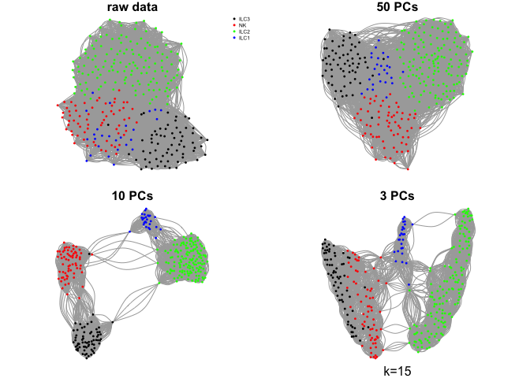
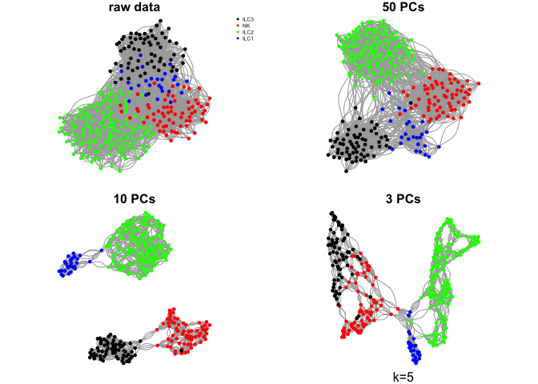
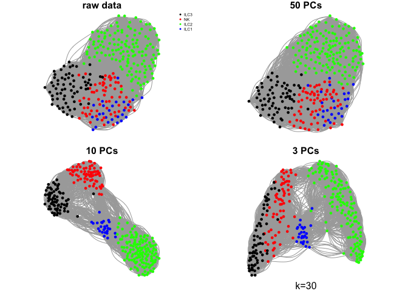
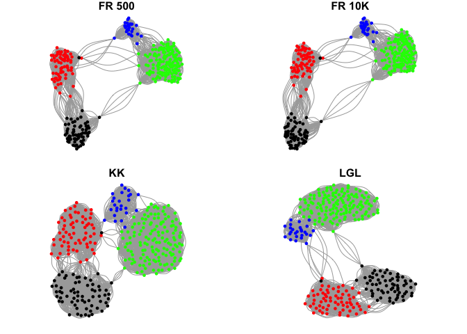

Create a single cell Graph
==========================

Author: Åsa Björklund

Here are some simple examples on how to create a KNN graph from single cell RNA-seq data using [igraph](http://igraph.org/r/).

We will create graphs with the ILC data that can be found in the course uppmax folder with subfolder:

`scrnaseq_course/data/ILC/`

``` r
suppressMessages(require(igraph))
```

### Data processing:

First read in the data and define colors/symbols for plotting. We will only take data from one donor "T86" to reduce the computational time and avoid batch effects.

``` r
# read in meta data table 
M <- read.table("data/ILC/Metadata_ILC.csv", sep=",",header=T)

# read rpkm values
R <- read.table("data/ILC/ensembl_rpkmvalues_ILC.csv",sep=",",header=T)


# select one donor
t86 <- which(M$Donor == "T86")
DATA <- R[,t86]

# remove all lowly expressed genes, require expression in 5 cells
DATA <- DATA[rowSums(DATA>1)>5,]

# color scale for Celltype
# have 11 different stages, define 11 colors for those.
coldef.celltype<-c("black","red","green","blue")
names(coldef.celltype) <- unique(M$Celltype[t86])
col.celltype <- coldef.celltype[M$Celltype[t86]]
```

### Define a function for extracting nearest neighbors

Based on an input matrix, we will calculate pairwise distances between cells. Based on those distances, k nearest neighbors are extracted. A matrix with all edges between neighbors is used to create a graph.

``` r
make.knn.graph<-function(D,k){
  # calculate euclidean distances between cells
  dist<-as.matrix(dist(D))
  # make a list of edges to k nearest neighbors for each cell
  edges <- mat.or.vec(0,2)
  for (i in 1:nrow(dist)){
    # find closes neighbours
    matches <- setdiff(order(dist[i,],decreasing = F)[1:(k+1)],i)
    # add edges in both directions
    edges <- rbind(edges,cbind(rep(i,k),matches))  
    edges <- rbind(edges,cbind(matches,rep(i,k)))  
  }
  # create a graph from the edgelist
  graph <- graph_from_edgelist(edges,directed=F)
  V(graph)$frame.color <- NA
  # make a layout for visualizing in 2D
  set.seed(1)
  g.layout<-layout_with_fr(graph)
  return(list(graph=graph,layout=g.layout))        
}
```

### Create a few different graphs.

The graph can be created from pairwise distances in the full space or in a reduced embedding into PCA space or any other dimensionality reduction space.

Here we will use the raw rpkms or, selection of principal components using k=15.

``` r
# first use all data and calculate euklidean distances
g.raw <- make.knn.graph(t(log2(DATA+1)),15)

# Then do the same in pca space 
PC<-prcomp(log2(t(DATA)+1))

# using the first 50 principal components
g.pca50 <- make.knn.graph(PC$x[,1:50],15)

# or the first 10
g.pca10 <- make.knn.graph(PC$x[,1:10],15)

# or the first 3
g.pca3 <- make.knn.graph(PC$x[,1:3],15)

# plot all 4:
par(mfrow=c(2,2),mar=c(1,1,1,1))
plot.igraph(g.raw$graph,layout=g.raw$layout,vertex.color=col.celltype,
            vertex.size=3,vertex.label=NA,main="raw data")
legend("topright",names(coldef.celltype),col=coldef.celltype,
       pch=16,cex=0.5,bty='n')
plot.igraph(g.pca50$graph,layout=g.pca50$layout,vertex.color=col.celltype,
            vertex.size=3,vertex.label=NA,main="50 PCs")
plot.igraph(g.pca10$graph,layout=g.pca10$layout,vertex.color=col.celltype,
            vertex.size=3,vertex.label=NA,main="10 PCs")
plot.igraph(g.pca3$graph,layout=g.pca3$layout,vertex.color=col.celltype,
            vertex.size=3,vertex.label=NA,main="3 PCs")
mtext("k=15",1)
```



What do you think about the different graphs? Why do you think we get these different results?

##### Do the same with a few different values for k

``` r
ks <- c(5,10,30,50)

for (k in ks){
  g.raw <- make.knn.graph(t(log2(DATA+1)),k)
  g.pca50 <- make.knn.graph(PC$x[,1:50],k)
  g.pca10 <- make.knn.graph(PC$x[,1:10],k)
  g.pca3 <- make.knn.graph(PC$x[,1:3],k)

  # plot all 4:
  par(mfrow=c(2,2),mar=c(1,1,1,1))
  plot.igraph(g.raw$graph,layout=g.raw$layout,vertex.color=col.celltype,
            vertex.size=5,vertex.label=NA,main="raw data")
  legend("topright",names(coldef.celltype),col=coldef.celltype,
       pch=16,cex=0.5,bty='n')
  plot.igraph(g.pca50$graph,layout=g.pca50$layout,vertex.color=col.celltype,
            vertex.size=5,vertex.label=NA,main="50 PCs")
  plot.igraph(g.pca10$graph,layout=g.pca10$layout,vertex.color=col.celltype,
            vertex.size=5,vertex.label=NA,main="10 PCs")
  plot.igraph(g.pca3$graph,layout=g.pca3$layout,vertex.color=col.celltype,
            vertex.size=5,vertex.label=NA,main="3 PCs")
  mtext(sprintf("k=%d",k),1)
}
```



#### Community detection

Lets select one of these networks and test different methods for detecting communities in the network.

Select the one with k=15 and 10 PCs.

``` r
g <- make.knn.graph(PC$x[,1:10],15)

# infomap
# Find community structure that minimizes the expected description
# length of a random walker trajectory
infomap <- cluster_infomap(g$graph)
table(infomap$membership)
```

    ## 
    ##   1   2   3   4   5   6   7   8   9  10  11  12  13  14  15  16  17  18 
    ##   3   4   2   2   2   3   2   2   3   3   2   2   2   2   2   2   2   2 
    ##  19  20  21  22  23  24  25  26  27  28  29  30  31  32  33  34  35  36 
    ##   2   2   2   3   2   2   2   3   3   2   2   2   2   2   2   2   3   2 
    ##  37  38  39  40  41  42  43  44  45  46  47  48  49  50  51  52  53  54 
    ##   2   2   2   2   3   2   2   2   2   2   2   3   2   2   2   2   2   2 
    ##  55  56  57  58  59  60  61  62  63  64  65  66  67  68  69  70  71  72 
    ##   2   2   2   2   2   2   2   2   2   2   2   2   2   2   2   2   2   2 
    ##  73  74  75  76  77  78  79  80  81  82  83  84  85  86  87  88  89  90 
    ##   2   2   2   2   2   2   2   2   2   2   2   2   2   2   2   2   2   2 
    ##  91  92  93  94  95  96  97  98  99 100 101 102 103 104 105 106 107 108 
    ##   2   2   2   2   2   2   2   2   2   2   2   2   2   2   2   2   2   2 
    ## 109 110 111 112 113 114 115 116 117 118 119 120 121 122 123 124 125 126 
    ##   2   2   2   2   2   2   2   2   2   2   2   2   2   2   2   2   2   2 
    ## 127 128 129 130 131 132 133 134 135 136 137 138 139 140 141 142 143 144 
    ##   2   2   2   2   2   2   2   2   2   2   2   2   2   2   2   2   2   2

``` r
# walktrap: 
# finds subgraphs via random walks
walktrap <- cluster_walktrap(g$graph)
table(walktrap$membership)
```

    ## 
    ##  1  2  3  4  5  6 
    ## 65 78 64 50 26 17

``` r
# louvain
# multi-level modularity optimization algorithm 
# for finding community structure
louvain <- cluster_louvain(g$graph)
table(louvain$membership)
```

    ## 
    ##  1  2  3  4  5  6 
    ## 56 26 67 65 47 39

``` r
# define a palette with more than the 8 standard colors
coldef<-c('black','forestgreen', 'red2', 'orange', 'cornflowerblue', 
                'magenta', 'darkolivegreen4',  'indianred1', 'tan4',
                'darkblue', 'mediumorchid1','firebrick4',  'yellowgreen',
                'lightsalmon', 'tan3', "tan1",'darkgray', 'wheat4', '#DDAD4B',
                'chartreuse', 'seagreen1', 'moccasin', 'mediumvioletred',
                'seagreen','cadetblue1', "darkolivegreen1" ,"tan2",
                "tomato3" , "#7CE3D8","gainsboro")


# plot onto igraph
par(mfrow=c(2,2),mar=c(1,1,1,1))
plot.igraph(g$graph,layout=g$layout,vertex.color=col.celltype,
            vertex.size=5,vertex.label=NA,main="Celltype")
plot.igraph(g$graph,layout=g$layout,vertex.color=coldef[walktrap$membership],
            vertex.size=5,vertex.label=NA,main="Walktrap")
plot.igraph(g$graph,layout=g$layout,vertex.color=rep(coldef,5)[infomap$membership],
            vertex.size=5,vertex.label=NA,main="Infomap")
plot.igraph(g$graph,layout=g$layout,vertex.color=coldef[louvain$membership],
            vertex.size=5,vertex.label=NA,main="Louvain")
```


There are many different methods for finding communities in the igraph package. For each of these methods, there are settings that you can change to aler how the graph is split. Please have a look at the manual if you want to find out more.

#### Layouts

The layout functions optimizes the visualization of the graph in 2D space. This can be done with multiple different algorthms. The layout will not influence the clustering in any way since it is only used to optimize how the network is drawn.

``` r
set.seed(1)

# the layout that is created in the function is fruchterman.reingold
layout.fr <- layout_with_fr(g$graph)

# this was run with default iterations 500
# it can sometimes improve the layout if it is run for more iterations.
# lets first increase the iterations to check if we get a better layout
layout.fr.10K <- layout_with_fr(g$graph, niter = 10000)

# another layout is Kamada Kawai.
layout.kk <- layout_with_kk(g$graph)

# and LGL (Large Graph Layout)
layout.lgl <- layout_with_lgl(g$graph)

# plot with different layouts
par(mfrow=c(2,2),mar=c(1,1,1,1))
plot.igraph(g$graph,layout=layout.fr,vertex.color=col.celltype,
            vertex.size=5,vertex.label=NA,main="FR 500")
plot.igraph(g$graph,layout=layout.fr.10K,vertex.color=col.celltype,
            vertex.size=5,vertex.label=NA,main="FR 10K")

plot.igraph(g$graph,layout=layout.kk,vertex.color=col.celltype,
            vertex.size=5,vertex.label=NA,main="KK")

plot.igraph(g$graph,layout=layout.lgl,vertex.color=col.celltype,
            vertex.size=5,vertex.label=NA,main="LGL")
```



As you can see, the different layouts give quite different results. Which layout you want to use is mainly a matter of opinion.

There are many more options in the igraph package, so please have a look at their manual if you want to test additional layouts.

##### Session info

``` r
sessionInfo()
```

    ## R version 3.4.1 (2017-06-30)
    ## Platform: x86_64-apple-darwin15.6.0 (64-bit)
    ## Running under: macOS Sierra 10.12.6
    ## 
    ## Matrix products: default
    ## BLAS: /Library/Frameworks/R.framework/Versions/3.4/Resources/lib/libRblas.0.dylib
    ## LAPACK: /Library/Frameworks/R.framework/Versions/3.4/Resources/lib/libRlapack.dylib
    ## 
    ## locale:
    ## [1] en_US.UTF-8/en_US.UTF-8/en_US.UTF-8/C/en_US.UTF-8/en_US.UTF-8
    ## 
    ## attached base packages:
    ## [1] stats     graphics  grDevices utils     datasets  methods   base     
    ## 
    ## other attached packages:
    ## [1] igraph_1.1.2
    ## 
    ## loaded via a namespace (and not attached):
    ##  [1] compiler_3.4.1  backports_1.1.2 magrittr_1.5    rprojroot_1.3-2
    ##  [5] tools_3.4.1     htmltools_0.3.6 yaml_2.1.16     Rcpp_0.12.15   
    ##  [9] stringi_1.1.6   rmarkdown_1.8   knitr_1.19      stringr_1.2.0  
    ## [13] digest_0.6.15   pkgconfig_2.0.1 evaluate_0.10.1
