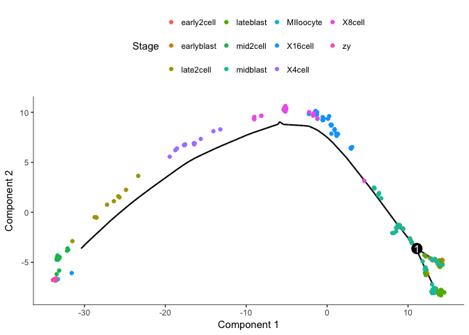
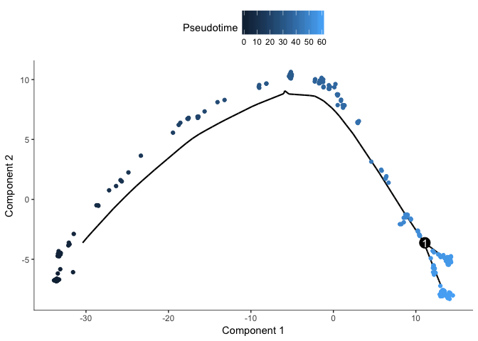
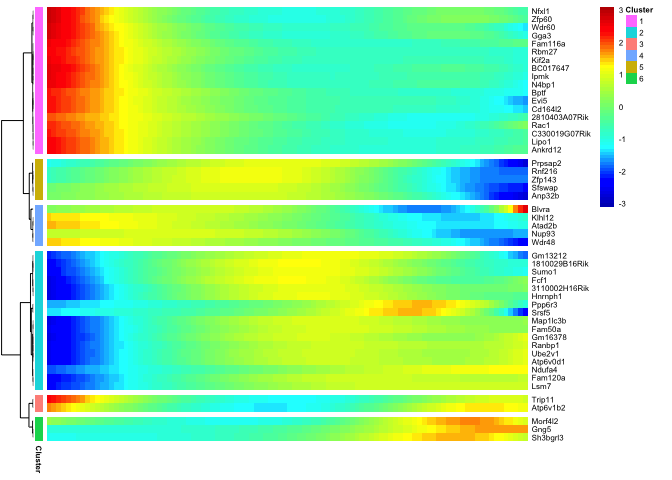
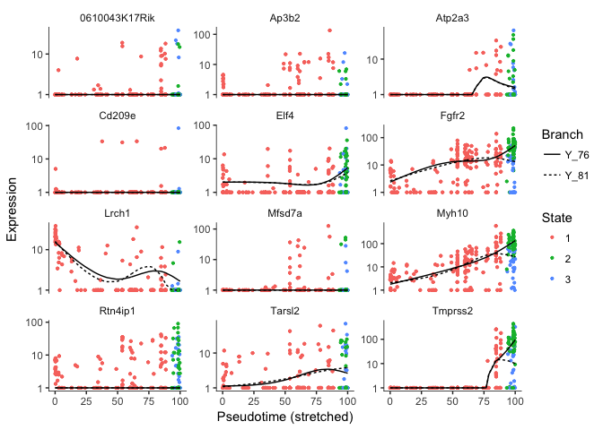
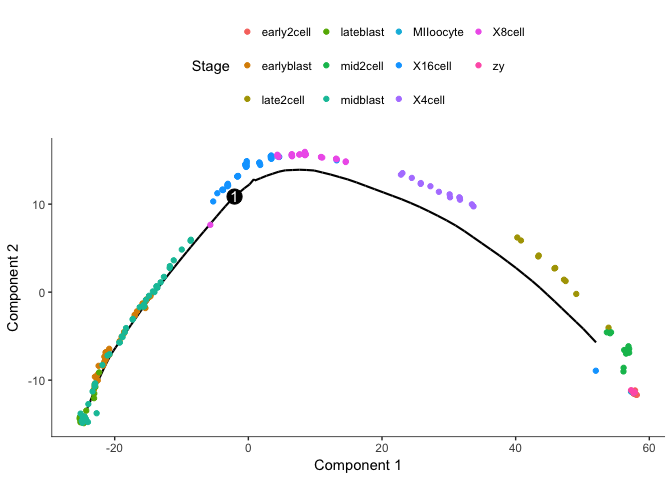
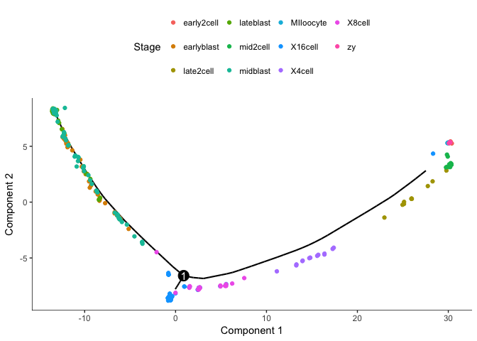

Monocle Pseudotime analysis
===========================
Author: Åsa Björklund


Pseudotime analysis with the Monocle2 package.

For this exercise you can run with your own data, but only if you believe that you have a developmental path in your data.

We suggest that you follow the tutorial from the vignette: <https://bioconductor.org/packages/release/bioc/vignettes/monocle/inst/doc/monocle-vignette.pdf>

Follow steps:

-   2.1 & 2.2 - create dataset and chose distribution
-   4 - pseudotime analysis, select one of the methods for defining ordering genes and run with that.

OBS! To run their tutorial you first need to load their data, for that you should use:

``` r
library(HSMMSingleCell)
data("HSMM_expr_matrix")
data("HSMM_gene_annotation")
data("HSMM_sample_sheet")
```

Below is an example from mouse embryonic development from Deng et al. 2014.

If you want to run this example, all data plus some intermediate files for steps that takes long time, is located in the course uppmax folder with subfolder:

`scrnaseq_course/data/mouse_embryo/`

### Loading data and creating a CellDataSet

According to their Vignette: The expression value matrix must have the same number of columns as the phenoData has rows, and it must have the same number of rows as the featureData data frame has rows. Row names of the phenoData object should match the column names of the expression matrix. Row names of the featureData object should match row names of the expression matrix. Also, one of the columns of the featureData must be named gene\_short\_name.

Now create a CellDataSet:

``` r
suppressMessages(library(monocle))
suppressMessages(library(stringr))
suppressMessages(library(plyr))
suppressMessages(library(netbiov))

# read in data
R<-read.table("data/mouse_embryo/rpkms_Deng2014_preinplantation.txt")
# read metadata with sample names as rownames
M<-read.table("data/mouse_embryo/Metadata_mouse_embryo.csv",header = T, sep=",",row.names=1)

# prepare pheno and feature data
num_cells <- apply(R,1,function(x) sum(x>1))

genes <- data.frame(gene_short_name = rownames(R),num_cells_expressed=num_cells)
rownames(genes)<-rownames(R)
pd <- new("AnnotatedDataFrame", data = M)
fd <- new("AnnotatedDataFrame", data = genes)

# Create monocle data set - in this case we use tobit distribution for the expression since we have rpkms and no spike-ins.
cds <- newCellDataSet(as.matrix(R),
                       phenoData = pd,
                       featureData = fd,
                       lowerDetectionLimit=1,
                       expressionFamily=tobit(Lower=1))  

# find the expressed genes
expressed_genes <- row.names(subset(fData(cds), num_cells_expressed >= 10))

# estimate size factors 
cds <- estimateSizeFactors(cds)
```

### Find ordering genes

In this case we look for genes that vary along the stages. Selection of ordering genes can be done in a variety of ways. E.g.:

-   Differential genes
-   High dispersion genes
-   Top PC loading genes
-   Unsupervised feature selection based on density peak clustering
-   Semi-supervised ordering with known marker genes

For more information on these methods, please have a look at the Monocle vignette.

``` r
savefile <- "data/mouse_embryo/monocle/monocle_de_genes.Rdata"
if (file.exists(savefile)){
  load(savefile)
}else{
  diff_test_res <- differentialGeneTest(cds[expressed_genes,],
                                      fullModelFormulaStr="~Stage")
  save(diff_test_res,file=savefile)
}
ordering_genes <- row.names (subset(diff_test_res, qval < 0.01))
length(ordering_genes)
```

    ## [1] 3607

``` r
#Now define the ordering genes
cds <- setOrderingFilter(cds, ordering_genes)
```

### Run dimensionality reduction and order cells

``` r
cds <- reduceDimension(cds, max_components=2)
#Now that the space is reduced, it???s time to order the cells using the orderCells function as shown below.
cds <- orderCells(cds)
#Once the cells are ordered, we can visualize the trajectory in the reduced dimensional space.
plot_cell_trajectory(cds, color_by="Stage")
```



Clearly groups the cells from oocyte/zygote to blastocyst with a split of the blastocyst cells.

But Monocle does not know which the root state is for the tree, we need to define the root.

``` r
# plot by "State" - Monocle???s term for the segment of the tree.
plot_cell_trajectory(cds, color_by="State")
```


``` r
# we clearly see that State1 should be the root
# so now we can reorder the cells  again
cds <- orderCells(cds, root_state=1)

# plot with coloring by pseudotime
plot_cell_trajectory(cds, color_by="Pseudotime")
```



Find genes that change along pseudotime
---------------------------------------

Now we run a new differential gene test which test for changes along pseudotime.

``` r
savefile <- "data/mouse_embryo/monocle/pseudotime_genes.Rdata"
if (file.exists(savefile)){
  load(savefile)
}else{
  diff_test_res2 <- differentialGeneTest(cds[expressed_genes,], fullModelFormulaStr="~sm.ns(Pseudotime)")
  save(diff_test_res2,file=savefile)
}

head(diff_test_res2[order(diff_test_res$qval),])
```

    ##         status family         pval         qval gene_short_name
    ## Pik3c2g   FAIL  tobit 1.000000e+00 1.000000e+00         Pik3c2g
    ## Tmod4     FAIL  tobit 1.000000e+00 1.000000e+00           Tmod4
    ## Rpl35       OK  tobit 9.360609e-40 1.707271e-38           Rpl35
    ## Kcne1     FAIL  tobit 1.000000e+00 1.000000e+00           Kcne1
    ## Psma7       OK  tobit 1.055420e-45 2.533779e-44           Psma7
    ## Eef1a1      OK  tobit 2.250197e-87 2.080957e-85          Eef1a1
    ##         num_cells_expressed use_for_ordering
    ## Pik3c2g                  32             TRUE
    ## Tmod4                    17             TRUE
    ## Rpl35                   261             TRUE
    ## Kcne1                    11             TRUE
    ## Psma7                   262             TRUE
    ## Eef1a1                  262             TRUE

Plot some top genes along pseudotime
------------------------------------

``` r
# take top 8 genes
plotgenes <- rownames(diff_test_res2[order(diff_test_res$qval)[1:8],])
plot_genes_in_pseudotime(cds[plotgenes,], color_by="Stage",ncol=2)
```


OBS! Fit curve is not working for some of the genes, not sure why that is.

Clustering genes by pseudotemporal expression pattern
-----------------------------------------------------

Now we use the genes that vary significantly along pseudotime and cluster them based on expression patterns.

``` r
sig_gene_names <- row.names(subset(diff_test_res, qval < 1e-5))
length(sig_gene_names)
```

    ## [1] 2923

``` r
# With a strict cutoff we still have quite many significant genes, hard to produce a heatmap with all of them.
# sample at random 50 genes and plot heatmap
sel.genes <- sample(sig_gene_names,50)
plot_pseudotime_heatmap(cds[sel.genes,],
                        num_clusters = 6,
                        cores = 1,
                        show_rownames = T)
```



Analysis of branches in trajectory
----------------------------------

Look at genes that separates in the two branches of blastocyst.

``` r
savefile <- "data/mouse_embryo/monocle/monocle_beam_res.Rdata"
if (file.exists(savefile)){
  load(savefile)
}else {
  BEAM_res <- BEAM(cds, branch_point=1, cores = 1)
  save(BEAM_res,file=savefile)
}


BEAM_res <- BEAM_res[order(BEAM_res$qval),]
BEAM_res <- BEAM_res[,c("gene_short_name", "pval", "qval")]
sig_gene_names <- row.names(subset(BEAM_res, qval < 1e-5))
length(sig_gene_names)
```

    ## [1] 864

``` r
# sample at random 50 signifiant genes and plot heatmap
sel.genes <- sample(sig_gene_names,50)


#plot_genes_branched_heatmap(cds[sel.genes,], branch_point = 1,
#                            num_clusters = 4,
#                            cores = 1,
#                            use_gene_short_name = T,
#                            show_rownames = T)

# we can plot some genes that separates along the branch points
plot_genes_branched_pseudotime(cds[sel.genes[1:12],],branch_point=1,ncol=3)
```

    ## <simpleError in checkwz(wz, M = M, trace = trace, wzepsilon = control$wzepsilon): NAs found in the working weights variable 'wz'>



Error in vstExprs(new\_cds, expr\_matrix = BranchA\_exprs) : Error: No dispersion model named 'blind'.

Unfortunately the function `plot_genes_branched_heatmap` does not work on this dataset since it requires that dispersions are fit. And dispersion fit requires that we convert the rpkms to absolute counts and uses binomial distribution.

Test with binomial distribution instead
=======================================

``` r
# Estimate RNA counts
rpc_matrix <- relative2abs(cds)
# Now, make a new CellDataSet using the RNA counts
cds2 <- newCellDataSet(as(as.matrix(rpc_matrix), "sparseMatrix"),
                       phenoData = pd,
                       featureData = fd,
                       lowerDetectionLimit=0.5,
                       expressionFamily=negbinomial.size())

# find the expressed genes
expressed_genes <- row.names(subset(fData(cds2), num_cells_expressed >= 10))

# estimate size factors 
cds2 <- estimateSizeFactors(cds2)
cds2 <- estimateDispersions(cds2)
```

    ## Removing 183 outliers

### Find ordering genes

``` r
savefile <- "data/mouse_embryo/monocle/monocle_de_genes2.Rdata"
if (file.exists(savefile)){
  load(savefile)
}else{
  diff_test_res <- differentialGeneTest(cds2[expressed_genes,],
                                      fullModelFormulaStr="~Stage")
  save(diff_test_res,file=savefile)
}
ordering_genes <- row.names (subset(diff_test_res, qval < 0.01))
length(ordering_genes)
```

    ## [1] 7474

``` r
#Now define the ordering genes
cds2 <- setOrderingFilter(cds2, ordering_genes)
```

### Run dimensionality reduction and order cells

``` r
cds2 <- reduceDimension(cds2, max_components=2)
cds2 <- orderCells(cds2)
plot_cell_trajectory(cds2, color_by="Stage")
```



We clearly get a very different trajectory with the negative binomial, no branching of the blastocyst stage.

### Test instead with using top dispersed genes for pseudotime ordering

``` r
disp_table <- dispersionTable(cds2)
ordering_genes <- subset(disp_table,
                         mean_expression >= 0.5 &
                         dispersion_empirical >= 1 * dispersion_fit)$gene_id

cds3 <- setOrderingFilter(cds2,ordering_genes)
cds3 <- reduceDimension(cds3, max_components=2)
cds3 <- orderCells(cds3)
plot_cell_trajectory(cds3, color_by="Stage")
```



We then get a brancing point in 8-16 cell stage.

For this particular dataset, it seems that selection of a gene set based on differential expression between the stages makes the most sense.

However, depending on the dataset you have, you may have to test different ways of selecting gene sets and find what works best for your data.

In general, I find that the trajectories may shift quite a bit depending on the gene set. In a best case scenario, the signal is robust and you get the same results regardless of gene set. Hence, it is always wise to critically view your results and check how robust the signal is.

##### Session info

``` r
sessionInfo()
```

    ## R version 3.4.1 (2017-06-30)
    ## Platform: x86_64-apple-darwin15.6.0 (64-bit)
    ## Running under: macOS Sierra 10.12.6
    ## 
    ## Matrix products: default
    ## BLAS: /Library/Frameworks/R.framework/Versions/3.4/Resources/lib/libRblas.0.dylib
    ## LAPACK: /Library/Frameworks/R.framework/Versions/3.4/Resources/lib/libRlapack.dylib
    ## 
    ## locale:
    ## [1] en_US.UTF-8/en_US.UTF-8/en_US.UTF-8/C/en_US.UTF-8/en_US.UTF-8
    ## 
    ## attached base packages:
    ##  [1] splines   stats4    parallel  stats     graphics  grDevices utils    
    ##  [8] datasets  methods   base     
    ## 
    ## other attached packages:
    ##  [1] netbiov_1.12.0      igraph_1.1.2        plyr_1.8.4         
    ##  [4] stringr_1.2.0       monocle_2.6.4       DDRTree_0.1.5      
    ##  [7] irlba_2.3.2         VGAM_1.0-4          ggplot2_2.2.1      
    ## [10] Biobase_2.38.0      BiocGenerics_0.24.0 Matrix_1.2-12      
    ## 
    ## loaded via a namespace (and not attached):
    ##  [1] slam_0.1-42            reshape2_1.4.3         lattice_0.20-35       
    ##  [4] colorspace_1.3-2       viridisLite_0.3.0      htmltools_0.3.6       
    ##  [7] fastICA_1.2-1          yaml_2.1.16            rlang_0.1.6           
    ## [10] pillar_1.1.0           glue_1.2.0             RColorBrewer_1.1-2    
    ## [13] HSMMSingleCell_0.112.0 bindrcpp_0.2           matrixStats_0.53.0    
    ## [16] bindr_0.1              munsell_0.4.3          combinat_0.0-8        
    ## [19] gtable_0.2.0           evaluate_0.10.1        labeling_0.3          
    ## [22] knitr_1.19             Rcpp_0.12.15           scales_0.5.0          
    ## [25] backports_1.1.2        limma_3.34.8           densityClust_0.3      
    ## [28] FNN_1.1                gridExtra_2.3          RANN_2.5.1            
    ## [31] digest_0.6.15          stringi_1.1.6          Rtsne_0.13            
    ## [34] qlcMatrix_0.9.5        dplyr_0.7.4            ggrepel_0.7.0         
    ## [37] grid_3.4.1             rprojroot_1.3-2        tools_3.4.1           
    ## [40] magrittr_1.5           proxy_0.4-21           lazyeval_0.2.1        
    ## [43] tibble_1.4.2           cluster_2.0.6          pkgconfig_2.0.1       
    ## [46] pheatmap_1.0.8         assertthat_0.2.0       rmarkdown_1.8         
    ## [49] viridis_0.5.0          R6_2.2.2               compiler_3.4.1
